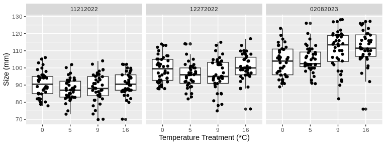
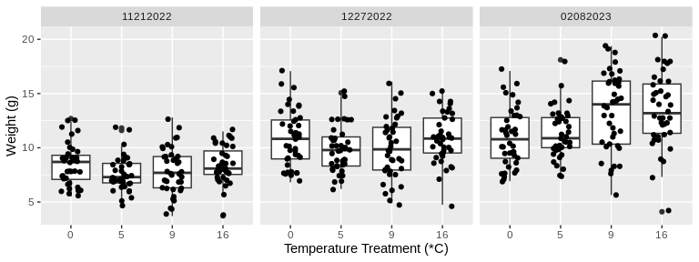
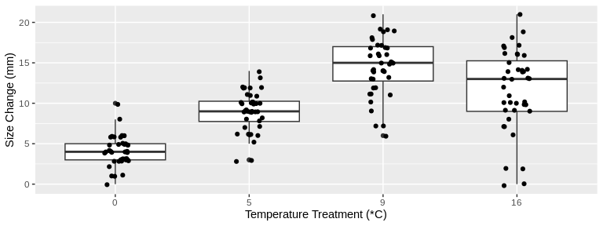
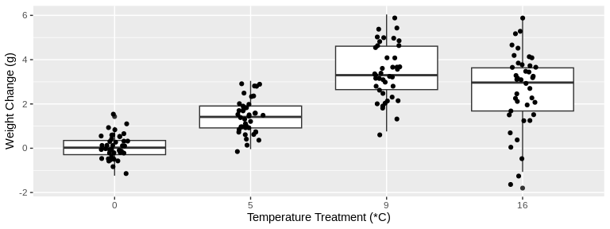
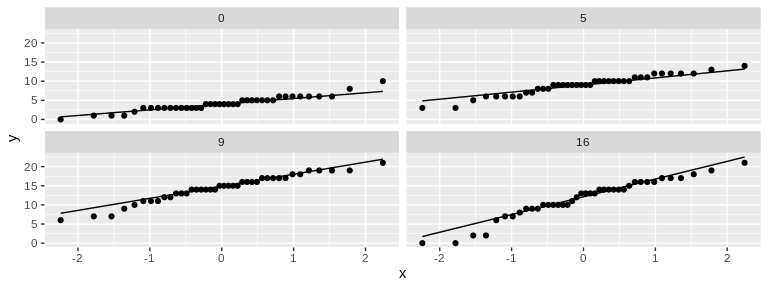
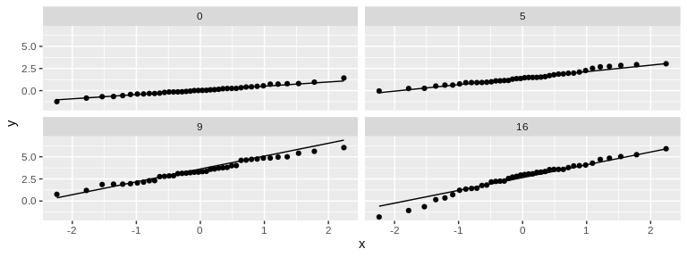
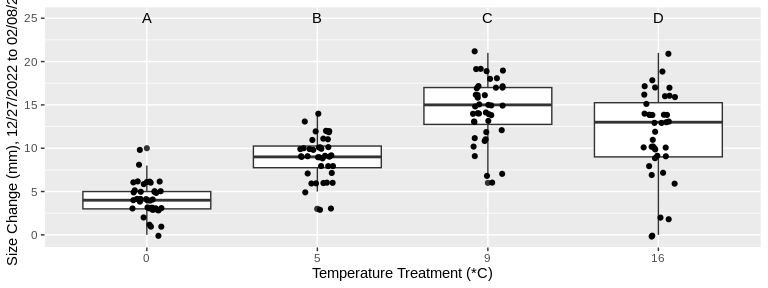
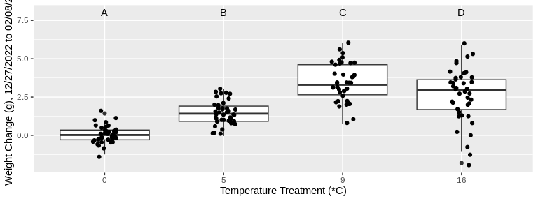

Temp/Size Analysis
================
Kathleen Durkin
2023-10-12

- <a href="#1-data-munging" id="toc-1-data-munging">1 Data Munging</a>
- <a href="#2-plots" id="toc-2-plots">2 Plots</a>
- <a href="#3-sizeweight-change" id="toc-3-sizeweight-change">3
  Size/Weight Change</a>
- <a href="#4-check-assumptions" id="toc-4-check-assumptions">4 Check
  Assumptions</a>
- <a href="#5-anova" id="toc-5-anova">5 ANOVA</a>
  - <a href="#51-size-change" id="toc-51-size-change">5.1 Size Change</a>
  - <a href="#52-weight-change" id="toc-52-weight-change">5.2 Weight
    Change</a>

I’m doing this analysis under the assumption that all three of the SL
columns (SL_11212022, SL_12272022, and SL_mm) are measuring some
consistent size/length value over three measurement dates. Similarly,
I’m assuming the the columns WWT_11212022, WWT_12272022, and
WholeBodyWW_g are measurements of body weight (maybe whole body wet
weight?) on the same three measurement dates. I believe the first
measurement date is from tagging (before acclimitization to lab
conditions), the second is date of transfer to temperature treatment
tanks, and the third is sampling post-treatment.

# 1 Data Munging

``` r
# read in the data
codTempData <- read.csv("../data/temp-experiment.csv")
head(codTempData)
```

    ##   Microchip.ID SL_11212022 WWT_11212022 Tank Temperature SL_12272022
    ## 1          620          93         8.53    1          16         101
    ## 2         1164          88         7.06    1          16          96
    ## 3         1476         102        10.70    1          16         108
    ## 4         9387          87         7.83    1          16          95
    ## 5         9407         100        11.51    1          16         117
    ## 6         9415          92         8.68    1          16         100
    ##   WWT_12272022 MortDate DissectionDate SL_mm WholeBodyWW_g TOTAL_Liver_WW_mg
    ## 1        11.12                  2/8/23   119         16.15            0.4945
    ## 2         8.64                  2/8/23   105         10.89            0.1997
    ## 3        12.25                  2/8/23   110         12.97            0.1715
    ## 4        10.16                  2/8/23   116         15.40            0.3625
    ## 5        14.98                  2/8/23   127         17.98            0.3482
    ## 6        10.96                  2/8/23   114         14.02            0.2343
    ##   LiverforLipids_WW_mg MuscleWWforLipids_mg GeneticSamplingCount
    ## 1               0.1546               0.3495                    8
    ## 2               0.1091               0.3328                    5
    ## 3               0.1107               0.3834                    4
    ## 4               0.1681               0.3262                    6
    ## 5               0.1210               0.3434                    2
    ## 6               0.1342               0.2776                    9
    ##   DissectionComments
    ## 1                   
    ## 2                   
    ## 3                   
    ## 4                   
    ## 5                   
    ## 6

``` r
# Create two new columns indicating change from Dec.2022 measurement to Feb.2022 measurement, for both size (mm) and weight (g). I'm excluding the Nov.2022 size/weight measurements, because Nov.2022-Dec.2022 was the acclimation period, not treatment. Also, modify the Temperature variable from a numeric to an ordered factor, since it's the treatment (will be necessary for ANOVA/TukeyHSD)
codTempData_plus <- transform(codTempData,
                              # create column for change in size
                              sizeChange_mm = SL_mm - SL_12272022,
                              # create column for change in weight
                              weightChange_g = WholeBodyWW_g - WWT_12272022) %>%
  # change type of Temperature variable to an ordered factor
  mutate(codTempData, Temperature = relevel(as.factor(Temperature), "0", "5", "9", "16"))
head(codTempData_plus)
```

    ##   Microchip.ID SL_11212022 WWT_11212022 Tank Temperature SL_12272022
    ## 1          620          93         8.53    1          16         101
    ## 2         1164          88         7.06    1          16          96
    ## 3         1476         102        10.70    1          16         108
    ## 4         9387          87         7.83    1          16          95
    ## 5         9407         100        11.51    1          16         117
    ## 6         9415          92         8.68    1          16         100
    ##   WWT_12272022 MortDate DissectionDate SL_mm WholeBodyWW_g TOTAL_Liver_WW_mg
    ## 1        11.12                  2/8/23   119         16.15            0.4945
    ## 2         8.64                  2/8/23   105         10.89            0.1997
    ## 3        12.25                  2/8/23   110         12.97            0.1715
    ## 4        10.16                  2/8/23   116         15.40            0.3625
    ## 5        14.98                  2/8/23   127         17.98            0.3482
    ## 6        10.96                  2/8/23   114         14.02            0.2343
    ##   LiverforLipids_WW_mg MuscleWWforLipids_mg GeneticSamplingCount
    ## 1               0.1546               0.3495                    8
    ## 2               0.1091               0.3328                    5
    ## 3               0.1107               0.3834                    4
    ## 4               0.1681               0.3262                    6
    ## 5               0.1210               0.3434                    2
    ## 6               0.1342               0.2776                    9
    ##   DissectionComments sizeChange_mm weightChange_g
    ## 1                               18           5.03
    ## 2                                9           2.25
    ## 3                                2           0.72
    ## 4                               21           5.24
    ## 5                               10           3.00
    ## 6                               14           3.06

``` r
# Reformatted data with single column for size values and single column for measurement values (and additional column indicating measurement date), enabling grouping by size/weight measurement date
#
# Sample of how data is being reformatted:
# Original data
# fishID | size_date1 | size_date2 | weight_date1 | weight_date2
#----------------------------------------------------------------
#  001   |     s11    |     s12    |      w11     |      w12
#  002   |     s21    |     s22    |      w21     |      w22
#
# Reformatted data
# fishID |  date  | size | weight
#---------------------------------
#  001   |  date1 |  s11 |  w11
#  001   |  date2 |  s12 |  w12
#  002   |  date1 |  s21 |  w21
#  002   |  date2 |  s22 |  w22
 
# Note I renamed the final size and weight measurements to include the date 02/08/2023 -- this is just so that the measurement date column can have a consistent option despite final measurements happening between the days of 02/08/2023 and 02/10/2023.

codTempData_reformat <- codTempData_plus %>%
  # Rename final size/weight variables to include date
  rename(WWT_02082023=WholeBodyWW_g) %>%
  rename(SL_02082023=SL_mm) %>%
  # Reformat data
  pivot_longer(
    cols = c("SL_11212022", "SL_12272022", "SL_02082023", "WWT_11212022", "WWT_12272022", "WWT_02082023"),
    names_to = "var",
    values_to = "value"
  ) %>%
  separate(var, into = c("var", "date"), sep = "_") %>%
  pivot_wider(
    names_from = "var",
    values_from = "value"
  )
# Set the date variable to have desired (chronological) order
codTempData_reformat$date <- factor(codTempData_reformat$date, levels = c("11212022", "12272022", "02082023"))
```

# 2 Plots

``` r
# Plot size measurements for all temperature treatments across the time of the study
codTempData_reformat %>%
  ggplot(aes(x=Temperature,
             y=SL,
             group=Temperature)) +
  geom_boxplot() +
  geom_jitter(width = 0.2,
              height = 0.2,
              size = 1.5) +
  xlab("Temperature Treatment (*C)") +
  ylab("Size (mm)") +
  facet_wrap(~date)
```



``` r
ggsave(
    "01_sizeVtreatment-all-dates.png",
    plot = last_plot(),
    path = "../output/01_temp-size-analysis"
  )

# Plot weight measurements for all temperature treatments across the time of the study
codTempData_reformat %>%
  ggplot(aes(x=Temperature,
             y=WWT,
             group=Temperature)) +
  geom_boxplot() +
  geom_jitter(width = 0.2,
              height = 0.2,
              size = 1.5) +
  xlab("Temperature Treatment (*C)") +
  ylab("Weight (g)") +
  facet_wrap(~date)
```



``` r
ggsave(
    "02_weightVtreatment-all-dates.png",
    plot = last_plot(),
    path = "../output/01_temp-size-analysis"
  )
```

# 3 Size/Weight Change

``` r
# Plot *change* in size from beginning to end of study for all temperature treatments
codTempData_plus %>%
  ggplot(aes(x=Temperature,
             y=sizeChange_mm,
             group=Temperature)) +
  geom_boxplot() +
  geom_jitter(width = 0.1,
              height = 0.2,
              size = 1.5) +
  xlab("Temperature Treatment (*C)") +
  ylab("Size Change (mm)")
```



``` r
# Plot *change* in weight from beginning to end of study for all temperature treatments
codTempData_plus %>%
  ggplot(aes(x=Temperature,
             y=weightChange_g,
             group=Temperature)) +
  geom_boxplot() +
  geom_jitter(width = 0.1,
              height = 0.2,
              size = 1.5) +
  xlab("Temperature Treatment (*C)") +
  ylab("Weight Change (g)")
```


Looking at these plots visually, there seems to be a difference in
change in both size and weight over time among the treatment
temperatures. Let’s test this statistically.

# 4 Check Assumptions

``` r
# Check conditions for ANOVA

# Normality
  # Not perfect, but normalish enough that I feel comfortable using ANOVA
codTempData_plus %>%
  ggplot(aes(sample = sizeChange_mm)) +
  stat_qq() +
  stat_qq_line() +
  facet_wrap(~Temperature)
```



``` r
codTempData_plus %>%
  ggplot(aes(sample = weightChange_g)) +
  stat_qq() +
  stat_qq_line() +
  facet_wrap(~Temperature)
```



``` r
# Variance
  # For both sizeChange and weightChange, the largest SD is, at most, ~2x the smallest SD. This is sufficiently similar to allow usage of ANOVA (which is fairly robust against heterogeneity of variance). May want to also test using randomization to be safe.
codTempData_plus %>%
  group_by(Temperature) %>%
  summarize(meanSizeChange = mean(sizeChange_mm),
            sdSizeChange = sd(sizeChange_mm),
            meanWeightChange = mean(weightChange_g),
            sdWeightChange = sd(weightChange_g))
```

    ## # A tibble: 4 × 5
    ##   Temperature meanSizeChange sdSizeChange meanWeightChange sdWeightChange
    ##   <fct>                <dbl>        <dbl>            <dbl>          <dbl>
    ## 1 0                     4.12         1.92           0.0518          0.526
    ## 2 5                     9            2.53           1.46            0.770
    ## 3 9                    14.4          3.51           3.44            1.25 
    ## 4 16                   11.6          5.01           2.64            1.72

``` r
# Assuming data are independent (part of experimental design)
```

# 5 ANOVA

## 5.1 Size Change

``` r
# ANOVA
sizeANOVA <- aov(sizeChange_mm~Temperature, data=codTempData_plus)

tidySizeANOVA <- tidy(sizeANOVA)
tidySizeANOVA
```

    ## # A tibble: 2 × 6
    ##   term           df sumsq meansq statistic   p.value
    ##   <chr>       <dbl> <dbl>  <dbl>     <dbl>     <dbl>
    ## 1 Temperature     3 2297.  766.       64.4  3.81e-27
    ## 2 Residuals     156 1855.   11.9      NA   NA

``` r
# Calculate R^2 (how much of the variation in the data is explained by the treatment)
r_squared <- tidySizeANOVA$sumsq[1]/(tidySizeANOVA$sumsq[1]+tidySizeANOVA$sumsq[2])
r_squared
```

    ## [1] 0.5532301

p = 1.79e-18 \<\< 0.05, so there is a significant relationship between
treatment (temperature) and size growth (change in size). R^2=0.422,
indicating \~42% of variance in size change is explained by the
temperature treatment.

``` r
# Tukey HSD
sizeTukeyHSD <- sizeANOVA %>%
  TukeyHSD() %>%
  tidy() %>% 
  select(contrast, estimate, adj.p.value) %>% 
  arrange(adj.p.value)

sizeTukeyHSD
```

    ## # A tibble: 6 × 3
    ##   contrast estimate adj.p.value
    ##   <chr>       <dbl>       <dbl>
    ## 1 9-0         10.3     1.44e-15
    ## 2 16-0         7.52    3.99e-14
    ## 3 9-5          5.4     4.21e-10
    ## 4 5-0          4.87    1.55e- 8
    ## 5 16-9        -2.75    2.68e- 3
    ## 6 16-5         2.65    4.16e- 3

``` r
kable(sizeTukeyHSD,
      caption = "Tukey HSD for change in size across treatments")
```

| contrast | estimate | adj.p.value |
|:---------|---------:|------------:|
| 9-0      |   10.275 |   0.0000000 |
| 16-0     |    7.525 |   0.0000000 |
| 9-5      |    5.400 |   0.0000000 |
| 5-0      |    4.875 |   0.0000000 |
| 16-9     |   -2.750 |   0.0026842 |
| 16-5     |    2.650 |   0.0041642 |

Tukey HSD for change in size across treatments

``` r
codTempData_plus %>%
  ggplot(aes(x=Temperature,
             y=sizeChange_mm,
             group=Temperature)) +
  geom_boxplot() +
  geom_jitter(width = 0.1, 
              height = 0.2, 
              size = 1.5) +
  annotate(geom = "text", x = 1:4, y = 25, label = c("A","B","C","D")) +
  xlab("Temperature Treatment (*C)") +
  ylab("Size Change (mm), 12/27/2022 to 02/08/23")
```



``` r
  ggsave(
    "03_size-change-TukeyHSD-plot.png",
    plot = last_plot(),
    path = "../output/01_temp-size-analysis"
  )
```

## 5.2 Weight Change

``` r
# ANOVA
weightANOVA <- aov(weightChange_g~Temperature, data=codTempData_plus)

tidyWeightANOVA <- tidy(weightANOVA)
tidyWeightANOVA
```

    ## # A tibble: 2 × 6
    ##   term           df sumsq meansq statistic   p.value
    ##   <chr>       <dbl> <dbl>  <dbl>     <dbl>     <dbl>
    ## 1 Temperature     3  261.  86.9       64.5  3.65e-27
    ## 2 Residuals     156  210.   1.35      NA   NA

``` r
# Calculate R^2 (how much of the variation in the data is explained by the treatment)
r_squared <- tidyWeightANOVA$sumsq[1]/(tidyWeightANOVA$sumsq[1]+tidyWeightANOVA$sumsq[2])
r_squared
```

    ## [1] 0.5534805

p = 3.73e-15 \<\< 0.05, so there is a significant relationship between
treatment (temperature) and weight change. R^2=0.362, indicating \~36%
of variance in weight change is explained by the temperature treatment.

``` r
# Tukey HSD
weightTukeyHSD <- weightANOVA %>%
  TukeyHSD() %>%
  tidy() %>% 
  select(contrast, estimate, adj.p.value) %>% 
  arrange(adj.p.value)

weightTukeyHSD
```

    ## # A tibble: 6 × 3
    ##   contrast estimate adj.p.value
    ##   <chr>       <dbl>       <dbl>
    ## 1 9-0         3.38     1.55e-15
    ## 2 16-0        2.59     3.77e-14
    ## 3 9-5         1.97     1.57e-11
    ## 4 5-0         1.41     1.23e- 6
    ## 5 16-5        1.18     6.43e- 5
    ## 6 16-9       -0.793    1.40e- 2

``` r
kable(weightTukeyHSD,
      caption = "Tukey HSD for change in weight across treatments")
```

| contrast | estimate | adj.p.value |
|:---------|---------:|------------:|
| 9-0      |  3.38325 |   0.0000000 |
| 16-0     |  2.59075 |   0.0000000 |
| 9-5      |  1.97225 |   0.0000000 |
| 5-0      |  1.41100 |   0.0000012 |
| 16-5     |  1.17975 |   0.0000643 |
| 16-9     | -0.79250 |   0.0140387 |

Tukey HSD for change in weight across treatments

``` r
codTempData_plus %>%
  ggplot(aes(x=Temperature,
             y=weightChange_g,
             group=Temperature)) +
  geom_boxplot() +
  geom_jitter(width = 0.1, 
              height = 0.2, 
              size = 1.5) +
  annotate(geom = "text", x = 1:4, y = 8, label = c("A","B","C","D")) +
  xlab("Temperature Treatment (*C)") +
  ylab("Weight Change (g), 12/27/2022 to 02/08/23")
```



``` r
ggsave(
    "04_weight-change-TukeyHSD-plot.png",
    plot = last_plot(),
    path = "../output/01_temp-size-analysis"
  )
```

For both size and weight, growth from 12/27/2022 to 02/08/23
significantly differed among all temperature treatments, with the
exception of the 9 degree and 16 degree treatments. For the 9 and 16
degree treatments, changes in size and weight were statistically
similar. In other words, growth increased with the treatment temperature
until the 16 degree treatment, for which growth was not significantly
different from the 9 degree treatment in either size or weight.
