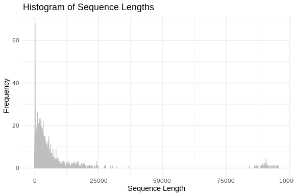
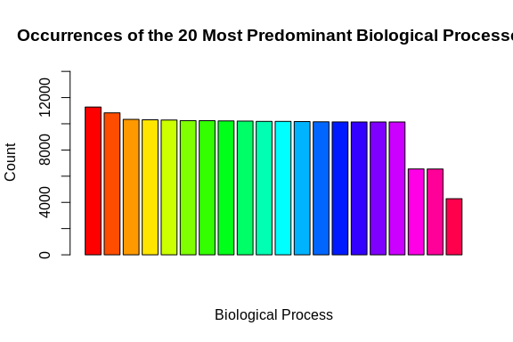

Oh What a Blast!
================
Steven Roberts
17 April, 2024

- <a href="#1-getting-the-query-fasta-file"
  id="toc-1-getting-the-query-fasta-file">1 Getting the query fasta
  file</a>
- <a href="#2-database-creation" id="toc-2-database-creation">2 Database
  Creation</a>
  - <a href="#21-obtain-fasta-uniprotswiss-prot"
    id="toc-21-obtain-fasta-uniprotswiss-prot">2.1 Obtain Fasta
    (UniProt/Swiss-Prot)</a>
  - <a href="#22-making-the-database" id="toc-22-making-the-database">2.2
    Making the database</a>
- <a href="#3-running-blastx" id="toc-3-running-blastx">3 Running
  Blastx</a>
- <a href="#4-joining-blast-table-with-annoations"
  id="toc-4-joining-blast-table-with-annoations">4 Joining Blast table
  with annoations.</a>
  - <a href="#41-prepping-blast-table-for-easy-join"
    id="toc-41-prepping-blast-table-for-easy-join">4.1 Prepping Blast table
    for easy join</a>
  - <a href="#42-could-do-some-cool-stuff-in-r-here-reading-in-table"
    id="toc-42-could-do-some-cool-stuff-in-r-here-reading-in-table">4.2
    Could do some cool stuff in R here reading in table</a>

# 1 Getting the query fasta file

``` bash
curl https://gannet.fish.washington.edu/seashell/snaps/Gadus_macrocephalus.coding.gene.V1.cds \
-k \
> ../data/Gadus_macrocephalus.coding.gene.V1.cds
```

Exploring what fasta file

``` bash
head -3 ../data/Gadus_macrocephalus.coding.gene.V1.cds
```

    ## >Gma_1G0000010.1 locus=chr1:81612:97483:+    len:2343
    ## ATGCCTGTGAACGCGCGGGACCGGACAGTGCTGGGGCGTTTCCCCGGGGTCACGCTGGAA
    ## CCGGTGGAGGAGGAGGTGGAGGAGGAGGAGGAGGTGGAAGAGGACCAGGTGGAGCGAGGC

``` bash
echo "How many sequences are there?"
grep -c ">" ../data/Gadus_macrocephalus.coding.gene.V1.cds
```

    ## How many sequences are there?
    ## 23843

``` r
# Read FASTA file
fasta_file <- "../data/Gadus_macrocephalus.coding.gene.V1.cds"  # Replace with the name of your FASTA file
sequences <- readDNAStringSet(fasta_file)

# Calculate sequence lengths
sequence_lengths <- width(sequences)

# Create a data frame
sequence_lengths_df <- data.frame(Length = sequence_lengths)

# Plot histogram using ggplot2
ggplot(sequence_lengths_df, aes(x = Length)) +
  geom_histogram(binwidth = 1, color = "grey", fill = "blue", alpha = 0.75) +
  labs(title = "Histogram of Sequence Lengths",
       x = "Sequence Length",
       y = "Frequency") +
  theme_minimal()
```



``` r
# Read FASTA file
fasta_file <- "../data/Gadus_macrocephalus.coding.gene.V1.cds"
sequences <- readDNAStringSet(fasta_file)

# Calculate base composition
base_composition <- alphabetFrequency(sequences, baseOnly = TRUE)

# Convert to data frame and reshape for ggplot2
base_composition_df <- as.data.frame(base_composition)
base_composition_df$ID <- rownames(base_composition_df)
base_composition_melted <- reshape2::melt(base_composition_df, id.vars = "ID", variable.name = "Base", value.name = "Count")

# Plot base composition bar chart using ggplot2
ggplot(base_composition_melted, aes(x = Base, y = Count, fill = Base)) +
  geom_bar(stat = "identity", position = "dodge", color = "black") +
  labs(title = "Base Composition",
       x = "Base",
       y = "Count") +
  theme_minimal() +
  scale_fill_manual(values = c("A" = "green", "C" = "blue", "G" = "yellow", "T" = "red"))
```


``` r
# Read FASTA file
fasta_file <- "../data/Gadus_macrocephalus.coding.gene.V1.cds"
sequences <- readDNAStringSet(fasta_file)

# Count CG motifs in each sequence
count_cg_motifs <- function(sequence) {
  cg_motif <- "CG"
  return(length(gregexpr(cg_motif, sequence, fixed = TRUE)[[1]]))
}

cg_motifs_counts <- sapply(sequences, count_cg_motifs)

# Create a data frame
cg_motifs_counts_df <- data.frame(CG_Count = cg_motifs_counts)

# Plot CG motifs distribution using ggplot2
ggplot(cg_motifs_counts_df, aes(x = CG_Count)) +
  geom_histogram(binwidth = 1, color = "black", fill = "blue", alpha = 0.75) +
  labs(title = "Distribution of CG Motifs",
       x = "Number of CG Motifs",
       y = "Frequency") +
  theme_minimal()
```


# 2 Database Creation

## 2.1 Obtain Fasta (UniProt/Swiss-Prot)

This is from here picur reviewe sequences I named based on the identify
of the database given

``` bash
cd ../data
curl -O https://ftp.uniprot.org/pub/databases/uniprot/current_release/knowledgebase/complete/uniprot_sprot.fasta.gz
mv uniprot_sprot.fasta.gz uniprot_sprot_r2023_04.fasta.gz
gunzip -k uniprot_sprot_r2023_04.fasta.gz
```

## 2.2 Making the database

``` bash
mkdir ../blastdb
/home/shared/ncbi-blast-2.11.0+/bin/makeblastdb \
-in ../data/uniprot_sprot_r2023_04.fasta \
-dbtype prot \
-out ../blastdb/uniprot_sprot_r2023_04
```

# 3 Running Blastx

``` bash
/home/shared/ncbi-blast-2.11.0+/bin/blastx \
-query ../data/Gadus_macrocephalus.coding.gene.V1.cds \
-db ../blastdb/uniprot_sprot_r2023_04 \
-out ../output/03-transcriptome-annotation/Gm.cds-uniprot_blastx.tab \
-evalue 1E-20 \
-num_threads 20 \
-max_target_seqs 1 \
-outfmt 6
```

``` bash
head -2 ../output/03-transcriptome-annotation/Gm.cds-uniprot_blastx.tab
```

    ## Gma_1G0000010.1  sp|P22735|TGM1_HUMAN    50.659  683 318 7   328 2334    109 786 0.0 688
    ## Gma_1G0000020.1  sp|Q9JI35|HRH3_CAVPO    54.684  395 160 4   136 1266    50  443 1.98e-140   411

``` bash
echo "Number of lines in output"
wc -l ../output/03-transcriptome-annotation/Gm.cds-uniprot_blastx.tab
```

    ## Number of lines in output
    ## 11575 ../output/03-transcriptome-annotation/Gm.cds-uniprot_blastx.tab

# 4 Joining Blast table with annoations.

## 4.1 Prepping Blast table for easy join

``` bash
tr '|' '\t' < ../output/03-transcriptome-annotation/Gm.cds-uniprot_blastx.tab \
> ../output/03-transcriptome-annotation/Gm.cds-uniprot_blastx_sep.tab

head -1 ../output/03-transcriptome-annotation/Gm.cds-uniprot_blastx_sep.tab
```

    ## Gma_1G0000010.1  sp  P22735  TGM1_HUMAN  50.659  683 318 7   328 2334    109 786 0.0 688

## 4.2 Could do some cool stuff in R here reading in table

``` r
bltabl <- read.csv("../output/03-transcriptome-annotation/Gm.cds-uniprot_blastx_sep.tab", sep = '\t', header = FALSE)

spgo <- read.csv("https://gannet.fish.washington.edu/seashell/snaps/uniprot_table_r2023_01.tab", sep = '\t', header = TRUE)
```

``` r
datatable(head(bltabl), options = list(scrollX = TRUE, scrollY = "400px", scrollCollapse = TRUE, paging = FALSE))
```

<div class="datatables html-widget html-fill-item" id="htmlwidget-789ac957d4247e05615e" style="width:100%;height:auto;"></div>
<script type="application/json" data-for="htmlwidget-789ac957d4247e05615e">{"x":{"filter":"none","vertical":false,"data":[["1","2","3","4","5","6"],["Gma_1G0000010.1","Gma_1G0000020.1","Gma_1G0000030.1","Gma_1G0000040.1","Gma_1G0000070.1","Gma_1G0000090.1"],["sp","sp","sp","sp","sp","sp"],["P22735","Q9JI35","A9UMG5","Q9BXW6","Q6AXK4","P43136"],["TGM1_HUMAN","HRH3_CAVPO","IMPTB_XENTR","OSBL1_HUMAN","BABA1_DANRE","NR2F6_MOUSE"],[50.659,54.684,66.556,63.028,71.011,70.07299999999999],[683,395,302,971,376,411],[318,160,94,333,92,101],[7,4,3,8,4,3],[328,136,22,7,1,31],[2334,1266,924,2907,1122,1260],[109,50,6,2,1,1],[786,443,301,950,361,390],[0,1.98e-140,3.47e-132,0,1.51e-174,4.15e-160],[688,411,382,1193,493,459]],"container":"<table class=\"display\">\n  <thead>\n    <tr>\n      <th> <\/th>\n      <th>V1<\/th>\n      <th>V2<\/th>\n      <th>V3<\/th>\n      <th>V4<\/th>\n      <th>V5<\/th>\n      <th>V6<\/th>\n      <th>V7<\/th>\n      <th>V8<\/th>\n      <th>V9<\/th>\n      <th>V10<\/th>\n      <th>V11<\/th>\n      <th>V12<\/th>\n      <th>V13<\/th>\n      <th>V14<\/th>\n    <\/tr>\n  <\/thead>\n<\/table>","options":{"scrollX":true,"scrollY":"400px","scrollCollapse":true,"paging":false,"columnDefs":[{"className":"dt-right","targets":[5,6,7,8,9,10,11,12,13,14]},{"orderable":false,"targets":0},{"name":" ","targets":0},{"name":"V1","targets":1},{"name":"V2","targets":2},{"name":"V3","targets":3},{"name":"V4","targets":4},{"name":"V5","targets":5},{"name":"V6","targets":6},{"name":"V7","targets":7},{"name":"V8","targets":8},{"name":"V9","targets":9},{"name":"V10","targets":10},{"name":"V11","targets":11},{"name":"V12","targets":12},{"name":"V13","targets":13},{"name":"V14","targets":14}],"order":[],"autoWidth":false,"orderClasses":false}},"evals":[],"jsHooks":[]}</script>

``` r
datatable(head(spgo), options = list(scrollX = TRUE, scrollY = "400px", scrollCollapse = TRUE, paging = FALSE))
```

<div class="datatables html-widget html-fill-item" id="htmlwidget-b69fe2c2333b55aa7069" style="width:100%;height:auto;"></div>
<script type="application/json" data-for="htmlwidget-b69fe2c2333b55aa7069">{"x":{"filter":"none","vertical":false,"data":[["1","2","3","4","5","6"],["A0A023I7E1","A0A024B7W1","A0A024SC78","A0A024SH76","A0A026W182","A0A044RE18"],["reviewed","reviewed","reviewed","reviewed","reviewed","reviewed"],["ENG1_RHIMI","POLG_ZIKVF","CUTI1_HYPJR","GUX2_HYPJR","ORCO_OOCBI","BLI_ONCVO"],["Glucan endo-1,3-beta-D-glucosidase 1 (Endo-1,3-beta-glucanase 1) (EC 3.2.1.39) (Laminarinase) (RmLam81A)","Genome polyprotein [Cleaved into: Capsid protein C (Capsid protein) (Core protein); Protein prM (Precursor membrane protein); Peptide pr (Peptide precursor); Small envelope protein M (Matrix protein); Envelope protein E; Non-structural protein 1 (NS1); Non-structural protein 2A (NS2A); Serine protease subunit NS2B (Flavivirin protease NS2B regulatory subunit) (Non-structural protein 2B); Serine protease NS3 (EC 3.4.21.91) (EC 3.6.1.15) (EC 3.6.4.13) (Flavivirin protease NS3 catalytic subunit) (Non-structural protein 3); Non-structural protein 4A (NS4A); Peptide 2k; Non-structural protein 4B (NS4B); RNA-directed RNA polymerase NS5 (EC 2.1.1.56) (EC 2.1.1.57) (EC 2.7.7.48) (NS5)]","Cutinase (EC 3.1.1.74)","Exoglucanase 2 (EC 3.2.1.91) (1,4-beta-cellobiohydrolase) (Cellobiohydrolase 6A) (Cel6A) (Exocellobiohydrolase II) (CBHII) (Exoglucanase II)","Odorant receptor coreceptor","Endoprotease bli (EC 3.4.21.75) (Blisterase)"],["ENG1 LAM81A","","M419DRAFT_76732","cbh2 M419DRAFT_122470","Orco X777_12371","Bli"],["Rhizomucor miehei","Zika virus (isolate ZIKV/Human/French Polynesia/10087PF/2013) (ZIKV)","Hypocrea jecorina (strain ATCC 56765 / BCRC 32924 / NRRL 11460 / Rut C-30) (Trichoderma reesei)","Hypocrea jecorina (strain ATCC 56765 / BCRC 32924 / NRRL 11460 / Rut C-30) (Trichoderma reesei)","Ooceraea biroi (Clonal raider ant) (Cerapachys biroi)","Onchocerca volvulus"],[796,3423,248,471,478,693],["glucan endo-1,3-beta-D-glucosidase activity [GO:0042973]; glucan endo-1,3-beta-glucanase activity, C-3 substituted reducing group [GO:0052861]; glucan endo-1,4-beta-glucanase activity, C-3 substituted reducing group [GO:0052862]","4 iron, 4 sulfur cluster binding [GO:0051539]; ATP binding [GO:0005524]; ATP hydrolysis activity [GO:0016887]; double-stranded RNA binding [GO:0003725]; exogenous protein binding [GO:0140272]; GTP binding [GO:0005525]; metal ion binding [GO:0046872]; mRNA (guanine-N7-)-methyltransferase activity [GO:0004482]; mRNA (nucleoside-2'-O-)-methyltransferase activity [GO:0004483]; protein dimerization activity [GO:0046983]; RNA helicase activity [GO:0003724]; RNA-dependent RNA polymerase activity [GO:0003968]; serine-type endopeptidase activity [GO:0004252]; structural molecule activity [GO:0005198]","cutinase activity [GO:0050525]","cellulose 1,4-beta-cellobiosidase activity [GO:0016162]; cellulose binding [GO:0030248]","odorant binding [GO:0005549]; olfactory receptor activity [GO:0004984]","metal ion binding [GO:0046872]; serine-type endopeptidase activity [GO:0004252]"],["extracellular region [GO:0005576]; glucan endo-1,3-beta-D-glucosidase activity [GO:0042973]; glucan endo-1,3-beta-glucanase activity, C-3 substituted reducing group [GO:0052861]; glucan endo-1,4-beta-glucanase activity, C-3 substituted reducing group [GO:0052862]; cell wall organization [GO:0071555]; polysaccharide catabolic process [GO:0000272]","extracellular region [GO:0005576]; host cell endoplasmic reticulum membrane [GO:0044167]; host cell nucleus [GO:0042025]; host cell perinuclear region of cytoplasm [GO:0044220]; membrane [GO:0016020]; viral capsid [GO:0019028]; viral envelope [GO:0019031]; virion membrane [GO:0055036]; 4 iron, 4 sulfur cluster binding [GO:0051539]; ATP binding [GO:0005524]; ATP hydrolysis activity [GO:0016887]; double-stranded RNA binding [GO:0003725]; exogenous protein binding [GO:0140272]; GTP binding [GO:0005525]; metal ion binding [GO:0046872]; mRNA (guanine-N7-)-methyltransferase activity [GO:0004482]; mRNA (nucleoside-2'-O-)-methyltransferase activity [GO:0004483]; protein dimerization activity [GO:0046983]; RNA helicase activity [GO:0003724]; RNA-dependent RNA polymerase activity [GO:0003968]; serine-type endopeptidase activity [GO:0004252]; structural molecule activity [GO:0005198]; clathrin-dependent endocytosis of virus by host cell [GO:0075512]; fusion of virus membrane with host endosome membrane [GO:0039654]; induction by virus of host autophagy [GO:0039520]; proteolysis [GO:0006508]; suppression by virus of host JAK-STAT cascade via inhibition of host TYK2 activity [GO:0039574]; suppression by virus of host JAK-STAT cascade via inhibition of STAT1 activity [GO:0039563]; suppression by virus of host JAK-STAT cascade via inhibition of STAT2 activity [GO:0039564]; suppression by virus of host transcription [GO:0039653]; suppression by virus of host type I interferon-mediated signaling pathway [GO:0039502]; viral RNA genome replication [GO:0039694]; virion attachment to host cell [GO:0019062]","extracellular region [GO:0005576]; cutinase activity [GO:0050525]","extracellular region [GO:0005576]; cellulose 1,4-beta-cellobiosidase activity [GO:0016162]; cellulose binding [GO:0030248]; cellulose catabolic process [GO:0030245]","plasma membrane [GO:0005886]; odorant binding [GO:0005549]; olfactory receptor activity [GO:0004984]; antennal development [GO:0007469]; detection of chemical stimulus involved in sensory perception of smell [GO:0050911]; detection of pheromone [GO:0043695]; olfactory behavior [GO:0042048]; response to pheromone [GO:0019236]; signal transduction [GO:0007165]; social behavior [GO:0035176]","extracellular region [GO:0005576]; metal ion binding [GO:0046872]; serine-type endopeptidase activity [GO:0004252]; dibasic protein processing [GO:0090472]; zymogen activation [GO:0031638]"],["cell wall organization [GO:0071555]; polysaccharide catabolic process [GO:0000272]","clathrin-dependent endocytosis of virus by host cell [GO:0075512]; fusion of virus membrane with host endosome membrane [GO:0039654]; induction by virus of host autophagy [GO:0039520]; proteolysis [GO:0006508]; suppression by virus of host JAK-STAT cascade via inhibition of host TYK2 activity [GO:0039574]; suppression by virus of host JAK-STAT cascade via inhibition of STAT1 activity [GO:0039563]; suppression by virus of host JAK-STAT cascade via inhibition of STAT2 activity [GO:0039564]; suppression by virus of host transcription [GO:0039653]; suppression by virus of host type I interferon-mediated signaling pathway [GO:0039502]; viral RNA genome replication [GO:0039694]; virion attachment to host cell [GO:0019062]","","cellulose catabolic process [GO:0030245]","antennal development [GO:0007469]; detection of chemical stimulus involved in sensory perception of smell [GO:0050911]; detection of pheromone [GO:0043695]; olfactory behavior [GO:0042048]; response to pheromone [GO:0019236]; signal transduction [GO:0007165]; social behavior [GO:0035176]","dibasic protein processing [GO:0090472]; zymogen activation [GO:0031638]"],["extracellular region [GO:0005576]","extracellular region [GO:0005576]; host cell endoplasmic reticulum membrane [GO:0044167]; host cell nucleus [GO:0042025]; host cell perinuclear region of cytoplasm [GO:0044220]; membrane [GO:0016020]; viral capsid [GO:0019028]; viral envelope [GO:0019031]; virion membrane [GO:0055036]","extracellular region [GO:0005576]","extracellular region [GO:0005576]","plasma membrane [GO:0005886]","extracellular region [GO:0005576]"],["GO:0000272; GO:0005576; GO:0042973; GO:0052861; GO:0052862; GO:0071555","GO:0003724; GO:0003725; GO:0003968; GO:0004252; GO:0004482; GO:0004483; GO:0005198; GO:0005524; GO:0005525; GO:0005576; GO:0006508; GO:0016020; GO:0016887; GO:0019028; GO:0019031; GO:0019062; GO:0039502; GO:0039520; GO:0039563; GO:0039564; GO:0039574; GO:0039653; GO:0039654; GO:0039694; GO:0042025; GO:0044167; GO:0044220; GO:0046872; GO:0046983; GO:0051539; GO:0055036; GO:0075512; GO:0140272","GO:0005576; GO:0050525","GO:0005576; GO:0016162; GO:0030245; GO:0030248","GO:0004984; GO:0005549; GO:0005886; GO:0007165; GO:0007469; GO:0019236; GO:0035176; GO:0042048; GO:0043695; GO:0050911","GO:0004252; GO:0005576; GO:0031638; GO:0046872; GO:0090472"],["","","","","",""],["3.2.1.39","2.1.1.56; 2.1.1.57; 2.7.7.48; 3.4.21.91; 3.6.1.15; 3.6.4.13","3.1.1.74","3.2.1.91","","3.4.21.75"],["","","","","",""],["","","","","",""],["IPR005200;IPR040720;IPR040451;","IPR011492;IPR043502;IPR000069;IPR038302;IPR013755;IPR001122;IPR037172;IPR027287;IPR026470;IPR038345;IPR001157;IPR000752;IPR000487;IPR000404;IPR001528;IPR046811;IPR002535;IPR038688;IPR000336;IPR001850;IPR014412;IPR011998;IPR036253;IPR038055;IPR013756;IPR014001;IPR001650;IPR014756;IPR026490;IPR027417;IPR009003;IPR000208;IPR007094;IPR002877;IPR029063;","IPR029058;IPR000675;IPR043580;IPR043579;IPR011150;","IPR016288;IPR036434;IPR035971;IPR000254;IPR001524;","IPR004117;","IPR008979;IPR034182;IPR002884;IPR000209;IPR036852;IPR023827;IPR022398;IPR023828;IPR015500;IPR032815;IPR038466;"]],"container":"<table class=\"display\">\n  <thead>\n    <tr>\n      <th> <\/th>\n      <th>Entry<\/th>\n      <th>Reviewed<\/th>\n      <th>Entry.Name<\/th>\n      <th>Protein.names<\/th>\n      <th>Gene.Names<\/th>\n      <th>Organism<\/th>\n      <th>Length<\/th>\n      <th>Gene.Ontology..molecular.function.<\/th>\n      <th>Gene.Ontology..GO.<\/th>\n      <th>Gene.Ontology..biological.process.<\/th>\n      <th>Gene.Ontology..cellular.component.<\/th>\n      <th>Gene.Ontology.IDs<\/th>\n      <th>Interacts.with<\/th>\n      <th>EC.number<\/th>\n      <th>Reactome<\/th>\n      <th>UniPathway<\/th>\n      <th>InterPro<\/th>\n    <\/tr>\n  <\/thead>\n<\/table>","options":{"scrollX":true,"scrollY":"400px","scrollCollapse":true,"paging":false,"columnDefs":[{"className":"dt-right","targets":7},{"orderable":false,"targets":0},{"name":" ","targets":0},{"name":"Entry","targets":1},{"name":"Reviewed","targets":2},{"name":"Entry.Name","targets":3},{"name":"Protein.names","targets":4},{"name":"Gene.Names","targets":5},{"name":"Organism","targets":6},{"name":"Length","targets":7},{"name":"Gene.Ontology..molecular.function.","targets":8},{"name":"Gene.Ontology..GO.","targets":9},{"name":"Gene.Ontology..biological.process.","targets":10},{"name":"Gene.Ontology..cellular.component.","targets":11},{"name":"Gene.Ontology.IDs","targets":12},{"name":"Interacts.with","targets":13},{"name":"EC.number","targets":14},{"name":"Reactome","targets":15},{"name":"UniPathway","targets":16},{"name":"InterPro","targets":17}],"order":[],"autoWidth":false,"orderClasses":false}},"evals":[],"jsHooks":[]}</script>

``` r
datatable(
  left_join(bltabl, spgo,  by = c("V3" = "Entry")) %>%
  select(V1, V3, V13, Protein.names, Organism, Gene.Ontology..biological.process., Gene.Ontology.IDs) 
 # %>% mutate(V1 = str_replace_all(V1,pattern = "solid0078_20110412_FRAG_BC_WHITE_WHITE_F3_QV_SE_trimmed", replacement = "Ab"))
)
```

<div class="datatables html-widget html-fill-item" id="htmlwidget-3caca9a71bb05ed325bc" style="width:100%;height:auto;"></div>
<script type="application/json" data-for="htmlwidget-3caca9a71bb05ed325bc">{"x":{"filter":"none","vertical":false,"data":[["1","2","3","4","5","6","7","8","9","10","11","12","13","14","15","16","17","18","19","20","21","22","23","24","25","26","27","28","29","30","31","32","33","34","35","36","37","38","39","40","41","42","43","44","45","46","47","48","49","50","51","52","53","54","55","56","57","58","59","60","61","62","63","64","65","66","67","68","69","70","71","72","73","74","75","76","77","78","79","80","81","82","83","84","85","86","87","88","89","90","91","92","93","94","95","96","97","98","99","100","101","102","103","104","105","106","107","108","109","110","111","112","113","114","115","116","117","118","119","120","121","122","123","124","125","126","127","128","129","130","131","132","133","134","135","136","137","138","139","140","141","142","143","144","145","146","147","148","149","150","151","152","153","154","155","156","157","158","159","160","161","162","163","164","165","166","167","168","169","170","171","172","173","174","175","176","177","178","179","180","181","182","183","184","185","186","187","188","189","190","191","192","193","194","195","196","197","198","199","200","201","202","203","204","205","206","207","208","209","210","211","212","213","214","215","216","217","218","219","220","221","222","223","224","225","226","227","228","229","230","231","232","233","234","235","236","237","238","239","240","241","242","243","244","245","246","247","248","249","250","251","252","253","254","255","256","257","258","259","260","261","262","263","264","265","266","267","268","269","270","271","272","273","274","275","276","277","278","279","280","281","282","283","284","285","286","287","288","289","290","291","292","293","294","295","296","297","298","299","300","301","302","303","304","305","306","307","308","309","310","311","312","313","314","315","316","317","318","319","320","321","322","323","324","325","326","327","328","329","330","331","332","333","334","335","336","337","338","339","340","341","342","343","344","345","346","347","348","349","350","351","352","353","354","355","356","357","358","359","360","361","362","363","364","365","366","367","368","369","370","371","372","373","374","375","376","377","378","379","380","381","382","383","384","385","386","387","388","389","390","391","392","393","394","395","396","397","398","399","400","401","402","403","404","405","406","407","408","409","410","411","412","413","414","415","416","417","418","419","420","421","422","423","424","425","426","427","428","429","430","431","432","433","434","435","436","437","438","439","440","441","442","443","444","445","446","447","448","449","450","451","452","453","454","455","456","457","458","459","460","461","462","463","464","465","466","467","468","469","470","471","472","473","474","475","476","477","478","479","480","481","482","483","484","485","486","487","488","489","490","491","492","493","494","495","496","497","498","499","500","501","502","503","504","505","506","507","508","509","510","511","512","513","514","515","516","517","518","519","520","521","522","523","524","525","526","527","528","529","530","531","532","533","534","535","536","537","538","539","540","541","542","543","544","545","546","547","548","549","550","551","552","553","554","555","556","557","558","559","560","561","562","563","564","565","566","567","568","569","570","571","572","573","574","575","576","577","578","579","580","581","582","583","584","585","586","587","588","589","590","591","592","593","594","595","596","597","598","599","600","601","602","603","604","605","606","607","608","609","610","611","612","613","614","615","616","617","618","619","620","621","622","623","624","625","626","627","628","629","630","631","632","633","634","635","636","637","638","639","640","641","642","643","644","645","646","647","648","649","650","651","652","653","654","655","656","657","658","659","660","661","662","663","664","665","666","667","668","669","670","671","672","673","674","675","676","677","678","679","680","681","682","683","684","685","686","687","688","689","690","691","692","693","694","695","696","697","698","699","700","701","702","703","704","705","706","707","708","709","710","711","712","713","714","715","716","717","718","719","720","721","722","723","724","725","726","727","728","729","730","731","732","733","734","735","736","737","738","739","740","741","742","743","744","745","746","747","748","749","750","751","752","753","754","755","756","757","758","759","760","761","762","763","764","765","766","767","768","769","770","771","772","773","774","775","776","777","778","779","780","781","782","783","784","785","786","787","788","789","790","791","792","793","794","795","796","797","798","799","800","801","802","803","804","805","806","807","808","809","810","811","812","813","814","815","816","817","818","819","820","821","822","823","824","825","826","827","828","829","830","831","832","833","834","835","836","837","838","839","840","841","842","843","844","845","846","847","848","849","850","851","852","853","854","855","856","857","858","859","860","861","862","863","864","865","866","867","868","869","870","871","872","873","874","875","876","877","878","879","880","881","882","883","884","885","886","887","888","889","890","891","892","893","894","895","896","897","898","899","900","901","902","903","904","905","906","907","908","909","910","911","912","913","914","915","916","917","918","919","920","921","922","923","924","925","926","927","928","929","930","931","932","933","934","935","936","937","938","939","940","941","942","943","944","945","946","947","948","949","950","951","952","953","954","955","956","957","958","959","960","961","962","963","964","965","966","967","968","969","970","971","972","973","974","975","976","977","978","979","980","981","982","983","984","985","986","987","988","989","990","991","992","993","994","995","996","997","998","999","1000","1001","1002","1003","1004","1005","1006","1007","1008","1009","1010","1011","1012","1013","1014","1015","1016","1017","1018","1019","1020","1021","1022","1023","1024","1025","1026","1027","1028","1029","1030","1031","1032","1033","1034","1035","1036","1037","1038","1039","1040","1041","1042","1043","1044","1045","1046","1047","1048","1049","1050","1051","1052","1053","1054","1055","1056","1057","1058","1059","1060","1061","1062","1063","1064","1065","1066","1067","1068","1069","1070","1071","1072","1073","1074","1075","1076","1077","1078","1079","1080","1081","1082","1083","1084","1085","1086","1087","1088","1089","1090","1091","1092","1093","1094","1095","1096","1097","1098","1099","1100","1101","1102","1103","1104","1105","1106","1107","1108","1109","1110","1111","1112","1113","1114","1115","1116","1117","1118","1119","1120","1121","1122","1123","1124","1125","1126","1127","1128","1129","1130","1131","1132","1133","1134","1135","1136","1137","1138","1139","1140","1141","1142","1143","1144","1145","1146","1147","1148","1149","1150","1151","1152","1153","1154","1155","1156","1157","1158","1159","1160","1161","1162","1163","1164","1165","1166","1167","1168","1169","1170","1171","1172","1173","1174","1175","1176","1177","1178","1179","1180","1181","1182","1183","1184","1185","1186","1187","1188","1189","1190","1191","1192","1193","1194","1195","1196","1197","1198","1199","1200","1201","1202","1203","1204","1205","1206","1207","1208","1209","1210","1211","1212","1213","1214","1215","1216","1217","1218","1219","1220","1221","1222","1223","1224","1225","1226","1227","1228","1229","1230","1231","1232","1233","1234","1235","1236","1237","1238","1239","1240","1241","1242","1243","1244","1245","1246","1247","1248","1249","1250","1251","1252","1253","1254","1255","1256","1257","1258","1259","1260","1261","1262","1263","1264","1265","1266","1267","1268","1269","1270","1271","1272","1273","1274","1275","1276","1277","1278","1279","1280","1281","1282","1283","1284","1285","1286","1287","1288","1289","1290","1291","1292","1293","1294","1295","1296","1297","1298","1299","1300","1301","1302","1303","1304","1305","1306","1307","1308","1309","1310","1311","1312","1313","1314","1315","1316","1317","1318","1319","1320","1321","1322","1323","1324","1325","1326","1327","1328","1329","1330","1331","1332","1333","1334","1335","1336","1337","1338","1339","1340","1341","1342","1343","1344","1345","1346","1347","1348","1349","1350","1351","1352","1353","1354","1355","1356","1357","1358","1359","1360","1361","1362","1363","1364","1365","1366","1367","1368","1369","1370","1371","1372","1373","1374","1375","1376","1377","1378","1379","1380","1381","1382","1383","1384","1385","1386","1387","1388","1389","1390","1391","1392","1393","1394","1395","1396","1397","1398","1399","1400","1401","1402","1403","1404","1405","1406","1407","1408","1409","1410","1411","1412","1413","1414","1415","1416","1417","1418","1419","1420","1421","1422","1423","1424","1425","1426","1427","1428","1429","1430","1431","1432","1433","1434","1435","1436","1437","1438","1439","1440","1441","1442","1443","1444","1445","1446","1447","1448","1449","1450","1451","1452","1453","1454","1455","1456","1457","1458","1459","1460","1461","1462","1463","1464","1465","1466","1467","1468","1469","1470","1471","1472","1473","1474","1475","1476","1477","1478","1479","1480","1481","1482","1483","1484","1485","1486","1487","1488","1489","1490","1491","1492","1493","1494","1495","1496","1497","1498","1499","1500","1501","1502","1503","1504","1505","1506","1507","1508","1509","1510","1511","1512","1513","1514","1515","1516","1517","1518","1519","1520","1521","1522","1523","1524","1525","1526","1527","1528","1529","1530","1531","1532","1533","1534","1535","1536","1537","1538","1539","1540","1541","1542","1543","1544","1545","1546","1547","1548","1549","1550","1551","1552","1553","1554","1555","1556","1557","1558","1559","1560","1561","1562","1563","1564","1565","1566","1567","1568","1569","1570","1571","1572","1573","1574","1575","1576","1577","1578","1579","1580","1581","1582","1583","1584","1585","1586","1587","1588","1589","1590","1591","1592","1593","1594","1595","1596","1597","1598","1599","1600","1601","1602","1603","1604","1605","1606","1607","1608","1609","1610","1611","1612","1613","1614","1615","1616","1617","1618","1619","1620","1621","1622","1623","1624","1625","1626","1627","1628","1629","1630","1631","1632","1633","1634","1635","1636","1637","1638","1639","1640","1641","1642","1643","1644","1645","1646","1647","1648","1649","1650","1651","1652","1653","1654","1655","1656","1657","1658","1659","1660","1661","1662","1663","1664","1665","1666","1667","1668","1669","1670","1671","1672","1673","1674","1675","1676","1677","1678","1679","1680","1681","1682","1683","1684","1685","1686","1687","1688","1689","1690","1691","1692","1693","1694","1695","1696","1697","1698","1699","1700","1701","1702","1703","1704","1705","1706","1707","1708","1709","1710","1711","1712","1713","1714","1715","1716","1717","1718","1719","1720","1721","1722","1723","1724","1725","1726","1727","1728","1729","1730","1731","1732","1733","1734","1735","1736","1737","1738","1739","1740","1741","1742","1743","1744","1745","1746","1747","1748","1749","1750","1751","1752","1753","1754","1755","1756","1757","1758","1759","1760","1761","1762","1763","1764","1765","1766","1767","1768","1769","1770","1771","1772","1773","1774","1775","1776","1777","1778","1779","1780","1781","1782","1783","1784","1785","1786","1787","1788","1789","1790","1791","1792","1793","1794","1795","1796","1797","1798","1799","1800","1801","1802","1803","1804","1805","1806","1807","1808","1809","1810","1811","1812","1813","1814","1815","1816","1817","1818","1819","1820","1821","1822","1823","1824","1825","1826","1827","1828","1829","1830","1831","1832","1833","1834","1835","1836","1837","1838","1839","1840","1841","1842","1843","1844","1845","1846","1847","1848","1849","1850","1851","1852","1853","1854","1855","1856","1857","1858","1859","1860","1861","1862","1863","1864","1865","1866","1867","1868","1869","1870","1871","1872","1873","1874","1875","1876","1877","1878","1879","1880","1881","1882","1883","1884","1885","1886","1887","1888","1889","1890","1891","1892","1893","1894","1895","1896","1897","1898","1899","1900","1901","1902","1903","1904","1905","1906","1907","1908","1909","1910","1911","1912","1913","1914","1915","1916","1917","1918","1919","1920","1921","1922","1923","1924","1925","1926","1927","1928","1929","1930","1931","1932","1933","1934","1935","1936","1937","1938","1939","1940","1941","1942","1943","1944","1945","1946","1947","1948","1949","1950","1951","1952","1953","1954","1955","1956","1957","1958","1959","1960","1961","1962","1963","1964","1965","1966","1967","1968","1969","1970","1971","1972","1973","1974","1975","1976","1977","1978","1979","1980","1981","1982","1983","1984","1985","1986","1987","1988","1989","1990","1991","1992","1993","1994","1995","1996","1997","1998","1999","2000","2001","2002","2003","2004","2005","2006","2007","2008","2009","2010","2011","2012","2013","2014","2015","2016","2017","2018","2019","2020","2021","2022","2023","2024","2025","2026","2027","2028","2029","2030","2031","2032","2033","2034","2035","2036","2037","2038","2039","2040","2041","2042","2043","2044","2045","2046","2047","2048","2049","2050","2051","2052","2053","2054","2055","2056","2057","2058","2059","2060","2061","2062","2063","2064","2065","2066","2067","2068","2069","2070","2071","2072","2073","2074","2075","2076","2077","2078","2079","2080","2081","2082","2083","2084","2085","2086","2087","2088","2089","2090","2091","2092","2093","2094","2095","2096","2097","2098","2099","2100","2101","2102","2103","2104","2105","2106","2107","2108","2109","2110","2111","2112","2113","2114","2115","2116","2117","2118","2119","2120","2121","2122","2123","2124","2125","2126","2127","2128","2129","2130","2131","2132","2133","2134","2135","2136","2137","2138","2139","2140","2141","2142","2143","2144","2145","2146","2147","2148","2149","2150","2151","2152","2153","2154","2155","2156","2157","2158","2159","2160","2161","2162","2163","2164","2165","2166","2167","2168","2169","2170","2171","2172","2173","2174","2175","2176","2177","2178","2179","2180","2181","2182","2183","2184","2185","2186","2187","2188","2189","2190","2191","2192","2193","2194","2195","2196","2197","2198","2199","2200","2201","2202","2203","2204","2205","2206","2207","2208","2209","2210","2211","2212","2213","2214","2215","2216","2217","2218","2219","2220","2221","2222","2223","2224","2225","2226","2227","2228","2229","2230","2231","2232","2233","2234","2235","2236","2237","2238","2239","2240","2241","2242","2243","2244","2245","2246","2247","2248","2249","2250","2251","2252","2253","2254","2255","2256","2257","2258","2259","2260","2261","2262","2263","2264","2265","2266","2267","2268","2269","2270","2271","2272","2273","2274","2275","2276","2277","2278","2279","2280","2281","2282","2283","2284","2285","2286","2287","2288","2289","2290","2291","2292","2293","2294","2295","2296","2297","2298","2299","2300","2301","2302","2303","2304","2305","2306","2307","2308","2309","2310","2311","2312","2313","2314","2315","2316","2317","2318","2319","2320","2321","2322","2323","2324","2325","2326","2327","2328","2329","2330","2331","2332","2333","2334","2335","2336","2337","2338","2339","2340","2341","2342","2343","2344","2345","2346","2347","2348","2349","2350","2351","2352","2353","2354","2355","2356","2357","2358","2359","2360","2361","2362","2363","2364","2365","2366","2367","2368","2369","2370","2371","2372","2373","2374","2375","2376","2377","2378","2379","2380","2381","2382","2383","2384","2385","2386","2387","2388","2389","2390","2391","2392","2393","2394","2395","2396","2397","2398","2399","2400","2401","2402","2403","2404","2405","2406","2407","2408","2409","2410","2411","2412","2413","2414","2415","2416","2417","2418","2419","2420","2421","2422","2423","2424","2425","2426","2427","2428","2429","2430","2431","2432","2433","2434","2435","2436","2437","2438","2439","2440","2441","2442","2443","2444","2445","2446","2447","2448","2449","2450","2451","2452","2453","2454","2455","2456","2457","2458","2459","2460","2461","2462","2463","2464","2465","2466","2467","2468","2469","2470","2471","2472","2473","2474","2475","2476","2477","2478","2479","2480","2481","2482","2483","2484","2485","2486","2487","2488","2489","2490","2491","2492","2493","2494","2495","2496","2497","2498","2499","2500","2501","2502","2503","2504","2505","2506","2507","2508","2509","2510","2511","2512","2513","2514","2515","2516","2517","2518","2519","2520","2521","2522","2523","2524","2525","2526","2527","2528","2529","2530","2531","2532","2533","2534","2535","2536","2537","2538","2539","2540","2541","2542","2543","2544","2545","2546","2547","2548","2549","2550","2551","2552","2553","2554","2555","2556","2557","2558","2559","2560","2561","2562","2563","2564","2565","2566","2567","2568","2569","2570","2571","2572","2573","2574","2575","2576","2577","2578","2579","2580","2581","2582","2583","2584","2585","2586","2587","2588","2589","2590","2591","2592","2593","2594","2595","2596","2597","2598","2599","2600","2601","2602","2603","2604","2605","2606","2607","2608","2609","2610","2611","2612","2613","2614","2615","2616","2617","2618","2619","2620","2621","2622","2623","2624","2625","2626","2627","2628","2629","2630","2631","2632","2633","2634","2635","2636","2637","2638","2639","2640","2641","2642","2643","2644","2645","2646","2647","2648","2649","2650","2651","2652","2653","2654","2655","2656","2657","2658","2659","2660","2661","2662","2663","2664","2665","2666","2667","2668","2669","2670","2671","2672","2673","2674","2675","2676","2677","2678","2679","2680","2681","2682","2683","2684","2685","2686","2687","2688","2689","2690","2691","2692","2693","2694","2695","2696","2697","2698","2699","2700","2701","2702","2703","2704","2705","2706","2707","2708","2709","2710","2711","2712","2713","2714","2715","2716","2717","2718","2719","2720","2721","2722","2723","2724","2725","2726","2727","2728","2729","2730","2731","2732","2733","2734","2735","2736","2737","2738","2739","2740","2741","2742","2743","2744","2745","2746","2747","2748","2749","2750","2751","2752","2753","2754","2755","2756","2757","2758","2759","2760","2761","2762","2763","2764","2765","2766","2767","2768","2769","2770","2771","2772","2773","2774","2775","2776","2777","2778","2779","2780","2781","2782","2783","2784","2785","2786","2787","2788","2789","2790","2791","2792","2793","2794","2795","2796","2797","2798","2799","2800","2801","2802","2803","2804","2805","2806","2807","2808","2809","2810","2811","2812","2813","2814","2815","2816","2817","2818","2819","2820","2821","2822","2823","2824","2825","2826","2827","2828","2829","2830","2831","2832","2833","2834","2835","2836","2837","2838","2839","2840","2841","2842","2843","2844","2845","2846","2847","2848","2849","2850","2851","2852","2853","2854","2855","2856","2857","2858","2859","2860","2861","2862","2863","2864","2865","2866","2867","2868","2869","2870","2871","2872","2873","2874","2875","2876","2877","2878","2879","2880","2881","2882","2883","2884","2885","2886","2887","2888","2889","2890","2891","2892","2893","2894","2895","2896","2897","2898","2899","2900","2901","2902","2903","2904","2905","2906","2907","2908","2909","2910","2911","2912","2913","2914","2915","2916","2917","2918","2919","2920","2921","2922","2923","2924","2925","2926","2927","2928","2929","2930","2931","2932","2933","2934","2935","2936","2937","2938","2939","2940","2941","2942","2943","2944","2945","2946","2947","2948","2949","2950","2951","2952","2953","2954","2955","2956","2957","2958","2959","2960","2961","2962","2963","2964","2965","2966","2967","2968","2969","2970","2971","2972","2973","2974","2975","2976","2977","2978","2979","2980","2981","2982","2983","2984","2985","2986","2987","2988","2989","2990","2991","2992","2993","2994","2995","2996","2997","2998","2999","3000","3001","3002","3003","3004","3005","3006","3007","3008","3009","3010","3011","3012","3013","3014","3015","3016","3017","3018","3019","3020","3021","3022","3023","3024","3025","3026","3027","3028","3029","3030","3031","3032","3033","3034","3035","3036","3037","3038","3039","3040","3041","3042","3043","3044","3045","3046","3047","3048","3049","3050","3051","3052","3053","3054","3055","3056","3057","3058","3059","3060","3061","3062","3063","3064","3065","3066","3067","3068","3069","3070","3071","3072","3073","3074","3075","3076","3077","3078","3079","3080","3081","3082","3083","3084","3085","3086","3087","3088","3089","3090","3091","3092","3093","3094","3095","3096","3097","3098","3099","3100","3101","3102","3103","3104","3105","3106","3107","3108","3109","3110","3111","3112","3113","3114","3115","3116","3117","3118","3119","3120","3121","3122","3123","3124","3125","3126","3127","3128","3129","3130","3131","3132","3133","3134","3135","3136","3137","3138","3139","3140","3141","3142","3143","3144","3145","3146","3147","3148","3149","3150","3151","3152","3153","3154","3155","3156","3157","3158","3159","3160","3161","3162","3163","3164","3165","3166","3167","3168","3169","3170","3171","3172","3173","3174","3175","3176","3177","3178","3179","3180","3181","3182","3183","3184","3185","3186","3187","3188","3189","3190","3191","3192","3193","3194","3195","3196","3197","3198","3199","3200","3201","3202","3203","3204","3205","3206","3207","3208","3209","3210","3211","3212","3213","3214","3215","3216","3217","3218","3219","3220","3221","3222","3223","3224","3225","3226","3227","3228","3229","3230","3231","3232","3233","3234","3235","3236","3237","3238","3239","3240","3241","3242","3243","3244","3245","3246","3247","3248","3249","3250","3251","3252","3253","3254","3255","3256","3257","3258","3259","3260","3261","3262","3263","3264","3265","3266","3267","3268","3269","3270","3271","3272","3273","3274","3275","3276","3277","3278","3279","3280","3281","3282","3283","3284","3285","3286","3287","3288","3289","3290","3291","3292","3293","3294","3295","3296","3297","3298","3299","3300","3301","3302","3303","3304","3305","3306","3307","3308","3309","3310","3311","3312","3313","3314","3315","3316","3317","3318","3319","3320","3321","3322","3323","3324","3325","3326","3327","3328","3329","3330","3331","3332","3333","3334","3335","3336","3337","3338","3339","3340","3341","3342","3343","3344","3345","3346","3347","3348","3349","3350","3351","3352","3353","3354","3355","3356","3357","3358","3359","3360","3361","3362","3363","3364","3365","3366","3367","3368","3369","3370","3371","3372","3373","3374","3375","3376","3377","3378","3379","3380","3381","3382","3383","3384","3385","3386","3387","3388","3389","3390","3391","3392","3393","3394","3395","3396","3397","3398","3399","3400","3401","3402","3403","3404","3405","3406","3407","3408","3409","3410","3411","3412","3413","3414","3415","3416","3417","3418","3419","3420","3421","3422","3423","3424","3425","3426","3427","3428","3429","3430","3431","3432","3433","3434","3435","3436","3437","3438","3439","3440","3441","3442","3443","3444","3445","3446","3447","3448","3449","3450","3451","3452","3453","3454","3455","3456","3457","3458","3459","3460","3461","3462","3463","3464","3465","3466","3467","3468","3469","3470","3471","3472","3473","3474","3475","3476","3477","3478","3479","3480","3481","3482","3483","3484","3485","3486","3487","3488","3489","3490","3491","3492","3493","3494","3495","3496","3497","3498","3499","3500","3501","3502","3503","3504","3505","3506","3507","3508","3509","3510","3511","3512","3513","3514","3515","3516","3517","3518","3519","3520","3521","3522","3523","3524","3525","3526","3527","3528","3529","3530","3531","3532","3533","3534","3535","3536","3537","3538","3539","3540","3541","3542","3543","3544","3545","3546","3547","3548","3549","3550","3551","3552","3553","3554","3555","3556","3557","3558","3559","3560","3561","3562","3563","3564","3565","3566","3567","3568","3569","3570","3571","3572","3573","3574","3575","3576","3577","3578","3579","3580","3581","3582","3583","3584","3585","3586","3587","3588","3589","3590","3591","3592","3593","3594","3595","3596","3597","3598","3599","3600","3601","3602","3603","3604","3605","3606","3607","3608","3609","3610","3611","3612","3613","3614","3615","3616","3617","3618","3619","3620","3621","3622","3623","3624","3625","3626","3627","3628","3629","3630","3631","3632","3633","3634","3635","3636","3637","3638","3639","3640","3641","3642","3643","3644","3645","3646","3647","3648","3649","3650","3651","3652","3653","3654","3655","3656","3657","3658","3659","3660","3661","3662","3663","3664","3665","3666","3667","3668","3669","3670","3671","3672","3673","3674","3675","3676","3677","3678","3679","3680","3681","3682","3683","3684","3685","3686","3687","3688","3689","3690","3691","3692","3693","3694","3695","3696","3697","3698","3699","3700","3701","3702","3703","3704","3705","3706","3707","3708","3709","3710","3711","3712","3713","3714","3715","3716","3717","3718","3719","3720","3721","3722","3723","3724","3725","3726","3727","3728","3729","3730","3731","3732","3733","3734","3735","3736","3737","3738","3739","3740","3741","3742","3743","3744","3745","3746","3747","3748","3749","3750","3751","3752","3753","3754","3755","3756","3757","3758","3759","3760","3761","3762","3763","3764","3765","3766","3767","3768","3769","3770","3771","3772","3773","3774","3775","3776","3777","3778","3779","3780","3781","3782","3783","3784","3785","3786","3787","3788","3789","3790","3791","3792","3793","3794","3795","3796","3797","3798","3799","3800","3801","3802","3803","3804","3805","3806","3807","3808","3809","3810","3811","3812","3813","3814","3815","3816","3817","3818","3819","3820","3821","3822","3823","3824","3825","3826","3827","3828","3829","3830","3831","3832","3833","3834","3835","3836","3837","3838","3839","3840","3841","3842","3843","3844","3845","3846","3847","3848","3849","3850","3851","3852","3853","3854","3855","3856","3857","3858","3859","3860","3861","3862","3863","3864","3865","3866","3867","3868","3869","3870","3871","3872","3873","3874","3875","3876","3877","3878","3879","3880","3881","3882","3883","3884","3885","3886","3887","3888","3889","3890","3891","3892","3893","3894","3895","3896","3897","3898","3899","3900","3901","3902","3903","3904","3905","3906","3907","3908","3909","3910","3911","3912","3913","3914","3915","3916","3917","3918","3919","3920","3921","3922","3923","3924","3925","3926","3927","3928","3929","3930","3931","3932","3933","3934","3935","3936","3937","3938","3939","3940","3941","3942","3943","3944","3945","3946","3947","3948","3949","3950","3951","3952","3953","3954","3955","3956","3957","3958","3959","3960","3961","3962","3963","3964","3965","3966","3967","3968","3969","3970","3971","3972","3973","3974","3975","3976","3977","3978","3979","3980","3981","3982","3983","3984","3985","3986","3987","3988","3989","3990","3991","3992","3993","3994","3995","3996","3997","3998","3999","4000","4001","4002","4003","4004","4005","4006","4007","4008","4009","4010","4011","4012","4013","4014","4015","4016","4017","4018","4019","4020","4021","4022","4023","4024","4025","4026","4027","4028","4029","4030","4031","4032","4033","4034","4035","4036","4037","4038","4039","4040","4041","4042","4043","4044","4045","4046","4047","4048","4049","4050","4051","4052","4053","4054","4055","4056","4057","4058","4059","4060","4061","4062","4063","4064","4065","4066","4067","4068","4069","4070","4071","4072","4073","4074","4075","4076","4077","4078","4079","4080","4081","4082","4083","4084","4085","4086","4087","4088","4089","4090","4091","4092","4093","4094","4095","4096","4097","4098","4099","4100","4101","4102","4103","4104","4105","4106","4107","4108","4109","4110","4111","4112","4113","4114","4115","4116","4117","4118","4119","4120","4121","4122","4123","4124","4125","4126","4127","4128","4129","4130","4131","4132","4133","4134","4135","4136","4137","4138","4139","4140","4141","4142","4143","4144","4145","4146","4147","4148","4149","4150","4151","4152","4153","4154","4155","4156","4157","4158","4159","4160","4161","4162","4163","4164","4165","4166","4167","4168","4169","4170","4171","4172","4173","4174","4175","4176","4177","4178","4179","4180","4181","4182","4183","4184","4185","4186","4187","4188","4189","4190","4191","4192","4193","4194","4195","4196","4197","4198","4199","4200","4201","4202","4203","4204","4205","4206","4207","4208","4209","4210","4211","4212","4213","4214","4215","4216","4217","4218","4219","4220","4221","4222","4223","4224","4225","4226","4227","4228","4229","4230","4231","4232","4233","4234","4235","4236","4237","4238","4239","4240","4241","4242","4243","4244","4245","4246","4247","4248","4249","4250","4251","4252","4253","4254","4255","4256","4257","4258","4259","4260","4261","4262","4263","4264","4265","4266","4267","4268","4269","4270","4271","4272","4273","4274","4275","4276","4277","4278","4279","4280","4281","4282","4283","4284","4285","4286","4287","4288","4289","4290","4291","4292","4293","4294","4295","4296","4297","4298","4299","4300","4301","4302","4303","4304","4305","4306","4307","4308","4309","4310","4311","4312","4313","4314","4315","4316","4317","4318","4319","4320","4321","4322","4323","4324","4325","4326","4327","4328","4329","4330","4331","4332","4333","4334","4335","4336","4337","4338","4339","4340","4341","4342","4343","4344","4345","4346","4347","4348","4349","4350","4351","4352","4353","4354","4355","4356","4357","4358","4359","4360","4361","4362","4363","4364","4365","4366","4367","4368","4369","4370","4371","4372","4373","4374","4375","4376","4377","4378","4379","4380","4381","4382","4383","4384","4385","4386","4387","4388","4389","4390","4391","4392","4393","4394","4395","4396","4397","4398","4399","4400","4401","4402","4403","4404","4405","4406","4407","4408","4409","4410","4411","4412","4413","4414","4415","4416","4417","4418","4419","4420","4421","4422","4423","4424","4425","4426","4427","4428","4429","4430","4431","4432","4433","4434","4435","4436","4437","4438","4439","4440","4441","4442","4443","4444","4445","4446","4447","4448","4449","4450","4451","4452","4453","4454","4455","4456","4457","4458","4459","4460","4461","4462","4463","4464","4465","4466","4467","4468","4469","4470","4471","4472","4473","4474","4475","4476","4477","4478","4479","4480","4481","4482","4483","4484","4485","4486","4487","4488","4489","4490","4491","4492","4493","4494","4495","4496","4497","4498","4499","4500","4501","4502","4503","4504","4505","4506","4507","4508","4509","4510","4511","4512","4513","4514","4515","4516","4517","4518","4519","4520","4521","4522","4523","4524","4525","4526","4527","4528","4529","4530","4531","4532","4533","4534","4535","4536","4537","4538","4539","4540","4541","4542","4543","4544","4545","4546","4547","4548","4549","4550","4551","4552","4553","4554","4555","4556","4557","4558","4559","4560","4561","4562","4563","4564","4565","4566","4567","4568","4569","4570","4571","4572","4573","4574","4575","4576","4577","4578","4579","4580","4581","4582","4583","4584","4585","4586","4587","4588","4589","4590","4591","4592","4593","4594","4595","4596","4597","4598","4599","4600","4601","4602","4603","4604","4605","4606","4607","4608","4609","4610","4611","4612","4613","4614","4615","4616","4617","4618","4619","4620","4621","4622","4623","4624","4625","4626","4627","4628","4629","4630","4631","4632","4633","4634","4635","4636","4637","4638","4639","4640","4641","4642","4643","4644","4645","4646","4647","4648","4649","4650","4651","4652","4653","4654","4655","4656","4657","4658","4659","4660","4661","4662","4663","4664","4665","4666","4667","4668","4669","4670","4671","4672","4673","4674","4675","4676","4677","4678","4679","4680","4681","4682","4683","4684","4685","4686","4687","4688","4689","4690","4691","4692","4693","4694","4695","4696","4697","4698","4699","4700","4701","4702","4703","4704","4705","4706","4707","4708","4709","4710","4711","4712","4713","4714","4715","4716","4717","4718","4719","4720","4721","4722","4723","4724","4725","4726","4727","4728","4729","4730","4731","4732","4733","4734","4735","4736","4737","4738","4739","4740","4741","4742","4743","4744","4745","4746","4747","4748","4749","4750","4751","4752","4753","4754","4755","4756","4757","4758","4759","4760","4761","4762","4763","4764","4765","4766","4767","4768","4769","4770","4771","4772","4773","4774","4775","4776","4777","4778","4779","4780","4781","4782","4783","4784","4785","4786","4787","4788","4789","4790","4791","4792","4793","4794","4795","4796","4797","4798","4799","4800","4801","4802","4803","4804","4805","4806","4807","4808","4809","4810","4811","4812","4813","4814","4815","4816","4817","4818","4819","4820","4821","4822","4823","4824","4825","4826","4827","4828","4829","4830","4831","4832","4833","4834","4835","4836","4837","4838","4839","4840","4841","4842","4843","4844","4845","4846","4847","4848","4849","4850","4851","4852","4853","4854","4855","4856","4857","4858","4859","4860","4861","4862","4863","4864","4865","4866","4867","4868","4869","4870","4871","4872","4873","4874","4875","4876","4877","4878","4879","4880","4881","4882","4883","4884","4885","4886","4887","4888","4889","4890","4891","4892","4893","4894","4895","4896","4897","4898","4899","4900","4901","4902","4903","4904","4905","4906","4907","4908","4909","4910","4911","4912","4913","4914","4915","4916","4917","4918","4919","4920","4921","4922","4923","4924","4925","4926","4927","4928","4929","4930","4931","4932","4933","4934","4935","4936","4937","4938","4939","4940","4941","4942","4943","4944","4945","4946","4947","4948","4949","4950","4951","4952","4953","4954","4955","4956","4957","4958","4959","4960","4961","4962","4963","4964","4965","4966","4967","4968","4969","4970","4971","4972","4973","4974","4975","4976","4977","4978","4979","4980","4981","4982","4983","4984","4985","4986","4987","4988","4989","4990","4991","4992","4993","4994","4995","4996","4997","4998","4999","5000","5001","5002","5003","5004","5005","5006","5007","5008","5009","5010","5011","5012","5013","5014","5015","5016","5017","5018","5019","5020","5021","5022","5023","5024","5025","5026","5027","5028","5029","5030","5031","5032","5033","5034","5035","5036","5037","5038","5039","5040","5041","5042","5043","5044","5045","5046","5047","5048","5049","5050","5051","5052","5053","5054","5055","5056","5057","5058","5059","5060","5061","5062","5063","5064","5065","5066","5067","5068","5069","5070","5071","5072","5073","5074","5075","5076","5077","5078","5079","5080","5081","5082","5083","5084","5085","5086","5087","5088","5089","5090","5091","5092","5093","5094","5095","5096","5097","5098","5099","5100","5101","5102","5103","5104","5105","5106","5107","5108","5109","5110","5111","5112","5113","5114","5115","5116","5117","5118","5119","5120","5121","5122","5123","5124","5125","5126","5127","5128","5129","5130","5131","5132","5133","5134","5135","5136","5137","5138","5139","5140","5141","5142","5143","5144","5145","5146","5147","5148","5149","5150","5151","5152","5153","5154","5155","5156","5157","5158","5159","5160","5161","5162","5163","5164","5165","5166","5167","5168","5169","5170","5171","5172","5173","5174","5175","5176","5177","5178","5179","5180","5181","5182","5183","5184","5185","5186","5187","5188","5189","5190","5191","5192","5193","5194","5195","5196","5197","5198","5199","5200","5201","5202","5203","5204","5205","5206","5207","5208","5209","5210","5211","5212","5213","5214","5215","5216","5217","5218","5219","5220","5221","5222","5223","5224","5225","5226","5227","5228","5229","5230","5231","5232","5233","5234","5235","5236","5237","5238","5239","5240","5241","5242","5243","5244","5245","5246","5247","5248","5249","5250","5251","5252","5253","5254","5255","5256","5257","5258","5259","5260","5261","5262","5263","5264","5265","5266","5267","5268","5269","5270","5271","5272","5273","5274","5275","5276","5277","5278","5279","5280","5281","5282","5283","5284","5285","5286","5287","5288","5289","5290","5291","5292","5293","5294","5295","5296","5297","5298","5299","5300","5301","5302","5303","5304","5305","5306","5307","5308","5309","5310","5311","5312","5313","5314","5315","5316","5317","5318","5319","5320","5321","5322","5323","5324","5325","5326","5327","5328","5329","5330","5331","5332","5333","5334","5335","5336","5337","5338","5339","5340","5341","5342","5343","5344","5345","5346","5347","5348","5349","5350","5351","5352","5353","5354","5355","5356","5357","5358","5359","5360","5361","5362","5363","5364","5365","5366","5367","5368","5369","5370","5371","5372","5373","5374","5375","5376","5377","5378","5379","5380","5381","5382","5383","5384","5385","5386","5387","5388","5389","5390","5391","5392","5393","5394","5395","5396","5397","5398","5399","5400","5401","5402","5403","5404","5405","5406","5407","5408","5409","5410","5411","5412","5413","5414","5415","5416","5417","5418","5419","5420","5421","5422","5423","5424","5425","5426","5427","5428","5429","5430","5431","5432","5433","5434","5435","5436","5437","5438","5439","5440","5441","5442","5443","5444","5445","5446","5447","5448","5449","5450","5451","5452","5453","5454","5455","5456","5457","5458","5459","5460","5461","5462","5463","5464","5465","5466","5467","5468","5469","5470","5471","5472","5473","5474","5475","5476","5477","5478","5479","5480","5481","5482","5483","5484","5485","5486","5487","5488","5489","5490","5491","5492","5493","5494","5495","5496","5497","5498","5499","5500","5501","5502","5503","5504","5505","5506","5507","5508","5509","5510","5511","5512","5513","5514","5515","5516","5517","5518","5519","5520","5521","5522","5523","5524","5525","5526","5527","5528","5529","5530","5531","5532","5533","5534","5535","5536","5537","5538","5539","5540","5541","5542","5543","5544","5545","5546","5547","5548","5549","5550","5551","5552","5553","5554","5555","5556","5557","5558","5559","5560","5561","5562","5563","5564","5565","5566","5567","5568","5569","5570","5571","5572","5573","5574","5575","5576","5577","5578","5579","5580","5581","5582","5583","5584","5585","5586","5587","5588","5589","5590","5591","5592","5593","5594","5595","5596","5597","5598","5599","5600","5601","5602","5603","5604","5605","5606","5607","5608","5609","5610","5611","5612","5613","5614","5615","5616","5617","5618","5619","5620","5621","5622","5623","5624","5625","5626","5627","5628","5629","5630","5631","5632","5633","5634","5635","5636","5637","5638","5639","5640","5641","5642","5643","5644","5645","5646","5647","5648","5649","5650","5651","5652","5653","5654","5655","5656","5657","5658","5659","5660","5661","5662","5663","5664","5665","5666","5667","5668","5669","5670","5671","5672","5673","5674","5675","5676","5677","5678","5679","5680","5681","5682","5683","5684","5685","5686","5687","5688","5689","5690","5691","5692","5693","5694","5695","5696","5697","5698","5699","5700","5701","5702","5703","5704","5705","5706","5707","5708","5709","5710","5711","5712","5713","5714","5715","5716","5717","5718","5719","5720","5721","5722","5723","5724","5725","5726","5727","5728","5729","5730","5731","5732","5733","5734","5735","5736","5737","5738","5739","5740","5741","5742","5743","5744","5745","5746","5747","5748","5749","5750","5751","5752","5753","5754","5755","5756","5757","5758","5759","5760","5761","5762","5763","5764","5765","5766","5767","5768","5769","5770","5771","5772","5773","5774","5775","5776","5777","5778","5779","5780","5781","5782","5783","5784","5785","5786","5787","5788","5789","5790","5791","5792","5793","5794","5795","5796","5797","5798","5799","5800","5801","5802","5803","5804","5805","5806","5807","5808","5809","5810","5811","5812","5813","5814","5815","5816","5817","5818","5819","5820","5821","5822","5823","5824","5825","5826","5827","5828","5829","5830","5831","5832","5833","5834","5835","5836","5837","5838","5839","5840","5841","5842","5843","5844","5845","5846","5847","5848","5849","5850","5851","5852","5853","5854","5855","5856","5857","5858","5859","5860","5861","5862","5863","5864","5865","5866","5867","5868","5869","5870","5871","5872","5873","5874","5875","5876","5877","5878","5879","5880","5881","5882","5883","5884","5885","5886","5887","5888","5889","5890","5891","5892","5893","5894","5895","5896","5897","5898","5899","5900","5901","5902","5903","5904","5905","5906","5907","5908","5909","5910","5911","5912","5913","5914","5915","5916","5917","5918","5919","5920","5921","5922","5923","5924","5925","5926","5927","5928","5929","5930","5931","5932","5933","5934","5935","5936","5937","5938","5939","5940","5941","5942","5943","5944","5945","5946","5947","5948","5949","5950","5951","5952","5953","5954","5955","5956","5957","5958","5959","5960","5961","5962","5963","5964","5965","5966","5967","5968","5969","5970","5971","5972","5973","5974","5975","5976","5977","5978","5979","5980","5981","5982","5983","5984","5985","5986","5987","5988","5989","5990","5991","5992","5993","5994","5995","5996","5997","5998","5999","6000","6001","6002","6003","6004","6005","6006","6007","6008","6009","6010","6011","6012","6013","6014","6015","6016","6017","6018","6019","6020","6021","6022","6023","6024","6025","6026","6027","6028","6029","6030","6031","6032","6033","6034","6035","6036","6037","6038","6039","6040","6041","6042","6043","6044","6045","6046","6047","6048","6049","6050","6051","6052","6053","6054","6055","6056","6057","6058","6059","6060","6061","6062","6063","6064","6065","6066","6067","6068","6069","6070","6071","6072","6073","6074","6075","6076","6077","6078","6079","6080","6081","6082","6083","6084","6085","6086","6087","6088","6089","6090","6091","6092","6093","6094","6095","6096","6097","6098","6099","6100","6101","6102","6103","6104","6105","6106","6107","6108","6109","6110","6111","6112","6113","6114","6115","6116","6117","6118","6119","6120","6121","6122","6123","6124","6125","6126","6127","6128","6129","6130","6131","6132","6133","6134","6135","6136","6137","6138","6139","6140","6141","6142","6143","6144","6145","6146","6147","6148","6149","6150","6151","6152","6153","6154","6155","6156","6157","6158","6159","6160","6161","6162","6163","6164","6165","6166","6167","6168","6169","6170","6171","6172","6173","6174","6175","6176","6177","6178","6179","6180","6181","6182","6183","6184","6185","6186","6187","6188","6189","6190","6191","6192","6193","6194","6195","6196","6197","6198","6199","6200","6201","6202","6203","6204","6205","6206","6207","6208","6209","6210","6211","6212","6213","6214","6215","6216","6217","6218","6219","6220","6221","6222","6223","6224","6225","6226","6227","6228","6229","6230","6231","6232","6233","6234","6235","6236","6237","6238","6239","6240","6241","6242","6243","6244","6245","6246","6247","6248","6249","6250","6251","6252","6253","6254","6255","6256","6257","6258","6259","6260","6261","6262","6263","6264","6265","6266","6267","6268","6269","6270","6271","6272","6273","6274","6275","6276","6277","6278","6279","6280","6281","6282","6283","6284","6285","6286","6287","6288","6289","6290","6291","6292","6293","6294","6295","6296","6297","6298","6299","6300","6301","6302","6303","6304","6305","6306","6307","6308","6309","6310","6311","6312","6313","6314","6315","6316","6317","6318","6319","6320","6321","6322","6323","6324","6325","6326","6327","6328","6329","6330","6331","6332","6333","6334","6335","6336","6337","6338","6339","6340","6341","6342","6343","6344","6345","6346","6347","6348","6349","6350","6351","6352","6353","6354","6355","6356","6357","6358","6359","6360","6361","6362","6363","6364","6365","6366","6367","6368","6369","6370","6371","6372","6373","6374","6375","6376","6377","6378","6379","6380","6381","6382","6383","6384","6385","6386","6387","6388","6389","6390","6391","6392","6393","6394","6395","6396","6397","6398","6399","6400","6401","6402","6403","6404","6405","6406","6407","6408","6409","6410","6411","6412","6413","6414","6415","6416","6417","6418","6419","6420","6421","6422","6423","6424","6425","6426","6427","6428","6429","6430","6431","6432","6433"],["Gma_1G0000010.1","Gma_1G0000020.1","Gma_1G0000030.1","Gma_1G0000040.1","Gma_1G0000070.1","Gma_1G0000090.1","Gma_1G0000100.1","Gma_1G0000110.1","Gma_1G0000120.1","Gma_1G0000130.1","Gma_1G0000140.1","Gma_1G0000150.1","Gma_1G0000160.1","Gma_1G0000170.1","Gma_1G0000180.1","Gma_1G0000190.1","Gma_1G0000200.1","Gma_1G0000200.1","Gma_1G0000210.1","Gma_1G0000220.1","Gma_1G0000220.1","Gma_1G0000230.1","Gma_1G0000230.1","Gma_1G0000240.1","Gma_1G0000240.1","Gma_1G0000250.1","Gma_1G0000260.1","Gma_1G0000270.1","Gma_1G0000280.1","Gma_1G0000290.1","Gma_1G0000290.1","Gma_1G0000290.1","Gma_1G0000290.1","Gma_1G0000290.1","Gma_1G0000290.1","Gma_1G0000290.1","Gma_1G0000290.1","Gma_1G0000290.1","Gma_1G0000290.1","Gma_1G0000290.1","Gma_1G0000300.1","Gma_1G0000300.1","Gma_1G0000300.1","Gma_1G0000300.1","Gma_1G0000300.1","Gma_1G0000300.1","Gma_1G0000300.1","Gma_1G0000300.1","Gma_1G0000300.1","Gma_1G0000300.1","Gma_1G0000300.1","Gma_1G0000300.1","Gma_1G0000300.1","Gma_1G0000300.1","Gma_1G0000300.1","Gma_1G0000300.1","Gma_1G0000300.1","Gma_1G0000300.1","Gma_1G0000310.1","Gma_1G0000310.1","Gma_1G0000310.1","Gma_1G0000310.1","Gma_1G0000310.1","Gma_1G0000310.1","Gma_1G0000310.1","Gma_1G0000310.1","Gma_1G0000310.1","Gma_1G0000310.1","Gma_1G0000310.1","Gma_1G0000310.1","Gma_1G0000310.1","Gma_1G0000310.1","Gma_1G0000310.1","Gma_1G0000310.1","Gma_1G0000310.1","Gma_1G0000310.1","Gma_1G0000310.1","Gma_1G0000310.1","Gma_1G0000310.1","Gma_1G0000310.1","Gma_1G0000310.1","Gma_1G0000310.1","Gma_1G0000310.1","Gma_1G0000310.1","Gma_1G0000310.1","Gma_1G0000310.1","Gma_1G0000310.1","Gma_1G0000310.1","Gma_1G0000310.1","Gma_1G0000310.1","Gma_1G0000310.1","Gma_1G0000330.1","Gma_1G0000340.1","Gma_1G0000360.1","Gma_1G0000390.1","Gma_1G0000400.1","Gma_1G0000410.1","Gma_1G0000420.1","Gma_1G0000420.1","Gma_1G0000430.1","Gma_1G0000440.1","Gma_1G0000460.1","Gma_1G0000470.1","Gma_1G0000510.1","Gma_1G0000520.1","Gma_1G0000530.1","Gma_1G0000540.1","Gma_1G0000570.1","Gma_1G0000590.1","Gma_1G0000600.1","Gma_1G0000610.1","Gma_1G0000620.1","Gma_1G0000630.1","Gma_1G0000640.1","Gma_1G0000640.1","Gma_1G0000640.1","Gma_1G0000660.1","Gma_1G0000660.1","Gma_1G0000670.1","Gma_1G0000670.1","Gma_1G0000670.1","Gma_1G0000670.1","Gma_1G0000690.1","Gma_1G0000700.1","Gma_1G0000710.1","Gma_1G0000720.1","Gma_1G0000740.1","Gma_1G0000740.1","Gma_1G0000740.1","Gma_1G0000750.1","Gma_1G0000760.1","Gma_1G0000770.1","Gma_1G0000780.1","Gma_1G0000790.1","Gma_1G0000800.1","Gma_1G0000800.1","Gma_1G0000800.1","Gma_1G0000800.1","Gma_1G0000800.1","Gma_1G0000800.1","Gma_1G0000800.1","Gma_1G0000800.1","Gma_1G0000800.1","Gma_1G0000800.1","Gma_1G0000800.1","Gma_1G0000800.1","Gma_1G0000800.1","Gma_1G0000800.1","Gma_1G0000810.1","Gma_1G0000810.1","Gma_1G0000820.1","Gma_1G0000830.1","Gma_1G0000860.1","Gma_1G0000870.1","Gma_1G0000870.1","Gma_1G0000890.1","Gma_1G0000900.1","Gma_1G0000920.1","Gma_1G0000940.1","Gma_1G0000960.1","Gma_1G0000970.1","Gma_1G0000980.1","Gma_1G0001000.1","Gma_1G0001010.1","Gma_1G0001030.1","Gma_1G0001040.1","Gma_1G0001050.1","Gma_1G0001060.1","Gma_1G0001070.1","Gma_1G0001080.1","Gma_1G0001090.1","Gma_1G0001110.1","Gma_1G0001120.1","Gma_1G0001130.1","Gma_1G0001140.1","Gma_1G0001150.1","Gma_1G0001160.1","Gma_1G0001170.1","Gma_1G0001180.1","Gma_1G0001200.1","Gma_1G0001210.1","Gma_1G0001220.1","Gma_1G0001230.1","Gma_1G0001240.1","Gma_1G0001240.1","Gma_1G0001240.1","Gma_1G0001240.1","Gma_1G0001240.1","Gma_1G0001240.1","Gma_1G0001240.1","Gma_1G0001240.1","Gma_1G0001240.1","Gma_1G0001250.1","Gma_1G0001260.1","Gma_1G0001270.1","Gma_1G0001280.1","Gma_1G0001290.1","Gma_1G0001290.1","Gma_1G0001300.1","Gma_1G0001320.1","Gma_1G0001360.1","Gma_1G0001370.1","Gma_1G0001380.1","Gma_1G0001390.1","Gma_1G0001400.1","Gma_1G0001410.1","Gma_1G0001430.1","Gma_1G0001460.1","Gma_1G0001460.1","Gma_1G0001470.1","Gma_1G0001480.1","Gma_1G0001490.1","Gma_1G0001500.1","Gma_1G0001510.1","Gma_1G0001520.1","Gma_1G0001530.1","Gma_1G0001540.1","Gma_1G0001550.1","Gma_1G0001560.1","Gma_1G0001570.1","Gma_1G0001580.1","Gma_1G0001600.1","Gma_1G0001610.1","Gma_1G0001620.1","Gma_1G0001630.1","Gma_1G0001640.1","Gma_1G0001650.1","Gma_1G0001650.1","Gma_1G0001660.1","Gma_1G0001670.1","Gma_1G0001680.1","Gma_1G0001690.1","Gma_1G0001700.1","Gma_1G0001710.1","Gma_1G0001720.1","Gma_1G0001740.1","Gma_1G0001770.1","Gma_1G0001780.1","Gma_1G0001790.1","Gma_1G0001790.1","Gma_1G0001800.1","Gma_1G0001800.1","Gma_1G0001810.1","Gma_1G0001820.1","Gma_1G0001830.1","Gma_1G0001850.1","Gma_1G0001860.1","Gma_1G0001880.1","Gma_1G0001890.1","Gma_1G0001900.1","Gma_1G0001900.1","Gma_1G0001900.1","Gma_1G0001920.1","Gma_1G0001940.1","Gma_1G0001950.1","Gma_1G0001950.1","Gma_1G0001960.1","Gma_1G0001970.1","Gma_1G0001990.1","Gma_1G0002010.1","Gma_1G0002020.1","Gma_1G0002030.1","Gma_1G0002030.1","Gma_1G0002040.1","Gma_1G0002040.1","Gma_1G0002050.1","Gma_1G0002060.1","Gma_1G0002060.1","Gma_1G0002070.1","Gma_1G0002080.1","Gma_1G0002100.1","Gma_1G0002110.1","Gma_1G0002120.1","Gma_1G0002120.1","Gma_1G0002130.1","Gma_1G0002140.1","Gma_1G0002140.1","Gma_1G0002140.1","Gma_1G0002150.1","Gma_1G0002150.1","Gma_1G0002170.1","Gma_1G0002180.1","Gma_1G0002180.1","Gma_1G0002180.1","Gma_1G0002180.1","Gma_1G0002190.1","Gma_1G0002200.1","Gma_1G0002200.1","Gma_1G0002210.1","Gma_1G0002220.1","Gma_1G0002230.1","Gma_1G0002230.1","Gma_1G0002240.1","Gma_1G0002250.1","Gma_1G0002260.1","Gma_1G0002270.1","Gma_1G0002270.1","Gma_1G0002280.1","Gma_1G0002290.1","Gma_1G0002300.1","Gma_1G0002310.1","Gma_1G0002320.1","Gma_1G0002330.1","Gma_1G0002350.1","Gma_1G0002360.1","Gma_1G0002360.1","Gma_1G0002380.1","Gma_1G0002390.1","Gma_1G0002400.1","Gma_1G0002420.1","Gma_1G0002430.1","Gma_1G0002450.1","Gma_1G0002460.1","Gma_1G0002470.1","Gma_1G0002480.1","Gma_1G0002490.1","Gma_1G0002500.1","Gma_1G0002510.1","Gma_1G0002520.1","Gma_1G0002530.1","Gma_1G0002530.1","Gma_1G0002530.1","Gma_1G0002540.1","Gma_1G0002550.1","Gma_1G0002560.1","Gma_1G0002560.1","Gma_1G0002570.1","Gma_1G0002570.1","Gma_1G0002580.1","Gma_1G0002590.1","Gma_1G0002600.1","Gma_1G0002610.1","Gma_1G0002620.1","Gma_1G0002640.1","Gma_1G0002650.1","Gma_1G0002660.1","Gma_1G0002680.1","Gma_1G0002680.1","Gma_1G0002690.1","Gma_1G0002700.1","Gma_1G0002710.1","Gma_1G0002720.1","Gma_1G0002730.1","Gma_1G0002740.1","Gma_1G0002750.1","Gma_1G0002760.1","Gma_1G0002770.1","Gma_1G0002780.1","Gma_1G0002780.1","Gma_1G0002780.1","Gma_1G0002790.1","Gma_1G0002790.1","Gma_1G0002790.1","Gma_1G0002790.1","Gma_1G0002790.1","Gma_1G0002800.1","Gma_1G0002800.1","Gma_1G0002800.1","Gma_1G0002810.1","Gma_1G0002820.1","Gma_1G0002830.1","Gma_1G0002840.1","Gma_1G0002840.1","Gma_1G0002850.1","Gma_1G0002880.1","Gma_1G0002890.1","Gma_1G0002900.1","Gma_1G0002910.1","Gma_1G0002910.1","Gma_1G0002920.1","Gma_1G0002930.1","Gma_1G0002940.1","Gma_1G0002950.1","Gma_1G0002970.1","Gma_1G0002980.1","Gma_1G0002990.1","Gma_1G0003000.1","Gma_1G0003010.1","Gma_1G0003020.1","Gma_1G0003030.1","Gma_1G0003040.1","Gma_1G0003050.1","Gma_1G0003060.1","Gma_1G0003070.1","Gma_1G0003080.1","Gma_1G0003090.1","Gma_1G0003100.1","Gma_1G0003110.1","Gma_1G0003120.1","Gma_1G0003140.1","Gma_1G0003150.1","Gma_1G0003160.1","Gma_1G0003180.1","Gma_1G0003190.1","Gma_1G0003200.1","Gma_1G0003210.1","Gma_1G0003220.1","Gma_1G0003260.1","Gma_1G0003270.1","Gma_1G0003280.1","Gma_1G0003280.1","Gma_1G0003290.1","Gma_1G0003300.1","Gma_1G0003310.1","Gma_1G0003320.1","Gma_1G0003330.1","Gma_1G0003340.1","Gma_1G0003350.1","Gma_1G0003360.1","Gma_1G0003370.1","Gma_1G0003380.1","Gma_1G0003390.1","Gma_1G0003400.1","Gma_1G0003410.1","Gma_1G0003420.1","Gma_1G0003430.1","Gma_1G0003440.1","Gma_1G0003470.1","Gma_1G0003500.1","Gma_1G0003520.1","Gma_1G0003530.1","Gma_1G0003540.1","Gma_1G0003560.1","Gma_1G0003580.1","Gma_1G0003580.1","Gma_1G0003590.1","Gma_1G0003600.1","Gma_1G0003600.1","Gma_1G0003610.1","Gma_1G0003620.1","Gma_1G0003630.1","Gma_1G0003640.1","Gma_1G0003650.1","Gma_1G0003660.1","Gma_1G0003680.1","Gma_1G0003690.1","Gma_1G0003700.1","Gma_1G0003710.1","Gma_1G0003720.1","Gma_1G0003730.1","Gma_1G0003740.1","Gma_1G0003750.1","Gma_1G0003760.1","Gma_1G0003780.1","Gma_1G0003800.1","Gma_1G0003810.1","Gma_1G0003820.1","Gma_1G0003830.1","Gma_1G0003840.1","Gma_1G0003850.1","Gma_1G0003860.1","Gma_1G0003870.1","Gma_1G0003910.1","Gma_1G0003960.1","Gma_1G0004070.1","Gma_1G0004070.1","Gma_1G0004070.1","Gma_1G0004080.1","Gma_1G0004080.1","Gma_1G0004090.1","Gma_1G0004100.1","Gma_1G0004110.1","Gma_1G0004120.1","Gma_1G0004120.1","Gma_1G0004130.1","Gma_1G0004200.1","Gma_1G0004210.1","Gma_1G0004230.1","Gma_1G0004260.1","Gma_1G0004300.1","Gma_1G0004310.1","Gma_1G0004320.1","Gma_1G0004320.1","Gma_1G0004340.1","Gma_1G0004370.1","Gma_1G0004370.1","Gma_1G0004370.1","Gma_1G0004380.1","Gma_1G0004390.1","Gma_1G0004400.1","Gma_1G0004420.1","Gma_1G0004430.1","Gma_1G0004440.1","Gma_1G0004440.1","Gma_1G0004450.1","Gma_1G0004450.1","Gma_1G0004450.1","Gma_1G0004450.1","Gma_1G0004470.1","Gma_1G0004480.1","Gma_1G0004490.1","Gma_1G0004490.1","Gma_1G0004500.1","Gma_1G0004500.1","Gma_1G0004510.1","Gma_1G0004520.1","Gma_1G0004520.1","Gma_1G0004530.1","Gma_1G0004540.1","Gma_1G0004550.1","Gma_1G0004560.1","Gma_1G0004570.1","Gma_1G0004580.1","Gma_1G0004590.1","Gma_1G0004600.1","Gma_1G0004610.1","Gma_1G0004620.1","Gma_1G0004630.1","Gma_1G0004640.1","Gma_1G0004650.1","Gma_1G0004660.1","Gma_1G0004670.1","Gma_1G0004680.1","Gma_1G0004690.1","Gma_1G0004700.1","Gma_1G0004710.1","Gma_1G0004720.1","Gma_1G0004750.1","Gma_1G0004760.1","Gma_1G0004800.1","Gma_1G0004810.1","Gma_1G0004830.1","Gma_1G0004840.1","Gma_1G0004850.1","Gma_1G0004880.1","Gma_1G0004910.1","Gma_1G0004930.1","Gma_1G0004970.1","Gma_1G0004990.1","Gma_1G0005110.1","Gma_1G0005120.1","Gma_1G0005130.1","Gma_1G0005140.1","Gma_1G0005160.1","Gma_1G0005200.1","Gma_1G0005240.1","Gma_1G0005290.1","Gma_1G0005300.1","Gma_1G0005330.1","Gma_1G0005350.1","Gma_1G0005360.1","Gma_1G0005370.1","Gma_1G0005390.1","Gma_1G0005420.1","Gma_1G0005440.1","Gma_1G0005550.1","Gma_1G0005560.1","Gma_1G0005570.1","Gma_1G0005580.1","Gma_1G0005600.1","Gma_1G0005610.1","Gma_1G0005630.1","Gma_1G0005640.1","Gma_1G0005650.1","Gma_1G0005670.1","Gma_1G0005690.1","Gma_1G0005700.1","Gma_1G0005720.1","Gma_1G0005740.1","Gma_1G0005760.1","Gma_1G0005770.1","Gma_1G0005780.1","Gma_1G0005810.1","Gma_1G0005820.1","Gma_1G0005830.1","Gma_1G0005830.1","Gma_1G0005860.1","Gma_1G0005870.1","Gma_1G0005880.1","Gma_1G0005930.1","Gma_1G0005940.1","Gma_1G0005960.1","Gma_1G0006000.1","Gma_1G0006020.1","Gma_1G0006040.1","Gma_1G0006070.1","Gma_1G0006070.1","Gma_1G0006070.1","Gma_1G0006070.1","Gma_1G0006080.1","Gma_1G0006100.1","Gma_1G0006110.1","Gma_1G0006120.1","Gma_1G0006160.1","Gma_1G0006170.1","Gma_1G0006170.1","Gma_1G0006180.1","Gma_1G0006180.1","Gma_1G0006210.1","Gma_1G0006210.1","Gma_1G0006240.1","Gma_1G0006250.1","Gma_1G0006290.1","Gma_1G0006300.1","Gma_1G0006310.1","Gma_1G0006330.1","Gma_1G0006340.1","Gma_1G0006350.1","Gma_1G0006360.1","Gma_1G0006380.1","Gma_1G0006390.1","Gma_1G0006420.1","Gma_1G0006430.1","Gma_1G0006440.1","Gma_1G0006450.1","Gma_1G0006460.1","Gma_1G0006470.1","Gma_1G0006470.1","Gma_1G0006480.1","Gma_1G0006490.1","Gma_1G0006510.1","Gma_1G0006500.1","Gma_1G0006530.1","Gma_1G0006540.1","Gma_1G0006550.1","Gma_1G0006560.1","Gma_1G0006590.1","Gma_1G0006600.1","Gma_1G0006610.1","Gma_1G0006620.1","Gma_1G0006630.1","Gma_1G0006640.1","Gma_1G0006650.1","Gma_1G0006660.1","Gma_1G0006670.1","Gma_1G0006680.1","Gma_1G0006690.1","Gma_1G0006700.1","Gma_1G0006710.1","Gma_1G0006710.1","Gma_1G0006710.1","Gma_1G0006710.1","Gma_1G0006710.1","Gma_1G0006710.1","Gma_1G0006720.1","Gma_1G0006730.1","Gma_1G0006740.1","Gma_1G0006750.1","Gma_1G0006760.1","Gma_1G0006770.1","Gma_1G0006780.1","Gma_1G0006790.1","Gma_1G0006800.1","Gma_1G0006800.1","Gma_1G0006810.1","Gma_1G0006820.1","Gma_1G0006830.1","Gma_1G0006850.1","Gma_1G0006910.1","Gma_1G0006920.1","Gma_1G0006930.1","Gma_1G0006940.1","Gma_1G0006950.1","Gma_1G0006960.1","Gma_1G0006970.1","Gma_1G0006980.1","Gma_1G0007010.1","Gma_1G0007020.1","Gma_1G0007030.1","Gma_1G0007040.1","Gma_1G0007050.1","Gma_1G0007060.1","Gma_1G0007070.1","Gma_1G0007090.1","Gma_1G0007100.1","Gma_1G0007110.1","Gma_1G0007130.1","Gma_1G0007140.1","Gma_1G0007150.1","Gma_1G0007160.1","Gma_1G0007170.1","Gma_1G0007180.1","Gma_1G0007190.1","Gma_1G0007200.1","Gma_1G0007210.1","Gma_1G0007220.1","Gma_1G0007240.1","Gma_1G0007250.1","Gma_1G0007260.1","Gma_1G0007270.1","Gma_1G0007280.1","Gma_1G0007280.1","Gma_1G0007290.1","Gma_1G0007310.1","Gma_1G0007320.1","Gma_1G0007330.1","Gma_1G0007350.1","Gma_1G0007360.1","Gma_1G0007370.1","Gma_1G0007380.1","Gma_1G0007390.1","Gma_1G0007410.1","Gma_1G0007420.1","Gma_1G0007430.1","Gma_1G0007430.1","Gma_1G0007440.1","Gma_1G0007450.1","Gma_1G0007460.1","Gma_1G0007470.1","Gma_1G0007480.1","Gma_1G0007490.1","Gma_1G0007500.1","Gma_1G0007500.1","Gma_1G0007510.1","Gma_1G0007520.1","Gma_1G0007530.1","Gma_1G0007540.1","Gma_1G0007540.1","Gma_1G0007540.1","Gma_1G0007550.1","Gma_1G0007560.1","Gma_1G0007570.1","Gma_1G0007580.1","Gma_1G0007590.1","Gma_1G0007600.1","Gma_1G0007610.1","Gma_1G0007620.1","Gma_1G0007630.1","Gma_1G0007640.1","Gma_1G0007650.1","Gma_1G0007650.1","Gma_1G0007650.1","Gma_1G0007660.1","Gma_1G0007670.1","Gma_1G0007680.1","Gma_1G0007690.1","Gma_1G0007700.1","Gma_1G0007720.1","Gma_1G0007730.1","Gma_1G0007740.1","Gma_1G0007750.1","Gma_1G0007760.1","Gma_1G0007770.1","Gma_1G0007780.1","Gma_1G0007780.1","Gma_1G0007800.1","Gma_1G0007810.1","Gma_1G0007820.1","Gma_1G0007830.1","Gma_1G0007840.1","Gma_1G0007850.1","Gma_1G0007870.1","Gma_1G0007880.1","Gma_1G0007890.1","Gma_1G0007910.1","Gma_1G0007920.1","Gma_1G0007940.1","Gma_1G0007930.1","Gma_1G0007950.1","Gma_1G0007960.1","Gma_1G0007970.1","Gma_1G0007980.1","Gma_1G0007990.1","Gma_1G0008000.1","Gma_1G0008010.1","Gma_1G0008020.1","Gma_1G0008030.1","Gma_1G0008040.1","Gma_1G0008070.1","Gma_1G0008090.1","Gma_1G0008100.1","Gma_1G0008110.1","Gma_1G0008120.1","Gma_1G0008130.1","Gma_1G0008140.1","Gma_1G0008150.1","Gma_1G0008160.1","Gma_1G0008170.1","Gma_1G0008180.1","Gma_1G0008180.1","Gma_1G0008190.1","Gma_1G0008200.1","Gma_1G0008200.1","Gma_1G0008200.1","Gma_1G0008240.1","Gma_1G0008250.1","Gma_1G0008260.1","Gma_1G0008270.1","Gma_1G0008280.1","Gma_1G0008290.1","Gma_1G0008300.1","Gma_1G0008310.1","Gma_1G0008320.1","Gma_1G0008330.1","Gma_1G0008340.1","Gma_1G0008350.1","Gma_1G0008360.1","Gma_1G0008370.1","Gma_1G0008380.1","Gma_1G0008390.1","Gma_1G0008400.1","Gma_1G0008410.1","Gma_1G0008420.1","Gma_1G0008420.1","Gma_1G0008430.1","Gma_1G0008440.1","Gma_1G0008450.1","Gma_1G0008460.1","Gma_1G0008470.1","Gma_1G0008470.1","Gma_1G0008480.1","Gma_1G0008480.1","Gma_1G0008490.1","Gma_1G0008490.1","Gma_1G0008500.1","Gma_1G0008510.1","Gma_1G0008520.1","Gma_1G0008530.1","Gma_1G0008540.1","Gma_1G0008550.1","Gma_1G0008560.1","Gma_1G0008570.1","Gma_1G0008580.1","Gma_1G0008590.1","Gma_1G0008610.1","Gma_1G0008640.1","Gma_1G0008650.1","Gma_1G0008660.1","Gma_1G0008670.1","Gma_1G0008680.1","Gma_1G0008690.1","Gma_1G0008710.1","Gma_1G0008720.1","Gma_1G0008740.1","Gma_1G0008750.1","Gma_1G0008750.1","Gma_1G0008790.1","Gma_1G0008810.1","Gma_1G0008820.1","Gma_1G0008830.1","Gma_1G0008840.1","Gma_1G0008840.1","Gma_1G0008840.1","Gma_1G0008850.1","Gma_1G0008860.1","Gma_1G0008870.1","Gma_1G0008880.1","Gma_1G0008890.1","Gma_1G0008910.1","Gma_1G0008920.1","Gma_1G0008930.1","Gma_1G0008940.1","Gma_1G0008950.1","Gma_1G0008960.1","Gma_1G0008970.1","Gma_1G0008990.1","Gma_1G0009000.1","Gma_1G0009010.1","Gma_1G0009010.1","Gma_1G0009040.1","Gma_1G0009050.1","Gma_1G0009050.1","Gma_1G0009060.1","Gma_1G0009070.1","Gma_1G0009080.1","Gma_1G0009090.1","Gma_1G0009100.1","Gma_1G0009110.1","Gma_1G0009110.1","Gma_1G0009120.1","Gma_1G0009130.1","Gma_1G0009140.1","Gma_1G0009150.1","Gma_1G0009160.1","Gma_1G0009170.1","Gma_1G0009170.1","Gma_1G0009180.1","Gma_1G0009190.1","Gma_1G0009200.1","Gma_1G0009220.1","Gma_1G0009220.1","Gma_1G0009240.1","Gma_1G0009250.1","Gma_1G0009270.1","Gma_1G0009290.1","Gma_1G0009300.1","Gma_1G0009310.1","Gma_1G0009330.1","Gma_1G0009340.1","Gma_1G0009350.1","Gma_1G0009360.1","Gma_1G0009380.1","Gma_1G0009390.1","Gma_1G0009400.1","Gma_1G0009420.1","Gma_1G0009420.1","Gma_1G0009430.1","Gma_1G0009440.1","Gma_1G0009470.1","Gma_1G0009480.1","Gma_1G0009490.1","Gma_1G0009490.1","Gma_1G0009500.1","Gma_1G0009510.1","Gma_1G0009520.1","Gma_1G0009530.1","Gma_1G0009540.1","Gma_1G0009550.1","Gma_1G0009560.1","Gma_1G0009560.1","Gma_1G0009570.1","Gma_1G0009600.1","Gma_1G0009610.1","Gma_1G0009620.1","Gma_1G0009620.1","Gma_1G0009630.1","Gma_1G0009640.1","Gma_1G0009650.1","Gma_1G0009650.1","Gma_1G0009660.1","Gma_1G0009670.1","Gma_1G0009680.1","Gma_1G0009690.1","Gma_1G0009700.1","Gma_1G0009750.1","Gma_1G0009760.1","Gma_1G0009770.1","Gma_1G0009780.1","Gma_1G0009800.1","Gma_1G0009810.1","Gma_1G0009810.1","Gma_1G0009820.1","Gma_1G0009830.1","Gma_1G0009840.1","Gma_1G0009850.1","Gma_1G0009860.1","Gma_1G0009880.1","Gma_1G0009890.1","Gma_1G0009950.1","Gma_1G0009950.1","Gma_1G0009960.1","Gma_1G0009990.1","Gma_1G0009990.1","Gma_1G0010000.1","Gma_1G0010000.1","Gma_1G0010000.1","Gma_1G0010010.1","Gma_1G0010020.1","Gma_1G0010020.1","Gma_1G0010040.1","Gma_1G0010050.1","Gma_1G0010060.1","Gma_1G0010100.1","Gma_1G0010110.1","Gma_1G0010130.1","Gma_1G0010140.1","Gma_1G0010150.1","Gma_1G0010160.1","Gma_1G0010170.1","Gma_1G0010180.1","Gma_1G0010190.1","Gma_1G0010200.1","Gma_1G0010210.1","Gma_1G0010210.1","Gma_1G0010220.1","Gma_1G0010230.1","Gma_1G0010250.1","Gma_1G0010260.1","Gma_1G0010270.1","Gma_1G0010300.1","Gma_1G0010310.1","Gma_1G0010320.1","Gma_1G0010350.1","Gma_1G0010370.1","Gma_1G0010370.1","Gma_1G0010380.1","Gma_1G0010390.1","Gma_1G0010400.1","Gma_1G0010410.1","Gma_1G0010440.1","Gma_1G0010460.1","Gma_1G0010470.1","Gma_1G0010470.1","Gma_1G0010480.1","Gma_1G0010490.1","Gma_1G0010500.1","Gma_1G0010500.1","Gma_1G0010520.1","Gma_1G0010530.1","Gma_1G0010540.1","Gma_1G0010550.1","Gma_1G0010560.1","Gma_1G0010570.1","Gma_1G0010580.1","Gma_1G0010590.1","Gma_1G0010610.1","Gma_1G0010610.1","Gma_1G0010610.1","Gma_1G0010610.1","Gma_1G0010620.1","Gma_1G0010620.1","Gma_1G0010640.1","Gma_1G0010650.1","Gma_1G0010670.1","Gma_1G0010680.1","Gma_1G0010700.1","Gma_1G0010730.1","Gma_1G0010720.1","Gma_1G0010740.1","Gma_1G0010750.1","Gma_1G0010760.1","Gma_1G0010780.1","Gma_1G0010790.1","Gma_1G0010800.1","Gma_1G0010840.1","Gma_1G0010860.1","Gma_1G0010870.1","Gma_1G0010880.1","Gma_1G0010890.1","Gma_1G0010900.1","Gma_1G0010900.1","Gma_1G0010910.1","Gma_1G0010920.1","Gma_1G0010930.1","Gma_1G0010940.1","Gma_1G0010950.1","Gma_1G0010960.1","Gma_1G0010970.1","Gma_1G0010980.1","Gma_2G0000030.1","Gma_2G0000030.1","Gma_2G0000040.1","Gma_2G0000050.1","Gma_2G0000060.1","Gma_2G0000070.1","Gma_2G0000080.1","Gma_2G0000090.1","Gma_2G0000100.1","Gma_2G0000110.1","Gma_2G0000120.1","Gma_2G0000130.1","Gma_2G0000140.1","Gma_2G0000150.1","Gma_2G0000160.1","Gma_2G0000160.1","Gma_2G0000170.1","Gma_2G0000190.1","Gma_2G0000200.1","Gma_2G0000210.1","Gma_2G0000220.1","Gma_2G0000230.1","Gma_2G0000240.1","Gma_2G0000250.1","Gma_2G0000260.1","Gma_2G0000270.1","Gma_2G0000270.1","Gma_2G0000280.1","Gma_2G0000290.1","Gma_2G0000300.1","Gma_2G0000300.1","Gma_2G0000310.1","Gma_2G0000320.1","Gma_2G0000330.1","Gma_2G0000340.1","Gma_2G0000350.1","Gma_2G0000360.1","Gma_2G0000370.1","Gma_2G0000380.1","Gma_2G0000390.1","Gma_2G0000400.1","Gma_2G0000420.1","Gma_2G0000430.1","Gma_2G0000440.1","Gma_2G0000450.1","Gma_2G0000460.1","Gma_2G0000480.1","Gma_2G0000490.1","Gma_2G0000500.1","Gma_2G0000520.1","Gma_2G0000530.1","Gma_2G0000540.1","Gma_2G0000550.1","Gma_2G0000560.1","Gma_2G0000590.1","Gma_2G0000610.1","Gma_2G0000620.1","Gma_2G0000650.1","Gma_2G0000660.1","Gma_2G0000670.1","Gma_2G0000690.1","Gma_2G0000710.1","Gma_2G0000710.1","Gma_2G0000740.1","Gma_2G0000750.1","Gma_2G0000750.1","Gma_2G0000760.1","Gma_2G0000760.1","Gma_2G0000760.1","Gma_2G0000760.1","Gma_2G0000770.1","Gma_2G0000780.1","Gma_2G0000790.1","Gma_2G0000800.1","Gma_2G0000810.1","Gma_2G0000820.1","Gma_2G0000830.1","Gma_2G0000840.1","Gma_2G0000850.1","Gma_2G0000870.1","Gma_2G0000890.1","Gma_2G0000920.1","Gma_2G0000940.1","Gma_2G0000950.1","Gma_2G0000960.1","Gma_2G0000970.1","Gma_2G0000980.1","Gma_2G0000990.1","Gma_2G0001010.1","Gma_2G0001000.1","Gma_2G0001040.1","Gma_2G0001070.1","Gma_2G0001080.1","Gma_2G0001110.1","Gma_2G0001110.1","Gma_2G0001120.1","Gma_2G0001140.1","Gma_2G0001150.1","Gma_2G0001150.1","Gma_2G0001180.1","Gma_2G0001210.1","Gma_2G0001220.1","Gma_2G0001230.1","Gma_2G0001230.1","Gma_2G0001240.1","Gma_2G0001250.1","Gma_2G0001260.1","Gma_2G0001290.1","Gma_2G0001320.1","Gma_2G0001340.1","Gma_2G0001350.1","Gma_2G0001360.1","Gma_2G0001370.1","Gma_2G0001380.1","Gma_2G0001390.1","Gma_2G0001400.1","Gma_2G0001410.1","Gma_2G0001420.1","Gma_2G0001430.1","Gma_2G0001440.1","Gma_2G0001450.1","Gma_2G0001450.1","Gma_2G0001460.1","Gma_2G0001480.1","Gma_2G0001480.1","Gma_2G0001480.1","Gma_2G0001480.1","Gma_2G0001480.1","Gma_2G0001480.1","Gma_2G0001490.1","Gma_2G0001500.1","Gma_2G0001510.1","Gma_2G0001520.1","Gma_2G0001530.1","Gma_2G0001540.1","Gma_2G0001550.1","Gma_2G0001560.1","Gma_2G0001670.1","Gma_2G0001690.1","Gma_2G0001700.1","Gma_2G0001710.1","Gma_2G0001720.1","Gma_2G0001730.1","Gma_2G0001740.1","Gma_2G0001750.1","Gma_2G0001760.1","Gma_2G0001780.1","Gma_2G0001790.1","Gma_2G0001800.1","Gma_2G0001810.1","Gma_2G0001820.1","Gma_2G0001830.1","Gma_2G0001840.1","Gma_2G0001850.1","Gma_2G0001860.1","Gma_2G0001870.1","Gma_2G0001880.1","Gma_2G0001890.1","Gma_2G0001900.1","Gma_2G0001910.1","Gma_2G0001920.1","Gma_2G0001930.1","Gma_2G0001940.1","Gma_2G0001950.1","Gma_2G0001960.1","Gma_2G0002000.1","Gma_2G0002010.1","Gma_2G0002020.1","Gma_2G0002030.1","Gma_2G0002040.1","Gma_2G0002050.1","Gma_2G0002060.1","Gma_2G0002070.1","Gma_2G0002080.1","Gma_2G0002090.1","Gma_2G0002100.1","Gma_2G0002110.1","Gma_2G0002120.1","Gma_2G0002130.1","Gma_2G0002140.1","Gma_2G0002150.1","Gma_2G0002160.1","Gma_2G0002180.1","Gma_2G0002190.1","Gma_2G0002210.1","Gma_2G0002210.1","Gma_2G0002220.1","Gma_2G0002230.1","Gma_2G0002240.1","Gma_2G0002250.1","Gma_2G0002270.1","Gma_2G0002280.1","Gma_2G0002290.1","Gma_2G0002300.1","Gma_2G0002310.1","Gma_2G0002380.1","Gma_2G0002390.1","Gma_2G0002400.1","Gma_2G0002420.1","Gma_2G0002430.1","Gma_2G0002460.1","Gma_2G0002470.1","Gma_2G0002480.1","Gma_2G0002490.1","Gma_2G0002500.1","Gma_2G0002510.1","Gma_2G0002530.1","Gma_2G0002560.1","Gma_2G0002570.1","Gma_2G0002570.1","Gma_2G0002570.1","Gma_2G0002570.1","Gma_2G0002570.1","Gma_2G0002580.1","Gma_2G0002590.1","Gma_2G0002600.1","Gma_2G0002610.1","Gma_2G0002630.1","Gma_2G0002630.1","Gma_2G0002630.1","Gma_2G0002640.1","Gma_2G0002650.1","Gma_2G0002660.1","Gma_2G0002670.1","Gma_2G0002680.1","Gma_2G0002690.1","Gma_2G0002690.1","Gma_2G0002700.1","Gma_2G0002710.1","Gma_2G0002720.1","Gma_2G0002730.1","Gma_2G0002740.1","Gma_2G0002750.1","Gma_2G0002760.1","Gma_2G0002770.1","Gma_2G0002780.1","Gma_2G0002790.1","Gma_2G0002820.1","Gma_2G0002830.1","Gma_2G0002840.1","Gma_2G0002850.1","Gma_2G0002860.1","Gma_2G0002870.1","Gma_2G0002880.1","Gma_2G0002890.1","Gma_2G0002900.1","Gma_2G0002910.1","Gma_2G0002910.1","Gma_2G0002920.1","Gma_2G0002930.1","Gma_2G0002940.1","Gma_2G0002960.1","Gma_2G0002960.1","Gma_2G0002990.1","Gma_2G0003000.1","Gma_2G0003020.1","Gma_2G0003020.1","Gma_2G0003020.1","Gma_2G0003020.1","Gma_2G0003020.1","Gma_2G0003030.1","Gma_2G0003040.1","Gma_2G0003050.1","Gma_2G0003080.1","Gma_2G0003090.1","Gma_2G0003100.1","Gma_2G0003110.1","Gma_2G0003110.1","Gma_2G0003120.1","Gma_2G0003130.1","Gma_2G0003140.1","Gma_2G0003160.1","Gma_2G0003170.1","Gma_2G0003200.1","Gma_2G0003210.1","Gma_2G0003220.1","Gma_2G0003230.1","Gma_2G0003230.1","Gma_2G0003240.1","Gma_2G0003250.1","Gma_2G0003270.1","Gma_2G0003270.1","Gma_2G0003270.1","Gma_2G0003280.1","Gma_2G0003290.1","Gma_2G0003290.1","Gma_2G0003300.1","Gma_2G0003300.1","Gma_2G0003310.1","Gma_2G0003340.1","Gma_2G0003340.1","Gma_2G0003340.1","Gma_2G0003360.1","Gma_2G0003360.1","Gma_2G0003430.1","Gma_2G0003440.1","Gma_2G0003460.1","Gma_2G0003460.1","Gma_2G0003510.1","Gma_2G0003510.1","Gma_2G0003510.1","Gma_2G0003530.1","Gma_2G0003560.1","Gma_2G0003560.1","Gma_2G0003570.1","Gma_2G0003590.1","Gma_2G0003610.1","Gma_2G0003630.1","Gma_2G0003700.1","Gma_2G0003720.1","Gma_2G0003730.1","Gma_2G0003750.1","Gma_2G0003770.1","Gma_2G0003800.1","Gma_2G0003810.1","Gma_2G0003820.1","Gma_2G0003850.1","Gma_2G0003930.1","Gma_2G0003940.1","Gma_2G0003950.1","Gma_2G0003960.1","Gma_2G0003970.1","Gma_2G0003980.1","Gma_2G0003990.1","Gma_2G0004020.1","Gma_2G0004020.1","Gma_2G0004030.1","Gma_2G0004060.1","Gma_2G0004070.1","Gma_2G0004080.1","Gma_2G0004100.1","Gma_2G0004110.1","Gma_2G0004120.1","Gma_2G0004130.1","Gma_2G0004140.1","Gma_2G0004150.1","Gma_2G0004150.1","Gma_2G0004160.1","Gma_2G0004160.1","Gma_2G0004160.1","Gma_2G0004160.1","Gma_2G0004160.1","Gma_2G0004160.1","Gma_2G0004180.1","Gma_2G0004190.1","Gma_2G0004190.1","Gma_2G0004190.1","Gma_2G0004190.1","Gma_2G0004190.1","Gma_2G0004190.1","Gma_2G0004190.1","Gma_2G0004220.1","Gma_2G0004230.1","Gma_2G0004240.1","Gma_2G0004240.1","Gma_2G0004250.1","Gma_2G0004280.1","Gma_2G0004290.1","Gma_2G0004300.1","Gma_2G0004310.1","Gma_2G0004310.1","Gma_2G0004320.1","Gma_2G0004330.1","Gma_2G0004340.1","Gma_2G0004360.1","Gma_2G0004370.1","Gma_2G0004390.1","Gma_2G0004400.1","Gma_2G0004410.1","Gma_2G0004420.1","Gma_2G0004430.1","Gma_2G0004440.1","Gma_2G0004450.1","Gma_2G0004460.1","Gma_2G0004470.1","Gma_2G0004480.1","Gma_2G0004500.1","Gma_2G0004510.1","Gma_2G0004520.1","Gma_2G0004530.1","Gma_2G0004540.1","Gma_2G0004550.1","Gma_2G0004550.1","Gma_2G0004550.1","Gma_2G0004560.1","Gma_2G0004570.1","Gma_2G0004580.1","Gma_2G0004580.1","Gma_2G0004590.1","Gma_2G0004600.1","Gma_2G0004610.1","Gma_2G0004620.1","Gma_2G0004630.1","Gma_2G0004650.1","Gma_2G0004660.1","Gma_2G0004670.1","Gma_2G0004670.1","Gma_2G0004680.1","Gma_2G0004690.1","Gma_2G0004700.1","Gma_2G0004710.1","Gma_2G0004720.1","Gma_2G0004730.1","Gma_2G0004740.1","Gma_2G0004750.1","Gma_2G0004780.1","Gma_2G0004800.1","Gma_2G0004810.1","Gma_2G0004820.1","Gma_2G0004830.1","Gma_2G0004840.1","Gma_2G0004840.1","Gma_2G0004850.1","Gma_2G0004870.1","Gma_2G0004870.1","Gma_2G0004880.1","Gma_2G0004890.1","Gma_2G0004900.1","Gma_2G0004910.1","Gma_2G0004920.1","Gma_2G0004930.1","Gma_2G0004990.1","Gma_2G0005230.1","Gma_2G0005240.1","Gma_2G0005260.1","Gma_2G0005270.1","Gma_2G0005270.1","Gma_2G0005280.1","Gma_2G0005280.1","Gma_2G0005280.1","Gma_2G0005290.1","Gma_2G0005300.1","Gma_2G0005310.1","Gma_2G0005320.1","Gma_2G0005330.1","Gma_2G0005340.1","Gma_2G0005350.1","Gma_2G0005360.1","Gma_2G0005360.1","Gma_2G0005370.1","Gma_2G0005380.1","Gma_2G0005420.1","Gma_2G0005430.1","Gma_2G0005450.1","Gma_2G0005460.1","Gma_2G0005490.1","Gma_2G0005480.1","Gma_2G0005500.1","Gma_2G0005510.1","Gma_2G0005520.1","Gma_2G0005530.1","Gma_2G0005530.1","Gma_2G0005530.1","Gma_2G0005530.1","Gma_2G0005540.1","Gma_2G0005550.1","Gma_2G0005560.1","Gma_2G0005570.1","Gma_2G0005580.1","Gma_2G0005590.1","Gma_2G0005600.1","Gma_2G0005610.1","Gma_2G0005620.1","Gma_2G0005630.1","Gma_2G0005640.1","Gma_2G0005660.1","Gma_2G0005670.1","Gma_2G0005680.1","Gma_2G0005700.1","Gma_2G0005710.1","Gma_2G0005720.1","Gma_2G0005730.1","Gma_2G0005740.1","Gma_2G0005750.1","Gma_2G0005760.1","Gma_2G0005770.1","Gma_2G0005780.1","Gma_2G0005790.1","Gma_2G0005800.1","Gma_2G0005810.1","Gma_2G0005820.1","Gma_2G0005830.1","Gma_2G0005840.1","Gma_2G0005850.1","Gma_2G0005860.1","Gma_2G0005870.1","Gma_2G0005880.1","Gma_2G0005890.1","Gma_2G0005900.1","Gma_2G0005910.1","Gma_2G0005920.1","Gma_2G0005940.1","Gma_2G0005950.1","Gma_2G0005960.1","Gma_2G0005960.1","Gma_2G0005960.1","Gma_2G0005960.1","Gma_2G0005970.1","Gma_2G0005990.1","Gma_2G0006020.1","Gma_2G0006030.1","Gma_2G0006040.1","Gma_2G0006050.1","Gma_2G0006060.1","Gma_2G0006070.1","Gma_2G0006080.1","Gma_2G0006090.1","Gma_2G0006100.1","Gma_2G0006110.1","Gma_2G0006120.1","Gma_2G0006140.1","Gma_2G0006150.1","Gma_2G0006160.1","Gma_2G0006180.1","Gma_2G0006190.1","Gma_2G0006200.1","Gma_2G0006200.1","Gma_2G0006200.1","Gma_2G0006200.1","Gma_2G0006210.1","Gma_2G0006220.1","Gma_2G0006230.1","Gma_2G0006240.1","Gma_2G0006250.1","Gma_2G0006260.1","Gma_2G0006260.1","Gma_2G0006270.1","Gma_2G0006280.1","Gma_2G0006290.1","Gma_2G0006300.1","Gma_2G0006310.1","Gma_2G0006310.1","Gma_2G0006310.1","Gma_2G0006320.1","Gma_2G0006330.1","Gma_2G0006340.1","Gma_2G0006390.1","Gma_2G0006400.1","Gma_2G0006410.1","Gma_2G0006420.1","Gma_2G0006430.1","Gma_2G0006450.1","Gma_2G0006460.1","Gma_2G0006470.1","Gma_2G0006490.1","Gma_2G0006510.1","Gma_2G0006520.1","Gma_2G0006530.1","Gma_2G0006570.1","Gma_2G0006580.1","Gma_2G0006590.1","Gma_2G0006600.1","Gma_2G0006610.1","Gma_2G0006620.1","Gma_2G0006630.1","Gma_2G0006640.1","Gma_2G0006660.1","Gma_2G0006670.1","Gma_2G0006680.1","Gma_2G0006690.1","Gma_2G0006710.1","Gma_2G0006730.1","Gma_2G0006740.1","Gma_2G0006740.1","Gma_2G0006750.1","Gma_2G0006760.1","Gma_2G0006770.1","Gma_2G0006780.1","Gma_2G0006790.1","Gma_2G0006800.1","Gma_2G0006810.1","Gma_2G0006810.1","Gma_2G0006820.1","Gma_2G0006850.1","Gma_2G0006860.1","Gma_2G0006870.1","Gma_2G0006870.1","Gma_2G0006880.1","Gma_2G0006880.1","Gma_2G0006890.1","Gma_2G0006900.1","Gma_2G0006910.1","Gma_2G0006920.1","Gma_2G0006930.1","Gma_2G0006940.1","Gma_2G0006950.1","Gma_2G0006960.1","Gma_2G0006970.1","Gma_2G0006980.1","Gma_2G0006990.1","Gma_2G0006990.1","Gma_2G0006990.1","Gma_2G0007000.1","Gma_2G0007010.1","Gma_2G0007020.1","Gma_2G0007030.1","Gma_2G0007040.1","Gma_2G0007050.1","Gma_2G0007060.1","Gma_2G0007060.1","Gma_2G0007070.1","Gma_2G0007070.1","Gma_2G0007080.1","Gma_2G0007090.1","Gma_2G0007100.1","Gma_2G0007110.1","Gma_2G0007120.1","Gma_2G0007130.1","Gma_2G0007140.1","Gma_2G0007150.1","Gma_2G0007160.1","Gma_2G0007170.1","Gma_2G0007180.1","Gma_2G0007190.1","Gma_2G0007210.1","Gma_2G0007220.1","Gma_2G0007220.1","Gma_2G0007230.1","Gma_2G0007240.1","Gma_2G0007250.1","Gma_2G0007260.1","Gma_2G0007270.1","Gma_2G0007280.1","Gma_2G0007290.1","Gma_2G0007300.1","Gma_2G0007310.1","Gma_2G0007320.1","Gma_2G0007330.1","Gma_2G0007340.1","Gma_2G0007350.1","Gma_2G0007350.1","Gma_2G0007360.1","Gma_2G0007370.1","Gma_2G0007380.1","Gma_2G0007380.1","Gma_2G0007390.1","Gma_2G0007400.1","Gma_2G0007410.1","Gma_2G0007420.1","Gma_2G0007430.1","Gma_2G0007480.1","Gma_2G0007490.1","Gma_2G0007500.1","Gma_2G0007510.1","Gma_2G0007520.1","Gma_2G0007530.1","Gma_2G0007540.1","Gma_2G0007550.1","Gma_2G0007560.1","Gma_2G0007570.1","Gma_2G0007580.1","Gma_2G0007590.1","Gma_2G0007590.1","Gma_2G0007590.1","Gma_2G0007590.1","Gma_2G0007590.1","Gma_2G0007590.1","Gma_2G0007590.1","Gma_2G0007600.1","Gma_2G0007640.1","Gma_2G0007640.1","Gma_2G0007650.1","Gma_2G0007670.1","Gma_2G0007680.1","Gma_2G0007690.1","Gma_2G0007690.1","Gma_2G0007690.1","Gma_2G0007700.1","Gma_2G0007730.1","Gma_2G0007740.1","Gma_2G0007750.1","Gma_2G0007770.1","Gma_2G0007760.1","Gma_2G0007780.1","Gma_2G0007780.1","Gma_2G0007780.1","Gma_2G0007780.1","Gma_2G0007780.1","Gma_2G0007780.1","Gma_2G0007780.1","Gma_2G0007780.1","Gma_2G0007780.1","Gma_2G0007790.1","Gma_2G0007790.1","Gma_2G0007790.1","Gma_2G0007800.1","Gma_2G0007810.1","Gma_2G0007820.1","Gma_2G0007830.1","Gma_2G0007840.1","Gma_2G0007900.1","Gma_2G0007910.1","Gma_2G0007920.1","Gma_2G0007930.1","Gma_2G0007940.1","Gma_2G0007950.1","Gma_2G0007960.1","Gma_2G0007970.1","Gma_2G0007980.1","Gma_2G0007980.1","Gma_2G0007990.1","Gma_2G0008000.1","Gma_2G0008020.1","Gma_2G0008030.1","Gma_2G0008040.1","Gma_2G0008060.1","Gma_2G0008070.1","Gma_2G0008080.1","Gma_2G0008090.1","Gma_2G0008100.1","Gma_2G0008120.1","Gma_2G0008130.1","Gma_2G0008140.1","Gma_2G0008150.1","Gma_2G0008160.1","Gma_2G0008170.1","Gma_2G0008180.1","Gma_2G0008190.1","Gma_2G0008200.1","Gma_2G0008210.1","Gma_2G0008220.1","Gma_2G0008260.1","Gma_2G0008260.1","Gma_2G0008270.1","Gma_2G0008280.1","Gma_2G0008290.1","Gma_2G0008300.1","Gma_2G0008310.1","Gma_2G0008320.1","Gma_2G0008330.1","Gma_2G0008340.1","Gma_2G0008350.1","Gma_2G0008360.1","Gma_2G0008370.1","Gma_2G0008390.1","Gma_2G0008400.1","Gma_2G0008410.1","Gma_2G0008420.1","Gma_2G0008440.1","Gma_2G0008450.1","Gma_2G0008460.1","Gma_2G0008480.1","Gma_2G0008490.1","Gma_2G0008510.1","Gma_2G0008520.1","Gma_2G0008540.1","Gma_2G0008550.1","Gma_2G0008550.1","Gma_2G0008560.1","Gma_2G0008570.1","Gma_2G0008580.1","Gma_2G0008590.1","Gma_2G0008600.1","Gma_2G0008620.1","Gma_2G0008630.1","Gma_2G0008640.1","Gma_2G0008640.1","Gma_2G0008650.1","Gma_2G0008650.1","Gma_2G0008660.1","Gma_2G0008660.1","Gma_2G0008670.1","Gma_2G0008680.1","Gma_2G0008680.1","Gma_2G0008690.1","Gma_2G0008690.1","Gma_2G0008700.1","Gma_2G0008710.1","Gma_2G0008720.1","Gma_2G0008740.1","Gma_2G0008750.1","Gma_2G0008760.1","Gma_2G0008770.1","Gma_2G0008780.1","Gma_2G0008790.1","Gma_2G0008800.1","Gma_2G0008810.1","Gma_2G0008820.1","Gma_2G0008830.1","Gma_2G0008830.1","Gma_2G0008840.1","Gma_2G0008850.1","Gma_2G0008860.1","Gma_2G0008870.1","Gma_2G0008870.1","Gma_2G0008880.1","Gma_2G0008930.1","Gma_2G0008940.1","Gma_2G0008940.1","Gma_2G0008940.1","Gma_2G0008950.1","Gma_2G0008960.1","Gma_2G0008970.1","Gma_2G0008980.1","Gma_2G0008990.1","Gma_2G0009000.1","Gma_2G0009020.1","Gma_2G0009030.1","Gma_2G0009040.1","Gma_2G0009050.1","Gma_2G0009060.1","Gma_2G0009090.1","Gma_2G0009100.1","Gma_2G0009110.1","Gma_2G0009120.1","Gma_2G0009130.1","Gma_2G0009140.1","Gma_2G0009150.1","Gma_2G0009160.1","Gma_2G0009170.1","Gma_2G0009190.1","Gma_2G0009200.1","Gma_2G0009210.1","Gma_2G0009220.1","Gma_2G0009220.1","Gma_2G0009240.1","Gma_2G0009250.1","Gma_2G0009260.1","Gma_2G0009270.1","Gma_2G0009280.1","Gma_2G0009290.1","Gma_2G0009300.1","Gma_2G0009310.1","Gma_2G0009320.1","Gma_2G0009330.1","Gma_2G0009340.1","Gma_2G0009350.1","Gma_2G0009360.1","Gma_2G0009370.1","Gma_2G0009380.1","Gma_2G0009390.1","Gma_2G0009400.1","Gma_2G0009410.1","Gma_2G0009420.1","Gma_2G0009430.1","Gma_2G0009440.1","Gma_2G0009450.1","Gma_2G0009460.1","Gma_2G0009470.1","Gma_2G0009480.1","Gma_2G0009490.1","Gma_2G0009490.1","Gma_2G0009500.1","Gma_2G0009530.1","Gma_2G0009540.1","Gma_2G0009550.1","Gma_2G0009560.1","Gma_2G0009570.1","Gma_2G0009570.1","Gma_2G0009580.1","Gma_2G0009590.1","Gma_2G0009600.1","Gma_2G0009610.1","Gma_2G0009620.1","Gma_2G0009630.1","Gma_2G0009640.1","Gma_2G0009650.1","Gma_2G0009660.1","Gma_2G0009670.1","Gma_2G0009680.1","Gma_2G0009680.1","Gma_2G0009680.1","Gma_2G0009690.1","Gma_2G0009720.1","Gma_2G0009730.1","Gma_2G0009740.1","Gma_2G0009750.1","Gma_2G0009760.1","Gma_2G0009770.1","Gma_2G0009770.1","Gma_2G0009780.1","Gma_2G0009790.1","Gma_2G0009800.1","Gma_2G0009810.1","Gma_2G0009820.1","Gma_2G0009870.1","Gma_2G0009880.1","Gma_2G0009890.1","Gma_2G0009900.1","Gma_2G0009910.1","Gma_2G0009910.1","Gma_2G0009930.1","Gma_2G0009940.1","Gma_2G0009950.1","Gma_2G0009960.1","Gma_2G0009970.1","Gma_2G0009980.1","Gma_2G0009990.1","Gma_2G0010000.1","Gma_2G0010010.1","Gma_2G0010020.1","Gma_2G0010030.1","Gma_2G0010040.1","Gma_2G0010050.1","Gma_2G0010060.1","Gma_2G0010090.1","Gma_2G0010100.1","Gma_2G0010130.1","Gma_2G0010140.1","Gma_2G0010140.1","Gma_2G0010150.1","Gma_2G0010160.1","Gma_2G0010170.1","Gma_2G0010170.1","Gma_2G0010180.1","Gma_2G0010190.1","Gma_2G0010200.1","Gma_2G0010210.1","Gma_2G0010220.1","Gma_2G0010230.1","Gma_2G0010240.1","Gma_2G0010260.1","Gma_2G0010270.1","Gma_2G0010280.1","Gma_2G0010290.1","Gma_2G0010300.1","Gma_2G0010310.1","Gma_2G0010320.1","Gma_2G0010330.1","Gma_2G0010340.1","Gma_2G0010350.1","Gma_2G0010390.1","Gma_2G0010400.1","Gma_2G0010420.1","Gma_2G0010450.1","Gma_2G0010450.1","Gma_2G0010460.1","Gma_2G0010470.1","Gma_2G0010480.1","Gma_2G0010490.1","Gma_2G0010490.1","Gma_2G0010490.1","Gma_2G0010500.1","Gma_2G0010510.1","Gma_2G0010520.1","Gma_2G0010530.1","Gma_2G0010540.1","Gma_2G0010550.1","Gma_2G0010560.1","Gma_2G0010570.1","Gma_2G0010580.1","Gma_2G0010590.1","Gma_2G0010600.1","Gma_2G0010610.1","Gma_2G0010630.1","Gma_2G0010640.1","Gma_2G0010650.1","Gma_2G0010660.1","Gma_2G0010670.1","Gma_2G0010680.1","Gma_2G0010710.1","Gma_2G0010710.1","Gma_2G0010720.1","Gma_2G0010730.1","Gma_2G0010750.1","Gma_2G0010750.1","Gma_2G0010760.1","Gma_2G0010770.1","Gma_2G0010780.1","Gma_2G0010790.1","Gma_2G0010800.1","Gma_2G0010810.1","Gma_2G0010820.1","Gma_2G0010840.1","Gma_2G0010870.1","Gma_2G0010880.1","Gma_2G0010890.1","Gma_2G0010900.1","Gma_2G0010910.1","Gma_2G0010970.1","Gma_2G0010990.1","Gma_2G0011010.1","Gma_2G0011010.1","Gma_2G0011020.1","Gma_2G0011030.1","Gma_2G0011040.1","Gma_2G0011050.1","Gma_2G0011060.1","Gma_2G0011070.1","Gma_2G0011080.1","Gma_2G0011090.1","Gma_2G0011110.1","Gma_2G0011130.1","Gma_2G0011140.1","Gma_2G0011150.1","Gma_2G0011160.1","Gma_2G0011170.1","Gma_2G0011180.1","Gma_2G0011190.1","Gma_2G0011200.1","Gma_2G0011200.1","Gma_2G0011210.1","Gma_2G0011210.1","Gma_2G0011210.1","Gma_2G0011220.1","Gma_2G0011240.1","Gma_2G0011240.1","Gma_2G0011260.1","Gma_2G0011270.1","Gma_2G0011280.1","Gma_2G0011290.1","Gma_2G0011300.1","Gma_2G0011310.1","Gma_2G0011320.1","Gma_2G0011330.1","Gma_2G0011340.1","Gma_2G0011350.1","Gma_2G0011360.1","Gma_2G0011370.1","Gma_2G0011380.1","Gma_2G0011390.1","Gma_2G0011400.1","Gma_2G0011410.1","Gma_2G0011420.1","Gma_2G0011430.1","Gma_2G0011440.1","Gma_2G0011440.1","Gma_2G0011440.1","Gma_2G0011450.1","Gma_2G0011460.1","Gma_2G0011470.1","Gma_2G0011480.1","Gma_2G0011490.1","Gma_2G0011500.1","Gma_2G0011510.1","Gma_2G0011550.1","Gma_2G0011560.1","Gma_2G0011560.1","Gma_2G0011580.1","Gma_2G0011590.1","Gma_2G0011590.1","Gma_2G0011600.1","Gma_2G0011600.1","Gma_2G0011610.1","Gma_2G0011640.1","Gma_2G0011650.1","Gma_2G0011660.1","Gma_2G0011670.1","Gma_2G0011680.1","Gma_2G0011690.1","Gma_2G0011700.1","Gma_2G0011710.1","Gma_2G0011710.1","Gma_2G0011720.1","Gma_2G0011720.1","Gma_2G0011730.1","Gma_2G0011730.1","Gma_2G0011730.1","Gma_2G0011740.1","Gma_2G0011750.1","Gma_2G0011750.1","Gma_2G0011760.1","Gma_2G0011760.1","Gma_2G0011760.1","Gma_2G0011770.1","Gma_2G0011780.1","Gma_2G0011790.1","Gma_2G0011800.1","Gma_2G0011800.1","Gma_2G0011810.1","Gma_2G0011820.1","Gma_2G0011830.1","Gma_2G0011840.1","Gma_2G0011850.1","Gma_2G0011860.1","Gma_2G0011890.1","Gma_2G0011900.1","Gma_2G0011920.1","Gma_2G0011930.1","Gma_2G0011950.1","Gma_2G0011960.1","Gma_2G0011970.1","Gma_2G0012000.1","Gma_3G0000010.1","Gma_3G0000020.1","Gma_3G0000020.1","Gma_3G0000020.1","Gma_3G0000020.1","Gma_3G0000020.1","Gma_3G0000020.1","Gma_3G0000020.1","Gma_3G0000020.1","Gma_3G0000030.1","Gma_3G0000050.1","Gma_3G0000060.1","Gma_3G0000070.1","Gma_3G0000090.1","Gma_3G0000100.1","Gma_3G0000100.1","Gma_3G0000100.1","Gma_3G0000120.1","Gma_3G0000130.1","Gma_3G0000140.1","Gma_3G0000150.1","Gma_3G0000160.1","Gma_3G0000170.1","Gma_3G0000220.1","Gma_3G0000260.1","Gma_3G0000270.1","Gma_3G0000280.1","Gma_3G0000300.1","Gma_3G0000330.1","Gma_3G0000340.1","Gma_3G0000350.1","Gma_3G0000360.1","Gma_3G0000370.1","Gma_3G0000380.1","Gma_3G0000400.1","Gma_3G0000410.1","Gma_3G0000420.1","Gma_3G0000430.1","Gma_3G0000440.1","Gma_3G0000450.1","Gma_3G0000460.1","Gma_3G0000490.1","Gma_3G0000510.1","Gma_3G0000530.1","Gma_3G0000540.1","Gma_3G0000550.1","Gma_3G0000570.1","Gma_3G0000580.1","Gma_3G0000590.1","Gma_3G0000600.1","Gma_3G0000600.1","Gma_3G0000610.1","Gma_3G0000620.1","Gma_3G0000630.1","Gma_3G0000640.1","Gma_3G0000650.1","Gma_3G0000650.1","Gma_3G0000660.1","Gma_3G0000670.1","Gma_3G0000670.1","Gma_3G0000680.1","Gma_3G0000730.1","Gma_3G0000740.1","Gma_3G0000750.1","Gma_3G0000770.1","Gma_3G0000780.1","Gma_3G0000810.1","Gma_3G0000820.1","Gma_3G0000830.1","Gma_3G0000840.1","Gma_3G0000850.1","Gma_3G0000870.1","Gma_3G0000880.1","Gma_3G0000890.1","Gma_3G0000890.1","Gma_3G0000890.1","Gma_3G0000910.1","Gma_3G0000920.1","Gma_3G0000930.1","Gma_3G0000940.1","Gma_3G0000940.1","Gma_3G0000950.1","Gma_3G0000960.1","Gma_3G0000970.1","Gma_3G0000990.1","Gma_3G0001000.1","Gma_3G0001010.1","Gma_3G0001020.1","Gma_3G0001030.1","Gma_3G0001040.1","Gma_3G0001050.1","Gma_3G0001060.1","Gma_3G0001110.1","Gma_3G0001130.1","Gma_3G0001140.1","Gma_3G0001150.1","Gma_3G0001180.1","Gma_3G0001180.1","Gma_3G0001190.1","Gma_3G0001210.1","Gma_3G0001220.1","Gma_3G0001230.1","Gma_3G0001240.1","Gma_3G0001260.1","Gma_3G0001280.1","Gma_3G0001290.1","Gma_3G0001290.1","Gma_3G0001310.1","Gma_3G0001320.1","Gma_3G0001340.1","Gma_3G0001340.1","Gma_3G0001340.1","Gma_3G0001340.1","Gma_3G0001340.1","Gma_3G0001340.1","Gma_3G0001340.1","Gma_3G0001340.1","Gma_3G0001340.1","Gma_3G0001340.1","Gma_3G0001340.1","Gma_3G0001340.1","Gma_3G0001340.1","Gma_3G0001340.1","Gma_3G0001340.1","Gma_3G0001340.1","Gma_3G0001350.1","Gma_3G0001360.1","Gma_3G0001370.1","Gma_3G0001380.1","Gma_3G0001390.1","Gma_3G0001400.1","Gma_3G0001410.1","Gma_3G0001420.1","Gma_3G0001430.1","Gma_3G0001440.1","Gma_3G0001450.1","Gma_3G0001460.1","Gma_3G0001470.1","Gma_3G0001480.1","Gma_3G0001500.1","Gma_3G0001510.1","Gma_3G0001530.1","Gma_3G0001540.1","Gma_3G0001560.1","Gma_3G0001570.1","Gma_3G0001570.1","Gma_3G0001590.1","Gma_3G0001600.1","Gma_3G0001610.1","Gma_3G0001640.1","Gma_3G0001660.1","Gma_3G0001670.1","Gma_3G0001740.1","Gma_3G0001750.1","Gma_3G0001760.1","Gma_3G0001770.1","Gma_3G0001780.1","Gma_3G0001790.1","Gma_3G0001800.1","Gma_3G0001810.1","Gma_3G0001820.1","Gma_3G0001830.1","Gma_3G0001840.1","Gma_3G0001850.1","Gma_3G0001860.1","Gma_3G0001870.1","Gma_3G0001880.1","Gma_3G0001890.1","Gma_3G0001900.1","Gma_3G0001910.1","Gma_3G0001920.1","Gma_3G0001920.1","Gma_3G0001930.1","Gma_3G0001940.1","Gma_3G0001960.1","Gma_3G0001970.1","Gma_3G0001980.1","Gma_3G0001990.1","Gma_3G0002000.1","Gma_3G0002020.1","Gma_3G0002030.1","Gma_3G0002050.1","Gma_3G0002080.1","Gma_3G0002110.1","Gma_3G0002120.1","Gma_3G0002120.1","Gma_3G0002130.1","Gma_3G0002140.1","Gma_3G0002160.1","Gma_3G0002170.1","Gma_3G0002180.1","Gma_3G0002200.1","Gma_3G0002210.1","Gma_3G0002220.1","Gma_3G0002230.1","Gma_3G0002250.1","Gma_3G0002250.1","Gma_3G0002300.1","Gma_3G0002310.1","Gma_3G0002320.1","Gma_3G0002330.1","Gma_3G0002340.1","Gma_3G0002350.1","Gma_3G0002360.1","Gma_3G0002360.1","Gma_3G0002370.1","Gma_3G0002390.1","Gma_3G0002400.1","Gma_3G0002410.1","Gma_3G0002420.1","Gma_3G0002430.1","Gma_3G0002450.1","Gma_3G0002450.1","Gma_3G0002450.1","Gma_3G0002460.1","Gma_3G0002470.1","Gma_3G0002470.1","Gma_3G0002480.1","Gma_3G0002490.1","Gma_3G0002500.1","Gma_3G0002510.1","Gma_3G0002520.1","Gma_3G0002530.1","Gma_3G0002550.1","Gma_3G0002560.1","Gma_3G0002570.1","Gma_3G0002580.1","Gma_3G0002590.1","Gma_3G0002600.1","Gma_3G0002600.1","Gma_3G0002610.1","Gma_3G0002620.1","Gma_3G0002630.1","Gma_3G0002640.1","Gma_3G0002640.1","Gma_3G0002650.1","Gma_3G0002660.1","Gma_3G0002670.1","Gma_3G0002680.1","Gma_3G0002700.1","Gma_3G0002710.1","Gma_3G0002720.1","Gma_3G0002730.1","Gma_3G0002740.1","Gma_3G0002750.1","Gma_3G0002760.1","Gma_3G0002780.1","Gma_3G0002790.1","Gma_3G0002800.1","Gma_3G0002820.1","Gma_3G0002860.1","Gma_3G0002870.1","Gma_3G0002880.1","Gma_3G0002890.1","Gma_3G0002900.1","Gma_3G0002910.1","Gma_3G0002920.1","Gma_3G0002940.1","Gma_3G0002950.1","Gma_3G0002960.1","Gma_3G0002970.1","Gma_3G0002980.1","Gma_3G0002980.1","Gma_3G0002980.1","Gma_3G0002980.1","Gma_3G0002980.1","Gma_3G0002980.1","Gma_3G0002980.1","Gma_3G0002980.1","Gma_3G0002980.1","Gma_3G0002980.1","Gma_3G0002980.1","Gma_3G0002980.1","Gma_3G0002980.1","Gma_3G0002980.1","Gma_3G0002980.1","Gma_3G0002990.1","Gma_3G0002990.1","Gma_3G0002990.1","Gma_3G0002990.1","Gma_3G0002990.1","Gma_3G0002990.1","Gma_3G0002990.1","Gma_3G0002990.1","Gma_3G0002990.1","Gma_3G0002990.1","Gma_3G0002990.1","Gma_3G0002990.1","Gma_3G0002990.1","Gma_3G0002990.1","Gma_3G0002990.1","Gma_3G0002990.1","Gma_3G0002990.1","Gma_3G0002990.1","Gma_3G0002990.1","Gma_3G0002990.1","Gma_3G0002990.1","Gma_3G0002990.1","Gma_3G0002990.1","Gma_3G0002990.1","Gma_3G0002990.1","Gma_3G0002990.1","Gma_3G0002990.1","Gma_3G0002990.1","Gma_3G0002990.1","Gma_3G0002990.1","Gma_3G0002990.1","Gma_3G0003000.1","Gma_3G0003000.1","Gma_3G0003010.1","Gma_3G0003020.1","Gma_3G0003030.1","Gma_3G0003080.1","Gma_3G0003090.1","Gma_3G0003100.1","Gma_3G0003100.1","Gma_3G0003110.1","Gma_3G0003120.1","Gma_3G0003130.1","Gma_3G0003140.1","Gma_3G0003170.1","Gma_3G0003180.1","Gma_3G0003210.1","Gma_3G0003220.1","Gma_3G0003230.1","Gma_3G0003250.1","Gma_3G0003270.1","Gma_3G0003280.1","Gma_3G0003300.1","Gma_3G0003310.1","Gma_3G0003320.1","Gma_3G0003320.1","Gma_3G0003320.1","Gma_3G0003330.1","Gma_3G0003340.1","Gma_3G0003360.1","Gma_3G0003370.1","Gma_3G0003440.1","Gma_3G0003450.1","Gma_3G0003460.1","Gma_3G0003470.1","Gma_3G0003480.1","Gma_3G0003490.1","Gma_3G0003510.1","Gma_3G0003520.1","Gma_3G0003530.1","Gma_3G0003530.1","Gma_3G0003530.1","Gma_3G0003540.1","Gma_3G0003550.1","Gma_3G0003560.1","Gma_3G0003570.1","Gma_3G0003580.1","Gma_3G0003590.1","Gma_3G0003600.1","Gma_3G0003600.1","Gma_3G0003630.1","Gma_3G0003620.1","Gma_3G0003640.1","Gma_3G0003650.1","Gma_3G0003660.1","Gma_3G0003670.1","Gma_3G0003680.1","Gma_3G0003690.1","Gma_3G0003700.1","Gma_3G0003750.1","Gma_3G0003780.1","Gma_3G0003790.1","Gma_3G0003810.1","Gma_3G0003820.1","Gma_3G0003830.1","Gma_3G0003840.1","Gma_3G0003850.1","Gma_3G0003900.1","Gma_3G0003910.1","Gma_3G0003950.1","Gma_3G0003950.1","Gma_3G0003960.1","Gma_3G0003960.1","Gma_3G0003970.1","Gma_3G0003980.1","Gma_3G0003990.1","Gma_3G0003990.1","Gma_3G0004000.1","Gma_3G0004010.1","Gma_3G0004030.1","Gma_3G0004050.1","Gma_3G0004060.1","Gma_3G0004070.1","Gma_3G0004080.1","Gma_3G0004100.1","Gma_3G0004120.1","Gma_3G0004130.1","Gma_3G0004140.1","Gma_3G0004160.1","Gma_3G0004180.1","Gma_3G0004190.1","Gma_3G0004200.1","Gma_3G0004200.1","Gma_3G0004200.1","Gma_3G0004210.1","Gma_3G0004230.1","Gma_3G0004240.1","Gma_3G0004250.1","Gma_3G0004260.1","Gma_3G0004270.1","Gma_3G0004280.1","Gma_3G0004290.1","Gma_3G0004300.1","Gma_3G0004310.1","Gma_3G0004320.1","Gma_3G0004330.1","Gma_3G0004350.1","Gma_3G0004360.1","Gma_3G0004370.1","Gma_3G0004390.1","Gma_3G0004410.1","Gma_3G0004420.1","Gma_3G0004430.1","Gma_3G0004460.1","Gma_3G0004470.1","Gma_3G0004480.1","Gma_3G0004500.1","Gma_3G0004510.1","Gma_3G0004520.1","Gma_3G0004520.1","Gma_3G0004560.1","Gma_3G0004570.1","Gma_3G0004580.1","Gma_3G0004590.1","Gma_3G0004600.1","Gma_3G0004610.1","Gma_3G0004620.1","Gma_3G0004640.1","Gma_3G0004650.1","Gma_3G0004660.1","Gma_3G0004690.1","Gma_3G0004710.1","Gma_3G0004720.1","Gma_3G0004720.1","Gma_3G0004730.1","Gma_3G0004750.1","Gma_3G0004760.1","Gma_3G0004760.1","Gma_3G0004770.1","Gma_3G0004790.1","Gma_3G0004780.1","Gma_3G0004800.1","Gma_3G0004810.1","Gma_3G0004810.1","Gma_3G0004830.1","Gma_3G0004840.1","Gma_3G0004850.1","Gma_3G0004860.1","Gma_3G0004870.1","Gma_3G0004880.1","Gma_3G0004890.1","Gma_3G0004900.1","Gma_3G0004910.1","Gma_3G0004920.1","Gma_3G0004930.1","Gma_3G0004970.1","Gma_3G0004980.1","Gma_3G0005010.1","Gma_3G0005010.1","Gma_3G0005020.1","Gma_3G0005040.1","Gma_3G0005060.1","Gma_3G0005080.1","Gma_3G0005100.1","Gma_3G0005100.1","Gma_3G0005110.1","Gma_3G0005120.1","Gma_3G0005130.1","Gma_3G0005140.1","Gma_3G0005150.1","Gma_3G0005160.1","Gma_3G0005170.1","Gma_3G0005200.1","Gma_3G0005210.1","Gma_3G0005220.1","Gma_3G0005230.1","Gma_3G0005250.1","Gma_3G0005270.1","Gma_3G0005280.1","Gma_3G0005290.1","Gma_3G0005300.1","Gma_3G0005300.1","Gma_3G0005300.1","Gma_3G0005320.1","Gma_3G0005350.1","Gma_3G0005360.1","Gma_3G0005390.1","Gma_3G0005400.1","Gma_3G0005410.1","Gma_3G0005450.1","Gma_3G0005460.1","Gma_3G0005490.1","Gma_3G0005500.1","Gma_3G0005510.1","Gma_3G0005520.1","Gma_3G0005530.1","Gma_3G0005540.1","Gma_3G0005550.1","Gma_3G0005560.1","Gma_3G0005560.1","Gma_3G0005560.1","Gma_3G0005570.1","Gma_3G0005570.1","Gma_3G0005570.1","Gma_3G0005570.1","Gma_3G0005580.1","Gma_3G0005580.1","Gma_3G0005590.1","Gma_3G0005600.1","Gma_3G0005610.1","Gma_3G0005650.1","Gma_3G0005660.1","Gma_3G0005660.1","Gma_3G0005680.1","Gma_3G0005700.1","Gma_3G0005710.1","Gma_3G0005720.1","Gma_3G0005730.1","Gma_3G0005740.1","Gma_3G0005750.1","Gma_3G0005760.1","Gma_3G0005770.1","Gma_3G0005770.1","Gma_3G0005790.1","Gma_3G0005800.1","Gma_3G0005800.1","Gma_3G0005810.1","Gma_3G0005820.1","Gma_3G0005830.1","Gma_3G0005830.1","Gma_3G0005850.1","Gma_3G0005860.1","Gma_3G0005870.1","Gma_3G0005880.1","Gma_3G0005890.1","Gma_3G0005910.1","Gma_3G0005920.1","Gma_3G0005930.1","Gma_3G0005950.1","Gma_3G0005970.1","Gma_3G0005980.1","Gma_3G0006000.1","Gma_3G0006070.1","Gma_3G0006070.1","Gma_3G0006080.1","Gma_3G0006080.1","Gma_3G0006080.1","Gma_3G0006080.1","Gma_3G0006090.1","Gma_3G0006110.1","Gma_3G0006150.1","Gma_3G0006160.1","Gma_3G0006210.1","Gma_3G0006230.1","Gma_3G0006240.1","Gma_3G0006250.1","Gma_3G0006280.1","Gma_3G0006290.1","Gma_3G0006330.1","Gma_3G0006350.1","Gma_3G0006360.1","Gma_3G0006370.1","Gma_3G0006380.1","Gma_3G0006390.1","Gma_3G0006420.1","Gma_3G0006440.1","Gma_3G0006440.1","Gma_3G0006440.1","Gma_3G0006440.1","Gma_3G0006440.1","Gma_3G0006440.1","Gma_3G0006440.1","Gma_3G0006440.1","Gma_3G0006440.1","Gma_3G0006440.1","Gma_3G0006440.1","Gma_3G0006440.1","Gma_3G0006440.1","Gma_3G0006440.1","Gma_3G0006440.1","Gma_3G0006440.1","Gma_3G0006450.1","Gma_3G0006500.1","Gma_3G0006510.1","Gma_3G0006520.1","Gma_3G0006560.1","Gma_3G0006570.1","Gma_3G0006620.1","Gma_3G0006660.1","Gma_3G0006700.1","Gma_3G0006720.1","Gma_3G0006730.1","Gma_3G0006740.1","Gma_3G0006760.1","Gma_3G0006770.1","Gma_4G0000010.1","Gma_4G0000040.1","Gma_4G0000110.1","Gma_4G0000120.1","Gma_4G0000130.1","Gma_4G0000150.1","Gma_4G0000170.1","Gma_4G0000160.1","Gma_4G0000210.1","Gma_4G0000210.1","Gma_4G0000210.1","Gma_4G0000210.1","Gma_4G0000290.1","Gma_4G0000310.1","Gma_4G0000310.1","Gma_4G0000320.1","Gma_4G0000350.1","Gma_4G0000370.1","Gma_4G0000380.1","Gma_4G0000390.1","Gma_4G0000400.1","Gma_4G0000410.1","Gma_4G0000420.1","Gma_4G0000430.1","Gma_4G0000440.1","Gma_4G0000460.1","Gma_4G0000480.1","Gma_4G0000490.1","Gma_4G0000500.1","Gma_4G0000510.1","Gma_4G0000520.1","Gma_4G0000530.1","Gma_4G0000540.1","Gma_4G0000540.1","Gma_4G0000550.1","Gma_4G0000550.1","Gma_4G0000550.1","Gma_4G0000550.1","Gma_4G0000580.1","Gma_4G0000590.1","Gma_4G0000610.1","Gma_4G0000630.1","Gma_4G0000640.1","Gma_4G0000650.1","Gma_4G0000650.1","Gma_4G0000650.1","Gma_4G0000680.1","Gma_4G0000690.1","Gma_4G0000700.1","Gma_4G0000710.1","Gma_4G0000720.1","Gma_4G0000730.1","Gma_4G0000740.1","Gma_4G0000750.1","Gma_4G0000760.1","Gma_4G0000770.1","Gma_4G0000780.1","Gma_4G0000790.1","Gma_4G0000800.1","Gma_4G0000810.1","Gma_4G0000820.1","Gma_4G0000830.1","Gma_4G0000840.1","Gma_4G0000850.1","Gma_4G0000850.1","Gma_4G0000860.1","Gma_4G0000870.1","Gma_4G0000880.1","Gma_4G0000880.1","Gma_4G0000890.1","Gma_4G0000900.1","Gma_4G0000920.1","Gma_4G0000930.1","Gma_4G0000940.1","Gma_4G0000950.1","Gma_4G0000960.1","Gma_4G0000970.1","Gma_4G0000990.1","Gma_4G0000990.1","Gma_4G0000990.1","Gma_4G0001000.1","Gma_4G0001010.1","Gma_4G0001030.1","Gma_4G0001050.1","Gma_4G0001060.1","Gma_4G0001070.1","Gma_4G0001080.1","Gma_4G0001090.1","Gma_4G0001090.1","Gma_4G0001100.1","Gma_4G0001110.1","Gma_4G0001120.1","Gma_4G0001140.1","Gma_4G0001150.1","Gma_4G0001160.1","Gma_4G0001170.1","Gma_4G0001180.1","Gma_4G0001190.1","Gma_4G0001200.1","Gma_4G0001210.1","Gma_4G0001220.1","Gma_4G0001230.1","Gma_4G0001240.1","Gma_4G0001240.1","Gma_4G0001240.1","Gma_4G0001240.1","Gma_4G0001250.1","Gma_4G0001250.1","Gma_4G0001260.1","Gma_4G0001260.1","Gma_4G0001280.1","Gma_4G0001290.1","Gma_4G0001300.1","Gma_4G0001310.1","Gma_4G0001330.1","Gma_4G0001350.1","Gma_4G0001370.1","Gma_4G0001380.1","Gma_4G0001390.1","Gma_4G0001400.1","Gma_4G0001410.1","Gma_4G0001420.1","Gma_4G0001430.1","Gma_4G0001440.1","Gma_4G0001450.1","Gma_4G0001460.1","Gma_4G0001470.1","Gma_4G0001480.1","Gma_4G0001490.1","Gma_4G0001510.1","Gma_4G0001520.1","Gma_4G0001530.1","Gma_4G0001540.1","Gma_4G0001550.1","Gma_4G0001560.1","Gma_4G0001570.1","Gma_4G0001580.1","Gma_4G0001590.1","Gma_4G0001600.1","Gma_4G0001610.1","Gma_4G0001620.1","Gma_4G0001630.1","Gma_4G0001640.1","Gma_4G0001650.1","Gma_4G0001660.1","Gma_4G0001670.1","Gma_4G0001680.1","Gma_4G0001700.1","Gma_4G0001710.1","Gma_4G0001720.1","Gma_4G0001730.1","Gma_4G0001740.1","Gma_4G0001750.1","Gma_4G0001760.1","Gma_4G0001770.1","Gma_4G0001780.1","Gma_4G0001790.1","Gma_4G0001810.1","Gma_4G0001810.1","Gma_4G0001820.1","Gma_4G0001830.1","Gma_4G0001840.1","Gma_4G0001850.1","Gma_4G0001860.1","Gma_4G0001880.1","Gma_4G0001890.1","Gma_4G0001900.1","Gma_4G0001910.1","Gma_4G0001920.1","Gma_4G0001930.1","Gma_4G0001940.1","Gma_4G0001950.1","Gma_4G0001960.1","Gma_4G0001970.1","Gma_4G0001980.1","Gma_4G0001990.1","Gma_4G0002000.1","Gma_4G0002010.1","Gma_4G0002010.1","Gma_4G0002020.1","Gma_4G0002030.1","Gma_4G0002110.1","Gma_4G0002120.1","Gma_4G0002130.1","Gma_4G0002140.1","Gma_4G0002150.1","Gma_4G0002160.1","Gma_4G0002170.1","Gma_4G0002180.1","Gma_4G0002190.1","Gma_4G0002210.1","Gma_4G0002220.1","Gma_4G0002230.1","Gma_4G0002230.1","Gma_4G0002230.1","Gma_4G0002240.1","Gma_4G0002250.1","Gma_4G0002260.1","Gma_4G0002270.1","Gma_4G0002270.1","Gma_4G0002280.1","Gma_4G0002280.1","Gma_4G0002300.1","Gma_4G0002310.1","Gma_4G0002320.1","Gma_4G0002330.1","Gma_4G0002350.1","Gma_4G0002360.1","Gma_4G0002370.1","Gma_4G0002380.1","Gma_4G0002390.1","Gma_4G0002400.1","Gma_4G0002410.1","Gma_4G0002420.1","Gma_4G0002420.1","Gma_4G0002430.1","Gma_4G0002440.1","Gma_4G0002450.1","Gma_4G0002460.1","Gma_4G0002470.1","Gma_4G0002490.1","Gma_4G0002490.1","Gma_4G0002500.1","Gma_4G0002520.1","Gma_4G0002530.1","Gma_4G0002540.1","Gma_4G0002550.1","Gma_4G0002560.1","Gma_4G0002570.1","Gma_4G0002580.1","Gma_4G0002610.1","Gma_4G0002620.1","Gma_4G0002630.1","Gma_4G0002640.1","Gma_4G0002650.1","Gma_4G0002660.1","Gma_4G0002670.1","Gma_4G0002690.1","Gma_4G0002700.1","Gma_4G0002710.1","Gma_4G0002720.1","Gma_4G0002720.1","Gma_4G0002730.1","Gma_4G0002740.1","Gma_4G0002750.1","Gma_4G0002760.1","Gma_4G0002770.1","Gma_4G0002780.1","Gma_4G0002790.1","Gma_4G0002810.1","Gma_4G0002810.1","Gma_4G0002810.1","Gma_4G0002810.1","Gma_4G0002810.1","Gma_4G0002810.1","Gma_4G0002810.1","Gma_4G0002810.1","Gma_4G0002810.1","Gma_4G0002810.1","Gma_4G0002810.1","Gma_4G0002810.1","Gma_4G0002820.1","Gma_4G0002830.1","Gma_4G0002850.1","Gma_4G0002860.1","Gma_4G0002880.1","Gma_4G0002890.1","Gma_4G0002900.1","Gma_4G0002900.1","Gma_4G0002910.1","Gma_4G0002920.1","Gma_4G0002930.1","Gma_4G0002950.1","Gma_4G0002970.1","Gma_4G0002980.1","Gma_4G0002990.1","Gma_4G0003010.1","Gma_4G0003020.1","Gma_4G0003030.1","Gma_4G0003040.1","Gma_4G0003050.1","Gma_4G0003050.1","Gma_4G0003070.1","Gma_4G0003070.1","Gma_4G0003090.1","Gma_4G0003100.1","Gma_4G0003110.1","Gma_4G0003110.1","Gma_4G0003120.1","Gma_4G0003130.1","Gma_4G0003130.1","Gma_4G0003140.1","Gma_4G0003150.1","Gma_4G0003150.1","Gma_4G0003150.1","Gma_4G0003170.1","Gma_4G0003190.1","Gma_4G0003200.1","Gma_4G0003210.1","Gma_4G0003220.1","Gma_4G0003230.1","Gma_4G0003240.1","Gma_4G0003250.1","Gma_4G0003250.1","Gma_4G0003260.1","Gma_4G0003280.1","Gma_4G0003290.1","Gma_4G0003300.1","Gma_4G0003310.1","Gma_4G0003320.1","Gma_4G0003330.1","Gma_4G0003340.1","Gma_4G0003370.1","Gma_4G0003380.1","Gma_4G0003400.1","Gma_4G0003410.1","Gma_4G0003430.1","Gma_4G0003440.1","Gma_4G0003460.1","Gma_4G0003460.1","Gma_4G0003470.1","Gma_4G0003480.1","Gma_4G0003490.1","Gma_4G0003500.1","Gma_4G0003510.1","Gma_4G0003520.1","Gma_4G0003530.1","Gma_4G0003540.1","Gma_4G0003550.1","Gma_4G0003560.1","Gma_4G0003570.1","Gma_4G0003580.1","Gma_4G0003590.1","Gma_4G0003600.1","Gma_4G0003610.1","Gma_4G0003620.1","Gma_4G0003630.1","Gma_4G0003640.1","Gma_4G0003660.1","Gma_4G0003670.1","Gma_4G0003680.1","Gma_4G0003690.1","Gma_4G0003710.1","Gma_4G0003720.1","Gma_4G0003730.1","Gma_4G0003740.1","Gma_4G0003750.1","Gma_4G0003760.1","Gma_4G0003760.1","Gma_4G0003770.1","Gma_4G0003770.1","Gma_4G0003770.1","Gma_4G0003780.1","Gma_4G0003790.1","Gma_4G0003800.1","Gma_4G0003810.1","Gma_4G0003820.1","Gma_4G0003840.1","Gma_4G0003850.1","Gma_4G0003860.1","Gma_4G0003870.1","Gma_4G0003870.1","Gma_4G0003880.1","Gma_4G0003890.1","Gma_4G0003900.1","Gma_4G0003910.1","Gma_4G0003920.1","Gma_4G0003930.1","Gma_4G0003940.1","Gma_4G0003950.1","Gma_4G0003960.1","Gma_4G0003970.1","Gma_4G0003980.1","Gma_4G0003990.1","Gma_4G0004000.1","Gma_4G0004010.1","Gma_4G0004020.1","Gma_4G0004040.1","Gma_4G0004060.1","Gma_4G0004080.1","Gma_4G0004090.1","Gma_4G0004110.1","Gma_4G0004120.1","Gma_4G0004140.1","Gma_4G0004160.1","Gma_4G0004160.1","Gma_4G0004170.1","Gma_4G0004170.1","Gma_4G0004170.1","Gma_4G0004170.1","Gma_4G0004170.1","Gma_4G0004180.1","Gma_4G0004190.1","Gma_4G0004200.1","Gma_4G0004210.1","Gma_4G0004220.1","Gma_4G0004230.1","Gma_4G0004240.1","Gma_4G0004240.1","Gma_4G0004250.1","Gma_4G0004260.1","Gma_4G0004270.1","Gma_4G0004280.1","Gma_4G0004290.1","Gma_4G0004300.1","Gma_4G0004310.1","Gma_4G0004320.1","Gma_4G0004330.1","Gma_4G0004360.1","Gma_4G0004370.1","Gma_4G0004380.1","Gma_4G0004380.1","Gma_4G0004390.1","Gma_4G0004400.1","Gma_4G0004410.1","Gma_4G0004420.1","Gma_4G0004430.1","Gma_4G0004440.1","Gma_4G0004450.1","Gma_4G0004460.1","Gma_4G0004460.1","Gma_4G0004460.1","Gma_4G0004470.1","Gma_4G0004480.1","Gma_4G0004490.1","Gma_4G0004520.1","Gma_4G0004530.1","Gma_4G0004540.1","Gma_4G0004540.1","Gma_4G0004550.1","Gma_4G0004560.1","Gma_4G0004570.1","Gma_4G0004580.1","Gma_4G0004590.1","Gma_4G0004610.1","Gma_4G0004620.1","Gma_4G0004650.1","Gma_4G0004660.1","Gma_4G0004670.1","Gma_4G0004680.1","Gma_4G0004690.1","Gma_4G0004700.1","Gma_4G0004720.1","Gma_4G0004730.1","Gma_4G0004760.1","Gma_4G0004750.1","Gma_4G0004770.1","Gma_4G0004780.1","Gma_4G0004780.1","Gma_4G0004790.1","Gma_4G0004810.1","Gma_4G0004810.1","Gma_4G0004830.1","Gma_4G0004830.1","Gma_4G0004840.1","Gma_4G0004850.1","Gma_4G0004860.1","Gma_4G0004870.1","Gma_4G0004880.1","Gma_4G0004890.1","Gma_4G0004900.1","Gma_4G0004910.1","Gma_4G0004920.1","Gma_4G0004930.1","Gma_4G0004950.1","Gma_4G0004960.1","Gma_4G0004970.1","Gma_4G0004980.1","Gma_4G0004990.1","Gma_4G0004990.1","Gma_4G0005000.1","Gma_4G0005010.1","Gma_4G0005020.1","Gma_4G0005030.1","Gma_4G0005050.1","Gma_4G0005060.1","Gma_4G0005110.1","Gma_4G0005120.1","Gma_4G0005130.1","Gma_4G0005140.1","Gma_4G0005150.1","Gma_4G0005160.1","Gma_4G0005170.1","Gma_4G0005180.1","Gma_4G0005190.1","Gma_4G0005200.1","Gma_4G0005210.1","Gma_4G0005220.1","Gma_4G0005230.1","Gma_4G0005240.1","Gma_4G0005250.1","Gma_4G0005290.1","Gma_4G0005310.1","Gma_4G0005320.1","Gma_4G0005340.1","Gma_4G0005350.1","Gma_4G0005360.1","Gma_4G0005370.1","Gma_4G0005380.1","Gma_4G0005390.1","Gma_4G0005400.1","Gma_4G0005400.1","Gma_4G0005410.1","Gma_4G0005420.1","Gma_4G0005420.1","Gma_4G0005430.1","Gma_4G0005440.1","Gma_4G0005450.1","Gma_4G0005460.1","Gma_4G0005460.1","Gma_4G0005480.1","Gma_4G0005500.1","Gma_4G0005550.1","Gma_4G0005550.1","Gma_4G0005550.1","Gma_4G0005550.1","Gma_4G0005550.1","Gma_4G0005550.1","Gma_4G0005550.1","Gma_4G0005550.1","Gma_4G0005550.1","Gma_4G0005550.1","Gma_4G0005550.1","Gma_4G0005550.1","Gma_4G0005550.1","Gma_4G0005550.1","Gma_4G0005550.1","Gma_4G0005560.1","Gma_4G0005570.1","Gma_4G0005580.1","Gma_4G0005590.1","Gma_4G0005600.1","Gma_4G0005610.1","Gma_4G0005620.1","Gma_4G0005630.1","Gma_4G0005640.1","Gma_4G0005650.1","Gma_4G0005660.1","Gma_4G0005670.1","Gma_4G0005680.1","Gma_4G0005690.1","Gma_4G0005700.1","Gma_4G0005710.1","Gma_4G0005720.1","Gma_4G0005730.1","Gma_4G0005760.1","Gma_4G0005770.1","Gma_4G0005780.1","Gma_4G0005790.1","Gma_4G0005800.1","Gma_4G0005810.1","Gma_4G0005820.1","Gma_4G0005840.1","Gma_4G0005850.1","Gma_4G0005860.1","Gma_4G0005870.1","Gma_4G0005880.1","Gma_4G0005890.1","Gma_4G0005890.1","Gma_4G0005920.1","Gma_4G0005930.1","Gma_4G0005940.1","Gma_4G0005960.1","Gma_4G0005970.1","Gma_4G0005980.1","Gma_4G0005990.1","Gma_4G0006000.1","Gma_4G0006010.1","Gma_4G0006020.1","Gma_4G0006040.1","Gma_4G0006050.1","Gma_4G0006060.1","Gma_4G0006070.1","Gma_4G0006080.1","Gma_4G0006080.1","Gma_4G0006090.1","Gma_4G0006100.1","Gma_4G0006110.1","Gma_4G0006110.1","Gma_4G0006120.1","Gma_4G0006130.1","Gma_4G0006150.1","Gma_4G0006150.1","Gma_4G0006160.1","Gma_4G0006170.1","Gma_4G0006180.1","Gma_4G0006190.1","Gma_4G0006200.1","Gma_4G0006210.1","Gma_4G0006210.1","Gma_4G0006220.1","Gma_4G0006240.1","Gma_4G0006250.1","Gma_4G0006260.1","Gma_4G0006260.1","Gma_4G0006260.1","Gma_4G0006260.1","Gma_4G0006270.1","Gma_4G0006280.1","Gma_4G0006280.1","Gma_4G0006310.1","Gma_4G0006330.1","Gma_4G0006330.1","Gma_4G0006340.1","Gma_4G0006360.1","Gma_4G0006370.1","Gma_4G0006380.1","Gma_4G0006390.1","Gma_4G0006400.1","Gma_4G0006410.1","Gma_4G0006410.1","Gma_4G0006420.1","Gma_4G0006430.1","Gma_4G0006440.1","Gma_4G0006440.1","Gma_4G0006450.1","Gma_4G0006460.1","Gma_4G0006470.1","Gma_4G0006470.1","Gma_4G0006480.1","Gma_4G0006490.1","Gma_4G0006500.1","Gma_4G0006500.1","Gma_4G0006500.1","Gma_4G0006510.1","Gma_4G0006520.1","Gma_4G0006530.1","Gma_4G0006540.1","Gma_4G0006550.1","Gma_4G0006560.1","Gma_4G0006570.1","Gma_4G0006580.1","Gma_4G0006590.1","Gma_4G0006600.1","Gma_4G0006620.1","Gma_4G0006630.1","Gma_4G0006640.1","Gma_4G0006650.1","Gma_4G0006650.1","Gma_4G0006660.1","Gma_4G0006660.1","Gma_4G0006660.1","Gma_4G0006670.1","Gma_4G0006690.1","Gma_4G0006700.1","Gma_4G0006710.1","Gma_4G0006720.1","Gma_4G0006730.1","Gma_4G0006740.1","Gma_4G0006740.1","Gma_4G0006750.1","Gma_4G0006760.1","Gma_4G0006770.1","Gma_4G0006780.1","Gma_4G0006790.1","Gma_4G0006800.1","Gma_4G0006810.1","Gma_4G0006820.1","Gma_4G0006830.1","Gma_4G0006840.1","Gma_4G0006850.1","Gma_4G0006870.1","Gma_4G0006880.1","Gma_4G0006880.1","Gma_4G0006890.1","Gma_4G0006900.1","Gma_4G0006910.1","Gma_4G0006920.1","Gma_4G0006930.1","Gma_4G0006950.1","Gma_4G0006960.1","Gma_4G0006960.1","Gma_4G0006960.1","Gma_4G0006970.1","Gma_4G0006980.1","Gma_4G0006990.1","Gma_4G0007000.1","Gma_4G0007010.1","Gma_4G0007030.1","Gma_4G0007040.1","Gma_4G0007050.1","Gma_4G0007060.1","Gma_4G0007070.1","Gma_4G0007090.1","Gma_4G0007100.1","Gma_4G0007100.1","Gma_4G0007110.1","Gma_4G0007120.1","Gma_4G0007130.1","Gma_4G0007140.1","Gma_4G0007150.1","Gma_4G0007180.1","Gma_4G0007190.1","Gma_4G0007200.1","Gma_4G0007200.1","Gma_4G0007210.1","Gma_4G0007220.1","Gma_4G0007230.1","Gma_4G0007240.1","Gma_4G0007250.1","Gma_4G0007260.1","Gma_4G0007290.1","Gma_4G0007300.1","Gma_4G0007310.1","Gma_4G0007320.1","Gma_4G0007330.1","Gma_4G0007340.1","Gma_4G0007350.1","Gma_4G0007360.1","Gma_4G0007370.1","Gma_4G0007380.1","Gma_4G0007390.1","Gma_4G0007400.1","Gma_4G0007410.1","Gma_4G0007420.1","Gma_4G0007440.1","Gma_4G0007460.1","Gma_4G0007470.1","Gma_4G0007480.1","Gma_4G0007490.1","Gma_4G0007500.1","Gma_4G0007510.1","Gma_4G0007520.1","Gma_4G0007520.1","Gma_4G0007530.1","Gma_4G0007540.1","Gma_4G0007550.1","Gma_4G0007560.1","Gma_4G0007570.1","Gma_4G0007580.1","Gma_4G0007590.1","Gma_4G0007600.1","Gma_4G0007640.1","Gma_4G0007650.1","Gma_4G0007670.1","Gma_4G0007680.1","Gma_4G0007690.1","Gma_4G0007700.1","Gma_4G0007710.1","Gma_4G0007720.1","Gma_4G0007730.1","Gma_4G0007740.1","Gma_4G0007750.1","Gma_4G0007760.1","Gma_4G0007770.1","Gma_4G0007770.1","Gma_4G0007780.1","Gma_4G0007790.1","Gma_4G0007800.1","Gma_4G0007810.1","Gma_4G0007820.1","Gma_4G0007840.1","Gma_4G0007850.1","Gma_4G0007860.1","Gma_4G0007870.1","Gma_4G0007880.1","Gma_4G0007890.1","Gma_4G0007900.1","Gma_4G0007910.1","Gma_4G0007920.1","Gma_4G0007930.1","Gma_4G0007940.1","Gma_4G0007940.1","Gma_4G0007950.1","Gma_4G0007960.1","Gma_4G0007980.1","Gma_4G0007990.1","Gma_4G0007990.1","Gma_4G0007990.1","Gma_4G0007990.1","Gma_4G0007990.1","Gma_4G0007990.1","Gma_4G0007990.1","Gma_4G0007990.1","Gma_4G0008000.1","Gma_4G0008050.1","Gma_4G0008060.1","Gma_4G0008070.1","Gma_4G0008080.1","Gma_4G0008090.1","Gma_4G0008100.1","Gma_4G0008110.1","Gma_4G0008110.1","Gma_4G0008110.1","Gma_4G0008110.1","Gma_4G0008120.1","Gma_4G0008130.1","Gma_4G0008150.1","Gma_4G0008160.1","Gma_4G0008170.1","Gma_4G0008180.1","Gma_4G0008190.1","Gma_4G0008200.1","Gma_4G0008210.1","Gma_4G0008220.1","Gma_4G0008230.1","Gma_4G0008240.1","Gma_4G0008250.1","Gma_4G0008260.1","Gma_4G0008270.1","Gma_4G0008270.1","Gma_4G0008280.1","Gma_4G0008290.1","Gma_4G0008310.1","Gma_4G0008320.1","Gma_4G0008330.1","Gma_4G0008340.1","Gma_4G0008350.1","Gma_4G0008360.1","Gma_4G0008370.1","Gma_4G0008380.1","Gma_4G0008390.1","Gma_4G0008400.1","Gma_4G0008410.1","Gma_4G0008430.1","Gma_4G0008430.1","Gma_4G0008440.1","Gma_4G0008440.1","Gma_4G0008450.1","Gma_4G0008450.1","Gma_4G0008460.1","Gma_4G0008470.1","Gma_4G0008480.1","Gma_4G0008490.1","Gma_4G0008520.1","Gma_4G0008540.1","Gma_4G0008550.1","Gma_4G0008560.1","Gma_4G0008570.1","Gma_4G0008580.1","Gma_4G0008590.1","Gma_4G0008600.1","Gma_4G0008610.1","Gma_4G0008620.1","Gma_4G0008630.1","Gma_4G0008640.1","Gma_4G0008650.1","Gma_4G0008670.1","Gma_4G0008680.1","Gma_4G0008690.1","Gma_4G0008700.1","Gma_4G0008710.1","Gma_4G0008720.1","Gma_4G0008730.1","Gma_4G0008740.1","Gma_4G0008750.1","Gma_4G0008750.1","Gma_4G0008760.1","Gma_4G0008770.1","Gma_4G0008770.1","Gma_4G0008770.1","Gma_4G0008780.1","Gma_4G0008790.1","Gma_4G0008800.1","Gma_4G0008800.1","Gma_4G0008810.1","Gma_4G0008820.1","Gma_4G0008830.1","Gma_4G0008840.1","Gma_4G0008850.1","Gma_4G0008880.1","Gma_4G0008890.1","Gma_4G0008900.1","Gma_4G0008900.1","Gma_4G0008910.1","Gma_4G0008930.1","Gma_4G0008940.1","Gma_4G0008950.1","Gma_4G0008960.1","Gma_4G0008970.1","Gma_4G0009010.1","Gma_4G0009020.1","Gma_4G0009030.1","Gma_4G0009040.1","Gma_4G0009050.1","Gma_4G0009060.1","Gma_4G0009070.1","Gma_4G0009080.1","Gma_4G0009090.1","Gma_4G0009130.1","Gma_4G0009140.1","Gma_4G0009140.1","Gma_4G0009140.1","Gma_4G0009140.1","Gma_4G0009150.1","Gma_4G0009160.1","Gma_4G0009170.1","Gma_4G0009170.1","Gma_4G0009180.1","Gma_4G0009190.1","Gma_4G0009200.1","Gma_4G0009210.1","Gma_4G0009220.1","Gma_4G0009230.1","Gma_4G0009280.1","Gma_4G0009290.1","Gma_4G0009300.1","Gma_4G0009300.1","Gma_4G0009320.1","Gma_4G0009340.1","Gma_4G0009350.1","Gma_4G0009370.1","Gma_4G0009370.1","Gma_4G0009370.1","Gma_4G0009380.1","Gma_4G0009380.1","Gma_4G0009390.1","Gma_4G0009400.1","Gma_4G0009410.1","Gma_4G0009420.1","Gma_4G0009430.1","Gma_4G0009450.1","Gma_4G0009480.1","Gma_4G0009490.1","Gma_4G0009500.1","Gma_4G0009510.1","Gma_4G0009520.1","Gma_4G0009530.1","Gma_4G0009550.1","Gma_4G0009570.1","Gma_4G0009570.1","Gma_4G0009580.1","Gma_4G0009610.1","Gma_4G0009620.1","Gma_4G0009640.1","Gma_4G0009650.1","Gma_4G0009660.1","Gma_4G0009670.1","Gma_4G0009680.1","Gma_4G0009690.1","Gma_4G0009720.1","Gma_4G0009730.1","Gma_4G0009770.1","Gma_4G0009780.1","Gma_4G0009910.1","Gma_4G0009940.1","Gma_4G0009950.1","Gma_4G0009960.1","Gma_4G0009970.1","Gma_4G0009980.1","Gma_4G0009990.1","Gma_4G0010000.1","Gma_4G0010010.1","Gma_4G0010020.1","Gma_4G0010030.1","Gma_4G0010060.1","Gma_4G0010090.1","Gma_4G0010100.1","Gma_4G0010140.1","Gma_4G0010150.1","Gma_4G0010160.1","Gma_4G0010160.1","Gma_4G0010210.1","Gma_4G0010230.1","Gma_4G0010260.1","Gma_4G0010270.1","Gma_4G0010290.1","Gma_4G0010300.1","Gma_4G0010310.1","Gma_4G0010320.1","Gma_4G0010330.1","Gma_4G0010340.1","Gma_4G0010350.1","Gma_4G0010360.1","Gma_4G0010370.1","Gma_4G0010370.1","Gma_4G0010370.1","Gma_4G0010390.1","Gma_4G0010400.1","Gma_4G0010410.1","Gma_4G0010410.1","Gma_5G0000010.1","Gma_5G0000020.1","Gma_5G0000030.1","Gma_5G0000060.1","Gma_5G0000070.1","Gma_5G0000080.1","Gma_5G0000090.1","Gma_5G0000110.1","Gma_5G0000110.1","Gma_5G0000110.1","Gma_5G0000120.1","Gma_5G0000130.1","Gma_5G0000140.1","Gma_5G0000140.1","Gma_5G0000150.1","Gma_5G0000150.1","Gma_5G0000160.1","Gma_5G0000170.1","Gma_5G0000180.1","Gma_5G0000180.1","Gma_5G0000190.1","Gma_5G0000200.1","Gma_5G0000210.1","Gma_5G0000220.1","Gma_5G0000230.1","Gma_5G0000250.1","Gma_5G0000260.1","Gma_5G0000270.1","Gma_5G0000280.1","Gma_5G0000290.1","Gma_5G0000300.1","Gma_5G0000300.1","Gma_5G0000320.1","Gma_5G0000330.1","Gma_5G0000340.1","Gma_5G0000360.1","Gma_5G0000370.1","Gma_5G0000380.1","Gma_5G0000390.1","Gma_5G0000410.1","Gma_5G0000420.1","Gma_5G0000450.1","Gma_5G0000460.1","Gma_5G0000470.1","Gma_5G0000480.1","Gma_5G0000490.1","Gma_5G0000510.1","Gma_5G0000520.1","Gma_5G0000560.1","Gma_5G0000570.1","Gma_5G0000600.1","Gma_5G0000620.1","Gma_5G0000630.1","Gma_5G0000640.1","Gma_5G0000640.1","Gma_5G0000640.1","Gma_5G0000640.1","Gma_5G0000640.1","Gma_5G0000650.1","Gma_5G0000660.1","Gma_5G0000670.1","Gma_5G0000720.1","Gma_5G0000730.1","Gma_5G0000740.1","Gma_5G0000740.1","Gma_5G0000740.1","Gma_5G0000740.1","Gma_5G0000740.1","Gma_5G0000740.1","Gma_5G0000740.1","Gma_5G0000740.1","Gma_5G0000740.1","Gma_5G0000740.1","Gma_5G0000740.1","Gma_5G0000740.1","Gma_5G0000740.1","Gma_5G0000740.1","Gma_5G0000740.1","Gma_5G0000740.1","Gma_5G0000740.1","Gma_5G0000740.1","Gma_5G0000740.1","Gma_5G0000740.1","Gma_5G0000740.1","Gma_5G0000740.1","Gma_5G0000740.1","Gma_5G0000740.1","Gma_5G0000740.1","Gma_5G0000740.1","Gma_5G0000770.1","Gma_5G0000780.1","Gma_5G0000800.1","Gma_5G0000810.1","Gma_5G0000820.1","Gma_5G0000840.1","Gma_5G0000850.1","Gma_5G0000860.1","Gma_5G0000890.1","Gma_5G0000900.1","Gma_5G0000960.1","Gma_5G0000960.1","Gma_5G0000960.1","Gma_5G0000970.1","Gma_5G0000980.1","Gma_5G0000980.1","Gma_5G0001000.1","Gma_5G0001000.1","Gma_5G0001010.1","Gma_5G0001020.1","Gma_5G0001030.1","Gma_5G0001040.1","Gma_5G0001060.1","Gma_5G0001070.1","Gma_5G0001080.1","Gma_5G0001090.1","Gma_5G0001100.1","Gma_5G0001110.1","Gma_5G0001120.1","Gma_5G0001130.1","Gma_5G0001140.1","Gma_5G0001150.1","Gma_5G0001160.1","Gma_5G0001170.1","Gma_5G0001180.1","Gma_5G0001180.1","Gma_5G0001190.1","Gma_5G0001200.1","Gma_5G0001210.1","Gma_5G0001220.1","Gma_5G0001220.1","Gma_5G0001220.1","Gma_5G0001220.1","Gma_5G0001230.1","Gma_5G0001300.1","Gma_5G0001320.1","Gma_5G0001330.1","Gma_5G0001340.1","Gma_5G0001360.1","Gma_5G0001370.1","Gma_5G0001380.1","Gma_5G0001390.1","Gma_5G0001390.1","Gma_5G0001400.1","Gma_5G0001410.1","Gma_5G0001420.1","Gma_5G0001440.1","Gma_5G0001450.1","Gma_5G0001460.1","Gma_5G0001460.1","Gma_5G0001460.1","Gma_5G0001480.1","Gma_5G0001490.1","Gma_5G0001490.1","Gma_5G0001500.1","Gma_5G0001510.1","Gma_5G0001520.1","Gma_5G0001530.1","Gma_5G0001540.1","Gma_5G0001540.1","Gma_5G0001540.1","Gma_5G0001540.1","Gma_5G0001550.1","Gma_5G0001560.1","Gma_5G0001570.1","Gma_5G0001580.1","Gma_5G0001580.1","Gma_5G0001590.1","Gma_5G0001590.1","Gma_5G0001600.1","Gma_5G0001610.1","Gma_5G0001620.1","Gma_5G0001630.1","Gma_5G0001640.1","Gma_5G0001670.1","Gma_5G0001670.1","Gma_5G0001680.1","Gma_5G0001690.1","Gma_5G0001690.1","Gma_5G0001700.1","Gma_5G0001710.1","Gma_5G0001720.1","Gma_5G0001730.1","Gma_5G0001750.1","Gma_5G0001770.1","Gma_5G0001800.1","Gma_5G0001810.1","Gma_5G0001820.1","Gma_5G0001830.1","Gma_5G0001840.1","Gma_5G0001850.1","Gma_5G0001860.1","Gma_5G0001870.1","Gma_5G0001880.1","Gma_5G0001880.1","Gma_5G0001900.1","Gma_5G0001910.1","Gma_5G0001920.1","Gma_5G0001940.1","Gma_5G0001950.1","Gma_5G0001960.1","Gma_5G0001970.1","Gma_5G0001980.1","Gma_5G0001980.1","Gma_5G0001980.1","Gma_5G0001990.1","Gma_5G0002000.1","Gma_5G0002010.1","Gma_5G0002050.1","Gma_5G0002050.1","Gma_5G0002060.1","Gma_5G0002070.1","Gma_5G0002080.1","Gma_5G0002100.1","Gma_5G0002110.1","Gma_5G0002120.1","Gma_5G0002140.1","Gma_5G0002160.1","Gma_5G0002170.1","Gma_5G0002180.1","Gma_5G0002190.1","Gma_5G0002200.1","Gma_5G0002200.1","Gma_5G0002210.1","Gma_5G0002220.1","Gma_5G0002230.1","Gma_5G0002240.1","Gma_5G0002250.1","Gma_5G0002260.1","Gma_5G0002270.1","Gma_5G0002280.1","Gma_5G0002290.1","Gma_5G0002290.1","Gma_5G0002300.1","Gma_5G0002320.1","Gma_5G0002340.1","Gma_5G0002350.1","Gma_5G0002360.1","Gma_5G0002370.1","Gma_5G0002380.1","Gma_5G0002390.1","Gma_5G0002400.1","Gma_5G0002410.1","Gma_5G0002430.1","Gma_5G0002440.1","Gma_5G0002460.1","Gma_5G0002470.1","Gma_5G0002480.1","Gma_5G0002490.1","Gma_5G0002500.1","Gma_5G0002520.1","Gma_5G0002530.1","Gma_5G0002540.1","Gma_5G0002550.1","Gma_5G0002560.1","Gma_5G0002570.1","Gma_5G0002580.1","Gma_5G0002590.1","Gma_5G0002600.1","Gma_5G0002610.1","Gma_5G0002620.1","Gma_5G0002630.1","Gma_5G0002640.1","Gma_5G0002650.1","Gma_5G0002660.1","Gma_5G0002660.1","Gma_5G0002670.1","Gma_5G0002680.1","Gma_5G0002690.1","Gma_5G0002700.1","Gma_5G0002700.1","Gma_5G0002710.1","Gma_5G0002720.1","Gma_5G0002720.1","Gma_5G0002730.1","Gma_5G0002740.1","Gma_5G0002750.1","Gma_5G0002760.1","Gma_5G0002770.1","Gma_5G0002770.1","Gma_5G0002780.1","Gma_5G0002790.1","Gma_5G0002800.1","Gma_5G0002810.1","Gma_5G0002810.1","Gma_5G0002840.1","Gma_5G0002850.1","Gma_5G0002850.1","Gma_5G0002860.1","Gma_5G0002880.1","Gma_5G0002890.1","Gma_5G0002900.1","Gma_5G0002920.1","Gma_5G0002930.1","Gma_5G0002940.1","Gma_5G0002950.1","Gma_5G0002960.1","Gma_5G0002970.1","Gma_5G0002980.1","Gma_5G0002990.1","Gma_5G0003000.1","Gma_5G0003010.1","Gma_5G0003020.1","Gma_5G0003030.1","Gma_5G0003050.1","Gma_5G0003060.1","Gma_5G0003070.1","Gma_5G0003100.1","Gma_5G0003120.1","Gma_5G0003130.1","Gma_5G0003140.1","Gma_5G0003170.1","Gma_5G0003180.1","Gma_5G0003180.1","Gma_5G0003180.1","Gma_5G0003180.1","Gma_5G0003190.1","Gma_5G0003200.1","Gma_5G0003210.1","Gma_5G0003230.1","Gma_5G0003240.1","Gma_5G0003250.1","Gma_5G0003260.1","Gma_5G0003270.1","Gma_5G0003280.1","Gma_5G0003290.1","Gma_5G0003300.1","Gma_5G0003310.1","Gma_5G0003320.1","Gma_5G0003330.1","Gma_5G0003340.1","Gma_5G0003350.1","Gma_5G0003360.1","Gma_5G0003370.1","Gma_5G0003380.1","Gma_5G0003390.1","Gma_5G0003400.1","Gma_5G0003410.1","Gma_5G0003420.1","Gma_5G0003430.1","Gma_5G0003430.1","Gma_5G0003440.1","Gma_5G0003450.1","Gma_5G0003450.1","Gma_5G0003460.1","Gma_5G0003470.1","Gma_5G0003480.1","Gma_5G0003490.1","Gma_5G0003490.1","Gma_5G0003500.1","Gma_5G0003510.1","Gma_5G0003520.1","Gma_5G0003520.1","Gma_5G0003530.1","Gma_5G0003530.1","Gma_5G0003540.1","Gma_5G0003550.1","Gma_5G0003570.1","Gma_5G0003580.1","Gma_5G0003590.1","Gma_5G0003610.1","Gma_5G0003620.1","Gma_5G0003630.1","Gma_5G0003640.1","Gma_5G0003640.1","Gma_5G0003640.1","Gma_5G0003640.1","Gma_5G0003640.1","Gma_5G0003640.1","Gma_5G0003640.1","Gma_5G0003640.1","Gma_5G0003640.1","Gma_5G0003640.1","Gma_5G0003640.1","Gma_5G0003640.1","Gma_5G0003640.1","Gma_5G0003640.1","Gma_5G0003640.1","Gma_5G0003640.1","Gma_5G0003650.1","Gma_5G0003650.1","Gma_5G0003650.1","Gma_5G0003650.1","Gma_5G0003650.1","Gma_5G0003650.1","Gma_5G0003650.1","Gma_5G0003650.1","Gma_5G0003650.1","Gma_5G0003660.1","Gma_5G0003670.1","Gma_5G0003670.1","Gma_5G0003670.1","Gma_5G0003670.1","Gma_5G0003670.1","Gma_5G0003680.1","Gma_5G0003680.1","Gma_5G0003690.1","Gma_5G0003700.1","Gma_5G0003710.1","Gma_5G0003720.1","Gma_5G0003740.1","Gma_5G0003740.1","Gma_5G0003750.1","Gma_5G0003760.1","Gma_5G0003760.1","Gma_5G0003770.1","Gma_5G0003780.1","Gma_5G0003790.1","Gma_5G0003790.1","Gma_5G0003800.1","Gma_5G0003810.1","Gma_5G0003820.1","Gma_5G0003840.1","Gma_5G0003850.1","Gma_5G0003860.1","Gma_5G0003880.1","Gma_5G0003880.1","Gma_5G0003890.1","Gma_5G0003890.1","Gma_5G0003910.1","Gma_5G0003920.1","Gma_5G0003970.1","Gma_5G0003980.1","Gma_5G0003990.1","Gma_5G0003990.1","Gma_5G0004010.1","Gma_5G0004020.1","Gma_5G0004030.1","Gma_5G0004040.1","Gma_5G0004050.1","Gma_5G0004060.1","Gma_5G0004070.1","Gma_5G0004090.1","Gma_5G0004090.1","Gma_5G0004120.1","Gma_5G0004130.1","Gma_5G0004140.1","Gma_5G0004140.1","Gma_5G0004150.1","Gma_5G0004160.1","Gma_5G0004160.1","Gma_5G0004180.1","Gma_5G0004190.1","Gma_5G0004210.1","Gma_5G0004220.1","Gma_5G0004230.1","Gma_5G0004240.1","Gma_5G0004250.1","Gma_5G0004260.1","Gma_5G0004270.1","Gma_5G0004280.1","Gma_5G0004290.1","Gma_5G0004300.1","Gma_5G0004320.1","Gma_5G0004330.1","Gma_5G0004340.1","Gma_5G0004350.1","Gma_5G0004360.1","Gma_5G0004370.1","Gma_5G0004370.1","Gma_5G0004380.1","Gma_5G0004390.1","Gma_5G0004410.1","Gma_5G0004430.1","Gma_5G0004440.1","Gma_5G0004450.1","Gma_5G0004460.1","Gma_5G0004470.1","Gma_5G0004480.1","Gma_5G0004490.1","Gma_5G0004500.1","Gma_5G0004510.1","Gma_5G0004510.1","Gma_5G0004520.1","Gma_5G0004530.1","Gma_5G0004550.1","Gma_5G0004560.1","Gma_5G0004570.1","Gma_5G0004580.1","Gma_5G0004600.1","Gma_5G0004610.1","Gma_5G0004620.1","Gma_5G0004630.1","Gma_5G0004640.1","Gma_5G0004650.1","Gma_5G0004660.1","Gma_5G0004670.1","Gma_5G0004680.1","Gma_5G0004690.1","Gma_5G0004700.1","Gma_5G0004710.1","Gma_5G0004720.1","Gma_5G0004730.1","Gma_5G0004740.1","Gma_5G0004750.1","Gma_5G0004760.1","Gma_5G0004770.1","Gma_5G0004780.1","Gma_5G0004790.1","Gma_5G0004800.1","Gma_5G0004800.1","Gma_5G0004800.1","Gma_5G0004800.1","Gma_5G0004810.1","Gma_5G0004820.1","Gma_5G0004830.1","Gma_5G0004840.1","Gma_5G0004850.1","Gma_5G0004860.1","Gma_5G0004870.1","Gma_5G0004880.1","Gma_5G0004890.1","Gma_5G0004900.1","Gma_5G0004910.1","Gma_5G0004920.1","Gma_5G0004930.1","Gma_5G0004940.1","Gma_5G0004940.1","Gma_5G0004950.1","Gma_5G0004960.1","Gma_5G0004960.1","Gma_5G0004970.1","Gma_5G0004970.1","Gma_5G0004980.1","Gma_5G0004990.1","Gma_5G0005000.1","Gma_5G0005010.1","Gma_5G0005010.1","Gma_5G0005010.1","Gma_5G0005010.1","Gma_5G0005010.1","Gma_5G0005010.1","Gma_5G0005020.1","Gma_5G0005030.1","Gma_5G0005040.1","Gma_5G0005050.1","Gma_5G0005050.1","Gma_5G0005050.1","Gma_5G0005060.1","Gma_5G0005070.1","Gma_5G0005080.1","Gma_5G0005090.1","Gma_5G0005090.1","Gma_5G0005090.1","Gma_5G0005100.1","Gma_5G0005120.1","Gma_5G0005130.1","Gma_5G0005130.1","Gma_5G0005140.1","Gma_5G0005140.1","Gma_5G0005150.1","Gma_5G0005160.1","Gma_5G0005170.1","Gma_5G0005180.1","Gma_5G0005190.1","Gma_5G0005200.1","Gma_5G0005210.1","Gma_5G0005220.1","Gma_5G0005230.1","Gma_5G0005240.1","Gma_5G0005250.1","Gma_5G0005260.1","Gma_5G0005270.1","Gma_5G0005280.1","Gma_5G0005300.1","Gma_5G0005320.1","Gma_5G0005320.1","Gma_5G0005330.1","Gma_5G0005340.1","Gma_5G0005350.1","Gma_5G0005360.1","Gma_5G0005370.1","Gma_5G0005380.1","Gma_5G0005390.1","Gma_5G0005400.1","Gma_5G0005410.1","Gma_5G0005420.1","Gma_5G0005440.1","Gma_5G0005450.1","Gma_5G0005460.1","Gma_5G0005470.1","Gma_5G0005480.1","Gma_5G0005490.1","Gma_5G0005500.1","Gma_5G0005520.1","Gma_5G0005540.1","Gma_5G0005550.1","Gma_5G0005560.1","Gma_5G0005560.1","Gma_5G0005560.1","Gma_5G0005560.1","Gma_5G0005570.1","Gma_5G0005580.1","Gma_5G0005590.1","Gma_5G0005600.1","Gma_5G0005600.1","Gma_5G0005610.1","Gma_5G0005620.1","Gma_5G0005630.1","Gma_5G0005640.1","Gma_5G0005650.1","Gma_5G0005660.1","Gma_5G0005670.1","Gma_5G0005680.1","Gma_5G0005690.1","Gma_5G0005700.1","Gma_5G0005710.1","Gma_5G0005710.1","Gma_5G0005730.1","Gma_5G0005740.1","Gma_5G0005750.1","Gma_5G0005750.1","Gma_5G0005750.1","Gma_5G0005750.1","Gma_5G0005760.1","Gma_5G0005770.1","Gma_5G0005780.1","Gma_5G0005780.1","Gma_5G0005790.1","Gma_5G0005800.1","Gma_5G0005810.1","Gma_5G0005820.1","Gma_5G0005830.1","Gma_5G0005840.1","Gma_5G0005850.1","Gma_5G0005860.1","Gma_5G0005870.1","Gma_5G0005900.1","Gma_5G0005910.1","Gma_5G0005920.1","Gma_5G0005930.1","Gma_5G0005940.1","Gma_5G0005950.1","Gma_5G0005960.1","Gma_5G0005980.1","Gma_5G0005980.1","Gma_5G0005990.1","Gma_5G0006000.1","Gma_5G0006010.1","Gma_5G0006020.1","Gma_5G0006030.1","Gma_5G0006040.1","Gma_5G0006050.1","Gma_5G0006060.1","Gma_5G0006060.1","Gma_5G0006070.1","Gma_5G0006080.1","Gma_5G0006090.1","Gma_5G0006090.1","Gma_5G0006110.1","Gma_5G0006120.1","Gma_5G0006130.1","Gma_5G0006140.1","Gma_5G0006150.1","Gma_5G0006150.1","Gma_5G0006160.1","Gma_5G0006170.1","Gma_5G0006180.1","Gma_5G0006190.1","Gma_5G0006200.1","Gma_5G0006210.1","Gma_5G0006210.1","Gma_5G0006230.1","Gma_5G0006240.1","Gma_5G0006250.1","Gma_5G0006260.1","Gma_5G0006270.1","Gma_5G0006290.1","Gma_5G0006300.1","Gma_5G0006310.1","Gma_5G0006320.1","Gma_5G0006330.1","Gma_5G0006340.1","Gma_5G0006350.1","Gma_5G0006360.1","Gma_5G0006370.1","Gma_5G0006380.1","Gma_5G0006380.1","Gma_5G0006390.1","Gma_5G0006400.1","Gma_5G0006410.1","Gma_5G0006420.1","Gma_5G0006430.1","Gma_5G0006450.1","Gma_5G0006460.1","Gma_5G0006460.1","Gma_5G0006470.1","Gma_5G0006480.1","Gma_5G0006500.1","Gma_5G0006510.1","Gma_5G0006520.1","Gma_5G0006530.1","Gma_5G0006540.1","Gma_5G0006550.1","Gma_5G0006560.1","Gma_5G0006570.1","Gma_5G0006580.1","Gma_5G0006590.1","Gma_5G0006600.1","Gma_5G0006620.1","Gma_5G0006630.1","Gma_5G0006640.1","Gma_5G0006650.1","Gma_5G0006660.1","Gma_5G0006670.1","Gma_5G0006680.1","Gma_5G0006700.1","Gma_5G0006710.1","Gma_5G0006730.1","Gma_5G0006740.1","Gma_5G0006760.1","Gma_5G0006750.1","Gma_5G0006770.1","Gma_5G0006780.1","Gma_5G0006790.1","Gma_5G0006800.1","Gma_5G0006810.1","Gma_5G0006820.1","Gma_5G0006830.1","Gma_5G0006840.1","Gma_5G0006850.1","Gma_5G0006850.1","Gma_5G0006860.1","Gma_5G0006870.1","Gma_5G0006880.1","Gma_5G0006890.1","Gma_5G0006900.1","Gma_5G0006910.1","Gma_5G0006920.1","Gma_5G0006930.1","Gma_5G0006940.1","Gma_5G0006950.1","Gma_5G0006980.1","Gma_5G0006990.1","Gma_5G0007020.1","Gma_5G0007030.1","Gma_5G0007040.1","Gma_5G0007050.1","Gma_5G0007060.1","Gma_5G0007070.1","Gma_5G0007080.1","Gma_5G0007080.1","Gma_5G0007080.1","Gma_5G0007090.1","Gma_5G0007100.1","Gma_5G0007110.1","Gma_5G0007120.1","Gma_5G0007130.1","Gma_5G0007140.1","Gma_5G0007140.1","Gma_5G0007150.1","Gma_5G0007150.1","Gma_5G0007160.1","Gma_5G0007160.1","Gma_5G0007170.1","Gma_5G0007180.1","Gma_5G0007180.1","Gma_5G0007180.1","Gma_5G0007180.1","Gma_5G0007180.1","Gma_5G0007180.1","Gma_5G0007180.1","Gma_5G0007180.1","Gma_5G0007180.1","Gma_5G0007180.1","Gma_5G0007180.1","Gma_5G0007180.1","Gma_5G0007190.1","Gma_5G0007200.1","Gma_5G0007210.1","Gma_5G0007220.1","Gma_5G0007220.1","Gma_5G0007230.1","Gma_5G0007240.1","Gma_5G0007250.1","Gma_5G0007260.1","Gma_5G0007280.1","Gma_5G0007290.1","Gma_5G0007300.1","Gma_5G0007310.1","Gma_5G0007320.1","Gma_5G0007330.1","Gma_5G0007340.1","Gma_5G0007350.1","Gma_5G0007360.1","Gma_5G0007360.1","Gma_5G0007370.1","Gma_5G0007380.1","Gma_5G0007390.1","Gma_5G0007400.1","Gma_5G0007430.1","Gma_5G0007440.1","Gma_5G0007440.1","Gma_5G0007440.1","Gma_5G0007450.1","Gma_5G0007460.1","Gma_5G0007470.1","Gma_5G0007480.1","Gma_5G0007490.1","Gma_5G0007500.1","Gma_5G0007510.1","Gma_5G0007520.1","Gma_5G0007530.1","Gma_5G0007550.1","Gma_5G0007560.1","Gma_5G0007570.1","Gma_5G0007590.1","Gma_5G0007600.1","Gma_5G0007610.1","Gma_5G0007620.1","Gma_5G0007620.1","Gma_5G0007630.1","Gma_5G0007640.1","Gma_5G0007650.1","Gma_5G0007660.1","Gma_5G0007670.1","Gma_5G0007680.1","Gma_5G0007690.1","Gma_5G0007700.1","Gma_5G0007710.1","Gma_5G0007720.1","Gma_5G0007730.1","Gma_5G0007740.1","Gma_5G0007770.1","Gma_5G0007790.1","Gma_5G0007790.1","Gma_5G0007800.1","Gma_5G0007810.1","Gma_5G0007820.1","Gma_5G0007840.1","Gma_5G0007850.1","Gma_5G0007870.1","Gma_5G0007870.1","Gma_5G0007880.1","Gma_5G0007890.1","Gma_5G0007900.1","Gma_5G0007910.1","Gma_5G0007930.1","Gma_5G0007940.1","Gma_5G0007950.1","Gma_5G0007960.1","Gma_5G0007970.1","Gma_5G0007980.1","Gma_5G0007990.1","Gma_5G0008000.1","Gma_5G0008010.1","Gma_5G0008020.1","Gma_5G0008040.1","Gma_5G0008060.1","Gma_5G0008070.1","Gma_5G0008080.1","Gma_5G0008090.1","Gma_5G0008090.1","Gma_5G0008110.1","Gma_5G0008130.1","Gma_5G0008130.1","Gma_5G0008140.1","Gma_5G0008150.1","Gma_5G0008160.1","Gma_5G0008170.1","Gma_5G0008180.1","Gma_5G0008180.1","Gma_5G0008190.1","Gma_5G0008200.1","Gma_5G0008200.1","Gma_5G0008210.1","Gma_5G0008250.1","Gma_5G0008260.1","Gma_5G0008270.1","Gma_5G0008270.1","Gma_5G0008280.1","Gma_5G0008290.1","Gma_5G0008300.1","Gma_5G0008320.1","Gma_5G0008330.1","Gma_5G0008350.1","Gma_5G0008370.1","Gma_5G0008380.1","Gma_5G0008390.1","Gma_5G0008410.1","Gma_5G0008420.1","Gma_5G0008430.1","Gma_5G0008450.1","Gma_5G0008460.1","Gma_5G0008470.1","Gma_5G0008470.1","Gma_5G0008480.1","Gma_5G0008490.1","Gma_5G0008500.1","Gma_5G0008510.1","Gma_5G0008530.1","Gma_5G0008540.1","Gma_5G0008550.1","Gma_5G0008560.1","Gma_5G0008570.1","Gma_5G0008580.1","Gma_5G0008590.1","Gma_5G0008630.1","Gma_5G0008650.1","Gma_5G0008650.1","Gma_5G0008660.1","Gma_5G0008670.1","Gma_5G0008670.1","Gma_5G0008680.1","Gma_5G0008700.1","Gma_5G0008740.1","Gma_5G0008760.1","Gma_5G0008770.1","Gma_5G0008780.1","Gma_5G0008790.1","Gma_5G0008800.1","Gma_5G0008810.1","Gma_5G0008830.1","Gma_5G0008850.1","Gma_5G0008860.1","Gma_5G0008870.1","Gma_5G0008880.1","Gma_5G0008890.1","Gma_5G0008900.1","Gma_5G0008910.1","Gma_5G0008920.1","Gma_5G0008930.1","Gma_5G0008940.1","Gma_5G0008950.1","Gma_5G0008960.1","Gma_5G0008970.1","Gma_5G0008990.1","Gma_5G0009020.1","Gma_5G0009040.1","Gma_5G0009050.1","Gma_5G0009070.1","Gma_5G0009090.1","Gma_5G0009100.1","Gma_5G0009110.1","Gma_5G0009120.1","Gma_5G0009130.1","Gma_5G0009140.1","Gma_5G0009150.1","Gma_5G0009150.1","Gma_5G0009160.1","Gma_5G0009170.1","Gma_5G0009180.1","Gma_5G0009190.1","Gma_5G0009200.1","Gma_5G0009210.1","Gma_5G0009240.1","Gma_5G0009260.1","Gma_5G0009280.1","Gma_5G0009290.1","Gma_5G0009300.1","Gma_5G0009310.1","Gma_5G0009310.1","Gma_5G0009320.1","Gma_5G0009330.1","Gma_5G0009340.1","Gma_5G0009350.1","Gma_5G0009360.1","Gma_5G0009380.1","Gma_5G0009390.1","Gma_5G0009410.1","Gma_5G0009420.1","Gma_5G0009430.1","Gma_5G0009440.1","Gma_5G0009450.1","Gma_5G0009460.1","Gma_5G0009480.1","Gma_5G0009490.1","Gma_5G0009510.1","Gma_5G0009520.1","Gma_5G0009530.1","Gma_5G0009540.1","Gma_5G0009550.1","Gma_5G0009560.1","Gma_5G0009570.1","Gma_5G0009580.1","Gma_5G0009590.1","Gma_5G0009610.1","Gma_5G0009620.1","Gma_5G0009630.1","Gma_5G0009640.1","Gma_5G0009650.1","Gma_5G0009660.1","Gma_5G0009730.1","Gma_5G0009750.1","Gma_5G0009760.1","Gma_5G0009820.1","Gma_5G0009830.1","Gma_5G0009850.1","Gma_5G0009880.1","Gma_5G0009900.1","Gma_5G0009910.1","Gma_5G0009920.1","Gma_5G0009940.1","Gma_5G0009950.1","Gma_5G0009960.1","Gma_5G0009970.1","Gma_5G0010000.1","Gma_5G0010020.1","Gma_5G0010030.1","Gma_6G0000010.1","Gma_6G0000090.1","Gma_6G0000120.1","Gma_6G0000190.1","Gma_6G0000300.1","Gma_6G0000300.1","Gma_6G0000310.1","Gma_6G0000310.1","Gma_6G0000310.1","Gma_6G0000310.1","Gma_6G0000310.1","Gma_6G0000310.1","Gma_6G0000310.1","Gma_6G0000310.1","Gma_6G0000310.1","Gma_6G0000310.1","Gma_6G0000340.1","Gma_6G0000350.1","Gma_6G0000350.1","Gma_6G0000350.1","Gma_6G0000360.1","Gma_6G0000360.1","Gma_6G0000370.1","Gma_6G0000370.1","Gma_6G0000380.1","Gma_6G0000390.1","Gma_6G0000400.1","Gma_6G0000410.1","Gma_6G0000430.1","Gma_6G0000450.1","Gma_6G0000460.1","Gma_6G0000470.1","Gma_6G0000490.1","Gma_6G0000500.1","Gma_6G0000510.1","Gma_6G0000520.1","Gma_6G0000530.1","Gma_6G0000540.1","Gma_6G0000560.1","Gma_6G0000580.1","Gma_6G0000590.1","Gma_6G0000610.1","Gma_6G0000620.1","Gma_6G0000630.1","Gma_6G0000650.1","Gma_6G0000660.1","Gma_6G0000690.1","Gma_6G0000720.1","Gma_6G0000740.1","Gma_6G0000750.1","Gma_6G0000760.1","Gma_6G0000770.1","Gma_6G0000770.1","Gma_6G0000780.1","Gma_6G0000820.1","Gma_6G0000830.1","Gma_6G0000830.1","Gma_6G0000840.1","Gma_6G0000850.1","Gma_6G0000860.1","Gma_6G0000880.1","Gma_6G0000900.1","Gma_6G0000920.1","Gma_6G0000930.1","Gma_6G0000940.1","Gma_6G0000940.1","Gma_6G0000940.1","Gma_6G0000940.1","Gma_6G0000950.1","Gma_6G0000960.1","Gma_6G0000970.1","Gma_6G0000980.1","Gma_6G0000990.1","Gma_6G0000990.1","Gma_6G0001000.1","Gma_6G0001010.1","Gma_6G0001030.1","Gma_6G0001050.1","Gma_6G0001060.1","Gma_6G0001070.1","Gma_6G0001090.1","Gma_6G0001100.1","Gma_6G0001110.1","Gma_6G0001120.1","Gma_6G0001130.1","Gma_6G0001130.1","Gma_6G0001140.1","Gma_6G0001150.1","Gma_6G0001170.1","Gma_6G0001180.1","Gma_6G0001190.1","Gma_6G0001200.1","Gma_6G0001220.1","Gma_6G0001230.1","Gma_6G0001250.1","Gma_6G0001290.1","Gma_6G0001320.1","Gma_6G0001330.1","Gma_6G0001350.1","Gma_6G0001360.1","Gma_6G0001370.1","Gma_6G0001380.1","Gma_6G0001400.1","Gma_6G0001400.1","Gma_6G0001410.1","Gma_6G0001420.1","Gma_6G0001420.1","Gma_6G0001430.1","Gma_6G0001430.1","Gma_6G0001430.1","Gma_6G0001430.1","Gma_6G0001440.1","Gma_6G0001450.1","Gma_6G0001510.1","Gma_6G0001520.1","Gma_6G0001530.1","Gma_6G0001530.1","Gma_6G0001530.1","Gma_6G0001530.1","Gma_6G0001530.1","Gma_6G0001530.1","Gma_6G0001540.1","Gma_6G0001550.1","Gma_6G0001550.1","Gma_6G0001550.1","Gma_6G0001550.1","Gma_6G0001550.1","Gma_6G0001550.1","Gma_6G0001550.1","Gma_6G0001550.1","Gma_6G0001550.1","Gma_6G0001550.1","Gma_6G0001550.1","Gma_6G0001550.1","Gma_6G0001550.1","Gma_6G0001550.1","Gma_6G0001550.1","Gma_6G0001550.1","Gma_6G0001550.1","Gma_6G0001550.1","Gma_6G0001550.1","Gma_6G0001550.1","Gma_6G0001550.1","Gma_6G0001550.1","Gma_6G0001550.1","Gma_6G0001550.1","Gma_6G0001550.1","Gma_6G0001550.1","Gma_6G0001550.1","Gma_6G0001550.1","Gma_6G0001550.1","Gma_6G0001550.1","Gma_6G0001550.1","Gma_6G0001550.1","Gma_6G0001550.1","Gma_6G0001550.1","Gma_6G0001550.1","Gma_6G0001570.1","Gma_6G0001570.1","Gma_6G0001580.1","Gma_6G0001590.1","Gma_6G0001600.1","Gma_6G0001610.1","Gma_6G0001620.1","Gma_6G0001630.1","Gma_6G0001640.1","Gma_6G0001640.1","Gma_6G0001640.1","Gma_6G0001650.1","Gma_6G0001670.1","Gma_6G0001680.1","Gma_6G0001700.1","Gma_6G0001700.1","Gma_6G0001700.1","Gma_6G0001710.1","Gma_6G0001730.1","Gma_6G0001740.1","Gma_6G0001750.1","Gma_6G0001760.1","Gma_6G0001770.1","Gma_6G0001780.1","Gma_6G0001780.1","Gma_6G0001790.1","Gma_6G0001800.1","Gma_6G0001800.1","Gma_6G0001810.1","Gma_6G0001820.1","Gma_6G0001830.1","Gma_6G0001840.1","Gma_6G0001850.1","Gma_6G0001850.1","Gma_6G0001860.1","Gma_6G0001870.1","Gma_6G0001880.1","Gma_6G0001900.1","Gma_6G0001910.1","Gma_6G0001920.1","Gma_6G0001940.1","Gma_6G0001950.1","Gma_6G0001960.1","Gma_6G0001970.1","Gma_6G0001980.1","Gma_6G0001990.1","Gma_6G0002000.1","Gma_6G0002010.1","Gma_6G0002020.1","Gma_6G0002040.1","Gma_6G0002060.1","Gma_6G0002070.1","Gma_6G0002080.1","Gma_6G0002090.1","Gma_6G0002090.1","Gma_6G0002100.1","Gma_6G0002110.1","Gma_6G0002120.1","Gma_6G0002120.1","Gma_6G0002120.1","Gma_6G0002130.1","Gma_6G0002130.1","Gma_6G0002130.1","Gma_6G0002130.1","Gma_6G0002130.1","Gma_6G0002130.1","Gma_6G0002130.1","Gma_6G0002140.1","Gma_6G0002140.1","Gma_6G0002150.1","Gma_6G0002160.1","Gma_6G0002180.1","Gma_6G0002180.1","Gma_6G0002190.1","Gma_6G0002200.1","Gma_6G0002220.1","Gma_6G0002230.1","Gma_6G0002240.1","Gma_6G0002250.1","Gma_6G0002260.1","Gma_6G0002270.1","Gma_6G0002280.1","Gma_6G0002290.1","Gma_6G0002300.1","Gma_6G0002320.1","Gma_6G0002330.1","Gma_6G0002340.1","Gma_6G0002350.1","Gma_6G0002360.1","Gma_6G0002370.1","Gma_6G0002380.1","Gma_6G0002390.1","Gma_6G0002400.1","Gma_6G0002400.1","Gma_6G0002400.1","Gma_6G0002410.1","Gma_6G0002420.1","Gma_6G0002430.1","Gma_6G0002440.1","Gma_6G0002450.1","Gma_6G0002460.1","Gma_6G0002470.1","Gma_6G0002480.1","Gma_6G0002490.1","Gma_6G0002500.1","Gma_6G0002510.1","Gma_6G0002530.1","Gma_6G0002540.1","Gma_6G0002550.1","Gma_6G0002560.1","Gma_6G0002580.1","Gma_6G0002590.1","Gma_6G0002600.1","Gma_6G0002610.1","Gma_6G0002620.1","Gma_6G0002620.1","Gma_6G0002630.1","Gma_6G0002630.1","Gma_6G0002640.1","Gma_6G0002650.1","Gma_6G0002660.1","Gma_6G0002670.1","Gma_6G0002680.1","Gma_6G0002690.1","Gma_6G0002700.1","Gma_6G0002710.1","Gma_6G0002720.1","Gma_6G0002730.1","Gma_6G0002740.1","Gma_6G0002750.1","Gma_6G0002760.1","Gma_6G0002770.1","Gma_6G0002800.1","Gma_6G0002820.1","Gma_6G0002840.1","Gma_6G0002840.1","Gma_6G0002850.1","Gma_6G0002860.1","Gma_6G0002870.1","Gma_6G0002890.1","Gma_6G0002900.1","Gma_6G0002910.1","Gma_6G0002920.1","Gma_6G0002930.1","Gma_6G0002940.1","Gma_6G0002950.1","Gma_6G0002960.1","Gma_6G0002970.1","Gma_6G0002980.1","Gma_6G0002990.1","Gma_6G0003000.1","Gma_6G0003010.1","Gma_6G0003020.1","Gma_6G0003030.1","Gma_6G0003030.1","Gma_6G0003040.1","Gma_6G0003050.1","Gma_6G0003060.1","Gma_6G0003070.1","Gma_6G0003080.1","Gma_6G0003090.1","Gma_6G0003100.1","Gma_6G0003110.1","Gma_6G0003120.1","Gma_6G0003130.1","Gma_6G0003140.1","Gma_6G0003150.1","Gma_6G0003160.1","Gma_6G0003170.1","Gma_6G0003180.1","Gma_6G0003190.1","Gma_6G0003200.1","Gma_6G0003210.1","Gma_6G0003220.1","Gma_6G0003230.1","Gma_6G0003240.1","Gma_6G0003250.1","Gma_6G0003260.1","Gma_6G0003270.1","Gma_6G0003280.1","Gma_6G0003290.1","Gma_6G0003300.1","Gma_6G0003310.1","Gma_6G0003320.1","Gma_6G0003320.1","Gma_6G0003320.1","Gma_6G0003350.1","Gma_6G0003360.1","Gma_6G0003370.1","Gma_6G0003380.1","Gma_6G0003390.1","Gma_6G0003400.1","Gma_6G0003410.1","Gma_6G0003420.1","Gma_6G0003430.1","Gma_6G0003430.1","Gma_6G0003460.1","Gma_6G0003470.1","Gma_6G0003490.1","Gma_6G0003490.1","Gma_6G0003500.1","Gma_6G0003510.1","Gma_6G0003520.1","Gma_6G0003560.1","Gma_6G0003570.1","Gma_6G0003590.1","Gma_6G0003590.1","Gma_6G0003590.1","Gma_6G0003610.1","Gma_6G0003610.1","Gma_6G0003620.1","Gma_6G0003630.1","Gma_6G0003640.1","Gma_6G0003650.1","Gma_6G0003670.1","Gma_6G0003680.1","Gma_6G0003690.1","Gma_6G0003700.1","Gma_6G0003710.1","Gma_6G0003720.1","Gma_6G0003720.1","Gma_6G0003730.1","Gma_6G0003770.1","Gma_6G0003790.1","Gma_6G0003800.1","Gma_6G0003830.1","Gma_6G0003840.1","Gma_6G0003860.1","Gma_6G0003870.1","Gma_6G0003880.1","Gma_6G0003890.1","Gma_6G0003920.1","Gma_6G0003930.1","Gma_6G0003950.1","Gma_6G0003960.1","Gma_6G0003970.1","Gma_6G0003980.1","Gma_6G0003990.1","Gma_6G0004000.1","Gma_6G0004010.1","Gma_6G0004020.1","Gma_6G0004020.1","Gma_6G0004030.1","Gma_6G0004040.1","Gma_6G0004060.1","Gma_6G0004070.1","Gma_6G0004080.1","Gma_6G0004090.1","Gma_6G0004100.1","Gma_6G0004120.1","Gma_6G0004130.1","Gma_6G0004170.1","Gma_6G0004180.1","Gma_6G0004190.1","Gma_6G0004200.1","Gma_6G0004200.1","Gma_6G0004200.1","Gma_6G0004210.1","Gma_6G0004220.1","Gma_6G0004230.1","Gma_6G0004250.1","Gma_6G0004260.1","Gma_6G0004270.1","Gma_6G0004270.1","Gma_6G0004280.1","Gma_6G0004290.1","Gma_6G0004300.1","Gma_6G0004310.1","Gma_6G0004320.1","Gma_6G0004330.1","Gma_6G0004340.1","Gma_6G0004350.1","Gma_6G0004360.1","Gma_6G0004370.1","Gma_6G0004380.1","Gma_6G0004400.1","Gma_6G0004410.1","Gma_6G0004420.1","Gma_6G0004430.1","Gma_6G0004500.1","Gma_6G0004510.1","Gma_6G0004520.1","Gma_6G0004540.1","Gma_6G0004550.1","Gma_6G0004550.1","Gma_6G0004550.1","Gma_6G0004550.1","Gma_6G0004560.1","Gma_6G0004570.1","Gma_6G0004570.1","Gma_6G0004580.1","Gma_6G0004590.1","Gma_6G0004590.1","Gma_6G0004590.1","Gma_6G0004600.1","Gma_6G0004610.1","Gma_6G0004630.1","Gma_6G0004640.1","Gma_6G0004680.1","Gma_6G0004690.1","Gma_6G0004700.1","Gma_6G0004710.1","Gma_6G0004740.1","Gma_6G0004750.1","Gma_6G0004760.1","Gma_6G0004770.1","Gma_6G0004800.1","Gma_6G0004810.1","Gma_6G0004810.1","Gma_6G0004820.1","Gma_6G0004830.1","Gma_6G0004840.1","Gma_6G0004840.1","Gma_6G0004850.1","Gma_6G0004870.1","Gma_6G0004880.1","Gma_6G0004880.1","Gma_6G0004890.1","Gma_6G0004900.1","Gma_6G0004910.1","Gma_6G0004920.1","Gma_6G0004930.1","Gma_6G0004940.1","Gma_6G0004950.1","Gma_6G0004950.1","Gma_6G0004960.1","Gma_6G0004970.1","Gma_6G0004980.1","Gma_6G0004990.1","Gma_6G0005000.1","Gma_6G0005020.1","Gma_6G0005030.1","Gma_6G0005040.1","Gma_6G0005050.1","Gma_6G0005060.1","Gma_6G0005070.1","Gma_6G0005080.1","Gma_6G0005110.1","Gma_6G0005120.1","Gma_6G0005130.1","Gma_6G0005140.1","Gma_6G0005150.1","Gma_6G0005160.1","Gma_6G0005170.1","Gma_6G0005180.1","Gma_6G0005180.1","Gma_6G0005190.1","Gma_6G0005200.1","Gma_6G0005210.1","Gma_6G0005220.1","Gma_6G0005230.1","Gma_6G0005240.1","Gma_6G0005240.1","Gma_6G0005240.1","Gma_6G0005240.1","Gma_6G0005240.1","Gma_6G0005240.1","Gma_6G0005240.1","Gma_6G0005240.1","Gma_6G0005240.1","Gma_6G0005240.1","Gma_6G0005240.1","Gma_6G0005240.1","Gma_6G0005240.1","Gma_6G0005240.1","Gma_6G0005240.1","Gma_6G0005250.1","Gma_6G0005250.1","Gma_6G0005250.1","Gma_6G0005250.1","Gma_6G0005250.1","Gma_6G0005250.1","Gma_6G0005250.1","Gma_6G0005260.1","Gma_6G0005260.1","Gma_6G0005260.1","Gma_6G0005260.1","Gma_6G0005260.1","Gma_6G0005260.1","Gma_6G0005260.1","Gma_6G0005260.1","Gma_6G0005260.1","Gma_6G0005260.1","Gma_6G0005260.1","Gma_6G0005260.1","Gma_6G0005260.1","Gma_6G0005260.1","Gma_6G0005260.1","Gma_6G0005260.1","Gma_6G0005260.1","Gma_6G0005260.1","Gma_6G0005270.1","Gma_6G0005280.1","Gma_6G0005290.1","Gma_6G0005300.1","Gma_6G0005310.1","Gma_6G0005330.1","Gma_6G0005340.1","Gma_6G0005350.1","Gma_6G0005350.1","Gma_6G0005360.1","Gma_6G0005370.1","Gma_6G0005380.1","Gma_6G0005380.1","Gma_6G0005390.1","Gma_6G0005400.1","Gma_6G0005420.1","Gma_6G0005430.1","Gma_6G0005450.1","Gma_6G0005460.1","Gma_6G0005480.1","Gma_6G0005520.1","Gma_6G0005530.1","Gma_6G0005540.1","Gma_6G0005550.1","Gma_6G0005560.1","Gma_6G0005570.1","Gma_6G0005590.1","Gma_6G0005600.1","Gma_6G0005610.1","Gma_6G0005620.1","Gma_6G0005630.1","Gma_6G0005640.1","Gma_6G0005650.1","Gma_6G0005660.1","Gma_6G0005670.1","Gma_6G0005680.1","Gma_6G0005690.1","Gma_6G0005700.1","Gma_6G0005710.1","Gma_6G0005720.1","Gma_6G0005730.1","Gma_6G0005740.1","Gma_6G0005750.1","Gma_6G0005750.1","Gma_6G0005760.1","Gma_6G0005760.1","Gma_6G0005760.1","Gma_6G0005760.1","Gma_6G0005760.1","Gma_6G0005770.1","Gma_6G0005780.1","Gma_6G0005790.1","Gma_6G0005800.1","Gma_6G0005810.1","Gma_6G0005820.1","Gma_6G0005850.1","Gma_6G0005860.1","Gma_6G0005870.1","Gma_6G0005880.1","Gma_6G0005890.1","Gma_6G0005920.1","Gma_6G0005940.1","Gma_6G0005950.1","Gma_6G0005950.1","Gma_6G0005960.1","Gma_6G0005970.1","Gma_6G0005980.1","Gma_6G0005990.1","Gma_6G0006000.1","Gma_6G0006010.1","Gma_6G0006020.1","Gma_6G0006030.1","Gma_6G0006040.1","Gma_6G0006050.1","Gma_6G0006060.1","Gma_6G0006070.1","Gma_6G0006080.1","Gma_6G0006090.1","Gma_6G0006100.1","Gma_6G0006110.1","Gma_6G0006120.1","Gma_6G0006140.1","Gma_6G0006160.1","Gma_6G0006170.1","Gma_6G0006170.1","Gma_6G0006170.1","Gma_6G0006170.1","Gma_6G0006180.1","Gma_6G0006190.1","Gma_6G0006200.1","Gma_6G0006210.1","Gma_6G0006220.1","Gma_6G0006230.1","Gma_6G0006240.1","Gma_6G0006250.1","Gma_6G0006260.1","Gma_6G0006270.1","Gma_6G0006280.1","Gma_6G0006290.1","Gma_6G0006300.1","Gma_6G0006320.1","Gma_6G0006330.1","Gma_6G0006350.1","Gma_6G0006350.1","Gma_6G0006360.1","Gma_6G0006370.1","Gma_6G0006380.1","Gma_6G0006390.1","Gma_6G0006400.1","Gma_6G0006410.1","Gma_6G0006410.1","Gma_6G0006420.1","Gma_6G0006430.1","Gma_6G0006440.1","Gma_6G0006450.1","Gma_6G0006460.1","Gma_6G0006470.1","Gma_6G0006490.1","Gma_6G0006500.1","Gma_6G0006510.1","Gma_6G0006520.1","Gma_6G0006530.1","Gma_6G0006540.1","Gma_6G0006550.1","Gma_6G0006560.1","Gma_6G0006570.1","Gma_6G0006580.1","Gma_6G0006590.1","Gma_6G0006620.1","Gma_6G0006630.1","Gma_6G0006640.1","Gma_6G0006650.1","Gma_6G0006660.1","Gma_6G0006670.1","Gma_6G0006680.1","Gma_6G0006690.1","Gma_6G0006700.1","Gma_6G0006710.1","Gma_6G0006720.1","Gma_6G0006730.1","Gma_6G0006740.1","Gma_6G0006760.1","Gma_6G0006770.1","Gma_6G0006780.1","Gma_6G0006790.1","Gma_6G0006800.1","Gma_6G0006810.1","Gma_6G0006820.1","Gma_6G0006830.1","Gma_6G0006840.1","Gma_6G0006850.1","Gma_6G0006860.1","Gma_6G0006880.1","Gma_6G0006890.1","Gma_6G0006900.1","Gma_6G0006910.1","Gma_6G0006920.1","Gma_6G0006930.1","Gma_6G0006940.1","Gma_6G0006940.1","Gma_6G0006950.1","Gma_6G0006960.1","Gma_6G0006970.1","Gma_6G0006980.1","Gma_6G0006990.1","Gma_6G0007000.1","Gma_6G0007010.1","Gma_6G0007020.1","Gma_6G0007030.1","Gma_6G0007040.1","Gma_6G0007050.1","Gma_6G0007060.1","Gma_6G0007070.1","Gma_6G0007080.1","Gma_6G0007090.1","Gma_6G0007100.1","Gma_6G0007100.1","Gma_6G0007110.1","Gma_6G0007120.1","Gma_6G0007120.1","Gma_6G0007130.1","Gma_6G0007130.1","Gma_6G0007130.1","Gma_6G0007130.1","Gma_6G0007130.1","Gma_6G0007130.1","Gma_6G0007130.1","Gma_6G0007140.1","Gma_6G0007140.1","Gma_6G0007140.1","Gma_6G0007140.1","Gma_6G0007140.1","Gma_6G0007140.1","Gma_6G0007140.1","Gma_6G0007140.1","Gma_6G0007150.1","Gma_6G0007160.1","Gma_6G0007160.1","Gma_6G0007170.1","Gma_6G0007180.1","Gma_6G0007190.1","Gma_6G0007200.1","Gma_6G0007200.1","Gma_6G0007200.1","Gma_6G0007210.1","Gma_6G0007210.1","Gma_6G0007220.1","Gma_6G0007220.1","Gma_6G0007220.1","Gma_6G0007230.1","Gma_6G0007240.1","Gma_6G0007250.1","Gma_6G0007260.1","Gma_6G0007270.1","Gma_6G0007280.1","Gma_6G0007300.1","Gma_6G0007310.1","Gma_6G0007320.1","Gma_6G0007330.1","Gma_6G0007340.1","Gma_6G0007350.1","Gma_6G0007360.1","Gma_6G0007370.1","Gma_6G0007380.1","Gma_6G0007390.1","Gma_6G0007400.1","Gma_6G0007410.1","Gma_6G0007420.1","Gma_6G0007430.1","Gma_6G0007430.1","Gma_6G0007440.1","Gma_6G0007450.1","Gma_6G0007460.1","Gma_6G0007470.1","Gma_6G0007480.1","Gma_6G0007500.1","Gma_6G0007510.1","Gma_6G0007510.1","Gma_6G0007530.1","Gma_6G0007540.1","Gma_6G0007550.1","Gma_6G0007550.1","Gma_6G0007560.1","Gma_6G0007570.1","Gma_6G0007590.1","Gma_6G0007600.1","Gma_6G0007600.1","Gma_6G0007610.1","Gma_6G0007620.1","Gma_6G0007630.1","Gma_6G0007630.1","Gma_6G0007670.1","Gma_6G0007680.1","Gma_6G0007690.1","Gma_6G0007700.1","Gma_6G0007710.1","Gma_6G0007720.1","Gma_6G0007730.1","Gma_6G0007750.1","Gma_6G0007760.1","Gma_6G0007780.1","Gma_6G0007790.1","Gma_6G0007800.1","Gma_6G0007810.1","Gma_6G0007810.1","Gma_6G0007830.1","Gma_6G0007840.1","Gma_6G0007860.1","Gma_6G0007870.1","Gma_6G0007880.1","Gma_6G0007890.1","Gma_6G0007900.1","Gma_6G0007910.1","Gma_6G0007920.1","Gma_6G0007930.1","Gma_6G0007940.1","Gma_6G0007950.1","Gma_6G0007960.1","Gma_6G0007960.1","Gma_6G0007970.1","Gma_6G0007980.1","Gma_6G0007990.1","Gma_6G0008000.1","Gma_6G0008010.1","Gma_6G0008020.1","Gma_6G0008030.1","Gma_6G0008030.1","Gma_6G0008040.1","Gma_6G0008050.1","Gma_6G0008060.1","Gma_6G0008070.1","Gma_6G0008080.1","Gma_6G0008090.1","Gma_6G0008100.1","Gma_6G0008110.1","Gma_6G0008120.1","Gma_6G0008130.1","Gma_6G0008150.1","Gma_6G0008160.1","Gma_6G0008170.1","Gma_6G0008180.1","Gma_6G0008180.1","Gma_6G0008180.1","Gma_6G0008180.1","Gma_6G0008180.1","Gma_6G0008180.1","Gma_6G0008180.1","Gma_6G0008190.1","Gma_6G0008200.1","Gma_6G0008210.1","Gma_6G0008220.1","Gma_6G0008220.1","Gma_6G0008220.1","Gma_6G0008220.1","Gma_6G0008230.1","Gma_6G0008230.1","Gma_6G0008260.1","Gma_6G0008280.1","Gma_6G0008290.1","Gma_6G0008300.1","Gma_6G0008310.1","Gma_6G0008320.1","Gma_6G0008330.1","Gma_6G0008340.1","Gma_6G0008350.1","Gma_6G0008360.1","Gma_6G0008370.1","Gma_6G0008380.1","Gma_6G0008390.1","Gma_6G0008390.1","Gma_6G0008390.1","Gma_6G0008390.1","Gma_7G0000010.1","Gma_7G0000020.1","Gma_7G0000030.1","Gma_7G0000060.1","Gma_7G0000080.1","Gma_7G0000100.1","Gma_7G0000110.1","Gma_7G0000110.1","Gma_7G0000120.1","Gma_7G0000150.1","Gma_7G0000160.1","Gma_7G0000170.1","Gma_7G0000180.1","Gma_7G0000190.1","Gma_7G0000220.1","Gma_7G0000230.1","Gma_7G0000240.1","Gma_7G0000250.1","Gma_7G0000260.1","Gma_7G0000270.1","Gma_7G0000280.1","Gma_7G0000290.1","Gma_7G0000300.1","Gma_7G0000310.1","Gma_7G0000320.1","Gma_7G0000340.1","Gma_7G0000340.1","Gma_7G0000340.1","Gma_7G0000340.1","Gma_7G0000340.1","Gma_7G0000340.1","Gma_7G0000340.1","Gma_7G0000340.1","Gma_7G0000340.1","Gma_7G0000340.1","Gma_7G0000340.1","Gma_7G0000340.1","Gma_7G0000340.1","Gma_7G0000340.1","Gma_7G0000340.1","Gma_7G0000340.1","Gma_7G0000350.1","Gma_7G0000370.1","Gma_7G0000380.1","Gma_7G0000390.1","Gma_7G0000400.1","Gma_7G0000410.1","Gma_7G0000440.1","Gma_7G0000490.1","Gma_7G0000500.1","Gma_7G0000510.1","Gma_7G0000520.1","Gma_7G0000530.1","Gma_7G0000540.1","Gma_7G0000550.1","Gma_7G0000560.1","Gma_7G0000610.1","Gma_7G0000670.1","Gma_7G0000680.1","Gma_7G0000700.1","Gma_7G0000710.1","Gma_7G0000740.1","Gma_7G0000750.1","Gma_7G0000750.1","Gma_7G0000770.1","Gma_7G0000780.1","Gma_7G0000780.1","Gma_7G0000790.1","Gma_7G0000810.1","Gma_7G0000820.1","Gma_7G0000830.1","Gma_7G0000840.1","Gma_7G0000850.1","Gma_7G0000860.1","Gma_7G0000870.1","Gma_7G0000880.1","Gma_7G0000890.1","Gma_7G0000900.1","Gma_7G0000910.1","Gma_7G0000920.1","Gma_7G0000930.1","Gma_7G0000940.1","Gma_7G0000950.1","Gma_7G0000960.1","Gma_7G0000970.1","Gma_7G0000980.1","Gma_7G0000990.1","Gma_7G0001000.1","Gma_7G0001010.1","Gma_7G0001010.1","Gma_7G0001020.1","Gma_7G0001020.1","Gma_7G0001030.1","Gma_7G0001030.1","Gma_7G0001040.1","Gma_7G0001050.1","Gma_7G0001060.1","Gma_7G0001060.1","Gma_7G0001070.1","Gma_7G0001080.1","Gma_7G0001090.1","Gma_7G0001100.1","Gma_7G0001110.1","Gma_7G0001150.1","Gma_7G0001160.1","Gma_7G0001170.1","Gma_7G0001180.1","Gma_7G0001190.1","Gma_7G0001200.1","Gma_7G0001210.1","Gma_7G0001220.1","Gma_7G0001230.1","Gma_7G0001240.1","Gma_7G0001250.1","Gma_7G0001260.1","Gma_7G0001270.1","Gma_7G0001280.1","Gma_7G0001300.1","Gma_7G0001310.1","Gma_7G0001330.1","Gma_7G0001330.1","Gma_7G0001350.1","Gma_7G0001360.1","Gma_7G0001370.1","Gma_7G0001380.1","Gma_7G0001380.1","Gma_7G0001390.1","Gma_7G0001400.1","Gma_7G0001410.1","Gma_7G0001430.1","Gma_7G0001450.1","Gma_7G0001460.1","Gma_7G0001470.1","Gma_7G0001480.1","Gma_7G0001480.1","Gma_7G0001480.1","Gma_7G0001490.1","Gma_7G0001500.1","Gma_7G0001510.1","Gma_7G0001520.1","Gma_7G0001530.1","Gma_7G0001540.1","Gma_7G0001550.1","Gma_7G0001560.1","Gma_7G0001570.1","Gma_7G0001580.1","Gma_7G0001590.1","Gma_7G0001590.1","Gma_7G0001600.1","Gma_7G0001610.1","Gma_7G0001610.1","Gma_7G0001620.1","Gma_7G0001630.1","Gma_7G0001650.1","Gma_7G0001660.1","Gma_7G0001670.1","Gma_7G0001680.1","Gma_7G0001690.1","Gma_7G0001690.1","Gma_7G0001700.1","Gma_7G0001710.1","Gma_7G0001720.1","Gma_7G0001720.1","Gma_7G0001730.1","Gma_7G0001740.1","Gma_7G0001750.1","Gma_7G0001750.1","Gma_7G0001760.1","Gma_7G0001770.1","Gma_7G0001780.1","Gma_7G0001790.1","Gma_7G0001800.1","Gma_7G0001810.1","Gma_7G0001820.1","Gma_7G0001830.1","Gma_7G0001840.1","Gma_7G0001860.1","Gma_7G0001870.1","Gma_7G0001890.1","Gma_7G0001900.1","Gma_7G0001910.1","Gma_7G0001920.1","Gma_7G0001930.1","Gma_7G0001940.1","Gma_7G0001940.1","Gma_7G0001950.1","Gma_7G0001960.1","Gma_7G0001970.1","Gma_7G0001980.1","Gma_7G0001990.1","Gma_7G0002000.1","Gma_7G0002010.1","Gma_7G0002020.1","Gma_7G0002030.1","Gma_7G0002040.1","Gma_7G0002060.1","Gma_7G0002070.1","Gma_7G0002080.1","Gma_7G0002090.1","Gma_7G0002090.1","Gma_7G0002100.1","Gma_7G0002130.1","Gma_7G0002130.1","Gma_7G0002130.1","Gma_7G0002140.1","Gma_7G0002140.1","Gma_7G0002150.1","Gma_7G0002180.1","Gma_7G0002190.1","Gma_7G0002200.1","Gma_7G0002210.1","Gma_7G0002220.1","Gma_7G0002230.1","Gma_7G0002240.1","Gma_7G0002250.1","Gma_7G0002260.1","Gma_7G0002270.1","Gma_7G0002280.1","Gma_7G0002290.1","Gma_7G0002290.1","Gma_7G0002300.1","Gma_7G0002310.1","Gma_7G0002320.1","Gma_7G0002330.1","Gma_7G0002340.1","Gma_7G0002350.1","Gma_7G0002360.1","Gma_7G0002360.1","Gma_7G0002370.1","Gma_7G0002390.1","Gma_7G0002390.1","Gma_7G0002390.1","Gma_7G0002390.1","Gma_7G0002390.1","Gma_7G0002390.1","Gma_7G0002390.1","Gma_7G0002390.1","Gma_7G0002400.1","Gma_7G0002400.1","Gma_7G0002400.1","Gma_7G0002400.1","Gma_7G0002400.1","Gma_7G0002400.1","Gma_7G0002400.1","Gma_7G0002400.1","Gma_7G0002400.1","Gma_7G0002400.1","Gma_7G0002400.1","Gma_7G0002400.1","Gma_7G0002400.1","Gma_7G0002400.1","Gma_7G0002400.1","Gma_7G0002410.1","Gma_7G0002420.1","Gma_7G0002430.1","Gma_7G0002450.1","Gma_7G0002450.1","Gma_7G0002460.1","Gma_7G0002480.1","Gma_7G0002490.1","Gma_7G0002500.1","Gma_7G0002520.1","Gma_7G0002540.1","Gma_7G0002550.1","Gma_7G0002560.1","Gma_7G0002570.1","Gma_7G0002580.1","Gma_7G0002600.1","Gma_7G0002600.1","Gma_7G0002610.1","Gma_7G0002610.1","Gma_7G0002620.1","Gma_7G0002630.1","Gma_7G0002640.1","Gma_7G0002640.1","Gma_7G0002650.1","Gma_7G0002660.1","Gma_7G0002670.1","Gma_7G0002690.1","Gma_7G0002700.1","Gma_7G0002710.1","Gma_7G0002740.1","Gma_7G0002750.1","Gma_7G0002760.1","Gma_7G0002780.1","Gma_7G0002800.1","Gma_7G0002810.1","Gma_7G0002810.1","Gma_7G0002820.1","Gma_7G0002860.1","Gma_7G0002870.1","Gma_7G0002880.1","Gma_7G0002890.1","Gma_7G0002900.1","Gma_7G0002910.1","Gma_7G0002920.1","Gma_7G0002930.1","Gma_7G0002950.1","Gma_7G0002960.1","Gma_7G0002970.1","Gma_7G0002980.1","Gma_7G0003000.1","Gma_7G0003010.1","Gma_7G0003020.1","Gma_7G0003030.1","Gma_7G0003040.1","Gma_7G0003050.1","Gma_7G0003060.1","Gma_7G0003080.1","Gma_7G0003100.1","Gma_7G0003110.1","Gma_7G0003120.1","Gma_7G0003150.1","Gma_7G0003170.1","Gma_7G0003180.1","Gma_7G0003190.1","Gma_7G0003190.1","Gma_7G0003200.1","Gma_7G0003210.1","Gma_7G0003220.1","Gma_7G0003230.1","Gma_7G0003240.1","Gma_7G0003250.1","Gma_7G0003280.1","Gma_7G0003290.1","Gma_7G0003300.1","Gma_7G0003310.1","Gma_7G0003320.1","Gma_7G0003330.1","Gma_7G0003350.1","Gma_7G0003360.1","Gma_7G0003370.1","Gma_7G0003380.1","Gma_7G0003390.1","Gma_7G0003400.1","Gma_7G0003410.1","Gma_7G0003420.1","Gma_7G0003430.1","Gma_7G0003440.1","Gma_7G0003450.1","Gma_7G0003460.1","Gma_7G0003470.1","Gma_7G0003480.1","Gma_7G0003500.1","Gma_7G0003520.1","Gma_7G0003530.1","Gma_7G0003530.1","Gma_7G0003540.1","Gma_7G0003550.1","Gma_7G0003560.1","Gma_7G0003580.1","Gma_7G0003590.1","Gma_7G0003590.1","Gma_7G0003590.1","Gma_7G0003590.1","Gma_7G0003600.1","Gma_7G0003610.1","Gma_7G0003620.1","Gma_7G0003630.1","Gma_7G0003640.1","Gma_7G0003650.1","Gma_7G0003650.1","Gma_7G0003660.1","Gma_7G0003660.1","Gma_7G0003660.1","Gma_7G0003660.1","Gma_7G0003660.1","Gma_7G0003660.1","Gma_7G0003660.1","Gma_7G0003660.1","Gma_7G0003660.1","Gma_7G0003660.1","Gma_7G0003680.1","Gma_7G0003680.1","Gma_7G0003680.1","Gma_7G0003680.1","Gma_7G0003680.1","Gma_7G0003680.1","Gma_7G0003680.1","Gma_7G0003680.1","Gma_7G0003680.1","Gma_7G0003680.1","Gma_7G0003710.1","Gma_7G0003710.1","Gma_7G0003710.1","Gma_7G0003710.1","Gma_7G0003710.1","Gma_7G0003710.1","Gma_7G0003710.1","Gma_7G0003710.1","Gma_7G0003710.1","Gma_7G0003710.1","Gma_7G0003710.1","Gma_7G0003720.1","Gma_7G0003730.1","Gma_7G0003740.1","Gma_7G0003750.1","Gma_7G0003770.1","Gma_7G0003770.1","Gma_7G0003770.1","Gma_7G0003780.1","Gma_7G0003810.1","Gma_7G0003810.1","Gma_7G0003820.1","Gma_7G0003820.1","Gma_7G0003820.1","Gma_7G0003820.1","Gma_7G0003820.1","Gma_7G0003820.1","Gma_7G0003830.1","Gma_7G0003830.1","Gma_7G0003830.1","Gma_7G0003830.1","Gma_7G0003830.1","Gma_7G0003830.1","Gma_7G0003830.1","Gma_7G0003830.1","Gma_7G0003830.1","Gma_7G0003830.1","Gma_7G0003830.1","Gma_7G0003830.1","Gma_7G0003830.1","Gma_7G0003840.1","Gma_7G0003850.1","Gma_7G0003850.1","Gma_7G0003850.1","Gma_7G0003850.1","Gma_7G0003850.1","Gma_7G0003850.1","Gma_7G0003860.1","Gma_7G0003860.1","Gma_7G0003860.1","Gma_7G0003860.1","Gma_7G0003860.1","Gma_7G0003860.1","Gma_7G0003860.1","Gma_7G0003860.1","Gma_7G0003860.1","Gma_7G0003870.1","Gma_7G0003880.1","Gma_7G0003900.1","Gma_7G0003910.1","Gma_7G0003920.1","Gma_7G0003930.1","Gma_7G0003940.1","Gma_7G0003950.1","Gma_7G0003960.1","Gma_7G0003980.1","Gma_7G0003990.1","Gma_7G0004000.1","Gma_7G0004000.1","Gma_7G0004010.1","Gma_7G0004020.1","Gma_7G0004030.1","Gma_7G0004040.1","Gma_7G0004050.1","Gma_7G0004060.1","Gma_7G0004070.1","Gma_7G0004070.1","Gma_7G0004090.1","Gma_7G0004100.1","Gma_7G0004110.1","Gma_7G0004120.1","Gma_7G0004120.1","Gma_7G0004130.1","Gma_7G0004140.1","Gma_7G0004150.1","Gma_7G0004160.1","Gma_7G0004170.1","Gma_7G0004170.1","Gma_7G0004170.1","Gma_7G0004170.1","Gma_7G0004170.1","Gma_7G0004170.1","Gma_7G0004170.1","Gma_7G0004170.1","Gma_7G0004190.1","Gma_7G0004190.1","Gma_7G0004190.1","Gma_7G0004190.1","Gma_7G0004190.1","Gma_7G0004190.1","Gma_7G0004190.1","Gma_7G0004190.1","Gma_7G0004210.1","Gma_7G0004220.1","Gma_7G0004240.1","Gma_7G0004240.1","Gma_7G0004250.1","Gma_7G0004260.1","Gma_7G0004280.1","Gma_7G0004290.1","Gma_7G0004300.1","Gma_7G0004310.1","Gma_7G0004310.1","Gma_7G0004310.1","Gma_7G0004320.1","Gma_7G0004330.1","Gma_7G0004340.1","Gma_7G0004350.1","Gma_7G0004350.1","Gma_7G0004350.1","Gma_7G0004350.1","Gma_7G0004360.1","Gma_7G0004370.1","Gma_7G0004380.1","Gma_7G0004380.1","Gma_7G0004380.1","Gma_7G0004390.1","Gma_7G0004400.1","Gma_7G0004410.1","Gma_7G0004420.1","Gma_7G0004430.1","Gma_7G0004440.1","Gma_7G0004460.1","Gma_7G0004470.1","Gma_7G0004480.1","Gma_7G0004490.1","Gma_7G0004500.1","Gma_7G0004520.1","Gma_7G0004530.1","Gma_7G0004540.1","Gma_7G0004550.1","Gma_7G0004560.1","Gma_7G0004560.1","Gma_7G0004570.1","Gma_7G0004580.1","Gma_7G0004590.1","Gma_7G0004600.1","Gma_7G0004610.1","Gma_7G0004620.1","Gma_7G0004620.1","Gma_7G0004630.1","Gma_7G0004630.1","Gma_7G0004640.1","Gma_7G0004650.1","Gma_7G0004660.1","Gma_7G0004670.1","Gma_7G0004670.1","Gma_7G0004670.1","Gma_7G0004680.1","Gma_7G0004690.1","Gma_7G0004700.1","Gma_7G0004710.1","Gma_7G0004720.1","Gma_7G0004720.1","Gma_7G0004730.1","Gma_7G0004730.1","Gma_7G0004730.1","Gma_7G0004730.1","Gma_7G0004740.1","Gma_7G0004760.1","Gma_7G0004770.1","Gma_7G0004780.1","Gma_7G0004790.1","Gma_7G0004800.1","Gma_7G0004820.1","Gma_7G0004830.1","Gma_7G0004840.1","Gma_7G0004850.1","Gma_7G0004850.1","Gma_7G0004850.1","Gma_7G0004860.1","Gma_7G0004870.1","Gma_7G0004880.1","Gma_7G0004890.1","Gma_7G0004900.1","Gma_7G0004910.1","Gma_7G0004920.1","Gma_7G0004940.1","Gma_7G0004950.1","Gma_7G0004960.1","Gma_7G0004970.1","Gma_7G0004990.1","Gma_7G0005000.1","Gma_7G0005010.1","Gma_7G0005020.1","Gma_7G0005030.1","Gma_7G0005030.1","Gma_7G0005040.1","Gma_7G0005050.1","Gma_7G0005060.1","Gma_7G0005070.1","Gma_7G0005080.1","Gma_7G0005090.1","Gma_7G0005100.1","Gma_7G0005110.1","Gma_7G0005130.1","Gma_7G0005140.1","Gma_7G0005140.1","Gma_7G0005150.1","Gma_7G0005160.1","Gma_7G0005170.1","Gma_7G0005180.1","Gma_7G0005180.1","Gma_7G0005190.1","Gma_7G0005210.1","Gma_7G0005210.1","Gma_7G0005220.1","Gma_7G0005230.1","Gma_7G0005240.1","Gma_7G0005260.1","Gma_7G0005270.1","Gma_7G0005280.1","Gma_7G0005290.1","Gma_7G0005300.1","Gma_7G0005300.1","Gma_7G0005310.1","Gma_7G0005320.1","Gma_7G0005330.1","Gma_7G0005350.1","Gma_7G0005360.1","Gma_7G0005370.1","Gma_7G0005390.1","Gma_7G0005400.1","Gma_7G0005410.1","Gma_7G0005420.1","Gma_7G0005420.1","Gma_7G0005430.1","Gma_7G0005440.1","Gma_7G0005440.1","Gma_7G0005480.1","Gma_7G0005480.1","Gma_7G0005500.1","Gma_7G0005510.1","Gma_7G0005520.1","Gma_7G0005540.1","Gma_7G0005560.1","Gma_7G0005590.1","Gma_7G0005600.1","Gma_7G0005610.1","Gma_7G0005620.1","Gma_7G0005630.1","Gma_7G0005640.1","Gma_7G0005650.1","Gma_7G0005660.1","Gma_7G0005670.1","Gma_7G0005680.1","Gma_7G0005690.1","Gma_7G0005700.1","Gma_7G0005700.1","Gma_7G0005710.1","Gma_7G0005710.1","Gma_7G0005720.1","Gma_7G0005730.1","Gma_7G0005730.1","Gma_7G0005740.1","Gma_7G0005750.1","Gma_7G0005770.1","Gma_7G0005790.1","Gma_7G0005800.1","Gma_7G0005800.1","Gma_7G0005810.1","Gma_7G0005820.1","Gma_7G0005830.1","Gma_7G0005840.1","Gma_7G0005840.1","Gma_7G0005850.1","Gma_7G0005860.1","Gma_7G0005870.1","Gma_7G0005880.1","Gma_7G0005890.1","Gma_7G0005910.1","Gma_7G0005920.1","Gma_7G0005920.1","Gma_7G0005930.1","Gma_7G0005950.1","Gma_7G0005960.1","Gma_7G0005970.1","Gma_7G0005970.1","Gma_7G0005980.1","Gma_7G0005990.1","Gma_7G0006000.1","Gma_7G0006010.1","Gma_7G0006030.1","Gma_7G0006050.1","Gma_7G0006070.1","Gma_7G0006060.1","Gma_7G0006080.1","Gma_7G0006090.1","Gma_7G0006100.1","Gma_7G0006110.1","Gma_7G0006120.1","Gma_7G0006130.1","Gma_7G0006140.1","Gma_7G0006150.1","Gma_7G0006150.1","Gma_7G0006170.1","Gma_7G0006180.1","Gma_7G0006190.1","Gma_7G0006200.1","Gma_7G0006210.1","Gma_7G0006220.1","Gma_7G0006220.1","Gma_7G0006230.1","Gma_7G0006240.1","Gma_7G0006250.1","Gma_7G0006260.1","Gma_7G0006280.1","Gma_7G0006270.1","Gma_7G0006290.1","Gma_7G0006300.1","Gma_7G0006310.1","Gma_7G0006320.1","Gma_7G0006330.1","Gma_7G0006350.1","Gma_7G0006360.1","Gma_7G0006370.1","Gma_7G0006380.1","Gma_7G0006390.1","Gma_7G0006400.1","Gma_7G0006410.1","Gma_7G0006420.1","Gma_7G0006430.1","Gma_7G0006440.1","Gma_7G0006450.1","Gma_7G0006450.1","Gma_7G0006450.1","Gma_7G0006450.1","Gma_7G0006450.1","Gma_7G0006450.1","Gma_7G0006450.1","Gma_7G0006450.1","Gma_7G0006450.1","Gma_7G0006460.1","Gma_7G0006460.1","Gma_7G0006470.1","Gma_7G0006470.1","Gma_7G0006470.1","Gma_7G0006470.1","Gma_7G0006470.1","Gma_7G0006470.1","Gma_7G0006470.1","Gma_7G0006470.1","Gma_7G0006470.1","Gma_7G0006480.1","Gma_7G0006480.1","Gma_7G0006480.1","Gma_7G0006480.1","Gma_7G0006480.1","Gma_7G0006480.1","Gma_7G0006480.1","Gma_7G0006480.1","Gma_7G0006480.1","Gma_7G0006480.1","Gma_7G0006480.1","Gma_7G0006480.1","Gma_7G0006480.1","Gma_7G0006480.1","Gma_7G0006490.1","Gma_7G0006490.1","Gma_7G0006490.1","Gma_7G0006490.1","Gma_7G0006490.1","Gma_7G0006510.1","Gma_7G0006510.1","Gma_7G0006510.1","Gma_7G0006510.1","Gma_7G0006510.1","Gma_7G0006520.1","Gma_7G0006540.1","Gma_7G0006530.1","Gma_7G0006550.1","Gma_7G0006560.1","Gma_7G0006580.1","Gma_7G0006590.1","Gma_7G0006600.1","Gma_7G0006610.1","Gma_7G0006620.1","Gma_7G0006630.1","Gma_7G0006630.1","Gma_7G0006630.1","Gma_7G0006640.1","Gma_7G0006650.1","Gma_7G0006660.1","Gma_7G0006670.1","Gma_7G0006680.1","Gma_7G0006690.1","Gma_7G0006720.1","Gma_7G0006730.1","Gma_7G0006750.1","Gma_7G0006760.1","Gma_7G0006780.1","Gma_7G0006790.1","Gma_7G0006810.1","Gma_7G0006820.1","Gma_7G0006830.1","Gma_7G0006840.1","Gma_7G0006850.1","Gma_7G0006860.1","Gma_7G0006870.1","Gma_7G0006880.1","Gma_7G0006890.1","Gma_7G0006900.1","Gma_7G0006910.1","Gma_7G0006920.1","Gma_7G0006930.1","Gma_7G0006940.1","Gma_7G0006950.1","Gma_7G0006950.1","Gma_7G0006960.1","Gma_7G0006970.1","Gma_7G0006990.1","Gma_7G0006990.1","Gma_7G0007000.1","Gma_7G0007010.1","Gma_7G0007020.1","Gma_7G0007030.1","Gma_7G0007080.1","Gma_7G0007090.1","Gma_7G0007100.1","Gma_7G0007110.1","Gma_7G0007120.1","Gma_7G0007130.1","Gma_7G0007140.1","Gma_7G0007170.1","Gma_7G0007180.1","Gma_7G0007190.1","Gma_7G0007210.1","Gma_7G0007220.1","Gma_7G0007230.1","Gma_7G0007240.1","Gma_7G0007250.1","Gma_7G0007260.1","Gma_7G0007270.1","Gma_7G0007280.1","Gma_7G0007290.1","Gma_7G0007300.1","Gma_7G0007310.1","Gma_7G0007320.1","Gma_7G0007330.1","Gma_7G0007350.1","Gma_7G0007360.1","Gma_7G0007370.1","Gma_7G0007380.1","Gma_7G0007400.1","Gma_7G0007410.1","Gma_7G0007420.1","Gma_7G0007430.1","Gma_7G0007440.1","Gma_7G0007460.1","Gma_7G0007470.1","Gma_7G0007480.1","Gma_7G0007490.1","Gma_7G0007500.1","Gma_7G0007500.1","Gma_7G0007510.1","Gma_7G0007520.1","Gma_7G0007540.1","Gma_7G0007550.1","Gma_7G0007560.1","Gma_7G0007570.1","Gma_7G0007580.1","Gma_7G0007590.1","Gma_7G0007590.1","Gma_7G0007600.1","Gma_7G0007620.1","Gma_7G0007620.1","Gma_7G0007630.1","Gma_7G0007640.1","Gma_7G0007650.1","Gma_7G0007660.1","Gma_7G0007670.1","Gma_7G0007680.1","Gma_7G0007720.1","Gma_7G0007730.1","Gma_7G0007740.1","Gma_7G0007750.1","Gma_7G0007790.1","Gma_7G0007800.1","Gma_7G0007810.1","Gma_7G0007820.1","Gma_7G0007830.1","Gma_7G0007840.1","Gma_7G0007850.1","Gma_7G0007860.1","Gma_7G0007880.1","Gma_7G0007890.1","Gma_7G0007900.1","Gma_7G0007910.1","Gma_7G0007930.1","Gma_7G0007940.1","Gma_7G0007950.1","Gma_7G0007960.1","Gma_7G0007960.1","Gma_7G0007970.1","Gma_7G0007980.1","Gma_7G0007990.1","Gma_7G0008000.1","Gma_7G0008020.1","Gma_7G0008030.1"],["P22735","Q9JI35","A9UMG5","Q9BXW6","Q6AXK4","P43136","Q91049","Q8BVP5","Q566X8","Q8N1G1","Q66I46","Q8BSU7","P43404","O00160","Q568I2","Q03111","Q7ZYC4","Q7ZYC4","Q5EAP5","E7FBF7","E7FBF7","Q92954","Q92954","P12270","P12270","P20942","P27607","P50392","Q9CPW4","D3YXG0","D3YXG0","D3YXG0","D3YXG0","D3YXG0","D3YXG0","D3YXG0","D3YXG0","D3YXG0","D3YXG0","D3YXG0","D3YXG0","D3YXG0","D3YXG0","D3YXG0","D3YXG0","D3YXG0","D3YXG0","D3YXG0","D3YXG0","D3YXG0","D3YXG0","D3YXG0","D3YXG0","D3YXG0","D3YXG0","D3YXG0","D3YXG0","D3YXG0","Q96RW7","Q96RW7","Q96RW7","Q96RW7","Q96RW7","Q96RW7","Q96RW7","Q96RW7","Q96RW7","Q96RW7","Q96RW7","Q96RW7","Q96RW7","Q96RW7","Q96RW7","Q96RW7","Q96RW7","Q96RW7","Q96RW7","Q96RW7","Q96RW7","Q96RW7","Q96RW7","Q96RW7","Q96RW7","Q96RW7","Q96RW7","Q96RW7","Q96RW7","Q96RW7","Q96RW7","Q96RW7","Q96RW7","D3YXG0","D3YXG0","Q5RG82","Q4R6C7","Q9ESN0","P70188","B8JM82","B8JM82","Q7T320","P54821","Q60592","O46404","Q5XIN7","Q61584","Q5RF34","Q9Y2G3","Q96RQ3","A0A1S3PBB7","P42337","O08781","F1RB95","Q7RTR2","Q96NW7","Q96NW7","Q96NW7","Q5PYH6","Q5PYH6","P08582","P08582","P08582","P08582","P45878","A2SW84","Q8WYK1","Q9C0A0","Q61147","Q61147","Q61147","O05218","Q9EQL5","Q66L49","Q5T8I3","Q568P9","Q5VTL7","Q5VTL7","Q5VTL7","Q5VTL7","Q5VTL7","Q5VTL7","Q5VTL7","Q5VTL7","Q5VTL7","Q5VTL7","Q5VTL7","Q5VTL7","Q5VTL7","Q5VTL7","Q5VTL7","Q5VTL7","O00186","Q8C0W1","P49321","P78333","P78333","F1QCC6","Q91736","Q06805","Q32Q06","Q9D903","Q98931","Q9CY58","O88736","Q62371","Q16832","Q91YN5","Q99PL6","A0JMK9","Q969E2","Q8IVU3","Q9YHX4","Q1LY10","Q9UGK3","Q08CH3","Q8AXV0","Q92753","Q99541","O76080","Q2HJ19","Q9BZQ6","Q6NYR8","Q7SXP0","Q33BP8","Q04721","Q04721","Q04721","Q04721","Q04721","Q04721","Q04721","Q04721","Q04721","Q8R1T4","Q8BQN5","Q17Q97","Q3B7U9","P55199","P55199","Q8TEK3","Q9YI98","Q6GQU6","Q16649","O43520","F1R4C4","Q90321","P15923","O95983","Q4KUS2","Q4KUS2","Q9Z104","Q6P3J5","Q9NSD7","Q1LYG4","A0JM51","Q8JG54","Q6PUF3","Q1LUK1","Q14B24","Q14B24","P49862","O15520","P17790","Q91YL2","Q8N350","P05630","Q9DED4","P20718","P20718","O75339","Q0P483","B4ZIX8","Q86YP4","Q925K9","Q0V947","Q02080","O14593","Q86UW8","Q9BZW4","A0JND4","A0JND4","O95049","O95049","Q3TBD2","B0BNE2","P36968","Q1LVZ2","P22129","D3ZSI8","P22129","P52272","P52272","P52272","Q3ZBF8","Q9UK45","P69526","P69526","Q6GPY0","O35709","Q6ZSZ5","Q9PVZ4","Q7ZTY7","Q13459","Q13459","Q9Z0U9","Q9Z0U9","Q6NZ07","P27545","P27545","Q28104","Q7SZE8","Q9NPI5","Q86WG3","Q6PCR6","Q6PCR6","Q9I9D5","Q62141","Q62141","Q62141","A8DZH4","A8DZH4","Q8BND5","E9Q309","E9Q309","E9Q309","E9Q309","Q15878","Q02343","Q02343","Q15878","P35610","P42684","P42684","A2A8Z1","Q9H497","P15253","P42566","P42566","A2ACP1","Q9Y3C5","Q5TD94","Q9UNN5","P54731","A0A0R4IEW8","Q5VU57","Q7L4P6","Q7L4P6","Q99MU5","Q5QJE6","Q2T9Y6","Q8BHI9","Q9CQ36","O57321","O14907","Q56A36","P35280","Q6IRU2","Q10741","P11602","P11602","Q14151","Q14151","Q14151","Q9UDY8","Q1LXI5","Q5XXA7","Q5XXA7","O54774","O54774","Q8CFI2","Q5HZI2","P82471","P21279","Q08117","Q9DAX2","Q9H2X6","Q3U3N0","Q8TF21","Q8TF21","O70142","P61025","Q8IZJ3","A6NKF1","Q9BT25","Q9PTK2","E7F4V6","O60711","Q5TYP4","Q01102","Q01102","Q01102","P16109","P16109","P16109","P16109","P16109","P16109","P16109","P16109","Q8TE12","Q6DHP9","G3V909","Q3V1G4","Q3V1G4","Q6P752","P46094","Q9BQS8","Q02643","Q66PY1","Q66PY1","P00126","O08914","Q566X8","O15083","Q66JF3","Q9BW60","O95405","Q6PC91","Q9BVH7","B0S5A7","Q68G74","Q5RHP9","Q59H18","O14772","Q6AYL8","Q8VHQ9","Q9D032","O42449","Q99P21","Q3S8M4","Q07343","P14646","Q9BQI5","F1QHZ6","Q5M7W7","Q8R3H9","Q6NXL6","P33005","Q5I4F9","Q8R4G8","Q92750","Q92750","Q9UBX8","Q6VZZ7","Q9Y2L5","Q16820","Q16820","O88419","Q16820","P49739","Q9C0H5","Q7SXW3","Q7ZUX6","P08651","Q7ZVT3","Q8BHJ5","A6NMK8","Q9Y691","Q50LG9","Q58DX5","P31580","Q8N2Q7","Q99K10","Q2YDJ8","Q9H8V3","Q9H8V3","Q63406","Q8IWX8","Q8IWX8","Q9Y5W3","Q9UBC2","Q29RK4","P15253","Q9H6X5","Q568L5","O75052","A1L170","Q63285","Q9UGM5","P49799","P49800","P49800","Q6DGI0","Q9BZV2","Q76B58","Q76B58","Q2M5E4","A1A643","Q6RG78","Q3S853","Q06AT3","Q32L67","Q5R5Y3","Q86UP8","Q9HCI6","P62289","P62289","P62289","Q803Q4","Q803Q4","A9C3R8","Q5XIT9","Q6GUF4","Q58DL5","Q58DL5","Q969F9","D4A8G3","Q8C159","Q90275","O60290","F1QSQ0","Q7LHG5","H2EQR6","H2EQR6","H2EQR6","A0A8M2BIB6","A0A8M2BIB6","A0A8M2BIB6","P30623","Q29RR1","F1Q8K0","P20825","Q5T4W7","O75164","O75164","A4IFW2","A4IFW2","A4IFW2","A4IFW2","O60290","Q7T3H9","Q5T011","Q5T011","Q5ZJF6","Q5ZJF6","Q86X83","Q9GZV5","Q9GZV5","Q8HXG6","A7YWC8","O75426","Q924S5","Q90YT2","P21910","A7MB63","P0C2B8","A8WHP3","Q9XT54","O60911","Q502M6","Q0VD48","Q9D8Y8","A9UL78","Q8R040","Q8CHJ2","Q9NTN3","Q28GF8","Q15392","Q9UPU5","Q9CWG9","Q3SZE3","P54646","Q8CJH2","Q6P3X8","P20825","P02594","Q09575","E9QBI7","Q6AX33","P48356","P19336","O94760","Q5SVZ6","A2AWA9","Q8CAA5","Q95LP5","Q1L981","Q8BHG1","P10394","Q7SZP2","Q5VT97","Q8IWG1","A0A0G2KIZ8","P81274","Q9UGM5","Q5NVK5","O75444","Q8IYK8","P38024","P28173","Q5RG49","P28173","Q5RG49","Q5RG49","P28173","Q5RG49","Q5RG49","P28173","Q5RG49","Q5RG49","O75444","Q8IYK8","P38024","Q5RG49","Q5RG49","Q5RG44","Q5RG44","Q805E5","Q5RG45","Q9NV70","Q9HC07","Q5RIU9","O96006","Q94K49","Q94K49","Q5GIT4","Q3TLH4","Q3TLH4","Q3TLH4","Q3TLH4","Q9XTA3","A3KPP3","A5WVX0","A5WVX1","Q9CXR4","Q710E6","Q710E6","Q5RGA4","Q5RGA4","Q80TZ3","Q80TZ3","Q5R421","O12990","Q9H611","Q7TPD6","Q5VU97","Q01973","Q9Z139","P00949","A8K855","Q9Y672","P79772","Q96DT6","Q96N67","Q9R182","Q96N67","O94782","Q5T7N3","Q5T7N3","O94901","Q1LXE6","Q5SPD7","P29692","P04323","I6V1W0","Q8K3X2","Q5I0S8","Q86YV6","P21158","Q8K3X3","Q9DE25","Q12947","O70220","Q96KP1","Q15306","Q5XHB2","Q86WA6","Q5JS54","Q3UHH2","A0A8M2BID5","A0A8M2BID5","A0A8M2BID5","A0A8M2BID5","A0A8M2BID5","A0A8M2BID5","F1QRX7","Q6GLU8","Q6DHI5","O88444","P21743","Q68CZ2","Q04799","P97872","Q04799","Q04799","Q04799","Q5TZ07","Q5ZJF4","P54864","Q5RH51","Q4R7W3","Q640P2","Q4R7W3","Q5TYQ1","Q3TLP5","Q8N7C0","Q5RFU5","O94829","Q5SUR0","Q96K19","Q5TZ80","Q9QXF7","Q9QXF7","P51589","Q9BEG2","Q8BV66","Q8TBH0","P0C276","Q9Z2X5","Q9Y6V7","F1RCY6","Q76IC5","P11023","P52909","Q9QXA5","Q6DGV7","Q8WX93","Q9UJX5","Q3MHV6","Q5PT56","Q7T3T9","O94915","O94915","Q5RHX6","Q5R9U1","Q503Q1","Q8AXC6","Q5RAA7","Q8WU76","Q6P0U3","A5WWB0","O60346","A8E4L3","Q6P3H4","Q62077","Q62077","Q28DB5","P41586","P97751","Q1RMU2","Q8CHP0","Q8TCX5","B2RX14","B2RX14","A6QLY2","Q6UWV7","O00341","Q7Z5L7","Q7Z5L7","Q7Z5L7","Q07598","Q5U3U3","B9ENE7","Q9JKX4","Q7SYM0","Q6DGW9","P56533","Q6NYT1","P41778","P15103","Q5T619","Q5T619","Q5T619","Q6BCB4","Q60GI5","Q28024","Q5XI68","Q60604","Q1RLQ5","P15125","O60447","P70338","Q92990","Q2TA05","A2ALU4","A2ALU4","Q8N7P3","Q9ULE0","O43734","Q7ZU90","O95562","Q5XGD7","O94826","Q7SXV1","Q4VBV9","Q6DCC6","Q9NUJ7","F1QC45","Q7ZVP1","Q8BLV3","Q6XQG8","Q96RT8","Q90YM8","Q5R7Q3","Q8BHK1","O95714","Q8MIQ9","Q99928","P31644","O54827","O08759","Q90805","Q92545","Q27546","Q0V9T8","Q9M1W4","Q9Y5B8","Q9I9C3","P19427","O95625","O95625","Q96DM1","Q80X72","Q80X72","Q80X72","P14381","Q16774","Q6PDX6","Q9NPF5","Q6NY73","Q8CG71","P56745","Q5ZM86","Q80X72","Q1XHU0","P14373","Q8R5M3","Q8IYB4","F1QFS9","Q4R4E0","Q8K2Y7","Q9Z2N8","A0A0R4IY06","Q5ZKM1","Q5ZKM1","Q8IZK6","Q9EQ31","P46197","H2MTR9","Q92093","Q92093","Q92093","Q92093","Q92093","Q92093","Q01460","Q6IQU6","Q8WZ79","Q6DG85","Q5VXD3","P36887","F7E540","O97817","Q8JZZ7","Q7SY09","Q90243","Q5ZLX5","P50131","P18757","Q6NRD0","Q05519","Q3U4G3","Q8N2R8","Q6NY89","Q95JN5","Q5U3A7","Q5U3A7","A5X5Y0","P35563","Q80U62","Q80U62","E9Q7M2","E9Q7M2","E9Q7M2","Q90972","A6NFN9","P11845","Q5ZK62","Q5F418","F1QMY1","Q9Z1P6","P98165","Q8TDN2","Q75R65","Q63008","Q6PHE8","P70604","E7EZF3","O94953","O94953","Q13332","F1NWE3","F1NWE3","Q95125","Q9Z254","Q5FVG8","P55344","O94967","Q8C1B1","Q8C1B1","Q08AD1","Q9DBN9","Q15058","Q7Z7M1","O42101","Q8NAG6","Q8NAG6","P09923","P09923","Q800I7","P20397","P20397","E7F187","Q923G2","Q07498","A8WFT6","Q9HB89","Q14678","Q2KJ51","Q9JII5","Q71N41","P42026","Q8BG15","Q5XGD9","Q2KIL7","O95477","O95477","Q02410","Q96HA9","Q28691","Q96K37","O95402","O95402","Q7RTR2","Q7RTR2","Q91453","Q2KKX7","Q3SWW8","Q6P2T0","Q6UUV9","Q6UUV9","Q5RGB8","P97378","Q9CSP9","Q64112","Q64112","Q6DHU4","Q13325","Q13415","Q13415","Q9HCE9","Q7T2A3","Q6AX59","Q9IBD8","Q1LWV4","P82279","A7MBF6","Q5NVK0","P36551","Q571K4","Q0ZGT2","Q0ZGT2","Q0VA42","Q86XH1","Q4RU86","A2AAJ9","O88898","Q5T0D9","Q5F464","Q5ZM39","Q5ZM39","O35900","Q13304","Q13304","Q622K8","Q622K8","Q622K8","Q8BIH0","Q6PGZ0","Q6PGZ0","P61294","Q00910","Q01887","Q0D2K2","Q3UYR4","A2VDS1","F1M4A4","Q12756","P40757","P41689","Q3B752","Q6DG88","Q6DC66","Q91VS8","Q91VS8","Q00341","Q6DJ06","Q76KB1","Q0VCN0","Q32PP9","Q8BGR2","A5PK13","Q7T3E5","Q8VIB5","F1QW93","F1QW93","Q6IE26","D4A0X3","Q9DB50","Q9UQR0","Q9UQR0","Q68CR1","Q9JJ09","Q9JJ09","Q9NQX1","Q9CXE0","F1QPX0","F1QPX0","C0HAC0","P51954","Q6P0H7","Q01063","Q5XJN2","Q02084","Q5K651","Q90YI8","O95996","O95996","O95996","O95996","O75293","O75293","E2QYC9","Q9JKK1","B5DF91","Q00438","P13234","Q32LM2","O00341","Q8C1A5","A6H603","Q3SYV5","Q68EI0","Q08D69","Q7TME0","P14400","Q8JGS1","Q8JGS1","P32262","Q9DDK4","Q5TC79","Q5TC79","Q9H2P9","Q9JKN1","A0A0R4IVA4","Q2HJ88","P11181","F1R6I3","Q8BYH3","Q4R683","Q80UG5","Q80UG5","Q5MJ12","Q3LGD4","Q09003","Q9HB40","A1L251","A5A4K9","P42125","O42446","Q61599","Q8K4T1","Q8K4T1","O60437","Q6ZWJ1","Q6ZWJ1","B2RS91","Q8R050","Q66HY8","Q6GQS1","Q9BSF4","Q99LP8","Q6DC04","O88696","Q9BUU2","Q3UV16","Q3UV16","A4IJ05","Q6UXS0","C5J7W8","C5J7W8","C5J7W8","B0BNF9","Q14344","Q8WTW3","Q91453","Q6NRT5","Q6P1R4","A0A286ZK88","Q6PAX8","Q93009","Q3UDF0","Q3UDF0","P51798","Q5RKN4","Q7ZVT5","O46469","P00514","P07802","Q5MNZ9","Q8AVT9","Q5MNZ9","O15403","Q9XYQ2","Q6DCQ3","Q05186","Q5U3S7","Q9NZQ8","Q568G4","Q9NR20","Q9NR20","Q9NR20","Q9NR20","Q9H7N4","Q6P4W7","Q6P4W7","Q9ULL5","Q9ULL5","Q9ULL5","Q9ULL5","Q9BY84","O95782","Q28F07","P08621","Q9Z252","F1QIK8","Q6P298","P79621","Q6AXJ3","A0ZSK3","Q9DBC7","P48249","Q69Z98","P50416","Q1RM55","Q7TNB2","Q5R4J5","P85835","Q5SVQ0","A6QR56","Q9D7X3","Q64GA5","Q7SY24","Q8NDV7","Q8NDV7","Q9CR21","O35716","Q2KHT3","Q2KHT3","Q91453","Q5F3J5","Q29437","P31647","P31647","P31647","Q5RC94","P97432","Q99PE9","Q7T2V2","P18708","P18708","Q28199","Q9W704","F6P3G4","O60479","Q98878","G3X987","A3KPA3","Q9WU49","A9JRC7","Q29611","Q29611","B5DGM7","Q7Z410","Q7Z410","Q7Z410","Q7Z410","Q7Z410","Q7Z410","Q9BQR3","Q9H7Z6","Q7SXJ6","Q8BZQ7","Q5U316","Q5XJS5","Q8BTI8","Q5R454","Q90271","Q9I8P2","D3ZAA9","Q5BLE8","O54941","Q8C8N3","P62832","A6QPR6","A4F5G6","P09174","Q800Y2","P40148","Q9CWX9","Q61879","Q61879","Q6PC60","Q6PC60","P84239","P02264","Q28DR4","D3ZBN0","P02264","Q28DR4","Q28DR4","Q6PC60","P60003","Q08091","Q5XIY2","P02264","P14381","D3ZBN0","Q6PC60","Q5BJA5","P02264","Q6PC60","P84239","D3ZBN0","Q5BJA5","Q28DR4","Q28DR4","P84239","D3ZBN0","Q6WV74","P02264","Q28DR4","P84239","Q6PC60","Q64181","Q64181","Q9DBW3","Q4V922","P34057","Q91ZX1","P02565","Q4V7Q8","Q5SUC9","Q5F3I6","Q8C0E3","Q14781","Q9W741","P53809","B7ZR65","Q5R592","Q8N3F8","Q9UJY5","Q501J6","Q9Y519","P49674","Q9UPQ9","P58660","Q8BGY9","Q9NQV7","Q9NQV7","Q9NQV7","Q9NQV7","Q9NQV7","Q6A070","P05162","Q9EP80","Q5U2V4","P55204","P55204","P55204","Q15818","A8Y5H7","Q3V5L5","Q765H6","Q765H6","B0UXS1","B0UXS1","Q6DGX3","Q9UGU5","P48303","Q503N2","Q6DRJ4","P01130","A7Z019","Q6XQG9","R4GER2","Q9Y2H9","P02752","P79703","Q6NRB0","Q9BQ61","Q9NPG3","B5DGB6","Q08CI8","Q8VDD5","P97615","P19336","P19336","Q8VDW0","Q8BGR2","O42409","Q63433","Q63433","Q99J21","Q8VCS0","O95785","O95785","O95785","O95785","O95785","P43118","Q6NXA4","Q1JPX3","Q2KHZ9","B5X3W7","P79774","Q9D952","Q9D952","P17844","A9JRZ0","P52293","P62994","P97639","Q70EL4","Q70EL4","O95631","Q8WYR1","Q8WYR1","Q6DBX0","Q90ZY4","Q9ERE6","Q9ERE6","Q9ERE6","Q5BL28","Q61549","Q61549","Q5Y4N8","Q5Y4N8","Q61549","Q61549","Q61549","Q61549","Q5R3F8","Q5R3F8","Q7T2D0","D2XV59","Q04870","Q04870","Q9P0X4","Q9P0X4","Q9P0X4","Q5R8W6","Q5SUE8","Q5SUE8","Q08E66","P50616","O60271","Q9BDB7","Q8K4T1","Q6P5L3","P54283","Q09199","Q09199","Q6DG60","Q71S46","A8CVX7","Q1KKY3","Q9PWM2","Q91771","Q1KKY0","Q1KKX9","O13074","Q1KKX7","Q6IEI0","Q5ZL67","Q5ZL67","Q5R5F2","Q08CK7","Q08CK7","Q6NV66","P61220","Q63279","Q8JFQ6","Q8JFQ6","Q8JFQ6","Q8JFQ6","Q8JFQ6","Q9Y2H8","Q9Y2H8","Q9Y2H8","Q9Y2H8","Q9Y2H8","Q9Y2H8","P61265","O43345","O43345","O43345","O43345","O43345","O43345","O43345","Q5R9B2","Q8K3W3","Q7ZVN7","Q7ZVN7","Q60674","Q9Y5J1","Q6MFZ5","Q6P8D9","Q6PB97","Q6PB97","P70168","Q8VHQ2","Q8K070","P14685","A3KNN3","Q5ZKJ5","P97817","A6NKP2","Q8C784","D3Z8N4","Q8N8V4","Q6MG77","P49842","Q6RUV5","P0DMW5","O08967","Q9UF02","P05696","Q8N8E3","P57095","Q8IWB9","Q8IWB9","Q8IWB9","O75460","P70699","Q8TBP0","Q8TBP0","O00257","Q9QXV1","Q5RJL6","P56405","Q99N37","P36956","Q5SRX1","Q4R6X9","Q4R6X9","Q9CPY6","Q8NFA2","Q8NFA2","Q12788","Q2TBT8","Q90YS3","Q9DCS9","P27659","Q802G6","Q9Y662","Q2HJ98","Q6P963","Q9H6Q4","Q4V8R6","Q4V8R6","Q96KN9","A4D2P6","A4D2P6","A8I1B9","Q99N37","P56405","Q9QXV1","O00257","Q5MJS3","Q5SVZ6","O70340","Q3KR97","E1BZR9","Q8IWU2","Q8IWU2","Q90YK7","Q90YK7","Q90YK7","Q32PX2","Q9UBN1","Q06432","Q9UKF7","Q5IS35","Q5EAQ1","Q498Z6","Q8BMI3","Q8BMI3","Q6DBY0","P61959","Q9UHD8","Q9HCJ0","Q96QE3","P22670","Q99LG2","P97378","Q9DAS9","Q2T9T9","Q3TXU5","Q9JHL1","Q9JHL1","Q9JHL1","Q9JHL1","F1MV99","Q6TEQ0","Q6DFR5","Q6NVC5","Q9HAS0","P79762","P18861","O08810","Q6DBV4","Q5DU09","P84173","Q8JFV8","Q8JFV8","Q9QYM5","Q9UBG0","Q1ECX4","A8KBL7","P05106","A5PLA0","Q6T8D8","Q6GQM0","Q9DFS4","Q29277","Q9W6C8","D2H526","Q9CZV8","Q8R1B0","P25066","Q92791","Q2HJ89","Q7SYN4","Q8CE33","Q91V92","P06623","Q7ZU45","Q99615","Q6DGL2","P0DMS7","Q2M2S8","P97445","P97445","P97445","P97445","P27884","Q7TSZ8","Q9NP86","Q5HZW3","Q6AX42","A9ULR9","Q501J2","Q96QU8","Q9WV84","Q8TE68","O54747","P13834","Q66I59","Q99P31","P03988","A0A0C4DH33","Q4KM30","Q13045","Q15334","Q15334","Q15334","Q15334","Q9QZZ4","Q9UKN7","P55039","P56213","A2VE58","Q6PFK1","Q6PFK1","O43808","Q08C69","Q9P2W3","Q6Q0C0","Q8WXD9","Q8WXD9","Q8WXD9","B4DS77","Q9ULH7","Q9DBT3","Q9H930","Q5MJS3","O35764","Q1LWE6","Q804W2","P01128","Q32PK2","P21265","Q6NW59","Q96D21","Q14558","Q575T0","Q96C10","A0A0R4IXF6","P51147","Q9UQ05","Q9UPR0","P42232","P40763","P85125","Q5R422","Q9GM70","Q1WNP0","Q28824","Q9PUU6","Q6PFL6","A7E2Z2","A7E2Z2","P78357","P79114","Q0VCD2","Q9CQV4","O35047","Q9UH92","Q9JL26","Q9JL26","Q9QWI6","O14905","O35165","Q9UKJ3","Q9UKJ3","Q99558","Q99558","O02703","P62282","P41115","Q8JHF2","Q9Y5X2","Q7ZWC3","Q9CPY0","P0C7U0","Q9BT73","Q1RMW2","Q90596","Q90596","Q90596","Q6P4S8","P29506","Q8IY33","Q50D79","Q4KLG9","E7F7V7","P57094","P57094","Q8IWR0","Q8IWR0","Q5ZM20","O14562","O43934","B5XF11","Q9Y661","Q9Y661","Q9Y278","Q70CQ4","O94812","B0F9W3","Q5FWH2","P70389","B3DHW5","Q8AYC1","Q8AYC1","Q9BV90","Q9H305","Q7ZUL9","P79774","Q6GMF8","Q04841","Q8VIJ8","P84652","Q1AGS4","P84610","P85083","X1WE18","X1WE18","X1WE18","Q96N67","Q91584","O08795","O08795","Q07343","P27815","Q8IY67","P29597","Q9DGQ7","Q92072","Q6DRC4","Q96G91","Q91YU8","Q1RMR1","Q5U3Q6","Q28260","Q568Y7","P12107","P13942","Q9N126","Q9R172","Q9R172","Q9R172","Q9R172","Q9R172","Q9R172","Q9R172","P55918","O42101","O42101","Q9HCS7","Q28288","E1BHC3","F1R5H6","F1R5H6","F1R5H6","Q92633","Q9EPE9","Q8TE12","Q6PGG2","O95336","A5PMF6","P17141","P17141","P17141","P17141","P17141","P17141","P17141","P17141","P17141","Q6ZN11","Q6ZN11","Q6ZN11","Q66L58","Q9UPQ4","Q6PCB7","P48960","Q8SQA4","Q28BQ6","P39052","Q7SYK1","Q6UVM4","Q9UPQ4","Q9Z254","Q3MI00","Q64232","Q6SPE9","Q6SPE9","P36887","Q6NY34","P30883","Q02084","O35659","Q9DB15","Q66I74","Q0V8S0","P56747","Q9HCM9","A4IGH2","Q9JKF8","Q9H201","Q0P5N6","Q9HA64","A4IFA3","A4IFA3","P27473","Q8BYA0","Q7ZV46","Q01167","Q3UH99","Q3UH99","Q9GL72","P47809","P46098","Q8C2A2","F1QDF8","Q502A3","Q3V2A7","Q4R495","Q5R1W5","Q6DJF8","Q6PFM0","P70277","Q8VHK1","Q9I8F9","Q91233","Q9I8F9","Q91ZM2","Q7TQH0","Q7ZU13","Q8NCF5","Q04202","P0C606","P70611","P54726","P54726","Q15546","A0A1B0GRQ0","F1NHE9","Q6PFS5","Q8N957","Q28F39","Q9NUV9","Q9NUV9","Q9NUV9","Q9I8F9","Q9I8F9","Q9NUV9","Q9NUV9","Q9I8F9","Q9NUV9","Q9NUV9","Q9I8F9","Q9I8F9","Q9NUV9","Q9NUV9","Q91233","Q9NUV9","Q9NUV9","A3KNA7","Q7ZWE7","Q02366","Q99KW3","Q4R6W9","Q9BY77","Q9D1C9","Q07287","Q07287","Q5ZMB2","A9UL63","Q13224","Q9EPQ8","Q9EPQ8","Q4V922","P02264","A0A0R4IBK5","A0A0R4IBK5","A0A0R4IBK5","P34993","A6H8I0","Q8VCS6","Q9JKF8","Q9ULW5","O75689","P0DOX8","Q6ZMQ8","Q6GMN2","P0C0A3","Q6NUZ2","Q8AV57","Q6V4S5","Q9H3Q1","Q5RAZ3","Q9Y662","Q5SSM3","Q8CEF8","Q803Q2","Q96CM8","Q5XJW2","A1A5Y5","Q99J59","Q6YND2","Q6YND2","P19235","P35276","A1L2F6","Q6PC60","P02264","P06350","P84239","P02264","Q6PC60","P84239","Q6PC60","Q6PC60","Q6PC60","Q6P3L0","Q71RH2","B1H3E1","P56270","Q8VDP6","Q6GPK9","Q6BEA2","Q6AY40","Q6P0U0","Q568M3","Q99MS3","P10587","P10587","P10587","P35749","A7YE96","A7MCS3","Q9BT22","Q3UZW7","Q9QYT7","Q9QYT7","Q96S21","E7FCP8","O35274","Q28DR4","Q6PC60","P06350","P84239","Q6PC60","Q6PC60","Q8BXR9","P02457","P02457","P02457","Q0P427","Q7TPK6","Q5U3G4","Q5U3G4","A7Z061","P34747","Q2XVR4","Q2XVR4","O89100","Q8NEG4","F1MV99","Q6TH15","O46640","Q9BW91","P27361","Q65Z54","P27449","Q24JV9","Q24JV9","Q9TTY1","B1AQJ2","Q8IV36","Q80SX5","Q9BXJ7","Q80T11","Q80SX5","O70212","P52191","Q9DGE0","Q6GLJ1","Q8K3J9","Q17QR4","Q9H1Z9","Q92090","P23711","Q6NYX6","Q8R420","Q8R420","P39023","Q7SXW0","P28799","P28799","Q0VDN7","Q90YU1","P80217","Q9GKM4","Q9MYP6","A7E2M3","Q99PP9","Q8BYH7","Q02819","O75145","O75145","Q7SZ10","O35054","Q92176","Q8N4S7","P10820","P10820","O13085","Q96C12","Q91W34","O95400","O95400","Q8N4B1","Q4KMP7","Q9EQC1","E9PYH6","E9PYH6","E9PYH6","Q66I12","P61963","Q6PBH5","Q66HX0","A7YDW0","O15541","Q7RTN6","Q86XP3","Q61084","Q58EE9","Q9H252","Q9DDA9","P32847","P17480","A1L209","Q3V209","Q8VHS5","Q708S5","Q16515","Q16515","Q708S5","Q13368","Q9Y2X9","Q9Y2X9","Q90854","Q6INX1","O46385","Q00534","Q5BLE8","A5D6R3","A5D8S8","Q9P227","Q91ZV7","Q6PEH1","Q923Z0","Q8N0W5","O94901","A0JMW2","Q9JL56","Q6JHU9","Q6JHU9","Q9DGG6","Q90577","Q01664","Q9BZE0","Q0V8F1","Q6EMK4","O35828","Q99M87","A8MT69","C5H5C4","B2RZ87","Q17QJ7","O54790","Q5EA75","Q9XZV3","Q8MJV4","A0A0R4IBK5","A0A0R4IBK5","B7ZSK1","B7ZSK1","B7ZSK1","B7ZSK1","O88427","O88427","O95208","A6QLK6","Q5XK72","P02264","P84239","P84239","P06350","Q28DR4","P84239","P06350","Q6PC60","Q28DR4","P02264","Q14500","Q9ERE6","Q5ZJI6","Q6NWH5","Q566S6","Q6PG95","Q6PG95","Q6PG95","Q9H910","Q9UPT6","P82929","Q571F5","Q6NY73","Q8WVQ1","O54980","P70083","Q5QQ56","Q5QQ56","Q9ESN2","O94762","O94762","Q6NZT2","Q6NZT2","P19803","Q58EA2","Q0P4B9","Q92871","Q9Y534","Q9Y535","P20004","Q92172","Q8IWR0","Q8IWR0","O13066","O13066","E9Q7T7","E9Q7T7","E9Q7T7","Q9W5E1","Q5ZLF0","Q5ZLF0","Q09472","Q09472","Q09472","B7ZMP1","O95931","O70157","E7FA21","E7FA21","O70454","Q13442","P35623","Q6DJP7","P56135","O42161","O15417","A4IG61","P25325","Q28CQ4","Q5XHM7","Q5ZHN3","Q9HCE7","P58283","A0A1D5NS60","Q01484","Q01484","Q01484","Q01484","Q01484","Q01484","Q01484","Q01484","Q5ZKI0","Q9DDE3","Q13496","Q6DBW9","Q13613","P29294","P29294","P29294","O35811","Q9DCT6","A2VDC7","Q1W1Y5","P07746","Q68FE7","Q6Q759","Q8N5T2","Q63931","Q91880","O54782","Q7PCJ8","Q567I9","Q13217","D3ZQJ0","Q9Y3D6","Q2KIG8","F1R777","Q8N0Z6","D3Z3K2","Q9Y467","Q9R0S5","Q8BGA9","O57429","Q7RTR2","Q1JQ98","U3U715","U3U715","Q0VCL6","B1H1H3","Q9Y263","A0JMF7","Q5VZ89","Q5VZ89","Q5VZ89","P86347","Q4PLW0","A4IFA3","Q8N6G6","Q8N6G6","Q7RTR2","Q7ZWE3","Q7ZWE3","Q9BD50","Q7SY54","Q7ZWJ3","Q7ZWJ7","Q803A7","Q1EGL1","Q9Z2E3","Q5RAZ4","Q9H227","S4X0Q8","O94855","Q5E9V3","Q70EK8","P23468","P23468","P23468","P55027","Q8K2P1","O75970","O55164","O55164","Q91903","P41233","O94855","Q8VDY9","Q56JX9","Q49AM3","Q96LD1","Q9WUM3","Q3B7Z2","Q6DHQ3","Q5RDV7","Q0VA82","Q6PDK8","Q8BIL2","O08774","Q91081","Q91081","Q9DE09","Q8QGP3","Q8NDV2","Q9NRS6","Q794F9","Q9H2B2","D3INW7","Q8VIJ5","Q8VIJ5","Q8VDJ3","Q5FWH6","Q5NCX5","Q5NCX5","Q5NCX5","Q5NCX5","Q5NCX5","Q5NCX5","Q5NCX5","Q5NCX5","Q5NCX5","Q5NCX5","Q5NCX5","Q5NCX5","Q5NCX5","Q5NCX5","Q5NCX5","Q5NCX5","A0EQL2","Q9P1Z0","P24928","Q6MFZ5","Q29116","Q92143","Q27994","P45441","P10160","Q921N8","P60517","Q5U395","A1A5V9","Q7SXB5","P58195","Q07912","Q5EA84","Q3SZM9","Q9CZJ2","Q99832","Q99832","Q8VHJ5","Q568K5","P58158","P36404","Q5PR98","Q7VJC6","Q6AYM7","Q96T91","Q86YW7","P55017","Q15722","Q9NPC1","Q8NHV1","Q63ZU3","Q9ES67","E7F240","Q9H3Q3","Q9EQL5","Q498J9","P47792","P60843","Q9EP97","O15254","D3ZA76","Q8TE82","Q8TE82","Q6YNC8","A2AM29","A2AM29","E7FGT5","Q4KLI2","Q2KJG1","P43005","O93614","Q17QJ5","Q5H8C1","O95631","Q2L6K8","E9QAG8","E9QAG8","Q9WUW3","Q96KV6","Q13410","P86810","P86810","P86810","A4IF63","Q8N4F7","Q02020","P14448","P14448","Q5U367","O43257","Q8BS40","P49300","Q6NSI4","A7MBP4","Q66I22","Q66I22","O43896","P28072","Q2KMM2","Q9CR62","P07737","B5DGQ7","O94983","O94983","O94983","O73878","A3KQ55","A3KQ55","Q9H0M4","P32871","P26584","A0JMF1","Q6R005","Q2KHS5","P14415","Q8BMB3","P51840","Q9HCM9","P30872","Q9HCU0","Q9HCU0","Q9Y256","Q8C669","P33497","Q69ZW3","Q69ZW3","Q8R2K4","P47974","Q9R190","Q08CK1","C9JLR9","O95197","Q9WVR8","Q12851","Q6IQ97","Q15637","Q9WUB3","P10157","Q8BGS2","Q0IH86","Q9H160","Q6NW29","Q9H013","Q6P1Z5","Q9H3P2","B5X8I6","A4IGD2","Q7TQ07","Q3SZJ4","Q68CZ6","Q3SZJ4","Q9DGI3","Q4LDE5","Q4LDE5","Q4LDE5","Q4LDE5","Q4LDE5","Q4LDE5","Q4LDE5","Q4LDE5","Q4LDE5","Q4LDE5","Q4LDE5","Q4LDE5","Q4LDE5","Q4LDE5","Q4LDE5","A2AVA0","A2AVA0","A2AVA0","A2AVA0","A2AVA0","A2AVA0","A2AVA0","A2AVA0","A2AVA0","A2AVA0","A2AVA0","A2AVA0","A2AVA0","A2AVA0","A2AVA0","A2AVA0","A2AVA0","A2AVA0","A2AVA0","A2AVA0","A2AVA0","A2AVA0","A2AVA0","A2AVA0","A2AVA0","A2AVA0","A2AVA0","A2AVA0","A2AVA0","A2AVA0","A2AVA0","A2AVA0","A2AVA0","Q9QXW9","Q9VJ33","Q99L27","Q9GKX2","Q63767","Q9UKV3","Q9UKV3","Q91XC0","Q4V7Q1","Q10739","Q7TQH7","P28271","Q6ZVX9","Q921G6","Q05AM4","Q96S53","Q6PF93","Q92546","Q5M868","O08688","Q6PCJ1","A6NAF9","A6NAF9","A6NAF9","Q8HZJ4","Q68FA2","Q801E1","Q8BH61","P78508","P55859","Q9GLG2","P55859","Q9GLG2","Q13435","O88588","Q9H0B6","Q62101","Q62101","Q62101","P51791","Q32LH4","Q9UHV9","L7YAI7","O95475","Q7SXW6","Q8WYP3","Q8WYP3","Q9JK72","Q4R979","Q0III9","O75121","Q5E9N4","Q9C086","E7FCN8","P45953","Q05AS8","Q5FVC7","G3X987","G3X987","G3X987","G3X987","Q66HE2","Q5ZM39","Q3SX26","Q8TF61","Q08427","Q9NS56","Q9NS56","Q91V88","Q91V88","Q4JM44","O54873","Q5XHH9","Q5XHH9","Q8MJG1","B2ZZS9","O88202","Q9UM13","P61222","Q01804","Q9I8V2","A0A1B0GV85","Q6DHK8","P42681","Q5R754","Q9UNQ0","Q566M8","Q5RA60","F1MNN4","F1MNN4","F1MNN4","Q05DH4","Q5HYK7","D2I3C6","Q7RTR2","P21450","Q32NR4","Q8C0P5","P51122","Q8AXV1","Q90980","Q6ZNB6","Q9Y5Q5","Q7SXA9","Q96PL5","Q4KLZ6","Q9Y2D4","Q9P289","Q9NYG2","Q66I51","O75923","A6QQP7","Q9NQV7","Q9BGL2","O95237","Q08BH5","Q08BH5","Q02084","Q9ESN2","Q62158","Q1XHU0","P07221","Q5U318","Q8IVG5","Q61510","Q8JZS9","Q8IVG5","P04323","Q9Y5B9","A4QNP0","A4QNP0","Q9UHW9","B5XB24","Q9NQC7","Q9NQC7","Q80TL1","O15553","P98087","Q9ERK0","Q5ZLE9","Q5ZLE9","Q60FX9","P61759","Q17QU4","Q9CZE3","A9YUB1","P04323","Q09575","Q86XP1","P47775","Q9UPY6","P28335","Q9TTU3","Q9ULL8","P46018","P46018","P47836","O43182","A5D9H7","Q7SIB2","Q96QP1","Q96QP1","P13506","A2AF53","Q6TNT2","Q7SIB3","Q63374","A1XQX8","Q9DDD0","A2AF47","Q5JSL3","Q80W68","P17694","Q5FWR8","B2RYG6","Q501S4","Q7RTR2","F1QQA8","F1QQA8","F1QQA8","Q58EX7","Q9GV41","Q9GV41","Q01970","Q80SU7","Q8K3F3","P86810","Q92628","Q14542","Q5I085","Q04207","Q6NWH0","A0JPP1","Q16584","P58401","P0C6F1","P0C6F1","P0C6F1","P0C6F1","P0C6F1","P0C6F1","P0C6F1","P0C6F1","P0C6F1","P0C6F1","Q9P225","P0C6F1","Q5XII5","Q6Y7W6","Q6Y7W6","Q29RK2","Q8BXA0","P11498","Q29RK2","Q8BM89","Q13257","O77746","Q66IH9","Q6KC51","Q6KC51","Q80YS6","Q80YS6","Q80YS6","Q96PQ0","P97576","Q503N9","Q503N9","O75817","Q6JV22","Q9CZP0","O94919","O94919","Q69ZK9","Q568J8","Q8IYB1","P09690","P02712","Q6DHP1","Q9UNW8","Q9UKZ9","Q9UKZ9","O15534","O15534","O15534","O15534","Q5F3A4","Q6P5U7","Q14008","A2AGT5","Q9D1X9","K7NA32","K7NA32","Q08334","Q5R6J3","B2ZHY2","O14513","A0JMH2","Q91XS8","Q9P2P5","Q3UUQ7","B2GUE2","Q9BV36","P15989","P15989","P15989","P15989","P15989","P15989","P15989","P15989","P15989","P15989","P15989","P15989","P15989","P15989","P15989","P15989","Q7ZUZ0","Q6Q629","Q8N608","Q8N608","Q94K49","Q96DM1","Q9M2U3","Q96MB7","O73723","Q9NVP1","Q0IID9","Q9I7S6","Q8JIY8","Q80TV8","Q8BGS7","Q5SZI1","Q13751","Q96NX5","Q80Z29","Q80TJ1","Q62717","Q804Q5","Q05909","Q05909","Q05909","Q05909","O00750","Q9Y2H5","Q9Y2H5","Q9DCQ3","P79119","P23634","A0A1L2F565","Q9WV35","Q3UPW2","Q99JG2","A4QNX3","Q6DHQ1","Q2MV58","Q15291","Q91VV4","Q4R8V8","Q2QGD7","Q8IYJ1","Q8VEL2","Q17R16","Q9C0A6","Q9C0A6","O43157","O43157","O43157","O43157","Q7RTR2","Q5RB37","Q61704","Q5EA46","Q6PH08","O88778","O88778","O88778","A1L2G3","A4IHD2","Q5E965","Q90336","Q91Z92","Q9Y2G8","P32320","P00761","Q6P6Z4","Q9UMR2","Q6GQ53","Q96P50","Q2TA03","O88904","P97831","Q8WUI4","Q1L673","Q63HR2","Q63HR2","P23588","P58137","G3V6S8","G3V6S8","Q62559","Q5RBM1","Q9JLH6","P17213","P17213","Q9H4G0","Q69Z26","Q02246","P70232","P70232","P70232","Q62682","Q2YDJ8","E7FDW2","E7FDW2","A1L1M4","A0PJZ3","A1L1R0","Q5EG55","Q5EG55","Q2XXR8","Q9I918","Q66HY7","Q2LE08","P51831","A1YPR2","Q08874","Q9Y2L6","Q5E9M1","F6NXI9","P30531","P31647","P58165","P58165","P58165","P58165","P58165","P41252","P41252","P41252","P41252","Q16829","Q6DGZ1","P43091","Q6DGY3","Q15836","Q90WI4","Q9Z2U1","Q6NUT7","Q7ZUW7","Q8BSS9","Q8BSS9","Q68FS7","Q9R210","Q8BFZ8","B0S6J3","Q9R0T8","O35141","Q5U4C9","P49138","Q9JKV9","Q9GKN8","Q9DE66","Q9UN76","Q9BZP6","Q9BZP6","Q8BHL5","O75325","Q62848","Q0IIV2","P45433","Q8CFV4","Q78S06","O88267","P50114","P49442","Q921R4","Q15742","Q04913","A0JN54","Q8BVI5","Q9QXT0","P49282","Q5ZLC8","Q5R7G6","Q17QE2","Q6DBU5","Q92551","Q9UK61","Q9UK61","Q91X46","Q8QHJ9","Q28J15","Q99680","Q5XI33","Q9CZ13","Q6IND6","H9BW96","E2RQ08","Q9GLY5","P97280","Q9GLY5","Q86TL2","Q32KU9","Q9UHJ3","Q5PU49","Q6ZNL6","Q7ZVX6","P82094","P82094","Q07973","P85118","Q9H0Z9","Q7ZWF0","P23359","P54254","Q2HJA5","Q8IXH8","Q498K9","O00268","P24503","Q63ZI0","Q99PG2","Q8C9B9","Q8C9B9","Q8C9B9","Q9ULU4","O57539","Q8IWU5","P59281","P59281","Q9BVI0","Q9BVI0","Q9QYF9","Q8TEL6","Q91Z83","P19382","Q7YR26","Q8C0Q2","A4QP72","Q98UK5","F1QLG5","P23824","H9BW96","P51611","P51611","P51472","Q9NVN8","Q05B92","Q5EA28","Q9UIS9","Q9Z0G2","Q9Z0G2","Q13630","A4IG53","O00222","Q6NRV0","Q9YGN1","Q04912","Q7SY49","O88632","Q6NZW8","Q02083","B3F209","Q14643","Q9TU34","Q80UJ9","Q6UXK5","P30546","O95352","Q80V24","P36514","P36514","Q3B7H2","Q63537","P37231","Q6NYJ3","Q8R2V2","Q9UKD2","Q8CG45","O88281","O88281","O88281","O88281","O88281","O88281","O88281","O88281","O88281","O88281","O88281","O88281","Q27955","Q5XJ36","P47239","Q9Y3D3","Q99JZ7","Q7RTX0","Q8K4S3","Q8K4S3","B5X9L9","Q495T6","Q5JXC2","Q80V85","Q5T0B9","U3KPV4","U3KPV4","Q80XS7","Q6AXX4","Q9HAB8","Q9UPW0","Q13029","Q13029","Q674X7","Q674X7","P49140","Q9TUG2","O75038","O75038","P19439","G5E8P1","G5E8P1","Q8BMQ8","Q9BUY5","Q9BUY5","Q9BUY5","Q13683","Q01064","Q8K1X4","P02460","A8WHP9","Q9JK81","Q63796","Q12852","Q12852","Q15366","Q13873","Q9D0M2","P08047","Q3U132","Q4SS66","Q8TDD2","Q8R366","P35610","P33175","P33175","Q7T3H1","Q6PF21","Q9BRR9","Q91690","Q91690","P27093","Q80TM6","Q6DBR6","Q9Z2N4","P34897","Q62425","Q96KR6","Q8VHQ3","Q6PF45","Q91820","Q9Y3B1","P09207","P24799","Q91YE6","Q96DD7","A0A0G2K0D3","Q99595","Q640R7","Q62897","Q9P2B4","Q98SN7","A9JRA0","Q0P5E6","Q9IAB2","Q5R467","Q9BYM8","Q9D9I4","Q9P2E3","Q9P2E3","Q8R151","Q8R151","Q8R151","Q8R151","Q63315","Q9WTP5","Q92754","Q6ZNI0","O08575","Q01841","Q9Y6I8","Q96J02","Q96J02","P55006","D3Z7P3","Q7SIG3","Q7T1N4","Q708S8","Q7T1N4","Q96GM5","O57656","Q8N5B7","A8E7D3","A8E7D2","Q8TF05","P35285","A2VDZ9","Q8J025","Q7Z5A9","Q96I99","O60669","Q08CL3","P70193","Q4V9P0","Q6RHR9","Q6RHR9","Q6RHR9","Q9P2N4","Q9P2N4","Q9P2N4","Q9P2N4","Q9P2N4","Q7Z3G6","Q3T9X0","Q15008","O15265","Q6DGZ3","P22831","Q6ZSB9","Q6ZSB9","Q9NX58","Q3T0S0","Q7ZWK8","P42290","Q3T9X0","O93277","Q28479","P18433","Q28EG9","P63239","Q5ZLK4","Q3UKU1","Q3UKU1","Q9QUH0","O94955","Q8TAC1","P50583","Q29503","F6P6X0","Q08BB3","Q5T6F2","Q5T6F2","Q5T6F2","O00567","Q8BYK4","Q68CL5","Q4VBI7","Q8QFP1","Q7TN31","Q7TN31","O75410","F1QQC3","Q8BSI6","Q9PV90","P49024","E9PSL7","P55165","Q90Z08","O43347","Q32KS2","Q8IW50","Q6NZ07","Q69ZQ1","Q9UIW2","Q9UIW2","Q63ZW2","Q4V8X0","Q02084","Q92539","Q92539","Q5RBA4","Q9Y2H0","Q9Y2H0","Q96PX9","Q96PX9","Q01841","Q96N03","Q6NWF6","P18520","D2KUZ7","Q5R5J1","A3KNI7","Q01841","Q15785","Q6UFZ9","P60191","B5SNZ6","P62311","P31641","A8E0R9","A8E0R9","Q92820","O14522","Q99M80","O14522","Q9UBG7","O95460","B3DH96","B3DH96","B3DH96","B3DH96","B3DH96","B3DH96","B3DH96","B3DH96","B3DH96","B3DH96","B3DH96","B3DH96","Q9ER26","A4K2M3","O18920","Q5XFW8","Q6NWF6","P28749","Q5RDN3","Q9H490","P55861","Q8CAE9","Q5EB20","Q9IB61","Q8TD26","Q8TD26","Q8BFU0","Q9Y4B6","Q9Y4B6","P16886","Q96ER9","Q9UJX0","O43312","O43312","P60603","Q13609","O75369","O75369","O75369","O75369","O75369","O75369","O75369","O75369","O75369","O75369","O75369","O75369","O75369","O75369","O75369","Q3URD3","Q8IWF6","Q90YQ1","O54715","Q6AXQ5","P51644","P0C927","Q9UKG1","Q08BL7","Q6NV31","Q6GMH3","Q9NSE2","Q921L7","Q9WUE4","Q99MK9","O75896","Q8SQG7","Q5E985","Q6PHS9","Q6DGG1","P26927","Q8BGK9","Q6PH57","Q5ZLN5","E1BSW7","O95479","P29317","Q9UBY9","Q66JN8","Q12774","Q6TH22","Q6TH22","Q92611","P20612","O88632","F1QR98","P04897","Q9DCP2","P52756","E9Q137","Q14BI2","Q91WM3","Q91178","Q9YGM9","Q90334","O43295","Q14721","Q14721","Q8VCH7","O95793","Q86U86","Q86U86","Q63450","P97805","P23470","P23470","Q9ULU8","Q8BGN8","P87366","P87366","P87366","Q3UH66","Q3UH66","A0A0R4IDX9","Q8TD16","P29401","O73700","O73700","O73700","O73700","O42266","Q8CFG5","Q8CFG5","O94876","Q0P5J0","Q0P5J0","Q6DBR0","Q6GMH3","Q6DHM9","Q9BTV4","P50395","A1L1F1","Q9ESJ4","Q9ESJ4","O43772","P13861","Q96T58","Q96T58","Q5REN1","A0PJX8","Q6PDJ6","Q6PDJ6","Q504E7","Q3T093","Q5TZA2","Q5TZA2","Q5TZA2","A5PL98","P55002","Q5U4Z8","Q6NVR9","Q6PC19","A2A9Q0","A0A0R4IP11","A0A0R4IP11","Q5ZJP9","E7FF10","Q6NZ13","Q7TNS2","Q5XI32","Q9R0M0","Q9R0M0","Q9HCU4","Q9HCU4","Q9HCU4","Q9QYP2","Q4VSN2","Q66HE5","P30280","Q5E9N0","Q6DBX1","O75069","O75069","P84104","Q96HN2","Q803T2","Q96T37","Q9GMY7","Q86WK6","Q8C010","Q01433","Q91WL0","Q08DD6","O73761","Q5RBZ2","Q86U86","Q86U86","Q9PTU3","Q7T2D1","Q14721","F1RE08","Q2T9W2","O43295","O43295","O43295","O43295","Q9NS91","Q90334","P56539","Q00PK0","A2ALS5","P20717","O94898","A1A5G4","Q9JK71","Q63514","Q6BEA0","P70207","P70207","A0A0R4IM31","A0A0R4IM31","Q91178","E1BSI0","Q14416","E9Q137","Q9BXW9","A6QR55","A6QR55","P04041","Q7SXW4","A4IGK4","P38400","F1QPR4","Q02388","D4A3U0","Q9UHH9","Q8AY32","Q8VC12","Q66H84","Q16877","H9BW96","Q641G7","Q29RY7","Q924Y4","Q9JHW4","Q8AWW7","Q0D2E8","P09215","Q5ZIH9","Q93075","Q64259","P0CF65","P21860","Q9D1M7","Q6DHI2","Q8C208","Q8C208","Q921J2","P58108","P36896","Q3U0L2","Q86VW2","Q00973","Q8K2C7","Q7SYI5","P42225","Q2KI97","O09105","Q9PTU6","B5X5B4","Q8TAQ2","Q86Z23","P26011","Q5RAY0","Q71RC2","P17544","Q6NVJ5","Q6NVJ5","Q6NVJ5","Q08DA8","Q9H8H3","Q9H8H3","Q9WTU3","Q9UQD0","Q5HY92","Q2Y0W8","Q1ECV4","O35780","P11881","Q14643","Q0P5L5","A0N0X6","Q9D8U8","Q9QYI6","Q96K80","Q96K80","Q3U7R1","Q8TDB6","P98157","P98157","P98157","P98157","P98157","P98157","P98157","P98157","P98157","Q91ZX7","Q9BWQ8","Q60674","A2T928","A2BGD5","Q9YGN6","Q9YGN6","Q96SE7","Q96SE7","Q96SE7","Q96SE7","F1LR10","Q8NCJ5","Q6IQE1","Q6IQE1","Q99490","Q91727","Q5XJ57","O15528","Q96EZ8","P51687","Q9JHI0","Q6DFQ7","Q9UNS1","P31393","Q98917","Q98917","P43450","Q9Z217","O75366","Q29RB4","Q3KP66","Q96A54","Q9UGL1","Q5RFA0","P05689","Q6GLL2","P86397","Q7Z7A4","P11966","Q8R4Y4","Q8R4Y4","Q9Y2I1","Q9Y2I1","Q3UHX0","Q3UHX0","Q1LV50","P19879","Q3ZBN5","O94769","Q4JL91","P55859","O75628","Q08C76","Q11205","Q6DGR4","O88943","P10619","P55058","A0A0R4IKJ1","P52435","P56616","Q504F3","D2H788","Q9PV94","Q921N6","Q5ZIN2","H3BPM6","Q9H000","Q3T0Q6","Q9BXW7","Q5RC80","Q5RC80","Q9Z1J3","Q9NTZ6","Q9NTZ6","Q9NTZ6","Q08DB4","P11166","Q8QHL5","Q8QHL5","D3ZCL3","Q5BL31","Q90YR4","Q566C7","Q14833","Q1ZZH0","Q86VF2","Q86VF2","Q86VF2","Q3KNY0","O60237","P29101","Q05623","Q8NEY1","Q8CH77","Q5RCT4","P02645","P13789","P97350","O70572","Q90701","O00294","P49892","P49892","Q7T199","P16390","P16390","P16390","P16390","Q6YBR5","Q502G5","F6S215","F6S215","Q7ZW63","P0CG25","Q9JJF6","Q6ZUG5","Q9H845","Q8R0S2","P98095","P37889","P98095","P98095","P24383","A1L1R5","Q503F2","E6ZGB4","E6ZGB4","E6ZGB4","Q9NZB2","Q9NZB2","Q8JFR1","Q8JFR1","G3XDD8","Q7SY23","Q5XPI4","Q86WK7","Q14831","P35400","Q68ED2","Q68ED2","P35400","Q9BSH3","Q29243","Q6PHZ5","Q6PHZ5","P80513","Q9W6I0","Q9BQN1","Q9Y5R2","Q6ZM19","Q2HJ23","Q32P85","Q9Y2M2","Q6JEL3","Q8BZ39","A8MY62","O75911","A2VDH3","Q9HCE6","Q8TDI0","P52865","Q2TBX0","E9QHE3","E9QHE3","Q6RW13","B5X1Q3","Q4R4U1","Q03062","P70120","Q03062","Q03062","Q03062","Q9NQ75","Q05048","Q5JPB2","Q5JPB2","P59048","O95685","Q5XGW6","O93477","P00125","Q6PFJ7","Q6JEL3","P83456","P42892","O43432","Q5ZM33","Q6ZV89","Q99PW8","Q99PW8","Q99PW8","Q567B1","O60825","Q9QZ09","Q9QZ09","Q9Y597","Q4R8X0","Q8K177","Q61086","B7ZC32","Q8WYP5","Q96A59","Q6ZVD8","Q6ZVD8","Q6ZVD8","Q8BXA7","O43747","O75541","O75541","P0C7T6","P0C7T6","A0JMF6","E9Q634","Q99ML9","Q99ML9","Q498L2","Q8NBR6","Q10741","O43315","O94788","A9UM82","Q0VF96","A0A0R4IBL7","Q6N043","Q6PBA8","Q8BHY3","Q8BHY3","O02703","P48802","P48806","Q8WV07","Q90459","Q02084","Q02084","Q9H7B4","Q2KJY2","Q5RKG6","Q02084","Q02084","Q02084","Q02084","Q02084","Q02084","Q5H9M0","P48509","Q05037","Q5FVK8","Q9Z0Y9","O08873","O08873","O08873","O08873","O08873","Q9QZU7","A1IGX5","Q9NZF1","A5D8S1","Q66HV9","Q24UI6","Q24UI6","Q24UI6","Q24UI6","Q24UI6","Q24UI6","Q24UI6","Q24UI6","Q24UI6","Q24UI6","Q24UI6","Q24UI6","Q24UI6","Q24UI6","Q24UI6","Q24UI6","Q24UI6","Q24UI6","Q24UI6","Q24UI6","Q24UI6","Q24UI6","Q24UI6","Q24UI6","Q24UI6","Q24UI6","P70057","P70057","Q9NZQ8","Q6IWL4","E7F211","Q6QA33","Q8K3M6","Q9HCJ2","P31596","Q8BLX4","B8NM66","B8NM66","B8NM66","Q9UPX8","Q52KW0","Q52KW0","Q66HL2","Q66HL2","Q13136","O75445","O75445","Q2QI47","Q9DB50","Q15696","Q5RBJ7","P58544","Q96MW5","Q7ZUV2","Q9BVG8","Q14028","Q66PG1","P37967","P37967","Q92738","Q7TQI7","Q7TQI7","Q8IWQ3","Q8IWQ3","Q9R237","O75096","O75096","O75096","O75096","Q14008","Q7LHG5","A2T7G9","Q9PTU1","Q8IVL1","F1QZ88","P50462","A0A0R4IQZ2","F1RAX4","F1RAX4","Q9QXZ7","Q96BI1","Q7SY06","Q9UI40","Q7Z401","Q7Z401","Q7Z401","Q7Z401","Q8WXH5","O13046","O13046","P22288","P31579","Q99JB8","A5PJN2","Q9BXJ3","Q9BXJ3","Q9BXJ3","Q9BXJ3","Q0MQG7","Q66GT5","O43663","Q58EN8","Q58EN8","Q5EA98","Q5EA98","Q9CR41","Q86VE9","Q52KS4","Q0IHT3","P46940","Q7ZXV6","Q7ZXV6","Q9UGJ1","P70399","P70399","Q24K12","Q6ZMY6","O88204","P63116","Q6TNR1","Q6INB3","Q95MH6","Q8R3L5","Q6DN12","A2VDZ3","Q6GLE8","P08069","Q1JQA3","P97449","O57579","O57579","Q8BG39","Q12802","Q14693","Q9W6R1","O14829","Q9W6R5","Q96GD3","Q6T4R5","Q6T4R5","Q6T4R5","Q6T4R5","Q071E0","Q5EGZ1","O00625","O00625","O43915","P52500","Q99795","Q32NM7","Q6GL42","Q6AY61","Q01638","Q32PF3","O75716","M0R6D8","P31939","P11722","P11722","P07589","P02751","O35593","P29558","Q6AYF4","Q13018","O60449","Q9H992","Q9UIF8","Q9UIF8","A0AUS0","Q96DP5","Q7SZ59","Q8C828","Q9WTY1","Q6PC62","Q495B1","Q8TD55","P29122","P57784","Q0VFV6","Q6ZQ11","Q38SD2","Q3UHC2","P47895","Q91ZU0","Q8NG48","P59509","Q62070","A0A140LFM6","A0A140LFM6","Q9D110","Q3SZY7","P35505","Q62070","A0A1B0GST9","Q9DG12","Q7ZVZ7","Q8WUJ3","A1L243","Q9ERE8","Q14005","Q14005","Q9EPQ7","Q5YCC7","A1L3F4","Q8C0D5","Q8C0D5","Q8BQB6","P82987","P82987","P10999","A0JN69","P69999","Q8AXU9","Q6NZW0","Q6NZW0","Q8BHN1","Q7ZTY4","Q9Y3E1","Q765P7","Q765P7","O15943","Q6ZPD9","Q6ZPD9","Q6ZPY5","O15090","P47794","Q1NZ26","Q1L990","Q7ZUV1","Q9CR08","A0JMD4","Q5ZMA6","Q7SXF1","P51511","C6KFA3","Q5U3I2","Q59I64","Q3V3Z3","Q8CJ11","O42329","Q6P2C0","Q9HB65","Q91431","P26011","Q9H5Q4","Q8NBX0","P16383","Q15811","Q15811","Q15811","Q15811","Q5R6D1","Q8VDL4","Q9CQ46","O95069","P49454","Q5BJI7","Q5BJI7","Q10471","B0V0U5","Q9NRK6","Q98972","Q6P3G4","Q6PHI9","Q6NWE1","Q6DRF3","Q63569","Q7SXL3","P47816","Q9EQT3","P79126","Q1T769","P0DQV9","Q8UWJ4","Q6RI63","Q6RI63","Q8WXA3","Q6AY09","Q6AY09","Q9DCG6","E1BMP7","F7BWT7","P16177","P16177","P19367","Q5RC71","Q91W97","Q91W97","Q91W97","Q91W97","A4IG62","Q6TNP8","A8WE67","P63031","Q5ZLK4","Q3B8Q1","G5ECD6","Q923L3","Q923L3","Q923L3","Q923L3","Q923L3","Q923L3","Q923L3","Q923L3","Q923L3","Q923L3","Q923L3","Q923L3","Q923L3","Q923L3","Q923L3","Q923L3","Q923L3","Q923L3","Q923L3","Q923L3","Q923L3","Q923L3","Q923L3","Q923L3","Q923L3","Q923L3","Q923L3","Q96PZ7","Q96PZ7","Q96PZ7","Q96PZ7","Q96PZ7","P54296","P54296","B8XY56","Q9WUT3","Q28I39","Q566Y1","O73917","O73917","O93434","P79958","P79958","Q7T3B0","Q9BZD6","Q66IN2","Q66IN2","Q1JQ19","Q12996","O88850","Q6ZVL6","Q9HCB6","Q9R0N9","O55225","O55225","Q6ZRI0","Q6ZRI0","Q6ZRI0","Q91205","P68247","Q9Z1E9","Q6DFC8","Q6DFC8","O43825","O73606","P30050","Q5R4W3","Q5U3H2","O70352","Q96SJ8","Q5ZJN4","Q5ZJN4","Q4V9Y5","P79926","Q15911","Q15911","Q15911","Q15911","Q15911","Q17R09","P00172","H1UBN0","Q90Z10","P11183","Q99MN1","O94916","Q7Z442","Q80TB8","Q53S33","Q9EPW4","Q96K76","O94851","Q62296","B1A193","Q80X66","Q6P9A2","P79398","P79398","Q62018","Q9N1F0","O08739","Q6NTN5","O95373","A1A5V7","Q6IQ26","Q5ZJV7","Q5G872","Q9JJR8","Q924W7","Q924W6","Q924W6","Q0VD22","Q8JFQ2","P50607","P62071","Q66HV4","P62876","Q9Y4D2","P70428","Q4LAL6","Q60865","P80303","Q3UIL6","Q5RCU4","P10286","Q6VVX0","Q13370","Q5XI29","A3KP74","O43581","Q9Y4I5","P49946","P99027","Q5F425","Q02193","Q8NI77","A0JN95","E7FE13","E7FE13","E7FE13","E7FE13","Q90688","Q6BDS1","Q8AW42","F6V1J6","P11862","Q5W8I8","Q75V66","Q8BJ37","Q6QQT1","Q7T3D0","Q92087","Q6ZMI3","Q8TDJ6","Q8NFY4","Q8NFY4","Q9D304","Q49SH1","Q49SH1","Q8C854","Q8C854","Q592E4","Q13621","Q9CQ43","P98133","P98133","P98133","P98133","P98133","P98133","Q6S5L8","Q9Y5N6","Q9EQH3","Q5T8P6","Q5T8P6","Q5T8P6","Q8K2Y0","Q15319","Q9HC56","P13826","P13826","P13826","Q9HC56","Q8BIZ0","Q6NYG6","Q6NYG6","O14917","O14917","O14917","O14917","F1LVW7","Q9NSV4","Q9NSV4","Q9NSV4","Q0VF94","Q99JW4","A4IG72","Q6PBU5","Q5XJB9","Q96GG9","Q8BH01","P78333","Q5RE54","Q8WWI1","Q8WWI1","Q96CX2","Q8UWF0","Q5M9P8","P54758","Q4KMK0","Q5RFL2","O88667","O88338","P43166","Q7SXP2","O43237","Q8CJ61","Q96MX0","Q32KH5","B5XGE7","Q28165","Q5F3B1","Q3URE1","P33146","Q3ULF4","Q6UB99","Q6UB99","Q6UB99","Q6UB99","Q15751","O43293","P62494","A6BM72","A6BM72","A2RV18","Q6DBR4","Q6UWM7","Q6DGY7","Q60FX9","Q5F408","G8HTB6","G8HTB6","P70412","Q5R7U1","P98088","P98088","Q80Z19","P98088","Q9HC84","Q9HC84","Q9HC84","Q9HC84","Q7ZV43","Q2TBS2","Q9IBD0","Q9IBD0","Q5E9W3","Q7TN88","Q3ZBV1","O00566","Q96PE7","O35431","Q58D31","Q15554","Q4T2X8","Q6PAF4","Q8IXT1","A6NKX4","E7FDE0","Q3U1J4","Q9DCK3","Q29593","Q60520","Q60520","Q8BGF9","Q9YGX5","Q8BTH8","Q99N27","Q90610","Q96RK4","O15127","E7EZG2","E7EZG2","Q5FVJ8","Q8IUY3","Q8BZ47","Q8BZ47","Q9QXN3","Q494W8","Q9NWW5","Q3T0E8","Q9UKP4","Q9UKP4","Q9NSD7","P61622","Q9UQ03","Q7ZUP0","F1QR43","Q02241","Q02241","O13168","Q8HYY4","Q5NVP9","Q9NSD7","O75925","Q1LXZ9","Q13163","P84023","Q9W734","Q6NYP0","Q08BA4","Q640F2","A8WGA0","Q62179","Q3U288","Q3U288","Q04467","Q6AY25","Q13972","O46427","Q7Z6J6","Q8QG61","Q924C5","Q924C5","Q5RE11","P97814","P53409","Q2M3C6","Q5RE08","P84335","Q9Y4G6","Q9CWT6","P97305","Q7ZVR8","P49660","Q9UKV5","Q8WUJ0","Q0PMG2","P85171","Q0WYX8","P82251","Q6XK22","Q6DHI1","Q5BJD2","Q8BJA3","Q9NQT8","Q6DGQ4","A8C984","P61203","Q93073","P79150","Q8N5C7","W5PFI3","D4A2B7","O35149","Q08DU8","Q9NPI5","Q96S86","P79385","P79385","Q802V6","E1C1U1","A3KQQ9","Q6DEF4","P70566","Q6NYV9","P36977","Q9NU02","Q02974","F1QC17","Q9HCN4","P63043","Q80ZE5","Q5R5Y3","Q8CHK7","P60522","Q810A5","P21869","Q9ERR8","Q9ERR8","Q9ERR8","P84169","Q9NTG7","Q6TLJ0","Q9HBB8","O93428","Q8JG69","Q8JG69","Q9H9D4","Q9H9D4","P07897","P07897","A7Z050","E9QAG8","E9QAG8","E9QAG8","E9QAG8","E9QAG8","E9QAG8","E9QAG8","E9QAG8","E9QAG8","E9QAG8","E9QAG8","E9QAG8","P14401","P49715","P26801","Q96J66","Q96J66","Q7ZVV1","Q4V893","Q8R0A0","Q0VGY8","O73874","Q9NR20","P51164","Q8WV15","P07224","Q14393","Q3T0J3","Q9H2G9","P14629","P14629","A6QP81","P29144","Q3ZCC8","Q58EX7","Q14940","Q9Y613","Q9Y613","Q9Y613","O46504","P82911","Q3SZ22","Q5IS37","E7F4Z4","F1QLP1","Q7Z4N2","Q91453","O93529","P17785","F1QLY4","Q92930","Q9D6R2","Q9Z309","Q9CPU0","Q8CGC7","Q8CGC7","Q8BX70","Q5HZI2","P47211","P80646","P80646","P80646","P80646","P80646","P47796","P56413","Q6PGV1","Q28H65","Q8ND30","Q98UK4","Q98UK4","Q9D5D8","Q5U4T8","O43313","O95685","Q1RMK1","Q1LWL6","Q1LWL6","Q9Y248","O43402","Q1LWL2","Q02556","A1L1S5","Q0P464","O95995","Q6DJE5","Q99J78","Q9BQ70","Q61462","Q5U403","P56812","Q06S87","Q7TSQ1","Q6PBY0","Q02440","Q5ZLY8","Q1LV22","Q1LV22","O08755","Q62770","Q62770","Q8K0T7","Q8NB66","Q8TDY8","Q6P0C7","Q08397","Q08397","Q1L899","Q5ZPR3","Q5ZPR3","Q91W67","Q7YQJ9","P26153","P09481","P09481","P26152","P0DTE5","P0DTE5","P97300","Q7Z4M0","Q9JKA7","O60741","O70507","P12955","Q8BQ86","Q0VD00","O00268","Q9YH12","Q9UHA2","O15063","O15063","P06744","A8DZE6","A8DZE7","P13913","A8DZE7","P13913","Q561X0","Q7Z4Q2","Q68ED3","Q08462","O88665","Q1RMU2","Q9NSC2","Q9NSC2","O15405","Q3L8U1","Q3L8U1","Q7ZYX1","F1PLN3","Q503Z8","P08253","Q502J0","P23975","Q9JIS8","Q5M872","Q9BUL9","Q7TSY6","Q0V9L3","Q2NL67","P11980","Q642M9","P12955","Q3UTY6","Q6ZMP0","Q91YK0","Q9BRS8","A5PLF5","Q0V9S0","Q3U3Q1","Q01721","P41240","Q92148","O75326","O15083","Q6GQD7","Q9I9K9","O35488","O14975","O14975","O35488","P23738","P40818","P40818","P17427","Q92142","P25122","O97703","Q08DQ0","A1A5B4","Q5R5M0","P31579","Q13158","Q9D845","P48382","Q2KHR2","Q2KHR2","Q96PU5","Q2EY14","Q2EY14","Q5R6R3","Q7SXZ1","Q9ERI2","Q8IV63","Q7T3C6","Q5R4R3","Q1M161","Q29RB1","Q3B7J2","Q6TGZ4","Q28I47","Q7ZVS8","Q08331","Q7SYK7","Q6DEL1","Q3MI05","Q62814","Q7RTU9","P23377","P00530","Q7T3R4","Q58G59","P04323","Q923J1","Q8TCT8","Q96A49","Q9D9M5","P55286","Q80WQ9","Q8TE60","P12798","Q8TB96","Q95KC8","C6K2K4","Q9QYJ0","Q6PJI9","Q3T042","Q9NSB8","Q8TF30","A1L4K1","Q3TCX3","Q7L622","P14381","P00426","Q9UIK5","P51965","Q9M2U3","Q9M2U3","P51689","P51689","Q9NR99","Q9NR99","Q9NR99","Q9NR99","Q9NR99","Q9NR99","Q9NR99","Q9NR99","Q9NR99","Q9NR99","P07992","Q9UJN7","Q9UJN7","Q9UJN7","Q9NZJ4","Q9NZJ4","Q14689","Q14689","O15519","Q8C729","A0A0R4IMY7","Q1HKZ5","A1A4J1","Q96HH4","P13010","P15988","Q0P496","B2ZFP3","Q6IRC5","Q6P6X9","Q6NRT6","Q9IA95","Q8WTR2","P14100","Q922B9","O42202","Q49MI3","Q00651","O96006","O60290","Q96DM1","O96006","P51689","O95219","Q98862","O08839","O08839","Q498W5","P17661","Q63259","Q63259","P25686","P30436","P08537","Q91060","M0R6D8","Q9H8W5","O60476","P07589","P07589","P07589","P07589","P13439","P55164","A3FEM2","Q28199","P43446","P43446","P22727","F1P4W9","P56182","Q6VTH5","Q8QZV1","A4IGH4","O70477","Q8K1T0","P48805","Q5ZKI4","Q3T0Q8","Q3T0Q8","Q9Y5U4","P31538","Q9ESN4","Q658P3","Q66IB8","P47872","Q9TV66","Q9UKK3","Q0VGT2","P27093","Q12908","B0S8I0","Q7ZVW9","P0CT39","Q9D4G1","Q0IIF6","Q460N5","Q460N5","Q460N5","Q2EMV9","Q2EMV9","Q8WXX0","Q8WXX0","Q8WXX0","Q8WXX0","Q8WXX0","Q6PEH9","Q63918","Q5PRC7","Q15772","Q15772","Q15772","Q15772","Q15772","Q15772","Q9GZU7","A2AAJ9","A2AAJ9","A2AAJ9","A2AAJ9","A2AAJ9","A2AAJ9","A2AAJ9","A2AAJ9","A2AAJ9","A2AAJ9","A2AAJ9","A2AAJ9","A2AAJ9","A2AAJ9","A2AAJ9","A2AAJ9","A2AAJ9","A2AAJ9","A2AAJ9","A2AAJ9","A2AAJ9","A2AAJ9","A2AAJ9","A2AAJ9","A2AAJ9","A2AAJ9","A2AAJ9","A2AAJ9","A2AAJ9","A2AAJ9","A2AAJ9","A2AAJ9","A2AAJ9","A2AAJ9","A2AAJ9","P39060","P39060","P57721","P57721","A8WHP9","Q6P995","Q8AXU4","O54819","Q3U962","Q3U962","Q3U962","A0A096X8J7","B3F211","Q90WV8","Q04205","Q04205","Q04205","Q04205","Q02318","Q7ZV60","P52746","Q32NH8","Q5PQL2","E7F6T8","E7F6T8","P58557","O60318","O60318","P48450","Q58EB4","P0C8S0","Q5I3Q2","P54277","P54277","Q8JFB7","Q8JFW4","Q92797","Q8JFW1","L0R819","Q9I9R3","P14060","Q5ZLD3","Q9UGM6","Q8BGZ8","Q9UNX4","Q66HX8","Q7ZUP1","Q6R5N8","B8JLQ9","Q9CSB4","Q9CSB4","O60462","Q9HCM4","P29074","P29074","Q6PBI8","O14807","P09848","P09848","P09848","W5PLZ6","W5PLZ6","W5PLZ6","W5PLZ6","W5PLZ6","W5PLZ6","W5PLZ6","Q6NZM9","Q6NZM9","P97831","Q20561","Q6PGZ3","Q6PGZ3","Q8TD06","P51400","Q9H346","Q8NH73","Q8NGR1","Q96RD1","Q8N628","Q8NGD0","Q8NGK4","Q8TCB6","Q8TCB6","Q55EX9","Q14192","Q32LR5","P79945","P10043","P48649","P48649","P02526","Q9Y2I7","Q9Y2I7","Q9Y2I7","Q9UPQ0","Q8WWI1","Q6WVG3","A6NK06","F1QCN0","A2TJ54","Q9UKT7","F1RD40","F1RD40","O95171","A8E4V2","Q8WVZ9","Q5U3S1","Q7YQL0","Q1LUV9","Q6W2J9","Q8CGN4","Q6AXS4","A7MBJ2","Q1XI86","Q1XI86","Q7Z7G0","Q7Z7G0","Q92734","Q5XJX0","Q91ZV3","Q8VEK0","Q5XJK9","A3KNA5","B6ZK76","Q7YQL9","P79386","Q9HAI6","A0A1B0GVH6","Q28GD9","Q503I2","O35344","O15068","Q9ES28","Q4KWZ7","Q4KWZ7","O14530","Q4R6U7","Q5I0J5","Q8BGC9","Q5F407","Q0P451","Q27546","Q96PE3","Q62784","P50482","Q8NBP5","Q5CZV0","P79745","P28022","P28022","P10043","P10043","P10044","P10044","P10043","P10043","P10043","P10043","P10043","P10043","P10043","O60290","O96006","P10043","P10043","P10043","P10043","P10043","P10043","P10043","P28022","P48649","Q9Y6T7","Q9CXC9","B0S6S9","P80747","Q1LY84","Q6NYL3","Q8IVI9","Q6ZMG9","Q9Z1W9","Q9MYM7","A4UGR9","A4UGR9","A4UGR9","Q8WYN3","Q8NCL4","Q7Z4L5","Q2XVR5","D3Z813","Q53SF7","Q14449","Q5HY92","Q9NS40","Q9NS40","Q9NS40","Q9ER47","Q8R5F7","Q8R5F7","A5D7B7","P04092","Q16650","P29558","A8WH75","Q9UIF8","Q9UIF8","Q9UIF8","O73683","O73683","Q06546","A1A4K8","Q91WT9","Q9IA88","Q5ZLC6","Q9Z255","Q9QXV3","F1Q575","Q9NX57","P08572","P08572","P02462","B5X1G3","A4IHG1","Q8K451","Q91757","Q7Z4T9","P55917","P36382","Q9NPH0","O00512","Q9D0N7","Q14149","F7BJB9","Q14790","A0A1B0GTK4","Q9R1V7","Q95LH1","P28331","Q99KH8","P51574","P51574","Q9BZ29","F8VPU2","Q5R988","Q6Q2B2","A0MGZ7","F1M3J4","Q5E9L0","Q13217","Q6RVD7","O94991","O14917","O95206","O95206","O95206","O95206","O75829","P24530","Q96JB2","O15344","Q14CM0","Q9NYK1","Q9NYK1","Q9NYK1","P58682","Q9NR97","Q9NYK1","Q9NYK1","Q8AVH7","P24408","Q08CN0","Q7SZK7","Q13491","P23416","Q8NHP6","Q91ZT8","P51810","Q9QXE7","Q93033","O75054","Q8WZ60","Q96AT9","O89039","O89039","O89039","O89039","P05982","P05982","P05982","Q02577","Q8TAA9","Q8TAA9","Q8TAA9","Q80Z96","P19204","Q9JKZ2","Q9Y3R5","O89110","Q7ZYA5","Q9BZF3","Q1KKS2","O00116","O00116","Q5NUA6","A5A6H4","Q3V5Z9","Q90469","Q90469","Q90470","Q1KKT2","Q9IA18","Q9IA18","Q1KKT4","Q06055","O93602","O93602","Q98880","Q5R9A7","Q803W1","Q86X95","Q6NW96","Q9NYL2","Q9ULJ8","Q9ULJ8","Q15118","P37198","P26007","P50574","Q98875","Q503V1","A8WHR0","A8KBL7","Q90ZY6","Q9H8Y8","P48319","Q6BEB4","Q8WXR4","Q8WXR4","F1QJX5","F1QJX5","F1QVR8","Q6GQU2","E1BJL9","A2AR02","A2AR02","Q28DE0","E9QIN8","Q7ZWB7","Q9PTY0","A8WG43","P98164","P98164","P98164","P98164","P98164","P98164","P98164","P98164","P98164","P98164","P98164","P98164","P98164","P98164","P98164","A2ARV4","A2ARV4","A2ARV4","A2ARV4","A2ARV4","A2ARV4","A2ARV4","P98164","P98164","P98164","P98164","P98164","P98164","P98164","P98164","P98164","P98164","P98164","P98164","P98164","P98164","P98164","P98164","P98164","P98164","P55006","Q502G2","Q5RB68","P62997","P31581","Q58CQ5","P79114","D3ZJP6","D3ZJP6","Q9Z172","A0A3Q1LSX9","Q9R1C7","Q9R1C7","Q8IUC8","Q502I1","Q90854","Q7Z7M9","Q8NER5","Q90ZK6","O95045","Q68FH0","Q9I9N0","Q0VGY8","Q9C0D5","Q7ZVE6","Q5SQE2","Q5R8H5","Q6TNS7","Q91280","P80931","Q28145","Q5BL35","Q9EST2","Q4SBY6","Q4SBY6","Q9C0I4","Q9C0I4","Q8HZU0","Q922B2","Q9BWQ8","Q69ZP3","P98065","E1C2U2","E1C2U2","P20929","P20929","P20929","P20929","P20929","O00305","O75886","Q6Y1H2","O95622","Q96IW7","Q2KIL5","Q6GNV7","Q6AXL5","B0S6T2","P17178","Q5ZHP7","Q62348","B0UYL8","Q9UL03","Q9UL03","Q96P53","A6QP05","P02640","P05107","F1QCN0","Q6PHG2","Q9JKB1","Q28HC7","O60343","Q13887","Q9Y4X4","Q9UI36","A1A5S3","D4A7K7","Q9IB89","O95409","Q5T4D3","Q8IZF0","P70379","Q5M9B3","Q5M9B3","Q5M9B3","Q5M9B3","O15266","O35638","O60244","Q93008","Q6P0V6","P16381","Q9GZU5","O14936","P49253","Q6NYZ4","Q6JWV8","Q6J3Q7","Q9TV66","Q58EL7","Q3T022","Q9NRM7","Q9NRM7","Q802D3","Q4R3G4","Q5BQN8","Q5NC05","Q99549","Q9UBW7","Q9UBW7","Q9Y6H8","Q5RDZ2","O93533","Q61371","Q8TAD2","Q9CY45","P26043","Q5DTV4","Q7ZVR1","Q14765","P42224","D3Z7P3","Q9Y680","Q92052","P49190","Q7Z442","Q7TN88","B0UY98","Q0II68","Q7TQK0","Q56UN5","Q9JJ74","Q6NY82","Q55EX9","P0DN81","Q8NGT1","Q8VFT4","Q8VFT4","P37070","O55033","Q566V9","Q6GMI9","Q9H1Y3","Q5QQ37","A0A0R4IGV4","A6NDL7","Q15835","Q14186","Q5ZKU1","P11279","Q28BL7","Q8BMF3","Q08BN9","Q08BN9","Q9CZ62","Q6Y263","O95563","Q5R9B8","Q5R9B8","Q90X46","P00480","Q9R0X5","Q63769","P51811","Q6ZV70","O96006","Q9NRZ7","O46560","Q8IZ52","Q708S4","Q708S4","Q9H0H5","Q6GMK8","A5JV83","O43795","O43795","Q6PD83","Q9JI18","Q9JI18","Q9JI18","Q9JI18","Q9JI18","Q9JI18","Q9JI18","Q9JI18","Q9JI18","Q9NZR2","Q9NZR2","Q9NZR2","Q9NZR2","Q9NZR2","Q9NZR2","Q9NZR2","Q9NZR2","Q9JI18","Q9JI18","Q9JI18","P22124","Q567G6","Q6NUV0","Q15032","Q15032","Q15032","Q3ZBU9","Q3ZBU9","Q2EMV9","Q2EMV9","Q2EMV9","Q2EMV9","Q13287","Q6SA80","Q6SA80","Q9H3L0","Q66IA6","Q9D7F2","O60282","Q8C0I4","Q9P267","Q90669","O60315","Q568B7","Q5ZMM3","P54923","P61208","Q8AXQ3","F1MT22","Q0V8S9","Q0V8S9","Q0V8S9","O95299","Q95LD9","P35869","Q9ESN2","P35621","P48553","B0V207","B0V207","Q9ULJ7","Q6EV56","Q86UK0","Q86UK0","O70445","B0UZC8","O42410","Q61527","Q61527","P07756","Q6P0G6","P11137","P11137","Q6R8J2","Q6A4L1","A0MS83","Q02040","Q8C0J6","B1H120","Q8TEJ3","Q90VY2","Q95JJ5","Q5F3A2","Q08478","Q9N2D9","Q9DAU9","Q9DAU9","Q0VCL9","Q5JPI3","P29318","Q8N4C7","Q9UF33","Q5MNV8","Q9JMD7","Q8IWJ2","P48059","H2QII6","Q03123","Q8WVF5","Q91012","Q91012","P62046","Q9GJT2","O15550","Q01638","P14778","P27931","O95819","O95819","Q8HXH0","Q6P268","O95759","A4QP78","Q6P698","Q7ZW24","Q6P3R8","O42204","Q9YI37","Q5R4Q6","Q90X49","Q90X49","Q90X48","B3EWZ9","B3EWZ9","B3EWZ9","B3EWZ9","B3EWZ9","B3EWZ9","B3EWZ9","Q9H4X1","B0R0T1","E9PUQ8","Q86XP1","Q86XP1","Q86XP1","Q86XP1","Q9UKA4","Q9UKA4","Q9Z2K8","Q05AL1","Q7T3E4","Q5ZHW4","P10112","A4QP31","Q5RAJ6","Q52LD8","Q9QYW3","Q5ZL72","Q567E6","O75533","Q5F478","Q5F478","Q5F478","Q5F478","Q8NGA1","Q5PQV5","Q08C84","Q503Y4","A0A0R4IZ84","Q7L7X3","Q5F2E8","Q5F2E8","Q9JHA8","Q99MK2","Q4R8N7","Q9Z2B9","Q9Z2B9","P48767","Q0IID7","P63216","Q6P026","P30044","P62510","Q6P026","P57789","A4Z6H1","Q91784","Q5RAS7","Q6PHN7","Q28298","Q28298","Q28298","Q28298","Q28298","Q28298","Q28298","Q28298","Q28298","Q28298","Q28298","Q28298","Q28298","Q28298","Q28298","Q28298","P24045","Q91664","Q91ZW6","P49697","Q9N0Y0","Q15113","O15054","Q62888","Q6DHP1","O93367","P07222","Q9NZI2","Q5DRE1","Q9Y5I4","Q9P2E7","Q08174","Q9Y6N7","Q7TSK2","D3ZFD0","Q5SWU9","Q6PCL0","O15297","O15297","Q14119","Q8IVT5","Q8IVT5","Q920Q6","Q5F2E7","P23416","Q9JM53","Q8WWW8","Q8WWW8","F1RDM5","Q5HYM0","P26038","Q8MIK0","P49699","Q99J31","O60890","P08983","Q9TU17","Q0IIM8","Q6NSI4","Q96LD4","Q14258","Q9TU17","Q8QGQ6","Q6RI45","Q6RI45","Q5XIV0","Q5XIV0","Q63486","Q63486","P55934","P13797","Q61687","Q61687","Q08CF3","Q7TS72","Q9ERS0","Q9ERS0","P35815","Q8BVQ5","P70406","Q80Y75","Q1KME6","Q866T7","Q5R6R2","O42363","Q5R4G2","Q7M729","E1C8P7","E1C8P7","Q8TD84","P81128","A5PF48","P32188","B2KI97","P42263","P42263","Q9Z2W9","Q62889","P79826","Q6IQU4","Q6IQU4","Q5ZIV1","Q6PBM7","Q80UV9","Q9QXS6","O70293","Q4SQ06","Q6T311","Q8IX03","Q8IX03","Q8IX03","Q9D0I9","Q90691","Q6NYV5","Q86SR1","O75121","Q9NRY5","Q9UFF9","Q923Y7","O55096","Q8BX17","P40329","P40329","P97281","A0A1L8GR68","A0A1L8GR68","Q99614","Q5BJJ6","Q9QXG2","Q5NVI3","Q13123","Q4R5E2","O15072","O15072","Q8C9W3","Q5D016","Q6AY09","Q6AY09","Q6DD33","Q6NYN7","P98073","P98073","Q8UVR8","Q96P48","Q8R1C9","Q9HD15","Q5RCC4","P62264","A6NMS3","Q8NGS7","Q8NGT7","Q8NGT7","Q8VFM9","Q8NGT7","Q8VFK7","Q8NGT7","Q8VFK7","Q8BT51","Q9GZK7","Q9GZK7","Q8NGN6","Q8NGN6","Q8NGN3","O95164","P63159","Q6DRC5","Q2PG08","Q6Y288","Q5XM32","Q5TBA9","C0SPG1","Q5F3U9","Q5F3U9","O35082","O35082","Q8R323","Q923Q2","Q923Q2","Q923Q2","Q9EPN1","Q9EPN1","Q8NFP9","Q92161","Q8N0X7","Q3KPT0","Q9JLM8","O08875","Q8VCG9","O15198","O08875","Q8VCG9","Q96B26","Q5ZM71","Q64638","Q64638","Q15063","P79100","B9ENM6","Q06AV1","Q6R5N8","Q02084","Q9C040","Q9C040","Q3ZCL5","E9PVD3","E9PVD3","E9PVD3","E9PVD3","E9PVD3","E9PVD3","E9PVD3","E9PVD3","D4ACX8","D4ACX8","D4ACX8","D4ACX8","D4ACX8","D4ACX8","D4ACX8","D4ACX8","D4ACX8","D4ACX8","D4ACX8","D4ACX8","D4ACX8","D4ACX8","D4ACX8","Q96IZ5","O95500","Q6PAQ9","Q4VCS5","Q4VCS5","P50310","Q5RED0","P35290","O88491","Q9UPQ4","Q9UPQ4","Q9UPQ4","A4Z943","Q6P026","A2RV29","Q1W674","Q1W674","Q14865","Q14865","Q5ZMV8","Q803E1","G3X9Z4","G3X9Z4","Q6DJ87","Q9BVK2","P79880","P70302","P84096","Q5BL33","P52948","Q9CPW7","Q14493","A4II20","Q6PC29","Q8WTU2","Q8WTU2","Q7TNF8","Q6DGQ0","Q4G112","Q68DV7","Q6TGZ5","Q9NYA4","P48284","O97524","Q6TEK8","Q9CQK1","Q569U0","Q8C398","Q6GVH4","Q9VR07","Q98TZ8","B5X2B8","Q697L1","Q9D5J6","Q6P0F0","P51578","B3DH96","B3DH96","Q5QNS5","O54947","Q6AZB8","Q6PBV6","Q12951","Q60787","Q60787","Q06985","Q8R0F5","Q29RY8","P51466","Q0P442","Q9DCT6","P41231","A8MRX0","Q6DH26","Q86YT5","Q61247","Q8BXB6","Q5R8M1","P0C928","Q6NYE2","Q96C19","Q17R16","Q5R5Y3","Q5R5Y3","O43157","Q90336","B1AZ99","Q5SV17","Q9CTG6","Q504E7","A4Q9F3","Q8IW93","Q6IWH7","Q80TQ5","Q80TQ5","Q6NYS8","Q90625","Q9UBY9","P29317","Q96T58","Q96T58","Q96T58","Q96T58","Q5XG04","Q3T0Y3","Q5ZIJ9","E7FB98","O75900","P21127","P21127","Q5R5U3","Q5R5U3","Q5R5U3","Q5R5U3","Q5R5U3","Q5R5U3","Q5R5U3","Q5R5U3","Q5R5U3","Q5R5U3","Q5R5U3","Q5R5U3","Q5R5U3","Q5R5U3","Q5R5U3","Q5R5U3","Q5R5U3","Q5R5U3","Q5R5U3","Q5R5U3","Q5R5U3","Q5R5U3","Q5R5U3","Q5R5U3","Q5R5U3","Q5R5U3","Q5R5U3","Q5R5U3","Q5R5U3","Q5R5U3","Q5R5U3","O94964","E1U8D0","Q8BX94","Q9UPA5","Q96CX3","Q96CX3","Q96CX3","P0DQV9","Q5R8X1","Q5R8X1","Q9UJW8","Q9UJW8","Q9UJW8","Q9UJW8","Q9UJW8","Q9UJW8","Q5R5U3","Q5R5U3","Q5R5U3","Q5R5U3","Q5R5U3","Q5R5U3","Q5R5U3","Q5R5U3","Q5R5U3","Q5R5U3","Q5R5U3","Q5R5U3","Q5R5U3","Q9QXG4","Q9UJW8","Q9UJW8","Q9UJW8","Q9UJW8","Q9UJW8","Q9UJW8","Q9UJW8","Q9UJW8","Q9UJW8","Q9UJW8","Q9UJW8","Q9UJW8","Q9UJW8","Q9UJW8","Q9UJW8","Q6P848","O88509","Q3MHX1","Q96MY1","Q62270","Q64434","Q5REJ9","Q9CYZ2","Q6PBI2","O95258","Q8WVV4","Q13887","Q13887","Q5F4B8","O43426","Q6DRC3","P58659","Q96CS2","Q5XHI9","Q63627","Q63627","Q13009","Q38PU4","P58500","P97302","P97302","Q8QZZ8","Q3UVX5","P55025","Q7T3F7","Q8BNA6","Q8BNA6","Q8BNA6","Q8BNA6","Q8BNA6","Q8BNA6","Q8BNA6","Q8BNA6","Q8BNA6","Q8BNA6","Q8BNA6","Q8BNA6","Q8BNA6","Q8BNA6","Q8BNA6","Q8BNA6","P51049","O13224","Q9NP71","Q9NP71","O35796","Q80VY9","P51576","Q8N5S9","Q9YGL9","Q5SSH7","Q5SSH7","Q5SSH7","A2CES0","Q810B6","P62255","Q63429","Q63429","Q63429","Q63429","Q9CXS4","O35790","Q4KKX4","Q4KKX4","Q4KKX4","A4FVI0","O13076","Q5M775","Q9JKW1","Q12979","A8KB34","Q6NWE0","O88845","Q95JQ1","Q68FD5","Q3ZBL5","Q6NYY9","P67999","Q6NZ21","Q5SWW4","A2VCZ5","A2VCZ5","Q5ZKU4","Q8WXX7","Q90Y50","P50615","Q503Y8","Q9ERK0","Q9ERK0","P57071","P57071","Q9Y426","Q3B736","Q9ULJ3","Q5DID0","Q5DID0","Q5DID0","O73737","Q2KHS5","Q4V9F0","Q8K245","P49339","P49339","Q9CUX1","Q9CUX1","Q9CUX1","Q9CUX1","O43422","F1PJP5","O14681","Q8IW92","O35789","O43826","F1NY98","F1NY98","O60469","P69526","P69526","P69526","Q6AZA0","O62806","O62806","O13065","Q6Y4Q5","Q9D099","P13731","Q3KTM2","A0JN71","P48552","Q9UHP3","Q0IIY2","A3KNX5","Q9H254","Q8CD10","Q1LV17","Q1LV17","P14866","Q8K596","Q568V3","Q5XLD3","Q8CIP4","Q2M3D2","O18734","O57409","P04632","Q2PFW9","Q2PFW9","Q8VCX6","Q28FN6","Q6P823","Q6GPD0","Q6GPD0","Q6GPD0","A7KAX9","A7KAX9","Q6GPD0","Q6DH23","A3KPA0","E9PZ19","P97577","Q925F2","Q6NZR2","Q9HCK4","Q9HCK4","Q80W87","Q7SZ56","Q96QZ0","P11834","Q90773","Q6R3Q6","P08108","P08108","C0H9B6","Q7ZUW2","Q7ZUW2","Q9H270","Q8WY36","Q8WY36","A6QP06","A6QP06","O55012","C0H9B6","C0H9B6","Q90304","Q8K4S7","P50552","Q09013","O14753","Q1LXV8","Q9CYF5","Q63ZZ8","P70169","Q5BKX0","P49916","O55230","L7VG99","Q86UW9","Q86UW9","Q9UHL9","Q9UHL9","Q9UDT6","Q8BR86","Q8BR86","A2VE52","Q8K1G0","Q3KR37","P23220","Q8R4H2","Q8R4H2","Q7ZUV7","Q5RF01","Q8NBQ7","Q96T23","Q96T23","O94868","Q8BGZ2","O88822","Q9QYE9","Q8R5M8","P13590","Q802Y8","Q802Y8","Q802Y8","P23979","O95264","P57080","P57080","Q15276","Q86XT2","P48048","Q6DCP1","O08523","O57429","Q7TNV1","Q2KI85","P87378","P62262","Q38PU5","P19493","Q9Z2W8","Q0IIE6","Q8IXU6","Q29425","Q29425","P97479","Q3KTM2","O95297","P10515","Q155Q3","Q8C6S9","Q8C6S9","Q91312","Q28038","A0JMK8","A4F267","Q9BRP7","Q9H6U8","Q6UX15","Q8AYC9","A0A140LHF2","Q9JKF6","Q5ZIJ0","Q4KMD3","Q6ZM89","Q9Y210","Q86XS5","P46936","Q568N4","Q9DF58","Q04519","Q6XPS3","Q3SZZ7","Q9UJW8","Q9UJW8","Q9UJW8","Q9UJW8","Q9UJW8","Q9UJW8","Q9UJW8","Q9UJW8","Q9UJW8","Q9NYT6","Q9NYT6","Q9UJW8","Q9UJW8","Q9UJW8","Q9UJW8","Q9UJW8","Q9UJW8","Q9UJW8","Q9UJW8","Q9UJW8","Q5R5U3","Q5R5U3","Q5R5U3","Q5R5U3","Q5R5U3","Q5R5U3","Q5R5U3","Q5R5U3","Q5R5U3","Q5R5U3","Q5R5U3","Q5R5U3","Q5R5U3","Q5R5U3","Q16600","Q16600","Q16600","Q16600","Q16600","Q6ZN57","Q6ZN57","Q6ZN57","Q6ZN57","Q6ZN57","Q96H86","Q5BIR3","Q7ZVK4","Q86XN7","P27105","Q5JR59","Q09143","P58501","E1C231","Q3ZBE6","Q6MZM0","Q6MZM0","Q6MZM0","Q0VCM6","P48738","P59644","Q8VEJ4","Q6PGY3","A1L1P9","A1L1P9","Q9D7L8","Q3ZCI9","Q96LW2","P48058","Q8BZF2","P69045","Q9I8C7","Q8N628","Q8VGR8","Q8NGR9","Q6IFG1","Q8NH56","Q8NH57","Q8NH56","Q8NGK4","Q96AA8","Q5ZLK5","Q5E9E1","O76082","Q9Z0E8","Q9Z0E8","Q90876","Q9UKU0","Q8TF40","Q8TF40","Q8TEU7","Q6MZW2","Q8NC54","Q9MZ16","P67777","Q9Z255","Q96HQ2","Q6ZQF7","Q52NJ3","A6QNT8","P49069","Q0IHI1","Q9CZL5","P56673","Q02874","Q9GKT2","Q6ZQ58","P15428","P15428","P53452","Q01704","Q9Y619","Q9Y328","Q17RY0","Q9D5P4","Q8IZF6","Q9WUH4","Q9UMY4","Q8WY07","Q17QU4","Q7M6Y3","Q8C2Q3","P97680","O55096","O89103","Q4V8Y7","P82807","P10911","O60232","Q08AY9","Q69ZW3","Q69ZW3","P07550","Q6DG43","Q6DI37","Q7ZWF4","Q63398","Q14677","O94993","Q8CGF7","Q8CGF7","Q8C7K6","Q8IUR6","Q8IUR6","Q12981","O76061","Q6AYJ2","O43719","Q9PTE6","P51464","P51648","P29788","Q9ES88","P07317","A8WGS4","Q9UH90","Q9UH90","Q9UH90","A0JMD0","B5X3C4","P28661","Q8QFP8","P82916","Q9PU58","P40227","Q58CP2","Q6DRD9","O15551","O35054","Q6BBL6","Q6BBL6","Q9Z262","Q9YH91","Q9YH91","Q9YH90","Q6BBL6","Q6BBL6"],[0,1.98e-140,3.47e-132,0,1.51e-174,4.15e-160,8e-81,0,1.23e-36,0,0,8.97e-146,0,0,3.02e-151,0,3.98e-128,3.98e-128,0,8.42e-118,3.91e-61,3.23e-69,4.37e-23,0,2.94e-54,3.68e-100,0,0,1.67e-53,0,6.69e-135,5.41e-69,2.06e-23,2.1e-22,3.36e-22,4.92e-22,1.59e-21,2.84e-21,3.72e-21,8.8e-21,1.79e-70,1.3e-48,2.1e-39,3.04e-39,2.61e-38,3.08e-37,1.35e-35,2.78e-35,3.56e-35,9.999999999999999e-35,4.45e-34,5.32e-34,7.940000000000001e-33,1.32e-32,1.64e-31,6.01e-28,3.96e-22,4.43e-21,0,6.48e-113,3.2e-99,7.38e-94,7.38e-93,2.55e-90,3.73e-90,2.61e-88,1.98e-78,6e-76,3.1e-73,1.69e-70,9.499999999999999e-70,4.35e-58,4.37e-56,7.540000000000001e-51,1.65e-49,5.77e-49,1.77e-47,5.79e-44,1.72e-43,4.26e-43,8.849999999999999e-41,5.12e-40,1.28e-39,4.06e-37,1.59e-33,8.66e-32,6.73e-30,1.56e-29,6.57e-29,2.99e-28,4.11e-25,1.1e-53,2.67e-23,0,0,3.79e-93,0,1.13e-89,1.73e-55,2.25e-38,1.89e-80,8.720000000000001e-22,0,0,0,1.77e-43,0,0,9.699999999999999e-91,0,9.01e-94,4.58e-57,1.87e-67,0,0,9.400000000000001e-37,1.54e-89,1.54e-89,2.96e-164,1.49e-69,6e-35,4.75e-24,4.59e-75,7.37e-103,2.33e-38,0,0,2.74e-149,2.52e-30,3.57e-82,6.75e-59,0,5.02e-166,3.35e-107,1.65e-41,1.26e-39,2.62e-35,9.76e-35,3.94e-34,6.39e-34,1.08e-33,4.4e-32,3.15e-28,4.47e-26,2.25e-25,2.7e-25,2.05e-23,1.59e-21,0,1.11e-30,0,2.1e-95,3.35e-53,7.66e-50,7.66e-50,1.18e-57,1.59e-141,0,0,6.8e-95,1.8e-44,8.07e-64,3.46e-154,1e-110,1.3e-21,0,8.84e-128,3.94e-149,5.740000000000001e-79,5.74e-156,0,0,2.24e-37,0,0,3.2e-179,3.85e-63,3.6e-73,3.49e-178,0,2.31e-95,4.22e-139,5.87e-40,0,3.38e-49,4.54e-48,1.46e-47,1.51e-42,1.52e-41,1.49e-37,8.7e-35,2.94e-28,3.07e-164,1.63e-150,1.97e-25,3.67e-125,5.88e-158,5.52e-46,0,6.67e-71,0,1.46e-22,0,0,0,4.77e-90,6.4e-172,0,2.75e-40,4.36e-99,0,1.93e-109,9.54e-76,1.26e-25,2.7e-119,1.06e-146,8.72e-38,1.64e-36,2.73e-42,3.41e-21,1.14e-24,5.67e-59,7.85e-159,1.12e-80,3.22e-58,1.23e-28,5.78e-39,2.5e-29,0,3.33e-167,0,1.97e-109,1.33e-101,0,2.9e-56,1.08e-86,2.29e-63,3.58e-88,0,0,3.24e-154,5.22e-70,0,2.22e-140,1.25e-30,1.92e-151,8.02e-154,7.42e-45,1.34e-147,1e-59,2e-54,1.6e-42,1.41e-120,1.16e-66,1.26e-171,5.99e-151,1.24e-56,0,0,8.94e-23,2.02e-77,0,6.27e-157,2.08e-38,2.08e-38,0,8.12e-81,3.22e-24,0,1.47e-119,7.66e-98,2.71e-150,0,5.61e-41,1.01e-146,0,2.09e-175,1.27e-36,8.22e-180,2.58e-65,3.52e-67,8.58e-112,4.66e-53,4.93e-47,2.04e-33,0,5.03e-71,5.03e-71,8.02e-84,0,0,4.28e-30,0,9.05e-125,4.25e-178,2.71e-88,1.31e-86,0,6.16e-77,1.05e-142,1.91e-41,7.42e-131,0,9.090000000000001e-21,2.75e-87,5.89e-28,7.26e-50,7.95e-59,4.28e-102,3.08e-149,5.28e-45,0,2.85e-70,1.33e-40,1.18e-141,1.73e-91,0,0,0,2.7e-46,1.01e-24,1.06e-21,0,4.53e-38,5.21e-40,1.14e-21,0,1.75e-107,3.29e-134,3.28e-131,1.55e-139,0,5.39e-100,5.71e-117,1.34e-70,1.54e-77,5.06e-82,1.9e-23,0,2.37e-41,0,7.92e-54,1.21e-28,4.65e-51,1.34e-121,1.22e-120,0,2.65e-142,3.51e-30,3.19e-25,2.47e-101,1.23e-44,2.77e-41,2.73e-40,1.78e-37,0,3.49e-125,4.17e-118,8.460000000000001e-74,0,8.29e-83,4.87e-125,8.63e-69,2.04e-53,2.83e-58,0,3.53e-138,5.5e-57,1.92e-41,9.17e-30,4.74e-155,5.84e-72,8.499999999999999e-28,0,1.04e-142,0,1.39e-86,1.6e-99,0,9.319999999999999e-150,4.38e-71,0,0,1.72e-30,0,4.11e-127,6.34e-29,5.96e-155,5.62e-71,4.16e-49,0,0,0,0,2.57e-133,6.09e-100,6.6e-26,3.05e-129,1.9e-68,1.95e-60,1.56e-38,0,3.89e-25,0,0,0,4.7e-59,0,0,0,0,1.65e-171,0,0,0,2.8e-24,4.52e-71,9.09e-105,1.14e-162,6.389999999999999e-101,0,1.14e-50,6.39e-28,0,1.94e-41,0,0,5.81e-38,2.3e-70,0,5.4e-72,9.81e-173,7.55e-36,0,6.06e-30,9.480000000000001e-28,2.37e-174,3.83e-50,9.35e-52,1.45e-82,5.13e-59,4.34e-93,9.3e-64,0,0,1.63e-46,2.62e-31,1.75e-53,1.12e-44,0,5.69e-42,0,1.76e-153,1.49e-46,0,0,6.98e-148,2.87e-147,3.73e-47,0,4.02e-154,0,2.06e-124,2.19e-91,0,2.04e-32,1.51e-155,0,9.44e-27,0,1.19e-26,9.31e-145,1.7e-78,4.96e-38,3.45e-69,6.309999999999999e-42,7.66e-30,4.69e-53,2.28e-25,0,2.12e-27,7.74e-29,0,0,0,1.38e-89,1.53e-56,9.47e-27,6.09e-62,3.01e-135,0,0,0,4e-23,2.06e-88,2.11e-65,7.3e-50,1.13e-40,3.09e-36,2.89e-85,0,6.13e-59,0,1.22e-140,1.37e-24,0,8.409999999999999e-101,8.66e-98,3e-21,0,2.5e-129,2.69e-51,3.51e-50,1.31e-60,1.32e-167,8.29e-46,0,0,4.8e-52,3.71e-134,0,3.5e-148,6.910000000000001e-55,2.12e-27,1.11e-52,3.86e-40,2.79e-155,0,1.37e-88,4.53e-177,3.35e-151,1.19e-33,0,1.32e-26,8.18e-97,1.04e-174,0,6.11e-53,4.24e-73,0,3.67e-39,8.22e-48,0,3.59e-32,0,8.05e-43,6.5e-54,0,0,2.28e-87,0,0,0,0,0,0,0,0,0,8.05e-43,6.5e-54,0,0,0,0,1.85e-42,6.76e-178,0,0,7.71e-141,2.49e-90,3.91e-43,1.29e-37,1.29e-37,0,0,3.35e-93,1.28e-53,1.19e-28,6.81e-149,2.11e-61,3.32e-130,0,8.08e-83,5.23e-127,2.01e-72,0,1.72e-46,0,4.56e-70,2.67e-111,0,1.3e-39,4.17e-106,0,0,3.26e-36,0,0,1.57e-173,5.7e-127,0,0,1.95e-114,0,0,7.9e-73,5.82e-28,1.09e-41,0,7.26e-112,1.91e-95,1.14e-82,0,5.26e-170,3.06e-108,2.76e-157,2.56e-29,2.88e-91,0,2.35e-119,7.63e-77,0,1.09e-138,5.71e-37,7.21e-103,1.58e-43,0,2.57e-176,7.64e-46,8.44e-39,1.83e-38,5.5e-34,5.51e-32,3.81e-150,7.25e-109,2.17e-165,0,1.14e-36,4.89e-159,0,0,1.11e-174,7.97e-42,6.84e-170,3.15e-104,1.22e-116,6.640000000000001e-135,0,1.97e-76,0,4.38e-92,0,2.2e-98,1.9e-46,1.03e-103,0,0,1.83e-40,0,8.92e-155,9.190000000000001e-168,1.04e-158,2.71e-45,1.06e-39,5.26e-162,2.77e-90,7.73e-130,0,0,2.51e-99,1.79e-152,1.01e-94,4.43e-38,5.63e-100,0,0,2.69e-120,1.62e-145,5.21e-154,0,2.57e-135,0,6.58e-161,0,0,1.25e-24,0,3.9e-118,0,0,6.47e-75,0,0,5.54e-31,7.69e-65,0,1.53e-140,7.73e-148,3.4e-95,0,0,1.49e-174,9.13e-91,1.55e-50,0,0,3.08e-31,3.44e-28,3.56e-59,0,1.21e-106,1.29e-113,2.15e-145,9.21e-111,0,2.28e-121,3.91e-152,0,4.24e-114,1.15e-51,9.09e-47,1.61e-54,2.95e-65,2.33e-29,1.62e-75,0,1.34e-172,0,0,6.44e-147,2.2e-132,6.71e-50,2.6e-63,2.16e-54,2.71e-40,0,8.899999999999999e-32,0,3.56e-55,1.12e-80,0,0,1.94e-179,1.24e-178,1.56e-97,0,0,0,3.13e-148,0,0,2.39e-155,6.98e-77,0,0,1.48e-96,0,0,0,0,0,1.08e-38,0,6.57e-70,0,1.25e-142,3.68e-81,0,2.07e-115,2.29e-27,5.36e-42,1.15e-26,3.86e-22,3.45e-49,6.48e-96,3.11e-69,0,5.78e-55,0,1.05e-39,6.56e-41,3.22e-86,3.1e-61,7.43e-31,1.86e-57,0,0,1.05e-33,7e-84,0,4.46e-101,0,6.89e-43,0,4.94e-158,4.17e-148,8.57e-143,0,0,0,1.55e-174,0,6.519999999999999e-176,6.489999999999999e-173,2.51e-141,3.06e-111,1.1e-159,2.22e-50,0,0,1.76e-23,1.09e-68,0,0,1.12e-79,1.06e-137,0,0,2.66e-81,3.41e-160,3.61e-165,0,0,0,1.46e-68,8.47e-74,9.17e-95,3.33e-117,1.73e-60,2.67e-26,1.65e-24,7.47e-21,3.09e-137,2.21e-123,8.08e-47,0,0,2.94e-65,3.83e-44,3.73e-91,2.69e-148,0,0,1.78e-37,0,0,0,1.41e-152,8.26e-91,0,1.36e-26,2.59e-86,1.54e-126,2.11e-26,5.24e-45,0,6.33e-166,3.48e-66,2.65e-63,0,0,1.49e-38,7.28e-46,4.41e-78,5.3e-21,0,0,3.47e-64,4.38e-128,1.04e-24,0,9.64e-104,6.1e-64,1.5e-165,2.03e-110,3.16e-75,1.87e-71,1.85e-159,2.47e-156,6.61e-107,4.84e-69,1.98e-114,5.67e-58,0,4.26e-47,0,4.91e-73,1.26e-80,3.2e-180,3.24e-43,3.62e-33,9e-76,1.47e-56,3.2e-33,1.4e-41,0,4.7e-132,2.57e-130,2.5e-93,0,2.15e-22,4.28e-168,2.38e-30,6.73e-29,4.49e-130,9.569999999999999e-27,1.37e-120,3.31e-33,0,7.04e-67,0,0,2.01e-175,1.84e-41,5.84e-109,4.3e-31,0,8.27e-26,2.51e-110,6.84e-50,5.63e-131,0,2.78e-78,1.21e-37,4.85e-94,6.24e-76,2.63e-41,1.47e-149,4.85e-67,1.26e-33,6.42e-58,6.42e-58,0,9.850000000000001e-86,2.31e-25,0,2.51e-35,1.01e-22,6.39e-145,0,8.32e-42,0,4.93e-122,0,0,1.07e-33,1.96e-147,3.44e-176,4.47e-118,0,1.08e-127,0,2.46e-55,0,1.49e-105,0,1.26e-90,4.97e-121,0,0,3.12e-80,1.05e-146,8.44e-51,1.1e-38,1.71e-167,1.16e-62,2.16e-91,4.92e-70,3.42e-117,8.42e-106,5.279999999999999e-119,8.719999999999999e-39,2.91e-28,4.3e-119,2.13e-147,3.21e-43,0,1.41e-122,3.82e-77,3.71e-179,2.03e-80,4.3e-48,0,5.52e-22,0,1.88e-56,2.44e-47,1.18e-24,8.16e-38,8.16e-38,4.73e-37,6.98e-104,0,0,0,1.11e-124,0,0,7.98e-31,4.94e-57,0,0,2.58e-26,5.25e-155,8.79e-46,5.58e-27,0,0,3.56e-95,4.32e-64,1.54e-97,2.84e-171,0,0,0,6.820000000000001e-85,8.61e-156,6.7e-125,1.16e-35,1.16e-35,0,0,1.31e-28,4.84e-176,0,2.11e-76,4.32e-108,1.93e-119,2.1e-88,5.34e-82,1.04e-81,0,5.49e-38,5.33e-25,0,0,0,0,2.04e-50,3.97e-91,0,6.37e-123,1.79e-116,1.33e-37,3.8e-22,0,3.65e-41,0,0,8.12e-60,4.39e-165,0,0,1.01e-27,0,0,2.05e-113,2.8e-134,0,6.839999999999999e-114,9.379999999999999e-130,0,0,0,0,0,1.29e-34,1.13e-78,4.48e-37,0,3.11e-140,6.25e-68,9.15e-52,5.23e-125,9.01e-166,2.31e-167,1.47e-49,6.53e-76,2.89e-27,2.27e-103,4.55e-21,1.2e-38,5.5e-103,5.5e-103,1.26e-53,1.13e-45,3.01e-28,1.51e-22,2.93e-43,0,0,2.78e-100,1.26e-114,1.01e-41,0,7.65e-53,4.37e-48,7.089999999999999e-24,5.63e-41,2e-92,2e-42,0,4.68e-128,2.8e-26,1.27e-152,3.12e-100,0,1.92e-102,7.74e-70,1.33e-64,1.13e-21,1.55e-138,1.99e-42,1.31e-55,7.71e-47,0,0,6.559999999999999e-30,2.48e-139,0,9.22e-82,8.13e-47,2.27e-76,1.55e-29,1.86e-21,1.22e-96,2.55e-165,3.78e-143,0,2.57e-128,3.42e-57,0,1.57e-76,4.78e-108,1.24e-23,5.16e-165,1.39e-62,0,5.78e-44,5.9e-21,0,2.15e-105,2.23e-100,1.91e-98,2.07e-97,4.51e-82,1.65e-51,9.66e-76,0,1.02e-105,0,1.79e-99,0,7.29e-28,2.46e-100,1.49e-159,3.92e-28,2.59e-111,0,1.06e-154,1.93e-56,1.23e-91,5.92e-41,1.98e-24,1.18e-28,2.44e-24,1.03e-33,6.8e-177,1.74e-54,0,8.56e-62,8.56e-62,1.07e-95,5.84e-66,1.12e-52,1.93e-27,5.84e-66,1.12e-52,1.12e-52,8.56e-62,8.72e-42,4.97e-147,1.93e-141,5.84e-66,1.33e-70,6.62e-28,8.56e-62,8.99e-70,5.84e-66,8.56e-62,1.07e-95,1.93e-27,6.35e-67,1.12e-52,1.12e-52,1.07e-95,6.65e-27,1.69e-47,3.84e-66,1.12e-52,1.07e-95,9.05e-62,5.66e-63,3.97e-54,2.54e-28,1.77e-82,2.23e-107,5.45e-25,0,3.41e-33,3.07e-110,0,8.17e-43,3.24e-29,8.5e-104,7.53e-94,1.08e-110,5.73e-53,4.49e-30,7.58e-161,0,0,0,6.79e-88,2.33e-75,1.03e-94,4.93e-169,3.66e-80,8.85e-79,4.48e-75,6.78e-28,3.27e-129,8.02e-28,0,0,3.49e-97,2.03e-89,1.55e-36,5.15e-99,0,2.24e-35,8.250000000000001e-30,1.95e-45,0,3.31e-125,3.34e-136,1.07e-90,1.21e-109,2.1e-47,0,0,0,2.77e-29,4.06e-152,0,3.14e-50,4.08e-127,5.69e-164,1.94e-23,4.38e-101,1.37e-180,2.28e-146,0,6.01e-57,1.58e-38,1.34e-34,0,7.28e-142,4.16e-46,2.1e-167,2.9e-75,0,3.8e-84,5.79e-28,3.5e-25,1.07e-24,8.860000000000001e-24,6.69e-21,1.3e-50,0,0,0,0,9.18e-111,0,1.18e-23,0,0,0,1.56e-155,8.12e-103,1.94e-124,7.83e-44,0,1.79e-81,4.33e-38,1.22e-38,1.25e-155,5.04e-59,4.53e-45,8.83e-34,1.91e-124,4.1e-94,9.59e-26,3.13e-111,3.01e-32,7.8e-93,5.74e-74,5e-33,3.07e-30,0,6.76e-38,0,0,8.99e-109,5.29e-50,1.17e-117,5.07e-111,1.28e-53,1.86e-135,5.45e-44,5.22e-36,0,5.67e-80,0,1.48e-35,5.48e-90,1.15e-87,0,1.07e-103,1.47e-65,5.91e-174,2.37e-47,0,0,9.8e-98,1.16e-51,4.01e-85,2.95e-135,2.66e-129,6.17e-144,2.71e-153,4.97e-56,6.3e-28,1.57e-91,0,9.56e-43,5.17e-24,1.78e-49,1.06e-24,8.54e-153,1.4e-126,2.91e-129,6.75e-125,1.38e-123,2.37e-81,1.75e-70,1.29e-66,5.4e-65,3.41e-43,4.71e-28,1.38e-50,4.23e-82,1.82e-77,1.74e-73,1.48e-67,3.52e-65,2.69e-55,2.13e-28,7.03e-52,1.11e-111,3.8e-151,2.89e-38,1.26e-158,1.76e-164,1.5e-38,8e-123,1.31e-99,1.81e-66,0,8.220000000000001e-114,1.12e-64,0,6.49e-44,3.54e-25,6.9e-101,7.49e-70,3.09e-120,1.77e-125,1.1e-100,1.17e-139,1.56e-91,1.6e-123,2.71e-21,0,1.6e-168,0,0,2.47e-158,4.3e-135,1.22e-61,7.21e-23,0,0,0,4.97e-39,3.53e-98,3.88e-36,3.62e-72,7.15e-100,0,0,0,1.93e-93,9.4e-38,4.42e-133,3.99e-51,2.02e-53,0,1.74e-58,3.41e-170,1.13e-72,0,4.42e-47,1.42e-158,6.6e-116,1.44e-163,0,4.78e-105,2.35e-86,1.65e-36,1.39e-122,1.56e-56,0,0,7.15e-100,3.57e-36,3.53e-98,0,5.32e-51,0,1.46e-162,0,0,4.15e-65,1.97e-44,6.680000000000001e-27,2.72e-21,1.73e-113,3.07e-116,4.48e-79,0,5.84e-139,3.06e-135,7.11e-122,5.88e-164,3.3e-69,0,2.67e-62,0,0,5.08e-140,0,0,2.76e-23,3.3e-25,7.12e-65,0,1.34e-55,6.43e-39,1.04e-27,1.2e-24,9.63e-122,2.24e-117,1.69e-51,0,1.95e-110,8.73e-55,1.22e-158,0,5.57e-121,0,6.27e-174,8.01e-26,1.47e-49,8.140000000000001e-115,0,0,0,0,9.45e-53,1.22e-25,1.09e-98,1.28e-77,3.34e-30,3.42e-140,0,0,5.16e-99,3.2e-74,1.31e-153,0,3.44e-124,0,0,3.46e-80,2.33e-169,0,1.1e-118,1.73e-42,2.02e-74,0,0,2.58e-27,1.56e-24,4.21e-47,0,3.34e-69,7.89e-98,0,8.73e-142,1.79e-76,0,4.11e-71,6.7e-103,0,0,7.42e-134,5.53e-97,1.34e-32,1.42e-24,3.81e-85,0,0,3.32e-70,9.199999999999999e-30,9.199999999999999e-30,2.08e-75,0,0,1.68e-68,1.93e-74,2.58e-161,1.44e-63,1.94e-156,2.16e-130,4.3e-34,0,9.789999999999999e-112,5.6e-53,3.03e-25,4.03e-50,4.14e-51,3.79e-58,3.5e-23,1.38e-139,1.62e-80,2.34e-51,7.4e-34,9.880000000000001e-32,1.41e-32,0,6.13e-22,6.71e-39,0,8.74e-65,0,0,4.03e-136,0,0,0,0,9.92e-70,0,8.96e-131,5.68e-102,1.33e-173,0,1.09e-78,0,7e-56,0,4.75e-67,0,2.71e-145,8.04e-97,2.68e-121,4.8e-159,8.64e-153,4.09e-111,5.29e-148,1.13e-107,2.35e-110,4.37e-22,1.8e-85,1.8e-28,1.42e-60,4.95e-90,3.4e-28,0,0,3.69e-78,1.61e-90,0,3.2e-46,0,7.54e-42,7.54e-42,7.54e-42,0,3.64e-27,2.98e-85,1.81e-170,1.49e-90,0,1.2e-173,1.62e-55,0,1.37e-61,1.72e-33,7.51e-148,8.96e-138,0,4.38e-117,1.68e-40,5.26e-164,0,0,0,0,0,1.49e-133,6.02e-68,8.8e-22,3.47e-71,3.42e-48,0,3.2e-78,0,6e-83,0,1.27e-80,1.95e-97,3.11e-102,1.24e-47,1.48e-38,8.86e-160,8.86e-160,0,0,1.71e-101,5.11e-69,0,2.09e-31,1.83e-146,0,1.72e-179,0,0,6.35e-46,7.56e-178,2.1e-157,0,1.27e-21,7.85e-87,4.7e-104,1.57e-33,3.07e-92,0,2.83e-166,1.11e-156,2.63e-154,9.56e-107,5.46e-72,7.83e-68,1.35e-77,5.6e-91,1.91e-49,0,0,2.89e-29,0,2.09e-60,2.43e-57,3.76e-96,0,1.38e-134,6.99e-52,4.64e-79,0,6.4e-34,4.08e-28,7.83e-27,1.04e-26,3.44e-26,1.65e-25,3.48e-25,4.31e-25,5.58e-24,1.82e-35,2.07e-28,9.75e-25,0,1.78e-52,0,5.45e-121,1.26e-100,3.06e-52,0,0,1.82e-98,4.48e-81,0,1.01e-154,5.9e-168,1.27e-31,3.6e-29,0,3.59e-127,0,1.57e-70,1.51e-32,5.89e-53,7.42e-99,0,7.23e-68,7.51e-56,0,5.41e-63,2.11e-117,1.19e-72,9.91e-145,2.64e-76,2.64e-76,6.8e-39,0,1.04e-29,0,6.359999999999999e-60,1.12e-31,0,0,3.23e-33,9.4e-108,1.75e-87,1.02e-41,6.6e-45,0,1.35e-43,1.52e-106,0,1.04e-118,0,0,6.3e-74,0,5.56e-84,2.58e-95,0,4.91e-31,2.25e-29,0,2.16e-141,2.86e-82,8.66e-23,1.07e-136,5.2e-28,6.31e-145,1.24e-131,2.07e-100,1.67e-88,4.87e-48,7.93e-41,1.45e-39,5.43e-105,5.92e-22,1.68e-47,4.52e-38,1.07e-175,7.9e-46,1.46e-24,3.14e-146,8.08e-30,1.14e-44,5.98e-39,6.03e-154,3.16e-41,5.46e-38,0,6.69e-44,2.67e-66,3.19e-48,1.69e-59,9.74e-66,3.59e-75,8.060000000000001e-31,8.060000000000001e-31,1.59e-66,3.86e-35,2.9e-28,7.5e-37,1.21e-22,4.18e-26,5.84e-66,0,0,7.089999999999999e-49,2.67e-176,0,1.23e-39,1.6e-141,1.69e-123,0,3.01e-25,0,0,3.15e-71,0,0,6.74e-102,2.08e-49,6.65e-37,5.92e-160,4.6e-145,4.48e-26,0,3.09e-174,2.62e-34,0,6.67e-42,9.7e-95,2.8e-34,5.5e-48,2.71e-128,4.86e-93,9.05e-62,5.84e-66,3.38e-31,1.07e-95,5.84e-66,9.489999999999999e-62,5.7e-79,8.559999999999999e-61,8.559999999999999e-61,8.559999999999999e-61,0,5.76e-56,0,1.2e-74,7.21e-92,0,2.43e-64,2.48e-101,0,0,2.21e-64,8.109999999999999e-40,3.3e-40,3.66e-32,1.34e-22,0,1.1e-151,0,1.81e-51,2.01e-159,2.01e-29,0,0,0,1.12e-52,8.56e-62,1.09e-32,3.51e-77,7.21e-61,7.21e-61,0,4.34e-151,1.78e-63,6.75e-22,1.06e-23,0,2.49e-39,8.98e-77,0,4.24e-104,0,0,5.62e-63,1.7e-53,1.01e-109,0,6.019999999999999e-76,3.87e-109,0,8.46e-87,1.38e-77,1.29e-159,3.34e-149,1.08e-98,0,0,9.970000000000001e-130,1.57e-50,0,2.32e-146,3.25e-24,6.44e-71,4.03e-171,0,5.91e-51,4.8e-27,1.02e-41,0,1.14e-123,0,6.52e-76,6.52e-76,0,0,7.66e-49,2.62e-38,0,9.109999999999999e-85,8.26e-36,0,2.56e-82,8.12e-117,8.79e-21,0,4.91e-148,1.83e-59,4.3e-41,7.88e-130,1.4e-31,0,7.73e-116,8.260000000000001e-139,4.6e-137,1.07e-26,3.26e-22,2.21e-118,4.8e-41,1.91e-26,4.25e-31,0,4.49e-146,9.87e-114,6.799999999999999e-88,9.91e-36,0,0,4.36e-37,3.46e-172,1.77e-180,8.49e-152,0,0,5.07e-55,0,4.16e-51,3.1e-23,0,0,6.79e-112,7.46e-28,7.08e-97,1.65e-80,6.97e-73,6.97e-73,1.17e-93,0,1.96e-69,1.16e-54,1.18e-84,5.99e-115,7.33e-121,4.93e-103,0,0,4.45e-67,6.43e-69,8.279999999999999e-132,4.29e-136,2.8e-43,9.45e-33,2.48e-98,1.08e-123,2.89e-112,0,4.14e-157,0,0,9.43e-141,1.35e-99,4.47e-89,2.8e-126,4.98e-23,0,2.75e-23,0,4.7e-119,1.44e-161,2.67e-89,0,1.01e-93,2.18e-27,0,0,8.93e-126,8.93e-126,8.93e-126,4.63e-52,4.02e-121,5.36e-55,1.05e-116,2.93e-84,6.87e-128,5.84e-66,1.23e-67,1.07e-95,3.28e-31,1.6e-44,1.07e-95,7.07e-28,7.21e-61,1.12e-52,1.26e-65,0,1.02e-31,2.82e-62,2.25e-129,4.41e-117,3.96e-98,8.47e-63,1.04e-21,3.85e-25,2.62e-150,2.99e-74,2.93e-151,8.07e-128,2.72e-174,4.21e-51,0,1.53e-93,1.53e-93,5.93e-33,0,9.760000000000001e-22,1.92e-80,4.4e-43,5.29e-72,1.81e-76,1.26e-53,2.97e-59,2.7e-30,1.07e-116,0,3.31e-39,1.96e-93,1.56e-22,1.24e-164,1.12e-30,3.22e-63,8.3e-32,4.54e-24,1.07e-54,1.2e-90,2.12e-21,0,2.39e-119,5.51e-26,0,2.06e-36,0,1.31e-171,2.99e-83,5.22e-103,1.68e-43,0,1.57e-155,1.28e-25,0,3.98e-87,0,5.28e-118,3.53e-98,2.92e-136,0,0,5.35e-38,1.92e-176,0,1.75e-106,1.86e-105,8.370000000000001e-92,1.13e-62,3.08e-49,7.61e-41,9.36e-35,0,0,0,1.39e-37,0,4.11e-39,8.59e-38,2.72e-37,1.06e-54,7.92e-30,4.95e-51,3.27e-127,2.59e-69,2.24e-133,6.01e-47,0,2.78e-157,0,0,3.07e-57,1.9e-114,0,4.75e-42,7.28e-59,1.27e-44,0,5.19e-140,1.22e-108,5.16e-32,0,1.11e-144,2.27e-30,6.05e-64,5.05e-95,1.37e-27,5.39e-41,5.93e-134,1.98e-147,0,7.56e-90,0,8.08e-33,2.63e-80,9.5e-46,1.77e-54,4.09e-146,4.19e-39,4.19e-39,2.65e-54,1.15e-93,4.57e-73,4.23e-51,0,1.07e-99,2.07e-68,0,0,8.7e-40,0,4.43e-45,0,0,4.04e-48,9.2e-179,0,3.7e-40,2e-32,0,3.15e-47,7.650000000000001e-152,0,5.43e-87,0,0,5.04e-135,3.88e-37,4.89e-47,7.85e-25,3.23e-91,0,0,3.12e-116,1.58e-88,0,6.24e-80,4.89e-45,7.58e-76,2.07e-140,8.36e-48,3.24e-32,0,4.24e-129,5.68e-53,4.82e-112,1.75e-36,6.24e-81,7.4e-120,8.01e-63,2.26e-117,1.25e-32,0,0,2.84e-89,1.97e-74,1.71e-57,3.86e-56,2.13e-55,9.020000000000001e-42,3.41e-38,2.22e-37,1.45e-36,7.070000000000001e-36,1.71e-35,2.46e-35,1.23e-25,9.57e-24,5.29e-47,2.51e-63,0,5.39e-40,1.15e-21,5.2e-125,0,9.84e-43,1.38e-80,2.59e-78,2.48e-79,5.39e-160,2.47e-99,6.829999999999999e-111,4.15e-107,5.38e-162,5.43e-70,1.42e-130,4.69e-136,1.8e-180,4.77e-127,9.689999999999999e-24,8.8e-134,1.44e-133,1.07e-108,5.15e-35,2.66e-33,1.31e-22,1.3e-48,2.85e-45,0,1.32e-35,6.29e-40,1.45e-35,1.65e-96,1.41e-60,0,4.23e-93,5.67e-42,6.76e-46,1.65e-115,0,1.34e-149,0,0,3.22e-157,8.48e-69,1.71e-67,1.87e-43,7.13e-93,0,2.21e-108,6.26e-44,0,0,1.48e-175,0,6.03e-21,6.03e-104,1.62e-105,9.69e-59,4.07e-126,3.08e-24,1.57e-24,1.46e-49,0,1.44e-136,0,2.22e-173,0,1.22e-83,9.52e-40,0,1.94e-48,4.8e-39,2.55e-27,2.7e-71,1.54e-116,8.75e-171,6.94e-63,0,2.09e-113,6.15e-80,0,3.57e-23,0,1.44e-107,1.53e-104,9.98e-84,0,1.5e-69,6.34e-38,6.12e-42,0,2.98e-72,0,0,1.14e-162,2.62e-106,1.21e-116,0,1.03e-60,3.05e-160,1.17e-75,1.25e-23,6.8e-134,0,2.01e-97,1.21e-71,1.43e-44,0,1.01e-25,0,3.41e-177,2.04e-36,9.170000000000001e-67,0,1.2e-152,6.93e-157,0,0,1.98e-89,3.35e-38,5.24e-106,3.44e-110,2.06e-66,2.54e-96,6.56e-45,1.65e-169,6.16e-50,5.56e-166,1.41e-41,3.17e-134,1.3e-75,5.28e-131,3.42e-34,9.320000000000001e-118,1.23e-46,1.62e-44,2.47e-40,3e-37,1.01e-36,5.04e-35,1.06e-33,1.26e-33,8.8e-33,2.38e-32,6.61e-32,2.3e-31,1.34e-30,1.04e-24,0,1.02e-104,3.18e-101,3.18e-101,1.27e-99,1.27e-99,2.95e-75,2.95e-75,7.33e-73,9.18e-70,1.14e-58,3.51e-58,2.12e-46,2.12e-46,1e-44,1.12e-44,1.08e-41,1.08e-41,8.05e-38,2.19e-37,1.58e-36,2.03e-36,6.800000000000001e-36,1.73e-35,1.73e-35,6.63e-35,4.39e-32,3.8e-29,3.8e-29,3.34e-28,2.57e-21,1.55e-35,6.3e-31,5.57e-65,3.13e-32,0,7.38e-97,1.69e-22,1.51e-51,2.17e-30,2.38e-52,2.1e-34,0,1.05e-110,0,7.349999999999999e-43,2.28e-164,3.26e-29,2.58e-156,0,2.85e-166,0,6.19e-110,0,6.54e-108,1.82e-41,8.94e-38,4.94e-49,2.58e-54,8.7e-69,0,0,4.94e-137,0,4.94e-137,0,0,0,0,3.44e-161,1.54e-36,1.32e-24,0,1.35e-116,1.2e-60,0,5.18e-108,0,1.21e-50,5.72e-31,8.75e-127,1.9e-46,0,1.75e-119,0,2.58e-56,0,0,0,0,7.1e-34,1.59e-38,9.12e-34,6.5e-42,1.81e-60,2.27e-75,1.87e-114,6.86e-100,7.97e-44,1.17e-41,1.26e-31,2.87e-83,4.47e-36,5.68e-126,5.9e-66,2.23e-35,2.42e-28,2.27e-24,0,4.98e-167,3.09e-130,0,5.19e-77,0,1.1e-33,4.39e-164,0,6.16e-118,0,0,0,1.55e-48,1.76e-25,1.76e-25,6.79e-163,7.23e-47,0,2.15e-62,1.85e-149,2.5e-40,1.63e-176,2.38e-68,8.96e-162,0,0,4.95e-35,0,6.9e-55,0,2.97e-69,0,3.24e-35,1.39e-88,0,0,1.2e-54,1.5e-78,2.65e-65,4.73e-141,7.979999999999999e-21,1.9e-52,1.69e-46,2.23e-42,7.35e-44,1.83e-165,3.85e-68,6.49e-48,1.04e-29,2.63e-65,2.28e-47,7.18e-22,0,3.23e-38,7.699999999999999e-37,0,2.9e-114,4.41e-56,2.82e-42,0,7.7e-41,8.09e-97,1.37e-57,4.64e-40,4.64e-40,2.75e-163,4.01e-109,5.48e-144,2.4e-89,8.02e-120,9.25e-23,2.09e-24,0,1.14e-86,4.76e-118,4.52e-89,0,1.19e-46,0,1.89e-30,5.54e-174,9.119999999999999e-44,0,8.73e-110,5.14e-126,9.04e-83,2.7e-25,0,3.9e-148,1.64e-126,1.03e-90,4.35e-33,1.18e-96,4.72e-178,0,6.12e-168,0,4.35e-44,2.47e-157,5.32e-98,1.72e-75,1.39e-49,1.26e-48,1.42e-35,4.58e-29,5.11e-65,3.22e-71,0,1.01e-163,5.06e-24,6.649999999999999e-153,0,1.11e-107,0,4.22e-150,6.46e-117,7.73e-66,0,2.67e-27,4.59e-27,4.59e-27,7e-22,1.66e-74,1.66e-74,8.359999999999999e-37,3.56e-30,3.94e-56,3.94e-56,8.859999999999999e-86,2.45e-50,1.46e-26,1.53e-157,5.26e-104,2.03e-32,8.67e-122,2.06e-167,4.24e-31,2.44e-48,0,8.61e-110,0,2.54e-152,1.78e-34,1.78e-34,5.91e-22,8.31e-91,1.14e-49,1.88e-154,1.63e-86,2.77e-151,7.43e-86,3.27e-31,5.49e-85,9.16e-58,5.78e-23,1.97e-22,0,8.92e-30,0,1.48e-176,1.06e-113,7.29e-100,3.19e-29,1.15e-105,1.95e-21,2.71e-143,2.71e-143,2.71e-143,7.009999999999999e-30,1.62e-33,0,1.56e-51,5.37e-108,7.39e-91,4e-23,1.77e-90,9.08e-26,0,8.89e-131,2.07e-46,3.24e-118,4.18e-137,0,0,1.15e-48,1.36e-69,0,0,0,0,0,0,0,0,0,0,0,0,3.49e-130,4.09e-101,5.86e-41,2.21e-24,4.57e-122,7.61e-64,1.85e-53,0,4.28e-37,3.65e-51,5.95e-28,4.18e-54,0,0,0,5.99e-131,1e-85,0,0,1.48e-54,0,9.86e-163,0,4.76e-88,0,8.89e-135,2.21e-174,2.32e-72,2.69e-49,1.54e-26,0,2.81e-165,1.72e-50,6.96e-47,4.75e-84,0,5.19e-21,1.86e-69,3.4e-56,9.859999999999999e-87,2.88e-98,4.77e-70,2.27e-96,0,3.86e-147,1.13e-55,1.07e-138,0,0,7.18e-104,3.31e-161,1.26e-37,0,1.11e-112,6.59e-105,3.52e-23,1.55e-78,1.12e-165,1.12e-141,1.89e-79,0,0,1.07e-124,3.65e-99,0,0,6.55e-56,0,9.25e-133,0,4.39e-64,1.7e-66,9.55e-29,0,2.48e-101,0,1.12e-136,0,4.26e-61,0,0,8.56e-164,7.67e-128,2.39e-74,2.34e-131,4.94e-43,1.33e-35,0,0,0,1.53e-90,7.2e-100,0,0,1.76e-25,7.34e-34,7.34e-34,7.34e-34,0,1.78e-30,3.15e-180,0,2.63e-130,0,2.32e-176,4.14e-42,2.46e-31,1.04e-37,0,3.11e-120,2.72e-45,3.43e-47,3.87e-107,2.82e-108,0,8.979999999999999e-73,0,0,0,4.26e-131,9.689999999999999e-52,9.689999999999999e-52,9.689999999999999e-52,2.38e-31,4.18e-70,3.93e-26,3.19e-147,5.199999999999999e-32,0,4.29e-115,0,1.47e-47,2.88e-43,1.14e-140,3.15e-175,9.110000000000001e-54,0,4.97e-32,4.82e-111,3.72e-153,8.14e-75,1.97e-58,0,0,2.96e-71,0,0,1.05e-29,8.770000000000001e-95,3.99e-47,0,0,0,0,6.93e-167,7.56e-173,8.3e-132,1.49e-144,7.88e-28,9e-83,3.3e-81,3.33e-28,2.66e-108,2.06e-110,4.52e-100,0,0,1.81e-128,6.06e-80,0,0,0,7.03e-91,0,3.76e-176,2.79e-96,1.88e-82,0,0,5.49e-30,9.069999999999999e-65,2.31e-75,0,4.48e-124,2.76e-155,0,0,0,0,1.03e-151,1.07e-23,0,0,5.08e-170,0,0,1.13e-62,0,4.68e-22,1.1e-72,0,0,4.72e-26,1.21e-24,1.38e-90,4.93e-96,1.21e-164,0,8.64e-63,3.26e-72,5.37e-86,2.29e-59,9.3e-48,0,5.01e-170,0,0,3.85e-33,3.3e-122,2.04e-57,2.75e-141,0,0,1.48e-69,0,1.72e-66,3.93e-162,1.03e-85,0,4.58e-59,5.61e-63,0,4.09e-115,1.01e-173,2.21e-140,2.45e-124,0,4.61e-26,5.17e-100,1.15e-79,8.17e-140,4.99e-131,0,8.520000000000001e-158,0,0,0,0,6.8e-137,5.79e-134,1.18e-105,0,6.25e-69,1.16e-89,0,1.56e-129,0,5.83e-95,3.98e-55,1.46e-39,0,5.62e-132,0,6.66e-34,6.09e-175,1.17e-120,2.04e-168,2.04e-71,2.07e-51,1.05e-50,1.48e-49,8.629999999999999e-46,1.25e-45,3.36e-43,3.4e-42,9.15e-41,4.65e-39,2.62e-30,4.26e-28,0,4.4e-116,2.98e-110,2.5e-53,1.85e-46,2.64e-160,8.209999999999999e-110,3.01e-39,1.94e-101,0,4.87e-39,0,0,9.66e-92,7.61e-92,2.07e-52,3.52e-91,1.52e-114,1.71e-117,3.42e-124,1.11e-66,2.56e-114,2.66e-87,1.01e-157,6.78e-39,0,1.58e-140,3.86e-160,0,1.63e-44,0,1.87e-30,3.89e-22,2.77e-21,0,0,0,4.1e-169,5.13e-60,1.81e-155,2e-69,1.66e-104,4.08e-26,6.740000000000001e-51,2.95e-69,2.52e-63,4.49e-110,4.84e-33,0,1.34e-144,4.37e-91,0,1.04e-26,1.51e-66,0,0,1.32e-38,1.2e-52,1.59e-44,8.35e-89,0,7.24e-180,4.28e-86,0,1.76e-28,3.02e-50,0,0,9.039999999999999e-162,1.58e-113,0,0,0,1.53e-47,1.05e-88,6.770000000000001e-67,2.53e-110,0,2.16e-90,0,0,3.35e-143,6.21e-42,7.280000000000001e-105,2.33e-109,0,0,0,0,3.84e-136,1.49e-55,0,1.54e-72,6.78e-43,9.450000000000001e-169,7.58e-125,7.389999999999999e-163,1.21e-141,2.65e-112,0,6.19e-45,4.14e-123,0,1.29e-93,2.34e-93,5.34e-77,0,0,0,3.62e-159,2.2e-22,1.2e-118,0,3.56e-126,1.38e-115,1.85e-142,8.67e-60,0,1.02e-153,0,0,7.37e-140,0,1.88e-111,2.3e-55,4.88e-69,1.16e-54,5.04e-30,5.04e-30,2.32e-24,0,3.64e-80,0,1.69e-133,2.43e-111,7.65e-105,9.509999999999999e-78,4.35e-56,3.9e-73,6.78e-47,0,0,0,0,0,0,5.15e-33,7.8e-45,4.17e-51,1.19e-140,4.13e-46,1.11e-35,4.33e-52,1.51e-38,3.38e-57,1.47e-138,9.860000000000001e-168,0,5.72e-61,3.3e-48,7.09e-39,0,4.95e-59,1.89e-95,2.21e-166,1.65e-82,1.51e-122,1.87e-37,7.09e-144,0,1.49e-28,3.91e-180,0,0,4.3e-95,1.99e-111,0,1.68e-165,4.09e-61,0,0,0,7.51e-73,2e-46,0,5.75e-23,0,2.96e-46,3.08e-110,1.89e-84,2.83e-63,5.66e-125,1.46e-23,0,2.93e-63,0,8.86e-162,2.31e-53,0,1.89e-122,1.46e-164,1.51e-94,6.16e-164,1.67e-158,2.5e-70,1.73e-51,0,0,1.15e-35,8.48e-107,6.49e-21,8.500000000000001e-36,2.23e-148,7.11e-178,0,5.68e-33,5.1e-29,3e-29,5.08e-26,4.83e-26,5.08e-26,1.82e-26,8.969999999999999e-35,1.12e-34,6.07e-26,1.4e-28,6.59e-23,5.1e-80,0,9.54e-119,0,1.2e-174,0,6.76e-74,0,0,1.2e-53,0,7.37e-51,0,2.71e-69,3.9e-39,0,1.11e-71,4.73e-64,2.69e-89,1.74e-155,9.23e-136,5.31e-23,1.13e-28,1.27e-47,0,0,0,0,5.67e-176,3.56e-62,5.47e-55,3.68e-48,8.19e-41,8.28e-37,7.059999999999999e-36,6.49e-33,1.28e-29,4.25e-29,1.72e-24,0,0,6.54e-101,2.92e-24,0,7.41e-86,4.14e-22,0,0,0,0,1.44e-38,3.93e-66,3.36e-178,6.97e-125,7.01e-46,8.93e-155,3.37e-109,0,3.16e-79,0,1.32e-27,0,2.13e-166,4.96e-32,0,0,4.96e-27,2.49e-127,3.12e-54,1.38e-154,6.47e-47,0,0,0,2.08e-93,0,0,0,7.53e-35,0,2.74e-167,2.27e-119,5.52e-23,3.12e-172,0,0,3e-96,3.93e-109,0,0,1.42e-42,0,1.23e-23,0,0,0,3.74e-100,4.9e-176,2.18e-178,3.01e-175,0,1.37e-48,2.85e-34,0,0,0,1.46e-177,1.13e-144,8.25e-47,2e-114,0,2.07e-26,0,0,2.6e-27,3.51e-122,2.74e-171,4.03e-140,1.7e-136,0,1.26e-65,1.82e-167,5.43e-46,1.97e-177,9.349999999999999e-174,0,1.66e-80,3.91e-69,3.07e-31,0,6.97e-54,2.18e-39,8.560000000000001e-99,3.81e-100,1.35e-71,3.48e-23,3.18e-170,1.21e-39,2.2e-65,0,1.36e-135,4.02e-37,8.79e-165,1.33e-54,1.21e-133,9.25e-85,1.29e-82,2.35e-24,0,1.34e-25,1.34e-25,0,1.48e-75,3.3e-71,0,0,0,5.23e-61,0,2.02e-131,5.22e-76,6.57e-70,7.78e-60,0,0,0,4.33e-63,3.79e-116,3.32e-127,0,9.25e-84,0,6.71e-73,3.72e-124,0,1.2e-40,0,5.38e-118,2.2e-24,0,0,0,0,3.93e-30,3.93e-30,2.21e-81,1.23e-161,1.06e-76,2.43e-31,0,0,0,4.65e-40,0,7.03e-26,2.02e-73,3.63e-32,3.63e-32,1.61e-39,3.05e-120,1.37e-149,1.14e-176,0,2.57e-45,0,0,2.24e-100,3.24e-69,6.81e-176,0,0,1.12e-59,8.949999999999999e-144,1.33e-50,2.02e-128,0,0,2.22e-180,0,3.6e-154,1.59e-116,1.54e-62,1.06e-36,0,0,3.45e-179,0,7.479999999999999e-26,1.82e-114,2.44e-53,0,0,1.82e-44,4.82e-118,8.48e-106,4.05e-29,1.42e-103,0,0,2.63e-59,7.69e-156,0,5.38e-114,0,1.72e-109,3.36e-72,7.02e-50,0,2e-155,0,2.76e-85,1.22e-167,1.84e-65,7.08e-119,3.68e-146,7.41e-155,0,1.4e-23,3.18e-81,2.41e-71,4.96e-97,1.26e-41,0,1.81e-22,0,0,3.47e-41,0,9.690000000000001e-29,6.5e-145,0,4.84e-22,8.080000000000001e-24,8.82e-67,3.06e-56,0,7.15e-68,3.35e-41,0,6.2e-89,2.52e-58,6.94e-57,3.95e-53,8.08e-52,1.56e-39,1.81e-24,7.25e-21,3.84e-95,1.53e-129,4.19e-27,2.96e-78,1.56e-94,3.85e-88,2.06e-137,2.61e-137,3.67e-113,1.21e-31,5.51e-52,0,1.8e-36,3.05e-146,7.65e-161,1.11e-159,6.590000000000001e-151,3.6e-112,0,0,3.17e-162,3.77e-143,0,3.08e-180,1.14e-96,4.91e-31,0,0,0,0,4.1e-35,0,0,0,4.02e-151,4.18e-131,7.65e-38,0,0,0,3.87e-139,1.27e-165,5.190000000000001e-88,6.92e-64,1.32e-30,6.67e-36,3.07e-96,5.53e-121,3.71e-133,8.549999999999999e-180,3.25e-125,7.06e-78,2.19e-120,7.18e-100,9.41e-123,3.27e-166,0,0,0,8.77e-80,4.74e-89,8.360000000000001e-83,8.18e-23,9.149999999999999e-69,0,6.21e-91,9.47e-39,8.24e-167,4.9e-63,7.35e-118,1.75e-147,1.91e-55,0,3.47e-107,2e-35,2.97e-30,0,0,6.94e-103,2.16e-44,2.56e-42,7.08e-147,1.39e-88,3.24e-65,1.93e-29,0,0,0,5.04e-91,3.4e-24,1.77e-24,1.96e-132,2.31e-66,0,1.4e-98,2.13e-82,2.86e-64,3.29e-58,3.46e-107,1.65e-109,4.18e-137,4.3e-121,1.1e-39,9.26e-67,6.7e-108,4.94e-108,4.94e-108,4.94e-108,4.94e-108,5.32e-54,8.41e-106,8.029999999999999e-96,9.389999999999999e-24,3.57e-156,1.09e-28,1e-54,8.65e-67,0,0,8.15e-50,1.07e-32,0,3.86e-24,0,0,8.469999999999999e-115,0,0,0,0,5.92e-165,3.02e-63,3.02e-63,3.72e-52,0,0,8.78e-80,1.24e-39,3.08e-179,4.54e-37,5.49e-39,3.36e-34,1.68e-63,0,1.97e-154,1.53e-53,2.39e-71,1.94e-126,2.05e-102,3.67e-52,1.02e-173,2.55e-83,7.04e-35,6.69e-84,0,2.74e-83,0,2.09e-35,3.03e-84,2.22e-51,0,6.83e-50,0,8.21e-69,2.53e-39,4.72e-44,1.26e-77,0,8.760000000000001e-25,7.25e-25,1.32e-26,3.86e-27,6.54e-25,4.92e-58,0,4.04e-30,1.25e-22,2.3e-50,3.07e-47,5.650000000000001e-76,0,4.68e-143,0,0,0,0,0,2.51e-85,6.92e-60,2.12e-66,8.78e-60,3.63e-38,3.92e-162,0,1.22e-114,8.25e-53,0,0,1.85e-58,0,0,0,8.89e-26,1.52e-110,5.24e-27,2.15e-26,6.95e-125,0,1.05e-75,5.34e-34,3.08e-54,8.32e-25,0,0,1.66e-40,1.66e-40,1.71e-60,0,0,6.13e-92,0,2.76e-92,1.28e-145,0,2.29e-144,1.94e-122,0,6.4e-96,1.49e-32,1.14e-96,2.3e-91,1.67e-33,8.2e-165,9.420000000000001e-42,6.17e-65,3.36e-34,2.35e-35,2.15e-54,1.15e-52,1.01e-59,1.93e-43,8.359999999999999e-57,1.18e-67,4.39e-56,6.84e-66,1.98e-109,0,2.74e-33,0,4.64e-163,4.97e-118,4.21e-111,9.819999999999999e-84,2.6e-50,1.36e-155,1.58e-119,1.36e-25,7.39e-119,0,1.06e-36,1.06e-36,1.06e-36,7.39e-35,7.39e-35,7.39e-35,7.39e-35,7.39e-35,7.39e-35,7.39e-35,7.39e-35,7.39e-35,7.39e-35,7.39e-35,7.39e-35,7.39e-35,7.39e-35,7.64e-35,7.64e-35,1.42e-34,1.42e-34,1.06e-33,1.06e-33,9.03e-33,9.03e-33,4.21e-32,2.97e-58,1.31e-38,0,0,0,3.12e-147,8.42e-30,0,0,2.37e-151,6.26e-25,7.430000000000001e-24,4.59e-23,2.73e-62,1.66e-104,8.67e-27,0,1.34e-28,0,6.32e-34,3.57e-103,3.08e-31,7.24e-109,1.54e-100,4.5e-152,0,0,0,0,0,0,7.27e-49,2.1e-45,2.05e-21,8.19e-160,1.43e-86,4.54e-103,2.9e-70,6.93e-57,0,0,1.76e-174,2.1e-81,0,5.49e-28,1.59e-100,4.98e-98,0,0,6.17e-77,0,6.619999999999999e-98,3.2e-56,5.21e-94,2.24e-114,0,0,1.39e-78,7.16e-25,7.16e-25,7.16e-25,1.34e-76,0,1.9e-109,1.64e-129,6.67e-68,0,0,4.43e-58,6.82e-50,1.17e-48,5.99e-29,5.26e-137,1.06e-72,0,6.03e-120,8.58e-111,1.32e-108,1.4e-38,4.93e-55,9.729999999999999e-59,1.47e-55,1.65e-37,0,1.61e-45,2.91e-27,0,4.61e-150,4e-24,4.38e-164,5.52e-107,0,2.58e-101,0,2.36e-48,9.97e-98,0,0,3.07e-42,6.04e-139,0,2.65e-131,0,8.8e-158,4.31e-120,0,1.34e-44,0,0,0,1.98e-131,1.18e-93,2.15e-43,1.45e-40,2.51e-39,8.39e-23,1.55e-26,0,1.01e-96,1.01e-96,1.16e-54,4.43e-132,1.46e-33,1.67e-73,0,4.71e-155,1.36e-21,2e-37,1.3e-151,2.29e-41,0,7.71e-100,6.66e-49,1.6e-39,8.57e-26,0,8.02e-158,2.74e-94,0,0,1.18e-54,6.01e-50,9.53e-27,0,5.23e-115,1.02e-130,6.86e-152,1e-45,0,0,2.47e-53,0,1.77e-131,3.33e-29,0,4.83e-63,3.17e-51,0,0,9.16e-69,6.06e-55,1.31e-26,0,1.38e-37,2.53e-84,2.56e-69,0,1.34e-31,1.66e-23,0,0,0,1.56e-88,3.82e-173,2.2e-103,2.68e-58,2.08e-95,3.31e-50,9.09e-171,6.18e-176,2.47e-118,3.88e-65,0,5.17e-59,8.159999999999999e-155,5.33e-71,2.71e-68,2.73e-169,1.44e-163,1.12e-38,3.38e-151,0,2.82e-75,6.13e-119,9.499999999999999e-70,2.99e-70,1.68e-41,1.68e-41,1.19e-175,0,0,7.95e-86,1.97e-37,5.78e-54,2.53e-82,0,0,0,0,4.47e-56,2.85e-117,0,1.89e-30,1.42e-28,1.1e-99,1.01e-62,6.87e-31,2.32e-50,2.23e-151,2.07e-83,0,1.3e-99,4.81e-74,7.56e-73,7.29e-56,6.75e-45,0,2.09e-60,1.46e-56,0,2.53e-29,5.79e-67,0,0,0,0,0,2.8e-67,7.81e-150,1.28e-146,2.32e-163,0,0,1.4e-97,4.15e-106,9.58e-120,5.82e-24,9.88e-24,0,3.07e-91,1.4e-63,0,7.48e-93,7.74e-32,7.85e-59,0,1.06e-133,7.54e-35,7.54e-35,0,7.23e-23,0,2.36e-91,1.28e-57,3.08e-32,0,0,0,1.68e-55,1.83e-85,0,3.79e-144,1.69e-36,1.26e-161,1.26e-161,1.26e-161,1.43e-49,1.43e-49,5.43e-39,9.01e-38,9.01e-38,2.91e-37,2.91e-37,2.85e-36,2.85e-36,5.17e-33,5.17e-33,1.64e-25,1.4e-23,1.81e-123,1.95e-40,1.88e-35,5.43e-30,3.47e-29,4.93e-29,2.52e-28,9.540000000000001e-28,5.93e-22,2.52e-65,0,1.34e-61,4.7e-49,6.38e-47,7.32e-39,0,1.06e-150,1.83e-86,0,1.75e-70,7.82e-137,3.03e-138,1.76e-35,0,1.4e-46,8.11e-26,0,6.15e-41,4.36e-132,1.45e-86,0,0,4.34e-149,0,0,0,6.29e-63,1.92e-23,2.04e-93,2.83e-21,0,1.54e-128,2.57e-53,0,1.52e-47,4.6e-23,1.64e-62,9.15e-153,4.45e-107,9.69e-55,0,7.71e-71,1.18e-82,0,2.88e-24,0,8.530000000000001e-154,0,4.69e-101,3.22e-41,1.41e-108,4.05e-87,0,3.67e-47,0,1.43e-113,2.4e-64,0,0,0,0,1.06e-39,5.84e-75,0,0,2.14e-163,1.44e-95,0,0,4.57e-176,8.629999999999999e-158,0,9.5e-135,0,0,0,2.25e-159,0,2.02e-76,0,7.48e-72,0,1.99e-70,1.16e-50,4.59e-146,6.93e-112,0,1.45e-135,0,6.07e-44,0,0,1.21e-130,5.13e-140,4.39e-152,0,0,2.28e-44,0,0,5.17e-30,1.81e-76,0,1.94e-34,2.91e-118,5.62e-22,9.999999999999999e-125,3.72e-147,0,6.99e-113,4.35e-99,5.65e-75,1.58e-33,3.77e-30,0,6.37e-87,3.82e-144,2.16e-129,4.53e-36,0,0,0,1.32e-125,6.68e-99,0,4.07e-92,0,0,1.74e-52,8.21e-89,2.27e-154,3.94e-22,1.97e-128,1.26e-31,1.84e-38,0,3.79e-77,0,2.37e-165,9.98e-141,1.27e-34,8.92e-22,2.08e-21,6e-97,1.37e-73,0,3.83e-174,3.06e-45,3.45e-23,3.77e-28,3.96e-133,0,7.03e-34,7.550000000000001e-33,2.08e-32,5.9e-51,0,3.59e-130,7.980000000000001e-39,0,1.54e-148,7.76e-32,1.31e-48,6.3e-37,1.8e-32,4.65e-121,3.2e-39,1.03e-82,0,0,1.06e-178,3.27e-178,1.46e-134,0,2.32e-76,0,4.81e-66,3.09e-38,1.66e-91,0,7.7e-129,0,5.81e-91,8.02e-51,1.08e-122,1.2e-128,2.8e-130,0,0,9.24e-97,1.93e-37,0,2.25e-85,2.43e-49,1.49e-25,0,6.29e-179,0,1.25e-169,8.78e-144,7.07e-72,6.62e-30,0,0,3.31e-153,0,2.34e-118,0,4.29e-57,0,3.89e-44,0,0,1.11e-28,8.27e-25,1.55e-33,0,3.2e-87,2.18e-52,1.07e-27,4.22e-28,3.48e-176,1.08e-100,2.98e-42,6.07e-22,1.03e-155,3.43e-61,2.11e-149,6.27e-64,0,7.21e-70,9.96e-138,2.83e-120,1.45e-70,0,0,3.67e-34,2.61e-128,1.46e-75,8.77e-26,2.89e-79,2.13e-73,0,5.4e-83,0,0,8.12e-70,3.32e-176,0,0,0,0,0,4.57e-87,0,0,1.17e-85,1.97e-70,0,2.01e-40,0,1.93e-33,7.24e-132,5.2e-71,0,2.56e-91,1.47e-108,0,0,1.48e-82,0,0,4.66e-23,0,0,0,5.68e-109,0,0,0,0,9.77e-98,8.4e-72,0,0,0,0,6.36e-167,2.69e-26,0,7.88e-87,0,9.1e-150,0,0,2.19e-90,3.99e-58,3.1e-145,3.06e-127,0,1e-72,5.18e-130,2.39e-122,0,8.08e-143,0,0,1.05e-28,0,7.46e-96,9.74e-58,2.99e-37,7.46e-89,1.74e-147,4.79e-91,3.01e-176,1.87e-25,8.37e-154,0,2.21e-50,0,0,0,1.38e-80,6.99e-105,0,0,5.69e-152,1.04e-43,1.64e-87,2.4e-135,6.44e-159,9.18e-35,0,1.57e-163,0,7.880000000000001e-61,3.52e-87,0,1.78e-129,0,5.1e-154,0,3.51e-180,2e-93,3.51e-86,4.56e-56,6.54e-105,9.79e-80,4.81e-176,0,0,5.69e-53,2.69e-47,0,6.66e-135,2.39e-119,2.86e-34,0,6.730000000000001e-91,3.29e-46,1.43e-108,1.44e-21,0,1.08e-86,0,4.57e-37,4.1e-34,3.9e-33,5.04e-33,1.47e-32,2.35e-32,3.75e-32,1.58e-31,2.83e-30,4e-29,1.52e-28,3.56e-27,2.97e-170,2.65e-57,1.77e-41,2.03e-140,1.1e-90,0,1.35e-83,2.57e-138,0,9.480000000000001e-40,5.08e-76,8.540000000000001e-59,2.31e-63,0,0,5.24e-85,2.42e-130,1.85e-82,8.37e-72,4.23e-68,0,6.7e-80,3.54e-136,0,3.69e-144,1.75e-61,8.769999999999999e-34,0,2.59e-62,3.91e-53,0,2.65e-151,1.57e-152,0,4.8e-36,4.39e-124,6.99e-158,0,6.58e-134,0,1.13e-100,5.38e-103,0,0,0,6.44e-59,2.24e-106,1.15e-170,1.96e-171,8.720000000000001e-170,7.2e-131,3.95e-173,5.59e-157,1.62e-22,0,3.51e-57,1.4e-163,4.27e-68,6.82e-65,0,3.42e-60,0,9.619999999999999e-39,1.85e-35,5.17e-164,1.19e-41,1.78e-109,4.37e-102,4.86e-102,9.469999999999999e-142,0,5.4e-120,0,6.389999999999999e-36,0,0,4.21e-60,0,3.36e-58,6.41e-57,6.48e-163,0,0,3.48e-54,2.88e-93,5.41e-71,1.05e-155,2.12e-177,2.5e-173,9.540000000000001e-26,0,0,8.36e-101,6.73e-114,2.42e-23,6.47e-84,2.37e-78,3.7e-66,1.85e-116,0,0,0,7.08e-31,0,4.66e-134,4.9e-131,0,1.93e-36,9.12e-55,3.91e-80,6.42e-49,0,1.96e-132,5.56e-31,7.820000000000001e-24,7.18e-88,2.18e-36,0,4.75e-97,0,0,0,6.41e-98,0,1.43e-89,9.07e-85,0,0,0,4.02e-162,0,0,3.06e-54,1.72e-81,0,2.02e-148,0,1.05e-21,1.09e-116,0,0,0,0,1.47e-136,4.01e-39,5.68e-65,1.55e-32,0,0,0,0,0,6.21e-28,1.16e-81,1.95e-89,9.43e-110,0,0,1.06e-55,4.26e-105,3.26e-173,6.01e-64,7.32e-30,5.45e-28,0,0,0,0,5.06e-25,0,0,1.2e-91,0,0,0,1.87e-98,3.12e-156,0,3.16e-153,1.01e-68,2.06e-21,1.98e-84,9.37e-42,5.02e-131,6.01e-63,0,0,6.96e-23,6.95e-99,0,8.730000000000001e-138,1.31e-90,3.5e-157,0,8.3e-116,0,1.02e-174,3e-79,1.96e-171,0,4.2e-131,0,0,3.26e-141,3.42e-74,0,0,0,0,0,1.09e-50,0,1.91e-142,1.44e-93,6.5e-93,0,3.24e-53,0,0,3.79e-68,2.18e-33,0,0,0,0,0,8.56e-136,0,1.31e-68,2.88e-39,5.63e-91,5.8e-66,3.03e-26,1.41e-39,1.81e-26,2.92e-27,1.06e-75,8.34e-25,8.879999999999999e-87,3.1e-80,5.67e-69,1.37e-45,2.75e-42,9.88e-26,6.01e-25,2.82e-24,2.3e-23,3.14e-22,2.63e-107,6.769999999999999e-48,1.24e-41,1.17e-24,0,1.42e-48,0,1.05e-50,1.52e-78,0,0,0,0,1.7e-99,0,0,1.82e-109,0,8.12e-172,1.97e-144,0,1.63e-141,2.55e-50,0,2.22e-71,3.69e-88,5.970000000000001e-141,0,5.75e-74,1.66e-31,2.25e-22,4.38e-72,0,0,6.02e-176,2.41e-135,2.45e-27,1.55e-107,0,0,3.78e-32,6.899999999999999e-66,0,0,0,7.38e-46,1.58e-152,0,0,0,2.12e-22,1.19e-21,0,5.41e-108,2.32e-134,8.43e-83,4.62e-159,1.82e-50,4.42e-177,0,2.15e-98,2.5e-99,0,1.58e-163,1.41e-161,5.69e-106,2.5e-30,0,9.550000000000001e-118,8.98e-54,6e-111,3.98e-64,3.68e-82,4.25e-148,1.17e-34,6.43e-92,2e-119,0,0,0,3.46e-141,2.66e-117,9.790000000000001e-42,1.28e-82,7.029999999999999e-23,9.82e-108,3.43e-146,4.7e-40,0,3.38e-69,7.5e-41,0,0,0,4.12e-53,6.59e-99,0,4.95e-87,4.11e-90,0,2.82e-130,2.93e-114,1.16e-58,1.51e-34,9.98e-29,2.41e-141,0,6.329999999999999e-176,2.56e-163,3.01e-162,1.16e-159,9.63e-142,2.51e-137,6.93e-123,2.17e-121,4.43e-118,1.05e-117,1.17e-111,1.93e-111,5.11e-109,5.37e-109,9.360000000000001e-109,8.27e-106,6.12e-101,5.56e-97,8.809999999999999e-79,3.83e-74,3.77e-65,2.44e-56,3.49e-54,1.36e-51,6.67e-49,9.46e-46,4e-45,8.3e-44,2.06e-40,9.889999999999999e-39,7.69e-33,4.75e-27,2.03e-24,1.31e-22,6.23e-79,4.25e-56,1.07e-83,6.76e-31,1e-137,4.44e-80,0,3.26e-53,0,2.23e-110,1.1e-31,0,3.47e-88,9.750000000000001e-40,1.36e-170,1.79e-44,8.66e-27,6.59e-140,4.13e-136,0,0,0,0,0,1.63e-23,3.12e-67,0,3.44e-123,0,0,2.72e-26,0,2.57e-125,9.019999999999999e-53,3.39e-108,1.93e-138,0,0,2.54e-23,0,1.28e-107,0,1.73e-161,2.55e-76,0,0,0,2.84e-109,1.85e-149,1.1e-23,7.14e-65,4.29e-33,0,9.639999999999999e-40,9.639999999999999e-40,1.2e-116,8.25e-128,0,5.83e-156,4.8e-123,1.75e-70,4.79e-58,4.71e-50,2.02e-40,3.06e-40,1.05e-37,8.37e-30,0,9.62e-123,1.24e-85,1.5e-22,2.15e-101,6.92e-87,9.89e-70,0,1.78e-34,4.77e-29,1.14e-26,2.11e-39,1.75e-28,1.74e-35,4.69e-38,9.450000000000001e-37,5.64e-38,1.62e-26,1.05e-171,7.76e-35,1.23e-149,1.68e-97,2.41e-92,5.87e-70,3.6e-71,0,0,7.72e-168,1.68e-21,6.19e-23,4.25e-124,8.570000000000001e-167,2.95e-102,7.58e-147,0,0,0,8.999999999999999e-30,4.58e-75,0,0,4.07e-145,5.35e-42,3.65e-22,8.51e-78,6.34e-167,6.93e-93,3.89e-130,9.719999999999999e-38,4.21e-130,9.21e-49,1.48e-107,1.55e-73,0,2.19e-109,3.15e-99,0,2.8e-102,3.49e-120,2.41e-70,9.02e-25,2.5e-34,2.83e-90,2.86e-165,0,0,0,0,3.17e-47,4.33e-94,8.76e-54,7.84e-118,5.770000000000001e-85,0,1.08e-41,1.09e-39,9.319999999999999e-177,3.31e-165,0,1.57e-163,7.55e-28,0,1.81e-93,7.89e-91,6.3e-85,3.77e-88,6.89e-93,5.17e-69,2.11e-76,1.65e-85,1.65e-85,3.22e-84,1.03e-83,1.62e-96,6.79e-87,9.89e-32,1.17e-33,9.29e-86,1.14e-82,4.21e-81,4.84e-84,1.4e-99,1.41e-85,5.25e-84,3.15e-92,1.21e-78,0,0,1.98e-66,0,2.93e-57,0,6.029999999999999e-126,0,0,0,0,3.89e-173,1.16e-103,1.02e-131,0,0,0,2.62e-65,4.5e-63,0,2.33e-57,2.44e-24,2.44e-24,4.93e-46,2.93e-32,0,2.12e-22,0,1.28e-46,0,4.99e-162,5.43e-24,8.05e-43,5.58e-31,1.57e-22,4.28e-125,2.02e-119,0,2.32e-111,0,0,4.56e-93,9.43e-98,3.23e-94,9.42e-146,4.41e-99,3.3e-144,2.39e-27,4.06e-117,0,6.92e-142,1.33e-36,1.99e-39,7.23e-165,4.61e-149,2.65e-107,2e-124,2.4e-78,0,0,1.45e-21,4.01e-51,5.77e-35,8.79e-22,3.16e-76,0,0,1.73e-74,8.59e-57,0,2.75e-144,2.38e-101,0,2.71e-113,1.55e-113,3.52e-75,0,2.4e-123,8.26e-45,0,0,0,4.75e-34,2.38e-21,9.21e-83,8e-113,0,0,0,8.48e-73,2.01e-27,2.5e-66,0,2.56e-23,9.46e-146,2.86e-131,2.19e-120,6.24e-130,3.69e-99,2.87e-120,1.04e-157,0,0,6.83e-65,3.16e-146,0,4.67e-47,2.38e-127,0,4.41e-143,7.02e-75,7.02e-75,7.02e-75,7.02e-75,2.75e-96,2.26e-93,2.22e-86,2.24e-21,2.42e-45,2.42e-45,2.42e-45,1.35e-69,3.8e-175,0,0,8.86e-66,4.66e-102,0,3.69e-65,1.42e-147,1.17e-62,8.71e-125,2.1e-110,0,1.04e-160,2.03e-24,1.35e-157,6.82e-52,6.88e-87,5.13e-30,1.36e-111,3.12e-54,5.86e-120,4.78e-45,0,0,0,2.1e-104,0,1.95e-80,3.47e-111,2.42e-22,0,1.83e-109,0,3.54e-99,1.56e-138,3.97e-85,0,2.86e-113,0,2.38e-127,0,1.82e-145,8.26e-57,2.11e-137,0,1.62e-50,2.13e-119,0,2.11e-38,2.37e-101,9.09e-23,0,0,5.37e-151,0,9.25e-58,0,2.26e-123,4.35e-102,1.76e-78,1.26e-36,1.32e-34,4.97e-34,1.28e-33,1.28e-33,2.08e-31,7.200000000000001e-30,4.99e-29,4.99e-29,4e-28,2.8e-24,0,3.28e-131,2.01e-114,2.37e-104,2.8e-36,3.45e-29,6.63e-28,0,0,4.75e-95,4.48e-93,8.169999999999999e-86,2.29e-75,7.53e-54,5.64e-51,3.29e-36,3.39e-35,3.24e-34,1.16e-30,5.7e-30,6.55e-27,3.56e-26,4.41e-25,7.62e-25,3.64e-23,9.410000000000001e-121,2.38e-115,3.98e-168,2.31e-64,2.04e-73,9.83e-108,2.58e-104,0,6.88e-175,2.4e-63,0,0,3.74e-38,0,5.57e-56,3.94e-89,0,0,0,2.39e-157,3.86e-173,5.52e-37,1.19e-70,1.79e-140,0,0,0,6.29e-161,0,1.55e-56,9.8e-119,0,3.85e-55,3.17e-104,3.15e-152,3.74e-47,1.05e-44,2.8e-135,0,1.16e-46,2.26e-138,4.38e-97,0,3.45e-50,0,0,0,0,0,1.02e-146,0,3.18e-143,0,7.9e-77,0,1.37e-104,7.62e-161,0,3.12e-153,3.04e-79,1.11e-127,2.22e-122,0,2.18e-24,0,2.84e-157,0,0,1.91e-148,1.76e-74,2.77e-109,1.09e-53,0,2.93e-66,6.02e-87,8.97e-54,5.73e-133,2.86e-86,0,0,0,0,1.23e-25,2.02e-107,8.14e-25,1.21e-23,2.85e-22,3.62e-128,0,0,0,4.49e-176,0,2.88e-144,0,0,0,2.18e-161,2.11e-23,9.51e-123,7.51e-21,5.24e-76,0,7.25e-88,0,0,1.79e-110,0,4.71e-170,0,3.31e-51,1.97e-146,1.34e-117,3.9e-121,0,6.76e-52,1.5e-89,0,2.38e-125,0,0,3.98e-150,0,7.42e-81,0,0,7.2e-65,0,2.24e-106,0,4.03e-159,1.55e-130,2.36e-27,4.2e-116,2.66e-28,3.15e-36,2.42e-31,9.12e-35,2.05e-30,2.28e-29,1.95e-38,4.4e-53,0,6.83e-48,0,5.11e-52,1.48e-73,0,0,1.83e-168,6.06e-41,2.08e-165,0,0,0,0,1.63e-75,4.61e-62,0,2.19e-95,0,0,6.299999999999999e-60,9.529999999999999e-83,1.48e-176,0,7.61e-42,0,5.9e-173,0,0,4.44e-116,1.81e-97,0,2.22e-94,0,4.34e-55,0,7.82e-75,3.76e-24,0,2.69e-73,3.1e-56,2.73e-47,1.38e-30,8.400000000000001e-30,2.02e-28,0,7.22e-69,2.93e-61,5.43e-55,1.06e-38,8.889999999999999e-37,4.17e-32,5.75e-24,2.14e-31,0,3.04e-22,1.72e-128,1.3e-70,0,7.259999999999999e-135,8.72e-46,1.56e-22,5.39e-78,3.39e-47,5.78e-99,4.06e-63,2.53e-39,6.21e-80,2.88e-42,8.439999999999999e-150,1.4e-117,5.360000000000001e-147,1.41e-79,2.03e-60,0,0,9.99e-73,0,0,6.15e-83,1.5e-167,5.85e-133,2.13e-128,0,6.73e-24,0,0,3.14e-25,2.28e-152,3.15e-114,0,1.67e-30,6.37e-141,0,0,1.17e-30,0,0,0,6.69e-40,2.74e-143,2.7e-134,6.25e-115,0,6.130000000000001e-54,0,7.16e-97,2.24e-84,3.63e-37,4.38e-171,0,0,1.25e-143,7.47e-53,0,4.79e-48,4.28e-145,5.29e-44,6.33e-118,0,1.89e-129,5.61e-134,2.43e-30,7.5e-89,4.9e-39,0,2.29e-90,0,4.55e-93,0,4.46e-169,0,0,1.31e-36,8.920000000000001e-95,1.36e-37,8.079999999999999e-31,0,5.2e-163,0,6.61e-41,4.77e-46,6.21e-22,0,5.98e-96,1.16e-131,4.92e-116,0,0,0,0,2.64e-131,5.3e-115,0,2.38e-167,1.03e-52,2.36e-172,4.79e-177,0,1.37e-132,6.05e-120,6.13e-59,4.47e-49,1.29e-43,1.15e-33,1.25e-28,0,2.05e-24,5.08e-48,8.65e-43,7.66e-37,8.44e-32,3.92e-129,4.06e-83,0,0,0,3.43e-115,6.670000000000001e-101,0,0,1.86e-122,7.229999999999999e-163,0,4.42e-127,0,0,1.78e-53,2.5e-32,8.71e-24,1.29e-47,2.54e-58,1.77e-175,2.05e-84,1.03e-55,1.19e-23,1.29e-48,1.29e-48,3.29e-81,0,0,3e-23,1.73e-55,0,1.79e-43,3.9e-45,6.91e-56,2.95e-80,5.68e-167,5.36e-44,3.27e-82,0,0,1.26e-151,5.23e-130,3.52e-27,1.05e-26,1.06e-26,2.89e-26,3.8e-26,4.59e-26,8.320000000000001e-26,1.45e-25,2.56e-25,1.25e-24,5.16e-24,6.54e-24,7.739999999999999e-24,8.999999999999999e-24,9.339999999999999e-24,1.12e-23,0,7.41e-34,6.2e-178,0,1.2e-42,1.73e-126,1.61e-72,1.84e-58,9.199999999999999e-93,1.69e-73,1.54e-29,9.06e-121,1.71e-37,0,0,0,1.41e-61,2.69e-177,5.68e-36,0,8.02e-115,7.72e-92,2.52e-24,1.31e-140,0,1.48e-59,9.17e-42,1.09e-41,0,0,1.95e-21,1.3e-34,9.24e-101,0,0,1.03e-114,4.49e-58,3.77e-25,2.11e-122,1.58e-120,7.08e-110,0,3.47e-133,3.83e-39,1.32e-33,2.2e-119,0,0,0,3.74e-76,4.96e-63,6.51e-166,1.6e-36,0,0,0,4.02e-76,9.12e-162,5.859999999999999e-119,5.25e-24,1.79e-105,2.05e-123,6.55e-168,2.35e-168,1.2e-128,7.38e-151,9.07e-162,1.12e-30,2.81e-58,1.25e-94,5.77e-59,9.88e-96,6.86e-165,2.13e-172,0,0,4.12e-40,0,0,6.73e-57,4.2e-32,0,2.86e-124,1.71e-32,2.1e-30,0,2.02e-171,0,4.52e-21,0,3.39e-54,9.2e-29,7.86e-160,3.25e-44,9.83e-41,5.73e-40,1.17e-48,5.65e-111,0,2.29e-70,1.89e-80,3.32e-174,3.22e-24,0,0,2.02e-89,2.02e-89,1.48e-57,1.39e-21,1.39e-21,8.560000000000001e-67,3.12e-145,0,1.31e-64,1.75e-36,8.53e-39,2.83e-59,5e-26,1.28e-47,1.76e-67,8.509999999999999e-107,2.06e-46,1.32e-115,0,6.57e-154,1.28e-41,0,1.33e-101,1.93e-144,3.14e-34,0,1.19e-100,4.47e-27,3.48e-27,1.2e-44,9.82e-39,6.28e-39,8.84e-48,2.55e-45,7.41e-45,3.92e-38,5.13e-24,1.94e-41,8.19e-39,5.5e-46,3.06e-44,3.44e-44,3.49e-73,1.6e-73,4.97e-86,6.2e-56,2.2e-115,0,0,2.99e-66,1.83e-84,0,3.52e-173,4.97e-56,0,2.99e-22,2.99e-22,2.99e-22,0,6.45e-28,7.58e-52,1.24e-103,6.4e-130,2.88e-36,5.58e-131,5.59e-114,1.43e-33,5.66e-148,1.33e-44,5.11e-33,2.15e-115,0,2.87e-127,5.38e-118,0,0,1.35e-55,6.299999999999999e-60,3.38e-110,1.74e-69,0,4.46e-24,1.6e-171,0,3.27e-91,4.53e-91,2.41e-87,7.5e-83,5.57e-81,1.18e-80,7.68e-75,0,4.88e-49,1.53e-48,4.31e-46,9.55e-44,5.33e-42,6.82e-42,5.04e-41,1.68e-39,5.04e-36,1.19e-34,1.64e-34,7.72e-34,4.87e-33,1.58e-32,3e-92,1.88e-29,1.88e-62,2.71e-142,8.47e-54,0,5.7e-68,1.24e-91,0,2.51e-55,1.73e-43,1.69e-61,1.56e-92,8.11e-27,2.36e-94,1.14e-180,2.23e-164,7.47e-42,2.14e-31,3.59e-126,3.83e-149,1.47e-88,1.84e-87,1.07e-90,0,1.04e-58,0,8.199999999999999e-115,5.44e-77,0,4.96e-86,1.47e-31,4.1e-51,0,2.02e-27,1.38e-21,1.75e-52,2.61e-81,2.22e-38,3.85e-49,0,0,1.69e-64,0,1.56e-105,3.19e-36,0,6.22e-133,0,7.27e-180,0,0,1.85e-127,1.24e-154,4.79e-29,1.05e-146,4.66e-25,1.38e-23,1.61e-24,1.14e-21,9.429999999999999e-48,1.09e-69,1.56e-62,1.7e-29,3.75e-22,3.36e-109,1.33e-82,0,0,2.26e-56,8.72e-72,5.08e-59,4.03e-61,1.32e-74,0,2.94e-43,1.35e-156,0,0,0,3.56e-92,2.32e-124,4.33e-66,1.7e-66,5.94e-138,9.05e-163,1.17e-82,8.09e-100,0,3.58e-53,4.76e-154,0,8.889999999999999e-72,0,1.38e-105,0,9.450000000000001e-176,3.34e-63,0,0,1e-82,7.1e-82,1.16e-38,3.25e-58,1.03e-105,0,9.37e-174,2.73e-165,0,9.22e-29,7.89e-84,3.65e-81,1.96e-79,7.43e-79,2.02e-78,1.09e-77,2.45e-72,1.67e-70,2.83e-62,5.06e-59,3.23e-114,7.140000000000001e-114,6.71e-112,2.01e-111,6.779999999999999e-110,5.28e-108,9.12e-108,8.66e-107,1.04e-93,2.82e-26,6.94e-114,4e-113,3.6e-112,8.54e-112,1.93e-110,5.41e-108,5.52e-108,3.1e-107,1.89e-83,3.91e-36,5.21e-27,6.54e-53,8.16e-25,0,8.949999999999999e-30,9.37e-51,4.69e-40,5.86e-27,9.239999999999999e-33,8.31e-89,3.28e-76,4.36e-100,2.22e-93,1.9e-89,1.05e-83,2.62e-82,3.35e-46,2.05e-93,6.99e-93,8.03e-93,9.030000000000001e-93,4.76e-91,9.41e-91,1.07e-89,1.34e-88,7.62e-87,7.04e-82,2.91e-81,1.8e-62,1.21e-60,0,1.14e-109,5.54e-105,7.66e-103,2.45e-99,3.8e-93,8.32e-62,4.6e-84,1.67e-83,9.09e-83,9.28e-79,7.77e-78,2.01e-70,8.37e-67,8.350000000000001e-56,5.24e-33,1.4e-130,0,3.35e-89,8.84e-111,1.6e-155,7.26e-148,9.69e-108,7.01e-70,3.23e-41,3.59e-174,9.8e-72,1.2e-46,1.2e-46,9.76e-117,0,3.24e-157,2.76e-73,3.89e-47,0,2.15e-70,3.11e-65,0,0,6.34e-25,1.01e-36,1.2e-31,1.45e-79,0,0,6.5e-170,0,1.22e-74,4.01e-64,9.91e-61,3.13e-56,5.75e-54,1.41e-51,2.92e-37,0,3.25e-104,8.89e-77,1.64e-73,2.76e-68,1.69e-43,1.08e-36,3.39e-32,0,1.89e-76,2.51e-106,3.91e-85,1.09e-105,0,1.67e-144,0,0,0,0,7.520000000000001e-157,1.42e-94,0,1.21e-119,0,0,0,0,1.07e-67,1.33e-78,0,3.47e-178,2.41e-128,3.51e-70,2.05e-127,0,1.48e-74,0,0,2.8e-180,0,1.12e-42,0,4.47e-81,4.44e-61,0,1.58e-120,1.1e-29,0,0,0,0,5.54e-144,6.78e-59,8.35e-116,0,9.160000000000001e-24,0,2.91e-45,9.31e-116,2.7e-155,0,1.66e-49,1.52e-40,6.04e-28,1.67e-77,2.84e-172,1.39e-150,0,4.57e-151,2.17e-33,7.56e-112,1e-92,1.5e-73,4.08e-65,0,0,4.2e-172,0,1.36e-124,0,0,0,5.78e-58,1.13e-64,2.89e-58,1.39e-31,0,1.13e-157,3.71e-155,1.05e-113,7.3e-155,1.04e-132,2.99e-176,0,1.04e-41,3.74e-41,0,0,9.62e-37,0,1.52e-132,7.72e-144,2.54e-31,0,0,1.87e-77,0,0,2.88e-102,4.86e-33,0,5.42e-60,1.83e-149,3.68e-49,4.91e-174,1.17e-75,2.67e-95,1.51e-145,3.33e-45,2.98e-24,8.59e-94,1.17e-44,2.98e-24,0,6.12e-147,0,7.259999999999999e-133,1.69e-42,0,0,7.78e-125,2.67e-62,5.03e-26,2e-32,3.31e-141,1.79e-122,8.680000000000001e-105,0,0,5.46e-73,0,4.06e-87,0,5.04e-94,1.17e-21,2.45e-121,2.55e-31,0,0,3.73e-81,9.4e-116,1.27e-176,1.02e-24,4.26e-158,2.88e-39,3.36e-97,0,0,7.42e-172,0,0,6.69e-119,0,3.15e-103,1.77e-47,4.27e-156,2.35e-134,0,8.96e-138,1.47e-41,3.46e-88,3.43e-67,7.38e-142,3.44e-24,0,1.07e-44,0,1.09e-113,1.26e-41,6.87e-87,1.89e-44,0,5.46e-72,5.89e-140,1.55e-36,1.51e-77,0,1.49e-114,2.55e-62,3.4e-134,0,3.52e-106,0,4.54e-68,0,5.98e-31,4.45e-154,0,0,3.61e-175,5.920000000000001e-79,3.3e-74,2.85e-143,1.55e-152,0,1.8e-34,3e-25,0,7.72e-136,0,1.28e-165,0,8.05e-153,5.92e-50,0,6.52e-42,1.74e-83,7.52e-50,5.5e-44,8.75e-46,1.13e-99,2.06e-125,1.69e-67,0,3.98e-86,0,3.71e-114,8.47e-113,2.17e-79,1.85e-83,0,0,4.82e-124,2.51e-84,2.96e-43,0,0,1.99e-165,1.13e-74,7.39e-39,2.6e-37,5.73e-37,7.929999999999999e-35,1.83e-34,1.03e-33,1.46e-33,2.83e-30,2.2e-23,8.869999999999999e-23,4.85e-21,2.85e-34,1.77e-32,6.59e-31,1.24e-30,5.01e-30,7.29e-30,7.56e-30,6.5e-29,2.77e-27,6.29e-76,8.43e-76,7.17e-75,6.48e-74,3.54e-73,7.34e-73,1.27e-72,3.65e-72,1.81e-71,2.37e-71,3.3e-71,1.68e-68,9.69e-68,4.44e-38,2.66e-71,1.49e-68,1.12e-66,5.11e-59,3.06e-45,9.280000000000001e-47,5.66e-42,9.68e-42,1.53e-38,1.3e-32,1.65e-21,3.37e-88,0,4.51e-91,3.02e-131,1.03e-36,0,0,0,0,0,2.36e-146,1.54e-142,0,3.24e-73,1.05e-130,0,0,0,9.85e-153,2.45e-24,0,2.43e-102,0,5.37e-92,2.22e-51,0,2.19e-27,4.5e-62,6.63e-37,1.08e-40,7.79e-38,3.2e-42,2.42e-38,2.44e-40,0,0,9.630000000000001e-73,0,6.05e-117,9.909999999999999e-23,1.3e-54,0,0,6.52e-107,0,1.03e-176,7.26e-38,0,0,6.44e-76,3.3e-35,0,5.95e-136,0,1.12e-79,4.92e-104,1.49e-31,1.57e-120,0,2.81e-156,0,6.2e-79,1.13e-79,0,1.65e-67,3.28e-89,8.140000000000001e-64,0,5.65e-48,1.58e-72,8.1e-115,1.43e-106,0,3.1e-142,0,8.260000000000001e-37,6.289999999999999e-45,0,1.83e-30,1.95e-25,3.07e-25,0,2.95e-58,2.2e-22,9.600000000000001e-66,7.14e-25,8.949999999999999e-106,6.49e-116,0,0,2.63e-124,4.92e-162,4.81e-22,0,1.29e-31,0,1.4e-114,2.32e-46,3e-105,5.9e-64,2.04e-68,4.97e-143,3.55e-156,0,0,4.24e-74,3.84e-150,1.38e-112,1.8e-71,3.3e-95,2.44e-39,1.06e-82,0,0,0,0,3.3e-59,2.46e-179,0,3.08e-143,1.35e-164,2.09e-63,5.22e-79,1.95e-78,3.16e-68,2.32e-48,1.2e-83,5.47e-83,1.63e-48,1.1e-58,1.24e-48],["Protein-glutamine gamma-glutamyltransferase K (EC 2.3.2.13) (Epidermal TGase) (Transglutaminase K) (TG(K)) (TGK) (TGase K) (Transglutaminase-1) (TGase-1)","Histamine H3 receptor (H3R) (HH3R)","Protein IMPACT-B (Imprinted and ancient gene protein homolog B)","Oxysterol-binding protein-related protein 1 (ORP-1) (OSBP-related protein 1)","BRISC and BRCA1-A complex member 1 (Mediator of RAP80 interactions and targeting subunit of 40 kDa) (New component of the BRCA1-A complex)","Nuclear receptor subfamily 2 group F member 6 (COUP transcription factor 3) (COUP-TF3) (V-erbA-related protein 2) (EAR-2)","Occludin","Casein kinase I isoform gamma-2 (CKI-gamma 2) (EC 2.7.11.1)","Diencephalon/mesencephalon homeobox protein 1-B","RNA exonuclease 1 homolog (EC 3.1.-.-) (Elongin-A-binding protein 1) (EloA-BP1) (Transcription elongation factor B polypeptide 3-binding protein 1)","MAP kinase-interacting serine/threonine-protein kinase 2 (EC 2.7.11.1) (MAP kinase signal-integrating kinase 2) (MAPK signal-integrating kinase 2) (Mnk2)","MOB kinase activator 3A (Mob1 homolog 2A) (Mps one binder kinase activator-like 2A)","Tyrosine-protein kinase ZAP-70 (EC 2.7.10.2) (70 kDa zeta-chain associated protein) (Syk-related tyrosine kinase)","Unconventional myosin-If (Myosin-Ie)","Alkaline ceramidase 1 (AlkCDase 1) (Alkaline CDase 1) (EC 3.5.1.-) (EC 3.5.1.23) (Acylsphingosine deacylase 3) (N-acylsphingosine amidohydrolase 3)","Protein ENL (YEATS domain-containing protein 1)","Long-chain-fatty-acid--CoA ligase ACSBG2 (EC 6.2.1.3) (Acyl-CoA synthetase bubblegum family member 2) (Arachidonate--CoA ligase ACSBG2) (EC 6.2.1.15)","Long-chain-fatty-acid--CoA ligase ACSBG2 (EC 6.2.1.3) (Acyl-CoA synthetase bubblegum family member 2) (Arachidonate--CoA ligase ACSBG2) (EC 6.2.1.15)","DNA-binding protein RFX2 (Regulatory factor X 2)","F-BAR domain only protein 1","F-BAR domain only protein 1","Proteoglycan 4 (Lubricin) (Megakaryocyte-stimulating factor) (Superficial zone proteoglycan) [Cleaved into: Proteoglycan 4 C-terminal part]","Proteoglycan 4 (Lubricin) (Megakaryocyte-stimulating factor) (Superficial zone proteoglycan) [Cleaved into: Proteoglycan 4 C-terminal part]","Nucleoprotein TPR (Megator) (NPC-associated intranuclear protein) (Translocated promoter region protein)","Nucleoprotein TPR (Megator) (NPC-associated intranuclear protein) (Translocated promoter region protein)","Phosducin (PHD) (33 kDa phototransducing protein) (Protein MEKA) (Rod photoreceptor 1) (RPR-1)","Prostaglandin G/H synthase 2 (EC 1.14.99.1) (Cyclooxygenase-2) (COX-2) (Mitogen-inducible PGHS) (PHS II) (Prostaglandin H2 synthase 2) (PGH synthase 2) (PGHS-2) (Prostaglandin-endoperoxide synthase 2)","Cytosolic phospholipase A2 (cPLA2) (Phospholipase A2 group IVA) [Includes: Phospholipase A2 (EC 3.1.1.4) (Phosphatidylcholine 2-acylhydrolase); Lysophospholipase (EC 3.1.1.5)]","Actin-related protein 2/3 complex subunit 5 (Arp2/3 complex 16 kDa subunit) (p16-ARC)","Hemicentin-1 (Fibulin-6) (FIBL-6)","Hemicentin-1 (Fibulin-6) (FIBL-6)","Hemicentin-1 (Fibulin-6) (FIBL-6)","Hemicentin-1 (Fibulin-6) (FIBL-6)","Hemicentin-1 (Fibulin-6) (FIBL-6)","Hemicentin-1 (Fibulin-6) (FIBL-6)","Hemicentin-1 (Fibulin-6) (FIBL-6)","Hemicentin-1 (Fibulin-6) (FIBL-6)","Hemicentin-1 (Fibulin-6) (FIBL-6)","Hemicentin-1 (Fibulin-6) (FIBL-6)","Hemicentin-1 (Fibulin-6) (FIBL-6)","Hemicentin-1 (Fibulin-6) (FIBL-6)","Hemicentin-1 (Fibulin-6) (FIBL-6)","Hemicentin-1 (Fibulin-6) (FIBL-6)","Hemicentin-1 (Fibulin-6) (FIBL-6)","Hemicentin-1 (Fibulin-6) (FIBL-6)","Hemicentin-1 (Fibulin-6) (FIBL-6)","Hemicentin-1 (Fibulin-6) (FIBL-6)","Hemicentin-1 (Fibulin-6) (FIBL-6)","Hemicentin-1 (Fibulin-6) (FIBL-6)","Hemicentin-1 (Fibulin-6) (FIBL-6)","Hemicentin-1 (Fibulin-6) (FIBL-6)","Hemicentin-1 (Fibulin-6) (FIBL-6)","Hemicentin-1 (Fibulin-6) (FIBL-6)","Hemicentin-1 (Fibulin-6) (FIBL-6)","Hemicentin-1 (Fibulin-6) (FIBL-6)","Hemicentin-1 (Fibulin-6) (FIBL-6)","Hemicentin-1 (Fibulin-6) (FIBL-6)","Hemicentin-1 (Fibulin-6) (FIBL-6)","Hemicentin-1 (Fibulin-6) (FIBL-6)","Hemicentin-1 (Fibulin-6) (FIBL-6)","Hemicentin-1 (Fibulin-6) (FIBL-6)","Hemicentin-1 (Fibulin-6) (FIBL-6)","Hemicentin-1 (Fibulin-6) (FIBL-6)","Hemicentin-1 (Fibulin-6) (FIBL-6)","Hemicentin-1 (Fibulin-6) (FIBL-6)","Hemicentin-1 (Fibulin-6) (FIBL-6)","Hemicentin-1 (Fibulin-6) (FIBL-6)","Hemicentin-1 (Fibulin-6) (FIBL-6)","Hemicentin-1 (Fibulin-6) (FIBL-6)","Hemicentin-1 (Fibulin-6) (FIBL-6)","Hemicentin-1 (Fibulin-6) (FIBL-6)","Hemicentin-1 (Fibulin-6) (FIBL-6)","Hemicentin-1 (Fibulin-6) (FIBL-6)","Hemicentin-1 (Fibulin-6) (FIBL-6)","Hemicentin-1 (Fibulin-6) (FIBL-6)","Hemicentin-1 (Fibulin-6) (FIBL-6)","Hemicentin-1 (Fibulin-6) (FIBL-6)","Hemicentin-1 (Fibulin-6) (FIBL-6)","Hemicentin-1 (Fibulin-6) (FIBL-6)","Hemicentin-1 (Fibulin-6) (FIBL-6)","Hemicentin-1 (Fibulin-6) (FIBL-6)","Hemicentin-1 (Fibulin-6) (FIBL-6)","Hemicentin-1 (Fibulin-6) (FIBL-6)","Hemicentin-1 (Fibulin-6) (FIBL-6)","Hemicentin-1 (Fibulin-6) (FIBL-6)","Hemicentin-1 (Fibulin-6) (FIBL-6)","Hemicentin-1 (Fibulin-6) (FIBL-6)","Hemicentin-1 (Fibulin-6) (FIBL-6)","Hemicentin-1 (Fibulin-6) (FIBL-6)","Hemicentin-1 (Fibulin-6) (FIBL-6)","Hemicentin-1 (Fibulin-6) (FIBL-6)","Hemicentin-1 (Fibulin-6) (FIBL-6)","Hemicentin-1 (Fibulin-6) (FIBL-6)","Influenza virus NS1A-binding protein homolog A (NS1-BP homolog A) (NS1-binding protein homolog A)","TRMT1-like protein (EC 2.1.1.-)","Protein Niban 1 (Protein FAM129A) (Protein Niban)","Kinesin-associated protein 3 (KAP-3) (KAP3)","N-terminal Xaa-Pro-Lys N-methyltransferase 2 (EC 2.1.1.299) (Alpha N-terminal protein methyltransferase 1B) (Methyltransferase-like protein 11B) (X-Pro-Lys N-terminal protein methyltransferase 1B) (NTM1B)","N-terminal Xaa-Pro-Lys N-methyltransferase 2 (EC 2.1.1.299) (Alpha N-terminal protein methyltransferase 1B) (Methyltransferase-like protein 11B) (X-Pro-Lys N-terminal protein methyltransferase 1B) (NTM1B)","RAB6-interacting golgin (N-terminal kinase-like-binding protein 1) (NTKL-BP1) (NTKL-binding protein 1) (SCY1-like 1-binding protein 1) (SCYL1-BP1) (SCYL1-binding protein 1)","Paired mesoderm homeobox protein 1 (Homeobox protein PHOX1) (Paired-related homeobox protein 1) (PRX-1)","Microtubule-associated serine/threonine-protein kinase 2 (EC 2.7.11.1)","Phosphatidylinositol 3-kinase regulatory subunit gamma (PI3-kinase regulatory subunit gamma) (PI3K regulatory subunit gamma) (PtdIns-3-kinase regulatory subunit gamma) (Phosphatidylinositol 3-kinase 85 kDa regulatory subunit gamma) (PI3-kinase subunit p85-gamma) (PtdIns-3-kinase regulatory subunit p85-gamma) (p55PIK)","Protein O-linked-mannose beta-1,2-N-acetylglucosaminyltransferase 1 (POMGnT1) (EC 2.4.1.-)","RNA-binding protein FXR1 (mFxr1p)","Mitochondrial import inner membrane translocase subunit TIM14 (DnaJ homolog subfamily C member 19)","Phospholipid-transporting ATPase IF (EC 7.6.2.1) (ATPase IR) (ATPase class VI type 11B) (P4-ATPase flippase complex alpha subunit ATP11B)","Methylcrotonoyl-CoA carboxylase subunit alpha, mitochondrial (MCCase subunit alpha) (EC 6.4.1.4) (3-methylcrotonyl-CoA carboxylase 1) (3-methylcrotonyl-CoA carboxylase biotin-containing subunit) (3-methylcrotonyl-CoA:carbon dioxide ligase subunit alpha)","Kininogen [Cleaved into: Bradykinin]","Phosphatidylinositol 4,5-bisphosphate 3-kinase catalytic subunit alpha isoform (PI3-kinase subunit alpha) (PI3K-alpha) (PI3Kalpha) (PtdIns-3-kinase subunit alpha) (EC 2.7.1.137) (EC 2.7.1.153) (Phosphatidylinositol 4,5-bisphosphate 3-kinase 110 kDa catalytic subunit alpha) (PtdIns-3-kinase subunit p110-alpha) (p110alpha) (Phosphoinositide-3-kinase catalytic alpha polypeptide) (Serine/threonine protein kinase PIK3CA) (EC 2.7.11.1)","Zinc finger matrin-type protein 3 (Zinc finger protein WIG-1) (p53-activated gene 608 protein)",null,"NLR family CARD domain-containing protein 3 (CARD15-like protein) (Caterpiller protein 16.2) (CLR16.2) (NACHT, LRR and CARD domains-containing protein 3) (Nucleotide-binding oligomerization domain protein 3)","Leucine-rich repeat-containing protein 7 (Densin-180) (Densin) (Protein LAP1)","Leucine-rich repeat-containing protein 7 (Densin-180) (Densin) (Protein LAP1)","Leucine-rich repeat-containing protein 7 (Densin-180) (Densin) (Protein LAP1)","Disks large homolog 1 (Synapse-associated protein 97A) (SAP-97A) (SAP97A)","Disks large homolog 1 (Synapse-associated protein 97A) (SAP-97A) (SAP97A)","Melanotransferrin (Melanoma-associated antigen p97) (CD antigen CD228)","Melanotransferrin (Melanoma-associated antigen p97) (CD antigen CD228)","Melanotransferrin (Melanoma-associated antigen p97) (CD antigen CD228)","Melanotransferrin (Melanoma-associated antigen p97) (CD antigen CD228)","Peptidyl-prolyl cis-trans isomerase FKBP2 (PPIase FKBP2) (EC 5.2.1.8) (13 kDa FK506-binding protein) (13 kDa FKBP) (FKBP-13) (FK506-binding protein 2) (FKBP-2) (Immunophilin FKBP13) (Rotamase)","Nuclear cap-binding protein subunit 2 (20 kDa nuclear cap-binding protein) (NCBP 20 kDa subunit) (CBP20)","Contactin-associated protein-like 5 (Cell recognition molecule Caspr5)","Contactin-associated protein-like 4 (Cell recognition molecule Caspr4)","Ceruloplasmin (EC 1.16.3.1) (Ferroxidase)","Ceruloplasmin (EC 1.16.3.1) (Ferroxidase)","Ceruloplasmin (EC 1.16.3.1) (Ferroxidase)","Glutathione hydrolase-like YwrD proenzyme (EC 2.3.2.2) (Putative gamma-glutamyltransferase YwrD) (EC 3.4.19.13) [Cleaved into: Glutathione hydrolase-like YwrD large chain; Glutathione hydrolase-like YwrD small chain]","Transmembrane 4 L6 family member 4","Calcium-binding mitochondrial carrier protein SCaMC-1 (Small calcium-binding mitochondrial carrier protein 1) (Solute carrier family 25 member 24)","EEIG family member 2 (EEIG2)","Small RNA 2'-O-methyltransferase (EC 2.1.1.n8) (HEN1 methyltransferase homolog 1)","Fibronectin type III domain-containing protein 7","Fibronectin type III domain-containing protein 7","Fibronectin type III domain-containing protein 7","Fibronectin type III domain-containing protein 7","Fibronectin type III domain-containing protein 7","Fibronectin type III domain-containing protein 7","Fibronectin type III domain-containing protein 7","Fibronectin type III domain-containing protein 7","Fibronectin type III domain-containing protein 7","Fibronectin type III domain-containing protein 7","Fibronectin type III domain-containing protein 7","Fibronectin type III domain-containing protein 7","Fibronectin type III domain-containing protein 7","Fibronectin type III domain-containing protein 7","Fibronectin type III domain-containing protein 7","Fibronectin type III domain-containing protein 7","Syntaxin-binding protein 3 (Platelet Sec1 protein) (PSP) (Protein unc-18 homolog 3) (Unc18-3) (Protein unc-18 homolog C) (Unc-18C)","Ankyrin repeat and MYND domain-containing protein 1","Nuclear autoantigenic sperm protein (NASP)","Glypican-5 [Cleaved into: Secreted glypican-5]","Glypican-5 [Cleaved into: Secreted glypican-5]","Glypican-1 [Cleaved into: Secreted glypican-1]","Ephrin type-B receptor 1-B (EC 2.7.10.1) (Tyrosine-protein kinase receptor XELK)","Tyrosine-protein kinase receptor Tie-1 (EC 2.7.10.1)","AP-1 complex subunit mu-1 (AP-mu chain family member mu1A) (Adaptor protein complex AP-1 subunit mu-1) (Adaptor-related protein complex 1 subunit mu-1) (Clathrin assembly protein complex 1 mu-1 medium chain 1) (Golgi adaptor HA1/AP1 adaptin mu-1 subunit) (Mu-adaptin 1) (Mu1A-adaptin)","Probable rRNA-processing protein EBP2","Low-density lipoprotein receptor-related protein 8 (LRP-8) (Apolipoprotein E receptor 2) (Protein LR8B)","Plasminogen activator inhibitor 1 RNA-binding protein (PAI1 RNA-binding protein 1) (PAI-RBP1) (SERPINE1 mRNA-binding protein 1)","3-keto-steroid reductase/17-beta-hydroxysteroid dehydrogenase 7 (17-beta-hydroxysteroid dehydrogenase 7) (17-beta-HSD 7) (3-keto-steroid reductase) (EC 1.1.1.270) (Dihydrotestosterone oxidoreductase) (EC 1.1.1.210) (Estradiol 17-beta-dehydrogenase 7) (EC 1.1.1.62)","Discoidin domain-containing receptor 2 (Discoidin domain receptor 2) (EC 2.7.10.1) (CD167 antigen-like family member B) (Neurotrophic tyrosine kinase, receptor-related 3) (Receptor protein-tyrosine kinase TKT) (Tyrosine-protein kinase TYRO10) (CD antigen CD167b)","Discoidin domain-containing receptor 2 (Discoidin domain receptor 2) (EC 2.7.10.1) (CD167 antigen-like family member B) (Discoidin domain-containing receptor tyrosine kinase 2) (Neurotrophic tyrosine kinase, receptor-related 3) (Receptor protein-tyrosine kinase TKT) (Tyrosine-protein kinase TYRO10) (CD antigen CD167b)","UDP-N-acetylhexosamine pyrophosphorylase [Includes: UDP-N-acetylgalactosamine pyrophosphorylase (EC 2.7.7.83); UDP-N-acetylglucosamine pyrophosphorylase (EC 2.7.7.23)]","UBX domain-containing protein 6 (UBX domain-containing protein 1)","Chromatin assembly factor 1 subunit A (CAF-1 subunit A) (Chromatin assembly factor I p150 subunit) (CAF-I 150 kDa subunit) (CAF-I p150)","Secretory carrier-associated membrane protein 4 (Secretory carrier membrane protein 4)","Probable E3 ubiquitin-protein ligase HERC6 (EC 2.3.2.26) (HECT domain and RCC1-like domain-containing protein 6) (HECT-type E3 ubiquitin transferase HERC6)","Semaphorin-4E (Semaphorin-7) (Semaphorin-Z7) (Sema Z7)","Fibronectin type III and SPRY domain-containing protein 1","Signal-transducing adaptor protein 2 (STAP-2) (Breast tumor kinase substrate) (BRK substrate)","MPN domain-containing protein (EC 3.4.-.-)","Endophilin-A2 (Endophilin-2) (SH3 domain-containing GRB2-like protein 2) (SH3p8)","Nuclear receptor ROR-beta (Nuclear receptor RZR-beta) (Nuclear receptor subfamily 1 group F member 2) (Retinoid-related orphan receptor-beta)","Perilipin-2 (Adipophilin) (Adipose differentiation-related protein) (ADRP)","AN1-type zinc finger protein 5 (Zinc finger A20 domain-containing protein 2) (Zinc finger protein 216)","Alpha/beta hydrolase domain-containing protein 17A (Abhydrolase domain-containing protein 17A) (EC 3.1.2.22)","ER degradation-enhancing alpha-mannosidase-like protein 3 (EC 3.2.1.113) (Alpha-1,2-mannosidase EDEM3)","N-acetylneuraminate lyase (NALase) (EC 4.1.3.3) (N-acetylneuraminate pyruvate-lyase) (N-acetylneuraminic acid aldolase) (Sialate lyase) (Sialate-pyruvate lyase) (Sialic acid aldolase) (Sialic acid lyase)","Vesicle-trafficking protein SEC22b-B (SEC22 vesicle-trafficking protein homolog B-B)","Forkhead box protein N3 (Checkpoint suppressor 1)","Neurogenic locus notch homolog protein 2 (Notch 2) (hN2) [Cleaved into: Notch 2 extracellular truncation (N2ECD); Notch 2 intracellular domain (N2ICD)]","Neurogenic locus notch homolog protein 2 (Notch 2) (hN2) [Cleaved into: Notch 2 extracellular truncation (N2ECD); Notch 2 intracellular domain (N2ICD)]","Neurogenic locus notch homolog protein 2 (Notch 2) (hN2) [Cleaved into: Notch 2 extracellular truncation (N2ECD); Notch 2 intracellular domain (N2ICD)]","Neurogenic locus notch homolog protein 2 (Notch 2) (hN2) [Cleaved into: Notch 2 extracellular truncation (N2ECD); Notch 2 intracellular domain (N2ICD)]","Neurogenic locus notch homolog protein 2 (Notch 2) (hN2) [Cleaved into: Notch 2 extracellular truncation (N2ECD); Notch 2 intracellular domain (N2ICD)]","Neurogenic locus notch homolog protein 2 (Notch 2) (hN2) [Cleaved into: Notch 2 extracellular truncation (N2ECD); Notch 2 intracellular domain (N2ICD)]","Neurogenic locus notch homolog protein 2 (Notch 2) (hN2) [Cleaved into: Notch 2 extracellular truncation (N2ECD); Notch 2 intracellular domain (N2ICD)]","Neurogenic locus notch homolog protein 2 (Notch 2) (hN2) [Cleaved into: Notch 2 extracellular truncation (N2ECD); Notch 2 intracellular domain (N2ICD)]","Neurogenic locus notch homolog protein 2 (Notch 2) (hN2) [Cleaved into: Notch 2 extracellular truncation (N2ECD); Notch 2 intracellular domain (N2ICD)]","UDP-N-acetylglucosamine transporter (Golgi UDP-GlcNAc transporter) (Solute carrier family 35 member A3)","Protein FAM78B","Required for excision 1-B domain-containing protein","Peptidyl-prolyl cis-trans isomerase FKBP8 (PPIase FKBP8) (EC 5.2.1.8) (FK506-binding protein 8) (FKBP-8) (Rotamase)","RNA polymerase II elongation factor ELL (Eleven-nineteen lysine-rich leukemia protein)","RNA polymerase II elongation factor ELL (Eleven-nineteen lysine-rich leukemia protein)","Histone-lysine N-methyltransferase, H3 lysine-79 specific (EC 2.1.1.360) (DOT1-like protein) (Histone H3-K79 methyltransferase) (H3-K79-HMTase) (Lysine N-methyltransferase 4)","Ornithine decarboxylase antizyme 1 (ODC antizyme, short form) (ODC-Az-S)","Leucine-rich repeat and immunoglobulin-like domain-containing nogo receptor-interacting protein 3 (Leucine-rich repeat neuronal protein 6B)","Nuclear factor interleukin-3-regulated protein (E4 promoter-binding protein 4) (Interleukin-3 promoter transcriptional activator) (Interleukin-3-binding protein 1) (Transcriptional activator NF-IL3A)","Phospholipid-transporting ATPase IC (EC 7.6.2.1) (ATPase class I type 8B member 1) (Familial intrahepatic cholestasis type 1) (P4-ATPase flippase complex alpha subunit ATP8B1)","E3 SUMO-protein ligase PIAS4-A (EC 2.3.2.27) (Protein inhibitor of activated STAT protein 4)","Dual specificity mitogen-activated protein kinase kinase 2 (MAP kinase kinase 2) (MAPKK 2) (EC 2.7.12.2) (ERK activator kinase 2) (MAPK/ERK kinase 2) (MEK2)","Transcription factor E2-alpha (Class B basic helix-loop-helix protein 21) (bHLHb21) (Immunoglobulin enhancer-binding factor E12/E47) (Immunoglobulin transcription factor 1) (Kappa-E2-binding factor) (Transcription factor 3) (TCF-3) (Transcription factor ITF-1)","Methyl-CpG-binding domain protein 3 (Methyl-CpG-binding protein MBD3)","Protein unc-13 homolog A (Munc13-1)","Protein unc-13 homolog A (Munc13-1)","SWI/SNF-related matrix-associated actin-dependent regulator of chromatin subfamily E member 1-related (SMARCE1-related protein) (BRCA2-associated factor 35) (HMG box-containing protein 20B) (Structural DNA-binding protein BRAF35)",null,"Relaxin-3 receptor 1 (RLN3 receptor 1) (G protein-coupled receptor SALPR) (G-protein coupled receptor GPCR135) (Relaxin family peptide receptor 3) (Somatostatin- and angiotensin-like peptide receptor)","Cyclic AMP-responsive element-binding protein 3-like protein 3-B (cAMP-responsive element-binding protein 3-like protein 3-B) [Cleaved into: Processed cyclic AMP-responsive element-binding protein 3-like protein 3-B]","CUGBP Elav-like family member 5 (CELF-5) (Bruno-like protein 5) (CUG-BP- and ETR-3-like factor 5) (RNA-binding protein BRUNOL-5)","Repulsive guidance molecule A","Hydroxysteroid 11-beta-dehydrogenase 1-like protein (EC 1.1.1.-) (11-beta-hydroxysteroid dehydrogenase type 3) (11-DH3) (11-beta-HSD3)","MICOS complex subunit MIC13","Serine protease 57 (EC 3.4.21.-) (Neutrophil serine protease 4) (NSP4) (Serine protease 1-like protein 1)","Serine protease 57 (EC 3.4.21.-) (Neutrophil serine protease 4) (NSP4) (Serine protease 1-like protein 1)","Kallikrein-7 (hK7) (EC 3.4.21.117) (Serine protease 6) (Stratum corneum chymotryptic enzyme) (hSCCE)","Fibroblast growth factor 10 (FGF-10) (Keratinocyte growth factor 2)","Basigin (5A11 antigen) (Blood-brain barrier HT7 antigen) (Neurothelin)","E3 ubiquitin-protein ligase RNF126 (EC 2.3.2.27) (RING finger protein 126)","Voltage-dependent calcium channel beta subunit-associated regulatory protein","ATP synthase subunit delta, mitochondrial (ATP synthase F1 subunit delta) (F-ATPase delta subunit)","Cold-inducible RNA-binding protein B (Cold-inducible RNA-binding protein 2) (xCIRP2) (Glycine-rich RNA-binding protein CIRP-B)","Granzyme H (EC 3.4.21.-) (CCP-X) (Cathepsin G-like 2) (CTSGL2) (Cytotoxic T-lymphocyte proteinase) (Cytotoxic serine protease C) (CSP-C)","Granzyme H (EC 3.4.21.-) (CCP-X) (Cathepsin G-like 2) (CTSGL2) (Cytotoxic T-lymphocyte proteinase) (Cytotoxic serine protease C) (CSP-C)","Cartilage intermediate layer protein 1 (CILP-1) (Cartilage intermediate-layer protein) [Cleaved into: Cartilage intermediate layer protein 1 C1; Cartilage intermediate layer protein 1 C2]","Mitochondrial coenzyme A transporter SLC25A42 (Solute carrier family 25 member 42)","MAU2 chromatid cohesion factor homolog (MAU-2) (Cohesin loading complex subunit SCC4 homolog)","Transcriptional repressor p66-alpha (Hp66alpha) (GATA zinc finger domain-containing protein 2A)","Testis-specific serine/threonine-protein kinase 6 (TSK-6) (TSSK-6) (Testis-specific kinase 6) (EC 2.7.11.1) (Serine/threonine-protein kinase SSTK) (Small serine/threonine kinase)","Transmembrane protein 161A","Myocyte-specific enhancer factor 2B (RSRFR2) (Serum response factor-like protein 2)","DNA-binding protein RFXANK (Ankyrin repeat family A protein 1) (Regulatory factor X subunit B) (RFX-B) (Regulatory factor X-associated ankyrin-containing protein)","Hyaluronan and proteoglycan link protein 4 (Brain link protein 2)","Transmembrane 6 superfamily member 2","Protein strawberry notch homolog 2","Protein strawberry notch homolog 2","Tight junction protein ZO-3 (Tight junction protein 3) (Zona occludens protein 3) (Zonula occludens protein 3)","Tight junction protein ZO-3 (Tight junction protein 3) (Zona occludens protein 3) (Zonula occludens protein 3)","Rho GTPase-activating protein 45 (Minor histocompatibility protein HA-1)","DNA-directed RNA polymerases I, II, and III subunit RPABC1 (RNA polymerases I, II, and III subunit ABC1) (DNA-directed RNA polymerase II subunit E) (RPB5 homolog)","Phospholipid hydroperoxide glutathione peroxidase (PHGPx) (EC 1.11.1.12) (Glutathione peroxidase 4) (GPx-4) (GSHPx-4)","E3 ubiquitin-protein ligase MARCHF2 (EC 2.3.2.27) (Membrane-associated RING finger protein 2) (Membrane-associated RING-CH protein II) (MARCH-II) (RING finger protein 172) (RING-type E3 ubiquitin transferase MARCHF2)","Ras-related protein Rab-11B (ORA3)","Phosphatidylinositol 4-phosphate 5-kinase type-1 alpha (PIP5K1-alpha) (PtdIns(4)P-5-kinase 1 alpha) (EC 2.7.1.68) (68 kDa type I phosphatidylinositol 4-phosphate 5-kinase) (Phosphatidylinositol 4-phosphate 5-kinase type I alpha) (PIP5KIalpha)","Ras-related protein Rab-11B (ORA3)","Heterogeneous nuclear ribonucleoprotein M (hnRNP M)","Heterogeneous nuclear ribonucleoprotein M (hnRNP M)","Heterogeneous nuclear ribonucleoprotein M (hnRNP M)","Ceramide synthase 2 (CerS2) (LAG1 longevity assurance homolog 2) (Sphingosine N-acyltransferase CERS2) (EC 2.3.1.24) (Tumor metastasis-suppressor gene 1 protein) (Very-long-chain ceramide synthase CERS2) (EC 2.3.1.297)","U6 snRNA-associated Sm-like protein LSm7","Transmembrane protease serine 9 (EC 3.4.21.-) (Polyserase-I) (Polyserine protease 1) (Polyserase-1) [Cleaved into: Serase-1; Serase-2; Serase-3]","Transmembrane protease serine 9 (EC 3.4.21.-) (Polyserase-I) (Polyserine protease 1) (Polyserase-1) [Cleaved into: Serase-1; Serase-2; Serase-3]","Mitochondrial import inner membrane translocase subunit Tim13-A","Ectoderm-neural cortex protein 1 (ENC-1)","Rho guanine nucleotide exchange factor 18 (114 kDa Rho-specific guanine nucleotide exchange factor) (p114-Rho-GEF) (p114RhoGEF) (Septin-associated RhoGEF) (SA-RhoGEF)","Insulin receptor (IR) (EC 2.7.10.1) (XTK-1b) (Xe-InsR) [Cleaved into: Insulin receptor subunit alpha; Insulin receptor subunit beta]","Vesicle transport protein USE1 (USE1-like protein)","Unconventional myosin-IXb (Unconventional myosin-9b)","Unconventional myosin-IXb (Unconventional myosin-9b)","Sphingosine 1-phosphate receptor 3 (S1P receptor 3) (S1P3) (Endothelial differentiation G-protein coupled receptor 3) (Lysophospholipid receptor B3) (Sphingosine 1-phosphate receptor Edg-3) (S1P receptor Edg-3)","Sphingosine 1-phosphate receptor 3 (S1P receptor 3) (S1P3) (Endothelial differentiation G-protein coupled receptor 3) (Lysophospholipid receptor B3) (Sphingosine 1-phosphate receptor Edg-3) (S1P receptor Edg-3)","BOS complex subunit ncln (Nicalin-1) (Nicastrin-like protein 1)","Ceramide synthase 1 (CerS1) (Longevity assurance gene 1 protein homolog 1) (Protein UOG-1) (Sphingoid base N-stearoyltransferase CERS1) (EC 2.3.1.299)","Ceramide synthase 1 (CerS1) (Longevity assurance gene 1 protein homolog 1) (Protein UOG-1) (Sphingoid base N-stearoyltransferase CERS1) (EC 2.3.1.299)","Coatomer subunit epsilon (Epsilon-coat protein) (Epsilon-COP)","Tumor necrosis factor alpha-induced protein 8-like protein 1 (TIPE1) (TNF alpha-induced protein 8-like protein 1) (TNFAIP8-like protein 1)","Nicotinamide riboside kinase 2 (NRK 2) (NmR-K 2) (EC 2.7.1.22) (Integrin beta-1-binding protein 3) (Muscle integrin-binding protein) (MIBP) (Nicotinic acid riboside kinase 2) (EC 2.7.1.173) (Ribosylnicotinamide kinase 2) (RNK 2) (Ribosylnicotinic acid kinase 2)","Caytaxin (Ataxia cayman type protein) (BNIP-2-homology) (BNIP-H)","Zinc finger RNA-binding protein","Zinc finger RNA-binding protein","Retinal homeobox protein Rx1","Paired amphipathic helix protein Sin3b (Histone deacetylase complex subunit Sin3b) (Transcriptional corepressor Sin3b)","Paired amphipathic helix protein Sin3b (Histone deacetylase complex subunit Sin3b) (Transcriptional corepressor Sin3b)","Paired amphipathic helix protein Sin3b (Histone deacetylase complex subunit Sin3b) (Transcriptional corepressor Sin3b)","Xenotropic and polytropic retrovirus receptor 1 homolog","Xenotropic and polytropic retrovirus receptor 1 homolog","Sulfhydryl oxidase 1 (mSOx) (EC 1.8.3.2) (Quiescin Q6) (Skin sulfhydryl oxidase)","Centrosome-associated protein 350 (Cep350)","Centrosome-associated protein 350 (Cep350)","Centrosome-associated protein 350 (Cep350)","Centrosome-associated protein 350 (Cep350)","Voltage-dependent R-type calcium channel subunit alpha-1E (Brain calcium channel II) (BII) (Calcium channel, L type, alpha-1 polypeptide, isoform 6) (Voltage-gated calcium channel subunit alpha Cav2.3)","Voltage-dependent R-type calcium channel subunit alpha-1E (Brain calcium channel II) (BII) (Calcium channel, L type, alpha-1 polypeptide, isoform 6) (Voltage-gated calcium channel subunit alpha Cav2.3)","Voltage-dependent R-type calcium channel subunit alpha-1E (Brain calcium channel II) (BII) (Calcium channel, L type, alpha-1 polypeptide, isoform 6) (Voltage-gated calcium channel subunit alpha Cav2.3)","Voltage-dependent R-type calcium channel subunit alpha-1E (Brain calcium channel II) (BII) (Calcium channel, L type, alpha-1 polypeptide, isoform 6) (Voltage-gated calcium channel subunit alpha Cav2.3)","Sterol O-acyltransferase 1 (EC 2.3.1.26) (Acyl-coenzyme A:cholesterol acyltransferase 1) (ACAT-1) (Cholesterol acyltransferase 1)","Tyrosine-protein kinase ABL2 (EC 2.7.10.2) (Abelson murine leukemia viral oncogene homolog 2) (Abelson tyrosine-protein kinase 2) (Abelson-related gene protein) (Tyrosine-protein kinase ARG)","Tyrosine-protein kinase ABL2 (EC 2.7.10.2) (Abelson murine leukemia viral oncogene homolog 2) (Abelson tyrosine-protein kinase 2) (Abelson-related gene protein) (Tyrosine-protein kinase ARG)","Oxysterol-binding protein-related protein 9 (ORP-9) (OSBP-related protein 9)","Torsin-3A (ATP-dependent interferon-responsive protein) (Torsin family 3 member A)","Calreticulin (CRP55) (Calregulin) (Endoplasmic reticulum resident protein 60) (ERp60) (HACBP)","Epidermal growth factor receptor substrate 15 (Protein Eps15) (Protein AF-1p)","Epidermal growth factor receptor substrate 15 (Protein Eps15) (Protein AF-1p)","Tetratricopeptide repeat protein 39A (TPR repeat protein 39A)","RING finger protein 11","Radial spoke head protein 4 homolog A (Radial spoke head-like protein 3)","FAS-associated factor 1 (hFAF1) (UBX domain-containing protein 12) (UBX domain-containing protein 3A)","FAS-associated factor 1","ELAV-like protein 4 (Protein elrD)","Cytosolic carboxypeptidase 6 (EC 3.4.17.24) (ATP/GTP-binding protein-like 4) (Protein deglutamylase CCP6)","BEN domain-containing protein 5","BEN domain-containing protein 5","Spermatogenesis-associated protein 6 (Kinesin-related protein) (Spermatogenesis-related factor 1)","Deoxynucleotidyltransferase terminal-interacting protein 2 (Estrogen receptor-binding protein) (LPTS-interacting protein 2) (LPTS-RP2) (Terminal deoxynucleotidyltransferase-interacting factor 2) (TdIF2) (TdT-interacting factor 2)","Glutamate--cysteine ligase regulatory subunit (GCS light chain) (Gamma-ECS regulatory subunit) (Gamma-glutamylcysteine synthetase regulatory subunit) (Glutamate--cysteine ligase modifier subunit)","Serine/threonine-protein kinase NIM1 (EC 2.7.11.1) (NIM1 serine/threonine-protein kinase)","DNA polymerase epsilon subunit 4 (DNA polymerase II subunit 4) (DNA polymerase epsilon subunit p12)","Excitatory amino acid transporter 1 (SEAAT1) (Sodium-dependent glutamate/aspartate transporter) (GLAST)","Tax1-binding protein 3 (Glutaminase-interacting protein 3) (Tax interaction protein 1) (TIP-1) (Tax-interacting protein 1)","Hematopoietic SH2 domain-containing protein homolog","Ras-related protein Rab-8A (EC 3.6.5.2)","Tropomyosin alpha-4 chain (Tropomyosin-4)","Disintegrin and metalloproteinase domain-containing protein 10 (ADAM 10) (EC 3.4.24.81) (Kuzbanian protein homolog) (Mammalian disintegrin-metalloprotease) (Myelin-associated metalloproteinase) (CD antigen CD156c)","Lipoprotein lipase (LPL) (EC 3.1.1.34) (Phospholipase A1) (EC 3.1.1.32)","Lipoprotein lipase (LPL) (EC 3.1.1.34) (Phospholipase A1) (EC 3.1.1.32)","Scaffold attachment factor B2 (SAF-B2)","Scaffold attachment factor B2 (SAF-B2)","Scaffold attachment factor B2 (SAF-B2)","Mucosa-associated lymphoid tissue lymphoma translocation protein 1 (EC 3.4.22.-) (MALT lymphoma-associated translocation) (Paracaspase)","39S ribosomal protein L54, mitochondrial (L54mt) (MRP-L54)","Hepatoma-derived growth factor-related protein 2 (HRP-2)","Hepatoma-derived growth factor-related protein 2 (HRP-2)","AP-3 complex subunit delta-1 (AP-3 complex subunit delta) (Adaptor-related protein complex 3 subunit delta-1) (Delta-adaptin) (mBLVR1)","AP-3 complex subunit delta-1 (AP-3 complex subunit delta) (Adaptor-related protein complex 3 subunit delta-1) (Delta-adaptin) (mBLVR1)","Ubiquitin-conjugating enzyme E2 R1 (EC 2.3.2.23) ((E3-independent) E2 ubiquitin-conjugating enzyme R1) (EC 2.3.2.24) (E2 ubiquitin-conjugating enzyme R1) (Ubiquitin-conjugating enzyme E2-32 kDa complementing) (Ubiquitin-conjugating enzyme E2-CDC34) (Ubiquitin-protein ligase R1)","C2 calcium-dependent domain-containing protein 4C (Nuclear-localized factor 3) (Protein FAM148C)","Guanine nucleotide-binding protein G(q) subunit alpha (Guanine nucleotide-binding protein alpha-q)","Guanine nucleotide-binding protein G(q) subunit alpha (Guanine nucleotide-binding protein alpha-q)","TLE family member 5 (Amino-terminal enhancer of split) (Amino enhancer of split) (Gp130-associated protein GAM) (Grg-5) (Groucho-related protein 5) (Protein ESP1) (Protein GRG) (TLE family member 5, transcriptional modulator)","Phospholipid phosphatase 2 (EC 3.1.3.-) (EC 3.1.3.4) (Lipid phosphate phosphohydrolase 2) (PAP2-gamma) (PAP2-G) (Phosphatidate phosphohydrolase type 2c) (Phosphatidic acid phosphatase 2c) (PAP-2c) (PAP2c)","Homeodomain-interacting protein kinase 2 (hHIPk2) (EC 2.7.11.1)","Mesoderm induction early response protein 2 (Mi-er2)","Ankyrin repeat domain-containing protein 24","Ankyrin repeat domain-containing protein 24","SHC-transforming protein 2 (Protein Sck) (SH2 domain protein C2) (Src homology 2 domain-containing-transforming protein C2)","Cyclin-dependent kinases regulatory subunit 1 (CKS-1) (Sid 1334)","C3 and PZP-like alpha-2-macroglobulin domain-containing protein 8","SAC3 domain-containing protein 1 (SAC3 homology domain-containing protein 1)","HAUS augmin-like complex subunit 8 (HEC1/NDC80-interacting centrosome-associated protein 1) (Sarcoma antigen NY-SAR-48)","Forkhead box protein E4 (FoxE4) (Xlens1)","Metalloprotease TIKI2 (EC 3.4.-.-) (TRAB domain-containing protein 2B)","Leupaxin","Uncharacterized protein C1orf112 homolog","P-selectin (CD62 antigen-like family member P) (Granule membrane protein 140) (GMP-140) (Leukocyte-endothelial cell adhesion molecule 3) (LECAM3) (Platelet activation dependent granule-external membrane protein) (PADGEM) (CD antigen CD62P)","P-selectin (CD62 antigen-like family member P) (Granule membrane protein 140) (GMP-140) (Leukocyte-endothelial cell adhesion molecule 3) (LECAM3) (Platelet activation dependent granule-external membrane protein) (PADGEM) (CD antigen CD62P)","P-selectin (CD62 antigen-like family member P) (Granule membrane protein 140) (GMP-140) (Leukocyte-endothelial cell adhesion molecule 3) (LECAM3) (Platelet activation dependent granule-external membrane protein) (PADGEM) (CD antigen CD62P)","P-selectin (CD62 antigen-like family member P) (Granule membrane protein 140) (GMP-140) (Leukocyte-endothelial cell adhesion molecule 3) (LECAM3) (Platelet activation dependent granule-external membrane protein) (PADGEM) (CD antigen CD62P)","P-selectin (CD62 antigen-like family member P) (Granule membrane protein 140) (GMP-140) (Leukocyte-endothelial cell adhesion molecule 3) (LECAM3) (Platelet activation dependent granule-external membrane protein) (PADGEM) (CD antigen CD62P)","P-selectin (CD62 antigen-like family member P) (Granule membrane protein 140) (GMP-140) (Leukocyte-endothelial cell adhesion molecule 3) (LECAM3) (Platelet activation dependent granule-external membrane protein) (PADGEM) (CD antigen CD62P)","P-selectin (CD62 antigen-like family member P) (Granule membrane protein 140) (GMP-140) (Leukocyte-endothelial cell adhesion molecule 3) (LECAM3) (Platelet activation dependent granule-external membrane protein) (PADGEM) (CD antigen CD62P)","P-selectin (CD62 antigen-like family member P) (Granule membrane protein 140) (GMP-140) (Leukocyte-endothelial cell adhesion molecule 3) (LECAM3) (Platelet activation dependent granule-external membrane protein) (PADGEM) (CD antigen CD62P)","P-selectin (CD62 antigen-like family member P) (Granule membrane protein 140) (GMP-140) (Leukocyte-endothelial cell adhesion molecule 3) (LECAM3) (Platelet activation dependent granule-external membrane protein) (PADGEM) (CD antigen CD62P)","P-selectin (CD62 antigen-like family member P) (Granule membrane protein 140) (GMP-140) (Leukocyte-endothelial cell adhesion molecule 3) (LECAM3) (Platelet activation dependent granule-external membrane protein) (PADGEM) (CD antigen CD62P)","P-selectin (CD62 antigen-like family member P) (Granule membrane protein 140) (GMP-140) (Leukocyte-endothelial cell adhesion molecule 3) (LECAM3) (Platelet activation dependent granule-external membrane protein) (PADGEM) (CD antigen CD62P)","LIM homeobox transcription factor 1-alpha (LIM/homeobox protein 1.1) (LMX-1.1) (LIM/homeobox protein LMX1A)","Retinoic acid receptor RXR-gamma-B (Nuclear receptor subfamily 2 group B member 3-B) (Retinoid X receptor gamma-B)","Cyclic AMP-dependent transcription factor ATF-6 alpha (cAMP-dependent transcription factor ATF-6 alpha) (Activating transcription factor 6 alpha) (ATF6-alpha) [Cleaved into: Processed cyclic AMP-dependent transcription factor ATF-6 alpha]","Olfactomedin-like protein 2B (Photomedin-2)","Olfactomedin-like protein 2B (Photomedin-2)","Torsin-1A-interacting protein 2","Chemokine XC receptor 1 (G-protein coupled receptor 5) (Lymphotactin receptor) (XC chemokine receptor 1)","FYVE and coiled-coil domain-containing protein 1 (Zinc finger FYVE domain-containing protein 7)","Growth hormone-releasing hormone receptor (GHRH receptor) (Growth hormone-releasing factor receptor) (GRF receptor) (GRFR)","Signal peptide, CUB and EGF-like domain-containing protein 3","Signal peptide, CUB and EGF-like domain-containing protein 3","Cytochrome b-c1 complex subunit 6, mitochondrial (Complex III subunit 6) (Complex III subunit VIII) (Cytochrome c1 non-heme 11 kDa protein) (Mitochondrial hinge protein) (Ubiquinol-cytochrome c reductase complex 11 kDa protein)","Fatty-acid amide hydrolase 1 (EC 3.5.1.99) (Anandamide amidohydrolase 1) (Fatty acid ester hydrolase) (EC 3.1.1.-) (Oleamide hydrolase 1)","Diencephalon/mesencephalon homeobox protein 1-B","ERC protein 2","MAP kinase-interacting serine/threonine-protein kinase 1 (EC 2.7.11.1) (MAP kinase signal-integrating kinase 1) (MAPK signal-integrating kinase 1) (Mnk1)","Elongation of very long chain fatty acids protein 1 (EC 2.3.1.199) (3-keto acyl-CoA synthase ELOVL1) (ELOVL fatty acid elongase 1) (ELOVL FA elongase 1) (Very long chain 3-ketoacyl-CoA synthase 1) (Very long chain 3-oxoacyl-CoA synthase 1)","Zinc finger FYVE domain-containing protein 9 (Mothers against decapentaplegic homolog-interacting protein) (Madh-interacting protein) (Novel serine protease) (NSP) (Receptor activation anchor) (hSARA) (Smad anchor for receptor activation)","Transcription factor BTF3 homolog 4 (Basic transcription factor 3-like 4)","Alpha-N-acetylgalactosaminide alpha-2,6-sialyltransferase 5 (EC 2.4.99.-) (GD1 alpha synthase) (GalNAc alpha-2,6-sialyltransferase V) (ST6GalNAc V) (ST6GalNAcV) (Sialyltransferase 7E) (SIAT7-E)","Choline transporter-like protein 5-B (Solute carrier family 44 member 5-B)","LIM/homeobox protein Lhx8 (LIM homeobox protein 8)","Glutamate-rich protein 3","Serine/threonine-protein kinase TNNI3K (EC 2.7.11.1) (Cardiac ankyrin repeat kinase) (Cardiac troponin I-interacting kinase) (TNNI3-interacting kinase)","Fucose-1-phosphate guanylyltransferase (EC 2.7.7.30) (GDP-L-fucose diphosphorylase) (GDP-L-fucose pyrophosphorylase)","Leucine-rich repeat and IQ domain-containing protein 3 (Leucine-rich repeat-containing protein 44)","Acyl-coenzyme A thioesterase 11 (Acyl-CoA thioesterase 11) (EC 3.1.2.-) (Acyl-CoA thioester hydrolase 11) (Adipose-associated thioesterase) (Brown fat-inducible thioesterase) (BFIT) (Palmitoyl-coenzyme A thioesterase) (EC 3.1.2.2)","Single-stranded DNA-binding protein 3 (Lck-associated signal transducer) (Sequence-specific single-stranded-DNA-binding protein)","Type I iodothyronine deiodinase (EC 1.21.99.4) (5DI) (DIOI) (Type 1 DI) (Type-I 5'-deiodinase)","Adenine DNA glycosylase (EC 3.2.2.31) (MutY homolog) (mMYH)","Elongation of very long chain fatty acids protein 4 (EC 2.3.1.199) (3-keto acyl-CoA synthase ELOVL4) (ELOVL fatty acid elongase 4) (ELOVL FA elongase 4) (Very long chain 3-ketoacyl-CoA synthase 4) (Very long chain 3-oxoacyl-CoA synthase 4)","cAMP-specific 3',5'-cyclic phosphodiesterase 4B (EC 3.1.4.53) (DPDE4) (PDE32)","cAMP-specific 3',5'-cyclic phosphodiesterase 4B (EC 3.1.4.53) (DPDE4)","SH3-containing GRB2-like protein 3-interacting protein 1 (Endophilin-3-interacting protein)","Dynein axonemal intermediate chain 4 (WD repeat-containing protein 78)","Probable proline--tRNA ligase, mitochondrial (EC 6.1.1.15) (Prolyl-tRNA synthetase) (ProRS)","Tetratricopeptide repeat protein 4 (TPR repeat protein 4)","Sentrin-specific protease 5 (EC 3.4.22.-) (SUMO/Smt3-specific isopeptidase 3) (Smt3ip3) (Sentrin/SUMO-specific protease SENP5)","Anosmin-1 (Kallmann syndrome protein homolog)","Aquaporin-4 (AQP-4)","BTB/POZ domain-containing protein KCTD1 (Vitamin A-deficient testicular protein 6)","Transcription initiation factor TFIID subunit 4B (Transcription initiation factor TFIID 105 kDa subunit) (TAF(II)105) (TAFII-105) (TAFII105)","Transcription initiation factor TFIID subunit 4B (Transcription initiation factor TFIID 105 kDa subunit) (TAF(II)105) (TAFII-105) (TAFII105)","Beta-1,4-galactosyltransferase 6 (Beta-1,4-GalTase 6) (Beta4Gal-T6) (b4Gal-T6) (EC 2.4.1.-) (Glucosylceramide beta-1,4-galactosyltransferase) (EC 2.4.1.274) (Lactosylceramide synthase) (LacCer synthase) (UDP-Gal:beta-GlcNAc beta-1,4-galactosyltransferase 6) (UDP-Gal:glucosylceramide beta-1,4-galactosyltransferase) (UDP-galactose:beta-N-acetylglucosamine beta-1,4-galactosyltransferase 6)","Opsin-5 (G-protein coupled receptor 136) (G-protein coupled receptor PGR12) (Neuropsin)","Trafficking protein particle complex subunit 8 (Protein TRS85 homolog)","Meprin A subunit beta (EC 3.4.24.63) (Endopeptidase-2) (Meprin B) (N-benzoyl-L-tyrosyl-P-amino-benzoic acid hydrolase subunit beta) (PABA peptide hydrolase) (PPH beta)","Meprin A subunit beta (EC 3.4.24.63) (Endopeptidase-2) (Meprin B) (N-benzoyl-L-tyrosyl-P-amino-benzoic acid hydrolase subunit beta) (PABA peptide hydrolase) (PPH beta)","Beta-1,4-galactosyltransferase 6 (Beta-1,4-GalTase 6) (Beta4Gal-T6) (b4Gal-T6) (EC 2.4.1.-) (Glucosylceramide beta-1,4-galactosyltransferase) (EC 2.4.1.274) (Lactosylceramide synthase) (LacCer synthase) (UDP-Gal:beta-GlcNAc beta-1,4-galactosyltransferase 6) (UDP-Gal:glucosylceramide beta-1,4-galactosyltransferase) (UDP-galactose:beta-N-acetylglucosamine beta-1,4-galactosyltransferase 6)","Meprin A subunit beta (EC 3.4.24.63) (Endopeptidase-2) (Meprin B) (N-benzoyl-L-tyrosyl-P-amino-benzoic acid hydrolase subunit beta) (PABA peptide hydrolase) (PPH beta)","Maternal DNA replication licensing factor mcm3 (EC 3.6.4.12) (Maternal minichromosome maintenance protein 3) (mMCM3) (xMCM3) (P1 homolog) (XRLF subunit beta) (p100)","Rho GTPase-activating protein 39","Leucine-rich repeat-containing protein 40","Deoxyhypusine hydroxylase (DOHH) (EC 1.14.99.29) (Deoxyhypusine dioxygenase) (Deoxyhypusine monooxygenase)","Nuclear factor 1 C-type (NF1-C) (Nuclear factor 1/C) (CCAAT-box-binding transcription factor) (CTF) (Nuclear factor I/C) (NF-I/C) (NFI-C) (TGGCA-binding protein)","Spindle assembly abnormal protein 6 homolog","F-box-like/WD repeat-containing protein TBL1XR1 (Nuclear receptor corepressor/HDAC3 complex subunit TBLR1) (TBL1-related protein 1) (Transducin beta-like 1X-related protein 1)","Protein INSYN2B (Inhibitory synaptic factor family member 2B)","Calcium-activated potassium channel subunit beta-2 (BK channel subunit beta-2) (BKbeta2) (Hbeta2) (Calcium-activated potassium channel, subfamily M subunit beta-2) (Charybdotoxin receptor subunit beta-2) (Hbeta3) (K(VCA)beta-2) (Maxi K channel subunit beta-2) (Slo-beta-2)","Leucine-rich repeat-containing protein 24","Inactive N-acetylated-alpha-linked acidic dipeptidase-like protein 2 (NAALADase L2)","High choriolytic enzyme 1 (EC 3.4.24.67) (Choriolysin H 1) (HCE23) (Hatching enzyme zinc-protease subunit HCE 1)","Neuroligin-1","Neuroligin-1","N-lysine methyltransferase KMT5A (EC 2.1.1.-) (H4-K20-HMTase KMT5A) (Histone-lysine N-methyltransferase KMT5A) (EC 2.1.1.361) (Lysine-specific methylase 5A) (PR/SET domain-containing protein 07) (PR-Set7) (PR/SET07) (SET domain-containing protein 8)","Protein ECT2 (Epithelial cell-transforming sequence 2 oncogene)","Protein ECT2 (Epithelial cell-transforming sequence 2 oncogene)","Guanine nucleotide exchange factor DBS (DBL's big sister) (MCF2-transforming sequence-like protein) (OST oncogene)","Calcium homeostasis endoplasmic reticulum protein (ERPROT 213-21) (SR-related CTD-associated factor 6)","Calcium homeostasis endoplasmic reticulum protein (ERPROT 213-21) (SR-related CTD-associated factor 6)","Krueppel-like factor 2 (Lung krueppel-like factor)","Epidermal growth factor receptor substrate 15-like 1 (Eps15-related protein) (Eps15R)","UV excision repair protein RAD23 homolog B","Calreticulin (CRP55) (Calregulin) (Endoplasmic reticulum resident protein 60) (ERp60) (HACBP)","Uncharacterized protein C19orf44","Aldo-keto reductase family 1 member A1-B (EC 1.1.1.2) (Alcohol dehydrogenase [NADP(+)] B) (Aldehyde reductase-B)","Carboxyl-terminal PDZ ligand of neuronal nitric oxide synthase protein (C-terminal PDZ ligand of neuronal nitric oxide synthase protein) (Nitric oxide synthase 1 adaptor protein)","Uncharacterized protein C1orf226","Serine/threonine-protein kinase Kist (EC 2.7.11.1) (Kinase interacting with stathmin) (PAM COOH-terminal interactor protein 2) (P-CIP2) (U2AF homology motif kinase 1)","Fetuin-B (16G2) (Fetuin-like protein IRL685) (Gugu)","Regulator of G-protein signaling 4 (RGP4) (RGS4)","Regulator of G-protein signaling 5 (RGS5)","Regulator of G-protein signaling 5 (RGS5)","Regulator of G-protein signaling 8 (RGS8)","Thiamine transporter 2 (ThTr-2) (ThTr2) (Solute carrier family 19 member 3)","BMP/retinoic acid-inducible neural-specific protein 3 (DBCCR1-like protein 1)","BMP/retinoic acid-inducible neural-specific protein 3 (DBCCR1-like protein 1)","Regulator of G-protein signaling 21 (RGS21)","Regulator of G-protein signaling 1 (RGS1)","Regulator of G-protein signaling 1 (RGS1)","Regulator of G-protein signaling 2 (RGS2)","Ubiquitin carboxyl-terminal hydrolase isozyme L5 (UCH-L5) (EC 3.4.19.12) (Ubiquitin thioesterase L5)","Glutaredoxin-2, mitochondrial","Beta-1,3-galactosyltransferase 2 (Beta-1,3-GalTase 2) (Beta3Gal-T2) (Beta3GalT2) (EC 2.4.1.86) (UDP-galactose:2-acetamido-2-deoxy-D-glucose 3beta-galactosyltransferase 2)","General transcription factor II-I repeat domain-containing protein 2A (GTF2I repeat domain-containing protein 2A) (Transcription factor GTF2IRD2-alpha)","E3 SUMO-protein ligase KIAA1586 (EC 2.3.2.-) (E3 SUMO-protein transferase KIAA1586)","Abnormal spindle-like microcephaly-associated protein homolog","Abnormal spindle-like microcephaly-associated protein homolog","Abnormal spindle-like microcephaly-associated protein homolog","DEP domain-containing protein 1A","DEP domain-containing protein 1A","Retinal Mueller cells isomerohydrolase (EC 3.1.1.64) (All-trans-retinyl ester 13-cis isomerohydrolase C) (EC 3.1.1.90) (All-trans-retinylester 11-cis isomerohydrolase C) (Lutein isomerase) (Meso-zeaxanthin isomerase) (EC 5.3.3.22) (Retinal pigment epithelium-specific 65 kDa protein homolog C) (RPE56c)","Methylcrotonoyl-CoA carboxylase beta chain, mitochondrial (MCCase subunit beta) (EC 6.4.1.4) (3-methylcrotonyl-CoA carboxylase 2) (3-methylcrotonyl-CoA carboxylase non-biotin-containing subunit) (3-methylcrotonyl-CoA:carbon dioxide ligase subunit beta)","Formin-binding protein 1-like (Transducer of Cdc42-dependent actin assembly protein 1) (Toca-1)","Breast cancer anti-estrogen resistance protein 3 homolog","Breast cancer anti-estrogen resistance protein 3 homolog","BLOC-2 complex member HPS3 (Hermansky-Pudlak syndrome 3 protein)","Leucine rich adaptor protein 1 (Leucine repeat adapter protein 35A)","Tetratricopeptide repeat protein 22 (TPR repeat protein 22)","Cadherin-2 (Neural cadherin) (N-cadherin) (Parachute) (ZNCAD)","Zinc finger protein 862","Desmocollin 2-like protein","Transposon Ty3-I Gag-Pol polyprotein (Gag3-Pol3) (Transposon Ty3-2 TYA-TYB polyprotein) [Cleaved into: Capsid protein (CA) (p24); Spacer peptide p3; Nucleocapsid protein p11 (NC); Ty3 protease (PR) (EC 3.4.23.-) (p16); Spacer peptide J; Reverse transcriptase/ribonuclease H (RT) (RT-RH) (EC 2.7.7.49) (EC 2.7.7.7) (EC 3.1.26.4) (p55); Integrase p52 (IN); Integrase p49 (IN)]","Desmoglein-2.1","Desmoglein-2.1","Desmoglein-2.1","Desmoglein-2-like protein","Desmoglein-2-like protein","Desmoglein-2-like protein","Transthyretin (Prealbumin) (TBPA)","Leucine-rich repeat-containing protein 41","DNA repair and recombination protein RAD54-like (EC 3.6.4.12)","Retrovirus-related Pol polyprotein from transposon 297 [Includes: Protease (EC 3.4.23.-); Reverse transcriptase (EC 2.7.7.49); Endonuclease]","Artemin (Enovin) (Neublastin)","Lysine-specific demethylase 4A (EC 1.14.11.66) (EC 1.14.11.69) (JmjC domain-containing histone demethylation protein 3A) (Jumonji domain-containing protein 2A) ([histone H3]-trimethyl-L-lysine(36) demethylase 4A) ([histone H3]-trimethyl-L-lysine(9) demethylase 4A)","Lysine-specific demethylase 4A (EC 1.14.11.66) (EC 1.14.11.69) (JmjC domain-containing histone demethylation protein 3A) (Jumonji domain-containing protein 2A) ([histone H3]-trimethyl-L-lysine(36) demethylase 4A) ([histone H3]-trimethyl-L-lysine(9) demethylase 4A)","Receptor-type tyrosine-protein phosphatase F (EC 3.1.3.48)","Receptor-type tyrosine-protein phosphatase F (EC 3.1.3.48)","Receptor-type tyrosine-protein phosphatase F (EC 3.1.3.48)","Receptor-type tyrosine-protein phosphatase F (EC 3.1.3.48)","Zinc finger protein 862","Putative hydroxypyruvate isomerase (EC 5.3.1.22)","KICSTOR complex protein SZT2 (Seizure threshold 2 protein homolog)","KICSTOR complex protein SZT2 (Seizure threshold 2 protein homolog)","Probable ATP-dependent RNA helicase DDX10 (EC 3.6.4.13) (DEAD box protein 10)","Probable ATP-dependent RNA helicase DDX10 (EC 3.6.4.13) (DEAD box protein 10)","COMM domain-containing protein 2","WW domain-containing transcription regulator protein 1 (Transcriptional coactivator with PDZ-binding motif)","WW domain-containing transcription regulator protein 1 (Transcriptional coactivator with PDZ-binding motif)","NADH dehydrogenase [ubiquinone] 1 alpha subcomplex subunit 11 (Complex I-B14.7) (CI-B14.7) (NADH-ubiquinone oxidoreductase subunit B14.7)","Vimentin-type intermediate filament-associated coiled-coil protein","F-box only protein 24","Lon protease homolog, mitochondrial (EC 3.4.21.53) (Lon protease-like protein) (LONP) (Mitochondrial ATP-dependent protease Lon) (Serine protease 15)","60S ribosomal protein L36","Lamin-L(II)","Cystinosin","39S ribosomal protein L55, mitochondrial (L55mt) (MRP-L55)","Sodium/glucose cotransporter 4 (Na(+)/glucose cotransporter 4) (Solute carrier family 5 member 9)","Retinal rod rhodopsin-sensitive cGMP 3',5'-cyclic phosphodiesterase subunit delta (GMP-PDE delta)","Cathepsin L2 (EC 3.4.22.43) (Cathepsin U) (Cathepsin V)","Ankyrin repeat domain-containing protein 29","Vacuolar protein sorting-associated protein 4B (EC 3.6.4.6)","Inhibitor of growth protein 5","Centrosomal protein of 19 kDa (Cep19)","Ribonuclease P protein subunit p21 (RNaseP protein p21) (Ribonucleoprotein V)","Aquaporin-12 (AQP-12)","Nucleotide sugar transporter SLC35D1 (Solute carrier family 35 member D1) (UDP-galactose transporter-related protein 7) (UGTrel7) (UDP-glucuronic acid/UDP-N-acetylgalactosamine transporter) (UDP-GlcA/UDP-GalNAc transporter)","Transmembrane protein 205","Delta(24)-sterol reductase (EC 1.3.1.72) (24-dehydrocholesterol reductase) (3-beta-hydroxysterol Delta-24-reductase) (Diminuto/dwarf1 homolog) (Seladin-1)","Ubiquitin carboxyl-terminal hydrolase 24 (EC 3.4.19.12) (Deubiquitinating enzyme 24) (Ubiquitin thioesterase 24) (Ubiquitin-specific-processing protease 24)","Biogenesis of lysosome-related organelles complex 1 subunit 2 (BLOC-1 subunit 2)","Phospholipid phosphatase 3 (EC 3.1.3.-) (EC 3.1.3.4) (Lipid phosphate phosphohydrolase 3) (PAP2-beta) (Phosphatidate phosphohydrolase type 2b) (Phosphatidic acid phosphatase 2b) (PAP-2b) (PAP2b)","5'-AMP-activated protein kinase catalytic subunit alpha-2 (AMPK subunit alpha-2) (EC 2.7.11.1) (Acetyl-CoA carboxylase kinase) (ACACA kinase) (EC 2.7.11.27) (Hydroxymethylglutaryl-CoA reductase kinase) (HMGCR kinase) (EC 2.7.11.31)","Disabled homolog 1","PiggyBac transposable element-derived protein 2","Retrovirus-related Pol polyprotein from transposon 297 [Includes: Protease (EC 3.4.23.-); Reverse transcriptase (EC 2.7.7.49); Endonuclease]","Calmodulin (CaM)","Uncharacterized protein K02A2.6","Metalloendopeptidase OMA1, mitochondrial (zfoma1) (EC 3.4.24.-) (Overlapping with the m-AAA protease 1 homolog)","Microtubule-associated serine/threonine-protein kinase 3 (EC 2.7.11.1)","Leptin receptor (LEP-R) (B219) (OB receptor) (OB-R) (CD antigen CD295)","CCN family member 1 (Cellular communication network factor 1) (Protein CEF-10) (Protein CYR61)","N(G),N(G)-dimethylarginine dimethylaminohydrolase 1 (DDAH-1) (Dimethylarginine dimethylaminohydrolase 1) (EC 3.5.3.18) (DDAHI) (Dimethylargininase-1)","Zinc finger MYM-type protein 1","Rab GTPase-activating protein 1 (GAP and centrosome-associated protein) (Rab6 GTPase-activating protein GAPCenA)","Protein FAM163A","Axonemal dynein light chain domain-containing protein 1","Tudor domain-containing protein 5","Nardilysin (EC 3.4.24.61) (N-arginine dibasic convertase) (NRD convertase) (NRD-C) (Nardilysin convertase)","Retrovirus-related Pol polyprotein from transposon 412 [Includes: Protease (EC 3.4.23.-); Reverse transcriptase (EC 2.7.7.49); Endonuclease]","UPF0690 protein C1orf52 homolog","Rho GTPase-activating protein SYDE2 (Synapse defective protein 1 homolog 2) (Protein syd-1 homolog 2)","Dynein axonemal intermediate chain 3 (Testis development protein NYD-SP29) (WD repeat-containing protein 63)","Dynein axonemal intermediate chain 3 (WD repeat domain 63)","G-protein-signaling modulator 2 (Mosaic protein LGN)","Fetuin-B (16G2) (Fetuin-like protein IRL685) (Gugu)","Geranylgeranyl transferase type-2 subunit alpha (EC 2.5.1.60) (Geranylgeranyl transferase type II subunit alpha) (Rab geranyl-geranyltransferase subunit alpha) (Rab GG transferase alpha) (Rab GGTase alpha) (Rab geranylgeranyltransferase subunit alpha)","Transcription factor Maf (Proto-oncogene c-Maf) (V-maf musculoaponeurotic fibrosarcoma oncogene homolog)","GTP-binding protein REM 2 (Rad and Gem-like GTP-binding protein 2)","Multifunctional protein ADE2 [Includes: Phosphoribosylaminoimidazole-succinocarboxamide synthase (EC 6.3.2.6) (SAICAR synthetase); Phosphoribosylaminoimidazole carboxylase (EC 4.1.1.21) (AIR carboxylase) (AIRC)]","Amidophosphoribosyltransferase (ATase) (EC 2.4.2.14) (Glutamine phosphoribosylpyrophosphate amidotransferase) (GPAT)","Beta-alanine-activating enzyme (EC 6.2.1.-) (Acyl-CoA synthetase family member 4)","Amidophosphoribosyltransferase (ATase) (EC 2.4.2.14) (Glutamine phosphoribosylpyrophosphate amidotransferase) (GPAT)","Beta-alanine-activating enzyme (EC 6.2.1.-) (Acyl-CoA synthetase family member 4)","Beta-alanine-activating enzyme (EC 6.2.1.-) (Acyl-CoA synthetase family member 4)","Amidophosphoribosyltransferase (ATase) (EC 2.4.2.14) (Glutamine phosphoribosylpyrophosphate amidotransferase) (GPAT)","Beta-alanine-activating enzyme (EC 6.2.1.-) (Acyl-CoA synthetase family member 4)","Beta-alanine-activating enzyme (EC 6.2.1.-) (Acyl-CoA synthetase family member 4)","Amidophosphoribosyltransferase (ATase) (EC 2.4.2.14) (Glutamine phosphoribosylpyrophosphate amidotransferase) (GPAT)","Beta-alanine-activating enzyme (EC 6.2.1.-) (Acyl-CoA synthetase family member 4)","Beta-alanine-activating enzyme (EC 6.2.1.-) (Acyl-CoA synthetase family member 4)","Transcription factor Maf (Proto-oncogene c-Maf) (V-maf musculoaponeurotic fibrosarcoma oncogene homolog)","GTP-binding protein REM 2 (Rad and Gem-like GTP-binding protein 2)","Multifunctional protein ADE2 [Includes: Phosphoribosylaminoimidazole-succinocarboxamide synthase (EC 6.3.2.6) (SAICAR synthetase); Phosphoribosylaminoimidazole carboxylase (EC 4.1.1.21) (AIR carboxylase) (AIRC)]","Beta-alanine-activating enzyme (EC 6.2.1.-) (Acyl-CoA synthetase family member 4)","Beta-alanine-activating enzyme (EC 6.2.1.-) (Acyl-CoA synthetase family member 4)","Capping protein inhibiting regulator of actin dynamics (Cancer-related regulator of actin dynamics homolog)","Capping protein inhibiting regulator of actin dynamics (Cancer-related regulator of actin dynamics homolog)","Carbohydrate sulfotransferase 14 (EC 2.8.2.-) (Dermatan 4-sulfotransferase 1) (D4ST-1) (zD4ST-1)","Centrosomal protein of 135 kDa (Cep135)","Exocyst complex component 1 (Exocyst complex component Sec3)","Transmembrane protein 165 (Transmembrane protein PT27) (Transmembrane protein TPARL)","Polyprenol reductase (EC 1.3.1.94) (3-oxo-5-alpha-steroid 4-dehydrogenase 3) (EC 1.3.1.22) (Steroid 5-alpha-reductase 3) (S5AR 3) (SR type 3)","E3 SUMO-protein ligase ZBED1 (EC 2.3.2.-) (DNA replication-related element-binding factor) (Putative Ac-like transposable element) (Zinc finger BED domain-containing protein 1) (dREF homolog)","Protein ANTAGONIST OF LIKE HETEROCHROMATIN PROTEIN 1 (EC 3.1.-.-)","Protein ANTAGONIST OF LIKE HETEROCHROMATIN PROTEIN 1 (EC 3.1.-.-)","Vascular endothelial growth factor receptor 2 (VEGFR-2) (EC 2.7.10.1) (Fetal liver kinase 1b) (FLK-1b) (Kinase insert domain receptor) (Kinase insert domain receptor-B) (Protein-tyrosine kinase receptor flk-1b) (Vascular endothelial growth factor receptor 2 homolog B) (VEGFR-2 homolog B)","Protein PRRC2C (BAT2 domain-containing protein 1) (HLA-B-associated transcript 2-like 2) (Proline-rich and coiled-coil-containing protein 2C)","Protein PRRC2C (BAT2 domain-containing protein 1) (HLA-B-associated transcript 2-like 2) (Proline-rich and coiled-coil-containing protein 2C)","Protein PRRC2C (BAT2 domain-containing protein 1) (HLA-B-associated transcript 2-like 2) (Proline-rich and coiled-coil-containing protein 2C)","Protein PRRC2C (BAT2 domain-containing protein 1) (HLA-B-associated transcript 2-like 2) (Proline-rich and coiled-coil-containing protein 2C)","Myocilin (Myocilin 55 kDa subunit) (Trabecular meshwork-induced glucocorticoid response protein) [Cleaved into: Myocilin, N-terminal fragment (Myocilin 20 kDa N-terminal fragment); Myocilin, C-terminal fragment (Myocilin 35 kDa N-terminal fragment)]","Ran guanine nucleotide release factor (RanGNRF) (Ran-binding protein MOG1)","Inosine triphosphate pyrophosphatase (ITPase) (Inosine triphosphatase) (EC 3.6.1.9) (Non-canonical purine NTP pyrophosphatase) (Non-standard purine NTP pyrophosphatase) (Nucleoside-triphosphate diphosphatase) (Nucleoside-triphosphate pyrophosphatase) (NTPase)","eEF1A lysine and N-terminal methyltransferase (Methyltransferase-like protein 13) [Includes: eEF1A lysine methyltransferase (EC 2.1.1.-); eEF1A N-terminal methyltransferase (EC 2.1.1.-)]","Phosphatidylinositol N-acetylglucosaminyltransferase subunit C (Phosphatidylinositol-glycan biosynthesis class C protein) (PIG-C)","SUN domain-containing ossification factor (Membrane protein CH1) (Protein osteopotentia homolog) (SUN-like protein 1)","SUN domain-containing ossification factor (Membrane protein CH1) (Protein osteopotentia homolog) (SUN-like protein 1)","Histone H2A deubiquitinase MYSM1 (2A-DUB) (EC 3.4.19.-) (Myb-like, SWIRM and MPN domain-containing protein 1)","Histone H2A deubiquitinase MYSM1 (2A-DUB) (EC 3.4.19.-) (Myb-like, SWIRM and MPN domain-containing protein 1)","Putative tyrosine-protein phosphatase auxilin (EC 3.1.3.48) (DnaJ homolog subfamily C member 6)","Putative tyrosine-protein phosphatase auxilin (EC 3.1.3.48) (DnaJ homolog subfamily C member 6)","Adenylate kinase 4, mitochondrial (AK 4) (EC 2.7.4.10) (EC 2.7.4.6) (Adenylate kinase 3-like) (Adenylate kinase isoenzyme 4) (GTP:AMP phosphotransferase AK4)","Tyrosine-protein kinase JAK1 (EC 2.7.10.2) (Janus kinase 1) (JAK-1)","ATP-dependent DNA helicase PIF1 (EC 3.6.4.12) (DNA repair and recombination helicase PIF1) (PIF1/RRM3 DNA helicase-like protein)","Ribonucleoprotein PTB-binding 2 (Protein raver-2)","VWFA and cache domain-containing protein 1 (Cache domain-containing protein 1)","Inactive tyrosine-protein kinase transmembrane receptor ROR1 (Neurotrophic tyrosine kinase, receptor-related 1)","Inactive tyrosine-protein kinase transmembrane receptor ROR1 (mROR1) (Neurotrophic tyrosine kinase, receptor-related 1)","Phosphoglucomutase-1 (PGM 1) (EC 5.4.2.2) (Glucose phosphomutase 1)","EF-hand calcium-binding domain-containing protein 7","Dolichyl pyrophosphate Man9GlcNAc2 alpha-1,3-glucosyltransferase (EC 2.4.1.267) (Asparagine-linked glycosylation protein 6 homolog) (Dol-P-Glc:Man(9)GlcNAc(2)-PP-Dol alpha-1,3-glucosyltransferase) (Dolichyl-P-Glc:Man9GlcNAc2-PP-dolichyl glucosyltransferase)","Forkhead box protein D3 (HNF3/FH transcription factor genesis) (Winged-helix protein CWH-3)","Cysteine protease ATG4C (EC 3.4.22.-) (AUT-like 3 cysteine endopeptidase) (Autophagy-related cysteine endopeptidase 3) (Autophagin-3) (Autophagy-related protein 4 homolog C) (HsAPG4C)","Dedicator of cytokinesis protein 7","Angiopoietin-related protein 3 (Angiopoietin-like protein 3) [Cleaved into: ANGPTL3(17-224)]","Dedicator of cytokinesis protein 7","Ubiquitin carboxyl-terminal hydrolase 1 (EC 3.4.19.12) (Deubiquitinating enzyme 1) (hUBP) (Ubiquitin thioesterase 1) (Ubiquitin-specific-processing protease 1) [Cleaved into: Ubiquitin carboxyl-terminal hydrolase 1, N-terminal fragment]","KN motif and ankyrin repeat domain-containing protein 4 (Ankyrin repeat domain-containing protein 38)","KN motif and ankyrin repeat domain-containing protein 4 (Ankyrin repeat domain-containing protein 38)","SUN domain-containing protein 1 (Protein unc-84 homolog A) (Sad1/unc-84 protein-like 1)","Tetratricopeptide repeat protein 39C (TPR repeat protein 39C)","Pyrroline-5-carboxylate reductase 3 (P5C reductase 3) (P5CR 3) (EC 1.5.1.2) (Pyrroline-5-carboxylate reductase-like protein)","Elongation factor 1-delta (EF-1-delta) (Antigen NY-CO-4)","Retrovirus-related Pol polyprotein from transposon 17.6 [Includes: Protease (EC 3.4.23.-); Reverse transcriptase (EC 2.7.7.49); Endonuclease]","Protein brambleberry","GDP-L-fucose synthase (EC 1.1.1.271) (GDP-4-keto-6-deoxy-D-mannose-3,5-epimerase-4-reductase) (Protein FX) (Red cell NADP(H)-binding protein)","Leukocyte elastase inhibitor (Serpin B1)","Myosin light chain kinase family member 4 (EC 2.7.11.1) (Sugen kinase 85) (SgK085)","C-factor (C signal)","GDP-mannose 4,6 dehydratase (EC 4.2.1.47) (GDP-D-mannose dehydratase) (GMD)","Forkhead box C1-A","Forkhead box protein F2 (Forkhead-related activator 2) (FREAC-2) (Forkhead-related protein FKHL6) (Forkhead-related transcription factor 2)","Forkhead box protein Q1 (HFH-1l) (HNF-3/forkhead-like protein 1) (HFH-1) (Hepatocyte nuclear factor 3 forkhead homolog 1)","Exocyst complex component 2 (Exocyst complex component Sec5)","Interferon regulatory factor 4 (IRF-4) (Lymphocyte-specific interferon regulatory factor) (LSIRF) (Multiple myeloma oncogene 1) (NF-EM5)","Dual specificity protein phosphatase 22 (EC 3.1.3.16) (EC 3.1.3.48)","Valacyclovir hydrolase (VACVase) (Valacyclovirase) (EC 3.1.-.-) (Biphenyl hydrolase-like protein) (Biphenyl hydrolase-related protein) (Bph-rp) (Breast epithelial mucin-associated antigen) (MCNAA)","Proteasome assembly chaperone 4 (PAC-4) (hPAC4)","Solute carrier family 22 member 23","Desmoplakin-A (Desmoplakin isoform X2)","Desmoplakin-A (Desmoplakin isoform X2)","Desmoplakin-A (Desmoplakin isoform X2)","Desmoplakin-A (Desmoplakin isoform X2)","Desmoplakin-A (Desmoplakin isoform X2)","Desmoplakin-A (Desmoplakin isoform X2)","TBC1 domain family member 7","Phosphatase and actin regulator 1","NAD-dependent protein deacylase sirtuin-5, mitochondrial (EC 2.3.1.-) (Regulatory protein SIR2 homolog 5)","Adenylate cyclase type 1 (EC 4.6.1.1) (ATP pyrophosphate-lyase 1) (Adenylate cyclase type I) (Adenylyl cyclase 1) (Ca(2+)/calmodulin-activated adenylyl cyclase)","Insulin-like growth factor-binding protein 1 (IBP-1) (IGF-binding protein 1) (IGFBP-1)","Tensin-3 (EC 3.1.3.-) (Tensin-like SH2 domain-containing protein 1) (Tumor endothelial marker 6)","Flavin-containing monooxygenase 5 (FMO 5) (Dimethylaniline monooxygenase [N-oxide-forming] 5) (EC 1.14.13.8) (Dimethylaniline oxidase 5) (FMO 1C1) (FMO form 3) (Hepatic flavin-containing monooxygenase 5) (NADPH oxidase) (EC 1.6.3.1)","Flavin-containing monooxygenase 5 (FMO 5) (Dimethylaniline monooxygenase [N-oxide-forming] 5) (EC 1.14.13.8) (Dimethylaniline oxidase 5) (Hepatic flavin-containing monooxygenase 5) (NADPH oxidase) (EC 1.6.3.1)","Flavin-containing monooxygenase 5 (FMO 5) (Dimethylaniline monooxygenase [N-oxide-forming] 5) (EC 1.14.13.8) (Dimethylaniline oxidase 5) (FMO 1C1) (FMO form 3) (Hepatic flavin-containing monooxygenase 5) (NADPH oxidase) (EC 1.6.3.1)","Flavin-containing monooxygenase 5 (FMO 5) (Dimethylaniline monooxygenase [N-oxide-forming] 5) (EC 1.14.13.8) (Dimethylaniline oxidase 5) (FMO 1C1) (FMO form 3) (Hepatic flavin-containing monooxygenase 5) (NADPH oxidase) (EC 1.6.3.1)","Flavin-containing monooxygenase 5 (FMO 5) (Dimethylaniline monooxygenase [N-oxide-forming] 5) (EC 1.14.13.8) (Dimethylaniline oxidase 5) (FMO 1C1) (FMO form 3) (Hepatic flavin-containing monooxygenase 5) (NADPH oxidase) (EC 1.6.3.1)","Polyisoprenoid diphosphate/phosphate phosphohydrolase PLPP6 (EC 3.1.3.-) (EC 3.6.1.-) (EC 3.6.1.68) (Phosphatidic acid phosphatase type 2 domain-containing protein 2) (Phospholipid phosphatase 6)","Peroxiredoxin-6 (EC 1.11.1.27) (1-Cys peroxiredoxin) (1-Cys PRX) (Acidic calcium-independent phospholipase A2) (aiPLA2) (EC 3.1.1.4) (Glutathione-dependent peroxiredoxin) (Lysophosphatidylcholine acyltransferase 5) (LPC acyltransferase 5) (LPCAT-5) (Lyso-PC acyltransferase 5) (EC 2.3.1.23) (Non-selenium glutathione peroxidase) (NSGPx)","Transcription factor Jun (Proto-oncogene c-Jun) (Transcription factor AP-1 subunit Jun)","Glycosaminoglycan xylosylkinase (EC 2.7.1.-) (Xylose kinase)","Ras-specific guanine nucleotide-releasing factor RalGPS2 (Ral GEF with PH domain and SH3-binding motif 2) (RalA exchange factor RalGPS2)","Angiopoietin-related protein 1 (Angiopoietin-like protein 1)","Ras-specific guanine nucleotide-releasing factor RalGPS2 (Ral GEF with PH domain and SH3-binding motif 2) (RalA exchange factor RalGPS2)","Protein zyg-11 homolog","Enoyl-CoA hydratase domain-containing protein 2, mitochondrial","Leucine-rich repeat-containing protein 52 (BK channel auxiliary gamma subunit LRRC52)","Cyanocobalamin reductase / alkylcobalamin dealkylase (Alkylcobalamin:glutathione S-alkyltransferase) (EC 2.5.1.151) (CblC) (Cyanocobalamin reductase (cyanide-eliminating)) (EC 1.16.1.6) (Methylmalonic aciduria and homocystinuria type C protein) (MMACHC)","Importin-13 (Imp13) (Karyopherin-13) (Kap13) (Ran-binding protein 13) (RanBP13)","Phosphoribosylformylglycinamidine synthase (FGAM synthase) (FGAMS) (EC 6.3.5.3) (Formylglycinamide ribonucleotide amidotransferase) (FGAR amidotransferase) (FGAR-AT) (Formylglycinamide ribotide amidotransferase)","E3 ubiquitin-protein ligase RNF170 (EC 2.3.2.27) (Putative LAG1-interacting protein) (RING finger protein 170) (RING-type E3 ubiquitin transferase RNF170)","Protein Hook homolog 1","Cytochrome P450 2J4 (EC 1.14.14.1) (CYPIIJ4)","Cytochrome P450 2J4 (EC 1.14.14.1) (CYPIIJ4)","Cytochrome P450 2J2 (EC 1.14.14.-) (Albendazole monooxygenase (hydroxylating)) (EC 1.14.14.74) (Albendazole monooxygenase (sulfoxide-forming)) (EC 1.14.14.73) (Arachidonic acid epoxygenase) (CYPIIJ2) (Hydroperoxy icosatetraenoate isomerase) (EC 5.4.4.7)","Interleukin-12 receptor subunit beta-2 (IL-12 receptor subunit beta-2) (IL-12R subunit beta-2) (IL-12R-beta-2) (IL-12RB2)","Interferon-induced protein 44 (Microtubule-associated protein 44)","Arrestin domain-containing protein 2","Ubiquitin-60S ribosomal protein L40 (Ubiquitin A-52 residue ribosomal protein fusion product 1) [Cleaved into: Ubiquitin; 60S ribosomal protein L40 (CEP52)]","Homer protein homolog 3 (Homer-3) (VASP/Ena-related gene up-regulated during seizure and LTP 3) (Vesl-3)","Probable ATP-dependent RNA helicase DDX49 (EC 3.6.4.13) (DEAD box protein 49)","Regulator of nonsense transcripts 1 (EC 3.6.4.-) (ATP-dependent helicase RENT1) (Nonsense mRNA reducing factor 1) (NORF1) (Up-frameshift suppressor 1 homolog)","Pyroglutamyl-peptidase 1 (EC 3.4.19.3) (5-oxoprolyl-peptidase) (Pyroglutamyl aminopeptidase I) (PAP-I) (Pyroglutamyl-peptidase I) (PGP-I) (Pyrrolidone-carboxylate peptidase)","Ras-related protein Rab-3A (SMG P25A)","Transcription factor JunD (Transcription factor AP-1 subunit JunD)","U6 snRNA-associated Sm-like protein LSm4","Mpv17-like protein 2","Palladin (SIH002) (Sarcoma antigen NY-SAR-77)","Anaphase-promoting complex subunit 4 (APC4) (Cyclosome subunit 4)","SLAIN motif-containing protein 2","Sodium/bile acid cotransporter 4 (Na(+)/bile acid cotransporter 4) (Solute carrier family 10 member 4)","Zygote arrest protein 1","Protein furry homolog-like (ALL1-fused gene from chromosome 4p12 protein)","Protein furry homolog-like (ALL1-fused gene from chromosome 4p12 protein)","DCN1-like protein 4 (DCNL4) (DCUN1 domain-containing protein 4) (Defective in cullin neddylation protein 1-like protein 4)","Beta-sarcoglycan (Beta-SG)","Mitochondria-eating protein (Spermatogenesis-associated protein 18)","Mast/stem cell growth factor receptor Kit (SCFR) (EC 2.7.10.1) (Tyrosine-protein kinase kit)","Pre-mRNA 3'-end-processing factor FIP1 (FIP1-like 1 protein)","Sec1 family domain-containing protein 2 (Syntaxin-binding protein 1-like 1)","Ras-like protein family member 11B (EC 3.6.5.2)","Ubiquitin carboxyl-terminal hydrolase 46 (EC 3.4.19.12) (Deubiquitinating enzyme 46) (Ubiquitin thioesterase 46) (Ubiquitin-specific-processing protease 46)","PH domain leucine-rich repeat-containing protein phosphatase 1 (EC 3.1.3.16) (Pleckstrin homology domain-containing family E member 1) (PH domain-containing family E member 1) (Suprachiasmatic nucleus circadian oscillatory protein) (hSCOP)","UPF0598 protein C8orf82 homolog","Nicotinate phosphoribosyltransferase (NAPRTase) (EC 6.3.4.21) (Nicotinate phosphoribosyltransferase domain-containing protein 1)","1-phosphatidylinositol 4,5-bisphosphate phosphodiesterase gamma-1 (EC 3.1.4.11) (Phosphoinositide phospholipase C-gamma-1) (Phospholipase C-gamma-1) (PLC-gamma-1)","1-phosphatidylinositol 4,5-bisphosphate phosphodiesterase gamma-1 (EC 3.1.4.11) (Phosphoinositide phospholipase C-gamma-1) (Phospholipase C-gamma-1) (PLC-gamma-1)","Alanine aminotransferase 2 (ALT2) (EC 2.6.1.2) (Glutamate pyruvate transaminase 2) (GPT 2) (Glutamic--alanine transaminase 2) (Glutamic--pyruvic transaminase 2)","Pituitary adenylate cyclase-activating polypeptide type I receptor (PACAP type I receptor) (PACAP-R-1) (PACAP-R1)","Vasoactive intestinal polypeptide receptor 1 (VIP-R-1) (Pituitary adenylate cyclase-activating polypeptide type II receptor) (PACAP type II receptor) (PACAP-R-2) (PACAP-R2) (VPAC1)","Ubiquitin carboxyl-terminal hydrolase CYLD (EC 3.4.19.12) (Deubiquitinating enzyme CYLD) (Ubiquitin thioesterase CYLD) (Ubiquitin-specific-processing protease CYLD)","Zinc finger CCCH domain-containing protein 3 (Smad-interacting CPSF-like factor)","Rhophilin-1 (GTP-Rho-binding protein 1)","Terminal uridylyltransferase 4 (TUTase 4) (EC 2.7.7.52) (Zinc finger CCHC domain-containing protein 11)","Terminal uridylyltransferase 4 (TUTase 4) (EC 2.7.7.52) (Zinc finger CCHC domain-containing protein 11)","Glutathione peroxidase 7 (GPx-7) (GSHPx-7) (EC 1.11.1.9)","Protein shisa-like-2A","Excitatory amino acid transporter 5 (Retinal glutamate transporter) (Solute carrier family 1 member 7)","Podocan","Podocan","Podocan","Sterol carrier protein 2 (SCP-2) (Acetyl-CoA C-myristoyltransferase) (EC 2.3.1.155) (Non-specific lipid-transfer protein) (NSL-TP) (Propanoyl-CoA C-acyltransferase) (EC 2.3.1.176) (SCP-2/3-oxoacyl-CoA thiolase) (SCP-2/thiolase) (EC 2.3.1.16) (SCP-chi) (SCPX) (Sterol carrier protein X) (SCP-X)","Carnitine O-palmitoyltransferase 2, mitochondrial (EC 2.3.1.21) (Carnitine palmitoyltransferase II) (CPT II)","Protein mago nashi homolog","Protein AATF (Apoptosis-antagonizing transcription factor) (Rb-binding protein Che-1) (Traube protein)","Uridine-cytidine kinase 2-A (UCK 2-A) (EC 2.7.1.48) (Cytidine monophosphokinase 2-A) (Uridine monophosphokinase 2-A)","Calcium load-activated calcium channel (CLAC channel) (GEL complex subunit TMCO1) (Transmembrane and coiled-coil domain-containing protein 1)","4-trimethylaminobutyraldehyde dehydrogenase (TMABA-DH) (TMABADH) (EC 1.2.1.47) (Aldehyde dehydrogenase family 9 member A1) (EC 1.2.1.3) (Betaine aldehyde dehydrogenase) (BADH)","Mediator of RNA polymerase II transcription subunit 8 (Mediator complex subunit 8)","Pre-B-cell leukemia transcription factor 1 (Homeobox protein PBX1)","Glutamine synthetase (GS) (EC 6.3.1.2) (Glutamate--ammonia ligase) (Palmitoyltransferase GLUL) (EC 2.3.1.225)","Zinc finger protein 648","Zinc finger protein 648","Zinc finger protein 648","Protein transport protein Sec16B (Regucalcin gene promoter region-related protein p117) (RGPR-p117) (SEC16 homolog B)","Growth arrest and DNA damage-inducible protein GADD45 alpha","Guanine nucleotide-binding protein G(I)/G(S)/G(O) subunit gamma-12 (Gamma-S1)","Protein Dr1 (Down-regulator of transcription 1) (Negative cofactor 2-beta) (NC2-beta) (TATA-binding protein-associated phosphoprotein)","Scinderin (Adseverin) (Gelsolin-like protein)","Divergent protein kinase domain 1A (Protein FAM69A)","60S ribosomal protein L5-A","Ecotropic viral integration site 5 protein homolog (EVI-5) (Neuroblastoma stage 4S gene protein)","Zinc finger protein Gfi-1 (Growth factor independent protein 1)","Glomulin (FK506-binding protein-associated protein) (FAP) (FKBP-associated protein)","Protein SPO16 homolog (Synaptonemal complex reinforcing element)","Protein Shroom2 (Protein Apxl)","Protein Shroom2 (Protein Apxl)","Claudin-22","Protein WWC3","E3 ubiquitin ligase TRAF3IP2 (EC 2.3.2.27) (Adapter protein CIKS) (Connection to IKK and SAPK/JNK) (E3 ubiquitin-protein ligase CIKS) (Nuclear factor NF-kappa-B activator 1) (ACT1) (TRAF3-interacting protein 2)","Chromodomain-helicase-DNA-binding protein 1-like (EC 3.6.4.-)","Vesicle transport protein SFT2B (SFT2 domain-containing protein 2)","Transmembrane protein 45B","Mitochondrial import receptor subunit TOM70 (Mitochondrial precursor proteins import receptor) (Translocase of outer membrane 70 kDa subunit) (Translocase of outer mitochondrial membrane protein 70)","TBC1 domain family member 23","Omega-amidase NIT2 (EC 3.5.1.3) (Nitrilase homolog 2)","Putative GTP-binding protein 6","PI-PLC X domain-containing protein 1","Protein XRP2","Protein Jade-3 (Jade family PHD finger protein 3) (PHD finger protein 16)","Sodium/hydrogen exchanger 7 (Na(+)/H(+) exchanger 7) (NHE-7) (Solute carrier family 9 member 7)","Carbohydrate sulfotransferase 7 (EC 2.8.2.-) (EC 2.8.2.17) (Chondroitin 6-sulfotransferase 2) (C6ST-2) (Galactose/N-acetylglucosamine/N-acetylglucosamine 6-O-sulfotransferase 5) (GST-5) (N-acetylglucosamine 6-O-sulfotransferase 4) (GlcNAc6ST-4) (Gn6st-4)","Gamma-tubulin complex component 5 (GCP-5)","Cytoplasmic FMR1-interacting protein 1 homolog","Magnesium transporter NIPA2 (Non-imprinted in Prader-Willi/Angelman syndrome region protein 2 homolog)","Magnesium transporter NIPA1 (Non-imprinted in Prader-Willi/Angelman syndrome region protein 1 homolog)","E3 ubiquitin-protein ligase HERC2 (EC 2.3.2.26) (HECT domain and RCC1-like domain-containing protein 2) (HECT-type E3 ubiquitin transferase HERC2)","P protein (Melanocyte-specific transporter protein) (Pink-eyed dilution protein homolog)","Gamma-aminobutyric acid receptor subunit gamma-3 (GABA(A) receptor subunit gamma-3)","Gamma-aminobutyric acid receptor subunit alpha-5 (GABA(A) receptor subunit alpha-5)","Phospholipid-transporting ATPase VA (EC 7.6.2.1) (ATPase class V type 10A) (P-locus fat-associated ATPase) (P4-ATPase flippase complex alpha subunit ATP10A)","Ubiquitin-protein ligase E3A (EC 2.3.2.26) (HECT-type ubiquitin transferase E3A) (Oncogenic protein-associated protein E6-AP)","Cyclic nucleotide-gated channel cone photoreceptor subunit alpha (CNG channel 1) (CNG-1) (CNG1)","Transmembrane protein 131 (Protein RW1)","Inosine-uridine preferring nucleoside hydrolase (IU-NH) (IU-nucleoside hydrolase) (EC 3.2.2.2) (EC 3.2.2.3) (Non-specific nucleoside hydrolase)","Basic immunoglobulin-like variable motif-containing protein","Homocysteine S-methyltransferase 2 (EC 2.1.1.10) (S-methylmethionine:homocysteine methyltransferase 2) (AtHMT-2) (SMM:Hcy S-methyltransferase 2)","Nucleoside diphosphate kinase 7 (NDK 7) (NDP kinase 7) (EC 2.7.4.6) (nm23-H7)","Sodium/potassium-transporting ATPase subunit beta-233 (Sodium/potassium-dependent ATPase subunit beta-233)","Dermatopontin (22 kDa extracellular matrix protein) (Dermatan sulfate proteoglycan-associated protein 22K) (Tyrosine-rich acidic matrix protein) (TRAMP)","Zinc finger and BTB domain-containing protein 11","Zinc finger and BTB domain-containing protein 11","PiggyBac transposable element-derived protein 4","Leucine-rich repeat-containing protein 15","Leucine-rich repeat-containing protein 15","Leucine-rich repeat-containing protein 15","Transposon TX1 uncharacterized 149 kDa protein (ORF 2)","Guanylate kinase (EC 2.7.4.8) (GMP kinase) (Guanylate kinase 1)","E3 ubiquitin-protein ligase Rnf220 (EC 2.3.2.27) (RING finger protein 220) (RING-type E3 ubiquitin transferase Rnf220)","DNA methyltransferase 1-associated protein 1 (DNMAP1) (DNMT1-associated protein 1)","Galectin-3-binding protein B (Lectin galactoside-binding soluble 3-binding protein B)","Prolyl 3-hydroxylase 2 (EC 1.14.11.7) (Leprecan-like protein 1)","Claudin-1","Coiled-coil domain-containing protein 50","Leucine-rich repeat-containing protein 15","E3 ubiquitin-protein ligase TRIM39 (EC 2.3.2.27) (RING-type E3 ubiquitin transferase TRIM39) (Tripartite motif-containing protein 39)","Zinc finger protein RFP (EC 2.3.2.27) (RING finger protein 76) (RING-type E3 ubiquitin transferase TRIM27) (Ret finger protein) (Tripartite motif-containing protein 27)","Leucine-rich repeat-containing protein 15 (Leucine-rich repeat protein induced by amyloid-beta) (rLib)","PEX5-related protein (PEX2-related protein) (PEX5-like protein) (Peroxin-5-related protein) (Peroxisome biogenesis factor 5-like) (Tetratricopeptide repeat-containing Rab8b-interacting protein) (Pex5Rp) (TRIP8b)","Ubiquitin carboxyl-terminal hydrolase 13 (EC 3.4.19.12) (Deubiquitinating enzyme 13) (Ubiquitin thioesterase 13) (Ubiquitin-specific-processing protease 13)","NADH dehydrogenase [ubiquinone] 1 beta subcomplex subunit 5, mitochondrial (Complex I-SGDH) (CI-SGDH) (NADH-ubiquinone oxidoreductase SGDH subunit)","39S ribosomal protein L47, mitochondrial (L47mt) (MRP-L47)","Actin-like protein 6A (53 kDa BRG1-associated factor A) (Actin-related protein Baf53a) (BRG1-associated factor 53A) (BAF53A)","Phospholipase A and acyltransferase 1 (EC 2.3.1.-) (EC 3.1.1.32) (EC 3.1.1.4)","pre-rRNA 2'-O-ribose RNA methyltransferase FTSJ3 (EC 2.1.1.-) (Protein ftsJ homolog 3) (Putative rRNA methyltransferase 3)","pre-rRNA 2'-O-ribose RNA methyltransferase FTSJ3 (EC 2.1.1.-) (Protein ftsJ homolog 3) (Putative rRNA methyltransferase 3)","Mucolipin-2 (Transient receptor potential channel mucolipin 2) (TRPML2)","Lysophosphatidic acid receptor 3 (LPA receptor 3) (LPA-3) (Lysophosphatidic acid receptor Edg-7)","Atrial natriuretic peptide receptor 2 (EC 4.6.1.2) (Atrial natriuretic peptide receptor type B) (ANP-B) (ANPR-B) (NPR-B) (Guanylate cyclase B) (GC-B)","Afadin- and alpha-actinin-binding protein (ADIP) (Afadin DIL domain-interacting protein) (SSX2-interacting protein)","Vitellogenin (VTG) [Cleaved into: Lipovitellin I (LVI); Phosvitin (PV); Lipovitellin II (LVII)]","Vitellogenin (VTG) [Cleaved into: Lipovitellin I (LVI); Phosvitin (PV); Lipovitellin II (LVII)]","Vitellogenin (VTG) [Cleaved into: Lipovitellin I (LVI); Phosvitin (PV); Lipovitellin II (LVII)]","Vitellogenin (VTG) [Cleaved into: Lipovitellin I (LVI); Phosvitin (PV); Lipovitellin II (LVII)]","Vitellogenin (VTG) [Cleaved into: Lipovitellin I (LVI); Phosvitin (PV); Lipovitellin II (LVII)]","Vitellogenin (VTG) [Cleaved into: Lipovitellin I (LVI); Phosvitin (PV); Lipovitellin II (LVII)]","Di-N-acetylchitobiase (EC 3.2.1.-)","Ribosome production factor 1 (Brix domain-containing protein 5) (Ribosome biogenesis protein RPF1)","Deoxyribonuclease-2-beta (EC 3.1.22.1) (DNase II-like acid DNase) (DNase2-like acid DNase) (Deoxyribonuclease II beta) (DNase II beta) (Endonuclease DLAD)","Uricase (EC 1.7.3.3) (Urate oxidase)","Sterile alpha motif domain-containing protein 13 (SAM domain-containing protein 13)","cAMP-dependent protein kinase catalytic subunit alpha (PKA C-alpha) (EC 2.7.11.11)","Tubulin polyglutamylase TTLL7 (EC 6.3.2.-) (Tubulin--tyrosine ligase-like protein 7)","Adhesion G protein-coupled receptor L2 (Calcium-independent alpha-latrotoxin receptor 2) (CIRL-2) (Latrophilin-2)","Adhesion G protein-coupled receptor L2 (Calcium-independent alpha-latrotoxin receptor 2) (CIRL-2) (Latrophilin-2)","Adhesion G protein-coupled receptor L4","Vitellogenin (VTG) [Cleaved into: Lipovitellin I (LVI); Phosvitin (PV); Lipovitellin II (LVII)]","Zinc finger Ran-binding domain-containing protein 2","Prostaglandin E2 receptor EP3 subtype (PGE receptor EP3 subtype) (PGE2 receptor EP3 subtype) (Prostanoid EP3 receptor)","Cystathionine gamma-lyase (CGL) (CSE) (EC 4.4.1.1) (Cysteine desulfhydrase) (Cysteine-protein sulfhydrase) (Gamma-cystathionase) (Homocysteine desulfhydrase) (EC 4.4.1.2) (Probasin-related antigen) (PRB-RA)","Ankyrin repeat domain-containing protein 13C-A","Serine/arginine-rich splicing factor 11 (Arginine-rich 54 kDa nuclear protein) (p54) (Splicing factor, arginine/serine-rich 11)","Xyloside xylosyltransferase 1 (EC 2.4.2.62) (UDP-xylose:alpha-xyloside alpha-1,3-xylosyltransferase)","Protein FAM43A","Large subunit GTPase 1 homolog (EC 3.6.1.-)","Polyamine-transporting ATPase 13A3 (ATPase family homolog up-regulated in senescence cells 1) (Putrescine transporting ATPase) (EC 7.6.2.16)","Dynamin-like 120 kDa protein, mitochondrial (EC 3.6.5.5) (Optic atrophy protein 1 homolog) [Cleaved into: Dynamin-like 120 kDa protein, form S1]","Dynamin-like 120 kDa protein, mitochondrial (EC 3.6.5.5) (Optic atrophy protein 1 homolog) [Cleaved into: Dynamin-like 120 kDa protein, form S1]","5-hydroxytryptamine receptor 3E (5-HT3-E) (5-HT3E) (Serotonin receptor 3E)","5-hydroxytryptamine receptor 3A (5-HT3-A) (5-HT3A) (5-hydroxytryptamine receptor 3) (5-HT-3) (5-HT3R) (Serotonin receptor 3A) (Serotonin-gated ion channel receptor)","Run domain Beclin-1-interacting and cysteine-rich domain-containing protein (Rubicon)","Run domain Beclin-1-interacting and cysteine-rich domain-containing protein (Rubicon)",null,null,null,"E3 ubiquitin-protein ligase RNF13 (EC 2.3.2.27) (C-RZF) (RING finger protein 13)","Protein ANKUB1 (Ankyrin repeat and ubiquitin domain-containing 1)","Protein phosphatase inhibitor 2 (IPP-2)","Arf-GAP with coiled-coil, ANK repeat and PH domain-containing protein 2 (Centaurin-beta-2) (Cnt-b2)","26S proteasome non-ATPase regulatory subunit 1 (26S proteasome regulatory subunit RPN2) (26S proteasome regulatory subunit S1)","Dynein light chain Tctex-type protein 2B (Tctex1 domain-containing protein 2)","NADH dehydrogenase [ubiquinone] 1 alpha subcomplex subunit 7 (Complex I-B14.5a) (CI-B14.5a) (NADH-ubiquinone oxidoreductase subunit B14.5a)","Very low-density lipoprotein receptor (VLDL receptor) (VLDL-R) (Vitellogenin receptor) (VTG receptor)","Potassium voltage-gated channel subfamily V member 2 (Voltage-gated potassium channel subunit Kv8.2)","Tyrosine-protein kinase JAK2 (EC 2.7.10.2) (Janus kinase 2) (JAK-2)","Sodium/iodide cotransporter (Na(+)/I(-) cotransporter) (Sodium-iodide symporter) (Na(+)/I(-) symporter) (Solute carrier family 5 member 5)","Coiled-coil domain-containing protein 124","Small conductance calcium-activated potassium channel protein 2 (SK2) (SKCa 2) (SKCa2) (KCa2.2)","E3 ubiquitin-protein ligase UHRF1 (EC 2.3.2.27) (RING-type E3 ubiquitin transferase UHRF1) (Ubiquitin-like PHD and RING finger domain-containing protein 1) (Ubiquitin-like-containing PHD and RING finger domains protein 1)","Lysine-specific demethylase 4B (EC 1.14.11.66) (JmjC domain-containing histone demethylation protein 3B) (Jumonji domain-containing protein 2B) ([histone H3]-trimethyl-L-lysine(9) demethylase 4B)","Lysine-specific demethylase 4B (EC 1.14.11.66) (JmjC domain-containing histone demethylation protein 3B) (Jumonji domain-containing protein 2B) ([histone H3]-trimethyl-L-lysine(9) demethylase 4B)","Receptor-type tyrosine-protein phosphatase S (R-PTP-S) (EC 3.1.3.48) (Receptor-type tyrosine-protein phosphatase sigma) (R-PTP-sigma)","Receptor-type tyrosine-protein phosphatase S (R-PTP-S) (EC 3.1.3.48) (Chick receptor tyrosine phosphatase alpha) (CRYP alpha) (CRYPalpha)","Receptor-type tyrosine-protein phosphatase S (R-PTP-S) (EC 3.1.3.48) (Chick receptor tyrosine phosphatase alpha) (CRYP alpha) (CRYPalpha)","Thromboxane A2 receptor (TXA2-R) (Prostanoid TP receptor)","PDZ domain-containing protein GIPC1 (GAIP C-terminus-interacting protein) (GLUT1 C-terminal-binding protein) (GLUT1CBP) (RGS-GAIP-interacting protein) (RGS19-interacting protein 1) (Synectin)","GRAM domain-containing protein 2B (GRAM domain-containing protein 3)","Lens fiber membrane intrinsic protein (MP18) (MP19) (MP20)","WD repeat-containing protein 47 (Neuronal enriched MAP-interacting protein) (Nemitin)","Calmodulin-regulated spectrin-associated protein 2 (Calmodulin-regulated spectrin-associated protein 1-like protein 1)","Calmodulin-regulated spectrin-associated protein 2 (Calmodulin-regulated spectrin-associated protein 1-like protein 1)","Calmodulin-regulated spectrin-associated protein 2 (Calmodulin-regulated spectrin-associated protein 1-like protein 1)","Probable ATP-dependent RNA helicase DDX59 (EC 3.6.4.13) (DEAD box protein 59) (Zinc finger HIT domain-containing protein 5)","Kinesin-like protein KIF14","Adhesion G-protein coupled receptor D2 (G-protein coupled receptor 144) (G-protein coupled receptor PGR24)","Nuclear receptor subfamily 5 group A member 2 (FTF/LRH-1) (OR2.0)","Ankyrin repeat and LEM domain-containing protein 1 (EC 3.1.-.-) (Ankyrin repeat domain-containing protein 41) (LEM-domain containing protein 3)","Ankyrin repeat and LEM domain-containing protein 1 (EC 3.1.-.-) (Ankyrin repeat domain-containing protein 41) (LEM-domain containing protein 3)","Intestinal-type alkaline phosphatase (IAP) (Intestinal alkaline phosphatase) (EC 3.1.3.1)","Intestinal-type alkaline phosphatase (IAP) (Intestinal alkaline phosphatase) (EC 3.1.3.1)","C-type natriuretic peptide 4","Nucleolin (Protein C23)","Nucleolin (Protein C23)","LisH domain-containing protein ARMC9 (Armadillo repeat-containing protein 9)","DNA-directed RNA polymerases I, II, and III subunit RPABC3 (RNA polymerases I, II, and III subunit ABC3) (DNA-directed RNA polymerase II subunit H) (RPB17) (RPB8 homolog)","Ephrin type-B receptor 3 (EC 2.7.10.1) (EPH-like kinase 10) (EK10) (cEK10)","Hydroxylysine kinase (5-hydroxy-L-lysine kinase) (EC 2.7.1.81)","Neuromedin-U receptor 1 (NMU-R1) (G-protein coupled receptor 66) (G-protein coupled receptor FM-3)","KN motif and ankyrin repeat domain-containing protein 1 (Ankyrin repeat domain-containing protein 15) (Kidney ankyrin repeat-containing protein)","Angiopoietin-related protein 4 (Angiopoietin-like protein 4) [Cleaved into: ANGPTL4 N-terminal chain; ANGPTL4 C-terminal chain]","DAZ-associated protein 1 (Deleted in azoospermia-associated protein 1)","Guanidinoacetate N-methyltransferase (EC 2.1.1.2)","NADH dehydrogenase [ubiquinone] iron-sulfur protein 7, mitochondrial (EC 7.1.1.2) (Complex I-20kD) (CI-20kD) (NADH-ubiquinone oxidoreductase 20 kDa subunit) (PSST subunit)","CTD small phosphatase-like protein 2 (CTDSP-like 2) (EC 3.1.3.-)","AT-rich interactive domain-containing protein 3A (ARID domain-containing protein 3A) (Bright homolog) (Dead ringer-like protein 1)","R3H domain-containing protein 4","Phospholipid-transporting ATPase ABCA1 (EC 7.6.2.1) (ATP-binding cassette sub-family A member 1) (ATP-binding cassette transporter 1) (ABC-1) (ATP-binding cassette 1) (Cholesterol efflux regulatory protein)","Phospholipid-transporting ATPase ABCA1 (EC 7.6.2.1) (ATP-binding cassette sub-family A member 1) (ATP-binding cassette transporter 1) (ABC-1) (ATP-binding cassette 1) (Cholesterol efflux regulatory protein)","Amyloid-beta A4 precursor protein-binding family A member 1 (Adapter protein X11alpha) (Neuron-specific X11 protein) (Neuronal Munc18-1-interacting protein 1) (Mint-1)","Peroxisomal membrane protein 11C (Peroxin-11C) (Peroxisomal biogenesis factor 11C) (Protein PEX11 homolog gamma) (PEX11-gamma)","Prostaglandin E2 receptor EP4 subtype (PGE receptor EP4 subtype) (PGE2 receptor EP4 subtype) (Prostanoid EP4 receptor)","Solute carrier family 35 member E1","Mediator of RNA polymerase II transcription subunit 26 (Activator-recruited cofactor 70 kDa component) (ARC70) (Cofactor required for Sp1 transcriptional activation subunit 7) (CRSP complex subunit 7) (Mediator complex subunit 26) (Transcriptional coactivator CRSP70)","Mediator of RNA polymerase II transcription subunit 26 (Activator-recruited cofactor 70 kDa component) (ARC70) (Cofactor required for Sp1 transcriptional activation subunit 7) (CRSP complex subunit 7) (Mediator complex subunit 26) (Transcriptional coactivator CRSP70)","NLR family CARD domain-containing protein 3 (CARD15-like protein) (Caterpiller protein 16.2) (CLR16.2) (NACHT, LRR and CARD domains-containing protein 3) (Nucleotide-binding oligomerization domain protein 3)","NLR family CARD domain-containing protein 3 (CARD15-like protein) (Caterpiller protein 16.2) (CLR16.2) (NACHT, LRR and CARD domains-containing protein 3) (Nucleotide-binding oligomerization domain protein 3)","Stonustoxin subunit beta (SNTX subunit beta) (DELTA-synanceitoxin-Sh1b) (DELTA-SYTX-Sh1b) (Trachynilysin subunit beta) (TLY subunit beta)","Small integral membrane protein 7","Thrombospondin-4","Trimeric intracellular cation channel type A (TRIC-A) (TRICA) (Transmembrane protein 38A)","CREB-regulated transcription coactivator 1 (Mucoepidermoid carcinoma translocated protein 1) (Transducer of regulated cAMP response element-binding protein 1) (TORC-1) (Transducer of CREB protein 1)","CREB-regulated transcription coactivator 1 (Mucoepidermoid carcinoma translocated protein 1) (Transducer of regulated cAMP response element-binding protein 1) (TORC-1) (Transducer of CREB protein 1)","Kelch-like protein 26","Interleukin-12 receptor subunit beta-2 (IL-12 receptor subunit beta-2) (IL-12R subunit beta-2) (IL-12R-beta-2) (IL-12RB2)","Tetratricopeptide repeat protein 14 (TPR repeat protein 14)","Interferon-induced protein with tetratricopeptide repeats 2 (IFIT-2) (Glucocorticoid-attenuated response gene 39 protein) (GARG-39) (Interferon-induced 54 kDa protein) (IFI-54K) (P54)","Interferon-induced protein with tetratricopeptide repeats 2 (IFIT-2) (Glucocorticoid-attenuated response gene 39 protein) (GARG-39) (Interferon-induced 54 kDa protein) (IFI-54K) (P54)","Pre-mRNA-splicing factor 38A","Interferon-induced protein with tetratricopeptide repeats 5 (IFIT-5) (Interferon-induced 58 kDa protein) (Retinoic acid- and interferon-inducible 58 kDa protein) (P58)","Origin recognition complex subunit 1 (Replication control protein 1)","Origin recognition complex subunit 1 (Replication control protein 1)","Anoctamin-8 (Transmembrane protein 16H)","DET1- and DDB1-associated protein 1","Protein ABHD8 (EC 3.-.-.-) (Alpha/beta hydrolase domain-containing protein 8) (Abhydrolase domain-containing protein 8)","Receptor-type tyrosine-protein phosphatase C (EC 3.1.3.48) (Leukocyte common antigen) (CD antigen CD45)","LIM/homeobox protein Lhx9 (LIM homeobox protein 9)","Protein crumbs homolog 1","Armadillo-like helical domain containing protein 1","Coiled-coil domain-containing protein 181","Oxygen-dependent coproporphyrinogen-III oxidase, mitochondrial (COX) (Coprogen oxidase) (Coproporphyrinogenase) (EC 1.3.3.3)","TGF-beta-activated kinase 1 and MAP3K7-binding protein 3 (Mitogen-activated protein kinase kinase kinase 7-interacting protein 3) (TAK1-binding protein 3) (TAB-3) (TGF-beta-activated kinase 1-binding protein 3)","Nexilin (F-actin-binding protein) (Nelin)","Nexilin (F-actin-binding protein) (Nelin)","Probable ubiquitin carboxyl-terminal hydrolase MINDY-4 (EC 3.4.19.12) (Probable deubiquitinating enzyme MINDY-4)","Dynein regulatory complex protein 11 (IQ and AAA domain-containing protein 1)","Protein ALKAL-like","Obscurin (EC 2.7.11.1) (Obscurin-RhoGEF) (Obscurin-myosin light chain kinase) (Obscurin-MLCK)","Tumor protein 63 (p63) (Transformation-related protein 63) (TP63) (Tumor protein p73-like) (p73L)","Tumor protein p63-regulated gene 1-like protein (Mossy fiber terminal-associated vertebrate-specific presynaptic protein) (Protein FAM79A)","Lipoma-preferred partner homolog","B-cell lymphoma 6 protein homolog","B-cell lymphoma 6 protein homolog","U6 snRNA-associated Sm-like protein LSm2 (Protein G7b) (snRNP core Sm-like protein Sm-x5)","Uracil nucleotide/cysteinyl leukotriene receptor (UDP/CysLT receptor) (G-protein coupled receptor 17) (P2Y-like receptor) (R12)","Uracil nucleotide/cysteinyl leukotriene receptor (UDP/CysLT receptor) (G-protein coupled receptor 17) (P2Y-like receptor) (R12)","Unconventional myosin heavy chain 6","Unconventional myosin heavy chain 6","Unconventional myosin heavy chain 6","Histone deacetylase complex subunit SAP130 (130 kDa Sin3-associated polypeptide) (Sin3-associated polypeptide p130)","Centrosomal protein of 63 kDa (Cep63)","Centrosomal protein of 63 kDa (Cep63)","Ras-related protein Rab-6B (EC 3.6.5.2)","Solute carrier organic anion transporter family member 2A1 (SLCO2A1) (Matrin F/G 1) (OATP2A1) (PHOAR2) (Prostaglandin transporter) (PGT) (Solute carrier family 21 member 2) (SLC21A2)","Tyrosine-protein kinase RYK (EC 2.7.10.1) (Kinase VIK) (Met-related kinase) (NYK-R)","Kelch-like protein 30","Espin-like protein","Selenocysteine lyase (EC 4.4.1.16)","Kinesin-like protein KIF1A","Kinesin-like protein KIF1A (Axonal transporter of synaptic vesicles) (Microtubule-based motor KIF1A) (Unc-104- and KIF1A-related protein) (hUnc-104)","Allantoinase, mitochondrial (EC 3.5.2.5)","Alanine--glyoxylate aminotransferase (AGT) (EC 2.6.1.44) (Serine--pyruvate aminotransferase, mitochondrial) (SPT) (EC 2.6.1.51)","Thymidylate kinase (EC 2.7.4.9) (dTMP kinase)","Cysteine protease ATG4B (EC 3.4.22.-) (Autophagy-related protein 4 homolog B)","Bcl-2-related ovarian killer protein homolog A (zBok1)","FERM, ARHGEF and pleckstrin domain-containing protein 2 (FERM domain including RhoGEF) (FIR) (FERM, RhoGEF and pleckstrin domain-containing protein 2)","FERM, ARHGEF and pleckstrin domain-containing protein 2 (FERM domain including RhoGEF) (FIR) (FERM, RhoGEF and pleckstrin domain-containing protein 2)","Vigilin (High density lipoprotein-binding protein) (HDL-binding protein)","LIM domain transcription factor LMO4.2 (LIM domain only protein 4.2) (LMO-4.2)","Heparan sulfate 2-O-sulfotransferase 1 (cHS2ST) (EC 2.8.2.-)","Claudin-18","Transcription factor Sox-14","Volume-regulated anion channel subunit LRRC8D (Leucine-rich repeat-containing protein 5) (Leucine-rich repeat-containing protein 8D)","Volume-regulated anion channel subunit LRRC8C (Leucine-rich repeat-containing protein 8C)","Kynurenine--oxoglutarate transaminase 3 (EC 2.6.1.7) (Cysteine-S-conjugate beta-lyase 2) (EC 4.4.1.13) (Kynurenine aminotransferase 3) (Kynurenine aminotransferase III) (KATIII) (Kynurenine--glyoxylate transaminase) (EC 2.6.1.63) (Kynurenine--oxoglutarate transaminase III)","BarH-like 2 homeobox protein (Bar-class homeodomain protein MBH1) (Homeobox protein B-H1)","Bromodomain testis-specific protein","Bromodomain testis-specific protein","Epoxide hydrolase 4 (EC 3.3.-.-) (Abhydrolase domain-containing protein 7) (Epoxide hydrolase-related protein)","BTB/POZ domain-containing protein 8 (AP2-interacting clathrin-endocytosis protein) (APache)","AP-1 complex subunit sigma-2 (Adaptor protein complex AP-1 subunit sigma-1B) (Adaptor-related protein complex 1 subunit sigma-1B) (Clathrin assembly protein complex 1 sigma-1B small chain) (Golgi adaptor HA1/AP1 adaptin sigma-1B subunit) (Sigma 1B subunit of AP-1 clathrin) (Sigma-adaptin 1B) (Sigma1B-adaptin)","Sex comb on midleg-like protein 2","Sex comb on midleg-like protein 2","Protein sel-1 homolog 3 (Suppressor of lin-12-like protein 3) (Sel-1L3)","Sodium-dependent phosphate transport protein 2B (Sodium-phosphate transport protein 2B) (Na(+)-dependent phosphate cotransporter 2B) (Sodium/phosphate cotransporter 2B) (Na(+)/Pi cotransporter 2B) (NaPi-2b) (Solute carrier family 34 member 2) (rNaPi IIb)","Sodium-dependent phosphate transport protein 2B (Sodium-phosphate transport protein 2B) (Na(+)-dependent phosphate cotransporter 2B) (Sodium/phosphate cotransporter 2B) (Na(+)/Pi cotransporter 2B) (NaPi-2b) (Solute carrier family 34 member 2) (rNaPi IIb)","PR domain zinc finger protein 5 (EC 2.1.1.-) (PR domain-containing protein 5)","PR domain zinc finger protein 5 (EC 2.1.1.-) (PR domain-containing protein 5)","Protein NDNF","Protein NDNF","F-box/LRR-repeat protein 5 (F-box and leucine-rich repeat protein 5)","Serine/threonine-protein kinase Nek1 (EC 2.7.11.1) (Never in mitosis A-related kinase 1) (NimA-related protein kinase 1)","Carbonyl reductase family member 4 (EC 1.-.-.-) (3-ketoacyl-[acyl-carrier-protein] reductase beta subunit) (KAR beta subunit) (3-oxoacyl-[acyl-carrier-protein] reductase) (EC 1.1.1.-) (Quinone reductase CBR4)","cAMP-specific 3',5'-cyclic phosphodiesterase 4D (EC 3.1.4.53) (DPDE3)","Gamma-interferon-inducible lysosomal thiol reductase (EC 1.8.-.-) (Gamma-interferon-inducible protein IP-30)","Zinc-binding protein A33","Sterile alpha motif domain-containing protein 9 (SAM domain-containing protein 9)","T-cell acute lymphocytic leukemia protein 1 (TAL-1) (FrSCL) (Stem cell protein)","Adenomatous polyposis coli protein 2 (Adenomatous polyposis coli protein-like) (APC-like)","Adenomatous polyposis coli protein 2 (Adenomatous polyposis coli protein-like) (APC-like)","Adenomatous polyposis coli protein 2 (Adenomatous polyposis coli protein-like) (APC-like)","Adenomatous polyposis coli protein 2 (Adenomatous polyposis coli protein-like) (APC-like)","Growth arrest and DNA damage-inducible protein GADD45 beta (Myeloid differentiation primary response protein MyD118) (Negative growth regulatory protein MyD118)","Growth arrest and DNA damage-inducible protein GADD45 beta (Myeloid differentiation primary response protein MyD118) (Negative growth regulatory protein MyD118)","InaD-like protein (Inadl protein) (Channel-interacting PDZ domain-containing protein) (Pals1-associated tight junction protein) (Protein associated to tight junctions)","Syntaxin-6","ELAV-like protein 1 (Hu-antigen R) (HuR)","Polypyrimidine tract-binding protein 1 (PTB) (Heterogeneous nuclear ribonucleoprotein I) (hnRNP I) (Pyrimidine-binding protein) (PYBP)","Calcium/calmodulin-dependent protein kinase type IV (CaMK IV) (EC 2.7.11.17) (CaM kinase-GR) (Calspermin)","Small glutamine-rich tetratricopeptide repeat-containing protein alpha (Alpha-SGT)","Excitatory amino acid transporter 5 (Retinal glutamate transporter) (Solute carrier family 1 member 7)","Thimet oligopeptidase (EC 3.4.24.15)","NACHT domain- and WD repeat-containing protein 1","Tetraspanin-33 (Tspan-33)","WD repeat-containing protein 18","Mediator of RNA polymerase II transcription subunit 16 (Mediator complex subunit 16)","Phospholipid phosphatase-related protein type 4 (Brain-specific phosphatidic acid phosphatase-like protein 1) (Inactive 2-lysophosphatidate phosphatase PLPPR4) (Lipid phosphate phosphatase-related protein type 4) (Plasticity-related gene 1 protein) (PRG-1)","Electromotor neuron-associated protein 1","SCL-interrupting locus protein homolog","SCL-interrupting locus protein homolog","Antithrombin-III (ATIII) (Serpin C1)","Sphingosine 1-phosphate receptor 1 (S1P receptor 1) (S1P1) (Sphingosine 1-phosphate receptor Edg-1) (S1P receptor Edg-1)","Zinc finger and BTB domain-containing protein 37","Zinc finger and BTB domain-containing protein 37","Diphthine methyl ester synthase (EC 2.1.1.314) (Diphthamide biosynthesis methyltransferase)","Zinc transporter 7 (ZnT-7) (Solute carrier family 30 member 7) (Znt-like transporter 2)","Dual specificity protein phosphatase CDC14AB (EC 3.1.3.16) (EC 3.1.3.48) (CDC14 cell division cycle 14 homolog AB)","RNA 3'-terminal phosphate cyclase (RNA cyclase) (RNA-3'-phosphate cyclase) (EC 6.5.1.4) (RNA terminal phosphate cyclase domain-containing protein 1)","Lipoamide acyltransferase component of branched-chain alpha-keto acid dehydrogenase complex, mitochondrial (EC 2.3.1.168) (Branched-chain alpha-keto acid dehydrogenase complex component E2) (BCKAD-E2) (BCKADE2) (Dihydrolipoamide acetyltransferase component of branched-chain alpha-keto acid dehydrogenase complex) (Dihydrolipoamide branched chain transacylase) (Dihydrolipoyllysine-residue (2-methylpropanoyl)transferase)","Leucine-rich repeat-containing protein 39 (Myosin-interacting M-band-associated stress-responsive protein) (Myomasp)","tRNA:m(4)X modification enzyme TRM13 homolog (EC 2.1.1.225) (Coiled-coil domain-containing protein 76)","Cytidine and dCMP deaminase domain-containing protein 1 (EC 3.5.4.5) (Cytidine deaminase)","Septin-9 (SL3-3 integration site 1 protein)","Septin-9 (SL3-3 integration site 1 protein)","F-box/LRR-repeat protein 16 (F-box and leucine-rich repeat protein 16) (Spinal cord injury and regeneration-related protein 1)","Rab11 family-interacting protein 4A (FIP4-Rab11) (Rab11-FIP4-A) (zRab11-FIP4-A)","Coilin (Sphere organelles protein SPH-1) (Sphere protein 1)","Retinoid-inducible serine carboxypeptidase (EC 3.4.16.-) (Serine carboxypeptidase 1)","Cytosolic endo-beta-N-acetylglucosaminidase (ENGase) (EC 3.2.1.96)","Growth hormone secretagogue receptor type 1 (GHS-R) (GH-releasing peptide receptor) (GHRP) (Ghrelin receptor)","Enoyl-CoA delta isomerase 1, mitochondrial (EC 5.3.3.8) (3,2-trans-enoyl-CoA isomerase) (Delta(3),Delta(2)-enoyl-CoA isomerase) (D3,D2-enoyl-CoA isomerase) (Dodecenoyl-CoA isomerase)","Deoxyribonuclease-1 (EC 3.1.21.1) (Deoxyribonuclease I) (DNase I)","Rho GDP-dissociation inhibitor 2 (Rho GDI 2) (D4) (Rho-GDI beta)","Alpha-2,8-sialyltransferase 8F (EC 2.4.99.-) (Sialyltransferase 8F) (SIAT8-F) (Sialyltransferase St8Sia VI) (ST8SiaVI)","Alpha-2,8-sialyltransferase 8F (EC 2.4.99.-) (Sialyltransferase 8F) (SIAT8-F) (Sialyltransferase St8Sia VI) (ST8SiaVI)","Periplakin (190 kDa paraneoplastic pemphigus antigen) (195 kDa cornified envelope precursor protein)","Syntaxin-binding protein 4 (Syntaxin 4-interacting protein) (STX4-interacting protein) (Synip)","Syntaxin-binding protein 4 (Syntaxin 4-interacting protein) (STX4-interacting protein) (Synip)","RNA polymerase I-specific transcription initiation factor RRN3","Eukaryotic peptide chain release factor GTP-binding subunit ERF3A (Eukaryotic peptide chain release factor subunit 3a) (eRF3a) (G1 to S phase transition protein 1 homolog)","Pyridoxal-dependent decarboxylase domain-containing protein 1 (EC 4.1.1.-)","Calcium-binding mitochondrial carrier protein SCaMC-3 (Small calcium-binding mitochondrial carrier protein 3) (Solute carrier family 25 member 23)","Mitochondrial import inner membrane translocase subunit Tim29 (TIM29)","Protein YIPF2 (YIP1 family member 2)","Histone-arginine methyltransferase CARM1 (EC 2.1.1.319) (Coactivator-associated arginine methyltransferase 1) (Protein arginine N-methyltransferase 4)","ATP-dependent Clp protease proteolytic subunit, mitochondrial (EC 3.4.21.92) (Endopeptidase Clp)","Methyltransferase-like protein 22 (EC 2.1.1.-)","Inositol 1,4,5-trisphosphate receptor-interacting protein-like 2","Inositol 1,4,5-trisphosphate receptor-interacting protein-like 2","Synaptotagmin-17 (Synaptotagmin XVII) (SytXVII)","C-type lectin domain family 19 member A","Serine/threonine-protein kinase SMG1 (smg-1) (EC 2.7.11.1) (Nonsense-mediated mRNA decay-associated PI3K-related kinase SMG1)","Serine/threonine-protein kinase SMG1 (smg-1) (EC 2.7.11.1) (Nonsense-mediated mRNA decay-associated PI3K-related kinase SMG1)","Serine/threonine-protein kinase SMG1 (smg-1) (EC 2.7.11.1) (Nonsense-mediated mRNA decay-associated PI3K-related kinase SMG1)","2-Hydroxyacid oxidase 1 (HAOX1) (EC 1.1.3.15) (Glycolate oxidase) (GOX) (Glyoxylate oxidase) (EC 1.2.3.5)","Guanine nucleotide-binding protein subunit alpha-13 (G alpha-13) (G-protein subunit alpha-13)","Conserved oligomeric Golgi complex subunit 1 (COG complex subunit 1) (Component of oligomeric Golgi complex 1)","Stonustoxin subunit beta (SNTX subunit beta) (DELTA-synanceitoxin-Sh1b) (DELTA-SYTX-Sh1b) (Trachynilysin subunit beta) (TLY subunit beta)","COP9 signalosome complex subunit 1 (Signalosome subunit 1)","tRNA-dihydrouridine(16/17) synthase [NAD(P)(+)]-like (EC 1.3.1.88) (tRNA-dihydrouridine synthase 1-like)","Dynactin subunit 5","HUWE1-associated protein modifying stress responses (Telomere attrition and p53 response 1 protein)","Ubiquitin carboxyl-terminal hydrolase 7 (EC 3.4.19.12) (Deubiquitinating enzyme 7) (Herpesvirus-associated ubiquitin-specific protease) (Ubiquitin thioesterase 7) (Ubiquitin-specific-processing protease 7)","Solute carrier family 2, facilitated glucose transporter member 6 (Glucose transporter type 6) (GLUT-6)","Solute carrier family 2, facilitated glucose transporter member 6 (Glucose transporter type 6) (GLUT-6)","H(+)/Cl(-) exchange transporter 7 (Chloride channel 7 alpha subunit) (Chloride channel protein 7) (ClC-7)","Cytokine-like nuclear factor N-PAC (NPAC) (Glyoxylate reductase 1 homolog) (Nuclear protein NP60) (Putative oxidoreductase GLYR1)","Protein rogdi homolog","Regulator of G-protein signaling 9 (RGS9)","cAMP-dependent protein kinase type I-alpha regulatory subunit [Cleaved into: cAMP-dependent protein kinase type I-alpha regulatory subunit, N-terminally processed]","cAMP-dependent protein kinase type I-alpha regulatory subunit [Cleaved into: cAMP-dependent protein kinase type I-alpha regulatory subunit, N-terminally processed]","WD repeat domain phosphoinositide-interacting protein 1 (WIPI-1) (Atg18 protein homolog) (WD40 repeat protein interacting with phosphoinositides of 49 kDa) (WIPI 49 kDa)","Actin-related protein 2/3 complex subunit 1A-A","WD repeat domain phosphoinositide-interacting protein 1 (WIPI-1) (Atg18 protein homolog) (WD40 repeat protein interacting with phosphoinositides of 49 kDa) (WIPI 49 kDa)","Monocarboxylate transporter 7 (MCT 7) (Monocarboxylate transporter 6) (MCT 6) (Solute carrier family 16 member 6)","Protein unc-119 homolog (DmUNC-119)","Tetraspanin-9 (Tspan-9)","Reticulocalbin-1","Nitric oxide synthase-interacting protein (E3 ubiquitin-protein ligase NOSIP) (EC 2.3.2.27) (RING-type E3 ubiquitin transferase NOSIP)","Transient receptor potential cation channel subfamily M member 5 (Long transient receptor potential channel 5) (LTrpC-5) (LTrpC5) (MLSN1- and TRP-related gene 1 protein)","EF-hand calcium-binding domain-containing protein 11","Dual specificity tyrosine-phosphorylation-regulated kinase 4 (EC 2.7.12.1)","Dual specificity tyrosine-phosphorylation-regulated kinase 4 (EC 2.7.12.1)","Dual specificity tyrosine-phosphorylation-regulated kinase 4 (EC 2.7.12.1)","Dual specificity tyrosine-phosphorylation-regulated kinase 4 (EC 2.7.12.1)","Splicing factor, arginine/serine-rich 19 (SR-related C-terminal domain-associated factor 1) (SR-related and CTD-associated factor 1) (SR-related-CTD-associated factor) (SCAF) (Serine arginine-rich pre-mRNA splicing factor SR-A1) (SR-A1)","Synembryn-A (Protein Ric-8A)","Synembryn-A (Protein Ric-8A)","Proline-rich protein 12","Proline-rich protein 12","Proline-rich protein 12","Proline-rich protein 12","Dual specificity protein phosphatase 16 (EC 3.1.3.16) (EC 3.1.3.48) (Mitogen-activated protein kinase phosphatase 7) (MAP kinase phosphatase 7) (MKP-7)","AP-2 complex subunit alpha-1 (100 kDa coated vesicle protein A) (Adaptor protein complex AP-2 subunit alpha-1) (Adaptor-related protein complex 2 subunit alpha-1) (Alpha-adaptin A) (Alpha1-adaptin) (Clathrin assembly protein complex 2 alpha-A large chain) (Plasma membrane adaptor HA2/AP2 adaptin alpha A subunit)","Protein arginine N-methyltransferase 1 (EC 2.1.1.319) (Heterogeneous nuclear ribonucleoprotein methyltransferase-like protein 2) (Histone-arginine N-methyltransferase PRMT1)","U1 small nuclear ribonucleoprotein 70 kDa (U1 snRNP 70 kDa) (U1-70K) (snRNP70)","Protein lin-7 homolog B (Lin-7B) (Mammalian lin-seven protein 2) (MALS-2) (Vertebrate lin-7 homolog 2) (Veli-2)","Epithelial membrane protein 2 (EMP-2)","Cytosolic Fe-S cluster assembly factor nubp1 (Nucleotide-binding protein 1) (NBP 1)","MHC class II transactivator (CIITA) (EC 2.3.1.-) (EC 2.7.11.1)","Dexamethasone-induced protein homolog","Neoverrucotoxin subunit alpha (NeoVTX subunit alpha)","cAMP-dependent protein kinase type I-alpha regulatory subunit [Cleaved into: cAMP-dependent protein kinase type I-alpha regulatory subunit, N-terminally processed]","Prolactin (PRL)","Serine/threonine-protein kinase BRSK2 (EC 2.7.11.1) (EC 2.7.11.26) (Brain-specific serine/threonine-protein kinase 2) (BR serine/threonine-protein kinase 2) (Serine/threonine-protein kinase SAD-A)","Carnitine O-palmitoyltransferase 1, liver isoform (CPT1-L) (EC 2.3.1.21) (Carnitine O-palmitoyltransferase I, liver isoform) (CPT I) (CPTI-L) (Carnitine palmitoyltransferase 1A)","PIH1 domain-containing protein 1","Troponin T, slow skeletal muscle (TnTs) (Slow skeletal muscle troponin T) (sTnT)","Synaptotagmin-1 (Synaptotagmin I) (SytI)","Ferritin, middle subunit (Ferritin M) (EC 1.16.3.1)","Histone acetyltransferase KAT7 (EC 2.3.1.48) (Histone acetyltransferase binding to ORC1) (Lysine acetyltransferase 7) (MOZ, YBF2/SAS3, SAS2 and TIP60 protein 2) (MYST-2)","Aldehyde dehydrogenase family 16 member A1","Dual specificity protein phosphatase 3 (EC 3.1.3.16) (EC 3.1.3.48) (T-DSP11) (Vaccinia H1-related phosphatase) (VHR)","Cytosolic phospholipase A2 gamma (cPLA2-gamma) (EC 3.1.1.4) (Cytosolic lysophospholipase) (EC 3.1.1.5) (Cytosolic lysophospholipid O-acyltransferase) (EC 2.3.1.-) (Phospholipase A2 group IVC)","Protein kinase C beta type (PKC-B) (PKC-beta) (EC 2.7.11.13)","Trinucleotide repeat-containing gene 6A protein (CAG repeat protein 26) (EMSY interactor protein) (GW182 autoantigen) (Protein GW1) (Glycine-tryptophan protein of 182 kDa)","Trinucleotide repeat-containing gene 6A protein (CAG repeat protein 26) (EMSY interactor protein) (GW182 autoantigen) (Protein GW1) (Glycine-tryptophan protein of 182 kDa)","Acyl carrier protein, mitochondrial (ACP) (CI-SDAP) (NADH-ubiquinone oxidoreductase 9.6 kDa subunit)","Suppressor of cytokine signaling 1 (SOCS-1) (JAK-binding protein) (JAB) (STAT-induced STAT inhibitor 1) (SSI-1)","Protein CLEC16A (C-type lectin domain family 16 member A)","Protein CLEC16A (C-type lectin domain family 16 member A)","Stonustoxin subunit beta (SNTX subunit beta) (DELTA-synanceitoxin-Sh1b) (DELTA-SYTX-Sh1b) (Trachynilysin subunit beta) (TLY subunit beta)","Proteasome activator complex subunit 3 (Activator of multicatalytic protease subunit 3) (Proteasome activator 28 subunit gamma) (PA28g) (PA28gamma)","Primary amine oxidase, liver isozyme (EC 1.4.3.21) (Amine oxidase [copper-containing]) (Copper amine oxidase) (Serum amine oxidase) (SAO)","Sodium- and chloride-dependent GABA transporter 3 (GAT-3) (Solute carrier family 6 member 11)","Sodium- and chloride-dependent GABA transporter 3 (GAT-3) (Solute carrier family 6 member 11)","Sodium- and chloride-dependent GABA transporter 3 (GAT-3) (Solute carrier family 6 member 11)","Next to BRCA1 gene 1 protein (Neighbor of BRCA1 gene 1 protein)","Next to BRCA1 gene 1 protein (Membrane component chromosome 17 surface marker 2 homolog) (Neighbor of BRCA1 gene 1 protein)","ADP-ribosylation factor-like protein 4D (ADP-ribosylation factor-like protein 4L) (ADP-ribosylation factor-like protein 5)","Cytosolic sulfotransferase 3 (EC 2.8.2.-) (SULT1 ST3)","Vesicle-fusing ATPase (EC 3.6.4.6) (N-ethylmaleimide-sensitive fusion protein) (NEM-sensitive fusion protein) (Vesicular-fusion protein NSF)","Vesicle-fusing ATPase (EC 3.6.4.6) (N-ethylmaleimide-sensitive fusion protein) (NEM-sensitive fusion protein) (Vesicular-fusion protein NSF)","Cyclin-dependent kinase 5 activator 1 (CDK5 activator 1) (Cyclin-dependent kinase 5 regulatory subunit 1) (TPKII regulatory subunit) [Cleaved into: Cyclin-dependent kinase 5 activator 1, p35 (p35); Cyclin-dependent kinase 5 activator 1, p25 (p25) (Tau protein kinase II 23 kDa subunit) (p23)]","RPA-interacting protein A (RPA-interacting protein alpha) (XRIPalpha)","26S proteasome non-ATPase regulatory subunit 11A (26S proteasome regulatory subunit RPN6-A)","Homeobox protein DLX-3","Homeobox protein Dlx4b (DLX-7) (Distal-less homeobox protein 4b)","GTPase IMAP family member 9 (Immune-associated nucleotide-binding protein 7) (IAN-7) (Immunity-associated nucleotide-binding protein 7)","N-alpha-acetyltransferase 60 (EC 2.3.1.259) (Histone acetyltransferase type B protein 4) (HAT4) (EC 2.3.1.48) (N-acetyltransferase 15) (N-alpha-acetyltransferase F) (NatF)","Calcium-regulated heat stable protein 1 (Calcium-regulated heat-stable protein of 24 kDa) (CRHSP-24)","Serine/threonine-protein phosphatase 4 catalytic subunit B (PP4C-B) (EC 3.1.3.16)","Battenin (Protein CLN3)","Battenin (Protein CLN3)","Fructose-bisphosphate aldolase A (EC 4.1.2.13) (Muscle-type aldolase) (allergen Sal s 3.0101)","Transmembrane protease serine 9 (EC 3.4.21.-) (Polyserase-I) (Polyserine protease 1) (Polyserase-1) [Cleaved into: Serase-1; Serase-2; Serase-3]","Transmembrane protease serine 9 (EC 3.4.21.-) (Polyserase-I) (Polyserine protease 1) (Polyserase-1) [Cleaved into: Serase-1; Serase-2; Serase-3]","Transmembrane protease serine 9 (EC 3.4.21.-) (Polyserase-I) (Polyserine protease 1) (Polyserase-1) [Cleaved into: Serase-1; Serase-2; Serase-3]","Transmembrane protease serine 9 (EC 3.4.21.-) (Polyserase-I) (Polyserine protease 1) (Polyserase-1) [Cleaved into: Serase-1; Serase-2; Serase-3]","Transmembrane protease serine 9 (EC 3.4.21.-) (Polyserase-I) (Polyserine protease 1) (Polyserase-1) [Cleaved into: Serase-1; Serase-2; Serase-3]","Transmembrane protease serine 9 (EC 3.4.21.-) (Polyserase-I) (Polyserine protease 1) (Polyserase-1) [Cleaved into: Serase-1; Serase-2; Serase-3]","Serine protease 27 (EC 3.4.21.-) (Marapsin) (Pancreasin)","Histone acetyltransferase KAT8 (EC 2.3.1.48) (Lysine acetyltransferase 8) (MOZ, YBF2/SAS3, SAS2 and TIP60 protein 1) (MYST-1) (hMOF)",null,"Anaphase-promoting complex subunit 2 (APC2) (Cyclosome subunit 2)","Ras-related protein Rab-35","THO complex subunit 6 homolog (WD repeat-containing protein 58)","Serine/arginine repetitive matrix protein 2","ADP-ribosylation factor-like protein 6-interacting protein 1 (ARL-6-interacting protein 1) (Aip-1) (Protein TBX2)","Retinoic acid receptor alpha-A (RAR-alpha-A) (Nuclear receptor subfamily 1 group B member 1-A) (Retinoic acid receptor alpha) (zRAR alpha) (Retinoic acid receptor alpha-2.A) (RAR-alpha-2.A)","Peptide YY-A (Peptide YY) (Peptide YYa)","MAGUK p55 subfamily member 2 (Protein MPP2)","All-trans-retinol 13,14-reductase (EC 1.3.99.23) (All-trans-13,14-dihydroretinol saturase A) (RetSat A) (All-trans-retinol 7,8-reductase)","SWI/SNF-related matrix-associated actin-dependent regulator of chromatin subfamily E member 1 (BRG1-associated factor 57) (BAF57)","Brorin (Brain-specific chordin-like protein) (CR (chordin-like cysteine-rich) domain-containing adhesive protein) (Cradin) (von Willebrand factor C domain-containing protein 2)","60S ribosomal protein L23","RNA binding protein fox-1 homolog 2 (Fox-1 homolog B) (RNA-binding motif protein 9) (RNA-binding protein 9)","RNA binding protein fox-1 homolog 2 (Fox-1 homolog B) (RNA-binding motif protein 9) (RNA-binding protein 9)","Retinal rod rhodopsin-sensitive cGMP 3',5'-cyclic phosphodiesterase subunit gamma (GMP-PDE gamma) (EC 3.1.4.35)","Matrix Gla protein (MGP)","Osteocalcin (Bone Gla protein) (BGP) (Gamma-carboxyglutamic acid-containing protein)","Probable ATP-dependent RNA helicase DDX47 (EC 3.6.4.13) (DEAD box protein 47)","Myosin-10 (Cellular myosin heavy chain, type B) (Myosin heavy chain 10) (Myosin heavy chain, non-muscle IIb) (Non-muscle myosin heavy chain B) (NMMHC-B) (Non-muscle myosin heavy chain IIb) (NMMHC II-b) (NMMHC-IIB)","Myosin-10 (Cellular myosin heavy chain, type B) (Myosin heavy chain 10) (Myosin heavy chain, non-muscle IIb) (Non-muscle myosin heavy chain B) (NMMHC-B) (Non-muscle myosin heavy chain IIb) (NMMHC II-b) (NMMHC-IIB)","Histone H2B 3","Histone H2B 3","Histone H3","Histone H2A","Histone H4","Histone H1.5","Histone H2A","Histone H4","Histone H4","Histone H2B 3","Transcription elongation factor 1 homolog","Calponin-1 (Basic calponin) (Calponin H1, smooth muscle)","TLC domain-containing protein 4-B (Transmembrane protein 56-B)","Histone H2A","Transposon TX1 uncharacterized 149 kDa protein (ORF 2)","Histone H1.5","Histone H2B 3","Histone H2B 1/2","Histone H2A","Histone H2B 3","Histone H3","Histone H1.5","Histone H2B 1/2","Histone H4","Histone H4","Histone H3","Histone H1.5","Histone H4","Histone H2A","Histone H4","Histone H3","Histone H2B 3","Properdin (Complement factor P)","Properdin (Complement factor P)","Protein NATD1 (Gene trap locus protein F3-2) (Gene trap locus protein F3b) (N-acetyltransferase domain-containing protein 1)","Germ cell-specific gene 1-like protein (GSG1-like protein)","Recoverin (23 kDa photoreceptor cell-specific protein) (Cancer-associated retinopathy protein) (Protein CAR)","CD209 antigen-like protein A (Dendritic cell-specific ICAM-3-grabbing non-integrin) (DC-SIGN) (CD antigen CD209)","Myosin-1B (Myosin heavy chain 1B, skeletal muscle) (Myosin heavy chain 3) (Myosin-3) (Myosin heavy chain, fast skeletal muscle, embryonic)","Transmembrane protein 220","Protein SCO1 homolog, mitochondrial","Transmembrane protein 104","E3 ubiquitin-protein ligase TRIM47 (EC 2.3.2.27) (Tripartite motif-containing protein 47)","Chromobox protein homolog 2","Noggin-1","Phosphatidylcholine transfer protein (PC-TP) (START domain-containing protein 2) (StARD2) (StAR-related lipid transfer protein 2)","Transcription factor Sox-9-A","DNA-directed RNA polymerases I, II, and III subunit RPABC2 (RNA polymerases I, II, and III subunit ABC2) (DNA-directed RNA polymerase II subunit F) (RPB6 homolog)","MICAL-like protein 1 (Molecule interacting with Rab13) (MIRab13)","ADP-ribosylation factor-binding protein GGA1 (Gamma-adaptin-related protein 1) (Golgi-localized, gamma ear-containing, ARF-binding protein 1)","Probable ATP-dependent RNA helicase DDX17 (EC 3.6.4.13) (DEAD box protein 17)","Transmembrane protein 184B (Putative MAPK-activating protein FM08)","Casein kinase I isoform epsilon (CKI-epsilon) (CKIe) (EC 2.7.11.1)","Trinucleotide repeat-containing gene 6B protein","Caspase recruitment domain-containing protein 10 (Bcl10-interacting MAGUK protein 1) (Bimp1)","High affinity choline transporter 1 (Hemicholinium-3-sensitive choline transporter) (CHT) (Solute carrier family 5 member 7)","Histone-lysine N-methyltransferase PRDM9 (PR domain zinc finger protein 9) (PR domain-containing protein 9) (Protein-lysine N-methyltransferase PRDM9) (EC 2.1.1.-) ([histone H3]-lysine36 N-trimethyltransferase PRDM9) (EC 2.1.1.359) ([histone H3]-lysine4 N-trimethyltransferase PRDM9) (EC 2.1.1.354) ([histone H3]-lysine9 N-trimethyltransferase PRDM9) (EC 2.1.1.355) ([histone H4]-N-methyl-L-lysine20 N-methyltransferase PRDM9) (EC 2.1.1.362) ([histone H4]-lysine20 N-methyltransferase PRDM9) (EC 2.1.1.361)","Histone-lysine N-methyltransferase PRDM9 (PR domain zinc finger protein 9) (PR domain-containing protein 9) (Protein-lysine N-methyltransferase PRDM9) (EC 2.1.1.-) ([histone H3]-lysine36 N-trimethyltransferase PRDM9) (EC 2.1.1.359) ([histone H3]-lysine4 N-trimethyltransferase PRDM9) (EC 2.1.1.354) ([histone H3]-lysine9 N-trimethyltransferase PRDM9) (EC 2.1.1.355) ([histone H4]-N-methyl-L-lysine20 N-methyltransferase PRDM9) (EC 2.1.1.362) ([histone H4]-lysine20 N-methyltransferase PRDM9) (EC 2.1.1.361)","Histone-lysine N-methyltransferase PRDM9 (PR domain zinc finger protein 9) (PR domain-containing protein 9) (Protein-lysine N-methyltransferase PRDM9) (EC 2.1.1.-) ([histone H3]-lysine36 N-trimethyltransferase PRDM9) (EC 2.1.1.359) ([histone H3]-lysine4 N-trimethyltransferase PRDM9) (EC 2.1.1.354) ([histone H3]-lysine9 N-trimethyltransferase PRDM9) (EC 2.1.1.355) ([histone H4]-N-methyl-L-lysine20 N-methyltransferase PRDM9) (EC 2.1.1.362) ([histone H4]-lysine20 N-methyltransferase PRDM9) (EC 2.1.1.361)","Histone-lysine N-methyltransferase PRDM9 (PR domain zinc finger protein 9) (PR domain-containing protein 9) (Protein-lysine N-methyltransferase PRDM9) (EC 2.1.1.-) ([histone H3]-lysine36 N-trimethyltransferase PRDM9) (EC 2.1.1.359) ([histone H3]-lysine4 N-trimethyltransferase PRDM9) (EC 2.1.1.354) ([histone H3]-lysine9 N-trimethyltransferase PRDM9) (EC 2.1.1.355) ([histone H4]-N-methyl-L-lysine20 N-methyltransferase PRDM9) (EC 2.1.1.362) ([histone H4]-lysine20 N-methyltransferase PRDM9) (EC 2.1.1.361)","Histone-lysine N-methyltransferase PRDM9 (PR domain zinc finger protein 9) (PR domain-containing protein 9) (Protein-lysine N-methyltransferase PRDM9) (EC 2.1.1.-) ([histone H3]-lysine36 N-trimethyltransferase PRDM9) (EC 2.1.1.359) ([histone H3]-lysine4 N-trimethyltransferase PRDM9) (EC 2.1.1.354) ([histone H3]-lysine9 N-trimethyltransferase PRDM9) (EC 2.1.1.355) ([histone H4]-N-methyl-L-lysine20 N-methyltransferase PRDM9) (EC 2.1.1.362) ([histone H4]-lysine20 N-methyltransferase PRDM9) (EC 2.1.1.361)","TOG array regulator of axonemal microtubules protein 1 (Crescerin-1) (Protein FAM179B)","Galectin-2 (Gal-2) (Beta-galactoside-binding lectin L-14-II) (HL14) (Lactose-binding lectin 2) (S-Lac lectin 2)","PRKCA-binding protein (Protein interacting with C kinase 1) (Protein kinase C-alpha-binding protein)","Phospholipase B-like 1 (EC 3.1.1.-) (LAMA-like protein 1) (Lamina ancestor homolog 1) (Phospholipase B domain-containing protein 1) [Cleaved into: Phospholipase B-like 1 chain A; Phospholipase B-like 1 chain B; Phospholipase B-like 1 chain C]","Guanylyl cyclase C (GC-C) (EC 4.6.1.2) (Heat-stable enterotoxin receptor) (STA receptor) (Intestinal guanylate cyclase)","Guanylyl cyclase C (GC-C) (EC 4.6.1.2) (Heat-stable enterotoxin receptor) (STA receptor) (Intestinal guanylate cyclase)","Guanylyl cyclase C (GC-C) (EC 4.6.1.2) (Heat-stable enterotoxin receptor) (STA receptor) (Intestinal guanylate cyclase)","Neuronal pentraxin-1 (NP1) (Neuronal pentraxin I) (NP-I)","SEC14-like protein 1","Alpha-1,6-mannosylglycoprotein 6-beta-N-acetylglucosaminyltransferase B (EC 2.4.1.-) (EC 2.4.1.155) (Alpha-mannoside beta-1,6-N-acetylglucosaminyltransferase B) (GlcNAc-T Vb) (GNT-Vb) (hGnTVb) (Mannoside acetylglucosaminyltransferase 5B) (N-acetylglucosaminyl-transferase Vb) (N-acetylglucosaminyltransferase IX) (GNT-IX)","Alpha-1,6-mannosylglycoprotein 6-beta-N-acetylglucosaminyltransferase B (EC 2.4.1.-) (EC 2.4.1.155) (Alpha-mannoside beta-1,6-N-acetylglucosaminyltransferase B) (GlcNAc-T Vb) (GNT-Vb) (Mannoside acetylglucosaminyltransferase 5B) (N-acetylglucosaminyl-transferase Vb) (N-acetylglucosaminyltransferase IX) (GNT-IX)","Alpha-1,6-mannosylglycoprotein 6-beta-N-acetylglucosaminyltransferase B (EC 2.4.1.-) (EC 2.4.1.155) (Alpha-mannoside beta-1,6-N-acetylglucosaminyltransferase B) (GlcNAc-T Vb) (GNT-Vb) (Mannoside acetylglucosaminyltransferase 5B) (N-acetylglucosaminyl-transferase Vb) (N-acetylglucosaminyltransferase IX) (GNT-IX)","FAD-dependent oxidoreductase domain-containing protein 2","FAD-dependent oxidoreductase domain-containing protein 2","Ankyrin repeat domain-containing protein 54","HMG domain-containing protein 4 (HMG box-containing protein 4) (High mobility group protein 2-like 1) (Protein HMGBCG)","Sphingosine 1-phosphate receptor 1 (S1P receptor 1) (S1P1) (Endothelial differentiation G-protein coupled receptor 1) (Sphingosine 1-phosphate receptor Edg-1) (S1P receptor Edg-1) (CD antigen CD363)","Kinetochore protein Spc24","Protein KRI1 homolog","Low-density lipoprotein receptor (LDL receptor)","Transcription activator BRG1 (EC 3.6.4.-) (ATP-dependent helicase SMARCA4) (BRG1-associated factor 190A) (BAF190A) (Protein brahma homolog 1) (SNF2-beta) (SWI/SNF-related matrix-associated actin-dependent regulator of chromatin subfamily A member 4)","Galactose-3-O-sulfotransferase 2 (Gal3ST-2) (EC 2.8.2.-) (Beta-galactose-3-O-sulfotransferase 2) (Gal-beta-1, 3-GalNAc 3'-sulfotransferase 2)","Cysteine protease atg4da (EC 3.4.22.-) (Autophagy-related protein 4 homolog D-A)","Microtubule-associated serine/threonine-protein kinase 1 (EC 2.7.11.1) (Syntrophin-associated serine/threonine-protein kinase)","Riboflavin-binding protein (RBP) [Cleaved into: Riboflavin-binding protein, plasma form; Riboflavin-binding protein, yolk major form; Riboflavin-binding protein, yolk minor form]","Transcription factor JunB (Transcription factor AP-1 subunit JunB)","Protein Hook homolog 2","Telomerase RNA component interacting RNase (EC 3.1.13.-) (Exoribonuclease TRIR)","Ubinuclein-1 (HIRA-binding protein) (Protein VT4) (Ubiquitously expressed nuclear protein)","40S ribosomal protein SA (37 kDa laminin receptor precursor) (37LRP) (37/67 kDa laminin receptor) (LRP/LR) (67 kDa laminin receptor) (67LR) (Laminin receptor 1) (LamR) (Laminin-binding protein precursor p40) (LBP/p40)","Mitochondrial glycine transporter A (Solute carrier family 25 member 38-A)","Myosin-9 (Cellular myosin heavy chain, type A) (Myosin heavy chain 9) (Myosin heavy chain, non-muscle IIa) (Non-muscle myosin heavy chain A) (NMMHC-A) (Non-muscle myosin heavy chain IIa) (NMMHC II-a) (NMMHC-IIA)","Thioredoxin, mitochondrial (MTRX) (Mt-Trx) (Thioredoxin-2)","CCN family member 1 (Cellular communication network factor 1) (Protein CEF-10) (Protein CYR61)","CCN family member 1 (Cellular communication network factor 1) (Protein CEF-10) (Protein CYR61)","ATP-dependent RNA helicase DDX39A (EC 3.6.4.13) (DEAD box protein 39)","Volume-regulated anion channel subunit LRRC8D (Leucine-rich repeat-containing protein 5) (Leucine-rich repeat-containing protein 8D)","Zinc finger protein Gfi-1b (Growth factor-independent protein 1B)","Serine/threonine-protein kinase N1 (EC 2.7.11.13) (Protease-activated kinase 1) (PAK-1) (Protein kinase C-like 1) (Protein kinase C-like PKN) (Protein-kinase C-related kinase 1) (Serine-threonine protein kinase N)","Serine/threonine-protein kinase N1 (EC 2.7.11.13) (Protease-activated kinase 1) (PAK-1) (Protein kinase C-like 1) (Protein kinase C-like PKN) (Protein-kinase C-related kinase 1) (Serine-threonine protein kinase N)","Mucolipin-1 (Mucolipidin) (Transient receptor potential-mucolipin 1) (TRPML1)","N-acetylmuramoyl-L-alanine amidase (EC 3.5.1.28) (Peptidoglycan recognition protein 2) (Peptidoglycan recognition protein long) (PGRP-L) (TagL)","Protein Wiz (Widely-interspaced zinc finger-containing protein) (Zinc finger protein 803)","Protein Wiz (Widely-interspaced zinc finger-containing protein) (Zinc finger protein 803)","Protein Wiz (Widely-interspaced zinc finger-containing protein) (Zinc finger protein 803)","Protein Wiz (Widely-interspaced zinc finger-containing protein) (Zinc finger protein 803)","Protein Wiz (Widely-interspaced zinc finger-containing protein) (Zinc finger protein 803)","Prostaglandin F2-alpha receptor (PGF receptor) (PGF2-alpha receptor) (Prostanoid FP receptor)","Interleukin enhancer-binding factor 3 homolog","Phenylalanine--tRNA ligase alpha subunit (EC 6.1.1.20) (Phenylalanyl-tRNA synthetase alpha subunit) (PheRS)","Glutaryl-CoA dehydrogenase, mitochondrial (GCD) (EC 1.3.8.6)","Choline transporter-like protein 2 (Solute carrier family 44 member 2)","Serotonin N-acetyltransferase (Serotonin acetylase) (EC 2.3.1.87) (Aralkylamine N-acetyltransferase) (AA-NAT)","Envoplakin (210 kDa cornified envelope precursor protein) (p210)","Envoplakin (210 kDa cornified envelope precursor protein) (p210)","Probable ATP-dependent RNA helicase DDX5 (EC 3.6.4.13) (DEAD box protein 5) (RNA helicase p68)","E3 ubiquitin-protein ligase SMURF2 (EC 2.3.2.26) (HECT-type E3 ubiquitin transferase SMURF2) (SMAD ubiquitination regulatory factor 2) (SMAD-specific E3 ubiquitin-protein ligase 2)","Importin subunit alpha-1 (Importin alpha P1) (Karyopherin subunit alpha-2) (Pendulin) (Pore targeting complex 58 kDa subunit) (PTAC58) (RAG cohort protein 1) (SRP1-alpha)","Growth factor receptor-bound protein 2 (Adapter protein GRB2) (Protein Ash) (SH2/SH3 adapter GRB2)","Melanin-concentrating hormone receptor 1 (MCH receptor 1) (MCH-R1) (MCHR-1) (G-protein coupled receptor 24) (MCH-1R) (MCH1R) (MCHR) (SLC-1) (Somatostatin receptor-like protein)","Ubiquitin carboxyl-terminal hydrolase 43 (EC 3.4.19.12) (Deubiquitinating enzyme 43) (Ubiquitin thioesterase 43) (Ubiquitin-specific-processing protease 43)","Ubiquitin carboxyl-terminal hydrolase 43 (EC 3.4.19.12) (Deubiquitinating enzyme 43) (Ubiquitin thioesterase 43) (Ubiquitin-specific-processing protease 43)","Netrin-1 (Epididymis tissue protein Li 131P)","Phosphoinositide 3-kinase regulatory subunit 5 (PI3-kinase regulatory subunit 5) (PI3-kinase p101 subunit) (Phosphatidylinositol 4,5-bisphosphate 3-kinase regulatory subunit) (PtdIns-3-kinase regulatory subunit) (Protein FOAP-2) (PtdIns-3-kinase p101) (p101-PI3K)","Phosphoinositide 3-kinase regulatory subunit 5 (PI3-kinase regulatory subunit 5) (PI3-kinase p101 subunit) (Phosphatidylinositol 4,5-bisphosphate 3-kinase regulatory subunit) (PtdIns-3-kinase regulatory subunit) (Protein FOAP-2) (PtdIns-3-kinase p101) (p101-PI3K)","Major facilitator superfamily domain-containing protein 6-like","Serine/threonine-protein kinase SBK1 (EC 2.7.11.1) (Brain-specific protein kinase BSK146) (SH3-binding kinase 1)","Myosin phosphatase Rho-interacting protein (Rho-interacting protein 3) (RIP3) (p116Rip)","Myosin phosphatase Rho-interacting protein (Rho-interacting protein 3) (RIP3) (p116Rip)","Myosin phosphatase Rho-interacting protein (Rho-interacting protein 3) (RIP3) (p116Rip)","Dehydrogenase/reductase SDR family member 7C-B (EC 1.1.-.-)","Adhesion G protein-coupled receptor E1 (Cell surface glycoprotein F4/80) (EGF-like module receptor 1) (EGF-like module-containing mucin-like hormone receptor-like 1) (EMR1 hormone receptor)","Adhesion G protein-coupled receptor E1 (Cell surface glycoprotein F4/80) (EGF-like module receptor 1) (EGF-like module-containing mucin-like hormone receptor-like 1) (EMR1 hormone receptor)","Adhesion G protein-coupled receptor E2 (EGF-like module receptor 1) (EGF-like module-containing mucin-like hormone receptor-like 1) (EMR1 hormone receptor)","Adhesion G protein-coupled receptor E2 (EGF-like module receptor 1) (EGF-like module-containing mucin-like hormone receptor-like 1) (EMR1 hormone receptor)","Adhesion G protein-coupled receptor E1 (Cell surface glycoprotein F4/80) (EGF-like module receptor 1) (EGF-like module-containing mucin-like hormone receptor-like 1) (EMR1 hormone receptor)","Adhesion G protein-coupled receptor E1 (Cell surface glycoprotein F4/80) (EGF-like module receptor 1) (EGF-like module-containing mucin-like hormone receptor-like 1) (EMR1 hormone receptor)","Adhesion G protein-coupled receptor E1 (Cell surface glycoprotein F4/80) (EGF-like module receptor 1) (EGF-like module-containing mucin-like hormone receptor-like 1) (EMR1 hormone receptor)","Adhesion G protein-coupled receptor E1 (Cell surface glycoprotein F4/80) (EGF-like module receptor 1) (EGF-like module-containing mucin-like hormone receptor-like 1) (EMR1 hormone receptor)","Protein phosphatase 1 regulatory subunit 29 (Extracellular leucine-rich repeat and fibronectin type III domain-containing protein 2) (Leucine-rich repeat and fibronectin type-III domain-containing protein 6) (Leucine-rich repeat-containing protein 62)","Protein phosphatase 1 regulatory subunit 29 (Extracellular leucine-rich repeat and fibronectin type III domain-containing protein 2) (Leucine-rich repeat and fibronectin type-III domain-containing protein 6) (Leucine-rich repeat-containing protein 62)","Small G protein signaling modulator 3 (RUN and TBC1 domain-containing protein 3)","GTP-binding protein 1","General transcription factor IIF subunit 1 (Transcription initiation factor IIF subunit alpha) (TFIIF-alpha) (Transcription initiation factor RAP74)","General transcription factor IIF subunit 1 (Transcription initiation factor IIF subunit alpha) (TFIIF-alpha) (Transcription initiation factor RAP74)","Voltage-dependent T-type calcium channel subunit alpha-1I (Voltage-gated calcium channel subunit alpha Cav3.3) (Ca(v)3.3)","Voltage-dependent T-type calcium channel subunit alpha-1I (Voltage-gated calcium channel subunit alpha Cav3.3) (Ca(v)3.3)","Voltage-dependent T-type calcium channel subunit alpha-1I (Voltage-gated calcium channel subunit alpha Cav3.3) (Ca(v)3.3)","Luc7-like protein 3 (Cisplatin resistance-associated-overexpressed protein)","Ankyrin repeat domain-containing protein 40","Ankyrin repeat domain-containing protein 40","WAP, Kazal, immunoglobulin, Kunitz and NTR domain-containing protein 2","Protein Tob1 (Transducer of erbB-2 1)","C-Jun-amino-terminal kinase-interacting protein 4 (JIP-4) (JNK-interacting protein 4) (Cancer/testis antigen 89) (CT89) (Human lung cancer oncogene 6 protein) (HLC-6) (JNK-associated leucine-zipper protein) (JLP) (Mitogen-activated protein kinase 8-interacting protein 4) (Proliferation-inducing protein 6) (Protein highly expressed in testis) (PHET) (Sperm surface protein) (Sperm-associated antigen 9) (Sperm-specific protein) (Sunday driver 1)","Interferon-induced protein 44-like [Cleaved into: Minor histocompatibility antigen HA-28 (HLA-HA28) (IFL8)]","Alpha-2,8-sialyltransferase 8F (EC 2.4.99.-) (Sialyltransferase 8F) (SIAT8-F) (Sialyltransferase St8Sia VI) (ST8SiaVI)","60S ribosomal protein L19","Voltage-dependent L-type calcium channel subunit beta-1 (CAB1) (Calcium channel voltage-dependent subunit beta 1)","Beta-1,4 N-acetylgalactosaminyltransferase 2 (EC 2.4.1.-)","Beta-1,4 N-acetylgalactosaminyltransferase 2 (EC 2.4.1.-)","Ubiquitin-conjugating enzyme E2 Z (EC 2.3.2.23) (E2 ubiquitin-conjugating enzyme Z) (Ubiquitin carrier protein Z) (Ubiquitin-protein ligase Z)","ATP synthase F(0) complex subunit C3, mitochondrial (ATP synthase lipid-binding protein) (ATP synthase membrane subunit c locus 3) (ATP synthase proteolipid P3) (ATPase protein 9) (ATPase subunit c)","Tubulin polyglutamylase ttll6 (EC 6.3.2.-) (Protein polyglutamylase TTLL6) (Tubulin tyrosine ligase-like family member 6)","Homeobox protein Hox-B13a","Homeobox protein Hox-B9a (Hox-B9)","Homeobox protein Hox-B7-A (MM3) (XlHbox-2 A)","Homeobox protein Hox-B6a","Homeobox protein Hox-B5a","Homeobox protein Hox-B4a (FrHOXB-4)","Homeobox protein Hox-B3a","Homeobox protein Hox-B2a","Endoplasmic reticulum membrane sensor NFE2L1 (Nuclear factor erythroid 2-related factor 1) (NF-E2-related factor 1) (NFE2-related factor 1) (Nuclear factor, erythroid derived 2, like 1) [Cleaved into: Transcription factor NRF1]","Endoplasmic reticulum membrane sensor NFE2L1 (Nuclear factor erythroid 2-related factor 1) (NF-E2-related factor 1) (NFE2-related factor 1) (Nuclear factor, erythroid derived 2, like 1) [Cleaved into: Transcription factor NRF1]","Coatomer subunit zeta-1 (Zeta-1-coat protein) (Zeta-1 COP)","Insulin-like growth factor 2 mRNA-binding protein 1 (IGF2 mRNA-binding protein 1) (IMP-1) (IGF-II mRNA-binding protein 1) (VICKZ family member 1)","Insulin-like growth factor 2 mRNA-binding protein 1 (IGF2 mRNA-binding protein 1) (IMP-1) (IGF-II mRNA-binding protein 1) (VICKZ family member 1)","Zinc finger protein 646","Eukaryotic translation initiation factor 1b (eIF1b) (Protein translation factor SUI1 homolog GC20)","Keratin, type I cytoskeletal 19 (Cytokeratin-19) (CK-19) (Keratin-19) (K19) (Type I keratin Ka19)","Keratin, type I cytoskeletal 13 (Cytokeratin-13) (CK-13) (Keratin-13) (K13)","Keratin, type I cytoskeletal 13 (Cytokeratin-13) (CK-13) (Keratin-13) (K13)","Keratin, type I cytoskeletal 13 (Cytokeratin-13) (CK-13) (Keratin-13) (K13)","Keratin, type I cytoskeletal 13 (Cytokeratin-13) (CK-13) (Keratin-13) (K13)","Keratin, type I cytoskeletal 13 (Cytokeratin-13) (CK-13) (Keratin-13) (K13)","Zinc finger protein 510","Zinc finger protein 510","Zinc finger protein 510","Zinc finger protein 510","Zinc finger protein 510","Zinc finger protein 510","Syntaxin-1B (P35B) (Syntaxin-1B2)","Zinc finger protein 208 (Zinc finger protein 91-like)","Zinc finger protein 208 (Zinc finger protein 91-like)","Zinc finger protein 208 (Zinc finger protein 91-like)","Zinc finger protein 208 (Zinc finger protein 91-like)","Zinc finger protein 208 (Zinc finger protein 91-like)","Zinc finger protein 208 (Zinc finger protein 91-like)","Zinc finger protein 208 (Zinc finger protein 91-like)","Rap guanine nucleotide exchange factor-like 1","Protein CASC3 (Cancer susceptibility candidate gene 3 protein homolog) (Metastatic lymph node gene 51 protein homolog) (MLN 51 homolog) (Protein barentsz) (Btz) (mBtz)","Mediator of RNA polymerase II transcription subunit 15 (Mediator complex subunit 15)","Mediator of RNA polymerase II transcription subunit 15 (Mediator complex subunit 15)","Nuclear receptor subfamily 1 group D member 2 (Orphan nuclear receptor RVR) (Rev-erb-beta)","U3 small nucleolar RNA-associated protein 18 homolog (WD repeat-containing protein 50)","E3 ubiquitin-protein ligase TRIM39 (EC 2.3.2.27) (RING finger protein 23) (RING-type E3 ubiquitin transferase TRIM39) (Tripartite motif-containing protein 39)","NEDD8-conjugating enzyme Ubc12 (EC 2.3.2.34) (NEDD8 carrier protein) (Ubiquitin-conjugating enzyme E2 M)","F-box/LRR-repeat protein 19 (F-box and leucine-rich repeat protein 19)","F-box/LRR-repeat protein 19 (F-box and leucine-rich repeat protein 19)","Importin subunit beta-1 (Karyopherin subunit beta-1) (Nuclear factor p97) (Pore targeting complex 97 kDa subunit) (PTAC97) (SCG)","Suppressor of cytokine signaling 7 (SOCS-7)","Sterile alpha motif domain-containing protein 14 (SAM domain-containing protein 14)","26S proteasome non-ATPase regulatory subunit 3 (26S proteasome regulatory subunit RPN3) (26S proteasome regulatory subunit S3) (Proteasome subunit p58) (Transplantation antigen P91A) (Tum-P91A antigen)","Leucine-rich repeat-containing protein 3B","Transmembrane protein 180 (Major facilitator superfamily domain-containing 13A)","Cerebellar degeneration-related protein 2","Putative short-chain dehydrogenase/reductase family 42E member 2 (EC 1.1.1.-)","Modulator of smoothened protein (Attenuator of hedgehog)","Kelch-like protein 20","Ankyrin repeat and SAM domain-containing protein 4B (Harmonin-interacting ankyrin repeat-containing protein) (Harp)","Decapping and exoribonuclease protein (DXO) (EC 3.6.1.-) (5'-3' exoribonuclease DXO) (EC 3.1.13.-) (Dom-3 homolog Z) (NAD-capped RNA hydrolase DXO) (DeNADding enzyme DXO) (EC 3.6.1.-)","Serine/threonine-protein kinase 19 (EC 2.7.11.1) (Protein G11) (Protein RP1)","Ras-related C3 botulinum toxin substrate 1 (EC 3.6.5.2) (p21-Rac1)","Small integral membrane protein 10-like protein 2B","Cytohesin-3 (ARF nucleotide-binding site opener 3) (Protein ARNO3) (General receptor of phosphoinositides 1) (Grp1) (PH, SEC7 and coiled-coil domain-containing protein 3) (CLM3) (SEC7 homolog C) (mSec7-3)","Voltage-dependent calcium channel gamma-5 subunit (Neuronal voltage-gated calcium channel gamma-5 subunit) (Transmembrane AMPAR regulatory protein gamma-5) (TARP gamma-5)","Protein kinase C alpha type (PKC-A) (PKC-alpha) (EC 2.7.11.13)","Centrosomal protein of 112 kDa (Cep112) (Coiled-coil domain-containing protein 46)","Axin-2 (Axis inhibition protein 2)","Testis-expressed protein 2 (Transmembrane protein 96)","Testis-expressed protein 2 (Transmembrane protein 96)","Testis-expressed protein 2 (Transmembrane protein 96)","Serine/threonine-protein kinase/endoribonuclease IRE1 (Endoplasmic reticulum-to-nucleus signaling 1) (Inositol-requiring protein 1) (hIRE1p) (Ire1-alpha) (IRE1a) [Includes: Serine/threonine-protein kinase (EC 2.7.11.1); Endoribonuclease (EC 3.1.26.-)]","Lysosomal alpha-glucosidase (EC 3.2.1.20) (Acid maltase)","TBC1 domain family member 16","TBC1 domain family member 16","E3 SUMO-protein ligase CBX4 (EC 2.3.2.-) (Chromobox protein homolog 4) (Polycomb 2 homolog) (Pc2) (hPc2)","Chromobox protein homolog 8 (Polycomb 3 homolog) (Pc3) (mPc3)","Meteorin-like protein (Subfatin)","Aquaporin-8 (AQP-8)","Rho GTPase-activating protein 17 (Neuron-associated developmentally-regulated protein) (Nadrin) (Rho-type GTPase-activating protein 17)","Sterol regulatory element-binding protein 1 (SREBP-1) (Class D basic helix-loop-helix protein 1) (bHLHd1) (Sterol regulatory element-binding transcription factor 1) [Cleaved into: Processed sterol regulatory element-binding protein 1 (Transcription factor SREBF1)]","TOM1-like protein 2 (Target of Myb-like protein 2)","Dynein regulatory complex subunit 3 (Leucine-rich repeat-containing protein 48)","Dynein regulatory complex subunit 3 (Leucine-rich repeat-containing protein 48)","Glucose-induced degradation protein 4 homolog (Vacuolar import and degradation protein 24 homolog)","NADPH oxidase organizer 1 (NADPH oxidase regulatory protein) (Nox organizer 1) (Nox-organizing protein 1) (SH3 and PX domain-containing protein 5)","NADPH oxidase organizer 1 (NADPH oxidase regulatory protein) (Nox organizer 1) (Nox-organizing protein 1) (SH3 and PX domain-containing protein 5)","Transducin beta-like protein 3 (WD repeat-containing protein SAZD)","RING finger protein 151","40S ribosomal protein S2","NADH dehydrogenase [ubiquinone] 1 beta subcomplex subunit 10 (Complex I-PDSW) (CI-PDSW) (NADH-ubiquinone oxidoreductase PDSW subunit)","60S ribosomal protein L3 (J1 protein)","Methionine-R-sulfoxide reductase B1-A (MsrB) (MsrB1-A) (EC 1.8.4.12) (EC 1.8.4.14) (Selenoprotein X-A) (SePR) (SelX-A)","Heparan sulfate glucosamine 3-O-sulfotransferase 3B1 (EC 2.8.2.30) (Heparan sulfate D-glucosaminyl 3-O-sulfotransferase 3B1) (3-OST-3B) (Heparan sulfate 3-O-sulfotransferase 3B1) (h3-OST-3B)","Acylpyruvase FAHD1, mitochondrial (EC 3.7.1.5) (Fumarylacetoacetate hydrolase domain-containing protein 1) (Oxaloacetate decarboxylase) (OAA decarboxylase) (EC 4.1.1.112)","Hydroxyacylglutathione hydrolase, mitochondrial (EC 3.1.2.6) (Glyoxalase II) (Glx II)","Cytosolic iron-sulfur assembly component 3 (Cytosolic Fe-S cluster assembly factor NARFL) (Iron-only hydrogenase-like protein 1) (IOP1) (Nuclear prelamin A recognition factor-like protein) (Protein related to Narf)","Transcription factor E4F1 (EC 2.3.2.27) (Putative E3 ubiquitin-protein ligase E4F1) (RING-type E3 ubiquitin transferase E4F1) (Transcription factor E4F)","Transcription factor E4F1 (EC 2.3.2.27) (Putative E3 ubiquitin-protein ligase E4F1) (RING-type E3 ubiquitin transferase E4F1) (Transcription factor E4F)","Gap junction delta-4 protein (Connexin-40.1) (Cx40.1)","Delphilin (Glutamate receptor, ionotropic, delta 2-interacting protein 1)","Delphilin (Glutamate receptor, ionotropic, delta 2-interacting protein 1)","Sodium/myo-inositol cotransporter 2 (Na(+)/myo-inositol cotransporter 2) (Sodium/myo-inositol transporter 2) (SMIT2) (Solute carrier family 5 member 11)","Rho GTPase-activating protein 17 (Neuron-associated developmentally-regulated protein) (Nadrin) (Rho-type GTPase-activating protein 17)","Aquaporin-8 (AQP-8)","Chromobox protein homolog 8 (Polycomb 3 homolog) (Pc3) (mPc3)","E3 SUMO-protein ligase CBX4 (EC 2.3.2.-) (Chromobox protein homolog 4) (Polycomb 2 homolog) (Pc2) (hPc2)","Extracellular serine/threonine protein kinase FAM20C (EC 2.7.11.1) (Dentin matrix protein 4) (DMP-4) (Golgi-enriched fraction casein kinase) (GEF-CK)","Zinc finger MYM-type protein 1","Neuronal pentraxin-2 (NP2) (Neuronal pentraxin II) (NP-II)","Brain-specific angiogenesis inhibitor 1-associated protein 2-like protein 1 (BAI1-associated protein 2-like protein 1)","Tectonin beta-propeller repeat-containing protein 1","Serine/threonine-protein kinase LMTK2 (EC 2.7.11.1) (Apoptosis-associated tyrosine kinase 2) (Brain-enriched kinase) (hBREK) (CDK5/p35-regulated kinase) (CPRK) (Kinase/phosphatase/inhibitor 2) (Lemur tyrosine kinase 2) (Serine/threonine-protein kinase KPI-2)","Serine/threonine-protein kinase LMTK2 (EC 2.7.11.1) (Apoptosis-associated tyrosine kinase 2) (Brain-enriched kinase) (hBREK) (CDK5/p35-regulated kinase) (CPRK) (Kinase/phosphatase/inhibitor 2) (Lemur tyrosine kinase 2) (Serine/threonine-protein kinase KPI-2)","Parvalbumin beta-2 (allergen The c 1)","Parvalbumin beta-2 (allergen The c 1)","Parvalbumin beta-2 (allergen The c 1)","Aminoacyl tRNA synthase complex-interacting multifunctional protein 2 (Multisynthase complex auxiliary component p38) (Protein JTV-1)","Voltage-dependent calcium channel gamma-4 subunit (Neuronal voltage-gated calcium channel gamma-4 subunit) (Transmembrane AMPAR regulatory protein gamma-4) (TARP gamma-4)","Voltage-dependent calcium channel gamma-1 subunit (Dihydropyridine-sensitive L-type, skeletal muscle calcium channel subunit gamma)","Cytoplasmic phosphatidylinositol transfer protein 1 (Mammalian rdgB homolog beta) (M-rdgB beta) (MrdgBbeta) (Retinal degeneration B homolog beta) (RdgBbeta)","Mitochondrial thiamine pyrophosphate carrier (Solute carrier family 25 member 19)","MIF4G domain-containing protein B","28S ribosomal protein S7, mitochondrial (MRP-S7) (S7mt)","ADP-ribosylation factor-binding protein GGA3 (Golgi-localized, gamma ear-containing, ARF-binding protein 3)","ADP-ribosylation factor-binding protein GGA3 (Golgi-localized, gamma ear-containing, ARF-binding protein 3)","Nuclear pore complex protein Nup85 (85 kDa nucleoporin) (Nucleoporin Nup85) (Pericentrin-1)","Small ubiquitin-related modifier 2 (SUMO-2) (SMT3 homolog 2) (Sentrin-2) (Ubiquitin-like protein SMT3A) (Smt3A)","Septin-9 (MLL septin-like fusion protein MSF-A) (MLL septin-like fusion protein) (Ovarian/Breast septin) (Ov/Br septin) (Septin D1)","Trinucleotide repeat-containing gene 6C protein","ATPase family AAA domain-containing protein 5 (Chromosome fragility-associated gene 1 protein)","MHC class II regulatory factor RFX1 (Enhancer factor C) (EF-C) (Regulatory factor X 1) (RFX) (Transcription factor RFX1)","Transportin-2 (Karyopherin beta-2b)","Interleukin-12 receptor subunit beta-2 (IL-12 receptor subunit beta-2) (IL-12R subunit beta-2) (IL-12R-beta-2) (IL-12RB2)","Guanine nucleotide-binding protein G(I)/G(S)/G(O) subunit gamma-12","F-box/WD repeat-containing protein 9 (F-box and WD-40 domain-containing protein 9)","Deoxyhypusine synthase (DHS) (EC 2.5.1.46)","Na(+)/H(+) exchange regulatory cofactor NHE-RF2 (NHERF-2) (NHE3 kinase A regulatory protein E3KARP) (Octs2) (SRY-interacting protein 1) (SIP-1) (Sodium-hydrogen exchanger regulatory factor 2) (Solute carrier family 9 isoform A3 regulatory factor 2) (Tyrosine kinase activator protein 1) (TKA-1)","Na(+)/H(+) exchange regulatory cofactor NHE-RF2 (NHERF-2) (NHE3 kinase A regulatory protein E3KARP) (Octs2) (SRY-interacting protein 1) (SIP-1) (Sodium-hydrogen exchanger regulatory factor 2) (Solute carrier family 9 isoform A3 regulatory factor 2) (Tyrosine kinase activator protein 1) (TKA-1)","Na(+)/H(+) exchange regulatory cofactor NHE-RF2 (NHERF-2) (NHE3 kinase A regulatory protein E3KARP) (Octs2) (SRY-interacting protein 1) (SIP-1) (Sodium-hydrogen exchanger regulatory factor 2) (Solute carrier family 9 isoform A3 regulatory factor 2) (Tyrosine kinase activator protein 1) (TKA-1)","Na(+)/H(+) exchange regulatory cofactor NHE-RF2 (NHERF-2) (NHE3 kinase A regulatory protein E3KARP) (Octs2) (SRY-interacting protein 1) (SIP-1) (Sodium-hydrogen exchanger regulatory factor 2) (Solute carrier family 9 isoform A3 regulatory factor 2) (Tyrosine kinase activator protein 1) (TKA-1)","Somatostatin receptor type 5 (SS-5-R) (SS5-R) (SS5R)","Endonuclease/exonuclease/phosphatase family domain-containing protein 1","Myeloid-associated differentiation marker homolog","Mitochondrial Rho GTPase 1-A (MIRO-1-A) (EC 3.6.5.-) (Ras homolog gene family member T1-A)","Protein Njmu-R1","Zona pellucida sperm-binding protein 3 (Sperm receptor) (Zona pellucida C protein) (Zona pellucida glycoprotein 3) (Zp-3) [Cleaved into: Processed zona pellucida sperm-binding protein 3]","Gap junction gamma-1 protein (Connexin-45) (Cx45) (Gap junction alpha-7 protein)","116 kDa U5 small nuclear ribonucleoprotein component (Elongation factor Tu GTP-binding domain-containing protein 2) (U5 snRNP-specific protein, 116 kDa) (U5-116 kDa)","Probable phosphatase phospho1 (EC 3.1.3.75)","Zinc finger protein 652","Prohibitin 1","Synaptic vesicle membrane protein VAT-1 homolog (EC 1.-.-.-)","Synaptic vesicle membrane protein VAT-1 homolog (EC 1.-.-.-)","Rho-related GTP-binding protein RhoN (Rho family GTPase 2) (Rho-related GTP-binding protein Rho7) (Rnd2)","C-type mannose receptor 2 (C-type lectin domain family 13 member E) (Endocytic receptor 180) (Macrophage mannose receptor 2) (Urokinase-type plasminogen activator receptor-associated protein) (UPAR-associated protein) (Urokinase receptor-associated protein) (CD antigen CD280)","Serine/threonine-protein kinase tousled-like 2 (EC 2.7.11.1) (PKU-alpha) (Tousled-like kinase 2)","tRNA N(3)-methylcytidine methyltransferase METTL2 (EC 2.1.1.-) (Methyltransferase-like protein 2-A)","Integrin beta-3 (Platelet membrane glycoprotein IIIa) (GPIIIa) (CD antigen CD61)","Reprimo-like protein","Telethonin (Titin cap protein)","Melanoregulin","StAR-related lipid transfer protein 3 (MLN64-like protein) (START domain-containing protein 3) (StARD3)","Protein phosphatase 1 regulatory subunit 1B (DARPP-32) (Dopamine- and cAMP-regulated neuronal phosphoprotein)","Neurogenic differentiation factor 2 (NeuroD2)","Cyclin-dependent kinase 12 (EC 2.7.11.22) (EC 2.7.11.23) (Cell division protein kinase 12)","F-box/LRR-repeat protein 20 (F-box and leucine-rich repeat protein 20) (F-box/LRR-repeat protein 2-like)","SH3 and cysteine-rich domain-containing protein 2 (24b2/STAC2) (Src homology 3 and cysteine-rich domain-containing protein 2)","P43 5S RNA-binding protein (42S P43) (Thesaurin-B)","Endoplasmic reticulum protein SC65 (Leprecan-like protein 4) (Nucleolar autoantigen No55) (Prolyl 3-hydroxylase family member 4) (Synaptonemal complex protein SC65)","Peptidyl-prolyl cis-trans isomerase FKBP10 (PPIase FKBP10) (EC 5.2.1.8) (FK506-binding protein 10) (FKBP-10) (Rotamase)","Cytosolic 5'-nucleotidase 3 (EC 3.1.3.5) (Cytosolic 5'-nucleotidase III) (cN-III)","Kelch-like protein 11","ATP-citrate synthase (EC 2.3.3.8) (ATP-citrate (pro-S-)-lyase) (Citrate cleavage enzyme)","2',3'-cyclic-nucleotide 3'-phosphodiesterase (CNP) (CNPase) (EC 3.1.4.37) (Elastase 2',3'-cyclic-nucleotide 3'-phosphodiesterase)","Outer dynein arm-docking complex subunit 4 (Tetratricopeptide repeat protein 25) (TPR repeat protein 25)","DnaJ homolog subfamily C member 7 (Tetratricopeptide repeat protein 2) (TPR repeat protein 2)","NF-kappa-B inhibitor-interacting Ras-like protein 2 (I-kappa-B-interacting Ras-like protein 2) (Kappa B-Ras protein 2) (KappaB-Ras2)","Interferon a3 (Type I interferon 1) (rtIFN1) (Type I interferon a3) (IFN1-a3)","Alpha-ketoglutarate-dependent dioxygenase alkB homolog 7, mitochondrial (EC 1.14.11.-) (Alkylated DNA repair protein alkB homolog 7)","Voltage-dependent P/Q-type calcium channel subunit alpha-1A (Brain calcium channel I) (BI) (Calcium channel, L type, alpha-1 polypeptide isoform 4) (Voltage-gated calcium channel subunit alpha Cav2.1)","Voltage-dependent P/Q-type calcium channel subunit alpha-1A (Brain calcium channel I) (BI) (Calcium channel, L type, alpha-1 polypeptide isoform 4) (Voltage-gated calcium channel subunit alpha Cav2.1)","Voltage-dependent P/Q-type calcium channel subunit alpha-1A (Brain calcium channel I) (BI) (Calcium channel, L type, alpha-1 polypeptide isoform 4) (Voltage-gated calcium channel subunit alpha Cav2.1)","Voltage-dependent P/Q-type calcium channel subunit alpha-1A (Brain calcium channel I) (BI) (Calcium channel, L type, alpha-1 polypeptide isoform 4) (Voltage-gated calcium channel subunit alpha Cav2.1)","Voltage-dependent P/Q-type calcium channel subunit alpha-1A (Brain calcium channel I) (BI) (Calcium channel, L type, alpha-1 polypeptide isoform 4) (Voltage-gated calcium channel subunit alpha Cav2.1)","Nucleus accumbens-associated protein 1 (NAC-1) (BTB/POZ domain-containing protein 14B)","Calcium-binding protein 5 (CaBP5)","Aspartate beta-hydroxylase domain-containing protein 2 (EC 1.14.11.-)","Seizure protein 6 homolog (SEZ-6)","BTB/POZ domain-containing adapter for CUL3-mediated RhoA degradation protein 1 (BTB/POZ domain-containing protein KCTD13)","Adenine nucleotide translocase lysine N-methyltransferase (ANT-KMT) (EC 2.1.1.-)","Exportin-6 (Exp6) (Ran-binding protein 20)","Nucleoside diphosphate kinase, mitochondrial (NDK) (NDP kinase, mitochondrial) (EC 2.7.4.6) (Nucleoside diphosphate kinase D) (NDPKD) (nm23-M4)","Epidermal growth factor receptor kinase substrate 8-like protein 1 (EPS8-like protein 1) (Epidermal growth factor receptor pathway substrate 8-related protein 1) (EPS8-related protein 1)","DNA polymerase delta catalytic subunit (EC 2.7.7.7) (3'-5' exodeoxyribonuclease) (EC 3.1.11.-)","Glycogen [starch] synthase, muscle (EC 2.4.1.11)","Aspartate dehydrogenase domain-containing protein","Hsp70-binding protein 1 (HspBP1) (Heat shock protein-binding protein 1) (Hsp70-interacting protein 1)","Ig mu chain C region secreted form","Immunoglobulin heavy variable 1-24","Desumoylating isopeptidase 1 (DeSI-1) (EC 3.4.-.-) (PPPDE peptidase domain-containing protein 2)","Protein flightless-1 homolog","Lethal(2) giant larvae protein homolog 1 (LLGL) (DLG4) (Hugl-1) (Human homolog to the D-lgl gene protein)","Lethal(2) giant larvae protein homolog 1 (LLGL) (DLG4) (Hugl-1) (Human homolog to the D-lgl gene protein)","Lethal(2) giant larvae protein homolog 1 (LLGL) (DLG4) (Hugl-1) (Human homolog to the D-lgl gene protein)","Lethal(2) giant larvae protein homolog 1 (LLGL) (DLG4) (Hugl-1) (Human homolog to the D-lgl gene protein)","Unconventional myosin-XV (Unconventional myosin-15)","Unconventional myosin-XV (Unconventional myosin-15)","Developmentally-regulated GTP-binding protein 2 (DRG-2) (Translation factor GTPase DRG2) (TRAFAC GTPase DRG2) (EC 3.6.5.-)","FAD-linked sulfhydryl oxidase ALR (EC 1.8.3.2) (Augmenter of liver regeneration)","Synaptogyrin-3","E3 ubiquitin-protein ligase ZNF598 (EC 2.3.2.27) (Zinc finger protein 598)","E3 ubiquitin-protein ligase ZNF598 (EC 2.3.2.27) (Zinc finger protein 598)","Peroxisomal membrane protein PMP34 (34 kDa peroxisomal membrane protein) (Solute carrier family 25 member 17)","RNA pseudouridylate synthase domain-containing protein 1","Guanine nucleotide-binding protein G(I)/G(S)/G(O) subunit gamma-13","E3 ubiquitin-protein ligase TRAF7 (EC 2.3.2.27) (RING finger and WD repeat-containing protein 1) (RING finger protein 119) (RING-type E3 ubiquitin transferase TRAF7) (TNF receptor-associated factor 7)","Caskin-1 (CASK-interacting protein 1)","Caskin-1 (CASK-interacting protein 1)","Caskin-1 (CASK-interacting protein 1)","Protein shisa-9","Myocardin-related transcription factor B (MRTF-B) (MKL/myocardin-like protein 2) (Megakaryoblastic leukemia 2)","Coiled-coil domain-containing protein 97","Nuclear body protein SP140-like protein","Extracellular serine/threonine protein kinase FAM20C (EC 2.7.11.1) (Dentin matrix protein 4) (DMP-4) (Golgi-enriched fraction casein kinase) (GEF-CK)","Neuronal pentraxin receptor","Brain-specific angiogenesis inhibitor 1-associated protein 2-like protein 2 (BAI1-associated protein 2-like protein 2)","Parvalbumin-7 (Parvalbumin alpha) (Parvalbumin-4a)","PDGF-related-transforming protein sis (p28sis)","Modulator of macroautophagy TMEM150B (Transmembrane protein 150B)","Adenylosuccinate lyase (ADSL) (ASL) (EC 4.3.2.2) (Adenylosuccinase) (ASase)","Cyclic AMP-dependent transcription factor ATF-4 (cAMP-dependent transcription factor ATF-4) (Activating transcription factor 4)","GTP-binding protein Rhes (Ras homolog enriched in striatum) (Tumor endothelial marker 2)","Phosphoribosyl pyrophosphate synthase-associated protein 1 (PRPP synthase-associated protein 1) (39 kDa phosphoribosypyrophosphate synthase-associated protein) (PAP39)","Cytoglobin-1","ATP-dependent RNA helicase DHX58 (EC 3.6.4.13) (ATP-dependent helicase LGP2) (Protein D11Lgp2 homolog) (RIG-I-like receptor 3) (RLR-3) (RIG-I-like receptor LGP2) (RLR)","Histone acetyltransferase KAT2A (EC 2.3.1.48) (Histone glutaryltransferase KAT2A) (EC 2.3.1.-) (Histone succinyltransferase KAT2A) (EC 2.3.1.-) (Lysine acetyltransferase 2A)","Ras-related protein Rab-5C (EC 3.6.5.2)","Potassium voltage-gated channel subfamily H member 4 (Brain-specific eag-like channel 2) (BEC2) (Ether-a-go-go-like potassium channel 1) (ELK channel 1) (ELK1) (Voltage-gated potassium channel subunit Kv12.3)","Inactive phospholipase C-like protein 2 (PLC-L(2)) (PLC-L2) (Phospholipase C-L2) (Phospholipase C-epsilon-2) (PLC-epsilon-2)","Signal transducer and activator of transcription 5B","Signal transducer and activator of transcription 3 (Acute-phase response factor)","Caveolae-associated protein 1 (Cavin-1) (Polymerase I and transcript release factor) (cav-p60)","V-type proton ATPase 116 kDa subunit a 1 (V-ATPase 116 kDa subunit a 1) (Vacuolar proton translocating ATPase 116 kDa subunit a isoform 1)","Serine/threonine-protein kinase 17A (EC 2.7.11.1) (DAP kinase-related apoptosis-inducing protein kinase 1) (rDRAK1)","Estradiol 17-beta-dehydrogenase 1 (EC 1.1.1.62) (17-beta-hydroxysteroid dehydrogenase type 1) (17-beta-HSD 1)","Myosin light chain kinase, smooth muscle (MLCK) (smMLCK) (EC 2.7.11.18) (Telokin) [Cleaved into: Myosin light chain kinase, smooth muscle, deglutamylated form]","Frizzled-2 (Fz-2) (Xfz2)","Coiled-coil domain-containing protein 43","Histone-lysine N-methyltransferase EZH1 (EC 2.1.1.356) (Enhancer of zeste homolog 1)","Histone-lysine N-methyltransferase EZH1 (EC 2.1.1.356) (Enhancer of zeste homolog 1)","Contactin-associated protein 1 (Caspr) (Caspr1) (Neurexin IV) (Neurexin-4) (p190)","Unconventional myosin-X (Unconventional myosin-10)","Tubulin gamma-1 chain (Gamma-1-tubulin)","Reticulophagy regulator 3","Homologous-pairing protein 2 homolog (PSMC3-interacting protein) (Proteasome 26S ATPase subunit 3-interacting protein) (Tat-binding protein 1-interacting protein) (TBP-1-interacting protein)","Max-like protein X (Class D basic helix-loop-helix protein 13) (bHLHd13) (Max-like bHLHZip protein) (Protein BigMax) (Transcription factor-like protein 4)","Formin-like protein 1 (Formin-related protein)","Formin-like protein 1 (Formin-related protein)","SRC kinase signaling inhibitor 1 (SNAP-25-interacting protein) (SNIP) (p130Cas-associated protein) (p140Cap)","Protein Wnt-9b (Protein Wnt-14b) (Protein Wnt-15)","Golgi SNAP receptor complex member 2 (27 kDa Golgi SNARE protein) (Membrin)","G patch domain-containing protein 8","G patch domain-containing protein 8","Mitogen-activated protein kinase kinase kinase 14 (EC 2.7.11.25) (NF-kappa-beta-inducing kinase) (HsNIK) (Serine/threonine-protein kinase NIK)","Mitogen-activated protein kinase kinase kinase 14 (EC 2.7.11.25) (NF-kappa-beta-inducing kinase) (HsNIK) (Serine/threonine-protein kinase NIK)","Apoptosis regulator BAX","40S ribosomal protein S11","40S ribosomal protein S11","Beta-1,3-N-acetylglucosaminyltransferase lunatic fringe (EC 2.4.1.222) (O-fucosylpeptide 3-beta-N-acetylglucosaminyltransferase)","Sorting nexin-8","Oxidized purine nucleoside triphosphate hydrolase (EC 3.6.1.56) (2-hydroxy-dATP diphosphatase) (7,8-dihydro-8-oxoguanine triphosphatase) (8-oxo-dGTPase) (Methylated purine nucleoside triphosphate hydrolase) (EC 3.6.1.-) (Nucleoside diphosphate-linked moiety X motif 1) (Nudix motif 1)","rRNA methyltransferase 2, mitochondrial (EC 2.1.1.-) (16S rRNA (uridine(1369)-2'-O)-methyltransferase) (16S rRNA [Um1369] 2'-O-methyltransferase) (Protein ftsJ homolog 2)","Protein ELFN1 (Extracellular leucine-rich repeat and fibronectin type-III domain-containing protein 1) (Protein phosphatase 1 regulatory subunit 28)","Proteasome assembly chaperone 3 (PAC-3) (hPAC3)","Transmembrane protein 184A","Transcription factor MafK","Transcription factor MafK","Transcription factor MafK","Integrator complex subunit 1 (Int1)","Homeobox protein unc-4 (Homeobox protein ceh-4) (Uncoordinated protein 4)","MICAL-like protein 2 (Junctional Rab13-binding protein) (Molecule interacting with CasL-like 2) (MICAL-L2)","Homeobox protein unc-4 homolog (Homeobox protein Uncx4.1)","AN1-type zinc finger protein 2B (Arsenite-inducible RNA-associated protein-like protein) (AIRAP-like protein)","Galanin receptor 2b","Axin-1 (Axis inhibition protein 1)","Axin-1 (Axis inhibition protein 1)","Zinc finger CCCH domain-containing protein 7A","Zinc finger CCCH domain-containing protein 7A","RecQ-mediated genome instability protein 2","Ubiquitin domain-containing protein UBFD1 (Ubiquitin-binding protein homolog)","UNC93-like protein MFSD11 (Major facilitator superfamily domain-containing protein 11) (Protein ET)","Lysine-specific demethylase 8 (EC 1.14.11.27) (JmjC domain-containing protein 5) (Jumonji domain-containing protein 5)","Heparan sulfate glucosamine 3-O-sulfotransferase 4 (EC 2.8.2.23) (Heparan sulfate D-glucosaminyl 3-O-sulfotransferase 4) (3-OST-4) (Heparan sulfate 3-O-sulfotransferase 4) (h3-OST-4)","Heparan sulfate glucosamine 3-O-sulfotransferase 4 (EC 2.8.2.23) (Heparan sulfate D-glucosaminyl 3-O-sulfotransferase 4) (3-OST-4) (Heparan sulfate 3-O-sulfotransferase 4) (h3-OST-4)","Heparan sulfate glucosamine 3-O-sulfotransferase 2 (EC 2.8.2.29) (Heparan sulfate D-glucosaminyl 3-O-sulfotransferase 2) (3-OST-2) (Heparan sulfate 3-O-sulfotransferase 2) (h3-OST-2)","Ubiquitin carboxyl-terminal hydrolase 31 (EC 3.4.19.12) (Deubiquitinating enzyme 31) (Ubiquitin thioesterase 31) (Ubiquitin-specific-processing protease 31)","BAI1-associated protein 3 (BAP3) (Brain-specific angiogenesis inhibitor I-associated protein 3)","G-protein coupled estrogen receptor 1 (G protein-coupled estrogen receptor 1) (G-protein coupled receptor 30)","Putative E3 ubiquitin-protein ligase UNKL (EC 2.3.2.-) (RING finger protein unkempt-like)","Insulin-like growth factor-binding protein complex acid labile subunit (ALS)","Protein shisa-9B","Myocardin-related transcription factor B (MRTF-B) (xMRTF-B)","Myocardin-related transcription factor B (MRTF-B) (xMRTF-B)","U11/U12 small nuclear ribonucleoprotein 25 kDa protein (U11/U12 snRNP 25 kDa protein) (U11/U12-25K) (Minus-99 protein)","Cell death-inducing p53-target protein 1 (Cell death involved p53-target) (Cell death-inducing protein) (LITAF-like protein) (Lipopolysaccharide-induced tumor necrosis factor-alpha-like protein) (Transmembrane protein I1)","Probable E3 ubiquitin-protein ligase MGRN1 (EC 2.3.2.27) (Mahogunin RING finger protein 1) (RING-type E3 ubiquitin transferase MGRN1)","Serotonin N-acetyltransferase (Serotonin acetylase) (EC 2.3.1.87) (Aralkylamine N-acetyltransferase) (AA-NAT)","Inactive rhomboid protein 1 (iRhom1) (Rhomboid family member 1)","DNA-3-methyladenine glycosylase (EC 3.2.2.21) (3-alkyladenine DNA glycosylase) (3-methyladenine DNA glycosidase) (ADPG) (N-methylpurine-DNA glycosylase)","GATOR complex protein NPRL3 (Nitrogen permease regulator 3-like protein)","Hemoglobin subunit beta (Beta-globin) (Hemoglobin beta chain)","Hemoglobin subunit alpha-2 (Alpha-2-globin) (Hemoglobin alpha-2 chain)","Hemoglobin subunit beta-1 (Beta-1-globin) (Hemoglobin beta-1 chain)","Hemoglobin subunit alpha-2 (Alpha-2-globin) (Hemoglobin alpha-2 chain)","KN motif and ankyrin repeat domain-containing protein 2","KN motif and ankyrin repeat domain-containing protein 2","KN motif and ankyrin repeat domain-containing protein 2","Dedicator of cytokinesis protein 7","ELAV-like protein 3 (Protein ElrC)","Glucosidase 2 subunit beta (80K-H protein) (Glucosidase II subunit beta) (Protein kinase C substrate 60.1 kDa protein heavy chain) (PKCSH)","Glucosidase 2 subunit beta (80K-H protein) (Glucosidase II subunit beta) (Protein kinase C substrate 60.1 kDa protein heavy chain) (PKCSH)","cAMP-specific 3',5'-cyclic phosphodiesterase 4B (EC 3.1.4.53) (DPDE4) (PDE32)","cAMP-specific 3',5'-cyclic phosphodiesterase 4A (EC 3.1.4.53) (DPDE2) (PDE46)","Ribonucleoprotein PTB-binding 1 (Protein raver-1)","Non-receptor tyrosine-protein kinase TYK2 (EC 2.7.10.2)","Hsp90 co-chaperone Cdc37 (Hsp90 chaperone protein kinase-targeting subunit) (p50Cdc37)","DNA (cytosine-5)-methyltransferase 1 (Dnmt1) (EC 2.1.1.37) (DNA methyltransferase GgaI) (DNA MTase GgaI) (M.GgaI) (MCMT)","Eukaryotic translation initiation factor 3 subunit G (eIF3g) (Eukaryotic translation initiation factor 3 RNA-binding subunit) (eIF-3 RNA-binding subunit) (Eukaryotic translation initiation factor 3 subunit 4)","P2Y purinoceptor 11 (P2Y11)","Suppressor of SWI4 1 homolog (Ssf-1) (Peter Pan homolog)","Angiopoietin-related protein 1 (Angiopoietin-like protein 1)","Cdc42-interacting protein 4 homolog (Thyroid receptor-interacting protein 10 homolog)","Vascular cell adhesion protein 1 (V-CAM 1) (VCAM-1) (CD antigen CD106)","Noelin-2 (Olfactomedin-2)","Collagen alpha-1(XI) chain","Collagen alpha-2(XI) chain","Retinol dehydrogenase 8 (EC 1.1.1.300) (Photoreceptor outer segment all-trans retinol dehydrogenase)","Neurogenic locus notch homolog protein 3 (Notch 3) [Cleaved into: Notch 3 extracellular truncation; Notch 3 intracellular domain]","Neurogenic locus notch homolog protein 3 (Notch 3) [Cleaved into: Notch 3 extracellular truncation; Notch 3 intracellular domain]","Neurogenic locus notch homolog protein 3 (Notch 3) [Cleaved into: Notch 3 extracellular truncation; Notch 3 intracellular domain]","Neurogenic locus notch homolog protein 3 (Notch 3) [Cleaved into: Notch 3 extracellular truncation; Notch 3 intracellular domain]","Neurogenic locus notch homolog protein 3 (Notch 3) [Cleaved into: Notch 3 extracellular truncation; Notch 3 intracellular domain]","Neurogenic locus notch homolog protein 3 (Notch 3) [Cleaved into: Notch 3 extracellular truncation; Notch 3 intracellular domain]","Neurogenic locus notch homolog protein 3 (Notch 3) [Cleaved into: Notch 3 extracellular truncation; Notch 3 intracellular domain]","Microfibril-associated glycoprotein 4 (36 kDa microfibril-associated glycoprotein) (36 kDa MAP)","Nuclear receptor subfamily 5 group A member 2 (FTF/LRH-1) (OR2.0)","Nuclear receptor subfamily 5 group A member 2 (FTF/LRH-1) (OR2.0)","Pre-mRNA-splicing factor SYF1 (Protein HCNP) (XPA-binding protein 2)","Syntaxin-binding protein 2 (Protein unc-18 homolog 2) (Unc18-2) (Protein unc-18 homolog B) (Unc-18B)","Protein PET100 homolog, mitochondrial","Bromodomain-containing protein 4","Bromodomain-containing protein 4","Bromodomain-containing protein 4","Lysophosphatidic acid receptor 1 (LPA receptor 1) (LPA-1) (Lysophosphatidic acid receptor Edg-2)","Endoplasmic reticulum transmembrane helix translocase (EC 7.4.2.-) (Endoplasmic reticulum P5A-ATPase)","LIM homeobox transcription factor 1-alpha (LIM/homeobox protein 1.1) (LMX-1.1) (LIM/homeobox protein LMX1A)","GEM-interacting protein (GMIP)","6-phosphogluconolactonase (6PGL) (EC 3.1.1.31)","Procollagen galactosyltransferase 1 (EC 2.4.1.50) (Collagen beta(1-O)galactosyltransferase 1) (Glycosyltransferase 25 family member 1) (Hydroxylysine galactosyltransferase 1)","Zinc finger protein 37 (Zfp-37) (Male germ cell-specific zinc finger protein)","Zinc finger protein 37 (Zfp-37) (Male germ cell-specific zinc finger protein)","Zinc finger protein 37 (Zfp-37) (Male germ cell-specific zinc finger protein)","Zinc finger protein 37 (Zfp-37) (Male germ cell-specific zinc finger protein)","Zinc finger protein 37 (Zfp-37) (Male germ cell-specific zinc finger protein)","Zinc finger protein 37 (Zfp-37) (Male germ cell-specific zinc finger protein)","Zinc finger protein 37 (Zfp-37) (Male germ cell-specific zinc finger protein)","Zinc finger protein 37 (Zfp-37) (Male germ cell-specific zinc finger protein)","Zinc finger protein 37 (Zfp-37) (Male germ cell-specific zinc finger protein)","Zinc finger protein 793","Zinc finger protein 793","Zinc finger protein 793","Protein VAC14 homolog","E3 ubiquitin-protein ligase TRIM35 (EC 2.3.2.27) (Hemopoietic lineage switch protein 5)","Long-chain fatty acid transport protein 1 (Arachidonate--CoA ligase) (EC 6.2.1.15) (Fatty acid transport protein 1) (FATP-1) (Long-chain-fatty-acid--CoA ligase) (EC 6.2.1.3) (Solute carrier family 27 member 1) (Very long-chain acyl-CoA synthetase) (EC 6.2.1.-)","Adhesion G protein-coupled receptor E5 (Leukocyte antigen CD97) (CD antigen CD97) [Cleaved into: Adhesion G protein-coupled receptor E5 subunit alpha; Adhesion G protein-coupled receptor E5 subunit beta]","Adhesion G protein-coupled receptor E5 (Leukocyte antigen CD97) (CD antigen CD97) [Cleaved into: Adhesion G protein-coupled receptor E5 subunit alpha; Adhesion G protein-coupled receptor E5 subunit beta]","Transmembrane emp24 domain-containing protein 1 (p24 family protein gamma-1) (p24gamma1)","Dynamin-2 (EC 3.6.5.5)","Queuine tRNA-ribosyltransferase catalytic subunit 1 (EC 2.4.2.64) (Guanine insertion enzyme) (tRNA-guanine transglycosylase)","Potassium channel subfamily T member 2 (Sequence like an intermediate conductance potassium channel subunit) (Sodium and chloride-activated ATP-sensitive potassium channel Slo2.1)","E3 ubiquitin-protein ligase TRIM35 (EC 2.3.2.27) (Hemopoietic lineage switch protein 5)","PDZ domain-containing protein GIPC1 (GAIP C-terminus-interacting protein) (GLUT1 C-terminal-binding protein) (GLUT1CBP) (RGS-GAIP-interacting protein) (RGS19-interacting protein 1) (Synectin)","DnaJ homolog subfamily B member 1","Very-long-chain enoyl-CoA reductase (EC 1.3.1.93) (Synaptic glycoprotein SC2) (Trans-2,3-enoyl-CoA reductase) (TER)","Atherin (Sterile alpha motif domain-containing protein 1) (SAM domain-containing protein 1)","Atherin (Sterile alpha motif domain-containing protein 1) (SAM domain-containing protein 1)","cAMP-dependent protein kinase catalytic subunit alpha (PKA C-alpha) (EC 2.7.11.11)","Histone chaperone asf1b-B (Anti-silencing function protein 1 homolog Bb)","Tubulin beta-4 chain","Zinc-binding protein A33","Glucagon-like peptide 1 receptor (GLP-1 receptor) (GLP-1-R) (GLP-1R)","39S ribosomal protein L12, mitochondrial (L12mt) (MRP-L12)","Methyltransferase-like 26 B","Hepatocyte growth factor-regulated tyrosine kinase substrate","Claudin-6 (Skullin)","E3 ubiquitin-protein ligase TRIM39 (EC 2.3.2.27) (RING finger protein 23) (RING-type E3 ubiquitin transferase TRIM39) (Testis-abundant finger protein) (Tripartite motif-containing protein 39)","Radical S-adenosyl methionine domain-containing protein 1, mitochondrial (Putative heme chaperone)","Dexamethasone-induced Ras-related protein 1","Epsin-3 (EPS-15-interacting protein 3)","ADP-ribosylation factor-like protein 16","Ketosamine-3-kinase (EC 2.7.1.172) (Fructosamine-3-kinase-related protein) (FN3K-RP) (FN3K-related protein) (Protein-psicosamine 3-kinase FN3KRP) (EC 2.7.1.-)","General transcription factor II-I repeat domain-containing protein 2 (GTF2I repeat domain-containing protein 2) (Transcription factor GTF2IRD2)","General transcription factor II-I repeat domain-containing protein 2 (GTF2I repeat domain-containing protein 2) (Transcription factor GTF2IRD2)","Interferon-induced protein 44 (Antigen p44) (Non-A non-B hepatitis-associated microtubular aggregates protein)","Tubulin-specific chaperone D (Beta-tubulin cofactor D) (Tubulin-folding cofactor D)","Meteorin-like protein","Forkhead box protein K2 (G/T-mismatch specific binding protein) (nGTBP) (Interleukin enhancer-binding factor 1)","Protein shisa-6 (Cystine-knot AMPAR modulating protein of 52 kDa) (CKAMP52) (Shisa family member 6)","Protein shisa-6 (Cystine-knot AMPAR modulating protein of 52 kDa) (CKAMP52) (Shisa family member 6)","Zinc phosphodiesterase ELAC protein 2 (EC 3.1.26.11) (ElaC homolog protein 2) (Ribonuclease Z 2) (RNase Z 2) (tRNA 3 endonuclease 2) (tRNase Z 2)","Dual specificity mitogen-activated protein kinase kinase 4 (MAP kinase kinase 4) (MAPKK 4) (EC 2.7.12.2) (C-JUN N-terminal kinase kinase 1) (JNK kinase 1) (JNKK 1) (JNK-activating kinase 1) (MAPK/ERK kinase 4) (MEK 4) (SAPK/ERK kinase 1) (SEK1)","5-hydroxytryptamine receptor 3A (5-HT3-A) (5-HT3A) (5-hydroxytryptamine receptor 3) (5-HT-3) (5-HT3R) (Serotonin receptor 3A) (Serotonin-gated ion channel receptor)","tRNA-splicing endonuclease subunit Sen54 (tRNA-intron endonuclease Sen54)","Forkhead box protein J1-A","UBA-like domain-containing protein 2","Glutamine-rich protein 2","UNC93-like protein MFSD11 (Major facilitator superfamily domain-containing protein 11)","Serine/arginine-rich splicing factor 2 (Splicing component, 35 kDa) (Splicing factor SC35) (SC-35) (Splicing factor, arginine/serine-rich 2)","Histone-arginine methyltransferase METTL23 (EC 2.1.1.319) (Methyltransferase-like protein 23)","Bifunctional arginine demethylase and lysyl-hydroxylase JMJD6 (EC 1.14.11.-) (Histone arginine demethylase JMJD6) (JmjC domain-containing protein 6) (Jumonji domain-containing protein 6) (Lysyl-hydroxylase JMJD6) (Peptide-lysine 5-dioxygenase JMJD6) (Phosphatidylserine receptor) (Protein PTDSR) (zfpsr)","Alpha-N-acetylgalactosaminide alpha-2,6-sialyltransferase 2 (EC 2.4.3.3) (Gal-beta-1,3-GalNAc alpha-2,6-sialyltransferase) (GalNAc alpha-2,6-sialyltransferase II) (ST6GalNAc II) (ST6GalNAcII) (Sialyltransferase 7B) (SIAT7-B)","Caskin-2","Heat shock 70 kDa protein 1 (HSP70-1)","Heat shock 70 kDa protein (HSP70)","Heat shock 70 kDa protein 1 (HSP70-1)","SH2B adapter protein 1 (Pro-rich, PH and SH2 domain-containing signaling mediator) (PSM) (SH2 domain-containing protein 1B) (SH2-B PH domain-containing signaling mediator 1)","Ataxin-2-like protein","Protein spinster homolog 1 (Protein not really started) (Spinster-like protein) (Spns1)","NFATC2-interacting protein (45 kDa NF-AT-interacting protein) (45 kDa NFAT-interacting protein) (Nuclear factor of activated T-cells, cytoplasmic 2-interacting protein)","Transposable element Tcb2 transposase","SAGA-associated factor 29 (rSGF29) (Coiled-coil domain-containing protein 101) (SAGA complex-associated factor 29)","Double C2-like domain-containing protein alpha (Doc2-alpha)","UV excision repair protein RAD23 homolog A (HR23A) (mHR23A)","UV excision repair protein RAD23 homolog A (HR23A) (mHR23A)","Monocyte to macrophage differentiation factor (Progestin and adipoQ receptor family member 11) (Progestin and adipoQ receptor family member XI)","Small integral membrane protein 36","ATP-sensitive inward rectifier potassium channel 12 (Inward rectifier K(+) channel Kir2.2) (Potassium channel, inwardly rectifying subfamily J member 12)","ER lumen protein-retaining receptor 3 (KDEL endoplasmic reticulum protein retention receptor 3) (KDEL receptor 3)","Ankyrin repeat and fibronectin type-III domain-containing protein 1","Coiled-coil domain-containing protein 134","GTPase IMAP family member 4 (Immunity-associated nucleotide 1 protein) (IAN-1) (hIAN1) (Immunity-associated protein 4)","GTPase IMAP family member 4 (Immunity-associated nucleotide 1 protein) (IAN-1) (hIAN1) (Immunity-associated protein 4)","GTPase IMAP family member 4 (Immunity-associated nucleotide 1 protein) (IAN-1) (hIAN1) (Immunity-associated protein 4)","Heat shock 70 kDa protein 1 (HSP70-1)","Heat shock 70 kDa protein 1 (HSP70-1)","GTPase IMAP family member 4 (Immunity-associated nucleotide 1 protein) (IAN-1) (hIAN1) (Immunity-associated protein 4)","GTPase IMAP family member 4 (Immunity-associated nucleotide 1 protein) (IAN-1) (hIAN1) (Immunity-associated protein 4)","Heat shock 70 kDa protein 1 (HSP70-1)","GTPase IMAP family member 4 (Immunity-associated nucleotide 1 protein) (IAN-1) (hIAN1) (Immunity-associated protein 4)","GTPase IMAP family member 4 (Immunity-associated nucleotide 1 protein) (IAN-1) (hIAN1) (Immunity-associated protein 4)","Heat shock 70 kDa protein 1 (HSP70-1)","Heat shock 70 kDa protein 1 (HSP70-1)","GTPase IMAP family member 4 (Immunity-associated nucleotide 1 protein) (IAN-1) (hIAN1) (Immunity-associated protein 4)","GTPase IMAP family member 4 (Immunity-associated nucleotide 1 protein) (IAN-1) (hIAN1) (Immunity-associated protein 4)","Heat shock 70 kDa protein (HSP70)","GTPase IMAP family member 4 (Immunity-associated nucleotide 1 protein) (IAN-1) (hIAN1) (Immunity-associated protein 4)","GTPase IMAP family member 4 (Immunity-associated nucleotide 1 protein) (IAN-1) (hIAN1) (Immunity-associated protein 4)","Sterol regulatory element-binding protein 2 (SREBP-2) (Sterol regulatory element-binding transcription factor 2) [Cleaved into: Processed sterol regulatory element-binding protein 2 (Transcription factor SREBF2)]","Nucleolar protein 12","NADH dehydrogenase [ubiquinone] 1 alpha subcomplex subunit 6 (Complex I-B14) (CI-B14) (NADH-ubiquinone oxidoreductase B14 subunit)","TRIO and F-actin-binding protein (Protein Tara) (Trio-associated repeat on actin)","snRNA-activating protein complex subunit 1 (SNAPc subunit 1) (Small nuclear RNA-activating complex polypeptide 1) (snRNA-activating protein complex 43 kDa subunit) (SNAPc 43 kDa subunit)","Polymerase delta-interacting protein 3 (46 kDa DNA polymerase delta interaction protein) (p46) (S6K1 Aly/REF-like target) (SKAR)","Ribosomal RNA-processing protein 7 homolog A (Gastric cancer antigen Zg14 homolog)","Zona pellucida sperm-binding protein 4 (Zona pellucida glycoprotein 3-alpha) (Zp-3-alpha) (Zp3-alpha) (Zona pellucida glycoprotein 4) (Zp-4) (Zona pellucida protein B) [Cleaved into: Processed zona pellucida sperm-binding protein 4]","Zona pellucida sperm-binding protein 4 (Zona pellucida glycoprotein 3-alpha) (Zp-3-alpha) (Zp3-alpha) (Zona pellucida glycoprotein 4) (Zp-4) (Zona pellucida protein B) [Cleaved into: Processed zona pellucida sperm-binding protein 4]","Heme-binding protein 1","Protein FMC1 homolog","Glutamate receptor ionotropic, NMDA 2B (GluN2B) (Glutamate [NMDA] receptor subunit epsilon-2) (N-methyl D-aspartate receptor subtype 2B) (NMDAR2B) (NR2B) (N-methyl-D-aspartate receptor subunit 3) (NR3) (hNR3)","Transcription factor 20 (TCF-20) (Nuclear factor SPBP) (Stromelysin-1 PDGF-responsive element-binding protein) (SPRE-binding protein)","Transcription factor 20 (TCF-20) (Nuclear factor SPBP) (Stromelysin-1 PDGF-responsive element-binding protein) (SPRE-binding protein)","Germ cell-specific gene 1-like protein (GSG1-like protein)","Histone H2A","E3 ubiquitin-protein ligase rnf213-alpha (EC 2.3.2.27) (EC 3.6.4.-) (E3 ubiquitin-lipopolysaccharide ligase rnf213-alpha) (EC 2.3.2.-) (Mysterin-A) (Mysterin-alpha) (RING finger protein 213-A) (RING finger protein 213-alpha)","E3 ubiquitin-protein ligase rnf213-alpha (EC 2.3.2.27) (EC 3.6.4.-) (E3 ubiquitin-lipopolysaccharide ligase rnf213-alpha) (EC 2.3.2.-) (Mysterin-A) (Mysterin-alpha) (RING finger protein 213-A) (RING finger protein 213-alpha)","E3 ubiquitin-protein ligase rnf213-alpha (EC 2.3.2.27) (EC 3.6.4.-) (E3 ubiquitin-lipopolysaccharide ligase rnf213-alpha) (EC 2.3.2.-) (Mysterin-A) (Mysterin-alpha) (RING finger protein 213-A) (RING finger protein 213-alpha)","Somatostatin receptor type 2 (SS-2-R) (SS2-R) (SS2R) (SRIF-1)","Ubiquitin carboxyl-terminal hydrolase 22 (EC 3.4.19.12) (Deubiquitinating enzyme 22) (Ubiquitin thioesterase 22) (Ubiquitin-specific-processing protease 22)","Mediator of RNA polymerase II transcription subunit 9 (Mediator complex subunit 9)","Dexamethasone-induced Ras-related protein 1","Ras-related protein Rab-26","Arf-GAP with dual PH domain-containing protein 1 (Centaurin-alpha-1) (Cnt-a1) (Putative MAPK-activating protein PM25)","Immunoglobulin lambda-1 light chain (Immunoglobulin lambda-1 light chain MCG)","Serine/threonine-protein kinase LMTK1 (EC 2.7.11.1) (Apoptosis-associated tyrosine kinase) (AATYK) (Brain apoptosis-associated tyrosine kinase) (CDK5-binding protein) (Lemur tyrosine kinase 1) (p35-binding protein) (p35BP)","Brain-specific angiogenesis inhibitor 1-associated protein 2 (BAI-associated protein 2) (BAI1-associated protein 2) (Insulin receptor substrate protein of 53 kDa) (IRSp53) (Insulin receptor substrate p53) (Insulin receptor tyrosine kinase substrate protein p53)","Charged multivesicular body protein 6 (Chromatin-modifying protein 6)","Protein tweety homolog 2-like","Protein sidekick-2","Protein sidekick-2","Cdc42 effector protein 4 (Binder of Rho GTPases 4)","Peripheral myelin protein 22 (PMP-22)","Heparan sulfate glucosamine 3-O-sulfotransferase 3B1 (EC 2.8.2.30) (Heparan sulfate D-glucosaminyl 3-O-sulfotransferase 3B1) (3-OST-3B) (Heparan sulfate 3-O-sulfotransferase 3B1) (h3-OST-3B)","Rho GTPase-activating protein 44 (Rho-type GTPase-activating protein RICH2) (RhoGAP interacting with CIP4 homologs protein 2) (RICH-2)","RING finger protein 222","Nuclear distribution protein nudE-like 1-B","Medium-chain acyl-CoA ligase ACSF2, mitochondrial (EC 6.2.1.2)","Growth arrest and DNA damage-inducible proteins-interacting protein 1 (39S ribosomal protein L59, mitochondrial) (MRP-L59)","Tetratricopeptide repeat protein 39A (TPR repeat protein 39A)","Tetraspanin-1 (Tspan-1)","Zinc finger protein 653 (67 kDa zinc finger protein) (Zinc finger protein Zip67)","Zinc finger protein 653 (67 kDa zinc finger protein) (Zinc finger protein Zip67)","Erythropoietin receptor (EPO-R)","Ras-related protein Rab-3D","Transmembrane protein 205","Histone H2B 3","Histone H2A","Histone H1 [Cleaved into: Oncorhyncin II]","Histone H3","Histone H2A","Histone H2B 3","Histone H3","Histone H2B 3","Histone H2B 3","Histone H2B 3","Major vault protein (MVP)","Ceramide synthase (EC 2.3.1.-) (Protein FAM57B) (TLC domain-containing protein 3B)","Serine/threonine-protein kinase NLK2 (EC 2.7.11.24) (Nemo-like kinase 2) (Nlk.2)","Myc-associated zinc finger protein (MAZI) (Pur-1) (Purine-binding transcription factor) (Serum amyloid A-activating factor-1) (SAF-1) (Transcription factor Zif87) (ZF87) (Zinc finger protein 801)","CDP-diacylglycerol--inositol 3-phosphatidyltransferase (EC 2.7.8.11) (Phosphatidylinositol synthase) (PI synthase) (PtdIns synthase)","Serine/threonine-protein kinase TAO2 (EC 2.7.11.1) (Thousand and one amino acid protein 2)","Serine protease 27 (EC 3.4.21.-) (Marapsin) (Pancreasin)","JmjC domain-containing protein 8 (Jumonji domain-containing protein 8)","N-acetylglucosamine-6-phosphate deacetylase (GlcNAc 6-P deacetylase) (EC 3.5.1.25) (Amidohydrolase domain-containing protein 2)","Cytokine receptor-like factor 3 (Clf-3 protein)","Mpv17-like protein (M-LP)","Myosin-11 (Myosin heavy chain 11) (Myosin heavy chain, gizzard smooth muscle)","Myosin-11 (Myosin heavy chain 11) (Myosin heavy chain, gizzard smooth muscle)","Myosin-11 (Myosin heavy chain 11) (Myosin heavy chain, gizzard smooth muscle)","Myosin-11 (Myosin heavy chain 11) (Myosin heavy chain, smooth muscle isoform) (SMMHC)","Tetratricopeptide repeat protein 30A (TPR repeat protein 30A) (Protein fleer)","UPF0764 protein C16orf89 homolog","Chitobiosyldiphosphodolichol beta-mannosyltransferase (EC 2.4.1.142) (Asparagine-linked glycosylation protein 1 homolog) (Beta-1,4-mannosyltransferase) (GDP-Man:GlcNAc2-PP-dolichol mannosyltransferase) (GDP-mannose-dolichol diphosphochitobiose mannosyltransferase) (Mannosyltransferase-1) (MT-1) (hMat-1)","Protein-lysine N-methyltransferase EEF2KMT (EC 2.1.1.-) (eEF2-lysine methyltransferase) (eEF2-KMT)","Phosphatidylinositol N-acetylglucosaminyltransferase subunit Q (MGpi1p) (N-acetylglucosamyl transferase component GPI1) (Phosphatidylinositol-glycan biosynthesis class Q protein) (PIG-Q)","Phosphatidylinositol N-acetylglucosaminyltransferase subunit Q (MGpi1p) (N-acetylglucosamyl transferase component GPI1) (Phosphatidylinositol-glycan biosynthesis class Q protein) (PIG-Q)","Ras-related protein Rab-40C (Rar-like protein) (Ras-like protein family member 8C) (SOCS box-containing protein RAR3)","N-acetylglutamate synthase, mitochondrial (EC 2.3.1.1) [Cleaved into: N-acetylglutamate synthase, mature form (NAGS-M); N-acetylglutamate synthase, conserved domain form (NAGS-C)]","Neurabin-2 (Neurabin-II) (Neural tissue-specific F-actin-binding protein II) (PP1bp134) (Protein phosphatase 1 regulatory subunit 9B) (Spinophilin) (p130)","Histone H4","Histone H2B 3","Histone H1 [Cleaved into: Oncorhyncin II]","Histone H3","Histone H2B 3","Histone H2B 3","Oxysterol-binding protein-related protein 6 (ORP-6) (OSBP-related protein 6)","Collagen alpha-1(I) chain (Alpha-1 type I collagen)","Collagen alpha-1(I) chain (Alpha-1 type I collagen)","Collagen alpha-1(I) chain (Alpha-1 type I collagen)","Protein phosphatase 1 regulatory subunit 35","Serine/threonine-protein kinase WNK4 (EC 2.7.11.1) (Protein kinase lysine-deficient 4) (Protein kinase with no lysine 4)","RAD52 motif-containing protein 1","RAD52 motif-containing protein 1","Cell division cycle protein 27 homolog","Somatotropin (Growth hormone)","Sodium channel protein type 4 subunit alpha B (Voltage-gated sodium channel subunit alpha Nav1.4b)","Sodium channel protein type 4 subunit alpha B (Voltage-gated sodium channel subunit alpha Nav1.4b)","GRB2-related adaptor protein 2 (Adapter protein GRID) (GADS protein) (GRB-2-like protein) (GRB2L) (GRB-2-related monocytic adapter protein) (MONA) (Monocytic adapter) (GRBLG) (Growth factor receptor-binding protein) (Hematopoietic cell-associated adaptor protein GrpL)","Protein FAM83F","Somatostatin receptor type 5 (SS-5-R) (SS5-R) (SS5R)","Eukaryotic translation initiation factor 3 subunit D (eIF3d) (Eukaryotic translation initiation factor 3 subunit 7)","Amine sulfotransferase (EC 2.8.2.3) (AST-RB1) (Sulfotransferase 3A1) (ST3A1)","ADP-ribose pyrophosphatase, mitochondrial (EC 3.6.1.13) (ADP-ribose diphosphatase) (ADP-ribose phosphohydrolase) (Adenosine diphosphoribose pyrophosphatase) (ADPR-PPase) (Nucleoside diphosphate-linked moiety X motif 9) (Nudix motif 9)","Mitogen-activated protein kinase 3 (MAP kinase 3) (MAPK 3) (EC 2.7.11.24) (ERT2) (Extracellular signal-regulated kinase 1) (ERK-1) (Insulin-stimulated MAP2 kinase) (MAP kinase isoform p44) (p44-MAPK) (Microtubule-associated protein 2 kinase) (p44-ERK1)","Protein yippee-like 3 (Protein yippee-like a)","V-type proton ATPase 16 kDa proteolipid subunit c (V-ATPase 16 kDa proteolipid subunit c) (Vacuolar proton pump 16 kDa proteolipid subunit c)","Galectin-3-binding protein A (Lectin galactoside-binding soluble 3-binding protein A)","Galectin-3-binding protein A (Lectin galactoside-binding soluble 3-binding protein A)","Metalloproteinase inhibitor 2 (Tissue inhibitor of metalloproteinases 2) (TIMP-2)","Ubiquitin carboxyl-terminal hydrolase 36 (EC 3.4.19.12) (Deubiquitinating enzyme 36) (Ubiquitin thioesterase 36) (Ubiquitin-specific-processing protease 36)","Protein HID1 (Down-regulated in multiple cancers 1) (HID1 domain-containing protein) (Protein hid-1 homolog)","Proton channel OTOP2 (Otopetrin-2)","Protein amnionless [Cleaved into: Soluble protein amnionless]","pre-mRNA splicing regulator USH1G (Jackson shaker protein) (Scaffold protein containing ankyrin repeats and SAM domain) (Usher syndrome type-1G protein homolog)","Proton channel OTOP2 (Otopetrin-2)","5-hydroxytryptamine receptor 3A (5-HT3-A) (5-HT3A) (5-hydroxytryptamine receptor 3) (5-HT-3) (5-HT3R) (Serotonin receptor 3A) (Serotonin-gated ion channel receptor)","Inward rectifier potassium channel 16 (BIR9) (Inward rectifier K(+) channel Kir5.1) (Potassium channel, inwardly rectifying subfamily J member 16)","Dual specificity mitogen-activated protein kinase kinase 6 (MAP kinase kinase 6) (MAPKK 6) (EC 2.7.12.2) (Mitogen-activated protein kinase kinase 3) (zMKK3)","BTB/POZ domain-containing protein 17","G-protein coupled receptor family C group 5 member C (Retinoic acid-induced gene 3 protein) (RAIG-3)","Coiled-coil domain-containing protein 137","Tetraspanin-10 (Tspan-10) (Oculospanin)","Cytochrome P450 2K1 (EC 1.14.14.1) (CYPIIK1) (Cytochrome P450 LMC2)","Heme oxygenase 2 (HO-2) (EC 1.14.14.18) [Cleaved into: Heme oxygenase 2 soluble form]","Cyclin-F","Phospholipid-transporting ATPase ABCA3 (EC 7.6.2.1) (ATP-binding cassette sub-family A member 3) (Xenobiotic-transporting ATPase ABCA3) (EC 7.6.2.2) [Cleaved into: 150 Kda mature form]","Phospholipid-transporting ATPase ABCA3 (EC 7.6.2.1) (ATP-binding cassette sub-family A member 3) (Xenobiotic-transporting ATPase ABCA3) (EC 7.6.2.2) [Cleaved into: 150 Kda mature form]","60S ribosomal protein L3 (HIV-1 TAR RNA-binding protein B) (TARBP-B) (Large ribosomal subunit protein uL3)","Probable mitochondrial glutathione transporter SLC25A39 (Solute carrier family 25 member 39)","Progranulin (PGRN) (Acrogranin) (Epithelin precursor) (Glycoprotein of 88 Kda) (GP88) (Glycoprotein 88) (Granulin precursor) (PC cell-derived growth factor) (PCDGF) (Proepithelin) (PEPI) [Cleaved into: Paragranulin; Granulin-1 (Granulin G); Granulin-2 (Granulin F); Granulin-3 (Epithelin-2) (Granulin B); Granulin-4 (Epithelin-1) (Granulin A); Granulin-5 (Granulin C); Granulin-6 (Granulin D); Granulin-7 (Granulin E)]","Progranulin (PGRN) (Acrogranin) (Epithelin precursor) (Glycoprotein of 88 Kda) (GP88) (Glycoprotein 88) (Granulin precursor) (PC cell-derived growth factor) (PCDGF) (Proepithelin) (PEPI) [Cleaved into: Paragranulin; Granulin-1 (Granulin G); Granulin-2 (Granulin F); Granulin-3 (Epithelin-2) (Granulin B); Granulin-4 (Epithelin-1) (Granulin A); Granulin-5 (Granulin C); Granulin-6 (Granulin D); Granulin-7 (Granulin E)]","RUN domain-containing protein 1","60S ribosomal protein L27","Interferon-induced 35 kDa protein (IFP 35) (Ifi-35)","Branched-chain-amino-acid aminotransferase, cytosolic (BCAT(c)) (EC 2.6.1.42)","17-beta-hydroxysteroid dehydrogenase 14 (17-beta-HSD 14) (EC 1.1.1.62) (17-beta-hydroxysteroid dehydrogenase DHRS10) (Dehydrogenase/reductase SDR family member 10) (Retinal short-chain dehydrogenase/reductase retSDR3)","ER membrane protein complex subunit 10","Tripartite motif-containing protein 16 (EC 2.3.2.27) (E3 ubiquitin-protein ligase TRIM16) (Estrogen-responsive B box protein)","TBC1 domain family member 17","Nucleobindin-1 (CALNUC)","Liprin-alpha-3 (Protein tyrosine phosphatase receptor type f polypeptide-interacting protein alpha-3) (PTPRF-interacting protein alpha-3)","Liprin-alpha-3 (Protein tyrosine phosphatase receptor type f polypeptide-interacting protein alpha-3) (PTPRF-interacting protein alpha-3)","Serine/threonine-protein phosphatase PP1-gamma catalytic subunit B (PP-1G-B) (Protein phosphatase 1 zeta) (xPP1-zeta) (EC 3.1.3.16)","Claudin-4 (Clostridium perfringens enterotoxin receptor) (CPE-R) (CPE-receptor)","Coronin-1A (Coronin-like protein A) (Clipin-A) (Coronin-like protein p57) (Tryptophan aspartate-containing coat protein) (TACO)","Progestin and adipoQ receptor family member 4 (Progestin and adipoQ receptor family member IV)","Perforin-1 (P1) (Cytolysin) (Lymphocyte pore-forming protein)","Perforin-1 (P1) (Cytolysin) (Lymphocyte pore-forming protein)","Cytochrome c oxidase subunit 6A, mitochondrial (Cytochrome c oxidase polypeptide VIa)","Armadillo repeat-containing protein 5","RUS family member 1","CD2 antigen cytoplasmic tail-binding protein 2 (CD2 cytoplasmic domain-binding protein 2) (CD2 tail-binding protein 2) (U5 snRNP 52K protein) (U5-52K)","CD2 antigen cytoplasmic tail-binding protein 2 (CD2 cytoplasmic domain-binding protein 2) (CD2 tail-binding protein 2) (U5 snRNP 52K protein) (U5-52K)","Sesquipedalian-1 (Ses1) (27 kDa inositol polyphosphate phosphatase-interacting protein A) (IPIP27A) (PH domain-containing endocytic trafficking adaptor 1)","TBC1 domain family member 10B (Rab27A-GAP-beta)","3 beta-hydroxysteroid dehydrogenase type 7 (3 beta-hydroxysteroid dehydrogenase type VII) (3-beta-HSD VII) (3-beta-hydroxy-Delta(5)-C27 steroid oxidoreductase) (C(27) 3-beta-HSD) (EC 1.1.1.-) (Cholest-5-ene-3-beta,7-alpha-diol 3-beta-dehydrogenase) (EC 1.1.1.181)","Histone-lysine N-methyltransferase SETD1A (EC 2.1.1.364) (SET domain-containing protein 1A)","Histone-lysine N-methyltransferase SETD1A (EC 2.1.1.364) (SET domain-containing protein 1A)","Histone-lysine N-methyltransferase SETD1A (EC 2.1.1.364) (SET domain-containing protein 1A)","PAT complex subunit CCDC47 (Coiled-coil domain-containing protein 47)","DDB1- and CUL4-associated factor 7 (WD repeat-containing protein 68) (WD repeat-containing protein An11 homolog)","Cytochrome c oxidase subunit NDUFA4","Solute carrier family 35 member B1","RUN domain-containing protein 3A (Rap2-interacting protein) (Rap2ip)","E3 ubiquitin-protein ligase RNF113A (EC 2.3.2.27) (Cwc24 homolog) (RING finger protein 113A) (Zinc finger protein 183)","STE20-related kinase adapter protein alpha (STRAD alpha) (STE20-related adapter protein) (Serologically defined breast cancer antigen NY-BR-96)","ATP-dependent RNA helicase DDX42 (EC 3.6.4.13) (DEAD box protein 42) (RNA helicase-like protein) (RHELP) (RNA helicase-related protein) (RNAHP) (SF3b DEAD box protein) (Splicing factor 3B-associated 125 kDa protein) (SF3b125)","Mitogen-activated protein kinase kinase kinase 3 (EC 2.7.11.25) (MAPK/ERK kinase kinase 3) (MEK kinase 3) (MEKK 3)","Glial fibrillary acidic protein (GFAP)","Potassium voltage-gated channel subfamily H member 6 (Ether-a-go-go-related gene potassium channel 2) (ERG-2) (Eag-related protein 2) (Ether-a-go-go-related protein 2) (hERG-2) (hERG2) (Voltage-gated potassium channel subunit Kv11.2)","Protein kinase C and casein kinase substrate in neurons protein 2 (x-PACSIN2)","Band 3 anion exchange protein (Anion exchange protein 1) (AE 1) (Anion exchanger 1) (Solute carrier family 4 member 1)","Nucleolar transcription factor 1 (Autoantigen NOR-90) (Upstream-binding factor 1) (UBF-1)","Ataxin-7-like protein 3 (SAGA-associated factor 11 homolog)","Transmembrane and ubiquitin-like domain-containing protein 2","Ankyrin repeat and SOCS box protein 16 (ASB-16)","Acid-sensing ion channel 2 (ASIC2) (Amiloride-sensitive cation channel 1, neuronal) (ZASIC2)","Acid-sensing ion channel 2 (ASIC2) (Amiloride-sensitive brain sodium channel) (Amiloride-sensitive cation channel 1, neuronal) (Amiloride-sensitive cation channel neuronal 1) (Brain sodium channel 1) (BNC1) (BNaC1) (Mammalian degenerin homolog) (MDEG)","Acid-sensing ion channel 2 (ASIC2) (Amiloride-sensitive brain sodium channel) (Amiloride-sensitive cation channel 1, neuronal) (Amiloride-sensitive cation channel neuronal 1) (Brain sodium channel 1) (BNC1) (BNaC1) (Mammalian degenerin homolog) (MDEG)","Acid-sensing ion channel 2 (ASIC2) (Amiloride-sensitive cation channel 1, neuronal) (ZASIC2)","MAGUK p55 subfamily member 3 (Discs large homolog 3) (Protein MPP3)","Zinc finger protein 281 (GC-box-binding zinc finger protein 1) (Transcription factor ZBP-99) (Zinc finger DNA-binding protein 99)","Zinc finger protein 281 (GC-box-binding zinc finger protein 1) (Transcription factor ZBP-99) (Zinc finger DNA-binding protein 99)","G protein-activated inward rectifier potassium channel 1 (GIRK-1) (Inward rectifier K(+) channel Kir3.1) (Potassium channel, inwardly rectifying subfamily J member 3)","Transmembrane protein 98","Supervillin (Archvillin) (p205/p250)","Cyclin-dependent kinase 6 (EC 2.7.11.22) (Cell division protein kinase 6) (Serine/threonine-protein kinase PLSTIRE)","All-trans-retinol 13,14-reductase (EC 1.3.99.23) (All-trans-13,14-dihydroretinol saturase A) (RetSat A) (All-trans-retinol 7,8-reductase)","1-phosphatidylinositol 4,5-bisphosphate phosphodiesterase delta-3-A (EC 3.1.4.11) (Phosphoinositide phospholipase C-delta-3-A) (Phospholipase C-delta-3-A) (PLC-delta-3-A)","Protein HEXIM1","Rho GTPase-activating protein 23 (Rho-type GTPase-activating protein 23)","Plexin domain-containing protein 1 (Tumor endothelial marker 7)","ER lumen protein-retaining receptor 2 (KDEL endoplasmic reticulum protein retention receptor 2) (KDEL receptor 2)","G-protein coupled receptor family C group 5 member B (Retinoic acid-induced gene 2 protein) (RAIG-2)","IQ domain-containing protein K","SUN domain-containing protein 1 (Protein unc-84 homolog A) (Sad1/unc-84 protein-like 1)","Dynein axonemal assembly factor 5 (HEAT repeat-containing protein 2)","Glycerophosphodiester phosphodiesterase 1 (Glycerophosphoinositol glycerophosphodiesterase GDE1) (EC 3.1.4.44) (Lysophospholipase D GDE1) (EC 3.1.4.-) (Membrane-interacting protein of RGS16)","Histone lysine acetyltransferase CREBBP (EC 2.3.1.48) (Protein-lysine acetyltransferase CREBBP) (EC 2.3.1.-)","Histone lysine acetyltransferase CREBBP (EC 2.3.1.48) (Protein-lysine acetyltransferase CREBBP) (EC 2.3.1.-)","Adenylate cyclase type 9 (EC 4.6.1.1) (ATP pyrophosphate-lyase 9) (Adenylate cyclase type IX) (Adenylyl cyclase 9)","Sarcalumenin","Transcription factor AP-4 (Activating enhancer-binding protein 4) (Class C basic helix-loop-helix protein 41) (bHLHc41)","Zinc finger protein GLIS2 (GLI-similar 2) (Neuronal Krueppel-like protein)","Coronin-7 (Crn7)","Vasorin (Protein slit-like 2)","Coronin-7 (Crn7) (70 kDa WD repeat tumor rejection antigen)","DnaJ homolog subfamily A member 3, mitochondrial (DnaJ protein Tid-1) (mTid-1) (Tumorous imaginal discs protein Tid56 homolog)","Centromere protein X (CENP-X) (FANCM-associated histone fold protein 2) (FANCM-interacting histone fold protein 2) (Fanconi anemia-associated polypeptide of 10 kDa) (Retinoic acid-inducible gene D9 protein homolog) (Stimulated by retinoic acid gene 13 protein homolog)","Palmitoleoyl-protein carboxylesterase notum1a (EC 3.1.1.98)","Myeloid-associated differentiation marker-like protein 2","Pyrroline-5-carboxylate reductase 2 (P5C reductase 2) (P5CR 2) (EC 1.5.1.2)","Transcription factor MafG (V-maf musculoaponeurotic fibrosarcoma oncogene homolog G)","Ethanolamine-phosphate cytidylyltransferase (EC 2.7.7.14) (CTP:phosphoethanolamine cytidylyltransferase) (Phosphorylethanolamine transferase)","Guanine nucleotide-binding protein G(o) subunit alpha","Neuropeptide B (Preproprotein L7) (bPPL7) [Cleaved into: Neuropeptide B-29 (NPB29) (L7C)]","E3 ubiquitin-protein ligase rnf213-alpha (EC 2.3.2.27) (EC 3.6.4.-) (E3 ubiquitin-lipopolysaccharide ligase rnf213-alpha) (EC 2.3.2.-) (Mysterin-A) (Mysterin-alpha) (RING finger protein 213-A) (RING finger protein 213-alpha)","E3 ubiquitin-protein ligase rnf213-alpha (EC 2.3.2.27) (EC 3.6.4.-) (E3 ubiquitin-lipopolysaccharide ligase rnf213-alpha) (EC 2.3.2.-) (Mysterin-A) (Mysterin-alpha) (RING finger protein 213-A) (RING finger protein 213-alpha)","Glutamate receptor ionotropic, NMDA 2A (GluN2A) (N-methyl D-aspartate receptor subtype 2A) (NMDAR2A) (NR2A)","Glutamate receptor ionotropic, NMDA 2A (GluN2A) (N-methyl D-aspartate receptor subtype 2A) (NMDAR2A) (NR2A)","Glutamate receptor ionotropic, NMDA 2A (GluN2A) (N-methyl D-aspartate receptor subtype 2A) (NMDAR2A) (NR2A)","Glutamate receptor ionotropic, NMDA 2A (GluN2A) (N-methyl D-aspartate receptor subtype 2A) (NMDAR2A) (NR2A)","Voltage-dependent T-type calcium channel subunit alpha-1H (Voltage-gated calcium channel subunit alpha Cav3.2)","Voltage-dependent T-type calcium channel subunit alpha-1H (Voltage-gated calcium channel subunit alpha Cav3.2)","Epsin-2 (EPS-15-interacting protein 2)","GRB2-related adapter protein","Protein FAM83G","Histone H2A","Histone H3","Histone H3","Histone H1 [Cleaved into: Oncorhyncin II]","Histone H4","Histone H3","Histone H1 [Cleaved into: Oncorhyncin II]","Histone H2B 3","Histone H4","Histone H2A","ATP-sensitive inward rectifier potassium channel 12 (Inward rectifier K(+) channel Kir2.2) (IRK-2) (Inward rectifier K(+) channel Kir2.2v) (Potassium channel, inwardly rectifying subfamily J member 12)","Myosin phosphatase Rho-interacting protein (Rho-interacting protein 3) (RIP3) (p116Rip)","Protein NATD1 (N-acetyltransferase domain-containing protein 1)","Transmembrane protein 11, mitochondrial","Dehydrogenase/reductase SDR family member 7B (EC 1.1.-.-) (Short-chain dehydrogenase/reductase family 32C member 1) (Protein SDR32C1)","Protein cramped-like (Cramped chromatin regulator homolog 1) (Hematological and neurological expressed 1-like protein)","Protein cramped-like (Cramped chromatin regulator homolog 1) (Hematological and neurological expressed 1-like protein)","Protein cramped-like (Cramped chromatin regulator homolog 1) (Hematological and neurological expressed 1-like protein)","Jupiter microtubule associated homolog 2 (Hematological and neurological expressed 1-like protein) (HN1-like protein)","C-Jun-amino-terminal kinase-interacting protein 3 (JIP-3) (JNK-interacting protein 3) (JNK MAP kinase scaffold protein 3) (Mitogen-activated protein kinase 8-interacting protein 3)","28S ribosomal protein S34, mitochondrial (MRP-S34) (S34mt)","SPRY domain-containing SOCS box protein 3 (SSB-3)","Galectin-3-binding protein B (Lectin galactoside-binding soluble 3-binding protein B)","Soluble calcium-activated nucleotidase 1 (SCAN-1) (EC 3.6.1.6) (Apyrase homolog) (Putative MAPK-activating protein PM09) (Putative NF-kappa-B-activating protein 107)","Synaptogyrin-2 (Cellugyrin)","Sarcoplasmic/endoplasmic reticulum calcium ATPase 1 (SERCA1) (SR Ca(2+)-ATPase 1) (EC 7.2.2.10) (Calcium pump 1) (Calcium-transporting ATPase sarcoplasmic reticulum type, fast twitch skeletal muscle isoform) (Endoplasmic reticulum class 1/2 Ca(2+) ATPase)","Xylosyltransferase 1 (EC 2.4.2.26) (Peptide O-xylosyltransferase 1) (Xylosyltransferase I)","Xylosyltransferase 1 (EC 2.4.2.26) (Peptide O-xylosyltransferase 1) (Xylosyltransferase I)","E3 ubiquitin-protein ligase TRIM39 (EC 2.3.2.27) (RING finger protein 23) (RING-type E3 ubiquitin transferase TRIM39) (Testis-abundant finger protein) (Tripartite motif-containing protein 39)","ATP-dependent DNA helicase Q5 (EC 3.6.4.12) (DNA helicase, RecQ-like type 5) (RecQ5) (RecQ protein-like 5)","ATP-dependent DNA helicase Q5 (EC 3.6.4.12) (DNA helicase, RecQ-like type 5) (RecQ5) (RecQ protein-like 5)","Cerebellar degeneration-related protein 2-like","Cerebellar degeneration-related protein 2-like","Rho GDP-dissociation inhibitor 1 (Rho GDI 1) (Rho-GDI alpha)","THO complex subunit 4-A (Tho4-A) (Aly/REF export factor-A)","Mapk-regulated corepressor-interacting protein 1 (Protein FAM195B)","Phosphomannomutase 1 (PMM 1) (EC 5.4.2.8) (PMMH-22)","Cold shock domain-containing protein C2 (RNA-binding protein PIPPin)","DNA-directed RNA polymerase III subunit RPC8 (RNA polymerase III subunit C8) (DNA-directed RNA polymerase III subunit H) (RNA polymerase III subunit 22.9 kDa subunit) (RPC22.9)","Aconitate hydratase, mitochondrial (Aconitase) (EC 4.2.1.3) (Citrate hydro-lyase)","Transcription factor VBP (Thyrotroph embryonic factor homolog) (Vitellogenin gene-binding protein)","Zinc finger CCCH domain-containing protein 7A","Zinc finger CCCH domain-containing protein 7A","Ran GTPase-activating protein 1 (RanGAP1)","Ran GTPase-activating protein 1 (RanGAP1)","Chondroadherin-like protein","Chondroadherin-like protein","Chondroadherin-like protein","RING-box protein 1A (Regulator of cullins 1a) (dRbx1)","Hsc70-interacting protein (Hip) (Protein FAM10A1) (Protein ST13 homolog)","Hsc70-interacting protein (Hip) (Protein FAM10A1) (Protein ST13 homolog)","Histone acetyltransferase p300 (p300 HAT) (EC 2.3.1.48) (E1A-associated protein p300) (Histone butyryltransferase p300) (EC 2.3.1.-) (Histone crotonyltransferase p300) (EC 2.3.1.-) (Protein 2-hydroxyisobutyryltransferase p300) (EC 2.3.1.-) (Protein lactyltransferas p300) (EC 2.3.1.-) (Protein propionyltransferase p300) (EC 2.3.1.-)","Histone acetyltransferase p300 (p300 HAT) (EC 2.3.1.48) (E1A-associated protein p300) (Histone butyryltransferase p300) (EC 2.3.1.-) (Histone crotonyltransferase p300) (EC 2.3.1.-) (Protein 2-hydroxyisobutyryltransferase p300) (EC 2.3.1.-) (Protein lactyltransferas p300) (EC 2.3.1.-) (Protein propionyltransferase p300) (EC 2.3.1.-)","Histone acetyltransferase p300 (p300 HAT) (EC 2.3.1.48) (E1A-associated protein p300) (Histone butyryltransferase p300) (EC 2.3.1.-) (Histone crotonyltransferase p300) (EC 2.3.1.-) (Protein 2-hydroxyisobutyryltransferase p300) (EC 2.3.1.-) (Protein lactyltransferas p300) (EC 2.3.1.-) (Protein propionyltransferase p300) (EC 2.3.1.-)","Xaa-Pro aminopeptidase 3 (X-Pro aminopeptidase 3) (EC 3.4.11.9) (Aminopeptidase P3) (APP3)","Chromobox protein homolog 7","DNA topoisomerase 3-alpha (EC 5.6.2.1) (DNA topoisomerase III alpha)","Guanine nucleotide exchange protein smcr8a (Smith-Magenis syndrome chromosomal region candidate gene 8 protein homolog A)","Guanine nucleotide exchange protein smcr8a (Smith-Magenis syndrome chromosomal region candidate gene 8 protein homolog A)","Protein BUD31 homolog (Protein EDG-2) (Protein G10 homolog)","28 kDa heat- and acid-stable phosphoprotein (PDGF-associated protein) (PAP) (PDGFA-associated protein 1) (PAP1)","Serine hydroxymethyltransferase, cytosolic (SHMT) (EC 2.1.2.1) (Glycine hydroxymethyltransferase) (Serine methylase)","Cleavage and polyadenylation specificity factor subunit 4","ATP synthase subunit f, mitochondrial (ATP synthase membrane subunit f)","Actin, cytoplasmic 1 (EC 3.6.4.-) (Beta-actin) [Cleaved into: Actin, cytoplasmic 1, N-terminally processed]","Trinucleotide repeat-containing gene 18 protein (Long CAG trinucleotide repeat-containing gene 79 protein)","Mitochondrial dynamics protein MID51 (Mitochondrial dynamics protein of 51 kDa homolog) (Mitochondrial elongation factor 1) (Smith-Magenis syndrome chromosomal region candidate gene 7 protein-like)","3-mercaptopyruvate sulfurtransferase (MST) (EC 2.8.1.2)","SUMO-conjugating enzyme UBC9 (EC 2.3.2.-) (RING-type E3 SUMO transferase UBC9) (SUMO-protein ligase) (Ubiquitin carrier protein 9) (Ubiquitin carrier protein I) (Ubiquitin-conjugating enzyme E2 I) (Ubiquitin-protein ligase I)","Carbohydrate sulfotransferase 12 (EC 2.8.2.5) (Chondroitin 4-O-sulfotransferase 2) (Chondroitin 4-sulfotransferase 2) (C4ST-2) (C4ST2)","WD repeat domain phosphoinositide-interacting protein 2 (WIPI-2)","E3 ubiquitin-protein ligase SMURF1 (hSMURF1) (EC 2.3.2.26) (HECT-type E3 ubiquitin transferase SMURF1) (SMAD ubiquitination regulatory factor 1) (SMAD-specific E3 ubiquitin-protein ligase 1)","E3 ubiquitin-protein ligase RNF216 (EC 2.3.2.27) (RING finger protein 216) (RING-type E3 ubiquitin transferase RNF216) (Triad domain-containing protein 3) (UbcM4-interacting protein 83) (Ubiquitin-conjugating enzyme 7-interacting protein 1)","Zinc finger protein 16-like (Zinc finger protein 697-like)","Ankyrin-2 (ANK-2) (Ankyrin-B) (Brain ankyrin) (Non-erythroid ankyrin)","Ankyrin-2 (ANK-2) (Ankyrin-B) (Brain ankyrin) (Non-erythroid ankyrin)","Ankyrin-2 (ANK-2) (Ankyrin-B) (Brain ankyrin) (Non-erythroid ankyrin)","Ankyrin-2 (ANK-2) (Ankyrin-B) (Brain ankyrin) (Non-erythroid ankyrin)","Ankyrin-2 (ANK-2) (Ankyrin-B) (Brain ankyrin) (Non-erythroid ankyrin)","Ankyrin-2 (ANK-2) (Ankyrin-B) (Brain ankyrin) (Non-erythroid ankyrin)","Ankyrin-2 (ANK-2) (Ankyrin-B) (Brain ankyrin) (Non-erythroid ankyrin)","Ankyrin-2 (ANK-2) (Ankyrin-B) (Brain ankyrin) (Non-erythroid ankyrin)","Calcium/calmodulin-dependent protein kinase type II delta chain (CaM kinase II subunit delta) (CaM-kinase II delta chain) (CaMK-II subunit delta) (EC 2.7.11.17)","Acetylcholinesterase (AChE) (EC 3.1.1.7)","Myotubularin (Phosphatidylinositol-3,5-bisphosphate 3-phosphatase) (EC 3.1.3.95) (Phosphatidylinositol-3-phosphate phosphatase) (EC 3.1.3.64)","CD99 antigen-like protein 2 (CD antigen CD99)","Myotubularin-related protein 1 (Phosphatidylinositol-3,5-bisphosphate 3-phosphatase) (EC 3.1.3.95) (Phosphatidylinositol-3-phosphate phosphatase) (EC 3.1.3.64)","Myosin light chain kinase, smooth muscle (MLCK) (smMLCK) (EC 2.7.11.18) (Telokin) [Cleaved into: Myosin light chain kinase, smooth muscle, deglutamylated form]","Myosin light chain kinase, smooth muscle (MLCK) (smMLCK) (EC 2.7.11.18) (Telokin) [Cleaved into: Myosin light chain kinase, smooth muscle, deglutamylated form]","Myosin light chain kinase, smooth muscle (MLCK) (smMLCK) (EC 2.7.11.18) (Telokin) [Cleaved into: Myosin light chain kinase, smooth muscle, deglutamylated form]","P2Y purinoceptor 4 (P2Y4)","Chromatin complexes subunit BAP18 (BPTF-associated protein of 18 kDa)","Ribonuclease kappa-A (RNase K-A) (RNase kappa-A) (EC 3.1.-.-)","Proline-, glutamic acid- and leucine-rich protein 1 (Modulator of non-genomic activity of estrogen receptor)","High mobility group-T protein (HMG-T) (HMG-T1) (HMG-1)","Transmembrane protein 151B","Sperm-associated antigen 17 (Projection protein PF6 homolog)","TBC1 domain family member 19","Cholecystokinin receptor type A (CCK-A receptor) (CCK-AR) (Cholecystokinin-1 receptor) (CCK1-R)","Suppressor of hairless protein homolog (X-Su(H))","Epididymis-specific alpha-mannosidase (EC 3.2.1.24) (Mannosidase alpha class 2B member 2)","Thialysine N-epsilon-acetyltransferase (EC 2.3.1.-) (Diamine acetyltransferase 2) (EC 2.3.1.57) (Spermidine/spermine N(1)-acetyltransferase 2) (SSAT-2)","Cytochrome b5 domain-containing protein 1","DnaJ homolog subfamily C member 3 (Endoplasmic reticulum DNA J domain-containing protein 6) (ER-resident protein ERdj6) (ERdj6) (Interferon-induced, double-stranded RNA-activated protein kinase inhibitor) (Protein kinase inhibitor of 58 kDa) (Protein kinase inhibitor p58)","Claudin-15","Mitochondrial fission 1 protein (FIS1 homolog) (hFis1) (Tetratricopeptide repeat protein 11) (TPR repeat protein 11)","Transmembrane 4 L6 family member 5","N6-adenosine-methyltransferase subunit METTL3 (EC 2.1.1.348) (N6-adenosine-methyltransferase 70 kDa subunit) (MT-A70)","Tetratricopeptide repeat protein 5 (TPR repeat protein 5) (Stress-responsive activator of p300) (Protein Strap)","E3 ubiquitin-protein ligase CCNB1IP1 (EC 2.3.2.27) (Cyclin-B1-interacting protein 1) (RING-type E3 ubiquitin transferase CCNB1IP1)","Sal-like protein 2 (Zinc finger protein 795) (Zinc finger protein SALL2) (Zinc finger protein Spalt-2) (Sal-2) (hSal2)","Y+L amino acid transporter 1 (Solute carrier family 7 member 7) (y(+)L-type amino acid transporter 1) (Y+LAT1) (y+LAT-1)","Mitochondrial inner membrane protein OXA1L (Oxidase assembly 1-like protein) (OXA1-like protein)","Ubiquitin carboxyl-terminal hydrolase 2 (EC 3.4.19.12) (41 kDa ubiquitin-specific protease) (Deubiquitinating enzyme 2) (Ubiquitin thioesterase 2) (Ubiquitin-specific-processing protease 2)","NLR family CARD domain-containing protein 3 (CARD15-like protein) (Caterpiller protein 16.2) (CLR16.2) (NACHT, LRR and CARD domains-containing protein 3) (Nucleotide-binding oligomerization domain protein 3)","AP-1 complex subunit sigma-1A (Adaptor protein complex AP-1 subunit sigma-1A) (Adaptor-related protein complex 1 subunit sigma-1A) (Clathrin assembly protein complex 1 sigma-1A small chain) (Clathrin coat assembly protein AP19) (Golgi adaptor HA1/AP1 adaptin sigma-1A subunit) (HA1 19 kDa subunit) (Sigma 1a subunit of AP-1 clathrin) (Sigma-adaptin 1A) (Sigma1A-adaptin)","Histidine N-acetyltransferase (EC 2.3.1.33)","Histidine N-acetyltransferase (EC 2.3.1.33)","Nuclear factor 1 B-type (NF1-B) (Nuclear factor 1/B) (Nuclear factor I/B) (NF-I/B) (NFI-B)","Palmitoyltransferase ZDHHC21 (EC 2.3.1.225) (DHHC domain-containing cysteine-rich protein 21) (Zinc finger DHHC domain-containing protein 21)","Phospholipase A-2-activating protein (PLA2P) (PLAP)","HAUS augmin-like complex subunit 6","DENN domain-containing protein 4C","DENN domain-containing protein 4C","DENN domain-containing protein 4C","Borealin-2 (Cell division cycle-associated protein 8.2) (Cell division cycle-associated protein 9) (Dasra-A) (DrDasraA)","Perilipin-2 (Adipophilin) (Adipose differentiation-related protein) (ADRP)","General transcription factor II-I repeat domain-containing protein 2 (GTF2I repeat domain-containing protein 2) (Transcription factor GTF2IRD2)","ADAMTS-like protein 1 (ADAMTSL-1) (Punctin-1)","ADAMTS-like protein 1 (ADAMTSL-1) (Punctin-1)","NLR family CARD domain-containing protein 3 (CARD15-like protein) (Caterpiller protein 16.2) (CLR16.2) (NACHT, LRR and CARD domains-containing protein 3) (Nucleotide-binding oligomerization domain protein 3)","La-related protein 7 (La ribonucleoprotein domain family member 7)","La-related protein 7 (La ribonucleoprotein domain family member 7)","Major histocompatibility complex class I-related gene protein (MHC class I-related gene protein)","Ethanolamine-phosphate phospho-lyase (EC 4.2.3.2) (Alanine--glyoxylate aminotransferase 2-like 1)","Oligosaccharyltransferase complex subunit ostc","60S ribosomal protein L34","O-phosphoseryl-tRNA(Sec) selenium transferase (EC 2.9.1.2) (Selenocysteine synthase) (Sec synthase) (Selenocysteinyl-tRNA(Sec) synthase) (Sep-tRNA:Sec-tRNA synthase) (SepSecS) (Soluble liver antigen/liver pancreas antigen-like) (UGA suppressor tRNA-associated protein homolog)","Leucine-rich repeat LGI family member 2 (Leucine-rich glioma-inactivated protein 2)","Serine/threonine-protein kinase/endoribonuclease IRE2 (Endoplasmic reticulum-to-nucleus signaling 2) (Inositol-requiring protein 2) (Ire1-beta) (IRE1b) (mIre1) [Includes: Serine/threonine-protein kinase (EC 2.7.11.1); Endoribonuclease (EC 3.1.26.-)]","ATP-dependent RNA helicase DHX15 (EC 3.6.4.13) (DEAH box protein 15)","Cytosolic beta-glucosidase (EC 3.2.1.21) (Cytosolic beta-glucosidase-like protein 1) (Cytosolic galactosylceramidase) (EC 3.2.1.46) (Cytosolic glucosylceramidase) (EC 3.2.1.45) (Cytosolic glycosylceramidase) (Cytosolic GCase) (Glucosidase beta acid 3) (Glucosylceramidase beta 3) (Klotho-related protein) (KLrP)","Adhesion G protein-coupled receptor A3 (G-protein coupled receptor 125)","Protein transport protein Sec24D (SEC24-related protein D)","Myozenin-2 (Calsarcin-1)","Inactive ubiquitin carboxyl-terminal hydrolase 53 (Inactive ubiquitin-specific peptidase 53)","Receptor-type tyrosine-protein phosphatase delta (Protein-tyrosine phosphatase delta) (R-PTP-delta) (EC 3.1.3.48)","Receptor-type tyrosine-protein phosphatase delta (Protein-tyrosine phosphatase delta) (R-PTP-delta) (EC 3.1.3.48)","Receptor-type tyrosine-protein phosphatase delta (Protein-tyrosine phosphatase delta) (R-PTP-delta) (EC 3.1.3.48)","5,6-dihydroxyindole-2-carboxylic acid oxidase (DHICA oxidase) (EC 1.14.18.-) (Tyrosinase-related protein 1) (TRP-1) (TRP1)","Leucine rich adaptor protein 1-like","Multiple PDZ domain protein (Multi-PDZ domain protein 1)","Multiple PDZ domain protein (Multi-PDZ domain protein 1)","Multiple PDZ domain protein (Multi-PDZ domain protein 1)","ELAV-like protein 2 (Elav like-1) (Xel-1) (Protein ElrB) (p45)","Phospholipid-transporting ATPase ABCA1 (EC 7.6.2.1) (ATP-binding cassette sub-family A member 1) (ATP-binding cassette transporter 1) (ABC-1) (ATP-binding cassette 1)","Protein transport protein Sec24D (SEC24-related protein D)","Caspase activity and apoptosis inhibitor 1 (Conserved anti-apoptotic protein) (CAAP)","Fatty acid-binding protein, intestinal (Fatty acid-binding protein 2) (Intestinal-type fatty acid-binding protein) (I-FABP)","Tetratricopeptide repeat protein 31 (TPR repeat protein 31)","Zeta-sarcoglycan (Zeta-SG) (ZSG1)","Coronin-1B (Coronin-2)","Oxysterol-binding protein 1","N-acyl-aromatic-L-amino acid amidohydrolase (carboxylate-forming) B (EC 3.5.1.114) (Aminoacylase-3.2) (ACY-3.2) (Aspartoacylase-2B)","Claudin domain-containing protein 1","Major facilitator superfamily domain-containing protein 8","E3 ubiquitin-protein ligase DTX4 (EC 2.3.2.27) (Protein deltex-4) (Deltex4) (RING-type E3 ubiquitin transferase DTX4)","Myb/SANT-like DNA-binding domain-containing protein 1","Regulator of G-protein signaling 12 (RGS12)","Alpha-2 adrenergic receptor (Alpha-2 adrenoreceptor) (Alpha-2 adrenoceptor)","Alpha-2 adrenergic receptor (Alpha-2 adrenoreceptor) (Alpha-2 adrenoceptor)","Homeobox protein HMX1 (GH6) (Homeobox protein H6)","Carboxypeptidase Z (CPZ) (cCPZ) (EC 3.4.17.-)","G-protein coupled receptor 26","Sorting nexin-15","4F2 cell-surface antigen heavy chain (4F2hc) (Solute carrier family 3 member 2) (CD antigen CD98)","Synaptotagmin-4 (Synaptotagmin IV) (SytIV)","Urea transporter 1 (Solute carrier family 14 member 1) (Urea transporter B) (UT-B) (Urea transporter, erythrocyte)","Protein O-GlcNAcase (OGA) (EC 3.2.1.169) (Beta-N-acetylhexosaminidase) (Beta-hexosaminidase) (Bifunctional protein NCOAT) (Meningioma-expressed antigen 5) (N-acetyl-beta-D-glucosaminidase) (N-acetyl-beta-glucosaminidase)","Protein O-GlcNAcase (OGA) (EC 3.2.1.169) (Beta-N-acetylhexosaminidase) (Beta-hexosaminidase) (Bifunctional protein NCOAT) (Meningioma-expressed antigen 5) (N-acetyl-beta-D-glucosaminidase) (N-acetyl-beta-glucosaminidase)","Vigilin (High density lipoprotein-binding protein) (HDL-binding protein)","Rho guanine nucleotide exchange factor 15 (Ephexin-5) (E5)","Neuralized-like protein 4","Neuralized-like protein 4","Neuralized-like protein 4","Neuralized-like protein 4","Neuralized-like protein 4","Neuralized-like protein 4","Neuralized-like protein 4","Neuralized-like protein 4","Neuralized-like protein 4","Neuralized-like protein 4","Neuralized-like protein 4","Neuralized-like protein 4","Neuralized-like protein 4","Neuralized-like protein 4","Neuralized-like protein 4","Neuralized-like protein 4","Sex hormone-binding globulin (SHBG)","Zinc finger and BTB domain-containing protein 4 (KAISO-like zinc finger protein 1) (KAISO-L1)","DNA-directed RNA polymerase II subunit RPB1 (RNA polymerase II subunit B1) (EC 2.7.7.6) (DNA-directed RNA polymerase II subunit A) (DNA-directed RNA polymerase III largest subunit) (RNA-directed RNA polymerase II subunit RPB1) (EC 2.7.7.48)","E3 ubiquitin-protein ligase TRIM39 (EC 2.3.2.27) (RING finger protein 23) (RING-type E3 ubiquitin transferase TRIM39) (Tripartite motif-containing protein 39)","Tenascin (TN) (Cytotactin) (GMEM) (GP 150-225) (Glioma-associated-extracellular matrix antigen) (Hexabrachion) (JI) (Myotendinous antigen) (Neuronectin) (P230) (Tenascin-C) (TN-C)","Cellular tumor antigen p53 (Tumor suppressor p53)","Solute carrier family 2, facilitated glucose transporter member 4 (Glucose transporter type 4, insulin-responsive) (GLUT-4)","Y-box-binding protein 2-B (Cytoplasmic RNA-binding protein p54) (Frog Y-box protein 2-B) (FRGY2b) (Messenger ribonucleoprotein particle 3) (mRNP3)","Eukaryotic translation initiation factor 5A-1 (eIF-5A-1) (eIF-5A1) (Eukaryotic initiation factor 5A isoform 1) (eIF-5A) (eIF-4D)","G protein pathway suppressor 2 (GPS-2)","Gamma-aminobutyric acid receptor-associated protein (GABA(A) receptor-associated protein)","CTD nuclear envelope phosphatase 1A (EC 3.1.3.16) (Serine/threonine-protein phosphatase dullard-A)","Elongator complex protein 5 (Dermal papilla-derived protein 6 homolog) (Retinoic acid-induced protein 12)","PHD finger protein 23B","Phospholipid scramblase 1 (PL scramblase 1) (Ca(2+)-dependent phospholipid scramblase 1) (Mg(2+)-dependent nuclease) (EC 3.1.-.-)","Activated CDC42 kinase 1 (ACK-1) (EC 2.7.10.2) (EC 2.7.11.1) (Tyrosine kinase non-receptor protein 2)","Docking protein 1 (Downstream of tyrosine kinase 1)","N-acetyl-D-glucosamine kinase (N-acetylglucosamine kinase) (EC 2.7.1.59) (GlcNAc kinase)","Heat shock 70 kDa protein 12B","T-complex protein 1 subunit eta (TCP-1-eta) (CCT-eta) (HIV-1 Nef-interacting protein) [Cleaved into: T-complex protein 1 subunit eta, N-terminally processed]","T-complex protein 1 subunit eta (TCP-1-eta) (CCT-eta) (HIV-1 Nef-interacting protein) [Cleaved into: T-complex protein 1 subunit eta, N-terminally processed]","Serine/threonine-protein kinase MARK1 (EC 2.7.11.1) (EC 2.7.11.26) (ELKL motif serine/threonine-protein kinase 3) (MAP/microtubule affinity-regulating kinase 1) (PAR1 homolog c) (Par-1c) (mPar-1c)","N-alpha-acetyltransferase 40 (EC 2.3.1.257) (N-acetyltransferase 11) (N-alpha-acetyltransferase D) (NatD)","Galactosylgalactosylxylosylprotein 3-beta-glucuronosyltransferase 3 (EC 2.4.1.135) (Beta-1,3-glucuronyltransferase 3) (Glucuronosyltransferase I) (GlcAT-I) (UDP-GlcUA:Gal beta-1,3-Gal-R glucuronyltransferase) (GlcUAT-I)","ADP-ribosylation factor-like protein 2","Protein NDRG2","Protein translocase subunit SecA (EC 7.4.2.8)","Membrane-anchored junction protein","Glycoprotein hormone alpha-2 (Putative secreted protein Zsig51) (Thyrostimulin subunit alpha)","Glycoprotein hormone beta-5 (Thyrostimulin subunit beta)","Solute carrier family 12 member 3 (Na-Cl cotransporter) (NCC) (Na-Cl symporter) (Thiazide-sensitive sodium-chloride cotransporter)","Leukotriene B4 receptor 1 (LTB4-R 1) (LTB4-R1) (Chemoattractant receptor-like 1) (G-protein coupled receptor 16) (P2Y purinoceptor 7) (P2Y7)","Leukotriene B4 receptor 2 (LTB4-R 2) (LTB4-R2) (LTB4 receptor JULF2) (Leukotriene B4 receptor BLT2) (Seven transmembrane receptor BLTR2)","GTPase IMAP family member 7 (Immunity-associated nucleotide 7 protein) (IAN-7)","Myeloid-associated differentiation marker homolog","Rho guanine nucleotide exchange factor 11 (RhoGEF glutamate transport modulator GTRAP48)","Trafficking protein particle complex subunit 14 (Microtubule-associated protein 11)","Galactose-3-O-sulfotransferase 2 (Gal3ST-2) (EC 2.8.2.-) (Beta-galactose-3-O-sulfotransferase 2) (Gal-beta-1, 3-GalNAc 3'-sulfotransferase 2) (Glycoprotein beta-Gal 3'-sulfotransferase 2)","Transmembrane 4 L6 family member 4","Metallo-beta-lactamase domain-containing protein 1 (EC 3.1.27.-) (Endoribonuclease MBLAC1)","Transcription factor Sox-19a","Eukaryotic initiation factor 4A-I (eIF-4A-I) (eIF4A-I) (EC 3.6.4.13) (ATP-dependent RNA helicase eIF4A-1)","Sentrin-specific protease 3 (EC 3.4.22.-) (SUMO-1-specific protease 3) (Sentrin/SUMO-specific protease SENP3) (Smt3-specific isopeptidase 1) (Smt3ip1)","Peroxisomal acyl-coenzyme A oxidase 3 (EC 1.3.3.6) (Branched-chain acyl-CoA oxidase) (BRCACox) (Pristanoyl-CoA oxidase)","Serine protease HTRA3 (EC 3.4.21.-) (High-temperature requirement factor A3) (Pregnancy-related serine protease)","SH3 domain and tetratricopeptide repeat-containing protein 1","SH3 domain and tetratricopeptide repeat-containing protein 1","Histone H2A.Z (H2A/z)","Protein AF-9 (Myeloid/lymphoid or mixed-lineage leukemia translocated to chromosome 3 protein homolog)","Protein AF-9 (Myeloid/lymphoid or mixed-lineage leukemia translocated to chromosome 3 protein homolog)","Focadhesin","tRNA methyltransferase 10 homolog A (EC 2.1.1.221) (RNA (guanine-9-)-methyltransferase domain-containing protein 2) (tRNA (guanine(9)-N(1))-methyltransferase TRMT10A)","Spermatogenesis-associated protein 6","Excitatory amino acid transporter 3 (Excitatory amino-acid carrier 1) (Neuronal and epithelial glutamate transporter) (Sodium-dependent glutamate/aspartate transporter 3) (Solute carrier family 1 member 1)","Rap1 GTPase-GDP dissociation stimulator 1-A (Rap1gds1-A protein) (RalB-binding protein A) (XsmgGDS-A) (smgGDS-A)","Tetraspanin-5 (Tspan-5)","FRAS1-related extracellular matrix protein 1 (Protein QBRICK)","Netrin-1 (Epididymis tissue protein Li 131P)","Protein canopy 4","Zinc finger protein 431 (Zinc finger protein 932)","Zinc finger protein 431 (Zinc finger protein 932)","Complement factor I (EC 3.4.21.45) (C3B/C4B inactivator) [Cleaved into: Complement factor I heavy chain; Complement factor I light chain]","Putative butyrophilin subfamily 2 member A3","Butyrophilin subfamily 1 member A1 (BT)","L-amino-acid oxidase (EC 1.4.3.2) (Antiparasitic protein) (APP) (Serum L-amino-acid oxidase) (SR-LAAO)","L-amino-acid oxidase (EC 1.4.3.2) (Antiparasitic protein) (APP) (Serum L-amino-acid oxidase) (SR-LAAO)","L-amino-acid oxidase (EC 1.4.3.2) (Antiparasitic protein) (APP) (Serum L-amino-acid oxidase) (SR-LAAO)","Tripartite motif-containing protein 2 (EC 2.3.2.27) (E3 ubiquitin-protein ligase TRIM2) (RING-type E3 ubiquitin transferase TRIM2)","RING finger protein 175","Fibrinogen beta chain [Cleaved into: Fibrinopeptide B; Fibrinogen beta chain]","Fibrinogen alpha chain [Cleaved into: Fibrinopeptide A; Fibrinogen alpha chain]","Fibrinogen alpha chain [Cleaved into: Fibrinopeptide A; Fibrinogen alpha chain]","Multifunctional procollagen lysine hydroxylase and glycosyltransferase LH3 [Includes: Procollagen-lysine,2-oxoglutarate 5-dioxygenase 3 (EC 1.14.11.4) (Lysyl hydroxylase 3) (LH3); Procollagen glycosyltransferase (EC 2.4.1.50) (EC 2.4.1.66) (Galactosylhydroxylysine-glucosyltransferase) (Procollagen galactosyltransferase) (Procollagen glucosyltransferase)]","Zinc finger HIT domain-containing protein 1 (Cyclin-G1-binding protein 1) (Zinc finger protein subfamily 4A member 1) (p18 Hamlet)","Ceramide-1-phosphate transfer protein (CPTP) (Glycolipid transfer protein domain-containing protein 1)","C-type lectin domain family 10 member A (MMGL) (Macrophage asialoglycoprotein-binding protein 1) (M-ASGP-BP-1) (Macrophage galactose/N-acetylgalactosamine-specific lectin)","RPA-related protein RADX (RPA-related and RAD51-antagonist, X-chromosome)","Intraflagellar transport protein 46 homolog","Serrate RNA effector molecule homolog (Arsenite-resistance protein 2)","Serrate RNA effector molecule homolog (Arsenite-resistance protein 2)","Kinesin-like protein KIF1C","Proteasome subunit beta type-6 (EC 3.4.25.1) (Macropain delta chain) (Multicatalytic endopeptidase complex delta chain) (Proteasome delta chain) (Proteasome subunit Y)","Trafficking protein particle complex subunit 1","Mitochondrial 2-oxoglutarate/malate carrier protein (OGCP) (alpha-oxoglutarate carrier) (Solute carrier family 25 member 11) (SLC25A11)","Profilin-1 (Epididymis tissue protein Li 184a) (Profilin I)","Beta-enolase (EC 4.2.1.11) (2-phospho-D-glycerate hydro-lyase) (Enolase 3) (Muscle-specific enolase) (MSE) (Skeletal muscle enolase) (allergen Sal s 2.0101)","Calmodulin-binding transcription activator 2","Calmodulin-binding transcription activator 2","Calmodulin-binding transcription activator 2","Ephrin type-B receptor 4b (EC 2.7.10.1) (Eph receptor B4b) (Eph-like receptor tyrosine kinase rtk8)","7SK snRNA methylphosphate capping enzyme (MePCE) (EC 2.1.1.-) (Bicoid-interacting protein 3 homolog) (Bin3 homolog) (zBCDIN3)","7SK snRNA methylphosphate capping enzyme (MePCE) (EC 2.1.1.-) (Bicoid-interacting protein 3 homolog) (Bin3 homolog) (zBCDIN3)","Zinc finger CW-type PWWP domain protein 1","Phosphatidylinositol 4,5-bisphosphate 3-kinase catalytic subunit alpha isoform (PI3-kinase subunit alpha) (PI3K-alpha) (PI3Kalpha) (PtdIns-3-kinase subunit alpha) (EC 2.7.1.137) (EC 2.7.1.153) (Phosphatidylinositol 4,5-bisphosphate 3-kinase 110 kDa catalytic subunit alpha) (PtdIns-3-kinase subunit p110-alpha) (p110alpha) (Phosphoinositide-3-kinase catalytic alpha polypeptide) (Serine/threonine protein kinase PIK3CA) (EC 2.7.11.1)","High mobility group protein B2 (High mobility group protein 2) (HMG-2)","CST complex subunit CTC1 (Conserved telomere maintenance component 1)","Disks large homolog 4 (Postsynaptic density protein 95) (PSD-95)","2-acylglycerol O-acyltransferase 2-A (EC 2.3.1.22) (Acyl-CoA:monoacylglycerol acyltransferase 2-A) (MGAT2-A) (Monoacylglycerol O-acyltransferase 2-A)","Sodium/potassium-transporting ATPase subunit beta-2 (Adhesion molecule in glia) (AMOG) (Sodium/potassium-dependent ATPase subunit beta-2)","Eukaryotic translation initiation factor 4E type 2 (eIF-4E type 2) (eIF4E type 2) (eIF4E-2) (mRNA cap-binding protein type 2) (Eukaryotic translation initiation factor 4E-like 3) (eIF4E-like protein 4E-LP)","Retinal guanylyl cyclase 1 (RETGC-1) (EC 4.6.1.2) (Guanylate cyclase 2E) (Guanylyl cyclase GC-E)","E3 ubiquitin-protein ligase TRIM39 (EC 2.3.2.27) (RING finger protein 23) (RING-type E3 ubiquitin transferase TRIM39) (Testis-abundant finger protein) (Tripartite motif-containing protein 39)","Somatostatin receptor type 1 (SS-1-R) (SS1-R) (SS1R) (SST1) (SRIF-2)","Endosialin (Tumor endothelial marker 1) (CD antigen CD248)","Endosialin (Tumor endothelial marker 1) (CD antigen CD248)","CAAX prenyl protease 2 (EC 3.4.-.-) (Farnesylated proteins-converting enzyme 2) (FACE-2) (Prenyl protein-specific endoprotease 2) (RCE1 homolog) (hRCE1)","E3 ubiquitin-protein ligase pellino homolog 1 (Pellino-1) (EC 2.3.2.27) (RING-type E3 ubiquitin transferase pellino homolog 1)","Tyrosine-protein kinase transforming protein RYK (EC 2.7.10.1)","EH domain-binding protein 1","EH domain-binding protein 1","TAF6-like RNA polymerase II p300/CBP-associated factor-associated factor 65 kDa subunit 6L (TAF6L) (PCAF-associated factor 65-alpha) (PAF65-alpha)","mRNA decay activator protein ZFP36L2 (Butyrate response factor 2) (EGF-response factor 2) (ERF-2) (TPA-induced sequence 11d) (Zinc finger protein 36, C3H1 type-like 2) (ZFP36-like 2)","Metastasis-associated protein MTA2 (Metastasis-associated 1-like 1)","Evolutionarily conserved signaling intermediate in Toll pathway, mitochondrial","Zinc finger translocation-associated protein (ZFTA)","Reticulon-3 (Homolog of ASY protein) (HAP) (Neuroendocrine-specific protein-like 2) (NSP-like protein 2) (Neuroendocrine-specific protein-like II) (NSP-like protein II) (NSPLII)","Menin","Mitogen-activated protein kinase kinase kinase kinase 2 (EC 2.7.11.1) (B lymphocyte serine/threonine-protein kinase) (Germinal center kinase) (GC kinase) (MAPK/ERK kinase kinase kinase 2) (MEK kinase kinase 2) (MEKKK 2) (Rab8-interacting protein)","RNA-binding protein 4.1 (RNA-binding motif protein 4.1)","Splicing factor 1 (Mammalian branch point-binding protein) (BBP) (mBBP) (Transcription factor ZFM1) (Zinc finger gene in MEN1 locus) (Zinc finger protein 162)","Glycogen phosphorylase, muscle form (EC 2.4.1.1) (Myophosphorylase)","Protein C-ets-2","BolA-like protein 2","Structure-specific endonuclease subunit slx1 (EC 3.1.-.-) (GIY-YIG domain-containing protein 1)","Inhibitor of growth protein 2 (Inhibitor of growth 1-like protein) (ING1Lp) (p32) (p33ING2)","RWD domain-containing protein 4 (Protein FAM28A)","Disintegrin and metalloproteinase domain-containing protein 19 (ADAM 19) (EC 3.4.24.-) (Meltrin-beta) (Metalloprotease and disintegrin dendritic antigen marker) (MADDAM)","PC-esterase domain-containing protein 1A (Protein FAM113A)","Negative elongation factor A (NELF-A) (Wolf-Hirschhorn syndrome candidate 2 protein)","Neuropeptide-like protein C4orf48 homolog","N-acetylaspartate synthetase (NAA synthetase) (EC 2.3.1.17) (N-acetyltransferase 8-like protein)","DNA polymerase nu (EC 2.7.7.7)","Prostaglandin reductase 1 (PRG-1) (15-oxoprostaglandin 13-reductase) (EC 1.3.1.48) (Dithiolethione-inducible gene 1 protein) (D3T-inducible gene 1 protein) (DIG-1) (Leukotriene B4 12-hydroxydehydrogenase) (NAD(P)H-dependent alkenal/one oxidoreductase) (EC 1.3.1.74)","HAUS augmin-like complex subunit 3","Prostaglandin reductase 1 (PRG-1) (15-oxoprostaglandin 13-reductase) (EC 1.3.1.48) (Dithiolethione-inducible gene 1 protein) (D3T-inducible gene 1 protein) (DIG-1) (Leukotriene B4 12-hydroxydehydrogenase) (NAD(P)H-dependent alkenal/one oxidoreductase) (EC 1.3.1.74)","Thioredoxin (Trx)","Sushi, von Willebrand factor type A, EGF and pentraxin domain-containing protein 1 (CCP module-containing protein 22) (Polydom) (Selectin-like osteoblast-derived protein) (SEL-OB) (Serologically defined breast cancer antigen NY-BR-38)","Sushi, von Willebrand factor type A, EGF and pentraxin domain-containing protein 1 (CCP module-containing protein 22) (Polydom) (Selectin-like osteoblast-derived protein) (SEL-OB) (Serologically defined breast cancer antigen NY-BR-38)","Sushi, von Willebrand factor type A, EGF and pentraxin domain-containing protein 1 (CCP module-containing protein 22) (Polydom) (Selectin-like osteoblast-derived protein) (SEL-OB) (Serologically defined breast cancer antigen NY-BR-38)","Sushi, von Willebrand factor type A, EGF and pentraxin domain-containing protein 1 (CCP module-containing protein 22) (Polydom) (Selectin-like osteoblast-derived protein) (SEL-OB) (Serologically defined breast cancer antigen NY-BR-38)","Sushi, von Willebrand factor type A, EGF and pentraxin domain-containing protein 1 (CCP module-containing protein 22) (Polydom) (Selectin-like osteoblast-derived protein) (SEL-OB) (Serologically defined breast cancer antigen NY-BR-38)","Sushi, von Willebrand factor type A, EGF and pentraxin domain-containing protein 1 (CCP module-containing protein 22) (Polydom) (Selectin-like osteoblast-derived protein) (SEL-OB) (Serologically defined breast cancer antigen NY-BR-38)","Sushi, von Willebrand factor type A, EGF and pentraxin domain-containing protein 1 (CCP module-containing protein 22) (Polydom) (Selectin-like osteoblast-derived protein) (SEL-OB) (Serologically defined breast cancer antigen NY-BR-38)","Sushi, von Willebrand factor type A, EGF and pentraxin domain-containing protein 1 (CCP module-containing protein 22) (Polydom) (Selectin-like osteoblast-derived protein) (SEL-OB) (Serologically defined breast cancer antigen NY-BR-38)","Sushi, von Willebrand factor type A, EGF and pentraxin domain-containing protein 1 (CCP module-containing protein 22) (Polydom) (Selectin-like osteoblast-derived protein) (SEL-OB) (Serologically defined breast cancer antigen NY-BR-38)","Sushi, von Willebrand factor type A, EGF and pentraxin domain-containing protein 1 (CCP module-containing protein 22) (Polydom) (Selectin-like osteoblast-derived protein) (SEL-OB) (Serologically defined breast cancer antigen NY-BR-38)","Sushi, von Willebrand factor type A, EGF and pentraxin domain-containing protein 1 (CCP module-containing protein 22) (Polydom) (Selectin-like osteoblast-derived protein) (SEL-OB) (Serologically defined breast cancer antigen NY-BR-38)","Sushi, von Willebrand factor type A, EGF and pentraxin domain-containing protein 1 (CCP module-containing protein 22) (Polydom) (Selectin-like osteoblast-derived protein) (SEL-OB) (Serologically defined breast cancer antigen NY-BR-38)","Sushi, von Willebrand factor type A, EGF and pentraxin domain-containing protein 1 (CCP module-containing protein 22) (Polydom) (Selectin-like osteoblast-derived protein) (SEL-OB) (Serologically defined breast cancer antigen NY-BR-38)","Sushi, von Willebrand factor type A, EGF and pentraxin domain-containing protein 1 (CCP module-containing protein 22) (Polydom) (Selectin-like osteoblast-derived protein) (SEL-OB) (Serologically defined breast cancer antigen NY-BR-38)","Sushi, von Willebrand factor type A, EGF and pentraxin domain-containing protein 1 (CCP module-containing protein 22) (Polydom) (Selectin-like osteoblast-derived protein) (SEL-OB) (Serologically defined breast cancer antigen NY-BR-38)","Sushi, von Willebrand factor type A, EGF and pentraxin domain-containing protein 1 (Polydom)","Sushi, von Willebrand factor type A, EGF and pentraxin domain-containing protein 1 (Polydom)","Sushi, von Willebrand factor type A, EGF and pentraxin domain-containing protein 1 (Polydom)","Sushi, von Willebrand factor type A, EGF and pentraxin domain-containing protein 1 (Polydom)","Sushi, von Willebrand factor type A, EGF and pentraxin domain-containing protein 1 (Polydom)","Sushi, von Willebrand factor type A, EGF and pentraxin domain-containing protein 1 (Polydom)","Sushi, von Willebrand factor type A, EGF and pentraxin domain-containing protein 1 (Polydom)","Sushi, von Willebrand factor type A, EGF and pentraxin domain-containing protein 1 (Polydom)","Sushi, von Willebrand factor type A, EGF and pentraxin domain-containing protein 1 (Polydom)","Sushi, von Willebrand factor type A, EGF and pentraxin domain-containing protein 1 (Polydom)","Sushi, von Willebrand factor type A, EGF and pentraxin domain-containing protein 1 (Polydom)","Sushi, von Willebrand factor type A, EGF and pentraxin domain-containing protein 1 (Polydom)","Sushi, von Willebrand factor type A, EGF and pentraxin domain-containing protein 1 (Polydom)","Sushi, von Willebrand factor type A, EGF and pentraxin domain-containing protein 1 (Polydom)","Sushi, von Willebrand factor type A, EGF and pentraxin domain-containing protein 1 (Polydom)","Sushi, von Willebrand factor type A, EGF and pentraxin domain-containing protein 1 (Polydom)","Sushi, von Willebrand factor type A, EGF and pentraxin domain-containing protein 1 (Polydom)","Sushi, von Willebrand factor type A, EGF and pentraxin domain-containing protein 1 (Polydom)","Sushi, von Willebrand factor type A, EGF and pentraxin domain-containing protein 1 (Polydom)","Sushi, von Willebrand factor type A, EGF and pentraxin domain-containing protein 1 (Polydom)","Sushi, von Willebrand factor type A, EGF and pentraxin domain-containing protein 1 (Polydom)","Sushi, von Willebrand factor type A, EGF and pentraxin domain-containing protein 1 (Polydom)","Sushi, von Willebrand factor type A, EGF and pentraxin domain-containing protein 1 (Polydom)","Sushi, von Willebrand factor type A, EGF and pentraxin domain-containing protein 1 (Polydom)","Sushi, von Willebrand factor type A, EGF and pentraxin domain-containing protein 1 (Polydom)","Sushi, von Willebrand factor type A, EGF and pentraxin domain-containing protein 1 (Polydom)","Sushi, von Willebrand factor type A, EGF and pentraxin domain-containing protein 1 (Polydom)","Sushi, von Willebrand factor type A, EGF and pentraxin domain-containing protein 1 (Polydom)","Sushi, von Willebrand factor type A, EGF and pentraxin domain-containing protein 1 (Polydom)","Sushi, von Willebrand factor type A, EGF and pentraxin domain-containing protein 1 (Polydom)","Sushi, von Willebrand factor type A, EGF and pentraxin domain-containing protein 1 (Polydom)","Sushi, von Willebrand factor type A, EGF and pentraxin domain-containing protein 1 (Polydom)","Sushi, von Willebrand factor type A, EGF and pentraxin domain-containing protein 1 (Polydom)","Large neutral amino acids transporter small subunit 2 (L-type amino acid transporter 2) (mLAT2) (Solute carrier family 7 member 8)","NEDD8 (Neddylin) (Ubiquitin-like protein Nedd8)","GMP reductase 2 (GMPR 2) (EC 1.7.1.7) (Guanosine 5'-monophosphate oxidoreductase 2) (Guanosine monophosphate reductase 2)","Dehydrogenase/reductase SDR family member 4 (EC 1.1.1.184) (EC 1.1.1.300) (NADPH-dependent carbonyl reductase) (CR) (RACR) (NADPH-dependent retinol dehydrogenase/reductase) (NDRD) (Peroxisomal short-chain alcohol dehydrogenase) (PSCD) (Short chain dehydrogenase/reductase family 25C member 2) (Protein SDR25C2) (rabNRDR)","Breast cancer anti-estrogen resistance protein 1 (CRK-associated substrate) (p130cas)","Apoptotic chromatin condensation inducer in the nucleus (Acinus)","Apoptotic chromatin condensation inducer in the nucleus (Acinus)","LIM domain-containing protein ajuba","39S ribosomal protein L52, mitochondrial (L52mt) (MRP-L52)","Matrix metalloproteinase-14 (MMP-14) (EC 3.4.24.80) (Membrane-type matrix metalloproteinase 1) (MT-MMP 1) (MTMMP1) (Membrane-type-1 matrix metalloproteinase) (MT-MMP) (MT1-MMP) (MT1MMP)","Low-density lipoprotein receptor-related protein 10 (LRP-10)","Cytoplasmic aconitate hydratase (Aconitase) (EC 4.2.1.3) (Citrate hydro-lyase) (Iron regulatory protein 1) (IRP1) (Iron-responsive element-binding protein 1) (IRE-BP 1)","Membrane progestin receptor epsilon (mPR epsilon) (Membrane progesterone P4 receptor epsilon) (Membrane progesterone receptor epsilon) (Progesterone and adipoQ receptor family member 9) (Progestin and adipoQ receptor family member 9) (Progestin and adipoQ receptor family member IX)","Leucine-rich repeat and calponin homology domain-containing protein 4","Fatty-acid amide hydrolase 2-B (EC 3.5.1.99)","Dual specificity testis-specific protein kinase 2 (EC 2.7.12.1) (Testicular protein kinase 2)","Phosphatidylinositol 3-kinase catalytic subunit type 3 (PI3-kinase type 3) (PI3K type 3) (PtdIns-3-kinase type 3) (EC 2.7.1.137) (Phosphoinositide-3-kinase class 3)","RAB6A-GEF complex partner protein 2 (Retrograde Golgi transport protein RGP1 homolog)","Non-lysosomal glucosylceramidase (NLGase) (EC 3.2.1.45) (Beta-glucocerebrosidase 2) (Beta-glucosidase 2) (Bile acid beta-glucosidase GBA2) (Bile acid glucosyl transferase GBA2) (Cholesterol glucosyltransferase GBA2) (EC 2.4.1.-) (Cholesteryl-beta-glucosidase GBA2) (EC 3.2.1.-) (Glucosylceramidase 2) (Non-lysosomal cholesterol glycosyltransferase) (Non-lysosomal galactosylceramidase) (EC 3.2.1.46) (Non-lysosomal glycosylceramidase)","Calpain-5 (EC 3.4.22.-) (New calpain 3) (nCL-3)","Dynactin subunit 1","Tudor domain-containing protein 7A","Tudor domain-containing protein 7A","Tudor domain-containing protein 7A","Calcium-binding protein 4 (CaBP4)","UPF0687 protein C20orf27 homolog","Ventral anterior homeobox 2","Coagulation factor XIII A chain (Coagulation factor XIIIa) (EC 2.3.2.13) (Protein-glutamine gamma-glutamyltransferase A chain) (Transglutaminase A chain)","ATP-sensitive inward rectifier potassium channel 10 (ATP-dependent inwardly rectifying potassium channel Kir4.1) (Inward rectifier K(+) channel Kir1.2) (Potassium channel, inwardly rectifying subfamily J member 10)","Purine nucleoside phosphorylase (PNP) (EC 2.4.2.1) (Inosine phosphorylase) (Inosine-guanosine phosphorylase)","Calpain-1 catalytic subunit (EC 3.4.22.52) (Calcium-activated neutral proteinase 1) (CANP 1) (Calpain mu-type) (Calpain-1 large subunit) (Micromolar-calpain) (muCANP)","Purine nucleoside phosphorylase (PNP) (EC 2.4.2.1) (Inosine phosphorylase) (Inosine-guanosine phosphorylase)","Calpain-1 catalytic subunit (EC 3.4.22.52) (Calcium-activated neutral proteinase 1) (CANP 1) (Calpain mu-type) (Calpain-1 large subunit) (Micromolar-calpain) (muCANP)","Splicing factor 3B subunit 2 (Pre-mRNA-splicing factor SF3b 145 kDa subunit) (SF3b145) (Spliceosome-associated protein 145) (SAP 145)","Phosphofurin acidic cluster sorting protein 1 (PACS-1)","Kinesin light chain 2 (KLC 2)","Serine/threonine-protein kinase D1 (EC 2.7.11.13) (Protein kinase C mu type) (Protein kinase D) (nPKC-D1) (nPKC-mu)","Serine/threonine-protein kinase D1 (EC 2.7.11.13) (Protein kinase C mu type) (Protein kinase D) (nPKC-D1) (nPKC-mu)","Serine/threonine-protein kinase D1 (EC 2.7.11.13) (Protein kinase C mu type) (Protein kinase D) (nPKC-D1) (nPKC-mu)","H(+)/Cl(-) exchange transporter 3 (Chloride channel protein 3) (ClC-3) (Chloride transporter ClC-3)","Deaminated glutathione amidase (dGSH amidase) (EC 3.5.1.128) (Nitrilase homolog 1)","Prefoldin subunit 2","Beta-1,4-glucuronyltransferase 1 (EC 2.4.1.-) (I-beta-1,3-N-acetylglucosaminyltransferase) (N-acetyllactosaminide beta-1,3-N-acetylglucosaminyltransferase) (Poly-N-acetyllactosamine extension enzyme) (UDP-GlcNAc:betaGal beta-1,3-N-acetylglucosaminyltransferase 1)","Homeobox protein SIX6 (Homeodomain protein OPTX2) (Optic homeobox 2) (Sine oculis homeobox homolog 6)","Actin-related protein 2-A (Actin-like protein 2-A)","Ras and Rab interactor 2 (Ras association domain family 4) (Ras inhibitor JC265) (Ras interaction/interference protein 2)","Ras and Rab interactor 2 (Ras association domain family 4) (Ras inhibitor JC265) (Ras interaction/interference protein 2)","Copper chaperone for superoxide dismutase (Superoxide dismutase copper chaperone)","RNA-binding protein 4 (RNA-binding motif protein 4)","Alpha-actinin-3 (Alpha-actinin skeletal muscle isoform 3) (F-actin cross-linking protein)","Microfibrillar-associated protein 3-like (Testis development protein NYD-SP9)","Kynurenine/alpha-aminoadipate aminotransferase, mitochondrial (KAT/AadAT) (2-aminoadipate aminotransferase) (2-aminoadipate transaminase) (EC 2.6.1.39) (Alpha-aminoadipate aminotransferase) (AadAT) (Glycine transaminase AADAT) (EC 2.6.1.4) (Kynurenine aminotransferase II) (Kynurenine--glyoxylate transaminase AADAT) (EC 2.6.1.63) (Kynurenine--oxoglutarate aminotransferase II) (Kynurenine--oxoglutarate transaminase 2) (EC 2.6.1.7) (Kynurenine--oxoglutarate transaminase II) (Methionine--glyoxylate transaminase AADAT) (EC 2.6.1.73)","INO80 complex subunit B (High mobility group AT-hook 1-like 4) (IES2 homolog) (hIes2) (PAP-1-associated protein 1) (PAPA-1) (Zinc finger HIT domain-containing protein 4)","Protein inturned (Inturned planar cell polarity effector homolog)","Very long-chain specific acyl-CoA dehydrogenase, mitochondrial (VLCAD) (EC 1.3.8.9)","Segment polarity protein dishevelled homolog DVL-2 (Dishevelled-2) (DSH homolog 2)","Arf-GAP with coiled-coil, ANK repeat and PH domain-containing protein 2 (Centaurin-beta-2) (Cnt-b2)","GTPase IMAP family member 9 (Immune-associated nucleotide-binding protein 7) (IAN-7) (Immunity-associated nucleotide-binding protein 7)","GTPase IMAP family member 9 (Immune-associated nucleotide-binding protein 7) (IAN-7) (Immunity-associated nucleotide-binding protein 7)","GTPase IMAP family member 9 (Immune-associated nucleotide-binding protein 7) (IAN-7) (Immunity-associated nucleotide-binding protein 7)","GTPase IMAP family member 9 (Immune-associated nucleotide-binding protein 7) (IAN-7) (Immunity-associated nucleotide-binding protein 7)","Monocarboxylate transporter 13 (MCT 13) (Solute carrier family 16 member 13)","B-cell lymphoma 6 protein homolog","Thyroid receptor-interacting protein 6 (TR-interacting protein 6) (TRIP-6)","F-box only protein 41","Early growth response protein 2 (EGR-2) (Zinc finger protein Krox-20)","E3 ubiquitin-protein ligase Topors (EC 2.3.2.27) (RING-type E3 ubiquitin transferase Topors) (SUMO1-protein E3 ligase Topors) (Topoisomerase I-binding RING finger protein) (Topoisomerase I-binding arginine/serine-rich protein) (Tumor suppressor p53-binding protein 3) (p53-binding protein 3) (p53BP3)","E3 ubiquitin-protein ligase Topors (EC 2.3.2.27) (RING-type E3 ubiquitin transferase Topors) (SUMO1-protein E3 ligase Topors) (Topoisomerase I-binding RING finger protein) (Topoisomerase I-binding arginine/serine-rich protein) (Tumor suppressor p53-binding protein 3) (p53-binding protein 3) (p53BP3)","Nephronectin (Preosteoblast EGF-like repeat protein with MAM domain)","Nephronectin (Preosteoblast EGF-like repeat protein with MAM domain)","Phosphatidylcholine:ceramide cholinephosphotransferase 2 (EC 2.7.8.27) (Sphingomyelin synthase 2)","Aminoacyl tRNA synthase complex-interacting multifunctional protein 1 (Multisynthase complex auxiliary component p43) [Cleaved into: Endothelial monocyte-activating polypeptide 2 (EMAP-II) (Small inducible cytokine subfamily E member 1)]","Tetratricopeptide repeat protein 39B (TPR repeat protein 39B)","Tetratricopeptide repeat protein 39B (TPR repeat protein 39B)","PC4 and SFRS1-interacting protein (Lens epithelium-derived growth factor)","WD repeat-containing protein 55 (Protein hokecha)","60 kDa lysophospholipase (EC 3.1.1.5) (Lysophospholipase-transacylase) [Includes: L-asparaginase (EC 3.5.1.1) (L-asparagine amidohydrolase); 1-alkyl-2-acetylglycerophosphocholine esterase (EC 3.1.1.47) (Platelet-activating factor acetylhydrolase) (PAF acetylhydrolase)]","Anaphase-promoting complex subunit 10 (APC10) (Cyclosome subunit 10)","ATP-binding cassette sub-family E member 1 (RNase L inhibitor) (Ribonuclease 4 inhibitor) (RNS4I)","OTU domain-containing protein 4 (EC 3.4.19.12) (HIV-1-induced protein HIN-1)","Mothers against decapentaplegic homolog 1 (MAD homolog 1) (Mothers against DPP homolog 1) (SMAD family member 1) (SMAD 1) (Smad1)","Reelin domain-containing protein 1","Sodium/bile acid cotransporter 7 (Na(+)/bile acid cotransporter 7) (Solute carrier family 10 member 7)","Tyrosine-protein kinase TXK (EC 2.7.10.2) (Protein-tyrosine kinase 4) (Resting lymphocyte kinase)","Cyclin-dependent kinase-like 2 (EC 2.7.11.22)","Broad substrate specificity ATP-binding cassette transporter ABCG2 (EC 7.6.2.2) (ATP-binding cassette sub-family G member 2) (Breast cancer resistance protein) (CDw338) (Mitoxantrone resistance-associated protein) (Placenta-specific ATP-binding cassette transporter) (Urate exporter) (CD antigen CD338)","RING finger protein 150","Type II inositol 3,4-bisphosphate 4-phosphatase (EC 3.1.3.66) (Inositol polyphosphate 4-phosphatase type II)","F-box/WD repeat-containing protein 7 (F-box and WD-40 domain-containing protein 7)","F-box/WD repeat-containing protein 7 (F-box and WD-40 domain-containing protein 7)","F-box/WD repeat-containing protein 7 (F-box and WD-40 domain-containing protein 7)","FHF complex subunit HOOK interacting protein 1A (FHIP1A) (FTS and Hook-interacting protein like) (FHIP-L)","SH3 domain-containing protein 19 (ADAM-binding protein Eve-1) (EEN-binding protein) (EBP)","Serine/threonine-protein kinase DCLK2 (EC 2.7.11.1) (CaMK-like CREB regulatory kinase 2) (CL2) (CLICK-II) (CLICK2) (Doublecortin-like and CAM kinase-like 2) (Doublecortin-like kinase 2)","NLR family CARD domain-containing protein 3 (CARD15-like protein) (Caterpiller protein 16.2) (CLR16.2) (NACHT, LRR and CARD domains-containing protein 3) (Nucleotide-binding oligomerization domain protein 3)","Endothelin-1 receptor (Endothelin receptor type A) (ET-A) (ET-AR)","Tetratricopeptide repeat protein 29 (TPR repeat protein 29)","Coronin-2A","Acidic leucine-rich nuclear phosphoprotein 32 family member A (Leucine-rich acidic nuclear protein) (LANP) (Potent heat-stable protein phosphatase 2A inhibitor I1PP2A)","Endophilin-A1 (Endophilin-1) (SH3 domain-containing GRB2-like protein 1) (SH3p4)","Cyclic nucleotide-gated channel rod photoreceptor subunit alpha (CNG channel 3) (CNG-3) (CNG3)","NF-X1-type zinc finger protein NFXL1 (Ovarian zinc finger protein) (hOZFP)","Atrial natriuretic peptide-converting enzyme (EC 3.4.21.-) (Corin) (Heart-specific serine proteinase ATC2) (Pro-ANP-converting enzyme) (Transmembrane protease serine 10) [Cleaved into: Atrial natriuretic peptide-converting enzyme, N-terminal propeptide; Atrial natriuretic peptide-converting enzyme, activated protease fragment; Atrial natriuretic peptide-converting enzyme, 180 kDa soluble fragment; Atrial natriuretic peptide-converting enzyme, 160 kDa soluble fragment; Atrial natriuretic peptide-converting enzyme, 100 kDa soluble fragment]","Crossover junction endonuclease MUS81 (EC 3.1.22.-)","Erythroid membrane-associated protein (hERMAP) (Radin blood group antigen) (Scianna blood group antigen)","Triokinase/FMN cyclase (Bifunctional ATP-dependent dihydroxyacetone kinase/FAD-AMP lyase (cyclizing)) [Includes: ATP-dependent dihydroxyacetone kinase (DHA kinase) (EC 2.7.1.28) (EC 2.7.1.29) (Glycerone kinase) (Triokinase) (Triose kinase); FAD-AMP lyase (cyclizing) (EC 4.6.1.15) (FAD-AMP lyase (cyclic FMN forming)) (FMN cyclase)]","Exocyst complex component 6B (Exocyst complex component Sec15B) (SEC15-like protein 2)","Serine/threonine-protein kinase 26 (EC 2.7.11.1) (MST3 and SOK1-related kinase) (Mammalian STE20-like protein kinase 4) (MST-4) (STE20-like kinase MST4) (Serine/threonine-protein kinase MASK)","Palmitoyltransferase ZDHHC3 (EC 2.3.1.225) (Acyltransferase ZDHHC3) (EC 2.3.1.-) (Protein DHHC1) (Zinc finger DHHC domain-containing protein 3) (DHHC-3)","Type I phosphatidylinositol 4,5-bisphosphate 4-phosphatase-B (PtdIns-4,5-P2 4-Ptase I-B) (EC 3.1.3.78) (Transmembrane protein 55B-B)","Dysferlin (Dystrophy-associated fer-1-like protein) (Fer-1-like protein 1)","Dysferlin (Dystrophy-associated fer-1-like protein) (Fer-1-like protein 1)","Histone-lysine N-methyltransferase PRDM9 (PR domain zinc finger protein 9) (PR domain-containing protein 9) (Protein-lysine N-methyltransferase PRDM9) (EC 2.1.1.-) ([histone H3]-lysine36 N-trimethyltransferase PRDM9) (EC 2.1.1.359) ([histone H3]-lysine4 N-trimethyltransferase PRDM9) (EC 2.1.1.354) ([histone H3]-lysine9 N-trimethyltransferase PRDM9) (EC 2.1.1.355) ([histone H4]-N-methyl-L-lysine20 N-methyltransferase PRDM9) (EC 2.1.1.362) ([histone H4]-lysine20 N-methyltransferase PRDM9) (EC 2.1.1.361)","Lecithin retinol acyltransferase (EC 2.3.1.135) (Phosphatidylcholine--retinol O-acyltransferase)","Lecithin retinol acyltransferase (EC 2.3.1.135) (Phosphatidylcholine--retinol O-acyltransferase)","Probable RNA-binding protein 46 (RNA-binding motif protein 46)","Probable RNA-binding protein 46 (RNA-binding motif protein 46)","Zinc-binding protein A33","E3 ubiquitin-protein ligase TRIM39 (EC 2.3.2.27) (RING finger protein 23) (RING-type E3 ubiquitin transferase TRIM39) (Testis-abundant finger protein) (Tripartite motif-containing protein 39)","Zinc finger protein RFP (EC 2.3.2.27) (RING-type E3 ubiquitin transferase TRIM27) (Ret finger protein) (Tripartite motif-containing protein 27)","E3 ubiquitin-protein ligase TRIM39 (EC 2.3.2.27) (RING-type E3 ubiquitin transferase TRIM39) (Tripartite motif-containing protein 39)","Calsequestrin-1 (Aspartactin) (Calsequestrin, skeletal muscle isoform) (Laminin-binding protein)","Astrocytic phosphoprotein PEA-15 (15 kDa phosphoprotein enriched in astrocytes)","Sterile alpha motif domain-containing protein 9-like (SAM domain-containing protein 9-like)","E3 ubiquitin/ISG15 ligase TRIM25 (EC 6.3.2.n3) (Estrogen-responsive finger protein) (RING-type E3 ubiquitin transferase) (EC 2.3.2.27) (RING-type E3 ubiquitin transferase TRIM25) (Tripartite motif-containing protein 25) (Ubiquitin/ISG15-conjugating enzyme TRIM25) (Zinc finger protein 147)","39S ribosomal protein L48, mitochondrial (L48mt) (MRP-L48)","Sterile alpha motif domain-containing protein 9-like (SAM domain-containing protein 9-like)","Retrovirus-related Pol polyprotein from transposon 17.6 [Includes: Protease (EC 3.4.23.-); Reverse transcriptase (EC 2.7.7.49); Endonuclease]","FACT complex subunit SPT16 (Chromatin-specific transcription elongation factor 140 kDa subunit) (FACT 140 kDa subunit) (FACTp140) (Facilitates chromatin transcription complex subunit SPT16) (hSPT16)","TOX high mobility group box family member 4","TOX high mobility group box family member 4","Solute carrier family 12 member 6 (Electroneutral potassium-chloride cotransporter 3) (K-Cl cotransporter 3)","ER membrane protein complex subunit 4 (Transmembrane protein 85)","Ubiquitin carboxyl-terminal hydrolase CYLD (EC 3.4.19.12) (Deubiquitinating enzyme CYLD) (Ubiquitin thioesterase CYLD) (Ubiquitin-specific-processing protease CYLD)","Ubiquitin carboxyl-terminal hydrolase CYLD (EC 3.4.19.12) (Deubiquitinating enzyme CYLD) (Ubiquitin thioesterase CYLD) (Ubiquitin-specific-processing protease CYLD)","Adenylate cyclase type 2 (EC 4.6.1.1) (ATP pyrophosphate-lyase 2) (Adenylate cyclase type II) (Adenylyl cyclase 2)","Pyrin (Marenostrin)","Cerebellin-2 (Cerebellin-like protein)","Receptor-interacting serine/threonine-protein kinase 4 (EC 2.7.11.1) (Ankyrin repeat domain-containing protein 3) (PKC-associated protein kinase) (PKC-regulated protein kinase)","NEDD4-binding protein 1 (N4BP1) (EC 3.1.-.-)","NEDD4-binding protein 1 (N4BP1) (EC 3.1.-.-)","G2/mitotic-specific cyclin-B2","Prefoldin subunit 3 (von Hippel-Lindau-binding protein 1) (VBP-1) (VHL-binding protein 1)","Ras-related protein Rab-39B","Ras-related protein Rab-32","Cysteine and histidine-rich domain-containing protein 1 (CHORD domain-containing protein 1) (Chp-1) (Morgana)","Retrovirus-related Pol polyprotein from transposon 17.6 [Includes: Protease (EC 3.4.23.-); Reverse transcriptase (EC 2.7.7.49); Endonuclease]","Uncharacterized protein K02A2.6","Diacylglycerol kinase eta (DAG kinase eta) (EC 2.7.1.107) (Diglyceride kinase eta) (DGK-eta)","G-protein coupled receptor 12","Actin-binding protein WASF3 (Protein WAVE-3) (Verprolin homology domain-containing protein 3) (Wiskott-Aldrich syndrome protein family member 3) (WASP family protein member 3)","5-hydroxytryptamine receptor 2C (5-HT-2C) (5-HT2C) (5-HTR2C) (5-hydroxytryptamine receptor 1C) (5-HT-1C) (5-HT1C) (Serotonin receptor 2C)","H(+)/Cl(-) exchange transporter 5 (Chloride channel protein 5) (ClC-5) (Chloride transporter ClC-5)","Protein Shroom4 (Second homolog of apical protein)","Phosphorylase b kinase regulatory subunit alpha, liver isoform (Phosphorylase kinase alpha L subunit)","Phosphorylase b kinase regulatory subunit alpha, liver isoform (Phosphorylase kinase alpha L subunit)","40S ribosomal protein S4","Rho GTPase-activating protein 6 (Rho-type GTPase-activating protein 6) (Rho-type GTPase-activating protein RhoGAPX-1)","Ubiquitin carboxyl-terminal hydrolase 12 (EC 3.4.19.12) (Deubiquitinating enzyme 12) (Ubiquitin thioesterase 12) (Ubiquitin-specific-processing protease 12)","Collagen alpha-1(IV) chain [Cleaved into: Arresten]","Alpha-protein kinase 1 (EC 2.7.11.1) (Chromosome 4 kinase) (Lymphocyte alpha-protein kinase)","Alpha-protein kinase 1 (EC 2.7.11.1) (Chromosome 4 kinase) (Lymphocyte alpha-protein kinase)","Ependymin-1 (Ependymin I) (EPD-I)","Transmembrane protein 185A (Erythropoietin-induced EST 3) (Protein FAM11A)","Ankyrin repeat domain-containing protein 46","Collagen alpha-2(IV) chain","Neurexin-2 (Neurexin II-alpha) (Neurexin-2-alpha)","Neurexin-3a (Neurexin IIIa-alpha) (Neurexin-3a-alpha)","Neurexin-1 (Neurexin I-alpha) (Neurexin-1-alpha)","Dedicator of cytokinesis protein 11 (Activated Cdc42-associated guanine nucleotide exchange factor) (ACG) (Zizimin-2)","Dedicator of cytokinesis protein 11 (Activated Cdc42-associated guanine nucleotide exchange factor) (ACG) (Zizimin-2)","Kin of IRRE-like protein 1 (Kin of irregular chiasm-like protein 1) (Nephrin-like protein 1)","NADH dehydrogenase [ubiquinone] iron-sulfur protein 2, mitochondrial (EC 7.1.1.2) (Complex I-49kD) (CI-49kD) (NADH-ubiquinone oxidoreductase 49 kDa subunit)","Nectin-4 (Nectin cell adhesion molecule 4) (Poliovirus receptor-related protein 4)","Ubiquitin thioesterase OTUB1 (EC 3.4.19.12) (Deubiquitinating enzyme OTUB1) (OTU domain-containing ubiquitin aldehyde-binding protein 1) (Otubain-1) (Ubiquitin-specific-processing protease OTUB1)","Citrate synthase-lysine N-methyltransferase CSKMT, mitochondrial (CS-KMT) (EC 2.1.1.-) (Methyltransferase-like protein 12, mitochondrial)","NLR family CARD domain-containing protein 3 (CARD15-like protein) (Caterpiller protein 16.2) (CLR16.2) (NACHT, LRR and CARD domains-containing protein 3) (Nucleotide-binding oligomerization domain protein 3)","Zinc finger protein 219 (Zinc finger protein 219-like)","Zinc finger protein 219 (Zinc finger protein 219-like)","Zinc finger protein 219 (Zinc finger protein 219-like)","Puratrophin-1 (Pleckstrin homology domain-containing family G member 4) (PH domain-containing family G member 4) (Purkinje cell atrophy-associated protein 1)","9,11-endoperoxide prostaglandin H2 reductase (EC 1.1.1.-) (Prostaglandin F2-alpha synthase)","9,11-endoperoxide prostaglandin H2 reductase (EC 1.1.1.-) (Prostaglandin F2-alpha synthase)","1-phosphatidylinositol 4,5-bisphosphate phosphodiesterase beta-3 (EC 3.1.4.11) (Phosphoinositide phospholipase C-beta-3) (Phospholipase C-beta-3) (PLC-beta-3)","Interferon-induced very large GTPase 1 (Very large-inducible GTPase-1) (VLIG-1)","Protein phosphatase 1 regulatory subunit 14B (Phosphatase holoenzyme inhibitor 1) (PHI-1) (Ubiquitous PKC-potentiated PP1 inhibitor)","L-amino-acid oxidase (EC 1.4.3.2) (Antiparasitic protein) (APP) (Serum L-amino-acid oxidase) (SR-LAAO)","Uncharacterized protein KIAA0232","Equilibrative nucleoside transporter 2 (36 kDa nucleolar protein HNP36) (Delayed-early response protein 12) (Equilibrative nitrobenzylmercaptopurine riboside-insensitive nucleoside transporter) (Equilibrative NBMPR-insensitive nucleoside transporter) (Hydrophobic nucleolar protein, 36 kDa) (Nucleoside transporter, ei-type) (Solute carrier family 29 member 2)","Serine/threonine-protein phosphatase PP1-beta catalytic subunit (PP-1B) (EC 3.1.3.16)","Transcription factor p65 (Nuclear factor NF-kappa-B p65 subunit) (Nuclear factor of kappa light polypeptide gene enhancer in B-cells 3)","UPF0696 protein C11orf68 homolog","Dr1-associated corepressor (Dr1-associated protein 1) (Negative cofactor 2-alpha) (NC2-alpha)","Mitogen-activated protein kinase kinase kinase 11 (EC 2.7.11.25) (Mixed lineage kinase 3) (Src-homology 3 domain-containing proline-rich kinase)","Neurexin-2-beta (Neurexin II-beta)","Dynein axonemal heavy chain 2 (Axonemal beta dynein heavy chain 2) (Ciliary dynein heavy chain 2)","Dynein axonemal heavy chain 2 (Axonemal beta dynein heavy chain 2) (Ciliary dynein heavy chain 2)","Dynein axonemal heavy chain 2 (Axonemal beta dynein heavy chain 2) (Ciliary dynein heavy chain 2)","Dynein axonemal heavy chain 2 (Axonemal beta dynein heavy chain 2) (Ciliary dynein heavy chain 2)","Dynein axonemal heavy chain 2 (Axonemal beta dynein heavy chain 2) (Ciliary dynein heavy chain 2)","Dynein axonemal heavy chain 2 (Axonemal beta dynein heavy chain 2) (Ciliary dynein heavy chain 2)","Dynein axonemal heavy chain 2 (Axonemal beta dynein heavy chain 2) (Ciliary dynein heavy chain 2)","Dynein axonemal heavy chain 2 (Axonemal beta dynein heavy chain 2) (Ciliary dynein heavy chain 2)","Dynein axonemal heavy chain 2 (Axonemal beta dynein heavy chain 2) (Ciliary dynein heavy chain 2)","Dynein axonemal heavy chain 2 (Axonemal beta dynein heavy chain 2) (Ciliary dynein heavy chain 2)","Dynein axonemal heavy chain 2 (Axonemal beta dynein heavy chain 2) (Ciliary dynein heavy chain 2) (Dynein heavy chain domain-containing protein 3)","Dynein axonemal heavy chain 2 (Axonemal beta dynein heavy chain 2) (Ciliary dynein heavy chain 2)","Telomerase Cajal body protein 1 (WD repeat-containing protein 79) (WD40 repeat-containing protein antisense to TP53 gene homolog)","GRB10-interacting GYF protein 2 (PERQ amino acid-rich with GYF domain-containing protein 2) (Trinucleotide repeat-containing gene 15 protein)","GRB10-interacting GYF protein 2 (PERQ amino acid-rich with GYF domain-containing protein 2) (Trinucleotide repeat-containing gene 15 protein)","Pyruvate carboxylase, mitochondrial (EC 6.4.1.1) (Pyruvic carboxylase) (PCB)","Leucine-rich repeat and fibronectin type-III domain-containing protein 5","Pyruvate carboxylase, mitochondrial (EC 6.4.1.1) (Pyruvic carboxylase) (PCB)","Pyruvate carboxylase, mitochondrial (EC 6.4.1.1) (Pyruvic carboxylase) (PCB)","Arylsulfatase J (ASJ) (EC 3.1.6.-)","Mitotic spindle assembly checkpoint protein MAD2A (HsMAD2) (Mitotic arrest deficient 2-like protein 1) (MAD2-like protein 1)","cGMP-specific 3',5'-cyclic phosphodiesterase (EC 3.1.4.35) (cGMP-binding cGMP-specific phosphodiesterase) (CGB-PDE)","rRNA N6-adenosine-methyltransferase ZCCHC4 (EC 2.1.1.-) (Zinc finger CCHC domain-containing protein 4)","Actin-binding LIM protein 2 (abLIM-2) (Actin-binding LIM protein family member 2)","Actin-binding LIM protein 2 (abLIM-2) (Actin-binding LIM protein family member 2)","Actin filament-associated protein 1 (110 kDa actin filament-associated protein) (AFAP-110)","Actin filament-associated protein 1 (110 kDa actin filament-associated protein) (AFAP-110)","Actin filament-associated protein 1 (110 kDa actin filament-associated protein) (AFAP-110)","VPS10 domain-containing receptor SorCS2 [Cleaved into: SorCS2 122 kDa chain; SorCS2 104 kDa chain; SorCS2 18 kDa chain]","GrpE protein homolog 1, mitochondrial (Mt-GrpE#1)","Transcriptional adapter 2-beta","Transcriptional adapter 2-beta","Ribonuclease P protein subunit p20 (RNaseP protein p20) (Ribonucleases P/MRP protein subunit POP7 homolog) (hPOP7)","Erythropoietin","Ufm1-specific protease 1 (UfSP1) (EC 3.4.22.-)","Endonuclease domain-containing 1 protein (EC 3.1.30.-)","Endonuclease domain-containing 1 protein (EC 3.1.30.-)","Neuroligin-2","Transmembrane protein 256","Nucleotidyltransferase MB21D2 (EC 2.7.7.-) (Mab-21 domain-containing protein 2) (hMB21D2)","Acetylcholine receptor subunit beta","Acetylcholine receptor subunit beta","Claudin-7-A","Probable G-protein coupled receptor 132 (G2 accumulation protein)","Procollagen C-endopeptidase enhancer 2 (Procollagen COOH-terminal proteinase enhancer 2) (PCPE-2) (Procollagen C-proteinase enhancer 2)","Procollagen C-endopeptidase enhancer 2 (Procollagen COOH-terminal proteinase enhancer 2) (PCPE-2) (Procollagen C-proteinase enhancer 2)","Period circadian protein homolog 1 (hPER1) (Circadian clock protein PERIOD 1) (Circadian pacemaker protein Rigui)","Period circadian protein homolog 1 (hPER1) (Circadian clock protein PERIOD 1) (Circadian pacemaker protein Rigui)","Period circadian protein homolog 1 (hPER1) (Circadian clock protein PERIOD 1) (Circadian pacemaker protein Rigui)","Period circadian protein homolog 1 (hPER1) (Circadian clock protein PERIOD 1) (Circadian pacemaker protein Rigui)","RELT-like protein 1","NACHT and WD repeat domain-containing protein 2 (Leucine-rich repeat and WD repeat-containing protein KIAA1239)","Cytoskeleton-associated protein 5 (Colonic and hepatic tumor overexpressed gene protein) (Ch-TOG)","Cytoskeleton-associated protein 5","Transmembrane protein 50B","Interferon alpha/beta receptor 1a (Membrane-associated type I interferon receptor) (mIFNAR1) (Type I interferon receptor 1a)","Interferon alpha/beta receptor 1a (Membrane-associated type I interferon receptor) (mIFNAR1) (Type I interferon receptor 1a)","Interleukin-10 receptor subunit beta (IL-10 receptor subunit beta) (IL-10R subunit beta) (IL-10RB) (Cytokine receptor class-II member 4) (Cytokine receptor family 2 member 4) (CRF2-4) (Interleukin-10 receptor subunit 2) (IL-10R subunit 2) (IL-10R2) (CD antigen CDw210b)","Solute carrier family 35 member F5","G-protein coupled receptor 39","Nck-associated protein 5 (NAP-5) (Peripheral clock protein)","Mitochondrial protein C2orf69 homolog","Serine/threonine-protein kinase 17B (EC 2.7.11.1) (DAP kinase-related apoptosis-inducing protein kinase 2)","E3 ubiquitin-protein ligase HECW2 (EC 2.3.2.26) (HECT, C2 and WW domain-containing protein 2) (HECT-type E3 ubiquitin transferase HECW2) (NEDD4-like E3 ubiquitin-protein ligase 2)","GPI inositol-deacylase (EC 3.1.-.-) (Post-GPI attachment to proteins factor 1)","Leucine-rich repeat flightless-interacting protein 2 (LRR FLII-interacting protein 2)","Melanophilin (Exophilin-3) (Slp homolog lacking C2 domains a) (SlaC2-a) (Synaptotagmin-like protein 2a)","Collagen alpha-3(VI) chain","Collagen alpha-3(VI) chain","Collagen alpha-3(VI) chain","Collagen alpha-3(VI) chain","Collagen alpha-3(VI) chain","Collagen alpha-3(VI) chain","Collagen alpha-3(VI) chain","Collagen alpha-3(VI) chain","Collagen alpha-3(VI) chain","Collagen alpha-3(VI) chain","Collagen alpha-3(VI) chain","Collagen alpha-3(VI) chain","Collagen alpha-3(VI) chain","Collagen alpha-3(VI) chain","Collagen alpha-3(VI) chain","Collagen alpha-3(VI) chain","COP9 signalosome complex subunit 8 (Signalosome subunit 8)","Inactive dipeptidyl peptidase 10 (Dipeptidyl peptidase X) (DPP X) (Kv4 potassium channel auxiliary subunit)","Inactive dipeptidyl peptidase 10 (Dipeptidyl peptidase IV-related protein 3) (DPRP-3) (Dipeptidyl peptidase X) (DPP X) (Dipeptidyl peptidase-like protein 2) (DPL2)","Inactive dipeptidyl peptidase 10 (Dipeptidyl peptidase IV-related protein 3) (DPRP-3) (Dipeptidyl peptidase X) (DPP X) (Dipeptidyl peptidase-like protein 2) (DPL2)","Protein ANTAGONIST OF LIKE HETEROCHROMATIN PROTEIN 1 (EC 3.1.-.-)","PiggyBac transposable element-derived protein 4","Protein ALP1-like (EC 3.1.-.-)","Putative nuclease HARBI1 (EC 3.1.-.-) (Harbinger transposase-derived nuclease)","Actin-related protein 3 (Actin-like protein 3)","ATP-dependent RNA helicase DDX18 (EC 3.6.4.13) (DEAD box protein 18) (Myc-regulated DEAD box protein) (MrDb)","Glycerol kinase (GK) (Glycerokinase) (EC 2.7.1.30) (ATP:glycerol 3-phosphotransferase)","High affinity cGMP-specific 3',5'-cyclic phosphodiesterase 9A (EC 3.1.4.35) (Phosphodiesterase 9)","MKI67 FHA domain-interacting nucleolar phosphoprotein (Nucleolar phosphoprotein NOPP34-like protein)","CLIP-associating protein 1 (Cytoplasmic linker-associated protein 1)","Choline/ethanolaminephosphotransferase 1 (mCEPT1) (EC 2.7.8.1) (EC 2.7.8.2) (1-alkenyl-2-acylglycerol choline phosphotransferase) (EC 2.7.8.22)","Low-density lipoprotein receptor class A domain-containing protein 2","Laminin subunit beta-3 (Epiligrin subunit bata) (Kalinin B1 chain) (Kalinin subunit beta) (Laminin B1k chain) (Laminin-5 subunit beta) (Nicein subunit beta)","Calcium/calmodulin-dependent protein kinase type 1G (EC 2.7.11.17) (CaM kinase I gamma) (CaM kinase IG) (CaM-KI gamma) (CaMKI gamma) (CaMKIG) (CaMK-like CREB kinase III) (CLICK III)","Nicotinamide phosphoribosyltransferase (NAmPRTase) (Nampt) (EC 2.4.2.12) (Pre-B-cell colony-enhancing factor 1 homolog) (PBEF) (Visfatin)","Calcium-dependent secretion activator 1 (Calcium-dependent activator protein for secretion 1) (CAPS-1)","Calcium-dependent secretion activator 1 (Calcium-dependent activator protein for secretion 1) (CAPS-1) (rCAPS)","Fez family zinc finger protein 2 (Forebrain embryonic zinc finger-like protein 2) (Foreheadin protein) (Zinc finger protein Fez-like)","Receptor-type tyrosine-protein phosphatase gamma (Protein-tyrosine phosphatase gamma) (R-PTP-gamma) (EC 3.1.3.48)","Receptor-type tyrosine-protein phosphatase gamma (Protein-tyrosine phosphatase gamma) (R-PTP-gamma) (EC 3.1.3.48)","Receptor-type tyrosine-protein phosphatase gamma (Protein-tyrosine phosphatase gamma) (R-PTP-gamma) (EC 3.1.3.48)","Receptor-type tyrosine-protein phosphatase gamma (Protein-tyrosine phosphatase gamma) (R-PTP-gamma) (EC 3.1.3.48)","Phosphatidylinositol 4-phosphate 3-kinase C2 domain-containing subunit beta (PI3K-C2-beta) (PtdIns-3-kinase C2 subunit beta) (EC 2.7.1.137) (EC 2.7.1.154) (C2-PI3K) (Phosphoinositide 3-kinase-C2-beta)","Pleckstrin homology domain-containing family A member 6 (PH domain-containing family A member 6) (Phosphoinositol 3-phosphate-binding protein 3) (PEPP-3)","Pleckstrin homology domain-containing family A member 6 (PH domain-containing family A member 6) (Phosphoinositol 3-phosphate-binding protein 3) (PEPP-3)","Vesicle transport protein GOT1A (Golgi transport 1 homolog A)","Epiphycan (Dermatan sulfate proteoglycan 3) (Proteoglycan-Lb) (PG-Lb) (Small chondroitin/dermatan sulfate proteoglycan)","Plasma membrane calcium-transporting ATPase 4 (PMCA4) (EC 7.2.2.10) (Matrix-remodeling-associated protein 1) (Plasma membrane calcium ATPase isoform 4) (Plasma membrane calcium pump isoform 4)","Parathyroid hormone 4","C-&gt;U-editing enzyme APOBEC-2 (EC 3.5.4.36) (mRNA(cytosine(6666)) deaminase 2)","ETS-related transcription factor Elf-3 (E74-like factor 3) (Epithelial-restricted with serine box) (Epithelium-restricted Ets protein ESX) (Epithelium-specific Ets transcription factor 1) (ESE-1)","G-protein coupled receptor 37-like 1 (Endothelin B receptor-like protein 2) (ETBR-LP-2)","Bombesin receptor-activated protein C6orf89 homolog","Voltage-gated hydrogen channel 1 (Hydrogen voltage-gated channel 1) (HV1)","Tectonic-1","Retinoblastoma-binding protein 5 (RBBP-5) (Retinoblastoma-binding protein RBQ-3)","DENN domain-containing protein 2D","Cilia- and flagella-associated protein 100 (Coiled-coil domain-containing protein 37)","Zinc finger protein ZXDC (ZXD-like zinc finger protein)","Copine-9 (Copine IX)","Myotubularin-related protein 14 (EC 3.1.3.-) (mJumpy)","LHFPL tetraspan subfamily member 4 protein (Lipoma HMGIC fusion partner-like 4 protein)","Histone-lysine N-methyltransferase SETD5 (EC 2.1.1.359) (EC 2.1.1.367) (SET domain-containing protein 5)","Histone-lysine N-methyltransferase SETD5 (EC 2.1.1.359) (EC 2.1.1.367) (SET domain-containing protein 5)","Plexin-B1 (Semaphorin receptor SEP)","Plexin-B1 (Semaphorin receptor SEP)","Plexin-B1 (Semaphorin receptor SEP)","Plexin-B1 (Semaphorin receptor SEP)","NLR family CARD domain-containing protein 3 (CARD15-like protein) (Caterpiller protein 16.2) (CLR16.2) (NACHT, LRR and CARD domains-containing protein 3) (Nucleotide-binding oligomerization domain protein 3)","Inter-alpha-trypsin inhibitor heavy chain H3 (ITI heavy chain H3) (ITI-HC3) (Inter-alpha-inhibitor heavy chain 3)","Inter-alpha-trypsin inhibitor heavy chain H3 (ITI heavy chain H3) (ITI-HC3) (Inter-alpha-inhibitor heavy chain 3)","Protein disulfide isomerase CRELD1 (EC 5.3.4.1) (Cysteine-rich with EGF-like domain protein 1)","ERC protein 2 (CAZ-associated structural protein 1) (CAST1)","Protein bassoon","Protein bassoon","Protein bassoon","Ubiquitin carboxyl-terminal hydrolase BAP1 (EC 3.4.19.12) (BRCA1-associated protein 1)","Helicase ARIP4 (EC 3.6.4.12) (Androgen receptor-interacting protein 4) (RAD54-like protein 2)","Transmembrane reductase CYB561D2 (EC 7.2.1.3) (Cytochrome b561 domain-containing protein 2)","Mitogen-activated protein kinase 14A (MAP kinase 14A) (MAPK 14A) (EC 2.7.11.24) (Mitogen-activated protein kinase p38a) (MAP kinase p38a) (cp38a)","Beta-1,3-galactosyltransferase 6 (Beta-1,3-GalTase 6) (Beta3Gal-T6) (Beta3GalT6) (EC 2.4.1.134) (GAG GalTII) (Galactosyltransferase II) (Galactosylxylosylprotein 3-beta-galactosyltransferase) (UDP-Gal:betaGal beta 1,3-galactosyltransferase polypeptide 6)","DnaJ homolog subfamily C member 16","Cytidine deaminase (EC 3.5.4.5) (Cytidine aminohydrolase)","Trypsin (EC 3.4.21.4)","Calcium/calmodulin-dependent protein kinase II inhibitor 2","ATP-dependent RNA helicase DDX19B (EC 3.6.4.13) (DEAD box RNA helicase DEAD5) (DEAD box protein 19B)","tRNA pseudouridine synthase-like 1 (EC 5.4.99.-) (tRNA pseudouridylate synthase-like 1) (tRNA-uridine isomerase-like 1)","Arf-GAP with coiled-coil, ANK repeat and PH domain-containing protein 3 (Centaurin-beta-5) (Cnt-b5)","Ubiquitin-conjugating enzyme E2 J2 (EC 2.3.2.23) (E2 ubiquitin-conjugating enzyme J2)","Homeodomain-interacting protein kinase 1 (EC 2.7.11.1) (Nuclear body-associated kinase 2) (Protein kinase Myak)","Twist-related protein 2","Histone deacetylase 7 (HD7) (EC 3.5.1.98) (Histone deacetylase 7A) (HD7a)","Vitamin D3 receptor B (VDR-B) (1,25-dihydroxyvitamin D3 receptor B) (Nuclear receptor subfamily 1 group I member 1-B)","Tensin-2 (EC 3.1.3.48) (C1 domain-containing phosphatase and tensin homolog) (C1-TEN) (Tensin-like C1 domain-containing phosphatase)","Tensin-2 (EC 3.1.3.48) (C1 domain-containing phosphatase and tensin homolog) (C1-TEN) (Tensin-like C1 domain-containing phosphatase)","Eukaryotic translation initiation factor 4B (eIF-4B)","Acyl-coenzyme A thioesterase 8 (Acyl-CoA thioesterase 8) (EC 3.1.2.1) (EC 3.1.2.11) (EC 3.1.2.2) (EC 3.1.2.3) (EC 3.1.2.5) (Choloyl-coenzyme A thioesterase) (EC 3.1.2.27) (Peroxisomal acyl-CoA thioesterase 2) (PTE-2) (Peroxisomal acyl-coenzyme A thioester hydrolase 1) (PTE-1) (Peroxisomal long-chain acyl-CoA thioesterase 1)","Serine/arginine-rich splicing factor 6 (Pre-mRNA-splicing factor SRP55) (Splicing factor, arginine/serine-rich 6)","Serine/arginine-rich splicing factor 6 (Pre-mRNA-splicing factor SRP55) (Splicing factor, arginine/serine-rich 6)","Intraflagellar transport protein 52 homolog (Protein NGD5)","Dolichyl-diphosphooligosaccharide--protein glycosyltransferase subunit 2 (Dolichyl-diphosphooligosaccharide--protein glycosyltransferase 63 kDa subunit) (Ribophorin II) (RPN-II) (Ribophorin-2)","Mitochondrial tRNA methylthiotransferase CDK5RAP1 (EC 2.8.4.3) (CDK5 activator-binding protein C42) (CDK5 regulatory subunit-associated protein 1) (mt-tRNA-2-methylthio-N6-dimethylallyladenosine synthase) (mt-tRNA-N6-(dimethylallyl)adenosine(37) methylthiotransferase)","Bactericidal permeability-increasing protein (BPI) (CAP 57)","Bactericidal permeability-increasing protein (BPI) (CAP 57)","Band 4.1-like protein 1 (Erythrocyte membrane protein band 4.1-like 1) (Neuronal protein 4.1) (4.1N)","Contactin-4 (Brain-derived immunoglobulin superfamily protein 2) (BIG-2)","Contactin-2 (Axonal glycoprotein TAG-1) (Axonin-1) (Transient axonal glycoprotein 1) (TAX-1)","Neural cell adhesion molecule L1-like protein (Cell adhesion molecule with homology to L1CAM) (Chl1-like protein) (Close homolog of L1) [Cleaved into: Processed neural cell adhesion molecule L1-like protein]","Neural cell adhesion molecule L1-like protein (Cell adhesion molecule with homology to L1CAM) (Chl1-like protein) (Close homolog of L1) [Cleaved into: Processed neural cell adhesion molecule L1-like protein]","Neural cell adhesion molecule L1-like protein (Cell adhesion molecule with homology to L1CAM) (Chl1-like protein) (Close homolog of L1) [Cleaved into: Processed neural cell adhesion molecule L1-like protein]","Contactin-3 (Brain-derived immunoglobulin superfamily protein 1) (BIG-1)","N-lysine methyltransferase KMT5A (EC 2.1.1.-) (H4-K20-HMTase KMT5A) (Histone-lysine N-methyltransferase KMT5A) (EC 2.1.1.361) (Lysine-specific methylase 5A) (PR/SET domain-containing protein 07) (PR-Set7) (PR/SET07) (SET domain-containing protein 8)","E3 ubiquitin-protein ligase PDZRN3-B (EC 2.3.2.27) (PDZ domain-containing RING finger protein 3-B)","E3 ubiquitin-protein ligase PDZRN3-B (EC 2.3.2.27) (PDZ domain-containing RING finger protein 3-B)","Serine/threonine-protein phosphatase 4 regulatory subunit 2-B","Glucoside xylosyltransferase 2 (EC 2.4.2.42) (Glycosyltransferase 8 domain-containing protein 4)","Protein SHQ1 homolog","RING1 and YY1-binding protein B (Death effector domain-associated factor B) (DED-associated factor B)","RING1 and YY1-binding protein B (Death effector domain-associated factor B) (DED-associated factor B)","AVIToxin-VAR1","Probable G-protein coupled receptor 173 (Super conserved receptor expressed in brain 3)","Eukaryotic translation initiation factor 4E type 3 (eIF-4E type 3) (eIF-4E3) (eIF4E type 3) (eIF4E-3)","Forkhead box protein P1-B","3-oxoacyl-[acyl-carrier-protein] reductase FabG (EC 1.1.1.100) (3-ketoacyl-acyl carrier protein reductase) (Beta-Ketoacyl-acyl carrier protein reductase) (Beta-ketoacyl-ACP reductase)","2-epi-5-epi-valiolone synthase (EEVS) (EC 4.2.3.152)","Microphthalmia-associated transcription factor","FERM domain-containing protein 4B (GRP1-binding protein GRSP1)","PRA1 family protein 3 (ADP-ribosylation factor-like protein 6-interacting protein 5) (ARL-6-interacting protein 5) (Aip-5)",null,"Sodium- and chloride-dependent GABA transporter 1 (GAT-1) (Solute carrier family 6 member 1)","Sodium- and chloride-dependent GABA transporter 3 (GAT-3) (Solute carrier family 6 member 11)","Plasma membrane calcium-transporting ATPase 2 (PMCA2) (EC 7.2.2.10) (Plasma membrane calcium ATPase isoform 2) (Plasma membrane calcium pump isoform 2)","Plasma membrane calcium-transporting ATPase 2 (PMCA2) (EC 7.2.2.10) (Plasma membrane calcium ATPase isoform 2) (Plasma membrane calcium pump isoform 2)","Plasma membrane calcium-transporting ATPase 2 (PMCA2) (EC 7.2.2.10) (Plasma membrane calcium ATPase isoform 2) (Plasma membrane calcium pump isoform 2)","Plasma membrane calcium-transporting ATPase 2 (PMCA2) (EC 7.2.2.10) (Plasma membrane calcium ATPase isoform 2) (Plasma membrane calcium pump isoform 2)","Plasma membrane calcium-transporting ATPase 2 (PMCA2) (EC 7.2.2.10) (Plasma membrane calcium ATPase isoform 2) (Plasma membrane calcium pump isoform 2)","Isoleucine--tRNA ligase, cytoplasmic (EC 6.1.1.5) (Isoleucyl-tRNA synthetase) (IRS) (IleRS)","Isoleucine--tRNA ligase, cytoplasmic (EC 6.1.1.5) (Isoleucyl-tRNA synthetase) (IRS) (IleRS)","Isoleucine--tRNA ligase, cytoplasmic (EC 6.1.1.5) (Isoleucyl-tRNA synthetase) (IRS) (IleRS)","Isoleucine--tRNA ligase, cytoplasmic (EC 6.1.1.5) (Isoleucyl-tRNA synthetase) (IRS) (IleRS)","Dual specificity protein phosphatase 7 (EC 3.1.3.16) (EC 3.1.3.48) (Dual specificity protein phosphatase PYST2)","B9 domain-containing protein 2","5-aminolevulinate synthase, non-specific, mitochondrial (ALAS-H) (EC 2.3.1.37) (5-aminolevulinic acid synthase 1) (Delta-ALA synthase 1) (Delta-aminolevulinate synthase 1)","T-cell leukemia translocation-altered gene protein homolog","Vesicle-associated membrane protein 3 (VAMP-3) (Cellubrevin) (CEB) (Synaptobrevin-3)","Matrix remodeling-associated protein 8 (Plasma membrane protein 1B3)","Proteasome subunit alpha type-5 (Macropain zeta chain) (Multicatalytic endopeptidase complex zeta chain) (Proteasome zeta chain)","Sortilin","Protein Mdm4 (Double minute 4 protein) (Mdm2-like p53-binding protein) (Protein Mdmx) (p53-binding protein Mdm4)","Liprin-alpha-2 (Protein tyrosine phosphatase receptor type f polypeptide-interacting protein alpha-2) (PTPRF-interacting protein alpha-2)","Liprin-alpha-2 (Protein tyrosine phosphatase receptor type f polypeptide-interacting protein alpha-2) (PTPRF-interacting protein alpha-2)","Transmembrane protein 183","Transcription factor EB","Protein FAM72A","SLIT-ROBO Rho GTPase-activating protein 2 (srGAP2)","Inhibitor of nuclear factor kappa-B kinase subunit epsilon (I-kappa-B kinase epsilon) (IKK-E) (IKK-epsilon) (IkBKE) (EC 2.7.11.10) (Inducible I kappa-B kinase) (IKK-i)","Ras association domain-containing protein 5 (Maxp1) (New ras effector 1)","Dual specificity tyrosine-phosphorylation-regulated kinase 2 (EC 2.7.12.1)","MAP kinase-activated protein kinase 2 (MAPK-activated protein kinase 2) (MAPKAP kinase 2) (MAPKAP-K2) (MAPKAPK-2) (MK-2) (MK2) (EC 2.7.11.1)","Interleukin-20 (IL-20) (Cytokine Zcyto10)","Prolargin (Proline-arginine-rich end leucine-rich repeat protein)","Keratocan (KTN) (Keratan sulfate proteoglycan keratocan)","Sodium- and chloride-dependent neutral and basic amino acid transporter B(0+) (Amino acid transporter ATB0+) (Solute carrier family 6 member 14)","Acidic mammalian chitinase (AMCase) (EC 3.2.1.14) (Lung-specific protein TSA1902)","Acidic mammalian chitinase (AMCase) (EC 3.2.1.14) (Lung-specific protein TSA1902)","Engulfment and cell motility protein 2 (Protein ced-12 homolog A)","Leucine-rich repeat neuronal protein 2 (Glioma amplified on chromosome 1 protein) (Leucine-rich repeat neuronal protein 5)","ADP-ribosylation factor GTPase-activating protein 1 (ARF GAP 1) (ADP-ribosylation factor 1 GTPase-activating protein) (ARF1 GAP) (ARF1-directed GTPase-activating protein)","Ammonium transporter Rh type B (Rhesus blood group family type B glycoprotein) (Rh family type B glycoprotein) (Rh type B glycoprotein)","Translocon-associated protein subunit alpha (TRAP-alpha) (Signal sequence receptor subunit alpha) (SSR-alpha)","Neuritin (Candidate plasticity gene 15 protein)","Protein SYS1 homolog","Acyl-coenzyme A thioesterase 1 (Acyl-CoA thioesterase 1) (EC 3.1.2.-) (CTE-I) (Inducible cytosolic acyl-coenzyme A thioester hydrolase) (LACH2) (ACH2) (Long chain acyl-CoA thioester hydrolase) (Long chain acyl-CoA hydrolase) (Palmitoyl-coenzyme A thioesterase) (EC 3.1.2.2)","Protein S100-B (S-100 protein beta chain) (S-100 protein subunit beta) (S100 calcium-binding protein B)","Inositol polyphosphate 1-phosphatase (IPP) (IPPase) (EC 3.1.3.57)","DnaJ homolog subfamily C member 14","NGFI-A-binding protein 2 (EGR-1-binding protein 2) (Melanoma-associated delayed early response protein) (Protein MADER)","Nuclear receptor subfamily 4 group A member 1 (Nerve growth factor-induced protein I-B homolog)","Diacylglycerol kinase alpha (DAG kinase alpha) (EC 2.7.1.107) (Diglyceride kinase alpha) (DGK-alpha)","Syntaxin-16","Protein canopy homolog 2 (MIR-interacting saposin-like protein) (Putative secreted protein ZSIG9) (Transmembrane protein 4)","Natural resistance-associated macrophage protein 2 (NRAMP 2) (Divalent cation transporter 1) (Divalent metal transporter 1) (DMT-1) (Solute carrier family 11 member 2)","Serine/threonine-protein phosphatase 6 regulatory ankyrin repeat subunit C (PP6-ARS-C) (Serine/threonine-protein phosphatase 6 regulatory subunit ARS-C)","Probable aminopeptidase NPEPL1 (EC 3.4.11.-) (Aminopeptidase-like 1)","LIM and cysteine-rich domains protein 1","Mannose-1-phosphate guanyltransferase beta (EC 2.7.7.13) (GDP-mannose pyrophosphorylase B) (GTP-mannose-1-phosphate guanylyltransferase beta)","Inositol hexakisphosphate kinase 1 (InsP6 kinase 1) (EC 2.7.4.21) (Inositol hexaphosphate kinase 1)","Protein TASOR (CTCL tumor antigen se89-1) (Retinoblastoma-associated protein RAP140) (Transgene activation suppressor protein)","Protein TASOR (CTCL tumor antigen se89-1) (Retinoblastoma-associated protein RAP140) (Transgene activation suppressor protein)","Rho guanine nucleotide exchange factor 3","Interleukin-17 receptor D (IL-17 receptor D) (IL-17RD) (Similar expression to FGF genes protein) (Sef)","Homeobox expressed in ES cells 1 (Homeobox protein ANF-1)","G-protein coupled receptor 22","Cell death activator CIDE-3 (Cell death-inducing DFFA-like effector protein C) (Fat-specific protein FSP27)","Cytochrome b-c1 complex subunit 1, mitochondrial (Complex III subunit 1) (Core protein I) (Ubiquinol-cytochrome-c reductase complex core protein 1)","Abasic site processing protein HMCES (Embryonic stem cell-specific 5-hydroxymethylcytosine-binding protein) (ES cell-specific 5hmC-binding protein) (Peptidase HMCES) (EC 3.4.-.-) (SRAP domain-containing protein 1)","Ras-related protein rab7","Dolichyl-diphosphooligosaccharide--protein glycosyltransferase subunit 1 (Ribophorin I) (RPN-I) (Ribophorin-1)","Inter-alpha-trypsin inhibitor heavy chain H3 (ITI heavy chain H3) (ITI-HC3) (Inter-alpha-inhibitor heavy chain 3)","Inter-alpha-trypsin inhibitor heavy chain H3 (ITI heavy chain H3) (ITI-HC3) (Inter-alpha-inhibitor heavy chain 3)","Inter-alpha-trypsin inhibitor heavy chain H3 (ITI heavy chain H3) (ITI-HC3) (Inter-alpha-inhibitor heavy chain 3)","Store-operated calcium entry regulator STIMATE (STIM-activating enhancer encoded by TMEM110) (Transmembrane protein 110)","Musculoskeletal embryonic nuclear protein 1","Scm-like with four MBT domains protein 1 (hSFMBT) (Renal ubiquitous protein 1)","Protein kinase C delta type (EC 2.7.11.13) (Tyrosine-protein kinase PRKCD) (EC 2.7.10.2) (nPKC-delta) [Cleaved into: Protein kinase C delta type regulatory subunit; Protein kinase C delta type catalytic subunit (Sphingosine-dependent protein kinase-1) (SDK1)]","FYVE, RhoGEF and PH domain-containing protein 5 (Zinc finger FYVE domain-containing protein 23)","NEDD8-activating enzyme E1 catalytic subunit (EC 6.2.1.64) (NEDD8-activating enzyme E1C) (Ubiquitin-activating enzyme E1C) (Ubiquitin-like modifier-activating enzyme 3) (Ubiquitin-activating enzyme 3)","TATA element modulatory factor (TMF) (Androgen receptor coactivator 160 kDa protein) (Androgen receptor-associated protein of 160 kDa)","TATA element modulatory factor (TMF) (Androgen receptor coactivator 160 kDa protein) (Androgen receptor-associated protein of 160 kDa)","1,25-dihydroxyvitamin D(3) 24-hydroxylase, mitochondrial (24-OHase) (Vitamin D(3) 24-hydroxylase) (EC 1.14.15.16) (Cytochrome P450 24A1) (Cytochrome P450-CC24)","N-acetyltransferase family 8 member 2 (EC 2.3.1.-) (Camello-like protein 2) (N-acetyltransferase-like protein CML2)","RNA-binding protein 38 (CLL-associated antigen KW-5) (HSRNASEB) (RNA-binding motif protein 38) (RNA-binding region-containing protein 1) (ssDNA-binding protein SEB4)","mRNA export factor (Rae1 protein homolog) (mRNA-associated protein mrnp 41)","Bone morphogenetic protein 7 (BMP-7) (Osteogenic protein 1) (OP-1)","Ataxin-1 (Spinocerebellar ataxia type 1 protein homolog)","Dysbindin (Biogenesis of lysosome-related organelles complex 1 subunit 8) (BLOC-1 subunit 8) (Dysbindin-1) (Dystrobrevin-binding protein 1)","Cadherin-like protein 26 (Cadherin-like protein VR20)","Protein LSM14 homolog B-B (RNA-associated protein 42) (xRAP42) (RNA-associated protein 55B-B) (RAP55B-B)","Transcription initiation factor TFIID subunit 4 (RNA polymerase II TBP-associated factor subunit C) (TBP-associated factor 4) (Transcription initiation factor TFIID 130 kDa subunit) (TAF(II)130) (TAFII-130) (TAFII130) (Transcription initiation factor TFIID 135 kDa subunit) (TAF(II)135) (TAFII-135) (TAFII135)","Cadherin-4 (Retinal cadherin) (R-CAD) (R-cadherin)","Potassium channel subfamily K member 9","Opioid growth factor receptor (OGFr) (Zeta-type opioid receptor)","Death-inducer obliterator 1 (DIO-1) (Death-associated transcription factor 1) (DATF-1)","Death-inducer obliterator 1 (DIO-1) (Death-associated transcription factor 1) (DATF-1)","Death-inducer obliterator 1 (DIO-1) (Death-associated transcription factor 1) (DATF-1)","MYND-type zinc finger-containing chromatin reader ZMYND8 (Cutaneous T-cell lymphoma-associated antigen se14-3) (CTCL-associated antigen se14-3) (Protein kinase C-binding protein 1) (Rack7) (Transcription coregulator ZMYND8) (Zinc finger MYND domain-containing protein 8)","Nuclear receptor coactivator 3 (EC 2.3.1.48) (Retinoid X receptor-interacting coactivator xSRC-3)","Extracellular sulfatase Sulf-2 (hSulf-2) (EC 3.1.6.-)","Rho GTPase-activating protein 39","Rho GTPase-activating protein 39","PHD finger protein 20 (Glioma-expressed antigen 2) (Hepatocellular carcinoma-associated antigen 58) (Novel zinc finger protein) (Transcription factor TZP)","PHD finger protein 20 (Glioma-expressed antigen 2) (Hepatocellular carcinoma-associated antigen 58) (Novel zinc finger protein) (Transcription factor TZP)","Protein NDRG3 (N-myc downstream-regulated gene 3 protein) (Protein Ndr3)","Short transient receptor potential channel 4-associated protein (Trp4-associated protein) (Trpc4-associated protein) (Protein TAP1) (TNF-receptor ubiquitous scaffolding/signaling protein) (Protein TRUSS)","Myosin-7 (Myosin heavy chain 7) (Myosin heavy chain slow isoform) (MyHC-slow) (Myosin heavy chain, cardiac muscle beta isoform) (MyHC-beta)","Protein snail homolog Sna (Protein Xsnail) (Protein xSna)","DNA topoisomerase 1 (EC 5.6.2.1) (DNA topoisomerase I)","Zinc fingers and homeoboxes protein 3 (Triple homeobox protein 1) (Zinc finger and homeodomain protein 3)","Protein FAM83D","Transcription factor MafB (Maf-B) (Transcription factor Val) (Valentino)","Activity-dependent neuroprotective protein a (ADNP homeobox protein a)","GATA-binding factor 2 (GATA-2) (Transcription factor NF-E1b)","Ras-related protein rab7","Host cell factor 1 (HCF) (HCF-1) (C1 factor) (VCAF) (VP16 accessory protein) [Cleaved into: HCF N-terminal chain 1; HCF N-terminal chain 2; HCF N-terminal chain 3; HCF N-terminal chain 4; HCF N-terminal chain 5; HCF N-terminal chain 6; HCF C-terminal chain 1; HCF C-terminal chain 2; HCF C-terminal chain 3; HCF C-terminal chain 4; HCF C-terminal chain 5; HCF C-terminal chain 6]","Host cell factor 1 (HCF) (HCF-1) (C1 factor) (VCAF) (VP16 accessory protein) [Cleaved into: HCF N-terminal chain 1; HCF N-terminal chain 2; HCF N-terminal chain 3; HCF N-terminal chain 4; HCF N-terminal chain 5; HCF N-terminal chain 6; HCF C-terminal chain 1; HCF C-terminal chain 2; HCF C-terminal chain 3; HCF C-terminal chain 4; HCF C-terminal chain 5; HCF C-terminal chain 6]","Blue-sensitive opsin (Blue cone photoreceptor pigment)","Guanine nucleotide-binding protein-like 3-like protein","Transcription factor E3","CXXC-type zinc finger protein 1 (CpG-binding protein) (PHD finger and CXXC domain-containing protein 1)","Methyl-CpG-binding domain protein 1 (CXXC-type zinc finger protein 3) (Methyl-CpG-binding protein MBD1) (Protein containing methyl-CpG-binding domain 1)","SRSF protein kinase 3 (EC 2.7.11.1) (Muscle-specific serine kinase 1) (MSSK-1) (Serine/arginine-rich protein-specific kinase 3) (SR-protein-specific kinase 3) (Serine/threonine-protein kinase 23)","SRSF protein kinase 3 (EC 2.7.11.1) (Muscle-specific serine kinase 1) (MSSK-1) (Serine/arginine-rich protein-specific kinase 3) (SR-protein-specific kinase 3) (Serine/threonine-protein kinase 23)","GDP-L-fucose synthase (EC 1.1.1.271) (GDP-4-keto-6-deoxy-D-mannose-3,5-epimerase-4-reductase) (Protein FX) (Red cell NADP(H)-binding protein) (Short-chain dehydrogenase/reductase family 4E member 1)","Catechol O-methyltransferase B (EC 2.1.1.6)","Metabotropic glutamate receptor 8 (mGluR8)","E3 ubiquitin-protein ligase TRAIP (EC 2.3.2.27) (TRAF-interacting protein)","Protein SAND","Macrophage-stimulating protein receptor (MSP receptor) (EC 2.7.10.1) (CDw136) (Protein-tyrosine kinase 8) (p185-Ron) (CD antigen CD136) [Cleaved into: Macrophage-stimulating protein receptor alpha chain; Macrophage-stimulating protein receptor beta chain]","CaM kinase-like vesicle-associated protein (1G5z)","Semaphorin-3F (Semaphorin IV) (Sema IV)","ADP-ribosylation factor-like protein 8B-A","N-acylethanolamine-hydrolyzing acid amidase (EC 3.5.1.60) (Acid ceramidase-like protein) (Acylsphingosine deacylase NAAA) (EC 3.5.1.23) (N-acylsphingosine amidohydrolase-like) (ASAH-like protein) [Cleaved into: N-acylethanolamine-hydrolyzing acid amidase subunit alpha; N-acylethanolamine-hydrolyzing acid amidase subunit beta]","Class E basic helix-loop-helix protein 40 (bHLHe40) (Class B basic helix-loop-helix protein 2) (bHLHb2)","Inositol 1,4,5-trisphosphate receptor type 1 (IP3 receptor isoform 1) (IP3R 1) (InsP3R1) (Type 1 inositol 1,4,5-trisphosphate receptor) (Type 1 InsP3 receptor)","Inositol 1,4,5-trisphosphate receptor type 1 (IP3 receptor isoform 1) (IP3R 1) (InsP3R1) (Type 1 inositol 1,4,5-trisphosphate receptor) (Type 1 InsP3 receptor)","Histone-lysine N-methyltransferase SETMAR (EC 2.1.1.357) (SET domain without mariner transposase fusion protein)","Leucine-rich repeat neuronal protein 1 (Neuronal leucine-rich repeat protein 1) (NLRR-1)","Histamine H1 receptor (H1R) (HH1R)","Ubiquitin-like modifier-activating enzyme ATG7 (ATG12-activating enzyme E1 ATG7) (Autophagy-related protein 7) (APG7-like) (hAGP7) (Ubiquitin-activating enzyme E1-like protein)","Transcription cofactor vestigial-like protein 4 (Vgl-4)","UDP-glucuronosyltransferase 2C1 (UDPGT 2C1) (EC 2.4.1.17)","UDP-glucuronosyltransferase 2C1 (UDPGT 2C1) (EC 2.4.1.17)","Phosphatidate cytidylyltransferase, mitochondrial (EC 2.7.7.41) (CDP-diacylglycerol synthase) (CDP-DAG synthase) (Mitochondrial translocator assembly and maintenance protein 41 homolog) (TAM41)","Synapsin-2 (Synapsin II)","Peroxisome proliferator-activated receptor gamma (PPAR-gamma) (Nuclear receptor subfamily 1 group C member 3)","Telomeric repeat-binding factor 2-interacting protein 1 (TERF2-interacting telomeric protein 1) (TRF2-interacting telomeric protein 1) (Repressor/activator protein 1 homolog) (RAP1 homolog)","Intermediate filament family orphan 2","mRNA turnover protein 4 homolog (Ribosome assembly factor MRTO4)","Aflatoxin B1 aldehyde reductase member 2 (rAFAR2) (EC 1.1.1.n11) (Succinic semialdehyde reductase) (SSA reductase)","Multiple epidermal growth factor-like domains protein 6 (Multiple EGF-like domains protein 6) (Epidermal growth factor-like protein 3) (EGF-like protein 3)","Multiple epidermal growth factor-like domains protein 6 (Multiple EGF-like domains protein 6) (Epidermal growth factor-like protein 3) (EGF-like protein 3)","Multiple epidermal growth factor-like domains protein 6 (Multiple EGF-like domains protein 6) (Epidermal growth factor-like protein 3) (EGF-like protein 3)","Multiple epidermal growth factor-like domains protein 6 (Multiple EGF-like domains protein 6) (Epidermal growth factor-like protein 3) (EGF-like protein 3)","Multiple epidermal growth factor-like domains protein 6 (Multiple EGF-like domains protein 6) (Epidermal growth factor-like protein 3) (EGF-like protein 3)","Multiple epidermal growth factor-like domains protein 6 (Multiple EGF-like domains protein 6) (Epidermal growth factor-like protein 3) (EGF-like protein 3)","Multiple epidermal growth factor-like domains protein 6 (Multiple EGF-like domains protein 6) (Epidermal growth factor-like protein 3) (EGF-like protein 3)","Multiple epidermal growth factor-like domains protein 6 (Multiple EGF-like domains protein 6) (Epidermal growth factor-like protein 3) (EGF-like protein 3)","Multiple epidermal growth factor-like domains protein 6 (Multiple EGF-like domains protein 6) (Epidermal growth factor-like protein 3) (EGF-like protein 3)","Multiple epidermal growth factor-like domains protein 6 (Multiple EGF-like domains protein 6) (Epidermal growth factor-like protein 3) (EGF-like protein 3)","Multiple epidermal growth factor-like domains protein 6 (Multiple EGF-like domains protein 6) (Epidermal growth factor-like protein 3) (EGF-like protein 3)","Multiple epidermal growth factor-like domains protein 6 (Multiple EGF-like domains protein 6) (Epidermal growth factor-like protein 3) (EGF-like protein 3)","Voltage-gated potassium channel subunit beta-2 (EC 1.1.1.-) (K(+) channel subunit beta-2) (Kv-beta-2)","Parkinson disease protein 7 homolog (Maillard deglycase) (Parkinsonism-associated deglycase) (Protein DJ-1zDJ-1) (zDJ-1) (Protein/nucleic acid deglycase DJ-1) (EC 3.1.2.-, EC 3.5.1.-, EC 3.5.1.124)","Paired box protein Pax-7","28S ribosomal protein S16, mitochondrial (MRP-S16) (S16mt) (Mitochondrial small ribosomal subunit protein bS16m)","ERBB receptor feedback inhibitor 1 (Mitogen-inducible gene 6 protein homolog) (MIG-6)","Taste receptor type 1 member 3 (Sweet taste receptor T1R3)","Proton-associated sugar transporter A (PAST-A) (Solute carrier family 45 member 1)","Proton-associated sugar transporter A (PAST-A) (Solute carrier family 45 member 1)","Prostamide/prostaglandin F synthase (Prostamide/PG F synthase) (Prostamide/PGF synthase) (EC 1.11.1.20) (Peroxiredoxin-like 2B)","Membrane metallo-endopeptidase-like 1 (EC 3.4.24.11) (Membrane metallo-endopeptidase-like 2) (NEP2(m)) (Neprilysin II) (NEPII) (Neprilysin-2) (NEP2) (NL2) [Cleaved into: Membrane metallo-endopeptidase-like 1, soluble form (Neprilysin-2 secreted) (NEP2(s))]","Migration and invasion-inhibitory protein (IGFBP2-binding protein) (Invasion-inhibitory protein 45) (IIp45)","E3 ubiquitin-protein ligase TRIM62 (EC 2.3.2.27) (Tripartite motif-containing protein 62)","Zinc finger protein 362","Alpha-1,3-galactosyltransferase 2 (EC 2.4.1.87) (Isoglobotriaosylceramide synthase) (iGb3 synthase) (iGb3S)","Alpha-1,3-galactosyltransferase 2 (EC 2.4.1.87) (Isoglobotriaosylceramide synthase) (iGb3 synthase) (iGb3S)","Protein FAM83E","Something about silencing protein 10 (Charged amino acid-rich leucine zipper 1) (Disrupter of silencing SAS10) (UTP3 homolog)","Phosphopantothenate--cysteine ligase (EC 6.3.2.51) (Phosphopantothenoylcysteine synthetase) (PPC synthetase)","Forkhead box protein J3","PR domain zinc finger protein 2 (EC 2.1.1.355) (GATA-3-binding protein G3B) (Lysine N-methyltransferase 8) (MTB-ZF) (MTE-binding protein) (PR domain-containing protein 2) (Retinoblastoma protein-interacting zinc finger protein) (Zinc finger protein RIZ)","PR domain zinc finger protein 2 (EC 2.1.1.355) (GATA-3-binding protein G3B) (Lysine N-methyltransferase 8) (MTB-ZF) (MTE-binding protein) (PR domain-containing protein 2) (Retinoblastoma protein-interacting zinc finger protein) (Zinc finger protein RIZ)","Kazrin","Kazrin","Ski oncogene (Proto-oncogene c-Ski)","Ski oncogene (Proto-oncogene c-Ski)","1-phosphatidylinositol 4,5-bisphosphate phosphodiesterase eta-2 (EC 3.1.4.11) (Phosphoinositide phospholipase C-eta-2) (Phosphoinositide phospholipase C-like 4) (PLC-L4) (Phospholipase C-like protein 4) (Phospholipase C-eta-2) (PLC-eta2)","1-phosphatidylinositol 4,5-bisphosphate phosphodiesterase eta-2 (EC 3.1.4.11) (Phosphoinositide phospholipase C-eta-2) (Phosphoinositide phospholipase C-like 4) (PLC-L4) (Phospholipase C-like protein 4) (Phospholipase C-eta-2) (PLC-eta2)","Probable glutamate receptor (Kainate-binding protein)","Bromodomain-containing protein 1 (Bromodomain and PHD finger-containing protein 2)","Bromodomain-containing protein 1 (Bromodomain and PHD finger-containing protein 2)","Vacuolar fusion protein MON1 homolog B","Zinc finger protein 426","Zinc finger protein 426","Zinc finger protein 426","Integrin alpha-7 [Cleaved into: Integrin alpha-7 heavy chain; Integrin alpha-7 light chain; Integrin alpha-7 70 kDa form]","Dual specificity calcium/calmodulin-dependent 3',5'-cyclic nucleotide phosphodiesterase 1B (Cam-PDE 1B) (EC 3.1.4.17) (63 kDa Cam-PDE)","Nck-associated protein 1-like (Hematopoietic protein 1)","Collagen alpha-1(II) chain (Alpha-1 type II collagen)","Leucine-rich repeat-containing protein 3","MYG1 exonuclease (EC 3.1.-.-) (Protein Gamm1)","Mitogen-activated protein kinase kinase kinase 12 (EC 2.7.11.25) (Dual leucine zipper bearing kinase) (DLK) (Leucine-zipper protein kinase) (ZPK) (MAPK-upstream kinase) (MUK) (Mixed lineage kinase)","Mitogen-activated protein kinase kinase kinase 12 (EC 2.7.11.25) (Dual leucine zipper bearing kinase) (DLK) (Leucine-zipper protein kinase) (ZPK) (MAPK-upstream kinase) (MUK) (Mixed lineage kinase)","Mitogen-activated protein kinase kinase kinase 12 (EC 2.7.11.25) (Dual leucine zipper bearing kinase) (DLK) (Leucine-zipper protein kinase) (ZPK) (MAPK-upstream kinase) (MUK) (Mixed lineage kinase)","Poly(rC)-binding protein 2 (Alpha-CP2) (Heterogeneous nuclear ribonucleoprotein E2) (hnRNP E2)","Bone morphogenetic protein receptor type-2 (BMP type-2 receptor) (BMPR-2) (EC 2.7.11.30) (Bone morphogenetic protein receptor type II) (BMP type II receptor) (BMPR-II)","Cell division cycle-associated protein 7","Transcription factor Sp1","Protein TESPA1 (Thymocyte-expressed positive selection-associated protein 1)","RISC-loading complex subunit tarbp2","Transcription factor Sp7 (Zinc finger protein osterix)","Immunoglobulin superfamily member 8 (IgSF8) (CD81 partner 3) (Glu-Trp-Ile EWI motif-containing protein 2) (EWI-2) (Keratinocyte-associated transmembrane protein 4) (KCT-4) (Prostaglandin regulatory-like protein) (PGRL) (CD antigen CD316)","Sterol O-acyltransferase 1 (EC 2.3.1.26) (Acyl-coenzyme A:cholesterol acyltransferase 1) (ACAT-1) (Cholesterol acyltransferase 1)","Kinesin heavy chain isoform 5A (Kinesin heavy chain neuron-specific 1) (Neuronal kinesin heavy chain) (NKHC)","Kinesin heavy chain isoform 5A (Kinesin heavy chain neuron-specific 1) (Neuronal kinesin heavy chain) (NKHC)","Dynactin subunit 2","Methionine--tRNA ligase, cytoplasmic (EC 6.1.1.10) (Methionyl-tRNA synthetase) (MetRS)","Rho GTPase-activating protein 9 (Rho-type GTPase-activating protein 9)","Zinc finger protein GLI1 (GLI-1)","Zinc finger protein GLI1 (GLI-1)","Inhibin beta B chain (Activin beta-B chain)","R3H domain-containing protein 2","SH3 and cysteine-rich domain-containing protein 3","Neurexophilin-4","Serine hydroxymethyltransferase, mitochondrial (SHMT) (EC 2.1.2.1) (Glycine hydroxymethyltransferase) (Serine methylase)","Cytochrome c oxidase subunit NDUFA4","Protein FAM210B, mitochondrial","Protein phosphatase 1 regulatory inhibitor subunit 16B (CAAX box protein TIMAP) (TGF-beta-inhibited membrane-associated protein)","Vesicular inhibitory amino acid transporter (GABA and glycine transporter) (Solute carrier family 32 member 1) (Vesicular GABA transporter) (xVIAAT)","Aurora kinase A-A (EC 2.7.11.1) (Aurora/IPL1-related kinase 1) (ARK-1) (Aurora-related kinase 1) (Serine/threonine-protein kinase 6-A) (Serine/threonine-protein kinase Eg2-A) (pEg2) (Serine/threonine-protein kinase aurora-A) (p46Eg265)","PRELI domain containing protein 3B (Protein slowmo homolog 2)","Tubulin beta-6 chain (Beta-tubulin class-VI)","Guanine nucleotide-binding protein G(s) subunit alpha (Adenylate cyclase-stimulating G alpha protein)","Importin-9 (Imp9) (Importin-9a) (Imp9a) (Importin-9b) (Imp9b) (Ran-binding protein 9) (RanBP9)","Protein shisa-4 (Transmembrane protein 58)","Leiomodin-1 (Smooth muscle leiomodin) (SM-Lmod)","Mitochondrial import inner membrane translocase subunit Tim17-A (Inner membrane preprotein translocase Tim17a)","Ras-related protein Rap-1b (EC 3.6.5.2)","Potassium voltage-gated channel subfamily D member 3 (Voltage-gated potassium channel subunit Kv4.3)","CTTNBP2 N-terminal-like protein","Protein Wnt-2b","Suppressor of tumorigenicity 7 protein-like","Alpha-1-syntrophin","Protein CBFA2T2 (MTG8-like protein) (MTG8-related protein 1)","N-terminal EF-hand calcium-binding protein 1 (EF-hand calcium-binding protein 1)","RanBP-type and C3HC4-type zinc finger-containing protein 1 (EC 2.3.2.31) (HBV-associated factor 4) (Heme-oxidized IRP2 ubiquitin ligase 1) (HOIL-1) (Hepatitis B virus X-associated protein 4) (RING finger protein 54) (RING-type E3 ubiquitin transferase HOIL-1) (Ubiquitin-conjugating enzyme 7-interacting protein 3)","TBC1 domain family member 20","NFX1-type zinc finger-containing protein 1","NFX1-type zinc finger-containing protein 1","NFX1-type zinc finger-containing protein 1","NFX1-type zinc finger-containing protein 1","NFX1-type zinc finger-containing protein 1","NFX1-type zinc finger-containing protein 1","Cadherin-22 (Pituitary and brain cadherin) (PB-cadherin)","Cadherin-22 (Pituitary and brain cadherin) (PB-cadherin)","Transcription factor AP-2 gamma (AP2-gamma) (Activating enhancer-binding protein 2 gamma) (Transcription factor ERF-1)","Beta-1,3-galactosyl-O-glycosyl-glycoprotein beta-1,6-N-acetylglucosaminyltransferase 7 (EC 2.4.1.-)","Eyes absent homolog 2 (EC 3.1.3.48)","Protein-glutamine gamma-glutamyltransferase 2 (EC 2.3.2.13) (Erythrocyte transglutaminase) (Isopeptidase TGM2) (EC 3.4.-.-) (Protein-glutamine deamidase TGM2) (EC 3.5.1.44) (Protein-glutamine dopaminyltransferase TGM2) (EC 2.3.1.-) (Protein-glutamine histaminyltransferase TGM2) (EC 2.3.1.-) (Protein-glutamine noradrenalinyltransferase TGM2) (EC 2.3.1.-) (Protein-glutamine serotonyltransferase TGM2) (EC 2.3.1.-) (Tissue transglutaminase) (Transglutaminase-2) (TGase-2)","Peroxisomal membrane protein 4 (24 kDa peroxisomal intrinsic membrane protein)","E3 ubiquitin-protein ligase Itchy homolog (Itch) (EC 2.3.2.26) (Atrophin-1-interacting protein 4) (AIP4) (HECT-type E3 ubiquitin transferase Itchy homolog) (NFE2-associated polypeptide 1) (NAPP1)","E3 ubiquitin-protein ligase Itchy homolog (Itch) (EC 2.3.2.26) (Atrophin-1-interacting protein 4) (AIP4) (HECT-type E3 ubiquitin transferase Itchy homolog) (NFE2-associated polypeptide 1) (NAPP1)","Retinol dehydrogenase 7 (EC 1.1.1.105) (Retinol dehydrogenase 3) (Retinol dehydrogenase type III) (RODH III)","Glutaminase kidney isoform, mitochondrial (GLS) (EC 3.5.1.2) [Cleaved into: Glutaminase kidney isoform, mitochondrial 68 kDa chain; Glutaminase kidney isoform, mitochondrial 65 kDa chain]","Elastase-1 (EC 3.4.21.36)","Acid-sensing ion channel 1 (ASIC1) (Amiloride-sensitive cation channel 2, neuronal)","Acid-sensing ion channel 1B (ASIC1-B) (Acid-sensing ion channel 1.1-B) (Amiloride-sensitive cation channel 2-A, neuronal-B) (ZASIC1.1)","Acid-sensing ion channel 1 (ASIC1) (Amiloride-sensitive cation channel 2, neuronal)","SWI/SNF-related matrix-associated actin-dependent regulator of chromatin subfamily D member 1 (60 kDa BRG-1/Brm-associated factor subunit A) (BRG1-associated factor 60A) (BAF60A) (SWI/SNF complex 60 kDa subunit)","Glycerol-3-phosphate dehydrogenase [NAD(+)], cytoplasmic (GPD-C) (GPDH-C) (EC 1.1.1.8)","Ceramide synthase 5 (CerS5) (LAG1 longevity assurance homolog 5) (Sphingoid base N-palmitoyltransferase CERS5) (EC 2.3.1.291) (Sphingosine N-acyltransferase CERS5) (EC 2.3.1.24)","Cytochrome c oxidase assembly protein COX14 homolog","Pre-miRNA 5'-monophosphate methyltransferase (EC 2.1.1.-) (BCDIN3 domain-containing protein)","Serine/threonine-protein phosphatase 4 regulatory subunit 1","Ras-related protein Rab-22A (Rab-22) (Rab-14)","Vesicle-associated membrane protein-associated protein B (VAMP-B) (VAMP-associated protein B) (VAP-B)","Protein APCDD1 (Adenomatosis polyposis coli down-regulated 1 protein)","Chemokine-like protein TAFA-1","Succinate--CoA ligase [GDP-forming] subunit beta, mitochondrial (EC 6.2.1.4) (GTP-specific succinyl-CoA synthetase subunit beta) (G-SCS) (GTPSCS) (Succinyl-CoA synthetase beta-G chain) (SCS-betaG)","Monocarboxylate transporter 2 (MCT 2) (Solute carrier family 16 member 7)","Kelch repeat and BTB domain-containing protein 8 (T-cell activation kelch repeat protein) (TA-KRP)","Leucine-rich repeats and immunoglobulin-like domains protein 1 (LIG-1)","S-adenosylmethionine mitochondrial carrier protein (Mitochondrial S-adenosylmethionine transporter) (Solute carrier family 25 member 26)","Membrane-associated guanylate kinase, WW and PDZ domain-containing protein 1 (BAI1-associated protein 1) (BAP-1) (Membrane-associated guanylate kinase inverted 1) (MAGI-1)","Membrane-associated guanylate kinase, WW and PDZ domain-containing protein 1 (BAI1-associated protein 1) (BAP-1) (Membrane-associated guanylate kinase inverted 1) (MAGI-1)","Membrane-associated guanylate kinase, WW and PDZ domain-containing protein 1 (BAI1-associated protein 1) (BAP-1) (Membrane-associated guanylate kinase inverted 1) (MAGI-1)","A disintegrin and metalloproteinase with thrombospondin motifs 9 (ADAM-TS 9) (ADAM-TS9) (ADAMTS-9) (EC 3.4.24.-)","A disintegrin and metalloproteinase with thrombospondin motifs 9 (ADAM-TS 9) (ADAM-TS9) (ADAMTS-9) (EC 3.4.24.-)","A disintegrin and metalloproteinase with thrombospondin motifs 9 (ADAM-TS 9) (ADAM-TS9) (ADAMTS-9) (EC 3.4.24.-)","A disintegrin and metalloproteinase with thrombospondin motifs 9 (ADAM-TS 9) (ADAM-TS9) (ADAMTS-9) (EC 3.4.24.-)","A disintegrin and metalloproteinase with thrombospondin motifs 9 (ADAM-TS 9) (ADAM-TS9) (ADAMTS-9) (EC 3.4.24.-)","Prickle-like protein 2","Solute carrier family 2, facilitated glucose transporter member 9 (Glucose transporter type 9) (GLUT-9) (Urate transporter)","26S proteasome non-ATPase regulatory subunit 6 (26S proteasome regulatory subunit RPN7) (26S proteasome regulatory subunit S10) (Breast cancer-associated protein SGA-113M) (Phosphonoformate immuno-associated protein 4) (Proteasome regulatory particle subunit p44S10) (p42A)","Ataxin-7 (Spinocerebellar ataxia type 7 protein)","THO complex subunit 7 homolog","Synaptoporin","Zinc finger and BTB domain-containing protein 49 (Zinc finger protein 509)","Zinc finger and BTB domain-containing protein 49 (Zinc finger protein 509)","Cell growth-regulating nucleolar protein","Transmembrane protein 128","Proton channel OTOP1 (Otopetrin-1)","D(1B) dopamine receptor (D(5) dopamine receptor) (Dopamine D5 receptor)","Solute carrier family 2, facilitated glucose transporter member 9 (Glucose transporter type 9) (GLUT-9) (Urate transporter)","WD repeat-containing protein 1 (Actin-interacting protein 1) (AIP1)","Isocitrate dehydrogenase [NAD] subunit beta, mitochondrial (Isocitric dehydrogenase subunit beta) (NAD(+)-specific ICDH subunit beta)","Receptor-type tyrosine-protein phosphatase alpha (Protein-tyrosine phosphatase alpha) (R-PTP-alpha) (EC 3.1.3.48)","Zinc finger matrin-type protein 1","Neuroendocrine convertase 1 (NEC 1) (EC 3.4.21.93) (Furin homolog) (PC3) (Prohormone convertase 1) (Propeptide-processing protease) (Proprotein convertase 1) (PC1)","Globoside alpha-1,3-N-acetylgalactosaminyltransferase 1 (EC 2.4.1.-) (Forssman glycolipid synthase-like protein)","RNA polymerase II elongation factor ELL2","RNA polymerase II elongation factor ELL2","Glutaredoxin-1 (Thioltransferase-1) (TTase-1)","Rho-related BTB domain-containing protein 3 (EC 3.6.1.-)","Rieske domain-containing protein","Bis(5'-nucleosyl)-tetraphosphatase [asymmetrical] (EC 3.6.1.17) (Diadenosine 5',5'''-P1,P4-tetraphosphate asymmetrical hydrolase) (Ap4A hydrolase) (Ap4Aase) (Diadenosine tetraphosphatase) (Nucleoside diphosphate-linked moiety X motif 2) (Nudix motif 2)","Ubiquitin-conjugating enzyme E2 R2 (EC 2.3.2.23) (E2 ubiquitin-conjugating enzyme R2) (Ubiquitin carrier protein R2) (Ubiquitin-conjugating enzyme E2-CDC34B) (Ubiquitin-protein ligase R2)","Ubiquitin-associated protein 1 (UBAP-1)","DDB1- and CUL4-associated factor 12 (WD repeat-containing protein 40A)","Ubiquitin-associated protein 2 (UBAP-2) (RNA polymerase II degradation factor UBAP2)","Ubiquitin-associated protein 2 (UBAP-2) (RNA polymerase II degradation factor UBAP2)","Ubiquitin-associated protein 2 (UBAP-2) (RNA polymerase II degradation factor UBAP2)","Nucleolar protein 56 (Nucleolar protein 5A)","Retinol dehydrogenase 12 (EC 1.1.1.300)","Tubulin polyglutamylase complex subunit 2 (PGs2)","Syntaxin-18","Neuronal vesicle trafficking-associated protein 1 (Neuron-specific protein family member 1) (Protein LZ1)","Angiogenic factor with G patch and FHA domains 1 (Angiogenic factor VG5Q) (mVG5Q)","Angiogenic factor with G patch and FHA domains 1 (Angiogenic factor VG5Q) (mVG5Q)","Transforming acidic coiled-coil-containing protein 1 (Gastric cancer antigen Ga55) (Taxin-1)","Lysyl oxidase homolog 2A (EC 1.4.3.13) (Lysyl oxidase-like protein 2A)","R3H and coiled-coil domain-containing protein 1","60S acidic ribosomal protein P0 (60S ribosomal protein L10E)","Paxillin","Citron rho-interacting kinase (CRIK) (EC 2.7.11.1) (Rho-interacting, serine/threonine-protein kinase 21)","Beta-crystallin B3 (Beta-B3 crystallin)","Protein unc-119 homolog B (Protein unc-119 homolog 1)","RNA-binding protein Musashi homolog 1 (Musashi-1)","Dynein axonemal intermediate chain 1 (Axonemal dynein intermediate chain 1)","Protein FAM219A","BOS complex subunit ncln (Nicalin-1) (Nicastrin-like protein 1)","Myogenesis-regulating glycosidase (EC 3.2.1.-) (Nuclear envelope transmembrane protein 37) (Uncharacterized family 31 glucosidase KIAA1161)","Plexin-A1 (Semaphorin receptor NOV)","Plexin-A1 (Semaphorin receptor NOV)","MICOS complex subunit mic25a (Coiled-coil-helix-coiled-coil-helix domain-containing protein 6)","Transmembrane protein adipocyte-associated 1 homolog (Integral membrane protein GPR175)","Zinc-binding protein A33","Phosphatidate phosphatase LPIN2 (EC 3.1.3.4) (Lipin-2)","Phosphatidate phosphatase LPIN2 (EC 3.1.3.4) (Lipin-2)","Myosin regulatory light polypeptide 9 (Myosin regulatory light chain 2, smooth muscle isoform) (Myosin regulatory light chain 9)","Disks large-associated protein 4 (DAP-4) (PSD-95/SAP90-binding protein 4) (SAP90/PSD-95-associated protein 4) (SAPAP-4)","Disks large-associated protein 4 (DAP-4) (PSD-95/SAP90-binding protein 4) (SAP90/PSD-95-associated protein 4) (SAPAP-4)","Pleckstrin homology domain-containing family G member 4B (PH domain-containing family G member 4B)","Pleckstrin homology domain-containing family G member 4B (PH domain-containing family G member 4B)","Protein-glutamine gamma-glutamyltransferase 2 (EC 2.3.2.13) (Erythrocyte transglutaminase) (Isopeptidase TGM2) (EC 3.4.-.-) (Protein-glutamine deamidase TGM2) (EC 3.5.1.44) (Protein-glutamine dopaminyltransferase TGM2) (EC 2.3.1.-) (Protein-glutamine histaminyltransferase TGM2) (EC 2.3.1.-) (Protein-glutamine noradrenalinyltransferase TGM2) (EC 2.3.1.-) (Protein-glutamine serotonyltransferase TGM2) (EC 2.3.1.-) (Tissue transglutaminase) (Transglutaminase-2) (TGase-2)","V-set and transmembrane domain-containing protein 2-like protein","Keratin, type II cytoskeletal 8 (Cytokeratin-8) (CK-8) (Keratin-8) (K8)","Intermediate filament protein ON3","Protein TMEPAI (Prostate transmembrane protein androgen induced 1) (Transmembrane prostate androgen-induced protein)","Phosphoenolpyruvate carboxykinase, cytosolic [GTP] (PEPCK-C) (EC 4.1.1.32) (Serine-protein kinase PCK1) (EC 2.7.11.-)","Cyclin-D1-binding protein 1 homolog (Zebrafish homolog of Maid)","Protein-glutamine gamma-glutamyltransferase 2 (EC 2.3.2.13) (Erythrocyte transglutaminase) (Isopeptidase TGM2) (EC 3.4.-.-) (Protein-glutamine deamidase TGM2) (EC 3.5.1.44) (Protein-glutamine dopaminyltransferase TGM2) (EC 2.3.1.-) (Protein-glutamine histaminyltransferase TGM2) (EC 2.3.1.-) (Protein-glutamine noradrenalinyltransferase TGM2) (EC 2.3.1.-) (Protein-glutamine serotonyltransferase TGM2) (EC 2.3.1.-) (Tissue transglutaminase) (Transglutaminase-2) (TGase-2)","Mitochondrial import receptor subunit TOM34 (hTom34) (Translocase of outer membrane 34 kDa subunit)","14-3-3 protein beta/alpha-1 (Protein 14-3-3B1)","Regulating synaptic membrane exocytosis protein 4 (RIM4 gamma) (Rab3-interacting molecule 4) (RIM 4)","Actin-binding Rho-activating protein (Striated muscle activator of Rho-dependent signaling) (STARS)","U6 snRNA-associated Sm-like protein LSm3","Sodium- and chloride-dependent taurine transporter (Solute carrier family 6 member 6)","Glutamate receptor-interacting protein 2 (xGRIP2) (xGRIP2.1)","Glutamate receptor-interacting protein 2 (xGRIP2) (xGRIP2.1)","Gamma-glutamyl hydrolase (EC 3.4.19.9) (Conjugase) (GH) (Gamma-Glu-X carboxypeptidase)","Receptor-type tyrosine-protein phosphatase T (R-PTP-T) (EC 3.1.3.48) (Receptor-type tyrosine-protein phosphatase rho) (RPTP-rho)","Receptor-type tyrosine-protein phosphatase T (R-PTP-T) (EC 3.1.3.48) (RPTPmam4) (Receptor-type tyrosine-protein phosphatase rho) (RPTP-rho) (mRPTPrho)","Receptor-type tyrosine-protein phosphatase T (R-PTP-T) (EC 3.1.3.48) (Receptor-type tyrosine-protein phosphatase rho) (RPTP-rho)","Recombining binding protein suppressor of hairless-like protein (Transcription factor RBP-L)","Matrilin-4","Odorant receptor 131-2 (Odorant receptor family H, subfamily 131, member 2)","Odorant receptor 131-2 (Odorant receptor family H, subfamily 131, member 2)","Odorant receptor 131-2 (Odorant receptor family H, subfamily 131, member 2)","Odorant receptor 131-2 (Odorant receptor family H, subfamily 131, member 2)","Odorant receptor 131-2 (Odorant receptor family H, subfamily 131, member 2)","Odorant receptor 131-2 (Odorant receptor family H, subfamily 131, member 2)","Odorant receptor 131-2 (Odorant receptor family H, subfamily 131, member 2)","Odorant receptor 131-2 (Odorant receptor family H, subfamily 131, member 2)","Odorant receptor 131-2 (Odorant receptor family H, subfamily 131, member 2)","Odorant receptor 131-2 (Odorant receptor family H, subfamily 131, member 2)","Odorant receptor 131-2 (Odorant receptor family H, subfamily 131, member 2)","Odorant receptor 131-2 (Odorant receptor family H, subfamily 131, member 2)","Potassium voltage-gated channel subfamily S member 2 (Delayed-rectifier K(+) channel alpha subunit 2) (Voltage-gated potassium channel subunit Kv9.2)","Serine/threonine-protein kinase 4 (EC 2.7.11.1) [Cleaved into: Serine/threonine-protein kinase 4 37kDa subunit (MST1/N); Serine/threonine-protein kinase 4 18kDa subunit (MST1/C)]","Angiopoietin-1 (ANG-1)","Protein SEC13 homolog (GATOR complex protein SEC13) (SEC13-like protein 1)","Keratin, type II cytoskeletal 8 (Cytokeratin-8) (CK-8) (Keratin-8) (K8)","Retinoblastoma-like protein 1 (107 kDa retinoblastoma-associated protein) (p107) (pRb1)","Proteasome inhibitor PI31 subunit","Phosphatidylinositol glycan anchor biosynthesis class U protein (Cell division cycle protein 91-like 1) (Protein CDC91-like 1) (GPI transamidase component PIG-U)","DNA replication licensing factor mcm2 (EC 3.6.4.12) (BM28-homolog) (Minichromosome maintenance protein 2) (xMCM2) (p112)","Podocalyxin-like protein 2 (Endoglycan)","RIPOR family member 3","Bladder cancer-associated protein (ZfBc10)","Chromodomain-helicase-DNA-binding protein 6 (CHD-6) (EC 3.6.4.12) (ATP-dependent helicase CHD6) (Radiation-induced gene B protein)","Chromodomain-helicase-DNA-binding protein 6 (CHD-6) (EC 3.6.4.12) (ATP-dependent helicase CHD6) (Radiation-induced gene B protein)","R-spondin-2 (Cysteine-rich and single thrombospondin domain-containing protein 2) (Cristin-2) (mCristin-2) (Roof plate-specific spondin-2)","DDB1- and CUL4-associated factor 1 (HIV-1 Vpr-binding protein) (VprBP) (Serine/threonine-protein kinase VPRBP) (EC 2.7.11.1) (Vpr-interacting protein)","DDB1- and CUL4-associated factor 1 (HIV-1 Vpr-binding protein) (VprBP) (Serine/threonine-protein kinase VPRBP) (EC 2.7.11.1) (Vpr-interacting protein)","Late histone H2A.L3","Mitochondrial potassium channel (MITOK) (Coiled-coil domain-containing protein 51)","Oxidative stress-induced growth inhibitor 1 (Bone marrow stromal cell-derived growth inhibitor) (BMSC-derived growth inhibitor) (Ovary, kidney and liver protein 38) (huOKL38) (Pregnancy-induced growth inhibitor OKL38)","Protein MTSS 1 (Metastasis suppressor YGL-1) (Metastasis suppressor protein 1) (Missing in metastasis protein)","Protein MTSS 1 (Metastasis suppressor YGL-1) (Metastasis suppressor protein 1) (Missing in metastasis protein)","Reactive oxygen species modulator 1 (ROS modulator 1) (Protein MGR2 homolog)","Deoxyribonuclease gamma (DNase gamma) (EC 3.1.21.-) (DNase I homolog protein DHP2) (Deoxyribonuclease I-like 3) (DNase I-like 3) (Liver and spleen DNase) (LS-DNase) (LSD)","Filamin-B (FLN-B) (ABP-278) (ABP-280 homolog) (Actin-binding-like protein) (Beta-filamin) (Filamin homolog 1) (Fh1) (Filamin-3) (Thyroid autoantigen) (Truncated actin-binding protein) (Truncated ABP)","Filamin-B (FLN-B) (ABP-278) (ABP-280 homolog) (Actin-binding-like protein) (Beta-filamin) (Filamin homolog 1) (Fh1) (Filamin-3) (Thyroid autoantigen) (Truncated actin-binding protein) (Truncated ABP)","Filamin-B (FLN-B) (ABP-278) (ABP-280 homolog) (Actin-binding-like protein) (Beta-filamin) (Filamin homolog 1) (Fh1) (Filamin-3) (Thyroid autoantigen) (Truncated actin-binding protein) (Truncated ABP)","Filamin-B (FLN-B) (ABP-278) (ABP-280 homolog) (Actin-binding-like protein) (Beta-filamin) (Filamin homolog 1) (Fh1) (Filamin-3) (Thyroid autoantigen) (Truncated actin-binding protein) (Truncated ABP)","Filamin-B (FLN-B) (ABP-278) (ABP-280 homolog) (Actin-binding-like protein) (Beta-filamin) (Filamin homolog 1) (Fh1) (Filamin-3) (Thyroid autoantigen) (Truncated actin-binding protein) (Truncated ABP)","Filamin-B (FLN-B) (ABP-278) (ABP-280 homolog) (Actin-binding-like protein) (Beta-filamin) (Filamin homolog 1) (Fh1) (Filamin-3) (Thyroid autoantigen) (Truncated actin-binding protein) (Truncated ABP)","Filamin-B (FLN-B) (ABP-278) (ABP-280 homolog) (Actin-binding-like protein) (Beta-filamin) (Filamin homolog 1) (Fh1) (Filamin-3) (Thyroid autoantigen) (Truncated actin-binding protein) (Truncated ABP)","Filamin-B (FLN-B) (ABP-278) (ABP-280 homolog) (Actin-binding-like protein) (Beta-filamin) (Filamin homolog 1) (Fh1) (Filamin-3) (Thyroid autoantigen) (Truncated actin-binding protein) (Truncated ABP)","Filamin-B (FLN-B) (ABP-278) (ABP-280 homolog) (Actin-binding-like protein) (Beta-filamin) (Filamin homolog 1) (Fh1) (Filamin-3) (Thyroid autoantigen) (Truncated actin-binding protein) (Truncated ABP)","Filamin-B (FLN-B) (ABP-278) (ABP-280 homolog) (Actin-binding-like protein) (Beta-filamin) (Filamin homolog 1) (Fh1) (Filamin-3) (Thyroid autoantigen) (Truncated actin-binding protein) (Truncated ABP)","Filamin-B (FLN-B) (ABP-278) (ABP-280 homolog) (Actin-binding-like protein) (Beta-filamin) (Filamin homolog 1) (Fh1) (Filamin-3) (Thyroid autoantigen) (Truncated actin-binding protein) (Truncated ABP)","Filamin-B (FLN-B) (ABP-278) (ABP-280 homolog) (Actin-binding-like protein) (Beta-filamin) (Filamin homolog 1) (Fh1) (Filamin-3) (Thyroid autoantigen) (Truncated actin-binding protein) (Truncated ABP)","Filamin-B (FLN-B) (ABP-278) (ABP-280 homolog) (Actin-binding-like protein) (Beta-filamin) (Filamin homolog 1) (Fh1) (Filamin-3) (Thyroid autoantigen) (Truncated actin-binding protein) (Truncated ABP)","Filamin-B (FLN-B) (ABP-278) (ABP-280 homolog) (Actin-binding-like protein) (Beta-filamin) (Filamin homolog 1) (Fh1) (Filamin-3) (Thyroid autoantigen) (Truncated actin-binding protein) (Truncated ABP)","Filamin-B (FLN-B) (ABP-278) (ABP-280 homolog) (Actin-binding-like protein) (Beta-filamin) (Filamin homolog 1) (Fh1) (Filamin-3) (Thyroid autoantigen) (Truncated actin-binding protein) (Truncated ABP)","Sarcolemmal membrane-associated protein (Sarcolemmal-associated protein)","Protein DENND6A (DENN domain-containing protein 6A)","40S ribosomal protein S23","V-type proton ATPase subunit S1 (V-ATPase subunit S1) (C7-1 protein) (V-ATPase Ac45 subunit) (V-ATPase S1 accessory protein) (Vacuolar proton pump subunit S1)","2',5'-phosphodiesterase 12 (2'-PDE) (2-PDE) (EC 3.1.4.-) (Mitochondrial deadenylase) (EC 3.1.13.4)","ADP-ribosylation factor 4","Ankyrin repeat and SOCS box protein 14","DCC-interacting protein 13-alpha (Dip13-alpha) (Adapter protein containing PH domain, PTB domain and leucine zipper motif 1)","Glycerate kinase (EC 2.7.1.31)","WD repeat-containing protein 82 (Protein word of mouth)","Twinfilin-2 (Twinfilin-1-like protein)","Cytokine-inducible SH2-containing protein (CIS) (CIS-1) (Protein G18) (Suppressor of cytokine signaling) (SOCS)","MTRF1L release factor glutamine methyltransferase (EC 2.1.1.297) (HemK methyltransferase family member 1)","GATOR complex protein NPRL2 (Gene 21 protein) (G21 protein) (Nitrogen permease regulator 2-like protein) (NPR2-like protein)","Ras association domain-containing protein 1 (Protein 123F2)","Tumor suppressor candidate 2 (Fusion 1 protein) (Fus-1 protein) (PDGFA-associated protein 2)","Hyaluronidase-2 (Hyal-2) (EC 3.2.1.35) (Hyaluronoglucosaminidase-2)","Hyaluronidase-1 (Hyal-1) (EC 3.2.1.35) (Hyaluronoglucosaminidase-1)","Voltage-dependent calcium channel subunit alpha-2/delta-2 (Protein ducky) (Voltage-gated calcium channel subunit alpha-2/delta-2) [Cleaved into: Voltage-dependent calcium channel subunit alpha-2-2; Voltage-dependent calcium channel subunit delta-2]","Putative protein-lysine deacylase ABHD14B (EC 2.3.1.-) (Alpha/beta hydrolase domain-containing protein 14B) (Abhydrolase domain-containing protein 14B)","Hepatocyte growth factor-like protein (Macrophage stimulatory protein) (Macrophage-stimulating protein) (MSP) [Cleaved into: Hepatocyte growth factor-like protein alpha chain; Hepatocyte growth factor-like protein beta chain]","Uncharacterized protein C3orf18 homolog","Guanine nucleotide-binding protein G(I)/G(S)/G(T) subunit beta-1 (Transducin beta chain 1)","TAR DNA-binding protein 43 (TDP-43)","Centromere protein S (CENP-S)","GDH/6PGL endoplasmic bifunctional protein [Includes: Hexose-6-phosphate dehydrogenase (Glucose 1-dehydrogenase) (GDH) (EC 1.1.1.47) (Glucose-6-phosphate dehydrogenase) (EC 1.1.1.363); 6-phosphogluconolactonase (6PGL) (EC 3.1.1.31)]","Ephrin type-A receptor 2 (EC 2.7.10.1) (Epithelial cell kinase) (Tyrosine-protein kinase receptor ECK)","Heat shock protein beta-7 (HspB7) (Cardiovascular heat shock protein) (cvHsp)","Ciliogenesis and planar polarity effector 2 (REM2- and Rab-like small GTPase 1)","Rho guanine nucleotide exchange factor 5 (Ephexin-3) (Guanine nucleotide regulatory protein TIM) (Oncogene TIM) (Transforming immortalized mammary oncogene) (p60 TIM)","Protein DDI1 homolog 2 (EC 3.4.23.-)","Protein DDI1 homolog 2 (EC 3.4.23.-)","ER degradation-enhancing alpha-mannosidase-like protein 1","Guanine nucleotide-binding protein G(t) subunit alpha-1 (Transducin alpha-1 chain)","Semaphorin-3F (Semaphorin IV) (Sema IV)","PAK4-inhibitor inka1 (Induced in neural crest by AP2-alpha protein 1) (zinca1)","Guanine nucleotide-binding protein G(i) subunit alpha-2 (Adenylate cyclase-inhibiting G alpha protein)","Sodium-coupled neutral amino acid transporter 3 (N-system amino acid transporter 1) (Na(+)-coupled neutral amino acid transporter 3) (Solute carrier family 38 member 3) (mNAT) (System N amino acid transporter 1)","RNA-binding protein 5 (Protein G15) (Putative tumor suppressor LUCA15) (RNA-binding motif protein 5) (Renal carcinoma antigen NY-REN-9)","Testis-expressed protein 264 homolog","Metabotropic glutamate receptor 2 (mGluR2)","U3 small nucleolar RNA-interacting protein 2 (RRP9 homolog) (U3 small nucleolar ribonucleoprotein-associated 55 kDa protein) (U3 snoRNP-associated 55 kDa protein) (U3-55K)","Probable G-protein coupled receptor","Caveolin-2","Isotocin receptor (ITR)","SLIT-ROBO Rho GTPase-activating protein 3 (srGAP3) (Mental disorder-associated GAP) (Rho GTPase-activating protein 14) (WAVE-associated Rac GTPase-activating protein) (WRP)","Potassium voltage-gated channel subfamily B member 1 (Delayed rectifier potassium channel 1) (DRK1) (h-DRK1) (Voltage-gated potassium channel subunit Kv2.1)","Potassium voltage-gated channel subfamily B member 1 (Delayed rectifier potassium channel 1) (DRK1) (h-DRK1) (Voltage-gated potassium channel subunit Kv2.1)","Retinol dehydrogenase 10 (EC 1.1.1.300)","Double-stranded RNA-binding protein Staufen homolog 1","Protein polybromo-1 (hPB1) (BRG1-associated factor 180) (BAF180) (Polybromo-1D)","Protein polybromo-1 (hPB1) (BRG1-associated factor 180) (BAF180) (Polybromo-1D)","Calcium/calmodulin-dependent protein kinase type 1 (EC 2.7.11.17) (CaM kinase I) (CaM-KI) (CaM kinase I alpha) (CaMKI-alpha)","Protein FAM3D (Oncoprotein-induced protein 1) (Protein EF-7)","Receptor-type tyrosine-protein phosphatase gamma (Protein-tyrosine phosphatase gamma) (R-PTP-gamma) (EC 3.1.3.48)","Receptor-type tyrosine-protein phosphatase gamma (Protein-tyrosine phosphatase gamma) (R-PTP-gamma) (EC 3.1.3.48)","Calcium-dependent secretion activator 1 (Calcium-dependent activator protein for secretion 1) (CAPS-1)","Synaptoporin","Green-sensitive opsin (Green cone photoreceptor pigment) (KFH-G)","Green-sensitive opsin (Green cone photoreceptor pigment) (KFH-G)","Green-sensitive opsin (Green cone photoreceptor pigment) (KFH-G)","Serine/threonine-protein kinase WNK2 (EC 2.7.11.1) (Protein kinase lysine-deficient 2) (Protein kinase with no lysine 2)","Serine/threonine-protein kinase WNK2 (EC 2.7.11.1) (Protein kinase lysine-deficient 2) (Protein kinase with no lysine 2)","Ninjurin-1 (Nerve injury-induced protein 1)","Protein bicaudal D homolog 2 (Bic-D 2)","Transketolase (TK) (EC 2.2.1.1)","Voltage-dependent L-type calcium channel subunit alpha-1D (CHCACHA1D) (Voltage-gated calcium channel subunit alpha Cav1.3)","Voltage-dependent L-type calcium channel subunit alpha-1D (CHCACHA1D) (Voltage-gated calcium channel subunit alpha Cav1.3)","Voltage-dependent L-type calcium channel subunit alpha-1D (CHCACHA1D) (Voltage-gated calcium channel subunit alpha Cav1.3)","Voltage-dependent L-type calcium channel subunit alpha-1D (CHCACHA1D) (Voltage-gated calcium channel subunit alpha Cav1.3)","Parapinopsin","Voltage-dependent calcium channel subunit alpha-2/delta-3 (Voltage-gated calcium channel subunit alpha-2/delta-3) [Cleaved into: Voltage-dependent calcium channel subunit alpha-2-3; Voltage-dependent calcium channel subunit delta-3]","Voltage-dependent calcium channel subunit alpha-2/delta-3 (Voltage-gated calcium channel subunit alpha-2/delta-3) [Cleaved into: Voltage-dependent calcium channel subunit alpha-2-3; Voltage-dependent calcium channel subunit delta-3]","Transmembrane and coiled-coil domains protein 1","Transcriptional regulator QRICH1 (Glutamine-rich protein 1)","Transcriptional regulator QRICH1 (Glutamine-rich protein 1)","Pseudouridylate synthase RPUSD4, mitochondrial (EC 5.4.99.-) (RNA pseudouridylate synthase domain-containing protein 4)","Twinfilin-2 (Twinfilin-1-like protein)","Rho-related GTP-binding protein RhoA-B","Transmembrane protein 43 (Protein LUMA)","Rab GDP dissociation inhibitor beta (Rab GDI beta) (Guanosine diphosphate dissociation inhibitor 2) (GDI-2)","NADH dehydrogenase [ubiquinone] 1 alpha subcomplex assembly factor 3","NCK-interacting protein with SH3 domain (54 kDa VacA-interacting protein) (VIP54) (90 kDa N-WASP-interacting protein) (90 kDa SH3 protein interacting with Nck) (SH3 adapter protein SPIN90) (WASP-interacting SH3-domain protein) (WISH) (Wiskott-Aldrich syndrome protein-binding protein) (N-WASP-binding protein)","NCK-interacting protein with SH3 domain (54 kDa VacA-interacting protein) (VIP54) (90 kDa N-WASP-interacting protein) (90 kDa SH3 protein interacting with Nck) (SH3 adapter protein SPIN90) (WASP-interacting SH3-domain protein) (WISH) (Wiskott-Aldrich syndrome protein-binding protein) (N-WASP-binding protein)","Mitochondrial carnitine/acylcarnitine carrier protein (Carnitine/acylcarnitine translocase) (CAC) (CACT) (Solute carrier family 25 member 20)","cAMP-dependent protein kinase type II-alpha regulatory subunit","Msx2-interacting protein (SMART/HDAC1-associated repressor protein) (SPEN homolog)","Msx2-interacting protein (SMART/HDAC1-associated repressor protein) (SPEN homolog)","Filamin-binding LIM protein 1 (FBLP-1)","Transmembrane protein 82","F-box only protein 42","F-box only protein 42","SUZ domain-containing protein 1","Adaptin ear-binding coat-associated protein 1 (NECAP endocytosis-associated protein 1) (NECAP-1)","Rootletin (Ciliary rootlet coiled-coil protein)","Rootletin (Ciliary rootlet coiled-coil protein)","Rootletin (Ciliary rootlet coiled-coil protein)","Succinate dehydrogenase [ubiquinone] iron-sulfur subunit, mitochondrial (EC 1.3.5.1) (Iron-sulfur subunit of complex II) (Ip)","Microfibrillar-associated protein 2 (MFAP-2) (Microfibril-associated glycoprotein 1) (MAGP) (MAGP-1)","39S ribosomal protein L20, mitochondrial (L20mt) (MRP-L20)","ATPase family AAA domain-containing protein 3","RNA polymerase II subunit A C-terminal domain phosphatase SSU72 (CTD phosphatase SSU72) (EC 3.1.3.16)","Fibronectin type III domain-containing protein 10","Olfactory receptor class A-like protein 4","Olfactory receptor class A-like protein 4","Cyclin-L1","von Willebrand factor A domain-containing protein 1","Neuroblastoma suppressor of tumorigenicity 1","MICOS complex subunit Mic10 (Mitochondrial inner membrane organizing system protein 1)","F-actin-capping protein subunit beta (CapZ beta)","Cadherin EGF LAG seven-pass G-type receptor 2 (Flamingo homolog)","Cadherin EGF LAG seven-pass G-type receptor 2 (Flamingo homolog)","Cadherin EGF LAG seven-pass G-type receptor 2 (Cadherin family member 10) (Epidermal growth factor-like protein 2) (EGF-like protein 2) (Flamingo homolog 3) (Multiple epidermal growth factor-like domains protein 3) (Multiple EGF-like domains protein 3)","Cadherin EGF LAG seven-pass G-type receptor 2 (Cadherin family member 10) (Epidermal growth factor-like protein 2) (EGF-like protein 2) (Flamingo homolog 3) (Multiple epidermal growth factor-like domains protein 3) (Multiple EGF-like domains protein 3)","Cadherin EGF LAG seven-pass G-type receptor 2 (Cadherin family member 10) (Epidermal growth factor-like protein 2) (EGF-like protein 2) (Flamingo homolog 3) (Multiple epidermal growth factor-like domains protein 3) (Multiple EGF-like domains protein 3)","Cadherin EGF LAG seven-pass G-type receptor 2 (Multiple epidermal growth factor-like domains protein 3) (Multiple EGF-like domains protein 3)","Dual serine/threonine and tyrosine protein kinase (EC 2.7.12.1) (Dusty protein kinase) (Dusty PK) (Receptor-interacting serine/threonine-protein kinase 5)","NUAK family SNF1-like kinase 2 (EC 2.7.11.1) (SNF1/AMP kinase-related kinase) (SNARK)","G1/S-specific cyclin-D2","Bystin","Mediator of RNA polymerase II transcription subunit 20 (Mediator complex subunit 20) (TRF-proximal protein homolog)","Transmembrane and coiled-coil domains protein 2 (Cerebral protein 11)","Transmembrane and coiled-coil domains protein 2 (Cerebral protein 11)","Serine/arginine-rich splicing factor 3 (Pre-mRNA-splicing factor SRP20) (Protein X16) (Splicing factor, arginine/serine-rich 3)","Adenosylhomocysteinase 3 (AdoHcyase 3) (EC 3.13.2.1) (IP(3)Rs binding protein released with IP(3) 2) (IRBIT2) (Long-IRBIT) (S-adenosyl-L-homocysteine hydrolase 3) (S-adenosylhomocysteine hydrolase-like protein 2)","Striatin-interacting protein 1 homolog","RNA-binding protein 15 (One-twenty two protein 1) (RNA-binding motif protein 15)","Pepsin A (EC 3.4.23.1)","Amphoterin-induced protein 1 (AMIGO-1) (Alivin-2)","G-protein coupled receptor 61","AMP deaminase 2 (EC 3.5.4.6) (AMP deaminase isoform L)","Epidermal growth factor receptor kinase substrate 8-like protein 3 (EPS8-like protein 3) (Epidermal growth factor receptor pathway substrate 8-related protein 3) (EPS8-related protein 3)","Interferon regulatory factor 6 (IRF-6)","Guanylyl cyclase-activating protein 1 (GCAP 1) (Guanylate cyclase activator 1A)","Methylosome protein 50 (MEP-50) (WD repeat-containing protein 77)","Protein polybromo-1 (hPB1) (BRG1-associated factor 180) (BAF180) (Polybromo-1D)","Protein polybromo-1 (hPB1) (BRG1-associated factor 180) (BAF180) (Polybromo-1D)","Exportin-2 (Exp2) (Cellular apoptosis susceptibility protein) (Chromosome segregation 1-like protein) (Importin-alpha re-exporter)","Retinol dehydrogenase 10-B (EC 1.1.1.300)","Potassium voltage-gated channel subfamily B member 1 (Delayed rectifier potassium channel 1) (DRK1) (h-DRK1) (Voltage-gated potassium channel subunit Kv2.1)","Prostacyclin synthase (EC 5.3.99.4) (Hydroperoxy icosatetraenoate dehydratase) (EC 4.2.1.152) (Prostaglandin I2 synthase) (PGIS)","tRNA (guanine(6)-N2)-methyltransferase THUMP3 (EC 2.1.1.256) (THUMP domain-containing protein 3)","SLIT-ROBO Rho GTPase-activating protein 3 (srGAP3) (Mental disorder-associated GAP) (Rho GTPase-activating protein 14) (WAVE-associated Rac GTPase-activating protein) (WRP)","SLIT-ROBO Rho GTPase-activating protein 3 (srGAP3) (Mental disorder-associated GAP) (Rho GTPase-activating protein 14) (WAVE-associated Rac GTPase-activating protein) (WRP)","SLIT-ROBO Rho GTPase-activating protein 3 (srGAP3) (Mental disorder-associated GAP) (Rho GTPase-activating protein 14) (WAVE-associated Rac GTPase-activating protein) (WRP)","SLIT-ROBO Rho GTPase-activating protein 3 (srGAP3) (Mental disorder-associated GAP) (Rho GTPase-activating protein 14) (WAVE-associated Rac GTPase-activating protein) (WRP)","E3 ubiquitin-protein ligase RAD18 (EC 2.3.2.27) (Postreplication repair protein RAD18) (hHR18) (hRAD18) (RING finger protein 73) (RING-type E3 ubiquitin transferase RAD18)","Isotocin receptor (ITR)","Caveolin-3 (M-caveolin)","Caveolin-2","Rap1 GTPase-activating protein 1 (Rap1GAP) (Rap1GAP1) (ARPP-90)","Protein-arginine deiminase type-2 (EC 3.5.3.15) (Peptidylarginine deiminase II) (Protein-arginine deiminase type II)","Leucine-rich repeats and immunoglobulin-like domains protein 2 (LIG-2)","Membrane-associated guanylate kinase, WW and PDZ domain-containing protein 3 (Membrane-associated guanylate kinase inverted 3) (MAGI-3)","Membrane-associated guanylate kinase, WW and PDZ domain-containing protein 3 (Membrane-associated guanylate kinase inverted 3) (MAGI-3) (Scaffolding-like protein)","C4b-binding protein alpha chain (C4bp)","Plexin-A4","Plexin-A2 (Plex 2) (Plexin-2)","Plexin-A2 (Plex 2) (Plexin-2)","Olfactory receptor class A-like protein 1 (Vomeronasal type-1 receptor-like protein)","Olfactory receptor class A-like protein 1 (Vomeronasal type-1 receptor-like protein)","Probable G-protein coupled receptor","Protein mono-ADP-ribosyltransferase PARP3 (cPARP3) (EC 2.4.2.-) (ADP-ribosyltransferase diphtheria toxin-like 3) (ARTD3) (DNA ADP-ribosyltransferase PARP3) (EC 2.4.2.-) (NAD(+) ADP-ribosyltransferase 3) (ADPRT-3)","Metabotropic glutamate receptor 2 (mGluR2)","Testis-expressed protein 264 homolog","Fanconi anemia group D2 protein (Protein FACD2)","Ubiquitin carboxyl-terminal hydrolase 4 (EC 3.4.19.12) (Deubiquitinating enzyme 4) (Ubiquitin thioesterase 4) (Ubiquitin-specific-processing protease 4)","Ubiquitin carboxyl-terminal hydrolase 4 (EC 3.4.19.12) (Deubiquitinating enzyme 4) (Ubiquitin thioesterase 4) (Ubiquitin-specific-processing protease 4)","Glutathione peroxidase 1 (GPx-1) (GSHPx-1) (EC 1.11.1.9) (Cellular glutathione peroxidase)","ER membrane protein complex subunit 3 (Protein pob) (Transmembrane protein 111)","RNA-binding protein 5 (RNA-binding motif protein 5)","Guanine nucleotide-binding protein G(i) subunit alpha-2 (Adenylate cyclase-inhibiting G alpha protein)","PAK4-inhibitor inka2 (Induced in neural crest by AP2-alpha protein 2) (zinca2)","Collagen alpha-1(VII) chain (Long-chain collagen) (LC collagen)","G-protein coupled receptor 22","Inositol hexakisphosphate kinase 2 (InsP6 kinase 2) (InsP6K2) (EC 2.7.4.-) (P(i)-uptake stimulator) (PiUS)","Protein transport protein Sec61 subunit alpha","Urocanate hydratase (Urocanase) (EC 4.2.1.49) (Imidazolonepropionate hydrolase)","MAP kinase-activated protein kinase 3 (MAPK-activated protein kinase 3) (MAPKAP kinase 3) (MAPKAP-K3) (MAPKAPK-3) (MK-3) (EC 2.7.11.1)","6-phosphofructo-2-kinase/fructose-2,6-bisphosphatase 4 (6PF-2-K/Fru-2,6-P2ase 4) (PFK/FBPase 4) (6PF-2-K/Fru-2,6-P2ase testis-type isozyme) [Includes: 6-phosphofructo-2-kinase (EC 2.7.1.105); Fructose-2,6-bisphosphatase (EC 3.1.3.46)]","Ras-related protein rab7","Actin-related protein 2/3 complex subunit 4","Fibroleukin (Fibrinogen-like protein 2)","Endothelial transcription factor GATA-2 (GATA-binding protein 2)","Selenocysteine-specific elongation factor (Elongation factor sec) (Eukaryotic elongation factor, selenocysteine-tRNA-specific) (mSelB)","RuvB-like 1 (EC 3.6.4.12) (Pontin) (zPontin)","Protein RFT1 homolog","Protein kinase C delta type (EC 2.7.11.13) (nPKC-delta) [Cleaved into: Protein kinase C delta type regulatory subunit; Protein kinase C delta type catalytic subunit (Sphingosine-dependent protein kinase-1) (SDK1)]","Coiled-coil domain-containing protein 174","Putative deoxyribonuclease TATDN2 (EC 3.1.21.-)","von Hippel-Lindau disease tumor suppressor (pVHL)","Protein cereblon","Receptor tyrosine-protein kinase erbB-3 (EC 2.7.10.1) (Proto-oncogene-like protein c-ErbB-3) (Tyrosine kinase-type cell surface receptor HER3)","Peptidyl-prolyl cis-trans isomerase FKBP11 (PPIase FKBP11) (EC 5.2.1.8) (19 kDa FK506-binding protein) (19 kDa FKBP) (FKBP-19) (FK506-binding protein 11) (FKBP-11) (Rotamase)","Dynein regulatory complex subunit 2 (Coiled-coil domain-containing protein 65)","Zinc finger protein Eos (Ikaros family zinc finger protein 4)","Zinc finger protein Eos (Ikaros family zinc finger protein 4)","GTP-binding protein Rheb (Ras homolog enriched in brain)","5'-AMP-activated protein kinase subunit gamma-1 (AMPK gamma1) (AMPK subunit gamma-1) (AMPKg)","Activin receptor type-1B (EC 2.7.11.30) (Activin receptor type IB) (ACTR-IB) (Activin receptor-like kinase 4) (ALK-4) (Serine/threonine-protein kinase receptor R2) (SKR2)","Ankyrin repeat domain-containing protein 33B","Rho guanine nucleotide exchange factor 25 (Guanine nucleotide exchange factor GEFT) (Rac/Cdc42/Rho exchange factor GEFT) (RhoA/Rac/Cdc42 guanine nucleotide exchange factor GEFT) (p63RhoGEF)","Beta-1,4 N-acetylgalactosaminyltransferase 1 (EC 2.4.1.92) ((N-acetylneuraminyl)-galactosylglucosylceramide) (GM2/GD2 synthase) (GalNAc-T)","Protein OS-9","Glycoprotein-N-acetylgalactosamine 3-beta-galactosyltransferase 1-B (EC 2.4.1.122) (Core 1 O-glycan T-synthase B) (Core 1 UDP-galactose:N-acetylgalactosamine-alpha-R beta 1,3-galactosyltransferase 1-B) (Core 1 beta1,3-galactosyltransferase 1-B) (C1GalT1-B) (Core 1 beta3-Gal-T1-B)","Signal transducer and activator of transcription 1","G-protein coupled receptor 84","Neurogenic differentiation factor 4 (NeuroD4) (Helix-loop-helix protein mATH-3) (mATH3) (Protein atonal homolog 3)","Uridylate-specific endoribonuclease (EC 4.6.1.-) (Pancreatic protein with two somatomedin-B domains) (Protein endoU)","Elongation factor Ts, mitochondrial (EF-Ts) (EF-TsMt)","SWI/SNF complex subunit SMARCC2 (BRG1-associated factor 170) (BAF170) (SWI/SNF complex 170 kDa subunit) (SWI/SNF-related matrix-associated actin-dependent regulator of chromatin subfamily C member 2)","Complement C1q-like protein 4 (C1q and tumor necrosis factor-related protein 11) (C1q/TNF-related protein 11)","Integrin beta-7 (Integrin beta-P) (M290 IEL antigen)","Prefoldin subunit 5","La-related protein 4 (La ribonucleoprotein domain family member 4)","Cyclic AMP-dependent transcription factor ATF-7 (cAMP-dependent transcription factor ATF-7) (Activating transcription factor 7) (Transcription factor ATF-A)","Disco-interacting protein 2 homolog B-A (DIP2 homolog B-A)","Disco-interacting protein 2 homolog B-A (DIP2 homolog B-A)","Disco-interacting protein 2 homolog B-A (DIP2 homolog B-A)","Cyclic AMP-dependent transcription factor ATF-1 (cAMP-dependent transcription factor ATF-1) (Activating transcription factor 1)","Putative methyltransferase-like protein 7A (EC 2.1.1.-) (Protein AAM-B)","Putative methyltransferase-like protein 7A (EC 2.1.1.-) (Protein AAM-B)","Sodium channel protein type 8 subunit alpha (Sodium channel protein type VIII subunit alpha) (Voltage-gated sodium channel subunit alpha Nav1.6)","Sodium channel protein type 8 subunit alpha (Sodium channel protein type VIII subunit alpha) (Voltage-gated sodium channel subunit alpha Nav1.6)","Fidgetin","Electroneutral sodium bicarbonate exchanger 1 (Electroneutral Na(+)-driven Cl-HCO3 exchanger) (Solute carrier family 4 member 8) (k-NBC3)","Tubulin monoglycylase TTLL3 (EC 6.3.2.-) (Tubulin--tyrosine ligase-like protein 3)","Class E basic helix-loop-helix protein 40 (bHLHe40) (Class B basic helix-loop-helix protein 2) (bHLHb2) (Enhancer-of-split and hairy-related protein 2) (SHARP-2)","Inositol 1,4,5-trisphosphate receptor type 1 (IP3 receptor isoform 1) (IP3R 1) (InsP3R1) (Inositol 1,4,5-trisphosphate-binding protein P400) (Protein PCD-6) (Purkinje cell protein 1) (Type 1 inositol 1,4,5-trisphosphate receptor) (Type 1 InsP3 receptor)","Inositol 1,4,5-trisphosphate receptor type 1 (IP3 receptor isoform 1) (IP3R 1) (InsP3R1) (Type 1 inositol 1,4,5-trisphosphate receptor) (Type 1 InsP3 receptor)","Formylglycine-generating enzyme (FGE) (EC 1.8.3.7) (C-alpha-formylglycine-generating enzyme 1) (Sulfatase-modifying factor 1)","Leucine-rich repeat neuronal protein 1 (Neuronal leucine-rich repeat protein 1) (NLRR-1)","Sorting nexin-5","DnaJ homolog subfamily B member 9 (Endoplasmic reticulum DNA J domain-containing protein 4) (ER-resident protein ERdj4) (ERdj4) (mDj7)","Zinc finger CCCH domain-containing protein 10","Zinc finger CCCH domain-containing protein 10","Extended synaptotagmin-1 (E-Syt1) (Membrane-bound C2 domain-containing protein)","E3 ubiquitin-protein ligase DTX3L (EC 2.3.2.27) (B-lymphoma- and BAL-associated protein) (Protein deltex-3-like) (RING-type E3 ubiquitin transferase DTX3L) (Rhysin-2) (Rhysin2)","Low-density lipoprotein receptor-related protein 1 (LRP-1) (Alpha-2-macroglobulin receptor) (A2MR)","Low-density lipoprotein receptor-related protein 1 (LRP-1) (Alpha-2-macroglobulin receptor) (A2MR)","Low-density lipoprotein receptor-related protein 1 (LRP-1) (Alpha-2-macroglobulin receptor) (A2MR)","Low-density lipoprotein receptor-related protein 1 (LRP-1) (Alpha-2-macroglobulin receptor) (A2MR)","Low-density lipoprotein receptor-related protein 1 (LRP-1) (Alpha-2-macroglobulin receptor) (A2MR)","Low-density lipoprotein receptor-related protein 1 (LRP-1) (Alpha-2-macroglobulin receptor) (A2MR)","Low-density lipoprotein receptor-related protein 1 (LRP-1) (Alpha-2-macroglobulin receptor) (A2MR)","Low-density lipoprotein receptor-related protein 1 (LRP-1) (Alpha-2-macroglobulin receptor) (A2MR)","Low-density lipoprotein receptor-related protein 1 (LRP-1) (Alpha-2-macroglobulin receptor) (A2MR)","Prolow-density lipoprotein receptor-related protein 1 (LRP-1) (Alpha-2-macroglobulin receptor) (A2MR) (CD antigen CD91) [Cleaved into: Low-density lipoprotein receptor-related protein 1 85 kDa subunit (LRP-85); Low-density lipoprotein receptor-related protein 1 515 kDa subunit (LRP-515); Low-density lipoprotein receptor-related protein 1 intracellular domain (LRPICD)]","Protein lifeguard 2 (Fas apoptotic inhibitory molecule 2) (Neural membrane protein 35) (Transmembrane BAX inhibitor motif-containing protein 2)","Nuclear receptor subfamily 1 group D member 2 (Orphan nuclear receptor RVR) (Rev-erb-beta)","Retinoic acid receptor gamma-B (RAR-gamma-B) (Nuclear receptor subfamily 1 group B member 3-B)","Calcium-binding and coiled-coil domain-containing protein 1","Single-strand selective monofunctional uracil DNA glycosylase (EC 3.2.2.-)","Single-strand selective monofunctional uracil DNA glycosylase (EC 3.2.2.-)","Zinc finger protein 347 (Zinc finger protein 1111)","Zinc finger protein 347 (Zinc finger protein 1111)","Zinc finger protein 347 (Zinc finger protein 1111)","Zinc finger protein 347 (Zinc finger protein 1111)","LIM domain and actin-binding protein 1 (Epithelial protein lost in neoplasm)","SPRY domain-containing protein 3","Phosphatidylinositol 5-phosphate 4-kinase type-2 gamma (EC 2.7.1.149) (Phosphatidylinositol 5-phosphate 4-kinase type II gamma) (PI(5)P 4-kinase type II gamma) (PIP4KII-gamma)","Phosphatidylinositol 5-phosphate 4-kinase type-2 gamma (EC 2.7.1.149) (Phosphatidylinositol 5-phosphate 4-kinase type II gamma) (PI(5)P 4-kinase type II gamma) (PIP4KII-gamma)","Arf-GAP with GTPase, ANK repeat and PH domain-containing protein 2 (AGAP-2) (Centaurin-gamma-1) (Cnt-g1) (GTP-binding and GTPase-activating protein 2) (GGAP2) (Phosphatidylinositol 3-kinase enhancer) (PIKE)","Cyclin-dependent kinase 4 (EC 2.7.11.22) (Cell division protein kinase 4)","tRNA (guanine-N(7)-)-methyltransferase (EC 2.1.1.33) (Methyltransferase-like protein 1) (mRNA (guanine-N(7)-)-methyltransferase) (EC 2.1.1.-) (miRNA (guanine-N(7)-)-methyltransferase) (EC 2.1.1.-) (tRNA (guanine(46)-N(7))-methyltransferase) (tRNA(m7G46)-methyltransferase)","25-hydroxyvitamin D-1 alpha hydroxylase, mitochondrial (EC 1.14.15.18) (25-OHD-1 alpha-hydroxylase) (25-hydroxyvitamin D(3) 1-alpha-hydroxylase) (VD3 1A hydroxylase) (Calcidiol 1-monooxygenase) (Cytochrome P450 subfamily XXVIIB polypeptide 1) (Cytochrome P450C1 alpha) (Cytochrome P450VD1-alpha) (Cytochrome p450 27B1)","Microspherule protein 1 (58 kDa microspherule protein) (Cell cycle-regulated factor p78) (INO80 complex subunit J) (MCRS2)","Sulfite oxidase, mitochondrial (EC 1.8.3.1)","Matrix metalloproteinase-19 (MMP-19) (EC 3.4.24.-) (Matrix metalloproteinase RASI)","Transmembrane protein 198","Protein timeless homolog (hTIM)","Plasticin","Melanocyte protein PMEL (115 kDa melanosomal matrix protein) (Melanocyte protein Pmel 17) (Premelanosome protein) (Silver locus protein homolog)","Melanocyte protein PMEL (115 kDa melanosomal matrix protein) (Melanocyte protein Pmel 17) (Premelanosome protein) (Silver locus protein homolog)","Cyclin-dependent kinase 2 (EC 2.7.11.22) (Cell division protein kinase 2)","Growth/differentiation factor 11 (GDF-11) (Bone morphogenetic protein 11) (BMP-11)","Advillin (p92)","Olfactomedin-like protein 3A","Innate immunity activator protein","Adiponectin receptor protein 1 (Progestin and adipoQ receptor family member 1) (Progestin and adipoQ receptor family member I)","Lysine-specific demethylase 5B (EC 1.14.11.67) (Cancer/testis antigen 31) (CT31) (Histone demethylase JARID1B) (Jumonji/ARID domain-containing protein 1B) (PLU-1) (Retinoblastoma-binding protein 2 homolog 1) (RBP2-H1) ([histone H3]-trimethyl-L-lysine(4) demethylase 5B)","Negative elongation factor D (NELF-D) (TH1-like protein)","Cathepsin Z (EC 3.4.18.1)","Monoacylglycerol lipase abhd6-A (EC 3.1.1.23) (Abhydrolase domain-containing protein 6-A)","Hydroxyacyl-thioester dehydratase type 2, mitochondrial (HsHTD2) (EC 4.2.1.59) (3-hydroxyacyl-[acyl-carrier-protein] dehydratase)","PX domain-containing protein kinase-like protein (Modulator of Na,K-ATPase) (MONaKA)","Pyruvate dehydrogenase E1 component subunit beta, mitochondrial (PDHE1-B) (EC 1.2.4.1)","Stabilin-1 (Fasciclin, EGF-like, laminin-type EGF-like and link domain-containing scavenger receptor 1) (FEEL-1)","Stabilin-1 (Fasciclin, EGF-like, laminin-type EGF-like and link domain-containing scavenger receptor 1) (FEEL-1)","Nischarin (Imidazoline receptor 1) (I-1) (IR1) (Imidazoline receptor antisera-selected protein) (hIRAS) (Imidazoline-1 receptor) (I1R) (Imidazoline-1 receptor candidate protein) (I-1 receptor candidate protein) (I1R candidate protein)","Nischarin (Imidazoline receptor 1) (I-1) (IR1) (Imidazoline receptor antisera-selected protein) (hIRAS) (Imidazoline-1 receptor) (I1R) (Imidazoline-1 receptor candidate protein) (I-1 receptor candidate protein) (I1R candidate protein)","Nucleolar protein 8","Nucleolar protein 8","Centromere protein P (CENP-P)","Mimecan (Osteoglycin) [Cleaved into: Corneal keratan sulfate proteoglycan 25 core protein (KSPG25 protein); Osteoinductive factor (OIF)]","Asporin","Extracellular matrix protein 2 (Matrix glycoprotein SC1/ECM2)","Inositol-pentakisphosphate 2-kinase (EC 2.7.1.158) (Inositol-1,3,4,5,6-pentakisphosphate 2-kinase) (Ins(1,3,4,5,6)P5 2-kinase) (InsP5 2-kinase)","Purine nucleoside phosphorylase (PNP) (EC 2.4.2.1) (Inosine phosphorylase) (Inosine-guanosine phosphorylase)","GTP-binding protein REM 1 (GTPase-regulating endothelial cell sprouting) (Rad and Gem-like GTP-binding protein 1)","Protein SSUH2 homolog (Protein ssu-2 homolog)","CMP-N-acetylneuraminate-beta-galactosamide-alpha-2,3-sialyltransferase 2 (Alpha 2,3-ST 2) (Beta-galactoside alpha-2,3-sialyltransferase 2) (EC 2.4.3.4) (Gal-NAc6S) (Gal-beta-1,3-GalNAc-alpha-2,3-sialyltransferase) (Monosialoganglioside sialyltransferase) (EC 2.4.3.2) (ST3Gal II) (ST3GalII) (ST3GalA.2) (Sialyltransferase 4B) (SIAT4-B)","Protein HGH1 homolog","Potassium voltage-gated channel subfamily KQT member 2 (KQT-like 2) (Potassium channel subunit alpha KvLQT2) (Voltage-gated potassium channel subunit Kv7.2)","Lysosomal protective protein (EC 3.4.16.5) (Carboxypeptidase C) (Carboxypeptidase L) (Cathepsin A) (Protective protein cathepsin A) (PPCA) (Protective protein for beta-galactosidase) [Cleaved into: Lysosomal protective protein 32 kDa chain; Lysosomal protective protein 20 kDa chain]","Phospholipid transfer protein (Lipid transfer protein II)","mRNA (2'-O-methyladenosine-N(6)-)-methyltransferase (EC 2.1.1.62) (Cap-specific adenosine methyltransferase) (CAPAM) (zCAPAM) (Phosphorylated CTD-interacting factor 1)","DNA-directed RNA polymerase II subunit RPB11-a (RNA polymerase II subunit B11-a) (RPB11a) (DNA-directed RNA polymerase II subunit J-1) (RNA polymerase II 13.3 kDa subunit)","Ubiquitin-conjugating enzyme E2 C (EC 2.3.2.23) ((E3-independent) E2 ubiquitin-conjugating enzyme C) (EC 2.3.2.24) (E2 ubiquitin-conjugating enzyme C) (UBC-X) (Ubiquitin carrier protein C) (Ubiquitin-protein ligase C)","Regulator of G-protein signaling 9-binding protein (RGS9-anchoring protein)","E3 ubiquitin-protein ligase RNF182 (EC 2.3.2.27) (RING finger protein 182) (RING-type E3 ubiquitin transferase RNF182)","Small nuclear ribonucleoprotein-associated protein B' (snRNP-B') (snRPB') (Sm protein B') (Sm-B') (SmB')","Probable ATP-dependent RNA helicase DDX27 (EC 3.6.4.13) (DEAD box protein 27)","tRNA-splicing endonuclease subunit Sen2 (EC 4.6.1.16) (tRNA-intron endonuclease Sen2)","MKRN2 opposite strand protein (MKRN2 antisense RNA 1) (MKRN2 antisense gene protein 1)","E3 ubiquitin-protein ligase makorin-2 (EC 2.3.2.27) (RING finger protein 62) (RING-type E3 ubiquitin transferase makorin-2)","CCHC-type zinc finger nucleic acid binding protein (Cellular nucleic acid-binding protein) (CNBP) (Zinc finger protein 9)","Haloacid dehalogenase-like hydrolase domain-containing 5 (Cat eye syndrome critical region protein 5)","RNA-binding protein 39 (RNA-binding motif protein 39)","RNA-binding protein 39 (RNA-binding motif protein 39)","Cysteine desulfurase (m-Nfs1) (EC 2.8.1.7)","RNA-binding protein 12 (RNA-binding motif protein 12) (SH3/WW domain anchor protein in the nucleus) (SWAN)","RNA-binding protein 12 (RNA-binding motif protein 12) (SH3/WW domain anchor protein in the nucleus) (SWAN)","RNA-binding protein 12 (RNA-binding motif protein 12) (SH3/WW domain anchor protein in the nucleus) (SWAN)","Copine-1 (Copine I)","Solute carrier family 2, facilitated glucose transporter member 1 (Glucose transporter type 1, erythrocyte/brain) (GLUT-1) (HepG2 glucose transporter)","Polyhomeotic-like protein 2","Polyhomeotic-like protein 2","U1 small nuclear ribonucleoprotein C (U1 snRNP C) (U1-C) (U1C)","Protein ILRUN","40S ribosomal protein S10","Diphosphoinositol polyphosphate phosphohydrolase 1 (DIPP-1) (EC 3.6.1.52) (Diadenosine 5',5'''-P1,P6-hexaphosphate hydrolase 1) (EC 3.6.1.-) (Nucleoside diphosphate-linked moiety X motif 3) (Nudix motif 3)","Metabotropic glutamate receptor 4 (mGluR4)","Metabotropic glutamate receptor 4 (mGluR4)","Immunoglobulin-like and fibronectin type III domain-containing protein 1 (EEF1A2-binding protein 1) (KY-interacting protein 1)","Immunoglobulin-like and fibronectin type III domain-containing protein 1 (EEF1A2-binding protein 1) (KY-interacting protein 1)","Immunoglobulin-like and fibronectin type III domain-containing protein 1 (EEF1A2-binding protein 1) (KY-interacting protein 1)","Immunoglobulin-like and fibronectin type III domain-containing protein 1","Protein phosphatase 1 regulatory subunit 12B (Myosin phosphatase-targeting subunit 2) (Myosin phosphatase target subunit 2)","Synaptotagmin-2 (Synaptotagmin II) (SytII)","Myosin-binding protein H (MyBP-H) (86 kDa protein) (H-protein)","Neuron navigator 1 (Pore membrane and/or filament-interacting-like protein 3) (Steerin-1) (Unc-53 homolog 1) (unc53H1)","Neuron navigator 1 (Pore membrane and/or filament-interacting-like protein 3)","Cysteine and glycine-rich protein 1 (Cysteine-rich protein 1) (CRP1)","Troponin I, slow skeletal muscle (Troponin I, slow-twitch isoform)","Troponin T, cardiac muscle (TnTc) (Cardiac muscle troponin T) (cTnT)","Plakophilin-1","Sphingomyelin phosphodiesterase 2 (EC 3.1.4.12) (Lyso-platelet-activating factor-phospholipase C) (Lyso-PAF-PLC) (Neutral sphingomyelinase) (N-SMase) (nSMase)","Transcriptional enhancer factor TEF-5 (Cardiac-enriched TEA domain transcription factor 1) (DTEF-1) (TEA domain family member 3) (TEAD-3)","Tubby-related protein 1 (Tubby-like protein 1)","Adenosine receptor A1","Adenosine receptor A1","Potassium voltage-gated channel subfamily A member 10","Potassium voltage-gated channel subfamily A member 3 (MK3) (Voltage-gated potassium channel subunit Kv1.3)","Potassium voltage-gated channel subfamily A member 3 (MK3) (Voltage-gated potassium channel subunit Kv1.3)","Potassium voltage-gated channel subfamily A member 3 (MK3) (Voltage-gated potassium channel subunit Kv1.3)","Potassium voltage-gated channel subfamily A member 3 (MK3) (Voltage-gated potassium channel subunit Kv1.3)","Nerve growth factor (NGF) (zNGF)","Uncharacterized protein C1orf50 homolog","AP-5 complex subunit beta-1 (Adaptor-related protein complex 5 beta subunit) (Beta5)","AP-5 complex subunit beta-1 (Adaptor-related protein complex 5 beta subunit) (Beta5)","Kinetochore protein Nuf2 (Cell division cycle-associated protein 1)","EF-hand and coiled-coil domain-containing protein 1 (Coiled-coil domain-containing protein 48)","EF-hand and coiled-coil domain-containing protein 1 (Coiled-coil domain-containing protein 48)","Uncharacterized protein FLJ43738","Complex I assembly factor ACAD9, mitochondrial (Acyl-CoA dehydrogenase family member 9) (ACAD-9) (EC 1.3.8.-)","IQ motif and SEC7 domain-containing protein 1","Fibulin-2 (FIBL-2)","Fibulin-2 (FIBL-2)","Fibulin-2 (FIBL-2)","Fibulin-2 (FIBL-2)","Protein Wnt-7a","Protein tyrosine phosphatase domain-containing protein 1 (EC 3.1.3.-)","Homeobox protein BarH-like 1 (BarH-class homeodomain transcription factor 4)","Lysine-specific demethylase phf2 (EC 1.14.11.-) (PHD finger protein 2)","Lysine-specific demethylase phf2 (EC 1.14.11.-) (PHD finger protein 2)","Lysine-specific demethylase phf2 (EC 1.14.11.-) (PHD finger protein 2)","Constitutive coactivator of PPAR-gamma-like protein 1 (Oxidative stress-associated Src activator) (Protein FAM120A)","Constitutive coactivator of PPAR-gamma-like protein 1 (Oxidative stress-associated Src activator) (Protein FAM120A)","Lysozyme g (EC 3.2.1.17) (1,4-beta-N-acetylmuramidase)","Lysozyme g (EC 3.2.1.17) (1,4-beta-N-acetylmuramidase)","Lysozyme G (EC 3.2.1.17) (1,4-beta-N-acetylmuramidase)","Delta-1-pyrroline-5-carboxylate dehydrogenase, mitochondrial (P5C dehydrogenase) (EC 1.2.1.88) (Aldehyde dehydrogenase family 4 member A1) (L-glutamate gamma-semialdehyde dehydrogenase)","E3 ubiquitin-protein ligase RNF123 (EC 2.3.2.27) (Kip1 ubiquitination-promoting complex protein 1) (RING finger protein 123) (RING-type E3 ubiquitin transferase RNF123)","Amphoterin-induced protein 3 (AMIGO-3) (Alivin-3)","Metabotropic glutamate receptor 7 (mGluR7)","Metabotropic glutamate receptor 7 (mGluR7)","Metabotropic glutamate receptor 7 (mGluR7)","Metabotropic glutamate receptor 7 (mGluR7)","Metabotropic glutamate receptor 7 (mGluR7)","Nicolin-1 (NPCEDRG) (Tubulin polyglutamylase complex subunit 5) (PGs5)","Dystroglycan 1 (Dystroglycan) (Dystrophin-associated glycoprotein 1) [Cleaved into: Alpha-dystroglycan (Alpha-DG); Beta-dystroglycan (Beta-DG)]","Putative RNA-binding protein 15B (RNA-binding motif protein 15B)","Putative RNA-binding protein 15B (RNA-binding motif protein 15B)","Mesencephalic astrocyte-derived neurotrophic factor (Arginine-rich protein) (Protein ARMET)","Ubiquinol-cytochrome-c reductase complex assembly factor 1 (Basic FGF-repressed Zic-binding protein homolog) (Ubiquinol-cytochrome c reductase complex chaperone CBP3 homolog) (Zic3-binding protein)","Protein FAM83C","Matrix metalloproteinase-24 (MMP-24) (EC 3.4.24.-) (Membrane-type matrix metalloproteinase 5) (MT-MMP 5) (MTMMP5) (Membrane-type-5 matrix metalloproteinase) (MT5-MMP) (MT5MMP) [Cleaved into: Processed matrix metalloproteinase-24]","Eukaryotic translation initiation factor 6 (eIF-6)","Microtubule-associated proteins 1A/1B light chain 3A (Autophagy-related protein LC3 A) (Autophagy-related ubiquitin-like modifier LC3 A) (MAP1 light chain 3-like protein 1) (MAP1A/MAP1B light chain 3 A) (MAP1A/MAP1B LC3 A) (Microtubule-associated protein 1 light chain 3 alpha)","Dynein light chain roadblock-type 2 (Dynein light chain 2B, cytoplasmic)","Protein SSUH2 homolog (Protein ssu-2 homolog)","Kelch-like protein 10","Neuromedin-U receptor 2 (NMU-R2)","Putative beta-lactamase-like 1","Short-chain dehydrogenase/reductase 3 (EC 1.1.1.300) (DD83.1) (Retinal short-chain dehydrogenase/reductase 1) (retSDR1) (Retinol dehydrogenase 17) (Short chain dehydrogenase/reductase family 16C member 1)","Leucine-rich repeat-containing protein 38 (BK channel auxiliary gamma subunit LRRC38)","Rho guanine nucleotide exchange factor 10-like protein (GrinchGEF)","Chromodomain-helicase-DNA-binding protein 5 (CHD-5) (EC 3.6.4.12) (ATP-dependent helicase CHD5)","60S ribosomal protein L22","Zinc finger protein ZPR1 (Zinc finger protein 259)","RING finger protein 207","RING finger protein 207","Type-1 angiotensin II receptor-associated protein (AT1 receptor-associated protein)","Draxin-B (Dorsal inhibitory axon guidance protein B) (Dorsal repulsive axon guidance protein B)","4'-phosphopantetheine phosphatase (EC 3.1.3.-) (Inactive pantothenic acid kinase 4)","Transcription factor HES-5 (Hairy and enhancer of split 5)","Transcription factor HES-5 (Hairy and enhancer of split 5)","Transcription factor HES-5 (Hairy and enhancer of split 5)","Transcription factor HES-5 (Hairy and enhancer of split 5)","Transcription factor HES-5 (Hairy and enhancer of split 5)","Cas scaffolding protein family member 4 (HEF-like protein) (HEF1-EFS-p130Cas-like protein) (HEPL)","Cleavage stimulation factor subunit 1 (CF-1 50 kDa subunit) (Cleavage stimulation factor 50 kDa subunit) (CSTF 50 kDa subunit) (CstF-50)","Zinc finger protein 831","Zinc finger protein 831","p53 and DNA damage-regulated protein 1","Protein phosphatase 1 regulatory subunit 3D (Protein phosphatase 1 regulatory subunit 6) (PP1 subunit R6) (Protein phosphatase 1-binding subunit R6)","Charged multivesicular body protein 4b (Chromatin-modifying protein 4b) (CHMP4b)","Adenosylhomocysteinase B (AdoHcyase B) (EC 3.13.2.1) (S-adenosyl-L-homocysteine hydrolase B)","Cytochrome c1, heme protein, mitochondrial (EC 7.1.1.8) (Complex III subunit 4) (Complex III subunit IV) (Cytochrome b-c1 complex subunit 4) (Ubiquinol-cytochrome-c reductase complex cytochrome c1 subunit) (Cytochrome c-1)","Sphingomyelin phosphodiesterase 4 (EC 3.1.4.12) (Neutral sphingomyelinase 3) (nSMase-3) (nSMase3) (Neutral sphingomyelinase III)","Kelch-like protein 10","Alkaline phosphatase (AP) (EC 3.1.3.1)","Endothelin-converting enzyme 1 (ECE-1) (EC 3.4.24.71)","Eukaryotic translation initiation factor 4 gamma 3 (eIF-4-gamma 3) (eIF-4G 3) (eIF4G 3) (eIF-4-gamma II) (eIF4GII)","Heterochromatin protein 1-binding protein 3","SH2 domain-containing protein 5","Kinesin-like protein KIF17 (MmKIF17)","Kinesin-like protein KIF17 (MmKIF17)","Kinesin-like protein KIF17 (MmKIF17)","Ubiquitin thioesterase OTU1 (EC 3.4.19.12)","6-phosphofructo-2-kinase/fructose-2,6-bisphosphatase 2 (6PF-2-K/Fru-2,6-P2ase 2) (PFK/FBPase 2) (6PF-2-K/Fru-2,6-P2ase heart-type isozyme) [Includes: 6-phosphofructo-2-kinase (EC 2.7.1.105); Fructose-2,6-bisphosphatase (EC 3.1.3.46)]","Protein PHTF1","Protein PHTF1","BTB/POZ domain-containing protein KCTD3 (Renal carcinoma antigen NY-REN-45)","Nuclear receptor-binding protein","Keratinocyte-associated protein 3 (KCP-3)","Frizzled-3 (Fz-3) (mFz3)","Kinesin-like protein KIF28P (Kinesin-like protein 6)","Protein ELYS (Embryonic large molecule derived from yolk sac) (Protein MEL-28) (Putative AT-hook-containing transcription factor 1)","MARVEL domain-containing protein 3","PH domain leucine-rich repeat-containing protein phosphatase 2 (EC 3.1.3.16) (PH domain leucine-rich repeat-containing protein phosphatase-like) (PHLPP-like)","PH domain leucine-rich repeat-containing protein phosphatase 2 (EC 3.1.3.16) (PH domain leucine-rich repeat-containing protein phosphatase-like) (PHLPP-like)","PH domain leucine-rich repeat-containing protein phosphatase 2 (EC 3.1.3.16) (PH domain leucine-rich repeat-containing protein phosphatase-like) (PHLPP-like)","PH domain leucine-rich repeat-containing protein phosphatase 2 (EC 3.1.3.16) (PH domain leucine-rich repeat-containing protein phosphatase-like) (PHLPP-like)","AP-1 complex subunit gamma-1 (Adaptor protein complex AP-1 subunit gamma-1) (Adaptor-related protein complex 1 subunit gamma-1) (Clathrin assembly protein complex 1 gamma-1 large chain) (Gamma1-adaptin) (Golgi adaptor HA1/AP1 adaptin subunit gamma-1)","Zinc finger protein 821","Zinc finger protein 821","Ataxin-1-like (Brother of ataxin-1)","Ataxin-1-like (Brother of ataxin-1)","Myotubularin-related protein 10 (Inactive phosphatidylinositol 3-phosphatase 10)","Unconventional myosin-Ie (Unconventional myosin 1E)","E3 ubiquitin-protein ligase Arkadia (EC 2.3.2.27) (RING finger protein 111) (RING-type E3 ubiquitin transferase Arkadia)","E3 ubiquitin-protein ligase Arkadia (EC 2.3.2.27) (RING finger protein 111) (RING-type E3 ubiquitin transferase Arkadia)","SAFB-like transcription modulator","Ubiquitin carboxyl-terminal hydrolase MINDY-2 (EC 3.4.19.12) (Deubiquitinating enzyme MINDY-2) (Protein FAM63B)","Disintegrin and metalloproteinase domain-containing protein 10 (ADAM 10) (EC 3.4.24.81) (Kuzbanian protein homolog) (Mammalian disintegrin-metalloprotease) (Myelin-associated metalloproteinase) (CD antigen CD156c)","Aquaporin-9 (AQP-9) (Aquaglyceroporin-9) (Small solute channel 1)","Retinal dehydrogenase 2 (RALDH 2) (RalDH2) (EC 1.2.1.36) (Aldehyde dehydrogenase family 1 member A2) (Retinaldehyde-specific dehydrogenase type 2) (RALDH(II))","Myocardial zonula adherens protein","Cingulin-like protein 1 (Junction-associated coiled-coil protein) (Paracingulin)","Transcription factor 12 (TCF-12)","Zinc finger protein 280D (Suppressor of hairy wing homolog 4) (Zinc finger protein 634)","Meiosis-specific nuclear structural protein 1","Anoctamin-1 (Transmembrane protein 16A)","Anoctamin-1 (Transmembrane protein 16A)","Apoptosis regulator BAX","Fibroblast growth factor 3 (FGF-3) (Heparin-binding growth factor 3) (HBGF-3)","Fibroblast growth factor 4B (FGF-4B) (Embryonic fibroblast growth factor II) (xEFGF-II) (Fibroblast growth factor 4-II) (FGF-4-II) (Heparin-binding growth factor 4-II) (HBGF-4-II)","Protein LTO1 homolog (Oral cancer-overexpressed protein 1) (Tumor-amplified and overexpressed sequence 1)","G1/S-specific cyclin-D1","Zinc-binding protein A33","Zinc-binding protein A33","Histone-lysine N-methyltransferase SMYD3 (EC 2.1.1.354) (SET and MYND domain-containing protein 3) (Zinc finger MYND domain-containing protein 1)","Kinesin-like protein KIF26B","E3 ubiquitin-protein ligase TRIM35 (EC 2.3.2.27)","Zinc-binding protein A33","Zinc-binding protein A33","Zinc-binding protein A33","Zinc-binding protein A33","Zinc-binding protein A33","Zinc-binding protein A33","PWWP domain-containing DNA repair factor 3B (PWWP3B) (Mutated melanoma-associated antigen 1-like protein 1) (MUM1-like protein 1) (PWWP domain-containing protein MUM1L1)","CD151 antigen (GP27) (Membrane glycoprotein SFA-1) (Platelet-endothelial tetraspan antigen 3) (PETA-3) (Tetraspanin-24) (Tspan-24) (CD antigen CD151)","Potassium voltage-gated channel subfamily A member 4 (BAK4) (Voltage-gated potassium channel subunit Kv1.4)","ARL14 effector protein (ARF7 effector protein)","Oxysterols receptor LXR-alpha (Liver X receptor alpha) (Nuclear receptor subfamily 1 group H member 3)","MAP kinase-activating death domain protein (Rab3 GDP/GTP exchange factor) (RabGEF) (Rab3 GDP/GTP exchange protein) (RabGEP)","MAP kinase-activating death domain protein (Rab3 GDP/GTP exchange factor) (RabGEF) (Rab3 GDP/GTP exchange protein) (RabGEP)","MAP kinase-activating death domain protein (Rab3 GDP/GTP exchange factor) (RabGEF) (Rab3 GDP/GTP exchange protein) (RabGEP)","MAP kinase-activating death domain protein (Rab3 GDP/GTP exchange factor) (RabGEF) (Rab3 GDP/GTP exchange protein) (RabGEP)","MAP kinase-activating death domain protein (Rab3 GDP/GTP exchange factor) (RabGEF) (Rab3 GDP/GTP exchange protein) (RabGEP)","Gamma-butyrobetaine dioxygenase (EC 1.14.11.1) (Gamma-butyrobetaine hydroxylase) (Gamma-BBH) (Gamma-butyrobetaine,2-oxoglutarate dioxygenase)","Fin bud initiation factor","Placenta-specific gene 8 protein (Protein C15)","Leucine zipper protein 2","Leucine-rich repeat and immunoglobulin-like domain-containing nogo receptor-interacting protein 1-B","Translation initiation factor IF-2","Translation initiation factor IF-2","Translation initiation factor IF-2","Translation initiation factor IF-2","Translation initiation factor IF-2","Translation initiation factor IF-2","Translation initiation factor IF-2","Translation initiation factor IF-2","Translation initiation factor IF-2","Translation initiation factor IF-2","Translation initiation factor IF-2","Translation initiation factor IF-2","Translation initiation factor IF-2","Translation initiation factor IF-2","Translation initiation factor IF-2","Translation initiation factor IF-2","Translation initiation factor IF-2","Translation initiation factor IF-2","Translation initiation factor IF-2","Translation initiation factor IF-2","Translation initiation factor IF-2","Translation initiation factor IF-2","Translation initiation factor IF-2","Translation initiation factor IF-2","Translation initiation factor IF-2","Translation initiation factor IF-2","Potassium voltage-gated channel subfamily KQT member 1 (IKs producing slow voltage-gated potassium channel subunit alpha xKvLQT1) (KQT-like 1) (Voltage-gated potassium channel subunit Kv7.1)","Potassium voltage-gated channel subfamily KQT member 1 (IKs producing slow voltage-gated potassium channel subunit alpha xKvLQT1) (KQT-like 1) (Voltage-gated potassium channel subunit Kv7.1)","Transient receptor potential cation channel subfamily M member 5 (Long transient receptor potential channel 5) (LTrpC-5) (LTrpC5) (MLSN1- and TRP-related gene 1 protein)","TNF receptor-associated factor 6 (EC 2.3.2.27) (E3 ubiquitin-protein ligase TRAF6) (RING-type E3 ubiquitin transferase TRAF6)","Tetratricopeptide repeat protein 17 (TPR repeat protein 17)","Very-long-chain 3-oxoacyl-CoA reductase-B (EC 1.1.1.330) (17-beta-hydroxysteroid dehydrogenase 12-B) (17-beta-HSD 12-B) (zf3.3) (zfHSD17B12B) (3-ketoacyl-CoA reductase) (KAR) (Estradiol 17-beta-dehydrogenase 12-B) (EC 1.1.1.62)","ERC protein 2 (CAZ-associated structural protein 1) (CAST1) (Cast) (Cytomatrix protein p110)","Leucine-rich repeat-containing protein 4C (Netrin-G1 ligand) (NGL-1)","Excitatory amino acid transporter 2 (GLT-1) (Sodium-dependent glutamate/aspartate transporter 2) (GLUT-R) (Solute carrier family 1 member 2)","GDP-fucose transporter 1 (Solute carrier family 35 member C1)","Ribosomally synthesized cyclic peptide ustiloxin B precursosr (Ustiloxin B biosynthesis protein A) [Cleaved into: YAIG-I; YAIG-II; YAIG-III; YAIG-IV; YAIG-V; YAIG-VI; YAIG-VII; YAIG-VIII; YAIG-IX; YAIG-X; YAIG-XI; YAIG-XII; YAIG-XIII; YAIG-XIV; YAIG-XV; YAIG-XVI]","Ribosomally synthesized cyclic peptide ustiloxin B precursosr (Ustiloxin B biosynthesis protein A) [Cleaved into: YAIG-I; YAIG-II; YAIG-III; YAIG-IV; YAIG-V; YAIG-VI; YAIG-VII; YAIG-VIII; YAIG-IX; YAIG-X; YAIG-XI; YAIG-XII; YAIG-XIII; YAIG-XIV; YAIG-XV; YAIG-XVI]","Ribosomally synthesized cyclic peptide ustiloxin B precursosr (Ustiloxin B biosynthesis protein A) [Cleaved into: YAIG-I; YAIG-II; YAIG-III; YAIG-IV; YAIG-V; YAIG-VI; YAIG-VII; YAIG-VIII; YAIG-IX; YAIG-X; YAIG-XI; YAIG-XII; YAIG-XIII; YAIG-XIV; YAIG-XV; YAIG-XVI]","SH3 and multiple ankyrin repeat domains protein 2 (Shank2) (Cortactin-binding protein 1) (CortBP1) (Proline-rich synapse-associated protein 1)","SH3 and multiple ankyrin repeat domains protein 2 (Shank2)","SH3 and multiple ankyrin repeat domains protein 2 (Shank2)","Src substrate cortactin","Src substrate cortactin","Liprin-alpha-1 (LAR-interacting protein 1) (LIP-1) (Protein tyrosine phosphatase receptor type f polypeptide-interacting protein alpha-1) (PTPRF-interacting protein alpha-1)","Usherin (Usher syndrome type IIa protein) (Usher syndrome type-2A protein)","Usherin (Usher syndrome type IIa protein) (Usher syndrome type-2A protein)","Usherin (Usher syndrome type IIa protein homolog) (Usher syndrome type-2A protein homolog)","AP-1 complex subunit sigma-2 (Adaptor protein complex AP-1 subunit sigma-1B) (Adaptor-related protein complex 1 subunit sigma-1B) (Clathrin assembly protein complex 1 sigma-1B small chain) (Golgi adaptor HA1/AP1 adaptin sigma-1B subunit) (Sigma 1B subunit of AP-1 clathrin) (Sigma-adaptin 1B) (Sigma1B-adaptin)","U2 small nuclear ribonucleoprotein auxiliary factor 35 kDa subunit-related protein 2 (CCCH type zinc finger, RNA-binding motif and serine/arginine rich protein 2) (Renal carcinoma antigen NY-REN-20) (U2(RNU2) small nuclear RNA auxiliary factor 1-like 2) (U2AF35-related protein) (URP)","Transmembrane 6 superfamily member 1","BTB/POZ domain-containing protein 1 (Glucose signal-repressing protein)","Conserved oligomeric Golgi complex subunit 8 (COG complex subunit 8) (Component of oligomeric Golgi complex 8)","Katanin p80 WD40 repeat-containing subunit B1 (Katanin p80 subunit B1) (p80 katanin)","Kinesin-like protein KIFC3","Cyclic nucleotide-gated cation channel beta-1 (Cyclic nucleotide-gated cation channel 4) (CNG channel 4) (CNG-4) (CNG4) (Cyclic nucleotide-gated cation channel gamma) (Cyclic nucleotide-gated cation channel modulatory subunit) (Cyclic nucleotide-gated channel beta-1) (CNG channel beta-1) (Glutamic acid-rich protein) (GARP)","Xylosyl- and glucuronyltransferase LARGE2s (EC 2.4.-.-) (Glycosyltransferase-like 1B) (LARGE xylosyl- and glucuronyltransferase 2) [Includes: Alpha-1,3-xylosyltransferase LARGE2 (EC 2.4.2.-); Beta-1,3-glucuronyltransferase LARGE2 (EC 2.4.1.-)]","Para-nitrobenzyl esterase (EC 3.1.1.-) (Intracellular esterase B) (PNB carboxy-esterase) (PNBCE)","Para-nitrobenzyl esterase (EC 3.1.1.-) (Intracellular esterase B) (PNB carboxy-esterase) (PNBCE)","USP6 N-terminal-like protein (Related to the N-terminus of tre) (RN-tre)","Ankyrin repeat and BTB/POZ domain-containing protein 2","Ankyrin repeat and BTB/POZ domain-containing protein 2","Serine/threonine-protein kinase BRSK2 (EC 2.7.11.1) (Brain-selective kinase 2) (EC 2.7.11.26) (Brain-specific serine/threonine-protein kinase 2) (BR serine/threonine-protein kinase 2) (Serine/threonine-protein kinase 29) (Serine/threonine-protein kinase SAD-A)","Serine/threonine-protein kinase BRSK2 (EC 2.7.11.1) (Brain-selective kinase 2) (EC 2.7.11.26) (Brain-specific serine/threonine-protein kinase 2) (BR serine/threonine-protein kinase 2) (Serine/threonine-protein kinase 29) (Serine/threonine-protein kinase SAD-A)","C-Jun-amino-terminal kinase-interacting protein 1 (JIP-1) (JNK-interacting protein 1) (Islet-brain-1) (IB-1) (JIP-1-related protein) (JRP) (JNK MAP kinase scaffold protein 1) (Mitogen-activated protein kinase 8-interacting protein 1)","Low-density lipoprotein receptor-related protein 4 (LRP-4) (Multiple epidermal growth factor-like domains 7)","Low-density lipoprotein receptor-related protein 4 (LRP-4) (Multiple epidermal growth factor-like domains 7)","Low-density lipoprotein receptor-related protein 4 (LRP-4) (Multiple epidermal growth factor-like domains 7)","Low-density lipoprotein receptor-related protein 4 (LRP-4) (Multiple epidermal growth factor-like domains 7)","Cytoskeleton-associated protein 5 (Colonic and hepatic tumor overexpressed gene protein) (Ch-TOG)","Transposon Ty3-I Gag-Pol polyprotein (Gag3-Pol3) (Transposon Ty3-2 TYA-TYB polyprotein) [Cleaved into: Capsid protein (CA) (p24); Spacer peptide p3; Nucleocapsid protein p11 (NC); Ty3 protease (PR) (EC 3.4.23.-) (p16); Spacer peptide J; Reverse transcriptase/ribonuclease H (RT) (RT-RH) (EC 2.7.7.49) (EC 2.7.7.7) (EC 3.1.26.4) (p55); Integrase p52 (IN); Integrase p49 (IN)]","Oxidoreductase HTATIP2 (EC 1.1.1.-)","Homeobox protein DBX1-A (Developing brain homeobox protein 1-A) (Homeobox protein hlx1)","Neuron navigator 2 (EC 3.6.4.12) (Helicase APC down-regulated 1) (Pore membrane and/or filament-interacting-like protein 2) (Retinoic acid inducible in neuroblastoma 1) (Steerin-2) (Unc-53 homolog 2) (unc53H2)","Transcription factor E2F8 (E2F-8)","Cysteine and glycine-rich protein 3 (Cysteine-rich protein 3) (CRP3) (LIM domain protein, cardiac) (Muscle LIM protein)","Putative palmitoyltransferase ZDHHC13 (DHHC domain-containing protein 13) (DHHC-13) (Zinc finger DHHC domain-containing protein 13)","Receptor for retinol uptake stra6 (Stimulated by retinoic acid gene 6 protein homolog)","Receptor for retinol uptake stra6 (Stimulated by retinoic acid gene 6 protein homolog)","Photoreceptor-specific nuclear receptor (Nuclear receptor subfamily 2 group E member 3) (Retina-specific nuclear receptor)","Solute carrier family 22 member 18 (Beckwith-Wiedemann syndrome chromosomal region 1 candidate gene A protein) (Efflux transporter-like protein) (Imprinted multi-membrane-spanning polyspecific transporter-related protein 1) (Organic cation transporter-like protein 2) (ORCTL-2) (Solute carrier family 22 member 1-like) (Tumor-suppressing STF cDNA 5 protein) (Tumor-suppressing subchromosomal transferable fragment candidate gene 5 protein) (p45-Beckwith-Wiedemann region 1 A) (p45-BWR1A)","Very-long-chain (3R)-3-hydroxyacyl-CoA dehydratase (EC 4.2.1.134) (3-hydroxyacyl-CoA dehydratase) (HACD) (Protein-tyrosine phosphatase-like A domain-containing protein 1)","Sodium/potassium/calcium exchanger 2 (Na(+)/K(+)/Ca(2+)-exchange protein 2) (Retinal cone Na-Ca+K exchanger) (Solute carrier family 24 member 2)","C-myc promoter-binding protein (DENN domain-containing protein 4A)","C-myc promoter-binding protein (DENN domain-containing protein 4A)","C-myc promoter-binding protein (DENN domain-containing protein 4A)","C-myc promoter-binding protein (DENN domain-containing protein 4A)","Suppressor of cytokine signaling 4 (SOCS-4) (Suppressor of cytokine signaling 7) (SOCS-7)","WD repeat and HMG-box DNA-binding protein 1 (Acidic nucleoplasmic DNA-binding protein 1) (And-1)","WD repeat and HMG-box DNA-binding protein 1 (Acidic nucleoplasmic DNA-binding protein 1) (And-1)","GTP cyclohydrolase 1 (EC 3.5.4.16) (GTP cyclohydrolase I) (GTP-CH-I)","Low choriolytic enzyme (EC 3.4.24.66) (Choriolysin L) (Hatching enzyme zinc-protease subunit LCE)","Protein kinase C and casein kinase II substrate protein 3","ERO1-like protein alpha (ERO1-L) (ERO1-L-alpha) (EC 1.8.4.-) (Endoplasmic reticulum oxidoreductase alpha) (Endoplasmic reticulum oxidoreductin-1-like protein) (Oxidoreductin-1-L-alpha)","Complement C1q tumor necrosis factor-related protein 4 (C1q/TNF-related protein 4)","Complement C1q tumor necrosis factor-related protein 4 (C1q/TNF-related protein 4)","Complement C1q tumor necrosis factor-related protein 4 (C1q/TNF-related protein 4)","Complement C1q tumor necrosis factor-related protein 4 (C1q/TNF-related protein 4)","NADH dehydrogenase [ubiquinone] iron-sulfur protein 3, mitochondrial (EC 7.1.1.2) (Complex I-30kD) (CI-30kD) (NADH-ubiquinone oxidoreductase 30 kDa subunit)","Phosphatidylglycerophosphatase and protein-tyrosine phosphatase 1 (EC 3.1.3.27) (PTEN-like phosphatase) (Phosphoinositide lipid phosphatase) (Protein-tyrosine phosphatase mitochondrial 1) (EC 3.1.3.16, EC 3.1.3.48)","Protein regulator of cytokinesis 1","Vacuolar protein sorting-associated protein 33B","Vacuolar protein sorting-associated protein 33B","Microfibrillar-associated protein 1 (Spliceosome B complex protein MFAP1)","Microfibrillar-associated protein 1 (Spliceosome B complex protein MFAP1)","Huntingtin-interacting protein K (Huntingtin yeast partner K)","Serine incorporator 5","CREB-regulated transcription coactivator 3 (Transducer of regulated cAMP response element-binding protein 3) (TORC-3) (Transducer of CREB protein 3)","CREB-regulated transcription coactivator 3 (Transducer of regulated cAMP response element-binding protein 3) (TORC-3) (Transducer of CREB protein 3)","Ras GTPase-activating-like protein IQGAP1 (p195)","Protein CDKN2AIP homolog A","Protein CDKN2AIP homolog A","Gamma-tubulin complex component 4 (GCP-4) (hGCP4) (Gamma-ring complex protein 76 kDa) (h76p) (hGrip76)","TP53-binding protein 1 (53BP1) (p53-binding protein 1) (p53BP1)","TP53-binding protein 1 (53BP1) (p53-binding protein 1) (p53BP1)","G patch domain-containing protein 1","WD repeat-containing protein 88 (PQQ repeat and WD repeat-containing protein)","Low-density lipoprotein receptor-related protein 3 (LRP-3) (105 kDa low-density lipoprotein receptor-related protein) (rLRp105)","Asc-type amino acid transporter 1 (Asc-1) (D-serine transporter) (Solute carrier family 7 member 10)","Rhophilin-2 (GTP-Rho-binding protein 2)","E3 ubiquitin-protein ligase RNF182 (EC 2.3.2.27) (RING finger protein 182) (RING-type E3 ubiquitin transferase RNF182)","Gonadotropin-releasing hormone II receptor (GnRH II receptor) (GnRH-II-R) (Type II GnRH receptor)","Solute carrier organic anion transporter family member 3A1 (MJAM) (Organic anion-transporting polypeptide D) (OATP-D) (Sodium-independent organic anion transporter D) (Solute carrier family 21 member 11)","Multiple C2 and transmembrane domain-containing protein 2","Myocyte-specific enhancer factor 2A","Leucine-rich repeat-containing protein 28","Insulin-like growth factor 1 receptor (EC 2.7.10.1) (Insulin-like growth factor I receptor) (IGF-I receptor) (CD antigen CD221) [Cleaved into: Insulin-like growth factor 1 receptor alpha chain; Insulin-like growth factor 1 receptor beta chain]","AP-3 complex subunit sigma-2 (AP-3 complex subunit sigma-3B) (Adaptor-related protein complex 3 subunit sigma-2) (Sigma-3B-adaptin) (Sigma3B-adaptin) (Sigma-adaptin 3b)","Aminopeptidase N (AP-N) (mAPN) (EC 3.4.11.2) (Alanyl aminopeptidase) (Aminopeptidase M) (AP-M) (Membrane protein p161) (Microsomal aminopeptidase) (CD antigen CD13)","Aminopeptidase Ey (EC 3.4.11.20) (Aminopeptidase N)","Aminopeptidase Ey (EC 3.4.11.20) (Aminopeptidase N)","Synaptic vesicle glycoprotein 2B (Synaptic vesicle protein 2B)","A-kinase anchor protein 13 (AKAP-13) (AKAP-Lbc) (Breast cancer nuclear receptor-binding auxiliary protein) (Guanine nucleotide exchange factor Lbc) (Human thyroid-anchoring protein 31) (Lymphoid blast crisis oncogene) (LBC oncogene) (Non-oncogenic Rho GTPase-specific GTP exchange factor) (Protein kinase A-anchoring protein 13) (PRKA13) (p47)","Phosphatidate phosphatase LPIN1 (EC 3.1.3.4) (Lipin-1)","Phosphorylase b kinase regulatory subunit alpha, liver isoform (Phosphorylase kinase alpha L subunit)","Serine/threonine-protein phosphatase with EF-hands 1 (PPEF-1) (EC 3.1.3.16) (Protein phosphatase with EF calcium-binding domain) (PPEF) (Serine/threonine-protein phosphatase 7) (PP7)","Retinoschisin (X-linked juvenile retinoschisis protein homolog)","Polycomb protein SCMH1 (Sex comb on midleg homolog 1)","Actin remodeling regulator NHS (Congenital cataracts and dental anomalies protein) (Nance-Horan syndrome protein)","Actin remodeling regulator NHS (Congenital cataracts and dental anomalies protein) (Nance-Horan syndrome protein)","Actin remodeling regulator NHS (Congenital cataracts and dental anomalies protein) (Nance-Horan syndrome protein)","Actin remodeling regulator NHS (Congenital cataracts and dental anomalies protein) (Nance-Horan syndrome protein)","N-lysine methyltransferase KMT5A-A (EC 2.1.1.-) (Histone-lysine N-methyltransferase KMT5A-A) (EC 2.1.1.361) (Lysine-specific methylase 5A-A) (SET domain-containing protein 8-A)","Angiotensin-converting enzyme 2 (EC 3.4.17.23) (ACE-related carboxypeptidase) (EC 3.4.17.-) [Cleaved into: Processed angiotensin-converting enzyme 2]","Pirin (EC 1.13.11.24) (Probable quercetin 2,3-dioxygenase PIR) (Probable quercetinase)","Pirin (EC 1.13.11.24) (Probable quercetin 2,3-dioxygenase PIR) (Probable quercetinase)","Vascular endothelial growth factor D (VEGF-D) (c-Fos-induced growth factor) (FIGF)","Gastrin-releasing peptide receptor (GRP-R) (GRP-preferring bombesin receptor)","Cell surface A33 antigen (Glycoprotein A33)","Immunoglobulin-like domain-containing receptor 1","Transmembrane protein 39A","Serine protease 23 (EC 3.4.21.-)","Interleukin-1 receptor-like 1 (EC 3.2.2.6) (Protein ST2)","PEST proteolytic signal-containing nuclear protein (PCNP) (PEST-containing nuclear protein)","Serine/threonine-protein kinase 16 (EC 2.7.11.1) (Myristoylated and palmitoylated serine/threonine-protein kinase) (MPSK) (Protein kinase PKL12) (TGF-beta-stimulated factor 1) (TSF-1) (Tyrosine-protein kinase STK16) (EC 2.7.10.2) (hPSK)","Motor neuron and pancreas homeobox 1 (Homeobox protein HB9)","Bifunctional purine biosynthesis protein ATIC (AICAR transformylase/inosine monophosphate cyclohydrolase) (ATIC) [Cleaved into: Bifunctional purine biosynthesis protein ATIC, N-terminally processed] [Includes: Phosphoribosylaminoimidazolecarboxamide formyltransferase (EC 2.1.2.3) (5-aminoimidazole-4-carboxamide ribonucleotide formyltransferase) (AICAR formyltransferase) (AICAR transformylase); Inosine 5'-monophosphate cyclohydrolase (IMP cyclohydrolase) (EC 3.5.4.10) (IMP synthase) (Inosinicase)]","Fibronectin (FN)","Fibronectin (FN)","Fibronectin (FN) [Cleaved into: Anastellin]","Fibronectin (FN) (Cold-insoluble globulin) (CIG) [Cleaved into: Anastellin; Ugl-Y1; Ugl-Y2; Ugl-Y3]","26S proteasome non-ATPase regulatory subunit 14 (EC 3.4.19.-) (26S proteasome regulatory subunit RPN11) (MAD1)","RNA-binding motif, single-stranded-interacting protein 1 (Single-stranded DNA-binding protein MSSP-1) (Suppressor of CDC2 with RNA-binding motif 2)","Integrin beta-6","Secretory phospholipase A2 receptor (PLA2-R) (PLA2R) (180 kDa secretory phospholipase A2 receptor) (C-type lectin domain family 13 member C) (M-type receptor) [Cleaved into: Soluble secretory phospholipase A2 receptor (Soluble PLA2-R) (Soluble PLA2R)]","Lymphocyte antigen 75 (Ly-75) (C-type lectin domain family 13 member B) (DEC-205) (gp200-MR6) (CD antigen CD205)","E3 ubiquitin-protein ligase MARCHF7 (EC 2.3.2.27) (Axotrophin) (Membrane-associated RING finger protein 7) (Membrane-associated RING-CH protein VII) (MARCH-VII) (RING finger protein 177) (RING-type E3 ubiquitin transferase MARCHF7)","Bromodomain adjacent to zinc finger domain protein 2B (hWALp4)","Bromodomain adjacent to zinc finger domain protein 2B (hWALp4)","WD repeat, SAM and U-box domain-containing protein 1","Methionyl-tRNA formyltransferase, mitochondrial (MtFMT) (EC 2.1.2.9)","Ras-like protein family member 12 (EC 3.6.5.2) (RAS-like protein Ris)","Kelch repeat and BTB domain-containing protein 13","Programmed cell death protein 7 (ES18)","Maspardin (Spastic paraplegia 21 autosomal recessive Mast syndrome protein homolog)","Ankyrin repeat and death domain-containing protein 1A","Pleckstrin homology domain-containing family O member 2 (PH domain-containing family O member 2) (Pleckstrin homology domain-containing family Q member 1) (PH domain-containing family Q member 1)","Proprotein convertase subtilisin/kexin type 6 (EC 3.4.21.-) (Paired basic amino acid cleaving enzyme 4) (Subtilisin-like proprotein convertase 4) (SPC4) (Subtilisin/kexin-like protease PACE4)","U2 small nuclear ribonucleoprotein A' (U2 snRNP A')","Selenoprotein S (SelS) (VCP-interacting membrane protein)","Chondroitin sulfate synthase 1 (EC 2.4.1.175) (EC 2.4.1.226) (Chondroitin glucuronyltransferase 1) (Chondroitin synthase 1) (ChSy-1) (Glucuronosyl-N-acetylgalactosaminyl-proteoglycan 4-beta-N-acetylgalactosaminyltransferase 1) (N-acetylgalactosaminyl-proteoglycan 3-beta-glucuronosyltransferase 1) (N-acetylgalactosaminyltransferase 1)","Leucine-rich repeat serine/threonine-protein kinase 1 (EC 2.7.11.1)","Leucine-rich repeat serine/threonine-protein kinase 1 (EC 2.7.11.1)","Aldehyde dehydrogenase family 1 member A3 (EC 1.2.1.36) (Aldehyde dehydrogenase 6) (Retinaldehyde dehydrogenase 3) (RALDH-3) (RalDH3)","Ankyrin repeat and SOCS box protein 7 (ASB-7)","Protein Lines homolog 1 (Wnt-signaling molecule Lines homolog 1)","A disintegrin and metalloproteinase with thrombospondin motifs 19 (ADAM-TS 19) (ADAM-TS19) (ADAMTS-19) (EC 3.4.24.-)","Serine/threonine-protein kinase pim-2 (EC 2.7.11.1)","Major intrinsically disordered Notch2-binding receptor 1 (Membrane integral NOTCH2-associated receptor 1) (Ubiquitination and mTOR signaling protein) (ubtor)","Major intrinsically disordered Notch2-binding receptor 1 (Membrane integral NOTCH2-associated receptor 1) (Ubiquitination and mTOR signaling protein) (ubtor)","5-formyltetrahydrofolate cyclo-ligase (EC 6.3.3.2) (5,10-methenyl-tetrahydrofolate synthetase) (MTHFS) (Methenyl-THF synthetase)","AN1-type zinc finger protein 6 (Zinc finger A20 domain-containing protein 3)","Fumarylacetoacetase (FAA) (EC 3.7.1.2) (Beta-diketonase) (Fumarylacetoacetate hydrolase)","Serine/threonine-protein kinase pim-2 (EC 2.7.11.1)","Cortexin domain-containing 1 protein","Aryl hydrocarbon receptor nuclear translocator 2 (ARNT protein 2) (zfARNT2)","Alpha/beta hydrolase domain-containing protein 17C (Abhydrolase domain-containing protein 17C) (EC 3.1.2.22)","Cell migration-inducing and hyaluronan-binding protein (EC 3.2.1.35)","LRP chaperone MESD (LDLR chaperone MESD) (Mesoderm development candidate 2) (Mesoderm development protein)","Talin rod domain-containing protein 1 (Mesoderm development candidate 1)","Pro-interleukin-16 [Cleaved into: Interleukin-16 (IL-16) (Lymphocyte chemoattractant factor) (LCF)]","Pro-interleukin-16 [Cleaved into: Interleukin-16 (IL-16) (Lymphocyte chemoattractant factor) (LCF)]","StAR-related lipid transfer protein 5 (START domain-containing protein 5) (StARD5)","Transmembrane channel-like protein 3","RNA-binding protein MEX3B (RING finger and KH domain-containing protein 3)","Elongation factor-like GTPase 1 (Elongation factor Tu GTP-binding domain-containing protein 1) (Elongation factor-like 1) (Protein FAM42A)","Elongation factor-like GTPase 1 (Elongation factor Tu GTP-binding domain-containing protein 1) (Elongation factor-like 1) (Protein FAM42A)","Stabilizer of axonemal microtubules 2","ADAMTS-like protein 3 (ADAMTSL-3) (Punctin-2)","ADAMTS-like protein 3 (ADAMTSL-3) (Punctin-2)","Lamin-L(III) (Lamin-B3)","E3 ubiquitin-protein ligase MARCHF3 (EC 2.3.2.27) (Membrane-associated RING finger protein 3) (Membrane-associated RING-CH protein III) (MARCH-III) (RING-type E3 ubiquitin transferase MARCHF3)","Gap junction delta-2 protein (Connexin-35) (Cx35) (Gap junction alpha-9 protein)","Endophilin-A3 (Endophilin-3) (SH3 domain-containing GRB2-like protein 3) (SH3p13)","Coiled-coil domain-containing protein 102A","Coiled-coil domain-containing protein 102A","Gamma-taxilin (Factor inhibiting ATF4-mediated transcription) (FIAT) (Lipopolysaccharide-responsive gene protein)","Histone-binding protein RBBP7 (Retinoblastoma-binding protein 7) (RBBP-7)","Hepatoma-derived growth factor-related protein 3 (HRP-3) (Hepatoma-derived growth factor 2) (HDGF-2)","Protein MTSS 2 (Actin-bundling with BAIAP2 homology protein 1) (ABBA-1) (MTSS1-like protein)","Protein MTSS 2 (Actin-bundling with BAIAP2 homology protein 1) (ABBA-1) (MTSS1-like protein)","Neural-cadherin (Cadherin-N) (dN-cadherin)","Probable C-mannosyltransferase DPY19L3 (EC 2.4.1.-) (Dpy-19-like protein 3) (Protein dpy-19 homolog 3)","Probable C-mannosyltransferase DPY19L3 (EC 2.4.1.-) (Dpy-19-like protein 3) (Protein dpy-19 homolog 3)","Zinc finger protein 507","Zinc finger protein 536","G1/S-specific cyclin-E1","Uncharacterized protein F13E9.13, mitochondrial","Protein C19orf12 homolog","Pleckstrin homology domain-containing family F member 2 (PH domain-containing family F member 2)","Ribonuclease P protein subunit p29","Two pore channel protein 2 (Two pore calcium channel protein 2) (Voltage-dependent calcium channel protein TPC2)","Glutamine-dependent NAD(+) synthetase (EC 6.3.5.1) (NAD(+) synthase [glutamine-hydrolyzing]) (NAD(+) synthetase)","7-dehydrocholesterol reductase (7-DHC reductase) (EC 1.3.1.21) (Sterol Delta(7)-reductase)","Matrix metalloproteinase-15 (MMP-15) (EC 3.4.24.-) (Membrane-type matrix metalloproteinase 2) (MT-MMP 2) (MTMMP2) (Membrane-type-2 matrix metalloproteinase) (MT2-MMP) (MT2MMP) (SMCP-2)","Adhesion G-protein coupled receptor G6 (G-protein coupled receptor 126) [Cleaved into: ADGRG6 N-terminal fragment (ADGRG6-NTF); ADGRG6 C-terminal fragment (ADGRG6-CTF)]","Probable RNA polymerase II nuclear localization protein SLC7A6OS (Solute carrier family 7 member 6 opposite strand transcript homolog)","Y+L amino acid transporter 2 (Solute carrier family 7 member 6) (zfSlc7a6) (y(+)L-type amino acid transporter 2) (Y+LAT2) (y+LAT-2)","Adhesion G-protein coupled receptor G5 (G-protein coupled receptor 114) (G-protein coupled receptor PGR27)","Adhesion G-protein coupled receptor G2 (G-protein coupled receptor 64) (Rat epididymis-specific protein 6) (Re6)","Gonadotropin-releasing hormone II receptor (GnRH II receptor) (GnRH-II-R) (Type II GnRH receptor)","WD repeat-containing protein 93","RNA polymerase II elongation factor ELL3","Nuclear factor 7, ovary (xNF7-O)","Integrin beta-7 (Integrin beta-P) (M290 IEL antigen)","Dimethyladenosine transferase 2, mitochondrial (EC 2.1.1.-) (Hepatitis C virus NS5A-transactivated protein 5) (HCV NS5A-transactivated protein 5) (Mitochondrial 12S rRNA dimethylase 2) (Mitochondrial transcription factor B2) (h-mtTFB) (h-mtTFB2) (hTFB2M) (mtTFB2) (S-adenosylmethionine-6-N', N'-adenosyl(rRNA) dimethyltransferase 2)","Saccharopine dehydrogenase-like oxidoreductase (EC 1.-.-.-)","Intron Large complex component GCFC2 (GC-rich sequence DNA-binding factor) (GC-rich sequence DNA-binding factor 2) (Transcription factor 9) (TCF-9)","Intersectin-1 (SH3 domain-containing protein 1A) (SH3P17)","Intersectin-1 (SH3 domain-containing protein 1A) (SH3P17)","Intersectin-1 (SH3 domain-containing protein 1A) (SH3P17)","Intersectin-1 (SH3 domain-containing protein 1A) (SH3P17)","Cathepsin B (EC 3.4.22.1) [Cleaved into: Cathepsin B light chain; Cathepsin B heavy chain]","ADP-dependent glucokinase (ADP-GK) (ADPGK) (EC 2.7.1.147)","Dynein regulatory complex protein 8 (EF-hand calcium-binding domain-containing protein 2)","Potassium channel subfamily K member 2 (Outward rectifying potassium channel protein TREK-1) (TREK-1 K(+) channel subunit) (Two pore domain potassium channel TREK-1) (Two pore potassium channel TPKC1)","Centromere protein F (CENP-F) (AH antigen) (Kinetochore protein CENPF) (Mitosin)","N-lysine methyltransferase SMYD2-A (EC 2.1.1.-) (Histone methyltransferase SMYD2-A) (EC 2.1.1.354) (SET and MYND domain-containing protein 2A)","N-lysine methyltransferase SMYD2-A (EC 2.1.1.-) (Histone methyltransferase SMYD2-A) (EC 2.1.1.354) (SET and MYND domain-containing protein 2A)","Polypeptide N-acetylgalactosaminyltransferase 2 (EC 2.4.1.41) (Polypeptide GalNAc transferase 2) (GalNAc-T2) (pp-GaNTase 2) (Protein-UDP acetylgalactosaminyltransferase 2) (UDP-GalNAc:polypeptide N-acetylgalactosaminyltransferase 2) [Cleaved into: Polypeptide N-acetylgalactosaminyltransferase 2 soluble form]","Unhealthy ribosome biogenesis protein 2 homolog","ATP-binding cassette sub-family B member 10, mitochondrial (ABC-mitochondrial erythroid protein) (ABC-me protein) (ATP-binding cassette transporter 10) (ABC transporter 10 protein) (Mitochondrial ATP-binding cassette 2) (M-ABC2)","Actin, alpha skeletal muscle (EC 3.6.4.-) (Alpha-actin-1) (OlMA1) [Cleaved into: Actin, alpha skeletal muscle, intermediate form]","Centriole, cilia and spindle-associated protein","Ras-related protein Rab-4A (EC 3.6.5.2)","PHD finger protein 10",null,"26S proteasome regulatory subunit 6A (26S proteasome AAA-ATPase subunit RPT5) (Proteasome 26S subunit ATPase 3) (Spermatogenic cell/sperm-associated Tat-binding protein homolog SATA) (Tat-binding protein 1) (TBP-1)","TATA-box-binding protein (zTBP) (TATA sequence-binding protein) (TATA-binding factor) (TATA-box factor) (zfTBF) (Transcription initiation factor TFIID TBP subunit)","Programmed cell death protein 2 (Zinc finger protein Rp-8)","Rho-related GTP-binding protein RhoU (Rho GTPase-like protein ARHU) (Wnt-1 responsive Cdc42 homolog 1) (WRCH-1)","Protein phosphatase 1G (EC 3.1.3.16) (Magnesium-dependent calcium inhibitable phosphatase) (MCPP) (Protein phosphatase 1B) (Protein phosphatase 2C isoform gamma) (PP2C-gamma) (Protein phosphatase magnesium-dependent 1 gamma)","Protein MIS12 homolog","B-type lectin plumieribetin","Delta-like protein D (DeltaD) (After eight protein)","Constitutive coactivator of peroxisome proliferator-activated receptor gamma (Constitutive coactivator of PPAR-gamma) (Constitutive coactivator of PPARG) (Protein FAM120B)","Constitutive coactivator of peroxisome proliferator-activated receptor gamma (Constitutive coactivator of PPAR-gamma) (Constitutive coactivator of PPARG) (Protein FAM120B)","RUN and FYVE domain-containing protein 2 (Rab4-interacting protein related)","Heterogeneous nuclear ribonucleoprotein H2 (hnRNP H2) (Heterogeneous nuclear ribonucleoprotein H') (hnRNP H') [Cleaved into: Heterogeneous nuclear ribonucleoprotein H2, N-terminally processed]","Heterogeneous nuclear ribonucleoprotein H2 (hnRNP H2) (Heterogeneous nuclear ribonucleoprotein H') (hnRNP H') [Cleaved into: Heterogeneous nuclear ribonucleoprotein H2, N-terminally processed]","Phenazine biosynthesis-like domain-containing protein 1 (EC 5.1.-.-)","DNA replication ATP-dependent helicase/nuclease DNA2 (DNA replication ATP-dependent helicase-like homolog) [Includes: DNA replication nuclease DNA2 (EC 3.1.-.-); DNA replication ATP-dependent helicase DNA2 (EC 3.6.4.12)]","Tetraspanin-15 (Tspan-15) (Transmembrane 4 superfamily member 15)","Neuromedin-K receptor (NKR) (NK-3 receptor) (NK-3R) (Neurokinin B receptor) (Tachykinin receptor 3)","Neuromedin-K receptor (NKR) (NK-3 receptor) (NK-3R) (Neurokinin B receptor) (Tachykinin receptor 3)","Hexokinase-1 (EC 2.7.1.1) (Brain form hexokinase) (Hexokinase type I) (HK I) (Hexokinase-A)","Hexokinase-1 (EC 2.7.1.1) (Hexokinase type I) (HK I)","Hexokinase HKDC1 (EC 2.7.1.1) (Hexokinase domain-containing protein 1)","Hexokinase HKDC1 (EC 2.7.1.1) (Hexokinase domain-containing protein 1)","Hexokinase HKDC1 (EC 2.7.1.1) (Hexokinase domain-containing protein 1)","Hexokinase HKDC1 (EC 2.7.1.1) (Hexokinase domain-containing protein 1)","ATP-dependent RNA helicase SUPV3L1, mitochondrial (EC 3.6.4.13) (Suppressor of var1 3-like protein 1) (SUV3-like protein 1)","Vacuolar protein sorting-associated protein 26A (Vesicle protein sorting 26A)","KIF-binding protein (KIF1-binding protein)","Mitochondrial pyruvate carrier 1 (Apoptosis-regulating basic protein) (Brain protein 44-like protein)","Globoside alpha-1,3-N-acetylgalactosaminyltransferase 1 (EC 2.4.1.-) (Forssman glycolipid synthase-like protein)","Nucleolar RNA helicase 2 (EC 3.6.4.13) (DEAD box protein 21) (Gu-alpha) (Nucleolar RNA helicase Gu) (Nucleolar RNA helicase II) (RH II/Gu)","Chitin synthase chs-1 (EC 2.4.1.16) (Chitin-UDP acetyl-glucosaminyl transferase chs-1)","CUB and sushi domain-containing protein 1 (CUB and sushi multiple domains protein 1)","CUB and sushi domain-containing protein 1 (CUB and sushi multiple domains protein 1)","CUB and sushi domain-containing protein 1 (CUB and sushi multiple domains protein 1)","CUB and sushi domain-containing protein 1 (CUB and sushi multiple domains protein 1)","CUB and sushi domain-containing protein 1 (CUB and sushi multiple domains protein 1)","CUB and sushi domain-containing protein 1 (CUB and sushi multiple domains protein 1)","CUB and sushi domain-containing protein 1 (CUB and sushi multiple domains protein 1)","CUB and sushi domain-containing protein 1 (CUB and sushi multiple domains protein 1)","CUB and sushi domain-containing protein 1 (CUB and sushi multiple domains protein 1)","CUB and sushi domain-containing protein 1 (CUB and sushi multiple domains protein 1)","CUB and sushi domain-containing protein 1 (CUB and sushi multiple domains protein 1)","CUB and sushi domain-containing protein 1 (CUB and sushi multiple domains protein 1)","CUB and sushi domain-containing protein 1 (CUB and sushi multiple domains protein 1)","CUB and sushi domain-containing protein 1 (CUB and sushi multiple domains protein 1)","CUB and sushi domain-containing protein 1 (CUB and sushi multiple domains protein 1)","CUB and sushi domain-containing protein 1 (CUB and sushi multiple domains protein 1)","CUB and sushi domain-containing protein 1 (CUB and sushi multiple domains protein 1)","CUB and sushi domain-containing protein 1 (CUB and sushi multiple domains protein 1)","CUB and sushi domain-containing protein 1 (CUB and sushi multiple domains protein 1)","CUB and sushi domain-containing protein 1 (CUB and sushi multiple domains protein 1)","CUB and sushi domain-containing protein 1 (CUB and sushi multiple domains protein 1)","CUB and sushi domain-containing protein 1 (CUB and sushi multiple domains protein 1)","CUB and sushi domain-containing protein 1 (CUB and sushi multiple domains protein 1)","CUB and sushi domain-containing protein 1 (CUB and sushi multiple domains protein 1)","CUB and sushi domain-containing protein 1 (CUB and sushi multiple domains protein 1)","CUB and sushi domain-containing protein 1 (CUB and sushi multiple domains protein 1)","CUB and sushi domain-containing protein 1 (CUB and sushi multiple domains protein 1)","CUB and sushi domain-containing protein 1 (CUB and sushi multiple domains protein 1)","CUB and sushi domain-containing protein 1 (CUB and sushi multiple domains protein 1)","CUB and sushi domain-containing protein 1 (CUB and sushi multiple domains protein 1)","CUB and sushi domain-containing protein 1 (CUB and sushi multiple domains protein 1)","CUB and sushi domain-containing protein 1 (CUB and sushi multiple domains protein 1)","Myomesin-2 (165 kDa connectin-associated protein) (165 kDa titin-associated protein) (M-protein) (Myomesin family member 2)","Myomesin-2 (165 kDa connectin-associated protein) (165 kDa titin-associated protein) (M-protein) (Myomesin family member 2)","Ribonuclease T2 (EC 4.6.1.19) (RNase Dre2)","Ribosomal protein S6 kinase alpha-2 (S6K-alpha-2) (EC 2.7.11.1) (90 kDa ribosomal protein S6 kinase 2) (p90-RSK 2) (p90RSK2) (MAP kinase-activated protein kinase 1c) (MAPK-activated protein kinase 1c) (MAPKAP kinase 1c) (MAPKAPK-1c) (Protein-tyrosine kinase Mpk-9) (Ribosomal S6 kinase 3) (RSK-3) (pp90RSK3)","Mitochondrial inner membrane protease subunit 1 (EC 3.4.21.-) (IMP1-like protein)","Elongator complex protein 4 (ELP4)","Paired box protein Pax-6","Paired box protein Pax-6","Reticulocalbin-1","Wilms tumor protein homolog B (XWT1b) (XeWT1)","Wilms tumor protein homolog B (XWT1b) (XeWT1)","Eukaryotic translation initiation factor 3 subunit M (eIF3m)","Transmembrane gamma-carboxyglutamic acid protein 4 (Proline-rich gamma-carboxyglutamic acid protein 4) (Proline-rich Gla protein 4)","Glutamine and serine-rich protein 1","Glutamine and serine-rich protein 1","DEP domain-containing protein 7","Cleavage stimulation factor subunit 3 (CF-1 77 kDa subunit) (Cleavage stimulation factor 77 kDa subunit) (CSTF 77 kDa subunit) (CstF-77)","Homeodomain-interacting protein kinase 3 (EC 2.7.11.1) (Androgen receptor-interacting nuclear protein kinase) (ANPK)","UPF0606 protein KIAA1549L","Spondin-1 (F-spondin) (Vascular smooth muscle cell growth-promoting factor)","Synaptotagmin-9 (Synaptotagmin IX) (SytIX) (Synaptotagmin V)","Otogelin","Otogelin","Otogelin","Otogelin","Otogelin","Myoblast determination protein 1 homolog 1 (Myogenic factor 1-1)","Troponin I, fast skeletal muscle (Troponin I, fast-twitch isoform)","Golgi apparatus protein 1 (E-selectin ligand 1) (ESL-1) (Golgi sialoglycoprotein MG-160) (Latent TGF-beta complexed protein 1) (LTCP-1)","Zinc finger protein 395","Zinc finger protein 395","Beta-1,3-galactosyltransferase 2 (Beta-1,3-GalTase 2) (Beta3Gal-T2) (Beta3GalT2) (EC 2.4.1.86) (UDP-galactose:2-acetamido-2-deoxy-D-glucose 3beta-galactosyltransferase 2)","Potassium voltage-gated channel subfamily G member 2 (Potassium channel cKv6.2) (Voltage-gated potassium channel subunit Kv6.2)","60S ribosomal protein L12 (Large ribosomal subunit protein uL11)","DNA polymerase epsilon subunit 3 (DNA polymerase II subunit 3) (DNA polymerase epsilon subunit p17)","Histone-lysine N-methyltransferase KMT5B (Lysine-specific methyltransferase 5B) (Suppressor of variegation 4-20 homolog 1) (Su(var)4-20 homolog 1) (Suv4-20h1) ([histone H4]-N-methyl-L-lysine20 N-methyltransferase KMT5B) (EC 2.1.1.362) ([histone H4]-lysine20 N-methyltransferase KMT5B) (EC 2.1.1.361)","CD82 antigen (Metastasis suppressor Kangai-1 homolog) (CD antigen CD82)","Tetraspanin-18 (Tspan-18)","Ubiquitin carboxyl-terminal hydrolase 10 (EC 3.4.19.12) (Deubiquitinating enzyme 10) (Ubiquitin thioesterase 10) (Ubiquitin-specific-processing protease 10)","Ubiquitin carboxyl-terminal hydrolase 10 (EC 3.4.19.12) (Deubiquitinating enzyme 10) (Ubiquitin thioesterase 10) (Ubiquitin-specific-processing protease 10)","Cysteine-rich secretory protein LCCL domain-containing 2","Hepatocyte nuclear factor 4-beta (HNF-4-beta) (Nuclear receptor subfamily 2 group A member 3)","Zinc finger homeobox protein 3 (AT motif-binding factor 1) (AT-binding transcription factor 1) (Alpha-fetoprotein enhancer-binding protein) (Zinc finger homeodomain protein 3) (ZFH-3)","Zinc finger homeobox protein 3 (AT motif-binding factor 1) (AT-binding transcription factor 1) (Alpha-fetoprotein enhancer-binding protein) (Zinc finger homeodomain protein 3) (ZFH-3)","Zinc finger homeobox protein 3 (AT motif-binding factor 1) (AT-binding transcription factor 1) (Alpha-fetoprotein enhancer-binding protein) (Zinc finger homeodomain protein 3) (ZFH-3)","Zinc finger homeobox protein 3 (AT motif-binding factor 1) (AT-binding transcription factor 1) (Alpha-fetoprotein enhancer-binding protein) (Zinc finger homeodomain protein 3) (ZFH-3)","Zinc finger homeobox protein 3 (AT motif-binding factor 1) (AT-binding transcription factor 1) (Alpha-fetoprotein enhancer-binding protein) (Zinc finger homeodomain protein 3) (ZFH-3)","Pre-mRNA-splicing factor ATP-dependent RNA helicase PRP16 (EC 3.6.4.13) (ATP-dependent RNA helicase DHX38) (DEAH box protein 38)","Cytochrome b5","Copine-7 (Copine VII)","60S ribosomal protein L13","Glycine cleavage system H protein, mitochondrial (Lipoic acid-containing protein)","Lysine--tRNA ligase (EC 2.7.7.-) (EC 6.1.1.6) (Lysyl-tRNA synthetase) (LysRS)","Nuclear factor of activated T-cells 5 (NF-AT5) (T-cell transcription factor NFAT5) (Tonicity-responsive enhancer-binding protein) (TonE-binding protein) (TonEBP)","Polycystic kidney disease protein 1-like 2 (PC1-like 2 protein) (Polycystin-1L2)","Synaptic vesicle membrane protein VAT-1 homolog-like (EC 1.-.-.-)","BolA-like protein 3","C-type lectin domain family 3 member A (C-type lectin superfamily member 1) (Cartilage-derived C-type lectin)","Ubiquitin carboxyl-terminal hydrolase 47 (EC 3.4.19.12) (Deubiquitinating enzyme 47) (Ubiquitin thioesterase 47) (Ubiquitin-specific-processing protease 47)","[F-actin]-monooxygenase MICAL2 (EC 1.14.13.225) (MICAL C-terminal-like protein) (Mical-cL) (Molecule interacting with CasL protein 2) (MICAL-2)","Transcriptional enhancer factor TEF-3 (ETF-related factor 2) (ETFR-2) (TEA domain family member 4) (TEAD-4) (TEF-1-related factor 1) (TEF-1-related factor FR-19) (RTEF-1)","Ras association domain-containing protein 10","BTB/POZ domain-containing protein 10 (Glucose metabolism-related protein 1)","Polypeptide N-acetylgalactosaminyltransferase 18 (EC 2.4.1.41) (Polypeptide GalNAc transferase 18) (GalNAc-T18) (Polypeptide GalNAc transferase-like protein 4) (GalNAc-T-like protein 4) (pp-GaNTase-like protein 4) (Polypeptide N-acetylgalactosaminyltransferase-like protein 4) (Protein-UDP acetylgalactosaminyltransferase-like protein 4) (UDP-GalNAc:polypeptide N-acetylgalactosaminyltransferase-like protein 4)","Eukaryotic translation initiation factor 4 gamma 2 (eIF-4-gamma 2) (eIF-4G 2) (eIF4G 2) (Novel APOBEC-1 target 1) (Translation repressor NAT1) (p97)","Eukaryotic translation initiation factor 4 gamma 2 (eIF-4-gamma 2) (eIF-4G 2) (eIF4G 2) (Novel APOBEC-1 target 1) (Translation repressor NAT1) (p97)","RNA polymerase-associated protein CTR9 homolog (SH2 domain-binding protein 1) (Tetratricopeptide repeat-containing, SH2-binding phosphoprotein of 150 kDa) (TPR-containing, SH2-binding phosphoprotein of 150 kDa) (p150TSP)","Inositol 1,4,5-triphosphate receptor associated 1 (Inositol 1,4,5-trisphosphate receptor-associated cGMP kinase substrate) (JAW1-related protein MRVI1) (Protein MRVI1)","AMP deaminase 3 (EC 3.5.4.6) (AMP deaminase H-type) (AMP deaminase isoform E) (Heart-type AMPD)","Myotubularin-related protein 13 (Inactive phosphatidylinositol 3-phosphatase 13) (SET-binding factor 2)","Importin-7 (Imp7) (Ran-binding protein 7) (RanBP7)","Transmembrane protein 41B (Protein stasimon)","DENN domain-containing protein 5A (Rab6-interacting protein 1) (Rab6IP1)","SIN3-HDAC complex-associated factor (Protein FAM60A) (Tera protein homolog)","Signal peptide, CUB and EGF-like domain-containing protein 2 (Protein You)","Transmembrane protein 9B","DENN domain-containing protein 2B (HeLa tumor suppression 1) (Suppression of tumorigenicity 5 protein)","Tripartite motif-containing protein 66 (Transcriptional intermediary factor 1 delta)","Tripartite motif-containing protein 66 (Transcriptional intermediary factor 1 delta)","Serine/threonine-protein kinase 33 (EC 2.7.11.1)","Rhombotin-1 (LIM domain only protein 1) (LMO-1)","Tubby protein homolog","Ras-related protein R-Ras2 (EC 3.6.5.-)","Coatomer subunit beta (Beta-coat protein) (Beta-COP)","DNA-directed RNA polymerases I, II, and III subunit RPABC5 (RNA polymerases I, II, and III subunit ABC5) (DNA-directed RNA polymerase III subunit L) (RPB10 homolog)","Diacylglycerol lipase-alpha (DAGL-alpha) (DGL-alpha) (EC 3.1.1.116) (Neural stem cell-derived dendrite regulator) (Sn1-specific diacylglycerol lipase alpha)","Exostosin-2 (EC 2.4.1.224) (EC 2.4.1.225) (Glucuronosyl-N-acetylglucosaminyl-proteoglycan/N-acetylglucosaminyl-proteoglycan 4-alpha-N-acetylglucosaminyltransferase) (Multiple exostoses protein 2 homolog)","Homeobox protein aristaless-like 4","Caprin-1 (Cytoplasmic activation- and proliferation-associated protein 1) (GPI-anchored membrane protein 1) (GPI-anchored protein p137) (GPI-p137) (p137GPI) (Membrane component chromosome 11 surface marker 1) (RNA granule protein 105)","Nucleobindin-2 (DNA-binding protein NEFA) (Epididymis secretory protein Li 109) (Gastric cancer antigen Zg4) (Prepronesfatin) [Cleaved into: Nesfatin-1]","Pleckstrin homology domain-containing family A member 7 (PH domain-containing family A member 7) (Heart adapter protein 1)","Transcription factor SOX-6","Calcitonin gene-related peptide (CGRP)","Vitamin D 25-hydroxylase (EC 1.14.14.24) (Cytochrome P450 2R1)","cGMP-inhibited 3',5'-cyclic phosphodiesterase 3B (EC 3.1.4.17) (CGIPDE1) (CGIP1) (Cyclic GMP-inhibited phosphodiesterase B) (CGI-PDE B)","Cleavage and polyadenylation specificity factor subunit 7","Succinate dehydrogenase assembly factor 2, mitochondrial (SDH assembly factor 2) (SDHAF2)","Synaptotagmin-7 (IPCA-7) (Prostate cancer-associated protein 7) (Synaptotagmin VII) (SytVII)","Tesmin (Metallothionein-like 5, testis-specific) (Testis-specific metallothionein-like protein)","Ferritin, heavy subunit (Ferritin H) (EC 1.16.3.1)","60S acidic ribosomal protein P2","Protein lin-7 homolog C (Lin-7C)","Brain-derived neurotrophic factor (BDNF)","Kinesin-like protein KIF18A (Marrow stromal KIF18A) (MS-KIF18A)","12S rRNA N4-methylcytidine methyltransferase (12S rRNA m4C methyltransferase) (EC 2.1.1.-) (Methyltransferase 5 domain-containing protein 1) (Methyltransferase-like protein 15)","Leucine-rich repeat-containing G-protein coupled receptor 4","Leucine-rich repeat-containing G-protein coupled receptor 4","Leucine-rich repeat-containing G-protein coupled receptor 4","Leucine-rich repeat-containing G-protein coupled receptor 4","Myosin-binding protein C, cardiac-type (Cardiac MyBP-C) (C-protein, cardiac muscle isoform)","Transcription factor PU.1","Zinc transporter ZIP13 (Solute carrier family 39 member 13) (Zrt- and Irt-like protein 13) (ZIP-13)","Transmembrane protein 178B","Growth arrest-specific protein 2 (GAS-2)","Vesicular glutamate transporter 2.1 (Protein blumenkohl) (Solute carrier family 17 member 6-B) (Vesicular glutamate transporter 2-A)","Anoctamin-5 (Gnathodiaphyseal dysplasia 1 protein) (Transmembrane protein 16E)","Tyrosyl-DNA phosphodiesterase 1 (Tyr-DNA phosphodiesterase 1) (EC 3.1.4.-) (Protein expressed in male leptotene and zygotene spermatocytes 501) (MLZ-501)","Zinc transporter ZIP1 (Solute carrier family 39 member 1) (Zrt- and Irt-like protein 1) (ZIP-1)","Tumor necrosis factor alpha-induced protein 8-like protein 3 (TNF alpha-induced protein 8-like protein 3) (TNFAIP8-like protein 3)","Aromatase (EC 1.14.14.14) (CYPXIX) (Cytochrome P-450AROM) (Cytochrome P450 19A1) (Estrogen synthase)","Gliomedin [Cleaved into: Gliomedin shedded ectodomain]","DmX-like protein 2 (Rabconnectin-3)","Semaphorin-6D","Semaphorin-6D","E3 ubiquitin-protein ligase RNF128 (EC 2.3.2.27) (Gene related to anergy in lymphocytes protein) (Goliath-related E3 ubiquitin-protein ligase 1) (RING finger protein 128) (RING-type E3 ubiquitin transferase RNF128)","Sodium/potassium/calcium exchanger 5 (Na(+)/K(+)/Ca(2+)-exchange protein 5) (Protein golden) (Solute carrier family 24 member 5)","Sodium/potassium/calcium exchanger 5 (Na(+)/K(+)/Ca(2+)-exchange protein 5) (Protein golden) (Solute carrier family 24 member 5)","Myelin expression factor 2 (MEF-2) (MyEF-2)","Myelin expression factor 2 (MEF-2) (MyEF-2)","Cortexin-2","Solute carrier family 12 member 1 (Bumetanide-sensitive sodium-(potassium)-chloride cotransporter 2) (Kidney-specific Na-K-Cl symporter)","Deoxyuridine 5'-triphosphate nucleotidohydrolase (dUTPase) (EC 3.6.1.23)","Fibrillin-1 (MP340) [Cleaved into: Asprosin]","Fibrillin-1 (MP340) [Cleaved into: Asprosin]","Fibrillin-1 (MP340) [Cleaved into: Asprosin]","Fibrillin-1 (MP340) [Cleaved into: Asprosin]","Fibrillin-1 (MP340) [Cleaved into: Asprosin]","Fibrillin-1 (MP340) [Cleaved into: Asprosin]","SHC-transforming protein 4 (Rai-like protein) (RaLP) (SHC-transforming protein D) (hShcD) (Src homology 2 domain-containing-transforming protein C4) (SH2 domain protein C4)","Origin recognition complex subunit 6","Vacuolar protein sorting-associated protein 35 (Maternal-embryonic 3) (Vesicle protein sorting 35)","RNA-binding protein 26 (CTCL tumor antigen se70-2) (RNA-binding motif protein 26)","RNA-binding protein 26 (CTCL tumor antigen se70-2) (RNA-binding motif protein 26)","RNA-binding protein 26 (CTCL tumor antigen se70-2) (RNA-binding motif protein 26)","ORC ubiquitin ligase 1 (OBI1) (EC 2.3.2.27) (RING finger protein 219)","POU domain, class 4, transcription factor 3 (Brain-specific homeobox/POU domain protein 3C) (Brain-3C) (Brn-3C)","Protocadherin-9","Circumsporozoite protein (CS) [Cleaved into: Circumsporozoite protein C-terminus]","Circumsporozoite protein (CS) [Cleaved into: Circumsporozoite protein C-terminus]","Circumsporozoite protein (CS) [Cleaved into: Circumsporozoite protein C-terminus]","Protocadherin-9","Protocadherin-20","Tudor domain-containing protein 3","Tudor domain-containing protein 3","Protocadherin-17 (Protocadherin-68)","Protocadherin-17 (Protocadherin-68)","Protocadherin-17 (Protocadherin-68)","Protocadherin-17 (Protocadherin-68)","Protein diaphanous homolog 3 (Diaphanous-related formin-3) (DRF3) (mDIA2)","Protein diaphanous homolog 3 (Diaphanous-related formin-3) (DRF3) (MDia2)","Protein diaphanous homolog 3 (Diaphanous-related formin-3) (DRF3) (MDia2)","Protein diaphanous homolog 3 (Diaphanous-related formin-3) (DRF3) (MDia2)","NTPase KAP family P-loop domain-containing protein 1","LIM and senescent cell antigen-like-containing domain protein 1 (Particularly interesting new Cys-His protein 1) (PINCH-1)","Transforming growth factor-beta receptor-associated protein 1 homolog (TGF-beta receptor-associated protein 1 homolog)","Growth hormone-regulated TBC protein 1-A","Inactive ADP-ribosyltransferase arh2 (ADP-ribosylhydrolase-like protein 1) ([Protein ADP-ribosylarginine] hydrolase-like protein 1)","DCN1-like protein 1 (DCNL1) (DCUN1 domain-containing protein 1) (Defective in cullin neddylation protein 1-like protein 1) (Squamous cell carcinoma-related oncogene)","Transmembrane and coiled-coil domain-containing protein 3","Glypican-5 [Cleaved into: Secreted glypican-5]","Glypican-6 [Cleaved into: Secreted glypican-6]","LIM domain only protein 7 (LMO-7) (F-box only protein 20) (LOMP)","LIM domain only protein 7 (LMO-7) (F-box only protein 20) (LOMP)","BTB/POZ domain-containing protein KCTD12 (Pfetin) (Predominantly fetal expressed T1 domain)","High-affinity choline transporter 1","ADP-ribosylation factor-like protein 6","Ephrin type-A receptor 6 (EC 2.7.10.1) (EPH homology kinase 2) (EHK-2)","tRNA (cytosine(34)-C(5))-methyltransferase, mitochondrial (EC 2.1.1.-) (NOL1/NOP2/Sun domain family member 3)","ATP synthase F(0) complex subunit C3, mitochondrial (ATP synthase lipid-binding protein) (ATP synthase membrane subunit c locus 3) (ATP synthase proteolipid P3) (ATPase protein 9) (ATPase subunit c)","GTP-binding protein RAD","Cadherin-16 (Kidney-specific cadherin) (Ksp-cadherin)","Carbonic anhydrase 7 (EC 4.2.1.1) (Carbonate dehydratase VII) (Carbonic anhydrase VII) (CA-VII)","NEDD8-activating enzyme E1 regulatory subunit (APP-BP1) (Amyloid protein-binding protein 1)","Cytoplasmic dynein 1 light intermediate chain 2 (Dynein light intermediate chain 2, cytosolic) (LIC-2) (LIC53/55)","CKLF-like MARVEL transmembrane domain-containing protein 4 (Chemokine-like factor superfamily member 4)","CKLF-like MARVEL transmembrane domain-containing protein 3 (Chemokine-like factor superfamily member 3)","N-acetylgalactosamine-6-sulfatase (EC 3.1.6.4) (Chondroitinsulfatase) (Chondroitinase) (Galactose-6-sulfate sulfatase) (N-acetylgalactosamine-6-sulfate sulfatase) (GalNAc6S sulfatase)","Trafficking protein particle complex subunit 2-like protein","Polyadenylate-binding protein 2 (PABP-2) (Poly(A)-binding protein 2) (Nuclear poly(A)-binding protein 1) (Poly(A)-binding protein II) (PABII) (Polyadenylate-binding nuclear protein 1)","Protein CBFA2T3","Malonate--CoA ligase ACSF3, mitochondrial (EC 6.2.1.76) (Acyl-CoA synthetase family member 3)","Cadherin-15 (Cadherin-14) (Muscle cadherin) (M-cadherin)","Paraplegin (EC 3.4.24.-) (Spastic paraplegia 7 protein)","Ankyrin repeat domain-containing protein 11 (Ankyrin repeat-containing cofactor 1)","Ankyrin repeat domain-containing protein 11 (Ankyrin repeat-containing cofactor 1)","Ankyrin repeat domain-containing protein 11 (Ankyrin repeat-containing cofactor 1)","Ankyrin repeat domain-containing protein 11 (Ankyrin repeat-containing cofactor 1)","Probable E3 ubiquitin-protein ligase HERC1 (EC 2.3.2.26) (HECT domain and RCC1-like domain-containing protein 1) (HECT-type E3 ubiquitin transferase HERC1) (p532) (p619)","Death-associated protein kinase 3 (DAP kinase 3) (EC 2.7.11.1) (DAP-like kinase) (Dlk) (MYPT1 kinase) (Zipper-interacting protein kinase) (ZIP-kinase)","Ras-related protein Rab-11A (Rab-11) (EC 3.6.5.2) (24KG)","Multiple epidermal growth factor-like domains protein 11 (Multiple EGF-like domains protein 11)","Multiple epidermal growth factor-like domains protein 11 (Multiple EGF-like domains protein 11)","DIS3-like exonuclease 1 (EC 3.1.13.-)","TIMELESS-interacting protein","Lactase-like protein (Klotho/lactase-phlorizin hydrolase-related protein)","Gamma-crystallin N-B (Gamma-N-crystallin-B) (Gamma-N2-crystallin)","G2/mitotic-specific cyclin-B2","Cysteine--tRNA ligase, cytoplasmic (EC 6.1.1.16) (Cysteinyl-tRNA synthetase) (CysRS)","ZP domain-containing protein","ZP domain-containing protein","CUB and zona pellucida-like domain-containing protein 1 (CUB and ZP domain-containing protein 1) (Integral membrane-associated protein 1)","Mitogen-activated protein kinase 6 (MAP kinase 6) (MAPK 6) (EC 2.7.11.24)","Mucin-5AC (MUC-5AC) (Gastric mucin) (Major airway glycoprotein) (Mucin-5 subtype AC, tracheobronchial) (Tracheobronchial mucin) (TBM)","Mucin-5AC (MUC-5AC) (Gastric mucin) (Major airway glycoprotein) (Mucin-5 subtype AC, tracheobronchial) (Tracheobronchial mucin) (TBM)","Mucin-2 (MUC-2) (Colonic mucin) (MCM) (Secreted gel-forming mucin)","Mucin-5AC (MUC-5AC) (Gastric mucin) (Major airway glycoprotein) (Mucin-5 subtype AC, tracheobronchial) (Tracheobronchial mucin) (TBM)","Mucin-5B (MUC-5B) (Cervical mucin) (High molecular weight salivary mucin MG1) (Mucin-5 subtype B, tracheobronchial) (Sublingual gland mucin)","Mucin-5B (MUC-5B) (Cervical mucin) (High molecular weight salivary mucin MG1) (Mucin-5 subtype B, tracheobronchial) (Sublingual gland mucin)","Mucin-5B (MUC-5B) (Cervical mucin) (High molecular weight salivary mucin MG1) (Mucin-5 subtype B, tracheobronchial) (Sublingual gland mucin)","Mucin-5B (MUC-5B) (Cervical mucin) (High molecular weight salivary mucin MG1) (Mucin-5 subtype B, tracheobronchial) (Sublingual gland mucin)","Toll-interacting protein","39S ribosomal protein L21, mitochondrial (L21mt) (MRP-L21)","CUGBP Elav-like family member 1 (CELF-1) (Bruno-like protein 2) (CUG triplet repeat RNA-binding protein 1) (CUG-BP1) (CUG-BP- and ETR-3-like factor 1) (EDEN-BP/Bruno-like protein) (RNA-binding protein BRUNOL-2)","CUGBP Elav-like family member 1 (CELF-1) (Bruno-like protein 2) (CUG triplet repeat RNA-binding protein 1) (CUG-BP1) (CUG-BP- and ETR-3-like factor 1) (EDEN-BP/Bruno-like protein) (RNA-binding protein BRUNOL-2)","Dihydroorotate dehydrogenase (quinone), mitochondrial (DHOdehase) (EC 1.3.5.2) (Dihydroorotate oxidase)","Polycystic kidney disease protein 1-like 2 (PC1-like 2 protein) (Polycystin-1L2)","IST1 homolog (Charged multivesicular body protein 8) (CHMP8)","U3 small nucleolar ribonucleoprotein protein MPP10 (M phase phosphoprotein 10)","Methylmalonyl-CoA epimerase, mitochondrial (EC 5.1.99.1) (DL-methylmalonyl-CoA racemase)","Amyloid-beta A4 precursor protein-binding family A member 2 (Adapter protein X11beta) (Neuron-specific X11L protein) (Neuronal Munc18-1-interacting protein 2) (Mint-2)","Sorbitol dehydrogenase (SDH) (EC 1.1.1.-) (L-iditol 2-dehydrogenase) (EC 1.1.1.14) (Polyol dehydrogenase) (Xylitol dehydrogenase) (XDH) (EC 1.1.1.9)","Telomeric repeat-binding factor 2 (TTAGGG repeat-binding factor 2) (Telomeric DNA-binding protein)","60S ribosome subunit biogenesis protein NIP7 homolog","Non-structural maintenance of chromosomes element 1 homolog (Non-SMC element 1 homolog) (EC 2.3.2.27)","DNA damage-induced apoptosis suppressor protein (Nitric oxide-inducible gene protein)","Putative solute carrier family 22 member 31","Transmembrane protein 138","DNA damage-binding protein 1 (DDB p127 subunit) (Damage-specific DNA-binding protein 1) (UV-damaged DNA-binding factor)","Tetraspanin-4 (Tspan-4) (Transmembrane 4 superfamily member 7)","Transaldolase (EC 2.2.1.2)","Paired amphipathic helix protein Sin3a (Histone deacetylase complex subunit Sin3a) (Transcriptional corepressor Sin3a)","Paired amphipathic helix protein Sin3a (Histone deacetylase complex subunit Sin3a) (Transcriptional corepressor Sin3a)","Solute carrier family 25 member 44","Cytoplasmic polyadenylation element-binding protein 1 (CPE-BP1) (CPE-binding protein 1) (CPEB-1) (Orb/CPEB-related RNA-binding protein) (Protein Zorba) (ZOR-1) (Zebrafish orb-type a)","Casein kinase I isoform gamma-1 (CKI-gamma 1) (EC 2.7.11.1)","Sorting nexin-1","Neogenin","Bardet-Biedl syndrome 4 protein","Secretory carrier-associated membrane protein 2 (Secretory carrier membrane protein 2)","Unconventional myosin-IXAa (Myosin IXAa)","Unconventional myosin-IXAa (Myosin IXAa)","Sentrin-specific protease 8 (EC 3.4.22.-) (Deneddylase-1) (NEDD8-specific protease 1) (Sentrin/SUMO-specific protease SENP8)","GRAM domain-containing protein 2A","Zinc finger protein 609","Zinc finger protein 609","Activating signal cointegrator 1 (ASC-1) (Thyroid receptor-interacting protein 4) (TR-interacting protein 4) (TRIP-4)","CHRNA7-FAM7A fusion protein (CHRNA7-DR1) (D-10)","Ceroid-lipofuscinosis neuronal protein 6 (Protein CLN6)","Calmodulin-like protein 4","A disintegrin and metalloproteinase with thrombospondin motifs 7 (ADAM-TS 7) (ADAM-TS7) (ADAMTS-7) (EC 3.4.24.-) (COMPase)","A disintegrin and metalloproteinase with thrombospondin motifs 7 (ADAM-TS 7) (ADAM-TS7) (ADAMTS-7) (EC 3.4.24.-) (COMPase)","Relaxin-3 receptor 1 (RLN3 receptor 1) (G protein-coupled receptor SALPR) (G-protein coupled receptor GPCR135) (Relaxin family peptide receptor 3) (Somatostatin- and angiotensin-like peptide receptor)","Integrin alpha-11","Coronin-2B (Coronin-like protein C) (Clipin-C) (Protein FC96)","Acidic leucine-rich nuclear phosphoprotein 32 family member A","D-glucuronyl C5-epimerase B (EC 5.1.3.17)","Kinesin-like protein KIF23 (Kinesin-like protein 5) (Mitotic kinesin-like protein 1)","Kinesin-like protein KIF23 (Kinesin-like protein 5) (Mitotic kinesin-like protein 1)","Transducin-like enhancer protein 3-B (Protein groucho-1)","Uveal autoantigen with coiled-coil domains and ankyrin repeats protein (Beta-actin-binding protein) (BetaCAP73)","Mortality factor 4-like protein 1","Relaxin-3 receptor 1 (RLN3 receptor 1) (G protein-coupled receptor SALPR) (G-protein coupled receptor GPCR135) (Relaxin family peptide receptor 3) (Somatostatin- and angiotensin-like peptide receptor)","E3 SUMO-protein ligase PIAS1 (EC 2.3.2.-) (DEAD/H box-binding protein 1) (E3 SUMO-protein transferase PIAS1) (Gu-binding protein) (GBP) (Protein inhibitor of activated STAT protein 1) (RNA helicase II-binding protein)","SKI family transcriptional corepressor 1 homolog-B (Ladybird homeobox corepressor 1 homolog-B)","Dual specificity mitogen-activated protein kinase kinase 5 (MAP kinase kinase 5) (MAPKK 5) (EC 2.7.12.2) (MAPK/ERK kinase 5) (MEK 5)","Mothers against decapentaplegic homolog 3 (MAD homolog 3) (Mad3) (Mothers against DPP homolog 3) (SMAD family member 3) (SMAD 3) (Smad3)","Mothers against decapentaplegic homolog 6 (MAD homolog 6) (Mothers against DPP homolog 6) (SMAD family member 6) (SMAD 6) (Smad6)","Transmembrane protein 208","Neutral amino acid transporter 9 (Solute carrier family 38 member 9)","SHC SH2 domain-binding protein 1 homolog B","Cytochrome P450 27C1 (EC 1.14.19.53) (All-trans retinol 3,4-desaturase)","Semaphorin-4B (Semaphorin-C) (Sema C)","Zinc finger protein 710","Zinc finger protein 710","Isocitrate dehydrogenase [NADP], mitochondrial (IDH) (EC 1.1.1.42) (ICD-M) (IDP) (NADP(+)-specific ICDH) (Oxalosuccinate decarboxylase)","Transmembrane emp24 domain-containing protein 3 (p24 family protein gamma-4) (p24gamma4)","Ras-specific guanine nucleotide-releasing factor 1 (Ras-GRF1) (Guanine nucleotide-releasing protein) (GNRP) (Ras-specific nucleotide exchange factor CDC25)","Pro-cathepsin H [Cleaved into: Cathepsin H mini chain; Cathepsin H (EC 3.4.22.16); Cathepsin H heavy chain; Cathepsin H light chain]","FERM domain-containing protein 5","Cryptochrome-1","Alpha-protein kinase 3 (EC 2.7.11.1) (Myocytic induction/differentiation originator) (Midori)","Alpha-protein kinase 3 (EC 2.7.11.1) (Myocytic induction/differentiation originator) (Midori)","Tetraspanin-3 (Tspan-3)","Proline-serine-threonine phosphatase-interacting protein 1 (PEST phosphatase-interacting protein 1)","Insulin gene enhancer protein ISL-3 (Islet-3)","Transmembrane protein 266 (hTMEM266) (HV1-related protein 1) (HsHVRP1)","F-box only protein 22","Tropomyosin alpha-1 chain (Alpha-tropomyosin) (Tropomyosin-1)","Talin-2","Probable ATP-dependent RNA helicase DDX28 (EC 3.6.4.13) (Mitochondrial DEAD box protein 28)","Nuclear factor of activated T-cells, cytoplasmic 3 (NF-ATc3) (NFATc3) (NFATx) (T-cell transcription factor NFAT4) (NF-AT4)","Epithelial splicing regulatory protein 2 (RNA-binding motif protein 35B) (RNA-binding protein 35B)","Somatostatin receptor type 4 (SS-4-R) (SS4-R) (SS4R)","E3 ubiquitin-protein ligase AMFR (EC 2.3.2.36) (Autocrine motility factor receptor) (AMF receptor) (RING finger protein 45) (gp78)","Serine/threonine/tyrosine-interacting protein (Inactive tyrosine-protein phosphatase STYX) (Phosphoserine/threonine/tyrosine interaction protein)","MAM domain-containing glycosylphosphatidylinositol anchor protein 1","MAM domain-containing glycosylphosphatidylinositol anchor protein 1 (Ig6M)","MAM domain-containing glycosylphosphatidylinositol anchor protein 1","b(0,+)-type amino acid transporter 1 (b(0,+)AT1) (Glycoprotein-associated amino acid transporter b0,+AT1) (Solute carrier family 7 member 9)","Regulator of G-protein signaling 9-binding protein (RGS9-anchor protein)","Palmitoyltransferase ZDHHC7 (EC 2.3.1.225) (Acyltransferase ZDHHC7) (EC 2.3.1.-) (Zinc finger DHHC domain-containing protein 7)","Telomere repeats-binding bouquet formation protein 2","Homeobox-containing protein 1","Kinesin-like protein KIF13B (Kinesin-like protein GAKIN)","UPF0547 protein C16orf87 homolog","Myosin light chain kinase 3 (EC 2.7.11.18) (Cardiac-MyBP-C-associated Ca/CaM kinase) (Cardiac-MLCK)","COP9 signalosome complex subunit 2 (SGN2) (Signalosome subunit 2) (Alien homolog) (JAB1-containing signalosome subunit 2) (Thyroid receptor-interacting protein 15) (TR-interacting protein 15) (TRIP-15)","Selenocysteine insertion sequence-binding protein 2-like (SECIS-binding protein 2-like)","Fibroblast growth factor 7 (FGF-7) (Heparin-binding growth factor 7) (HBGF-7) (Keratinocyte growth factor)","tRNA-uridine aminocarboxypropyltransferase 1 (EC 2.5.1.25) (DTW domain-containing protein 1)","NAD(P) transhydrogenase, mitochondrial (EC 7.1.1.1) (Nicotinamide nucleotide transhydrogenase)","Ribosome biogenesis protein SPATA5L1 (EC 3.6.4.10) (Spermatogenesis-associated protein 5-like protein 1)","Probable proton-coupled zinc antiporter SLC30A4 (Lethal milk protein) (Solute carrier family 30 member 4) (Zinc transporter 4) (ZnT-4)","Biogenesis of lysosome-related organelles complex 1 subunit 6 (BLOC-1 subunit 6) (Pallid protein homolog) (Pallidin)","Nicotinamide riboside kinase 2 (NRK 2) (NmR-K 2) (EC 2.7.1.22) (Integrin beta-1-binding protein 3) (Muscle integrin-binding protein) (MIBP) (Nicotinic acid riboside kinase 2) (EC 2.7.1.173) (Ribosylnicotinamide kinase 2) (RNK 2) (Ribosylnicotinic acid kinase 2)","Hyaluronan and proteoglycan link protein 3","Lactadherin (MFGM) (Milk fat globule-EGF factor 8) (MFG-E8) (SED1) (Sperm surface protein SP47) (PP47)","Lactadherin (MFGM) (Milk fat globule-EGF factor 8) (MFG-E8) (SED1) (Sperm surface protein SP47) (PP47)","Monoacylglycerol lipase ABHD2 (EC 3.1.1.23) (2-arachidonoylglycerol hydrolase) (Abhydrolase domain-containing protein 2-A) (Acetylesterase) (EC 3.1.1.6) (Triacylglycerol lipase) (EC 3.1.1.79)","Retinaldehyde-binding protein 1 (Cellular retinaldehyde-binding protein)","Secretogranin-3 (Secretogranin III) (SgIII)","LysM and putative peptidoglycan-binding domain-containing protein 2","Tropomodulin-2 (Neuronal tropomodulin) (N-Tmod)","RNA polymerase-associated protein LEO1","Synaptosomal-associated protein 25-A (SNAP-25A) (Synaptosome-associated protein 25.1) (SNAP-25.1)","Ankyrin repeat and EF-hand domain-containing protein 1 (Ankyrin repeat domain-containing protein 5)","Ketohexokinase (EC 2.7.1.3) (Hepatic fructokinase)",null,"GPN-loop GTPase 1 (EC 3.6.5.-) (MBD2-interacting protein) (MBDin) (RNAPII-associated protein 4) (XPA-binding protein 1)","Stathmin-4 (Stathmin-like protein B3) (RB3)","Membrane progestin receptor beta (mPR beta) (Lysosomal membrane protein in brain 1) (Membrane progesterone P4 receptor beta) (Membrane progesterone receptor beta) (Progesterone and adipoQ receptor family member 8) (Progestin and adipoQ receptor family member 8) (Progestin and adipoQ receptor family member VIII)","Beta-1,3-galactosyltransferase 2 (Beta-1,3-GalTase 2) (Beta3Gal-T2) (Beta3GalT2) (EC 2.4.1.86) (UDP-galactose:2-acetamido-2-deoxy-D-glucose 3beta-galactosyltransferase 2)","NAD(P)H dehydrogenase [quinone] 1 (EC 1.6.5.2) (Azoreductase) (DT-diaphorase) (DTD) (Menadione reductase) (NAD(P)H:quinone oxidoreductase 1) (Phylloquinone reductase) (Quinone reductase 1) (QR1)","Gamma-aminobutyric acid receptor-associated protein-like 2 (GABA(A) receptor-associated protein-like 2) (Ganglioside expression factor 2) (GEF-2) (Golgi-associated ATPase enhancer of 16 kDa) (GATE-16)","Microtubule-associated tyrosine carboxypeptidase (EC 3.4.17.17)","Casein kinase II subunit alpha' (CK II) (EC 2.7.11.1)","Zinc finger protein 319","Zinc finger protein 319","Zinc finger protein 319","26S proteasome non-ATPase regulatory subunit 13 (26S proteasome regulatory subunit RPN9) (26S proteasome regulatory subunit S11) (26S proteasome regulatory subunit p40.5)","NAD-dependent protein deacetylase sirtuin-3, mitochondrial (hSIRT3) (EC 2.3.1.286) (Regulatory protein SIR2 homolog 3) (SIR2-like protein 3)","D(4) dopamine receptor (Dopamine D4 receptor)","Cadherin-related family member 5 (Mu-protocadherin) (Mucin and cadherin-like protein) (Mucin-like protocadherin) (MLPCDH)","Cathepsin D (EC 3.4.23.5)","Alpha-2Db adrenergic receptor (Alpha-2Db adrenoceptor) (Alpha(2Db)AR) (Alpha-2Db adrenoreceptor)","Alpha-2Db adrenergic receptor (Alpha-2Db adrenoceptor) (Alpha(2Db)AR) (Alpha-2Db adrenoreceptor)","Zinc finger protein 408 (PR domain zinc finger protein 17)","Zinc finger protein 408 (PR domain zinc finger protein 17)","Aggrecan core protein (Cartilage-specific proteoglycan core protein) (CSPCP)","Aggrecan core protein (Cartilage-specific proteoglycan core protein) (CSPCP)","Inositol hexakisphosphate and diphosphoinositol-pentakisphosphate kinase 1 (EC 2.7.4.24) (Diphosphoinositol pentakisphosphate kinase 1) (Histidine acid phosphatase domain-containing protein 2A) (InsP6 and PP-IP5 kinase 1)","Zinc finger protein 431 (Zinc finger protein 932)","Zinc finger protein 431 (Zinc finger protein 932)","Zinc finger protein 431 (Zinc finger protein 932)","Zinc finger protein 431 (Zinc finger protein 932)","Zinc finger protein 431 (Zinc finger protein 932)","Zinc finger protein 431 (Zinc finger protein 932)","Zinc finger protein 431 (Zinc finger protein 932)","Zinc finger protein 431 (Zinc finger protein 932)","Zinc finger protein 431 (Zinc finger protein 932)","Zinc finger protein 431 (Zinc finger protein 932)","Zinc finger protein 431 (Zinc finger protein 932)","Zinc finger protein 431 (Zinc finger protein 932)","Electromotor neuron-associated protein 2","CCAAT/enhancer-binding protein alpha (C/EBP alpha)","CCAAT/enhancer-binding protein gamma (C/EBP gamma)","ATP-binding cassette sub-family C member 11 (EC 7.6.2.2) (EC 7.6.2.3) (Multidrug resistance-associated protein 8)","ATP-binding cassette sub-family C member 11 (EC 7.6.2.2) (EC 7.6.2.3) (Multidrug resistance-associated protein 8)","General transcription and DNA repair factor IIH helicase subunit XPB (TFIIH subunit XPB) (EC 3.6.4.12) (DNA excision repair protein ERCC-3)","GPALPP motifs-containing protein 1","General transcription factor IIF subunit 2 (Transcription initiation factor IIF subunit beta) (TFIIF-beta)","Protein TANC1 (Tetratricopeptide repeat, ankyrin repeat and coiled-coil domain-containing protein 1)","Ephrin-B2a","Dual specificity tyrosine-phosphorylation-regulated kinase 4 (EC 2.7.12.1)","Potassium-transporting ATPase subunit beta (Gastric H(+)/K(+) ATPase subunit beta) (Proton pump beta chain)","Transmembrane protein 255B (Protein FAM70B)","Vitamin K-dependent protein S","Growth arrest-specific protein 6 (GAS-6) (AXL receptor tyrosine kinase ligand)","39S ribosomal protein L16, mitochondrial (L16mt) (MRP-L16)","Golgin-45 (Basic leucine zipper nuclear factor 1) (JEM-1) (p45 basic leucine-zipper nuclear factor)","DNA excision repair protein ERCC-5 homolog (EC 3.1.-.-) (DNA repair protein complementing XP-G cells homolog) (Xeroderma pigmentosum group G-complementing protein homolog)","DNA excision repair protein ERCC-5 homolog (EC 3.1.-.-) (DNA repair protein complementing XP-G cells homolog) (Xeroderma pigmentosum group G-complementing protein homolog)","Protein-lysine methyltransferase METTL21C (EC 2.1.1.-) (Methyltransferase-like protein 21C)","Tripeptidyl-peptidase 2 (TPP-2) (EC 3.4.14.10) (Tripeptidyl aminopeptidase) (Tripeptidyl-peptidase II) (TPP-II)","Tubulin polymerization-promoting protein family member 3","Puratrophin-1 (Pleckstrin homology domain-containing family G member 4) (PH domain-containing family G member 4) (Purkinje cell atrophy-associated protein 1)","Sodium/hydrogen exchanger 5 (Na(+)/H(+) exchanger 5) (NHE-5) (Solute carrier family 9 member 5)","FH1/FH2 domain-containing protein 1 (Formin homolog overexpressed in spleen 1) (FHOS) (Formin homology 2 domain-containing protein 1)","FH1/FH2 domain-containing protein 1 (Formin homolog overexpressed in spleen 1) (FHOS) (Formin homology 2 domain-containing protein 1)","FH1/FH2 domain-containing protein 1 (Formin homolog overexpressed in spleen 1) (FHOS) (Formin homology 2 domain-containing protein 1)","Pyruvate dehydrogenase phosphatase regulatory subunit, mitochondrial (PDPr)","28S ribosomal protein S11, mitochondrial (MRP-S11) (S11mt)","39S ribosomal protein L46, mitochondrial (L46mt) (MRP-L46)","NT-3 growth factor receptor (EC 2.7.10.1) (Neurotrophic tyrosine kinase receptor type 3)","Palmitoyltransferase ZDHHC1 (EC 2.3.1.225) (DHHC domain-containing protein 1) (Zinc finger DHHC domain-containing protein 1)","11-beta-hydroxysteroid dehydrogenase type 2 (11-DH2) (11-beta-HSD2) (11-beta-hydroxysteroid dehydrogenase type II) (11-HSD type II) (11-beta-HSD type II) (Corticosteroid 11-beta-dehydrogenase isozyme 2) (NAD-dependent 11-beta-hydroxysteroid dehydrogenase)","Transient receptor potential cation channel subfamily M member 1 (Long transient receptor potential channel 1) (LTrpC1) (Melastatin-1)","Stonustoxin subunit beta (SNTX subunit beta) (DELTA-synanceitoxin-Sh1b) (DELTA-SYTX-Sh1b) (Trachynilysin subunit beta) (TLY subunit beta)","Forkhead box protein B1 (FoxB1) (Transcription factor FKH-5)","Annexin A2 (Annexin II) (Annexin-2) (Calpactin I heavy chain) (Calpactin-1 heavy chain) (Chromobindin-8) (Lipocortin II) (Placental anticoagulant protein IV) (PAP-IV) (Protein I) (p36)","Nuclear receptor ROR-alpha A (Retinoid-related orphan receptor alpha 2) (Retinoid-related orphan receptor-alpha A)","Ras-related protein Rab-8B","Isocitrate dehydrogenase [NAD] subunit alpha, mitochondrial (EC 1.1.1.41) (Isocitric dehydrogenase subunit alpha) (NAD(+)-specific ICDH subunit alpha)","Calcium and integrin-binding family member 2 (Kinase-interacting protein 2) (KIP 2)","Lactoylglutathione lyase (EC 4.4.1.5) (Aldoketomutase) (Glyoxalase I) (Glx I) (Ketone-aldehyde mutase) (Methylglyoxalase) (S-D-lactoylglutathione methylglyoxal lyase)","Bifunctional glutamate/proline--tRNA ligase (Bifunctional aminoacyl-tRNA synthetase) [Includes: Glutamate--tRNA ligase (EC 6.1.1.17) (Glutamyl-tRNA synthetase) (GluRS); Proline--tRNA ligase (EC 6.1.1.15) (Prolyl-tRNA synthetase) (ProRS)]","Bifunctional glutamate/proline--tRNA ligase (Bifunctional aminoacyl-tRNA synthetase) [Includes: Glutamate--tRNA ligase (EC 6.1.1.17) (Glutamyl-tRNA synthetase) (GluRS); Proline--tRNA ligase (EC 6.1.1.15) (Prolyl-tRNA synthetase) (ProRS)]","Intermembrane lipid transfer protein VPS13C (Vacuolar protein sorting-associated protein 13C)","C2 calcium-dependent domain-containing protein 4C (Nuclear-localized factor 3) (Protein FAM148C)","Galanin receptor type 1 (GAL1-R) (GALR-1)","Chymotrypsin B (EC 3.4.21.1) [Cleaved into: Chymotrypsin B chain A; Chymotrypsin B chain B]","Chymotrypsin B (EC 3.4.21.1) [Cleaved into: Chymotrypsin B chain A; Chymotrypsin B chain B]","Chymotrypsin B (EC 3.4.21.1) [Cleaved into: Chymotrypsin B chain A; Chymotrypsin B chain B]","Chymotrypsin B (EC 3.4.21.1) [Cleaved into: Chymotrypsin B chain A; Chymotrypsin B chain B]","Chymotrypsin B (EC 3.4.21.1) [Cleaved into: Chymotrypsin B chain A; Chymotrypsin B chain B]","Chymotrypsin A (EC 3.4.21.1)","Agouti-related protein","V-type proton ATPase subunit d 1 (V-ATPase subunit d 1) (Vacuolar proton pump subunit d 1)","Forkhead box protein N5","Liprin-beta-2 (Protein tyrosine phosphatase receptor type f polypeptide-interacting protein-binding protein 2) (PTPRF-interacting protein-binding protein 2)","Transcription factor Maf","Transcription factor Maf","Chromodomain Y-like protein 2 (CDY-like 2)","Centromere protein N-B (CENP-N-B)","ATM interactor (ATM/ATR-substrate CHK2-interacting zinc finger protein) (ASCIZ) (Zinc finger protein 822)","Protein phosphatase 1 regulatory subunit 3D (Protein phosphatase 1 regulatory subunit 6) (PP1 subunit R6) (Protein phosphatase 1-binding subunit R6)","CBY1-interacting BAR domain-containing protein 2 (Protein FAM92B)","Genetic suppressor element 1","Genetic suppressor element 1","DNA replication complex GINS protein PSF2 (GINS complex subunit 2)","ER membrane protein complex subunit 8 (Neighbor of COX4) (Protein FAM158B)","Dual specificity protein phosphatase 22-A (EC 3.1.3.16) (EC 3.1.3.48)","Interferon regulatory factor 8 (IRF-8) (Interferon consensus sequence-binding protein) (H-ICSBP) (ICSBP)","Forkhead box protein F1","Methenyltetrahydrofolate synthase domain-containing protein","Dynein regulatory complex subunit 4 (Growth arrest-specific protein 11) (GAS-11) (Growth arrest-specific protein 8) (GAS-8)","Dysbindin domain-containing protein 1","Differentially expressed in FDCP 8 (DEF-8)","Transcription factor 25 (TCF-25) (Nuclear localized protein 1)","Cytochrome b-245 light chain (Cytochrome b(558) alpha chain) (Cytochrome b558 subunit alpha) (Neutrophil cytochrome b 22 kDa polypeptide) (Superoxide-generating NADPH oxidase light chain subunit) (p22 phagocyte B-cytochrome) (p22-phox) (p22phox)","Diphosphomevalonate decarboxylase (EC 4.1.1.33) (Mevalonate (diphospho)decarboxylase) (MDDase) (Mevalonate pyrophosphate decarboxylase)","Programmed cell death protein 5 (TF-1 cell apoptosis-related protein 19) (Protein TFAR19)","5-hydroxyisourate hydrolase (HIU hydrolase) (HIUHase) (EC 3.5.2.17) (Transthyretin-related protein)","C-type lectin domain family 18 member A (Mannose receptor-like protein)","Guanine nucleotide-binding protein subunit beta-5b","Unconventional myosin-Va (Dilute myosin heavy chain, non-muscle) (Myosin heavy chain p190) (Myosin-V)","cAMP-regulated phosphoprotein 19 (ARPP-19)","Atos homolog protein A","Atos homolog protein A","Hepatocyte nuclear factor 6 (HNF-6) (One cut domain family member 1) (One cut homeobox 1)","Protein unc-13 homolog C (Munc13-3)","Protein unc-13 homolog C (Munc13-3)","Protein unc-13 homolog C (Munc13-3)","Protein unc-13 homolog C (Munc13-3)","Immunoglobulin superfamily DCC subclass member 4 (Neighbor of punc e11) (Protein DDM36) (hDDM36)","Secretory carrier-associated membrane protein 5 (Secretory carrier membrane protein 5)","Lysyl oxidase homolog 1 (EC 1.4.3.-) (Lysyl oxidase-like protein 1) (LOL)","Lysyl oxidase homolog 1 (EC 1.4.3.-) (Lysyl oxidase-like protein 1) (LOL)","Inhibitory synaptic factor 1 (InSyn1)","CD276 antigen (4Ig-B7-H3) (B7 homolog 3) (B7-H3) (Costimulatory molecule) (CD antigen CD276)","CD276 antigen (4Ig-B7-H3) (B7 homolog 3) (B7-H3) (Costimulatory molecule) (CD antigen CD276)","Ubiquitin-like protein 7","Ubiquitin-conjugating enzyme E2 Q2 (EC 2.3.2.23) (E2 ubiquitin-conjugating enzyme Q2) (Ubiquitin carrier protein Q2) (Ubiquitin-conjugating enzyme UBCi) (Ubiquitin-protein ligase Q2)","Neuronal acetylcholine receptor subunit beta-4 (Neuronal acetylcholine receptor non-alpha-3 chain) (N-alpha 3)","Neuronal acetylcholine receptor subunit alpha-3","Neuronal acetylcholine receptor subunit alpha-3","Neuronal acetylcholine receptor subunit alpha-5","UDP-glucuronosyltransferase 2A2 (UDPGT 2A2) (EC 2.4.1.17)","UDP-glucuronosyltransferase 2A2 (UDPGT 2A2) (EC 2.4.1.17)","Neuroplastin (Stromal cell-derived receptor 1) (SDR-1)","Meiotic recombination protein REC114","Potassium/sodium hyperpolarization-activated cyclic nucleotide-gated channel 4","Potassium/sodium hyperpolarization-activated cyclic nucleotide-gated channel 1 (Brain cyclic nucleotide-gated channel 1) (BCNG-1)","Potassium/sodium hyperpolarization-activated cyclic nucleotide-gated channel 4 (Brain cyclic nucleotide-gated channel 3) (BCNG-3)","Xaa-Pro dipeptidase (X-Pro dipeptidase) (EC 3.4.13.9) (Imidodipeptidase) (Peptidase D) (Proline dipeptidase) (Prolidase)","Carbohydrate sulfotransferase 8 (EC 2.8.2.-) (GalNAc-4-O-sulfotransferase 1) (GalNAc-4-ST1) (GalNAc4ST-1) (N-acetylgalactosamine-4-O-sulfotransferase 1)","BTB/POZ domain-containing protein KCTD15 (Potassium channel tetramerization domain-containing protein 15)","Transcription initiation factor TFIID subunit 4 (RNA polymerase II TBP-associated factor subunit C) (TBP-associated factor 4) (Transcription initiation factor TFIID 130 kDa subunit) (TAF(II)130) (TAFII-130) (TAFII130) (Transcription initiation factor TFIID 135 kDa subunit) (TAF(II)135) (TAFII-135) (TAFII135)","Protein LSM14 homolog (RNA-associated protein of 55 kDa) (RAP55)","SS18-like protein 2 (SYT homolog 2)","Granule associated Rac and RHOG effector protein 1 (GARRE1)","Granule associated Rac and RHOG effector protein 1 (GARRE1)","Glucose-6-phosphate isomerase (GPI) (EC 5.3.1.9) (Autocrine motility factor) (AMF) (Neuroleukin) (NLK) (Phosphoglucose isomerase) (PGI) (Phosphohexose isomerase) (PHI) (Sperm antigen 36) (SA-36)","Wilms tumor protein 1-interacting protein homolog (WT1-interacting protein homolog)","Short-chain dehydrogenase/reductase family 42E member 1 (EC 1.1.1.-)","Arylamine N-acetyltransferase, pineal gland isozyme NAT-10 (Arylamine acetylase) (EC 2.3.1.5)","Short-chain dehydrogenase/reductase family 42E member 1 (EC 1.1.1.-)","Arylamine N-acetyltransferase, pineal gland isozyme NAT-10 (Arylamine acetylase) (EC 2.3.1.5)","Nuclear envelope phosphatase-regulatory subunit 1 (Transmembrane protein 188)","HEAT repeat-containing protein 3","Terminal nucleotidyltransferase 4B (Non-canonical poly(A) RNA polymerase PAPD5) (EC 2.7.7.19) (PAP-associated domain-containing protein 5) (Terminal guanylyltransferase) (EC 2.7.7.-) (Terminal uridylyltransferase 3) (TUTase 3) (Topoisomerase-related function protein 4-2) (TRF4-2)","Adenylate cyclase type 2 (EC 4.6.1.1) (ATP pyrophosphate-lyase 2) (Adenylate cyclase type II) (Adenylyl cyclase 2)","Bromodomain-containing protein 7 (75 kDa bromodomain protein)","Ubiquitin carboxyl-terminal hydrolase CYLD (EC 3.4.19.12) (Deubiquitinating enzyme CYLD) (Ubiquitin thioesterase CYLD) (Ubiquitin-specific-processing protease CYLD)","Sal-like protein 1 (Spalt-like transcription factor 1) (Zinc finger protein 794) (Zinc finger protein SALL1) (Zinc finger protein Spalt-1) (HSal1) (Sal-1)","Sal-like protein 1 (Spalt-like transcription factor 1) (Zinc finger protein 794) (Zinc finger protein SALL1) (Zinc finger protein Spalt-1) (HSal1) (Sal-1)","TOX high mobility group box family member 3 (CAG trinucleotide repeat-containing gene F9 protein) (Trinucleotide repeat-containing gene 9 protein)","Chromodomain-helicase-DNA-binding protein 9 (CHD-9) (EC 3.6.4.12) (ATP-dependent helicase CHD9) (Chromatin-related mesenchymal modulator) (CReMM) (Chromatin-remodeling factor CHROM1) (Kismet homolog 2) (PPAR-alpha-interacting complex protein 320 kDa) (Peroxisomal proliferator-activated receptor A-interacting complex 320 kDa protein)","Chromodomain-helicase-DNA-binding protein 9 (CHD-9) (EC 3.6.4.12) (ATP-dependent helicase CHD9) (Chromatin-related mesenchymal modulator) (CReMM) (Chromatin-remodeling factor CHROM1) (Kismet homolog 2) (PPAR-alpha-interacting complex protein 320 kDa) (Peroxisomal proliferator-activated receptor A-interacting complex 320 kDa protein)","AKT-interacting protein (Fused toes protein homolog)","Alpha-ketoglutarate-dependent dioxygenase FTO (Fat mass and obesity-associated protein) (U6 small nuclear RNA (2'-O-methyladenosine-N(6)-)-demethylase FTO) (EC 1.14.11.-) (U6 small nuclear RNA N(6)-methyladenosine-demethylase FTO) (EC 1.14.11.-) (mRNA (2'-O-methyladenosine-N(6)-)-demethylase FTO) (m6A(m)-demethylase FTO) (EC 1.14.11.-) (mRNA N(6)-methyladenosine demethylase FTO) (EC 1.14.11.53) (tRNA N1-methyl adenine demethylase FTO) (EC 1.14.11.-)",null,"72 kDa type IV collagenase (EC 3.4.24.24) (72 kDa gelatinase) (Gelatinase A) (Matrix metalloproteinase-2) (MMP-2) (TBE-1) [Cleaved into: PEX]","Lysophosphatidylcholine acyltransferase 2 (LPC acyltransferase 2) (LPCAT-2) (LysoPC acyltransferase 2) (EC 2.3.1.23) (1-acylglycerol-3-phosphate O-acyltransferase 11) (1-AGP acyltransferase 11) (1-AGPAT 11) (EC 2.3.1.51) (1-acylglycerophosphocholine O-acyltransferase) (1-alkenylglycerophosphocholine O-acyltransferase) (EC 2.3.1.25) (1-alkylglycerophosphocholine O-acetyltransferase) (EC 2.3.1.67) (Acyltransferase-like 1)","Sodium-dependent noradrenaline transporter (Norepinephrine transporter) (NET) (Solute carrier family 6 member 2)","Solute carrier family 12 member 4 (Electroneutral potassium-chloride cotransporter 1) (Erythroid K-Cl cotransporter 1) (mKCC1)","Dipeptidase 2 (EC 3.4.13.19)","Ribonuclease P protein subunit p25 (RNase P protein subunit p25)","CUGBP Elav-like family member 4 (CELF-4) (Bruno-like protein 4) (CUG-BP- and ETR-3-like factor 4) (RNA-binding protein BRUNOL-4)","CUGBP Elav-like family member 4 (CELF-4) (Bruno-like protein 4) (CUG-BP- and ETR-3-like factor 4) (RNA-binding protein BRUNOL-4)","Protein mono-ADP-ribosyltransferase PARP6 (EC 2.4.2.-) (ADP-ribosyltransferase diphtheria toxin-like 17) (ARTD17) (Poly [ADP-ribose] polymerase 6) (PARP-6)","Pyruvate kinase PKM (EC 2.7.1.40) (Pyruvate kinase muscle isozyme) (Threonine-protein kinase PKM2) (EC 2.7.11.1) (Tyrosine-protein kinase PKM2) (EC 2.7.10.2)","Trans-1,2-dihydrobenzene-1,2-diol dehydrogenase (EC 1.3.1.20) (D-xylose 1-dehydrogenase) (D-xylose-NADP dehydrogenase) (EC 1.1.1.179) (Dimeric dihydrodiol dehydrogenase)","Xaa-Pro dipeptidase (X-Pro dipeptidase) (EC 3.4.13.9) (Imidodipeptidase) (Peptidase D) (Proline dipeptidase) (Prolidase)","Thrombospondin type-1 domain-containing protein 4 (A disintegrin and metalloproteinase with thrombospondin motifs-like protein 6) (ADAMTS-like protein 6) (ADAMTSL-6) (ADAMTS-like protein 4) (ADAMTSL-4)","Thrombospondin type-1 domain-containing protein 4 (A disintegrin and metalloproteinase with thrombospondin motifs-like protein 6) (ADAMTS-like protein 6) (ADAMTSL-6)","Leucine-rich repeat-containing protein 49 (Tubulin polyglutamylase complex subunit 4) (PGs4) (p79)","La-related protein 6 (Acheron) (Achn) (La ribonucleoprotein domain family member 6)","TM2 domain-containing protein 3","Threonine--tRNA ligase 2, cytoplasmic (EC 6.1.1.3) (Threonyl-tRNA synthetase) (ThrRS) (Threonyl-tRNA synthetase protein 3)","Serine/threonine-protein kinase ULK3 (EC 2.7.11.1) (Unc-51-like kinase 3)","Growth arrest-specific protein 1 (GAS-1)","Tyrosine-protein kinase CSK (EC 2.7.10.2) (C-Src kinase) (Protein-tyrosine kinase CYL)","Cytochrome P450 1A1 (EC 1.14.14.1) (CYPIA1)","Semaphorin-7A (CDw108) (JMH blood group antigen) (John-Milton-Hargen human blood group Ag) (Semaphorin-K1) (Sema K1) (Semaphorin-L) (Sema L) (CD antigen CD108)","ERC protein 2","AT-rich interactive domain-containing protein 3A (ARID domain-containing protein 3A) (Bright homolog) (Dead ringer-like protein 1)","Glycine amidinotransferase, mitochondrial (EC 2.1.4.1) (L-arginine:glycine amidinotransferase) (Transamidinase)","Long-chain fatty acid transport protein 2 (Arachidonate--CoA ligase) (EC 6.2.1.15) (Fatty acid transport protein 2) (FATP-2) (Fatty-acid-coenzyme A ligase, very long-chain 1) (Long-chain-fatty-acid--CoA ligase) (EC 6.2.1.3) (Phytanate--CoA ligase) (EC 6.2.1.24) (Solute carrier family 27 member 2) (Slc27a2) (THCA-CoA ligase) (EC 6.2.1.7) (Very long-chain acyl-CoA synthetase) (VLACS) (VLCS) (EC 6.2.1.-) (Very long-chain-fatty-acid-CoA ligase)","Long-chain fatty acid transport protein 2 (Arachidonate--CoA ligase) (EC 6.2.1.15) (Fatty acid transport protein 2) (FATP-2) (Fatty-acid-coenzyme A ligase, very long-chain 1) (Long-chain-fatty-acid--CoA ligase) (EC 6.2.1.3) (Phytanate--CoA ligase) (EC 6.2.1.24) (Solute carrier family 27 member 2) (THCA-CoA ligase) (EC 6.2.1.7) (Very long-chain acyl-CoA synthetase) (VLACS) (VLCS) (EC 6.2.1.-) (Very long-chain-fatty-acid-CoA ligase)","Long-chain fatty acid transport protein 2 (Arachidonate--CoA ligase) (EC 6.2.1.15) (Fatty acid transport protein 2) (FATP-2) (Fatty-acid-coenzyme A ligase, very long-chain 1) (Long-chain-fatty-acid--CoA ligase) (EC 6.2.1.3) (Phytanate--CoA ligase) (EC 6.2.1.24) (Solute carrier family 27 member 2) (THCA-CoA ligase) (EC 6.2.1.7) (Very long-chain acyl-CoA synthetase) (VLACS) (VLCS) (EC 6.2.1.-) (Very long-chain-fatty-acid-CoA ligase)","Long-chain fatty acid transport protein 2 (Arachidonate--CoA ligase) (EC 6.2.1.15) (Fatty acid transport protein 2) (FATP-2) (Fatty-acid-coenzyme A ligase, very long-chain 1) (Long-chain-fatty-acid--CoA ligase) (EC 6.2.1.3) (Phytanate--CoA ligase) (EC 6.2.1.24) (Solute carrier family 27 member 2) (Slc27a2) (THCA-CoA ligase) (EC 6.2.1.7) (Very long-chain acyl-CoA synthetase) (VLACS) (VLCS) (EC 6.2.1.-) (Very long-chain-fatty-acid-CoA ligase)","Histidine decarboxylase (HDC) (EC 4.1.1.22)","Ubiquitin carboxyl-terminal hydrolase 8 (EC 3.4.19.12) (Deubiquitinating enzyme 8) (Ubiquitin isopeptidase Y) (hUBPy) (Ubiquitin thioesterase 8) (Ubiquitin-specific-processing protease 8)","Ubiquitin carboxyl-terminal hydrolase 8 (EC 3.4.19.12) (Deubiquitinating enzyme 8) (Ubiquitin isopeptidase Y) (hUBPy) (Ubiquitin thioesterase 8) (Ubiquitin-specific-processing protease 8)","AP-2 complex subunit alpha-2 (100 kDa coated vesicle protein C) (Adaptor protein complex AP-2 subunit alpha-2) (Adaptor-related protein complex 2 subunit alpha-2) (Alpha-adaptin C) (Alpha2-adaptin) (Clathrin assembly protein complex 2 alpha-C large chain) (Plasma membrane adaptor HA2/AP2 adaptin alpha C subunit)","Tryptophan 5-hydroxylase (EC 1.14.16.4) (Tryptophan 5-monooxygenase)","Potassium voltage-gated channel subfamily C member 1 (NGK2) (RAW2) (Voltage-gated potassium channel subunit Kv3.1) (Voltage-gated potassium channel subunit Kv4)","CD81 antigen (CD antigen CD81)","Plakophilin-3","Anoctamin-9 (Transmembrane protein 16J) (Tumor protein p53-inducible protein 5) (p53-induced gene 5 protein)","Mitochondrial carrier homolog 2","Low choriolytic enzyme (EC 3.4.24.66) (Choriolysin L) (Hatching enzyme zinc-protease subunit LCE)","FAS-associated death domain protein (FAS-associating death domain-containing protein) (Growth-inhibiting gene 3 protein) (Mediator of receptor induced toxicity)","Testis-expressed protein 9 (Testis-specifically expressed protein 1) (Tsec-1)","DNA-binding protein RFX5 (Regulatory factor X 5)","DNA-binding protein RFX7 (Regulatory factor X 7) (Regulatory factor X domain-containing protein 2)","DNA-binding protein RFX7 (Regulatory factor X 7) (Regulatory factor X domain-containing protein 2)","E3 ubiquitin-protein ligase NEDD4-like (EC 2.3.2.26) (EC 2.3.2.36) (HECT-type E3 ubiquitin transferase NED4L) (NEDD4.2) (Nedd4-2)","Protogenin A","Protogenin A","Cell cycle progression protein 1","GPI mannosyltransferase 3 (EC 2.4.1.-) (GPI mannosyltransferase III) (GPI-MT-III) (Phosphatidylinositol-glycan biosynthesis class B protein) (PIG-B)","Ras-related protein Rab-27A (EC 3.6.5.2)","Inactive serine/threonine-protein kinase VRK3 (Serine/threonine-protein pseudokinase VRK3) (Vaccinia-related kinase 3)","Cleavage and polyadenylation specificity factor subunit 5 (Nudix hydrolase 21)","Prolyl 3-hydroxylase OGFOD1 (EC 1.14.11.-) (2-oxoglutarate and iron-dependent oxygenase domain-containing protein 1) (uS12 prolyl 3-hydroxylase)","Tumor necrosis factor receptor type 1-associated DEATH domain protein (TNFR1-associated DEATH domain protein) (TNFRSF1A-associated via death domain protein)","Conserved oligomeric Golgi complex subunit 4 (COG complex subunit 4) (Component of oligomeric Golgi complex 4)","Glucose-fructose oxidoreductase domain-containing protein 2 (EC 1.-.-.-)","THAP domain-containing protein 11","Putative sodium-coupled neutral amino acid transporter 8 (Solute carrier family 38 member 8)","Cap-specific mRNA (nucleoside-2'-O-)-methyltransferase 2 (EC 2.1.1.296) (Cap methyltransferase 2) (Cap2 2'O-ribose methyltransferase 2) (MTr2) (FtsJ methyltransferase domain-containing protein 1)","Calretinin (CR)","Aspartate aminotransferase, mitochondrial (mAspAT) (EC 2.6.1.1) (EC 2.6.1.7) (Glutamate oxaloacetate transaminase 2a) (Glutamic-oxaloacetic transaminase 2a, mitochondrial) (Kynurenine aminotransferase 4) (Kynurenine aminotransferase IV) (Kynurenine--oxoglutarate transaminase 4) (Kynurenine--oxoglutarate transaminase IV) (Transaminase A)","Sodium-coupled neutral amino acid transporter 7 (Solute carrier family 38 member 7)","Lysosomal protective protein (EC 3.4.16.5) (Cathepsin A) [Cleaved into: Lysosomal protective protein 32 kDa chain; Lysosomal protective protein 20 kDa chain]","Transcription factor E2F5 (E2F-5)","Stereocilin","Furin (EC 3.4.21.75) (Dibasic-processing enzyme) (Paired basic amino acid residue-cleaving enzyme) (PACE) (Prohormone convertase 3)","Tyrosine-protein kinase transforming protein Fps (EC 2.7.10.2)","Ammonium transporter Rh type C 2 (FRhcg2) (Rhesus blood group family type C glycoprotein 2) (RHCG-2) (Rh family type C glycoprotein 2) (Rh type C glycoprotein 2)","Kinesin-like protein kif7 (Kinesin-like protein costal2)","Retrovirus-related Pol polyprotein from transposon 17.6 [Includes: Protease (EC 3.4.23.-); Reverse transcriptase (EC 2.7.7.49); Endonuclease]","Transient receptor potential cation channel subfamily M member 7 (EC 2.7.11.1) (Channel-kinase 1) (Long transient receptor potential channel 7) (LTrpC-7) (LTrpC7) (Transient receptor potential-phospholipase C-interacting kinase) (TRP-PLIK)","Signal peptide peptidase-like 2A (SPP-like 2A) (SPPL2a) (EC 3.4.23.-) (Intramembrane protease 3) (IMP-3) (Presenilin-like protein 2)","Synapse-associated protein 1 (BSD domain-containing signal transducer and Akt interactor protein) (BSTA)","Pyridoxal phosphate phosphatase PHOSPHO2 (EC 3.1.3.74)","Cadherin-8","Zinc finger BED domain-containing protein 4","A disintegrin and metalloproteinase with thrombospondin motifs 18 (ADAM-TS 18) (ADAM-TS18) (ADAMTS-18) (EC 3.4.24.-)","Phosphorylase b kinase regulatory subunit beta (Phosphorylase kinase subunit beta)","T-cell immunomodulatory protein (Protein TIP) (Integrin-alpha FG-GAP repeat-containing protein 1) (Linkin)","T-cell immunomodulatory protein (Protein TIP) (Integrin-alpha FG-GAP repeat-containing protein 1) (Linkin)","Neuropilin and tolloid-like protein 2 (Brain-specific transmembrane protein containing 2 CUB and 1 LDL-receptor class A domains protein 2)","DnaJ homolog subfamily A member 2 (mDj3)","GATOR complex protein WDR59 (WD repeat-containing protein 59)","RNA-binding protein NOB1 (EC 3.1.-.-)","Homer protein homolog 2 (Homer-2) (Cupidin)","WASP homolog-associated protein with actin, membranes and microtubules (WAS protein homology region 2 domain-containing protein 1) (WH2 domain-containing protein 1)","Fibronectin type III and SPRY domain-containing protein 2 (SPRY domain-containing protein 1)","KH homology domain-containing protein 4 (Brings lots of money 7) (Pre-mRNA splicing factor protein Khdc4)","G2/M phase-specific E3 ubiquitin-protein ligase (EC 2.3.2.26) (G2/M phase-specific HECT-type E3 ubiquitin transferase)","Transposon TX1 uncharacterized 149 kDa protein (ORF 2)","Cytochrome c oxidase subunit 5A, mitochondrial (Cytochrome c oxidase polypeptide Va)","Tomoregulin-2 (TR-2) (Hyperplastic polyposis protein 1) (Transmembrane protein with EGF-like and two follistatin-like domains)","Ubiquitin-conjugating enzyme E2 E1 (EC 2.3.2.23) ((E3-independent) E2 ubiquitin-conjugating enzyme E1) (EC 2.3.2.24) (E2 ubiquitin-conjugating enzyme E1) (UbcH6) (Ubiquitin carrier protein E1) (Ubiquitin-protein ligase E1)","Protein ALP1-like (EC 3.1.-.-)","Protein ALP1-like (EC 3.1.-.-)","Arylsulfatase D (ASD) (EC 3.1.6.-)","Arylsulfatase D (ASD) (EC 3.1.6.-)","Matrix-remodeling-associated protein 5 (Adhesion protein with leucine-rich repeats and immunoglobulin domains related to perlecan) (Adlican)","Matrix-remodeling-associated protein 5 (Adhesion protein with leucine-rich repeats and immunoglobulin domains related to perlecan) (Adlican)","Matrix-remodeling-associated protein 5 (Adhesion protein with leucine-rich repeats and immunoglobulin domains related to perlecan) (Adlican)","Matrix-remodeling-associated protein 5 (Adhesion protein with leucine-rich repeats and immunoglobulin domains related to perlecan) (Adlican)","Matrix-remodeling-associated protein 5 (Adhesion protein with leucine-rich repeats and immunoglobulin domains related to perlecan) (Adlican)","Matrix-remodeling-associated protein 5 (Adhesion protein with leucine-rich repeats and immunoglobulin domains related to perlecan) (Adlican)","Matrix-remodeling-associated protein 5 (Adhesion protein with leucine-rich repeats and immunoglobulin domains related to perlecan) (Adlican)","Matrix-remodeling-associated protein 5 (Adhesion protein with leucine-rich repeats and immunoglobulin domains related to perlecan) (Adlican)","Matrix-remodeling-associated protein 5 (Adhesion protein with leucine-rich repeats and immunoglobulin domains related to perlecan) (Adlican)","Matrix-remodeling-associated protein 5 (Adhesion protein with leucine-rich repeats and immunoglobulin domains related to perlecan) (Adlican)","DNA excision repair protein ERCC-1","Zinc finger protein 391","Zinc finger protein 391","Zinc finger protein 391","Sacsin (DnaJ homolog subfamily C member 29) (DNAJC29)","Sacsin (DnaJ homolog subfamily C member 29) (DNAJC29)","Disco-interacting protein 2 homolog A (DIP2 homolog A) (EC 6.2.1.1)","Disco-interacting protein 2 homolog A (DIP2 homolog A) (EC 6.2.1.1)","CASP8 and FADD-like apoptosis regulator (Caspase homolog) (CASH) (Caspase-eight-related protein) (Casper) (Caspase-like apoptosis regulatory protein) (CLARP) (Cellular FLICE-like inhibitory protein) (c-FLIP) (FADD-like antiapoptotic molecule 1) (FLAME-1) (Inhibitor of FLICE) (I-FLICE) (MACH-related inducer of toxicity) (MRIT) (Usurpin) [Cleaved into: CASP8 and FADD-like apoptosis regulator subunit p43; CASP8 and FADD-like apoptosis regulator subunit p12]","Hyccin 2","Transient receptor potential cation channel subfamily M member 2","Mitogen-activated protein kinase kinase kinase 13 (EC 2.7.11.25)","ATP-dependent 6-phosphofructokinase, liver type (ATP-PFK) (PFK-L) (EC 2.7.1.11) (6-phosphofructokinase type B) (Phosphofructo-1-kinase isozyme B) (PFK-B) (Phosphohexokinase)","Transmembrane protein 169","X-ray repair cross-complementing protein 5 (EC 3.6.4.-) (86 kDa subunit of Ku antigen) (ATP-dependent DNA helicase 2 subunit 2) (ATP-dependent DNA helicase II 80 kDa subunit) (CTC box-binding factor 85 kDa subunit) (CTC85) (CTCBF) (DNA repair protein XRCC5) (Ku80) (Ku86) (Lupus Ku autoantigen protein p86) (Nuclear factor IV) (Thyroid-lupus autoantigen) (TLAA) (X-ray repair complementing defective repair in Chinese hamster cells 5 (double-strand-break rejoining))","Collagen alpha-2(VI) chain","E3 ubiquitin-protein ligase MARCHF4 (EC 2.3.2.27) (Membrane-associated RING finger protein 4) (Membrane-associated RING-CH protein IV) (MARCH-IV) (RING-type E3 ubiquitin transferase MARCHF4)","SWI/SNF-related matrix-associated actin-dependent regulator of chromatin subfamily A-like protein 1 (EC 3.6.4.-) (HepA-related protein) (Sucrose nonfermenting protein 2-like 1)","Thioredoxin domain-containing protein 6 (Thioredoxin-like protein 2) (Txl-2)","Nucleoporin NUP35 (35 kDa nucleoporin) (Nuclear pore complex protein Nup53) (Nucleoporin NUP53)","DnaJ homolog subfamily C member 10 (EC 1.8.4.-)","Secreted frizzled-related protein 3 (sFRP-3) (Frizzled-related protein 1) (FrzB-1)","Dual specificity protein phosphatase 19 (EC 3.1.3.16) (EC 3.1.3.48) (Dual specificity phosphatase TS-DSP1) (Low molecular weight dual specificity phosphatase 3) (LMW-DSP3) (Protein phosphatase SKRP1) (Stress-activated protein kinase pathway-regulating phosphatase 1) (SAPK pathway-regulating phosphatase 1)","Dual specificity calcium/calmodulin-dependent 3',5'-cyclic nucleotide phosphodiesterase 1A (Cam-PDE 1A) (EC 3.1.4.17) (61 kDa Cam-PDE)","Protein ITPRID2 (ITPR-interacting domain-containing protein 2) (Ki-ras-induced actin-interacting protein) (Sperm-specific antigen 2 homolog)","Neurogenic differentiation factor 1 (NeuroD) (NeuroD1)","Ceramide kinase-like protein","Integrin alpha-4 (CD49 antigen-like family member D) (Integrin alpha-IV) (Lymphocyte Peyer patch adhesion molecules subunit alpha) (LPAM subunit alpha) (VLA-4 subunit alpha) (CD antigen CD49d)","E3 SUMO-protein ligase ZBED1 (EC 2.3.2.-) (DNA replication-related element-binding factor) (Putative Ac-like transposable element) (Zinc finger BED domain-containing protein 1) (dREF homolog)","Zinc finger protein 862","PiggyBac transposable element-derived protein 4","E3 SUMO-protein ligase ZBED1 (EC 2.3.2.-) (DNA replication-related element-binding factor) (Putative Ac-like transposable element) (Zinc finger BED domain-containing protein 1) (dREF homolog)","Arylsulfatase D (ASD) (EC 3.1.6.-)","Sorting nexin-4","Indian hedgehog B protein (IHHB) (EC 3.1.-.-) (Echidna hedgehog protein) (EHH) [Cleaved into: Indian hedgehog B protein N-product]","Myc box-dependent-interacting protein 1 (Amphiphysin II) (Amphiphysin-like protein) (Bridging integrator 1)","Myc box-dependent-interacting protein 1 (Amphiphysin II) (Amphiphysin-like protein) (Bridging integrator 1)","Transmembrane protein 198-B","Desmin","Receptor-type tyrosine-protein phosphatase-like N (R-PTP-N) (105 kDa islet cell antigen) (BEM-3) (Brain-enriched membrane-associated protein tyrosine phosphatase) (ICA105) (ICA512) (PTP IA-2) (PTPLP) [Cleaved into: ICA512-N-terminal fragment (ICA512-NTF); ICA512-transmembrane fragment (ICA512-TMF); ICA512-cleaved cytosolic fragment (ICA512-CCF)]","Receptor-type tyrosine-protein phosphatase-like N (R-PTP-N) (105 kDa islet cell antigen) (BEM-3) (Brain-enriched membrane-associated protein tyrosine phosphatase) (ICA105) (ICA512) (PTP IA-2) (PTPLP) [Cleaved into: ICA512-N-terminal fragment (ICA512-NTF); ICA512-transmembrane fragment (ICA512-TMF); ICA512-cleaved cytosolic fragment (ICA512-CCF)]","DnaJ homolog subfamily B member 2 (Heat shock 40 kDa protein 3) (Heat shock protein J1) (HSJ-1)","Tubulin alpha chain (EC 3.6.5.-) [Cleaved into: Detyrosinated tubulin alpha chain]","Tubulin alpha chain (EC 3.6.5.-) [Cleaved into: Detyrosinated tubulin alpha chain]","Tubulin alpha chain (EC 3.6.5.-) [Cleaved into: Detyrosinated tubulin alpha chain]","Motor neuron and pancreas homeobox 1 (Homeobox protein HB9)","Tripartite motif-containing protein 45 (RING finger protein 99)","Mannosyl-oligosaccharide 1,2-alpha-mannosidase IB (EC 3.2.1.113) (Mannosidase alpha class 1A member 2) (Processing alpha-1,2-mannosidase IB) (Alpha-1,2-mannosidase IB)","Fibronectin (FN) [Cleaved into: Anastellin]","Fibronectin (FN) [Cleaved into: Anastellin]","Fibronectin (FN) [Cleaved into: Anastellin]","Fibronectin (FN) [Cleaved into: Anastellin]","Uridine 5'-monophosphate synthase (UMP synthase) [Includes: Orotate phosphoribosyltransferase (OPRTase) (EC 2.4.2.10); Orotidine 5'-phosphate decarboxylase (EC 4.1.1.23) (OMPdecase)]","Beta-crystallin A2 (Beta-A2 crystallin)","Protein FEV (Protein Pet-1)","Cyclin-dependent kinase 5 activator 1 (CDK5 activator 1) (Cyclin-dependent kinase 5 regulatory subunit 1) (TPKII regulatory subunit) [Cleaved into: Cyclin-dependent kinase 5 activator 1, p35 (p35); Cyclin-dependent kinase 5 activator 1, p25 (p25) (Tau protein kinase II 23 kDa subunit) (p23)]","Protein Wnt-10a","Protein Wnt-10a","Protein Wnt-6","Cilia- and flagella-associated protein 65 (Coiled-coil domain-containing protein 108)","Ribosomal RNA processing protein 1 homolog A (Novel nuclear protein 1) (NNP-1) (Nucleolar protein Nop52) (RRP1-like protein)","Radial spoke head 1 homolog (Meichroacidin homolog) (Meichroacidin-like sperm-specific axonemal protein) (Testis-specific gene A2-like protein)","High affinity cGMP-specific 3',5'-cyclic phosphodiesterase 9A (EC 3.1.4.35)","tRNA (guanine-N(7)-)-methyltransferase non-catalytic subunit wdr4 (WD repeat-containing protein 4)","Homeobox protein PKNOX1 (PBX/knotted homeobox 1)","Transmembrane protease serine 3 (EC 3.4.21.-)","Fibroblast growth factor 4A (FGF-4A) (Embryonic fibroblast growth factor I) (xEFGF-I) (Heparin-binding growth factor 4-I) (HBGF-4-I)","Coiled-coil domain-containing protein 93","U3 small nucleolar RNA-associated protein 14 homolog A","U3 small nucleolar RNA-associated protein 14 homolog A","Insulin-induced gene 2 protein (INSIG-2)","Homeobox protein engrailed-1-B (En-1B) (Homeobox protein en-1-B)","Complement C1q-like protein 3 (C1q and tumor necrosis factor-related protein 13) (C1q/TNF-related protein 13) (CTRP13) (Gliacolin)","Metalloreductase STEAP3 (EC 1.16.1.-) (Dudulin-2) (Six-transmembrane epithelial antigen of prostate 3) (Tumor suppressor-activated pathway protein 6) (hTSAP6) (pHyde) (hpHyde)","UPF0538 protein C2orf76 homolog","Secretin receptor (SCT-R)","Potassium/sodium hyperpolarization-activated cyclic nucleotide-gated channel 4 (Hyperpolarization-activated cation channel 4) (HAC-4)","Protein mono-ADP-ribosyltransferase PARP4 (EC 2.4.2.-) (193 kDa vault protein) (ADP-ribosyltransferase diphtheria toxin-like 4) (ARTD4) (PARP-related/IalphaI-related H5/proline-rich) (PH5P) (Poly [ADP-ribose] polymerase 4) (PARP-4) (Vault poly(ADP-ribose) polymerase) (VPARP)","Zinc finger protein GLI2 (Tax helper protein)","Inhibin beta B chain (Activin beta-B chain)","Ileal sodium/bile acid cotransporter (Apical sodium-dependent bile acid transporter) (ASBT) (Ileal Na(+)/bile acid cotransporter) (Ileal sodium-dependent bile acid transporter) (IBAT) (ISBT) (Na(+)-dependent ileal bile acid transporter) (Sodium/taurocholate cotransporting polypeptide, ileal) (Solute carrier family 10 member 2)","GTP-binding protein 8","Arginine and glutamate-rich protein 1-B","Transposon Tf2-6 polyprotein (Retrotransposable element Tf2 155 kDa protein)","Uncharacterized protein C21orf62 homolog","Fas apoptotic inhibitory molecule 1","Protein mono-ADP-ribosyltransferase PARP14 (EC 2.4.2.-) (ADP-ribosyltransferase diphtheria toxin-like 8) (ARTD8) (B aggressive lymphoma protein 2) (Poly [ADP-ribose] polymerase 14) (PARP-14)","Protein mono-ADP-ribosyltransferase PARP14 (EC 2.4.2.-) (ADP-ribosyltransferase diphtheria toxin-like 8) (ARTD8) (B aggressive lymphoma protein 2) (Poly [ADP-ribose] polymerase 14) (PARP-14)","Protein mono-ADP-ribosyltransferase PARP14 (EC 2.4.2.-) (ADP-ribosyltransferase diphtheria toxin-like 8) (ARTD8) (B aggressive lymphoma protein 2) (Poly [ADP-ribose] polymerase 14) (PARP-14)","Protein mono-ADP-ribosyltransferase PARP14 (EC 2.4.2.-) (ADP-ribosyltransferase diphtheria toxin-like 8) (ARTD8) (Collaborator of STAT6) (CoaSt6) (Poly [ADP-ribose] polymerase 14) (PARP-14)","Protein mono-ADP-ribosyltransferase PARP14 (EC 2.4.2.-) (ADP-ribosyltransferase diphtheria toxin-like 8) (ARTD8) (Collaborator of STAT6) (CoaSt6) (Poly [ADP-ribose] polymerase 14) (PARP-14)","Dynein axonemal heavy chain 7 (Axonemal beta dynein heavy chain 7) (Ciliary dynein heavy chain 7) (Dynein heavy chain-like protein 2) (hDHC2)","Dynein axonemal heavy chain 7 (Axonemal beta dynein heavy chain 7) (Ciliary dynein heavy chain 7) (Dynein heavy chain-like protein 2) (hDHC2)","Dynein axonemal heavy chain 7 (Axonemal beta dynein heavy chain 7) (Ciliary dynein heavy chain 7) (Dynein heavy chain-like protein 2) (hDHC2)","Dynein axonemal heavy chain 7 (Axonemal beta dynein heavy chain 7) (Ciliary dynein heavy chain 7) (Dynein heavy chain-like protein 2) (hDHC2)","Dynein axonemal heavy chain 7 (Axonemal beta dynein heavy chain 7) (Ciliary dynein heavy chain 7) (Dynein heavy chain-like protein 2) (hDHC2)","Zinc transporter ZIP10 (Solute carrier family 39 member 10) (Zrt- and Irt-like protein 10) (ZIP-10)","Caveolae-associated protein 2 (Cavin-2) (Phosphatidylserine-binding protein) (Serum deprivation-response protein)","SOSS complex subunit B2 (Nucleic acid-binding protein 1) (Oligonucleotide/oligosaccharide-binding fold-containing protein 2A) (Sensor of single-strand DNA complex subunit B2) (Sensor of ssDNA subunit B2) (SOSS-B2) (Single-stranded DNA-binding protein 2)","Striated muscle preferentially expressed protein kinase (EC 2.7.11.1) (Aortic preferentially expressed protein 1) (APEG-1)","Striated muscle preferentially expressed protein kinase (EC 2.7.11.1) (Aortic preferentially expressed protein 1) (APEG-1)","Striated muscle preferentially expressed protein kinase (EC 2.7.11.1) (Aortic preferentially expressed protein 1) (APEG-1)","Striated muscle preferentially expressed protein kinase (EC 2.7.11.1) (Aortic preferentially expressed protein 1) (APEG-1)","Striated muscle preferentially expressed protein kinase (EC 2.7.11.1) (Aortic preferentially expressed protein 1) (APEG-1)","Striated muscle preferentially expressed protein kinase (EC 2.7.11.1) (Aortic preferentially expressed protein 1) (APEG-1)","Carboxy-terminal domain RNA polymerase II polypeptide A small phosphatase 1 (EC 3.1.3.16) (Nuclear LIM interactor-interacting factor 3) (NLI-IF) (NLI-interacting factor 3) (Small C-terminal domain phosphatase 1) (SCP1) (Small CTD phosphatase 1)","Obscurin (EC 2.7.11.1) (Obscurin-RhoGEF) (Obscurin-myosin light chain kinase) (Obscurin-MLCK)","Obscurin (EC 2.7.11.1) (Obscurin-RhoGEF) (Obscurin-myosin light chain kinase) (Obscurin-MLCK)","Obscurin (EC 2.7.11.1) (Obscurin-RhoGEF) (Obscurin-myosin light chain kinase) (Obscurin-MLCK)","Obscurin (EC 2.7.11.1) (Obscurin-RhoGEF) (Obscurin-myosin light chain kinase) (Obscurin-MLCK)","Obscurin (EC 2.7.11.1) (Obscurin-RhoGEF) (Obscurin-myosin light chain kinase) (Obscurin-MLCK)","Obscurin (EC 2.7.11.1) (Obscurin-RhoGEF) (Obscurin-myosin light chain kinase) (Obscurin-MLCK)","Obscurin (EC 2.7.11.1) (Obscurin-RhoGEF) (Obscurin-myosin light chain kinase) (Obscurin-MLCK)","Obscurin (EC 2.7.11.1) (Obscurin-RhoGEF) (Obscurin-myosin light chain kinase) (Obscurin-MLCK)","Obscurin (EC 2.7.11.1) (Obscurin-RhoGEF) (Obscurin-myosin light chain kinase) (Obscurin-MLCK)","Obscurin (EC 2.7.11.1) (Obscurin-RhoGEF) (Obscurin-myosin light chain kinase) (Obscurin-MLCK)","Obscurin (EC 2.7.11.1) (Obscurin-RhoGEF) (Obscurin-myosin light chain kinase) (Obscurin-MLCK)","Obscurin (EC 2.7.11.1) (Obscurin-RhoGEF) (Obscurin-myosin light chain kinase) (Obscurin-MLCK)","Obscurin (EC 2.7.11.1) (Obscurin-RhoGEF) (Obscurin-myosin light chain kinase) (Obscurin-MLCK)","Obscurin (EC 2.7.11.1) (Obscurin-RhoGEF) (Obscurin-myosin light chain kinase) (Obscurin-MLCK)","Obscurin (EC 2.7.11.1) (Obscurin-RhoGEF) (Obscurin-myosin light chain kinase) (Obscurin-MLCK)","Obscurin (EC 2.7.11.1) (Obscurin-RhoGEF) (Obscurin-myosin light chain kinase) (Obscurin-MLCK)","Obscurin (EC 2.7.11.1) (Obscurin-RhoGEF) (Obscurin-myosin light chain kinase) (Obscurin-MLCK)","Obscurin (EC 2.7.11.1) (Obscurin-RhoGEF) (Obscurin-myosin light chain kinase) (Obscurin-MLCK)","Obscurin (EC 2.7.11.1) (Obscurin-RhoGEF) (Obscurin-myosin light chain kinase) (Obscurin-MLCK)","Obscurin (EC 2.7.11.1) (Obscurin-RhoGEF) (Obscurin-myosin light chain kinase) (Obscurin-MLCK)","Obscurin (EC 2.7.11.1) (Obscurin-RhoGEF) (Obscurin-myosin light chain kinase) (Obscurin-MLCK)","Obscurin (EC 2.7.11.1) (Obscurin-RhoGEF) (Obscurin-myosin light chain kinase) (Obscurin-MLCK)","Obscurin (EC 2.7.11.1) (Obscurin-RhoGEF) (Obscurin-myosin light chain kinase) (Obscurin-MLCK)","Obscurin (EC 2.7.11.1) (Obscurin-RhoGEF) (Obscurin-myosin light chain kinase) (Obscurin-MLCK)","Obscurin (EC 2.7.11.1) (Obscurin-RhoGEF) (Obscurin-myosin light chain kinase) (Obscurin-MLCK)","Obscurin (EC 2.7.11.1) (Obscurin-RhoGEF) (Obscurin-myosin light chain kinase) (Obscurin-MLCK)","Obscurin (EC 2.7.11.1) (Obscurin-RhoGEF) (Obscurin-myosin light chain kinase) (Obscurin-MLCK)","Obscurin (EC 2.7.11.1) (Obscurin-RhoGEF) (Obscurin-myosin light chain kinase) (Obscurin-MLCK)","Obscurin (EC 2.7.11.1) (Obscurin-RhoGEF) (Obscurin-myosin light chain kinase) (Obscurin-MLCK)","Obscurin (EC 2.7.11.1) (Obscurin-RhoGEF) (Obscurin-myosin light chain kinase) (Obscurin-MLCK)","Obscurin (EC 2.7.11.1) (Obscurin-RhoGEF) (Obscurin-myosin light chain kinase) (Obscurin-MLCK)","Obscurin (EC 2.7.11.1) (Obscurin-RhoGEF) (Obscurin-myosin light chain kinase) (Obscurin-MLCK)","Obscurin (EC 2.7.11.1) (Obscurin-RhoGEF) (Obscurin-myosin light chain kinase) (Obscurin-MLCK)","Obscurin (EC 2.7.11.1) (Obscurin-RhoGEF) (Obscurin-myosin light chain kinase) (Obscurin-MLCK)","Obscurin (EC 2.7.11.1) (Obscurin-RhoGEF) (Obscurin-myosin light chain kinase) (Obscurin-MLCK)","Collagen alpha-1(XVIII) chain [Cleaved into: Endostatin; Non-collagenous domain 1 (NC1)]","Collagen alpha-1(XVIII) chain [Cleaved into: Endostatin; Non-collagenous domain 1 (NC1)]","Poly(rC)-binding protein 3 (Alpha-CP3) (PCBP3-overlapping transcript) (PCBP3-overlapping transcript 1)","Poly(rC)-binding protein 3 (Alpha-CP3) (PCBP3-overlapping transcript) (PCBP3-overlapping transcript 1)","Leucine-rich repeat-containing protein 3","Protein FAM171B","Calcitonin gene-related peptide type 1 receptor (CGRP type 1 receptor) (Calcitonin receptor-like receptor)","Tissue factor pathway inhibitor (TFPI) (Extrinsic pathway inhibitor) (EPI) (Lipoprotein-associated coagulation inhibitor) (LACI)","Collagen alpha-2(V) chain","Collagen alpha-2(V) chain","Collagen alpha-2(V) chain",null,"Insulin-like growth factor-binding protein 2-B (IGF-binding protein 2-B) (IGFBP-2-B) (IGFBP-2b)","Insulin-like growth factor-binding protein 5 (IBP-5) (IGF-binding protein 5) (IGFBP-5) (xIGFBP-5)","Tensin-1 (EC 3.1.3.-)","Tensin-1 (EC 3.1.3.-)","Tensin-1 (EC 3.1.3.-)","Tensin-1 (EC 3.1.3.-)","Sterol 26-hydroxylase, mitochondrial (EC 1.14.15.15) (5-beta-cholestane-3-alpha,7-alpha,12-alpha-triol 26-hydroxylase) (Cytochrome P-450C27/25) (Cytochrome P450 27) (Sterol 27-hydroxylase) (Vitamin D(3) 25-hydroxylase)","Mitochondrial chaperone BCS1 (BCS1-like protein)","Zinc finger protein 142","1-phosphatidylinositol 4,5-bisphosphate phosphodiesterase delta-4 (EC 3.1.4.11) (Phosphoinositide phospholipase C-delta-4) (Phospholipase C-delta-4) (PLC-delta-4)","CCR4-NOT transcription complex subunit 9 (Cell differentiation protein RQCD1 homolog) (Rcd-1)","Ubiquitin carboxyl-terminal hydrolase 37 (EC 3.4.19.12) (Deubiquitinating enzyme 37) (Ubiquitin thioesterase 37) (Ubiquitin-specific-processing protease 37)","Ubiquitin carboxyl-terminal hydrolase 37 (EC 3.4.19.12) (Deubiquitinating enzyme 37) (Ubiquitin thioesterase 37) (Ubiquitin-specific-processing protease 37)","Endoribonuclease YbeY (EC 3.1.-.-)","Germinal-center associated nuclear protein (GANP) (EC 2.3.1.48) (80 kDa MCM3-associated protein) (MCM3 acetylating protein) (MCM3AP) (EC 2.3.1.-) (MCM3 acetyltransferase)","Germinal-center associated nuclear protein (GANP) (EC 2.3.1.48) (80 kDa MCM3-associated protein) (MCM3 acetylating protein) (MCM3AP) (EC 2.3.1.-) (MCM3 acetyltransferase)","Lanosterol synthase (EC 5.4.99.7) (2,3-epoxysqualene--lanosterol cyclase) (Oxidosqualene--lanosterol cyclase) (OSC)","3-hydroxyisobutyryl-CoA hydrolase, mitochondrial (EC 3.1.2.4) (3-hydroxyisobutyryl-coenzyme A hydrolase) (HIB-CoA hydrolase) (HIBYL-CoA-H)","Small membrane A-kinase anchor protein (Small membrane AKAP) (smAKAP)","Growth/differentiation factor 8 (Myostatin) (MSTN)","PMS1 protein homolog 1 (DNA mismatch repair protein PMS1)","PMS1 protein homolog 1 (DNA mismatch repair protein PMS1)","ORM1-like protein 1","Probable inactive tRNA-specific adenosine deaminase-like protein 3 (tRNA-specific adenosine-34 deaminase subunit adat3)","Symplekin","Asparagine synthetase domain-containing protein 1","ASNSD1 upstream open reading frame protein (ASNSD1 small/short open reading frame-encoded polypeptide) (ASNSD1-SEP)","Solute carrier family 40 member 1 (Ferroportin-1)","3 beta-hydroxysteroid dehydrogenase/Delta 5--&gt;4-isomerase type 1 (3 beta-hydroxysteroid dehydrogenase/Delta 5--&gt;4-isomerase type I) (3-beta-HSD I) (3-beta-hydroxy-5-ene steroid dehydrogenase) (3-beta-hydroxy-Delta(5)-steroid dehydrogenase) (EC 1.1.1.145) (3-beta-hydroxysteroid 3-dehydrogenase) (EC 1.1.1.270) (Delta-5-3-ketosteroid isomerase) (Dihydrotestosterone oxidoreductase) (EC 1.1.1.210) (Steroid Delta-isomerase) (EC 5.3.3.1) (Trophoblast antigen FDO161G)","Kelch-like protein 13","Tryptophan--tRNA ligase, mitochondrial (EC 6.1.1.2) ((Mt)TrpRS) (Tryptophanyl-tRNA synthetase) (TrpRS)","Zona pellucida-like domain-containing protein 1 (ZP domain-containing protein 1) (Cupulin) [Cleaved into: Zona pellucida-like domain-containing protein 1, secreted form]","WD repeat-containing protein 3","Ganglioside-induced differentiation-associated protein 2","Terminal nucleotidyltransferase 5C (EC 2.7.7.19)","Toll-like receptor 13","Carboxypeptidase O (EC 3.4.17.-)","Partitioning defective 3 homolog B (Amyotrophic lateral sclerosis 2 chromosomal region candidate gene 19 protein homolog) (PAR3-beta) (Partitioning defective 3-like protein) (PAR3-L protein)","Partitioning defective 3 homolog B (Amyotrophic lateral sclerosis 2 chromosomal region candidate gene 19 protein homolog) (PAR3-beta) (Partitioning defective 3-like protein) (PAR3-L protein)","Neuropilin-2 (Vascular endothelial cell growth factor 165 receptor 2)","Band 4.1-like protein 5 (Erythrocyte membrane protein band 4.1-like 5)","Tyrosine-protein phosphatase non-receptor type 4 (EC 3.1.3.48) (Protein-tyrosine phosphatase MEG1) (MEG) (PTPase-MEG1)","Tyrosine-protein phosphatase non-receptor type 4 (EC 3.1.3.48) (Protein-tyrosine phosphatase MEG1) (MEG) (PTPase-MEG1)","Transmembrane protein 177","Ras-related protein M-Ras (EC 3.6.5.2) (Ras-related protein R-Ras3)","Lactase/phlorizin hydrolase (Lactase/glycosylceramidase) [Includes: Lactase (EC 3.2.1.108); Glycosylceramidase (EC 3.2.1.62) (Phlorizin hydrolase)]","Lactase/phlorizin hydrolase (Lactase/glycosylceramidase) [Includes: Lactase (EC 3.2.1.108); Glycosylceramidase (EC 3.2.1.62) (Phlorizin hydrolase)]","Lactase/phlorizin hydrolase (Lactase/glycosylceramidase) [Includes: Lactase (EC 3.2.1.108); Glycosylceramidase (EC 3.2.1.62) (Phlorizin hydrolase)]","Lactase/phlorizin hydrolase (Lactase/glycosylceramidase) [Includes: Lactase (EC 3.2.1.108); Glycosylceramidase (EC 3.2.1.62) (Phlorizin hydrolase)]","Lactase/phlorizin hydrolase (Lactase/glycosylceramidase) [Includes: Lactase (EC 3.2.1.108); Glycosylceramidase (EC 3.2.1.62) (Phlorizin hydrolase)]","Lactase/phlorizin hydrolase (Lactase/glycosylceramidase) [Includes: Lactase (EC 3.2.1.108); Glycosylceramidase (EC 3.2.1.62) (Phlorizin hydrolase)]","Lactase/phlorizin hydrolase (Lactase/glycosylceramidase) [Includes: Lactase (EC 3.2.1.108); Glycosylceramidase (EC 3.2.1.62) (Phlorizin hydrolase)]","Lactase/phlorizin hydrolase (Lactase/glycosylceramidase) [Includes: Lactase (EC 3.2.1.108); Glycosylceramidase (EC 3.2.1.62) (Phlorizin hydrolase)]","Lactase/phlorizin hydrolase (Lactase/glycosylceramidase) [Includes: Lactase (EC 3.2.1.108); Glycosylceramidase (EC 3.2.1.62) (Phlorizin hydrolase)]","Lactase/phlorizin hydrolase (Lactase/glycosylceramidase) [Includes: Lactase (EC 3.2.1.108); Glycosylceramidase (EC 3.2.1.62) (Phlorizin hydrolase)]","Histone deacetylase 4 (HD4) (EC 3.5.1.98)","Histone deacetylase 4 (HD4) (EC 3.5.1.98)","Twist-related protein 2","Helix-loop-helix protein 13 (Fer3-like protein) (Nephew of atonal 3)","TRAF3-interacting protein 1","TRAF3-interacting protein 1","Anterior gradient protein 3 (AG-3) (AG3) (hAG-3) (Anterior gradient 3 homolog) (Breast cancer membrane protein 11) (Protein disulfide isomerase family A, member 18)","Double-stranded RNA-specific editase 1 (EC 3.5.4.37) (RNA-editing deaminase 1) (RNA-editing enzyme 1) (dsRNA adenosine deaminase)","Olfactory receptor 52D1 (Odorant receptor HOR5'beta14) (Olfactory receptor OR11-43)","Olfactory receptor 4S2 (Olfactory receptor OR11-137)","Olfactory receptor 13A1 (Olfactory receptor OR10-3)","Olfactory receptor 6C1 (OST267)","Olfactory receptor 2C3 (Olfactory receptor 2C4) (Olfactory receptor 2C5) (Olfactory receptor OR1-30)","Olfactory receptor 4M1 (Olfactory receptor OR14-7)","Olfactory receptor 52K1 (Olfactory receptor OR11-8)","Olfactory receptor 51E1 (D-GPCR) (G-protein coupled receptor 164) (Olfactory receptor 52A3) (Prostate-overexpressed G protein-coupled receptor) (Prostate-specific G protein-coupled receptor 2)","Olfactory receptor 51E1 (D-GPCR) (G-protein coupled receptor 164) (Olfactory receptor 52A3) (Prostate-overexpressed G protein-coupled receptor) (Prostate-specific G protein-coupled receptor 2)","Putative methyltransferase DDB_G0268948 (EC 2.1.1.-)","Four and a half LIM domains protein 2 (FHL-2) (LIM domain protein DRAL) (Skeletal muscle LIM-protein 3) (SLIM-3)","Ashwin","High-affinity lysophosphatidic acid receptor (PSP24)","Gamma-crystallin M1 (Gamma-M1)","Gamma-crystallin M2 (Gamma-M2)","Gamma-crystallin M2 (Gamma-M2)","Gamma-crystallin B (Gamma-B-crystallin) (Gamma-crystallin II)","1-phosphatidylinositol 3-phosphate 5-kinase (Phosphatidylinositol 3-phosphate 5-kinase) (EC 2.7.1.150) (FYVE finger-containing phosphoinositide kinase) (PIKfyve) (Phosphatidylinositol 3-phosphate 5-kinase type III) (PIPkin-III) (Type III PIP kinase) (Serine-protein kinase PIKFYVE) (EC 2.7.11.1)","1-phosphatidylinositol 3-phosphate 5-kinase (Phosphatidylinositol 3-phosphate 5-kinase) (EC 2.7.1.150) (FYVE finger-containing phosphoinositide kinase) (PIKfyve) (Phosphatidylinositol 3-phosphate 5-kinase type III) (PIPkin-III) (Type III PIP kinase) (Serine-protein kinase PIKFYVE) (EC 2.7.11.1)","1-phosphatidylinositol 3-phosphate 5-kinase (Phosphatidylinositol 3-phosphate 5-kinase) (EC 2.7.1.150) (FYVE finger-containing phosphoinositide kinase) (PIKfyve) (Phosphatidylinositol 3-phosphate 5-kinase type III) (PIPkin-III) (Type III PIP kinase) (Serine-protein kinase PIKFYVE) (EC 2.7.11.1)","LIM and calponin homology domains-containing protein 1","LIM domain only protein 7 (LMO-7) (F-box only protein 20) (LOMP)","BTB/POZ domain-containing protein KCTD12 (Pfetin) (Predominantly fetal expressed T1 domain)","Cis-aconitate decarboxylase (CAD) (EC 4.1.1.6) (Aconitate decarboxylase) (Aconitate decarboxylase 1) (Cis-aconitic acid decarboxylase) (Immune-responsive gene 1 protein)","Glutamine amidotransferase-like class 1 domain-containing protein 3, mitochondrial","Ceroid-lipofuscinosis neuronal protein 5 (Protein CLN5) [Cleaved into: Ceroid-lipofuscinosis neuronal protein 5, secreted form]","F-box/LRR-repeat protein 3 (F-box and leucine-rich repeat protein 3A) (F-box/LRR-repeat protein 3A)","E3 ubiquitin-protein ligase MYCBP2 (EC 2.3.2.33) (Myc-binding protein 2) (Protein Esrom)","E3 ubiquitin-protein ligase MYCBP2 (EC 2.3.2.33) (Myc-binding protein 2) (Protein Esrom)","Sciellin","SLAIN motif-containing protein 1","Kelch repeat and BTB domain-containing protein 7","Katanin p60 ATPase-containing subunit A-like 1 (Katanin p60 subunit A-like 1) (EC 5.6.1.1) (p60 katanin-like 1)","Tetraspanin-7 (Tspan-7) (Transmembrane 4 superfamily member 2) (CD antigen CD231)","Mid1-interacting protein 1-B","BCL-6 corepressor (BCoR)","BCL-6 corepressor (BCoR)","Renin receptor (ATPase H(+)-transporting lysosomal accessory protein 2) (ATPase H(+)-transporting lysosomal-interacting protein 2) (Renin/prorenin receptor) [Cleaved into: Renin receptor extracellular fragment; Renin receptor cytoplasmic fragment]","Sentrin-specific protease 7 (EC 3.4.22.-) (SUMO-1-specific protease 2) (Sentrin/SUMO-specific protease SENP7)","Interphotoreceptor matrix proteoglycan 2 (Sialoprotein associated with cones and rods proteoglycan) (Spacrcan)","Interphotoreceptor matrix proteoglycan 2 (Sialoprotein associated with cones and rods proteoglycan) (Spacrcan)","Target of Nesh-SH3 (Tarsh) (ABI gene family member 3-binding protein) (Nesh-binding protein) (NeshBP)","Target of Nesh-SH3 (Tarsh) (ABI gene family member 3-binding protein) (Nesh-binding protein) (NeshBP)","Protein TFG (TRK-fused gene protein)","Protein jagunal homolog 1-A","Discoidin, CUB and LCCL domain-containing protein 2 (Endothelial and smooth muscle cell-derived neuropilin-like protein)","Cell cycle control protein 50A (P4-ATPase flippase complex beta subunit TMEM30A) (Transmembrane protein 30A)","Protein CMSS1 (Cms1 ribosomal small subunit homolog)","Filamin A-interacting protein 1-like","Interleukin-1 receptor accessory protein-like 1-A (EC 3.2.2.6)","Interleukin-1 receptor accessory protein-like 1 (IL-1-RAPL-1) (IL-1RAPL-1) (IL1RAPL-1) (EC 3.2.2.6) (X-linked interleukin-1 receptor accessory protein-like 1)","Nuclear receptor subfamily 0 group B member 1 (Nuclear receptor DAX-1)","TLR adapter interacting with SLC15A4 on the lysosome","Uncharacterized protein C13orf42","Ribonuclease H2 subunit B (RNase H2 subunit B) (Ribonuclease HI subunit B)","Tripartite motif-containing 13","Importin subunit alpha-4 (Importin alpha Q2) (Qip2) (Karyopherin subunit alpha-3)","Guanine nucleotide exchange factor DBS (DBL's big sister) (MCF2-transforming sequence-like protein)","Rho guanine nucleotide exchange factor 7 (Beta-Pix) (PAK-interacting exchange factor beta) (p85SPR)","DNA repair protein REV1 (EC 2.7.7.-) (Rev1-like terminal deoxycytidyl transferase)","DNA repair protein REV1 (EC 2.7.7.-) (Rev1-like terminal deoxycytidyl transferase)","Thioredoxin domain-containing protein 9 (ATP-binding protein associated with cell differentiation) (Protein 1-4)","39S ribosomal protein L30, mitochondrial (L30mt) (MRP-L30)","MIT domain-containing protein 1","Protein CREG2 (Cellular repressor of E1A-stimulated genes 2)","Alpha-1,3-mannosyl-glycoprotein 4-beta-N-acetylglucosaminyltransferase A (EC 2.4.1.145) (N-glycosyl-oligosaccharide-glycoprotein N-acetylglucosaminyltransferase IVa) (GlcNAc-T IVa) (GnT-IVa) (N-acetylglucosaminyltransferase IVa) (UDP-N-acetylglucosamine: alpha-1,3-D-mannoside beta-1,4-N-acetylglucosaminyltransferase IVa) [Cleaved into: Alpha-1,3-mannosyl-glycoprotein 4-beta-N-acetylglucosaminyltransferase A soluble form]","Cytochrome c oxidase assembly factor 5","Inosine-uridine preferring nucleoside hydrolase (IU-NH) (IU-nucleoside hydrolase) (EC 3.2.2.2) (EC 3.2.2.3) (Non-specific nucleoside hydrolase)","Inositol polyphosphate-4-phosphatase type I A (Inositol polyphosphate 4-phosphatase type I) (Type I inositol 3,4-bisphosphate 4-phosphatase) (EC 3.1.3.66)","Inositol polyphosphate-4-phosphatase type I A (Inositol polyphosphate 4-phosphatase type I) (Type I inositol 3,4-bisphosphate 4-phosphatase) (EC 3.1.3.66)","Sodium/hydrogen exchanger 2 (Na(+)/H(+) exchanger 2) (NHE-2) (Solute carrier family 9 member 2)","Major facilitator superfamily domain-containing protein 9","Transmembrane protein 182","POU domain, class 3, transcription factor 3-B (Brain-specific homeobox/POU domain protein 1.0) (Brain-1.0) (zfBrn-1.0) (POU domain protein 1) (ZFPOU1) (POU domain protein 23) (ZP-23)","Gamma-crystallin M3 (Gamma-M3)","Gamma-crystallin M3 (Gamma-M3)","Gamma-crystallin M1 (Gamma-M1)","Gamma-crystallin M1 (Gamma-M1)","Gamma-crystallin M2 (Gamma-M2)","Gamma-crystallin M2 (Gamma-M2)","Gamma-crystallin M1 (Gamma-M1)","Gamma-crystallin M1 (Gamma-M1)","Gamma-crystallin M1 (Gamma-M1)","Gamma-crystallin M1 (Gamma-M1)","Gamma-crystallin M1 (Gamma-M1)","Gamma-crystallin M1 (Gamma-M1)","Gamma-crystallin M1 (Gamma-M1)","Zinc finger protein 862","E3 SUMO-protein ligase ZBED1 (EC 2.3.2.-) (DNA replication-related element-binding factor) (Putative Ac-like transposable element) (Zinc finger BED domain-containing protein 1) (dREF homolog)","Gamma-crystallin M1 (Gamma-M1)","Gamma-crystallin M1 (Gamma-M1)","Gamma-crystallin M1 (Gamma-M1)","Gamma-crystallin M1 (Gamma-M1)","Gamma-crystallin M1 (Gamma-M1)","Gamma-crystallin M1 (Gamma-M1)","Gamma-crystallin M1 (Gamma-M1)","Gamma-crystallin M3 (Gamma-M3)","Gamma-crystallin M2 (Gamma-M2)","Diacylglycerol kinase beta (DAG kinase beta) (EC 2.7.1.107) (90 kDa diacylglycerol kinase) (Diglyceride kinase beta) (DGK-beta)","ETS translocation variant 5","RNA-binding protein 44 (RNA-binding motif protein 44)","Integrin beta-5","UPF0524 protein C3orf70 homolog A","Peroxisomal bifunctional enzyme (PBE) (PBFE) (Multifunctional enzyme 1) (MFE1) [Includes: Enoyl-CoA hydratase/3,2-trans-enoyl-CoA isomerase (EC 4.2.1.17) (EC 5.3.3.8); 3-hydroxyacyl-CoA dehydrogenase (EC 1.1.1.35)]","Nostrin (BM247 homolog) (Nitric oxide synthase traffic inducer) (Nitric oxide synthase trafficker) (eNOS-trafficking inducer)","Ceramide synthase 6 (CerS6) (LAG1 longevity assurance homolog 6) (Sphingoid base N-palmitoyltransferase CERS6) (EC 2.3.1.291)","STE20/SPS1-related proline-alanine-rich protein kinase (Ste-20-related kinase) (EC 2.7.11.1) (Serine/threonine-protein kinase 39)","Beta-1,3-galactosyltransferase 1 (Beta-1,3-GalTase 1) (Beta3Gal-T1) (Beta3GalT1) (EC 2.4.1.86) (UDP-galactose:beta-N-acetyl-glucosamine-beta-1,3-galactosyltransferase 1)","Xin actin-binding repeat-containing protein 2 (Beta-xin) (Cardiomyopathy-associated protein 3) (Xeplin)","Xin actin-binding repeat-containing protein 2 (Beta-xin) (Cardiomyopathy-associated protein 3) (Xeplin)","Xin actin-binding repeat-containing protein 2 (Beta-xin) (Cardiomyopathy-associated protein 3) (Xeplin)","Cysteine/serine-rich nuclear protein 3 (CSRNP-3) (Protein FAM130A2) (TGF-beta-induced apoptosis protein 2) (TAIP-2)","Polypeptide N-acetylgalactosaminyltransferase 6 (EC 2.4.1.41) (Polypeptide GalNAc transferase 6) (GalNAc-T6) (pp-GaNTase 6) (Protein-UDP acetylgalactosaminyltransferase 6) (UDP-GalNAc:polypeptide N-acetylgalactosaminyltransferase 6)","Tetratricopeptide repeat protein 21B (TPR repeat protein 21B) (Intraflagellar transport 139 homolog)","Sodium channel protein type 4 subunit alpha A (Voltage-gated sodium channel subunit alpha Nav1.4a)","Putative sodium-coupled neutral amino acid transporter 11 (Solute carrier family 38 member 11)","Cordon-bleu protein-like 1","Growth factor receptor-bound protein 14 (GRB14 adapter protein)","Fidgetin","Potassium voltage-gated channel subfamily H member 7 (Ether-a-go-go-related gene potassium channel 3) (ERG-3) (Eag-related protein 3) (Ether-a-go-go-related protein 3) (hERG-3) (Voltage-gated potassium channel subunit Kv11.3)","Potassium voltage-gated channel subfamily H member 7 (Ether-a-go-go-related gene potassium channel 3) (ERG-3) (Eag-related protein 3) (Ether-a-go-go-related protein 3) (hERG-3) (Voltage-gated potassium channel subunit Kv11.3)","Potassium voltage-gated channel subfamily H member 7 (Ether-a-go-go-related gene potassium channel 3) (ERG-3) (Eag-related protein 3) (Ether-a-go-go-related protein 3) (hERG-3) (Voltage-gated potassium channel subunit Kv11.3)","Potassium voltage-gated channel subfamily H member 7 (Ether-a-go-go-related gene potassium channel 3) (ERG-3) (Eag-related protein 3) (Ether-a-go-go-related protein 3) (Voltage-gated potassium channel subunit Kv11.3)","Interferon-induced helicase C domain-containing protein 1 (EC 3.6.4.13) (Helicase with 2 CARD domains) (Helicard) (Interferon induced with helicase C domain protein 1) (Melanoma differentiation-associated protein 5) (MDA-5) (RIG-I-like receptor 2) (RLR-2)","Interferon-induced helicase C domain-containing protein 1 (EC 3.6.4.13) (Helicase with 2 CARD domains) (Helicard) (Interferon induced with helicase C domain protein 1) (Melanoma differentiation-associated protein 5) (MDA-5) (RIG-I-like receptor 2) (RLR-2)","Prolyl endopeptidase FAP (EC 3.4.21.26) (Dipeptidyl peptidase FAP) (EC 3.4.14.5) (Fibroblast activation protein alpha) (FAPalpha) (Gelatine degradation protease FAP) (EC 3.4.21.-) (Integral membrane serine protease) (Post-proline cleaving enzyme) (Serine integral membrane protease) (SIMP) (Surface-expressed protease) (Seprase) (Z-Pro-prolinal insensitive peptidase) (ZIP) [Cleaved into: Antiplasmin-cleaving enzyme FAP, soluble form (APCE) (EC 3.4.14.5) (EC 3.4.21.-) (EC 3.4.21.26)]","Glucagon-2 (Glucagon II) [Cleaved into: Glicentin-related polypeptide (GRPP); Glucagon-2 (Glucagon II); Glucagon-like peptide 2 (Glucagon-like peptide II)]","T-box brain protein 1 (T-brain-1) (TBR-1) (TES-56)","RNA-binding motif, single-stranded-interacting protein 1 (Single-stranded DNA-binding protein MSSP-1) (Suppressor of CDC2 with RNA-binding motif 2)","CD302 antigen (Type I transmembrane C-type lectin receptor DCL-1)","Bromodomain adjacent to zinc finger domain protein 2B (hWALp4)","Bromodomain adjacent to zinc finger domain protein 2B (hWALp4)","Bromodomain adjacent to zinc finger domain protein 2B (hWALp4)","Amyloid-beta A4 protein (ABPP) (APP) (Alzheimer disease amyloid A4 protein homolog) (Amyloid precursor protein) (Amyloid-beta precursor protein) [Cleaved into: Amyloid-beta protein (A-beta) (APP-beta)]","Amyloid-beta A4 protein (ABPP) (APP) (Alzheimer disease amyloid A4 protein homolog) (Amyloid precursor protein) (Amyloid-beta precursor protein) [Cleaved into: Amyloid-beta protein (A-beta) (APP-beta)]","GA-binding protein alpha chain (GABP subunit alpha) (Nuclear respiratory factor 2 subunit alpha) (Transcription factor E4TF1-60)","Splicing factor U2AF 35 kDa subunit (U2 auxiliary factor 35 kDa subunit) (U2 snRNP auxiliary factor small subunit)","Cystathionine beta-synthase (EC 4.2.1.22) (Beta-thionase) (Serine sulfhydrase)","Serine/threonine-protein kinase SIK2 (EC 2.7.11.1) (Qin-induced kinase) (Salt-inducible kinase 2) (SIK-2) (Serine/threonine-protein kinase SNF1-like kinase 2)","Ankyrin repeat domain-containing protein 10","Ubiquitin-conjugating enzyme E2 A (EC 2.3.2.23) (E2 ubiquitin-conjugating enzyme A) (RAD6 homolog A) (HR6A) (mHR6A) (Ubiquitin carrier protein A) (Ubiquitin-protein ligase A)","Inhibitor of growth protein 1","ATP-dependent (S)-NAD(P)H-hydrate dehydratase (EC 4.2.1.93) (ATP-dependent NAD(P)HX dehydratase) (NAD(P)HX dehydratase)","Ras-related protein Rab-20","Collagen alpha-2(IV) chain [Cleaved into: Canstatin]","Collagen alpha-2(IV) chain [Cleaved into: Canstatin]","Collagen alpha-1(IV) chain [Cleaved into: Arresten]","Golgi pH regulator (Protein gpr89)","Leucine-rich repeat-containing protein 58","Probable G-protein coupled receptor 156 (GABAB-related G-protein coupled receptor)","Glycogen synthase kinase-3 beta (GSK-3 beta) (EC 2.7.11.26) (Xgsk-3 protein)","Cilia- and flagella-associated protein 91 (CFAP91) (AMY-1-associating protein expressed in testis 1) (AAT-1) (MYCBP/AMY-1-associated testis-expressed protein 1) (Protein MAATS1)","Gap junction alpha-8 protein (Connexin-49) (Cx49) (Lens fiber protein MP70) (MP38) (MP64)","Gap junction alpha-5 protein (Connexin-40) (Cx40)","Lysophosphatidic acid phosphatase type 6 (EC 3.1.3.2) (Acid phosphatase 6, lysophosphatidic) (Acid phosphatase-like protein 1) (PACPL1)","B-cell CLL/lymphoma 9 protein (B-cell lymphoma 9 protein) (Bcl-9) (Protein legless homolog)","Chromatin assembly factor 1 subunit B (CAF-1 subunit B) (Chromatin assembly factor I p60 subunit) (CAF-I 60 kDa subunit) (CAF-I p60)","MORC family CW-type zinc finger protein 3 (Nuclear matrix protein 2) (Zinc finger CW-type coiled-coil domain protein 3)","MORC family CW-type zinc finger protein 3 (Nuclear matrix protein 2) (Zinc finger CW-type coiled-coil domain protein 3)","Caspase-8 (CASP-8) (EC 3.4.22.61) (Apoptotic cysteine protease) (Apoptotic protease Mch-5) (CAP4) (FADD-homologous ICE/ced-3-like protease) (FADD-like ICE) (FLICE) (ICE-like apoptotic protease 5) (MORT1-associated ced-3 homolog) (MACH) [Cleaved into: Caspase-8 subunit p18; Caspase-8 subunit p10]","Protein FAM237A","Disintegrin and metalloproteinase domain-containing protein 23 (ADAM 23) (Metalloproteinase-like, disintegrin-like, and cysteine-rich protein 3) (MDC-3)","Chemerin-like receptor 2 (Chemerin chemokine-like receptor 2) (Chemokine-like receptor 2) (G-protein coupled receptor 1)","NADH-ubiquinone oxidoreductase 75 kDa subunit, mitochondrial (EC 7.1.1.2) (Complex I-75kD) (CI-75kD)","Serine/threonine-protein kinase 24 (EC 2.7.11.1) (Mammalian STE20-like protein kinase 3) (MST-3) (STE20-like kinase MST3) [Cleaved into: Serine/threonine-protein kinase 24 35 kDa subunit (Mammalian STE20-like protein kinase 3 N-terminal) (MST3/N); Serine/threonine-protein kinase 24 12 kDa subunit (Mammalian STE20-like protein kinase 3 C-terminal) (MST3/C)]","Solute carrier family 15 member 1 (Intestinal H(+)/peptide cotransporter) (Oligopeptide transporter, small intestine isoform) (Peptide transporter 1) (Proton-coupled dipeptide cotransporter)","Solute carrier family 15 member 1 (Intestinal H(+)/peptide cotransporter) (Oligopeptide transporter, small intestine isoform) (Peptide transporter 1) (Proton-coupled dipeptide cotransporter)","Dedicator of cytokinesis protein 9 (Cdc42 guanine nucleotide exchange factor zizimin-1) (Zizimin-1)","FERM, ARHGEF and pleckstrin domain-containing protein 1 (FERM, RhoGEF and pleckstrin domain-containing protein 1)","Ras-related protein Rap-2a (EC 3.6.5.2)","Muscleblind-like protein 2a (Tmbnl2a)","Heparan-sulfate 6-O-sulfotransferase 3-B (HS 6-OST-3-B) (EC 2.8.2.-)","ATP-binding cassette subfamily C member 4 (EC 7.6.2.-) (EC 7.6.2.2) (EC 7.6.2.3) (Multidrug resistance-associated protein 4)","Claudin-10","DnaJ homolog subfamily C member 3 (Endoplasmic reticulum DNA J domain-containing protein 6) (ER-resident protein ERdj6) (ERdj6) (Interferon-induced, double-stranded RNA-activated protein kinase inhibitor) (Protein kinase inhibitor of 58 kDa) (Protein kinase inhibitor p58)","Transcription factor Sox-21-B (SRY-box containing gene 21b)","SLIT and NTRK-like protein 5 (Leucine-rich repeat-containing protein 11)","Protocadherin-17 (Protocadherin-68)","Protocadherin-8 (Arcadlin)","Protocadherin-8 (Arcadlin)","Protocadherin-8 (Arcadlin)","Protocadherin-8 (Arcadlin)","Leukocyte cell-derived chemotaxin 1 (Chondromodulin) [Cleaved into: Chondrosurfactant protein (CH-SP); Chondromodulin-1 (Chondromodulin-I) (ChM-I)]","Endothelin receptor type B (ET-B) (ET-BR) (Endothelin receptor non-selective type)","Conserved oligomeric Golgi complex subunit 3 (COG complex subunit 3) (Component of oligomeric Golgi complex 3) (Vesicle-docking protein SEC34 homolog) (p94)","E3 ubiquitin-protein ligase Midline-1 (EC 2.3.2.27) (Midin) (Putative transcription factor XPRF) (RING finger protein 59) (RING finger protein Midline-1) (RING-type E3 ubiquitin transferase Midline-1) (Tripartite motif-containing protein 18)","FERM and PDZ domain-containing protein 4 (PDZ domain-containing protein 10) (PSD-95-interacting regulator of spine morphogenesis) (Preso)","Toll-like receptor 7","Toll-like receptor 7","Toll-like receptor 7","Toll-like receptor 8 (CD antigen CD288)","Toll-like receptor 8 (CD antigen CD288)","Toll-like receptor 7","Toll-like receptor 7","Epidermal growth factor-like protein 6 (EGF-like protein 6)","Ras-related protein Rab-9A","Trafficking protein particle complex subunit 2","Centriole and centriolar satellite protein ofd1 (Oral-facial-digital syndrome 1 protein homolog)","Neuronal membrane glycoprotein M6-b (M6b)","Glycine receptor subunit alpha-2","Motile sperm domain-containing protein 2","Ankyrin repeat and SOCS box protein 9 (ASB-9)","G-protein coupled receptor 143 (Ocular albinism type 1 protein)","F-box-like/WD repeat-containing protein TBL1X (Transducin beta-like protein 1X)","Immunoglobulin superfamily member 2 (IgSF2) (Cell surface glycoprotein V7) (Glu-Trp-Ile EWI motif-containing protein 101) (EWI-101) (CD antigen CD101)","Immunoglobulin superfamily member 3 (IgSF3) (Glu-Trp-Ile EWI motif-containing protein 3) (EWI-3)","Kelch-like protein 6","Ribulose-phosphate 3-epimerase (EC 5.1.3.1) (Ribulose-5-phosphate-3-epimerase)","Atypical chemokine receptor 3 (C-X-C chemokine receptor type 7) (CXC-R7) (CXCR-7) (Chemokine orphan receptor 1) (G-protein coupled receptor RDC1 homolog) (RDC-1)","Atypical chemokine receptor 3 (C-X-C chemokine receptor type 7) (CXC-R7) (CXCR-7) (Chemokine orphan receptor 1) (G-protein coupled receptor RDC1 homolog) (RDC-1)","Atypical chemokine receptor 3 (C-X-C chemokine receptor type 7) (CXC-R7) (CXCR-7) (Chemokine orphan receptor 1) (G-protein coupled receptor RDC1 homolog) (RDC-1)","Atypical chemokine receptor 3 (C-X-C chemokine receptor type 7) (CXC-R7) (CXCR-7) (Chemokine orphan receptor 1) (G-protein coupled receptor RDC1 homolog) (RDC-1)","NAD(P)H dehydrogenase [quinone] 1 (EC 1.6.5.2) (Azoreductase) (DT-diaphorase) (DTD) (Menadione reductase) (NAD(P)H:quinone oxidoreductase 1) (Phylloquinone reductase) (Quinone reductase 1) (QR1)","NAD(P)H dehydrogenase [quinone] 1 (EC 1.6.5.2) (Azoreductase) (DT-diaphorase) (DTD) (Menadione reductase) (NAD(P)H:quinone oxidoreductase 1) (Phylloquinone reductase) (Quinone reductase 1) (QR1)","NAD(P)H dehydrogenase [quinone] 1 (EC 1.6.5.2) (Azoreductase) (DT-diaphorase) (DTD) (Menadione reductase) (NAD(P)H:quinone oxidoreductase 1) (Phylloquinone reductase) (Quinone reductase 1) (QR1)","Helix-loop-helix protein 2 (HEN-2) (Class A basic helix-loop-helix protein 34) (bHLHa34) (Nescient helix loop helix 2) (NSCL-2)","Vang-like protein 1 (Loop-tail protein 2 homolog) (LPP2) (Strabismus 2) (Van Gogh-like protein 1)","Vang-like protein 1 (Loop-tail protein 2 homolog) (LPP2) (Strabismus 2) (Van Gogh-like protein 1)","Vang-like protein 1 (Loop-tail protein 2 homolog) (LPP2) (Strabismus 2) (Van Gogh-like protein 1)","Vang-like protein 1 (Loop-tail protein 2) (Van Gogh-like protein 1)","Calsequestrin-2 (Laminin-binding protein)","Sodium/myo-inositol cotransporter (Na(+)/myo-inositol cotransporter) (Sodium/myo-inositol transporter 1) (SMIT1) (Solute carrier family 5 member 3)","Protein dopey-2","Caspase-8 (CASP-8) (EC 3.4.22.61) [Cleaved into: Caspase-8 subunit p18; Caspase-8 subunit p10]","Interferon-inducible double-stranded RNA-dependent protein kinase activator A homolog A","Oxysterol-binding protein-related protein 6 (ORP-6) (OSBP-related protein 6)","Cytochrome c-b","Alkyldihydroxyacetonephosphate synthase, peroxisomal (Alkyl-DHAP synthase) (EC 2.5.1.26) (Aging-associated gene 5 protein) (Alkylglycerone-phosphate synthase)","Alkyldihydroxyacetonephosphate synthase, peroxisomal (Alkyl-DHAP synthase) (EC 2.5.1.26) (Aging-associated gene 5 protein) (Alkylglycerone-phosphate synthase)","Nuclear factor erythroid 2-related factor 2 (NF-E2-related factor 2) (NFE2-related factor 2) (Nuclear factor, erythroid derived 2, like 2)","Heterogeneous nuclear ribonucleoprotein A1 (hnRNP A1) (Helix-destabilizing protein) (Single-strand-binding protein) (hnRNP core protein A1) [Cleaved into: Heterogeneous nuclear ribonucleoprotein A1, N-terminally processed]","Homeobox protein Hox-D3","Homeobox protein Hox-D10a (Hox-D10) (Homeobox protein Hox-C10)","Homeobox protein Hox-D10a (Hox-D10) (Homeobox protein Hox-C10)","Homeobox protein Hox-D11a (Hox-D11) (Homeobox protein Hox-C11)","Homeobox protein Hox-D12a","Homeobox even-skipped homolog protein 2 (EVX-2)","Homeobox even-skipped homolog protein 2 (EVX-2)","Endoplasmic reticulum junction formation protein lunapark-A (ER junction formation factor lunapark)","ATP synthase F(0) complex subunit C2, mitochondrial (ATP synthase lipid-binding protein) (ATP synthase membrane subunit c locus 2) (ATP synthase proteolipid P2) (ATP synthase proton-transporting mitochondrial F(0) complex subunit C2) (ATPase protein 9) (ATPase subunit c)","Cyclic AMP-dependent transcription factor ATF-2 (cAMP-dependent transcription factor ATF-2) (Activating transcription factor 2)","Cyclic AMP-dependent transcription factor ATF-2 (cAMP-dependent transcription factor ATF-2) (Activating transcription factor 2)","Acetylcholine receptor subunit alpha","Integral membrane protein GPR155","Secernin-3","Corepressor interacting with RBPJ 1 (CBF1-interacting corepressor) (Recepin)","Transcription factor Sp9","Mitogen-activated protein kinase kinase kinase 20 (EC 2.7.11.25) (Human cervical cancer suppressor gene 4 protein) (HCCS-4) (Leucine zipper- and sterile alpha motif-containing kinase) (MLK-like mitogen-activated protein triple kinase) (Mitogen-activated protein kinase kinase kinase MLT) (Mixed lineage kinase 7) (Mixed lineage kinase-related kinase) (MLK-related kinase) (MRK) (Sterile alpha motif- and leucine zipper-containing kinase AZK)","Neurabin-1 (Neurabin-I) (Neural tissue-specific F-actin-binding protein I) (Protein phosphatase 1 regulatory subunit 9A)","Neurabin-1 (Neurabin-I) (Neural tissue-specific F-actin-binding protein I) (Protein phosphatase 1 regulatory subunit 9A)","[Pyruvate dehydrogenase (acetyl-transferring)] kinase isozyme 1, mitochondrial (EC 2.7.11.2) (Pyruvate dehydrogenase kinase isoform 1) (PDH kinase 1)","Nuclear pore glycoprotein p62 (62 kDa nucleoporin) (Nucleoporin Nup62)","Integrin alpha-6 (VLA-6) [Cleaved into: Integrin alpha-6 heavy chain; Integrin alpha-6 light chain]","Homeobox protein Dlx2a (DLX-2) (Distal-less homeobox gene 2a)","Homeobox protein Dlx1a (DLX-1) (Distal-less homeobox gene 1a)","Plasma membrane ascorbate-dependent reductase CYBRD1 (EC 7.2.1.3) (Cytochrome b reductase 1)","DDB1- and CUL4-associated factor 17","tRNA N(3)-methylcytidine methyltransferase METTL2 (EC 2.1.1.-) (Methyltransferase-like protein 2-A)","Serine/threonine-protein kinase tousled-like 1-B (EC 2.7.11.1) (PKU-beta) (Tousled-like kinase 1-B)","Golgi reassembly-stacking protein 2 (GRS2) (Golgi phosphoprotein 6) (GOLPH6) (Golgi reassembly-stacking protein of 55 kDa) (GRASP55) (p59)","Glutamate decarboxylase 1 (EC 4.1.1.15) (67 kDa glutamic acid decarboxylase) (GAD-67) (Glutamate decarboxylase 67 kDa isoform)","Transcription factor Sp5","Myosin-IIIb (EC 2.7.11.1)","Myosin-IIIb (EC 2.7.11.1)","E3 ubiquitin-protein ligase ubr3 (EC 2.3.2.27) (E3 ubiquitin-protein transferase ubr3)","E3 ubiquitin-protein ligase ubr3 (EC 2.3.2.27) (E3 ubiquitin-protein transferase ubr3)","rRNA N6-adenosine-methyltransferase METTL5 (EC 2.1.1.-) (Methyltransferase-like protein 5)","Kelch-like protein 23","Cilia- and flagella- associated protein 210","Peptidyl-prolyl cis-trans isomerase G (PPIase G) (Peptidyl-prolyl isomerase G) (EC 5.2.1.8) (Cyclophilin G) (Rotamase G)","Peptidyl-prolyl cis-trans isomerase G (PPIase G) (Peptidyl-prolyl isomerase G) (EC 5.2.1.8) (Cyclophilin G) (Rotamase G)","FAST kinase domain-containing protein 1, mitochondrial","Kelch-like protein 41a (Kelch repeat and BTB domain-containing protein 10b)","Bardet-Biedl syndrome 5 protein homolog","ATP synthase subunit beta, mitochondrial (EC 7.1.2.2) (ATP synthase F1 subunit beta)","Coiled-coil domain-containing protein 89 (Bc8 orange-interacting protein)","Low-density lipoprotein receptor-related protein 2 (LRP-2) (Glycoprotein 330) (gp330) (Megalin)","Low-density lipoprotein receptor-related protein 2 (LRP-2) (Glycoprotein 330) (gp330) (Megalin)","Low-density lipoprotein receptor-related protein 2 (LRP-2) (Glycoprotein 330) (gp330) (Megalin)","Low-density lipoprotein receptor-related protein 2 (LRP-2) (Glycoprotein 330) (gp330) (Megalin)","Low-density lipoprotein receptor-related protein 2 (LRP-2) (Glycoprotein 330) (gp330) (Megalin)","Low-density lipoprotein receptor-related protein 2 (LRP-2) (Glycoprotein 330) (gp330) (Megalin)","Low-density lipoprotein receptor-related protein 2 (LRP-2) (Glycoprotein 330) (gp330) (Megalin)","Low-density lipoprotein receptor-related protein 2 (LRP-2) (Glycoprotein 330) (gp330) (Megalin)","Low-density lipoprotein receptor-related protein 2 (LRP-2) (Glycoprotein 330) (gp330) (Megalin)","Low-density lipoprotein receptor-related protein 2 (LRP-2) (Glycoprotein 330) (gp330) (Megalin)","Low-density lipoprotein receptor-related protein 2 (LRP-2) (Glycoprotein 330) (gp330) (Megalin)","Low-density lipoprotein receptor-related protein 2 (LRP-2) (Glycoprotein 330) (gp330) (Megalin)","Low-density lipoprotein receptor-related protein 2 (LRP-2) (Glycoprotein 330) (gp330) (Megalin)","Low-density lipoprotein receptor-related protein 2 (LRP-2) (Glycoprotein 330) (gp330) (Megalin)","Low-density lipoprotein receptor-related protein 2 (LRP-2) (Glycoprotein 330) (gp330) (Megalin)","Low-density lipoprotein receptor-related protein 2 (LRP-2) (Glycoprotein 330) (gp330) (Megalin)","Low-density lipoprotein receptor-related protein 2 (LRP-2) (Glycoprotein 330) (gp330) (Megalin)","Low-density lipoprotein receptor-related protein 2 (LRP-2) (Glycoprotein 330) (gp330) (Megalin)","Low-density lipoprotein receptor-related protein 2 (LRP-2) (Glycoprotein 330) (gp330) (Megalin)","Low-density lipoprotein receptor-related protein 2 (LRP-2) (Glycoprotein 330) (gp330) (Megalin)","Low-density lipoprotein receptor-related protein 2 (LRP-2) (Glycoprotein 330) (gp330) (Megalin)","Low-density lipoprotein receptor-related protein 2 (LRP-2) (Glycoprotein 330) (gp330) (Megalin)","Low-density lipoprotein receptor-related protein 2 (LRP-2) (Glycoprotein 330) (gp330) (Megalin)","Low-density lipoprotein receptor-related protein 2 (LRP-2) (Glycoprotein 330) (gp330) (Megalin)","Low-density lipoprotein receptor-related protein 2 (LRP-2) (Glycoprotein 330) (gp330) (Megalin)","Low-density lipoprotein receptor-related protein 2 (LRP-2) (Glycoprotein 330) (gp330) (Megalin)","Low-density lipoprotein receptor-related protein 2 (LRP-2) (Glycoprotein 330) (gp330) (Megalin)","Low-density lipoprotein receptor-related protein 2 (LRP-2) (Glycoprotein 330) (gp330) (Megalin)","Low-density lipoprotein receptor-related protein 2 (LRP-2) (Glycoprotein 330) (gp330) (Megalin)","Low-density lipoprotein receptor-related protein 2 (LRP-2) (Glycoprotein 330) (gp330) (Megalin)","Low-density lipoprotein receptor-related protein 2 (LRP-2) (Glycoprotein 330) (gp330) (Megalin)","Low-density lipoprotein receptor-related protein 2 (LRP-2) (Glycoprotein 330) (gp330) (Megalin)","Low-density lipoprotein receptor-related protein 2 (LRP-2) (Glycoprotein 330) (gp330) (Megalin)","Low-density lipoprotein receptor-related protein 2 (LRP-2) (Glycoprotein 330) (gp330) (Megalin)","Low-density lipoprotein receptor-related protein 2 (LRP-2) (Glycoprotein 330) (gp330) (Megalin)","Low-density lipoprotein receptor-related protein 2 (LRP-2) (Glycoprotein 330) (gp330) (Megalin)","Low-density lipoprotein receptor-related protein 2 (LRP-2) (Glycoprotein 330) (gp330) (Megalin)","Low-density lipoprotein receptor-related protein 2 (LRP-2) (Glycoprotein 330) (gp330) (Megalin)","Low-density lipoprotein receptor-related protein 2 (LRP-2) (Glycoprotein 330) (gp330) (Megalin)","Low-density lipoprotein receptor-related protein 2 (LRP-2) (Glycoprotein 330) (gp330) (Megalin)","Retinol dehydrogenase 7 (EC 1.1.1.105) (Retinol dehydrogenase 3) (Retinol dehydrogenase type III) (RODH III)","Transmembrane protein 41A-A","Insulin-like growth factor 2 mRNA-binding protein 2 (IGF2 mRNA-binding protein 2) (IMP-2) (IGF-II mRNA-binding protein 2) (VICKZ family member 2)","Transformer-2 protein homolog beta (TRA-2 beta) (TRA2-beta) (RA301) (Splicing factor, arginine/serine-rich 10) (Transformer-2 protein homolog B)","High choriolytic enzyme 2 (EC 3.4.24.67) (Choriolysin H 2) (HCE21) (Hatching enzyme zinc-protease subunit HCE 2)","Ankyrin repeat and zinc finger domain-containing protein 1","Unconventional myosin-X (Unconventional myosin-10)","Unconventional myosin-X (Unconventional myosin-10)","Unconventional myosin-X (Unconventional myosin-10)","Small ubiquitin-related modifier 3 (SUMO-3) (SMT3 homolog 1) (Ubiquitin-like protein SMT3A) (Smt3A)",null,"Pre-mRNA-processing factor 40 homolog A (Formin-binding protein 11) (FBP-11) (Formin-binding protein 3)","Pre-mRNA-processing factor 40 homolog A (Formin-binding protein 11) (FBP-11) (Formin-binding protein 3)","Polypeptide N-acetylgalactosaminyltransferase 13 (EC 2.4.1.41) (Polypeptide GalNAc transferase 13) (GalNAc-T13) (pp-GaNTase 13) (Protein-UDP acetylgalactosaminyltransferase 13) (UDP-GalNAc:polypeptide N-acetylgalactosaminyltransferase 13)","Protein reprimo A","G protein-activated inward rectifier potassium channel 1 (GIRK-1) (Inward rectifier K(+) channel Kir3.1) (Potassium channel, inwardly rectifying subfamily J member 3)","Polypeptide N-acetylgalactosaminyltransferase 5 (EC 2.4.1.41) (Polypeptide GalNAc transferase 5) (GalNAc-T5) (pp-GaNTase 5) (Protein-UDP acetylgalactosaminyltransferase 5) (UDP-GalNAc:polypeptide N-acetylgalactosaminyltransferase 5)","Activin receptor type-1C (EC 2.7.11.30) (Activin receptor type IC) (ACTR-IC) (Activin receptor-like kinase 7) (ALK-7)","Activin receptor type-1 (EC 2.7.11.30) (Activin receptor type I) (Type I TGF B receptor)","Uridine phosphorylase 2 (UPase 2) (UrdPase 2) (EC 2.4.2.3)","Plakophilin-4 (Armadillo-related protein)",null,"Protein TANC1 (Tetratricopeptide repeat, ankyrin repeat and coiled-coil domain-containing protein 1)","Protein TANC1 (Tetratricopeptide repeat, ankyrin repeat and coiled-coil domain-containing protein 1)","Protein O-glucosyltransferase 2 (EC 2.4.1.-) (KDEL motif-containing protein 1) (Protein O-xylosyltransferase POGLUT2) (EC 2.4.2.-)","Syntaxin-binding protein 5-like","General transcription factor IIE subunit 1 (Transcription initiation factor IIE subunit alpha) (TFIIE-alpha)","Rab-like protein 3","UDP-glucuronosyltransferase (UDPGT) (EC 2.4.1.17)","Mast cell protease 1A (sMCP-1A) (EC 3.4.21.-)","Neurexophilin-2 (Neurophilin-2)","Speckle-type POZ protein-like A (HIB homolog 2)","Histamine N-methyltransferase (HMT) (EC 2.1.1.8)","Histamine N-methyltransferase (HMT) (EC 2.1.1.8)","Histamine N-methyltransferase (HMT) (EC 2.1.1.8)","Thrombospondin type-1 domain-containing protein 7B","Thrombospondin type-1 domain-containing protein 7B","C-X-C chemokine receptor type 4 (CXC-R4) (CXCR-4) (CD antigen CD184)","Aspartate--tRNA ligase, cytoplasmic (EC 6.1.1.12) (Aspartyl-tRNA synthetase) (AspRS)","Protein lifeguard 2 (Fas apoptotic inhibitory molecule 2) (Neural membrane protein 35) (Transmembrane BAX inhibitor motif-containing protein 2)","Probable hydrolase PNKD (EC 3.-.-.-) (Myofibrillogenesis regulator 1) (MR-1) (Paroxysmal nonkinesiogenic dyskinesia protein)","Tumor necrosis factor-inducible gene 6 protein (EC 3.1.1.-) (Hyaluronate-binding protein PS4) (TNF-stimulated gene 6 protein) (TSG-6) (Tumor necrosis factor alpha-induced protein 6) (TNF alpha-induced protein 6)","Telomere-associated protein RIF1 (Rap1-interacting factor 1 homolog)","Telomere-associated protein RIF1 (Rap1-interacting factor 1 homolog)","Nebulin","Nebulin","Nebulin","Nebulin","Nebulin","Voltage-dependent L-type calcium channel subunit beta-4 (CAB4) (Calcium channel voltage-dependent subunit beta 4)","Signal transducing adapter molecule 2 (STAM-2) (Hrs-binding protein)","Very-long-chain (3R)-3-hydroxyacyl-CoA dehydratase 2 (EC 4.2.1.134) (3-hydroxyacyl-CoA dehydratase 2) (HACD2) (Protein-tyrosine phosphatase-like member B)","Adenylate cyclase type 5 (EC 4.6.1.1) (ATP pyrophosphate-lyase 5) (Adenylate cyclase type V) (Adenylyl cyclase 5) (AC5)","Vesicle-trafficking protein SEC22a (SEC22 vesicle-trafficking protein homolog A) (SEC22 vesicle-trafficking protein-like 2)","Protein disulfide-isomerase A5 (EC 5.3.4.1)","Solute carrier family 49 member 4 homolog (Disrupted in renal carcinoma protein 2 homolog)","HSPB1-associated protein 1 homolog","Solute carrier family 15 member 2 (Peptide transporter 2) (PEPT2)","Sterol 26-hydroxylase, mitochondrial (EC 1.14.15.15) (5-beta-cholestane-3-alpha,7-alpha,12-alpha-triol 26-hydroxylase) (Cytochrome P-450C27/25) (Cytochrome P450 27) (Sterol 27-hydroxylase) (Vitamin D(3) 25-hydroxylase)","ELL-associated factor 2","Translin (EC 3.1.-.-) (Component 3 of promoter of RISC) (C3PO) (Testis/brain RNA-binding protein) (TB-RBP)","Probable serpin E3","Integrator complex subunit 6 (Int6) (DBI-1) (Protein DDX26) (Protein deleted in cancer 1) (DICE1)","Integrator complex subunit 6 (Int6) (DBI-1) (Protein DDX26) (Protein deleted in cancer 1) (DICE1)","WD repeat and FYVE domain-containing protein 2 (Propeller-FYVE protein) (Prof) (WD40- and FYVE domain-containing protein 2) (Zinc finger FYVE domain-containing protein 22)","Dehydrogenase/reductase SDR family member 12 (EC 1.1.-.-) (Short-chain dehydrogenase/reductase family 40C member 1) (Protein SDR40C1)","Villin-1","Integrin beta-2 (Cell surface adhesion glycoproteins LFA-1/CR3/p150,95 subunit beta) (Complement receptor C3 subunit beta) (CD antigen CD18)","Glutamine amidotransferase-like class 1 domain-containing protein 3, mitochondrial","Hemopexin","Ubiquitin carboxyl-terminal hydrolase isozyme L3 (UCH-L3) (EC 3.4.19.12) (Ubiquitin thioesterase L3)","COMM domain-containing protein 6","TBC1 domain family member 4 (Akt substrate of 160 kDa) (AS160)","Krueppel-like factor 5 (Basic transcription element-binding protein 2) (BTE-binding protein 2) (Colon krueppel-like factor) (GC-box-binding protein 2) (Intestinal-enriched krueppel-like factor) (Transcription factor BTEB2)","Krueppel-like factor 12 (Transcriptional repressor AP-2rep)","Dachshund homolog 1 (Dach1)","N-arachidonyl glycine receptor (NAGly receptor) (G-protein coupled receptor 18)","G-protein coupled receptor 183 (Epstein-Barr virus-induced G-protein coupled receptor 2) (EBI2) (EBV-induced G-protein coupled receptor 2)","Zinc finger protein ZIC 5 (XZic5) (XlZic5) (Zinc finger protein of the cerebellum 5)","Zinc finger protein ZIC 2 (Zinc finger protein of the cerebellum 2)","Protein O-mannosyl-transferase TMTC4 (EC 2.4.1.109) (Transmembrane and TPR repeat-containing protein 4)","Sodium leak channel NALCN (CanIon) (Sodium leak channel non-selective protein) (Voltage gated channel-like protein 1)","Fibroblast growth factor 14 (FGF-14) (Fibroblast growth factor homologous factor 4) (FHF-4)","Integrin beta-like protein 1","Integrin beta-like protein 1","Integrin beta-like protein 1","Integrin beta-like protein 1","Short stature homeobox protein (Pseudoautosomal homeobox-containing osteogenic protein) (Short stature homeobox-containing protein)","Cohesin subunit SA-2 (SCC3 homolog 2) (Stromal antigen 2)","Mediator of RNA polymerase II transcription subunit 14 (Activator-recruited cofactor 150 kDa component) (ARC150) (Cofactor required for Sp1 transcriptional activation subunit 2) (CRSP complex subunit 2) (Mediator complex subunit 14) (RGR1 homolog) (hRGR1) (Thyroid hormone receptor-associated protein complex 170 kDa component) (Trap170) (Transcriptional coactivator CRSP150) (Vitamin D3 receptor-interacting protein complex 150 kDa component) (DRIP150)","Probable ubiquitin carboxyl-terminal hydrolase FAF-X (EC 3.4.19.12) (Deubiquitinating enzyme FAF-X) (Fat facets in mammals) (hFAM) (Fat facets protein-related, X-linked) (Ubiquitin thioesterase FAF-X) (Ubiquitin-specific protease 9, X chromosome) (Ubiquitin-specific-processing protease FAF-X)","60S ribosomal protein L8","Putative ATP-dependent RNA helicase Pl10 (EC 3.6.4.13)","Nyctalopin","Peripheral plasma membrane protein CASK (hCASK) (EC 2.7.11.1) (Calcium/calmodulin-dependent serine protein kinase) (Protein lin-2 homolog)","Amine oxidase [flavin-containing] (EC 1.4.3.4) (Monoamine oxidase) (MAO)","Phospholipase A1 member A (EC 3.1.1.-)","Popeye domain-containing 2","Cytochrome c oxidase copper chaperone","Potassium/sodium hyperpolarization-activated cyclic nucleotide-gated channel 4 (Hyperpolarization-activated cation channel 4) (HAC-4)","Spindle and kinetochore-associated protein 3","Histone deacetylase complex subunit SAP18 (18 kDa Sin3-associated polypeptide) (Sin3-associated polypeptide p18)","Serine/threonine-protein kinase LATS2 (EC 2.7.11.1) (Kinase phosphorylated during mitosis protein) (Large tumor suppressor homolog 2) (Serine/threonine-protein kinase kpm) (Warts-like kinase)","Serine/threonine-protein kinase LATS2 (EC 2.7.11.1) (Kinase phosphorylated during mitosis protein) (Large tumor suppressor homolog 2) (Serine/threonine-protein kinase kpm) (Warts-like kinase)","Exportin-4","RING finger protein 17","Centromere protein J (CENP-J)","Transcription termination factor 2 (EC 3.6.4.-) (RNA polymerase II termination factor) (Transcription release factor 2)","M-phase phosphoprotein 8 (Two hybrid-associated protein 3 with RanBPM) (Twa3)","Zinc finger MYM-type protein 2 (Fused in myeloproliferative disorders protein) (Rearranged in atypical myeloproliferative disorder protein) (Zinc finger protein 198)","Zinc finger MYM-type protein 2 (Fused in myeloproliferative disorders protein) (Rearranged in atypical myeloproliferative disorder protein) (Zinc finger protein 198)","Gap junction alpha-3 protein (Connexin-46) (Cx46)","Lambda-crystallin homolog (EC 1.1.1.45) (L-gulonate 3-dehydrogenase) (Gul3DH)","Gap junction beta-6 protein (Connexin-31) (Cx31)","Intraflagellar transport protein 88 homolog (Recessive polycystic kidney disease protein Tg737) (Tetratricopeptide repeat protein 10) (TPR repeat protein 10) (TgN(Imorpk)737Rpw)","Interleukin-17D (IL-17D) (Interleukin-27) (IL-27)","EEF1A lysine methyltransferase 1 (EC 2.1.1.-) (N(6)-adenine-specific DNA methyltransferase 2) (Protein-lysine N-methyltransferase N6amt2)","Radixin (ESP10)","Probable ribonuclease ZC3H12C (EC 3.1.-.-) (Zinc finger CCCH domain-containing protein 12C)","WD repeat-containing protein 75","Signal transducer and activator of transcription 4","Signal transducer and activator of transcription 1-alpha/beta (Transcription factor ISGF-3 components p91/p84)","Glutaminase kidney isoform, mitochondrial (GLS) (EC 3.5.1.2) [Cleaved into: Glutaminase kidney isoform, mitochondrial 68 kDa chain; Glutaminase kidney isoform, mitochondrial 65 kDa chain]","Peptidyl-prolyl cis-trans isomerase FKBP7 (PPIase FKBP7) (EC 5.2.1.8) (23 kDa FK506-binding protein) (23 kDa FKBP) (FKBP-23) (FK506-binding protein 7) (FKBP-7) (Rotamase)","Gap junction gamma-1 protein (Connexin-43.4) (Cx43.4) (Gap junction alpha-7 protein)","Parathyroid hormone 2 receptor (PTH2 receptor)","Polycystic kidney disease protein 1-like 2 (PC1-like 2 protein) (Polycystin-1L2)","Polycystic kidney disease protein 1-like 2 (PC1-like 2 protein) (Polycystin-1L2)",null,"2-amino-3-carboxymuconate-6-semialdehyde decarboxylase (EC 4.1.1.45) (Picolinate carboxylase)","Cyclin-T2 (CycT2)","Mitogen-activated protein kinase kinase kinase 19 (EC 2.7.11.1) (Regulated in COPD, protein kinase) (SPS1/STE20-related protein kinase YSK4)","Receptor activity-modifying protein 1","NEDD8-conjugating enzyme UBE2F (EC 2.3.2.32) (NEDD8 carrier protein UBE2F) (NEDD8 protein ligase UBE2F) (NEDD8-conjugating enzyme 2) (RING-type E3 NEDD8 transferase UBE2F) (Ubiquitin-conjugating enzyme E2 F)","Putative methyltransferase DDB_G0268948 (EC 2.1.1.-)","Olfactory receptor 13C7","Olfactory receptor 2K2 (HTPCRH06) (Olfactory receptor OR9-17)","Olfactory receptor 734","Olfactory receptor 734","Olfactory receptor-like protein COR4","Cytoplasmic protein NCK2 (Growth factor receptor-bound protein 4) (NCK adaptor protein 2) (Nck-2) (SH2/SH3 adaptor protein NCK-beta)","Augurin-A (Esophageal cancer-related gene 4-A protein homolog)","UDP-glucuronic acid decarboxylase 1 (EC 4.1.1.35) (UDP-glucuronate decarboxylase 1) (UXS-1)","Opsin-3 (Encephalopsin) (Panopsin)","Beta-galactoside alpha-2,6-sialyltransferase 2 (Alpha 2,6-ST 2) (EC 2.4.3.1) (CMP-N-acetylneuraminate-beta-galactosamide-alpha-2,6-sialyltransferase 2) (ST6Gal II) (ST6GalII) (Sialyltransferase 2)","Junctional adhesion molecule 2A (Jam2a) (Junctional adhesion molecule B) (JAM-B)","Putative methyltransferase-like protein 21E pseudogene (EC 2.1.1.-)","Rhodopsin kinase GRK1 (RK) (EC 2.7.11.14) (G protein-coupled receptor kinase 1)","Transcription factor Dp-1 (DRTF1-polypeptide 1) (DRTF1) (E2F dimerization partner 1)","DCN1-like protein 1 (DCUN1 domain-containing protein 1) (Defective in cullin neddylation protein 1-like protein 1)","Lysosome-associated membrane glycoprotein 1 (LAMP-1) (Lysosome-associated membrane protein 1) (CD107 antigen-like family member A) (CD antigen CD107a)","POU domain, class 2, transcription factor 1 (Octamer-binding protein 1) (Oct-1) (Octamer-binding transcription factor 1) (OTF-1)","NADP-dependent malic enzyme, mitochondrial (NADP-ME) (EC 1.1.1.40) (Malic enzyme 3)","NXPE family member 3 (Protein FAM55C)","NXPE family member 3 (Protein FAM55C)","Centrosomal protein of 97 kDa (Cep97) (Leucine-rich repeat and IQ domain-containing protein 2)","60S ribosomal protein L24","Mitochondrial pyruvate carrier 2 (Brain protein 44)","DDB1- and CUL4-associated factor 6 (IQ motif and WD repeat-containing protein 1) (Nuclear receptor interaction protein) (NRIP)","DDB1- and CUL4-associated factor 6 (IQ motif and WD repeat-containing protein 1) (Nuclear receptor interaction protein) (NRIP)","G-protein coupled receptor 161","Ornithine transcarbamylase, mitochondrial (OTCase) (EC 2.1.3.3) (Ornithine carbamoyltransferase, mitochondrial)","X-linked retinitis pigmentosa GTPase regulator (mRpgr)","Sushi repeat-containing protein SRPX (Down-regulated by v-SRC) (DRS)","Endoplasmic reticulum membrane adapter protein XK (Kell complex 37 kDa component) (Kx antigen) (Membrane transport protein XK) (XK-related protein 1)","LanC-like protein 3","E3 SUMO-protein ligase ZBED1 (EC 2.3.2.-) (DNA replication-related element-binding factor) (Putative Ac-like transposable element) (Zinc finger BED domain-containing protein 1) (dREF homolog)","1-acyl-sn-glycerol-3-phosphate acyltransferase gamma (EC 2.3.1.51) (1-acylglycerol-3-phosphate O-acyltransferase 3) (1-AGP acyltransferase 3) (1-AGPAT 3) (Lysophosphatidic acid acyltransferase gamma) (LPAAT-gamma)","Pyridoxal kinase (EC 2.7.1.35) (Pyridoxine kinase)","Chondroitin sulfate synthase 2 (EC 2.4.1.175) (EC 2.4.1.226) (Chondroitin glucuronyltransferase 2) (Chondroitin-polymerizing factor) (ChPF) (Glucuronosyl-N-acetylgalactosaminyl-proteoglycan 4-beta-N-acetylgalactosaminyltransferase II) (N-acetylgalactosaminyl-proteoglycan 3-beta-glucuronosyltransferase II) (N-acetylgalactosaminyltransferase 2)","Acid-sensing ion channel 4-A (ASIC4-A) (Acid-sensing ion channel 4.1) (Amiloride-sensitive cation channel 4-A) (ZASIC4.1)","Acid-sensing ion channel 4-A (ASIC4-A) (Acid-sensing ion channel 4.1) (Amiloride-sensitive cation channel 4-A) (ZASIC4.1)","Rac GTPase-activating protein 1 (Male germ cell RacGap) (MgcRacGAP) (Protein CYK4 homolog) (CYK4) (HsCYK-4)","Mannose-1-phosphate guanyltransferase alpha-A (EC 2.7.7.13) (GDP-mannose pyrophosphorylase A-A) (GTP-mannose-1-phosphate guanylyltransferase subunit alpha-A)","Heat shock protein beta-11","Unconventional myosin-Ib (MYH-1c) (Myosin I alpha) (MMI-alpha) (MMIa)","Unconventional myosin-Ib (MYH-1c) (Myosin I alpha) (MMI-alpha) (MMIa)","eIF5-mimic protein 2-A (Basic leucine zipper and W2 domain-containing protein 1-A)","Low-density lipoprotein receptor-related protein 1B (LRP-1B) (Low-density lipoprotein receptor-related protein-deleted in tumor) (LRP-DIT)","Low-density lipoprotein receptor-related protein 1B (LRP-1B) (Low-density lipoprotein receptor-related protein-deleted in tumor) (LRP-DIT)","Low-density lipoprotein receptor-related protein 1B (LRP-1B) (Low-density lipoprotein receptor-related protein-deleted in tumor) (LRP-DIT)","Low-density lipoprotein receptor-related protein 1B (LRP-1B) (Low-density lipoprotein receptor-related protein-deleted in tumor) (LRP-DIT)","Low-density lipoprotein receptor-related protein 1B (LRP-1B) (Low-density lipoprotein receptor-related protein-deleted in tumor) (LRP-DIT)","Low-density lipoprotein receptor-related protein 1B (LRP-1B) (Low-density lipoprotein receptor-related protein-deleted in tumor) (LRP-DIT)","Low-density lipoprotein receptor-related protein 1B (LRP-1B) (Low-density lipoprotein receptor-related protein-deleted in tumor) (LRP-DIT)","Low-density lipoprotein receptor-related protein 1B (LRP-1B) (Low-density lipoprotein receptor-related protein-deleted in tumor) (LRP-DIT)","Low-density lipoprotein receptor-related protein 1B (LRP-1B) (Low-density lipoprotein receptor-related protein-deleted in tumor) (LRP-DIT)","Low-density lipoprotein receptor-related protein 1B (LRP-1B) (Low-density lipoprotein receptor-related protein-deleted in tumor) (LRP-DIT)","Low-density lipoprotein receptor-related protein 1B (LRP-1B) (Low-density lipoprotein receptor-related protein-deleted in tumor) (LRP-DIT)","Low-density lipoprotein receptor-related protein 1B (LRP-1B) (Low-density lipoprotein receptor-related protein-deleted in tumor) (LRP-DIT)","Low-density lipoprotein receptor-related protein 1B (LRP-1B) (Low-density lipoprotein receptor-related protein-deleted in tumor) (LRP-DIT)","Low-density lipoprotein receptor-related protein 1B (LRP-1B) (Low-density lipoprotein receptor-related protein-deleted in tumor) (LRP-DIT)","Low-density lipoprotein receptor-related protein 1B (LRP-1B) (Low-density lipoprotein receptor-related protein-deleted in tumor) (LRP-DIT)","Low-density lipoprotein receptor-related protein 1B (LRP-1B) (Low-density lipoprotein receptor-related protein-deleted in tumor) (LRP-DIT)","Low-density lipoprotein receptor-related protein 1B (LRP-1B) (Low-density lipoprotein receptor-related protein-deleted in tumor) (LRP-DIT)","Low-density lipoprotein receptor-related protein 1B (LRP-1B) (Low-density lipoprotein receptor-related protein-deleted in tumor) (LRP-DIT)","Low-density lipoprotein receptor-related protein 1B (LRP-1B) (Low-density lipoprotein receptor-related protein-deleted in tumor) (LRP-DIT)","Low-density lipoprotein receptor-related protein 1B (LRP-1B) (Low-density lipoprotein receptor-related protein-deleted in tumor) (LRP-DIT)","Ras-related protein O-RAL (EC 3.6.5.2)","Nucleolus and neural progenitor protein","Rab3 GTPase-activating protein catalytic subunit","R3H domain-containing protein 1","R3H domain-containing protein 1","R3H domain-containing protein 1","UBX domain-containing protein 4 (UBX domain-containing protein 2)","UBX domain-containing protein 4 (UBX domain-containing protein 2)","Protein mono-ADP-ribosyltransferase PARP14 (EC 2.4.2.-) (ADP-ribosyltransferase diphtheria toxin-like 8) (ARTD8) (Collaborator of STAT6) (CoaSt6) (Poly [ADP-ribose] polymerase 14) (PARP-14)","Protein mono-ADP-ribosyltransferase PARP14 (EC 2.4.2.-) (ADP-ribosyltransferase diphtheria toxin-like 8) (ARTD8) (Collaborator of STAT6) (CoaSt6) (Poly [ADP-ribose] polymerase 14) (PARP-14)","Protein mono-ADP-ribosyltransferase PARP14 (EC 2.4.2.-) (ADP-ribosyltransferase diphtheria toxin-like 8) (ARTD8) (Collaborator of STAT6) (CoaSt6) (Poly [ADP-ribose] polymerase 14) (PARP-14)","Protein mono-ADP-ribosyltransferase PARP14 (EC 2.4.2.-) (ADP-ribosyltransferase diphtheria toxin-like 8) (ARTD8) (Collaborator of STAT6) (CoaSt6) (Poly [ADP-ribose] polymerase 14) (PARP-14)","N-myc-interactor (Nmi) (N-myc and STAT interactor)","Rho-related GTP-binding protein RhoE (Rho family GTPase 3) (Rnd3)","Rho-related GTP-binding protein RhoE (Rho family GTPase 3) (Rnd3)","Cobalamin trafficking protein CblD (CblD) (Methylmalonic aciduria and homocystinuria type D protein, mitochondrial)","Ly6/PLAUR domain-containing protein 6","Ly6/PLAUR domain-containing protein 6B","Kinesin heavy chain isoform 5C (EC 3.6.4.-) (Kinesin heavy chain neuron-specific 2) (Kinesin-1)","Enhancer of polycomb homolog 2 (EPC-like)","Methyl-CpG-binding domain protein 5 (Methyl-CpG-binding protein MBD5)","Activin receptor type-2A (EC 2.7.11.30) (Activin receptor type IIA) (ACTR-IIA) (ACTRIIA)","Zinc finger E-box-binding homeobox 2 (Smad-interacting protein 1) (SMADIP1) (Zinc finger homeobox protein 1b)","Glycosyltransferase-like domain-containing protein 1","Rho GTPase-activating protein 15 (ArhGAP15) (Rho-type GTPase-activating protein 15)","ADP-ribosylhydrolase ARH1 (EC 3.2.2.19) (ADP-ribose-L-arginine cleaving enzyme) ([Protein ADP-ribosylarginine] hydrolase) (ADP-ribosylarginine hydrolase)","ADP-ribosylation factor-like protein 4C (ADP-ribosylation factor-like 7)","SH3 domain-binding protein 4","Leucine-rich repeat-containing G-protein coupled receptor 5","Contactin-associated protein-like 5 (Cell recognition molecule Caspr5)","Contactin-associated protein-like 5 (Cell recognition molecule Caspr5)","Contactin-associated protein-like 5 (Cell recognition molecule Caspr5)","NADH dehydrogenase [ubiquinone] 1 alpha subcomplex subunit 10, mitochondrial (Complex I-42kD) (CI-42kD) (NADH-ubiquinone oxidoreductase 42 kDa subunit)","Aryl hydrocarbon receptor (Ah receptor) (AhR)","Aryl hydrocarbon receptor (Ah receptor) (AhR) (Class E basic helix-loop-helix protein 76) (bHLHe76)","E3 ubiquitin-protein ligase TRIM39 (EC 2.3.2.27) (RING finger protein 23) (RING-type E3 ubiquitin transferase TRIM39) (Testis-abundant finger protein) (Tripartite motif-containing protein 39)","Protein DVR-1","Trafficking protein particle complex subunit 10 (Epilepsy holoprosencephaly candidate 1 protein) (EHOC-1) (Protein GT334) (Trafficking protein particle complex subunit TMEM1) (Transport protein particle subunit TMEM1) (TRAPP subunit TMEM1)","FHF complex subunit HOOK interacting protein 1B (FHIP1B) (FTS and Hook-interacting protein homolog) (FHIP)","FHF complex subunit HOOK interacting protein 1B (FHIP1B) (FTS and Hook-interacting protein homolog) (FHIP)","Ankyrin repeat domain-containing protein 50","GDP-fucose protein O-fucosyltransferase 2 (EC 2.4.1.221) (Peptide-O-fucosyltransferase 2) (O-FucT-2)","Glucosylceramide transporter ABCA12 (EC 7.6.2.1) (ATP-binding cassette sub-family A member 12) (ATP-binding cassette transporter 12) (ATP-binding cassette 12)","Glucosylceramide transporter ABCA12 (EC 7.6.2.1) (ATP-binding cassette sub-family A member 12) (ATP-binding cassette transporter 12) (ATP-binding cassette 12)","BRCA1-associated RING domain protein 1 (BARD-1) (EC 2.3.2.27) (RING-type E3 ubiquitin transferase BARD1)","von Willebrand factor C domain-containing protein 2-like","DNA-binding protein Ikaros (Ikaros family zinc finger protein 1)","Receptor tyrosine-protein kinase erbB-4 (EC 2.7.10.1) (Proto-oncogene-like protein c-ErbB-4) [Cleaved into: ERBB4 intracellular domain (4ICD) (E4ICD) (s80HER4)]","Receptor tyrosine-protein kinase erbB-4 (EC 2.7.10.1) (Proto-oncogene-like protein c-ErbB-4) [Cleaved into: ERBB4 intracellular domain (4ICD) (E4ICD) (s80HER4)]","Carbamoyl-phosphate synthase [ammonia], mitochondrial (EC 6.3.4.16) (Carbamoyl-phosphate synthetase I) (CPSase I)","Myosin, light chain 1, alkali; skeletal, fast","Microtubule-associated protein 2 (MAP-2)","Microtubule-associated protein 2 (MAP-2)","Protein HEG (Heart of glass)","Solute carrier family 12 member 8","Zinc finger protein 148 (Transcription factor ZBP-89) (Zinc finger DNA-binding protein 89)","A-kinase anchor protein 17A (AKAP-17A) (721P) (B-lymphocyte antigen) (Protein XE7) (Protein kinase A-anchoring protein 17A) (PRKA17A) (Splicing factor, arginine/serine-rich 17A)","Ankyrin repeat domain-containing protein SOWAHC (Ankyrin repeat domain-containing protein 57) (Protein sosondowah homolog C)","Septin-8","E3 ubiquitin-protein ligase SH3RF3 (EC 2.3.2.27) (Plenty of SH3s 2) (SH3 domain-containing RING finger protein 3) (SH3 multiple domains protein 4)","Tumor necrosis factor receptor superfamily member EDAR (Ectodysplasin-A receptor) (Protein reduced scale-3) (RS-3)","Coiled-coil domain-containing protein 138","Charged multivesicular body protein 2b (Chromatin-modifying protein 2b) (CHMP2b)","Pituitary-specific positive transcription factor 1 (PIT-1) (Growth hormone factor 1) (GHF-1)","5-hydroxytryptamine receptor 1F (5-HT-1F) (5-HT1F) (Serotonin receptor 1F)","Zinc finger protein 654","Zinc finger protein 654","Uncharacterized protein C3orf38 homolog","Uncharacterized protein C3orf38","Ephrin type-A receptor 3 (EC 2.7.10.1) (EPH-like kinase 4) (EK4) (cEK4) (Tyrosine-protein kinase receptor ETK1)","Syntaxin-19","Ephrin type-A receptor 6 (EC 2.7.10.1) (EPH homology kinase 2) (EHK-2) (EPH-like kinase 12) (EK12)","F-box only protein 47","High affinity choline transporter 1 (Hemicholinium-3-sensitive choline transporter) (CHT) (Solute carrier family 5 member 7)","GRIP and coiled-coil domain-containing protein 2 (185 kDa Golgi coiled-coil protein) (GCC185) (CLL-associated antigen KW-11) (CTCL tumor antigen se1-1) (Ran-binding protein 2-like 4) (RanBP2L4) (Renal carcinoma antigen NY-REN-53)","LIM and senescent cell antigen-like-containing domain protein 1 (Particularly interesting new Cys-His protein 1) (PINCH-1) (Renal carcinoma antigen NY-REN-48)","E3 SUMO-protein ligase RanBP2 (EC 2.3.2.-) (358 kDa nucleoporin) (Nuclear pore complex protein Nup358) (Nucleoporin Nup358) (Ran-binding protein 2) (RanBP2)","General transcription factor IIF subunit 2 (Transcription initiation factor IIF subunit beta) (TFIIF-beta) (Transcription initiation factor RAP30)","BTB/POZ domain-containing protein KCTD4","TSC22 domain family protein 1 (Regulatory protein TSC-22) (TGFB-stimulated clone 22 homolog) (Transforming growth factor beta-1-induced transcript 4 protein)","TSC22 domain family protein 1 (Regulatory protein TSC-22) (TGFB-stimulated clone 22 homolog) (Transforming growth factor beta-1-induced transcript 4 protein)","Leucine-rich repeat and calponin homology domain-containing protein 1 (Calponin homology domain-containing protein 1)","S-formylglutathione hydrolase (FGH) (EC 3.1.2.12) (Esterase D)","Lysine-specific demethylase 6A (EC 1.14.11.68) (Histone demethylase UTX) (Ubiquitously-transcribed TPR protein on the X chromosome) (Ubiquitously-transcribed X chromosome tetratricopeptide repeat protein) ([histone H3]-trimethyl-L-lysine(27) demethylase 6A)","Interleukin-1 receptor-like 1 (EC 3.2.2.6) (Protein ST2)","Interleukin-1 receptor type 1 (IL-1R-1) (IL-1RT-1) (IL-1RT1) (EC 3.2.2.6) (CD121 antigen-like family member A) (Interleukin-1 receptor alpha) (IL-1R-alpha) (Interleukin-1 receptor type I) (p80) (CD antigen CD121a) [Cleaved into: Interleukin-1 receptor type 1, membrane form (mIL-1R1) (mIL-1RI); Interleukin-1 receptor type 1, soluble form (sIL-1R1) (sIL-1RI)]","Interleukin-1 receptor type 2 (IL-1R-2) (IL-1RT-2) (IL-1RT2) (CD121 antigen-like family member B) (IL-1 type II receptor) (Interleukin-1 receptor beta) (IL-1R-beta) (Interleukin-1 receptor type II) (CD antigen CD121b) [Cleaved into: Interleukin-1 receptor type 2, membrane form (mIL-1R2) (mIL-1RII); Interleukin-1 receptor type 2, soluble form (sIL-1R2) (sIL-1RII)]","Mitogen-activated protein kinase kinase kinase kinase 4 (EC 2.7.11.1) (HPK/GCK-like kinase HGK) (MAPK/ERK kinase kinase kinase 4) (MEK kinase kinase 4) (MEKKK 4) (Nck-interacting kinase)","Mitogen-activated protein kinase kinase kinase kinase 4 (EC 2.7.11.1) (HPK/GCK-like kinase HGK) (MAPK/ERK kinase kinase kinase 4) (MEK kinase kinase 4) (MEKKK 4) (Nck-interacting kinase)","LON peptidase N-terminal domain and RING finger protein 3","Phosducin-like protein 3 (Viral IAP-associated factor 1 homolog)","TBC1 domain family member 8 (AD 3) (Vascular Rab-GAP/TBC-containing protein)","CCR4-NOT transcription complex subunit 11","Plastin-2 (L-plastin) (Lymphocyte cytosolic plastin 1)","GDP-Man:Man(3)GlcNAc(2)-PP-Dol alpha-1,2-mannosyltransferase (EC 2.4.1.131) (Asparagine-linked glycosylation protein 11 homolog) (Glycolipid 2-alpha-mannosyltransferase)","Serine/threonine-protein kinase Nek5 (EC 2.7.11.1) (Never in mitosis A-related kinase 5) (NimA-related protein kinase 5)","Integral membrane protein 2B (Transmembrane protein E3-16)","Succinate--CoA ligase [ADP-forming] subunit beta, mitochondrial (EC 6.2.1.5) (ATP-specific succinyl-CoA synthetase subunit beta) (A-SCS) (Succinyl-CoA synthetase beta-A chain) (SCS-betaA)","5-hydroxytryptamine receptor 2A (5-HT-2) (5-HT-2A) (Serotonin receptor 2A)","Coiled-coil domain-containing protein 80","Coiled-coil domain-containing protein 80","Probable UDP-sugar transporter protein SLC35A5 (Solute carrier family 35 member A5)","Hephaestin-like protein (EC 1.-.-.-)","Hephaestin-like protein (EC 1.-.-.-)","Hephaestin-like protein (EC 1.-.-.-)","Hephaestin-like protein (EC 1.-.-.-)","Hephaestin-like protein (EC 1.-.-.-)","Hephaestin-like protein (EC 1.-.-.-)","Hephaestin-like protein (EC 1.-.-.-)","Regulator of cell cycle RGCC (Response gene to complement 32 protein) (RGC-32)","von Willebrand factor A domain-containing protein 8","Diacylglycerol kinase delta (DAG kinase delta) (EC 2.7.1.107)","Diacylglycerol kinase eta (DAG kinase eta) (EC 2.7.1.107) (Diglyceride kinase eta) (DGK-eta)","Diacylglycerol kinase eta (DAG kinase eta) (EC 2.7.1.107) (Diglyceride kinase eta) (DGK-eta)","Diacylglycerol kinase eta (DAG kinase eta) (EC 2.7.1.107) (Diglyceride kinase eta) (DGK-eta)","Diacylglycerol kinase eta (DAG kinase eta) (EC 2.7.1.107) (Diglyceride kinase eta) (DGK-eta)","A-kinase anchor protein 11 (AKAP-11) (A-kinase anchor protein 220 kDa) (AKAP 220) (hAKAP220) (Protein kinase A-anchoring protein 11) (PRKA11)","A-kinase anchor protein 11 (AKAP-11) (A-kinase anchor protein 220 kDa) (AKAP 220) (hAKAP220) (Protein kinase A-anchoring protein 11) (PRKA11)","Isocitrate dehydrogenase [NADP] cytoplasmic (IDH) (IDH1) (EC 1.1.1.42) (Cytosolic NADP-isocitrate dehydrogenase) (IDPc) (NADP(+)-specific ICDH) (Oxalosuccinate decarboxylase)","Armadillo repeat-containing protein 8","Lariat debranching enzyme (EC 3.1.4.-)","Ras-related protein Rab-5B (EC 3.6.5.2)","Gamma-crystallin S (Beta-crystallin S) (Gamma-S-crystallin)","TBCC domain-containing protein 1","DnaJ homolog subfamily B member 11 (ER-associated DNAJ) (ER-associated Hsp40 co-chaperone) (Endoplasmic reticulum DNA J domain-containing protein 3) (ER-resident protein ERdj3) (ERdj3) (ERj3p)","Raftlin-2 (Raft-linking protein 2)","MOB-like protein phocein (Class II mMOB1) (Mob1 homolog 3) (Mob3) (Mps one binder kinase activator-like 3) (Phocein) (Preimplantation protein 3)","60 kDa heat shock protein, mitochondrial (EC 5.6.1.7) (60 kDa chaperonin) (Chaperonin 60) (CPN60) (Heat shock protein 60) (HSP-60) (Hsp60)","Coenzyme Q-binding protein COQ10 homolog B, mitochondrial","Splicing factor 3B subunit 1 (Pre-mRNA-splicing factor SF3b 155 kDa subunit) (SF3b155) (Spliceosome-associated protein 155) (SAP 155)","Serine/threonine-protein phosphatase 6 regulatory ankyrin repeat subunit B (PP6-ARS-B) (Serine/threonine-protein phosphatase 6 regulatory subunit ARS-B) (Ankyrin repeat domain-containing protein 44)","Serine/threonine-protein phosphatase 6 regulatory ankyrin repeat subunit B (PP6-ARS-B) (Serine/threonine-protein phosphatase 6 regulatory subunit ARS-B) (Ankyrin repeat domain-containing protein 44)","Serine/threonine-protein phosphatase 6 regulatory ankyrin repeat subunit B (PP6-ARS-B) (Serine/threonine-protein phosphatase 6 regulatory subunit ARS-B) (Ankyrin repeat domain-containing protein 44)","Serine/threonine-protein phosphatase 6 regulatory ankyrin repeat subunit B (PP6-ARS-B) (Serine/threonine-protein phosphatase 6 regulatory subunit ARS-B) (Ankyrin repeat domain-containing protein 44)","Olfactory receptor 1M1 (Olfactory receptor 19-6) (OR19-6) (Olfactory receptor OR19-5)","Trophoblast glycoprotein (5T4 oncofetal trophoblast glycoprotein) (5T4 oncotrophoblast glycoprotein) (Wnt-activated inhibitory factor 1) (WAIF1)","SET and MYND domain-containing protein 4 (EC 2.1.1.-)","Esterase OVCA2 (EC 3.1.2.-) (Ovarian cancer-associated gene 2 protein homolog)","Telomerase-binding protein EST1A (EC 3.1.-.-) (Ever shorter telomeres 1A) (Nonsense mediated mRNA decay factor SMG6) (Smg-6 homolog)","Serine/threonine-protein kinase TAO1 (EC 2.7.11.1) (Kinase from chicken homolog B) (hKFC-B) (MARK Kinase) (MARKK) (Prostate-derived sterile 20-like kinase 2) (PSK-2) (PSK2) (Prostate-derived STE20-like kinase 2) (Thousand and one amino acid protein kinase 1) (TAOK1) (hTAOK1)","Serine/threonine-protein kinase TAO1 (EC 2.7.11.1) (Thousand and one amino acid protein 1)","Serine/threonine-protein kinase TAO1 (EC 2.7.11.1) (Thousand and one amino acid protein 1)","von Willebrand factor A domain-containing protein 7 (Protein G7c)","Histone acetyltransferase KAT5 (EC 2.3.1.48) (60 kDa Tat-interactive protein) (Tip60) (Histone acetyltransferase HTATIP) (Lysine acetyltransferase 5) (Protein 2-hydroxyisobutyryltransferase KAT5) (EC 2.3.1.-) (Protein acetyltransferase KAT5) (EC 2.3.1.-) (Protein crotonyltransferase KAT5) (EC 2.3.1.-)","Stress-induced-phosphoprotein 1 (STI1) (Hsc70/Hsp90-organizing protein) (Hop)","Ribosomal protein S6 kinase alpha-4 (S6K-alpha-4) (EC 2.7.11.1) (90 kDa ribosomal protein S6 kinase 4) (Nuclear mitogen- and stress-activated protein kinase 2) (RSK-like protein kinase) (RLSK)","Ribosomal protein S6 kinase alpha-4 (S6K-alpha-4) (EC 2.7.11.1) (90 kDa ribosomal protein S6 kinase 4) (Nuclear mitogen- and stress-activated protein kinase 2) (RSK-like protein kinase) (RLSK)","Sodium/calcium exchanger 1 (Na(+)/Ca(2+)-exchange protein 1) (Solute carrier family 8 member 1)","Dual specificity protein phosphatase 10 (EC 3.1.3.16) (EC 3.1.3.48)","Guanine nucleotide-binding protein G(I)/G(S)/G(O) subunit gamma-3","Barrier-to-autointegration factor","Peroxiredoxin-5, mitochondrial (EC 1.11.1.24) (Alu corepressor 1) (Antioxidant enzyme B166) (AOEB166) (Liver tissue 2D-page spot 71B) (PLP) (Peroxiredoxin V) (Prx-V) (Peroxisomal antioxidant enzyme) (TPx type VI) (Thioredoxin peroxidase PMP20) (Thioredoxin-dependent peroxiredoxin 5)","Estrogen-related receptor gamma (Estrogen receptor-related protein 3) (Nuclear receptor subfamily 3 group B member 3)","Barrier-to-autointegration factor","Potassium channel subfamily K member 10 (Outward rectifying potassium channel protein TREK-2) (TREK-2 K(+) channel subunit)","Adenylosuccinate synthetase isozyme 2 (AMPSase 2) (AdSS 2) (EC 6.3.4.4) (Adenylosuccinate synthetase, acidic isozyme) (Adenylosuccinate synthetase, liver isozyme) (L-type adenylosuccinate synthetase) (IMP--aspartate ligase 2)","Chromosome-associated kinesin KIF4 (Chromokinesin) (Chromosome-associated kinesin KLP1)","Nuclear protein AMMECR1 (AMME syndrome candidate gene 1 protein homolog)","Transmembrane protein 164","Ribosome-binding protein 1 (180 kDa ribosome receptor) (RRp)","Ribosome-binding protein 1 (180 kDa ribosome receptor) (RRp)","Ribosome-binding protein 1 (180 kDa ribosome receptor) (RRp)","Ribosome-binding protein 1 (180 kDa ribosome receptor) (RRp)","Ribosome-binding protein 1 (180 kDa ribosome receptor) (RRp)","Ribosome-binding protein 1 (180 kDa ribosome receptor) (RRp)","Ribosome-binding protein 1 (180 kDa ribosome receptor) (RRp)","Ribosome-binding protein 1 (180 kDa ribosome receptor) (RRp)","Ribosome-binding protein 1 (180 kDa ribosome receptor) (RRp)","Ribosome-binding protein 1 (180 kDa ribosome receptor) (RRp)","Ribosome-binding protein 1 (180 kDa ribosome receptor) (RRp)","Ribosome-binding protein 1 (180 kDa ribosome receptor) (RRp)","Ribosome-binding protein 1 (180 kDa ribosome receptor) (RRp)","Ribosome-binding protein 1 (180 kDa ribosome receptor) (RRp)","Ribosome-binding protein 1 (180 kDa ribosome receptor) (RRp)","Ribosome-binding protein 1 (180 kDa ribosome receptor) (RRp)","Gamma-aminobutyric acid receptor subunit beta-4 (GABA(A) receptor subunit beta-4)","V-set and immunoglobulin domain-containing protein 1 (Cortical thymocyte marker CTX)","Trimethyllysine dioxygenase, mitochondrial (EC 1.14.11.8) (Epsilon-trimethyllysine 2-oxoglutarate dioxygenase) (TML hydroxylase) (TML-alpha-ketoglutarate dioxygenase) (TML dioxygenase) (TMLD)","55 kDa erythrocyte membrane protein (p55) (Membrane protein, palmitoylated 1)","Vesicle-associated membrane protein 2 (VAMP-2) (Synaptobrevin-2)","Procollagen C-endopeptidase enhancer 1 (Procollagen COOH-terminal proteinase enhancer 1) (PCPE-1) (Procollagen C-proteinase enhancer 1) (Type 1 procollagen C-proteinase enhancer protein) (Type I procollagen COOH-terminal proteinase enhancer)","Lysine-specific demethylase 6B (EC 1.14.11.68) (JmjC domain-containing protein 3) (Jumonji domain-containing protein 3) (Lysine demethylase 6B) ([histone H3]-trimethyl-L-lysine(27) demethylase 6B)","Neuroligin-2","Claudin-7-A","T-cell leukemia homeobox protein 3 (Homeobox TLX-3) (Homeobox protein Hox-11L2)","Nucleophosmin (NPM) (Nucleolar phosphoprotein B23) (Nucleolar protein NO38) (Numatrin)","Kv channel-interacting protein 1 (KChIP1) (A-type potassium channel modulatory protein 1) (Potassium channel-interacting protein 1) (Vesicle APC-binding protein)","Protocadherin alpha-C2 (PCDH-alpha-C2)","Protocadherin alpha-C2 (PCDH-alpha-C2)","Protocadherin-10","Protocadherin-1 (Cadherin-like protein 1) (Protocadherin-42) (PC42)","Roundabout homolog 1 (Deleted in U twenty twenty) (H-Robo-1)","Seizure protein 6 (SEZ-6) (Brain-specific receptor-like protein C) (BSRP-C)","Unconventional myosin-XVIIIa","Acetyl-CoA carboxylase 1 (ACC1) (EC 6.4.1.2) (ACC-alpha) (Acetyl-CoA carboxylase 265)","T-box transcription factor TBX2-B (T-box protein 2-B)","Protein phosphatase 1D (EC 3.1.3.16) (Protein phosphatase 2C isoform delta) (PP2C-delta) (Protein phosphatase magnesium-dependent 1 delta) (p53-induced protein phosphatase 1)","Protein phosphatase 1D (EC 3.1.3.16) (Protein phosphatase 2C isoform delta) (PP2C-delta) (Protein phosphatase magnesium-dependent 1 delta) (p53-induced protein phosphatase 1)","Vascular endothelial zinc finger 1 (Putative transcription factor DB1) (Zinc finger protein 161)","Kinase suppressor of Ras 1 (EC 2.7.11.1)","Kinase suppressor of Ras 1 (EC 2.7.11.1)","RNA-binding protein Musashi homolog 2 (Musashi-2)","FMR1-interacting protein NUFIP2 (82 kDa FMRP-interacting protein) (82-FIP) (FMRP-interacting protein 2)","Glycine receptor subunit alpha-2","Apoptosis-inducing factor 1, mitochondrial (EC 1.6.99.-) (Programmed cell death protein 8)","GRB2-associated-binding protein 3 (GRB2-associated binder 3) (Growth factor receptor bound protein 2-associated protein 3)","GRB2-associated-binding protein 3 (GRB2-associated binder 3) (Growth factor receptor bound protein 2-associated protein 3)","APC membrane recruitment protein 1 (Amer1) (Protein FAM123B)","Probable ribonuclease ZC3H12B (EC 3.1.-.-) (MCP-induced protein 2) (Zinc finger CCCH domain-containing protein 12B)","Moesin (Membrane-organizing extension spike protein)","Androgen receptor (Dihydrotestosterone receptor) (Nuclear receptor subfamily 3 group C member 4)","Androgen receptor (Dihydrotestosterone receptor) (Nuclear receptor subfamily 3 group C member 4)","Oligophrenin-1","Oligophrenin-1","Gap junction beta-1 protein (Connexin-30) (Cx30)","Gap junction alpha-3 protein (Connexin-44) (Cx44)","TBC1 domain family member 8B","RPA-related protein RADX (RPA-related and RAD51-antagonist, X-chromosome)","E3 ubiquitin-protein ligase TRIM47 (EC 2.3.2.27) (Gene overexpressed in astrocytoma protein) (RING finger protein 100) (Tripartite motif-containing protein 47)","E3 ubiquitin/ISG15 ligase TRIM25 (EC 6.3.2.n3) (Estrogen-responsive finger protein) (RING finger protein 147) (RING-type E3 ubiquitin transferase) (EC 2.3.2.27) (RING-type E3 ubiquitin transferase TRIM25) (Tripartite motif-containing protein 25) (Ubiquitin/ISG15-conjugating enzyme TRIM25) (Zinc finger protein 147)","Gap junction alpha-3 protein (Connexin-44) (Cx44)","Circadian locomoter output cycles protein kaput","Bromodomain and WD repeat-containing protein 3","Bromodomain and WD repeat-containing protein 3","Terminal nucleotidyltransferase 5C (EC 2.7.7.19)","Terminal nucleotidyltransferase 5C (EC 2.7.7.19)","Ras-related GTP-binding protein A (Rag A) (RagA) (EC 3.6.5.-)","Ras-related GTP-binding protein A (Rag A) (RagA) (EC 3.6.5.-)","Cyclic nucleotide-gated cation channel","Plastin-3 (T-plastin)","Transcriptional regulator ATRX (EC 3.6.4.12) (ATP-dependent helicase ATRX) (HP1 alpha-interacting protein) (HP1-BP38 protein) (Heterochromatin protein 2) (X-linked nuclear protein)","Transcriptional regulator ATRX (EC 3.6.4.12) (ATP-dependent helicase ATRX) (HP1 alpha-interacting protein) (HP1-BP38 protein) (Heterochromatin protein 2) (X-linked nuclear protein)","Centrosomal protein CCDC61 (Coiled-coil domain-containing protein 61) (VFL3 homolog)","Inositol-trisphosphate 3-kinase C (EC 2.7.1.127) (Inositol 1,4,5-trisphosphate 3-kinase C) (IP3 3-kinase C) (IP3K C) (InsP 3-kinase C)","Potassium channel subfamily K member 13 (Tandem pore domain halothane-inhibited potassium channel 1) (THIK-1)","Potassium channel subfamily K member 13 (Tandem pore domain halothane-inhibited potassium channel 1) (THIK-1)","Protein phosphatase 1B (EC 3.1.3.16) (Protein phosphatase 2C isoform beta) (PP2C-beta)","Protein phosphatase methylesterase 1 (PME-1) (EC 3.1.1.89)","Dicarboxylate carrier SLC25A8 (Mitochondrial uncoupling protein 2) (UCP 2) (Solute carrier family 25 member 8) (UCPH)","DnaJ homolog subfamily B member 13 (Testis and spermatogenesis cell-related protein 6) (Testis spermatocyte apoptosis-related gene 6 protein) (Testis spermatogenesis apoptosis-related gene 3 protein) (Testis spermatogenesis apoptosis-related gene 6 protein)","Ras-related protein Rab-6A","Gap junction delta-2 protein (Connexin-36) (Cx36) (Gap junction alpha-9 protein)","Transgelin-3","Apolipoprotein A-I (Apo-AI) (ApoA-I) (Apolipoprotein A1) [Cleaved into: Proapolipoprotein A-I (ProapoA-I)]","Platelet-activating factor acetylhydrolase IB subunit alpha2 (EC 3.1.1.47) (PAF acetylhydrolase 30 kDa subunit) (PAF-AH 30 kDa subunit) (PAF-AH subunit beta) (PAFAH subunit beta)","Sodium channel subunit beta-4","Cell adhesion molecule DSCAML1 (Down syndrome cell adhesion molecule-like protein 1 homolog)","Cell adhesion molecule DSCAML1 (Down syndrome cell adhesion molecule-like protein 1 homolog)","Cell adhesion molecule DSCAML1 (Down syndrome cell adhesion molecule 2) (Down syndrome cell adhesion molecule-like protein 1)","Rho GTPase-activating protein 35 (GAP-associated protein p190) (Glucocorticoid receptor DNA-binding factor 1)","Unconventional myosin-Ic (Myosin I beta) (MMI-beta) (MMIb)","Ependymin (EPD)","THO complex subunit 2 (Tho2)","Glutamate receptor 3 (GluR-3) (AMPA-selective glutamate receptor 3) (GluR-C) (GluR-K3) (Glutamate receptor ionotropic, AMPA 3) (GluA3)","Glutamate receptor 3 (GluR-3) (AMPA-selective glutamate receptor 3) (GluR-C) (GluR-K3) (Glutamate receptor ionotropic, AMPA 3) (GluA3)","Glutamate receptor 3 (GluR-3) (AMPA-selective glutamate receptor 3) (GluR-C) (GluR-K3) (Glutamate receptor ionotropic, AMPA 3) (GluA3)","Neuroligin-3 (Gliotactin homolog)","Myelin proteolipid protein (PLP) (DM20) (Lipophilin)","Protein CWC15 homolog","Protein CWC15 homolog","Myotubularin-related protein 2 (Phosphatidylinositol-3,5-bisphosphate 3-phosphatase) (EC 3.1.3.95) (Phosphatidylinositol-3-phosphate phosphatase) (EC 3.1.3.64)","Protein FAM76B","Transcription initiation factor TFIID subunit 1 (EC 2.3.1.48) (EC 2.7.11.1) (Cell cycle gene 1 protein) (TBP-associated factor 250 kDa) (p250) (Transcription initiation factor TFIID 250 kDa subunit) (TAF(II)250) (TAFII-250) (TAFII250)","Drebrin (Developmentally-regulated brain protein)","G protein-coupled receptor kinase 6 (EC 2.7.11.16) (G protein-coupled receptor kinase GRK6)","Nucleolar protein 16","ADP-ribosylation factor-like protein 9","Protein KIBRA (HBeAg-binding protein 3) (Kidney and brain protein) (KIBRA) (WW domain-containing protein 1)","Protein KIBRA (HBeAg-binding protein 3) (Kidney and brain protein) (KIBRA) (WW domain-containing protein 1)","Protein KIBRA (HBeAg-binding protein 3) (Kidney and brain protein) (KIBRA) (WW domain-containing protein 1)","Arginine--tRNA ligase, cytoplasmic (EC 6.1.1.19) (Arginyl-tRNA synthetase) (ArgRS)","Heart- and neural crest derivatives-expressed protein 1 (Extraembryonic tissues, heart, autonomic nervous system and neural crest derivatives-expressed protein 1) (eHAND)","Histone deacetylase complex subunit SAP30L (Sin3 corepressor complex subunit SAP30L) (Sin3-associated protein p30-like)","Polypeptide N-acetylgalactosaminyltransferase 10 (EC 2.4.1.41) (Polypeptide GalNAc transferase 10) (GalNAc-T10) (pp-GaNTase 10) (Protein-UDP acetylgalactosaminyltransferase 10) (UDP-GalNAc:polypeptide N-acetylgalactosaminyltransferase 10)","Microfibrillar-associated protein 3-like (Testis development protein NYD-SP9)","Protein FAM114A2","CCR4-NOT transcription complex subunit 8 (EC 3.1.13.4) (CAF1-like protein) (CALIFp) (CAF2) (CCR4-associated factor 8) (Caf1b)","Trace amine-associated receptor 4 (TaR-4) (Trace amine receptor 4) (2-phenylethylamine receptor) (Trace amine receptor 2) (TaR-2)","Dipeptidyl peptidase 3 (EC 3.4.14.4) (Dipeptidyl aminopeptidase III) (Dipeptidyl arylamidase III) (Dipeptidyl peptidase III) (DPP III) (Enkephalinase B)","Gem-associated protein 5 (Gemin5)","Arginine--tRNA ligase, cytoplasmic (EC 6.1.1.19) (Arginyl-tRNA synthetase) (ArgRS)","Arginine--tRNA ligase, cytoplasmic (EC 6.1.1.19) (Arginyl-tRNA synthetase) (ArgRS)","Delta-sarcoglycan (Delta-SG) (35 kDa dystrophin-associated glycoprotein) (35DAG)","PWWP domain-containing protein 2A","PWWP domain-containing protein 2A","Tetratricopeptide repeat protein 1 (TPR repeat protein 1)","Methionine adenosyltransferase 2 subunit beta (Methionine adenosyltransferase II beta) (MAT II beta)","Rab proteins geranylgeranyltransferase component A 1 (Choroideremia protein homolog) (Rab escort protein 1) (REP-1)","Protein Red (Cytokine IK) (IK factor)","Protein Red (Cytokine IK) (IK factor) (Protein RER)","NADH dehydrogenase [ubiquinone] 1 alpha subcomplex subunit 2 (Complex I-B8) (CI-B8) (NADH-ubiquinone oxidoreductase B8 subunit)","A disintegrin and metalloproteinase with thrombospondin motifs 3 (ADAM-TS 3) (ADAM-TS3) (ADAMTS-3) (EC 3.4.24.-) (Procollagen II N-proteinase) (PC II-NP) (Procollagen II amino propeptide-processing enzyme)","A disintegrin and metalloproteinase with thrombospondin motifs 3 (ADAM-TS 3) (ADAM-TS3) (ADAMTS-3) (EC 3.4.24.-) (Procollagen II N-proteinase) (PC II-NP) (Procollagen II amino propeptide-processing enzyme)","A disintegrin and metalloproteinase with thrombospondin motifs 2 (ADAM-TS 2) (ADAM-TS2) (ADAMTS-2) (EC 3.4.24.14) (Procollagen I N-proteinase) (PC I-NP) (Procollagen I/II amino propeptide-processing enzyme) (Procollagen N-endopeptidase) (pNPI)","Prefoldin subunit 1","Heterogeneous nuclear ribonucleoprotein H2 (hnRNP H2) (Heterogeneous nuclear ribonucleoprotein H') (hnRNP H') [Cleaved into: Heterogeneous nuclear ribonucleoprotein H2, N-terminally processed]","Heterogeneous nuclear ribonucleoprotein H2 (hnRNP H2) (Heterogeneous nuclear ribonucleoprotein H') (hnRNP H') [Cleaved into: Heterogeneous nuclear ribonucleoprotein H2, N-terminally processed]","Deoxycytidine kinase 2 (XldCK2) (EC 2.7.1.74) (Deoxyadenosine kinase 2) (EC 2.7.1.76) (Deoxyguanosine kinase 2) (EC 2.7.1.113)","Solute carrier family 22 member 6 (Organic anion transporter 1) (Renal organic anion transporter 1) (ROAT1)","Enteropeptidase (EC 3.4.21.9) (Enterokinase) (Serine protease 7) (Transmembrane protease serine 15) [Cleaved into: Enteropeptidase non-catalytic heavy chain; Enteropeptidase catalytic light chain]","Enteropeptidase (EC 3.4.21.9) (Enterokinase) (Serine protease 7) (Transmembrane protease serine 15) [Cleaved into: Enteropeptidase non-catalytic heavy chain; Enteropeptidase catalytic light chain]","Macrophage colony-stimulating factor 1 receptor 2 (CSF-1-R 2) (EC 2.7.10.1)","Arf-GAP with Rho-GAP domain, ANK repeat and PH domain-containing protein 1 (Centaurin-delta-2) (Cnt-d2)","Amyloid-beta A4 precursor protein-binding family B member 3 (Protein Fe65-like 2) (Fe65L2)","Steroid receptor RNA activator 1 (Steroid receptor RNA activator protein) (SRAP)","Calcium/calmodulin-dependent protein kinase type II subunit alpha (CaM kinase II subunit alpha) (CaMK-II subunit alpha) (EC 2.7.11.17)","40S ribosomal protein S14","Olfactory receptor 5K4","Olfactory receptor 13C8","Olfactory receptor 2A12 (Olfactory receptor OR7-10)","Olfactory receptor 2A12 (Olfactory receptor OR7-10)","Olfactory receptor 24 (Olfactory receptor 132-1) (Olfactory receptor TPCR51)","Olfactory receptor 2A12 (Olfactory receptor OR7-10)","Olfactory receptor 1020 (Olfactory receptor 201-2)","Olfactory receptor 2A12 (Olfactory receptor OR7-10)","Olfactory receptor 1020 (Olfactory receptor 201-2)","Cytochrome c oxidase assembly factor 4 homolog, mitochondrial (Coiled-coil-helix-coiled-coil-helix domain-containing protein 8)","Olfactory receptor 11A1 (Hs6M1-18) (Olfactory receptor 11A2) (Olfactory receptor OR6-30)","Olfactory receptor 11A1 (Hs6M1-18) (Olfactory receptor 11A2) (Olfactory receptor OR6-30)","Olfactory receptor 10G7 (Olfactory receptor OR11-283)","Olfactory receptor 10G7 (Olfactory receptor OR11-283)","Olfactory receptor 10G4 (Olfactory receptor OR11-278)","Ubiquitin-like protein 3 (Membrane-anchored ubiquitin-fold protein) (HsMUB) (MUB) (Protein HCG-1)","High mobility group protein B1 (Amphoterin) (Heparin-binding protein p30) (High mobility group protein 1) (HMG-1)","SUMO-specific isopeptidase USPL1 (EC 3.4.22.-) (Ubiquitin-specific peptidase-like protein 1)","Arachidonate 5-lipoxygenase-activating protein","Beta-1,3-glucosyltransferase (Beta3Glc-T) (EC 2.4.1.-) (Beta 3-glucosyltransferase) (Beta-3-glycosyltransferase-like)","Relaxin receptor 2 (INSL3 receptor) (Leucine-rich repeat-containing G-protein coupled receptor 8) (Relaxin family peptide receptor 2)","Protein furry homolog","Zygote arrest protein 2.S (Zygote arrest protein 2) (Xzar2) (Zygote arrest protein 2A)","Sister chromatid cohesion protein PDS5 homolog B (Androgen-induced proliferation inhibitor)","Sister chromatid cohesion protein PDS5 homolog B (Androgen-induced proliferation inhibitor)","Klotho (EC 3.2.1.31) [Cleaved into: Klotho peptide]","Klotho (EC 3.2.1.31) [Cleaved into: Klotho peptide]","Replication factor C subunit 3 (Activator 1 38 kDa subunit) (A1 38 kDa subunit) (Activator 1 subunit 3) (Replication factor C 38 kDa subunit) (RF-C 38 kDa subunit) (RFC38)","StAR-related lipid transfer protein 13 (START domain-containing protein 13) (StARD13)","StAR-related lipid transfer protein 13 (START domain-containing protein 13) (StARD13)","StAR-related lipid transfer protein 13 (START domain-containing protein 13) (StARD13)","Neurobeachin (Lysosomal-trafficking regulator 2)","Neurobeachin (Lysosomal-trafficking regulator 2)","Neurobeachin (Lysosomal-trafficking regulator 2) (Protein BCL8B)","Cyclin-A1 (Cyclin-A)","Spartin (Spastic paraplegia 20 protein) (Trans-activated by hepatitis C virus core protein 1)","Coiled-coil domain-containing protein 169","Serine/threonine-protein kinase DCLK1 (EC 2.7.11.1) (Doublecortin-like and CAM kinase-like 1) (Doublecortin-like kinase 1)","Serine/threonine-protein kinase DCLK1 (EC 2.7.11.1) (Calcium/calmodulin-dependent protein kinase type I-like CPG16) (Doublecortin-like and CAM kinase-like 1) (Doublecortin-like kinase 1)","Regulatory factor X-associated protein (RFX-associated protein)","Mothers against decapentaplegic homolog 9 (MAD homolog 9) (Mothers against DPP homolog 9) (Madh6) (SMAD family member 9) (SMAD 9) (Smad9)","Serine/threonine-protein kinase DCLK1 (EC 2.7.11.1) (Calcium/calmodulin-dependent protein kinase type I-like CPG16) (Doublecortin-like and CAM kinase-like 1) (Doublecortin-like kinase 1)","Regulatory factor X-associated protein (RFX-associated protein)","Exosome complex component RRP43 (Exosome component 8) (Opa-interacting protein 2) (OIP-2) (Ribosomal RNA-processing protein 43) (p9)","Transcription factor SPT20 homolog","UDP-glucuronosyltransferase 1A5 (UGT1A5) (EC 2.4.1.17) (B5) (UDP-glucuronosyltransferase 1-5) (UDPGT 1-5) (UGT1*5) (UGT1-05) (UGT1.5)","UDP-glucuronosyltransferase 1A5 (UGT1A5) (EC 2.4.1.17) (B5) (UDP-glucuronosyltransferase 1-5) (UDPGT 1-5) (UGT1*5) (UGT1-05) (UGT1.5)","Periostin (PN) (Osteoblast-specific factor 2) (OSF-2)","Short transient receptor potential channel 4 (TrpC4) (Capacitative calcium entry channel 1) (CCE1)","Ubiquitin-fold modifier 1","Nicotinamide N-methyltransferase (EC 2.1.1.1)","Toll-like receptor 13","Zinc-binding protein A33","Tripartite motif-containing protein 2 (EC 2.3.2.27) (E3 ubiquitin-protein ligase TRIM2) (RING finger protein 86) (RING-type E3 ubiquitin transferase TRIM2)","Tripartite motif-containing protein 2 (EC 2.3.2.27) (E3 ubiquitin-protein ligase TRIM2) (RING finger protein 86) (RING-type E3 ubiquitin transferase TRIM2)","Arfaptin-2 (ADP-ribosylation factor-interacting protein 2)","Protocadherin-16 (Protein Dchs1) (Protein dachsous homolog 1)","Protocadherin-16 (Protein Dchs1) (Protein dachsous homolog 1)","Protocadherin-16 (Protein Dchs1) (Protein dachsous homolog 1)","Protocadherin-16 (Protein Dchs1) (Protein dachsous homolog 1)","Protocadherin-16 (Protein Dchs1) (Protein dachsous homolog 1)","Protocadherin-16 (Protein Dchs1) (Protein dachsous homolog 1)","Protocadherin-16 (Protein Dchs1) (Protein dachsous homolog 1)","Protocadherin-16 (Protein Dchs1) (Protein dachsous homolog 1)","Protocadherin-16 (Protein dachsous homolog 1)","Protocadherin-16 (Protein dachsous homolog 1)","Protocadherin-16 (Protein dachsous homolog 1)","Protocadherin-16 (Protein dachsous homolog 1)","Protocadherin-16 (Protein dachsous homolog 1)","Protocadherin-16 (Protein dachsous homolog 1)","Protocadherin-16 (Protein dachsous homolog 1)","Protocadherin-16 (Protein dachsous homolog 1)","Protocadherin-16 (Protein dachsous homolog 1)","Protocadherin-16 (Protein dachsous homolog 1)","Protocadherin-16 (Protein dachsous homolog 1)","Protocadherin-16 (Protein dachsous homolog 1)","Protocadherin-16 (Protein dachsous homolog 1)","Protocadherin-16 (Protein dachsous homolog 1)","Protocadherin-16 (Protein dachsous homolog 1)","RNA-binding protein 41 (RNA-binding motif protein 41)","Claudin-14","Transmembrane gamma-carboxyglutamic acid protein 3 (Proline-rich gamma-carboxyglutamic acid protein 3) (Proline-rich Gla protein 3)","Angiomotin","Angiomotin","Phosphoglycerate kinase 1 (EC 2.7.2.3)","Membrane-associated progesterone receptor component 1","Ras-related protein Rab-24 (Rab-16)","Histone-lysine N-methyltransferase, H3 lysine-36 specific (EC 2.1.1.357) (H3-K36-HMTase) (Nuclear receptor-binding SET domain-containing protein 1) (NR-binding SET domain-containing protein)","E3 ubiquitin-protein ligase TRIM35 (EC 2.3.2.27) (Hemopoietic lineage switch protein 5)","E3 ubiquitin-protein ligase TRIM35 (EC 2.3.2.27) (Hemopoietic lineage switch protein 5)","E3 ubiquitin-protein ligase TRIM35 (EC 2.3.2.27) (Hemopoietic lineage switch protein 5)","Zinc finger BED domain-containing protein 5 (Transposon-derived Buster1 transposase-like protein)","Barrier-to-autointegration factor","Zinc finger protein 346 (Just another zinc finger protein) (Protein jaz)","Hexokinase-2 (EC 2.7.1.1) (Hexokinase type II) (HK II)","Hexokinase-2 (EC 2.7.1.1) (Hexokinase type II) (HK II)","AT-rich interactive domain-containing protein 5B (ARID domain-containing protein 5B) (MRF1-like protein) (Modulator recognition factor 2) (MRF-2)","AT-rich interactive domain-containing protein 5B (ARID domain-containing protein 5B) (MRF1-like protein) (Modulator recognition factor 2) (MRF-2)","Rap1 GTPase-activating protein 2 (Rap1GAP2) (GTPase-activating Rap/Ran-GAP domain-like protein 4)","Nuclear cap-binding protein subunit 3",null,null,"Coiled-coil domain-containing protein 90B, mitochondrial","Probable dolichyl pyrophosphate Glc1Man9GlcNAc2 alpha-1,3-glucosyltransferase (EC 2.4.1.265) (Asparagine-linked glycosylation protein 8 homolog) (Dol-P-Glc:Glc(1)Man(9)GlcNAc(2)-PP-dolichyl alpha-1,3-glucosyltransferase) (Dolichyl-P-Glc:Glc1Man9GlcNAc2-PP-dolichyl glucosyltransferase)","Guanylyl cyclase-activating protein 1 (GCAP 1) (Guanylate cyclase activator 1A)","Stromal interaction molecule 1","Rho-related GTP-binding protein RhoG (Sid 10750)","Post-GPI attachment to proteins factor 2 (FGF receptor-activating protein 1)","Nuclear pore complex protein Nup98-Nup96 (EC 3.4.21.-) [Cleaved into: Nuclear pore complex protein Nup98 (98 kDa nucleoporin) (Nucleoporin Nup98) (Nup98); Nuclear pore complex protein Nup96 (96 kDa nucleoporin) (Nucleoporin Nup96) (Nup96)]","Zinc finger matrin-type protein 2","Histone RNA hairpin-binding protein (Histone stem-loop-binding protein)","Early growth response protein 1 (EGR-1)","14-3-3 protein gamma-1","Scavenger receptor cysteine-rich domain-containing group B protein (Four scavenger receptor cysteine-rich domains-containing protein) (S4D-SRCRB)","Scavenger receptor cysteine-rich domain-containing group B protein (Four scavenger receptor cysteine-rich domains-containing protein) (S4D-SRCRB)","Peripheral-type benzodiazepine receptor-associated protein 1 (PRAX-1) (Peripheral benzodiazepine receptor-interacting protein) (PBR-IP) (RIMS-binding protein 1) (RIM-BP1) (TSPO-associated protein 1)","Transcription elongation factor SPT4 (DRB sensitivity-inducing factor small subunit) (DSIF small subunit)","Heat shock factor protein 5 (HSF 5) (Heat shock transcription factor 5) (HSTF 5)","E3 ubiquitin-protein ligase RNF43 (EC 2.3.2.27) (RING finger protein 43) (RING-type E3 ubiquitin transferase RNF43)","4-hydroxyphenylpyruvate dioxygenase (EC 1.13.11.27) (4-hydroxyphenylpyruvic acid oxidase) (4HPPD) (HPD) (HPPDase)","Myotubularin-related protein 4 (EC 3.1.3.48) (FYVE domain-containing dual specificity protein phosphatase 2) (FYVE-DSP2) (Zinc finger FYVE domain-containing protein 11)","Carbonic anhydrase 4 (EC 4.2.1.1) (Carbonate dehydratase IV) (Carbonic anhydrase IV) (CA-IV)","Beta-glucuronidase (EC 3.2.1.31)","Vitamin K epoxide reductase complex subunit 1-like protein 1 (VKORC1-like protein 1) (EC 1.17.4.4)","Zinc finger HIT domain-containing protein 3 (Thyroid hormone receptor interactor 3) (Thyroid receptor-interacting protein 3) (TR-interacting protein 3) (TRIP-3)","Unconventional myosin-XIX","Phosphatidylinositol-glycan biosynthesis class W protein (PIG-W) (EC 2.3.-.-)","Gametogenetin-binding protein 2 (Protein ZNF403)","Sodium- and chloride-dependent GABA transporter ine (Protein inebriated) (Protein receptor oscillation A)","Flotillin-2a (Reggie-1a) (REG-1)","GTPase Era, mitochondrial (ERA-like protein 1)","Transient receptor potential cation channel subfamily V member 1 (TrpV1) (Osm-9-like TRP channel 1) (OTRPC1) (Vanilloid receptor 1)","Sedoheptulokinase (SHK) (EC 2.7.1.14) (Carbohydrate kinase-like protein)","ER membrane protein complex subunit 6 (Transmembrane protein 93)","P2X purinoceptor 5 (P2X5) (ATP receptor) (Purinergic receptor)","Odorant receptor 131-2 (Odorant receptor family H, subfamily 131, member 2)","Odorant receptor 131-2 (Odorant receptor family H, subfamily 131, member 2)","Hepatitis A virus cellular receptor 1 homolog (HAVcr-1) (Kidney injury molecule 1) (KIM-1) (T cell immunoglobulin and mucin domain-containing protein 1) (TIMD-1) (T cell membrane protein 1) (T-cell immunoglobulin mucin receptor 1) (TIM-1) (CD antigen CD365)","Hepatitis A virus cellular receptor 1 homolog (HAVcr-1) (Kidney injury molecule 1) (KIM-1) (T cell immunoglobulin and mucin domain-containing protein 1) (TIMD-1) (CD antigen CD365)","Putative nuclease HARBI1 (EC 3.1.-.-) (Harbinger transposase-derived nuclease)","H/ACA ribonucleoprotein complex subunit 2-like protein (Nucleolar protein family A member 2-like protein) (snoRNP protein NHP2)","Forkhead box protein I1 (Forkhead-related protein FKHL10) (Forkhead-related transcription factor 6) (FREAC-6) (Hepatocyte nuclear factor 3 forkhead homolog 3) (HFH-3) (HNF-3/fork-head homolog 3)","Lymphocyte cytosolic protein 2 (SH2 domain-containing leukocyte protein of 76 kDa) (SLP-76 tyrosine phosphoprotein) (SLP76)","Lymphocyte cytosolic protein 2 (SH2 domain-containing leukocyte protein of 76 kDa) (SLP-76 tyrosine phosphoprotein) (SLP76)","E3 ubiquitin-protein ligase SIAH1B (EC 2.3.2.27) (RING-type E3 ubiquitin transferase SIAH1B) (Seven in absentia homolog 1b) (Siah-1b) (Siah1b)","RNA-binding motif protein, X-linked 2","AP-4 complex subunit mu-1 (AP-4 adaptor complex mu subunit) (Adaptor-related protein complex 4 subunit mu-1) (Mu subunit of AP-4) (Mu-adaptin-related protein 2) (mu-ARP2) (Mu4-adaptin) (mu4)","Arrestin red cell isoform 1 (TrCarr 1)","Ribonuclease kappa-B (RNase K-B) (RNase kappa-B) (EC 3.1.-.-)","Chromatin complexes subunit BAP18 (BPTF-associated protein of 18 kDa)","P2Y purinoceptor 2 (P2Y2) (ATP receptor) (P2U purinoceptor 1) (P2U1) (P2U receptor 1) (Purinergic receptor)","Flavin-containing monooxygenase FMO GS-OX5 (EC 1.14.13.237) (Flavin-monooxygenase glucosinolate S-oxygenase 5)","Mediator of RNA polymerase II transcription subunit 31 (Mediator complex subunit 31) (Mediator complex subunit soh1)","Na(+)/citrate cotransporter (NaCT) (Sodium-coupled citrate transporter) (Sodium-dependent citrate transporter) (Solute carrier family 13 member 5)","Alpha-2-antiplasmin (Alpha-2-AP) (Alpha-2-plasmin inhibitor) (Alpha-2-PI) (Serpin F2)","Solute carrier organic anion transporter family member 2B1 (Organic anion transporting polypeptide 2B1) (OATP2B1) (Solute carrier family 21 member 9)","Serine/threonine-protein kinase 38 (EC 2.7.11.1)","Regulator of telomere elongation helicase 1 (EC 3.6.4.12)","Protein RCC2 homolog","EF-hand domain-containing protein D2 (Swiprosin-1)","LHFPL tetraspan subfamily member 4 protein (Lipoma HMGIC fusion partner-like 4 protein)","Beta-1,3-galactosyltransferase 2 (Beta-1,3-GalTase 2) (Beta3Gal-T2) (Beta3GalT2) (EC 2.4.1.86) (UDP-galactose:2-acetamido-2-deoxy-D-glucose 3beta-galactosyltransferase 2)","Beta-1,3-galactosyltransferase 2 (Beta-1,3-GalTase 2) (Beta3Gal-T2) (Beta3GalT2) (EC 2.4.1.86) (UDP-galactose:2-acetamido-2-deoxy-D-glucose 3beta-galactosyltransferase 2)","Plexin-B1 (Semaphorin receptor SEP)","Mitogen-activated protein kinase 14A (MAP kinase 14A) (MAPK 14A) (EC 2.7.11.24) (Mitogen-activated protein kinase p38a) (MAP kinase p38a) (cp38a)","OTU domain-containing protein 3 (EC 3.4.19.12)","Transmembrane protein 240","Polyamine-transporting ATPase 13A2 (EC 7.6.2.-)","SUZ domain-containing protein 1","Protein polyglycylase TTLL10 (EC 6.3.2.-) (Tubulin--tyrosine ligase-like protein 10)","Rho guanine nucleotide exchange factor 19 (Ephexin-2)","Anoctamin-7 (Dresden transmembrane protein of the prostate) (D-TMPP) (IPCA-5) (New gene expressed in prostate) (Prostate cancer-associated protein 5) (Transmembrane protein 16G)","Pleckstrin homology domain-containing family M member 2 (PH domain-containing family M member 2)","Pleckstrin homology domain-containing family M member 2 (PH domain-containing family M member 2)","Dolichyl-diphosphooligosaccharide--protein glycosyltransferase 48 kDa subunit (DDOST 48 kDa subunit) (Oligosaccharyl transferase 48 kDa subunit)","Zinc finger and BTB domain-containing protein 17 (Zinc finger protein 151) (Zinc finger protein Z13)","Heat shock protein beta-7 (HspB7) (Cardiovascular heat shock protein) (cvHsp)","Ephrin type-A receptor 2 (EC 2.7.10.1) (Epithelial cell kinase) (Tyrosine-protein kinase receptor ECK)","Msx2-interacting protein (SMART/HDAC1-associated repressor protein) (SPEN homolog)","Msx2-interacting protein (SMART/HDAC1-associated repressor protein) (SPEN homolog)","Msx2-interacting protein (SMART/HDAC1-associated repressor protein) (SPEN homolog)","Msx2-interacting protein (SMART/HDAC1-associated repressor protein) (SPEN homolog)","Transmembrane protein 82","Sulfotransferase 1B1 (ST1B1) (EC 2.8.2.1) (Sulfotransferase family cytosolic 1B member 1)","E3 ubiquitin-protein ligase MIB2 (EC 2.3.2.27) (Mind bomb homolog 2) (RING-type E3 ubiquitin transferase MIB2)","UbiA prenyltransferase domain-containing protein 1 (EC 2.5.1.-) (EC 2.5.1.39) (Protein barolo) (Protein reddish)","Matrix metalloproteinase-23 (MMP-23) (EC 3.4.24.-) (Femalysin) (MIFR-1) (Matrix metalloproteinase-21) (MMP-21) (Matrix metalloproteinase-22) (MMP-22) [Cleaved into: Matrix metalloproteinase-23, soluble form]","Cyclin-dependent kinase 11B (EC 2.7.11.22) (Cell division cycle 2-like protein kinase 1) (CLK-1) (Cell division protein kinase 11B) (Galactosyltransferase-associated protein kinase p58/GTA) (PITSLRE serine/threonine-protein kinase CDC2L1) (p58 CLK-1)","Cyclin-dependent kinase 11B (EC 2.7.11.22) (Cell division cycle 2-like protein kinase 1) (CLK-1) (Cell division protein kinase 11B) (Galactosyltransferase-associated protein kinase p58/GTA) (PITSLRE serine/threonine-protein kinase CDC2L1) (p58 CLK-1)","Zinc finger protein 271","Zinc finger protein 271","Zinc finger protein 271","Zinc finger protein 271","Zinc finger protein 271","Zinc finger protein 271","Zinc finger protein 271","Zinc finger protein 271","Zinc finger protein 271","Zinc finger protein 271","Zinc finger protein 271","Zinc finger protein 271","Zinc finger protein 271","Zinc finger protein 271","Zinc finger protein 271","Zinc finger protein 271","Zinc finger protein 271","Zinc finger protein 271","Zinc finger protein 271","Zinc finger protein 271","Zinc finger protein 271","Zinc finger protein 271","Zinc finger protein 271","Zinc finger protein 271","Zinc finger protein 271","Zinc finger protein 271","Zinc finger protein 271","Zinc finger protein 271","Zinc finger protein 271","Zinc finger protein 271","Zinc finger protein 271","Protein SOGA1 (SOGA family member 1) (Suppressor of glucose by autophagy) (Suppressor of glucose, autophagy-associated protein 1) [Cleaved into: N-terminal form; C-terminal 80 kDa form (80-kDa SOGA fragment)]","Protein SOGA1 (SOGA family member 1) (Suppressor of glucose by autophagy) (Suppressor of glucose, autophagy-associated protein 1) [Cleaved into: N-terminal form; C-terminal 80 kDa form (80-kDa SOGA fragment)]","Oxysterol-binding protein-related protein 2 (ORP-2) (OSBP-related protein 2)","Protein bassoon (Zinc finger protein 231)","Zinc finger protein 501 (Zinc finger protein 52)","Zinc finger protein 501 (Zinc finger protein 52)","Zinc finger protein 501 (Zinc finger protein 52)","B-type lectin plumieribetin","Zinc finger protein 665","Zinc finger protein 665","Zinc finger protein 180 (HHZ168)","Zinc finger protein 180 (HHZ168)","Zinc finger protein 180 (HHZ168)","Zinc finger protein 180 (HHZ168)","Zinc finger protein 180 (HHZ168)","Zinc finger protein 180 (HHZ168)","Zinc finger protein 271","Zinc finger protein 271","Zinc finger protein 271","Zinc finger protein 271","Zinc finger protein 271","Zinc finger protein 271","Zinc finger protein 271","Zinc finger protein 271","Zinc finger protein 271","Zinc finger protein 271","Zinc finger protein 271","Zinc finger protein 271","Zinc finger protein 271","Acetyl-coenzyme A synthetase, cytoplasmic (EC 6.2.1.1) (Acetate--CoA ligase) (Acetyl-CoA synthetase) (ACS) (AceCS) (Acetyl-CoA synthetase 1) (AceCS1) (Acyl-CoA synthetase short-chain family member 2) (Acyl-activating enzyme) (Propionate--CoA ligase) (EC 6.2.1.17)","Zinc finger protein 180 (HHZ168)","Zinc finger protein 180 (HHZ168)","Zinc finger protein 180 (HHZ168)","Zinc finger protein 180 (HHZ168)","Zinc finger protein 180 (HHZ168)","Zinc finger protein 180 (HHZ168)","Zinc finger protein 180 (HHZ168)","Zinc finger protein 180 (HHZ168)","Zinc finger protein 180 (HHZ168)","Zinc finger protein 180 (HHZ168)","Zinc finger protein 180 (HHZ168)","Zinc finger protein 180 (HHZ168)","Zinc finger protein 180 (HHZ168)","Zinc finger protein 180 (HHZ168)","Zinc finger protein 180 (HHZ168)","Microtubule-associated protein RP/EB family member 1","DNA (cytosine-5)-methyltransferase 3B (Dnmt3b) (EC 2.1.1.37) (DNA methyltransferase MmuIIIB) (DNA MTase MmuIIIB) (M.MmuIIIB)","COMM domain-containing protein 7","Nucleolar protein 4-like","Tyrosine-protein kinase Srms (EC 2.7.10.2) (PTK70)","Protein-tyrosine kinase 6 (EC 2.7.10.2) (SRC-related intestinal kinase)","Tripartite motif-containing protein 54","Tumor protein D54 (Tumor protein D52-like 2)","Pancreatic progenitor cell differentiation and proliferation factor B (Exocrine differentiation and proliferation factor B)","Brain mitochondrial carrier protein 1 (BMCP-1) (Mitochondrial uncoupling protein 5) (UCP 5) (Solute carrier family 25 member 14)","Protein POF1B (Premature ovarian failure protein 1B)","Krueppel-like factor 5 (Basic transcription element-binding protein 2) (BTE-binding protein 2) (Colon krueppel-like factor) (GC-box-binding protein 2) (Intestinal-enriched krueppel-like factor) (Transcription factor BTEB2)","Krueppel-like factor 5 (Basic transcription element-binding protein 2) (BTE-binding protein 2) (Colon krueppel-like factor) (GC-box-binding protein 2) (Intestinal-enriched krueppel-like factor) (Transcription factor BTEB2)","Solute carrier family 46 member 3","Synaptojanin-1 (EC 3.1.3.36) (Synaptic inositol 1,4,5-trisphosphate 5-phosphatase 1)","Cilia- and flagella-associated protein 298 (Protein kurly)","Protein eva-1 homolog C (Protein FAM176C)","HAUS augmin-like complex subunit 1 (Coiled-coil domain-containing protein 5) (Enhancer of invasion-cluster) (HEI-C)","Hormonally up-regulated neu tumor-associated kinase homolog A (EC 2.7.11.1) (Serine/threonine-protein kinase MAK-V A) (xMAK-V A)","SR-related and CTD-associated factor 4 (CTD-binding SR-like protein RA4) (Splicing factor, arginine/serine-rich 15)","SR-related and CTD-associated factor 4 (CTD-binding SR-like protein RA4) (Splicing factor, arginine/serine-rich 15)","Rho guanine nucleotide exchange factor TIAM1 (T-lymphoma invasion and metastasis-inducing protein 1) (TIAM-1)","Glutamate receptor ionotropic, kainate 1 (GluK1) (Glutamate receptor 5) (GluR-5) (GluR5)","MAP3K7 C-terminal-like protein (TAK1-like protein)","Transcription regulator protein BACH1 (BTB and CNC homolog 1)","Transcription regulator protein BACH1 (BTB and CNC homolog 1)","Ras-related protein Rab-38","Metabotropic glutamate receptor 5 (mGluR5)","Tyrosinase (EC 1.14.18.1) (Monophenol monooxygenase)","Cysteine and histidine-rich domain-containing protein 1 (CHORD domain-containing protein 1) (Morgana)","Protocadherin Fat 3 (FAT tumor suppressor homolog 3)","Protocadherin Fat 3 (FAT tumor suppressor homolog 3)","Protocadherin Fat 3 (FAT tumor suppressor homolog 3)","Protocadherin Fat 3 (FAT tumor suppressor homolog 3)","Protocadherin Fat 3 (FAT tumor suppressor homolog 3)","Protocadherin Fat 3 (FAT tumor suppressor homolog 3)","Protocadherin Fat 3 (FAT tumor suppressor homolog 3)","Protocadherin Fat 3 (FAT tumor suppressor homolog 3)","Protocadherin Fat 3 (FAT tumor suppressor homolog 3)","Protocadherin Fat 3 (FAT tumor suppressor homolog 3)","Protocadherin Fat 3 (FAT tumor suppressor homolog 3)","Protocadherin Fat 3 (FAT tumor suppressor homolog 3)","Protocadherin Fat 3 (FAT tumor suppressor homolog 3)","Protocadherin Fat 3 (FAT tumor suppressor homolog 3)","Protocadherin Fat 3 (FAT tumor suppressor homolog 3)","Protocadherin Fat 3 (FAT tumor suppressor homolog 3)","Melatonin receptor type 1B-B (Mel-1B-R-B) (Mel1b receptor B) (Melatonin receptor Mel1b Z2.6-4) (zMel1b-1)","Heat shock protein beta-1 (HspB1) (Heat shock 27 kDa protein) (HSP 27)","Carbohydrate-responsive element-binding protein (ChREBP) (Class D basic helix-loop-helix protein 14) (bHLHd14) (MLX interactor) (MLX-interacting protein-like) (WS basic-helix-loop-helix leucine zipper protein) (WS-bHLH) (Williams-Beuren syndrome chromosomal region 14 protein)","Carbohydrate-responsive element-binding protein (ChREBP) (Class D basic helix-loop-helix protein 14) (bHLHd14) (MLX interactor) (MLX-interacting protein-like) (WS basic-helix-loop-helix leucine zipper protein) (WS-bHLH) (Williams-Beuren syndrome chromosomal region 14 protein)","Complement component 1 Q subcomponent-binding protein, mitochondrial (GC1q-R protein) (Glycoprotein gC1qBP) (C1qBP)","ATP-dependent RNA helicase DHX33 (EC 3.6.4.13) (DEAH box protein 33)","P2X purinoceptor 1 (P2X1) (ATP receptor) (Purinergic receptor)","Calcium/calmodulin-dependent protein kinase kinase 1 (CaM-KK 1) (CaM-kinase kinase 1) (CaMKK 1) (EC 2.7.11.17) (CaM-kinase IV kinase) (Calcium/calmodulin-dependent protein kinase kinase alpha) (CaM-KK alpha) (CaM-kinase kinase alpha) (CaMKK alpha)","Sarcoplasmic/endoplasmic reticulum calcium ATPase 3 (ChkSERCA3) (SERCA3) (SR Ca(2+)-ATPase 3) (EC 7.2.2.10) (Calcium pump 3)","Zinc finger ZZ-type and EF-hand domain-containing protein 1","Zinc finger ZZ-type and EF-hand domain-containing protein 1","Zinc finger ZZ-type and EF-hand domain-containing protein 1","Neuferricin (Cytochrome b5 domain-containing protein 2)","Rabankyrin-5 (Rank-5) (Ankyrin repeat and FYVE domain-containing protein 1) (Ankyrin repeats hooked to a zinc finger motif)","Ubiquitin-conjugating enzyme E2 G1 (EC 2.3.2.23) (E2 ubiquitin-conjugating enzyme G1) (E217K) (UBC7) (Ubiquitin carrier protein G1) (Ubiquitin-protein ligase G1) [Cleaved into: Ubiquitin-conjugating enzyme E2 G1, N-terminally processed]","Polyubiquitin-C [Cleaved into: Ubiquitin; Ubiquitin-related]","Polyubiquitin-C [Cleaved into: Ubiquitin; Ubiquitin-related]","Polyubiquitin-C [Cleaved into: Ubiquitin; Ubiquitin-related]","Polyubiquitin-C [Cleaved into: Ubiquitin; Ubiquitin-related]","Centromere protein V (CENP-V) (Proline-rich protein 6)","N-acetylglucosaminyl-phosphatidylinositol de-N-acetylase (EC 3.5.1.89) (Phosphatidylinositol-glycan biosynthesis class L protein) (PIG-L)","Nuclear receptor corepressor 1 (N-CoR) (N-CoR1) (xN-CoR)","Nuclear receptor corepressor 1 (N-CoR) (N-CoR1) (xN-CoR)","Nuclear receptor corepressor 1 (N-CoR) (N-CoR1) (xN-CoR)","Zinc finger SWIM domain-containing protein 7","Adenosine receptor A2b (Adenosine receptor 2b)","Cytospin-B (Nuclear structure protein 5) (NSP5) (Sperm antigen HCMOGT-1) (Sperm antigen with calponin homology and coiled-coil domains 1)","Mitochondrial import inner membrane translocase subunit Tim22","Active breakpoint cluster region-related protein","Aspartoacylase (EC 3.5.1.15) (Aminoacylase-2) (ACY-2)","Ester hydrolase C11orf54 homolog (EC 3.1.-.-)","A-kinase anchor protein 10, mitochondrial (AKAP-10) (Dual specificity A kinase-anchoring protein 2) (D-AKAP-2) (Protein kinase A-anchoring protein 10) (PRKA10)","Spermatogenesis-associated protein 22","Clathrin heavy chain 1","Peptidyl-tRNA hydrolase 2, mitochondrial (PTH 2) (EC 3.1.1.29) (Bcl-2 inhibitor of transcription)","Vacuole membrane protein 1","Ribosomal protein S6 kinase beta-1 (S6K-beta-1) (S6K1) (EC 2.7.11.1) (70 kDa ribosomal protein S6 kinase 1) (P70S6K1) (p70-S6K 1) (Ribosomal protein S6 kinase I) (p70 ribosomal S6 kinase alpha) (p70 S6 kinase alpha) (p70 S6K-alpha) (p70 S6KA)","E3 ubiquitin-protein ligase RNFT1 (EC 2.3.2.27) (RING finger and transmembrane domain-containing protein 1)","Mediator of RNA polymerase II transcription subunit 13 (Thyroid hormone receptor-associated protein 1) (Thyroid hormone receptor-associated protein complex 240 kDa component) (Trap240)","Mediator of RNA polymerase II transcription subunit 13-like (Thyroid hormone receptor-associated protein complex 240 kDa component-like protein)","Mediator of RNA polymerase II transcription subunit 13-like (Thyroid hormone receptor-associated protein complex 240 kDa component-like protein)","Integrator complex subunit 2 (Int2)","Autism susceptibility gene 2 protein","Coxsackievirus and adenovirus receptor homolog (CAR)","Protein BTG3 (Abundant in neuroepithelium area protein) (BTG family member 3) (Protein Tob5)","Protein EURL homolog","Receptor-interacting serine/threonine-protein kinase 4 (EC 2.7.11.1) (Ankyrin repeat domain-containing protein 3) (PKC-associated protein kinase) (PKC-regulated protein kinase)","Receptor-interacting serine/threonine-protein kinase 4 (EC 2.7.11.1) (Ankyrin repeat domain-containing protein 3) (PKC-associated protein kinase) (PKC-regulated protein kinase)","PR domain zinc finger protein 15 (EC 2.1.1.-) (PR domain-containing protein 15) (Zinc finger protein 298)","PR domain zinc finger protein 15 (EC 2.1.1.-) (PR domain-containing protein 15) (Zinc finger protein 298)","C2 domain-containing protein 2 (Transmembrane protein 24-like)","Autophagy-related protein 101","Zinc finger and BTB domain-containing protein 21 (Zinc finger protein 295)","Uromodulin-like 1 (Olfactorin)","Uromodulin-like 1 (Olfactorin)","Uromodulin-like 1 (Olfactorin)","Microtubule-associated protein 6 homolog (MAP-6 homolog) (Stable tubule-only polypeptide homolog) (STOP)","2-acylglycerol O-acyltransferase 2-A (EC 2.3.1.22) (Acyl-CoA:monoacylglycerol acyltransferase 2-A) (MGAT2-A) (Monoacylglycerol O-acyltransferase 2-A)","Diacylglycerol O-acyltransferase 2 (EC 2.3.1.20) (Acyl-CoA retinol O-fatty-acyltransferase) (ARAT) (Retinol O-fatty-acyltransferase) (EC 2.3.1.76) (Diglyceride acyltransferase 2)","UV radiation resistance-associated protein","Protein Wnt-11","Protein Wnt-11","52 kDa repressor of the inhibitor of the protein kinase (p52rIPK) (58 kDa interferon-induced protein kinase-interacting protein) (p58IPK-interacting protein) (THAP domain-containing protein 0) (THAP domain-containing protein 12)","52 kDa repressor of the inhibitor of the protein kinase (p52rIPK) (58 kDa interferon-induced protein kinase-interacting protein) (p58IPK-interacting protein) (THAP domain-containing protein 0) (THAP domain-containing protein 12)","52 kDa repressor of the inhibitor of the protein kinase (p52rIPK) (58 kDa interferon-induced protein kinase-interacting protein) (p58IPK-interacting protein) (THAP domain-containing protein 0) (THAP domain-containing protein 12)","52 kDa repressor of the inhibitor of the protein kinase (p52rIPK) (58 kDa interferon-induced protein kinase-interacting protein) (p58IPK-interacting protein) (THAP domain-containing protein 0) (THAP domain-containing protein 12)","52 kDa repressor of the inhibitor of the protein kinase (p52rIPK) (58 kDa interferon-induced protein kinase-interacting protein) (p58IPK-interacting protein) (Death-associated protein 4) (THAP domain-containing protein 0) (THAP domain-containing protein 12)","Dolichyl-diphosphooligosaccharide--protein glycosyltransferase subunit STT3A (Oligosaccharyl transferase subunit STT3A) (STT3-A) (EC 2.4.99.18)","Etoposide-induced protein 2.4 homolog (p53-induced gene 8 protein)","Beta-galactosidase-1-like protein 2 (EC 3.2.1.-)","Galactosylgalactosylxylosylprotein 3-beta-glucuronosyltransferase 1 (EC 2.4.1.135) (Beta-1,3-glucuronyltransferase 1) (Glucuronosyltransferase P) (GlcAT-P) (UDP-GlcUA:glycoprotein beta-1,3-glucuronyltransferase) (GlcUAT-P)","Glucose-6-phosphate exchanger SLC37A4 (Glucose-5-phosphate transporter) (Glucose-6-phosphate translocase) (Solute carrier family 37 member 4) (Transformation-related gene 19 protein) (TRG-19)","Cell adhesion molecule DSCAM (Down syndrome cell adhesion molecule homolog)","Cell adhesion molecule DSCAM (Down syndrome cell adhesion molecule homolog)","Cell adhesion molecule DSCAM (CHD2) (Down syndrome cell adhesion molecule)","Transmembrane protease serine 9 (EC 3.4.21.-) (Polyserase-I) (Polyserine protease 1) (Polyserase-1) [Cleaved into: Serase-1; Serase-2; Serase-3]","Transmembrane protease serine 9 (EC 3.4.21.-) (Polyserase-I) (Polyserine protease 1) (Polyserase-1) [Cleaved into: Serase-1; Serase-2; Serase-3]","Transmembrane protease serine 9 (EC 3.4.21.-) (Polyserase-I) (Polyserine protease 1) (Polyserase-1) [Cleaved into: Serase-1; Serase-2; Serase-3]","Acetyl-CoA acetyltransferase, mitochondrial (EC 2.3.1.9) (Acetoacetyl-CoA thiolase)","Collagenase 3 (EC 3.4.24.-) (Matrix metalloproteinase-13) (MMP-13)","Collagenase 3 (EC 3.4.24.-) (Matrix metalloproteinase-13) (MMP-13)","Matrix metalloproteinase-18 (MMP-18) (EC 3.4.24.-) (Collagenase-4) (xCol4)","Stromelysin-1 (SL-1) (EC 3.4.24.17) (Matrix metalloproteinase-3) (MMP-3)","Alkaline ceramidase 3 (AlkCDase 3) (Alkaline CDase 3) (EC 3.5.1.-) (EC 3.5.1.23) (Alkaline phytoceramidase) (aPHC)","Serpin H1 (47 kDa heat shock protein) (Collagen-binding protein) (Colligin)","Glycerophosphodiester phosphodiesterase domain-containing protein 5 (Glycerophosphocholine phosphodiesterase GDPD5) (EC 3.1.4.2) (Glycerophosphodiester phosphodiesterase 2) (Phosphoinositide phospholipase C GDPD5) (EC 3.1.4.11)","SAM and SH3 domain-containing protein 3","Nuclear receptor-interacting protein 1 (Nuclear factor RIP140) (Receptor-interacting protein 140)","Ubiquitin carboxyl-terminal hydrolase 25 (EC 3.4.19.12) (Deubiquitinating enzyme 25) (USP on chromosome 21) (Ubiquitin thioesterase 25) (Ubiquitin-specific-processing protease 25)","WSC domain-containing protein 1","Class A basic helix-loop-helix protein 9 (bHLHa9) (Class B basic helix-loop-helix factor 42) (bHLHf42)","Spectrin beta chain, non-erythrocytic 4 (Beta-IV spectrin) (Spectrin, non-erythroid beta chain 3)","Calcium uptake protein 2, mitochondrial (EF-hand domain-containing family member A1)","Interferon regulatory factor 2-binding protein 1 (IRF-2-binding protein 1) (IRF-2BP1)","Interferon regulatory factor 2-binding protein 1 (IRF-2-binding protein 1) (IRF-2BP1)","Heterogeneous nuclear ribonucleoprotein L (hnRNP L)","Sodium/calcium exchanger 2 (Na(+)/Ca(2+)-exchange protein 2) (Solute carrier family 8 member 2)","F-box only protein 50 (NCC receptor protein 1) (NCCRP-1) (Non-specific cytotoxic cell receptor protein 1)","Creatine kinase M-type (EC 2.7.3.2) (Creatine kinase M chain) (Creatine phosphokinase M-type) (CPK-M) (M-CK)","MAP/microtubule affinity-regulating kinase 4 (EC 2.7.11.1)","Exocyst complex component 3-like protein 2 (HBV X-transactivated gene 7 protein) (HBV XAg-transactivated protein 7)","Protein phosphatase 1 regulatory subunit 14A (17 kDa PKC-potentiated inhibitory protein of PP1) (Protein kinase C-potentiated inhibitor protein of 17 kDa) (CPI-17)","Delta-like protein B (DeltaB)","Calpain small subunit 1 (CSS1) (Calcium-activated neutral proteinase small subunit) (CANP small subunit) (Calcium-dependent protease small subunit) (CDPS) (Calcium-dependent protease small subunit 1) (Calpain regulatory subunit)","RNA-binding protein Nova-1 (Neuro-oncological ventral antigen 1) (Ventral neuron-specific protein 1)","RNA-binding protein Nova-1 (Neuro-oncological ventral antigen 1) (Ventral neuron-specific protein 1)","KICSTOR complex protein kaptin","Homeobox protein OTX2 (Orthodenticle 2)","Histone H3.3","Rho GTPase-activating protein 32 (Rho-type GTPase-activating protein 32) (Rho/Cdc42/Rac GTPase-activating protein RICS)","Rho GTPase-activating protein 32 (Rho-type GTPase-activating protein 32) (Rho/Cdc42/Rac GTPase-activating protein RICS)","Rho GTPase-activating protein 32 (Rho-type GTPase-activating protein 32) (Rho/Cdc42/Rac GTPase-activating protein RICS)","Rho GTPase-activating protein 32 (Brain-specific Rho GTPase-activating protein) (GAB-associated Cdc42/Rac GTPase-activating protein) (GC-GAP) (GTPase regulator interacting with TrkA) (Rho-type GTPase-activating protein 32) (Rho/Cdc42/Rac GTPase-activating protein RICS) (RhoGAP involved in the beta-catenin-N-cadherin and NMDA receptor signaling) (p200RhoGAP) (p250GAP)","Rho GTPase-activating protein 32 (Brain-specific Rho GTPase-activating protein) (GAB-associated Cdc42/Rac GTPase-activating protein) (GC-GAP) (GTPase regulator interacting with TrkA) (Rho-type GTPase-activating protein 32) (Rho/Cdc42/Rac GTPase-activating protein RICS) (RhoGAP involved in the beta-catenin-N-cadherin and NMDA receptor signaling) (p200RhoGAP) (p250GAP)","Rho GTPase-activating protein 32 (Rho-type GTPase-activating protein 32) (Rho/Cdc42/Rac GTPase-activating protein RICS)","Vacuolar protein sorting-associated protein 26B-like (Vesicle protein sorting 26B-like)","Junctional adhesion molecule 3B (Jam3b) (Junctional adhesion molecule C) (JAM-C)","Protein turtle homolog B (Immunoglobulin superfamily member 9B)","Fasciculation and elongation protein zeta-1 (Zygin I) (Zygin-1)","Endothelial cell-selective adhesion molecule","Myb/SANT-like DNA-binding domain-containing protein 2","Roundabout homolog 2","Roundabout homolog 2","Roundabout homolog 4","Transmembrane protein 218","Pannexin-3","Opioid-binding protein/cell adhesion molecule (OBCAM) (OPCML) (Opioid-binding cell adhesion molecule)","Protein CEPU-1","Brain-specific homeobox protein homolog","Heat shock cognate 70 kDa protein (HSP70)","Heat shock cognate 70 kDa protein (HSP70)","Zona pellucida-like domain-containing protein 1 (ZP domain-containing protein 1) (Cupulin) [Cleaved into: Zona pellucida-like domain-containing protein 1, secreted form]","Hypoxia up-regulated protein 1","Hypoxia up-regulated protein 1","Vacuolar protein sorting-associated protein 11 homolog (hVPS11) (RING finger protein 108)","HMG box transcription factor BBX (Bobby sox homolog) (HMG box-containing protein 2)","HMG box transcription factor BBX (Bobby sox homolog) (HMG box-containing protein 2)","Synaptotagmin-like protein 2","Synaptotagmin-like protein 2","Phosphatidylinositol-binding clathrin assembly protein (Clathrin assembly lymphoid myeloid leukemia protein) (rCALM)","Zona pellucida-like domain-containing protein 1 (ZP domain-containing protein 1) (Cupulin) [Cleaved into: Zona pellucida-like domain-containing protein 1, secreted form]","Zona pellucida-like domain-containing protein 1 (ZP domain-containing protein 1) (Cupulin) [Cleaved into: Zona pellucida-like domain-containing protein 1, secreted form]","CD166 antigen homolog (Activated leukocyte cell adhesion molecule) (DM-GRASP homolog) (Neurolin) (CD antigen CD166)","E3 ubiquitin-protein ligase CBL-B (EC 2.3.2.27) (Casitas B-lineage lymphoma proto-oncogene b) (RING-type E3 ubiquitin transferase CBL-B) (SH3-binding protein CBL-B) (Signal transduction protein CBL-B)","Vasodilator-stimulated phosphoprotein (VASP)","Myotonin-protein kinase (MT-PK) (EC 2.7.11.1) (DM-kinase) (DMK) (DM1 protein kinase) (DMPK) (Myotonic dystrophy protein kinase)","Putative transcription factor Ovo-like 1 (hOvo1)","TLC domain-containing protein 5 (Transmembrane protein 136)","RCC1-like G exchanging factor-like protein (RCC1-like) (Williams-Beuren syndrome chromosomal region 16 protein homolog)","Cytosolic arginine sensor for mTORC1 subunit 2 (GATS-like protein 2)","Double C2-like domain-containing protein beta (Doc2-beta)","Transmembrane protein 248","DNA ligase 3 (EC 6.5.1.1) (DNA ligase III) (Polydeoxyribonucleotide synthase [ATP] 3)","DNA repair protein RAD51 homolog 4 (R51H3) (RAD51 homolog D) (RAD51-like protein 3)","Transmembrane protein 132E","Probable E3 ubiquitin-protein ligase DTX2 (EC 2.3.2.27) (Protein deltex-2) (Deltex2) (hDTX2) (RING finger protein 58) (RING-type E3 ubiquitin transferase DTX2)","Probable E3 ubiquitin-protein ligase DTX2 (EC 2.3.2.27) (Protein deltex-2) (Deltex2) (hDTX2) (RING finger protein 58) (RING-type E3 ubiquitin transferase DTX2)","General transcription factor II-I repeat domain-containing protein 1 (GTF2I repeat domain-containing protein 1) (General transcription factor III) (MusTRD1/BEN) (Muscle TFII-I repeat domain-containing protein 1) (Slow-muscle-fiber enhancer-binding protein) (USE B1-binding protein) (Williams-Beuren syndrome chromosomal region 11 protein) (Williams-Beuren syndrome chromosomal region 12 protein)","General transcription factor II-I repeat domain-containing protein 1 (GTF2I repeat domain-containing protein 1) (General transcription factor III) (MusTRD1/BEN) (Muscle TFII-I repeat domain-containing protein 1) (Slow-muscle-fiber enhancer-binding protein) (USE B1-binding protein) (Williams-Beuren syndrome chromosomal region 11 protein) (Williams-Beuren syndrome chromosomal region 12 protein)","CAP-Gly domain-containing linker protein 2 (Cytoplasmic linker protein 115) (CLIP-115) (Cytoplasmic linker protein 2) (Williams-Beuren syndrome chromosomal region 3 protein) (Williams-Beuren syndrome chromosomal region 4 protein)","Kin of IRRE-like protein 3 (Kin of irregular chiasm-like protein 3) (Nephrin-like protein 2) (mKirre) [Cleaved into: Processed kin of IRRE-like protein 3]","Kin of IRRE-like protein 3 (Kin of irregular chiasm-like protein 3) (Nephrin-like protein 2) (mKirre) [Cleaved into: Processed kin of IRRE-like protein 3]","Oligoribonuclease, mitochondrial (EC 3.1.15.-) (RNA exonuclease 2 homolog) (Small fragment nuclease)","CXADR-like membrane protein (Adipocyte adhesion molecule) (Coxsackie- and adenovirus receptor-like membrane protein) (CAR-like membrane protein)","Protein Aster-B (GRAM domain-containing protein 1B)","Plasma membrane calcium-transporting ATPase 1 (EC 7.2.2.10) (Plasma membrane calcium ATPase isoform 1) (PMCA1) (Plasma membrane calcium pump isoform 1)","Rho guanine nucleotide exchange factor 12 (Leukemia-associated RhoGEF)","Rho guanine nucleotide exchange factor 12 (Leukemia-associated RhoGEF)","BRCA2-interacting transcriptional repressor EMSY","Transforming growth factor beta activator LRRC32 (Leucine-rich repeat-containing protein 32)","Aquaporin-11 (AQP-11)","Remodeling and spacing factor 1 (Rsf-1) (HBV pX-associated protein 8) (Hepatitis B virus X-associated protein) (p325 subunit of RSF chromatin-remodeling complex)","Remodeling and spacing factor 1 (Rsf-1) (HBV pX-associated protein 8) (Hepatitis B virus X-associated protein) (p325 subunit of RSF chromatin-remodeling complex)","F-BAR and double SH3 domains protein 2 (Carom) (Protein nervous wreck 1) (NWK1) (SH3 multiple domains protein 3)","Protein FAM168A","Lathosterol oxidase (EC 1.14.19.20) (C-5 sterol desaturase) (Delta(7)-sterol 5-desaturase) (Delta(7)-sterol C5(6)-desaturase) (Lathosterol 5-desaturase) (Sterol-C5-desaturase)","Pleckstrin homology domain-containing family B member 1 (PH domain-containing family B member 1) (Evectin-1) (PH domain-containing protein in retina 1) (PHRET1) (Pleckstrin homology domain retinal protein 1)","Cell adhesion molecule 1 (Immunoglobulin superfamily member 4) (IgSF4) (Nectin-like protein 2) (NECL-2) (Spermatogenic immunoglobulin superfamily) (SgIgSF) (Synaptic cell adhesion molecule) (SynCAM) (Tumor suppressor in lung cancer 1) (TSLC-1)","Neural cell adhesion molecule 1 (N-CAM-1) (NCAM-1)","Zinc finger and BTB domain-containing protein 16-A (Promyelocytic leukemia zinc finger protein-A) (Zinc finger protein PLZF-A)","Zinc finger and BTB domain-containing protein 16-A (Promyelocytic leukemia zinc finger protein-A) (Zinc finger protein PLZF-A)","Zinc finger and BTB domain-containing protein 16-A (Promyelocytic leukemia zinc finger protein-A) (Zinc finger protein PLZF-A)","5-hydroxytryptamine receptor 3A (5-HT3-A) (5-HT3A) (5-hydroxytryptamine receptor 3) (5-HT-3) (5-HT3R) (Serotonin receptor 3A) (Serotonin-gated ion channel receptor)","5-hydroxytryptamine receptor 3B (5-HT3-B) (5-HT3B) (Serotonin receptor 3B)","Ubiquitin carboxyl-terminal hydrolase 25 (EC 3.4.19.12) (Deubiquitinating enzyme 25) (Ubiquitin thioesterase 25) (Ubiquitin-specific-processing protease 25) (mUSP25)","Ubiquitin carboxyl-terminal hydrolase 25 (EC 3.4.19.12) (Deubiquitinating enzyme 25) (Ubiquitin thioesterase 25) (Ubiquitin-specific-processing protease 25) (mUSP25)","Rab GTPase-binding effector protein 1 (Rabaptin-4) (Rabaptin-5) (Rabaptin-5alpha) (Renal carcinoma antigen NY-REN-17)","Vacuolar protein sorting-associated protein 37D (ESCRT-I complex subunit VPS37D) (Williams-Beuren syndrome chromosomal region 24 protein)","ATP-sensitive inward rectifier potassium channel 1 (ATP-regulated potassium channel ROM-K) (Inward rectifier K(+) channel Kir1.1) (Potassium channel, inwardly rectifying subfamily J member 1)","FAD-dependent oxidoreductase domain-containing protein 1 (EC 1.-.-.-)","Alpha-tectorin","Ubiquitin carboxyl-terminal hydrolase 2 (EC 3.4.19.12) (41 kDa ubiquitin-specific protease) (Deubiquitinating enzyme 2) (Ubiquitin thioesterase 2) (Ubiquitin-specific-processing protease 2)","Ceramide synthase (EC 2.3.1.-) (Protein FAM57B) (TLC domain-containing protein 3B)","Smoothelin-like protein 2","Adapter molecule crk (CRK2) (SH2/SH3 adaptor crk)","14-3-3 protein epsilon (14-3-3E) (Protein kinase C inhibitor protein 1) (KCIP-1)","Glutamate receptor 4 (GluR-4) (GluR4) (AMPA-selective glutamate receptor 4) (GluR-D) (Glutamate receptor ionotropic, AMPA 4) (GluA4)","Glutamate receptor 4 (GluR-4) (GluR4) (AMPA-selective glutamate receptor 4) (GluR-D) (Glutamate receptor ionotropic, AMPA 4) (GluA4)","Glutamate receptor 4 (GluR-4) (GluR4) (AMPA-selective glutamate receptor 4) (GluR-D) (Glutamate receptor ionotropic, AMPA 4) (GluA4)","ELMO domain-containing protein 1","Solute carrier family 35 member F2","Cullin-5 (CUL-5) (Vasopressin-activated calcium-mobilizing receptor 1) (VACM-1)","Cullin-5 (CUL-5) (Vasopressin-activated calcium-mobilizing receptor 1) (VACM-1)","Unconventional myosin-VIIa","Glycerophosphodiester phosphodiesterase domain-containing protein 5 (Glycerophosphocholine phosphodiesterase GDPD5) (EC 3.1.4.2) (Glycerophosphodiester phosphodiesterase 2) (Phosphoinositide phospholipase C GDPD5) (EC 3.1.4.11)","Myelin protein zero-like protein 1 (Protein zero-related)","Dihydrolipoyllysine-residue acetyltransferase component of pyruvate dehydrogenase complex, mitochondrial (EC 2.3.1.12) (70 kDa mitochondrial autoantigen of primary biliary cirrhosis) (PBC) (Dihydrolipoamide acetyltransferase component of pyruvate dehydrogenase complex) (M2 antigen complex 70 kDa subunit) (Pyruvate dehydrogenase complex component E2) (PDC-E2) (PDCE2)","Dixin (Coiled-coil protein DIX1) (Coiled-coil-DIX1) (DIX domain-containing protein 1)","Cilia- and flagella-associated protein 54","Cilia- and flagella-associated protein 54","Alpha-crystallin B chain (Alpha(B)-crystallin)","Melanoma-derived growth regulatory protein (Cartilage-derived retinoic acid-sensitive protein) (CD-RAP) (Melanoma inhibitory activity protein)","BICD family-like cargo adapter 2 (Bicaudal D-related protein 2) (BICD-related protein 2) (BICDR-2) (Coiled-coil domain-containing protein 64B)","Mitochondrial import receptor subunit TOM40B (Protein TOMM40-like)","Ferredoxin-fold anticodon-binding domain-containing protein 1 (FDX-ACDB domain-containing protein 1)","Alpha-1,2-mannosyltransferase ALG9 (EC 2.4.1.259) (EC 2.4.1.261) (Asparagine-linked glycosylation protein 9 homolog) (Disrupted in bipolar disorder protein 1) (Dol-P-Man:Man(6)GlcNAc(2)-PP-Dol alpha-1,2-mannosyltransferase) (Dol-P-Man:Man(8)GlcNAc(2)-PP-Dol alpha-1,2-mannosyltransferase)","Layilin","Serine/threonine-protein kinase Chk1 (EC 2.7.11.1) (CHK1 checkpoint homolog) (Checkpoint kinase-1)","V-set and immunoglobulin domain-containing protein 10-like 2","Nectin-1 (Herpes virus entry mediator C) (Herpesvirus entry mediator C) (HveC) (Nectin cell adhesion molecule 1) (Poliovirus receptor-related protein 1) (CD antigen CD111)","BUD13 homolog","U11/U12 small nuclear ribonucleoprotein 35 kDa protein (U11/U12 snRNP 35 kDa protein) (U1 snRNP-binding protein homolog)","Rho GTPase-activating protein 42 (Rho GTPase-activating protein 10-like) (Rho-type GTPase-activating protein 42)","Short transient receptor potential channel 6 (TrpC6) (Transient receptor protein 6) (TRP-6)","Angiopoietin-related protein 5 (Angiopoietin-like protein 5)","Transcriptional coactivator YAP1 (Yes-associated protein 1) (65 kDa Yes-associated protein) (YAP65) (Protein yorkie homolog)","Mitochondrial import inner membrane translocase subunit Tim10 B (Mitochondrial import inner membrane translocase subunit Tim9 B) (TIMM10B) (Tim10b)","Integrin-linked protein kinase (EC 2.7.11.1) (59 kDa serine/threonine-protein kinase) (Beta-integrin-linked kinase) (ILK-1) (ILK-2) (p59ILK)","Sphingomyelin phosphodiesterase (EC 3.1.4.12) (EC 3.1.4.3) (Acid sphingomyelinase) (ASMase) [Cleaved into: Sphingomyelin phosphodiesterase, processed form]","Phosphatidylinositol 3,4,5-trisphosphate 3-phosphatase TPTE2 (EC 3.1.3.67) (Lipid phosphatase TPIP) (TPTE and PTEN homologous inositol lipid phosphatase)","Fibrinogen-like protein 1","Zinc finger protein 180 (HHZ168)","Zinc finger protein 180 (HHZ168)","Zinc finger protein 180 (HHZ168)","Zinc finger protein 180 (HHZ168)","Zinc finger protein 180 (HHZ168)","Zinc finger protein 180 (HHZ168)","Zinc finger protein 180 (HHZ168)","Zinc finger protein 180 (HHZ168)","Zinc finger protein 180 (HHZ168)","Zinc finger protein 226","Zinc finger protein 226","Zinc finger protein 180 (HHZ168)","Zinc finger protein 180 (HHZ168)","Zinc finger protein 180 (HHZ168)","Zinc finger protein 180 (HHZ168)","Zinc finger protein 180 (HHZ168)","Zinc finger protein 180 (HHZ168)","Zinc finger protein 180 (HHZ168)","Zinc finger protein 180 (HHZ168)","Zinc finger protein 180 (HHZ168)","Zinc finger protein 271","Zinc finger protein 271","Zinc finger protein 271","Zinc finger protein 271","Zinc finger protein 271","Zinc finger protein 271","Zinc finger protein 271","Zinc finger protein 271","Zinc finger protein 271","Zinc finger protein 271","Zinc finger protein 271","Zinc finger protein 271","Zinc finger protein 271","Zinc finger protein 271","Zinc finger protein 239 (Zinc finger protein HOK-2) (Zinc finger protein MOK-2)","Zinc finger protein 239 (Zinc finger protein HOK-2) (Zinc finger protein MOK-2)","Zinc finger protein 239 (Zinc finger protein HOK-2) (Zinc finger protein MOK-2)","Zinc finger protein 239 (Zinc finger protein HOK-2) (Zinc finger protein MOK-2)","Zinc finger protein 239 (Zinc finger protein HOK-2) (Zinc finger protein MOK-2)","Zinc finger protein ZFP2 (Zfp-2) (Zinc finger protein 751)","Zinc finger protein ZFP2 (Zfp-2) (Zinc finger protein 751)","Zinc finger protein ZFP2 (Zfp-2) (Zinc finger protein 751)","Zinc finger protein ZFP2 (Zfp-2) (Zinc finger protein 751)","Zinc finger protein ZFP2 (Zfp-2) (Zinc finger protein 751)","Zinc finger protein 764","Thrombospondin type-1 domain-containing protein 1","Vacuolar protein-sorting-associated protein 36 (ESCRT-II complex subunit VPS36)","Proline and serine-rich protein 1","Stomatin (Erythrocyte band 7 integral membrane protein) (Erythrocyte membrane protein band 7.2) (Protein 7.2b)","Microtubule-associated tumor suppressor candidate 2 (Cardiac zipper protein) (Microtubule plus-end tracking protein TIP150) (Tracking protein of 150 kDa)","High affinity cationic amino acid transporter 1 (CAT-1) (CAT1) (Ecotropic retroviral leukemia receptor) (Ecotropic retrovirus receptor) (ERR) (EcoR) (Solute carrier family 7 member 1) (System Y+ basic amino acid transporter)","PAX3- and PAX7-binding protein 1 (PAX3/7BP) (GC-rich sequence DNA-binding factor 1)","E3 ubiquitin-protein ligase listerin (EC 2.3.2.27) (RING finger protein 160) (Zfp-294) (RING-type E3 ubiquitin transferase listerin)","Transmembrane protein 135","Ferroxidase HEPHL1 (EC 1.16.3.1) (Hephaestin-like protein 1)","Ferroxidase HEPHL1 (EC 1.16.3.1) (Hephaestin-like protein 1)","Ferroxidase HEPHL1 (EC 1.16.3.1) (Hephaestin-like protein 1)","Large neutral amino acids transporter small subunit 4 (L-type amino acid transporter 4) (Solute carrier family 43 member 2)","Phosphatidylinositol transfer protein alpha isoform (PI-TP-alpha) (PtdIns transfer protein alpha) (PtdInsTP alpha)","Phosphatidylinositol 4,5-bisphosphate 5-phosphatase A (EC 3.1.3.36) (Inositol polyphosphate 5-phosphatase J) (Phosphatidylinositol 1,3,4,5-tetrakisphosphate 5-phosphatase) (EC 3.1.3.56) (Phosphatidylinositol 1,4,5-trisphosphate 5-phosphatase) (EC 3.1.3.56)","Notchless protein homolog 1","Tricarboxylate transport protein A, mitochondrial (Citrate transport protein A) (Solute carrier family 25 member 1a)","Multidrug and toxin extrusion protein 1 (MATE-1) (Solute carrier family 47 member 1)","Multidrug and toxin extrusion protein 1 (MATE-1) (Solute carrier family 47 member 1)","Transmembrane and immunoglobulin domain-containing protein 1","T-complex protein 1 subunit theta (TCP-1-theta) (CCT-theta)","Ribosomal protein S6 kinase-related protein (EC 2.7.11.1) (Sugen kinase 494)","Glutamate receptor 4 (GluR-4) (GluR4) (AMPA-selective glutamate receptor 4) (GluR-D) (Glutamate receptor ionotropic, AMPA 4) (GluA4)","Magnesium transporter NIPA4 (Ichthyin) (NIPA-like protein 4) (Non-imprinted in Prader-Willi/Angelman syndrome region protein 4 homolog)","Insulin [Cleaved into: Insulin B chain; Insulin A chain]","Neuronal acetylcholine receptor subunit alpha-10 (Alpha 10 nAChR) (Nicotinic acetylcholine receptor subunit alpha-10) (NACHR alpha-10)","Olfactory receptor 2C3 (Olfactory receptor 2C4) (Olfactory receptor 2C5) (Olfactory receptor OR1-30)","Olfactory receptor 1052 (Olfactory receptor 172-1)","Olfactory receptor 1N2 (Olfactory receptor OR9-23)","Olfactory receptor 52E8 (Olfactory receptor OR11-54)","Olfactory receptor 52N5 (Olfactory receptor OR11-62)","Olfactory receptor 52P1","Olfactory receptor 52N5 (Olfactory receptor OR11-62)","Olfactory receptor 52K1 (Olfactory receptor OR11-8)","Janus kinase and microtubule-interacting protein 2 (CTCL tumor antigen HD-CL-04) (Neuroendocrine long coiled-coil protein 1)","Prolyl 4-hydroxylase subunit alpha-2 (4-PH alpha-2) (EC 1.14.11.2) (Procollagen-proline,2-oxoglutarate-4-dioxygenase subunit alpha-2)","PDZ and LIM domain protein 1 (Elfin)","Organic cation/carnitine transporter 2 (High-affinity sodium-dependent carnitine cotransporter) (Solute carrier family 22 member 5)","Organic cation/carnitine transporter 2 (High-affinity sodium-dependent carnitine cotransporter) (Solute carrier family 22 member 5)","Organic cation/carnitine transporter 2 (High-affinity sodium-dependent carnitine cotransporter) (Solute carrier family 22 member 5)","Interferon regulatory factor 1 (IRF-1)","Long-chain-fatty-acid--CoA ligase 6 (EC 6.2.1.3) (Arachidonate--CoA ligase) (EC 6.2.1.15) (Long-chain acyl-CoA synthetase 6) (LACS 6)","Folliculin-interacting protein 1","Folliculin-interacting protein 1","Rap guanine nucleotide exchange factor 6 (PDZ domain-containing guanine nucleotide exchange factor 2) (PDZ-GEF2) (RA-GEF-2)","Follistatin-related protein 4 (Follistatin-like protein 4)","Keratinocyte-associated transmembrane protein 2","Voltage-dependent anion-selective channel protein 1 (VDAC-1)","Serine/threonine-protein phosphatase 2A catalytic subunit alpha isoform (PP2A-alpha) (EC 3.1.3.16)","Ubiquitin-conjugating enzyme E2 A (EC 2.3.2.23) (E2 ubiquitin-conjugating enzyme A) (RAD6 homolog A) (HR6A) (mHR6A) (Ubiquitin carrier protein A) (Ubiquitin-protein ligase A)","CDKN2AIP N-terminal-like protein (CDKN2A-interacting protein N-terminal-like protein)","E3 ubiquitin-protein ligase Jade-2 (EC 2.3.2.27) (Jade family PHD finger protein 2) (PHD finger protein 15)","GTP-binding protein SAR1a","Protein transport protein Sec24A (SEC24-related protein A)","Guided entry of tail-anchored proteins factor CAMLG (Calcium signal-modulating cyclophilin ligand)","Thioredoxin domain-containing protein 15","Pterin-4-alpha-carbinolamine dehydratase 2 (PHS 2) (EC 4.2.1.96) (4-alpha-hydroxy-tetrahydropterin dehydratase 2) (DcoH-like protein DCoHm) (Dimerization cofactor of hepatocyte nuclear factor 1 from muscle) (HNF-1-alpha dimerization cofactor)","Pituitary homeobox 1 (Homeobox protein PITX1) (Paired-like homeodomain transcription factor 1) (cPTX1)","Core histone macro-H2A.1 (Histone macroH2A1) (mH2A1) (H2A.y) (H2A/y)","Fatty acid hydroxylase domain-containing protein 2","La-related protein 1 (La ribonucleoprotein domain family member 1)","15-hydroxyprostaglandin dehydrogenase [NAD(+)] (15-PGDH) (EC 1.1.1.141) (Eicosanoid/docosanoid dehydrogenase [NAD(+)]) (EC 1.1.1.-, EC 1.1.1.232) (Prostaglandin dehydrogenase 1) (Short chain dehydrogenase/reductase family 36C member 1)","15-hydroxyprostaglandin dehydrogenase [NAD(+)] (15-PGDH) (EC 1.1.1.141) (Eicosanoid/docosanoid dehydrogenase [NAD(+)]) (EC 1.1.1.-, EC 1.1.1.232) (Prostaglandin dehydrogenase 1) (Short chain dehydrogenase/reductase family 36C member 1)","D(1)-like dopamine receptor","Homeobox protein MSH-D","Mitochondrial ornithine transporter 1 (Solute carrier family 25 member 15)","Neuronal vesicle trafficking-associated protein 2 (Neuron-specific protein family member 2) (Protein p19) (Hmp19)","Cytoplasmic polyadenylation element-binding protein 4 (CPE-BP4) (CPE-binding protein 4) (hCPEB-4)","Adenosine deaminase domain-containing protein 2","Adhesion G-protein coupled receptor G4 (G-protein coupled receptor 112)","Four and a half LIM domains protein 1 (FHL-1)","Sorting nexin-12","Cationic amino acid transporter 3 (CAT-3) (CAT3) (Cationic amino acid transporter y+) (Solute carrier family 7 member 3)","Ras-related protein Rab-39B","Phosphatidylinositol-binding clathrin assembly protein (Clathrin assembly lymphoid myeloid leukemia) (CALM)","RNA-binding protein 14 (RNA-binding motif protein 14)","Ras and Rab interactor 1 (Ras interaction/interference protein 1)","Dipeptidyl peptidase 3 (EC 3.4.14.4) (Dipeptidyl aminopeptidase III) (Dipeptidyl arylamidase III) (Dipeptidyl peptidase III) (DPP III) (Enkephalinase B)","Complement component C1q receptor (C1q/MBL/SPA receptor) (C1qR(p)) (C1qRp) (Cell surface antigen AA4) (Complement component 1 q subcomponent receptor 1) (Lymphocyte antigen 68) (Ly-68) (CD antigen CD93)","Actin filament-associated protein 1-like 1 (AFAP1-like protein 1)","Venom prothrombin activator notecarin-D1 (vPA) (EC 3.4.21.6) (Venom coagulation factor Xa-like protease) [Cleaved into: Notecarin-D1 light chain; Notecarin-D1 heavy chain]","Proto-oncogene DBL (Proto-oncogene MCF-2) [Cleaved into: MCF2-transforming protein; DBL-transforming protein]","Protein ZNRD2 (Autoantigen p27) (Sjoegren syndrome/scleroderma autoantigen 1) (Zinc ribbon domain-containing protein 2)","Protein FAM89A","EH domain-binding protein 1","EH domain-binding protein 1","Beta-2 adrenergic receptor (Beta-2 adrenoreceptor) (Beta-2 adrenoceptor)","Ubiquitin domain-containing protein 2","Ubiquitin-like domain-containing CTD phosphatase 1 (EC 3.1.3.16) (Nuclear proteasome inhibitor UBLCP1)","RING finger protein 145","Transcription factor COE1 (O/E-1) (OE-1) (Early B-cell factor) (Olf-1) (Olfactory neuronal transcription factor)","Clathrin interactor 1 (Clathrin-interacting protein localized in the trans-Golgi region) (Clint) (Enthoprotin) (Epsin-4) (Epsin-related protein) (EpsinR)","Transcription factor SOX-30","Transcription elongation regulator 1 (Formin-binding protein 28) (FBP 28) (TATA box-binding protein-associated factor 2S) (Transcription factor CA150) (p144)","Transcription elongation regulator 1 (Formin-binding protein 28) (FBP 28) (TATA box-binding protein-associated factor 2S) (Transcription factor CA150) (p144)","Prenylcysteine oxidase-like (EC 1.8.3.-)","CREB3 regulatory factor (Luman recruitment factor) (LRF)","CREB3 regulatory factor (Luman recruitment factor) (LRF)","Vesicle transport protein SEC20 (BCL2/adenovirus E1B 19 kDa protein-interacting protein 1) (Transformation-related gene 8 protein) (TRG-8)","Stanniocalcin-2 (STC-2) (Stanniocalcin-related protein) (STC-related protein) (STCRP)","Biorientation of chromosomes in cell division protein 1 (Biorientation defective protein 1) (Protein FAM44B)","HIV Tat-specific factor 1 (Tat-SF1)","Protein-tyrosine sulfotransferase 1 (EC 2.8.2.20) (Tyrosylprotein sulfotransferase 1) (TPST-1)","Argininosuccinate lyase (ASAL) (EC 4.3.2.1) (Arginosuccinase)","Aldehyde dehydrogenase family 3 member A2 (EC 1.2.1.3) (EC 1.2.1.94) (Aldehyde dehydrogenase 10) (Fatty aldehyde dehydrogenase) (Microsomal aldehyde dehydrogenase)","Vitronectin (VN) (S-protein) (Serum-spreading factor)","Solute carrier family 13 member 2 (Na(+)/dicarboxylate cotransporter 1) (NaDC-1) (Renal sodium/dicarboxylate cotransporter)","Beta-crystallin A1","TLC domain-containing protein 2","F-box only protein 40 (Muscle disease-related protein)","F-box only protein 40 (Muscle disease-related protein)","F-box only protein 40 (Muscle disease-related protein)","Clustered mitochondria protein homolog","Lissencephaly-1 homolog B","Septin-4 (Bradeion beta) (Brain protein H5) (CE5B3 beta) (Cell division control-related protein 2) (hCDCREL-2) (Peanut-like protein 2)","LIM domain kinase 1 (LIMK-1) (chLIMK1) (EC 2.7.11.1)","28S ribosomal protein S17, mitochondrial (MRP-S17) (S17mt)","Protein NipSnap homolog 2 (NipSnap2) (Glioblastoma-amplified sequence)","T-complex protein 1 subunit zeta (TCP-1-zeta) (Acute morphine dependence-related protein 2) (CCT-zeta-1) (HTR3) (Tcp20)","Inactive C-alpha-formylglycine-generating enzyme 2 (Sulfatase-modifying factor 2)","Protein ABHD11 (EC 3.-.-.-) (Alpha/beta hydrolase domain-containing protein 11) (Abhydrolase domain-containing protein 11) (Williams-Beuren syndrome chromosomal region 21 protein homolog)","Claudin-3 (Clostridium perfringens enterotoxin receptor 2) (CPE-R 2) (CPE-receptor 2) (Rat ventral prostate.1 protein homolog) (hRVP1)","Claudin-4 (Clostridium perfringens enterotoxin receptor) (CPE-R) (CPE-receptor)","Claudin-4","Claudin-4","Claudin-6 (Skullin)","Claudin-like protein ZF-A89 (Claudin d)","Claudin-like protein ZF-A89 (Claudin d)","Claudin-like protein ZF-A9 (Claudin g)","Claudin-4","Claudin-4"],["Homo sapiens (Human)","Cavia porcellus (Guinea pig)","Xenopus tropicalis (Western clawed frog) (Silurana tropicalis)","Homo sapiens (Human)","Danio rerio (Zebrafish) (Brachydanio rerio)","Mus musculus (Mouse)","Gallus gallus (Chicken)","Mus musculus (Mouse)","Danio rerio (Zebrafish) (Brachydanio rerio)","Homo sapiens (Human)","Xenopus tropicalis (Western clawed frog) (Silurana tropicalis)","Mus musculus (Mouse)","Mus musculus (Mouse)","Homo sapiens (Human)","Danio rerio (Zebrafish) (Brachydanio rerio)","Homo sapiens (Human)","Xenopus laevis (African clawed frog)","Xenopus laevis (African clawed frog)","Danio rerio (Zebrafish) (Brachydanio rerio)","Danio rerio (Zebrafish) (Brachydanio rerio)","Danio rerio (Zebrafish) (Brachydanio rerio)","Homo sapiens (Human)","Homo sapiens (Human)","Homo sapiens (Human)","Homo sapiens (Human)","Rattus norvegicus (Rat)","Gallus gallus (Chicken)","Danio rerio (Zebrafish) (Brachydanio rerio)","Mus musculus (Mouse)","Mus musculus (Mouse)","Mus musculus (Mouse)","Mus musculus (Mouse)","Mus musculus (Mouse)","Mus musculus (Mouse)","Mus musculus (Mouse)","Mus musculus (Mouse)","Mus musculus (Mouse)","Mus musculus (Mouse)","Mus musculus (Mouse)","Mus musculus (Mouse)","Mus musculus (Mouse)","Mus musculus (Mouse)","Mus musculus (Mouse)","Mus musculus (Mouse)","Mus musculus (Mouse)","Mus musculus (Mouse)","Mus musculus (Mouse)","Mus musculus (Mouse)","Mus musculus (Mouse)","Mus musculus (Mouse)","Mus musculus (Mouse)","Mus musculus (Mouse)","Mus musculus (Mouse)","Mus musculus (Mouse)","Mus musculus (Mouse)","Mus musculus (Mouse)","Mus musculus (Mouse)","Mus musculus (Mouse)","Homo sapiens (Human)","Homo sapiens (Human)","Homo sapiens (Human)","Homo sapiens (Human)","Homo sapiens (Human)","Homo sapiens (Human)","Homo sapiens (Human)","Homo sapiens (Human)","Homo sapiens (Human)","Homo sapiens (Human)","Homo sapiens (Human)","Homo sapiens (Human)","Homo sapiens (Human)","Homo sapiens (Human)","Homo sapiens (Human)","Homo sapiens (Human)","Homo sapiens (Human)","Homo sapiens (Human)","Homo sapiens (Human)","Homo sapiens (Human)","Homo sapiens (Human)","Homo sapiens (Human)","Homo sapiens (Human)","Homo sapiens (Human)","Homo sapiens (Human)","Homo sapiens (Human)","Homo sapiens (Human)","Homo sapiens (Human)","Homo sapiens (Human)","Homo sapiens (Human)","Homo sapiens (Human)","Homo sapiens (Human)","Homo sapiens (Human)","Mus musculus (Mouse)","Mus musculus (Mouse)","Danio rerio (Zebrafish) (Brachydanio rerio)","Macaca fascicularis (Crab-eating macaque) (Cynomolgus monkey)","Rattus norvegicus (Rat)","Mus musculus (Mouse)","Danio rerio (Zebrafish) (Brachydanio rerio)","Danio rerio (Zebrafish) (Brachydanio rerio)","Danio rerio (Zebrafish) (Brachydanio rerio)","Homo sapiens (Human)","Mus musculus (Mouse)","Bos taurus (Bovine)","Rattus norvegicus (Rat)","Mus musculus (Mouse)","Pongo abelii (Sumatran orangutan) (Pongo pygmaeus abelii)","Homo sapiens (Human)","Homo sapiens (Human)","Salmo salar (Atlantic salmon)","Mus musculus (Mouse)","Rattus norvegicus (Rat)",null,"Homo sapiens (Human)","Homo sapiens (Human)","Homo sapiens (Human)","Homo sapiens (Human)","Danio rerio (Zebrafish) (Brachydanio rerio)","Danio rerio (Zebrafish) (Brachydanio rerio)","Homo sapiens (Human)","Homo sapiens (Human)","Homo sapiens (Human)","Homo sapiens (Human)","Mus musculus (Mouse)","Siniperca chuatsi (Mandarin fish)","Homo sapiens (Human)","Homo sapiens (Human)","Mus musculus (Mouse)","Mus musculus (Mouse)","Mus musculus (Mouse)","Bacillus subtilis (strain 168)","Rattus norvegicus (Rat)","Danio rerio (Zebrafish) (Brachydanio rerio)","Homo sapiens (Human)","Danio rerio (Zebrafish) (Brachydanio rerio)","Homo sapiens (Human)","Homo sapiens (Human)","Homo sapiens (Human)","Homo sapiens (Human)","Homo sapiens (Human)","Homo sapiens (Human)","Homo sapiens (Human)","Homo sapiens (Human)","Homo sapiens (Human)","Homo sapiens (Human)","Homo sapiens (Human)","Homo sapiens (Human)","Homo sapiens (Human)","Homo sapiens (Human)","Homo sapiens (Human)","Homo sapiens (Human)","Homo sapiens (Human)","Mus musculus (Mouse)","Homo sapiens (Human)","Homo sapiens (Human)","Homo sapiens (Human)","Danio rerio (Zebrafish) (Brachydanio rerio)","Xenopus laevis (African clawed frog)","Bos taurus (Bovine)","Rattus norvegicus (Rat)","Mus musculus (Mouse)","Gallus gallus (Chicken)","Mus musculus (Mouse)","Mus musculus (Mouse)","Mus musculus (Mouse)","Homo sapiens (Human)","Mus musculus (Mouse)","Mus musculus (Mouse)","Danio rerio (Zebrafish) (Brachydanio rerio)","Homo sapiens (Human)","Homo sapiens (Human)","Danio rerio (Zebrafish) (Brachydanio rerio)","Danio rerio (Zebrafish) (Brachydanio rerio)","Homo sapiens (Human)","Danio rerio (Zebrafish) (Brachydanio rerio)","Gallus gallus (Chicken)","Homo sapiens (Human)","Homo sapiens (Human)","Homo sapiens (Human)","Bos taurus (Bovine)","Homo sapiens (Human)","Danio rerio (Zebrafish) (Brachydanio rerio)","Danio rerio (Zebrafish) (Brachydanio rerio)","Sus scrofa (Pig)","Homo sapiens (Human)","Homo sapiens (Human)","Homo sapiens (Human)","Homo sapiens (Human)","Homo sapiens (Human)","Homo sapiens (Human)","Homo sapiens (Human)","Homo sapiens (Human)","Homo sapiens (Human)","Mus musculus (Mouse)","Mus musculus (Mouse)","Bos taurus (Bovine)","Rattus norvegicus (Rat)","Homo sapiens (Human)","Homo sapiens (Human)","Homo sapiens (Human)","Danio rerio (Zebrafish) (Brachydanio rerio)","Mus musculus (Mouse)","Homo sapiens (Human)","Homo sapiens (Human)","Danio rerio (Zebrafish) (Brachydanio rerio)","Cyprinus carpio (Common carp)","Homo sapiens (Human)","Homo sapiens (Human)","Mus musculus (Mouse)","Mus musculus (Mouse)","Mus musculus (Mouse)",null,"Homo sapiens (Human)","Danio rerio (Zebrafish) (Brachydanio rerio)","Xenopus tropicalis (Western clawed frog) (Silurana tropicalis)","Gallus gallus (Chicken)","Danio rerio (Zebrafish) (Brachydanio rerio)","Danio rerio (Zebrafish) (Brachydanio rerio)","Mus musculus (Mouse)","Mus musculus (Mouse)","Homo sapiens (Human)","Homo sapiens (Human)","Gallus gallus (Chicken)","Mus musculus (Mouse)","Homo sapiens (Human)","Bos taurus (Bovine)","Xenopus laevis (African clawed frog)","Homo sapiens (Human)","Homo sapiens (Human)","Homo sapiens (Human)","Danio rerio (Zebrafish) (Brachydanio rerio)","Xenopus laevis (African clawed frog)","Homo sapiens (Human)","Mus musculus (Mouse)","Danio rerio (Zebrafish) (Brachydanio rerio)","Homo sapiens (Human)","Homo sapiens (Human)","Homo sapiens (Human)","Homo sapiens (Human)","Bos taurus (Bovine)","Bos taurus (Bovine)","Homo sapiens (Human)","Homo sapiens (Human)","Mus musculus (Mouse)","Rattus norvegicus (Rat)","Sus scrofa (Pig)","Danio rerio (Zebrafish) (Brachydanio rerio)","Diplobatis ommata (Ocellated electric ray) (Discopyge ommata)","Rattus norvegicus (Rat)","Diplobatis ommata (Ocellated electric ray) (Discopyge ommata)","Homo sapiens (Human)","Homo sapiens (Human)","Homo sapiens (Human)","Bos taurus (Bovine)","Homo sapiens (Human)","Rattus norvegicus (Rat)","Rattus norvegicus (Rat)","Xenopus laevis (African clawed frog)","Mus musculus (Mouse)","Homo sapiens (Human)","Xenopus laevis (African clawed frog)","Danio rerio (Zebrafish) (Brachydanio rerio)","Homo sapiens (Human)","Homo sapiens (Human)","Mus musculus (Mouse)","Mus musculus (Mouse)","Danio rerio (Zebrafish) (Brachydanio rerio)","Mus musculus (Mouse)","Mus musculus (Mouse)","Bos taurus (Bovine)","Danio rerio (Zebrafish) (Brachydanio rerio)","Homo sapiens (Human)","Homo sapiens (Human)","Danio rerio (Zebrafish) (Brachydanio rerio)","Danio rerio (Zebrafish) (Brachydanio rerio)","Psalidodon fasciatus (Banded astyanax) (Astyanax fasciatus)","Mus musculus (Mouse)","Mus musculus (Mouse)","Mus musculus (Mouse)","Danio rerio (Zebrafish) (Brachydanio rerio)","Danio rerio (Zebrafish) (Brachydanio rerio)","Mus musculus (Mouse)","Mus musculus (Mouse)","Mus musculus (Mouse)","Mus musculus (Mouse)","Mus musculus (Mouse)","Homo sapiens (Human)","Oryctolagus cuniculus (Rabbit)","Oryctolagus cuniculus (Rabbit)","Homo sapiens (Human)","Homo sapiens (Human)","Homo sapiens (Human)","Homo sapiens (Human)","Mus musculus (Mouse)","Homo sapiens (Human)","Oryctolagus cuniculus (Rabbit)","Homo sapiens (Human)","Homo sapiens (Human)","Mus musculus (Mouse)","Homo sapiens (Human)","Homo sapiens (Human)","Homo sapiens (Human)","Mus musculus (Mouse)","Danio rerio (Zebrafish) (Brachydanio rerio)","Homo sapiens (Human)","Homo sapiens (Human)","Homo sapiens (Human)","Rattus norvegicus (Rat)","Homo sapiens (Human)","Bos taurus (Bovine)","Mus musculus (Mouse)","Mus musculus (Mouse)","Ambystoma tigrinum (Eastern tiger salamander)","Homo sapiens (Human)","Danio rerio (Zebrafish) (Brachydanio rerio)","Rattus norvegicus (Rat)","Mus musculus (Mouse)","Bos taurus (Bovine)","Gallus gallus (Chicken)","Gallus gallus (Chicken)","Homo sapiens (Human)","Homo sapiens (Human)","Homo sapiens (Human)","Homo sapiens (Human)","Danio rerio (Zebrafish) (Brachydanio rerio)","Danio rerio (Zebrafish) (Brachydanio rerio)","Danio rerio (Zebrafish) (Brachydanio rerio)","Mus musculus (Mouse)","Mus musculus (Mouse)","Mus musculus (Mouse)","Mus musculus (Mouse)","Rattus norvegicus (Rat)","Mus musculus (Mouse)","Homo sapiens (Human)","Mus musculus (Mouse)","Homo sapiens (Human)","Mus musculus (Mouse)","Homo sapiens (Human)","Homo sapiens (Human)","Rattus norvegicus (Rat)","Mus musculus (Mouse)","Homo sapiens (Human)","Homo sapiens (Human)","Homo sapiens (Human)","Xenopus laevis (African clawed frog)","Danio rerio (Zebrafish) (Brachydanio rerio)","Homo sapiens (Human)","Danio rerio (Zebrafish) (Brachydanio rerio)","Mus musculus (Mouse)","Mus musculus (Mouse)","Mus musculus (Mouse)","Homo sapiens (Human)","Homo sapiens (Human)","Homo sapiens (Human)","Homo sapiens (Human)","Homo sapiens (Human)","Homo sapiens (Human)","Homo sapiens (Human)","Homo sapiens (Human)","Homo sapiens (Human)","Danio rerio (Zebrafish) (Brachydanio rerio)","Rattus norvegicus (Rat)","Mus musculus (Mouse)","Mus musculus (Mouse)","Rattus norvegicus (Rat)","Homo sapiens (Human)","Homo sapiens (Human)","Homo sapiens (Human)","Mus musculus (Mouse)","Mus musculus (Mouse)","Bos taurus (Bovine)","Mus musculus (Mouse)","Danio rerio (Zebrafish) (Brachydanio rerio)","Homo sapiens (Human)","Xenopus tropicalis (Western clawed frog) (Silurana tropicalis)","Homo sapiens (Human)","Homo sapiens (Human)","Danio rerio (Zebrafish) (Brachydanio rerio)","Homo sapiens (Human)","Danio rerio (Zebrafish) (Brachydanio rerio)","Homo sapiens (Human)","Homo sapiens (Human)","Homo sapiens (Human)","Homo sapiens (Human)","Rattus norvegicus (Rat)","Mus musculus (Mouse)","Mus musculus (Mouse)","Oreochromis niloticus (Nile tilapia) (Tilapia nilotica)","Mus musculus (Mouse)","Macaca mulatta (Rhesus macaque)","Homo sapiens (Human)","Rattus norvegicus (Rat)","Homo sapiens (Human)","Danio rerio (Zebrafish) (Brachydanio rerio)","Rattus norvegicus (Rat)","Mus musculus (Mouse)","Mus musculus (Mouse)","Gallus gallus (Chicken)","Notomys alexis (Spinifex hopping mouse)","Rattus norvegicus (Rat)","Homo sapiens (Human)","Homo sapiens (Human)","Homo sapiens (Human)","Mus musculus (Mouse)","Homo sapiens (Human)","Homo sapiens (Human)","Homo sapiens (Human)","Rattus norvegicus (Rat)","Homo sapiens (Human)","Xenopus laevis (African clawed frog)","Homo sapiens (Human)","Danio rerio (Zebrafish) (Brachydanio rerio)","Danio rerio (Zebrafish) (Brachydanio rerio)","Homo sapiens (Human)","Danio rerio (Zebrafish) (Brachydanio rerio)","Mus musculus (Mouse)","Homo sapiens (Human)","Homo sapiens (Human)","Homo sapiens (Human)","Homo sapiens (Human)","Oryzias latipes (Japanese rice fish) (Japanese killifish)","Homo sapiens (Human)","Mus musculus (Mouse)","Bos taurus (Bovine)","Homo sapiens (Human)","Homo sapiens (Human)","Rattus norvegicus (Rat)","Homo sapiens (Human)","Homo sapiens (Human)","Homo sapiens (Human)","Homo sapiens (Human)","Bos taurus (Bovine)","Oryctolagus cuniculus (Rabbit)","Homo sapiens (Human)","Danio rerio (Zebrafish) (Brachydanio rerio)","Homo sapiens (Human)","Homo sapiens (Human)","Rattus norvegicus (Rat)","Homo sapiens (Human)","Rattus norvegicus (Rat)","Rattus norvegicus (Rat)","Rattus norvegicus (Rat)","Danio rerio (Zebrafish) (Brachydanio rerio)","Homo sapiens (Human)","Homo sapiens (Human)","Homo sapiens (Human)","Homo sapiens (Human)","Xenopus laevis (African clawed frog)","Equus caballus (Horse)","Sus scrofa (Pig)","Sus scrofa (Pig)","Bos taurus (Bovine)","Pongo abelii (Sumatran orangutan) (Pongo pygmaeus abelii)","Homo sapiens (Human)","Homo sapiens (Human)","Gorilla gorilla gorilla (Western lowland gorilla)","Gorilla gorilla gorilla (Western lowland gorilla)","Gorilla gorilla gorilla (Western lowland gorilla)","Danio rerio (Zebrafish) (Brachydanio rerio)","Danio rerio (Zebrafish) (Brachydanio rerio)","Danio rerio (Zebrafish) (Brachydanio rerio)","Rattus norvegicus (Rat)","Xenopus tropicalis (Western clawed frog) (Silurana tropicalis)","Bos taurus (Bovine)","Bos taurus (Bovine)","Homo sapiens (Human)","Rattus norvegicus (Rat)","Mus musculus (Mouse)","Danio rerio (Zebrafish) (Brachydanio rerio)","Homo sapiens (Human)","Danio rerio (Zebrafish) (Brachydanio rerio)","Saccharomyces cerevisiae (strain ATCC 204508 / S288c) (Baker's yeast)","Danio rerio (Zebrafish) (Brachydanio rerio)","Danio rerio (Zebrafish) (Brachydanio rerio)","Danio rerio (Zebrafish) (Brachydanio rerio)","Danio rerio (Zebrafish) (Brachydanio rerio)","Danio rerio (Zebrafish) (Brachydanio rerio)","Danio rerio (Zebrafish) (Brachydanio rerio)","Tiliqua rugosa (Shingleback lizard) (Trachydosaurus rugosus)","Bos taurus (Bovine)","Danio rerio (Zebrafish) (Brachydanio rerio)","Drosophila melanogaster (Fruit fly)","Homo sapiens (Human)","Homo sapiens (Human)","Homo sapiens (Human)","Danio rerio (Zebrafish) (Brachydanio rerio)","Danio rerio (Zebrafish) (Brachydanio rerio)","Danio rerio (Zebrafish) (Brachydanio rerio)","Danio rerio (Zebrafish) (Brachydanio rerio)","Homo sapiens (Human)","Danio rerio (Zebrafish) (Brachydanio rerio)","Homo sapiens (Human)","Homo sapiens (Human)","Gallus gallus (Chicken)","Gallus gallus (Chicken)","Homo sapiens (Human)","Homo sapiens (Human)","Homo sapiens (Human)","Bos taurus (Bovine)","Bos taurus (Bovine)","Homo sapiens (Human)","Rattus norvegicus (Rat)","Ictalurus punctatus (Channel catfish) (Silurus punctatus)","Xenopus laevis (African clawed frog)","Bos taurus (Bovine)","Bos taurus (Bovine)","Danio rerio (Zebrafish) (Brachydanio rerio)","Canis lupus familiaris (Dog) (Canis familiaris)","Homo sapiens (Human)","Danio rerio (Zebrafish) (Brachydanio rerio)","Bos taurus (Bovine)","Mus musculus (Mouse)","Xenopus tropicalis (Western clawed frog) (Silurana tropicalis)","Mus musculus (Mouse)","Mus musculus (Mouse)","Homo sapiens (Human)","Xenopus tropicalis (Western clawed frog) (Silurana tropicalis)","Homo sapiens (Human)","Homo sapiens (Human)","Mus musculus (Mouse)","Bos taurus (Bovine)","Homo sapiens (Human)","Rattus norvegicus (Rat)","Homo sapiens (Human)","Drosophila melanogaster (Fruit fly)","Electrophorus electricus (Electric eel) (Gymnotus electricus)","Caenorhabditis elegans","Danio rerio (Zebrafish) (Brachydanio rerio)","Xenopus laevis (African clawed frog)","Mus musculus (Mouse)","Gallus gallus (Chicken)","Homo sapiens (Human)","Homo sapiens (Human)","Mus musculus (Mouse)","Mus musculus (Mouse)","Macaca fascicularis (Crab-eating macaque) (Cynomolgus monkey)","Danio rerio (Zebrafish) (Brachydanio rerio)","Mus musculus (Mouse)","Drosophila melanogaster (Fruit fly)","Danio rerio (Zebrafish) (Brachydanio rerio)","Homo sapiens (Human)","Homo sapiens (Human)","Danio rerio (Zebrafish) (Brachydanio rerio)","Homo sapiens (Human)","Homo sapiens (Human)","Pongo abelii (Sumatran orangutan) (Pongo pygmaeus abelii)","Homo sapiens (Human)","Homo sapiens (Human)","Gallus gallus (Chicken)","Gallus gallus (Chicken)","Danio rerio (Zebrafish) (Brachydanio rerio)","Gallus gallus (Chicken)","Danio rerio (Zebrafish) (Brachydanio rerio)","Danio rerio (Zebrafish) (Brachydanio rerio)","Gallus gallus (Chicken)","Danio rerio (Zebrafish) (Brachydanio rerio)","Danio rerio (Zebrafish) (Brachydanio rerio)","Gallus gallus (Chicken)","Danio rerio (Zebrafish) (Brachydanio rerio)","Danio rerio (Zebrafish) (Brachydanio rerio)","Homo sapiens (Human)","Homo sapiens (Human)","Gallus gallus (Chicken)","Danio rerio (Zebrafish) (Brachydanio rerio)","Danio rerio (Zebrafish) (Brachydanio rerio)","Danio rerio (Zebrafish) (Brachydanio rerio)","Danio rerio (Zebrafish) (Brachydanio rerio)","Danio rerio (Zebrafish) (Brachydanio rerio)","Danio rerio (Zebrafish) (Brachydanio rerio)","Homo sapiens (Human)","Homo sapiens (Human)","Danio rerio (Zebrafish) (Brachydanio rerio)","Homo sapiens (Human)","Arabidopsis thaliana (Mouse-ear cress)","Arabidopsis thaliana (Mouse-ear cress)","Danio rerio (Zebrafish) (Brachydanio rerio)","Mus musculus (Mouse)","Mus musculus (Mouse)","Mus musculus (Mouse)","Mus musculus (Mouse)","Bos taurus (Bovine)","Danio rerio (Zebrafish) (Brachydanio rerio)","Danio rerio (Zebrafish) (Brachydanio rerio)","Danio rerio (Zebrafish) (Brachydanio rerio)","Mus musculus (Mouse)","Rattus norvegicus (Rat)","Rattus norvegicus (Rat)","Danio rerio (Zebrafish) (Brachydanio rerio)","Danio rerio (Zebrafish) (Brachydanio rerio)","Mus musculus (Mouse)","Mus musculus (Mouse)","Pongo abelii (Sumatran orangutan) (Pongo pygmaeus abelii)","Danio rerio (Zebrafish) (Brachydanio rerio)","Homo sapiens (Human)","Mus musculus (Mouse)","Homo sapiens (Human)","Homo sapiens (Human)","Mus musculus (Mouse)","Oryctolagus cuniculus (Rabbit)","Homo sapiens (Human)","Homo sapiens (Human)","Gallus gallus (Chicken)","Homo sapiens (Human)","Homo sapiens (Human)","Mus musculus (Mouse)","Homo sapiens (Human)","Homo sapiens (Human)","Homo sapiens (Human)","Homo sapiens (Human)","Homo sapiens (Human)","Danio rerio (Zebrafish) (Brachydanio rerio)","Danio rerio (Zebrafish) (Brachydanio rerio)","Homo sapiens (Human)","Drosophila melanogaster (Fruit fly)","Danio rerio (Zebrafish) (Brachydanio rerio)","Cricetulus griseus (Chinese hamster) (Cricetulus barabensis griseus)","Xenopus tropicalis (Western clawed frog) (Silurana tropicalis)","Homo sapiens (Human)","Myxococcus xanthus","Cricetulus griseus (Chinese hamster) (Cricetulus barabensis griseus)","Danio rerio (Zebrafish) (Brachydanio rerio)","Homo sapiens (Human)","Mus musculus (Mouse)","Homo sapiens (Human)","Homo sapiens (Human)","Xenopus tropicalis (Western clawed frog) (Silurana tropicalis)","Homo sapiens (Human)","Homo sapiens (Human)","Mus musculus (Mouse)","Danio rerio (Zebrafish) (Brachydanio rerio)","Danio rerio (Zebrafish) (Brachydanio rerio)","Danio rerio (Zebrafish) (Brachydanio rerio)","Danio rerio (Zebrafish) (Brachydanio rerio)","Danio rerio (Zebrafish) (Brachydanio rerio)","Danio rerio (Zebrafish) (Brachydanio rerio)","Danio rerio (Zebrafish) (Brachydanio rerio)","Xenopus laevis (African clawed frog)","Danio rerio (Zebrafish) (Brachydanio rerio)","Mus musculus (Mouse)","Rattus norvegicus (Rat)","Homo sapiens (Human)","Oryctolagus cuniculus (Rabbit)","Mus musculus (Mouse)","Oryctolagus cuniculus (Rabbit)","Oryctolagus cuniculus (Rabbit)","Oryctolagus cuniculus (Rabbit)","Danio rerio (Zebrafish) (Brachydanio rerio)","Gallus gallus (Chicken)","Serinus canaria (Island canary) (Fringilla canaria)","Danio rerio (Zebrafish) (Brachydanio rerio)","Macaca fascicularis (Crab-eating macaque) (Cynomolgus monkey)","Mus musculus (Mouse)","Macaca fascicularis (Crab-eating macaque) (Cynomolgus monkey)","Danio rerio (Zebrafish) (Brachydanio rerio)","Mus musculus (Mouse)","Homo sapiens (Human)","Danio rerio (Zebrafish) (Brachydanio rerio)","Homo sapiens (Human)","Mus musculus (Mouse)","Homo sapiens (Human)","Danio rerio (Zebrafish) (Brachydanio rerio)","Rattus norvegicus (Rat)","Rattus norvegicus (Rat)","Homo sapiens (Human)","Bos taurus (Bovine)","Mus musculus (Mouse)","Homo sapiens (Human)","Ovis aries (Sheep)","Rattus norvegicus (Rat)","Homo sapiens (Human)","Danio rerio (Zebrafish) (Brachydanio rerio)","Rattus norvegicus (Rat)","Bos taurus (Bovine)","Rattus norvegicus (Rat)","Mus musculus (Mouse)","Danio rerio (Zebrafish) (Brachydanio rerio)","Homo sapiens (Human)","Homo sapiens (Human)","Bos taurus (Bovine)","Rattus norvegicus (Rat)","Takifugu rubripes (Japanese pufferfish) (Fugu rubripes)","Homo sapiens (Human)","Homo sapiens (Human)","Danio rerio (Zebrafish) (Brachydanio rerio)","Pongo abelii (Sumatran orangutan) (Pongo pygmaeus abelii)","Danio rerio (Zebrafish) (Brachydanio rerio)","Takifugu rubripes (Japanese pufferfish) (Fugu rubripes)","Pongo abelii (Sumatran orangutan) (Pongo pygmaeus abelii)","Homo sapiens (Human)","Danio rerio (Zebrafish) (Brachydanio rerio)","Danio rerio (Zebrafish) (Brachydanio rerio)","Homo sapiens (Human)","Bos taurus (Bovine)","Danio rerio (Zebrafish) (Brachydanio rerio)","Mus musculus (Mouse)","Mus musculus (Mouse)","Xenopus tropicalis (Western clawed frog) (Silurana tropicalis)","Homo sapiens (Human)","Mus musculus (Mouse)","Bos taurus (Bovine)","Mus musculus (Mouse)","Homo sapiens (Human)","Mus musculus (Mouse)","Mus musculus (Mouse)","Bos taurus (Bovine)","Homo sapiens (Human)","Homo sapiens (Human)","Homo sapiens (Human)","Homo sapiens (Human)","Homo sapiens (Human)","Gallus gallus (Chicken)","Danio rerio (Zebrafish) (Brachydanio rerio)","Salmo salar (Atlantic salmon)","Mus musculus (Mouse)","Danio rerio (Zebrafish) (Brachydanio rerio)","Danio rerio (Zebrafish) (Brachydanio rerio)","Gadus morhua subsp. callarias (Baltic cod) (Gadus callarias)","Danio rerio (Zebrafish) (Brachydanio rerio)","Mus musculus (Mouse)","Bos taurus (Bovine)","Homo sapiens (Human)","Homo sapiens (Human)","Homo sapiens (Human)","Oryctolagus cuniculus (Rabbit)","Felis catus (Cat) (Felis silvestris catus)","Bos taurus (Bovine)","Rattus norvegicus (Rat)","Mus musculus (Mouse)","Danio rerio (Zebrafish) (Brachydanio rerio)","Xenopus laevis (African clawed frog)","Homo sapiens (Human)","Mus musculus (Mouse)","Homo sapiens (Human)","Bos taurus (Bovine)","Mus musculus (Mouse)","Mus musculus (Mouse)","Homo sapiens (Human)","Homo sapiens (Human)","Homo sapiens (Human)","Danio rerio (Zebrafish) (Brachydanio rerio)","Homo sapiens (Human)","Xenopus tropicalis (Western clawed frog) (Silurana tropicalis)","Homo sapiens (Human)","Danio rerio (Zebrafish) (Brachydanio rerio)","Danio rerio (Zebrafish) (Brachydanio rerio)","Xenopus laevis (African clawed frog)","Homo sapiens (Human)","Danio rerio (Zebrafish) (Brachydanio rerio)","Danio rerio (Zebrafish) (Brachydanio rerio)","Mus musculus (Mouse)","Rattus norvegicus (Rat)","Homo sapiens (Human)","Danio rerio (Zebrafish) (Brachydanio rerio)","Pongo abelii (Sumatran orangutan) (Pongo pygmaeus abelii)","Mus musculus (Mouse)","Homo sapiens (Human)","Sus scrofa (Pig)","Homo sapiens (Human)","Homo sapiens (Human)","Mus musculus (Mouse)","Mus musculus (Mouse)","Gallus gallus (Chicken)","Homo sapiens (Human)","Crithidia fasciculata","Xenopus tropicalis (Western clawed frog) (Silurana tropicalis)","Arabidopsis thaliana (Mouse-ear cress)","Homo sapiens (Human)","Anguilla anguilla (European freshwater eel) (Muraena anguilla)","Bos taurus (Bovine)","Homo sapiens (Human)","Homo sapiens (Human)","Homo sapiens (Human)","Mus musculus (Mouse)","Mus musculus (Mouse)","Mus musculus (Mouse)","Xenopus laevis (African clawed frog)","Homo sapiens (Human)","Mus musculus (Mouse)","Homo sapiens (Human)","Danio rerio (Zebrafish) (Brachydanio rerio)","Mus musculus (Mouse)","Rattus norvegicus (Rat)","Gallus gallus (Chicken)","Mus musculus (Mouse)","Pan troglodytes (Chimpanzee)","Homo sapiens (Human)","Rattus norvegicus (Rat)","Homo sapiens (Human)","Danio rerio (Zebrafish) (Brachydanio rerio)","Macaca fascicularis (Crab-eating macaque) (Cynomolgus monkey)","Mus musculus (Mouse)","Mus musculus (Mouse)","Danio rerio (Zebrafish) (Brachydanio rerio)","Gallus gallus (Chicken)","Gallus gallus (Chicken)","Homo sapiens (Human)","Mus musculus (Mouse)","Bos taurus (Bovine)","Oryzias latipes (Japanese rice fish) (Japanese killifish)","Oncorhynchus mykiss (Rainbow trout) (Salmo gairdneri)","Oncorhynchus mykiss (Rainbow trout) (Salmo gairdneri)","Oncorhynchus mykiss (Rainbow trout) (Salmo gairdneri)","Oncorhynchus mykiss (Rainbow trout) (Salmo gairdneri)","Oncorhynchus mykiss (Rainbow trout) (Salmo gairdneri)","Oncorhynchus mykiss (Rainbow trout) (Salmo gairdneri)","Rattus norvegicus (Rat)","Danio rerio (Zebrafish) (Brachydanio rerio)","Homo sapiens (Human)","Danio rerio (Zebrafish) (Brachydanio rerio)","Homo sapiens (Human)","Sus scrofa (Pig)","Xenopus tropicalis (Western clawed frog) (Silurana tropicalis)","Bos taurus (Bovine)","Mus musculus (Mouse)","Danio rerio (Zebrafish) (Brachydanio rerio)","Acipenser transmontanus (White sturgeon)","Gallus gallus (Chicken)","Sus scrofa (Pig)","Rattus norvegicus (Rat)","Xenopus laevis (African clawed frog)","Homo sapiens (Human)","Mus musculus (Mouse)","Homo sapiens (Human)","Danio rerio (Zebrafish) (Brachydanio rerio)","Macaca fascicularis (Crab-eating macaque) (Cynomolgus monkey)","Danio rerio (Zebrafish) (Brachydanio rerio)","Danio rerio (Zebrafish) (Brachydanio rerio)","Homo sapiens (Human)","Rattus norvegicus (Rat)","Mus musculus (Mouse)","Mus musculus (Mouse)",null,null,null,"Gallus gallus (Chicken)","Homo sapiens (Human)","Oryctolagus cuniculus (Rabbit)","Gallus gallus (Chicken)","Gallus gallus (Chicken)","Danio rerio (Zebrafish) (Brachydanio rerio)","Mus musculus (Mouse)","Gallus gallus (Chicken)","Homo sapiens (Human)","Gallus gallus (Chicken)","Rattus norvegicus (Rat)","Danio rerio (Zebrafish) (Brachydanio rerio)","Rattus norvegicus (Rat)","Danio rerio (Zebrafish) (Brachydanio rerio)","Homo sapiens (Human)","Homo sapiens (Human)","Homo sapiens (Human)","Gallus gallus (Chicken)","Gallus gallus (Chicken)","Bos taurus (Bovine)","Rattus norvegicus (Rat)","Rattus norvegicus (Rat)","Homo sapiens (Human)","Homo sapiens (Human)","Mus musculus (Mouse)","Mus musculus (Mouse)","Homo sapiens (Human)","Mus musculus (Mouse)","Homo sapiens (Human)","Homo sapiens (Human)","Gallus gallus (Chicken)","Homo sapiens (Human)","Homo sapiens (Human)","Homo sapiens (Human)","Homo sapiens (Human)","Oryzias latipes (Japanese rice fish) (Japanese killifish)","Xenopus laevis (African clawed frog)","Xenopus laevis (African clawed frog)","Danio rerio (Zebrafish) (Brachydanio rerio)","Mus musculus (Mouse)","Gallus gallus (Chicken)","Danio rerio (Zebrafish) (Brachydanio rerio)","Homo sapiens (Human)","Homo sapiens (Human)","Bos taurus (Bovine)","Mus musculus (Mouse)","Danio rerio (Zebrafish) (Brachydanio rerio)","Bos taurus (Bovine)","Mus musculus (Mouse)","Xenopus tropicalis (Western clawed frog) (Silurana tropicalis)","Bos taurus (Bovine)","Homo sapiens (Human)","Homo sapiens (Human)","Homo sapiens (Human)","Homo sapiens (Human)","Oryctolagus cuniculus (Rabbit)","Homo sapiens (Human)","Homo sapiens (Human)","Homo sapiens (Human)","Homo sapiens (Human)","Homo sapiens (Human)","Synanceia horrida (Estuarine stonefish) (Scorpaena horrida)","Siniperca chuatsi (Mandarin fish)","Bos taurus (Bovine)","Danio rerio (Zebrafish) (Brachydanio rerio)","Homo sapiens (Human)","Homo sapiens (Human)","Danio rerio (Zebrafish) (Brachydanio rerio)","Mus musculus (Mouse)","Mus musculus (Mouse)","Mus musculus (Mouse)","Mus musculus (Mouse)","Danio rerio (Zebrafish) (Brachydanio rerio)","Homo sapiens (Human)","Homo sapiens (Human)","Homo sapiens (Human)","Homo sapiens (Human)","Danio rerio (Zebrafish) (Brachydanio rerio)","Xenopus laevis (African clawed frog)","Cyprinus carpio (Common carp)","Danio rerio (Zebrafish) (Brachydanio rerio)","Homo sapiens (Human)","Bos taurus (Bovine)","Pongo abelii (Sumatran orangutan) (Pongo pygmaeus abelii)","Homo sapiens (Human)","Mus musculus (Mouse)","Homo sapiens (Human)","Homo sapiens (Human)","Xenopus tropicalis (Western clawed frog) (Silurana tropicalis)","Homo sapiens (Human)","Tetraodon nigroviridis (Spotted green pufferfish) (Chelonodon nigroviridis)","Mus musculus (Mouse)","Mus musculus (Mouse)","Homo sapiens (Human)","Gallus gallus (Chicken)","Gallus gallus (Chicken)","Gallus gallus (Chicken)","Mus musculus (Mouse)","Homo sapiens (Human)","Homo sapiens (Human)","Caenorhabditis briggsae","Caenorhabditis briggsae","Caenorhabditis briggsae","Mus musculus (Mouse)","Danio rerio (Zebrafish) (Brachydanio rerio)","Danio rerio (Zebrafish) (Brachydanio rerio)","Mus musculus (Mouse)","Rattus norvegicus (Rat)","Mus musculus (Mouse)","Homo sapiens (Human)","Mus musculus (Mouse)","Bos taurus (Bovine)","Rattus norvegicus (Rat)","Homo sapiens (Human)","Lithobates catesbeianus (American bullfrog) (Rana catesbeiana)","Felis catus (Cat) (Felis silvestris catus)","Danio rerio (Zebrafish) (Brachydanio rerio)","Danio rerio (Zebrafish) (Brachydanio rerio)","Danio rerio (Zebrafish) (Brachydanio rerio)","Mus musculus (Mouse)","Mus musculus (Mouse)","Homo sapiens (Human)","Xenopus tropicalis (Western clawed frog) (Silurana tropicalis)","Gallus gallus (Chicken)","Bos taurus (Bovine)","Danio rerio (Zebrafish) (Brachydanio rerio)","Mus musculus (Mouse)","Bos taurus (Bovine)","Danio rerio (Zebrafish) (Brachydanio rerio)","Mus musculus (Mouse)","Danio rerio (Zebrafish) (Brachydanio rerio)","Danio rerio (Zebrafish) (Brachydanio rerio)","Mus musculus (Mouse)","Rattus norvegicus (Rat)","Mus musculus (Mouse)","Homo sapiens (Human)","Homo sapiens (Human)","Homo sapiens (Human)","Rattus norvegicus (Rat)","Rattus norvegicus (Rat)","Homo sapiens (Human)","Mus musculus (Mouse)","Danio rerio (Zebrafish) (Brachydanio rerio)","Danio rerio (Zebrafish) (Brachydanio rerio)","Salmo salar (Atlantic salmon)","Mus musculus (Mouse)","Danio rerio (Zebrafish) (Brachydanio rerio)","Mus musculus (Mouse)","Danio rerio (Zebrafish) (Brachydanio rerio)","Pleurodeles waltl (Iberian ribbed newt)","Homo sapiens (Human)","Takifugu rubripes (Japanese pufferfish) (Fugu rubripes)","Homo sapiens (Human)","Homo sapiens (Human)","Homo sapiens (Human)","Homo sapiens (Human)","Homo sapiens (Human)","Homo sapiens (Human)","Canis lupus familiaris (Dog) (Canis familiaris)","Mus musculus (Mouse)","Rattus norvegicus (Rat)","Rattus norvegicus (Rat)","Rattus norvegicus (Rat)","Bos taurus (Bovine)","Homo sapiens (Human)","Mus musculus (Mouse)","Mus musculus (Mouse)","Bos taurus (Bovine)","Danio rerio (Zebrafish) (Brachydanio rerio)","Xenopus tropicalis (Western clawed frog) (Silurana tropicalis)","Mus musculus (Mouse)","Tetronarce californica (Pacific electric ray) (Torpedo californica)","Danio rerio (Zebrafish) (Brachydanio rerio)","Danio rerio (Zebrafish) (Brachydanio rerio)","Ovis aries (Sheep)","Danio rerio (Zebrafish) (Brachydanio rerio)","Homo sapiens (Human)","Homo sapiens (Human)","Homo sapiens (Human)","Mus musculus (Mouse)","Danio rerio (Zebrafish) (Brachydanio rerio)","Bos taurus (Bovine)","Bos taurus (Bovine)","Danio rerio (Zebrafish) (Brachydanio rerio)","Mus musculus (Mouse)","Macaca fascicularis (Crab-eating macaque) (Cynomolgus monkey)","Mus musculus (Mouse)","Mus musculus (Mouse)","Rattus norvegicus (Rat)","Danio rerio (Zebrafish) (Brachydanio rerio)","Xenopus laevis (African clawed frog)","Homo sapiens (Human)","Danio rerio (Zebrafish) (Brachydanio rerio)","Oryctolagus cuniculus (Rabbit)","Mus musculus (Mouse)","Oreochromis mossambicus (Mozambique tilapia) (Tilapia mossambica)","Mus musculus (Mouse)","Mus musculus (Mouse)","Mus musculus (Mouse)","Homo sapiens (Human)","Homo sapiens (Human)","Homo sapiens (Human)","Mus musculus (Mouse)","Mus musculus (Mouse)","Danio rerio (Zebrafish) (Brachydanio rerio)","Mus musculus (Mouse)","Homo sapiens (Human)","Mus musculus (Mouse)","Danio rerio (Zebrafish) (Brachydanio rerio)","Mus musculus (Mouse)","Homo sapiens (Human)","Mus musculus (Mouse)","Mus musculus (Mouse)","Xenopus tropicalis (Western clawed frog) (Silurana tropicalis)","Homo sapiens (Human)","Danio rerio (Zebrafish) (Brachydanio rerio)","Danio rerio (Zebrafish) (Brachydanio rerio)","Danio rerio (Zebrafish) (Brachydanio rerio)","Rattus norvegicus (Rat)","Homo sapiens (Human)","Homo sapiens (Human)","Synanceia horrida (Estuarine stonefish) (Scorpaena horrida)","Xenopus laevis (African clawed frog)","Homo sapiens (Human)","Sus scrofa (Pig)","Xenopus laevis (African clawed frog)","Homo sapiens (Human)","Mus musculus (Mouse)","Mus musculus (Mouse)","Homo sapiens (Human)","Danio rerio (Zebrafish) (Brachydanio rerio)","Danio rerio (Zebrafish) (Brachydanio rerio)","Bos taurus (Bovine)","Bos taurus (Bovine)","Sus scrofa (Pig)","Homo sapiens (Human)","Xenopus laevis (African clawed frog)","Homo sapiens (Human)","Homo sapiens (Human)","Drosophila melanogaster (Fruit fly)","Xenopus laevis (African clawed frog)","Mus musculus (Mouse)","Danio rerio (Zebrafish) (Brachydanio rerio)","Homo sapiens (Human)","Danio rerio (Zebrafish) (Brachydanio rerio)","Homo sapiens (Human)","Homo sapiens (Human)","Homo sapiens (Human)","Homo sapiens (Human)","Homo sapiens (Human)","Xenopus tropicalis (Western clawed frog) (Silurana tropicalis)","Xenopus tropicalis (Western clawed frog) (Silurana tropicalis)","Homo sapiens (Human)","Homo sapiens (Human)","Homo sapiens (Human)","Homo sapiens (Human)","Homo sapiens (Human)","Homo sapiens (Human)","Xenopus tropicalis (Western clawed frog) (Silurana tropicalis)","Homo sapiens (Human)","Rattus norvegicus (Rat)","Danio rerio (Zebrafish) (Brachydanio rerio)","Danio rerio (Zebrafish) (Brachydanio rerio)","Mus musculus (Mouse)","Danio rerio (Zebrafish) (Brachydanio rerio)","Synanceia verrucosa (Reef stonefish)","Mus musculus (Mouse)","Dicentrarchus labrax (European seabass) (Morone labrax)","Mus musculus (Mouse)","Homo sapiens (Human)","Danio rerio (Zebrafish) (Brachydanio rerio)","Rattus norvegicus (Rat)","Pongo abelii (Sumatran orangutan) (Pongo pygmaeus abelii)","Trematomus newnesi (Dusky notothen)","Mus musculus (Mouse)","Bos taurus (Bovine)","Mus musculus (Mouse)","Mus musculus (Mouse)","Danio rerio (Zebrafish) (Brachydanio rerio)","Homo sapiens (Human)","Homo sapiens (Human)","Mus musculus (Mouse)","Mus musculus (Mouse)","Homo sapiens (Human)","Homo sapiens (Human)","Synanceia horrida (Estuarine stonefish) (Scorpaena horrida)","Gallus gallus (Chicken)","Bos taurus (Bovine)","Rattus norvegicus (Rat)","Rattus norvegicus (Rat)","Rattus norvegicus (Rat)","Pongo abelii (Sumatran orangutan) (Pongo pygmaeus abelii)","Mus musculus (Mouse)","Mus musculus (Mouse)","Danio rerio (Zebrafish) (Brachydanio rerio)","Cricetulus griseus (Chinese hamster) (Cricetulus barabensis griseus)","Cricetulus griseus (Chinese hamster) (Cricetulus barabensis griseus)","Bos taurus (Bovine)","Xenopus laevis (African clawed frog)","Danio rerio (Zebrafish) (Brachydanio rerio)","Homo sapiens (Human)","Danio rerio (Zebrafish) (Brachydanio rerio)","Mus musculus (Mouse)","Danio rerio (Zebrafish) (Brachydanio rerio)","Rattus norvegicus (Rat)","Danio rerio (Zebrafish) (Brachydanio rerio)","Canis lupus familiaris (Dog) (Canis familiaris)","Canis lupus familiaris (Dog) (Canis familiaris)","Salmo salar (Atlantic salmon)","Homo sapiens (Human)","Homo sapiens (Human)","Homo sapiens (Human)","Homo sapiens (Human)","Homo sapiens (Human)","Homo sapiens (Human)","Homo sapiens (Human)","Homo sapiens (Human)",null,"Mus musculus (Mouse)","Rattus norvegicus (Rat)","Danio rerio (Zebrafish) (Brachydanio rerio)","Mus musculus (Mouse)","Pongo abelii (Sumatran orangutan) (Pongo pygmaeus abelii)","Danio rerio (Zebrafish) (Brachydanio rerio)","Danio rerio (Zebrafish) (Brachydanio rerio)","Rattus norvegicus (Rat)","Danio rerio (Zebrafish) (Brachydanio rerio)","Mus musculus (Mouse)","Mus musculus (Mouse)","Rattus norvegicus (Rat)","Bos taurus (Bovine)","Xenopus laevis (African clawed frog)","Mus musculus (Mouse)","Argyrosomus regius (Meagre)","Sparus aurata (Gilthead sea bream)","Mus musculus (Mouse)","Mus musculus (Mouse)","Mus musculus (Mouse)","Danio rerio (Zebrafish) (Brachydanio rerio)","Danio rerio (Zebrafish) (Brachydanio rerio)","Urechis caupo (Innkeeper worm) (Spoonworm)","Oncorhynchus mykiss (Rainbow trout) (Salmo gairdneri)","Xenopus tropicalis (Western clawed frog) (Silurana tropicalis)","Rattus norvegicus (Rat)","Oncorhynchus mykiss (Rainbow trout) (Salmo gairdneri)","Xenopus tropicalis (Western clawed frog) (Silurana tropicalis)","Xenopus tropicalis (Western clawed frog) (Silurana tropicalis)","Danio rerio (Zebrafish) (Brachydanio rerio)","Mus musculus (Mouse)","Mus musculus (Mouse)","Danio rerio (Zebrafish) (Brachydanio rerio)","Oncorhynchus mykiss (Rainbow trout) (Salmo gairdneri)","Xenopus laevis (African clawed frog)","Rattus norvegicus (Rat)","Danio rerio (Zebrafish) (Brachydanio rerio)","Danio rerio (Zebrafish) (Brachydanio rerio)","Oncorhynchus mykiss (Rainbow trout) (Salmo gairdneri)","Danio rerio (Zebrafish) (Brachydanio rerio)","Urechis caupo (Innkeeper worm) (Spoonworm)","Rattus norvegicus (Rat)","Danio rerio (Zebrafish) (Brachydanio rerio)","Xenopus tropicalis (Western clawed frog) (Silurana tropicalis)","Xenopus tropicalis (Western clawed frog) (Silurana tropicalis)","Urechis caupo (Innkeeper worm) (Spoonworm)","Rattus norvegicus (Rat)","Mytilus chilensis (Chilean blue mussel)","Oncorhynchus mykiss (Rainbow trout) (Salmo gairdneri)","Xenopus tropicalis (Western clawed frog) (Silurana tropicalis)","Urechis caupo (Innkeeper worm) (Spoonworm)","Danio rerio (Zebrafish) (Brachydanio rerio)","Cavia porcellus (Guinea pig)","Cavia porcellus (Guinea pig)","Mus musculus (Mouse)","Danio rerio (Zebrafish) (Brachydanio rerio)","Mus musculus (Mouse)","Mus musculus (Mouse)","Gallus gallus (Chicken)","Xenopus laevis (African clawed frog)","Mus musculus (Mouse)","Gallus gallus (Chicken)","Mus musculus (Mouse)","Homo sapiens (Human)","Danio rerio (Zebrafish) (Brachydanio rerio)","Rattus norvegicus (Rat)","Xenopus laevis (African clawed frog)","Pongo abelii (Sumatran orangutan) (Pongo pygmaeus abelii)","Homo sapiens (Human)","Homo sapiens (Human)","Mus musculus (Mouse)","Homo sapiens (Human)","Homo sapiens (Human)","Homo sapiens (Human)","Mus musculus (Mouse)","Mus musculus (Mouse)","Homo sapiens (Human)","Homo sapiens (Human)","Homo sapiens (Human)","Homo sapiens (Human)","Homo sapiens (Human)","Mus musculus (Mouse)","Homo sapiens (Human)","Rattus norvegicus (Rat)","Rattus norvegicus (Rat)","Sus scrofa (Pig)","Sus scrofa (Pig)","Sus scrofa (Pig)","Homo sapiens (Human)","Mus musculus (Mouse)","Homo sapiens (Human)","Mus musculus (Mouse)","Mus musculus (Mouse)","Danio rerio (Zebrafish) (Brachydanio rerio)","Danio rerio (Zebrafish) (Brachydanio rerio)","Danio rerio (Zebrafish) (Brachydanio rerio)","Homo sapiens (Human)","Rattus norvegicus (Rat)","Danio rerio (Zebrafish) (Brachydanio rerio)","Danio rerio (Zebrafish) (Brachydanio rerio)","Homo sapiens (Human)","Bos taurus (Bovine)","Sus scrofa (Pig)","Danio rerio (Zebrafish) (Brachydanio rerio)","Homo sapiens (Human)","Gallus gallus (Chicken)","Cyprinus carpio (Common carp)","Xenopus laevis (African clawed frog)","Homo sapiens (Human)","Homo sapiens (Human)","Salmo salar (Atlantic salmon)","Danio rerio (Zebrafish) (Brachydanio rerio)","Mus musculus (Mouse)","Rattus norvegicus (Rat)","Gallus gallus (Chicken)","Gallus gallus (Chicken)","Mus musculus (Mouse)","Mus musculus (Mouse)","Gallus gallus (Chicken)","Rattus norvegicus (Rat)","Rattus norvegicus (Rat)","Mus musculus (Mouse)","Mus musculus (Mouse)","Homo sapiens (Human)","Homo sapiens (Human)","Homo sapiens (Human)","Homo sapiens (Human)","Homo sapiens (Human)","Rattus norvegicus (Rat)","Danio rerio (Zebrafish) (Brachydanio rerio)","Danio rerio (Zebrafish) (Brachydanio rerio)","Bos taurus (Bovine)","Salmo salar (Atlantic salmon)","Gallus gallus (Chicken)","Mus musculus (Mouse)","Mus musculus (Mouse)","Homo sapiens (Human)","Danio rerio (Zebrafish) (Brachydanio rerio)","Mus musculus (Mouse)","Rattus norvegicus (Rat)","Rattus norvegicus (Rat)","Homo sapiens (Human)","Homo sapiens (Human)","Homo sapiens (Human)","Homo sapiens (Human)","Homo sapiens (Human)","Danio rerio (Zebrafish) (Brachydanio rerio)","Danio rerio (Zebrafish) (Brachydanio rerio)","Rattus norvegicus (Rat)","Rattus norvegicus (Rat)","Rattus norvegicus (Rat)","Danio rerio (Zebrafish) (Brachydanio rerio)","Mus musculus (Mouse)","Mus musculus (Mouse)","Rattus norvegicus (Rat)","Rattus norvegicus (Rat)","Mus musculus (Mouse)","Mus musculus (Mouse)","Mus musculus (Mouse)","Mus musculus (Mouse)","Homo sapiens (Human)","Homo sapiens (Human)","Danio rerio (Zebrafish) (Brachydanio rerio)","Rattus norvegicus (Rat)","Xenopus laevis (African clawed frog)","Xenopus laevis (African clawed frog)","Homo sapiens (Human)","Homo sapiens (Human)","Homo sapiens (Human)","Pongo abelii (Sumatran orangutan) (Pongo pygmaeus abelii)","Mus musculus (Mouse)","Mus musculus (Mouse)","Bos taurus (Bovine)","Homo sapiens (Human)","Homo sapiens (Human)","Mus musculus (Mouse)","Mus musculus (Mouse)","Danio rerio (Zebrafish) (Brachydanio rerio)","Rattus norvegicus (Rat)","Mus musculus (Mouse)","Mus musculus (Mouse)","Danio rerio (Zebrafish) (Brachydanio rerio)","Rattus norvegicus (Rat)","Danio rerio (Zebrafish) (Brachydanio rerio)","Takifugu rubripes (Japanese pufferfish) (Fugu rubripes)","Danio rerio (Zebrafish) (Brachydanio rerio)","Xenopus laevis (African clawed frog)","Takifugu rubripes (Japanese pufferfish) (Fugu rubripes)","Takifugu rubripes (Japanese pufferfish) (Fugu rubripes)","Takifugu rubripes (Japanese pufferfish) (Fugu rubripes)","Takifugu rubripes (Japanese pufferfish) (Fugu rubripes)","Takifugu rubripes (Japanese pufferfish) (Fugu rubripes)","Gallus gallus (Chicken)","Gallus gallus (Chicken)","Pongo abelii (Sumatran orangutan) (Pongo pygmaeus abelii)","Danio rerio (Zebrafish) (Brachydanio rerio)","Danio rerio (Zebrafish) (Brachydanio rerio)","Mus musculus (Mouse)","Sus scrofa (Pig)","Rattus norvegicus (Rat)","Oncorhynchus mykiss (Rainbow trout) (Salmo gairdneri)","Oncorhynchus mykiss (Rainbow trout) (Salmo gairdneri)","Oncorhynchus mykiss (Rainbow trout) (Salmo gairdneri)","Oncorhynchus mykiss (Rainbow trout) (Salmo gairdneri)","Oncorhynchus mykiss (Rainbow trout) (Salmo gairdneri)","Homo sapiens (Human)","Homo sapiens (Human)","Homo sapiens (Human)","Homo sapiens (Human)","Homo sapiens (Human)","Homo sapiens (Human)","Rattus norvegicus (Rat)","Homo sapiens (Human)","Homo sapiens (Human)","Homo sapiens (Human)","Homo sapiens (Human)","Homo sapiens (Human)","Homo sapiens (Human)","Homo sapiens (Human)","Pongo pygmaeus (Bornean orangutan)","Mus musculus (Mouse)","Danio rerio (Zebrafish) (Brachydanio rerio)","Danio rerio (Zebrafish) (Brachydanio rerio)","Mus musculus (Mouse)","Homo sapiens (Human)","Rattus norvegicus (Rat)","Xenopus tropicalis (Western clawed frog) (Silurana tropicalis)","Mus musculus (Mouse)","Mus musculus (Mouse)","Mus musculus (Mouse)","Mus musculus (Mouse)","Mus musculus (Mouse)","Mus musculus (Mouse)","Danio rerio (Zebrafish) (Brachydanio rerio)","Gallus gallus (Chicken)","Mus musculus (Mouse)","Homo sapiens (Human)","Mus musculus (Mouse)","Rattus norvegicus (Rat)","Homo sapiens (Human)","Rattus norvegicus (Rat)","Homo sapiens (Human)","Rattus norvegicus (Rat)","Homo sapiens (Human)","Mus musculus (Mouse)","Homo sapiens (Human)","Rattus norvegicus (Rat)","Homo sapiens (Human)","Danio rerio (Zebrafish) (Brachydanio rerio)","Homo sapiens (Human)","Homo sapiens (Human)","Homo sapiens (Human)","Homo sapiens (Human)","Mus musculus (Mouse)","Homo sapiens (Human)","Homo sapiens (Human)","Homo sapiens (Human)","Mus musculus (Mouse)","Rattus norvegicus (Rat)","Rattus norvegicus (Rat)","Rattus norvegicus (Rat)","Homo sapiens (Human)","Mus musculus (Mouse)","Macaca fascicularis (Crab-eating macaque) (Cynomolgus monkey)","Macaca fascicularis (Crab-eating macaque) (Cynomolgus monkey)","Mus musculus (Mouse)","Homo sapiens (Human)","Homo sapiens (Human)","Homo sapiens (Human)","Bos taurus (Bovine)","Ictalurus punctatus (Channel catfish) (Silurus punctatus)","Mus musculus (Mouse)","Mus musculus (Mouse)","Danio rerio (Zebrafish) (Brachydanio rerio)","Homo sapiens (Human)","Bos taurus (Bovine)","Danio rerio (Zebrafish) (Brachydanio rerio)","Homo sapiens (Human)","Danio rerio (Zebrafish) (Brachydanio rerio)","Danio rerio (Zebrafish) (Brachydanio rerio)","Homo sapiens (Human)","Homo sapiens (Human)","Homo sapiens (Human)","Sus scrofa (Pig)","Rattus norvegicus (Rat)","Rattus norvegicus (Rat)","Mus musculus (Mouse)","Homo sapiens (Human)","Mus musculus (Mouse)","Homo sapiens (Human)","Mus musculus (Mouse)","Rattus norvegicus (Rat)","Gallus gallus (Chicken)","Homo sapiens (Human)","Homo sapiens (Human)","Gadus chalcogrammus (Alaska pollock) (Theragra chalcogramma)","Gadus chalcogrammus (Alaska pollock) (Theragra chalcogramma)","Gadus chalcogrammus (Alaska pollock) (Theragra chalcogramma)","Rattus norvegicus (Rat)","Homo sapiens (Human)","Homo sapiens (Human)","Homo sapiens (Human)","Macaca fascicularis (Crab-eating macaque) (Cynomolgus monkey)","Danio rerio (Zebrafish) (Brachydanio rerio)","Danio rerio (Zebrafish) (Brachydanio rerio)","Mus musculus (Mouse)","Mus musculus (Mouse)","Danio rerio (Zebrafish) (Brachydanio rerio)","Rattus norvegicus (Rat)","Homo sapiens (Human)","Homo sapiens (Human)","Homo sapiens (Human)","Homo sapiens (Human)","Mus musculus (Mouse)","Mus musculus (Mouse)","Mus musculus (Mouse)","Bos taurus (Bovine)","Mus musculus (Mouse)","Mus musculus (Mouse)","Mus musculus (Mouse)","Mus musculus (Mouse)","Mus musculus (Mouse)","Bos taurus (Bovine)","Danio rerio (Zebrafish) (Brachydanio rerio)","Xenopus tropicalis (Western clawed frog) (Silurana tropicalis)","Danio rerio (Zebrafish) (Brachydanio rerio)","Homo sapiens (Human)","Gallus gallus (Chicken)","Gallus gallus (Chicken)","Mus musculus (Mouse)","Danio rerio (Zebrafish) (Brachydanio rerio)","Mus musculus (Mouse)","Gallus gallus (Chicken)","Danio rerio (Zebrafish) (Brachydanio rerio)","Danio rerio (Zebrafish) (Brachydanio rerio)","Mus musculus (Mouse)","Homo sapiens (Human)","Danio rerio (Zebrafish) (Brachydanio rerio)","Danio rerio (Zebrafish) (Brachydanio rerio)","Homo sapiens (Human)","Danio rerio (Zebrafish) (Brachydanio rerio)","Bos taurus (Bovine)","Danio rerio (Zebrafish) (Brachydanio rerio)","Danio rerio (Zebrafish) (Brachydanio rerio)","Sus scrofa (Pig)","Danio rerio (Zebrafish) (Brachydanio rerio)","Ailuropoda melanoleuca (Giant panda)","Mus musculus (Mouse)","Mus musculus (Mouse)","Xenopus borealis (Kenyan clawed frog)","Homo sapiens (Human)","Bos taurus (Bovine)","Danio rerio (Zebrafish) (Brachydanio rerio)","Mus musculus (Mouse)","Mus musculus (Mouse)","Bos taurus (Bovine)","Danio rerio (Zebrafish) (Brachydanio rerio)","Homo sapiens (Human)","Danio rerio (Zebrafish) (Brachydanio rerio)","Oncorhynchus mykiss (Rainbow trout) (Salmo gairdneri)","Bos taurus (Bovine)","Mus musculus (Mouse)","Mus musculus (Mouse)","Mus musculus (Mouse)","Mus musculus (Mouse)","Oryctolagus cuniculus (Rabbit)","Mus musculus (Mouse)","Homo sapiens (Human)","Rattus norvegicus (Rat)","Xenopus laevis (African clawed frog)","Danio rerio (Zebrafish) (Brachydanio rerio)","Mus musculus (Mouse)","Homo sapiens (Human)","Mus musculus (Mouse)","Homo sapiens (Human)","Rattus norvegicus (Rat)","Oryctolagus cuniculus (Rabbit)","Danio rerio (Zebrafish) (Brachydanio rerio)","Mus musculus (Mouse)","Oryctolagus cuniculus (Rabbit)","Homo sapiens (Human)","Rattus norvegicus (Rat)","Homo sapiens (Human)","Homo sapiens (Human)","Homo sapiens (Human)","Homo sapiens (Human)","Homo sapiens (Human)","Mus musculus (Mouse)","Homo sapiens (Human)","Homo sapiens (Human)","Mus musculus (Mouse)","Bos taurus (Bovine)","Danio rerio (Zebrafish) (Brachydanio rerio)","Danio rerio (Zebrafish) (Brachydanio rerio)","Homo sapiens (Human)","Danio rerio (Zebrafish) (Brachydanio rerio)","Homo sapiens (Human)","Homo sapiens (Human)","Homo sapiens (Human)","Homo sapiens (Human)","Homo sapiens (Human)","Homo sapiens (Human)","Homo sapiens (Human)","Mus musculus (Mouse)","Homo sapiens (Human)","Mus musculus (Mouse)","Rattus norvegicus (Rat)","Danio rerio (Zebrafish) (Brachydanio rerio)","Danio rerio (Zebrafish) (Brachydanio rerio)","Woolly monkey sarcoma virus (WMSV) (Simian sarcoma-associated virus)","Danio rerio (Zebrafish) (Brachydanio rerio)","Gallus gallus (Chicken)","Danio rerio (Zebrafish) (Brachydanio rerio)","Homo sapiens (Human)","Homo sapiens (Human)","Oryzias latipes (Japanese rice fish) (Japanese killifish)","Homo sapiens (Human)","Danio rerio (Zebrafish) (Brachydanio rerio)","Canis lupus familiaris (Dog) (Canis familiaris)","Homo sapiens (Human)","Homo sapiens (Human)","Mus musculus (Mouse)","Homo sapiens (Human)","Rattus norvegicus (Rat)","Pongo abelii (Sumatran orangutan) (Pongo pygmaeus abelii)","Oryctolagus cuniculus (Rabbit)","Pan troglodytes (Chimpanzee)","Bos taurus (Bovine)","Xenopus laevis (African clawed frog)","Danio rerio (Zebrafish) (Brachydanio rerio)","Bos taurus (Bovine)","Bos taurus (Bovine)","Homo sapiens (Human)","Bos taurus (Bovine)","Bos taurus (Bovine)","Mus musculus (Mouse)","Mus musculus (Mouse)","Homo sapiens (Human)","Mus musculus (Mouse)","Mus musculus (Mouse)","Mus musculus (Mouse)","Homo sapiens (Human)","Rattus norvegicus (Rat)","Homo sapiens (Human)","Homo sapiens (Human)","Homo sapiens (Human)","Homo sapiens (Human)","Bos taurus (Bovine)","Rattus norvegicus (Rat)","Xenopus laevis (African clawed frog)","Danio rerio (Zebrafish) (Brachydanio rerio)","Homo sapiens (Human)","Danio rerio (Zebrafish) (Brachydanio rerio)","Mus musculus (Mouse)","Homo sapiens (Human)","Homo sapiens (Human)","Bos taurus (Bovine)","Gallus gallus (Chicken)","Gallus gallus (Chicken)","Gallus gallus (Chicken)","Mus musculus (Mouse)","Caenorhabditis elegans","Homo sapiens (Human)","Danio rerio (Zebrafish) (Brachydanio rerio)","Rattus norvegicus (Rat)","Danio rerio (Zebrafish) (Brachydanio rerio)","Danio rerio (Zebrafish) (Brachydanio rerio)","Danio rerio (Zebrafish) (Brachydanio rerio)","Homo sapiens (Human)","Homo sapiens (Human)","Gallus gallus (Chicken)","Homo sapiens (Human)","Homo sapiens (Human)","Salmo salar (Atlantic salmon)","Homo sapiens (Human)","Homo sapiens (Human)","Homo sapiens (Human)","Homo sapiens (Human)","Homo sapiens (Human)","Micropogonias undulatus (Atlantic croaker)","Mus musculus (Mouse)","Mus musculus (Mouse)","Danio rerio (Zebrafish) (Brachydanio rerio)","Xenopus laevis (African clawed frog)","Xenopus laevis (African clawed frog)","Homo sapiens (Human)","Homo sapiens (Human)","Danio rerio (Zebrafish) (Brachydanio rerio)","Gallus gallus (Chicken)","Danio rerio (Zebrafish) (Brachydanio rerio)","Mus musculus (Mouse)","Mus musculus (Mouse)","Cottoperca gobio (Frogmouth) (Aphritis gobio)","Arctogadus glacialis (Arctic cod)","Gadus morhua (Atlantic cod)","Cottoperca gobio (Frogmouth) (Aphritis gobio)","Danio rerio (Zebrafish) (Brachydanio rerio)","Danio rerio (Zebrafish) (Brachydanio rerio)","Danio rerio (Zebrafish) (Brachydanio rerio)","Homo sapiens (Human)","Xenopus laevis (African clawed frog)","Mus musculus (Mouse)","Mus musculus (Mouse)","Homo sapiens (Human)","Homo sapiens (Human)","Homo sapiens (Human)","Homo sapiens (Human)","Tetraodon fluviatilis (Green pufferfish) (Chelonodon fluviatilis)","Gallus gallus (Chicken)","Danio rerio (Zebrafish) (Brachydanio rerio)","Homo sapiens (Human)","Mus musculus (Mouse)","Bos taurus (Bovine)","Danio rerio (Zebrafish) (Brachydanio rerio)","Canis lupus familiaris (Dog) (Canis familiaris)","Rattus norvegicus (Rat)","Homo sapiens (Human)","Homo sapiens (Human)","Bos taurus (Bovine)","Rattus norvegicus (Rat)","Rattus norvegicus (Rat)","Rattus norvegicus (Rat)","Rattus norvegicus (Rat)","Rattus norvegicus (Rat)","Rattus norvegicus (Rat)","Rattus norvegicus (Rat)","Bos taurus (Bovine)","Gallus gallus (Chicken)","Gallus gallus (Chicken)","Homo sapiens (Human)","Canis lupus familiaris (Dog) (Canis familiaris)","Bos taurus (Bovine)","Danio rerio (Zebrafish) (Brachydanio rerio)","Danio rerio (Zebrafish) (Brachydanio rerio)","Danio rerio (Zebrafish) (Brachydanio rerio)","Homo sapiens (Human)","Mus musculus (Mouse)","Homo sapiens (Human)","Mus musculus (Mouse)","Homo sapiens (Human)","Danio rerio (Zebrafish) (Brachydanio rerio)","Mus musculus (Mouse)","Mus musculus (Mouse)","Mus musculus (Mouse)","Mus musculus (Mouse)","Mus musculus (Mouse)","Mus musculus (Mouse)","Mus musculus (Mouse)","Mus musculus (Mouse)","Mus musculus (Mouse)","Homo sapiens (Human)","Homo sapiens (Human)","Homo sapiens (Human)","Danio rerio (Zebrafish) (Brachydanio rerio)","Homo sapiens (Human)","Homo sapiens (Human)","Homo sapiens (Human)","Bos taurus (Bovine)","Xenopus tropicalis (Western clawed frog) (Silurana tropicalis)","Rattus norvegicus (Rat)","Danio rerio (Zebrafish) (Brachydanio rerio)","Rattus norvegicus (Rat)","Homo sapiens (Human)","Rattus norvegicus (Rat)","Bos taurus (Bovine)","Rattus norvegicus (Rat)","Oryctolagus cuniculus (Rabbit)","Oryctolagus cuniculus (Rabbit)","Sus scrofa (Pig)","Danio rerio (Zebrafish) (Brachydanio rerio)","Xenopus laevis (African clawed frog)","Pleurodeles waltl (Iberian ribbed newt)","Mus musculus (Mouse)","Mus musculus (Mouse)","Danio rerio (Zebrafish) (Brachydanio rerio)","Bos taurus (Bovine)","Homo sapiens (Human)","Homo sapiens (Human)","Danio rerio (Zebrafish) (Brachydanio rerio)","Rattus norvegicus (Rat)","Homo sapiens (Human)","Homo sapiens (Human)","Homo sapiens (Human)","Bos taurus (Bovine)","Bos taurus (Bovine)","Pan troglodytes (Chimpanzee)","Mus musculus (Mouse)","Danio rerio (Zebrafish) (Brachydanio rerio)","Homo sapiens (Human)","Mus musculus (Mouse)","Mus musculus (Mouse)","Pan troglodytes (Chimpanzee)","Mus musculus (Mouse)","Homo sapiens (Human)","Mus musculus (Mouse)","Danio rerio (Zebrafish) (Brachydanio rerio)","Danio rerio (Zebrafish) (Brachydanio rerio)","Mus musculus (Mouse)","Macaca fascicularis (Crab-eating macaque) (Cynomolgus monkey)","Pan troglodytes (Chimpanzee)","Xenopus laevis (African clawed frog)","Danio rerio (Zebrafish) (Brachydanio rerio)","Mus musculus (Mouse)","Mus musculus (Mouse)","Oryzias latipes (Japanese rice fish) (Japanese killifish)","Oncorhynchus tshawytscha (Chinook salmon) (Salmo tshawytscha)","Oryzias latipes (Japanese rice fish) (Japanese killifish)","Mus musculus (Mouse)","Mus musculus (Mouse)","Danio rerio (Zebrafish) (Brachydanio rerio)","Homo sapiens (Human)","Caenorhabditis briggsae","Rattus norvegicus (Rat)","Rattus norvegicus (Rat)","Mus musculus (Mouse)","Mus musculus (Mouse)","Homo sapiens (Human)","Mus musculus (Mouse)","Gallus gallus (Chicken)","Danio rerio (Zebrafish) (Brachydanio rerio)","Homo sapiens (Human)","Xenopus tropicalis (Western clawed frog) (Silurana tropicalis)","Homo sapiens (Human)","Homo sapiens (Human)","Homo sapiens (Human)","Oryzias latipes (Japanese rice fish) (Japanese killifish)","Oryzias latipes (Japanese rice fish) (Japanese killifish)","Homo sapiens (Human)","Homo sapiens (Human)","Oryzias latipes (Japanese rice fish) (Japanese killifish)","Homo sapiens (Human)","Homo sapiens (Human)","Oryzias latipes (Japanese rice fish) (Japanese killifish)","Oryzias latipes (Japanese rice fish) (Japanese killifish)","Homo sapiens (Human)","Homo sapiens (Human)","Oncorhynchus tshawytscha (Chinook salmon) (Salmo tshawytscha)","Homo sapiens (Human)","Homo sapiens (Human)","Danio rerio (Zebrafish) (Brachydanio rerio)","Danio rerio (Zebrafish) (Brachydanio rerio)","Bos taurus (Bovine)","Mus musculus (Mouse)","Macaca fascicularis (Crab-eating macaque) (Cynomolgus monkey)","Homo sapiens (Human)","Mus musculus (Mouse)","Sus scrofa (Pig)","Sus scrofa (Pig)","Gallus gallus (Chicken)","Xenopus tropicalis (Western clawed frog) (Silurana tropicalis)","Homo sapiens (Human)","Mus musculus (Mouse)","Mus musculus (Mouse)","Danio rerio (Zebrafish) (Brachydanio rerio)","Oncorhynchus mykiss (Rainbow trout) (Salmo gairdneri)","Danio rerio (Zebrafish) (Brachydanio rerio)","Danio rerio (Zebrafish) (Brachydanio rerio)","Danio rerio (Zebrafish) (Brachydanio rerio)","Bos taurus (Bovine)","Danio rerio (Zebrafish) (Brachydanio rerio)","Mus musculus (Mouse)","Rattus norvegicus (Rat)","Homo sapiens (Human)","Homo sapiens (Human)","Homo sapiens (Human)","Homo sapiens (Human)","Rattus norvegicus (Rat)","Mus musculus (Mouse)","Danio rerio (Zebrafish) (Brachydanio rerio)","Gallus gallus (Chicken)","Mus musculus (Mouse)","Homo sapiens (Human)","Pongo abelii (Sumatran orangutan) (Pongo pygmaeus abelii)","Homo sapiens (Human)","Mus musculus (Mouse)","Mus musculus (Mouse)","Danio rerio (Zebrafish) (Brachydanio rerio)","Homo sapiens (Human)","Rattus norvegicus (Rat)","Danio rerio (Zebrafish) (Brachydanio rerio)","Mus musculus (Mouse)","Mus musculus (Mouse)","Mus musculus (Mouse)","Homo sapiens (Human)","Mus musculus (Mouse)","Danio rerio (Zebrafish) (Brachydanio rerio)","Danio rerio (Zebrafish) (Brachydanio rerio)","Oncorhynchus mykiss (Rainbow trout) (Salmo gairdneri)","Oncorhynchus mykiss (Rainbow trout) (Salmo gairdneri)","Urechis caupo (Innkeeper worm) (Spoonworm)","Oncorhynchus mykiss (Rainbow trout) (Salmo gairdneri)","Danio rerio (Zebrafish) (Brachydanio rerio)","Urechis caupo (Innkeeper worm) (Spoonworm)","Danio rerio (Zebrafish) (Brachydanio rerio)","Danio rerio (Zebrafish) (Brachydanio rerio)","Danio rerio (Zebrafish) (Brachydanio rerio)","Danio rerio (Zebrafish) (Brachydanio rerio)","Homo sapiens (Human)","Xenopus tropicalis (Western clawed frog) (Silurana tropicalis)","Homo sapiens (Human)","Mus musculus (Mouse)","Xenopus laevis (African clawed frog)","Rattus norvegicus (Rat)","Rattus norvegicus (Rat)","Danio rerio (Zebrafish) (Brachydanio rerio)","Danio rerio (Zebrafish) (Brachydanio rerio)","Mus musculus (Mouse)","Gallus gallus (Chicken)","Gallus gallus (Chicken)","Gallus gallus (Chicken)","Homo sapiens (Human)","Danio rerio (Zebrafish) (Brachydanio rerio)","Danio rerio (Zebrafish) (Brachydanio rerio)","Homo sapiens (Human)","Mus musculus (Mouse)","Mus musculus (Mouse)","Mus musculus (Mouse)","Homo sapiens (Human)","Danio rerio (Zebrafish) (Brachydanio rerio)","Rattus norvegicus (Rat)","Xenopus tropicalis (Western clawed frog) (Silurana tropicalis)","Danio rerio (Zebrafish) (Brachydanio rerio)","Oncorhynchus mykiss (Rainbow trout) (Salmo gairdneri)","Urechis caupo (Innkeeper worm) (Spoonworm)","Danio rerio (Zebrafish) (Brachydanio rerio)","Danio rerio (Zebrafish) (Brachydanio rerio)","Mus musculus (Mouse)","Gallus gallus (Chicken)","Gallus gallus (Chicken)","Gallus gallus (Chicken)","Danio rerio (Zebrafish) (Brachydanio rerio)","Rattus norvegicus (Rat)","Danio rerio (Zebrafish) (Brachydanio rerio)","Danio rerio (Zebrafish) (Brachydanio rerio)","Bos taurus (Bovine)","Thunnus albacares (Yellowfin tuna) (Neothunnus macropterus)","Tetraodon nigroviridis (Spotted green pufferfish) (Chelonodon nigroviridis)","Tetraodon nigroviridis (Spotted green pufferfish) (Chelonodon nigroviridis)","Mus musculus (Mouse)","Homo sapiens (Human)","Bos taurus (Bovine)","Danio rerio (Zebrafish) (Brachydanio rerio)","Oryctolagus cuniculus (Rabbit)","Homo sapiens (Human)","Homo sapiens (Human)","Oryzias latipes (Japanese rice fish) (Japanese killifish)","Homo sapiens (Human)","Danio rerio (Zebrafish) (Brachydanio rerio)","Danio rerio (Zebrafish) (Brachydanio rerio)","Canis lupus familiaris (Dog) (Canis familiaris)","Mus musculus (Mouse)","Homo sapiens (Human)","Mus musculus (Mouse)","Homo sapiens (Human)","Mus musculus (Mouse)","Mus musculus (Mouse)","Cavia porcellus (Guinea pig)","Rattus norvegicus (Rat)","Danio rerio (Zebrafish) (Brachydanio rerio)","Xenopus laevis (African clawed frog)","Mus musculus (Mouse)","Bos taurus (Bovine)","Homo sapiens (Human)","Oncorhynchus mykiss (Rainbow trout) (Salmo gairdneri)","Rattus norvegicus (Rat)","Danio rerio (Zebrafish) (Brachydanio rerio)","Mus musculus (Mouse)","Mus musculus (Mouse)","Homo sapiens (Human)","Danio rerio (Zebrafish) (Brachydanio rerio)","Homo sapiens (Human)","Homo sapiens (Human)","Mus musculus (Mouse)","Ictalurus punctatus (Channel catfish) (Silurus punctatus)","Homo sapiens (Human)","Ovis aries (Sheep)","Bos taurus (Bovine)","Danio rerio (Zebrafish) (Brachydanio rerio)","Mus musculus (Mouse)","Mus musculus (Mouse)","Mus musculus (Mouse)","Homo sapiens (Human)","Homo sapiens (Human)","Xenopus laevis (African clawed frog)","Mus musculus (Mouse)","Bos taurus (Bovine)","Homo sapiens (Human)","Mus musculus (Mouse)","Mus musculus (Mouse)","Oncorhynchus mykiss (Rainbow trout) (Salmo gairdneri)","Homo sapiens (Human)","Mus musculus (Mouse)","Homo sapiens (Human)","Homo sapiens (Human)","Homo sapiens (Human)","Homo sapiens (Human)","Mus musculus (Mouse)","Mus musculus (Mouse)","Mus musculus (Mouse)","Mus musculus (Mouse)","Danio rerio (Zebrafish) (Brachydanio rerio)","Mus musculus (Mouse)","Danio rerio (Zebrafish) (Brachydanio rerio)","Danio rerio (Zebrafish) (Brachydanio rerio)","Danio rerio (Zebrafish) (Brachydanio rerio)","Homo sapiens (Human)","Homo sapiens (Human)","Homo sapiens (Human)","Mus musculus (Mouse)","Danio rerio (Zebrafish) (Brachydanio rerio)","Homo sapiens (Human)","Xenopus laevis (African clawed frog)","Oncorhynchus mykiss (Rainbow trout) (Salmo gairdneri)","Homo sapiens (Human)","Danio rerio (Zebrafish) (Brachydanio rerio)","Mus musculus (Mouse)","Mus musculus (Mouse)","Danio rerio (Zebrafish) (Brachydanio rerio)","Homo sapiens (Human)","Homo sapiens (Human)","Danio rerio (Zebrafish) (Brachydanio rerio)","Homo sapiens (Human)","Homo sapiens (Human)","Homo sapiens (Human)","Gallus gallus (Chicken)","Xenopus laevis (African clawed frog)","Bos taurus (Bovine)","Homo sapiens (Human)","Danio rerio (Zebrafish) (Brachydanio rerio)","Danio rerio (Zebrafish) (Brachydanio rerio)","Danio rerio (Zebrafish) (Brachydanio rerio)","Homo sapiens (Human)","Mus musculus (Mouse)","Danio rerio (Zebrafish) (Brachydanio rerio)","Mus musculus (Mouse)","Homo sapiens (Human)","Homo sapiens (Human)","Xenopus laevis (African clawed frog)","Mus musculus (Mouse)","Rattus norvegicus (Rat)","Rattus norvegicus (Rat)","Gallus gallus (Chicken)","Gallus gallus (Chicken)","Homo sapiens (Human)","Homo sapiens (Human)","Bos taurus (Bovine)","Homo sapiens (Human)","Rattus norvegicus (Rat)","Mus musculus (Mouse)","Homo sapiens (Human)","Danio rerio (Zebrafish) (Brachydanio rerio)","Rattus norvegicus (Rat)","Bos taurus (Bovine)","Mus musculus (Mouse)","Bos taurus (Bovine)","Geodia cydonium (Sponge)","Bos taurus (Bovine)","Danio rerio (Zebrafish) (Brachydanio rerio)","Danio rerio (Zebrafish) (Brachydanio rerio)","Xenopus laevis (African clawed frog)","Xenopus laevis (African clawed frog)","Xenopus laevis (African clawed frog)","Xenopus laevis (African clawed frog)","Mus musculus (Mouse)","Mus musculus (Mouse)","Homo sapiens (Human)","Bos taurus (Bovine)","Xenopus laevis (African clawed frog)","Oncorhynchus mykiss (Rainbow trout) (Salmo gairdneri)","Urechis caupo (Innkeeper worm) (Spoonworm)","Urechis caupo (Innkeeper worm) (Spoonworm)","Oncorhynchus mykiss (Rainbow trout) (Salmo gairdneri)","Xenopus tropicalis (Western clawed frog) (Silurana tropicalis)","Urechis caupo (Innkeeper worm) (Spoonworm)","Oncorhynchus mykiss (Rainbow trout) (Salmo gairdneri)","Danio rerio (Zebrafish) (Brachydanio rerio)","Xenopus tropicalis (Western clawed frog) (Silurana tropicalis)","Oncorhynchus mykiss (Rainbow trout) (Salmo gairdneri)","Homo sapiens (Human)","Rattus norvegicus (Rat)","Gallus gallus (Chicken)","Danio rerio (Zebrafish) (Brachydanio rerio)","Danio rerio (Zebrafish) (Brachydanio rerio)","Mus musculus (Mouse)","Mus musculus (Mouse)","Mus musculus (Mouse)","Homo sapiens (Human)","Homo sapiens (Human)","Bos taurus (Bovine)","Mus musculus (Mouse)","Danio rerio (Zebrafish) (Brachydanio rerio)","Homo sapiens (Human)","Rattus norvegicus (Rat)","Makaira nigricans (Atlantic blue marlin)","Canis lupus familiaris (Dog) (Canis familiaris)","Canis lupus familiaris (Dog) (Canis familiaris)","Mus musculus (Mouse)","Homo sapiens (Human)","Homo sapiens (Human)","Danio rerio (Zebrafish) (Brachydanio rerio)","Danio rerio (Zebrafish) (Brachydanio rerio)","Bos taurus (Bovine)","Xenopus laevis (African clawed frog)","Danio rerio (Zebrafish) (Brachydanio rerio)","Homo sapiens (Human)","Homo sapiens (Human)","Homo sapiens (Human)","Bos taurus (Bovine)","Gallus gallus (Chicken)","Homo sapiens (Human)","Homo sapiens (Human)","Xenopus laevis (African clawed frog)","Xenopus laevis (African clawed frog)","Mus musculus (Mouse)","Mus musculus (Mouse)","Mus musculus (Mouse)","Drosophila melanogaster (Fruit fly)","Gallus gallus (Chicken)","Gallus gallus (Chicken)","Homo sapiens (Human)","Homo sapiens (Human)","Homo sapiens (Human)","Mus musculus (Mouse)","Homo sapiens (Human)","Mus musculus (Mouse)","Danio rerio (Zebrafish) (Brachydanio rerio)","Danio rerio (Zebrafish) (Brachydanio rerio)","Rattus norvegicus (Rat)","Homo sapiens (Human)","Ovis aries (Sheep)","Xenopus laevis (African clawed frog)","Mus musculus (Mouse)","Salmo salar (Atlantic salmon)","Homo sapiens (Human)","Danio rerio (Zebrafish) (Brachydanio rerio)","Homo sapiens (Human)","Xenopus tropicalis (Western clawed frog) (Silurana tropicalis)","Xenopus laevis (African clawed frog)","Gallus gallus (Chicken)","Homo sapiens (Human)","Mus musculus (Mouse)","Danio rerio (Zebrafish) (Brachydanio rerio)","Homo sapiens (Human)","Homo sapiens (Human)","Homo sapiens (Human)","Homo sapiens (Human)","Homo sapiens (Human)","Homo sapiens (Human)","Homo sapiens (Human)","Homo sapiens (Human)","Gallus gallus (Chicken)","Danio rerio (Zebrafish) (Brachydanio rerio)","Homo sapiens (Human)","Danio rerio (Zebrafish) (Brachydanio rerio)","Homo sapiens (Human)","Oryctolagus cuniculus (Rabbit)","Oryctolagus cuniculus (Rabbit)","Oryctolagus cuniculus (Rabbit)","Rattus norvegicus (Rat)","Mus musculus (Mouse)","Xenopus laevis (African clawed frog)","Macaca mulatta (Rhesus macaque)","Oncorhynchus mykiss (Rainbow trout) (Salmo gairdneri)","Mus musculus (Mouse)","Homo sapiens (Human)","Homo sapiens (Human)","Cavia porcellus (Guinea pig)","Xenopus laevis (African clawed frog)","Mus musculus (Mouse)","Bos taurus (Bovine)","Danio rerio (Zebrafish) (Brachydanio rerio)","Homo sapiens (Human)","Rattus norvegicus (Rat)","Homo sapiens (Human)","Bos taurus (Bovine)","Danio rerio (Zebrafish) (Brachydanio rerio)","Homo sapiens (Human)","Mus musculus (Mouse)","Homo sapiens (Human)","Rattus norvegicus (Rat)","Mus musculus (Mouse)","Gallus gallus (Chicken)","Homo sapiens (Human)","Bos taurus (Bovine)","Scomber australasicus (Blue mackerel)","Scomber australasicus (Blue mackerel)","Bos taurus (Bovine)","Danio rerio (Zebrafish) (Brachydanio rerio)","Homo sapiens (Human)","Danio rerio (Zebrafish) (Brachydanio rerio)","Homo sapiens (Human)","Homo sapiens (Human)","Homo sapiens (Human)","Danio rerio (Zebrafish) (Brachydanio rerio)","Sus scrofa (Pig)","Bos taurus (Bovine)","Homo sapiens (Human)","Homo sapiens (Human)","Homo sapiens (Human)","Danio rerio (Zebrafish) (Brachydanio rerio)","Danio rerio (Zebrafish) (Brachydanio rerio)","Pongo pygmaeus (Bornean orangutan)","Danio rerio (Zebrafish) (Brachydanio rerio)","Danio rerio (Zebrafish) (Brachydanio rerio)","Danio rerio (Zebrafish) (Brachydanio rerio)","Danio rerio (Zebrafish) (Brachydanio rerio)","Pan troglodytes (Chimpanzee)","Mus musculus (Mouse)","Pongo abelii (Sumatran orangutan) (Pongo pygmaeus abelii)","Homo sapiens (Human)","Danio rerio (Zebrafish) (Brachydanio rerio)","Homo sapiens (Human)","Bos taurus (Bovine)","Homo sapiens (Human)","Homo sapiens (Human)","Homo sapiens (Human)","Homo sapiens (Human)","Ambystoma mexicanum (Axolotl)","Mus musculus (Mouse)","Homo sapiens (Human)","Rattus norvegicus (Rat)","Rattus norvegicus (Rat)","Xenopus laevis (African clawed frog)","Mus musculus (Mouse)","Homo sapiens (Human)","Mus musculus (Mouse)","Bos taurus (Bovine)","Homo sapiens (Human)","Homo sapiens (Human)","Mus musculus (Mouse)","Mus musculus (Mouse)","Danio rerio (Zebrafish) (Brachydanio rerio)","Pongo abelii (Sumatran orangutan) (Pongo pygmaeus abelii)","Danio rerio (Zebrafish) (Brachydanio rerio)","Mus musculus (Mouse)","Mus musculus (Mouse)","Rattus norvegicus (Rat)","Labrus ossifagus (Cuckoo wrasse)","Labrus ossifagus (Cuckoo wrasse)","Gallus gallus (Chicken)","Gallus gallus (Chicken)","Homo sapiens (Human)","Homo sapiens (Human)","Rattus norvegicus (Rat)","Homo sapiens (Human)","Capra hircus (Goat)","Rattus norvegicus (Rat)","Rattus norvegicus (Rat)","Mus musculus (Mouse)","Mus musculus (Mouse)","Mus musculus (Mouse)","Mus musculus (Mouse)","Mus musculus (Mouse)","Mus musculus (Mouse)","Mus musculus (Mouse)","Mus musculus (Mouse)","Mus musculus (Mouse)","Mus musculus (Mouse)","Mus musculus (Mouse)","Mus musculus (Mouse)","Mus musculus (Mouse)","Mus musculus (Mouse)","Mus musculus (Mouse)","Mus musculus (Mouse)","Mus musculus (Mouse)","Mus musculus (Mouse)","Crocuta crocuta (Spotted hyena)","Homo sapiens (Human)","Homo sapiens (Human)","Rattus norvegicus (Rat)","Sus scrofa (Pig)","Xiphophorus maculatus (Southern platyfish) (Platypoecilus maculatus)","Bos taurus (Bovine)","Xenopus laevis (African clawed frog)","Oryctolagus cuniculus (Rabbit)","Mus musculus (Mouse)","Rattus norvegicus (Rat)","Danio rerio (Zebrafish) (Brachydanio rerio)","Danio rerio (Zebrafish) (Brachydanio rerio)","Danio rerio (Zebrafish) (Brachydanio rerio)","Rattus norvegicus (Rat)","Homo sapiens (Human)","Bos taurus (Bovine)","Bos taurus (Bovine)","Mus musculus (Mouse)","Homo sapiens (Human)","Homo sapiens (Human)","Mus musculus (Mouse)","Danio rerio (Zebrafish) (Brachydanio rerio)","Mus musculus (Mouse)","Homo sapiens (Human)","Danio rerio (Zebrafish) (Brachydanio rerio)","Helicobacter hepaticus (strain ATCC 51449 / 3B1)","Rattus norvegicus (Rat)","Homo sapiens (Human)","Homo sapiens (Human)","Homo sapiens (Human)","Homo sapiens (Human)","Homo sapiens (Human)","Homo sapiens (Human)","Xenopus laevis (African clawed frog)","Rattus norvegicus (Rat)","Danio rerio (Zebrafish) (Brachydanio rerio)","Homo sapiens (Human)","Rattus norvegicus (Rat)","Xenopus laevis (African clawed frog)","Danio rerio (Zebrafish) (Brachydanio rerio)","Mus musculus (Mouse)","Mus musculus (Mouse)","Homo sapiens (Human)","Rattus norvegicus (Rat)","Homo sapiens (Human)","Homo sapiens (Human)","Ovis aries (Sheep)","Mus musculus (Mouse)","Mus musculus (Mouse)","Danio rerio (Zebrafish) (Brachydanio rerio)","Rattus norvegicus (Rat)","Bos taurus (Bovine)","Homo sapiens (Human)","Xenopus laevis (African clawed frog)","Bos taurus (Bovine)","Homo sapiens (Human)","Homo sapiens (Human)","Danio rerio (Zebrafish) (Brachydanio rerio)","Mus musculus (Mouse)","Mus musculus (Mouse)","Rattus norvegicus (Rat)","Homo sapiens (Human)","Homo sapiens (Human)","Siganus canaliculatus (White-spotted spinefoot) (Chaetodon canaliculatus)","Siganus canaliculatus (White-spotted spinefoot) (Chaetodon canaliculatus)","Siganus canaliculatus (White-spotted spinefoot) (Chaetodon canaliculatus)","Bos taurus (Bovine)","Homo sapiens (Human)","Gallus gallus (Chicken)","Gallus gallus (Chicken)","Gallus gallus (Chicken)","Rattus norvegicus (Rat)","Homo sapiens (Human)","Mus musculus (Mouse)","Mus musculus (Mouse)","Homo sapiens (Human)","Danio rerio (Zebrafish) (Brachydanio rerio)","Danio rerio (Zebrafish) (Brachydanio rerio)","Danio rerio (Zebrafish) (Brachydanio rerio)","Homo sapiens (Human)","Homo sapiens (Human)","Rattus norvegicus (Rat)","Mus musculus (Mouse)","Homo sapiens (Human)","Salmo salar (Atlantic salmon)","Homo sapiens (Human)","Homo sapiens (Human)","Homo sapiens (Human)","Danio rerio (Zebrafish) (Brachydanio rerio)","Danio rerio (Zebrafish) (Brachydanio rerio)","Danio rerio (Zebrafish) (Brachydanio rerio)","Homo sapiens (Human)","Bos taurus (Bovine)","Gallus gallus (Chicken)","Danio rerio (Zebrafish) (Brachydanio rerio)","Danio rerio (Zebrafish) (Brachydanio rerio)","Xenopus laevis (African clawed frog)","Homo sapiens (Human)","Mus musculus (Mouse)","Rattus norvegicus (Rat)","Homo sapiens (Human)","Homo sapiens (Human)","Homo sapiens (Human)","Homo sapiens (Human)","Homo sapiens (Human)","Mus musculus (Mouse)","Avian retrovirus RPL30","Mus musculus (Mouse)","Mus musculus (Mouse)","Mus musculus (Mouse)","Homo sapiens (Human)","Mus musculus (Mouse)","Danio rerio (Zebrafish) (Brachydanio rerio)","Homo sapiens (Human)","Homo sapiens (Human)","Rattus norvegicus (Rat)","Homo sapiens (Human)","Danio rerio (Zebrafish) (Brachydanio rerio)","Homo sapiens (Human)","Mus musculus (Mouse)","Gallus gallus (Chicken)","Mus musculus (Mouse)","Xenopus laevis (African clawed frog)","Homo sapiens (Human)","Homo sapiens (Human)","Homo sapiens (Human)","Mus musculus (Mouse)","Homo sapiens (Human)","Salmo salar (Atlantic salmon)","Danio rerio (Zebrafish) (Brachydanio rerio)","Mus musculus (Mouse)","Bos taurus (Bovine)","Homo sapiens (Human)","Bos taurus (Bovine)","Ictalurus punctatus (Channel catfish) (Silurus punctatus)","Homo sapiens (Human)","Homo sapiens (Human)","Homo sapiens (Human)","Homo sapiens (Human)","Homo sapiens (Human)","Homo sapiens (Human)","Homo sapiens (Human)","Homo sapiens (Human)","Homo sapiens (Human)","Homo sapiens (Human)","Homo sapiens (Human)","Homo sapiens (Human)","Homo sapiens (Human)","Homo sapiens (Human)","Homo sapiens (Human)","Mus musculus (Mouse)","Mus musculus (Mouse)","Mus musculus (Mouse)","Mus musculus (Mouse)","Mus musculus (Mouse)","Mus musculus (Mouse)","Mus musculus (Mouse)","Mus musculus (Mouse)","Mus musculus (Mouse)","Mus musculus (Mouse)","Mus musculus (Mouse)","Mus musculus (Mouse)","Mus musculus (Mouse)","Mus musculus (Mouse)","Mus musculus (Mouse)","Mus musculus (Mouse)","Mus musculus (Mouse)","Mus musculus (Mouse)","Mus musculus (Mouse)","Mus musculus (Mouse)","Mus musculus (Mouse)","Mus musculus (Mouse)","Mus musculus (Mouse)","Mus musculus (Mouse)","Mus musculus (Mouse)","Mus musculus (Mouse)","Mus musculus (Mouse)","Mus musculus (Mouse)","Mus musculus (Mouse)","Mus musculus (Mouse)","Mus musculus (Mouse)","Mus musculus (Mouse)","Mus musculus (Mouse)","Mus musculus (Mouse)","Drosophila melanogaster (Fruit fly)","Mus musculus (Mouse)","Oryctolagus cuniculus (Rabbit)","Rattus norvegicus (Rat)","Homo sapiens (Human)","Homo sapiens (Human)","Mus musculus (Mouse)","Xenopus laevis (African clawed frog)","Rattus norvegicus (Rat)","Mus musculus (Mouse)","Mus musculus (Mouse)","Homo sapiens (Human)","Mus musculus (Mouse)","Danio rerio (Zebrafish) (Brachydanio rerio)","Homo sapiens (Human)","Mus musculus (Mouse)","Homo sapiens (Human)","Rattus norvegicus (Rat)","Mus musculus (Mouse)","Xenopus laevis (African clawed frog)","Danio rerio (Zebrafish) (Brachydanio rerio)","Danio rerio (Zebrafish) (Brachydanio rerio)","Danio rerio (Zebrafish) (Brachydanio rerio)","Bos taurus (Bovine)","Xenopus tropicalis (Western clawed frog) (Silurana tropicalis)","Danio rerio (Zebrafish) (Brachydanio rerio)","Mus musculus (Mouse)","Homo sapiens (Human)","Bos taurus (Bovine)","Macaca fascicularis (Crab-eating macaque) (Cynomolgus monkey)","Bos taurus (Bovine)","Macaca fascicularis (Crab-eating macaque) (Cynomolgus monkey)","Homo sapiens (Human)","Rattus norvegicus (Rat)","Homo sapiens (Human)","Mus musculus (Mouse)","Mus musculus (Mouse)","Mus musculus (Mouse)","Mus musculus (Mouse)","Bos taurus (Bovine)","Homo sapiens (Human)","Danio rerio (Zebrafish) (Brachydanio rerio)","Homo sapiens (Human)","Danio rerio (Zebrafish) (Brachydanio rerio)","Homo sapiens (Human)","Homo sapiens (Human)","Rattus norvegicus (Rat)","Macaca fascicularis (Crab-eating macaque) (Cynomolgus monkey)","Bos taurus (Bovine)","Homo sapiens (Human)","Bos taurus (Bovine)","Homo sapiens (Human)","Danio rerio (Zebrafish) (Brachydanio rerio)","Rattus norvegicus (Rat)","Xenopus tropicalis (Western clawed frog) (Silurana tropicalis)","Rattus norvegicus (Rat)","Mus musculus (Mouse)","Mus musculus (Mouse)","Mus musculus (Mouse)","Mus musculus (Mouse)","Rattus norvegicus (Rat)","Gallus gallus (Chicken)","Bos taurus (Bovine)","Homo sapiens (Human)","Xenopus laevis (African clawed frog)","Homo sapiens (Human)","Homo sapiens (Human)","Mus musculus (Mouse)","Mus musculus (Mouse)","Rattus norvegicus (Rat)","Cricetulus griseus (Chinese hamster) (Cricetulus barabensis griseus)","Xenopus laevis (African clawed frog)","Xenopus laevis (African clawed frog)","Bos taurus (Bovine)","Oryzias latipes (Japanese rice fish) (Japanese killifish)","Rattus norvegicus (Rat)","Homo sapiens (Human)","Mus musculus (Mouse)","Homo sapiens (Human)","Danio rerio (Zebrafish) (Brachydanio rerio)","Homo sapiens (Human)","Danio rerio (Zebrafish) (Brachydanio rerio)","Homo sapiens (Human)","Pongo abelii (Sumatran orangutan) (Pongo pygmaeus abelii)","Homo sapiens (Human)","Danio rerio (Zebrafish) (Brachydanio rerio)","Pongo abelii (Sumatran orangutan) (Pongo pygmaeus abelii)","Bos taurus (Bovine)","Bos taurus (Bovine)","Bos taurus (Bovine)","Homo sapiens (Human)","Homo sapiens (Human)","Ailuropoda melanoleuca (Giant panda)","Homo sapiens (Human)","Bos taurus (Bovine)","Xenopus laevis (African clawed frog)","Mus musculus (Mouse)","Bos taurus (Bovine)","Gallus gallus (Chicken)","Gallus gallus (Chicken)","Homo sapiens (Human)","Homo sapiens (Human)","Danio rerio (Zebrafish) (Brachydanio rerio)","Homo sapiens (Human)","Rattus norvegicus (Rat)","Homo sapiens (Human)","Homo sapiens (Human)","Homo sapiens (Human)","Danio rerio (Zebrafish) (Brachydanio rerio)","Homo sapiens (Human)","Bos taurus (Bovine)","Homo sapiens (Human)","Bos taurus (Bovine)","Homo sapiens (Human)","Danio rerio (Zebrafish) (Brachydanio rerio)","Danio rerio (Zebrafish) (Brachydanio rerio)","Pleurodeles waltl (Iberian ribbed newt)","Mus musculus (Mouse)","Mus musculus (Mouse)","Pan troglodytes (Chimpanzee)","Oryctolagus cuniculus (Rabbit)","Rattus norvegicus (Rat)","Homo sapiens (Human)","Mus musculus (Mouse)","Mus musculus (Mouse)","Homo sapiens (Human)","Drosophila melanogaster (Fruit fly)","Homo sapiens (Human)","Xenopus tropicalis (Western clawed frog) (Silurana tropicalis)","Xenopus tropicalis (Western clawed frog) (Silurana tropicalis)","Homo sapiens (Human)","Salmo salar (Atlantic salmon)","Homo sapiens (Human)","Homo sapiens (Human)","Mus musculus (Mouse)","Homo sapiens (Human)","Rattus norvegicus (Rat)","Mus musculus (Mouse)","Gallus gallus (Chicken)","Gallus gallus (Chicken)","Anguilla japonica (Japanese eel)","Mus musculus (Mouse)","Bos taurus (Bovine)","Mus musculus (Mouse)","Sus scrofa (Pig)","Drosophila melanogaster (Fruit fly)","Caenorhabditis elegans","Homo sapiens (Human)","Homo sapiens (Human)","Homo sapiens (Human)","Homo sapiens (Human)","Oryctolagus cuniculus (Rabbit)","Homo sapiens (Human)","Oryctolagus cuniculus (Rabbit)","Oryctolagus cuniculus (Rabbit)","Gallus gallus (Chicken)","Homo sapiens (Human)","Bos taurus (Bovine)","Bos taurus (Bovine)","Homo sapiens (Human)","Homo sapiens (Human)","Carassius auratus (Goldfish)","Mus musculus (Mouse)","Danio rerio (Zebrafish) (Brachydanio rerio)","Bos taurus (Bovine)","Rattus norvegicus (Rat)","Danio rerio (Zebrafish) (Brachydanio rerio)","Gallus gallus (Chicken)","Mus musculus (Mouse)","Homo sapiens (Human)","Mus musculus (Mouse)","Bos taurus (Bovine)","Xenopus tropicalis (Western clawed frog) (Silurana tropicalis)","Rattus norvegicus (Rat)","Danio rerio (Zebrafish) (Brachydanio rerio)","Homo sapiens (Human)","Danio rerio (Zebrafish) (Brachydanio rerio)","Danio rerio (Zebrafish) (Brachydanio rerio)","Danio rerio (Zebrafish) (Brachydanio rerio)","Homo sapiens (Human)","Trypanosoma brucei brucei","Trypanosoma brucei brucei","Homo sapiens (Human)","Mus musculus (Mouse)","Rattus norvegicus (Rat)","Siganus canaliculatus (White-spotted spinefoot) (Chaetodon canaliculatus)","Homo sapiens (Human)","Homo sapiens (Human)","Xenopus tropicalis (Western clawed frog) (Silurana tropicalis)","Mus musculus (Mouse)","Danio rerio (Zebrafish) (Brachydanio rerio)","Rattus norvegicus (Rat)","Homo sapiens (Human)","Homo sapiens (Human)","Mus musculus (Mouse)","Mus musculus (Mouse)","Mus musculus (Mouse)","Mus musculus (Mouse)","Mus musculus (Mouse)","Mus musculus (Mouse)","Mus musculus (Mouse)","Mus musculus (Mouse)","Mus musculus (Mouse)","Mus musculus (Mouse)","Homo sapiens (Human)","Mus musculus (Mouse)","Rattus norvegicus (Rat)","Homo sapiens (Human)","Homo sapiens (Human)","Bos taurus (Bovine)","Mus musculus (Mouse)","Homo sapiens (Human)","Bos taurus (Bovine)","Mus musculus (Mouse)","Homo sapiens (Human)","Canis lupus familiaris (Dog) (Canis familiaris)","Xenopus tropicalis (Western clawed frog) (Silurana tropicalis)","Rattus norvegicus (Rat)","Rattus norvegicus (Rat)","Mus musculus (Mouse)","Mus musculus (Mouse)","Mus musculus (Mouse)","Homo sapiens (Human)","Rattus norvegicus (Rat)","Danio rerio (Zebrafish) (Brachydanio rerio)","Danio rerio (Zebrafish) (Brachydanio rerio)","Homo sapiens (Human)","Takifugu rubripes (Japanese pufferfish) (Fugu rubripes)","Mus musculus (Mouse)","Homo sapiens (Human)","Homo sapiens (Human)","Mus musculus (Mouse)","Danio rerio (Zebrafish) (Brachydanio rerio)","Homo sapiens (Human)","Mus musculus (Mouse)","Tetronarce californica (Pacific electric ray) (Torpedo californica)","Danio rerio (Zebrafish) (Brachydanio rerio)","Homo sapiens (Human)","Homo sapiens (Human)","Homo sapiens (Human)","Homo sapiens (Human)","Homo sapiens (Human)","Homo sapiens (Human)","Homo sapiens (Human)","Gallus gallus (Chicken)","Mus musculus (Mouse)","Homo sapiens (Human)","Mus musculus (Mouse)","Mus musculus (Mouse)","Oncorhynchus mykiss (Rainbow trout) (Salmo gairdneri)","Oncorhynchus mykiss (Rainbow trout) (Salmo gairdneri)","Homo sapiens (Human)","Pongo abelii (Sumatran orangutan) (Pongo pygmaeus abelii)","Sus scrofa (Pig)","Homo sapiens (Human)","Danio rerio (Zebrafish) (Brachydanio rerio)","Rattus norvegicus (Rat)","Homo sapiens (Human)","Mus musculus (Mouse)","Xenopus tropicalis (Western clawed frog) (Silurana tropicalis)","Homo sapiens (Human)","Gallus gallus (Chicken)","Gallus gallus (Chicken)","Gallus gallus (Chicken)","Gallus gallus (Chicken)","Gallus gallus (Chicken)","Gallus gallus (Chicken)","Gallus gallus (Chicken)","Gallus gallus (Chicken)","Gallus gallus (Chicken)","Gallus gallus (Chicken)","Gallus gallus (Chicken)","Gallus gallus (Chicken)","Gallus gallus (Chicken)","Gallus gallus (Chicken)","Gallus gallus (Chicken)","Gallus gallus (Chicken)","Danio rerio (Zebrafish) (Brachydanio rerio)","Rattus norvegicus (Rat)","Homo sapiens (Human)","Homo sapiens (Human)","Arabidopsis thaliana (Mouse-ear cress)","Homo sapiens (Human)","Arabidopsis thaliana (Mouse-ear cress)","Homo sapiens (Human)","Takifugu rubripes (Japanese pufferfish) (Fugu rubripes)","Homo sapiens (Human)","Bos taurus (Bovine)","Drosophila melanogaster (Fruit fly)","Danio rerio (Zebrafish) (Brachydanio rerio)","Mus musculus (Mouse)","Mus musculus (Mouse)","Homo sapiens (Human)","Homo sapiens (Human)","Homo sapiens (Human)","Rattus norvegicus (Rat)","Mus musculus (Mouse)","Rattus norvegicus (Rat)","Danio rerio (Zebrafish) (Brachydanio rerio)","Mus musculus (Mouse)","Mus musculus (Mouse)","Mus musculus (Mouse)","Mus musculus (Mouse)","Homo sapiens (Human)","Homo sapiens (Human)","Homo sapiens (Human)","Mus musculus (Mouse)","Bos taurus (Bovine)","Homo sapiens (Human)","Danio rerio (Zebrafish) (Brachydanio rerio)","Mus musculus (Mouse)","Mus musculus (Mouse)","Mus musculus (Mouse)","Danio rerio (Zebrafish) (Brachydanio rerio)","Danio rerio (Zebrafish) (Brachydanio rerio)","Homo sapiens (Human)","Homo sapiens (Human)","Mus musculus (Mouse)","Macaca fascicularis (Crab-eating macaque) (Cynomolgus monkey)","Homo sapiens (Human)","Homo sapiens (Human)","Mus musculus (Mouse)","Bos taurus (Bovine)","Homo sapiens (Human)","Homo sapiens (Human)","Homo sapiens (Human)","Homo sapiens (Human)","Homo sapiens (Human)","Homo sapiens (Human)","Homo sapiens (Human)","Pongo abelii (Sumatran orangutan) (Pongo pygmaeus abelii)","Mus musculus (Mouse)","Bos taurus (Bovine)","Mus musculus (Mouse)","Rattus norvegicus (Rat)","Rattus norvegicus (Rat)","Rattus norvegicus (Rat)","Danio rerio (Zebrafish) (Brachydanio rerio)","Xenopus tropicalis (Western clawed frog) (Silurana tropicalis)","Bos taurus (Bovine)","Cyprinus carpio (Common carp)","Mus musculus (Mouse)","Homo sapiens (Human)","Homo sapiens (Human)","Sus scrofa (Pig)","Xenopus laevis (African clawed frog)","Homo sapiens (Human)","Xenopus laevis (African clawed frog)","Homo sapiens (Human)","Bos taurus (Bovine)","Mus musculus (Mouse)","Rattus norvegicus (Rat)","Homo sapiens (Human)","Danio rerio (Zebrafish) (Brachydanio rerio)","Homo sapiens (Human)","Homo sapiens (Human)","Homo sapiens (Human)","Mus musculus (Mouse)","Rattus norvegicus (Rat)","Rattus norvegicus (Rat)","Mus musculus (Mouse)","Pongo abelii (Sumatran orangutan) (Pongo pygmaeus abelii)","Rattus norvegicus (Rat)","Homo sapiens (Human)","Homo sapiens (Human)","Homo sapiens (Human)","Mus musculus (Mouse)","Homo sapiens (Human)","Mus musculus (Mouse)","Mus musculus (Mouse)","Mus musculus (Mouse)","Rattus norvegicus (Rat)","Bos taurus (Bovine)","Danio rerio (Zebrafish) (Brachydanio rerio)","Danio rerio (Zebrafish) (Brachydanio rerio)","Danio rerio (Zebrafish) (Brachydanio rerio)","Homo sapiens (Human)","Danio rerio (Zebrafish) (Brachydanio rerio)","Danio rerio (Zebrafish) (Brachydanio rerio)","Danio rerio (Zebrafish) (Brachydanio rerio)","Varanus varius (Lace monitor lizard) (Lacerta varia)","Danio rerio (Zebrafish) (Brachydanio rerio)","Danio rerio (Zebrafish) (Brachydanio rerio)","Danio rerio (Zebrafish) (Brachydanio rerio)","Bacillus subtilis (strain 168)","Actinomyces sp","Mus musculus (Mouse)","Homo sapiens (Human)","Bos taurus (Bovine)",null,"Homo sapiens (Human)","Rattus norvegicus (Rat)","Oreochromis mossambicus (Mozambique tilapia) (Tilapia mossambica)","Oreochromis mossambicus (Mozambique tilapia) (Tilapia mossambica)","Oreochromis mossambicus (Mozambique tilapia) (Tilapia mossambica)","Oreochromis mossambicus (Mozambique tilapia) (Tilapia mossambica)","Oreochromis mossambicus (Mozambique tilapia) (Tilapia mossambica)","Homo sapiens (Human)","Homo sapiens (Human)","Homo sapiens (Human)","Homo sapiens (Human)","Homo sapiens (Human)","Danio rerio (Zebrafish) (Brachydanio rerio)","Opsanus tau (Oyster toadfish) (Gadus tau)","Danio rerio (Zebrafish) (Brachydanio rerio)","Homo sapiens (Human)","Gallus gallus (Chicken)","Mus musculus (Mouse)","Danio rerio (Zebrafish) (Brachydanio rerio)","Danio rerio (Zebrafish) (Brachydanio rerio)","Mus musculus (Mouse)","Mus musculus (Mouse)","Rattus norvegicus (Rat)","Mus musculus (Mouse)","Mus musculus (Mouse)","Danio rerio (Zebrafish) (Brachydanio rerio)","Mus musculus (Mouse)","Rattus norvegicus (Rat)","Mus musculus (Mouse)","Mus musculus (Mouse)","Mus musculus (Mouse)","Bos taurus (Bovine)","Coturnix japonica (Japanese quail) (Coturnix coturnix japonica)","Homo sapiens (Human)","Homo sapiens (Human)","Homo sapiens (Human)","Mus musculus (Mouse)","Homo sapiens (Human)","Rattus norvegicus (Rat)","Xenopus tropicalis (Western clawed frog) (Silurana tropicalis)","Oncorhynchus mykiss (Rainbow trout) (Salmo gairdneri)","Mus musculus (Mouse)","Mus musculus (Mouse)","Rattus norvegicus (Rat)","Mus musculus (Mouse)","Mus musculus (Mouse)","Mus musculus (Mouse)","Homo sapiens (Human)","Xenopus laevis (African clawed frog)","Bos taurus (Bovine)","Mus musculus (Mouse)","Mus musculus (Mouse)","Mus musculus (Mouse)","Gallus gallus (Chicken)","Pongo abelii (Sumatran orangutan) (Pongo pygmaeus abelii)","Bos taurus (Bovine)","Danio rerio (Zebrafish) (Brachydanio rerio)","Homo sapiens (Human)","Homo sapiens (Human)","Homo sapiens (Human)","Mus musculus (Mouse)","Danio rerio (Zebrafish) (Brachydanio rerio)","Xenopus tropicalis (Western clawed frog) (Silurana tropicalis)","Homo sapiens (Human)","Rattus norvegicus (Rat)","Mus musculus (Mouse)","Xenopus laevis (African clawed frog)","Epinephelus coioides (Orange-spotted grouper) (Epinephelus nebulosus)","Canis lupus familiaris (Dog) (Canis familiaris)","Oryctolagus cuniculus (Rabbit)","Mesocricetus auratus (Golden hamster)","Oryctolagus cuniculus (Rabbit)","Homo sapiens (Human)","Bos taurus (Bovine)","Homo sapiens (Human)","Canis lupus familiaris (Dog) (Canis familiaris)","Homo sapiens (Human)","Danio rerio (Zebrafish) (Brachydanio rerio)","Homo sapiens (Human)","Homo sapiens (Human)","Homo sapiens (Human)","Rattus norvegicus (Rat)","Homo sapiens (Human)","Danio rerio (Zebrafish) (Brachydanio rerio)","Mus musculus (Mouse)","Mus musculus (Mouse)","Bos taurus (Bovine)","Homo sapiens (Human)","Xenopus laevis (African clawed frog)","Homo sapiens (Human)","Gallus gallus (Chicken)","Xenopus laevis (African clawed frog)","Mus musculus (Mouse)","Mus musculus (Mouse)","Mus musculus (Mouse)","Mus musculus (Mouse)","Homo sapiens (Human)","Xenopus laevis (African clawed frog)","Homo sapiens (Human)","Mus musculus (Mouse)","Mus musculus (Mouse)","Homo sapiens (Human)","Homo sapiens (Human)","Mus musculus (Mouse)","Homo sapiens (Human)","Mus musculus (Mouse)","Xenopus laevis (African clawed frog)","Chlorocebus aethiops (Green monkey) (Cercopithecus aethiops)","Mus musculus (Mouse)","Danio rerio (Zebrafish) (Brachydanio rerio)","Danio rerio (Zebrafish) (Brachydanio rerio)","Danio rerio (Zebrafish) (Brachydanio rerio)","Gallus gallus (Chicken)","Epinephelus coioides (Orange-spotted grouper) (Epinephelus nebulosus)","Mesocricetus auratus (Golden hamster)","Mesocricetus auratus (Golden hamster)","Psalidodon fasciatus (Banded astyanax) (Astyanax fasciatus)","Homo sapiens (Human)","Bos taurus (Bovine)","Bos taurus (Bovine)","Homo sapiens (Human)","Mus musculus (Mouse)","Mus musculus (Mouse)","Homo sapiens (Human)","Danio rerio (Zebrafish) (Brachydanio rerio)","Homo sapiens (Human)","Xenopus laevis (African clawed frog)","Takifugu rubripes (Japanese pufferfish) (Fugu rubripes)","Homo sapiens (Human)","Danio rerio (Zebrafish) (Brachydanio rerio)","Mus musculus (Mouse)","Danio rerio (Zebrafish) (Brachydanio rerio)","Homo sapiens (Human)","Ovis aries (Sheep)","Homo sapiens (Human)","Bos taurus (Bovine)","Mus musculus (Mouse)","Homo sapiens (Human)","Bos taurus (Bovine)","Homo sapiens (Human)","Mus musculus (Mouse)","Oryctolagus cuniculus (Rabbit)","Oryctolagus cuniculus (Rabbit)","Danio rerio (Zebrafish) (Brachydanio rerio)","Rattus norvegicus (Rat)","Homo sapiens (Human)","Danio rerio (Zebrafish) (Brachydanio rerio)","Mus musculus (Mouse)","Homo sapiens (Human)","Rattus norvegicus (Rat)","Rattus norvegicus (Rat)","Rattus norvegicus (Rat)","Rattus norvegicus (Rat)","Rattus norvegicus (Rat)","Rattus norvegicus (Rat)","Rattus norvegicus (Rat)","Rattus norvegicus (Rat)","Rattus norvegicus (Rat)","Rattus norvegicus (Rat)","Rattus norvegicus (Rat)","Rattus norvegicus (Rat)","Rattus norvegicus (Rat)","Bos taurus (Bovine)","Danio rerio (Zebrafish) (Brachydanio rerio)","Mus musculus (Mouse)","Homo sapiens (Human)","Mus musculus (Mouse)","Homo sapiens (Human)","Rattus norvegicus (Rat)","Rattus norvegicus (Rat)","Salmo salar (Atlantic salmon)","Homo sapiens (Human)","Homo sapiens (Human)","Mus musculus (Mouse)","Homo sapiens (Human)","Homo sapiens (Human)","Homo sapiens (Human)","Mus musculus (Mouse)","Rattus norvegicus (Rat)","Homo sapiens (Human)","Homo sapiens (Human)","Homo sapiens (Human)","Homo sapiens (Human)","Homo sapiens (Human)","Homo sapiens (Human)","Gallus gallus (Chicken)","Equus caballus (Horse)","Homo sapiens (Human)","Homo sapiens (Human)","Gallus gallus (Chicken)","Mus musculus (Mouse)","Mus musculus (Mouse)","Mus musculus (Mouse)","Homo sapiens (Human)","Homo sapiens (Human)","Homo sapiens (Human)","Homo sapiens (Human)","Homo sapiens (Human)","Mus musculus (Mouse)","Gallus gallus (Chicken)","Danio rerio (Zebrafish) (Brachydanio rerio)","Mus musculus (Mouse)","Rattus norvegicus (Rat)","Homo sapiens (Human)","Homo sapiens (Human)","Homo sapiens (Human)","Homo sapiens (Human)","Mus musculus (Mouse)","Homo sapiens (Human)","Mus musculus (Mouse)","Tetraodon nigroviridis (Spotted green pufferfish) (Chelonodon nigroviridis)","Homo sapiens (Human)","Mus musculus (Mouse)","Homo sapiens (Human)","Mus musculus (Mouse)","Mus musculus (Mouse)","Danio rerio (Zebrafish) (Brachydanio rerio)","Xenopus laevis (African clawed frog)","Homo sapiens (Human)","Xenopus laevis (African clawed frog)","Xenopus laevis (African clawed frog)","Gallus gallus (Chicken)","Mus musculus (Mouse)","Danio rerio (Zebrafish) (Brachydanio rerio)","Rattus norvegicus (Rat)","Homo sapiens (Human)","Mus musculus (Mouse)","Homo sapiens (Human)","Mus musculus (Mouse)","Xenopus laevis (African clawed frog)","Xenopus laevis (African clawed frog)","Homo sapiens (Human)","Gallus gallus (Chicken)","Xenopus laevis (African clawed frog)","Mus musculus (Mouse)","Homo sapiens (Human)","Rattus norvegicus (Rat)","Homo sapiens (Human)","Xenopus tropicalis (Western clawed frog) (Silurana tropicalis)","Rattus norvegicus (Rat)","Homo sapiens (Human)","Gallus gallus (Chicken)","Danio rerio (Zebrafish) (Brachydanio rerio)","Bos taurus (Bovine)","Xenopus laevis (African clawed frog)","Pongo abelii (Sumatran orangutan) (Pongo pygmaeus abelii)","Homo sapiens (Human)","Mus musculus (Mouse)","Homo sapiens (Human)","Homo sapiens (Human)","Mus musculus (Mouse)","Mus musculus (Mouse)","Mus musculus (Mouse)","Mus musculus (Mouse)","Rattus norvegicus (Rat)","Mus musculus (Mouse)","Homo sapiens (Human)","Homo sapiens (Human)","Mus musculus (Mouse)","Gallus gallus (Chicken)","Homo sapiens (Human)","Homo sapiens (Human)","Homo sapiens (Human)","Rattus norvegicus (Rat)","Mus musculus (Mouse)","Salmo salar (Atlantic salmon)","Opsanus tau (Oyster toadfish) (Gadus tau)","Danio rerio (Zebrafish) (Brachydanio rerio)","Opsanus tau (Oyster toadfish) (Gadus tau)","Homo sapiens (Human)","Takifugu rubripes (Japanese pufferfish) (Fugu rubripes)","Homo sapiens (Human)","Danio rerio (Zebrafish) (Brachydanio rerio)","Danio rerio (Zebrafish) (Brachydanio rerio)","Homo sapiens (Human)","Mus musculus (Mouse)","Bos taurus (Bovine)","Homo sapiens (Human)","Homo sapiens (Human)","Homo sapiens (Human)","Homo sapiens (Human)","Danio rerio (Zebrafish) (Brachydanio rerio)","Mus musculus (Mouse)","Danio rerio (Zebrafish) (Brachydanio rerio)","Mus musculus (Mouse)","Mus musculus (Mouse)","Mus musculus (Mouse)","Homo sapiens (Human)","Homo sapiens (Human)","Homo sapiens (Human)","Homo sapiens (Human)","Homo sapiens (Human)","Homo sapiens (Human)","Mus musculus (Mouse)","Homo sapiens (Human)","Homo sapiens (Human)","Danio rerio (Zebrafish) (Brachydanio rerio)","Rattus norvegicus (Rat)","Homo sapiens (Human)","Homo sapiens (Human)","Homo sapiens (Human)","Bos taurus (Bovine)","Danio rerio (Zebrafish) (Brachydanio rerio)","Xenopus laevis (African clawed frog)","Mus musculus (Mouse)","Gallus gallus (Chicken)","Macaca fascicularis (Crab-eating macaque) (Cynomolgus monkey)","Homo sapiens (Human)","Xenopus tropicalis (Western clawed frog) (Silurana tropicalis)","Mus musculus (Mouse)","Gallus gallus (Chicken)","Mus musculus (Mouse)","Mus musculus (Mouse)","Mus musculus (Mouse)","Homo sapiens (Human)","Homo sapiens (Human)","Homo sapiens (Human)","Oryctolagus cuniculus (Rabbit)","Danio rerio (Zebrafish) (Brachydanio rerio)","Danio rerio (Zebrafish) (Brachydanio rerio)","Homo sapiens (Human)","Homo sapiens (Human)","Homo sapiens (Human)","Homo sapiens (Human)","Mus musculus (Mouse)","Homo sapiens (Human)","Danio rerio (Zebrafish) (Brachydanio rerio)","Gallus gallus (Chicken)","Mus musculus (Mouse)","Mus musculus (Mouse)","Homo sapiens (Human)","Danio rerio (Zebrafish) (Brachydanio rerio)","Mus musculus (Mouse)","Danio rerio (Zebrafish) (Brachydanio rerio)","Gallus gallus (Chicken)","Rattus norvegicus (Rat)","Gallus gallus (Chicken)","Danio rerio (Zebrafish) (Brachydanio rerio)","Homo sapiens (Human)","Bos taurus (Bovine)","Homo sapiens (Human)","Danio rerio (Zebrafish) (Brachydanio rerio)","Mus musculus (Mouse)","Homo sapiens (Human)","Homo sapiens (Human)","Danio rerio (Zebrafish) (Brachydanio rerio)","Danio rerio (Zebrafish) (Brachydanio rerio)","Pleurodeles waltl (Iberian ribbed newt)","Homo sapiens (Human)","Homo sapiens (Human)","Pongo abelii (Sumatran orangutan) (Pongo pygmaeus abelii)","Homo sapiens (Human)","Homo sapiens (Human)","Homo sapiens (Human)","Homo sapiens (Human)","Gallus gallus (Chicken)","Homo sapiens (Human)","Danio rerio (Zebrafish) (Brachydanio rerio)","Carassius auratus (Goldfish)","Xenopus laevis (African clawed frog)","Pongo abelii (Sumatran orangutan) (Pongo pygmaeus abelii)","Danio rerio (Zebrafish) (Brachydanio rerio)","Gallus gallus (Chicken)","Homo sapiens (Human)","Oncorhynchus mykiss (Rainbow trout) (Salmo gairdneri)","Mus musculus (Mouse)","Sus scrofa (Pig)","Mus musculus (Mouse)","Homo sapiens (Human)","Xenopus laevis (African clawed frog)","Xenopus laevis (African clawed frog)","Homo sapiens (Human)","Homo sapiens (Human)","Mus musculus (Mouse)","Homo sapiens (Human)","Homo sapiens (Human)","Homo sapiens (Human)","Danio rerio (Zebrafish) (Brachydanio rerio)","Danio rerio (Zebrafish) (Brachydanio rerio)","Danio rerio (Zebrafish) (Brachydanio rerio)","Danio rerio (Zebrafish) (Brachydanio rerio)","Danio rerio (Zebrafish) (Brachydanio rerio)","Danio rerio (Zebrafish) (Brachydanio rerio)","Danio rerio (Zebrafish) (Brachydanio rerio)","Danio rerio (Zebrafish) (Brachydanio rerio)","Danio rerio (Zebrafish) (Brachydanio rerio)","Danio rerio (Zebrafish) (Brachydanio rerio)","Danio rerio (Zebrafish) (Brachydanio rerio)","Danio rerio (Zebrafish) (Brachydanio rerio)","Rattus norvegicus (Rat)","Papio anubis (Olive baboon)","Bos taurus (Bovine)","Rattus norvegicus (Rat)","Danio rerio (Zebrafish) (Brachydanio rerio)","Homo sapiens (Human)","Pongo abelii (Sumatran orangutan) (Pongo pygmaeus abelii)","Homo sapiens (Human)","Xenopus laevis (African clawed frog)","Mus musculus (Mouse)","Danio rerio (Zebrafish) (Brachydanio rerio)","Danio rerio (Zebrafish) (Brachydanio rerio)","Homo sapiens (Human)","Homo sapiens (Human)","Mus musculus (Mouse)","Homo sapiens (Human)","Homo sapiens (Human)","Strongylocentrotus purpuratus (Purple sea urchin)","Homo sapiens (Human)","Homo sapiens (Human)","Homo sapiens (Human)","Homo sapiens (Human)","Mus musculus (Mouse)","Homo sapiens (Human)","Homo sapiens (Human)","Homo sapiens (Human)","Homo sapiens (Human)","Homo sapiens (Human)","Homo sapiens (Human)","Homo sapiens (Human)","Homo sapiens (Human)","Homo sapiens (Human)","Homo sapiens (Human)","Homo sapiens (Human)","Homo sapiens (Human)","Homo sapiens (Human)","Homo sapiens (Human)","Homo sapiens (Human)","Homo sapiens (Human)","Mus musculus (Mouse)","Homo sapiens (Human)","Ictalurus punctatus (Channel catfish) (Silurus punctatus)","Rattus norvegicus (Rat)","Rattus norvegicus (Rat)","Xenopus laevis (African clawed frog)","Rattus norvegicus (Rat)","Homo sapiens (Human)","Danio rerio (Zebrafish) (Brachydanio rerio)","Danio rerio (Zebrafish) (Brachydanio rerio)","Danio rerio (Zebrafish) (Brachydanio rerio)","Homo sapiens (Human)","Mus musculus (Mouse)","Mus musculus (Mouse)","Mus musculus (Mouse)","Homo sapiens (Human)","Ovis aries (Sheep)","Bos taurus (Bovine)","Mus musculus (Mouse)","Rattus norvegicus (Rat)","Homo sapiens (Human)","Mus musculus (Mouse)","Danio rerio (Zebrafish) (Brachydanio rerio)","Gallus gallus (Chicken)","Gallus gallus (Chicken)","Homo sapiens (Human)","Homo sapiens (Human)","Homo sapiens (Human)","Danio rerio (Zebrafish) (Brachydanio rerio)","Homo sapiens (Human)","Danio rerio (Zebrafish) (Brachydanio rerio)","Danio rerio (Zebrafish) (Brachydanio rerio)","Homo sapiens (Human)","Mus musculus (Mouse)","Mus musculus (Mouse)","Danio rerio (Zebrafish) (Brachydanio rerio)","Rattus norvegicus (Rat)","Mus musculus (Mouse)","Homo sapiens (Human)","Mus musculus (Mouse)","Mus musculus (Mouse)","Mus musculus (Mouse)","Oryzias latipes (Japanese rice fish) (Japanese killifish)","Takifugu rubripes (Japanese pufferfish) (Fugu rubripes)","Catostomus commersonii (White sucker) (Cyprinus commersonnii)","Homo sapiens (Human)","Homo sapiens (Human)","Homo sapiens (Human)","Mus musculus (Mouse)","Homo sapiens (Human)","Homo sapiens (Human)","Homo sapiens (Human)","Rattus norvegicus (Rat)","Mus musculus (Mouse)","Homo sapiens (Human)","Homo sapiens (Human)","Homo sapiens (Human)","Mus musculus (Mouse)","Oryzias latipes (Japanese rice fish) (Japanese killifish)","Oryzias latipes (Japanese rice fish) (Japanese killifish)","Oryzias latipes (Japanese rice fish) (Japanese killifish)","Mus musculus (Mouse)","Mus musculus (Mouse)","Danio rerio (Zebrafish) (Brachydanio rerio)","Homo sapiens (Human)","Homo sapiens (Human)","Gallus gallus (Chicken)","Gallus gallus (Chicken)","Gallus gallus (Chicken)","Gallus gallus (Chicken)","Ictalurus punctatus (Channel catfish) (Silurus punctatus)","Rattus norvegicus (Rat)","Rattus norvegicus (Rat)","Homo sapiens (Human)","Bos taurus (Bovine)","Bos taurus (Bovine)","Danio rerio (Zebrafish) (Brachydanio rerio)","Danio rerio (Zebrafish) (Brachydanio rerio)","Danio rerio (Zebrafish) (Brachydanio rerio)","Homo sapiens (Human)","Homo sapiens (Human)","Danio rerio (Zebrafish) (Brachydanio rerio)","Mus musculus (Mouse)","Mus musculus (Mouse)","Homo sapiens (Human)","Homo sapiens (Human)","Homo sapiens (Human)","Homo sapiens (Human)","Pongo abelii (Sumatran orangutan) (Pongo pygmaeus abelii)","Homo sapiens (Human)","Mus musculus (Mouse)","Mus musculus (Mouse)","Danio rerio (Zebrafish) (Brachydanio rerio)","Bos taurus (Bovine)","Homo sapiens (Human)","Homo sapiens (Human)","Homo sapiens (Human)","Danio rerio (Zebrafish) (Brachydanio rerio)","Mus musculus (Mouse)","Xenopus laevis (African clawed frog)","Xenopus tropicalis (Western clawed frog) (Silurana tropicalis)","Danio rerio (Zebrafish) (Brachydanio rerio)","Mus musculus (Mouse)","Danio rerio (Zebrafish) (Brachydanio rerio)","Danio rerio (Zebrafish) (Brachydanio rerio)","Gallus gallus (Chicken)","Danio rerio (Zebrafish) (Brachydanio rerio)","Danio rerio (Zebrafish) (Brachydanio rerio)","Mus musculus (Mouse)","Rattus norvegicus (Rat)","Mus musculus (Mouse)","Mus musculus (Mouse)","Homo sapiens (Human)","Homo sapiens (Human)","Homo sapiens (Human)","Rattus norvegicus (Rat)","Takifugu rubripes (Japanese pufferfish) (Fugu rubripes)","Rattus norvegicus (Rat)","Mus musculus (Mouse)","Bos taurus (Bovine)","Danio rerio (Zebrafish) (Brachydanio rerio)","Homo sapiens (Human)","Homo sapiens (Human)","Mus musculus (Mouse)","Homo sapiens (Human)","Danio rerio (Zebrafish) (Brachydanio rerio)","Homo sapiens (Human)","Rhinolophus ferrumequinum (Greater horseshoe bat)","Homo sapiens (Human)","Mus musculus (Mouse)","Homo sapiens (Human)","Mus musculus (Mouse)","Bos taurus (Bovine)","Lithobates pipiens (Northern leopard frog) (Rana pipiens)","Pongo abelii (Sumatran orangutan) (Pongo pygmaeus abelii)","Homo sapiens (Human)","Homo sapiens (Human)","Pagrus major (Red sea bream) (Chrysophrys major)","Danio rerio (Zebrafish) (Brachydanio rerio)","Homo sapiens (Human)","Danio rerio (Zebrafish) (Brachydanio rerio)","Bos taurus (Bovine)","Homo sapiens (Human)","Homo sapiens (Human)","Homo sapiens (Human)","Homo sapiens (Human)","Homo sapiens (Human)","Catostomus commersonii (White sucker) (Cyprinus commersonnii)","Homo sapiens (Human)","Atelerix albiventris (Middle-African hedgehog) (Four-toed hedgehog)","Mus musculus (Mouse)","Rattus norvegicus (Rat)","Homo sapiens (Human)","Xenopus tropicalis (Western clawed frog) (Silurana tropicalis)","Rattus norvegicus (Rat)","Rattus norvegicus (Rat)","Danio rerio (Zebrafish) (Brachydanio rerio)","Mus musculus (Mouse)","Mus musculus (Mouse)","Danio rerio (Zebrafish) (Brachydanio rerio)","Danio rerio (Zebrafish) (Brachydanio rerio)","Oryzias latipes (Japanese rice fish) (Japanese killifish)","Gallus gallus (Chicken)","Homo sapiens (Human)","Mus musculus (Mouse)","Homo sapiens (Human)","Bos taurus (Bovine)","Bos taurus (Bovine)","Rattus norvegicus (Rat)","Danio rerio (Zebrafish) (Brachydanio rerio)","Xenopus tropicalis (Western clawed frog) (Silurana tropicalis)","Canis lupus familiaris (Dog) (Canis familiaris)","Danio rerio (Zebrafish) (Brachydanio rerio)","Homo sapiens (Human)","Rattus norvegicus (Rat)","Homo sapiens (Human)","Gadus ogac (Greenland cod)","Mus musculus (Mouse)","Rattus norvegicus (Rat)","Homo sapiens (Human)","Epinephelus coioides (Orange-spotted grouper) (Epinephelus nebulosus)","Xenopus laevis (African clawed frog)","Bos taurus (Bovine)","Rattus norvegicus (Rat)","Mus musculus (Mouse)","Danio rerio (Zebrafish) (Brachydanio rerio)","Xenopus tropicalis (Western clawed frog) (Silurana tropicalis)","Rattus norvegicus (Rat)","Gallus gallus (Chicken)","Homo sapiens (Human)","Rattus norvegicus (Rat)","Gallus gallus (Chicken)","Homo sapiens (Human)","Mus musculus (Mouse)","Danio rerio (Zebrafish) (Brachydanio rerio)","Mus musculus (Mouse)","Mus musculus (Mouse)","Mus musculus (Mouse)","Bos taurus (Bovine)","Homo sapiens (Human)","Mus musculus (Mouse)","Homo sapiens (Human)","Homo sapiens (Human)","Mus musculus (Mouse)","Danio rerio (Zebrafish) (Brachydanio rerio)","Mus musculus (Mouse)","Bos taurus (Bovine)","Mus musculus (Mouse)","Paralichthys olivaceus (Bastard halibut) (Hippoglossus olivaceus)","Salmo salar (Atlantic salmon)","Homo sapiens (Human)","Homo sapiens (Human)","Mus musculus (Mouse)","Pongo abelii (Sumatran orangutan) (Pongo pygmaeus abelii)","Homo sapiens (Human)","Homo sapiens (Human)","Danio rerio (Zebrafish) (Brachydanio rerio)","Danio rerio (Zebrafish) (Brachydanio rerio)","Danio rerio (Zebrafish) (Brachydanio rerio)","Bos taurus (Bovine)","Homo sapiens (Human)","Homo sapiens (Human)","Mus musculus (Mouse)","Homo sapiens (Human)","Homo sapiens (Human)","Homo sapiens (Human)","Danio rerio (Zebrafish) (Brachydanio rerio)","Rattus norvegicus (Rat)","Mus musculus (Mouse)","Homo sapiens (Human)","Bos taurus (Bovine)","Bos taurus (Bovine)","Mus musculus (Mouse)","Mus musculus (Mouse)","Homo sapiens (Human)","Homo sapiens (Human)","Mus musculus (Mouse)","Homo sapiens (Human)","Gallus gallus (Chicken)","Gallus gallus (Chicken)","Gallus gallus (Chicken)","Gallus gallus (Chicken)","Gallus gallus (Chicken)","Gallus gallus (Chicken)","Gallus gallus (Chicken)","Gallus gallus (Chicken)","Gallus gallus (Chicken)","Mus musculus (Mouse)","Homo sapiens (Human)","Mus musculus (Mouse)","Danio rerio (Zebrafish) (Brachydanio rerio)","Danio rerio (Zebrafish) (Brachydanio rerio)","Xenopus laevis (African clawed frog)","Xenopus laevis (African clawed frog)","Homo sapiens (Human)","Homo sapiens (Human)","Homo sapiens (Human)","Homo sapiens (Human)","Rattus norvegicus (Rat)","Homo sapiens (Human)","Danio rerio (Zebrafish) (Brachydanio rerio)","Danio rerio (Zebrafish) (Brachydanio rerio)","Homo sapiens (Human)","Xenopus laevis (African clawed frog)","Danio rerio (Zebrafish) (Brachydanio rerio)","Homo sapiens (Human)","Homo sapiens (Human)","Homo sapiens (Human)","Mus musculus (Mouse)","Xenopus tropicalis (Western clawed frog) (Silurana tropicalis)","Homo sapiens (Human)","Carassius auratus (Goldfish)","Gallus gallus (Chicken)","Gallus gallus (Chicken)","Carassius auratus (Goldfish)","Rattus norvegicus (Rat)","Homo sapiens (Human)","Danio rerio (Zebrafish) (Brachydanio rerio)","Homo sapiens (Human)","Homo sapiens (Human)","Homo sapiens (Human)","Pongo abelii (Sumatran orangutan) (Pongo pygmaeus abelii)","Bos taurus (Bovine)","Xenopus laevis (African clawed frog)","Homo sapiens (Human)","Homo sapiens (Human)","Bos taurus (Bovine)","Mus musculus (Mouse)","Mus musculus (Mouse)","Homo sapiens (Human)","Homo sapiens (Human)","Mus musculus (Mouse)","Mus musculus (Mouse)","Danio rerio (Zebrafish) (Brachydanio rerio)","Bos taurus (Bovine)","Bos taurus (Bovine)","Homo sapiens (Human)","Danio rerio (Zebrafish) (Brachydanio rerio)","Bos taurus (Bovine)","Homo sapiens (Human)","Danio rerio (Zebrafish) (Brachydanio rerio)","Rattus norvegicus (Rat)","Danio rerio (Zebrafish) (Brachydanio rerio)","Rattus norvegicus (Rat)","Homo sapiens (Human)","Homo sapiens (Human)","Danio rerio (Zebrafish) (Brachydanio rerio)","Homo sapiens (Human)","Xenopus laevis (African clawed frog)","Danio rerio (Zebrafish) (Brachydanio rerio)","Ailuropoda melanoleuca (Giant panda)","Gallus gallus (Chicken)","Mus musculus (Mouse)","Gallus gallus (Chicken)","Homo sapiens (Human)","Homo sapiens (Human)","Bos taurus (Bovine)","Homo sapiens (Human)","Pongo abelii (Sumatran orangutan) (Pongo pygmaeus abelii)","Pongo abelii (Sumatran orangutan) (Pongo pygmaeus abelii)","Mus musculus (Mouse)","Homo sapiens (Human)","Homo sapiens (Human)","Homo sapiens (Human)","Bos taurus (Bovine)","Homo sapiens (Human)","Danio rerio (Zebrafish) (Brachydanio rerio)","Danio rerio (Zebrafish) (Brachydanio rerio)","Rattus norvegicus (Rat)","Danio rerio (Zebrafish) (Brachydanio rerio)","Ictalurus punctatus (Channel catfish) (Silurus punctatus)","Rattus norvegicus (Rat)","Homo sapiens (Human)","Macaca fascicularis (Crab-eating macaque) (Cynomolgus monkey)","Homo sapiens (Human)","Homo sapiens (Human)","Homo sapiens (Human)","Mus musculus (Mouse)","Homo sapiens (Human)","Rattus norvegicus (Rat)","Gallus gallus (Chicken)","Homo sapiens (Human)","Mus musculus (Mouse)","Pongo abelii (Sumatran orangutan) (Pongo pygmaeus abelii)","Oryctolagus cuniculus (Rabbit)","Bos taurus (Bovine)","Mus musculus (Mouse)","Mus musculus (Mouse)","Gallus gallus (Chicken)","Homo sapiens (Human)","Gallus gallus (Chicken)","Gallus gallus (Chicken)","Gallus gallus (Chicken)","Mus musculus (Mouse)","Mus musculus (Mouse)","Mus musculus (Mouse)","Mus musculus (Mouse)","Danio rerio (Zebrafish) (Brachydanio rerio)","Danio rerio (Zebrafish) (Brachydanio rerio)","Xenopus tropicalis (Western clawed frog) (Silurana tropicalis)","Xenopus tropicalis (Western clawed frog) (Silurana tropicalis)","Danio rerio (Zebrafish) (Brachydanio rerio)","Bos taurus (Bovine)","Mus musculus (Mouse)","Homo sapiens (Human)","Homo sapiens (Human)","Mus musculus (Mouse)","Homo sapiens (Human)","Mus musculus (Mouse)","Homo sapiens (Human)","Homo sapiens (Human)","Mus musculus (Mouse)","Danio rerio (Zebrafish) (Brachydanio rerio)","Danio rerio (Zebrafish) (Brachydanio rerio)","Dicentrarchus labrax (European seabass) (Morone labrax)","Dicentrarchus labrax (European seabass) (Morone labrax)","Dicentrarchus labrax (European seabass) (Morone labrax)","Homo sapiens (Human)","Homo sapiens (Human)","Cyprinus carpio (Common carp)","Cyprinus carpio (Common carp)","Dromaius novaehollandiae (Emu)","Danio rerio (Zebrafish) (Brachydanio rerio)","Homo sapiens (Human)","Homo sapiens (Human)","Homo sapiens (Human)","Rattus norvegicus (Rat)","Mus musculus (Mouse)","Mus musculus (Mouse)","Rattus norvegicus (Rat)","Homo sapiens (Human)","Sus scrofa (Pig)","Mus musculus (Mouse)","Mus musculus (Mouse)","Bos taurus (Bovine)","Xenopus laevis (African clawed frog)","Homo sapiens (Human)","Homo sapiens (Human)","Danio rerio (Zebrafish) (Brachydanio rerio)","Bos taurus (Bovine)","Bos taurus (Bovine)","Homo sapiens (Human)","Rattus norvegicus (Rat)","Mus musculus (Mouse)","Homo sapiens (Human)","Homo sapiens (Human)","Mus musculus (Mouse)","Homo sapiens (Human)","Homo sapiens (Human)","Gadus morhua (Atlantic cod)","Bos taurus (Bovine)","Danio rerio (Zebrafish) (Brachydanio rerio)","Danio rerio (Zebrafish) (Brachydanio rerio)","Homo sapiens (Human)","Salmo salar (Atlantic salmon)","Macaca fascicularis (Crab-eating macaque) (Cynomolgus monkey)","Rattus norvegicus (Rat)","Mus musculus (Mouse)","Rattus norvegicus (Rat)","Rattus norvegicus (Rat)","Rattus norvegicus (Rat)","Homo sapiens (Human)","Homo sapiens (Human)","Homo sapiens (Human)","Homo sapiens (Human)","Mus musculus (Mouse)","Homo sapiens (Human)","Xenopus laevis (African clawed frog)","Xenopus laevis (African clawed frog)","Bos taurus (Bovine)","Danio rerio (Zebrafish) (Brachydanio rerio)","Rattus norvegicus (Rat)","Gadus morhua (Atlantic cod)","Homo sapiens (Human)","Homo sapiens (Human)","Gallus gallus (Chicken)","Homo sapiens (Human)","Mus musculus (Mouse)","Mus musculus (Mouse)","Mus musculus (Mouse)","Danio rerio (Zebrafish) (Brachydanio rerio)","Homo sapiens (Human)","Mus musculus (Mouse)","Mus musculus (Mouse)","Homo sapiens (Human)","Macaca fascicularis (Crab-eating macaque) (Cynomolgus monkey)","Mus musculus (Mouse)","Mus musculus (Mouse)","Homo sapiens (Human)","Homo sapiens (Human)","Homo sapiens (Human)","Homo sapiens (Human)","Homo sapiens (Human)","Homo sapiens (Human)","Mus musculus (Mouse)","Homo sapiens (Human)","Homo sapiens (Human)","Homo sapiens (Human)","Mus musculus (Mouse)","Mus musculus (Mouse)","Danio rerio (Zebrafish) (Brachydanio rerio)","Mus musculus (Mouse)","Mus musculus (Mouse)","Mus musculus (Mouse)","Xenopus laevis (African clawed frog)","Homo sapiens (Human)","Bos taurus (Bovine)","Homo sapiens (Human)","Homo sapiens (Human)","Xenopus tropicalis (Western clawed frog) (Silurana tropicalis)","Homo sapiens (Human)","Danio rerio (Zebrafish) (Brachydanio rerio)","Homo sapiens (Human)","Danio rerio (Zebrafish) (Brachydanio rerio)","Mus musculus (Mouse)","Mus musculus (Mouse)","Bos taurus (Bovine)","Danio rerio (Zebrafish) (Brachydanio rerio)","Xenopus laevis (African clawed frog)","Homo sapiens (Human)","Danio rerio (Zebrafish) (Brachydanio rerio)","Pleurodeles waltl (Iberian ribbed newt)","Pleurodeles waltl (Iberian ribbed newt)","Homo sapiens (Human)","Homo sapiens (Human)","Rattus norvegicus (Rat)","Pleurodeles waltl (Iberian ribbed newt)","Pleurodeles waltl (Iberian ribbed newt)","Pleurodeles waltl (Iberian ribbed newt)","Pleurodeles waltl (Iberian ribbed newt)","Pleurodeles waltl (Iberian ribbed newt)","Pleurodeles waltl (Iberian ribbed newt)","Homo sapiens (Human)","Homo sapiens (Human)","Bos taurus (Bovine)","Rattus norvegicus (Rat)","Mus musculus (Mouse)","Rattus norvegicus (Rat)","Rattus norvegicus (Rat)","Rattus norvegicus (Rat)","Rattus norvegicus (Rat)","Rattus norvegicus (Rat)","Rattus norvegicus (Rat)","Danio rerio (Zebrafish) (Brachydanio rerio)","Homo sapiens (Human)","Danio rerio (Zebrafish) (Brachydanio rerio)","Danio rerio (Zebrafish) (Brachydanio rerio)","Desulfitobacterium hafniense (strain Y51)","Desulfitobacterium hafniense (strain Y51)","Desulfitobacterium hafniense (strain Y51)","Desulfitobacterium hafniense (strain Y51)","Desulfitobacterium hafniense (strain Y51)","Desulfitobacterium hafniense (strain Y51)","Desulfitobacterium hafniense (strain Y51)","Desulfitobacterium hafniense (strain Y51)","Desulfitobacterium hafniense (strain Y51)","Desulfitobacterium hafniense (strain Y51)","Desulfitobacterium hafniense (strain Y51)","Desulfitobacterium hafniense (strain Y51)","Desulfitobacterium hafniense (strain Y51)","Desulfitobacterium hafniense (strain Y51)","Desulfitobacterium hafniense (strain Y51)","Desulfitobacterium hafniense (strain Y51)","Desulfitobacterium hafniense (strain Y51)","Desulfitobacterium hafniense (strain Y51)","Desulfitobacterium hafniense (strain Y51)","Desulfitobacterium hafniense (strain Y51)","Desulfitobacterium hafniense (strain Y51)","Desulfitobacterium hafniense (strain Y51)","Desulfitobacterium hafniense (strain Y51)","Desulfitobacterium hafniense (strain Y51)","Desulfitobacterium hafniense (strain Y51)","Desulfitobacterium hafniense (strain Y51)","Xenopus laevis (African clawed frog)","Xenopus laevis (African clawed frog)","Homo sapiens (Human)","Danio rerio (Zebrafish) (Brachydanio rerio)","Danio rerio (Zebrafish) (Brachydanio rerio)","Danio rerio (Zebrafish) (Brachydanio rerio)","Rattus norvegicus (Rat)","Homo sapiens (Human)","Rattus norvegicus (Rat)","Mus musculus (Mouse)","Aspergillus flavus (strain ATCC 200026 / FGSC A1120 / IAM 13836 / NRRL 3357 / JCM 12722 / SRRC 167)","Aspergillus flavus (strain ATCC 200026 / FGSC A1120 / IAM 13836 / NRRL 3357 / JCM 12722 / SRRC 167)","Aspergillus flavus (strain ATCC 200026 / FGSC A1120 / IAM 13836 / NRRL 3357 / JCM 12722 / SRRC 167)","Homo sapiens (Human)","Xenopus laevis (African clawed frog)","Xenopus laevis (African clawed frog)","Rattus norvegicus (Rat)","Rattus norvegicus (Rat)","Homo sapiens (Human)","Homo sapiens (Human)","Homo sapiens (Human)","Mus musculus (Mouse)","Mus musculus (Mouse)","Homo sapiens (Human)","Pongo abelii (Sumatran orangutan) (Pongo pygmaeus abelii)","Mus musculus (Mouse)","Homo sapiens (Human)","Danio rerio (Zebrafish) (Brachydanio rerio)","Homo sapiens (Human)","Homo sapiens (Human)","Danio rerio (Zebrafish) (Brachydanio rerio)","Bacillus subtilis (strain 168)","Bacillus subtilis (strain 168)","Homo sapiens (Human)","Mus musculus (Mouse)","Mus musculus (Mouse)","Homo sapiens (Human)","Homo sapiens (Human)","Rattus norvegicus (Rat)","Homo sapiens (Human)","Homo sapiens (Human)","Homo sapiens (Human)","Homo sapiens (Human)","Homo sapiens (Human)","Saccharomyces cerevisiae (strain ATCC 204508 / S288c) (Baker's yeast)","Pongo pygmaeus (Bornean orangutan)","Danio rerio (Zebrafish) (Brachydanio rerio)","Homo sapiens (Human)","Danio rerio (Zebrafish) (Brachydanio rerio)","Mus musculus (Mouse)","Danio rerio (Zebrafish) (Brachydanio rerio)","Danio rerio (Zebrafish) (Brachydanio rerio)","Danio rerio (Zebrafish) (Brachydanio rerio)","Mus musculus (Mouse)","Homo sapiens (Human)","Danio rerio (Zebrafish) (Brachydanio rerio)","Homo sapiens (Human)","Homo sapiens (Human)","Homo sapiens (Human)","Homo sapiens (Human)","Homo sapiens (Human)","Homo sapiens (Human)","Xenopus laevis (African clawed frog)","Xenopus laevis (African clawed frog)","Rattus norvegicus (Rat)","Oryzias latipes (Japanese rice fish) (Japanese killifish)","Mus musculus (Mouse)","Bos taurus (Bovine)","Homo sapiens (Human)","Homo sapiens (Human)","Homo sapiens (Human)","Homo sapiens (Human)","Gorilla gorilla gorilla (Western lowland gorilla)","Mus musculus (Mouse)","Homo sapiens (Human)","Danio rerio (Zebrafish) (Brachydanio rerio)","Danio rerio (Zebrafish) (Brachydanio rerio)","Bos taurus (Bovine)","Bos taurus (Bovine)","Mus musculus (Mouse)","Homo sapiens (Human)","Xenopus laevis (African clawed frog)","Xenopus tropicalis (Western clawed frog) (Silurana tropicalis)","Homo sapiens (Human)","Xenopus laevis (African clawed frog)","Xenopus laevis (African clawed frog)","Homo sapiens (Human)","Mus musculus (Mouse)","Mus musculus (Mouse)","Bos taurus (Bovine)","Homo sapiens (Human)","Rattus norvegicus (Rat)","Rattus norvegicus (Rat)","Danio rerio (Zebrafish) (Brachydanio rerio)","Xenopus laevis (African clawed frog)","Chlorocebus aethiops (Green monkey) (Cercopithecus aethiops)","Mus musculus (Mouse)","Homo sapiens (Human)","Bos taurus (Bovine)","Xenopus tropicalis (Western clawed frog) (Silurana tropicalis)","Homo sapiens (Human)","Bos taurus (Bovine)","Mus musculus (Mouse)","Gallus gallus (Chicken)","Gallus gallus (Chicken)","Mus musculus (Mouse)","Homo sapiens (Human)","Homo sapiens (Human)","Takifugu rubripes (Japanese pufferfish) (Fugu rubripes)","Homo sapiens (Human)","Takifugu rubripes (Japanese pufferfish) (Fugu rubripes)","Homo sapiens (Human)","Homo sapiens (Human)","Homo sapiens (Human)","Homo sapiens (Human)","Homo sapiens (Human)","Danio rerio (Zebrafish) (Brachydanio rerio)","Rattus norvegicus (Rat)","Homo sapiens (Human)","Homo sapiens (Human)","Homo sapiens (Human)","Rattus norvegicus (Rat)","Homo sapiens (Human)","Xenopus laevis (African clawed frog)","Xenopus tropicalis (Western clawed frog) (Silurana tropicalis)","Rattus norvegicus (Rat)","Homo sapiens (Human)","Bos taurus (Bovine)","Homo sapiens (Human)","Rattus norvegicus (Rat)","Homo sapiens (Human)","Gallus gallus (Chicken)","Gallus gallus (Chicken)","Bos taurus (Bovine)","Homo sapiens (Human)","Mus musculus (Mouse)","Homo sapiens (Human)","Rattus norvegicus (Rat)","Homo sapiens (Human)","Homo sapiens (Human)","Homo sapiens (Human)","Homo sapiens (Human)","Homo sapiens (Human)","Danio rerio (Zebrafish) (Brachydanio rerio)","Homo sapiens (Human)","Danio rerio (Zebrafish) (Brachydanio rerio)","Mus musculus (Mouse)","Mus musculus (Mouse)","Danio rerio (Zebrafish) (Brachydanio rerio)","Homo sapiens (Human)","Homo sapiens (Human)","Homo sapiens (Human)","Mus musculus (Mouse)","Danio rerio (Zebrafish) (Brachydanio rerio)","Mus musculus (Mouse)","Homo sapiens (Human)","Mus musculus (Mouse)","Homo sapiens (Human)","Mus musculus (Mouse)","Homo sapiens (Human)","Mus musculus (Mouse)","Mus musculus (Mouse)","Danio rerio (Zebrafish) (Brachydanio rerio)","Danio rerio (Zebrafish) (Brachydanio rerio)","Mus musculus (Mouse)","Bos taurus (Bovine)","Mus musculus (Mouse)","Mus musculus (Mouse)","Mus musculus (Mouse)","Danio rerio (Zebrafish) (Brachydanio rerio)","Danio rerio (Zebrafish) (Brachydanio rerio)","Homo sapiens (Human)","Danio rerio (Zebrafish) (Brachydanio rerio)","Mus musculus (Mouse)","Homo sapiens (Human)","Homo sapiens (Human)","Mus musculus (Mouse)","Gallus gallus (Chicken)","Xenopus laevis (African clawed frog)","Mus musculus (Mouse)","Mus musculus (Mouse)","Mus musculus (Mouse)","Homo sapiens (Human)","Homo sapiens (Human)","Xenopus laevis (African clawed frog)","Bos taurus (Bovine)","Leucoraja ocellata (Winter skate) (Raja ocellata)","Gallus gallus (Chicken)","Danio rerio (Zebrafish) (Brachydanio rerio)","Danio rerio (Zebrafish) (Brachydanio rerio)","Mus musculus (Mouse)","Danio rerio (Zebrafish) (Brachydanio rerio)","Homo sapiens (Human)","Homo sapiens (Human)","Homo sapiens (Human)","Drosophila melanogaster (Fruit fly)","Homo sapiens (Human)","Homo sapiens (Human)","Mus musculus (Mouse)","Homo sapiens (Human)","Danio rerio (Zebrafish) (Brachydanio rerio)","Caenorhabditis elegans","Danio rerio (Zebrafish) (Brachydanio rerio)","Danio rerio (Zebrafish) (Brachydanio rerio)","Mus musculus (Mouse)","Danio rerio (Zebrafish) (Brachydanio rerio)","Gallus gallus (Chicken)","Danio rerio (Zebrafish) (Brachydanio rerio)","Homo sapiens (Human)","Danio rerio (Zebrafish) (Brachydanio rerio)","Danio rerio (Zebrafish) (Brachydanio rerio)","Danio rerio (Zebrafish) (Brachydanio rerio)","Mus musculus (Mouse)","Rattus norvegicus (Rat)","Clarias gariepinus (North African catfish) (Silurus gariepinus)","Homo sapiens (Human)","Homo sapiens (Human)","Xenopus laevis (African clawed frog)","Mus musculus (Mouse)","Homo sapiens (Human)","Homo sapiens (Human)","Homo sapiens (Human)","Homo sapiens (Human)","Homo sapiens (Human)","Homo sapiens (Human)","Homo sapiens (Human)","Pongo abelii (Sumatran orangutan) (Pongo pygmaeus abelii)","Mus musculus (Mouse)","Mus musculus (Mouse)","Homo sapiens (Human)","Homo sapiens (Human)","Danio rerio (Zebrafish) (Brachydanio rerio)","Danio rerio (Zebrafish) (Brachydanio rerio)","Homo sapiens (Human)","Danio rerio (Zebrafish) (Brachydanio rerio)","Homo sapiens (Human)","Oryzias latipes (Japanese rice fish) (Japanese killifish)","Danio rerio (Zebrafish) (Brachydanio rerio)","Danio rerio (Zebrafish) (Brachydanio rerio)","Danio rerio (Zebrafish) (Brachydanio rerio)",null,"Rattus norvegicus (Rat)","Danio rerio (Zebrafish) (Brachydanio rerio)","Rattus norvegicus (Rat)","Mus musculus (Mouse)","Bos taurus (Bovine)","Gallus gallus (Chicken)","Scorpaena plumieri (Spotted scorpionfish)","Danio rerio (Zebrafish) (Brachydanio rerio)","Mus musculus (Mouse)","Mus musculus (Mouse)","Homo sapiens (Human)","Rattus norvegicus (Rat)","Rattus norvegicus (Rat)","Mus musculus (Mouse)","Bos taurus (Bovine)","Mus musculus (Mouse)","Rattus norvegicus (Rat)","Rattus norvegicus (Rat)","Homo sapiens (Human)","Pongo abelii (Sumatran orangutan) (Pongo pygmaeus abelii)","Mus musculus (Mouse)","Mus musculus (Mouse)","Mus musculus (Mouse)","Mus musculus (Mouse)","Danio rerio (Zebrafish) (Brachydanio rerio)","Danio rerio (Zebrafish) (Brachydanio rerio)","Danio rerio (Zebrafish) (Brachydanio rerio)","Rattus norvegicus (Rat)","Gallus gallus (Chicken)","Rattus norvegicus (Rat)","Caenorhabditis elegans","Mus musculus (Mouse)","Mus musculus (Mouse)","Mus musculus (Mouse)","Mus musculus (Mouse)","Mus musculus (Mouse)","Mus musculus (Mouse)","Mus musculus (Mouse)","Mus musculus (Mouse)","Mus musculus (Mouse)","Mus musculus (Mouse)","Mus musculus (Mouse)","Mus musculus (Mouse)","Mus musculus (Mouse)","Mus musculus (Mouse)","Mus musculus (Mouse)","Mus musculus (Mouse)","Mus musculus (Mouse)","Mus musculus (Mouse)","Mus musculus (Mouse)","Mus musculus (Mouse)","Mus musculus (Mouse)","Mus musculus (Mouse)","Mus musculus (Mouse)","Mus musculus (Mouse)","Mus musculus (Mouse)","Mus musculus (Mouse)","Mus musculus (Mouse)","Homo sapiens (Human)","Homo sapiens (Human)","Homo sapiens (Human)","Homo sapiens (Human)","Homo sapiens (Human)","Homo sapiens (Human)","Homo sapiens (Human)","Danio rerio (Zebrafish) (Brachydanio rerio)","Mus musculus (Mouse)","Xenopus tropicalis (Western clawed frog) (Silurana tropicalis)","Danio rerio (Zebrafish) (Brachydanio rerio)","Oryzias latipes (Japanese rice fish) (Japanese killifish)","Oryzias latipes (Japanese rice fish) (Japanese killifish)","Takifugu rubripes (Japanese pufferfish) (Fugu rubripes)","Xenopus laevis (African clawed frog)","Xenopus laevis (African clawed frog)","Danio rerio (Zebrafish) (Brachydanio rerio)","Homo sapiens (Human)","Xenopus laevis (African clawed frog)","Xenopus laevis (African clawed frog)","Danio rerio (Zebrafish) (Brachydanio rerio)","Homo sapiens (Human)","Rattus norvegicus (Rat)","Homo sapiens (Human)","Homo sapiens (Human)","Mus musculus (Mouse)","Mus musculus (Mouse)","Mus musculus (Mouse)","Homo sapiens (Human)","Homo sapiens (Human)","Homo sapiens (Human)","Oncorhynchus mykiss (Rainbow trout) (Salmo gairdneri)","Coturnix japonica (Japanese quail) (Coturnix coturnix japonica)","Cricetulus griseus (Chinese hamster) (Cricetulus barabensis griseus)","Xenopus laevis (African clawed frog)","Xenopus laevis (African clawed frog)","Homo sapiens (Human)","Gallus gallus (Chicken)","Homo sapiens (Human)","Pongo abelii (Sumatran orangutan) (Pongo pygmaeus abelii)","Danio rerio (Zebrafish) (Brachydanio rerio)","Rattus norvegicus (Rat)","Homo sapiens (Human)","Gallus gallus (Chicken)","Gallus gallus (Chicken)","Xenopus tropicalis (Western clawed frog) (Silurana tropicalis)","Xenopus laevis (African clawed frog)","Homo sapiens (Human)","Homo sapiens (Human)","Homo sapiens (Human)","Homo sapiens (Human)","Homo sapiens (Human)","Bos taurus (Bovine)","Sus scrofa (Pig)","Rattus norvegicus (Rat)","Danio rerio (Zebrafish) (Brachydanio rerio)","Gallus gallus (Chicken)","Mus musculus (Mouse)","Homo sapiens (Human)","Homo sapiens (Human)","Mus musculus (Mouse)","Homo sapiens (Human)","Mus musculus (Mouse)","Homo sapiens (Human)","Homo sapiens (Human)","Mus musculus (Mouse)","Xenopus laevis (African clawed frog)","Mus musculus (Mouse)","Homo sapiens (Human)","Oryctolagus cuniculus (Rabbit)","Oryctolagus cuniculus (Rabbit)","Mus musculus (Mouse)","Bos taurus (Bovine)","Mus musculus (Mouse)","Xenopus laevis (African clawed frog)","Homo sapiens (Human)","Danio rerio (Zebrafish) (Brachydanio rerio)","Homo sapiens (Human)","Gallus gallus (Chicken)","Danio rerio (Zebrafish) (Brachydanio rerio)","Mus musculus (Mouse)","Mus musculus (Mouse)","Mus musculus (Mouse)","Mus musculus (Mouse)","Bos taurus (Bovine)","Danio rerio (Zebrafish) (Brachydanio rerio)","Homo sapiens (Human)","Mus musculus (Mouse)","Danio rerio (Zebrafish) (Brachydanio rerio)","Mus musculus (Mouse)","Homo sapiens (Human)","Mus musculus (Mouse)","Bos taurus (Bovine)","Mus musculus (Mouse)","Homo sapiens (Human)","Mus musculus (Mouse)","Pongo abelii (Sumatran orangutan) (Pongo pygmaeus abelii)","Gallus gallus (Chicken)","Homo sapiens (Human)","Homo sapiens (Human)","Rattus norvegicus (Rat)","Danio rerio (Zebrafish) (Brachydanio rerio)","Homo sapiens (Human)","Homo sapiens (Human)","Salmo salar (Atlantic salmon)","Mus musculus (Mouse)","Gallus gallus (Chicken)","Xiphophorus maculatus (Southern platyfish) (Platypoecilus maculatus)","Homo sapiens (Human)","Bos taurus (Bovine)","Danio rerio (Zebrafish) (Brachydanio rerio)","Danio rerio (Zebrafish) (Brachydanio rerio)","Danio rerio (Zebrafish) (Brachydanio rerio)","Danio rerio (Zebrafish) (Brachydanio rerio)","Gallus gallus (Chicken)","Rattus norvegicus (Rat)","Danio rerio (Zebrafish) (Brachydanio rerio)","Xenopus tropicalis (Western clawed frog) (Silurana tropicalis)","Mus musculus (Mouse)","Danio rerio (Zebrafish) (Brachydanio rerio)","Homo sapiens (Human)","Mus musculus (Mouse)","Takifugu rubripes (Japanese pufferfish) (Fugu rubripes)","Danio rerio (Zebrafish) (Brachydanio rerio)","Oryzias latipes (Japanese rice fish) (Japanese killifish)","Homo sapiens (Human)","Homo sapiens (Human)","Homo sapiens (Human)","Homo sapiens (Human)","Mus musculus (Mouse)","Danio rerio (Zebrafish) (Brachydanio rerio)","Danio rerio (Zebrafish) (Brachydanio rerio)","Mus musculus (Mouse)","Mus musculus (Mouse)","Danio rerio (Zebrafish) (Brachydanio rerio)","Homo sapiens (Human)","Mus musculus (Mouse)","Bos taurus (Bovine)","Bos taurus (Bovine)","Bos taurus (Bovine)","Bos taurus (Bovine)","Bos taurus (Bovine)","Bos taurus (Bovine)","Homo sapiens (Human)","Homo sapiens (Human)","Mus musculus (Mouse)","Homo sapiens (Human)","Homo sapiens (Human)","Homo sapiens (Human)","Mus musculus (Mouse)","Homo sapiens (Human)","Homo sapiens (Human)","Plasmodium vivax (strain Salvador I)","Plasmodium vivax (strain Salvador I)","Plasmodium vivax (strain Salvador I)","Homo sapiens (Human)","Mus musculus (Mouse)","Danio rerio (Zebrafish) (Brachydanio rerio)","Danio rerio (Zebrafish) (Brachydanio rerio)","Homo sapiens (Human)","Homo sapiens (Human)","Homo sapiens (Human)","Homo sapiens (Human)","Rattus norvegicus (Rat)","Homo sapiens (Human)","Homo sapiens (Human)","Homo sapiens (Human)","Mus musculus (Mouse)","Mus musculus (Mouse)","Danio rerio (Zebrafish) (Brachydanio rerio)","Danio rerio (Zebrafish) (Brachydanio rerio)","Danio rerio (Zebrafish) (Brachydanio rerio)","Homo sapiens (Human)","Mus musculus (Mouse)","Homo sapiens (Human)","Pongo abelii (Sumatran orangutan) (Pongo pygmaeus abelii)","Homo sapiens (Human)","Homo sapiens (Human)","Homo sapiens (Human)","Torpedo marmorata (Marbled electric ray)","Danio rerio (Zebrafish) (Brachydanio rerio)","Rattus norvegicus (Rat)","Danio rerio (Zebrafish) (Brachydanio rerio)","Pongo abelii (Sumatran orangutan) (Pongo pygmaeus abelii)","Mus musculus (Mouse)","Mus musculus (Mouse)","Homo sapiens (Human)","Danio rerio (Zebrafish) (Brachydanio rerio)","Homo sapiens (Human)","Mus musculus (Mouse)","Homo sapiens (Human)","Canis lupus familiaris (Dog) (Canis familiaris)","Salmo salar (Atlantic salmon)","Bos taurus (Bovine)","Gallus gallus (Chicken)","Mus musculus (Mouse)","Mus musculus (Mouse)","Mus musculus (Mouse)","Homo sapiens (Human)","Homo sapiens (Human)","Homo sapiens (Human)","Homo sapiens (Human)","Homo sapiens (Human)","Homo sapiens (Human)","Rattus norvegicus (Rat)","Homo sapiens (Human)","Homo sapiens (Human)","Danio rerio (Zebrafish) (Brachydanio rerio)","Danio rerio (Zebrafish) (Brachydanio rerio)","Homo sapiens (Human)","Danio rerio (Zebrafish) (Brachydanio rerio)","Anguilla japonica (Japanese eel)","Gallus gallus (Chicken)","Acropora millepora (Staghorn coral) (Heteropora millepora)","Acropora millepora (Staghorn coral) (Heteropora millepora)","Mus musculus (Mouse)","Pongo abelii (Sumatran orangutan) (Pongo pygmaeus abelii)","Homo sapiens (Human)","Homo sapiens (Human)","Mus musculus (Mouse)","Homo sapiens (Human)","Homo sapiens (Human)","Homo sapiens (Human)","Homo sapiens (Human)","Homo sapiens (Human)","Danio rerio (Zebrafish) (Brachydanio rerio)","Bos taurus (Bovine)","Danio rerio (Zebrafish) (Brachydanio rerio)","Danio rerio (Zebrafish) (Brachydanio rerio)","Bos taurus (Bovine)","Mus musculus (Mouse)","Bos taurus (Bovine)","Homo sapiens (Human)","Homo sapiens (Human)","Rattus norvegicus (Rat)","Bos taurus (Bovine)","Homo sapiens (Human)","Tetraodon nigroviridis (Spotted green pufferfish) (Chelonodon nigroviridis)","Xenopus laevis (African clawed frog)","Homo sapiens (Human)","Homo sapiens (Human)","Danio rerio (Zebrafish) (Brachydanio rerio)","Mus musculus (Mouse)","Mus musculus (Mouse)","Sus scrofa (Pig)","Mus musculus (Mouse)","Mus musculus (Mouse)","Mus musculus (Mouse)","Danio rerio (Zebrafish) (Brachydanio rerio)","Mus musculus (Mouse)","Rattus norvegicus (Rat)","Gallus gallus (Chicken)","Homo sapiens (Human)","Homo sapiens (Human)","Danio rerio (Zebrafish) (Brachydanio rerio)","Danio rerio (Zebrafish) (Brachydanio rerio)","Rattus norvegicus (Rat)","Homo sapiens (Human)","Mus musculus (Mouse)","Mus musculus (Mouse)","Mus musculus (Mouse)","Homo sapiens (Human)","Homo sapiens (Human)","Bos taurus (Bovine)","Homo sapiens (Human)","Homo sapiens (Human)","Homo sapiens (Human)","Mus musculus (Mouse)","Homo sapiens (Human)","Danio rerio (Zebrafish) (Brachydanio rerio)","Danio rerio (Zebrafish) (Brachydanio rerio)","Homo sapiens (Human)","Homo sapiens (Human)","Danio rerio (Zebrafish) (Brachydanio rerio)","Bos taurus (Bovine)","Pongo abelii (Sumatran orangutan) (Pongo pygmaeus abelii)","Homo sapiens (Human)","Homo sapiens (Human)","Danio rerio (Zebrafish) (Brachydanio rerio)","Homo sapiens (Human)","Gallus gallus (Chicken)","Gallus gallus (Chicken)","Danio rerio (Zebrafish) (Brachydanio rerio)","Danio rerio (Zebrafish) (Brachydanio rerio)","Xenopus laevis (African clawed frog)","Danio rerio (Zebrafish) (Brachydanio rerio)","Mus musculus (Mouse)","Mus musculus (Mouse)","Mus musculus (Mouse)","Bos taurus (Bovine)","Rattus norvegicus (Rat)","Homo sapiens (Human)","Sus scrofa (Pig)","Homo sapiens (Human)","Gallus gallus (Chicken)","Mus musculus (Mouse)","Mus musculus (Mouse)","Pongo abelii (Sumatran orangutan) (Pongo pygmaeus abelii)","Mus musculus (Mouse)","Oncorhynchus tshawytscha (Chinook salmon) (Salmo tshawytscha)","Homo sapiens (Human)","Pongo abelii (Sumatran orangutan) (Pongo pygmaeus abelii)","Chelon auratus (Golden grey mullet) (Liza aurata)","Homo sapiens (Human)","Mus musculus (Mouse)","Mus musculus (Mouse)","Danio rerio (Zebrafish) (Brachydanio rerio)","Mus musculus (Mouse)","Homo sapiens (Human)","Homo sapiens (Human)","Mus musculus (Mouse)","Rattus norvegicus (Rat)","Gallus gallus (Chicken)","Homo sapiens (Human)","Gallus gallus (Chicken)","Danio rerio (Zebrafish) (Brachydanio rerio)","Danio rerio (Zebrafish) (Brachydanio rerio)","Mus musculus (Mouse)","Homo sapiens (Human)","Danio rerio (Zebrafish) (Brachydanio rerio)","Danio rerio (Zebrafish) (Brachydanio rerio)","Rattus norvegicus (Rat)","Homo sapiens (Human)","Canis lupus familiaris (Dog) (Canis familiaris)","Homo sapiens (Human)","Ovis aries (Sheep)","Rattus norvegicus (Rat)","Mus musculus (Mouse)","Bos taurus (Bovine)","Homo sapiens (Human)","Homo sapiens (Human)","Sus scrofa (Pig)","Sus scrofa (Pig)","Danio rerio (Zebrafish) (Brachydanio rerio)","Gallus gallus (Chicken)","Danio rerio (Zebrafish) (Brachydanio rerio)","Danio rerio (Zebrafish) (Brachydanio rerio)","Rattus norvegicus (Rat)","Danio rerio (Zebrafish) (Brachydanio rerio)","Carassius auratus (Goldfish)","Homo sapiens (Human)","Rattus norvegicus (Rat)",null,"Homo sapiens (Human)","Rattus norvegicus (Rat)","Mus musculus (Mouse)","Pongo abelii (Sumatran orangutan) (Pongo pygmaeus abelii)","Cavia porcellus (Guinea pig)","Rattus norvegicus (Rat)","Mus musculus (Mouse)","Gallus gallus (Chicken)","Mus musculus (Mouse)","Mus musculus (Mouse)","Mus musculus (Mouse)","Gallus gallus (Chicken)","Homo sapiens (Human)","Mustela putorius furo (European domestic ferret) (Mustela furo)","Homo sapiens (Human)","Chionodraco hamatus (Antarctic teleost icefish) (Chaenichthys rhinoceratus hamatus)","Danio rerio (Zebrafish) (Brachydanio rerio)","Danio rerio (Zebrafish) (Brachydanio rerio)","Homo sapiens (Human)","Homo sapiens (Human)","Rattus norvegicus (Rat)","Rattus norvegicus (Rat)","Bos taurus (Bovine)","Mus musculus (Mouse)","Mus musculus (Mouse)","Mus musculus (Mouse)","Mus musculus (Mouse)","Mus musculus (Mouse)","Mus musculus (Mouse)","Mus musculus (Mouse)","Mus musculus (Mouse)","Mus musculus (Mouse)","Mus musculus (Mouse)","Mus musculus (Mouse)","Mus musculus (Mouse)","Tetronarce californica (Pacific electric ray) (Torpedo californica)","Homo sapiens (Human)","Rattus norvegicus (Rat)","Homo sapiens (Human)","Homo sapiens (Human)","Danio rerio (Zebrafish) (Brachydanio rerio)","Rattus norvegicus (Rat)","Mus musculus (Mouse)","Mus musculus (Mouse)","Danio rerio (Zebrafish) (Brachydanio rerio)","Homo sapiens (Human)","Homo sapiens (Human)","Homo sapiens (Human)","Bos taurus (Bovine)","Homo sapiens (Human)","Bos taurus (Bovine)","Homo sapiens (Human)","Xenopus laevis (African clawed frog)","Xenopus laevis (African clawed frog)","Bos taurus (Bovine)","Homo sapiens (Human)","Bos taurus (Bovine)","Homo sapiens (Human)","Homo sapiens (Human)","Homo sapiens (Human)","Homo sapiens (Human)","Homo sapiens (Human)","Bos taurus (Bovine)","Bos taurus (Bovine)","Bos taurus (Bovine)","Pan troglodytes (Chimpanzee)","Danio rerio (Zebrafish) (Brachydanio rerio)","Danio rerio (Zebrafish) (Brachydanio rerio)","Homo sapiens (Human)","Synanceia horrida (Estuarine stonefish) (Scorpaena horrida)","Xenopus laevis (African clawed frog)","Gallus gallus (Chicken)","Danio rerio (Zebrafish) (Brachydanio rerio)","Homo sapiens (Human)","Mus musculus (Mouse)","Mus musculus (Mouse)","Mus musculus (Mouse)","Mus musculus (Mouse)","Mus musculus (Mouse)","Mus musculus (Mouse)","Mus musculus (Mouse)","Homo sapiens (Human)","Gadus morhua (Atlantic cod)","Gadus morhua (Atlantic cod)","Gadus morhua (Atlantic cod)","Gadus morhua (Atlantic cod)","Gadus morhua (Atlantic cod)","Gadus morhua (Atlantic cod)","Bos taurus (Bovine)","Danio rerio (Zebrafish) (Brachydanio rerio)","Xenopus tropicalis (Western clawed frog) (Silurana tropicalis)","Homo sapiens (Human)","Danio rerio (Zebrafish) (Brachydanio rerio)","Danio rerio (Zebrafish) (Brachydanio rerio)","Mus musculus (Mouse)","Xenopus laevis (African clawed frog)","Homo sapiens (Human)","Homo sapiens (Human)","Bos taurus (Bovine)","Danio rerio (Zebrafish) (Brachydanio rerio)","Danio rerio (Zebrafish) (Brachydanio rerio)","Homo sapiens (Human)","Homo sapiens (Human)","Danio rerio (Zebrafish) (Brachydanio rerio)","Homo sapiens (Human)","Danio rerio (Zebrafish) (Brachydanio rerio)","Danio rerio (Zebrafish) (Brachydanio rerio)","Homo sapiens (Human)","Xenopus laevis (African clawed frog)","Mus musculus (Mouse)","Homo sapiens (Human)","Mus musculus (Mouse)","Danio rerio (Zebrafish) (Brachydanio rerio)","Mus musculus (Mouse)","Danio rerio (Zebrafish) (Brachydanio rerio)","Mus musculus (Mouse)","Danio rerio (Zebrafish) (Brachydanio rerio)","Gallus gallus (Chicken)","Gallus gallus (Chicken)","Danio rerio (Zebrafish) (Brachydanio rerio)","Danio rerio (Zebrafish) (Brachydanio rerio)","Mus musculus (Mouse)","Rattus norvegicus (Rat)","Rattus norvegicus (Rat)","Mus musculus (Mouse)","Homo sapiens (Human)","Homo sapiens (Human)","Danio rerio (Zebrafish) (Brachydanio rerio)","Homo sapiens (Human)","Homo sapiens (Human)","Danio rerio (Zebrafish) (Brachydanio rerio)","Homo sapiens (Human)","Homo sapiens (Human)","Mus musculus (Mouse)","Oryctolagus cuniculus (Rabbit)","Gallus gallus (Chicken)","Gallus gallus (Chicken)","Gallus gallus (Chicken)","Gallus gallus (Chicken)","Homo sapiens (Human)","Homo sapiens (Human)","Mus musculus (Mouse)","Homo sapiens (Human)","Rattus norvegicus (Rat)","Homo sapiens (Human)","Mus musculus (Mouse)","Homo sapiens (Human)","Mus musculus (Mouse)","Bos taurus (Bovine)","Homo sapiens (Human)","Pleurodeles waltl (Iberian ribbed newt)","Homo sapiens (Human)","Homo sapiens (Human)","Homo sapiens (Human)","Homo sapiens (Human)","Danio rerio (Zebrafish) (Brachydanio rerio)","Danio rerio (Zebrafish) (Brachydanio rerio)","Gallus gallus (Chicken)","Danio rerio (Zebrafish) (Brachydanio rerio)","Gallus gallus (Chicken)","Danio rerio (Zebrafish) (Brachydanio rerio)","Homo sapiens (Human)","Mus musculus (Mouse)","Homo sapiens (Human)","Mus musculus (Mouse)","Bos taurus (Bovine)","Homo sapiens (Human)","Homo sapiens (Human)","Homo sapiens (Human)","Homo sapiens (Human)","Homo sapiens (Human)","Danio rerio (Zebrafish) (Brachydanio rerio)","Canis lupus familiaris (Dog) (Canis familiaris)",null,"Homo sapiens (Human)","Danio rerio (Zebrafish) (Brachydanio rerio)","Homo sapiens (Human)","Mus musculus (Mouse)","Rattus norvegicus (Rat)","Homo sapiens (Human)","Mus musculus (Mouse)","Xenopus tropicalis (Western clawed frog) (Silurana tropicalis)","Homo sapiens (Human)","Rattus norvegicus (Rat)","Danio rerio (Zebrafish) (Brachydanio rerio)","Homo sapiens (Human)","Mus musculus (Mouse)","Homo sapiens (Human)","Mus musculus (Mouse)","Homo sapiens (Human)","Danio rerio (Zebrafish) (Brachydanio rerio)","Xenopus tropicalis (Western clawed frog) (Silurana tropicalis)","Mus musculus (Mouse)","Mus musculus (Mouse)","Homo sapiens (Human)","Microgadus tomcod (Atlantic tomcod)","Homo sapiens (Human)","Homo sapiens (Human)","Xenopus laevis (African clawed frog)","Gallus gallus (Chicken)","Mus musculus (Mouse)","Homo sapiens (Human)","Homo sapiens (Human)","Mus musculus (Mouse)","Mus musculus (Mouse)","Homo sapiens (Human)","Homo sapiens (Human)","Mus musculus (Mouse)","Xenopus laevis (African clawed frog)","Rattus norvegicus (Rat)","Chlorocebus aethiops (Green monkey) (Cercopithecus aethiops)","Bos taurus (Bovine)","Homo sapiens (Human)","Pongo abelii (Sumatran orangutan) (Pongo pygmaeus abelii)","Oryzias latipes (Japanese rice fish) (Japanese killifish)","Homo sapiens (Human)","Mus musculus (Mouse)","Homo sapiens (Human)","Homo sapiens (Human)","Homo sapiens (Human)","Homo sapiens (Human)","Danio rerio (Zebrafish) (Brachydanio rerio)","Danio rerio (Zebrafish) (Brachydanio rerio)","Pongo abelii (Sumatran orangutan) (Pongo pygmaeus abelii)","Danio rerio (Zebrafish) (Brachydanio rerio)","Mus musculus (Mouse)","Homo sapiens (Human)","Danio rerio (Zebrafish) (Brachydanio rerio)","Pongo abelii (Sumatran orangutan) (Pongo pygmaeus abelii)","Oncorhynchus mykiss (Rainbow trout) (Salmo gairdneri)","Danio rerio (Zebrafish) (Brachydanio rerio)","Homo sapiens (Human)","Danio rerio (Zebrafish) (Brachydanio rerio)","Xenopus tropicalis (Western clawed frog) (Silurana tropicalis)","Danio rerio (Zebrafish) (Brachydanio rerio)","Mus musculus (Mouse)","Danio rerio (Zebrafish) (Brachydanio rerio)","Danio rerio (Zebrafish) (Brachydanio rerio)","Bos taurus (Bovine)","Rattus norvegicus (Rat)","Homo sapiens (Human)","Rattus norvegicus (Rat)","Fujinami sarcoma virus (FSV)","Takifugu rubripes (Japanese pufferfish) (Fugu rubripes)","Danio rerio (Zebrafish) (Brachydanio rerio)","Drosophila melanogaster (Fruit fly)","Mus musculus (Mouse)","Homo sapiens (Human)","Homo sapiens (Human)","Mus musculus (Mouse)","Homo sapiens (Human)","Mus musculus (Mouse)","Homo sapiens (Human)","Oryctolagus cuniculus (Rabbit)","Homo sapiens (Human)","Macaca fascicularis (Crab-eating macaque) (Cynomolgus monkey)","Rattus norvegicus (Rat)","Mus musculus (Mouse)","Homo sapiens (Human)","Bos taurus (Bovine)","Homo sapiens (Human)","Homo sapiens (Human)","Homo sapiens (Human)","Mus musculus (Mouse)","Homo sapiens (Human)","Xenopus laevis (African clawed frog)","Bos taurus (Bovine)","Homo sapiens (Human)","Homo sapiens (Human)","Arabidopsis thaliana (Mouse-ear cress)","Arabidopsis thaliana (Mouse-ear cress)","Homo sapiens (Human)","Homo sapiens (Human)","Homo sapiens (Human)","Homo sapiens (Human)","Homo sapiens (Human)","Homo sapiens (Human)","Homo sapiens (Human)","Homo sapiens (Human)","Homo sapiens (Human)","Homo sapiens (Human)","Homo sapiens (Human)","Homo sapiens (Human)","Homo sapiens (Human)","Homo sapiens (Human)","Homo sapiens (Human)","Homo sapiens (Human)","Homo sapiens (Human)","Homo sapiens (Human)","Homo sapiens (Human)","Homo sapiens (Human)","Homo sapiens (Human)","Mus musculus (Mouse)","Danio rerio (Zebrafish) (Brachydanio rerio)","Mus musculus (Mouse)","Bos taurus (Bovine)","Homo sapiens (Human)","Homo sapiens (Human)","Gallus gallus (Chicken)","Danio rerio (Zebrafish) (Brachydanio rerio)","Danio rerio (Zebrafish) (Brachydanio rerio)","Xenopus laevis (African clawed frog)","Danio rerio (Zebrafish) (Brachydanio rerio)","Xenopus laevis (African clawed frog)","Gallus gallus (Chicken)","Homo sapiens (Human)","Bos taurus (Bovine)","Mus musculus (Mouse)","Danio rerio (Zebrafish) (Brachydanio rerio)","Homo sapiens (Human)","Mus musculus (Mouse)","Homo sapiens (Human)","Homo sapiens (Human)","Homo sapiens (Human)","Homo sapiens (Human)","Homo sapiens (Human)","Homo sapiens (Human)","Danio rerio (Zebrafish) (Brachydanio rerio)","Rattus norvegicus (Rat)","Rattus norvegicus (Rat)","Danio rerio (Zebrafish) (Brachydanio rerio)","Homo sapiens (Human)","Rattus norvegicus (Rat)","Rattus norvegicus (Rat)","Homo sapiens (Human)","Oncorhynchus keta (Chum salmon) (Salmo keta)","Xenopus laevis (African clawed frog)","Notophthalmus viridescens (Eastern newt) (Triturus viridescens)","Rattus norvegicus (Rat)","Homo sapiens (Human)","Homo sapiens (Human)","Bos taurus (Bovine)","Bos taurus (Bovine)","Bos taurus (Bovine)","Bos taurus (Bovine)","Mus musculus (Mouse)","Gallus gallus (Chicken)","Danio rerio (Zebrafish) (Brachydanio rerio)","Bos taurus (Bovine)","Danio rerio (Zebrafish) (Brachydanio rerio)","Danio rerio (Zebrafish) (Brachydanio rerio)","Mus musculus (Mouse)","Gallus gallus (Chicken)","Homo sapiens (Human)","Cyprinus carpio (Common carp)","Rattus norvegicus (Rat)","Danio rerio (Zebrafish) (Brachydanio rerio)","Mus musculus (Mouse)","Mus musculus (Mouse)","Xenopus laevis (African clawed frog)","Gallus gallus (Chicken)","Bos taurus (Bovine)","Bos taurus (Bovine)","Homo sapiens (Human)","Xenopus laevis (African clawed frog)","Mus musculus (Mouse)","Homo sapiens (Human)","Danio rerio (Zebrafish) (Brachydanio rerio)","Homo sapiens (Human)","Oryctolagus cuniculus (Rabbit)","Homo sapiens (Human)","Mus musculus (Mouse)","Gallus gallus (Chicken)","Homo sapiens (Human)","Danio rerio (Zebrafish) (Brachydanio rerio)","Danio rerio (Zebrafish) (Brachydanio rerio)","Schizosaccharomyces pombe (strain 972 / ATCC 24843) (Fission yeast)","Mus musculus (Mouse)","Bos taurus (Bovine)","Homo sapiens (Human)","Homo sapiens (Human)","Homo sapiens (Human)","Mus musculus (Mouse)","Mus musculus (Mouse)","Homo sapiens (Human)","Homo sapiens (Human)","Homo sapiens (Human)","Homo sapiens (Human)","Homo sapiens (Human)","Danio rerio (Zebrafish) (Brachydanio rerio)","Mus musculus (Mouse)","Danio rerio (Zebrafish) (Brachydanio rerio)","Homo sapiens (Human)","Homo sapiens (Human)","Homo sapiens (Human)","Homo sapiens (Human)","Homo sapiens (Human)","Homo sapiens (Human)","Homo sapiens (Human)","Mus musculus (Mouse)","Mus musculus (Mouse)","Mus musculus (Mouse)","Mus musculus (Mouse)","Mus musculus (Mouse)","Mus musculus (Mouse)","Mus musculus (Mouse)","Mus musculus (Mouse)","Mus musculus (Mouse)","Mus musculus (Mouse)","Mus musculus (Mouse)","Mus musculus (Mouse)","Mus musculus (Mouse)","Mus musculus (Mouse)","Mus musculus (Mouse)","Mus musculus (Mouse)","Mus musculus (Mouse)","Mus musculus (Mouse)","Mus musculus (Mouse)","Mus musculus (Mouse)","Mus musculus (Mouse)","Mus musculus (Mouse)","Mus musculus (Mouse)","Mus musculus (Mouse)","Mus musculus (Mouse)","Mus musculus (Mouse)","Mus musculus (Mouse)","Mus musculus (Mouse)","Mus musculus (Mouse)","Mus musculus (Mouse)","Mus musculus (Mouse)","Mus musculus (Mouse)","Mus musculus (Mouse)","Mus musculus (Mouse)","Mus musculus (Mouse)","Homo sapiens (Human)","Homo sapiens (Human)","Homo sapiens (Human)","Homo sapiens (Human)","Danio rerio (Zebrafish) (Brachydanio rerio)","Homo sapiens (Human)","Oncorhynchus gorbuscha (Pink salmon) (Salmo gorbuscha)","Mus musculus (Mouse)","Mus musculus (Mouse)","Mus musculus (Mouse)","Mus musculus (Mouse)",null,"Danio rerio (Zebrafish) (Brachydanio rerio)","Xenopus laevis (African clawed frog)","Gallus gallus (Chicken)","Gallus gallus (Chicken)","Gallus gallus (Chicken)","Gallus gallus (Chicken)","Homo sapiens (Human)","Danio rerio (Zebrafish) (Brachydanio rerio)","Homo sapiens (Human)","Xenopus laevis (African clawed frog)","Rattus norvegicus (Rat)","Danio rerio (Zebrafish) (Brachydanio rerio)","Danio rerio (Zebrafish) (Brachydanio rerio)","Homo sapiens (Human)","Homo sapiens (Human)","Homo sapiens (Human)","Rattus norvegicus (Rat)","Danio rerio (Zebrafish) (Brachydanio rerio)","Danio rerio (Zebrafish) (Brachydanio rerio)","Epinephelus coioides (Orange-spotted grouper) (Epinephelus nebulosus)","Homo sapiens (Human)","Homo sapiens (Human)","Danio rerio (Zebrafish) (Brachydanio rerio)","Danio rerio (Zebrafish) (Brachydanio rerio)","Homo sapiens (Human)","Danio rerio (Zebrafish) (Brachydanio rerio)","Homo sapiens (Human)","Danio rerio (Zebrafish) (Brachydanio rerio)","Homo sapiens (Human)","Gallus gallus (Chicken)","Homo sapiens (Human)","Mus musculus (Mouse)","Homo sapiens (Human)","Danio rerio (Zebrafish) (Brachydanio rerio)","Danio rerio (Zebrafish) (Brachydanio rerio)","Mus musculus (Mouse)","Danio rerio (Zebrafish) (Brachydanio rerio)","Mus musculus (Mouse)","Mus musculus (Mouse)","Homo sapiens (Human)","Homo sapiens (Human)","Homo sapiens (Human)","Homo sapiens (Human)","Danio rerio (Zebrafish) (Brachydanio rerio)","Homo sapiens (Human)","Homo sapiens (Human)","Homo sapiens (Human)","Homo sapiens (Human)","Ovis aries (Sheep)","Ovis aries (Sheep)","Ovis aries (Sheep)","Ovis aries (Sheep)","Ovis aries (Sheep)","Ovis aries (Sheep)","Ovis aries (Sheep)","Mus musculus (Mouse)","Mus musculus (Mouse)","Rattus norvegicus (Rat)","Caenorhabditis elegans","Danio rerio (Zebrafish) (Brachydanio rerio)","Danio rerio (Zebrafish) (Brachydanio rerio)","Homo sapiens (Human)","Rattus norvegicus (Rat)","Homo sapiens (Human)","Homo sapiens (Human)","Homo sapiens (Human)","Homo sapiens (Human)","Homo sapiens (Human)","Homo sapiens (Human)","Homo sapiens (Human)","Homo sapiens (Human)","Homo sapiens (Human)","Dictyostelium discoideum (Social amoeba)","Homo sapiens (Human)","Danio rerio (Zebrafish) (Brachydanio rerio)","Xenopus laevis (African clawed frog)","Cyprinus carpio (Common carp)","Chiloscyllium indicum (Slender bamboo shark) (Chiloscyllium colax)","Chiloscyllium indicum (Slender bamboo shark) (Chiloscyllium colax)","Bos taurus (Bovine)","Homo sapiens (Human)","Homo sapiens (Human)","Homo sapiens (Human)","Homo sapiens (Human)","Homo sapiens (Human)","Mus musculus (Mouse)","Homo sapiens (Human)","Danio rerio (Zebrafish) (Brachydanio rerio)","Ovis aries (Sheep)","Homo sapiens (Human)","Danio rerio (Zebrafish) (Brachydanio rerio)","Danio rerio (Zebrafish) (Brachydanio rerio)","Homo sapiens (Human)","Xenopus tropicalis (Western clawed frog) (Silurana tropicalis)","Homo sapiens (Human)","Danio rerio (Zebrafish) (Brachydanio rerio)","Pan troglodytes (Chimpanzee)","Danio rerio (Zebrafish) (Brachydanio rerio)","Homo sapiens (Human)","Mus musculus (Mouse)","Rattus norvegicus (Rat)","Bos taurus (Bovine)","Gallus gallus (Chicken)","Gallus gallus (Chicken)","Homo sapiens (Human)","Homo sapiens (Human)","Homo sapiens (Human)","Danio rerio (Zebrafish) (Brachydanio rerio)","Mus musculus (Mouse)","Mus musculus (Mouse)","Danio rerio (Zebrafish) (Brachydanio rerio)","Danio rerio (Zebrafish) (Brachydanio rerio)","Danio rerio (Zebrafish) (Brachydanio rerio)","Pongo pygmaeus (Bornean orangutan)","Sus scrofa (Pig)","Homo sapiens (Human)","Homo sapiens (Human)","Xenopus tropicalis (Western clawed frog) (Silurana tropicalis)","Danio rerio (Zebrafish) (Brachydanio rerio)","Mus musculus (Mouse)","Homo sapiens (Human)","Mus musculus (Mouse)","Gallus gallus (Chicken)","Gallus gallus (Chicken)","Homo sapiens (Human)","Macaca fascicularis (Crab-eating macaque) (Cynomolgus monkey)","Rattus norvegicus (Rat)","Mus musculus (Mouse)","Gallus gallus (Chicken)","Danio rerio (Zebrafish) (Brachydanio rerio)","Crithidia fasciculata","Homo sapiens (Human)","Rattus norvegicus (Rat)","Oryctolagus cuniculus (Rabbit)","Homo sapiens (Human)","Danio rerio (Zebrafish) (Brachydanio rerio)","Danio rerio (Zebrafish) (Brachydanio rerio)","Cyprinus carpio (Common carp)","Cyprinus carpio (Common carp)","Cyprinus carpio (Common carp)","Cyprinus carpio (Common carp)","Cyprinus carpio (Common carp)","Cyprinus carpio (Common carp)","Cyprinus carpio (Common carp)","Cyprinus carpio (Common carp)","Cyprinus carpio (Common carp)","Cyprinus carpio (Common carp)","Cyprinus carpio (Common carp)","Cyprinus carpio (Common carp)","Cyprinus carpio (Common carp)","Homo sapiens (Human)","Homo sapiens (Human)","Cyprinus carpio (Common carp)","Cyprinus carpio (Common carp)","Cyprinus carpio (Common carp)","Cyprinus carpio (Common carp)","Cyprinus carpio (Common carp)","Cyprinus carpio (Common carp)","Cyprinus carpio (Common carp)","Cyprinus carpio (Common carp)","Chiloscyllium indicum (Slender bamboo shark) (Chiloscyllium colax)","Homo sapiens (Human)","Mus musculus (Mouse)","Danio rerio (Zebrafish) (Brachydanio rerio)","Bos taurus (Bovine)","Danio rerio (Zebrafish) (Brachydanio rerio)","Danio rerio (Zebrafish) (Brachydanio rerio)","Homo sapiens (Human)","Homo sapiens (Human)","Mus musculus (Mouse)","Pongo pygmaeus (Bornean orangutan)","Homo sapiens (Human)","Homo sapiens (Human)","Homo sapiens (Human)","Homo sapiens (Human)","Homo sapiens (Human)","Homo sapiens (Human)","Tetraodon nigroviridis (Spotted green pufferfish) (Chelonodon nigroviridis)","Rattus norvegicus (Rat)","Homo sapiens (Human)","Homo sapiens (Human)","Homo sapiens (Human)","Homo sapiens (Human)","Homo sapiens (Human)","Homo sapiens (Human)","Mus musculus (Mouse)","Mus musculus (Mouse)","Mus musculus (Mouse)","Bos taurus (Bovine)","Lophius americanus (American angler) (Anglerfish)","Homo sapiens (Human)","Homo sapiens (Human)","Sus scrofa (Pig)","Homo sapiens (Human)","Homo sapiens (Human)","Homo sapiens (Human)","Tetraodon fluviatilis (Green pufferfish) (Chelonodon fluviatilis)","Tetraodon fluviatilis (Green pufferfish) (Chelonodon fluviatilis)","Homo sapiens (Human)","Bos taurus (Bovine)","Mus musculus (Mouse)","Gallus gallus (Chicken)","Gallus gallus (Chicken)","Mus musculus (Mouse)","Mus musculus (Mouse)","Danio rerio (Zebrafish) (Brachydanio rerio)","Homo sapiens (Human)","Homo sapiens (Human)","Homo sapiens (Human)","Homo sapiens (Human)","Salmo salar (Atlantic salmon)","Xenopus tropicalis (Western clawed frog) (Silurana tropicalis)","Rattus norvegicus (Rat)","Xenopus laevis (African clawed frog)","Homo sapiens (Human)","Ovis aries (Sheep)","Homo sapiens (Human)","Homo sapiens (Human)","Homo sapiens (Human)","Mus musculus (Mouse)","Homo sapiens (Human)","Mus musculus (Mouse)","Homo sapiens (Human)","Homo sapiens (Human)","Mus musculus (Mouse)","Macaca fascicularis (Crab-eating macaque) (Cynomolgus monkey)","Homo sapiens (Human)","Mus musculus (Mouse)","Rattus norvegicus (Rat)","Rattus norvegicus (Rat)","Homo sapiens (Human)","Mus musculus (Mouse)","Pongo abelii (Sumatran orangutan) (Pongo pygmaeus abelii)","Takifugu rubripes (Japanese pufferfish) (Fugu rubripes)","Danio rerio (Zebrafish) (Brachydanio rerio)","Rattus norvegicus (Rat)","Bos taurus (Bovine)","Homo sapiens (Human)","Danio rerio (Zebrafish) (Brachydanio rerio)","Homo sapiens (Human)","Homo sapiens (Human)","Homo sapiens (Human)","Homo sapiens (Human)","Homo sapiens (Human)","Homo sapiens (Human)","Homo sapiens (Human)","Homo sapiens (Human)","Homo sapiens (Human)","Homo sapiens (Human)","Homo sapiens (Human)","Homo sapiens (Human)","Homo sapiens (Human)","Homo sapiens (Human)","Mus musculus (Mouse)","Homo sapiens (Human)","Homo sapiens (Human)","Homo sapiens (Human)","Xenopus laevis (African clawed frog)","Canis lupus familiaris (Dog) (Canis familiaris)","Danio rerio (Zebrafish) (Brachydanio rerio)","Danio rerio (Zebrafish) (Brachydanio rerio)","Homo sapiens (Human)","Homo sapiens (Human)","Homo sapiens (Human)","Mus musculus (Mouse)","Homo sapiens (Human)","Mus musculus (Mouse)","Homo sapiens (Human)","Homo sapiens (Human)","Homo sapiens (Human)","Homo sapiens (Human)","Rattus norvegicus (Rat)","Rattus norvegicus (Rat)","Rattus norvegicus (Rat)","Rattus norvegicus (Rat)","Rattus norvegicus (Rat)","Rattus norvegicus (Rat)","Rattus norvegicus (Rat)","Homo sapiens (Human)","Homo sapiens (Human)","Homo sapiens (Human)","Homo sapiens (Human)","Mus musculus (Mouse)","Gallus gallus (Chicken)","Mus musculus (Mouse)","Homo sapiens (Human)","Mus musculus (Mouse)","Xenopus laevis (African clawed frog)","Homo sapiens (Human)","Takifugu rubripes (Japanese pufferfish) (Fugu rubripes)","Homo sapiens (Human)","Homo sapiens (Human)","Bos taurus (Bovine)","Pan troglodytes (Chimpanzee)","Oryzias latipes (Japanese rice fish) (Japanese killifish)","Danio rerio (Zebrafish) (Brachydanio rerio)","Danio rerio (Zebrafish) (Brachydanio rerio)","Danio rerio (Zebrafish) (Brachydanio rerio)","Takifugu rubripes (Japanese pufferfish) (Fugu rubripes)","Heterodontus francisci (Horn shark) (Cestracion francisci)","Heterodontus francisci (Horn shark) (Cestracion francisci)","Takifugu rubripes (Japanese pufferfish) (Fugu rubripes)","Homo sapiens (Human)","Gallus gallus (Chicken)","Gallus gallus (Chicken)","Danio rerio (Zebrafish) (Brachydanio rerio)","Pongo abelii (Sumatran orangutan) (Pongo pygmaeus abelii)","Danio rerio (Zebrafish) (Brachydanio rerio)","Homo sapiens (Human)","Danio rerio (Zebrafish) (Brachydanio rerio)","Homo sapiens (Human)","Homo sapiens (Human)","Homo sapiens (Human)","Homo sapiens (Human)","Homo sapiens (Human)","Gallus gallus (Chicken)","Danio rerio (Zebrafish) (Brachydanio rerio)","Danio rerio (Zebrafish) (Brachydanio rerio)","Danio rerio (Zebrafish) (Brachydanio rerio)","Danio rerio (Zebrafish) (Brachydanio rerio)","Danio rerio (Zebrafish) (Brachydanio rerio)","Danio rerio (Zebrafish) (Brachydanio rerio)","Homo sapiens (Human)","Sus scrofa (Pig)","Homo sapiens (Human)","Homo sapiens (Human)","Homo sapiens (Human)","Danio rerio (Zebrafish) (Brachydanio rerio)","Danio rerio (Zebrafish) (Brachydanio rerio)","Danio rerio (Zebrafish) (Brachydanio rerio)","Mus musculus (Mouse)","Bos taurus (Bovine)","Mus musculus (Mouse)","Mus musculus (Mouse)","Xenopus tropicalis (Western clawed frog) (Silurana tropicalis)","Danio rerio (Zebrafish) (Brachydanio rerio)","Danio rerio (Zebrafish) (Brachydanio rerio)","Cyprinus carpio (Common carp)","Danio rerio (Zebrafish) (Brachydanio rerio)","Homo sapiens (Human)","Homo sapiens (Human)","Homo sapiens (Human)","Homo sapiens (Human)","Homo sapiens (Human)","Homo sapiens (Human)","Homo sapiens (Human)","Homo sapiens (Human)","Homo sapiens (Human)","Homo sapiens (Human)","Homo sapiens (Human)","Homo sapiens (Human)","Homo sapiens (Human)","Homo sapiens (Human)","Homo sapiens (Human)","Mus musculus (Mouse)","Mus musculus (Mouse)","Mus musculus (Mouse)","Mus musculus (Mouse)","Mus musculus (Mouse)","Mus musculus (Mouse)","Mus musculus (Mouse)","Homo sapiens (Human)","Homo sapiens (Human)","Homo sapiens (Human)","Homo sapiens (Human)","Homo sapiens (Human)","Homo sapiens (Human)","Homo sapiens (Human)","Homo sapiens (Human)","Homo sapiens (Human)","Homo sapiens (Human)","Homo sapiens (Human)","Homo sapiens (Human)","Homo sapiens (Human)","Homo sapiens (Human)","Homo sapiens (Human)","Homo sapiens (Human)","Homo sapiens (Human)","Homo sapiens (Human)","Rattus norvegicus (Rat)","Danio rerio (Zebrafish) (Brachydanio rerio)","Pongo abelii (Sumatran orangutan) (Pongo pygmaeus abelii)","Rattus norvegicus (Rat)","Oryzias latipes (Japanese rice fish) (Japanese killifish)","Bos taurus (Bovine)","Bos taurus (Bovine)","Rattus norvegicus (Rat)","Rattus norvegicus (Rat)","Mus musculus (Mouse)",null,"Mus musculus (Mouse)","Mus musculus (Mouse)","Homo sapiens (Human)","Danio rerio (Zebrafish) (Brachydanio rerio)","Gallus gallus (Chicken)","Homo sapiens (Human)","Homo sapiens (Human)","Gallus gallus (Chicken)","Homo sapiens (Human)","Mus musculus (Mouse)",null,"Mus musculus (Mouse)","Homo sapiens (Human)","Danio rerio (Zebrafish) (Brachydanio rerio)","Danio rerio (Zebrafish) (Brachydanio rerio)","Pongo abelii (Sumatran orangutan) (Pongo pygmaeus abelii)","Danio rerio (Zebrafish) (Brachydanio rerio)","Pleuronectes platessa (European plaice)","Ovis aries (Sheep)","Bos taurus (Bovine)","Danio rerio (Zebrafish) (Brachydanio rerio)","Cavia porcellus (Guinea pig)","Tetraodon nigroviridis (Spotted green pufferfish) (Chelonodon nigroviridis)","Tetraodon nigroviridis (Spotted green pufferfish) (Chelonodon nigroviridis)","Homo sapiens (Human)","Homo sapiens (Human)","Saimiri sciureus (Common squirrel monkey)","Mus musculus (Mouse)","Homo sapiens (Human)","Mus musculus (Mouse)","Oryctolagus cuniculus (Rabbit)","Gallus gallus (Chicken)","Gallus gallus (Chicken)","Homo sapiens (Human)","Homo sapiens (Human)","Homo sapiens (Human)","Homo sapiens (Human)","Homo sapiens (Human)","Homo sapiens (Human)","Homo sapiens (Human)","Homo sapiens (Human)","Homo sapiens (Human)","Homo sapiens (Human)","Bos taurus (Bovine)","Xenopus laevis (African clawed frog)","Danio rerio (Zebrafish) (Brachydanio rerio)","Danio rerio (Zebrafish) (Brachydanio rerio)","Rattus norvegicus (Rat)","Gallus gallus (Chicken)","Mus musculus (Mouse)","Danio rerio (Zebrafish) (Brachydanio rerio)","Homo sapiens (Human)","Homo sapiens (Human)","Homo sapiens (Human)","Bos taurus (Bovine)","Gallus gallus (Chicken)","Homo sapiens (Human)","Danio rerio (Zebrafish) (Brachydanio rerio)","Danio rerio (Zebrafish) (Brachydanio rerio)","Mus musculus (Mouse)","Xenopus tropicalis (Western clawed frog) (Silurana tropicalis)","Homo sapiens (Human)","Homo sapiens (Human)","Homo sapiens (Human)","Homo sapiens (Human)","Rattus norvegicus (Rat)","Rattus norvegicus (Rat)","Xenopus laevis (African clawed frog)","Homo sapiens (Human)","Homo sapiens (Human)","Homo sapiens (Human)","Mus musculus (Mouse)","Xenopus laevis (African clawed frog)","Xenopus laevis (African clawed frog)","Xenopus laevis (African clawed frog)","Xenopus laevis (African clawed frog)","Homo sapiens (Human)","Mus musculus (Mouse)","Homo sapiens (Human)","Homo sapiens (Human)","Danio rerio (Zebrafish) (Brachydanio rerio)","Mus musculus (Mouse)","Homo sapiens (Human)","Homo sapiens (Human)","Oncorhynchus mykiss (Rainbow trout) (Salmo gairdneri)","Danio rerio (Zebrafish) (Brachydanio rerio)","Danio rerio (Zebrafish) (Brachydanio rerio)","Canis lupus familiaris (Dog) (Canis familiaris)","Oryctolagus cuniculus (Rabbit)","Danio rerio (Zebrafish) (Brachydanio rerio)","Bos taurus (Bovine)","Homo sapiens (Human)","Homo sapiens (Human)","Danio rerio (Zebrafish) (Brachydanio rerio)","Macaca fascicularis (Crab-eating macaque) (Cynomolgus monkey)","Pan troglodytes (Chimpanzee)","Mus musculus (Mouse)","Homo sapiens (Human)","Homo sapiens (Human)","Homo sapiens (Human)","Homo sapiens (Human)","Pongo abelii (Sumatran orangutan) (Pongo pygmaeus abelii)","Gallus gallus (Chicken)","Mus musculus (Mouse)","Homo sapiens (Human)","Mus musculus (Mouse)","Mus musculus (Mouse)","Mus musculus (Mouse)","Danio rerio (Zebrafish) (Brachydanio rerio)","Homo sapiens (Human)","Homo sapiens (Human)","Mus musculus (Mouse)","Homo sapiens (Human)","Danio rerio (Zebrafish) (Brachydanio rerio)","Homo sapiens (Human)","Homo sapiens (Human)","Mus musculus (Mouse)",null,"Bos taurus (Bovine)","Mus musculus (Mouse)","Homo sapiens (Human)","Rattus norvegicus (Rat)","Danio rerio (Zebrafish) (Brachydanio rerio)","Dictyostelium discoideum (Social amoeba)","Homo sapiens (Human)","Homo sapiens (Human)","Mus musculus (Mouse)","Mus musculus (Mouse)","Gallus gallus (Chicken)","Mus musculus (Mouse)","Danio rerio (Zebrafish) (Brachydanio rerio)","Danio rerio (Zebrafish) (Brachydanio rerio)","Homo sapiens (Human)","Takifugu rubripes (Japanese pufferfish) (Fugu rubripes)","Danio rerio (Zebrafish) (Brachydanio rerio)","Homo sapiens (Human)","Homo sapiens (Human)","Homo sapiens (Human)","Gallus gallus (Chicken)","Homo sapiens (Human)","Xenopus tropicalis (Western clawed frog) (Silurana tropicalis)","Mus musculus (Mouse)","Danio rerio (Zebrafish) (Brachydanio rerio)","Danio rerio (Zebrafish) (Brachydanio rerio)","Mus musculus (Mouse)","Pagrus major (Red sea bream) (Chrysophrys major)","Homo sapiens (Human)","Pongo abelii (Sumatran orangutan) (Pongo pygmaeus abelii)","Pongo abelii (Sumatran orangutan) (Pongo pygmaeus abelii)","Danio rerio (Zebrafish) (Brachydanio rerio)","Homo sapiens (Human)","Mus musculus (Mouse)","Rattus norvegicus (Rat)","Homo sapiens (Human)","Homo sapiens (Human)","Homo sapiens (Human)","Homo sapiens (Human)","Sus scrofa (Pig)","Homo sapiens (Human)","Danio rerio (Zebrafish) (Brachydanio rerio)","Danio rerio (Zebrafish) (Brachydanio rerio)","Homo sapiens (Human)","Danio rerio (Zebrafish) (Brachydanio rerio)","Danio rerio (Zebrafish) (Brachydanio rerio)","Homo sapiens (Human)","Homo sapiens (Human)","Danio rerio (Zebrafish) (Brachydanio rerio)","Mus musculus (Mouse)","Mus musculus (Mouse)","Mus musculus (Mouse)","Mus musculus (Mouse)","Mus musculus (Mouse)","Mus musculus (Mouse)","Mus musculus (Mouse)","Mus musculus (Mouse)","Mus musculus (Mouse)","Homo sapiens (Human)","Homo sapiens (Human)","Homo sapiens (Human)","Homo sapiens (Human)","Homo sapiens (Human)","Homo sapiens (Human)","Homo sapiens (Human)","Homo sapiens (Human)","Mus musculus (Mouse)","Mus musculus (Mouse)","Mus musculus (Mouse)","Diplobatis ommata (Ocellated electric ray) (Discopyge ommata)","Danio rerio (Zebrafish) (Brachydanio rerio)","Danio rerio (Zebrafish) (Brachydanio rerio)","Homo sapiens (Human)","Homo sapiens (Human)","Homo sapiens (Human)","Bos taurus (Bovine)","Bos taurus (Bovine)","Mus musculus (Mouse)","Mus musculus (Mouse)","Mus musculus (Mouse)","Mus musculus (Mouse)","Homo sapiens (Human)","Rattus norvegicus (Rat)","Rattus norvegicus (Rat)","Homo sapiens (Human)","Danio rerio (Zebrafish) (Brachydanio rerio)","Mus musculus (Mouse)","Homo sapiens (Human)","Mus musculus (Mouse)","Homo sapiens (Human)","Gallus gallus (Chicken)","Homo sapiens (Human)","Danio rerio (Zebrafish) (Brachydanio rerio)","Gallus gallus (Chicken)","Mus musculus (Mouse)","Mus musculus (Mouse)","Seriola quinqueradiata (Five-ray yellowtail)","Bos taurus (Bovine)","Gallus gallus (Chicken)","Gallus gallus (Chicken)","Gallus gallus (Chicken)","Homo sapiens (Human)","Delphinapterus leucas (Beluga whale)","Homo sapiens (Human)","Mus musculus (Mouse)","Danio rerio (Zebrafish) (Brachydanio rerio)","Homo sapiens (Human)","Danio rerio (Zebrafish) (Brachydanio rerio)","Danio rerio (Zebrafish) (Brachydanio rerio)","Homo sapiens (Human)","Pan troglodytes (Chimpanzee)","Homo sapiens (Human)","Homo sapiens (Human)","Mus musculus (Mouse)","Danio rerio (Zebrafish) (Brachydanio rerio)","Gallus gallus (Chicken)","Mus musculus (Mouse)","Mus musculus (Mouse)","Rattus norvegicus (Rat)","Danio rerio (Zebrafish) (Brachydanio rerio)","Homo sapiens (Human)","Homo sapiens (Human)","Danio rerio (Zebrafish) (Brachydanio rerio)","Xenopus laevis (African clawed frog)","Danio rerio (Zebrafish) (Brachydanio rerio)","Homo sapiens (Human)","Mus musculus (Mouse)","Xenopus tropicalis (Western clawed frog) (Silurana tropicalis)","Homo sapiens (Human)","Oryzias latipes (Japanese rice fish) (Japanese killifish)","Macaca fascicularis (Crab-eating macaque) (Cynomolgus monkey)","Gallus gallus (Chicken)","Oncorhynchus mykiss (Rainbow trout) (Salmo gairdneri)","Pan troglodytes (Chimpanzee)","Mus musculus (Mouse)","Mus musculus (Mouse)","Bos taurus (Bovine)","Homo sapiens (Human)","Gallus gallus (Chicken)","Homo sapiens (Human)","Homo sapiens (Human)","Homo sapiens (Human)","Rattus norvegicus (Rat)","Homo sapiens (Human)","Homo sapiens (Human)","Pan troglodytes (Chimpanzee)","Xenopus laevis (African clawed frog)","Homo sapiens (Human)","Gallus gallus (Chicken)","Gallus gallus (Chicken)","Mus musculus (Mouse)","Sus scrofa (Pig)","Homo sapiens (Human)","Homo sapiens (Human)","Homo sapiens (Human)","Mus musculus (Mouse)","Homo sapiens (Human)","Homo sapiens (Human)","Macaca fascicularis (Crab-eating macaque) (Cynomolgus monkey)","Danio rerio (Zebrafish) (Brachydanio rerio)","Homo sapiens (Human)","Danio rerio (Zebrafish) (Brachydanio rerio)","Danio rerio (Zebrafish) (Brachydanio rerio)","Danio rerio (Zebrafish) (Brachydanio rerio)","Homo sapiens (Human)","Gallus gallus (Chicken)","Columba livia (Rock dove)","Pongo pygmaeus (Bornean orangutan)","Danio rerio (Zebrafish) (Brachydanio rerio)","Danio rerio (Zebrafish) (Brachydanio rerio)","Danio rerio (Zebrafish) (Brachydanio rerio)","Acropora millepora (Staghorn coral) (Heteropora millepora)","Acropora millepora (Staghorn coral) (Heteropora millepora)","Acropora millepora (Staghorn coral) (Heteropora millepora)","Acropora millepora (Staghorn coral) (Heteropora millepora)","Acropora millepora (Staghorn coral) (Heteropora millepora)","Acropora millepora (Staghorn coral) (Heteropora millepora)","Acropora millepora (Staghorn coral) (Heteropora millepora)","Homo sapiens (Human)","Danio rerio (Zebrafish) (Brachydanio rerio)","Mus musculus (Mouse)","Homo sapiens (Human)","Homo sapiens (Human)","Homo sapiens (Human)","Homo sapiens (Human)","Homo sapiens (Human)","Homo sapiens (Human)","Microtus ochrogaster (Prairie vole)","Danio rerio (Zebrafish) (Brachydanio rerio)","Danio rerio (Zebrafish) (Brachydanio rerio)","Gallus gallus (Chicken)","Cyprinus carpio (Common carp)","Danio rerio (Zebrafish) (Brachydanio rerio)","Pongo abelii (Sumatran orangutan) (Pongo pygmaeus abelii)","Homo sapiens (Human)","Rattus norvegicus (Rat)","Gallus gallus (Chicken)","Danio rerio (Zebrafish) (Brachydanio rerio)","Homo sapiens (Human)","Gallus gallus (Chicken)","Gallus gallus (Chicken)","Gallus gallus (Chicken)","Gallus gallus (Chicken)","Homo sapiens (Human)","Rattus norvegicus (Rat)","Danio rerio (Zebrafish) (Brachydanio rerio)","Danio rerio (Zebrafish) (Brachydanio rerio)","Danio rerio (Zebrafish) (Brachydanio rerio)","Homo sapiens (Human)","Mus musculus (Mouse)","Mus musculus (Mouse)","Mus musculus (Mouse)","Rattus norvegicus (Rat)","Macaca fascicularis (Crab-eating macaque) (Cynomolgus monkey)","Mus musculus (Mouse)","Mus musculus (Mouse)","Felis catus (Cat) (Felis silvestris catus)","Bos taurus (Bovine)","Mus musculus (Mouse)","Danio rerio (Zebrafish) (Brachydanio rerio)","Homo sapiens (Human)","Rattus norvegicus (Rat)","Danio rerio (Zebrafish) (Brachydanio rerio)","Homo sapiens (Human)","Sus scrofa (Pig)","Xenopus laevis (African clawed frog)","Pongo abelii (Sumatran orangutan) (Pongo pygmaeus abelii)","Mus musculus (Mouse)","Canis lupus familiaris (Dog) (Canis familiaris)","Canis lupus familiaris (Dog) (Canis familiaris)","Canis lupus familiaris (Dog) (Canis familiaris)","Canis lupus familiaris (Dog) (Canis familiaris)","Canis lupus familiaris (Dog) (Canis familiaris)","Canis lupus familiaris (Dog) (Canis familiaris)","Canis lupus familiaris (Dog) (Canis familiaris)","Canis lupus familiaris (Dog) (Canis familiaris)","Canis lupus familiaris (Dog) (Canis familiaris)","Canis lupus familiaris (Dog) (Canis familiaris)","Canis lupus familiaris (Dog) (Canis familiaris)","Canis lupus familiaris (Dog) (Canis familiaris)","Canis lupus familiaris (Dog) (Canis familiaris)","Canis lupus familiaris (Dog) (Canis familiaris)","Canis lupus familiaris (Dog) (Canis familiaris)","Canis lupus familiaris (Dog) (Canis familiaris)","Gallus gallus (Chicken)","Xenopus laevis (African clawed frog)","Rattus norvegicus (Rat)","Takifugu rubripes (Japanese pufferfish) (Fugu rubripes)","Macaca mulatta (Rhesus macaque)","Homo sapiens (Human)","Homo sapiens (Human)","Rattus norvegicus (Rat)","Danio rerio (Zebrafish) (Brachydanio rerio)","Gallus gallus (Chicken)","Xenopus laevis (African clawed frog)","Homo sapiens (Human)","Pan troglodytes (Chimpanzee)","Homo sapiens (Human)","Homo sapiens (Human)","Homo sapiens (Human)","Homo sapiens (Human)","Mus musculus (Mouse)","Rattus norvegicus (Rat)","Mus musculus (Mouse)","Xenopus laevis (African clawed frog)","Homo sapiens (Human)","Homo sapiens (Human)","Homo sapiens (Human)","Homo sapiens (Human)","Homo sapiens (Human)","Mus musculus (Mouse)","Mus musculus (Mouse)","Homo sapiens (Human)","Rattus norvegicus (Rat)","Homo sapiens (Human)","Homo sapiens (Human)","Danio rerio (Zebrafish) (Brachydanio rerio)","Homo sapiens (Human)","Homo sapiens (Human)","Crocuta crocuta (Spotted hyena)","Oryctolagus cuniculus (Rabbit)","Mus musculus (Mouse)","Homo sapiens (Human)","Xenopus laevis (African clawed frog)","Ovis aries (Sheep)","Homo sapiens (Human)","Homo sapiens (Human)","Homo sapiens (Human)","Homo sapiens (Human)","Ovis aries (Sheep)","Gallus gallus (Chicken)","Homo sapiens (Human)","Homo sapiens (Human)","Rattus norvegicus (Rat)","Rattus norvegicus (Rat)","Rattus norvegicus (Rat)","Rattus norvegicus (Rat)","Ictalurus punctatus (Channel catfish) (Silurus punctatus)","Homo sapiens (Human)","Mus musculus (Mouse)","Mus musculus (Mouse)","Danio rerio (Zebrafish) (Brachydanio rerio)","Mus musculus (Mouse)","Rattus norvegicus (Rat)","Rattus norvegicus (Rat)","Rattus norvegicus (Rat)","Mus musculus (Mouse)","Mus musculus (Mouse)","Mus musculus (Mouse)","Gallus gallus (Chicken)","Bos taurus (Bovine)","Pongo abelii (Sumatran orangutan) (Pongo pygmaeus abelii)","Danio rerio (Zebrafish) (Brachydanio rerio)","Pongo abelii (Sumatran orangutan) (Pongo pygmaeus abelii)","Mus musculus (Mouse)","Gallus gallus (Chicken)","Gallus gallus (Chicken)","Homo sapiens (Human)","Rattus norvegicus (Rat)","Danio rerio (Zebrafish) (Brachydanio rerio)","Esox lucius (Northern pike)","Rhinolophus ferrumequinum (Greater horseshoe bat)","Homo sapiens (Human)","Homo sapiens (Human)","Mus musculus (Mouse)","Rattus norvegicus (Rat)","Oncorhynchus mykiss (Rainbow trout) (Salmo gairdneri)","Danio rerio (Zebrafish) (Brachydanio rerio)","Danio rerio (Zebrafish) (Brachydanio rerio)","Gallus gallus (Chicken)","Danio rerio (Zebrafish) (Brachydanio rerio)","Mus musculus (Mouse)","Mus musculus (Mouse)","Mus musculus (Mouse)","Tetraodon nigroviridis (Spotted green pufferfish) (Chelonodon nigroviridis)","Homo sapiens (Human)","Homo sapiens (Human)","Homo sapiens (Human)","Homo sapiens (Human)","Mus musculus (Mouse)","Gallus gallus (Chicken)","Danio rerio (Zebrafish) (Brachydanio rerio)","Homo sapiens (Human)","Homo sapiens (Human)","Homo sapiens (Human)","Homo sapiens (Human)","Rattus norvegicus (Rat)","Rattus norvegicus (Rat)","Mus musculus (Mouse)","Rattus norvegicus (Rat)","Rattus norvegicus (Rat)","Mesocricetus auratus (Golden hamster)","Xenopus laevis (African clawed frog)","Xenopus laevis (African clawed frog)","Homo sapiens (Human)","Danio rerio (Zebrafish) (Brachydanio rerio)","Mus musculus (Mouse)","Pongo abelii (Sumatran orangutan) (Pongo pygmaeus abelii)","Homo sapiens (Human)","Macaca fascicularis (Crab-eating macaque) (Cynomolgus monkey)","Homo sapiens (Human)","Homo sapiens (Human)","Mus musculus (Mouse)","Danio rerio (Zebrafish) (Brachydanio rerio)","Rattus norvegicus (Rat)","Rattus norvegicus (Rat)","Xenopus laevis (African clawed frog)","Danio rerio (Zebrafish) (Brachydanio rerio)","Homo sapiens (Human)","Homo sapiens (Human)","Takifugu rubripes (Japanese pufferfish) (Fugu rubripes)","Homo sapiens (Human)","Mus musculus (Mouse)","Homo sapiens (Human)","Pongo abelii (Sumatran orangutan) (Pongo pygmaeus abelii)","Mus musculus (Mouse)","Homo sapiens (Human)","Homo sapiens (Human)","Homo sapiens (Human)","Homo sapiens (Human)","Mus musculus (Mouse)","Homo sapiens (Human)","Mus musculus (Mouse)","Homo sapiens (Human)","Mus musculus (Mouse)","Mus musculus (Mouse)","Homo sapiens (Human)","Homo sapiens (Human)","Homo sapiens (Human)","Homo sapiens (Human)","Homo sapiens (Human)","Homo sapiens (Human)","Rattus norvegicus (Rat)","Danio rerio (Zebrafish) (Brachydanio rerio)","Macaca fascicularis (Crab-eating macaque) (Cynomolgus monkey)","Homo sapiens (Human)","Canis lupus familiaris (Dog) (Canis familiaris)","Homo sapiens (Human)","Xenopus laevis (African clawed frog)","Gallus gallus (Chicken)","Gallus gallus (Chicken)","Mus musculus (Mouse)","Mus musculus (Mouse)","Mus musculus (Mouse)","Mus musculus (Mouse)","Mus musculus (Mouse)","Mus musculus (Mouse)","Mus musculus (Mouse)","Mus musculus (Mouse)","Homo sapiens (Human)","Carassius auratus (Goldfish)","Homo sapiens (Human)","Xenopus laevis (African clawed frog)","Mus musculus (Mouse)","Rattus norvegicus (Rat)","Mus musculus (Mouse)","Homo sapiens (Human)","Rattus norvegicus (Rat)","Mus musculus (Mouse)","Homo sapiens (Human)","Gallus gallus (Chicken)","Rattus norvegicus (Rat)","Rattus norvegicus (Rat)","Homo sapiens (Human)","Bos taurus (Bovine)","Salmo salar (Atlantic salmon)","Sus scrofa (Pig)","Mus musculus (Mouse)","Pleurodeles waltl (Iberian ribbed newt)","Homo sapiens (Human)","Homo sapiens (Human)","Bos taurus (Bovine)","Mus musculus (Mouse)","Mus musculus (Mouse)","Mus musculus (Mouse)","Mus musculus (Mouse)","Mus musculus (Mouse)","Mus musculus (Mouse)","Mus musculus (Mouse)","Mus musculus (Mouse)","Rattus norvegicus (Rat)","Rattus norvegicus (Rat)","Rattus norvegicus (Rat)","Rattus norvegicus (Rat)","Rattus norvegicus (Rat)","Rattus norvegicus (Rat)","Rattus norvegicus (Rat)","Rattus norvegicus (Rat)","Rattus norvegicus (Rat)","Rattus norvegicus (Rat)","Rattus norvegicus (Rat)","Rattus norvegicus (Rat)","Rattus norvegicus (Rat)","Rattus norvegicus (Rat)","Rattus norvegicus (Rat)","Homo sapiens (Human)","Homo sapiens (Human)","Mus musculus (Mouse)","Homo sapiens (Human)","Homo sapiens (Human)","Cricetulus griseus (Chinese hamster) (Cricetulus barabensis griseus)","Pongo abelii (Sumatran orangutan) (Pongo pygmaeus abelii)","Mus musculus (Mouse)","Mus musculus (Mouse)","Homo sapiens (Human)","Homo sapiens (Human)","Homo sapiens (Human)","Bos taurus (Bovine)","Danio rerio (Zebrafish) (Brachydanio rerio)","Danio rerio (Zebrafish) (Brachydanio rerio)","Sus scrofa (Pig)","Sus scrofa (Pig)","Homo sapiens (Human)","Homo sapiens (Human)","Gallus gallus (Chicken)","Danio rerio (Zebrafish) (Brachydanio rerio)",null,null,"Xenopus tropicalis (Western clawed frog) (Silurana tropicalis)","Homo sapiens (Human)","Gallus gallus (Chicken)","Mus musculus (Mouse)","Mus musculus (Mouse)","Danio rerio (Zebrafish) (Brachydanio rerio)","Homo sapiens (Human)","Mus musculus (Mouse)","Homo sapiens (Human)","Xenopus tropicalis (Western clawed frog) (Silurana tropicalis)","Danio rerio (Zebrafish) (Brachydanio rerio)","Homo sapiens (Human)","Homo sapiens (Human)","Mus musculus (Mouse)","Danio rerio (Zebrafish) (Brachydanio rerio)","Homo sapiens (Human)","Homo sapiens (Human)","Danio rerio (Zebrafish) (Brachydanio rerio)","Homo sapiens (Human)","Rattus norvegicus (Rat)","Felis catus (Cat) (Felis silvestris catus)","Takifugu rubripes (Japanese pufferfish) (Fugu rubripes)","Mus musculus (Mouse)","Xenopus laevis (African clawed frog)","Mus musculus (Mouse)","Gallus gallus (Chicken)","Drosophila melanogaster (Fruit fly)","Danio rerio (Zebrafish) (Brachydanio rerio)","Salmo salar (Atlantic salmon)","Canis lupus familiaris (Dog) (Canis familiaris)","Mus musculus (Mouse)","Danio rerio (Zebrafish) (Brachydanio rerio)","Rattus norvegicus (Rat)","Danio rerio (Zebrafish) (Brachydanio rerio)","Danio rerio (Zebrafish) (Brachydanio rerio)","Mus musculus (Mouse)","Rattus norvegicus (Rat)","Danio rerio (Zebrafish) (Brachydanio rerio)","Danio rerio (Zebrafish) (Brachydanio rerio)","Homo sapiens (Human)","Mus musculus (Mouse)","Mus musculus (Mouse)","Mus musculus (Mouse)","Mus musculus (Mouse)","Bos taurus (Bovine)","Oncorhynchus mykiss (Rainbow trout) (Salmo gairdneri)","Danio rerio (Zebrafish) (Brachydanio rerio)","Mus musculus (Mouse)","Homo sapiens (Human)","Arabidopsis thaliana (Mouse-ear cress)","Danio rerio (Zebrafish) (Brachydanio rerio)","Homo sapiens (Human)","Mus musculus (Mouse)","Mus musculus (Mouse)","Pongo abelii (Sumatran orangutan) (Pongo pygmaeus abelii)","Danio rerio (Zebrafish) (Brachydanio rerio)","Danio rerio (Zebrafish) (Brachydanio rerio)","Homo sapiens (Human)","Bos taurus (Bovine)","Pongo abelii (Sumatran orangutan) (Pongo pygmaeus abelii)","Pongo abelii (Sumatran orangutan) (Pongo pygmaeus abelii)","Homo sapiens (Human)","Cyprinus carpio (Common carp)","Mus musculus (Mouse)","Homo sapiens (Human)","Mus musculus (Mouse)","Danio rerio (Zebrafish) (Brachydanio rerio)","Mus musculus (Mouse)","Homo sapiens (Human)","Homo sapiens (Human)","Mus musculus (Mouse)","Mus musculus (Mouse)","Danio rerio (Zebrafish) (Brachydanio rerio)","Gallus gallus (Chicken)","Homo sapiens (Human)","Homo sapiens (Human)","Homo sapiens (Human)","Homo sapiens (Human)","Homo sapiens (Human)","Homo sapiens (Human)","Xenopus laevis (African clawed frog)","Bos taurus (Bovine)","Gallus gallus (Chicken)","Danio rerio (Zebrafish) (Brachydanio rerio)","Homo sapiens (Human)","Homo sapiens (Human)","Homo sapiens (Human)","Pongo abelii (Sumatran orangutan) (Pongo pygmaeus abelii)","Pongo abelii (Sumatran orangutan) (Pongo pygmaeus abelii)","Pongo abelii (Sumatran orangutan) (Pongo pygmaeus abelii)","Pongo abelii (Sumatran orangutan) (Pongo pygmaeus abelii)","Pongo abelii (Sumatran orangutan) (Pongo pygmaeus abelii)","Pongo abelii (Sumatran orangutan) (Pongo pygmaeus abelii)","Pongo abelii (Sumatran orangutan) (Pongo pygmaeus abelii)","Pongo abelii (Sumatran orangutan) (Pongo pygmaeus abelii)","Pongo abelii (Sumatran orangutan) (Pongo pygmaeus abelii)","Pongo abelii (Sumatran orangutan) (Pongo pygmaeus abelii)","Pongo abelii (Sumatran orangutan) (Pongo pygmaeus abelii)","Pongo abelii (Sumatran orangutan) (Pongo pygmaeus abelii)","Pongo abelii (Sumatran orangutan) (Pongo pygmaeus abelii)","Pongo abelii (Sumatran orangutan) (Pongo pygmaeus abelii)","Pongo abelii (Sumatran orangutan) (Pongo pygmaeus abelii)","Pongo abelii (Sumatran orangutan) (Pongo pygmaeus abelii)","Pongo abelii (Sumatran orangutan) (Pongo pygmaeus abelii)","Pongo abelii (Sumatran orangutan) (Pongo pygmaeus abelii)","Pongo abelii (Sumatran orangutan) (Pongo pygmaeus abelii)","Pongo abelii (Sumatran orangutan) (Pongo pygmaeus abelii)","Pongo abelii (Sumatran orangutan) (Pongo pygmaeus abelii)","Pongo abelii (Sumatran orangutan) (Pongo pygmaeus abelii)","Pongo abelii (Sumatran orangutan) (Pongo pygmaeus abelii)","Pongo abelii (Sumatran orangutan) (Pongo pygmaeus abelii)","Pongo abelii (Sumatran orangutan) (Pongo pygmaeus abelii)","Pongo abelii (Sumatran orangutan) (Pongo pygmaeus abelii)","Pongo abelii (Sumatran orangutan) (Pongo pygmaeus abelii)","Pongo abelii (Sumatran orangutan) (Pongo pygmaeus abelii)","Pongo abelii (Sumatran orangutan) (Pongo pygmaeus abelii)","Pongo abelii (Sumatran orangutan) (Pongo pygmaeus abelii)","Pongo abelii (Sumatran orangutan) (Pongo pygmaeus abelii)","Homo sapiens (Human)","Mus musculus (Mouse)","Mus musculus (Mouse)","Homo sapiens (Human)","Homo sapiens (Human)","Homo sapiens (Human)","Homo sapiens (Human)","Scorpaena plumieri (Spotted scorpionfish)","Pongo abelii (Sumatran orangutan) (Pongo pygmaeus abelii)","Pongo abelii (Sumatran orangutan) (Pongo pygmaeus abelii)","Homo sapiens (Human)","Homo sapiens (Human)","Homo sapiens (Human)","Homo sapiens (Human)","Homo sapiens (Human)","Homo sapiens (Human)","Pongo abelii (Sumatran orangutan) (Pongo pygmaeus abelii)","Pongo abelii (Sumatran orangutan) (Pongo pygmaeus abelii)","Pongo abelii (Sumatran orangutan) (Pongo pygmaeus abelii)","Pongo abelii (Sumatran orangutan) (Pongo pygmaeus abelii)","Pongo abelii (Sumatran orangutan) (Pongo pygmaeus abelii)","Pongo abelii (Sumatran orangutan) (Pongo pygmaeus abelii)","Pongo abelii (Sumatran orangutan) (Pongo pygmaeus abelii)","Pongo abelii (Sumatran orangutan) (Pongo pygmaeus abelii)","Pongo abelii (Sumatran orangutan) (Pongo pygmaeus abelii)","Pongo abelii (Sumatran orangutan) (Pongo pygmaeus abelii)","Pongo abelii (Sumatran orangutan) (Pongo pygmaeus abelii)","Pongo abelii (Sumatran orangutan) (Pongo pygmaeus abelii)","Pongo abelii (Sumatran orangutan) (Pongo pygmaeus abelii)","Mus musculus (Mouse)","Homo sapiens (Human)","Homo sapiens (Human)","Homo sapiens (Human)","Homo sapiens (Human)","Homo sapiens (Human)","Homo sapiens (Human)","Homo sapiens (Human)","Homo sapiens (Human)","Homo sapiens (Human)","Homo sapiens (Human)","Homo sapiens (Human)","Homo sapiens (Human)","Homo sapiens (Human)","Homo sapiens (Human)","Homo sapiens (Human)","Xenopus tropicalis (Western clawed frog) (Silurana tropicalis)","Mus musculus (Mouse)","Bos taurus (Bovine)","Homo sapiens (Human)","Mus musculus (Mouse)","Mus musculus (Mouse)","Pongo abelii (Sumatran orangutan) (Pongo pygmaeus abelii)","Mus musculus (Mouse)","Danio rerio (Zebrafish) (Brachydanio rerio)","Homo sapiens (Human)","Homo sapiens (Human)","Homo sapiens (Human)","Homo sapiens (Human)","Gallus gallus (Chicken)","Homo sapiens (Human)","Danio rerio (Zebrafish) (Brachydanio rerio)","Mus musculus (Mouse)","Homo sapiens (Human)","Xenopus laevis (African clawed frog)","Rattus norvegicus (Rat)","Rattus norvegicus (Rat)","Homo sapiens (Human)","Macaca fascicularis (Crab-eating macaque) (Cynomolgus monkey)","Mus musculus (Mouse)","Mus musculus (Mouse)","Mus musculus (Mouse)","Mus musculus (Mouse)","Mus musculus (Mouse)","Oryzias latipes (Japanese rice fish) (Japanese killifish)","Danio rerio (Zebrafish) (Brachydanio rerio)","Mus musculus (Mouse)","Mus musculus (Mouse)","Mus musculus (Mouse)","Mus musculus (Mouse)","Mus musculus (Mouse)","Mus musculus (Mouse)","Mus musculus (Mouse)","Mus musculus (Mouse)","Mus musculus (Mouse)","Mus musculus (Mouse)","Mus musculus (Mouse)","Mus musculus (Mouse)","Mus musculus (Mouse)","Mus musculus (Mouse)","Mus musculus (Mouse)","Mus musculus (Mouse)","Danio rerio (Zebrafish) (Brachydanio rerio)","Poeciliopsis lucida (Desert topminnow)","Homo sapiens (Human)","Homo sapiens (Human)","Rattus norvegicus (Rat)","Mus musculus (Mouse)","Mus musculus (Mouse)","Homo sapiens (Human)","Gallus gallus (Chicken)","Mus musculus (Mouse)","Mus musculus (Mouse)","Mus musculus (Mouse)","Danio rerio (Zebrafish) (Brachydanio rerio)","Mus musculus (Mouse)","Rattus norvegicus (Rat)","Rattus norvegicus (Rat)","Rattus norvegicus (Rat)","Rattus norvegicus (Rat)","Rattus norvegicus (Rat)","Mus musculus (Mouse)","Rattus norvegicus (Rat)","Xenopus tropicalis (Western clawed frog) (Silurana tropicalis)","Xenopus tropicalis (Western clawed frog) (Silurana tropicalis)","Xenopus tropicalis (Western clawed frog) (Silurana tropicalis)","Danio rerio (Zebrafish) (Brachydanio rerio)","Gallus gallus (Chicken)","Homo sapiens (Human)","Rattus norvegicus (Rat)","Homo sapiens (Human)","Danio rerio (Zebrafish) (Brachydanio rerio)","Danio rerio (Zebrafish) (Brachydanio rerio)","Mus musculus (Mouse)","Macaca fascicularis (Crab-eating macaque) (Cynomolgus monkey)","Mus musculus (Mouse)","Bos taurus (Bovine)","Danio rerio (Zebrafish) (Brachydanio rerio)","Rattus norvegicus (Rat)","Danio rerio (Zebrafish) (Brachydanio rerio)","Mus musculus (Mouse)","Danio rerio (Zebrafish) (Brachydanio rerio)","Danio rerio (Zebrafish) (Brachydanio rerio)","Gallus gallus (Chicken)","Homo sapiens (Human)","Danio rerio (Zebrafish) (Brachydanio rerio)","Mus musculus (Mouse)","Danio rerio (Zebrafish) (Brachydanio rerio)","Mus musculus (Mouse)","Mus musculus (Mouse)","Homo sapiens (Human)","Homo sapiens (Human)","Homo sapiens (Human)","Danio rerio (Zebrafish) (Brachydanio rerio)","Homo sapiens (Human)","Homo sapiens (Human)","Homo sapiens (Human)","Homo sapiens (Human)","Gallus gallus (Chicken)","Xenopus laevis (African clawed frog)","Danio rerio (Zebrafish) (Brachydanio rerio)","Mus musculus (Mouse)","Gallus gallus (Chicken)","Gallus gallus (Chicken)","Mus musculus (Mouse)","Mus musculus (Mouse)","Mus musculus (Mouse)","Mus musculus (Mouse)","Homo sapiens (Human)","Canis lupus familiaris (Dog) (Canis familiaris)","Homo sapiens (Human)","Homo sapiens (Human)","Rattus norvegicus (Rat)","Homo sapiens (Human)","Gallus gallus (Chicken)","Gallus gallus (Chicken)","Homo sapiens (Human)","Rattus norvegicus (Rat)","Rattus norvegicus (Rat)","Rattus norvegicus (Rat)","Danio rerio (Zebrafish) (Brachydanio rerio)","Oryctolagus cuniculus (Rabbit)","Oryctolagus cuniculus (Rabbit)","Xenopus laevis (African clawed frog)","Canis lupus familiaris (Dog) (Canis familiaris)","Mus musculus (Mouse)","Gallus gallus (Chicken)","Gallus gallus (Chicken)","Bos taurus (Bovine)","Homo sapiens (Human)","Homo sapiens (Human)","Xenopus tropicalis (Western clawed frog) (Silurana tropicalis)","Danio rerio (Zebrafish) (Brachydanio rerio)","Homo sapiens (Human)","Mus musculus (Mouse)","Danio rerio (Zebrafish) (Brachydanio rerio)","Danio rerio (Zebrafish) (Brachydanio rerio)","Homo sapiens (Human)","Mus musculus (Mouse)","Danio rerio (Zebrafish) (Brachydanio rerio)","Sus scrofa (Pig)","Mus musculus (Mouse)","Homo sapiens (Human)","Sus scrofa (Pig)","Danio rerio (Zebrafish) (Brachydanio rerio)","Homo sapiens (Human)","Macaca fascicularis (Crab-eating macaque) (Cynomolgus monkey)","Macaca fascicularis (Crab-eating macaque) (Cynomolgus monkey)","Mus musculus (Mouse)","Xenopus tropicalis (Western clawed frog) (Silurana tropicalis)","Xenopus tropicalis (Western clawed frog) (Silurana tropicalis)","Xenopus laevis (African clawed frog)","Xenopus laevis (African clawed frog)","Xenopus laevis (African clawed frog)","Homo sapiens (Human)","Homo sapiens (Human)","Xenopus laevis (African clawed frog)","Danio rerio (Zebrafish) (Brachydanio rerio)","Danio rerio (Zebrafish) (Brachydanio rerio)","Mus musculus (Mouse)","Rattus norvegicus (Rat)","Mus musculus (Mouse)","Mus musculus (Mouse)","Homo sapiens (Human)","Homo sapiens (Human)","Rattus norvegicus (Rat)","Danio rerio (Zebrafish) (Brachydanio rerio)","Homo sapiens (Human)","Bos taurus (Bovine)","Gallus gallus (Chicken)","Danio rerio (Zebrafish) (Brachydanio rerio)","Oncorhynchus mykiss (Rainbow trout) (Salmo gairdneri)","Oncorhynchus mykiss (Rainbow trout) (Salmo gairdneri)","Salmo salar (Atlantic salmon)","Danio rerio (Zebrafish) (Brachydanio rerio)","Danio rerio (Zebrafish) (Brachydanio rerio)","Homo sapiens (Human)","Homo sapiens (Human)","Homo sapiens (Human)","Bos taurus (Bovine)","Bos taurus (Bovine)","Rattus norvegicus (Rat)","Salmo salar (Atlantic salmon)","Salmo salar (Atlantic salmon)","Carassius auratus (Goldfish)","Rattus norvegicus (Rat)","Homo sapiens (Human)","Homo sapiens (Human)","Homo sapiens (Human)","Danio rerio (Zebrafish) (Brachydanio rerio)","Mus musculus (Mouse)","Xenopus tropicalis (Western clawed frog) (Silurana tropicalis)","Mus musculus (Mouse)","Danio rerio (Zebrafish) (Brachydanio rerio)","Homo sapiens (Human)","Mus musculus (Mouse)","Danio rerio (Zebrafish) (Brachydanio rerio)","Homo sapiens (Human)","Homo sapiens (Human)","Homo sapiens (Human)","Homo sapiens (Human)","Homo sapiens (Human)","Mus musculus (Mouse)","Mus musculus (Mouse)","Bos taurus (Bovine)","Rattus norvegicus (Rat)","Homo sapiens (Human)","Sus scrofa (Pig)","Mus musculus (Mouse)","Mus musculus (Mouse)","Danio rerio (Zebrafish) (Brachydanio rerio)","Pongo abelii (Sumatran orangutan) (Pongo pygmaeus abelii)","Homo sapiens (Human)","Homo sapiens (Human)","Homo sapiens (Human)","Homo sapiens (Human)","Mus musculus (Mouse)","Mus musculus (Mouse)","Mus musculus (Mouse)","Mus musculus (Mouse)","Gallus gallus (Chicken)","Danio rerio (Zebrafish) (Brachydanio rerio)","Danio rerio (Zebrafish) (Brachydanio rerio)","Danio rerio (Zebrafish) (Brachydanio rerio)","Mus musculus (Mouse)","Homo sapiens (Human)","Mus musculus (Mouse)","Mus musculus (Mouse)","Homo sapiens (Human)","Homo sapiens (Human)","Homo sapiens (Human)","Xenopus laevis (African clawed frog)","Mus musculus (Mouse)","Gallus gallus (Chicken)","Mus musculus (Mouse)","Bos taurus (Bovine)","Xenopus laevis (African clawed frog)","Ovis aries (Sheep)","Macaca fascicularis (Crab-eating macaque) (Cynomolgus monkey)","Rattus norvegicus (Rat)","Mus musculus (Mouse)","Bos taurus (Bovine)","Homo sapiens (Human)","Oryctolagus cuniculus (Rabbit)","Oryctolagus cuniculus (Rabbit)","Mus musculus (Mouse)","Gallus gallus (Chicken)","Homo sapiens (Human)","Homo sapiens (Human)","Homo sapiens (Human)","Mus musculus (Mouse)","Mus musculus (Mouse)","Lithobates catesbeianus (American bullfrog) (Rana catesbeiana)","Bos taurus (Bovine)","Danio rerio (Zebrafish) (Brachydanio rerio)","Rattus norvegicus (Rat)","Homo sapiens (Human)","Homo sapiens (Human)","Homo sapiens (Human)","Gallus gallus (Chicken)","Mus musculus (Mouse)","Mus musculus (Mouse)","Gallus gallus (Chicken)","Danio rerio (Zebrafish) (Brachydanio rerio)","Danio rerio (Zebrafish) (Brachydanio rerio)","Homo sapiens (Human)","Homo sapiens (Human)","Gallus gallus (Chicken)","Danio rerio (Zebrafish) (Brachydanio rerio)","Gallus gallus (Chicken)","Mus musculus (Mouse)","Homo sapiens (Human)","Bos taurus (Bovine)","Homo sapiens (Human)","Homo sapiens (Human)","Homo sapiens (Human)","Homo sapiens (Human)","Homo sapiens (Human)","Homo sapiens (Human)","Homo sapiens (Human)","Homo sapiens (Human)","Homo sapiens (Human)","Homo sapiens (Human)","Homo sapiens (Human)","Homo sapiens (Human)","Homo sapiens (Human)","Homo sapiens (Human)","Homo sapiens (Human)","Homo sapiens (Human)","Homo sapiens (Human)","Homo sapiens (Human)","Homo sapiens (Human)","Homo sapiens (Human)","Pongo abelii (Sumatran orangutan) (Pongo pygmaeus abelii)","Pongo abelii (Sumatran orangutan) (Pongo pygmaeus abelii)","Pongo abelii (Sumatran orangutan) (Pongo pygmaeus abelii)","Pongo abelii (Sumatran orangutan) (Pongo pygmaeus abelii)","Pongo abelii (Sumatran orangutan) (Pongo pygmaeus abelii)","Pongo abelii (Sumatran orangutan) (Pongo pygmaeus abelii)","Pongo abelii (Sumatran orangutan) (Pongo pygmaeus abelii)","Pongo abelii (Sumatran orangutan) (Pongo pygmaeus abelii)","Pongo abelii (Sumatran orangutan) (Pongo pygmaeus abelii)","Pongo abelii (Sumatran orangutan) (Pongo pygmaeus abelii)","Pongo abelii (Sumatran orangutan) (Pongo pygmaeus abelii)","Pongo abelii (Sumatran orangutan) (Pongo pygmaeus abelii)","Pongo abelii (Sumatran orangutan) (Pongo pygmaeus abelii)","Pongo abelii (Sumatran orangutan) (Pongo pygmaeus abelii)","Homo sapiens (Human)","Homo sapiens (Human)","Homo sapiens (Human)","Homo sapiens (Human)","Homo sapiens (Human)","Homo sapiens (Human)","Homo sapiens (Human)","Homo sapiens (Human)","Homo sapiens (Human)","Homo sapiens (Human)","Homo sapiens (Human)","Bos taurus (Bovine)","Danio rerio (Zebrafish) (Brachydanio rerio)","Homo sapiens (Human)","Homo sapiens (Human)","Homo sapiens (Human)","Mus musculus (Mouse)","Mus musculus (Mouse)","Gallus gallus (Chicken)","Bos taurus (Bovine)","Homo sapiens (Human)","Homo sapiens (Human)","Homo sapiens (Human)","Bos taurus (Bovine)","Oryctolagus cuniculus (Rabbit)","Mus musculus (Mouse)","Mus musculus (Mouse)","Danio rerio (Zebrafish) (Brachydanio rerio)","Danio rerio (Zebrafish) (Brachydanio rerio)","Danio rerio (Zebrafish) (Brachydanio rerio)","Mus musculus (Mouse)","Bos taurus (Bovine)","Homo sapiens (Human)","Homo sapiens (Human)","Mus musculus (Mouse)","Lophius americanus (American angler) (Anglerfish)","Gallus gallus (Chicken)","Homo sapiens (Human)","Mus musculus (Mouse)","Homo sapiens (Human)","Homo sapiens (Human)","Homo sapiens (Human)","Homo sapiens (Human)","Homo sapiens (Human)","Homo sapiens (Human)","Homo sapiens (Human)","Gallus gallus (Chicken)","Bos taurus (Bovine)","Homo sapiens (Human)","Mus musculus (Mouse)","Mus musculus (Mouse)","Gallus gallus (Chicken)","Homo sapiens (Human)","Homo sapiens (Human)","Homo sapiens (Human)","Homo sapiens (Human)","Homo sapiens (Human)","Homo sapiens (Human)","Sus scrofa (Pig)","Oryctolagus cuniculus (Rabbit)","Mus musculus (Mouse)","Homo sapiens (Human)","Mus musculus (Mouse)","Sus scrofa (Pig)","Bos taurus (Bovine)","Homo sapiens (Human)","Xenopus laevis (African clawed frog)","Mus musculus (Mouse)","Gallus gallus (Chicken)","Rattus norvegicus (Rat)","Macaca fascicularis (Crab-eating macaque) (Cynomolgus monkey)","Mus musculus (Mouse)","Homo sapiens (Human)","Homo sapiens (Human)","Takifugu rubripes (Japanese pufferfish) (Fugu rubripes)","Danio rerio (Zebrafish) (Brachydanio rerio)","Homo sapiens (Human)","Homo sapiens (Human)","Homo sapiens (Human)","Mus musculus (Mouse)","Homo sapiens (Human)","Rattus norvegicus (Rat)","Homo sapiens (Human)","Homo sapiens (Human)","Bos taurus (Bovine)","Mus musculus (Mouse)","Mus musculus (Mouse)","Rattus norvegicus (Rat)","Rattus norvegicus (Rat)","Mus musculus (Mouse)","Danio rerio (Zebrafish) (Brachydanio rerio)","Notechis scutatus scutatus (Mainland tiger snake) (Common tiger snake)","Homo sapiens (Human)","Homo sapiens (Human)","Xenopus laevis (African clawed frog)","Mus musculus (Mouse)","Mus musculus (Mouse)","Homo sapiens (Human)","Danio rerio (Zebrafish) (Brachydanio rerio)","Danio rerio (Zebrafish) (Brachydanio rerio)","Danio rerio (Zebrafish) (Brachydanio rerio)","Rattus norvegicus (Rat)","Homo sapiens (Human)","Homo sapiens (Human)","Mus musculus (Mouse)","Mus musculus (Mouse)","Mus musculus (Mouse)","Homo sapiens (Human)","Homo sapiens (Human)","Homo sapiens (Human)","Homo sapiens (Human)","Rattus norvegicus (Rat)","Homo sapiens (Human)","Danio rerio (Zebrafish) (Brachydanio rerio)","Lithobates catesbeianus (American bullfrog) (Rana catesbeiana)","Homo sapiens (Human)","Mus musculus (Mouse)","Mus musculus (Mouse)","Rana temporaria (European common frog)","Danio rerio (Zebrafish) (Brachydanio rerio)","Homo sapiens (Human)","Homo sapiens (Human)","Homo sapiens (Human)","Danio rerio (Zebrafish) (Brachydanio rerio)","Salmo salar (Atlantic salmon)","Mus musculus (Mouse)","Gallus gallus (Chicken)","Bos taurus (Bovine)","Danio rerio (Zebrafish) (Brachydanio rerio)","Homo sapiens (Human)","Bos taurus (Bovine)","Danio rerio (Zebrafish) (Brachydanio rerio)","Homo sapiens (Human)","Mus musculus (Mouse)","Bos taurus (Bovine)","Bos taurus (Bovine)","Mus musculus (Mouse)","Danio rerio (Zebrafish) (Brachydanio rerio)","Danio rerio (Zebrafish) (Brachydanio rerio)","Danio rerio (Zebrafish) (Brachydanio rerio)","Bos taurus (Bovine)","Bos taurus (Bovine)"],["cell envelope organization [GO:0043163]; keratinization [GO:0031424]; keratinocyte differentiation [GO:0030216]; peptide cross-linking [GO:0018149]; positive regulation of cell cycle [GO:0045787]; positive regulation of keratinocyte proliferation [GO:0010838]; protein modification process [GO:0036211]","regulation of neurotransmitter levels [GO:0001505]","cellular response to acidic pH [GO:0071468]; cellular response to amino acid starvation [GO:0034198]; cellular response to benomyl [GO:0072755]; cellular response to glucose starvation [GO:0042149]; cellular response to hydrogen peroxide [GO:0070301]; cellular response to leucine starvation [GO:1990253]; cellular response to UV-C [GO:0071494]; GCN2-mediated signaling [GO:0140469]; negative regulation of cell death [GO:0060548]; negative regulation of protein autophosphorylation [GO:0031953]; negative regulation of protein phosphorylation [GO:0001933]; negative regulation of protein-containing complex assembly [GO:0031333]; negative regulation of transcription by RNA polymerase II [GO:0000122]; negative regulation of transcription from RNA polymerase II promoter in response to stress [GO:0097201]; neuron projection extension [GO:1990138]; positive regulation of neuron differentiation [GO:0045666]; positive regulation of translational initiation in response to starvation [GO:0071264]","bile acid biosynthetic process [GO:0006699]; cholesterol metabolic process [GO:0008203]; vesicle-mediated transport [GO:0016192]","cell division [GO:0051301]; chromatin organization [GO:0006325]; double-strand break repair [GO:0006302]; mitotic G2 DNA damage checkpoint signaling [GO:0007095]; positive regulation of DNA repair [GO:0045739]; protein K63-linked deubiquitination [GO:0070536]; response to ionizing radiation [GO:0010212]","anatomical structure development [GO:0048856]; cell differentiation [GO:0030154]; detection of temperature stimulus involved in sensory perception of pain [GO:0050965]; entrainment of circadian clock by photoperiod [GO:0043153]; negative regulation of transcription by RNA polymerase II [GO:0000122]; neuron development [GO:0048666]; regulation of transcription by RNA polymerase II [GO:0006357]","bicellular tight junction assembly [GO:0070830]","endocytosis [GO:0006897]; peptidyl-serine phosphorylation [GO:0018105]; positive regulation of canonical Wnt signaling pathway [GO:0090263]; protein autophosphorylation [GO:0046777]; protein phosphorylation [GO:0006468]; signal transduction [GO:0007165]; Wnt signaling pathway [GO:0016055]","midbrain development [GO:0030901]; regulation of cell cycle [GO:0051726]; regulation of mitotic cell cycle [GO:0007346]; regulation of neural retina development [GO:0061074]; regulation of neurogenesis [GO:0050767]; regulation of transcription by RNA polymerase II [GO:0006357]; retina development in camera-type eye [GO:0060041]","","protein phosphorylation [GO:0006468]; regulation of translation [GO:0006417]","positive regulation of protein phosphorylation [GO:0001934]; signal transduction [GO:0007165]","adaptive immune response [GO:0002250]; alpha-beta T cell differentiation [GO:0046632]; beta selection [GO:0043366]; calcium-mediated signaling [GO:0019722]; cell differentiation [GO:0030154]; immune response [GO:0006955]; innate immune response [GO:0045087]; intracellular signal transduction [GO:0035556]; negative thymic T cell selection [GO:0045060]; peptidyl-tyrosine phosphorylation [GO:0018108]; positive regulation of alpha-beta T cell differentiation [GO:0046638]; positive regulation of alpha-beta T cell proliferation [GO:0046641]; positive regulation of calcium-mediated signaling [GO:0050850]; positive regulation of T cell differentiation [GO:0045582]; positive thymic T cell selection [GO:0045059]; protein autophosphorylation [GO:0046777]; protein phosphorylation [GO:0006468]; T cell differentiation [GO:0030217]; T cell receptor signaling pathway [GO:0050852]; thymic T cell selection [GO:0045061]; transmembrane receptor protein tyrosine kinase signaling pathway [GO:0007169]","actin filament organization [GO:0007015]; vesicle transport along actin filament [GO:0030050]","ceramide catabolic process [GO:0046514]; sphingosine biosynthetic process [GO:0046512]","chromatin remodeling [GO:0006338]; histone acetylation [GO:0016573]; negative regulation of protein kinase activity [GO:0006469]; regulation of transcription by RNA polymerase II [GO:0006357]","","","cilium assembly [GO:0060271]; determination of left/right symmetry [GO:0007368]; Kupffer's vesicle development [GO:0070121]; regulation of transcription by RNA polymerase II [GO:0006357]","BMP signaling pathway [GO:0030509]; clathrin coat assembly [GO:0048268]; clathrin-dependent endocytosis [GO:0072583]; dorsal/ventral pattern formation [GO:0009953]","BMP signaling pathway [GO:0030509]; clathrin coat assembly [GO:0048268]; clathrin-dependent endocytosis [GO:0072583]; dorsal/ventral pattern formation [GO:0009953]","immune response [GO:0006955]","immune response [GO:0006955]","cell division [GO:0051301]; cellular response to heat [GO:0034605]; cellular response to interferon-alpha [GO:0035457]; mitotic spindle assembly checkpoint signaling [GO:0007094]; mRNA export from nucleus [GO:0006406]; mRNA export from nucleus in response to heat stress [GO:0031990]; negative regulation of RNA export from nucleus [GO:0046832]; negative regulation of transcription by RNA polymerase II [GO:0000122]; negative regulation of translational initiation [GO:0045947]; nuclear pore organization [GO:0006999]; nucleocytoplasmic transport [GO:0006913]; positive regulation of heterochromatin formation [GO:0031453]; positive regulation of intracellular protein transport [GO:0090316]; positive regulation of mitotic cell cycle spindle assembly checkpoint [GO:0090267]; positive regulation of protein export from nucleus [GO:0046827]; positive regulation of protein import into nucleus [GO:0042307]; protein import into nucleus [GO:0006606]; regulation of mitotic sister chromatid separation [GO:0010965]; regulation of mitotic spindle assembly [GO:1901673]; regulation of protein localization [GO:0032880]; response to epidermal growth factor [GO:0070849]; RNA export from nucleus [GO:0006405]; RNA import into nucleus [GO:0006404]","cell division [GO:0051301]; cellular response to heat [GO:0034605]; cellular response to interferon-alpha [GO:0035457]; mitotic spindle assembly checkpoint signaling [GO:0007094]; mRNA export from nucleus [GO:0006406]; mRNA export from nucleus in response to heat stress [GO:0031990]; negative regulation of RNA export from nucleus [GO:0046832]; negative regulation of transcription by RNA polymerase II [GO:0000122]; negative regulation of translational initiation [GO:0045947]; nuclear pore organization [GO:0006999]; nucleocytoplasmic transport [GO:0006913]; positive regulation of heterochromatin formation [GO:0031453]; positive regulation of intracellular protein transport [GO:0090316]; positive regulation of mitotic cell cycle spindle assembly checkpoint [GO:0090267]; positive regulation of protein export from nucleus [GO:0046827]; positive regulation of protein import into nucleus [GO:0042307]; protein import into nucleus [GO:0006606]; regulation of mitotic sister chromatid separation [GO:0010965]; regulation of mitotic spindle assembly [GO:1901673]; regulation of protein localization [GO:0032880]; response to epidermal growth factor [GO:0070849]; RNA export from nucleus [GO:0006405]; RNA import into nucleus [GO:0006404]","regulation of G protein-coupled receptor signaling pathway [GO:0008277]; response to stimulus [GO:0050896]; visual perception [GO:0007601]","cyclooxygenase pathway [GO:0019371]; prostaglandin biosynthetic process [GO:0001516]; regulation of blood pressure [GO:0008217]; response to oxidative stress [GO:0006979]","glycerophospholipid catabolic process [GO:0046475]; inflammatory response to wounding [GO:0090594]; ovarian follicle development [GO:0001541]; regulation of G1/S transition of mitotic cell cycle [GO:2000045]; response to wounding [GO:0009611]","actin filament network formation [GO:0051639]; Arp2/3 complex-mediated actin nucleation [GO:0034314]; cell migration [GO:0016477]; lamellipodium organization [GO:0097581]; maintenance of cell polarity [GO:0030011]; microtubule organizing center localization [GO:0061842]; regulation of actin filament polymerization [GO:0030833]; smooth muscle cell migration [GO:0014909]","actin filament reorganization [GO:0090527]; basement membrane organization [GO:0071711]; cell cycle [GO:0007049]; cell division [GO:0051301]; heterophilic cell-cell adhesion via plasma membrane cell adhesion molecules [GO:0007157]; homophilic cell adhesion via plasma membrane adhesion molecules [GO:0007156]; response to bacterium [GO:0009617]","actin filament reorganization [GO:0090527]; basement membrane organization [GO:0071711]; cell cycle [GO:0007049]; cell division [GO:0051301]; heterophilic cell-cell adhesion via plasma membrane cell adhesion molecules [GO:0007157]; homophilic cell adhesion via plasma membrane adhesion molecules [GO:0007156]; response to bacterium [GO:0009617]","actin filament reorganization [GO:0090527]; basement membrane organization [GO:0071711]; cell cycle [GO:0007049]; cell division [GO:0051301]; heterophilic cell-cell adhesion via plasma membrane cell adhesion molecules [GO:0007157]; homophilic cell adhesion via plasma membrane adhesion molecules [GO:0007156]; response to bacterium [GO:0009617]","actin filament reorganization [GO:0090527]; basement membrane organization [GO:0071711]; cell cycle [GO:0007049]; cell division [GO:0051301]; heterophilic cell-cell adhesion via plasma membrane cell adhesion molecules [GO:0007157]; homophilic cell adhesion via plasma membrane adhesion molecules [GO:0007156]; response to bacterium [GO:0009617]","actin filament reorganization [GO:0090527]; basement membrane organization [GO:0071711]; cell cycle [GO:0007049]; cell division [GO:0051301]; heterophilic cell-cell adhesion via plasma membrane cell adhesion molecules [GO:0007157]; homophilic cell adhesion via plasma membrane adhesion molecules [GO:0007156]; response to bacterium [GO:0009617]","actin filament reorganization [GO:0090527]; basement membrane organization [GO:0071711]; cell cycle [GO:0007049]; cell division [GO:0051301]; heterophilic cell-cell adhesion via plasma membrane cell adhesion molecules [GO:0007157]; homophilic cell adhesion via plasma membrane adhesion molecules [GO:0007156]; response to bacterium [GO:0009617]","actin filament reorganization [GO:0090527]; basement membrane organization [GO:0071711]; cell cycle [GO:0007049]; cell division [GO:0051301]; heterophilic cell-cell adhesion via plasma membrane cell adhesion molecules [GO:0007157]; homophilic cell adhesion via plasma membrane adhesion molecules [GO:0007156]; response to bacterium [GO:0009617]","actin filament reorganization [GO:0090527]; basement membrane organization [GO:0071711]; cell cycle [GO:0007049]; cell division [GO:0051301]; heterophilic cell-cell adhesion via plasma membrane cell adhesion molecules [GO:0007157]; homophilic cell adhesion via plasma membrane adhesion molecules [GO:0007156]; response to bacterium [GO:0009617]","actin filament reorganization [GO:0090527]; basement membrane organization [GO:0071711]; cell cycle [GO:0007049]; cell division [GO:0051301]; heterophilic cell-cell adhesion via plasma membrane cell adhesion molecules [GO:0007157]; homophilic cell adhesion via plasma membrane adhesion molecules [GO:0007156]; response to bacterium [GO:0009617]","actin filament reorganization [GO:0090527]; basement membrane organization [GO:0071711]; cell cycle [GO:0007049]; cell division [GO:0051301]; heterophilic cell-cell adhesion via plasma membrane cell adhesion molecules [GO:0007157]; homophilic cell adhesion via plasma membrane adhesion molecules [GO:0007156]; response to bacterium [GO:0009617]","actin filament reorganization [GO:0090527]; basement membrane organization [GO:0071711]; cell cycle [GO:0007049]; cell division [GO:0051301]; heterophilic cell-cell adhesion via plasma membrane cell adhesion molecules [GO:0007157]; homophilic cell adhesion via plasma membrane adhesion molecules [GO:0007156]; response to bacterium [GO:0009617]","actin filament reorganization [GO:0090527]; basement membrane organization [GO:0071711]; cell cycle [GO:0007049]; cell division [GO:0051301]; heterophilic cell-cell adhesion via plasma membrane cell adhesion molecules [GO:0007157]; homophilic cell adhesion via plasma membrane adhesion molecules [GO:0007156]; response to bacterium [GO:0009617]","actin filament reorganization [GO:0090527]; basement membrane organization [GO:0071711]; cell cycle [GO:0007049]; cell division [GO:0051301]; heterophilic cell-cell adhesion via plasma membrane cell adhesion molecules [GO:0007157]; homophilic cell adhesion via plasma membrane adhesion molecules [GO:0007156]; response to bacterium [GO:0009617]","actin filament reorganization [GO:0090527]; basement membrane organization [GO:0071711]; cell cycle [GO:0007049]; cell division [GO:0051301]; heterophilic cell-cell adhesion via plasma membrane cell adhesion molecules [GO:0007157]; homophilic cell adhesion via plasma membrane adhesion molecules [GO:0007156]; response to bacterium [GO:0009617]","actin filament reorganization [GO:0090527]; basement membrane organization [GO:0071711]; cell cycle [GO:0007049]; cell division [GO:0051301]; heterophilic cell-cell adhesion via plasma membrane cell adhesion molecules [GO:0007157]; homophilic cell adhesion via plasma membrane adhesion molecules [GO:0007156]; response to bacterium [GO:0009617]","actin filament reorganization [GO:0090527]; basement membrane organization [GO:0071711]; cell cycle [GO:0007049]; cell division [GO:0051301]; heterophilic cell-cell adhesion via plasma membrane cell adhesion molecules [GO:0007157]; homophilic cell adhesion via plasma membrane adhesion molecules [GO:0007156]; response to bacterium [GO:0009617]","actin filament reorganization [GO:0090527]; basement membrane organization [GO:0071711]; cell cycle [GO:0007049]; cell division [GO:0051301]; heterophilic cell-cell adhesion via plasma membrane cell adhesion molecules [GO:0007157]; homophilic cell adhesion via plasma membrane adhesion molecules [GO:0007156]; response to bacterium [GO:0009617]","actin filament reorganization [GO:0090527]; basement membrane organization [GO:0071711]; cell cycle [GO:0007049]; cell division [GO:0051301]; heterophilic cell-cell adhesion via plasma membrane cell adhesion molecules [GO:0007157]; homophilic cell adhesion via plasma membrane adhesion molecules [GO:0007156]; response to bacterium [GO:0009617]","actin filament reorganization [GO:0090527]; basement membrane organization [GO:0071711]; cell cycle [GO:0007049]; cell division [GO:0051301]; heterophilic cell-cell adhesion via plasma membrane cell adhesion molecules [GO:0007157]; homophilic cell adhesion via plasma membrane adhesion molecules [GO:0007156]; response to bacterium [GO:0009617]","actin filament reorganization [GO:0090527]; basement membrane organization [GO:0071711]; cell cycle [GO:0007049]; cell division [GO:0051301]; heterophilic cell-cell adhesion via plasma membrane cell adhesion molecules [GO:0007157]; homophilic cell adhesion via plasma membrane adhesion molecules [GO:0007156]; response to bacterium [GO:0009617]","actin filament reorganization [GO:0090527]; basement membrane organization [GO:0071711]; cell cycle [GO:0007049]; cell division [GO:0051301]; heterophilic cell-cell adhesion via plasma membrane cell adhesion molecules [GO:0007157]; homophilic cell adhesion via plasma membrane adhesion molecules [GO:0007156]; response to bacterium [GO:0009617]","actin filament reorganization [GO:0090527]; basement membrane organization [GO:0071711]; cell cycle [GO:0007049]; cell division [GO:0051301]; heterophilic cell-cell adhesion via plasma membrane cell adhesion molecules [GO:0007157]; homophilic cell adhesion via plasma membrane adhesion molecules [GO:0007156]; response to bacterium [GO:0009617]","actin filament reorganization [GO:0090527]; basement membrane organization [GO:0071711]; cell cycle [GO:0007049]; cell division [GO:0051301]; heterophilic cell-cell adhesion via plasma membrane cell adhesion molecules [GO:0007157]; homophilic cell adhesion via plasma membrane adhesion molecules [GO:0007156]; response to bacterium [GO:0009617]","actin filament reorganization [GO:0090527]; basement membrane organization [GO:0071711]; cell cycle [GO:0007049]; cell division [GO:0051301]; heterophilic cell-cell adhesion via plasma membrane cell adhesion molecules [GO:0007157]; homophilic cell adhesion via plasma membrane adhesion molecules [GO:0007156]; response to bacterium [GO:0009617]","actin filament reorganization [GO:0090527]; basement membrane organization [GO:0071711]; cell cycle [GO:0007049]; cell division [GO:0051301]; heterophilic cell-cell adhesion via plasma membrane cell adhesion molecules [GO:0007157]; homophilic cell adhesion via plasma membrane adhesion molecules [GO:0007156]; response to bacterium [GO:0009617]","actin filament reorganization [GO:0090527]; basement membrane organization [GO:0071711]; cell cycle [GO:0007049]; cell division [GO:0051301]; heterophilic cell-cell adhesion via plasma membrane cell adhesion molecules [GO:0007157]; homophilic cell adhesion via plasma membrane adhesion molecules [GO:0007156]; response to bacterium [GO:0009617]","actin filament reorganization [GO:0090527]; basement membrane organization [GO:0071711]; cell cycle [GO:0007049]; cell division [GO:0051301]; heterophilic cell-cell adhesion via plasma membrane cell adhesion molecules [GO:0007157]; homophilic cell adhesion via plasma membrane adhesion molecules [GO:0007156]; response to bacterium [GO:0009617]","actin filament reorganization [GO:0090527]; basement membrane organization [GO:0071711]; cell cycle [GO:0007049]; cell division [GO:0051301]; heterophilic cell-cell adhesion via plasma membrane cell adhesion molecules [GO:0007157]; homophilic cell adhesion via plasma membrane adhesion molecules [GO:0007156]; response to bacterium [GO:0009617]","actin filament reorganization [GO:0090527]; basement membrane organization [GO:0071711]; cell cycle [GO:0007049]; cell division [GO:0051301]; heterophilic cell-cell adhesion via plasma membrane cell adhesion molecules [GO:0007157]; homophilic cell adhesion via plasma membrane adhesion molecules [GO:0007156]; response to bacterium [GO:0009617]","actin filament reorganization [GO:0090527]; basement membrane organization [GO:0071711]; cell cycle [GO:0007049]; cell division [GO:0051301]; heterophilic cell-cell adhesion via plasma membrane cell adhesion molecules [GO:0007157]; homophilic cell adhesion via plasma membrane adhesion molecules [GO:0007156]; response to bacterium [GO:0009617]; visual perception [GO:0007601]","actin filament reorganization [GO:0090527]; basement membrane organization [GO:0071711]; cell cycle [GO:0007049]; cell division [GO:0051301]; heterophilic cell-cell adhesion via plasma membrane cell adhesion molecules [GO:0007157]; homophilic cell adhesion via plasma membrane adhesion molecules [GO:0007156]; response to bacterium [GO:0009617]; visual perception [GO:0007601]","actin filament reorganization [GO:0090527]; basement membrane organization [GO:0071711]; cell cycle [GO:0007049]; cell division [GO:0051301]; heterophilic cell-cell adhesion via plasma membrane cell adhesion molecules [GO:0007157]; homophilic cell adhesion via plasma membrane adhesion molecules [GO:0007156]; response to bacterium [GO:0009617]; visual perception [GO:0007601]","actin filament reorganization [GO:0090527]; basement membrane organization [GO:0071711]; cell cycle [GO:0007049]; cell division [GO:0051301]; heterophilic cell-cell adhesion via plasma membrane cell adhesion molecules [GO:0007157]; homophilic cell adhesion via plasma membrane adhesion molecules [GO:0007156]; response to bacterium [GO:0009617]; visual perception [GO:0007601]","actin filament reorganization [GO:0090527]; basement membrane organization [GO:0071711]; cell cycle [GO:0007049]; cell division [GO:0051301]; heterophilic cell-cell adhesion via plasma membrane cell adhesion molecules [GO:0007157]; homophilic cell adhesion via plasma membrane adhesion molecules [GO:0007156]; response to bacterium [GO:0009617]; visual perception [GO:0007601]","actin filament reorganization [GO:0090527]; basement membrane organization [GO:0071711]; cell cycle [GO:0007049]; cell division [GO:0051301]; heterophilic cell-cell adhesion via plasma membrane cell adhesion molecules [GO:0007157]; homophilic cell adhesion via plasma membrane adhesion molecules [GO:0007156]; response to bacterium [GO:0009617]; visual perception [GO:0007601]","actin filament reorganization [GO:0090527]; basement membrane organization [GO:0071711]; cell cycle [GO:0007049]; cell division [GO:0051301]; heterophilic cell-cell adhesion via plasma membrane cell adhesion molecules [GO:0007157]; homophilic cell adhesion via plasma membrane adhesion molecules [GO:0007156]; response to bacterium [GO:0009617]; visual perception [GO:0007601]","actin filament reorganization [GO:0090527]; basement membrane organization [GO:0071711]; cell cycle [GO:0007049]; cell division [GO:0051301]; heterophilic cell-cell adhesion via plasma membrane cell adhesion molecules [GO:0007157]; homophilic cell adhesion via plasma membrane adhesion molecules [GO:0007156]; response to bacterium [GO:0009617]; visual perception [GO:0007601]","actin filament reorganization [GO:0090527]; basement membrane organization [GO:0071711]; cell cycle [GO:0007049]; cell division [GO:0051301]; heterophilic cell-cell adhesion via plasma membrane cell adhesion molecules [GO:0007157]; homophilic cell adhesion via plasma membrane adhesion molecules [GO:0007156]; response to bacterium [GO:0009617]; visual perception [GO:0007601]","actin filament reorganization [GO:0090527]; basement membrane organization [GO:0071711]; cell cycle [GO:0007049]; cell division [GO:0051301]; heterophilic cell-cell adhesion via plasma membrane cell adhesion molecules [GO:0007157]; homophilic cell adhesion via plasma membrane adhesion molecules [GO:0007156]; response to bacterium [GO:0009617]; visual perception [GO:0007601]","actin filament reorganization [GO:0090527]; basement membrane organization [GO:0071711]; cell cycle [GO:0007049]; cell division [GO:0051301]; heterophilic cell-cell adhesion via plasma membrane cell adhesion molecules [GO:0007157]; homophilic cell adhesion via plasma membrane adhesion molecules [GO:0007156]; response to bacterium [GO:0009617]; visual perception [GO:0007601]","actin filament reorganization [GO:0090527]; basement membrane organization [GO:0071711]; cell cycle [GO:0007049]; cell division [GO:0051301]; heterophilic cell-cell adhesion via plasma membrane cell adhesion molecules [GO:0007157]; homophilic cell adhesion via plasma membrane adhesion molecules [GO:0007156]; response to bacterium [GO:0009617]; visual perception [GO:0007601]","actin filament reorganization [GO:0090527]; basement membrane organization [GO:0071711]; cell cycle [GO:0007049]; cell division [GO:0051301]; heterophilic cell-cell adhesion via plasma membrane cell adhesion molecules [GO:0007157]; homophilic cell adhesion via plasma membrane adhesion molecules [GO:0007156]; response to bacterium [GO:0009617]; visual perception [GO:0007601]","actin filament reorganization [GO:0090527]; basement membrane organization [GO:0071711]; cell cycle [GO:0007049]; cell division [GO:0051301]; heterophilic cell-cell adhesion via plasma membrane cell adhesion molecules [GO:0007157]; homophilic cell adhesion via plasma membrane adhesion molecules [GO:0007156]; response to bacterium [GO:0009617]; visual perception [GO:0007601]","actin filament reorganization [GO:0090527]; basement membrane organization [GO:0071711]; cell cycle [GO:0007049]; cell division [GO:0051301]; heterophilic cell-cell adhesion via plasma membrane cell adhesion molecules [GO:0007157]; homophilic cell adhesion via plasma membrane adhesion molecules [GO:0007156]; response to bacterium [GO:0009617]; visual perception [GO:0007601]","actin filament reorganization [GO:0090527]; basement membrane organization [GO:0071711]; cell cycle [GO:0007049]; cell division [GO:0051301]; heterophilic cell-cell adhesion via plasma membrane cell adhesion molecules [GO:0007157]; homophilic cell adhesion via plasma membrane adhesion molecules [GO:0007156]; response to bacterium [GO:0009617]; visual perception [GO:0007601]","actin filament reorganization [GO:0090527]; basement membrane organization [GO:0071711]; cell cycle [GO:0007049]; cell division [GO:0051301]; heterophilic cell-cell adhesion via plasma membrane cell adhesion molecules [GO:0007157]; homophilic cell adhesion via plasma membrane adhesion molecules [GO:0007156]; response to bacterium [GO:0009617]; visual perception [GO:0007601]","actin filament reorganization [GO:0090527]; basement membrane organization [GO:0071711]; cell cycle [GO:0007049]; cell division [GO:0051301]; heterophilic cell-cell adhesion via plasma membrane cell adhesion molecules [GO:0007157]; homophilic cell adhesion via plasma membrane adhesion molecules [GO:0007156]; response to bacterium [GO:0009617]; visual perception [GO:0007601]","actin filament reorganization [GO:0090527]; basement membrane organization [GO:0071711]; cell cycle [GO:0007049]; cell division [GO:0051301]; heterophilic cell-cell adhesion via plasma membrane cell adhesion molecules [GO:0007157]; homophilic cell adhesion via plasma membrane adhesion molecules [GO:0007156]; response to bacterium [GO:0009617]; visual perception [GO:0007601]","actin filament reorganization [GO:0090527]; basement membrane organization [GO:0071711]; cell cycle [GO:0007049]; cell division [GO:0051301]; heterophilic cell-cell adhesion via plasma membrane cell adhesion molecules [GO:0007157]; homophilic cell adhesion via plasma membrane adhesion molecules [GO:0007156]; response to bacterium [GO:0009617]; visual perception [GO:0007601]","actin filament reorganization [GO:0090527]; basement membrane organization [GO:0071711]; cell cycle [GO:0007049]; cell division [GO:0051301]; heterophilic cell-cell adhesion via plasma membrane cell adhesion molecules [GO:0007157]; homophilic cell adhesion via plasma membrane adhesion molecules [GO:0007156]; response to bacterium [GO:0009617]; visual perception [GO:0007601]","actin filament reorganization [GO:0090527]; basement membrane organization [GO:0071711]; cell cycle [GO:0007049]; cell division [GO:0051301]; heterophilic cell-cell adhesion via plasma membrane cell adhesion molecules [GO:0007157]; homophilic cell adhesion via plasma membrane adhesion molecules [GO:0007156]; response to bacterium [GO:0009617]; visual perception [GO:0007601]","actin filament reorganization [GO:0090527]; basement membrane organization [GO:0071711]; cell cycle [GO:0007049]; cell division [GO:0051301]; heterophilic cell-cell adhesion via plasma membrane cell adhesion molecules [GO:0007157]; homophilic cell adhesion via plasma membrane adhesion molecules [GO:0007156]; response to bacterium [GO:0009617]; visual perception [GO:0007601]","actin filament reorganization [GO:0090527]; basement membrane organization [GO:0071711]; cell cycle [GO:0007049]; cell division [GO:0051301]; heterophilic cell-cell adhesion via plasma membrane cell adhesion molecules [GO:0007157]; homophilic cell adhesion via plasma membrane adhesion molecules [GO:0007156]; response to bacterium [GO:0009617]; visual perception [GO:0007601]","actin filament reorganization [GO:0090527]; basement membrane organization [GO:0071711]; cell cycle [GO:0007049]; cell division [GO:0051301]; heterophilic cell-cell adhesion via plasma membrane cell adhesion molecules [GO:0007157]; homophilic cell adhesion via plasma membrane adhesion molecules [GO:0007156]; response to bacterium [GO:0009617]; visual perception [GO:0007601]","actin filament reorganization [GO:0090527]; basement membrane organization [GO:0071711]; cell cycle [GO:0007049]; cell division [GO:0051301]; heterophilic cell-cell adhesion via plasma membrane cell adhesion molecules [GO:0007157]; homophilic cell adhesion via plasma membrane adhesion molecules [GO:0007156]; response to bacterium [GO:0009617]; visual perception [GO:0007601]","actin filament reorganization [GO:0090527]; basement membrane organization [GO:0071711]; cell cycle [GO:0007049]; cell division [GO:0051301]; heterophilic cell-cell adhesion via plasma membrane cell adhesion molecules [GO:0007157]; homophilic cell adhesion via plasma membrane adhesion molecules [GO:0007156]; response to bacterium [GO:0009617]; visual perception [GO:0007601]","actin filament reorganization [GO:0090527]; basement membrane organization [GO:0071711]; cell cycle [GO:0007049]; cell division [GO:0051301]; heterophilic cell-cell adhesion via plasma membrane cell adhesion molecules [GO:0007157]; homophilic cell adhesion via plasma membrane adhesion molecules [GO:0007156]; response to bacterium [GO:0009617]; visual perception [GO:0007601]","actin filament reorganization [GO:0090527]; basement membrane organization [GO:0071711]; cell cycle [GO:0007049]; cell division [GO:0051301]; heterophilic cell-cell adhesion via plasma membrane cell adhesion molecules [GO:0007157]; homophilic cell adhesion via plasma membrane adhesion molecules [GO:0007156]; response to bacterium [GO:0009617]; visual perception [GO:0007601]","actin filament reorganization [GO:0090527]; basement membrane organization [GO:0071711]; cell cycle [GO:0007049]; cell division [GO:0051301]; heterophilic cell-cell adhesion via plasma membrane cell adhesion molecules [GO:0007157]; homophilic cell adhesion via plasma membrane adhesion molecules [GO:0007156]; response to bacterium [GO:0009617]; visual perception [GO:0007601]","actin filament reorganization [GO:0090527]; basement membrane organization [GO:0071711]; cell cycle [GO:0007049]; cell division [GO:0051301]; heterophilic cell-cell adhesion via plasma membrane cell adhesion molecules [GO:0007157]; homophilic cell adhesion via plasma membrane adhesion molecules [GO:0007156]; response to bacterium [GO:0009617]; visual perception [GO:0007601]","actin filament reorganization [GO:0090527]; basement membrane organization [GO:0071711]; cell cycle [GO:0007049]; cell division [GO:0051301]; heterophilic cell-cell adhesion via plasma membrane cell adhesion molecules [GO:0007157]; homophilic cell adhesion via plasma membrane adhesion molecules [GO:0007156]; response to bacterium [GO:0009617]; visual perception [GO:0007601]","actin filament reorganization [GO:0090527]; basement membrane organization [GO:0071711]; cell cycle [GO:0007049]; cell division [GO:0051301]; heterophilic cell-cell adhesion via plasma membrane cell adhesion molecules [GO:0007157]; homophilic cell adhesion via plasma membrane adhesion molecules [GO:0007156]; response to bacterium [GO:0009617]; visual perception [GO:0007601]","actin filament reorganization [GO:0090527]; basement membrane organization [GO:0071711]; cell cycle [GO:0007049]; cell division [GO:0051301]; heterophilic cell-cell adhesion via plasma membrane cell adhesion molecules [GO:0007157]; homophilic cell adhesion via plasma membrane adhesion molecules [GO:0007156]; response to bacterium [GO:0009617]","actin filament reorganization [GO:0090527]; basement membrane organization [GO:0071711]; cell cycle [GO:0007049]; cell division [GO:0051301]; heterophilic cell-cell adhesion via plasma membrane cell adhesion molecules [GO:0007157]; homophilic cell adhesion via plasma membrane adhesion molecules [GO:0007156]; response to bacterium [GO:0009617]","","behavior [GO:0007610]","negative regulation of protein phosphorylation [GO:0001933]; positive regulation of protein phosphorylation [GO:0001934]; positive regulation of translation [GO:0045727]; response to endoplasmic reticulum stress [GO:0034976]","apoptotic process [GO:0006915]; cardiac muscle cell apoptotic process [GO:0010659]; cell population proliferation [GO:0008283]; cilium organization [GO:0044782]; microtubule-based movement [GO:0007018]; microtubule-based process [GO:0007017]; negative regulation of apoptotic process [GO:0043066]; negative regulation of cardiac muscle cell apoptotic process [GO:0010667]; negative regulation of neuroblast proliferation [GO:0007406]; negative regulation of thymocyte apoptotic process [GO:0070244]; neuroblast proliferation [GO:0007405]; positive regulation of calcium-dependent cell-cell adhesion [GO:0046587]; protein localization [GO:0008104]; thymocyte apoptotic process [GO:0070242]","N-terminal protein amino acid methylation [GO:0006480]","N-terminal protein amino acid methylation [GO:0006480]","non-motile cilium assembly [GO:1905515]","artery morphogenesis [GO:0048844]; cartilage development [GO:0051216]; embryonic cranial skeleton morphogenesis [GO:0048701]; embryonic limb morphogenesis [GO:0030326]; inner ear morphogenesis [GO:0042472]; mesenchymal cell proliferation [GO:0010463]; middle ear morphogenesis [GO:0042474]; neuron fate determination [GO:0048664]; neuronal stem cell population maintenance [GO:0097150]; positive regulation of mesenchymal cell proliferation [GO:0002053]; positive regulation of smoothened signaling pathway [GO:0045880]; positive regulation of stem cell proliferation [GO:2000648]; positive regulation of transcription by RNA polymerase II [GO:0045944]; regulation of neuron projection regeneration [GO:0070570]; regulation of transcription by RNA polymerase II [GO:0006357]; roof of mouth development [GO:0060021]; smoothened signaling pathway [GO:0007224]; stem cell proliferation [GO:0072089]","cytoskeleton organization [GO:0007010]; intracellular signal transduction [GO:0035556]; peptidyl-serine phosphorylation [GO:0018105]; protein phosphorylation [GO:0006468]; regulation of interleukin-12 production [GO:0032655]; spermatid differentiation [GO:0048515]","insulin receptor signaling pathway [GO:0008286]; phosphatidylinositol phosphate biosynthetic process [GO:0046854]; regulation of phosphatidylinositol 3-kinase activity [GO:0043551]","O-glycan processing [GO:0016266]; protein O-linked glycosylation [GO:0006493]","cell differentiation [GO:0030154]; muscle organ development [GO:0007517]; negative regulation of translation [GO:0017148]; positive regulation of miRNA-mediated gene silencing [GO:2000637]; positive regulation of protein phosphorylation [GO:0001934]; positive regulation of response to DNA damage stimulus [GO:2001022]; positive regulation of translation [GO:0045727]; regulation of alternative mRNA splicing, via spliceosome [GO:0000381]; regulation of filopodium assembly [GO:0051489]; regulation of mRNA stability [GO:0043488]; skeletal muscle organ development [GO:0060538]","protein transport [GO:0015031]; regulation of cardiolipin metabolic process [GO:1900208]","aminophospholipid transport [GO:0015917]; ion transmembrane transport [GO:0034220]; ion transport [GO:0006811]; phospholipid translocation [GO:0045332]","biotin metabolic process [GO:0006768]; branched-chain amino acid catabolic process [GO:0009083]; leucine catabolic process [GO:0006552]","negative regulation of peptidase activity [GO:0010466]","actin cytoskeleton organization [GO:0030036]; adipose tissue development [GO:0060612]; angiogenesis [GO:0001525]; cardiac muscle cell contraction [GO:0086003]; cell migration [GO:0016477]; cellular response to glucose stimulus [GO:0071333]; cellular response to hydrostatic pressure [GO:0071464]; energy homeostasis [GO:0097009]; glucose metabolic process [GO:0006006]; hypomethylation of CpG island [GO:0044029]; insulin receptor signaling pathway [GO:0008286]; insulin-like growth factor receptor signaling pathway [GO:0048009]; liver development [GO:0001889]; negative regulation of actin filament depolymerization [GO:0030835]; negative regulation of anoikis [GO:2000811]; negative regulation of fibroblast apoptotic process [GO:2000270]; negative regulation of gene expression [GO:0010629]; negative regulation of neuron apoptotic process [GO:0043524]; phagocytosis [GO:0006909]; phosphatidylinositol 3-kinase signaling [GO:0014065]; phosphatidylinositol phosphate biosynthetic process [GO:0046854]; phosphatidylinositol-3-phosphate biosynthetic process [GO:0036092]; phosphatidylinositol-mediated signaling [GO:0048015]; phosphorylation [GO:0016310]; positive regulation of peptidyl-serine phosphorylation [GO:0033138]; positive regulation of protein kinase activity [GO:0045860]; positive regulation of protein kinase B signaling [GO:0051897]; positive regulation of smooth muscle cell proliferation [GO:0048661]; protein kinase B signaling [GO:0043491]; regulation of actin filament organization [GO:0110053]; regulation of cellular respiration [GO:0043457]; regulation of gene expression [GO:0010468]; regulation of genetic imprinting [GO:2000653]; regulation of multicellular organism growth [GO:0040014]; regulation of protein phosphorylation [GO:0001932]; relaxation of cardiac muscle [GO:0055119]; response to activity [GO:0014823]; response to butyrate [GO:1903544]; response to dexamethasone [GO:0071548]; response to leucine [GO:0043201]; response to muscle inactivity [GO:0014870]; response to muscle stretch [GO:0035994]; TORC2 signaling [GO:0038203]; vascular endothelial growth factor signaling pathway [GO:0038084]","apoptotic process [GO:0006915]; cellular response to DNA damage stimulus [GO:0006974]; positive regulation of apoptotic process [GO:0043065]; protein transport [GO:0015031]",null,"I-kappaB kinase/NF-kappaB signaling [GO:0007249]; intracellular signal transduction [GO:0035556]; negative regulation of cytokine production involved in inflammatory response [GO:1900016]; negative regulation of epithelial cell proliferation [GO:0050680]; negative regulation of fibroblast proliferation [GO:0048147]; negative regulation of I-kappaB kinase/NF-kappaB signaling [GO:0043124]; negative regulation of inflammatory response [GO:0050728]; negative regulation of innate immune response [GO:0045824]; negative regulation of interferon-alpha production [GO:0032687]; negative regulation of interferon-beta production [GO:0032688]; negative regulation of interleukin-6 production [GO:0032715]; negative regulation of NF-kappaB transcription factor activity [GO:0032088]; negative regulation of NIK/NF-kappaB signaling [GO:1901223]; negative regulation of NLRP3 inflammasome complex assembly [GO:1900226]; negative regulation of phosphatidylinositol 3-kinase signaling [GO:0014067]; negative regulation of tumor necrosis factor production [GO:0032720]; T cell activation [GO:0042110]","cell-cell adhesion [GO:0098609]; establishment or maintenance of epithelial cell apical/basal polarity [GO:0045197]; positive regulation of neuron projection development [GO:0010976]; receptor clustering [GO:0043113]; receptor localization to synapse [GO:0097120]","cell-cell adhesion [GO:0098609]; establishment or maintenance of epithelial cell apical/basal polarity [GO:0045197]; positive regulation of neuron projection development [GO:0010976]; receptor clustering [GO:0043113]; receptor localization to synapse [GO:0097120]","cell-cell adhesion [GO:0098609]; establishment or maintenance of epithelial cell apical/basal polarity [GO:0045197]; positive regulation of neuron projection development [GO:0010976]; receptor clustering [GO:0043113]; receptor localization to synapse [GO:0097120]","actin filament organization [GO:0007015]; cell-cell adhesion [GO:0098609]; chemical synaptic transmission [GO:0007268]; cortical actin cytoskeleton organization [GO:0030866]; endothelial cell proliferation [GO:0001935]; establishment or maintenance of epithelial cell apical/basal polarity [GO:0045197]; negative regulation of G1/S transition of mitotic cell cycle [GO:2000134]; neurotransmitter receptor localization to postsynaptic specialization membrane [GO:0099645]; receptor clustering [GO:0043113]; receptor localization to synapse [GO:0097120]; synapse organization [GO:0050808]","actin filament organization [GO:0007015]; cell-cell adhesion [GO:0098609]; chemical synaptic transmission [GO:0007268]; cortical actin cytoskeleton organization [GO:0030866]; endothelial cell proliferation [GO:0001935]; establishment or maintenance of epithelial cell apical/basal polarity [GO:0045197]; negative regulation of G1/S transition of mitotic cell cycle [GO:2000134]; neurotransmitter receptor localization to postsynaptic specialization membrane [GO:0099645]; receptor clustering [GO:0043113]; receptor localization to synapse [GO:0097120]; synapse organization [GO:0050808]","iron ion homeostasis [GO:0055072]; iron ion transport [GO:0006826]; negative regulation of substrate adhesion-dependent cell spreading [GO:1900025]; positive regulation of extracellular matrix disassembly [GO:0090091]; positive regulation of plasminogen activation [GO:0010756]","iron ion homeostasis [GO:0055072]; iron ion transport [GO:0006826]; negative regulation of substrate adhesion-dependent cell spreading [GO:1900025]; positive regulation of extracellular matrix disassembly [GO:0090091]; positive regulation of plasminogen activation [GO:0010756]","iron ion homeostasis [GO:0055072]; iron ion transport [GO:0006826]; negative regulation of substrate adhesion-dependent cell spreading [GO:1900025]; positive regulation of extracellular matrix disassembly [GO:0090091]; positive regulation of plasminogen activation [GO:0010756]","iron ion homeostasis [GO:0055072]; iron ion transport [GO:0006826]; negative regulation of substrate adhesion-dependent cell spreading [GO:1900025]; positive regulation of extracellular matrix disassembly [GO:0090091]; positive regulation of plasminogen activation [GO:0010756]","chaperone-mediated protein folding [GO:0061077]; protein peptidyl-prolyl isomerization [GO:0000413]","mRNA cis splicing, via spliceosome [GO:0045292]; mRNA transport [GO:0051028]; nuclear-transcribed mRNA catabolic process, nonsense-mediated decay [GO:0000184]; positive regulation of RNA export from nucleus [GO:0046833]; regulation of translation [GO:0006417]; RNA splicing [GO:0008380]; RNA-mediated gene silencing [GO:0031047]; snRNA export from nucleus [GO:0006408]","cell adhesion [GO:0007155]","cell adhesion [GO:0007155]; regulation of grooming behavior [GO:2000821]; regulation of synaptic transmission, dopaminergic [GO:0032225]; regulation of synaptic transmission, GABAergic [GO:0032228]","copper ion transport [GO:0006825]; iron ion homeostasis [GO:0055072]; iron ion transport [GO:0006826]; response to copper ion [GO:0046688]","copper ion transport [GO:0006825]; iron ion homeostasis [GO:0055072]; iron ion transport [GO:0006826]; response to copper ion [GO:0046688]","copper ion transport [GO:0006825]; iron ion homeostasis [GO:0055072]; iron ion transport [GO:0006826]; response to copper ion [GO:0046688]","glutathione catabolic process [GO:0006751]; proteolysis [GO:0006508]","tissue regeneration [GO:0042246]","ATP transport [GO:0015867]; cellular response to calcium ion [GO:0071277]; cellular response to oxidative stress [GO:0034599]; mitochondrial transport [GO:0006839]; regulation of cell death [GO:0010941]","","oocyte development [GO:0048599]; piRNA processing [GO:0034587]; RNA methylation [GO:0001510]; siRNA processing [GO:0030422]","","","","","","","","","","","","","","","","","brain development [GO:0007420]; cellular glucose homeostasis [GO:0001678]; cellular response to type II interferon [GO:0071346]; insulin secretion [GO:0030073]; intracellular protein transport [GO:0006886]; negative regulation of calcium ion-dependent exocytosis [GO:0045955]; negative regulation of glucose import [GO:0046325]; neurotransmitter secretion [GO:0007269]; neutrophil degranulation [GO:0043312]; platelet aggregation [GO:0070527]; protein to membrane docking [GO:0022615]; response to insulin [GO:0032868]; vesicle docking involved in exocytosis [GO:0006904]; vesicle-mediated transport [GO:0016192]","","blastocyst development [GO:0001824]; cell cycle [GO:0007049]; CENP-A containing chromatin assembly [GO:0034080]; DNA replication [GO:0006260]; DNA replication-dependent chromatin assembly [GO:0006335]; male gonad development [GO:0008584]; nucleosome assembly [GO:0006334]; protein transport [GO:0015031]; response to testosterone [GO:0033574]","cell migration [GO:0016477]; positive regulation of canonical Wnt signaling pathway [GO:0090263]; regulation of protein localization to membrane [GO:1905475]","cell migration [GO:0016477]; positive regulation of canonical Wnt signaling pathway [GO:0090263]; regulation of protein localization to membrane [GO:1905475]","cell migration [GO:0016477]; common bile duct development [GO:0061009]; intrahepatic bile duct development [GO:0035622]; negative regulation of fibroblast growth factor receptor signaling pathway [GO:0040037]; regulation of protein localization to membrane [GO:1905475]","axon guidance [GO:0007411]; cell chemotaxis [GO:0060326]; cell-substrate adhesion [GO:0031589]; dendritic spine development [GO:0060996]; dendritic spine morphogenesis [GO:0060997]; ephrin receptor signaling pathway [GO:0048013]; establishment of cell polarity [GO:0030010]; positive regulation of synapse assembly [GO:0051965]; protein autophosphorylation [GO:0046777]; regulation of ERK1 and ERK2 cascade [GO:0070372]; regulation of JNK cascade [GO:0046328]","angiogenesis [GO:0001525]; positive regulation of angiogenesis [GO:0045766]; positive regulation of kinase activity [GO:0033674]; transmembrane receptor protein tyrosine kinase signaling pathway [GO:0007169]","endosome to melanosome transport [GO:0035646]; intracellular protein transport [GO:0006886]; melanosome organization [GO:0032438]; vesicle-mediated transport [GO:0016192]","ribosomal large subunit biogenesis [GO:0042273]; rRNA processing [GO:0006364]","endocytosis [GO:0006897]; ventral spinal cord development [GO:0021517]","PML body organization [GO:0030578]; regulation of apoptotic process [GO:0042981]","androgen metabolic process [GO:0008209]; brain development [GO:0007420]; cell differentiation [GO:0030154]; cholesterol biosynthetic process [GO:0006695]; embryonic organ development [GO:0048568]; embryonic skeletal system development [GO:0048706]; estrogen biosynthetic process [GO:0006703]; nervous system development [GO:0007399]; sterol metabolic process [GO:0016125]","biomineral tissue development [GO:0031214]; cellular response to angiotensin [GO:1904385]; cellular response to hypoxia [GO:0071456]; cellular response to transforming growth factor beta stimulus [GO:0071560]; chondrocyte proliferation [GO:0035988]; collagen fibril organization [GO:0030199]; collagen-activated tyrosine kinase receptor signaling pathway [GO:0038063]; endochondral bone growth [GO:0003416]; negative regulation of apoptotic process [GO:0043066]; negative regulation of hydrogen peroxide-mediated programmed cell death [GO:1901299]; negative regulation of kinase activity [GO:0033673]; negative regulation of necrotic cell death [GO:0060547]; ossification [GO:0001503]; peptidyl-tyrosine phosphorylation [GO:0018108]; positive regulation of cell population proliferation [GO:0008284]; positive regulation of collagen biosynthetic process [GO:0032967]; positive regulation of DNA-binding transcription factor activity [GO:0051091]; positive regulation of ERK1 and ERK2 cascade [GO:0070374]; positive regulation of extracellular matrix disassembly [GO:0090091]; positive regulation of fibroblast migration [GO:0010763]; positive regulation of fibroblast proliferation [GO:0048146]; positive regulation of G1/S transition of mitotic cell cycle [GO:1900087]; positive regulation of hepatic stellate cell activation [GO:2000491]; positive regulation of hepatic stellate cell proliferation [GO:1904899]; positive regulation of kinase activity [GO:0033674]; positive regulation of neuron death [GO:1901216]; positive regulation of osteoblast differentiation [GO:0045669]; positive regulation of protein kinase activity [GO:0045860]; positive regulation of vascular associated smooth muscle cell migration [GO:1904754]; positive regulation of vascular associated smooth muscle cell proliferation [GO:1904707]; positive regulation of wound healing [GO:0090303]; protein autophosphorylation [GO:0046777]; regulation of bone mineralization [GO:0030500]; regulation of tissue remodeling [GO:0034103]; response to muscle stretch [GO:0035994]; transmembrane receptor protein tyrosine kinase signaling pathway [GO:0007169]","biomineral tissue development [GO:0031214]; cell adhesion [GO:0007155]; cellular response to angiotensin [GO:1904385]; cellular response to hypoxia [GO:0071456]; cellular response to transforming growth factor beta stimulus [GO:0071560]; chondrocyte proliferation [GO:0035988]; collagen fibril organization [GO:0030199]; collagen-activated tyrosine kinase receptor signaling pathway [GO:0038063]; endochondral bone growth [GO:0003416]; negative regulation of apoptotic process [GO:0043066]; negative regulation of hydrogen peroxide-mediated programmed cell death [GO:1901299]; negative regulation of kinase activity [GO:0033673]; negative regulation of necrotic cell death [GO:0060547]; ossification [GO:0001503]; peptidyl-tyrosine phosphorylation [GO:0018108]; positive regulation of collagen biosynthetic process [GO:0032967]; positive regulation of DNA-binding transcription factor activity [GO:0051091]; positive regulation of ERK1 and ERK2 cascade [GO:0070374]; positive regulation of extracellular matrix disassembly [GO:0090091]; positive regulation of fibroblast migration [GO:0010763]; positive regulation of fibroblast proliferation [GO:0048146]; positive regulation of G1/S transition of mitotic cell cycle [GO:1900087]; positive regulation of hepatic stellate cell activation [GO:2000491]; positive regulation of hepatic stellate cell proliferation [GO:1904899]; positive regulation of kinase activity [GO:0033674]; positive regulation of neuron death [GO:1901216]; positive regulation of osteoblast differentiation [GO:0045669]; positive regulation of protein kinase activity [GO:0045860]; positive regulation of vascular associated smooth muscle cell migration [GO:1904754]; positive regulation of vascular associated smooth muscle cell proliferation [GO:1904707]; positive regulation of wound healing [GO:0090303]; protein autophosphorylation [GO:0046777]; regulation of bone mineralization [GO:0030500]; regulation of extracellular matrix disassembly [GO:0010715]; regulation of tissue remodeling [GO:0034103]; response to muscle stretch [GO:0035994]; signal transduction [GO:0007165]; transmembrane receptor protein tyrosine kinase signaling pathway [GO:0007169]","UDP-N-acetylglucosamine biosynthetic process [GO:0006048]; UDP-N-acetylglucosamine metabolic process [GO:0006047]","endosome to lysosome transport via multivesicular body sorting pathway [GO:0032510]; ERAD pathway [GO:0036503]; macroautophagy [GO:0016236]","cell cycle [GO:0007049]; DNA repair [GO:0006281]; DNA replication [GO:0006260]; DNA replication-dependent chromatin assembly [GO:0006335]; nucleosome assembly [GO:0006334]","protein transport [GO:0015031]","hematopoietic progenitor cell differentiation [GO:0002244]; protein ubiquitination [GO:0016567]; response to bacterium [GO:0009617]; ubiquitin-dependent protein catabolic process [GO:0006511]","axon guidance [GO:0007411]; negative chemotaxis [GO:0050919]; negative regulation of alkaline phosphatase activity [GO:0010693]; negative regulation of axon extension involved in axon guidance [GO:0048843]; negative regulation of transcription by RNA polymerase II [GO:0000122]; neural crest cell migration [GO:0001755]; ossification involved in bone maturation [GO:0043931]; positive regulation of cell migration [GO:0030335]; positive regulation of GTPase activity [GO:0043547]; semaphorin-plexin signaling pathway [GO:0071526]","cell cycle [GO:0007049]; cell division [GO:0051301]; cilium assembly [GO:0060271]; hematopoietic progenitor cell differentiation [GO:0002244]; Notch signaling pathway [GO:0007219]; regulation of cell division [GO:0051302]; regulation of mitotic spindle organization [GO:0060236]","","chromatin remodeling [GO:0006338]; positive regulation of transcription by RNA polymerase II [GO:0045944]; proteolysis [GO:0006508]","synaptic vesicle uncoating [GO:0016191]","amacrine cell differentiation [GO:0035881]; cellular response to retinoic acid [GO:0071300]; eye photoreceptor cell development [GO:0042462]; negative regulation of DNA-templated transcription [GO:0045892]; negative regulation of osteoblast differentiation [GO:0045668]; positive regulation of DNA-templated transcription [GO:0045893]; positive regulation of transcription by RNA polymerase II [GO:0045944]; regulation of circadian rhythm [GO:0042752]; regulation of DNA-templated transcription [GO:0006355]; regulation of transcription by RNA polymerase II [GO:0006357]; retina development in camera-type eye [GO:0060041]; retinal cone cell development [GO:0046549]; retinal rod cell development [GO:0046548]; rhythmic process [GO:0048511]; visual perception [GO:0007601]","cellular response to glucose starvation [GO:0042149]; lipid droplet disassembly [GO:1905691]; lipid storage [GO:0019915]; long-chain fatty acid transport [GO:0015909]; positive regulation of sequestering of triglyceride [GO:0010890]; response to organic cyclic compound [GO:0014070]; response to xenobiotic stimulus [GO:0009410]","face development [GO:0060324]; fibroblast migration [GO:0010761]; in utero embryonic development [GO:0001701]; platelet-derived growth factor receptor signaling pathway [GO:0048008]; respiratory system process [GO:0003016]; skeletal system morphogenesis [GO:0048705]; smooth muscle tissue development [GO:0048745]; vasculature development [GO:0001944]","","carbohydrate metabolic process [GO:0005975]; endoplasmic reticulum mannose trimming [GO:1904380]; mannose trimming involved in glycoprotein ERAD pathway [GO:1904382]; protein glycosylation [GO:0006486]; response to unfolded protein [GO:0006986]","carbohydrate metabolic process [GO:0005975]; N-acetylneuraminate catabolic process [GO:0019262]","endoplasmic reticulum to Golgi vesicle-mediated transport [GO:0006888]; protein transport [GO:0015031]; retrograde vesicle-mediated transport, Golgi to endoplasmic reticulum [GO:0006890]; vesicle fusion with Golgi apparatus [GO:0048280]","cell cycle [GO:0007049]","animal organ morphogenesis [GO:0009887]; apoptotic process [GO:0006915]; atrial septum morphogenesis [GO:0060413]; atrioventricular node development [GO:0003162]; axon guidance [GO:0007411]; BMP signaling pathway [GO:0030509]; bone remodeling [GO:0046849]; cell fate determination [GO:0001709]; cellular response to tumor cell [GO:0071228]; cholangiocyte proliferation [GO:1990705]; ciliary body morphogenesis [GO:0061073]; defense response to bacterium [GO:0042742]; embryonic limb morphogenesis [GO:0030326]; glomerular capillary formation [GO:0072104]; heart looping [GO:0001947]; hemopoiesis [GO:0030097]; hepatocyte proliferation [GO:0072574]; humoral immune response [GO:0006959]; in utero embryonic development [GO:0001701]; inflammatory response to antigenic stimulus [GO:0002437]; intrahepatic bile duct development [GO:0035622]; left/right axis specification [GO:0070986]; marginal zone B cell differentiation [GO:0002315]; morphogenesis of an epithelial sheet [GO:0002011]; multicellular organism growth [GO:0035264]; myeloid dendritic cell differentiation [GO:0043011]; negative regulation of apoptotic process [GO:0043066]; negative regulation of gene expression [GO:0010629]; negative regulation of transcription by RNA polymerase II [GO:0000122]; nervous system development [GO:0007399]; Notch signaling involved in heart development [GO:0061314]; Notch signaling pathway [GO:0007219]; placenta blood vessel development [GO:0060674]; podocyte development [GO:0072015]; positive regulation of apoptotic process [GO:0043065]; positive regulation of BMP signaling pathway [GO:0030513]; positive regulation of ERK1 and ERK2 cascade [GO:0070374]; positive regulation of keratinocyte proliferation [GO:0010838]; positive regulation of osteoclast differentiation [GO:0045672]; positive regulation of Ras protein signal transduction [GO:0046579]; proximal tubule development [GO:0072014]; pulmonary valve morphogenesis [GO:0003184]; regulation of actin cytoskeleton reorganization [GO:2000249]; regulation of osteoclast development [GO:2001204]; wound healing [GO:0042060]","animal organ morphogenesis [GO:0009887]; apoptotic process [GO:0006915]; atrial septum morphogenesis [GO:0060413]; atrioventricular node development [GO:0003162]; axon guidance [GO:0007411]; BMP signaling pathway [GO:0030509]; bone remodeling [GO:0046849]; cell fate determination [GO:0001709]; cellular response to tumor cell [GO:0071228]; cholangiocyte proliferation [GO:1990705]; ciliary body morphogenesis [GO:0061073]; defense response to bacterium [GO:0042742]; embryonic limb morphogenesis [GO:0030326]; glomerular capillary formation [GO:0072104]; heart looping [GO:0001947]; hemopoiesis [GO:0030097]; hepatocyte proliferation [GO:0072574]; humoral immune response [GO:0006959]; in utero embryonic development [GO:0001701]; inflammatory response to antigenic stimulus [GO:0002437]; intrahepatic bile duct development [GO:0035622]; left/right axis specification [GO:0070986]; marginal zone B cell differentiation [GO:0002315]; morphogenesis of an epithelial sheet [GO:0002011]; multicellular organism growth [GO:0035264]; myeloid dendritic cell differentiation [GO:0043011]; negative regulation of apoptotic process [GO:0043066]; negative regulation of gene expression [GO:0010629]; negative regulation of transcription by RNA polymerase II [GO:0000122]; nervous system development [GO:0007399]; Notch signaling involved in heart development [GO:0061314]; Notch signaling pathway [GO:0007219]; placenta blood vessel development [GO:0060674]; podocyte development [GO:0072015]; positive regulation of apoptotic process [GO:0043065]; positive regulation of BMP signaling pathway [GO:0030513]; positive regulation of ERK1 and ERK2 cascade [GO:0070374]; positive regulation of keratinocyte proliferation [GO:0010838]; positive regulation of osteoclast differentiation [GO:0045672]; positive regulation of Ras protein signal transduction [GO:0046579]; proximal tubule development [GO:0072014]; pulmonary valve morphogenesis [GO:0003184]; regulation of actin cytoskeleton reorganization [GO:2000249]; regulation of osteoclast development [GO:2001204]; wound healing [GO:0042060]","animal organ morphogenesis [GO:0009887]; apoptotic process [GO:0006915]; atrial septum morphogenesis [GO:0060413]; atrioventricular node development [GO:0003162]; axon guidance [GO:0007411]; BMP signaling pathway [GO:0030509]; bone remodeling [GO:0046849]; cell fate determination [GO:0001709]; cellular response to tumor cell [GO:0071228]; cholangiocyte proliferation [GO:1990705]; ciliary body morphogenesis [GO:0061073]; defense response to bacterium [GO:0042742]; embryonic limb morphogenesis [GO:0030326]; glomerular capillary formation [GO:0072104]; heart looping [GO:0001947]; hemopoiesis [GO:0030097]; hepatocyte proliferation [GO:0072574]; humoral immune response [GO:0006959]; in utero embryonic development [GO:0001701]; inflammatory response to antigenic stimulus [GO:0002437]; intrahepatic bile duct development [GO:0035622]; left/right axis specification [GO:0070986]; marginal zone B cell differentiation [GO:0002315]; morphogenesis of an epithelial sheet [GO:0002011]; multicellular organism growth [GO:0035264]; myeloid dendritic cell differentiation [GO:0043011]; negative regulation of apoptotic process [GO:0043066]; negative regulation of gene expression [GO:0010629]; negative regulation of transcription by RNA polymerase II [GO:0000122]; nervous system development [GO:0007399]; Notch signaling involved in heart development [GO:0061314]; Notch signaling pathway [GO:0007219]; placenta blood vessel development [GO:0060674]; podocyte development [GO:0072015]; positive regulation of apoptotic process [GO:0043065]; positive regulation of BMP signaling pathway [GO:0030513]; positive regulation of ERK1 and ERK2 cascade [GO:0070374]; positive regulation of keratinocyte proliferation [GO:0010838]; positive regulation of osteoclast differentiation [GO:0045672]; positive regulation of Ras protein signal transduction [GO:0046579]; proximal tubule development [GO:0072014]; pulmonary valve morphogenesis [GO:0003184]; regulation of actin cytoskeleton reorganization [GO:2000249]; regulation of osteoclast development [GO:2001204]; wound healing [GO:0042060]","animal organ morphogenesis [GO:0009887]; apoptotic process [GO:0006915]; atrial septum morphogenesis [GO:0060413]; atrioventricular node development [GO:0003162]; axon guidance [GO:0007411]; BMP signaling pathway [GO:0030509]; bone remodeling [GO:0046849]; cell fate determination [GO:0001709]; cellular response to tumor cell [GO:0071228]; cholangiocyte proliferation [GO:1990705]; ciliary body morphogenesis [GO:0061073]; defense response to bacterium [GO:0042742]; embryonic limb morphogenesis [GO:0030326]; glomerular capillary formation [GO:0072104]; heart looping [GO:0001947]; hemopoiesis [GO:0030097]; hepatocyte proliferation [GO:0072574]; humoral immune response [GO:0006959]; in utero embryonic development [GO:0001701]; inflammatory response to antigenic stimulus [GO:0002437]; intrahepatic bile duct development [GO:0035622]; left/right axis specification [GO:0070986]; marginal zone B cell differentiation [GO:0002315]; morphogenesis of an epithelial sheet [GO:0002011]; multicellular organism growth [GO:0035264]; myeloid dendritic cell differentiation [GO:0043011]; negative regulation of apoptotic process [GO:0043066]; negative regulation of gene expression [GO:0010629]; negative regulation of transcription by RNA polymerase II [GO:0000122]; nervous system development [GO:0007399]; Notch signaling involved in heart development [GO:0061314]; Notch signaling pathway [GO:0007219]; placenta blood vessel development [GO:0060674]; podocyte development [GO:0072015]; positive regulation of apoptotic process [GO:0043065]; positive regulation of BMP signaling pathway [GO:0030513]; positive regulation of ERK1 and ERK2 cascade [GO:0070374]; positive regulation of keratinocyte proliferation [GO:0010838]; positive regulation of osteoclast differentiation [GO:0045672]; positive regulation of Ras protein signal transduction [GO:0046579]; proximal tubule development [GO:0072014]; pulmonary valve morphogenesis [GO:0003184]; regulation of actin cytoskeleton reorganization [GO:2000249]; regulation of osteoclast development [GO:2001204]; wound healing [GO:0042060]","animal organ morphogenesis [GO:0009887]; apoptotic process [GO:0006915]; atrial septum morphogenesis [GO:0060413]; atrioventricular node development [GO:0003162]; axon guidance [GO:0007411]; BMP signaling pathway [GO:0030509]; bone remodeling [GO:0046849]; cell fate determination [GO:0001709]; cellular response to tumor cell [GO:0071228]; cholangiocyte proliferation [GO:1990705]; ciliary body morphogenesis [GO:0061073]; defense response to bacterium [GO:0042742]; embryonic limb morphogenesis [GO:0030326]; glomerular capillary formation [GO:0072104]; heart looping [GO:0001947]; hemopoiesis [GO:0030097]; hepatocyte proliferation [GO:0072574]; humoral immune response [GO:0006959]; in utero embryonic development [GO:0001701]; inflammatory response to antigenic stimulus [GO:0002437]; intrahepatic bile duct development [GO:0035622]; left/right axis specification [GO:0070986]; marginal zone B cell differentiation [GO:0002315]; morphogenesis of an epithelial sheet [GO:0002011]; multicellular organism growth [GO:0035264]; myeloid dendritic cell differentiation [GO:0043011]; negative regulation of apoptotic process [GO:0043066]; negative regulation of gene expression [GO:0010629]; negative regulation of transcription by RNA polymerase II [GO:0000122]; nervous system development [GO:0007399]; Notch signaling involved in heart development [GO:0061314]; Notch signaling pathway [GO:0007219]; placenta blood vessel development [GO:0060674]; podocyte development [GO:0072015]; positive regulation of apoptotic process [GO:0043065]; positive regulation of BMP signaling pathway [GO:0030513]; positive regulation of ERK1 and ERK2 cascade [GO:0070374]; positive regulation of keratinocyte proliferation [GO:0010838]; positive regulation of osteoclast differentiation [GO:0045672]; positive regulation of Ras protein signal transduction [GO:0046579]; proximal tubule development [GO:0072014]; pulmonary valve morphogenesis [GO:0003184]; regulation of actin cytoskeleton reorganization [GO:2000249]; regulation of osteoclast development [GO:2001204]; wound healing [GO:0042060]","animal organ morphogenesis [GO:0009887]; apoptotic process [GO:0006915]; atrial septum morphogenesis [GO:0060413]; atrioventricular node development [GO:0003162]; axon guidance [GO:0007411]; BMP signaling pathway [GO:0030509]; bone remodeling [GO:0046849]; cell fate determination [GO:0001709]; cellular response to tumor cell [GO:0071228]; cholangiocyte proliferation [GO:1990705]; ciliary body morphogenesis [GO:0061073]; defense response to bacterium [GO:0042742]; embryonic limb morphogenesis [GO:0030326]; glomerular capillary formation [GO:0072104]; heart looping [GO:0001947]; hemopoiesis [GO:0030097]; hepatocyte proliferation [GO:0072574]; humoral immune response [GO:0006959]; in utero embryonic development [GO:0001701]; inflammatory response to antigenic stimulus [GO:0002437]; intrahepatic bile duct development [GO:0035622]; left/right axis specification [GO:0070986]; marginal zone B cell differentiation [GO:0002315]; morphogenesis of an epithelial sheet [GO:0002011]; multicellular organism growth [GO:0035264]; myeloid dendritic cell differentiation [GO:0043011]; negative regulation of apoptotic process [GO:0043066]; negative regulation of gene expression [GO:0010629]; negative regulation of transcription by RNA polymerase II [GO:0000122]; nervous system development [GO:0007399]; Notch signaling involved in heart development [GO:0061314]; Notch signaling pathway [GO:0007219]; placenta blood vessel development [GO:0060674]; podocyte development [GO:0072015]; positive regulation of apoptotic process [GO:0043065]; positive regulation of BMP signaling pathway [GO:0030513]; positive regulation of ERK1 and ERK2 cascade [GO:0070374]; positive regulation of keratinocyte proliferation [GO:0010838]; positive regulation of osteoclast differentiation [GO:0045672]; positive regulation of Ras protein signal transduction [GO:0046579]; proximal tubule development [GO:0072014]; pulmonary valve morphogenesis [GO:0003184]; regulation of actin cytoskeleton reorganization [GO:2000249]; regulation of osteoclast development [GO:2001204]; wound healing [GO:0042060]","animal organ morphogenesis [GO:0009887]; apoptotic process [GO:0006915]; atrial septum morphogenesis [GO:0060413]; atrioventricular node development [GO:0003162]; axon guidance [GO:0007411]; BMP signaling pathway [GO:0030509]; bone remodeling [GO:0046849]; cell fate determination [GO:0001709]; cellular response to tumor cell [GO:0071228]; cholangiocyte proliferation [GO:1990705]; ciliary body morphogenesis [GO:0061073]; defense response to bacterium [GO:0042742]; embryonic limb morphogenesis [GO:0030326]; glomerular capillary formation [GO:0072104]; heart looping [GO:0001947]; hemopoiesis [GO:0030097]; hepatocyte proliferation [GO:0072574]; humoral immune response [GO:0006959]; in utero embryonic development [GO:0001701]; inflammatory response to antigenic stimulus [GO:0002437]; intrahepatic bile duct development [GO:0035622]; left/right axis specification [GO:0070986]; marginal zone B cell differentiation [GO:0002315]; morphogenesis of an epithelial sheet [GO:0002011]; multicellular organism growth [GO:0035264]; myeloid dendritic cell differentiation [GO:0043011]; negative regulation of apoptotic process [GO:0043066]; negative regulation of gene expression [GO:0010629]; negative regulation of transcription by RNA polymerase II [GO:0000122]; nervous system development [GO:0007399]; Notch signaling involved in heart development [GO:0061314]; Notch signaling pathway [GO:0007219]; placenta blood vessel development [GO:0060674]; podocyte development [GO:0072015]; positive regulation of apoptotic process [GO:0043065]; positive regulation of BMP signaling pathway [GO:0030513]; positive regulation of ERK1 and ERK2 cascade [GO:0070374]; positive regulation of keratinocyte proliferation [GO:0010838]; positive regulation of osteoclast differentiation [GO:0045672]; positive regulation of Ras protein signal transduction [GO:0046579]; proximal tubule development [GO:0072014]; pulmonary valve morphogenesis [GO:0003184]; regulation of actin cytoskeleton reorganization [GO:2000249]; regulation of osteoclast development [GO:2001204]; wound healing [GO:0042060]","animal organ morphogenesis [GO:0009887]; apoptotic process [GO:0006915]; atrial septum morphogenesis [GO:0060413]; atrioventricular node development [GO:0003162]; axon guidance [GO:0007411]; BMP signaling pathway [GO:0030509]; bone remodeling [GO:0046849]; cell fate determination [GO:0001709]; cellular response to tumor cell [GO:0071228]; cholangiocyte proliferation [GO:1990705]; ciliary body morphogenesis [GO:0061073]; defense response to bacterium [GO:0042742]; embryonic limb morphogenesis [GO:0030326]; glomerular capillary formation [GO:0072104]; heart looping [GO:0001947]; hemopoiesis [GO:0030097]; hepatocyte proliferation [GO:0072574]; humoral immune response [GO:0006959]; in utero embryonic development [GO:0001701]; inflammatory response to antigenic stimulus [GO:0002437]; intrahepatic bile duct development [GO:0035622]; left/right axis specification [GO:0070986]; marginal zone B cell differentiation [GO:0002315]; morphogenesis of an epithelial sheet [GO:0002011]; multicellular organism growth [GO:0035264]; myeloid dendritic cell differentiation [GO:0043011]; negative regulation of apoptotic process [GO:0043066]; negative regulation of gene expression [GO:0010629]; negative regulation of transcription by RNA polymerase II [GO:0000122]; nervous system development [GO:0007399]; Notch signaling involved in heart development [GO:0061314]; Notch signaling pathway [GO:0007219]; placenta blood vessel development [GO:0060674]; podocyte development [GO:0072015]; positive regulation of apoptotic process [GO:0043065]; positive regulation of BMP signaling pathway [GO:0030513]; positive regulation of ERK1 and ERK2 cascade [GO:0070374]; positive regulation of keratinocyte proliferation [GO:0010838]; positive regulation of osteoclast differentiation [GO:0045672]; positive regulation of Ras protein signal transduction [GO:0046579]; proximal tubule development [GO:0072014]; pulmonary valve morphogenesis [GO:0003184]; regulation of actin cytoskeleton reorganization [GO:2000249]; regulation of osteoclast development [GO:2001204]; wound healing [GO:0042060]","animal organ morphogenesis [GO:0009887]; apoptotic process [GO:0006915]; atrial septum morphogenesis [GO:0060413]; atrioventricular node development [GO:0003162]; axon guidance [GO:0007411]; BMP signaling pathway [GO:0030509]; bone remodeling [GO:0046849]; cell fate determination [GO:0001709]; cellular response to tumor cell [GO:0071228]; cholangiocyte proliferation [GO:1990705]; ciliary body morphogenesis [GO:0061073]; defense response to bacterium [GO:0042742]; embryonic limb morphogenesis [GO:0030326]; glomerular capillary formation [GO:0072104]; heart looping [GO:0001947]; hemopoiesis [GO:0030097]; hepatocyte proliferation [GO:0072574]; humoral immune response [GO:0006959]; in utero embryonic development [GO:0001701]; inflammatory response to antigenic stimulus [GO:0002437]; intrahepatic bile duct development [GO:0035622]; left/right axis specification [GO:0070986]; marginal zone B cell differentiation [GO:0002315]; morphogenesis of an epithelial sheet [GO:0002011]; multicellular organism growth [GO:0035264]; myeloid dendritic cell differentiation [GO:0043011]; negative regulation of apoptotic process [GO:0043066]; negative regulation of gene expression [GO:0010629]; negative regulation of transcription by RNA polymerase II [GO:0000122]; nervous system development [GO:0007399]; Notch signaling involved in heart development [GO:0061314]; Notch signaling pathway [GO:0007219]; placenta blood vessel development [GO:0060674]; podocyte development [GO:0072015]; positive regulation of apoptotic process [GO:0043065]; positive regulation of BMP signaling pathway [GO:0030513]; positive regulation of ERK1 and ERK2 cascade [GO:0070374]; positive regulation of keratinocyte proliferation [GO:0010838]; positive regulation of osteoclast differentiation [GO:0045672]; positive regulation of Ras protein signal transduction [GO:0046579]; proximal tubule development [GO:0072014]; pulmonary valve morphogenesis [GO:0003184]; regulation of actin cytoskeleton reorganization [GO:2000249]; regulation of osteoclast development [GO:2001204]; wound healing [GO:0042060]","carbohydrate transport [GO:0008643]; UDP-N-acetylglucosamine transmembrane transport [GO:1990569]","","","apoptotic process [GO:0006915]; BMP signaling pathway [GO:0030509]; camera-type eye development [GO:0043010]; cell fate specification [GO:0001708]; dorsal/ventral neural tube patterning [GO:0021904]; dorsal/ventral pattern formation [GO:0009953]; multicellular organism growth [GO:0035264]; negative regulation of apoptotic process [GO:0043066]; negative regulation of protein phosphorylation [GO:0001933]; neural tube development [GO:0021915]; neuron fate specification [GO:0048665]; positive regulation of BMP signaling pathway [GO:0030513]; protein folding [GO:0006457]; protein localization to mitochondrion [GO:0070585]; regulation of autophagy of mitochondrion [GO:1903146]; regulation of BMP signaling pathway [GO:0030510]; regulation of gene expression [GO:0010468]; smoothened signaling pathway [GO:0007224]","in utero embryonic development [GO:0001701]; positive regulation of DNA-templated transcription, elongation [GO:0032786]; positive regulation of transcription by RNA polymerase III [GO:0045945]; positive regulation of transcription elongation by RNA polymerase II [GO:0032968]; snRNA transcription by RNA polymerase II [GO:0042795]; snRNA transcription by RNA polymerase III [GO:0042796]; transcription elongation by RNA polymerase II promoter [GO:0006368]","in utero embryonic development [GO:0001701]; positive regulation of DNA-templated transcription, elongation [GO:0032786]; positive regulation of transcription by RNA polymerase III [GO:0045945]; positive regulation of transcription elongation by RNA polymerase II [GO:0032968]; snRNA transcription by RNA polymerase II [GO:0042795]; snRNA transcription by RNA polymerase III [GO:0042796]; transcription elongation by RNA polymerase II promoter [GO:0006368]","DNA damage checkpoint signaling [GO:0000077]; DNA repair [GO:0006281]; gene expression [GO:0010467]; heterochromatin formation [GO:0031507]; histone H3-K79 methylation [GO:0034729]; positive regulation of cell population proliferation [GO:0008284]; positive regulation of transcription by RNA polymerase II [GO:0045944]; regulation of receptor signaling pathway via JAK-STAT [GO:0046425]; regulation of transcription regulatory region DNA binding [GO:2000677]; telomere organization [GO:0032200]","polyamine biosynthetic process [GO:0006596]; positive regulation of intracellular protein transport [GO:0090316]; positive regulation of protein catabolic process [GO:0045732]; regulation of catalytic activity [GO:0050790]","","cellular response to interleukin-4 [GO:0071353]; circadian rhythm [GO:0007623]; immune response [GO:0006955]; natural killer cell differentiation [GO:0001779]; negative regulation of DNA-templated transcription [GO:0045892]; negative regulation of transcription by RNA polymerase II [GO:0000122]; positive regulation of DNA-templated transcription [GO:0045893]; positive regulation of gene expression [GO:0010628]; regulation of DNA-templated transcription [GO:0006355]; regulation of transcription by RNA polymerase II [GO:0006357]; transcription by RNA polymerase II [GO:0006366]","apical protein localization [GO:0045176]; bile acid and bile salt transport [GO:0015721]; bile acid metabolic process [GO:0008206]; Golgi organization [GO:0007030]; inner ear receptor cell development [GO:0060119]; ion transmembrane transport [GO:0034220]; negative regulation of DNA-templated transcription [GO:0045892]; phospholipid translocation [GO:0045332]; regulation of chloride transport [GO:2001225]; regulation of microvillus assembly [GO:0032534]; regulation of plasma membrane organization [GO:1903729]; sensory perception of sound [GO:0007605]; vestibulocochlear nerve formation [GO:0021650]; xenobiotic transmembrane transport [GO:0006855]","negative regulation of type I interferon production [GO:0032480]; negative regulation of type I interferon-mediated signaling pathway [GO:0060339]; positive regulation of double-strand break repair via homologous recombination [GO:1905168]; protein sumoylation [GO:0016925]; regulation of transcription by RNA polymerase II [GO:0006357]","","B cell differentiation [GO:0030183]; B cell lineage commitment [GO:0002326]; immunoglobulin V(D)J recombination [GO:0033152]; negative regulation of transcription by RNA polymerase II [GO:0000122]; nervous system development [GO:0007399]; positive regulation of B cell proliferation [GO:0030890]; positive regulation of cell cycle [GO:0045787]; positive regulation of DNA-binding transcription factor activity [GO:0051091]; positive regulation of DNA-templated transcription [GO:0045893]; positive regulation of neuron differentiation [GO:0045666]; positive regulation of transcription by RNA polymerase II [GO:0045944]; regulation of DNA-templated transcription [GO:0006355]; regulation of G1/S transition of mitotic cell cycle [GO:2000045]; regulation of transcription by RNA polymerase II [GO:0006357]","aging [GO:0007568]; brain development [GO:0007420]; chromatin remodeling [GO:0006338]; DNA methylation-dependent heterochromatin formation [GO:0006346]; embryonic organ development [GO:0048568]; heart development [GO:0007507]; histone acetylation [GO:0016573]; histone deacetylation [GO:0016575]; in utero embryonic development [GO:0001701]; negative regulation of DNA-templated transcription [GO:0045892]; negative regulation of transcription by RNA polymerase II [GO:0000122]; positive regulation of DNA-templated transcription [GO:0045893]; regulation of cell fate specification [GO:0042659]; regulation of DNA methylation [GO:0044030]; regulation of stem cell differentiation [GO:2000736]; response to estradiol [GO:0032355]; response to nutrient levels [GO:0031667]; tissue development [GO:0009888]","amyloid-beta metabolic process [GO:0050435]; cell differentiation [GO:0030154]; dense core granule priming [GO:0061789]; innervation [GO:0060384]; long-term synaptic potentiation [GO:0060291]; neuromuscular junction development [GO:0007528]; neuronal dense core vesicle exocytosis [GO:0099011]; neurotransmitter secretion [GO:0007269]; positive regulation of dendrite extension [GO:1903861]; positive regulation of glutamate receptor signaling pathway [GO:1900451]; positive regulation of neurotransmitter secretion [GO:0001956]; positive regulation of synaptic plasticity [GO:0031915]; presynaptic dense core vesicle exocytosis [GO:0099525]; regulation of amyloid precursor protein catabolic process [GO:1902991]; regulation of short-term neuronal synaptic plasticity [GO:0048172]; regulation of synaptic vesicle priming [GO:0010807]; synaptic transmission, glutamatergic [GO:0035249]; synaptic vesicle docking [GO:0016081]; synaptic vesicle exocytosis [GO:0016079]; synaptic vesicle maturation [GO:0016188]; synaptic vesicle priming [GO:0016082]","amyloid-beta metabolic process [GO:0050435]; cell differentiation [GO:0030154]; dense core granule priming [GO:0061789]; innervation [GO:0060384]; long-term synaptic potentiation [GO:0060291]; neuromuscular junction development [GO:0007528]; neuronal dense core vesicle exocytosis [GO:0099011]; neurotransmitter secretion [GO:0007269]; positive regulation of dendrite extension [GO:1903861]; positive regulation of glutamate receptor signaling pathway [GO:1900451]; positive regulation of neurotransmitter secretion [GO:0001956]; positive regulation of synaptic plasticity [GO:0031915]; presynaptic dense core vesicle exocytosis [GO:0099525]; regulation of amyloid precursor protein catabolic process [GO:1902991]; regulation of short-term neuronal synaptic plasticity [GO:0048172]; regulation of synaptic vesicle priming [GO:0010807]; synaptic transmission, glutamatergic [GO:0035249]; synaptic vesicle docking [GO:0016081]; synaptic vesicle exocytosis [GO:0016079]; synaptic vesicle maturation [GO:0016188]; synaptic vesicle priming [GO:0016082]","cell cycle [GO:0007049]; chromatin organization [GO:0006325]; chromatin remodeling [GO:0006338]; negative regulation of protein sumoylation [GO:0033234]; positive regulation of neuron differentiation [GO:0045666]; protein sumoylation [GO:0016925]; regulation of DNA-templated transcription [GO:0006355]; regulation of gene expression [GO:0010468]; skeletal muscle cell differentiation [GO:0035914]",null,"G protein-coupled receptor signaling pathway [GO:0007186]; neuropeptide signaling pathway [GO:0007218]; positive regulation of cytokinesis [GO:0032467]","regulation of transcription by RNA polymerase II [GO:0006357]","mRNA processing [GO:0006397]","BMP signaling pathway [GO:0030509]","","cristae formation [GO:0042407]","proteolysis [GO:0006508]","proteolysis [GO:0006508]","epidermis development [GO:0008544]; extracellular matrix disassembly [GO:0022617]; positive regulation of antibacterial peptide production [GO:0002803]; proteolysis [GO:0006508]","actin cytoskeleton reorganization [GO:0031532]; angiogenesis [GO:0001525]; animal organ morphogenesis [GO:0009887]; blood vessel remodeling [GO:0001974]; branch elongation involved in salivary gland morphogenesis [GO:0060667]; branching morphogenesis of an epithelial tube [GO:0048754]; bronchiole morphogenesis [GO:0060436]; bud elongation involved in lung branching [GO:0060449]; bud outgrowth involved in lung branching [GO:0060447]; cell differentiation [GO:0030154]; determination of left/right symmetry [GO:0007368]; embryonic camera-type eye development [GO:0031076]; embryonic digestive tract morphogenesis [GO:0048557]; embryonic genitalia morphogenesis [GO:0030538]; embryonic pattern specification [GO:0009880]; endothelial cell proliferation [GO:0001935]; epithelial cell proliferation [GO:0050673]; epithelial cell proliferation involved in salivary gland morphogenesis [GO:0060664]; ERK1 and ERK2 cascade [GO:0070371]; establishment of mitotic spindle orientation [GO:0000132]; extrinsic apoptotic signaling pathway in absence of ligand [GO:0097192]; female genitalia morphogenesis [GO:0048807]; fibroblast growth factor receptor signaling pathway [GO:0008543]; fibroblast growth factor receptor signaling pathway involved in mammary gland specification [GO:0060595]; fibroblast proliferation [GO:0048144]; hair follicle morphogenesis [GO:0031069]; Harderian gland development [GO:0070384]; induction of positive chemotaxis [GO:0050930]; keratinocyte proliferation [GO:0043616]; lacrimal gland development [GO:0032808]; limb bud formation [GO:0060174]; limb development [GO:0060173]; lung epithelium development [GO:0060428]; lung proximal/distal axis specification [GO:0061115]; lung saccule development [GO:0060430]; male genitalia morphogenesis [GO:0048808]; mammary gland bud formation [GO:0060615]; mesenchymal cell differentiation involved in lung development [GO:0060915]; mesenchymal-epithelial cell signaling involved in lung development [GO:0060496]; mesonephros development [GO:0001823]; metanephros development [GO:0001656]; metanephros morphogenesis [GO:0003338]; muscle cell fate commitment [GO:0042693]; negative regulation of epithelial cell differentiation [GO:0030857]; negative regulation of extrinsic apoptotic signaling pathway in absence of ligand [GO:2001240]; negative regulation of stem cell proliferation [GO:2000647]; odontogenesis of dentin-containing tooth [GO:0042475]; organ induction [GO:0001759]; otic vesicle formation [GO:0030916]; pancreas development [GO:0031016]; pituitary gland development [GO:0021983]; positive chemotaxis [GO:0050918]; positive regulation of ATP-dependent activity [GO:0032781]; positive regulation of canonical Wnt signaling pathway [GO:0090263]; positive regulation of cell population proliferation [GO:0008284]; positive regulation of DNA repair [GO:0045739]; positive regulation of endothelial cell proliferation [GO:0001938]; positive regulation of epithelial cell migration [GO:0010634]; positive regulation of epithelial cell proliferation [GO:0050679]; positive regulation of epithelial cell proliferation involved in wound healing [GO:0060054]; positive regulation of ERK1 and ERK2 cascade [GO:0070374]; positive regulation of fibroblast proliferation [GO:0048146]; positive regulation of G1/S transition of mitotic cell cycle [GO:1900087]; positive regulation of gene expression [GO:0010628]; positive regulation of hair follicle cell proliferation [GO:0071338]; positive regulation of keratinocyte migration [GO:0051549]; positive regulation of keratinocyte proliferation [GO:0010838]; positive regulation of lymphocyte proliferation [GO:0050671]; positive regulation of MAPK cascade [GO:0043410]; positive regulation of Notch signaling pathway [GO:0045747]; positive regulation of peptidyl-tyrosine phosphorylation [GO:0050731]; positive regulation of protein phosphorylation [GO:0001934]; positive regulation of Ras protein signal transduction [GO:0046579]; positive regulation of stem cell proliferation [GO:2000648]; positive regulation of transcription by RNA polymerase II [GO:0045944]; positive regulation of urothelial cell proliferation [GO:0050677]; positive regulation of vascular endothelial growth factor receptor signaling pathway [GO:0030949]; positive regulation of white fat cell proliferation [GO:0070352]; prostatic bud formation [GO:0060513]; protein localization to cell surface [GO:0034394]; radial glial cell differentiation [GO:0060019]; regulation of activin receptor signaling pathway [GO:0032925]; regulation of branching involved in salivary gland morphogenesis by mesenchymal-epithelial signaling [GO:0060665]; regulation of cell migration [GO:0030334]; regulation of saliva secretion [GO:0046877]; regulation of smoothened signaling pathway [GO:0008589]; response to estradiol [GO:0032355]; response to lipopolysaccharide [GO:0032496]; salivary gland development [GO:0007431]; secretion by lung epithelial cell involved in lung growth [GO:0061033]; semicircular canal fusion [GO:0060879]; smooth muscle cell differentiation [GO:0051145]; somatic stem cell population maintenance [GO:0035019]; spleen development [GO:0048536]; stem cell proliferation [GO:0072089]; submandibular salivary gland formation [GO:0060661]; tear secretion [GO:0070075]; thymus development [GO:0048538]; thyroid gland development [GO:0030878]; tissue regeneration [GO:0042246]; type II pneumocyte differentiation [GO:0060510]; urothelial cell proliferation [GO:0050674]; vascular endothelial growth factor receptor signaling pathway [GO:0048010]; white fat cell differentiation [GO:0050872]; white fat cell proliferation [GO:0070343]; Wnt signaling pathway [GO:0016055]; wound healing [GO:0042060]","angiogenesis [GO:0001525]; axon guidance [GO:0007411]; dendrite self-avoidance [GO:0070593]; endothelial tube morphogenesis [GO:0061154]; homophilic cell adhesion via plasma membrane adhesion molecules [GO:0007156]; neural retina development [GO:0003407]; neutrophil chemotaxis [GO:0030593]; photoreceptor cell maintenance [GO:0045494]; positive regulation of endothelial cell migration [GO:0010595]; positive regulation of vascular endothelial growth factor production [GO:0010575]; protein localization to plasma membrane [GO:0072659]","cytoplasm protein quality control by the ubiquitin-proteasome system [GO:0071629]; negative regulation of epidermal growth factor receptor signaling pathway [GO:0042059]; proteasome-mediated ubiquitin-dependent protein catabolic process [GO:0043161]; protein K48-linked ubiquitination [GO:0070936]; protein K63-linked ubiquitination [GO:0070534]; protein monoubiquitination [GO:0006513]; regulation of cell population proliferation [GO:0042127]; retrograde transport, endosome to Golgi [GO:0042147]; ubiquitin-dependent protein catabolic process [GO:0006511]; ubiquitin-dependent protein catabolic process via the multivesicular body sorting pathway [GO:0043162]","negative regulation of calcium ion transmembrane transport [GO:1903170]; negative regulation of calcium ion-dependent exocytosis [GO:0045955]; negative regulation of voltage-gated calcium channel activity [GO:1901386]","aerobic respiration [GO:0009060]; mitochondrial proton-transporting ATP synthase complex assembly [GO:0033615]; proton motive force-driven ATP synthesis [GO:0015986]; proton motive force-driven mitochondrial ATP synthesis [GO:0042776]; proton transmembrane transport [GO:1902600]","cell migration [GO:0016477]; embryo development ending in birth or egg hatching [GO:0009792]; gastrulation [GO:0007369]; mRNA stabilization [GO:0048255]; negative regulation of nuclear-transcribed mRNA poly(A) tail shortening [GO:0060212]; neurogenesis [GO:0022008]; positive regulation of translation [GO:0045727]; pronephros development [GO:0048793]; response to cold [GO:0009409]","apoptotic process [GO:0006915]; cytolysis [GO:0019835]; proteolysis [GO:0006508]","apoptotic process [GO:0006915]; cytolysis [GO:0019835]; proteolysis [GO:0006508]","cellular response to transforming growth factor beta stimulus [GO:0071560]; negative regulation of gene expression [GO:0010629]; negative regulation of insulin-like growth factor receptor signaling pathway [GO:0043569]; negative regulation of SMAD protein signal transduction [GO:0060392]; negative regulation of transforming growth factor beta receptor signaling pathway [GO:0030512]","ADP transport [GO:0015866]; AMP transport [GO:0080121]; ATP transport [GO:0015867]; coenzyme A transmembrane transport [GO:0035349]; mitochondrial coenzyme A transmembrane transport [GO:1990559]; mitochondrial membrane organization [GO:0007006]","cell division [GO:0051301]; maintenance of mitotic sister chromatid cohesion [GO:0034088]; mitotic sister chromatid cohesion [GO:0007064]","chromatin remodeling [GO:0006338]; DNA methylation [GO:0006306]; histone deacetylation [GO:0016575]; negative regulation of DNA-templated transcription [GO:0045892]; negative regulation of transcription by RNA polymerase II [GO:0000122]; positive regulation of DNA-templated transcription [GO:0045893]; regulation of cell fate specification [GO:0042659]; regulation of stem cell differentiation [GO:2000736]","intracellular signal transduction [GO:0035556]; peptidyl-serine phosphorylation [GO:0018105]; protein phosphorylation [GO:0006468]; sperm DNA condensation [GO:0035092]","","cell differentiation [GO:0030154]; muscle organ development [GO:0007517]; positive regulation of transcription by RNA polymerase II [GO:0045944]; regulation of transcription by RNA polymerase II [GO:0006357]","positive regulation of MHC class II biosynthetic process [GO:0045348]; positive regulation of transcription by RNA polymerase II [GO:0045944]; Ras protein signal transduction [GO:0007265]; regulation of gene expression [GO:0010468]; regulation of transcription by RNA polymerase II [GO:0006357]","cell adhesion [GO:0007155]; central nervous system development [GO:0007417]; inhibitory synapse assembly [GO:1904862]; skeletal system development [GO:0001501]; synaptic transmission, GABAergic [GO:0051932]","lipid homeostasis [GO:0055088]; lipid metabolic process [GO:0006629]; regulation of lipid metabolic process [GO:0019216]","bone mineralization [GO:0030282]; bone trabecula morphogenesis [GO:0061430]; cellular response to interleukin-11 [GO:0071348]; cellular response to interleukin-6 [GO:0071354]; cellular response to leukemia inhibitory factor [GO:1990830]; cellular response to lipopolysaccharide [GO:0071222]; macrophage activation involved in immune response [GO:0002281]; negative regulation of DNA-templated transcription [GO:0045892]; osteoclast differentiation [GO:0030316]; osteoclast fusion [GO:0072675]; positive regulation of transcription by RNA polymerase II [GO:0045944]; regulation of DNA-templated transcription [GO:0006355]; regulation of inflammatory response [GO:0050727]","bone mineralization [GO:0030282]; bone trabecula morphogenesis [GO:0061430]; cellular response to interleukin-11 [GO:0071348]; cellular response to interleukin-6 [GO:0071354]; cellular response to leukemia inhibitory factor [GO:1990830]; cellular response to lipopolysaccharide [GO:0071222]; macrophage activation involved in immune response [GO:0002281]; negative regulation of DNA-templated transcription [GO:0045892]; osteoclast differentiation [GO:0030316]; osteoclast fusion [GO:0072675]; positive regulation of transcription by RNA polymerase II [GO:0045944]; regulation of DNA-templated transcription [GO:0006355]; regulation of inflammatory response [GO:0050727]","cell-cell adhesion [GO:0098609]; cell-cell junction organization [GO:0045216]; establishment of endothelial intestinal barrier [GO:0090557]; maintenance of blood-brain barrier [GO:0035633]; positive regulation of blood-brain barrier permeability [GO:1905605]; protein localization to cell-cell junction [GO:0150105]","cell-cell adhesion [GO:0098609]; cell-cell junction organization [GO:0045216]; establishment of endothelial intestinal barrier [GO:0090557]; maintenance of blood-brain barrier [GO:0035633]; positive regulation of blood-brain barrier permeability [GO:1905605]; protein localization to cell-cell junction [GO:0150105]","activation of GTPase activity [GO:0090630]; signal transduction [GO:0007165]","transcription by RNA polymerase II [GO:0006366]","arachidonic acid metabolic process [GO:0019369]; chromatin organization [GO:0006325]; lipoxygenase pathway [GO:0019372]; negative regulation of ferroptosis [GO:0110076]; protein polymerization [GO:0051258]; response to oxidative stress [GO:0006979]; spermatogenesis [GO:0007283]","endocytosis [GO:0006897]; hemopoiesis [GO:0030097]; protein ubiquitination [GO:0016567]","cellular response to acidic pH [GO:0071468]; constitutive secretory pathway [GO:0045054]; endocytic recycling [GO:0032456]; insulin secretion involved in cellular response to glucose stimulus [GO:0035773]; melanosome transport [GO:0032402]; receptor recycling [GO:0001881]; regulated exocytosis [GO:0045055]; regulation of anion transport [GO:0044070]; regulation of endocytic recycling [GO:2001135]; regulation of protein localization to cell surface [GO:2000008]; transferrin transport [GO:0033572]","actin cytoskeleton reorganization [GO:0031532]; activation of GTPase activity [GO:0090630]; cell chemotaxis [GO:0060326]; fibroblast migration [GO:0010761]; focal adhesion assembly [GO:0048041]; phosphatidylinositol biosynthetic process [GO:0006661]; phosphatidylinositol metabolic process [GO:0046488]; phosphatidylinositol phosphate biosynthetic process [GO:0046854]; phospholipid biosynthetic process [GO:0008654]; phosphorylation [GO:0016310]; protein localization to plasma membrane [GO:0072659]; ruffle assembly [GO:0097178]","cellular response to acidic pH [GO:0071468]; constitutive secretory pathway [GO:0045054]; endocytic recycling [GO:0032456]; insulin secretion involved in cellular response to glucose stimulus [GO:0035773]; melanosome transport [GO:0032402]; receptor recycling [GO:0001881]; regulated exocytosis [GO:0045055]; regulation of anion transport [GO:0044070]; regulation of endocytic recycling [GO:2001135]; regulation of protein localization to cell surface [GO:2000008]; transferrin transport [GO:0033572]","alternative mRNA splicing, via spliceosome [GO:0000380]; mRNA splicing, via spliceosome [GO:0000398]; regulation of mRNA stability involved in response to oxidative stress [GO:2000815]","alternative mRNA splicing, via spliceosome [GO:0000380]; mRNA splicing, via spliceosome [GO:0000398]; regulation of mRNA stability involved in response to oxidative stress [GO:2000815]","alternative mRNA splicing, via spliceosome [GO:0000380]; mRNA splicing, via spliceosome [GO:0000398]; regulation of mRNA stability involved in response to oxidative stress [GO:2000815]","ceramide biosynthetic process [GO:0046513]; regulation of lipid metabolic process [GO:0019216]","mRNA splicing, via spliceosome [GO:0000398]; nuclear-transcribed mRNA catabolic process [GO:0000956]","plasminogen activation [GO:0031639]; proteolysis [GO:0006508]","plasminogen activation [GO:0031639]; proteolysis [GO:0006508]","protein transport [GO:0015031]","negative regulation of translation [GO:0017148]; positive regulation of neuron projection development [GO:0010976]; proteasomal ubiquitin-independent protein catabolic process [GO:0010499]; protein ubiquitination [GO:0016567]","actin cytoskeleton organization [GO:0030036]; negative regulation of stress fiber assembly [GO:0051497]; protein localization to cell-cell junction [GO:0150105]; regulation of cell shape [GO:0008360]; regulation of Rho protein signal transduction [GO:0035023]; small GTPase mediated signal transduction [GO:0007264]","insulin receptor signaling pathway [GO:0008286]; protein autophosphorylation [GO:0046777]","protein transport [GO:0015031]; retrograde vesicle-mediated transport, Golgi to endoplasmic reticulum [GO:0006890]","actin filament-based movement [GO:0030048]; lamellipodium morphogenesis [GO:0072673]; regulation of Rho protein signal transduction [GO:0035023]; regulation of small GTPase mediated signal transduction [GO:0051056]; Rho protein signal transduction [GO:0007266]; Roundabout signaling pathway [GO:0035385]","actin filament-based movement [GO:0030048]; lamellipodium morphogenesis [GO:0072673]; regulation of Rho protein signal transduction [GO:0035023]; regulation of small GTPase mediated signal transduction [GO:0051056]; Rho protein signal transduction [GO:0007266]; Roundabout signaling pathway [GO:0035385]","adenylate cyclase-activating G protein-coupled receptor signaling pathway [GO:0007189]; adenylate cyclase-inhibiting G protein-coupled receptor signaling pathway [GO:0007193]; inflammatory response [GO:0006954]; negative regulation of establishment of endothelial barrier [GO:1903141]; Notch signaling pathway [GO:0007219]; regulation of interleukin-1 beta production [GO:0032651]; regulation of metabolic process [GO:0019222]","adenylate cyclase-activating G protein-coupled receptor signaling pathway [GO:0007189]; adenylate cyclase-inhibiting G protein-coupled receptor signaling pathway [GO:0007193]; inflammatory response [GO:0006954]; negative regulation of establishment of endothelial barrier [GO:1903141]; Notch signaling pathway [GO:0007219]; regulation of interleukin-1 beta production [GO:0032651]; regulation of metabolic process [GO:0019222]","enteric nervous system development [GO:0048484]; negative regulation of nodal signaling pathway involved in determination of lateral mesoderm left/right asymmetry [GO:1900176]; regulation of signal transduction [GO:0009966]","brain development [GO:0007420]; cellular response to dithiothreitol [GO:0072721]; cellular response to mycotoxin [GO:0036146]; cellular response to UV-A [GO:0071492]; cellular response to xenobiotic stimulus [GO:0071466]; ceramide biosynthetic process [GO:0046513]; negative regulation of glucose import [GO:0046325]; negative regulation of telomerase activity [GO:0051974]; positive regulation of mitophagy [GO:1901526]; sphingolipid biosynthetic process [GO:0030148]","brain development [GO:0007420]; cellular response to dithiothreitol [GO:0072721]; cellular response to mycotoxin [GO:0036146]; cellular response to UV-A [GO:0071492]; cellular response to xenobiotic stimulus [GO:0071466]; ceramide biosynthetic process [GO:0046513]; negative regulation of glucose import [GO:0046325]; negative regulation of telomerase activity [GO:0051974]; positive regulation of mitophagy [GO:1901526]; sphingolipid biosynthetic process [GO:0030148]","endoplasmic reticulum to Golgi vesicle-mediated transport [GO:0006888]; intra-Golgi vesicle-mediated transport [GO:0006891]; protein localization to axon [GO:0099612]; protein transport [GO:0015031]; retrograde vesicle-mediated transport, Golgi to endoplasmic reticulum [GO:0006890]","negative regulation of TOR signaling [GO:0032007]; regulation of apoptotic process [GO:0042981]","NAD biosynthetic process [GO:0009435]; NAD metabolic process [GO:0019674]; negative regulation of myoblast differentiation [GO:0045662]; phosphorylation [GO:0016310]","apoptotic process [GO:0006915]; mitochondrion distribution [GO:0048311]; negative regulation of glutamate metabolic process [GO:2000212]; neuron projection development [GO:0031175]; regulation of protein localization [GO:0032880]","","","positive regulation of transcription by RNA polymerase II [GO:0045944]","cardiac muscle tissue development [GO:0048738]; histone deacetylation [GO:0016575]; negative regulation of cell cycle [GO:0045786]; negative regulation of cell migration [GO:0030336]; negative regulation of DNA-templated transcription [GO:0045892]; negative regulation of transcription by RNA polymerase II [GO:0000122]; skeletal muscle tissue development [GO:0007519]","cardiac muscle tissue development [GO:0048738]; histone deacetylation [GO:0016575]; negative regulation of cell cycle [GO:0045786]; negative regulation of cell migration [GO:0030336]; negative regulation of DNA-templated transcription [GO:0045892]; negative regulation of transcription by RNA polymerase II [GO:0000122]; skeletal muscle tissue development [GO:0007519]","cardiac muscle tissue development [GO:0048738]; histone deacetylation [GO:0016575]; negative regulation of cell cycle [GO:0045786]; negative regulation of cell migration [GO:0030336]; negative regulation of DNA-templated transcription [GO:0045892]; negative regulation of transcription by RNA polymerase II [GO:0000122]; skeletal muscle tissue development [GO:0007519]","cellular phosphate ion homeostasis [GO:0030643]; cellular response to phosphate starvation [GO:0016036]; macrophage differentiation [GO:0030225]; microglia differentiation [GO:0014004]; phosphate ion transmembrane transport [GO:0035435]; phosphate ion transport [GO:0006817]; skeletal system development [GO:0001501]","cellular phosphate ion homeostasis [GO:0030643]; cellular response to phosphate starvation [GO:0016036]; macrophage differentiation [GO:0030225]; microglia differentiation [GO:0014004]; phosphate ion transmembrane transport [GO:0035435]; phosphate ion transport [GO:0006817]; skeletal system development [GO:0001501]","extracellular matrix assembly [GO:0085029]; negative regulation of macroautophagy [GO:0016242]; protein folding [GO:0006457]","microtubule anchoring [GO:0034453]; non-motile cilium assembly [GO:1905515]; protein localization to centrosome [GO:0071539]","microtubule anchoring [GO:0034453]; non-motile cilium assembly [GO:1905515]; protein localization to centrosome [GO:0071539]","microtubule anchoring [GO:0034453]; non-motile cilium assembly [GO:1905515]; protein localization to centrosome [GO:0071539]","microtubule anchoring [GO:0034453]; non-motile cilium assembly [GO:1905515]; protein localization to centrosome [GO:0071539]","calcium ion import across plasma membrane [GO:0098703]; chemical synaptic transmission [GO:0007268]; regulation of ion transmembrane transport [GO:0034765]","regulation of ion transmembrane transport [GO:0034765]","regulation of ion transmembrane transport [GO:0034765]","calcium ion import across plasma membrane [GO:0098703]; chemical synaptic transmission [GO:0007268]; regulation of ion transmembrane transport [GO:0034765]","cholesterol efflux [GO:0033344]; cholesterol homeostasis [GO:0042632]; cholesterol metabolic process [GO:0008203]; cholesterol storage [GO:0010878]; low-density lipoprotein particle clearance [GO:0034383]; macrophage derived foam cell differentiation [GO:0010742]; positive regulation of amyloid precursor protein biosynthetic process [GO:0042986]; very-low-density lipoprotein particle assembly [GO:0034379]","cell adhesion [GO:0007155]; cellular response to retinoic acid [GO:0071300]; exploration behavior [GO:0035640]; negative regulation of Rho protein signal transduction [GO:0035024]; peptidyl-tyrosine phosphorylation [GO:0018108]; positive regulation of cytosolic calcium ion concentration [GO:0007204]; positive regulation of establishment of T cell polarity [GO:1903905]; positive regulation of neuron projection development [GO:0010976]; positive regulation of oxidoreductase activity [GO:0051353]; positive regulation of phospholipase C activity [GO:0010863]; positive regulation of T cell migration [GO:2000406]; protein modification process [GO:0036211]; regulation of actin cytoskeleton reorganization [GO:2000249]; regulation of autophagy [GO:0010506]; regulation of cell adhesion [GO:0030155]; regulation of cell motility [GO:2000145]; regulation of endocytosis [GO:0030100]; signal transduction [GO:0007165]","cell adhesion [GO:0007155]; cellular response to retinoic acid [GO:0071300]; exploration behavior [GO:0035640]; negative regulation of Rho protein signal transduction [GO:0035024]; peptidyl-tyrosine phosphorylation [GO:0018108]; positive regulation of cytosolic calcium ion concentration [GO:0007204]; positive regulation of establishment of T cell polarity [GO:1903905]; positive regulation of neuron projection development [GO:0010976]; positive regulation of oxidoreductase activity [GO:0051353]; positive regulation of phospholipase C activity [GO:0010863]; positive regulation of T cell migration [GO:2000406]; protein modification process [GO:0036211]; regulation of actin cytoskeleton reorganization [GO:2000249]; regulation of autophagy [GO:0010506]; regulation of cell adhesion [GO:0030155]; regulation of cell motility [GO:2000145]; regulation of endocytosis [GO:0030100]; signal transduction [GO:0007165]","","","protein folding [GO:0006457]; protein stabilization [GO:0050821]","clathrin coat assembly [GO:0048268]; endocytic recycling [GO:0032456]; endocytosis [GO:0006897]; endosomal transport [GO:0016197]; Golgi to endosome transport [GO:0006895]; protein transport [GO:0015031]; receptor-mediated endocytosis of virus by host cell [GO:0019065]; vesicle organization [GO:0016050]; viral entry into host cell [GO:0046718]","clathrin coat assembly [GO:0048268]; endocytic recycling [GO:0032456]; endocytosis [GO:0006897]; endosomal transport [GO:0016197]; Golgi to endosome transport [GO:0006895]; protein transport [GO:0015031]; receptor-mediated endocytosis of virus by host cell [GO:0019065]; vesicle organization [GO:0016050]; viral entry into host cell [GO:0046718]","","protein autoubiquitination [GO:0051865]; ubiquitin-dependent protein catabolic process [GO:0006511]","axoneme assembly [GO:0035082]; cilium movement [GO:0003341]; cilium movement involved in cell motility [GO:0060294]; maintenance of ciliary planar beating movement pattern [GO:0120221]; radial spoke assembly [GO:0062177]","apoptotic process [GO:0006915]; cell death [GO:0008219]; cytoplasmic sequestering of NF-kappaB [GO:0007253]; positive regulation of apoptotic process [GO:0043065]; positive regulation of cell death [GO:0010942]; positive regulation of DNA replication [GO:0045740]; positive regulation of extrinsic apoptotic signaling pathway via death domain receptors [GO:1902043]; positive regulation of protein catabolic process [GO:0045732]; positive regulation of protein-containing complex assembly [GO:0031334]; proteasome-mediated ubiquitin-dependent protein catabolic process [GO:0043161]; regulation of cell adhesion [GO:0030155]; regulation of protein catabolic process [GO:0042176]; ubiquitin-dependent ERAD pathway [GO:0030433]","apoptotic process [GO:0006915]; cell death [GO:0008219]; cytoplasmic sequestering of NF-kappaB [GO:0007253]; positive regulation of cell death [GO:0010942]; positive regulation of DNA replication [GO:0045740]; positive regulation of extrinsic apoptotic signaling pathway via death domain receptors [GO:1902043]; positive regulation of protein catabolic process [GO:0045732]; positive regulation of protein-containing complex assembly [GO:0031334]; regulation of cell adhesion [GO:0030155]; regulation of protein catabolic process [GO:0042176]; ubiquitin-dependent ERAD pathway [GO:0030433]","axonogenesis [GO:0007409]; mRNA processing [GO:0006397]; RNA splicing [GO:0008380]","anterograde axonal transport of mitochondrion [GO:0098957]; C-terminal protein deglutamylation [GO:0035609]; central nervous system neuron development [GO:0021954]; defense response to virus [GO:0051607]; negative regulation of cell population proliferation [GO:0008285]; positive regulation of ubiquitin-dependent protein catabolic process [GO:2000060]; protein deglutamylation [GO:0035608]; protein side chain deglutamylation [GO:0035610]; proteolysis [GO:0006508]; regulation of blastocyst development [GO:0120222]; retrograde axonal transport of mitochondrion [GO:0098958]","negative regulation of DNA-templated transcription [GO:0045892]","negative regulation of DNA-templated transcription [GO:0045892]","cell differentiation [GO:0030154]; motile cilium assembly [GO:0044458]; spermatogenesis [GO:0007283]","RNA processing [GO:0006396]","apoptotic mitochondrial changes [GO:0008637]; blood vessel diameter maintenance [GO:0097746]; cellular response to leukemia inhibitory factor [GO:1990830]; cysteine metabolic process [GO:0006534]; glutamate metabolic process [GO:0006536]; glutathione biosynthetic process [GO:0006750]; negative regulation of extrinsic apoptotic signaling pathway [GO:2001237]; positive regulation of glutamate-cysteine ligase activity [GO:0035229]; regulation of mitochondrial depolarization [GO:0051900]; response to oxidative stress [GO:0006979]; response to xenobiotic stimulus [GO:0009410]","cellular response to glucose starvation [GO:0042149]; intracellular signal transduction [GO:0035556]; protein phosphorylation [GO:0006468]","DNA-templated DNA replication [GO:0006261]","chloride transmembrane transport [GO:1902476]; D-aspartate import across plasma membrane [GO:0070779]; L-aspartate import across plasma membrane [GO:0140009]; L-glutamate import across plasma membrane [GO:0098712]; potassium ion transmembrane transport [GO:0071805]","activation of GTPase activity [GO:0090630]; negative regulation of cell population proliferation [GO:0008285]; negative regulation of protein localization to cell surface [GO:2000009]; negative regulation of Wnt signaling pathway [GO:0030178]; proteolysis [GO:0006508]; Rho protein signal transduction [GO:0007266]; Wnt signaling pathway [GO:0016055]","signal transduction [GO:0007165]","autophagy [GO:0006914]; axonogenesis [GO:0007409]; cellular response to insulin stimulus [GO:0032869]; cilium assembly [GO:0060271]; endocytic recycling [GO:0032456]; glucose homeostasis [GO:0042593]; Golgi organization [GO:0007030]; Golgi vesicle fusion to target membrane [GO:0048210]; neurotransmitter receptor transport to postsynaptic membrane [GO:0098969]; neurotransmitter receptor transport, endosome to postsynaptic membrane [GO:0098887]; positive regulation of glucose import [GO:0046326]; protein localization to cilium [GO:0061512]; protein localization to plasma membrane [GO:0072659]; protein secretion [GO:0009306]; regulation of autophagy [GO:0010506]; regulation of exocytosis [GO:0017157]; regulation of long-term neuronal synaptic plasticity [GO:0048169]; regulation of protein localization [GO:0032880]; regulation of protein transport [GO:0051223]; vesicle docking involved in exocytosis [GO:0006904]; vesicle-mediated transport in synapse [GO:0099003]","actin filament organization [GO:0007015]; muscle contraction [GO:0006936]","adherens junction organization [GO:0034332]; amyloid precursor protein catabolic process [GO:0042987]; cochlea development [GO:0090102]; constitutive protein ectodomain proteolysis [GO:0051089]; epidermal growth factor receptor ligand maturation [GO:0038004]; in utero embryonic development [GO:0001701]; membrane protein ectodomain proteolysis [GO:0006509]; monocyte activation [GO:0042117]; negative regulation of cell adhesion [GO:0007162]; negative regulation of gene expression [GO:0010629]; Notch signaling pathway [GO:0007219]; pore complex assembly [GO:0046931]; positive regulation of cell growth [GO:0030307]; positive regulation of cell population proliferation [GO:0008284]; positive regulation of T cell chemotaxis [GO:0010820]; postsynapse organization [GO:0099173]; protein catabolic process at postsynapse [GO:0140249]; protein phosphorylation [GO:0006468]; protein processing [GO:0016485]; regulation of neurotransmitter receptor localization to postsynaptic specialization membrane [GO:0098696]; regulation of Notch signaling pathway [GO:0008593]; regulation of postsynapse organization [GO:0099175]; regulation of vasculature development [GO:1901342]; response to tumor necrosis factor [GO:0034612]; toxin transport [GO:1901998]","cholesterol homeostasis [GO:0042632]; chylomicron remodeling [GO:0034371]; fatty acid biosynthetic process [GO:0006633]; fatty acid metabolic process [GO:0006631]; lipid catabolic process [GO:0016042]; low-density lipoprotein particle mediated signaling [GO:0055096]; positive regulation of chemokine production [GO:0032722]; positive regulation of cholesterol storage [GO:0010886]; positive regulation of fat cell differentiation [GO:0045600]; positive regulation of sequestering of triglyceride [GO:0010890]; triglyceride catabolic process [GO:0019433]; triglyceride homeostasis [GO:0070328]; very-low-density lipoprotein particle remodeling [GO:0034372]","cholesterol homeostasis [GO:0042632]; chylomicron remodeling [GO:0034371]; fatty acid biosynthetic process [GO:0006633]; fatty acid metabolic process [GO:0006631]; lipid catabolic process [GO:0016042]; low-density lipoprotein particle mediated signaling [GO:0055096]; positive regulation of chemokine production [GO:0032722]; positive regulation of cholesterol storage [GO:0010886]; positive regulation of fat cell differentiation [GO:0045600]; positive regulation of sequestering of triglyceride [GO:0010890]; triglyceride catabolic process [GO:0019433]; triglyceride homeostasis [GO:0070328]; very-low-density lipoprotein particle remodeling [GO:0034372]","regulation of androgen receptor signaling pathway [GO:0060765]; regulation of mRNA processing [GO:0050684]; regulation of transcription by RNA polymerase II [GO:0006357]; Sertoli cell differentiation [GO:0060008]","regulation of androgen receptor signaling pathway [GO:0060765]; regulation of mRNA processing [GO:0050684]; regulation of transcription by RNA polymerase II [GO:0006357]; Sertoli cell differentiation [GO:0060008]","regulation of androgen receptor signaling pathway [GO:0060765]; regulation of mRNA processing [GO:0050684]; regulation of transcription by RNA polymerase II [GO:0006357]; Sertoli cell differentiation [GO:0060008]","activation of NF-kappaB-inducing kinase activity [GO:0007250]; B cell activation [GO:0042113]; B-1 B cell differentiation [GO:0001923]; defense response [GO:0006952]; innate immune response [GO:0045087]; lipopolysaccharide-mediated signaling pathway [GO:0031663]; negative regulation of apoptotic process [GO:0043066]; nuclear export [GO:0051168]; positive regulation of cysteine-type endopeptidase activity involved in apoptotic process [GO:0043280]; positive regulation of I-kappaB kinase/NF-kappaB signaling [GO:0043123]; positive regulation of interleukin-1 beta production [GO:0032731]; positive regulation of interleukin-2 production [GO:0032743]; positive regulation of NF-kappaB transcription factor activity [GO:0051092]; positive regulation of protein ubiquitination [GO:0031398]; positive regulation of T cell cytokine production [GO:0002726]; positive regulation of T-helper 17 cell differentiation [GO:2000321]; proteolysis [GO:0006508]; proteolysis involved in protein catabolic process [GO:0051603]; regulation of apoptotic process [GO:0042981]; regulation of T cell receptor signaling pathway [GO:0050856]; response to fungus [GO:0009620]; T cell proliferation [GO:0042098]; T cell receptor signaling pathway [GO:0050852]","","DNA recombination [GO:0006310]; DNA repair [GO:0006281]; muscle organ development [GO:0007517]; positive regulation of double-strand break repair via homologous recombination [GO:1905168]; regulation of transcription by RNA polymerase II [GO:0006357]","DNA recombination [GO:0006310]; DNA repair [GO:0006281]; muscle organ development [GO:0007517]; positive regulation of double-strand break repair via homologous recombination [GO:1905168]; regulation of transcription by RNA polymerase II [GO:0006357]","anterograde axonal transport [GO:0008089]; anterograde synaptic vesicle transport [GO:0048490]; antigen processing and presentation [GO:0019882]; antigen processing and presentation, exogenous lipid antigen via MHC class Ib [GO:0048007]; clathrin-coated vesicle cargo loading, AP-3-mediated [GO:0035654]; endosome to melanosome transport [GO:0035646]; Golgi to vacuole transport [GO:0006896]; intracellular protein transport [GO:0006886]; intracellular transport [GO:0046907]; melanosome assembly [GO:1903232]; neurotransmitter receptor transport, postsynaptic endosome to lysosome [GO:0098943]; platelet dense granule organization [GO:0060155]; positive regulation of NK T cell differentiation [GO:0051138]; positive regulation of transcription by RNA polymerase II [GO:0045944]; protein localization to membrane [GO:0072657]; protein localization to organelle [GO:0033365]; protein targeting to vacuole [GO:0006623]; regulation of sequestering of zinc ion [GO:0061088]; synaptic vesicle budding from endosome [GO:0016182]; synaptic vesicle coating [GO:0016183]; synaptic vesicle membrane organization [GO:0048499]; synaptic vesicle recycling [GO:0036465]; vesicle-mediated transport [GO:0016192]; vesicle-mediated transport in synapse [GO:0099003]; zinc ion transport [GO:0006829]","anterograde axonal transport [GO:0008089]; anterograde synaptic vesicle transport [GO:0048490]; antigen processing and presentation [GO:0019882]; antigen processing and presentation, exogenous lipid antigen via MHC class Ib [GO:0048007]; clathrin-coated vesicle cargo loading, AP-3-mediated [GO:0035654]; endosome to melanosome transport [GO:0035646]; Golgi to vacuole transport [GO:0006896]; intracellular protein transport [GO:0006886]; intracellular transport [GO:0046907]; melanosome assembly [GO:1903232]; neurotransmitter receptor transport, postsynaptic endosome to lysosome [GO:0098943]; platelet dense granule organization [GO:0060155]; positive regulation of NK T cell differentiation [GO:0051138]; positive regulation of transcription by RNA polymerase II [GO:0045944]; protein localization to membrane [GO:0072657]; protein localization to organelle [GO:0033365]; protein targeting to vacuole [GO:0006623]; regulation of sequestering of zinc ion [GO:0061088]; synaptic vesicle budding from endosome [GO:0016182]; synaptic vesicle coating [GO:0016183]; synaptic vesicle membrane organization [GO:0048499]; synaptic vesicle recycling [GO:0036465]; vesicle-mediated transport [GO:0016192]; vesicle-mediated transport in synapse [GO:0099003]; zinc ion transport [GO:0006829]","cell cycle [GO:0007049]; cellular response to interferon-beta [GO:0035458]; negative regulation of cAMP-mediated signaling [GO:0043951]; positive regulation of inclusion body assembly [GO:0090261]; positive regulation of neuron apoptotic process [GO:0043525]; proteasome-mediated ubiquitin-dependent protein catabolic process [GO:0043161]; protein K48-linked ubiquitination [GO:0070936]; protein monoubiquitination [GO:0006513]; protein polyubiquitination [GO:0000209]; protein ubiquitination [GO:0016567]; response to growth factor [GO:0070848]; ubiquitin-dependent protein catabolic process [GO:0006511]","","action potential [GO:0001508]; activation of phospholipase C activity [GO:0007202]; adenylate cyclase-activating G protein-coupled receptor signaling pathway [GO:0007189]; adenylate cyclase-modulating G protein-coupled receptor signaling pathway [GO:0007188]; cranial skeletal system development [GO:1904888]; developmental pigmentation [GO:0048066]; embryonic digit morphogenesis [GO:0042733]; endothelin receptor signaling pathway [GO:0086100]; forebrain neuron development [GO:0021884]; G protein-coupled receptor signaling pathway [GO:0007186]; glutamate receptor signaling pathway [GO:0007215]; heart development [GO:0007507]; ion channel modulating, G protein-coupled receptor signaling pathway [GO:0099105]; ligand-gated ion channel signaling pathway [GO:1990806]; maternal behavior [GO:0042711]; multicellular organism aging [GO:0010259]; negative regulation of apoptotic process [GO:0043066]; negative regulation of potassium ion transport [GO:0043267]; negative regulation of protein kinase activity [GO:0006469]; neuron remodeling [GO:0016322]; phospholipase C-activating dopamine receptor signaling pathway [GO:0060158]; phospholipase C-activating G protein-coupled acetylcholine receptor signaling pathway [GO:0007207]; phospholipase C-activating G protein-coupled receptor signaling pathway [GO:0007200]; positive regulation of insulin secretion [GO:0032024]; positive regulation of smooth muscle cell proliferation [GO:0048661]; post-embryonic development [GO:0009791]; protein stabilization [GO:0050821]; regulation of blood pressure [GO:0008217]; regulation of canonical Wnt signaling pathway [GO:0060828]; regulation of melanocyte differentiation [GO:0045634]; regulation of platelet activation [GO:0010543]; skeletal system development [GO:0001501]","action potential [GO:0001508]; activation of phospholipase C activity [GO:0007202]; adenylate cyclase-activating G protein-coupled receptor signaling pathway [GO:0007189]; adenylate cyclase-modulating G protein-coupled receptor signaling pathway [GO:0007188]; cranial skeletal system development [GO:1904888]; developmental pigmentation [GO:0048066]; embryonic digit morphogenesis [GO:0042733]; endothelin receptor signaling pathway [GO:0086100]; forebrain neuron development [GO:0021884]; G protein-coupled receptor signaling pathway [GO:0007186]; glutamate receptor signaling pathway [GO:0007215]; heart development [GO:0007507]; ion channel modulating, G protein-coupled receptor signaling pathway [GO:0099105]; ligand-gated ion channel signaling pathway [GO:1990806]; maternal behavior [GO:0042711]; multicellular organism aging [GO:0010259]; negative regulation of apoptotic process [GO:0043066]; negative regulation of potassium ion transport [GO:0043267]; negative regulation of protein kinase activity [GO:0006469]; neuron remodeling [GO:0016322]; phospholipase C-activating dopamine receptor signaling pathway [GO:0060158]; phospholipase C-activating G protein-coupled acetylcholine receptor signaling pathway [GO:0007207]; phospholipase C-activating G protein-coupled receptor signaling pathway [GO:0007200]; positive regulation of insulin secretion [GO:0032024]; positive regulation of smooth muscle cell proliferation [GO:0048661]; post-embryonic development [GO:0009791]; protein stabilization [GO:0050821]; regulation of blood pressure [GO:0008217]; regulation of canonical Wnt signaling pathway [GO:0060828]; regulation of melanocyte differentiation [GO:0045634]; regulation of platelet activation [GO:0010543]; skeletal system development [GO:0001501]","cellular response to extracellular stimulus [GO:0031668]; negative regulation of canonical Wnt signaling pathway [GO:0090090]; negative regulation of DNA-templated transcription [GO:0045892]; negative regulation of gene expression [GO:0010629]; negative regulation of protein binding [GO:0032091]; negative regulation of response to cytokine stimulus [GO:0060761]; negative regulation of transcription by RNA polymerase II [GO:0000122]; positive regulation of anoikis [GO:2000210]; regulation of growth [GO:0040008]; response to interleukin-1 [GO:0070555]; skeletal system development [GO:0001501]; Wnt signaling pathway [GO:0016055]","ceramide metabolic process [GO:0006672]; phospholipid dephosphorylation [GO:0046839]; phospholipid metabolic process [GO:0006644]; regulation of cell cycle G1/S phase transition [GO:1902806]; signal transduction [GO:0007165]; sphingosine metabolic process [GO:0006670]","adult walking behavior [GO:0007628]; anterior/posterior pattern specification [GO:0009952]; cell population proliferation [GO:0008283]; cellular response to hypoxia [GO:0071456]; DNA damage response, signal transduction by p53 class mediator resulting in transcription of p21 class mediator [GO:0006978]; embryonic camera-type eye morphogenesis [GO:0048596]; embryonic retina morphogenesis in camera-type eye [GO:0060059]; erythrocyte differentiation [GO:0030218]; eye development [GO:0001654]; intrinsic apoptotic signaling pathway [GO:0097193]; intrinsic apoptotic signaling pathway in response to DNA damage by p53 class mediator [GO:0042771]; iris morphogenesis [GO:0061072]; lens induction in camera-type eye [GO:0060235]; negative regulation of BMP signaling pathway [GO:0030514]; negative regulation of neuron apoptotic process [GO:0043524]; negative regulation of transcription by RNA polymerase II [GO:0000122]; negative regulation of ubiquitin-dependent protein catabolic process [GO:2000059]; neuron apoptotic process [GO:0051402]; neuron differentiation [GO:0030182]; peptidyl-serine phosphorylation [GO:0018105]; peptidyl-threonine phosphorylation [GO:0018107]; PML body organization [GO:0030578]; positive regulation of angiogenesis [GO:0045766]; positive regulation of cell population proliferation [GO:0008284]; positive regulation of DNA binding [GO:0043388]; positive regulation of DNA-binding transcription factor activity [GO:0051091]; positive regulation of DNA-templated transcription [GO:0045893]; positive regulation of JNK cascade [GO:0046330]; positive regulation of protein binding [GO:0032092]; positive regulation of protein phosphorylation [GO:0001934]; positive regulation of transcription by RNA polymerase II [GO:0045944]; positive regulation of transforming growth factor beta receptor signaling pathway [GO:0030511]; protein phosphorylation [GO:0006468]; regulation of cell cycle [GO:0051726]; regulation of signal transduction by p53 class mediator [GO:1901796]; retina layer formation [GO:0010842]; SMAD protein signal transduction [GO:0060395]; smoothened signaling pathway [GO:0007224]; transforming growth factor beta receptor signaling pathway [GO:0007179]; voluntary musculoskeletal movement [GO:0050882]","histone deacetylation [GO:0016575]; negative regulation of transcription by RNA polymerase II [GO:0000122]","","","intracellular signal transduction [GO:0035556]; transmembrane receptor protein tyrosine kinase signaling pathway [GO:0007169]","cell division [GO:0051301]; fibroblast proliferation [GO:0048144]; mitotic cell cycle phase transition [GO:0044772]; regulation of DNA-templated transcription [GO:0006355]; regulation of mitotic cell cycle [GO:0007346]","eye development [GO:0001654]; negative regulation of peptidase activity [GO:0010466]","cell division [GO:0051301]; centrosome duplication [GO:0051298]; spindle assembly [GO:0051225]","cell division [GO:0051301]; centrosome cycle [GO:0007098]; spindle assembly [GO:0051225]","lens development in camera-type eye [GO:0002088]; regulation of DNA-templated transcription [GO:0006355]","negative regulation of Wnt signaling pathway [GO:0030178]; proteolysis [GO:0006508]; Wnt signaling pathway [GO:0016055]","cell adhesion [GO:0007155]; endothelial cell migration [GO:0043542]; negative regulation of B cell receptor signaling pathway [GO:0050859]; negative regulation of cell adhesion [GO:0007162]; protein-containing complex assembly [GO:0065003]; regulation of cell adhesion mediated by integrin [GO:0033628]; signal transduction [GO:0007165]; substrate adhesion-dependent cell spreading [GO:0034446]; transforming growth factor beta receptor signaling pathway [GO:0007179]","","calcium-dependent cell-cell adhesion via plasma membrane cell adhesion molecules [GO:0016339]; calcium-mediated signaling using intracellular calcium source [GO:0035584]; cell-cell adhesion [GO:0098609]; cellular response to interleukin-6 [GO:0071354]; heterophilic cell-cell adhesion via plasma membrane cell adhesion molecules [GO:0007157]; inflammatory response [GO:0006954]; leukocyte cell-cell adhesion [GO:0007159]; leukocyte migration [GO:0050900]; leukocyte tethering or rolling [GO:0050901]; positive regulation of cell adhesion [GO:0045785]; positive regulation of leukocyte migration [GO:0002687]; positive regulation of leukocyte tethering or rolling [GO:1903238]; positive regulation of phosphatidylinositol 3-kinase signaling [GO:0014068]; positive regulation of platelet activation [GO:0010572]; regulation of cellular extravasation [GO:0002691]; regulation of integrin activation [GO:0033623]; response to cytokine [GO:0034097]","calcium-dependent cell-cell adhesion via plasma membrane cell adhesion molecules [GO:0016339]; calcium-mediated signaling using intracellular calcium source [GO:0035584]; cell-cell adhesion [GO:0098609]; cellular response to interleukin-6 [GO:0071354]; heterophilic cell-cell adhesion via plasma membrane cell adhesion molecules [GO:0007157]; inflammatory response [GO:0006954]; leukocyte cell-cell adhesion [GO:0007159]; leukocyte migration [GO:0050900]; leukocyte tethering or rolling [GO:0050901]; positive regulation of cell adhesion [GO:0045785]; positive regulation of leukocyte migration [GO:0002687]; positive regulation of leukocyte tethering or rolling [GO:1903238]; positive regulation of phosphatidylinositol 3-kinase signaling [GO:0014068]; positive regulation of platelet activation [GO:0010572]; regulation of cellular extravasation [GO:0002691]; regulation of integrin activation [GO:0033623]; response to cytokine [GO:0034097]","calcium-dependent cell-cell adhesion via plasma membrane cell adhesion molecules [GO:0016339]; calcium-mediated signaling using intracellular calcium source [GO:0035584]; cell-cell adhesion [GO:0098609]; cellular response to interleukin-6 [GO:0071354]; heterophilic cell-cell adhesion via plasma membrane cell adhesion molecules [GO:0007157]; inflammatory response [GO:0006954]; leukocyte cell-cell adhesion [GO:0007159]; leukocyte migration [GO:0050900]; leukocyte tethering or rolling [GO:0050901]; positive regulation of cell adhesion [GO:0045785]; positive regulation of leukocyte migration [GO:0002687]; positive regulation of leukocyte tethering or rolling [GO:1903238]; positive regulation of phosphatidylinositol 3-kinase signaling [GO:0014068]; positive regulation of platelet activation [GO:0010572]; regulation of cellular extravasation [GO:0002691]; regulation of integrin activation [GO:0033623]; response to cytokine [GO:0034097]","calcium-dependent cell-cell adhesion via plasma membrane cell adhesion molecules [GO:0016339]; calcium-mediated signaling using intracellular calcium source [GO:0035584]; cell adhesion [GO:0007155]; defense response to Gram-negative bacterium [GO:0050829]; heterophilic cell-cell adhesion via plasma membrane cell adhesion molecules [GO:0007157]; inflammatory response [GO:0006954]; leukocyte cell-cell adhesion [GO:0007159]; leukocyte tethering or rolling [GO:0050901]; positive regulation of leukocyte migration [GO:0002687]; positive regulation of leukocyte tethering or rolling [GO:1903238]; positive regulation of phosphatidylinositol 3-kinase signaling [GO:0014068]; positive regulation of platelet activation [GO:0010572]; regulation of integrin activation [GO:0033623]; response to cytokine [GO:0034097]; response to lipopolysaccharide [GO:0032496]","calcium-dependent cell-cell adhesion via plasma membrane cell adhesion molecules [GO:0016339]; calcium-mediated signaling using intracellular calcium source [GO:0035584]; cell adhesion [GO:0007155]; defense response to Gram-negative bacterium [GO:0050829]; heterophilic cell-cell adhesion via plasma membrane cell adhesion molecules [GO:0007157]; inflammatory response [GO:0006954]; leukocyte cell-cell adhesion [GO:0007159]; leukocyte tethering or rolling [GO:0050901]; positive regulation of leukocyte migration [GO:0002687]; positive regulation of leukocyte tethering or rolling [GO:1903238]; positive regulation of phosphatidylinositol 3-kinase signaling [GO:0014068]; positive regulation of platelet activation [GO:0010572]; regulation of integrin activation [GO:0033623]; response to cytokine [GO:0034097]; response to lipopolysaccharide [GO:0032496]","calcium-dependent cell-cell adhesion via plasma membrane cell adhesion molecules [GO:0016339]; calcium-mediated signaling using intracellular calcium source [GO:0035584]; cell adhesion [GO:0007155]; defense response to Gram-negative bacterium [GO:0050829]; heterophilic cell-cell adhesion via plasma membrane cell adhesion molecules [GO:0007157]; inflammatory response [GO:0006954]; leukocyte cell-cell adhesion [GO:0007159]; leukocyte tethering or rolling [GO:0050901]; positive regulation of leukocyte migration [GO:0002687]; positive regulation of leukocyte tethering or rolling [GO:1903238]; positive regulation of phosphatidylinositol 3-kinase signaling [GO:0014068]; positive regulation of platelet activation [GO:0010572]; regulation of integrin activation [GO:0033623]; response to cytokine [GO:0034097]; response to lipopolysaccharide [GO:0032496]","calcium-dependent cell-cell adhesion via plasma membrane cell adhesion molecules [GO:0016339]; calcium-mediated signaling using intracellular calcium source [GO:0035584]; cell adhesion [GO:0007155]; defense response to Gram-negative bacterium [GO:0050829]; heterophilic cell-cell adhesion via plasma membrane cell adhesion molecules [GO:0007157]; inflammatory response [GO:0006954]; leukocyte cell-cell adhesion [GO:0007159]; leukocyte tethering or rolling [GO:0050901]; positive regulation of leukocyte migration [GO:0002687]; positive regulation of leukocyte tethering or rolling [GO:1903238]; positive regulation of phosphatidylinositol 3-kinase signaling [GO:0014068]; positive regulation of platelet activation [GO:0010572]; regulation of integrin activation [GO:0033623]; response to cytokine [GO:0034097]; response to lipopolysaccharide [GO:0032496]","calcium-dependent cell-cell adhesion via plasma membrane cell adhesion molecules [GO:0016339]; calcium-mediated signaling using intracellular calcium source [GO:0035584]; cell adhesion [GO:0007155]; defense response to Gram-negative bacterium [GO:0050829]; heterophilic cell-cell adhesion via plasma membrane cell adhesion molecules [GO:0007157]; inflammatory response [GO:0006954]; leukocyte cell-cell adhesion [GO:0007159]; leukocyte tethering or rolling [GO:0050901]; positive regulation of leukocyte migration [GO:0002687]; positive regulation of leukocyte tethering or rolling [GO:1903238]; positive regulation of phosphatidylinositol 3-kinase signaling [GO:0014068]; positive regulation of platelet activation [GO:0010572]; regulation of integrin activation [GO:0033623]; response to cytokine [GO:0034097]; response to lipopolysaccharide [GO:0032496]","calcium-dependent cell-cell adhesion via plasma membrane cell adhesion molecules [GO:0016339]; calcium-mediated signaling using intracellular calcium source [GO:0035584]; cell adhesion [GO:0007155]; defense response to Gram-negative bacterium [GO:0050829]; heterophilic cell-cell adhesion via plasma membrane cell adhesion molecules [GO:0007157]; inflammatory response [GO:0006954]; leukocyte cell-cell adhesion [GO:0007159]; leukocyte tethering or rolling [GO:0050901]; positive regulation of leukocyte migration [GO:0002687]; positive regulation of leukocyte tethering or rolling [GO:1903238]; positive regulation of phosphatidylinositol 3-kinase signaling [GO:0014068]; positive regulation of platelet activation [GO:0010572]; regulation of integrin activation [GO:0033623]; response to cytokine [GO:0034097]; response to lipopolysaccharide [GO:0032496]","calcium-dependent cell-cell adhesion via plasma membrane cell adhesion molecules [GO:0016339]; calcium-mediated signaling using intracellular calcium source [GO:0035584]; cell adhesion [GO:0007155]; defense response to Gram-negative bacterium [GO:0050829]; heterophilic cell-cell adhesion via plasma membrane cell adhesion molecules [GO:0007157]; inflammatory response [GO:0006954]; leukocyte cell-cell adhesion [GO:0007159]; leukocyte tethering or rolling [GO:0050901]; positive regulation of leukocyte migration [GO:0002687]; positive regulation of leukocyte tethering or rolling [GO:1903238]; positive regulation of phosphatidylinositol 3-kinase signaling [GO:0014068]; positive regulation of platelet activation [GO:0010572]; regulation of integrin activation [GO:0033623]; response to cytokine [GO:0034097]; response to lipopolysaccharide [GO:0032496]","calcium-dependent cell-cell adhesion via plasma membrane cell adhesion molecules [GO:0016339]; calcium-mediated signaling using intracellular calcium source [GO:0035584]; cell adhesion [GO:0007155]; defense response to Gram-negative bacterium [GO:0050829]; heterophilic cell-cell adhesion via plasma membrane cell adhesion molecules [GO:0007157]; inflammatory response [GO:0006954]; leukocyte cell-cell adhesion [GO:0007159]; leukocyte tethering or rolling [GO:0050901]; positive regulation of leukocyte migration [GO:0002687]; positive regulation of leukocyte tethering or rolling [GO:1903238]; positive regulation of phosphatidylinositol 3-kinase signaling [GO:0014068]; positive regulation of platelet activation [GO:0010572]; regulation of integrin activation [GO:0033623]; response to cytokine [GO:0034097]; response to lipopolysaccharide [GO:0032496]","axon guidance [GO:0007411]; central nervous system neuron differentiation [GO:0021953]; cerebellum development [GO:0021549]; dentate gyrus development [GO:0021542]; dopaminergic neuron differentiation [GO:0071542]; locomotory behavior [GO:0007626]; memory [GO:0007613]; midbrain dopaminergic neuron differentiation [GO:1904948]; negative regulation of neuron differentiation [GO:0045665]; neuron differentiation [GO:0030182]; olfactory behavior [GO:0042048]; positive regulation of transcription by RNA polymerase II [GO:0045944]; regulation of cell growth [GO:0001558]; regulation of transcription by RNA polymerase II [GO:0006357]; synapse organization [GO:0050808]","anatomical structure development [GO:0048856]; cell differentiation [GO:0030154]; positive regulation of transcription by RNA polymerase II [GO:0045944]; regulation of transcription by RNA polymerase II [GO:0006357]; response to retinoic acid [GO:0032526]; retinoic acid receptor signaling pathway [GO:0048384]","endoplasmic reticulum unfolded protein response [GO:0030968]; eye development [GO:0001654]; positive regulation of apoptotic process [GO:0043065]; positive regulation of ATF6-mediated unfolded protein response [GO:1903893]; positive regulation of autophagy [GO:0010508]; positive regulation of transcription by RNA polymerase II [GO:0045944]; positive regulation of transcription from RNA polymerase II promoter in response to endoplasmic reticulum stress [GO:1990440]; regulation of transcription by RNA polymerase II [GO:0006357]; visual perception [GO:0007601]","extracellular matrix organization [GO:0030198]; signal transduction [GO:0007165]","extracellular matrix organization [GO:0030198]; signal transduction [GO:0007165]","endoplasmic reticulum organization [GO:0007029]; membrane organization [GO:0061024]; positive regulation of ATP-dependent activity [GO:0032781]; protein localization to nuclear envelope [GO:0090435]","calcium-mediated signaling [GO:0019722]; cell chemotaxis [GO:0060326]; chemotaxis [GO:0006935]; G protein-coupled receptor signaling pathway [GO:0007186]; G protein-coupled receptor signaling pathway, coupled to cyclic nucleotide second messenger [GO:0007187]; immune response [GO:0006955]; inflammatory response [GO:0006954]; positive regulation of cytosolic calcium ion concentration [GO:0007204]; release of sequestered calcium ion into cytosol [GO:0051209]","plus-end-directed vesicle transport along microtubule [GO:0072383]; positive regulation of autophagosome maturation [GO:1901098]","activation of adenylate cyclase activity [GO:0007190]; adenylate cyclase-activating G protein-coupled receptor signaling pathway [GO:0007189]; adenylate cyclase-modulating G protein-coupled receptor signaling pathway [GO:0007188]; cAMP-mediated signaling [GO:0019933]; cell maturation [GO:0048469]; cell surface receptor signaling pathway [GO:0007166]; cellular response to glucose stimulus [GO:0071333]; cellular response to insulin stimulus [GO:0032869]; determination of adult lifespan [GO:0008340]; establishment of localization in cell [GO:0051649]; growth hormone secretion [GO:0030252]; hormone metabolic process [GO:0042445]; lactation [GO:0007595]; multicellular organismal reproductive process [GO:0048609]; positive regulation of cell population proliferation [GO:0008284]; positive regulation of circadian sleep/wake cycle, non-REM sleep [GO:0046010]; positive regulation of growth hormone secretion [GO:0060124]; positive regulation of insulin-like growth factor receptor signaling pathway [GO:0043568]; positive regulation of multicellular organism growth [GO:0040018]; regulation of intracellular steroid hormone receptor signaling pathway [GO:0033143]; regulation of protein metabolic process [GO:0051246]; response to estrogen [GO:0043627]; response to glucocorticoid [GO:0051384]; response to insulin [GO:0032868]; somatotropin secreting cell development [GO:0060133]; water homeostasis [GO:0030104]","positive regulation of BMP signaling pathway [GO:0030513]; positive regulation of osteoblast differentiation [GO:0045669]; positive regulation of smoothened signaling pathway [GO:0045880]; signal transduction [GO:0007165]","positive regulation of BMP signaling pathway [GO:0030513]; positive regulation of osteoblast differentiation [GO:0045669]; positive regulation of smoothened signaling pathway [GO:0045880]; signal transduction [GO:0007165]","mitochondrial electron transport, ubiquinol to cytochrome c [GO:0006122]","fatty acid catabolic process [GO:0009062]; fatty acid metabolic process [GO:0006631]; monoacylglycerol catabolic process [GO:0052651]; positive regulation of vasoconstriction [GO:0045907]","midbrain development [GO:0030901]; regulation of cell cycle [GO:0051726]; regulation of mitotic cell cycle [GO:0007346]; regulation of neural retina development [GO:0061074]; regulation of neurogenesis [GO:0050767]; regulation of transcription by RNA polymerase II [GO:0006357]; retina development in camera-type eye [GO:0060041]","maintenance of presynaptic active zone structure [GO:0048790]; neuromuscular synaptic transmission [GO:0007274]; regulation of calcium-dependent activation of synaptic vesicle fusion [GO:0150037]; regulation of presynaptic cytosolic calcium ion concentration [GO:0099509]; regulation of synaptic plasticity [GO:0048167]; synaptic vesicle priming [GO:0016082]","protein phosphorylation [GO:0006468]; regulation of translation [GO:0006417]","alpha-linolenic acid metabolic process [GO:0036109]; ceramide biosynthetic process [GO:0046513]; establishment of skin barrier [GO:0061436]; fatty acid elongation, monounsaturated fatty acid [GO:0034625]; fatty acid elongation, polyunsaturated fatty acid [GO:0034626]; fatty acid elongation, saturated fatty acid [GO:0019367]; linoleic acid metabolic process [GO:0043651]; long-chain fatty-acyl-CoA biosynthetic process [GO:0035338]; sphingolipid biosynthetic process [GO:0030148]; unsaturated fatty acid biosynthetic process [GO:0006636]; very long-chain fatty acid biosynthetic process [GO:0042761]","endocytosis [GO:0006897]; endosomal transport [GO:0016197]; transforming growth factor beta receptor signaling pathway [GO:0007179]","","ganglioside biosynthetic process [GO:0001574]; glycosphingolipid biosynthetic process [GO:0006688]; oligosaccharide biosynthetic process [GO:0009312]; oligosaccharide metabolic process [GO:0009311]; protein glycosylation [GO:0006486]","transmembrane transport [GO:0055085]","female gonad development [GO:0008585]; forebrain neuron development [GO:0021884]; learning or memory [GO:0007611]; neuron differentiation [GO:0030182]; odontogenesis of dentin-containing tooth [GO:0042475]; regulation of transcription by RNA polymerase II [GO:0006357]","","bundle of His cell to Purkinje myocyte communication [GO:0086069]; protein phosphorylation [GO:0006468]; regulation of cardiac conduction [GO:1903779]; regulation of cardiac muscle contraction [GO:0055117]; regulation of heart rate [GO:0002027]; regulation of postsynapse organization [GO:0099175]","fucose metabolic process [GO:0006004]","","acyl-CoA metabolic process [GO:0006637]; fatty acid metabolic process [GO:0006631]; intracellular signal transduction [GO:0035556]; negative regulation of cold-induced thermogenesis [GO:0120163]; response to cold [GO:0009409]; response to temperature stimulus [GO:0009266]","cell differentiation [GO:0030154]; head development [GO:0060322]; head morphogenesis [GO:0060323]; hematopoietic progenitor cell differentiation [GO:0002244]; mesendoderm development [GO:0048382]; midbrain-hindbrain boundary initiation [GO:0021547]; positive regulation of anterior head development [GO:2000744]; positive regulation of cell population proliferation [GO:0008284]; positive regulation of DNA-templated transcription [GO:0045893]; positive regulation of transcription by RNA polymerase II [GO:0045944]; prechordal plate formation [GO:0021501]; protein-containing complex assembly [GO:0065003]","hormone biosynthetic process [GO:0042446]; regulation of neural retina development [GO:0061074]","base-excision repair [GO:0006284]; DNA repair [GO:0006281]; mismatch repair [GO:0006298]; negative regulation of necroptotic process [GO:0060546]; response to oxidative stress [GO:0006979]","fatty acid elongation, monounsaturated fatty acid [GO:0034625]; fatty acid elongation, polyunsaturated fatty acid [GO:0034626]; fatty acid elongation, saturated fatty acid [GO:0019367]; long-chain fatty-acyl-CoA biosynthetic process [GO:0035338]; sphingolipid biosynthetic process [GO:0030148]; unsaturated fatty acid biosynthetic process [GO:0006636]; very long-chain fatty acid biosynthetic process [GO:0042761]","cAMP catabolic process [GO:0006198]; cellular response to epinephrine stimulus [GO:0071872]; cellular response to lipopolysaccharide [GO:0071222]; cellular response to xenobiotic stimulus [GO:0071466]; leukocyte migration [GO:0050900]; negative regulation of adenylate cyclase-activating adrenergic receptor signaling pathway involved in heart process [GO:0140199]; negative regulation of relaxation of cardiac muscle [GO:1901898]; neutrophil chemotaxis [GO:0030593]; neutrophil homeostasis [GO:0001780]; positive regulation of interleukin-2 production [GO:0032743]; positive regulation of type II interferon production [GO:0032729]; regulation of cardiac muscle cell contraction [GO:0086004]; regulation of high voltage-gated calcium channel activity [GO:1901841]; signal transduction [GO:0007165]; T cell receptor signaling pathway [GO:0050852]","cAMP catabolic process [GO:0006198]; cellular response to epinephrine stimulus [GO:0071872]; cellular response to lipopolysaccharide [GO:0071222]; cellular response to xenobiotic stimulus [GO:0071466]; leukocyte migration [GO:0050900]; negative regulation of adenylate cyclase-activating adrenergic receptor signaling pathway involved in heart process [GO:0140199]; negative regulation of relaxation of cardiac muscle [GO:1901898]; neutrophil chemotaxis [GO:0030593]; neutrophil homeostasis [GO:0001780]; positive regulation of interleukin-2 production [GO:0032743]; positive regulation of type II interferon production [GO:0032729]; regulation of cardiac muscle cell contraction [GO:0086004]; regulation of high voltage-gated calcium channel activity [GO:1901841]; response to heat [GO:0009408]; signal transduction [GO:0007165]; T cell receptor signaling pathway [GO:0050852]","clathrin coat assembly [GO:0048268]; clathrin-dependent endocytosis [GO:0072583]; energy homeostasis [GO:0097009]; positive regulation of feeding behavior [GO:2000253]; positive regulation of receptor-mediated endocytosis [GO:0048260]; response to dietary excess [GO:0002021]","axonemal dynein complex assembly [GO:0070286]; cilium movement [GO:0003341]; microtubule-based movement [GO:0007018]","prolyl-tRNA aminoacylation [GO:0006433]","defense response to virus [GO:0051607]; innate immune response [GO:0045087]; protein folding [GO:0006457]","cell cycle [GO:0007049]; cell division [GO:0051301]; protein desumoylation [GO:0016926]","cell adhesion [GO:0007155]; negative regulation of peptidase activity [GO:0010466]; neuron differentiation [GO:0030182]","cellular water homeostasis [GO:0009992]; cerebrospinal fluid circulation [GO:0090660]; multicellular organismal water homeostasis [GO:0050891]; protein homotetramerization [GO:0051289]; water transport [GO:0006833]","negative regulation of DNA-templated transcription [GO:0045892]; protein homooligomerization [GO:0051260]","mRNA transcription by RNA polymerase II [GO:0042789]; oogenesis [GO:0048477]; positive regulation of transcription initiation by RNA polymerase II [GO:0060261]; protein phosphorylation [GO:0006468]; RNA polymerase II preinitiation complex assembly [GO:0051123]; spermatogenesis [GO:0007283]; transcription initiation at RNA polymerase II promoter [GO:0006367]","mRNA transcription by RNA polymerase II [GO:0042789]; oogenesis [GO:0048477]; positive regulation of transcription initiation by RNA polymerase II [GO:0060261]; protein phosphorylation [GO:0006468]; RNA polymerase II preinitiation complex assembly [GO:0051123]; spermatogenesis [GO:0007283]; transcription initiation at RNA polymerase II promoter [GO:0006367]","carbohydrate metabolic process [GO:0005975]; central nervous system myelination [GO:0022010]; central nervous system neuron axonogenesis [GO:0021955]; ganglioside biosynthetic process via lactosylceramide [GO:0010706]; glycosphingolipid biosynthetic process [GO:0006688]; glycosylation [GO:0070085]; lactosylceramide biosynthetic process [GO:0001572]; neuron maturation [GO:0042551]; protein glycosylation [GO:0006486]","cellular response to light stimulus [GO:0071482]; cellular response to UV-A [GO:0071492]; entrainment of circadian clock by photoperiod [GO:0043153]; G protein-coupled receptor signaling pathway [GO:0007186]; hyaloid vascular plexus regression [GO:1990384]; phototransduction [GO:0007602]; phototransduction, UV [GO:0007604]; visual perception [GO:0007601]","COPII vesicle coating [GO:0048208]; endoplasmic reticulum to Golgi vesicle-mediated transport [GO:0006888]; Golgi organization [GO:0007030]; protein localization to phagophore assembly site [GO:0034497]; vesicle tethering [GO:0099022]","inflammatory response [GO:0006954]; proteolysis [GO:0006508]; toxin transport [GO:1901998]","inflammatory response [GO:0006954]; proteolysis [GO:0006508]; toxin transport [GO:1901998]","carbohydrate metabolic process [GO:0005975]; central nervous system myelination [GO:0022010]; central nervous system neuron axonogenesis [GO:0021955]; ganglioside biosynthetic process via lactosylceramide [GO:0010706]; glycosphingolipid biosynthetic process [GO:0006688]; glycosylation [GO:0070085]; lactosylceramide biosynthetic process [GO:0001572]; neuron maturation [GO:0042551]; protein glycosylation [GO:0006486]","inflammatory response [GO:0006954]; proteolysis [GO:0006508]; toxin transport [GO:1901998]","cell cycle [GO:0007049]; DNA replication initiation [GO:0006270]; DNA unwinding involved in DNA replication [GO:0006268]; regulation of DNA-templated DNA replication initiation [GO:0030174]","postsynapse organization [GO:0099173]; regulation of small GTPase mediated signal transduction [GO:0051056]; signal transduction [GO:0007165]","signal transduction [GO:0007165]","peptidyl-lysine modification to peptidyl-hypusine [GO:0008612]","DNA replication [GO:0006260]; negative regulation of transcription by RNA polymerase II [GO:0000122]; positive regulation of transcription by RNA polymerase II [GO:0045944]; regulation of transcription by RNA polymerase II [GO:0006357]; transcription by RNA polymerase II [GO:0006366]","centriole replication [GO:0007099]; centrosome duplication [GO:0051298]; embryonic cleavage [GO:0040016]; mitotic spindle organization [GO:0007052]; nuclear division [GO:0000280]; positive regulation of centriole replication [GO:0046601]; positive regulation of G1/S transition of mitotic cell cycle [GO:1900087]; positive regulation of mitotic spindle organization [GO:0110028]; positive regulation of spindle assembly [GO:1905832]; spermatogenesis [GO:0007283]","adipose tissue development [GO:0060612]; blastocyst hatching [GO:0001835]; chromatin organization [GO:0006325]; fat pad development [GO:0060613]; histone deacetylation [GO:0016575]; lipid catabolic process [GO:0016042]; multicellular organism growth [GO:0035264]; negative regulation of DNA-templated transcription [GO:0045892]; negative regulation of transcription by RNA polymerase II [GO:0000122]; positive regulation of canonical Wnt signaling pathway [GO:0090263]; positive regulation of DNA-templated transcription [GO:0045893]; positive regulation of transcription by RNA polymerase II [GO:0045944]; proteasome-mediated ubiquitin-dependent protein catabolic process [GO:0043161]; regulation of gene expression [GO:0010468]; regulation of transcription by RNA polymerase II [GO:0006357]; regulation of triglyceride metabolic process [GO:0090207]; response to dietary excess [GO:0002021]; white fat cell differentiation [GO:0050872]","","action potential [GO:0001508]; detection of calcium ion [GO:0005513]; neuronal action potential [GO:0019228]; potassium ion transport [GO:0006813]; regulation of vasoconstriction [GO:0019229]","positive regulation of synapse assembly [GO:0051965]","response to bacterium [GO:0009617]","proteolysis [GO:0006508]","AMPA glutamate receptor clustering [GO:0097113]; calcium-dependent cell-cell adhesion via plasma membrane cell adhesion molecules [GO:0016339]; cell-cell adhesion involved in synapse maturation [GO:0090125]; cellular response to calcium ion [GO:0071277]; chemical synaptic transmission [GO:0007268]; cytoskeletal matrix organization at active zone [GO:0048789]; establishment of protein localization [GO:0045184]; excitatory synapse assembly [GO:1904861]; heterophilic cell-cell adhesion via plasma membrane cell adhesion molecules [GO:0007157]; maintenance of synapse structure [GO:0099558]; modulation of chemical synaptic transmission [GO:0050804]; negative regulation of dendritic spine morphogenesis [GO:0061002]; nervous system development [GO:0007399]; neurexin clustering involved in presynaptic membrane assembly [GO:0097115]; neuron cell-cell adhesion [GO:0007158]; neuron projection arborization [GO:0140058]; neuron projection development [GO:0031175]; neuron projection morphogenesis [GO:0048812]; neuronal signal transduction [GO:0023041]; NMDA glutamate receptor clustering [GO:0097114]; positive regulation of circadian sleep/wake cycle, wakefulness [GO:0010841]; positive regulation of dendritic spine development [GO:0060999]; positive regulation of excitatory postsynaptic potential [GO:2000463]; positive regulation of filopodium assembly [GO:0051491]; positive regulation of intracellular signal transduction [GO:1902533]; positive regulation of neuromuscular synaptic transmission [GO:1900075]; positive regulation of neuron projection development [GO:0010976]; positive regulation of ruffle assembly [GO:1900029]; positive regulation of synapse assembly [GO:0051965]; positive regulation of synaptic transmission, GABAergic [GO:0032230]; positive regulation of synaptic transmission, glutamatergic [GO:0051968]; positive regulation of synaptic vesicle endocytosis [GO:1900244]; positive regulation of synaptic vesicle exocytosis [GO:2000302]; postsynaptic density protein 95 clustering [GO:0097119]; postsynaptic membrane assembly [GO:0097104]; presynapse assembly [GO:0099054]; presynaptic membrane assembly [GO:0097105]; protein localization to synapse [GO:0035418]; protein targeting [GO:0006605]; receptor localization to synapse [GO:0097120]; regulation of AMPA receptor activity [GO:2000311]; regulation of neuron differentiation [GO:0045664]; regulation of NMDA receptor activity [GO:2000310]; rhythmic process [GO:0048511]; synapse assembly [GO:0007416]; synapse maturation [GO:0060074]; synaptic vesicle clustering [GO:0097091]; synaptic vesicle endocytosis [GO:0048488]; synaptic vesicle targeting [GO:0016080]; terminal button organization [GO:0072553]","AMPA glutamate receptor clustering [GO:0097113]; calcium-dependent cell-cell adhesion via plasma membrane cell adhesion molecules [GO:0016339]; cell-cell adhesion involved in synapse maturation [GO:0090125]; cellular response to calcium ion [GO:0071277]; chemical synaptic transmission [GO:0007268]; cytoskeletal matrix organization at active zone [GO:0048789]; establishment of protein localization [GO:0045184]; excitatory synapse assembly [GO:1904861]; heterophilic cell-cell adhesion via plasma membrane cell adhesion molecules [GO:0007157]; long-term synaptic potentiation [GO:0060291]; maintenance of synapse structure [GO:0099558]; modulation of chemical synaptic transmission [GO:0050804]; negative regulation of dendritic spine morphogenesis [GO:0061002]; nervous system development [GO:0007399]; neurexin clustering involved in presynaptic membrane assembly [GO:0097115]; neuron cell-cell adhesion [GO:0007158]; neuron projection arborization [GO:0140058]; neuron projection development [GO:0031175]; neuron projection morphogenesis [GO:0048812]; NMDA glutamate receptor clustering [GO:0097114]; positive regulation of circadian sleep/wake cycle, wakefulness [GO:0010841]; positive regulation of dendritic spine development [GO:0060999]; positive regulation of excitatory postsynaptic potential [GO:2000463]; positive regulation of filopodium assembly [GO:0051491]; positive regulation of intracellular signal transduction [GO:1902533]; positive regulation of neuromuscular synaptic transmission [GO:1900075]; positive regulation of neuron projection development [GO:0010976]; positive regulation of presynaptic active zone assembly [GO:1905520]; positive regulation of protein localization to synapse [GO:1902474]; positive regulation of ruffle assembly [GO:1900029]; positive regulation of synapse assembly [GO:0051965]; positive regulation of synaptic transmission, GABAergic [GO:0032230]; positive regulation of synaptic transmission, glutamatergic [GO:0051968]; positive regulation of synaptic vesicle clustering [GO:2000809]; positive regulation of synaptic vesicle endocytosis [GO:1900244]; positive regulation of synaptic vesicle exocytosis [GO:2000302]; postsynaptic density protein 95 clustering [GO:0097119]; postsynaptic membrane assembly [GO:0097104]; postsynaptic specialization assembly [GO:0098698]; presynaptic membrane assembly [GO:0097105]; protein localization to synapse [GO:0035418]; protein targeting [GO:0006605]; receptor localization to synapse [GO:0097120]; regulation of AMPA receptor activity [GO:2000311]; regulation of neuron differentiation [GO:0045664]; regulation of NMDA receptor activity [GO:2000310]; regulation of presynapse organization [GO:0099174]; regulation of respiratory gaseous exchange by nervous system process [GO:0002087]; retrograde trans-synaptic signaling by trans-synaptic protein complex [GO:0098942]; rhythmic process [GO:0048511]; synapse assembly [GO:0007416]; synapse maturation [GO:0060074]; synapse organization [GO:0050808]; synaptic membrane adhesion [GO:0099560]; synaptic vesicle clustering [GO:0097091]; synaptic vesicle endocytosis [GO:0048488]; synaptic vesicle targeting [GO:0016080]; synaptic vesicle transport [GO:0048489]; terminal button organization [GO:0072553]","cell cycle [GO:0007049]; cell division [GO:0051301]; chromatin organization [GO:0006325]; negative regulation of transcription by RNA polymerase II [GO:0000122]; peptidyl-lysine monomethylation [GO:0018026]; regulation of DNA damage response, signal transduction by p53 class mediator [GO:0043516]; regulation of transcription by RNA polymerase II [GO:0006357]","activation of GTPase activity [GO:0090630]; activation of protein kinase activity [GO:0032147]; bicellular tight junction assembly [GO:0070830]; cell differentiation [GO:0030154]; cell morphogenesis [GO:0000902]; cellular response to calcium ion [GO:0071277]; cellular response to hydrogen peroxide [GO:0070301]; cellular response to ionizing radiation [GO:0071479]; intracellular signal transduction [GO:0035556]; mitotic cytokinesis [GO:0000281]; nervous system development [GO:0007399]; positive regulation of apoptotic process [GO:0043065]; positive regulation of cytokinesis [GO:0032467]; positive regulation of GTPase activity [GO:0043547]; positive regulation of I-kappaB kinase/NF-kappaB signaling [GO:0043123]; positive regulation of neuron differentiation [GO:0045666]; positive regulation of protein import into nucleus [GO:0042307]; protein homooligomerization [GO:0051260]; protein transport [GO:0015031]; regulation of attachment of spindle microtubules to kinetochore [GO:0051988]; regulation of cytokinesis, actomyosin contractile ring assembly [GO:2000431]; regulation of protein kinase activity [GO:0045859]; regulation of small GTPase mediated signal transduction [GO:0051056]","activation of GTPase activity [GO:0090630]; activation of protein kinase activity [GO:0032147]; bicellular tight junction assembly [GO:0070830]; cell differentiation [GO:0030154]; cell morphogenesis [GO:0000902]; cellular response to calcium ion [GO:0071277]; cellular response to hydrogen peroxide [GO:0070301]; cellular response to ionizing radiation [GO:0071479]; intracellular signal transduction [GO:0035556]; mitotic cytokinesis [GO:0000281]; nervous system development [GO:0007399]; positive regulation of apoptotic process [GO:0043065]; positive regulation of cytokinesis [GO:0032467]; positive regulation of GTPase activity [GO:0043547]; positive regulation of I-kappaB kinase/NF-kappaB signaling [GO:0043123]; positive regulation of neuron differentiation [GO:0045666]; positive regulation of protein import into nucleus [GO:0042307]; protein homooligomerization [GO:0051260]; protein transport [GO:0015031]; regulation of attachment of spindle microtubules to kinetochore [GO:0051988]; regulation of cytokinesis, actomyosin contractile ring assembly [GO:2000431]; regulation of protein kinase activity [GO:0045859]; regulation of small GTPase mediated signal transduction [GO:0051056]","positive regulation of Rho protein signal transduction [GO:0035025]; positive regulation of transcription by RNA polymerase II [GO:0045944]; regulation of catalytic activity [GO:0050790]; Rho protein signal transduction [GO:0007266]","cellular calcium ion homeostasis [GO:0006874]; negative regulation of cell population proliferation [GO:0008285]; nervous system development [GO:0007399]; positive regulation of calcineurin-NFAT signaling cascade [GO:0070886]; release of sequestered calcium ion into cytosol [GO:0051209]; RNA processing [GO:0006396]","cellular calcium ion homeostasis [GO:0006874]; negative regulation of cell population proliferation [GO:0008285]; nervous system development [GO:0007399]; positive regulation of calcineurin-NFAT signaling cascade [GO:0070886]; release of sequestered calcium ion into cytosol [GO:0051209]; RNA processing [GO:0006396]","cell morphogenesis [GO:0000902]; cellular response to cycloheximide [GO:0071409]; cellular response to fluid shear stress [GO:0071498]; cellular response to hydrogen peroxide [GO:0070301]; cellular response to interleukin-1 [GO:0071347]; cellular response to laminar fluid shear stress [GO:0071499]; cellular response to peptide [GO:1901653]; cellular response to tumor necrosis factor [GO:0071356]; cellular stress response to acid chemical [GO:0097533]; epigenetic regulation of gene expression [GO:0040029]; erythrocyte maturation [GO:0043249]; in utero embryonic development [GO:0001701]; multicellular organism growth [GO:0035264]; negative regulation of interleukin-6 production [GO:0032715]; negative regulation of sprouting angiogenesis [GO:1903671]; negative regulation of transcription by RNA polymerase II [GO:0000122]; positive regulation of DNA-templated transcription [GO:0045893]; positive regulation of nitric oxide biosynthetic process [GO:0045429]; positive regulation of protein metabolic process [GO:0051247]; positive regulation of retinoic acid receptor signaling pathway [GO:0048386]; positive regulation of transcription by RNA polymerase II [GO:0045944]; positive regulation of transcription from RNA polymerase II promoter in response to stress [GO:0036003]; regulation of transcription by RNA polymerase II [GO:0006357]; type I pneumocyte differentiation [GO:0060509]; vasodilation [GO:0042311]","endocytosis [GO:0006897]; endosomal transport [GO:0016197]","nucleotide-excision repair [GO:0006289]; proteasome-mediated ubiquitin-dependent protein catabolic process [GO:0043161]","protein folding [GO:0006457]; protein stabilization [GO:0050821]","","aldehyde catabolic process [GO:0046185]; cellular detoxification of aldehyde [GO:0110095]","positive regulation of delayed rectifier potassium channel activity [GO:1902261]; positive regulation of gene expression [GO:0010628]; positive regulation of nitric oxide biosynthetic process [GO:0045429]; positive regulation of nitric oxide mediated signal transduction [GO:0010750]; positive regulation of nitric-oxide synthase activity [GO:0051000]; positive regulation of peptidyl-cysteine S-nitrosylation [GO:2000170]; positive regulation of potassium ion transmembrane transport [GO:1901381]; positive regulation of voltage-gated potassium channel activity involved in ventricular cardiac muscle cell action potential repolarization [GO:1903762]; postsynaptic actin cytoskeleton organization [GO:0098974]; regulation of calcium ion transmembrane transport via high voltage-gated calcium channel [GO:1902514]; regulation of cardiac muscle cell action potential [GO:0098901]; regulation of heart rate by chemical signal [GO:0003062]; regulation of high voltage-gated calcium channel activity [GO:1901841]; regulation of nitric oxide biosynthetic process [GO:0045428]; regulation of nitric-oxide synthase activity [GO:0050999]; regulation of ventricular cardiac muscle cell membrane repolarization [GO:0060307]","","neuron projection development [GO:0031175]; peptidyl-serine phosphorylation [GO:0018105]; positive regulation of translational initiation [GO:0045948]; protein autophosphorylation [GO:0046777]; regulation of cell cycle [GO:0051726]; regulation of protein export from nucleus [GO:0046825]","binding of sperm to zona pellucida [GO:0007339]; negative regulation of endopeptidase activity [GO:0010951]; single fertilization [GO:0007338]","brain development [GO:0007420]; dorsal root ganglion development [GO:1990791]; negative regulation of cell growth involved in cardiac muscle cell development [GO:0061052]; negative regulation of dopamine receptor signaling pathway [GO:0060160]; negative regulation of G protein-coupled receptor signaling pathway [GO:0045744]; negative regulation of glycine import across plasma membrane [GO:1900924]; negative regulation of potassium ion transmembrane transport [GO:1901380]; positive regulation of excitatory postsynaptic potential [GO:2000463]; positive regulation of GTPase activity [GO:0043547]; positive regulation of heart rate [GO:0010460]; regulation of actin filament organization [GO:0110053]; regulation of calcium ion transport [GO:0051924]; regulation of potassium ion transmembrane transport [GO:1901379]; response to amphetamine [GO:0001975]; response to cocaine [GO:0042220]; response to ethanol [GO:0045471]; response to morphine [GO:0043278]","negative regulation of signal transduction [GO:0009968]; negative regulation of vascular associated smooth muscle cell proliferation [GO:1904706]; signal transduction [GO:0007165]","negative regulation of signal transduction [GO:0009968]; negative regulation of vascular associated smooth muscle cell proliferation [GO:1904706]; signal transduction [GO:0007165]","G protein-coupled acetylcholine receptor signaling pathway [GO:0007213]; negative regulation of signal transduction [GO:0009968]; positive regulation of GTPase activity [GO:0043547]; regulation of dopamine receptor signaling pathway [GO:0060159]","thiamine transmembrane transport [GO:0071934]; thiamine transport [GO:0015888]; thiamine-containing compound metabolic process [GO:0042723]; transmembrane transport [GO:0055085]","cell cycle [GO:0007049]; cellular response to retinoic acid [GO:0071300]; negative regulation of mitotic cell cycle [GO:0045930]; nervous system development [GO:0007399]; positive regulation of neuron differentiation [GO:0045666]","cell cycle [GO:0007049]; cellular response to retinoic acid [GO:0071300]; negative regulation of mitotic cell cycle [GO:0045930]; nervous system development [GO:0007399]; positive regulation of neuron differentiation [GO:0045666]","G protein-coupled receptor signaling pathway [GO:0007186]; negative regulation of signal transduction [GO:0009968]; sensory perception of bitter taste [GO:0050913]; sensory perception of sweet taste [GO:0050916]; sensory perception of umami taste [GO:0050917]; transmission of nerve impulse [GO:0019226]","G protein-coupled receptor signaling pathway [GO:0007186]; leukotriene signaling pathway [GO:0061737]; negative regulation of signal transduction [GO:0009968]; positive regulation of GTPase activity [GO:0043547]; signal transduction [GO:0007165]","G protein-coupled receptor signaling pathway [GO:0007186]; leukotriene signaling pathway [GO:0061737]; negative regulation of signal transduction [GO:0009968]; positive regulation of GTPase activity [GO:0043547]; signal transduction [GO:0007165]","brown fat cell differentiation [GO:0050873]; cell cycle [GO:0007049]; negative regulation of adenylate cyclase-inhibiting adrenergic receptor signaling pathway involved in heart process [GO:0140194]; negative regulation of cardiac muscle hypertrophy [GO:0010614]; negative regulation of MAP kinase activity [GO:0043407]; negative regulation of phospholipase activity [GO:0010519]; positive regulation of cardiac muscle contraction [GO:0060452]; regulation of G protein-coupled receptor signaling pathway [GO:0008277]; regulation of translation [GO:0006417]; relaxation of cardiac muscle [GO:0055119]; relaxation of vascular associated smooth muscle [GO:0060087]; spermatogenesis [GO:0007283]","DNA recombination [GO:0006310]; DNA repair [GO:0006281]; protein deubiquitination [GO:0016579]; ubiquitin-dependent protein catabolic process [GO:0006511]","","lipid metabolic process [GO:0006629]; protein glycosylation [GO:0006486]","","protein sumoylation [GO:0016925]","cell division [GO:0051301]; establishment of meiotic spindle localization [GO:0051295]; mitotic cell cycle [GO:0000278]; spindle organization [GO:0007051]","cell division [GO:0051301]; establishment of meiotic spindle localization [GO:0051295]; mitotic cell cycle [GO:0000278]; spindle organization [GO:0007051]","cell division [GO:0051301]; establishment of meiotic spindle localization [GO:0051295]; mitotic cell cycle [GO:0000278]; spindle organization [GO:0007051]","anatomical structure development [GO:0048856]; intracellular signal transduction [GO:0035556]","anatomical structure development [GO:0048856]; intracellular signal transduction [GO:0035556]","retinoid metabolic process [GO:0001523]; zeaxanthin biosynthetic process [GO:1901827]","coenzyme A metabolic process [GO:0015936]; leucine catabolic process [GO:0006552]","autophagy [GO:0006914]; endocytosis [GO:0006897]; signal transduction [GO:0007165]","endothelin receptor signaling pathway [GO:0086100]; insulin receptor signaling pathway [GO:0008286]; positive regulation of DNA replication [GO:0045740]; positive regulation of epidermal growth factor receptor signaling pathway [GO:0045742]; positive regulation of GTPase activity [GO:0043547]; positive regulation of MAPK cascade [GO:0043410]; positive regulation of peptidyl-serine phosphorylation [GO:0033138]; small GTPase mediated signal transduction [GO:0007264]","endothelin receptor signaling pathway [GO:0086100]; insulin receptor signaling pathway [GO:0008286]; positive regulation of DNA replication [GO:0045740]; positive regulation of epidermal growth factor receptor signaling pathway [GO:0045742]; positive regulation of GTPase activity [GO:0043547]; positive regulation of MAPK cascade [GO:0043410]; positive regulation of peptidyl-serine phosphorylation [GO:0033138]; small GTPase mediated signal transduction [GO:0007264]","intracellular transport [GO:0046907]; melanosome assembly [GO:1903232]; organelle organization [GO:0006996]; platelet dense granule organization [GO:0060155]","actomyosin structure organization [GO:0031032]; cell migration [GO:0016477]; positive regulation of cytokine production [GO:0001819]; positive regulation of I-kappaB kinase/NF-kappaB signaling [GO:0043123]; regulation of signal transduction [GO:0009966]","","adherens junction organization [GO:0034332]; auditory receptor cell stereocilium organization [GO:0060088]; axial mesoderm structural organization [GO:0048331]; axon guidance [GO:0007411]; axonal fasciculation [GO:0007413]; blood vessel morphogenesis [GO:0048514]; brain development [GO:0007420]; cardioblast differentiation [GO:0010002]; cartilage condensation [GO:0001502]; cell migration in hindbrain [GO:0021535]; cell migration involved in somitogenic axis elongation [GO:0090248]; cell morphogenesis [GO:0000902]; cell-cell adhesion [GO:0098609]; cell-cell adhesion mediated by cadherin [GO:0044331]; cell-cell adhesion via plasma-membrane adhesion molecules [GO:0098742]; cilium assembly [GO:0060271]; commissural neuron axon guidance [GO:0071679]; dorsal convergence [GO:0060030]; dorsal fin morphogenesis [GO:0035142]; ectoderm development [GO:0007398]; embryonic eye morphogenesis [GO:0048048]; embryonic pectoral fin morphogenesis [GO:0035118]; embryonic retina morphogenesis in camera-type eye [GO:0060059]; establishment of epithelial cell apical/basal polarity [GO:0045198]; generation of neurons [GO:0048699]; glial cell differentiation [GO:0010001]; hindbrain development [GO:0030902]; hindbrain structural organization [GO:0021577]; homophilic cell adhesion via plasma membrane adhesion molecules [GO:0007156]; mesoderm morphogenesis [GO:0048332]; midbrain development [GO:0030901]; motor neuron axon guidance [GO:0008045]; motor neuron migration [GO:0097475]; negative regulation of neural precursor cell proliferation [GO:2000178]; neural crest cell migration [GO:0001755]; neural tube development [GO:0021915]; neuron cell-cell adhesion [GO:0007158]; neuron migration [GO:0001764]; neuronal stem cell population maintenance [GO:0097150]; odontogenesis [GO:0042476]; peripheral nervous system development [GO:0007422]; pigment cell development [GO:0070285]; post-anal tail morphogenesis [GO:0036342]; regulation of axonogenesis [GO:0050770]; regulation of eye photoreceptor cell development [GO:0042478]; regulation of synaptic transmission, glutamatergic [GO:0051966]; retina development in camera-type eye [GO:0060041]; semicircular canal morphogenesis [GO:0048752]; sensory epithelium regeneration [GO:0070654]; somitogenesis [GO:0001756]; spinal cord patterning [GO:0021511]; synapse assembly [GO:0007416]; tissue regeneration [GO:0042246]; ventricular system development [GO:0021591]","regulation of DNA-templated transcription [GO:0006355]","cell-cell adhesion [GO:0098609]; convergent extension involved in gastrulation [GO:0060027]; desmosome assembly [GO:0002159]; epiboly involved in gastrulation with mouth forming second [GO:0055113]; heart development [GO:0007507]; homophilic cell adhesion via plasma membrane adhesion molecules [GO:0007156]","DNA integration [GO:0015074]; DNA recombination [GO:0006310]; proteolysis [GO:0006508]; transposition, RNA-mediated [GO:0032197]","convergent extension involved in gastrulation [GO:0060027]; desmosome assembly [GO:0002159]; epiboly involved in gastrulation with mouth forming second [GO:0055113]; homophilic cell adhesion via plasma membrane adhesion molecules [GO:0007156]","convergent extension involved in gastrulation [GO:0060027]; desmosome assembly [GO:0002159]; epiboly involved in gastrulation with mouth forming second [GO:0055113]; homophilic cell adhesion via plasma membrane adhesion molecules [GO:0007156]","convergent extension involved in gastrulation [GO:0060027]; desmosome assembly [GO:0002159]; epiboly involved in gastrulation with mouth forming second [GO:0055113]; homophilic cell adhesion via plasma membrane adhesion molecules [GO:0007156]","homophilic cell adhesion via plasma membrane adhesion molecules [GO:0007156]","homophilic cell adhesion via plasma membrane adhesion molecules [GO:0007156]","homophilic cell adhesion via plasma membrane adhesion molecules [GO:0007156]","","","double-strand break repair via synthesis-dependent strand annealing [GO:0045003]; reciprocal meiotic recombination [GO:0007131]","DNA integration [GO:0015074]; proteolysis [GO:0006508]","axon guidance [GO:0007411]; induction of positive chemotaxis [GO:0050930]; lymphocyte migration into lymphoid organs [GO:0097021]; neuroblast proliferation [GO:0007405]; peripheral nervous system development [GO:0007422]; Peyer's patch morphogenesis [GO:0061146]; signal transduction [GO:0007165]","cardiac muscle hypertrophy in response to stress [GO:0014898]; chromatin remodeling [GO:0006338]; histone lysine demethylation [GO:0070076]; negative regulation of astrocyte differentiation [GO:0048712]; negative regulation of autophagy [GO:0010507]; negative regulation of cell death [GO:0060548]; negative regulation of DNA-templated transcription [GO:0045892]; negative regulation of gene expression [GO:0010629]; positive regulation of gene expression [GO:0010628]; positive regulation of neuron differentiation [GO:0045666]; response to nutrient levels [GO:0031667]","cardiac muscle hypertrophy in response to stress [GO:0014898]; chromatin remodeling [GO:0006338]; histone lysine demethylation [GO:0070076]; negative regulation of astrocyte differentiation [GO:0048712]; negative regulation of autophagy [GO:0010507]; negative regulation of cell death [GO:0060548]; negative regulation of DNA-templated transcription [GO:0045892]; negative regulation of gene expression [GO:0010629]; positive regulation of gene expression [GO:0010628]; positive regulation of neuron differentiation [GO:0045666]; response to nutrient levels [GO:0031667]","peptidyl-tyrosine dephosphorylation [GO:0035335]; protein dephosphorylation [GO:0006470]; sensory neuron axon guidance [GO:0097374]; synaptic membrane adhesion [GO:0099560]","peptidyl-tyrosine dephosphorylation [GO:0035335]; protein dephosphorylation [GO:0006470]; sensory neuron axon guidance [GO:0097374]; synaptic membrane adhesion [GO:0099560]","peptidyl-tyrosine dephosphorylation [GO:0035335]; protein dephosphorylation [GO:0006470]; sensory neuron axon guidance [GO:0097374]; synaptic membrane adhesion [GO:0099560]","peptidyl-tyrosine dephosphorylation [GO:0035335]; protein dephosphorylation [GO:0006470]; sensory neuron axon guidance [GO:0097374]; synaptic membrane adhesion [GO:0099560]","regulation of DNA-templated transcription [GO:0006355]","glyoxylate metabolic process [GO:0046487]","cellular response to amino acid starvation [GO:0034198]; cellular response to glucose starvation [GO:0042149]; central nervous system development [GO:0007417]; corpus callosum morphogenesis [GO:0021540]; negative regulation of TORC1 signaling [GO:1904262]; pigmentation [GO:0043473]; post-embryonic development [GO:0009791]; protein localization to lysosome [GO:0061462]; regulation of superoxide dismutase activity [GO:1901668]","cellular response to amino acid starvation [GO:0034198]; cellular response to glucose starvation [GO:0042149]; central nervous system development [GO:0007417]; corpus callosum morphogenesis [GO:0021540]; negative regulation of TORC1 signaling [GO:1904262]; pigmentation [GO:0043473]; post-embryonic development [GO:0009791]; protein localization to lysosome [GO:0061462]; regulation of superoxide dismutase activity [GO:1901668]","rRNA processing [GO:0006364]","rRNA processing [GO:0006364]","","cilium assembly [GO:0060271]; glomerulus development [GO:0032835]; heart process [GO:0003015]; hippo signaling [GO:0035329]; kidney morphogenesis [GO:0060993]; mesenchymal cell differentiation [GO:0048762]; multicellular organism growth [GO:0035264]; negative regulation of canonical Wnt signaling pathway [GO:0090090]; negative regulation of fat cell differentiation [GO:0045599]; negative regulation of protein kinase activity [GO:0006469]; negative regulation of protein phosphorylation [GO:0001933]; negative regulation of transcription by RNA polymerase II [GO:0000122]; osteoblast differentiation [GO:0001649]; positive regulation of cell population proliferation [GO:0008284]; positive regulation of epithelial to mesenchymal transition [GO:0010718]; positive regulation of osteoblast differentiation [GO:0045669]; positive regulation of protein localization to nucleus [GO:1900182]; positive regulation of transcription by RNA polymerase II [GO:0045944]; protein ubiquitination [GO:0016567]; regulation of DNA-templated transcription [GO:0006355]; regulation of metanephric nephron tubule epithelial cell differentiation [GO:0072307]; regulation of SMAD protein signal transduction [GO:0060390]; SCF-dependent proteasomal ubiquitin-dependent protein catabolic process [GO:0031146]; stem cell division [GO:0017145]; tissue homeostasis [GO:0001894]","cilium assembly [GO:0060271]; glomerulus development [GO:0032835]; heart process [GO:0003015]; hippo signaling [GO:0035329]; kidney morphogenesis [GO:0060993]; mesenchymal cell differentiation [GO:0048762]; multicellular organism growth [GO:0035264]; negative regulation of canonical Wnt signaling pathway [GO:0090090]; negative regulation of fat cell differentiation [GO:0045599]; negative regulation of protein kinase activity [GO:0006469]; negative regulation of protein phosphorylation [GO:0001933]; negative regulation of transcription by RNA polymerase II [GO:0000122]; osteoblast differentiation [GO:0001649]; positive regulation of cell population proliferation [GO:0008284]; positive regulation of epithelial to mesenchymal transition [GO:0010718]; positive regulation of osteoblast differentiation [GO:0045669]; positive regulation of protein localization to nucleus [GO:1900182]; positive regulation of transcription by RNA polymerase II [GO:0045944]; protein ubiquitination [GO:0016567]; regulation of DNA-templated transcription [GO:0006355]; regulation of metanephric nephron tubule epithelial cell differentiation [GO:0072307]; regulation of SMAD protein signal transduction [GO:0060390]; SCF-dependent proteasomal ubiquitin-dependent protein catabolic process [GO:0031146]; stem cell division [GO:0017145]; tissue homeostasis [GO:0001894]","mitochondrial respiratory chain complex I assembly [GO:0032981]","","protein ubiquitination [GO:0016567]","aging [GO:0007568]; cellular response to oxidative stress [GO:0034599]; chaperone-mediated protein complex assembly [GO:0051131]; mitochondrion organization [GO:0007005]; negative regulation of insulin receptor signaling pathway [GO:0046627]; oxidation-dependent protein catabolic process [GO:0070407]; protein catabolic process [GO:0030163]; protein quality control for misfolded or incompletely synthesized proteins [GO:0006515]; protein-containing complex assembly [GO:0065003]; proteolysis [GO:0006508]; proteolysis involved in protein catabolic process [GO:0051603]; regulation of peptidyl-tyrosine phosphorylation [GO:0050730]; response to aluminum ion [GO:0010044]; response to hormone [GO:0009725]; response to hypoxia [GO:0001666]","translation [GO:0006412]","","L-cystine transport [GO:0015811]; melanin biosynthetic process [GO:0042438]; protein transport [GO:0015031]; regulation of melanin biosynthetic process [GO:0048021]","translation [GO:0006412]","sodium ion transport [GO:0006814]","response to stimulus [GO:0050896]; visual perception [GO:0007601]","antigen processing and presentation of exogenous peptide antigen via MHC class II [GO:0019886]; extracellular matrix disassembly [GO:0022617]; immune response [GO:0006955]; proteolysis involved in protein catabolic process [GO:0051603]","","cholesterol transport [GO:0030301]; endosome to lysosome transport via multivesicular body sorting pathway [GO:0032510]; ESCRT III complex disassembly [GO:1904903]; late endosomal microautophagy [GO:0061738]; midbody abscission [GO:0061952]; mitotic metaphase plate congression [GO:0007080]; multivesicular body assembly [GO:0036258]; negative regulation of cell death [GO:0060548]; negative regulation of exosomal secretion [GO:1903542]; nucleus organization [GO:0006997]; positive regulation of centriole elongation [GO:1903724]; positive regulation of exosomal secretion [GO:1903543]; positive regulation of G2/M transition of mitotic cell cycle [GO:0010971]; potassium ion transport [GO:0006813]; protein depolymerization [GO:0051261]; protein transport [GO:0015031]; regulation of mitotic spindle assembly [GO:1901673]; response to lipid [GO:0033993]; ubiquitin-dependent protein catabolic process via the multivesicular body sorting pathway [GO:0043162]; ubiquitin-independent protein catabolic process via the multivesicular body sorting pathway [GO:0090611]; viral budding from plasma membrane [GO:0046761]; viral budding via host ESCRT complex [GO:0039702]","apoptotic signaling pathway [GO:0097190]; DNA replication-dependent chromatin disassembly [GO:0140889]; fibroblast proliferation [GO:0048144]; histone H4-K12 acetylation [GO:0043983]; histone H4-K5 acetylation [GO:0043981]; histone H4-K8 acetylation [GO:0043982]; histone modification [GO:0016570]; negative regulation of cell population proliferation [GO:0008285]; negative regulation of fibroblast proliferation [GO:0048147]; negative regulation of growth [GO:0045926]; positive regulation of apoptotic process [GO:0043065]; positive regulation of apoptotic signaling pathway [GO:2001235]; positive regulation of DNA-templated transcription [GO:0045893]; protein acetylation [GO:0006473]; regulation of cell cycle [GO:0051726]; regulation of cell growth [GO:0001558]; regulation of developmental process [GO:0050793]; regulation of DNA biosynthetic process [GO:2000278]; regulation of DNA replication [GO:0006275]; regulation of DNA-templated transcription [GO:0006355]; regulation of hemopoiesis [GO:1903706]","cilium assembly [GO:0060271]","response to xenobiotic stimulus [GO:0009410]; tRNA 5'-leader removal [GO:0001682]; tRNA processing [GO:0008033]","","carbohydrate transport [GO:0008643]; pyrimidine nucleotide-sugar transmembrane transport [GO:0090481]","","amyloid precursor protein catabolic process [GO:0042987]; apoptotic process [GO:0006915]; cholesterol biosynthetic process [GO:0006695]; cholesterol biosynthetic process via desmosterol [GO:0033489]; cholesterol biosynthetic process via lathosterol [GO:0033490]; male genitalia development [GO:0030539]; membrane organization [GO:0061024]; negative regulation of apoptotic process [GO:0043066]; negative regulation of cell population proliferation [GO:0008285]; negative regulation of cysteine-type endopeptidase activity involved in apoptotic process [GO:0043154]; plasminogen activation [GO:0031639]; protein localization [GO:0008104]; Ras protein signal transduction [GO:0007265]; regulation of cell cycle [GO:0051726]; regulation of neuron death [GO:1901214]; response to hormone [GO:0009725]; response to oxidative stress [GO:0006979]; skin development [GO:0043588]; steroid metabolic process [GO:0008202]; tissue development [GO:0009888]","protein deubiquitination [GO:0016579]; ubiquitin-dependent protein catabolic process [GO:0006511]","anterograde axonal transport [GO:0008089]; anterograde synaptic vesicle transport [GO:0048490]; endosomal transport [GO:0016197]; extrinsic apoptotic signaling pathway via death domain receptors [GO:0008625]; lysosome localization [GO:0032418]; melanosome organization [GO:0032438]; mitochondrial outer membrane permeabilization [GO:0097345]; neuron projection development [GO:0031175]; organelle transport along microtubule [GO:0072384]; positive regulation of cell population proliferation [GO:0008284]; positive regulation of DNA-templated transcription [GO:0045893]; positive regulation of transcription by RNA polymerase II [GO:0045944]; regulation of endosome size [GO:0051036]; regulation of lysosome size [GO:0062196]","Bergmann glial cell differentiation [GO:0060020]; blood vessel development [GO:0001568]; canonical Wnt signaling pathway [GO:0060070]; cell-cell adhesion mediated by integrin [GO:0033631]; ceramide metabolic process [GO:0006672]; gastrulation with mouth forming second [GO:0001702]; homotypic cell-cell adhesion [GO:0034109]; integrin-mediated signaling pathway [GO:0007229]; negative regulation of protein phosphorylation [GO:0001933]; phospholipid dephosphorylation [GO:0046839]; phospholipid metabolic process [GO:0006644]; positive regulation of cell-cell adhesion [GO:0022409]; positive regulation of DNA-binding transcription factor activity [GO:0051091]; positive regulation of endothelial cell migration [GO:0010595]; positive regulation of peptidyl-tyrosine phosphorylation [GO:0050731]; protein stabilization [GO:0050821]; regulation of sphingolipid mediated signaling pathway [GO:1902068]; regulation of Wnt signaling pathway [GO:0030111]; retrograde vesicle-mediated transport, Golgi to endoplasmic reticulum [GO:0006890]; signal transduction [GO:0007165]; sphingosine metabolic process [GO:0006670]; wound healing [GO:0042060]","autophagy [GO:0006914]; cellular response to calcium ion [GO:0071277]; cellular response to glucose starvation [GO:0042149]; cellular response to glucose stimulus [GO:0071333]; cellular response to nutrient levels [GO:0031669]; cellular response to oxidative stress [GO:0034599]; cellular response to prostaglandin E stimulus [GO:0071380]; cellular response to xenobiotic stimulus [GO:0071466]; cholesterol biosynthetic process [GO:0006695]; chromatin organization [GO:0006325]; energy homeostasis [GO:0097009]; fatty acid biosynthetic process [GO:0006633]; fatty acid homeostasis [GO:0055089]; glucose homeostasis [GO:0042593]; intracellular signal transduction [GO:0035556]; lipid biosynthetic process [GO:0008610]; lipid droplet disassembly [GO:1905691]; negative regulation of apoptotic process [GO:0043066]; negative regulation of gene expression [GO:0010629]; negative regulation of TOR signaling [GO:0032007]; negative regulation of tubulin deacetylation [GO:1904428]; positive regulation of autophagy [GO:0010508]; positive regulation of glycolytic process [GO:0045821]; positive regulation of macroautophagy [GO:0016239]; positive regulation of peptidyl-lysine acetylation [GO:2000758]; positive regulation of protein localization [GO:1903829]; protein localization to lipid droplet [GO:1990044]; protein phosphorylation [GO:0006468]; regulation of circadian rhythm [GO:0042752]; regulation of macroautophagy [GO:0016241]; regulation of microtubule cytoskeleton organization [GO:0070507]; regulation of stress granule assembly [GO:0062028]; response to muscle activity [GO:0014850]; rhythmic process [GO:0048511]; signal transduction [GO:0007165]; Wnt signaling pathway [GO:0016055]","adult walking behavior [GO:0007628]; astrocyte differentiation [GO:0048708]; axonogenesis [GO:0007409]; brain development [GO:0007420]; cell adhesion [GO:0007155]; cell-cell adhesion involved in neuronal-glial interactions involved in cerebral cortex radial glia guided migration [GO:0021813]; cerebellum structural organization [GO:0021589]; cerebral cortex cell migration [GO:0021795]; cerebral cortex development [GO:0021987]; cerebral cortex radially oriented cell migration [GO:0021799]; dendrite development [GO:0016358]; Golgi localization [GO:0051645]; hippocampus development [GO:0021766]; lateral motor column neuron migration [GO:0097477]; midgut development [GO:0007494]; motor neuron migration [GO:0097475]; negative regulation of astrocyte differentiation [GO:0048712]; negative regulation of axonogenesis [GO:0050771]; negative regulation of cell adhesion [GO:0007162]; negative regulation of receptor signaling pathway via JAK-STAT [GO:0046426]; neuron differentiation [GO:0030182]; neuron migration [GO:0001764]; positive regulation of neuron differentiation [GO:0045666]; positive regulation of protein kinase activity [GO:0045860]; radial glia guided migration of Purkinje cell [GO:0021942]; radial glia-guided pyramidal neuron migration [GO:0140650]; receptor signaling pathway via JAK-STAT [GO:0007259]; response to xenobiotic stimulus [GO:0009410]; small GTPase mediated signal transduction [GO:0007264]; ventral spinal cord development [GO:0021517]","","DNA integration [GO:0015074]; proteolysis [GO:0006508]","","DNA integration [GO:0015074]","diet induced thermogenesis [GO:0002024]; energy homeostasis [GO:0097009]; glucose metabolic process [GO:0006006]; HRI-mediated signaling [GO:0140468]; integrated stress response signaling [GO:0140467]; lipid metabolic process [GO:0006629]; mitochondrial protein processing [GO:0034982]; mitochondrial respiratory chain complex assembly [GO:0033108]; negative regulation of mitochondrial fusion [GO:0010637]; positive regulation of apoptotic process [GO:0043065]; protein autoprocessing [GO:0016540]; protein quality control for misfolded or incompletely synthesized proteins [GO:0006515]; proteolysis involved in protein catabolic process [GO:0051603]; regulation of cristae formation [GO:1903850]; zymogen activation [GO:0031638]","protein phosphorylation [GO:0006468]","angiogenesis [GO:0001525]; bone growth [GO:0098868]; cholesterol metabolic process [GO:0008203]; cytokine-mediated signaling pathway [GO:0019221]; eating behavior [GO:0042755]; energy homeostasis [GO:0097009]; glial cell proliferation [GO:0014009]; gluconeogenesis [GO:0006094]; glucose homeostasis [GO:0042593]; glycogen metabolic process [GO:0005977]; leptin-mediated signaling pathway [GO:0033210]; negative regulation of autophagy [GO:0010507]; negative regulation of eating behavior [GO:1903999]; negative regulation of gluconeogenesis [GO:0045721]; negative regulation of hydrolase activity [GO:0051346]; negative regulation of locomotor rhythm [GO:1904060]; phagocytosis [GO:0006909]; positive regulation of cold-induced thermogenesis [GO:0120162]; positive regulation of insulin secretion involved in cellular response to glucose stimulus [GO:0035774]; positive regulation of MAPK cascade [GO:0043410]; positive regulation of protein phosphorylation [GO:0001934]; regulation of bone remodeling [GO:0046850]; regulation of feeding behavior [GO:0060259]; regulation of metabolic process [GO:0019222]; regulation of transport [GO:0051049]; response to leptin [GO:0044321]; sexual reproduction [GO:0019953]; signal transduction [GO:0007165]; T cell differentiation [GO:0030217]","apoptotic process involved in heart morphogenesis [GO:0003278]; atrial septum morphogenesis [GO:0060413]; atrioventricular valve morphogenesis [GO:0003181]; cell adhesion [GO:0007155]; cell-cell adhesion [GO:0098609]; chondroblast differentiation [GO:0060591]; extracellular matrix organization [GO:0030198]; intussusceptive angiogenesis [GO:0002041]; negative regulation of apoptotic process [GO:0043066]; negative regulation of cell death [GO:0060548]; osteoblast differentiation [GO:0001649]; positive regulation of apoptotic process [GO:0043065]; positive regulation of BMP signaling pathway [GO:0030513]; positive regulation of bone mineralization [GO:0030501]; positive regulation of cartilage development [GO:0061036]; positive regulation of cell migration [GO:0030335]; positive regulation of cell-substrate adhesion [GO:0010811]; positive regulation of ceramide biosynthetic process [GO:2000304]; positive regulation of cysteine-type endopeptidase activity involved in apoptotic process [GO:0043280]; positive regulation of osteoblast differentiation [GO:0045669]; positive regulation of osteoblast proliferation [GO:0033690]; positive regulation of phospholipase activity [GO:0010518]; positive regulation of protein kinase activity [GO:0045860]; positive regulation of transcription by RNA polymerase II [GO:0045944]; reactive oxygen species metabolic process [GO:0072593]; regulation of ERK1 and ERK2 cascade [GO:0070372]; signal transduction [GO:0007165]; ventricular septum development [GO:0003281]; wound healing, spreading of cells [GO:0044319]","arginine catabolic process [GO:0006527]; arginine metabolic process [GO:0006525]; citrulline metabolic process [GO:0000052]; negative regulation of cell population proliferation [GO:0008285]; negative regulation of cellular response to hypoxia [GO:1900038]; negative regulation of vascular permeability [GO:0043116]; nitric oxide mediated signal transduction [GO:0007263]; positive regulation of angiogenesis [GO:0045766]; positive regulation of nitric oxide biosynthetic process [GO:0045429]; regulation of nitric-oxide synthase activity [GO:0050999]; regulation of systemic arterial blood pressure [GO:0003073]","","activation of GTPase activity [GO:0090630]; cell cycle [GO:0007049]; regulation of GTPase activity [GO:0043087]","","","DNA methylation involved in gamete generation [GO:0043046]; P granule organization [GO:0030719]; piRNA processing [GO:0034587]; spermatid development [GO:0007286]; spermatogenesis [GO:0007283]","negative regulation of cold-induced thermogenesis [GO:0120163]; positive regulation of axonogenesis [GO:0050772]; positive regulation of membrane protein ectodomain proteolysis [GO:0051044]; positive regulation of myelination [GO:0031643]; proteolysis [GO:0006508]; regulation of endopeptidase activity [GO:0052548]","DNA integration [GO:0015074]; proteolysis [GO:0006508]","","activation of GTPase activity [GO:0090630]; cell migration [GO:0016477]; regulation of Ras protein signal transduction [GO:0046578]; regulation of small GTPase mediated signal transduction [GO:0051056]; signal transduction [GO:0007165]","cilium movement involved in cell motility [GO:0060294]; inner dynein arm assembly [GO:0036159]; microtubule-based movement [GO:0007018]; negative regulation of Arp2/3 complex-mediated actin nucleation [GO:0034316]; negative regulation of cell migration [GO:0030336]; positive regulation of osteoblast differentiation [GO:0045669]","cilium movement [GO:0003341]; cilium movement involved in cell motility [GO:0060294]; inner dynein arm assembly [GO:0036159]; microtubule-based movement [GO:0007018]","cell division [GO:0051301]; establishment of mitotic spindle orientation [GO:0000132]; G protein-coupled receptor signaling pathway [GO:0007186]; maintenance of centrosome location [GO:0051661]; mitotic spindle organization [GO:0007052]; positive regulation of protein localization to cell cortex [GO:1904778]; positive regulation of spindle assembly [GO:1905832]; Ran protein signal transduction [GO:0031291]; regulation of mitotic spindle organization [GO:0060236]","binding of sperm to zona pellucida [GO:0007339]; negative regulation of endopeptidase activity [GO:0010951]; single fertilization [GO:0007338]","protein geranylgeranylation [GO:0018344]","inner ear development [GO:0048839]; integrated stress response signaling [GO:0140467]; lens fiber cell differentiation [GO:0070306]; megakaryocyte differentiation [GO:0030219]; negative regulation of transcription by RNA polymerase II [GO:0000122]; positive regulation of gene expression [GO:0010628]; regulation of chondrocyte differentiation [GO:0032330]; regulation of transcription by RNA polymerase II [GO:0006357]; transcription by RNA polymerase II [GO:0006366]","","'de novo' IMP biosynthetic process [GO:0006189]","'de novo' IMP biosynthetic process [GO:0006189]; glutamine metabolic process [GO:0006541]; purine nucleobase biosynthetic process [GO:0009113]","amino acid activation for nonribosomal peptide biosynthetic process [GO:0043041]; fatty acid metabolic process [GO:0006631]","'de novo' IMP biosynthetic process [GO:0006189]; glutamine metabolic process [GO:0006541]; purine nucleobase biosynthetic process [GO:0009113]","amino acid activation for nonribosomal peptide biosynthetic process [GO:0043041]; fatty acid metabolic process [GO:0006631]","amino acid activation for nonribosomal peptide biosynthetic process [GO:0043041]; fatty acid metabolic process [GO:0006631]","'de novo' IMP biosynthetic process [GO:0006189]; glutamine metabolic process [GO:0006541]; purine nucleobase biosynthetic process [GO:0009113]","amino acid activation for nonribosomal peptide biosynthetic process [GO:0043041]; fatty acid metabolic process [GO:0006631]","amino acid activation for nonribosomal peptide biosynthetic process [GO:0043041]; fatty acid metabolic process [GO:0006631]","'de novo' IMP biosynthetic process [GO:0006189]; glutamine metabolic process [GO:0006541]; purine nucleobase biosynthetic process [GO:0009113]","amino acid activation for nonribosomal peptide biosynthetic process [GO:0043041]; fatty acid metabolic process [GO:0006631]","amino acid activation for nonribosomal peptide biosynthetic process [GO:0043041]; fatty acid metabolic process [GO:0006631]","inner ear development [GO:0048839]; integrated stress response signaling [GO:0140467]; lens fiber cell differentiation [GO:0070306]; megakaryocyte differentiation [GO:0030219]; negative regulation of transcription by RNA polymerase II [GO:0000122]; positive regulation of gene expression [GO:0010628]; regulation of chondrocyte differentiation [GO:0032330]; regulation of transcription by RNA polymerase II [GO:0006357]; transcription by RNA polymerase II [GO:0006366]","","'de novo' IMP biosynthetic process [GO:0006189]","amino acid activation for nonribosomal peptide biosynthetic process [GO:0043041]; fatty acid metabolic process [GO:0006631]","amino acid activation for nonribosomal peptide biosynthetic process [GO:0043041]; fatty acid metabolic process [GO:0006631]","epithelial structure maintenance [GO:0010669]; maintenance of gastrointestinal epithelium [GO:0030277]; negative regulation of barbed-end actin filament capping [GO:2000813]; positive regulation of actin filament polymerization [GO:0030838]","epithelial structure maintenance [GO:0010669]; maintenance of gastrointestinal epithelium [GO:0030277]; negative regulation of barbed-end actin filament capping [GO:2000813]; positive regulation of actin filament polymerization [GO:0030838]","carbohydrate biosynthetic process [GO:0016051]; dermatan sulfate proteoglycan metabolic process [GO:0050655]","centriole replication [GO:0007099]","defense response to virus [GO:0051607]; exocytosis [GO:0006887]; Golgi to plasma membrane transport [GO:0006893]; membrane fission [GO:0090148]; mitotic cytokinesis [GO:0000281]; phosphatidylinositol-mediated signaling [GO:0048015]; positive regulation of protein secretion [GO:0050714]; protein transport [GO:0015031]; regulation of macroautophagy [GO:0016241]; vesicle docking involved in exocytosis [GO:0006904]; vesicle tethering involved in exocytosis [GO:0090522]","calcium ion transmembrane transport [GO:0070588]; cellular calcium ion homeostasis [GO:0006874]; Golgi calcium ion homeostasis [GO:0032468]; Golgi calcium ion transport [GO:0032472]; manganese ion transmembrane transport [GO:0071421]; protein N-linked glycosylation [GO:0006487]; regulation of lysosomal lumen pH [GO:0035751]","dolichol biosynthetic process [GO:0019408]; dolichol metabolic process [GO:0019348]; dolichol-linked oligosaccharide biosynthetic process [GO:0006488]; polyprenol catabolic process [GO:0016095]","negative regulation by host of viral genome replication [GO:0044828]; positive regulation of transcription by RNA polymerase II [GO:0045944]; protein autosumoylation [GO:1990466]; protein sumoylation [GO:0016925]; regulation of DNA-templated transcription [GO:0006355]; regulation of transcription by RNA polymerase II [GO:0006357]","epigenetic regulation of gene expression [GO:0040029]","epigenetic regulation of gene expression [GO:0040029]","angiogenesis [GO:0001525]; blood vessel development [GO:0001568]; cell migration [GO:0016477]; cellular response to vascular endothelial growth factor stimulus [GO:0035924]; endothelial cell differentiation [GO:0045446]; hematopoietic progenitor cell differentiation [GO:0002244]; positive regulation of angiogenesis [GO:0045766]; positive regulation of cell migration [GO:0030335]; positive regulation of kinase activity [GO:0033674]; regulation of MAPK cascade [GO:0043408]; transmembrane receptor protein tyrosine kinase signaling pathway [GO:0007169]; vascular endothelial growth factor receptor signaling pathway [GO:0048010]","cell differentiation [GO:0030154]; hematopoietic progenitor cell differentiation [GO:0002244]; stress granule assembly [GO:0034063]","cell differentiation [GO:0030154]; hematopoietic progenitor cell differentiation [GO:0002244]; stress granule assembly [GO:0034063]","cell differentiation [GO:0030154]; hematopoietic progenitor cell differentiation [GO:0002244]; stress granule assembly [GO:0034063]","cell differentiation [GO:0030154]; hematopoietic progenitor cell differentiation [GO:0002244]; stress granule assembly [GO:0034063]","bone development [GO:0060348]; clustering of voltage-gated sodium channels [GO:0045162]; ERBB2-ERBB3 signaling pathway [GO:0038133]; myelination in peripheral nervous system [GO:0022011]; negative regulation of cell-matrix adhesion [GO:0001953]; negative regulation of Rho protein signal transduction [GO:0035024]; negative regulation of stress fiber assembly [GO:0051497]; neuron projection development [GO:0031175]; non-canonical Wnt signaling pathway via JNK cascade [GO:0038031]; osteoblast differentiation [GO:0001649]; positive regulation of cell migration [GO:0030335]; positive regulation of focal adhesion assembly [GO:0051894]; positive regulation of mitochondrial depolarization [GO:0051901]; positive regulation of phosphatidylinositol 3-kinase signaling [GO:0014068]; positive regulation of protein kinase B signaling [GO:0051897]; positive regulation of stress fiber assembly [GO:0051496]; positive regulation of substrate adhesion-dependent cell spreading [GO:1900026]; regulation of MAPK cascade [GO:0043408]; signal transduction [GO:0007165]; skeletal muscle hypertrophy [GO:0014734]","heart contraction [GO:0060047]; heart looping [GO:0001947]; protein import into nucleus [GO:0006606]; regulation of membrane depolarization [GO:0003254]; regulation of membrane potential [GO:0042391]; regulation of sodium ion transmembrane transporter activity [GO:2000649]","deoxyribonucleoside triphosphate catabolic process [GO:0009204]; nucleoside triphosphate catabolic process [GO:0009143]; nucleotide metabolic process [GO:0009117]","","GPI anchor biosynthetic process [GO:0006506]","ossification [GO:0001503]; positive regulation of collagen biosynthetic process [GO:0032967]; positive regulation of osteoblast differentiation [GO:0045669]; regulation of bone remodeling [GO:0046850]","ossification [GO:0001503]; positive regulation of collagen biosynthetic process [GO:0032967]; positive regulation of osteoblast differentiation [GO:0045669]; regulation of bone remodeling [GO:0046850]","chromatin remodeling [GO:0006338]; cranial skeletal system development [GO:1904888]; monoubiquitinated histone H2A deubiquitination [GO:0035522]; positive regulation of transcription by RNA polymerase II [GO:0045944]","chromatin remodeling [GO:0006338]; cranial skeletal system development [GO:1904888]; monoubiquitinated histone H2A deubiquitination [GO:0035522]; positive regulation of transcription by RNA polymerase II [GO:0045944]","clathrin coat disassembly [GO:0072318]; clathrin-dependent endocytosis [GO:0072583]; dephosphorylation [GO:0016311]; regulation of clathrin-dependent endocytosis [GO:2000369]; synaptic vesicle uncoating [GO:0016191]","clathrin coat disassembly [GO:0072318]; clathrin-dependent endocytosis [GO:0072583]; dephosphorylation [GO:0016311]; regulation of clathrin-dependent endocytosis [GO:2000369]; synaptic vesicle uncoating [GO:0016191]","ADP biosynthetic process [GO:0006172]; AMP metabolic process [GO:0046033]; ATP metabolic process [GO:0046034]; cellular response to hypoxia [GO:0071456]; GTP metabolic process [GO:0046039]; nucleoside diphosphate phosphorylation [GO:0006165]; nucleoside triphosphate biosynthetic process [GO:0009142]; regulation of ATP biosynthetic process [GO:2001169]; regulation of oxidative phosphorylation [GO:0002082]","cell differentiation [GO:0030154]; cytokine-mediated signaling pathway [GO:0019221]; growth hormone receptor signaling pathway via JAK-STAT [GO:0060397]; intracellular signal transduction [GO:0035556]; protein phosphorylation [GO:0006468]; receptor signaling pathway via JAK-STAT [GO:0007259]; T cell differentiation in thymus [GO:0033077]; tyrosine phosphorylation of STAT protein [GO:0007260]","DNA duplex unwinding [GO:0032508]; DNA recombination [GO:0006310]; DNA repair [GO:0006281]; DNA replication [GO:0006260]; mitochondrial genome maintenance [GO:0000002]; negative regulation of telomerase activity [GO:0051974]; negative regulation of telomere maintenance via telomerase [GO:0032211]; regulation of telomere maintenance [GO:0032204]; telomere maintenance via telomerase [GO:0007004]","regulation of alternative mRNA splicing, via spliceosome [GO:0000381]","","astrocyte development [GO:0014002]; inner ear development [GO:0048839]; positive regulation of I-kappaB kinase/NF-kappaB signaling [GO:0043123]; positive regulation of kinase activity [GO:0033674]; positive regulation of neuron projection development [GO:0010976]; positive regulation of NF-kappaB transcription factor activity [GO:0051092]; positive regulation of phosphatidylinositol 3-kinase signaling [GO:0014068]; sensory perception of sound [GO:0007605]; transmembrane receptor protein tyrosine kinase signaling pathway [GO:0007169]","astrocyte development [GO:0014002]; inner ear development [GO:0048839]; positive regulation of I-kappaB kinase/NF-kappaB signaling [GO:0043123]; positive regulation of kinase activity [GO:0033674]; positive regulation of neuron projection development [GO:0010976]; positive regulation of NF-kappaB transcription factor activity [GO:0051092]; positive regulation of phosphatidylinositol 3-kinase signaling [GO:0014068]; sensory perception of sound [GO:0007605]","glucose metabolic process [GO:0006006]","positive regulation of protein import into nucleus [GO:0042307]; positive regulation of protein localization to ciliary membrane [GO:1903569]; positive regulation of transcription by RNA polymerase II [GO:0045944]","dolichol-linked oligosaccharide biosynthetic process [GO:0006488]; oligosaccharide-lipid intermediate biosynthetic process [GO:0006490]; protein N-linked glycosylation [GO:0006487]","anatomical structure morphogenesis [GO:0009653]; cell differentiation [GO:0030154]; chordate embryonic development [GO:0043009]; negative regulation of transcription by RNA polymerase II [GO:0000122]; positive regulation of transcription by RNA polymerase II [GO:0045944]; regulation of transcription by RNA polymerase II [GO:0006357]","autophagy [GO:0006914]; protein delipidation [GO:0051697]; protein transport [GO:0015031]; proteolysis [GO:0006508]","activation of GTPase activity [GO:0090630]; axonogenesis [GO:0007409]; establishment of neuroblast polarity [GO:0045200]; interkinetic nuclear migration [GO:0022027]; microtubule cytoskeleton organization [GO:0000226]; negative regulation of cold-induced thermogenesis [GO:0120163]; neuron projection development [GO:0031175]; positive regulation of GTPase activity [GO:0043547]; positive regulation of peptidyl-serine phosphorylation [GO:0033138]; positive regulation of vascular associated smooth muscle cell migration [GO:1904754]; regulation of neurogenesis [GO:0050767]; small GTPase mediated signal transduction [GO:0007264]","acylglycerol homeostasis [GO:0055090]; angiogenesis [GO:0001525]; artery morphogenesis [GO:0048844]; cell-matrix adhesion [GO:0007160]; cholesterol homeostasis [GO:0042632]; cholesterol metabolic process [GO:0008203]; fatty acid metabolic process [GO:0006631]; glycerol metabolic process [GO:0006071]; lipid homeostasis [GO:0055088]; lipid storage [GO:0019915]; negative regulation of lipoprotein lipase activity [GO:0051005]; negative regulation of phospholipase activity [GO:0010519]; phospholipid catabolic process [GO:0009395]; phospholipid homeostasis [GO:0055091]; phospholipid metabolic process [GO:0006644]; positive regulation of angiogenesis [GO:0045766]; positive regulation of cell migration [GO:0030335]; positive regulation of lipid catabolic process [GO:0050996]; positive regulation of lipid metabolic process [GO:0045834]; response to hormone [GO:0009725]; signal transduction [GO:0007165]; triglyceride homeostasis [GO:0070328]; triglyceride metabolic process [GO:0006641]","activation of GTPase activity [GO:0090630]; axonogenesis [GO:0007409]; establishment of neuroblast polarity [GO:0045200]; interkinetic nuclear migration [GO:0022027]; microtubule cytoskeleton organization [GO:0000226]; negative regulation of cold-induced thermogenesis [GO:0120163]; neuron projection development [GO:0031175]; positive regulation of GTPase activity [GO:0043547]; positive regulation of peptidyl-serine phosphorylation [GO:0033138]; positive regulation of vascular associated smooth muscle cell migration [GO:1904754]; regulation of neurogenesis [GO:0050767]; small GTPase mediated signal transduction [GO:0007264]","DNA repair [GO:0006281]; monoubiquitinated protein deubiquitination [GO:0035520]; positive regulation of error-prone translesion synthesis [GO:1904333]; protein deubiquitination [GO:0016579]; regulation of DNA repair [GO:0006282]; response to UV [GO:0009411]; skeletal system development [GO:0001501]; ubiquitin-dependent protein catabolic process [GO:0006511]","negative regulation of actin filament polymerization [GO:0030837]","negative regulation of actin filament polymerization [GO:0030837]","centrosome localization [GO:0051642]; homologous chromosome pairing at meiosis [GO:0007129]; meiotic attachment of telomere to nuclear envelope [GO:0070197]; nuclear envelope organization [GO:0006998]; nuclear matrix anchoring at nuclear membrane [GO:0090292]; nucleokinesis involved in cell motility in cerebral cortex radial glia guided migration [GO:0021817]; spermatogenesis [GO:0007283]","cilium assembly [GO:0060271]; determination of heart left/right asymmetry [GO:0061371]; otolith morphogenesis [GO:0032474]","L-proline biosynthetic process [GO:0055129]","cellular response to ionizing radiation [GO:0071479]; mRNA transcription [GO:0009299]; positive regulation of I-kappaB kinase/NF-kappaB signaling [GO:0043123]; regulation of cell death [GO:0010941]; translational elongation [GO:0006414]","DNA integration [GO:0015074]; proteolysis [GO:0006508]","karyomere membrane fusion [GO:0061472]; pronuclear fusion [GO:0007344]","'de novo' GDP-L-fucose biosynthetic process [GO:0042351]; positive regulation of endothelial cell migration [GO:0010595]; positive regulation of endothelial cell-matrix adhesion via fibronectin [GO:1904906]","negative regulation of peptidase activity [GO:0010466]","protein phosphorylation [GO:0006468]","sporulation resulting in formation of a cellular spore [GO:0030435]","'de novo' GDP-L-fucose biosynthetic process [GO:0042351]; GDP-mannose metabolic process [GO:0019673]; Notch signaling pathway [GO:0007219]","adrenal gland development [GO:0030325]; anatomical structure morphogenesis [GO:0009653]; blood vessel development [GO:0001568]; camera-type eye development [GO:0043010]; cartilage development [GO:0051216]; cell differentiation [GO:0030154]; cerebellum vasculature development [GO:0061300]; closure of optic fissure [GO:0061386]; embryonic retina morphogenesis in camera-type eye [GO:0060059]; heart development [GO:0007507]; motor neuron axon guidance [GO:0008045]; negative regulation of retinoic acid receptor signaling pathway [GO:0048387]; neural crest cell migration [GO:0001755]; pectoral fin development [GO:0033339]; podocyte cell fate commitment [GO:0072149]; podocyte development [GO:0072015]; pronephric glomerulus development [GO:0039021]; regulation of fibroblast growth factor receptor signaling pathway [GO:0040036]; regulation of Notch signaling pathway involved in somitogenesis [GO:1902366]; regulation of platelet-derived growth factor receptor-alpha signaling pathway [GO:2000583]; regulation of transcription by RNA polymerase II [GO:0006357]; regulation of vascular permeability [GO:0043114]; somitogenesis [GO:0001756]; vascular associated smooth muscle cell differentiation [GO:0035886]; vasculature development [GO:0001944]","animal organ morphogenesis [GO:0009887]; embryonic camera-type eye morphogenesis [GO:0048596]; embryonic digestive tract development [GO:0048566]; epithelial to mesenchymal transition [GO:0001837]; establishment of planar polarity of embryonic epithelium [GO:0042249]; extracellular matrix organization [GO:0030198]; genitalia development [GO:0048806]; negative regulation of DNA-templated transcription [GO:0045892]; positive regulation of DNA-templated transcription [GO:0045893]; positive regulation of transcription by RNA polymerase II [GO:0045944]; regulation of proteasomal ubiquitin-dependent protein catabolic process [GO:0032434]; regulation of protein polyubiquitination [GO:1902914]; regulation of transcription by RNA polymerase II [GO:0006357]; roof of mouth development [GO:0060021]","anatomical structure morphogenesis [GO:0009653]; cell differentiation [GO:0030154]; hair follicle morphogenesis [GO:0031069]; negative regulation of neuron apoptotic process [GO:0043524]; negative regulation of transcription by RNA polymerase II [GO:0000122]; regulation of transcription by RNA polymerase II [GO:0006357]","exocytosis [GO:0006887]; Golgi to plasma membrane transport [GO:0006893]; membrane fission [GO:0090148]; mitotic cytokinesis [GO:0000281]; protein transport [GO:0015031]; regulation of entry of bacterium into host cell [GO:2000535]; vesicle docking involved in exocytosis [GO:0006904]; vesicle tethering involved in exocytosis [GO:0090522]","defense response to protozoan [GO:0042832]; histone H3 acetylation [GO:0043966]; histone H4 acetylation [GO:0043967]; immune system process [GO:0002376]; myeloid dendritic cell differentiation [GO:0043011]; negative regulation of toll-like receptor signaling pathway [GO:0034122]; positive regulation of cold-induced thermogenesis [GO:0120162]; positive regulation of DNA binding [GO:0043388]; positive regulation of DNA-templated transcription [GO:0045893]; positive regulation of interleukin-10 production [GO:0032733]; positive regulation of interleukin-13 production [GO:0032736]; positive regulation of interleukin-2 production [GO:0032743]; positive regulation of interleukin-4 production [GO:0032753]; positive regulation of transcription by RNA polymerase II [GO:0045944]; regulation of T-helper cell differentiation [GO:0045622]; regulation of transcription by RNA polymerase II [GO:0006357]; T cell activation [GO:0042110]; T-helper 17 cell lineage commitment [GO:0072540]","protein dephosphorylation [GO:0006470]","amino acid metabolic process [GO:0006520]; response to toxic substance [GO:0009636]; xenobiotic metabolic process [GO:0006805]","proteasome assembly [GO:0043248]","ion transport [GO:0006811]","cell-cell adhesion [GO:0098609]; intermediate filament cytoskeleton organization [GO:0045104]; skin development [GO:0043588]; wound healing [GO:0042060]","cell-cell adhesion [GO:0098609]; intermediate filament cytoskeleton organization [GO:0045104]; skin development [GO:0043588]; wound healing [GO:0042060]","cell-cell adhesion [GO:0098609]; intermediate filament cytoskeleton organization [GO:0045104]; skin development [GO:0043588]; wound healing [GO:0042060]","cell-cell adhesion [GO:0098609]; intermediate filament cytoskeleton organization [GO:0045104]; skin development [GO:0043588]; wound healing [GO:0042060]","cell-cell adhesion [GO:0098609]; intermediate filament cytoskeleton organization [GO:0045104]; skin development [GO:0043588]; wound healing [GO:0042060]","cell-cell adhesion [GO:0098609]; intermediate filament cytoskeleton organization [GO:0045104]; skin development [GO:0043588]; wound healing [GO:0042060]","activation of GTPase activity [GO:0090630]; negative regulation of TOR signaling [GO:0032007]; response to growth factor [GO:0070848]","actin cytoskeleton reorganization [GO:0031532]; actomyosin structure organization [GO:0031032]; stress fiber assembly [GO:0043149]","peptidyl-lysine demalonylation [GO:0036047]; peptidyl-lysine desuccinylation [GO:0036049]; protein deglutarylation [GO:0061698]; protein desuccinylation [GO:0036048]; regulation of ketone biosynthetic process [GO:0010566]","activation of adenylate cyclase activity [GO:0007190]; adenylate cyclase-activating G protein-coupled receptor signaling pathway [GO:0007189]; axonogenesis [GO:0007409]; brain development [GO:0007420]; cAMP biosynthetic process [GO:0006171]; cAMP-mediated signaling [GO:0019933]; cellular response to calcium ion [GO:0071277]; cellular response to forskolin [GO:1904322]; circadian rhythm [GO:0007623]; long-term memory [GO:0007616]; modulation of chemical synaptic transmission [GO:0050804]; neuroinflammatory response [GO:0150076]; positive regulation of CREB transcription factor activity [GO:0032793]; positive regulation of long-term synaptic potentiation [GO:1900273]; presynaptic modulation of chemical synaptic transmission [GO:0099171]; regulation of circadian rhythm [GO:0042752]; response to lithium ion [GO:0010226]; response to xenobiotic stimulus [GO:0009410]","aging [GO:0007568]; glucose metabolic process [GO:0006006]; insulin receptor signaling pathway [GO:0008286]; multicellular organism aging [GO:0010259]; phosphatidylinositol-mediated signaling [GO:0048015]; positive regulation of cell growth [GO:0030307]; regulation of insulin-like growth factor receptor signaling pathway [GO:0043567]; response to organic cyclic compound [GO:0014070]; tissue regeneration [GO:0042246]","dephosphorylation [GO:0016311]","lipid metabolic process [GO:0006629]; NADPH oxidation [GO:0070995]; regulation of cholesterol metabolic process [GO:0090181]; xenobiotic metabolic process [GO:0006805]","lipid metabolic process [GO:0006629]; NADPH oxidation [GO:0070995]; regulation of cholesterol metabolic process [GO:0090181]; xenobiotic metabolic process [GO:0006805]","lipid metabolic process [GO:0006629]; NADPH oxidation [GO:0070995]; regulation of cholesterol metabolic process [GO:0090181]; xenobiotic metabolic process [GO:0006805]","lipid metabolic process [GO:0006629]; NADPH oxidation [GO:0070995]; regulation of cholesterol metabolic process [GO:0090181]; xenobiotic metabolic process [GO:0006805]","lipid metabolic process [GO:0006629]; NADPH oxidation [GO:0070995]; regulation of cholesterol metabolic process [GO:0090181]; xenobiotic metabolic process [GO:0006805]","farnesyl diphosphate catabolic process [GO:0045339]; geranyl diphosphate metabolic process [GO:0033383]; geranylgeranyl diphosphate catabolic process [GO:1902247]; phospholipid dephosphorylation [GO:0046839]; protein prenylation [GO:0018342]","cell redox homeostasis [GO:0045454]; lipid catabolic process [GO:0016042]","positive regulation of transcription by RNA polymerase II [GO:0045944]","embryonic cranial skeleton morphogenesis [GO:0048701]; phosphorylation [GO:0016310]; proteoglycan biosynthetic process [GO:0030166]","small GTPase mediated signal transduction [GO:0007264]","transmembrane receptor protein tyrosine kinase signaling pathway [GO:0007169]","small GTPase mediated signal transduction [GO:0007264]","","fatty acid beta-oxidation [GO:0006635]","establishment of localization in cell [GO:0051649]; positive regulation of voltage-gated potassium channel activity [GO:1903818]; potassium ion transmembrane transport [GO:0071805]; reproductive process [GO:0022414]","cobalamin metabolic process [GO:0009235]; embryonic viscerocranium morphogenesis [GO:0048703]","protein import into nucleus [GO:0006606]","'de novo' AMP biosynthetic process [GO:0044208]; 'de novo' IMP biosynthetic process [GO:0006189]; 'de novo' XMP biosynthetic process [GO:0097294]; anterior head development [GO:0097065]; glutamine metabolic process [GO:0006541]; GMP biosynthetic process [GO:0006177]; response to xenobiotic stimulus [GO:0009410]","","cytoplasmic microtubule organization [GO:0031122]; cytoskeleton-dependent intracellular transport [GO:0030705]; early endosome to late endosome transport [GO:0045022]; endosome organization [GO:0007032]; endosome to lysosome transport [GO:0008333]; lysosome organization [GO:0007040]; protein transport [GO:0015031]","arachidonic acid metabolic process [GO:0019369]; retinol metabolic process [GO:0042572]","arachidonic acid metabolic process [GO:0019369]; retinol metabolic process [GO:0042572]","epoxygenase P450 pathway [GO:0019373]; fatty acid metabolic process [GO:0006631]; icosanoid metabolic process [GO:0006690]; linoleic acid metabolic process [GO:0043651]; organic acid metabolic process [GO:0006082]; regulation of heart contraction [GO:0008016]; xenobiotic metabolic process [GO:0006805]","","immune response [GO:0006955]; response to bacterium [GO:0009617]","protein transport [GO:0015031]","translation [GO:0006412]","G protein-coupled glutamate receptor signaling pathway [GO:0007216]; negative regulation of calcineurin-NFAT signaling cascade [GO:0070885]; negative regulation of interleukin-2 production [GO:0032703]; regulation of postsynaptic neurotransmitter receptor activity [GO:0098962]; regulation of store-operated calcium entry [GO:2001256]","positive regulation of cell growth [GO:0030307]; regulation of rRNA stability [GO:0044357]; rRNA processing [GO:0006364]","chordate embryonic development [GO:0043009]; nuclear-transcribed mRNA catabolic process [GO:0000956]; nuclear-transcribed mRNA catabolic process, nonsense-mediated decay [GO:0000184]","protein catabolic process [GO:0030163]; proteolysis [GO:0006508]","axonogenesis [GO:0007409]; calcium-ion regulated exocytosis [GO:0017156]; lung development [GO:0030324]; maintenance of presynaptic active zone structure [GO:0048790]; mitochondrion organization [GO:0007005]; neuromuscular synaptic transmission [GO:0007274]; post-embryonic development [GO:0009791]; protein localization to plasma membrane [GO:0072659]; protein secretion [GO:0009306]; regulation of exocytosis [GO:0017157]; regulation of synaptic vesicle fusion to presynaptic active zone membrane [GO:0031630]; respiratory system process [GO:0003016]; response to electrical stimulus [GO:0051602]; sensory perception of touch [GO:0050975]; synaptic vesicle exocytosis [GO:0016079]; synaptic vesicle maturation [GO:0016188]; vesicle docking involved in exocytosis [GO:0006904]","aging [GO:0007568]; cellular response to calcium ion [GO:0071277]; cellular response to hypoxia [GO:0071456]; circadian rhythm [GO:0007623]; negative regulation of transcription by RNA polymerase II [GO:0000122]; osteoblast development [GO:0002076]; positive regulation of macrophage activation [GO:0043032]; positive regulation of osteoblast differentiation [GO:0045669]; positive regulation of transcription by RNA polymerase II [GO:0045944]; regulation of cell cycle [GO:0051726]; regulation of cell population proliferation [GO:0042127]; regulation of DNA-binding transcription factor activity [GO:0051090]; regulation of DNA-templated transcription [GO:0006355]; regulation of transcription by RNA polymerase II [GO:0006357]; response to light stimulus [GO:0009416]; response to lipopolysaccharide [GO:0032496]; response to mechanical stimulus [GO:0009612]; response to organic cyclic compound [GO:0014070]; response to peptide hormone [GO:0043434]; transcription by RNA polymerase II [GO:0006366]","mRNA splicing, via spliceosome [GO:0000398]; nuclear-transcribed mRNA catabolic process [GO:0000956]; P-body assembly [GO:0033962]; spliceosomal snRNP assembly [GO:0000387]","mitochondrial ribosome assembly [GO:0061668]","actin cytoskeleton organization [GO:0030036]; axon guidance [GO:0007411]; cell migration [GO:0016477]; cytoskeleton organization [GO:0007010]; dendrite self-avoidance [GO:0070593]; epithelial cell morphogenesis [GO:0003382]; homophilic cell adhesion via plasma membrane adhesion molecules [GO:0007156]; keratinocyte development [GO:0003334]","anaphase-promoting complex-dependent catabolic process [GO:0031145]; cell cycle [GO:0007049]; cell division [GO:0051301]; protein K11-linked ubiquitination [GO:0070979]; regulation of meiotic cell cycle [GO:0051445]; regulation of mitotic cell cycle [GO:0007346]; regulation of mitotic metaphase/anaphase transition [GO:0030071]","cytoplasmic microtubule organization [GO:0031122]; microtubule nucleation [GO:0007020]; positive regulation of microtubule polymerization [GO:0031116]","adult behavior [GO:0030534]; bile acid and bile salt transport [GO:0015721]; regulation of neurotransmitter loading into synaptic vesicle [GO:0099162]; response to xenobiotic stimulus [GO:0009410]","","cell morphogenesis [GO:0000902]; neuron projection development [GO:0031175]","cell morphogenesis [GO:0000902]; neuron projection development [GO:0031175]","positive regulation of protein neddylation [GO:2000436]; positive regulation of ubiquitin-protein transferase activity [GO:0051443]; protein neddylation [GO:0045116]","cardiac muscle cell development [GO:0055013]; muscle organ development [GO:0007517]; vascular associated smooth muscle cell development [GO:0097084]","cellular response to DNA damage stimulus [GO:0006974]; mitochondrial protein catabolic process [GO:0035694]; mitophagy by induced vacuole formation [GO:0035695]; response to steroid hormone [GO:0048545]","Fc receptor signaling pathway [GO:0038093]; Kit signaling pathway [GO:0038109]","mRNA processing [GO:0006397]","intracellular protein transport [GO:0006886]; vesicle docking involved in exocytosis [GO:0006904]; vesicle-mediated transport [GO:0016192]","mesendoderm development [GO:0048382]","behavior [GO:0007610]; protein deubiquitination [GO:0016579]; regulation of synaptic transmission, GABAergic [GO:0032228]; ubiquitin-dependent protein catabolic process [GO:0006511]","apoptotic process [GO:0006915]; entrainment of circadian clock [GO:0009649]; negative regulation of protein kinase B signaling [GO:0051898]; regulation of apoptotic process [GO:0042981]; regulation of JNK cascade [GO:0046328]; regulation of MAPK cascade [GO:0043408]; regulation of p38MAPK cascade [GO:1900744]; regulation of T cell anergy [GO:0002667]; signal transduction [GO:0007165]","","NAD salvage [GO:0034355]; response to oxidative stress [GO:0006979]","calcium ion transport [GO:0006816]; calcium-mediated signaling [GO:0019722]; cell migration [GO:0016477]; cellular response to epidermal growth factor stimulus [GO:0071364]; epidermal growth factor receptor signaling pathway [GO:0007173]; in utero embryonic development [GO:0001701]; inositol trisphosphate biosynthetic process [GO:0032959]; inositol trisphosphate metabolic process [GO:0032957]; modulation of chemical synaptic transmission [GO:0050804]; phosphatidylinositol catabolic process [GO:0031161]; phosphatidylinositol metabolic process [GO:0046488]; positive regulation of angiogenesis [GO:0045766]; positive regulation of blood vessel endothelial cell migration [GO:0043536]; positive regulation of endothelial cell apoptotic process [GO:2000353]; positive regulation of epithelial cell migration [GO:0010634]; positive regulation of release of sequestered calcium ion into cytosol [GO:0051281]; positive regulation of vascular endothelial cell proliferation [GO:1905564]; protein secretion [GO:0009306]; regulation of store-operated calcium channel activity [GO:1901339]; response to curcumin [GO:1904643]; response to organonitrogen compound [GO:0010243]; T cell receptor signaling pathway [GO:0050852]","calcium ion transport [GO:0006816]; calcium-mediated signaling [GO:0019722]; cell migration [GO:0016477]; cellular response to epidermal growth factor stimulus [GO:0071364]; epidermal growth factor receptor signaling pathway [GO:0007173]; in utero embryonic development [GO:0001701]; inositol trisphosphate biosynthetic process [GO:0032959]; inositol trisphosphate metabolic process [GO:0032957]; modulation of chemical synaptic transmission [GO:0050804]; phosphatidylinositol catabolic process [GO:0031161]; phosphatidylinositol metabolic process [GO:0046488]; positive regulation of angiogenesis [GO:0045766]; positive regulation of blood vessel endothelial cell migration [GO:0043536]; positive regulation of endothelial cell apoptotic process [GO:2000353]; positive regulation of epithelial cell migration [GO:0010634]; positive regulation of release of sequestered calcium ion into cytosol [GO:0051281]; positive regulation of vascular endothelial cell proliferation [GO:1905564]; protein secretion [GO:0009306]; regulation of store-operated calcium channel activity [GO:1901339]; response to curcumin [GO:1904643]; response to organonitrogen compound [GO:0010243]; T cell receptor signaling pathway [GO:0050852]","2-oxoglutarate metabolic process [GO:0006103]; biosynthetic process [GO:0009058]; L-alanine catabolic process [GO:0042853]; L-alanine metabolic process [GO:0042851]","activation of phospholipase C activity [GO:0007202]; adenylate cyclase-modulating G protein-coupled receptor signaling pathway [GO:0007188]; cAMP-mediated signaling [GO:0019933]; cell differentiation [GO:0030154]; cell surface receptor signaling pathway [GO:0007166]; development of primary female sexual characteristics [GO:0046545]; multicellular organismal response to stress [GO:0033555]; negative regulation of cell death [GO:0060548]; positive regulation of calcium ion transport into cytosol [GO:0010524]; positive regulation of cAMP-mediated signaling [GO:0043950]; positive regulation of inositol phosphate biosynthetic process [GO:0060732]; positive regulation of small GTPase mediated signal transduction [GO:0051057]; response to estradiol [GO:0032355]; response to ethanol [GO:0045471]; response to xenobiotic stimulus [GO:0009410]; spermatogenesis [GO:0007283]","adenylate cyclase-modulating G protein-coupled receptor signaling pathway [GO:0007188]; cell surface receptor signaling pathway [GO:0007166]; G protein-coupled receptor signaling pathway, coupled to cyclic nucleotide second messenger [GO:0007187]","innate immune response [GO:0045087]; necroptotic process [GO:0070266]; negative regulation of canonical Wnt signaling pathway [GO:0090090]; negative regulation of inflammatory response [GO:0050728]; negative regulation of interleukin-18-mediated signaling pathway [GO:2000493]; negative regulation of JNK cascade [GO:0046329]; negative regulation of NF-kappaB transcription factor activity [GO:0032088]; negative regulation of NIK/NF-kappaB signaling [GO:1901223]; negative regulation of p38MAPK cascade [GO:1903753]; positive regulation of extrinsic apoptotic signaling pathway [GO:2001238]; protein deubiquitination [GO:0016579]; protein K63-linked deubiquitination [GO:0070536]; protein linear deubiquitination [GO:1990108]; regulation of cilium assembly [GO:1902017]; regulation of inflammatory response [GO:0050727]; regulation of intrinsic apoptotic signaling pathway [GO:2001242]; regulation of microtubule cytoskeleton organization [GO:0070507]; regulation of mitotic cell cycle [GO:0007346]; regulation of necroptotic process [GO:0060544]; regulation of tumor necrosis factor-mediated signaling pathway [GO:0010803]; ubiquitin-dependent protein catabolic process [GO:0006511]; Wnt signaling pathway [GO:0016055]","mRNA 3'-end processing [GO:0031124]; mRNA transport [GO:0051028]; positive regulation of activin receptor signaling pathway [GO:0032927]; regulation of mRNA polyadenylation [GO:1900363]","negative regulation of stress fiber assembly [GO:0051497]; proteolysis [GO:0006508]; signal transduction [GO:0007165]","interleukin-6-mediated signaling pathway [GO:0070102]; miRNA catabolic process [GO:0010587]; miRNA metabolic process [GO:0010586]; negative regulation of NF-kappaB transcription factor activity [GO:0032088]; negative regulation of transposition, RNA-mediated [GO:0010526]; oocyte maturation [GO:0001556]; polyuridylation-dependent mRNA catabolic process [GO:1990074]; positive regulation of interleukin-6 production [GO:0032755]; pre-miRNA processing [GO:0031054]; regulation of lipopolysaccharide-mediated signaling pathway [GO:0031664]; RNA 3' uridylation [GO:0071076]; RNA 3'-end processing [GO:0031123]; stem cell population maintenance [GO:0019827]","interleukin-6-mediated signaling pathway [GO:0070102]; miRNA catabolic process [GO:0010587]; miRNA metabolic process [GO:0010586]; negative regulation of NF-kappaB transcription factor activity [GO:0032088]; negative regulation of transposition, RNA-mediated [GO:0010526]; oocyte maturation [GO:0001556]; polyuridylation-dependent mRNA catabolic process [GO:1990074]; positive regulation of interleukin-6 production [GO:0032755]; pre-miRNA processing [GO:0031054]; regulation of lipopolysaccharide-mediated signaling pathway [GO:0031664]; RNA 3' uridylation [GO:0071076]; RNA 3'-end processing [GO:0031123]; stem cell population maintenance [GO:0019827]","response to oxidative stress [GO:0006979]","","chloride transmembrane transport [GO:1902476]; dicarboxylic acid transport [GO:0006835]; ion transport [GO:0006811]; L-glutamate transmembrane transport [GO:0015813]; neurotransmitter transport [GO:0006836]; neurotransmitter uptake [GO:0001504]","negative regulation of cell migration [GO:0030336]; negative regulation of cell population proliferation [GO:0008285]","negative regulation of cell migration [GO:0030336]; negative regulation of cell population proliferation [GO:0008285]","negative regulation of cell migration [GO:0030336]; negative regulation of cell population proliferation [GO:0008285]","bile acid metabolic process [GO:0008206]; fatty acid beta-oxidation [GO:0006635]; lipid transport [GO:0006869]; positive regulation of intracellular cholesterol transport [GO:0032385]","fatty acid beta-oxidation [GO:0006635]","mRNA processing [GO:0006397]; mRNA transport [GO:0051028]; nuclear-transcribed mRNA catabolic process, nonsense-mediated decay [GO:0000184]; regulation of alternative mRNA splicing, via spliceosome [GO:0000381]; regulation of translation [GO:0006417]; RNA splicing [GO:0008380]","cell adhesion [GO:0007155]; cellular response to DNA damage stimulus [GO:0006974]; embryonic cleavage [GO:0040016]; negative regulation of amyloid precursor protein biosynthetic process [GO:0042985]; negative regulation of apoptotic process [GO:0043066]; negative regulation of apoptotic signaling pathway [GO:2001234]; negative regulation of reactive oxygen species metabolic process [GO:2000378]; negative regulation of superoxide anion generation [GO:0032929]; positive regulation of DNA-templated transcription [GO:0045893]; positive regulation of transcription by RNA polymerase II [GO:0045944]; regulation of mitotic cell cycle [GO:0007346]; regulation of transcription by RNA polymerase II [GO:0006357]; ribosome biogenesis [GO:0042254]","CTP salvage [GO:0044211]; phosphorylation [GO:0016310]; UMP salvage [GO:0044206]","calcium ion transmembrane transport [GO:0070588]; cellular calcium ion homeostasis [GO:0006874]; endoplasmic reticulum calcium ion homeostasis [GO:0032469]; ER overload response [GO:0006983]","carnitine biosynthetic process [GO:0045329]","protein ubiquitination [GO:0016567]; regulation of transcription by RNA polymerase II [GO:0006357]","adrenal gland development [GO:0030325]; animal organ morphogenesis [GO:0009887]; anterior/posterior pattern specification [GO:0009952]; brain development [GO:0007420]; branching involved in ureteric bud morphogenesis [GO:0001658]; cell population proliferation [GO:0008283]; embryonic hemopoiesis [GO:0035162]; embryonic limb morphogenesis [GO:0030326]; embryonic organ development [GO:0048568]; embryonic skeletal system development [GO:0048706]; eye development [GO:0001654]; G2/M transition of mitotic cell cycle [GO:0000086]; natural killer cell differentiation [GO:0001779]; negative regulation of DNA-binding transcription factor activity [GO:0043433]; negative regulation of neuron differentiation [GO:0045665]; neuron development [GO:0048666]; positive regulation of G2/M transition of mitotic cell cycle [GO:0010971]; positive regulation of stem cell proliferation [GO:2000648]; positive regulation of transcription by RNA polymerase II [GO:0045944]; proximal/distal pattern formation [GO:0009954]; regulation of cell population proliferation [GO:0042127]; regulation of ossification [GO:0030278]; regulation of transcription by RNA polymerase II [GO:0006357]; sex differentiation [GO:0007548]; spleen development [GO:0048536]; stem cell proliferation [GO:0072089]; steroid biosynthetic process [GO:0006694]; thymus development [GO:0048538]; urogenital system development [GO:0001655]","angiogenesis [GO:0001525]; glutamine biosynthetic process [GO:0006542]; protein palmitoylation [GO:0018345]; regulation of endothelial cell migration [GO:0010594]; regulation of sprouting angiogenesis [GO:1903670]","regulation of DNA-templated transcription [GO:0006355]","regulation of DNA-templated transcription [GO:0006355]","regulation of DNA-templated transcription [GO:0006355]","autophagy [GO:0006914]; COPII vesicle coating [GO:0048208]; endoplasmic reticulum to Golgi vesicle-mediated transport [GO:0006888]; peroxisome organization [GO:0007031]; protein transport [GO:0015031]","cellular response to ionizing radiation [GO:0071479]; cellular response to mechanical stimulus [GO:0071260]; centrosome cycle [GO:0007098]; negative regulation of angiogenesis [GO:0016525]; negative regulation of blood vessel endothelial cell migration [GO:0043537]; negative regulation of peptidyl-serine phosphorylation of STAT protein [GO:0033140]; negative regulation of protein serine/threonine kinase activity [GO:0071901]; negative regulation of transcription by RNA polymerase II [GO:0000122]; positive regulation of apoptotic process [GO:0043065]; positive regulation of JNK cascade [GO:0046330]; positive regulation of p38MAPK cascade [GO:1900745]; positive regulation of reactive oxygen species metabolic process [GO:2000379]; regulation of cell cycle [GO:0051726]; signal transduction in response to DNA damage [GO:0042770]","G protein-coupled receptor signaling pathway [GO:0007186]","chromatin remodeling [GO:0006338]; histone H3 acetylation [GO:0043966]; histone H3-K14 acetylation [GO:0044154]; negative regulation of transcription by RNA polymerase II [GO:0000122]; positive regulation of transcription by RNA polymerase II [GO:0045944]; regulation of cell cycle [GO:0051726]; regulation of cell division [GO:0051302]; regulation of DNA-templated transcription [GO:0006355]; regulation of embryonic development [GO:0045995]; regulation of histone deacetylation [GO:0031063]; regulation of transcription by RNA polymerase II [GO:0006357]; regulation of tubulin deacetylation [GO:0090043]; RNA polymerase II preinitiation complex assembly [GO:0051123]","actin filament capping [GO:0051693]; actin filament severing [GO:0051014]; actin polymerization or depolymerization [GO:0008154]; barbed-end actin filament capping [GO:0051016]; cell projection assembly [GO:0030031]; central nervous system development [GO:0007417]; negative regulation of cell population proliferation [GO:0008285]; positive regulation of actin nucleation [GO:0051127]; positive regulation of apoptotic process [GO:0043065]; positive regulation of megakaryocyte differentiation [GO:0045654]; regulation of chondrocyte differentiation [GO:0032330]; sequestering of actin monomers [GO:0042989]","","translation [GO:0006412]","activation of GTPase activity [GO:0090630]; cell cycle [GO:0007049]; cell division [GO:0051301]; positive regulation of GTPase activity [GO:0043547]; retrograde transport, endosome to Golgi [GO:0042147]","cell fate commitment [GO:0045165]; cell fate specification [GO:0001708]; cellular response to lipopolysaccharide [GO:0071222]; inner ear auditory receptor cell differentiation [GO:0042491]; inner ear morphogenesis [GO:0042472]; mechanosensory behavior [GO:0007638]; negative regulation of calcidiol 1-monooxygenase activity [GO:0010956]; negative regulation of cell fate specification [GO:0009996]; negative regulation of DNA-templated transcription [GO:0045892]; negative regulation of neuron projection development [GO:0010977]; negative regulation of NF-kappaB transcription factor activity [GO:0032088]; negative regulation of transcription by RNA polymerase II [GO:0000122]; positive regulation of cell fate specification [GO:0042660]; positive regulation of interleukin-6-mediated signaling pathway [GO:0070105]; regulation of toll-like receptor signaling pathway [GO:0034121]; regulation of transcription by RNA polymerase II [GO:0006357]","cell surface receptor signaling pathway [GO:0007166]; epigenetic regulation of gene expression [GO:0040029]; muscle cell differentiation [GO:0042692]; negative regulation of cell population proliferation [GO:0008285]; negative regulation of T cell proliferation [GO:0042130]; neural tube closure [GO:0001843]; positive regulation of cytokine production [GO:0001819]; positive regulation of interleukin-2 production [GO:0032743]; positive regulation of phosphorylation [GO:0042327]; regulation of proteasomal ubiquitin-dependent protein catabolic process [GO:0032434]; vasculogenesis [GO:0001570]","reciprocal meiotic recombination [GO:0007131]; synaptonemal complex assembly [GO:0007130]","actin filament organization [GO:0007015]; apical protein localization [GO:0045176]; brain development [GO:0007420]; camera-type eye development [GO:0043010]; camera-type eye morphogenesis [GO:0048593]; cell migration [GO:0016477]; cell-cell junction maintenance [GO:0045217]; cellular pigment accumulation [GO:0043482]; ear development [GO:0043583]; establishment of melanosome localization [GO:0032401]; eye pigment granule organization [GO:0008057]; lens morphogenesis in camera-type eye [GO:0002089]; melanosome organization [GO:0032438]; negative regulation of actin filament depolymerization [GO:0030835]","actin filament organization [GO:0007015]; apical protein localization [GO:0045176]; brain development [GO:0007420]; camera-type eye development [GO:0043010]; camera-type eye morphogenesis [GO:0048593]; cell migration [GO:0016477]; cell-cell junction maintenance [GO:0045217]; cellular pigment accumulation [GO:0043482]; ear development [GO:0043583]; establishment of melanosome localization [GO:0032401]; eye pigment granule organization [GO:0008057]; lens morphogenesis in camera-type eye [GO:0002089]; melanosome organization [GO:0032438]; negative regulation of actin filament depolymerization [GO:0030835]","bicellular tight junction assembly [GO:0070830]; calcium-independent cell-cell adhesion via plasma membrane cell-adhesion molecules [GO:0016338]; cell adhesion [GO:0007155]","cell migration [GO:0016477]; negative regulation of hippo signaling [GO:0035331]; negative regulation of organ growth [GO:0046621]; negative regulation of transcription by RNA polymerase II [GO:0000122]; regulation of DNA-templated transcription [GO:0006355]; regulation of hippo signaling [GO:0035330]","B cell affinity maturation [GO:0002344]; B cell apoptotic process [GO:0001783]; B cell homeostasis [GO:0001782]; CD40 signaling pathway [GO:0023035]; eosinophil homeostasis [GO:1990959]; eosinophil mediated immunity [GO:0002447]; establishment of T cell polarity [GO:0001768]; heart development [GO:0007507]; humoral immune response [GO:0006959]; inflammatory response [GO:0006954]; interleukin-17-mediated signaling pathway [GO:0097400]; interleukin-17A-mediated signaling pathway [GO:0038173]; intracellular signal transduction [GO:0035556]; kidney development [GO:0001822]; leukocyte activation involved in inflammatory response [GO:0002269]; lymph node development [GO:0048535]; mRNA stabilization [GO:0048255]; mucus secretion [GO:0070254]; neutrophil activation [GO:0042119]; positive regulation of defense response to virus by host [GO:0002230]; positive regulation of I-kappaB kinase/NF-kappaB signaling [GO:0043123]; protein import into nucleus [GO:0006606]; protein K63-linked ubiquitination [GO:0070534]; protein localization to P-body [GO:0110012]; response to xenobiotic stimulus [GO:0009410]; signal transduction involved in regulation of gene expression [GO:0023019]; skin development [GO:0043588]; spleen development [GO:0048536]; T cell differentiation [GO:0030217]; T-helper 17 type immune response [GO:0072538]; transitional two stage B cell differentiation [GO:0002334]; tumor necrosis factor-mediated signaling pathway [GO:0033209]; type 2 immune response [GO:0042092]","cellular response to DNA damage stimulus [GO:0006974]; chromatin remodeling [GO:0006338]; DNA repair [GO:0006281]","protein transport [GO:0015031]; vesicle-mediated transport [GO:0016192]","","activation of innate immune response [GO:0002218]; cellular response to virus [GO:0098586]; negative regulation of cell growth involved in cardiac muscle cell development [GO:0061052]; positive regulation of defense response to virus by host [GO:0002230]; positive regulation of interferon-beta production [GO:0032728]; positive regulation of protein import [GO:1904591]; protein import into mitochondrial matrix [GO:0030150]; protein insertion into mitochondrial inner membrane [GO:0045039]; protein insertion into mitochondrial outer membrane [GO:0045040]; protein targeting to mitochondrion [GO:0006626]; regulation of apoptotic process [GO:0042981]; response to thyroxine [GO:0097068]","brain development [GO:0007420]; embryonic brain development [GO:1990403]; retrograde transport, endosome to Golgi [GO:0042147]; vesicle tethering to Golgi [GO:0099041]","asparagine metabolic process [GO:0006528]; glutamine metabolic process [GO:0006541]; oxaloacetate metabolic process [GO:0006107]","","lipid metabolic process [GO:0006629]","determination of heart left/right asymmetry [GO:0061371]; heart looping [GO:0001947]; photoreceptor cell development [GO:0042461]; photoreceptor cell maintenance [GO:0045494]; photoreceptor cell outer segment organization [GO:0035845]; post-Golgi vesicle-mediated transport [GO:0006892]; pronephros development [GO:0048793]; protein transport [GO:0015031]; retina development in camera-type eye [GO:0060041]; retina layer formation [GO:0010842]","regulation of transcription by RNA polymerase II [GO:0006357]","potassium ion transmembrane transport [GO:0071805]; regulation of Golgi lumen acidification [GO:1905526]; regulation of intracellular pH [GO:0051453]; regulation of pH [GO:0006885]; sodium ion import across plasma membrane [GO:0098719]","carbohydrate metabolic process [GO:0005975]; chondroitin sulfate biosynthetic process [GO:0030206]; N-acetylglucosamine metabolic process [GO:0006044]; sulfur compound metabolic process [GO:0006790]","cytoplasmic microtubule organization [GO:0031122]; meiotic cell cycle [GO:0051321]; microtubule nucleation [GO:0007020]; mitotic cell cycle [GO:0000278]; spindle assembly [GO:0051225]","axon extension [GO:0048675]; axon guidance [GO:0007411]; cell morphogenesis [GO:0000902]; cell projection assembly [GO:0030031]; lamellipodium assembly [GO:0030032]; modification of synaptic structure [GO:0099563]; regulation of actin filament polymerization [GO:0030833]; regulation of cell shape [GO:0008360]; regulation of translation [GO:0006417]; ruffle organization [GO:0031529]","","magnesium ion transport [GO:0015693]","cellular response to DNA damage stimulus [GO:0006974]; DNA repair [GO:0006281]; intracellular protein transport [GO:0006886]; proteasome-mediated ubiquitin-dependent protein catabolic process [GO:0043161]; protein ubiquitination [GO:0016567]; spermatogenesis [GO:0007283]","lysosomal lumen pH elevation [GO:0035752]; melanin biosynthetic process [GO:0042438]; melanin biosynthetic process from tyrosine [GO:0006583]; melanocyte differentiation [GO:0030318]","chemical synaptic transmission [GO:0007268]; chloride transmembrane transport [GO:1902476]; gamma-aminobutyric acid signaling pathway [GO:0007214]; ion transmembrane transport [GO:0034220]; nervous system process [GO:0050877]; regulation of membrane potential [GO:0042391]; regulation of postsynaptic membrane potential [GO:0060078]; response to xenobiotic stimulus [GO:0009410]; signal transduction [GO:0007165]; synaptic transmission, GABAergic [GO:0051932]","associative learning [GO:0008306]; behavioral fear response [GO:0001662]; brain development [GO:0007420]; chemical synaptic transmission [GO:0007268]; chloride transmembrane transport [GO:1902476]; cochlea development [GO:0090102]; gamma-aminobutyric acid signaling pathway [GO:0007214]; inner ear receptor cell development [GO:0060119]; innervation [GO:0060384]; ion transmembrane transport [GO:0034220]; negative regulation of neuron apoptotic process [GO:0043524]; nervous system process [GO:0050877]; regulation of membrane potential [GO:0042391]; regulation of postsynaptic membrane potential [GO:0060078]; sensory perception of sound [GO:0007605]; signal transduction [GO:0007165]; synaptic transmission, GABAergic [GO:0051932]","phospholipid translocation [GO:0045332]; positive regulation of membrane tubulation [GO:1903527]","androgen receptor signaling pathway [GO:0030521]; cellular response to brain-derived neurotrophic factor stimulus [GO:1990416]; locomotory exploration behavior [GO:0035641]; modulation of chemical synaptic transmission [GO:0050804]; motor learning [GO:0061743]; negative regulation of dendritic spine morphogenesis [GO:0061002]; ovarian follicle development [GO:0001541]; positive regulation of Golgi lumen acidification [GO:1905528]; positive regulation of phosphatidylinositol 3-kinase signaling [GO:0014068]; positive regulation of protein ubiquitination [GO:0031398]; positive regulation of transcription by RNA polymerase II [GO:0045944]; progesterone receptor signaling pathway [GO:0050847]; prostate gland growth [GO:0060736]; protein autoubiquitination [GO:0051865]; protein K48-linked ubiquitination [GO:0070936]; protein polyubiquitination [GO:0000209]; protein ubiquitination [GO:0016567]; regulation of circadian rhythm [GO:0042752]; regulation of ubiquitin-dependent protein catabolic process [GO:2000058]; response to cocaine [GO:0042220]; response to hydrogen peroxide [GO:0042542]; response to progesterone [GO:0032570]; rhythmic process [GO:0048511]; sperm entry [GO:0035037]; ubiquitin-dependent protein catabolic process [GO:0006511]","cation transmembrane transport [GO:0098655]; response to stimulus [GO:0050896]; visual perception [GO:0007601]","","nucleotide metabolic process [GO:0009117]; organonitrogen compound metabolic process [GO:1901564]","","methionine biosynthetic process [GO:0009086]; methylation [GO:0032259]; S-methylmethionine cycle [GO:0033528]","CTP biosynthetic process [GO:0006241]; GTP biosynthetic process [GO:0006183]; nucleoside diphosphate phosphorylation [GO:0006165]; UTP biosynthetic process [GO:0006228]","potassium ion transport [GO:0006813]; sodium ion transport [GO:0006814]","cell adhesion [GO:0007155]; collagen fibril organization [GO:0030199]; negative regulation of cell population proliferation [GO:0008285]","regulation of DNA-templated transcription [GO:0006355]","regulation of DNA-templated transcription [GO:0006355]","","negative regulation of protein localization to plasma membrane [GO:1903077]; positive regulation of cell migration [GO:0030335]; receptor-mediated virion attachment to host cell [GO:0046813]","negative regulation of protein localization to plasma membrane [GO:1903077]; positive regulation of cell migration [GO:0030335]; receptor-mediated virion attachment to host cell [GO:0046813]","negative regulation of protein localization to plasma membrane [GO:1903077]; positive regulation of cell migration [GO:0030335]; receptor-mediated virion attachment to host cell [GO:0046813]","","dGDP biosynthetic process [GO:0006185]; nucleobase-containing small molecule interconversion [GO:0015949]; phosphorylation [GO:0016310]; purine nucleotide metabolic process [GO:0006163]; xenobiotic metabolic process [GO:0006805]","dorsal/ventral neural tube patterning [GO:0021904]; noradrenergic neuron development [GO:0003358]; positive regulation of canonical Wnt signaling pathway [GO:0090263]; positive regulation of DNA-binding transcription factor activity [GO:0051091]; protein autoubiquitination [GO:0051865]; protein monoubiquitination [GO:0006513]; protein ubiquitination [GO:0016567]; regulation of transcription regulatory region DNA binding [GO:2000677]","chromatin remodeling [GO:0006338]; DNA methylation [GO:0006306]; DNA repair [GO:0006281]; histone acetylation [GO:0016573]; histone H2A acetylation [GO:0043968]; histone H4 acetylation [GO:0043967]; negative regulation of DNA-templated transcription [GO:0045892]; negative regulation of transcription by RNA polymerase II [GO:0000122]; positive regulation of DNA-templated transcription [GO:0045893]; positive regulation of double-strand break repair via homologous recombination [GO:1905168]; positive regulation of protein import into nucleus [GO:0042307]; regulation of apoptotic process [GO:0042981]; regulation of cell cycle [GO:0051726]; regulation of DNA-templated transcription [GO:0006355]; regulation of double-strand break repair [GO:2000779]; response to ethanol [GO:0045471]","cell adhesion [GO:0007155]","collagen metabolic process [GO:0032963]; negative regulation of cell population proliferation [GO:0008285]; peptidyl-proline hydroxylation [GO:0019511]","aging [GO:0007568]; bicellular tight junction assembly [GO:0070830]; calcium-independent cell-cell adhesion via plasma membrane cell-adhesion molecules [GO:0016338]; cell adhesion [GO:0007155]; cell junction maintenance [GO:0034331]; cell-cell junction organization [GO:0045216]; cellular response to butyrate [GO:1903545]; cellular response to lead ion [GO:0071284]; cellular response to transforming growth factor beta stimulus [GO:0071560]; cellular response to tumor necrosis factor [GO:0071356]; cellular response to type II interferon [GO:0071346]; establishment of blood-nerve barrier [GO:0008065]; establishment of endothelial intestinal barrier [GO:0090557]; establishment of skin barrier [GO:0061436]; hyperosmotic salinity response [GO:0042538]; liver regeneration [GO:0097421]; positive regulation of bicellular tight junction assembly [GO:1903348]; positive regulation of cell migration [GO:0030335]; positive regulation of epithelial cell proliferation involved in wound healing [GO:0060054]; positive regulation of wound healing [GO:0090303]; protein complex oligomerization [GO:0051259]; response to dexamethasone [GO:0071548]; response to ethanol [GO:0045471]; response to interleukin-18 [GO:0070673]; response to lipopolysaccharide [GO:0032496]; response to toxic substance [GO:0009636]; xenobiotic transport across blood-nerve barrier [GO:0061772]","","negative regulation of protein localization to plasma membrane [GO:1903077]; positive regulation of cell migration [GO:0030335]; receptor-mediated virion attachment to host cell [GO:0046813]","apoptotic process [GO:0006915]; innate immune response [GO:0045087]; mitotic G2 DNA damage checkpoint signaling [GO:0007095]; negative regulation of I-kappaB kinase/NF-kappaB signaling [GO:0043124]; negative regulation of proteasomal ubiquitin-dependent protein catabolic process [GO:0032435]; positive regulation of apoptotic signaling pathway [GO:2001235]; protein stabilization [GO:0050821]; protein ubiquitination [GO:0016567]; regulation of cell cycle G1/S phase transition [GO:1902806]; regulation of gene expression [GO:0010468]","Arp2/3 complex-mediated actin nucleation [GO:0034314]; innate immune response [GO:0045087]; negative regulation of adaptive immune response [GO:0002820]; negative regulation of calcium ion import [GO:0090281]; negative regulation of gene expression, epigenetic [GO:0045814]; negative regulation of interleukin-2 production [GO:0032703]; negative regulation of protein kinase activity [GO:0006469]; negative regulation of transcription by RNA polymerase II [GO:0000122]; negative regulation of tumor necrosis factor production [GO:0032720]; negative regulation of viral transcription [GO:0032897]; positive regulation of actin nucleation [GO:0051127]; positive regulation of autophagy [GO:0010508]; positive regulation of DNA-binding transcription factor activity [GO:0051091]; positive regulation of I-kappaB kinase/NF-kappaB signaling [GO:0043123]; positive regulation of NF-kappaB transcription factor activity [GO:0051092]; positive regulation of type II interferon production [GO:0032729]; protein K63-linked ubiquitination [GO:0070534]; protein polyubiquitination [GO:0000209]; protein sumoylation [GO:0016925]; protein ubiquitination [GO:0016567]; regulation of gene expression [GO:0010468]; regulation of protein localization [GO:0032880]; regulation of viral entry into host cell [GO:0046596]; retrograde transport, endosome to Golgi [GO:0042147]; spermatogenesis [GO:0007283]; suppression of viral release by host [GO:0044790]","negative regulation of protein localization to plasma membrane [GO:1903077]; positive regulation of cell migration [GO:0030335]; receptor-mediated virion attachment to host cell [GO:0046813]","protein import into peroxisome matrix, docking [GO:0016560]; regulation of cAMP-mediated signaling [GO:0043949]","autophagy [GO:0006914]; cell population proliferation [GO:0008283]; protein deubiquitination [GO:0016579]; protein K63-linked deubiquitination [GO:0070536]; protein stabilization [GO:0050821]; regulation of autophagy [GO:0010506]; regulation of DNA-templated transcription [GO:0006355]; ubiquitin-dependent protein catabolic process [GO:0006511]","mitochondrial respiratory chain complex I assembly [GO:0032981]","mitochondrial translation [GO:0032543]","blastocyst formation [GO:0001825]; chromatin remodeling [GO:0006338]; DNA recombination [GO:0006310]; DNA repair [GO:0006281]; histone acetylation [GO:0016573]; histone H2A acetylation [GO:0043968]; histone H4 acetylation [GO:0043967]; negative regulation of cell differentiation [GO:0045596]; nervous system development [GO:0007399]; neural retina development [GO:0003407]; positive regulation of cell differentiation [GO:0045597]; positive regulation of cell population proliferation [GO:0008284]; positive regulation of DNA repair [GO:0045739]; positive regulation of DNA-templated transcription [GO:0045893]; positive regulation of double-strand break repair [GO:2000781]; positive regulation of double-strand break repair via homologous recombination [GO:1905168]; positive regulation of myoblast differentiation [GO:0045663]; positive regulation of stem cell population maintenance [GO:1902459]; positive regulation of T cell differentiation [GO:0045582]; positive regulation of telomere maintenance in response to DNA damage [GO:1904507]; regulation of apoptotic process [GO:0042981]; regulation of cell cycle [GO:0051726]; regulation of chromosome organization [GO:0033044]; regulation of DNA repair [GO:0006282]; regulation of DNA replication [GO:0006275]; regulation of DNA strand elongation [GO:0060382]; regulation of DNA-templated transcription [GO:0006355]; regulation of double-strand break repair [GO:2000779]; regulation of embryonic development [GO:0045995]; regulation of G0 to G1 transition [GO:0070316]; regulation of G1/S transition of mitotic cell cycle [GO:2000045]; regulation of mitotic metaphase/anaphase transition [GO:0030071]; regulation of nucleotide-excision repair [GO:2000819]; regulation of transcription by RNA polymerase II [GO:0006357]; spinal cord development [GO:0021510]; telomere maintenance [GO:0000723]","lens fiber cell differentiation [GO:0070306]; lipid catabolic process [GO:0016042]; N-acylphosphatidylethanolamine metabolic process [GO:0070292]; organelle disassembly [GO:1903008]","enzyme-directed rRNA 2'-O-methylation [GO:0000453]; maturation of 5.8S rRNA from tricistronic rRNA transcript (SSU-rRNA, 5.8S rRNA, LSU-rRNA) [GO:0000466]; maturation of LSU-rRNA from tricistronic rRNA transcript (SSU-rRNA, 5.8S rRNA, LSU-rRNA) [GO:0000463]; RNA methylation [GO:0001510]; rRNA methylation [GO:0031167]","enzyme-directed rRNA 2'-O-methylation [GO:0000453]; maturation of 5.8S rRNA from tricistronic rRNA transcript (SSU-rRNA, 5.8S rRNA, LSU-rRNA) [GO:0000466]; maturation of LSU-rRNA from tricistronic rRNA transcript (SSU-rRNA, 5.8S rRNA, LSU-rRNA) [GO:0000463]; RNA methylation [GO:0001510]; rRNA methylation [GO:0031167]","adaptive immune response [GO:0002250]; calcium ion transmembrane transport [GO:0070588]; innate immune response [GO:0045087]; macrophage migration [GO:1905517]; neutrophil migration [GO:1990266]; positive regulation of chemokine (C-C motif) ligand 5 production [GO:0071651]; positive regulation of chemokine (C-X-C motif) ligand 2 production [GO:2000343]; positive regulation of macrophage inflammatory protein 1 alpha production [GO:0071642]; positive regulation of monocyte chemotactic protein-1 production [GO:0071639]; protein transport [GO:0015031]","adenylate cyclase-activating G protein-coupled receptor signaling pathway [GO:0007189]; bleb assembly [GO:0032060]; collateral sprouting [GO:0048668]; G protein-coupled receptor signaling pathway [GO:0007186]; gene expression [GO:0010467]; positive regulation of calcium ion transport [GO:0051928]; positive regulation of collateral sprouting [GO:0048672]; positive regulation of cytosolic calcium ion concentration involved in phospholipase C-activating G protein-coupled signaling pathway [GO:0051482]; positive regulation of MAPK cascade [GO:0043410]; regulation of metabolic process [GO:0019222]","activation of meiosis involved in egg activation [GO:0060466]; axonogenesis involved in innervation [GO:0060385]; blood circulation [GO:0008015]; blood vessel remodeling [GO:0001974]; c-di-GMP signaling [GO:0061939]; cellular response to cGMP [GO:0071321]; cellular response to granulocyte macrophage colony-stimulating factor stimulus [GO:0097011]; cellular response to peptide [GO:1901653]; cGMP biosynthetic process [GO:0006182]; chemical synaptic transmission [GO:0007268]; chondrocyte differentiation [GO:0002062]; chondrocyte proliferation [GO:0035988]; chromosome organization [GO:0051276]; collateral sprouting [GO:0048668]; cumulus cell differentiation [GO:0001549]; digestive tract morphogenesis [GO:0048546]; endochondral ossification [GO:0001958]; epidermal growth factor receptor signaling pathway [GO:0007173]; execution phase of apoptosis [GO:0097194]; female genitalia development [GO:0030540]; gastric emptying [GO:0035483]; genitalia morphogenesis [GO:0035112]; growth plate cartilage development [GO:0003417]; limb morphogenesis [GO:0035108]; lymph vessel development [GO:0001945]; MAPK cascade [GO:0000165]; meiotic cell cycle process involved in oocyte maturation [GO:1903537]; multicellular organism growth [GO:0035264]; negative regulation of meiotic cell cycle [GO:0051447]; negative regulation of oocyte maturation [GO:1900194]; neuron apoptotic process [GO:0051402]; neuronal action potential [GO:0019228]; post-anal tail morphogenesis [GO:0036342]; protein phosphorylation [GO:0006468]; receptor guanylyl cyclase signaling pathway [GO:0007168]; response to fibroblast growth factor [GO:0071774]; response to luteinizing hormone [GO:0034699]; response to salt [GO:1902074]; sensory perception of sound [GO:0007605]; signal transduction [GO:0007165]; smooth muscle tissue development [GO:0048745]; spermatogenesis [GO:0007283]; startle response [GO:0001964]; vacuole organization [GO:0007033]; vascular wound healing [GO:0061042]; vasculogenesis [GO:0001570]; vestibulocochlear nerve maturation [GO:0021647]; white fat cell differentiation [GO:0050872]","cell adhesion [GO:0007155]; intraciliary transport involved in cilium assembly [GO:0035735]","cellular response to heat [GO:0034605]; response to estradiol [GO:0032355]; response to insulin [GO:0032868]; response to polycyclic arene [GO:1903165]","cellular response to heat [GO:0034605]; response to estradiol [GO:0032355]; response to insulin [GO:0032868]; response to polycyclic arene [GO:1903165]","cellular response to heat [GO:0034605]; response to estradiol [GO:0032355]; response to insulin [GO:0032868]; response to polycyclic arene [GO:1903165]","cellular response to heat [GO:0034605]; response to estradiol [GO:0032355]; response to insulin [GO:0032868]; response to polycyclic arene [GO:1903165]","cellular response to heat [GO:0034605]; response to estradiol [GO:0032355]; response to insulin [GO:0032868]; response to polycyclic arene [GO:1903165]","cellular response to heat [GO:0034605]; response to estradiol [GO:0032355]; response to insulin [GO:0032868]; response to polycyclic arene [GO:1903165]","chitin catabolic process [GO:0006032]; oligosaccharide catabolic process [GO:0009313]","maturation of 5.8S rRNA [GO:0000460]; maturation of LSU-rRNA [GO:0000470]; rRNA processing [GO:0006364]","apoptotic DNA fragmentation [GO:0006309]","protein homotetramerization [GO:0051289]; purine nucleobase catabolic process [GO:0006145]; urate catabolic process [GO:0019628]","negative regulation of DNA-templated transcription [GO:0045892]","cellular response to heat [GO:0034605]; negative regulation of meiotic cell cycle process involved in oocyte maturation [GO:1904145]; protein phosphorylation [GO:0006468]","cell differentiation [GO:0030154]; nervous system development [GO:0007399]; protein polyglutamylation [GO:0018095]","cell surface receptor signaling pathway [GO:0007166]; signal transduction [GO:0007165]","adenylate cyclase-activating G protein-coupled receptor signaling pathway [GO:0007189]; brain development [GO:0007420]; cell surface receptor signaling pathway [GO:0007166]; positive regulation of synapse assembly [GO:0051965]; response to bacterium [GO:0009617]; synapse organization [GO:0050808]","adenylate cyclase-activating G protein-coupled receptor signaling pathway [GO:0007189]; anatomical structure morphogenesis [GO:0009653]; cell surface receptor signaling pathway [GO:0007166]; system development [GO:0048731]","","RNA processing [GO:0006396]","adenylate cyclase-activating G protein-coupled receptor signaling pathway [GO:0007189]; inflammatory response [GO:0006954]; intestine smooth muscle contraction [GO:0014827]; negative regulation of gastric acid secretion [GO:0060455]; phospholipase C-activating G protein-coupled receptor signaling pathway [GO:0007200]; positive regulation of cytosolic calcium ion concentration [GO:0007204]","cellular response to leukemia inhibitory factor [GO:1990830]; cysteine biosynthetic process [GO:0019344]; cysteine biosynthetic process via cystathionine [GO:0019343]; glutathione metabolic process [GO:0006749]; homocysteine metabolic process [GO:0050667]; hydrogen sulfide biosynthetic process [GO:0070814]; lipid metabolic process [GO:0006629]; negative regulation of apoptotic process [GO:0043066]; negative regulation of apoptotic signaling pathway [GO:2001234]; negative regulation of cell growth [GO:0030308]; negative regulation of cell population proliferation [GO:0008285]; positive regulation of aortic smooth muscle cell differentiation [GO:1904831]; positive regulation of I-kappaB kinase/NF-kappaB signaling [GO:0043123]; positive regulation of NF-kappaB transcription factor activity [GO:0051092]; protein homotetramerization [GO:0051289]; protein sulfhydration [GO:0044524]; protein-pyridoxal-5-phosphate linkage via peptidyl-N6-pyridoxal phosphate-L-lysine [GO:0018272]; transsulfuration [GO:0019346]","","mRNA processing [GO:0006397]; RNA splicing [GO:0008380]","O-glycan processing [GO:0016266]","","nuclear export [GO:0051168]; protein transport [GO:0015031]; ribosomal subunit export from nucleus [GO:0000054]","","apoptotic process [GO:0006915]; chordate embryonic development [GO:0043009]; GTP metabolic process [GO:0046039]; membrane tubulation [GO:0097749]; mitochondrial fusion [GO:0008053]; mitochondrion morphogenesis [GO:0070584]; ventricular cardiac muscle cell development [GO:0055015]","apoptotic process [GO:0006915]; chordate embryonic development [GO:0043009]; GTP metabolic process [GO:0046039]; membrane tubulation [GO:0097749]; mitochondrial fusion [GO:0008053]; mitochondrion morphogenesis [GO:0070584]; ventricular cardiac muscle cell development [GO:0055015]","chemical synaptic transmission [GO:0007268]; inorganic cation transmembrane transport [GO:0098662]; ion transmembrane transport [GO:0034220]; nervous system process [GO:0050877]; regulation of membrane potential [GO:0042391]; serotonin receptor signaling pathway [GO:0007210]; signal transduction [GO:0007165]","cellular response to growth factor stimulus [GO:0071363]; chemical synaptic transmission [GO:0007268]; inorganic cation transmembrane transport [GO:0098662]; ion transmembrane transport [GO:0034220]; nervous system process [GO:0050877]; positive regulation of ion transmembrane transporter activity [GO:0032414]; regulation of membrane potential [GO:0042391]; regulation of presynaptic membrane potential [GO:0099505]; response to cocaine [GO:0042220]; response to ethanol [GO:0045471]; serotonin receptor signaling pathway [GO:0007210]; signal transduction [GO:0007165]","autophagy [GO:0006914]; endocytosis [GO:0006897]; immune system process [GO:0002376]; negative regulation of autophagosome maturation [GO:1901097]; negative regulation of autophagy [GO:0010507]; negative regulation of endocytosis [GO:0045806]; negative regulation of phosphatidylinositol 3-kinase activity [GO:0043553]","autophagy [GO:0006914]; endocytosis [GO:0006897]; immune system process [GO:0002376]; negative regulation of autophagosome maturation [GO:1901097]; negative regulation of autophagy [GO:0010507]; negative regulation of endocytosis [GO:0045806]; negative regulation of phosphatidylinositol 3-kinase activity [GO:0043553]",null,null,null,"organelle localization [GO:0051640]; positive regulation of stress-activated protein kinase signaling cascade [GO:0070304]; protein autoubiquitination [GO:0051865]; ubiquitin-dependent protein catabolic process [GO:0006511]","","glycogen metabolic process [GO:0005977]; negative regulation of phosphoprotein phosphatase activity [GO:0032515]; regulation of signal transduction [GO:0009966]","cellular response to nerve growth factor stimulus [GO:1990090]; endocytic recycling [GO:0032456]","proteasome-mediated ubiquitin-dependent protein catabolic process [GO:0043161]; regulation of protein catabolic process [GO:0042176]","intraciliary retrograde transport [GO:0035721]; microtubule-based movement [GO:0007018]","aerobic respiration [GO:0009060]; mitochondrial electron transport, NADH to ubiquinone [GO:0006120]; mitochondrial translation [GO:0032543]; proton motive force-driven mitochondrial ATP synthesis [GO:0042776]","cholesterol metabolic process [GO:0008203]; lipid transport [GO:0006869]; ventral spinal cord development [GO:0021517]","potassium ion transmembrane transport [GO:0071805]; protein homooligomerization [GO:0051260]; regulation of ion transmembrane transport [GO:0034765]","activation of Janus kinase activity [GO:0042976]; cell differentiation [GO:0030154]; chromatin organization [GO:0006325]; cytokine-mediated signaling pathway [GO:0019221]; erythrocyte differentiation [GO:0030218]; growth hormone receptor signaling pathway via JAK-STAT [GO:0060397]; intracellular signal transduction [GO:0035556]; positive regulation of cell population proliferation [GO:0008284]; post-translational protein modification [GO:0043687]; protein autophosphorylation [GO:0046777]; receptor signaling pathway via JAK-STAT [GO:0007259]; regulation of apoptotic process [GO:0042981]; signal transduction [GO:0007165]; tyrosine phosphorylation of STAT protein [GO:0007260]","anion transmembrane transport [GO:0098656]; cellular response to cAMP [GO:0071320]; cellular response to forskolin [GO:1904322]; cellular response to gonadotropin stimulus [GO:0071371]; cellular response to Thyroid stimulating hormone [GO:1904401]; iodide transmembrane transport [GO:1904200]; iodide transport [GO:0015705]; sodium ion transmembrane transport [GO:0035725]; sodium ion transport [GO:0006814]; thyroid hormone generation [GO:0006590]; transmembrane transport [GO:0055085]","cell cycle [GO:0007049]; cell division [GO:0051301]; transcription by RNA polymerase II [GO:0006366]","ion transport [GO:0006811]; membrane repolarization during atrial cardiac muscle cell action potential [GO:0098914]; modulation of chemical synaptic transmission [GO:0050804]; positive regulation of potassium ion transport [GO:0043268]; potassium ion transmembrane transport [GO:0071805]; potassium ion transport [GO:0006813]; regulation of neuronal synaptic plasticity [GO:0048168]; regulation of potassium ion transmembrane transport [GO:1901379]","animal organ regeneration [GO:0031100]; cell cycle [GO:0007049]; chromatin organization [GO:0006325]; histone monoubiquitination [GO:0010390]; histone ubiquitination [GO:0016574]; hypermethylation of CpG island [GO:0044027]; inflammatory response [GO:0006954]; intestinal epithelial structure maintenance [GO:0060729]; lens development in camera-type eye [GO:0002088]; liver development [GO:0001889]; maintenance of DNA methylation [GO:0010216]; negative regulation of transcription by RNA polymerase II [GO:0000122]; protein autoubiquitination [GO:0051865]; protein ubiquitination [GO:0016567]; ubiquitin-dependent protein catabolic process [GO:0006511]","brain development [GO:0007420]; chromatin remodeling [GO:0006338]; histone lysine demethylation [GO:0070076]","brain development [GO:0007420]; chromatin remodeling [GO:0006338]; histone lysine demethylation [GO:0070076]","cerebellum development [GO:0021549]; cerebral cortex development [GO:0021987]; corpus callosum development [GO:0022038]; establishment of endothelial intestinal barrier [GO:0090557]; hippocampus development [GO:0021766]; modulation of chemical synaptic transmission [GO:0050804]; negative regulation of axon extension [GO:0030517]; negative regulation of axon regeneration [GO:0048681]; negative regulation of collateral sprouting [GO:0048671]; negative regulation of dendritic spine development [GO:0061000]; negative regulation of interferon-alpha production [GO:0032687]; negative regulation of interferon-beta production [GO:0032688]; negative regulation of neuron projection development [GO:0010977]; negative regulation of toll-like receptor 9 signaling pathway [GO:0034164]; peptidyl-tyrosine dephosphorylation [GO:0035335]; protein dephosphorylation [GO:0006470]; regulation of postsynaptic density assembly [GO:0099151]; spinal cord development [GO:0021510]; synaptic membrane adhesion [GO:0099560]; trans-synaptic signaling [GO:0099537]","negative regulation of axon extension [GO:0030517]; negative regulation of axon regeneration [GO:0048681]; negative regulation of collateral sprouting [GO:0048671]; negative regulation of dendritic spine development [GO:0061000]; peptidyl-tyrosine dephosphorylation [GO:0035335]; protein dephosphorylation [GO:0006470]; synaptic membrane adhesion [GO:0099560]","negative regulation of axon extension [GO:0030517]; negative regulation of axon regeneration [GO:0048681]; negative regulation of collateral sprouting [GO:0048671]; negative regulation of dendritic spine development [GO:0061000]; peptidyl-tyrosine dephosphorylation [GO:0035335]; protein dephosphorylation [GO:0006470]; synaptic membrane adhesion [GO:0099560]","adenylate cyclase-activating G protein-coupled receptor signaling pathway [GO:0007189]; inflammatory response [GO:0006954]; negative regulation of cell migration involved in sprouting angiogenesis [GO:0090051]; positive regulation of blood pressure [GO:0045777]; positive regulation of cytosolic calcium ion concentration [GO:0007204]; positive regulation of smooth muscle contraction [GO:0045987]; positive regulation of vasoconstriction [GO:0045907]; response to lipopolysaccharide [GO:0032496]; second-messenger-mediated signaling [GO:0019932]; smooth muscle contraction [GO:0006939]","cellular response to interleukin-7 [GO:0098761]; chemical synaptic transmission [GO:0007268]; endothelial cell migration [GO:0043542]; glutamate secretion [GO:0014047]; negative regulation of proteasomal ubiquitin-dependent protein catabolic process [GO:0032435]; positive regulation of cytokinesis [GO:0032467]; positive regulation of melanin biosynthetic process [GO:0048023]; positive regulation of transforming growth factor beta receptor signaling pathway [GO:0030511]; presynaptic modulation of chemical synaptic transmission [GO:0099171]; protein targeting [GO:0006605]; regulation of protein stability [GO:0031647]; regulation of synaptic plasticity [GO:0048167]; regulation of synaptic vesicle exocytosis [GO:2000300]","","cell-cell junction assembly [GO:0007043]; lens development in camera-type eye [GO:0002088]","adult locomotory behavior [GO:0008344]; anterior commissure morphogenesis [GO:0021960]; autophagy [GO:0006914]; cerebral cortex radial glia-guided migration [GO:0021801]; corpus callosum development [GO:0022038]; detection of hot stimulus involved in thermoception [GO:0120168]; microtubule cytoskeleton organization [GO:0000226]; motor behavior [GO:0061744]; negative regulation of microtubule depolymerization [GO:0007026]; neural precursor cell proliferation [GO:0061351]; neuronal stem cell population maintenance [GO:0097150]","axon development [GO:0061564]; cytoplasmic microtubule organization [GO:0031122]; microtubule cytoskeleton organization [GO:0000226]; negative regulation of microtubule depolymerization [GO:0007026]; regulation of dendrite development [GO:0050773]; regulation of Golgi organization [GO:1903358]; regulation of microtubule polymerization [GO:0031113]; regulation of organelle organization [GO:0033043]","axon development [GO:0061564]; cytoplasmic microtubule organization [GO:0031122]; microtubule cytoskeleton organization [GO:0000226]; negative regulation of microtubule depolymerization [GO:0007026]; regulation of dendrite development [GO:0050773]; regulation of Golgi organization [GO:1903358]; regulation of microtubule polymerization [GO:0031113]; regulation of organelle organization [GO:0033043]","axon development [GO:0061564]; cytoplasmic microtubule organization [GO:0031122]; microtubule cytoskeleton organization [GO:0000226]; negative regulation of microtubule depolymerization [GO:0007026]; regulation of dendrite development [GO:0050773]; regulation of Golgi organization [GO:1903358]; regulation of microtubule polymerization [GO:0031113]; regulation of organelle organization [GO:0033043]","","activation of protein kinase activity [GO:0032147]; cell division [GO:0051301]; cell proliferation in forebrain [GO:0021846]; cerebellar cortex development [GO:0021695]; cerebellar granular layer structural organization [GO:0021685]; cerebellar Purkinje cell layer structural organization [GO:0021693]; cerebral cortex development [GO:0021987]; establishment of protein localization [GO:0045184]; hippocampus development [GO:0021766]; microtubule-based movement [GO:0007018]; mitotic metaphase plate congression [GO:0007080]; negative regulation of apoptotic process [GO:0043066]; negative regulation of integrin activation [GO:0033624]; negative regulation of neuron apoptotic process [GO:0043524]; olfactory bulb development [GO:0021772]; positive regulation of cell population proliferation [GO:0008284]; positive regulation of cytokinesis [GO:0032467]; proteasome-mediated ubiquitin-dependent protein catabolic process [GO:0043161]; regulation of cell adhesion [GO:0030155]; regulation of cell growth [GO:0001558]; regulation of cell maturation [GO:1903429]; regulation of cell migration [GO:0030334]; regulation of G1/S transition of mitotic cell cycle [GO:2000045]; regulation of G2/M transition of mitotic cell cycle [GO:0010389]; regulation of myelination [GO:0031641]; regulation of neuron apoptotic process [GO:0043523]; regulation of Rap protein signal transduction [GO:0032487]; SCF-dependent proteasomal ubiquitin-dependent protein catabolic process [GO:0031146]; substrate adhesion-dependent cell spreading [GO:0034446]","adenylate cyclase-activating G protein-coupled receptor signaling pathway [GO:0007189]; cell surface receptor signaling pathway [GO:0007166]; G protein-coupled receptor signaling pathway [GO:0007186]","hormone-mediated signaling pathway [GO:0009755]; positive regulation of DNA-templated transcription [GO:0045893]; regulation of transcription by RNA polymerase II [GO:0006357]; tissue development [GO:0009888]","double-strand break repair via homologous recombination [GO:0000724]; negative regulation of mitotic recombination [GO:0045950]; nucleic acid phosphodiester bond hydrolysis [GO:0090305]; positive regulation of response to DNA damage stimulus [GO:2001022]; protein export from nucleus [GO:0006611]; regulation of lymphoid progenitor cell differentiation [GO:1905456]; regulation of myeloid progenitor cell differentiation [GO:1905453]; resolution of meiotic recombination intermediates [GO:0000712]","double-strand break repair via homologous recombination [GO:0000724]; negative regulation of mitotic recombination [GO:0045950]; nucleic acid phosphodiester bond hydrolysis [GO:0090305]; positive regulation of response to DNA damage stimulus [GO:2001022]; protein export from nucleus [GO:0006611]; regulation of lymphoid progenitor cell differentiation [GO:1905456]; regulation of myeloid progenitor cell differentiation [GO:1905453]; resolution of meiotic recombination intermediates [GO:0000712]","dephosphorylation [GO:0016311]","dephosphorylation [GO:0016311]","blood vessel diameter maintenance [GO:0097746]; cGMP biosynthetic process [GO:0006182]; receptor guanylyl cyclase signaling pathway [GO:0007168]","","","cilium assembly [GO:0060271]; positive regulation of smoothened signaling pathway [GO:0045880]","transcription by RNA polymerase II [GO:0006366]","axon guidance [GO:0007411]; axonal fasciculation [GO:0007413]; cell migration [GO:0016477]; dendritic spine development [GO:0060996]; dendritic spine morphogenesis [GO:0060997]; ephrin receptor signaling pathway [GO:0048013]; positive regulation of kinase activity [GO:0033674]; positive regulation of synapse assembly [GO:0051965]; protein autophosphorylation [GO:0046777]; regulation of axonogenesis [GO:0050770]; regulation of cell-cell adhesion [GO:0022407]; regulation of GTPase activity [GO:0043087]; substrate adhesion-dependent cell spreading [GO:0034446]; transmembrane receptor protein tyrosine kinase signaling pathway [GO:0007169]","phosphorylation [GO:0016310]","activation of phospholipase C activity [GO:0007202]; calcium ion transport [GO:0006816]; calcium-mediated signaling [GO:0019722]; chloride transport [GO:0006821]; G protein-coupled receptor signaling pathway [GO:0007186]; inositol phosphate-mediated signaling [GO:0048016]; neuropeptide signaling pathway [GO:0007218]; phospholipase C-activating G protein-coupled receptor signaling pathway [GO:0007200]; smooth muscle contraction [GO:0006939]","actin cytoskeleton organization [GO:0030036]; cell population proliferation [GO:0008283]; negative regulation of actin filament polymerization [GO:0030837]; negative regulation of cell migration [GO:0030336]; negative regulation of insulin receptor signaling pathway [GO:0046627]; negative regulation of lamellipodium morphogenesis [GO:2000393]; negative regulation of neuron projection development [GO:0010977]; negative regulation of Rho protein signal transduction [GO:0035024]; negative regulation of ruffle assembly [GO:1900028]; negative regulation of substrate adhesion-dependent cell spreading [GO:1900025]; podocyte cell migration [GO:0090521]; positive regulation of canonical Wnt signaling pathway [GO:0090263]; positive regulation of Wnt signaling pathway [GO:0030177]; positive regulation of wound healing [GO:0090303]; regulation of establishment of cell polarity [GO:2000114]; regulation of Rho protein signal transduction [GO:0035023]","angiogenesis [GO:0001525]; endothelial cell apoptotic process [GO:0072577]; lipid metabolic process [GO:0006629]; negative regulation of endothelial cell apoptotic process [GO:2000352]; negative regulation of lipoprotein lipase activity [GO:0051005]; protein unfolding [GO:0043335]; triglyceride homeostasis [GO:0070328]","cell differentiation [GO:0030154]; fibroblast proliferation [GO:0048144]; maternal placenta development [GO:0001893]; positive regulation of mRNA splicing, via spliceosome [GO:0048026]; spermatogenesis [GO:0007283]","creatine biosynthetic process [GO:0006601]; methylation [GO:0032259]","aerobic respiration [GO:0009060]; electron transport coupled proton transport [GO:0015990]; mitochondrial electron transport, NADH to ubiquinone [GO:0006120]; mitochondrial respiratory chain complex I assembly [GO:0032981]","negative regulation of BMP signaling pathway [GO:0030514]; positive regulation of protein export from nucleus [GO:0046827]; protein dephosphorylation [GO:0006470]; protein export from nucleus [GO:0006611]","regulation of transcription by RNA polymerase II [GO:0006357]","","adenylate cyclase-activating G protein-coupled receptor signaling pathway [GO:0007189]; cellular response to lipopolysaccharide [GO:0071222]; cellular response to low-density lipoprotein particle stimulus [GO:0071404]; cellular response to retinoic acid [GO:0071300]; cholesterol efflux [GO:0033344]; cholesterol homeostasis [GO:0042632]; cholesterol metabolic process [GO:0008203]; endosomal transport [GO:0016197]; export across plasma membrane [GO:0140115]; G protein-coupled receptor signaling pathway [GO:0007186]; high-density lipoprotein particle assembly [GO:0034380]; intracellular cholesterol transport [GO:0032367]; lipid transport [GO:0006869]; lysosome organization [GO:0007040]; negative regulation of cholesterol storage [GO:0010887]; negative regulation of macrophage derived foam cell differentiation [GO:0010745]; peptide secretion [GO:0002790]; phagocytosis, engulfment [GO:0006911]; phospholipid efflux [GO:0033700]; phospholipid homeostasis [GO:0055091]; phospholipid translocation [GO:0045332]; platelet dense granule organization [GO:0060155]; positive regulation of cholesterol efflux [GO:0010875]; positive regulation of high-density lipoprotein particle assembly [GO:0090108]; protein lipidation [GO:0006497]; protein secretion [GO:0009306]; protein transmembrane transport [GO:0071806]; regulation of Cdc42 protein signal transduction [GO:0032489]; regulation of high-density lipoprotein particle assembly [GO:0090107]; response to laminar fluid shear stress [GO:0034616]; reverse cholesterol transport [GO:0043691]; signal release [GO:0023061]","adenylate cyclase-activating G protein-coupled receptor signaling pathway [GO:0007189]; cellular response to lipopolysaccharide [GO:0071222]; cellular response to low-density lipoprotein particle stimulus [GO:0071404]; cellular response to retinoic acid [GO:0071300]; cholesterol efflux [GO:0033344]; cholesterol homeostasis [GO:0042632]; cholesterol metabolic process [GO:0008203]; endosomal transport [GO:0016197]; export across plasma membrane [GO:0140115]; G protein-coupled receptor signaling pathway [GO:0007186]; high-density lipoprotein particle assembly [GO:0034380]; intracellular cholesterol transport [GO:0032367]; lipid transport [GO:0006869]; lysosome organization [GO:0007040]; negative regulation of cholesterol storage [GO:0010887]; negative regulation of macrophage derived foam cell differentiation [GO:0010745]; peptide secretion [GO:0002790]; phagocytosis, engulfment [GO:0006911]; phospholipid efflux [GO:0033700]; phospholipid homeostasis [GO:0055091]; phospholipid translocation [GO:0045332]; platelet dense granule organization [GO:0060155]; positive regulation of cholesterol efflux [GO:0010875]; positive regulation of high-density lipoprotein particle assembly [GO:0090108]; protein lipidation [GO:0006497]; protein secretion [GO:0009306]; protein transmembrane transport [GO:0071806]; regulation of Cdc42 protein signal transduction [GO:0032489]; regulation of high-density lipoprotein particle assembly [GO:0090107]; response to laminar fluid shear stress [GO:0034616]; reverse cholesterol transport [GO:0043691]; signal release [GO:0023061]","axo-dendritic transport [GO:0008088]; cell adhesion [GO:0007155]; chemical synaptic transmission [GO:0007268]; gamma-aminobutyric acid secretion [GO:0014051]; glutamate secretion [GO:0014047]; in utero embryonic development [GO:0001701]; intracellular protein transport [GO:0006886]; locomotory behavior [GO:0007626]; multicellular organism growth [GO:0035264]; nervous system development [GO:0007399]; presynaptic modulation of chemical synaptic transmission [GO:0099171]; protein-containing complex assembly [GO:0065003]; regulation of gene expression [GO:0010468]","peroxisome fission [GO:0016559]; regulation of peroxisome size [GO:0044375]","adenylate cyclase-modulating G protein-coupled receptor signaling pathway [GO:0007188]; cellular response to mechanical stimulus [GO:0071260]; negative regulation of cytokine production [GO:0001818]; negative regulation of eosinophil extravasation [GO:2000420]; negative regulation of inflammatory response [GO:0050728]; negative regulation of integrin activation [GO:0033624]; positive regulation of cytokine production [GO:0001819]; positive regulation of inflammatory response [GO:0050729]; regulation of ossification [GO:0030278]; regulation of stress fiber assembly [GO:0051492]; response to lipopolysaccharide [GO:0032496]; response to nematode [GO:0009624]; T-helper cell differentiation [GO:0042093]","","positive regulation of gene expression [GO:0010628]; positive regulation of transcription elongation by RNA polymerase II [GO:0032968]; positive regulation of transcription initiation by RNA polymerase II [GO:0060261]; regulation of transcription by RNA polymerase II [GO:0006357]; RNA polymerase II preinitiation complex assembly [GO:0051123]; transcription initiation at RNA polymerase II promoter [GO:0006367]","positive regulation of gene expression [GO:0010628]; positive regulation of transcription elongation by RNA polymerase II [GO:0032968]; positive regulation of transcription initiation by RNA polymerase II [GO:0060261]; regulation of transcription by RNA polymerase II [GO:0006357]; RNA polymerase II preinitiation complex assembly [GO:0051123]; transcription initiation at RNA polymerase II promoter [GO:0006367]","I-kappaB kinase/NF-kappaB signaling [GO:0007249]; intracellular signal transduction [GO:0035556]; negative regulation of cytokine production involved in inflammatory response [GO:1900016]; negative regulation of epithelial cell proliferation [GO:0050680]; negative regulation of fibroblast proliferation [GO:0048147]; negative regulation of I-kappaB kinase/NF-kappaB signaling [GO:0043124]; negative regulation of inflammatory response [GO:0050728]; negative regulation of innate immune response [GO:0045824]; negative regulation of interferon-alpha production [GO:0032687]; negative regulation of interferon-beta production [GO:0032688]; negative regulation of interleukin-6 production [GO:0032715]; negative regulation of NF-kappaB transcription factor activity [GO:0032088]; negative regulation of NIK/NF-kappaB signaling [GO:1901223]; negative regulation of NLRP3 inflammasome complex assembly [GO:1900226]; negative regulation of phosphatidylinositol 3-kinase signaling [GO:0014067]; negative regulation of tumor necrosis factor production [GO:0032720]; T cell activation [GO:0042110]","I-kappaB kinase/NF-kappaB signaling [GO:0007249]; intracellular signal transduction [GO:0035556]; negative regulation of cytokine production involved in inflammatory response [GO:1900016]; negative regulation of epithelial cell proliferation [GO:0050680]; negative regulation of fibroblast proliferation [GO:0048147]; negative regulation of I-kappaB kinase/NF-kappaB signaling [GO:0043124]; negative regulation of inflammatory response [GO:0050728]; negative regulation of innate immune response [GO:0045824]; negative regulation of interferon-alpha production [GO:0032687]; negative regulation of interferon-beta production [GO:0032688]; negative regulation of interleukin-6 production [GO:0032715]; negative regulation of NF-kappaB transcription factor activity [GO:0032088]; negative regulation of NIK/NF-kappaB signaling [GO:1901223]; negative regulation of NLRP3 inflammasome complex assembly [GO:1900226]; negative regulation of phosphatidylinositol 3-kinase signaling [GO:0014067]; negative regulation of tumor necrosis factor production [GO:0032720]; T cell activation [GO:0042110]","hemolysis in another organism [GO:0044179]","","behavioral response to pain [GO:0048266]; cell adhesion [GO:0007155]; positive regulation of cell division [GO:0051781]; regulation of tissue remodeling [GO:0034103]; response to endoplasmic reticulum stress [GO:0034976]; response to unfolded protein [GO:0006986]; tissue remodeling [GO:0048771]","","energy homeostasis [GO:0097009]; entrainment of circadian clock by photoperiod [GO:0043153]; memory [GO:0007613]; negative regulation of membrane hyperpolarization [GO:1902631]; positive regulation of CREB transcription factor activity [GO:0032793]; positive regulation of dendrite development [GO:1900006]; positive regulation of long-term synaptic potentiation [GO:1900273]; positive regulation of transcription by RNA polymerase II [GO:0045944]; postsynapse to nucleus signaling pathway [GO:0099527]; protein homotetramerization [GO:0051289]; rhythmic process [GO:0048511]","energy homeostasis [GO:0097009]; entrainment of circadian clock by photoperiod [GO:0043153]; memory [GO:0007613]; negative regulation of membrane hyperpolarization [GO:1902631]; positive regulation of CREB transcription factor activity [GO:0032793]; positive regulation of dendrite development [GO:1900006]; positive regulation of long-term synaptic potentiation [GO:1900273]; positive regulation of transcription by RNA polymerase II [GO:0045944]; postsynapse to nucleus signaling pathway [GO:0099527]; protein homotetramerization [GO:0051289]; rhythmic process [GO:0048511]","","cytokine-mediated signaling pathway [GO:0019221]; immune response [GO:0006955]; peptidyl-tyrosine phosphorylation [GO:0018108]; positive regulation of natural killer cell proliferation [GO:0032819]; positive regulation of NK T cell proliferation [GO:0051142]; positive regulation of receptor signaling pathway via JAK-STAT [GO:0046427]; positive regulation of T cell proliferation [GO:0042102]; positive regulation of type II interferon production [GO:0032729]; response to cytokine [GO:0034097]; response to lipopolysaccharide [GO:0032496]","","antiviral innate immune response [GO:0140374]; apoptotic process [GO:0006915]; cellular response to interferon-alpha [GO:0035457]; defense response to virus [GO:0051607]; negative regulation of protein binding [GO:0032091]; positive regulation of apoptotic process [GO:0043065]; response to virus [GO:0009615]","antiviral innate immune response [GO:0140374]; apoptotic process [GO:0006915]; cellular response to interferon-alpha [GO:0035457]; defense response to virus [GO:0051607]; negative regulation of protein binding [GO:0032091]; positive regulation of apoptotic process [GO:0043065]; response to virus [GO:0009615]","mRNA splicing, via spliceosome [GO:0000398]","defense response to virus [GO:0051607]; innate immune response [GO:0045087]; negative regulation of viral genome replication [GO:0045071]; positive regulation of I-kappaB kinase/NF-kappaB signaling [GO:0043123]","DNA replication initiation [GO:0006270]; mitotic DNA replication checkpoint signaling [GO:0033314]","DNA replication initiation [GO:0006270]; mitotic DNA replication checkpoint signaling [GO:0033314]","chloride transport [GO:0006821]; ion transmembrane transport [GO:0034220]; transmembrane transport [GO:0055085]","positive regulation of proteasomal ubiquitin-dependent protein catabolic process [GO:0032436]; protein polyubiquitination [GO:0000209]","","protein dephosphorylation [GO:0006470]; T cell receptor signaling pathway [GO:0050852]","dorsal spinal cord interneuron anterior axon guidance [GO:0097380]; negative regulation of DNA-templated transcription [GO:0045892]; neuron differentiation [GO:0030182]; neuron fate specification [GO:0048665]; regulation of transcription by RNA polymerase II [GO:0006357]; thalamus development [GO:0021794]","blood vessel remodeling [GO:0001974]; cell-cell signaling [GO:0007267]; cellular response to light stimulus [GO:0071482]; detection of light stimulus involved in visual perception [GO:0050908]; establishment of bipolar cell polarity involved in cell morphogenesis [GO:0061159]; establishment or maintenance of cell polarity [GO:0007163]; establishment or maintenance of epithelial cell apical/basal polarity [GO:0045197]; eye photoreceptor cell development [GO:0042462]; gene expression [GO:0010467]; glial cell differentiation [GO:0010001]; heterophilic cell-cell adhesion via plasma membrane cell adhesion molecules [GO:0007157]; photoreceptor cell maintenance [GO:0045494]; photoreceptor cell outer segment organization [GO:0035845]; plasma membrane organization [GO:0007009]; post-embryonic retina morphogenesis in camera-type eye [GO:0060060]; protein localization [GO:0008104]; retina layer formation [GO:0010842]","","","heme biosynthetic process [GO:0006783]; protoporphyrinogen IX biosynthetic process [GO:0006782]; response to arsenic-containing substance [GO:0046685]; response to insecticide [GO:0017085]; response to iron ion [GO:0010039]; response to lead ion [GO:0010288]; response to methylmercury [GO:0051597]","positive regulation of I-kappaB kinase/NF-kappaB signaling [GO:0043123]","axon guidance [GO:0007411]; dendrite self-avoidance [GO:0070593]; homophilic cell adhesion via plasma membrane adhesion molecules [GO:0007156]; regulation of cell migration [GO:0030334]; regulation of cytoskeleton organization [GO:0051493]","axon guidance [GO:0007411]; dendrite self-avoidance [GO:0070593]; homophilic cell adhesion via plasma membrane adhesion molecules [GO:0007156]; regulation of cell migration [GO:0030334]; regulation of cytoskeleton organization [GO:0051493]","protein K48-linked deubiquitination [GO:0071108]","","","cell differentiation [GO:0030154]; negative regulation of phosphatidylinositol 3-kinase signaling [GO:0014067]; protein autophosphorylation [GO:0046777]; protein phosphorylation [GO:0006468]","anatomical structure formation involved in morphogenesis [GO:0048646]; animal organ morphogenesis [GO:0009887]; apoptotic process [GO:0006915]; cellular response to DNA damage stimulus [GO:0006974]; cellular senescence [GO:0090398]; chromatin remodeling [GO:0006338]; cloacal septation [GO:0060197]; cranial skeletal system development [GO:1904888]; ectoderm and mesoderm interaction [GO:0007499]; embryonic forelimb morphogenesis [GO:0035115]; embryonic hindlimb morphogenesis [GO:0035116]; embryonic limb morphogenesis [GO:0030326]; epidermal cell differentiation [GO:0009913]; epidermal cell division [GO:0010481]; epidermis development [GO:0008544]; epithelial cell development [GO:0002064]; epithelial cell differentiation [GO:0030855]; establishment of planar polarity [GO:0001736]; establishment of skin barrier [GO:0061436]; female genitalia morphogenesis [GO:0048807]; hair follicle development [GO:0001942]; hair follicle morphogenesis [GO:0031069]; intrinsic apoptotic signaling pathway in response to DNA damage by p53 class mediator [GO:0042771]; keratinocyte differentiation [GO:0030216]; keratinocyte proliferation [GO:0043616]; morphogenesis of a polarized epithelium [GO:0001738]; multicellular organism aging [GO:0010259]; negative regulation of cellular senescence [GO:2000773]; negative regulation of DNA-templated transcription [GO:0045892]; negative regulation of intracellular estrogen receptor signaling pathway [GO:0033147]; negative regulation of keratinocyte differentiation [GO:0045617]; negative regulation of mesoderm development [GO:2000381]; negative regulation of transcription by RNA polymerase II [GO:0000122]; neuron apoptotic process [GO:0051402]; Notch signaling pathway [GO:0007219]; odontogenesis of dentin-containing tooth [GO:0042475]; pattern specification process [GO:0007389]; polarized epithelial cell differentiation [GO:0030859]; positive regulation of apoptotic signaling pathway [GO:2001235]; positive regulation of cell cycle G1/S phase transition [GO:1902808]; positive regulation of cell population proliferation [GO:0008284]; positive regulation of DNA-templated transcription [GO:0045893]; positive regulation of fibroblast apoptotic process [GO:2000271]; positive regulation of keratinocyte proliferation [GO:0010838]; positive regulation of Notch signaling pathway [GO:0045747]; positive regulation of osteoblast differentiation [GO:0045669]; positive regulation of somatic stem cell population maintenance [GO:1904674]; positive regulation of stem cell proliferation [GO:2000648]; positive regulation of transcription by RNA polymerase II [GO:0045944]; post-anal tail morphogenesis [GO:0036342]; prostate gland development [GO:0030850]; prostatic bud formation [GO:0060513]; protein tetramerization [GO:0051262]; proximal/distal pattern formation [GO:0009954]; regulation of cysteine-type endopeptidase activity involved in apoptotic process [GO:0043281]; regulation of epidermal cell division [GO:0010482]; regulation of transcription by RNA polymerase II [GO:0006357]; skeletal system development [GO:0001501]; skin epidermis development [GO:0098773]; skin morphogenesis [GO:0043589]; spermatogenesis [GO:0007283]; squamous basal epithelial stem cell differentiation involved in prostate gland acinus development [GO:0060529]; stem cell differentiation [GO:0048863]; stem cell proliferation [GO:0072089]; sympathetic nervous system development [GO:0048485]; transcription by RNA polymerase II [GO:0006366]","calmodulin dependent kinase signaling pathway [GO:0099004]; negative regulation of synaptic transmission [GO:0050805]; presynaptic modulation of chemical synaptic transmission [GO:0099171]; regulation of synaptic transmission, glutamatergic [GO:0051966]; regulation of synaptic vesicle exocytosis [GO:2000300]; synaptic vesicle docking [GO:0016081]","cell-cell adhesion [GO:0098609]","actin cytoskeleton organization [GO:0030036]; B cell differentiation [GO:0030183]; cell morphogenesis [GO:0000902]; cellular response to DNA damage stimulus [GO:0006974]; erythrocyte development [GO:0048821]; germinal center formation [GO:0002467]; inflammatory response [GO:0006954]; negative regulation of apoptotic process [GO:0043066]; negative regulation of cell growth [GO:0030308]; negative regulation of cell population proliferation [GO:0008285]; negative regulation of cell-matrix adhesion [GO:0001953]; negative regulation of DNA-templated transcription [GO:0045892]; negative regulation of isotype switching to IgE isotypes [GO:0048294]; negative regulation of mast cell cytokine production [GO:0032764]; negative regulation of Rho protein signal transduction [GO:0035024]; negative regulation of transcription by RNA polymerase II [GO:0000122]; negative regulation of type 2 immune response [GO:0002829]; positive regulation of apoptotic process [GO:0043065]; positive regulation of B cell proliferation [GO:0030890]; protein localization [GO:0008104]; regulation of cell differentiation [GO:0045595]; regulation of cell population proliferation [GO:0042127]; regulation of cytokine production [GO:0001817]; regulation of GTPase activity [GO:0043087]; regulation of immune system process [GO:0002682]; regulation of inflammatory response [GO:0050727]; regulation of memory T cell differentiation [GO:0043380]; regulation of transcription by RNA polymerase II [GO:0006357]; Rho protein signal transduction [GO:0007266]; spermatogenesis [GO:0007283]; type 2 immune response [GO:0042092]","actin cytoskeleton organization [GO:0030036]; B cell differentiation [GO:0030183]; cell morphogenesis [GO:0000902]; cellular response to DNA damage stimulus [GO:0006974]; erythrocyte development [GO:0048821]; germinal center formation [GO:0002467]; inflammatory response [GO:0006954]; negative regulation of apoptotic process [GO:0043066]; negative regulation of cell growth [GO:0030308]; negative regulation of cell population proliferation [GO:0008285]; negative regulation of cell-matrix adhesion [GO:0001953]; negative regulation of DNA-templated transcription [GO:0045892]; negative regulation of isotype switching to IgE isotypes [GO:0048294]; negative regulation of mast cell cytokine production [GO:0032764]; negative regulation of Rho protein signal transduction [GO:0035024]; negative regulation of transcription by RNA polymerase II [GO:0000122]; negative regulation of type 2 immune response [GO:0002829]; positive regulation of apoptotic process [GO:0043065]; positive regulation of B cell proliferation [GO:0030890]; protein localization [GO:0008104]; regulation of cell differentiation [GO:0045595]; regulation of cell population proliferation [GO:0042127]; regulation of cytokine production [GO:0001817]; regulation of GTPase activity [GO:0043087]; regulation of immune system process [GO:0002682]; regulation of inflammatory response [GO:0050727]; regulation of memory T cell differentiation [GO:0043380]; regulation of transcription by RNA polymerase II [GO:0006357]; Rho protein signal transduction [GO:0007266]; spermatogenesis [GO:0007283]; type 2 immune response [GO:0042092]","mRNA catabolic process [GO:0006402]; mRNA splicing, via spliceosome [GO:0000398]; spliceosomal tri-snRNP complex assembly [GO:0000244]","G protein-coupled receptor signaling pathway [GO:0007186]; negative regulation of inflammatory response to antigenic stimulus [GO:0002862]; oligodendrocyte differentiation [GO:0048709]; positive regulation of cytosolic calcium ion concentration involved in phospholipase C-activating G protein-coupled signaling pathway [GO:0051482]; positive regulation of Rho protein signal transduction [GO:0035025]","G protein-coupled receptor signaling pathway [GO:0007186]; negative regulation of inflammatory response to antigenic stimulus [GO:0002862]; oligodendrocyte differentiation [GO:0048709]; positive regulation of cytosolic calcium ion concentration involved in phospholipase C-activating G protein-coupled signaling pathway [GO:0051482]; positive regulation of Rho protein signal transduction [GO:0035025]","actin filament organization [GO:0007015]; sensory organ development [GO:0007423]; sensory perception of sound [GO:0007605]; vesicle transport along actin filament [GO:0030050]","actin filament organization [GO:0007015]; sensory organ development [GO:0007423]; sensory perception of sound [GO:0007605]; vesicle transport along actin filament [GO:0030050]","actin filament organization [GO:0007015]; sensory organ development [GO:0007423]; sensory perception of sound [GO:0007605]; vesicle transport along actin filament [GO:0030050]","negative regulation of cell migration [GO:0030336]; negative regulation of stem cell population maintenance [GO:1902455]; negative regulation of transcription by RNA polymerase II [GO:0000122]; negative regulation of transforming growth factor beta receptor signaling pathway [GO:0030512]; positive regulation of stem cell population maintenance [GO:1902459]","cell division [GO:0051301]; centriole replication [GO:0007099]; de novo centriole assembly involved in multi-ciliated epithelial cell differentiation [GO:0098535]; DNA damage checkpoint signaling [GO:0000077]; signal transduction in response to DNA damage [GO:0042770]; spindle assembly [GO:0051225]","cell division [GO:0051301]; centriole replication [GO:0007099]; de novo centriole assembly involved in multi-ciliated epithelial cell differentiation [GO:0098535]; DNA damage checkpoint signaling [GO:0000077]; signal transduction in response to DNA damage [GO:0042770]; spindle assembly [GO:0051225]","Golgi organization [GO:0007030]; intra-Golgi vesicle-mediated transport [GO:0006891]; intracellular protein transport [GO:0006886]; protein localization to Golgi membrane [GO:1903292]; retrograde transport, endosome to Golgi [GO:0042147]; retrograde vesicle-mediated transport, Golgi to endoplasmic reticulum [GO:0006890]","prostaglandin transport [GO:0015732]; sodium-independent organic anion transport [GO:0043252]; transmembrane transport [GO:0055085]","axon extension involved in axon guidance [GO:0048846]; axon guidance [GO:0007411]; axonogenesis [GO:0007409]; cell proliferation in midbrain [GO:0033278]; chemorepulsion of axon [GO:0061643]; chemorepulsion of dopaminergic neuron axon [GO:0036518]; commissural neuron axon guidance [GO:0071679]; corpus callosum development [GO:0022038]; midbrain dopaminergic neuron differentiation [GO:1904948]; negative chemotaxis [GO:0050919]; negative regulation of axon extension involved in axon guidance [GO:0048843]; neuron differentiation [GO:0030182]; neuron projection development [GO:0031175]; planar cell polarity pathway involved in axon guidance [GO:1904938]; positive regulation of kinase activity [GO:0033674]; positive regulation of MAPK cascade [GO:0043410]; protein phosphorylation [GO:0006468]; skeletal system morphogenesis [GO:0048705]; transmembrane receptor protein tyrosine kinase signaling pathway [GO:0007169]; Wnt signaling pathway [GO:0016055]; Wnt signaling pathway involved in midbrain dopaminergic neuron differentiation [GO:1904953]","","actin filament bundle assembly [GO:0051017]; sensory perception of sound [GO:0007605]","","anterograde axonal transport [GO:0008089]; anterograde neuronal dense core vesicle transport [GO:1990048]; cytoskeleton-dependent intracellular transport [GO:0030705]; dense core granule cytoskeletal transport [GO:0099519]; interkinetic nuclear migration [GO:0022027]; microtubule-based movement [GO:0007018]; protein transport along microtubule [GO:0098840]; regulation of dendritic spine development [GO:0060998]; regulation of dendritic spine morphogenesis [GO:0061001]; retrograde neuronal dense core vesicle transport [GO:1990049]; vesicle-mediated transport [GO:0016192]","anterograde axonal transport [GO:0008089]; anterograde neuronal dense core vesicle transport [GO:1990048]; cytoskeleton-dependent intracellular transport [GO:0030705]; dense core granule cytoskeletal transport [GO:0099519]; microtubule-based movement [GO:0007018]; regulation of dendritic spine development [GO:0060998]; regulation of dendritic spine morphogenesis [GO:0061001]; retrograde neuronal dense core vesicle transport [GO:1990049]; vesicle-mediated transport [GO:0016192]","allantoin catabolic process [GO:0000256]","glycine biosynthetic process, by transamination of glyoxylate [GO:0019265]; glyoxylate catabolic process [GO:0009436]; glyoxylate metabolic process [GO:0046487]; L-alanine catabolic process [GO:0042853]; L-cysteine catabolic process [GO:0019448]; L-serine metabolic process [GO:0006563]","dTDP biosynthetic process [GO:0006233]; dTTP biosynthetic process [GO:0006235]; dUDP biosynthetic process [GO:0006227]; phosphorylation [GO:0016310]","autophagy [GO:0006914]; lysosomal microautophagy [GO:0016237]; mitophagy [GO:0000423]; otolith mineralization completed early in development [GO:0031173]; protein transport [GO:0015031]; proteolysis [GO:0006508]","extrinsic apoptotic signaling pathway in absence of ligand [GO:0097192]; intrinsic apoptotic signaling pathway in response to DNA damage [GO:0008630]; regulation of apoptotic process [GO:0042981]","actin cytoskeleton reorganization [GO:0031532]; cell adhesion [GO:0007155]; hair cycle process [GO:0022405]; neuron remodeling [GO:0016322]; osteoclast differentiation [GO:0030316]; podosome assembly [GO:0071800]; Rac protein signal transduction [GO:0016601]; regulation of integrin activation [GO:0033623]; semaphorin-plexin signaling pathway [GO:0071526]","actin cytoskeleton reorganization [GO:0031532]; cell adhesion [GO:0007155]; hair cycle process [GO:0022405]; neuron remodeling [GO:0016322]; osteoclast differentiation [GO:0030316]; podosome assembly [GO:0071800]; Rac protein signal transduction [GO:0016601]; regulation of integrin activation [GO:0033623]; semaphorin-plexin signaling pathway [GO:0071526]","cholesterol metabolic process [GO:0008203]; lipid transport [GO:0006869]","cell differentiation [GO:0030154]; gastrulation [GO:0007369]; mesoderm development [GO:0007498]; negative regulation of neuron differentiation [GO:0045665]; nervous system development [GO:0007399]; positive regulation of transcription by RNA polymerase II [GO:0045944]","gene expression [GO:0010467]; heparan sulfate proteoglycan biosynthetic process, enzymatic modification [GO:0015015]; heparan sulfate proteoglycan biosynthetic process, polysaccharide chain biosynthetic process [GO:0015014]; heparin metabolic process [GO:0030202]; ureteric bud formation [GO:0060676]","bicellular tight junction assembly [GO:0070830]; cell adhesion [GO:0007155]; digestive tract development [GO:0048565]; negative regulation of bone resorption [GO:0045779]; negative regulation of osteoclast development [GO:2001205]; negative regulation of protein localization to nucleus [GO:1900181]; protein localization to nucleus [GO:0034504]; TNFSF11-mediated signaling pathway [GO:0071847]","anatomical structure morphogenesis [GO:0009653]; cell differentiation [GO:0030154]; hypothalamus development [GO:0021854]; regulation of DNA-templated transcription [GO:0006355]","anion transmembrane transport [GO:0098656]; aspartate transmembrane transport [GO:0015810]; cellular glucose homeostasis [GO:0001678]; cellular response to osmotic stress [GO:0071470]; protein hexamerization [GO:0034214]; taurine transport [GO:0015734]","anion transmembrane transport [GO:0098656]; cyclic-GMP-AMP transmembrane import across plasma membrane [GO:0140361]; fat cell differentiation [GO:0045444]; protein hexamerization [GO:0034214]","amino acid metabolic process [GO:0006520]; biosynthetic process [GO:0009058]; kynurenine metabolic process [GO:0070189]; L-kynurenine catabolic process [GO:0097053]","amacrine cell differentiation [GO:0035881]; cell fate commitment [GO:0045165]; cell fate determination [GO:0001709]; nervous system development [GO:0007399]; neuron differentiation [GO:0030182]; neuron migration [GO:0001764]; positive regulation of transcription by RNA polymerase II [GO:0045944]; positive regulation of translation [GO:0045727]; regulation of axon extension [GO:0030516]; regulation of transcription by RNA polymerase II [GO:0006357]","chromatin remodeling [GO:0006338]; male meiosis I [GO:0007141]; male meiotic nuclear division [GO:0007140]; positive regulation of transcription involved in meiotic cell cycle [GO:0051039]; regulation of DNA-templated transcription [GO:0006355]; regulation of RNA splicing [GO:0043484]; sperm DNA condensation [GO:0035092]","chromatin remodeling [GO:0006338]; male meiosis I [GO:0007141]; male meiotic nuclear division [GO:0007140]; positive regulation of transcription involved in meiotic cell cycle [GO:0051039]; regulation of DNA-templated transcription [GO:0006355]; regulation of RNA splicing [GO:0043484]; sperm DNA condensation [GO:0035092]","","clathrin-dependent synaptic vesicle endocytosis [GO:0150007]; neuron projection development [GO:0031175]; synaptic vesicle budding from endosome [GO:0016182]; synaptic vesicle endocytosis [GO:0048488]; synaptic vesicle recycling via endosome [GO:0036466]","adipose tissue development [GO:0060612]; establishment of localization in cell [GO:0051649]; fat cell differentiation [GO:0045444]; intracellular protein transport [GO:0006886]; melanosome assembly [GO:1903232]; neuromuscular process controlling balance [GO:0050885]; platelet dense granule organization [GO:0060155]; synaptic vesicle budding from endosome [GO:0016182]; synaptic vesicle recycling [GO:0036465]; vesicle-mediated transport [GO:0016192]; visual learning [GO:0008542]","anatomical structure morphogenesis [GO:0009653]; negative regulation of DNA-templated transcription [GO:0045892]","anatomical structure morphogenesis [GO:0009653]; negative regulation of DNA-templated transcription [GO:0045892]","","aging [GO:0007568]; cellular phosphate ion homeostasis [GO:0030643]; in utero embryonic development [GO:0001701]; phosphate ion transport [GO:0006817]; response to estradiol [GO:0032355]; response to estrogen [GO:0043627]; response to fructose [GO:0009750]; sodium ion transmembrane transport [GO:0035725]; sodium-dependent phosphate transport [GO:0044341]","aging [GO:0007568]; cellular phosphate ion homeostasis [GO:0030643]; in utero embryonic development [GO:0001701]; phosphate ion transport [GO:0006817]; response to estradiol [GO:0032355]; response to estrogen [GO:0043627]; response to fructose [GO:0009750]; sodium ion transmembrane transport [GO:0035725]; sodium-dependent phosphate transport [GO:0044341]","cellular response to leukemia inhibitory factor [GO:1990830]; chromatin organization [GO:0006325]; histone deacetylation [GO:0016575]; histone H3-K9 methylation [GO:0051567]; mitotic cell cycle [GO:0000278]; negative regulation of DNA-templated transcription [GO:0045892]; negative regulation of transcription by RNA polymerase II [GO:0000122]; positive regulation of transcription by RNA polymerase II [GO:0045944]; regulation of extracellular matrix organization [GO:1903053]; regulation of gene expression [GO:0010468]","cellular response to leukemia inhibitory factor [GO:1990830]; chromatin organization [GO:0006325]; methylation [GO:0032259]; mitotic cell cycle [GO:0000278]; negative regulation of DNA-templated transcription [GO:0045892]; negative regulation of transcription by RNA polymerase II [GO:0000122]; positive regulation of transcription by RNA polymerase II [GO:0045944]; regulation of extracellular matrix organization [GO:1903053]; regulation of transcription by RNA polymerase II [GO:0006357]","cellular response to fibroblast growth factor stimulus [GO:0044344]; embryonic neurocranium morphogenesis [GO:0048702]; extracellular matrix organization [GO:0030198]; gonadotrophin-releasing hormone neuronal migration to the hypothalamus [GO:0021828]; peptide cross-linking via chondroitin 4-sulfate glycosaminoglycan [GO:0019800]","cellular response to fibroblast growth factor stimulus [GO:0044344]; embryonic neurocranium morphogenesis [GO:0048702]; extracellular matrix organization [GO:0030198]; gonadotrophin-releasing hormone neuronal migration to the hypothalamus [GO:0021828]; peptide cross-linking via chondroitin 4-sulfate glycosaminoglycan [GO:0019800]","iron ion homeostasis [GO:0055072]; protein ubiquitination [GO:0016567]; SCF-dependent proteasomal ubiquitin-dependent protein catabolic process [GO:0031146]","cell cycle [GO:0007049]; cell division [GO:0051301]; cellular response to DNA damage stimulus [GO:0006974]; cilium assembly [GO:0060271]; kidney development [GO:0001822]; multicellular organism growth [GO:0035264]; protein phosphorylation [GO:0006468]; regulation of DNA damage checkpoint [GO:2000001]; response to ionizing radiation [GO:0010212]; spermatogenesis [GO:0007283]","fatty acid biosynthetic process [GO:0006633]; protein heterotetramerization [GO:0051290]","adrenergic receptor signaling pathway [GO:0071875]; aging [GO:0007568]; cAMP catabolic process [GO:0006198]; cellular response to cAMP [GO:0071320]; cellular response to epinephrine stimulus [GO:0071872]; cellular response to lipopolysaccharide [GO:0071222]; establishment of endothelial barrier [GO:0061028]; memory [GO:0007613]; multicellular organism growth [GO:0035264]; negative regulation of cAMP-mediated signaling [GO:0043951]; negative regulation of heart contraction [GO:0045822]; negative regulation of peptidyl-serine phosphorylation [GO:0033137]; negative regulation of relaxation of cardiac muscle [GO:1901898]; neutrophil chemotaxis [GO:0030593]; neutrophil migration [GO:1990266]; positive regulation of cell-cell adhesion [GO:0022409]; positive regulation of interleukin-2 production [GO:0032743]; positive regulation of interleukin-5 production [GO:0032754]; positive regulation of protein phosphorylation [GO:0001934]; positive regulation of smooth muscle cell migration [GO:0014911]; positive regulation of smooth muscle cell proliferation [GO:0048661]; positive regulation of type II interferon production [GO:0032729]; protein-containing complex assembly [GO:0065003]; regulation of cAMP-mediated signaling [GO:0043949]; regulation of cardiac muscle cell contraction [GO:0086004]; regulation of cell communication by electrical coupling involved in cardiac conduction [GO:1901844]; regulation of G protein-coupled receptor signaling pathway [GO:0008277]; regulation of heart rate [GO:0002027]; regulation of release of sequestered calcium ion into cytosol by sarcoplasmic reticulum [GO:0010880]; regulation of ryanodine-sensitive calcium-release channel activity [GO:0060314]; regulation of signaling receptor activity [GO:0010469]; signal transduction [GO:0007165]; smooth muscle contraction [GO:0006939]; T cell receptor signaling pathway [GO:0050852]","immune system process [GO:0002376]","regulation of gene expression [GO:0010468]; regulation of nitrogen compound metabolic process [GO:0051171]; regulation of primary metabolic process [GO:0080090]","endosomal vesicle fusion [GO:0034058]; innate immune response [GO:0045087]","angiogenesis [GO:0001525]; artery morphogenesis [GO:0048844]; definitive hemopoiesis [GO:0060216]; endocardium formation [GO:0060214]; erythrocyte differentiation [GO:0030218]; hemangioblast cell differentiation [GO:0060217]; hematopoietic stem cell differentiation [GO:0060218]; myeloid cell differentiation [GO:0030099]; primitive hemopoiesis [GO:0060215]; vasculogenesis [GO:0001570]","activation of GTPase activity [GO:0090630]; cell fate specification [GO:0001708]; cell migration [GO:0016477]; microtubule cytoskeleton organization [GO:0000226]; negative regulation of canonical Wnt signaling pathway [GO:0090090]; negative regulation of microtubule depolymerization [GO:0007026]; nervous system development [GO:0007399]; pattern specification process [GO:0007389]; positive regulation of protein catabolic process [GO:0045732]; proteasome-mediated ubiquitin-dependent protein catabolic process [GO:0043161]; regulation of cell differentiation [GO:0045595]; Wnt signaling pathway [GO:0016055]","activation of GTPase activity [GO:0090630]; cell fate specification [GO:0001708]; cell migration [GO:0016477]; microtubule cytoskeleton organization [GO:0000226]; negative regulation of canonical Wnt signaling pathway [GO:0090090]; negative regulation of microtubule depolymerization [GO:0007026]; nervous system development [GO:0007399]; pattern specification process [GO:0007389]; positive regulation of protein catabolic process [GO:0045732]; proteasome-mediated ubiquitin-dependent protein catabolic process [GO:0043161]; regulation of cell differentiation [GO:0045595]; Wnt signaling pathway [GO:0016055]","activation of GTPase activity [GO:0090630]; cell fate specification [GO:0001708]; cell migration [GO:0016477]; microtubule cytoskeleton organization [GO:0000226]; negative regulation of canonical Wnt signaling pathway [GO:0090090]; negative regulation of microtubule depolymerization [GO:0007026]; nervous system development [GO:0007399]; pattern specification process [GO:0007389]; positive regulation of protein catabolic process [GO:0045732]; proteasome-mediated ubiquitin-dependent protein catabolic process [GO:0043161]; regulation of cell differentiation [GO:0045595]; Wnt signaling pathway [GO:0016055]","activation of GTPase activity [GO:0090630]; cell fate specification [GO:0001708]; cell migration [GO:0016477]; microtubule cytoskeleton organization [GO:0000226]; negative regulation of canonical Wnt signaling pathway [GO:0090090]; negative regulation of microtubule depolymerization [GO:0007026]; nervous system development [GO:0007399]; pattern specification process [GO:0007389]; positive regulation of protein catabolic process [GO:0045732]; proteasome-mediated ubiquitin-dependent protein catabolic process [GO:0043161]; regulation of cell differentiation [GO:0045595]; Wnt signaling pathway [GO:0016055]","apoptotic process [GO:0006915]; cell differentiation [GO:0030154]; negative regulation of protein kinase activity [GO:0006469]; positive regulation of apoptotic process [GO:0043065]; positive regulation of JNK cascade [GO:0046330]; positive regulation of p38MAPK cascade [GO:1900745]; regulation of cell cycle [GO:0051726]","apoptotic process [GO:0006915]; cell differentiation [GO:0030154]; negative regulation of protein kinase activity [GO:0006469]; positive regulation of apoptotic process [GO:0043065]; positive regulation of JNK cascade [GO:0046330]; positive regulation of p38MAPK cascade [GO:1900745]; regulation of cell cycle [GO:0051726]","establishment of apical/basal cell polarity [GO:0035089]; microtubule organizing center organization [GO:0031023]; positive regulation of epithelial cell migration [GO:0010634]; regulation of microtubule cytoskeleton organization [GO:0070507]; regulation of protein localization [GO:0032880]; tight junction assembly [GO:0120192]","endocytic recycling [GO:0032456]; endosome organization [GO:0007032]; Golgi vesicle transport [GO:0048193]; intracellular protein transport [GO:0006886]; regulation of protein localization [GO:0032880]; retrograde transport, endosome to Golgi [GO:0042147]; synaptic vesicle to endosome fusion [GO:0016189]; vesicle docking [GO:0048278]; vesicle fusion [GO:0006906]; vesicle-mediated transport [GO:0016192]","3'-UTR-mediated mRNA stabilization [GO:0070935]; mRNA stabilization [GO:0048255]; negative regulation of miRNA-mediated gene silencing [GO:0060965]; positive regulation of translation [GO:0045727]; post-transcriptional gene silencing [GO:0016441]; protein homooligomerization [GO:0051260]; protein import into nucleus [GO:0006606]; regulation of stem cell population maintenance [GO:2000036]","3'-UTR-mediated mRNA stabilization [GO:0070935]; cardiac ventricle development [GO:0003231]; gene expression [GO:0010467]; IRES-dependent viral translational initiation [GO:0075522]; mRNA processing [GO:0006397]; negative regulation of mRNA splicing, via spliceosome [GO:0048025]; negative regulation of muscle cell differentiation [GO:0051148]; negative regulation of neuron differentiation [GO:0045665]; negative regulation of RNA splicing [GO:0033119]; neurogenesis [GO:0022008]; nuclear-transcribed mRNA catabolic process [GO:0000956]; positive regulation of calcineurin-NFAT signaling cascade [GO:0070886]; positive regulation of insulin secretion [GO:0032024]; positive regulation of neuron projection development [GO:0010976]; positive regulation of protein dephosphorylation [GO:0035307]; positive regulation of secretory granule organization [GO:1904411]; positive regulation of transcription by RNA polymerase II [GO:0045944]; positive regulation of translation [GO:0045727]; regulation of alternative mRNA splicing, via spliceosome [GO:0000381]; regulation of cell differentiation [GO:0045595]; regulation of RNA splicing [GO:0043484]; RNA splicing [GO:0008380]","adaptive immune response [GO:0002250]; inflammatory response [GO:0006954]; intracellular signal transduction [GO:0035556]; long-term memory [GO:0007616]; myeloid dendritic cell differentiation [GO:0043011]; neuron-neuron synaptic transmission [GO:0007270]; nucleocytoplasmic transport [GO:0006913]; peptidyl-serine phosphorylation [GO:0018105]; positive regulation of DNA-templated transcription [GO:0045893]; positive regulation of protein export from nucleus [GO:0046827]; postsynapse to nucleus signaling pathway [GO:0099527]; postsynaptic modulation of chemical synaptic transmission [GO:0099170]; protein autophosphorylation [GO:0046777]; protein phosphorylation [GO:0006468]; signal transduction [GO:0007165]","negative regulation of ER-associated ubiquitin-dependent protein catabolic process [GO:1903070]; negative regulation of ubiquitin-dependent protein catabolic process [GO:2000059]; positive regulation of ER-associated ubiquitin-dependent protein catabolic process [GO:1903071]; post-translational protein targeting to endoplasmic reticulum membrane [GO:0006620]; tail-anchored membrane protein insertion into ER membrane [GO:0071816]; ubiquitin-dependent ERAD pathway [GO:0030433]","chloride transmembrane transport [GO:1902476]; dicarboxylic acid transport [GO:0006835]; ion transport [GO:0006811]; L-glutamate transmembrane transport [GO:0015813]; neurotransmitter transport [GO:0006836]; neurotransmitter uptake [GO:0001504]","intracellular signal transduction [GO:0035556]; peptide catabolic process [GO:0043171]; peptide metabolic process [GO:0006518]; proteolysis [GO:0006508]","negative regulation of NF-kappaB transcription factor activity [GO:0032088]; positive regulation of gene expression [GO:0010628]","","determination of left/right symmetry [GO:0007368]; DNA-templated DNA replication [GO:0006261]; Kupffer's vesicle development [GO:0070121]; rRNA processing [GO:0006364]","","axonogenesis [GO:0007409]; G protein-coupled receptor signaling pathway [GO:0007186]; inner ear development [GO:0048839]; lipid import into cell [GO:0140354]; modulation of chemical synaptic transmission [GO:0050804]; phospholipid dephosphorylation [GO:0046839]; phospholipid metabolic process [GO:0006644]; regulation of synaptic transmission, glutamatergic [GO:0051966]; signal transduction [GO:0007165]","microtubule cytoskeleton organization [GO:0000226]","body morphogenesis [GO:0010171]; centrosome duplication [GO:0051298]; mitotic spindle organization [GO:0007052]; neuron cellular homeostasis [GO:0070050]; positive regulation of centriole replication [GO:0046601]; positive regulation of G1/S transition of mitotic cell cycle [GO:1900087]; positive regulation of mitotic spindle organization [GO:0110028]; positive regulation of spindle assembly [GO:1905832]; protein localization to centrosome [GO:0071539]; regulation of centriole replication [GO:0046599]; smoothened signaling pathway [GO:0007224]; spindle assembly [GO:0051225]","body morphogenesis [GO:0010171]; centrosome duplication [GO:0051298]; mitotic spindle organization [GO:0007052]; neuron cellular homeostasis [GO:0070050]; positive regulation of centriole replication [GO:0046601]; positive regulation of G1/S transition of mitotic cell cycle [GO:1900087]; positive regulation of mitotic spindle organization [GO:0110028]; positive regulation of spindle assembly [GO:1905832]; protein localization to centrosome [GO:0071539]; regulation of centriole replication [GO:0046599]; smoothened signaling pathway [GO:0007224]; spindle assembly [GO:0051225]","blood coagulation [GO:0007596]; negative regulation of peptidase activity [GO:0010466]; regulation of blood coagulation [GO:0030193]","adenylate cyclase-activating G protein-coupled receptor signaling pathway [GO:0007189]; angiogenesis [GO:0001525]; cell migration involved in gastrulation [GO:0042074]; chemotaxis [GO:0006935]; G protein-coupled receptor signaling pathway [GO:0007186]; heart development [GO:0007507]; mesodermal cell migration [GO:0008078]; negative regulation of angiogenesis [GO:0016525]; positive regulation of cell migration [GO:0030335]; regulation of blood vessel remodeling [GO:0060312]; regulation of metabolic process [GO:0019222]; sphingosine-1-phosphate receptor signaling pathway [GO:0003376]; sprouting angiogenesis [GO:0002040]; vasculature development [GO:0001944]","regulation of transcription by RNA polymerase II [GO:0006357]","regulation of transcription by RNA polymerase II [GO:0006357]","methylation [GO:0032259]; peptidyl-diphthamide biosynthetic process from peptidyl-histidine [GO:0017183]","cellular zinc ion homeostasis [GO:0006882]; metal ion transport [GO:0030001]; sequestering of zinc ion [GO:0032119]; zinc ion import into Golgi lumen [GO:1904257]; zinc ion transport [GO:0006829]","cell cycle [GO:0007049]; cell division [GO:0051301]; cilium assembly [GO:0060271]; microtubule cytoskeleton organization [GO:0000226]; positive regulation of cytokinesis [GO:0032467]; protein dephosphorylation [GO:0006470]; regulation of exit from mitosis [GO:0007096]","RNA processing [GO:0006396]","branched-chain amino acid catabolic process [GO:0009083]","cardiac muscle tissue morphogenesis [GO:0055008]; heart contraction [GO:0060047]; sarcomere organization [GO:0045214]; signal transduction [GO:0007165]","tRNA methylation [GO:0030488]","DNA cytosine deamination [GO:0070383]","cytoskeleton-dependent cytokinesis [GO:0061640]; positive regulation of non-motile cilium assembly [GO:1902857]","cytoskeleton-dependent cytokinesis [GO:0061640]; positive regulation of non-motile cilium assembly [GO:1902857]","SCF-dependent proteasomal ubiquitin-dependent protein catabolic process [GO:0031146]","cell cycle [GO:0007049]; cell division [GO:0051301]; endocytic recycling [GO:0032456]; eye morphogenesis [GO:0048592]; regulation of cell cycle [GO:0051726]; regulation of cytokinesis [GO:0032465]","","blood vessel diameter maintenance [GO:0097746]; negative regulation of blood pressure [GO:0045776]; proteolysis [GO:0006508]; retinoic acid metabolic process [GO:0042573]","protein deglycosylation [GO:0006517]","actin polymerization or depolymerization [GO:0008154]; adult feeding behavior [GO:0008343]; cellular response to insulin stimulus [GO:0032869]; decidualization [GO:0046697]; growth hormone secretion [GO:0030252]; hormone-mediated signaling pathway [GO:0009755]; insulin-like growth factor receptor signaling pathway [GO:0048009]; negative regulation of inflammatory response [GO:0050728]; negative regulation of interleukin-1 beta production [GO:0032691]; negative regulation of interleukin-6 production [GO:0032715]; negative regulation of tumor necrosis factor production [GO:0032720]; positive regulation of appetite [GO:0032100]; positive regulation of insulin-like growth factor receptor signaling pathway [GO:0043568]; positive regulation of multicellular organism growth [GO:0040018]; regulation of synapse assembly [GO:0051963]; response to food [GO:0032094]","fatty acid beta-oxidation [GO:0006635]","DNA catabolic process, endonucleolytic [GO:0000737]; neutrophil activation involved in immune response [GO:0002283]; regulation of acute inflammatory response [GO:0002673]; regulation of neutrophil mediated cytotoxicity [GO:0070948]","negative regulation of trophoblast cell migration [GO:1901164]; regulation of actin cytoskeleton reorganization [GO:2000249]; regulation of Rho protein signal transduction [GO:0035023]; Rho protein signal transduction [GO:0007266]","blastocyst hatching [GO:0001835]; carbohydrate biosynthetic process [GO:0016051]; ganglioside biosynthetic process [GO:0001574]; glycolipid biosynthetic process [GO:0009247]; glycoprotein metabolic process [GO:0009100]; N-glycan processing [GO:0006491]; oligosaccharide metabolic process [GO:0009311]; protein glycosylation [GO:0006486]; protein O-linked glycosylation [GO:0006493]","blastocyst hatching [GO:0001835]; carbohydrate biosynthetic process [GO:0016051]; ganglioside biosynthetic process [GO:0001574]; glycolipid biosynthetic process [GO:0009247]; glycoprotein metabolic process [GO:0009100]; N-glycan processing [GO:0006491]; oligosaccharide metabolic process [GO:0009311]; protein glycosylation [GO:0006486]; protein O-linked glycosylation [GO:0006493]","intermediate filament cytoskeleton organization [GO:0045104]; keratinization [GO:0031424]; response to mechanical stimulus [GO:0009612]; wound healing [GO:0042060]","cellular response to DNA damage stimulus [GO:0006974]; cellular response to type II interferon [GO:0071346]; insulin receptor signaling pathway [GO:0008286]; positive regulation of cell cycle G1/S phase transition [GO:1902808]; positive regulation of keratinocyte proliferation [GO:0010838]; protein stabilization [GO:0050821]; protein targeting [GO:0006605]; regulation of glucose transmembrane transport [GO:0010827]; regulation of insulin secretion involved in cellular response to glucose stimulus [GO:0061178]; regulation of postsynaptic membrane neurotransmitter receptor levels [GO:0099072]","cellular response to DNA damage stimulus [GO:0006974]; cellular response to type II interferon [GO:0071346]; insulin receptor signaling pathway [GO:0008286]; positive regulation of cell cycle G1/S phase transition [GO:1902808]; positive regulation of keratinocyte proliferation [GO:0010838]; protein stabilization [GO:0050821]; protein targeting [GO:0006605]; regulation of glucose transmembrane transport [GO:0010827]; regulation of insulin secretion involved in cellular response to glucose stimulus [GO:0061178]; regulation of postsynaptic membrane neurotransmitter receptor levels [GO:0099072]","cytoplasm organization [GO:0007028]; DNA-templated transcription initiation [GO:0006352]; fibroblast proliferation [GO:0048144]; homeostasis of number of cells [GO:0048872]; in utero embryonic development [GO:0001701]; intrinsic apoptotic signaling pathway by p53 class mediator [GO:0072332]; negative regulation of intrinsic apoptotic signaling pathway by p53 class mediator [GO:1902254]; nucleolus organization [GO:0007000]; positive regulation of DNA-templated transcription [GO:0045893]; positive regulation of neuron projection development [GO:0010976]; regulation of DNA-templated transcription initiation [GO:2000142]; ribosome biogenesis [GO:0042254]; transcription initiation at RNA polymerase I promoter [GO:0006361]","nuclear-transcribed mRNA catabolic process, nonsense-mediated decay [GO:0000184]; protein methylation [GO:0006479]; regulation of translational termination [GO:0006449]; translation [GO:0006412]; translational termination [GO:0006415]","carboxylic acid metabolic process [GO:0019752]","adenine nucleotide transport [GO:0051503]; calcium import into the mitochondrion [GO:0036444]; cellular response to calcium ion [GO:0071277]; mitochondrial calcium ion transmembrane transport [GO:0006851]; positive regulation of mitochondrial calcium ion concentration [GO:0051561]; regulation of cellular hyperosmotic salinity response [GO:1900069]; regulation of cellular respiration [GO:0043457]; regulation of oxidative phosphorylation [GO:0002082]; regulation of sequestering of calcium ion [GO:0051282]; urea homeostasis [GO:0097274]","protein insertion into mitochondrial inner membrane [GO:0045039]","vesicle-mediated transport [GO:0016192]","chromatin organization [GO:0006325]; peptidyl-arginine methylation [GO:0018216]; positive regulation of fat cell differentiation [GO:0045600]; regulation of intracellular estrogen receptor signaling pathway [GO:0033146]; regulation of skeletal muscle fiber development [GO:0048742]; replication fork reversal [GO:0071932]","membrane protein proteolysis [GO:0033619]; protein quality control for misfolded or incompletely synthesized proteins [GO:0006515]; proteolysis [GO:0006508]; proteolysis involved in protein catabolic process [GO:0051603]","protein methylation [GO:0006479]","","","cell differentiation [GO:0030154]","","negative regulation of macroautophagy [GO:0016242]; nuclear-transcribed mRNA catabolic process, nonsense-mediated decay [GO:0000184]; protein phosphorylation [GO:0006468]; TOR signaling [GO:0031929]","negative regulation of macroautophagy [GO:0016242]; nuclear-transcribed mRNA catabolic process, nonsense-mediated decay [GO:0000184]; protein phosphorylation [GO:0006468]; TOR signaling [GO:0031929]","negative regulation of macroautophagy [GO:0016242]; nuclear-transcribed mRNA catabolic process, nonsense-mediated decay [GO:0000184]; protein phosphorylation [GO:0006468]; TOR signaling [GO:0031929]","fatty acid alpha-oxidation [GO:0001561]; glycine biosynthetic process [GO:0006545]; glycolate catabolic process [GO:0046296]; response to oxidative stress [GO:0006979]","activation of phospholipase D activity [GO:0031584]; adenylate cyclase-activating G protein-coupled receptor signaling pathway [GO:0007189]; adenylate cyclase-modulating G protein-coupled receptor signaling pathway [GO:0007188]; branching involved in blood vessel morphogenesis [GO:0001569]; cell differentiation [GO:0030154]; in utero embryonic development [GO:0001701]; multicellular organism aging [GO:0010259]; negative regulation of vascular associated smooth muscle cell migration [GO:1904753]; negative regulation of vascular associated smooth muscle cell proliferation [GO:1904706]; platelet activation [GO:0030168]; positive regulation of cytosolic calcium ion concentration [GO:0007204]; regulation of blood pressure [GO:0008217]; regulation of cell shape [GO:0008360]; regulation of fibroblast migration [GO:0010762]; regulation of small GTPase mediated signal transduction [GO:0051056]; Rho protein signal transduction [GO:0007266]; signal transduction [GO:0007165]","glycosylation [GO:0070085]; Golgi organization [GO:0007030]; intra-Golgi vesicle-mediated transport [GO:0006891]; protein transport [GO:0015031]; retrograde transport, vesicle recycling within Golgi [GO:0000301]","hemolysis in another organism [GO:0044179]","","tRNA dihydrouridine synthesis [GO:0002943]","aorta development [GO:0035904]; coronary vasculature development [GO:0060976]; ventricular septum development [GO:0003281]","negative regulation of signal transduction by p53 class mediator [GO:1901797]; regulation of cellular response to stress [GO:0080135]","histone H2B conserved C-terminal lysine deubiquitination [GO:0035616]; maintenance of DNA methylation [GO:0010216]; monoubiquitinated protein deubiquitination [GO:0035520]; negative regulation of NF-kappaB transcription factor activity [GO:0032088]; negative regulation of proteasomal ubiquitin-dependent protein catabolic process [GO:0032435]; positive regulation of DNA demethylation [GO:1901537]; protein deubiquitination [GO:0016579]; protein stabilization [GO:0050821]; protein ubiquitination [GO:0016567]; regulation of circadian rhythm [GO:0042752]; regulation of DNA-binding transcription factor activity [GO:0051090]; regulation of gluconeogenesis [GO:0006111]; regulation of protein stability [GO:0031647]; regulation of retrograde transport, endosome to Golgi [GO:1905279]; regulation of signal transduction by p53 class mediator [GO:1901796]; regulation of telomere capping [GO:1904353]; rhythmic process [GO:0048511]; transcription-coupled nucleotide-excision repair [GO:0006283]; ubiquitin-dependent protein catabolic process [GO:0006511]","carbohydrate transport [GO:0008643]; regulation of glycolytic process [GO:0006110]; transmembrane transport [GO:0055085]","carbohydrate transport [GO:0008643]; regulation of glycolytic process [GO:0006110]; transmembrane transport [GO:0055085]","response to pH [GO:0009268]; transepithelial chloride transport [GO:0030321]","","","G protein-coupled receptor signaling pathway [GO:0007186]; intracellular signal transduction [GO:0035556]; negative regulation of signal transduction [GO:0009968]; regulation of G protein-coupled receptor signaling pathway [GO:0008277]; visual perception [GO:0007601]","adenylate cyclase-activating G protein-coupled receptor signaling pathway [GO:0007189]; cardiac muscle cell proliferation [GO:0060038]; mesoderm formation [GO:0001707]; negative regulation of activated T cell proliferation [GO:0046007]; negative regulation of cAMP-dependent protein kinase activity [GO:2000480]; negative regulation of gene expression [GO:0010629]; positive regulation of insulin secretion [GO:0032024]; sarcomere organization [GO:0045214]","regulation of meiotic cell cycle process involved in oocyte maturation [GO:1903538]; regulation of protein phosphorylation [GO:0001932]","autophagosome assembly [GO:0000045]; autophagy [GO:0006914]; autophagy of mitochondrion [GO:0000422]; autophagy of nucleus [GO:0044804]; cellular response to starvation [GO:0009267]; positive regulation of autophagosome assembly [GO:2000786]; protein lipidation [GO:0006497]; protein localization to phagophore assembly site [GO:0034497]; vesicle targeting, trans-Golgi to endosome [GO:0048203]","Arp2/3 complex-mediated actin nucleation [GO:0034314]","autophagosome assembly [GO:0000045]; autophagy [GO:0006914]; autophagy of mitochondrion [GO:0000422]; autophagy of nucleus [GO:0044804]; cellular response to starvation [GO:0009267]; positive regulation of autophagosome assembly [GO:2000786]; protein lipidation [GO:0006497]; protein localization to phagophore assembly site [GO:0034497]; vesicle targeting, trans-Golgi to endosome [GO:0048203]","monocarboxylic acid transport [GO:0015718]","cilium assembly [GO:0060271]; lipoprotein transport [GO:0042953]; nervous system development [GO:0007399]","","camera-type eye development [GO:0043010]; in utero embryonic development [GO:0001701]","","calcium ion transmembrane transport [GO:0070588]; cation transmembrane transport [GO:0098655]; regulation of ion transmembrane transport [GO:0034765]","","peptidyl-serine phosphorylation [GO:0018105]; peptidyl-threonine phosphorylation [GO:0018107]","peptidyl-serine phosphorylation [GO:0018105]; peptidyl-threonine phosphorylation [GO:0018107]","peptidyl-serine phosphorylation [GO:0018105]; peptidyl-threonine phosphorylation [GO:0018107]","peptidyl-serine phosphorylation [GO:0018105]; peptidyl-threonine phosphorylation [GO:0018107]","mRNA processing [GO:0006397]; RNA splicing [GO:0008380]; transcription by RNA polymerase II [GO:0006366]","","","","","","","dephosphorylation [GO:0016311]; MAPK export from nucleus [GO:0045204]; negative regulation of JUN kinase activity [GO:0043508]; negative regulation of MAPK cascade [GO:0043409]; protein dephosphorylation [GO:0006470]","clathrin-dependent endocytosis [GO:0072583]; endocytosis [GO:0006897]; Golgi to endosome transport [GO:0006895]; intracellular protein transport [GO:0006886]; negative regulation of hyaluronan biosynthetic process [GO:1900126]; postsynaptic neurotransmitter receptor internalization [GO:0098884]; vesicle-mediated transport [GO:0016192]","cardiac muscle tissue development [GO:0048738]; histone methylation [GO:0016571]; metamorphosis [GO:0007552]; negative regulation of megakaryocyte differentiation [GO:0045653]; neurogenesis [GO:0022008]; peptidyl-arginine methylation [GO:0018216]; positive regulation of cell population proliferation [GO:0008284]; positive regulation of DNA-templated transcription [GO:0045893]; protein homooligomerization [GO:0051260]; protein methylation [GO:0006479]; regulation of histone modification [GO:0031056]; regulation of megakaryocyte differentiation [GO:0045652]; RNA splicing [GO:0008380]","mRNA splicing, via spliceosome [GO:0000398]; negative regulation of chaperone-mediated autophagy [GO:1904715]; negative regulation of protein refolding [GO:0061084]; positive regulation of mRNA splicing, via spliceosome [GO:0048026]; regulation of ATP-dependent activity [GO:0043462]; regulation of RNA splicing [GO:0043484]","cell-cell junction assembly [GO:0007043]; exocytosis [GO:0006887]; maintenance of epithelial cell apical/basal polarity [GO:0045199]; neurotransmitter secretion [GO:0007269]; protein localization to basolateral plasma membrane [GO:1903361]; protein transport [GO:0015031]","positive regulation of cell population proliferation [GO:0008284]; regulation of glomerular filtration [GO:0003093]","iron-sulfur cluster assembly [GO:0016226]","aging [GO:0007568]; cellular response to electrical stimulus [GO:0071257]; cellular response to exogenous dsRNA [GO:0071360]; cellular response to type II interferon [GO:0071346]; inflammatory response [GO:0006954]; negative regulation of DNA-templated transcription [GO:0045892]; negative regulation of transcription by RNA polymerase II [GO:0000122]; negative regulation of viral entry into host cell [GO:0046597]; phosphorylation [GO:0016310]; positive regulation of DNA-templated transcription [GO:0045893]; positive regulation of MHC class I biosynthetic process [GO:0045345]; positive regulation of MHC class II biosynthetic process [GO:0045348]; positive regulation of transcription by RNA polymerase II [GO:0045944]; response to antibiotic [GO:0046677]; response to type II interferon [GO:0034341]","","hemolysis in another organism [GO:0044179]","adenylate cyclase-activating G protein-coupled receptor signaling pathway [GO:0007189]; animal organ morphogenesis [GO:0009887]; cardiac muscle cell proliferation [GO:0060038]; heart development [GO:0007507]; mesenchymal cell proliferation [GO:0010463]; mesoderm formation [GO:0001707]; negative regulation of activated T cell proliferation [GO:0046007]; negative regulation of cAMP-dependent protein kinase activity [GO:2000480]; negative regulation of gene expression [GO:0010629]; negative regulation of protein kinase activity [GO:0006469]; positive regulation of insulin secretion [GO:0032024]; protein phosphorylation [GO:0006468]; regulation of protein kinase activity [GO:0045859]; sarcomere organization [GO:0045214]","","actin cytoskeleton reorganization [GO:0031532]; axonogenesis [GO:0007409]; cell division [GO:0051301]; cellular response to glucose starvation [GO:0042149]; ERAD pathway [GO:0036503]; establishment of cell polarity [GO:0030010]; exocytosis [GO:0006887]; G2/M transition of mitotic cell cycle [GO:0000086]; intracellular signal transduction [GO:0035556]; intrinsic apoptotic signaling pathway in response to endoplasmic reticulum stress [GO:0070059]; microtubule cytoskeleton organization involved in establishment of planar polarity [GO:0090176]; neuron differentiation [GO:0030182]; neuron projection morphogenesis [GO:0048812]; peptidyl-serine phosphorylation [GO:0018105]; protein phosphorylation [GO:0006468]; regulation of axonogenesis [GO:0050770]; regulation of insulin secretion involved in cellular response to glucose stimulus [GO:0061178]; regulation of neuron projection development [GO:0010975]","carnitine metabolic process [GO:0009437]; carnitine shuttle [GO:0006853]; cellular response to fatty acid [GO:0071398]; eating behavior [GO:0042755]; epithelial cell differentiation [GO:0030855]; fatty acid beta-oxidation [GO:0006635]; fatty acid metabolic process [GO:0006631]; glucose metabolic process [GO:0006006]; liver regeneration [GO:0097421]; long-chain fatty acid metabolic process [GO:0001676]; positive regulation of fatty acid beta-oxidation [GO:0032000]; regulation of insulin secretion [GO:0050796]; regulation of lipid storage [GO:0010883]; response to alkaloid [GO:0043279]; response to antibiotic [GO:0046677]; response to ethanol [GO:0045471]; response to nutrient levels [GO:0031667]; response to organic cyclic compound [GO:0014070]; response to tetrachloromethane [GO:1904772]; response to xenobiotic stimulus [GO:0009410]; triglyceride metabolic process [GO:0006641]","axonemal dynein complex assembly [GO:0070286]; box C/D snoRNP assembly [GO:0000492]; rRNA processing [GO:0006364]","muscle contraction [GO:0006936]; negative regulation of muscle contraction [GO:0045932]; regulation of muscle contraction [GO:0006937]; sarcomere organization [GO:0045214]; skeletal muscle contraction [GO:0003009]; slow-twitch skeletal muscle fiber contraction [GO:0031444]; transition between fast and slow fiber [GO:0014883]","cell differentiation [GO:0030154]; positive regulation of calcium ion-dependent exocytosis of neurotransmitter [GO:1903235]","cellular iron ion homeostasis [GO:0006879]; iron ion transport [GO:0006826]","DNA repair [GO:0006281]; DNA replication [GO:0006260]; DNA replication-dependent chromatin disassembly [GO:0140889]; histone H4-K12 acetylation [GO:0043983]; histone H4-K5 acetylation [GO:0043981]; histone H4-K8 acetylation [GO:0043982]; histone modification [GO:0016570]; internal peptidyl-lysine acetylation [GO:0018393]; natural killer cell differentiation [GO:0001779]; negative regulation of DNA-templated transcription [GO:0045892]; positive regulation of DNA replication [GO:0045740]; positive regulation of DNA-templated transcription, elongation [GO:0032786]; positive regulation of erythrocyte differentiation [GO:0045648]; positive regulation of hematopoietic stem cell proliferation [GO:1902035]; positive regulation of protein localization to nucleus [GO:1900182]; positive regulation of transcription by RNA polymerase II [GO:0045944]; regulation of cell cycle [GO:0051726]; regulation of cell growth [GO:0001558]; regulation of DNA biosynthetic process [GO:2000278]; regulation of DNA replication [GO:0006275]; regulation of DNA-templated DNA replication initiation [GO:0030174]; regulation of DNA-templated transcription [GO:0006355]; regulation of nucleotide-excision repair [GO:2000819]; response to actinomycin D [GO:0072716]; response to anisomycin [GO:0072739]; response to dithiothreitol [GO:0072720]; response to hydroxyurea [GO:0072710]; response to sorbitol [GO:0072708]; stress-activated protein kinase signaling cascade [GO:0031098]; T cell differentiation [GO:0030217]; transcription initiation-coupled chromatin remodeling [GO:0045815]","","cellular response to epidermal growth factor stimulus [GO:0071364]; dephosphorylation [GO:0016311]; in utero embryonic development [GO:0001701]; negative regulation of cell migration [GO:0030336]; negative regulation of chemotaxis [GO:0050922]; negative regulation of epidermal growth factor receptor signaling pathway [GO:0042059]; negative regulation of ERK1 and ERK2 cascade [GO:0070373]; negative regulation of JNK cascade [GO:0046329]; negative regulation of MAPK cascade [GO:0043409]; negative regulation of T cell activation [GO:0050868]; negative regulation of T cell receptor signaling pathway [GO:0050860]; peptidyl-tyrosine dephosphorylation [GO:0035335]; peptidyl-tyrosine dephosphorylation involved in inactivation of protein kinase activity [GO:1990264]; positive regulation of focal adhesion disassembly [GO:0120183]; positive regulation of mitotic cell cycle [GO:0045931]; protein dephosphorylation [GO:0006470]; regulation of focal adhesion assembly [GO:0051893]","glycerophospholipid catabolic process [GO:0046475]; lipid droplet formation [GO:0140042]; phosphatidylcholine acyl-chain remodeling [GO:0036151]; phosphatidylethanolamine acyl-chain remodeling [GO:0036152]; platelet activating factor biosynthetic process [GO:0006663]","adaptive immune response [GO:0002250]; apoptotic process [GO:0006915]; B cell activation [GO:0042113]; B cell receptor signaling pathway [GO:0050853]; blood coagulation [GO:0007596]; chromatin organization [GO:0006325]; embryonic hemopoiesis [GO:0035162]; intracellular signal transduction [GO:0035556]; peptidyl-serine phosphorylation [GO:0018105]; positive regulation of I-kappaB kinase/NF-kappaB signaling [GO:0043123]; post-translational protein modification [GO:0043687]; regulation of transcription by RNA polymerase II [GO:0006357]","cellular response to starvation [GO:0009267]; endoderm development [GO:0007492]; miRNA-mediated gene silencing [GO:0035195]; miRNA-mediated gene silencing by inhibition of translation [GO:0035278]; positive regulation of nuclear-transcribed mRNA poly(A) tail shortening [GO:0060213]","cellular response to starvation [GO:0009267]; endoderm development [GO:0007492]; miRNA-mediated gene silencing [GO:0035195]; miRNA-mediated gene silencing by inhibition of translation [GO:0035278]; positive regulation of nuclear-transcribed mRNA poly(A) tail shortening [GO:0060213]","[2Fe-2S] cluster assembly [GO:0044571]; aerobic respiration [GO:0009060]; iron-sulfur cluster assembly [GO:0016226]; mitochondrial respiratory chain complex I assembly [GO:0032981]; protein lipoylation [GO:0009249]; proton motive force-driven mitochondrial ATP synthesis [GO:0042776]","cellular response to amino acid stimulus [GO:0071230]; cellular response to cytokine stimulus [GO:0071345]; cellular response to organic cyclic compound [GO:0071407]; cytokine-mediated signaling pathway [GO:0019221]; fat cell differentiation [GO:0045444]; intracellular signal transduction [GO:0035556]; macrophage differentiation [GO:0030225]; negative regulation of CD8-positive, alpha-beta T cell differentiation [GO:0043377]; negative regulation of hepatic stellate cell proliferation [GO:1904898]; negative regulation of insulin receptor signaling pathway [GO:0046627]; negative regulation of receptor signaling pathway via JAK-STAT [GO:0046426]; negative regulation of tyrosine phosphorylation of STAT protein [GO:0042532]; phosphatidylinositol phosphate biosynthetic process [GO:0046854]; positive regulation of CD4-positive, alpha-beta T cell differentiation [GO:0043372]; positive regulation of fibroblast apoptotic process [GO:2000271]; positive regulation of regulatory T cell differentiation [GO:0045591]; protein ubiquitination [GO:0016567]; receptor signaling pathway via JAK-STAT [GO:0007259]; regulation of activation of Janus kinase activity [GO:0010533]; regulation of cytokine production [GO:0001817]; regulation of protein phosphorylation [GO:0001932]; regulation of receptor signaling pathway via JAK-STAT [GO:0046425]; regulation of tyrosine phosphorylation of STAT protein [GO:0042509]","autophagy [GO:0006914]; cellular response to starvation [GO:0009267]; endosomal transport [GO:0016197]; endosome to lysosome transport [GO:0008333]; negative regulation of autophagosome maturation [GO:1901097]; negative regulation of macroautophagy by TORC1 signaling [GO:1904766]; positive regulation of TORC1 signaling [GO:1904263]; regulation of autophagosome maturation [GO:1901096]","autophagy [GO:0006914]; cellular response to starvation [GO:0009267]; endosomal transport [GO:0016197]; endosome to lysosome transport [GO:0008333]; negative regulation of autophagosome maturation [GO:1901097]; negative regulation of macroautophagy by TORC1 signaling [GO:1904766]; positive regulation of TORC1 signaling [GO:1904263]; regulation of autophagosome maturation [GO:1901096]","hemolysis in another organism [GO:0044179]","positive regulation of endopeptidase activity [GO:0010950]; regulation of G1/S transition of mitotic cell cycle [GO:2000045]; regulation of proteasomal protein catabolic process [GO:0061136]","amine metabolic process [GO:0009308]; negative regulation of primary amine oxidase activity [GO:1902283]; response to antibiotic [GO:0046677]","brain development [GO:0007420]; monocarboxylic acid transport [GO:0015718]; neurotransmitter transport [GO:0006836]; neurotransmitter uptake [GO:0001504]; response to xenobiotic stimulus [GO:0009410]; sodium ion transmembrane transport [GO:0035725]","brain development [GO:0007420]; monocarboxylic acid transport [GO:0015718]; neurotransmitter transport [GO:0006836]; neurotransmitter uptake [GO:0001504]; response to xenobiotic stimulus [GO:0009410]; sodium ion transmembrane transport [GO:0035725]","brain development [GO:0007420]; monocarboxylic acid transport [GO:0015718]; neurotransmitter transport [GO:0006836]; neurotransmitter uptake [GO:0001504]; response to xenobiotic stimulus [GO:0009410]; sodium ion transmembrane transport [GO:0035725]","macroautophagy [GO:0016236]","macroautophagy [GO:0016236]; negative regulation of osteoblast differentiation [GO:0045668]; regulation of bone mineralization [GO:0030500]; regulation of stress-activated MAPK cascade [GO:0032872]","intracellular protein transport [GO:0006886]; vesicle-mediated transport [GO:0016192]","catecholamine metabolic process [GO:0006584]; steroid metabolic process [GO:0008202]; sulfation [GO:0051923]; xenobiotic metabolic process [GO:0006805]","intracellular protein transport [GO:0006886]; positive regulation of protein catabolic process [GO:0045732]; positive regulation of receptor recycling [GO:0001921]; potassium ion transport [GO:0006813]; SNARE complex disassembly [GO:0035494]","intracellular protein transport [GO:0006886]; positive regulation of protein catabolic process [GO:0045732]; positive regulation of receptor recycling [GO:0001921]; potassium ion transport [GO:0006813]; SNARE complex disassembly [GO:0035494]","axon guidance [GO:0007411]; axonal fasciculation [GO:0007413]; brain development [GO:0007420]; cerebellum development [GO:0021549]; embryo development ending in birth or egg hatching [GO:0009792]; ephrin receptor signaling pathway [GO:0048013]; G protein-coupled acetylcholine receptor signaling pathway [GO:0007213]; G1 to G0 transition involved in cell differentiation [GO:0070315]; hippocampus development [GO:0021766]; ionotropic glutamate receptor signaling pathway [GO:0035235]; layer formation in cerebral cortex [GO:0021819]; negative regulation of DNA-templated transcription [GO:0045892]; neuron cell-cell adhesion [GO:0007158]; neuron differentiation [GO:0030182]; neuron migration [GO:0001764]; neuron projection development [GO:0031175]; peptidyl-threonine phosphorylation [GO:0018107]; positive regulation of microtubule polymerization [GO:0031116]; positive regulation of neuron apoptotic process [GO:0043525]; positive regulation of protein kinase activity [GO:0045860]; positive regulation of protein targeting to membrane [GO:0090314]; regulation of actin cytoskeleton organization [GO:0032956]; regulation of dendritic spine morphogenesis [GO:0061001]; rhythmic process [GO:0048511]; serine phosphorylation of STAT protein [GO:0042501]; superior olivary nucleus maturation [GO:0021722]","","anatomical structure development [GO:0048856]; proteasome assembly [GO:0043248]; stem cell differentiation [GO:0048863]; ubiquitin-dependent protein catabolic process [GO:0006511]","blood vessel development [GO:0001568]; BMP signaling pathway [GO:0030509]; cell differentiation [GO:0030154]; epithelial cell differentiation [GO:0030855]; hair cell differentiation [GO:0035315]; hair follicle cell proliferation [GO:0071335]; hair follicle morphogenesis [GO:0031069]; odontoblast differentiation [GO:0071895]; odontogenesis of dentin-containing tooth [GO:0042475]; placenta development [GO:0001890]; regulation of transcription by RNA polymerase II [GO:0006357]; Wnt signaling pathway [GO:0016055]","auditory receptor cell fate specification [GO:0042667]; camera-type eye development [GO:0043010]; cell differentiation [GO:0030154]; embryonic viscerocranium morphogenesis [GO:0048703]; endocrine system development [GO:0035270]; inner ear receptor cell development [GO:0060119]; lens fiber cell differentiation [GO:0070306]; negative regulation of transcription by RNA polymerase II [GO:0000122]; neuron development [GO:0048666]; olfactory placode formation [GO:0030910]; otic placode formation [GO:0043049]; otic vesicle formation [GO:0030916]; otic vesicle morphogenesis [GO:0071600]; regulation of transcription by RNA polymerase II [GO:0006357]; trigeminal nerve development [GO:0021559]","","cell population proliferation [GO:0008283]; chromosome segregation [GO:0007059]; histone H3 acetylation [GO:0043966]; histone H4 acetylation [GO:0043967]; N-terminal peptidyl-methionine acetylation [GO:0017196]; N-terminal protein amino acid acetylation [GO:0006474]; nucleosome assembly [GO:0006334]","regulation of mRNA stability [GO:0043488]","determination of ventral identity [GO:0048264]; dorsal/ventral pattern formation [GO:0009953]; double-strand break repair via homologous recombination [GO:0000724]; positive regulation of BMP signaling pathway [GO:0030513]","amyloid precursor protein catabolic process [GO:0042987]; autophagosome-lysosome fusion [GO:0061909]; cellular water homeostasis [GO:0009992]; glycerophospholipid biosynthetic process [GO:0046474]; glycolipid transport [GO:0046836]; Golgi to lysosome transport [GO:0090160]; L-arginine transmembrane transport [GO:1903826]; learning or memory [GO:0007611]; lysosomal lumen acidification [GO:0007042]; lysosomal lumen pH elevation [GO:0035752]; lysosomal protein catabolic process [GO:1905146]; negative regulation of apoptotic process [GO:0043066]; phagosome-lysosome docking [GO:0090384]; phagosome-lysosome fusion [GO:0090385]; plasma membrane raft organization [GO:0044857]; positive regulation of caveolin-mediated endocytosis [GO:2001288]; positive regulation of Golgi to plasma membrane protein transport [GO:0042998]; positive regulation of pinocytosis [GO:0048549]; receptor-mediated endocytosis [GO:0006898]; regulation of arginine biosynthetic process [GO:1900079]; regulation of autophagosome maturation [GO:1901096]; regulation of cellular response to osmotic stress [GO:0106049]; regulation of cytoskeleton organization [GO:0051493]; regulation of fibroblast migration [GO:0010762]; regulation of modification of synaptic structure [GO:1905244]; regulation of phagosome maturation [GO:1905162]; regulation of protein localization to plasma membrane [GO:1903076]; regulation of protein processing [GO:0070613]; regulation of short-term neuronal synaptic plasticity [GO:0048172]; regulation of synaptic transmission, GABAergic [GO:0032228]; regulation of synaptic transmission, glutamatergic [GO:0051966]; renal potassium excretion [GO:0036359]; vesicle transport along microtubule [GO:0047496]","amyloid precursor protein catabolic process [GO:0042987]; autophagosome-lysosome fusion [GO:0061909]; cellular water homeostasis [GO:0009992]; glycerophospholipid biosynthetic process [GO:0046474]; glycolipid transport [GO:0046836]; Golgi to lysosome transport [GO:0090160]; L-arginine transmembrane transport [GO:1903826]; learning or memory [GO:0007611]; lysosomal lumen acidification [GO:0007042]; lysosomal lumen pH elevation [GO:0035752]; lysosomal protein catabolic process [GO:1905146]; negative regulation of apoptotic process [GO:0043066]; phagosome-lysosome docking [GO:0090384]; phagosome-lysosome fusion [GO:0090385]; plasma membrane raft organization [GO:0044857]; positive regulation of caveolin-mediated endocytosis [GO:2001288]; positive regulation of Golgi to plasma membrane protein transport [GO:0042998]; positive regulation of pinocytosis [GO:0048549]; receptor-mediated endocytosis [GO:0006898]; regulation of arginine biosynthetic process [GO:1900079]; regulation of autophagosome maturation [GO:1901096]; regulation of cellular response to osmotic stress [GO:0106049]; regulation of cytoskeleton organization [GO:0051493]; regulation of fibroblast migration [GO:0010762]; regulation of modification of synaptic structure [GO:1905244]; regulation of phagosome maturation [GO:1905162]; regulation of protein localization to plasma membrane [GO:1903076]; regulation of protein processing [GO:0070613]; regulation of short-term neuronal synaptic plasticity [GO:0048172]; regulation of synaptic transmission, GABAergic [GO:0032228]; regulation of synaptic transmission, glutamatergic [GO:0051966]; renal potassium excretion [GO:0036359]; vesicle transport along microtubule [GO:0047496]","glycolytic process [GO:0006096]","proteolysis [GO:0006508]","proteolysis [GO:0006508]","proteolysis [GO:0006508]","proteolysis [GO:0006508]","proteolysis [GO:0006508]","proteolysis [GO:0006508]","proteolysis [GO:0006508]","chromatin organization [GO:0006325]; histone H4-K16 acetylation [GO:0043984]; histone H4-K5 acetylation [GO:0043981]; histone H4-K8 acetylation [GO:0043982]; myeloid cell differentiation [GO:0030099]; negative regulation of DNA-templated transcription [GO:0045892]; neurogenesis [GO:0022008]; positive regulation of DNA-templated transcription [GO:0045893]; positive regulation of histone H3-K4 methylation [GO:0051571]; positive regulation of transcription by RNA polymerase II [GO:0045944]; regulation of autophagy [GO:0010506]; regulation of dosage compensation by inactivation of X chromosome [GO:1900095]",null,"cell differentiation [GO:0030154]; cell division [GO:0051301]; metaphase/anaphase transition of mitotic cell cycle [GO:0007091]; negative regulation of gene expression [GO:0010629]; nervous system development [GO:0007399]; positive regulation of axon extension [GO:0045773]; positive regulation of dendrite morphogenesis [GO:0050775]; positive regulation of synapse maturation [GO:0090129]; positive regulation of synaptic plasticity [GO:0031915]; protein K11-linked ubiquitination [GO:0070979]; ubiquitin-dependent protein catabolic process [GO:0006511]","antigen processing and presentation [GO:0019882]; cellular response to nerve growth factor stimulus [GO:1990090]; endocytic recycling [GO:0032456]; endosomal transport [GO:0016197]; mitotic cytokinesis [GO:0000281]; neuron projection development [GO:0031175]; plasma membrane to endosome transport [GO:0048227]; protein localization [GO:0008104]; protein localization to endosome [GO:0036010]; protein transport [GO:0015031]; Rab protein signal transduction [GO:0032482]; vesicle-mediated transport [GO:0016192]","apoptotic process [GO:0006915]; mRNA export from nucleus [GO:0006406]; mRNA processing [GO:0006397]; RNA splicing [GO:0008380]","mRNA splicing, via spliceosome [GO:0000398]","apoptotic process [GO:0006915]; endoplasmic reticulum tubular network formation [GO:0071787]; endoplasmic reticulum tubular network membrane organization [GO:1990809]; negative regulation of apoptotic process [GO:0043066]; negative regulation of cysteine-type endopeptidase activity involved in apoptotic process [GO:0043154]; positive regulation of L-glutamate import across plasma membrane [GO:0002038]","cell differentiation [GO:0030154]; hindbrain morphogenesis [GO:0021575]; hormone-mediated signaling pathway [GO:0009755]; liver development [GO:0001889]; negative regulation of transcription by RNA polymerase II [GO:0000122]; positive regulation of transcription by RNA polymerase II [GO:0045944]; response to retinoic acid [GO:0032526]; retinoic acid receptor signaling pathway [GO:0048384]","feeding behavior [GO:0007631]; neuropeptide signaling pathway [GO:0007218]","excitatory postsynaptic potential [GO:0060079]; long-term synaptic potentiation [GO:0060291]; maintenance of postsynaptic density structure [GO:0099562]; postsynapse organization [GO:0099173]; protein homooligomerization [GO:0051260]","retinol metabolic process [GO:0042572]","chromatin remodeling [GO:0006338]; negative regulation of DNA-templated transcription [GO:0045892]; neurogenesis [GO:0022008]; nucleosome disassembly [GO:0006337]; positive regulation of cell differentiation [GO:0045597]; positive regulation of double-strand break repair [GO:2000781]; positive regulation of myoblast differentiation [GO:0045663]; positive regulation of stem cell population maintenance [GO:1902459]; positive regulation of T cell differentiation [GO:0045582]; regulation of G0 to G1 transition [GO:0070316]; regulation of G1/S transition of mitotic cell cycle [GO:2000045]; regulation of mitotic metaphase/anaphase transition [GO:0030071]; regulation of nucleotide-excision repair [GO:2000819]; regulation of transcription by RNA polymerase II [GO:0006357]","negative regulation of BMP signaling pathway [GO:0030514]; positive regulation of cell-substrate adhesion [GO:0010811]; positive regulation of neuron differentiation [GO:0045666]","cellular response to actinomycin D [GO:0072717]; G1 to G0 transition [GO:0070314]; negative regulation of transcription by RNA polymerase II [GO:0000122]; negative regulation of ubiquitin protein ligase activity [GO:1904667]; negative regulation of ubiquitin-dependent protein catabolic process [GO:2000059]; positive regulation of cell population proliferation [GO:0008284]; positive regulation of gene expression [GO:0010628]; positive regulation of signal transduction by p53 class mediator [GO:1901798]; protein stabilization [GO:0050821]; protein-DNA complex disassembly [GO:0032986]; regulation of G1 to G0 transition [GO:1903450]; translation [GO:0006412]","intracellular estrogen receptor signaling pathway [GO:0030520]; mRNA processing [GO:0006397]; negative regulation of DNA-templated transcription [GO:0045892]; nervous system development [GO:0007399]; regulation of alternative mRNA splicing, via spliceosome [GO:0000381]; RNA splicing [GO:0008380]","mRNA processing [GO:0006397]; regulation of RNA splicing [GO:0043484]; RNA splicing [GO:0008380]","positive regulation of epidermal growth factor receptor signaling pathway [GO:0045742]; positive regulation of G protein-coupled receptor signaling pathway [GO:0045745]; positive regulation of MAPK cascade [GO:0043410]; response to stimulus [GO:0050896]; visual perception [GO:0007601]","cartilage development [GO:0051216]; cell differentiation [GO:0030154]; negative regulation of bone mineralization [GO:0030502]; ossification [GO:0001503]","biomineral tissue development [GO:0031214]; bone development [GO:0060348]; regulation of cellular response to insulin stimulus [GO:1900076]; response to vitamin K [GO:0032571]","extrinsic apoptotic signaling pathway via death domain receptors [GO:0008625]; mRNA processing [GO:0006397]; RNA splicing [GO:0008380]; rRNA processing [GO:0006364]","actin cytoskeleton organization [GO:0030036]; actin filament bundle assembly [GO:0051017]; actin filament bundle distribution [GO:0070650]; actin filament-based movement [GO:0030048]; actomyosin structure organization [GO:0031032]; adult heart development [GO:0007512]; aorta development [GO:0035904]; axon guidance [GO:0007411]; axonogenesis [GO:0007409]; brain development [GO:0007420]; cardiac muscle cell proliferation [GO:0060038]; cardiac myofibril assembly [GO:0055003]; cardiac septum development [GO:0003279]; cell adhesion [GO:0007155]; cerebellar Purkinje cell layer development [GO:0021680]; coronary vasculature development [GO:0060976]; exocytosis [GO:0006887]; fourth ventricle development [GO:0021592]; heart development [GO:0007507]; in utero embryonic development [GO:0001701]; lateral ventricle development [GO:0021670]; mitotic cytokinesis [GO:0000281]; modification of postsynaptic actin cytoskeleton [GO:0098885]; myofibril assembly [GO:0030239]; neuromuscular process controlling balance [GO:0050885]; neuron migration [GO:0001764]; neuron projection development [GO:0031175]; nuclear migration [GO:0007097]; plasma membrane repair [GO:0001778]; positive regulation of protein secretion [GO:0050714]; postsynaptic actin cytoskeleton organization [GO:0098974]; regulation of cell shape [GO:0008360]; regulation of modification of postsynaptic actin cytoskeleton [GO:1905274]; retina development in camera-type eye [GO:0060041]; substrate-dependent cell migration, cell extension [GO:0006930]; third ventricle development [GO:0021678]; ventricular cardiac muscle cell development [GO:0055015]","actin cytoskeleton organization [GO:0030036]; actin filament bundle assembly [GO:0051017]; actin filament bundle distribution [GO:0070650]; actin filament-based movement [GO:0030048]; actomyosin structure organization [GO:0031032]; adult heart development [GO:0007512]; aorta development [GO:0035904]; axon guidance [GO:0007411]; axonogenesis [GO:0007409]; brain development [GO:0007420]; cardiac muscle cell proliferation [GO:0060038]; cardiac myofibril assembly [GO:0055003]; cardiac septum development [GO:0003279]; cell adhesion [GO:0007155]; cerebellar Purkinje cell layer development [GO:0021680]; coronary vasculature development [GO:0060976]; exocytosis [GO:0006887]; fourth ventricle development [GO:0021592]; heart development [GO:0007507]; in utero embryonic development [GO:0001701]; lateral ventricle development [GO:0021670]; mitotic cytokinesis [GO:0000281]; modification of postsynaptic actin cytoskeleton [GO:0098885]; myofibril assembly [GO:0030239]; neuromuscular process controlling balance [GO:0050885]; neuron migration [GO:0001764]; neuron projection development [GO:0031175]; nuclear migration [GO:0007097]; plasma membrane repair [GO:0001778]; positive regulation of protein secretion [GO:0050714]; postsynaptic actin cytoskeleton organization [GO:0098974]; regulation of cell shape [GO:0008360]; regulation of modification of postsynaptic actin cytoskeleton [GO:1905274]; retina development in camera-type eye [GO:0060041]; substrate-dependent cell migration, cell extension [GO:0006930]; third ventricle development [GO:0021678]; ventricular cardiac muscle cell development [GO:0055015]","nucleosome assembly [GO:0006334]","nucleosome assembly [GO:0006334]","","defense response to fungus [GO:0050832]; defense response to Gram-positive bacterium [GO:0050830]; disruption of membrane integrity in another organism [GO:0051673]; innate immune response [GO:0045087]; killing of cells of another organism [GO:0031640]","","chromatin organization [GO:0006325]; chromosome condensation [GO:0030261]; establishment of protein localization to chromatin [GO:0071169]; muscle organ development [GO:0007517]; negative regulation of DNA recombination [GO:0045910]; negative regulation of transcription by RNA polymerase II [GO:0000122]; nucleosome assembly [GO:0006334]; positive regulation of cell growth [GO:0030307]; positive regulation of histone H3-K9 methylation [GO:0051574]; protein stabilization [GO:0050821]","defense response to fungus [GO:0050832]; defense response to Gram-positive bacterium [GO:0050830]; disruption of membrane integrity in another organism [GO:0051673]; innate immune response [GO:0045087]; killing of cells of another organism [GO:0031640]","","","nucleosome assembly [GO:0006334]","transcription elongation by RNA polymerase II promoter [GO:0006368]","actomyosin structure organization [GO:0031032]; negative regulation of vascular associated smooth muscle cell proliferation [GO:1904706]","lipid homeostasis [GO:0055088]","defense response to fungus [GO:0050832]; defense response to Gram-positive bacterium [GO:0050830]; disruption of membrane integrity in another organism [GO:0051673]; innate immune response [GO:0045087]; killing of cells of another organism [GO:0031640]","","chromatin organization [GO:0006325]; chromosome condensation [GO:0030261]; establishment of protein localization to chromatin [GO:0071169]; muscle organ development [GO:0007517]; negative regulation of DNA recombination [GO:0045910]; negative regulation of transcription by RNA polymerase II [GO:0000122]; nucleosome assembly [GO:0006334]; positive regulation of cell growth [GO:0030307]; positive regulation of histone H3-K9 methylation [GO:0051574]; protein stabilization [GO:0050821]","nucleosome assembly [GO:0006334]","nucleosome assembly [GO:0006334]","defense response to fungus [GO:0050832]; defense response to Gram-positive bacterium [GO:0050830]; disruption of membrane integrity in another organism [GO:0051673]; innate immune response [GO:0045087]; killing of cells of another organism [GO:0031640]","nucleosome assembly [GO:0006334]","","chromatin organization [GO:0006325]; chromosome condensation [GO:0030261]; establishment of protein localization to chromatin [GO:0071169]; muscle organ development [GO:0007517]; negative regulation of DNA recombination [GO:0045910]; negative regulation of transcription by RNA polymerase II [GO:0000122]; nucleosome assembly [GO:0006334]; positive regulation of cell growth [GO:0030307]; positive regulation of histone H3-K9 methylation [GO:0051574]; protein stabilization [GO:0050821]","nucleosome assembly [GO:0006334]","","","","chromatin organization [GO:0006325]; chromosome condensation [GO:0030261]; establishment of protein localization to chromatin [GO:0071169]; muscle organ development [GO:0007517]; negative regulation of DNA recombination [GO:0045910]; negative regulation of transcription by RNA polymerase II [GO:0000122]; nucleosome assembly [GO:0006334]; positive regulation of cell growth [GO:0030307]; positive regulation of histone H3-K9 methylation [GO:0051574]; protein stabilization [GO:0050821]","","defense response to fungus [GO:0050832]; defense response to Gram-positive bacterium [GO:0050830]; disruption of membrane integrity in another organism [GO:0051673]; innate immune response [GO:0045087]; killing of cells of another organism [GO:0031640]","","","nucleosome assembly [GO:0006334]","complement activation, alternative pathway [GO:0006957]","complement activation, alternative pathway [GO:0006957]","","","phototransduction [GO:0007602]; regulation of calcium ion transport [GO:0051924]; visual perception [GO:0007601]","B cell adhesion [GO:0097323]; endocytosis [GO:0006897]; positive regulation of T cell proliferation [GO:0042102]; positive regulation of viral life cycle [GO:1903902]; regulation of T cell proliferation [GO:0042129]; viral entry into host cell [GO:0046718]","muscle contraction [GO:0006936]","","cellular copper ion homeostasis [GO:0006878]; cyclooxygenase pathway [GO:0019371]; mitochondrial cytochrome c oxidase assembly [GO:0033617]; negative regulation of cellular response to insulin stimulus [GO:1900077]; negative regulation of proteasomal protein catabolic process [GO:1901799]; negative regulation of protein kinase B signaling [GO:0051898]; post-transcriptional regulation of gene expression [GO:0010608]; proteasomal protein catabolic process [GO:0010498]; protein localization to plasma membrane [GO:0072659]; regulation of cytochrome-c oxidase activity [GO:1904959]","","protein ubiquitination [GO:0016567]","cell differentiation [GO:0030154]; chromatin organization [GO:0006325]; development of primary sexual characteristics [GO:0045137]; negative regulation of transcription by RNA polymerase II [GO:0000122]","cartilage development [GO:0051216]; dorsal/ventral pattern formation [GO:0009953]; negative regulation of BMP signaling pathway [GO:0030514]; negative regulation of endodermal cell fate specification [GO:0042664]; osteoblast differentiation [GO:0001649]","cholesterol metabolic process [GO:0008203]; negative regulation of cold-induced thermogenesis [GO:0120163]; phospholipid transport [GO:0015914]","cartilage development [GO:0051216]; chondrocyte differentiation [GO:0002062]; gonadal mesoderm development [GO:0007506]; growth plate cartilage chondrocyte growth [GO:0003430]; negative regulation of canonical Wnt signaling pathway [GO:0090090]; negative regulation of fatty acid oxidation [GO:0046322]; negative regulation of osteoblast differentiation [GO:0045668]; neural crest formation [GO:0014029]; otic placode formation [GO:0043049]; positive regulation of DNA-templated transcription [GO:0045893]; positive regulation of transcription by RNA polymerase II [GO:0045944]; response to fatty acid [GO:0070542]","transcription by RNA polymerase II [GO:0006366]","endocytic recycling [GO:0032456]; endocytosis [GO:0006897]; neuron projection development [GO:0031175]; plasma membrane tubulation [GO:0097320]; protein localization to endosome [GO:0036010]; protein targeting to membrane [GO:0006612]; receptor-mediated endocytosis [GO:0006898]; slow endocytic recycling [GO:0032458]","Golgi to plasma membrane protein transport [GO:0043001]; Golgi to plasma membrane transport [GO:0006893]; intracellular protein transport [GO:0006886]; positive regulation of protein catabolic process [GO:0045732]; protein catabolic process [GO:0030163]; protein localization [GO:0008104]; protein localization to cell surface [GO:0034394]; protein localization to ciliary membrane [GO:1903441]; retrograde transport, endosome to Golgi [GO:0042147]; toxin transport [GO:1901998]","alternative mRNA splicing, via spliceosome [GO:0000380]; androgen receptor signaling pathway [GO:0030521]; defense response to virus [GO:0051607]; epithelial to mesenchymal transition [GO:0001837]; gene expression [GO:0010467]; immune system process [GO:0002376]; intracellular estrogen receptor signaling pathway [GO:0030520]; miRNA metabolic process [GO:0010586]; miRNA transcription [GO:0061614]; myoblast differentiation [GO:0045445]; positive regulation of transcription by RNA polymerase II [GO:0045944]; regulation of alternative mRNA splicing, via spliceosome [GO:0000381]; regulation of skeletal muscle cell differentiation [GO:2001014]; regulation of transcription by RNA polymerase II [GO:0006357]; RNA-mediated gene silencing [GO:0031047]; rRNA processing [GO:0006364]","","canonical Wnt signaling pathway [GO:0060070]; cellular response to nerve growth factor stimulus [GO:1990090]; circadian behavior [GO:0048512]; circadian regulation of gene expression [GO:0032922]; DNA repair [GO:0006281]; endocytosis [GO:0006897]; negative regulation of protein binding [GO:0032091]; negative regulation of Wnt signaling pathway [GO:0030178]; peptidyl-serine phosphorylation [GO:0018105]; positive regulation of amyloid-beta formation [GO:1902004]; positive regulation of canonical Wnt signaling pathway [GO:0090263]; positive regulation of non-canonical Wnt signaling pathway [GO:2000052]; positive regulation of proteasomal ubiquitin-dependent protein catabolic process [GO:0032436]; positive regulation of Wnt-mediated midbrain dopaminergic neuron differentiation [GO:1905426]; protein localization [GO:0008104]; protein phosphorylation [GO:0006468]; regulation of circadian rhythm [GO:0042752]; regulation of protein localization [GO:0032880]; signal transduction [GO:0007165]","miRNA-mediated gene silencing [GO:0035195]; miRNA-mediated gene silencing by inhibition of translation [GO:0035278]; positive regulation of nuclear-transcribed mRNA catabolic process, deadenylation-dependent decay [GO:1900153]; positive regulation of nuclear-transcribed mRNA poly(A) tail shortening [GO:0060213]; RNA-mediated gene silencing [GO:0031047]","activation of NF-kappaB-inducing kinase activity [GO:0007250]; negative regulation of cell migration involved in sprouting angiogenesis [GO:0090051]; positive regulation of protein localization to nucleus [GO:1900182]; positive regulation of response to stimulus [GO:0048584]; regulation of apoptotic process [GO:0042981]","acetylcholine biosynthetic process [GO:0008292]; choline transport [GO:0015871]; in utero embryonic development [GO:0001701]; neuromuscular synaptic transmission [GO:0007274]; synaptic transmission, cholinergic [GO:0007271]","chromatin organization [GO:0006325]; double-strand break repair involved in meiotic recombination [GO:1990918]; female gamete generation [GO:0007292]; histone methylation [GO:0016571]; homologous chromosome pairing at meiosis [GO:0007129]; male gamete generation [GO:0048232]; meiotic gene conversion [GO:0006311]; negative regulation of apoptotic process [GO:0043066]; positive regulation of fertilization [GO:1905516]; positive regulation of reciprocal meiotic recombination [GO:0010845]; regulation of DNA-templated transcription [GO:0006355]; regulation of gene expression [GO:0010468]","chromatin organization [GO:0006325]; double-strand break repair involved in meiotic recombination [GO:1990918]; female gamete generation [GO:0007292]; histone methylation [GO:0016571]; homologous chromosome pairing at meiosis [GO:0007129]; male gamete generation [GO:0048232]; meiotic gene conversion [GO:0006311]; negative regulation of apoptotic process [GO:0043066]; positive regulation of fertilization [GO:1905516]; positive regulation of reciprocal meiotic recombination [GO:0010845]; regulation of DNA-templated transcription [GO:0006355]; regulation of gene expression [GO:0010468]","chromatin organization [GO:0006325]; double-strand break repair involved in meiotic recombination [GO:1990918]; female gamete generation [GO:0007292]; histone methylation [GO:0016571]; homologous chromosome pairing at meiosis [GO:0007129]; male gamete generation [GO:0048232]; meiotic gene conversion [GO:0006311]; negative regulation of apoptotic process [GO:0043066]; positive regulation of fertilization [GO:1905516]; positive regulation of reciprocal meiotic recombination [GO:0010845]; regulation of DNA-templated transcription [GO:0006355]; regulation of gene expression [GO:0010468]","chromatin organization [GO:0006325]; double-strand break repair involved in meiotic recombination [GO:1990918]; female gamete generation [GO:0007292]; histone methylation [GO:0016571]; homologous chromosome pairing at meiosis [GO:0007129]; male gamete generation [GO:0048232]; meiotic gene conversion [GO:0006311]; negative regulation of apoptotic process [GO:0043066]; positive regulation of fertilization [GO:1905516]; positive regulation of reciprocal meiotic recombination [GO:0010845]; regulation of DNA-templated transcription [GO:0006355]; regulation of gene expression [GO:0010468]","chromatin organization [GO:0006325]; double-strand break repair involved in meiotic recombination [GO:1990918]; female gamete generation [GO:0007292]; histone methylation [GO:0016571]; homologous chromosome pairing at meiosis [GO:0007129]; male gamete generation [GO:0048232]; meiotic gene conversion [GO:0006311]; negative regulation of apoptotic process [GO:0043066]; positive regulation of fertilization [GO:1905516]; positive regulation of reciprocal meiotic recombination [GO:0010845]; regulation of DNA-templated transcription [GO:0006355]; regulation of gene expression [GO:0010468]","axoneme assembly [GO:0035082]; cilium assembly [GO:0060271]; microtubule cytoskeleton organization [GO:0000226]; mitotic spindle assembly [GO:0090307]; non-motile cilium assembly [GO:1905515]; positive regulation of microtubule polymerization [GO:0031116]","cell-cell adhesion [GO:0098609]; positive regulation of apoptotic process [GO:0043065]; positive regulation of inflammatory response [GO:0050729]; T cell homeostasis [GO:0043029]","cellular response to decreased oxygen levels [GO:0036294]; cellular response to glucose starvation [GO:0042149]; dendritic spine maintenance [GO:0097062]; dendritic spine organization [GO:0097061]; dopamine transport [GO:0015872]; glial cell development [GO:0021782]; intracellular protein transport [GO:0006886]; long-term synaptic depression [GO:0060292]; monoamine transport [GO:0015844]; negative regulation of Arp2/3 complex-mediated actin nucleation [GO:0034316]; negative regulation of cell death [GO:0060548]; negative regulation of gene expression [GO:0010629]; positive regulation of receptor internalization [GO:0002092]; protein kinase C-activating G protein-coupled receptor signaling pathway [GO:0007205]; protein phosphorylation [GO:0006468]; protein targeting [GO:0006605]; receptor clustering [GO:0043113]; regulation of Arp2/3 complex-mediated actin nucleation [GO:0034315]; regulation of insulin secretion [GO:0050796]; regulation of kainate selective glutamate receptor activity [GO:2000312]; regulation of postsynaptic neurotransmitter receptor internalization [GO:0099149]","phospholipid catabolic process [GO:0009395]","cGMP biosynthetic process [GO:0006182]; intracellular signal transduction [GO:0035556]; protein phosphorylation [GO:0006468]; receptor guanylyl cyclase signaling pathway [GO:0007168]; signal transduction [GO:0007165]","cGMP biosynthetic process [GO:0006182]; intracellular signal transduction [GO:0035556]; protein phosphorylation [GO:0006468]; receptor guanylyl cyclase signaling pathway [GO:0007168]; signal transduction [GO:0007165]","cGMP biosynthetic process [GO:0006182]; intracellular signal transduction [GO:0035556]; protein phosphorylation [GO:0006468]; receptor guanylyl cyclase signaling pathway [GO:0007168]; signal transduction [GO:0007165]","axonogenesis involved in innervation [GO:0060385]; cellular response to glucose stimulus [GO:0071333]; cellular response to potassium ion [GO:0035865]; central nervous system development [GO:0007417]; chemical synaptic transmission [GO:0007268]; mitochondrial fragmentation involved in apoptotic process [GO:0043653]; mitochondrial transport [GO:0006839]; neurotransmitter receptor localization to postsynaptic specialization membrane [GO:0099645]; postsynaptic density assembly [GO:0097107]; regulation of postsynaptic neurotransmitter receptor activity [GO:0098962]","choline transport [GO:0015871]; innate immune response [GO:0045087]; negative regulation of RIG-I signaling pathway [GO:0039536]","protein N-linked glycosylation [GO:0006487]; protein O-linked glycosylation via serine [GO:0018242]","protein N-linked glycosylation [GO:0006487]; protein O-linked glycosylation via serine [GO:0018242]","protein N-linked glycosylation [GO:0006487]; protein O-linked glycosylation via serine [GO:0018242]","ubiquitin-dependent ERAD pathway [GO:0030433]","ubiquitin-dependent ERAD pathway [GO:0030433]","","endosome to lysosome transport [GO:0008333]; negative regulation of Wnt signaling pathway [GO:0030178]; Wnt signaling pathway [GO:0016055]","actin cytoskeleton reorganization [GO:0031532]; adenylate cyclase-activating G protein-coupled receptor signaling pathway [GO:0007189]; adenylate cyclase-inhibiting G protein-coupled receptor signaling pathway [GO:0007193]; angiogenesis [GO:0001525]; blood vessel maturation [GO:0001955]; brain development [GO:0007420]; cardiac muscle tissue growth involved in heart morphogenesis [GO:0003245]; cell migration [GO:0016477]; cell population proliferation [GO:0008283]; chemotaxis [GO:0006935]; endothelial cell differentiation [GO:0045446]; G protein-coupled receptor signaling pathway [GO:0007186]; heart trabecula morphogenesis [GO:0061384]; lamellipodium assembly [GO:0030032]; leukocyte chemotaxis [GO:0030595]; negative regulation of stress fiber assembly [GO:0051497]; neuron differentiation [GO:0030182]; positive regulation of cell migration [GO:0030335]; positive regulation of cell population proliferation [GO:0008284]; positive regulation of cytosolic calcium ion concentration involved in phospholipase C-activating G protein-coupled signaling pathway [GO:0051482]; positive regulation of GTPase activity [GO:0043547]; positive regulation of positive chemotaxis [GO:0050927]; positive regulation of smooth muscle cell proliferation [GO:0048661]; positive regulation of transcription by RNA polymerase II [GO:0045944]; regulation of bone mineralization [GO:0030500]; regulation of bone resorption [GO:0045124]; regulation of cell adhesion [GO:0030155]; regulation of metabolic process [GO:0019222]; sphingosine-1-phosphate receptor signaling pathway [GO:0003376]; T cell migration [GO:0072678]; transmission of nerve impulse [GO:0019226]","cell division [GO:0051301]; chromosome segregation [GO:0007059]","definitive hemopoiesis [GO:0060216]; endonucleolytic cleavage in ITS1 to separate SSU-rRNA from 5.8S rRNA and LSU-rRNA from tricistronic rRNA transcript (SSU-rRNA, 5.8S rRNA, LSU-rRNA) [GO:0000447]; ribosome biogenesis [GO:0042254]","amyloid-beta clearance [GO:0097242]; amyloid-beta clearance by cellular catabolic process [GO:0150094]; artery morphogenesis [GO:0048844]; cellular response to fatty acid [GO:0071398]; cellular response to low-density lipoprotein particle stimulus [GO:0071404]; cholesterol homeostasis [GO:0042632]; cholesterol import [GO:0070508]; cholesterol metabolic process [GO:0008203]; cholesterol transport [GO:0030301]; endocytosis [GO:0006897]; high-density lipoprotein particle clearance [GO:0034384]; intestinal cholesterol absorption [GO:0030299]; lipid metabolic process [GO:0006629]; lipoprotein catabolic process [GO:0042159]; long-term memory [GO:0007616]; low-density lipoprotein particle clearance [GO:0034383]; negative regulation of amyloid fibril formation [GO:1905907]; negative regulation of astrocyte activation [GO:0061889]; negative regulation of gene expression [GO:0010629]; negative regulation of low-density lipoprotein particle clearance [GO:0010989]; negative regulation of microglial cell activation [GO:1903979]; negative regulation of protein metabolic process [GO:0051248]; negative regulation of receptor recycling [GO:0001920]; phagocytosis [GO:0006909]; phospholipid transport [GO:0015914]; plasma lipoprotein particle clearance [GO:0034381]; positive regulation of gene expression [GO:0010628]; positive regulation of inflammatory response [GO:0050729]; positive regulation of lysosomal protein catabolic process [GO:1905167]; positive regulation of triglyceride biosynthetic process [GO:0010867]; receptor-mediated endocytosis [GO:0006898]; receptor-mediated endocytosis involved in cholesterol transport [GO:0090118]; regulation of cholesterol metabolic process [GO:0090181]; regulation of phosphatidylcholine catabolic process [GO:0010899]; regulation of protein metabolic process [GO:0051246]; response to caloric restriction [GO:0061771]","nervous system development [GO:0007399]; positive regulation of transcription by RNA polymerase II [GO:0045944]","glycolipid biosynthetic process [GO:0009247]; glycoprotein biosynthetic process [GO:0009101]","autophagy [GO:0006914]; cerebellar neuron development [GO:0098749]; cerebellar Purkinje cell differentiation [GO:0021702]; protein transport [GO:0015031]; proteolysis [GO:0006508]","brain development [GO:0007420]; cytoskeleton organization [GO:0007010]; intracellular signal transduction [GO:0035556]; peptidyl-serine phosphorylation [GO:0018105]; protein phosphorylation [GO:0006468]","negative regulation of sensory perception of bitter taste [GO:1904661]; negative regulation of sensory perception of sweet taste [GO:1904657]; riboflavin transport [GO:0032218]","","cytoplasmic microtubule organization [GO:0031122]; cytoskeleton-dependent intracellular transport [GO:0030705]; early endosome to late endosome transport [GO:0045022]; endosome organization [GO:0007032]; endosome to lysosome transport [GO:0008333]; lysosome organization [GO:0007040]; protein transport [GO:0015031]","RNA phosphodiester bond hydrolysis, exonucleolytic [GO:0090503]; rRNA catabolic process [GO:0016075]","nucleosome assembly [GO:0006334]","ribosomal small subunit assembly [GO:0000028]; translation [GO:0006412]","erythrocyte differentiation [GO:0030218]; glycine import into mitochondrion [GO:1904983]; hemoglobin biosynthetic process [GO:0042541]; hemoglobin metabolic process [GO:0020027]","actin cytoskeleton reorganization [GO:0031532]; actin filament bundle assembly [GO:0051017]; actin filament bundle distribution [GO:0070650]; actin filament-based movement [GO:0030048]; actomyosin structure organization [GO:0031032]; angiogenesis [GO:0001525]; blood vessel endothelial cell migration [GO:0043534]; cell adhesion [GO:0007155]; cell morphogenesis involved in differentiation [GO:0000904]; cell-cell adhesion [GO:0098609]; cortical granule exocytosis [GO:0060471]; cytokinetic process [GO:0032506]; establishment of meiotic spindle localization [GO:0051295]; establishment of T cell polarity [GO:0001768]; follicle-stimulating hormone signaling pathway [GO:0042699]; in utero embryonic development [GO:0001701]; lysosome localization [GO:0032418]; meiotic spindle organization [GO:0000212]; membrane protein ectodomain proteolysis [GO:0006509]; monocyte differentiation [GO:0030224]; myoblast fusion [GO:0007520]; negative regulation of actin filament severing [GO:1903919]; negative regulation of vascular associated smooth muscle cell migration [GO:1904753]; phagocytosis, engulfment [GO:0006911]; plasma membrane repair [GO:0001778]; platelet formation [GO:0030220]; positive regulation of cytosolic calcium ion concentration involved in phospholipase C-activating G protein-coupled signaling pathway [GO:0051482]; positive regulation of endocytosis [GO:0045807]; positive regulation of ERK1 and ERK2 cascade [GO:0070374]; positive regulation of focal adhesion assembly [GO:0051894]; positive regulation of G protein-coupled receptor signaling pathway [GO:0045745]; positive regulation of inositol trisphosphate biosynthetic process [GO:0032962]; positive regulation of insulin secretion involved in cellular response to glucose stimulus [GO:0035774]; positive regulation of phagocytosis [GO:0050766]; positive regulation of protein processing in phagocytic vesicle [GO:1903923]; protein transport [GO:0015031]; regulated exocytosis [GO:0045055]; regulation of cell shape [GO:0008360]; regulation of plasma membrane repair [GO:1905684]; uropod organization [GO:0032796]","cell redox homeostasis [GO:0045454]; cellular response to nutrient levels [GO:0031669]; response to axon injury [GO:0048678]; response to glucose [GO:0009749]; response to hormone [GO:0009725]; response to hypoxia [GO:0001666]; response to organic cyclic compound [GO:0014070]; response to oxidative stress [GO:0006979]; response to xenobiotic stimulus [GO:0009410]","apoptotic process involved in heart morphogenesis [GO:0003278]; atrial septum morphogenesis [GO:0060413]; atrioventricular valve morphogenesis [GO:0003181]; cell adhesion [GO:0007155]; cell-cell adhesion [GO:0098609]; chondroblast differentiation [GO:0060591]; extracellular matrix organization [GO:0030198]; intussusceptive angiogenesis [GO:0002041]; negative regulation of apoptotic process [GO:0043066]; negative regulation of cell death [GO:0060548]; osteoblast differentiation [GO:0001649]; positive regulation of apoptotic process [GO:0043065]; positive regulation of BMP signaling pathway [GO:0030513]; positive regulation of bone mineralization [GO:0030501]; positive regulation of cartilage development [GO:0061036]; positive regulation of cell migration [GO:0030335]; positive regulation of cell-substrate adhesion [GO:0010811]; positive regulation of ceramide biosynthetic process [GO:2000304]; positive regulation of cysteine-type endopeptidase activity involved in apoptotic process [GO:0043280]; positive regulation of osteoblast differentiation [GO:0045669]; positive regulation of osteoblast proliferation [GO:0033690]; positive regulation of phospholipase activity [GO:0010518]; positive regulation of protein kinase activity [GO:0045860]; positive regulation of transcription by RNA polymerase II [GO:0045944]; reactive oxygen species metabolic process [GO:0072593]; regulation of ERK1 and ERK2 cascade [GO:0070372]; signal transduction [GO:0007165]; ventricular septum development [GO:0003281]; wound healing, spreading of cells [GO:0044319]","apoptotic process involved in heart morphogenesis [GO:0003278]; atrial septum morphogenesis [GO:0060413]; atrioventricular valve morphogenesis [GO:0003181]; cell adhesion [GO:0007155]; cell-cell adhesion [GO:0098609]; chondroblast differentiation [GO:0060591]; extracellular matrix organization [GO:0030198]; intussusceptive angiogenesis [GO:0002041]; negative regulation of apoptotic process [GO:0043066]; negative regulation of cell death [GO:0060548]; osteoblast differentiation [GO:0001649]; positive regulation of apoptotic process [GO:0043065]; positive regulation of BMP signaling pathway [GO:0030513]; positive regulation of bone mineralization [GO:0030501]; positive regulation of cartilage development [GO:0061036]; positive regulation of cell migration [GO:0030335]; positive regulation of cell-substrate adhesion [GO:0010811]; positive regulation of ceramide biosynthetic process [GO:2000304]; positive regulation of cysteine-type endopeptidase activity involved in apoptotic process [GO:0043280]; positive regulation of osteoblast differentiation [GO:0045669]; positive regulation of osteoblast proliferation [GO:0033690]; positive regulation of phospholipase activity [GO:0010518]; positive regulation of protein kinase activity [GO:0045860]; positive regulation of transcription by RNA polymerase II [GO:0045944]; reactive oxygen species metabolic process [GO:0072593]; regulation of ERK1 and ERK2 cascade [GO:0070372]; signal transduction [GO:0007165]; ventricular septum development [GO:0003281]; wound healing, spreading of cells [GO:0044319]","mRNA export from nucleus [GO:0006406]; mRNA splicing, via spliceosome [GO:0000398]","anion transmembrane transport [GO:0098656]; aspartate transmembrane transport [GO:0015810]; cellular glucose homeostasis [GO:0001678]; cellular response to osmotic stress [GO:0071470]; protein hexamerization [GO:0034214]; taurine transport [GO:0015734]","chromatin organization [GO:0006325]; regulation of transcription by RNA polymerase II [GO:0006357]","B cell apoptotic process [GO:0001783]; B cell homeostasis [GO:0001782]; chromatin organization [GO:0006325]; epithelial cell migration [GO:0010631]; hyperosmotic response [GO:0006972]; intracellular signal transduction [GO:0035556]; negative regulation of B cell proliferation [GO:0030889]; negative regulation of protein kinase activity [GO:0006469]; negative regulation of protein phosphorylation [GO:0001933]; peptidyl-serine phosphorylation [GO:0018105]; post-translational protein modification [GO:0043687]; protein phosphorylation [GO:0006468]; regulation of cell motility [GO:2000145]; regulation of germinal center formation [GO:0002634]; regulation of immunoglobulin production [GO:0002637]; regulation of transcription by RNA polymerase II [GO:0006357]; renal system process [GO:0003014]; spleen development [GO:0048536]","B cell apoptotic process [GO:0001783]; B cell homeostasis [GO:0001782]; chromatin organization [GO:0006325]; epithelial cell migration [GO:0010631]; hyperosmotic response [GO:0006972]; intracellular signal transduction [GO:0035556]; negative regulation of B cell proliferation [GO:0030889]; negative regulation of protein kinase activity [GO:0006469]; negative regulation of protein phosphorylation [GO:0001933]; peptidyl-serine phosphorylation [GO:0018105]; post-translational protein modification [GO:0043687]; protein phosphorylation [GO:0006468]; regulation of cell motility [GO:2000145]; regulation of germinal center formation [GO:0002634]; regulation of immunoglobulin production [GO:0002637]; regulation of transcription by RNA polymerase II [GO:0006357]; renal system process [GO:0003014]; spleen development [GO:0048536]","adaptive immune response [GO:0002250]; autophagosome maturation [GO:0097352]; calcium ion transmembrane transport [GO:0070588]; cation transmembrane transport [GO:0098655]; cellular response to calcium ion [GO:0071277]; cellular response to pH [GO:0071467]; endosomal transport [GO:0016197]; phagosome maturation [GO:0090382]; protein homotetramerization [GO:0051289]; release of sequestered calcium ion into cytosol [GO:0051209]","biological process involved in interaction with host [GO:0051701]; defense response to Gram-positive bacterium [GO:0050830]; detection of bacterium [GO:0016045]; immune system process [GO:0002376]; negative regulation of natural killer cell differentiation involved in immune response [GO:0032827]; negative regulation of type II interferon production [GO:0032689]; peptidoglycan catabolic process [GO:0009253]; regulation of inflammatory response [GO:0050727]","positive regulation of nuclear cell cycle DNA replication [GO:0010571]; protein stabilization [GO:0050821]; regulation of transcription by RNA polymerase II [GO:0006357]","positive regulation of nuclear cell cycle DNA replication [GO:0010571]; protein stabilization [GO:0050821]; regulation of transcription by RNA polymerase II [GO:0006357]","positive regulation of nuclear cell cycle DNA replication [GO:0010571]; protein stabilization [GO:0050821]; regulation of transcription by RNA polymerase II [GO:0006357]","positive regulation of nuclear cell cycle DNA replication [GO:0010571]; protein stabilization [GO:0050821]; regulation of transcription by RNA polymerase II [GO:0006357]","positive regulation of nuclear cell cycle DNA replication [GO:0010571]; protein stabilization [GO:0050821]; regulation of transcription by RNA polymerase II [GO:0006357]","adenylate cyclase-activating G protein-coupled receptor signaling pathway [GO:0007189]; calcium-mediated signaling using intracellular calcium source [GO:0035584]; cellular response to prostaglandin D stimulus [GO:0071799]; inflammatory response [GO:0006954]; negative regulation of apoptotic process [GO:0043066]; positive regulation of cell population proliferation [GO:0008284]; positive regulation of cytosolic calcium ion concentration [GO:0007204]; positive regulation of gene expression [GO:0010628]; regulation of multicellular organismal process [GO:0051239]; response to estradiol [GO:0032355]; response to lipopolysaccharide [GO:0032496]","defense response to virus [GO:0051607]","anatomical structure development [GO:0048856]; phenylalanyl-tRNA aminoacylation [GO:0006432]; protein heterotetramerization [GO:0051290]","fatty acid beta-oxidation using acyl-CoA dehydrogenase [GO:0033539]; fatty-acyl-CoA biosynthetic process [GO:0046949]; tryptophan metabolic process [GO:0006568]","","cellular response to cAMP [GO:0071320]; cellular response to UV-A [GO:0071492]; circadian rhythm [GO:0007623]; melatonin biosynthetic process [GO:0030187]; N-terminal protein amino acid acetylation [GO:0006474]; response to light stimulus [GO:0009416]","intermediate filament cytoskeleton organization [GO:0045104]; keratinization [GO:0031424]; keratinocyte differentiation [GO:0030216]; peptide cross-linking [GO:0018149]; regulation of antibacterial peptide production [GO:0002786]; wound healing [GO:0042060]","intermediate filament cytoskeleton organization [GO:0045104]; keratinization [GO:0031424]; keratinocyte differentiation [GO:0030216]; peptide cross-linking [GO:0018149]; regulation of antibacterial peptide production [GO:0002786]; wound healing [GO:0042060]","alternative mRNA splicing, via spliceosome [GO:0000380]; androgen receptor signaling pathway [GO:0030521]; BMP signaling pathway [GO:0030509]; epithelial to mesenchymal transition [GO:0001837]; intracellular estrogen receptor signaling pathway [GO:0030520]; intrinsic apoptotic signaling pathway by p53 class mediator [GO:0072332]; miRNA transcription [GO:0061614]; mRNA splicing, via spliceosome [GO:0000398]; mRNA transcription [GO:0009299]; myoblast differentiation [GO:0045445]; negative regulation of transcription by RNA polymerase II [GO:0000122]; nuclear-transcribed mRNA catabolic process [GO:0000956]; positive regulation of DNA damage response, signal transduction by p53 class mediator [GO:0043517]; primary miRNA processing [GO:0031053]; regulation of alternative mRNA splicing, via spliceosome [GO:0000381]; regulation of androgen receptor signaling pathway [GO:0060765]; regulation of osteoblast differentiation [GO:0045667]; regulation of skeletal muscle cell differentiation [GO:2001014]; regulation of transcription by RNA polymerase II [GO:0006357]; rhythmic process [GO:0048511]","negative regulation of BMP signaling pathway [GO:0030514]; proteasome-mediated ubiquitin-dependent protein catabolic process [GO:0043161]; protein polyubiquitination [GO:0000209]; protein ubiquitination [GO:0016567]; ubiquitin-dependent SMAD protein catabolic process [GO:0030579]","entry of viral genome into host nucleus through nuclear pore complex via importin [GO:0075506]; NLS-bearing protein import into nucleus [GO:0006607]; positive regulation of viral life cycle [GO:1903902]; postsynapse to nucleus signaling pathway [GO:0099527]; protein import into nucleus [GO:0006606]","actin cytoskeleton reorganization [GO:0031532]; aging [GO:0007568]; anatomical structure formation involved in morphogenesis [GO:0048646]; B cell receptor signaling pathway [GO:0050853]; branching involved in labyrinthine layer morphogenesis [GO:0060670]; cell differentiation [GO:0030154]; cellular response to ionizing radiation [GO:0071479]; endodermal cell differentiation [GO:0035987]; epidermal growth factor receptor signaling pathway [GO:0007173]; fibroblast growth factor receptor signaling pathway [GO:0008543]; insulin receptor signaling pathway [GO:0008286]; insulin-like growth factor receptor signaling pathway [GO:0048009]; positive regulation of actin filament polymerization [GO:0030838]; positive regulation of reactive oxygen species metabolic process [GO:2000379]; Ras protein signal transduction [GO:0007265]; receptor internalization [GO:0031623]; regulation of MAPK cascade [GO:0043408]; signal transduction [GO:0007165]; signal transduction in response to DNA damage [GO:0042770]","cell surface receptor signaling pathway [GO:0007166]; neuropeptide signaling pathway [GO:0007218]; positive regulation of calcium ion transport [GO:0051928]; positive regulation of cytosolic calcium ion concentration [GO:0007204]","protein deubiquitination [GO:0016579]; translesion synthesis [GO:0019985]; ubiquitin-dependent protein catabolic process [GO:0006511]","protein deubiquitination [GO:0016579]; translesion synthesis [GO:0019985]; ubiquitin-dependent protein catabolic process [GO:0006511]","animal organ morphogenesis [GO:0009887]; anterior/posterior axon guidance [GO:0033564]; apoptotic process [GO:0006915]; Cdc42 protein signal transduction [GO:0032488]; cell-cell adhesion [GO:0098609]; chemorepulsion of axon [GO:0061643]; dendrite development [GO:0016358]; glial cell proliferation [GO:0014009]; inner ear morphogenesis [GO:0042472]; mammary gland duct morphogenesis [GO:0060603]; motor neuron axon guidance [GO:0008045]; motor neuron migration [GO:0097475]; negative regulation of axon extension [GO:0030517]; nuclear migration [GO:0007097]; positive regulation of axon extension [GO:0045773]; positive regulation of cell motility [GO:2000147]; positive regulation of glial cell proliferation [GO:0060252]; Ras protein signal transduction [GO:0007265]; regulation of glial cell migration [GO:1903975]; regulation of synapse assembly [GO:0051963]; substrate-dependent cell migration, cell extension [GO:0006930]; tissue development [GO:0009888]","G protein-coupled receptor signaling pathway [GO:0007186]; immune response [GO:0006955]; phosphatidylinositol 3-kinase signaling [GO:0014065]; positive regulation of MAP kinase activity [GO:0043406]; positive regulation of protein kinase B signaling [GO:0051897]; regulation of phosphatidylinositol 3-kinase activity [GO:0043551]","G protein-coupled receptor signaling pathway [GO:0007186]; immune response [GO:0006955]; phosphatidylinositol 3-kinase signaling [GO:0014065]; positive regulation of MAP kinase activity [GO:0043406]; positive regulation of protein kinase B signaling [GO:0051897]; regulation of phosphatidylinositol 3-kinase activity [GO:0043551]","","peptidyl-serine phosphorylation [GO:0018105]; peptidyl-threonine phosphorylation [GO:0018107]","maintenance of protein location in cell [GO:0032507]; negative regulation of myosin-light-chain-phosphatase activity [GO:0035509]; positive regulation of protein phosphorylation [GO:0001934]","maintenance of protein location in cell [GO:0032507]; negative regulation of myosin-light-chain-phosphatase activity [GO:0035509]; positive regulation of protein phosphorylation [GO:0001934]","maintenance of protein location in cell [GO:0032507]; negative regulation of myosin-light-chain-phosphatase activity [GO:0035509]; positive regulation of protein phosphorylation [GO:0001934]","cellular calcium ion homeostasis [GO:0006874]","adaptive immune response [GO:0002250]; adenylate cyclase-activating G protein-coupled receptor signaling pathway [GO:0007189]; cell surface receptor signaling pathway [GO:0007166]","adaptive immune response [GO:0002250]; adenylate cyclase-activating G protein-coupled receptor signaling pathway [GO:0007189]; cell surface receptor signaling pathway [GO:0007166]","adaptive immune response [GO:0002250]; adenylate cyclase-activating G protein-coupled receptor signaling pathway [GO:0007189]; cell surface receptor signaling pathway [GO:0007166]; cellular response to transforming growth factor beta stimulus [GO:0071560]; cellular response to tumor necrosis factor [GO:0071356]","adaptive immune response [GO:0002250]; adenylate cyclase-activating G protein-coupled receptor signaling pathway [GO:0007189]; cell surface receptor signaling pathway [GO:0007166]; cellular response to transforming growth factor beta stimulus [GO:0071560]; cellular response to tumor necrosis factor [GO:0071356]","adaptive immune response [GO:0002250]; adenylate cyclase-activating G protein-coupled receptor signaling pathway [GO:0007189]; cell surface receptor signaling pathway [GO:0007166]","adaptive immune response [GO:0002250]; adenylate cyclase-activating G protein-coupled receptor signaling pathway [GO:0007189]; cell surface receptor signaling pathway [GO:0007166]","adaptive immune response [GO:0002250]; adenylate cyclase-activating G protein-coupled receptor signaling pathway [GO:0007189]; cell surface receptor signaling pathway [GO:0007166]","adaptive immune response [GO:0002250]; adenylate cyclase-activating G protein-coupled receptor signaling pathway [GO:0007189]; cell surface receptor signaling pathway [GO:0007166]","","","activation of GTPase activity [GO:0090630]","GTP metabolic process [GO:0046039]; positive regulation of mRNA catabolic process [GO:0061014]; translational elongation [GO:0006414]","negative regulation of protein binding [GO:0032091]; positive regulation of transcription by RNA polymerase II [GO:0045944]; positive regulation of transcription elongation by RNA polymerase II [GO:0032968]; transcription initiation at RNA polymerase II promoter [GO:0006367]","negative regulation of protein binding [GO:0032091]; positive regulation of transcription by RNA polymerase II [GO:0045944]; positive regulation of transcription elongation by RNA polymerase II [GO:0032968]; transcription initiation at RNA polymerase II promoter [GO:0006367]","calcium ion import [GO:0070509]; membrane depolarization during action potential [GO:0086010]; neuronal action potential [GO:0019228]; positive regulation of calcium ion-dependent exocytosis [GO:0045956]; regulation of ion transmembrane transport [GO:0034765]; signal transduction [GO:0007165]; sleep [GO:0030431]","calcium ion import [GO:0070509]; membrane depolarization during action potential [GO:0086010]; neuronal action potential [GO:0019228]; positive regulation of calcium ion-dependent exocytosis [GO:0045956]; regulation of ion transmembrane transport [GO:0034765]; signal transduction [GO:0007165]; sleep [GO:0030431]","calcium ion import [GO:0070509]; membrane depolarization during action potential [GO:0086010]; neuronal action potential [GO:0019228]; positive regulation of calcium ion-dependent exocytosis [GO:0045956]; regulation of ion transmembrane transport [GO:0034765]; signal transduction [GO:0007165]; sleep [GO:0030431]","mRNA splice site selection [GO:0006376]; RNA splicing [GO:0008380]","","","muscle cell development [GO:0055001]; negative regulation of DNA binding [GO:0043392]; negative regulation of peptidase activity [GO:0010466]; negative regulation of protein binding [GO:0032091]; negative regulation of transforming growth factor beta receptor signaling pathway [GO:0030512]; roof of mouth development [GO:0060021]; skeletal system development [GO:0001501]; transforming growth factor beta receptor signaling pathway [GO:0007179]","negative regulation of BMP signaling pathway [GO:0030514]; negative regulation of cell population proliferation [GO:0008285]; negative regulation of nuclear-transcribed mRNA poly(A) tail shortening [GO:0060212]; negative regulation of osteoblast differentiation [GO:0045668]; negative regulation of translation [GO:0017148]; positive regulation of nuclear-transcribed mRNA catabolic process, deadenylation-dependent decay [GO:1900153]; positive regulation of nuclear-transcribed mRNA poly(A) tail shortening [GO:0060213]; regulation of gene expression [GO:0010468]; regulation of SMAD protein signal transduction [GO:0060390]","lysosome localization [GO:0032418]; negative regulation of dendrite extension [GO:1903860]; negative regulation of neuron differentiation [GO:0045665]; negative regulation of protein phosphorylation [GO:0001933]; positive regulation of cell migration [GO:0030335]; positive regulation of neuron differentiation [GO:0045666]; retrograde transport, endosome to Golgi [GO:0042147]; striated muscle cell differentiation [GO:0051146]; vesicle-mediated transport [GO:0016192]","defense response to virus [GO:0051607]; immune response [GO:0006955]","blastocyst hatching [GO:0001835]; carbohydrate biosynthetic process [GO:0016051]; ganglioside biosynthetic process [GO:0001574]; glycolipid biosynthetic process [GO:0009247]; glycoprotein metabolic process [GO:0009100]; N-glycan processing [GO:0006491]; oligosaccharide metabolic process [GO:0009311]; protein glycosylation [GO:0006486]; protein O-linked glycosylation [GO:0006493]","hemopoiesis [GO:0030097]; translation [GO:0006412]","calcium ion transmembrane transport [GO:0070588]; calcium ion transport [GO:0006816]; cellular response to amyloid-beta [GO:1904646]; chemical synaptic transmission [GO:0007268]; neuromuscular junction development [GO:0007528]; protein targeting to membrane [GO:0006612]; regulation of calcium ion transmembrane transport via high voltage-gated calcium channel [GO:1902514]; regulation of voltage-gated calcium channel activity [GO:1901385]","lipid glycosylation [GO:0030259]; negative regulation of cell-cell adhesion [GO:0022408]; protein glycosylation [GO:0006486]; UDP-N-acetylgalactosamine metabolic process [GO:0019276]; UDP-N-acetylglucosamine metabolic process [GO:0006047]","lipid glycosylation [GO:0030259]; negative regulation of cell-cell adhesion [GO:0022408]; protein glycosylation [GO:0006486]; UDP-N-acetylgalactosamine metabolic process [GO:0019276]; UDP-N-acetylglucosamine metabolic process [GO:0006047]","apoptotic process [GO:0006915]; negative regulation of apoptotic process [GO:0043066]","aging [GO:0007568]; pore complex assembly [GO:0046931]; proton motive force-driven ATP synthesis [GO:0015986]; response to (R)-carnitine [GO:0061959]; response to ethanol [GO:0045471]; response to muscle stretch [GO:0035994]","axoneme assembly [GO:0035082]; cilium movement [GO:0003341]; microtubule cytoskeleton organization [GO:0000226]; protein polyglutamylation [GO:0018095]; regulation of cilium beat frequency involved in ciliary motility [GO:0060296]","","anterior/posterior pattern specification [GO:0009952]; embryonic skeletal system morphogenesis [GO:0048704]; proximal/distal pattern formation [GO:0009954]; regulation of transcription by RNA polymerase II [GO:0006357]","","","","","","","cell redox homeostasis [GO:0045454]; cellular response to cholesterol [GO:0071397]; cellular response to oxidative stress [GO:0034599]; cholesterol homeostasis [GO:0042632]; cholesterol metabolic process [GO:0008203]; lipid homeostasis [GO:0055088]; negative regulation of transcription by RNA polymerase II [GO:0000122]; negative regulation of transcription from RNA polymerase II promoter in response to stress [GO:0097201]; positive regulation of transcription by RNA polymerase II [GO:0045944]; regulation of odontoblast differentiation [GO:1901329]; regulation of transcription by RNA polymerase II [GO:0006357]","cell redox homeostasis [GO:0045454]; cellular response to cholesterol [GO:0071397]; cellular response to oxidative stress [GO:0034599]; cholesterol homeostasis [GO:0042632]; cholesterol metabolic process [GO:0008203]; lipid homeostasis [GO:0055088]; negative regulation of transcription by RNA polymerase II [GO:0000122]; negative regulation of transcription from RNA polymerase II promoter in response to stress [GO:0097201]; positive regulation of transcription by RNA polymerase II [GO:0045944]; regulation of odontoblast differentiation [GO:1901329]; regulation of transcription by RNA polymerase II [GO:0006357]","intra-Golgi vesicle-mediated transport [GO:0006891]; intracellular protein transport [GO:0006886]; retrograde vesicle-mediated transport, Golgi to endoplasmic reticulum [GO:0006890]","CRD-mediated mRNA stabilization [GO:0070934]; mRNA transport [GO:0051028]; nervous system development [GO:0007399]; neural retina development [GO:0003407]; regulation of gene expression [GO:0010468]; regulation of RNA metabolic process [GO:0051252]; regulation of translation [GO:0006417]","CRD-mediated mRNA stabilization [GO:0070934]; mRNA transport [GO:0051028]; nervous system development [GO:0007399]; neural retina development [GO:0003407]; regulation of gene expression [GO:0010468]; regulation of RNA metabolic process [GO:0051252]; regulation of translation [GO:0006417]","positive regulation of transcription by RNA polymerase II [GO:0045944]; regulation of gene expression [GO:0010468]","","cell differentiation involved in embryonic placenta development [GO:0060706]; epithelial cell differentiation [GO:0030855]; intermediate filament organization [GO:0045109]; Notch signaling pathway [GO:0007219]; response to estrogen [GO:0043627]; sarcomere organization [GO:0045214]","regulation of translation in response to stress [GO:0043555]","regulation of translation in response to stress [GO:0043555]","regulation of translation in response to stress [GO:0043555]","regulation of translation in response to stress [GO:0043555]","regulation of translation in response to stress [GO:0043555]","regulation of transcription by RNA polymerase II [GO:0006357]","regulation of transcription by RNA polymerase II [GO:0006357]","regulation of transcription by RNA polymerase II [GO:0006357]","regulation of transcription by RNA polymerase II [GO:0006357]","regulation of transcription by RNA polymerase II [GO:0006357]","regulation of transcription by RNA polymerase II [GO:0006357]","calcium ion-regulated exocytosis of neurotransmitter [GO:0048791]; exocytic insertion of neurotransmitter receptor to postsynaptic membrane [GO:0098967]; exocytosis [GO:0006887]; intracellular protein transport [GO:0006886]; negative regulation of macropinocytosis [GO:1905302]; negative regulation of neuron projection development [GO:0010977]; negative regulation of synaptic vesicle recycling [GO:1903422]; positive regulation of excitatory postsynaptic potential [GO:2000463]; positive regulation of neurotransmitter secretion [GO:0001956]; positive regulation of spontaneous neurotransmitter secretion [GO:1904050]; protein localization to membrane [GO:0072657]; protein transport [GO:0015031]; regulation of exocytosis [GO:0017157]; regulation of gene expression [GO:0010468]; regulation of synaptic activity [GO:0060025]; regulation of synaptic vesicle priming [GO:0010807]; spontaneous neurotransmitter secretion [GO:0061669]; synaptic vesicle docking [GO:0016081]; synaptic vesicle exocytosis [GO:0016079]; synaptic vesicle fusion to presynaptic active zone membrane [GO:0031629]; vesicle docking [GO:0048278]; vesicle docking involved in exocytosis [GO:0006904]; vesicle fusion [GO:0006906]; vesicle-mediated transport [GO:0016192]","regulation of transcription by RNA polymerase II [GO:0006357]","regulation of transcription by RNA polymerase II [GO:0006357]","regulation of transcription by RNA polymerase II [GO:0006357]","regulation of transcription by RNA polymerase II [GO:0006357]","regulation of transcription by RNA polymerase II [GO:0006357]","regulation of transcription by RNA polymerase II [GO:0006357]","regulation of transcription by RNA polymerase II [GO:0006357]","small GTPase mediated signal transduction [GO:0007264]","intracellular mRNA localization [GO:0008298]; mRNA export from nucleus [GO:0006406]; mRNA splicing, via spliceosome [GO:0000398]; nuclear-transcribed mRNA catabolic process, nonsense-mediated decay [GO:0000184]; regulation of nuclear-transcribed mRNA catabolic process, nonsense-mediated decay [GO:2000622]; regulation of translation [GO:0006417]","positive regulation of transcription by RNA polymerase II [GO:0045944]","positive regulation of transcription by RNA polymerase II [GO:0045944]","cell differentiation [GO:0030154]; circadian behavior [GO:0048512]; energy homeostasis [GO:0097009]; hormone-mediated signaling pathway [GO:0009755]; lipid homeostasis [GO:0055088]; negative regulation of DNA-templated transcription [GO:0045892]; negative regulation of inflammatory response [GO:0050728]; negative regulation of transcription by RNA polymerase II [GO:0000122]; positive regulation of DNA-templated transcription [GO:0045893]; positive regulation of transcription by RNA polymerase II [GO:0045944]; regulation of circadian rhythm [GO:0042752]; regulation of DNA-templated transcription [GO:0006355]; regulation of inflammatory response [GO:0050727]; regulation of lipid metabolic process [GO:0019216]; regulation of skeletal muscle cell differentiation [GO:2001014]","rRNA processing [GO:0006364]","apoptotic process [GO:0006915]; innate immune response [GO:0045087]; mitotic G2 DNA damage checkpoint signaling [GO:0007095]; negative regulation of I-kappaB kinase/NF-kappaB signaling [GO:0043124]; negative regulation of proteasomal ubiquitin-dependent protein catabolic process [GO:0032435]; negative regulation of ubiquitin-dependent protein catabolic process [GO:2000059]; positive regulation of apoptotic signaling pathway [GO:2001235]; protein stabilization [GO:0050821]; protein ubiquitination [GO:0016567]; regulation of cell cycle G1/S phase transition [GO:1902806]; regulation of gene expression [GO:0010468]","protein modification process [GO:0036211]; protein neddylation [GO:0045116]","proteasome-mediated ubiquitin-dependent protein catabolic process [GO:0043161]; protein demethylation [GO:0006482]; regulation of transcription by RNA polymerase II [GO:0006357]","proteasome-mediated ubiquitin-dependent protein catabolic process [GO:0043161]; protein demethylation [GO:0006482]; regulation of transcription by RNA polymerase II [GO:0006357]","astral microtubule organization [GO:0030953]; establishment of mitotic spindle localization [GO:0040001]; establishment of protein localization [GO:0045184]; mitotic chromosome movement towards spindle pole [GO:0007079]; mitotic metaphase plate congression [GO:0007080]; mitotic spindle assembly [GO:0090307]; protein import into nucleus [GO:0006606]; Ran protein signal transduction [GO:0031291]; ribosomal protein import into nucleus [GO:0006610]; RNA import into nucleus [GO:0006404]","cerebral cortex radially oriented cell migration [GO:0021799]; fat cell differentiation [GO:0045444]; insulin receptor signaling pathway [GO:0008286]; intracellular signal transduction [GO:0035556]; layer formation in cerebral cortex [GO:0021819]; negative regulation of signal transduction [GO:0009968]; phosphatidylinositol phosphate biosynthetic process [GO:0046854]; protein ubiquitination [GO:0016567]; radial glia guided migration of Purkinje cell [GO:0021942]","actin filament organization [GO:0007015]; calcium-mediated signaling [GO:0019722]; neuron projection development [GO:0031175]","regulation of protein catabolic process [GO:0042176]; ubiquitin-dependent protein catabolic process [GO:0006511]","","","","steroid biosynthetic process [GO:0006694]","cell differentiation [GO:0030154]; negative regulation of smoothened signaling pathway [GO:0045879]; regulation of neuron differentiation [GO:0045664]; regulation of protein stability [GO:0031647]","Golgi to endosome transport [GO:0006895]; negative regulation of apoptotic process [GO:0043066]; proteasome-mediated ubiquitin-dependent protein catabolic process [GO:0043161]; protein K33-linked ubiquitination [GO:1990390]; protein transport [GO:0015031]; protein ubiquitination [GO:0016567]","brush border assembly [GO:1904970]; cell differentiation [GO:0030154]; protein localization to microvillus [GO:1904106]; protein-containing complex assembly [GO:0065003]; response to endoplasmic reticulum stress [GO:0034976]","mRNA catabolic process [GO:0006402]; NAD-cap decapping [GO:0110155]; nuclear mRNA surveillance [GO:0071028]; nuclear-transcribed mRNA catabolic process [GO:0000956]; nucleic acid phosphodiester bond hydrolysis [GO:0090305]; RNA destabilization [GO:0050779]","positive regulation of Ras protein signal transduction [GO:0046579]; protein phosphorylation [GO:0006468]","actin cytoskeleton organization [GO:0030036]; actin filament organization [GO:0007015]; actin filament polymerization [GO:0030041]; anatomical structure arrangement [GO:0048532]; angiotensin-activated signaling pathway involved in heart process [GO:0086098]; auditory receptor cell morphogenesis [GO:0002093]; axon guidance [GO:0007411]; bone resorption [GO:0045453]; cell adhesion [GO:0007155]; cell migration [GO:0016477]; cell motility [GO:0048870]; cell population proliferation [GO:0008283]; cell projection assembly [GO:0030031]; cell-cell junction organization [GO:0045216]; cellular response to mechanical stimulus [GO:0071260]; cerebral cortex GABAergic interneuron development [GO:0021894]; cerebral cortex radially oriented cell migration [GO:0021799]; chemotaxis [GO:0006935]; cochlea morphogenesis [GO:0090103]; cortical cytoskeleton organization [GO:0030865]; cytoskeleton organization [GO:0007010]; dendrite development [GO:0016358]; dendrite morphogenesis [GO:0048813]; dopaminergic neuron differentiation [GO:0071542]; embryonic olfactory bulb interneuron precursor migration [GO:0021831]; endocytosis [GO:0006897]; engulfment of apoptotic cell [GO:0043652]; epithelial cell morphogenesis [GO:0003382]; establishment or maintenance of cell polarity [GO:0007163]; forebrain development [GO:0030900]; G protein-coupled receptor signaling pathway [GO:0007186]; hepatocyte growth factor receptor signaling pathway [GO:0048012]; homeostasis of number of cells within a tissue [GO:0048873]; hyperosmotic response [GO:0006972]; interneuron migration [GO:1904936]; lamellipodium assembly [GO:0030032]; localization [GO:0051179]; localization within membrane [GO:0051668]; mast cell chemotaxis [GO:0002551]; midbrain dopaminergic neuron differentiation [GO:1904948]; motor neuron axon guidance [GO:0008045]; negative regulation of fibroblast migration [GO:0010764]; negative regulation of interleukin-23 production [GO:0032707]; neuron migration [GO:0001764]; neuron projection morphogenesis [GO:0048812]; non-canonical Wnt signaling pathway [GO:0035567]; phagocytosis, engulfment [GO:0006911]; positive regulation of actin filament polymerization [GO:0030838]; positive regulation of cell-substrate adhesion [GO:0010811]; positive regulation of dendritic spine development [GO:0060999]; positive regulation of DNA replication [GO:0045740]; positive regulation of endothelial cell migration [GO:0010595]; positive regulation of filopodium assembly [GO:0051491]; positive regulation of focal adhesion assembly [GO:0051894]; positive regulation of insulin secretion involved in cellular response to glucose stimulus [GO:0035774]; positive regulation of lamellipodium assembly [GO:0010592]; positive regulation of microtubule polymerization [GO:0031116]; positive regulation of neutrophil chemotaxis [GO:0090023]; positive regulation of ovarian follicle development [GO:2000386]; positive regulation of phosphatidylinositol 3-kinase activity [GO:0043552]; positive regulation of protein phosphorylation [GO:0001934]; positive regulation of stress fiber assembly [GO:0051496]; positive regulation of substrate adhesion-dependent cell spreading [GO:1900026]; postsynaptic actin cytoskeleton organization [GO:0098974]; protein localization to plasma membrane [GO:0072659]; Rac protein signal transduction [GO:0016601]; regulation of actin cytoskeleton organization [GO:0032956]; regulation of cell adhesion involved in heart morphogenesis [GO:0061344]; regulation of cell migration [GO:0030334]; regulation of cell morphogenesis [GO:0022604]; regulation of cell shape [GO:0008360]; regulation of cell size [GO:0008361]; regulation of ERK5 cascade [GO:0070376]; regulation of fibroblast migration [GO:0010762]; regulation of lamellipodium assembly [GO:0010591]; regulation of neuron maturation [GO:0014041]; regulation of neuron migration [GO:2001222]; regulation of neuronal synaptic plasticity [GO:0048168]; regulation of neutrophil migration [GO:1902622]; regulation of nitric oxide biosynthetic process [GO:0045428]; regulation of receptor signaling pathway via JAK-STAT [GO:0046425]; regulation of respiratory burst [GO:0060263]; regulation of stress fiber assembly [GO:0051492]; ruffle assembly [GO:0097178]; ruffle organization [GO:0031529]; semaphorin-plexin signaling pathway [GO:0071526]; small GTPase mediated signal transduction [GO:0007264]; sphingosine-1-phosphate receptor signaling pathway [GO:0003376]; substrate adhesion-dependent cell spreading [GO:0034446]; synaptic transmission, GABAergic [GO:0051932]; Wnt signaling pathway, planar cell polarity pathway [GO:0060071]","","establishment of epithelial cell polarity [GO:0090162]; Golgi vesicle transport [GO:0048193]; positive regulation of cell adhesion [GO:0045785]; regulation of ARF protein signal transduction [GO:0032012]","neurotransmitter receptor internalization [GO:0099590]; neurotransmitter receptor transport, postsynaptic endosome to lysosome [GO:0098943]; positive regulation of synaptic transmission, glutamatergic [GO:0051968]; postsynaptic neurotransmitter receptor diffusion trapping [GO:0098970]; regulation of AMPA receptor activity [GO:2000311]; regulation of postsynaptic neurotransmitter receptor activity [GO:0098962]; transmission of nerve impulse [GO:0019226]","aging [GO:0007568]; angiogenesis [GO:0001525]; cell adhesion [GO:0007155]; cell population proliferation [GO:0008283]; cellular calcium ion homeostasis [GO:0006874]; cellular response to carbohydrate stimulus [GO:0071322]; central nervous system neuron axonogenesis [GO:0021955]; chondrocyte differentiation [GO:0002062]; desmosome assembly [GO:0002159]; establishment of protein localization [GO:0045184]; induction of positive chemotaxis [GO:0050930]; intracellular signal transduction [GO:0035556]; intrinsic apoptotic signaling pathway [GO:0097193]; learning or memory [GO:0007611]; muscle cell cellular homeostasis [GO:0046716]; negative regulation of anion channel activity [GO:0010360]; negative regulation of cell population proliferation [GO:0008285]; negative regulation of glial cell apoptotic process [GO:0034351]; negative regulation of glucose import [GO:0046325]; negative regulation of heart contraction [GO:0045822]; negative regulation of insulin receptor signaling pathway [GO:0046627]; negative regulation of MAPK cascade [GO:0043409]; negative regulation of protein kinase activity [GO:0006469]; negative regulation of protein phosphorylation [GO:0001933]; negative regulation of translation [GO:0017148]; neutrophil chemotaxis [GO:0030593]; peptidyl-serine autophosphorylation [GO:0036289]; peptidyl-serine phosphorylation [GO:0018105]; peptidyl-threonine phosphorylation [GO:0018107]; positive regulation of angiogenesis [GO:0045766]; positive regulation of blood vessel endothelial cell migration [GO:0043536]; positive regulation of bone resorption [GO:0045780]; positive regulation of cardiac muscle hypertrophy [GO:0010613]; positive regulation of cell adhesion [GO:0045785]; positive regulation of cell migration [GO:0030335]; positive regulation of dense core granule biogenesis [GO:2000707]; positive regulation of endothelial cell migration [GO:0010595]; positive regulation of endothelial cell proliferation [GO:0001938]; positive regulation of ERK1 and ERK2 cascade [GO:0070374]; positive regulation of exocytosis [GO:0045921]; positive regulation of inflammatory response [GO:0050729]; positive regulation of lipopolysaccharide-mediated signaling pathway [GO:0031666]; positive regulation of macrophage differentiation [GO:0045651]; positive regulation of mitotic cell cycle [GO:0045931]; positive regulation of protein phosphorylation [GO:0001934]; positive regulation of smooth muscle cell proliferation [GO:0048661]; positive regulation of synapse assembly [GO:0051965]; post-translational protein modification [GO:0043687]; presynaptic modulation of chemical synaptic transmission [GO:0099171]; protein autophosphorylation [GO:0046777]; protein phosphorylation [GO:0006468]; regulation of muscle contraction [GO:0006937]; regulation of peptidyl-tyrosine phosphorylation [GO:0050730]; regulation of platelet aggregation [GO:0090330]; regulation of receptor-mediated endocytosis [GO:0048259]; regulation of response to osmotic stress [GO:0047484]; regulation of synaptic vesicle exocytosis [GO:2000300]; regulation of the force of heart contraction [GO:0002026]; response to antibiotic [GO:0046677]; response to corticosterone [GO:0051412]; response to estradiol [GO:0032355]; response to ethanol [GO:0045471]; response to interleukin-1 [GO:0070555]; response to mechanical stimulus [GO:0009612]; response to organic cyclic compound [GO:0014070]; response to peptide hormone [GO:0043434]; response to reactive oxygen species [GO:0000302]; response to toxic substance [GO:0009636]; stem cell differentiation [GO:0048863]","receptor localization to synapse [GO:0097120]","cell development [GO:0048468]; dorsal/ventral axis specification [GO:0009950]; dorsal/ventral pattern formation [GO:0009953]; heart development [GO:0007507]; negative regulation of canonical Wnt signaling pathway [GO:0090090]; negative regulation of Wnt signaling pathway involved in dorsal/ventral axis specification [GO:2000054]; positive regulation of proteasomal ubiquitin-dependent protein catabolic process [GO:0032436]; positive regulation of protein kinase activity [GO:0045860]; regulation of centromeric sister chromatid cohesion [GO:0070602]; Wnt signaling pathway [GO:0016055]","lipid transport [GO:0006869]; signal transduction [GO:0007165]; sphingolipid metabolic process [GO:0006665]","lipid transport [GO:0006869]; signal transduction [GO:0007165]; sphingolipid metabolic process [GO:0006665]","lipid transport [GO:0006869]; signal transduction [GO:0007165]; sphingolipid metabolic process [GO:0006665]","cellular response to glucose stimulus [GO:0071333]; cellular response to hydrogen peroxide [GO:0070301]; cellular response to unfolded protein [GO:0034620]; cellular response to vascular endothelial growth factor stimulus [GO:0035924]; endothelial cell proliferation [GO:0001935]; insulin metabolic process [GO:1901142]; intrinsic apoptotic signaling pathway in response to endoplasmic reticulum stress [GO:0070059]; IRE1-mediated unfolded protein response [GO:0036498]; mRNA catabolic process [GO:0006402]; mRNA cleavage [GO:0006379]; mRNA cleavage involved in mRNA processing [GO:0098787]; mRNA splicing, via endonucleolytic cleavage and ligation [GO:0070054]; peptidyl-serine autophosphorylation [GO:0036289]; peptidyl-serine trans-autophosphorylation [GO:1990579]; positive regulation of endoplasmic reticulum unfolded protein response [GO:1900103]; positive regulation of JUN kinase activity [GO:0043507]; positive regulation of RNA splicing [GO:0033120]; positive regulation of vascular associated smooth muscle cell proliferation [GO:1904707]; protein autophosphorylation [GO:0046777]; protein phosphorylation [GO:0006468]; regulation of macroautophagy [GO:0016241]; response to endoplasmic reticulum stress [GO:0034976]","cardiac muscle contraction [GO:0060048]; diaphragm contraction [GO:0002086]; glycogen catabolic process [GO:0005980]; glycogen metabolic process [GO:0005977]; glycophagy [GO:0061723]; heart morphogenesis [GO:0003007]; locomotory behavior [GO:0007626]; lysosome organization [GO:0007040]; muscle cell cellular homeostasis [GO:0046716]; neuromuscular process controlling balance [GO:0050885]; neuromuscular process controlling posture [GO:0050884]; regulation of the force of heart contraction [GO:0002026]; striated muscle contraction [GO:0006941]; tissue development [GO:0009888]; vacuolar sequestering [GO:0043181]","activation of GTPase activity [GO:0090630]; regulation of receptor recycling [GO:0001919]","activation of GTPase activity [GO:0090630]; regulation of receptor recycling [GO:0001919]","chromatin organization [GO:0006325]; negative regulation of apoptotic process [GO:0043066]; negative regulation of DNA-templated transcription [GO:0045892]; negative regulation of transcription by RNA polymerase II [GO:0000122]; protein sumoylation [GO:0016925]","heterochromatin formation [GO:0031507]; histone ubiquitination [GO:0016574]; negative regulation of transcription by RNA polymerase II [GO:0000122]; positive regulation of cell population proliferation [GO:0008284]; positive regulation of collagen biosynthetic process [GO:0032967]; positive regulation of DNA repair [GO:0045739]","brown fat cell differentiation [GO:0050873]; energy homeostasis [GO:0097009]; fat cell differentiation [GO:0045444]; negative regulation of inflammatory response [GO:0050728]; positive regulation of brown fat cell differentiation [GO:0090336]; response to cold [GO:0009409]; response to muscle activity [GO:0014850]","ammonium import across plasma membrane [GO:0140157]; ammonium transmembrane transport [GO:0072488]; B cell differentiation [GO:0030183]; canalicular bile acid transport [GO:0015722]; cellular detoxification [GO:1990748]; cellular response to cAMP [GO:0071320]; hydrogen peroxide transmembrane transport [GO:0080170]; methylammonium transmembrane transport [GO:0072489]; methylammonium transport [GO:0015843]; regulation of cholesterol biosynthetic process [GO:0045540]; transepithelial water transport [GO:0035377]; urea transport [GO:0015840]; water transport [GO:0006833]","actin filament organization [GO:0007015]; calcium-ion regulated exocytosis [GO:0017156]; regulation of actin cytoskeleton organization [GO:0032956]; regulation of Rac protein signal transduction [GO:0035020]; signal transduction [GO:0007165]","aging [GO:0007568]; cellular response to fatty acid [GO:0071398]; cellular response to starvation [GO:0009267]; cholesterol biosynthetic process [GO:0006695]; circadian rhythm [GO:0007623]; fat cell differentiation [GO:0045444]; insulin receptor signaling pathway [GO:0008286]; insulin secretion [GO:0030073]; lipid biosynthetic process [GO:0008610]; lipid localization [GO:0010876]; lipid metabolic process [GO:0006629]; lung development [GO:0030324]; mRNA transcription by RNA polymerase II [GO:0042789]; negative regulation of insulin secretion [GO:0046676]; negative regulation of transcription by RNA polymerase II [GO:0000122]; positive regulation of cholesterol biosynthetic process [GO:0045542]; positive regulation of histone deacetylation [GO:0031065]; positive regulation of miRNA transcription [GO:1902895]; positive regulation of transcription by RNA polymerase II [GO:0045944]; positive regulation of triglyceride biosynthetic process [GO:0010867]; regulation of autophagy of mitochondrion [GO:1903146]; regulation of fatty acid metabolic process [GO:0019217]; regulation of heart rate by chemical signal [GO:0003062]; regulation of lipid storage [GO:0010883]; regulation of protein stability [GO:0031647]; regulation of protein targeting to mitochondrion [GO:1903214]; regulation of transcription by RNA polymerase II [GO:0006357]; response to cAMP [GO:0051591]; response to ethanol [GO:0045471]; response to food [GO:0032094]; response to glucagon [GO:0033762]; response to glucose [GO:0009749]; response to progesterone [GO:0032570]; response to retinoic acid [GO:0032526]; response to xenobiotic stimulus [GO:0009410]; SREBP signaling pathway [GO:0032933]","negative regulation of mitotic nuclear division [GO:0045839]; protein transport [GO:0015031]; signal transduction [GO:0007165]","","","proteasome-mediated ubiquitin-dependent protein catabolic process [GO:0043161]","extracellular matrix disassembly [GO:0022617]; regulation of hydrogen peroxide metabolic process [GO:0010310]; regulation of respiratory burst [GO:0060263]; superoxide anion generation [GO:0042554]","extracellular matrix disassembly [GO:0022617]; regulation of hydrogen peroxide metabolic process [GO:0010310]; regulation of respiratory burst [GO:0060263]; superoxide anion generation [GO:0042554]","endonucleolytic cleavage in 5'-ETS of tricistronic rRNA transcript (SSU-rRNA, 5.8S rRNA, LSU-rRNA) [GO:0000480]; endonucleolytic cleavage to generate mature 5'-end of SSU-rRNA from (SSU-rRNA, 5.8S rRNA, LSU-rRNA) [GO:0000472]","protein ubiquitination [GO:0016567]","translation [GO:0006412]","aerobic respiration [GO:0009060]; mitochondrial respiratory chain complex I assembly [GO:0032981]; proton motive force-driven mitochondrial ATP synthesis [GO:0042776]","cellular response to interleukin-4 [GO:0071353]; cytoplasmic translation [GO:0002181]; translation [GO:0006412]","actin filament polymerization [GO:0030041]; innate immune response [GO:0045087]; protein repair [GO:0030091]","branching involved in ureteric bud morphogenesis [GO:0001658]; glycosaminoglycan biosynthetic process [GO:0006024]; heparan sulfate proteoglycan biosynthetic process [GO:0015012]; heparan sulfate proteoglycan biosynthetic process, enzymatic modification [GO:0015015]; protein sulfation [GO:0006477]","pyruvate metabolic process [GO:0006090]","glutathione metabolic process [GO:0006749]; methylglyoxal catabolic process to D-lactate via S-lactoyl-glutathione [GO:0019243]","cellular oxygen homeostasis [GO:0032364]; hematopoietic progenitor cell differentiation [GO:0002244]; iron-sulfur cluster assembly [GO:0016226]; regulation of gene expression [GO:0010468]; response to hypoxia [GO:0001666]","cell cycle [GO:0007049]; cell division [GO:0051301]; protein ubiquitination [GO:0016567]; regulation of transcription by RNA polymerase II [GO:0006357]","cell cycle [GO:0007049]; cell division [GO:0051301]; protein ubiquitination [GO:0016567]; regulation of transcription by RNA polymerase II [GO:0006357]","cell-cell signaling [GO:0007267]; regulation of satellite cell activation involved in skeletal muscle regeneration [GO:0014717]","long-term synaptic depression [GO:0060292]; regulation of postsynaptic cytosolic calcium ion concentration [GO:0099566]; regulation of postsynaptic membrane neurotransmitter receptor levels [GO:0099072]","long-term synaptic depression [GO:0060292]; regulation of postsynaptic cytosolic calcium ion concentration [GO:0099566]; regulation of postsynaptic membrane neurotransmitter receptor levels [GO:0099072]","apoptotic process [GO:0006915]; carbohydrate transport [GO:0008643]; myo-inositol transport [GO:0015798]; sodium ion transport [GO:0006814]","actin filament organization [GO:0007015]; calcium-ion regulated exocytosis [GO:0017156]; regulation of actin cytoskeleton organization [GO:0032956]; regulation of Rac protein signal transduction [GO:0035020]; signal transduction [GO:0007165]","ammonium import across plasma membrane [GO:0140157]; ammonium transmembrane transport [GO:0072488]; B cell differentiation [GO:0030183]; canalicular bile acid transport [GO:0015722]; cellular detoxification [GO:1990748]; cellular response to cAMP [GO:0071320]; hydrogen peroxide transmembrane transport [GO:0080170]; methylammonium transmembrane transport [GO:0072489]; methylammonium transport [GO:0015843]; regulation of cholesterol biosynthetic process [GO:0045540]; transepithelial water transport [GO:0035377]; urea transport [GO:0015840]; water transport [GO:0006833]","heterochromatin formation [GO:0031507]; histone ubiquitination [GO:0016574]; negative regulation of transcription by RNA polymerase II [GO:0000122]; positive regulation of cell population proliferation [GO:0008284]; positive regulation of collagen biosynthetic process [GO:0032967]; positive regulation of DNA repair [GO:0045739]","chromatin organization [GO:0006325]; negative regulation of apoptotic process [GO:0043066]; negative regulation of DNA-templated transcription [GO:0045892]; negative regulation of transcription by RNA polymerase II [GO:0000122]; protein sumoylation [GO:0016925]","ATP metabolic process [GO:0046034]; biomineral tissue development [GO:0031214]; dentinogenesis [GO:0097187]; enamel mineralization [GO:0070166]; odontoblast differentiation [GO:0071895]; osteoclast maturation [GO:0036179]; positive regulation of bone mineralization [GO:0030501]; positive regulation of osteoblast differentiation [GO:0045669]; protein autophosphorylation [GO:0046777]; protein phosphorylation [GO:0006468]; regulation of fibroblast growth factor receptor signaling pathway [GO:0040036]; regulation of phosphorus metabolic process [GO:0051174]; skeletal system development [GO:0001501]","","associative learning [GO:0008306]; neurotransmitter receptor localization to postsynaptic specialization membrane [GO:0099645]; regulation of postsynaptic neurotransmitter receptor activity [GO:0098962]","actin crosslink formation [GO:0051764]; actin filament bundle assembly [GO:0051017]; plasma membrane organization [GO:0007009]; positive regulation of actin cytoskeleton reorganization [GO:2000251]; positive regulation of actin filament polymerization [GO:0030838]; response to bacterium [GO:0009617]","autophagosome maturation [GO:0097352]; autophagy [GO:0006914]","axonogenesis [GO:0007409]; early endosome to late endosome transport [GO:0045022]; endocytic recycling [GO:0032456]; peptidyl-serine phosphorylation [GO:0018105]; peptidyl-threonine phosphorylation [GO:0018107]; positive regulation of kinase activity [GO:0033674]; protein autophosphorylation [GO:0046777]; protein phosphorylation [GO:0006468]; receptor recycling [GO:0001881]; transferrin transport [GO:0033572]; transmembrane receptor protein tyrosine kinase signaling pathway [GO:0007169]","axonogenesis [GO:0007409]; early endosome to late endosome transport [GO:0045022]; endocytic recycling [GO:0032456]; peptidyl-serine phosphorylation [GO:0018105]; peptidyl-threonine phosphorylation [GO:0018107]; positive regulation of kinase activity [GO:0033674]; protein autophosphorylation [GO:0046777]; protein phosphorylation [GO:0006468]; receptor recycling [GO:0001881]; transferrin transport [GO:0033572]; transmembrane receptor protein tyrosine kinase signaling pathway [GO:0007169]","","","","apoptotic process [GO:0006915]; negative regulation of cell population proliferation [GO:0008285]; positive regulation of aminoacyl-tRNA ligase activity [GO:1903632]; positive regulation of neuron death [GO:1901216]; positive regulation of protein ubiquitination [GO:0031398]; protein ubiquitination [GO:0016567]; protein-containing complex assembly [GO:0065003]; translation [GO:0006412]; type II pneumocyte differentiation [GO:0060510]","neurotransmitter receptor internalization [GO:0099590]; neurotransmitter receptor transport, postsynaptic endosome to lysosome [GO:0098943]; positive regulation of AMPA receptor activity [GO:2000969]; positive regulation of synaptic transmission, glutamatergic [GO:0051968]; postsynaptic neurotransmitter receptor diffusion trapping [GO:0098970]; regulation of AMPA receptor activity [GO:2000311]; regulation of postsynaptic neurotransmitter receptor activity [GO:0098962]; response to cocaine [GO:0042220]; transmission of nerve impulse [GO:0019226]","calcium ion transmembrane transport [GO:0070588]; establishment of localization in cell [GO:0051649]; positive regulation of muscle contraction [GO:0045933]; regulation of calcium ion transmembrane transport via high voltage-gated calcium channel [GO:1902514]; sarcoplasmic reticulum calcium ion transport [GO:0070296]","phospholipid transport [GO:0015914]; signal transduction [GO:0007165]","thiamine pyrophosphate transmembrane transport [GO:0030974]","cap-dependent translational initiation [GO:0002191]; regulation of translational initiation [GO:0006446]","mitochondrial translation [GO:0032543]; ribosomal small subunit assembly [GO:0000028]; translation [GO:0006412]","endocytic recycling [GO:0032456]; Golgi to plasma membrane protein transport [GO:0043001]; Golgi to plasma membrane transport [GO:0006893]; negative regulation of amyloid-beta formation [GO:1902430]; positive regulation of protein catabolic process [GO:0045732]; protein catabolic process [GO:0030163]; protein destabilization [GO:0031648]; protein localization to cell surface [GO:0034394]; protein localization to lysosome [GO:0061462]; protein targeting to lysosome [GO:0006622]; regulation of protein stability [GO:0031647]","endocytic recycling [GO:0032456]; Golgi to plasma membrane protein transport [GO:0043001]; Golgi to plasma membrane transport [GO:0006893]; negative regulation of amyloid-beta formation [GO:1902430]; positive regulation of protein catabolic process [GO:0045732]; protein catabolic process [GO:0030163]; protein destabilization [GO:0031648]; protein localization to cell surface [GO:0034394]; protein localization to lysosome [GO:0061462]; protein targeting to lysosome [GO:0006622]; regulation of protein stability [GO:0031647]","mRNA export from nucleus [GO:0006406]; nephron development [GO:0072006]; positive regulation of DNA-templated transcription [GO:0045893]; protein import into nucleus [GO:0006606]","negative regulation of DNA-templated transcription [GO:0045892]; positive regulation of proteasomal ubiquitin-dependent protein catabolic process [GO:0032436]; positive regulation of protein sumoylation [GO:0033235]; positive regulation of transcription by RNA polymerase II [GO:0045944]; protein localization [GO:0008104]; protein sumoylation [GO:0016925]","cytoskeleton-dependent cytokinesis [GO:0061640]; positive regulation of non-motile cilium assembly [GO:1902857]","miRNA-mediated gene silencing [GO:0035195]; miRNA-mediated gene silencing by inhibition of translation [GO:0035278]; positive regulation of nuclear-transcribed mRNA catabolic process, deadenylation-dependent decay [GO:1900153]; positive regulation of nuclear-transcribed mRNA poly(A) tail shortening [GO:0060213]","cell population proliferation [GO:0008283]; intrinsic apoptotic signaling pathway in response to DNA damage by p53 class mediator [GO:0042771]; isotype switching [GO:0045190]; negative regulation of intrinsic apoptotic signaling pathway in response to DNA damage by p53 class mediator [GO:1902166]; nuclear DNA replication [GO:0033260]; nucleic acid phosphodiester bond hydrolysis [GO:0090305]; positive regulation of B cell proliferation [GO:0030890]; positive regulation of cell cycle G2/M phase transition [GO:1902751]; positive regulation of DNA replication [GO:0045740]; positive regulation of isotype switching to IgG isotypes [GO:0048304]; regulation of mitotic cell cycle phase transition [GO:1901990]; signal transduction in response to DNA damage [GO:0042770]","immune response [GO:0006955]; regulation of transcription by RNA polymerase II [GO:0006357]","negative regulation of muscle cell differentiation [GO:0051148]; protein import into nucleus [GO:0006606]","cytokine-mediated signaling pathway [GO:0019221]; immune response [GO:0006955]; peptidyl-tyrosine phosphorylation [GO:0018108]; positive regulation of natural killer cell proliferation [GO:0032819]; positive regulation of NK T cell proliferation [GO:0051142]; positive regulation of receptor signaling pathway via JAK-STAT [GO:0046427]; positive regulation of T cell proliferation [GO:0042102]; positive regulation of type II interferon production [GO:0032729]; response to cytokine [GO:0034097]; response to lipopolysaccharide [GO:0032496]","G protein-coupled receptor signaling pathway [GO:0007186]","","glucose homeostasis [GO:0042593]; peptidyl-lysine modification to peptidyl-hypusine [GO:0008612]; positive regulation of T cell proliferation [GO:0042102]; spermidine catabolic process [GO:0046203]; spermidine metabolic process [GO:0008216]","negative regulation of phosphatidylinositol 3-kinase signaling [GO:0014067]; phosphatidylinositol 3-kinase signaling [GO:0014065]; positive regulation of ion transmembrane transport [GO:0034767]; protein localization to plasma membrane [GO:0072659]; sensory perception of sound [GO:0007605]","negative regulation of phosphatidylinositol 3-kinase signaling [GO:0014067]; phosphatidylinositol 3-kinase signaling [GO:0014065]; positive regulation of ion transmembrane transport [GO:0034767]; protein localization to plasma membrane [GO:0072659]; sensory perception of sound [GO:0007605]","negative regulation of phosphatidylinositol 3-kinase signaling [GO:0014067]; phosphatidylinositol 3-kinase signaling [GO:0014065]; positive regulation of ion transmembrane transport [GO:0034767]; protein localization to plasma membrane [GO:0072659]; sensory perception of sound [GO:0007605]","negative regulation of phosphatidylinositol 3-kinase signaling [GO:0014067]; phosphatidylinositol 3-kinase signaling [GO:0014065]; positive regulation of ion transmembrane transport [GO:0034767]; protein localization to plasma membrane [GO:0072659]; sensory perception of sound [GO:0007605]","cellular response to glucocorticoid stimulus [GO:0071385]; glucose homeostasis [GO:0042593]; neuropeptide signaling pathway [GO:0007218]; positive regulation of cytokinesis [GO:0032467]; regulation of insulin secretion [GO:0050796]","DNA repair [GO:0006281]","","cellular homeostasis [GO:0019725]; mitochondrial outer membrane permeabilization [GO:0097345]; mitochondrion organization [GO:0007005]; mitochondrion transport along microtubule [GO:0047497]; regulation of mitochondrion organization [GO:0010821]; small GTPase mediated signal transduction [GO:0007264]","intracellular protein transport [GO:0006886]; vesicle tethering to Golgi [GO:0099041]","binding of sperm to zona pellucida [GO:0007339]; egg coat formation [GO:0035803]; positive regulation of acrosome reaction [GO:2000344]; response to progesterone [GO:0032570]; response to testosterone [GO:0033574]","cardiac muscle tissue development [GO:0048738]; cell development [GO:0048468]; cell-cell signaling [GO:0007267]; chemical synaptic transmission [GO:0007268]; gap junction assembly [GO:0016264]; vasculogenesis [GO:0001570]; visual perception [GO:0007601]","mRNA splicing, via spliceosome [GO:0000398]","bone mineralization [GO:0030282]; regulation of bone mineralization [GO:0030500]","regulation of transcription by RNA polymerase II [GO:0006357]","DNA biosynthetic process [GO:0071897]; mitochondrion organization [GO:0007005]","negative regulation of mitochondrial fusion [GO:0010637]","negative regulation of mitochondrial fusion [GO:0010637]","actin filament organization [GO:0007015]; cell migration [GO:0016477]; collateral sprouting [GO:0048668]; cortical cytoskeleton organization [GO:0030865]; establishment or maintenance of cell polarity [GO:0007163]; positive regulation of collateral sprouting [GO:0048672]; regulation of actin cytoskeleton organization [GO:0032956]; regulation of cell shape [GO:0008360]; small GTPase mediated signal transduction [GO:0007264]","collagen catabolic process [GO:0030574]; endocytosis [GO:0006897]; osteoblast differentiation [GO:0001649]","chromosome segregation [GO:0007059]; intracellular signal transduction [GO:0035556]; peptidyl-serine phosphorylation [GO:0018105]","tRNA methylation [GO:0030488]","activation of protein kinase activity [GO:0032147]; angiogenesis involved in wound healing [GO:0060055]; apolipoprotein A-I-mediated signaling pathway [GO:0038027]; apoptotic cell clearance [GO:0043277]; blood coagulation [GO:0007596]; cell adhesion [GO:0007155]; cell adhesion mediated by integrin [GO:0033627]; cell migration [GO:0016477]; cell-matrix adhesion [GO:0007160]; cell-substrate adhesion [GO:0031589]; cell-substrate junction assembly [GO:0007044]; cellular response to insulin-like growth factor stimulus [GO:1990314]; cellular response to mechanical stimulus [GO:0071260]; cellular response to platelet-derived growth factor stimulus [GO:0036120]; cellular response to xenobiotic stimulus [GO:0071466]; embryo implantation [GO:0007566]; heterotypic cell-cell adhesion [GO:0034113]; integrin-mediated signaling pathway [GO:0007229]; maintenance of postsynaptic specialization structure [GO:0098880]; mesodermal cell differentiation [GO:0048333]; negative chemotaxis [GO:0050919]; negative regulation of cell death [GO:0060548]; negative regulation of lipid storage [GO:0010888]; negative regulation of lipid transport [GO:0032369]; negative regulation of lipoprotein metabolic process [GO:0050748]; negative regulation of low-density lipoprotein receptor activity [GO:1905598]; negative regulation of macrophage derived foam cell differentiation [GO:0010745]; platelet activation [GO:0030168]; platelet aggregation [GO:0070527]; platelet-derived growth factor receptor signaling pathway [GO:0048008]; positive regulation of adenylate cyclase-inhibiting opioid receptor signaling pathway [GO:1900731]; positive regulation of angiogenesis [GO:0045766]; positive regulation of bone resorption [GO:0045780]; positive regulation of cell adhesion mediated by integrin [GO:0033630]; positive regulation of cell-matrix adhesion [GO:0001954]; positive regulation of endothelial cell migration [GO:0010595]; positive regulation of endothelial cell proliferation [GO:0001938]; positive regulation of ERK1 and ERK2 cascade [GO:0070374]; positive regulation of fibroblast migration [GO:0010763]; positive regulation of fibroblast proliferation [GO:0048146]; positive regulation of gene expression [GO:0010628]; positive regulation of glomerular mesangial cell proliferation [GO:0072126]; positive regulation of osteoblast proliferation [GO:0033690]; positive regulation of peptidyl-tyrosine phosphorylation [GO:0050731]; positive regulation of protein phosphorylation [GO:0001934]; positive regulation of smooth muscle cell migration [GO:0014911]; positive regulation of smooth muscle cell proliferation [GO:0048661]; positive regulation of substrate adhesion-dependent cell spreading [GO:1900026]; positive regulation of T cell migration [GO:2000406]; positive regulation of vascular endothelial growth factor receptor signaling pathway [GO:0030949]; regulation of actin cytoskeleton organization [GO:0032956]; regulation of bone resorption [GO:0045124]; regulation of extracellular matrix organization [GO:1903053]; regulation of postsynaptic neurotransmitter receptor diffusion trapping [GO:0150054]; regulation of postsynaptic neurotransmitter receptor internalization [GO:0099149]; regulation of protein localization [GO:0032880]; regulation of protein tyrosine kinase activity [GO:0061097]; regulation of release of sequestered calcium ion into cytosol [GO:0051279]; regulation of serotonin uptake [GO:0051611]; regulation of trophoblast cell migration [GO:1901163]; response to activity [GO:0014823]; response to radiation [GO:0009314]; smooth muscle cell migration [GO:0014909]; substrate adhesion-dependent cell spreading [GO:0034446]; tube development [GO:0035295]; viral entry into host cell [GO:0046718]; wound healing [GO:0042060]","","adult heart development [GO:0007512]; cardiac muscle contraction [GO:0060048]; cardiac muscle hypertrophy in response to stress [GO:0014898]; cardiac muscle tissue morphogenesis [GO:0055008]; cardiac myofibril assembly [GO:0055003]; detection of muscle stretch [GO:0035995]; otic vesicle formation [GO:0030916]; sarcomere organization [GO:0045214]; sarcomerogenesis [GO:0048769]; skeletal muscle contraction [GO:0003009]; skeletal muscle myosin thick filament assembly [GO:0030241]; skeletal muscle thin filament assembly [GO:0030240]; somitogenesis [GO:0001756]","melanosome localization [GO:0032400]; melanosome transport [GO:0032402]; phagosome maturation [GO:0090382]","cholesterol transport [GO:0030301]; vesicle tethering to endoplasmic reticulum [GO:0099044]","intracellular signal transduction [GO:0035556]","neuron differentiation [GO:0030182]; regulation of transcription by RNA polymerase II [GO:0006357]","mRNA processing [GO:0006397]; negative regulation of stem cell differentiation [GO:2000737]; phosphorylation of RNA polymerase II C-terminal domain [GO:0070816]; protein autophosphorylation [GO:0046777]; regulation of MAP kinase activity [GO:0043405]; RNA splicing [GO:0008380]; transcription by RNA polymerase II [GO:0006366]","behavioral fear response [GO:0001662]; regulation of protein catabolic process at presynapse, modulating synaptic transmission [GO:0099575]; regulation of synaptic vesicle exocytosis [GO:2000300]; SCF-dependent proteasomal ubiquitin-dependent protein catabolic process [GO:0031146]","positive regulation of protein localization to plasma membrane [GO:1903078]; positive regulation of voltage-gated calcium channel activity [GO:1901387]; skeletal muscle contraction [GO:0003009]","","bone remodeling [GO:0046849]; collagen biosynthetic process [GO:0032964]; collagen fibril organization [GO:0030199]; peptidyl-lysine hydroxylation [GO:0017185]; synaptonemal complex assembly [GO:0007130]","aorta morphogenesis [GO:0035909]; collagen fibril organization [GO:0030199]; extracellular matrix assembly [GO:0085029]; in utero embryonic development [GO:0001701]; peptidyl-lysine hydroxylation [GO:0017185]; peptidyl-proline modification [GO:0018208]; protein folding [GO:0006457]; wound healing [GO:0042060]","nucleotide metabolic process [GO:0009117]","","acetyl-CoA biosynthetic process [GO:0006085]; acetyl-CoA metabolic process [GO:0006084]; citrate metabolic process [GO:0006101]; fatty acid biosynthetic process [GO:0006633]; lipid biosynthetic process [GO:0008610]; oxaloacetate metabolic process [GO:0006107]; tricarboxylic acid cycle [GO:0006099]","adult locomotory behavior [GO:0008344]; axonogenesis [GO:0007409]; cyclic nucleotide catabolic process [GO:0009214]; oligodendrocyte differentiation [GO:0048709]; response to toxic substance [GO:0009636]","cilium assembly [GO:0060271]; cilium movement [GO:0003341]; determination of heart left/right asymmetry [GO:0061371]; otolith morphogenesis [GO:0032474]; outer dynein arm assembly [GO:0036158]","chaperone cofactor-dependent protein refolding [GO:0051085]; protein folding [GO:0006457]; regulation of cellular response to heat [GO:1900034]","I-kappaB kinase/NF-kappaB signaling [GO:0007249]; Ral protein signal transduction [GO:0032484]; surfactant homeostasis [GO:0043129]","defense response to virus [GO:0051607]; positive regulation of gene expression [GO:0010628]; positive regulation of protein phosphorylation [GO:0001934]; type I interferon-mediated signaling pathway [GO:0060337]","cellular response to DNA damage stimulus [GO:0006974]; fatty acid metabolic process [GO:0006631]; regulation of lipid storage [GO:0010883]; regulation of mitochondrial membrane permeability involved in programmed necrotic cell death [GO:1902445]","adult walking behavior [GO:0007628]; behavioral response to pain [GO:0048266]; calcium ion import [GO:0070509]; calcium ion import across plasma membrane [GO:0098703]; calcium ion transmembrane transport [GO:0070588]; calcium ion transport [GO:0006816]; calcium ion-regulated exocytosis of neurotransmitter [GO:0048791]; calcium-ion regulated exocytosis [GO:0017156]; cell death [GO:0008219]; cellular chloride ion homeostasis [GO:0030644]; cellular response to amyloid-beta [GO:1904646]; central nervous system neuron differentiation [GO:0021953]; cerebellar molecular layer development [GO:0021679]; cerebellar Purkinje cell differentiation [GO:0021702]; cerebellar Purkinje cell layer development [GO:0021680]; cerebellum maturation [GO:0021590]; chemical synaptic transmission [GO:0007268]; dendrite morphogenesis [GO:0048813]; establishment of localization in cell [GO:0051649]; gamma-aminobutyric acid secretion [GO:0014051]; gamma-aminobutyric acid signaling pathway [GO:0007214]; glucose homeostasis [GO:0042593]; hormone biosynthetic process [GO:0042446]; membrane depolarization [GO:0051899]; modulation of chemical synaptic transmission [GO:0050804]; musculoskeletal movement, spinal reflex action [GO:0050883]; negative regulation of hormone biosynthetic process [GO:0032353]; negative regulation of neuron apoptotic process [GO:0043524]; nervous system process [GO:0050877]; neuromuscular process [GO:0050905]; neuromuscular process controlling balance [GO:0050885]; neuromuscular synaptic transmission [GO:0007274]; neuron apoptotic process [GO:0051402]; neuron cellular homeostasis [GO:0070050]; neuron-neuron synaptic transmission [GO:0007270]; positive regulation of cytosolic calcium ion concentration [GO:0007204]; receptor clustering [GO:0043113]; regulation of acetylcholine secretion, neurotransmission [GO:0014056]; regulation of axonogenesis [GO:0050770]; regulation of calcium ion-dependent exocytosis [GO:0017158]; regulation of hormone levels [GO:0010817]; regulation of membrane potential [GO:0042391]; regulation of neurotransmitter levels [GO:0001505]; regulation of sulfur amino acid metabolic process [GO:0031335]; regulation of voltage-gated calcium channel activity [GO:1901385]; response to amyloid-beta [GO:1904645]; response to pain [GO:0048265]; rhythmic synaptic transmission [GO:0060024]; sensory perception of pain [GO:0019233]; spinal cord motor neuron differentiation [GO:0021522]; synapse assembly [GO:0007416]; synaptic transmission, glutamatergic [GO:0035249]; transmission of nerve impulse [GO:0019226]; vestibular nucleus development [GO:0021750]","adult walking behavior [GO:0007628]; behavioral response to pain [GO:0048266]; calcium ion import [GO:0070509]; calcium ion import across plasma membrane [GO:0098703]; calcium ion transmembrane transport [GO:0070588]; calcium ion transport [GO:0006816]; calcium ion-regulated exocytosis of neurotransmitter [GO:0048791]; calcium-ion regulated exocytosis [GO:0017156]; cell death [GO:0008219]; cellular chloride ion homeostasis [GO:0030644]; cellular response to amyloid-beta [GO:1904646]; central nervous system neuron differentiation [GO:0021953]; cerebellar molecular layer development [GO:0021679]; cerebellar Purkinje cell differentiation [GO:0021702]; cerebellar Purkinje cell layer development [GO:0021680]; cerebellum maturation [GO:0021590]; chemical synaptic transmission [GO:0007268]; dendrite morphogenesis [GO:0048813]; establishment of localization in cell [GO:0051649]; gamma-aminobutyric acid secretion [GO:0014051]; gamma-aminobutyric acid signaling pathway [GO:0007214]; glucose homeostasis [GO:0042593]; hormone biosynthetic process [GO:0042446]; membrane depolarization [GO:0051899]; modulation of chemical synaptic transmission [GO:0050804]; musculoskeletal movement, spinal reflex action [GO:0050883]; negative regulation of hormone biosynthetic process [GO:0032353]; negative regulation of neuron apoptotic process [GO:0043524]; nervous system process [GO:0050877]; neuromuscular process [GO:0050905]; neuromuscular process controlling balance [GO:0050885]; neuromuscular synaptic transmission [GO:0007274]; neuron apoptotic process [GO:0051402]; neuron cellular homeostasis [GO:0070050]; neuron-neuron synaptic transmission [GO:0007270]; positive regulation of cytosolic calcium ion concentration [GO:0007204]; receptor clustering [GO:0043113]; regulation of acetylcholine secretion, neurotransmission [GO:0014056]; regulation of axonogenesis [GO:0050770]; regulation of calcium ion-dependent exocytosis [GO:0017158]; regulation of hormone levels [GO:0010817]; regulation of membrane potential [GO:0042391]; regulation of neurotransmitter levels [GO:0001505]; regulation of sulfur amino acid metabolic process [GO:0031335]; regulation of voltage-gated calcium channel activity [GO:1901385]; response to amyloid-beta [GO:1904645]; response to pain [GO:0048265]; rhythmic synaptic transmission [GO:0060024]; sensory perception of pain [GO:0019233]; spinal cord motor neuron differentiation [GO:0021522]; synapse assembly [GO:0007416]; synaptic transmission, glutamatergic [GO:0035249]; transmission of nerve impulse [GO:0019226]; vestibular nucleus development [GO:0021750]","adult walking behavior [GO:0007628]; behavioral response to pain [GO:0048266]; calcium ion import [GO:0070509]; calcium ion import across plasma membrane [GO:0098703]; calcium ion transmembrane transport [GO:0070588]; calcium ion transport [GO:0006816]; calcium ion-regulated exocytosis of neurotransmitter [GO:0048791]; calcium-ion regulated exocytosis [GO:0017156]; cell death [GO:0008219]; cellular chloride ion homeostasis [GO:0030644]; cellular response to amyloid-beta [GO:1904646]; central nervous system neuron differentiation [GO:0021953]; cerebellar molecular layer development [GO:0021679]; cerebellar Purkinje cell differentiation [GO:0021702]; cerebellar Purkinje cell layer development [GO:0021680]; cerebellum maturation [GO:0021590]; chemical synaptic transmission [GO:0007268]; dendrite morphogenesis [GO:0048813]; establishment of localization in cell [GO:0051649]; gamma-aminobutyric acid secretion [GO:0014051]; gamma-aminobutyric acid signaling pathway [GO:0007214]; glucose homeostasis [GO:0042593]; hormone biosynthetic process [GO:0042446]; membrane depolarization [GO:0051899]; modulation of chemical synaptic transmission [GO:0050804]; musculoskeletal movement, spinal reflex action [GO:0050883]; negative regulation of hormone biosynthetic process [GO:0032353]; negative regulation of neuron apoptotic process [GO:0043524]; nervous system process [GO:0050877]; neuromuscular process [GO:0050905]; neuromuscular process controlling balance [GO:0050885]; neuromuscular synaptic transmission [GO:0007274]; neuron apoptotic process [GO:0051402]; neuron cellular homeostasis [GO:0070050]; neuron-neuron synaptic transmission [GO:0007270]; positive regulation of cytosolic calcium ion concentration [GO:0007204]; receptor clustering [GO:0043113]; regulation of acetylcholine secretion, neurotransmission [GO:0014056]; regulation of axonogenesis [GO:0050770]; regulation of calcium ion-dependent exocytosis [GO:0017158]; regulation of hormone levels [GO:0010817]; regulation of membrane potential [GO:0042391]; regulation of neurotransmitter levels [GO:0001505]; regulation of sulfur amino acid metabolic process [GO:0031335]; regulation of voltage-gated calcium channel activity [GO:1901385]; response to amyloid-beta [GO:1904645]; response to pain [GO:0048265]; rhythmic synaptic transmission [GO:0060024]; sensory perception of pain [GO:0019233]; spinal cord motor neuron differentiation [GO:0021522]; synapse assembly [GO:0007416]; synaptic transmission, glutamatergic [GO:0035249]; transmission of nerve impulse [GO:0019226]; vestibular nucleus development [GO:0021750]","adult walking behavior [GO:0007628]; behavioral response to pain [GO:0048266]; calcium ion import [GO:0070509]; calcium ion import across plasma membrane [GO:0098703]; calcium ion transmembrane transport [GO:0070588]; calcium ion transport [GO:0006816]; calcium ion-regulated exocytosis of neurotransmitter [GO:0048791]; calcium-ion regulated exocytosis [GO:0017156]; cell death [GO:0008219]; cellular chloride ion homeostasis [GO:0030644]; cellular response to amyloid-beta [GO:1904646]; central nervous system neuron differentiation [GO:0021953]; cerebellar molecular layer development [GO:0021679]; cerebellar Purkinje cell differentiation [GO:0021702]; cerebellar Purkinje cell layer development [GO:0021680]; cerebellum maturation [GO:0021590]; chemical synaptic transmission [GO:0007268]; dendrite morphogenesis [GO:0048813]; establishment of localization in cell [GO:0051649]; gamma-aminobutyric acid secretion [GO:0014051]; gamma-aminobutyric acid signaling pathway [GO:0007214]; glucose homeostasis [GO:0042593]; hormone biosynthetic process [GO:0042446]; membrane depolarization [GO:0051899]; modulation of chemical synaptic transmission [GO:0050804]; musculoskeletal movement, spinal reflex action [GO:0050883]; negative regulation of hormone biosynthetic process [GO:0032353]; negative regulation of neuron apoptotic process [GO:0043524]; nervous system process [GO:0050877]; neuromuscular process [GO:0050905]; neuromuscular process controlling balance [GO:0050885]; neuromuscular synaptic transmission [GO:0007274]; neuron apoptotic process [GO:0051402]; neuron cellular homeostasis [GO:0070050]; neuron-neuron synaptic transmission [GO:0007270]; positive regulation of cytosolic calcium ion concentration [GO:0007204]; receptor clustering [GO:0043113]; regulation of acetylcholine secretion, neurotransmission [GO:0014056]; regulation of axonogenesis [GO:0050770]; regulation of calcium ion-dependent exocytosis [GO:0017158]; regulation of hormone levels [GO:0010817]; regulation of membrane potential [GO:0042391]; regulation of neurotransmitter levels [GO:0001505]; regulation of sulfur amino acid metabolic process [GO:0031335]; regulation of voltage-gated calcium channel activity [GO:1901385]; response to amyloid-beta [GO:1904645]; response to pain [GO:0048265]; rhythmic synaptic transmission [GO:0060024]; sensory perception of pain [GO:0019233]; spinal cord motor neuron differentiation [GO:0021522]; synapse assembly [GO:0007416]; synaptic transmission, glutamatergic [GO:0035249]; transmission of nerve impulse [GO:0019226]; vestibular nucleus development [GO:0021750]","calcium ion transmembrane transport [GO:0070588]; positive regulation of cytosolic calcium ion concentration [GO:0007204]; regulation of ion transmembrane transport [GO:0034765]","negative regulation of DNA-templated transcription [GO:0045892]; positive regulation of cell population proliferation [GO:0008284]; regulation of transcription by RNA polymerase II [GO:0006357]","regulation of voltage-gated calcium channel activity [GO:1901385]; signal transduction [GO:0007165]","peptidyl-amino acid modification [GO:0018193]","","brain development [GO:0007420]; central nervous system projection neuron axonogenesis [GO:0021952]; head development [GO:0060322]; negative regulation of Rho protein signal transduction [GO:0035024]; neural precursor cell proliferation [GO:0061351]; positive regulation of apoptotic process [GO:0043065]; proteasome-mediated ubiquitin-dependent protein catabolic process [GO:0043161]; protein homooligomerization [GO:0051260]; protein ubiquitination [GO:0016567]","peptidyl-lysine trimethylation [GO:0018023]; positive regulation of proton-transporting ATP synthase activity, rotational mechanism [GO:1905273]; regulation of mitochondrial ATP synthesis coupled proton transport [GO:1905706]","protein export from nucleus [GO:0006611]","CTP biosynthetic process [GO:0006241]; GTP biosynthetic process [GO:0006183]; lipid transport [GO:0006869]; nucleoside diphosphate phosphorylation [GO:0006165]; UTP biosynthetic process [GO:0006228]","positive regulation of ruffle assembly [GO:1900029]; regulation of Rho protein signal transduction [GO:0035023]; Rho protein signal transduction [GO:0007266]","base-excision repair, gap-filling [GO:0006287]; cellular response to UV [GO:0034644]; DNA biosynthetic process [GO:0071897]; DNA replication [GO:0006260]; DNA replication proofreading [GO:0045004]; DNA synthesis involved in DNA repair [GO:0000731]; DNA-templated DNA replication [GO:0006261]; error-free translesion synthesis [GO:0070987]; fatty acid homeostasis [GO:0055089]; nucleic acid phosphodiester bond hydrolysis [GO:0090305]; nucleotide-excision repair, DNA gap filling [GO:0006297]","glycogen biosynthetic process [GO:0005978]","NAD biosynthetic process [GO:0009435]","positive regulation of proteasomal ubiquitin-dependent protein catabolic process [GO:0032436]; positive regulation of protein ubiquitination [GO:0031398]","","B cell receptor signaling pathway [GO:0050853]; complement activation, classical pathway [GO:0006958]; defense response to bacterium [GO:0042742]; innate immune response [GO:0045087]; phagocytosis, engulfment [GO:0006911]; phagocytosis, recognition [GO:0006910]; positive regulation of B cell activation [GO:0050871]","protein desumoylation [GO:0016926]; protein export from nucleus [GO:0006611]; protein modification by small protein removal [GO:0070646]; regulation of proteasomal ubiquitin-dependent protein catabolic process [GO:0032434]","actin filament severing [GO:0051014]; actin polymerization or depolymerization [GO:0008154]; barbed-end actin filament capping [GO:0051016]; myofibril assembly [GO:0030239]","axonogenesis [GO:0007409]; cortical actin cytoskeleton organization [GO:0030866]; establishment of spindle orientation [GO:0051294]; establishment or maintenance of epithelial cell apical/basal polarity [GO:0045197]; exocytosis [GO:0006887]; Golgi to plasma membrane transport [GO:0006893]; protein-containing complex assembly [GO:0065003]; regulation of establishment or maintenance of cell polarity [GO:0032878]; regulation of Notch signaling pathway [GO:0008593]; regulation of protein secretion [GO:0050708]","axonogenesis [GO:0007409]; cortical actin cytoskeleton organization [GO:0030866]; establishment of spindle orientation [GO:0051294]; establishment or maintenance of epithelial cell apical/basal polarity [GO:0045197]; exocytosis [GO:0006887]; Golgi to plasma membrane transport [GO:0006893]; protein-containing complex assembly [GO:0065003]; regulation of establishment or maintenance of cell polarity [GO:0032878]; regulation of Notch signaling pathway [GO:0008593]; regulation of protein secretion [GO:0050708]","axonogenesis [GO:0007409]; cortical actin cytoskeleton organization [GO:0030866]; establishment of spindle orientation [GO:0051294]; establishment or maintenance of epithelial cell apical/basal polarity [GO:0045197]; exocytosis [GO:0006887]; Golgi to plasma membrane transport [GO:0006893]; protein-containing complex assembly [GO:0065003]; regulation of establishment or maintenance of cell polarity [GO:0032878]; regulation of Notch signaling pathway [GO:0008593]; regulation of protein secretion [GO:0050708]","axonogenesis [GO:0007409]; cortical actin cytoskeleton organization [GO:0030866]; establishment of spindle orientation [GO:0051294]; establishment or maintenance of epithelial cell apical/basal polarity [GO:0045197]; exocytosis [GO:0006887]; Golgi to plasma membrane transport [GO:0006893]; protein-containing complex assembly [GO:0065003]; regulation of establishment or maintenance of cell polarity [GO:0032878]; regulation of Notch signaling pathway [GO:0008593]; regulation of protein secretion [GO:0050708]","actin filament organization [GO:0007015]; inner ear morphogenesis [GO:0042472]; locomotory behavior [GO:0007626]; response to light stimulus [GO:0009416]; sensory perception of sound [GO:0007605]; vesicle transport along actin filament [GO:0030050]","actin filament organization [GO:0007015]; inner ear morphogenesis [GO:0042472]; locomotory behavior [GO:0007626]; response to light stimulus [GO:0009416]; sensory perception of sound [GO:0007605]; vesicle transport along actin filament [GO:0030050]","cytoplasmic translation [GO:0002181]; signal transduction [GO:0007165]","cellular response to actinomycin D [GO:0072717]; cellular response to lipopolysaccharide [GO:0071222]; cellular response to toxic substance [GO:0097237]; cellular response to tumor necrosis factor [GO:0071356]; liver development [GO:0001889]; liver regeneration [GO:0097421]; negative regulation of apoptotic process [GO:0043066]; negative regulation of natural killer cell mediated cytotoxicity [GO:0045953]; negative regulation of oxidative stress-induced neuron death [GO:1903204]; positive regulation of DNA biosynthetic process [GO:2000573]","positive regulation of transporter activity [GO:0032411]; regulated exocytosis [GO:0045055]","protein monoubiquitination [GO:0006513]; protein ubiquitination [GO:0016567]; regulation of translation [GO:0006417]; rescue of stalled ribosome [GO:0072344]; ribosome-associated ubiquitin-dependent protein catabolic process [GO:1990116]","protein monoubiquitination [GO:0006513]; protein ubiquitination [GO:0016567]; regulation of translation [GO:0006417]; rescue of stalled ribosome [GO:0072344]; ribosome-associated ubiquitin-dependent protein catabolic process [GO:1990116]","ATP transport [GO:0015867]; fatty acid alpha-oxidation [GO:0001561]; fatty acid beta-oxidation [GO:0006635]; fatty acid transport [GO:0015908]","enzyme-directed rRNA pseudouridine synthesis [GO:0000455]","G protein-coupled receptor signaling pathway [GO:0007186]; phospholipase C-activating G protein-coupled receptor signaling pathway [GO:0007200]; sensory perception of taste [GO:0050909]","apoptotic process [GO:0006915]; Notch signaling pathway [GO:0007219]; positive regulation of apoptotic signaling pathway [GO:2001235]; positive regulation of MAPK cascade [GO:0043410]; protein ubiquitination [GO:0016567]; regulation of ERK1 and ERK2 cascade [GO:0070372]; ribosomal large subunit assembly [GO:0000027]","signal transduction [GO:0007165]","signal transduction [GO:0007165]","signal transduction [GO:0007165]","regulation of AMPA receptor activity [GO:2000311]; regulation of postsynaptic neurotransmitter receptor activity [GO:0098962]; regulation of short-term neuronal synaptic plasticity [GO:0048172]","muscle organ development [GO:0007517]; positive regulation of miRNA transcription [GO:1902895]; positive regulation of striated muscle tissue development [GO:0045844]; positive regulation of transcription by RNA polymerase II [GO:0045944]; smooth muscle cell differentiation [GO:0051145]","","regulation of transcription by RNA polymerase II [GO:0006357]","ATP metabolic process [GO:0046034]; biomineral tissue development [GO:0031214]; dentinogenesis [GO:0097187]; enamel mineralization [GO:0070166]; odontoblast differentiation [GO:0071895]; osteoclast maturation [GO:0036179]; positive regulation of bone mineralization [GO:0030501]; positive regulation of osteoblast differentiation [GO:0045669]; protein autophosphorylation [GO:0046777]; protein phosphorylation [GO:0006468]; regulation of fibroblast growth factor receptor signaling pathway [GO:0040036]; regulation of phosphorus metabolic process [GO:0051174]; skeletal system development [GO:0001501]","neuron projection development [GO:0031175]; neurotransmitter receptor localization to postsynaptic specialization membrane [GO:0099645]; regulation of postsynaptic neurotransmitter receptor activity [GO:0098962]; regulation of postsynaptic specialization assembly [GO:0099150]; response to hydrogen peroxide [GO:0042542]","actin crosslink formation [GO:0051764]; actin filament bundle assembly [GO:0051017]; plasma membrane organization [GO:0007009]; positive regulation of actin cytoskeleton reorganization [GO:2000251]; positive regulation of actin filament polymerization [GO:0030838]","","","autophagy [GO:0006914]","'de novo' AMP biosynthetic process [GO:0044208]; 'de novo' IMP biosynthetic process [GO:0006189]; 'de novo' XMP biosynthetic process [GO:0097294]; AMP salvage [GO:0044209]; GMP biosynthetic process [GO:0006177]","bone mineralization [GO:0030282]; cellular response to amino acid starvation [GO:0034198]; cellular response to oxidative stress [GO:0034599]; embryonic hemopoiesis [GO:0035162]; endoplasmic reticulum unfolded protein response [GO:0030968]; HRI-mediated signaling [GO:0140468]; integrated stress response signaling [GO:0140467]; intrinsic apoptotic signaling pathway in response to endoplasmic reticulum stress [GO:0070059]; lens fiber cell morphogenesis [GO:0070309]; negative regulation of transcription by RNA polymerase II [GO:0000122]; PERK-mediated unfolded protein response [GO:0036499]; positive regulation of transcription by RNA polymerase II [GO:0045944]; regulation of osteoblast differentiation [GO:0045667]; regulation of synaptic plasticity [GO:0048167]; regulation of transcription by RNA polymerase II [GO:0006357]; response to endoplasmic reticulum stress [GO:0034976]; rhythmic process [GO:0048511]","locomotory behavior [GO:0007626]; positive regulation of protein kinase B signaling [GO:0051897]; positive regulation of protein sumoylation [GO:0033235]; regulation of cAMP-mediated signaling [GO:0043949]; signal transduction [GO:0007165]; synaptic transmission, dopaminergic [GO:0001963]","5-phosphoribose 1-diphosphate biosynthetic process [GO:0006015]; nucleobase-containing compound metabolic process [GO:0006139]; purine nucleotide biosynthetic process [GO:0006164]","","antiviral innate immune response [GO:0140374]; cytosolic pattern recognition receptor signaling pathway [GO:0002753]; negative regulation of innate immune response [GO:0045824]; negative regulation of MDA-5 signaling pathway [GO:0039534]; negative regulation of RIG-I signaling pathway [GO:0039536]; negative regulation of type I interferon production [GO:0032480]; positive regulation of MDA-5 signaling pathway [GO:1900245]; positive regulation of RIG-I signaling pathway [GO:1900246]; positive regulation of type I interferon production [GO:0032481]; regulation of innate immune response [GO:0045088]; response to bacterium [GO:0009617]; response to virus [GO:0009615]","bone morphogenesis [GO:0060349]; chromatin remodeling [GO:0006338]; heart development [GO:0007507]; histone H3 acetylation [GO:0043966]; histone H3-K14 acetylation [GO:0044154]; histone succinylation [GO:0106077]; internal peptidyl-lysine acetylation [GO:0018393]; limb development [GO:0060173]; long-term memory [GO:0007616]; peptidyl-lysine glutarylation [GO:0106227]; positive regulation of cytokine production [GO:0001819]; positive regulation of DNA-templated transcription [GO:0045893]; positive regulation of transcription by RNA polymerase II [GO:0045944]; regulation of bone development [GO:1903010]; regulation of cartilage development [GO:0061035]; regulation of regulatory T cell differentiation [GO:0045589]; regulation of synaptic plasticity [GO:0048167]; regulation of T cell activation [GO:0050863]","endocytosis [GO:0006897]; intracellular protein transport [GO:0006886]; plasma membrane to endosome transport [GO:0048227]; regulation of endocytosis [GO:0030100]","potassium ion transmembrane transport [GO:0071805]; potassium ion transport [GO:0006813]; regulation of ion transmembrane transport [GO:0034765]; regulation of membrane potential [GO:0042391]","B cell proliferation involved in immune response [GO:0002322]; B-1a B cell differentiation [GO:0002337]; gamma-aminobutyric acid signaling pathway [GO:0007214]; lipid metabolic process [GO:0006629]; negative regulation of B cell receptor signaling pathway [GO:0050859]; negative regulation of cold-induced thermogenesis [GO:0120163]; phosphatidylinositol-mediated signaling [GO:0048015]; positive regulation of receptor binding [GO:1900122]; regulation of synaptic transmission, GABAergic [GO:0032228]","activated T cell proliferation [GO:0050798]; acute-phase response [GO:0006953]; B cell differentiation [GO:0030183]; cell population proliferation [GO:0008283]; cellular response to epidermal growth factor stimulus [GO:0071364]; cellular response to growth factor stimulus [GO:0071363]; cellular response to hormone stimulus [GO:0032870]; cytokine-mediated signaling pathway [GO:0019221]; defense response [GO:0006952]; development of secondary female sexual characteristics [GO:0046543]; development of secondary male sexual characteristics [GO:0046544]; erythrocyte differentiation [GO:0030218]; female pregnancy [GO:0007565]; gamma-delta T cell differentiation [GO:0042492]; growth hormone receptor signaling pathway via JAK-STAT [GO:0060397]; lactation [GO:0007595]; lipid storage [GO:0019915]; liver development [GO:0001889]; luteinization [GO:0001553]; lymphocyte differentiation [GO:0030098]; mast cell migration [GO:0097531]; mitotic cell cycle [GO:0000278]; myeloid cell apoptotic process [GO:0033028]; natural killer cell differentiation [GO:0001779]; natural killer cell mediated cytotoxicity [GO:0042267]; natural killer cell proliferation [GO:0001787]; negative regulation of erythrocyte differentiation [GO:0045647]; negative regulation of myeloid cell apoptotic process [GO:0033033]; Peyer's patch development [GO:0048541]; positive regulation of activated T cell proliferation [GO:0042104]; positive regulation of B cell differentiation [GO:0045579]; positive regulation of cell population proliferation [GO:0008284]; positive regulation of erythrocyte differentiation [GO:0045648]; positive regulation of fibroblast growth factor production [GO:0090271]; positive regulation of gamma-delta T cell differentiation [GO:0045588]; positive regulation of gene expression [GO:0010628]; positive regulation of inflammatory response [GO:0050729]; positive regulation of interleukin-2 production [GO:0032743]; positive regulation of lymphocyte differentiation [GO:0045621]; positive regulation of mitotic cell cycle [GO:0045931]; positive regulation of multicellular organism growth [GO:0040018]; positive regulation of natural killer cell differentiation [GO:0032825]; positive regulation of natural killer cell mediated cytotoxicity [GO:0045954]; positive regulation of natural killer cell proliferation [GO:0032819]; positive regulation of smooth muscle cell migration [GO:0014911]; positive regulation of smooth muscle cell proliferation [GO:0048661]; positive regulation of transcription by RNA polymerase II [GO:0045944]; progesterone metabolic process [GO:0042448]; receptor signaling pathway via JAK-STAT [GO:0007259]; regulation of cell adhesion [GO:0030155]; regulation of cell population proliferation [GO:0042127]; regulation of DNA-templated transcription [GO:0006355]; regulation of epithelial cell differentiation [GO:0030856]; regulation of multicellular organism growth [GO:0040014]; regulation of steroid metabolic process [GO:0019218]; regulation of transcription by RNA polymerase II [GO:0006357]; response to estradiol [GO:0032355]; response to interleukin-15 [GO:0070672]; response to interleukin-2 [GO:0070669]; response to interleukin-4 [GO:0070670]; response to lipopolysaccharide [GO:0032496]; response to peptide hormone [GO:0043434]; sex differentiation [GO:0007548]; T cell differentiation in thymus [GO:0033077]; T cell homeostasis [GO:0043029]; taurine metabolic process [GO:0019530]; transcription by RNA polymerase II [GO:0006366]","astrocyte differentiation [GO:0048708]; cell population proliferation [GO:0008283]; cellular response to hormone stimulus [GO:0032870]; cellular response to interleukin-17 [GO:0097398]; cellular response to leptin stimulus [GO:0044320]; cytokine-mediated signaling pathway [GO:0019221]; defense response [GO:0006952]; eating behavior [GO:0042755]; energy homeostasis [GO:0097009]; eye photoreceptor cell differentiation [GO:0001754]; glucose homeostasis [GO:0042593]; growth hormone receptor signaling pathway [GO:0060396]; growth hormone receptor signaling pathway via JAK-STAT [GO:0060397]; inflammatory response [GO:0006954]; interleukin-6-mediated signaling pathway [GO:0070102]; intracellular receptor signaling pathway [GO:0030522]; leptin-mediated signaling pathway [GO:0033210]; mRNA transcription by RNA polymerase II [GO:0042789]; negative regulation of autophagy [GO:0010507]; negative regulation of cell population proliferation [GO:0008285]; negative regulation of gene expression [GO:0010629]; negative regulation of glycolytic process [GO:0045820]; negative regulation of neuron migration [GO:2001223]; negative regulation of primary miRNA processing [GO:2000635]; negative regulation of stem cell differentiation [GO:2000737]; negative regulation of transcription by RNA polymerase II [GO:0000122]; nervous system development [GO:0007399]; phosphorylation [GO:0016310]; positive regulation of angiogenesis [GO:0045766]; positive regulation of cell migration [GO:0030335]; positive regulation of cytokine production involved in inflammatory response [GO:1900017]; positive regulation of DNA-templated transcription [GO:0045893]; positive regulation of erythrocyte differentiation [GO:0045648]; positive regulation of gene expression [GO:0010628]; positive regulation of interleukin-1 beta production [GO:0032731]; positive regulation of interleukin-10 production [GO:0032733]; positive regulation of interleukin-6 production [GO:0032755]; positive regulation of interleukin-8 production [GO:0032757]; positive regulation of metalloendopeptidase activity [GO:1904685]; positive regulation of miRNA transcription [GO:1902895]; positive regulation of miRNA-mediated gene silencing [GO:2000637]; positive regulation of NF-kappaB transcription factor activity [GO:0051092]; positive regulation of Notch signaling pathway [GO:0045747]; positive regulation of transcription by RNA polymerase II [GO:0045944]; positive regulation of tumor necrosis factor production [GO:0032760]; positive regulation of vascular endothelial cell proliferation [GO:1905564]; protein import into nucleus [GO:0006606]; radial glial cell differentiation [GO:0060019]; receptor signaling pathway via JAK-STAT [GO:0007259]; regulation of cell cycle [GO:0051726]; regulation of cell population proliferation [GO:0042127]; regulation of DNA-templated transcription [GO:0006355]; regulation of feeding behavior [GO:0060259]; regulation of multicellular organism growth [GO:0040014]; regulation of transcription by RNA polymerase II [GO:0006357]; response to estradiol [GO:0032355]; response to leptin [GO:0044321]; response to peptide hormone [GO:0043434]; retinal rod cell differentiation [GO:0060221]; sexual reproduction [GO:0019953]; signal transduction [GO:0007165]; somatic stem cell population maintenance [GO:0035019]; T-helper 17 cell lineage commitment [GO:0072540]; T-helper 17 type immune response [GO:0072538]; temperature homeostasis [GO:0001659]; transforming growth factor beta receptor signaling pathway [GO:0007179]","positive regulation of cell motility [GO:2000147]; protein secretion [GO:0009306]; rRNA transcription [GO:0009303]; termination of RNA polymerase I transcription [GO:0006363]; transcription initiation at RNA polymerase I promoter [GO:0006361]","","apoptotic process [GO:0006915]; intracellular signal transduction [GO:0035556]; positive regulation of apoptotic process [GO:0043065]; protein phosphorylation [GO:0006468]; regulation of reactive oxygen species metabolic process [GO:2000377]","estrogen biosynthetic process [GO:0006703]","protein phosphorylation [GO:0006468]; tonic smooth muscle contraction [GO:0014820]","Wnt signaling pathway [GO:0016055]","","heterochromatin formation [GO:0031507]; histone H3-K27 trimethylation [GO:0098532]","heterochromatin formation [GO:0031507]; histone H3-K27 trimethylation [GO:0098532]","axonogenesis [GO:0007409]; cell adhesion [GO:0007155]; central nervous system myelination [GO:0022010]; cytoskeleton organization [GO:0007010]; mitochondrion organization [GO:0007005]; myelination in peripheral nervous system [GO:0022011]; neuromuscular junction development, skeletal muscle fiber [GO:0098529]; neuromuscular process controlling balance [GO:0050885]; neuromuscular process controlling posture [GO:0050884]; neuron projection morphogenesis [GO:0048812]; neuronal action potential propagation [GO:0019227]; paranodal junction assembly [GO:0030913]; paranodal junction maintenance [GO:1990227]; postsynaptic density organization [GO:0097106]; protein localization to juxtaparanode region of axon [GO:0071205]; protein localization to paranode region of axon [GO:0002175]; regulation of synapse maturation [GO:0090128]; signal transduction [GO:0007165]","cytoskeleton-dependent intracellular transport [GO:0030705]; regulation of cell shape [GO:0008360]; regulation of filopodium assembly [GO:0051489]; signal transduction [GO:0007165]","cytoplasmic microtubule organization [GO:0031122]; meiotic spindle organization [GO:0000212]; microtubule cytoskeleton organization [GO:0000226]; microtubule nucleation [GO:0007020]; mitotic cell cycle [GO:0000278]; mitotic sister chromatid segregation [GO:0000070]; mitotic spindle organization [GO:0007052]","collagen catabolic process [GO:0030574]; endoplasmic reticulum organization [GO:0007029]; endoplasmic reticulum tubular network organization [GO:0071786]; positive regulation of neuron projection development [GO:0010976]; reticulophagy [GO:0061709]","homologous chromosome pairing at meiosis [GO:0007129]; meiotic joint molecule formation [GO:0000709]; meiotic strand invasion involved in reciprocal meiotic recombination [GO:0010774]; positive regulation of transcription by RNA polymerase II [GO:0045944]; reciprocal meiotic recombination [GO:0007131]","negative regulation of DNA-templated transcription [GO:0045892]; negative regulation of transcription by RNA polymerase II [GO:0000122]; positive regulation of transcription by RNA polymerase II [GO:0045944]; regulation of DNA-templated transcription [GO:0006355]; regulation of transcription by RNA polymerase II [GO:0006357]","actin filament severing [GO:0051014]; cell migration [GO:0016477]; cortical actin cytoskeleton organization [GO:0030866]; regulation of cell shape [GO:0008360]; substrate-dependent cell migration [GO:0006929]","actin filament severing [GO:0051014]; cell migration [GO:0016477]; cortical actin cytoskeleton organization [GO:0030866]; regulation of cell shape [GO:0008360]; substrate-dependent cell migration [GO:0006929]","exocytosis [GO:0006887]; negative regulation of cell adhesion [GO:0007162]; negative regulation of protein secretion [GO:0050709]; negative regulation of protein tyrosine kinase activity [GO:0061099]; positive regulation of protein tyrosine kinase activity [GO:0061098]; postsynaptic actin cytoskeleton organization [GO:0098974]; regulation of cell migration [GO:0030334]; regulation of dendritic spine morphogenesis [GO:0061001]; regulation of synapse assembly [GO:0051963]; substrate adhesion-dependent cell spreading [GO:0034446]","branching involved in ureteric bud morphogenesis [GO:0001658]; canonical Wnt signaling pathway [GO:0060070]; cell fate commitment [GO:0045165]; cellular response to retinoic acid [GO:0071300]; cellular response to starvation [GO:0009267]; collecting duct development [GO:0072044]; cornea development in camera-type eye [GO:0061303]; embryonic cranial skeleton morphogenesis [GO:0048701]; establishment of planar polarity involved in nephron morphogenesis [GO:0072046]; in utero embryonic development [GO:0001701]; kidney rudiment formation [GO:0072003]; male genitalia development [GO:0030539]; mesenchymal stem cell maintenance involved in nephron morphogenesis [GO:0072038]; mesonephric duct formation [GO:0072181]; metanephric tubule formation [GO:0072174]; midbrain dopaminergic neuron differentiation [GO:1904948]; negative regulation of stem cell population maintenance [GO:1902455]; neuron differentiation [GO:0030182]; non-canonical Wnt signaling pathway involved in midbrain dopaminergic neuron differentiation [GO:1905438]; positive regulation of catalytic activity [GO:0043085]; regulation of asymmetric cell division [GO:0009786]; regulation of mesenchymal to epithelial transition involved in metanephros morphogenesis [GO:0003339]; regulation of protein phosphorylation [GO:0001932]; regulation of tube size [GO:0035150]; response to retinoic acid [GO:0032526]; roof of mouth development [GO:0060021]; uterus morphogenesis [GO:0061038]; Wnt signaling pathway, planar cell polarity pathway [GO:0060071]","intra-Golgi vesicle-mediated transport [GO:0006891]; protein transport [GO:0015031]; vesicle fusion [GO:0006906]; vesicle-mediated transport [GO:0016192]","","","cellular response to mechanical stimulus [GO:0071260]; defense response to virus [GO:0051607]; I-kappaB kinase/NF-kappaB signaling [GO:0007249]; immune response [GO:0006955]; MAPK cascade [GO:0000165]; NIK/NF-kappaB signaling [GO:0038061]; positive regulation of I-kappaB kinase/NF-kappaB signaling [GO:0043123]; protein phosphorylation [GO:0006468]","cellular response to mechanical stimulus [GO:0071260]; defense response to virus [GO:0051607]; I-kappaB kinase/NF-kappaB signaling [GO:0007249]; immune response [GO:0006955]; MAPK cascade [GO:0000165]; NIK/NF-kappaB signaling [GO:0038061]; positive regulation of I-kappaB kinase/NF-kappaB signaling [GO:0043123]; protein phosphorylation [GO:0006468]","activation of cysteine-type endopeptidase activity involved in apoptotic process [GO:0006919]; activation of cysteine-type endopeptidase activity involved in apoptotic process by cytochrome c [GO:0008635]; apoptotic mitochondrial changes [GO:0008637]; apoptotic signaling pathway [GO:0097190]; B cell apoptotic process [GO:0001783]; establishment or maintenance of transmembrane electrochemical gradient [GO:0010248]; extrinsic apoptotic signaling pathway in absence of ligand [GO:0097192]; intrinsic apoptotic signaling pathway [GO:0097193]; intrinsic apoptotic signaling pathway in response to DNA damage [GO:0008630]; intrinsic apoptotic signaling pathway in response to endoplasmic reticulum stress [GO:0070059]; mitochondrial fragmentation involved in apoptotic process [GO:0043653]; mitochondrial fusion [GO:0008053]; negative regulation of mitochondrial membrane potential [GO:0010917]; negative regulation of protein binding [GO:0032091]; positive regulation of apoptotic process [GO:0043065]; positive regulation of endoplasmic reticulum unfolded protein response [GO:1900103]; positive regulation of intrinsic apoptotic signaling pathway [GO:2001244]; positive regulation of neuron apoptotic process [GO:0043525]; positive regulation of protein-containing complex assembly [GO:0031334]; positive regulation of release of cytochrome c from mitochondria [GO:0090200]; regulation of apoptotic process [GO:0042981]; regulation of mitochondrial membrane potential [GO:0051881]; release of cytochrome c from mitochondria [GO:0001836]; release of matrix enzymes from mitochondria [GO:0032976]; response to toxic substance [GO:0009636]","osteoblast differentiation [GO:0001649]; translation [GO:0006412]","translation [GO:0006412]","cell differentiation [GO:0030154]; fin regeneration [GO:0031101]; hypochord development [GO:0055016]; negative regulation of neuron differentiation [GO:0045665]; nervous system development [GO:0007399]; Notch signaling pathway [GO:0007219]; pattern specification process [GO:0007389]; regulation of Notch signaling pathway [GO:0008593]","early endosome to Golgi transport [GO:0034498]; intracellular protein transport [GO:0006886]","DNA protection [GO:0042262]","mitochondrial large ribosomal subunit assembly [GO:1902775]; RNA methylation [GO:0001510]; rRNA methylation [GO:0031167]; rRNA processing [GO:0006364]","synapse organization [GO:0050808]","chaperone-mediated protein complex assembly [GO:0051131]; proteasome assembly [GO:0043248]","","regulation of transcription by RNA polymerase II [GO:0006357]","regulation of transcription by RNA polymerase II [GO:0006357]","regulation of transcription by RNA polymerase II [GO:0006357]","blastocyst growth [GO:0001832]; inner cell mass cell proliferation [GO:0001833]; negative regulation of apoptotic process [GO:0043066]; negative regulation of cysteine-type endopeptidase activity involved in apoptotic process [GO:0043154]; snRNA processing [GO:0016180]; U2 snRNA 3'-end processing [GO:0034474]","cell fate specification [GO:0001708]; locomotion [GO:0040011]; negative regulation of transcription by RNA polymerase II [GO:0000122]; neuroblast fate determination [GO:0007400]; regulation of axonogenesis [GO:0050770]; regulation of DNA-templated transcription [GO:0006355]; regulation of synapse structure or activity [GO:0050803]; regulation of transcription by RNA polymerase II [GO:0006357]; synapse assembly [GO:0007416]; synaptic target recognition [GO:0008039]; synaptic vesicle transport [GO:0048489]","actin cytoskeleton reorganization [GO:0031532]; actin filament polymerization [GO:0030041]; bicellular tight junction assembly [GO:0070830]; endocytic recycling [GO:0032456]; neuron projection development [GO:0031175]; positive regulation of protein targeting to mitochondrion [GO:1903955]; substrate adhesion-dependent cell spreading [GO:0034446]","cell differentiation [GO:0030154]; nervous system development [GO:0007399]; regulation of gene expression [GO:0010468]","proteasome-mediated ubiquitin-dependent protein catabolic process [GO:0043161]; protein targeting to ER [GO:0045047]; regulation of insulin-like growth factor receptor signaling pathway [GO:0043567]; SRP-dependent cotranslational protein targeting to membrane, translocation [GO:0006616]","adenylate cyclase-modulating G protein-coupled receptor signaling pathway [GO:0007188]; neuropeptide signaling pathway [GO:0007218]","cell development [GO:0048468]; determination of left/right symmetry [GO:0007368]; dorsal/ventral axis specification [GO:0009950]; dorsal/ventral pattern formation [GO:0009953]; embryonic eye morphogenesis [GO:0048048]; eye development [GO:0001654]; fin regeneration [GO:0031101]; forebrain anterior/posterior pattern specification [GO:0021797]; forebrain development [GO:0030900]; forebrain neuron fate commitment [GO:0021877]; lens placode formation [GO:0001743]; muscle cell development [GO:0055001]; negative regulation of canonical Wnt signaling pathway [GO:0090090]; negative regulation of Wnt signaling pathway [GO:0030178]; negative regulation of Wnt signaling pathway involved in dorsal/ventral axis specification [GO:2000054]; neural plate anterior/posterior regionalization [GO:0021999]; olfactory placode formation [GO:0030910]; positive regulation of JNK cascade [GO:0046330]; positive regulation of JUN kinase activity [GO:0043507]; positive regulation of proteasomal ubiquitin-dependent protein catabolic process [GO:0032436]; positive regulation of protein kinase activity [GO:0045860]; somitogenesis [GO:0001756]; Wnt signaling pathway involved in somitogenesis [GO:0090244]","cell development [GO:0048468]; determination of left/right symmetry [GO:0007368]; dorsal/ventral axis specification [GO:0009950]; dorsal/ventral pattern formation [GO:0009953]; embryonic eye morphogenesis [GO:0048048]; eye development [GO:0001654]; fin regeneration [GO:0031101]; forebrain anterior/posterior pattern specification [GO:0021797]; forebrain development [GO:0030900]; forebrain neuron fate commitment [GO:0021877]; lens placode formation [GO:0001743]; muscle cell development [GO:0055001]; negative regulation of canonical Wnt signaling pathway [GO:0090090]; negative regulation of Wnt signaling pathway [GO:0030178]; negative regulation of Wnt signaling pathway involved in dorsal/ventral axis specification [GO:2000054]; neural plate anterior/posterior regionalization [GO:0021999]; olfactory placode formation [GO:0030910]; positive regulation of JNK cascade [GO:0046330]; positive regulation of JUN kinase activity [GO:0043507]; positive regulation of proteasomal ubiquitin-dependent protein catabolic process [GO:0032436]; positive regulation of protein kinase activity [GO:0045860]; somitogenesis [GO:0001756]; Wnt signaling pathway involved in somitogenesis [GO:0090244]","miRNA processing [GO:0035196]; post-transcriptional regulation of gene expression [GO:0010608]","miRNA processing [GO:0035196]; post-transcriptional regulation of gene expression [GO:0010608]","DNA repair [GO:0006281]; DNA replication [GO:0006260]; double-strand break repair via homologous recombination [GO:0000724]; maintenance of rDNA [GO:0043007]; negative regulation of double-strand break repair via homologous recombination [GO:2000042]; regulation of sister chromatid segregation [GO:0033045]; resolution of recombination intermediates [GO:0071139]","","","chromatin organization [GO:0006325]; circadian regulation of gene expression [GO:0032922]; G2/M transition of mitotic cell cycle [GO:0000086]; positive regulation of DNA-templated transcription [GO:0045893]","heparan sulfate proteoglycan biosynthetic process [GO:0015012]; heparan sulfate proteoglycan metabolic process [GO:0030201]","heparan sulfate proteoglycan biosynthetic process [GO:0015012]; heparan sulfate proteoglycan metabolic process [GO:0030201]","glycosaminoglycan biosynthetic process [GO:0006024]; heparan sulfate proteoglycan biosynthetic process, enzymatic modification [GO:0015015]","protein deubiquitination [GO:0016579]; ubiquitin-dependent protein catabolic process [GO:0006511]","dense core granule maturation [GO:1990502]; exocytosis [GO:0006887]; G protein-coupled receptor signaling pathway [GO:0007186]; positive regulation of insulin secretion involved in cellular response to glucose stimulus [GO:0035774]; positive regulation of neurotransmitter secretion [GO:0001956]; regulation of dense core granule exocytosis [GO:1905413]; regulation of synaptic transmission, GABAergic [GO:0032228]; retrograde transport, endosome to Golgi [GO:0042147]","adenylate cyclase-activating G protein-coupled receptor signaling pathway [GO:0007189]; apoptotic process [GO:0006915]; cell cycle [GO:0007049]; cell differentiation [GO:0030154]; cellular response to estradiol stimulus [GO:0071392]; cellular response to gonadotropin stimulus [GO:0071371]; negative regulation of meiotic cell cycle [GO:0051447]; negative regulation of oocyte maturation [GO:1900194]; nervous system development [GO:0007399]; steroid hormone mediated signaling pathway [GO:0043401]","protein ubiquitination [GO:0016567]","axon guidance [GO:0007411]; cell adhesion [GO:0007155]; negative chemotaxis [GO:0050919]","regulation of AMPA receptor activity [GO:2000311]; regulation of short-term neuronal synaptic plasticity [GO:0048172]","positive regulation of transcription by RNA polymerase II [GO:0045944]","positive regulation of transcription by RNA polymerase II [GO:0045944]","mRNA splicing, via spliceosome [GO:0000398]; RNA splicing [GO:0008380]","intrinsic apoptotic signaling pathway in response to DNA damage by p53 class mediator [GO:0042771]; tumor necrosis factor-mediated signaling pathway [GO:0033209]","endosome to lysosome transport [GO:0008333]; negative regulation of cAMP-mediated signaling [GO:0043951]; negative regulation of G protein-coupled receptor signaling pathway [GO:0045744]; negative regulation of smoothened signaling pathway [GO:0045879]; protein ubiquitination [GO:0016567]","cellular response to cAMP [GO:0071320]; cellular response to UV-A [GO:0071492]; circadian rhythm [GO:0007623]; melatonin biosynthetic process [GO:0030187]; N-terminal protein amino acid acetylation [GO:0006474]; response to light stimulus [GO:0009416]","cell migration [GO:0016477]; cell population proliferation [GO:0008283]; negative regulation of protein secretion [GO:0050709]; protein transport [GO:0015031]; regulation of epidermal growth factor receptor signaling pathway [GO:0042058]; regulation of proteasomal protein catabolic process [GO:0061136]; regulation of protein secretion [GO:0050708]","base-excision repair [GO:0006284]","aorta morphogenesis [GO:0035909]; cardiac muscle tissue development [GO:0048738]; cellular response to amino acid starvation [GO:0034198]; negative regulation of TOR signaling [GO:0032007]; negative regulation of TORC1 signaling [GO:1904262]; positive regulation of autophagy [GO:0010508]; roof of mouth development [GO:0060021]; TORC1 signaling [GO:0038202]; ventricular septum development [GO:0003281]","","","","","apoptotic process [GO:0006915]; glomerular basement membrane development [GO:0032836]; negative regulation of cell population proliferation [GO:0008285]; negative regulation of G1/S transition of mitotic cell cycle [GO:2000134]; negative regulation of intracellular estrogen receptor signaling pathway [GO:0033147]; negative regulation of transcription by RNA polymerase II [GO:0000122]; negative regulation of vitamin D receptor signaling pathway [GO:0070563]; podocyte development [GO:0072015]; regulation of Rho protein signal transduction [GO:0035023]","apoptotic process [GO:0006915]; glomerular basement membrane development [GO:0032836]; negative regulation of cell population proliferation [GO:0008285]; negative regulation of G1/S transition of mitotic cell cycle [GO:2000134]; negative regulation of intracellular estrogen receptor signaling pathway [GO:0033147]; negative regulation of transcription by RNA polymerase II [GO:0000122]; negative regulation of vitamin D receptor signaling pathway [GO:0070563]; podocyte development [GO:0072015]; regulation of Rho protein signal transduction [GO:0035023]","apoptotic process [GO:0006915]; glomerular basement membrane development [GO:0032836]; negative regulation of cell population proliferation [GO:0008285]; negative regulation of G1/S transition of mitotic cell cycle [GO:2000134]; negative regulation of intracellular estrogen receptor signaling pathway [GO:0033147]; negative regulation of transcription by RNA polymerase II [GO:0000122]; negative regulation of vitamin D receptor signaling pathway [GO:0070563]; podocyte development [GO:0072015]; regulation of Rho protein signal transduction [GO:0035023]","activation of GTPase activity [GO:0090630]; axonogenesis [GO:0007409]; establishment of neuroblast polarity [GO:0045200]; interkinetic nuclear migration [GO:0022027]; microtubule cytoskeleton organization [GO:0000226]; negative regulation of cold-induced thermogenesis [GO:0120163]; neuron projection development [GO:0031175]; positive regulation of GTPase activity [GO:0043547]; positive regulation of peptidyl-serine phosphorylation [GO:0033138]; positive regulation of vascular associated smooth muscle cell migration [GO:1904754]; regulation of neurogenesis [GO:0050767]; small GTPase mediated signal transduction [GO:0007264]","cell differentiation [GO:0030154]; nervous system development [GO:0007399]","in utero embryonic development [GO:0001701]; liver development [GO:0001889]; N-glycan processing [GO:0006491]; negative regulation of neuron projection development [GO:0010977]; nitrogen compound metabolic process [GO:0006807]","in utero embryonic development [GO:0001701]; liver development [GO:0001889]; N-glycan processing [GO:0006491]; negative regulation of neuron projection development [GO:0010977]; nitrogen compound metabolic process [GO:0006807]","cAMP catabolic process [GO:0006198]; cellular response to epinephrine stimulus [GO:0071872]; cellular response to lipopolysaccharide [GO:0071222]; cellular response to xenobiotic stimulus [GO:0071466]; leukocyte migration [GO:0050900]; negative regulation of adenylate cyclase-activating adrenergic receptor signaling pathway involved in heart process [GO:0140199]; negative regulation of relaxation of cardiac muscle [GO:1901898]; neutrophil chemotaxis [GO:0030593]; neutrophil homeostasis [GO:0001780]; positive regulation of interleukin-2 production [GO:0032743]; positive regulation of type II interferon production [GO:0032729]; regulation of cardiac muscle cell contraction [GO:0086004]; regulation of high voltage-gated calcium channel activity [GO:1901841]; signal transduction [GO:0007165]; T cell receptor signaling pathway [GO:0050852]","cAMP catabolic process [GO:0006198]; cellular response to xenobiotic stimulus [GO:0071466]; G protein-coupled receptor signaling pathway [GO:0007186]; regulation of adenylate cyclase-activating G protein-coupled receptor signaling pathway [GO:0106070]; regulation of protein kinase A signaling [GO:0010738]; sensory perception of smell [GO:0007608]; signal transduction [GO:0007165]","regulation of alternative mRNA splicing, via spliceosome [GO:0000381]","cell differentiation [GO:0030154]; cellular response to virus [GO:0098586]; cytokine-mediated signaling pathway [GO:0019221]; growth hormone receptor signaling pathway via JAK-STAT [GO:0060397]; immune response [GO:0006955]; intracellular signal transduction [GO:0035556]; positive regulation of interleukin-17 production [GO:0032740]; positive regulation of natural killer cell proliferation [GO:0032819]; positive regulation of NK T cell proliferation [GO:0051142]; positive regulation of receptor signaling pathway via JAK-STAT [GO:0046427]; positive regulation of T cell proliferation [GO:0042102]; positive regulation of T-helper 17 type immune response [GO:2000318]; positive regulation of type II interferon production [GO:0032729]; protein phosphorylation [GO:0006468]; receptor signaling pathway via JAK-STAT [GO:0007259]; type I interferon-mediated signaling pathway [GO:0060337]; type II interferon-mediated signaling pathway [GO:0060333]; type III interferon-mediated signaling pathway [GO:0038196]","","positive regulation of DNA methylation-dependent heterochromatin formation [GO:0090309]","formation of cytoplasmic translation initiation complex [GO:0001732]; translational initiation [GO:0006413]","activation of adenylate cyclase activity [GO:0007190]; calcium-mediated signaling [GO:0019722]; cellular response to ATP [GO:0071318]; defense response [GO:0006952]; G protein-coupled receptor signaling pathway [GO:0007186]; neuronal signal transduction [GO:0023041]; phospholipase C-activating G protein-coupled receptor signaling pathway [GO:0007200]","regulation of cell growth by extracellular stimulus [GO:0001560]; ribosomal large subunit assembly [GO:0000027]; rRNA processing [GO:0006364]","transmembrane receptor protein tyrosine kinase signaling pathway [GO:0007169]","endocytosis [GO:0006897]; signal transduction [GO:0007165]","cell adhesion [GO:0007155]; cell-cell adhesion [GO:0098609]; response to stimulus [GO:0050896]","locomotory behavior [GO:0007626]; positive regulation of smooth muscle cell differentiation [GO:0051152]; protein secretion [GO:0009306]; regulation of vascular associated smooth muscle cell dedifferentiation [GO:1905174]; signal transduction [GO:0007165]; visual perception [GO:0007601]","cartilage condensation [GO:0001502]; chondrocyte development [GO:0002063]; collagen fibril organization [GO:0030199]; detection of mechanical stimulus involved in sensory perception of sound [GO:0050910]; embryonic skeletal system morphogenesis [GO:0048704]; endodermal cell differentiation [GO:0035987]; extracellular matrix organization [GO:0030198]; inner ear morphogenesis [GO:0042472]; ossification [GO:0001503]; proteoglycan metabolic process [GO:0006029]; sensory perception of sound [GO:0007605]; tendon development [GO:0035989]; ventricular cardiac muscle tissue morphogenesis [GO:0055010]; visual perception [GO:0007601]","cartilage development [GO:0051216]; collagen fibril organization [GO:0030199]; extracellular matrix organization [GO:0030198]; roof of mouth development [GO:0060021]; sensory perception of sound [GO:0007605]; skeletal system development [GO:0001501]; soft palate development [GO:0060023]","estrogen biosynthetic process [GO:0006703]; response to stimulus [GO:0050896]; retinol metabolic process [GO:0042572]; visual perception [GO:0007601]","artery morphogenesis [GO:0048844]; axon guidance [GO:0007411]; forebrain development [GO:0030900]; glomerular capillary formation [GO:0072104]; negative regulation of cell differentiation [GO:0045596]; negative regulation of neuron differentiation [GO:0045665]; negative regulation of transcription by RNA polymerase II [GO:0000122]; neuroblast differentiation [GO:0014016]; neuron differentiation [GO:0030182]; neuron fate commitment [GO:0048663]; Notch signaling pathway [GO:0007219]; positive regulation of smooth muscle cell proliferation [GO:0048661]; positive regulation of transcription by RNA polymerase II [GO:0045944]; regulation of DNA-templated transcription [GO:0006355]; tissue regeneration [GO:0042246]; wound healing [GO:0042060]","artery morphogenesis [GO:0048844]; axon guidance [GO:0007411]; forebrain development [GO:0030900]; glomerular capillary formation [GO:0072104]; negative regulation of cell differentiation [GO:0045596]; negative regulation of neuron differentiation [GO:0045665]; negative regulation of transcription by RNA polymerase II [GO:0000122]; neuroblast differentiation [GO:0014016]; neuron differentiation [GO:0030182]; neuron fate commitment [GO:0048663]; Notch signaling pathway [GO:0007219]; positive regulation of smooth muscle cell proliferation [GO:0048661]; positive regulation of transcription by RNA polymerase II [GO:0045944]; regulation of DNA-templated transcription [GO:0006355]; tissue regeneration [GO:0042246]; wound healing [GO:0042060]","artery morphogenesis [GO:0048844]; axon guidance [GO:0007411]; forebrain development [GO:0030900]; glomerular capillary formation [GO:0072104]; negative regulation of cell differentiation [GO:0045596]; negative regulation of neuron differentiation [GO:0045665]; negative regulation of transcription by RNA polymerase II [GO:0000122]; neuroblast differentiation [GO:0014016]; neuron differentiation [GO:0030182]; neuron fate commitment [GO:0048663]; Notch signaling pathway [GO:0007219]; positive regulation of smooth muscle cell proliferation [GO:0048661]; positive regulation of transcription by RNA polymerase II [GO:0045944]; regulation of DNA-templated transcription [GO:0006355]; tissue regeneration [GO:0042246]; wound healing [GO:0042060]","artery morphogenesis [GO:0048844]; axon guidance [GO:0007411]; forebrain development [GO:0030900]; glomerular capillary formation [GO:0072104]; negative regulation of cell differentiation [GO:0045596]; negative regulation of neuron differentiation [GO:0045665]; negative regulation of transcription by RNA polymerase II [GO:0000122]; neuroblast differentiation [GO:0014016]; neuron differentiation [GO:0030182]; neuron fate commitment [GO:0048663]; Notch signaling pathway [GO:0007219]; positive regulation of smooth muscle cell proliferation [GO:0048661]; positive regulation of transcription by RNA polymerase II [GO:0045944]; regulation of DNA-templated transcription [GO:0006355]; tissue regeneration [GO:0042246]; wound healing [GO:0042060]","artery morphogenesis [GO:0048844]; axon guidance [GO:0007411]; forebrain development [GO:0030900]; glomerular capillary formation [GO:0072104]; negative regulation of cell differentiation [GO:0045596]; negative regulation of neuron differentiation [GO:0045665]; negative regulation of transcription by RNA polymerase II [GO:0000122]; neuroblast differentiation [GO:0014016]; neuron differentiation [GO:0030182]; neuron fate commitment [GO:0048663]; Notch signaling pathway [GO:0007219]; positive regulation of smooth muscle cell proliferation [GO:0048661]; positive regulation of transcription by RNA polymerase II [GO:0045944]; regulation of DNA-templated transcription [GO:0006355]; tissue regeneration [GO:0042246]; wound healing [GO:0042060]","artery morphogenesis [GO:0048844]; axon guidance [GO:0007411]; forebrain development [GO:0030900]; glomerular capillary formation [GO:0072104]; negative regulation of cell differentiation [GO:0045596]; negative regulation of neuron differentiation [GO:0045665]; negative regulation of transcription by RNA polymerase II [GO:0000122]; neuroblast differentiation [GO:0014016]; neuron differentiation [GO:0030182]; neuron fate commitment [GO:0048663]; Notch signaling pathway [GO:0007219]; positive regulation of smooth muscle cell proliferation [GO:0048661]; positive regulation of transcription by RNA polymerase II [GO:0045944]; regulation of DNA-templated transcription [GO:0006355]; tissue regeneration [GO:0042246]; wound healing [GO:0042060]","artery morphogenesis [GO:0048844]; axon guidance [GO:0007411]; forebrain development [GO:0030900]; glomerular capillary formation [GO:0072104]; negative regulation of cell differentiation [GO:0045596]; negative regulation of neuron differentiation [GO:0045665]; negative regulation of transcription by RNA polymerase II [GO:0000122]; neuroblast differentiation [GO:0014016]; neuron differentiation [GO:0030182]; neuron fate commitment [GO:0048663]; Notch signaling pathway [GO:0007219]; positive regulation of smooth muscle cell proliferation [GO:0048661]; positive regulation of transcription by RNA polymerase II [GO:0045944]; regulation of DNA-templated transcription [GO:0006355]; tissue regeneration [GO:0042246]; wound healing [GO:0042060]","cell adhesion [GO:0007155]; cellular response to UV-B [GO:0071493]; complement activation, lectin pathway [GO:0001867]; elastic fiber assembly [GO:0048251]; regulation of collagen metabolic process [GO:0010712]; UV protection [GO:0009650]","hormone-mediated signaling pathway [GO:0009755]; positive regulation of DNA-templated transcription [GO:0045893]; regulation of transcription by RNA polymerase II [GO:0006357]; tissue development [GO:0009888]","hormone-mediated signaling pathway [GO:0009755]; positive regulation of DNA-templated transcription [GO:0045893]; regulation of transcription by RNA polymerase II [GO:0006357]; tissue development [GO:0009888]","blastocyst development [GO:0001824]; cerebral cortex development [GO:0021987]; DNA-templated transcription [GO:0006351]; generation of catalytic spliceosome for first transesterification step [GO:0000349]; mRNA splicing, via spliceosome [GO:0000398]; transcription-coupled nucleotide-excision repair [GO:0006283]","intracellular protein transport [GO:0006886]; neurotransmitter secretion [GO:0007269]; neutrophil degranulation [GO:0043312]; vesicle docking involved in exocytosis [GO:0006904]; vesicle-mediated transport [GO:0016192]","mitochondrial cytochrome c oxidase assembly [GO:0033617]","chromatin remodeling [GO:0006338]; positive regulation of I-kappaB kinase/NF-kappaB signaling [GO:0043123]; positive regulation of transcription by RNA polymerase II [GO:0045944]; positive regulation of transcription elongation by RNA polymerase II [GO:0032968]; regulation of DNA-templated transcription [GO:0006355]; regulation of inflammatory response [GO:0050727]; thrombocyte differentiation [GO:0002574]","chromatin remodeling [GO:0006338]; positive regulation of I-kappaB kinase/NF-kappaB signaling [GO:0043123]; positive regulation of transcription by RNA polymerase II [GO:0045944]; positive regulation of transcription elongation by RNA polymerase II [GO:0032968]; regulation of DNA-templated transcription [GO:0006355]; regulation of inflammatory response [GO:0050727]; thrombocyte differentiation [GO:0002574]","chromatin remodeling [GO:0006338]; positive regulation of I-kappaB kinase/NF-kappaB signaling [GO:0043123]; positive regulation of transcription by RNA polymerase II [GO:0045944]; positive regulation of transcription elongation by RNA polymerase II [GO:0032968]; regulation of DNA-templated transcription [GO:0006355]; regulation of inflammatory response [GO:0050727]; thrombocyte differentiation [GO:0002574]","activation of phospholipase C activity [GO:0007202]; adenylate cyclase-activating G protein-coupled receptor signaling pathway [GO:0007189]; adenylate cyclase-inhibiting G protein-coupled receptor signaling pathway [GO:0007193]; bleb assembly [GO:0032060]; cell chemotaxis [GO:0060326]; cellular response to 1-oleoyl-sn-glycerol 3-phosphate [GO:1904566]; cellular response to oxygen levels [GO:0071453]; cerebellum development [GO:0021549]; corpus callosum development [GO:0022038]; G protein-coupled receptor signaling pathway [GO:0007186]; myelination [GO:0042552]; negative regulation of cAMP-mediated signaling [GO:0043951]; negative regulation of neuron projection development [GO:0010977]; neurogenesis [GO:0022008]; oligodendrocyte development [GO:0014003]; optic nerve development [GO:0021554]; positive regulation of apoptotic process [GO:0043065]; positive regulation of cytosolic calcium ion concentration [GO:0007204]; positive regulation of cytosolic calcium ion concentration involved in phospholipase C-activating G protein-coupled signaling pathway [GO:0051482]; positive regulation of dendritic spine development [GO:0060999]; positive regulation of I-kappaB kinase/NF-kappaB signaling [GO:0043123]; positive regulation of MAPK cascade [GO:0043410]; positive regulation of Rho protein signal transduction [GO:0035025]; positive regulation of smooth muscle cell chemotaxis [GO:0071673]; positive regulation of stress fiber assembly [GO:0051496]; regulation of cell shape [GO:0008360]; regulation of metabolic process [GO:0019222]; regulation of postsynaptic neurotransmitter receptor internalization [GO:0099149]; regulation of synaptic vesicle cycle [GO:0098693]","cellular calcium ion homeostasis [GO:0006874]; extraction of mislocalized protein from ER membrane [GO:0140569]; protein transport [GO:0015031]; transmembrane transport [GO:0055085]","axon guidance [GO:0007411]; central nervous system neuron differentiation [GO:0021953]; cerebellum development [GO:0021549]; dentate gyrus development [GO:0021542]; dopaminergic neuron differentiation [GO:0071542]; locomotory behavior [GO:0007626]; memory [GO:0007613]; midbrain dopaminergic neuron differentiation [GO:1904948]; negative regulation of neuron differentiation [GO:0045665]; neuron differentiation [GO:0030182]; olfactory behavior [GO:0042048]; positive regulation of transcription by RNA polymerase II [GO:0045944]; regulation of cell growth [GO:0001558]; regulation of transcription by RNA polymerase II [GO:0006357]; synapse organization [GO:0050808]","activation of GTPase activity [GO:0090630]; intracellular signal transduction [GO:0035556]; negative regulation of GTPase activity [GO:0034260]","carbohydrate metabolic process [GO:0005975]; pentose-phosphate shunt [GO:0006098]; pentose-phosphate shunt, oxidative branch [GO:0009051]","positive regulation of collagen fibril organization [GO:1904028]","germ cell development [GO:0007281]; negative regulation of transcription by RNA polymerase II [GO:0000122]; regulation of transcription by RNA polymerase II [GO:0006357]; spermatogenesis [GO:0007283]","germ cell development [GO:0007281]; negative regulation of transcription by RNA polymerase II [GO:0000122]; regulation of transcription by RNA polymerase II [GO:0006357]; spermatogenesis [GO:0007283]","germ cell development [GO:0007281]; negative regulation of transcription by RNA polymerase II [GO:0000122]; regulation of transcription by RNA polymerase II [GO:0006357]; spermatogenesis [GO:0007283]","germ cell development [GO:0007281]; negative regulation of transcription by RNA polymerase II [GO:0000122]; regulation of transcription by RNA polymerase II [GO:0006357]; spermatogenesis [GO:0007283]","germ cell development [GO:0007281]; negative regulation of transcription by RNA polymerase II [GO:0000122]; regulation of transcription by RNA polymerase II [GO:0006357]; spermatogenesis [GO:0007283]","germ cell development [GO:0007281]; negative regulation of transcription by RNA polymerase II [GO:0000122]; regulation of transcription by RNA polymerase II [GO:0006357]; spermatogenesis [GO:0007283]","germ cell development [GO:0007281]; negative regulation of transcription by RNA polymerase II [GO:0000122]; regulation of transcription by RNA polymerase II [GO:0006357]; spermatogenesis [GO:0007283]","germ cell development [GO:0007281]; negative regulation of transcription by RNA polymerase II [GO:0000122]; regulation of transcription by RNA polymerase II [GO:0006357]; spermatogenesis [GO:0007283]","germ cell development [GO:0007281]; negative regulation of transcription by RNA polymerase II [GO:0000122]; regulation of transcription by RNA polymerase II [GO:0006357]; spermatogenesis [GO:0007283]","regulation of transcription by RNA polymerase II [GO:0006357]","regulation of transcription by RNA polymerase II [GO:0006357]","regulation of transcription by RNA polymerase II [GO:0006357]","phosphatidylinositol biosynthetic process [GO:0006661]; positive regulation of kinase activity [GO:0033674]","apoptotic process [GO:0006915]; innate immune response [GO:0045087]; negative regulation of mitotic cell cycle [GO:0045930]; positive regulation of apoptotic process [GO:0043065]; protein ubiquitination [GO:0016567]; suppression of viral release by host [GO:0044790]","adiponectin-activated signaling pathway [GO:0033211]; biotin import across plasma membrane [GO:1905135]; biotin transport [GO:0015878]; cardiolipin biosynthetic process [GO:0032049]; export across plasma membrane [GO:0140115]; glucose import in response to insulin stimulus [GO:0044381]; lipid transport across blood-brain barrier [GO:1990379]; long-chain fatty acid import across plasma membrane [GO:0015911]; long-chain fatty acid import into cell [GO:0044539]; long-chain fatty acid transport [GO:0015909]; medium-chain fatty acid transport [GO:0001579]; negative regulation of phospholipid biosynthetic process [GO:0071072]; phosphatidic acid biosynthetic process [GO:0006654]; phosphatidylcholine biosynthetic process [GO:0006656]; phosphatidylethanolamine biosynthetic process [GO:0006646]; phosphatidylglycerol biosynthetic process [GO:0006655]; phosphatidylinositol biosynthetic process [GO:0006661]; phosphatidylserine biosynthetic process [GO:0006659]; positive regulation of heat generation [GO:0031652]; positive regulation of protein serine/threonine kinase activity [GO:0071902]; positive regulation of triglyceride biosynthetic process [GO:0010867]; response to cold [GO:0009409]; response to insulin [GO:0032868]; transport across blood-brain barrier [GO:0150104]","adenylate cyclase-activating G protein-coupled receptor signaling pathway [GO:0007189]; cell adhesion [GO:0007155]; cell surface receptor signaling pathway [GO:0007166]; cell-cell signaling [GO:0007267]; G protein-coupled receptor signaling pathway [GO:0007186]; immune response [GO:0006955]; inflammatory response [GO:0006954]","adenylate cyclase-activating G protein-coupled receptor signaling pathway [GO:0007189]; cell adhesion [GO:0007155]; cell surface receptor signaling pathway [GO:0007166]","protein transport [GO:0015031]","aorta development [GO:0035904]; cellular response to carbon monoxide [GO:0071245]; cellular response to dopamine [GO:1903351]; cellular response to nitric oxide [GO:0071732]; cellular response to X-ray [GO:0071481]; coronary vasculature development [GO:0060976]; endocytosis [GO:0006897]; G protein-coupled receptor internalization [GO:0002031]; Golgi to plasma membrane transport [GO:0006893]; macropinocytosis [GO:0044351]; negative regulation of membrane tubulation [GO:1903526]; negative regulation of non-motile cilium assembly [GO:1902856]; negative regulation of transforming growth factor beta receptor signaling pathway [GO:0030512]; neuron projection morphogenesis [GO:0048812]; phagocytosis [GO:0006909]; positive regulation of clathrin-dependent endocytosis [GO:2000370]; positive regulation of endocytosis [GO:0045807]; positive regulation of lamellipodium assembly [GO:0010592]; positive regulation of nitric oxide biosynthetic process [GO:0045429]; positive regulation of P-type sodium:potassium-exchanging transporter activity [GO:1903408]; positive regulation of phagocytosis [GO:0050766]; positive regulation of substrate adhesion-dependent cell spreading [GO:1900026]; receptor internalization [GO:0031623]; receptor-mediated endocytosis [GO:0006898]; regulation of axon extension [GO:0030516]; regulation of Golgi organization [GO:1903358]; regulation of Rac protein signal transduction [GO:0035020]; response to cocaine [GO:0042220]; response to light stimulus [GO:0009416]; spermatogenesis [GO:0007283]; synaptic vesicle endocytosis [GO:0048488]; transferrin transport [GO:0033572]; ventricular septum development [GO:0003281]","tRNA-guanine transglycosylation [GO:0101030]","potassium ion export across plasma membrane [GO:0097623]; potassium ion transport [GO:0006813]","apoptotic process [GO:0006915]; innate immune response [GO:0045087]; negative regulation of mitotic cell cycle [GO:0045930]; positive regulation of apoptotic process [GO:0043065]; protein ubiquitination [GO:0016567]; suppression of viral release by host [GO:0044790]","cellular response to interleukin-7 [GO:0098761]; chemical synaptic transmission [GO:0007268]; endothelial cell migration [GO:0043542]; glutamate secretion [GO:0014047]; negative regulation of proteasomal ubiquitin-dependent protein catabolic process [GO:0032435]; positive regulation of cytokinesis [GO:0032467]; positive regulation of melanin biosynthetic process [GO:0048023]; positive regulation of transforming growth factor beta receptor signaling pathway [GO:0030511]; presynaptic modulation of chemical synaptic transmission [GO:0099171]; protein targeting [GO:0006605]; regulation of protein stability [GO:0031647]; regulation of synaptic plasticity [GO:0048167]; regulation of synaptic vesicle exocytosis [GO:2000300]","cellular response to heat [GO:0034605]; chaperone cofactor-dependent protein refolding [GO:0051085]; negative regulation of inclusion body assembly [GO:0090084]; negative regulation of transcription by RNA polymerase II [GO:0000122]; positive regulation of ATP-dependent activity [GO:0032781]","fatty acid elongation [GO:0030497]; sphingolipid metabolic process [GO:0006665]; steroid biosynthetic process [GO:0006694]; very long-chain fatty acid biosynthetic process [GO:0042761]","foam cell differentiation [GO:0090077]; lipoprotein lipid oxidation [GO:0034439]; negative regulation of transcription by RNA polymerase II [GO:0000122]; protein homooligomerization [GO:0051260]; regulation of DNA methylation-dependent heterochromatin formation [GO:0090308]","foam cell differentiation [GO:0090077]; lipoprotein lipid oxidation [GO:0034439]; negative regulation of transcription by RNA polymerase II [GO:0000122]; protein homooligomerization [GO:0051260]; regulation of DNA methylation-dependent heterochromatin formation [GO:0090308]","cellular response to heat [GO:0034605]; negative regulation of meiotic cell cycle process involved in oocyte maturation [GO:1904145]; protein phosphorylation [GO:0006468]","DNA replication-dependent chromatin assembly [GO:0006335]","microtubule-based process [GO:0007017]","regulation of gene expression [GO:0010468]; regulation of nitrogen compound metabolic process [GO:0051171]; regulation of primary metabolic process [GO:0080090]","adenylate cyclase-activating G protein-coupled receptor signaling pathway [GO:0007189]; adenylate cyclase-modulating G protein-coupled receptor signaling pathway [GO:0007188]; associative learning [GO:0008306]; cAMP-mediated signaling [GO:0019933]; cell surface receptor signaling pathway [GO:0007166]; feeding behavior [GO:0007631]; hormone secretion [GO:0046879]; insulin secretion [GO:0030073]; learning or memory [GO:0007611]; memory [GO:0007613]; negative regulation of apoptotic process [GO:0043066]; negative regulation of blood pressure [GO:0045776]; negative regulation of neuron apoptotic process [GO:0043524]; neuropeptide signaling pathway [GO:0007218]; positive regulation of blood pressure [GO:0045777]; positive regulation of cell differentiation [GO:0045597]; positive regulation of cell population proliferation [GO:0008284]; positive regulation of cytosolic calcium ion concentration [GO:0007204]; positive regulation of heart contraction [GO:0045823]; positive regulation of insulin secretion [GO:0032024]; positive regulation of transcription by RNA polymerase II [GO:0045944]; post-translational protein targeting to membrane, translocation [GO:0031204]; regulation of calcium ion transport [GO:0051924]; regulation of heart contraction [GO:0008016]; release of sequestered calcium ion into cytosol [GO:0051209]; response to glucose [GO:0009749]; response to psychosocial stress [GO:1990911]","mitochondrial transcription [GO:0006390]; mitochondrial translation [GO:0032543]; positive regulation of DNA-templated transcription [GO:0045893]; translation [GO:0006412]","","endocytic recycling [GO:0032456]; membrane invagination [GO:0010324]; negative regulation of angiogenesis [GO:0016525]; negative regulation of platelet-derived growth factor receptor signaling pathway [GO:0010642]; negative regulation of receptor signaling pathway via JAK-STAT [GO:0046426]; negative regulation of vascular endothelial growth factor receptor signaling pathway [GO:0030948]; positive regulation of exosomal secretion [GO:1903543]; positive regulation of gene expression [GO:0010628]; protein localization to membrane [GO:0072657]; protein targeting to lysosome [GO:0006622]; receptor internalization [GO:0031623]; regulation of MAP kinase activity [GO:0043405]","bicellular tight junction assembly [GO:0070830]; calcium-independent cell-cell adhesion via plasma membrane cell-adhesion molecules [GO:0016338]; cell adhesion [GO:0007155]","apoptotic process [GO:0006915]; innate immune response [GO:0045087]; mitotic G2 DNA damage checkpoint signaling [GO:0007095]; negative regulation of I-kappaB kinase/NF-kappaB signaling [GO:0043124]; negative regulation of proteasomal ubiquitin-dependent protein catabolic process [GO:0032435]; negative regulation of ubiquitin-dependent protein catabolic process [GO:2000059]; positive regulation of apoptotic signaling pathway [GO:2001235]; protein stabilization [GO:0050821]; protein ubiquitination [GO:0016567]; regulation of cell cycle G1/S phase transition [GO:1902806]; regulation of gene expression [GO:0010468]","porphyrin-containing compound biosynthetic process [GO:0006779]","negative regulation of DNA-templated transcription [GO:0045892]; nitric oxide mediated signal transduction [GO:0007263]; signal transduction [GO:0007165]","endocytosis [GO:0006897]","","phosphorylation [GO:0016310]; post-translational protein modification [GO:0043687]","transition between fast and slow fiber [GO:0014883]","transition between fast and slow fiber [GO:0014883]","immune response [GO:0006955]; response to bacterium [GO:0009617]","adherens junction assembly [GO:0034333]; bicellular tight junction assembly [GO:0070830]; cell morphogenesis involved in neuron differentiation [GO:0048667]; microtubule cytoskeleton organization [GO:0000226]; mitotic cell cycle [GO:0000278]; negative regulation of cell-substrate adhesion [GO:0010812]; negative regulation of microtubule polymerization [GO:0031115]; post-chaperonin tubulin folding pathway [GO:0007023]; protein folding [GO:0006457]; tubulin complex assembly [GO:0007021]","brown fat cell differentiation [GO:0050873]; energy homeostasis [GO:0097009]; negative regulation of inflammatory response [GO:0050728]; positive regulation of brown fat cell differentiation [GO:0090336]; response to cold [GO:0009409]; response to muscle activity [GO:0014850]","canonical glycolysis [GO:0061621]; cellular glucose homeostasis [GO:0001678]; negative regulation of autophagy [GO:0010507]; negative regulation of DNA-templated transcription [GO:0045892]; positive regulation of DNA-templated transcription [GO:0045893]; positive regulation of transcription by RNA polymerase II [GO:0045944]; regulation of DNA-templated transcription [GO:0006355]; regulation of glucose metabolic process [GO:0010906]; regulation of transcription by RNA polymerase II [GO:0006357]; response to starvation [GO:0042594]","excitatory chemical synaptic transmission [GO:0098976]; negative regulation of canonical Wnt signaling pathway [GO:0090090]; postsynaptic neurotransmitter receptor diffusion trapping [GO:0098970]; regulation of AMPA glutamate receptor clustering [GO:1904717]; regulation of AMPA receptor activity [GO:2000311]; regulation of postsynaptic neurotransmitter receptor activity [GO:0098962]; regulation of short-term neuronal synaptic plasticity [GO:0048172]; spermatogenesis [GO:0007283]; Wnt signaling pathway [GO:0016055]","excitatory chemical synaptic transmission [GO:0098976]; negative regulation of canonical Wnt signaling pathway [GO:0090090]; postsynaptic neurotransmitter receptor diffusion trapping [GO:0098970]; regulation of AMPA glutamate receptor clustering [GO:1904717]; regulation of AMPA receptor activity [GO:2000311]; regulation of postsynaptic neurotransmitter receptor activity [GO:0098962]; regulation of short-term neuronal synaptic plasticity [GO:0048172]; spermatogenesis [GO:0007283]; Wnt signaling pathway [GO:0016055]","mitochondrial tRNA 3'-trailer cleavage, endonucleolytic [GO:0072684]","apoptotic process [GO:0006915]; cell growth involved in cardiac muscle cell development [GO:0061049]; cellular response to mechanical stimulus [GO:0071260]; cellular response to sorbitol [GO:0072709]; JNK cascade [GO:0007254]; MAPK cascade [GO:0000165]; negative regulation of motor neuron apoptotic process [GO:2000672]; positive regulation of apoptotic process [GO:0043065]; positive regulation of DNA replication [GO:0045740]; positive regulation of JNK cascade [GO:0046330]; positive regulation of JUN kinase activity [GO:0043507]; positive regulation of neuron apoptotic process [GO:0043525]; positive regulation of nitric-oxide synthase biosynthetic process [GO:0051770]; positive regulation of protein phosphorylation [GO:0001934]; positive regulation of smooth muscle cell apoptotic process [GO:0034393]; protein phosphorylation [GO:0006468]; response to wounding [GO:0009611]","chemical synaptic transmission [GO:0007268]; inorganic cation transmembrane transport [GO:0098662]; ion transmembrane transport [GO:0034220]; nervous system process [GO:0050877]; regulation of membrane potential [GO:0042391]; serotonin receptor signaling pathway [GO:0007210]; signal transduction [GO:0007165]","mRNA processing [GO:0006397]; tRNA splicing, via endonucleolytic cleavage and ligation [GO:0006388]; tRNA-type intron splice site recognition and cleavage [GO:0000379]","cerebrospinal fluid circulation [GO:0090660]; cilium assembly [GO:0060271]; determination of left/right symmetry [GO:0007368]; epithelial cilium movement involved in extracellular fluid movement [GO:0003351]; heart jogging [GO:0003146]; heart looping [GO:0001947]; Kupffer's vesicle development [GO:0070121]; regulation of cilium beat frequency involved in ciliary motility [GO:0060296]; regulation of transcription by RNA polymerase II [GO:0006357]; response to wounding [GO:0009611]","","cell projection assembly [GO:0030031]; flagellated sperm motility [GO:0030317]; negative regulation of ubiquitin-dependent protein catabolic process [GO:2000059]","","mRNA processing [GO:0006397]; RNA splicing [GO:0008380]","chromatin organization [GO:0006325]; histone H3-R17 methylation [GO:0034971]","cell differentiation [GO:0030154]; chromatin organization [GO:0006325]; mRNA processing [GO:0006397]; peptidyl-lysine hydroxylation to 5-hydroxy-L-lysine [GO:0018395]; phagocytosis [GO:0006909]; protein homooligomerization [GO:0051260]; regulation of mRNA splicing, via spliceosome [GO:0048024]; RNA splicing [GO:0008380]; sprouting angiogenesis [GO:0002040]","protein glycosylation [GO:0006486]; protein O-linked glycosylation [GO:0006493]; protein sialylation [GO:1990743]","","cellular response to unfolded protein [GO:0034620]; chaperone cofactor-dependent protein refolding [GO:0051085]; protein refolding [GO:0042026]; vesicle-mediated transport [GO:0016192]","","cellular response to unfolded protein [GO:0034620]; chaperone cofactor-dependent protein refolding [GO:0051085]; protein refolding [GO:0042026]; vesicle-mediated transport [GO:0016192]","intracellular signal transduction [GO:0035556]; lamellipodium assembly [GO:0030032]; positive regulation of mitotic nuclear division [GO:0045840]; positive regulation of SMAD protein signal transduction [GO:0060391]; regulation of DNA biosynthetic process [GO:2000278]","mRNA metabolic process [GO:0016071]; stress granule assembly [GO:0034063]","autophagosome maturation [GO:0097352]; autophagy [GO:0006914]; cellular senescence [GO:0090398]; lipid transport [GO:0006869]","positive regulation of transcription by RNA polymerase II [GO:0045944]; protein sumoylation [GO:0016925]","DNA integration [GO:0015074]; transposition, DNA-mediated [GO:0006313]","chromatin organization [GO:0006325]; histone acetylation [GO:0016573]; histone H3 acetylation [GO:0043966]; histone H3-K14 acetylation [GO:0044154]; monoubiquitinated histone deubiquitination [GO:0035521]; monoubiquitinated histone H2A deubiquitination [GO:0035522]; regulation of cell cycle [GO:0051726]; regulation of cell division [GO:0051302]; regulation of DNA repair [GO:0006282]; regulation of DNA-templated transcription [GO:0006355]; regulation of embryonic development [GO:0045995]; regulation of histone deacetylation [GO:0031063]; regulation of transcription by RNA polymerase II [GO:0006357]; regulation of tubulin deacetylation [GO:0090043]","calcium-dependent activation of synaptic vesicle fusion [GO:0099502]; exocytosis [GO:0006887]; regulation of calcium ion-dependent exocytosis [GO:0017158]; spontaneous neurotransmitter secretion [GO:0061669]; synaptic vesicle exocytosis [GO:0016079]","cellular response to DNA damage stimulus [GO:0006974]; nucleotide-excision repair [GO:0006289]; positive regulation of cell cycle [GO:0045787]; positive regulation of proteasomal ubiquitin-dependent protein catabolic process [GO:0032436]; positive regulation of viral genome replication [GO:0045070]; proteasome-mediated ubiquitin-dependent protein catabolic process [GO:0043161]; protein destabilization [GO:0031648]; regulation of proteasomal ubiquitin-dependent protein catabolic process [GO:0032434]","cellular response to DNA damage stimulus [GO:0006974]; nucleotide-excision repair [GO:0006289]; positive regulation of cell cycle [GO:0045787]; positive regulation of proteasomal ubiquitin-dependent protein catabolic process [GO:0032436]; positive regulation of viral genome replication [GO:0045070]; proteasome-mediated ubiquitin-dependent protein catabolic process [GO:0043161]; protein destabilization [GO:0031648]; regulation of proteasomal ubiquitin-dependent protein catabolic process [GO:0032434]","cytolysis [GO:0019835]; positive regulation of neuron differentiation [GO:0045666]; positive regulation of protein kinase activity [GO:0045860]; regulation of protein localization [GO:0032880]","","potassium ion import across plasma membrane [GO:1990573]; potassium ion transport [GO:0006813]; protein homotetramerization [GO:0051289]; regulation of ion transmembrane transport [GO:0034765]","endoplasmic reticulum to Golgi vesicle-mediated transport [GO:0006888]; protein retention in ER lumen [GO:0006621]; protein transport [GO:0015031]; retrograde vesicle-mediated transport, Golgi to endoplasmic reticulum [GO:0006890]","establishment of mitotic spindle orientation [GO:0000132]; regulation of establishment of bipolar cell polarity [GO:0061172]","","","","","cellular response to unfolded protein [GO:0034620]; chaperone cofactor-dependent protein refolding [GO:0051085]; protein refolding [GO:0042026]; vesicle-mediated transport [GO:0016192]","cellular response to unfolded protein [GO:0034620]; chaperone cofactor-dependent protein refolding [GO:0051085]; protein refolding [GO:0042026]; vesicle-mediated transport [GO:0016192]","","","cellular response to unfolded protein [GO:0034620]; chaperone cofactor-dependent protein refolding [GO:0051085]; protein refolding [GO:0042026]; vesicle-mediated transport [GO:0016192]","","","cellular response to unfolded protein [GO:0034620]; chaperone cofactor-dependent protein refolding [GO:0051085]; protein refolding [GO:0042026]; vesicle-mediated transport [GO:0016192]","cellular response to unfolded protein [GO:0034620]; chaperone cofactor-dependent protein refolding [GO:0051085]; protein refolding [GO:0042026]; vesicle-mediated transport [GO:0016192]","","","","","","cholesterol metabolic process [GO:0008203]; liver development [GO:0001889]; positive regulation of cholesterol biosynthetic process [GO:0045542]; positive regulation of cholesterol storage [GO:0010886]; positive regulation of transcription by RNA polymerase II [GO:0045944]; regulation of Notch signaling pathway [GO:0008593]; regulation of transcription by RNA polymerase II [GO:0006357]; SREBP signaling pathway [GO:0032933]","","mitochondrial respiratory chain complex I assembly [GO:0032981]; response to oxidative stress [GO:0006979]","auditory receptor cell stereocilium organization [GO:0060088]; cell cycle [GO:0007049]; cell division [GO:0051301]; positive regulation of substrate adhesion-dependent cell spreading [GO:1900026]; sensory perception of sound [GO:0007605]","","mRNA export from nucleus [GO:0006406]; poly(A)+ mRNA export from nucleus [GO:0016973]; positive regulation of translation [GO:0045727]","blastocyst formation [GO:0001825]; cilium disassembly [GO:0061523]; protein localization to nucleolus [GO:1902570]; ribosomal small subunit assembly [GO:0000028]; ribosome biogenesis [GO:0042254]; rRNA processing [GO:0006364]","acrosomal vesicle exocytosis [GO:0060478]; binding of sperm to zona pellucida [GO:0007339]; negative regulation of binding of sperm to zona pellucida [GO:2000360]; positive regulation of acrosome reaction [GO:2000344]; positive regulation of humoral immune response [GO:0002922]; positive regulation of T cell proliferation [GO:0042102]; prevention of polyspermy [GO:0060468]","acrosomal vesicle exocytosis [GO:0060478]; binding of sperm to zona pellucida [GO:0007339]; negative regulation of binding of sperm to zona pellucida [GO:2000360]; positive regulation of acrosome reaction [GO:2000344]; positive regulation of humoral immune response [GO:0002922]; positive regulation of T cell proliferation [GO:0042102]; prevention of polyspermy [GO:0060468]","","mitochondrial proton-transporting ATP synthase complex assembly [GO:0033615]","brain development [GO:0007420]; calcium ion transmembrane import into cytosol [GO:0097553]; cation transmembrane transport [GO:0098655]; chemical synaptic transmission [GO:0007268]; excitatory chemical synaptic transmission [GO:0098976]; excitatory postsynaptic potential [GO:0060079]; glutamate receptor signaling pathway [GO:0007215]; ionotropic glutamate receptor signaling pathway [GO:0035235]; learning or memory [GO:0007611]; long-term synaptic potentiation [GO:0060291]; negative regulation of dendritic spine maintenance [GO:1902951]; positive regulation of cysteine-type endopeptidase activity [GO:2001056]; positive regulation of excitatory postsynaptic potential [GO:2000463]; positive regulation of neuron death [GO:1901216]; positive regulation of synaptic transmission, glutamatergic [GO:0051968]; protein heterotetramerization [GO:0051290]; regulation of cation transmembrane transport [GO:1904062]; regulation of neuronal synaptic plasticity [GO:0048168]; regulation of synaptic plasticity [GO:0048167]; response to ethanol [GO:0045471]","positive regulation of transcription by RNA polymerase II [GO:0045944]; regulation of transcription by RNA polymerase II [GO:0006357]","positive regulation of transcription by RNA polymerase II [GO:0045944]; regulation of transcription by RNA polymerase II [GO:0006357]","","defense response to fungus [GO:0050832]; defense response to Gram-positive bacterium [GO:0050830]; disruption of membrane integrity in another organism [GO:0051673]; innate immune response [GO:0045087]; killing of cells of another organism [GO:0031640]","blood circulation [GO:0008015]; defense response to bacterium [GO:0042742]; immune system process [GO:0002376]; lipid droplet formation [GO:0140042]; lipid ubiquitination [GO:0120323]; negative regulation of non-canonical Wnt signaling pathway [GO:2000051]; protein K63-linked ubiquitination [GO:0070534]; regulation of lipid metabolic process [GO:0019216]; sprouting angiogenesis [GO:0002040]; ubiquitin-dependent protein catabolic process [GO:0006511]; xenophagy [GO:0098792]","blood circulation [GO:0008015]; defense response to bacterium [GO:0042742]; immune system process [GO:0002376]; lipid droplet formation [GO:0140042]; lipid ubiquitination [GO:0120323]; negative regulation of non-canonical Wnt signaling pathway [GO:2000051]; protein K63-linked ubiquitination [GO:0070534]; regulation of lipid metabolic process [GO:0019216]; sprouting angiogenesis [GO:0002040]; ubiquitin-dependent protein catabolic process [GO:0006511]; xenophagy [GO:0098792]","blood circulation [GO:0008015]; defense response to bacterium [GO:0042742]; immune system process [GO:0002376]; lipid droplet formation [GO:0140042]; lipid ubiquitination [GO:0120323]; negative regulation of non-canonical Wnt signaling pathway [GO:2000051]; protein K63-linked ubiquitination [GO:0070534]; regulation of lipid metabolic process [GO:0019216]; sprouting angiogenesis [GO:0002040]; ubiquitin-dependent protein catabolic process [GO:0006511]; xenophagy [GO:0098792]","","cell cycle [GO:0007049]; chromatin organization [GO:0006325]; protein deubiquitination [GO:0016579]; ubiquitin-dependent protein catabolic process [GO:0006511]","positive regulation of transcription elongation by RNA polymerase II [GO:0032968]; positive regulation of transcription initiation by RNA polymerase II [GO:0060261]; RNA polymerase II preinitiation complex assembly [GO:0051123]","negative regulation of DNA-templated transcription [GO:0045892]; nitric oxide mediated signal transduction [GO:0007263]; signal transduction [GO:0007165]","exocrine system development [GO:0035272]; Golgi to plasma membrane protein transport [GO:0043001]; regulated exocytosis [GO:0045055]; regulation of exocytosis [GO:0017157]; regulation protein catabolic process at presynapse [GO:0140251]","cell surface receptor signaling pathway [GO:0007166]; positive regulation of GTPase activity [GO:0043547]; regulation of GTPase activity [GO:0043087]","adaptive immune response [GO:0002250]","brain development [GO:0007420]; peptidyl-tyrosine autophosphorylation [GO:0038083]; protein phosphorylation [GO:0006468]","actin crosslink formation [GO:0051764]; actin filament bundle assembly [GO:0051017]; brain development [GO:0007420]; cellular response to epidermal growth factor stimulus [GO:0071364]; cellular response to L-glutamate [GO:1905232]; dendrite development [GO:0016358]; modification of synaptic structure, modulating synaptic transmission [GO:0099564]; modulation of chemical synaptic transmission [GO:0050804]; neuron differentiation [GO:0030182]; plasma membrane organization [GO:0007009]; positive regulation of actin cytoskeleton reorganization [GO:2000251]; positive regulation of actin filament polymerization [GO:0030838]; positive regulation of dendritic spine morphogenesis [GO:0061003]; positive regulation of excitatory postsynaptic potential [GO:2000463]; positive regulation of neuron projection development [GO:0010976]; protein localization to synapse [GO:0035418]; regulation of actin cytoskeleton organization [GO:0032956]; regulation of cell shape [GO:0008360]; regulation of modification of postsynaptic actin cytoskeleton [GO:1905274]; regulation of postsynapse organization [GO:0099175]; regulation of synaptic plasticity [GO:0048167]; response to bacterium [GO:0009617]","autophagosome maturation [GO:0097352]; autophagy [GO:0006914]; late endosome to lysosome transport [GO:1902774]; late endosome to vacuole transport via multivesicular body sorting pathway [GO:0032511]; membrane fission [GO:0090148]; midbody abscission [GO:0061952]; mitotic metaphase plate congression [GO:0007080]; multivesicular body assembly [GO:0036258]; multivesicular body sorting pathway [GO:0071985]; multivesicular body-lysosome fusion [GO:0061763]; negative regulation of cell death [GO:0060548]; negative regulation of epidermal growth factor-activated receptor activity [GO:0007175]; nuclear membrane reassembly [GO:0031468]; nucleus organization [GO:0006997]; plasma membrane repair [GO:0001778]; protein transport [GO:0015031]; regulation of mitotic spindle assembly [GO:1901673]; regulation of protein catabolic process [GO:0042176]; ubiquitin-dependent protein catabolic process via the multivesicular body sorting pathway [GO:0043162]; vesicle budding from membrane [GO:0006900]; vesicle fusion with vacuole [GO:0051469]; viral budding from plasma membrane [GO:0046761]; viral budding via host ESCRT complex [GO:0039702]","","camera-type eye photoreceptor cell differentiation [GO:0060219]; homophilic cell adhesion via plasma membrane adhesion molecules [GO:0007156]; retina layer formation [GO:0010842]; synapse assembly [GO:0007416]","camera-type eye photoreceptor cell differentiation [GO:0060219]; homophilic cell adhesion via plasma membrane adhesion molecules [GO:0007156]; retina layer formation [GO:0010842]; synapse assembly [GO:0007416]","cellular response to type II interferon [GO:0071346]; positive regulation of actin filament polymerization [GO:0030838]; positive regulation of pseudopodium assembly [GO:0031274]; regulation of cell shape [GO:0008360]; Rho protein signal transduction [GO:0007266]","cell cycle [GO:0007049]; regulation of cell cycle [GO:0051726]","branching involved in ureteric bud morphogenesis [GO:0001658]; glycosaminoglycan biosynthetic process [GO:0006024]; heparan sulfate proteoglycan biosynthetic process [GO:0015012]; heparan sulfate proteoglycan biosynthetic process, enzymatic modification [GO:0015015]; protein sulfation [GO:0006477]","modification of dendritic spine [GO:0098886]; modification of postsynaptic structure [GO:0099010]; modulation of chemical synaptic transmission [GO:0050804]; negative regulation of filopodium assembly [GO:0051490]; negative regulation of Rac protein signal transduction [GO:0035021]; neurotransmitter receptor transport, endosome to postsynaptic membrane [GO:0098887]; regulation of actin cytoskeleton organization [GO:0032956]; regulation of dendritic spine morphogenesis [GO:0061001]; regulation of GTPase activity [GO:0043087]; regulation of neurotransmitter receptor transport, endosome to postsynaptic membrane [GO:0099152]; regulation of Rac protein signal transduction [GO:0035020]; signal transduction [GO:0007165]","","cell migration [GO:0016477]; centrosome localization [GO:0051642]; chromosome segregation [GO:0007059]; establishment of chromosome localization [GO:0051303]; establishment of mitotic spindle orientation [GO:0000132]; microtubule nucleation [GO:0007020]; mitotic centrosome separation [GO:0007100]; regulation of neuron projection development [GO:0010975]; vesicle transport along microtubule [GO:0047496]","acyl-CoA metabolic process [GO:0006637]; fatty acid metabolic process [GO:0006631]","cell cycle [GO:0007049]; positive regulation of cell population proliferation [GO:0008284]; positive regulation of oxidative phosphorylation [GO:1903862]","","protein stabilization [GO:0050821]","extracellular negative regulation of signal transduction [GO:1900116]; negative regulation of nucleic acid-templated transcription [GO:1903507]; regulation of transcription by RNA polymerase II [GO:0006357]","extracellular negative regulation of signal transduction [GO:1900116]; negative regulation of nucleic acid-templated transcription [GO:1903507]; regulation of transcription by RNA polymerase II [GO:0006357]","brain development [GO:0007420]; cytokine-mediated signaling pathway [GO:0019221]; decidualization [GO:0046697]; heart development [GO:0007507]; hemopoiesis [GO:0030097]; positive regulation of cell population proliferation [GO:0008284]; signal transduction [GO:0007165]","bone resorption [GO:0045453]; peptidyl-cysteine methylation [GO:0018125]; positive regulation of regulated secretory pathway [GO:1903307]; protein localization to plasma membrane [GO:0072659]; protein secretion [GO:0009306]; regulation of exocytosis [GO:0017157]; vesicle docking involved in exocytosis [GO:0006904]","","nucleosome assembly [GO:0006334]","defense response to fungus [GO:0050832]; defense response to Gram-positive bacterium [GO:0050830]; disruption of membrane integrity in another organism [GO:0051673]; innate immune response [GO:0045087]; killing of cells of another organism [GO:0031640]","defense response to bacterium [GO:0042742]; nucleosome assembly [GO:0006334]","","defense response to fungus [GO:0050832]; defense response to Gram-positive bacterium [GO:0050830]; disruption of membrane integrity in another organism [GO:0051673]; innate immune response [GO:0045087]; killing of cells of another organism [GO:0031640]","nucleosome assembly [GO:0006334]","","nucleosome assembly [GO:0006334]","nucleosome assembly [GO:0006334]","nucleosome assembly [GO:0006334]","brain development [GO:0007420]; eye development [GO:0001654]; neuron projection regeneration [GO:0031102]","ceramide biosynthetic process [GO:0046513]; lipid homeostasis [GO:0055088]; negative regulation of fat cell differentiation [GO:0045599]","anterior/posterior pattern specification [GO:0009952]; mesoderm formation [GO:0001707]; nervous system development [GO:0007399]; peptidyl-serine phosphorylation [GO:0018105]; peptidyl-threonine phosphorylation [GO:0018107]; positive regulation of protein ubiquitination [GO:0031398]; serine phosphorylation of STAT protein [GO:0042501]; transforming growth factor beta receptor signaling pathway [GO:0007179]; Wnt signaling pathway [GO:0016055]","negative regulation of apoptotic signaling pathway [GO:2001234]; negative regulation of transcription by RNA polymerase II [GO:0000122]; positive regulation of cell migration [GO:0030335]; positive regulation of cell population proliferation [GO:0008284]; positive regulation of DNA-templated transcription [GO:0045893]; positive regulation of gene expression [GO:0010628]; positive regulation of phosphatidylinositol 3-kinase signaling [GO:0014068]; positive regulation of protein kinase B signaling [GO:0051897]; regulation of transcription by RNA polymerase II [GO:0006357]; termination of RNA polymerase II transcription [GO:0006369]; transcription initiation at RNA polymerase II promoter [GO:0006367]","CDP-diacylglycerol metabolic process [GO:0046341]; phosphatidylinositol biosynthetic process [GO:0006661]","cellular response to DNA damage stimulus [GO:0006974]; mitotic G2 DNA damage checkpoint signaling [GO:0007095]; positive regulation of stress-activated MAPK cascade [GO:0032874]; protein phosphorylation [GO:0006468]; stress-activated MAPK cascade [GO:0051403]","proteolysis [GO:0006508]","positive regulation of I-kappaB kinase/NF-kappaB signaling [GO:0043123]; positive regulation of sprouting angiogenesis [GO:1903672]; regulation of glycolytic process [GO:0006110]; regulation of pyruvate kinase activity [GO:1903302]","carbohydrate metabolic process [GO:0005975]; N-acetylglucosamine catabolic process [GO:0006046]; N-acetylneuraminate catabolic process [GO:0019262]","","negative regulation of hydrogen peroxide biosynthetic process [GO:0010730]; negative regulation of mitochondrial outer membrane permeabilization involved in apoptotic signaling pathway [GO:1901029]; reactive oxygen species metabolic process [GO:0072593]","actomyosin structure organization [GO:0031032]; cardiac muscle cell development [GO:0055013]; elastic fiber assembly [GO:0048251]; myofibril assembly [GO:0030239]; skeletal muscle myosin thick filament assembly [GO:0030241]; smooth muscle contraction [GO:0006939]","actomyosin structure organization [GO:0031032]; cardiac muscle cell development [GO:0055013]; elastic fiber assembly [GO:0048251]; myofibril assembly [GO:0030239]; skeletal muscle myosin thick filament assembly [GO:0030241]; smooth muscle contraction [GO:0006939]","actomyosin structure organization [GO:0031032]; cardiac muscle cell development [GO:0055013]; elastic fiber assembly [GO:0048251]; myofibril assembly [GO:0030239]; skeletal muscle myosin thick filament assembly [GO:0030241]; smooth muscle contraction [GO:0006939]","actomyosin structure organization [GO:0031032]; cardiac muscle cell development [GO:0055013]; elastic fiber assembly [GO:0048251]; skeletal muscle myosin thick filament assembly [GO:0030241]; smooth muscle contraction [GO:0006939]","cilium assembly [GO:0060271]; determination of left/right symmetry [GO:0007368]; establishment of planar polarity [GO:0001736]; intraciliary transport [GO:0042073]; opsin transport [GO:0036372]; protein polyglutamylation [GO:0018095]","","dolichol-linked oligosaccharide biosynthetic process [GO:0006488]; protein glycosylation [GO:0006486]","peptidyl-lysine trimethylation [GO:0018023]","GPI anchor biosynthetic process [GO:0006506]","GPI anchor biosynthetic process [GO:0006506]","intracellular signal transduction [GO:0035556]; protein localization to plasma membrane [GO:0072659]; protein ubiquitination [GO:0016567]","arginine biosynthetic process [GO:0006526]; glutamate metabolic process [GO:0006536]; urea cycle [GO:0000050]","actin filament depolymerization [GO:0030042]; actin filament organization [GO:0007015]; aging [GO:0007568]; calcium-mediated signaling [GO:0019722]; cell migration [GO:0016477]; cellular response to epidermal growth factor stimulus [GO:0071364]; cellular response to estradiol stimulus [GO:0071392]; cellular response to morphine [GO:0071315]; cellular response to organic cyclic compound [GO:0071407]; cellular response to peptide [GO:1901653]; cellular response to xenobiotic stimulus [GO:0071466]; cerebral cortex development [GO:0021987]; dendrite development [GO:0016358]; developmental process involved in reproduction [GO:0003006]; filopodium assembly [GO:0046847]; hippocampus development [GO:0021766]; learning [GO:0007612]; male mating behavior [GO:0060179]; negative regulation of cell growth [GO:0030308]; negative regulation of phosphoprotein phosphatase activity [GO:0032515]; neuron projection development [GO:0031175]; positive regulation of protein localization [GO:1903829]; positive regulation of protein localization to actin cortical patch [GO:1904372]; positive regulation of protein localization to plasma membrane [GO:1903078]; protein localization to actin cytoskeleton [GO:1903119]; protein localization to cell periphery [GO:1990778]; regulation of opioid receptor signaling pathway [GO:2000474]; regulation of protein phosphorylation [GO:0001932]; reproductive system development [GO:0061458]; response to amino acid [GO:0043200]; response to amphetamine [GO:0001975]; response to clozapine [GO:0097338]; response to estradiol [GO:0032355]; response to immobilization stress [GO:0035902]; response to kainic acid [GO:1904373]; response to L-phenylalanine derivative [GO:1904386]; response to nicotine [GO:0035094]; response to organic cyclic compound [GO:0014070]; response to organonitrogen compound [GO:0010243]; response to prostaglandin E [GO:0034695]; response to steroid hormone [GO:0048545]; response to xenobiotic stimulus [GO:0009410]","","nucleosome assembly [GO:0006334]","defense response to bacterium [GO:0042742]; nucleosome assembly [GO:0006334]","","nucleosome assembly [GO:0006334]","nucleosome assembly [GO:0006334]","regulation of cholesterol transport [GO:0032374]","","","","negative regulation of phosphatase activity [GO:0010923]; notochord morphogenesis [GO:0048570]; positive regulation of centriole elongation [GO:1903724]; positive regulation of cilium assembly [GO:0045724]","activation of protein kinase activity [GO:0032147]; aldosterone secretion [GO:0035932]; calcium ion homeostasis [GO:0055074]; cellular cation homeostasis [GO:0030003]; cellular chloride ion homeostasis [GO:0030644]; cellular response to xenobiotic stimulus [GO:0071466]; chloride transport [GO:0006821]; distal tubule morphogenesis [GO:0072156]; ERK1 and ERK2 cascade [GO:0070371]; gene expression [GO:0010467]; inflammatory response [GO:0006954]; intracellular signal transduction [GO:0035556]; ion homeostasis [GO:0050801]; ion transport [GO:0006811]; macrophage activation [GO:0042116]; negative regulation of pancreatic juice secretion [GO:0090188]; negative regulation of protein kinase activity [GO:0006469]; negative regulation of sodium ion transport [GO:0010766]; positive regulation of potassium ion import across plasma membrane [GO:1903288]; positive regulation of sodium ion transmembrane transporter activity [GO:2000651]; potassium ion transmembrane transport [GO:0071805]; protein kinase C signaling [GO:0070528]; protein localization [GO:0008104]; protein phosphorylation [GO:0006468]; regulation of protein kinase activity [GO:0045859]; renal sodium ion absorption [GO:0070294]; response to dietary excess [GO:0002021]; response to xenobiotic stimulus [GO:0009410]; signal transduction [GO:0007165]; sodium ion transmembrane transport [GO:0035725]","","","anaphase-promoting complex-dependent catabolic process [GO:0031145]; cell division [GO:0051301]; metaphase/anaphase transition of mitotic cell cycle [GO:0007091]; positive regulation of mitotic metaphase/anaphase transition [GO:0045842]; protein K11-linked ubiquitination [GO:0070979]; protein ubiquitination [GO:0016567]","","regulation of ion transmembrane transport [GO:0034765]","regulation of ion transmembrane transport [GO:0034765]","regulation of MAPK cascade [GO:0043408]; signal transduction [GO:0007165]","signal transduction [GO:0007165]","cellular response to glucocorticoid stimulus [GO:0071385]; glucose homeostasis [GO:0042593]; neuropeptide signaling pathway [GO:0007218]; positive regulation of cytokinesis [GO:0032467]; regulation of insulin secretion [GO:0050796]","cap-dependent translational initiation [GO:0002191]; formation of cytoplasmic translation initiation complex [GO:0001732]; translational initiation [GO:0006413]","","ADP catabolic process [GO:0046032]; IDP catabolic process [GO:0046709]; nucleobase-containing small molecule metabolic process [GO:0055086]","apoptotic process [GO:0006915]; Bergmann glial cell differentiation [GO:0060020]; BMP signaling pathway [GO:0030509]; cardiac neural crest cell development involved in heart development [GO:0061308]; cartilage development [GO:0051216]; caveolin-mediated endocytosis [GO:0072584]; cell cycle [GO:0007049]; cell surface receptor signaling pathway [GO:0007166]; cellular response to amino acid starvation [GO:0034198]; cellular response to cadmium ion [GO:0071276]; cellular response to dopamine [GO:1903351]; cellular response to mechanical stimulus [GO:0071260]; cellular response to reactive oxygen species [GO:0034614]; cellular response to tumor necrosis factor [GO:0071356]; DNA-templated transcription [GO:0006351]; ERK1 and ERK2 cascade [GO:0070371]; face development [GO:0060324]; insulin receptor signaling pathway [GO:0008286]; insulin-like growth factor receptor signaling pathway [GO:0048009]; interleukin-1-mediated signaling pathway [GO:0070498]; intracellular signal transduction [GO:0035556]; lipopolysaccharide-mediated signaling pathway [GO:0031663]; lung morphogenesis [GO:0060425]; MAPK cascade [GO:0000165]; modulation of chemical synaptic transmission [GO:0050804]; negative regulation of apolipoprotein binding [GO:2000657]; outer ear morphogenesis [GO:0042473]; peptidyl-tyrosine autophosphorylation [GO:0038083]; phosphorylation [GO:0016310]; positive regulation of cyclase activity [GO:0031281]; positive regulation of ERK1 and ERK2 cascade [GO:0070374]; positive regulation of gene expression [GO:0010628]; positive regulation of macrophage chemotaxis [GO:0010759]; positive regulation of macrophage proliferation [GO:0120041]; positive regulation of protein phosphorylation [GO:0001934]; positive regulation of telomerase activity [GO:0051973]; positive regulation of telomere capping [GO:1904355]; positive regulation of telomere maintenance via telomerase [GO:0032212]; positive regulation of transcription by RNA polymerase II [GO:0045944]; positive regulation of xenophagy [GO:1904417]; protein phosphorylation [GO:0006468]; regulation of cellular pH [GO:0030641]; regulation of cytoskeleton organization [GO:0051493]; regulation of DNA-binding transcription factor activity [GO:0051090]; regulation of early endosome to late endosome transport [GO:2000641]; regulation of Golgi inheritance [GO:0090170]; regulation of ossification [GO:0030278]; regulation of stress-activated MAPK cascade [GO:0032872]; response to epidermal growth factor [GO:0070849]; response to exogenous dsRNA [GO:0043330]; sensory perception of pain [GO:0019233]; signal transduction in response to DNA damage [GO:0042770]; stress-activated MAPK cascade [GO:0051403]; thymus development [GO:0048538]; thyroid gland development [GO:0030878]; trachea formation [GO:0060440]; xenophagy [GO:0098792]","apoptotic process [GO:0006915]","endosomal lumen acidification [GO:0048388]; Golgi lumen acidification [GO:0061795]; intracellular pH reduction [GO:0051452]; lysosomal lumen acidification [GO:0007042]; positive regulation of Wnt signaling pathway [GO:0030177]; proton transmembrane transport [GO:1902600]; regulation of macroautophagy [GO:0016241]; vacuolar acidification [GO:0007035]","cell adhesion [GO:0007155]","cell adhesion [GO:0007155]","negative regulation of endopeptidase activity [GO:0010951]; negative regulation of membrane protein ectodomain proteolysis [GO:0051045]; response to cytokine [GO:0034097]; response to hormone [GO:0009725]; response to organic substance [GO:0010033]","histone deubiquitination [GO:0016578]; negative regulation of macroautophagy [GO:0016242]; nucleolus organization [GO:0007000]; protein deubiquitination [GO:0016579]; protein stabilization [GO:0050821]; regulation of apoptotic process [GO:0042981]; regulation of protein stability [GO:0031647]; regulation of rRNA processing [GO:2000232]; ubiquitin-dependent protein catabolic process [GO:0006511]","","proton transmembrane transport [GO:1902600]","cobalamin metabolic process [GO:0009235]; cobalamin transport [GO:0015889]; Golgi to plasma membrane protein transport [GO:0043001]; protein localization [GO:0008104]; receptor-mediated endocytosis [GO:0006898]; renal protein absorption [GO:0097017]","equilibrioception [GO:0050957]; inner ear morphogenesis [GO:0042472]; inner ear receptor cell differentiation [GO:0060113]; inner ear receptor cell stereocilium organization [GO:0060122]; photoreceptor cell maintenance [GO:0045494]; regulation of clathrin-dependent endocytosis [GO:2000369]; sensory perception of light stimulus [GO:0050953]; sensory perception of sound [GO:0007605]","proton transmembrane transport [GO:1902600]","cation transport [GO:0006812]","potassium ion import across plasma membrane [GO:1990573]; potassium ion transport [GO:0006813]; regulation of ion transmembrane transport [GO:0034765]; regulation of pH [GO:0006885]; response to carbon dioxide [GO:0010037]","MAPK cascade [GO:0000165]; positive regulation of p38MAPK cascade [GO:1900745]","","visual perception [GO:0007601]","","establishment of protein localization to organelle [GO:0072594]","aflatoxin metabolic process [GO:0046222]; lauric acid metabolic process [GO:0048252]; lipid hydroxylation [GO:0002933]","heme catabolic process [GO:0042167]; heme oxidation [GO:0006788]; iron ion homeostasis [GO:0055072]; response to hypoxia [GO:0001666]; response to oxidative stress [GO:0006979]","cell division [GO:0051301]; mitotic cell cycle phase transition [GO:0044772]; negative regulation of centrosome duplication [GO:0010826]; protein ubiquitination [GO:0016567]; regulation of cyclin-dependent protein serine/threonine kinase activity [GO:0000079]; SCF-dependent proteasomal ubiquitin-dependent protein catabolic process [GO:0031146]","lipid transport [GO:0006869]; lung development [GO:0030324]; organelle assembly [GO:0070925]; phosphatidylcholine metabolic process [GO:0046470]; phosphatidylglycerol metabolic process [GO:0046471]; phospholipid homeostasis [GO:0055091]; phospholipid transport [GO:0015914]; positive regulation of cholesterol efflux [GO:0010875]; positive regulation of phospholipid efflux [GO:1902995]; positive regulation of phospholipid transport [GO:2001140]; positive regulation of protein homooligomerization [GO:0032464]; regulation of lipid biosynthetic process [GO:0046890]; regulation of lipid transport [GO:0032368]; regulation of phosphatidylcholine metabolic process [GO:0150172]; response to glucocorticoid [GO:0051384]; surfactant homeostasis [GO:0043129]; xenobiotic export from cell [GO:0046618]; xenobiotic transmembrane transport [GO:0006855]; xenobiotic transport [GO:0042908]","lipid transport [GO:0006869]; lung development [GO:0030324]; organelle assembly [GO:0070925]; phosphatidylcholine metabolic process [GO:0046470]; phosphatidylglycerol metabolic process [GO:0046471]; phospholipid homeostasis [GO:0055091]; phospholipid transport [GO:0015914]; positive regulation of cholesterol efflux [GO:0010875]; positive regulation of phospholipid efflux [GO:1902995]; positive regulation of phospholipid transport [GO:2001140]; positive regulation of protein homooligomerization [GO:0032464]; regulation of lipid biosynthetic process [GO:0046890]; regulation of lipid transport [GO:0032368]; regulation of phosphatidylcholine metabolic process [GO:0150172]; response to glucocorticoid [GO:0051384]; surfactant homeostasis [GO:0043129]; xenobiotic export from cell [GO:0046618]; xenobiotic transmembrane transport [GO:0006855]; xenobiotic transport [GO:0042908]","cellular response to interleukin-4 [GO:0071353]; cytoplasmic translation [GO:0002181]; translation [GO:0006412]","glutathione import into mitochondrion [GO:0160007]; heme biosynthetic process [GO:0006783]; manganese ion transport [GO:0006828]","astrocyte activation involved in immune response [GO:0002265]; lysosomal lumen acidification [GO:0007042]; lysosomal transport [GO:0007041]; lysosome organization [GO:0007040]; microglial cell activation involved in immune response [GO:0002282]; negative regulation of microglial cell activation [GO:1903979]; negative regulation of neuron apoptotic process [GO:0043524]; negative regulation of neutrophil activation [GO:1902564]; negative regulation of respiratory burst involved in inflammatory response [GO:0060266]; positive regulation of angiogenesis [GO:0045766]; positive regulation of aspartic-type peptidase activity [GO:1905247]; positive regulation of axon regeneration [GO:0048680]; positive regulation of cell migration [GO:0030335]; positive regulation of defense response to bacterium [GO:1900426]; positive regulation of endothelial cell migration [GO:0010595]; positive regulation of epithelial cell proliferation [GO:0050679]; positive regulation of inflammatory response to wounding [GO:0106016]; positive regulation of lysosome organization [GO:1905673]; positive regulation of neuron apoptotic process [GO:0043525]; positive regulation of protein folding [GO:1903334]; protein stabilization [GO:0050821]; regulation of inflammatory response [GO:0050727]; signal transduction [GO:0007165]","astrocyte activation involved in immune response [GO:0002265]; lysosomal lumen acidification [GO:0007042]; lysosomal transport [GO:0007041]; lysosome organization [GO:0007040]; microglial cell activation involved in immune response [GO:0002282]; negative regulation of microglial cell activation [GO:1903979]; negative regulation of neuron apoptotic process [GO:0043524]; negative regulation of neutrophil activation [GO:1902564]; negative regulation of respiratory burst involved in inflammatory response [GO:0060266]; positive regulation of angiogenesis [GO:0045766]; positive regulation of aspartic-type peptidase activity [GO:1905247]; positive regulation of axon regeneration [GO:0048680]; positive regulation of cell migration [GO:0030335]; positive regulation of defense response to bacterium [GO:1900426]; positive regulation of endothelial cell migration [GO:0010595]; positive regulation of epithelial cell proliferation [GO:0050679]; positive regulation of inflammatory response to wounding [GO:0106016]; positive regulation of lysosome organization [GO:1905673]; positive regulation of neuron apoptotic process [GO:0043525]; positive regulation of protein folding [GO:1903334]; protein stabilization [GO:0050821]; regulation of inflammatory response [GO:0050727]; signal transduction [GO:0007165]","activation of GTPase activity [GO:0090630]; in utero embryonic development [GO:0001701]","erythrocyte differentiation [GO:0030218]; translation [GO:0006412]","innate immune response [GO:0045087]; macrophage activation involved in immune response [GO:0002281]; negative regulation of cell population proliferation [GO:0008285]; negative regulation of NIK/NF-kappaB signaling [GO:1901223]; positive regulation of inflammatory response [GO:0050729]; positive regulation of innate immune response [GO:0045089]; positive regulation of NIK/NF-kappaB signaling [GO:1901224]; positive regulation of toll-like receptor 4 signaling pathway [GO:0034145]","amino acid biosynthetic process [GO:0008652]; branched-chain amino acid biosynthetic process [GO:0009082]; lipid metabolic process [GO:0006629]","steroid catabolic process [GO:0006706]","protein insertion into ER membrane by stop-transfer membrane-anchor sequence [GO:0045050]; tail-anchored membrane protein insertion into ER membrane [GO:0071816]","","activation of GTPase activity [GO:0090630]; autophagy [GO:0006914]; protein transport [GO:0015031]; retrograde transport, endosome to Golgi [GO:0042147]","regulation of protein targeting [GO:1903533]; small GTPase mediated signal transduction [GO:0007264]","neurotransmitter secretion [GO:0007269]; regulation of short-term neuronal synaptic plasticity [GO:0048172]; synapse organization [GO:0050808]; synaptic vesicle docking [GO:0016081]","neurotransmitter secretion [GO:0007269]; regulation of short-term neuronal synaptic plasticity [GO:0048172]; synapse organization [GO:0050808]; synaptic vesicle docking [GO:0016081]","cell division [GO:0051301]; glycogen metabolic process [GO:0005977]; mitotic nuclear membrane reassembly [GO:0007084]; protein dephosphorylation [GO:0006470]","bicellular tight junction assembly [GO:0070830]; calcium-independent cell-cell adhesion via plasma membrane cell-adhesion molecules [GO:0016338]; cell adhesion [GO:0007155]; circadian rhythm [GO:0007623]; establishment of skin barrier [GO:0061436]; female pregnancy [GO:0007565]; positive regulation of cell migration [GO:0030335]; positive regulation of metallopeptidase activity [GO:1905050]; positive regulation of wound healing [GO:0090303]; regulation of cell morphogenesis [GO:0022604]; renal absorption [GO:0070293]; response to progesterone [GO:0032570]","actin filament organization [GO:0007015]; calcium ion transport [GO:0006816]; cell migration [GO:0016477]; cell-substrate adhesion [GO:0031589]; cellular response to interleukin-4 [GO:0071353]; early endosome to recycling endosome transport [GO:0061502]; epithelial cell migration [GO:0010631]; homeostasis of number of cells within a tissue [GO:0048873]; leukocyte chemotaxis [GO:0030595]; natural killer cell degranulation [GO:0043320]; negative regulation of actin nucleation [GO:0051126]; negative regulation of neuron apoptotic process [GO:0043524]; negative regulation of vesicle fusion [GO:0031339]; nerve growth factor signaling pathway [GO:0038180]; neuron apoptotic process [GO:0051402]; phagolysosome assembly [GO:0001845]; positive chemotaxis [GO:0050918]; positive regulation of T cell migration [GO:2000406]; positive regulation of T cell proliferation [GO:0042102]; regulation of actin filament polymerization [GO:0030833]; regulation of cell shape [GO:0008360]; regulation of release of sequestered calcium ion into cytosol [GO:0051279]; T cell homeostasis [GO:0043029]; T cell proliferation [GO:0042098]; thymocyte migration [GO:0072679]; uropod organization [GO:0032796]; vesicle fusion [GO:0006906]","","apoptotic process [GO:0006915]; circadian rhythm [GO:0007623]; cytolysis [GO:0019835]; defense response to tumor cell [GO:0002357]; defense response to virus [GO:0051607]; immune response to tumor cell [GO:0002418]; immunological synapse formation [GO:0001771]; positive regulation of killing of cells of another organism [GO:0051712]; protein homooligomerization [GO:0051260]; T cell mediated cytotoxicity [GO:0001913]","apoptotic process [GO:0006915]; circadian rhythm [GO:0007623]; cytolysis [GO:0019835]; defense response to tumor cell [GO:0002357]; defense response to virus [GO:0051607]; immune response to tumor cell [GO:0002418]; immunological synapse formation [GO:0001771]; positive regulation of killing of cells of another organism [GO:0051712]; protein homooligomerization [GO:0051260]; T cell mediated cytotoxicity [GO:0001913]","oxidative phosphorylation [GO:0006119]","adrenal cortex development [GO:0035801]; anatomical structure morphogenesis [GO:0009653]; CD4-positive, alpha-beta T cell differentiation [GO:0043367]; defense response to virus [GO:0051607]; in utero embryonic development [GO:0001701]; mesoderm formation [GO:0001707]; regulation of steroid biosynthetic process [GO:0050810]; T cell proliferation [GO:0042098]","","spliceosomal tri-snRNP complex assembly [GO:0000244]","spliceosomal tri-snRNP complex assembly [GO:0000244]","endosome organization [GO:0007032]; receptor recycling [GO:0001881]; retrograde transport, endosome to Golgi [GO:0042147]","activation of GTPase activity [GO:0090630]; regulation of GTPase activity [GO:0043087]; retrograde transport, endosome to Golgi [GO:0042147]","B cell chemotaxis [GO:0035754]; cholesterol catabolic process [GO:0006707]; regulation of cell growth [GO:0001558]; steroid biosynthetic process [GO:0006694]","brain development [GO:0007420]; cellular response to DNA damage stimulus [GO:0006974]; histone H3-K4 dimethylation [GO:0044648]; histone H3-K4 methylation [GO:0051568]; histone H3-K4 monomethylation [GO:0097692]; histone H3-K4 trimethylation [GO:0080182]; positive regulation of gene expression [GO:0010628]; positive regulation of neural precursor cell proliferation [GO:2000179]; positive regulation of stem cell proliferation [GO:2000648]; regulation of chromatin organization [GO:1902275]; regulation of erythrocyte differentiation [GO:0045646]; regulation of hematopoietic stem cell differentiation [GO:1902036]; stem cell population maintenance [GO:0019827]; stem cell proliferation [GO:0072089]; transcription initiation-coupled chromatin remodeling [GO:0045815]","brain development [GO:0007420]; cellular response to DNA damage stimulus [GO:0006974]; histone H3-K4 dimethylation [GO:0044648]; histone H3-K4 methylation [GO:0051568]; histone H3-K4 monomethylation [GO:0097692]; histone H3-K4 trimethylation [GO:0080182]; positive regulation of gene expression [GO:0010628]; positive regulation of neural precursor cell proliferation [GO:2000179]; positive regulation of stem cell proliferation [GO:2000648]; regulation of chromatin organization [GO:1902275]; regulation of erythrocyte differentiation [GO:0045646]; regulation of hematopoietic stem cell differentiation [GO:1902036]; stem cell population maintenance [GO:0019827]; stem cell proliferation [GO:0072089]; transcription initiation-coupled chromatin remodeling [GO:0045815]","brain development [GO:0007420]; cellular response to DNA damage stimulus [GO:0006974]; histone H3-K4 dimethylation [GO:0044648]; histone H3-K4 methylation [GO:0051568]; histone H3-K4 monomethylation [GO:0097692]; histone H3-K4 trimethylation [GO:0080182]; positive regulation of gene expression [GO:0010628]; positive regulation of neural precursor cell proliferation [GO:2000179]; positive regulation of stem cell proliferation [GO:2000648]; regulation of chromatin organization [GO:1902275]; regulation of erythrocyte differentiation [GO:0045646]; regulation of hematopoietic stem cell differentiation [GO:1902036]; stem cell population maintenance [GO:0019827]; stem cell proliferation [GO:0072089]; transcription initiation-coupled chromatin remodeling [GO:0045815]","endoplasmic reticulum calcium ion homeostasis [GO:0032469]; protein insertion into ER membrane [GO:0045048]","protein ubiquitination [GO:0016567]","positive regulation of cytochrome-c oxidase activity [GO:1904960]","carbohydrate transport [GO:0008643]; UDP-galactose transmembrane transport [GO:0072334]","positive regulation of cGMP-mediated signaling [GO:0010753]","DNA repair [GO:0006281]; isopeptide cross-linking via N6-glycyl-L-lysine [GO:0018276]; mRNA splicing, via spliceosome [GO:0000398]; negative regulation of chemokine-mediated signaling pathway [GO:0070100]; protein ubiquitination [GO:0016567]; snoRNA splicing [GO:0034247]","activation of protein kinase activity [GO:0032147]; G1 to G0 transition [GO:0070314]; protein export from nucleus [GO:0006611]","protein localization [GO:0008104]; regulation of apoptotic process [GO:0042981]","blood vessel development [GO:0001568]; intracellular signal transduction [GO:0035556]; negative regulation of cellular senescence [GO:2000773]; positive regulation of cell migration involved in sprouting angiogenesis [GO:0090050]; positive regulation of cell proliferation in bone marrow [GO:0071864]; positive regulation of I-kappaB kinase/NF-kappaB signaling [GO:0043123]; positive regulation of p38MAPK cascade [GO:1900745]; protein autophosphorylation [GO:0046777]","intermediate filament organization [GO:0045109]; regulation of chaperone-mediated autophagy [GO:1904714]","membrane repolarization during action potential [GO:0086011]; potassium ion transmembrane transport [GO:0071805]; regulation of heart rate by cardiac conduction [GO:0086091]; regulation of ion transmembrane transport [GO:0034765]; regulation of membrane potential [GO:0042391]; regulation of ventricular cardiac muscle cell membrane repolarization [GO:0060307]","actin cytoskeleton organization [GO:0030036]; caveola assembly [GO:0070836]; endocytosis [GO:0006897]; plasma membrane tubulation [GO:0097320]","bicarbonate transport [GO:0015701]","positive regulation of transcription by RNA polymerase I [GO:0045943]; transcription by RNA polymerase I [GO:0006360]; transcription initiation at RNA polymerase I promoter [GO:0006361]","chromatin organization [GO:0006325]; histone deubiquitination [GO:0016578]; positive regulation of DNA-templated transcription [GO:0045893]; regulation of transcription by RNA polymerase II [GO:0006357]","ubiquitin-dependent ERAD pathway [GO:0030433]","intracellular signal transduction [GO:0035556]; protein ubiquitination [GO:0016567]","response to steroid hormone [GO:0048545]; sodium ion transmembrane transport [GO:0035725]","central nervous system development [GO:0007417]; chemical synaptic transmission [GO:0007268]; detection of mechanical stimulus involved in sensory perception [GO:0050974]; establishment of localization in cell [GO:0051649]; inorganic cation transmembrane transport [GO:0098662]; negative regulation of apoptotic process [GO:0043066]; peripheral nervous system development [GO:0007422]; phototransduction [GO:0007602]; positive regulation of synapse assembly [GO:0051965]; protein localization to synapse [GO:0035418]; regulation of ion transmembrane transport [GO:0034765]; regulation of membrane potential [GO:0042391]; regulation of systemic arterial blood pressure by aortic arch baroreceptor feedback [GO:0003026]; regulation of vasoconstriction [GO:0019229]; response to acidic pH [GO:0010447]; sensory perception of sound [GO:0007605]; sensory perception of sour taste [GO:0050915]; sodium ion transmembrane transport [GO:0035725]; synapse assembly [GO:0007416]","central nervous system development [GO:0007417]; chemical synaptic transmission [GO:0007268]; detection of mechanical stimulus involved in sensory perception [GO:0050974]; establishment of localization in cell [GO:0051649]; inorganic cation transmembrane transport [GO:0098662]; negative regulation of apoptotic process [GO:0043066]; peripheral nervous system development [GO:0007422]; phototransduction [GO:0007602]; positive regulation of synapse assembly [GO:0051965]; protein localization to synapse [GO:0035418]; regulation of ion transmembrane transport [GO:0034765]; regulation of membrane potential [GO:0042391]; regulation of systemic arterial blood pressure by aortic arch baroreceptor feedback [GO:0003026]; regulation of vasoconstriction [GO:0019229]; response to acidic pH [GO:0010447]; sensory perception of sound [GO:0007605]; sensory perception of sour taste [GO:0050915]; sodium ion transmembrane transport [GO:0035725]; synapse assembly [GO:0007416]","response to steroid hormone [GO:0048545]; sodium ion transmembrane transport [GO:0035725]","","embryonic body morphogenesis [GO:0010172]; negative regulation of DNA-templated transcription [GO:0045892]; negative regulation of gene expression [GO:0010629]; negative regulation of transcription by RNA polymerase II [GO:0000122]; positive regulation of DNA-templated transcription [GO:0045893]; regulation of DNA-templated transcription [GO:0006355]; stem cell differentiation [GO:0048863]","embryonic body morphogenesis [GO:0010172]; negative regulation of DNA-templated transcription [GO:0045892]; negative regulation of gene expression [GO:0010629]; negative regulation of transcription by RNA polymerase II [GO:0000122]; positive regulation of DNA-templated transcription [GO:0045893]; regulation of DNA-templated transcription [GO:0006355]; stem cell differentiation [GO:0048863]","potassium ion import across plasma membrane [GO:1990573]; regulation of ion transmembrane transport [GO:0034765]","negative regulation of myelination [GO:0031642]; negative regulation of oligodendrocyte differentiation [GO:0048715]; negative regulation of protein localization to nucleus [GO:1900181]; negative regulation of protein processing [GO:0010955]","actin filament severing [GO:0051014]; actin polymerization or depolymerization [GO:0008154]; barbed-end actin filament capping [GO:0051016]; positive regulation of cytokinesis [GO:0032467]","astrocyte development [GO:0014002]; cell dedifferentiation [GO:0043697]; cell division [GO:0051301]; dentate gyrus development [GO:0021542]; G1/S transition of mitotic cell cycle [GO:0000082]; generation of neurons [GO:0048699]; gliogenesis [GO:0042063]; hematopoietic stem cell differentiation [GO:0060218]; lateral ventricle development [GO:0021670]; negative regulation of cell cycle [GO:0045786]; negative regulation of cell differentiation [GO:0045596]; negative regulation of cell population proliferation [GO:0008285]; negative regulation of cellular senescence [GO:2000773]; negative regulation of epithelial cell proliferation [GO:0050680]; negative regulation of monocyte differentiation [GO:0045656]; negative regulation of myeloid cell differentiation [GO:0045638]; negative regulation of osteoblast differentiation [GO:0045668]; negative regulation of transcription by RNA polymerase II [GO:0000122]; Notch signaling pathway [GO:0007219]; positive regulation of cell-matrix adhesion [GO:0001954]; positive regulation of fibroblast proliferation [GO:0048146]; positive regulation of gene expression [GO:0010628]; protein phosphorylation [GO:0006468]; regulation of cell cycle [GO:0051726]; regulation of cell motility [GO:2000145]; regulation of erythrocyte differentiation [GO:0045646]; regulation of gene expression [GO:0010468]; regulation of hematopoietic stem cell differentiation [GO:1902036]; response to virus [GO:0009615]; T cell differentiation in thymus [GO:0033077]; type B pancreatic cell development [GO:0003323]","retinol metabolic process [GO:0042572]","lipid catabolic process [GO:0016042]; phosphatidylinositol-mediated signaling [GO:0048015]","negative regulation of cyclin-dependent protein serine/threonine kinase activity [GO:0045736]; negative regulation of transcription by RNA polymerase II [GO:0000122]; protein-containing complex assembly [GO:0065003]","regulation of small GTPase mediated signal transduction [GO:0051056]; signal transduction [GO:0007165]","spinal cord development [GO:0021510]","endoplasmic reticulum to Golgi vesicle-mediated transport [GO:0006888]; protein retention in ER lumen [GO:0006621]; protein transport [GO:0015031]; retrograde vesicle-mediated transport, Golgi to endoplasmic reticulum [GO:0006890]","glucose homeostasis [GO:0042593]; I-kappaB kinase/NF-kappaB signaling [GO:0007249]; locomotory behavior [GO:0007626]; positive regulation of canonical Wnt signaling pathway [GO:0090263]; positive regulation of I-kappaB kinase/NF-kappaB signaling [GO:0043123]; positive regulation of inflammatory response [GO:0050729]; positive regulation of macrophage cytokine production [GO:0060907]; positive regulation of neuron differentiation [GO:0045666]; positive regulation of neuron projection development [GO:0010976]; positive regulation of protein kinase activity [GO:0045860]; positive regulation of protein phosphorylation [GO:0001934]; positive regulation of protein tyrosine kinase activity [GO:0061098]; protein phosphorylation [GO:0006468]","","centrosome localization [GO:0051642]; homologous chromosome pairing at meiosis [GO:0007129]; meiotic attachment of telomere to nuclear envelope [GO:0070197]; nuclear envelope organization [GO:0006998]; nuclear matrix anchoring at nuclear membrane [GO:0090292]; nucleokinesis involved in cell motility in cerebral cortex radial glia guided migration [GO:0021817]; spermatogenesis [GO:0007283]","cell projection organization [GO:0030030]","ethanolamine metabolic process [GO:0006580]; G protein-coupled receptor signaling pathway [GO:0007186]; N-acylethanolamine metabolic process [GO:0070291]; phospholipid metabolic process [GO:0006644]","behavioral response to cocaine [GO:0048148]; cell population proliferation [GO:0008283]; cellular response to hepatocyte growth factor stimulus [GO:0035729]; cellular response to UV [GO:0034644]; cellular response to virus [GO:0098586]; face morphogenesis [GO:0060325]; germ-line stem cell population maintenance [GO:0030718]; histone acetylation [GO:0016573]; histone glutamine methylation [GO:1990258]; histone modification [GO:0016570]; long-term memory [GO:0007616]; N-terminal peptidyl-lysine acetylation [GO:0018076]; negative regulation of interferon-beta production [GO:0032688]; negative regulation of transcription by RNA polymerase I [GO:0016479]; negative regulation of transcription by RNA polymerase II [GO:0000122]; negative regulation of viral process [GO:0048525]; positive regulation of cell adhesion molecule production [GO:0060355]; positive regulation of CREB transcription factor activity [GO:0032793]; positive regulation of dendritic spine development [GO:0060999]; positive regulation of DNA-templated transcription [GO:0045893]; positive regulation of G1/S transition of mitotic cell cycle [GO:1900087]; positive regulation of gene expression [GO:0010628]; positive regulation of NIK/NF-kappaB signaling [GO:1901224]; positive regulation of transcription by RNA polymerase II [GO:0045944]; positive regulation of transforming growth factor beta receptor signaling pathway [GO:0030511]; protein acetylation [GO:0006473]; protein destabilization [GO:0031648]; regulation of DNA-templated transcription [GO:0006355]; response to interleukin-1 [GO:0070555]; response to ischemia [GO:0002931]; rhythmic process [GO:0048511]","behavioral response to cocaine [GO:0048148]; cell population proliferation [GO:0008283]; cellular response to hepatocyte growth factor stimulus [GO:0035729]; cellular response to UV [GO:0034644]; cellular response to virus [GO:0098586]; face morphogenesis [GO:0060325]; germ-line stem cell population maintenance [GO:0030718]; histone acetylation [GO:0016573]; histone glutamine methylation [GO:1990258]; histone modification [GO:0016570]; long-term memory [GO:0007616]; N-terminal peptidyl-lysine acetylation [GO:0018076]; negative regulation of interferon-beta production [GO:0032688]; negative regulation of transcription by RNA polymerase I [GO:0016479]; negative regulation of transcription by RNA polymerase II [GO:0000122]; negative regulation of viral process [GO:0048525]; positive regulation of cell adhesion molecule production [GO:0060355]; positive regulation of CREB transcription factor activity [GO:0032793]; positive regulation of dendritic spine development [GO:0060999]; positive regulation of DNA-templated transcription [GO:0045893]; positive regulation of G1/S transition of mitotic cell cycle [GO:1900087]; positive regulation of gene expression [GO:0010628]; positive regulation of NIK/NF-kappaB signaling [GO:1901224]; positive regulation of transcription by RNA polymerase II [GO:0045944]; positive regulation of transforming growth factor beta receptor signaling pathway [GO:0030511]; protein acetylation [GO:0006473]; protein destabilization [GO:0031648]; regulation of DNA-templated transcription [GO:0006355]; response to interleukin-1 [GO:0070555]; response to ischemia [GO:0002931]; rhythmic process [GO:0048511]","adenylate cyclase-activating adrenergic receptor signaling pathway [GO:0071880]; adenylate cyclase-activating G protein-coupled receptor signaling pathway [GO:0007189]; cAMP biosynthetic process [GO:0006171]; intracellular signal transduction [GO:0035556]","endocytosis [GO:0006897]; endosomal transport [GO:0016197]","cellular response to dexamethasone stimulus [GO:0071549]; DNA damage response, signal transduction by p53 class mediator resulting in transcription of p21 class mediator [GO:0006978]; negative regulation by host of viral transcription [GO:0043922]; negative regulation of cell population proliferation [GO:0008285]; negative regulation of cyclin-dependent protein serine/threonine kinase activity [GO:0045736]; negative regulation of DNA binding [GO:0043392]; negative regulation of DNA-templated transcription [GO:0045892]; negative regulation of gene expression [GO:0010629]; positive regulation by host of viral transcription [GO:0043923]; positive regulation of apoptotic process [GO:0043065]; positive regulation of cysteine-type endopeptidase activity involved in apoptotic signaling pathway [GO:2001269]; positive regulation of DNA-templated transcription [GO:0045893]; protein-containing complex assembly [GO:0065003]; regulation of mitotic cell cycle phase transition [GO:1901990]; regulation of transcription by RNA polymerase II [GO:0006357]","cell differentiation involved in kidney development [GO:0061005]; central nervous system development [GO:0007417]; hematopoietic stem cell homeostasis [GO:0061484]; negative regulation of DNA-binding transcription factor activity [GO:0043433]; negative regulation of DNA-templated transcription [GO:0045892]; negative regulation of smoothened signaling pathway [GO:0045879]; negative regulation of transcription by RNA polymerase II [GO:0000122]; positive regulation of DNA-templated transcription [GO:0045893]; positive regulation of protein localization to nucleus [GO:1900182]; positive regulation of transcription by RNA polymerase II [GO:0045944]; regulation of transcription by RNA polymerase II [GO:0006357]","actin filament organization [GO:0007015]; actin filament polymerization [GO:0030041]; Golgi to endosome transport [GO:0006895]; protein transport [GO:0015031]","cellular response to hypoxia [GO:0071456]; cellular response to redox state [GO:0071461]; negative regulation of epithelial to mesenchymal transition [GO:0010719]; negative regulation of transforming growth factor beta receptor signaling pathway [GO:0030512]","actin filament organization [GO:0007015]; actin filament polymerization [GO:0030041]; cell migration [GO:0016477]; establishment of cell polarity [GO:0030010]; Golgi organization [GO:0007030]; Golgi to endosome transport [GO:0006895]; positive regulation of hippo signaling [GO:0035332]; protein transport [GO:0015031]","activation of cysteine-type endopeptidase activity involved in apoptotic process [GO:0006919]; activation-induced cell death of T cells [GO:0006924]; apoptotic process [GO:0006915]; cellular senescence [GO:0090398]; mitochondrial DNA replication [GO:0006264]; mitochondrion organization [GO:0007005]; negative regulation of apoptotic process [GO:0043066]; negative regulation of cell population proliferation [GO:0008285]; negative regulation of cysteine-type endopeptidase activity involved in apoptotic process [GO:0043154]; negative regulation of I-kappaB kinase/NF-kappaB signaling [GO:0043124]; negative regulation of NF-kappaB transcription factor activity [GO:0032088]; negative regulation of programmed cell death [GO:0043069]; negative regulation of protein kinase activity [GO:0006469]; negative regulation of transcription by RNA polymerase II [GO:0000122]; negative regulation of type II interferon-mediated signaling pathway [GO:0060336]; neuromuscular junction development [GO:0007528]; positive regulation of apoptotic process [GO:0043065]; positive regulation of protein ubiquitination [GO:0031398]; positive regulation of T cell proliferation [GO:0042102]; protein folding [GO:0006457]; protein stabilization [GO:0050821]; response to heat [GO:0009408]; response to type II interferon [GO:0034341]; skeletal muscle acetylcholine-gated channel clustering [GO:0071340]; small GTPase mediated signal transduction [GO:0007264]; T cell differentiation in thymus [GO:0033077]","cell division [GO:0051301]; interstrand cross-link repair [GO:0036297]; kinetochore assembly [GO:0051382]; positive regulation of protein ubiquitination [GO:0031398]; replication fork processing [GO:0031297]; resolution of meiotic recombination intermediates [GO:0000712]","anterior/posterior pattern specification [GO:0009952]; GPI anchor release [GO:0006507]; negative regulation of canonical Wnt signaling pathway [GO:0090090]; negative regulation of Wnt signaling pathway [GO:0030178]; neural tube patterning [GO:0021532]; protein depalmitoleylation [GO:1990697]; Wnt signaling pathway [GO:0016055]","","cellular response to oxidative stress [GO:0034599]; L-proline biosynthetic process [GO:0055129]; proline biosynthetic process [GO:0006561]","adult behavior [GO:0030534]; in utero embryonic development [GO:0001701]; positive regulation of gene expression [GO:0010628]; positive regulation of transcription by RNA polymerase II [GO:0045944]; regulation of cell population proliferation [GO:0042127]; regulation of cellular pH [GO:0030641]; regulation of epidermal cell differentiation [GO:0045604]; regulation of transcription by RNA polymerase II [GO:0006357]","phosphatidylethanolamine biosynthetic process [GO:0006646]","G protein-coupled receptor signaling pathway [GO:0007186]","feeding behavior [GO:0007631]; G protein-coupled receptor signaling pathway [GO:0007186]; neuropeptide signaling pathway [GO:0007218]","blood circulation [GO:0008015]; defense response to bacterium [GO:0042742]; immune system process [GO:0002376]; lipid droplet formation [GO:0140042]; lipid ubiquitination [GO:0120323]; negative regulation of non-canonical Wnt signaling pathway [GO:2000051]; protein K63-linked ubiquitination [GO:0070534]; regulation of lipid metabolic process [GO:0019216]; sprouting angiogenesis [GO:0002040]; ubiquitin-dependent protein catabolic process [GO:0006511]; xenophagy [GO:0098792]","blood circulation [GO:0008015]; defense response to bacterium [GO:0042742]; immune system process [GO:0002376]; lipid droplet formation [GO:0140042]; lipid ubiquitination [GO:0120323]; negative regulation of non-canonical Wnt signaling pathway [GO:2000051]; protein K63-linked ubiquitination [GO:0070534]; regulation of lipid metabolic process [GO:0019216]; sprouting angiogenesis [GO:0002040]; ubiquitin-dependent protein catabolic process [GO:0006511]; xenophagy [GO:0098792]","calcium ion transmembrane import into cytosol [GO:0097553]; protein heterotetramerization [GO:0051290]; response to zinc ion [GO:0010043]","calcium ion transmembrane import into cytosol [GO:0097553]; protein heterotetramerization [GO:0051290]; response to zinc ion [GO:0010043]","calcium ion transmembrane import into cytosol [GO:0097553]; protein heterotetramerization [GO:0051290]; response to zinc ion [GO:0010043]","calcium ion transmembrane import into cytosol [GO:0097553]; protein heterotetramerization [GO:0051290]; response to zinc ion [GO:0010043]","aldosterone biosynthetic process [GO:0032342]; calcium ion import [GO:0070509]; calcium ion transport [GO:0006816]; cortisol biosynthetic process [GO:0034651]; inorganic cation transmembrane transport [GO:0098662]; membrane depolarization during action potential [GO:0086010]; neuronal action potential [GO:0019228]; positive regulation of acrosome reaction [GO:2000344]; positive regulation of calcium ion-dependent exocytosis [GO:0045956]; positive regulation of cardiac muscle cell contraction [GO:0106134]; regulation of ion transmembrane transport [GO:0034765]; regulation of membrane potential [GO:0042391]; sensory perception of pain [GO:0019233]","aldosterone biosynthetic process [GO:0032342]; calcium ion import [GO:0070509]; calcium ion transport [GO:0006816]; cortisol biosynthetic process [GO:0034651]; inorganic cation transmembrane transport [GO:0098662]; membrane depolarization during action potential [GO:0086010]; neuronal action potential [GO:0019228]; positive regulation of acrosome reaction [GO:2000344]; positive regulation of calcium ion-dependent exocytosis [GO:0045956]; positive regulation of cardiac muscle cell contraction [GO:0106134]; regulation of ion transmembrane transport [GO:0034765]; regulation of membrane potential [GO:0042391]; sensory perception of pain [GO:0019233]","endocytosis [GO:0006897]; negative regulation of sprouting angiogenesis [GO:1903671]; negative regulation of vascular endothelial growth factor receptor signaling pathway [GO:0030948]; positive regulation of Notch signaling pathway [GO:0045747]","regulation of MAPK cascade [GO:0043408]; sensory perception of sound [GO:0007605]; signal transduction [GO:0007165]","","defense response to fungus [GO:0050832]; defense response to Gram-positive bacterium [GO:0050830]; disruption of membrane integrity in another organism [GO:0051673]; innate immune response [GO:0045087]; killing of cells of another organism [GO:0031640]","","","defense response to bacterium [GO:0042742]; nucleosome assembly [GO:0006334]","","","defense response to bacterium [GO:0042742]; nucleosome assembly [GO:0006334]","nucleosome assembly [GO:0006334]","","defense response to fungus [GO:0050832]; defense response to Gram-positive bacterium [GO:0050830]; disruption of membrane integrity in another organism [GO:0051673]; innate immune response [GO:0045087]; killing of cells of another organism [GO:0031640]","muscle contraction [GO:0006936]; potassium ion import across plasma membrane [GO:1990573]; potassium ion transport [GO:0006813]; protein homotetramerization [GO:0051289]; regulation of heart contraction [GO:0008016]; regulation of ion transmembrane transport [GO:0034765]","maintenance of protein location in cell [GO:0032507]; negative regulation of myosin-light-chain-phosphatase activity [GO:0035509]; positive regulation of protein phosphorylation [GO:0001934]","","inner mitochondrial membrane organization [GO:0007007]; mitochondrion organization [GO:0007005]","","pattern specification process [GO:0007389]","pattern specification process [GO:0007389]","pattern specification process [GO:0007389]","endocytosis involved in viral entry into host cell [GO:0075509]; regulation of calcium-mediated signaling [GO:0050848]","anterograde axonal protein transport [GO:0099641]; axon development [GO:0061564]; axon regeneration [GO:0031103]; negative regulation of apoptotic process [GO:0043066]; positive regulation of JNK cascade [GO:0046330]; protein stabilization [GO:0050821]; regulation of JNK cascade [GO:0046328]; vesicle-mediated transport [GO:0016192]","mitochondrial translation [GO:0032543]","proteasome-mediated ubiquitin-dependent protein catabolic process [GO:0043161]; protein ubiquitination [GO:0016567]","cell adhesion [GO:0007155]","positive regulation of I-kappaB kinase/NF-kappaB signaling [GO:0043123]; proteoglycan biosynthetic process [GO:0030166]","protein targeting [GO:0006605]; regulated exocytosis [GO:0045055]; synaptic vesicle membrane organization [GO:0048499]","calcium ion import into sarcoplasmic reticulum [GO:1990036]; calcium ion transport [GO:0006816]; negative regulation of striated muscle contraction [GO:0045988]; positive regulation of fast-twitch skeletal muscle fiber contraction [GO:0031448]; regulation of striated muscle contraction [GO:0006942]","chondroitin sulfate biosynthetic process [GO:0030206]; chondroitin sulfate proteoglycan biosynthetic process [GO:0050650]; embryonic skeletal system development [GO:0048706]; heparan sulfate proteoglycan biosynthetic process [GO:0015012]; ossification involved in bone maturation [GO:0043931]; proteoglycan biosynthetic process [GO:0030166]","chondroitin sulfate biosynthetic process [GO:0030206]; chondroitin sulfate proteoglycan biosynthetic process [GO:0050650]; embryonic skeletal system development [GO:0048706]; heparan sulfate proteoglycan biosynthetic process [GO:0015012]; ossification involved in bone maturation [GO:0043931]; proteoglycan biosynthetic process [GO:0030166]","apoptotic process [GO:0006915]; innate immune response [GO:0045087]; mitotic G2 DNA damage checkpoint signaling [GO:0007095]; negative regulation of I-kappaB kinase/NF-kappaB signaling [GO:0043124]; negative regulation of proteasomal ubiquitin-dependent protein catabolic process [GO:0032435]; negative regulation of ubiquitin-dependent protein catabolic process [GO:2000059]; positive regulation of apoptotic signaling pathway [GO:2001235]; protein stabilization [GO:0050821]; protein ubiquitination [GO:0016567]; regulation of cell cycle G1/S phase transition [GO:1902806]; regulation of gene expression [GO:0010468]","cell division [GO:0051301]; cellular response to camptothecin [GO:0072757]; cellular response to ketone [GO:1901655]; cellular response to xenobiotic stimulus [GO:0071466]; chromosome separation [GO:0051304]; DNA duplex unwinding [GO:0032508]; DNA metabolic process [GO:0006259]; DNA recombination [GO:0006310]; DNA repair [GO:0006281]; DNA replication [GO:0006260]; DNA unwinding involved in DNA replication [GO:0006268]; double-strand break repair via homologous recombination [GO:0000724]; mitotic cell cycle [GO:0000278]; negative regulation of double-strand break repair via homologous recombination [GO:2000042]; negative regulation of transcription elongation by RNA polymerase II [GO:0034244]; replication-born double-strand break repair via sister chromatid exchange [GO:1990414]","cell division [GO:0051301]; cellular response to camptothecin [GO:0072757]; cellular response to ketone [GO:1901655]; cellular response to xenobiotic stimulus [GO:0071466]; chromosome separation [GO:0051304]; DNA duplex unwinding [GO:0032508]; DNA metabolic process [GO:0006259]; DNA recombination [GO:0006310]; DNA repair [GO:0006281]; DNA replication [GO:0006260]; DNA unwinding involved in DNA replication [GO:0006268]; double-strand break repair via homologous recombination [GO:0000724]; mitotic cell cycle [GO:0000278]; negative regulation of double-strand break repair via homologous recombination [GO:2000042]; negative regulation of transcription elongation by RNA polymerase II [GO:0034244]; replication-born double-strand break repair via sister chromatid exchange [GO:1990414]","","","Rho protein signal transduction [GO:0007266]; semaphorin-plexin signaling pathway [GO:0071526]","mRNA processing [GO:0006397]; mRNA transport [GO:0051028]; RNA export from nucleus [GO:0006405]; RNA splicing [GO:0008380]","regulation of epithelial to mesenchymal transition [GO:0010717]","cellular response to leukemia inhibitory factor [GO:1990830]; GDP-mannose biosynthetic process [GO:0009298]; mannose metabolic process [GO:0006013]; protein N-linked glycosylation [GO:0006487]","mRNA processing [GO:0006397]; regulation of mRNA stability [GO:0043488]","defense response to virus [GO:0051607]; innate immune response [GO:0045087]; nucleobase-containing compound metabolic process [GO:0006139]; transcription by RNA polymerase III [GO:0006383]; transcription initiation at RNA polymerase III promoter [GO:0006384]","citrate metabolic process [GO:0006101]; tricarboxylic acid cycle [GO:0006099]","positive regulation of DNA-templated transcription [GO:0045893]; positive regulation of transcription by RNA polymerase II [GO:0045944]; regulation of transcription by RNA polymerase II [GO:0006357]","miRNA processing [GO:0035196]; post-transcriptional regulation of gene expression [GO:0010608]","miRNA processing [GO:0035196]; post-transcriptional regulation of gene expression [GO:0010608]","signal transduction [GO:0007165]","signal transduction [GO:0007165]","negative regulation of chondrocyte differentiation [GO:0032331]; negative regulation of collagen fibril organization [GO:1904027]","negative regulation of chondrocyte differentiation [GO:0032331]; negative regulation of collagen fibril organization [GO:1904027]","negative regulation of chondrocyte differentiation [GO:0032331]; negative regulation of collagen fibril organization [GO:1904027]","cell population proliferation [GO:0008283]; negative regulation of canonical Wnt signaling pathway [GO:0090090]; negative regulation of insulin receptor signaling pathway [GO:0046627]; negative regulation of smoothened signaling pathway [GO:0045879]; positive regulation of neuron remodeling [GO:1904801]; positive regulation of proteasomal ubiquitin-dependent protein catabolic process [GO:0032436]; protein neddylation [GO:0045116]; protein ubiquitination [GO:0016567]; proteolysis [GO:0006508]; ubiquitin-dependent protein catabolic process [GO:0006511]; viral process [GO:0016032]","chaperone cofactor-dependent protein refolding [GO:0051085]","chaperone cofactor-dependent protein refolding [GO:0051085]","animal organ morphogenesis [GO:0009887]; apoptotic process [GO:0006915]; B cell differentiation [GO:0030183]; behavioral defense response [GO:0002209]; cell cycle [GO:0007049]; cellular response to UV [GO:0034644]; circadian rhythm [GO:0007623]; face morphogenesis [GO:0060325]; fat cell differentiation [GO:0045444]; heart development [GO:0007507]; histone acetylation [GO:0016573]; internal peptidyl-lysine acetylation [GO:0018393]; internal protein amino acid acetylation [GO:0006475]; intrinsic apoptotic signaling pathway in response to DNA damage by p53 class mediator [GO:0042771]; learning or memory [GO:0007611]; lung development [GO:0030324]; macrophage derived foam cell differentiation [GO:0010742]; megakaryocyte development [GO:0035855]; multicellular organism growth [GO:0035264]; N-terminal peptidyl-lysine acetylation [GO:0018076]; negative regulation of gluconeogenesis [GO:0045721]; negative regulation of protein-containing complex assembly [GO:0031333]; negative regulation of transcription by RNA polymerase II [GO:0000122]; nervous system development [GO:0007399]; peptidyl-lysine acetylation [GO:0018394]; peptidyl-lysine butyrylation [GO:0140067]; peptidyl-lysine crotonylation [GO:0140066]; peptidyl-lysine propionylation [GO:0061921]; platelet formation [GO:0030220]; positive regulation by host of viral transcription [GO:0043923]; positive regulation of DNA-binding transcription factor activity [GO:0051091]; positive regulation of DNA-templated transcription [GO:0045893]; positive regulation of neuron projection development [GO:0010976]; positive regulation of NF-kappaB transcription factor activity [GO:0051092]; positive regulation of NIK/NF-kappaB signaling [GO:1901224]; positive regulation of protein binding [GO:0032092]; positive regulation of RNA polymerase II regulatory region sequence-specific DNA binding [GO:1905636]; positive regulation of transcription by RNA polymerase II [GO:0045944]; positive regulation of transforming growth factor beta receptor signaling pathway [GO:0030511]; protein acetylation [GO:0006473]; protein destabilization [GO:0031648]; protein stabilization [GO:0050821]; regulation of androgen receptor signaling pathway [GO:0060765]; regulation of autophagy [GO:0010506]; regulation of cellular response to heat [GO:1900034]; regulation of glycolytic process [GO:0006110]; regulation of mitochondrion organization [GO:0010821]; regulation of signal transduction by p53 class mediator [GO:1901796]; regulation of tubulin deacetylation [GO:0090043]; response to estrogen [GO:0043627]; response to hypoxia [GO:0001666]; skeletal muscle tissue development [GO:0007519]; somitogenesis [GO:0001756]; stimulatory C-type lectin receptor signaling pathway [GO:0002223]; swimming [GO:0036268]; thigmotaxis [GO:0001966]; transcription by RNA polymerase II [GO:0006366]; transcription initiation-coupled chromatin remodeling [GO:0045815]","animal organ morphogenesis [GO:0009887]; apoptotic process [GO:0006915]; B cell differentiation [GO:0030183]; behavioral defense response [GO:0002209]; cell cycle [GO:0007049]; cellular response to UV [GO:0034644]; circadian rhythm [GO:0007623]; face morphogenesis [GO:0060325]; fat cell differentiation [GO:0045444]; heart development [GO:0007507]; histone acetylation [GO:0016573]; internal peptidyl-lysine acetylation [GO:0018393]; internal protein amino acid acetylation [GO:0006475]; intrinsic apoptotic signaling pathway in response to DNA damage by p53 class mediator [GO:0042771]; learning or memory [GO:0007611]; lung development [GO:0030324]; macrophage derived foam cell differentiation [GO:0010742]; megakaryocyte development [GO:0035855]; multicellular organism growth [GO:0035264]; N-terminal peptidyl-lysine acetylation [GO:0018076]; negative regulation of gluconeogenesis [GO:0045721]; negative regulation of protein-containing complex assembly [GO:0031333]; negative regulation of transcription by RNA polymerase II [GO:0000122]; nervous system development [GO:0007399]; peptidyl-lysine acetylation [GO:0018394]; peptidyl-lysine butyrylation [GO:0140067]; peptidyl-lysine crotonylation [GO:0140066]; peptidyl-lysine propionylation [GO:0061921]; platelet formation [GO:0030220]; positive regulation by host of viral transcription [GO:0043923]; positive regulation of DNA-binding transcription factor activity [GO:0051091]; positive regulation of DNA-templated transcription [GO:0045893]; positive regulation of neuron projection development [GO:0010976]; positive regulation of NF-kappaB transcription factor activity [GO:0051092]; positive regulation of NIK/NF-kappaB signaling [GO:1901224]; positive regulation of protein binding [GO:0032092]; positive regulation of RNA polymerase II regulatory region sequence-specific DNA binding [GO:1905636]; positive regulation of transcription by RNA polymerase II [GO:0045944]; positive regulation of transforming growth factor beta receptor signaling pathway [GO:0030511]; protein acetylation [GO:0006473]; protein destabilization [GO:0031648]; protein stabilization [GO:0050821]; regulation of androgen receptor signaling pathway [GO:0060765]; regulation of autophagy [GO:0010506]; regulation of cellular response to heat [GO:1900034]; regulation of glycolytic process [GO:0006110]; regulation of mitochondrion organization [GO:0010821]; regulation of signal transduction by p53 class mediator [GO:1901796]; regulation of tubulin deacetylation [GO:0090043]; response to estrogen [GO:0043627]; response to hypoxia [GO:0001666]; skeletal muscle tissue development [GO:0007519]; somitogenesis [GO:0001756]; stimulatory C-type lectin receptor signaling pathway [GO:0002223]; swimming [GO:0036268]; thigmotaxis [GO:0001966]; transcription by RNA polymerase II [GO:0006366]; transcription initiation-coupled chromatin remodeling [GO:0045815]","animal organ morphogenesis [GO:0009887]; apoptotic process [GO:0006915]; B cell differentiation [GO:0030183]; behavioral defense response [GO:0002209]; cell cycle [GO:0007049]; cellular response to UV [GO:0034644]; circadian rhythm [GO:0007623]; face morphogenesis [GO:0060325]; fat cell differentiation [GO:0045444]; heart development [GO:0007507]; histone acetylation [GO:0016573]; internal peptidyl-lysine acetylation [GO:0018393]; internal protein amino acid acetylation [GO:0006475]; intrinsic apoptotic signaling pathway in response to DNA damage by p53 class mediator [GO:0042771]; learning or memory [GO:0007611]; lung development [GO:0030324]; macrophage derived foam cell differentiation [GO:0010742]; megakaryocyte development [GO:0035855]; multicellular organism growth [GO:0035264]; N-terminal peptidyl-lysine acetylation [GO:0018076]; negative regulation of gluconeogenesis [GO:0045721]; negative regulation of protein-containing complex assembly [GO:0031333]; negative regulation of transcription by RNA polymerase II [GO:0000122]; nervous system development [GO:0007399]; peptidyl-lysine acetylation [GO:0018394]; peptidyl-lysine butyrylation [GO:0140067]; peptidyl-lysine crotonylation [GO:0140066]; peptidyl-lysine propionylation [GO:0061921]; platelet formation [GO:0030220]; positive regulation by host of viral transcription [GO:0043923]; positive regulation of DNA-binding transcription factor activity [GO:0051091]; positive regulation of DNA-templated transcription [GO:0045893]; positive regulation of neuron projection development [GO:0010976]; positive regulation of NF-kappaB transcription factor activity [GO:0051092]; positive regulation of NIK/NF-kappaB signaling [GO:1901224]; positive regulation of protein binding [GO:0032092]; positive regulation of RNA polymerase II regulatory region sequence-specific DNA binding [GO:1905636]; positive regulation of transcription by RNA polymerase II [GO:0045944]; positive regulation of transforming growth factor beta receptor signaling pathway [GO:0030511]; protein acetylation [GO:0006473]; protein destabilization [GO:0031648]; protein stabilization [GO:0050821]; regulation of androgen receptor signaling pathway [GO:0060765]; regulation of autophagy [GO:0010506]; regulation of cellular response to heat [GO:1900034]; regulation of glycolytic process [GO:0006110]; regulation of mitochondrion organization [GO:0010821]; regulation of signal transduction by p53 class mediator [GO:1901796]; regulation of tubulin deacetylation [GO:0090043]; response to estrogen [GO:0043627]; response to hypoxia [GO:0001666]; skeletal muscle tissue development [GO:0007519]; somitogenesis [GO:0001756]; stimulatory C-type lectin receptor signaling pathway [GO:0002223]; swimming [GO:0036268]; thigmotaxis [GO:0001966]; transcription by RNA polymerase II [GO:0006366]; transcription initiation-coupled chromatin remodeling [GO:0045815]","glomerular filtration [GO:0003094]; protein processing [GO:0016485]; proteolysis [GO:0006508]","chromatin organization [GO:0006325]; developmental process involved in reproduction [GO:0003006]; negative regulation of transcription by RNA polymerase II [GO:0000122]; positive regulation of transcription elongation by RNA polymerase II [GO:0032968]; response to xenobiotic stimulus [GO:0009410]","chromosome separation [GO:0051304]; DNA topological change [GO:0006265]; double-strand break repair via homologous recombination [GO:0000724]; mitochondrial DNA metabolic process [GO:0032042]; resolution of recombination intermediates [GO:0071139]","autophagy [GO:0006914]; regulation of response to stimulus [GO:0048583]","autophagy [GO:0006914]; regulation of response to stimulus [GO:0048583]","mRNA splicing, via spliceosome [GO:0000398]; positive regulation of androgen receptor activity [GO:2000825]","signal transduction [GO:0007165]","cellular response to tetrahydrofolate [GO:1904482]; folic acid metabolic process [GO:0046655]; glycine biosynthetic process from serine [GO:0019264]; glycine metabolic process [GO:0006544]; L-serine catabolic process [GO:0006565]; L-serine metabolic process [GO:0006563]; protein homotetramerization [GO:0051289]; purine nucleobase biosynthetic process [GO:0009113]; tetrahydrofolate interconversion [GO:0035999]; tetrahydrofolate metabolic process [GO:0046653]","pre-mRNA cleavage required for polyadenylation [GO:0098789]","ATP metabolic process [GO:0046034]; proton motive force-driven mitochondrial ATP synthesis [GO:0042776]","","","mitochondrion organization [GO:0007005]; positive regulation of mitochondrial fission [GO:0090141]; positive regulation of protein targeting to membrane [GO:0090314]","cyanate catabolic process [GO:0009440]; hydrogen sulfide biosynthetic process [GO:0070814]; kidney development [GO:0001822]; liver development [GO:0001889]; response to toxic substance [GO:0009636]; spinal cord development [GO:0021510]; sulfur amino acid catabolic process [GO:0000098]; transsulfuration [GO:0019346]","cell division [GO:0051301]; chromosome segregation [GO:0007059]; protein sumoylation [GO:0016925]","carbohydrate biosynthetic process [GO:0016051]","autophagosome assembly [GO:0000045]; autophagy of mitochondrion [GO:0000422]; autophagy of nucleus [GO:0044804]; cellular response to starvation [GO:0009267]; protein lipidation [GO:0006497]; protein localization to phagophore assembly site [GO:0034497]","BMP signaling pathway [GO:0030509]; cell differentiation [GO:0030154]; ectoderm development [GO:0007398]; engulfment of target by autophagosome [GO:0061736]; negative regulation of BMP signaling pathway [GO:0030514]; negative regulation of transforming growth factor beta receptor signaling pathway [GO:0030512]; positive regulation of axon extension [GO:0045773]; positive regulation of dendrite extension [GO:1903861]; positive regulation of ubiquitin-dependent protein catabolic process [GO:2000060]; proteasome-mediated ubiquitin-dependent protein catabolic process [GO:0043161]; protein export from nucleus [GO:0006611]; protein localization to cell surface [GO:0034394]; protein localization to plasma membrane [GO:0072659]; protein polyubiquitination [GO:0000209]; protein targeting to vacuole involved in autophagy [GO:0071211]; protein ubiquitination [GO:0016567]; receptor catabolic process [GO:0032801]; substrate localization to autophagosome [GO:0061753]; ubiquitin-dependent protein catabolic process [GO:0006511]; ubiquitin-dependent SMAD protein catabolic process [GO:0030579]; Wnt signaling pathway, planar cell polarity pathway [GO:0060071]","apoptotic process [GO:0006915]; proteasome-mediated ubiquitin-dependent protein catabolic process [GO:0043161]; protein catabolic process, modulating synaptic transmission [GO:0099546]; protein K48-linked ubiquitination [GO:0070936]; regulation of defense response to virus by host [GO:0050691]; regulation of interferon-beta production [GO:0032648]; regulation of postsynaptic neurotransmitter receptor internalization [GO:0099149]","central nervous system myelination [GO:0022010]; positive regulation of myelination [GO:0031643]; positive regulation of oligodendrocyte differentiation [GO:0048714]; regulation of transcription by RNA polymerase II [GO:0006357]","atrial cardiac muscle cell action potential [GO:0086014]; atrial cardiac muscle cell to AV node cell communication [GO:0086066]; atrial septum development [GO:0003283]; cellular calcium ion homeostasis [GO:0006874]; endocytosis [GO:0006897]; membrane depolarization during SA node cell action potential [GO:0086046]; paranodal junction assembly [GO:0030913]; positive regulation of calcium ion transmembrane transporter activity [GO:1901021]; positive regulation of calcium ion transport [GO:0051928]; positive regulation of cation channel activity [GO:2001259]; positive regulation of gene expression [GO:0010628]; positive regulation of potassium ion transmembrane transporter activity [GO:1901018]; positive regulation of potassium ion transport [GO:0043268]; protein localization [GO:0008104]; protein localization to cell surface [GO:0034394]; protein localization to endoplasmic reticulum [GO:0070972]; protein localization to M-band [GO:0036309]; protein localization to organelle [GO:0033365]; protein localization to plasma membrane [GO:0072659]; protein localization to T-tubule [GO:0036371]; protein stabilization [GO:0050821]; protein transport [GO:0015031]; regulation of atrial cardiac muscle cell action potential [GO:0098910]; regulation of calcium ion transmembrane transporter activity [GO:1901019]; regulation of calcium ion transport [GO:0051924]; regulation of cardiac muscle cell contraction [GO:0086004]; regulation of cardiac muscle contraction [GO:0055117]; regulation of cardiac muscle contraction by calcium ion signaling [GO:0010882]; regulation of cardiac muscle contraction by regulation of the release of sequestered calcium ion [GO:0010881]; regulation of heart rate [GO:0002027]; regulation of heart rate by cardiac conduction [GO:0086091]; regulation of protein stability [GO:0031647]; regulation of release of sequestered calcium ion into cytosol [GO:0051279]; regulation of SA node cell action potential [GO:0098907]; regulation of ventricular cardiac muscle cell membrane repolarization [GO:0060307]; response to methylmercury [GO:0051597]; SA node cell action potential [GO:0086015]; SA node cell to atrial cardiac muscle cell communication [GO:0086070]; sarcoplasmic reticulum calcium ion transport [GO:0070296]; T-tubule organization [GO:0033292]; ventricular cardiac muscle cell action potential [GO:0086005]","atrial cardiac muscle cell action potential [GO:0086014]; atrial cardiac muscle cell to AV node cell communication [GO:0086066]; atrial septum development [GO:0003283]; cellular calcium ion homeostasis [GO:0006874]; endocytosis [GO:0006897]; membrane depolarization during SA node cell action potential [GO:0086046]; paranodal junction assembly [GO:0030913]; positive regulation of calcium ion transmembrane transporter activity [GO:1901021]; positive regulation of calcium ion transport [GO:0051928]; positive regulation of cation channel activity [GO:2001259]; positive regulation of gene expression [GO:0010628]; positive regulation of potassium ion transmembrane transporter activity [GO:1901018]; positive regulation of potassium ion transport [GO:0043268]; protein localization [GO:0008104]; protein localization to cell surface [GO:0034394]; protein localization to endoplasmic reticulum [GO:0070972]; protein localization to M-band [GO:0036309]; protein localization to organelle [GO:0033365]; protein localization to plasma membrane [GO:0072659]; protein localization to T-tubule [GO:0036371]; protein stabilization [GO:0050821]; protein transport [GO:0015031]; regulation of atrial cardiac muscle cell action potential [GO:0098910]; regulation of calcium ion transmembrane transporter activity [GO:1901019]; regulation of calcium ion transport [GO:0051924]; regulation of cardiac muscle cell contraction [GO:0086004]; regulation of cardiac muscle contraction [GO:0055117]; regulation of cardiac muscle contraction by calcium ion signaling [GO:0010882]; regulation of cardiac muscle contraction by regulation of the release of sequestered calcium ion [GO:0010881]; regulation of heart rate [GO:0002027]; regulation of heart rate by cardiac conduction [GO:0086091]; regulation of protein stability [GO:0031647]; regulation of release of sequestered calcium ion into cytosol [GO:0051279]; regulation of SA node cell action potential [GO:0098907]; regulation of ventricular cardiac muscle cell membrane repolarization [GO:0060307]; response to methylmercury [GO:0051597]; SA node cell action potential [GO:0086015]; SA node cell to atrial cardiac muscle cell communication [GO:0086070]; sarcoplasmic reticulum calcium ion transport [GO:0070296]; T-tubule organization [GO:0033292]; ventricular cardiac muscle cell action potential [GO:0086005]","atrial cardiac muscle cell action potential [GO:0086014]; atrial cardiac muscle cell to AV node cell communication [GO:0086066]; atrial septum development [GO:0003283]; cellular calcium ion homeostasis [GO:0006874]; endocytosis [GO:0006897]; membrane depolarization during SA node cell action potential [GO:0086046]; paranodal junction assembly [GO:0030913]; positive regulation of calcium ion transmembrane transporter activity [GO:1901021]; positive regulation of calcium ion transport [GO:0051928]; positive regulation of cation channel activity [GO:2001259]; positive regulation of gene expression [GO:0010628]; positive regulation of potassium ion transmembrane transporter activity [GO:1901018]; positive regulation of potassium ion transport [GO:0043268]; protein localization [GO:0008104]; protein localization to cell surface [GO:0034394]; protein localization to endoplasmic reticulum [GO:0070972]; protein localization to M-band [GO:0036309]; protein localization to organelle [GO:0033365]; protein localization to plasma membrane [GO:0072659]; protein localization to T-tubule [GO:0036371]; protein stabilization [GO:0050821]; protein transport [GO:0015031]; regulation of atrial cardiac muscle cell action potential [GO:0098910]; regulation of calcium ion transmembrane transporter activity [GO:1901019]; regulation of calcium ion transport [GO:0051924]; regulation of cardiac muscle cell contraction [GO:0086004]; regulation of cardiac muscle contraction [GO:0055117]; regulation of cardiac muscle contraction by calcium ion signaling [GO:0010882]; regulation of cardiac muscle contraction by regulation of the release of sequestered calcium ion [GO:0010881]; regulation of heart rate [GO:0002027]; regulation of heart rate by cardiac conduction [GO:0086091]; regulation of protein stability [GO:0031647]; regulation of release of sequestered calcium ion into cytosol [GO:0051279]; regulation of SA node cell action potential [GO:0098907]; regulation of ventricular cardiac muscle cell membrane repolarization [GO:0060307]; response to methylmercury [GO:0051597]; SA node cell action potential [GO:0086015]; SA node cell to atrial cardiac muscle cell communication [GO:0086070]; sarcoplasmic reticulum calcium ion transport [GO:0070296]; T-tubule organization [GO:0033292]; ventricular cardiac muscle cell action potential [GO:0086005]","atrial cardiac muscle cell action potential [GO:0086014]; atrial cardiac muscle cell to AV node cell communication [GO:0086066]; atrial septum development [GO:0003283]; cellular calcium ion homeostasis [GO:0006874]; endocytosis [GO:0006897]; membrane depolarization during SA node cell action potential [GO:0086046]; paranodal junction assembly [GO:0030913]; positive regulation of calcium ion transmembrane transporter activity [GO:1901021]; positive regulation of calcium ion transport [GO:0051928]; positive regulation of cation channel activity [GO:2001259]; positive regulation of gene expression [GO:0010628]; positive regulation of potassium ion transmembrane transporter activity [GO:1901018]; positive regulation of potassium ion transport [GO:0043268]; protein localization [GO:0008104]; protein localization to cell surface [GO:0034394]; protein localization to endoplasmic reticulum [GO:0070972]; protein localization to M-band [GO:0036309]; protein localization to organelle [GO:0033365]; protein localization to plasma membrane [GO:0072659]; protein localization to T-tubule [GO:0036371]; protein stabilization [GO:0050821]; protein transport [GO:0015031]; regulation of atrial cardiac muscle cell action potential [GO:0098910]; regulation of calcium ion transmembrane transporter activity [GO:1901019]; regulation of calcium ion transport [GO:0051924]; regulation of cardiac muscle cell contraction [GO:0086004]; regulation of cardiac muscle contraction [GO:0055117]; regulation of cardiac muscle contraction by calcium ion signaling [GO:0010882]; regulation of cardiac muscle contraction by regulation of the release of sequestered calcium ion [GO:0010881]; regulation of heart rate [GO:0002027]; regulation of heart rate by cardiac conduction [GO:0086091]; regulation of protein stability [GO:0031647]; regulation of release of sequestered calcium ion into cytosol [GO:0051279]; regulation of SA node cell action potential [GO:0098907]; regulation of ventricular cardiac muscle cell membrane repolarization [GO:0060307]; response to methylmercury [GO:0051597]; SA node cell action potential [GO:0086015]; SA node cell to atrial cardiac muscle cell communication [GO:0086070]; sarcoplasmic reticulum calcium ion transport [GO:0070296]; T-tubule organization [GO:0033292]; ventricular cardiac muscle cell action potential [GO:0086005]","atrial cardiac muscle cell action potential [GO:0086014]; atrial cardiac muscle cell to AV node cell communication [GO:0086066]; atrial septum development [GO:0003283]; cellular calcium ion homeostasis [GO:0006874]; endocytosis [GO:0006897]; membrane depolarization during SA node cell action potential [GO:0086046]; paranodal junction assembly [GO:0030913]; positive regulation of calcium ion transmembrane transporter activity [GO:1901021]; positive regulation of calcium ion transport [GO:0051928]; positive regulation of cation channel activity [GO:2001259]; positive regulation of gene expression [GO:0010628]; positive regulation of potassium ion transmembrane transporter activity [GO:1901018]; positive regulation of potassium ion transport [GO:0043268]; protein localization [GO:0008104]; protein localization to cell surface [GO:0034394]; protein localization to endoplasmic reticulum [GO:0070972]; protein localization to M-band [GO:0036309]; protein localization to organelle [GO:0033365]; protein localization to plasma membrane [GO:0072659]; protein localization to T-tubule [GO:0036371]; protein stabilization [GO:0050821]; protein transport [GO:0015031]; regulation of atrial cardiac muscle cell action potential [GO:0098910]; regulation of calcium ion transmembrane transporter activity [GO:1901019]; regulation of calcium ion transport [GO:0051924]; regulation of cardiac muscle cell contraction [GO:0086004]; regulation of cardiac muscle contraction [GO:0055117]; regulation of cardiac muscle contraction by calcium ion signaling [GO:0010882]; regulation of cardiac muscle contraction by regulation of the release of sequestered calcium ion [GO:0010881]; regulation of heart rate [GO:0002027]; regulation of heart rate by cardiac conduction [GO:0086091]; regulation of protein stability [GO:0031647]; regulation of release of sequestered calcium ion into cytosol [GO:0051279]; regulation of SA node cell action potential [GO:0098907]; regulation of ventricular cardiac muscle cell membrane repolarization [GO:0060307]; response to methylmercury [GO:0051597]; SA node cell action potential [GO:0086015]; SA node cell to atrial cardiac muscle cell communication [GO:0086070]; sarcoplasmic reticulum calcium ion transport [GO:0070296]; T-tubule organization [GO:0033292]; ventricular cardiac muscle cell action potential [GO:0086005]","atrial cardiac muscle cell action potential [GO:0086014]; atrial cardiac muscle cell to AV node cell communication [GO:0086066]; atrial septum development [GO:0003283]; cellular calcium ion homeostasis [GO:0006874]; endocytosis [GO:0006897]; membrane depolarization during SA node cell action potential [GO:0086046]; paranodal junction assembly [GO:0030913]; positive regulation of calcium ion transmembrane transporter activity [GO:1901021]; positive regulation of calcium ion transport [GO:0051928]; positive regulation of cation channel activity [GO:2001259]; positive regulation of gene expression [GO:0010628]; positive regulation of potassium ion transmembrane transporter activity [GO:1901018]; positive regulation of potassium ion transport [GO:0043268]; protein localization [GO:0008104]; protein localization to cell surface [GO:0034394]; protein localization to endoplasmic reticulum [GO:0070972]; protein localization to M-band [GO:0036309]; protein localization to organelle [GO:0033365]; protein localization to plasma membrane [GO:0072659]; protein localization to T-tubule [GO:0036371]; protein stabilization [GO:0050821]; protein transport [GO:0015031]; regulation of atrial cardiac muscle cell action potential [GO:0098910]; regulation of calcium ion transmembrane transporter activity [GO:1901019]; regulation of calcium ion transport [GO:0051924]; regulation of cardiac muscle cell contraction [GO:0086004]; regulation of cardiac muscle contraction [GO:0055117]; regulation of cardiac muscle contraction by calcium ion signaling [GO:0010882]; regulation of cardiac muscle contraction by regulation of the release of sequestered calcium ion [GO:0010881]; regulation of heart rate [GO:0002027]; regulation of heart rate by cardiac conduction [GO:0086091]; regulation of protein stability [GO:0031647]; regulation of release of sequestered calcium ion into cytosol [GO:0051279]; regulation of SA node cell action potential [GO:0098907]; regulation of ventricular cardiac muscle cell membrane repolarization [GO:0060307]; response to methylmercury [GO:0051597]; SA node cell action potential [GO:0086015]; SA node cell to atrial cardiac muscle cell communication [GO:0086070]; sarcoplasmic reticulum calcium ion transport [GO:0070296]; T-tubule organization [GO:0033292]; ventricular cardiac muscle cell action potential [GO:0086005]","atrial cardiac muscle cell action potential [GO:0086014]; atrial cardiac muscle cell to AV node cell communication [GO:0086066]; atrial septum development [GO:0003283]; cellular calcium ion homeostasis [GO:0006874]; endocytosis [GO:0006897]; membrane depolarization during SA node cell action potential [GO:0086046]; paranodal junction assembly [GO:0030913]; positive regulation of calcium ion transmembrane transporter activity [GO:1901021]; positive regulation of calcium ion transport [GO:0051928]; positive regulation of cation channel activity [GO:2001259]; positive regulation of gene expression [GO:0010628]; positive regulation of potassium ion transmembrane transporter activity [GO:1901018]; positive regulation of potassium ion transport [GO:0043268]; protein localization [GO:0008104]; protein localization to cell surface [GO:0034394]; protein localization to endoplasmic reticulum [GO:0070972]; protein localization to M-band [GO:0036309]; protein localization to organelle [GO:0033365]; protein localization to plasma membrane [GO:0072659]; protein localization to T-tubule [GO:0036371]; protein stabilization [GO:0050821]; protein transport [GO:0015031]; regulation of atrial cardiac muscle cell action potential [GO:0098910]; regulation of calcium ion transmembrane transporter activity [GO:1901019]; regulation of calcium ion transport [GO:0051924]; regulation of cardiac muscle cell contraction [GO:0086004]; regulation of cardiac muscle contraction [GO:0055117]; regulation of cardiac muscle contraction by calcium ion signaling [GO:0010882]; regulation of cardiac muscle contraction by regulation of the release of sequestered calcium ion [GO:0010881]; regulation of heart rate [GO:0002027]; regulation of heart rate by cardiac conduction [GO:0086091]; regulation of protein stability [GO:0031647]; regulation of release of sequestered calcium ion into cytosol [GO:0051279]; regulation of SA node cell action potential [GO:0098907]; regulation of ventricular cardiac muscle cell membrane repolarization [GO:0060307]; response to methylmercury [GO:0051597]; SA node cell action potential [GO:0086015]; SA node cell to atrial cardiac muscle cell communication [GO:0086070]; sarcoplasmic reticulum calcium ion transport [GO:0070296]; T-tubule organization [GO:0033292]; ventricular cardiac muscle cell action potential [GO:0086005]","atrial cardiac muscle cell action potential [GO:0086014]; atrial cardiac muscle cell to AV node cell communication [GO:0086066]; atrial septum development [GO:0003283]; cellular calcium ion homeostasis [GO:0006874]; endocytosis [GO:0006897]; membrane depolarization during SA node cell action potential [GO:0086046]; paranodal junction assembly [GO:0030913]; positive regulation of calcium ion transmembrane transporter activity [GO:1901021]; positive regulation of calcium ion transport [GO:0051928]; positive regulation of cation channel activity [GO:2001259]; positive regulation of gene expression [GO:0010628]; positive regulation of potassium ion transmembrane transporter activity [GO:1901018]; positive regulation of potassium ion transport [GO:0043268]; protein localization [GO:0008104]; protein localization to cell surface [GO:0034394]; protein localization to endoplasmic reticulum [GO:0070972]; protein localization to M-band [GO:0036309]; protein localization to organelle [GO:0033365]; protein localization to plasma membrane [GO:0072659]; protein localization to T-tubule [GO:0036371]; protein stabilization [GO:0050821]; protein transport [GO:0015031]; regulation of atrial cardiac muscle cell action potential [GO:0098910]; regulation of calcium ion transmembrane transporter activity [GO:1901019]; regulation of calcium ion transport [GO:0051924]; regulation of cardiac muscle cell contraction [GO:0086004]; regulation of cardiac muscle contraction [GO:0055117]; regulation of cardiac muscle contraction by calcium ion signaling [GO:0010882]; regulation of cardiac muscle contraction by regulation of the release of sequestered calcium ion [GO:0010881]; regulation of heart rate [GO:0002027]; regulation of heart rate by cardiac conduction [GO:0086091]; regulation of protein stability [GO:0031647]; regulation of release of sequestered calcium ion into cytosol [GO:0051279]; regulation of SA node cell action potential [GO:0098907]; regulation of ventricular cardiac muscle cell membrane repolarization [GO:0060307]; response to methylmercury [GO:0051597]; SA node cell action potential [GO:0086015]; SA node cell to atrial cardiac muscle cell communication [GO:0086070]; sarcoplasmic reticulum calcium ion transport [GO:0070296]; T-tubule organization [GO:0033292]; ventricular cardiac muscle cell action potential [GO:0086005]","protein phosphorylation [GO:0006468]","acetylcholine catabolic process [GO:0006581]; cellular response to methanol [GO:0071405]; choline metabolic process [GO:0019695]; myofibril assembly [GO:0030239]; neuromuscular junction development [GO:0007528]; neuron development [GO:0048666]; regulation of synapse structure or activity [GO:0050803]; response to amphetamine [GO:0001975]; response to ethanol [GO:0045471]; response to glucose [GO:0009749]","autophagosome assembly [GO:0000045]; endosome to lysosome transport [GO:0008333]; intermediate filament organization [GO:0045109]; mitochondrion distribution [GO:0048311]; mitochondrion morphogenesis [GO:0070584]; muscle cell cellular homeostasis [GO:0046716]; negative regulation of autophagosome assembly [GO:1902902]; negative regulation of proteasomal ubiquitin-dependent protein catabolic process [GO:0032435]; negative regulation of protein kinase B signaling [GO:0051898]; negative regulation of TOR signaling [GO:0032007]; phosphatidylinositol biosynthetic process [GO:0006661]; phosphatidylinositol dephosphorylation [GO:0046856]; positive regulation of skeletal muscle tissue growth [GO:0048633]; proteasome-mediated ubiquitin-dependent protein catabolic process [GO:0043161]; protein dephosphorylation [GO:0006470]; protein kinase B signaling [GO:0043491]; protein transport [GO:0015031]; regulation of vacuole organization [GO:0044088]; skeletal muscle tissue growth [GO:0048630]; TOR signaling [GO:0031929]","cell adhesion [GO:0007155]","phosphatidylinositol biosynthetic process [GO:0006661]; phosphatidylinositol dephosphorylation [GO:0046856]; regulation of phosphatidylinositol dephosphorylation [GO:0060304]","protein phosphorylation [GO:0006468]","protein phosphorylation [GO:0006468]","protein phosphorylation [GO:0006468]","cellular response to prostaglandin E stimulus [GO:0071380]; G protein-coupled receptor signaling pathway [GO:0007186]; regulation of presynaptic cytosolic calcium ion concentration [GO:0099509]; regulation of synaptic vesicle exocytosis [GO:2000300]; transepithelial chloride transport [GO:0030321]","chromatin organization [GO:0006325]","","cellular response to estrogen stimulus [GO:0071391]; positive regulation of transcription by RNA polymerase II [GO:0045944]; rRNA processing [GO:0006364]","","","axonemal central apparatus assembly [GO:1904158]; epithelial cilium movement involved in extracellular fluid movement [GO:0003351]; intramanchette transport [GO:1990953]; manchette assembly [GO:1905198]; motile cilium assembly [GO:0044458]; spermatogenesis [GO:0007283]","","axonogenesis [GO:0007409]; forebrain development [GO:0030900]; neuron migration [GO:0001764]","positive regulation of transcription from RNA polymerase II promoter in response to hypoxia [GO:0061419]; positive regulation of transcription of Notch receptor target [GO:0007221]","mannose metabolic process [GO:0006013]; oligosaccharide catabolic process [GO:0009313]","nor-spermidine metabolic process [GO:0046204]; putrescine acetylation [GO:0032920]; spermidine acetylation [GO:0032918]; spermine acetylation [GO:0032919]","","cellular response to cold [GO:0070417]; defense response to virus [GO:0051607]; negative regulation of apoptotic process [GO:0043066]; negative regulation of endoplasmic reticulum stress-induced eIF2 alpha phosphorylation [GO:1903912]; positive regulation of translation initiation in response to endoplasmic reticulum stress [GO:0036494]; protein folding in endoplasmic reticulum [GO:0034975]; proteolysis involved in protein catabolic process [GO:0051603]; response to unfolded protein [GO:0006986]","bicellular tight junction assembly [GO:0070830]; cell adhesion [GO:0007155]; ion transport [GO:0006811]","autophagy of mitochondrion [GO:0000422]; calcium-mediated signaling using intracellular calcium source [GO:0035584]; mitochondrial fission [GO:0000266]; mitochondrial fragmentation involved in apoptotic process [GO:0043653]; mitochondrial fusion [GO:0008053]; mitochondrion morphogenesis [GO:0070584]; negative regulation of ATP metabolic process [GO:1903579]; negative regulation of endoplasmic reticulum calcium ion concentration [GO:0032471]; negative regulation of fatty acid transport [GO:2000192]; peroxisome fission [GO:0016559]; positive regulation of cysteine-type endopeptidase activity involved in apoptotic process [GO:0043280]; positive regulation of cytosolic calcium ion concentration [GO:0007204]; positive regulation of intrinsic apoptotic signaling pathway [GO:2001244]; positive regulation of mitochondrial calcium ion concentration [GO:0051561]; positive regulation of mitochondrial fission [GO:0090141]; positive regulation of protein targeting to membrane [GO:0090314]; protein targeting to mitochondrion [GO:0006626]; regulation of mitochondrion organization [GO:0010821]; release of cytochrome c from mitochondria [GO:0001836]","regulation of G1/S transition of mitotic cell cycle [GO:2000045]","adenosine to inosine editing [GO:0006382]; cellular response to DNA damage stimulus [GO:0006974]; cellular response to UV [GO:0034644]; endothelial to hematopoietic transition [GO:0098508]; flagellated sperm motility [GO:0030317]; forebrain radial glial cell differentiation [GO:0021861]; gliogenesis [GO:0042063]; hematopoietic stem cell proliferation [GO:0071425]; mRNA catabolic process [GO:0006402]; mRNA destabilization [GO:0061157]; mRNA methylation [GO:0080009]; mRNA splicing, via spliceosome [GO:0000398]; negative regulation of Notch signaling pathway [GO:0045746]; negative regulation of type I interferon-mediated signaling pathway [GO:0060339]; Notch signaling pathway involved in arterial endothelial cell fate commitment [GO:0060853]; oocyte maturation [GO:0001556]; oogenesis [GO:0048477]; positive regulation of cap-independent translational initiation [GO:1903679]; positive regulation of translation [GO:0045727]; primary miRNA processing [GO:0031053]; regulation of apoptotic process [GO:0042981]; regulation of hematopoietic stem cell differentiation [GO:1902036]; regulation of meiotic cell cycle [GO:0051445]; regulation of mRNA modification [GO:0090365]; regulation of T cell differentiation [GO:0045580]; sex determination [GO:0007530]; spermatogenesis [GO:0007283]; stem cell population maintenance [GO:0019827]","cellular response to DNA damage stimulus [GO:0006974]; cellular response to starvation [GO:0009267]; DNA repair [GO:0006281]; positive regulation of mRNA catabolic process [GO:0061014]; positive regulation of transcription by RNA polymerase II [GO:0045944]","blastocyst formation [GO:0001825]; chiasma assembly [GO:0051026]; protein ubiquitination [GO:0016567]; reciprocal meiotic recombination [GO:0007131]; spermatid development [GO:0007286]","eye development [GO:0001654]; positive regulation of transcription by RNA polymerase II [GO:0045944]; regulation of transcription by RNA polymerase II [GO:0006357]","basic amino acid transmembrane transport [GO:1990822]; L-arginine transmembrane transport [GO:1903826]; leucine transport [GO:0015820]; regulation of arginine metabolic process [GO:0000821]","aerobic respiration [GO:0009060]; mitochondrial proton-transporting ATP synthase complex assembly [GO:0033615]; mitochondrial respiratory chain complex I assembly [GO:0032981]; negative regulation of ATP-dependent activity [GO:0032780]; negative regulation of oxidoreductase activity [GO:0051354]; protein insertion into membrane [GO:0051205]; protein insertion into mitochondrial inner membrane from matrix [GO:0032979]; protein tetramerization [GO:0051262]","protein deubiquitination [GO:0016579]; rhythmic process [GO:0048511]; ubiquitin-dependent protein catabolic process [GO:0006511]","I-kappaB kinase/NF-kappaB signaling [GO:0007249]; intracellular signal transduction [GO:0035556]; negative regulation of cytokine production involved in inflammatory response [GO:1900016]; negative regulation of epithelial cell proliferation [GO:0050680]; negative regulation of fibroblast proliferation [GO:0048147]; negative regulation of I-kappaB kinase/NF-kappaB signaling [GO:0043124]; negative regulation of inflammatory response [GO:0050728]; negative regulation of innate immune response [GO:0045824]; negative regulation of interferon-alpha production [GO:0032687]; negative regulation of interferon-beta production [GO:0032688]; negative regulation of interleukin-6 production [GO:0032715]; negative regulation of NF-kappaB transcription factor activity [GO:0032088]; negative regulation of NIK/NF-kappaB signaling [GO:1901223]; negative regulation of NLRP3 inflammasome complex assembly [GO:1900226]; negative regulation of phosphatidylinositol 3-kinase signaling [GO:0014067]; negative regulation of tumor necrosis factor production [GO:0032720]; T cell activation [GO:0042110]","intracellular protein transport [GO:0006886]; melanosome assembly [GO:1903232]; platelet dense granule organization [GO:0060155]; vesicle-mediated transport [GO:0016192]","","","anterior commissure morphogenesis [GO:0021960]; chondrocyte differentiation [GO:0002062]; club cell differentiation [GO:0060486]; commissural neuron axon guidance [GO:0071679]; DNA replication [GO:0006260]; glial cell differentiation [GO:0010001]; lung ciliated cell differentiation [GO:0061141]; negative regulation of epithelial cell proliferation involved in lung morphogenesis [GO:2000795]; negative regulation of mesenchymal cell proliferation involved in lung development [GO:2000791]; positive regulation of transcription by RNA polymerase II [GO:0045944]; principal sensory nucleus of trigeminal nerve development [GO:0021740]; regulation of transcription by RNA polymerase II [GO:0006357]; type I pneumocyte differentiation [GO:0060509]; type II pneumocyte differentiation [GO:0060510]","peptidyl-L-cysteine S-palmitoylation [GO:0018230]","cellular response to lipopolysaccharide [GO:0071222]; inflammatory response [GO:0006954]; macroautophagy [GO:0016236]; negative regulation of protein K63-linked ubiquitination [GO:1900045]; nervous system development [GO:0007399]; phospholipid metabolic process [GO:0006644]; positive regulation of dendrite extension [GO:1903861]; positive regulation of neuron migration [GO:2001224]; positive regulation of phospholipase A2 activity [GO:0032430]; positive regulation of synaptic vesicle recycling [GO:1903423]; prostaglandin metabolic process [GO:0006693]; proteasome-mediated ubiquitin-dependent protein catabolic process [GO:0043161]; signal transduction [GO:0007165]; ubiquitin recycling [GO:0010992]; ubiquitin-dependent protein catabolic process via the multivesicular body sorting pathway [GO:0043162]","cell division [GO:0051301]; centrosome cycle [GO:0007098]; microtubule cytoskeleton organization [GO:0000226]; spindle assembly [GO:0051225]","cellular response to insulin stimulus [GO:0032869]; protein localization to plasma membrane [GO:0072659]; protein transport [GO:0015031]; regulation of Rab protein signal transduction [GO:0032483]","cellular response to insulin stimulus [GO:0032869]; protein localization to plasma membrane [GO:0072659]; protein transport [GO:0015031]; regulation of Rab protein signal transduction [GO:0032483]","cellular response to insulin stimulus [GO:0032869]; protein localization to plasma membrane [GO:0072659]; protein transport [GO:0015031]; regulation of Rab protein signal transduction [GO:0032483]","cell division [GO:0051301]; mitotic sister chromatid segregation [GO:0000070]","cellular response to glucose starvation [GO:0042149]; lipid droplet disassembly [GO:1905691]; lipid storage [GO:0019915]; positive regulation of sequestering of triglyceride [GO:0010890]","transition between fast and slow fiber [GO:0014883]","extracellular matrix organization [GO:0030198]","extracellular matrix organization [GO:0030198]","I-kappaB kinase/NF-kappaB signaling [GO:0007249]; intracellular signal transduction [GO:0035556]; negative regulation of cytokine production involved in inflammatory response [GO:1900016]; negative regulation of epithelial cell proliferation [GO:0050680]; negative regulation of fibroblast proliferation [GO:0048147]; negative regulation of I-kappaB kinase/NF-kappaB signaling [GO:0043124]; negative regulation of inflammatory response [GO:0050728]; negative regulation of innate immune response [GO:0045824]; negative regulation of interferon-alpha production [GO:0032687]; negative regulation of interferon-beta production [GO:0032688]; negative regulation of interleukin-6 production [GO:0032715]; negative regulation of NF-kappaB transcription factor activity [GO:0032088]; negative regulation of NIK/NF-kappaB signaling [GO:1901223]; negative regulation of NLRP3 inflammasome complex assembly [GO:1900226]; negative regulation of phosphatidylinositol 3-kinase signaling [GO:0014067]; negative regulation of tumor necrosis factor production [GO:0032720]; T cell activation [GO:0042110]","box C/D RNA 3'-end processing [GO:0000494]; cardiac muscle tissue regeneration [GO:0061026]; cell differentiation [GO:0030154]; mRNA processing [GO:0006397]; positive regulation of protein localization to Cajal body [GO:1904871]; positive regulation of snRNA transcription by RNA polymerase II [GO:1905382]; regulation of cardiac muscle cell proliferation [GO:0060043]; regulation of mRNA splicing, via spliceosome [GO:0048024]; RNA splicing [GO:0008380]; spermatogenesis [GO:0007283]; U6 2'-O-snRNA methylation [GO:1990438]","box C/D RNA 3'-end processing [GO:0000494]; cardiac muscle tissue regeneration [GO:0061026]; cell differentiation [GO:0030154]; mRNA processing [GO:0006397]; positive regulation of protein localization to Cajal body [GO:1904871]; positive regulation of snRNA transcription by RNA polymerase II [GO:1905382]; regulation of cardiac muscle cell proliferation [GO:0060043]; regulation of mRNA splicing, via spliceosome [GO:0048024]; RNA splicing [GO:0008380]; spermatogenesis [GO:0007283]; U6 2'-O-snRNA methylation [GO:1990438]","antigen processing and presentation of peptide antigen via MHC class I [GO:0002474]; innate immune response [GO:0045087]","embryonic hemopoiesis [GO:0035162]","protein glycosylation [GO:0006486]","translation [GO:0006412]","selenocysteine incorporation [GO:0001514]; selenocysteinyl-tRNA(Sec) biosynthetic process [GO:0097056]","inhibitory synapse assembly [GO:1904862]","apoptotic chromosome condensation [GO:0030263]; intrinsic apoptotic signaling pathway in response to endoplasmic reticulum stress [GO:0070059]; IRE1-mediated unfolded protein response [GO:0036498]; mRNA processing [GO:0006397]; negative regulation of DNA-templated transcription [GO:0045892]; positive regulation of JUN kinase activity [GO:0043507]; protein phosphorylation [GO:0006468]; regulation of DNA-templated transcription [GO:0006355]; response to endoplasmic reticulum stress [GO:0034976]; rRNA catabolic process [GO:0016075]","antiviral innate immune response [GO:0140374]; defense response to bacterium [GO:0042742]; defense response to virus [GO:0051607]; mRNA processing [GO:0006397]; positive regulation of I-kappaB kinase/NF-kappaB signaling [GO:0043123]; RNA splicing [GO:0008380]","beta-glucoside catabolic process [GO:1901805]; cellular oligosaccharide catabolic process [GO:0051692]; galactosylceramide catabolic process [GO:0006683]; glucosylceramide catabolic process [GO:0006680]; glycoside catabolic process [GO:0016139]; glycosphingolipid metabolic process [GO:0006687]; glycosylceramide catabolic process [GO:0046477]; positive regulation of exo-alpha-sialidase activity [GO:1903017]; protein stabilization [GO:0050821]","cell surface receptor signaling pathway [GO:0007166]; convergent extension involved in gastrulation [GO:0060027]; motor neuron migration [GO:0097475]; planar cell polarity pathway involved in axis elongation [GO:0003402]; regulation of Wnt signaling pathway, planar cell polarity pathway [GO:2000095]","COPII-coated vesicle cargo loading [GO:0090110]; endoplasmic reticulum to Golgi vesicle-mediated transport [GO:0006888]; in utero embryonic development [GO:0001701]; intracellular protein transport [GO:0006886]","negative regulation of calcineurin-NFAT signaling cascade [GO:0070885]; negative regulation of transcription by RNA polymerase II [GO:0000122]; sarcomere organization [GO:0045214]; skeletal muscle fiber adaptation [GO:0043503]; skeletal muscle tissue development [GO:0007519]","action potential [GO:0001508]; epithelial cell apoptotic process [GO:1904019]; outer hair cell apoptotic process [GO:1905584]; protein deubiquitination [GO:0016579]; response to auditory stimulus [GO:0010996]; sensory perception of sound [GO:0007605]","heterophilic cell-cell adhesion via plasma membrane cell adhesion molecules [GO:0007157]; modulation of chemical synaptic transmission [GO:0050804]; negative regulation of receptor signaling pathway via JAK-STAT [GO:0046426]; neuron differentiation [GO:0030182]; phosphate-containing compound metabolic process [GO:0006796]; positive regulation of dendrite morphogenesis [GO:0050775]; positive regulation of synapse assembly [GO:0051965]; presynapse assembly [GO:0099054]; presynaptic membrane assembly [GO:0097105]; protein dephosphorylation [GO:0006470]; regulation of immune response [GO:0050776]; regulation of postsynaptic density assembly [GO:0099151]; synaptic membrane adhesion [GO:0099560]; trans-synaptic signaling by trans-synaptic complex [GO:0099545]; transmembrane receptor protein tyrosine phosphatase signaling pathway [GO:0007185]","heterophilic cell-cell adhesion via plasma membrane cell adhesion molecules [GO:0007157]; modulation of chemical synaptic transmission [GO:0050804]; negative regulation of receptor signaling pathway via JAK-STAT [GO:0046426]; neuron differentiation [GO:0030182]; phosphate-containing compound metabolic process [GO:0006796]; positive regulation of dendrite morphogenesis [GO:0050775]; positive regulation of synapse assembly [GO:0051965]; presynapse assembly [GO:0099054]; presynaptic membrane assembly [GO:0097105]; protein dephosphorylation [GO:0006470]; regulation of immune response [GO:0050776]; regulation of postsynaptic density assembly [GO:0099151]; synaptic membrane adhesion [GO:0099560]; trans-synaptic signaling by trans-synaptic complex [GO:0099545]; transmembrane receptor protein tyrosine phosphatase signaling pathway [GO:0007185]","heterophilic cell-cell adhesion via plasma membrane cell adhesion molecules [GO:0007157]; modulation of chemical synaptic transmission [GO:0050804]; negative regulation of receptor signaling pathway via JAK-STAT [GO:0046426]; neuron differentiation [GO:0030182]; phosphate-containing compound metabolic process [GO:0006796]; positive regulation of dendrite morphogenesis [GO:0050775]; positive regulation of synapse assembly [GO:0051965]; presynapse assembly [GO:0099054]; presynaptic membrane assembly [GO:0097105]; protein dephosphorylation [GO:0006470]; regulation of immune response [GO:0050776]; regulation of postsynaptic density assembly [GO:0099151]; synaptic membrane adhesion [GO:0099560]; trans-synaptic signaling by trans-synaptic complex [GO:0099545]; transmembrane receptor protein tyrosine phosphatase signaling pathway [GO:0007185]","melanin biosynthetic process [GO:0042438]","positive regulation of I-kappaB kinase/NF-kappaB signaling [GO:0043123]; regulation of signal transduction [GO:0009966]","","cell adhesion [GO:0007155]; dendrite development [GO:0016358]; intracellular protein transport [GO:0006886]; intracellular signal transduction [GO:0035556]; myelination [GO:0042552]","cell adhesion [GO:0007155]; dendrite development [GO:0016358]; intracellular protein transport [GO:0006886]; intracellular signal transduction [GO:0035556]; myelination [GO:0042552]","intracellular mRNA localization [GO:0008298]; negative regulation of DNA-templated transcription [GO:0045892]; negative regulation of transcription by RNA polymerase II [GO:0000122]; nervous system development [GO:0007399]","adenylate cyclase-activating G protein-coupled receptor signaling pathway [GO:0007189]; cellular response to lipopolysaccharide [GO:0071222]; cellular response to retinoic acid [GO:0071300]; cholesterol efflux [GO:0033344]; cholesterol homeostasis [GO:0042632]; cholesterol metabolic process [GO:0008203]; cholesterol transport [GO:0030301]; endosomal transport [GO:0016197]; establishment of localization in cell [GO:0051649]; export across plasma membrane [GO:0140115]; G protein-coupled receptor signaling pathway [GO:0007186]; high-density lipoprotein particle assembly [GO:0034380]; intracellular cholesterol transport [GO:0032367]; lipid transport [GO:0006869]; lipoprotein biosynthetic process [GO:0042158]; lipoprotein metabolic process [GO:0042157]; lysosome organization [GO:0007040]; peptide secretion [GO:0002790]; phagocytosis, engulfment [GO:0006911]; phospholipid efflux [GO:0033700]; phospholipid homeostasis [GO:0055091]; phospholipid translocation [GO:0045332]; phospholipid transport [GO:0015914]; platelet dense granule organization [GO:0060155]; positive regulation of cholesterol efflux [GO:0010875]; positive regulation of high-density lipoprotein particle assembly [GO:0090108]; protein lipidation [GO:0006497]; protein secretion [GO:0009306]; protein transmembrane transport [GO:0071806]; regulation of Cdc42 protein signal transduction [GO:0032489]; response to laminar fluid shear stress [GO:0034616]; reverse cholesterol transport [GO:0043691]; signal release [GO:0023061]","COPII-coated vesicle cargo loading [GO:0090110]; endoplasmic reticulum to Golgi vesicle-mediated transport [GO:0006888]; in utero embryonic development [GO:0001701]; intracellular protein transport [GO:0006886]","apoptotic process [GO:0006915]; negative regulation of cysteine-type endopeptidase activity involved in apoptotic signaling pathway [GO:2001268]","fatty acid transport [GO:0015908]","","cardiac muscle tissue development [GO:0048738]; heart contraction [GO:0060047]; membrane organization [GO:0061024]; muscle cell cellular homeostasis [GO:0046716]; muscle cell development [GO:0055001]","actin cytoskeleton organization [GO:0030036]; actin filament branching [GO:0090135]; actin filament bundle assembly [GO:0051017]; actin filament organization [GO:0007015]; cell migration [GO:0016477]; cellular response to platelet-derived growth factor stimulus [GO:0036120]; endothelial cell chemotaxis [GO:0035767]; negative regulation of Arp2/3 complex-mediated actin nucleation [GO:0034316]; negative regulation of lamellipodium morphogenesis [GO:2000393]; negative regulation of smooth muscle cell chemotaxis [GO:0071672]; positive regulation of lamellipodium morphogenesis [GO:2000394]; protein kinase C signaling [GO:0070528]; protein localization to cell leading edge [GO:1902463]; ruffle organization [GO:0031529]; wound healing [GO:0042060]","ceramide transport [GO:0035627]; intracellular cholesterol transport [GO:0032367]; phospholipid transport [GO:0015914]; positive regulation of insulin secretion involved in cellular response to glucose stimulus [GO:0035774]; positive regulation of secretory granule organization [GO:1904411]; positive regulation of tyrosine phosphorylation of STAT protein [GO:0042531]; sphingomyelin biosynthetic process [GO:0006686]; sterol transport [GO:0015918]","","","","Notch signaling pathway [GO:0007219]; protein ubiquitination [GO:0016567]","positive regulation of DNA-templated transcription [GO:0045893]","negative regulation of G protein-coupled receptor signaling pathway [GO:0045744]; regulation of G protein-coupled receptor signaling pathway [GO:0008277]; signal transduction [GO:0007165]; termination of G protein-coupled receptor signaling pathway [GO:0038032]","platelet activation [GO:0030168]; regulation of smooth muscle contraction [GO:0006940]; regulation of vasoconstriction [GO:0019229]","platelet activation [GO:0030168]; regulation of smooth muscle contraction [GO:0006940]; regulation of vasoconstriction [GO:0019229]","negative regulation of DNA-templated transcription [GO:0045892]; regulation of transcription by RNA polymerase II [GO:0006357]","peptide metabolic process [GO:0006518]; protein processing [GO:0016485]; Wnt signaling pathway [GO:0016055]","adenylate cyclase-activating G protein-coupled receptor signaling pathway [GO:0007189]; G protein-coupled receptor signaling pathway [GO:0007186]","intracellular protein transport [GO:0006886]","carbohydrate metabolic process [GO:0005975]; cellular response to glucose starvation [GO:0042149]; isoleucine transport [GO:0015818]; L-alanine import across plasma membrane [GO:1904273]; L-histidine transport [GO:1902024]; L-leucine import across plasma membrane [GO:1903801]; leucine import across plasma membrane [GO:0098713]; leucine transport [GO:0015820]; methionine transport [GO:0015821]; neutral amino acid transport [GO:0015804]; odontogenesis [GO:0042476]; phenylalanine transport [GO:0015823]; proline transport [GO:0015824]; response to exogenous dsRNA [GO:0043330]; response to muscle activity [GO:0014850]; thyroid hormone transport [GO:0070327]; tryptophan transport [GO:0015827]; tyrosine transport [GO:0015828]; valine transport [GO:0015829]; viral entry into host cell [GO:0046718]","calcium-ion regulated exocytosis [GO:0017156]; cell differentiation [GO:0030154]; cellular response to calcium ion [GO:0071277]; dense core granule cytoskeletal transport [GO:0099519]; memory [GO:0007613]; negative regulation of calcium ion-dependent exocytosis [GO:0045955]; negative regulation of catecholamine secretion [GO:0033604]; negative regulation of protein secretion [GO:0050709]; negative regulation of retrograde trans-synaptic signaling by neuropeptide [GO:1905433]; negative regulation of short-term neuronal synaptic plasticity [GO:0048174]; negative regulation of synaptic vesicle exocytosis [GO:2000301]; neurotransmitter secretion [GO:0007269]; positive regulation of calcium ion-dependent exocytosis [GO:0045956]; positive regulation of dendrite extension [GO:1903861]; positive regulation of dense core granule exocytosis [GO:1905415]; positive regulation of glutamate secretion [GO:0014049]; regulation of calcium ion-dependent exocytosis [GO:0017158]; regulation of dopamine secretion [GO:0014059]; regulation of endocytosis [GO:0030100]; regulation of postsynaptic dense core vesicle exocytosis [GO:0150044]; regulation of trans-synaptic signaling by BDNF, modulating synaptic transmission [GO:0150035]; regulation of vesicle fusion [GO:0031338]; vesicle fusion [GO:0006906]; vesicle-mediated transport [GO:0016192]","urea transmembrane transport [GO:0071918]","aging [GO:0007568]; dATP metabolic process [GO:0046060]; glycoprotein metabolic process [GO:0009100]; N-acetylglucosamine metabolic process [GO:0006044]; necrotic cell death [GO:0070265]; negative regulation of cardiac muscle adaptation [GO:0010616]; negative regulation of protein glycosylation [GO:0060051]; positive regulation of calcium ion transport [GO:0051928]; positive regulation of calcium ion transport into cytosol [GO:0010524]; positive regulation of cell killing [GO:0031343]; positive regulation of DNA metabolic process [GO:0051054]; positive regulation of glucose import [GO:0046326]; positive regulation of growth hormone secretion [GO:0060124]; positive regulation of insulin secretion [GO:0032024]; positive regulation of mitochondrial depolarization [GO:0051901]; positive regulation of protein-containing complex disassembly [GO:0043243]; positive regulation of proteolysis [GO:0045862]; protein deglycosylation [GO:0006517]; protein targeting to membrane [GO:0006612]; response to steroid hormone [GO:0048545]","aging [GO:0007568]; dATP metabolic process [GO:0046060]; glycoprotein metabolic process [GO:0009100]; N-acetylglucosamine metabolic process [GO:0006044]; necrotic cell death [GO:0070265]; negative regulation of cardiac muscle adaptation [GO:0010616]; negative regulation of protein glycosylation [GO:0060051]; positive regulation of calcium ion transport [GO:0051928]; positive regulation of calcium ion transport into cytosol [GO:0010524]; positive regulation of cell killing [GO:0031343]; positive regulation of DNA metabolic process [GO:0051054]; positive regulation of glucose import [GO:0046326]; positive regulation of growth hormone secretion [GO:0060124]; positive regulation of insulin secretion [GO:0032024]; positive regulation of mitochondrial depolarization [GO:0051901]; positive regulation of protein-containing complex disassembly [GO:0043243]; positive regulation of proteolysis [GO:0045862]; protein deglycosylation [GO:0006517]; protein targeting to membrane [GO:0006612]; response to steroid hormone [GO:0048545]","cholesterol metabolic process [GO:0008203]; lipid transport [GO:0006869]","activation of GTPase activity [GO:0090630]; negative regulation of synapse maturation [GO:2000297]; positive regulation of stress fiber assembly [GO:0051496]; regulation of catalytic activity [GO:0050790]; regulation of postsynapse assembly [GO:0150052]; retina vasculature morphogenesis in camera-type eye [GO:0061299]","","","","","","","","","","","","","","","","","","cellular response to DNA damage stimulus [GO:0006974]; negative regulation of DNA-templated transcription [GO:0045892]; negative regulation of transcription by RNA polymerase II [GO:0000122]; regulation of DNA-templated transcription [GO:0006355]","DNA-templated transcription termination [GO:0006353]; positive regulation of RNA splicing [GO:0033120]; regulation of DNA-templated transcription [GO:0006355]; transcription by RNA polymerase II [GO:0006366]","apoptotic process [GO:0006915]; innate immune response [GO:0045087]; mitotic G2 DNA damage checkpoint signaling [GO:0007095]; negative regulation of I-kappaB kinase/NF-kappaB signaling [GO:0043124]; negative regulation of proteasomal ubiquitin-dependent protein catabolic process [GO:0032435]; negative regulation of ubiquitin-dependent protein catabolic process [GO:2000059]; positive regulation of apoptotic signaling pathway [GO:2001235]; protein stabilization [GO:0050821]; protein ubiquitination [GO:0016567]; regulation of cell cycle G1/S phase transition [GO:1902806]; regulation of gene expression [GO:0010468]","cell adhesion [GO:0007155]","apoptotic process [GO:0006915]; cell cycle [GO:0007049]; cellular response to DNA damage stimulus [GO:0006974]; positive regulation of transcription by RNA polymerase II [GO:0045944]; protein tetramerization [GO:0051262]","amylopectin biosynthetic process [GO:0010021]; brown fat cell differentiation [GO:0050873]; cellular response to insulin stimulus [GO:0032869]; cellular response to osmotic stress [GO:0071470]; cellular response to tumor necrosis factor [GO:0071356]; glucose homeostasis [GO:0042593]; glucose import in response to insulin stimulus [GO:0044381]; glucose transmembrane transport [GO:1904659]; monosaccharide transmembrane transport [GO:0015749]","regulation of translation [GO:0006417]","positive regulation of translation [GO:0045727]; positive regulation of translational elongation [GO:0045901]; positive regulation of translational termination [GO:0045905]","B cell differentiation [GO:0030183]; negative regulation of B cell receptor signaling pathway [GO:0050859]; negative regulation of fat cell differentiation [GO:0045599]; negative regulation of inflammatory response [GO:0050728]; negative regulation of JNK cascade [GO:0046329]; negative regulation of protein K63-linked ubiquitination [GO:1900045]; negative regulation of toll-like receptor signaling pathway [GO:0034122]; negative regulation of transcription by RNA polymerase II [GO:0000122]; negative regulation of tumor necrosis factor-mediated signaling pathway [GO:0010804]; positive regulation of cholesterol efflux [GO:0010875]; positive regulation of peroxisome proliferator activated receptor signaling pathway [GO:0035360]; positive regulation of transcription by RNA polymerase II [GO:0045944]; regulation of fat cell differentiation [GO:0045598]; regulation of lipid metabolic process [GO:0019216]; regulation of transcription by RNA polymerase II [GO:0006357]; response to mitochondrial depolarisation [GO:0098780]","autophagosome assembly [GO:0000045]; autophagy of mitochondrion [GO:0000422]; cellular response to nitrogen starvation [GO:0006995]; extrinsic apoptotic signaling pathway via death domain receptors [GO:0008625]; macroautophagy [GO:0016236]; microtubule cytoskeleton organization [GO:0000226]; positive regulation of proteasomal ubiquitin-dependent protein catabolic process [GO:0032436]; positive regulation of protein K48-linked ubiquitination [GO:1902524]; protein transport [GO:0015031]; regulation of Rac protein signal transduction [GO:0035020]","nuclear envelope organization [GO:0006998]; positive regulation of triglyceride biosynthetic process [GO:0010867]; protein dephosphorylation [GO:0006470]","positive regulation of cell migration [GO:0030335]; tRNA modification [GO:0006400]; tRNA wobble uridine modification [GO:0002098]","autophagy [GO:0006914]; negative regulation of autophagosome assembly [GO:1902902]; negative regulation of autophagosome maturation [GO:1901097]; positive regulation of protein ubiquitination [GO:0031398]","acute-phase response [GO:0006953]; apoptotic process [GO:0006915]; cellular response to cytokine stimulus [GO:0071345]; cellular response to lipopolysaccharide [GO:0071222]; defense response to virus [GO:0051607]; immune response [GO:0006955]; intrinsic apoptotic signaling pathway [GO:0097193]; myeloid cell differentiation [GO:0030099]; negative regulation of phagocytosis [GO:0050765]; negative regulation of protein binding [GO:0032091]; negative regulation of viral genome replication [GO:0045071]; phosphatidylserine biosynthetic process [GO:0006659]; phosphatidylserine exposure on apoptotic cell surface [GO:0070782]; phospholipid transport [GO:0015914]; plasma membrane phospholipid scrambling [GO:0017121]; positive regulation of apoptotic process [GO:0043065]; positive regulation of chromosome separation [GO:1905820]; positive regulation of DNA topoisomerase (ATP-hydrolyzing) activity [GO:2000373]; positive regulation of gene expression [GO:0010628]; positive regulation of innate immune response [GO:0045089]; positive regulation of intrinsic apoptotic signaling pathway in response to DNA damage [GO:1902231]; positive regulation of transcription by RNA polymerase II [GO:0045944]; regulation of Fc receptor mediated stimulatory signaling pathway [GO:0060368]; regulation of mast cell activation [GO:0033003]; response to interferon-alpha [GO:0035455]; response to interferon-beta [GO:0035456]; response to lead ion [GO:0010288]","cell differentiation [GO:0030154]; cell surface receptor signaling pathway [GO:0007166]; endocytosis [GO:0006897]; innate immune response [GO:0045087]; phosphorylation [GO:0016310]; positive regulation of peptidyl-tyrosine phosphorylation [GO:0050731]; regulation of clathrin-dependent endocytosis [GO:2000369]; small GTPase mediated signal transduction [GO:0007264]; transmembrane receptor protein tyrosine kinase signaling pathway [GO:0007169]","Ras protein signal transduction [GO:0007265]; transmembrane receptor protein tyrosine kinase signaling pathway [GO:0007169]","N-acetylneuraminate catabolic process [GO:0019262]","","binding of sperm to zona pellucida [GO:0007339]; chaperone-mediated protein folding [GO:0061077]; positive regulation of establishment of protein localization to telomere [GO:1904851]; positive regulation of protein localization to Cajal body [GO:1904871]; positive regulation of telomerase RNA localization to Cajal body [GO:1904874]; positive regulation of telomere maintenance via telomerase [GO:0032212]; protein folding [GO:0006457]; protein stabilization [GO:0050821]; toxin transport [GO:1901998]","binding of sperm to zona pellucida [GO:0007339]; chaperone-mediated protein folding [GO:0061077]; positive regulation of establishment of protein localization to telomere [GO:1904851]; positive regulation of protein localization to Cajal body [GO:1904871]; positive regulation of telomerase RNA localization to Cajal body [GO:1904874]; positive regulation of telomere maintenance via telomerase [GO:0032212]; protein folding [GO:0006457]; protein stabilization [GO:0050821]; toxin transport [GO:1901998]","cytoskeleton organization [GO:0007010]; establishment of mitochondrion localization [GO:0051654]; intracellular signal transduction [GO:0035556]; microtubule cytoskeleton organization [GO:0000226]; negative regulation of epithelial to mesenchymal transition [GO:0010719]; negative regulation of gene expression [GO:0010629]; neuron migration [GO:0001764]; positive regulation of gene expression [GO:0010628]; protein phosphorylation [GO:0006468]; regulation of dendrite development [GO:0050773]; regulation of neuron projection development [GO:0010975]; Wnt signaling pathway [GO:0016055]","histone H2A acetylation [GO:0043968]; histone H4 acetylation [GO:0043967]","carbohydrate metabolic process [GO:0005975]; chondroitin sulfate proteoglycan biosynthetic process [GO:0050650]; dermatan sulfate proteoglycan biosynthetic process [GO:0050651]; glycosaminoglycan biosynthetic process [GO:0006024]; heparan sulfate proteoglycan biosynthetic process [GO:0015012]; positive regulation of catalytic activity [GO:0043085]; positive regulation of intracellular protein transport [GO:0090316]; protein glycosylation [GO:0006486]","bicellular tight junction assembly [GO:0070830]; centrosome cycle [GO:0007098]; maintenance of protein location in nucleus [GO:0051457]; negative regulation of GTPase activity [GO:0034260]; positive regulation of cell-substrate adhesion [GO:0010811]; positive regulation of microtubule polymerization [GO:0031116]; protein folding [GO:0006457]; regulation of aerobic respiration [GO:1903715]; regulation of glycolytic process [GO:0006110]; regulation of microtubule polymerization [GO:0031113]","cell differentiation [GO:0030154]; nervous system development [GO:0007399]; signal transduction [GO:0007165]; Wnt signaling pathway [GO:0016055]","intracellular protein transmembrane transport [GO:0065002]; protein import [GO:0017038]; protein targeting [GO:0006605]","homologous chromosome pairing at meiosis [GO:0007129]; meiotic attachment of telomere to nuclear envelope [GO:0070197]; meiotic telomere clustering [GO:0045141]","adenylate cyclase-activating G protein-coupled receptor signaling pathway [GO:0007189]; cell surface receptor signaling pathway [GO:0007166]","adenylate cyclase-activating G protein-coupled receptor signaling pathway [GO:0007189]; G protein-coupled receptor signaling pathway [GO:0007186]; regulation of thyroid hormone mediated signaling pathway [GO:0002155]","cell volume homeostasis [GO:0006884]; cellular response to inorganic substance [GO:0071241]; chloride ion homeostasis [GO:0055064]; chloride transmembrane transport [GO:1902476]; ion transport [GO:0006811]; potassium ion homeostasis [GO:0055075]; potassium ion import across plasma membrane [GO:1990573]; protein phosphorylation [GO:0006468]; response to aldosterone [GO:1904044]; response to dietary excess [GO:0002021]; signal transduction [GO:0007165]; sodium ion homeostasis [GO:0055078]; sodium ion transmembrane transport [GO:0035725]; sodium ion transport [GO:0006814]","G protein-coupled receptor signaling pathway [GO:0007186]; immune response [GO:0006955]; inflammatory response [GO:0006954]; muscle contraction [GO:0006936]; neuropeptide signaling pathway [GO:0007218]; phospholipase C-activating G protein-coupled receptor signaling pathway [GO:0007200]","chemotaxis [GO:0006935]; inflammatory response [GO:0006954]; keratinocyte migration [GO:0051546]; negative regulation of adenylate cyclase activity [GO:0007194]; neuropeptide signaling pathway [GO:0007218]","GTP metabolic process [GO:0046039]","","G protein-coupled receptor signaling pathway [GO:0007186]; positive regulation of DNA-templated transcription [GO:0045893]; regulation of neurotransmitter levels [GO:0001505]; Rho protein signal transduction [GO:0007266]","cilium assembly [GO:0060271]; regulation of cell population proliferation [GO:0042127]","glycolipid biosynthetic process [GO:0009247]; glycoprotein biosynthetic process [GO:0009101]","tissue regeneration [GO:0042246]","histone mRNA metabolic process [GO:0008334]; positive regulation of G1/S transition of mitotic cell cycle [GO:1900087]","anatomical structure morphogenesis [GO:0009653]; cell differentiation [GO:0030154]; nervous system development [GO:0007399]; positive regulation of DNA-binding transcription factor activity [GO:0051091]; regulation of DNA-templated transcription [GO:0006355]","cytoplasmic translational initiation [GO:0002183]; translational initiation [GO:0006413]","protein desumoylation [GO:0016926]; protein metabolic process [GO:0019538]","fatty acid beta-oxidation using acyl-CoA oxidase [GO:0033540]; lipid homeostasis [GO:0055088]","negative regulation of BMP signaling pathway [GO:0030514]; negative regulation of transforming growth factor beta receptor signaling pathway [GO:0030512]; proteolysis [GO:0006508]","","","","anterior/posterior pattern specification [GO:0009952]; chromatin remodeling [GO:0006338]; gene expression [GO:0010467]; hematopoietic stem cell differentiation [GO:0060218]; histone acetylation [GO:0016573]; negative regulation of canonical Wnt signaling pathway [GO:0090090]; positive regulation of DNA-templated transcription [GO:0045893]; positive regulation of Wnt signaling pathway, planar cell polarity pathway [GO:2000096]; regulation of chromatin organization [GO:1902275]; regulation of stem cell division [GO:2000035]; regulation of transcription by RNA polymerase II [GO:0006357]; segment specification [GO:0007379]","anterior/posterior pattern specification [GO:0009952]; chromatin remodeling [GO:0006338]; gene expression [GO:0010467]; hematopoietic stem cell differentiation [GO:0060218]; histone acetylation [GO:0016573]; negative regulation of canonical Wnt signaling pathway [GO:0090090]; positive regulation of DNA-templated transcription [GO:0045893]; positive regulation of Wnt signaling pathway, planar cell polarity pathway [GO:2000096]; regulation of chromatin organization [GO:1902275]; regulation of stem cell division [GO:2000035]; regulation of transcription by RNA polymerase II [GO:0006357]; segment specification [GO:0007379]","regulation of post-transcriptional gene silencing [GO:0060147]","magnesium ion homeostasis [GO:0010960]; tRNA methylation [GO:0030488]; tRNA N1-guanine methylation [GO:0002939]","cell differentiation [GO:0030154]; motile cilium assembly [GO:0044458]; spermatogenesis [GO:0007283]","activation of cysteine-type endopeptidase activity involved in apoptotic process [GO:0006919]; activation of protein kinase B activity [GO:0032148]; adult behavior [GO:0030534]; behavioral fear response [GO:0001662]; blood vessel morphogenesis [GO:0048514]; brain development [GO:0007420]; cellular glutamate homeostasis [GO:0090461]; cellular response to ammonium ion [GO:0071242]; cellular response to bisphenol A [GO:1903926]; cellular response to cocaine [GO:0071314]; cellular response to mercury ion [GO:0071288]; cellular response to organic cyclic compound [GO:0071407]; cellular zinc ion homeostasis [GO:0006882]; chemical synaptic transmission [GO:0007268]; chloride transmembrane transport [GO:1902476]; conditioned place preference [GO:1990708]; cysteine transport [GO:0042883]; cytokine-mediated signaling pathway [GO:0019221]; D-aspartate import across plasma membrane [GO:0070779]; D-aspartate transport [GO:0070777]; dopamine metabolic process [GO:0042417]; dopamine receptor signaling pathway [GO:0007212]; gene expression [GO:0010467]; glutamate receptor signaling pathway [GO:0007215]; glutathione biosynthetic process [GO:0006750]; grooming behavior [GO:0007625]; heart contraction [GO:0060047]; ion transport [GO:0006811]; L-aspartate import across plasma membrane [GO:0140009]; L-aspartate transmembrane transport [GO:0070778]; L-glutamate import [GO:0051938]; L-glutamate import across plasma membrane [GO:0098712]; L-glutamate transmembrane transport [GO:0015813]; locomotory behavior [GO:0007626]; long-term synaptic potentiation [GO:0060291]; maintenance of blood-brain barrier [GO:0035633]; memory [GO:0007613]; motor behavior [GO:0061744]; motor neuron apoptotic process [GO:0097049]; negative regulation of neuron apoptotic process [GO:0043524]; neurogenesis [GO:0022008]; neuron death in response to oxidative stress [GO:0036475]; neurotransmitter receptor transport to plasma membrane [GO:0098877]; neurotransmitter transport [GO:0006836]; peptidyl-serine phosphorylation [GO:0018105]; positive regulation of heart rate [GO:0010460]; postsynaptic modulation of chemical synaptic transmission [GO:0099170]; regulation of protein targeting to membrane [GO:0090313]; response to amphetamine [GO:0001975]; response to anesthetic [GO:0072347]; response to axon injury [GO:0048678]; response to decreased oxygen levels [GO:0036293]; response to morphine [GO:0043278]; response to xenobiotic stimulus [GO:0009410]; retina layer formation [GO:0010842]; righting reflex [GO:0060013]; superoxide metabolic process [GO:0006801]; synapse organization [GO:0050808]; transepithelial transport [GO:0070633]; transport across blood-brain barrier [GO:0150104]; zinc ion transmembrane transport [GO:0071577]","positive regulation of GTPase activity [GO:0043547]; small GTPase mediated signal transduction [GO:0007264]","positive regulation of Notch signaling pathway [GO:0045747]; protein localization to plasma membrane [GO:0072659]; protein maturation [GO:0051604]","anatomical structure morphogenesis [GO:0009653]; cell communication [GO:0007154]; cell-matrix adhesion [GO:0007160]; craniofacial suture morphogenesis [GO:0097094]","animal organ morphogenesis [GO:0009887]; anterior/posterior axon guidance [GO:0033564]; apoptotic process [GO:0006915]; Cdc42 protein signal transduction [GO:0032488]; cell-cell adhesion [GO:0098609]; chemorepulsion of axon [GO:0061643]; dendrite development [GO:0016358]; glial cell proliferation [GO:0014009]; inner ear morphogenesis [GO:0042472]; mammary gland duct morphogenesis [GO:0060603]; motor neuron axon guidance [GO:0008045]; motor neuron migration [GO:0097475]; negative regulation of axon extension [GO:0030517]; nuclear migration [GO:0007097]; positive regulation of axon extension [GO:0045773]; positive regulation of cell motility [GO:2000147]; positive regulation of glial cell proliferation [GO:0060252]; Ras protein signal transduction [GO:0007265]; regulation of glial cell migration [GO:1903975]; regulation of synapse assembly [GO:0051963]; substrate-dependent cell migration, cell extension [GO:0006930]; tissue development [GO:0009888]","","cell differentiation [GO:0030154]; negative regulation of DNA-binding transcription factor activity [GO:0043433]; negative regulation of osteoblast differentiation [GO:0045668]; negative regulation of transcription by RNA polymerase II [GO:0000122]; regulation of transcription by RNA polymerase II [GO:0006357]","cell differentiation [GO:0030154]; negative regulation of DNA-binding transcription factor activity [GO:0043433]; negative regulation of osteoblast differentiation [GO:0045668]; negative regulation of transcription by RNA polymerase II [GO:0000122]; regulation of transcription by RNA polymerase II [GO:0006357]","cellular response to interleukin-6 [GO:0071354]; complement activation [GO:0006956]; complement activation, classical pathway [GO:0006958]; innate immune response [GO:0045087]; proteolysis [GO:0006508]; regulation of complement activation, alternative pathway [GO:0030451]","regulation of cytokine production [GO:0001817]; T cell receptor signaling pathway [GO:0050852]","regulation of cytokine production [GO:0001817]; T cell receptor signaling pathway [GO:0050852]","defense response to bacterium [GO:0042742]; innate immune response [GO:0045087]","defense response to bacterium [GO:0042742]; innate immune response [GO:0045087]","defense response to bacterium [GO:0042742]; innate immune response [GO:0045087]","proteasome-mediated ubiquitin-dependent protein catabolic process [GO:0043161]; protein polyubiquitination [GO:0000209]; regulation of neuron apoptotic process [GO:0043523]","ubiquitin-dependent ERAD pathway [GO:0030433]","blood coagulation, fibrin clot formation [GO:0072378]; cell adhesion [GO:0007155]; cell-matrix adhesion [GO:0007160]; platelet aggregation [GO:0070527]; protein polymerization [GO:0051258]","platelet activation [GO:0030168]; protein polymerization [GO:0051258]","platelet activation [GO:0030168]; protein polymerization [GO:0051258]","basement membrane assembly [GO:0070831]; cellular response to hormone stimulus [GO:0032870]; collagen fibril organization [GO:0030199]; collagen metabolic process [GO:0032963]; endothelial cell morphogenesis [GO:0001886]; epidermis morphogenesis [GO:0048730]; hydroxylysine biosynthetic process [GO:0046947]; in utero embryonic development [GO:0001701]; lung morphogenesis [GO:0060425]; neural tube development [GO:0021915]; peptidyl-lysine hydroxylation [GO:0017185]; protein localization [GO:0008104]; protein O-linked glycosylation [GO:0006493]; sequestering of metal ion [GO:0051238]; vasodilation [GO:0042311]","calcium ion homeostasis [GO:0055074]; chromatin remodeling [GO:0006338]; heart process [GO:0003015]; intestinal stem cell homeostasis [GO:0036335]; muscle cell differentiation [GO:0042692]; positive regulation of DNA damage response, signal transduction by p53 class mediator resulting in transcription of p21 class mediator [GO:1902164]; positive regulation of lymphoid progenitor cell differentiation [GO:1905458]; positive regulation of transcription initiation by RNA polymerase II [GO:0060261]; regulation of DNA-templated transcription [GO:0006355]","ceramide 1-phosphate transport [GO:1902389]; ceramide transport [GO:0035627]; intermembrane lipid transfer [GO:0120009]; negative regulation of autophagy [GO:0010507]; negative regulation of interleukin-1 beta production [GO:0032691]; negative regulation of NLRP3 inflammasome complex assembly [GO:1900226]","connective tissue replacement involved in inflammatory response wound healing [GO:0002248]","negative regulation of double-strand break repair via homologous recombination [GO:2000042]; regulation of DNA repair [GO:0006282]","cilium assembly [GO:0060271]; determination of ventral identity [GO:0048264]; intraciliary transport [GO:0042073]; pronephros development [GO:0048793]; retina development in camera-type eye [GO:0060041]","mRNA processing [GO:0006397]; primary miRNA processing [GO:0031053]","mRNA processing [GO:0006397]; primary miRNA processing [GO:0031053]","anterograde neuronal dense core vesicle transport [GO:1990048]; cytoskeleton-dependent intracellular transport [GO:0030705]; microtubule-based movement [GO:0007018]; retrograde neuronal dense core vesicle transport [GO:1990049]; retrograde vesicle-mediated transport, Golgi to endoplasmic reticulum [GO:0006890]; vesicle-mediated transport [GO:0016192]","proteasomal protein catabolic process [GO:0010498]; proteasome-mediated ubiquitin-dependent protein catabolic process [GO:0043161]","endoplasmic reticulum to Golgi vesicle-mediated transport [GO:0006888]","gluconeogenesis [GO:0006094]; lipid transport [GO:0006869]; malate transmembrane transport [GO:0071423]; oxaloacetate transport [GO:0015729]; phosphate ion transmembrane transport [GO:0035435]; succinate transmembrane transport [GO:0071422]; sulfate transport [GO:0008272]; thiosulfate transport [GO:0015709]","actin cytoskeleton organization [GO:0030036]; modification of postsynaptic actin cytoskeleton [GO:0098885]; modulation of chemical synaptic transmission [GO:0050804]; negative regulation of actin filament bundle assembly [GO:0032232]; negative regulation of actin filament polymerization [GO:0030837]; negative regulation of stress fiber assembly [GO:0051497]; neural tube closure [GO:0001843]; positive regulation of actin filament bundle assembly [GO:0032233]; positive regulation of actin filament polymerization [GO:0030838]; positive regulation of ATP-dependent activity [GO:0032781]; positive regulation of epithelial cell migration [GO:0010634]; positive regulation of ruffle assembly [GO:1900029]; protein stabilization [GO:0050821]; regulation of actin filament polymerization [GO:0030833]; regulation of transcription by RNA polymerase II [GO:0006357]; synapse maturation [GO:0060074]","glycolytic process [GO:0006096]","cardiac muscle hypertrophy in response to stress [GO:0014898]; positive regulation of transcription by RNA polymerase II [GO:0045944]; regulation of transcription by RNA polymerase II [GO:0006357]","cardiac muscle hypertrophy in response to stress [GO:0014898]; positive regulation of transcription by RNA polymerase II [GO:0045944]; regulation of transcription by RNA polymerase II [GO:0006357]","cardiac muscle hypertrophy in response to stress [GO:0014898]; positive regulation of transcription by RNA polymerase II [GO:0045944]; regulation of transcription by RNA polymerase II [GO:0006357]","Kupffer's vesicle development [GO:0070121]; somitogenesis [GO:0001756]","positive regulation of protein localization to Cajal body [GO:1904871]; positive regulation of snRNA transcription by RNA polymerase II [GO:1905382]; RNA methylation [GO:0001510]; snRNA metabolic process [GO:0016073]; snRNA modification [GO:0040031]","positive regulation of protein localization to Cajal body [GO:1904871]; positive regulation of snRNA transcription by RNA polymerase II [GO:1905382]; RNA methylation [GO:0001510]; snRNA metabolic process [GO:0016073]; snRNA modification [GO:0040031]","cell differentiation [GO:0030154]; homologous chromosome pairing at meiosis [GO:0007129]; meiosis I [GO:0007127]; positive regulation of DNA recombination [GO:0045911]; positive regulation of double-strand break repair [GO:2000781]; spermatogenesis [GO:0007283]","angiogenesis [GO:0001525]; cell migration [GO:0016477]; negative regulation of anoikis [GO:2000811]; phagocytosis [GO:0006909]; phosphatidylinositol 3-kinase signaling [GO:0014065]; phosphatidylinositol phosphate biosynthetic process [GO:0046854]; phosphatidylinositol-3-phosphate biosynthetic process [GO:0036092]; phosphatidylinositol-mediated signaling [GO:0048015]; phosphorylation [GO:0016310]; positive regulation of lamellipodium assembly [GO:0010592]; positive regulation of protein kinase B signaling [GO:0051897]; vascular endothelial growth factor signaling pathway [GO:0038084]","defense response to Gram-negative bacterium [GO:0050829]; defense response to Gram-positive bacterium [GO:0050830]; DNA geometric change [GO:0032392]; DNA recombination [GO:0006310]; inflammatory response to antigenic stimulus [GO:0002437]; innate immune response [GO:0045087]; regulation of transcription by RNA polymerase II [GO:0006357]; response to lipopolysaccharide [GO:0032496]","positive regulation of DNA replication [GO:0045740]; telomere maintenance via telomere lengthening [GO:0010833]","AMPA glutamate receptor clustering [GO:0097113]; cell-cell adhesion [GO:0098609]; chemical synaptic transmission [GO:0007268]; postsynaptic neurotransmitter receptor diffusion trapping [GO:0098970]; receptor clustering [GO:0043113]; receptor localization to synapse [GO:0097120]; synapse organization [GO:0050808]","glycerol metabolic process [GO:0006071]; monoacylglycerol biosynthetic process [GO:0006640]; triglyceride biosynthetic process [GO:0019432]","cell communication by electrical coupling involved in cardiac conduction [GO:0086064]; cell-substrate adhesion [GO:0031589]; cellular potassium ion homeostasis [GO:0030007]; cellular sodium ion homeostasis [GO:0006883]; lateral ventricle development [GO:0021670]; membrane repolarization [GO:0086009]; motor behavior [GO:0061744]; negative regulation of glial cell migration [GO:1903976]; neuronal-glial interaction involved in hindbrain glial-mediated radial cell migration [GO:0021944]; photoreceptor cell maintenance [GO:0045494]; plasma membrane bounded cell projection organization [GO:0120036]; positive regulation of ATP-dependent activity [GO:0032781]; positive regulation of neuron projection development [GO:0010976]; positive regulation of potassium ion import across plasma membrane [GO:1903288]; positive regulation of potassium ion transmembrane transporter activity [GO:1901018]; positive regulation of sodium ion export across plasma membrane [GO:1903278]; potassium ion import across plasma membrane [GO:1990573]; protein stabilization [GO:0050821]; retina homeostasis [GO:0001895]; sodium ion export across plasma membrane [GO:0036376]; third ventricle development [GO:0021678]; transport across blood-brain barrier [GO:0150104]","in utero embryonic development [GO:0001701]; miRNA-mediated gene silencing by inhibition of translation [GO:0035278]; negative regulation of translation [GO:0017148]","cGMP biosynthetic process [GO:0006182]; cGMP-mediated signaling [GO:0019934]; protein phosphorylation [GO:0006468]; receptor guanylyl cyclase signaling pathway [GO:0007168]; signal transduction [GO:0007165]; visual perception [GO:0007601]","apoptotic process [GO:0006915]; innate immune response [GO:0045087]; mitotic G2 DNA damage checkpoint signaling [GO:0007095]; negative regulation of I-kappaB kinase/NF-kappaB signaling [GO:0043124]; negative regulation of proteasomal ubiquitin-dependent protein catabolic process [GO:0032435]; negative regulation of ubiquitin-dependent protein catabolic process [GO:2000059]; positive regulation of apoptotic signaling pathway [GO:2001235]; protein stabilization [GO:0050821]; protein ubiquitination [GO:0016567]; regulation of cell cycle G1/S phase transition [GO:1902806]; regulation of gene expression [GO:0010468]","cellular response to estradiol stimulus [GO:0071392]; cellular response to leukemia inhibitory factor [GO:1990830]; cerebellum development [GO:0021549]; forebrain development [GO:0030900]; G protein-coupled receptor signaling pathway, coupled to cyclic nucleotide second messenger [GO:0007187]; glutamate receptor signaling pathway [GO:0007215]; negative regulation of cell population proliferation [GO:0008285]; neuropeptide signaling pathway [GO:0007218]; response to starvation [GO:0042594]; spermatogenesis [GO:0007283]","anatomical structure regression [GO:0060033]; cell migration [GO:0016477]; endothelial cell apoptotic process [GO:0072577]; fibroblast migration [GO:0010761]; fibroblast proliferation [GO:0048144]; lymph node development [GO:0048535]; positive regulation of endothelial cell apoptotic process [GO:2000353]; positive regulation of fibroblast proliferation [GO:0048146]","anatomical structure regression [GO:0060033]; cell migration [GO:0016477]; endothelial cell apoptotic process [GO:0072577]; fibroblast migration [GO:0010761]; fibroblast proliferation [GO:0048144]; lymph node development [GO:0048535]; positive regulation of endothelial cell apoptotic process [GO:2000353]; positive regulation of fibroblast proliferation [GO:0048146]","CAAX-box protein processing [GO:0071586]; MAPK cascade [GO:0000165]; protein prenylation [GO:0018342]","negative regulation of necroptotic process [GO:0060546]; negative regulation of NF-kappaB transcription factor activity [GO:0032088]; negative regulation of T cell activation [GO:0050868]; negative regulation of T cell proliferation [GO:0042130]; positive regulation of B cell activation [GO:0050871]; positive regulation of B cell proliferation [GO:0030890]; positive regulation of cytokine production [GO:0001819]; positive regulation of I-kappaB kinase/NF-kappaB signaling [GO:0043123]; positive regulation of protein ubiquitination [GO:0031398]; positive regulation of toll-like receptor 3 signaling pathway [GO:0034141]; positive regulation of toll-like receptor 4 signaling pathway [GO:0034145]; proteasome-mediated ubiquitin-dependent protein catabolic process [GO:0043161]; protein K48-linked ubiquitination [GO:0070936]; protein K63-linked ubiquitination [GO:0070534]; protein polyubiquitination [GO:0000209]; regulation of Toll signaling pathway [GO:0008592]; response to dsRNA [GO:0043331]; response to lipopolysaccharide [GO:0032496]; T cell activation [GO:0042110]; T cell proliferation [GO:0042098]","","actin cytoskeleton organization [GO:0030036]; endocytosis [GO:0006897]; protein transport [GO:0015031]","actin cytoskeleton organization [GO:0030036]; endocytosis [GO:0006897]; protein transport [GO:0015031]","histone acetylation [GO:0016573]; histone H3 acetylation [GO:0043966]; monoubiquitinated histone deubiquitination [GO:0035521]; monoubiquitinated histone H2A deubiquitination [GO:0035522]; positive regulation of DNA-templated transcription [GO:0045893]; regulation of DNA repair [GO:0006282]; regulation of DNA-templated transcription [GO:0006355]; regulation of RNA splicing [GO:0043484]; regulation of somatic stem cell population maintenance [GO:1904672]; RNA polymerase II preinitiation complex assembly [GO:0051123]","3'-UTR-mediated mRNA destabilization [GO:0061158]; cellular response to epidermal growth factor stimulus [GO:0071364]; cellular response to fibroblast growth factor stimulus [GO:0044344]; cellular response to glucocorticoid stimulus [GO:0071385]; cellular response to granulocyte macrophage colony-stimulating factor stimulus [GO:0097011]; cellular response to transforming growth factor beta stimulus [GO:0071560]; cellular response to tumor necrosis factor [GO:0071356]; definitive hemopoiesis [GO:0060216]; ERK1 and ERK2 cascade [GO:0070371]; hemopoiesis [GO:0030097]; mRNA catabolic process [GO:0006402]; negative regulation of fat cell differentiation [GO:0045599]; negative regulation of mitotic cell cycle phase transition [GO:1901991]; negative regulation of stem cell differentiation [GO:2000737]; nuclear-transcribed mRNA catabolic process, deadenylation-dependent decay [GO:0000288]; positive regulation of nuclear-transcribed mRNA catabolic process, deadenylation-dependent decay [GO:1900153]; regulation of B cell differentiation [GO:0045577]; regulation of mRNA stability [GO:0043488]; response to wounding [GO:0009611]; somatic stem cell division [GO:0048103]; somatic stem cell population maintenance [GO:0035019]; T cell differentiation in thymus [GO:0033077]","chromatin remodeling [GO:0006338]; chromosome organization [GO:0051276]; DNA methylation [GO:0006306]; histone deacetylation [GO:0016575]; negative regulation of DNA-templated transcription [GO:0045892]; negative regulation of transcription by RNA polymerase II [GO:0000122]; positive regulation of DNA-templated transcription [GO:0045893]; positive regulation of transcription by RNA polymerase II [GO:0045944]; regulation of cell fate specification [GO:0042659]; regulation of fibroblast migration [GO:0010762]; regulation of stem cell differentiation [GO:2000736]","innate immune response [GO:0045087]; regulation of oxidoreductase activity [GO:0051341]; regulation of protein complex stability [GO:0061635]","negative regulation of DNA-templated transcription [GO:0045892]","apoptotic process [GO:0006915]; brain development [GO:0007420]; endoplasmic reticulum tubular network formation [GO:0071787]; endoplasmic reticulum tubular network organization [GO:0071786]; negative regulation of amyloid-beta formation [GO:1902430]; neuron differentiation [GO:0030182]; vesicle-mediated transport [GO:0016192]","brain development [GO:0007420]; cell division [GO:0051301]; cell population proliferation [GO:0008283]; cellular response to DNA damage stimulus [GO:0006974]; cellular response to glucose stimulus [GO:0071333]; cellular response to peptide hormone stimulus [GO:0071375]; chromatin remodeling [GO:0006338]; decidualization [GO:0046697]; embryonic skeletal system morphogenesis [GO:0048704]; fibroblast apoptotic process [GO:0044346]; fibroblast proliferation [GO:0048144]; hemopoiesis [GO:0030097]; histone H3-K4 methylation [GO:0051568]; histone methylation [GO:0016571]; leukocyte homeostasis [GO:0001776]; MAPK cascade [GO:0000165]; maternal process involved in female pregnancy [GO:0060135]; mitotic cell cycle [GO:0000278]; negative regulation of cell cycle [GO:0045786]; negative regulation of cell cycle G1/S phase transition [GO:1902807]; negative regulation of cell population proliferation [GO:0008285]; negative regulation of cell-substrate adhesion [GO:0010812]; negative regulation of cyclin-dependent protein serine/threonine kinase activity [GO:0045736]; negative regulation of DNA-binding transcription factor activity [GO:0043433]; negative regulation of DNA-templated transcription [GO:0045892]; negative regulation of epithelial cell proliferation [GO:0050680]; negative regulation of fibroblast proliferation [GO:0048147]; negative regulation of JNK cascade [GO:0046329]; negative regulation of organ growth [GO:0046621]; negative regulation of osteoblast differentiation [GO:0045668]; negative regulation of protein phosphorylation [GO:0001933]; negative regulation of stem cell proliferation [GO:2000647]; negative regulation of telomerase activity [GO:0051974]; negative regulation of transcription by RNA polymerase II [GO:0000122]; negative regulation of type B pancreatic cell proliferation [GO:1904691]; organ growth [GO:0035265]; ossification [GO:0001503]; osteoblast development [GO:0002076]; osteoblast fate commitment [GO:0002051]; positive regulation of apoptotic process [GO:0043065]; positive regulation of cell differentiation [GO:0045597]; positive regulation of cell division [GO:0051781]; positive regulation of cysteine-type endopeptidase activity involved in apoptotic process [GO:0043280]; positive regulation of DNA-templated transcription [GO:0045893]; positive regulation of fibroblast apoptotic process [GO:2000271]; positive regulation of gene expression [GO:0010628]; positive regulation of histone methylation [GO:0031062]; positive regulation of osteoblast differentiation [GO:0045669]; positive regulation of protein binding [GO:0032092]; positive regulation of stem cell differentiation [GO:2000738]; positive regulation of transcription by RNA polymerase II [GO:0045944]; positive regulation of transforming growth factor beta receptor signaling pathway [GO:0030511]; regulation of activin receptor signaling pathway [GO:0032925]; regulation of G1/S transition of mitotic cell cycle [GO:2000045]; regulation of gene expression [GO:0010468]; regulation of transcription by RNA polymerase II [GO:0006357]; regulation of type B pancreatic cell proliferation [GO:0061469]; response to gamma radiation [GO:0010332]; response to transforming growth factor beta [GO:0071559]; response to UV [GO:0009411]; roof of mouth development [GO:0060021]; stem cell differentiation [GO:0048863]; stem cell proliferation [GO:0072089]; T-helper 2 cell differentiation [GO:0045064]; type B pancreatic cell differentiation [GO:0003309]; type B pancreatic cell proliferation [GO:0044342]","immune response [GO:0006955]; innate immune response [GO:0045087]; intracellular signal transduction [GO:0035556]; JNK cascade [GO:0007254]; positive regulation of JNK cascade [GO:0046330]; positive regulation of JUN kinase activity [GO:0043507]; protein phosphorylation [GO:0006468]; vesicle targeting [GO:0006903]","mRNA splicing, via spliceosome [GO:0000398]","Leydig cell differentiation [GO:0033327]; male sex determination [GO:0030238]; mRNA 3'-splice site recognition [GO:0000389]; mRNA splicing, via spliceosome [GO:0000398]; negative regulation of smooth muscle cell proliferation [GO:0048662]; nuclear body organization [GO:0030575]; regulation of mRNA splicing, via spliceosome [GO:0048024]; regulation of steroid biosynthetic process [GO:0050810]; spliceosomal complex assembly [GO:0000245]","cellular calcium ion homeostasis [GO:0006874]; glycogen catabolic process [GO:0005980]; glycogen metabolic process [GO:0005977]; response to cAMP [GO:0051591]; response to hypoxia [GO:0001666]; response to organic substance [GO:0010033]","branching involved in blood vessel morphogenesis [GO:0001569]; cell differentiation [GO:0030154]; coronary artery morphogenesis [GO:0060982]; ectodermal cell fate commitment [GO:0001712]; mesoderm development [GO:0007498]; positive regulation of transcription by RNA polymerase II [GO:0045944]; primitive streak formation [GO:0090009]; regulation of transcription by RNA polymerase II [GO:0006357]","[2Fe-2S] cluster assembly [GO:0044571]; cellular iron ion homeostasis [GO:0006879]; protein maturation by iron-sulfur cluster transfer [GO:0097428]","DNA recombination [GO:0006310]; DNA repair [GO:0006281]","chromatin organization [GO:0006325]; flagellated sperm motility [GO:0030317]; male germ-line stem cell asymmetric division [GO:0048133]; male meiosis I [GO:0007141]; negative regulation of cell migration [GO:0030336]; negative regulation of intrinsic apoptotic signaling pathway in response to DNA damage by p53 class mediator [GO:1902166]; negative regulation of stem cell population maintenance [GO:1902455]; negative regulation of transcription by RNA polymerase II [GO:0000122]; negative regulation of transforming growth factor beta receptor signaling pathway [GO:0030512]; positive regulation of DNA-templated transcription [GO:0045893]; positive regulation of histone deacetylation [GO:0031065]; positive regulation of stem cell population maintenance [GO:1902459]; positive regulation of transforming growth factor beta receptor signaling pathway [GO:0030511]; regulation of cellular senescence [GO:2000772]; regulation of DNA-templated transcription [GO:0006355]; regulation of response to DNA damage stimulus [GO:2001020]; seminiferous tubule development [GO:0072520]; signal transduction [GO:0007165]; spermatid development [GO:0007286]; spermatogenesis [GO:0007283]","","amyloid precursor protein catabolic process [GO:0042987]; membrane protein ectodomain proteolysis [GO:0006509]; placenta development [GO:0001890]; positive regulation of cell-cell adhesion mediated by cadherin [GO:2000049]; positive regulation of gene expression [GO:0010628]; protein processing [GO:0016485]","","negative regulation of transcription elongation by RNA polymerase II [GO:0034244]; positive regulation of histone H3-K4 methylation [GO:0051571]; positive regulation of transcription by RNA polymerase II [GO:0045944]","","","DNA-templated DNA replication [GO:0006261]; double-strand break repair [GO:0006302]; double-strand break repair via homologous recombination [GO:0000724]; interstrand cross-link repair [GO:0036297]; translesion synthesis [GO:0019985]","leukotriene B4 metabolic process [GO:0036102]; lipoxin A4 metabolic process [GO:2001302]; prostaglandin metabolic process [GO:0006693]","cell division [GO:0051301]; centrosome cycle [GO:0007098]; spindle assembly [GO:0051225]","leukotriene B4 metabolic process [GO:0036102]; lipoxin A4 metabolic process [GO:2001302]; prostaglandin metabolic process [GO:0006693]","B cell proliferation [GO:0042100]; positive regulation of DNA binding [GO:0043388]; response to radiation [GO:0009314]","cell adhesion [GO:0007155]; epidermis development [GO:0008544]; gene expression [GO:0010467]; lymph circulation [GO:0003017]; lymph vessel morphogenesis [GO:0036303]; Tie signaling pathway [GO:0048014]; tight junction organization [GO:0120193]","cell adhesion [GO:0007155]; epidermis development [GO:0008544]; gene expression [GO:0010467]; lymph circulation [GO:0003017]; lymph vessel morphogenesis [GO:0036303]; Tie signaling pathway [GO:0048014]; tight junction organization [GO:0120193]","cell adhesion [GO:0007155]; epidermis development [GO:0008544]; gene expression [GO:0010467]; lymph circulation [GO:0003017]; lymph vessel morphogenesis [GO:0036303]; Tie signaling pathway [GO:0048014]; tight junction organization [GO:0120193]","cell adhesion [GO:0007155]; epidermis development [GO:0008544]; gene expression [GO:0010467]; lymph circulation [GO:0003017]; lymph vessel morphogenesis [GO:0036303]; Tie signaling pathway [GO:0048014]; tight junction organization [GO:0120193]","cell adhesion [GO:0007155]; epidermis development [GO:0008544]; gene expression [GO:0010467]; lymph circulation [GO:0003017]; lymph vessel morphogenesis [GO:0036303]; Tie signaling pathway [GO:0048014]; tight junction organization [GO:0120193]","cell adhesion [GO:0007155]; epidermis development [GO:0008544]; gene expression [GO:0010467]; lymph circulation [GO:0003017]; lymph vessel morphogenesis [GO:0036303]; Tie signaling pathway [GO:0048014]; tight junction organization [GO:0120193]","cell adhesion [GO:0007155]; epidermis development [GO:0008544]; gene expression [GO:0010467]; lymph circulation [GO:0003017]; lymph vessel morphogenesis [GO:0036303]; Tie signaling pathway [GO:0048014]; tight junction organization [GO:0120193]","cell adhesion [GO:0007155]; epidermis development [GO:0008544]; gene expression [GO:0010467]; lymph circulation [GO:0003017]; lymph vessel morphogenesis [GO:0036303]; Tie signaling pathway [GO:0048014]; tight junction organization [GO:0120193]","cell adhesion [GO:0007155]; epidermis development [GO:0008544]; gene expression [GO:0010467]; lymph circulation [GO:0003017]; lymph vessel morphogenesis [GO:0036303]; Tie signaling pathway [GO:0048014]; tight junction organization [GO:0120193]","cell adhesion [GO:0007155]; epidermis development [GO:0008544]; gene expression [GO:0010467]; lymph circulation [GO:0003017]; lymph vessel morphogenesis [GO:0036303]; Tie signaling pathway [GO:0048014]; tight junction organization [GO:0120193]","cell adhesion [GO:0007155]; epidermis development [GO:0008544]; gene expression [GO:0010467]; lymph circulation [GO:0003017]; lymph vessel morphogenesis [GO:0036303]; Tie signaling pathway [GO:0048014]; tight junction organization [GO:0120193]","cell adhesion [GO:0007155]; epidermis development [GO:0008544]; gene expression [GO:0010467]; lymph circulation [GO:0003017]; lymph vessel morphogenesis [GO:0036303]; Tie signaling pathway [GO:0048014]; tight junction organization [GO:0120193]","cell adhesion [GO:0007155]; epidermis development [GO:0008544]; gene expression [GO:0010467]; lymph circulation [GO:0003017]; lymph vessel morphogenesis [GO:0036303]; Tie signaling pathway [GO:0048014]; tight junction organization [GO:0120193]","cell adhesion [GO:0007155]; epidermis development [GO:0008544]; gene expression [GO:0010467]; lymph circulation [GO:0003017]; lymph vessel morphogenesis [GO:0036303]; Tie signaling pathway [GO:0048014]; tight junction organization [GO:0120193]","cell adhesion [GO:0007155]; epidermis development [GO:0008544]; gene expression [GO:0010467]; lymph circulation [GO:0003017]; lymph vessel morphogenesis [GO:0036303]; Tie signaling pathway [GO:0048014]; tight junction organization [GO:0120193]","cell migration [GO:0016477]; epidermis development [GO:0008544]; epithelial cell-cell adhesion [GO:0090136]; gene expression [GO:0010467]; lymph circulation [GO:0003017]; lymph vessel development [GO:0001945]; lymph vessel morphogenesis [GO:0036303]; Tie signaling pathway [GO:0048014]; tight junction organization [GO:0120193]","cell migration [GO:0016477]; epidermis development [GO:0008544]; epithelial cell-cell adhesion [GO:0090136]; gene expression [GO:0010467]; lymph circulation [GO:0003017]; lymph vessel development [GO:0001945]; lymph vessel morphogenesis [GO:0036303]; Tie signaling pathway [GO:0048014]; tight junction organization [GO:0120193]","cell migration [GO:0016477]; epidermis development [GO:0008544]; epithelial cell-cell adhesion [GO:0090136]; gene expression [GO:0010467]; lymph circulation [GO:0003017]; lymph vessel development [GO:0001945]; lymph vessel morphogenesis [GO:0036303]; Tie signaling pathway [GO:0048014]; tight junction organization [GO:0120193]","cell migration [GO:0016477]; epidermis development [GO:0008544]; epithelial cell-cell adhesion [GO:0090136]; gene expression [GO:0010467]; lymph circulation [GO:0003017]; lymph vessel development [GO:0001945]; lymph vessel morphogenesis [GO:0036303]; Tie signaling pathway [GO:0048014]; tight junction organization [GO:0120193]","cell migration [GO:0016477]; epidermis development [GO:0008544]; epithelial cell-cell adhesion [GO:0090136]; gene expression [GO:0010467]; lymph circulation [GO:0003017]; lymph vessel development [GO:0001945]; lymph vessel morphogenesis [GO:0036303]; Tie signaling pathway [GO:0048014]; tight junction organization [GO:0120193]","cell migration [GO:0016477]; epidermis development [GO:0008544]; epithelial cell-cell adhesion [GO:0090136]; gene expression [GO:0010467]; lymph circulation [GO:0003017]; lymph vessel development [GO:0001945]; lymph vessel morphogenesis [GO:0036303]; Tie signaling pathway [GO:0048014]; tight junction organization [GO:0120193]","cell migration [GO:0016477]; epidermis development [GO:0008544]; epithelial cell-cell adhesion [GO:0090136]; gene expression [GO:0010467]; lymph circulation [GO:0003017]; lymph vessel development [GO:0001945]; lymph vessel morphogenesis [GO:0036303]; Tie signaling pathway [GO:0048014]; tight junction organization [GO:0120193]","cell migration [GO:0016477]; epidermis development [GO:0008544]; epithelial cell-cell adhesion [GO:0090136]; gene expression [GO:0010467]; lymph circulation [GO:0003017]; lymph vessel development [GO:0001945]; lymph vessel morphogenesis [GO:0036303]; Tie signaling pathway [GO:0048014]; tight junction organization [GO:0120193]","cell migration [GO:0016477]; epidermis development [GO:0008544]; epithelial cell-cell adhesion [GO:0090136]; gene expression [GO:0010467]; lymph circulation [GO:0003017]; lymph vessel development [GO:0001945]; lymph vessel morphogenesis [GO:0036303]; Tie signaling pathway [GO:0048014]; tight junction organization [GO:0120193]","cell migration [GO:0016477]; epidermis development [GO:0008544]; epithelial cell-cell adhesion [GO:0090136]; gene expression [GO:0010467]; lymph circulation [GO:0003017]; lymph vessel development [GO:0001945]; lymph vessel morphogenesis [GO:0036303]; Tie signaling pathway [GO:0048014]; tight junction organization [GO:0120193]","cell migration [GO:0016477]; epidermis development [GO:0008544]; epithelial cell-cell adhesion [GO:0090136]; gene expression [GO:0010467]; lymph circulation [GO:0003017]; lymph vessel development [GO:0001945]; lymph vessel morphogenesis [GO:0036303]; Tie signaling pathway [GO:0048014]; tight junction organization [GO:0120193]","cell migration [GO:0016477]; epidermis development [GO:0008544]; epithelial cell-cell adhesion [GO:0090136]; gene expression [GO:0010467]; lymph circulation [GO:0003017]; lymph vessel development [GO:0001945]; lymph vessel morphogenesis [GO:0036303]; Tie signaling pathway [GO:0048014]; tight junction organization [GO:0120193]","cell migration [GO:0016477]; epidermis development [GO:0008544]; epithelial cell-cell adhesion [GO:0090136]; gene expression [GO:0010467]; lymph circulation [GO:0003017]; lymph vessel development [GO:0001945]; lymph vessel morphogenesis [GO:0036303]; Tie signaling pathway [GO:0048014]; tight junction organization [GO:0120193]","cell migration [GO:0016477]; epidermis development [GO:0008544]; epithelial cell-cell adhesion [GO:0090136]; gene expression [GO:0010467]; lymph circulation [GO:0003017]; lymph vessel development [GO:0001945]; lymph vessel morphogenesis [GO:0036303]; Tie signaling pathway [GO:0048014]; tight junction organization [GO:0120193]","cell migration [GO:0016477]; epidermis development [GO:0008544]; epithelial cell-cell adhesion [GO:0090136]; gene expression [GO:0010467]; lymph circulation [GO:0003017]; lymph vessel development [GO:0001945]; lymph vessel morphogenesis [GO:0036303]; Tie signaling pathway [GO:0048014]; tight junction organization [GO:0120193]","cell migration [GO:0016477]; epidermis development [GO:0008544]; epithelial cell-cell adhesion [GO:0090136]; gene expression [GO:0010467]; lymph circulation [GO:0003017]; lymph vessel development [GO:0001945]; lymph vessel morphogenesis [GO:0036303]; Tie signaling pathway [GO:0048014]; tight junction organization [GO:0120193]","cell migration [GO:0016477]; epidermis development [GO:0008544]; epithelial cell-cell adhesion [GO:0090136]; gene expression [GO:0010467]; lymph circulation [GO:0003017]; lymph vessel development [GO:0001945]; lymph vessel morphogenesis [GO:0036303]; Tie signaling pathway [GO:0048014]; tight junction organization [GO:0120193]","cell migration [GO:0016477]; epidermis development [GO:0008544]; epithelial cell-cell adhesion [GO:0090136]; gene expression [GO:0010467]; lymph circulation [GO:0003017]; lymph vessel development [GO:0001945]; lymph vessel morphogenesis [GO:0036303]; Tie signaling pathway [GO:0048014]; tight junction organization [GO:0120193]","cell migration [GO:0016477]; epidermis development [GO:0008544]; epithelial cell-cell adhesion [GO:0090136]; gene expression [GO:0010467]; lymph circulation [GO:0003017]; lymph vessel development [GO:0001945]; lymph vessel morphogenesis [GO:0036303]; Tie signaling pathway [GO:0048014]; tight junction organization [GO:0120193]","cell migration [GO:0016477]; epidermis development [GO:0008544]; epithelial cell-cell adhesion [GO:0090136]; gene expression [GO:0010467]; lymph circulation [GO:0003017]; lymph vessel development [GO:0001945]; lymph vessel morphogenesis [GO:0036303]; Tie signaling pathway [GO:0048014]; tight junction organization [GO:0120193]","cell migration [GO:0016477]; epidermis development [GO:0008544]; epithelial cell-cell adhesion [GO:0090136]; gene expression [GO:0010467]; lymph circulation [GO:0003017]; lymph vessel development [GO:0001945]; lymph vessel morphogenesis [GO:0036303]; Tie signaling pathway [GO:0048014]; tight junction organization [GO:0120193]","cell migration [GO:0016477]; epidermis development [GO:0008544]; epithelial cell-cell adhesion [GO:0090136]; gene expression [GO:0010467]; lymph circulation [GO:0003017]; lymph vessel development [GO:0001945]; lymph vessel morphogenesis [GO:0036303]; Tie signaling pathway [GO:0048014]; tight junction organization [GO:0120193]","cell migration [GO:0016477]; epidermis development [GO:0008544]; epithelial cell-cell adhesion [GO:0090136]; gene expression [GO:0010467]; lymph circulation [GO:0003017]; lymph vessel development [GO:0001945]; lymph vessel morphogenesis [GO:0036303]; Tie signaling pathway [GO:0048014]; tight junction organization [GO:0120193]","cell migration [GO:0016477]; epidermis development [GO:0008544]; epithelial cell-cell adhesion [GO:0090136]; gene expression [GO:0010467]; lymph circulation [GO:0003017]; lymph vessel development [GO:0001945]; lymph vessel morphogenesis [GO:0036303]; Tie signaling pathway [GO:0048014]; tight junction organization [GO:0120193]","cell migration [GO:0016477]; epidermis development [GO:0008544]; epithelial cell-cell adhesion [GO:0090136]; gene expression [GO:0010467]; lymph circulation [GO:0003017]; lymph vessel development [GO:0001945]; lymph vessel morphogenesis [GO:0036303]; Tie signaling pathway [GO:0048014]; tight junction organization [GO:0120193]","cell migration [GO:0016477]; epidermis development [GO:0008544]; epithelial cell-cell adhesion [GO:0090136]; gene expression [GO:0010467]; lymph circulation [GO:0003017]; lymph vessel development [GO:0001945]; lymph vessel morphogenesis [GO:0036303]; Tie signaling pathway [GO:0048014]; tight junction organization [GO:0120193]","cell migration [GO:0016477]; epidermis development [GO:0008544]; epithelial cell-cell adhesion [GO:0090136]; gene expression [GO:0010467]; lymph circulation [GO:0003017]; lymph vessel development [GO:0001945]; lymph vessel morphogenesis [GO:0036303]; Tie signaling pathway [GO:0048014]; tight junction organization [GO:0120193]","cell migration [GO:0016477]; epidermis development [GO:0008544]; epithelial cell-cell adhesion [GO:0090136]; gene expression [GO:0010467]; lymph circulation [GO:0003017]; lymph vessel development [GO:0001945]; lymph vessel morphogenesis [GO:0036303]; Tie signaling pathway [GO:0048014]; tight junction organization [GO:0120193]","cell migration [GO:0016477]; epidermis development [GO:0008544]; epithelial cell-cell adhesion [GO:0090136]; gene expression [GO:0010467]; lymph circulation [GO:0003017]; lymph vessel development [GO:0001945]; lymph vessel morphogenesis [GO:0036303]; Tie signaling pathway [GO:0048014]; tight junction organization [GO:0120193]","cell migration [GO:0016477]; epidermis development [GO:0008544]; epithelial cell-cell adhesion [GO:0090136]; gene expression [GO:0010467]; lymph circulation [GO:0003017]; lymph vessel development [GO:0001945]; lymph vessel morphogenesis [GO:0036303]; Tie signaling pathway [GO:0048014]; tight junction organization [GO:0120193]","cell migration [GO:0016477]; epidermis development [GO:0008544]; epithelial cell-cell adhesion [GO:0090136]; gene expression [GO:0010467]; lymph circulation [GO:0003017]; lymph vessel development [GO:0001945]; lymph vessel morphogenesis [GO:0036303]; Tie signaling pathway [GO:0048014]; tight junction organization [GO:0120193]","cell migration [GO:0016477]; epidermis development [GO:0008544]; epithelial cell-cell adhesion [GO:0090136]; gene expression [GO:0010467]; lymph circulation [GO:0003017]; lymph vessel development [GO:0001945]; lymph vessel morphogenesis [GO:0036303]; Tie signaling pathway [GO:0048014]; tight junction organization [GO:0120193]","cell migration [GO:0016477]; epidermis development [GO:0008544]; epithelial cell-cell adhesion [GO:0090136]; gene expression [GO:0010467]; lymph circulation [GO:0003017]; lymph vessel development [GO:0001945]; lymph vessel morphogenesis [GO:0036303]; Tie signaling pathway [GO:0048014]; tight junction organization [GO:0120193]","amino acid import across plasma membrane [GO:0089718]; amino acid transport [GO:0006865]; glycine transport [GO:0015816]; L-alanine import across plasma membrane [GO:1904273]; L-amino acid transport [GO:0015807]; L-leucine import across plasma membrane [GO:1903801]; leucine import across plasma membrane [GO:0098713]; leucine transport [GO:0015820]; neutral amino acid transport [GO:0015804]; proline transmembrane transport [GO:0035524]; thyroid hormone transport [GO:0070327]; tryptophan transport [GO:0015827]; valine transport [GO:0015829]","cell population proliferation [GO:0008283]; female germ-line stem cell population maintenance [GO:0036099]; modification-dependent protein catabolic process [GO:0019941]; negative regulation of smoothened signaling pathway [GO:0045879]; protein neddylation [GO:0045116]; regulation of protein stability [GO:0031647]; regulation of proteolysis [GO:0030162]; regulation of smoothened signaling pathway [GO:0008589]; regulation of stem cell differentiation [GO:2000736]; regulation of ubiquitin-protein transferase activity [GO:0051438]; sleep [GO:0030431]","GMP catabolic process [GO:0046038]; GMP metabolic process [GO:0046037]; IMP salvage [GO:0032264]; monocyte differentiation [GO:0030224]; purine nucleobase metabolic process [GO:0006144]","cellular ketone metabolic process [GO:0042180]; steroid metabolic process [GO:0008202]","actin cytoskeleton organization [GO:0030036]; actin filament organization [GO:0007015]; actin filament reorganization [GO:0090527]; antigen receptor-mediated signaling pathway [GO:0050851]; B cell receptor signaling pathway [GO:0050853]; cell adhesion [GO:0007155]; cell chemotaxis [GO:0060326]; cell migration [GO:0016477]; cellular response to endothelin [GO:1990859]; cellular response to hepatocyte growth factor stimulus [GO:0035729]; cellular response to nitric oxide [GO:0071732]; endothelin receptor signaling pathway [GO:0086100]; epidermal growth factor receptor signaling pathway [GO:0007173]; G protein-coupled receptor signaling pathway [GO:0007186]; hepatocyte growth factor receptor signaling pathway [GO:0048012]; insulin receptor signaling pathway [GO:0008286]; integrin-mediated signaling pathway [GO:0007229]; negative regulation of substrate adhesion-dependent cell spreading [GO:1900025]; neurotrophin TRK receptor signaling pathway [GO:0048011]; platelet-derived growth factor receptor signaling pathway [GO:0048008]; positive regulation of cell migration [GO:0030335]; positive regulation of endothelial cell migration [GO:0010595]; transmembrane receptor protein tyrosine kinase signaling pathway [GO:0007169]; vascular endothelial growth factor receptor signaling pathway [GO:0048010]","apoptotic chromosome condensation [GO:0030263]; erythrocyte differentiation [GO:0030218]; mRNA processing [GO:0006397]; negative regulation of mRNA splicing, via spliceosome [GO:0048025]; positive regulation of apoptotic process [GO:0043065]; positive regulation of monocyte differentiation [GO:0045657]; RNA splicing [GO:0008380]","apoptotic chromosome condensation [GO:0030263]; erythrocyte differentiation [GO:0030218]; mRNA processing [GO:0006397]; negative regulation of mRNA splicing, via spliceosome [GO:0048025]; positive regulation of apoptotic process [GO:0043065]; positive regulation of monocyte differentiation [GO:0045657]; RNA splicing [GO:0008380]","calcium-dependent cell-cell adhesion via plasma membrane cell adhesion molecules [GO:0016339]; cell cycle [GO:0007049]; cytoskeleton organization [GO:0007010]; focal adhesion assembly [GO:0048041]; glycerophospholipid biosynthetic process [GO:0046474]; I-kappaB kinase/NF-kappaB signaling [GO:0007249]; lamellipodium assembly [GO:0030032]; miRNA-mediated gene silencing [GO:0035195]; negative regulation of hippo signaling [GO:0035331]; negative regulation of kinase activity [GO:0033673]; negative regulation of transcription by RNA polymerase II [GO:0000122]; positive regulation of cellular biosynthetic process [GO:0031328]; positive regulation of I-kappaB kinase/NF-kappaB signaling [GO:0043123]; positive regulation of kinase activity [GO:0033674]; positive regulation of MAP kinase activity [GO:0043406]; positive regulation of miRNA-mediated gene silencing [GO:2000637]; positive regulation of protein-containing complex assembly [GO:0031334]; protein localization [GO:0008104]; regulation of cell migration [GO:0030334]; regulation of cellular response to hypoxia [GO:1900037]; regulation of DNA-templated transcription [GO:0006355]; regulation of GTPase activity [GO:0043087]; response to hypoxia [GO:0001666]; wound healing, spreading of epidermal cells [GO:0035313]","mitochondrial translation [GO:0032543]; translation [GO:0006412]","angiogenesis [GO:0001525]; astrocyte cell migration [GO:0043615]; bone development [GO:0060348]; branching morphogenesis of an epithelial tube [GO:0048754]; cell migration [GO:0016477]; chondrocyte proliferation [GO:0035988]; collagen catabolic process [GO:0030574]; craniofacial suture morphogenesis [GO:0097094]; embryonic cranial skeleton morphogenesis [GO:0048701]; endochondral ossification [GO:0001958]; endodermal cell differentiation [GO:0035987]; endothelial cell proliferation [GO:0001935]; extracellular matrix organization [GO:0030198]; head development [GO:0060322]; lung development [GO:0030324]; male gonad development [GO:0008584]; negative regulation of focal adhesion assembly [GO:0051895]; negative regulation of Notch signaling pathway [GO:0045746]; ossification [GO:0001503]; ovarian follicle development [GO:0001541]; positive regulation of B cell differentiation [GO:0045579]; positive regulation of cell growth [GO:0030307]; positive regulation of cell migration [GO:0030335]; positive regulation of macrophage migration [GO:1905523]; positive regulation of myotube differentiation [GO:0010831]; positive regulation of protein processing [GO:0010954]; proteolysis [GO:0006508]; regulation of protein localization to plasma membrane [GO:1903076]; response to estrogen [GO:0043627]; response to hormone [GO:0009725]; response to hypoxia [GO:0001666]; response to mechanical stimulus [GO:0009612]; response to odorant [GO:1990834]; response to organic cyclic compound [GO:0014070]; response to oxidative stress [GO:0006979]; skeletal system development [GO:0001501]; tissue remodeling [GO:0048771]; zymogen activation [GO:0031638]","inner ear development [GO:0048839]; lipid metabolic process [GO:0006629]; lipid transport [GO:0006869]","cellular iron ion homeostasis [GO:0006879]; citrate metabolic process [GO:0006101]; intestinal absorption [GO:0050892]; post-embryonic development [GO:0009791]; regulation of gene expression [GO:0010468]; regulation of translation [GO:0006417]; response to iron(II) ion [GO:0010040]; tricarboxylic acid cycle [GO:0006099]","","negative regulation of DNA-templated transcription [GO:0045892]","lipid catabolic process [GO:0016042]","actin cytoskeleton organization [GO:0030036]; focal adhesion assembly [GO:0048041]; protein phosphorylation [GO:0006468]; spermatogenesis [GO:0007283]","autophagosome assembly [GO:0000045]; autophagosome maturation [GO:0097352]; autophagy [GO:0006914]; autophagy of peroxisome [GO:0030242]; cell cycle [GO:0007049]; cell division [GO:0051301]; cellular response to glucose starvation [GO:0042149]; cellular response to starvation [GO:0009267]; early endosome to late endosome transport [GO:0045022]; endocytosis [GO:0006897]; endosome organization [GO:0007032]; macroautophagy [GO:0016236]; phosphatidylinositol phosphate biosynthetic process [GO:0046854]; phosphatidylinositol-3-phosphate biosynthetic process [GO:0036092]; phosphatidylinositol-mediated signaling [GO:0048015]; positive regulation by host of viral genome replication [GO:0044829]; protein lipidation [GO:0006497]; protein localization to phagophore assembly site [GO:0034497]; protein phosphorylation [GO:0006468]; protein processing [GO:0016485]; protein targeting to lysosome [GO:0006622]; regulation of autophagy [GO:0010506]; regulation of cytokinesis [GO:0032465]; regulation of macroautophagy [GO:0016241]; regulation of protein secretion [GO:0050708]; response to leucine [GO:0043201]","negative regulation of protein catabolic process [GO:0042177]; positive regulation of GTPase activity [GO:0043547]; retrograde transport, endosome to Golgi [GO:0042147]","bile acid metabolic process [GO:0008206]; carbohydrate metabolic process [GO:0005975]; central nervous system development [GO:0007417]; central nervous system neuron development [GO:0021954]; cholesterol metabolic process [GO:0008203]; glucosylceramide catabolic process [GO:0006680]; glycoside catabolic process [GO:0016139]; lipid glycosylation [GO:0030259]; regulation of actin filament polymerization [GO:0030833]; regulation of membrane lipid distribution [GO:0097035]; regulation of microtubule polymerization [GO:0031113]","proteolysis [GO:0006508]","cell division [GO:0051301]; cytoplasmic microtubule organization [GO:0031122]; establishment of mitotic spindle orientation [GO:0000132]; positive regulation of intracellular protein transport [GO:0090316]; regulation of mitotic spindle organization [GO:0060236]","lens fiber cell differentiation [GO:0070306]; lens morphogenesis in camera-type eye [GO:0002089]; P granule organization [GO:0030719]; piRNA processing [GO:0034587]; post-transcriptional regulation of gene expression [GO:0010608]; spermatogenesis [GO:0007283]","lens fiber cell differentiation [GO:0070306]; lens morphogenesis in camera-type eye [GO:0002089]; P granule organization [GO:0030719]; piRNA processing [GO:0034587]; post-transcriptional regulation of gene expression [GO:0010608]; spermatogenesis [GO:0007283]","lens fiber cell differentiation [GO:0070306]; lens morphogenesis in camera-type eye [GO:0002089]; P granule organization [GO:0030719]; piRNA processing [GO:0034587]; post-transcriptional regulation of gene expression [GO:0010608]; spermatogenesis [GO:0007283]","photoreceptor cell morphogenesis [GO:0008594]; phototransduction [GO:0007602]; regulation of voltage-gated calcium channel activity [GO:1901385]; retinal bipolar neuron differentiation [GO:0060040]; retinal cone cell development [GO:0046549]; visual perception [GO:0007601]","","central nervous system development [GO:0007417]; closure of optic fissure [GO:0061386]; forebrain development [GO:0030900]; negative regulation of intrinsic apoptotic signaling pathway by p53 class mediator [GO:1902254]; neuron differentiation [GO:0030182]; optic nerve development [GO:0021554]; regulation of retinal ganglion cell axon guidance [GO:0090259]; regulation of transcription by RNA polymerase II [GO:0006357]; retina development in camera-type eye [GO:0060041]; retina morphogenesis in camera-type eye [GO:0060042]; Wnt signaling pathway [GO:0016055]","blood coagulation [GO:0007596]; blood coagulation, fibrin clot formation [GO:0072378]; peptide cross-linking [GO:0018149]","adult walking behavior [GO:0007628]; cellular response to potassium ion [GO:0035865]; central nervous system myelination [GO:0022010]; glutamate reuptake [GO:0051935]; non-motile cilium assembly [GO:1905515]; potassium ion homeostasis [GO:0055075]; potassium ion import across plasma membrane [GO:1990573]; potassium ion transport [GO:0006813]; regulation of ion transmembrane transport [GO:0034765]; regulation of long-term neuronal synaptic plasticity [GO:0048169]; regulation of resting membrane potential [GO:0060075]; visual perception [GO:0007601]","purine ribonucleoside salvage [GO:0006166]","proteolysis [GO:0006508]","purine ribonucleoside salvage [GO:0006166]","proteolysis [GO:0006508]","mRNA processing [GO:0006397]; mRNA splicing, via spliceosome [GO:0000398]; RNA splicing [GO:0008380]; U2-type prespliceosome assembly [GO:1903241]","positive regulation of protein binding [GO:0032092]; protein localization [GO:0008104]; protein localization to Golgi apparatus [GO:0034067]; protein localization to plasma membrane [GO:0072659]","lysosome localization [GO:0032418]; microtubule-based movement [GO:0007018]","angiogenesis [GO:0001525]; apoptotic process [GO:0006915]; cell differentiation [GO:0030154]; cellular response to amino acid starvation [GO:0034198]; cellular response to hydroperoxide [GO:0071447]; cellular response to oxidative stress [GO:0034599]; cellular response to vascular endothelial growth factor stimulus [GO:0035924]; defense response to Gram-negative bacterium [GO:0050829]; Golgi organization [GO:0007030]; Golgi vesicle transport [GO:0048193]; inflammatory response [GO:0006954]; innate immune response [GO:0045087]; intracellular signal transduction [GO:0035556]; negative regulation of cell death [GO:0060548]; nervous system development [GO:0007399]; peptidyl-serine phosphorylation [GO:0018105]; peptidyl-threonine phosphorylation [GO:0018107]; positive regulation of angiogenesis [GO:0045766]; positive regulation of autophagy [GO:0010508]; positive regulation of blood vessel endothelial cell migration [GO:0043536]; positive regulation of CREB transcription factor activity [GO:0032793]; positive regulation of endothelial cell chemotaxis [GO:2001028]; positive regulation of endothelial cell chemotaxis by VEGF-activated vascular endothelial growth factor receptor signaling pathway [GO:0038033]; positive regulation of endothelial cell migration [GO:0010595]; positive regulation of endothelial cell proliferation [GO:0001938]; positive regulation of histone deacetylase activity [GO:1901727]; positive regulation of I-kappaB kinase/NF-kappaB signaling [GO:0043123]; positive regulation of neuron projection development [GO:0010976]; positive regulation of NF-kappaB transcription factor activity [GO:0051092]; positive regulation of NLRP3 inflammasome complex assembly [GO:1900227]; positive regulation of osteoblast differentiation [GO:0045669]; positive regulation of peptidyl-serine phosphorylation [GO:0033138]; positive regulation of protein import into nucleus [GO:0042307]; positive regulation of transcription by RNA polymerase II [GO:0045944]; protein autophosphorylation [GO:0046777]; protein kinase D signaling [GO:0089700]; protein phosphorylation [GO:0006468]; Ras protein signal transduction [GO:0007265]; regulation of keratinocyte proliferation [GO:0010837]; regulation of protein stability [GO:0031647]; regulation of release of sequestered calcium ion into cytosol [GO:0051279]; vascular endothelial growth factor receptor signaling pathway [GO:0048010]","angiogenesis [GO:0001525]; apoptotic process [GO:0006915]; cell differentiation [GO:0030154]; cellular response to amino acid starvation [GO:0034198]; cellular response to hydroperoxide [GO:0071447]; cellular response to oxidative stress [GO:0034599]; cellular response to vascular endothelial growth factor stimulus [GO:0035924]; defense response to Gram-negative bacterium [GO:0050829]; Golgi organization [GO:0007030]; Golgi vesicle transport [GO:0048193]; inflammatory response [GO:0006954]; innate immune response [GO:0045087]; intracellular signal transduction [GO:0035556]; negative regulation of cell death [GO:0060548]; nervous system development [GO:0007399]; peptidyl-serine phosphorylation [GO:0018105]; peptidyl-threonine phosphorylation [GO:0018107]; positive regulation of angiogenesis [GO:0045766]; positive regulation of autophagy [GO:0010508]; positive regulation of blood vessel endothelial cell migration [GO:0043536]; positive regulation of CREB transcription factor activity [GO:0032793]; positive regulation of endothelial cell chemotaxis [GO:2001028]; positive regulation of endothelial cell chemotaxis by VEGF-activated vascular endothelial growth factor receptor signaling pathway [GO:0038033]; positive regulation of endothelial cell migration [GO:0010595]; positive regulation of endothelial cell proliferation [GO:0001938]; positive regulation of histone deacetylase activity [GO:1901727]; positive regulation of I-kappaB kinase/NF-kappaB signaling [GO:0043123]; positive regulation of neuron projection development [GO:0010976]; positive regulation of NF-kappaB transcription factor activity [GO:0051092]; positive regulation of NLRP3 inflammasome complex assembly [GO:1900227]; positive regulation of osteoblast differentiation [GO:0045669]; positive regulation of peptidyl-serine phosphorylation [GO:0033138]; positive regulation of protein import into nucleus [GO:0042307]; positive regulation of transcription by RNA polymerase II [GO:0045944]; protein autophosphorylation [GO:0046777]; protein kinase D signaling [GO:0089700]; protein phosphorylation [GO:0006468]; Ras protein signal transduction [GO:0007265]; regulation of keratinocyte proliferation [GO:0010837]; regulation of protein stability [GO:0031647]; regulation of release of sequestered calcium ion into cytosol [GO:0051279]; vascular endothelial growth factor receptor signaling pathway [GO:0048010]","angiogenesis [GO:0001525]; apoptotic process [GO:0006915]; cell differentiation [GO:0030154]; cellular response to amino acid starvation [GO:0034198]; cellular response to hydroperoxide [GO:0071447]; cellular response to oxidative stress [GO:0034599]; cellular response to vascular endothelial growth factor stimulus [GO:0035924]; defense response to Gram-negative bacterium [GO:0050829]; Golgi organization [GO:0007030]; Golgi vesicle transport [GO:0048193]; inflammatory response [GO:0006954]; innate immune response [GO:0045087]; intracellular signal transduction [GO:0035556]; negative regulation of cell death [GO:0060548]; nervous system development [GO:0007399]; peptidyl-serine phosphorylation [GO:0018105]; peptidyl-threonine phosphorylation [GO:0018107]; positive regulation of angiogenesis [GO:0045766]; positive regulation of autophagy [GO:0010508]; positive regulation of blood vessel endothelial cell migration [GO:0043536]; positive regulation of CREB transcription factor activity [GO:0032793]; positive regulation of endothelial cell chemotaxis [GO:2001028]; positive regulation of endothelial cell chemotaxis by VEGF-activated vascular endothelial growth factor receptor signaling pathway [GO:0038033]; positive regulation of endothelial cell migration [GO:0010595]; positive regulation of endothelial cell proliferation [GO:0001938]; positive regulation of histone deacetylase activity [GO:1901727]; positive regulation of I-kappaB kinase/NF-kappaB signaling [GO:0043123]; positive regulation of neuron projection development [GO:0010976]; positive regulation of NF-kappaB transcription factor activity [GO:0051092]; positive regulation of NLRP3 inflammasome complex assembly [GO:1900227]; positive regulation of osteoblast differentiation [GO:0045669]; positive regulation of peptidyl-serine phosphorylation [GO:0033138]; positive regulation of protein import into nucleus [GO:0042307]; positive regulation of transcription by RNA polymerase II [GO:0045944]; protein autophosphorylation [GO:0046777]; protein kinase D signaling [GO:0089700]; protein phosphorylation [GO:0006468]; Ras protein signal transduction [GO:0007265]; regulation of keratinocyte proliferation [GO:0010837]; regulation of protein stability [GO:0031647]; regulation of release of sequestered calcium ion into cytosol [GO:0051279]; vascular endothelial growth factor receptor signaling pathway [GO:0048010]","adult locomotory behavior [GO:0008344]; chloride transmembrane transport [GO:1902476]; chloride transport [GO:0006821]; ion transport [GO:0006811]; negative regulation of cell volume [GO:0045794]; neuron cellular homeostasis [GO:0070050]; phagocytosis, engulfment [GO:0006911]; photoreceptor cell maintenance [GO:0045494]; positive regulation of reactive oxygen species biosynthetic process [GO:1903428]; synaptic transmission, GABAergic [GO:0051932]; synaptic transmission, glutamatergic [GO:0035249]; synaptic vesicle lumen acidification [GO:0097401]","nitrogen compound metabolic process [GO:0006807]","negative regulation of amyloid fibril formation [GO:1905907]; positive regulation of cytoskeleton organization [GO:0051495]; protein folding [GO:0006457]; protein stabilization [GO:0050821]","protein glycosylation [GO:0006486]; protein O-linked mannosylation [GO:0035269]","animal organ morphogenesis [GO:0009887]; eye development [GO:0001654]; regulation of transcription by RNA polymerase II [GO:0006357]; visual perception [GO:0007601]","Arp2/3 complex-mediated actin nucleation [GO:0034314]; positive regulation of double-strand break repair via homologous recombination [GO:1905168]; positive regulation of transcription by RNA polymerase II [GO:0045944]","endocytosis [GO:0006897]; positive regulation of endothelial cell migration [GO:0010595]; positive regulation of endothelial cell-matrix adhesion via fibronectin [GO:1904906]; positive regulation of vasculogenesis [GO:2001214]; small GTPase mediated signal transduction [GO:0007264]","endocytosis [GO:0006897]; positive regulation of endothelial cell migration [GO:0010595]; positive regulation of endothelial cell-matrix adhesion via fibronectin [GO:1904906]; positive regulation of vasculogenesis [GO:2001214]; small GTPase mediated signal transduction [GO:0007264]","positive regulation of oxidoreductase activity [GO:0051353]; removal of superoxide radicals [GO:0019430]","cap-independent translational initiation [GO:0002190]; circadian regulation of gene expression [GO:0032922]; circadian regulation of translation [GO:0097167]; enteroendocrine cell differentiation [GO:0035883]; entrainment of circadian clock by photoperiod [GO:0043153]; insulin secretion involved in cellular response to glucose stimulus [GO:0035773]; IRES-dependent translational initiation of linear mRNA [GO:0002192]; miRNA-mediated gene silencing by inhibition of translation [GO:0035278]; mRNA processing [GO:0006397]; negative regulation of translation [GO:0017148]; negative regulation of translation in response to stress [GO:0032055]; negative regulation of translational initiation [GO:0045947]; pancreas development [GO:0031016]; positive regulation of muscle cell differentiation [GO:0051149]; positive regulation of translation [GO:0045727]; regulation of alternative mRNA splicing, via spliceosome [GO:0000381]; regulation of insulin receptor signaling pathway [GO:0046626]; regulation of nucleocytoplasmic transport [GO:0046822]; response to arsenic-containing substance [GO:0046685]; RNA splicing [GO:0008380]","bone morphogenesis [GO:0060349]; focal adhesion assembly [GO:0048041]; negative regulation of calcineurin-NFAT signaling cascade [GO:0070885]; negative regulation of cold-induced thermogenesis [GO:0120163]; negative regulation of glycolytic process [GO:0045820]; negative regulation of oxidative phosphorylation [GO:0090324]; negative regulation of relaxation of muscle [GO:1901078]; positive regulation of bone mineralization involved in bone maturation [GO:1900159]; positive regulation of fast-twitch skeletal muscle fiber contraction [GO:0031448]; positive regulation of glucose catabolic process to lactate via pyruvate [GO:1904025]; positive regulation of skeletal muscle fiber development [GO:0048743]; positive regulation of skeletal muscle tissue growth [GO:0048633]; regulation of the force of skeletal muscle contraction [GO:0014728]; response to denervation involved in regulation of muscle adaptation [GO:0014894]; skeletal muscle atrophy [GO:0014732]; transition between fast and slow fiber [GO:0014883]","","2-oxoglutarate metabolic process [GO:0006103]; alpha-amino acid metabolic process [GO:1901605]; biosynthetic process [GO:0009058]; glutamate metabolic process [GO:0006536]; kynurenine metabolic process [GO:0070189]; L-lysine catabolic process to acetyl-CoA via saccharopine [GO:0033512]","chromatin remodeling [GO:0006338]; DNA recombination [GO:0006310]; DNA repair [GO:0006281]; positive regulation of DNA repair [GO:0045739]; positive regulation of DNA-templated transcription [GO:0045893]; positive regulation of telomere maintenance in response to DNA damage [GO:1904507]; regulation of cell cycle [GO:0051726]; regulation of chromosome organization [GO:0033044]; regulation of DNA repair [GO:0006282]; regulation of DNA replication [GO:0006275]; regulation of DNA strand elongation [GO:0060382]; regulation of embryonic development [GO:0045995]; telomere maintenance [GO:0000723]","cilium assembly [GO:0060271]; establishment of planar polarity [GO:0001736]; limb development [GO:0060173]; nervous system development [GO:0007399]; regulation of smoothened signaling pathway [GO:0008589]; vesicle-mediated transport [GO:0016192]","epithelial cell differentiation [GO:0030855]; fatty acid beta-oxidation [GO:0006635]; fatty acid beta-oxidation using acyl-CoA dehydrogenase [GO:0033539]; fatty acid catabolic process [GO:0009062]; negative regulation of fatty acid biosynthetic process [GO:0045717]; negative regulation of fatty acid oxidation [GO:0046322]; regulation of cholesterol metabolic process [GO:0090181]; response to cold [GO:0009409]; temperature homeostasis [GO:0001659]","activation of GTPase activity [GO:0090630]; anterior/posterior axis specification [GO:0009948]; canonical Wnt signaling pathway [GO:0060070]; ciliary basal body organization [GO:0032053]; cilium assembly [GO:0060271]; convergent extension [GO:0060026]; convergent extension involved in gastrulation [GO:0060027]; dorsal/ventral axis specification [GO:0009950]; ephrin receptor signaling pathway [GO:0048013]; establishment of planar polarity [GO:0001736]; establishment or maintenance of cell polarity [GO:0007163]; gastrulation with mouth forming second [GO:0001702]; intracellular signal transduction [GO:0035556]; neural tube closure [GO:0001843]; neurogenesis [GO:0022008]; protein stabilization [GO:0050821]","actin filament-based process [GO:0030029]; cellular response to nerve growth factor stimulus [GO:1990090]; endocytic recycling [GO:0032456]","","","","","monocarboxylic acid transport [GO:0015718]","actin cytoskeleton organization [GO:0030036]; B cell differentiation [GO:0030183]; cell morphogenesis [GO:0000902]; cellular response to DNA damage stimulus [GO:0006974]; erythrocyte development [GO:0048821]; germinal center formation [GO:0002467]; inflammatory response [GO:0006954]; negative regulation of apoptotic process [GO:0043066]; negative regulation of cell growth [GO:0030308]; negative regulation of cell population proliferation [GO:0008285]; negative regulation of cell-matrix adhesion [GO:0001953]; negative regulation of DNA-templated transcription [GO:0045892]; negative regulation of isotype switching to IgE isotypes [GO:0048294]; negative regulation of mast cell cytokine production [GO:0032764]; negative regulation of Rho protein signal transduction [GO:0035024]; negative regulation of transcription by RNA polymerase II [GO:0000122]; negative regulation of type 2 immune response [GO:0002829]; positive regulation of apoptotic process [GO:0043065]; positive regulation of B cell proliferation [GO:0030890]; protein localization [GO:0008104]; regulation of cell differentiation [GO:0045595]; regulation of cell population proliferation [GO:0042127]; regulation of cytokine production [GO:0001817]; regulation of GTPase activity [GO:0043087]; regulation of immune system process [GO:0002682]; regulation of inflammatory response [GO:0050727]; regulation of memory T cell differentiation [GO:0043380]; regulation of transcription by RNA polymerase II [GO:0006357]; Rho protein signal transduction [GO:0007266]; spermatogenesis [GO:0007283]; type 2 immune response [GO:0042092]","cell adhesion [GO:0007155]; chordate embryonic development [GO:0043009]; positive regulation of cell migration [GO:0030335]; positive regulation of NIK/NF-kappaB signaling [GO:1901224]; signal transduction [GO:0007165]","","","cellular response to DNA damage stimulus [GO:0006974]; DNA-templated transcription [GO:0006351]; intrinsic apoptotic signaling pathway in response to DNA damage [GO:0008630]; intrinsic apoptotic signaling pathway in response to DNA damage by p53 class mediator [GO:0042771]; maintenance of protein location in nucleus [GO:0051457]; negative regulation of apoptotic process [GO:0043066]; photoreceptor cell outer segment organization [GO:0035845]; positive regulation of DNA-templated transcription [GO:0045893]; positive regulation of ubiquitin-protein transferase activity [GO:0051443]; proteasome-mediated ubiquitin-dependent protein catabolic process [GO:0043161]; protein K48-linked ubiquitination [GO:0070936]; protein localization to nucleus [GO:0034504]; protein monoubiquitination [GO:0006513]; protein polyubiquitination [GO:0000209]; protein sumoylation [GO:0016925]; regulation of cell population proliferation [GO:0042127]; retina layer formation [GO:0010842]; retinal cone cell development [GO:0046549]; retinal rod cell development [GO:0046548]; ubiquitin-dependent protein catabolic process [GO:0006511]","cellular response to DNA damage stimulus [GO:0006974]; DNA-templated transcription [GO:0006351]; intrinsic apoptotic signaling pathway in response to DNA damage [GO:0008630]; intrinsic apoptotic signaling pathway in response to DNA damage by p53 class mediator [GO:0042771]; maintenance of protein location in nucleus [GO:0051457]; negative regulation of apoptotic process [GO:0043066]; photoreceptor cell outer segment organization [GO:0035845]; positive regulation of DNA-templated transcription [GO:0045893]; positive regulation of ubiquitin-protein transferase activity [GO:0051443]; proteasome-mediated ubiquitin-dependent protein catabolic process [GO:0043161]; protein K48-linked ubiquitination [GO:0070936]; protein localization to nucleus [GO:0034504]; protein monoubiquitination [GO:0006513]; protein polyubiquitination [GO:0000209]; protein sumoylation [GO:0016925]; regulation of cell population proliferation [GO:0042127]; retina layer formation [GO:0010842]; retinal cone cell development [GO:0046549]; retinal rod cell development [GO:0046548]; ubiquitin-dependent protein catabolic process [GO:0006511]","branching involved in ureteric bud morphogenesis [GO:0001658]; cell-cell adhesion mediated by integrin [GO:0033631]; cell-matrix adhesion [GO:0007160]; cellular response to tumor necrosis factor [GO:0071356]; establishment of protein localization [GO:0045184]; extracellular matrix organization [GO:0030198]; pilomotor reflex [GO:0097195]; positive regulation of alkaline phosphatase activity [GO:0010694]; positive regulation of cell-substrate adhesion [GO:0010811]; positive regulation of ERK1 and ERK2 cascade [GO:0070374]; positive regulation of osteoblast differentiation [GO:0045669]; positive regulation of smooth muscle contraction [GO:0045987]; positive regulation of transcription by RNA polymerase II [GO:0045944]; positive regulation of transforming growth factor beta receptor signaling pathway [GO:0030511]; smooth muscle cell differentiation [GO:0051145]; transforming growth factor beta receptor signaling pathway [GO:0007179]; ureteric bud development [GO:0001657]","branching involved in ureteric bud morphogenesis [GO:0001658]; cell-cell adhesion mediated by integrin [GO:0033631]; cell-matrix adhesion [GO:0007160]; cellular response to tumor necrosis factor [GO:0071356]; establishment of protein localization [GO:0045184]; extracellular matrix organization [GO:0030198]; pilomotor reflex [GO:0097195]; positive regulation of alkaline phosphatase activity [GO:0010694]; positive regulation of cell-substrate adhesion [GO:0010811]; positive regulation of ERK1 and ERK2 cascade [GO:0070374]; positive regulation of osteoblast differentiation [GO:0045669]; positive regulation of smooth muscle contraction [GO:0045987]; positive regulation of transcription by RNA polymerase II [GO:0045944]; positive regulation of transforming growth factor beta receptor signaling pathway [GO:0030511]; smooth muscle cell differentiation [GO:0051145]; transforming growth factor beta receptor signaling pathway [GO:0007179]; ureteric bud development [GO:0001657]","ceramide biosynthetic process [GO:0046513]; ceramide phosphoethanolamine biosynthetic process [GO:1905373]; phosphorylation [GO:0016310]; regulation of bone mineralization [GO:0030500]; sphingomyelin biosynthetic process [GO:0006686]","angiogenesis [GO:0001525]; apoptotic process [GO:0006915]; inflammatory response [GO:0006954]; positive regulation of glucagon secretion [GO:0070094]; translation [GO:0006412]","lipid metabolic process [GO:0006629]","lipid metabolic process [GO:0006629]","mRNA 5'-splice site recognition [GO:0000395]; positive regulation of transcription by RNA polymerase II [GO:0045944]; regulation of transcription by RNA polymerase II [GO:0006357]; response to heat [GO:0009408]; response to oxidative stress [GO:0006979]","eye development [GO:0001654]; head development [GO:0060322]; liver development [GO:0001889]; pharynx development [GO:0060465]; rRNA processing [GO:0006364]; spleen development [GO:0048536]; thymus development [GO:0048538]","asparagine metabolic process [GO:0006528]; lipid catabolic process [GO:0016042]; phospholipid metabolic process [GO:0006644]","anaphase-promoting complex-dependent catabolic process [GO:0031145]; cell cycle [GO:0007049]; cell division [GO:0051301]; protein K11-linked ubiquitination [GO:0070979]; regulation of meiotic cell cycle [GO:0051445]; regulation of mitotic cell cycle [GO:0007346]","negative regulation of endoribonuclease activity [GO:0060702]; nucleobase-containing small molecule metabolic process [GO:0055086]; regulation of translation [GO:0006417]; ribosomal subunit export from nucleus [GO:0000054]; translational initiation [GO:0006413]; translational termination [GO:0006415]","innate immune response [GO:0045087]; negative regulation of interleukin-1-mediated signaling pathway [GO:2000660]; negative regulation of toll-like receptor signaling pathway [GO:0034122]; positive regulation of DNA demethylation [GO:1901537]; protein deubiquitination [GO:0016579]; protein K48-linked deubiquitination [GO:0071108]; protein K63-linked deubiquitination [GO:0070536]; regulation of protein K48-linked deubiquitination [GO:1903093]","anatomical structure morphogenesis [GO:0009653]; BMP signaling pathway [GO:0030509]; cell differentiation [GO:0030154]; dorsal/ventral pattern formation [GO:0009953]; embryonic pattern specification [GO:0009880]; myeloid cell development [GO:0061515]; negative regulation of DNA-templated transcription [GO:0045892]; regulation of DNA-templated transcription [GO:0006355]; SMAD protein signal transduction [GO:0060395]; transforming growth factor beta receptor signaling pathway [GO:0007179]","","bone mineralization [GO:0030282]; cartilage development [GO:0051216]; sodium ion transport [GO:0006814]","activation of phospholipase C activity [GO:0007202]; adaptive immune response [GO:0002250]; integrin-mediated signaling pathway [GO:0007229]; positive regulation of cytokine production [GO:0001819]; positive regulation of transcription by RNA polymerase II [GO:0045944]; positive regulation of type II interferon production [GO:0032729]; positive regulation of type II interferon-mediated signaling pathway [GO:0060335]; protein autophosphorylation [GO:0046777]; protein phosphorylation [GO:0006468]; regulation of gene expression [GO:0010468]; regulation of platelet activation [GO:0010543]; T cell receptor signaling pathway [GO:0050852]; tissue regeneration [GO:0042246]","protein phosphorylation [GO:0006468]","biotin transport [GO:0015878]; cellular detoxification [GO:1990748]; export across plasma membrane [GO:0140115]; lipid transport [GO:0006869]; organic anion transport [GO:0015711]; renal urate salt excretion [GO:0097744]; riboflavin transport [GO:0032218]; transepithelial transport [GO:0070633]; transmembrane transport [GO:0055085]; transport across blood-brain barrier [GO:0150104]; urate metabolic process [GO:0046415]; xenobiotic transport across blood-brain barrier [GO:1990962]","ubiquitin-dependent protein catabolic process [GO:0006511]","","cellular response to DNA damage stimulus [GO:0006974]; DNA repair [GO:0006281]; endoplasmic reticulum to Golgi vesicle-mediated transport [GO:0006888]; intra-Golgi vesicle-mediated transport [GO:0006891]; intracellular protein transport [GO:0006886]; lung development [GO:0030324]; negative regulation of gene expression [GO:0010629]; negative regulation of osteoclast development [GO:2001205]; negative regulation of RNA polymerase II regulatory region sequence-specific DNA binding [GO:1903026]; Notch signaling pathway [GO:0007219]; positive regulation of epidermal growth factor-activated receptor activity [GO:0045741]; positive regulation of ERK1 and ERK2 cascade [GO:0070374]; positive regulation of oxidative stress-induced neuron intrinsic apoptotic signaling pathway [GO:1903378]; positive regulation of proteasomal protein catabolic process [GO:1901800]; positive regulation of protein targeting to mitochondrion [GO:1903955]; positive regulation of ubiquitin-dependent protein catabolic process [GO:2000060]; positive regulation of ubiquitin-protein transferase activity [GO:0051443]; protein destabilization [GO:0031648]; protein K63-linked ubiquitination [GO:0070534]; protein stabilization [GO:0050821]; regulation of autophagy of mitochondrion [GO:1903146]; regulation of cell migration involved in sprouting angiogenesis [GO:0090049]; regulation of circadian rhythm [GO:0042752]; retrograde vesicle-mediated transport, Golgi to endoplasmic reticulum [GO:0006890]; SCF-dependent proteasomal ubiquitin-dependent protein catabolic process [GO:0031146]; sister chromatid cohesion [GO:0007062]; vasculogenesis [GO:0001570]","cellular response to DNA damage stimulus [GO:0006974]; DNA repair [GO:0006281]; endoplasmic reticulum to Golgi vesicle-mediated transport [GO:0006888]; intra-Golgi vesicle-mediated transport [GO:0006891]; intracellular protein transport [GO:0006886]; lung development [GO:0030324]; negative regulation of gene expression [GO:0010629]; negative regulation of osteoclast development [GO:2001205]; negative regulation of RNA polymerase II regulatory region sequence-specific DNA binding [GO:1903026]; Notch signaling pathway [GO:0007219]; positive regulation of epidermal growth factor-activated receptor activity [GO:0045741]; positive regulation of ERK1 and ERK2 cascade [GO:0070374]; positive regulation of oxidative stress-induced neuron intrinsic apoptotic signaling pathway [GO:1903378]; positive regulation of proteasomal protein catabolic process [GO:1901800]; positive regulation of protein targeting to mitochondrion [GO:1903955]; positive regulation of ubiquitin-dependent protein catabolic process [GO:2000060]; positive regulation of ubiquitin-protein transferase activity [GO:0051443]; protein destabilization [GO:0031648]; protein K63-linked ubiquitination [GO:0070534]; protein stabilization [GO:0050821]; regulation of autophagy of mitochondrion [GO:1903146]; regulation of cell migration involved in sprouting angiogenesis [GO:0090049]; regulation of circadian rhythm [GO:0042752]; retrograde vesicle-mediated transport, Golgi to endoplasmic reticulum [GO:0006890]; SCF-dependent proteasomal ubiquitin-dependent protein catabolic process [GO:0031146]; sister chromatid cohesion [GO:0007062]; vasculogenesis [GO:0001570]","cellular response to DNA damage stimulus [GO:0006974]; DNA repair [GO:0006281]; endoplasmic reticulum to Golgi vesicle-mediated transport [GO:0006888]; intra-Golgi vesicle-mediated transport [GO:0006891]; intracellular protein transport [GO:0006886]; lung development [GO:0030324]; negative regulation of gene expression [GO:0010629]; negative regulation of osteoclast development [GO:2001205]; negative regulation of RNA polymerase II regulatory region sequence-specific DNA binding [GO:1903026]; Notch signaling pathway [GO:0007219]; positive regulation of epidermal growth factor-activated receptor activity [GO:0045741]; positive regulation of ERK1 and ERK2 cascade [GO:0070374]; positive regulation of oxidative stress-induced neuron intrinsic apoptotic signaling pathway [GO:1903378]; positive regulation of proteasomal protein catabolic process [GO:1901800]; positive regulation of protein targeting to mitochondrion [GO:1903955]; positive regulation of ubiquitin-dependent protein catabolic process [GO:2000060]; positive regulation of ubiquitin-protein transferase activity [GO:0051443]; protein destabilization [GO:0031648]; protein K63-linked ubiquitination [GO:0070534]; protein stabilization [GO:0050821]; regulation of autophagy of mitochondrion [GO:1903146]; regulation of cell migration involved in sprouting angiogenesis [GO:0090049]; regulation of circadian rhythm [GO:0042752]; retrograde vesicle-mediated transport, Golgi to endoplasmic reticulum [GO:0006890]; SCF-dependent proteasomal ubiquitin-dependent protein catabolic process [GO:0031146]; sister chromatid cohesion [GO:0007062]; vasculogenesis [GO:0001570]","protein localization to perinuclear region of cytoplasm [GO:1905719]","cytoskeleton organization [GO:0007010]; positive regulation of membrane protein ectodomain proteolysis [GO:0051044]; regulation of cell morphogenesis [GO:0022604]","intracellular signal transduction [GO:0035556]; protein phosphorylation [GO:0006468]","I-kappaB kinase/NF-kappaB signaling [GO:0007249]; intracellular signal transduction [GO:0035556]; negative regulation of cytokine production involved in inflammatory response [GO:1900016]; negative regulation of epithelial cell proliferation [GO:0050680]; negative regulation of fibroblast proliferation [GO:0048147]; negative regulation of I-kappaB kinase/NF-kappaB signaling [GO:0043124]; negative regulation of inflammatory response [GO:0050728]; negative regulation of innate immune response [GO:0045824]; negative regulation of interferon-alpha production [GO:0032687]; negative regulation of interferon-beta production [GO:0032688]; negative regulation of interleukin-6 production [GO:0032715]; negative regulation of NF-kappaB transcription factor activity [GO:0032088]; negative regulation of NIK/NF-kappaB signaling [GO:1901223]; negative regulation of NLRP3 inflammasome complex assembly [GO:1900226]; negative regulation of phosphatidylinositol 3-kinase signaling [GO:0014067]; negative regulation of tumor necrosis factor production [GO:0032720]; T cell activation [GO:0042110]","adenylate cyclase-inhibiting G protein-coupled receptor signaling pathway [GO:0007193]; aorta development [GO:0035904]; artery smooth muscle contraction [GO:0014824]; atrial cardiac muscle tissue development [GO:0003228]; axon extension [GO:0048675]; axonogenesis involved in innervation [GO:0060385]; blood vessel remodeling [GO:0001974]; branching involved in blood vessel morphogenesis [GO:0001569]; calcium ion transmembrane transport [GO:0070588]; canonical Wnt signaling pathway [GO:0060070]; cardiac chamber formation [GO:0003207]; cardiac neural crest cell migration involved in outflow tract morphogenesis [GO:0003253]; cellular calcium ion homeostasis [GO:0006874]; cellular response to follicle-stimulating hormone stimulus [GO:0071372]; cellular response to human chorionic gonadotropin stimulus [GO:0044751]; cellular response to luteinizing hormone stimulus [GO:0071373]; cellular response to oxidative stress [GO:0034599]; cranial skeletal system development [GO:1904888]; developmental pigmentation [GO:0048066]; embryonic heart tube development [GO:0035050]; embryonic skeletal system development [GO:0048706]; endothelin receptor signaling pathway [GO:0086100]; endothelin receptor signaling pathway involved in heart process [GO:0086101]; enteric nervous system development [GO:0048484]; establishment of endothelial barrier [GO:0061028]; face development [GO:0060324]; gene expression [GO:0010467]; glomerular endothelium development [GO:0072011]; glomerular filtration [GO:0003094]; heparin metabolic process [GO:0030202]; I-kappaB kinase/NF-kappaB signaling [GO:0007249]; in utero embryonic development [GO:0001701]; left ventricular cardiac muscle tissue morphogenesis [GO:0003220]; meiotic cell cycle process involved in oocyte maturation [GO:1903537]; mesenchymal cell apoptotic process [GO:0097152]; middle ear morphogenesis [GO:0042474]; mitochondrion organization [GO:0007005]; mitotic cell cycle [GO:0000278]; multicellular organism aging [GO:0010259]; neural crest cell fate commitment [GO:0014034]; neuromuscular process [GO:0050905]; neuron remodeling [GO:0016322]; noradrenergic neuron differentiation [GO:0003357]; norepinephrine metabolic process [GO:0042415]; pharyngeal arch artery morphogenesis [GO:0061626]; podocyte apoptotic process [GO:1903210]; podocyte differentiation [GO:0072112]; positive regulation of cation channel activity [GO:2001259]; protein kinase A signaling [GO:0010737]; protein phosphorylation [GO:0006468]; protein transmembrane transport [GO:0071806]; regulation of blood pressure [GO:0008217]; regulation of glucose transmembrane transport [GO:0010827]; regulation of heart rate [GO:0002027]; regulation of protein localization to cell leading edge [GO:1905871]; renal albumin absorption [GO:0097018]; renal sodium ion absorption [GO:0070294]; respiratory gaseous exchange by respiratory system [GO:0007585]; response to acetylcholine [GO:1905144]; response to amphetamine [GO:0001975]; response to hypoxia [GO:0001666]; response to wounding [GO:0009611]; semaphorin-plexin signaling pathway involved in axon guidance [GO:1902287]; sodium ion homeostasis [GO:0055078]; sympathetic nervous system development [GO:0048485]; sympathetic neuron axon guidance [GO:0097492]; thyroid gland development [GO:0030878]; vascular associated smooth muscle cell development [GO:0097084]; vasoconstriction [GO:0042310]","cilium movement [GO:0003341]","","nucleocytoplasmic transport [GO:0006913]; regulation of apoptotic process [GO:0042981]","synaptic vesicle uncoating [GO:0016191]","cation transmembrane transport [GO:0098655]; response to stimulus [GO:0050896]; visual perception [GO:0007601]","regulation of DNA-templated transcription [GO:0006355]","female pregnancy [GO:0007565]; peptide hormone processing [GO:0016486]; regulation of blood pressure [GO:0008217]; regulation of cardiac conduction [GO:1903779]; regulation of renal sodium excretion [GO:0035813]; regulation of systemic arterial blood pressure by atrial natriuretic peptide [GO:0003050]","anatomical structure development [GO:0048856]; DNA catabolic process, endonucleolytic [GO:0000737]; double-strand break repair via break-induced replication [GO:0000727]; mitotic intra-S DNA damage checkpoint signaling [GO:0031573]; resolution of meiotic recombination intermediates [GO:0000712]","regulation of cytokine production [GO:0001817]; T cell receptor signaling pathway [GO:0050852]","carbohydrate phosphorylation [GO:0046835]; cellular carbohydrate metabolic process [GO:0044262]; fructose catabolic process to hydroxyacetone phosphate and glyceraldehyde-3-phosphate [GO:0061624]; glycerol catabolic process [GO:0019563]; negative regulation of MDA-5 signaling pathway [GO:0039534]; regulation of innate immune response [GO:0045088]","exocytosis [GO:0006887]; Golgi to plasma membrane transport [GO:0006893]; intracellular protein transport [GO:0006886]; membrane fission [GO:0090148]; mitotic cytokinesis [GO:0000281]; vesicle docking involved in exocytosis [GO:0006904]; vesicle tethering involved in exocytosis [GO:0090522]","apoptotic process [GO:0006915]; cellular response to starvation [GO:0009267]; microvillus assembly [GO:0030033]; negative regulation of cell migration [GO:0030336]; protein autophosphorylation [GO:0046777]; protein phosphorylation [GO:0006468]; regulation of apoptotic process [GO:0042981]; regulation of hydrogen peroxide-induced cell death [GO:1903205]; response to hydrogen peroxide [GO:0042542]","lipoprotein localization to membrane [GO:0044873]; peptidyl-L-cysteine S-palmitoylation [GO:0018230]; positive regulation of receptor localization to synapse [GO:1902685]; positive regulation of synaptic transmission, GABAergic [GO:0032230]; protein localization to photoreceptor outer segment [GO:1903546]; protein localization to plasma membrane [GO:0072659]; protein palmitoylation [GO:0018345]; protein targeting to membrane [GO:0006612]; regulation of G protein-coupled receptor signaling pathway [GO:0008277]; TRAIL-activated apoptotic signaling pathway [GO:0036462]","phosphatidylinositol dephosphorylation [GO:0046856]","macrophage activation involved in immune response [GO:0002281]; membrane fusion [GO:0061025]; monocyte activation involved in immune response [GO:0002280]; negative regulation of phagocytosis [GO:0050765]; plasma membrane organization [GO:0007009]; plasma membrane repair [GO:0001778]; T-tubule organization [GO:0033292]; vesicle fusion [GO:0006906]","vesicle fusion [GO:0006906]","chromatin organization [GO:0006325]; double-strand break repair involved in meiotic recombination [GO:1990918]; female gamete generation [GO:0007292]; histone methylation [GO:0016571]; homologous chromosome pairing at meiosis [GO:0007129]; male gamete generation [GO:0048232]; meiotic gene conversion [GO:0006311]; negative regulation of apoptotic process [GO:0043066]; positive regulation of fertilization [GO:1905516]; positive regulation of reciprocal meiotic recombination [GO:0010845]; regulation of DNA-templated transcription [GO:0006355]; regulation of gene expression [GO:0010468]","response to stimulus [GO:0050896]; retinol metabolic process [GO:0042572]; visual perception [GO:0007601]; vitamin A metabolic process [GO:0006776]","cellular response to leukemia inhibitory factor [GO:1990830]; positive regulation of lipid transport [GO:0032370]; response to bacterium [GO:0009617]; response to retinoic acid [GO:0032526]; response to vitamin A [GO:0033189]; retinoid metabolic process [GO:0001523]; retinol metabolic process [GO:0042572]; visual perception [GO:0007601]; vitamin A metabolic process [GO:0006776]","","","regulation of gene expression [GO:0010468]; regulation of nitrogen compound metabolic process [GO:0051171]; regulation of primary metabolic process [GO:0080090]","apoptotic process [GO:0006915]; innate immune response [GO:0045087]; mitotic G2 DNA damage checkpoint signaling [GO:0007095]; negative regulation of I-kappaB kinase/NF-kappaB signaling [GO:0043124]; negative regulation of proteasomal ubiquitin-dependent protein catabolic process [GO:0032435]; negative regulation of ubiquitin-dependent protein catabolic process [GO:2000059]; positive regulation of apoptotic signaling pathway [GO:2001235]; protein stabilization [GO:0050821]; protein ubiquitination [GO:0016567]; regulation of cell cycle G1/S phase transition [GO:1902806]; regulation of gene expression [GO:0010468]","Arp2/3 complex-mediated actin nucleation [GO:0034314]; innate immune response [GO:0045087]; negative regulation of adaptive immune response [GO:0002820]; negative regulation of calcium ion import [GO:0090281]; negative regulation of gene expression, epigenetic [GO:0045814]; negative regulation of interleukin-2 production [GO:0032703]; negative regulation of protein kinase activity [GO:0006469]; negative regulation of transcription by RNA polymerase II [GO:0000122]; negative regulation of tumor necrosis factor production [GO:0032720]; negative regulation of viral transcription [GO:0032897]; positive regulation of actin nucleation [GO:0051127]; positive regulation of autophagy [GO:0010508]; positive regulation of DNA-binding transcription factor activity [GO:0051091]; positive regulation of I-kappaB kinase/NF-kappaB signaling [GO:0043123]; positive regulation of NF-kappaB transcription factor activity [GO:0051092]; positive regulation of type II interferon production [GO:0032729]; protein K63-linked ubiquitination [GO:0070534]; protein polyubiquitination [GO:0000209]; protein ubiquitination [GO:0016567]; regulation of gene expression [GO:0010468]; regulation of protein localization [GO:0032880]; regulation of viral entry into host cell [GO:0046596]; retrograde transport, endosome to Golgi [GO:0042147]; suppression of viral release by host [GO:0044790]","apoptotic process [GO:0006915]; innate immune response [GO:0045087]; mitotic G2 DNA damage checkpoint signaling [GO:0007095]; negative regulation of I-kappaB kinase/NF-kappaB signaling [GO:0043124]; negative regulation of proteasomal ubiquitin-dependent protein catabolic process [GO:0032435]; positive regulation of apoptotic signaling pathway [GO:2001235]; protein stabilization [GO:0050821]; protein ubiquitination [GO:0016567]; regulation of cell cycle G1/S phase transition [GO:1902806]; regulation of gene expression [GO:0010468]","positive regulation of release of sequestered calcium ion into cytosol [GO:0051281]; positive regulation of store-operated calcium channel activity [GO:1901341]; protein polymerization [GO:0051258]; regulation of skeletal muscle contraction by regulation of release of sequestered calcium ion [GO:0014809]; regulation of store-operated calcium entry [GO:2001256]; sarcomere organization [GO:0045214]; sequestering of metal ion [GO:0051238]","apoptotic process [GO:0006915]; carbohydrate transport [GO:0008643]; MAPK cascade [GO:0000165]; negative regulation of extrinsic apoptotic signaling pathway via death domain receptors [GO:1902042]; negative regulation of glucose import [GO:0046325]; positive regulation of extrinsic apoptotic signaling pathway via death domain receptors [GO:1902043]; response to morphine [GO:0043278]","","cellular response to leukemia inhibitory factor [GO:1990830]; innate immune response [GO:0045087]; negative regulation of viral entry into host cell [GO:0046597]; positive regulation of DNA-binding transcription factor activity [GO:0051091]; positive regulation of I-kappaB kinase/NF-kappaB signaling [GO:0043123]; positive regulation of NF-kappaB transcription factor activity [GO:0051092]; protein monoubiquitination [GO:0006513]; regulation of protein localization [GO:0032880]; regulation of viral entry into host cell [GO:0046596]; response to estrogen [GO:0043627]; response to vitamin D [GO:0033280]; suppression of viral release by host [GO:0044790]; ubiquitin-dependent ERAD pathway [GO:0030433]; ubiquitin-dependent protein catabolic process [GO:0006511]; viral release from host cell [GO:0019076]","mitochondrial translation [GO:0032543]","","DNA integration [GO:0015074]; proteolysis [GO:0006508]","DNA repair [GO:0006281]; DNA replication [GO:0006260]; nucleosome assembly [GO:0006334]; nucleosome disassembly [GO:0006337]; positive regulation of DNA-templated transcription, elongation [GO:0032786]; transcription by RNA polymerase II [GO:0006366]; transcription elongation by RNA polymerase II promoter [GO:0006368]","","","ammonium import across plasma membrane [GO:0140157]; angiogenesis [GO:0001525]; cell volume homeostasis [GO:0006884]; cellular hypotonic response [GO:0071476]; cellular hypotonic salinity response [GO:0071477]; cellular response to glucose stimulus [GO:0071333]; chemical synaptic transmission [GO:0007268]; chloride ion homeostasis [GO:0055064]; chloride transmembrane transport [GO:1902476]; ion transport [GO:0006811]; potassium ion homeostasis [GO:0055075]; potassium ion import across plasma membrane [GO:1990573]; potassium ion transmembrane transport [GO:0071805]","protein insertion into ER membrane by stop-transfer membrane-anchor sequence [GO:0045050]; tail-anchored membrane protein insertion into ER membrane [GO:0071816]","cell cycle [GO:0007049]; innate immune response [GO:0045087]; necroptotic process [GO:0070266]; negative regulation of canonical Wnt signaling pathway [GO:0090090]; negative regulation of inflammatory response [GO:0050728]; negative regulation of interleukin-18-mediated signaling pathway [GO:2000493]; negative regulation of JNK cascade [GO:0046329]; negative regulation of NF-kappaB transcription factor activity [GO:0032088]; negative regulation of NIK/NF-kappaB signaling [GO:1901223]; negative regulation of p38MAPK cascade [GO:1903753]; negative regulation of type I interferon production [GO:0032480]; nucleotide-binding oligomerization domain containing signaling pathway [GO:0070423]; positive regulation of extrinsic apoptotic signaling pathway [GO:2001238]; protein deubiquitination [GO:0016579]; protein K63-linked deubiquitination [GO:0070536]; protein linear deubiquitination [GO:1990108]; regulation of cilium assembly [GO:1902017]; regulation of inflammatory response [GO:0050727]; regulation of intrinsic apoptotic signaling pathway [GO:2001242]; regulation of microtubule cytoskeleton organization [GO:0070507]; regulation of mitotic cell cycle [GO:0007346]; regulation of necroptotic process [GO:0060544]; regulation of tumor necrosis factor-mediated signaling pathway [GO:0010803]; ubiquitin-dependent protein catabolic process [GO:0006511]; Wnt signaling pathway [GO:0016055]","cell cycle [GO:0007049]; innate immune response [GO:0045087]; necroptotic process [GO:0070266]; negative regulation of canonical Wnt signaling pathway [GO:0090090]; negative regulation of inflammatory response [GO:0050728]; negative regulation of interleukin-18-mediated signaling pathway [GO:2000493]; negative regulation of JNK cascade [GO:0046329]; negative regulation of NF-kappaB transcription factor activity [GO:0032088]; negative regulation of NIK/NF-kappaB signaling [GO:1901223]; negative regulation of p38MAPK cascade [GO:1903753]; negative regulation of type I interferon production [GO:0032480]; nucleotide-binding oligomerization domain containing signaling pathway [GO:0070423]; positive regulation of extrinsic apoptotic signaling pathway [GO:2001238]; protein deubiquitination [GO:0016579]; protein K63-linked deubiquitination [GO:0070536]; protein linear deubiquitination [GO:1990108]; regulation of cilium assembly [GO:1902017]; regulation of inflammatory response [GO:0050727]; regulation of intrinsic apoptotic signaling pathway [GO:2001242]; regulation of microtubule cytoskeleton organization [GO:0070507]; regulation of mitotic cell cycle [GO:0007346]; regulation of necroptotic process [GO:0060544]; regulation of tumor necrosis factor-mediated signaling pathway [GO:0010803]; ubiquitin-dependent protein catabolic process [GO:0006511]; Wnt signaling pathway [GO:0016055]","activation of adenylate cyclase activity [GO:0007190]; adenylate cyclase-activating G protein-coupled receptor signaling pathway [GO:0007189]; adenylate cyclase-modulating G protein-coupled receptor signaling pathway [GO:0007188]; cAMP biosynthetic process [GO:0006171]; cAMP-mediated signaling [GO:0019933]; cellular response to forskolin [GO:1904322]","inflammatory response [GO:0006954]; innate immune response [GO:0045087]; negative regulation of cytokine production involved in inflammatory response [GO:1900016]; negative regulation of inflammatory response [GO:0050728]; negative regulation of interleukin-1 beta production [GO:0032691]; negative regulation of interleukin-12 production [GO:0032695]; negative regulation of macrophage inflammatory protein 1 alpha production [GO:0071641]; negative regulation of NLRP3 inflammasome complex assembly [GO:1900226]; pattern recognition receptor signaling pathway [GO:0002221]; positive regulation of autophagy [GO:0010508]; positive regulation of cysteine-type endopeptidase activity [GO:2001056]; positive regulation of inflammatory response [GO:0050729]; positive regulation of interleukin-1 beta production [GO:0032731]; protein ubiquitination [GO:0016567]; pyroptosis [GO:0070269]; pyroptosome complex assembly [GO:1904270]; regulation of gene expression [GO:0010468]; regulation of interleukin-1 beta production [GO:0032651]; response to type II interferon [GO:0034341]","maintenance of synapse structure [GO:0099558]; modulation of chemical synaptic transmission [GO:0050804]; positive regulation of synapse assembly [GO:0051965]; regulation of presynapse assembly [GO:1905606]; spontaneous synaptic transmission [GO:0098814]; synapse assembly [GO:0007416]; synapse organization [GO:0050808]","morphogenesis of an epithelium [GO:0002009]; positive regulation of NF-kappaB transcription factor activity [GO:0051092]; protein phosphorylation [GO:0006468]","innate immune response [GO:0045087]; negative regulation of cytokine production [GO:0001818]; negative regulation of proteasomal ubiquitin-dependent protein catabolic process [GO:0032435]; negative regulation of protein ubiquitination [GO:0031397]; negative regulation of viral genome replication [GO:0045071]; regulation of innate immune response [GO:0045088]","innate immune response [GO:0045087]; negative regulation of cytokine production [GO:0001818]; negative regulation of proteasomal ubiquitin-dependent protein catabolic process [GO:0032435]; negative regulation of protein ubiquitination [GO:0031397]; negative regulation of viral genome replication [GO:0045071]; regulation of innate immune response [GO:0045088]","cell division [GO:0051301]; mitotic cell cycle phase transition [GO:0044772]","microtubule-based process [GO:0007017]; negative regulation of amyloid fibril formation [GO:1905907]; protein folding [GO:0006457]; tubulin complex assembly [GO:0007021]","autophagy [GO:0006914]; protein transport [GO:0015031]; Rab protein signal transduction [GO:0032482]; regulation of autophagy [GO:0010506]; synapse organization [GO:0050808]; vesicle-mediated transport [GO:0016192]","antigen processing and presentation [GO:0019882]; endosome to melanosome transport [GO:0035646]; intracellular protein transport [GO:0006886]; melanosome assembly [GO:1903232]; melanosome organization [GO:0032438]; mitochondrion organization [GO:0007005]; phagosome maturation [GO:0090382]; protein localization to membrane [GO:0072657]; vesicle-mediated transport [GO:0016192]","centrosome duplication [GO:0051298]","DNA integration [GO:0015074]; proteolysis [GO:0006508]","DNA integration [GO:0015074]","diacylglycerol metabolic process [GO:0046339]; intracellular signal transduction [GO:0035556]; lipid phosphorylation [GO:0046834]; negative regulation of catalytic activity [GO:0043086]; phosphatidic acid biosynthetic process [GO:0006654]; phosphatidic acid metabolic process [GO:0046473]; platelet activation [GO:0030168]; protein kinase C-activating G protein-coupled receptor signaling pathway [GO:0007205]","adenylate cyclase-activating G protein-coupled receptor signaling pathway [GO:0007189]; cellular calcium ion homeostasis [GO:0006874]; G protein-coupled receptor signaling pathway [GO:0007186]; regulation of metabolic process [GO:0019222]","actin cytoskeleton organization [GO:0030036]; actin filament polymerization [GO:0030041]; cytoskeleton organization [GO:0007010]; lamellipodium assembly [GO:0030032]; modification of postsynaptic actin cytoskeleton [GO:0098885]; oligodendrocyte development [GO:0014003]; positive regulation of Arp2/3 complex-mediated actin nucleation [GO:2000601]; positive regulation of myelination [GO:0031643]; protein-containing complex assembly [GO:0065003]; regulation of cell shape [GO:0008360]","behavioral fear response [GO:0001662]; cellular calcium ion homeostasis [GO:0006874]; cGMP-mediated signaling [GO:0019934]; chemical synaptic transmission [GO:0007268]; feeding behavior [GO:0007631]; G protein-coupled receptor signaling pathway, coupled to cyclic nucleotide second messenger [GO:0007187]; G protein-coupled serotonin receptor signaling pathway [GO:0098664]; locomotory behavior [GO:0007626]; phospholipase C-activating G protein-coupled receptor signaling pathway [GO:0007200]; phospholipase C-activating serotonin receptor signaling pathway [GO:0007208]; positive regulation of cytosolic calcium ion concentration involved in phospholipase C-activating G protein-coupled signaling pathway [GO:0051482]; positive regulation of ERK1 and ERK2 cascade [GO:0070374]; positive regulation of fat cell differentiation [GO:0045600]; positive regulation of phosphatidylinositol biosynthetic process [GO:0010513]; regulation of appetite [GO:0032098]; regulation of corticotropin-releasing hormone secretion [GO:0043397]; regulation of nervous system process [GO:0031644]; release of sequestered calcium ion into cytosol [GO:0051209]","","actin cytoskeleton organization [GO:0030036]; actin filament organization [GO:0007015]; brain development [GO:0007420]; cognition [GO:0050890]","glycogen metabolic process [GO:0005977]","glycogen metabolic process [GO:0005977]","translation [GO:0006412]","actin filament polymerization [GO:0030041]; activation of phospholipase C activity [GO:0007202]; focal adhesion assembly [GO:0048041]; negative regulation of focal adhesion assembly [GO:0051895]; negative regulation of stress fiber assembly [GO:0051497]; positive regulation of GTPase activity [GO:0043547]; positive regulation of phospholipase activity [GO:0010518]; regulation of small GTPase mediated signal transduction [GO:0051056]; Rho protein signal transduction [GO:0007266]","protein deubiquitination [GO:0016579]; ubiquitin-dependent protein catabolic process [GO:0006511]","basement membrane organization [GO:0071711]; brain development [GO:0007420]; branching involved in blood vessel morphogenesis [GO:0001569]; cellular response to amino acid stimulus [GO:0071230]; collagen-activated tyrosine kinase receptor signaling pathway [GO:0038063]; extracellular matrix organization [GO:0030198]; neuromuscular junction development [GO:0007528]; renal tubule morphogenesis [GO:0061333]; retinal blood vessel morphogenesis [GO:0061304]","cilium assembly [GO:0060271]; cytosolic pattern recognition receptor signaling pathway [GO:0002753]; innate immune response [GO:0045087]; positive regulation of I-kappaB kinase/NF-kappaB signaling [GO:0043123]; protein phosphorylation [GO:0006468]","cilium assembly [GO:0060271]; cytosolic pattern recognition receptor signaling pathway [GO:0002753]; innate immune response [GO:0045087]; positive regulation of I-kappaB kinase/NF-kappaB signaling [GO:0043123]; protein phosphorylation [GO:0006468]","cell-matrix adhesion [GO:0007160]","","","","adult behavior [GO:0030534]; cell adhesion [GO:0007155]; chemical synaptic transmission [GO:0007268]; gephyrin clustering involved in postsynaptic density assembly [GO:0097116]; neuroligin clustering involved in postsynaptic membrane assembly [GO:0097118]; neurotransmitter secretion [GO:0007269]; postsynaptic density protein 95 clustering [GO:0097119]; postsynaptic membrane assembly [GO:0097104]; regulation of postsynaptic neurotransmitter receptor activity [GO:0098962]; signal transduction [GO:0007165]; social behavior [GO:0035176]; synapse assembly [GO:0007416]; vocal learning [GO:0042297]; vocalization behavior [GO:0071625]","angiogenesis [GO:0001525]; cell adhesion [GO:0007155]","cell adhesion [GO:0007155]","B cell homeostasis [GO:0001782]; marginal zone B cell differentiation [GO:0002315]; positive regulation of filopodium assembly [GO:0051491]; positive regulation of GTPase activity [GO:0043547]; small GTPase mediated signal transduction [GO:0007264]","B cell homeostasis [GO:0001782]; marginal zone B cell differentiation [GO:0002315]; positive regulation of filopodium assembly [GO:0051491]; positive regulation of GTPase activity [GO:0043547]; small GTPase mediated signal transduction [GO:0007264]","cell-cell adhesion [GO:0098609]; cell-cell junction maintenance [GO:0045217]; glomerular filtration [GO:0003094]; negative regulation of protein phosphorylation [GO:0001933]; positive regulation of actin filament polymerization [GO:0030838]; renal protein absorption [GO:0097017]","cellular response to oxygen levels [GO:0071453]; gliogenesis [GO:0042063]; mitochondrial electron transport, NADH to ubiquinone [GO:0006120]; mitochondrial respiratory chain complex I assembly [GO:0032981]; neural precursor cell proliferation [GO:0061351]; neurogenesis [GO:0022008]; response to oxidative stress [GO:0006979]","cell adhesion [GO:0007155]","adaptive immune response [GO:0002250]; cellular response to DNA damage stimulus [GO:0006974]; cellular response to interleukin-1 [GO:0071347]; DNA repair [GO:0006281]; negative regulation of double-strand break repair [GO:2000780]; negative regulation of histone H2A K63-linked ubiquitination [GO:1901315]; protein K48-linked deubiquitination [GO:0071108]","peptidyl-lysine dimethylation [GO:0018027]; peptidyl-lysine monomethylation [GO:0018026]; peptidyl-lysine trimethylation [GO:0018023]; protein methylation [GO:0006479]","I-kappaB kinase/NF-kappaB signaling [GO:0007249]; intracellular signal transduction [GO:0035556]; negative regulation of cytokine production involved in inflammatory response [GO:1900016]; negative regulation of epithelial cell proliferation [GO:0050680]; negative regulation of fibroblast proliferation [GO:0048147]; negative regulation of I-kappaB kinase/NF-kappaB signaling [GO:0043124]; negative regulation of inflammatory response [GO:0050728]; negative regulation of innate immune response [GO:0045824]; negative regulation of interferon-alpha production [GO:0032687]; negative regulation of interferon-beta production [GO:0032688]; negative regulation of interleukin-6 production [GO:0032715]; negative regulation of NF-kappaB transcription factor activity [GO:0032088]; negative regulation of NIK/NF-kappaB signaling [GO:1901223]; negative regulation of NLRP3 inflammasome complex assembly [GO:1900226]; negative regulation of phosphatidylinositol 3-kinase signaling [GO:0014067]; negative regulation of tumor necrosis factor production [GO:0032720]; T cell activation [GO:0042110]","notochord development [GO:0030903]; regulation of DNA-templated transcription [GO:0006355]","notochord development [GO:0030903]; regulation of DNA-templated transcription [GO:0006355]","notochord development [GO:0030903]; regulation of DNA-templated transcription [GO:0006355]","regulation of small GTPase mediated signal transduction [GO:0051056]","D-arabinose catabolic process [GO:0019571]; prostaglandin biosynthetic process [GO:0001516]","D-arabinose catabolic process [GO:0019571]; prostaglandin biosynthetic process [GO:0001516]","G protein-coupled receptor signaling pathway [GO:0007186]; lipid catabolic process [GO:0016042]; phosphatidylinositol metabolic process [GO:0046488]; phosphatidylinositol-mediated signaling [GO:0048015]; regulation of systemic arterial blood pressure [GO:0003073]","","innate immune response [GO:0045087]; regulation of phosphorylation [GO:0042325]","defense response to bacterium [GO:0042742]; innate immune response [GO:0045087]","","adenine transport [GO:0015853]; adenosine transport [GO:0032238]; cellular response to insulin stimulus [GO:0032869]; guanine transport [GO:0015854]; hypoxanthine transport [GO:0035344]; lactation [GO:0007595]; neurotransmitter transport [GO:0006836]; neurotransmitter uptake [GO:0001504]; nucleoside transmembrane transport [GO:1901642]; nucleoside transport [GO:0015858]; purine nucleoside transmembrane transport [GO:0015860]; pyrimidine-containing compound transmembrane transport [GO:0072531]; thymine transport [GO:0035364]; transport across blood-brain barrier [GO:0150104]; uridine transport [GO:0015862]; xenobiotic transmembrane transport [GO:0006855]","cell cycle [GO:0007049]; cell division [GO:0051301]; glycogen metabolic process [GO:0005977]; regulation of cell adhesion [GO:0030155]","animal organ morphogenesis [GO:0009887]; cellular response to angiotensin [GO:1904385]; cellular response to hepatocyte growth factor stimulus [GO:0035729]; cellular response to hydrogen peroxide [GO:0070301]; cellular response to interleukin-1 [GO:0071347]; cellular response to interleukin-6 [GO:0071354]; cellular response to lipopolysaccharide [GO:0071222]; cellular response to lipoteichoic acid [GO:0071223]; cellular response to nicotine [GO:0071316]; cellular response to peptidoglycan [GO:0071224]; cellular response to tumor necrosis factor [GO:0071356]; cellular response to vascular endothelial growth factor stimulus [GO:0035924]; chromatin organization [GO:0006325]; cytokine-mediated signaling pathway [GO:0019221]; defense response [GO:0006952]; defense response to tumor cell [GO:0002357]; DNA-templated transcription [GO:0006351]; hair follicle development [GO:0001942]; I-kappaB kinase/NF-kappaB signaling [GO:0007249]; inflammatory response [GO:0006954]; innate immune response [GO:0045087]; interleukin-1-mediated signaling pathway [GO:0070498]; liver development [GO:0001889]; negative regulation of apoptotic process [GO:0043066]; negative regulation of DNA-templated transcription [GO:0045892]; negative regulation of extrinsic apoptotic signaling pathway [GO:2001237]; negative regulation of insulin receptor signaling pathway [GO:0046627]; negative regulation of miRNA transcription [GO:1902894]; negative regulation of NIK/NF-kappaB signaling [GO:1901223]; negative regulation of protein catabolic process [GO:0042177]; negative regulation of protein sumoylation [GO:0033234]; negative regulation of transcription by RNA polymerase II [GO:0000122]; neuropeptide signaling pathway [GO:0007218]; NIK/NF-kappaB signaling [GO:0038061]; nucleotide-binding oligomerization domain containing 2 signaling pathway [GO:0070431]; positive regulation of amyloid-beta formation [GO:1902004]; positive regulation of cell population proliferation [GO:0008284]; positive regulation of chondrocyte differentiation [GO:0032332]; positive regulation of DNA-templated transcription [GO:0045893]; positive regulation of gene expression [GO:0010628]; positive regulation of I-kappaB kinase/NF-kappaB signaling [GO:0043123]; positive regulation of interleukin-12 production [GO:0032735]; positive regulation of interleukin-8 production [GO:0032757]; positive regulation of leukocyte adhesion to vascular endothelial cell [GO:1904996]; positive regulation of miRNA metabolic process [GO:2000630]; positive regulation of miRNA transcription [GO:1902895]; positive regulation of NF-kappaB transcription factor activity [GO:0051092]; positive regulation of NIK/NF-kappaB signaling [GO:1901224]; positive regulation of Schwann cell differentiation [GO:0014040]; positive regulation of T cell receptor signaling pathway [GO:0050862]; positive regulation of transcription by RNA polymerase II [GO:0045944]; positive regulation of transcription from RNA polymerase II promoter involved in cellular response to chemical stimulus [GO:1901522]; postsynapse to nucleus signaling pathway [GO:0099527]; protein catabolic process [GO:0030163]; regulation of DNA-templated transcription [GO:0006355]; regulation of DNA-templated transcription in response to stress [GO:0043620]; regulation of inflammatory response [GO:0050727]; regulation of NIK/NF-kappaB signaling [GO:1901222]; regulation of transcription by RNA polymerase II [GO:0006357]; response to bacterium [GO:0009617]; response to cytokine [GO:0034097]; response to interleukin-1 [GO:0070555]; response to ischemia [GO:0002931]; response to muramyl dipeptide [GO:0032495]; response to muscle stretch [GO:0035994]; response to organic substance [GO:0010033]; response to UV-B [GO:0010224]; tumor necrosis factor-mediated signaling pathway [GO:0033209]","","negative regulation of DNA-templated transcription [GO:0045892]; negative regulation of transcription by RNA polymerase II [GO:0000122]; positive regulation of transcription by RNA polymerase II [GO:0045944]; regulation of DNA-templated transcription [GO:0006355]; transcription by RNA polymerase II [GO:0006366]","cell cycle G1/S phase transition [GO:0044843]; cell death [GO:0008219]; JNK cascade [GO:0007254]; MAPK cascade [GO:0000165]; microtubule-based process [GO:0007017]; positive regulation of apoptotic process [GO:0043065]; positive regulation of JNK cascade [GO:0046330]; positive regulation of JUN kinase activity [GO:0043507]; positive regulation of neuron apoptotic process [GO:0043525]; protein autophosphorylation [GO:0046777]; protein phosphorylation [GO:0006468]","neuron cell-cell adhesion [GO:0007158]; signal transduction [GO:0007165]","cilium movement [GO:0003341]; cilium-dependent cell motility [GO:0060285]; inner dynein arm assembly [GO:0036159]; microtubule-based movement [GO:0007018]","cilium movement [GO:0003341]; cilium-dependent cell motility [GO:0060285]; inner dynein arm assembly [GO:0036159]; microtubule-based movement [GO:0007018]","cilium movement [GO:0003341]; cilium-dependent cell motility [GO:0060285]; inner dynein arm assembly [GO:0036159]; microtubule-based movement [GO:0007018]","cilium movement [GO:0003341]; cilium-dependent cell motility [GO:0060285]; inner dynein arm assembly [GO:0036159]; microtubule-based movement [GO:0007018]","cilium movement [GO:0003341]; cilium-dependent cell motility [GO:0060285]; inner dynein arm assembly [GO:0036159]; microtubule-based movement [GO:0007018]","cilium movement [GO:0003341]; cilium-dependent cell motility [GO:0060285]; inner dynein arm assembly [GO:0036159]; microtubule-based movement [GO:0007018]","cilium movement [GO:0003341]; cilium-dependent cell motility [GO:0060285]; inner dynein arm assembly [GO:0036159]; microtubule-based movement [GO:0007018]","cilium movement [GO:0003341]; cilium-dependent cell motility [GO:0060285]; inner dynein arm assembly [GO:0036159]; microtubule-based movement [GO:0007018]","cilium movement [GO:0003341]; cilium-dependent cell motility [GO:0060285]; inner dynein arm assembly [GO:0036159]; microtubule-based movement [GO:0007018]","cilium movement [GO:0003341]; cilium-dependent cell motility [GO:0060285]; inner dynein arm assembly [GO:0036159]; microtubule-based movement [GO:0007018]","cilium-dependent cell motility [GO:0060285]; inner dynein arm assembly [GO:0036159]; microtubule-based movement [GO:0007018]","cilium movement [GO:0003341]; cilium-dependent cell motility [GO:0060285]; inner dynein arm assembly [GO:0036159]; microtubule-based movement [GO:0007018]","Cajal body organization [GO:0030576]; DNA repair [GO:0006281]; positive regulation of DNA repair [GO:0045739]; positive regulation of double-strand break repair [GO:2000781]; positive regulation of double-strand break repair via homologous recombination [GO:1905168]; positive regulation of double-strand break repair via nonhomologous end joining [GO:2001034]; positive regulation of establishment of protein localization to telomere [GO:1904851]; positive regulation of telomerase activity [GO:0051973]; protein localization to Cajal body [GO:1904867]; RNA folding [GO:0034337]; scaRNA localization to Cajal body [GO:0090666]; telomerase RNA localization to Cajal body [GO:0090671]; telomere formation via telomerase [GO:0032203]; telomere maintenance via telomerase [GO:0007004]","adult locomotory behavior [GO:0008344]; feeding behavior [GO:0007631]; homeostasis of number of cells within a tissue [GO:0048873]; insulin-like growth factor receptor signaling pathway [GO:0048009]; mitotic G1 DNA damage checkpoint signaling [GO:0031571]; mRNA destabilization [GO:0061157]; multicellular organism growth [GO:0035264]; musculoskeletal movement [GO:0050881]; negative regulation of translation [GO:0017148]; neuromuscular process controlling balance [GO:0050885]; post-embryonic development [GO:0009791]; post-transcriptional gene silencing [GO:0016441]; protein metabolic process [GO:0019538]; spinal cord motor neuron differentiation [GO:0021522]","adult locomotory behavior [GO:0008344]; feeding behavior [GO:0007631]; homeostasis of number of cells within a tissue [GO:0048873]; insulin-like growth factor receptor signaling pathway [GO:0048009]; mitotic G1 DNA damage checkpoint signaling [GO:0031571]; mRNA destabilization [GO:0061157]; multicellular organism growth [GO:0035264]; musculoskeletal movement [GO:0050881]; negative regulation of translation [GO:0017148]; neuromuscular process controlling balance [GO:0050885]; post-embryonic development [GO:0009791]; post-transcriptional gene silencing [GO:0016441]; protein metabolic process [GO:0019538]; spinal cord motor neuron differentiation [GO:0021522]","gluconeogenesis [GO:0006094]; lipid metabolic process [GO:0006629]; NADH metabolic process [GO:0006734]; NADP metabolic process [GO:0006739]; negative regulation of gene expression [GO:0010629]; positive regulation by host of viral process [GO:0044794]; pyruvate metabolic process [GO:0006090]; viral release from host cell [GO:0019076]; viral RNA genome packaging [GO:0019074]","negative regulation of inflammatory response [GO:0050728]; negative regulation of macrophage activation [GO:0043031]; regulation of presynapse assembly [GO:1905606]; synaptic membrane adhesion [GO:0099560]","gluconeogenesis [GO:0006094]; lipid metabolic process [GO:0006629]; NADH metabolic process [GO:0006734]; NADP metabolic process [GO:0006739]; negative regulation of gene expression [GO:0010629]; positive regulation by host of viral process [GO:0044794]; pyruvate metabolic process [GO:0006090]; viral release from host cell [GO:0019076]; viral RNA genome packaging [GO:0019074]","gluconeogenesis [GO:0006094]; lipid metabolic process [GO:0006629]; NADH metabolic process [GO:0006734]; NADP metabolic process [GO:0006739]; negative regulation of gene expression [GO:0010629]; positive regulation by host of viral process [GO:0044794]; pyruvate metabolic process [GO:0006090]; viral release from host cell [GO:0019076]; viral RNA genome packaging [GO:0019074]","","cell division [GO:0051301]; establishment of centrosome localization [GO:0051660]; establishment of mitotic spindle orientation [GO:0000132]; mitotic sister chromatid segregation [GO:0000070]; mitotic spindle assembly checkpoint signaling [GO:0007094]; negative regulation of apoptotic process [GO:0043066]; negative regulation of mitotic cell cycle [GO:0045930]; negative regulation of protein catabolic process [GO:0042177]; negative regulation of ubiquitin protein ligase activity [GO:1904667]; negative regulation of ubiquitin-protein transferase activity [GO:0051444]; positive regulation of mitotic cell cycle spindle assembly checkpoint [GO:0090267]","cGMP catabolic process [GO:0046069]; signal transduction [GO:0007165]","positive regulation of translation [GO:0045727]; rRNA methylation [GO:0031167]","cytoskeleton organization [GO:0007010]; lamellipodium assembly [GO:0030032]; positive regulation of transcription by RNA polymerase II [GO:0045944]; transcription by RNA polymerase II [GO:0006366]","cytoskeleton organization [GO:0007010]; lamellipodium assembly [GO:0030032]; positive regulation of transcription by RNA polymerase II [GO:0045944]; transcription by RNA polymerase II [GO:0006366]","regulation of signal transduction [GO:0009966]","regulation of signal transduction [GO:0009966]","regulation of signal transduction [GO:0009966]","intracellular protein transport [GO:0006886]; long-term synaptic depression [GO:0060292]; neuropeptide signaling pathway [GO:0007218]","protein folding [GO:0006457]; protein import into mitochondrial matrix [GO:0030150]","anatomical structure development [GO:0048856]; chromatin remodeling [GO:0006338]; positive regulation of histone acetylation [GO:0035066]; regulation of transcription by RNA polymerase II [GO:0006357]","anatomical structure development [GO:0048856]; chromatin remodeling [GO:0006338]; positive regulation of histone acetylation [GO:0035066]; regulation of transcription by RNA polymerase II [GO:0006357]","RNA phosphodiester bond hydrolysis, endonucleolytic [GO:0090502]; rRNA processing [GO:0006364]; tRNA 5'-leader removal [GO:0001682]; tRNA processing [GO:0008033]","erythrocyte maturation [GO:0043249]; nucleate erythrocyte development [GO:0048823]; pronephros development [GO:0048793]; response to activity [GO:0014823]","proteolysis [GO:0006508]","innate immune response [GO:0045087]","innate immune response [GO:0045087]","brain development [GO:0007420]; chemical synaptic transmission [GO:0007268]; gephyrin clustering involved in postsynaptic density assembly [GO:0097116]; inhibitory synapse assembly [GO:1904862]; insulin metabolic process [GO:1901142]; jump response [GO:0007630]; locomotory exploration behavior [GO:0035641]; modulation of chemical synaptic transmission [GO:0050804]; neuromuscular process controlling balance [GO:0050885]; neuron cell-cell adhesion [GO:0007158]; neurotransmitter-gated ion channel clustering [GO:0072578]; positive regulation of cell population proliferation [GO:0008284]; positive regulation of dendritic spine development [GO:0060999]; positive regulation of excitatory postsynaptic potential [GO:2000463]; positive regulation of inhibitory postsynaptic potential [GO:0097151]; positive regulation of insulin secretion [GO:0032024]; positive regulation of protein localization to synapse [GO:1902474]; positive regulation of synapse assembly [GO:0051965]; positive regulation of synaptic transmission, GABAergic [GO:0032230]; positive regulation of synaptic transmission, glutamatergic [GO:0051968]; positive regulation of synaptic vesicle clustering [GO:2000809]; positive regulation of t-SNARE clustering [GO:1904034]; postsynaptic density protein 95 clustering [GO:0097119]; postsynaptic membrane assembly [GO:0097104]; postsynaptic specialization assembly [GO:0098698]; presynaptic membrane assembly [GO:0097105]; protein localization to cell surface [GO:0034394]; protein localization to synapse [GO:0035418]; regulation of AMPA receptor activity [GO:2000311]; regulation of presynapse assembly [GO:1905606]; regulation of respiratory gaseous exchange by nervous system process [GO:0002087]; sensory perception of pain [GO:0019233]; social behavior [GO:0035176]; synapse assembly [GO:0007416]; synapse organization [GO:0050808]; synaptic transmission, GABAergic [GO:0051932]; synaptic vesicle endocytosis [GO:0048488]; terminal button organization [GO:0072553]; thigmotaxis [GO:0001966]","","","acetylcholine receptor signaling pathway [GO:0095500]; behavioral response to nicotine [GO:0035095]; cation transport [GO:0006812]; chemical synaptic transmission [GO:0007268]; ion transmembrane transport [GO:0034220]; muscle cell development [GO:0055001]; muscle contraction [GO:0006936]; nervous system process [GO:0050877]; neuromuscular synaptic transmission [GO:0007274]; postsynaptic membrane organization [GO:0001941]; regulation of membrane potential [GO:0042391]; signal transduction [GO:0007165]; skeletal muscle contraction [GO:0003009]; synaptic transmission, cholinergic [GO:0007271]","acetylcholine receptor signaling pathway [GO:0095500]","bicellular tight junction assembly [GO:0070830]; cell adhesion [GO:0007155]; head development [GO:0060322]","G1/S transition of mitotic cell cycle [GO:0000082]; negative regulation of G2/M transition of mitotic cell cycle [GO:0010972]","cellular response to leukemia inhibitory factor [GO:1990830]","cellular response to leukemia inhibitory factor [GO:1990830]","circadian regulation of gene expression [GO:0032922]; circadian regulation of translation [GO:0097167]; circadian rhythm [GO:0007623]; entrainment of circadian clock [GO:0009649]; entrainment of circadian clock by photoperiod [GO:0043153]; histone H3 acetylation [GO:0043966]; histone H3 deacetylation [GO:0070932]; histone H4 acetylation [GO:0043967]; negative regulation of DNA-templated transcription [GO:0045892]; negative regulation of glucocorticoid receptor signaling pathway [GO:2000323]; negative regulation of I-kappaB kinase/NF-kappaB signaling [GO:0043124]; negative regulation of JNK cascade [GO:0046329]; negative regulation of transcription by RNA polymerase II [GO:0000122]; positive regulation of transcription by RNA polymerase II [GO:0045944]; post-transcriptional regulation of gene expression [GO:0010608]; regulation of circadian rhythm [GO:0042752]; regulation of cytokine production involved in inflammatory response [GO:1900015]; regulation of hair cycle [GO:0042634]; regulation of p38MAPK cascade [GO:1900744]; regulation of sodium ion transport [GO:0002028]; response to cAMP [GO:0051591]","circadian regulation of gene expression [GO:0032922]; circadian regulation of translation [GO:0097167]; circadian rhythm [GO:0007623]; entrainment of circadian clock [GO:0009649]; entrainment of circadian clock by photoperiod [GO:0043153]; histone H3 acetylation [GO:0043966]; histone H3 deacetylation [GO:0070932]; histone H4 acetylation [GO:0043967]; negative regulation of DNA-templated transcription [GO:0045892]; negative regulation of glucocorticoid receptor signaling pathway [GO:2000323]; negative regulation of I-kappaB kinase/NF-kappaB signaling [GO:0043124]; negative regulation of JNK cascade [GO:0046329]; negative regulation of transcription by RNA polymerase II [GO:0000122]; positive regulation of transcription by RNA polymerase II [GO:0045944]; post-transcriptional regulation of gene expression [GO:0010608]; regulation of circadian rhythm [GO:0042752]; regulation of cytokine production involved in inflammatory response [GO:1900015]; regulation of hair cycle [GO:0042634]; regulation of p38MAPK cascade [GO:1900744]; regulation of sodium ion transport [GO:0002028]; response to cAMP [GO:0051591]","circadian regulation of gene expression [GO:0032922]; circadian regulation of translation [GO:0097167]; circadian rhythm [GO:0007623]; entrainment of circadian clock [GO:0009649]; entrainment of circadian clock by photoperiod [GO:0043153]; histone H3 acetylation [GO:0043966]; histone H3 deacetylation [GO:0070932]; histone H4 acetylation [GO:0043967]; negative regulation of DNA-templated transcription [GO:0045892]; negative regulation of glucocorticoid receptor signaling pathway [GO:2000323]; negative regulation of I-kappaB kinase/NF-kappaB signaling [GO:0043124]; negative regulation of JNK cascade [GO:0046329]; negative regulation of transcription by RNA polymerase II [GO:0000122]; positive regulation of transcription by RNA polymerase II [GO:0045944]; post-transcriptional regulation of gene expression [GO:0010608]; regulation of circadian rhythm [GO:0042752]; regulation of cytokine production involved in inflammatory response [GO:1900015]; regulation of hair cycle [GO:0042634]; regulation of p38MAPK cascade [GO:1900744]; regulation of sodium ion transport [GO:0002028]; response to cAMP [GO:0051591]","circadian regulation of gene expression [GO:0032922]; circadian regulation of translation [GO:0097167]; circadian rhythm [GO:0007623]; entrainment of circadian clock [GO:0009649]; entrainment of circadian clock by photoperiod [GO:0043153]; histone H3 acetylation [GO:0043966]; histone H3 deacetylation [GO:0070932]; histone H4 acetylation [GO:0043967]; negative regulation of DNA-templated transcription [GO:0045892]; negative regulation of glucocorticoid receptor signaling pathway [GO:2000323]; negative regulation of I-kappaB kinase/NF-kappaB signaling [GO:0043124]; negative regulation of JNK cascade [GO:0046329]; negative regulation of transcription by RNA polymerase II [GO:0000122]; positive regulation of transcription by RNA polymerase II [GO:0045944]; post-transcriptional regulation of gene expression [GO:0010608]; regulation of circadian rhythm [GO:0042752]; regulation of cytokine production involved in inflammatory response [GO:1900015]; regulation of hair cycle [GO:0042634]; regulation of p38MAPK cascade [GO:1900744]; regulation of sodium ion transport [GO:0002028]; response to cAMP [GO:0051591]","positive regulation of p38MAPK cascade [GO:1900745]","","cell division [GO:0051301]; centrosome cycle [GO:0007098]; centrosome duplication [GO:0051298]; establishment or maintenance of microtubule cytoskeleton polarity [GO:0030951]; microtubule depolymerization [GO:0007019]; microtubule polymerization [GO:0046785]; mitotic spindle organization [GO:0007052]; positive regulation of microtubule nucleation [GO:0090063]; RNA transport [GO:0050658]; spindle organization [GO:0007051]","cell division [GO:0051301]; central nervous system myelin formation [GO:0032289]; centrosome cycle [GO:0007098]; centrosome duplication [GO:0051298]; cytoplasmic translation [GO:0002181]; dendritic spine maintenance [GO:0097062]; establishment or maintenance of microtubule cytoskeleton polarity [GO:0030951]; excitatory postsynaptic potential [GO:0060079]; habituation [GO:0046959]; locomotory behavior [GO:0007626]; long-term synaptic potentiation [GO:0060291]; microtubule polymerization [GO:0046785]; mitotic spindle organization [GO:0007052]; mRNA localization resulting in post-transcriptional regulation of gene expression [GO:0010609]; positive regulation of endocytosis [GO:0045807]; positive regulation of microtubule nucleation [GO:0090063]; ribonucleoprotein complex assembly [GO:0022618]; RNA transport [GO:0050658]; spindle organization [GO:0007051]; visual learning [GO:0008542]","late endosome to vacuole transport via multivesicular body sorting pathway [GO:0032511]","type I interferon-mediated signaling pathway [GO:0060337]","type I interferon-mediated signaling pathway [GO:0060337]","cellular response to virus [GO:0098586]; cytokine-mediated signaling pathway [GO:0019221]; defense response to virus [GO:0051607]; immune response [GO:0006955]; inflammatory response [GO:0006954]; positive regulation of cellular respiration [GO:1901857]; positive regulation of receptor signaling pathway via JAK-STAT [GO:0046427]; signal transduction [GO:0007165]; type III interferon-mediated signaling pathway [GO:0038196]","","G protein-coupled receptor signaling pathway [GO:0007186]","microtubule bundle formation [GO:0001578]; microtubule depolymerization [GO:0007019]","","apoptotic process [GO:0006915]; intracellular signal transduction [GO:0035556]; positive regulation of apoptotic process [GO:0043065]; positive regulation of fibroblast apoptotic process [GO:2000271]; programmed cell death [GO:0012501]; protein autophosphorylation [GO:0046777]; protein phosphorylation [GO:0006468]","negative regulation of sodium ion transmembrane transporter activity [GO:2000650]; proteasome-mediated ubiquitin-dependent protein catabolic process [GO:0043161]; protein polyubiquitination [GO:0000209]; protein ubiquitination [GO:0016567]; regulation of dendrite morphogenesis [GO:0048814]; regulation of mitotic metaphase/anaphase transition [GO:0030071]","anterior/posterior axis specification [GO:0009948]; embryonic pattern specification [GO:0009880]; endoplasmic reticulum to Golgi vesicle-mediated transport [GO:0006888]; forebrain regionalization [GO:0021871]; GPI anchor biosynthetic process [GO:0006506]; GPI anchor metabolic process [GO:0006505]; head development [GO:0060322]; positive regulation of ER to Golgi vesicle-mediated transport [GO:1902953]; protein transport [GO:0015031]; sensory perception of sound [GO:0007605]","dorsal/ventral axis specification [GO:0009950]; regulation of DNA-templated transcription [GO:0006355]; Wnt signaling pathway [GO:0016055]","intracellular protein transport [GO:0006886]; melanosome transport [GO:0032402]","cell adhesion [GO:0007155]; negative regulation of peptidase activity [GO:0010466]","cell adhesion [GO:0007155]; negative regulation of peptidase activity [GO:0010466]","cell adhesion [GO:0007155]; negative regulation of peptidase activity [GO:0010466]","cell adhesion [GO:0007155]; negative regulation of peptidase activity [GO:0010466]","cell adhesion [GO:0007155]; negative regulation of peptidase activity [GO:0010466]","cell adhesion [GO:0007155]; negative regulation of peptidase activity [GO:0010466]","cell adhesion [GO:0007155]; negative regulation of peptidase activity [GO:0010466]","cell adhesion [GO:0007155]; negative regulation of peptidase activity [GO:0010466]","cell adhesion [GO:0007155]; negative regulation of peptidase activity [GO:0010466]","cell adhesion [GO:0007155]; negative regulation of peptidase activity [GO:0010466]","cell adhesion [GO:0007155]; negative regulation of peptidase activity [GO:0010466]","cell adhesion [GO:0007155]; negative regulation of peptidase activity [GO:0010466]","cell adhesion [GO:0007155]; negative regulation of peptidase activity [GO:0010466]","cell adhesion [GO:0007155]; negative regulation of peptidase activity [GO:0010466]","cell adhesion [GO:0007155]; negative regulation of peptidase activity [GO:0010466]","cell adhesion [GO:0007155]; negative regulation of peptidase activity [GO:0010466]","COP9 signalosome assembly [GO:0010387]; protein deneddylation [GO:0000338]","positive regulation of protein localization to plasma membrane [GO:1903078]; protein localization to plasma membrane [GO:0072659]; proteolysis [GO:0006508]; regulation of potassium ion transmembrane transport [GO:1901379]","positive regulation of protein localization to plasma membrane [GO:1903078]; protein localization to plasma membrane [GO:0072659]; proteolysis [GO:0006508]; regulation of potassium ion transmembrane transport [GO:1901379]","positive regulation of protein localization to plasma membrane [GO:1903078]; protein localization to plasma membrane [GO:0072659]; proteolysis [GO:0006508]; regulation of potassium ion transmembrane transport [GO:1901379]","epigenetic regulation of gene expression [GO:0040029]","","","","Arp2/3 complex-mediated actin nucleation [GO:0034314]; positive regulation of transcription by RNA polymerase II [GO:0045944]","maturation of LSU-rRNA from tricistronic rRNA transcript (SSU-rRNA, 5.8S rRNA, LSU-rRNA) [GO:0000463]","glycerol catabolic process [GO:0019563]; glycerol metabolic process [GO:0006071]; glycerol-3-phosphate biosynthetic process [GO:0046167]; phosphorylation [GO:0016310]; triglyceride metabolic process [GO:0006641]","cGMP catabolic process [GO:0046069]; cGMP-mediated signaling [GO:0019934]; cyclic nucleotide metabolic process [GO:0009187]; signal transduction [GO:0007165]","maturation of LSU-rRNA from tricistronic rRNA transcript (SSU-rRNA, 5.8S rRNA, LSU-rRNA) [GO:0000463]","astral microtubule organization [GO:0030953]; cell division [GO:0051301]; cell migration [GO:0016477]; establishment of cell polarity [GO:0030010]; establishment of mitotic spindle localization [GO:0040001]; establishment of spindle orientation [GO:0051294]; exit from mitosis [GO:0010458]; Golgi organization [GO:0007030]; microtubule anchoring [GO:0034453]; microtubule bundle formation [GO:0001578]; microtubule cytoskeleton organization [GO:0000226]; microtubule nucleation [GO:0007020]; microtubule organizing center organization [GO:0031023]; mitotic spindle assembly [GO:0090307]; mitotic spindle organization [GO:0007052]; negative regulation of microtubule depolymerization [GO:0007026]; negative regulation of microtubule polymerization or depolymerization [GO:0031111]; negative regulation of stress fiber assembly [GO:0051497]; negative regulation of wound healing, spreading of epidermal cells [GO:1903690]; positive regulation of basement membrane assembly involved in embryonic body morphogenesis [GO:1904261]; positive regulation of epithelial cell migration [GO:0010634]; positive regulation of exocytosis [GO:0045921]; positive regulation of extracellular matrix disassembly [GO:0090091]; regulation of epithelial to mesenchymal transition [GO:0010717]; regulation of focal adhesion assembly [GO:0051893]; regulation of gastrulation [GO:0010470]; regulation of microtubule cytoskeleton organization [GO:0070507]; vesicle targeting [GO:0006903]","phosphatidylcholine biosynthetic process [GO:0006656]; phosphatidylethanolamine biosynthetic process [GO:0006646]","","animal organ morphogenesis [GO:0009887]; basement membrane assembly [GO:0070831]; brown fat cell differentiation [GO:0050873]; cell migration [GO:0016477]; endodermal cell differentiation [GO:0035987]; epidermis development [GO:0008544]; substrate adhesion-dependent cell spreading [GO:0034446]; tissue development [GO:0009888]","peptidyl-serine phosphorylation [GO:0018105]","aging [GO:0007568]; cellular response to amyloid-beta [GO:1904646]; cellular response to ionizing radiation [GO:0071479]; cellular response to oxygen-glucose deprivation [GO:0090650]; circadian regulation of gene expression [GO:0032922]; circadian rhythm [GO:0007623]; female pregnancy [GO:0007565]; microglial cell activation [GO:0001774]; NAD biosynthetic process [GO:0009435]; negative regulation of autophagy [GO:0010507]; negative regulation of cellular senescence [GO:2000773]; neuron death [GO:0070997]; positive regulation of nitric-oxide synthase biosynthetic process [GO:0051770]; positive regulation of smooth muscle cell proliferation [GO:0048661]; positive regulation of transcription by RNA polymerase II [GO:0045944]; regulation of lung blood pressure [GO:0014916]; response to D-galactose [GO:1905377]; response to organic cyclic compound [GO:0014070]","catecholamine secretion [GO:0050432]; establishment of localization in cell [GO:0051649]; positive regulation of calcium ion-dependent exocytosis [GO:0045956]; positive regulation of exocytosis [GO:0045921]; presynaptic dense core vesicle exocytosis [GO:0099525]; protein transport [GO:0015031]; synaptic vesicle priming [GO:0016082]; vesicle organization [GO:0016050]","catecholamine secretion [GO:0050432]; establishment of localization in cell [GO:0051649]; exocytosis [GO:0006887]; positive regulation of calcium ion-dependent exocytosis [GO:0045956]; positive regulation of exocytosis [GO:0045921]; presynaptic dense core vesicle exocytosis [GO:0099525]; protein transport [GO:0015031]; regulated exocytosis [GO:0045055]; synaptic vesicle priming [GO:0016082]; vesicle organization [GO:0016050]","central nervous system development [GO:0007417]; central nervous system neuron development [GO:0021954]; commissural neuron axon guidance [GO:0071679]; diencephalon development [GO:0021536]; forebrain development [GO:0030900]; forebrain neuron differentiation [GO:0021879]; hypothalamus development [GO:0021854]; mammillary body development [GO:0021767]; negative regulation of DNA-templated transcription [GO:0045892]; nervous system development [GO:0007399]; neuronal stem cell population maintenance [GO:0097150]; regulation of Notch signaling pathway [GO:0008593]; regulation of transcription by RNA polymerase II [GO:0006357]","negative regulation of epithelial cell migration [GO:0010633]; negative regulation of neuron projection development [GO:0010977]; protein dephosphorylation [GO:0006470]; toxin transport [GO:1901998]","negative regulation of epithelial cell migration [GO:0010633]; negative regulation of neuron projection development [GO:0010977]; protein dephosphorylation [GO:0006470]; toxin transport [GO:1901998]","negative regulation of epithelial cell migration [GO:0010633]; negative regulation of neuron projection development [GO:0010977]; protein dephosphorylation [GO:0006470]; toxin transport [GO:1901998]","negative regulation of epithelial cell migration [GO:0010633]; negative regulation of neuron projection development [GO:0010977]; protein dephosphorylation [GO:0006470]; toxin transport [GO:1901998]","autophagosome organization [GO:1905037]; cell migration [GO:0016477]; cellular response to starvation [GO:0009267]; phosphatidylinositol 3-kinase signaling [GO:0014065]; phosphatidylinositol phosphate biosynthetic process [GO:0046854]; phosphatidylinositol-3-phosphate biosynthetic process [GO:0036092]; phosphatidylinositol-mediated signaling [GO:0048015]; protein kinase B signaling [GO:0043491]","","","endoplasmic reticulum to Golgi vesicle-mediated transport [GO:0006888]; protein transport [GO:0015031]; retrograde transport, endosome to Golgi [GO:0042147]","articular cartilage development [GO:0061975]; bone development [GO:0060348]; sensory perception of sound [GO:0007605]","calcium ion export [GO:1901660]; calcium ion import across plasma membrane [GO:0098703]; calcium ion transmembrane import into cytosol [GO:0097553]; calcium ion transmembrane transport [GO:0070588]; cellular calcium ion homeostasis [GO:0006874]; cellular response to acetylcholine [GO:1905145]; cellular response to epinephrine stimulus [GO:0071872]; flagellated sperm motility [GO:0030317]; hippocampus development [GO:0021766]; ion transmembrane transport [GO:0034220]; negative regulation of adenylate cyclase-activating adrenergic receptor signaling pathway involved in heart process [GO:0140199]; negative regulation of angiogenesis [GO:0016525]; negative regulation of arginine catabolic process [GO:1900082]; negative regulation of blood vessel endothelial cell migration [GO:0043537]; negative regulation of calcineurin-NFAT signaling cascade [GO:0070885]; negative regulation of cardiac muscle hypertrophy in response to stress [GO:1903243]; negative regulation of cellular response to vascular endothelial growth factor stimulus [GO:1902548]; negative regulation of citrulline biosynthetic process [GO:1903249]; negative regulation of gene expression [GO:0010629]; negative regulation of nitric oxide biosynthetic process [GO:0045019]; negative regulation of nitric oxide mediated signal transduction [GO:0010751]; negative regulation of nitric-oxide synthase activity [GO:0051001]; negative regulation of peptidyl-cysteine S-nitrosylation [GO:1902083]; negative regulation of the force of heart contraction [GO:0098736]; neural retina development [GO:0003407]; positive regulation of cAMP-dependent protein kinase activity [GO:2000481]; positive regulation of peptidyl-serine phosphorylation [GO:0033138]; positive regulation of protein localization to plasma membrane [GO:1903078]; regulation of cardiac conduction [GO:1903779]; regulation of cell cycle G1/S phase transition [GO:1902806]; regulation of cytosolic calcium ion concentration [GO:0051480]; regulation of sodium ion transmembrane transport [GO:1902305]; regulation of transcription by RNA polymerase II [GO:0006357]; response to hydrostatic pressure [GO:0051599]; spermatogenesis [GO:0007283]; transport across blood-brain barrier [GO:0150104]; urinary bladder smooth muscle contraction [GO:0014832]","adenylate cyclase-activating G protein-coupled receptor signaling pathway [GO:0007189]; bone mineralization [GO:0030282]; neuropeptide signaling pathway [GO:0007218]; osteoblast development [GO:0002076]; regulation of bone mineralization [GO:0030500]; regulation of chondrocyte differentiation [GO:0032330]","cytidine to uridine editing [GO:0016554]; DNA demethylation [GO:0080111]; mRNA modification [GO:0016556]; mRNA processing [GO:0006397]","anatomical structure morphogenesis [GO:0009653]; blastocyst development [GO:0001824]; cell differentiation [GO:0030154]; extracellular matrix organization [GO:0030198]; inflammatory response [GO:0006954]; mammary gland involution [GO:0060056]; negative regulation of DNA-templated transcription [GO:0045892]; positive regulation of transcription by RNA polymerase II [GO:0045944]; regulation of DNA-templated transcription [GO:0006355]; regulation of transcription by RNA polymerase II [GO:0006357]","adenylate cyclase-inhibiting G protein-coupled receptor signaling pathway [GO:0007193]; Bergmann glial cell differentiation [GO:0060020]; negative regulation of astrocyte differentiation [GO:0048712]; negative regulation of hydrogen peroxide-induced cell death [GO:1903206]; negative regulation of neuron differentiation [GO:0045665]; negative regulation of smoothened signaling pathway [GO:0045879]; negative regulation of systemic arterial blood pressure [GO:0003085]; positive regulation of cerebellar granule cell precursor proliferation [GO:0021940]; positive regulation of MAPK cascade [GO:0043410]; smoothened signaling pathway [GO:0007224]","epithelial cell proliferation [GO:0050673]; positive regulation of cell cycle [GO:0045787]; positive regulation of histone deacetylase activity [GO:1901727]; wound healing [GO:0042060]","cellular response to pH [GO:0071467]; cellular response to zinc ion [GO:0071294]; proton transmembrane transport [GO:1902600]; regulation of ion transmembrane transport [GO:0034765]; response to zinc ion [GO:0010043]","central nervous system interneuron axonogenesis [GO:0021956]; cilium assembly [GO:0060271]; dorsal/ventral neural tube patterning [GO:0021904]; in utero embryonic development [GO:0001701]; neural tube formation [GO:0001841]; protein localization to ciliary transition zone [GO:1904491]; regulation of smoothened signaling pathway [GO:0008589]; somatic motor neuron differentiation [GO:0021523]; telencephalon development [GO:0021537]","cellular response to DNA damage stimulus [GO:0006974]; histone H3-K4 methylation [GO:0051568]; response to estrogen [GO:0043627]; transcription initiation-coupled chromatin remodeling [GO:0045815]","","cilium movement [GO:0003341]; inner dynein arm assembly [GO:0036159]","positive regulation of DNA-templated transcription [GO:0045893]; regulation of transcription by RNA polymerase II [GO:0006357]","cell differentiation [GO:0030154]; cellular response to calcium ion [GO:0071277]; positive regulation of dendrite extension [GO:1903861]","dephosphorylation [GO:0016311]","gamma-aminobutyric acid receptor clustering [GO:0097112]; neurotransmitter receptor localization to postsynaptic specialization membrane [GO:0099645]; regulation of inhibitory synapse assembly [GO:1905702]; sensory perception of sound [GO:0007605]","chromatin organization [GO:0006325]; cognition [GO:0050890]; negative regulation of transcription by RNA polymerase III [GO:0016480]; regulation of chromatin organization [GO:1902275]; regulation of DNA-templated transcription [GO:0006355]; regulation of DNA-templated transcription elongation [GO:0032784]; regulation of histone acetylation [GO:0035065]; regulation of synapse assembly [GO:0051963]","chromatin organization [GO:0006325]; cognition [GO:0050890]; negative regulation of transcription by RNA polymerase III [GO:0016480]; regulation of chromatin organization [GO:1902275]; regulation of DNA-templated transcription [GO:0006355]; regulation of DNA-templated transcription elongation [GO:0032784]; regulation of histone acetylation [GO:0035065]; regulation of synapse assembly [GO:0051963]","cell migration [GO:0016477]; inhibitory synapse assembly [GO:1904862]; intracellular signal transduction [GO:0035556]; negative regulation of cell adhesion [GO:0007162]; negative regulation of osteoblast proliferation [GO:0033689]; neuron projection morphogenesis [GO:0048812]; ossification involved in bone maturation [GO:0043931]; positive regulation of axonogenesis [GO:0050772]; positive regulation of GTPase activity [GO:0043547]; positive regulation of phosphatidylinositol 3-kinase signaling [GO:0014068]; regulation of cell migration [GO:0030334]; regulation of cell shape [GO:0008360]; regulation of cytoskeleton organization [GO:0051493]; regulation of GTPase activity [GO:0043087]; semaphorin-plexin signaling pathway [GO:0071526]; semaphorin-plexin signaling pathway involved in axon guidance [GO:1902287]; semaphorin-plexin signaling pathway involved in bone trabecula morphogenesis [GO:1900220]","cell migration [GO:0016477]; inhibitory synapse assembly [GO:1904862]; intracellular signal transduction [GO:0035556]; negative regulation of cell adhesion [GO:0007162]; negative regulation of osteoblast proliferation [GO:0033689]; neuron projection morphogenesis [GO:0048812]; ossification involved in bone maturation [GO:0043931]; positive regulation of axonogenesis [GO:0050772]; positive regulation of GTPase activity [GO:0043547]; positive regulation of phosphatidylinositol 3-kinase signaling [GO:0014068]; regulation of cell migration [GO:0030334]; regulation of cell shape [GO:0008360]; regulation of cytoskeleton organization [GO:0051493]; regulation of GTPase activity [GO:0043087]; semaphorin-plexin signaling pathway [GO:0071526]; semaphorin-plexin signaling pathway involved in axon guidance [GO:1902287]; semaphorin-plexin signaling pathway involved in bone trabecula morphogenesis [GO:1900220]","cell migration [GO:0016477]; inhibitory synapse assembly [GO:1904862]; intracellular signal transduction [GO:0035556]; negative regulation of cell adhesion [GO:0007162]; negative regulation of osteoblast proliferation [GO:0033689]; neuron projection morphogenesis [GO:0048812]; ossification involved in bone maturation [GO:0043931]; positive regulation of axonogenesis [GO:0050772]; positive regulation of GTPase activity [GO:0043547]; positive regulation of phosphatidylinositol 3-kinase signaling [GO:0014068]; regulation of cell migration [GO:0030334]; regulation of cell shape [GO:0008360]; regulation of cytoskeleton organization [GO:0051493]; regulation of GTPase activity [GO:0043087]; semaphorin-plexin signaling pathway [GO:0071526]; semaphorin-plexin signaling pathway involved in axon guidance [GO:1902287]; semaphorin-plexin signaling pathway involved in bone trabecula morphogenesis [GO:1900220]","cell migration [GO:0016477]; inhibitory synapse assembly [GO:1904862]; intracellular signal transduction [GO:0035556]; negative regulation of cell adhesion [GO:0007162]; negative regulation of osteoblast proliferation [GO:0033689]; neuron projection morphogenesis [GO:0048812]; ossification involved in bone maturation [GO:0043931]; positive regulation of axonogenesis [GO:0050772]; positive regulation of GTPase activity [GO:0043547]; positive regulation of phosphatidylinositol 3-kinase signaling [GO:0014068]; regulation of cell migration [GO:0030334]; regulation of cell shape [GO:0008360]; regulation of cytoskeleton organization [GO:0051493]; regulation of GTPase activity [GO:0043087]; semaphorin-plexin signaling pathway [GO:0071526]; semaphorin-plexin signaling pathway involved in axon guidance [GO:1902287]; semaphorin-plexin signaling pathway involved in bone trabecula morphogenesis [GO:1900220]","I-kappaB kinase/NF-kappaB signaling [GO:0007249]; intracellular signal transduction [GO:0035556]; negative regulation of cytokine production involved in inflammatory response [GO:1900016]; negative regulation of epithelial cell proliferation [GO:0050680]; negative regulation of fibroblast proliferation [GO:0048147]; negative regulation of I-kappaB kinase/NF-kappaB signaling [GO:0043124]; negative regulation of inflammatory response [GO:0050728]; negative regulation of innate immune response [GO:0045824]; negative regulation of interferon-alpha production [GO:0032687]; negative regulation of interferon-beta production [GO:0032688]; negative regulation of interleukin-6 production [GO:0032715]; negative regulation of NF-kappaB transcription factor activity [GO:0032088]; negative regulation of NIK/NF-kappaB signaling [GO:1901223]; negative regulation of NLRP3 inflammasome complex assembly [GO:1900226]; negative regulation of phosphatidylinositol 3-kinase signaling [GO:0014067]; negative regulation of tumor necrosis factor production [GO:0032720]; T cell activation [GO:0042110]","hyaluronan metabolic process [GO:0030212]; negative regulation of peptidase activity [GO:0010466]","hyaluronan metabolic process [GO:0030212]; negative regulation of peptidase activity [GO:0010466]","","maintenance of presynaptic active zone structure [GO:0048790]; neuromuscular synaptic transmission [GO:0007274]; regulation of calcium-dependent activation of synaptic vesicle fusion [GO:0150037]; regulation of presynaptic cytosolic calcium ion concentration [GO:0099509]; regulation of synaptic plasticity [GO:0048167]; synaptic vesicle priming [GO:0016082]","axo-dendritic transport [GO:0008088]; cytoskeleton organization [GO:0007010]; maintenance of presynaptic active zone structure [GO:0048790]; presynapse to nucleus signaling pathway [GO:0099526]; presynaptic active zone assembly [GO:1904071]; protein localization to synapse [GO:0035418]; regulation of synaptic vesicle cycle [GO:0098693]; regulation of ubiquitin protein ligase activity [GO:1904666]; retrograde axonal transport [GO:0008090]; synapse organization [GO:0050808]; synaptic vesicle clustering [GO:0097091]","axo-dendritic transport [GO:0008088]; cytoskeleton organization [GO:0007010]; maintenance of presynaptic active zone structure [GO:0048790]; presynapse to nucleus signaling pathway [GO:0099526]; presynaptic active zone assembly [GO:1904071]; protein localization to synapse [GO:0035418]; regulation of synaptic vesicle cycle [GO:0098693]; regulation of ubiquitin protein ligase activity [GO:1904666]; retrograde axonal transport [GO:0008090]; synapse organization [GO:0050808]; synaptic vesicle clustering [GO:0097091]","axo-dendritic transport [GO:0008088]; cytoskeleton organization [GO:0007010]; maintenance of presynaptic active zone structure [GO:0048790]; presynapse to nucleus signaling pathway [GO:0099526]; presynaptic active zone assembly [GO:1904071]; protein localization to synapse [GO:0035418]; regulation of synaptic vesicle cycle [GO:0098693]; regulation of ubiquitin protein ligase activity [GO:1904666]; retrograde axonal transport [GO:0008090]; synapse organization [GO:0050808]; synaptic vesicle clustering [GO:0097091]","chromatin organization [GO:0006325]; cranial skeletal system development [GO:1904888]; monoubiquitinated histone H2A deubiquitination [GO:0035522]; negative regulation of DNA-templated transcription [GO:0045892]; Notch signaling pathway [GO:0007219]; protein deubiquitination [GO:0016579]; protein K48-linked deubiquitination [GO:0071108]; regulation of cell cycle [GO:0051726]; regulation of cell growth [GO:0001558]; ubiquitin-dependent protein catabolic process [GO:0006511]","","ascorbate homeostasis [GO:0140576]","intracellular signal transduction [GO:0035556]; p38MAPK cascade [GO:0038066]; positive regulation of myoblast differentiation [GO:0045663]; positive regulation of myoblast fusion [GO:1901741]; positive regulation of myotube differentiation [GO:0010831]; protein phosphorylation [GO:0006468]; regulation of transcription by RNA polymerase II [GO:0006357]","chondroitin sulfate biosynthetic process [GO:0030206]; glycosaminoglycan biosynthetic process [GO:0006024]; heparan sulfate proteoglycan biosynthetic process [GO:0015012]; protein glycosylation [GO:0006486]; proteoglycan biosynthetic process [GO:0030166]","","cell surface receptor signaling pathway [GO:0007166]; cellular response to external biotic stimulus [GO:0071217]; cytidine deamination [GO:0009972]; cytosine metabolic process [GO:0019858]; negative regulation of cell growth [GO:0030308]; negative regulation of nucleotide metabolic process [GO:0045980]; pyrimidine-containing compound salvage [GO:0008655]; response to cycloheximide [GO:0046898]; UMP salvage [GO:0044206]","digestion [GO:0007586]; proteolysis [GO:0006508]","","mRNA export from nucleus [GO:0006406]; poly(A)+ mRNA export from nucleus [GO:0016973]","pseudouridine synthesis [GO:0001522]; tRNA processing [GO:0008033]","neuron migration [GO:0001764]; regulation of neuron projection development [GO:0010975]","protein polyubiquitination [GO:0000209]; response to unfolded protein [GO:0006986]; ubiquitin-dependent ERAD pathway [GO:0030433]","adherens junction assembly [GO:0034333]; anterior/posterior pattern specification [GO:0009952]; cell population proliferation [GO:0008283]; embryonic camera-type eye morphogenesis [GO:0048596]; embryonic retina morphogenesis in camera-type eye [GO:0060059]; endothelial cell apoptotic process [GO:0072577]; extrinsic apoptotic signaling pathway [GO:0097191]; intrinsic apoptotic signaling pathway in response to DNA damage by p53 class mediator [GO:0042771]; iris morphogenesis [GO:0061072]; lens induction in camera-type eye [GO:0060235]; negative regulation of transcription by RNA polymerase II [GO:0000122]; neuron differentiation [GO:0030182]; peptidyl-serine phosphorylation [GO:0018105]; peptidyl-threonine phosphorylation [GO:0018107]; positive regulation of cell population proliferation [GO:0008284]; positive regulation of DNA binding [GO:0043388]; protein phosphorylation [GO:0006468]; regulation of tumor necrosis factor-mediated signaling pathway [GO:0010803]; retina layer formation [GO:0010842]; smoothened signaling pathway [GO:0007224]","cell population proliferation [GO:0008283]; cornea development in camera-type eye [GO:0061303]; developmental process [GO:0032502]; DNA-templated transcription [GO:0006351]; embryonic cranial skeleton morphogenesis [GO:0048701]; face morphogenesis [GO:0060325]; keratinocyte proliferation [GO:0043616]; myeloid cell differentiation [GO:0030099]; negative regulation of apoptotic process [GO:0043066]; negative regulation of cell population proliferation [GO:0008285]; negative regulation of DNA binding [GO:0043392]; negative regulation of DNA-templated transcription [GO:0045892]; negative regulation of macrophage cytokine production [GO:0010936]; negative regulation of molecular function [GO:0044092]; negative regulation of myeloid cell differentiation [GO:0045638]; negative regulation of osteoblast differentiation [GO:0045668]; negative regulation of transcription by RNA polymerase II [GO:0000122]; negative regulation of tumor necrosis factor production [GO:0032720]; osteoblast differentiation [GO:0001649]; positive regulation of cell migration [GO:0030335]; positive regulation of keratinocyte proliferation [GO:0010838]; regulation of DNA-templated transcription [GO:0006355]; regulation of transcription by RNA polymerase II [GO:0006357]; response to insulin [GO:0032868]; response to organic cyclic compound [GO:0014070]","cell-cell junction assembly [GO:0007043]; chromatin organization [GO:0006325]; histone deacetylation [GO:0016575]; negative regulation of interleukin-2 production [GO:0032703]; negative regulation of NIK/NF-kappaB signaling [GO:1901223]; negative regulation of osteoblast differentiation [GO:0045668]; negative regulation of transcription by RNA polymerase II [GO:0000122]; positive regulation of cell migration involved in sprouting angiogenesis [GO:0090050]; protein deacetylation [GO:0006476]; protein sumoylation [GO:0016925]; vasculogenesis [GO:0001570]","cell differentiation [GO:0030154]; heart jogging [GO:0003146]; heart looping [GO:0001947]; inner ear receptor cell development [GO:0060119]; negative regulation of transcription by RNA polymerase II [GO:0000122]; otic vesicle development [GO:0071599]; positive regulation of transcription by RNA polymerase II [GO:0045944]","cellular homeostasis [GO:0019725]; collagen metabolic process [GO:0032963]; kidney development [GO:0001822]; multicellular organism growth [GO:0035264]; multicellular organismal homeostasis [GO:0048871]; negative regulation of cell population proliferation [GO:0008285]; negative regulation of insulin receptor signaling pathway [GO:0046627]; peptidyl-tyrosine dephosphorylation [GO:0035335]; response to muscle activity [GO:0014850]","cellular homeostasis [GO:0019725]; collagen metabolic process [GO:0032963]; kidney development [GO:0001822]; multicellular organism growth [GO:0035264]; multicellular organismal homeostasis [GO:0048871]; negative regulation of cell population proliferation [GO:0008285]; negative regulation of insulin receptor signaling pathway [GO:0046627]; peptidyl-tyrosine dephosphorylation [GO:0035335]; response to muscle activity [GO:0014850]","eukaryotic translation initiation factor 4F complex assembly [GO:0097010]; formation of translation preinitiation complex [GO:0001731]; regulation of translational initiation [GO:0006446]","acyl-CoA metabolic process [GO:0006637]; dicarboxylic acid catabolic process [GO:0043649]; fatty acid catabolic process [GO:0009062]; negative regulation of CD4 production [GO:0045225]; peroxisome fission [GO:0016559]","alternative mRNA splicing, via spliceosome [GO:0000380]; mRNA splice site selection [GO:0006376]; mRNA splicing, via spliceosome [GO:0000398]; negative regulation of cell death [GO:0060548]; negative regulation of gene expression [GO:0010629]; negative regulation of keratinocyte differentiation [GO:0045617]; negative regulation of mRNA splicing, via spliceosome [GO:0048025]; negative regulation of type B pancreatic cell apoptotic process [GO:2000675]; positive regulation of epithelial cell proliferation involved in lung morphogenesis [GO:0060501]; regulation of alternative mRNA splicing, via spliceosome [GO:0000381]; regulation of keratinocyte proliferation [GO:0010837]; regulation of wound healing [GO:0061041]; response to insulin [GO:0032868]","alternative mRNA splicing, via spliceosome [GO:0000380]; mRNA splice site selection [GO:0006376]; mRNA splicing, via spliceosome [GO:0000398]; negative regulation of cell death [GO:0060548]; negative regulation of gene expression [GO:0010629]; negative regulation of keratinocyte differentiation [GO:0045617]; negative regulation of mRNA splicing, via spliceosome [GO:0048025]; negative regulation of type B pancreatic cell apoptotic process [GO:2000675]; positive regulation of epithelial cell proliferation involved in lung morphogenesis [GO:0060501]; regulation of alternative mRNA splicing, via spliceosome [GO:0000381]; regulation of keratinocyte proliferation [GO:0010837]; regulation of wound healing [GO:0061041]; response to insulin [GO:0032868]","cilium assembly [GO:0060271]; determination of left/right symmetry [GO:0007368]; dorsal/ventral pattern formation [GO:0009953]; embryonic digit morphogenesis [GO:0042733]; heart looping [GO:0001947]; intraciliary anterograde transport [GO:0035720]; intraciliary transport [GO:0042073]; keratinocyte proliferation [GO:0043616]; negative regulation of keratinocyte proliferation [GO:0010839]; neural tube formation [GO:0001841]; non-motile cilium assembly [GO:1905515]; regulation of protein processing [GO:0070613]; smoothened signaling pathway [GO:0007224]","protein N-linked glycosylation [GO:0006487]","brain development [GO:0007420]; mitochondrial tRNA modification [GO:0070900]; negative regulation of cyclin-dependent protein serine/threonine kinase activity [GO:0045736]; positive regulation of cyclin-dependent protein serine/threonine kinase activity [GO:0045737]; positive regulation of mitochondrial translation [GO:0070131]; positive regulation of translational fidelity [GO:0045903]; regulation of cyclin-dependent protein serine/threonine kinase activity [GO:0000079]; tRNA methylthiolation [GO:0035600]","antibacterial humoral response [GO:0019731]; antimicrobial humoral immune response mediated by antimicrobial peptide [GO:0061844]; cellular response to lipopolysaccharide [GO:0071222]; defense response to Gram-negative bacterium [GO:0050829]; innate immune response [GO:0045087]; lipopolysaccharide-mediated signaling pathway [GO:0031663]; negative regulation of interleukin-6 production [GO:0032715]; negative regulation of interleukin-8 production [GO:0032717]; negative regulation of macrophage activation [GO:0043031]; negative regulation of tumor necrosis factor production [GO:0032720]","antibacterial humoral response [GO:0019731]; antimicrobial humoral immune response mediated by antimicrobial peptide [GO:0061844]; cellular response to lipopolysaccharide [GO:0071222]; defense response to Gram-negative bacterium [GO:0050829]; innate immune response [GO:0045087]; lipopolysaccharide-mediated signaling pathway [GO:0031663]; negative regulation of interleukin-6 production [GO:0032715]; negative regulation of interleukin-8 production [GO:0032717]; negative regulation of macrophage activation [GO:0043031]; negative regulation of tumor necrosis factor production [GO:0032720]","actomyosin structure organization [GO:0031032]; cortical actin cytoskeleton organization [GO:0030866]","brain development [GO:0007420]; cell adhesion [GO:0007155]; negative regulation of neuron differentiation [GO:0045665]; nervous system development [GO:0007399]; neuron projection development [GO:0031175]","adult walking behavior [GO:0007628]; axon guidance [GO:0007411]; axonal fasciculation [GO:0007413]; cell adhesion [GO:0007155]; central nervous system myelination [GO:0022010]; cerebral cortex GABAergic interneuron migration [GO:0021853]; clustering of voltage-gated potassium channels [GO:0045163]; dendrite self-avoidance [GO:0070593]; establishment of localization in cell [GO:0051649]; establishment of protein localization to juxtaparanode region of axon [GO:0071206]; fat cell differentiation [GO:0045444]; G protein-coupled adenosine receptor signaling pathway [GO:0001973]; homophilic cell adhesion via plasma membrane adhesion molecules [GO:0007156]; learning [GO:0007612]; microtubule cytoskeleton organization [GO:0000226]; negative regulation of neuron differentiation [GO:0045665]; positive regulation of adenosine receptor signaling pathway [GO:0060168]; positive regulation of protein processing [GO:0010954]; presynaptic membrane organization [GO:0097090]; protein localization to juxtaparanode region of axon [GO:0071205]; protein processing [GO:0016485]; receptor internalization [GO:0031623]; reduction of food intake in response to dietary excess [GO:0002023]; regulation of astrocyte differentiation [GO:0048710]; regulation of axon diameter [GO:0031133]; regulation of cell morphogenesis involved in differentiation [GO:0010769]; regulation of neuronal synaptic plasticity [GO:0048168]","adult locomotory behavior [GO:0008344]; axon guidance [GO:0007411]; axon regeneration [GO:0031103]; cell adhesion [GO:0007155]; cognition [GO:0050890]; exploration behavior [GO:0035640]; negative regulation of neuron apoptotic process [GO:0043524]; neuron migration [GO:0001764]; neuron projection development [GO:0031175]","adult locomotory behavior [GO:0008344]; axon guidance [GO:0007411]; axon regeneration [GO:0031103]; cell adhesion [GO:0007155]; cognition [GO:0050890]; exploration behavior [GO:0035640]; negative regulation of neuron apoptotic process [GO:0043524]; neuron migration [GO:0001764]; neuron projection development [GO:0031175]","adult locomotory behavior [GO:0008344]; axon guidance [GO:0007411]; axon regeneration [GO:0031103]; cell adhesion [GO:0007155]; cognition [GO:0050890]; exploration behavior [GO:0035640]; negative regulation of neuron apoptotic process [GO:0043524]; neuron migration [GO:0001764]; neuron projection development [GO:0031175]","cell-cell adhesion [GO:0098609]; nervous system development [GO:0007399]","cell cycle [GO:0007049]; cell division [GO:0051301]; chromatin organization [GO:0006325]; negative regulation of transcription by RNA polymerase II [GO:0000122]; peptidyl-lysine monomethylation [GO:0018026]; regulation of DNA damage response, signal transduction by p53 class mediator [GO:0043516]; regulation of transcription by RNA polymerase II [GO:0006357]","neuromuscular junction development [GO:0007528]; protein ubiquitination [GO:0016567]","neuromuscular junction development [GO:0007528]; protein ubiquitination [GO:0016567]","","O-glycan processing [GO:0016266]","box H/ACA snoRNP assembly [GO:0000493]; ribonucleoprotein complex assembly [GO:0022618]","apoptotic process [GO:0006915]; positive regulation of DNA-templated transcription [GO:0045893]; regulation of DNA-templated transcription [GO:0006355]","apoptotic process [GO:0006915]; positive regulation of DNA-templated transcription [GO:0045893]; regulation of DNA-templated transcription [GO:0006355]","","","","negative regulation of transcription by RNA polymerase II [GO:0000122]; regulation of transcription by RNA polymerase II [GO:0006357]; system development [GO:0048731]","fatty acid elongation [GO:0030497]","antibiotic biosynthetic process [GO:0017000]","bone remodeling [GO:0046849]; camera-type eye development [GO:0043010]; cell differentiation [GO:0030154]; cell fate commitment [GO:0045165]; DNA-templated transcription [GO:0006351]; melanocyte apoptotic process [GO:1902362]; melanocyte differentiation [GO:0030318]; negative regulation of apoptotic process [GO:0043066]; negative regulation of cell migration [GO:0030336]; negative regulation of transcription by RNA polymerase II [GO:0000122]; osteoclast differentiation [GO:0030316]; pigmentation [GO:0043473]; positive regulation of DNA-templated transcription [GO:0045893]; positive regulation of DNA-templated transcription initiation [GO:2000144]; positive regulation of gene expression [GO:0010628]; positive regulation of transcription by RNA polymerase II [GO:0045944]; protein-containing complex assembly [GO:0065003]; regulation of cell population proliferation [GO:0042127]; regulation of DNA-templated transcription [GO:0006355]; regulation of gene expression [GO:0010468]; regulation of osteoclast differentiation [GO:0045670]; regulation of RNA biosynthetic process [GO:2001141]; regulation of transcription by RNA polymerase II [GO:0006357]; Wnt signaling pathway [GO:0016055]","establishment of epithelial cell polarity [GO:0090162]","cellular response to organic cyclic compound [GO:0071407]; glutathione metabolic process [GO:0006749]; intrinsic apoptotic signaling pathway in response to oxidative stress [GO:0008631]; L-glutamate import across plasma membrane [GO:0098712]; L-glutamate transmembrane transport [GO:0015813]; learning or memory [GO:0007611]; negative regulation of L-glutamate import across plasma membrane [GO:0002037]; negative regulation of mitochondrial membrane potential [GO:0010917]; negative regulation of transport [GO:0051051]; neuron death in response to oxidative stress [GO:0036475]; positive regulation of apoptotic process [GO:0043065]; positive regulation of cysteine-type endopeptidase activity involved in apoptotic process [GO:0043280]; positive regulation of stress-activated MAPK cascade [GO:0032874]; protein localization to plasma membrane [GO:0072659]; protein transport [GO:0015031]",null,"associative learning [GO:0008306]; chemical synaptic transmission [GO:0007268]; chloride transmembrane transport [GO:1902476]; gamma-aminobutyric acid import [GO:0051939]; gamma-aminobutyric acid reuptake [GO:0051936]; inorganic anion import across plasma membrane [GO:0098658]; memory [GO:0007613]; negative regulation of synaptic transmission, GABAergic [GO:0032229]; positive regulation of gamma-aminobutyric acid secretion [GO:0014054]; response to calcium ion [GO:0051592]; response to cocaine [GO:0042220]; response to estradiol [GO:0032355]; response to inorganic substance [GO:0010035]; response to lead ion [GO:0010288]; response to purine-containing compound [GO:0014074]; response to sucrose [GO:0009744]; response to toxic substance [GO:0009636]; sodium ion import across plasma membrane [GO:0098719]; sodium ion transmembrane transport [GO:0035725]; synapse organization [GO:0050808]; transport across blood-brain barrier [GO:0150104]","brain development [GO:0007420]; monocarboxylic acid transport [GO:0015718]; neurotransmitter transport [GO:0006836]; neurotransmitter uptake [GO:0001504]; response to xenobiotic stimulus [GO:0009410]; sodium ion transmembrane transport [GO:0035725]","","","","","","isoleucyl-tRNA aminoacylation [GO:0006428]; osteoblast differentiation [GO:0001649]; tRNA aminoacylation for protein translation [GO:0006418]","isoleucyl-tRNA aminoacylation [GO:0006428]; osteoblast differentiation [GO:0001649]; tRNA aminoacylation for protein translation [GO:0006418]","isoleucyl-tRNA aminoacylation [GO:0006428]; osteoblast differentiation [GO:0001649]; tRNA aminoacylation for protein translation [GO:0006418]","isoleucyl-tRNA aminoacylation [GO:0006428]; osteoblast differentiation [GO:0001649]; tRNA aminoacylation for protein translation [GO:0006418]","ERK1 and ERK2 cascade [GO:0070371]; MAPK cascade [GO:0000165]; negative regulation of MAP kinase activity [GO:0043407]; negative regulation of MAPK cascade [GO:0043409]; peptidyl-tyrosine dephosphorylation [GO:0035335]","cilium assembly [GO:0060271]; establishment of planar polarity [GO:0001736]; establishment or maintenance of cell polarity [GO:0007163]; opsin transport [GO:0036372]","protoporphyrinogen IX biosynthetic process [GO:0006782]; response to bile acid [GO:1903412]","osteoclast fusion [GO:0072675]","calcium-ion regulated exocytosis [GO:0017156]; cellular response to type II interferon [GO:0071346]; exocytosis [GO:0006887]; Golgi to plasma membrane protein transport [GO:0043001]; membrane fusion [GO:0061025]; negative regulation of secretion by cell [GO:1903531]; positive regulation of receptor recycling [GO:0001921]; protein-containing complex assembly [GO:0065003]; retrograde transport, endosome to Golgi [GO:0042147]; SNARE complex assembly [GO:0035493]; substrate adhesion-dependent cell spreading [GO:0034446]; vesicle docking involved in exocytosis [GO:0006904]; vesicle fusion [GO:0006906]; vesicle-mediated transport [GO:0016192]","cell adhesion [GO:0007155]; cell differentiation [GO:0030154]","proteasomal protein catabolic process [GO:0010498]; proteasome-mediated ubiquitin-dependent protein catabolic process [GO:0043161]","endocytosis [GO:0006897]; Golgi to endosome transport [GO:0006895]; post-Golgi vesicle-mediated transport [GO:0006892]; vesicle organization [GO:0016050]","negative regulation of apoptotic process [GO:0043066]; regulation of cell cycle [GO:0051726]; regulation of transcription by RNA polymerase II [GO:0006357]","dense core granule cytoskeletal transport [GO:0099519]; regulation of dendritic spine development [GO:0060998]; regulation of dendritic spine morphogenesis [GO:0061001]; regulation of synaptic vesicle exocytosis [GO:2000300]; synapse organization [GO:0050808]","dense core granule cytoskeletal transport [GO:0099519]; regulation of dendritic spine development [GO:0060998]; regulation of dendritic spine morphogenesis [GO:0061001]; regulation of synaptic vesicle exocytosis [GO:2000300]; synapse organization [GO:0050808]","regulation of protein stability [GO:0031647]","adaptive immune response [GO:0002250]; antibacterial innate immune response [GO:0140367]; autophagy [GO:0006914]; cellular response to amino acid starvation [GO:0034198]; cellular response to starvation [GO:0009267]; defense response to Gram-negative bacterium [GO:0050829]; embryonic placenta development [GO:0001892]; humoral immune response [GO:0006959]; lysosome localization [GO:0032418]; lysosome organization [GO:0007040]; positive regulation of autophagy [GO:0010508]; positive regulation of DNA-templated transcription [GO:0045893]; positive regulation of transcription by RNA polymerase II [GO:0045944]; regulation of gene expression [GO:0010468]; regulation of transcription by RNA polymerase II [GO:0006357]","negative regulation of brain-derived neurotrophic factor-activated receptor activity [GO:0031552]; positive regulation of apoptotic process [GO:0043065]","actin filament severing [GO:0051014]; dendritic spine development [GO:0060996]; filopodium assembly [GO:0046847]; negative regulation of cell migration [GO:0030336]; negative regulation of neuron migration [GO:2001223]; neuron projection morphogenesis [GO:0048812]; positive regulation of GTPase activity [GO:0043547]; regulation of cell migration [GO:0030334]; signal transduction [GO:0007165]","cellular response to virus [GO:0098586]; gene expression [GO:0010467]; immune response [GO:0006955]; interleukin-17-mediated signaling pathway [GO:0097400]; intrinsic apoptotic signaling pathway in response to DNA damage [GO:0008630]; mRNA stabilization [GO:0048255]; peptidyl-serine phosphorylation [GO:0018105]; positive regulation of DNA-binding transcription factor activity [GO:0051091]; positive regulation of I-kappaB kinase/NF-kappaB signaling [GO:0043123]; positive regulation of lipid storage [GO:0010884]; positive regulation of type I interferon-mediated signaling pathway [GO:0060340]; protein phosphorylation [GO:0006468]; regulation of protein-containing complex assembly [GO:0043254]; response to interferon-beta [GO:0035456]; response to type I interferon [GO:0034340]","apoptotic process [GO:0006915]; lymphocyte proliferation [GO:0046651]; negative regulation of cell population proliferation [GO:0008285]; negative regulation of lymphocyte proliferation [GO:0050672]; positive regulation of protein ubiquitination [GO:0031398]; regulation of protein localization to nucleus [GO:1900180]; signal transduction [GO:0007165]","intrinsic apoptotic signaling pathway in response to DNA damage by p53 class mediator [GO:0042771]; negative regulation of calcineurin-NFAT signaling cascade [GO:0070885]; peptidyl-serine phosphorylation [GO:0018105]; peptidyl-threonine phosphorylation [GO:0018107]; peptidyl-tyrosine phosphorylation [GO:0018108]; positive regulation of glycogen biosynthetic process [GO:0045725]; protein phosphorylation [GO:0006468]; smoothened signaling pathway [GO:0007224]","3'-UTR-mediated mRNA stabilization [GO:0070935]; cellular response to DNA damage stimulus [GO:0006974]; cellular response to vascular endothelial growth factor stimulus [GO:0035924]; inflammatory response [GO:0006954]; inner ear development [GO:0048839]; intracellular signal transduction [GO:0035556]; macropinocytosis [GO:0044351]; mRNA stabilization [GO:0048255]; p38MAPK cascade [GO:0038066]; peptidyl-serine phosphorylation [GO:0018105]; positive regulation of macrophage cytokine production [GO:0060907]; positive regulation of tumor necrosis factor production [GO:0032760]; protein autophosphorylation [GO:0046777]; protein phosphorylation [GO:0006468]; regulation of interleukin-6 production [GO:0032675]; regulation of tumor necrosis factor production [GO:0032680]; response to cytokine [GO:0034097]; response to lipopolysaccharide [GO:0032496]; toll-like receptor signaling pathway [GO:0002224]; vascular endothelial growth factor receptor signaling pathway [GO:0048010]","hemopoiesis [GO:0030097]; osteoclast differentiation [GO:0030316]; positive regulation of osteoclast differentiation [GO:0045672]","","cornea development in camera-type eye [GO:0061303]","(R)-carnitine transmembrane transport [GO:1902270]; alanine transport [GO:0032328]; amino acid import across plasma membrane [GO:0089718]; amino acid transmembrane transport [GO:0003333]; amino acid transport [GO:0006865]; beta-alanine transport [GO:0001762]; response to toxic substance [GO:0009636]; sodium ion transmembrane transport [GO:0035725]","apoptotic process [GO:0006915]; chitin catabolic process [GO:0006032]; chitin metabolic process [GO:0006030]; immune system process [GO:0002376]; polysaccharide catabolic process [GO:0000272]; polysaccharide digestion [GO:0044245]; positive regulation of chemokine production [GO:0032722]; production of molecular mediator involved in inflammatory response [GO:0002532]","apoptotic process [GO:0006915]; chitin catabolic process [GO:0006032]; chitin metabolic process [GO:0006030]; immune system process [GO:0002376]; polysaccharide catabolic process [GO:0000272]; polysaccharide digestion [GO:0044245]; positive regulation of chemokine production [GO:0032722]; production of molecular mediator involved in inflammatory response [GO:0002532]","actin filament organization [GO:0007015]; apoptotic process [GO:0006915]; cell chemotaxis [GO:0060326]; cell motility [GO:0048870]; phagocytosis [GO:0006909]","cell adhesion [GO:0007155]; signal transduction [GO:0007165]","protein transport [GO:0015031]; regulation of ARF protein signal transduction [GO:0032012]; regulation of endocytosis [GO:0030100]; vesicle-mediated transport [GO:0016192]","","","axonogenesis [GO:0007409]; nervous system development [GO:0007399]; neuron projection extension [GO:1990138]; presynaptic modulation of chemical synaptic transmission [GO:0099171]","Golgi to endosome transport [GO:0006895]; Golgi to plasma membrane protein transport [GO:0043001]; protein localization to Golgi apparatus [GO:0034067]","acyl-CoA metabolic process [GO:0006637]; fatty acid metabolic process [GO:0006631]; long-chain fatty acid metabolic process [GO:0001676]; negative regulation of cardiac muscle cell apoptotic process [GO:0010667]; very long-chain fatty acid metabolic process [GO:0000038]","cellular calcium ion homeostasis [GO:0006874]; energy reserve metabolic process [GO:0006112]; learning or memory [GO:0007611]; memory [GO:0007613]; negative regulation of skeletal muscle cell differentiation [GO:2001015]; positive regulation of apoptotic process [GO:0043065]; positive regulation of cell population proliferation [GO:0008284]; positive regulation of I-kappaB kinase/NF-kappaB signaling [GO:0043123]; positive regulation of myelination [GO:0031643]; positive regulation of synaptic transmission [GO:0050806]; regulation of cell shape [GO:0008360]; regulation of cytokine production [GO:0001817]; regulation of long-term neuronal synaptic plasticity [GO:0048169]; regulation of neuronal synaptic plasticity [GO:0048168]","inositol phosphate dephosphorylation [GO:0046855]; phosphatidylinositol phosphate biosynthetic process [GO:0046854]","protein transport [GO:0015031]","endochondral ossification [GO:0001958]; myelination [GO:0042552]; negative regulation of transcription by RNA polymerase III [GO:0016480]; positive regulation of tau-protein kinase activity [GO:1902949]; regulation of DNA-templated transcription [GO:0006355]; regulation of epidermis development [GO:0045682]; Schwann cell differentiation [GO:0014037]","","diacylglycerol metabolic process [GO:0046339]; intracellular signal transduction [GO:0035556]; lipid phosphorylation [GO:0046834]; phosphatidic acid biosynthetic process [GO:0006654]; protein kinase C-activating G protein-coupled receptor signaling pathway [GO:0007205]","endocytic recycling [GO:0032456]; intracellular protein transport [GO:0006886]; retrograde transport, endosome to Golgi [GO:0042147]; vesicle docking [GO:0048278]; vesicle fusion [GO:0006906]","negative regulation of gene expression [GO:0010629]; positive regulation of low-density lipoprotein receptor activity [GO:1905599]; regulation of low-density lipoprotein particle clearance [GO:0010988]","activation of cysteine-type endopeptidase activity involved in apoptotic process [GO:0006919]; cadmium ion transmembrane transport [GO:0070574]; cellular response to oxidative stress [GO:0034599]; cobalt ion transport [GO:0006824]; copper ion import across plasma membrane [GO:0098705]; copper ion transport [GO:0006825]; dendrite morphogenesis [GO:0048813]; erythrocyte development [GO:0048821]; establishment of localization in cell [GO:0051649]; heme biosynthetic process [GO:0006783]; iron import into cell [GO:0033212]; iron ion transmembrane transport [GO:0034755]; iron ion transport [GO:0006826]; lead ion transport [GO:0015692]; learning or memory [GO:0007611]; manganese ion transport [GO:0006828]; multicellular organismal iron ion homeostasis [GO:0060586]; nickel cation transport [GO:0015675]; porphyrin-containing compound biosynthetic process [GO:0006779]; porphyrin-containing compound metabolic process [GO:0006778]; response to hypoxia [GO:0001666]; response to iron ion [GO:0010039]; response to manganese ion [GO:0010042]; transition metal ion transport [GO:0000041]; vanadium ion transport [GO:0015676]","protein localization to T-tubule [GO:0036371]; regulation of cardiac muscle contraction [GO:0055117]","proteolysis [GO:0006508]","positive regulation of calcineurin-NFAT signaling cascade [GO:0070886]; regulation of cardiac muscle hypertrophy [GO:0010611]","GDP-mannose biosynthetic process [GO:0009298]; protein glycosylation [GO:0006486]","inositol phosphate biosynthetic process [GO:0032958]; inositol phosphate metabolic process [GO:0043647]; negative regulation of cold-induced thermogenesis [GO:0120163]; phosphatidylinositol phosphate biosynthetic process [GO:0046854]; phosphorylation [GO:0016310]","anterior/posterior axis specification, embryo [GO:0008595]; mesodermal to mesenchymal transition involved in gastrulation [GO:0060809]; negative regulation of gene expression, epigenetic [GO:0045814]; negative regulation of single stranded viral RNA replication via double stranded DNA intermediate [GO:0045869]; positive regulation of DNA methylation-dependent heterochromatin formation [GO:0090309]; protein localization to heterochromatin [GO:0097355]","anterior/posterior axis specification, embryo [GO:0008595]; mesodermal to mesenchymal transition involved in gastrulation [GO:0060809]; negative regulation of gene expression, epigenetic [GO:0045814]; negative regulation of single stranded viral RNA replication via double stranded DNA intermediate [GO:0045869]; positive regulation of DNA methylation-dependent heterochromatin formation [GO:0090309]; protein localization to heterochromatin [GO:0097355]","intracellular signal transduction [GO:0035556]; positive regulation of Rho protein signal transduction [GO:0035025]","dorsal/ventral pattern formation [GO:0009953]; negative regulation of fibroblast growth factor receptor signaling pathway [GO:0040037]","forebrain development [GO:0030900]; negative regulation of DNA-templated transcription [GO:0045892]; negative regulation of transcription by RNA polymerase II [GO:0000122]; regulation of neuron differentiation [GO:0045664]; Spemann organizer formation [GO:0060061]","cell projection organization [GO:0030030]; G protein-coupled receptor signaling pathway [GO:0007186]","apoptotic process [GO:0006915]; execution phase of apoptosis [GO:0097194]; lipid droplet organization [GO:0034389]; lipid transport [GO:0006869]; regulation of apoptotic process [GO:0042981]","cellular respiration [GO:0045333]; mitochondrial electron transport, ubiquinol to cytochrome c [GO:0006122]; mitochondrial respiratory chain complex III assembly [GO:0034551]; response to activity [GO:0014823]; response to alkaloid [GO:0043279]","cellular response to DNA damage stimulus [GO:0006974]; positive regulation of isotype switching [GO:0045830]; protein-DNA covalent cross-linking [GO:0018142]; proteolysis [GO:0006508]","early endosome to late endosome transport [GO:0045022]; endosome to lysosome transport [GO:0008333]; lipid catabolic process [GO:0016042]; positive regulation of protein catabolic process [GO:0045732]; positive regulation of viral process [GO:0048524]; protein targeting to lysosome [GO:0006622]","protein glycosylation [GO:0006486]; protein N-linked glycosylation via asparagine [GO:0018279]","hyaluronan metabolic process [GO:0030212]; negative regulation of peptidase activity [GO:0010466]","hyaluronan metabolic process [GO:0030212]; negative regulation of peptidase activity [GO:0010466]","hyaluronan metabolic process [GO:0030212]; negative regulation of peptidase activity [GO:0010466]","activation of store-operated calcium channel activity [GO:0032237]; calcium-mediated signaling using intracellular calcium source [GO:0035584]; positive regulation of calcineurin-NFAT signaling cascade [GO:0070886]","chondrocyte differentiation [GO:0002062]; chondrocyte proliferation [GO:0035988]; positive regulation of chondrocyte differentiation [GO:0032332]; positive regulation of chondrocyte proliferation [GO:1902732]; positive regulation of gene expression [GO:0010628]; positive regulation of proteoglycan biosynthetic process [GO:1902730]; tissue regeneration [GO:0042246]","cell differentiation [GO:0030154]; chromatin organization [GO:0006325]; negative regulation of DNA-templated transcription [GO:0045892]; negative regulation of muscle organ development [GO:0048635]; spermatogenesis [GO:0007283]","apoptotic process [GO:0006915]; cell cycle [GO:0007049]; cellular response to angiotensin [GO:1904385]; cellular response to UV [GO:0034644]; defense response to bacterium [GO:0042742]; intracellular signal transduction [GO:0035556]; negative regulation of actin filament polymerization [GO:0030837]; negative regulation of filopodium assembly [GO:0051490]; negative regulation of glial cell apoptotic process [GO:0034351]; negative regulation of platelet aggregation [GO:0090331]; peptidyl-serine phosphorylation [GO:0018105]; positive regulation of superoxide anion generation [GO:0032930]; protein phosphorylation [GO:0006468]; regulation of ceramide biosynthetic process [GO:2000303]","actin cytoskeleton organization [GO:0030036]; cytoskeleton organization [GO:0007010]; filopodium assembly [GO:0046847]; regulation of cell shape [GO:0008360]; regulation of GTPase activity [GO:0043087]; regulation of small GTPase mediated signal transduction [GO:0051056]","protein modification by small protein conjugation [GO:0032446]; protein neddylation [GO:0045116]","acrosome assembly [GO:0001675]; androgen receptor signaling pathway [GO:0030521]; defense response to bacterium [GO:0042742]; epithelial cell apoptotic process [GO:1904019]; flagellated sperm motility [GO:0030317]; Leydig cell differentiation [GO:0033327]; luteinizing hormone secretion [GO:0032275]; negative regulation of epithelial cell apoptotic process [GO:1904036]; negative regulation of gene expression [GO:0010629]; positive regulation of cytokine production [GO:0001819]; positive regulation of testosterone secretion [GO:2000845]; positive regulation of transcription by RNA polymerase II [GO:0045944]; regulation of proteasomal protein catabolic process [GO:0061136]; spermatid nucleus differentiation [GO:0007289]","acrosome assembly [GO:0001675]; androgen receptor signaling pathway [GO:0030521]; defense response to bacterium [GO:0042742]; epithelial cell apoptotic process [GO:1904019]; flagellated sperm motility [GO:0030317]; Leydig cell differentiation [GO:0033327]; luteinizing hormone secretion [GO:0032275]; negative regulation of epithelial cell apoptotic process [GO:1904036]; negative regulation of gene expression [GO:0010629]; positive regulation of cytokine production [GO:0001819]; positive regulation of testosterone secretion [GO:2000845]; positive regulation of transcription by RNA polymerase II [GO:0045944]; regulation of proteasomal protein catabolic process [GO:0061136]; spermatid nucleus differentiation [GO:0007289]","fatty acid omega-oxidation [GO:0010430]; osteoblast differentiation [GO:0001649]; response to vitamin D [GO:0033280]; vitamin D catabolic process [GO:0042369]; vitamin D metabolic process [GO:0042359]; vitamin D receptor signaling pathway [GO:0070561]; vitamin metabolic process [GO:0006766]","gastrulation [GO:0007369]","3'-UTR-mediated mRNA stabilization [GO:0070935]; cell cycle [GO:0007049]; cell differentiation [GO:0030154]; DNA damage response, signal transduction by p53 class mediator resulting in cell cycle arrest [GO:0006977]; DNA damage response, signal transduction by p53 class mediator resulting in transcription of p21 class mediator [GO:0006978]; mRNA processing [GO:0006397]; mRNA stabilization [GO:0048255]; negative regulation of cell population proliferation [GO:0008285]; regulation of alternative mRNA splicing, via spliceosome [GO:0000381]; regulation of cell cycle [GO:0051726]; regulation of myotube differentiation [GO:0010830]; regulation of RNA splicing [GO:0043484]; RNA splicing [GO:0008380]","cell cycle [GO:0007049]; cell division [GO:0051301]; regulation of mitotic spindle organization [GO:0060236]; RNA export from nucleus [GO:0006405]; transcription-dependent tethering of RNA polymerase II gene DNA at nuclear periphery [GO:0000972]","allantois development [GO:1905069]; ameloblast differentiation [GO:0036305]; anatomical structure formation involved in morphogenesis [GO:0048646]; animal organ morphogenesis [GO:0009887]; axon guidance [GO:0007411]; BMP signaling pathway [GO:0030509]; branching involved in salivary gland morphogenesis [GO:0060445]; branching morphogenesis of an epithelial tube [GO:0048754]; camera-type eye morphogenesis [GO:0048593]; cardiac muscle tissue development [GO:0048738]; cardiac septum morphogenesis [GO:0060411]; cartilage development [GO:0051216]; cell development [GO:0048468]; cell population proliferation [GO:0008283]; cellular response to BMP stimulus [GO:0071773]; chorio-allantoic fusion [GO:0060710]; embryonic camera-type eye morphogenesis [GO:0048596]; embryonic limb morphogenesis [GO:0030326]; embryonic pattern specification [GO:0009880]; embryonic skeletal joint morphogenesis [GO:0060272]; endocardial cushion formation [GO:0003272]; epithelial cell differentiation [GO:0030855]; eye development [GO:0001654]; heart trabecula morphogenesis [GO:0061384]; hindbrain development [GO:0030902]; kidney development [GO:0001822]; mesenchymal cell apoptotic process involved in nephron morphogenesis [GO:1901145]; mesenchymal cell differentiation [GO:0048762]; mesenchyme development [GO:0060485]; mesoderm formation [GO:0001707]; metanephric mesenchymal cell proliferation involved in metanephros development [GO:0072136]; metanephric mesenchyme morphogenesis [GO:0072133]; monocyte aggregation [GO:0070487]; negative regulation of cell cycle [GO:0045786]; negative regulation of cell death [GO:0060548]; negative regulation of cell population proliferation [GO:0008285]; negative regulation of DNA-templated transcription [GO:0045892]; negative regulation of glomerular mesangial cell proliferation [GO:0072125]; negative regulation of MAP kinase activity [GO:0043407]; negative regulation of mesenchymal cell apoptotic process involved in nephron morphogenesis [GO:0072040]; negative regulation of mitotic nuclear division [GO:0045839]; negative regulation of neurogenesis [GO:0050768]; negative regulation of neuron differentiation [GO:0045665]; negative regulation of Notch signaling pathway [GO:0045746]; negative regulation of phosphorylation [GO:0042326]; negative regulation of prostatic bud formation [GO:0060686]; nephrogenic mesenchyme morphogenesis [GO:0072134]; neural fold elevation formation [GO:0021502]; neuron projection morphogenesis [GO:0048812]; odontogenesis of dentin-containing tooth [GO:0042475]; ossification [GO:0001503]; pattern specification process [GO:0007389]; pericardium morphogenesis [GO:0003344]; pharyngeal system development [GO:0060037]; positive regulation of apoptotic process [GO:0043065]; positive regulation of bone mineralization [GO:0030501]; positive regulation of brown fat cell differentiation [GO:0090336]; positive regulation of cardiac neural crest cell migration involved in outflow tract morphogenesis [GO:1905312]; positive regulation of cell death [GO:0010942]; positive regulation of dendrite development [GO:1900006]; positive regulation of DNA-templated transcription [GO:0045893]; positive regulation of epithelial cell differentiation [GO:0030858]; positive regulation of epithelial to mesenchymal transition [GO:0010718]; positive regulation of gene expression [GO:0010628]; positive regulation of heterotypic cell-cell adhesion [GO:0034116]; positive regulation of hyaluranon cable assembly [GO:1900106]; positive regulation of neuron differentiation [GO:0045666]; positive regulation of osteoblast differentiation [GO:0045669]; positive regulation of pathway-restricted SMAD protein phosphorylation [GO:0010862]; positive regulation of peptidyl-threonine phosphorylation [GO:0010800]; positive regulation of SMAD protein signal transduction [GO:0060391]; positive regulation of transcription by RNA polymerase II [GO:0045944]; protein localization to nucleus [GO:0034504]; regulation of branching involved in prostate gland morphogenesis [GO:0060687]; regulation of pathway-restricted SMAD protein phosphorylation [GO:0060393]; regulation of phosphorylation [GO:0042325]; response to estradiol [GO:0032355]; response to peptide hormone [GO:0043434]; response to vitamin D [GO:0033280]; salivary gland morphogenesis [GO:0007435]; SMAD protein signal transduction [GO:0060395]; steroid hormone mediated signaling pathway [GO:0043401]; tube morphogenesis [GO:0035239]; ureteric bud development [GO:0001657]","adult locomotory behavior [GO:0008344]; anatomical structure development [GO:0048856]; brain development [GO:0007420]; excitatory postsynaptic potential [GO:0060079]; insulin-like growth factor receptor signaling pathway [GO:0048009]; learning [GO:0007612]; lung alveolus development [GO:0048286]; memory [GO:0007613]; negative regulation of DNA-templated transcription [GO:0045892]; negative regulation of insulin-like growth factor receptor signaling pathway [GO:0043569]; negative regulation of phosphorylation [GO:0042326]; negative regulation of transcription by RNA polymerase II [GO:0000122]; nervous system development [GO:0007399]; nuclear export [GO:0051168]; phosphorylation [GO:0016310]; positive regulation of glial cell proliferation [GO:0060252]; positive regulation of transcription by RNA polymerase II [GO:0045944]; regulation of DNA-templated transcription [GO:0006355]; social behavior [GO:0035176]; transcription by RNA polymerase II [GO:0006366]; visual learning [GO:0008542]","actin cytoskeleton reorganization [GO:0031532]; anterograde axonal transport [GO:0008089]; anterograde synaptic vesicle transport [GO:0048490]; negative regulation of protein kinase activity [GO:0006469]; neuron projection development [GO:0031175]; neuron projection morphogenesis [GO:0048812]; platelet dense granule organization [GO:0060155]; positive regulation of gene expression [GO:0010628]; positive regulation of neurotransmitter secretion [GO:0001956]; regulation of dopamine receptor signaling pathway [GO:0060159]; regulation of dopamine secretion [GO:0014059]; regulation of synaptic vesicle exocytosis [GO:2000300]","CD4-positive, alpha-beta T cell activation [GO:0035710]; cell-cell adhesion via plasma-membrane adhesion molecules [GO:0098742]; homophilic cell adhesion via plasma membrane adhesion molecules [GO:0007156]","regulation of translation [GO:0006417]","DNA-templated transcription initiation [GO:0006352]; histone H3 acetylation [GO:0043966]; monoubiquitinated histone deubiquitination [GO:0035521]; monoubiquitinated histone H2A deubiquitination [GO:0035522]; mRNA transcription by RNA polymerase II [GO:0042789]; ovarian follicle development [GO:0001541]; positive regulation of DNA-templated transcription [GO:0045893]; positive regulation of transcription initiation by RNA polymerase II [GO:0060261]; protein phosphorylation [GO:0006468]; regulation of DNA repair [GO:0006282]; regulation of transcription by RNA polymerase II [GO:0006357]; RNA polymerase II preinitiation complex assembly [GO:0051123]; transcription by RNA polymerase II [GO:0006366]; transcription initiation at RNA polymerase II promoter [GO:0006367]","homophilic cell adhesion via plasma membrane adhesion molecules [GO:0007156]","","","apoptotic signaling pathway [GO:0097190]; DNA-templated transcription [GO:0006351]","apoptotic signaling pathway [GO:0097190]; DNA-templated transcription [GO:0006351]","apoptotic signaling pathway [GO:0097190]; DNA-templated transcription [GO:0006351]","double-strand break repair via homologous recombination [GO:0000724]; negative regulation of cell migration [GO:0030336]; negative regulation of transcription by RNA polymerase II [GO:0000122]; nervous system development [GO:0007399]; positive regulation of transcription elongation by RNA polymerase II [GO:0032968]; protein localization to chromatin [GO:0071168]","","bone development [GO:0060348]; cartilage development [GO:0051216]; chondrocyte development [GO:0002063]; embryonic skeletal system development [GO:0048706]; esophagus smooth muscle contraction [GO:0014846]; glial cell-derived neurotrophic factor receptor signaling pathway [GO:0035860]; glomerular basement membrane development [GO:0032836]; glomerular filtration [GO:0003094]; heparan sulfate proteoglycan metabolic process [GO:0030201]; innervation [GO:0060384]; kidney development [GO:0001822]; liver regeneration [GO:0097421]; negative regulation of fibroblast growth factor receptor signaling pathway [GO:0040037]; positive regulation of canonical Wnt signaling pathway [GO:0090263]; positive regulation of vascular endothelial growth factor production [GO:0010575]; positive regulation of Wnt signaling pathway [GO:0030177]; regulation of hepatocyte proliferation [GO:2000345]; response to wounding [GO:0009611]","postsynapse organization [GO:0099173]; signal transduction [GO:0007165]","postsynapse organization [GO:0099173]; signal transduction [GO:0007165]","chromatin organization [GO:0006325]; histone acetylation [GO:0016573]; histone H4-K16 acetylation [GO:0043984]; histone H4-K5 acetylation [GO:0043981]; histone H4-K8 acetylation [GO:0043982]; positive regulation of DNA-templated transcription [GO:0045893]; positive regulation of histone H3-K4 methylation [GO:0051571]; regulation of dosage compensation by inactivation of X chromosome [GO:1900095]; regulation of transcription by RNA polymerase II [GO:0006357]","chromatin organization [GO:0006325]; histone acetylation [GO:0016573]; histone H4-K16 acetylation [GO:0043984]; histone H4-K5 acetylation [GO:0043981]; histone H4-K8 acetylation [GO:0043982]; positive regulation of DNA-templated transcription [GO:0045893]; positive regulation of histone H3-K4 methylation [GO:0051571]; regulation of dosage compensation by inactivation of X chromosome [GO:1900095]; regulation of transcription by RNA polymerase II [GO:0006357]","decidualization [GO:0046697]; signal transduction [GO:0007165]","calcium ion transmembrane transport [GO:0070588]; hair follicle maturation [GO:0048820]; protein ubiquitination [GO:0016567]; ubiquitin-dependent protein catabolic process [GO:0006511]; ubiquitin-dependent protein catabolic process via the C-end degron rule pathway [GO:0140627]","adult heart development [GO:0007512]; ATP metabolic process [GO:0046034]; cardiac muscle contraction [GO:0060048]; cardiac muscle hypertrophy in response to stress [GO:0014898]; muscle contraction [GO:0006936]; muscle filament sliding [GO:0030049]; regulation of heart rate [GO:0002027]; regulation of slow-twitch skeletal muscle fiber contraction [GO:0031449]; regulation of the force of heart contraction [GO:0002026]; regulation of the force of skeletal muscle contraction [GO:0014728]; sarcomere organization [GO:0045214]; skeletal muscle contraction [GO:0003009]; striated muscle contraction [GO:0006941]; transition between fast and slow fiber [GO:0014883]; ventricular cardiac muscle tissue morphogenesis [GO:0055010]","negative regulation of DNA-templated transcription [GO:0045892]; negative regulation of transcription by RNA polymerase II [GO:0000122]; neural crest cell fate specification [GO:0014036]; neural crest cell migration [GO:0001755]; neural crest formation [GO:0014029]","chromatin remodeling [GO:0006338]; circadian regulation of gene expression [GO:0032922]; DNA topological change [GO:0006265]","cell differentiation [GO:0030154]; negative regulation of DNA-templated transcription [GO:0045892]; negative regulation of transcription by RNA polymerase II [GO:0000122]; positive regulation of osteoblast differentiation [GO:0045669]; regulation of transcription by RNA polymerase II [GO:0006357]","cell division [GO:0051301]; cell population proliferation [GO:0008283]; metaphase plate congression [GO:0051310]; positive regulation of cell cycle G1/S phase transition [GO:1902808]; protein localization to mitotic spindle [GO:1902480]; regulation of ERK1 and ERK2 cascade [GO:0070372]; regulation of TOR signaling [GO:0032006]; signal transduction [GO:0007165]","abducens nucleus development [GO:0021742]; anterior/posterior pattern specification [GO:0009952]; embryonic pattern specification [GO:0009880]; lymphangiogenesis [GO:0001946]; pronephric glomerulus development [GO:0039021]; regulation of DNA-templated transcription [GO:0006355]; regulation of transcription by RNA polymerase II [GO:0006357]; rhombomere 5 development [GO:0021571]; rhombomere 6 development [GO:0021572]; rhombomere boundary formation [GO:0021654]","erythrocyte maturation [GO:0043249]; regulation of gene expression [GO:0010468]","cell fate commitment [GO:0045165]; negative regulation of transcription by RNA polymerase II [GO:0000122]; positive regulation of angiogenesis [GO:0045766]; positive regulation of miRNA transcription [GO:1902895]; positive regulation of transcription by RNA polymerase II [GO:0045944]","early endosome to late endosome transport [GO:0045022]; endosome to lysosome transport [GO:0008333]; lipid catabolic process [GO:0016042]; positive regulation of protein catabolic process [GO:0045732]; positive regulation of viral process [GO:0048524]; protein targeting to lysosome [GO:0006622]","cell cycle [GO:0007049]; chromatin organization [GO:0006325]; negative regulation of transcription by RNA polymerase II [GO:0000122]; positive regulation of mitotic cell cycle [GO:0045931]; protein stabilization [GO:0050821]","cell cycle [GO:0007049]; chromatin organization [GO:0006325]; negative regulation of transcription by RNA polymerase II [GO:0000122]; positive regulation of mitotic cell cycle [GO:0045931]; protein stabilization [GO:0050821]","phototransduction [GO:0007602]; visual perception [GO:0007601]","negative regulation of protein binding [GO:0032091]; negative regulation of protein sumoylation [GO:0033234]; negative regulation of protein ubiquitination [GO:0031397]; negative regulation of telomere maintenance via telomerase [GO:0032211]; positive regulation of protein localization to chromosome, telomeric region [GO:1904816]; positive regulation of protein-containing complex assembly [GO:0031334]; regulation of protein stability [GO:0031647]; ribosome biogenesis [GO:0042254]","adaptive immune response [GO:0002250]; humoral immune response [GO:0006959]; positive regulation of brown fat cell differentiation [GO:0090336]; positive regulation of cell adhesion [GO:0045785]; positive regulation of DNA-templated transcription [GO:0045893]; positive regulation of transcription by RNA polymerase II [GO:0045944]; regulation of osteoclast differentiation [GO:0045670]; regulation of transcription by RNA polymerase II [GO:0006357]","histone H3-K4 methylation [GO:0051568]; positive regulation of DNA-templated transcription [GO:0045893]","negative regulation of DNA-templated transcription [GO:0045892]; transcription by RNA polymerase II [GO:0006366]","cell differentiation [GO:0030154]; intracellular signal transduction [GO:0035556]; muscle tissue development [GO:0060537]; protein phosphorylation [GO:0006468]; regulation of mRNA processing [GO:0050684]; skeletal muscle tissue development [GO:0007519]; spliceosomal complex assembly [GO:0000245]","cell differentiation [GO:0030154]; intracellular signal transduction [GO:0035556]; muscle tissue development [GO:0060537]; protein phosphorylation [GO:0006468]; regulation of mRNA processing [GO:0050684]; skeletal muscle tissue development [GO:0007519]; spliceosomal complex assembly [GO:0000245]","'de novo' GDP-L-fucose biosynthetic process [GO:0042351]; GDP-mannose metabolic process [GO:0019673]; leukocyte cell-cell adhesion [GO:0007159]; positive regulation of endothelial cell migration [GO:0010595]; positive regulation of endothelial cell-matrix adhesion via fibronectin [GO:1904906]","catecholamine catabolic process [GO:0042424]; developmental process [GO:0032502]; dopamine metabolic process [GO:0042417]; methylation [GO:0032259]; neurotransmitter catabolic process [GO:0042135]","adenylate cyclase-inhibiting G protein-coupled glutamate receptor signaling pathway [GO:0007196]; adenylate cyclase-inhibiting G protein-coupled receptor signaling pathway [GO:0007193]; G protein-coupled glutamate receptor signaling pathway [GO:0007216]; regulation of synaptic transmission, glutamatergic [GO:0051966]; visual perception [GO:0007601]","cellular response to DNA damage stimulus [GO:0006974]; DNA repair [GO:0006281]; interstrand cross-link repair [GO:0036297]; protein ubiquitination [GO:0016567]; protein-DNA covalent cross-linking repair [GO:0106300]","protein targeting to vacuole [GO:0006623]; vesicle-mediated transport [GO:0016192]","cell migration [GO:0016477]; defense response [GO:0006952]; innate immune response [GO:0045087]; nervous system development [GO:0007399]; phagocytosis [GO:0006909]; positive regulation of cell population proliferation [GO:0008284]; positive regulation of kinase activity [GO:0033674]; positive regulation of MAP kinase activity [GO:0043406]; positive regulation of protein kinase B signaling [GO:0051897]; response to virus [GO:0009615]; signal transduction [GO:0007165]; single fertilization [GO:0007338]; transmembrane receptor protein tyrosine kinase signaling pathway [GO:0007169]","peptidyl-serine phosphorylation [GO:0018105]","axon extension involved in axon guidance [GO:0048846]; axon guidance [GO:0007411]; branchiomotor neuron axon guidance [GO:0021785]; facial nerve structural organization [GO:0021612]; locomotion [GO:0040011]; negative chemotaxis [GO:0050919]; negative regulation of axon extension involved in axon guidance [GO:0048843]; nerve development [GO:0021675]; neural crest cell migration [GO:0001755]; neural crest cell migration involved in autonomic nervous system development [GO:1901166]; positive regulation of cell migration [GO:0030335]; regulation of postsynapse organization [GO:0099175]; semaphorin-plexin signaling pathway [GO:0071526]; semaphorin-plexin signaling pathway involved in axon guidance [GO:1902287]; semaphorin-plexin signaling pathway involved in neuron projection guidance [GO:1902285]; sympathetic ganglion development [GO:0061549]; sympathetic neuron projection extension [GO:0097490]; sympathetic neuron projection guidance [GO:0097491]; trigeminal nerve structural organization [GO:0021637]; trunk neural crest cell migration [GO:0036484]; ventral trunk neural crest cell migration [GO:0036486]","anterograde axonal transport [GO:0008089]; autophagosome-lysosome fusion [GO:0061909]; cell division [GO:0051301]; chromosome segregation [GO:0007059]; late endosome to lysosome transport [GO:1902774]; lysosome localization [GO:0032418]; protein transport [GO:0015031]","fatty acid metabolic process [GO:0006631]; lipid catabolic process [GO:0016042]; N-acylethanolamine metabolic process [GO:0070291]; N-acylphosphatidylethanolamine metabolic process [GO:0070292]; sphingosine metabolic process [GO:0006670]","circadian regulation of gene expression [GO:0032922]; circadian rhythm [GO:0007623]; entrainment of circadian clock by photoperiod [GO:0043153]; negative regulation of DNA-binding transcription factor activity [GO:0043433]; negative regulation of DNA-templated transcription [GO:0045892]; regulation of circadian rhythm [GO:0042752]","calcium ion transport [GO:0006816]; cell morphogenesis [GO:0000902]; endoplasmic reticulum calcium ion homeostasis [GO:0032469]; epithelial fluid transport [GO:0042045]; intrinsic apoptotic signaling pathway in response to endoplasmic reticulum stress [GO:0070059]; ion channel modulating, G protein-coupled receptor signaling pathway [GO:0099105]; ligand-gated ion channel signaling pathway [GO:1990806]; negative regulation of calcium-mediated signaling [GO:0050849]; phospholipase C-activating G protein-coupled acetylcholine receptor signaling pathway [GO:0007207]; positive regulation of insulin secretion [GO:0032024]; post-embryonic development [GO:0009791]; regulation of autophagy [GO:0010506]; release of sequestered calcium ion into cytosol [GO:0051209]; response to hypoxia [GO:0001666]; signal transduction [GO:0007165]; voluntary musculoskeletal movement [GO:0050882]","intrinsic apoptotic signaling pathway in response to endoplasmic reticulum stress [GO:0070059]; release of sequestered calcium ion into cytosol [GO:0051209]","cell population proliferation [GO:0008283]; chromatin organization [GO:0006325]; DNA catabolic process, endonucleolytic [GO:0000737]; DNA double-strand break processing [GO:0000729]; DNA integration [GO:0015074]; double-strand break repair via nonhomologous end joining [GO:0006303]; histone lysine methylation [GO:0034968]; histone methylation [GO:0016571]; mitotic DNA integrity checkpoint signaling [GO:0044774]; negative regulation of chromosome organization [GO:2001251]; negative regulation of DNA-templated transcription [GO:0045892]; nucleic acid phosphodiester bond hydrolysis [GO:0090305]; positive regulation of DNA topoisomerase (ATP-hydrolyzing) activity [GO:2000373]; positive regulation of double-strand break repair via nonhomologous end joining [GO:2001034]; replication fork processing [GO:0031297]","positive regulation of synapse assembly [GO:0051965]","cellular response to histamine [GO:0071420]; chemical synaptic transmission [GO:0007268]; eosinophil chemotaxis [GO:0048245]; G protein-coupled receptor signaling pathway [GO:0007186]; G protein-coupled receptor signaling pathway, coupled to cyclic nucleotide second messenger [GO:0007187]; positive regulation of vasoconstriction [GO:0045907]; regulation of vascular permeability [GO:0043114]","autophagosome assembly [GO:0000045]; autophagy [GO:0006914]; autophagy of mitochondrion [GO:0000422]; C-terminal protein lipidation [GO:0006501]; cellular response to hyperoxia [GO:0071455]; cellular response to nitrogen starvation [GO:0006995]; cellular response to starvation [GO:0009267]; defense response to virus [GO:0051607]; late nucleophagy [GO:0044805]; macroautophagy [GO:0016236]; piecemeal microautophagy of the nucleus [GO:0034727]; positive regulation of apoptotic process [GO:0043065]; positive regulation of protein catabolic process [GO:0045732]; positive regulation of protein modification process [GO:0031401]; protein lipidation [GO:0006497]; protein modification by small protein conjugation [GO:0032446]; protein transport [GO:0015031]; regulation of circadian rhythm [GO:0042752]; rhythmic process [GO:0048511]","negative regulation of cardiac muscle cell proliferation [GO:0060044]; negative regulation of cell growth [GO:0030308]; negative regulation of DNA-templated transcription [GO:0045892]; negative regulation of hippo signaling [GO:0035331]; negative regulation of Wnt signaling pathway [GO:0030178]; positive regulation of protein catabolic process [GO:0045732]","lipid metabolic process [GO:0006629]","lipid metabolic process [GO:0006629]","cardiolipin biosynthetic process [GO:0032049]; CDP-diacylglycerol biosynthetic process [GO:0016024]","calcium-ion regulated exocytosis [GO:0017156]; neurotransmitter secretion [GO:0007269]; regulation of neurotransmitter secretion [GO:0046928]; synaptic vesicle clustering [GO:0097091]; synaptic vesicle cycle [GO:0099504]","activation of cysteine-type endopeptidase activity involved in apoptotic process [GO:0006919]; BMP signaling pathway [GO:0030509]; cell differentiation [GO:0030154]; cell fate commitment [GO:0045165]; cell maturation [GO:0048469]; cellular response to hypoxia [GO:0071456]; cellular response to insulin stimulus [GO:0032869]; cellular response to low-density lipoprotein particle stimulus [GO:0071404]; epithelial cell differentiation [GO:0030855]; fatty acid metabolic process [GO:0006631]; glucose homeostasis [GO:0042593]; hormone-mediated signaling pathway [GO:0009755]; innate immune response [GO:0045087]; lipid homeostasis [GO:0055088]; lipid metabolic process [GO:0006629]; lipoprotein transport [GO:0042953]; long-chain fatty acid transport [GO:0015909]; macrophage derived foam cell differentiation [GO:0010742]; monocyte differentiation [GO:0030224]; mRNA transcription by RNA polymerase II [GO:0042789]; negative regulation of angiogenesis [GO:0016525]; negative regulation of blood vessel endothelial cell migration [GO:0043537]; negative regulation of BMP signaling pathway [GO:0030514]; negative regulation of cardiac muscle hypertrophy in response to stress [GO:1903243]; negative regulation of cellular response to transforming growth factor beta stimulus [GO:1903845]; negative regulation of cholesterol storage [GO:0010887]; negative regulation of connective tissue replacement involved in inflammatory response wound healing [GO:1904597]; negative regulation of DNA-templated transcription [GO:0045892]; negative regulation of gene expression [GO:0010629]; negative regulation of inflammatory response [GO:0050728]; negative regulation of lipid storage [GO:0010888]; negative regulation of macrophage derived foam cell differentiation [GO:0010745]; negative regulation of MAP kinase activity [GO:0043407]; negative regulation of miRNA transcription [GO:1902894]; negative regulation of miRNA-mediated gene silencing [GO:0060965]; negative regulation of mitochondrial fission [GO:0090258]; negative regulation of osteoblast differentiation [GO:0045668]; negative regulation of pathway-restricted SMAD protein phosphorylation [GO:0060394]; negative regulation of receptor signaling pathway via STAT [GO:1904893]; negative regulation of sequestering of triglyceride [GO:0010891]; negative regulation of signaling receptor activity [GO:2000272]; negative regulation of SMAD protein signal transduction [GO:0060392]; negative regulation of smooth muscle cell proliferation [GO:0048662]; negative regulation of transcription by RNA polymerase II [GO:0000122]; negative regulation of transforming growth factor beta receptor signaling pathway [GO:0030512]; negative regulation of type II interferon-mediated signaling pathway [GO:0060336]; negative regulation of vascular associated smooth muscle cell proliferation [GO:1904706]; negative regulation of vascular endothelial cell proliferation [GO:1905563]; peroxisome proliferator activated receptor signaling pathway [GO:0035357]; placenta development [GO:0001890]; positive regulation of adiponectin secretion [GO:0070165]; positive regulation of adipose tissue development [GO:1904179]; positive regulation of cholesterol efflux [GO:0010875]; positive regulation of DNA binding [GO:0043388]; positive regulation of DNA-binding transcription factor activity [GO:0051091]; positive regulation of DNA-templated transcription [GO:0045893]; positive regulation of fat cell differentiation [GO:0045600]; positive regulation of fatty acid metabolic process [GO:0045923]; positive regulation of gene expression [GO:0010628]; positive regulation of low-density lipoprotein receptor activity [GO:1905599]; positive regulation of miRNA transcription [GO:1902895]; positive regulation of pathway-restricted SMAD protein phosphorylation [GO:0010862]; positive regulation of SMAD protein signal transduction [GO:0060391]; positive regulation of transcription by RNA polymerase II [GO:0045944]; positive regulation of vascular associated smooth muscle cell apoptotic process [GO:1905461]; regulation of blood pressure [GO:0008217]; regulation of cellular response to insulin stimulus [GO:1900076]; regulation of cholesterol transporter activity [GO:0060694]; regulation of circadian rhythm [GO:0042752]; regulation of lipid metabolic process [GO:0019216]; regulation of transcription by RNA polymerase II [GO:0006357]; response to lipid [GO:0033993]; response to nutrient [GO:0007584]; retinoic acid receptor signaling pathway [GO:0048384]; rhythmic process [GO:0048511]; signal transduction [GO:0007165]; white fat cell differentiation [GO:0050872]","negative regulation of DNA recombination at telomere [GO:0048239]; positive regulation of DNA metabolic process [GO:0051054]; positive regulation of I-kappaB kinase/NF-kappaB signaling [GO:0043123]; positive regulation of NF-kappaB transcription factor activity [GO:0051092]; regulation of chromosome organization [GO:0033044]; regulation of DNA-templated transcription [GO:0006355]; regulation of double-strand break repair via homologous recombination [GO:0010569]; telomere maintenance via telomere lengthening [GO:0010833]","","nuclear-transcribed mRNA catabolic process [GO:0000956]; ribosomal large subunit assembly [GO:0000027]; ribosomal large subunit biogenesis [GO:0042273]; rRNA processing [GO:0006364]","daunorubicin metabolic process [GO:0044597]; doxorubicin metabolic process [GO:0044598]; lipid metabolic process [GO:0006629]","","","","","","","","","","","","","NADPH oxidation [GO:0070995]; regulation of action potential [GO:0098900]; regulation of potassium ion transmembrane transport [GO:1901379]; regulation of protein localization to cell surface [GO:2000008]","autophagy [GO:0006914]; cellular response to hydrogen peroxide [GO:0070301]; cellular response to oxidative stress [GO:0034599]; DNA repair [GO:0006281]; glucose homeostasis [GO:0042593]; glycolate biosynthetic process [GO:0046295]; glyoxal metabolic process [GO:1903189]; guanine deglycation [GO:0106044]; guanine deglycation, glyoxal removal [GO:0106046]; guanine deglycation, methylglyoxal removal [GO:0106045]; inflammatory response [GO:0006954]; insulin secretion [GO:0030073]; negative regulation of cell death [GO:0060548]; negative regulation of neuron death [GO:1901215]; negative regulation of reactive oxygen species biosynthetic process [GO:1903427]; positive regulation of oxidative phosphorylation uncoupler activity [GO:2000277]; protein deglycosylation [GO:0006517]; protein stabilization [GO:0050821]; proteolysis [GO:0006508]; regulation of neuron apoptotic process [GO:0043523]; response to oxidative stress [GO:0006979]; single fertilization [GO:0007338]","anatomical structure development [GO:0048856]; animal organ morphogenesis [GO:0009887]; cartilage development [GO:0051216]; chromatin remodeling [GO:0006338]; dorsal/ventral neural tube patterning [GO:0021904]; embryonic skeletal system development [GO:0048706]; muscle tissue morphogenesis [GO:0060415]; neuron fate commitment [GO:0048663]; positive regulation of histone methylation [GO:0031062]; positive regulation of myoblast proliferation [GO:2000288]; positive regulation of transcription by RNA polymerase II [GO:0045944]; regulation of cell fate commitment [GO:0010453]; regulation of DNA binding [GO:0051101]; regulation of DNA-templated transcription [GO:0006355]; regulation of gene expression [GO:0010468]; regulation of transcription by RNA polymerase II [GO:0006357]; skeletal muscle satellite cell commitment [GO:0014813]; skeletal muscle tissue development [GO:0007519]; skeletal muscle tissue regeneration [GO:0043403]; spinal cord association neuron differentiation [GO:0021527]; transcription by RNA polymerase II [GO:0006366]","mitochondrial translation [GO:0032543]; translation [GO:0006412]","cellular hyperosmotic response [GO:0071474]; cellular response to dexamethasone stimulus [GO:0071549]; cellular response to epidermal growth factor stimulus [GO:0071364]; cellular response to insulin stimulus [GO:0032869]; cellular response to platelet-derived growth factor stimulus [GO:0036120]; lung alveolus development [GO:0048286]; lung epithelium development [GO:0060428]; lung vasculature development [GO:0060426]; negative regulation of cardiac muscle hypertrophy in response to stress [GO:1903243]; negative regulation of collagen biosynthetic process [GO:0032966]; negative regulation of epidermal growth factor receptor signaling pathway [GO:0042059]; negative regulation of epidermal growth factor-activated receptor activity [GO:0007175]; negative regulation of ERK1 and ERK2 cascade [GO:0070373]; negative regulation of interleukin-1 beta production [GO:0032691]; negative regulation of peptidyl-tyrosine phosphorylation [GO:0050732]; negative regulation of protein autophosphorylation [GO:0031953]; negative regulation of tumor necrosis factor production [GO:0032720]; regulation of keratinocyte differentiation [GO:0045616]; regulation of type B pancreatic cell proliferation [GO:0061469]; skin morphogenesis [GO:0043589]; stress-activated protein kinase signaling cascade [GO:0031098]","detection of chemical stimulus involved in sensory perception of sweet taste [GO:0001582]; G protein-coupled receptor signaling pathway [GO:0007186]; sensory perception of sweet taste [GO:0050916]; sensory perception of umami taste [GO:0050917]","galactose transmembrane transport [GO:0015757]; glucose transmembrane transport [GO:1904659]","galactose transmembrane transport [GO:0015757]; glucose transmembrane transport [GO:1904659]","prostaglandin biosynthetic process [GO:0001516]","protein processing [GO:0016485]; proteolysis [GO:0006508]","negative regulation of cell migration [GO:0030336]; negative regulation of G2/M transition of mitotic cell cycle [GO:0010972]","innate immune response [GO:0045087]; negative regulation of epithelial to mesenchymal transition [GO:0010719]; negative regulation of viral transcription [GO:0032897]; positive regulation of antifungal innate immune response [GO:1905036]; positive regulation of DNA-binding transcription factor activity [GO:0051091]; positive regulation of I-kappaB kinase/NF-kappaB signaling [GO:0043123]; positive regulation of NF-kappaB transcription factor activity [GO:0051092]; protein K27-linked ubiquitination [GO:0044314]; protein ubiquitination [GO:0016567]; regulation of viral entry into host cell [GO:0046596]; viral release from host cell [GO:0019076]","regulation of transcription by RNA polymerase II [GO:0006357]","carbohydrate metabolic process [GO:0005975]; cellular response to manganese ion [GO:0071287]; glycosphingolipid biosynthetic process [GO:0006688]; lipid glycosylation [GO:0030259]","carbohydrate metabolic process [GO:0005975]; cellular response to manganese ion [GO:0071287]; glycosphingolipid biosynthetic process [GO:0006688]; lipid glycosylation [GO:0030259]","signal transduction [GO:0007165]","brain development [GO:0007420]; chromatin organization [GO:0006325]; maturation of SSU-rRNA from tricistronic rRNA transcript (SSU-rRNA, 5.8S rRNA, LSU-rRNA) [GO:0000462]","acetyl-CoA biosynthetic process [GO:0006085]; coenzyme A biosynthetic process [GO:0015937]; heart process [GO:0003015]","cell differentiation [GO:0030154]; male meiosis I [GO:0007141]; positive regulation of transcription by RNA polymerase II [GO:0045944]; regulation of transcription by RNA polymerase II [GO:0006357]; spermatogenesis [GO:0007283]","determination of adult lifespan [GO:0008340]; histone methylation [GO:0016571]; negative regulation of transcription by RNA polymerase II [GO:0000122]; positive regulation of transcription by RNA polymerase II [GO:0045944]; regulation of DNA-templated transcription [GO:0006355]; regulation of gene expression [GO:0010468]; regulation of transcription by RNA polymerase II [GO:0006357]","determination of adult lifespan [GO:0008340]; histone methylation [GO:0016571]; negative regulation of transcription by RNA polymerase II [GO:0000122]; positive regulation of transcription by RNA polymerase II [GO:0045944]; regulation of DNA-templated transcription [GO:0006355]; regulation of gene expression [GO:0010468]; regulation of transcription by RNA polymerase II [GO:0006357]","keratinization [GO:0031424]","keratinization [GO:0031424]","negative regulation of transforming growth factor beta receptor signaling pathway [GO:0030512]","negative regulation of activin receptor signaling pathway [GO:0032926]; negative regulation of BMP signaling pathway [GO:0030514]; negative regulation of cell population proliferation [GO:0008285]; negative regulation of osteoblast differentiation [GO:0045668]; negative regulation of transcription by RNA polymerase II [GO:0000122]; negative regulation of transforming growth factor beta receptor signaling pathway [GO:0030512]; positive regulation of DNA binding [GO:0043388]; SMAD protein signal transduction [GO:0060395]","lipid catabolic process [GO:0016042]; phosphatidylinositol metabolic process [GO:0046488]; phosphatidylinositol-mediated signaling [GO:0048015]","lipid catabolic process [GO:0016042]; phosphatidylinositol metabolic process [GO:0046488]; phosphatidylinositol-mediated signaling [GO:0048015]","modulation of chemical synaptic transmission [GO:0050804]; synaptic transmission, glutamatergic [GO:0035249]","erythrocyte maturation [GO:0043249]; positive regulation of erythrocyte differentiation [GO:0045648]; regulation of developmental process [GO:0050793]; regulation of DNA-templated transcription [GO:0006355]; regulation of hemopoiesis [GO:1903706]; response to electrical stimulus [GO:0051602]; response to immobilization stress [GO:0035902]","erythrocyte maturation [GO:0043249]; positive regulation of erythrocyte differentiation [GO:0045648]; regulation of developmental process [GO:0050793]; regulation of DNA-templated transcription [GO:0006355]; regulation of hemopoiesis [GO:1903706]; response to electrical stimulus [GO:0051602]; response to immobilization stress [GO:0035902]","early viral transcription [GO:0019085]; late viral transcription [GO:0019086]; protein targeting to vacuole [GO:0006623]; vesicle-mediated transport [GO:0016192]","regulation of transcription by RNA polymerase II [GO:0006357]","regulation of transcription by RNA polymerase II [GO:0006357]","regulation of transcription by RNA polymerase II [GO:0006357]","cell adhesion mediated by integrin [GO:0033627]; cell-cell adhesion [GO:0098609]; cell-matrix adhesion [GO:0007160]; endodermal cell differentiation [GO:0035987]; heterotypic cell-cell adhesion [GO:0034113]; integrin-mediated signaling pathway [GO:0007229]; leukocyte migration [GO:0050900]; muscle organ development [GO:0007517]; regulation of cell shape [GO:0008360]; skeletal muscle tissue development [GO:0007519]","cellular response to granulocyte macrophage colony-stimulating factor stimulus [GO:0097011]; cellular response to macrophage colony-stimulating factor stimulus [GO:0036006]; locomotory behavior [GO:0007626]; monocyte differentiation [GO:0030224]; regulation of dopamine metabolic process [GO:0042053]; regulation of neurotransmitter levels [GO:0001505]; response to amphetamine [GO:0001975]; serotonin metabolic process [GO:0042428]; signal transduction [GO:0007165]; visual learning [GO:0008542]","actin polymerization-dependent cell motility [GO:0070358]; B cell homeostasis [GO:0001782]; B cell receptor signaling pathway [GO:0050853]; cell migration [GO:0016477]; cell morphogenesis [GO:0000902]; cell projection assembly [GO:0030031]; chemotaxis [GO:0006935]; cortical actin cytoskeleton organization [GO:0030866]; erythrocyte development [GO:0048821]; erythrocyte homeostasis [GO:0034101]; maintenance of cell polarity [GO:0030011]; myeloid cell homeostasis [GO:0002262]; negative regulation of apoptotic process [GO:0043066]; negative regulation of cytotoxic T cell degranulation [GO:0043318]; negative regulation of interleukin-17 production [GO:0032700]; negative regulation of interleukin-6 production [GO:0032715]; negative regulation of myosin-light-chain-phosphatase activity [GO:0035509]; neuron projection morphogenesis [GO:0048812]; neutrophil chemotaxis [GO:0030593]; positive regulation of actin filament polymerization [GO:0030838]; positive regulation of B cell differentiation [GO:0045579]; positive regulation of B cell proliferation [GO:0030890]; positive regulation of CD4-positive, alpha-beta T cell differentiation [GO:0043372]; positive regulation of CD8-positive, alpha-beta T cell differentiation [GO:0043378]; positive regulation of cell adhesion mediated by integrin [GO:0033630]; positive regulation of erythrocyte differentiation [GO:0045648]; positive regulation of gamma-delta T cell differentiation [GO:0045588]; positive regulation of leukocyte migration [GO:0002687]; positive regulation of lymphocyte differentiation [GO:0045621]; positive regulation of neutrophil chemotaxis [GO:0090023]; positive regulation of neutrophil migration [GO:1902624]; positive regulation of phagocytosis, engulfment [GO:0060100]; positive regulation of phosphorylation [GO:0042327]; positive regulation of T cell proliferation [GO:0042102]; positive regulation of TORC2 signaling [GO:1904515]; protein-containing complex assembly [GO:0065003]; response to xenobiotic stimulus [GO:0009410]; T cell homeostasis [GO:0043029]","collagen fibril organization [GO:0030199]; extracellular matrix organization [GO:0030198]; notochord development [GO:0030903]; skeletal system development [GO:0001501]","","locomotory exploration behavior [GO:0035641]","JNK cascade [GO:0007254]; negative regulation of motor neuron apoptotic process [GO:2000672]; peptidyl-serine phosphorylation [GO:0018105]; peptidyl-threonine phosphorylation [GO:0018107]; positive regulation of DNA-templated transcription [GO:0045893]; positive regulation of ERK1 and ERK2 cascade [GO:0070374]; positive regulation of JUN kinase activity [GO:0043507]; positive regulation of protein kinase activity [GO:0045860]; post-translational protein modification [GO:0043687]; protein autophosphorylation [GO:0046777]; protein phosphorylation [GO:0006468]","intracellular signal transduction [GO:0035556]; JNK cascade [GO:0007254]; negative regulation of motor neuron apoptotic process [GO:2000672]; peptidyl-serine phosphorylation [GO:0018105]; peptidyl-threonine phosphorylation [GO:0018107]; positive regulation of DNA-templated transcription [GO:0045893]; positive regulation of ERK1 and ERK2 cascade [GO:0070374]; positive regulation of JUN kinase activity [GO:0043507]; positive regulation of protein kinase activity [GO:0045860]; post-translational protein modification [GO:0043687]; protein autophosphorylation [GO:0046777]; protein phosphorylation [GO:0006468]","intracellular signal transduction [GO:0035556]; JNK cascade [GO:0007254]; negative regulation of motor neuron apoptotic process [GO:2000672]; peptidyl-serine phosphorylation [GO:0018105]; peptidyl-threonine phosphorylation [GO:0018107]; positive regulation of DNA-templated transcription [GO:0045893]; positive regulation of ERK1 and ERK2 cascade [GO:0070374]; positive regulation of JUN kinase activity [GO:0043507]; positive regulation of protein kinase activity [GO:0045860]; post-translational protein modification [GO:0043687]; protein autophosphorylation [GO:0046777]; protein phosphorylation [GO:0006468]","defense response to virus [GO:0051607]; innate immune response [GO:0045087]; IRES-dependent viral translational initiation [GO:0075522]; mRNA metabolic process [GO:0016071]; negative regulation of defense response to virus [GO:0050687]; positive regulation of transcription by RNA polymerase II [GO:0045944]; proteasome-mediated ubiquitin-dependent protein catabolic process [GO:0043161]; regulation of gene expression [GO:0010468]; regulation of RNA metabolic process [GO:0051252]; viral RNA genome replication [GO:0039694]","anterior/posterior pattern specification [GO:0009952]; aortic valve development [GO:0003176]; artery development [GO:0060840]; atrial septum morphogenesis [GO:0060413]; blood vessel development [GO:0001568]; blood vessel remodeling [GO:0001974]; BMP signaling pathway [GO:0030509]; cellular response to BMP stimulus [GO:0071773]; cellular response to growth factor stimulus [GO:0071363]; cellular response to starvation [GO:0009267]; chondrocyte development [GO:0002063]; endocardial cushion development [GO:0003197]; endochondral bone morphogenesis [GO:0060350]; endothelial cell apoptotic process [GO:0072577]; endothelial cell proliferation [GO:0001935]; limb development [GO:0060173]; lung alveolus development [GO:0048286]; lymphangiogenesis [GO:0001946]; lymphatic endothelial cell differentiation [GO:0060836]; maternal placenta development [GO:0001893]; mesoderm formation [GO:0001707]; mitral valve morphogenesis [GO:0003183]; negative regulation of cell growth [GO:0030308]; negative regulation of cell proliferation involved in heart valve morphogenesis [GO:0003252]; negative regulation of chondrocyte proliferation [GO:1902731]; negative regulation of DNA biosynthetic process [GO:2000279]; negative regulation of muscle cell differentiation [GO:0051148]; negative regulation of smooth muscle cell proliferation [GO:0048662]; negative regulation of systemic arterial blood pressure [GO:0003085]; negative regulation of vasoconstriction [GO:0045906]; osteoblast differentiation [GO:0001649]; outflow tract morphogenesis [GO:0003151]; outflow tract septum morphogenesis [GO:0003148]; pharyngeal arch artery morphogenesis [GO:0061626]; positive regulation of axon extension involved in axon guidance [GO:0048842]; positive regulation of BMP signaling pathway [GO:0030513]; positive regulation of bone mineralization [GO:0030501]; positive regulation of cartilage development [GO:0061036]; positive regulation of endothelial cell migration [GO:0010595]; positive regulation of endothelial cell proliferation [GO:0001938]; positive regulation of epithelial cell migration [GO:0010634]; positive regulation of gene expression [GO:0010628]; positive regulation of ossification [GO:0045778]; positive regulation of osteoblast differentiation [GO:0045669]; positive regulation of pathway-restricted SMAD protein phosphorylation [GO:0010862]; positive regulation of SMAD protein signal transduction [GO:0060391]; positive regulation of transcription by RNA polymerase II [GO:0045944]; protein phosphorylation [GO:0006468]; proteoglycan biosynthetic process [GO:0030166]; pulmonary valve development [GO:0003177]; regulation of cell population proliferation [GO:0042127]; regulation of lung blood pressure [GO:0014916]; retina vasculature development in camera-type eye [GO:0061298]; semi-lunar valve development [GO:1905314]; transmembrane receptor protein serine/threonine kinase signaling pathway [GO:0007178]; tricuspid valve morphogenesis [GO:0003186]; venous blood vessel development [GO:0060841]; ventricular septum morphogenesis [GO:0060412]","apoptotic process [GO:0006915]; regulation of cell population proliferation [GO:0042127]; regulation of DNA-templated transcription [GO:0006355]","cellular response to estrogen stimulus [GO:0071391]; cellular response to insulin stimulus [GO:0032869]; cellular response to wortmannin [GO:1904568]; cellular response to zinc ion starvation [GO:0034224]; positive regulation by host of viral transcription [GO:0043923]; positive regulation of amyloid-beta formation [GO:1902004]; positive regulation of angiogenesis [GO:0045766]; positive regulation of blood vessel endothelial cell migration [GO:0043536]; positive regulation of DNA-templated transcription [GO:0045893]; positive regulation of gene expression [GO:0010628]; positive regulation of hydrogen sulfide biosynthetic process [GO:1904828]; positive regulation of transcription by RNA polymerase II [GO:0045944]; positive regulation of vascular endothelial cell proliferation [GO:1905564]; regulation of DNA-templated transcription [GO:0006355]; regulation of transcription by RNA polymerase II [GO:0006357]; response to hydroperoxide [GO:0033194]; rhythmic process [GO:0048511]","COP9 signalosome assembly [GO:0010387]; positive regulation of T cell differentiation in thymus [GO:0033089]; positive regulation of T cell receptor signaling pathway [GO:0050862]; protein localization [GO:0008104]; regulation of T cell receptor signaling pathway [GO:0050856]; T cell differentiation in thymus [GO:0033077]; TCR signalosome assembly [GO:0036399]","global gene silencing by mRNA cleavage [GO:0098795]; pre-miRNA processing [GO:0031054]; regulation of miRNA maturation [GO:1903798]; regulation of siRNA production [GO:0070921]; regulation of translation [GO:0006417]; regulation of viral transcription [GO:0046782]; RISC complex assembly [GO:0070922]; siRNA processing [GO:0030422]","cellular response to zinc ion starvation [GO:0034224]; cementum mineralization [GO:0071529]; diphosphate metabolic process [GO:0071344]; hematopoietic stem cell differentiation [GO:0060218]; osteoblast differentiation [GO:0001649]; positive regulation of stem cell differentiation [GO:2000738]; positive regulation of transcription by RNA polymerase II [GO:0045944]; regulation of hydrolase activity [GO:0051336]; regulation of transcription by RNA polymerase II [GO:0006357]; response to insulin [GO:0032868]; response to organic cyclic compound [GO:0014070]","regulation of cell motility [GO:2000145]","cholesterol efflux [GO:0033344]; cholesterol homeostasis [GO:0042632]; cholesterol metabolic process [GO:0008203]; cholesterol storage [GO:0010878]; low-density lipoprotein particle clearance [GO:0034383]; macrophage derived foam cell differentiation [GO:0010742]; positive regulation of amyloid precursor protein biosynthetic process [GO:0042986]; very-low-density lipoprotein particle assembly [GO:0034379]","anterograde axonal protein transport [GO:0099641]; anterograde dendritic transport of neurotransmitter receptor complex [GO:0098971]; axon guidance [GO:0007411]; cytoskeleton-dependent intracellular transport [GO:0030705]; microtubule-based movement [GO:0007018]; retrograde neuronal dense core vesicle transport [GO:1990049]; synaptic vesicle transport [GO:0048489]; vesicle-mediated transport [GO:0016192]","anterograde axonal protein transport [GO:0099641]; anterograde dendritic transport of neurotransmitter receptor complex [GO:0098971]; axon guidance [GO:0007411]; cytoskeleton-dependent intracellular transport [GO:0030705]; microtubule-based movement [GO:0007018]; retrograde neuronal dense core vesicle transport [GO:1990049]; synaptic vesicle transport [GO:0048489]; vesicle-mediated transport [GO:0016192]","auditory receptor cell development [GO:0060117]; establishment or maintenance of apical/basal cell polarity [GO:0035088]; eye photoreceptor cell differentiation [GO:0001754]; glial cell differentiation [GO:0010001]; mitotic spindle organization [GO:0007052]; nuclear migration [GO:0007097]; P granule organization [GO:0030719]; photoreceptor cell maintenance [GO:0045494]","methionyl-tRNA aminoacylation [GO:0006431]","regulation of GTPase activity [GO:0043087]; regulation of small GTPase mediated signal transduction [GO:0051056]; signal transduction [GO:0007165]","cell differentiation [GO:0030154]; positive regulation of DNA-templated transcription [GO:0045893]; positive regulation of transcription by RNA polymerase II [GO:0045944]","cell differentiation [GO:0030154]; positive regulation of DNA-templated transcription [GO:0045893]; positive regulation of transcription by RNA polymerase II [GO:0045944]","activin receptor signaling pathway [GO:0032924]; cellular response to insulin stimulus [GO:0032869]; cellular response to starvation [GO:0009267]; fat cell differentiation [GO:0045444]; negative regulation of follicle-stimulating hormone secretion [GO:0046882]; negative regulation of hepatocyte growth factor production [GO:0032686]; negative regulation of insulin secretion [GO:0046676]; nodal signaling pathway involved in determination of lateral mesoderm left/right asymmetry [GO:1900164]; positive regulation of follicle-stimulating hormone secretion [GO:0046881]; positive regulation of ovulation [GO:0060279]; response to wounding [GO:0009611]","","positive regulation of protein localization to plasma membrane [GO:1903078]; positive regulation of voltage-gated calcium channel activity [GO:1901387]; regulation of release of sequestered calcium ion into cytosol by sarcoplasmic reticulum [GO:0010880]; skeletal muscle contraction [GO:0003009]; skeletal muscle tissue development [GO:0007519]; T-tubule organization [GO:0033292]","","folic acid metabolic process [GO:0046655]; glycine biosynthetic process from serine [GO:0019264]; glycine metabolic process [GO:0006544]; L-serine biosynthetic process [GO:0006564]; L-serine catabolic process [GO:0006565]; L-serine metabolic process [GO:0006563]; one-carbon metabolic process [GO:0006730]; positive regulation of cell population proliferation [GO:0008284]; protein homotetramerization [GO:0051289]; protein K63-linked deubiquitination [GO:0070536]; protein tetramerization [GO:0051262]; purine nucleobase biosynthetic process [GO:0009113]; regulation of aerobic respiration [GO:1903715]; regulation of mitochondrial translation [GO:0070129]; regulation of oxidative phosphorylation [GO:0002082]; response to type I interferon [GO:0034340]; tetrahydrofolate interconversion [GO:0035999]; tetrahydrofolate metabolic process [GO:0046653]","positive regulation of cytochrome-c oxidase activity [GO:1904960]","cellular response to estradiol stimulus [GO:0071392]; erythrocyte maturation [GO:0043249]; positive regulation of erythrocyte differentiation [GO:0045648]","establishment of endothelial barrier [GO:0061028]; negative regulation of peptidyl-serine dephosphorylation [GO:1902309]; negative regulation of protein dephosphorylation [GO:0035308]; positive regulation of blood vessel endothelial cell proliferation involved in sprouting angiogenesis [GO:1903589]; positive regulation of endothelial cell proliferation [GO:0001938]; positive regulation of protein dephosphorylation [GO:0035307]; regulation of filopodium assembly [GO:0051489]; regulation of phosphatidylinositol 3-kinase signaling [GO:0014066]; regulation of protein dephosphorylation [GO:0035304]; regulation of sprouting angiogenesis [GO:1903670]","beta-alanine transport [GO:0001762]; gamma-aminobutyric acid import [GO:0051939]; gamma-aminobutyric acid transport [GO:0015812]; glycine transport [GO:0015816]; neurotransmitter transport [GO:0006836]","cell division [GO:0051301]; meiotic spindle organization [GO:0000212]; mitotic centrosome separation [GO:0007100]; mitotic spindle assembly [GO:0090307]; peptidyl-serine phosphorylation [GO:0018105]; protein autophosphorylation [GO:0046777]","phospholipid transport [GO:0015914]","microtubule cytoskeleton organization [GO:0000226]; mitotic cell cycle [GO:0000278]","G protein-coupled receptor signaling pathway [GO:0007186]","proteasome localization [GO:0031144]; protein import into nucleus [GO:0006606]; protein stabilization [GO:0050821]; ribosome biogenesis [GO:0042254]","","actin filament organization [GO:0007015]; actin nucleation [GO:0045010]; muscle contraction [GO:0006936]; myofibril assembly [GO:0030239]; pointed-end actin filament capping [GO:0051694]; positive regulation of actin filament polymerization [GO:0030838]","intracellular protein transport [GO:0006886]; protein import into mitochondrial matrix [GO:0030150]; protein targeting to mitochondrion [GO:0006626]","Rap protein signal transduction [GO:0032486]","cellular response to BMP stimulus [GO:0071773]; membrane repolarization [GO:0086009]; membrane repolarization during ventricular cardiac muscle cell action potential [GO:0098915]; potassium ion export across plasma membrane [GO:0097623]; potassium ion import across plasma membrane [GO:1990573]; potassium ion transmembrane transport [GO:0071805]; potassium ion transport [GO:0006813]; protein homooligomerization [GO:0051260]; regulation of heart rate by cardiac conduction [GO:0086091]; regulation of ion transmembrane transport [GO:0034765]; ventricular cardiac muscle cell membrane repolarization [GO:0099625]","negative regulation of transmembrane transport [GO:0034763]; negative regulation of transporter activity [GO:0032410]; protein dephosphorylation [GO:0006470]","camera-type eye photoreceptor cell differentiation [GO:0060219]; canonical Wnt signaling pathway [GO:0060070]; cell population proliferation [GO:0008283]; cornea development in camera-type eye [GO:0061303]; embryonic camera-type eye formation [GO:0060900]; embryonic forelimb morphogenesis [GO:0035115]; iris morphogenesis [GO:0061072]; lens development in camera-type eye [GO:0002088]; limb development [GO:0060173]; morphogenesis of an epithelial sheet [GO:0002011]; negative regulation of glial cell differentiation [GO:0045686]; negative regulation of neuron differentiation [GO:0045665]; neural retina development [GO:0003407]; neuron differentiation [GO:0030182]; positive regulation of fibroblast growth factor production [GO:0090271]; positive regulation of fibroblast growth factor receptor signaling pathway [GO:0045743]; regulation of canonical Wnt signaling pathway [GO:0060828]; regulation of fibroblast growth factor production [GO:0090270]; retina layer formation [GO:0010842]; Wnt signaling pathway [GO:0016055]","","negative regulation of peptidyl-cysteine S-nitrosylation [GO:1902083]; neuromuscular junction development [GO:0007528]; regulation of heart rate [GO:0002027]; regulation of sodium ion transmembrane transport [GO:1902305]; regulation of vasoconstriction by circulating norepinephrine [GO:0003117]; regulation of ventricular cardiac muscle cell membrane repolarization [GO:0060307]; ventricular cardiac muscle cell action potential [GO:0086005]","negative regulation of DNA-templated transcription [GO:0045892]; negative regulation of neurogenesis [GO:0050768]; negative regulation of neuron projection development [GO:0010977]","blastocyst hatching [GO:0001835]","cytoplasmic sequestering of protein [GO:0051220]; defense response to bacterium [GO:0042742]; negative regulation of necroptotic process [GO:0060546]; negative regulation of NF-kappaB transcription factor activity [GO:0032088]; positive regulation of extrinsic apoptotic signaling pathway [GO:2001238]; positive regulation of I-kappaB kinase/NF-kappaB signaling [GO:0043123]; positive regulation of NF-kappaB transcription factor activity [GO:0051092]; positive regulation of NIK/NF-kappaB signaling [GO:1901224]; proteasome-mediated ubiquitin-dependent protein catabolic process [GO:0043161]; protein linear polyubiquitination [GO:0097039]; protein polyubiquitination [GO:0000209]; T cell receptor signaling pathway [GO:0050852]","acrosome assembly [GO:0001675]; camera-type eye development [GO:0043010]; COPII-coated vesicle cargo loading [GO:0090110]; endoplasmic reticulum to Golgi vesicle-mediated transport [GO:0006888]; Golgi organization [GO:0007030]; lens development in camera-type eye [GO:0002088]; lens fiber cell morphogenesis [GO:0070309]; lipid droplet organization [GO:0034389]; male gonad development [GO:0008584]; positive regulation by host of viral genome replication [GO:0044829]; positive regulation by virus of viral protein levels in host cell [GO:0046726]; positive regulation of ER to Golgi vesicle-mediated transport [GO:1902953]; positive regulation of GTPase activity [GO:0043547]; seminiferous tubule development [GO:0072520]; spermatogenesis [GO:0007283]; virion assembly [GO:0019068]","activation of innate immune response [GO:0002218]; defense response to bacterium [GO:0042742]; defense response to virus [GO:0051607]; innate immune response [GO:0045087]; negative regulation of viral genome replication [GO:0045071]; RNA-mediated heterochromatin formation [GO:0031048]","activation of innate immune response [GO:0002218]; defense response to bacterium [GO:0042742]; defense response to virus [GO:0051607]; innate immune response [GO:0045087]; negative regulation of viral genome replication [GO:0045071]; RNA-mediated heterochromatin formation [GO:0031048]","activation of innate immune response [GO:0002218]; defense response to bacterium [GO:0042742]; defense response to virus [GO:0051607]; innate immune response [GO:0045087]; negative regulation of viral genome replication [GO:0045071]; RNA-mediated heterochromatin formation [GO:0031048]","activation of innate immune response [GO:0002218]; defense response to bacterium [GO:0042742]; defense response to virus [GO:0051607]; innate immune response [GO:0045087]; negative regulation of viral genome replication [GO:0045071]; RNA-mediated heterochromatin formation [GO:0031048]","activation of innate immune response [GO:0002218]; defense response to bacterium [GO:0042742]; defense response to virus [GO:0051607]; innate immune response [GO:0045087]; negative regulation of viral genome replication [GO:0045071]; RNA-mediated heterochromatin formation [GO:0031048]","activation of innate immune response [GO:0002218]; defense response to bacterium [GO:0042742]; defense response to virus [GO:0051607]; innate immune response [GO:0045087]; negative regulation of viral genome replication [GO:0045071]; RNA-mediated heterochromatin formation [GO:0031048]","adherens junction organization [GO:0034332]; brain development [GO:0007420]; calcium-dependent cell-cell adhesion via plasma membrane cell adhesion molecules [GO:0016339]; cell morphogenesis [GO:0000902]; cell-cell adhesion via plasma-membrane adhesion molecules [GO:0098742]; cell-cell junction assembly [GO:0007043]; homophilic cell adhesion via plasma membrane adhesion molecules [GO:0007156]","adherens junction organization [GO:0034332]; brain development [GO:0007420]; calcium-dependent cell-cell adhesion via plasma membrane cell adhesion molecules [GO:0016339]; cell morphogenesis [GO:0000902]; cell-cell adhesion via plasma-membrane adhesion molecules [GO:0098742]; cell-cell junction assembly [GO:0007043]; homophilic cell adhesion via plasma membrane adhesion molecules [GO:0007156]","anatomical structure development [GO:0048856]; cell-cell signaling [GO:0007267]; epigenetic regulation of gene expression [GO:0040029]; male gonad development [GO:0008584]; positive regulation of transcription by RNA polymerase II [GO:0045944]; regulation of cell population proliferation [GO:0042127]; regulation of transcription by RNA polymerase II [GO:0006357]","protein glycosylation [GO:0006486]","anatomical structure development [GO:0048856]; cell differentiation [GO:0030154]; chromatin organization [GO:0006325]; DNA repair [GO:0006281]; extrinsic apoptotic signaling pathway in absence of ligand [GO:0097192]; mitochondrial outer membrane permeabilization [GO:0097345]; negative regulation of extrinsic apoptotic signaling pathway in absence of ligand [GO:2001240]; positive regulation of DNA repair [GO:0045739]; protein dephosphorylation [GO:0006470]; striated muscle tissue development [GO:0014706]","bone development [GO:0060348]; cellular response to dopamine [GO:1903351]; cellular response to serotonin [GO:1904015]; peptide cross-linking [GO:0018149]; phospholipase C-activating G protein-coupled receptor signaling pathway [GO:0007200]; positive regulation of apoptotic process [GO:0043065]; positive regulation of GTPase activity [GO:0043547]; positive regulation of small GTPase mediated signal transduction [GO:0051057]; protein deamination [GO:0018277]; protein homooligomerization [GO:0051260]; proteolysis [GO:0006508]; regulation of apoptotic cell clearance [GO:2000425]; regulation of apoptotic process [GO:0042981]","","apoptotic process [GO:0006915]; CD4-positive, alpha-beta T cell proliferation [GO:0035739]; defense response to virus [GO:0051607]; inflammatory response [GO:0006954]; innate immune response [GO:0045087]; negative regulation of apoptotic process [GO:0043066]; negative regulation of CD4-positive, alpha-beta T cell proliferation [GO:2000562]; negative regulation of defense response to virus [GO:0050687]; negative regulation of JNK cascade [GO:0046329]; negative regulation of NF-kappaB transcription factor activity [GO:0032088]; negative regulation of type I interferon production [GO:0032480]; nucleotide-binding oligomerization domain containing signaling pathway [GO:0070423]; positive regulation of protein catabolic process [GO:0045732]; positive regulation of receptor catabolic process [GO:2000646]; positive regulation of T cell anergy [GO:0002669]; proteasome-mediated ubiquitin-dependent protein catabolic process [GO:0043161]; protein autoubiquitination [GO:0051865]; protein K29-linked ubiquitination [GO:0035519]; protein K48-linked ubiquitination [GO:0070936]; protein K63-linked ubiquitination [GO:0070534]; protein monoubiquitination [GO:0006513]; protein polyubiquitination [GO:0000209]; protein ubiquitination [GO:0016567]; regulation of cell growth [GO:0001558]; regulation of hematopoietic stem cell differentiation [GO:1902036]; regulation of protein deubiquitination [GO:0090085]; T cell anergy [GO:0002870]; ubiquitin-dependent protein catabolic process [GO:0006511]; viral entry into host cell [GO:0046718]","apoptotic process [GO:0006915]; CD4-positive, alpha-beta T cell proliferation [GO:0035739]; defense response to virus [GO:0051607]; inflammatory response [GO:0006954]; innate immune response [GO:0045087]; negative regulation of apoptotic process [GO:0043066]; negative regulation of CD4-positive, alpha-beta T cell proliferation [GO:2000562]; negative regulation of defense response to virus [GO:0050687]; negative regulation of JNK cascade [GO:0046329]; negative regulation of NF-kappaB transcription factor activity [GO:0032088]; negative regulation of type I interferon production [GO:0032480]; nucleotide-binding oligomerization domain containing signaling pathway [GO:0070423]; positive regulation of protein catabolic process [GO:0045732]; positive regulation of receptor catabolic process [GO:2000646]; positive regulation of T cell anergy [GO:0002669]; proteasome-mediated ubiquitin-dependent protein catabolic process [GO:0043161]; protein autoubiquitination [GO:0051865]; protein K29-linked ubiquitination [GO:0035519]; protein K48-linked ubiquitination [GO:0070936]; protein K63-linked ubiquitination [GO:0070534]; protein monoubiquitination [GO:0006513]; protein polyubiquitination [GO:0000209]; protein ubiquitination [GO:0016567]; regulation of cell growth [GO:0001558]; regulation of hematopoietic stem cell differentiation [GO:1902036]; regulation of protein deubiquitination [GO:0090085]; T cell anergy [GO:0002870]; ubiquitin-dependent protein catabolic process [GO:0006511]; viral entry into host cell [GO:0046718]","retinol metabolic process [GO:0042572]; steroid metabolic process [GO:0008202]","cellular glutamate homeostasis [GO:0090461]; chemical synaptic transmission [GO:0007268]; glutamate biosynthetic process [GO:0006537]; glutamine catabolic process [GO:0006543]; protein homotetramerization [GO:0051289]; regulation of respiratory gaseous exchange by nervous system process [GO:0002087]; suckling behavior [GO:0001967]","proteolysis [GO:0006508]","cellular response to pH [GO:0071467]; protein homotrimerization [GO:0070207]; sodium ion transmembrane transport [GO:0035725]","cellular response to pH [GO:0071467]; protein homotrimerization [GO:0070207]; sodium ion transmembrane transport [GO:0035725]","cellular response to pH [GO:0071467]; protein homotrimerization [GO:0070207]; sodium ion transmembrane transport [GO:0035725]","cellular response to fatty acid [GO:0071398]; chromatin remodeling [GO:0006338]; negative regulation of cell differentiation [GO:0045596]; nervous system development [GO:0007399]; nucleosome disassembly [GO:0006337]; positive regulation of cell differentiation [GO:0045597]; positive regulation of cell population proliferation [GO:0008284]; positive regulation of double-strand break repair [GO:2000781]; positive regulation of myoblast differentiation [GO:0045663]; positive regulation of stem cell population maintenance [GO:1902459]; positive regulation of T cell differentiation [GO:0045582]; regulation of G0 to G1 transition [GO:0070316]; regulation of G1/S transition of mitotic cell cycle [GO:2000045]; regulation of mitotic metaphase/anaphase transition [GO:0030071]; regulation of nucleotide-excision repair [GO:2000819]; regulation of transcription by RNA polymerase II [GO:0006357]; transcription initiation-coupled chromatin remodeling [GO:0045815]","carbohydrate metabolic process [GO:0005975]; glycerol-3-phosphate catabolic process [GO:0046168]","ceramide biosynthetic process [GO:0046513]; sphingolipid biosynthetic process [GO:0030148]","","negative regulation of pre-miRNA processing [GO:2000632]","protein dephosphorylation [GO:0006470]; protein phosphorylation [GO:0006468]; signal transduction [GO:0007165]","endocytosis [GO:0006897]; endosome organization [GO:0007032]; intracellular protein transport [GO:0006886]; regulation of vesicle size [GO:0097494]","cellular calcium ion homeostasis [GO:0006874]; endoplasmic reticulum membrane organization [GO:0090158]; endoplasmic reticulum-plasma membrane tethering [GO:0061817]; IRE1-mediated unfolded protein response [GO:0036498]","astrocyte cell migration [GO:0043615]; hair follicle development [GO:0001942]; negative regulation of Wnt signaling pathway [GO:0030178]; regulation of odontogenesis of dentin-containing tooth [GO:0042487]; Wnt signaling pathway [GO:0016055]","neuroblast differentiation [GO:0014016]; regulation of neuroblast proliferation [GO:1902692]; regulation of signaling receptor activity [GO:0010469]","succinyl-CoA catabolic process [GO:1901289]; succinyl-CoA metabolic process [GO:0006104]; tricarboxylic acid cycle [GO:0006099]","lactate transmembrane transport [GO:0035873]; monocarboxylic acid transport [GO:0015718]; pyruvate transmembrane transport [GO:1901475]; transport across blood-brain barrier [GO:0150104]","neural crest cell development [GO:0014032]; neural crest formation [GO:0014029]; protein monoubiquitination [GO:0006513]; regulation of translation [GO:0006417]","hair cycle process [GO:0022405]; innervation [GO:0060384]; otolith morphogenesis [GO:0032474]; sensory perception of sound [GO:0007605]","S-adenosyl-L-methionine transport [GO:0015805]","positive regulation of cell-cell adhesion [GO:0022409]; signal transduction [GO:0007165]","positive regulation of cell-cell adhesion [GO:0022409]; signal transduction [GO:0007165]","positive regulation of cell-cell adhesion [GO:0022409]; signal transduction [GO:0007165]","aorta morphogenesis [GO:0035909]; endothelial cell-matrix adhesion [GO:0090673]; extracellular matrix organization [GO:0030198]; heart valve morphogenesis [GO:0003179]; melanocyte differentiation [GO:0030318]; negative regulation of endothelial cell migration [GO:0010596]; negative regulation of sprouting angiogenesis [GO:1903671]; positive regulation of melanocyte differentiation [GO:0045636]; protein transport [GO:0015031]; proteolysis [GO:0006508]; response to bacterium [GO:0009617]; ventricular cardiac muscle tissue development [GO:0003229]; vesicle-mediated transport [GO:0016192]","aorta morphogenesis [GO:0035909]; endothelial cell-matrix adhesion [GO:0090673]; extracellular matrix organization [GO:0030198]; heart valve morphogenesis [GO:0003179]; melanocyte differentiation [GO:0030318]; negative regulation of endothelial cell migration [GO:0010596]; negative regulation of sprouting angiogenesis [GO:1903671]; positive regulation of melanocyte differentiation [GO:0045636]; protein transport [GO:0015031]; proteolysis [GO:0006508]; response to bacterium [GO:0009617]; ventricular cardiac muscle tissue development [GO:0003229]; vesicle-mediated transport [GO:0016192]","aorta morphogenesis [GO:0035909]; endothelial cell-matrix adhesion [GO:0090673]; extracellular matrix organization [GO:0030198]; heart valve morphogenesis [GO:0003179]; melanocyte differentiation [GO:0030318]; negative regulation of endothelial cell migration [GO:0010596]; negative regulation of sprouting angiogenesis [GO:1903671]; positive regulation of melanocyte differentiation [GO:0045636]; protein transport [GO:0015031]; proteolysis [GO:0006508]; response to bacterium [GO:0009617]; ventricular cardiac muscle tissue development [GO:0003229]; vesicle-mediated transport [GO:0016192]","aorta morphogenesis [GO:0035909]; endothelial cell-matrix adhesion [GO:0090673]; extracellular matrix organization [GO:0030198]; heart valve morphogenesis [GO:0003179]; melanocyte differentiation [GO:0030318]; negative regulation of endothelial cell migration [GO:0010596]; negative regulation of sprouting angiogenesis [GO:1903671]; positive regulation of melanocyte differentiation [GO:0045636]; protein transport [GO:0015031]; proteolysis [GO:0006508]; response to bacterium [GO:0009617]; ventricular cardiac muscle tissue development [GO:0003229]; vesicle-mediated transport [GO:0016192]","aorta morphogenesis [GO:0035909]; endothelial cell-matrix adhesion [GO:0090673]; extracellular matrix organization [GO:0030198]; heart valve morphogenesis [GO:0003179]; melanocyte differentiation [GO:0030318]; negative regulation of endothelial cell migration [GO:0010596]; negative regulation of sprouting angiogenesis [GO:1903671]; positive regulation of melanocyte differentiation [GO:0045636]; protein transport [GO:0015031]; proteolysis [GO:0006508]; response to bacterium [GO:0009617]; ventricular cardiac muscle tissue development [GO:0003229]; vesicle-mediated transport [GO:0016192]","Wnt signaling pathway, planar cell polarity pathway [GO:0060071]","fructose transmembrane transport [GO:0015755]; glucose transmembrane transport [GO:1904659]; monosaccharide transmembrane transport [GO:0015749]; urate metabolic process [GO:0046415]; urate transport [GO:0015747]","proteasome-mediated ubiquitin-dependent protein catabolic process [GO:0043161]","histone H3 acetylation [GO:0043966]; microtubule cytoskeleton organization [GO:0000226]; monoubiquitinated histone deubiquitination [GO:0035521]; monoubiquitinated histone H2A deubiquitination [GO:0035522]; negative regulation of microtubule depolymerization [GO:0007026]; nucleus organization [GO:0006997]; positive regulation of DNA-templated transcription [GO:0045893]; regulation of DNA repair [GO:0006282]; regulation of RNA splicing [GO:0043484]; regulation of transcription by RNA polymerase II [GO:0006357]; visual perception [GO:0007601]","mRNA export from nucleus [GO:0006406]; mRNA processing [GO:0006397]; RNA splicing [GO:0008380]","modulation of chemical synaptic transmission [GO:0050804]","cell cycle [GO:0007049]; negative regulation of cell population proliferation [GO:0008285]; positive regulation of transcription by RNA polymerase II [GO:0045944]; regulation of cell cycle [GO:0051726]; regulation of transcription by RNA polymerase II [GO:0006357]","cell cycle [GO:0007049]; negative regulation of cell population proliferation [GO:0008285]; positive regulation of transcription by RNA polymerase II [GO:0045944]; regulation of cell cycle [GO:0051726]; regulation of transcription by RNA polymerase II [GO:0006357]","erythrocyte development [GO:0048821]; innate immune response [GO:0045087]; negative regulation of innate immune response [GO:0045824]; negative regulation of transcription by RNA polymerase II [GO:0000122]; positive regulation of phagocytosis [GO:0050766]; positive regulation of transcription by RNA polymerase I [GO:0045943]; rRNA processing [GO:0006364]","","cellular response to insulin stimulus [GO:0032869]; inner ear morphogenesis [GO:0042472]; negative regulation of type II interferon-mediated signaling pathway [GO:0060336]; otolith formation [GO:0032475]; otolith mineralization [GO:0045299]; proton transmembrane transport [GO:1902600]","adenylate cyclase-activating G protein-coupled receptor signaling pathway [GO:0007189]; regulation of biological quality [GO:0065008]","fructose transmembrane transport [GO:0015755]; glucose transmembrane transport [GO:1904659]; monosaccharide transmembrane transport [GO:0015749]; urate metabolic process [GO:0046415]; urate transport [GO:0015747]","","tricarboxylic acid cycle [GO:0006099]","insulin receptor signaling pathway [GO:0008286]; integrin-mediated signaling pathway [GO:0007229]; modulation of chemical synaptic transmission [GO:0050804]; protein dephosphorylation [GO:0006470]; protein phosphorylation [GO:0006468]; regulation of focal adhesion assembly [GO:0051893]","","insulin processing [GO:0030070]; neurogenesis [GO:0022008]; pancreas development [GO:0031016]; peptide biosynthetic process [GO:0043043]; peptide hormone processing [GO:0016486]; pituitary gland development [GO:0021983]; positive regulation of protein secretion [GO:0050714]; protein autoprocessing [GO:0016540]; protein processing [GO:0016485]; response to axon injury [GO:0048678]; response to calcium ion [GO:0051592]; response to chlorate [GO:0010157]; response to fatty acid [GO:0070542]; response to glucocorticoid [GO:0051384]; response to glucose [GO:0009749]; response to interleukin-1 [GO:0070555]; response to lipopolysaccharide [GO:0032496]; response to morphine [GO:0043278]; response to nutrient levels [GO:0031667]; response to peptide hormone [GO:0043434]; response to xenobiotic stimulus [GO:0009410]","carbohydrate metabolic process [GO:0005975]; lipid glycosylation [GO:0030259]; protein glycosylation [GO:0006486]","positive regulation of transcription elongation by RNA polymerase II [GO:0032968]; snRNA transcription by RNA polymerase II [GO:0042795]; transcription elongation by RNA polymerase II promoter [GO:0006368]","positive regulation of transcription elongation by RNA polymerase II [GO:0032968]; snRNA transcription by RNA polymerase II [GO:0042795]; transcription elongation by RNA polymerase II promoter [GO:0006368]","positive regulation of membrane potential [GO:0045838]; positive regulation of sodium ion transmembrane transporter activity [GO:2000651]","actin filament organization [GO:0007015]; cell migration [GO:0016477]; cortical cytoskeleton organization [GO:0030865]; establishment or maintenance of cell polarity [GO:0007163]; male gonad development [GO:0008584]; regulation of actin cytoskeleton organization [GO:0032956]; regulation of cell shape [GO:0008360]; retrograde transport, endosome to Golgi [GO:0042147]","","AMP biosynthetic process [GO:0006167]; apoptotic process [GO:0006915]; ATP biosynthetic process [GO:0006754]; cellular response to oxidative stress [GO:0034599]; nucleobase-containing compound metabolic process [GO:0006139]","protein K48-linked ubiquitination [GO:0070936]; protein monoubiquitination [GO:0006513]","axon extension [GO:0048675]; protein transport [GO:0015031]; ubiquitin-dependent protein catabolic process via the multivesicular body sorting pathway [GO:0043162]","protein ubiquitination [GO:0016567]; regulation of autophagy [GO:0010506]; ubiquitin-dependent protein catabolic process via the C-end degron rule pathway [GO:0140627]","regulation of gene expression [GO:0010468]","regulation of gene expression [GO:0010468]","regulation of gene expression [GO:0010468]","rRNA processing [GO:0006364]","cellular detoxification of aldehyde [GO:0110095]; retinol metabolic process [GO:0042572]; visual perception [GO:0007601]","protein polyglutamylation [GO:0018095]","intracellular protein transport [GO:0006886]; retrograde vesicle-mediated transport, Golgi to endoplasmic reticulum [GO:0006890]","amyloid precursor protein metabolic process [GO:0042982]; apoptotic process [GO:0006915]; clathrin coat assembly [GO:0048268]; dopamine receptor signaling pathway [GO:0007212]; endosomal transport [GO:0016197]; neurotransmitter receptor cycle [GO:0099627]; neurotransmitter receptor transport, endosome to postsynaptic membrane [GO:0098887]; receptor recycling [GO:0001881]; vesicle-mediated transport in synapse [GO:0099003]","angiogenesis [GO:0001525]; cell adhesion [GO:0007155]; cell differentiation [GO:0030154]; positive regulation of angiogenesis [GO:0045766]; positive regulation of endothelial cell proliferation [GO:0001938]","angiogenesis [GO:0001525]; cell adhesion [GO:0007155]; cell differentiation [GO:0030154]; positive regulation of angiogenesis [GO:0045766]; positive regulation of endothelial cell proliferation [GO:0001938]","cell division [GO:0051301]; cell population proliferation [GO:0008283]; cerebral cortex development [GO:0021987]; microtubule cytoskeleton organization [GO:0000226]; mitotic spindle organization [GO:0007052]","collagen fibril organization [GO:0030199]; endothelial cell migration [GO:0043542]; endothelial cell proliferation [GO:0001935]; epithelial to mesenchymal transition [GO:0001837]; heterochromatin organization [GO:0070828]; negative regulation of DNA-templated transcription [GO:0045892]; negative regulation of stem cell population maintenance [GO:1902455]; negative regulation of transcription by RNA polymerase II [GO:0000122]; peptidyl-lysine oxidation [GO:0018057]; positive regulation of chondrocyte differentiation [GO:0032332]; positive regulation of epithelial to mesenchymal transition [GO:0010718]; response to hypoxia [GO:0001666]; sprouting angiogenesis [GO:0002040]","","chordate embryonic development [GO:0043009]; cytoplasmic translation [GO:0002181]; ribosomal large subunit assembly [GO:0000027]","endothelial cell migration [GO:0043542]; response to muscle stretch [GO:0035994]; substrate adhesion-dependent cell spreading [GO:0034446]; transforming growth factor beta receptor signaling pathway [GO:0007179]","dendrite development [GO:0016358]; G2/M transition of mitotic cell cycle [GO:0000086]; generation of neurons [GO:0048699]; Golgi organization [GO:0007030]; liver development [GO:0001889]; metaphase/anaphase transition of mitotic cell cycle [GO:0007091]; mitotic cell cycle [GO:0000278]; mitotic cytokinesis [GO:0000281]; mitotic sister chromatid segregation [GO:0000070]; negative regulation of dendrite morphogenesis [GO:0050774]; negative regulation of hippo signaling [GO:0035331]; neuron apoptotic process [GO:0051402]; positive regulation of cytokinesis [GO:0032467]; protein phosphorylation [GO:0006468]; regulation of actin polymerization or depolymerization [GO:0008064]; spermatogenesis [GO:0007283]","lens development in camera-type eye [GO:0002088]; visual perception [GO:0007601]","cilium assembly [GO:0060271]; Kupffer's vesicle development [GO:0070121]; lipoprotein transport [GO:0042953]; nervous system development [GO:0007399]","central nervous system development [GO:0007417]; epithelial cell differentiation [GO:0030855]; nervous system development [GO:0007399]; regulation of translation [GO:0006417]; response to hormone [GO:0009725]","cilium movement [GO:0003341]; determination of left/right symmetry [GO:0007368]; epithelial cilium movement involved in extracellular fluid movement [GO:0003351]; flagellated sperm motility [GO:0030317]; heart development [GO:0007507]; insulin receptor signaling pathway [GO:0008286]; microtubule-based movement [GO:0007018]; outer dynein arm assembly [GO:0036158]","","enteric nervous system development [GO:0048484]; negative regulation of nodal signaling pathway involved in determination of lateral mesoderm left/right asymmetry [GO:1900176]; regulation of signal transduction [GO:0009966]","carbohydrate metabolic process [GO:0005975]; positive regulation of insulin-like growth factor receptor signaling pathway [GO:0043568]; positive regulation of protein kinase B signaling [GO:0051897]; skeletal muscle fiber development [GO:0048741]","dichotomous subdivision of terminal units involved in salivary gland branching [GO:0060666]; gonadotrophin-releasing hormone neuronal migration to the hypothalamus [GO:0021828]; negative regulation of cell adhesion [GO:0007162]; neuron projection extension [GO:1990138]; olfactory nerve formation [GO:0021628]; positive regulation of axonogenesis [GO:0050772]; regulation of cell migration [GO:0030334]; regulation of cell shape [GO:0008360]; regulation of GTPase activity [GO:0043087]; regulation of smooth muscle cell migration [GO:0014910]; semaphorin-plexin signaling pathway involved in axon guidance [GO:1902287]","dichotomous subdivision of terminal units involved in salivary gland branching [GO:0060666]; gonadotrophin-releasing hormone neuronal migration to the hypothalamus [GO:0021828]; negative regulation of cell adhesion [GO:0007162]; neuron projection extension [GO:1990138]; olfactory nerve formation [GO:0021628]; positive regulation of axonogenesis [GO:0050772]; regulation of cell migration [GO:0030334]; regulation of cell shape [GO:0008360]; regulation of GTPase activity [GO:0043087]; regulation of smooth muscle cell migration [GO:0014910]; semaphorin-plexin signaling pathway involved in axon guidance [GO:1902287]","cellular response to DNA damage stimulus [GO:0006974]; cristae formation [GO:0042407]; inner mitochondrial membrane organization [GO:0007007]","G protein-coupled receptor signaling pathway [GO:0007186]","regulation of gene expression [GO:0010468]; regulation of nitrogen compound metabolic process [GO:0051171]; regulation of primary metabolic process [GO:0080090]","cellular lipid metabolic process [GO:0044255]; cellular response to insulin stimulus [GO:0032869]; fatty acid catabolic process [GO:0009062]; lipid metabolic process [GO:0006629]; positive regulation of transcription by RNA polymerase II [GO:0045944]; triglyceride biosynthetic process [GO:0019432]","cellular lipid metabolic process [GO:0044255]; cellular response to insulin stimulus [GO:0032869]; fatty acid catabolic process [GO:0009062]; lipid metabolic process [GO:0006629]; positive regulation of transcription by RNA polymerase II [GO:0045944]; triglyceride biosynthetic process [GO:0019432]","","regulation of postsynaptic neurotransmitter receptor activity [GO:0098962]; signaling [GO:0023052]","regulation of postsynaptic neurotransmitter receptor activity [GO:0098962]; signaling [GO:0023052]","regulation of small GTPase mediated signal transduction [GO:0051056]","regulation of small GTPase mediated signal transduction [GO:0051056]","bone development [GO:0060348]; cellular response to dopamine [GO:1903351]; cellular response to serotonin [GO:1904015]; peptide cross-linking [GO:0018149]; phospholipase C-activating G protein-coupled receptor signaling pathway [GO:0007200]; positive regulation of apoptotic process [GO:0043065]; positive regulation of GTPase activity [GO:0043547]; positive regulation of small GTPase mediated signal transduction [GO:0051057]; protein deamination [GO:0018277]; protein homooligomerization [GO:0051260]; proteolysis [GO:0006508]; regulation of apoptotic cell clearance [GO:2000425]; regulation of apoptotic process [GO:0042981]","axon guidance [GO:0007411]; dendrite self-avoidance [GO:0070593]; homophilic cell adhesion via plasma membrane adhesion molecules [GO:0007156]; negative regulation of neuron apoptotic process [GO:0043524]","intermediate filament organization [GO:0045109]; keratinization [GO:0031424]","response to stimulus [GO:0050896]; visual perception [GO:0007601]","negative regulation of pathway-restricted SMAD protein phosphorylation [GO:0060394]; negative regulation of SMAD protein complex assembly [GO:0010991]; negative regulation of transforming growth factor beta receptor signaling pathway [GO:0030512]","cellular response to glucose stimulus [GO:0071333]; cellular response to insulin stimulus [GO:0032869]; gluconeogenesis [GO:0006094]; oxaloacetate metabolic process [GO:0006107]; peptidyl-serine phosphorylation [GO:0018105]; positive regulation of memory T cell differentiation [GO:0043382]; regulation of lipid biosynthetic process [GO:0046890]","cell cycle [GO:0007049]; regulation of cell cycle [GO:0051726]","bone development [GO:0060348]; cellular response to dopamine [GO:1903351]; cellular response to serotonin [GO:1904015]; peptide cross-linking [GO:0018149]; phospholipase C-activating G protein-coupled receptor signaling pathway [GO:0007200]; positive regulation of apoptotic process [GO:0043065]; positive regulation of GTPase activity [GO:0043547]; positive regulation of small GTPase mediated signal transduction [GO:0051057]; protein deamination [GO:0018277]; protein homooligomerization [GO:0051260]; proteolysis [GO:0006508]; regulation of apoptotic cell clearance [GO:2000425]; regulation of apoptotic process [GO:0042981]","protein targeting to mitochondrion [GO:0006626]","","exocytosis [GO:0006887]; neurotransmitter transport [GO:0006836]; regulation of membrane potential [GO:0042391]; regulation of synapse organization [GO:0050807]; regulation of synaptic vesicle exocytosis [GO:2000300]","positive regulation of Rho protein signal transduction [GO:0035025]; protein transport [GO:0015031]","mRNA splicing, via spliceosome [GO:0000398]; P-body assembly [GO:0033962]","alanine transport [GO:0032328]; amino acid import across plasma membrane [GO:0089718]; amino acid transport [GO:0006865]; gamma-aminobutyric acid import [GO:0051939]; import across plasma membrane [GO:0098739]; modulation of chemical synaptic transmission [GO:0050804]; neurotransmitter transport [GO:0006836]; nitrogen compound transport [GO:0071705]; positive regulation of cell differentiation [GO:0045597]; positive regulation of necrotic cell death [GO:0010940]; sodium ion transmembrane transport [GO:0035725]; taurine transport [GO:0015734]; transport across blood-brain barrier [GO:0150104]","germ cell development [GO:0007281]; germ cell migration [GO:0008354]","germ cell development [GO:0007281]; germ cell migration [GO:0008354]","tetrahydrofolylpolyglutamate metabolic process [GO:0046900]","cell adhesion [GO:0007155]; cellular response to interleukin-6 [GO:0071354]; homophilic cell adhesion via plasma membrane adhesion molecules [GO:0007156]; negative regulation of cell migration [GO:0030336]; negative regulation of receptor signaling pathway via STAT [GO:1904893]; peptidyl-tyrosine dephosphorylation [GO:0035335]; peptidyl-tyrosine dephosphorylation involved in inactivation of protein kinase activity [GO:1990264]; protein dephosphorylation [GO:0006470]; signal transduction [GO:0007165]; transmembrane receptor protein tyrosine kinase signaling pathway [GO:0007169]","cellular response to interleukin-6 [GO:0071354]; homophilic cell adhesion via plasma membrane adhesion molecules [GO:0007156]; negative regulation of cell migration [GO:0030336]; negative regulation of receptor signaling pathway via STAT [GO:1904893]; peptidyl-tyrosine dephosphorylation [GO:0035335]; peptidyl-tyrosine dephosphorylation involved in inactivation of protein kinase activity [GO:1990264]; protein dephosphorylation [GO:0006470]; regulation of synapse organization [GO:0050807]; transmembrane receptor protein tyrosine kinase signaling pathway [GO:0007169]","cell adhesion [GO:0007155]; cellular response to interleukin-6 [GO:0071354]; homophilic cell adhesion via plasma membrane adhesion molecules [GO:0007156]; negative regulation of cell migration [GO:0030336]; negative regulation of receptor signaling pathway via STAT [GO:1904893]; peptidyl-tyrosine dephosphorylation [GO:0035335]; peptidyl-tyrosine dephosphorylation involved in inactivation of protein kinase activity [GO:1990264]; protein dephosphorylation [GO:0006470]; signal transduction [GO:0007165]; transmembrane receptor protein tyrosine kinase signaling pathway [GO:0007169]","signal transduction [GO:0007165]","extracellular matrix organization [GO:0030198]","detection of chemical stimulus involved in sensory perception of smell [GO:0050911]","detection of chemical stimulus involved in sensory perception of smell [GO:0050911]","detection of chemical stimulus involved in sensory perception of smell [GO:0050911]","detection of chemical stimulus involved in sensory perception of smell [GO:0050911]","detection of chemical stimulus involved in sensory perception of smell [GO:0050911]","detection of chemical stimulus involved in sensory perception of smell [GO:0050911]","detection of chemical stimulus involved in sensory perception of smell [GO:0050911]","detection of chemical stimulus involved in sensory perception of smell [GO:0050911]","detection of chemical stimulus involved in sensory perception of smell [GO:0050911]","detection of chemical stimulus involved in sensory perception of smell [GO:0050911]","detection of chemical stimulus involved in sensory perception of smell [GO:0050911]","detection of chemical stimulus involved in sensory perception of smell [GO:0050911]","potassium ion transmembrane transport [GO:0071805]; potassium ion transport [GO:0006813]; protein homooligomerization [GO:0051260]; regulation of delayed rectifier potassium channel activity [GO:1902259]","apoptotic process [GO:0006915]; hippo signaling [GO:0035329]; protein phosphorylation [GO:0006468]; protein tetramerization [GO:0051262]","activation of transmembrane receptor protein tyrosine kinase activity [GO:0007171]; cell differentiation [GO:0030154]; heparin biosynthetic process [GO:0030210]; negative regulation of cell adhesion [GO:0007162]; negative regulation of endothelial cell apoptotic process [GO:2000352]; negative regulation of vascular permeability [GO:0043116]; positive chemotaxis [GO:0050918]; positive regulation of blood vessel endothelial cell migration [GO:0043536]; positive regulation of blood-brain barrier permeability [GO:1905605]; positive regulation of ERK1 and ERK2 cascade [GO:0070374]; positive regulation of gene expression [GO:0010628]; positive regulation of peptidyl-tyrosine phosphorylation [GO:0050731]; positive regulation of protein kinase B signaling [GO:0051897]; positive regulation of protein ubiquitination [GO:0031398]; positive regulation of receptor internalization [GO:0002092]; protein localization to cell surface [GO:0034394]; regulation of skeletal muscle satellite cell proliferation [GO:0014842]; sprouting angiogenesis [GO:0002040]; Tie signaling pathway [GO:0048014]","COPII-coated vesicle budding [GO:0090114]; COPII-coated vesicle cargo loading [GO:0090110]; endoplasmic reticulum to Golgi vesicle-mediated transport [GO:0006888]; mRNA transport [GO:0051028]; positive regulation of TOR signaling [GO:0032008]; protein exit from endoplasmic reticulum [GO:0032527]; protein import into nucleus [GO:0006606]; protein localization to plasma membrane [GO:0072659]","intermediate filament organization [GO:0045109]; keratinization [GO:0031424]","cell cycle [GO:0007049]; cell differentiation [GO:0030154]; chromatin organization [GO:0006325]; negative regulation of cellular senescence [GO:2000773]; negative regulation of G1/S transition of mitotic cell cycle [GO:2000134]; negative regulation of gene expression [GO:0010629]; negative regulation of transcription by RNA polymerase II [GO:0000122]; regulation of lipid kinase activity [GO:0043550]","negative regulation of proteasomal protein catabolic process [GO:1901799]; proteasome-mediated ubiquitin-dependent protein catabolic process [GO:0043161]; ubiquitin-dependent protein catabolic process [GO:0006511]","attachment of GPI anchor to protein [GO:0016255]; GPI anchor biosynthetic process [GO:0006506]; protein localization to cell surface [GO:0034394]; regulation of receptor signaling pathway via JAK-STAT [GO:0046425]","cell cycle [GO:0007049]; DNA replication initiation [GO:0006270]; DNA unwinding involved in DNA replication [GO:0006268]; negative regulation of DNA helicase activity [GO:1905775]; regulation of DNA-templated DNA replication initiation [GO:0030174]","leukocyte tethering or rolling [GO:0050901]","","","cell redox homeostasis [GO:0045454]; chromatin remodeling [GO:0006338]; positive regulation of transcription by RNA polymerase II [GO:0045944]; regulation of gene expression [GO:0010468]","cell redox homeostasis [GO:0045454]; chromatin remodeling [GO:0006338]; positive regulation of transcription by RNA polymerase II [GO:0045944]; regulation of gene expression [GO:0010468]","bone mineralization [GO:0030282]; canonical Wnt signaling pathway [GO:0060070]; dopaminergic neuron differentiation [GO:0071542]; embryonic forelimb morphogenesis [GO:0035115]; embryonic hindlimb morphogenesis [GO:0035116]; epithelial tube branching involved in lung morphogenesis [GO:0060441]; limb development [GO:0060173]; lung growth [GO:0060437]; negative regulation of odontogenesis of dentin-containing tooth [GO:0042489]; osteoblast differentiation [GO:0001649]; positive regulation of canonical Wnt signaling pathway [GO:0090263]; positive regulation of Wnt signaling pathway [GO:0030177]; trachea cartilage morphogenesis [GO:0060535]","B cell differentiation [GO:0030183]; cell competition in a multicellular organism [GO:0035212]; chromatin organization [GO:0006325]; negative regulation of transcription by RNA polymerase II [GO:0000122]; phosphorylation [GO:0016310]; post-translational protein modification [GO:0043687]; protein ubiquitination [GO:0016567]; V(D)J recombination [GO:0033151]","B cell differentiation [GO:0030183]; cell competition in a multicellular organism [GO:0035212]; chromatin organization [GO:0006325]; negative regulation of transcription by RNA polymerase II [GO:0000122]; phosphorylation [GO:0016310]; post-translational protein modification [GO:0043687]; protein ubiquitination [GO:0016567]; V(D)J recombination [GO:0033151]","","cell volume homeostasis [GO:0006884]; mitochondrial potassium ion transmembrane transport [GO:0140141]; potassium ion transmembrane transport [GO:0071805]","cell differentiation [GO:0030154]; negative regulation of cell growth [GO:0030308]; regulation of apoptotic process [GO:0042981]; regulation of cell migration [GO:0030334]; regulation of cell population proliferation [GO:0042127]","actin cytoskeleton organization [GO:0030036]; adherens junction maintenance [GO:0034334]; cell adhesion [GO:0007155]; cellular response to fluid shear stress [GO:0071498]; epithelial cell proliferation involved in renal tubule morphogenesis [GO:2001013]; glomerulus morphogenesis [GO:0072102]; microspike assembly [GO:0030035]; negative regulation of epithelial cell proliferation [GO:0050680]; nephron tubule epithelial cell differentiation [GO:0072160]; plasma membrane organization [GO:0007009]; positive regulation of actin filament bundle assembly [GO:0032233]; renal tubule morphogenesis [GO:0061333]; transmembrane receptor protein tyrosine kinase signaling pathway [GO:0007169]","actin cytoskeleton organization [GO:0030036]; adherens junction maintenance [GO:0034334]; cell adhesion [GO:0007155]; cellular response to fluid shear stress [GO:0071498]; epithelial cell proliferation involved in renal tubule morphogenesis [GO:2001013]; glomerulus morphogenesis [GO:0072102]; microspike assembly [GO:0030035]; negative regulation of epithelial cell proliferation [GO:0050680]; nephron tubule epithelial cell differentiation [GO:0072160]; plasma membrane organization [GO:0007009]; positive regulation of actin filament bundle assembly [GO:0032233]; renal tubule morphogenesis [GO:0061333]; transmembrane receptor protein tyrosine kinase signaling pathway [GO:0007169]","antimicrobial humoral immune response mediated by antimicrobial peptide [GO:0061844]; cellular response to reactive oxygen species [GO:0034614]; cytolysis by host of symbiont cells [GO:0051838]; defense response to bacterium [GO:0042742]; defense response to Gram-negative bacterium [GO:0050829]; defense response to Gram-positive bacterium [GO:0050830]; killing of cells of another organism [GO:0031640]; positive regulation of cell population proliferation [GO:0008284]; positive regulation of reactive oxygen species metabolic process [GO:2000379]; protein import into mitochondrial matrix [GO:0030150]; protein insertion into mitochondrial inner membrane [GO:0045039]; replicative senescence [GO:0090399]","apoptotic DNA fragmentation [GO:0006309]; DNA catabolic process [GO:0006308]; DNA catabolic process, endonucleolytic [GO:0000737]; DNA metabolic process [GO:0006259]; neutrophil activation involved in immune response [GO:0002283]; programmed cell death involved in cell development [GO:0010623]; regulation of acute inflammatory response [GO:0002673]; regulation of neutrophil mediated cytotoxicity [GO:0070948]","actin cytoskeleton organization [GO:0030036]; cellular response to type II interferon [GO:0071346]; epithelial cell morphogenesis [GO:0003382]; keratinocyte development [GO:0003334]; signal transduction [GO:0007165]; skeletal muscle tissue development [GO:0007519]","actin cytoskeleton organization [GO:0030036]; cellular response to type II interferon [GO:0071346]; epithelial cell morphogenesis [GO:0003382]; keratinocyte development [GO:0003334]; signal transduction [GO:0007165]; skeletal muscle tissue development [GO:0007519]","actin cytoskeleton organization [GO:0030036]; cellular response to type II interferon [GO:0071346]; epithelial cell morphogenesis [GO:0003382]; keratinocyte development [GO:0003334]; signal transduction [GO:0007165]; skeletal muscle tissue development [GO:0007519]","actin cytoskeleton organization [GO:0030036]; cellular response to type II interferon [GO:0071346]; epithelial cell morphogenesis [GO:0003382]; keratinocyte development [GO:0003334]; signal transduction [GO:0007165]; skeletal muscle tissue development [GO:0007519]","actin cytoskeleton organization [GO:0030036]; cellular response to type II interferon [GO:0071346]; epithelial cell morphogenesis [GO:0003382]; keratinocyte development [GO:0003334]; signal transduction [GO:0007165]; skeletal muscle tissue development [GO:0007519]","actin cytoskeleton organization [GO:0030036]; cellular response to type II interferon [GO:0071346]; epithelial cell morphogenesis [GO:0003382]; keratinocyte development [GO:0003334]; signal transduction [GO:0007165]; skeletal muscle tissue development [GO:0007519]","actin cytoskeleton organization [GO:0030036]; cellular response to type II interferon [GO:0071346]; epithelial cell morphogenesis [GO:0003382]; keratinocyte development [GO:0003334]; signal transduction [GO:0007165]; skeletal muscle tissue development [GO:0007519]","actin cytoskeleton organization [GO:0030036]; cellular response to type II interferon [GO:0071346]; epithelial cell morphogenesis [GO:0003382]; keratinocyte development [GO:0003334]; signal transduction [GO:0007165]; skeletal muscle tissue development [GO:0007519]","actin cytoskeleton organization [GO:0030036]; cellular response to type II interferon [GO:0071346]; epithelial cell morphogenesis [GO:0003382]; keratinocyte development [GO:0003334]; signal transduction [GO:0007165]; skeletal muscle tissue development [GO:0007519]","actin cytoskeleton organization [GO:0030036]; cellular response to type II interferon [GO:0071346]; epithelial cell morphogenesis [GO:0003382]; keratinocyte development [GO:0003334]; signal transduction [GO:0007165]; skeletal muscle tissue development [GO:0007519]","actin cytoskeleton organization [GO:0030036]; cellular response to type II interferon [GO:0071346]; epithelial cell morphogenesis [GO:0003382]; keratinocyte development [GO:0003334]; signal transduction [GO:0007165]; skeletal muscle tissue development [GO:0007519]","actin cytoskeleton organization [GO:0030036]; cellular response to type II interferon [GO:0071346]; epithelial cell morphogenesis [GO:0003382]; keratinocyte development [GO:0003334]; signal transduction [GO:0007165]; skeletal muscle tissue development [GO:0007519]","actin cytoskeleton organization [GO:0030036]; cellular response to type II interferon [GO:0071346]; epithelial cell morphogenesis [GO:0003382]; keratinocyte development [GO:0003334]; signal transduction [GO:0007165]; skeletal muscle tissue development [GO:0007519]","actin cytoskeleton organization [GO:0030036]; cellular response to type II interferon [GO:0071346]; epithelial cell morphogenesis [GO:0003382]; keratinocyte development [GO:0003334]; signal transduction [GO:0007165]; skeletal muscle tissue development [GO:0007519]","actin cytoskeleton organization [GO:0030036]; cellular response to type II interferon [GO:0071346]; epithelial cell morphogenesis [GO:0003382]; keratinocyte development [GO:0003334]; signal transduction [GO:0007165]; skeletal muscle tissue development [GO:0007519]","protein localization to plasma membrane [GO:0072659]; regulation of membrane depolarization during cardiac muscle cell action potential [GO:1900825]; regulation of sodium ion transmembrane transport [GO:1902305]; regulation of voltage-gated sodium channel activity [GO:1905150]","positive regulation of cell-cell adhesion mediated by cadherin [GO:2000049]","cytoplasmic translation [GO:0002181]","aging [GO:0007568]; cell death [GO:0008219]; cellular iron ion homeostasis [GO:0006879]; cellular response to increased oxygen levels [GO:0036295]; endosome to plasma membrane protein transport [GO:0099638]; osteoclast development [GO:0036035]; regulation of cellular pH [GO:0030641]; synaptic vesicle lumen acidification [GO:0097401]","cellular response to dsRNA [GO:0071359]; cellular response to interferon-alpha [GO:0035457]; cellular response to type II interferon [GO:0071346]; mitochondrial mRNA catabolic process [GO:0000958]; mRNA processing [GO:0006397]; negative regulation of cell death [GO:0060548]; negative regulation of oxidative phosphorylation [GO:0090324]; nuclear-transcribed mRNA catabolic process, deadenylation-dependent decay [GO:0000288]; nucleic acid phosphodiester bond hydrolysis [GO:0090305]; positive regulation of viral genome replication [GO:0045070]; regulation of mitochondrial mRNA stability [GO:0044528]; RNA phosphodiester bond hydrolysis, exonucleolytic [GO:0090503]","protein transport [GO:0015031]; vesicle-mediated transport [GO:0016192]","intracellular signal transduction [GO:0035556]; protein ubiquitination [GO:0016567]","adiponectin-activated signaling pathway [GO:0033211]; cell cycle [GO:0007049]; cellular response to hepatocyte growth factor stimulus [GO:0035729]; insulin receptor signaling pathway [GO:0008286]; maintenance of synapse structure [GO:0099558]; negative regulation of Fc-gamma receptor signaling pathway involved in phagocytosis [GO:1905450]; positive regulation of cytokine production involved in inflammatory response [GO:1900017]; positive regulation of glucose import [GO:0046326]; positive regulation of macropinocytosis [GO:1905303]; positive regulation of melanin biosynthetic process [GO:0048023]; protein import into nucleus [GO:0006606]; regulation of fibroblast migration [GO:0010762]; regulation of G1/S transition of mitotic cell cycle [GO:2000045]; regulation of glucose import [GO:0046324]; regulation of innate immune response [GO:0045088]; regulation of protein localization to plasma membrane [GO:1903076]; regulation of toll-like receptor 4 signaling pathway [GO:0034143]; signal transduction [GO:0007165]; signaling [GO:0023052]; transforming growth factor beta receptor signaling pathway [GO:0007179]","protein phosphorylation [GO:0006468]","DNA-templated transcription termination [GO:0006353]; histone H3-K4 trimethylation [GO:0080182]; lncRNA catabolic process [GO:0110064]; negative regulation of DNA-templated transcription, elongation [GO:0032785]; negative regulation of lncRNA transcription [GO:0140744]; nuclear RNA surveillance [GO:0071027]","actin filament depolymerization [GO:0030042]; barbed-end actin filament capping [GO:0051016]; positive regulation of neuron projection development [GO:0010976]; regulation of lamellipodium assembly [GO:0010591]; sequestering of actin monomers [GO:0042989]","intracellular signal transduction [GO:0035556]; negative regulation of signal transduction [GO:0009968]; phosphatidylinositol phosphate biosynthetic process [GO:0046854]; protein kinase C-activating G protein-coupled receptor signaling pathway [GO:0007205]; protein ubiquitination [GO:0016567]; regulation of cell growth [GO:0001558]","","cellular response to amino acid starvation [GO:0034198]; negative regulation of kinase activity [GO:0033673]; negative regulation of TOR signaling [GO:0032007]; negative regulation of TORC1 signaling [GO:1904262]; positive regulation of autophagy [GO:0010508]","cell cycle [GO:0007049]; cellular response to DNA damage stimulus [GO:0006974]; positive regulation of protein ubiquitination [GO:0031398]; protein stabilization [GO:0050821]; Ras protein signal transduction [GO:0007265]; regulation of cell cycle [GO:0051726]; regulation of cell cycle G1/S phase transition [GO:1902806]; signal transduction [GO:0007165]","cell cycle [GO:0007049]; cell maturation [GO:0048469]; inflammatory response [GO:0006954]; natural killer cell differentiation [GO:0001779]; negative regulation of interleukin-17 production [GO:0032700]; neutrophil-mediated killing of gram-negative bacterium [GO:0070945]; phagocytosis [GO:0006909]; positive regulation of interleukin-10 production [GO:0032733]; regulation of mitochondrial membrane potential [GO:0051881]; regulation of reactive oxygen species metabolic process [GO:2000377]","carbohydrate metabolic process [GO:0005975]; cartilage development [GO:0051216]; cellular response to fibroblast growth factor stimulus [GO:0044344]; cellular response to interleukin-1 [GO:0071347]; cellular response to transforming growth factor beta stimulus [GO:0071560]; cellular response to tumor necrosis factor [GO:0071356]; cellular response to UV-B [GO:0071493]; defense response to virus [GO:0051607]; fusion of virus membrane with host plasma membrane [GO:0019064]; glycosaminoglycan catabolic process [GO:0006027]; hematopoietic progenitor cell differentiation [GO:0002244]; hyaluronan catabolic process [GO:0030214]; monocyte activation [GO:0042117]; multicellular organism aging [GO:0010259]; multicellular organismal iron ion homeostasis [GO:0060586]; negative regulation of cell growth [GO:0030308]; negative regulation of fibroblast migration [GO:0010764]; negative regulation of MAP kinase activity [GO:0043407]; negative regulation of protein kinase B signaling [GO:0051898]; negative regulation of protein tyrosine kinase activity [GO:0061099]; positive regulation of extrinsic apoptotic signaling pathway [GO:2001238]; positive regulation of inflammatory response [GO:0050729]; positive regulation of interleukin-6 production [GO:0032755]; positive regulation of interleukin-8 production [GO:0032757]; positive regulation of protein import into nucleus [GO:0042307]; positive regulation of transcription by RNA polymerase II [GO:0045944]; positive regulation of urine volume [GO:0035810]; renal water absorption [GO:0070295]; response to antibiotic [GO:0046677]; response to reactive oxygen species [GO:0000302]; response to virus [GO:0009615]; skeletal system morphogenesis [GO:0048705]; viral entry into host cell [GO:0046718]","carbohydrate metabolic process [GO:0005975]; cartilage development [GO:0051216]; cellular response to interleukin-1 [GO:0071347]; cellular response to pH [GO:0071467]; cellular response to platelet-derived growth factor stimulus [GO:0036120]; cellular response to UV-B [GO:0071493]; hyaluronan biosynthetic process [GO:0030213]; hyaluronan catabolic process [GO:0030214]; hyaluronan metabolic process [GO:0030212]; inflammatory response [GO:0006954]; negative regulation of cell growth [GO:0030308]; positive regulation of angiogenesis [GO:0045766]; positive regulation of cell adhesion [GO:0045785]; positive regulation of cell growth [GO:0030307]; positive regulation of epithelial cell migration [GO:0010634]; positive regulation of epithelial cell proliferation [GO:0050679]; positive regulation of G1/S transition of mitotic cell cycle [GO:1900087]; positive regulation of growth [GO:0045927]; positive regulation of hyaluranon cable assembly [GO:1900106]; response to antibiotic [GO:0046677]; response to reactive oxygen species [GO:0000302]; response to virus [GO:0009615]","calcium ion transport [GO:0006816]; muscle cell development [GO:0055001]; neuromuscular junction development [GO:0007528]; organ growth [GO:0035265]; positive regulation of organ growth [GO:0046622]; regulation of heart contraction [GO:0008016]; regulation of ion transmembrane transport [GO:0034765]; regulation of multicellular organism growth [GO:0040014]; rhythmic synaptic transmission [GO:0060024]","positive regulation of transcription by RNA polymerase II [GO:0045944]","negative regulation of gluconeogenesis [GO:0045721]; proteolysis [GO:0006508]; regulation of cAMP-dependent protein kinase activity [GO:2000479]; regulation of receptor signaling pathway via JAK-STAT [GO:0046425]","","G protein-coupled receptor signaling pathway [GO:0007186]; positive regulation of neutrophil migration [GO:1902624]; posterior lateral line neuromast primordium migration [GO:0048920]","mRNA processing [GO:0006397]; regulation of circadian rhythm [GO:0042752]; regulation of gene expression [GO:0010468]; regulation of protein stability [GO:0031647]; rhythmic process [GO:0048511]; RNA splicing [GO:0008380]","cell division [GO:0051301]; DNA repair [GO:0006281]; replication fork processing [GO:0031297]; resolution of meiotic recombination intermediates [GO:0000712]","glucose metabolic process [GO:0006006]; pentose-phosphate shunt, oxidative branch [GO:0009051]; regulation of cortisol biosynthetic process [GO:2000064]; response to alcohol [GO:0097305]; response to nutrient levels [GO:0031667]","activation of GTPase activity [GO:0090630]; axial mesoderm formation [GO:0048320]; axon guidance [GO:0007411]; blood vessel endothelial cell proliferation involved in sprouting angiogenesis [GO:0002043]; bone remodeling [GO:0046849]; branching involved in mammary gland duct morphogenesis [GO:0060444]; cAMP metabolic process [GO:0046058]; cell adhesion [GO:0007155]; cell chemotaxis [GO:0060326]; cell migration [GO:0016477]; cell motility [GO:0048870]; defense response to Gram-positive bacterium [GO:0050830]; ephrin receptor signaling pathway [GO:0048013]; inflammatory response [GO:0006954]; intrinsic apoptotic signaling pathway in response to DNA damage [GO:0008630]; keratinocyte differentiation [GO:0030216]; lens fiber cell morphogenesis [GO:0070309]; mammary gland epithelial cell proliferation [GO:0033598]; negative regulation of angiogenesis [GO:0016525]; negative regulation of chemokine production [GO:0032682]; negative regulation of lymphangiogenesis [GO:1901491]; negative regulation of protein kinase B signaling [GO:0051898]; neural tube development [GO:0021915]; notochord cell development [GO:0060035]; notochord formation [GO:0014028]; osteoblast differentiation [GO:0001649]; osteoclast differentiation [GO:0030316]; pericyte cell differentiation [GO:1904238]; positive regulation of bicellular tight junction assembly [GO:1903348]; positive regulation of cell migration [GO:0030335]; positive regulation of kinase activity [GO:0033674]; positive regulation of protein localization to plasma membrane [GO:1903078]; post-anal tail morphogenesis [GO:0036342]; protein kinase B signaling [GO:0043491]; protein localization to plasma membrane [GO:0072659]; regulation of angiogenesis [GO:0045765]; regulation of blood vessel endothelial cell migration [GO:0043535]; regulation of cell adhesion mediated by integrin [GO:0033628]; regulation of ERK1 and ERK2 cascade [GO:0070372]; regulation of lamellipodium assembly [GO:0010591]; response to growth factor [GO:0070848]; skeletal system development [GO:0001501]; transmembrane receptor protein tyrosine kinase signaling pathway [GO:0007169]; vasculogenesis [GO:0001570]","heart development [GO:0007507]; regulation of heart contraction [GO:0008016]; response to unfolded protein [GO:0006986]","cilium assembly [GO:0060271]; exocytosis [GO:0006887]; protein localization [GO:0008104]; protein transport [GO:0015031]; regulation of exocytosis [GO:0017157]; regulation of vesicle fusion [GO:0031338]","actin cytoskeleton organization [GO:0030036]; activation of GTPase activity [GO:0090630]; hematopoietic stem cell homeostasis [GO:0061484]; intracellular signal transduction [GO:0035556]; myeloid dendritic cell chemotaxis [GO:0002408]; positive regulation of DNA-binding transcription factor activity [GO:0051091]; positive regulation of JUN kinase activity [GO:0043507]; positive regulation of podosome assembly [GO:0071803]; positive regulation of protein import [GO:1904591]; positive regulation of stress fiber assembly [GO:0051496]; regulation of actin cytoskeleton organization [GO:0032956]; regulation of cytoskeleton organization [GO:0051493]; regulation of GTPase activity [GO:0043087]; regulation of small GTPase mediated signal transduction [GO:0051056]","cellular response to hydroxyurea [GO:0072711]; proteasomal protein catabolic process [GO:0010498]; protein processing [GO:0016485]; regulation of DNA stability [GO:0097752]; regulation of protein stability [GO:0031647]","cellular response to hydroxyurea [GO:0072711]; proteasomal protein catabolic process [GO:0010498]; protein processing [GO:0016485]; regulation of DNA stability [GO:0097752]; regulation of protein stability [GO:0031647]","carbohydrate metabolic process [GO:0005975]; endoplasmic reticulum mannose trimming [GO:1904380]; mannose trimming involved in glycoprotein ERAD pathway [GO:1904382]; positive regulation of retrograde protein transport, ER to cytosol [GO:1904154]; protein targeting to ER [GO:0045047]; response to unfolded protein [GO:0006986]; trimming of terminal mannose on C branch [GO:0036510]; ubiquitin-dependent ERAD pathway [GO:0030433]; ubiquitin-dependent glycoprotein ERAD pathway [GO:0097466]","adenylate cyclase-inhibiting G protein-coupled receptor signaling pathway [GO:0007193]; adenylate cyclase-modulating G protein-coupled receptor signaling pathway [GO:0007188]; cell population proliferation [GO:0008283]; cellular response to electrical stimulus [GO:0071257]; detection of chemical stimulus involved in sensory perception of bitter taste [GO:0001580]; detection of light stimulus involved in visual perception [GO:0050908]; eye photoreceptor cell development [GO:0042462]; G protein-coupled adenosine receptor signaling pathway [GO:0001973]; G protein-coupled receptor signaling pathway [GO:0007186]; G protein-coupled receptor signaling pathway coupled to cGMP nucleotide second messenger [GO:0007199]; phototransduction [GO:0007602]; phototransduction, visible light [GO:0007603]; positive regulation of cyclic-nucleotide phosphodiesterase activity [GO:0051343]; response to light intensity [GO:0009642]; retina development in camera-type eye [GO:0060041]; rhodopsin mediated signaling pathway [GO:0016056]; sensory perception of umami taste [GO:0050917]; visual perception [GO:0007601]","axon extension involved in axon guidance [GO:0048846]; axon guidance [GO:0007411]; branchiomotor neuron axon guidance [GO:0021785]; facial nerve structural organization [GO:0021612]; locomotion [GO:0040011]; negative chemotaxis [GO:0050919]; negative regulation of axon extension involved in axon guidance [GO:0048843]; nerve development [GO:0021675]; neural crest cell migration [GO:0001755]; neural crest cell migration involved in autonomic nervous system development [GO:1901166]; positive regulation of cell migration [GO:0030335]; regulation of postsynapse organization [GO:0099175]; semaphorin-plexin signaling pathway [GO:0071526]; semaphorin-plexin signaling pathway involved in axon guidance [GO:1902287]; semaphorin-plexin signaling pathway involved in neuron projection guidance [GO:1902285]; sympathetic ganglion development [GO:0061549]; sympathetic neuron projection extension [GO:0097490]; sympathetic neuron projection guidance [GO:0097491]; trigeminal nerve structural organization [GO:0021637]; trunk neural crest cell migration [GO:0036484]; ventral trunk neural crest cell migration [GO:0036486]","cartilage condensation [GO:0001502]; cartilage development [GO:0051216]","adenylate cyclase-activating G protein-coupled receptor signaling pathway [GO:0007189]; adenylate cyclase-inhibiting G protein-coupled receptor signaling pathway [GO:0007193]; adenylate cyclase-modulating G protein-coupled receptor signaling pathway [GO:0007188]; cell cycle [GO:0007049]; cell division [GO:0051301]; cell population proliferation [GO:0008283]; G protein-coupled acetylcholine receptor signaling pathway [GO:0007213]; G protein-coupled adenosine receptor signaling pathway [GO:0001973]; G protein-coupled receptor signaling pathway [GO:0007186]; gamma-aminobutyric acid signaling pathway [GO:0007214]; negative regulation of adenylate cyclase-activating adrenergic receptor signaling pathway involved in heart process [GO:0140199]; negative regulation of apoptotic signaling pathway [GO:2001234]; negative regulation of calcium ion-dependent exocytosis [GO:0045955]; negative regulation of protein tyrosine phosphatase activity [GO:1903614]; negative regulation of synaptic transmission [GO:0050805]; positive regulation of cell migration [GO:0030335]; positive regulation of cell population proliferation [GO:0008284]; positive regulation of ERK1 and ERK2 cascade [GO:0070374]; positive regulation of insulin receptor signaling pathway [GO:0046628]; positive regulation of NAD(P)H oxidase activity [GO:0033864]; positive regulation of neural precursor cell proliferation [GO:2000179]; positive regulation of renal sodium excretion [GO:0035815]; positive regulation of superoxide anion generation [GO:0032930]; positive regulation of urine volume [GO:0035810]; positive regulation of vascular associated smooth muscle cell proliferation [GO:1904707]; regulation of calcium ion transport [GO:0051924]","amino acid transmembrane transport [GO:0003333]; asparagine transport [GO:0006867]; brain development [GO:0007420]; cellular amino acid homeostasis [GO:0080144]; cellular response to potassium ion starvation [GO:0051365]; female pregnancy [GO:0007565]; glutamine secretion [GO:0010585]; glutamine transport [GO:0006868]; histidine transport [GO:0015817]; L-alanine transport [GO:0015808]; L-asparagine import across plasma membrane [GO:1903811]; L-glutamine import across plasma membrane [GO:1903803]; L-histidine import across plasma membrane [GO:1903810]; L-histidine transport [GO:1902024]; positive regulation of glutamine transport [GO:2000487]; positive regulation of transcription from RNA polymerase II promoter in response to acidic pH [GO:0061402]","apoptotic process [GO:0006915]; mRNA splicing, via spliceosome [GO:0000398]; negative regulation of cell population proliferation [GO:0008285]; positive regulation of apoptotic process [GO:0043065]; regulation of alternative mRNA splicing, via spliceosome [GO:0000381]; RNA processing [GO:0006396]; spliceosomal complex assembly [GO:0000245]","protein-DNA covalent cross-linking repair [GO:0106300]; reticulophagy [GO:0061709]","behavioral response to nicotine [GO:0035095]; cellular glutamate homeostasis [GO:0090461]; G protein-coupled glutamate receptor signaling pathway [GO:0007216]; gene expression [GO:0010467]; glutamate secretion [GO:0014047]; long-term synaptic depression [GO:0060292]; presynaptic modulation of chemical synaptic transmission [GO:0099171]; regulation of dopamine secretion [GO:0014059]; regulation of glutamate secretion [GO:0014048]; regulation of protein kinase B signaling [GO:0051896]; regulation of response to drug [GO:2001023]; regulation of synaptic transmission, glutamatergic [GO:0051966]; response to cocaine [GO:0042220]","rRNA processing [GO:0006364]","G protein-coupled receptor signaling pathway [GO:0007186]","caveola assembly [GO:0070836]","","negative regulation of cell migration [GO:0030336]; regulation of small GTPase mediated signal transduction [GO:0051056]; signal transduction [GO:0007165]","action potential [GO:0001508]; cellular response to calcium ion [GO:0071277]; cellular response to glucose stimulus [GO:0071333]; cellular response to nutrient levels [GO:0031669]; clustering of voltage-gated potassium channels [GO:0045163]; glucose homeostasis [GO:0042593]; glutamate receptor signaling pathway [GO:0007215]; negative regulation of insulin secretion [GO:0046676]; positive regulation of calcium ion-dependent exocytosis [GO:0045956]; positive regulation of catecholamine secretion [GO:0033605]; positive regulation of long-term synaptic depression [GO:1900454]; positive regulation of norepinephrine secretion [GO:0010701]; positive regulation of protein targeting to membrane [GO:0090314]; potassium ion export across plasma membrane [GO:0097623]; potassium ion transmembrane transport [GO:0071805]; protein homooligomerization [GO:0051260]; protein localization to plasma membrane [GO:0072659]; regulation of action potential [GO:0098900]; regulation of ion transmembrane transport [GO:0034765]; regulation of motor neuron apoptotic process [GO:2000671]; response to axon injury [GO:0048678]; response to L-glutamate [GO:1902065]; vesicle docking involved in exocytosis [GO:0006904]","action potential [GO:0001508]; cellular response to calcium ion [GO:0071277]; cellular response to glucose stimulus [GO:0071333]; cellular response to nutrient levels [GO:0031669]; clustering of voltage-gated potassium channels [GO:0045163]; glucose homeostasis [GO:0042593]; glutamate receptor signaling pathway [GO:0007215]; negative regulation of insulin secretion [GO:0046676]; positive regulation of calcium ion-dependent exocytosis [GO:0045956]; positive regulation of catecholamine secretion [GO:0033605]; positive regulation of long-term synaptic depression [GO:1900454]; positive regulation of norepinephrine secretion [GO:0010701]; positive regulation of protein targeting to membrane [GO:0090314]; potassium ion export across plasma membrane [GO:0097623]; potassium ion transmembrane transport [GO:0071805]; protein homooligomerization [GO:0051260]; protein localization to plasma membrane [GO:0072659]; regulation of action potential [GO:0098900]; regulation of ion transmembrane transport [GO:0034765]; regulation of motor neuron apoptotic process [GO:2000671]; response to axon injury [GO:0048678]; response to L-glutamate [GO:1902065]; vesicle docking involved in exocytosis [GO:0006904]","animal organ morphogenesis [GO:0009887]; bud elongation involved in lung branching [GO:0060449]; ear development [GO:0043583]; embryonic camera-type eye development [GO:0031076]; embryonic forelimb morphogenesis [GO:0035115]; embryonic organ development [GO:0048568]; embryonic viscerocranium morphogenesis [GO:0048703]; gonad development [GO:0008406]; in utero embryonic development [GO:0001701]; metanephros development [GO:0001656]; neural crest cell development [GO:0014032]; nose development [GO:0043584]; positive regulation of retinoic acid biosynthetic process [GO:1900054]; primary lung bud formation [GO:0060431]; retinal metabolic process [GO:0042574]; retinoic acid biosynthetic process [GO:0002138]; retinol metabolic process [GO:0042572]; visual perception [GO:0007601]","anterograde dendritic transport of messenger ribonucleoprotein complex [GO:0098964]; cellular response to oxidative stress [GO:0034599]; germ cell development [GO:0007281]; intracellular mRNA localization [GO:0008298]; modification of postsynaptic structure [GO:0099010]; positive regulation by virus of viral protein levels in host cell [GO:0046726]; positive regulation of long-term synaptic potentiation [GO:1900273]; positive regulation of viral genome replication [GO:0045070]; protein localization to synapse [GO:0035418]","chromatin remodeling [GO:0006338]; mitotic cell cycle [GO:0000278]; negative regulation of cell population proliferation [GO:0008285]; positive regulation of cell differentiation [GO:0045597]; positive regulation of double-strand break repair [GO:2000781]; positive regulation of myoblast differentiation [GO:0045663]; positive regulation of T cell differentiation [GO:0045582]; regulation of G0 to G1 transition [GO:0070316]; regulation of G1/S transition of mitotic cell cycle [GO:2000045]; regulation of mitotic metaphase/anaphase transition [GO:0030071]; regulation of nucleotide-excision repair [GO:2000819]; regulation of transcription by RNA polymerase II [GO:0006357]","chromatin remodeling [GO:0006338]; mitotic cell cycle [GO:0000278]; negative regulation of cell population proliferation [GO:0008285]; positive regulation of cell differentiation [GO:0045597]; positive regulation of double-strand break repair [GO:2000781]; positive regulation of myoblast differentiation [GO:0045663]; positive regulation of T cell differentiation [GO:0045582]; regulation of G0 to G1 transition [GO:0070316]; regulation of G1/S transition of mitotic cell cycle [GO:2000045]; regulation of mitotic metaphase/anaphase transition [GO:0030071]; regulation of nucleotide-excision repair [GO:2000819]; regulation of transcription by RNA polymerase II [GO:0006357]","cell cycle [GO:0007049]; cell differentiation [GO:0030154]; negative regulation of protein binding [GO:0032091]; nervous system development [GO:0007399]; nucleocytoplasmic transport [GO:0006913]; peptidyl-serine phosphorylation [GO:0018105]; positive regulation of dendritic spine development [GO:0060999]; positive regulation of muscle cell differentiation [GO:0051149]; positive regulation of neuron projection development [GO:0010976]; positive regulation of peptidyl-serine phosphorylation [GO:0033138]; positive regulation of protein acetylation [GO:1901985]; positive regulation of protein export from nucleus [GO:0046827]; positive regulation of protein serine/threonine kinase activity [GO:0071902]; positive regulation of synapse structural plasticity [GO:0051835]; positive regulation of syncytium formation by plasma membrane fusion [GO:0060143]; positive regulation of transcription by RNA polymerase II [GO:0045944]; protein phosphorylation [GO:0006468]; regulation of muscle cell differentiation [GO:0051147]; regulation of protein binding [GO:0043393]; regulation of protein localization [GO:0032880]; regulation of synapse organization [GO:0050807]; signal transduction [GO:0007165]","negative regulation of insulin secretion [GO:0046676]","brain development [GO:0007420]; negative regulation of epithelial cell migration [GO:0010633]; negative regulation of neuron projection development [GO:0010977]; protein dephosphorylation [GO:0006470]; transmembrane receptor protein tyrosine kinase signaling pathway [GO:0007169]","brain development [GO:0007420]; negative regulation of epithelial cell migration [GO:0010633]; negative regulation of neuron projection development [GO:0010977]; protein dephosphorylation [GO:0006470]; transmembrane receptor protein tyrosine kinase signaling pathway [GO:0007169]","dense core granule exocytosis [GO:1990504]; exocytosis [GO:0006887]; positive regulation of exocytosis [GO:0045921]; protein transport [GO:0015031]; synaptic vesicle exocytosis [GO:0016079]","modulation of chemical synaptic transmission [GO:0050804]","cellular response to light stimulus [GO:0071482]; G protein-coupled receptor signaling pathway [GO:0007186]; phototransduction [GO:0007602]; visual perception [GO:0007601]","cellular response to light stimulus [GO:0071482]; G protein-coupled receptor signaling pathway [GO:0007186]; phototransduction [GO:0007602]; visual perception [GO:0007601]","cellular response to light stimulus [GO:0071482]; G protein-coupled receptor signaling pathway [GO:0007186]; phototransduction [GO:0007602]; visual perception [GO:0007601]","intracellular signal transduction [GO:0035556]; ion homeostasis [GO:0050801]; negative regulation of cell population proliferation [GO:0008285]; negative regulation of ERK1 and ERK2 cascade [GO:0070373]; negative regulation of sodium ion transport [GO:0010766]; positive regulation of canonical Wnt signaling pathway [GO:0090263]; positive regulation of potassium ion import across plasma membrane [GO:1903288]; positive regulation of sodium ion transmembrane transporter activity [GO:2000651]; protein autophosphorylation [GO:0046777]; protein phosphorylation [GO:0006468]","intracellular signal transduction [GO:0035556]; ion homeostasis [GO:0050801]; negative regulation of cell population proliferation [GO:0008285]; negative regulation of ERK1 and ERK2 cascade [GO:0070373]; negative regulation of sodium ion transport [GO:0010766]; positive regulation of canonical Wnt signaling pathway [GO:0090263]; positive regulation of potassium ion import across plasma membrane [GO:1903288]; positive regulation of sodium ion transmembrane transporter activity [GO:2000651]; protein autophosphorylation [GO:0046777]; protein phosphorylation [GO:0006468]","angiogenesis [GO:0001525]; cell adhesion [GO:0007155]; cytolysis [GO:0019835]; heart development [GO:0007507]; heterotypic cell-cell adhesion [GO:0034113]; leukocyte chemotaxis involved in inflammatory response [GO:0002232]; muscle cell differentiation [GO:0042692]; necrotic cell death [GO:0070265]; positive regulation of inflammatory response [GO:0050729]; positive regulation of toll-like receptor 4 signaling pathway [GO:0034145]; programmed cell death [GO:0012501]; regulation of angiogenesis [GO:0045765]; skeletal muscle tissue development [GO:0007519]; tissue regeneration [GO:0042246]","centrosome localization [GO:0051642]; microtubule anchoring at microtubule organizing center [GO:0072393]; microtubule-based movement [GO:0007018]; minus-end-directed organelle transport along microtubule [GO:0072385]; mRNA transport [GO:0051028]; protein localization to Golgi apparatus [GO:0034067]; protein localization to organelle [GO:0033365]; protein transport [GO:0015031]; regulation of microtubule cytoskeleton organization [GO:0070507]; retrograde vesicle-mediated transport, Golgi to endoplasmic reticulum [GO:0006890]","glyceraldehyde-3-phosphate biosynthetic process [GO:0046166]; pentose-phosphate shunt [GO:0006098]; pentose-phosphate shunt, non-oxidative branch [GO:0009052]; regulation of growth [GO:0040008]; ribose phosphate biosynthetic process [GO:0046390]","calcium ion import across plasma membrane [GO:0098703]; regulation of ion transmembrane transport [GO:0034765]","calcium ion import across plasma membrane [GO:0098703]; regulation of ion transmembrane transport [GO:0034765]","calcium ion import across plasma membrane [GO:0098703]; regulation of ion transmembrane transport [GO:0034765]","calcium ion import across plasma membrane [GO:0098703]; regulation of ion transmembrane transport [GO:0034765]","phototransduction [GO:0007602]; visual perception [GO:0007601]","calcium ion transport [GO:0006816]; cellular response to insulin-like growth factor stimulus [GO:1990314]; regulation of ion transmembrane transport [GO:0034765]","calcium ion transport [GO:0006816]; cellular response to insulin-like growth factor stimulus [GO:1990314]; regulation of ion transmembrane transport [GO:0034765]","endoplasmic reticulum organization [GO:0007029]; endosomal transport [GO:0016197]; endosome fission [GO:0140285]; endosome membrane tubulation [GO:0097750]; membrane fission [GO:0090148]","endoplasmic reticulum unfolded protein response [GO:0030968]; integrated stress response signaling [GO:0140467]; intrinsic apoptotic signaling pathway in response to endoplasmic reticulum stress [GO:0070059]; PERK-mediated unfolded protein response [GO:0036499]; positive regulation of apoptotic process [GO:0043065]; positive regulation of DNA-templated transcription [GO:0045893]; response to endoplasmic reticulum stress [GO:0034976]","endoplasmic reticulum unfolded protein response [GO:0030968]; integrated stress response signaling [GO:0140467]; intrinsic apoptotic signaling pathway in response to endoplasmic reticulum stress [GO:0070059]; PERK-mediated unfolded protein response [GO:0036499]; positive regulation of apoptotic process [GO:0043065]; positive regulation of DNA-templated transcription [GO:0045893]; response to endoplasmic reticulum stress [GO:0034976]","enzyme-directed rRNA pseudouridine synthesis [GO:0000455]; mRNA processing [GO:0006397]; RNA splicing [GO:0008380]; tRNA processing [GO:0008033]","actin filament depolymerization [GO:0030042]; barbed-end actin filament capping [GO:0051016]; positive regulation of neuron projection development [GO:0010976]; regulation of lamellipodium assembly [GO:0010591]; sequestering of actin monomers [GO:0042989]","actin filament organization [GO:0007015]; cell migration [GO:0016477]; cell migration involved in gastrulation [GO:0042074]; cortical cytoskeleton organization [GO:0030865]; establishment of mitotic spindle localization [GO:0040001]; establishment or maintenance of cell polarity [GO:0007163]; negative regulation of apoptotic process [GO:0043066]; otolith development [GO:0048840]; post-anal tail morphogenesis [GO:0036342]; regulation of actin cytoskeleton organization [GO:0032956]; regulation of cell shape [GO:0008360]; regulation of Rho protein signal transduction [GO:0035023]; Rho protein signal transduction [GO:0007266]; skeletal muscle satellite cell migration [GO:1902766]; stress fiber assembly [GO:0043149]; Wnt signaling pathway [GO:0016055]; wound healing, spreading of cells [GO:0044319]","innate immune response [GO:0045087]; nuclear membrane organization [GO:0071763]","negative regulation of cilium assembly [GO:1902018]; negative regulation of protein localization to cilium [GO:1903565]; protein transport [GO:0015031]; signal transduction [GO:0007165]; small GTPase mediated signal transduction [GO:0007264]; vesicle-mediated transport [GO:0016192]","mitochondrial respiratory chain complex I assembly [GO:0032981]","endocytosis [GO:0006897]; positive regulation of neuron projection development [GO:0010976]","endocytosis [GO:0006897]; positive regulation of neuron projection development [GO:0010976]","carnitine shuttle [GO:0006853]; carnitine transmembrane transport [GO:1902603]; in utero embryonic development [GO:0001701]; mitochondrial transport [GO:0006839]","intracellular signal transduction [GO:0035556]; negative regulation of cAMP-dependent protein kinase activity [GO:2000480]","negative regulation of DNA-templated transcription [GO:0045892]; negative regulation of transcription by RNA polymerase II [GO:0000122]; Notch signaling pathway [GO:0007219]; positive regulation of neurogenesis [GO:0050769]; regulation of transcription by RNA polymerase II [GO:0006357]","negative regulation of DNA-templated transcription [GO:0045892]; negative regulation of transcription by RNA polymerase II [GO:0000122]; Notch signaling pathway [GO:0007219]; positive regulation of neurogenesis [GO:0050769]; regulation of transcription by RNA polymerase II [GO:0006357]","cell-cell adhesion [GO:0098609]; regulation of cell shape [GO:0008360]; regulation of integrin activation [GO:0033623]","","","","","endocytosis [GO:0006897]; protein transport [GO:0015031]; vesicle-mediated transport [GO:0016192]","cellular homeostasis [GO:0019725]; centriole-centriole cohesion [GO:0010457]; centrosome cycle [GO:0007098]; ciliary basal body organization [GO:0032053]; epithelial structure maintenance [GO:0010669]; establishment of localization in cell [GO:0051649]; establishment of organelle localization [GO:0051656]; photoreceptor cell maintenance [GO:0045494]; positive regulation of cilium assembly [GO:0045724]; positive regulation of protein localization to cilium [GO:1903566]; protein localization [GO:0008104]; protein localization to organelle [GO:0033365]","cellular homeostasis [GO:0019725]; centriole-centriole cohesion [GO:0010457]; centrosome cycle [GO:0007098]; ciliary basal body organization [GO:0032053]; epithelial structure maintenance [GO:0010669]; establishment of localization in cell [GO:0051649]; establishment of organelle localization [GO:0051656]; photoreceptor cell maintenance [GO:0045494]; positive regulation of cilium assembly [GO:0045724]; positive regulation of protein localization to cilium [GO:1903566]; protein localization [GO:0008104]; protein localization to organelle [GO:0033365]","cellular homeostasis [GO:0019725]; centriole-centriole cohesion [GO:0010457]; centrosome cycle [GO:0007098]; ciliary basal body organization [GO:0032053]; epithelial structure maintenance [GO:0010669]; establishment of localization in cell [GO:0051649]; establishment of organelle localization [GO:0051656]; photoreceptor cell maintenance [GO:0045494]; positive regulation of cilium assembly [GO:0045724]; positive regulation of protein localization to cilium [GO:1903566]; protein localization [GO:0008104]; protein localization to organelle [GO:0033365]","aerobic respiration [GO:0009060]; respiratory electron transport chain [GO:0022904]; tricarboxylic acid cycle [GO:0006099]","embryonic eye morphogenesis [GO:0048048]; platelet formation [GO:0030220]; positive regulation of cold-induced thermogenesis [GO:0120162]","translation [GO:0006412]","","dephosphorylation of RNA polymerase II C-terminal domain [GO:0070940]; mRNA polyadenylation [GO:0006378]; termination of RNA polymerase II transcription [GO:0006369]","","sensory perception of smell [GO:0007608]","sensory perception of smell [GO:0007608]","regulation of transcription by RNA polymerase II [GO:0006357]","","animal organ morphogenesis [GO:0009887]; semicircular canal development [GO:0060872]; semicircular canal formation [GO:0060876]; sequestering of BMP from receptor via BMP binding [GO:0038098]","","actin polymerization or depolymerization [GO:0008154]; barbed-end actin filament capping [GO:0051016]; cell morphogenesis [GO:0000902]; cell projection organization [GO:0030030]; cytoskeleton organization [GO:0007010]; lamellipodium assembly [GO:0030032]; muscle cell development [GO:0055001]; negative regulation of filopodium assembly [GO:0051490]; regulation of cell morphogenesis [GO:0022604]; regulation of lamellipodium assembly [GO:0010591]","cell-cell adhesion [GO:0098609]; cerebrospinal fluid secretion [GO:0033326]; cilium assembly [GO:0060271]; cilium movement [GO:0003341]; dendrite morphogenesis [GO:0048813]; homophilic cell adhesion via plasma membrane adhesion molecules [GO:0007156]; motor neuron migration [GO:0097475]; neural plate anterior/posterior regionalization [GO:0021999]; regulation of cell-cell adhesion [GO:0022407]; regulation of DNA-templated transcription [GO:0006355]; regulation of protein localization [GO:0032880]; ventricular system development [GO:0021591]; Wnt signaling pathway [GO:0016055]","cell-cell adhesion [GO:0098609]; cerebrospinal fluid secretion [GO:0033326]; cilium assembly [GO:0060271]; cilium movement [GO:0003341]; dendrite morphogenesis [GO:0048813]; homophilic cell adhesion via plasma membrane adhesion molecules [GO:0007156]; motor neuron migration [GO:0097475]; neural plate anterior/posterior regionalization [GO:0021999]; regulation of cell-cell adhesion [GO:0022407]; regulation of DNA-templated transcription [GO:0006355]; regulation of protein localization [GO:0032880]; ventricular system development [GO:0021591]; Wnt signaling pathway [GO:0016055]","cell-cell adhesion [GO:0098609]; cerebrospinal fluid secretion [GO:0033326]; cilium assembly [GO:0060271]; cilium movement [GO:0003341]; dendrite morphogenesis [GO:0048813]; G protein-coupled receptor signaling pathway [GO:0007186]; homophilic cell adhesion via plasma membrane adhesion molecules [GO:0007156]; motor neuron migration [GO:0097475]; neural plate anterior/posterior regionalization [GO:0021999]; regulation of cell-cell adhesion [GO:0022407]; regulation of DNA-templated transcription [GO:0006355]; regulation of protein localization [GO:0032880]; ventricular system development [GO:0021591]; Wnt signaling pathway [GO:0016055]; Wnt signaling pathway, planar cell polarity pathway [GO:0060071]","cell-cell adhesion [GO:0098609]; cerebrospinal fluid secretion [GO:0033326]; cilium assembly [GO:0060271]; cilium movement [GO:0003341]; dendrite morphogenesis [GO:0048813]; G protein-coupled receptor signaling pathway [GO:0007186]; homophilic cell adhesion via plasma membrane adhesion molecules [GO:0007156]; motor neuron migration [GO:0097475]; neural plate anterior/posterior regionalization [GO:0021999]; regulation of cell-cell adhesion [GO:0022407]; regulation of DNA-templated transcription [GO:0006355]; regulation of protein localization [GO:0032880]; ventricular system development [GO:0021591]; Wnt signaling pathway [GO:0016055]; Wnt signaling pathway, planar cell polarity pathway [GO:0060071]","cell-cell adhesion [GO:0098609]; cerebrospinal fluid secretion [GO:0033326]; cilium assembly [GO:0060271]; cilium movement [GO:0003341]; dendrite morphogenesis [GO:0048813]; G protein-coupled receptor signaling pathway [GO:0007186]; homophilic cell adhesion via plasma membrane adhesion molecules [GO:0007156]; motor neuron migration [GO:0097475]; neural plate anterior/posterior regionalization [GO:0021999]; regulation of cell-cell adhesion [GO:0022407]; regulation of DNA-templated transcription [GO:0006355]; regulation of protein localization [GO:0032880]; ventricular system development [GO:0021591]; Wnt signaling pathway [GO:0016055]; Wnt signaling pathway, planar cell polarity pathway [GO:0060071]","cell-cell adhesion [GO:0098609]; cerebrospinal fluid secretion [GO:0033326]; cilium assembly [GO:0060271]; cilium movement [GO:0003341]; dendrite morphogenesis [GO:0048813]; homophilic cell adhesion via plasma membrane adhesion molecules [GO:0007156]; motor neuron migration [GO:0097475]; neural plate anterior/posterior regionalization [GO:0021999]; neuron migration [GO:0001764]; regulation of cell-cell adhesion [GO:0022407]; regulation of DNA-templated transcription [GO:0006355]; regulation of protein localization [GO:0032880]; spermatogenesis [GO:0007283]; ventricular system development [GO:0021591]; Wnt signaling pathway [GO:0016055]","embryonic organ development [GO:0048568]","actin cytoskeleton organization [GO:0030036]; apoptotic process [GO:0006915]; cellular response to glucose starvation [GO:0042149]; intracellular signal transduction [GO:0035556]; negative regulation of apoptotic process [GO:0043066]; protein localization to nucleus [GO:0034504]; protein phosphorylation [GO:0006468]; regulation of hippo signaling [GO:0035330]","adult locomotory behavior [GO:0008344]; cell division [GO:0051301]; cellular response to X-ray [GO:0071481]; G1/S transition of mitotic cell cycle [GO:0000082]; long-term memory [GO:0007616]; mitotic cell cycle phase transition [GO:0044772]; negative regulation of apoptotic process [GO:0043066]; negative regulation of cardiac muscle cell differentiation [GO:2000726]; positive regulation of cardiac muscle cell proliferation [GO:0060045]; positive regulation of cell population proliferation [GO:0008284]; positive regulation of cyclin-dependent protein serine/threonine kinase activity [GO:0045737]; positive regulation of epithelial cell proliferation [GO:0050679]; positive regulation of G1/S transition of mitotic cell cycle [GO:1900087]; positive regulation of protein phosphorylation [GO:0001934]; regulation of cell cycle [GO:0051726]; regulation of cyclin-dependent protein serine/threonine kinase activity [GO:0000079]","maturation of SSU-rRNA from tricistronic rRNA transcript (SSU-rRNA, 5.8S rRNA, LSU-rRNA) [GO:0000462]; rRNA processing [GO:0006364]; stem cell proliferation [GO:0072089]; trophectodermal cell differentiation [GO:0001829]","regulation of transcription by RNA polymerase II [GO:0006357]","amyloid precursor protein metabolic process [GO:0042982]","amyloid precursor protein metabolic process [GO:0042982]","cellular response to leukemia inhibitory factor [GO:1990830]; insulin receptor signaling pathway [GO:0008286]; mRNA export from nucleus [GO:0006406]; mRNA splicing, via spliceosome [GO:0000398]; primary miRNA processing [GO:0031053]; regulation of mRNA splicing, via spliceosome [GO:0048024]; RNA splicing [GO:0008380]","one-carbon metabolic process [GO:0006730]; S-adenosylmethionine cycle [GO:0033353]","cortical actin cytoskeleton organization [GO:0030866]; cytoskeleton organization [GO:0007010]; heart contraction [GO:0060047]; regulation of cell morphogenesis [GO:0022604]","branching involved in blood vessel morphogenesis [GO:0001569]; dosage compensation by inactivation of X chromosome [GO:0009048]; negative regulation of myeloid cell differentiation [GO:0045638]; placenta blood vessel development [GO:0060674]; positive regulation of transcription of Notch receptor target [GO:0007221]; regulation of alternative mRNA splicing, via spliceosome [GO:0000381]; regulation of megakaryocyte differentiation [GO:0045652]; RNA methylation [GO:0001510]; spleen development [GO:0048536]; thrombopoietin-mediated signaling pathway [GO:0038163]; ventricular septum morphogenesis [GO:0060412]","digestion [GO:0007586]; proteolysis [GO:0006508]","axonal fasciculation [GO:0007413]; axonogenesis [GO:0007409]; brain development [GO:0007420]; cellular response to L-glutamate [GO:1905232]; heterophilic cell-cell adhesion via plasma membrane cell adhesion molecules [GO:0007157]; homophilic cell adhesion via plasma membrane adhesion molecules [GO:0007156]; myelination [GO:0042552]; positive regulation of axonogenesis [GO:0050772]; positive regulation of neuron projection development [GO:0010976]; positive regulation of potassium ion transmembrane transport [GO:1901381]; positive regulation of synapse assembly [GO:0051965]; positive regulation of voltage-gated potassium channel activity [GO:1903818]","G protein-coupled receptor signaling pathway [GO:0007186]; positive regulation of cAMP-mediated signaling [GO:0043950]","AMP metabolic process [GO:0046033]; cyclic purine nucleotide metabolic process [GO:0052652]; energy homeostasis [GO:0097009]; IMP biosynthetic process [GO:0006188]; IMP salvage [GO:0032264]","positive regulation of ruffle assembly [GO:1900029]; regulation of hair cycle [GO:0042634]; regulation of Rho protein signal transduction [GO:0035023]; Rho protein signal transduction [GO:0007266]","immune system process [GO:0002376]; mammary gland epithelial cell differentiation [GO:0060644]; negative regulation of cell population proliferation [GO:0008285]; positive regulation of DNA-templated transcription [GO:0045893]; regulation of transcription by RNA polymerase II [GO:0006357]","response to stimulus [GO:0050896]; visual perception [GO:0007601]","","chromatin remodeling [GO:0006338]; mitotic cell cycle [GO:0000278]; negative regulation of cell population proliferation [GO:0008285]; positive regulation of cell differentiation [GO:0045597]; positive regulation of double-strand break repair [GO:2000781]; positive regulation of myoblast differentiation [GO:0045663]; positive regulation of T cell differentiation [GO:0045582]; regulation of G0 to G1 transition [GO:0070316]; regulation of G1/S transition of mitotic cell cycle [GO:2000045]; regulation of mitotic metaphase/anaphase transition [GO:0030071]; regulation of nucleotide-excision repair [GO:2000819]; regulation of transcription by RNA polymerase II [GO:0006357]","chromatin remodeling [GO:0006338]; mitotic cell cycle [GO:0000278]; negative regulation of cell population proliferation [GO:0008285]; positive regulation of cell differentiation [GO:0045597]; positive regulation of double-strand break repair [GO:2000781]; positive regulation of myoblast differentiation [GO:0045663]; positive regulation of T cell differentiation [GO:0045582]; regulation of G0 to G1 transition [GO:0070316]; regulation of G1/S transition of mitotic cell cycle [GO:2000045]; regulation of mitotic metaphase/anaphase transition [GO:0030071]; regulation of nucleotide-excision repair [GO:2000819]; regulation of transcription by RNA polymerase II [GO:0006357]","intracellular protein transport [GO:0006886]","","action potential [GO:0001508]; cellular response to calcium ion [GO:0071277]; cellular response to glucose stimulus [GO:0071333]; cellular response to nutrient levels [GO:0031669]; clustering of voltage-gated potassium channels [GO:0045163]; glucose homeostasis [GO:0042593]; glutamate receptor signaling pathway [GO:0007215]; negative regulation of insulin secretion [GO:0046676]; positive regulation of calcium ion-dependent exocytosis [GO:0045956]; positive regulation of catecholamine secretion [GO:0033605]; positive regulation of long-term synaptic depression [GO:1900454]; positive regulation of norepinephrine secretion [GO:0010701]; positive regulation of protein targeting to membrane [GO:0090314]; potassium ion export across plasma membrane [GO:0097623]; potassium ion transmembrane transport [GO:0071805]; protein homooligomerization [GO:0051260]; protein localization to plasma membrane [GO:0072659]; regulation of action potential [GO:0098900]; regulation of ion transmembrane transport [GO:0034765]; regulation of motor neuron apoptotic process [GO:2000671]; response to axon injury [GO:0048678]; response to L-glutamate [GO:1902065]; vesicle docking involved in exocytosis [GO:0006904]","prostaglandin biosynthetic process [GO:0001516]","RNA methylation [GO:0001510]; tRNA processing [GO:0008033]","negative regulation of cell migration [GO:0030336]; regulation of small GTPase mediated signal transduction [GO:0051056]; signal transduction [GO:0007165]","negative regulation of cell migration [GO:0030336]; regulation of small GTPase mediated signal transduction [GO:0051056]; signal transduction [GO:0007165]","negative regulation of cell migration [GO:0030336]; regulation of small GTPase mediated signal transduction [GO:0051056]; signal transduction [GO:0007165]","negative regulation of cell migration [GO:0030336]; regulation of small GTPase mediated signal transduction [GO:0051056]; signal transduction [GO:0007165]","cellular response to DNA damage stimulus [GO:0006974]; DNA repair [GO:0006281]; negative regulation of cell death [GO:0060548]; positive regulation of chromosome segregation [GO:0051984]; postreplication repair [GO:0006301]; protein autoubiquitination [GO:0051865]; protein monoubiquitination [GO:0006513]","","actin filament organization [GO:0007015]; calcium ion transport [GO:0006816]; cardiac muscle cell development [GO:0055013]; cardiac muscle hypertrophy [GO:0003300]; caveola assembly [GO:0070836]; cell differentiation [GO:0030154]; cellular response to organonitrogen compound [GO:0071417]; cholesterol homeostasis [GO:0042632]; cytoplasmic microtubule organization [GO:0031122]; detection of muscle stretch [GO:0035995]; endocytosis [GO:0006897]; establishment of localization in cell [GO:0051649]; glucose homeostasis [GO:0042593]; heart trabecula formation [GO:0060347]; MAPK cascade [GO:0000165]; membrane raft organization [GO:0031579]; muscle organ development [GO:0007517]; myoblast fusion [GO:0007520]; negative regulation of calcium ion transport [GO:0051926]; negative regulation of cardiac muscle hypertrophy [GO:0010614]; negative regulation of cell growth involved in cardiac muscle cell development [GO:0061052]; negative regulation of cell size [GO:0045792]; negative regulation of MAP kinase activity [GO:0043407]; negative regulation of MAPK cascade [GO:0043409]; negative regulation of membrane depolarization during cardiac muscle cell action potential [GO:1900826]; negative regulation of nitric-oxide synthase activity [GO:0051001]; negative regulation of potassium ion transmembrane transport [GO:1901380]; negative regulation of potassium ion transmembrane transporter activity [GO:1901017]; negative regulation of protein kinase activity [GO:0006469]; negative regulation of protein localization to cell surface [GO:2000009]; negative regulation of sarcomere organization [GO:0060299]; nucleus localization [GO:0051647]; plasma membrane organization [GO:0007009]; plasma membrane repair [GO:0001778]; positive regulation of caveolin-mediated endocytosis [GO:2001288]; positive regulation of cell population proliferation [GO:0008284]; positive regulation of cytosolic calcium ion concentration [GO:0007204]; positive regulation of microtubule polymerization [GO:0031116]; positive regulation of myotube differentiation [GO:0010831]; positive regulation of ubiquitin-dependent protein catabolic process [GO:2000060]; protein localization [GO:0008104]; protein localization to plasma membrane [GO:0072659]; regulation of branching involved in mammary gland duct morphogenesis [GO:0060762]; regulation of calcium ion import [GO:0090279]; regulation of calcium ion transmembrane transporter activity [GO:1901019]; regulation of cardiac muscle cell action potential involved in regulation of contraction [GO:0098909]; regulation of cardiac muscle contraction [GO:0055117]; regulation of cytosolic calcium ion concentration [GO:0051480]; regulation of heart contraction [GO:0008016]; regulation of heart rate [GO:0002027]; regulation of membrane depolarization during cardiac muscle cell action potential [GO:1900825]; regulation of membrane potential [GO:0042391]; regulation of nerve growth factor receptor activity [GO:0051394]; regulation of p38MAPK cascade [GO:1900744]; regulation of protein kinase B signaling [GO:0051896]; regulation of signal transduction by receptor internalization [GO:0038009]; regulation of skeletal muscle contraction [GO:0014819]; regulation of sodium ion transmembrane transporter activity [GO:2000649]; regulation of transforming growth factor beta receptor signaling pathway [GO:0017015]; regulation of ventricular cardiac muscle cell membrane depolarization [GO:0060373]; regulation of ventricular cardiac muscle cell membrane repolarization [GO:0060307]; response to hypoxia [GO:0001666]; response to ischemia [GO:0002931]; T-tubule organization [GO:0033292]; triglyceride metabolic process [GO:0006641]; ventricular cardiac muscle cell action potential [GO:0086005]","caveola assembly [GO:0070836]; endoplasmic reticulum organization [GO:0007029]; mitochondrion organization [GO:0007005]; negative regulation of endothelial cell proliferation [GO:0001937]; positive regulation of dopamine receptor signaling pathway [GO:0060161]; skeletal muscle fiber development [GO:0048741]; vesicle docking [GO:0048278]; vesicle fusion [GO:0006906]","activation of GTPase activity [GO:0090630]; cell-cell adhesion [GO:0098609]; cellular response to glial cell derived neurotrophic factor [GO:1990792]; establishment of localization in cell [GO:0051649]; negative regulation of GTP binding [GO:1904425]; negative regulation of microvillus assembly [GO:1903697]; negative regulation of neuron differentiation [GO:0045665]; negative regulation of thyroid gland epithelial cell proliferation [GO:1904442]; phagocytosis [GO:0006909]; positive regulation of cell-cell adhesion [GO:0022409]; positive regulation of GTPase activity [GO:0043547]; positive regulation of phagocytosis [GO:0050766]; regulation of GTPase activity [GO:0043087]; regulation of small GTPase mediated signal transduction [GO:0051056]","cellular response to leukemia inhibitory factor [GO:1990830]; intracellular estrogen receptor signaling pathway [GO:0030520]; negative regulation of chemokine-mediated signaling pathway [GO:0070100]; negative regulation of lymphocyte chemotaxis [GO:1901624]; transcription initiation-coupled chromatin remodeling [GO:0045815]","innervation [GO:0060384]; membrane protein ectodomain proteolysis [GO:0006509]; negative regulation of axon regeneration [GO:0048681]; negative regulation of membrane protein ectodomain proteolysis [GO:0051045]; positive regulation of protein localization to cell surface [GO:2000010]; protein localization to cell surface [GO:0034394]; regulation of neuron migration [GO:2001222]; regulation of platelet-derived growth factor receptor signaling pathway [GO:0010640]; sensory perception of sound [GO:0007605]","","positive regulation of JUN kinase activity [GO:0043507]; signal transduction [GO:0007165]","binding of sperm to zona pellucida [GO:0007339]; complement activation, classical pathway [GO:0006958]; immune response [GO:0006955]; innate immune response [GO:0045087]; negative regulation of complement activation, classical pathway [GO:0045959]; positive regulation of protein catabolic process [GO:0045732]; regulation of opsonization [GO:1903027]; response to symbiotic bacterium [GO:0009609]; single fertilization [GO:0007338]","axon guidance [GO:0007411]; axonal defasciculation [GO:0007414]; morphogenesis of a branching structure [GO:0001763]; negative regulation of cell adhesion [GO:0007162]; positive regulation of axonogenesis [GO:0050772]; regulation of cell migration [GO:0030334]; regulation of cell shape [GO:0008360]; regulation of GTPase activity [GO:0043087]; semaphorin-plexin signaling pathway involved in axon guidance [GO:1902287]","cell surface receptor signaling pathway [GO:0007166]; centrosome localization [GO:0051642]; cerebellar granule cell precursor tangential migration [GO:0021935]; limb bud formation [GO:0060174]; negative regulation of cell adhesion [GO:0007162]; neural tube development [GO:0021915]; pharyngeal system development [GO:0060037]; positive regulation of axonogenesis [GO:0050772]; regulation of cell migration [GO:0030334]; regulation of cell shape [GO:0008360]; regulation of GTPase activity [GO:0043087]; semaphorin-plexin signaling pathway [GO:0071526]; semaphorin-plexin signaling pathway involved in axon guidance [GO:1902287]; somitogenesis [GO:0001756]","cell surface receptor signaling pathway [GO:0007166]; centrosome localization [GO:0051642]; cerebellar granule cell precursor tangential migration [GO:0021935]; limb bud formation [GO:0060174]; negative regulation of cell adhesion [GO:0007162]; neural tube development [GO:0021915]; pharyngeal system development [GO:0060037]; positive regulation of axonogenesis [GO:0050772]; regulation of cell migration [GO:0030334]; regulation of cell shape [GO:0008360]; regulation of GTPase activity [GO:0043087]; semaphorin-plexin signaling pathway [GO:0071526]; semaphorin-plexin signaling pathway involved in axon guidance [GO:1902287]; somitogenesis [GO:0001756]","response to pheromone [GO:0019236]; sensory perception of smell [GO:0007608]","response to pheromone [GO:0019236]; sensory perception of smell [GO:0007608]","G protein-coupled receptor signaling pathway [GO:0007186]","double-strand break repair [GO:0006302]; protein poly-ADP-ribosylation [GO:0070212]","behavioral response to nicotine [GO:0035095]; cellular glutamate homeostasis [GO:0090461]; chemical synaptic transmission [GO:0007268]; G protein-coupled glutamate receptor signaling pathway [GO:0007216]; gene expression [GO:0010467]; glutamate secretion [GO:0014047]; long-term synaptic depression [GO:0060292]; negative regulation of adenylate cyclase activity [GO:0007194]; presynaptic modulation of chemical synaptic transmission [GO:0099171]; regulation of dopamine secretion [GO:0014059]; regulation of glutamate secretion [GO:0014048]; regulation of protein kinase B signaling [GO:0051896]; regulation of response to drug [GO:2001023]; regulation of synaptic transmission, glutamatergic [GO:0051966]; response to cocaine [GO:0042220]","protein-DNA covalent cross-linking repair [GO:0106300]; reticulophagy [GO:0061709]","brain morphogenesis [GO:0048854]; cellular response to oxidative stress [GO:0034599]; double-strand break repair involved in meiotic recombination [GO:1990918]; gamete generation [GO:0007276]; homologous chromosome pairing at meiosis [GO:0007129]; interstrand cross-link repair [GO:0036297]; mitotic intra-S DNA damage checkpoint signaling [GO:0031573]; neuronal stem cell population maintenance [GO:0097150]; regulation of CD40 signaling pathway [GO:2000348]; regulation of DNA-binding transcription factor activity [GO:0051090]; regulation of inflammatory response [GO:0050727]; regulation of regulatory T cell differentiation [GO:0045589]; response to gamma radiation [GO:0010332]","negative regulation of protein ubiquitination [GO:0031397]; protein deubiquitination [GO:0016579]; protein localization to cell surface [GO:0034394]; regulation of protein stability [GO:0031647]; spliceosomal tri-snRNP complex assembly [GO:0000244]; ubiquitin-dependent protein catabolic process [GO:0006511]","negative regulation of protein ubiquitination [GO:0031397]; protein deubiquitination [GO:0016579]; protein localization to cell surface [GO:0034394]; regulation of protein stability [GO:0031647]; spliceosomal tri-snRNP complex assembly [GO:0000244]; ubiquitin-dependent protein catabolic process [GO:0006511]","aging [GO:0007568]; angiogenesis involved in wound healing [GO:0060055]; apoptotic process [GO:0006915]; arachidonic acid metabolic process [GO:0019369]; biological process involved in interaction with symbiont [GO:0051702]; blood vessel endothelial cell migration [GO:0043534]; cell population proliferation [GO:0008283]; cell redox homeostasis [GO:0045454]; cellular oxidant detoxification [GO:0098869]; cellular response to glucose stimulus [GO:0071333]; endothelial cell development [GO:0001885]; epigenetic regulation of gene expression [GO:0040029]; fat cell differentiation [GO:0045444]; fibroblast proliferation [GO:0048144]; glutathione metabolic process [GO:0006749]; heart contraction [GO:0060047]; hydrogen peroxide catabolic process [GO:0042744]; intrinsic apoptotic signaling pathway in response to oxidative stress [GO:0008631]; lipid metabolic process [GO:0006629]; lipoxygenase pathway [GO:0019372]; myoblast differentiation [GO:0045445]; myoblast proliferation [GO:0051450]; myotube differentiation [GO:0014902]; negative regulation of cysteine-type endopeptidase activity involved in apoptotic process [GO:0043154]; negative regulation of extrinsic apoptotic signaling pathway via death domain receptors [GO:1902042]; negative regulation of inflammatory response to antigenic stimulus [GO:0002862]; negative regulation of oxidative stress-induced intrinsic apoptotic signaling pathway [GO:1902176]; negative regulation of release of cytochrome c from mitochondria [GO:0090201]; neuron apoptotic process [GO:0051402]; positive regulation of protein kinase B signaling [GO:0051897]; protein oxidation [GO:0018158]; regulation of mammary gland epithelial cell proliferation [GO:0033599]; regulation of proteasomal protein catabolic process [GO:0061136]; response to estradiol [GO:0032355]; response to folic acid [GO:0051593]; response to gamma radiation [GO:0010332]; response to glucose [GO:0009749]; response to hormone [GO:0009725]; response to hydrogen peroxide [GO:0042542]; response to hydroperoxide [GO:0033194]; response to nicotine [GO:0035094]; response to organic cyclic compound [GO:0014070]; response to oxidative stress [GO:0006979]; response to reactive oxygen species [GO:0000302]; response to selenium ion [GO:0010269]; response to symbiotic bacterium [GO:0009609]; response to toxic substance [GO:0009636]; response to vitamin E [GO:0033197]; response to wounding [GO:0009611]; response to xenobiotic stimulus [GO:0009410]; sensory perception of sound [GO:0007605]; skeletal muscle fiber development [GO:0048741]; skeletal muscle tissue regeneration [GO:0043403]; temperature homeostasis [GO:0001659]; triglyceride metabolic process [GO:0006641]; UV protection [GO:0009650]; vasodilation [GO:0042311]","photoreceptor cell maintenance [GO:0045494]; protein insertion into ER membrane by stop-transfer membrane-anchor sequence [GO:0045050]; retina development in camera-type eye [GO:0060041]; tail-anchored membrane protein insertion into ER membrane [GO:0071816]","positive regulation of apoptotic process [GO:0043065]; regulation of alternative mRNA splicing, via spliceosome [GO:0000381]; spliceosomal complex assembly [GO:0000245]","adenylate cyclase-inhibiting G protein-coupled receptor signaling pathway [GO:0007193]; adenylate cyclase-modulating G protein-coupled receptor signaling pathway [GO:0007188]; cell cycle [GO:0007049]; cell division [GO:0051301]; cell population proliferation [GO:0008283]; G protein-coupled acetylcholine receptor signaling pathway [GO:0007213]; G protein-coupled adenosine receptor signaling pathway [GO:0001973]; gamma-aminobutyric acid signaling pathway [GO:0007214]; positive regulation of cell population proliferation [GO:0008284]","","cell adhesion [GO:0007155]; endodermal cell differentiation [GO:0035987]; epidermis development [GO:0008544]; negative regulation of peptidase activity [GO:0010466]","cell projection organization [GO:0030030]; G protein-coupled receptor signaling pathway [GO:0007186]","cellular response to flavonoid [GO:1905396]; inositol phosphate biosynthetic process [GO:0032958]; inositol phosphate metabolic process [GO:0043647]; negative regulation of cell growth [GO:0030308]; phosphate ion transport [GO:0006817]; phosphatidylinositol phosphate biosynthetic process [GO:0046854]; phosphorylation [GO:0016310]; positive regulation of apoptotic process [GO:0043065]","pronephric nephron development [GO:0039019]; protein targeting to ER [GO:0045047]","histidine catabolic process [GO:0006548]; histidine catabolic process to glutamate and formamide [GO:0019556]; histidine catabolic process to glutamate and formate [GO:0019557]","intracellular signal transduction [GO:0035556]; macropinocytosis [GO:0044351]; peptidyl-serine phosphorylation [GO:0018105]; protein autophosphorylation [GO:0046777]; response to cytokine [GO:0034097]; response to lipopolysaccharide [GO:0032496]; toll-like receptor signaling pathway [GO:0002224]","fructose 2,6-bisphosphate metabolic process [GO:0006003]; fructose metabolic process [GO:0006000]","early endosome to late endosome transport [GO:0045022]; endosome to lysosome transport [GO:0008333]; lipid catabolic process [GO:0016042]; positive regulation of protein catabolic process [GO:0045732]; positive regulation of viral process [GO:0048524]; protein targeting to lysosome [GO:0006622]","actin filament polymerization [GO:0030041]; Arp2/3 complex-mediated actin nucleation [GO:0034314]","negative regulation of defense response to virus [GO:0050687]; negative regulation of dendritic cell antigen processing and presentation [GO:0002605]; negative regulation of macrophage antigen processing and presentation [GO:0002617]; negative regulation of memory T cell differentiation [GO:0043381]; T cell activation via T cell receptor contact with antigen bound to MHC molecule on antigen presenting cell [GO:0002291]","angiogenesis [GO:0001525]; brown fat cell differentiation [GO:0050873]; cell differentiation [GO:0030154]; cell differentiation in hindbrain [GO:0021533]; cell fate commitment [GO:0045165]; cell fate determination [GO:0001709]; cell maturation [GO:0048469]; central nervous system neuron development [GO:0021954]; cochlea development [GO:0090102]; commitment of neuronal cell to specific neuron type in forebrain [GO:0021902]; definitive hemopoiesis [GO:0060216]; embryonic placenta development [GO:0001892]; eosinophil fate commitment [GO:0035854]; GABAergic neuron differentiation [GO:0097154]; glandular epithelial cell differentiation [GO:0002067]; glandular epithelial cell maturation [GO:0002071]; hematopoietic progenitor cell differentiation [GO:0002244]; hematopoietic stem cell homeostasis [GO:0061484]; homeostasis of number of cells within a tissue [GO:0048873]; inner ear morphogenesis [GO:0042472]; myeloid cell differentiation [GO:0030099]; negative regulation of brown fat cell differentiation [GO:1903444]; negative regulation of endothelial cell apoptotic process [GO:2000352]; negative regulation of fat cell differentiation [GO:0045599]; negative regulation of fat cell proliferation [GO:0070345]; negative regulation of gene expression [GO:0010629]; negative regulation of hematopoietic progenitor cell differentiation [GO:1901533]; negative regulation of macrophage differentiation [GO:0045650]; negative regulation of myeloid cell differentiation [GO:0045638]; negative regulation of neural precursor cell proliferation [GO:2000178]; negative regulation of neuroblast proliferation [GO:0007406]; negative regulation of Notch signaling pathway [GO:0045746]; negative regulation of transcription by RNA polymerase II [GO:0000122]; neural precursor cell proliferation [GO:0061351]; neuroblast proliferation [GO:0007405]; neuroendocrine cell differentiation [GO:0061101]; neuron differentiation [GO:0030182]; neuron fate commitment [GO:0048663]; neuron migration [GO:0001764]; phagocytosis [GO:0006909]; pituitary gland development [GO:0021983]; positive regulation of angiogenesis [GO:0045766]; positive regulation of blood vessel endothelial cell migration [GO:0043536]; positive regulation of blood vessel endothelial cell proliferation involved in sprouting angiogenesis [GO:1903589]; positive regulation of cell migration involved in sprouting angiogenesis [GO:0090050]; positive regulation of cytosolic calcium ion concentration [GO:0007204]; positive regulation of erythrocyte differentiation [GO:0045648]; positive regulation of gene expression [GO:0010628]; positive regulation of mast cell degranulation [GO:0043306]; positive regulation of megakaryocyte differentiation [GO:0045654]; positive regulation of miRNA transcription [GO:1902895]; positive regulation of neuron differentiation [GO:0045666]; positive regulation of phagocytosis [GO:0050766]; positive regulation of phagocytosis, engulfment [GO:0060100]; positive regulation of transcription by RNA polymerase II [GO:0045944]; regulation of forebrain neuron differentiation [GO:2000977]; regulation of histone acetylation [GO:0035065]; regulation of primitive erythrocyte differentiation [GO:0010725]; response to lipid [GO:0033993]; semicircular canal development [GO:0060872]; somatic stem cell population maintenance [GO:0035019]; thyroid-stimulating hormone-secreting cell differentiation [GO:0060129]; transcription by RNA polymerase II [GO:0006366]; urogenital system development [GO:0001655]; vascular wound healing [GO:0061042]; ventral spinal cord interneuron differentiation [GO:0021514]","selenocysteine incorporation [GO:0001514]; translational elongation [GO:0006414]","axonemal dynein complex assembly [GO:0070286]; box C/D snoRNP assembly [GO:0000492]; chromatin remodeling [GO:0006338]; DNA recombination [GO:0006310]; DNA repair [GO:0006281]; epithelial cilium movement involved in extracellular fluid movement [GO:0003351]; heart development [GO:0007507]; histone acetylation [GO:0016573]; positive regulation of DNA-templated transcription [GO:0045893]; regulation of heart growth [GO:0060420]; regulation of transcription by RNA polymerase II [GO:0006357]","carbohydrate transport [GO:0008643]; dolichol-linked oligosaccharide biosynthetic process [GO:0006488]","activation of protein kinase activity [GO:0032147]; aging [GO:0007568]; apoptotic process [GO:0006915]; B cell proliferation [GO:0042100]; cell chemotaxis [GO:0060326]; cell cycle [GO:0007049]; cellular response to angiotensin [GO:1904385]; cellular response to glucose starvation [GO:0042149]; cellular response to hydrogen peroxide [GO:0070301]; cellular response to hydroperoxide [GO:0071447]; cellular response to insulin stimulus [GO:0032869]; cellular response to oxidative stress [GO:0034599]; cellular response to UV [GO:0034644]; cellular senescence [GO:0090398]; collagen metabolic process [GO:0032963]; D-aspartate import across plasma membrane [GO:0070779]; defense response to bacterium [GO:0042742]; immunoglobulin mediated immune response [GO:0016064]; intracellular signal transduction [GO:0035556]; negative regulation of actin filament polymerization [GO:0030837]; negative regulation of filopodium assembly [GO:0051490]; negative regulation of glial cell apoptotic process [GO:0034351]; negative regulation of insulin receptor signaling pathway [GO:0046627]; negative regulation of MAP kinase activity [GO:0043407]; negative regulation of peptidyl-tyrosine phosphorylation [GO:0050732]; negative regulation of platelet aggregation [GO:0090331]; neutrophil activation [GO:0042119]; peptidyl-serine phosphorylation [GO:0018105]; peptidyl-threonine phosphorylation [GO:0018107]; positive regulation of apoptotic process [GO:0043065]; positive regulation of apoptotic signaling pathway [GO:2001235]; positive regulation of ceramide biosynthetic process [GO:2000304]; positive regulation of endodeoxyribonuclease activity [GO:0032079]; positive regulation of glucose import [GO:0046326]; positive regulation of glucosylceramide catabolic process [GO:2000753]; positive regulation of MAP kinase activity [GO:0043406]; positive regulation of MAPK cascade [GO:0043410]; positive regulation of phospholipid scramblase activity [GO:1900163]; positive regulation of protein dephosphorylation [GO:0035307]; positive regulation of protein import into nucleus [GO:0042307]; positive regulation of response to DNA damage stimulus [GO:2001022]; positive regulation of sphingomyelin catabolic process [GO:2000755]; positive regulation of superoxide anion generation [GO:0032930]; post-translational protein modification [GO:0043687]; protein autophosphorylation [GO:0046777]; protein phosphorylation [GO:0006468]; regulation of actin cytoskeleton organization [GO:0032956]; regulation of ceramide biosynthetic process [GO:2000303]; regulation of phosphorylation [GO:0042325]; response to amino acid [GO:0043200]; response to ethanol [GO:0045471]; response to glucose [GO:0009749]; response to heat [GO:0009408]; response to hydrogen peroxide [GO:0042542]; response to hypoxia [GO:0001666]; response to mechanical stimulus [GO:0009612]; response to organic cyclic compound [GO:0014070]; response to organonitrogen compound [GO:0010243]; response to oxidative stress [GO:0006979]; response to xenobiotic stimulus [GO:0009410]; termination of signal transduction [GO:0023021]","","","amyloid fibril formation [GO:1990000]; angiogenesis [GO:0001525]; blood vessel endothelial cell migration [GO:0043534]; camera-type eye morphogenesis [GO:0048593]; ciliary body morphogenesis [GO:0061073]; endothelial cell differentiation [GO:0045446]; extracellular matrix organization [GO:0030198]; eye pigmentation [GO:0048069]; homeostasis of number of retina cells [GO:0048877]; hypoxia-inducible factor-1alpha signaling pathway [GO:0097411]; iris morphogenesis [GO:0061072]; melanin metabolic process [GO:0006582]; negative regulation of autophagy [GO:0010507]; negative regulation of cell population proliferation [GO:0008285]; negative regulation of endothelial cell differentiation [GO:0045602]; negative regulation of gene expression [GO:0010629]; negative regulation of hypoxia-inducible factor-1alpha signaling pathway [GO:1902072]; negative regulation of receptor signaling pathway via JAK-STAT [GO:0046426]; negative regulation of signal transduction [GO:0009968]; negative regulation of thymocyte apoptotic process [GO:0070244]; negative regulation of transcription by RNA polymerase II [GO:0000122]; negative regulation of transcription elongation by RNA polymerase II [GO:0034244]; negative regulation of transcription from RNA polymerase II promoter in response to hypoxia [GO:0061428]; neuron differentiation [GO:0030182]; pancreatic A cell differentiation [GO:0003310]; positive regulation of DNA-templated transcription [GO:0045893]; positive regulation of epithelial cell proliferation [GO:0050679]; positive regulation of ubiquitin-dependent protein catabolic process [GO:2000060]; proteasomal protein catabolic process [GO:0010498]; protein catabolic process [GO:0030163]; protein transport [GO:0015031]; protein ubiquitination [GO:0016567]; regulation of apoptotic signaling pathway [GO:2001233]; regulation of catecholamine metabolic process [GO:0042069]; regulation of cellular response to hypoxia [GO:1900037]; regulation of DNA-templated transcription [GO:0006355]; regulation of gene expression [GO:0010468]; regulation of postsynapse organization [GO:0099175]; regulation of protein catabolic process at postsynapse, modulating synaptic transmission [GO:0099576]; regulation of protein localization [GO:0032880]; regulation of thymocyte apoptotic process [GO:0070243]; regulation protein catabolic process at postsynapse [GO:0140252]; response to ethanol [GO:0045471]; response to hypoxia [GO:0001666]; selective autophagy [GO:0061912]; type B pancreatic cell differentiation [GO:0003309]","proteasome-mediated ubiquitin-dependent protein catabolic process [GO:0043161]; protein ubiquitination [GO:0016567]","cranial nerve development [GO:0021545]; endocardial cushion development [GO:0003197]; ERBB2-ERBB3 signaling pathway [GO:0038133]; extrinsic apoptotic signaling pathway in absence of ligand [GO:0097192]; heart development [GO:0007507]; motor neuron apoptotic process [GO:0097049]; negative regulation of apoptotic process [GO:0043066]; negative regulation of cell adhesion [GO:0007162]; negative regulation of motor neuron apoptotic process [GO:2000672]; negative regulation of neuron apoptotic process [GO:0043524]; negative regulation of secretion [GO:0051048]; negative regulation of signal transduction [GO:0009968]; neurogenesis [GO:0022008]; neuron apoptotic process [GO:0051402]; peripheral nervous system development [GO:0007422]; phosphatidylinositol 3-kinase signaling [GO:0014065]; positive regulation of calcineurin-NFAT signaling cascade [GO:0070886]; positive regulation of cardiac muscle tissue development [GO:0055025]; positive regulation of cell population proliferation [GO:0008284]; positive regulation of gene expression [GO:0010628]; positive regulation of kinase activity [GO:0033674]; positive regulation of phosphatidylinositol 3-kinase signaling [GO:0014068]; positive regulation of protein tyrosine kinase activity [GO:0061098]; protein phosphorylation [GO:0006468]; regulation of cell population proliferation [GO:0042127]; Schwann cell differentiation [GO:0014037]; signal transduction [GO:0007165]; transmembrane receptor protein tyrosine kinase signaling pathway [GO:0007169]; wound healing [GO:0042060]","chaperone-mediated protein folding [GO:0061077]; protein peptidyl-prolyl isomerization [GO:0000413]","axonemal dynein complex assembly [GO:0070286]; cilium-dependent cell motility [GO:0060285]; regulation of cilium movement [GO:0003352]","negative regulation of DNA-templated transcription [GO:0045892]; positive regulation of transcription by RNA polymerase II [GO:0045944]; protein homooligomerization [GO:0051260]; regulation of transcription by RNA polymerase II [GO:0006357]","negative regulation of DNA-templated transcription [GO:0045892]; positive regulation of transcription by RNA polymerase II [GO:0045944]; protein homooligomerization [GO:0051260]; regulation of transcription by RNA polymerase II [GO:0006357]","negative regulation of cold-induced thermogenesis [GO:0120163]; oligodendrocyte differentiation [GO:0048709]; positive regulation of oligodendrocyte differentiation [GO:0048714]; positive regulation of TOR signaling [GO:0032008]; regulation of postsynapse organization [GO:0099175]; regulation of TOR signaling [GO:0032006]; regulation of type B pancreatic cell development [GO:2000074]; small GTPase mediated signal transduction [GO:0007264]","cellular response to glucose starvation [GO:0042149]; fatty acid biosynthetic process [GO:0006633]; protein phosphorylation [GO:0006468]; regulation of catalytic activity [GO:0050790]","activin receptor signaling pathway [GO:0032924]; cellular response to growth factor stimulus [GO:0071363]; extrinsic apoptotic signaling pathway [GO:0097191]; G1/S transition of mitotic cell cycle [GO:0000082]; hair follicle development [GO:0001942]; in utero embryonic development [GO:0001701]; negative regulation of cell growth [GO:0030308]; negative regulation of gene expression [GO:0010629]; nervous system development [GO:0007399]; nodal signaling pathway [GO:0038092]; peptidyl-threonine phosphorylation [GO:0018107]; positive regulation of activin receptor signaling pathway [GO:0032927]; positive regulation of erythrocyte differentiation [GO:0045648]; positive regulation of gene expression [GO:0010628]; positive regulation of trophoblast cell migration [GO:1901165]; protein autophosphorylation [GO:0046777]; protein phosphorylation [GO:0006468]; regulation of DNA-templated transcription [GO:0006355]; signal transduction [GO:0007165]; transmembrane receptor protein serine/threonine kinase signaling pathway [GO:0007178]","","axon guidance [GO:0007411]; regulation of small GTPase mediated signal transduction [GO:0051056]","carbohydrate metabolic process [GO:0005975]; ganglioside biosynthetic process [GO:0001574]; glycosphingolipid metabolic process [GO:0006687]; lipid glycosylation [GO:0030259]; lipid storage [GO:0019915]; spermatogenesis [GO:0007283]","endoplasmic reticulum unfolded protein response [GO:0030968]; negative regulation of retrograde protein transport, ER to cytosol [GO:1904153]; protein retention in ER lumen [GO:0006621]; protein targeting [GO:0006605]; protein ubiquitination [GO:0016567]; response to endoplasmic reticulum stress [GO:0034976]; retrograde protein transport, ER to cytosol [GO:0030970]; ubiquitin-dependent ERAD pathway [GO:0030433]; ubiquitin-dependent protein catabolic process [GO:0006511]","angiogenesis [GO:0001525]; kidney development [GO:0001822]; O-glycan processing, core 1 [GO:0016267]","activation of cysteine-type endopeptidase activity involved in apoptotic process [GO:0006919]; blood circulation [GO:0008015]; cell population proliferation [GO:0008283]; cellular response to cytokine stimulus [GO:0071345]; cellular response to interferon-beta [GO:0035458]; cellular response to lipopolysaccharide [GO:0071222]; cellular response to organic cyclic compound [GO:0071407]; cellular response to type II interferon [GO:0071346]; cytokine-mediated signaling pathway [GO:0019221]; defense response [GO:0006952]; defense response to virus [GO:0051607]; DNA-templated transcription [GO:0006351]; interleukin-27-mediated signaling pathway [GO:0070106]; lipopolysaccharide-mediated signaling pathway [GO:0031663]; macrophage derived foam cell differentiation [GO:0010742]; metanephric mesenchymal cell differentiation [GO:0072162]; metanephric mesenchymal cell proliferation involved in metanephros development [GO:0072136]; negative regulation by virus of viral protein levels in host cell [GO:0046725]; negative regulation of angiogenesis [GO:0016525]; negative regulation of endothelial cell proliferation [GO:0001937]; negative regulation of I-kappaB kinase/NF-kappaB signaling [GO:0043124]; negative regulation of macrophage fusion [GO:0034240]; negative regulation of mesenchymal to epithelial transition involved in metanephros morphogenesis [GO:0003340]; negative regulation of metanephric nephron tubule epithelial cell differentiation [GO:0072308]; negative regulation of transcription by RNA polymerase II [GO:0000122]; positive regulation of defense response to virus by host [GO:0002230]; positive regulation of DNA-templated transcription [GO:0045893]; positive regulation of erythrocyte differentiation [GO:0045648]; positive regulation of interferon-alpha production [GO:0032727]; positive regulation of mesenchymal cell proliferation [GO:0002053]; positive regulation of smooth muscle cell proliferation [GO:0048661]; positive regulation of transcription by RNA polymerase II [GO:0045944]; receptor signaling pathway via JAK-STAT [GO:0007259]; regulation of cell population proliferation [GO:0042127]; regulation of transcription by RNA polymerase II [GO:0006357]; renal tubule development [GO:0061326]; response to bacterium [GO:0009617]; response to cAMP [GO:0051591]; response to cytokine [GO:0034097]; response to exogenous dsRNA [GO:0043330]; response to interferon-beta [GO:0035456]; response to lipopolysaccharide [GO:0032496]; response to peptide hormone [GO:0043434]; response to type I interferon [GO:0034340]; response to type II interferon [GO:0034341]; tumor necrosis factor-mediated signaling pathway [GO:0033209]; type I interferon-mediated signaling pathway [GO:0060337]; type II interferon-mediated signaling pathway [GO:0060333]","neuropeptide signaling pathway [GO:0007218]","amacrine cell differentiation [GO:0035881]; camera-type eye development [GO:0043010]; cell fate commitment [GO:0045165]; motor neuron migration [GO:0097475]; neuroblast proliferation [GO:0007405]; neuron development [GO:0048666]; neuron differentiation [GO:0030182]; Notch signaling pathway [GO:0007219]; oligodendrocyte differentiation [GO:0048709]; positive regulation of cell differentiation [GO:0045597]; regulation of transcription by RNA polymerase II [GO:0006357]","immune response [GO:0006955]","","chromatin remodeling [GO:0006338]; negative regulation of DNA-templated transcription [GO:0045892]; nervous system development [GO:0007399]; nucleosome disassembly [GO:0006337]; positive regulation of cell differentiation [GO:0045597]; positive regulation of DNA-templated transcription [GO:0045893]; positive regulation of double-strand break repair [GO:2000781]; positive regulation of myoblast differentiation [GO:0045663]; positive regulation of T cell differentiation [GO:0045582]; regulation of G0 to G1 transition [GO:0070316]; regulation of G1/S transition of mitotic cell cycle [GO:2000045]; regulation of mitotic metaphase/anaphase transition [GO:0030071]; regulation of nucleotide-excision repair [GO:2000819]; regulation of transcription by RNA polymerase II [GO:0006357]","ERK1 and ERK2 cascade [GO:0070371]; fibroblast proliferation [GO:0048144]; negative regulation of ERK1 and ERK2 cascade [GO:0070373]; negative regulation of fat cell differentiation [GO:0045599]; negative regulation of fibroblast proliferation [GO:0048147]","cell adhesion mediated by integrin [GO:0033627]; cell migration [GO:0016477]; cell-matrix adhesion [GO:0007160]; cell-matrix adhesion involved in ameboidal cell migration [GO:0003366]; heterotypic cell-cell adhesion [GO:0034113]; integrin-mediated signaling pathway [GO:0007229]; leukocyte migration [GO:0050900]; leukocyte tethering or rolling [GO:0050901]; receptor clustering [GO:0043113]; substrate adhesion-dependent cell spreading [GO:0034446]; T cell migration [GO:0072678]","protein folding [GO:0006457]; protein stabilization [GO:0050821]","cytoskeleton organization [GO:0007010]; positive regulation of translation [GO:0045727]; post-transcriptional regulation of gene expression [GO:0010608]; regulation of cell morphogenesis [GO:0022604]; translation [GO:0006412]","negative regulation of transcription by RNA polymerase II [GO:0000122]; positive regulation of transcription by RNA polymerase II [GO:0045944]; regulation of DNA-templated transcription [GO:0006355]; regulation of transcription by RNA polymerase II [GO:0006357]","negative regulation of axon extension [GO:0030517]; nervous system development [GO:0007399]; positive regulation of peptidyl-lysine acetylation [GO:2000758]","negative regulation of axon extension [GO:0030517]; nervous system development [GO:0007399]; positive regulation of peptidyl-lysine acetylation [GO:2000758]","negative regulation of axon extension [GO:0030517]; nervous system development [GO:0007399]; positive regulation of peptidyl-lysine acetylation [GO:2000758]","regulation of transcription by RNA polymerase II [GO:0006357]; response to stimulus [GO:0050896]","methylation [GO:0032259]","methylation [GO:0032259]","adult walking behavior [GO:0007628]; locomotory behavior [GO:0007626]; membrane depolarization during action potential [GO:0086010]; muscle organ development [GO:0007517]; neuronal action potential [GO:0019228]; regulation of ion transmembrane transport [GO:0034765]; response to toxic substance [GO:0009636]; sensory perception of sound [GO:0007605]; sodium ion transmembrane transport [GO:0035725]; sodium ion transport [GO:0006814]","membrane depolarization during action potential [GO:0086010]; myelination [GO:0042552]; nervous system development [GO:0007399]; neuronal action potential [GO:0019228]; peripheral nervous system development [GO:0007422]; regulation of ion transmembrane transport [GO:0034765]; sodium ion transmembrane transport [GO:0035725]; sodium ion transport [GO:0006814]","cell cycle [GO:0007049]; cell division [GO:0051301]","bicarbonate transport [GO:0015701]; chloride transmembrane transport [GO:1902476]; ion homeostasis [GO:0050801]; modulation of chemical synaptic transmission [GO:0050804]; positive regulation of synaptic vesicle exocytosis [GO:2000302]; regulation of intracellular pH [GO:0051453]; regulation of membrane potential [GO:0042391]; sodium ion transmembrane transport [GO:0035725]; transmembrane transport [GO:0055085]; transport across blood-brain barrier [GO:0150104]","axoneme assembly [GO:0035082]; cilium assembly [GO:0060271]; cilium movement [GO:0003341]; protein polyglycylation [GO:0018094]","anterior/posterior pattern specification [GO:0009952]; circadian regulation of gene expression [GO:0032922]; circadian rhythm [GO:0007623]; entrainment of circadian clock by photoperiod [GO:0043153]; negative regulation of DNA-binding transcription factor activity [GO:0043433]; negative regulation of DNA-templated transcription [GO:0045892]; negative regulation of transcription by RNA polymerase II [GO:0000122]; nervous system development [GO:0007399]; regulation of circadian rhythm [GO:0042752]; regulation of neurogenesis [GO:0050767]; regulation of neuronal synaptic plasticity [GO:0048168]; regulation of transcription by RNA polymerase II [GO:0006357]; response to light stimulus [GO:0009416]","calcium ion transport [GO:0006816]; cell morphogenesis [GO:0000902]; cellular response to cAMP [GO:0071320]; endoplasmic reticulum calcium ion homeostasis [GO:0032469]; epithelial fluid transport [GO:0042045]; intrinsic apoptotic signaling pathway in response to endoplasmic reticulum stress [GO:0070059]; ion channel modulating, G protein-coupled receptor signaling pathway [GO:0099105]; ligand-gated ion channel signaling pathway [GO:1990806]; liver regeneration [GO:0097421]; negative regulation of calcium-mediated signaling [GO:0050849]; negative regulation of neuron death [GO:1901215]; phospholipase C-activating G protein-coupled acetylcholine receptor signaling pathway [GO:0007207]; phospholipase C-activating G protein-coupled receptor signaling pathway [GO:0007200]; positive regulation of apoptotic process [GO:0043065]; positive regulation of calcium ion transport [GO:0051928]; positive regulation of cytosolic calcium ion concentration [GO:0007204]; positive regulation of hepatocyte proliferation [GO:2000347]; positive regulation of insulin secretion [GO:0032024]; positive regulation of neuron projection development [GO:0010976]; post-embryonic development [GO:0009791]; release of sequestered calcium ion into cytosol [GO:0051209]; response to hypoxia [GO:0001666]; voluntary musculoskeletal movement [GO:0050882]","calcium ion transport [GO:0006816]; cell morphogenesis [GO:0000902]; endoplasmic reticulum calcium ion homeostasis [GO:0032469]; epithelial fluid transport [GO:0042045]; intrinsic apoptotic signaling pathway in response to endoplasmic reticulum stress [GO:0070059]; ion channel modulating, G protein-coupled receptor signaling pathway [GO:0099105]; ligand-gated ion channel signaling pathway [GO:1990806]; negative regulation of calcium-mediated signaling [GO:0050849]; phospholipase C-activating G protein-coupled acetylcholine receptor signaling pathway [GO:0007207]; positive regulation of insulin secretion [GO:0032024]; post-embryonic development [GO:0009791]; regulation of autophagy [GO:0010506]; release of sequestered calcium ion into cytosol [GO:0051209]; response to hypoxia [GO:0001666]; signal transduction [GO:0007165]; voluntary musculoskeletal movement [GO:0050882]","post-translational protein modification [GO:0043687]; protein oxidation [GO:0018158]","positive regulation of synapse assembly [GO:0051965]","epidermal growth factor catabolic process [GO:0007174]; intracellular protein transport [GO:0006886]; negative regulation of blood pressure [GO:0045776]; pinocytosis [GO:0006907]; positive regulation of DNA-templated transcription [GO:0045893]; positive regulation of insulin receptor signaling pathway [GO:0046628]; positive regulation of renal sodium excretion [GO:0035815]; retrograde transport, endosome to Golgi [GO:0042147]","B cell differentiation [GO:0030183]; negative regulation of IRE1-mediated unfolded protein response [GO:1903895]; positive regulation of immunoglobulin production [GO:0002639]; response to endoplasmic reticulum stress [GO:0034976]; response to unfolded protein [GO:0006986]; ubiquitin-dependent ERAD pathway [GO:0030433]","negative regulation of miRNA maturation [GO:1903799]; post-transcriptional regulation of gene expression [GO:0010608]; regulation of alternative mRNA splicing, via spliceosome [GO:0000381]","negative regulation of miRNA maturation [GO:1903799]; post-transcriptional regulation of gene expression [GO:0010608]; regulation of alternative mRNA splicing, via spliceosome [GO:0000381]","endoplasmic reticulum-plasma membrane tethering [GO:0061817]; intermembrane lipid transfer [GO:0120009]","cellular response to DNA damage stimulus [GO:0006974]; chromatin organization [GO:0006325]; defense response to virus [GO:0051607]; DNA damage checkpoint signaling [GO:0000077]; double-strand break repair [GO:0006302]; endosome to lysosome transport [GO:0008333]; histone H2A ubiquitination [GO:0033522]; histone H2B ubiquitination [GO:0033523]; histone monoubiquitination [GO:0010390]; innate immune response [GO:0045087]; negative regulation of ubiquitin-protein transferase activity [GO:0051444]; Notch signaling pathway [GO:0007219]; positive regulation of chromatin binding [GO:0035563]; positive regulation of defense response to virus by host [GO:0002230]; positive regulation of DNA-templated transcription [GO:0045893]; positive regulation of protein binding [GO:0032092]; positive regulation of protein localization to early endosome [GO:1902966]; positive regulation of protein localization to nucleus [GO:1900182]; positive regulation of receptor catabolic process [GO:2000646]; protein autoubiquitination [GO:0051865]; protein K48-linked ubiquitination [GO:0070936]; protein transport [GO:0015031]; protein ubiquitination [GO:0016567]; ubiquitin-dependent protein catabolic process [GO:0006511]","","","","","","","","","","amyloid-beta clearance [GO:0097242]; amyloid-beta clearance by cellular catabolic process [GO:0150094]; amyloid-beta clearance by transcytosis [GO:0150093]; aorta morphogenesis [GO:0035909]; apoptotic cell clearance [GO:0043277]; astrocyte activation involved in immune response [GO:0002265]; cardiac septum development [GO:0003279]; cell population proliferation [GO:0008283]; cellular lipid catabolic process [GO:0044242]; cellular response to amyloid-beta [GO:1904646]; chemoattraction of axon [GO:0061642]; cholesterol metabolic process [GO:0008203]; coronary vasculature development [GO:0060976]; enzyme-linked receptor protein signaling pathway [GO:0007167]; lysosomal transport [GO:0007041]; negative regulation of apoptotic process [GO:0043066]; negative regulation of cell death [GO:0060548]; negative regulation of cell-substrate adhesion [GO:0010812]; negative regulation of cytosolic calcium ion concentration [GO:0051481]; negative regulation of focal adhesion assembly [GO:0051895]; negative regulation of gene expression [GO:0010629]; negative regulation of neuron apoptotic process [GO:0043524]; negative regulation of neuron projection development [GO:0010977]; negative regulation of pathway-restricted SMAD protein phosphorylation [GO:0060394]; negative regulation of platelet-derived growth factor receptor-beta signaling pathway [GO:2000587]; negative regulation of SMAD protein signal transduction [GO:0060392]; negative regulation of smooth muscle cell migration [GO:0014912]; negative regulation of transforming growth factor beta receptor signaling pathway [GO:0030512]; negative regulation of Wnt signaling pathway [GO:0030178]; phagocytosis [GO:0006909]; positive regulation of amyloid-beta clearance [GO:1900223]; positive regulation of axon extension [GO:0045773]; positive regulation of axon extension involved in regeneration [GO:0048691]; positive regulation of cell death [GO:0010942]; positive regulation of chemokine (C-X-C motif) ligand 2 production [GO:2000343]; positive regulation of cholesterol efflux [GO:0010875]; positive regulation of cholesterol import [GO:1904109]; positive regulation of cholesterol transport [GO:0032376]; positive regulation of collateral sprouting of injured axon [GO:0048694]; positive regulation of cytosolic calcium ion concentration [GO:0007204]; positive regulation of endocytosis [GO:0045807]; positive regulation of ERK1 and ERK2 cascade [GO:0070374]; positive regulation of insulin secretion involved in cellular response to glucose stimulus [GO:0035774]; positive regulation of lipid transport [GO:0032370]; positive regulation of lysosomal protein catabolic process [GO:1905167]; positive regulation of neuron projection development [GO:0010976]; positive regulation of phagocytosis [GO:0050766]; positive regulation of protein binding [GO:0032092]; positive regulation of protein localization to plasma membrane [GO:1903078]; positive regulation of protein transport [GO:0051222]; positive regulation of Schwann cell migration [GO:1900149]; positive regulation of transcytosis [GO:1904300]; positive regulation of vascular associated smooth muscle cell migration [GO:1904754]; protein kinase C-activating G protein-coupled receptor signaling pathway [GO:0007205]; receptor internalization [GO:0031623]; receptor-mediated endocytosis [GO:0006898]; regulation of actin cytoskeleton organization [GO:0032956]; regulation of cholesterol transport [GO:0032374]; regulation of phospholipase A2 activity [GO:0032429]; regulation of pulmonary blood vessel remodeling [GO:1905109]; transport across blood-brain barrier [GO:0150104]","apoptotic signaling pathway [GO:0097190]; cerebellar granular layer development [GO:0021681]; cerebellar Purkinje cell differentiation [GO:0021702]; cerebellar Purkinje cell layer development [GO:0021680]; cerebellum development [GO:0021549]; negative regulation of apoptotic process [GO:0043066]; negative regulation of apoptotic signaling pathway [GO:2001234]; negative regulation of extrinsic apoptotic signaling pathway via death domain receptors [GO:1902042]; negative regulation of neuron apoptotic process [GO:0043524]; neuron apoptotic process [GO:0051402]; regulation of neuron apoptotic process [GO:0043523]; response to ischemia [GO:0002931]","cell differentiation [GO:0030154]; circadian behavior [GO:0048512]; energy homeostasis [GO:0097009]; hormone-mediated signaling pathway [GO:0009755]; lipid homeostasis [GO:0055088]; negative regulation of DNA-templated transcription [GO:0045892]; negative regulation of inflammatory response [GO:0050728]; negative regulation of transcription by RNA polymerase II [GO:0000122]; positive regulation of DNA-templated transcription [GO:0045893]; positive regulation of transcription by RNA polymerase II [GO:0045944]; regulation of circadian rhythm [GO:0042752]; regulation of DNA-templated transcription [GO:0006355]; regulation of inflammatory response [GO:0050727]; regulation of lipid metabolic process [GO:0019216]; regulation of skeletal muscle cell differentiation [GO:2001014]","cell differentiation [GO:0030154]; determination of digestive tract left/right asymmetry [GO:0071907]; determination of heart left/right asymmetry [GO:0061371]; determination of left/right asymmetry in lateral mesoderm [GO:0003140]; determination of liver left/right asymmetry [GO:0071910]; determination of pancreatic left/right asymmetry [GO:0035469]; hormone-mediated signaling pathway [GO:0009755]; intrahepatic bile duct development [GO:0035622]; negative regulation of BMP signaling pathway [GO:0030514]; negative regulation of transcription by RNA polymerase II [GO:0000122]; positive regulation of transcription by RNA polymerase II [GO:0045944]; retinoic acid receptor signaling pathway [GO:0048384]","positive regulation of transcription by RNA polymerase II [GO:0045944]","base-excision repair [GO:0006284]","base-excision repair [GO:0006284]","regulation of transcription by RNA polymerase II [GO:0006357]","regulation of transcription by RNA polymerase II [GO:0006357]","regulation of transcription by RNA polymerase II [GO:0006357]","regulation of transcription by RNA polymerase II [GO:0006357]","actin filament bundle assembly [GO:0051017]; cell migration [GO:0016477]; cholesterol homeostasis [GO:0042632]; cholesterol metabolic process [GO:0008203]; intestinal cholesterol absorption [GO:0030299]; negative regulation of actin filament depolymerization [GO:0030835]; ruffle organization [GO:0031529]","cell surface receptor signaling pathway [GO:0007166]; cytoskeleton organization [GO:0007010]","1-phosphatidyl-1D-myo-inositol 4,5-bisphosphate biosynthetic process [GO:1902635]; phosphatidylinositol phosphate biosynthetic process [GO:0046854]; phosphorylation [GO:0016310]","1-phosphatidyl-1D-myo-inositol 4,5-bisphosphate biosynthetic process [GO:1902635]; phosphatidylinositol phosphate biosynthetic process [GO:0046854]; phosphorylation [GO:0016310]","actin cytoskeleton organization [GO:0030036]; activation of GTPase activity [GO:0090630]; endosomal transport [GO:0016197]; negative regulation of neuron apoptotic process [GO:0043524]; negative regulation of protein catabolic process [GO:0042177]; positive regulation of 1-phosphatidylinositol-3-kinase activity [GO:0061903]; positive regulation of protein kinase activity [GO:0045860]; protein transport [GO:0015031]","cell cycle [GO:0007049]; cell division [GO:0051301]; protein phosphorylation [GO:0006468]","RNA (guanine-N7)-methylation [GO:0036265]; tRNA methylation [GO:0030488]; tRNA modification [GO:0006400]","bone mineralization [GO:0030282]; calcitriol biosynthetic process from calciol [GO:0036378]; calcium ion homeostasis [GO:0055074]; calcium ion transport [GO:0006816]; decidualization [GO:0046697]; G1 to G0 transition [GO:0070314]; negative regulation of calcidiol 1-monooxygenase activity [GO:0010956]; negative regulation of cell growth [GO:0030308]; negative regulation of cell population proliferation [GO:0008285]; positive regulation of keratinocyte differentiation [GO:0045618]; positive regulation of vitamin D 24-hydroxylase activity [GO:0010980]; positive regulation of vitamin D receptor signaling pathway [GO:0070564]; regulation of bone mineralization [GO:0030500]; response to estrogen [GO:0043627]; response to lipopolysaccharide [GO:0032496]; response to type II interferon [GO:0034341]; response to vitamin D [GO:0033280]; vitamin D catabolic process [GO:0042369]; vitamin D metabolic process [GO:0042359]; vitamin metabolic process [GO:0006766]","chromatin remodeling [GO:0006338]; DNA recombination [GO:0006310]; DNA repair [GO:0006281]; histone H4-K16 acetylation [GO:0043984]; histone H4-K5 acetylation [GO:0043981]; histone H4-K8 acetylation [GO:0043982]; negative regulation of telomerase activity [GO:0051974]; negative regulation of telomere maintenance via telomere lengthening [GO:1904357]; positive regulation of DNA repair [GO:0045739]; positive regulation of DNA-templated transcription [GO:0045893]; positive regulation of histone H3-K4 methylation [GO:0051571]; positive regulation of protein localization to nucleolus [GO:1904751]; positive regulation of telomere maintenance in response to DNA damage [GO:1904507]; positive regulation of transcription by RNA polymerase II [GO:0045944]; protein modification process [GO:0036211]; regulation of cell cycle [GO:0051726]; regulation of chromosome organization [GO:0033044]; regulation of DNA repair [GO:0006282]; regulation of DNA replication [GO:0006275]; regulation of DNA strand elongation [GO:0060382]; regulation of dosage compensation by inactivation of X chromosome [GO:1900095]; regulation of embryonic development [GO:0045995]; telomere maintenance [GO:0000723]","sulfur compound metabolic process [GO:0006790]","angiogenesis [GO:0001525]; cell differentiation [GO:0030154]; collagen catabolic process [GO:0030574]; extracellular matrix organization [GO:0030198]; luteolysis [GO:0001554]; ovarian follicle development [GO:0001541]; ovulation from ovarian follicle [GO:0001542]; proteolysis [GO:0006508]; response to cAMP [GO:0051591]; response to hormone [GO:0009725]","Wnt signaling pathway [GO:0016055]","branching morphogenesis of an epithelial tube [GO:0048754]; cell cycle phase transition [GO:0044770]; cell division [GO:0051301]; cellular response to bleomycin [GO:1904976]; cellular response to cisplatin [GO:0072719]; cellular response to DNA damage stimulus [GO:0006974]; cellular response to hydroxyurea [GO:0072711]; circadian rhythm [GO:0007623]; detection of abiotic stimulus [GO:0009582]; DNA repair [GO:0006281]; DNA replication checkpoint signaling [GO:0000076]; lung development [GO:0030324]; morphogenesis of an epithelium [GO:0002009]; negative regulation of DNA-templated transcription [GO:0045892]; positive regulation of double-strand break repair [GO:2000781]; positive regulation of double-strand break repair via homologous recombination [GO:1905168]; regulation of circadian rhythm [GO:0042752]; replication fork arrest [GO:0043111]; replication fork protection [GO:0048478]","","melanosome organization [GO:0032438]","melanosome organization [GO:0032438]","cell cycle [GO:0007049]; cell division [GO:0051301]; protein phosphorylation [GO:0006468]","amacrine cell differentiation [GO:0035881]; animal organ morphogenesis [GO:0009887]; anterior/posterior pattern specification [GO:0009952]; camera-type eye morphogenesis [GO:0048593]; cell maturation [GO:0048469]; cell population proliferation [GO:0008283]; metanephros development [GO:0001656]; negative regulation of amacrine cell differentiation [GO:1902870]; negative regulation of cell differentiation [GO:0045596]; negative regulation of cell population proliferation [GO:0008285]; negative regulation of neuron differentiation [GO:0045665]; neuron differentiation [GO:0030182]; pancreas development [GO:0031016]; positive regulation of pathway-restricted SMAD protein phosphorylation [GO:0010862]; roof of mouth development [GO:0060021]; skeletal system development [GO:0001501]; SMAD protein signal transduction [GO:0060395]; spinal cord anterior/posterior patterning [GO:0021512]; type B pancreatic cell maturation [GO:0072560]; ureteric bud development [GO:0001657]","actin filament organization [GO:0007015]; actin filament severing [GO:0051014]; actin polymerization or depolymerization [GO:0008154]; barbed-end actin filament capping [GO:0051016]; cilium assembly [GO:0060271]; nervous system development [GO:0007399]; positive regulation of lamellipodium assembly [GO:0010592]; positive regulation of neuron projection development [GO:0010976]; regulation of diacylglycerol biosynthetic process [GO:1900480]","signal transduction [GO:0007165]","adherens junction maintenance [GO:0034334]; innate immune response [GO:0045087]; intestinal epithelial structure maintenance [GO:0060729]; nucleotide-binding oligomerization domain containing 2 signaling pathway [GO:0070431]; pattern recognition receptor signaling pathway [GO:0002221]; positive regulation of cytokine production involved in immune response [GO:0002720]; positive regulation of I-kappaB kinase/NF-kappaB signaling [GO:0043123]; positive regulation of interleukin-1 beta production [GO:0032731]; positive regulation of interleukin-10 production [GO:0032733]; positive regulation of interleukin-6 production [GO:0032755]; positive regulation of MAPK cascade [GO:0043410]; positive regulation of protein ubiquitination [GO:0031398]; positive regulation of stress-activated MAPK cascade [GO:0032874]; reactive oxygen species biosynthetic process [GO:1903409]; response to muramyl dipeptide [GO:0032495]; response to peptidoglycan [GO:0032494]","adiponectin-activated signaling pathway [GO:0033211]; fatty acid oxidation [GO:0019395]; glucose homeostasis [GO:0042593]; hormone-mediated signaling pathway [GO:0009755]; leptin-mediated signaling pathway [GO:0033210]; negative regulation of cell growth [GO:0030308]; negative regulation of epithelial cell migration [GO:0010633]; negative regulation of epithelial to mesenchymal transition [GO:0010719]; negative regulation of NIK/NF-kappaB signaling [GO:1901223]; negative regulation of receptor signaling pathway via JAK-STAT [GO:0046426]; positive regulation of cold-induced thermogenesis [GO:0120162]; positive regulation of insulin receptor signaling pathway [GO:0046628]; positive regulation of receptor signaling pathway via JAK-STAT [GO:0046427]; regulation of glucose metabolic process [GO:0010906]; regulation of lipid metabolic process [GO:0019216]","branching involved in mammary gland duct morphogenesis [GO:0060444]; cellular response to fibroblast growth factor stimulus [GO:0044344]; cellular response to leukemia inhibitory factor [GO:1990830]; chromatin remodeling [GO:0006338]; histone lysine demethylation [GO:0070076]; lens fiber cell differentiation [GO:0070306]; mammary duct terminal end bud growth [GO:0060763]; negative regulation of DNA-templated transcription [GO:0045892]; positive regulation of gene expression [GO:0010628]; positive regulation of mammary gland epithelial cell proliferation [GO:0033601]; post-embryonic development [GO:0009791]; regulation of estradiol secretion [GO:2000864]; response to fungicide [GO:0060992]; rhythmic process [GO:0048511]; single fertilization [GO:0007338]; uterus morphogenesis [GO:0061038]","negative regulation of DNA-templated transcription [GO:0045892]","proteolysis involved in protein catabolic process [GO:0051603]","acylglycerol catabolic process [GO:0046464]; lysobisphosphatidic acid metabolic process [GO:2001311]; monoacylglycerol catabolic process [GO:0052651]","fatty acid biosynthetic process [GO:0006633]; fatty-acyl-CoA biosynthetic process [GO:0046949]","inflammatory response [GO:0006954]; modulation of chemical synaptic transmission [GO:0050804]; negative regulation of ATP-dependent activity [GO:0032780]; negative regulation of ion transport [GO:0043271]","acetyl-CoA biosynthetic process from pyruvate [GO:0006086]; glucose metabolic process [GO:0006006]; tricarboxylic acid cycle [GO:0006099]","cell adhesion [GO:0007155]; cell-cell signaling [GO:0007267]; defense response to bacterium [GO:0042742]; inflammatory response [GO:0006954]; negative regulation of angiogenesis [GO:0016525]","cell adhesion [GO:0007155]; cell-cell signaling [GO:0007267]; defense response to bacterium [GO:0042742]; inflammatory response [GO:0006954]; negative regulation of angiogenesis [GO:0016525]","actin cytoskeleton organization [GO:0030036]; apoptotic process [GO:0006915]; negative regulation of cell migration [GO:0030336]; Rac protein signal transduction [GO:0016601]","actin cytoskeleton organization [GO:0030036]; apoptotic process [GO:0006915]; negative regulation of cell migration [GO:0030336]; Rac protein signal transduction [GO:0016601]","cellular response to leukemia inhibitory factor [GO:1990830]; protein localization to nucleolus [GO:1902570]; rRNA processing [GO:0006364]","cellular response to leukemia inhibitory factor [GO:1990830]; protein localization to nucleolus [GO:1902570]; rRNA processing [GO:0006364]","CENP-A containing chromatin assembly [GO:0034080]","","bone mineralization [GO:0030282]; negative regulation of tooth mineralization [GO:0070171]; negative regulation of transforming growth factor beta receptor signaling pathway [GO:0030512]","cell-matrix adhesion [GO:0007160]; extracellular matrix organization [GO:0030198]; positive regulation of cell-substrate adhesion [GO:0010811]","determination of left/right symmetry [GO:0007368]; epithelial cilium movement involved in determination of left/right asymmetry [GO:0060287]; inositol phosphate biosynthetic process [GO:0032958]; inositol phosphorylation [GO:0052746]; melanosome transport [GO:0032402]","purine ribonucleoside salvage [GO:0006166]","negative regulation of high voltage-gated calcium channel activity [GO:1901842]","odontogenesis [GO:0042476]","ganglioside biosynthetic process via lactosylceramide [GO:0010706]; globoside biosynthetic process via lactosylceramide [GO:0010707]; glycolipid biosynthetic process [GO:0009247]; glycoprotein biosynthetic process [GO:0009101]; lipid glycosylation [GO:0030259]; oligosaccharide biosynthetic process [GO:0009312]; protein glycosylation [GO:0006486]; protein sialylation [GO:1990743]; sialylation [GO:0097503]","","ion transmembrane transport [GO:0034220]; membrane hyperpolarization [GO:0060081]; potassium ion transmembrane transport [GO:0071805]; regulation of ion transmembrane transport [GO:0034765]; transmission of nerve impulse [GO:0019226]","intracellular protein transport [GO:0006886]; negative regulation of chaperone-mediated autophagy [GO:1904715]; proteolysis [GO:0006508]; regulation of chaperone-mediated autophagy [GO:1904714]; regulation of protein stability [GO:0031647]","ceramide transport [GO:0035627]; flagellated sperm motility [GO:0030317]; glycolipid transport [GO:0046836]; high-density lipoprotein particle remodeling [GO:0034375]; lipid metabolic process [GO:0006629]; lipid transport [GO:0006869]; phospholipid transport [GO:0015914]; positive regulation of cholesterol efflux [GO:0010875]; vitamin E biosynthetic process [GO:0010189]","mRNA methylation [GO:0080009]; positive regulation of translation [GO:0045727]","transcription by RNA polymerase II [GO:0006366]","anaphase-promoting complex-dependent catabolic process [GO:0031145]; cell division [GO:0051301]; exit from mitosis [GO:0010458]; free ubiquitin chain polymerization [GO:0010994]; protein K11-linked ubiquitination [GO:0070979]; ubiquitin-dependent protein catabolic process [GO:0006511]","G protein-coupled receptor signaling pathway [GO:0007186]; negative regulation of signal transduction [GO:0009968]","protein ubiquitination [GO:0016567]","mRNA splicing, via spliceosome [GO:0000398]; protein methylation [GO:0006479]; spliceosomal snRNP assembly [GO:0000387]","rRNA processing [GO:0006364]","mRNA processing [GO:0006397]; tRNA-type intron splice site recognition and cleavage [GO:0000379]","","cell differentiation [GO:0030154]; DNA-templated transcription [GO:0006351]; negative regulation of inflammatory response to antigenic stimulus [GO:0002862]; negative regulation of NIK/NF-kappaB signaling [GO:1901223]; positive regulation of transcription by RNA polymerase II [GO:0045944]; protein kinase B signaling [GO:0043491]; protein polyubiquitination [GO:0000209]; protein ubiquitination [GO:0016567]; spermatogenesis [GO:0007283]; ubiquitin-dependent protein catabolic process [GO:0006511]","G-quadruplex DNA formation [GO:0071919]; negative regulation of transcription by RNA polymerase II [GO:0000122]; positive regulation of cell population proliferation [GO:0008284]; positive regulation of cytoplasmic translation [GO:2000767]; positive regulation of transcription by RNA polymerase II [GO:0045944]","glycerophospholipid biosynthetic process [GO:0046474]","mRNA processing [GO:0006397]; regulation of mRNA splicing, via spliceosome [GO:0048024]; RNA splicing [GO:0008380]","mRNA processing [GO:0006397]; regulation of mRNA splicing, via spliceosome [GO:0048024]; RNA splicing [GO:0008380]","[2Fe-2S] cluster assembly [GO:0044571]; [4Fe-4S] cluster assembly [GO:0044572]; iron incorporation into metallo-sulfur cluster [GO:0018283]; iron-sulfur cluster assembly [GO:0016226]; Mo-molybdopterin cofactor biosynthetic process [GO:0006777]; molybdopterin cofactor metabolic process [GO:0043545]","regulation of RNA splicing [GO:0043484]","regulation of RNA splicing [GO:0043484]","regulation of RNA splicing [GO:0043484]","cellular response to calcium ion [GO:0071277]; negative regulation of DNA binding [GO:0043392]; negative regulation of gene expression [GO:0010629]; negative regulation of NIK/NF-kappaB signaling [GO:1901223]; neuron projection extension [GO:1990138]; positive regulation of neuron differentiation [GO:0045666]; positive regulation of protein kinase B signaling [GO:0051897]; positive regulation of tumor necrosis factor-mediated signaling pathway [GO:1903265]; proteolysis [GO:0006508]; regulation of I-kappaB kinase/NF-kappaB signaling [GO:0043122]","cellular hyperosmotic response [GO:0071474]; cellular response to glucose starvation [GO:0042149]; cellular response to mechanical stimulus [GO:0071260]; central nervous system development [GO:0007417]; cerebral cortex development [GO:0021987]; dehydroascorbic acid transport [GO:0070837]; female pregnancy [GO:0007565]; glucose import [GO:0046323]; glucose import across plasma membrane [GO:0098708]; glucose transmembrane transport [GO:1904659]; L-ascorbic acid metabolic process [GO:0019852]; long-chain fatty acid import across plasma membrane [GO:0015911]; monosaccharide transmembrane transport [GO:0015749]; photoreceptor cell maintenance [GO:0045494]; protein-containing complex assembly [GO:0065003]; response to hypoxia [GO:0001666]; response to insulin [GO:0032868]; response to Thyroglobulin triiodothyronine [GO:1904016]; transport across blood-brain barrier [GO:0150104]","negative regulation of DNA-templated transcription [GO:0045892]","negative regulation of DNA-templated transcription [GO:0045892]","mRNA 5'-splice site recognition [GO:0000395]; mRNA splicing, via spliceosome [GO:0000398]; spliceosomal snRNP assembly [GO:0000387]","innate immune response [GO:0045087]; macroautophagy [GO:0016236]","anatomical structure development [GO:0048856]","adenosine 5'-(hexahydrogen pentaphosphate) catabolic process [GO:1901911]; diadenosine hexaphosphate catabolic process [GO:1901909]; diadenosine pentaphosphate catabolic process [GO:1901907]; diphosphoinositol polyphosphate catabolic process [GO:0071544]; diphosphoinositol polyphosphate metabolic process [GO:0071543]; RNA decapping [GO:0110154]","adenylate cyclase-inhibiting G protein-coupled glutamate receptor signaling pathway [GO:0007196]; chemical synaptic transmission [GO:0007268]; G protein-coupled glutamate receptor signaling pathway [GO:0007216]; neurotransmitter secretion [GO:0007269]; positive regulation of MAPK cascade [GO:0043410]; regulation of neuron apoptotic process [GO:0043523]; regulation of synaptic transmission, glutamatergic [GO:0051966]","adenylate cyclase-inhibiting G protein-coupled glutamate receptor signaling pathway [GO:0007196]","homophilic cell adhesion via plasma membrane adhesion molecules [GO:0007156]; retina layer formation [GO:0010842]; synapse assembly [GO:0007416]","homophilic cell adhesion via plasma membrane adhesion molecules [GO:0007156]; retina layer formation [GO:0010842]; synapse assembly [GO:0007416]","homophilic cell adhesion via plasma membrane adhesion molecules [GO:0007156]; retina layer formation [GO:0010842]; synapse assembly [GO:0007416]","homophilic cell adhesion via plasma membrane adhesion molecules [GO:0007156]; retina layer formation [GO:0010842]; synapse assembly [GO:0007416]","regulation of muscle contraction [GO:0006937]; signal transduction [GO:0007165]","calcium ion-regulated exocytosis of neurotransmitter [GO:0048791]; calcium-dependent activation of synaptic vesicle fusion [GO:0099502]; calcium-ion regulated exocytosis [GO:0017156]; cell differentiation [GO:0030154]; cellular response to calcium ion [GO:0071277]; positive regulation of dendrite extension [GO:1903861]; regulation of calcium ion-dependent exocytosis [GO:0017158]; regulation of dopamine secretion [GO:0014059]; synaptic vesicle endocytosis [GO:0048488]; synaptic vesicle exocytosis [GO:0016079]; vesicle-mediated transport [GO:0016192]","cell adhesion [GO:0007155]","microtubule bundle formation [GO:0001578]; nervous system development [GO:0007399]; neuron migration [GO:0001764]","microtubule bundle formation [GO:0001578]; nervous system development [GO:0007399]; neuron migration [GO:0001764]","","","cardiac muscle contraction [GO:0060048]; muscle contraction [GO:0006936]; regulation of muscle contraction [GO:0006937]; sarcomere organization [GO:0045214]","cell-cell adhesion [GO:0098609]; cell-cell junction assembly [GO:0007043]; intermediate filament bundle assembly [GO:0045110]; negative regulation of mRNA catabolic process [GO:1902373]; positive regulation of gene expression [GO:0010628]","ceramide biosynthetic process [GO:0046513]; intracellular signal transduction [GO:0035556]; positive regulation of apoptotic process [GO:0043065]; response to mechanical stimulus [GO:0009612]; sphingolipid catabolic process [GO:0030149]; sphingomyelin catabolic process [GO:0006685]; sphingomyelin metabolic process [GO:0006684]","embryonic organ development [GO:0048568]; hippo signaling [GO:0035329]; positive regulation of transcription by RNA polymerase II [GO:0045944]; regulation of transcription by RNA polymerase II [GO:0006357]","dendrite development [GO:0016358]; detection of light stimulus involved in visual perception [GO:0050908]; eye photoreceptor cell development [GO:0042462]; phagocytosis, recognition [GO:0006910]; photoreceptor cell maintenance [GO:0045494]; positive regulation of phagocytosis [GO:0050766]; protein localization to cilium [GO:0061512]; protein localization to photoreceptor outer segment [GO:1903546]; retina development in camera-type eye [GO:0060041]; retina homeostasis [GO:0001895]; visual perception [GO:0007601]","G protein-coupled receptor signaling pathway [GO:0007186]","G protein-coupled receptor signaling pathway [GO:0007186]","potassium ion transmembrane transport [GO:0071805]; protein homooligomerization [GO:0051260]; regulation of ion transmembrane transport [GO:0034765]","corpus callosum development [GO:0022038]; optic nerve development [GO:0021554]; potassium ion transmembrane transport [GO:0071805]; protein homooligomerization [GO:0051260]; regulation of ion transmembrane transport [GO:0034765]","corpus callosum development [GO:0022038]; optic nerve development [GO:0021554]; potassium ion transmembrane transport [GO:0071805]; protein homooligomerization [GO:0051260]; regulation of ion transmembrane transport [GO:0034765]","corpus callosum development [GO:0022038]; optic nerve development [GO:0021554]; potassium ion transmembrane transport [GO:0071805]; protein homooligomerization [GO:0051260]; regulation of ion transmembrane transport [GO:0034765]","corpus callosum development [GO:0022038]; optic nerve development [GO:0021554]; potassium ion transmembrane transport [GO:0071805]; protein homooligomerization [GO:0051260]; regulation of ion transmembrane transport [GO:0034765]","memory [GO:0007613]; modulation of chemical synaptic transmission [GO:0050804]; negative regulation of neuron apoptotic process [GO:0043524]; nerve development [GO:0021675]; nerve growth factor signaling pathway [GO:0038180]; neuron projection morphogenesis [GO:0048812]; peripheral nervous system development [GO:0007422]; positive regulation of collateral sprouting [GO:0048672]; positive regulation of peptidyl-serine phosphorylation [GO:0033138]; regulation of neuron differentiation [GO:0045664]; transmembrane receptor protein tyrosine kinase signaling pathway [GO:0007169]","","endosomal transport [GO:0016197]; protein transport [GO:0015031]","endosomal transport [GO:0016197]; protein transport [GO:0015031]","attachment of mitotic spindle microtubules to kinetochore [GO:0051315]; cell division [GO:0051301]; heart development [GO:0007507]; kinetochore organization [GO:0051383]; meiotic chromosome segregation [GO:0045132]; mitotic spindle organization [GO:0007052]","","","","long-chain fatty acid metabolic process [GO:0001676]; medium-chain fatty acid metabolic process [GO:0051791]; mitochondrial respiratory chain complex I assembly [GO:0032981]","actin cytoskeleton organization [GO:0030036]; dendritic spine development [GO:0060996]; positive regulation of focal adhesion disassembly [GO:0120183]; positive regulation of keratinocyte migration [GO:0051549]; postsynaptic modulation of chemical synaptic transmission [GO:0099170]; regulation of ARF protein signal transduction [GO:0032012]; regulation of postsynaptic neurotransmitter receptor internalization [GO:0099149]","positive regulation of cell-substrate adhesion [GO:0010811]","positive regulation of cell-substrate adhesion [GO:0010811]","positive regulation of cell-substrate adhesion [GO:0010811]","positive regulation of cell-substrate adhesion [GO:0010811]","angiogenesis [GO:0001525]; animal organ morphogenesis [GO:0009887]; apoptotic process [GO:0006915]; asymmetric protein localization involved in cell fate determination [GO:0045167]; canonical Wnt signaling pathway [GO:0060070]; cartilage condensation [GO:0001502]; cartilage development [GO:0051216]; cell fate commitment [GO:0045165]; cell proliferation in forebrain [GO:0021846]; cell-cell signaling [GO:0007267]; cellular response to transforming growth factor beta stimulus [GO:0071560]; central nervous system vasculogenesis [GO:0022009]; cerebellar granule cell differentiation [GO:0021707]; chondrocyte differentiation [GO:0002062]; dendritic spine morphogenesis [GO:0060997]; dorsal/ventral pattern formation [GO:0009953]; embryonic axis specification [GO:0000578]; embryonic digit morphogenesis [GO:0042733]; embryonic forelimb morphogenesis [GO:0035115]; embryonic hindlimb morphogenesis [GO:0035116]; embryonic limb morphogenesis [GO:0030326]; establishment of cell polarity [GO:0030010]; limb development [GO:0060173]; negative regulation of apoptotic process [GO:0043066]; negative regulation of neurogenesis [GO:0050768]; neuron differentiation [GO:0030182]; neurotransmitter secretion [GO:0007269]; non-canonical Wnt signaling pathway [GO:0035567]; oviduct development [GO:0060066]; positive regulation of cell population proliferation [GO:0008284]; positive regulation of DNA-templated transcription [GO:0045893]; positive regulation of endothelial cell migration [GO:0010595]; positive regulation of epithelial cell proliferation involved in wound healing [GO:0060054]; positive regulation of excitatory postsynaptic potential [GO:2000463]; positive regulation of excitatory synapse assembly [GO:1904891]; positive regulation of gene expression [GO:0010628]; positive regulation of JNK cascade [GO:0046330]; positive regulation of protein metabolic process [GO:0051247]; positive regulation of synapse assembly [GO:0051965]; positive regulation of transcription by RNA polymerase II [GO:0045944]; regulation of axon diameter [GO:0031133]; regulation of axonogenesis [GO:0050770]; regulation of cell population proliferation [GO:0042127]; regulation of epithelial cell proliferation [GO:0050678]; regulation of postsynapse organization [GO:0099175]; regulation of presynapse assembly [GO:1905606]; regulation of synaptic vesicle exocytosis [GO:2000300]; response to estradiol [GO:0032355]; response to estrogen [GO:0043627]; secondary palate development [GO:0062009]; signal transduction [GO:0007165]; skeletal muscle satellite cell activation [GO:0014719]; skeletal muscle satellite cell maintenance involved in skeletal muscle regeneration [GO:0014834]; somatic stem cell division [GO:0048103]; somatic stem cell population maintenance [GO:0035019]; stem cell development [GO:0048864]; synapse assembly [GO:0007416]; synapse organization [GO:0050808]; uterus development [GO:0060065]; uterus morphogenesis [GO:0061038]; Wnt signaling pathway [GO:0016055]; Wnt signaling pathway, planar cell polarity pathway [GO:0060071]; wound healing, spreading of epidermal cells [GO:0035313]","cilium assembly [GO:0060271]; protein dephosphorylation [GO:0006470]","cartilage development [GO:0051216]; pharyngeal system development [GO:0060037]; positive regulation of mesenchymal cell proliferation [GO:0002053]; regulation of transcription by RNA polymerase II [GO:0006357]","chromatin organization [GO:0006325]; protein demethylation [GO:0006482]","chromatin organization [GO:0006325]; protein demethylation [GO:0006482]","chromatin organization [GO:0006325]; protein demethylation [GO:0006482]","","","cytolysis [GO:0019835]; defense response to bacterium [GO:0042742]; peptidoglycan catabolic process [GO:0009253]","cytolysis [GO:0019835]; defense response to bacterium [GO:0042742]; peptidoglycan catabolic process [GO:0009253]","cytolysis [GO:0019835]; defense response to bacterium [GO:0042742]; peptidoglycan catabolic process [GO:0009253]","proline catabolic process to glutamate [GO:0010133]","proteolysis involved in protein catabolic process [GO:0051603]","brain development [GO:0007420]; heterophilic cell-cell adhesion via plasma membrane cell adhesion molecules [GO:0007157]; negative regulation of neuron projection development [GO:0010977]; positive regulation of synapse assembly [GO:0051965]","adenylate cyclase-inhibiting G protein-coupled glutamate receptor signaling pathway [GO:0007196]; adenylate cyclase-inhibiting G protein-coupled receptor signaling pathway [GO:0007193]; axon development [GO:0061564]; chemical synaptic transmission [GO:0007268]; G protein-coupled glutamate receptor signaling pathway [GO:0007216]; glycosylation [GO:0070085]; negative regulation of glutamate secretion [GO:0014050]; regulation of synaptic transmission, glutamatergic [GO:0051966]; sensory perception of sound [GO:0007605]","adenylate cyclase-inhibiting G protein-coupled glutamate receptor signaling pathway [GO:0007196]; adult behavior [GO:0030534]; associative learning [GO:0008306]; axon development [GO:0061564]; behavioral fear response [GO:0001662]; chemical synaptic transmission [GO:0007268]; conditioned taste aversion [GO:0001661]; G protein-coupled glutamate receptor signaling pathway [GO:0007216]; glycosylation [GO:0070085]; learning or memory [GO:0007611]; memory [GO:0007613]; multicellular organismal response to stress [GO:0033555]; negative regulation of glutamate secretion [GO:0014050]; negative regulation of neuron apoptotic process [GO:0043524]; nervous system process [GO:0050877]; presynaptic modulation of chemical synaptic transmission [GO:0099171]; regulation of synaptic transmission, glutamatergic [GO:0051966]; regulation of synaptic vesicle exocytosis [GO:2000300]; sensory perception of sound [GO:0007605]; short-term memory [GO:0007614]; transmission of nerve impulse [GO:0019226]","adenylate cyclase-inhibiting G protein-coupled glutamate receptor signaling pathway [GO:0007196]; adenylate cyclase-inhibiting G protein-coupled receptor signaling pathway [GO:0007193]; adult behavior [GO:0030534]; associative learning [GO:0008306]; axon development [GO:0061564]; behavioral fear response [GO:0001662]; chemical synaptic transmission [GO:0007268]; conditioned taste aversion [GO:0001661]; G protein-coupled glutamate receptor signaling pathway [GO:0007216]; glycosylation [GO:0070085]; memory [GO:0007613]; multicellular organismal response to stress [GO:0033555]; negative regulation of glutamate secretion [GO:0014050]; negative regulation of neuron apoptotic process [GO:0043524]; nervous system process [GO:0050877]; presynaptic modulation of chemical synaptic transmission [GO:0099171]; regulation of neuron death [GO:1901214]; regulation of synaptic transmission, glutamatergic [GO:0051966]; sensory perception of sound [GO:0007605]; short-term memory [GO:0007614]; transmission of nerve impulse [GO:0019226]","adenylate cyclase-inhibiting G protein-coupled glutamate receptor signaling pathway [GO:0007196]; adenylate cyclase-inhibiting G protein-coupled receptor signaling pathway [GO:0007193]; adult behavior [GO:0030534]; associative learning [GO:0008306]; axon development [GO:0061564]; behavioral fear response [GO:0001662]; chemical synaptic transmission [GO:0007268]; conditioned taste aversion [GO:0001661]; G protein-coupled glutamate receptor signaling pathway [GO:0007216]; glycosylation [GO:0070085]; memory [GO:0007613]; multicellular organismal response to stress [GO:0033555]; negative regulation of glutamate secretion [GO:0014050]; negative regulation of neuron apoptotic process [GO:0043524]; nervous system process [GO:0050877]; presynaptic modulation of chemical synaptic transmission [GO:0099171]; regulation of neuron death [GO:1901214]; regulation of synaptic transmission, glutamatergic [GO:0051966]; sensory perception of sound [GO:0007605]; short-term memory [GO:0007614]; transmission of nerve impulse [GO:0019226]","adenylate cyclase-inhibiting G protein-coupled glutamate receptor signaling pathway [GO:0007196]; adult behavior [GO:0030534]; associative learning [GO:0008306]; axon development [GO:0061564]; behavioral fear response [GO:0001662]; chemical synaptic transmission [GO:0007268]; conditioned taste aversion [GO:0001661]; G protein-coupled glutamate receptor signaling pathway [GO:0007216]; glycosylation [GO:0070085]; learning or memory [GO:0007611]; memory [GO:0007613]; multicellular organismal response to stress [GO:0033555]; negative regulation of glutamate secretion [GO:0014050]; negative regulation of neuron apoptotic process [GO:0043524]; nervous system process [GO:0050877]; presynaptic modulation of chemical synaptic transmission [GO:0099171]; regulation of synaptic transmission, glutamatergic [GO:0051966]; regulation of synaptic vesicle exocytosis [GO:2000300]; sensory perception of sound [GO:0007605]; short-term memory [GO:0007614]; transmission of nerve impulse [GO:0019226]","","axon guidance [GO:0007411]; morphogenesis of an epithelium [GO:0002009]; muscle attachment [GO:0016203]; nerve development [GO:0021675]","dosage compensation by inactivation of X chromosome [GO:0009048]; mRNA export from nucleus [GO:0006406]; mRNA processing [GO:0006397]; regulation of alternative mRNA splicing, via spliceosome [GO:0000381]; RNA methylation [GO:0001510]; RNA splicing [GO:0008380]","dosage compensation by inactivation of X chromosome [GO:0009048]; mRNA export from nucleus [GO:0006406]; mRNA processing [GO:0006397]; regulation of alternative mRNA splicing, via spliceosome [GO:0000381]; RNA methylation [GO:0001510]; RNA splicing [GO:0008380]","dopaminergic neuron differentiation [GO:0071542]; neuron projection development [GO:0031175]; regulation of response to endoplasmic reticulum stress [GO:1905897]; response to unfolded protein [GO:0006986]","mitochondrial respiratory chain complex III assembly [GO:0034551]","signal transduction [GO:0007165]","cell-cell adhesion mediated by cadherin [GO:0044331]; cell-cell adhesion via plasma-membrane adhesion molecules [GO:0098742]; collagen catabolic process [GO:0030574]; detection of temperature stimulus involved in sensory perception of pain [GO:0050965]; extracellular matrix organization [GO:0030198]; glial cell differentiation [GO:0010001]; neuronal stem cell population maintenance [GO:0097150]; proteolysis [GO:0006508]","assembly of large subunit precursor of preribosome [GO:1902626]; cytosolic ribosome assembly [GO:0042256]; maturation of 5.8S rRNA [GO:0000460]; maturation of LSU-rRNA [GO:0000470]; ribosomal subunit export from nucleus [GO:0000054]","autophagosome assembly [GO:0000045]; autophagosome maturation [GO:0097352]; autophagy of mitochondrion [GO:0000422]; cellular response to nitrogen starvation [GO:0006995]; macroautophagy [GO:0016236]","microtubule-based movement [GO:0007018]","odontogenesis [GO:0042476]","cell morphogenesis [GO:0000902]; fertilization [GO:0009566]; homeostasis of number of cells within a tissue [GO:0048873]; male genitalia morphogenesis [GO:0048808]; male gonad development [GO:0008584]; protein ubiquitination [GO:0016567]; spermatid development [GO:0007286]","arachidonic acid secretion [GO:0050482]; calcium ion transport [GO:0006816]; central nervous system development [GO:0007417]; G protein-coupled receptor signaling pathway [GO:0007186]; grooming behavior [GO:0007625]; inositol phosphate-mediated signaling [GO:0048016]; neuropeptide signaling pathway [GO:0007218]; phospholipase C-activating G protein-coupled receptor signaling pathway [GO:0007200]; positive regulation of cytosolic calcium ion concentration [GO:0007204]; reduction of food intake in response to dietary excess [GO:0002023]; regulation of sensory perception of pain [GO:0051930]; response to pain [GO:0048265]","","bone morphogenesis [GO:0060349]; cardiac septum morphogenesis [GO:0060411]; negative regulation of retinoic acid receptor signaling pathway [GO:0048387]; outflow tract morphogenesis [GO:0003151]; regulation of ossification [GO:0030278]; regulation of retinoic acid receptor signaling pathway [GO:0048385]; retinoid metabolic process [GO:0001523]; retinol metabolic process [GO:0042572]; roof of mouth development [GO:0060021]; visual perception [GO:0007601]","positive regulation of voltage-gated potassium channel activity [GO:1903818]; potassium ion transmembrane transport [GO:0071805]","actin cytoskeleton organization [GO:0030036]; positive regulation of stress fiber assembly [GO:0051496]; regulation of small GTPase mediated signal transduction [GO:0051056]; SREBP signaling pathway [GO:0032933]","cerebral cortex neuron differentiation [GO:0021895]; chromatin remodeling [GO:0006338]; histone H3-K27 trimethylation [GO:0098532]; histone H4 acetylation [GO:0043967]; negative regulation of cell population proliferation [GO:0008285]; negative regulation of transcription by RNA polymerase II [GO:0000122]; positive regulation of signal transduction by p53 class mediator [GO:1901798]; regulation of transcription by RNA polymerase II [GO:0006357]; sperm DNA condensation [GO:0035092]","translation [GO:0006412]","apoptotic process involved in development [GO:1902742]; axon development [GO:0061564]; Cajal body organization [GO:0030576]; cellular response to epidermal growth factor stimulus [GO:0071364]; DNA endoreduplication [GO:0042023]; inner cell mass cell proliferation [GO:0001833]; microtubule cytoskeleton organization [GO:0000226]; mRNA processing [GO:0006397]; negative regulation of motor neuron apoptotic process [GO:2000672]; positive regulation of cell cycle [GO:0045787]; positive regulation of gene expression [GO:0010628]; positive regulation of growth [GO:0045927]; positive regulation of protein import into nucleus [GO:0042307]; positive regulation of RNA splicing [GO:0033120]; positive regulation of transcription involved in G1/S transition of mitotic cell cycle [GO:0071931]; pre-mRNA catabolic process [GO:1990261]; regulation of myelination [GO:0031641]; RNA splicing [GO:0008380]; spinal cord development [GO:0021510]; trophectodermal cell proliferation [GO:0001834]","cell-cell signaling involved in cardiac conduction [GO:0086019]; positive regulation of potassium ion transmembrane transporter activity [GO:1901018]; positive regulation of voltage-gated potassium channel activity involved in atrial cardiac muscle cell action potential repolarization [GO:1903954]; positive regulation of voltage-gated potassium channel activity involved in ventricular cardiac muscle cell action potential repolarization [GO:1903762]; regulation of cardiac muscle contraction [GO:0055117]; regulation of heart looping [GO:1901207]","cell-cell signaling involved in cardiac conduction [GO:0086019]; positive regulation of potassium ion transmembrane transporter activity [GO:1901018]; positive regulation of voltage-gated potassium channel activity involved in atrial cardiac muscle cell action potential repolarization [GO:1903954]; positive regulation of voltage-gated potassium channel activity involved in ventricular cardiac muscle cell action potential repolarization [GO:1903762]; regulation of cardiac muscle contraction [GO:0055117]; regulation of heart looping [GO:1901207]","regulation of blood pressure [GO:0008217]; response to hypoxia [GO:0001666]","axon guidance [GO:0007411]; commissural neuron differentiation in spinal cord [GO:0021528]; dorsal spinal cord development [GO:0021516]; forebrain development [GO:0030900]; Wnt signaling pathway [GO:0016055]","coenzyme A biosynthetic process [GO:0015937]","anterior/posterior pattern specification [GO:0009952]; astrocyte differentiation [GO:0048708]; BMP signaling pathway [GO:0030509]; brain development [GO:0007420]; camera-type eye development [GO:0043010]; cartilage development [GO:0051216]; cell adhesion [GO:0007155]; cell maturation [GO:0048469]; central nervous system myelination [GO:0022010]; comma-shaped body morphogenesis [GO:0072049]; establishment of epithelial cell polarity [GO:0090162]; forebrain radial glial cell differentiation [GO:0021861]; glial cell fate commitment [GO:0021781]; inner ear auditory receptor cell differentiation [GO:0042491]; inner ear receptor cell stereocilium organization [GO:0060122]; metanephric nephron tubule morphogenesis [GO:0072282]; negative regulation of astrocyte differentiation [GO:0048712]; negative regulation of DNA-templated transcription [GO:0045892]; negative regulation of forebrain neuron differentiation [GO:2000978]; negative regulation of inner ear auditory receptor cell differentiation [GO:0045608]; negative regulation of inner ear receptor cell differentiation [GO:2000981]; negative regulation of neuron differentiation [GO:0045665]; negative regulation of oligodendrocyte differentiation [GO:0048715]; negative regulation of pro-B cell differentiation [GO:2000974]; negative regulation of stem cell differentiation [GO:2000737]; negative regulation of transcription by RNA polymerase II [GO:0000122]; neural tube development [GO:0021915]; neuron differentiation [GO:0030182]; neuronal stem cell population maintenance [GO:0097150]; Notch signaling pathway [GO:0007219]; oligodendrocyte development [GO:0014003]; oligodendrocyte differentiation [GO:0048709]; positive regulation of BMP signaling pathway [GO:0030513]; positive regulation of cell population proliferation [GO:0008284]; positive regulation of DNA-templated transcription [GO:0045893]; positive regulation of Notch signaling pathway [GO:0045747]; positive regulation of receptor signaling pathway via JAK-STAT [GO:0046427]; positive regulation of smooth muscle cell proliferation [GO:0048661]; positive regulation of transcription by RNA polymerase II [GO:0045944]; positive regulation of tyrosine phosphorylation of STAT protein [GO:0042531]; protein-containing complex assembly [GO:0065003]; regulation of cell differentiation [GO:0045595]; regulation of epithelial cell proliferation [GO:0050678]; regulation of myelination [GO:0031641]; regulation of neurogenesis [GO:0050767]; regulation of neuron differentiation [GO:0045664]; regulation of transcription by RNA polymerase II [GO:0006357]; S-shaped body morphogenesis [GO:0072050]; smoothened signaling pathway [GO:0007224]; specification of loop of Henle identity [GO:0072086]; telencephalon development [GO:0021537]","anterior/posterior pattern specification [GO:0009952]; astrocyte differentiation [GO:0048708]; BMP signaling pathway [GO:0030509]; brain development [GO:0007420]; camera-type eye development [GO:0043010]; cartilage development [GO:0051216]; cell adhesion [GO:0007155]; cell maturation [GO:0048469]; central nervous system myelination [GO:0022010]; comma-shaped body morphogenesis [GO:0072049]; establishment of epithelial cell polarity [GO:0090162]; forebrain radial glial cell differentiation [GO:0021861]; glial cell fate commitment [GO:0021781]; inner ear auditory receptor cell differentiation [GO:0042491]; inner ear receptor cell stereocilium organization [GO:0060122]; metanephric nephron tubule morphogenesis [GO:0072282]; negative regulation of astrocyte differentiation [GO:0048712]; negative regulation of DNA-templated transcription [GO:0045892]; negative regulation of forebrain neuron differentiation [GO:2000978]; negative regulation of inner ear auditory receptor cell differentiation [GO:0045608]; negative regulation of inner ear receptor cell differentiation [GO:2000981]; negative regulation of neuron differentiation [GO:0045665]; negative regulation of oligodendrocyte differentiation [GO:0048715]; negative regulation of pro-B cell differentiation [GO:2000974]; negative regulation of stem cell differentiation [GO:2000737]; negative regulation of transcription by RNA polymerase II [GO:0000122]; neural tube development [GO:0021915]; neuron differentiation [GO:0030182]; neuronal stem cell population maintenance [GO:0097150]; Notch signaling pathway [GO:0007219]; oligodendrocyte development [GO:0014003]; oligodendrocyte differentiation [GO:0048709]; positive regulation of BMP signaling pathway [GO:0030513]; positive regulation of cell population proliferation [GO:0008284]; positive regulation of DNA-templated transcription [GO:0045893]; positive regulation of Notch signaling pathway [GO:0045747]; positive regulation of receptor signaling pathway via JAK-STAT [GO:0046427]; positive regulation of smooth muscle cell proliferation [GO:0048661]; positive regulation of transcription by RNA polymerase II [GO:0045944]; positive regulation of tyrosine phosphorylation of STAT protein [GO:0042531]; protein-containing complex assembly [GO:0065003]; regulation of cell differentiation [GO:0045595]; regulation of epithelial cell proliferation [GO:0050678]; regulation of myelination [GO:0031641]; regulation of neurogenesis [GO:0050767]; regulation of neuron differentiation [GO:0045664]; regulation of transcription by RNA polymerase II [GO:0006357]; S-shaped body morphogenesis [GO:0072050]; smoothened signaling pathway [GO:0007224]; specification of loop of Henle identity [GO:0072086]; telencephalon development [GO:0021537]","anterior/posterior pattern specification [GO:0009952]; astrocyte differentiation [GO:0048708]; BMP signaling pathway [GO:0030509]; brain development [GO:0007420]; camera-type eye development [GO:0043010]; cartilage development [GO:0051216]; cell adhesion [GO:0007155]; cell maturation [GO:0048469]; central nervous system myelination [GO:0022010]; comma-shaped body morphogenesis [GO:0072049]; establishment of epithelial cell polarity [GO:0090162]; forebrain radial glial cell differentiation [GO:0021861]; glial cell fate commitment [GO:0021781]; inner ear auditory receptor cell differentiation [GO:0042491]; inner ear receptor cell stereocilium organization [GO:0060122]; metanephric nephron tubule morphogenesis [GO:0072282]; negative regulation of astrocyte differentiation [GO:0048712]; negative regulation of DNA-templated transcription [GO:0045892]; negative regulation of forebrain neuron differentiation [GO:2000978]; negative regulation of inner ear auditory receptor cell differentiation [GO:0045608]; negative regulation of inner ear receptor cell differentiation [GO:2000981]; negative regulation of neuron differentiation [GO:0045665]; negative regulation of oligodendrocyte differentiation [GO:0048715]; negative regulation of pro-B cell differentiation [GO:2000974]; negative regulation of stem cell differentiation [GO:2000737]; negative regulation of transcription by RNA polymerase II [GO:0000122]; neural tube development [GO:0021915]; neuron differentiation [GO:0030182]; neuronal stem cell population maintenance [GO:0097150]; Notch signaling pathway [GO:0007219]; oligodendrocyte development [GO:0014003]; oligodendrocyte differentiation [GO:0048709]; positive regulation of BMP signaling pathway [GO:0030513]; positive regulation of cell population proliferation [GO:0008284]; positive regulation of DNA-templated transcription [GO:0045893]; positive regulation of Notch signaling pathway [GO:0045747]; positive regulation of receptor signaling pathway via JAK-STAT [GO:0046427]; positive regulation of smooth muscle cell proliferation [GO:0048661]; positive regulation of transcription by RNA polymerase II [GO:0045944]; positive regulation of tyrosine phosphorylation of STAT protein [GO:0042531]; protein-containing complex assembly [GO:0065003]; regulation of cell differentiation [GO:0045595]; regulation of epithelial cell proliferation [GO:0050678]; regulation of myelination [GO:0031641]; regulation of neurogenesis [GO:0050767]; regulation of neuron differentiation [GO:0045664]; regulation of transcription by RNA polymerase II [GO:0006357]; S-shaped body morphogenesis [GO:0072050]; smoothened signaling pathway [GO:0007224]; specification of loop of Henle identity [GO:0072086]; telencephalon development [GO:0021537]","anterior/posterior pattern specification [GO:0009952]; astrocyte differentiation [GO:0048708]; BMP signaling pathway [GO:0030509]; brain development [GO:0007420]; camera-type eye development [GO:0043010]; cartilage development [GO:0051216]; cell adhesion [GO:0007155]; cell maturation [GO:0048469]; central nervous system myelination [GO:0022010]; comma-shaped body morphogenesis [GO:0072049]; establishment of epithelial cell polarity [GO:0090162]; forebrain radial glial cell differentiation [GO:0021861]; glial cell fate commitment [GO:0021781]; inner ear auditory receptor cell differentiation [GO:0042491]; inner ear receptor cell stereocilium organization [GO:0060122]; metanephric nephron tubule morphogenesis [GO:0072282]; negative regulation of astrocyte differentiation [GO:0048712]; negative regulation of DNA-templated transcription [GO:0045892]; negative regulation of forebrain neuron differentiation [GO:2000978]; negative regulation of inner ear auditory receptor cell differentiation [GO:0045608]; negative regulation of inner ear receptor cell differentiation [GO:2000981]; negative regulation of neuron differentiation [GO:0045665]; negative regulation of oligodendrocyte differentiation [GO:0048715]; negative regulation of pro-B cell differentiation [GO:2000974]; negative regulation of stem cell differentiation [GO:2000737]; negative regulation of transcription by RNA polymerase II [GO:0000122]; neural tube development [GO:0021915]; neuron differentiation [GO:0030182]; neuronal stem cell population maintenance [GO:0097150]; Notch signaling pathway [GO:0007219]; oligodendrocyte development [GO:0014003]; oligodendrocyte differentiation [GO:0048709]; positive regulation of BMP signaling pathway [GO:0030513]; positive regulation of cell population proliferation [GO:0008284]; positive regulation of DNA-templated transcription [GO:0045893]; positive regulation of Notch signaling pathway [GO:0045747]; positive regulation of receptor signaling pathway via JAK-STAT [GO:0046427]; positive regulation of smooth muscle cell proliferation [GO:0048661]; positive regulation of transcription by RNA polymerase II [GO:0045944]; positive regulation of tyrosine phosphorylation of STAT protein [GO:0042531]; protein-containing complex assembly [GO:0065003]; regulation of cell differentiation [GO:0045595]; regulation of epithelial cell proliferation [GO:0050678]; regulation of myelination [GO:0031641]; regulation of neurogenesis [GO:0050767]; regulation of neuron differentiation [GO:0045664]; regulation of transcription by RNA polymerase II [GO:0006357]; S-shaped body morphogenesis [GO:0072050]; smoothened signaling pathway [GO:0007224]; specification of loop of Henle identity [GO:0072086]; telencephalon development [GO:0021537]","anterior/posterior pattern specification [GO:0009952]; astrocyte differentiation [GO:0048708]; BMP signaling pathway [GO:0030509]; brain development [GO:0007420]; camera-type eye development [GO:0043010]; cartilage development [GO:0051216]; cell adhesion [GO:0007155]; cell maturation [GO:0048469]; central nervous system myelination [GO:0022010]; comma-shaped body morphogenesis [GO:0072049]; establishment of epithelial cell polarity [GO:0090162]; forebrain radial glial cell differentiation [GO:0021861]; glial cell fate commitment [GO:0021781]; inner ear auditory receptor cell differentiation [GO:0042491]; inner ear receptor cell stereocilium organization [GO:0060122]; metanephric nephron tubule morphogenesis [GO:0072282]; negative regulation of astrocyte differentiation [GO:0048712]; negative regulation of DNA-templated transcription [GO:0045892]; negative regulation of forebrain neuron differentiation [GO:2000978]; negative regulation of inner ear auditory receptor cell differentiation [GO:0045608]; negative regulation of inner ear receptor cell differentiation [GO:2000981]; negative regulation of neuron differentiation [GO:0045665]; negative regulation of oligodendrocyte differentiation [GO:0048715]; negative regulation of pro-B cell differentiation [GO:2000974]; negative regulation of stem cell differentiation [GO:2000737]; negative regulation of transcription by RNA polymerase II [GO:0000122]; neural tube development [GO:0021915]; neuron differentiation [GO:0030182]; neuronal stem cell population maintenance [GO:0097150]; Notch signaling pathway [GO:0007219]; oligodendrocyte development [GO:0014003]; oligodendrocyte differentiation [GO:0048709]; positive regulation of BMP signaling pathway [GO:0030513]; positive regulation of cell population proliferation [GO:0008284]; positive regulation of DNA-templated transcription [GO:0045893]; positive regulation of Notch signaling pathway [GO:0045747]; positive regulation of receptor signaling pathway via JAK-STAT [GO:0046427]; positive regulation of smooth muscle cell proliferation [GO:0048661]; positive regulation of transcription by RNA polymerase II [GO:0045944]; positive regulation of tyrosine phosphorylation of STAT protein [GO:0042531]; protein-containing complex assembly [GO:0065003]; regulation of cell differentiation [GO:0045595]; regulation of epithelial cell proliferation [GO:0050678]; regulation of myelination [GO:0031641]; regulation of neurogenesis [GO:0050767]; regulation of neuron differentiation [GO:0045664]; regulation of transcription by RNA polymerase II [GO:0006357]; S-shaped body morphogenesis [GO:0072050]; smoothened signaling pathway [GO:0007224]; specification of loop of Henle identity [GO:0072086]; telencephalon development [GO:0021537]","actin filament reorganization [GO:0090527]; cell adhesion [GO:0007155]; cell migration [GO:0016477]; positive regulation of cell migration [GO:0030335]; positive regulation of protein kinase B signaling [GO:0051897]; positive regulation of protein tyrosine kinase activity [GO:0061098]; positive regulation of substrate adhesion-dependent cell spreading [GO:1900026]; transmembrane receptor protein tyrosine kinase signaling pathway [GO:0007169]","mRNA 3'-end processing [GO:0031124]","","","protein folding [GO:0006457]","glycogen metabolic process [GO:0005977]; regulation of glycogen biosynthetic process [GO:0005979]; regulation of glycogen catabolic process [GO:0005981]","exit from mitosis [GO:0010458]; membrane fission [GO:0090148]; mitotic cytokinesis [GO:0000281]; nuclear membrane reassembly [GO:0031468]; protein transport [GO:0015031]; vacuolar transport [GO:0007034]","one-carbon metabolic process [GO:0006730]","mitochondrial electron transport, ubiquinol to cytochrome c [GO:0006122]","cellular response to tumor necrosis factor [GO:0071356]; ceramide biosynthetic process [GO:0046513]; glycerophospholipid catabolic process [GO:0046475]; sphingomyelin catabolic process [GO:0006685]","cell morphogenesis [GO:0000902]; fertilization [GO:0009566]; homeostasis of number of cells within a tissue [GO:0048873]; male genitalia morphogenesis [GO:0048808]; male gonad development [GO:0008584]; protein ubiquitination [GO:0016567]; spermatid development [GO:0007286]","","axonogenesis involved in innervation [GO:0060385]; bradykinin catabolic process [GO:0010815]; calcitonin catabolic process [GO:0010816]; ear development [GO:0043583]; embryonic digit morphogenesis [GO:0042733]; embryonic heart tube development [GO:0035050]; endothelin maturation [GO:0034959]; G protein-coupled receptor signaling pathway [GO:0007186]; heart development [GO:0007507]; hormone catabolic process [GO:0042447]; peptide hormone processing [GO:0016486]; pharyngeal system development [GO:0060037]; positive regulation of receptor recycling [GO:0001921]; protein processing [GO:0016485]; regulation of systemic arterial blood pressure by endothelin [GO:0003100]; regulation of vasoconstriction [GO:0019229]; semaphorin-plexin signaling pathway involved in axon guidance [GO:1902287]; substance P catabolic process [GO:0010814]; sympathetic neuron axon guidance [GO:0097492]","regulation of translational initiation [GO:0006446]; translational initiation [GO:0006413]","heterochromatin organization [GO:0070828]; nucleosome assembly [GO:0006334]","","anterograde dendritic transport of neurotransmitter receptor complex [GO:0098971]; cell projection organization [GO:0030030]; intraciliary transport [GO:0042073]; microtubule-based movement [GO:0007018]; microtubule-based process [GO:0007017]; protein transport [GO:0015031]; protein-containing complex localization [GO:0031503]; vesicle-mediated transport [GO:0016192]","anterograde dendritic transport of neurotransmitter receptor complex [GO:0098971]; cell projection organization [GO:0030030]; intraciliary transport [GO:0042073]; microtubule-based movement [GO:0007018]; microtubule-based process [GO:0007017]; protein transport [GO:0015031]; protein-containing complex localization [GO:0031503]; vesicle-mediated transport [GO:0016192]","anterograde dendritic transport of neurotransmitter receptor complex [GO:0098971]; cell projection organization [GO:0030030]; intraciliary transport [GO:0042073]; microtubule-based movement [GO:0007018]; microtubule-based process [GO:0007017]; protein transport [GO:0015031]; protein-containing complex localization [GO:0031503]; vesicle-mediated transport [GO:0016192]","endoplasmic reticulum unfolded protein response [GO:0030968]; macroautophagy [GO:0016236]; protein deubiquitination [GO:0016579]; protein K11-linked deubiquitination [GO:0035871]; protein K27-linked deubiquitination [GO:1990167]; protein K29-linked deubiquitination [GO:0035523]; protein K33-linked deubiquitination [GO:1990168]; protein K48-linked deubiquitination [GO:0071108]; protein K63-linked deubiquitination [GO:0070536]; ubiquitin-dependent ERAD pathway [GO:0030433]","fructose 2,6-bisphosphate metabolic process [GO:0006003]; fructose metabolic process [GO:0006000]; glucose catabolic process [GO:0006007]; glycolytic process [GO:0006096]; lactate metabolic process [GO:0006089]; positive regulation of glucokinase activity [GO:0033133]; positive regulation of insulin secretion [GO:0032024]; response to glucose [GO:0009749]","","","protein homooligomerization [GO:0051260]","endoplasmic reticulum to Golgi vesicle-mediated transport [GO:0006888]; protein phosphorylation [GO:0006468]","","canonical Wnt signaling pathway [GO:0060070]; cell proliferation in midbrain [GO:0033278]; commissural neuron axon guidance [GO:0071679]; dopaminergic neuron axon guidance [GO:0036514]; establishment of planar polarity [GO:0001736]; hair follicle development [GO:0001942]; inner ear morphogenesis [GO:0042472]; midbrain development [GO:0030901]; motor neuron migration [GO:0097475]; negative regulation of execution phase of apoptosis [GO:1900118]; negative regulation of mitotic cell cycle, embryonic [GO:0045976]; neural tube closure [GO:0001843]; planar cell polarity pathway involved in axon guidance [GO:1904938]; positive regulation of neuroblast proliferation [GO:0002052]; post-anal tail morphogenesis [GO:0036342]; response to electrical stimulus [GO:0051602]; response to xenobiotic stimulus [GO:0009410]; serotonergic neuron axon guidance [GO:0036515]; sympathetic ganglion development [GO:0061549]","microtubule-based movement [GO:0007018]; mitochondrion organization [GO:0007005]; organelle transport along microtubule [GO:0072384]","cell cycle [GO:0007049]; cell division [GO:0051301]; mRNA transport [GO:0051028]; nuclear pore complex assembly [GO:0051292]; nucleocytoplasmic transport [GO:0006913]; protein transport [GO:0015031]; regulation of cytokinesis [GO:0032465]","bicellular tight junction assembly [GO:0070830]; cell-cell junction organization [GO:0045216]; negative regulation of epithelial cell migration [GO:0010633]; negative regulation of epithelial cell proliferation [GO:0050680]; negative regulation of JNK cascade [GO:0046329]; protein localization to cell junction [GO:1902414]; response to osmotic stress [GO:0006970]","hippocampus development [GO:0021766]; protein dephosphorylation [GO:0006470]; signal transduction [GO:0007165]","hippocampus development [GO:0021766]; protein dephosphorylation [GO:0006470]; signal transduction [GO:0007165]","hippocampus development [GO:0021766]; protein dephosphorylation [GO:0006470]; signal transduction [GO:0007165]","protein dephosphorylation [GO:0006470]; signal transduction [GO:0007165]","basolateral protein secretion [GO:0110010]; endosome to melanosome transport [GO:0035646]; Golgi to lysosome transport [GO:0090160]; Golgi to vacuole transport [GO:0006896]; intracellular protein transport [GO:0006886]; melanosome assembly [GO:1903232]; melanosome organization [GO:0032438]; platelet dense granule organization [GO:0060155]; positive regulation of natural killer cell degranulation [GO:0043323]; positive regulation of natural killer cell mediated cytotoxicity [GO:0045954]; vesicle-mediated transport [GO:0016192]","regulation of transcription by RNA polymerase II [GO:0006357]","regulation of transcription by RNA polymerase II [GO:0006357]","anatomical structure development [GO:0048856]; brain development [GO:0007420]; extracellular matrix organization [GO:0030198]; learning [GO:0007612]; lung alveolus development [GO:0048286]; memory [GO:0007613]; negative regulation of transcription by RNA polymerase II [GO:0000122]; positive regulation of hematopoietic stem cell proliferation [GO:1902035]; regulation of DNA-templated transcription [GO:0006355]; social behavior [GO:0035176]; transcription by RNA polymerase II [GO:0006366]","anatomical structure development [GO:0048856]; brain development [GO:0007420]; extracellular matrix organization [GO:0030198]; learning [GO:0007612]; lung alveolus development [GO:0048286]; memory [GO:0007613]; negative regulation of transcription by RNA polymerase II [GO:0000122]; positive regulation of hematopoietic stem cell proliferation [GO:1902035]; regulation of DNA-templated transcription [GO:0006355]; social behavior [GO:0035176]; transcription by RNA polymerase II [GO:0006366]","phosphatidylinositol dephosphorylation [GO:0046856]","actin filament organization [GO:0007015]; endocytosis [GO:0006897]; glomerular basement membrane development [GO:0032836]; glomerular filtration [GO:0003094]; hemopoiesis [GO:0030097]; in utero embryonic development [GO:0001701]; kidney development [GO:0001822]; nitrogen compound metabolic process [GO:0006807]; platelet-derived growth factor receptor signaling pathway [GO:0048008]; podocyte development [GO:0072015]; post-embryonic hemopoiesis [GO:0035166]; vasculogenesis [GO:0001570]; vesicle transport along actin filament [GO:0030050]","DNA repair [GO:0006281]; pattern specification process [GO:0007389]; positive regulation of DNA-templated transcription [GO:0045893]; positive regulation of protein ubiquitination [GO:0031398]; positive regulation of transforming growth factor beta receptor signaling pathway [GO:0030511]; protein polyubiquitination [GO:0000209]; protein ubiquitination [GO:0016567]; ubiquitin-dependent protein catabolic process [GO:0006511]; ubiquitin-dependent SMAD protein catabolic process [GO:0030579]","DNA repair [GO:0006281]; pattern specification process [GO:0007389]; positive regulation of DNA-templated transcription [GO:0045893]; positive regulation of protein ubiquitination [GO:0031398]; positive regulation of transforming growth factor beta receptor signaling pathway [GO:0030511]; protein polyubiquitination [GO:0000209]; protein ubiquitination [GO:0016567]; ubiquitin-dependent protein catabolic process [GO:0006511]; ubiquitin-dependent SMAD protein catabolic process [GO:0030579]","","protein K48-linked deubiquitination [GO:0071108]","adherens junction organization [GO:0034332]; amyloid precursor protein catabolic process [GO:0042987]; cochlea development [GO:0090102]; constitutive protein ectodomain proteolysis [GO:0051089]; epidermal growth factor receptor ligand maturation [GO:0038004]; in utero embryonic development [GO:0001701]; membrane protein ectodomain proteolysis [GO:0006509]; monocyte activation [GO:0042117]; negative regulation of cell adhesion [GO:0007162]; negative regulation of gene expression [GO:0010629]; Notch signaling pathway [GO:0007219]; pore complex assembly [GO:0046931]; positive regulation of cell growth [GO:0030307]; positive regulation of cell population proliferation [GO:0008284]; positive regulation of T cell chemotaxis [GO:0010820]; postsynapse organization [GO:0099173]; protein catabolic process at postsynapse [GO:0140249]; protein phosphorylation [GO:0006468]; protein processing [GO:0016485]; regulation of neurotransmitter receptor localization to postsynaptic specialization membrane [GO:0098696]; regulation of Notch signaling pathway [GO:0008593]; regulation of postsynapse organization [GO:0099175]; regulation of vasculature development [GO:1901342]; response to tumor necrosis factor [GO:0034612]; toxin transport [GO:1901998]","amine transport [GO:0015837]; canalicular bile acid transport [GO:0015722]; cellular response to cAMP [GO:0071320]; glycerol transmembrane transport [GO:0015793]; purine nucleobase transport [GO:0006863]; pyrimidine nucleobase transport [GO:0015855]; response to pain [GO:0048265]; urea transmembrane transport [GO:0071918]; water transport [GO:0006833]","9-cis-retinoic acid biosynthetic process [GO:0042904]; blood vessel development [GO:0001568]; cardiac muscle tissue development [GO:0048738]; cell population proliferation [GO:0008283]; cellular response to retinoic acid [GO:0071300]; determination of bilateral symmetry [GO:0009855]; embryonic camera-type eye development [GO:0031076]; embryonic digestive tract development [GO:0048566]; embryonic forelimb morphogenesis [GO:0035115]; face development [GO:0060324]; heart morphogenesis [GO:0003007]; hindbrain development [GO:0030902]; kidney development [GO:0001822]; liver development [GO:0001889]; lung development [GO:0030324]; midgut development [GO:0007494]; morphogenesis of embryonic epithelium [GO:0016331]; negative regulation of cell population proliferation [GO:0008285]; neural crest cell development [GO:0014032]; neural tube development [GO:0021915]; neuron differentiation [GO:0030182]; pancreas development [GO:0031016]; pituitary gland development [GO:0021983]; positive regulation of apoptotic process [GO:0043065]; positive regulation of cell population proliferation [GO:0008284]; positive regulation of gene expression [GO:0010628]; protein homotetramerization [GO:0051289]; proximal/distal pattern formation [GO:0009954]; regulation of vascular endothelial cell proliferation [GO:1905562]; response to cytokine [GO:0034097]; response to estradiol [GO:0032355]; response to vitamin A [GO:0033189]; retinal metabolic process [GO:0042574]; retinoic acid biosynthetic process [GO:0002138]; retinoic acid metabolic process [GO:0042573]; retinoic acid receptor signaling pathway involved in somitogenesis [GO:0090242]; retinol metabolic process [GO:0042572]; ureter maturation [GO:0035799]; vitamin A metabolic process [GO:0006776]","intracellular signal transduction [GO:0035556]","actin filament organization [GO:0007015]; negative regulation of small GTPase mediated signal transduction [GO:0051058]; negative regulation of stress fiber assembly [GO:0051497]; protein localization to cell-cell junction [GO:0150105]","cell differentiation [GO:0030154]; nervous system development [GO:0007399]; regulation of transcription by RNA polymerase II [GO:0006357]","regulation of DNA-templated transcription [GO:0006355]","cilium organization [GO:0044782]; meiotic cell cycle [GO:0051321]","cation transport [GO:0006812]; cellular response to heat [GO:0034605]; cellular response to peptide [GO:1901653]; chloride transmembrane transport [GO:1902476]; chloride transport [GO:0006821]; detection of temperature stimulus involved in sensory perception of pain [GO:0050965]; establishment of localization in cell [GO:0051649]; glial cell projection elongation [GO:0106091]; iodide transport [GO:0015705]; mucus secretion [GO:0070254]; phospholipase C-activating G protein-coupled receptor signaling pathway [GO:0007200]; positive regulation of insulin secretion involved in cellular response to glucose stimulus [GO:0035774]; protein localization to membrane [GO:0072657]; regulation of membrane potential [GO:0042391]; trachea development [GO:0060438]; transmembrane transport [GO:0055085]","cation transport [GO:0006812]; cellular response to heat [GO:0034605]; cellular response to peptide [GO:1901653]; chloride transmembrane transport [GO:1902476]; chloride transport [GO:0006821]; detection of temperature stimulus involved in sensory perception of pain [GO:0050965]; establishment of localization in cell [GO:0051649]; glial cell projection elongation [GO:0106091]; iodide transport [GO:0015705]; mucus secretion [GO:0070254]; phospholipase C-activating G protein-coupled receptor signaling pathway [GO:0007200]; positive regulation of insulin secretion involved in cellular response to glucose stimulus [GO:0035774]; protein localization to membrane [GO:0072657]; regulation of membrane potential [GO:0042391]; trachea development [GO:0060438]; transmembrane transport [GO:0055085]","activation of cysteine-type endopeptidase activity involved in apoptotic process [GO:0006919]; activation of cysteine-type endopeptidase activity involved in apoptotic process by cytochrome c [GO:0008635]; apoptotic mitochondrial changes [GO:0008637]; apoptotic signaling pathway [GO:0097190]; B cell apoptotic process [GO:0001783]; establishment or maintenance of transmembrane electrochemical gradient [GO:0010248]; extrinsic apoptotic signaling pathway in absence of ligand [GO:0097192]; intrinsic apoptotic signaling pathway [GO:0097193]; intrinsic apoptotic signaling pathway in response to DNA damage [GO:0008630]; intrinsic apoptotic signaling pathway in response to endoplasmic reticulum stress [GO:0070059]; mitochondrial fragmentation involved in apoptotic process [GO:0043653]; mitochondrial fusion [GO:0008053]; negative regulation of mitochondrial membrane potential [GO:0010917]; negative regulation of protein binding [GO:0032091]; positive regulation of apoptotic process [GO:0043065]; positive regulation of endoplasmic reticulum unfolded protein response [GO:1900103]; positive regulation of intrinsic apoptotic signaling pathway [GO:2001244]; positive regulation of neuron apoptotic process [GO:0043525]; positive regulation of protein-containing complex assembly [GO:0031334]; positive regulation of release of cytochrome c from mitochondria [GO:0090200]; regulation of apoptotic process [GO:0042981]; regulation of mitochondrial membrane potential [GO:0051881]; release of cytochrome c from mitochondria [GO:0001836]; release of matrix enzymes from mitochondria [GO:0032976]; response to toxic substance [GO:0009636]","adenohypophysis development [GO:0021984]; animal organ morphogenesis [GO:0009887]; anterior/posterior pattern specification [GO:0009952]; cartilage development [GO:0051216]; cell differentiation [GO:0030154]; cell fate specification [GO:0001708]; cell population proliferation [GO:0008283]; dorsal/ventral pattern formation [GO:0009953]; ectodermal placode development [GO:0071696]; embryonic neurocranium morphogenesis [GO:0048702]; embryonic pattern specification [GO:0009880]; embryonic retina morphogenesis in camera-type eye [GO:0060059]; fibroblast growth factor receptor signaling pathway [GO:0008543]; hindbrain development [GO:0030902]; hypothalamus development [GO:0021854]; inner ear morphogenesis [GO:0042472]; locus ceruleus development [GO:0021703]; midbrain development [GO:0030901]; negative regulation of apoptotic process [GO:0043066]; neural crest cell development [GO:0014032]; neurohypophysis development [GO:0021985]; neuron development [GO:0048666]; neuron fate specification [GO:0048665]; oligodendrocyte differentiation [GO:0048709]; otic placode formation [GO:0043049]; otic vesicle development [GO:0071599]; otic vesicle formation [GO:0030916]; otolith development [GO:0048840]; peripheral nervous system development [GO:0007422]; positive regulation of cell division [GO:0051781]; positive regulation of cell migration [GO:0030335]; positive regulation of cell population proliferation [GO:0008284]; positive regulation of gene expression [GO:0010628]; positive regulation of neurogenesis [GO:0050769]; positive regulation of neuron differentiation [GO:0045666]; positive regulation of protein phosphorylation [GO:0001934]; positive regulation of Wnt signaling pathway [GO:0030177]; posterior lateral line neuromast primordium migration [GO:0048920]; regulation of cell migration [GO:0030334]; retina development in camera-type eye [GO:0060041]; rhombomere 5 development [GO:0021571]; rhombomere 6 development [GO:0021572]; skeletal system development [GO:0001501]; vestibular receptor cell development [GO:0060118]; Wnt signaling pathway [GO:0016055]","cell differentiation [GO:0030154]; positive regulation of cell division [GO:0051781]","protein maturation by [4Fe-4S] cluster transfer [GO:0106035]; ribosomal large subunit biogenesis [GO:0042273]; telomere maintenance [GO:0000723]; translational initiation [GO:0006413]","camera-type eye morphogenesis [GO:0048593]; cell division [GO:0051301]; cellular response to DNA damage stimulus [GO:0006974]; G1/S transition of mitotic cell cycle [GO:0000082]; mitotic cell cycle phase transition [GO:0044772]; mitotic G1 DNA damage checkpoint signaling [GO:0031571]; negative regulation of transcription by RNA polymerase II [GO:0000122]; neuron cellular homeostasis [GO:0070050]; positive regulation of G1/S transition of mitotic cell cycle [GO:1900087]; positive regulation of G2/M transition of mitotic cell cycle [GO:0010971]; regulation of cyclin-dependent protein serine/threonine kinase activity [GO:0000079]; regulation of neural retina development [GO:0061074]","regulation of gene expression [GO:0010468]; regulation of nitrogen compound metabolic process [GO:0051171]; regulation of primary metabolic process [GO:0080090]","regulation of gene expression [GO:0010468]; regulation of nitrogen compound metabolic process [GO:0051171]; regulation of primary metabolic process [GO:0080090]","cellular response to dexamethasone stimulus [GO:0071549]; establishment of protein localization [GO:0045184]; histone lysine methylation [GO:0034968]; myotube cell development [GO:0014904]; negative regulation of protein kinase activity [GO:0006469]; nucleosome assembly [GO:0006334]; positive regulation of peptidyl-serine phosphorylation [GO:0033138]; positive regulation of transcription by RNA polymerase II [GO:0045944]","establishment of cell polarity [GO:0030010]; positive regulation of cell-cell adhesion [GO:0022409]; ureteric bud invasion [GO:0072092]","innate immune response [GO:0045087]; myeloid cell apoptotic process [GO:0033028]; negative regulation of cell population proliferation [GO:0008285]; negative regulation of mitotic cell cycle [GO:0045930]; positive regulation of apoptotic process [GO:0043065]; positive regulation of myeloid cell apoptotic process [GO:0033034]; protein ubiquitination [GO:0016567]; suppression of viral release by host [GO:0044790]","regulation of gene expression [GO:0010468]; regulation of nitrogen compound metabolic process [GO:0051171]; regulation of primary metabolic process [GO:0080090]","regulation of gene expression [GO:0010468]; regulation of nitrogen compound metabolic process [GO:0051171]; regulation of primary metabolic process [GO:0080090]","regulation of gene expression [GO:0010468]; regulation of nitrogen compound metabolic process [GO:0051171]; regulation of primary metabolic process [GO:0080090]","regulation of gene expression [GO:0010468]; regulation of nitrogen compound metabolic process [GO:0051171]; regulation of primary metabolic process [GO:0080090]","regulation of gene expression [GO:0010468]; regulation of nitrogen compound metabolic process [GO:0051171]; regulation of primary metabolic process [GO:0080090]","regulation of gene expression [GO:0010468]; regulation of nitrogen compound metabolic process [GO:0051171]; regulation of primary metabolic process [GO:0080090]","","cell adhesion [GO:0007155]; cell migration [GO:0016477]; positive regulation of cell migration [GO:0030335]; positive regulation of endocytosis [GO:0045807]; T cell proliferation [GO:0042098]; wound healing, spreading of cells [GO:0044319]","potassium ion transmembrane transport [GO:0071805]; protein homooligomerization [GO:0051260]; regulation of ion transmembrane transport [GO:0034765]","","apoptotic cell clearance [GO:0043277]; cell differentiation [GO:0030154]; cellular lipid metabolic process [GO:0044255]; cellular response to lipopolysaccharide [GO:0071222]; cholesterol homeostasis [GO:0042632]; fatty acid biosynthetic process [GO:0006633]; hormone-mediated signaling pathway [GO:0009755]; lipid homeostasis [GO:0055088]; mRNA transcription by RNA polymerase II [GO:0042789]; negative regulation of cholesterol storage [GO:0010887]; negative regulation of cold-induced thermogenesis [GO:0120163]; negative regulation of DNA-templated transcription [GO:0045892]; negative regulation of inflammatory response [GO:0050728]; negative regulation of lipid transport [GO:0032369]; negative regulation of macrophage activation [GO:0043031]; negative regulation of pancreatic juice secretion [GO:0090188]; negative regulation of pinocytosis [GO:0048550]; negative regulation of proteolysis [GO:0045861]; negative regulation of response to endoplasmic reticulum stress [GO:1903573]; negative regulation of secretion of lysosomal enzymes [GO:0090341]; negative regulation of transcription by RNA polymerase II [GO:0000122]; phosphatidylcholine acyl-chain remodeling [GO:0036151]; positive regulation of cholesterol efflux [GO:0010875]; positive regulation of cholesterol transport [GO:0032376]; positive regulation of DNA-templated transcription [GO:0045893]; positive regulation of fatty acid biosynthetic process [GO:0045723]; positive regulation of lipoprotein lipase activity [GO:0051006]; positive regulation of protein metabolic process [GO:0051247]; positive regulation of toll-like receptor 4 signaling pathway [GO:0034145]; positive regulation of transcription by RNA polymerase II [GO:0045944]; positive regulation of triglyceride biosynthetic process [GO:0010867]; regulation of DNA-templated transcription [GO:0006355]; response to progesterone [GO:0032570]; sterol homeostasis [GO:0055092]; triglyceride homeostasis [GO:0070328]","anterograde synaptic vesicle transport [GO:0048490]; execution phase of apoptosis [GO:0097194]; negative regulation of apoptotic signaling pathway [GO:2001234]; negative regulation of growth hormone secretion [GO:0060125]; negative regulation of pancreatic amylase secretion [GO:1902277]; positive regulation of MAPK cascade [GO:0043410]; regulation of apoptotic process [GO:0042981]; regulation of cell cycle [GO:0051726]; regulation of extrinsic apoptotic signaling pathway [GO:2001236]; regulation of extrinsic apoptotic signaling pathway via death domain receptors [GO:1902041]; regulation of Rab protein signal transduction [GO:0032483]","anterograde synaptic vesicle transport [GO:0048490]; execution phase of apoptosis [GO:0097194]; negative regulation of apoptotic signaling pathway [GO:2001234]; negative regulation of growth hormone secretion [GO:0060125]; negative regulation of pancreatic amylase secretion [GO:1902277]; positive regulation of MAPK cascade [GO:0043410]; regulation of apoptotic process [GO:0042981]; regulation of cell cycle [GO:0051726]; regulation of extrinsic apoptotic signaling pathway [GO:2001236]; regulation of extrinsic apoptotic signaling pathway via death domain receptors [GO:1902041]; regulation of Rab protein signal transduction [GO:0032483]","anterograde synaptic vesicle transport [GO:0048490]; execution phase of apoptosis [GO:0097194]; negative regulation of apoptotic signaling pathway [GO:2001234]; negative regulation of growth hormone secretion [GO:0060125]; negative regulation of pancreatic amylase secretion [GO:1902277]; positive regulation of MAPK cascade [GO:0043410]; regulation of apoptotic process [GO:0042981]; regulation of cell cycle [GO:0051726]; regulation of extrinsic apoptotic signaling pathway [GO:2001236]; regulation of extrinsic apoptotic signaling pathway via death domain receptors [GO:1902041]; regulation of Rab protein signal transduction [GO:0032483]","anterograde synaptic vesicle transport [GO:0048490]; execution phase of apoptosis [GO:0097194]; negative regulation of apoptotic signaling pathway [GO:2001234]; negative regulation of growth hormone secretion [GO:0060125]; negative regulation of pancreatic amylase secretion [GO:1902277]; positive regulation of MAPK cascade [GO:0043410]; regulation of apoptotic process [GO:0042981]; regulation of cell cycle [GO:0051726]; regulation of extrinsic apoptotic signaling pathway [GO:2001236]; regulation of extrinsic apoptotic signaling pathway via death domain receptors [GO:1902041]; regulation of Rab protein signal transduction [GO:0032483]","anterograde synaptic vesicle transport [GO:0048490]; execution phase of apoptosis [GO:0097194]; negative regulation of apoptotic signaling pathway [GO:2001234]; negative regulation of growth hormone secretion [GO:0060125]; negative regulation of pancreatic amylase secretion [GO:1902277]; positive regulation of MAPK cascade [GO:0043410]; regulation of apoptotic process [GO:0042981]; regulation of cell cycle [GO:0051726]; regulation of extrinsic apoptotic signaling pathway [GO:2001236]; regulation of extrinsic apoptotic signaling pathway via death domain receptors [GO:1902041]; regulation of Rab protein signal transduction [GO:0032483]","carnitine biosynthetic process [GO:0045329]","embryonic pectoral fin morphogenesis [GO:0035118]","brown fat cell differentiation [GO:0050873]; defense response to bacterium [GO:0042742]; negative regulation of apoptotic process [GO:0043066]; negative regulation of multicellular organism growth [GO:0040015]; positive regulation of cell population proliferation [GO:0008284]; positive regulation of cold-induced thermogenesis [GO:0120162]; positive regulation of transcription by RNA polymerase II [GO:0045944]; response to cold [GO:0009409]; transcription by RNA polymerase II [GO:0006366]","","myelination [GO:0042552]; neuron development [GO:0048666]","","","","","","","","","","","","","","","","","","","","","","","","","","","inner ear development [GO:0048839]; intestinal absorption [GO:0050892]; membrane repolarization [GO:0086009]; regulation of gastric acid secretion [GO:0060453]; regulation of ion transmembrane transport [GO:0034765]; renal absorption [GO:0070293]","inner ear development [GO:0048839]; intestinal absorption [GO:0050892]; membrane repolarization [GO:0086009]; regulation of gastric acid secretion [GO:0060453]; regulation of ion transmembrane transport [GO:0034765]; renal absorption [GO:0070293]","calcium ion transmembrane transport [GO:0070588]; cation transmembrane transport [GO:0098655]; regulation of ion transmembrane transport [GO:0034765]","innate immune response [GO:0045087]; interleukin-1-mediated signaling pathway [GO:0070498]; NIK/NF-kappaB signaling [GO:0038061]; positive regulation of DNA-templated transcription [GO:0045893]; positive regulation of JNK cascade [GO:0046330]; positive regulation of NF-kappaB transcription factor activity [GO:0051092]; protein K63-linked ubiquitination [GO:0070534]; regulation of apoptotic process [GO:0042981]; regulation of I-kappaB kinase/NF-kappaB signaling [GO:0043122]; response to bacterium [GO:0009617]; response to virus [GO:0009615]; tumor necrosis factor-mediated signaling pathway [GO:0033209]","actin filament polymerization [GO:0030041]; cilium organization [GO:0044782]; determination of heart left/right asymmetry [GO:0061371]","estrogen biosynthetic process [GO:0006703]; fatty acid biosynthetic process [GO:0006633]","maintenance of presynaptic active zone structure [GO:0048790]; neuromuscular synaptic transmission [GO:0007274]; regulation of calcium-dependent activation of synaptic vesicle fusion [GO:0150037]; regulation of presynaptic cytosolic calcium ion concentration [GO:0099509]; regulation of synaptic plasticity [GO:0048167]; synapse assembly [GO:0007416]; synapse organization [GO:0050808]; synaptic vesicle priming [GO:0016082]","modulation of chemical synaptic transmission [GO:0050804]; regulation of axonogenesis [GO:0050770]; synaptic membrane adhesion [GO:0099560]","adult behavior [GO:0030534]; anion transmembrane transport [GO:0098656]; cellular response to cocaine [GO:0071314]; cellular response to extracellular stimulus [GO:0031668]; D-aspartate import across plasma membrane [GO:0070779]; glutathione biosynthetic process [GO:0006750]; L-aspartate import across plasma membrane [GO:0140009]; L-aspartate transmembrane transport [GO:0070778]; L-glutamate import across plasma membrane [GO:0098712]; L-glutamate transmembrane transport [GO:0015813]; multicellular organism aging [GO:0010259]; multicellular organism growth [GO:0035264]; nervous system development [GO:0007399]; neurotransmitter reuptake [GO:0098810]; neurotransmitter transport [GO:0006836]; positive regulation of glucose import [GO:0046326]; protein homotrimerization [GO:0070207]; response to amino acid [GO:0043200]; response to light stimulus [GO:0009416]; response to wounding [GO:0009611]; response to xenobiotic stimulus [GO:0009410]; telencephalon development [GO:0021537]; visual behavior [GO:0007632]","carbohydrate transport [GO:0008643]; GDP-fucose import into Golgi lumen [GO:0036085]; lipid glycosylation [GO:0030259]; negative regulation of Notch signaling pathway [GO:0045746]; protein O-linked fucosylation [GO:0036066]","","","","adult behavior [GO:0030534]; adult locomotory behavior [GO:0008344]; associative learning [GO:0008306]; brain development [GO:0007420]; learning [GO:0007612]; long-term synaptic depression [GO:0060292]; long-term synaptic potentiation [GO:0060291]; negative regulation of hippo signaling [GO:0035331]; positive regulation of cell population proliferation [GO:0008284]; regulation of postsynapse organization [GO:0099175]; response to nutrient [GO:0007584]; response to xenobiotic stimulus [GO:0009410]; social behavior [GO:0035176]; synapse assembly [GO:0007416]; vocalization behavior [GO:0071625]","","","actin cytoskeleton reorganization [GO:0031532]; brain development [GO:0007420]; cell motility [GO:0048870]; dendritic spine maintenance [GO:0097062]; extrinsic apoptotic signaling pathway [GO:0097191]; focal adhesion assembly [GO:0048041]; intracellular protein transport [GO:0006886]; lamellipodium organization [GO:0097581]; modification of postsynaptic actin cytoskeleton [GO:0098885]; modification of postsynaptic structure [GO:0099010]; negative regulation of extrinsic apoptotic signaling pathway [GO:2001237]; neuron projection morphogenesis [GO:0048812]; positive regulation of actin filament polymerization [GO:0030838]; positive regulation of chemotaxis [GO:0050921]; positive regulation of smooth muscle contraction [GO:0045987]; receptor-mediated endocytosis [GO:0006898]; regulation of actin filament polymerization [GO:0030833]; regulation of autophagy of mitochondrion [GO:1903146]; regulation of axon extension [GO:0030516]; regulation of cell projection assembly [GO:0060491]; substrate-dependent cell migration, cell extension [GO:0006930]","actin cytoskeleton reorganization [GO:0031532]; brain development [GO:0007420]; cell motility [GO:0048870]; dendritic spine maintenance [GO:0097062]; extrinsic apoptotic signaling pathway [GO:0097191]; focal adhesion assembly [GO:0048041]; intracellular protein transport [GO:0006886]; lamellipodium organization [GO:0097581]; modification of postsynaptic actin cytoskeleton [GO:0098885]; modification of postsynaptic structure [GO:0099010]; negative regulation of extrinsic apoptotic signaling pathway [GO:2001237]; neuron projection morphogenesis [GO:0048812]; positive regulation of actin filament polymerization [GO:0030838]; positive regulation of chemotaxis [GO:0050921]; positive regulation of smooth muscle contraction [GO:0045987]; receptor-mediated endocytosis [GO:0006898]; regulation of actin filament polymerization [GO:0030833]; regulation of autophagy of mitochondrion [GO:1903146]; regulation of axon extension [GO:0030516]; regulation of cell projection assembly [GO:0060491]; substrate-dependent cell migration, cell extension [GO:0006930]","brain development [GO:0007420]; cell-matrix adhesion [GO:0007160]; negative regulation of protein localization to plasma membrane [GO:1903077]; negative regulation of stress fiber assembly [GO:0051497]; regulation of postsynaptic membrane neurotransmitter receptor levels [GO:0099072]; signal transduction [GO:0007165]; synapse organization [GO:0050808]","animal organ morphogenesis [GO:0009887]; cell migration [GO:0016477]; establishment of localization in cell [GO:0051649]; establishment of protein localization [GO:0045184]; hair cell differentiation [GO:0035315]; inner ear auditory receptor cell differentiation [GO:0042491]; inner ear receptor cell differentiation [GO:0060113]; maintenance of animal organ identity [GO:0048496]; photoreceptor cell maintenance [GO:0045494]; response to stimulus [GO:0050896]; sensory perception of light stimulus [GO:0050953]; sensory perception of sound [GO:0007605]; substrate adhesion-dependent cell spreading [GO:0034446]; tissue development [GO:0009888]; visual perception [GO:0007601]","animal organ morphogenesis [GO:0009887]; cell migration [GO:0016477]; establishment of localization in cell [GO:0051649]; establishment of protein localization [GO:0045184]; hair cell differentiation [GO:0035315]; inner ear auditory receptor cell differentiation [GO:0042491]; inner ear receptor cell differentiation [GO:0060113]; maintenance of animal organ identity [GO:0048496]; photoreceptor cell maintenance [GO:0045494]; response to stimulus [GO:0050896]; sensory perception of light stimulus [GO:0050953]; sensory perception of sound [GO:0007605]; substrate adhesion-dependent cell spreading [GO:0034446]; tissue development [GO:0009888]; visual perception [GO:0007601]","animal organ morphogenesis [GO:0009887]; cell migration [GO:0016477]; establishment of localization in cell [GO:0051649]; establishment of protein localization [GO:0045184]; hair cell differentiation [GO:0035315]; inner ear auditory receptor cell differentiation [GO:0042491]; inner ear receptor cell differentiation [GO:0060113]; maintenance of animal organ identity [GO:0048496]; photoreceptor cell maintenance [GO:0045494]; response to stimulus [GO:0050896]; sensory perception of light stimulus [GO:0050953]; sensory perception of sound [GO:0007605]; substrate adhesion-dependent cell spreading [GO:0034446]; tissue development [GO:0009888]; visual perception [GO:0007601]","adipose tissue development [GO:0060612]; establishment of localization in cell [GO:0051649]; fat cell differentiation [GO:0045444]; intracellular protein transport [GO:0006886]; melanosome assembly [GO:1903232]; neuromuscular process controlling balance [GO:0050885]; platelet dense granule organization [GO:0060155]; synaptic vesicle budding from endosome [GO:0016182]; synaptic vesicle recycling [GO:0036465]; vesicle-mediated transport [GO:0016192]; visual learning [GO:0008542]","mRNA splicing, via spliceosome [GO:0000398]; RNA splicing [GO:0008380]; spliceosomal complex assembly [GO:0000245]","","muscle organ development [GO:0007517]; neurogenesis [GO:0022008]; protein ubiquitination [GO:0016567]","glycosylation [GO:0070085]; Golgi organization [GO:0007030]; intra-Golgi vesicle-mediated transport [GO:0006891]; protein transport [GO:0015031]; retrograde transport, vesicle recycling within Golgi [GO:0000301]","brain development [GO:0007420]; cell cycle [GO:0007049]; cell division [GO:0051301]; microtubule depolymerization [GO:0007019]; microtubule severing [GO:0051013]; midbrain development [GO:0030901]","epithelial cell-cell adhesion [GO:0090136]; Golgi organization [GO:0007030]; microtubule-based movement [GO:0007018]; microtubule-based process [GO:0007017]; visual perception [GO:0007601]; zonula adherens maintenance [GO:0045218]","cation transmembrane transport [GO:0098655]; cation transport [GO:0006812]; detection of chemical stimulus involved in sensory perception of smell [GO:0050911]; detection of light stimulus involved in visual perception [GO:0050908]; ion channel modulating, G protein-coupled receptor signaling pathway [GO:0099105]; membrane depolarization [GO:0051899]; olfactory nerve maturation [GO:0021630]; photoreceptor cell maintenance [GO:0045494]; photoreceptor cell outer segment organization [GO:0035845]; phototransduction [GO:0007602]; positive regulation of gene expression [GO:0010628]; protein localization to organelle [GO:0033365]; response to odorant [GO:1990834]; retina homeostasis [GO:0001895]; visual perception [GO:0007601]","protein glycosylation [GO:0006486]; protein O-linked mannosylation [GO:0035269]","","","activation of GTPase activity [GO:0090630]; Golgi organization [GO:0007030]; plasma membrane to endosome transport [GO:0048227]; positive regulation of GTPase activity [GO:0043547]; regulation of Golgi organization [GO:1903358]; retrograde transport, plasma membrane to Golgi [GO:0035526]; virion assembly [GO:0019068]","cellular response to toxic substance [GO:0097237]","cellular response to toxic substance [GO:0097237]","actin cytoskeleton reorganization [GO:0031532]; axonogenesis [GO:0007409]; cell division [GO:0051301]; cellular response to glucose starvation [GO:0042149]; ERAD pathway [GO:0036503]; establishment of cell polarity [GO:0030010]; exocytosis [GO:0006887]; G2/M transition of mitotic cell cycle [GO:0000086]; intracellular signal transduction [GO:0035556]; intrinsic apoptotic signaling pathway in response to endoplasmic reticulum stress [GO:0070059]; microtubule cytoskeleton organization involved in establishment of planar polarity [GO:0090176]; neuron differentiation [GO:0030182]; peptidyl-serine phosphorylation [GO:0018105]; protein phosphorylation [GO:0006468]; regulation of ATP-dependent activity [GO:0043462]; regulation of axonogenesis [GO:0050770]; regulation of insulin secretion involved in cellular response to glucose stimulus [GO:0061178]; regulation of neuron projection development [GO:0010975]; regulation of retrograde protein transport, ER to cytosol [GO:1904152]; regulation of synaptic vesicle clustering [GO:2000807]","actin cytoskeleton reorganization [GO:0031532]; axonogenesis [GO:0007409]; cell division [GO:0051301]; cellular response to glucose starvation [GO:0042149]; ERAD pathway [GO:0036503]; establishment of cell polarity [GO:0030010]; exocytosis [GO:0006887]; G2/M transition of mitotic cell cycle [GO:0000086]; intracellular signal transduction [GO:0035556]; intrinsic apoptotic signaling pathway in response to endoplasmic reticulum stress [GO:0070059]; microtubule cytoskeleton organization involved in establishment of planar polarity [GO:0090176]; neuron differentiation [GO:0030182]; peptidyl-serine phosphorylation [GO:0018105]; protein phosphorylation [GO:0006468]; regulation of ATP-dependent activity [GO:0043462]; regulation of axonogenesis [GO:0050770]; regulation of insulin secretion involved in cellular response to glucose stimulus [GO:0061178]; regulation of neuron projection development [GO:0010975]; regulation of retrograde protein transport, ER to cytosol [GO:1904152]; regulation of synaptic vesicle clustering [GO:2000807]","JUN phosphorylation [GO:0007258]; negative regulation of apoptotic process [GO:0043066]; negative regulation of intrinsic apoptotic signaling pathway [GO:2001243]; negative regulation of JNK cascade [GO:0046329]; negative regulation of JUN kinase activity [GO:0043508]; positive regulation of JNK cascade [GO:0046330]; regulation of CD8-positive, alpha-beta T cell proliferation [GO:2000564]; regulation of DNA-templated transcription [GO:0006355]; regulation of JNK cascade [GO:0046328]; signal transduction [GO:0007165]; vesicle-mediated transport [GO:0016192]","amyloid-beta clearance by cellular catabolic process [GO:0150094]; dendrite morphogenesis [GO:0048813]; dorsal/ventral pattern formation [GO:0009953]; embryonic digit morphogenesis [GO:0042733]; endocytosis [GO:0006897]; generation of neurons [GO:0048699]; hair follicle development [GO:0001942]; kidney development [GO:0001822]; limb development [GO:0060173]; negative regulation of axonogenesis [GO:0050771]; negative regulation of canonical Wnt signaling pathway [GO:0090090]; negative regulation of ossification [GO:0030279]; odontogenesis of dentin-containing tooth [GO:0042475]; positive regulation of peptidyl-tyrosine phosphorylation [GO:0050731]; positive regulation of presynaptic membrane organization [GO:1901631]; positive regulation of skeletal muscle acetylcholine-gated channel clustering [GO:1904395]; postsynaptic membrane assembly [GO:0097104]; presynaptic membrane assembly [GO:0097105]; proximal/distal pattern formation [GO:0009954]; skeletal muscle acetylcholine-gated channel clustering [GO:0071340]; synapse organization [GO:0050808]; synaptic assembly at neuromuscular junction [GO:0051124]; Wnt signaling pathway [GO:0016055]","amyloid-beta clearance by cellular catabolic process [GO:0150094]; dendrite morphogenesis [GO:0048813]; dorsal/ventral pattern formation [GO:0009953]; embryonic digit morphogenesis [GO:0042733]; endocytosis [GO:0006897]; generation of neurons [GO:0048699]; hair follicle development [GO:0001942]; kidney development [GO:0001822]; limb development [GO:0060173]; negative regulation of axonogenesis [GO:0050771]; negative regulation of canonical Wnt signaling pathway [GO:0090090]; negative regulation of ossification [GO:0030279]; odontogenesis of dentin-containing tooth [GO:0042475]; positive regulation of peptidyl-tyrosine phosphorylation [GO:0050731]; positive regulation of presynaptic membrane organization [GO:1901631]; positive regulation of skeletal muscle acetylcholine-gated channel clustering [GO:1904395]; postsynaptic membrane assembly [GO:0097104]; presynaptic membrane assembly [GO:0097105]; proximal/distal pattern formation [GO:0009954]; skeletal muscle acetylcholine-gated channel clustering [GO:0071340]; synapse organization [GO:0050808]; synaptic assembly at neuromuscular junction [GO:0051124]; Wnt signaling pathway [GO:0016055]","amyloid-beta clearance by cellular catabolic process [GO:0150094]; dendrite morphogenesis [GO:0048813]; dorsal/ventral pattern formation [GO:0009953]; embryonic digit morphogenesis [GO:0042733]; endocytosis [GO:0006897]; generation of neurons [GO:0048699]; hair follicle development [GO:0001942]; kidney development [GO:0001822]; limb development [GO:0060173]; negative regulation of axonogenesis [GO:0050771]; negative regulation of canonical Wnt signaling pathway [GO:0090090]; negative regulation of ossification [GO:0030279]; odontogenesis of dentin-containing tooth [GO:0042475]; positive regulation of peptidyl-tyrosine phosphorylation [GO:0050731]; positive regulation of presynaptic membrane organization [GO:1901631]; positive regulation of skeletal muscle acetylcholine-gated channel clustering [GO:1904395]; postsynaptic membrane assembly [GO:0097104]; presynaptic membrane assembly [GO:0097105]; proximal/distal pattern formation [GO:0009954]; skeletal muscle acetylcholine-gated channel clustering [GO:0071340]; synapse organization [GO:0050808]; synaptic assembly at neuromuscular junction [GO:0051124]; Wnt signaling pathway [GO:0016055]","amyloid-beta clearance by cellular catabolic process [GO:0150094]; dendrite morphogenesis [GO:0048813]; dorsal/ventral pattern formation [GO:0009953]; embryonic digit morphogenesis [GO:0042733]; endocytosis [GO:0006897]; generation of neurons [GO:0048699]; hair follicle development [GO:0001942]; kidney development [GO:0001822]; limb development [GO:0060173]; negative regulation of axonogenesis [GO:0050771]; negative regulation of canonical Wnt signaling pathway [GO:0090090]; negative regulation of ossification [GO:0030279]; odontogenesis of dentin-containing tooth [GO:0042475]; positive regulation of peptidyl-tyrosine phosphorylation [GO:0050731]; positive regulation of presynaptic membrane organization [GO:1901631]; positive regulation of skeletal muscle acetylcholine-gated channel clustering [GO:1904395]; postsynaptic membrane assembly [GO:0097104]; presynaptic membrane assembly [GO:0097105]; proximal/distal pattern formation [GO:0009954]; skeletal muscle acetylcholine-gated channel clustering [GO:0071340]; synapse organization [GO:0050808]; synaptic assembly at neuromuscular junction [GO:0051124]; Wnt signaling pathway [GO:0016055]","cell division [GO:0051301]; centrosome cycle [GO:0007098]; centrosome duplication [GO:0051298]; establishment or maintenance of microtubule cytoskeleton polarity [GO:0030951]; microtubule depolymerization [GO:0007019]; microtubule polymerization [GO:0046785]; mitotic spindle organization [GO:0007052]; positive regulation of microtubule nucleation [GO:0090063]; RNA transport [GO:0050658]; spindle organization [GO:0007051]","DNA integration [GO:0015074]; DNA recombination [GO:0006310]; proteolysis [GO:0006508]; transposition, RNA-mediated [GO:0032197]","angiogenesis [GO:0001525]; apoptotic process [GO:0006915]; cell differentiation [GO:0030154]","cell differentiation in spinal cord [GO:0021515]; regulation of transcription by RNA polymerase II [GO:0006357]","glossopharyngeal nerve development [GO:0021563]; locomotory behavior [GO:0007626]; nervous system development [GO:0007399]; neurogenesis [GO:0022008]; optic nerve development [GO:0021554]; regulation of systemic arterial blood pressure by baroreceptor feedback [GO:0003025]; sensory perception of smell [GO:0007608]; sensory perception of sound [GO:0007605]; vagus nerve development [GO:0021564]","cell cycle comprising mitosis without cytokinesis [GO:0033301]; chorionic trophoblast cell differentiation [GO:0060718]; hepatocyte differentiation [GO:0070365]; lymphangiogenesis [GO:0001946]; motor neuron axon guidance [GO:0008045]; negative regulation of cytokinesis [GO:0032466]; negative regulation of DNA-templated transcription [GO:0045892]; negative regulation of transcription by RNA polymerase II [GO:0000122]; positive regulation of DNA endoreduplication [GO:0032877]; positive regulation of transcription by RNA polymerase II [GO:0045944]; regulation of transcription by RNA polymerase II [GO:0006357]; sprouting angiogenesis [GO:0002040]","actin cytoskeleton organization [GO:0030036]; cardiac muscle contraction [GO:0060048]; cardiac muscle hypertrophy [GO:0003300]; cardiac muscle tissue development [GO:0048738]; cardiac myofibril assembly [GO:0055003]; cellular calcium ion homeostasis [GO:0006874]; detection of muscle stretch [GO:0035995]; glucose homeostasis [GO:0042593]; heart development [GO:0007507]; inflammatory response [GO:0006954]; insulin receptor signaling pathway [GO:0008286]; muscle cell cellular homeostasis [GO:0046716]; muscle organ development [GO:0007517]; muscle tissue development [GO:0060537]; negative regulation of actin filament severing [GO:1903919]; negative regulation of myoblast differentiation [GO:0045662]; positive regulation of actin filament severing [GO:1903920]; positive regulation of DNA-binding transcription factor activity [GO:0051091]; positive regulation of myoblast differentiation [GO:0045663]; positive regulation of myotube differentiation [GO:0010831]; positive regulation of transcription by RNA polymerase II [GO:0045944]; protein kinase C signaling [GO:0070528]; protein localization to organelle [GO:0033365]; regulation of protein localization to plasma membrane [GO:1903076]; regulation of the force of heart contraction [GO:0002026]; sarcomere organization [GO:0045214]; T-tubule organization [GO:0033292]","BMP signaling pathway involved in mesodermal cell fate specification [GO:0060803]; protein palmitoylation [GO:0018345]; regulation of BMP signaling pathway [GO:0030510]; regulation of ectodermal cell fate specification [GO:0042665]","chordate embryonic development [GO:0043009]; retinol transport [GO:0034633]; vitamin A import into cell [GO:0071939]","chordate embryonic development [GO:0043009]; retinol transport [GO:0034633]; vitamin A import into cell [GO:0071939]","anatomical structure development [GO:0048856]; cell differentiation [GO:0030154]; cell population proliferation [GO:0008283]; eye photoreceptor cell development [GO:0042462]; negative regulation of cell population proliferation [GO:0008285]; negative regulation of transcription by RNA polymerase II [GO:0000122]; positive regulation of gene expression [GO:0010628]; positive regulation of transcription by RNA polymerase II [GO:0045944]; regulation of transcription by RNA polymerase II [GO:0006357]; retina development in camera-type eye [GO:0060041]","organic cation transport [GO:0015695]; xenobiotic detoxification by transmembrane export across the plasma membrane [GO:1990961]; xenobiotic transport [GO:0042908]","fatty acid elongation [GO:0030497]; sphingolipid biosynthetic process [GO:0030148]; very long-chain fatty acid biosynthetic process [GO:0042761]","calcium ion import [GO:0070509]; calcium ion import across plasma membrane [GO:0098703]; calcium ion transmembrane transport [GO:0070588]; cellular calcium ion homeostasis [GO:0006874]; cellular response to high light intensity [GO:0071486]; cone photoresponse recovery [GO:0036368]; establishment of localization in cell [GO:0051649]; ion transmembrane transport [GO:0034220]; ion transport [GO:0006811]; learning [GO:0007612]; long-term synaptic depression [GO:0060292]; long-term synaptic potentiation [GO:0060291]; memory [GO:0007613]; neuron cellular homeostasis [GO:0070050]; phototransduction [GO:0007602]; potassium ion transmembrane transport [GO:0071805]; sodium ion transmembrane transport [GO:0035725]","regulation of DNA-templated transcription [GO:0006355]; regulation of Rab protein signal transduction [GO:0032483]","regulation of DNA-templated transcription [GO:0006355]; regulation of Rab protein signal transduction [GO:0032483]","regulation of DNA-templated transcription [GO:0006355]; regulation of Rab protein signal transduction [GO:0032483]","regulation of DNA-templated transcription [GO:0006355]; regulation of Rab protein signal transduction [GO:0032483]","intracellular signal transduction [GO:0035556]; negative regulation of epidermal growth factor-activated receptor activity [GO:0007175]; phosphatidylinositol phosphate biosynthetic process [GO:0046854]; positive regulation of proteasomal ubiquitin-dependent protein catabolic process [GO:0032436]; protein ubiquitination [GO:0016567]","","","7,8-dihydroneopterin 3'-triphosphate biosynthetic process [GO:0035998]; dihydrobiopterin metabolic process [GO:0051066]; dopamine biosynthetic process [GO:0042416]; negative regulation of blood pressure [GO:0045776]; neuromuscular process controlling posture [GO:0050884]; positive regulation of heart rate [GO:0010460]; positive regulation of nitric-oxide synthase activity [GO:0051000]; protein-containing complex assembly [GO:0065003]; pteridine-containing compound biosynthetic process [GO:0042559]; regulation of blood pressure [GO:0008217]; regulation of lung blood pressure [GO:0014916]; regulation of removal of superoxide radicals [GO:2000121]; response to lipopolysaccharide [GO:0032496]; response to pain [GO:0048265]; response to tumor necrosis factor [GO:0034612]; response to type II interferon [GO:0034341]; tetrahydrobiopterin biosynthetic process [GO:0006729]; tetrahydrofolate biosynthetic process [GO:0046654]; vasodilation [GO:0042311]","proteolysis [GO:0006508]","cytoskeleton organization [GO:0007010]; endocytosis [GO:0006897]; negative regulation of calcium ion transport [GO:0051926]; negative regulation of endocytosis [GO:0045806]; plasma membrane tubulation [GO:0097320]; positive regulation of membrane protein ectodomain proteolysis [GO:0051044]; regulation of endocytosis [GO:0030100]","cell redox homeostasis [GO:0045454]; intrinsic apoptotic signaling pathway in response to endoplasmic reticulum stress [GO:0070059]; protein folding [GO:0006457]; protein folding in endoplasmic reticulum [GO:0034975]; release of sequestered calcium ion into cytosol [GO:0051209]; response to endoplasmic reticulum stress [GO:0034976]","positive regulation of interleukin-6 production [GO:0032755]; positive regulation of interleukin-6-mediated signaling pathway [GO:0070105]; positive regulation of NIK/NF-kappaB signaling [GO:1901224]; positive regulation of tumor necrosis factor production [GO:0032760]","positive regulation of interleukin-6 production [GO:0032755]; positive regulation of interleukin-6-mediated signaling pathway [GO:0070105]; positive regulation of NIK/NF-kappaB signaling [GO:1901224]; positive regulation of tumor necrosis factor production [GO:0032760]","positive regulation of interleukin-6 production [GO:0032755]; positive regulation of interleukin-6-mediated signaling pathway [GO:0070105]; positive regulation of NIK/NF-kappaB signaling [GO:1901224]; positive regulation of tumor necrosis factor production [GO:0032760]","positive regulation of interleukin-6 production [GO:0032755]; positive regulation of interleukin-6-mediated signaling pathway [GO:0070105]; positive regulation of NIK/NF-kappaB signaling [GO:1901224]; positive regulation of tumor necrosis factor production [GO:0032760]","mitochondrial electron transport, NADH to ubiquinone [GO:0006120]; mitochondrial respiratory chain complex I assembly [GO:0032981]; negative regulation of cell growth [GO:0030308]; negative regulation of intrinsic apoptotic signaling pathway [GO:2001243]; reactive oxygen species metabolic process [GO:0072593]","cardiolipin biosynthetic process [GO:0032049]; negative regulation of insulin secretion involved in cellular response to glucose stimulus [GO:0061179]; phosphatidylinositol metabolic process [GO:0046488]; protein dephosphorylation [GO:0006470]; regulation of intrinsic apoptotic signaling pathway [GO:2001242]","cell division [GO:0051301]; microtubule cytoskeleton organization [GO:0000226]; mitotic spindle elongation [GO:0000022]; mitotic spindle midzone assembly [GO:0051256]; positive regulation of cell population proliferation [GO:0008284]; regulation of cytokinesis [GO:0032465]","intracellular protein transport [GO:0006886]; intrahepatic bile duct development [GO:0035622]; vesicle-mediated transport [GO:0016192]","intracellular protein transport [GO:0006886]; intrahepatic bile duct development [GO:0035622]; vesicle-mediated transport [GO:0016192]","mRNA splicing, via spliceosome [GO:0000398]","mRNA splicing, via spliceosome [GO:0000398]","negative regulation of apoptotic process [GO:0043066]; protein stabilization [GO:0050821]","defense response to virus [GO:0051607]; detection of virus [GO:0009597]; innate immune response [GO:0045087]; L-serine biosynthetic process [GO:0006564]; myelination [GO:0042552]; phosphatidylserine metabolic process [GO:0006658]; phospholipid biosynthetic process [GO:0008654]; positive regulation of CDP-diacylglycerol-serine O-phosphatidyltransferase activity [GO:1904219]; positive regulation of serine C-palmitoyltransferase activity [GO:1904222]","positive regulation of CREB transcription factor activity [GO:0032793]; protein homotetramerization [GO:0051289]","positive regulation of CREB transcription factor activity [GO:0032793]; protein homotetramerization [GO:0051289]","cell migration [GO:0016477]; cellular response to calcium ion [GO:0071277]; cellular response to epidermal growth factor stimulus [GO:0071364]; cellular response to platelet-derived growth factor stimulus [GO:0036120]; epidermal growth factor receptor signaling pathway [GO:0007173]; fibroblast growth factor receptor signaling pathway [GO:0008543]; fibroblast migration [GO:0010761]; negative regulation of dephosphorylation [GO:0035305]; neuron projection extension [GO:1990138]; platelet-derived growth factor receptor signaling pathway [GO:0048008]; podocyte development [GO:0072015]; positive regulation of MAPK cascade [GO:0043410]; positive regulation of protein kinase activity [GO:0045860]; regulation of actin cytoskeleton organization [GO:0032956]; regulation of cytokine production [GO:0001817]; regulation of GTPase activity [GO:0043087]; regulation of mitotic cell cycle [GO:0007346]; signal transduction [GO:0007165]","","","cytoplasmic microtubule organization [GO:0031122]; meiotic cell cycle [GO:0051321]; microtubule nucleation [GO:0007020]; mitotic cell cycle [GO:0000278]; protein-containing complex assembly [GO:0065003]; spindle assembly [GO:0051225]","cellular response to DNA damage stimulus [GO:0006974]; cellular response to X-ray [GO:0071481]; DNA damage checkpoint signaling [GO:0000077]; DNA repair [GO:0006281]; double-strand break repair via nonhomologous end joining [GO:0006303]; negative regulation of double-strand break repair via homologous recombination [GO:2000042]; positive regulation of isotype switching [GO:0045830]; positive regulation of transcription by RNA polymerase II [GO:0045944]; protein homooligomerization [GO:0051260]; regulation of DNA-templated transcription [GO:0006355]","cellular response to DNA damage stimulus [GO:0006974]; cellular response to X-ray [GO:0071481]; DNA damage checkpoint signaling [GO:0000077]; DNA repair [GO:0006281]; double-strand break repair via nonhomologous end joining [GO:0006303]; negative regulation of double-strand break repair via homologous recombination [GO:2000042]; positive regulation of isotype switching [GO:0045830]; positive regulation of transcription by RNA polymerase II [GO:0045944]; protein homooligomerization [GO:0051260]; regulation of DNA-templated transcription [GO:0006355]","mRNA processing [GO:0006397]","","endocytosis [GO:0006897]; negative regulation of fat cell differentiation [GO:0045599]; negative regulation of gene expression [GO:0010629]; positive regulation of gene expression [GO:0010628]; positive regulation of osteoblast differentiation [GO:0045669]","amino acid transmembrane transport [GO:0003333]; D-alanine transport [GO:0042941]; D-serine transport [GO:0042942]; neutral amino acid transport [GO:0015804]","negative regulation of stress fiber assembly [GO:0051497]; signal transduction [GO:0007165]","protein ubiquitination [GO:0016567]","","positive regulation of NF-kappaB transcription factor activity [GO:0051092]; positive regulation of protein phosphorylation [GO:0001934]; prostaglandin transport [GO:0015732]; sodium-independent organic anion transport [GO:0043252]","calcium-mediated signaling [GO:0019722]; regulation of neurotransmitter secretion [GO:0046928]","apoptotic process [GO:0006915]; cardiac conduction [GO:0061337]; cellular response to calcium ion [GO:0071277]; dendrite morphogenesis [GO:0048813]; ERK5 cascade [GO:0070375]; MAPK cascade [GO:0000165]; mitochondrial genome maintenance [GO:0000002]; mitochondrion distribution [GO:0048311]; negative regulation of transcription by RNA polymerase II [GO:0000122]; positive regulation of transcription by RNA polymerase II [GO:0045944]; regulation of transcription by RNA polymerase II [GO:0006357]; ventricular cardiac myofibril assembly [GO:0055005]","","aging [GO:0007568]; amyloid-beta clearance [GO:0097242]; axonogenesis [GO:0007409]; cardiac atrium development [GO:0003230]; cellular response to aldosterone [GO:1904045]; cellular response to amyloid-beta [GO:1904646]; cellular response to angiotensin [GO:1904385]; cellular response to dexamethasone stimulus [GO:0071549]; cellular response to estradiol stimulus [GO:0071392]; cellular response to glucose stimulus [GO:0071333]; cellular response to insulin-like growth factor stimulus [GO:1990314]; cellular response to mechanical stimulus [GO:0071260]; cellular response to progesterone stimulus [GO:0071393]; cellular response to testosterone stimulus [GO:0071394]; cellular response to transforming growth factor beta stimulus [GO:0071560]; cellular response to zinc ion starvation [GO:0034224]; cellular senescence [GO:0090398]; cerebellum development [GO:0021549]; dendritic spine maintenance [GO:0097062]; establishment of cell polarity [GO:0030010]; estrous cycle [GO:0044849]; glucose homeostasis [GO:0042593]; hippocampus development [GO:0021766]; immune response [GO:0006955]; insulin receptor signaling pathway [GO:0008286]; insulin-like growth factor receptor signaling pathway [GO:0048009]; negative regulation of apoptotic process [GO:0043066]; negative regulation of cholangiocyte apoptotic process [GO:1904193]; negative regulation of hepatocyte apoptotic process [GO:1903944]; negative regulation of MAPK cascade [GO:0043409]; negative regulation of muscle cell apoptotic process [GO:0010656]; peptidyl-tyrosine autophosphorylation [GO:0038083]; phosphatidylinositol 3-kinase signaling [GO:0014065]; phosphatidylinositol-mediated signaling [GO:0048015]; positive regulation of axon regeneration [GO:0048680]; positive regulation of cell migration [GO:0030335]; positive regulation of cell population proliferation [GO:0008284]; positive regulation of cold-induced thermogenesis [GO:0120162]; positive regulation of cytokinesis [GO:0032467]; positive regulation of DNA metabolic process [GO:0051054]; positive regulation of kinase activity [GO:0033674]; positive regulation of MAPK cascade [GO:0043410]; positive regulation of osteoblast proliferation [GO:0033690]; positive regulation of phosphatidylinositol 3-kinase signaling [GO:0014068]; positive regulation of protein kinase B signaling [GO:0051897]; positive regulation of protein-containing complex disassembly [GO:0043243]; positive regulation of smooth muscle cell proliferation [GO:0048661]; positive regulation of steroid hormone biosynthetic process [GO:0090031]; protein autophosphorylation [GO:0046777]; regulation of JNK cascade [GO:0046328]; response to ethanol [GO:0045471]; response to L-glutamate [GO:1902065]; response to nicotine [GO:0035094]; response to vitamin E [GO:0033197]; signal transduction [GO:0007165]; transcytosis [GO:0045056]; transmembrane receptor protein tyrosine kinase signaling pathway [GO:0007169]","anterograde axonal transport [GO:0008089]; anterograde synaptic vesicle transport [GO:0048490]; Golgi to vacuole transport [GO:0006896]; intracellular protein transport [GO:0006886]; vesicle-mediated transport [GO:0016192]","angiogenesis [GO:0001525]; cell differentiation [GO:0030154]; negative regulation of renal sodium excretion [GO:0035814]; peptide catabolic process [GO:0043171]; protein processing [GO:0016485]; proteolysis [GO:0006508]; regulation of blood pressure [GO:0008217]; signal transduction [GO:0007165]","peptide catabolic process [GO:0043171]; proteolysis [GO:0006508]; regulation of blood pressure [GO:0008217]; signal transduction [GO:0007165]","peptide catabolic process [GO:0043171]; proteolysis [GO:0006508]; regulation of blood pressure [GO:0008217]; signal transduction [GO:0007165]","chemical synaptic transmission [GO:0007268]; neurotransmitter transport [GO:0006836]; regulation of presynaptic cytosolic calcium ion concentration [GO:0099509]; regulation of synaptic vesicle exocytosis [GO:2000300]","adenylate cyclase-activating adrenergic receptor signaling pathway involved in heart process [GO:0086023]; adrenergic receptor signaling pathway [GO:0071875]; bone development [GO:0060348]; cardiac muscle cell differentiation [GO:0055007]; cell growth involved in cardiac muscle cell development [GO:0061049]; G protein-coupled receptor signaling pathway [GO:0007186]; heart development [GO:0007507]; nuclear export [GO:0051168]; positive regulation of I-kappaB kinase/NF-kappaB signaling [GO:0043123]; positive regulation of MAP kinase activity [GO:0043406]; positive regulation of Rho protein signal transduction [GO:0035025]; regulation of Rho protein signal transduction [GO:0035023]; regulation of sarcomere organization [GO:0060297]; regulation of small GTPase mediated signal transduction [GO:0051056]","animal organ regeneration [GO:0031100]; cellular lipid metabolic process [GO:0044255]; cellular response to insulin stimulus [GO:0032869]; fatty acid catabolic process [GO:0009062]; mitotic nuclear membrane disassembly [GO:0007077]; negative regulation of myelination [GO:0031642]; negative regulation of phosphatidate phosphatase activity [GO:1903741]; phosphatidic acid biosynthetic process [GO:0006654]; phosphatidic acid metabolic process [GO:0046473]; positive regulation of cold-induced thermogenesis [GO:0120162]; positive regulation of DNA replication [GO:0045740]; positive regulation of transcription by RNA polymerase II [GO:0045944]; triglyceride biosynthetic process [GO:0019432]; triglyceride mobilization [GO:0006642]","glycogen metabolic process [GO:0005977]","detection of stimulus involved in sensory perception [GO:0050906]; protein dephosphorylation [GO:0006470]","cell adhesion [GO:0007155]; regulation of response to external stimulus [GO:0032101]; response to stimulus [GO:0050896]; visual perception [GO:0007601]","heterochromatin formation [GO:0031507]; negative regulation of DNA-templated transcription [GO:0045892]","cell differentiation [GO:0030154]; lens development in camera-type eye [GO:0002088]","cell differentiation [GO:0030154]; lens development in camera-type eye [GO:0002088]","cell differentiation [GO:0030154]; lens development in camera-type eye [GO:0002088]","cell differentiation [GO:0030154]; lens development in camera-type eye [GO:0002088]","cell cycle [GO:0007049]; cell division [GO:0051301]; chromatin organization [GO:0006325]; dorsal/ventral pattern formation [GO:0009953]; positive regulation of gene expression [GO:0010628]; regulation of DNA damage response, signal transduction by p53 class mediator [GO:0043516]; regulation of transcription by RNA polymerase II [GO:0006357]","angiotensin-mediated drinking behavior [GO:0003051]; maternal process involved in female pregnancy [GO:0060135]; negative regulation of ERK1 and ERK2 cascade [GO:0070373]; negative regulation of signaling receptor activity [GO:2000272]; negative regulation of smooth muscle cell proliferation [GO:0048662]; positive regulation of amino acid transport [GO:0051957]; positive regulation of cardiac muscle contraction [GO:0060452]; positive regulation of gap junction assembly [GO:1903598]; positive regulation of L-proline import across plasma membrane [GO:1905737]; proteolysis [GO:0006508]; receptor-mediated virion attachment to host cell [GO:0046813]; regulation of cardiac conduction [GO:1903779]; regulation of systemic arterial blood pressure by renin-angiotensin [GO:0003081]; regulation of transmembrane transporter activity [GO:0022898]; tryptophan transport [GO:0015827]; viral entry into host cell [GO:0046718]","digestion [GO:0007586]; monocyte differentiation [GO:0030224]; transcription by RNA polymerase II [GO:0006366]","digestion [GO:0007586]; monocyte differentiation [GO:0030224]; transcription by RNA polymerase II [GO:0006366]","dopaminergic neuron differentiation [GO:0071542]; fibroblast proliferation [GO:0048144]; induction of positive chemotaxis [GO:0050930]; positive regulation of angiogenesis [GO:0045766]; positive regulation of cell division [GO:0051781]; positive regulation of cell population proliferation [GO:0008284]; positive regulation of endothelial cell proliferation [GO:0001938]; positive regulation of mast cell chemotaxis [GO:0060754]; positive regulation of protein phosphorylation [GO:0001934]; response to bacterium [GO:0009617]; response to hypoxia [GO:0001666]; sprouting angiogenesis [GO:0002040]; vascular endothelial growth factor receptor signaling pathway [GO:0048010]; vascular endothelial growth factor signaling pathway [GO:0038084]","G protein-coupled receptor signaling pathway [GO:0007186]; learning or memory [GO:0007611]; motor behavior [GO:0061744]; phospholipase C-activating G protein-coupled receptor signaling pathway [GO:0007200]; positive regulation of behavioral fear response [GO:2000987]; positive regulation of respiratory gaseous exchange [GO:1903942]; psychomotor behavior [GO:0036343]; regulation of cell population proliferation [GO:0042127]; response to external biotic stimulus [GO:0043207]; social behavior [GO:0035176]","","epithelial structure maintenance [GO:0010669]; protein localization to tricellular tight junction [GO:0061833]; regulation of RNA splicing [GO:0043484]; tricellular tight junction assembly [GO:1904274]","autophagy [GO:0006914]; negative regulation of autophagosome assembly [GO:1902902]; negative regulation of autophagosome maturation [GO:1901097]","proteolysis [GO:0006508]","immune response [GO:0006955]; inflammatory response [GO:0006954]; macrophage differentiation [GO:0030225]; negative regulation of T-helper 1 type immune response [GO:0002826]; negative regulation of type II interferon production [GO:0032689]; positive regulation of chemokine production [GO:0032722]; positive regulation of inflammatory response [GO:0050729]; positive regulation of interleukin-5 production [GO:0032754]; positive regulation of macrophage activation [GO:0043032]; signal transduction [GO:0007165]","cell cycle [GO:0007049]; proteasome-mediated ubiquitin-dependent protein catabolic process [GO:0043161]; protein ubiquitination [GO:0016567]","cellular response to transforming growth factor beta stimulus [GO:0071560]; positive regulation of transcription by RNA polymerase II [GO:0045944]; protein autophosphorylation [GO:0046777]","cell morphogenesis involved in neuron differentiation [GO:0048667]; central nervous system development [GO:0007417]; central nervous system neuron differentiation [GO:0021953]; diaphragm development [GO:0060539]; dorsal/ventral neural tube patterning [GO:0021904]; endocrine pancreas development [GO:0031018]; motor neuron axon guidance [GO:0008045]; negative regulation of transcription by RNA polymerase II [GO:0000122]; nerve development [GO:0021675]; neuron differentiation [GO:0030182]; neuron migration [GO:0001764]; neuron projection morphogenesis [GO:0048812]; pancreas development [GO:0031016]; post-embryonic development [GO:0009791]; respiratory system development [GO:0060541]; spinal cord motor neuron cell fate specification [GO:0021520]","'de novo' AMP biosynthetic process [GO:0044208]; 'de novo' IMP biosynthetic process [GO:0006189]; 'de novo' XMP biosynthetic process [GO:0097294]; animal organ regeneration [GO:0031100]; brainstem development [GO:0003360]; cellular response to interleukin-7 [GO:0098761]; cerebellum development [GO:0021549]; cerebral cortex development [GO:0021987]; dihydrofolate metabolic process [GO:0046452]; GMP biosynthetic process [GO:0006177]; nucleobase-containing compound metabolic process [GO:0006139]; nucleoside metabolic process [GO:0009116]; response to inorganic substance [GO:0010035]; tetrahydrofolate biosynthetic process [GO:0046654]","acute-phase response [GO:0006953]; apical protein localization [GO:0045176]; axis elongation involved in somitogenesis [GO:0090245]; biological process involved in interaction with symbiont [GO:0051702]; calcium-independent cell-matrix adhesion [GO:0007161]; cell adhesion [GO:0007155]; cell migration [GO:0016477]; cell migration involved in heart formation [GO:0060974]; cell population proliferation [GO:0008283]; cell-substrate adhesion [GO:0031589]; endodermal cell differentiation [GO:0035987]; focal adhesion assembly [GO:0048041]; integrin activation [GO:0033622]; integrin-mediated signaling pathway [GO:0007229]; negative regulation of monocyte activation [GO:0150102]; negative regulation of transforming growth factor beta production [GO:0071635]; neural crest cell migration involved in autonomic nervous system development [GO:1901166]; peptide cross-linking [GO:0018149]; positive regulation of axon extension [GO:0045773]; positive regulation of fibroblast proliferation [GO:0048146]; positive regulation of gene expression [GO:0010628]; positive regulation of phosphatidylinositol 3-kinase signaling [GO:0014068]; positive regulation of substrate-dependent cell migration, cell attachment to substrate [GO:1904237]; regulation of cell shape [GO:0008360]; regulation of ERK1 and ERK2 cascade [GO:0070372]; regulation of protein phosphorylation [GO:0001932]; substrate adhesion-dependent cell spreading [GO:0034446]; substrate-dependent cell migration [GO:0006929]; wound healing [GO:0042060]","acute-phase response [GO:0006953]; apical protein localization [GO:0045176]; axis elongation involved in somitogenesis [GO:0090245]; biological process involved in interaction with symbiont [GO:0051702]; calcium-independent cell-matrix adhesion [GO:0007161]; cell adhesion [GO:0007155]; cell migration [GO:0016477]; cell migration involved in heart formation [GO:0060974]; cell population proliferation [GO:0008283]; cell-substrate adhesion [GO:0031589]; endodermal cell differentiation [GO:0035987]; focal adhesion assembly [GO:0048041]; integrin activation [GO:0033622]; integrin-mediated signaling pathway [GO:0007229]; negative regulation of monocyte activation [GO:0150102]; negative regulation of transforming growth factor beta production [GO:0071635]; neural crest cell migration involved in autonomic nervous system development [GO:1901166]; peptide cross-linking [GO:0018149]; positive regulation of axon extension [GO:0045773]; positive regulation of fibroblast proliferation [GO:0048146]; positive regulation of gene expression [GO:0010628]; positive regulation of phosphatidylinositol 3-kinase signaling [GO:0014068]; positive regulation of substrate-dependent cell migration, cell attachment to substrate [GO:1904237]; regulation of cell shape [GO:0008360]; regulation of ERK1 and ERK2 cascade [GO:0070372]; regulation of protein phosphorylation [GO:0001932]; substrate adhesion-dependent cell spreading [GO:0034446]; substrate-dependent cell migration [GO:0006929]; wound healing [GO:0042060]","acute-phase response [GO:0006953]; angiogenesis [GO:0001525]; blood coagulation, fibrin clot formation [GO:0072378]; cell-matrix adhesion [GO:0007160]; cell-substrate junction assembly [GO:0007044]; heart development [GO:0007507]; nervous system development [GO:0007399]; platelet aggregation [GO:0070527]; regulation of cell shape [GO:0008360]","acute-phase response [GO:0006953]; angiogenesis [GO:0001525]; biological process involved in interaction with symbiont [GO:0051702]; blood coagulation, fibrin clot formation [GO:0072378]; calcium-independent cell-matrix adhesion [GO:0007161]; cell adhesion [GO:0007155]; cell-matrix adhesion [GO:0007160]; cell-substrate junction assembly [GO:0007044]; endodermal cell differentiation [GO:0035987]; heart development [GO:0007507]; integrin activation [GO:0033622]; integrin-mediated signaling pathway [GO:0007229]; negative regulation of monocyte activation [GO:0150102]; negative regulation of transforming growth factor beta production [GO:0071635]; nervous system development [GO:0007399]; neural crest cell migration involved in autonomic nervous system development [GO:1901166]; peptide cross-linking [GO:0018149]; platelet aggregation [GO:0070527]; positive regulation of axon extension [GO:0045773]; positive regulation of cell population proliferation [GO:0008284]; positive regulation of fibroblast proliferation [GO:0048146]; positive regulation of gene expression [GO:0010628]; positive regulation of phosphatidylinositol 3-kinase signaling [GO:0014068]; positive regulation of substrate-dependent cell migration, cell attachment to substrate [GO:1904237]; regulation of cell shape [GO:0008360]; regulation of ERK1 and ERK2 cascade [GO:0070372]; regulation of protein phosphorylation [GO:0001932]; response to wounding [GO:0009611]; substrate adhesion-dependent cell spreading [GO:0034446]","double-strand break repair via homologous recombination [GO:0000724]; double-strand break repair via nonhomologous end joining [GO:0006303]; proteasome-mediated ubiquitin-dependent protein catabolic process [GO:0043161]; protein deubiquitination [GO:0016579]; protein K63-linked deubiquitination [GO:0070536]; regulation of proteasomal protein catabolic process [GO:0061136]; response to ethanol [GO:0045471]","DNA replication [GO:0006260]; RNA processing [GO:0006396]","bone development [GO:0060348]; bronchiole development [GO:0060435]; cell adhesion mediated by integrin [GO:0033627]; cell migration [GO:0016477]; cell morphogenesis [GO:0000902]; cell-matrix adhesion [GO:0007160]; cellular response to ionizing radiation [GO:0071479]; enamel mineralization [GO:0070166]; gene expression [GO:0010467]; hard palate development [GO:0060022]; immune response [GO:0006955]; inflammatory response [GO:0006954]; integrin-mediated signaling pathway [GO:0007229]; Langerhans cell differentiation [GO:0061520]; lung alveolus development [GO:0048286]; phospholipid homeostasis [GO:0055091]; regulation of transforming growth factor beta activation [GO:1901388]; response to virus [GO:0009615]; response to wounding [GO:0009611]; skin development [GO:0043588]; SMAD protein signal transduction [GO:0060395]; surfactant homeostasis [GO:0043129]; transforming growth factor beta production [GO:0071604]; transforming growth factor beta receptor signaling pathway [GO:0007179]; wound healing [GO:0042060]","negative regulation of arachidonic acid secretion [GO:1900139]; negative regulation of phospholipase A2 activity [GO:1900138]; oxidative stress-induced premature senescence [GO:0090403]; positive regulation of arachidonic acid secretion [GO:0090238]; positive regulation of cytokine production [GO:0001819]; positive regulation of DNA damage response, signal transduction by p53 class mediator [GO:0043517]; positive regulation of podocyte apoptotic process [GO:1904635]; reactive oxygen species metabolic process [GO:0072593]; receptor-mediated endocytosis [GO:0006898]; replicative senescence [GO:0090399]","endocytosis [GO:0006897]; immune response [GO:0006955]; inflammatory response [GO:0006954]","negative regulation of DNA damage response, signal transduction by p53 class mediator [GO:0043518]; negative regulation of intrinsic apoptotic signaling pathway in response to DNA damage by p53 class mediator [GO:1902166]; negative regulation of proteasomal protein catabolic process [GO:1901799]; negative regulation of protein autoubiquitination [GO:1905524]; negative regulation of T cell proliferation [GO:0042130]; positive regulation of cell population proliferation [GO:0008284]; positive regulation of protein polyubiquitination [GO:1902916]; protein autoubiquitination [GO:0051865]; protein monoubiquitination [GO:0006513]; protein stabilization [GO:0050821]; regulation of tolerance induction [GO:0002643]","chromatin remodeling [GO:0006338]; regulation of transcription by RNA polymerase II [GO:0006357]","chromatin remodeling [GO:0006338]; regulation of transcription by RNA polymerase II [GO:0006357]","","conversion of methionyl-tRNA to N-formyl-methionyl-tRNA [GO:0071951]","","actin filament organization [GO:0007015]; protein ubiquitination [GO:0016567]; regulation of the force of skeletal muscle contraction [GO:0014728]; relaxation of skeletal muscle [GO:0090076]","apoptotic process [GO:0006915]; positive regulation of apoptotic signaling pathway [GO:2001235]; positive regulation of T cell apoptotic process [GO:0070234]; response to glucocorticoid [GO:0051384]","","signal transduction [GO:0007165]","macrophage apoptotic process [GO:0071888]","determination of left/right symmetry [GO:0007368]; glycoprotein metabolic process [GO:0009100]; nerve growth factor production [GO:0032902]; peptide hormone processing [GO:0016486]; protein processing [GO:0016485]; regulation of BMP signaling pathway [GO:0030510]; regulation of lipoprotein lipase activity [GO:0051004]; secretion by cell [GO:0032940]; zygotic determination of anterior/posterior axis, embryo [GO:0007354]","mRNA splicing, via spliceosome [GO:0000398]; spermatogenesis [GO:0007283]","endoplasmic reticulum unfolded protein response [GO:0030968]; retrograde protein transport, ER to cytosol [GO:0030970]; ubiquitin-dependent ERAD pathway [GO:0030433]","bone morphogenesis [GO:0060349]; cartilage development [GO:0051216]; chondrocyte development [GO:0002063]; chondroitin sulfate biosynthetic process [GO:0030206]; negative regulation of ossification [GO:0030279]; positive regulation of smoothened signaling pathway [GO:0045880]; proximal/distal pattern formation [GO:0009954]; response to nutrient levels [GO:0031667]; sulfation [GO:0051923]","bone resorption [GO:0045453]; intracellular signal transduction [GO:0035556]; negative regulation of peptidyl-tyrosine phosphorylation [GO:0050732]; osteoclast development [GO:0036035]; peptidyl-tyrosine phosphorylation [GO:0018108]; positive regulation of canonical Wnt signaling pathway [GO:0090263]; positive regulation of intracellular signal transduction [GO:1902533]; positive regulation of peptidyl-tyrosine phosphorylation [GO:0050731]; signal transduction [GO:0007165]","bone resorption [GO:0045453]; intracellular signal transduction [GO:0035556]; negative regulation of peptidyl-tyrosine phosphorylation [GO:0050732]; osteoclast development [GO:0036035]; peptidyl-tyrosine phosphorylation [GO:0018108]; positive regulation of canonical Wnt signaling pathway [GO:0090263]; positive regulation of intracellular signal transduction [GO:1902533]; positive regulation of peptidyl-tyrosine phosphorylation [GO:0050731]; signal transduction [GO:0007165]","apoptotic process [GO:0006915]; embryonic camera-type eye development [GO:0031076]; embryonic eye morphogenesis [GO:0048048]; face development [GO:0060324]; Harderian gland development [GO:0070384]; inner ear morphogenesis [GO:0042472]; locomotory behavior [GO:0007626]; neuromuscular process controlling balance [GO:0050885]; nucleus accumbens development [GO:0021768]; olfactory pit development [GO:0060166]; optic cup morphogenesis involved in camera-type eye development [GO:0002072]; positive regulation of apoptotic process [GO:0043065]; protein homotetramerization [GO:0051289]; retinal metabolic process [GO:0042574]; retinoic acid biosynthetic process [GO:0002138]; retinoic acid metabolic process [GO:0042573]; retinol metabolic process [GO:0042572]; righting reflex [GO:0060013]","intracellular signal transduction [GO:0035556]; protein ubiquitination [GO:0016567]","cognition [GO:0050890]","extracellular matrix organization [GO:0030198]; proteolysis [GO:0006508]","apoptotic mitochondrial changes [GO:0008637]; apoptotic process [GO:0006915]; G1/S transition of mitotic cell cycle [GO:0000082]; macroautophagy [GO:0016236]; negative regulation of apoptotic process [GO:0043066]; negative regulation of cell population proliferation [GO:0008285]; negative regulation of protein binding [GO:0032091]; positive regulation of autophagy [GO:0010508]; positive regulation of DNA-templated transcription [GO:0045893]; positive regulation of I-kappaB kinase/NF-kappaB signaling [GO:0043123]; positive regulation of macroautophagy [GO:0016239]; protein autophosphorylation [GO:0046777]; protein phosphorylation [GO:0006468]; protein stabilization [GO:0050821]; regulation of mitotic cell cycle [GO:0007346]","negative regulation of cell growth [GO:0030308]; negative regulation of cell population proliferation [GO:0008285]; negative regulation of neuron projection development [GO:0010977]; negative regulation of protein ubiquitination [GO:0031397]; negative regulation of TOR signaling [GO:0032007]","negative regulation of cell growth [GO:0030308]; negative regulation of cell population proliferation [GO:0008285]; negative regulation of neuron projection development [GO:0010977]; negative regulation of protein ubiquitination [GO:0031397]; negative regulation of TOR signaling [GO:0032007]","DNA geometric change [GO:0032392]; DNA-templated transcription termination [GO:0006353]; folic acid catabolic process [GO:0046657]; folic acid-containing compound biosynthetic process [GO:0009396]; glutamate metabolic process [GO:0006536]; termination of mitochondrial transcription [GO:0006393]; tetrahydrofolate interconversion [GO:0035999]; tetrahydrofolate metabolic process [GO:0046653]","cellular response to tumor necrosis factor [GO:0071356]; negative regulation of apoptotic process [GO:0043066]; protein targeting to peroxisome [GO:0006625]; regulation of I-kappaB kinase/NF-kappaB signaling [GO:0043122]","arginine catabolic process [GO:0006527]; homogentisate catabolic process [GO:1902000]; L-phenylalanine catabolic process [GO:0006559]; lipid metabolic process [GO:0006629]; tyrosine catabolic process [GO:0006572]","apoptotic mitochondrial changes [GO:0008637]; apoptotic process [GO:0006915]; G1/S transition of mitotic cell cycle [GO:0000082]; macroautophagy [GO:0016236]; negative regulation of apoptotic process [GO:0043066]; negative regulation of cell population proliferation [GO:0008285]; negative regulation of protein binding [GO:0032091]; positive regulation of autophagy [GO:0010508]; positive regulation of DNA-templated transcription [GO:0045893]; positive regulation of I-kappaB kinase/NF-kappaB signaling [GO:0043123]; positive regulation of macroautophagy [GO:0016239]; protein autophosphorylation [GO:0046777]; protein phosphorylation [GO:0006468]; protein stabilization [GO:0050821]; regulation of mitotic cell cycle [GO:0007346]","","axon guidance [GO:0007411]; brain development [GO:0007420]; cardiac ventricle morphogenesis [GO:0003208]; cell-cell adhesion [GO:0098609]; diencephalon development [GO:0021536]; dopaminergic neuron differentiation [GO:0071542]; hypothalamus cell differentiation [GO:0021979]; liver morphogenesis [GO:0072576]; positive regulation of DNA-templated transcription [GO:0045893]; regulation of DNA-templated transcription [GO:0006355]; regulation of transcription by RNA polymerase II [GO:0006357]; response to hypoxia [GO:0001666]; signal transduction [GO:0007165]; swim bladder inflation [GO:0048798]; ventricular system development [GO:0021591]","protein depalmitoylation [GO:0002084]; regulation of postsynapse organization [GO:0099175]","hyaluronan biosynthetic process [GO:0030213]; hyaluronan catabolic process [GO:0030214]; positive regulation of cell migration [GO:0030335]; positive regulation of peptidyl-threonine phosphorylation [GO:0010800]; positive regulation of protein kinase C activity [GO:1900020]; positive regulation of protein targeting to membrane [GO:0090314]; positive regulation of release of sequestered calcium ion into cytosol [GO:0051281]; sensory perception of sound [GO:0007605]","positive regulation of skeletal muscle acetylcholine-gated channel clustering [GO:1904395]; protein folding [GO:0006457]; Wnt signaling pathway [GO:0016055]","","cytokine-mediated signaling pathway [GO:0019221]; immune response [GO:0006955]; induction of positive chemotaxis [GO:0050930]; leukocyte chemotaxis [GO:0030595]; positive regulation of inflammatory response [GO:0050729]; positive regulation of interleukin-1 alpha production [GO:0032730]; positive regulation of interleukin-12 production [GO:0032735]; positive regulation of interleukin-6 production [GO:0032755]; positive regulation of neutrophil activation [GO:1902565]; regulation of calcium ion transport [GO:0051924]","cytokine-mediated signaling pathway [GO:0019221]; immune response [GO:0006955]; induction of positive chemotaxis [GO:0050930]; leukocyte chemotaxis [GO:0030595]; positive regulation of inflammatory response [GO:0050729]; positive regulation of interleukin-1 alpha production [GO:0032730]; positive regulation of interleukin-12 production [GO:0032735]; positive regulation of interleukin-6 production [GO:0032755]; positive regulation of neutrophil activation [GO:1902565]; regulation of calcium ion transport [GO:0051924]","cholesterol import [GO:0070508]","","","cytosolic ribosome assembly [GO:0042256]; GTP metabolic process [GO:0046039]","cytosolic ribosome assembly [GO:0042256]; GTP metabolic process [GO:0046039]","","extracellular matrix organization [GO:0030198]","extracellular matrix organization [GO:0030198]","","endocytosis [GO:0006897]; protein ubiquitination [GO:0016567]","cell communication [GO:0007154]","synaptic vesicle uncoating [GO:0016191]","","","cell cycle [GO:0007049]; regulation of bone mineralization [GO:0030500]; regulation of cell cycle [GO:0051726]; regulation of cell cycle process [GO:0010564]","chromatin remodeling [GO:0006338]; DNA replication [GO:0006260]; fin regeneration [GO:0031101]; hematopoietic progenitor cell differentiation [GO:0002244]; histone deacetylation [GO:0016575]; regulation of DNA-templated transcription [GO:0006355]","microtubule polymerization [GO:0046785]; negative regulation of microtubule depolymerization [GO:0007026]; neuron projection development [GO:0031175]; regulation of transcription by RNA polymerase II [GO:0006357]","activation of GTPase activity [GO:0090630]; cell projection assembly [GO:0030031]; cellular response to platelet-derived growth factor stimulus [GO:0036120]; lamellipodium organization [GO:0097581]; membrane organization [GO:0061024]; plasma membrane organization [GO:0007009]","activation of GTPase activity [GO:0090630]; cell projection assembly [GO:0030031]; cellular response to platelet-derived growth factor stimulus [GO:0036120]; lamellipodium organization [GO:0097581]; membrane organization [GO:0061024]; plasma membrane organization [GO:0007009]","axon extension [GO:0048675]; axon extension involved in axon guidance [GO:0048846]; axon guidance [GO:0007411]; axon target recognition [GO:0007412]; axonal fasciculation [GO:0007413]; calcium-dependent cell-cell adhesion via plasma membrane cell adhesion molecules [GO:0016339]; cell-cell adhesion [GO:0098609]; cell-cell adhesion mediated by cadherin [GO:0044331]; homophilic cell adhesion via plasma membrane adhesion molecules [GO:0007156]; negative regulation of dendrite morphogenesis [GO:0050774]; ommatidial rotation [GO:0016318]; R7 cell development [GO:0045467]; R8 cell development [GO:0045463]; regulation of axon extension involved in axon guidance [GO:0048841]; regulation of dendrite morphogenesis [GO:0048814]; retinal ganglion cell axon guidance [GO:0031290]","protein C-linked glycosylation via 2'-alpha-mannosyl-L-tryptophan [GO:0018406]","protein C-linked glycosylation via 2'-alpha-mannosyl-L-tryptophan [GO:0018406]","regulation of DNA-templated transcription [GO:0006355]","negative regulation of neuron differentiation [GO:0045665]; negative regulation of retinoic acid receptor signaling pathway [GO:0048387]; negative regulation of transcription by RNA polymerase II [GO:0000122]; regulation of DNA-templated transcription [GO:0006355]","cell division [GO:0051301]; G1/S transition of mitotic cell cycle [GO:0000082]; mitotic cell cycle phase transition [GO:0044772]; regulation of cyclin-dependent protein serine/threonine kinase activity [GO:0000079]","","","endosome organization [GO:0007032]; endosome to lysosome transport [GO:0008333]; protein transport [GO:0015031]","rRNA processing [GO:0006364]; tRNA 5'-leader removal [GO:0001682]","calcium-mediated signaling [GO:0019722]; endocytosis involved in viral entry into host cell [GO:0075509]; regulation of ion transmembrane transport [GO:0034765]; regulation of myotome development [GO:2000290]; skeletal myofibril assembly [GO:0014866]; smooth muscle contraction [GO:0006939]; sodium ion transmembrane transport [GO:0035725]","'de novo' NAD biosynthetic process [GO:0034627]; NAD biosynthetic process [GO:0009435]","brassinosteroid biosynthetic process [GO:0016132]; cholesterol biosynthetic process [GO:0006695]; sterol biosynthetic process [GO:0016126]","collagen catabolic process [GO:0030574]; endodermal cell differentiation [GO:0035987]; extracellular matrix disassembly [GO:0022617]; extracellular matrix organization [GO:0030198]; protein modification process [GO:0036211]; proteolysis [GO:0006508]; response to estradiol [GO:0032355]","adenylate cyclase-activating G protein-coupled receptor signaling pathway [GO:0007189]; cAMP-mediated signaling [GO:0019933]; cell surface receptor signaling pathway [GO:0007166]; ear development [GO:0043583]; G protein-coupled receptor signaling pathway [GO:0007186]; heart development [GO:0007507]; heart trabecula formation [GO:0060347]; mitochondrion organization [GO:0007005]; myelination [GO:0042552]; myelination in peripheral nervous system [GO:0022011]; myelination of posterior lateral line nerve axons [GO:0048932]; ossification [GO:0001503]; peripheral nervous system myelin formation [GO:0032290]; regulation of sprouting angiogenesis [GO:1903670]; Schwann cell differentiation [GO:0014037]; semicircular canal fusion [GO:0060879]","central nervous system development [GO:0007417]; developmental process [GO:0032502]; midbrain-hindbrain boundary structural organization [GO:0021552]; protein transport [GO:0015031]; somite development [GO:0061053]","glycine betaine transport [GO:0031460]; L-arginine transmembrane transport [GO:1903826]; neutral amino acid transport [GO:0015804]; nitric oxide biosynthetic process [GO:0006809]","adenylate cyclase-activating G protein-coupled receptor signaling pathway [GO:0007189]; cell surface receptor signaling pathway [GO:0007166]","adenylate cyclase-activating G protein-coupled receptor signaling pathway [GO:0007189]; cell surface receptor signaling pathway [GO:0007166]","","electron transport chain [GO:0022900]","DNA-templated transcription elongation [GO:0006354]; intrinsic apoptotic signaling pathway in response to DNA damage by p53 class mediator [GO:0042771]; negative regulation of intrinsic apoptotic signaling pathway in response to DNA damage by p53 class mediator [GO:1902166]; neural precursor cell proliferation [GO:0061351]; positive regulation of DNA-templated transcription, elongation [GO:0032786]; positive regulation of neural precursor cell proliferation [GO:2000179]; positive regulation of neurogenesis [GO:0050769]; positive regulation of stem cell proliferation [GO:2000648]; positive regulation of transcription by RNA polymerase II [GO:0045944]; positive regulation of transcription elongation by RNA polymerase II [GO:0032968]; regulation of epithelial to mesenchymal transition [GO:0010717]; snRNA transcription by RNA polymerase II [GO:0042795]; spermatogenesis [GO:0007283]; stem cell differentiation [GO:0048863]; stem cell proliferation [GO:0072089]; transcription by RNA polymerase II [GO:0006366]; transcription elongation by RNA polymerase II promoter [GO:0006368]","regulation of gene expression [GO:0010468]; regulation of nitrogen compound metabolic process [GO:0051171]; regulation of primary metabolic process [GO:0080090]","cell adhesion mediated by integrin [GO:0033627]; cell migration [GO:0016477]; cell-matrix adhesion [GO:0007160]; cell-matrix adhesion involved in ameboidal cell migration [GO:0003366]; heterotypic cell-cell adhesion [GO:0034113]; integrin-mediated signaling pathway [GO:0007229]; leukocyte migration [GO:0050900]; leukocyte tethering or rolling [GO:0050901]; receptor clustering [GO:0043113]; substrate adhesion-dependent cell spreading [GO:0034446]; T cell migration [GO:0072678]","mitochondrial transcription [GO:0006390]; rRNA methylation [GO:0031167]; transcription initiation at mitochondrial promoter [GO:0006391]","glycolipid biosynthetic process [GO:0009247]","mRNA splicing, via spliceosome [GO:0000398]; negative regulation of DNA-templated transcription [GO:0045892]; regulation of DNA-templated transcription [GO:0006355]; spliceosomal complex assembly [GO:0000245]","clathrin-dependent synaptic vesicle endocytosis [GO:0150007]; endocytosis [GO:0006897]; endosomal transport [GO:0016197]; exocytosis [GO:0006887]; intracellular signal transduction [GO:0035556]; protein localization [GO:0008104]; protein transport [GO:0015031]; regulation of small GTPase mediated signal transduction [GO:0051056]","clathrin-dependent synaptic vesicle endocytosis [GO:0150007]; endocytosis [GO:0006897]; endosomal transport [GO:0016197]; exocytosis [GO:0006887]; intracellular signal transduction [GO:0035556]; protein localization [GO:0008104]; protein transport [GO:0015031]; regulation of small GTPase mediated signal transduction [GO:0051056]","clathrin-dependent synaptic vesicle endocytosis [GO:0150007]; endocytosis [GO:0006897]; endosomal transport [GO:0016197]; exocytosis [GO:0006887]; intracellular signal transduction [GO:0035556]; protein localization [GO:0008104]; protein transport [GO:0015031]; regulation of small GTPase mediated signal transduction [GO:0051056]","clathrin-dependent synaptic vesicle endocytosis [GO:0150007]; endocytosis [GO:0006897]; endosomal transport [GO:0016197]; exocytosis [GO:0006887]; intracellular signal transduction [GO:0035556]; protein localization [GO:0008104]; protein transport [GO:0015031]; regulation of small GTPase mediated signal transduction [GO:0051056]","cellular response to thyroid hormone stimulus [GO:0097067]; collagen catabolic process [GO:0030574]; decidualization [GO:0046697]; epithelial cell differentiation [GO:0030855]; negative regulation of peptidase activity [GO:0010466]; proteolysis involved in protein catabolic process [GO:0051603]; thyroid hormone generation [GO:0006590]; viral entry into host cell [GO:0046718]","carbohydrate metabolic process [GO:0005975]; glucose metabolic process [GO:0006006]; glycolytic process [GO:0006096]","","cardiac ventricle development [GO:0003231]; cellular response to hypoxia [GO:0071456]; cochlea development [GO:0090102]; G protein-coupled receptor signaling pathway [GO:0007186]; memory [GO:0007613]; negative regulation of cardiac muscle cell proliferation [GO:0060044]; negative regulation of DNA biosynthetic process [GO:2000279]; positive regulation of cell death [GO:0010942]; positive regulation of cellular response to hypoxia [GO:1900039]; potassium ion transmembrane transport [GO:0071805]; response to axon injury [GO:0048678]; response to mechanical stimulus [GO:0009612]; stabilization of membrane potential [GO:0030322]","cell differentiation [GO:0030154]; cell division [GO:0051301]; chromosome segregation [GO:0007059]; DNA biosynthetic process [GO:0071897]; kidney development [GO:0001822]; kinetochore assembly [GO:0051382]; metaphase plate congression [GO:0051310]; mitotic cell cycle [GO:0000278]; mitotic spindle assembly checkpoint signaling [GO:0007094]; muscle organ development [GO:0007517]; negative regulation of DNA-templated transcription [GO:0045892]; protein transport [GO:0015031]; regulation of G2/M transition of mitotic cell cycle [GO:0010389]; regulation of striated muscle tissue development [GO:0016202]; response to xenobiotic stimulus [GO:0009410]; ventricular system development [GO:0021591]","caudal fin development [GO:0033336]; chromatin organization [GO:0006325]; heart contraction [GO:0060047]; heart development [GO:0007507]; histone lysine methylation [GO:0034968]; negative regulation of cell population proliferation [GO:0008285]; negative regulation of transcription by RNA polymerase II [GO:0000122]; peptidyl-lysine dimethylation [GO:0018027]; peptidyl-lysine monomethylation [GO:0018026]; regulation of DNA damage response, signal transduction by p53 class mediator [GO:0043516]; regulation of sarcomere organization [GO:0060297]; skeletal muscle tissue development [GO:0007519]","caudal fin development [GO:0033336]; chromatin organization [GO:0006325]; heart contraction [GO:0060047]; heart development [GO:0007507]; histone lysine methylation [GO:0034968]; negative regulation of cell population proliferation [GO:0008285]; negative regulation of transcription by RNA polymerase II [GO:0000122]; peptidyl-lysine dimethylation [GO:0018027]; peptidyl-lysine monomethylation [GO:0018026]; regulation of DNA damage response, signal transduction by p53 class mediator [GO:0043516]; regulation of sarcomere organization [GO:0060297]; skeletal muscle tissue development [GO:0007519]","O-glycan processing [GO:0016266]; protein maturation [GO:0051604]; protein O-linked glycosylation [GO:0006493]; protein O-linked glycosylation via serine [GO:0018242]; protein O-linked glycosylation via threonine [GO:0018243]","regulation of hematopoietic stem cell differentiation [GO:1902036]; regulation of signal transduction by p53 class mediator [GO:1901796]; ribosome biogenesis [GO:0042254]","erythrocyte development [GO:0048821]; heme biosynthetic process [GO:0006783]; mitochondrial transport [GO:0006839]; mitochondrial unfolded protein response [GO:0034514]; positive regulation of erythrocyte differentiation [GO:0045648]; positive regulation of heme biosynthetic process [GO:0070455]; positive regulation of hemoglobin biosynthetic process [GO:0046985]","","brain development [GO:0007420]; cell cycle [GO:0007049]; cell division [GO:0051301]; cilium movement [GO:0003341]; determination of heart left/right asymmetry [GO:0061371]; heart development [GO:0007507]; mitotic spindle microtubule depolymerization [GO:1990755]; negative regulation of cell death [GO:0060548]; negative regulation of mitotic cell cycle [GO:0045930]; neuron development [GO:0048666]; regulation of cilium beat frequency involved in ciliary motility [GO:0060296]; regulation of embryonic development [GO:0045995]; regulation of mitotic spindle assembly [GO:1901673]","protein transport [GO:0015031]; Rab protein signal transduction [GO:0032482]; regulation of endocytosis [GO:0030100]; vasculature development [GO:0001944]; vesicle-mediated transport [GO:0016192]","negative regulation of DNA-templated transcription [GO:0045892]; nervous system development [GO:0007399]; positive regulation of transcription by RNA polymerase II [GO:0045944]",null,"blastocyst development [GO:0001824]; modulation by host of viral transcription [GO:0043921]; positive regulation of transcription by RNA polymerase II [GO:0045944]; proteasome-mediated ubiquitin-dependent protein catabolic process [GO:0043161]","DNA-templated transcription initiation [GO:0006352]; gastrulation [GO:0007369]; mRNA catabolic process [GO:0006402]; transcription by RNA polymerase II [GO:0006366]; transcription by RNA polymerase III [GO:0006383]","activation of cysteine-type endopeptidase activity involved in apoptotic process [GO:0006919]; apoptotic process [GO:0006915]; positive regulation of apoptotic process [GO:0043065]; positive regulation of hematopoietic stem cell proliferation [GO:1902035]; programmed cell death [GO:0012501]; regulation of hematopoietic progenitor cell differentiation [GO:1901532]","actin cytoskeleton organization [GO:0030036]; Cdc42 protein signal transduction [GO:0032488]; cytoskeleton organization [GO:0007010]; endocytosis [GO:0006897]; establishment or maintenance of cell polarity [GO:0007163]; G1/S transition of mitotic cell cycle [GO:0000082]; Rac protein signal transduction [GO:0016601]; regulation of cell shape [GO:0008360]","peptidyl-threonine dephosphorylation [GO:0035970]; protein dephosphorylation [GO:0006470]; regulation of cell cycle [GO:0051726]","attachment of mitotic spindle microtubules to kinetochore [GO:0051315]; cell division [GO:0051301]; chromosome segregation [GO:0007059]; kinetochore assembly [GO:0051382]; mitotic sister chromatid segregation [GO:0000070]; protein localization to kinetochore [GO:0034501]","","anterior/posterior pattern specification [GO:0009952]; cilium assembly [GO:0060271]; determination of left/right asymmetry in lateral mesoderm [GO:0003140]; determination of left/right symmetry [GO:0007368]; determination of liver left/right asymmetry [GO:0071910]; determination of pancreatic left/right asymmetry [GO:0035469]; digestive tract morphogenesis [GO:0048546]; hematopoietic progenitor cell differentiation [GO:0002244]; hematopoietic stem cell differentiation [GO:0060218]; lateral inhibition [GO:0046331]; negative regulation of Notch signaling pathway [GO:0045746]; Notch signaling pathway [GO:0007219]; regulation of hematopoietic stem cell differentiation [GO:1902036]; sclerotome development [GO:0061056]; somatic motor neuron differentiation [GO:0021523]; somitogenesis [GO:0001756]; ventral spinal cord interneuron differentiation [GO:0021514]","fat cell differentiation [GO:0045444]; peroxisome proliferator activated receptor signaling pathway [GO:0035357]","fat cell differentiation [GO:0045444]; peroxisome proliferator activated receptor signaling pathway [GO:0035357]","regulation of endocytosis [GO:0030100]","regulation of RNA splicing [GO:0043484]","regulation of RNA splicing [GO:0043484]","biosynthetic process [GO:0009058]; maintenance of gastrointestinal epithelium [GO:0030277]; negative regulation of SMAD protein signal transduction [GO:0060392]; negative regulation of transforming growth factor beta receptor signaling pathway [GO:0030512]","base-excision repair [GO:0006284]; DNA double-strand break processing [GO:0000729]; DNA replication [GO:0006260]; DNA replication checkpoint signaling [GO:0000076]; DNA replication, Okazaki fragment processing [GO:0033567]; DNA replication, removal of RNA primer [GO:0043137]; mitochondrial DNA repair [GO:0043504]; mitochondrial DNA replication [GO:0006264]; mitotic telomere maintenance via semi-conservative replication [GO:1902990]; positive regulation of DNA replication [GO:0045740]; replication fork reversal [GO:0071932]","negative regulation of Notch signaling pathway [GO:0045746]; protein localization to plasma membrane [GO:0072659]; protein maturation [GO:0051604]","aging [GO:0007568]; hyperosmotic salinity response [GO:0042538]; positive regulation of blood pressure [GO:0045777]; positive regulation of flagellated sperm motility [GO:1902093]; positive regulation of heart rate [GO:0010460]; positive regulation of uterine smooth muscle contraction [GO:0070474]; regulation of dopamine metabolic process [GO:0042053]; regulation of feeding behavior [GO:0060259]; response to cocaine [GO:0042220]; response to estradiol [GO:0032355]; response to morphine [GO:0043278]","aging [GO:0007568]; hyperosmotic salinity response [GO:0042538]; positive regulation of blood pressure [GO:0045777]; positive regulation of flagellated sperm motility [GO:1902093]; positive regulation of heart rate [GO:0010460]; positive regulation of uterine smooth muscle contraction [GO:0070474]; regulation of dopamine metabolic process [GO:0042053]; regulation of feeding behavior [GO:0060259]; response to cocaine [GO:0042220]; response to estradiol [GO:0032355]; response to morphine [GO:0043278]","canonical glycolysis [GO:0061621]; carbohydrate phosphorylation [GO:0046835]; cellular glucose homeostasis [GO:0001678]; establishment of protein localization to mitochondrion [GO:0072655]; fructose 6-phosphate metabolic process [GO:0006002]; glucose 6-phosphate metabolic process [GO:0051156]; glucose metabolic process [GO:0006006]; glycolytic process [GO:0006096]; inflammatory response [GO:0006954]; innate immune response [GO:0045087]; maintenance of protein location in mitochondrion [GO:0072656]; mannose metabolic process [GO:0006013]; positive regulation of cytokine production involved in immune response [GO:0002720]; positive regulation of interleukin-1 beta production [GO:0032731]","cellular glucose homeostasis [GO:0001678]; fructose 6-phosphate metabolic process [GO:0006002]; glucose 6-phosphate metabolic process [GO:0051156]; glycolytic process [GO:0006096]; inflammatory response [GO:0006954]; innate immune response [GO:0045087]; mannose metabolic process [GO:0006013]","carbohydrate phosphorylation [GO:0046835]; cellular glucose homeostasis [GO:0001678]; glucose 6-phosphate metabolic process [GO:0051156]; glucose metabolic process [GO:0006006]; glycolytic process [GO:0006096]","carbohydrate phosphorylation [GO:0046835]; cellular glucose homeostasis [GO:0001678]; glucose 6-phosphate metabolic process [GO:0051156]; glucose metabolic process [GO:0006006]; glycolytic process [GO:0006096]","carbohydrate phosphorylation [GO:0046835]; cellular glucose homeostasis [GO:0001678]; glucose 6-phosphate metabolic process [GO:0051156]; glucose metabolic process [GO:0006006]; glycolytic process [GO:0006096]","carbohydrate phosphorylation [GO:0046835]; cellular glucose homeostasis [GO:0001678]; glucose 6-phosphate metabolic process [GO:0051156]; glucose metabolic process [GO:0006006]; glycolytic process [GO:0006096]","DNA duplex unwinding [GO:0032508]; DNA recombination [GO:0006310]; liver development [GO:0001889]; mitochondrial mRNA catabolic process [GO:0000958]; mitochondrial mRNA surveillance [GO:0035946]; mitochondrial ncRNA surveillance [GO:0035945]; mitochondrial RNA 3'-end processing [GO:0000965]; mitochondrial RNA surveillance [GO:2000827]; mitochondrion morphogenesis [GO:0070584]; negative regulation of apoptotic process [GO:0043066]; positive regulation of cell growth [GO:0030307]; positive regulation of mitochondrial RNA catabolic process [GO:0000962]; RNA catabolic process [GO:0006401]","intracellular protein transport [GO:0006886]; retrograde transport, endosome to Golgi [GO:0042147]","central nervous system projection neuron axonogenesis [GO:0021952]; efferent axon development in posterior lateral line nerve [GO:0048929]; enteric nervous system development [GO:0048484]; microtubule cytoskeleton organization [GO:0000226]; mitochondrial transport [GO:0006839]; nervous system development [GO:0007399]; neuron projection maintenance [GO:1990535]","cellular response to leukemia inhibitory factor [GO:1990830]; mitochondrial pyruvate transmembrane transport [GO:0006850]","carbohydrate metabolic process [GO:0005975]; lipid glycosylation [GO:0030259]; protein glycosylation [GO:0006486]","defense response to virus [GO:0051607]; innate immune response [GO:0045087]; positive regulation of I-kappaB kinase/NF-kappaB signaling [GO:0043123]; positive regulation of myeloid dendritic cell cytokine production [GO:0002735]; positive regulation of transcription by RNA polymerase III [GO:0045945]; R-loop processing [GO:0062176]; response to exogenous dsRNA [GO:0043330]; response to virus [GO:0009615]; rRNA processing [GO:0006364]; transcription by RNA polymerase II [GO:0006366]","cell wall chitin biosynthetic process [GO:0006038]; chitin biosynthetic process [GO:0006031]; eggshell formation [GO:0030703]; positive regulation of protein localization to cell cortex [GO:1904778]","conditioned place preference [GO:1990708]; female gonad development [GO:0008585]; glucose homeostasis [GO:0042593]; male gonad development [GO:0008584]; mammary gland branching involved in pregnancy [GO:0060745]; memory [GO:0007613]; oviduct epithelium development [GO:0035846]; startle response [GO:0001964]","conditioned place preference [GO:1990708]; female gonad development [GO:0008585]; glucose homeostasis [GO:0042593]; male gonad development [GO:0008584]; mammary gland branching involved in pregnancy [GO:0060745]; memory [GO:0007613]; oviduct epithelium development [GO:0035846]; startle response [GO:0001964]","conditioned place preference [GO:1990708]; female gonad development [GO:0008585]; glucose homeostasis [GO:0042593]; male gonad development [GO:0008584]; mammary gland branching involved in pregnancy [GO:0060745]; memory [GO:0007613]; oviduct epithelium development [GO:0035846]; startle response [GO:0001964]","conditioned place preference [GO:1990708]; female gonad development [GO:0008585]; glucose homeostasis [GO:0042593]; male gonad development [GO:0008584]; mammary gland branching involved in pregnancy [GO:0060745]; memory [GO:0007613]; oviduct epithelium development [GO:0035846]; startle response [GO:0001964]","conditioned place preference [GO:1990708]; female gonad development [GO:0008585]; glucose homeostasis [GO:0042593]; male gonad development [GO:0008584]; mammary gland branching involved in pregnancy [GO:0060745]; memory [GO:0007613]; oviduct epithelium development [GO:0035846]; startle response [GO:0001964]","conditioned place preference [GO:1990708]; female gonad development [GO:0008585]; glucose homeostasis [GO:0042593]; male gonad development [GO:0008584]; mammary gland branching involved in pregnancy [GO:0060745]; memory [GO:0007613]; oviduct epithelium development [GO:0035846]; startle response [GO:0001964]","conditioned place preference [GO:1990708]; female gonad development [GO:0008585]; glucose homeostasis [GO:0042593]; male gonad development [GO:0008584]; mammary gland branching involved in pregnancy [GO:0060745]; memory [GO:0007613]; oviduct epithelium development [GO:0035846]; startle response [GO:0001964]","conditioned place preference [GO:1990708]; female gonad development [GO:0008585]; glucose homeostasis [GO:0042593]; male gonad development [GO:0008584]; mammary gland branching involved in pregnancy [GO:0060745]; memory [GO:0007613]; oviduct epithelium development [GO:0035846]; startle response [GO:0001964]","conditioned place preference [GO:1990708]; female gonad development [GO:0008585]; glucose homeostasis [GO:0042593]; male gonad development [GO:0008584]; mammary gland branching involved in pregnancy [GO:0060745]; memory [GO:0007613]; oviduct epithelium development [GO:0035846]; startle response [GO:0001964]","conditioned place preference [GO:1990708]; female gonad development [GO:0008585]; glucose homeostasis [GO:0042593]; male gonad development [GO:0008584]; mammary gland branching involved in pregnancy [GO:0060745]; memory [GO:0007613]; oviduct epithelium development [GO:0035846]; startle response [GO:0001964]","conditioned place preference [GO:1990708]; female gonad development [GO:0008585]; glucose homeostasis [GO:0042593]; male gonad development [GO:0008584]; mammary gland branching involved in pregnancy [GO:0060745]; memory [GO:0007613]; oviduct epithelium development [GO:0035846]; startle response [GO:0001964]","conditioned place preference [GO:1990708]; female gonad development [GO:0008585]; glucose homeostasis [GO:0042593]; male gonad development [GO:0008584]; mammary gland branching involved in pregnancy [GO:0060745]; memory [GO:0007613]; oviduct epithelium development [GO:0035846]; startle response [GO:0001964]","conditioned place preference [GO:1990708]; female gonad development [GO:0008585]; glucose homeostasis [GO:0042593]; male gonad development [GO:0008584]; mammary gland branching involved in pregnancy [GO:0060745]; memory [GO:0007613]; oviduct epithelium development [GO:0035846]; startle response [GO:0001964]","conditioned place preference [GO:1990708]; female gonad development [GO:0008585]; glucose homeostasis [GO:0042593]; male gonad development [GO:0008584]; mammary gland branching involved in pregnancy [GO:0060745]; memory [GO:0007613]; oviduct epithelium development [GO:0035846]; startle response [GO:0001964]","conditioned place preference [GO:1990708]; female gonad development [GO:0008585]; glucose homeostasis [GO:0042593]; male gonad development [GO:0008584]; mammary gland branching involved in pregnancy [GO:0060745]; memory [GO:0007613]; oviduct epithelium development [GO:0035846]; startle response [GO:0001964]","conditioned place preference [GO:1990708]; female gonad development [GO:0008585]; glucose homeostasis [GO:0042593]; male gonad development [GO:0008584]; mammary gland branching involved in pregnancy [GO:0060745]; memory [GO:0007613]; oviduct epithelium development [GO:0035846]; startle response [GO:0001964]","conditioned place preference [GO:1990708]; female gonad development [GO:0008585]; glucose homeostasis [GO:0042593]; male gonad development [GO:0008584]; mammary gland branching involved in pregnancy [GO:0060745]; memory [GO:0007613]; oviduct epithelium development [GO:0035846]; startle response [GO:0001964]","conditioned place preference [GO:1990708]; female gonad development [GO:0008585]; glucose homeostasis [GO:0042593]; male gonad development [GO:0008584]; mammary gland branching involved in pregnancy [GO:0060745]; memory [GO:0007613]; oviduct epithelium development [GO:0035846]; startle response [GO:0001964]","conditioned place preference [GO:1990708]; female gonad development [GO:0008585]; glucose homeostasis [GO:0042593]; male gonad development [GO:0008584]; mammary gland branching involved in pregnancy [GO:0060745]; memory [GO:0007613]; oviduct epithelium development [GO:0035846]; startle response [GO:0001964]","conditioned place preference [GO:1990708]; female gonad development [GO:0008585]; glucose homeostasis [GO:0042593]; male gonad development [GO:0008584]; mammary gland branching involved in pregnancy [GO:0060745]; memory [GO:0007613]; oviduct epithelium development [GO:0035846]; startle response [GO:0001964]","conditioned place preference [GO:1990708]; female gonad development [GO:0008585]; glucose homeostasis [GO:0042593]; male gonad development [GO:0008584]; mammary gland branching involved in pregnancy [GO:0060745]; memory [GO:0007613]; oviduct epithelium development [GO:0035846]; startle response [GO:0001964]","conditioned place preference [GO:1990708]; female gonad development [GO:0008585]; glucose homeostasis [GO:0042593]; male gonad development [GO:0008584]; mammary gland branching involved in pregnancy [GO:0060745]; memory [GO:0007613]; oviduct epithelium development [GO:0035846]; startle response [GO:0001964]","conditioned place preference [GO:1990708]; female gonad development [GO:0008585]; glucose homeostasis [GO:0042593]; male gonad development [GO:0008584]; mammary gland branching involved in pregnancy [GO:0060745]; memory [GO:0007613]; oviduct epithelium development [GO:0035846]; startle response [GO:0001964]","conditioned place preference [GO:1990708]; female gonad development [GO:0008585]; glucose homeostasis [GO:0042593]; male gonad development [GO:0008584]; mammary gland branching involved in pregnancy [GO:0060745]; memory [GO:0007613]; oviduct epithelium development [GO:0035846]; startle response [GO:0001964]","conditioned place preference [GO:1990708]; female gonad development [GO:0008585]; glucose homeostasis [GO:0042593]; male gonad development [GO:0008584]; mammary gland branching involved in pregnancy [GO:0060745]; memory [GO:0007613]; oviduct epithelium development [GO:0035846]; startle response [GO:0001964]","conditioned place preference [GO:1990708]; female gonad development [GO:0008585]; glucose homeostasis [GO:0042593]; male gonad development [GO:0008584]; mammary gland branching involved in pregnancy [GO:0060745]; memory [GO:0007613]; oviduct epithelium development [GO:0035846]; startle response [GO:0001964]","conditioned place preference [GO:1990708]; female gonad development [GO:0008585]; glucose homeostasis [GO:0042593]; male gonad development [GO:0008584]; mammary gland branching involved in pregnancy [GO:0060745]; memory [GO:0007613]; oviduct epithelium development [GO:0035846]; startle response [GO:0001964]","conditioned place preference [GO:1990708]; female gonad development [GO:0008585]; glucose homeostasis [GO:0042593]; male gonad development [GO:0008584]; mammary gland branching involved in pregnancy [GO:0060745]; memory [GO:0007613]; oviduct epithelium development [GO:0035846]; startle response [GO:0001964]","conditioned place preference [GO:1990708]; female gonad development [GO:0008585]; glucose homeostasis [GO:0042593]; male gonad development [GO:0008584]; mammary gland branching involved in pregnancy [GO:0060745]; memory [GO:0007613]; oviduct epithelium development [GO:0035846]; startle response [GO:0001964]","conditioned place preference [GO:1990708]; female gonad development [GO:0008585]; glucose homeostasis [GO:0042593]; male gonad development [GO:0008584]; mammary gland branching involved in pregnancy [GO:0060745]; memory [GO:0007613]; oviduct epithelium development [GO:0035846]; startle response [GO:0001964]","conditioned place preference [GO:1990708]; female gonad development [GO:0008585]; glucose homeostasis [GO:0042593]; male gonad development [GO:0008584]; mammary gland branching involved in pregnancy [GO:0060745]; memory [GO:0007613]; oviduct epithelium development [GO:0035846]; startle response [GO:0001964]","conditioned place preference [GO:1990708]; female gonad development [GO:0008585]; glucose homeostasis [GO:0042593]; male gonad development [GO:0008584]; mammary gland branching involved in pregnancy [GO:0060745]; memory [GO:0007613]; oviduct epithelium development [GO:0035846]; startle response [GO:0001964]","muscle contraction [GO:0006936]; sarcomere organization [GO:0045214]","muscle contraction [GO:0006936]; sarcomere organization [GO:0045214]","RNA catabolic process [GO:0006401]; rRNA catabolic process [GO:0016075]","brain renin-angiotensin system [GO:0002035]; cardiac muscle cell apoptotic process [GO:0010659]; cellular response to carbohydrate stimulus [GO:0071322]; heart contraction [GO:0060047]; heart development [GO:0007507]; intracellular signal transduction [GO:0035556]; negative regulation of cell cycle [GO:0045786]; negative regulation of cell population proliferation [GO:0008285]; negative regulation of meiotic nuclear division [GO:0045835]; oocyte maturation [GO:0001556]; peptidyl-serine phosphorylation [GO:0018105]; positive regulation of apoptotic process [GO:0043065]; positive regulation of gene expression [GO:0010628]; protein phosphorylation [GO:0006468]; regulation of protein processing [GO:0070613]","signal peptide processing [GO:0006465]","regulation of transcription by RNA polymerase II [GO:0006357]; tRNA wobble uridine modification [GO:0002098]","anatomical structure development [GO:0048856]; regulation of transcription by RNA polymerase II [GO:0006357]","anatomical structure development [GO:0048856]; regulation of transcription by RNA polymerase II [GO:0006357]","","glomus development [GO:0072013]; negative regulation of transcription by RNA polymerase II [GO:0000122]; negative regulation of Wnt signaling pathway [GO:0030178]; pronephros development [GO:0048793]; regulation of transcription by RNA polymerase II [GO:0006357]; Wnt signaling pathway [GO:0016055]","glomus development [GO:0072013]; negative regulation of transcription by RNA polymerase II [GO:0000122]; negative regulation of Wnt signaling pathway [GO:0030178]; pronephros development [GO:0048793]; regulation of transcription by RNA polymerase II [GO:0006357]; Wnt signaling pathway [GO:0016055]","anatomical structure development [GO:0048856]; cytoplasmic translational initiation [GO:0002183]; formation of cytoplasmic translation initiation complex [GO:0001732]","","","","anatomical structure development [GO:0048856]; intracellular signal transduction [GO:0035556]","mRNA cleavage [GO:0006379]; mRNA polyadenylation [GO:0006378]; RNA 3'-end processing [GO:0031123]","apoptotic process [GO:0006915]; mRNA transcription [GO:0009299]; negative regulation of apoptotic process [GO:0043066]; negative regulation of JUN kinase activity [GO:0043508]; peptidyl-serine phosphorylation [GO:0018105]; peptidyl-threonine phosphorylation [GO:0018107]; protein phosphorylation [GO:0006468]","","cell adhesion [GO:0007155]; negative regulation of amyloid-beta formation [GO:1902430]; positive regulation of amyloid precursor protein catabolic process [GO:1902993]; positive regulation of protein binding [GO:0032092]; positive regulation of protein processing [GO:0010954]; protein processing [GO:0016485]","calcium-dependent activation of synaptic vesicle fusion [GO:0099502]; calcium-ion regulated exocytosis [GO:0017156]; cellular response to calcium ion [GO:0071277]; positive regulation of calcium ion-dependent exocytosis [GO:0045956]; regulation of calcium ion-dependent exocytosis [GO:0017158]; regulation of dopamine secretion [GO:0014059]; regulation of insulin secretion [GO:0050796]; vesicle-mediated transport [GO:0016192]","adult locomotory behavior [GO:0008344]; L-arabinose metabolic process [GO:0046373]; sensory perception of sound [GO:0007605]","adult locomotory behavior [GO:0008344]; L-arabinose metabolic process [GO:0046373]; sensory perception of sound [GO:0007605]","L-arabinose metabolic process [GO:0046373]","L-arabinose metabolic process [GO:0046373]","L-arabinose metabolic process [GO:0046373]","cell differentiation [GO:0030154]; cellular response to estradiol stimulus [GO:0071392]; muscle organ development [GO:0007517]; positive regulation of snRNA transcription by RNA polymerase II [GO:1905382]; positive regulation of transcription by RNA polymerase II [GO:0045944]","","","","","galactosylceramide biosynthetic process [GO:0006682]; oligosaccharide biosynthetic process [GO:0009312]; protein glycosylation [GO:0006486]","potassium ion transmembrane transport [GO:0071805]; protein homooligomerization [GO:0051260]; regulation of ion transmembrane transport [GO:0034765]","cytoplasmic translation [GO:0002181]; translation [GO:0006412]","DNA-templated DNA replication [GO:0006261]; histone H3 acetylation [GO:0043966]; nucleosome assembly [GO:0006334]; regulation of DNA replication [GO:0006275]","chromatin organization [GO:0006325]; DNA repair [GO:0006281]; histone H4-K20 dimethylation [GO:0034772]; histone H4-K20 methylation [GO:0034770]; histone H4-K20 trimethylation [GO:0034773]; muscle organ development [GO:0007517]; positive regulation of double-strand break repair via nonhomologous end joining [GO:2001034]; positive regulation of isotype switching [GO:0045830]; regulation of multicellular organism growth [GO:0040014]","","","autophagy [GO:0006914]; cellular response to DNA damage stimulus [GO:0006974]; cellular response to interleukin-1 [GO:0071347]; DNA damage response, signal transduction by p53 class mediator [GO:0030330]; DNA repair [GO:0006281]; negative regulation of I-kappaB kinase/NF-kappaB signaling [GO:0043124]; protein deubiquitination [GO:0016579]; regulation of autophagy [GO:0010506]; ubiquitin-dependent protein catabolic process [GO:0006511]","autophagy [GO:0006914]; cellular response to DNA damage stimulus [GO:0006974]; cellular response to interleukin-1 [GO:0071347]; DNA damage response, signal transduction by p53 class mediator [GO:0030330]; DNA repair [GO:0006281]; negative regulation of I-kappaB kinase/NF-kappaB signaling [GO:0043124]; protein deubiquitination [GO:0016579]; regulation of autophagy [GO:0010506]; ubiquitin-dependent protein catabolic process [GO:0006511]","","","brain development [GO:0007420]; circadian regulation of gene expression [GO:0032922]; muscle organ development [GO:0007517]; negative regulation of myoblast differentiation [GO:0045662]; negative regulation of transcription by RNA polymerase II [GO:0000122]; positive regulation of cell adhesion [GO:0045785]; positive regulation of DNA-templated transcription [GO:0045893]; positive regulation of myoblast differentiation [GO:0045663]; positive regulation of transcription by RNA polymerase II [GO:0045944]; regulation of cell cycle [GO:0051726]; regulation of DNA-templated transcription [GO:0006355]; regulation of locomotor rhythm [GO:1904059]; regulation of neuron differentiation [GO:0045664]; regulation of transcription by RNA polymerase II [GO:0006357]; response to transforming growth factor beta [GO:0071559]","brain development [GO:0007420]; circadian regulation of gene expression [GO:0032922]; muscle organ development [GO:0007517]; negative regulation of myoblast differentiation [GO:0045662]; negative regulation of transcription by RNA polymerase II [GO:0000122]; positive regulation of cell adhesion [GO:0045785]; positive regulation of DNA-templated transcription [GO:0045893]; positive regulation of myoblast differentiation [GO:0045663]; positive regulation of transcription by RNA polymerase II [GO:0045944]; regulation of cell cycle [GO:0051726]; regulation of DNA-templated transcription [GO:0006355]; regulation of locomotor rhythm [GO:1904059]; regulation of neuron differentiation [GO:0045664]; regulation of transcription by RNA polymerase II [GO:0006357]; response to transforming growth factor beta [GO:0071559]","brain development [GO:0007420]; circadian regulation of gene expression [GO:0032922]; muscle organ development [GO:0007517]; negative regulation of myoblast differentiation [GO:0045662]; negative regulation of transcription by RNA polymerase II [GO:0000122]; positive regulation of cell adhesion [GO:0045785]; positive regulation of DNA-templated transcription [GO:0045893]; positive regulation of myoblast differentiation [GO:0045663]; positive regulation of transcription by RNA polymerase II [GO:0045944]; regulation of cell cycle [GO:0051726]; regulation of DNA-templated transcription [GO:0006355]; regulation of locomotor rhythm [GO:1904059]; regulation of neuron differentiation [GO:0045664]; regulation of transcription by RNA polymerase II [GO:0006357]; response to transforming growth factor beta [GO:0071559]","brain development [GO:0007420]; circadian regulation of gene expression [GO:0032922]; muscle organ development [GO:0007517]; negative regulation of myoblast differentiation [GO:0045662]; negative regulation of transcription by RNA polymerase II [GO:0000122]; positive regulation of cell adhesion [GO:0045785]; positive regulation of DNA-templated transcription [GO:0045893]; positive regulation of myoblast differentiation [GO:0045663]; positive regulation of transcription by RNA polymerase II [GO:0045944]; regulation of cell cycle [GO:0051726]; regulation of DNA-templated transcription [GO:0006355]; regulation of locomotor rhythm [GO:1904059]; regulation of neuron differentiation [GO:0045664]; regulation of transcription by RNA polymerase II [GO:0006357]; response to transforming growth factor beta [GO:0071559]","brain development [GO:0007420]; circadian regulation of gene expression [GO:0032922]; muscle organ development [GO:0007517]; negative regulation of myoblast differentiation [GO:0045662]; negative regulation of transcription by RNA polymerase II [GO:0000122]; positive regulation of cell adhesion [GO:0045785]; positive regulation of DNA-templated transcription [GO:0045893]; positive regulation of myoblast differentiation [GO:0045663]; positive regulation of transcription by RNA polymerase II [GO:0045944]; regulation of cell cycle [GO:0051726]; regulation of DNA-templated transcription [GO:0006355]; regulation of locomotor rhythm [GO:1904059]; regulation of neuron differentiation [GO:0045664]; regulation of transcription by RNA polymerase II [GO:0006357]; response to transforming growth factor beta [GO:0071559]","mRNA splicing, via spliceosome [GO:0000398]","","cellular response to calcium ion [GO:0071277]","regulation of cell cycle [GO:0051726]; translation [GO:0006412]","glycine decarboxylation via glycine cleavage system [GO:0019464]; protein lipoylation [GO:0009249]","basophil activation involved in immune response [GO:0002276]; diadenosine tetraphosphate biosynthetic process [GO:0015966]; ERK1 and ERK2 cascade [GO:0070371]; lysyl-tRNA aminoacylation [GO:0006430]; positive regulation of DNA-templated transcription [GO:0045893]; positive regulation of inflammatory response to antigenic stimulus [GO:0002863]; positive regulation of macrophage activation [GO:0043032]; response to X-ray [GO:0010165]","calcineurin-NFAT signaling cascade [GO:0033173]; cellular hyperosmotic response [GO:0071474]; cellular response to cytokine stimulus [GO:0071345]; cellular response to DNA damage stimulus [GO:0006974]; positive regulation of gene expression [GO:0010628]; positive regulation of leukocyte adhesion to vascular endothelial cell [GO:1904996]; positive regulation of NIK/NF-kappaB signaling [GO:1901224]; positive regulation of transcription by RNA polymerase II [GO:0045944]; R-loop processing [GO:0062176]; regulation of calcineurin-NFAT signaling cascade [GO:0070884]; regulation of transcription by RNA polymerase II [GO:0006357]; signal transduction [GO:0007165]; transcription by RNA polymerase II [GO:0006366]","detection of mechanical stimulus [GO:0050982]","","cell redox homeostasis [GO:0045454]; iron ion homeostasis [GO:0055072]; iron-sulfur cluster assembly [GO:0016226]; protein maturation by [4Fe-4S] cluster transfer [GO:0106035]","ossification [GO:0001503]","base-excision repair [GO:0006284]; cellular response to DNA damage stimulus [GO:0006974]; cellular response to UV [GO:0034644]; intrinsic apoptotic signaling pathway in response to DNA damage [GO:0008630]; monoubiquitinated protein deubiquitination [GO:0035520]; negative regulation of apoptotic process [GO:0043066]; negative regulation of cysteine-type endopeptidase activity involved in apoptotic process [GO:0043154]; negative regulation of DNA-templated transcription [GO:0045892]; negative regulation of G2/M transition of mitotic cell cycle [GO:0010972]; negative regulation of intrinsic apoptotic signaling pathway in response to DNA damage [GO:1902230]; positive regulation of canonical Wnt signaling pathway [GO:0090263]; positive regulation of cell growth [GO:0030307]; protein deubiquitination [GO:0016579]; regulation of protein stability [GO:0031647]; response to xenobiotic stimulus [GO:0009410]; ubiquitin-dependent protein catabolic process [GO:0006511]","actin filament depolymerization [GO:0030042]; cytoskeleton organization [GO:0007010]; heart development [GO:0007507]; heart looping [GO:0001947]; positive regulation of transcription by RNA polymerase II [GO:0045944]; sulfur oxidation [GO:0019417]","blastocyst formation [GO:0001825]; cell fate commitment [GO:0045165]; cell fate specification [GO:0001708]; embryo implantation [GO:0007566]; embryonic organ development [GO:0048568]; hippo signaling [GO:0035329]; in utero embryonic development [GO:0001701]; positive regulation of DNA-templated transcription [GO:0045893]; positive regulation of stem cell population maintenance [GO:1902459]; positive regulation of transcription by RNA polymerase II [GO:0045944]; regulation of transcription by RNA polymerase II [GO:0006357]; trophectodermal cell fate commitment [GO:0001830]","nervous system development [GO:0007399]; positive regulation of neural precursor cell proliferation [GO:2000179]; positive regulation of neurogenesis [GO:0050769]; signal transduction [GO:0007165]","negative regulation of neuron death [GO:1901215]; positive regulation of phosphorylation [GO:0042327]","protein O-linked glycosylation [GO:0006493]","regulation of translational initiation [GO:0006446]","regulation of translational initiation [GO:0006446]","blastocyst growth [GO:0001832]; blastocyst hatching [GO:0001835]; cellular response to lipopolysaccharide [GO:0071222]; endodermal cell fate commitment [GO:0001711]; histone H2B ubiquitination [GO:0033523]; histone H3-K4 trimethylation [GO:0080182]; histone monoubiquitination [GO:0010390]; inner cell mass cell differentiation [GO:0001826]; interleukin-6-mediated signaling pathway [GO:0070102]; negative regulation of myeloid cell differentiation [GO:0045638]; negative regulation of transcription by RNA polymerase II [GO:0000122]; positive regulation of histone H3-K4 methylation [GO:0051571]; positive regulation of histone H3-K79 methylation [GO:2001162]; receptor signaling pathway via JAK-STAT [GO:0007259]; regulation of genetic imprinting [GO:2000653]; regulation of histone H3-K4 methylation [GO:0051569]; stem cell population maintenance [GO:0019827]; transcription elongation by RNA polymerase II promoter [GO:0006368]; trophectodermal cell differentiation [GO:0001829]; Wnt signaling pathway [GO:0016055]","cGMP-mediated signaling [GO:0019934]","ADP catabolic process [GO:0046032]; ADP metabolic process [GO:0046031]; AMP catabolic process [GO:0006196]; AMP metabolic process [GO:0046033]; ATP metabolic process [GO:0046034]; energy homeostasis [GO:0097009]; erythrocyte homeostasis [GO:0034101]; GTP metabolic process [GO:0046039]; IMP biosynthetic process [GO:0006188]; IMP salvage [GO:0032264]","autophagy [GO:0006914]","innate immune response [GO:0045087]; negative regulation of cyclin-dependent protein serine/threonine kinase activity [GO:0045736]; protein import into nucleus [GO:0006606]","autophagosome assembly [GO:0000045]; motor neuron axon guidance [GO:0008045]","negative regulation of neuron projection development [GO:0010977]; retrograde transport, endosome to Golgi [GO:0042147]","negative regulation of cell differentiation [GO:0045596]; negative regulation of cell migration [GO:0030336]; positive regulation of cell population proliferation [GO:0008284]","blood circulation [GO:0008015]; muscle cell fate specification [GO:0042694]; muscle organ development [GO:0007517]; signal transduction [GO:0007165]; smoothened signaling pathway [GO:0007224]; somitogenesis [GO:0001756]; striated muscle cell differentiation [GO:0051146]","","positive regulation of ERK1 and ERK2 cascade [GO:0070374]","negative regulation of DNA-templated transcription [GO:0045892]","negative regulation of DNA-templated transcription [GO:0045892]","mitotic DNA damage checkpoint signaling [GO:0044773]; protein phosphorylation [GO:0006468]","animal organ development [GO:0048513]; positive regulation of transcription by RNA polymerase II [GO:0045944]","intraciliary transport [GO:0042073]; phagocytosis, recognition [GO:0006910]; photoreceptor cell maintenance [GO:0045494]; positive regulation of phagocytosis [GO:0050766]; protein localization to cilium [GO:0061512]; protein localization to photoreceptor outer segment [GO:1903546]; receptor localization to non-motile cilium [GO:0097500]; regulation of G protein-coupled receptor signaling pathway [GO:0008277]; response to stimulus [GO:0050896]; retina development in camera-type eye [GO:0060041]; sensory perception of sound [GO:0007605]","cell migration [GO:0016477]; positive regulation of Schwann cell migration [GO:1900149]; Ras protein signal transduction [GO:0007265]; regulation of neuron death [GO:1901214]; Schwann cell migration [GO:0036135]","endoplasmic reticulum to Golgi vesicle-mediated transport [GO:0006888]; intra-Golgi vesicle-mediated transport [GO:0006891]; intracellular protein transport [GO:0006886]; notochord development [GO:0030903]; somite development [GO:0061053]","transcription by RNA polymerase I [GO:0006360]; transcription by RNA polymerase II [GO:0006366]; tRNA transcription by RNA polymerase III [GO:0042797]","arachidonic acid metabolic process [GO:0019369]; diacylglycerol catabolic process [GO:0046340]; endocannabinoid signaling pathway [GO:0071926]; G protein-coupled glutamate receptor signaling pathway [GO:0007216]; lipid catabolic process [GO:0016042]; neuroblast proliferation [GO:0007405]; neurogenesis [GO:0022008]; neurotransmitter biosynthetic process [GO:0042136]; regulation of neuroinflammatory response [GO:0150077]; retrograde trans-synaptic signaling by endocannabinoid [GO:0098921]","cellular polysaccharide biosynthetic process [GO:0033692]; cellular response to fibroblast growth factor stimulus [GO:0044344]; chondrocyte differentiation [GO:0002062]; endochondral bone morphogenesis [GO:0060350]; fluid transport [GO:0042044]; gene expression [GO:0010467]; glycosaminoglycan biosynthetic process [GO:0006024]; heart contraction [GO:0060047]; heparan sulfate proteoglycan biosynthetic process [GO:0015012]; heparan sulfate proteoglycan biosynthetic process, polysaccharide chain biosynthetic process [GO:0015014]; heparin biosynthetic process [GO:0030210]; mesoderm formation [GO:0001707]; multicellular organismal water homeostasis [GO:0050891]; ossification [GO:0001503]; protein N-linked glycosylation [GO:0006487]; regulation of blood pressure [GO:0008217]; sodium ion homeostasis [GO:0055078]; sulfation [GO:0051923]; vasodilation [GO:0042311]","","cell differentiation [GO:0030154]; negative regulation of translation [GO:0017148]; positive regulation of dendrite morphogenesis [GO:0050775]; positive regulation of dendritic spine morphogenesis [GO:0061003]","small GTPase mediated signal transduction [GO:0007264]","cell-cell adhesion mediated by cadherin [GO:0044331]; epithelial cell-cell adhesion [GO:0090136]; pore complex assembly [GO:0046931]; vasodilation [GO:0042311]; zonula adherens maintenance [GO:0045218]","brain development [GO:0007420]; cartilage condensation [GO:0001502]; cartilage development [GO:0051216]; chondrocyte differentiation [GO:0002062]; spinal cord oligodendrocyte cell differentiation [GO:0021529]","adenylate cyclase-activating G protein-coupled receptor signaling pathway [GO:0007189]; regulation of cytosolic calcium ion concentration [GO:0051480]","calcitriol biosynthetic process from calciol [GO:0036378]; organic acid metabolic process [GO:0006082]; vitamin D metabolic process [GO:0042359]; vitamin metabolic process [GO:0006766]; xenobiotic metabolic process [GO:0006805]","angiogenesis [GO:0001525]; cellular response to insulin stimulus [GO:0032869]; G protein-coupled receptor signaling pathway [GO:0007186]; negative regulation of angiogenesis [GO:0016525]; negative regulation of cAMP-mediated signaling [GO:0043951]; negative regulation of cell adhesion [GO:0007162]; negative regulation of cell adhesion mediated by integrin [GO:0033629]; negative regulation of lipid catabolic process [GO:0050995]; signal transduction [GO:0007165]","messenger ribonucleoprotein complex assembly [GO:1990120]; mRNA 3'-end processing [GO:0031124]; mRNA alternative polyadenylation [GO:0110104]; pre-mRNA cleavage required for polyadenylation [GO:0098789]; protein heterotetramerization [GO:0051290]; protein tetramerization [GO:0051262]","mitochondrial electron transport, succinate to ubiquinone [GO:0006121]; mitochondrial respiratory chain complex II assembly [GO:0034553]; protein-FAD linkage [GO:0018293]; tricarboxylic acid cycle [GO:0006099]","calcium ion regulated lysosome exocytosis [GO:1990927]; calcium ion-regulated exocytosis of neurotransmitter [GO:0048791]; calcium-ion regulated exocytosis [GO:0017156]; cellular response to calcium ion [GO:0071277]; phagocytosis [GO:0006909]; phagosome-lysosome fusion [GO:0090385]; plasma membrane repair [GO:0001778]; positive regulation of calcium ion-dependent exocytosis [GO:0045956]; regulation of bone remodeling [GO:0046850]; regulation of calcium ion-dependent exocytosis [GO:0017158]; regulation of dopamine secretion [GO:0014059]; regulation of glucagon secretion [GO:0070092]; regulation of insulin secretion [GO:0050796]; regulation of phagocytosis [GO:0050764]; regulation of synaptic vesicle endocytosis [GO:1900242]; short-term synaptic potentiation [GO:1990926]; synaptic vesicle recycling [GO:0036465]; vesicle-mediated cholesterol transport [GO:0090119]; vesicle-mediated transport [GO:0016192]","cell differentiation [GO:0030154]; cellular metal ion homeostasis [GO:0006875]; male meiotic nuclear division [GO:0007140]; regulation of DNA-templated transcription [GO:0006355]; response to metal ion [GO:0010038]; spermatogenesis [GO:0007283]","cellular iron ion homeostasis [GO:0006879]; iron ion transport [GO:0006826]","cytoplasmic translation [GO:0002181]; cytoplasmic translational elongation [GO:0002182]; translation at postsynapse [GO:0140242]; translation at presynapse [GO:0140236]","exocytosis [GO:0006887]; maintenance of epithelial cell apical/basal polarity [GO:0045199]; neurotransmitter secretion [GO:0007269]; protein localization to basolateral plasma membrane [GO:1903361]; protein transport [GO:0015031]","","cellular response to estradiol stimulus [GO:0071392]; male meiotic nuclear division [GO:0007140]; microtubule depolymerization [GO:0007019]; microtubule-based movement [GO:0007018]; mitotic metaphase plate congression [GO:0007080]; mitotic sister chromatid segregation [GO:0000070]; protein transport [GO:0015031]; regulation of microtubule cytoskeleton organization [GO:0070507]; seminiferous tubule development [GO:0072520]","rRNA base methylation [GO:0070475]","bone mineralization [GO:0030282]; bone remodeling [GO:0046849]; G protein-coupled receptor signaling pathway [GO:0007186]; hypothalamus gonadotrophin-releasing hormone neuron development [GO:0021888]; negative regulation of cytokine production [GO:0001818]; negative regulation of toll-like receptor signaling pathway [GO:0034122]; osteoblast differentiation [GO:0001649]; positive regulation of canonical Wnt signaling pathway [GO:0090263]; rhythmic process [GO:0048511]; spermatogenesis [GO:0007283]; Wnt signaling pathway [GO:0016055]","bone mineralization [GO:0030282]; bone remodeling [GO:0046849]; G protein-coupled receptor signaling pathway [GO:0007186]; hypothalamus gonadotrophin-releasing hormone neuron development [GO:0021888]; negative regulation of cytokine production [GO:0001818]; negative regulation of toll-like receptor signaling pathway [GO:0034122]; osteoblast differentiation [GO:0001649]; positive regulation of canonical Wnt signaling pathway [GO:0090263]; rhythmic process [GO:0048511]; spermatogenesis [GO:0007283]; Wnt signaling pathway [GO:0016055]","bone mineralization [GO:0030282]; bone remodeling [GO:0046849]; G protein-coupled receptor signaling pathway [GO:0007186]; hypothalamus gonadotrophin-releasing hormone neuron development [GO:0021888]; negative regulation of cytokine production [GO:0001818]; negative regulation of toll-like receptor signaling pathway [GO:0034122]; osteoblast differentiation [GO:0001649]; positive regulation of canonical Wnt signaling pathway [GO:0090263]; rhythmic process [GO:0048511]; spermatogenesis [GO:0007283]; Wnt signaling pathway [GO:0016055]","bone mineralization [GO:0030282]; bone remodeling [GO:0046849]; G protein-coupled receptor signaling pathway [GO:0007186]; hypothalamus gonadotrophin-releasing hormone neuron development [GO:0021888]; negative regulation of cytokine production [GO:0001818]; negative regulation of toll-like receptor signaling pathway [GO:0034122]; osteoblast differentiation [GO:0001649]; positive regulation of canonical Wnt signaling pathway [GO:0090263]; rhythmic process [GO:0048511]; spermatogenesis [GO:0007283]; Wnt signaling pathway [GO:0016055]","cell adhesion [GO:0007155]; positive regulation of ATP-dependent activity [GO:0032781]; regulation of muscle filament sliding [GO:0032971]","anatomical structure regression [GO:0060033]; apoptotic process involved in blood vessel morphogenesis [GO:1902262]; cell differentiation [GO:0030154]; cellular response to ethanol [GO:0071361]; defense response to tumor cell [GO:0002357]; DNA-templated transcription [GO:0006351]; endothelial to hematopoietic transition [GO:0098508]; erythrocyte differentiation [GO:0030218]; follicular B cell differentiation [GO:0002316]; germinal center B cell differentiation [GO:0002314]; granulocyte differentiation [GO:0030851]; histone H3 acetylation [GO:0043966]; hypermethylation of CpG island [GO:0044027]; immature B cell differentiation [GO:0002327]; interleukin-6-mediated signaling pathway [GO:0070102]; lipopolysaccharide-mediated signaling pathway [GO:0031663]; lymphocyte differentiation [GO:0030098]; lymphoid progenitor cell differentiation [GO:0002320]; macrophage differentiation [GO:0030225]; myeloid dendritic cell differentiation [GO:0043011]; myeloid leukocyte differentiation [GO:0002573]; negative regulation of adipose tissue development [GO:1904178]; negative regulation of DNA-templated transcription [GO:0045892]; negative regulation of gene expression [GO:0010629]; negative regulation of gene expression, epigenetic [GO:0045814]; negative regulation of histone H4 acetylation [GO:0090241]; negative regulation of MHC class II biosynthetic process [GO:0045347]; negative regulation of neutrophil degranulation [GO:0043314]; negative regulation of NF-kappaB transcription factor activity [GO:0032088]; negative regulation of NIK/NF-kappaB signaling [GO:1901223]; negative regulation of protein localization to chromatin [GO:0120186]; negative regulation of transcription by RNA polymerase II [GO:0000122]; oncogene-induced cell senescence [GO:0090402]; osteoclast differentiation [GO:0030316]; pericyte cell differentiation [GO:1904238]; positive regulation of antifungal innate immune response [GO:1905036]; positive regulation of B cell differentiation [GO:0045579]; positive regulation of DNA-templated transcription [GO:0045893]; positive regulation of gene expression [GO:0010628]; positive regulation of microglial cell mediated cytotoxicity [GO:1904151]; positive regulation of miRNA transcription [GO:1902895]; positive regulation of myeloid dendritic cell chemotaxis [GO:2000529]; positive regulation of p38MAPK cascade [GO:1900745]; positive regulation of transcription by RNA polymerase II [GO:0045944]; pro-T cell differentiation [GO:0002572]; regulation of DNA-binding transcription factor activity [GO:0051090]; regulation of DNA-templated transcription [GO:0006355]; regulation of erythrocyte differentiation [GO:0045646]; regulation of histone H3-K27 acetylation [GO:1901674]; regulation of myeloid progenitor cell differentiation [GO:1905453]; regulation of transcription by RNA polymerase II [GO:0006357]; response to ethanol [GO:0045471]; somatic stem cell population maintenance [GO:0035019]; TRAIL-activated apoptotic signaling pathway [GO:0036462]; transcription initiation-coupled chromatin remodeling [GO:0045815]; transforming growth factor beta receptor signaling pathway [GO:0007179]; vasculature development [GO:0001944]","cellular zinc ion homeostasis [GO:0006882]; zinc ion transmembrane transport [GO:0071577]; zinc ion transport [GO:0006829]","","actin crosslink formation [GO:0051764]; antral ovarian follicle growth [GO:0001547]; apoptotic process [GO:0006915]; basement membrane organization [GO:0071711]; cell cycle [GO:0007049]; initiation of primordial ovarian follicle growth [GO:0001544]; ovulation [GO:0030728]; regulation of cell cycle [GO:0051726]; regulation of cell shape [GO:0008360]; regulation of Notch signaling pathway [GO:0008593]","anion transport [GO:0006820]; chemical synaptic transmission [GO:0007268]; L-glutamate import [GO:0051938]; L-glutamate transmembrane transport [GO:0015813]; neurotransmitter loading into synaptic vesicle [GO:0098700]; phosphate ion homeostasis [GO:0055062]; phosphate ion transport [GO:0006817]; regulation of synapse structure or activity [GO:0050803]; response to stimulus [GO:0050896]; sodium-dependent phosphate transport [GO:0044341]; synaptic transmission, glutamatergic [GO:0035249]; visual perception [GO:0007601]","chloride transmembrane transport [GO:1902476]; chloride transport [GO:0006821]; ion transmembrane transport [GO:0034220]; transmembrane transport [GO:0055085]","DNA repair [GO:0006281]; double-strand break repair [GO:0006302]; single strand break repair [GO:0000012]","zinc ion transmembrane transport [GO:0071577]","lipid transport [GO:0006869]; regulation of apoptotic process [GO:0042981]","female gonad development [GO:0008585]; lipid metabolic process [GO:0006629]; response to estradiol [GO:0032355]","clustering of voltage-gated sodium channels [GO:0045162]; microvillus organization [GO:0032528]; signal transduction [GO:0007165]","vacuolar acidification [GO:0007035]","axon guidance [GO:0007411]; negative chemotaxis [GO:0050919]; negative regulation of axon extension [GO:0030517]; negative regulation of axon extension involved in axon guidance [GO:0048843]; negative regulation of smooth muscle cell migration [GO:0014912]; neural crest cell migration [GO:0001755]; positive regulation of cell migration [GO:0030335]; positive regulation of smooth muscle cell migration [GO:0014911]; semaphorin-plexin signaling pathway [GO:0071526]; smooth muscle cell migration [GO:0014909]; ventricular system development [GO:0021591]","axon guidance [GO:0007411]; negative chemotaxis [GO:0050919]; negative regulation of axon extension [GO:0030517]; negative regulation of axon extension involved in axon guidance [GO:0048843]; negative regulation of smooth muscle cell migration [GO:0014912]; neural crest cell migration [GO:0001755]; positive regulation of cell migration [GO:0030335]; positive regulation of smooth muscle cell migration [GO:0014911]; semaphorin-plexin signaling pathway [GO:0071526]; smooth muscle cell migration [GO:0014909]; ventricular system development [GO:0021591]","negative regulation of cytokine production [GO:0001818]; regulation of protein stability [GO:0031647]; ubiquitin-dependent protein catabolic process [GO:0006511]","calcium ion transport [GO:0006816]; potassium ion transport [GO:0006813]; response to stimulus [GO:0050896]; sodium ion transport [GO:0006814]","calcium ion transport [GO:0006816]; potassium ion transport [GO:0006813]; response to stimulus [GO:0050896]; sodium ion transport [GO:0006814]","negative regulation of transcription by RNA polymerase II [GO:0000122]; regulation of mRNA stability involved in response to oxidative stress [GO:2000815]","negative regulation of transcription by RNA polymerase II [GO:0000122]; regulation of mRNA stability involved in response to oxidative stress [GO:2000815]","","cell volume homeostasis [GO:0006884]; chloride ion homeostasis [GO:0055064]; chloride transmembrane transport [GO:1902476]; ion transmembrane transport [GO:0034220]; ion transport [GO:0006811]; potassium ion homeostasis [GO:0055075]; potassium ion import across plasma membrane [GO:1990573]; sodium ion homeostasis [GO:0055078]; sodium ion transmembrane transport [GO:0035725]","dTMP biosynthetic process [GO:0006231]; dUMP biosynthetic process [GO:0006226]; dUTP catabolic process [GO:0046081]; liver development [GO:0001889]; regulation of protein-containing complex assembly [GO:0043254]; response to organic cyclic compound [GO:0014070]","activation of protein kinase A activity [GO:0034199]; anatomical structure morphogenesis [GO:0009653]; glucose homeostasis [GO:0042593]; glucose metabolic process [GO:0006006]; protein kinase A signaling [GO:0010737]","activation of protein kinase A activity [GO:0034199]; anatomical structure morphogenesis [GO:0009653]; glucose homeostasis [GO:0042593]; glucose metabolic process [GO:0006006]; protein kinase A signaling [GO:0010737]","activation of protein kinase A activity [GO:0034199]; anatomical structure morphogenesis [GO:0009653]; glucose homeostasis [GO:0042593]; glucose metabolic process [GO:0006006]; protein kinase A signaling [GO:0010737]","activation of protein kinase A activity [GO:0034199]; anatomical structure morphogenesis [GO:0009653]; glucose homeostasis [GO:0042593]; glucose metabolic process [GO:0006006]; protein kinase A signaling [GO:0010737]","activation of protein kinase A activity [GO:0034199]; anatomical structure morphogenesis [GO:0009653]; glucose homeostasis [GO:0042593]; glucose metabolic process [GO:0006006]; protein kinase A signaling [GO:0010737]","activation of protein kinase A activity [GO:0034199]; anatomical structure morphogenesis [GO:0009653]; glucose homeostasis [GO:0042593]; glucose metabolic process [GO:0006006]; protein kinase A signaling [GO:0010737]","apoptotic process [GO:0006915]; intracellular signal transduction [GO:0035556]; positive regulation of cell population proliferation [GO:0008284]; regulation of gene expression [GO:0010468]; stem cell differentiation [GO:0048863]; transmembrane receptor protein tyrosine kinase signaling pathway [GO:0007169]","DNA replication initiation [GO:0006270]; negative regulation of cell division [GO:0051782]","endocytic recycling [GO:0032456]; intracellular protein transport [GO:0006886]; lysosome organization [GO:0007040]; mitochondrial fragmentation involved in apoptotic process [GO:0043653]; mitochondrion to lysosome transport [GO:0099074]; modulation of chemical synaptic transmission [GO:0050804]; negative regulation of cell death [GO:0060548]; negative regulation of gene expression [GO:0010629]; negative regulation of inflammatory response [GO:0050728]; negative regulation of late endosome to lysosome transport [GO:1902823]; negative regulation of lysosomal protein catabolic process [GO:1905166]; negative regulation of neuron death [GO:1901215]; negative regulation of protein homooligomerization [GO:0032463]; negative regulation of protein localization [GO:1903828]; neurotransmitter receptor transport, endosome to plasma membrane [GO:0099639]; neurotransmitter receptor transport, endosome to postsynaptic membrane [GO:0098887]; positive regulation of canonical Wnt signaling pathway [GO:0090263]; positive regulation of dopamine biosynthetic process [GO:1903181]; positive regulation of dopamine receptor signaling pathway [GO:0060161]; positive regulation of gene expression [GO:0010628]; positive regulation of locomotion involved in locomotory behavior [GO:0090326]; positive regulation of mitochondrial fission [GO:0090141]; positive regulation of protein catabolic process [GO:0045732]; positive regulation of Wnt protein secretion [GO:0061357]; protein destabilization [GO:0031648]; protein localization to endosome [GO:0036010]; protein localization to organelle [GO:0033365]; regulation of dendritic spine maintenance [GO:1902950]; regulation of mitochondrion organization [GO:0010821]; regulation of postsynapse assembly [GO:0150052]; regulation of protein metabolic process [GO:0051246]; regulation of protein stability [GO:0031647]; regulation of synapse maturation [GO:0090128]; regulation of terminal button organization [GO:2000331]; retrograde transport, endosome to Golgi [GO:0042147]; transcytosis [GO:0045056]; vacuolar protein processing [GO:0006624]; vesicle-mediated transport in synapse [GO:0099003]; voluntary musculoskeletal movement [GO:0050882]","mRNA processing [GO:0006397]","mRNA processing [GO:0006397]","mRNA processing [GO:0006397]","positive regulation of mRNA splicing, via spliceosome [GO:0048026]; protein autoubiquitination [GO:0051865]; protein monoubiquitination [GO:0006513]; regulation of DNA replication [GO:0006275]","axon extension [GO:0048675]; inner ear auditory receptor cell differentiation [GO:0042491]; inner ear morphogenesis [GO:0042472]; neuromuscular process controlling balance [GO:0050885]; neuron apoptotic process [GO:0051402]; positive regulation of transcription by RNA polymerase II [GO:0045944]; regulation of transcription by RNA polymerase II [GO:0006357]; retinal ganglion cell axon guidance [GO:0031290]; sensory perception of sound [GO:0007605]; vestibulocochlear nerve development [GO:0021562]; visual perception [GO:0007601]","cell adhesion [GO:0007155]; homophilic cell adhesion via plasma membrane adhesion molecules [GO:0007156]","","","","cell adhesion [GO:0007155]; homophilic cell adhesion via plasma membrane adhesion molecules [GO:0007156]","cell adhesion [GO:0007155]; homophilic cell adhesion via plasma membrane adhesion molecules [GO:0007156]","chromatin organization [GO:0006325]; mRNA processing [GO:0006397]","chromatin organization [GO:0006325]; mRNA processing [GO:0006397]","adult behavior [GO:0030534]; cell adhesion [GO:0007155]; homophilic cell adhesion via plasma membrane adhesion molecules [GO:0007156]; negative regulation of synaptic transmission [GO:0050805]; presynaptic active zone assembly [GO:1904071]; regulation of synaptic vesicle clustering [GO:2000807]; synaptic membrane adhesion [GO:0099560]","adult behavior [GO:0030534]; cell adhesion [GO:0007155]; homophilic cell adhesion via plasma membrane adhesion molecules [GO:0007156]; negative regulation of synaptic transmission [GO:0050805]; presynaptic active zone assembly [GO:1904071]; regulation of synaptic vesicle clustering [GO:2000807]; synaptic membrane adhesion [GO:0099560]","adult behavior [GO:0030534]; cell adhesion [GO:0007155]; homophilic cell adhesion via plasma membrane adhesion molecules [GO:0007156]; negative regulation of synaptic transmission [GO:0050805]; presynaptic active zone assembly [GO:1904071]; regulation of synaptic vesicle clustering [GO:2000807]; synaptic membrane adhesion [GO:0099560]","adult behavior [GO:0030534]; cell adhesion [GO:0007155]; homophilic cell adhesion via plasma membrane adhesion molecules [GO:0007156]; negative regulation of synaptic transmission [GO:0050805]; presynaptic active zone assembly [GO:1904071]; regulation of synaptic vesicle clustering [GO:2000807]; synaptic membrane adhesion [GO:0099560]","actin cytoskeleton organization [GO:0030036]; actin filament polymerization [GO:0030041]; cytoskeleton organization [GO:0007010]; spermatogenesis [GO:0007283]","actin cytoskeleton organization [GO:0030036]; actin filament polymerization [GO:0030041]; cytoskeleton organization [GO:0007010]","actin cytoskeleton organization [GO:0030036]; actin filament polymerization [GO:0030041]; cytoskeleton organization [GO:0007010]","actin cytoskeleton organization [GO:0030036]; actin filament polymerization [GO:0030041]; cytoskeleton organization [GO:0007010]","","cell-cell adhesion [GO:0098609]; cell-cell junction organization [GO:0045216]; cell-matrix adhesion [GO:0007160]; cholangiocyte proliferation [GO:1990705]; chordate embryonic development [GO:0043009]; establishment of protein localization [GO:0045184]; establishment or maintenance of cell polarity [GO:0007163]; hepatocyte apoptotic process [GO:0097284]; integrin-mediated signaling pathway [GO:0007229]; negative regulation of cholangiocyte proliferation [GO:1904055]; negative regulation of DNA-templated transcription [GO:0045892]; negative regulation of hepatocyte apoptotic process [GO:1903944]; negative regulation of hepatocyte proliferation [GO:2000346]; negative regulation of neural precursor cell proliferation [GO:2000178]; neural precursor cell proliferation [GO:0061351]; positive regulation of cell-substrate adhesion [GO:0010811]; positive regulation of focal adhesion assembly [GO:0051894]; positive regulation of gene expression [GO:0010628]; positive regulation of GTPase activity [GO:0043547]; positive regulation of integrin-mediated signaling pathway [GO:2001046]; positive regulation of NIK/NF-kappaB signaling [GO:1901224]; positive regulation of substrate adhesion-dependent cell spreading [GO:1900026]; tumor necrosis factor-mediated signaling pathway [GO:0033209]","autophagy [GO:0006914]; endosomal vesicle fusion [GO:0034058]; intracellular protein transport [GO:0006886]","activation of GTPase activity [GO:0090630]","cardiac chamber ballooning [GO:0003242]; cardiac myofibril assembly [GO:0055003]; protein de-ADP-ribosylation [GO:0051725]","positive regulation of protein neddylation [GO:2000436]; positive regulation of ubiquitin-protein transferase activity [GO:0051443]; protein neddylation [GO:0045116]; regulation of protein neddylation [GO:2000434]; regulation of protein ubiquitination [GO:0031396]","","cell migration [GO:0016477]; positive regulation of canonical Wnt signaling pathway [GO:0090263]; regulation of protein localization to membrane [GO:1905475]","cell migration [GO:0016477]; regulation of signal transduction [GO:0009966]","positive regulation of transcription by RNA polymerase II [GO:0045944]; protein ubiquitination [GO:0016567]; regulation of cell adhesion [GO:0030155]; regulation of signaling [GO:0023051]","positive regulation of transcription by RNA polymerase II [GO:0045944]; protein ubiquitination [GO:0016567]; regulation of cell adhesion [GO:0030155]; regulation of signaling [GO:0023051]","protein homooligomerization [GO:0051260]","acetylcholine biosynthetic process [GO:0008292]; sodium ion transport [GO:0006814]","cilium assembly [GO:0060271]; determination of left/right symmetry [GO:0007368]; gastrulation [GO:0007369]; intracellular protein transport [GO:0006886]; Kupffer's vesicle development [GO:0070121]; melanosome transport [GO:0032402]; pectoral fin development [GO:0033339]; protein localization to cilium [GO:0061512]; regulation of Notch signaling pathway [GO:0008593]; response to stimulus [GO:0050896]; vesicle-mediated transport [GO:0016192]; visual perception [GO:0007601]","axon guidance [GO:0007411]; positive regulation of kinase activity [GO:0033674]; transmembrane receptor protein tyrosine kinase signaling pathway [GO:0007169]","regulation of mitochondrial translation [GO:0070129]; RNA methylation [GO:0001510]; rRNA methylation [GO:0031167]; tRNA wobble base cytosine methylation [GO:0002127]","proton motive force-driven ATP synthesis [GO:0015986]","negative regulation of cell growth [GO:0030308]; negative regulation of high voltage-gated calcium channel activity [GO:1901842]","calcium-dependent cell-cell adhesion via plasma membrane cell adhesion molecules [GO:0016339]; cell adhesion [GO:0007155]; homophilic cell adhesion via plasma membrane adhesion molecules [GO:0007156]","neuron cellular homeostasis [GO:0070050]; one-carbon metabolic process [GO:0006730]; positive regulation of cellular pH reduction [GO:0032849]; positive regulation of synaptic transmission, GABAergic [GO:0032230]; regulation of chloride transport [GO:2001225]; regulation of intracellular pH [GO:0051453]","protein modification by small protein conjugation [GO:0032446]; protein neddylation [GO:0045116]","cellular response to nerve growth factor stimulus [GO:1990090]; centrosome localization [GO:0051642]; microtubule cytoskeleton organization [GO:0000226]; microtubule-based movement [GO:0007018]","","blastocyst hatching [GO:0001835]; chemotaxis [GO:0006935]; positive regulation of B cell receptor signaling pathway [GO:0050861]","","COPII vesicle coating [GO:0048208]; vesicle tethering [GO:0099022]","cellular response to lipopolysaccharide [GO:0071222]; MAPK cascade [GO:0000165]; mRNA processing [GO:0006397]; positive regulation of polynucleotide adenylyltransferase activity [GO:1904247]","cell differentiation [GO:0030154]; negative regulation of DNA-templated transcription [GO:0045892]","fatty acid biosynthetic process [GO:0006633]; fatty acid metabolic process [GO:0006631]; malonate catabolic process [GO:0090410]","cell-cell adhesion via plasma-membrane adhesion molecules [GO:0098742]; homophilic cell adhesion via plasma membrane adhesion molecules [GO:0007156]","anterograde axonal transport [GO:0008089]; cell adhesion [GO:0007155]; mitochondrial outer membrane permeabilization involved in programmed cell death [GO:1902686]; mitochondrial protein processing [GO:0034982]; mitochondrion organization [GO:0007005]; regulation of cell adhesion [GO:0030155]; regulation of mitochondrial membrane permeability [GO:0046902]","anatomical structure morphogenesis [GO:0009653]; face morphogenesis [GO:0060325]; odontogenesis of dentin-containing tooth [GO:0042475]; skeletal system morphogenesis [GO:0048705]","anatomical structure morphogenesis [GO:0009653]; face morphogenesis [GO:0060325]; odontogenesis of dentin-containing tooth [GO:0042475]; skeletal system morphogenesis [GO:0048705]","anatomical structure morphogenesis [GO:0009653]; face morphogenesis [GO:0060325]; odontogenesis of dentin-containing tooth [GO:0042475]; skeletal system morphogenesis [GO:0048705]","anatomical structure morphogenesis [GO:0009653]; face morphogenesis [GO:0060325]; odontogenesis of dentin-containing tooth [GO:0042475]; skeletal system morphogenesis [GO:0048705]","autophagy [GO:0006914]; cerebellar Purkinje cell differentiation [GO:0021702]; corpus callosum development [GO:0022038]; negative regulation of autophagy [GO:0010507]; neuromuscular process controlling balance [GO:0050885]; neuron projection development [GO:0031175]","apoptotic process [GO:0006915]; apoptotic signaling pathway [GO:0097190]; cellular response to type II interferon [GO:0071346]; chromatin organization [GO:0006325]; intracellular signal transduction [GO:0035556]; negative regulation of translation [GO:0017148]; positive regulation of apoptotic process [GO:0043065]; positive regulation of canonical Wnt signaling pathway [GO:0090263]; positive regulation of cell migration [GO:0030335]; protein autophosphorylation [GO:0046777]; protein phosphorylation [GO:0006468]; regulation of actin cytoskeleton reorganization [GO:2000249]; regulation of apoptotic process [GO:0042981]; regulation of autophagy [GO:0010506]; regulation of cell motility [GO:2000145]; regulation of cell shape [GO:0008360]; regulation of DNA-templated transcription [GO:0006355]; regulation of focal adhesion assembly [GO:0051893]; regulation of mitotic cell cycle [GO:0007346]; regulation of mitotic nuclear division [GO:0007088]; regulation of myosin II filament organization [GO:0043519]; regulation of smooth muscle contraction [GO:0006940]","amyloid-beta clearance by transcytosis [GO:0150093]; astral microtubule organization [GO:0030953]; establishment of protein localization to membrane [GO:0090150]; establishment of protein localization to organelle [GO:0072594]; establishment of vesicle localization [GO:0051650]; exocytosis [GO:0006887]; exosomal secretion [GO:1990182]; intracellular cholesterol transport [GO:0032367]; melanosome transport [GO:0032402]; mitotic metaphase plate congression [GO:0007080]; mitotic spindle assembly [GO:0090307]; multivesicular body assembly [GO:0036258]; neuron projection development [GO:0031175]; neurotransmitter receptor transport, endosome to postsynaptic membrane [GO:0098887]; positive regulation of axon extension [GO:0045773]; positive regulation of epithelial cell migration [GO:0010634]; positive regulation of G2/M transition of mitotic cell cycle [GO:0010971]; positive regulation of protein localization to plasma membrane [GO:1903078]; protein localization to cell surface [GO:0034394]; protein localization to plasma membrane [GO:0072659]; regulation of cytokinesis [GO:0032465]; regulation of long-term neuronal synaptic plasticity [GO:0048169]; regulation of multivesicular body size [GO:0010796]; regulation of protein transport [GO:0051223]; regulation of vesicle-mediated transport [GO:0060627]; vesicle-mediated transport [GO:0016192]; vesicle-mediated transport in synapse [GO:0099003]","homotypic cell-cell adhesion [GO:0034109]; retina layer formation [GO:0010842]","homotypic cell-cell adhesion [GO:0034109]; retina layer formation [GO:0010842]","rRNA catabolic process [GO:0016075]","cell cycle phase transition [GO:0044770]; cell division [GO:0051301]; DNA replication checkpoint signaling [GO:0000076]; mitotic intra-S DNA damage checkpoint signaling [GO:0031573]; positive regulation of cell population proliferation [GO:0008284]; replication fork arrest [GO:0043111]; replication fork protection [GO:0048478]","carbohydrate metabolic process [GO:0005975]; response to stimulus [GO:0050896]; visual perception [GO:0007601]","lens development in camera-type eye [GO:0002088]; visual perception [GO:0007601]","cell division [GO:0051301]; mitotic cell cycle phase transition [GO:0044772]","cysteinyl-tRNA aminoacylation [GO:0006423]","","","cell adhesion [GO:0007155]; cell cycle [GO:0007049]; cell division [GO:0051301]; female pregnancy [GO:0007565]; hormone-mediated signaling pathway [GO:0009755]; trypsinogen activation [GO:0032023]","cell cycle [GO:0007049]; positive regulation of dendritic spine development [GO:0060999]; protein phosphorylation [GO:0006468]","phosphatidylinositol-mediated signaling [GO:0048015]","phosphatidylinositol-mediated signaling [GO:0048015]","apoptotic process [GO:0006915]; detoxification of copper ion [GO:0010273]; glandular epithelial cell development [GO:0002068]; host-mediated regulation of intestinal microbiota composition [GO:0048874]; maintenance of gastrointestinal epithelium [GO:0030277]; negative regulation of cell migration [GO:0030336]; negative regulation of cell population proliferation [GO:0008285]; positive regulation of apoptotic process [GO:0043065]","phosphatidylinositol-mediated signaling [GO:0048015]","","","","","autophagy [GO:0006914]; inflammatory response [GO:0006954]; innate immune response [GO:0045087]; negative regulation of Wnt signaling pathway [GO:0030178]; phosphorylation [GO:0016310]; ubiquitin-dependent protein catabolic process [GO:0006511]","","cell migration [GO:0016477]; determination of left/right symmetry [GO:0007368]; developmental cell growth [GO:0048588]; digestive tract development [GO:0048565]; embryonic liver development [GO:1990402]; endodermal digestive tract morphogenesis [GO:0061031]; lens fiber cell differentiation [GO:0070306]; liver development [GO:0001889]; mRNA splice site selection [GO:0006376]; pancreas development [GO:0031016]; pancreas morphogenesis [GO:0061113]; positive regulation of mRNA catabolic process [GO:0061014]; regulation of alternative mRNA splicing, via spliceosome [GO:0000381]","cell migration [GO:0016477]; determination of left/right symmetry [GO:0007368]; developmental cell growth [GO:0048588]; digestive tract development [GO:0048565]; embryonic liver development [GO:1990402]; endodermal digestive tract morphogenesis [GO:0061031]; lens fiber cell differentiation [GO:0070306]; liver development [GO:0001889]; mRNA splice site selection [GO:0006376]; pancreas development [GO:0031016]; pancreas morphogenesis [GO:0061113]; positive regulation of mRNA catabolic process [GO:0061014]; regulation of alternative mRNA splicing, via spliceosome [GO:0000381]","'de novo' pyrimidine nucleobase biosynthetic process [GO:0006207]; 'de novo' UMP biosynthetic process [GO:0044205]; pyrimidine ribonucleotide biosynthetic process [GO:0009220]","detection of mechanical stimulus [GO:0050982]","cell cycle [GO:0007049]; cell division [GO:0051301]; protein transport [GO:0015031]","maturation of SSU-rRNA [GO:0030490]; RNA processing [GO:0006396]; RNA splicing [GO:0008380]; RNA splicing, via transesterification reactions [GO:0000375]","L-methylmalonyl-CoA metabolic process [GO:0046491]; short-chain fatty acid catabolic process [GO:0019626]","chemical synaptic transmission [GO:0007268]; in utero embryonic development [GO:0001701]; locomotory behavior [GO:0007626]; multicellular organism growth [GO:0035264]; presynaptic modulation of chemical synaptic transmission [GO:0099171]; protein transport [GO:0015031]; regulation of gene expression [GO:0010468]; regulation of synaptic vesicle exocytosis [GO:2000300]; synaptic vesicle exocytosis [GO:0016079]","flagellated sperm motility [GO:0030317]; sorbitol catabolic process [GO:0006062]","anterograde axonal transport [GO:0008089]; axonal transport of messenger ribonucleoprotein complex [GO:0099088]; cell cycle [GO:0007049]; cellular senescence [GO:0090398]; in utero embryonic development [GO:0001701]; negative regulation of beta-galactosidase activity [GO:1903770]; negative regulation of cellular senescence [GO:2000773]; negative regulation of exonuclease activity [GO:1905778]; negative regulation of gene expression [GO:0010629]; negative regulation of t-circle formation [GO:1904430]; negative regulation of telomere capping [GO:1904354]; negative regulation of telomere maintenance [GO:0032205]; negative regulation of telomere maintenance via recombination [GO:0032208]; negative regulation of telomere maintenance via semi-conservative replication [GO:0032214]; negative regulation of telomere maintenance via telomerase [GO:0032211]; negative regulation of telomere maintenance via telomere lengthening [GO:1904357]; negative regulation of telomere single strand break repair [GO:1903824]; negative regulation of telomeric D-loop disassembly [GO:1905839]; positive regulation of gene expression [GO:0010628]; positive regulation of nitric-oxide synthase activity [GO:0051000]; positive regulation of telomere maintenance [GO:0032206]; protection from non-homologous end joining at telomere [GO:0031848]; protein localization to chromosome, telomeric region [GO:0070198]; regulation of telomere maintenance [GO:0032204]; regulation of telomere maintenance via telomerase [GO:0032210]; RNA-templated DNA biosynthetic process [GO:0006278]; telomere capping [GO:0016233]; telomere maintenance [GO:0000723]; telomeric D-loop disassembly [GO:0061820]; telomeric loop formation [GO:0031627]","ribosome assembly [GO:0042255]","DNA recombination [GO:0006310]; DNA repair [GO:0006281]; positive regulation of response to DNA damage stimulus [GO:2001022]","apoptotic process [GO:0006915]; cell cycle [GO:0007049]; negative regulation of intrinsic apoptotic signaling pathway in response to DNA damage [GO:1902230]; regulation of cell cycle [GO:0051726]; regulation of DNA stability [GO:0097752]","ion transport [GO:0006811]","cilium assembly [GO:0060271]","apoptotic process [GO:0006915]; biological process involved in interaction with symbiont [GO:0051702]; cellular response to DNA damage stimulus [GO:0006974]; cellular response to UV [GO:0034644]; DNA repair [GO:0006281]; ectopic germ cell programmed cell death [GO:0035234]; histone H2A monoubiquitination [GO:0035518]; negative regulation of apoptotic process [GO:0043066]; negative regulation of developmental process [GO:0051093]; negative regulation of reproductive process [GO:2000242]; positive regulation by virus of viral protein levels in host cell [GO:0046726]; positive regulation of gluconeogenesis [GO:0045722]; positive regulation of protein catabolic process [GO:0045732]; positive regulation of viral genome replication [GO:0045070]; proteasomal protein catabolic process [GO:0010498]; proteasome-mediated ubiquitin-dependent protein catabolic process [GO:0043161]; protein ubiquitination [GO:0016567]; regulation of circadian rhythm [GO:0042752]; regulation of mitotic cell cycle phase transition [GO:1901990]; rhythmic process [GO:0048511]; ubiquitin-dependent protein catabolic process [GO:0006511]; UV-damage excision repair [GO:0070914]; viral release from host cell [GO:0019076]; Wnt signaling pathway [GO:0016055]","mitocytosis [GO:0160040]; protein-containing complex assembly [GO:0065003]; regulation of mitochondrial membrane potential [GO:0051881]","carbohydrate metabolic process [GO:0005975]; pentose-phosphate shunt [GO:0006098]","activation of innate immune response [GO:0002218]; aging [GO:0007568]; cellular response to dopamine [GO:1903351]; cellular response to glucose stimulus [GO:0071333]; cerebral cortex neuron differentiation [GO:0021895]; DNA replication [GO:0006260]; hematopoietic progenitor cell differentiation [GO:0002244]; histone deacetylation [GO:0016575]; in utero embryonic development [GO:0001701]; negative regulation of apoptotic process [GO:0043066]; negative regulation of cell migration [GO:0030336]; negative regulation of circadian rhythm [GO:0042754]; negative regulation of DNA-templated transcription [GO:0045892]; negative regulation of histone H3-K27 acetylation [GO:1901675]; negative regulation of protein localization to nucleus [GO:1900181]; negative regulation of stem cell population maintenance [GO:1902455]; negative regulation of transcription by RNA polymerase II [GO:0000122]; negative regulation of transcription regulatory region DNA binding [GO:2000678]; negative regulation of transforming growth factor beta receptor signaling pathway [GO:0030512]; positive regulation of defense response to virus by host [GO:0002230]; positive regulation of G2/M transition of mitotic cell cycle [GO:0010971]; positive regulation of heterochromatin formation [GO:0031453]; positive regulation of neuron differentiation [GO:0045666]; positive regulation of stem cell population maintenance [GO:1902459]; positive regulation of transcription by RNA polymerase II [GO:0045944]; protein deacetylation [GO:0006476]; protein localization [GO:0008104]; regulation of axon extension [GO:0030516]; regulation of DNA-templated transcription [GO:0006355]; regulation of hormone levels [GO:0010817]; regulation of transcription from RNA polymerase II promoter in response to oxidative stress [GO:0043619]; response to methylglyoxal [GO:0051595]; response to organonitrogen compound [GO:0010243]; rhythmic process [GO:0048511]","activation of innate immune response [GO:0002218]; aging [GO:0007568]; cellular response to dopamine [GO:1903351]; cellular response to glucose stimulus [GO:0071333]; cerebral cortex neuron differentiation [GO:0021895]; DNA replication [GO:0006260]; hematopoietic progenitor cell differentiation [GO:0002244]; histone deacetylation [GO:0016575]; in utero embryonic development [GO:0001701]; negative regulation of apoptotic process [GO:0043066]; negative regulation of cell migration [GO:0030336]; negative regulation of circadian rhythm [GO:0042754]; negative regulation of DNA-templated transcription [GO:0045892]; negative regulation of histone H3-K27 acetylation [GO:1901675]; negative regulation of protein localization to nucleus [GO:1900181]; negative regulation of stem cell population maintenance [GO:1902455]; negative regulation of transcription by RNA polymerase II [GO:0000122]; negative regulation of transcription regulatory region DNA binding [GO:2000678]; negative regulation of transforming growth factor beta receptor signaling pathway [GO:0030512]; positive regulation of defense response to virus by host [GO:0002230]; positive regulation of G2/M transition of mitotic cell cycle [GO:0010971]; positive regulation of heterochromatin formation [GO:0031453]; positive regulation of neuron differentiation [GO:0045666]; positive regulation of stem cell population maintenance [GO:1902459]; positive regulation of transcription by RNA polymerase II [GO:0045944]; protein deacetylation [GO:0006476]; protein localization [GO:0008104]; regulation of axon extension [GO:0030516]; regulation of DNA-templated transcription [GO:0006355]; regulation of hormone levels [GO:0010817]; regulation of transcription from RNA polymerase II promoter in response to oxidative stress [GO:0043619]; response to methylglyoxal [GO:0051595]; response to organonitrogen compound [GO:0010243]; rhythmic process [GO:0048511]","branched-chain amino acid catabolic process [GO:0009083]; branched-chain amino acid transport [GO:0015803]; regulation of cold-induced thermogenesis [GO:0120161]","cellular response to amino acid stimulus [GO:0071230]; cellular response to hypoxia [GO:0071456]; cellular response to insulin stimulus [GO:0032869]; mRNA processing [GO:0006397]; negative regulation of cytoplasmic translation [GO:2000766]; positive regulation of mRNA polyadenylation [GO:1900365]","endocytosis [GO:0006897]; peptidyl-serine phosphorylation [GO:0018105]; positive regulation of canonical Wnt signaling pathway [GO:0090263]; protein autophosphorylation [GO:0046777]; protein phosphorylation [GO:0006468]; signal transduction [GO:0007165]; Wnt signaling pathway [GO:0016055]","early endosome to Golgi transport [GO:0034498]; endosomal transport [GO:0016197]; intracellular protein transport [GO:0006886]; lamellipodium morphogenesis [GO:0072673]; negative regulation of transforming growth factor beta receptor signaling pathway [GO:0030512]; neuron projection development [GO:0031175]; positive regulation of protein catabolic process [GO:0045732]; receptor internalization [GO:0031623]; retrograde transport, endosome to Golgi [GO:0042147]","cell adhesion [GO:0007155]","adult behavior [GO:0030534]; brain morphogenesis [GO:0048854]; centrosome cycle [GO:0007098]; cerebral cortex development [GO:0021987]; cilium assembly [GO:0060271]; dendrite development [GO:0016358]; face development [GO:0060324]; fat cell differentiation [GO:0045444]; fat pad development [GO:0060613]; gene expression [GO:0010467]; heart looping [GO:0001947]; hippocampus development [GO:0021766]; intracellular transport [GO:0046907]; maintenance of protein location in nucleus [GO:0051457]; melanosome transport [GO:0032402]; microtubule anchoring at centrosome [GO:0034454]; microtubule cytoskeleton organization [GO:0000226]; mitotic cytokinesis [GO:0000281]; negative regulation of actin filament polymerization [GO:0030837]; negative regulation of appetite by leptin-mediated signaling pathway [GO:0038108]; negative regulation of gene expression [GO:0010629]; negative regulation of GTPase activity [GO:0034260]; negative regulation of systemic arterial blood pressure [GO:0003085]; neural tube closure [GO:0001843]; neuron migration [GO:0001764]; non-motile cilium assembly [GO:1905515]; photoreceptor cell maintenance [GO:0045494]; photoreceptor cell outer segment organization [GO:0035845]; positive regulation of cilium assembly [GO:0045724]; positive regulation of multicellular organism growth [GO:0040018]; protein localization to centrosome [GO:0071539]; protein localization to cilium [GO:0061512]; protein localization to organelle [GO:0033365]; protein localization to photoreceptor outer segment [GO:1903546]; protein transport [GO:0015031]; regulation of cilium beat frequency involved in ciliary motility [GO:0060296]; regulation of cytokinesis [GO:0032465]; regulation of lipid metabolic process [GO:0019216]; regulation of non-motile cilium assembly [GO:1902855]; regulation of stress fiber assembly [GO:0051492]; retina homeostasis [GO:0001895]; retinal rod cell development [GO:0046548]; sensory perception of smell [GO:0007608]; sensory processing [GO:0050893]; social behavior [GO:0035176]; spermatid development [GO:0007286]; striatum development [GO:0021756]; ventricular system development [GO:0021591]; visual perception [GO:0007601]","post-Golgi vesicle-mediated transport [GO:0006892]; protein transport [GO:0015031]","axon development [GO:0061564]; axon extension [GO:0048675]; establishment of epithelial cell apical/basal polarity [GO:0045198]; intracellular signal transduction [GO:0035556]; locomotory behavior [GO:0007626]; neuromuscular junction development, skeletal muscle fiber [GO:0098529]; positive regulation of GTPase activity [GO:0043547]; swimming behavior [GO:0036269]","axon development [GO:0061564]; axon extension [GO:0048675]; establishment of epithelial cell apical/basal polarity [GO:0045198]; intracellular signal transduction [GO:0035556]; locomotory behavior [GO:0007626]; neuromuscular junction development, skeletal muscle fiber [GO:0098529]; positive regulation of GTPase activity [GO:0043547]; swimming behavior [GO:0036269]","protein desumoylation [GO:0016926]","endoplasmic reticulum-plasma membrane tethering [GO:0061817]; regulation of store-operated calcium entry [GO:2001256]","muscle organ development [GO:0007517]; positive regulation of neuron migration [GO:2001224]; positive regulation of T cell differentiation in thymus [GO:0033089]; positive regulation of transcription by RNA polymerase II [GO:0045944]; regulation of myoblast proliferation [GO:2000291]; regulation of transcription by RNA polymerase II [GO:0006357]","muscle organ development [GO:0007517]; positive regulation of neuron migration [GO:2001224]; positive regulation of T cell differentiation in thymus [GO:0033089]; positive regulation of transcription by RNA polymerase II [GO:0045944]; regulation of myoblast proliferation [GO:2000291]; regulation of transcription by RNA polymerase II [GO:0006357]","intracellular estrogen receptor signaling pathway [GO:0030520]; positive regulation of DNA-templated transcription [GO:0045893]; regulation of DNA-templated transcription [GO:0006355]; regulation of myoblast differentiation [GO:0045661]; rescue of stalled ribosome [GO:0072344]; ribosome-associated ubiquitin-dependent protein catabolic process [GO:1990116]; toxin transport [GO:1901998]","chemical synaptic transmission [GO:0007268]; ion transmembrane transport [GO:0034220]; nervous system process [GO:0050877]; regulation of membrane potential [GO:0042391]; signal transduction [GO:0007165]; synaptic transmission, cholinergic [GO:0007271]","cellular macromolecule catabolic process [GO:0044265]; cholesterol metabolic process [GO:0008203]; ganglioside metabolic process [GO:0001573]; glycosaminoglycan metabolic process [GO:0030203]; locomotion involved in locomotory behavior [GO:0031987]; lysosomal lumen acidification [GO:0007042]; lysosome organization [GO:0007040]; positive regulation of proteolysis [GO:0045862]; protein catabolic process [GO:0030163]; visual perception [GO:0007601]","","cellular response to BMP stimulus [GO:0071773]; cellular response to interleukin-1 [GO:0071347]; cellular response to tumor necrosis factor [GO:0071356]; chondrocyte differentiation [GO:0002062]; collagen fibril organization [GO:0030199]; extracellular matrix organization [GO:0030198]; negative regulation of chondrocyte differentiation [GO:0032331]; ossification involved in bone maturation [GO:0043931]; proteoglycan metabolic process [GO:0006029]; proteolysis involved in protein catabolic process [GO:0051603]","cellular response to BMP stimulus [GO:0071773]; cellular response to interleukin-1 [GO:0071347]; cellular response to tumor necrosis factor [GO:0071356]; chondrocyte differentiation [GO:0002062]; collagen fibril organization [GO:0030199]; extracellular matrix organization [GO:0030198]; negative regulation of chondrocyte differentiation [GO:0032331]; ossification involved in bone maturation [GO:0043931]; proteoglycan metabolic process [GO:0006029]; proteolysis involved in protein catabolic process [GO:0051603]","G protein-coupled receptor signaling pathway [GO:0007186]; neuropeptide signaling pathway [GO:0007218]; positive regulation of cytokinesis [GO:0032467]","cell adhesion mediated by integrin [GO:0033627]; cell-cell adhesion [GO:0098609]; cell-matrix adhesion [GO:0007160]; collagen-activated signaling pathway [GO:0038065]; fibroblast migration [GO:0010761]; integrin-mediated signaling pathway [GO:0007229]; substrate-dependent cell migration [GO:0006929]","actin cytoskeleton organization [GO:0030036]; focal adhesion assembly [GO:0048041]; negative regulation of cell-substrate adhesion [GO:0010812]; negative regulation of establishment of protein localization [GO:1904950]; negative regulation of stress fiber assembly [GO:0051497]; positive regulation of establishment of protein localization [GO:1904951]; regulation of actin cytoskeleton organization [GO:0032956]; regulation of cellular response to stress [GO:0080135]; regulation of glomerular filtration [GO:0003093]","nucleocytoplasmic transport [GO:0006913]; regulation of apoptotic process [GO:0042981]","heparan sulfate proteoglycan biosynthetic process [GO:0015012]; heparin biosynthetic process [GO:0030210]","microtubule-based movement [GO:0007018]; mitotic cytokinesis [GO:0000281]; mitotic spindle elongation [GO:0000022]; mitotic spindle midzone assembly [GO:0051256]; positive regulation of cytokinesis [GO:0032467]","microtubule-based movement [GO:0007018]; mitotic cytokinesis [GO:0000281]; mitotic spindle elongation [GO:0000022]; mitotic spindle midzone assembly [GO:0051256]; positive regulation of cytokinesis [GO:0032467]","myeloid cell differentiation [GO:0030099]; negative regulation of canonical Wnt signaling pathway [GO:0090090]","negative regulation of NIK/NF-kappaB signaling [GO:1901223]; positive regulation of cysteine-type endopeptidase activity involved in apoptotic process [GO:0043280]","chromatin organization [GO:0006325]; double-strand break repair via homologous recombination [GO:0000724]; histone deacetylation [GO:0016575]; histone H2A acetylation [GO:0043968]; histone H4 acetylation [GO:0043967]; regulation of DNA-templated transcription [GO:0006355]","G protein-coupled receptor signaling pathway [GO:0007186]; neuropeptide signaling pathway [GO:0007218]; positive regulation of cytokinesis [GO:0032467]","fat cell differentiation [GO:0045444]; negative regulation of transcription by RNA polymerase II [GO:0000122]; positive regulation of proteasomal ubiquitin-dependent protein catabolic process [GO:0032436]; positive regulation of protein sumoylation [GO:0033235]; protein sumoylation [GO:0016925]; receptor signaling pathway via JAK-STAT [GO:0007259]; regulation of cell population proliferation [GO:0042127]; regulation of transcription by RNA polymerase II [GO:0006357]","negative regulation of BMP signaling pathway [GO:0030514]; negative regulation of transcription by RNA polymerase II [GO:0000122]","cellular response to growth factor stimulus [GO:0071363]; cellular response to laminar fluid shear stress [GO:0071499]; ERK5 cascade [GO:0070375]; heart development [GO:0007507]; insulin-like growth factor receptor signaling pathway [GO:0048009]; MAPK cascade [GO:0000165]; negative regulation of cell migration involved in sprouting angiogenesis [GO:0090051]; negative regulation of chemokine (C-X-C motif) ligand 2 production [GO:2000342]; negative regulation of cysteine-type endopeptidase activity involved in apoptotic process [GO:0043154]; negative regulation of extrinsic apoptotic signaling pathway in absence of ligand [GO:2001240]; negative regulation of heterotypic cell-cell adhesion [GO:0034115]; negative regulation of interleukin-8 production [GO:0032717]; negative regulation of NF-kappaB transcription factor activity [GO:0032088]; negative regulation of response to cytokine stimulus [GO:0060761]; negative regulation of transcription by RNA polymerase II [GO:0000122]; positive regulation of cell growth [GO:0030307]; positive regulation of epithelial cell proliferation [GO:0050679]; positive regulation of MAP kinase activity [GO:0043406]; positive regulation of protein metabolic process [GO:0051247]; positive regulation of transcription by RNA polymerase II [GO:0045944]; signal transduction [GO:0007165]","activin receptor signaling pathway [GO:0032924]; anatomical structure morphogenesis [GO:0009653]; cell differentiation [GO:0030154]; positive regulation of transcription by RNA polymerase II [GO:0045944]; SMAD protein signal transduction [GO:0060395]; transforming growth factor beta receptor signaling pathway [GO:0007179]","anatomical structure morphogenesis [GO:0009653]; BMP signaling pathway [GO:0030509]; cell differentiation [GO:0030154]; cell-substrate adhesion [GO:0031589]; negative regulation of alkaline phosphatase activity [GO:0010693]; negative regulation of cell proliferation in dorsal spinal cord [GO:1902832]; negative regulation of chondrocyte differentiation [GO:0032331]; positive regulation of spinal cord association neuron differentiation by negative regulation of canonical Wnt signaling pathway [GO:1902844]; regulation of DNA-templated transcription [GO:0006355]; regulation of neurogenesis [GO:0050767]; SMAD protein signal transduction [GO:0060395]; transforming growth factor beta receptor signaling pathway [GO:0007179]","autophagy [GO:0006914]; vacuolar protein processing [GO:0006624]","amino acid transmembrane transport [GO:0003333]; asparagine transport [GO:0006867]; cellular response to amino acid stimulus [GO:0071230]; glutamine transport [GO:0006868]; L-arginine transmembrane transport [GO:1903826]; leucine transport [GO:0015820]; positive regulation of TOR signaling [GO:0032008]; positive regulation of TORC1 signaling [GO:1904263]","fibroblast growth factor receptor signaling pathway [GO:0008543]; regulation of neural precursor cell proliferation [GO:2000177]","lipid metabolic process [GO:0006629]","axon guidance [GO:0007411]; negative chemotaxis [GO:0050919]; negative regulation of axon extension involved in axon guidance [GO:0048843]; neural crest cell migration [GO:0001755]; positive regulation of cell migration [GO:0030335]; semaphorin-plexin signaling pathway [GO:0071526]","regulation of transcription by RNA polymerase II [GO:0006357]","regulation of transcription by RNA polymerase II [GO:0006357]","2-oxoglutarate metabolic process [GO:0006103]; glyoxylate cycle [GO:0006097]; isocitrate metabolic process [GO:0006102]; NADP metabolic process [GO:0006739]; tricarboxylic acid cycle [GO:0006099]","endoplasmic reticulum to Golgi vesicle-mediated transport [GO:0006888]; Golgi organization [GO:0007030]; intracellular protein transport [GO:0006886]","activation of GTPase activity [GO:0090630]; long-term memory [GO:0007616]; neuron projection development [GO:0031175]; positive regulation of GTPase activity [GO:0043547]; positive regulation of Ras protein signal transduction [GO:0046579]; Ras protein signal transduction [GO:0007265]; regulation of neuronal synaptic plasticity [GO:0048168]; regulation of NMDA receptor activity [GO:2000310]; regulation of Rac protein signal transduction [GO:0035020]; regulation of Ras protein signal transduction [GO:0046578]; regulation of synaptic plasticity [GO:0048167]; response to endoplasmic reticulum stress [GO:0034976]; signal transduction [GO:0007165]; type B pancreatic cell proliferation [GO:0044342]","bradykinin catabolic process [GO:0010815]; cellular response to thyroid hormone stimulus [GO:0097067]; dichotomous subdivision of terminal units involved in lung branching [GO:0060448]; ERK1 and ERK2 cascade [GO:0070371]; immune response-regulating signaling pathway [GO:0002764]; membrane protein proteolysis [GO:0033619]; metanephros development [GO:0001656]; negative regulation of apoptotic process [GO:0043066]; neuropeptide catabolic process [GO:0010813]; positive regulation of angiogenesis [GO:0045766]; positive regulation of apoptotic signaling pathway [GO:2001235]; positive regulation of cell migration [GO:0030335]; positive regulation of cell population proliferation [GO:0008284]; positive regulation of epithelial cell migration [GO:0010634]; positive regulation of gene expression [GO:0010628]; positive regulation of peptidase activity [GO:0010952]; protein destabilization [GO:0031648]; proteolysis [GO:0006508]; proteolysis involved in protein catabolic process [GO:0051603]; response to retinoic acid [GO:0032526]; surfactant homeostasis [GO:0043129]; T cell mediated cytotoxicity [GO:0001913]; zymogen activation [GO:0031638]","actomyosin structure organization [GO:0031032]; negative regulation of cell motility [GO:2000146]; positive regulation of cell adhesion [GO:0045785]; regulation of cell migration [GO:0030334]","circadian regulation of gene expression [GO:0032922]; circadian rhythm [GO:0007623]; entrainment of circadian clock by photoperiod [GO:0043153]; negative regulation of DNA-templated transcription [GO:0045892]; negative regulation of gluconeogenesis [GO:0045721]; positive regulation of protein ubiquitination [GO:0031398]; response to light stimulus [GO:0009416]","cardiac muscle cell development [GO:0055013]; cardiac muscle cell differentiation [GO:0055007]; heart development [GO:0007507]; protein phosphorylation [GO:0006468]","cardiac muscle cell development [GO:0055013]; cardiac muscle cell differentiation [GO:0055007]; heart development [GO:0007507]; protein phosphorylation [GO:0006468]","","actin filament polymerization [GO:0030041]; cell adhesion [GO:0007155]; endocytosis [GO:0006897]; inflammatory response [GO:0006954]; innate immune response [GO:0045087]","animal organ development [GO:0048513]","","","","cell adhesion [GO:0007155]; cell-cell adhesion [GO:0098609]; cell-cell junction assembly [GO:0007043]","mitochondrial large ribosomal subunit assembly [GO:1902775]","blood vessel remodeling [GO:0001974]; branching involved in blood vessel morphogenesis [GO:0001569]; calcineurin-NFAT signaling cascade [GO:0033173]; cardiac muscle hypertrophy in response to stress [GO:0014898]; cellular respiration [GO:0045333]; cellular response to calcium ion [GO:0071277]; cellular response to lithium ion [GO:0071285]; heart development [GO:0007507]; myotube cell development [GO:0014904]; myotube differentiation [GO:0014902]; negative regulation of miRNA transcription [GO:1902894]; negative regulation of vascular associated smooth muscle cell differentiation [GO:1905064]; positive regulation of DNA-templated transcription [GO:0045893]; positive regulation of transcription by RNA polymerase II [GO:0045944]; regulation of DNA-templated transcription [GO:0006355]; regulation of store-operated calcium entry [GO:2001256]; regulation of transcription by RNA polymerase II [GO:0006357]; response to hypoxia [GO:0001666]; skeletal muscle fiber development [GO:0048741]; T cell differentiation [GO:0030217]; thymus development [GO:0048538]; transcription by RNA polymerase II [GO:0006366]; vascular associated smooth muscle cell development [GO:0097084]; vascular associated smooth muscle cell differentiation [GO:0035886]","mRNA processing [GO:0006397]; regulation of RNA splicing [GO:0043484]; RNA splicing [GO:0008380]","cell migration [GO:0016477]; cellular response to glucocorticoid stimulus [GO:0071385]; negative regulation of adenylate cyclase-activating G protein-coupled receptor signaling pathway [GO:0106072]; neuropeptide signaling pathway [GO:0007218]; positive regulation of arachidonic acid secretion [GO:0090238]; positive regulation of ERK1 and ERK2 cascade [GO:0070374]","aging [GO:0007568]; endoplasmic reticulum mannose trimming [GO:1904380]; endoplasmic reticulum unfolded protein response [GO:0030968]; learning or memory [GO:0007611]; negative regulation of canonical Wnt signaling pathway [GO:0090090]; positive regulation of protein binding [GO:0032092]; protein autoubiquitination [GO:0051865]; protein K48-linked ubiquitination [GO:0070936]; protein polyubiquitination [GO:0000209]; protein ubiquitination [GO:0016567]; regulation of SREBP signaling pathway [GO:2000638]; signal transduction [GO:0007165]; ubiquitin-dependent ERAD pathway [GO:0030433]; ubiquitin-dependent protein catabolic process [GO:0006511]; Wnt signaling pathway [GO:0016055]","MAPK export from nucleus [GO:0045204]; negative regulation of protein binding [GO:0032091]; negative regulation of SCF-dependent proteasomal ubiquitin-dependent catabolic process [GO:0062026]; protein dephosphorylation [GO:0006470]; regulation of ERK1 and ERK2 cascade [GO:0070372]","cerebral cortex radially oriented cell migration [GO:0021799]; negative regulation of synapse assembly [GO:0051964]; nervous system development [GO:0007399]; neuron migration [GO:0001764]; regulation of presynapse assembly [GO:1905606]; regulation of synaptic membrane adhesion [GO:0099179]","brain development [GO:0007420]; cerebral cortex radially oriented cell migration [GO:0021799]; negative regulation of synapse assembly [GO:0051964]; nervous system development [GO:0007399]; neuron migration [GO:0001764]; regulation of presynapse assembly [GO:1905606]; regulation of synaptic membrane adhesion [GO:0099179]; spinal cord association neuron differentiation [GO:0021527]","neuron migration [GO:0001764]","L-cystine transport [GO:0015811]; neutral amino acid transport [GO:0015804]; protein-containing complex assembly [GO:0065003]","detection of light stimulus involved in visual perception [GO:0050908]; G protein-coupled receptor signaling pathway [GO:0007186]; negative regulation of signal transduction [GO:0009968]","peptidyl-L-cysteine S-palmitoylation [GO:0018230]; protein targeting to membrane [GO:0006612]; regulation of protein localization to cell-cell junction [GO:0150106]; regulation of protein localization to plasma membrane [GO:1903076]","homologous chromosome pairing at meiosis [GO:0007129]; meiotic attachment of telomere to nuclear envelope [GO:0070197]; meiotic telomere clustering [GO:0045141]","negative regulation of DNA-templated transcription [GO:0045892]; negative regulation of transcription by RNA polymerase II [GO:0000122]; positive regulation of chromatin binding [GO:0035563]; positive regulation of DNA-templated transcription [GO:0045893]; positive regulation of telomerase activity [GO:0051973]; positive regulation of telomere maintenance via telomerase [GO:0032212]; regulation of telomerase activity [GO:0051972]","microtubule-based movement [GO:0007018]; protein targeting [GO:0006605]; regulation of axonogenesis [GO:0050770]; signal transduction [GO:0007165]; T cell activation [GO:0042110]","","heart morphogenesis [GO:0003007]; protein phosphorylation [GO:0006468]; sarcomerogenesis [GO:0048769]; ventricular cardiac myofibril assembly [GO:0055005]","cell population proliferation [GO:0008283]; DNA-templated transcription [GO:0006351]; DNA-templated transcription elongation [GO:0006354]; inner cell mass cell proliferation [GO:0001833]; negative regulation of DNA-templated transcription [GO:0045892]; negative regulation of nucleic acid-templated transcription [GO:1903507]; negative regulation of transcription by RNA polymerase II [GO:0000122]; neuron differentiation [GO:0030182]; protein deneddylation [GO:0000338]; protein phosphorylation [GO:0006468]; skeletal muscle cell differentiation [GO:0035914]; trophectodermal cell proliferation [GO:0001834]","selenocysteine incorporation [GO:0001514]","animal organ morphogenesis [GO:0009887]; cell differentiation [GO:0030154]; fibroblast growth factor receptor signaling pathway [GO:0008543]; lung development [GO:0030324]; positive chemotaxis [GO:0050918]; positive regulation of cell division [GO:0051781]; positive regulation of cell population proliferation [GO:0008284]; positive regulation of DNA-templated transcription [GO:0045893]; positive regulation of epithelial cell proliferation [GO:0050679]; positive regulation of gene expression [GO:0010628]; positive regulation of peptidyl-tyrosine phosphorylation [GO:0050731]; positive regulation of protein phosphorylation [GO:0001934]; regulation of cell migration [GO:0030334]","tRNA modification [GO:0006400]","proton transmembrane transport [GO:1902600]","ribosomal large subunit biogenesis [GO:0042273]","regulation of sequestering of zinc ion [GO:0061088]; response to toxic substance [GO:0009636]; response to zinc ion [GO:0010043]; zinc export across plasma membrane [GO:0140882]; zinc ion transmembrane transport [GO:0071577]","anterograde axonal transport [GO:0008089]; anterograde synaptic vesicle transport [GO:0048490]; blood coagulation [GO:0007596]; endosome to melanosome transport [GO:0035646]; intracellular transport [GO:0046907]; melanocyte differentiation [GO:0030318]; melanosome transport [GO:0032402]; membrane fusion [GO:0061025]; neuron projection development [GO:0031175]; positive regulation of natural killer cell activation [GO:0032816]; positive regulation of pigment cell differentiation [GO:0050942]; secretion of lysosomal enzymes [GO:0033299]","NAD biosynthetic process [GO:0009435]; NAD metabolic process [GO:0019674]; negative regulation of myoblast differentiation [GO:0045662]; phosphorylation [GO:0016310]","cell adhesion [GO:0007155]; central nervous system development [GO:0007417]; positive regulation of cell population proliferation [GO:0008284]; response to estrogen [GO:0043627]; skeletal system development [GO:0001501]","angiogenesis [GO:0001525]; cell adhesion [GO:0007155]; single fertilization [GO:0007338]","angiogenesis [GO:0001525]; cell adhesion [GO:0007155]; single fertilization [GO:0007338]","acylglycerol catabolic process [GO:0046464]; cellular lipid metabolic process [GO:0044255]; medium-chain fatty acid biosynthetic process [GO:0051792]; medium-chain fatty acid catabolic process [GO:0051793]; response to progesterone [GO:0032570]; sperm capacitation [GO:0048240]; steroid hormone mediated signaling pathway [GO:0043401]","response to stimulus [GO:0050896]; visual perception [GO:0007601]","protein localization to secretory granule [GO:0033366]","","actin filament organization [GO:0007015]; learning or memory [GO:0007611]; muscle contraction [GO:0006936]; myofibril assembly [GO:0030239]; neuron-neuron synaptic transmission [GO:0007270]; pointed-end actin filament capping [GO:0051694]; positive regulation of G protein-coupled receptor signaling pathway [GO:0045745]","embryonic cranial skeleton morphogenesis [GO:0048701]; glial cell development [GO:0021782]; heart development [GO:0007507]; histone modification [GO:0016570]; melanocyte differentiation [GO:0030318]; neural crest cell development [GO:0014032]; positive regulation of transcription elongation by RNA polymerase II [GO:0032968]; spinal cord oligodendrocyte cell differentiation [GO:0021529]; transcription elongation by RNA polymerase II promoter [GO:0006368]; xanthophore differentiation [GO:0050936]","","","carbohydrate catabolic process [GO:0016052]; carbohydrate phosphorylation [GO:0046835]; fructose catabolic process [GO:0006001]; fructose catabolic process to hydroxyacetone phosphate and glyceraldehyde-3-phosphate [GO:0061624]; fructose metabolic process [GO:0006000]; regulation of glycogen metabolic process [GO:0070873]; response to fructose [GO:0009750]; response to glucose [GO:0009749]; response to insulin [GO:0032868]; response to sucrose [GO:0009744]; response to zinc ion [GO:0010043]",null,"","microtubule depolymerization [GO:0007019]; neuron projection development [GO:0031175]; regulation of microtubule polymerization or depolymerization [GO:0031110]","oogenesis [GO:0048477]; response to steroid hormone [GO:0048545]","lipid metabolic process [GO:0006629]; protein glycosylation [GO:0006486]","cellular response to oxidative stress [GO:0034599]; negative regulation of protein catabolic process [GO:0042177]; removal of superoxide radicals [GO:0019430]; ubiquinone metabolic process [GO:0006743]; vitamin E metabolic process [GO:0042360]; vitamin K metabolic process [GO:0042373]","autophagosome assembly [GO:0000045]; autophagy of mitochondrion [GO:0000422]; cellular response to nitrogen starvation [GO:0006995]; macroautophagy [GO:0016236]; negative regulation of proteasomal protein catabolic process [GO:1901799]; protein localization to endoplasmic reticulum [GO:0070972]; protein transport [GO:0015031]","brain development [GO:0007420]; proteolysis [GO:0006508]","negative regulation of ubiquitin-dependent protein catabolic process [GO:2000059]; peptidyl-serine phosphorylation [GO:0018105]; peptidyl-threonine phosphorylation [GO:0018107]; regulation of cell cycle [GO:0051726]; regulation of chromosome separation [GO:1905818]; Wnt signaling pathway [GO:0016055]","regulation of transcription by RNA polymerase II [GO:0006357]","regulation of transcription by RNA polymerase II [GO:0006357]","regulation of transcription by RNA polymerase II [GO:0006357]","ubiquitin-dependent protein catabolic process [GO:0006511]","aerobic respiration [GO:0009060]; peptidyl-lysine deacetylation [GO:0034983]; positive regulation of catalase activity [GO:1902553]; positive regulation of ceramide biosynthetic process [GO:2000304]; positive regulation of superoxide dismutase activity [GO:1901671]; protein deacetylation [GO:0006476]","adenylate cyclase-inhibiting dopamine receptor signaling pathway [GO:0007195]; regulation of biological quality [GO:0065008]; regulation of circadian rhythm [GO:0042752]; rhythmic process [GO:0048511]","cell adhesion [GO:0007155]; cell differentiation [GO:0030154]; homophilic cell adhesion via plasma membrane adhesion molecules [GO:0007156]; intermicrovillar adhesion [GO:0090675]; regulation of microvillus length [GO:0032532]","proteolysis [GO:0006508]","adenylate cyclase-activating adrenergic receptor signaling pathway [GO:0071880]; adenylate cyclase-inhibiting adrenergic receptor signaling pathway [GO:0071881]; platelet activation [GO:0030168]; regulation of smooth muscle contraction [GO:0006940]; regulation of vasoconstriction [GO:0019229]","adenylate cyclase-activating adrenergic receptor signaling pathway [GO:0071880]; adenylate cyclase-inhibiting adrenergic receptor signaling pathway [GO:0071881]; platelet activation [GO:0030168]; regulation of smooth muscle contraction [GO:0006940]; regulation of vasoconstriction [GO:0019229]","regulation of transcription by RNA polymerase II [GO:0006357]","regulation of transcription by RNA polymerase II [GO:0006357]","cartilage condensation [GO:0001502]; cell adhesion [GO:0007155]; cellular response to growth factor stimulus [GO:0071363]; central nervous system development [GO:0007417]; chondroblast differentiation [GO:0060591]; chondrocyte development [GO:0002063]; collagen fibril organization [GO:0030199]; heart development [GO:0007507]; multicellular organism aging [GO:0010259]; negative regulation of cell migration [GO:0030336]; ossification [GO:0001503]; proteoglycan biosynthetic process [GO:0030166]; response to acidic pH [GO:0010447]; response to glucose [GO:0009749]; response to gravity [GO:0009629]; response to mechanical stimulus [GO:0009612]; response to organic cyclic compound [GO:0014070]; response to radiation [GO:0009314]; response to xenobiotic stimulus [GO:0009410]; skeletal system development [GO:0001501]; spinal cord development [GO:0021510]","cartilage condensation [GO:0001502]; cell adhesion [GO:0007155]; cellular response to growth factor stimulus [GO:0071363]; central nervous system development [GO:0007417]; chondroblast differentiation [GO:0060591]; chondrocyte development [GO:0002063]; collagen fibril organization [GO:0030199]; heart development [GO:0007507]; multicellular organism aging [GO:0010259]; negative regulation of cell migration [GO:0030336]; ossification [GO:0001503]; proteoglycan biosynthetic process [GO:0030166]; response to acidic pH [GO:0010447]; response to glucose [GO:0009749]; response to gravity [GO:0009629]; response to mechanical stimulus [GO:0009612]; response to organic cyclic compound [GO:0014070]; response to radiation [GO:0009314]; response to xenobiotic stimulus [GO:0009410]; skeletal system development [GO:0001501]; spinal cord development [GO:0021510]","inositol metabolic process [GO:0006020]; inositol phosphate biosynthetic process [GO:0032958]; phosphorylation [GO:0016310]","cell differentiation [GO:0030154]; negative regulation of DNA-binding transcription factor activity [GO:0043433]; negative regulation of osteoblast differentiation [GO:0045668]; negative regulation of transcription by RNA polymerase II [GO:0000122]; regulation of transcription by RNA polymerase II [GO:0006357]","cell differentiation [GO:0030154]; negative regulation of DNA-binding transcription factor activity [GO:0043433]; negative regulation of osteoblast differentiation [GO:0045668]; negative regulation of transcription by RNA polymerase II [GO:0000122]; regulation of transcription by RNA polymerase II [GO:0006357]","cell differentiation [GO:0030154]; negative regulation of DNA-binding transcription factor activity [GO:0043433]; negative regulation of osteoblast differentiation [GO:0045668]; negative regulation of transcription by RNA polymerase II [GO:0000122]; regulation of transcription by RNA polymerase II [GO:0006357]","cell differentiation [GO:0030154]; negative regulation of DNA-binding transcription factor activity [GO:0043433]; negative regulation of osteoblast differentiation [GO:0045668]; negative regulation of transcription by RNA polymerase II [GO:0000122]; regulation of transcription by RNA polymerase II [GO:0006357]","cell differentiation [GO:0030154]; negative regulation of DNA-binding transcription factor activity [GO:0043433]; negative regulation of osteoblast differentiation [GO:0045668]; negative regulation of transcription by RNA polymerase II [GO:0000122]; regulation of transcription by RNA polymerase II [GO:0006357]","cell differentiation [GO:0030154]; negative regulation of DNA-binding transcription factor activity [GO:0043433]; negative regulation of osteoblast differentiation [GO:0045668]; negative regulation of transcription by RNA polymerase II [GO:0000122]; regulation of transcription by RNA polymerase II [GO:0006357]","cell differentiation [GO:0030154]; negative regulation of DNA-binding transcription factor activity [GO:0043433]; negative regulation of osteoblast differentiation [GO:0045668]; negative regulation of transcription by RNA polymerase II [GO:0000122]; regulation of transcription by RNA polymerase II [GO:0006357]","cell differentiation [GO:0030154]; negative regulation of DNA-binding transcription factor activity [GO:0043433]; negative regulation of osteoblast differentiation [GO:0045668]; negative regulation of transcription by RNA polymerase II [GO:0000122]; regulation of transcription by RNA polymerase II [GO:0006357]","cell differentiation [GO:0030154]; negative regulation of DNA-binding transcription factor activity [GO:0043433]; negative regulation of osteoblast differentiation [GO:0045668]; negative regulation of transcription by RNA polymerase II [GO:0000122]; regulation of transcription by RNA polymerase II [GO:0006357]","cell differentiation [GO:0030154]; negative regulation of DNA-binding transcription factor activity [GO:0043433]; negative regulation of osteoblast differentiation [GO:0045668]; negative regulation of transcription by RNA polymerase II [GO:0000122]; regulation of transcription by RNA polymerase II [GO:0006357]","cell differentiation [GO:0030154]; negative regulation of DNA-binding transcription factor activity [GO:0043433]; negative regulation of osteoblast differentiation [GO:0045668]; negative regulation of transcription by RNA polymerase II [GO:0000122]; regulation of transcription by RNA polymerase II [GO:0006357]","cell differentiation [GO:0030154]; negative regulation of DNA-binding transcription factor activity [GO:0043433]; negative regulation of osteoblast differentiation [GO:0045668]; negative regulation of transcription by RNA polymerase II [GO:0000122]; regulation of transcription by RNA polymerase II [GO:0006357]","microtubule cytoskeleton organization [GO:0000226]","brown fat cell differentiation [GO:0050873]; cellular response to lithium ion [GO:0071285]; cellular response to organic cyclic compound [GO:0071407]; cellular response to tumor necrosis factor [GO:0071356]; cholesterol metabolic process [GO:0008203]; cytokine-mediated signaling pathway [GO:0019221]; embryonic placenta development [GO:0001892]; epithelial cell maturation [GO:0002070]; fat cell differentiation [GO:0045444]; generation of precursor metabolites and energy [GO:0006091]; glucose homeostasis [GO:0042593]; granulocyte differentiation [GO:0030851]; hematopoietic stem cell proliferation [GO:0071425]; inner ear development [GO:0048839]; integrated stress response signaling [GO:0140467]; interleukin-6-mediated signaling pathway [GO:0070102]; lipid homeostasis [GO:0055088]; liver development [GO:0001889]; lung development [GO:0030324]; macrophage differentiation [GO:0030225]; mitochondrion organization [GO:0007005]; myeloid cell differentiation [GO:0030099]; negative regulation of cell population proliferation [GO:0008285]; negative regulation of cyclin-dependent protein serine/threonine kinase activity [GO:0045736]; negative regulation of DNA-templated transcription [GO:0045892]; negative regulation of hematopoietic stem cell proliferation [GO:1902034]; negative regulation of transcription by RNA polymerase II [GO:0000122]; Notch signaling pathway [GO:0007219]; positive regulation of DNA-templated transcription initiation [GO:2000144]; positive regulation of fat cell differentiation [GO:0045600]; positive regulation of gene expression [GO:0010628]; positive regulation of inflammatory response [GO:0050729]; positive regulation of macrophage activation [GO:0043032]; positive regulation of osteoblast differentiation [GO:0045669]; positive regulation of proteasomal ubiquitin-dependent protein catabolic process [GO:0032436]; positive regulation of transcription by RNA polymerase II [GO:0045944]; regulation of DNA-templated transcription [GO:0006355]; regulation of transcription by RNA polymerase II [GO:0006357]; transcription by RNA polymerase I [GO:0006360]; urea cycle [GO:0000050]; white fat cell differentiation [GO:0050872]","B cell differentiation [GO:0030183]; enucleate erythrocyte differentiation [GO:0043353]; immune response [GO:0006955]; liver development [GO:0001889]; mRNA metabolic process [GO:0016071]; natural killer cell mediated cytotoxicity [GO:0042267]; negative regulation of DNA-binding transcription factor activity [GO:0043433]; positive regulation of DNA repair [GO:0045739]; positive regulation of transcription by RNA polymerase II [GO:0045944]; positive regulation of type II interferon production [GO:0032729]; regulation of transcription by RNA polymerase II [GO:0006357]","bile acid and bile salt transport [GO:0015721]; leukotriene transport [GO:0071716]; organic anion transport [GO:0015711]; purine nucleotide transport [GO:0015865]; transmembrane transport [GO:0055085]; xenobiotic transport [GO:0042908]","bile acid and bile salt transport [GO:0015721]; leukotriene transport [GO:0071716]; organic anion transport [GO:0015711]; purine nucleotide transport [GO:0015865]; transmembrane transport [GO:0055085]; xenobiotic transport [GO:0042908]","apoptotic process [GO:0006915]; DNA topological change [GO:0006265]; transcription by RNA polymerase II [GO:0006366]; transcription initiation at RNA polymerase II promoter [GO:0006367]; transcription-coupled nucleotide-excision repair [GO:0006283]","","positive regulation of transcription by RNA polymerase II [GO:0045944]; RNA polymerase II preinitiation complex assembly [GO:0051123]; transcription by RNA polymerase II [GO:0006366]; transcription elongation by RNA polymerase II promoter [GO:0006368]; transcription initiation at RNA polymerase II promoter [GO:0006367]","dendritic spine maintenance [GO:0097062]; myoblast fusion [GO:0007520]; regulation of postsynapse organization [GO:0099175]; visual learning [GO:0008542]","angioblast cell migration involved in selective angioblast sprouting [GO:0035475]; anterior/posterior pattern specification [GO:0009952]; axon guidance [GO:0007411]; axon target recognition [GO:0007412]; blood vessel development [GO:0001568]; blood vessel morphogenesis [GO:0048514]; cell adhesion [GO:0007155]; cell migration involved in sprouting angiogenesis [GO:0002042]; ephrin receptor signaling pathway [GO:0048013]; optic vesicle morphogenesis [GO:0003404]; regulation of chemotaxis [GO:0050920]; rhombomere boundary formation [GO:0021654]; somitogenesis [GO:0001756]; synaptic target recognition [GO:0008039]","peptidyl-serine phosphorylation [GO:0018105]; peptidyl-threonine phosphorylation [GO:0018107]","cell adhesion [GO:0007155]; cellular potassium ion homeostasis [GO:0030007]; cellular sodium ion homeostasis [GO:0006883]; pH reduction [GO:0045851]; potassium ion import across plasma membrane [GO:1990573]; response to lipopolysaccharide [GO:0032496]; response to organonitrogen compound [GO:0010243]; sodium ion export across plasma membrane [GO:0036376]","","blood coagulation [GO:0007596]; fibrinolysis [GO:0042730]","activation of protein kinase B activity [GO:0032148]; animal organ regeneration [GO:0031100]; apoptotic cell clearance [GO:0043277]; B cell chemotaxis [GO:0035754]; blood coagulation [GO:0007596]; calcium ion transmembrane transport [GO:0070588]; cell-substrate adhesion [GO:0031589]; cellular response to glucose stimulus [GO:0071333]; cellular response to growth factor stimulus [GO:0071363]; cellular response to interferon-alpha [GO:0035457]; cellular response to starvation [GO:0009267]; cellular response to vitamin K [GO:0071307]; cellular response to xenobiotic stimulus [GO:0071466]; dendritic cell differentiation [GO:0097028]; enzyme-linked receptor protein signaling pathway [GO:0007167]; extracellular matrix assembly [GO:0085029]; fibroblast apoptotic process [GO:0044346]; fusion of virus membrane with host plasma membrane [GO:0019064]; hematopoietic stem cell migration to bone marrow [GO:0097241]; myeloid cell apoptotic process [GO:0033028]; negative regulation of apoptotic process [GO:0043066]; negative regulation of biomineral tissue development [GO:0070168]; negative regulation of cysteine-type endopeptidase activity involved in apoptotic process [GO:0043154]; negative regulation of dendritic cell apoptotic process [GO:2000669]; negative regulation of DNA-binding transcription factor activity [GO:0043433]; negative regulation of DNA-templated transcription [GO:0045892]; negative regulation of endothelial cell apoptotic process [GO:2000352]; negative regulation of fibroblast apoptotic process [GO:2000270]; negative regulation of interleukin-1 production [GO:0032692]; negative regulation of interleukin-6 production [GO:0032715]; negative regulation of myeloid cell apoptotic process [GO:0033033]; negative regulation of oligodendrocyte apoptotic process [GO:1900142]; negative regulation of renal albumin absorption [GO:2000533]; negative regulation of tumor necrosis factor production [GO:0032720]; negative regulation of tumor necrosis factor-mediated signaling pathway [GO:0010804]; negative regulation of type II interferon production [GO:0032689]; neuron migration [GO:0001764]; peptidyl-serine phosphorylation [GO:0018105]; phagocytosis [GO:0006909]; positive regulation of cytokine-mediated signaling pathway [GO:0001961]; positive regulation of dendritic cell chemotaxis [GO:2000510]; positive regulation of ERK1 and ERK2 cascade [GO:0070374]; positive regulation of fibroblast proliferation [GO:0048146]; positive regulation of gene expression [GO:0010628]; positive regulation of glomerular filtration [GO:0003104]; positive regulation of natural killer cell differentiation [GO:0032825]; positive regulation of peptidyl-serine phosphorylation [GO:0033138]; positive regulation of phagocytosis [GO:0050766]; positive regulation of protein export from nucleus [GO:0046827]; positive regulation of protein kinase activity [GO:0045860]; positive regulation of protein kinase B signaling [GO:0051897]; positive regulation of protein phosphorylation [GO:0001934]; positive regulation of protein tyrosine kinase activity [GO:0061098]; positive regulation of TOR signaling [GO:0032008]; protein kinase B signaling [GO:0043491]; protein localization to plasma membrane [GO:0072659]; protein phosphorylation [GO:0006468]; receptor-mediated virion attachment to host cell [GO:0046813]; signal transduction [GO:0007165]; viral entry into host cell [GO:0046718]; viral genome replication [GO:0019079]","mitochondrial translation [GO:0032543]","Golgi organization [GO:0007030]; Golgi to plasma membrane protein transport [GO:0043001]","nucleotide-excision repair [GO:0006289]","nucleotide-excision repair [GO:0006289]","peptidyl-lysine methylation [GO:0018022]; peptidyl-lysine trimethylation [GO:0018023]; protein methylation [GO:0006479]","cellular amino acid homeostasis [GO:0080144]; protein polyubiquitination [GO:0000209]; proteolysis [GO:0006508]","decidualization [GO:0046697]; embryo implantation [GO:0007566]; microtubule bundle formation [GO:0001578]; microtubule polymerization [GO:0046785]; positive regulation of protein polymerization [GO:0032273]","regulation of small GTPase mediated signal transduction [GO:0051056]","ion transport [GO:0006811]; potassium ion transmembrane transport [GO:0071805]; regulation of intracellular pH [GO:0051453]; sodium ion import across plasma membrane [GO:0098719]; sodium ion transmembrane transport [GO:0035725]","cortical actin cytoskeleton organization [GO:0030866]; establishment of centrosome localization [GO:0051660]; nuclear migration [GO:0007097]; positive regulation of stress fiber assembly [GO:0051496]; positive regulation of transcription by RNA polymerase II [GO:0045944]; regulation of stress fiber assembly [GO:0051492]","cortical actin cytoskeleton organization [GO:0030866]; establishment of centrosome localization [GO:0051660]; nuclear migration [GO:0007097]; positive regulation of stress fiber assembly [GO:0051496]; positive regulation of transcription by RNA polymerase II [GO:0045944]; regulation of stress fiber assembly [GO:0051492]","cortical actin cytoskeleton organization [GO:0030866]; establishment of centrosome localization [GO:0051660]; nuclear migration [GO:0007097]; positive regulation of stress fiber assembly [GO:0051496]; positive regulation of transcription by RNA polymerase II [GO:0045944]; regulation of stress fiber assembly [GO:0051492]","","mitochondrial translation [GO:0032543]; peptide biosynthetic process [GO:0043043]","","cell differentiation [GO:0030154]; cellular response to nerve growth factor stimulus [GO:1990090]; heart development [GO:0007507]; nervous system development [GO:0007399]; positive regulation of kinase activity [GO:0033674]; positive regulation of neuron projection development [GO:0010976]; positive regulation of phosphatidylinositol 3-kinase signaling [GO:0014068]; regulation of protein kinase B signaling [GO:0051896]; transmembrane receptor protein tyrosine kinase signaling pathway [GO:0007169]","peptidyl-L-cysteine S-palmitoylation [GO:0018230]; protein targeting to membrane [GO:0006612]","cortisol metabolic process [GO:0034650]; glucocorticoid metabolic process [GO:0008211]; multicellular organismal response to stress [GO:0033555]; steroid metabolic process [GO:0008202]","calcium ion import across plasma membrane [GO:0098703]; calcium ion transmembrane transport [GO:0070588]; cation transmembrane transport [GO:0098655]; cellular response to light stimulus [GO:0071482]; G protein-coupled glutamate receptor signaling pathway [GO:0007216]; protein tetramerization [GO:0051262]; visual perception [GO:0007601]","hemolysis in another organism [GO:0044179]","axon target recognition [GO:0007412]; cell migration in diencephalon [GO:0061381]; ectoderm development [GO:0007398]; floor plate development [GO:0033504]; hypothalamus cell migration [GO:0021855]; inferior colliculus development [GO:0061379]; mammillary body development [GO:0021767]; mammillothalamic axonal tract development [GO:0061374]; midbrain development [GO:0030901]; negative regulation of neuron apoptotic process [GO:0043524]; neurogenesis [GO:0022008]; regulation of DNA-templated transcription [GO:0006355]; somitogenesis [GO:0001756]; telencephalon cell migration [GO:0022029]; visual learning [GO:0008542]","bone mineralization [GO:0030282]; calcium ion homeostasis [GO:0055074]; endocardial cell differentiation [GO:0060956]; growth plate cartilage development [GO:0003417]; positive regulation of calcium ion transport [GO:0051928]; positive regulation of chondrocyte differentiation [GO:0032332]; regulation of plasminogen activation [GO:0010755]; transforming growth factor beta3 activation [GO:0036366]; transforming growth factor beta3 production [GO:0032907]","positive regulation of gene expression [GO:0010628]; regulation of gene expression [GO:0010468]; regulation of transcription by RNA polymerase II [GO:0006357]; rhythmic process [GO:0048511]","antigen processing and presentation [GO:0019882]; cell-substrate junction organization [GO:0150115]; endocytic recycling [GO:0032456]; Golgi vesicle fusion to target membrane [GO:0048210]; positive regulation of cell projection organization [GO:0031346]; positive regulation of corticotropin secretion [GO:0051461]; protein import into peroxisome membrane [GO:0045046]; protein localization to plasma membrane [GO:0072659]; protein secretion [GO:0009306]; regulation of exocytosis [GO:0017157]; vesicle docking involved in exocytosis [GO:0006904]","2-oxoglutarate metabolic process [GO:0006103]; isocitrate metabolic process [GO:0006102]; NADH metabolic process [GO:0006734]; tricarboxylic acid cycle [GO:0006099]","calcium ion homeostasis [GO:0055074]; cellular response to ATP [GO:0071318]; photoreceptor cell maintenance [GO:0045494]; positive regulation of cytosolic calcium ion concentration [GO:0007204]","carbohydrate metabolic process [GO:0005975]; glutathione metabolic process [GO:0006749]; methylglyoxal catabolic process to D-lactate via S-lactoyl-glutathione [GO:0019243]; methylglyoxal metabolic process [GO:0009438]; negative regulation of apoptotic process [GO:0043066]; osteoclast differentiation [GO:0030316]; regulation of transcription by RNA polymerase II [GO:0006357]","cellular response to insulin stimulus [GO:0032869]; cellular response to type II interferon [GO:0071346]; glutamyl-tRNA aminoacylation [GO:0006424]; negative regulation of translation [GO:0017148]; prolyl-tRNA aminoacylation [GO:0006433]; regulation of long-chain fatty acid import into cell [GO:0140212]","cellular response to insulin stimulus [GO:0032869]; cellular response to type II interferon [GO:0071346]; glutamyl-tRNA aminoacylation [GO:0006424]; negative regulation of translation [GO:0017148]; prolyl-tRNA aminoacylation [GO:0006433]; regulation of long-chain fatty acid import into cell [GO:0140212]","lipid transport [GO:0006869]; mitochondrion organization [GO:0007005]; negative regulation of parkin-mediated stimulation of mitophagy in response to mitochondrial depolarization [GO:1905090]; protein retention in Golgi apparatus [GO:0045053]; protein targeting to vacuole [GO:0006623]; response to insulin [GO:0032868]","","adenylate cyclase-activating G protein-coupled receptor signaling pathway [GO:0007189]; negative regulation of adenylate cyclase activity [GO:0007194]; neuropeptide signaling pathway [GO:0007218]; positive regulation of cortisol secretion [GO:0051464]; positive regulation of cytosolic calcium ion concentration [GO:0007204]; positive regulation of transcription by RNA polymerase II [GO:0045944]","digestion [GO:0007586]; proteolysis [GO:0006508]","digestion [GO:0007586]; proteolysis [GO:0006508]","digestion [GO:0007586]; proteolysis [GO:0006508]","digestion [GO:0007586]; proteolysis [GO:0006508]","digestion [GO:0007586]; proteolysis [GO:0006508]","digestion [GO:0007586]; proteolysis [GO:0006508]","hormone-mediated signaling pathway [GO:0009755]; neuropeptide signaling pathway [GO:0007218]; regulation of feeding behavior [GO:0060259]","cellular iron ion homeostasis [GO:0006879]; cellular response to increased oxygen levels [GO:0036295]; cilium assembly [GO:0060271]; eye pigment granule organization [GO:0008057]; heart looping [GO:0001947]; left/right axis specification [GO:0070986]; melanosome organization [GO:0032438]; neuromast hair cell development [GO:0035675]; pronephric duct development [GO:0039022]; response to copper ion [GO:0046688]; retina development in camera-type eye [GO:0060041]; retinal pigment epithelium development [GO:0003406]; vacuolar acidification [GO:0007035]; vacuolar transport [GO:0007034]","","neuromuscular junction development [GO:0007528]; synapse organization [GO:0050808]","regulation of transcription by RNA polymerase II [GO:0006357]","regulation of transcription by RNA polymerase II [GO:0006357]","","chromosome segregation [GO:0007059]; kinetochore assembly [GO:0051382]","cellular response to DNA damage stimulus [GO:0006974]; motile cilium assembly [GO:0044458]; positive regulation of DNA-templated transcription [GO:0045893]; positive regulation of gene expression [GO:0010628]; positive regulation of non-motile cilium assembly [GO:1902857]; positive regulation of transcription by RNA polymerase II [GO:0045944]; regulation of transcription by RNA polymerase II [GO:0006357]","glycogen metabolic process [GO:0005977]; regulation of glycogen biosynthetic process [GO:0005979]; regulation of glycogen catabolic process [GO:0005981]","cilium assembly [GO:0060271]","","","DNA unwinding involved in DNA replication [GO:0006268]; double-strand break repair via break-induced replication [GO:0000727]; positive regulation of DNA primase activity [GO:1903934]; positive regulation of DNA-directed DNA polymerase activity [GO:1900264]","protein insertion into ER membrane by stop-transfer membrane-anchor sequence [GO:0045050]; tail-anchored membrane protein insertion into ER membrane [GO:0071816]","dephosphorylation [GO:0016311]; protein dephosphorylation [GO:0006470]; signal transduction [GO:0007165]","autophagy [GO:0006914]; cellular response to lipopolysaccharide [GO:0071222]; cellular response to type II interferon [GO:0071346]; defense response to bacterium [GO:0042742]; defense response to protozoan [GO:0042832]; dendritic cell differentiation [GO:0097028]; follicular B cell differentiation [GO:0002316]; germinal center B cell differentiation [GO:0002314]; immune response [GO:0006955]; immune system process [GO:0002376]; myeloid cell differentiation [GO:0030099]; negative regulation of transcription by RNA polymerase II [GO:0000122]; phagocytosis [GO:0006909]; plasmacytoid dendritic cell differentiation [GO:0002273]; positive regulation of interleukin-12 production [GO:0032735]; positive regulation of transcription by RNA polymerase II [GO:0045944]; positive regulation of type II interferon production [GO:0032729]; regulation of transcription by RNA polymerase II [GO:0006357]; regulation of type I interferon production [GO:0032479]","animal organ morphogenesis [GO:0009887]; regulation of transcription by RNA polymerase II [GO:0006357]; sprouting angiogenesis [GO:0002040]","","axoneme assembly [GO:0035082]; brain development [GO:0007420]; cilium movement involved in cell motility [GO:0060294]; determination of left/right symmetry [GO:0007368]; epithelial cilium movement involved in extracellular fluid movement [GO:0003351]; establishment of localization in cell [GO:0051649]; flagellated sperm motility [GO:0030317]; negative regulation of cell population proliferation [GO:0008285]; positive regulation of protein localization to cilium [GO:1903566]; positive regulation of smoothened signaling pathway [GO:0045880]; protein localization [GO:0008104]; regulation of microtubule binding [GO:1904526]","","lysosome localization [GO:0032418]; positive regulation of bone resorption [GO:0045780]; positive regulation of ruffle assembly [GO:1900029]","heart development [GO:0007507]; negative regulation of transcription by RNA polymerase II [GO:0000122]","cellular response to angiotensin [GO:1904385]; cellular response to gamma radiation [GO:0071480]; cellular response to glucose stimulus [GO:0071333]; cellular response to L-glutamine [GO:1904845]; cellular response to mechanical stimulus [GO:0071260]; cellular response to organic cyclic compound [GO:0071407]; cellular response to organic substance [GO:0071310]; cellular response to tumor necrosis factor [GO:0071356]; cytochrome complex assembly [GO:0017004]; establishment of localization in cell [GO:0051649]; hydrogen peroxide biosynthetic process [GO:0050665]; inflammatory response [GO:0006954]; innate immune response [GO:0045087]; mucus secretion [GO:0070254]; negative regulation of glomerular filtration by angiotensin [GO:0003106]; positive regulation of blood pressure [GO:0045777]; positive regulation of cell growth [GO:0030307]; positive regulation of defense response to bacterium [GO:1900426]; positive regulation of endothelial cell proliferation [GO:0001938]; positive regulation of interleukin-6 production [GO:0032755]; positive regulation of mucus secretion [GO:0070257]; positive regulation of NAD(P)H oxidase activity [GO:0033864]; positive regulation of phagocytosis [GO:0050766]; positive regulation of reactive oxygen species biosynthetic process [GO:1903428]; positive regulation of smooth muscle cell proliferation [GO:0048661]; positive regulation of superoxide anion generation [GO:0032930]; positive regulation of toll-like receptor 2 signaling pathway [GO:0034137]; positive regulation of tumor necrosis factor production [GO:0032760]; reactive oxygen species metabolic process [GO:0072593]; regulation of release of sequestered calcium ion into cytosol [GO:0051279]; respiratory burst [GO:0045730]; response to activity [GO:0014823]; response to aldosterone [GO:1904044]; response to hypoxia [GO:0001666]; response to interleukin-1 [GO:0070555]; response to nutrient levels [GO:0031667]; response to xenobiotic stimulus [GO:0009410]; smooth muscle hypertrophy [GO:0014895]; superoxide anion generation [GO:0042554]; superoxide metabolic process [GO:0006801]","cholesterol biosynthetic process [GO:0006695]; isopentenyl diphosphate biosynthetic process, mevalonate pathway [GO:0019287]","apoptotic process [GO:0006915]; cellular response to transforming growth factor beta stimulus [GO:0071560]; negative regulation of cell population proliferation [GO:0008285]; negative regulation of chaperone-mediated protein folding [GO:1903645]; positive regulation of apoptotic process [GO:0043065]; positive regulation of cysteine-type endopeptidase activity involved in apoptotic process [GO:0043280]; positive regulation of gene expression [GO:0010628]; positive regulation of protein insertion into mitochondrial outer membrane [GO:1903638]; positive regulation of release of cytochrome c from mitochondria [GO:0090200]","purine nucleobase metabolic process [GO:0006144]; urate catabolic process [GO:0019628]","","dopamine receptor signaling pathway [GO:0007212]; G protein-coupled receptor signaling pathway [GO:0007186]","actin filament organization [GO:0007015]; cellular response to insulin stimulus [GO:0032869]; protein localization to plasma membrane [GO:0072659]; vesicle transport along actin filament [GO:0030050]; vesicle-mediated transport [GO:0016192]","cell division [GO:0051301]; G2/M transition of mitotic cell cycle [GO:0000086]; mitotic cell cycle [GO:0000278]; negative regulation of protein dephosphorylation [GO:0035308]; positive regulation of gluconeogenesis [GO:0045722]","","","anatomical structure morphogenesis [GO:0009653]; B cell differentiation [GO:0030183]; cell fate commitment [GO:0045165]; cell migration [GO:0016477]; cilium assembly [GO:0060271]; endocrine pancreas development [GO:0031018]; endoderm development [GO:0007492]; enteroendocrine cell differentiation [GO:0035883]; epithelial cell development [GO:0002064]; glucose metabolic process [GO:0006006]; liver development [GO:0001889]; negative regulation of transforming growth factor beta receptor signaling pathway [GO:0030512]; Notch signaling pathway [GO:0007219]; pancreas development [GO:0031016]; pancreatic A cell differentiation [GO:0003310]; pancreatic D cell differentiation [GO:0003311]; positive regulation of cell migration [GO:0030335]; positive regulation of transcription by RNA polymerase II [GO:0045944]; regulation of cell-matrix adhesion [GO:0001952]; regulation of transcription by RNA polymerase II [GO:0006357]; spleen development [GO:0048536]; transforming growth factor beta receptor signaling pathway [GO:0007179]; type B pancreatic cell differentiation [GO:0003309]","chemical synaptic transmission [GO:0007268]; dense core granule priming [GO:0061789]; negative regulation of synaptic plasticity [GO:0031914]; neuromuscular junction development [GO:0007528]; presynaptic dense core vesicle exocytosis [GO:0099525]; regulation of neurotransmitter secretion [GO:0046928]; synaptic transmission, glutamatergic [GO:0035249]; synaptic vesicle docking [GO:0016081]; synaptic vesicle exocytosis [GO:0016079]; synaptic vesicle maturation [GO:0016188]; synaptic vesicle priming [GO:0016082]","chemical synaptic transmission [GO:0007268]; dense core granule priming [GO:0061789]; negative regulation of synaptic plasticity [GO:0031914]; neuromuscular junction development [GO:0007528]; presynaptic dense core vesicle exocytosis [GO:0099525]; regulation of neurotransmitter secretion [GO:0046928]; synaptic transmission, glutamatergic [GO:0035249]; synaptic vesicle docking [GO:0016081]; synaptic vesicle exocytosis [GO:0016079]; synaptic vesicle maturation [GO:0016188]; synaptic vesicle priming [GO:0016082]","chemical synaptic transmission [GO:0007268]; dense core granule priming [GO:0061789]; negative regulation of synaptic plasticity [GO:0031914]; neuromuscular junction development [GO:0007528]; presynaptic dense core vesicle exocytosis [GO:0099525]; synaptic transmission, glutamatergic [GO:0035249]; synaptic vesicle docking [GO:0016081]; synaptic vesicle exocytosis [GO:0016079]; synaptic vesicle maturation [GO:0016188]; synaptic vesicle priming [GO:0016082]","chemical synaptic transmission [GO:0007268]; dense core granule priming [GO:0061789]; negative regulation of synaptic plasticity [GO:0031914]; neuromuscular junction development [GO:0007528]; presynaptic dense core vesicle exocytosis [GO:0099525]; synaptic transmission, glutamatergic [GO:0035249]; synaptic vesicle docking [GO:0016081]; synaptic vesicle maturation [GO:0016188]; synaptic vesicle priming [GO:0016082]","cell-cell adhesion [GO:0098609]","exocytosis [GO:0006887]; positive regulation of calcium ion-dependent exocytosis [GO:0045956]; positive regulation of cytokine production [GO:0001819]; protein transport [GO:0015031]","aorta development [GO:0035904]; collagen fibril organization [GO:0030199]; peptidyl-lysine oxidation [GO:0018057]; protein deamination [GO:0018277]; response to lipopolysaccharide [GO:0032496]","aorta development [GO:0035904]; collagen fibril organization [GO:0030199]; peptidyl-lysine oxidation [GO:0018057]; protein deamination [GO:0018277]; response to lipopolysaccharide [GO:0032496]","inhibitory postsynaptic potential [GO:0060080]","positive regulation of T cell proliferation [GO:0042102]; positive regulation of type II interferon production [GO:0032729]; regulation of cytokine production [GO:0001817]; regulation of immune response [GO:0050776]; T cell activation [GO:0042110]; T cell receptor signaling pathway [GO:0050852]","positive regulation of T cell proliferation [GO:0042102]; positive regulation of type II interferon production [GO:0032729]; regulation of cytokine production [GO:0001817]; regulation of immune response [GO:0050776]; T cell activation [GO:0042110]; T cell receptor signaling pathway [GO:0050852]","ubiquitin-dependent protein catabolic process [GO:0006511]","protein K48-linked ubiquitination [GO:0070936]","chemical synaptic transmission [GO:0007268]; ion transmembrane transport [GO:0034220]; membrane depolarization [GO:0051899]; nervous system process [GO:0050877]; regulation of membrane potential [GO:0042391]; signal transduction [GO:0007165]","behavioral response to nicotine [GO:0035095]; chemical synaptic transmission [GO:0007268]; ion transmembrane transport [GO:0034220]; membrane depolarization [GO:0051899]; nervous system development [GO:0007399]; nervous system process [GO:0050877]; regulation of membrane potential [GO:0042391]; signal transduction [GO:0007165]; synaptic transmission involved in micturition [GO:0060084]","behavioral response to nicotine [GO:0035095]; chemical synaptic transmission [GO:0007268]; ion transmembrane transport [GO:0034220]; membrane depolarization [GO:0051899]; nervous system development [GO:0007399]; nervous system process [GO:0050877]; regulation of membrane potential [GO:0042391]; signal transduction [GO:0007165]; synaptic transmission involved in micturition [GO:0060084]","chemical synaptic transmission [GO:0007268]; ion transmembrane transport [GO:0034220]; membrane depolarization [GO:0051899]; nervous system process [GO:0050877]; regulation of membrane potential [GO:0042391]; response to nicotine [GO:0035094]; signal transduction [GO:0007165]; synaptic transmission, cholinergic [GO:0007271]","bile acid metabolic process [GO:0008206]; cellular glucuronidation [GO:0052695]","bile acid metabolic process [GO:0008206]; cellular glucuronidation [GO:0052695]","axon guidance [GO:0007411]; cellular calcium ion homeostasis [GO:0006874]; dendrite self-avoidance [GO:0070593]; excitatory synapse assembly [GO:1904861]; homophilic cell adhesion via plasma membrane adhesion molecules [GO:0007156]; long-term synaptic potentiation [GO:0060291]; modulation of chemical synaptic transmission [GO:0050804]; negative regulation of cytokine production [GO:0001818]; positive regulation of cytosolic calcium ion concentration [GO:0007204]; positive regulation of ERK1 and ERK2 cascade [GO:0070374]; positive regulation of fibroblast growth factor receptor signaling pathway [GO:0045743]; positive regulation of long-term neuronal synaptic plasticity [GO:0048170]; positive regulation of long-term synaptic potentiation [GO:1900273]; positive regulation of neuron projection development [GO:0010976]; positive regulation of protein localization [GO:1903829]; positive regulation of protein phosphorylation [GO:0001934]; regulation of receptor localization to synapse [GO:1902683]; synapse organization [GO:0050808]; trans-synaptic signaling by trans-synaptic complex, modulating synaptic transmission [GO:0099557]; visual learning [GO:0008542]","DNA recombination [GO:0006310]; meiotic cell cycle [GO:0051321]","cation transmembrane transport [GO:0098655]; cation transport [GO:0006812]; cellular response to aldosterone [GO:1904045]; cellular response to cAMP [GO:0071320]; cellular response to cGMP [GO:0071321]; in utero embryonic development [GO:0001701]; membrane depolarization during SA node cell action potential [GO:0086046]; modulation of chemical synaptic transmission [GO:0050804]; potassium ion import across plasma membrane [GO:1990573]; potassium ion transmembrane transport [GO:0071805]; regulation of cardiac muscle cell action potential involved in regulation of contraction [GO:0098909]; regulation of cardiac muscle contraction [GO:0055117]; regulation of heart contraction [GO:0008016]; regulation of heart rate [GO:0002027]; regulation of heart rate by cardiac conduction [GO:0086091]; regulation of ion transmembrane transport [GO:0034765]; regulation of membrane depolarization [GO:0003254]; regulation of membrane potential [GO:0042391]; response to cisplatin [GO:0072718]; SA node cell action potential [GO:0086015]; sodium ion import across plasma membrane [GO:0098719]; sodium ion transmembrane transport [GO:0035725]","apical protein localization [GO:0045176]; cellular response to cAMP [GO:0071320]; general adaptation syndrome, behavioral process [GO:0051867]; negative regulation of synaptic transmission, glutamatergic [GO:0051967]; neuronal action potential [GO:0019228]; potassium ion transmembrane transport [GO:0071805]; protein homotetramerization [GO:0051289]; regulation of cation channel activity [GO:2001257]; regulation of heart rate by cardiac conduction [GO:0086091]; regulation of membrane depolarization [GO:0003254]; regulation of membrane potential [GO:0042391]; regulation of SA node cell action potential [GO:0098907]; retinal cone cell development [GO:0046549]; sodium ion transmembrane transport [GO:0035725]","cation transport [GO:0006812]; cellular response to cAMP [GO:0071320]; cellular response to cGMP [GO:0071321]; in utero embryonic development [GO:0001701]; membrane depolarization during SA node cell action potential [GO:0086046]; potassium ion import across plasma membrane [GO:1990573]; potassium ion transmembrane transport [GO:0071805]; regulation of cardiac muscle cell action potential involved in regulation of contraction [GO:0098909]; regulation of cardiac muscle contraction [GO:0055117]; regulation of cation channel activity [GO:2001257]; regulation of heart contraction [GO:0008016]; regulation of heart rate [GO:0002027]; regulation of heart rate by cardiac conduction [GO:0086091]; regulation of membrane depolarization [GO:0003254]; regulation of membrane potential [GO:0042391]; regulation of SA node cell action potential [GO:0098907]; SA node cell action potential [GO:0086015]; sodium ion import across plasma membrane [GO:0098719]; sodium ion transmembrane transport [GO:0035725]","amino acid metabolic process [GO:0006520]; collagen catabolic process [GO:0030574]; proteolysis [GO:0006508]","carbohydrate biosynthetic process [GO:0016051]; hormone biosynthetic process [GO:0042446]; peptide hormone processing [GO:0016486]; proteoglycan biosynthetic process [GO:0030166]; sulfur compound metabolic process [GO:0006790]","protein homooligomerization [GO:0051260]","DNA-templated transcription initiation [GO:0006352]; histone H3 acetylation [GO:0043966]; monoubiquitinated histone deubiquitination [GO:0035521]; monoubiquitinated histone H2A deubiquitination [GO:0035522]; mRNA transcription by RNA polymerase II [GO:0042789]; ovarian follicle development [GO:0001541]; positive regulation of DNA-templated transcription [GO:0045893]; positive regulation of transcription initiation by RNA polymerase II [GO:0060261]; protein phosphorylation [GO:0006468]; regulation of DNA repair [GO:0006282]; regulation of transcription by RNA polymerase II [GO:0006357]; RNA polymerase II preinitiation complex assembly [GO:0051123]; transcription by RNA polymerase II [GO:0006366]; transcription initiation at RNA polymerase II promoter [GO:0006367]","regulation of translation [GO:0006417]","positive regulation of dendrite morphogenesis [GO:0050775]; positive regulation of transcription by RNA polymerase II [GO:0045944]","Rac protein signal transduction [GO:0016601]","Rac protein signal transduction [GO:0016601]","carbohydrate metabolic process [GO:0005975]; erythrocyte homeostasis [GO:0034101]; gluconeogenesis [GO:0006094]; glucose 6-phosphate metabolic process [GO:0051156]; glucose homeostasis [GO:0042593]; glycolytic process [GO:0006096]; hemostasis [GO:0007599]; humoral immune response [GO:0006959]; in utero embryonic development [GO:0001701]; learning or memory [GO:0007611]; mesoderm formation [GO:0001707]; negative regulation of cysteine-type endopeptidase activity involved in apoptotic process [GO:0043154]; negative regulation of neuron apoptotic process [GO:0043524]; positive regulation of endothelial cell migration [GO:0010595]; positive regulation of immunoglobulin production [GO:0002639]; response to cadmium ion [GO:0046686]; response to estradiol [GO:0032355]; response to immobilization stress [GO:0035902]; response to morphine [GO:0043278]; response to muscle stretch [GO:0035994]; response to progesterone [GO:0032570]; response to testosterone [GO:0033574]","cilium assembly [GO:0060271]; cloaca development [GO:0035844]; cytoskeleton organization [GO:0007010]; determination of heart left/right asymmetry [GO:0061371]; determination of left/right asymmetry in lateral mesoderm [GO:0003140]; establishment of mitotic spindle orientation [GO:0000132]; heart looping [GO:0001947]; negative regulation of hippo signaling [GO:0035331]; neural crest cell development [GO:0014032]; positive regulation of miRNA-mediated gene silencing [GO:2000637]; regulation of cell morphogenesis [GO:0022604]; regulation of DNA-templated transcription [GO:0006355]; response to hypoxia [GO:0001666]; visceral serous pericardium development [GO:0061032]","steroid biosynthetic process [GO:0006694]","","steroid biosynthetic process [GO:0006694]","","lipid metabolic process [GO:0006629]; positive regulation of protein dephosphorylation [GO:0035307]; positive regulation of triglyceride biosynthetic process [GO:0010867]","protein import into nucleus [GO:0006606]; ribosomal large subunit biogenesis [GO:0042273]","carbohydrate homeostasis [GO:0033500]; cell cycle [GO:0007049]; cell division [GO:0051301]; histone mRNA catabolic process [GO:0071044]; miRNA catabolic process [GO:0010587]; mRNA polyadenylation [GO:0006378]; ncRNA polyadenylation [GO:0043629]; ncRNA polyadenylation involved in polyadenylation-dependent ncRNA catabolic process [GO:0043630]; negative regulation of nuclear-transcribed mRNA poly(A) tail shortening [GO:0060212]; negative regulation of telomere maintenance via telomerase [GO:0032211]; positive regulation of 3'-UTR-mediated mRNA stabilization [GO:1905870]; RNA 3' uridylation [GO:0071076]; RNA 3'-end processing [GO:0031123]; rRNA processing [GO:0006364]; sno(s)RNA polyadenylation [GO:0071050]","adenylate cyclase-activating G protein-coupled receptor signaling pathway [GO:0007189]; adenylate cyclase-modulating G protein-coupled receptor signaling pathway [GO:0007188]; cAMP biosynthetic process [GO:0006171]; cAMP-mediated signaling [GO:0019933]; cellular response to forskolin [GO:1904322]","cell cycle [GO:0007049]; chromatin remodeling [GO:0006338]; negative regulation of cell population proliferation [GO:0008285]; negative regulation of DNA-templated transcription [GO:0045892]; negative regulation of G1/S transition of mitotic cell cycle [GO:2000134]; positive regulation of cell differentiation [GO:0045597]; positive regulation of DNA-templated transcription [GO:0045893]; positive regulation of double-strand break repair [GO:2000781]; positive regulation of histone acetylation [GO:0035066]; positive regulation of myoblast differentiation [GO:0045663]; positive regulation of T cell differentiation [GO:0045582]; regulation of G0 to G1 transition [GO:0070316]; regulation of G1/S transition of mitotic cell cycle [GO:2000045]; regulation of mitotic metaphase/anaphase transition [GO:0030071]; regulation of nucleotide-excision repair [GO:2000819]; regulation of transcription by RNA polymerase II [GO:0006357]; transcription initiation-coupled chromatin remodeling [GO:0045815]; Wnt signaling pathway [GO:0016055]","innate immune response [GO:0045087]; necroptotic process [GO:0070266]; negative regulation of canonical Wnt signaling pathway [GO:0090090]; negative regulation of inflammatory response [GO:0050728]; negative regulation of interleukin-18-mediated signaling pathway [GO:2000493]; negative regulation of JNK cascade [GO:0046329]; negative regulation of NF-kappaB transcription factor activity [GO:0032088]; negative regulation of NIK/NF-kappaB signaling [GO:1901223]; negative regulation of p38MAPK cascade [GO:1903753]; positive regulation of extrinsic apoptotic signaling pathway [GO:2001238]; protein deubiquitination [GO:0016579]; protein K63-linked deubiquitination [GO:0070536]; protein linear deubiquitination [GO:1990108]; regulation of cilium assembly [GO:1902017]; regulation of inflammatory response [GO:0050727]; regulation of intrinsic apoptotic signaling pathway [GO:2001242]; regulation of microtubule cytoskeleton organization [GO:0070507]; regulation of mitotic cell cycle [GO:0007346]; regulation of necroptotic process [GO:0060544]; regulation of tumor necrosis factor-mediated signaling pathway [GO:0010803]; ubiquitin-dependent protein catabolic process [GO:0006511]; Wnt signaling pathway [GO:0016055]","adrenal gland development [GO:0030325]; branching involved in ureteric bud morphogenesis [GO:0001658]; embryonic digestive tract development [GO:0048566]; embryonic digit morphogenesis [GO:0042733]; gonad development [GO:0008406]; heart development [GO:0007507]; inductive cell-cell signaling [GO:0031129]; kidney development [GO:0001822]; kidney epithelium development [GO:0072073]; limb development [GO:0060173]; mesenchymal to epithelial transition involved in metanephros morphogenesis [GO:0003337]; negative regulation of DNA-templated transcription [GO:0045892]; negative regulation of transcription by RNA polymerase II [GO:0000122]; olfactory bulb interneuron differentiation [GO:0021889]; olfactory bulb mitral cell layer development [GO:0061034]; olfactory nerve development [GO:0021553]; pituitary gland development [GO:0021983]; positive regulation of DNA-templated transcription [GO:0045893]; positive regulation of transcription by RNA polymerase II [GO:0045944]; positive regulation of Wnt signaling pathway [GO:0030177]; regulation of transcription by RNA polymerase II [GO:0006357]; ureteric bud development [GO:0001657]; ureteric bud invasion [GO:0072092]; ventricular septum development [GO:0003281]","adrenal gland development [GO:0030325]; branching involved in ureteric bud morphogenesis [GO:0001658]; embryonic digestive tract development [GO:0048566]; embryonic digit morphogenesis [GO:0042733]; gonad development [GO:0008406]; heart development [GO:0007507]; inductive cell-cell signaling [GO:0031129]; kidney development [GO:0001822]; kidney epithelium development [GO:0072073]; limb development [GO:0060173]; mesenchymal to epithelial transition involved in metanephros morphogenesis [GO:0003337]; negative regulation of DNA-templated transcription [GO:0045892]; negative regulation of transcription by RNA polymerase II [GO:0000122]; olfactory bulb interneuron differentiation [GO:0021889]; olfactory bulb mitral cell layer development [GO:0061034]; olfactory nerve development [GO:0021553]; pituitary gland development [GO:0021983]; positive regulation of DNA-templated transcription [GO:0045893]; positive regulation of transcription by RNA polymerase II [GO:0045944]; positive regulation of Wnt signaling pathway [GO:0030177]; regulation of transcription by RNA polymerase II [GO:0006357]; ureteric bud development [GO:0001657]; ureteric bud invasion [GO:0072092]; ventricular septum development [GO:0003281]","apoptotic process [GO:0006915]; negative regulation of neuron apoptotic process [GO:0043524]; positive regulation of transcription by RNA polymerase II [GO:0045944]; regulation of apoptotic process [GO:0042981]; regulation of transcription by RNA polymerase II [GO:0006357]","","","apoptotic process [GO:0006915]; early endosome to late endosome transport [GO:0045022]; endosome organization [GO:0007032]; endosome to lysosome transport [GO:0008333]; lysosome organization [GO:0007040]; protein polyubiquitination [GO:0000209]; protein transport [GO:0015031]","DNA dealkylation involved in DNA repair [GO:0006307]; oxidative single-stranded DNA demethylation [GO:0035552]; oxidative single-stranded RNA demethylation [GO:0035553]; regulation of multicellular organism growth [GO:0040014]; RNA repair [GO:0042245]",null,"aging [GO:0007568]; angiogenesis [GO:0001525]; blood vessel maturation [GO:0001955]; bone trabecula formation [GO:0060346]; cellular response to amino acid stimulus [GO:0071230]; cellular response to estradiol stimulus [GO:0071392]; cellular response to fluid shear stress [GO:0071498]; cellular response to interleukin-1 [GO:0071347]; cellular response to reactive oxygen species [GO:0034614]; cellular response to UV-A [GO:0071492]; collagen catabolic process [GO:0030574]; embryo implantation [GO:0007566]; endodermal cell differentiation [GO:0035987]; ephrin receptor signaling pathway [GO:0048013]; extracellular matrix disassembly [GO:0022617]; extracellular matrix organization [GO:0030198]; face morphogenesis [GO:0060325]; heart development [GO:0007507]; intramembranous ossification [GO:0001957]; luteinization [GO:0001553]; macrophage chemotaxis [GO:0048246]; negative regulation of cell adhesion [GO:0007162]; negative regulation of vasoconstriction [GO:0045906]; ovarian follicle development [GO:0001541]; ovulation from ovarian follicle [GO:0001542]; parturition [GO:0007567]; peripheral nervous system axon regeneration [GO:0014012]; positive regulation of apoptotic process [GO:0043065]; positive regulation of cell migration [GO:0030335]; positive regulation of vascular associated smooth muscle cell proliferation [GO:1904707]; prostate gland epithelium morphogenesis [GO:0060740]; protein catabolic process [GO:0030163]; protein metabolic process [GO:0019538]; proteolysis [GO:0006508]; response to activity [GO:0014823]; response to amyloid-beta [GO:1904645]; response to electrical stimulus [GO:0051602]; response to estrogen [GO:0043627]; response to hydrogen peroxide [GO:0042542]; response to hyperoxia [GO:0055093]; response to hypoxia [GO:0001666]; response to mechanical stimulus [GO:0009612]; response to nicotine [GO:0035094]; response to retinoic acid [GO:0032526]; response to xenobiotic stimulus [GO:0009410]; tissue remodeling [GO:0048771]","phospholipid biosynthetic process [GO:0008654]","chemical synaptic transmission [GO:0007268]; dopamine uptake involved in synaptic transmission [GO:0051583]; monoamine transport [GO:0015844]; neuron cellular homeostasis [GO:0070050]; neurotransmitter transport [GO:0006836]; norepinephrine transport [GO:0015874]; norepinephrine uptake [GO:0051620]; response to pain [GO:0048265]; response to xenobiotic stimulus [GO:0009410]; sodium ion transmembrane transport [GO:0035725]","cell volume homeostasis [GO:0006884]; chemical synaptic transmission [GO:0007268]; chloride ion homeostasis [GO:0055064]; chloride transmembrane transport [GO:1902476]; potassium ion homeostasis [GO:0055075]; potassium ion import across plasma membrane [GO:1990573]; potassium ion transmembrane transport [GO:0071805]","leukotriene D4 catabolic process [GO:1901749]; leukotriene metabolic process [GO:0006691]; proteolysis [GO:0006508]","rRNA processing [GO:0006364]; tRNA 5'-leader removal [GO:0001682]","alternative mRNA splicing, via spliceosome [GO:0000380]; excitatory postsynaptic potential [GO:0060079]; in utero embryonic development [GO:0001701]; mRNA splice site selection [GO:0006376]; negative regulation of excitatory postsynaptic potential [GO:0090394]; negative regulation of mRNA splicing, via spliceosome [GO:0048025]; positive regulation of mRNA splicing, via spliceosome [GO:0048026]; regulation of alternative mRNA splicing, via spliceosome [GO:0000381]; regulation of retina development in camera-type eye [GO:1902866]","mRNA processing [GO:0006397]; positive regulation of mRNA splicing, via spliceosome [GO:0048026]","positive regulation of dendrite morphogenesis [GO:0050775]; protein auto-ADP-ribosylation [GO:0070213]","animal organ regeneration [GO:0031100]; ATP biosynthetic process [GO:0006754]; canonical glycolysis [GO:0061621]; cellular response to insulin stimulus [GO:0032869]; glucose metabolic process [GO:0006006]; glycolytic process [GO:0006096]; liver development [GO:0001889]; positive regulation of cytoplasmic translation [GO:2000767]; positive regulation of sprouting angiogenesis [GO:1903672]; programmed cell death [GO:0012501]; protein homotetramerization [GO:0051289]; protein tetramerization [GO:0051262]; pyruvate biosynthetic process [GO:0042866]; pyruvate metabolic process [GO:0006090]; response to gravity [GO:0009629]; response to hypoxia [GO:0001666]; response to insulin [GO:0032868]; response to muscle inactivity [GO:0014870]; response to nutrient [GO:0007584]; response to organic substance [GO:0010033]; skeletal muscle tissue regeneration [GO:0043403]","","amino acid metabolic process [GO:0006520]; collagen catabolic process [GO:0030574]; proteolysis [GO:0006508]","elastic fiber assembly [GO:0048251]; microfibril assembly [GO:0160054]","elastic fiber assembly [GO:0048251]; microfibril assembly [GO:0160054]","outer dynein arm assembly [GO:0036158]","positive regulation of collagen biosynthetic process [GO:0032967]; positive regulation of mRNA binding [GO:1902416]; positive regulation of translation [GO:0045727]; RNA processing [GO:0006396]","","threonyl-tRNA aminoacylation [GO:0006435]","autophagosome organization [GO:1905037]; fibroblast activation [GO:0072537]; negative regulation of smoothened signaling pathway [GO:0045879]; peptidyl-serine phosphorylation [GO:0018105]; positive regulation of smoothened signaling pathway [GO:0045880]; protein autophosphorylation [GO:0046777]; smoothened signaling pathway [GO:0007224]","apoptotic process [GO:0006915]; axon guidance [GO:0007411]; camera-type eye development [GO:0043010]; cell cycle [GO:0007049]; cell fate commitment [GO:0045165]; cell population proliferation [GO:0008283]; cerebellum morphogenesis [GO:0021587]; developmental growth [GO:0048589]; dorsal/ventral neural tube patterning [GO:0021904]; dorsal/ventral pattern formation [GO:0009953]; embryonic cranial skeleton morphogenesis [GO:0048701]; embryonic digit morphogenesis [GO:0042733]; embryonic morphogenesis [GO:0048598]; embryonic skeletal system development [GO:0048706]; eye morphogenesis [GO:0048592]; middle ear morphogenesis [GO:0042474]; negative regulation of apoptotic process [GO:0043066]; negative regulation of cell cycle G1/S phase transition [GO:1902807]; negative regulation of cell growth [GO:0030308]; negative regulation of epithelial cell proliferation [GO:0050680]; negative regulation of extrinsic apoptotic signaling pathway in absence of ligand [GO:2001240]; negative regulation of mitotic cell cycle [GO:0045930]; negative regulation of protein processing [GO:0010955]; negative regulation of smoothened signaling pathway [GO:0045879]; odontogenesis [GO:0042476]; outer ear morphogenesis [GO:0042473]; positive regulation of cell population proliferation [GO:0008284]; positive regulation of epithelial cell proliferation [GO:0050679]; positive regulation of mesenchymal cell proliferation [GO:0002053]; positive regulation of smoothened signaling pathway [GO:0045880]; programmed cell death [GO:0012501]; regulation of cell cycle [GO:0051726]; regulation of ER to Golgi vesicle-mediated transport [GO:0060628]; regulation of smoothened signaling pathway [GO:0008589]; roof of mouth development [GO:0060021]; smoothened signaling pathway [GO:0007224]","adaptive immune response [GO:0002250]; adherens junction organization [GO:0034332]; brain development [GO:0007420]; cellular response to peptide hormone stimulus [GO:0071375]; negative regulation of bone resorption [GO:0045779]; negative regulation of cell population proliferation [GO:0008285]; negative regulation of ERK1 and ERK2 cascade [GO:0070373]; negative regulation of Golgi to plasma membrane protein transport [GO:0042997]; negative regulation of interleukin-6 production [GO:0032715]; negative regulation of kinase activity [GO:0033673]; negative regulation of low-density lipoprotein particle clearance [GO:0010989]; negative regulation of phagocytosis [GO:0050765]; oligodendrocyte differentiation [GO:0048709]; positive regulation of MAP kinase activity [GO:0043406]; protein autophosphorylation [GO:0046777]; protein phosphorylation [GO:0006468]; regulation of Fc receptor mediated stimulatory signaling pathway [GO:0060368]; T cell costimulation [GO:0031295]; T cell receptor signaling pathway [GO:0050852]","","axon extension [GO:0048675]; axon guidance [GO:0007411]; immune response [GO:0006955]; inflammatory response [GO:0006954]; integrin-mediated signaling pathway [GO:0007229]; negative chemotaxis [GO:0050919]; negative regulation of axon extension involved in axon guidance [GO:0048843]; neural crest cell migration [GO:0001755]; olfactory lobe development [GO:0021988]; osteoblast differentiation [GO:0001649]; positive regulation of axon extension [GO:0045773]; positive regulation of cell migration [GO:0030335]; positive regulation of ERK1 and ERK2 cascade [GO:0070374]; positive regulation of macrophage cytokine production [GO:0060907]; positive regulation of protein phosphorylation [GO:0001934]; protein phosphorylation [GO:0006468]; regulation of inflammatory response [GO:0050727]; semaphorin-plexin signaling pathway [GO:0071526]","maintenance of presynaptic active zone structure [GO:0048790]; neuromuscular synaptic transmission [GO:0007274]; regulation of calcium-dependent activation of synaptic vesicle fusion [GO:0150037]; regulation of presynaptic cytosolic calcium ion concentration [GO:0099509]; regulation of synaptic plasticity [GO:0048167]; synaptic vesicle priming [GO:0016082]","regulation of transcription by RNA polymerase II [GO:0006357]","creatine biosynthetic process [GO:0006601]","bile acid biosynthetic process [GO:0006699]; fatty acid alpha-oxidation [GO:0001561]; fatty acid beta-oxidation [GO:0006635]; fatty acid transport [GO:0015908]; long-chain fatty acid import into cell [GO:0044539]; long-chain fatty acid metabolic process [GO:0001676]; methyl-branched fatty acid metabolic process [GO:0097089]; very long-chain fatty acid catabolic process [GO:0042760]; very long-chain fatty acid metabolic process [GO:0000038]","bile acid biosynthetic process [GO:0006699]; fatty acid alpha-oxidation [GO:0001561]; fatty acid beta-oxidation [GO:0006635]; fatty-acyl-CoA biosynthetic process [GO:0046949]; long-chain fatty acid import into cell [GO:0044539]; long-chain fatty acid metabolic process [GO:0001676]; methyl-branched fatty acid metabolic process [GO:0097089]; very long-chain fatty acid catabolic process [GO:0042760]","bile acid biosynthetic process [GO:0006699]; fatty acid alpha-oxidation [GO:0001561]; fatty acid beta-oxidation [GO:0006635]; fatty-acyl-CoA biosynthetic process [GO:0046949]; long-chain fatty acid import into cell [GO:0044539]; long-chain fatty acid metabolic process [GO:0001676]; methyl-branched fatty acid metabolic process [GO:0097089]; very long-chain fatty acid catabolic process [GO:0042760]","bile acid biosynthetic process [GO:0006699]; fatty acid alpha-oxidation [GO:0001561]; fatty acid beta-oxidation [GO:0006635]; fatty acid transport [GO:0015908]; long-chain fatty acid import into cell [GO:0044539]; long-chain fatty acid metabolic process [GO:0001676]; methyl-branched fatty acid metabolic process [GO:0097089]; very long-chain fatty acid catabolic process [GO:0042760]; very long-chain fatty acid metabolic process [GO:0000038]","catecholamine biosynthetic process [GO:0042423]; histamine biosynthetic process [GO:0001694]; histamine metabolic process [GO:0001692]; histidine catabolic process [GO:0006548]; histidine metabolic process [GO:0006547]","cellular response to dexamethasone stimulus [GO:0071549]; cellular response to nerve growth factor stimulus [GO:1990090]; endosome organization [GO:0007032]; mitotic cytokinesis [GO:0000281]; negative regulation of lysosomal protein catabolic process [GO:1905166]; positive regulation of amyloid fibril formation [GO:1905908]; positive regulation of canonical Wnt signaling pathway [GO:0090263]; protein deubiquitination [GO:0016579]; protein K48-linked deubiquitination [GO:0071108]; protein K63-linked deubiquitination [GO:0070536]; Ras protein signal transduction [GO:0007265]; regulation of protein catabolic process at postsynapse, modulating synaptic transmission [GO:0099576]; regulation of protein localization [GO:0032880]; regulation of protein stability [GO:0031647]; ubiquitin-dependent protein catabolic process [GO:0006511]","cellular response to dexamethasone stimulus [GO:0071549]; cellular response to nerve growth factor stimulus [GO:1990090]; endosome organization [GO:0007032]; mitotic cytokinesis [GO:0000281]; negative regulation of lysosomal protein catabolic process [GO:1905166]; positive regulation of amyloid fibril formation [GO:1905908]; positive regulation of canonical Wnt signaling pathway [GO:0090263]; protein deubiquitination [GO:0016579]; protein K48-linked deubiquitination [GO:0071108]; protein K63-linked deubiquitination [GO:0070536]; Ras protein signal transduction [GO:0007265]; regulation of protein catabolic process at postsynapse, modulating synaptic transmission [GO:0099576]; regulation of protein localization [GO:0032880]; regulation of protein stability [GO:0031647]; ubiquitin-dependent protein catabolic process [GO:0006511]","clathrin-dependent endocytosis [GO:0072583]; intracellular protein transport [GO:0006886]; postsynaptic neurotransmitter receptor internalization [GO:0098884]; regulation of hematopoietic stem cell differentiation [GO:1902036]; vesicle-mediated transport [GO:0016192]","aromatic amino acid metabolic process [GO:0009072]; platelet degranulation [GO:0002576]; regulation of hemostasis [GO:1900046]; serotonin biosynthetic process [GO:0042427]","brain development [GO:0007420]; cellular response to xenobiotic stimulus [GO:0071466]; cerebellum development [GO:0021549]; corpus callosum development [GO:0022038]; globus pallidus development [GO:0021759]; optic nerve development [GO:0021554]; positive regulation of ion transmembrane transport [GO:0034767]; positive regulation of potassium ion transmembrane transport [GO:1901381]; positive regulation of voltage-gated potassium channel activity [GO:1903818]; potassium ion transmembrane transport [GO:0071805]; protein homooligomerization [GO:0051260]; protein tetramerization [GO:0051262]; regulation of ion transmembrane transport [GO:0034765]; regulation of potassium ion transmembrane transport [GO:1901379]; response to amine [GO:0014075]; response to auditory stimulus [GO:0010996]; response to fibroblast growth factor [GO:0071774]; response to light intensity [GO:0009642]; response to nerve growth factor [GO:1990089]; response to potassium ion [GO:0035864]; response to toxic substance [GO:0009636]","CD4-positive, alpha-beta T cell costimulation [GO:0035783]; cellular response to low-density lipoprotein particle stimulus [GO:0071404]; humoral immune response mediated by circulating immunoglobulin [GO:0002455]; immunological synapse formation [GO:0001771]; macrophage fusion [GO:0034238]; myoblast fusion involved in skeletal muscle regeneration [GO:0014905]; osteoclast fusion [GO:0072675]; positive regulation of 1-phosphatidylinositol 4-kinase activity [GO:0043128]; positive regulation of B cell activation [GO:0050871]; positive regulation of B cell receptor signaling pathway [GO:0050861]; positive regulation of CD4-positive, alpha-beta T cell proliferation [GO:2000563]; positive regulation of cell population proliferation [GO:0008284]; positive regulation of inflammatory response to antigenic stimulus [GO:0002863]; positive regulation of MAPK cascade [GO:0043410]; positive regulation of peptidyl-tyrosine phosphorylation [GO:0050731]; positive regulation of protein exit from endoplasmic reticulum [GO:0070863]; positive regulation of receptor clustering [GO:1903911]; positive regulation of T cell activation via T cell receptor contact with antigen bound to MHC molecule on antigen presenting cell [GO:2001190]; positive regulation of T cell receptor signaling pathway [GO:0050862]; positive regulation of T-helper 2 cell cytokine production [GO:2000553]; protein localization [GO:0008104]; protein localization to plasma membrane [GO:0072659]; receptor internalization [GO:0031623]; regulation of macrophage migration [GO:1905521]","cell-cell adhesion [GO:0098609]; cell-cell junction assembly [GO:0007043]","calcium activated galactosylceramide scrambling [GO:0061591]; calcium activated phosphatidylcholine scrambling [GO:0061590]; calcium activated phosphatidylserine scrambling [GO:0061589]; chloride transmembrane transport [GO:1902476]; chloride transport [GO:0006821]; establishment of localization in cell [GO:0051649]; ion transmembrane transport [GO:0034220]; lipid metabolic process [GO:0006629]; negative regulation of intracellular calcium activated chloride channel activity [GO:1902939]; transmembrane transport [GO:0055085]","lipid homeostasis [GO:0055088]; positive regulation of apoptotic process [GO:0043065]; positive regulation of stem cell differentiation [GO:2000738]; protein insertion into mitochondrial outer membrane [GO:0045040]; regulation of mitochondrial fusion [GO:0010635]","proteolysis [GO:0006508]","activation of cysteine-type endopeptidase activity [GO:0097202]; apoptotic process [GO:0006915]; apoptotic signaling pathway [GO:0097190]; behavioral response to cocaine [GO:0048148]; cellular response to mechanical stimulus [GO:0071260]; death-inducing signaling complex assembly [GO:0071550]; defense response to virus [GO:0051607]; extrinsic apoptotic signaling pathway [GO:0097191]; extrinsic apoptotic signaling pathway in absence of ligand [GO:0097192]; extrinsic apoptotic signaling pathway via death domain receptors [GO:0008625]; innate immune response [GO:0045087]; kidney development [GO:0001822]; lymph node development [GO:0048535]; motor neuron apoptotic process [GO:0097049]; necroptotic signaling pathway [GO:0097527]; negative regulation of activation-induced cell death of T cells [GO:0070236]; negative regulation of necroptotic process [GO:0060546]; positive regulation of activated T cell proliferation [GO:0042104]; positive regulation of adaptive immune response [GO:0002821]; positive regulation of apoptotic process [GO:0043065]; positive regulation of CD8-positive, alpha-beta cytotoxic T cell extravasation [GO:2000454]; positive regulation of extrinsic apoptotic signaling pathway [GO:2001238]; positive regulation of I-kappaB kinase/NF-kappaB signaling [GO:0043123]; positive regulation of interleukin-8 production [GO:0032757]; positive regulation of macrophage differentiation [GO:0045651]; positive regulation of proteolysis [GO:0045862]; positive regulation of T cell mediated cytotoxicity [GO:0001916]; positive regulation of transcription by RNA polymerase II [GO:0045944]; positive regulation of tumor necrosis factor production [GO:0032760]; positive regulation of type I interferon-mediated signaling pathway [GO:0060340]; positive regulation of type II interferon production [GO:0032729]; response to morphine [GO:0043278]; spleen development [GO:0048536]; T cell differentiation in thymus [GO:0033077]; T cell homeostasis [GO:0043029]; thymus development [GO:0048538]; TRAIL-activated apoptotic signaling pathway [GO:0036462]","","negative regulation of transcription by RNA polymerase II [GO:0000122]; positive regulation of MHC class II biosynthetic process [GO:0045348]; positive regulation of transcription by RNA polymerase II [GO:0045944]; regulation of transcription by RNA polymerase II [GO:0006357]","regulation of transcription by RNA polymerase II [GO:0006357]","regulation of transcription by RNA polymerase II [GO:0006357]","cell differentiation [GO:0030154]; ion transmembrane transport [GO:0034220]; negative regulation of potassium ion transmembrane transport [GO:1901380]; negative regulation of potassium ion transmembrane transporter activity [GO:1901017]; negative regulation of protein localization to cell surface [GO:2000009]; negative regulation of sodium ion transmembrane transport [GO:1902306]; negative regulation of sodium ion transmembrane transporter activity [GO:2000650]; positive regulation of caveolin-mediated endocytosis [GO:2001288]; positive regulation of dendrite extension [GO:1903861]; proteasome-mediated ubiquitin-dependent protein catabolic process [GO:0043161]; protein K48-linked ubiquitination [GO:0070936]; protein polyubiquitination [GO:0000209]; protein ubiquitination [GO:0016567]; regulation of dendrite morphogenesis [GO:0048814]; regulation of ion transmembrane transport [GO:0034765]; regulation of membrane depolarization [GO:0003254]; regulation of membrane potential [GO:0042391]; regulation of membrane repolarization [GO:0060306]; regulation of potassium ion transmembrane transporter activity [GO:1901016]; regulation of protein stability [GO:0031647]; regulation of sodium ion transmembrane transport [GO:1902305]; ubiquitin-dependent protein catabolic process [GO:0006511]; ventricular cardiac muscle cell action potential [GO:0086005]","cell-cell adhesion [GO:0098609]; negative regulation of neurogenesis [GO:0050768]","cell-cell adhesion [GO:0098609]; negative regulation of neurogenesis [GO:0050768]","cell cycle [GO:0007049]","GPI anchor biosynthetic process [GO:0006506]","antigen processing and presentation [GO:0019882]; blood coagulation [GO:0007596]; complement-dependent cytotoxicity [GO:0097278]; cytotoxic T cell degranulation [GO:0043316]; exocytosis [GO:0006887]; exosomal secretion [GO:1990182]; melanocyte differentiation [GO:0030318]; melanosome localization [GO:0032400]; melanosome transport [GO:0032402]; multivesicular body organization [GO:0036257]; multivesicular body sorting pathway [GO:0071985]; natural killer cell degranulation [GO:0043320]; pigment granule localization [GO:0051875]; pigment granule transport [GO:0051904]; pigmentation [GO:0043473]; positive regulation of constitutive secretory pathway [GO:1903435]; positive regulation of exocytosis [GO:0045921]; positive regulation of gene expression [GO:0010628]; positive regulation of phagocytosis [GO:0050766]; positive regulation of reactive oxygen species biosynthetic process [GO:1903428]; positive regulation of regulated secretory pathway [GO:1903307]; vesicle-mediated transport [GO:0016192]","negative regulation of ERK1 and ERK2 cascade [GO:0070373]; peptidyl-serine phosphorylation [GO:0018105]; positive regulation of phosphoprotein phosphatase activity [GO:0032516]; signal transduction [GO:0007165]; skeletal muscle tissue development [GO:0007519]","cell differentiation [GO:0030154]; messenger ribonucleoprotein complex assembly [GO:1990120]; mRNA alternative polyadenylation [GO:0110104]; mRNA polyadenylation [GO:0006378]; mRNA processing [GO:0006397]; positive regulation of mRNA cleavage [GO:0031439]; positive regulation of mRNA polyadenylation [GO:1900365]; positive regulation of pro-B cell differentiation [GO:2000975]; positive regulation of stem cell differentiation [GO:2000738]; post-transcriptional regulation of gene expression [GO:0010608]; protein heterotetramerization [GO:0051290]","cell population proliferation [GO:0008283]; protein hydroxylation [GO:0018126]; regulation of translational termination [GO:0006449]; stress granule assembly [GO:0034063]","apoptotic process [GO:0006915]; positive regulation of I-kappaB kinase/NF-kappaB signaling [GO:0043123]; signal transduction [GO:0007165]","Golgi organization [GO:0007030]; Golgi vesicle prefusion complex stabilization [GO:0048213]; protein transport [GO:0015031]; proteoglycan metabolic process [GO:0006029]; retrograde vesicle-mediated transport, Golgi to endoplasmic reticulum [GO:0006890]; skeletal system development [GO:0001501]","extracellular matrix organization [GO:0030198]","regulation of transcription by RNA polymerase II [GO:0006357]","amino acid transport [GO:0006865]; sodium ion transport [GO:0006814]","7-methylguanosine mRNA capping [GO:0006370]; cap1 mRNA methylation [GO:0097309]; cap2 mRNA methylation [GO:0097310]","regulation of cytosolic calcium ion concentration [GO:0051480]; regulation of long-term synaptic potentiation [GO:1900271]; regulation of presynaptic cytosolic calcium ion concentration [GO:0099509]","aspartate catabolic process [GO:0006533]; biosynthetic process [GO:0009058]","amino acid transmembrane transport [GO:0003333]; asparagine transport [GO:0006867]; glutamine transport [GO:0006868]","proteolysis [GO:0006508]","animal organ morphogenesis [GO:0009887]; cell projection organization [GO:0030030]; DNA-templated transcription [GO:0006351]; DNA-templated transcription elongation [GO:0006354]; regulation of cell cycle [GO:0051726]; regulation of DNA-templated transcription [GO:0006355]; regulation of transcription by RNA polymerase II [GO:0006357]","auditory receptor cell stereocilium organization [GO:0060088]; cell-matrix adhesion [GO:0007160]; detection of mechanical stimulus involved in sensory perception of sound [GO:0050910]","aging [GO:0007568]; blastocyst formation [GO:0001825]; dibasic protein processing [GO:0090472]; negative regulation of low-density lipoprotein particle receptor catabolic process [GO:0032804]; negative regulation of transforming growth factor beta1 production [GO:0032911]; nerve growth factor production [GO:0032902]; peptide biosynthetic process [GO:0043043]; peptide hormone processing [GO:0016486]; positive regulation of cell migration [GO:0030335]; positive regulation of transforming growth factor beta receptor signaling pathway [GO:0030511]; positive regulation of transforming growth factor beta1 activation [GO:1901394]; protein processing [GO:0016485]; regulation of cholesterol transport [GO:0032374]; regulation of endopeptidase activity [GO:0052548]; regulation of protein catabolic process [GO:0042176]; regulation of signal transduction [GO:0009966]; secretion by cell [GO:0032940]; signal peptide processing [GO:0006465]; viral life cycle [GO:0019058]; zymogen activation [GO:0031638]","","","determination of left/right symmetry [GO:0007368]; microtubule-based movement [GO:0007018]; negative regulation of smoothened signaling pathway [GO:0045879]; photoreceptor cell outer segment organization [GO:0035845]","DNA integration [GO:0015074]; proteolysis [GO:0006508]","actomyosin structure organization [GO:0031032]; calcium ion transport [GO:0006816]; calcium-dependent cell-matrix adhesion [GO:0016340]; cation transmembrane transport [GO:0098655]; cellular magnesium ion homeostasis [GO:0010961]; divalent inorganic cation homeostasis [GO:0072507]; memory [GO:0007613]; necroptotic process [GO:0070266]; positive regulation of apoptotic process [GO:0043065]; protein autophosphorylation [GO:0046777]; protein phosphorylation [GO:0006468]; protein tetramerization [GO:0051262]","membrane protein ectodomain proteolysis [GO:0006509]; membrane protein intracellular domain proteolysis [GO:0031293]; membrane protein proteolysis [GO:0033619]; regulation of immune response [GO:0050776]; regulation of tumor necrosis factor-mediated signaling pathway [GO:0010803]","cell differentiation [GO:0030154]; cellular response to epidermal growth factor stimulus [GO:0071364]; cellular response to insulin stimulus [GO:0032869]; cellular response to insulin-like growth factor stimulus [GO:1990314]; cellular response to platelet-derived growth factor stimulus [GO:0036120]; positive regulation of fat cell differentiation [GO:0045600]; positive regulation of protein serine/threonine kinase activity [GO:0071902]; regulation of short-term neuronal synaptic plasticity [GO:0048172]; TORC2 signaling [GO:0038203]","","adherens junction organization [GO:0034332]; calcium-dependent cell-cell adhesion via plasma membrane cell adhesion molecules [GO:0016339]; cell adhesion [GO:0007155]; cell morphogenesis [GO:0000902]; cell-cell adhesion via plasma-membrane adhesion molecules [GO:0098742]; cell-cell junction assembly [GO:0007043]; homophilic cell adhesion via plasma membrane adhesion molecules [GO:0007156]; regulation of synapse organization [GO:0050807]; response to cold [GO:0009409]; synaptic transmission, glutamatergic [GO:0035249]","positive regulation of transcription by RNA polymerase II [GO:0045944]","extracellular matrix organization [GO:0030198]; eye development [GO:0001654]; negative regulation of platelet aggregation [GO:0090331]; proteolysis [GO:0006508]","glycogen metabolic process [GO:0005977]","","","neurotransmitter receptor localization to postsynaptic specialization membrane [GO:0099645]; regulation of neurotransmitter receptor localization to postsynaptic specialization membrane [GO:0098696]; regulation of postsynaptic neurotransmitter receptor activity [GO:0098962]","protein refolding [GO:0042026]; response to heat [GO:0009408]","cellular response to amino acid starvation [GO:0034198]; negative regulation of TORC1 signaling [GO:1904262]; positive regulation of TOR signaling [GO:0032008]; positive regulation of TORC1 signaling [GO:1904263]","cleavage involved in rRNA processing [GO:0000469]; maturation of SSU-rRNA [GO:0030490]","behavioral response to cocaine [GO:0048148]; calcium-mediated signaling using intracellular calcium source [GO:0035584]; G protein-coupled glutamate receptor signaling pathway [GO:0007216]; negative regulation of calcineurin-NFAT signaling cascade [GO:0070885]; negative regulation of interleukin-2 production [GO:0032703]; regulation of G protein-coupled receptor signaling pathway [GO:0008277]; regulation of store-operated calcium entry [GO:2001256]; sensory perception of sound [GO:0007605]","actin filament organization [GO:0007015]; actin filament reorganization [GO:0090527]; Arp2/3 complex-mediated actin nucleation [GO:0034314]; endoplasmic reticulum to Golgi vesicle-mediated transport [GO:0006888]; focal adhesion assembly [GO:0048041]; lamellipodium assembly [GO:0030032]; plasma membrane tubulation [GO:0097320]; positive regulation of actin nucleation [GO:0051127]","","mRNA splice site selection [GO:0006376]","apoptotic process [GO:0006915]","","mitochondrial electron transport, cytochrome c to oxygen [GO:0006123]","animal organ morphogenesis [GO:0009887]; cell migration [GO:0016477]; negative regulation of cell migration [GO:0030336]; negative regulation of integrin biosynthetic process [GO:0045720]; negative regulation of stress fiber assembly [GO:0051497]; substrate adhesion-dependent cell spreading [GO:0034446]; tissue development [GO:0009888]; wound healing, spreading of cells [GO:0044319]","histone H2B ubiquitination [GO:0033523]; histone monoubiquitination [GO:0010390]; ISG15-protein conjugation [GO:0032020]; protein K48-linked ubiquitination [GO:0070936]; protein polyubiquitination [GO:0000209]; protein ubiquitination [GO:0016567]; ubiquitin-dependent protein catabolic process [GO:0006511]","","","","","response to transforming growth factor beta [GO:0071559]","response to transforming growth factor beta [GO:0071559]","response to transforming growth factor beta [GO:0071559]","response to transforming growth factor beta [GO:0071559]","response to transforming growth factor beta [GO:0071559]","response to transforming growth factor beta [GO:0071559]","response to transforming growth factor beta [GO:0071559]","response to transforming growth factor beta [GO:0071559]","response to transforming growth factor beta [GO:0071559]","response to transforming growth factor beta [GO:0071559]","cell population proliferation [GO:0008283]; DNA repair [GO:0006281]; double-strand break repair via nonhomologous end joining [GO:0006303]; embryonic organ development [GO:0048568]; interstrand cross-link repair [GO:0036297]; isotype switching [GO:0045190]; male gonad development [GO:0008584]; meiotic mismatch repair [GO:0000710]; mitotic recombination [GO:0006312]; multicellular organism aging [GO:0010259]; multicellular organism growth [GO:0035264]; negative regulation of protection from non-homologous end joining at telomere [GO:1905765]; negative regulation of telomere maintenance [GO:0032205]; nucleotide-excision repair [GO:0006289]; oogenesis [GO:0048477]; positive regulation of t-circle formation [GO:1904431]; positive regulation of transcription initiation by RNA polymerase II [GO:0060261]; post-embryonic hemopoiesis [GO:0035166]; pyrimidine dimer repair by nucleotide-excision repair [GO:0000720]; replicative senescence [GO:0090399]; response to cadmium ion [GO:0046686]; response to immobilization stress [GO:0035902]; response to nutrient [GO:0007584]; response to oxidative stress [GO:0006979]; response to sucrose [GO:0009744]; response to X-ray [GO:0010165]; spermatogenesis [GO:0007283]; syncytium formation [GO:0006949]; t-circle formation [GO:0090656]; telomeric DNA-containing double minutes formation [GO:0061819]; UV protection [GO:0009650]; UV-damage excision repair [GO:0070914]","negative regulation of transcription by RNA polymerase II [GO:0000122]; regulation of transcription by RNA polymerase II [GO:0006357]","negative regulation of transcription by RNA polymerase II [GO:0000122]; regulation of transcription by RNA polymerase II [GO:0006357]","negative regulation of transcription by RNA polymerase II [GO:0000122]; regulation of transcription by RNA polymerase II [GO:0006357]","negative regulation of inclusion body assembly [GO:0090084]; protein folding [GO:0006457]","negative regulation of inclusion body assembly [GO:0090084]; protein folding [GO:0006457]","acetyl-CoA biosynthetic process [GO:0006085]; dendritic spine morphogenesis [GO:0060997]; negative regulation of gene expression [GO:0010629]; positive regulation of peptidyl-lysine acetylation [GO:2000758]","acetyl-CoA biosynthetic process [GO:0006085]; dendritic spine morphogenesis [GO:0060997]; negative regulation of gene expression [GO:0010629]; positive regulation of peptidyl-lysine acetylation [GO:2000758]","activation of cysteine-type endopeptidase activity involved in apoptotic process [GO:0006919]; apoptotic process [GO:0006915]; cellular response to dexamethasone stimulus [GO:0071549]; cellular response to epidermal growth factor stimulus [GO:0071364]; cellular response to estradiol stimulus [GO:0071392]; cellular response to hypoxia [GO:0071456]; cellular response to insulin stimulus [GO:0032869]; cellular response to nitric oxide [GO:0071732]; negative regulation of apoptotic process [GO:0043066]; negative regulation of cardiac muscle cell apoptotic process [GO:0010667]; negative regulation of cellular response to transforming growth factor beta stimulus [GO:1903845]; negative regulation of extrinsic apoptotic signaling pathway [GO:2001237]; negative regulation of extrinsic apoptotic signaling pathway via death domain receptors [GO:1902042]; negative regulation of hepatocyte apoptotic process [GO:1903944]; negative regulation of myoblast fusion [GO:1901740]; negative regulation of reactive oxygen species biosynthetic process [GO:1903427]; positive regulation of ERK1 and ERK2 cascade [GO:0070374]; positive regulation of extracellular matrix organization [GO:1903055]; positive regulation of glomerular mesangial cell proliferation [GO:0072126]; positive regulation of hepatocyte proliferation [GO:2000347]; positive regulation of I-kappaB kinase/NF-kappaB signaling [GO:0043123]; positive regulation of neuron projection development [GO:0010976]; positive regulation of NF-kappaB transcription factor activity [GO:0051092]; proteolysis [GO:0006508]; regulation of necroptotic process [GO:0060544]; regulation of skeletal muscle satellite cell proliferation [GO:0014842]; response to testosterone [GO:0033574]; skeletal muscle atrophy [GO:0014732]; skeletal muscle tissue development [GO:0007519]; skeletal muscle tissue regeneration [GO:0043403]; skeletal myofibril assembly [GO:0014866]; wound healing [GO:0042060]","phosphatidylinositol phosphate biosynthetic process [GO:0046854]; protein localization to plasma membrane [GO:0072659]","calcium ion transmembrane transport [GO:0070588]; cation transmembrane transport [GO:0098655]; protein homotetramerization [GO:0051289]","JNK cascade [GO:0007254]; peptidyl-serine phosphorylation [GO:0018105]; positive regulation of axon extension [GO:0045773]; positive regulation of branching morphogenesis of a nerve [GO:1905492]; positive regulation of JUN kinase activity [GO:0043507]; positive regulation of neuron maturation [GO:0014042]; positive regulation of neuron projection arborization [GO:0150012]; positive regulation of NF-kappaB transcription factor activity [GO:0051092]; positive regulation of protein kinase activity [GO:0045860]; protein autophosphorylation [GO:0046777]; protein phosphorylation [GO:0006468]; stress-activated MAPK cascade [GO:0051403]","canonical glycolysis [GO:0061621]; fructose 1,6-bisphosphate metabolic process [GO:0030388]; fructose 6-phosphate metabolic process [GO:0006002]; glycolytic process [GO:0006096]; negative regulation of insulin secretion [GO:0046676]; response to glucose [GO:0009749]","","activation of innate immune response [GO:0002218]; brain development [GO:0007420]; cellular hyperosmotic salinity response [GO:0071475]; cellular response to DNA damage stimulus [GO:0006974]; cellular response to fatty acid [GO:0071398]; cellular response to gamma radiation [GO:0071480]; cellular response to leukemia inhibitory factor [GO:1990830]; cellular response to X-ray [GO:0071481]; DNA recombination [GO:0006310]; double-strand break repair [GO:0006302]; double-strand break repair via nonhomologous end joining [GO:0006303]; hematopoietic stem cell differentiation [GO:0060218]; hematopoietic stem cell proliferation [GO:0071425]; innate immune response [GO:0045087]; negative regulation of DNA-templated transcription [GO:0045892]; negative regulation of t-circle formation [GO:1904430]; neurogenesis [GO:0022008]; positive regulation of catalytic activity [GO:0043085]; positive regulation of neurogenesis [GO:0050769]; positive regulation of protein kinase activity [GO:0045860]; positive regulation of telomerase activity [GO:0051973]; positive regulation of telomere maintenance via telomerase [GO:0032212]; protein localization to chromosome, telomeric region [GO:0070198]; recombinational repair [GO:0000725]; regulation of smooth muscle cell proliferation [GO:0048660]; regulation of telomere maintenance [GO:0032204]; response to xenobiotic stimulus [GO:0009410]; small-subunit processome assembly [GO:0034462]; telomere maintenance [GO:0000723]","cell adhesion [GO:0007155]","","angiogenesis [GO:0001525]; cartilage development [GO:0051216]; developmental growth [GO:0048589]; DNA repair [GO:0006281]; embryonic body morphogenesis [GO:0010172]; hemopoiesis [GO:0030097]; mitotic cell cycle [GO:0000278]; regulation of transcription by RNA polymerase II [GO:0006357]; replication fork processing [GO:0031297]; replication fork protection [GO:0048478]","CTP biosynthetic process [GO:0006241]; GTP biosynthetic process [GO:0006183]; nucleoside diphosphate phosphorylation [GO:0006165]; UTP biosynthetic process [GO:0006228]","mRNA transport [GO:0051028]; NLS-bearing protein import into nucleus [GO:0006607]; nuclear pore organization [GO:0006999]","protein folding in endoplasmic reticulum [GO:0034975]; ubiquitin-dependent ERAD pathway [GO:0030433]","cochlea morphogenesis [GO:0090103]; convergent extension involved in organogenesis [GO:0060029]; epithelial cell development [GO:0002064]; hepatocyte differentiation [GO:0070365]; negative regulation of canonical Wnt signaling pathway [GO:0090090]; negative regulation of cartilage development [GO:0061037]; negative regulation of cell development [GO:0010721]; negative regulation of cell growth [GO:0030308]; negative regulation of cell population proliferation [GO:0008285]; negative regulation of hepatocyte differentiation [GO:0070367]; negative regulation of Wnt signaling pathway [GO:0030178]; neural crest cell differentiation [GO:0014033]; positive regulation of apoptotic process [GO:0043065]; positive regulation of fat cell differentiation [GO:0045600]; somite development [GO:0061053]; Wnt signaling pathway [GO:0016055]","negative regulation of JNK cascade [GO:0046329]; negative regulation of JUN kinase activity [GO:0043508]; negative regulation of protein kinase activity [GO:0006469]; positive regulation of JNK cascade [GO:0046330]; positive regulation of JUN kinase activity [GO:0043507]; positive regulation of MAPK cascade [GO:0043410]; positive regulation of protein kinase activity [GO:0045860]; protein dephosphorylation [GO:0006470]; regulation of MAP kinase activity [GO:0043405]","signal transduction [GO:0007165]","","camera-type eye photoreceptor cell development [GO:0062139]; endocrine pancreas development [GO:0031018]; inner ear receptor cell development [GO:0060119]; negative regulation of Notch signaling pathway [GO:0045746]; neuron differentiation [GO:0030182]; posterior lateral line neuromast hair cell differentiation [GO:0048923]; regeneration [GO:0031099]; regulation of transcription by RNA polymerase II [GO:0006357]","negative regulation of apoptotic process [GO:0043066]; phosphorylation [GO:0016310]; sphingolipid biosynthetic process [GO:0030148]; sphingolipid metabolic process [GO:0006665]","axonogenesis involved in innervation [GO:0060385]; blood vessel remodeling [GO:0001974]; cell adhesion [GO:0007155]; cell adhesion mediated by integrin [GO:0033627]; cell migration [GO:0016477]; cell-cell adhesion [GO:0098609]; cell-cell adhesion in response to extracellular stimulus [GO:0140039]; cell-cell adhesion mediated by integrin [GO:0033631]; cell-matrix adhesion [GO:0007160]; cell-matrix adhesion involved in ameboidal cell migration [GO:0003366]; cellular response to amyloid-beta [GO:1904646]; chorio-allantoic fusion [GO:0060710]; clathrin-dependent extracellular exosome endocytosis [GO:1990771]; diapedesis [GO:0050904]; face development [GO:0060324]; heart development [GO:0007507]; heterophilic cell-cell adhesion via plasma membrane cell adhesion molecules [GO:0007157]; heterotypic cell-cell adhesion [GO:0034113]; import into cell [GO:0098657]; integrin-mediated signaling pathway [GO:0007229]; leukocyte cell-cell adhesion [GO:0007159]; leukocyte migration [GO:0050900]; leukocyte tethering or rolling [GO:0050901]; mesenchyme development [GO:0060485]; negative regulation of protein homodimerization activity [GO:0090074]; neuron projection extension [GO:1990138]; pericyte cell migration [GO:1905351]; positive regulation of endothelial cell apoptotic process [GO:2000353]; positive regulation of leukocyte cell-cell adhesion [GO:1903039]; positive regulation of leukocyte migration [GO:0002687]; positive regulation of leukocyte tethering or rolling [GO:1903238]; positive regulation of T cell migration [GO:2000406]; positive regulation of vascular endothelial cell proliferation [GO:1905564]; receptor clustering [GO:0043113]; substrate adhesion-dependent cell spreading [GO:0034446]; T cell migration [GO:0072678]; vascular associated smooth muscle cell migration [GO:1904738]; visceral serous pericardium development [GO:0061032]","negative regulation by host of viral genome replication [GO:0044828]; positive regulation of transcription by RNA polymerase II [GO:0045944]; protein autosumoylation [GO:1990466]; protein sumoylation [GO:0016925]; regulation of DNA-templated transcription [GO:0006355]; regulation of transcription by RNA polymerase II [GO:0006357]","regulation of DNA-templated transcription [GO:0006355]","","negative regulation by host of viral genome replication [GO:0044828]; positive regulation of transcription by RNA polymerase II [GO:0045944]; protein autosumoylation [GO:1990466]; protein sumoylation [GO:0016925]; regulation of DNA-templated transcription [GO:0006355]; regulation of transcription by RNA polymerase II [GO:0006357]","","endocytic recycling [GO:0032456]; positive regulation of autophagosome assembly [GO:2000786]; positive regulation of histamine secretion by mast cell [GO:1903595]; protein transport [GO:0015031]","cell fate specification [GO:0001708]; cell-cell signaling [GO:0007267]; intein-mediated protein splicing [GO:0016539]; oligodendrocyte differentiation [GO:0048709]; positive regulation of smoothened signaling pathway [GO:0045880]; protein autoprocessing [GO:0016540]; regulation of gene expression [GO:0010468]; regulation of oligodendrocyte progenitor proliferation [GO:0070445]; self proteolysis [GO:0097264]; smoothened signaling pathway [GO:0007224]; striated muscle cell development [GO:0055002]","endosome to lysosome transport [GO:0008333]; lipid tube assembly [GO:0060988]; muscle cell differentiation [GO:0042692]; negative regulation of amyloid-beta formation [GO:1902430]; negative regulation of aspartic-type endopeptidase activity involved in amyloid precursor protein catabolic process [GO:1902960]; negative regulation of calcium ion transmembrane transport via high voltage-gated calcium channel [GO:1904878]; negative regulation of potassium ion transmembrane transport [GO:1901380]; negative regulation of transcription by RNA polymerase II [GO:0000122]; negative regulation of ventricular cardiac muscle cell action potential [GO:1903946]; nucleus localization [GO:0051647]; nucleus organization [GO:0006997]; positive regulation of actin filament polymerization [GO:0030838]; positive regulation of apoptotic process [GO:0043065]; positive regulation of astrocyte differentiation [GO:0048711]; positive regulation of endocytosis [GO:0045807]; positive regulation of GTPase activity [GO:0043547]; regulation of cell cycle process [GO:0010564]; regulation of heart rate by cardiac conduction [GO:0086091]; regulation of neuron differentiation [GO:0045664]; synaptic vesicle endocytosis [GO:0048488]; T-tubule organization [GO:0033292]","endosome to lysosome transport [GO:0008333]; lipid tube assembly [GO:0060988]; muscle cell differentiation [GO:0042692]; negative regulation of amyloid-beta formation [GO:1902430]; negative regulation of aspartic-type endopeptidase activity involved in amyloid precursor protein catabolic process [GO:1902960]; negative regulation of calcium ion transmembrane transport via high voltage-gated calcium channel [GO:1904878]; negative regulation of potassium ion transmembrane transport [GO:1901380]; negative regulation of transcription by RNA polymerase II [GO:0000122]; negative regulation of ventricular cardiac muscle cell action potential [GO:1903946]; nucleus localization [GO:0051647]; nucleus organization [GO:0006997]; positive regulation of actin filament polymerization [GO:0030838]; positive regulation of apoptotic process [GO:0043065]; positive regulation of astrocyte differentiation [GO:0048711]; positive regulation of endocytosis [GO:0045807]; positive regulation of GTPase activity [GO:0043547]; regulation of cell cycle process [GO:0010564]; regulation of heart rate by cardiac conduction [GO:0086091]; regulation of neuron differentiation [GO:0045664]; synaptic vesicle endocytosis [GO:0048488]; T-tubule organization [GO:0033292]","positive regulation of canonical Wnt signaling pathway [GO:0090263]","cytoskeleton organization [GO:0007010]; intermediate filament organization [GO:0045109]; muscle contraction [GO:0006936]; regulation of heart contraction [GO:0008016]; skeletal muscle organ development [GO:0060538]","cytokine-mediated signaling pathway [GO:0019221]; dense core granule maturation [GO:1990502]; insulin secretion [GO:0030073]; insulin secretion involved in cellular response to glucose stimulus [GO:0035773]; luteinization [GO:0001553]; positive regulation of transcription by RNA polymerase II [GO:0045944]; positive regulation of type B pancreatic cell proliferation [GO:1904692]; regulation of secretion [GO:0051046]; response to cAMP [GO:0051591]; response to estrogen [GO:0043627]; response to glucose [GO:0009749]; response to insulin [GO:0032868]; response to reactive oxygen species [GO:0000302]; second-messenger-mediated signaling [GO:0019932]","cytokine-mediated signaling pathway [GO:0019221]; dense core granule maturation [GO:1990502]; insulin secretion [GO:0030073]; insulin secretion involved in cellular response to glucose stimulus [GO:0035773]; luteinization [GO:0001553]; positive regulation of transcription by RNA polymerase II [GO:0045944]; positive regulation of type B pancreatic cell proliferation [GO:1904692]; regulation of secretion [GO:0051046]; response to cAMP [GO:0051591]; response to estrogen [GO:0043627]; response to glucose [GO:0009749]; response to insulin [GO:0032868]; response to reactive oxygen species [GO:0000302]; second-messenger-mediated signaling [GO:0019932]","chaperone-mediated protein folding [GO:0061077]; negative regulation of cell growth [GO:0030308]; negative regulation of cell population proliferation [GO:0008285]; negative regulation of inclusion body assembly [GO:0090084]; negative regulation of protein binding [GO:0032091]; negative regulation of protein deubiquitination [GO:0090086]; neuron cellular homeostasis [GO:0070050]; positive regulation of ATP-dependent activity [GO:0032781]; positive regulation of proteasomal ubiquitin-dependent protein catabolic process [GO:0032436]; positive regulation of protein ubiquitination [GO:0031398]; proteasome-mediated ubiquitin-dependent protein catabolic process [GO:0043161]; protein refolding [GO:0042026]; regulation of chaperone-mediated protein folding [GO:1903644]; regulation of protein localization [GO:0032880]; regulation of protein ubiquitination [GO:0031396]; response to unfolded protein [GO:0006986]; ubiquitin-dependent ERAD pathway [GO:0030433]","microtubule-based process [GO:0007017]","microtubule-based process [GO:0007017]","microtubule-based process [GO:0007017]","cell morphogenesis involved in neuron differentiation [GO:0048667]; central nervous system development [GO:0007417]; central nervous system neuron differentiation [GO:0021953]; diaphragm development [GO:0060539]; dorsal/ventral neural tube patterning [GO:0021904]; endocrine pancreas development [GO:0031018]; motor neuron axon guidance [GO:0008045]; negative regulation of transcription by RNA polymerase II [GO:0000122]; nerve development [GO:0021675]; neuron differentiation [GO:0030182]; neuron migration [GO:0001764]; neuron projection morphogenesis [GO:0048812]; pancreas development [GO:0031016]; post-embryonic development [GO:0009791]; respiratory system development [GO:0060541]; spinal cord motor neuron cell fate specification [GO:0021520]","bone development [GO:0060348]; positive regulation of DNA-templated transcription [GO:0045893]","carbohydrate metabolic process [GO:0005975]; Golgi apparatus mannose trimming [GO:1904381]; lung alveolus development [GO:0048286]; N-glycan processing [GO:0006491]; protein glycosylation [GO:0006486]; respiratory gaseous exchange by respiratory system [GO:0007585]","acute-phase response [GO:0006953]; angiogenesis [GO:0001525]; blood coagulation, fibrin clot formation [GO:0072378]; cell-matrix adhesion [GO:0007160]; cell-substrate junction assembly [GO:0007044]; heart development [GO:0007507]; nervous system development [GO:0007399]; platelet aggregation [GO:0070527]; regulation of cell shape [GO:0008360]","acute-phase response [GO:0006953]; angiogenesis [GO:0001525]; blood coagulation, fibrin clot formation [GO:0072378]; cell-matrix adhesion [GO:0007160]; cell-substrate junction assembly [GO:0007044]; heart development [GO:0007507]; nervous system development [GO:0007399]; platelet aggregation [GO:0070527]; regulation of cell shape [GO:0008360]","acute-phase response [GO:0006953]; angiogenesis [GO:0001525]; blood coagulation, fibrin clot formation [GO:0072378]; cell-matrix adhesion [GO:0007160]; cell-substrate junction assembly [GO:0007044]; heart development [GO:0007507]; nervous system development [GO:0007399]; platelet aggregation [GO:0070527]; regulation of cell shape [GO:0008360]","acute-phase response [GO:0006953]; angiogenesis [GO:0001525]; blood coagulation, fibrin clot formation [GO:0072378]; cell-matrix adhesion [GO:0007160]; cell-substrate junction assembly [GO:0007044]; heart development [GO:0007507]; nervous system development [GO:0007399]; platelet aggregation [GO:0070527]; regulation of cell shape [GO:0008360]","'de novo' pyrimidine nucleobase biosynthetic process [GO:0006207]; 'de novo' UMP biosynthetic process [GO:0044205]; cellular response to xenobiotic stimulus [GO:0071466]; female pregnancy [GO:0007565]; lactation [GO:0007595]; pyrimidine nucleobase biosynthetic process [GO:0019856]; UDP biosynthetic process [GO:0006225]; UMP biosynthetic process [GO:0006222]","lens development in camera-type eye [GO:0002088]; visual perception [GO:0007601]","cell differentiation [GO:0030154]; hematopoietic stem cell differentiation [GO:0060218]; nervous system development [GO:0007399]; regulation of DNA-templated transcription [GO:0006355]; regulation of transcription by RNA polymerase II [GO:0006357]","axon guidance [GO:0007411]; axonal fasciculation [GO:0007413]; brain development [GO:0007420]; cerebellum development [GO:0021549]; embryo development ending in birth or egg hatching [GO:0009792]; ephrin receptor signaling pathway [GO:0048013]; G protein-coupled acetylcholine receptor signaling pathway [GO:0007213]; G1 to G0 transition involved in cell differentiation [GO:0070315]; hippocampus development [GO:0021766]; ionotropic glutamate receptor signaling pathway [GO:0035235]; layer formation in cerebral cortex [GO:0021819]; negative regulation of DNA-templated transcription [GO:0045892]; neuron cell-cell adhesion [GO:0007158]; neuron differentiation [GO:0030182]; neuron migration [GO:0001764]; neuron projection development [GO:0031175]; peptidyl-threonine phosphorylation [GO:0018107]; positive regulation of microtubule polymerization [GO:0031116]; positive regulation of neuron apoptotic process [GO:0043525]; positive regulation of protein kinase activity [GO:0045860]; positive regulation of protein targeting to membrane [GO:0090314]; regulation of actin cytoskeleton organization [GO:0032956]; regulation of dendritic spine morphogenesis [GO:0061001]; rhythmic process [GO:0048511]; serine phosphorylation of STAT protein [GO:0042501]; superior olivary nucleus maturation [GO:0021722]","canonical Wnt signaling pathway [GO:0060070]; cell fate commitment [GO:0045165]; neuron differentiation [GO:0030182]; odontogenesis [GO:0042476]","canonical Wnt signaling pathway [GO:0060070]; cell fate commitment [GO:0045165]; neuron differentiation [GO:0030182]; odontogenesis [GO:0042476]","animal organ morphogenesis [GO:0009887]; axis specification [GO:0009798]; branching involved in ureteric bud morphogenesis [GO:0001658]; canonical Wnt signaling pathway [GO:0060070]; cell fate commitment [GO:0045165]; cell-cell signaling [GO:0007267]; epithelial-mesenchymal cell signaling [GO:0060684]; nephron tubule development [GO:0072080]; nephron tubule formation [GO:0072079]; neuron differentiation [GO:0030182]; odontogenesis of dentin-containing tooth [GO:0042475]; positive regulation of DNA-templated transcription [GO:0045893]; positive regulation of gene expression [GO:0010628]; positive regulation of tooth mineralization [GO:0070172]; signal transduction [GO:0007165]; Wnt signaling pathway [GO:0016055]","flagellated sperm motility [GO:0030317]; sperm axoneme assembly [GO:0007288]","rRNA processing [GO:0006364]","cell differentiation [GO:0030154]; meiotic cell cycle [GO:0051321]; spermatogenesis [GO:0007283]","cGMP catabolic process [GO:0046069]; cGMP metabolic process [GO:0046068]; cGMP-mediated signaling [GO:0019934]; positive regulation of cardiac muscle hypertrophy [GO:0010613]; signal transduction [GO:0007165]","RNA (guanine-N7)-methylation [GO:0036265]; tRNA methylation [GO:0030488]; tRNA modification [GO:0006400]","angiogenesis [GO:0001525]; camera-type eye development [GO:0043010]; erythrocyte differentiation [GO:0030218]; hemopoiesis [GO:0030097]; positive regulation of DNA-templated transcription [GO:0045893]; positive regulation of transcription by RNA polymerase II [GO:0045944]; regulation of transcription by RNA polymerase II [GO:0006357]; T cell differentiation [GO:0030217]","cellular sodium ion homeostasis [GO:0006883]; proteolysis [GO:0006508]; sensory perception of sound [GO:0007605]","cell differentiation [GO:0030154]; positive regulation of cell division [GO:0051781]; zygote elongation [GO:0080159]","Golgi to plasma membrane transport [GO:0006893]; protein transport [GO:0015031]","rRNA processing [GO:0006364]","rRNA processing [GO:0006364]","cellular response to insulin stimulus [GO:0032869]; cholesterol biosynthetic process [GO:0006695]; cranial suture morphogenesis [GO:0060363]; inner ear morphogenesis [GO:0042472]; middle ear morphogenesis [GO:0042474]; negative regulation of fatty acid biosynthetic process [GO:0045717]; negative regulation of steroid biosynthetic process [GO:0010894]; response to fatty acid [GO:0070542]; roof of mouth development [GO:0060021]; SREBP signaling pathway [GO:0032933]; SREBP-SCAP complex retention in endoplasmic reticulum [GO:0036316]; sterol biosynthetic process [GO:0016126]; triglyceride metabolic process [GO:0006641]","","neurotransmitter receptor localization to postsynaptic specialization membrane [GO:0099645]; postsynaptic density assembly [GO:0097107]; regulation of synapse organization [GO:0050807]","apoptotic process [GO:0006915]; cell cycle [GO:0007049]; copper ion import [GO:0015677]; iron ion homeostasis [GO:0055072]; protein secretion [GO:0009306]; transferrin transport [GO:0033572]","","adenylate cyclase-modulating G protein-coupled receptor signaling pathway [GO:0007188]; brain development [GO:0007420]; cell surface receptor signaling pathway [GO:0007166]; cellular water homeostasis [GO:0009992]; diet induced thermogenesis [GO:0002024]; G protein-coupled receptor signaling pathway [GO:0007186]; positive regulation of cAMP-mediated signaling [GO:0043950]; regulation of appetite [GO:0032098]; regulation of synaptic plasticity [GO:0048167]; response to nutrient levels [GO:0031667]","cellular response to cAMP [GO:0071320]; potassium ion transmembrane transport [GO:0071805]; regulation of heart rate [GO:0002027]; regulation of ion transmembrane transport [GO:0034765]","cell death [GO:0008219]; cellular response to DNA damage stimulus [GO:0006974]; DNA repair [GO:0006281]; inflammatory response [GO:0006954]; protein modification process [GO:0036211]; regulation of telomerase activity [GO:0051972]; response to xenobiotic stimulus [GO:0009410]","anatomical structure development [GO:0048856]; anatomical structure formation involved in morphogenesis [GO:0048646]; anterior/posterior pattern specification [GO:0009952]; axon guidance [GO:0007411]; branching morphogenesis of an epithelial tube [GO:0048754]; cell differentiation [GO:0030154]; cell population proliferation [GO:0008283]; cellular response to organic cyclic compound [GO:0071407]; cellular response to virus [GO:0098586]; cerebellar cortex morphogenesis [GO:0021696]; chondrocyte differentiation [GO:0002062]; cochlea morphogenesis [GO:0090103]; developmental growth [GO:0048589]; dorsal/ventral neural tube patterning [GO:0021904]; dorsal/ventral pattern formation [GO:0009953]; embryonic digestive tract development [GO:0048566]; embryonic digit morphogenesis [GO:0042733]; epidermal cell differentiation [GO:0009913]; epithelial cell proliferation [GO:0050673]; floor plate formation [GO:0021508]; gene expression [GO:0010467]; hair follicle morphogenesis [GO:0031069]; head development [GO:0060322]; heart development [GO:0007507]; hindbrain development [GO:0030902]; hindgut morphogenesis [GO:0007442]; in utero embryonic development [GO:0001701]; kidney development [GO:0001822]; lung development [GO:0030324]; mammary gland development [GO:0030879]; mammary gland duct morphogenesis [GO:0060603]; morphogenesis of an epithelium [GO:0002009]; negative regulation of apoptotic process [GO:0043066]; negative regulation of chondrocyte differentiation [GO:0032331]; negative regulation of hh target transcription factor activity [GO:1990787]; negative regulation of smoothened signaling pathway [GO:0045879]; negative regulation of transcription by RNA polymerase II [GO:0000122]; neural tube development [GO:0021915]; neuron development [GO:0048666]; neuron differentiation [GO:0030182]; notochord regression [GO:0060032]; odontogenesis of dentin-containing tooth [GO:0042475]; osteoblast development [GO:0002076]; osteoblast differentiation [GO:0001649]; pattern specification process [GO:0007389]; pituitary gland development [GO:0021983]; positive regulation of cell population proliferation [GO:0008284]; positive regulation of DNA replication [GO:0045740]; positive regulation of DNA-templated transcription [GO:0045893]; positive regulation of epithelial cell proliferation [GO:0050679]; positive regulation of neuron differentiation [GO:0045666]; positive regulation of stem cell proliferation [GO:2000648]; positive regulation of transcription by RNA polymerase II [GO:0045944]; prostatic bud formation [GO:0060513]; proximal/distal pattern formation [GO:0009954]; regulation of smoothened signaling pathway involved in dorsal/ventral neural tube patterning [GO:1901620]; regulation of transcription by RNA polymerase II [GO:0006357]; skeletal system development [GO:0001501]; smoothened signaling pathway [GO:0007224]; smoothened signaling pathway involved in dorsal/ventral neural tube patterning [GO:0060831]; smoothened signaling pathway involved in regulation of cerebellar granule cell precursor cell proliferation [GO:0021938]; smoothened signaling pathway involved in spinal cord motor neuron cell fate specification [GO:0021776]; smoothened signaling pathway involved in ventral spinal cord interneuron specification [GO:0021775]; spinal cord dorsal/ventral patterning [GO:0021513]; spinal cord motor neuron differentiation [GO:0021522]; spinal cord ventral commissure morphogenesis [GO:0021965]; stem cell proliferation [GO:0072089]; tube development [GO:0035295]; ventral midline development [GO:0007418]; ventral spinal cord development [GO:0021517]","activin receptor signaling pathway [GO:0032924]; cellular response to insulin stimulus [GO:0032869]; cellular response to starvation [GO:0009267]; fat cell differentiation [GO:0045444]; negative regulation of follicle-stimulating hormone secretion [GO:0046882]; negative regulation of hepatocyte growth factor production [GO:0032686]; negative regulation of insulin secretion [GO:0046676]; nodal signaling pathway involved in determination of lateral mesoderm left/right asymmetry [GO:1900164]; positive regulation of follicle-stimulating hormone secretion [GO:0046881]; positive regulation of ovulation [GO:0060279]; response to wounding [GO:0009611]","bile acid and bile salt transport [GO:0015721]; response to bacterium [GO:0009617]","","","DNA integration [GO:0015074]; DNA recombination [GO:0006310]; proteolysis [GO:0006508]","","apoptotic process [GO:0006915]; I-kappaB kinase/NF-kappaB signaling [GO:0007249]; negative regulation of extrinsic apoptotic signaling pathway via death domain receptors [GO:1902042]; positive regulation of neurogenesis [GO:0050769]","innate immune response [GO:0045087]; negative regulation of gene expression [GO:0010629]; negative regulation of type II interferon-mediated signaling pathway [GO:0060336]; negative regulation of tyrosine phosphorylation of STAT protein [GO:0042532]; positive regulation of interleukin-4-mediated signaling pathway [GO:1902216]; positive regulation of tyrosine phosphorylation of STAT protein [GO:0042531]; protein poly-ADP-ribosylation [GO:0070212]","innate immune response [GO:0045087]; negative regulation of gene expression [GO:0010629]; negative regulation of type II interferon-mediated signaling pathway [GO:0060336]; negative regulation of tyrosine phosphorylation of STAT protein [GO:0042532]; positive regulation of interleukin-4-mediated signaling pathway [GO:1902216]; positive regulation of tyrosine phosphorylation of STAT protein [GO:0042531]; protein poly-ADP-ribosylation [GO:0070212]","innate immune response [GO:0045087]; negative regulation of gene expression [GO:0010629]; negative regulation of type II interferon-mediated signaling pathway [GO:0060336]; negative regulation of tyrosine phosphorylation of STAT protein [GO:0042532]; positive regulation of interleukin-4-mediated signaling pathway [GO:1902216]; positive regulation of tyrosine phosphorylation of STAT protein [GO:0042531]; protein poly-ADP-ribosylation [GO:0070212]","innate immune response [GO:0045087]; negative regulation of gene expression [GO:0010629]; negative regulation of type II interferon-mediated signaling pathway [GO:0060336]; negative regulation of tyrosine phosphorylation of STAT protein [GO:0042532]; positive regulation of interleukin-4-mediated signaling pathway [GO:1902216]; positive regulation of tyrosine phosphorylation of STAT protein [GO:0042531]; protein poly-ADP-ribosylation [GO:0070212]","innate immune response [GO:0045087]; negative regulation of gene expression [GO:0010629]; negative regulation of type II interferon-mediated signaling pathway [GO:0060336]; negative regulation of tyrosine phosphorylation of STAT protein [GO:0042532]; positive regulation of interleukin-4-mediated signaling pathway [GO:1902216]; positive regulation of tyrosine phosphorylation of STAT protein [GO:0042531]; protein poly-ADP-ribosylation [GO:0070212]","cilium movement [GO:0003341]; cilium-dependent cell motility [GO:0060285]; inner dynein arm assembly [GO:0036159]; microtubule-based movement [GO:0007018]","cilium movement [GO:0003341]; cilium-dependent cell motility [GO:0060285]; inner dynein arm assembly [GO:0036159]; microtubule-based movement [GO:0007018]","cilium movement [GO:0003341]; cilium-dependent cell motility [GO:0060285]; inner dynein arm assembly [GO:0036159]; microtubule-based movement [GO:0007018]","cilium movement [GO:0003341]; cilium-dependent cell motility [GO:0060285]; inner dynein arm assembly [GO:0036159]; microtubule-based movement [GO:0007018]","cilium movement [GO:0003341]; cilium-dependent cell motility [GO:0060285]; inner dynein arm assembly [GO:0036159]; microtubule-based movement [GO:0007018]","cellular zinc ion homeostasis [GO:0006882]; epiboly involved in gastrulation with mouth forming second [GO:0055113]; positive regulation of B cell receptor signaling pathway [GO:0050861]; response to zinc ion [GO:0010043]; zinc ion import across plasma membrane [GO:0071578]; zinc ion transport [GO:0006829]","plasma membrane tubulation [GO:0097320]; positive regulation of transcription by RNA polymerase II [GO:0045944]","cellular response to DNA damage stimulus [GO:0006974]; DNA repair [GO:0006281]; double-strand break repair via homologous recombination [GO:0000724]; mitotic G2/M transition checkpoint [GO:0044818]; response to ionizing radiation [GO:0010212]","muscle cell differentiation [GO:0042692]; muscle organ development [GO:0007517]; negative regulation of cell population proliferation [GO:0008285]; protein phosphorylation [GO:0006468]","muscle cell differentiation [GO:0042692]; muscle organ development [GO:0007517]; negative regulation of cell population proliferation [GO:0008285]; protein phosphorylation [GO:0006468]","muscle cell differentiation [GO:0042692]; muscle organ development [GO:0007517]; negative regulation of cell population proliferation [GO:0008285]; protein phosphorylation [GO:0006468]","muscle cell differentiation [GO:0042692]; muscle organ development [GO:0007517]; negative regulation of cell population proliferation [GO:0008285]; protein phosphorylation [GO:0006468]","muscle cell differentiation [GO:0042692]; muscle organ development [GO:0007517]; negative regulation of cell population proliferation [GO:0008285]; protein phosphorylation [GO:0006468]","muscle cell differentiation [GO:0042692]; muscle organ development [GO:0007517]; negative regulation of cell population proliferation [GO:0008285]; protein phosphorylation [GO:0006468]","negative regulation of G1/S transition of mitotic cell cycle [GO:2000134]; negative regulation of neurogenesis [GO:0050768]; negative regulation of neuron differentiation [GO:0045665]; negative regulation of protein phosphorylation [GO:0001933]; protein dephosphorylation [GO:0006470]; regulation of transcription by RNA polymerase II [GO:0006357]","cell differentiation [GO:0030154]; negative regulation of phosphatidylinositol 3-kinase signaling [GO:0014067]; protein autophosphorylation [GO:0046777]; protein phosphorylation [GO:0006468]","cell differentiation [GO:0030154]; negative regulation of phosphatidylinositol 3-kinase signaling [GO:0014067]; protein autophosphorylation [GO:0046777]; protein phosphorylation [GO:0006468]","cell differentiation [GO:0030154]; negative regulation of phosphatidylinositol 3-kinase signaling [GO:0014067]; protein autophosphorylation [GO:0046777]; protein phosphorylation [GO:0006468]","cell differentiation [GO:0030154]; negative regulation of phosphatidylinositol 3-kinase signaling [GO:0014067]; protein autophosphorylation [GO:0046777]; protein phosphorylation [GO:0006468]","cell differentiation [GO:0030154]; negative regulation of phosphatidylinositol 3-kinase signaling [GO:0014067]; protein autophosphorylation [GO:0046777]; protein phosphorylation [GO:0006468]","cell differentiation [GO:0030154]; negative regulation of phosphatidylinositol 3-kinase signaling [GO:0014067]; protein autophosphorylation [GO:0046777]; protein phosphorylation [GO:0006468]","cell differentiation [GO:0030154]; negative regulation of phosphatidylinositol 3-kinase signaling [GO:0014067]; protein autophosphorylation [GO:0046777]; protein phosphorylation [GO:0006468]","cell differentiation [GO:0030154]; negative regulation of phosphatidylinositol 3-kinase signaling [GO:0014067]; protein autophosphorylation [GO:0046777]; protein phosphorylation [GO:0006468]","cell differentiation [GO:0030154]; negative regulation of phosphatidylinositol 3-kinase signaling [GO:0014067]; protein autophosphorylation [GO:0046777]; protein phosphorylation [GO:0006468]","cell differentiation [GO:0030154]; negative regulation of phosphatidylinositol 3-kinase signaling [GO:0014067]; protein autophosphorylation [GO:0046777]; protein phosphorylation [GO:0006468]","cell differentiation [GO:0030154]; negative regulation of phosphatidylinositol 3-kinase signaling [GO:0014067]; protein autophosphorylation [GO:0046777]; protein phosphorylation [GO:0006468]","cell differentiation [GO:0030154]; negative regulation of phosphatidylinositol 3-kinase signaling [GO:0014067]; protein autophosphorylation [GO:0046777]; protein phosphorylation [GO:0006468]","cell differentiation [GO:0030154]; negative regulation of phosphatidylinositol 3-kinase signaling [GO:0014067]; protein autophosphorylation [GO:0046777]; protein phosphorylation [GO:0006468]","cell differentiation [GO:0030154]; negative regulation of phosphatidylinositol 3-kinase signaling [GO:0014067]; protein autophosphorylation [GO:0046777]; protein phosphorylation [GO:0006468]","cell differentiation [GO:0030154]; negative regulation of phosphatidylinositol 3-kinase signaling [GO:0014067]; protein autophosphorylation [GO:0046777]; protein phosphorylation [GO:0006468]","cell differentiation [GO:0030154]; negative regulation of phosphatidylinositol 3-kinase signaling [GO:0014067]; protein autophosphorylation [GO:0046777]; protein phosphorylation [GO:0006468]","cell differentiation [GO:0030154]; negative regulation of phosphatidylinositol 3-kinase signaling [GO:0014067]; protein autophosphorylation [GO:0046777]; protein phosphorylation [GO:0006468]","cell differentiation [GO:0030154]; negative regulation of phosphatidylinositol 3-kinase signaling [GO:0014067]; protein autophosphorylation [GO:0046777]; protein phosphorylation [GO:0006468]","cell differentiation [GO:0030154]; negative regulation of phosphatidylinositol 3-kinase signaling [GO:0014067]; protein autophosphorylation [GO:0046777]; protein phosphorylation [GO:0006468]","cell differentiation [GO:0030154]; negative regulation of phosphatidylinositol 3-kinase signaling [GO:0014067]; protein autophosphorylation [GO:0046777]; protein phosphorylation [GO:0006468]","cell differentiation [GO:0030154]; negative regulation of phosphatidylinositol 3-kinase signaling [GO:0014067]; protein autophosphorylation [GO:0046777]; protein phosphorylation [GO:0006468]","cell differentiation [GO:0030154]; negative regulation of phosphatidylinositol 3-kinase signaling [GO:0014067]; protein autophosphorylation [GO:0046777]; protein phosphorylation [GO:0006468]","cell differentiation [GO:0030154]; negative regulation of phosphatidylinositol 3-kinase signaling [GO:0014067]; protein autophosphorylation [GO:0046777]; protein phosphorylation [GO:0006468]","cell differentiation [GO:0030154]; negative regulation of phosphatidylinositol 3-kinase signaling [GO:0014067]; protein autophosphorylation [GO:0046777]; protein phosphorylation [GO:0006468]","cell differentiation [GO:0030154]; negative regulation of phosphatidylinositol 3-kinase signaling [GO:0014067]; protein autophosphorylation [GO:0046777]; protein phosphorylation [GO:0006468]","cell differentiation [GO:0030154]; negative regulation of phosphatidylinositol 3-kinase signaling [GO:0014067]; protein autophosphorylation [GO:0046777]; protein phosphorylation [GO:0006468]","cell differentiation [GO:0030154]; negative regulation of phosphatidylinositol 3-kinase signaling [GO:0014067]; protein autophosphorylation [GO:0046777]; protein phosphorylation [GO:0006468]","cell differentiation [GO:0030154]; negative regulation of phosphatidylinositol 3-kinase signaling [GO:0014067]; protein autophosphorylation [GO:0046777]; protein phosphorylation [GO:0006468]","cell differentiation [GO:0030154]; negative regulation of phosphatidylinositol 3-kinase signaling [GO:0014067]; protein autophosphorylation [GO:0046777]; protein phosphorylation [GO:0006468]","cell differentiation [GO:0030154]; negative regulation of phosphatidylinositol 3-kinase signaling [GO:0014067]; protein autophosphorylation [GO:0046777]; protein phosphorylation [GO:0006468]","cell differentiation [GO:0030154]; negative regulation of phosphatidylinositol 3-kinase signaling [GO:0014067]; protein autophosphorylation [GO:0046777]; protein phosphorylation [GO:0006468]","cell differentiation [GO:0030154]; negative regulation of phosphatidylinositol 3-kinase signaling [GO:0014067]; protein autophosphorylation [GO:0046777]; protein phosphorylation [GO:0006468]","cell differentiation [GO:0030154]; negative regulation of phosphatidylinositol 3-kinase signaling [GO:0014067]; protein autophosphorylation [GO:0046777]; protein phosphorylation [GO:0006468]","cell differentiation [GO:0030154]; negative regulation of phosphatidylinositol 3-kinase signaling [GO:0014067]; protein autophosphorylation [GO:0046777]; protein phosphorylation [GO:0006468]","cell differentiation [GO:0030154]; negative regulation of phosphatidylinositol 3-kinase signaling [GO:0014067]; protein autophosphorylation [GO:0046777]; protein phosphorylation [GO:0006468]","angiogenesis [GO:0001525]; animal organ morphogenesis [GO:0009887]; cell adhesion [GO:0007155]; endothelial cell morphogenesis [GO:0001886]; extracellular matrix organization [GO:0030198]; negative regulation of cell population proliferation [GO:0008285]; visual perception [GO:0007601]","angiogenesis [GO:0001525]; animal organ morphogenesis [GO:0009887]; cell adhesion [GO:0007155]; endothelial cell morphogenesis [GO:0001886]; extracellular matrix organization [GO:0030198]; negative regulation of cell population proliferation [GO:0008285]; visual perception [GO:0007601]","mRNA metabolic process [GO:0016071]; regulation of gene expression [GO:0010468]; regulation of RNA metabolic process [GO:0051252]","mRNA metabolic process [GO:0016071]; regulation of gene expression [GO:0010468]; regulation of RNA metabolic process [GO:0051252]","","","cell surface receptor signaling pathway [GO:0007166]","blood coagulation [GO:0007596]; cellular response to steroid hormone stimulus [GO:0071383]; negative regulation of blood coagulation [GO:0030195]; negative regulation of peptidase activity [GO:0010466]","cellular response to amino acid stimulus [GO:0071230]; collagen fibril organization [GO:0030199]; extracellular matrix organization [GO:0030198]; eye morphogenesis [GO:0048592]; negative regulation of endodermal cell differentiation [GO:1903225]; ossification [GO:0001503]; skeletal system development [GO:0001501]; skin development [GO:0043588]","cellular response to amino acid stimulus [GO:0071230]; collagen fibril organization [GO:0030199]; extracellular matrix organization [GO:0030198]; eye morphogenesis [GO:0048592]; negative regulation of endodermal cell differentiation [GO:1903225]; ossification [GO:0001503]; skeletal system development [GO:0001501]; skin development [GO:0043588]","cellular response to amino acid stimulus [GO:0071230]; collagen fibril organization [GO:0030199]; extracellular matrix organization [GO:0030198]; eye morphogenesis [GO:0048592]; negative regulation of endodermal cell differentiation [GO:1903225]; ossification [GO:0001503]; skeletal system development [GO:0001501]; skin development [GO:0043588]",null,"negative regulation of cell population proliferation [GO:0008285]; negative regulation of developmental growth [GO:0048640]; negative regulation of DNA replication [GO:0008156]; regulation of insulin-like growth factor receptor signaling pathway [GO:0043567]","anterior/posterior pattern specification [GO:0009952]; insulin-like growth factor receptor signaling pathway [GO:0048009]; nervous system development [GO:0007399]","fibroblast migration [GO:0010761]","fibroblast migration [GO:0010761]","fibroblast migration [GO:0010761]","fibroblast migration [GO:0010761]","bile acid biosynthetic process [GO:0006699]; calcitriol biosynthetic process from calciol [GO:0036378]; cholesterol catabolic process [GO:0006707]; cholesterol metabolic process [GO:0008203]; sterol metabolic process [GO:0016125]","mitochondrial respiratory chain complex III assembly [GO:0034551]; protein insertion into mitochondrial inner membrane from matrix [GO:0032979]","regulation of transcription by RNA polymerase II [GO:0006357]","intracellular signal transduction [GO:0035556]; lipid catabolic process [GO:0016042]","cytokine-mediated signaling pathway [GO:0019221]; mRNA catabolic process [GO:0006402]; negative regulation of intracellular estrogen receptor signaling pathway [GO:0033147]; negative regulation of translation [GO:0017148]; positive regulation of epidermal growth factor receptor signaling pathway [GO:0045742]; positive regulation of peptidyl-serine phosphorylation [GO:0033138]; RNA-mediated gene silencing [GO:0031047]","cell division [GO:0051301]; central nervous system morphogenesis [GO:0021551]; cranial skeletal system development [GO:1904888]; G1/S transition of mitotic cell cycle [GO:0000082]; protein deubiquitination [GO:0016579]; protein K11-linked deubiquitination [GO:0035871]; protein K48-linked deubiquitination [GO:0071108]; ubiquitin-dependent protein catabolic process [GO:0006511]","cell division [GO:0051301]; central nervous system morphogenesis [GO:0021551]; cranial skeletal system development [GO:1904888]; G1/S transition of mitotic cell cycle [GO:0000082]; protein deubiquitination [GO:0016579]; protein K11-linked deubiquitination [GO:0035871]; protein K48-linked deubiquitination [GO:0071108]; ubiquitin-dependent protein catabolic process [GO:0006511]","rRNA processing [GO:0006364]","mRNA export from nucleus [GO:0006406]; nucleosome organization [GO:0034728]; poly(A)+ mRNA export from nucleus [GO:0016973]; protein transport [GO:0015031]; somatic hypermutation of immunoglobulin genes [GO:0016446]","mRNA export from nucleus [GO:0006406]; nucleosome organization [GO:0034728]; poly(A)+ mRNA export from nucleus [GO:0016973]; protein transport [GO:0015031]; somatic hypermutation of immunoglobulin genes [GO:0016446]","cholesterol biosynthetic process [GO:0006695]; regulation of protein stability [GO:0031647]; steroid biosynthetic process [GO:0006694]; sterol metabolic process [GO:0016125]; triterpenoid biosynthetic process [GO:0016104]","valine catabolic process [GO:0006574]","","negative regulation of skeletal muscle tissue growth [GO:0048632]; transforming growth factor beta receptor signaling pathway [GO:0007179]","mismatch repair [GO:0006298]; response to xenobiotic stimulus [GO:0009410]","mismatch repair [GO:0006298]; response to xenobiotic stimulus [GO:0009410]","cellular sphingolipid homeostasis [GO:0090156]; ceramide metabolic process [GO:0006672]; regulation of ceramide biosynthetic process [GO:2000303]; sphingolipid biosynthetic process [GO:0030148]","tRNA processing [GO:0008033]","cell adhesion [GO:0007155]; mRNA polyadenylation [GO:0006378]; negative regulation of protein binding [GO:0032091]; positive regulation of protein dephosphorylation [GO:0035307]","asparagine biosynthetic process [GO:0006529]; glutamine metabolic process [GO:0006541]","protein stabilization [GO:0050821]","bone mineralization [GO:0030282]; cellular iron ion homeostasis [GO:0006879]; embryonic hemopoiesis [GO:0035162]; hemoglobin biosynthetic process [GO:0042541]; iron ion homeostasis [GO:0055072]; iron ion transmembrane transport [GO:0034755]; iron ion transport [GO:0006826]; nucleate erythrocyte maturation [GO:0043362]; response to copper ion [GO:0046688]; response to iron ion [GO:0010039]","androgen biosynthetic process [GO:0006702]; C21-steroid hormone metabolic process [GO:0008207]; estrogen biosynthetic process [GO:0006703]; hippocampus development [GO:0021766]; response to corticosterone [GO:0051412]; steroid biosynthetic process [GO:0006694]","cell cycle [GO:0007049]; cell division [GO:0051301]; protein ubiquitination [GO:0016567]; regulation of cytokinesis [GO:0032465]","mitochondrial tryptophanyl-tRNA aminoacylation [GO:0070183]; positive regulation of angiogenesis [GO:0045766]; tRNA aminoacylation for protein translation [GO:0006418]; tryptophanyl-tRNA aminoacylation [GO:0006436]; vasculogenesis [GO:0001570]","vestibular reflex [GO:0060005]","maturation of SSU-rRNA [GO:0030490]","","mRNA stabilization [GO:0048255]; negative regulation of cell differentiation [GO:0045596]","inflammatory response [GO:0006954]; innate immune response [GO:0045087]; MyD88-dependent toll-like receptor signaling pathway [GO:0002755]; regulation of MAPK cascade [GO:0043408]; response to virus [GO:0009615]; toll-like receptor 13 signaling pathway [GO:0034178]; toll-like receptor signaling pathway [GO:0002224]","proteolysis [GO:0006508]","cell adhesion [GO:0007155]; cell cycle [GO:0007049]; cell division [GO:0051301]; establishment of cell polarity [GO:0030010]; establishment of centrosome localization [GO:0051660]; establishment or maintenance of epithelial cell apical/basal polarity [GO:0045197]; microtubule cytoskeleton organization [GO:0000226]; protein localization [GO:0008104]","cell adhesion [GO:0007155]; cell cycle [GO:0007049]; cell division [GO:0051301]; establishment of cell polarity [GO:0030010]; establishment of centrosome localization [GO:0051660]; establishment or maintenance of epithelial cell apical/basal polarity [GO:0045197]; microtubule cytoskeleton organization [GO:0000226]; protein localization [GO:0008104]","angiogenesis [GO:0001525]; axon extension involved in axon guidance [GO:0048846]; axon guidance [GO:0007411]; cell adhesion [GO:0007155]; cellular response to leukemia inhibitory factor [GO:1990830]; dorsal root ganglion morphogenesis [GO:1904835]; facial nerve structural organization [GO:0021612]; facioacoustic ganglion development [GO:1903375]; gonadotrophin-releasing hormone neuronal migration to the hypothalamus [GO:0021828]; negative chemotaxis [GO:0050919]; nerve development [GO:0021675]; neural crest cell migration involved in autonomic nervous system development [GO:1901166]; outflow tract septum morphogenesis [GO:0003148]; positive regulation of endothelial cell migration [GO:0010595]; positive regulation of endothelial cell proliferation [GO:0001938]; regulation of postsynapse organization [GO:0099175]; semaphorin-plexin signaling pathway involved in neuron projection guidance [GO:1902285]; sensory neuron axon guidance [GO:0097374]; sympathetic ganglion development [GO:0061549]; sympathetic neuron projection extension [GO:0097490]; sympathetic neuron projection guidance [GO:0097491]; trigeminal ganglion development [GO:0061551]; ventral trunk neural crest cell migration [GO:0036486]; vestibulocochlear nerve structural organization [GO:0021649]","actomyosin structure organization [GO:0031032]; apical constriction [GO:0003383]; axial mesoderm morphogenesis [GO:0048319]; cellular response to transforming growth factor beta stimulus [GO:0071560]; ectoderm development [GO:0007398]; embryonic foregut morphogenesis [GO:0048617]; endoderm development [GO:0007492]; epithelial to mesenchymal transition [GO:0001837]; in utero embryonic development [GO:0001701]; left/right axis specification [GO:0070986]; mesoderm migration involved in gastrulation [GO:0007509]; negative regulation of cell-cell adhesion [GO:0022408]; negative regulation of protein binding [GO:0032091]; neural plate morphogenesis [GO:0001839]; paraxial mesoderm development [GO:0048339]; positive regulation of epithelial cell migration [GO:0010634]; positive regulation of focal adhesion assembly [GO:0051894]; positive regulation of protein binding [GO:0032092]; post-transcriptional regulation of gene expression [GO:0010608]; regulation of establishment of protein localization [GO:0070201]; somite rostral/caudal axis specification [GO:0032525]; substrate-dependent cell migration, cell attachment to substrate [GO:0006931]; unidimensional cell growth [GO:0009826]","peptidyl-tyrosine phosphorylation [GO:0018108]; protein dephosphorylation [GO:0006470]","peptidyl-tyrosine phosphorylation [GO:0018108]; protein dephosphorylation [GO:0006470]","","actin cytoskeleton organization [GO:0030036]; cellular response to leukemia inhibitory factor [GO:1990830]; Ras protein signal transduction [GO:0007265]","cellobiose catabolic process [GO:2000892]; glycosylceramide catabolic process [GO:0046477]; lactose catabolic process [GO:0005990]; quercetin catabolic process [GO:1901733]","cellobiose catabolic process [GO:2000892]; glycosylceramide catabolic process [GO:0046477]; lactose catabolic process [GO:0005990]; quercetin catabolic process [GO:1901733]","cellobiose catabolic process [GO:2000892]; glycosylceramide catabolic process [GO:0046477]; lactose catabolic process [GO:0005990]; quercetin catabolic process [GO:1901733]","cellobiose catabolic process [GO:2000892]; glycosylceramide catabolic process [GO:0046477]; lactose catabolic process [GO:0005990]; quercetin catabolic process [GO:1901733]","cellobiose catabolic process [GO:2000892]; glycosylceramide catabolic process [GO:0046477]; lactose catabolic process [GO:0005990]; quercetin catabolic process [GO:1901733]","cellobiose catabolic process [GO:2000892]; glycosylceramide catabolic process [GO:0046477]; lactose catabolic process [GO:0005990]; quercetin catabolic process [GO:1901733]","cellobiose catabolic process [GO:2000892]; glycosylceramide catabolic process [GO:0046477]; lactose catabolic process [GO:0005990]; quercetin catabolic process [GO:1901733]","cellobiose catabolic process [GO:2000892]; glycosylceramide catabolic process [GO:0046477]; lactose catabolic process [GO:0005990]; quercetin catabolic process [GO:1901733]","cellobiose catabolic process [GO:2000892]; glycosylceramide catabolic process [GO:0046477]; lactose catabolic process [GO:0005990]; quercetin catabolic process [GO:1901733]","cellobiose catabolic process [GO:2000892]; glycosylceramide catabolic process [GO:0046477]; lactose catabolic process [GO:0005990]; quercetin catabolic process [GO:1901733]","cell population proliferation [GO:0008283]; cellular response to mechanical stimulus [GO:0071260]; cellular response to parathyroid hormone stimulus [GO:0071374]; cellular response to tumor necrosis factor [GO:0071356]; chromatin remodeling [GO:0006338]; epigenetic regulation of gene expression [GO:0040029]; histone deacetylation [GO:0016575]; histone H3 deacetylation [GO:0070932]; histone H4 deacetylation [GO:0070933]; negative regulation of cell population proliferation [GO:0008285]; negative regulation of DNA-binding transcription factor activity [GO:0043433]; negative regulation of DNA-templated transcription [GO:0045892]; negative regulation of glycolytic process [GO:0045820]; negative regulation of miRNA transcription [GO:1902894]; negative regulation of myotube differentiation [GO:0010832]; negative regulation of osteoblast differentiation [GO:0045668]; negative regulation of transcription by RNA polymerase II [GO:0000122]; osteoblast development [GO:0002076]; osteoblast differentiation [GO:0001649]; peptidyl-lysine deacetylation [GO:0034983]; positive regulation of cell population proliferation [GO:0008284]; positive regulation of DNA-binding transcription factor activity [GO:0051091]; positive regulation of DNA-templated transcription [GO:0045893]; positive regulation of lamellipodium assembly [GO:0010592]; positive regulation of male mating behavior [GO:1902437]; positive regulation of neuron apoptotic process [GO:0043525]; positive regulation of protein sumoylation [GO:0033235]; positive regulation of reactive oxygen species biosynthetic process [GO:1903428]; positive regulation of smooth muscle cell migration [GO:0014911]; positive regulation of smooth muscle cell proliferation [GO:0048661]; positive regulation of transcription by RNA polymerase II [GO:0045944]; protein deacetylation [GO:0006476]; regulation of cardiac muscle contraction by calcium ion signaling [GO:0010882]; regulation of protein binding [GO:0043393]; regulation of skeletal muscle fiber development [GO:0048742]; regulation of skeletal muscle fiber differentiation [GO:1902809]; response to denervation involved in regulation of muscle adaptation [GO:0014894]; response to interleukin-1 [GO:0070555]; response to xenobiotic stimulus [GO:0009410]; skeletal system development [GO:0001501]","cell population proliferation [GO:0008283]; cellular response to mechanical stimulus [GO:0071260]; cellular response to parathyroid hormone stimulus [GO:0071374]; cellular response to tumor necrosis factor [GO:0071356]; chromatin remodeling [GO:0006338]; epigenetic regulation of gene expression [GO:0040029]; histone deacetylation [GO:0016575]; histone H3 deacetylation [GO:0070932]; histone H4 deacetylation [GO:0070933]; negative regulation of cell population proliferation [GO:0008285]; negative regulation of DNA-binding transcription factor activity [GO:0043433]; negative regulation of DNA-templated transcription [GO:0045892]; negative regulation of glycolytic process [GO:0045820]; negative regulation of miRNA transcription [GO:1902894]; negative regulation of myotube differentiation [GO:0010832]; negative regulation of osteoblast differentiation [GO:0045668]; negative regulation of transcription by RNA polymerase II [GO:0000122]; osteoblast development [GO:0002076]; osteoblast differentiation [GO:0001649]; peptidyl-lysine deacetylation [GO:0034983]; positive regulation of cell population proliferation [GO:0008284]; positive regulation of DNA-binding transcription factor activity [GO:0051091]; positive regulation of DNA-templated transcription [GO:0045893]; positive regulation of lamellipodium assembly [GO:0010592]; positive regulation of male mating behavior [GO:1902437]; positive regulation of neuron apoptotic process [GO:0043525]; positive regulation of protein sumoylation [GO:0033235]; positive regulation of reactive oxygen species biosynthetic process [GO:1903428]; positive regulation of smooth muscle cell migration [GO:0014911]; positive regulation of smooth muscle cell proliferation [GO:0048661]; positive regulation of transcription by RNA polymerase II [GO:0045944]; protein deacetylation [GO:0006476]; regulation of cardiac muscle contraction by calcium ion signaling [GO:0010882]; regulation of protein binding [GO:0043393]; regulation of skeletal muscle fiber development [GO:0048742]; regulation of skeletal muscle fiber differentiation [GO:1902809]; response to denervation involved in regulation of muscle adaptation [GO:0014894]; response to interleukin-1 [GO:0070555]; response to xenobiotic stimulus [GO:0009410]; skeletal system development [GO:0001501]","cell population proliferation [GO:0008283]; cornea development in camera-type eye [GO:0061303]; developmental process [GO:0032502]; DNA-templated transcription [GO:0006351]; embryonic cranial skeleton morphogenesis [GO:0048701]; face morphogenesis [GO:0060325]; keratinocyte proliferation [GO:0043616]; myeloid cell differentiation [GO:0030099]; negative regulation of apoptotic process [GO:0043066]; negative regulation of cell population proliferation [GO:0008285]; negative regulation of DNA binding [GO:0043392]; negative regulation of DNA-templated transcription [GO:0045892]; negative regulation of macrophage cytokine production [GO:0010936]; negative regulation of molecular function [GO:0044092]; negative regulation of myeloid cell differentiation [GO:0045638]; negative regulation of osteoblast differentiation [GO:0045668]; negative regulation of transcription by RNA polymerase II [GO:0000122]; negative regulation of tumor necrosis factor production [GO:0032720]; osteoblast differentiation [GO:0001649]; positive regulation of cell migration [GO:0030335]; positive regulation of keratinocyte proliferation [GO:0010838]; regulation of DNA-templated transcription [GO:0006355]; regulation of transcription by RNA polymerase II [GO:0006357]; response to insulin [GO:0032868]; response to organic cyclic compound [GO:0014070]","cell differentiation [GO:0030154]; dauer exit [GO:0043054]; developmental process [GO:0032502]; insulin receptor signaling pathway [GO:0008286]; regulation of transcription by RNA polymerase II [GO:0006357]; response to oxidative stress [GO:0006979]","camera-type eye development [GO:0043010]; cerebrospinal fluid circulation [GO:0090660]; cilium assembly [GO:0060271]; intraciliary transport [GO:0042073]; pronephros development [GO:0048793]; regulation of microtubule cytoskeleton organization [GO:0070507]; regulation of microtubule polymerization [GO:0031113]","camera-type eye development [GO:0043010]; cerebrospinal fluid circulation [GO:0090660]; cilium assembly [GO:0060271]; intraciliary transport [GO:0042073]; pronephros development [GO:0048793]; regulation of microtubule cytoskeleton organization [GO:0070507]; regulation of microtubule polymerization [GO:0031113]","negative regulation of cell death [GO:0060548]","adenosine to inosine editing [GO:0006382]; base conversion or substitution editing [GO:0016553]; brain development [GO:0007420]; facial nerve morphogenesis [GO:0021610]; hypoglossal nerve morphogenesis [GO:0021618]; innervation [GO:0060384]; motor behavior [GO:0061744]; motor neuron apoptotic process [GO:0097049]; mRNA modification [GO:0016556]; mRNA processing [GO:0006397]; multicellular organism growth [GO:0035264]; muscle tissue morphogenesis [GO:0060415]; negative regulation of cell migration [GO:0030336]; negative regulation of cell population proliferation [GO:0008285]; negative regulation of protein kinase activity by regulation of protein phosphorylation [GO:0044387]; neuromuscular process controlling posture [GO:0050884]; neuromuscular synaptic transmission [GO:0007274]; positive regulation of mRNA processing [GO:0050685]; positive regulation of viral genome replication [GO:0045070]; regulation of cell cycle [GO:0051726]; RNA processing [GO:0006396]; spinal cord ventral commissure morphogenesis [GO:0021965]","sensory perception of smell [GO:0007608]","","","","","","","","","methylation [GO:0032259]","atrial cardiac muscle cell development [GO:0055014]; heart trabecula formation [GO:0060347]; negative regulation of apoptotic process [GO:0043066]; negative regulation of calcineurin-NFAT signaling cascade [GO:0070885]; negative regulation of transcription by RNA polymerase II [GO:0000122]; osteoblast differentiation [GO:0001649]; response to hormone [GO:0009725]; ventricular cardiac muscle cell development [GO:0055015]","embryonic morphogenesis [GO:0048598]","","","","","lens development in camera-type eye [GO:0002088]; visual perception [GO:0007601]","1-phosphatidyl-1D-myo-inositol 3,5-bisphosphate metabolic process [GO:1903100]; antigen processing and presentation of exogenous peptide antigen via MHC class II [GO:0019886]; intracellular signal transduction [GO:0035556]; melanosome organization [GO:0032438]; myelin assembly [GO:0032288]; neutrophil chemotaxis [GO:0030593]; peptidyl-serine autophosphorylation [GO:0036289]; phagosome maturation [GO:0090382]; phagosome-lysosome fusion [GO:0090385]; phosphatidylinositol 5-phosphate metabolic process [GO:1904562]; phosphatidylinositol biosynthetic process [GO:0006661]; protein localization to nucleus [GO:0034504]; protein targeting to membrane [GO:0006612]; receptor-mediated endocytosis of virus by host cell [GO:0019065]; regulation of autophagosome assembly [GO:2000785]; regulation of reactive oxygen species biosynthetic process [GO:1903426]; retrograde transport, endosome to Golgi [GO:0042147]","1-phosphatidyl-1D-myo-inositol 3,5-bisphosphate metabolic process [GO:1903100]; antigen processing and presentation of exogenous peptide antigen via MHC class II [GO:0019886]; intracellular signal transduction [GO:0035556]; melanosome organization [GO:0032438]; myelin assembly [GO:0032288]; neutrophil chemotaxis [GO:0030593]; peptidyl-serine autophosphorylation [GO:0036289]; phagosome maturation [GO:0090382]; phagosome-lysosome fusion [GO:0090385]; phosphatidylinositol 5-phosphate metabolic process [GO:1904562]; phosphatidylinositol biosynthetic process [GO:0006661]; protein localization to nucleus [GO:0034504]; protein targeting to membrane [GO:0006612]; receptor-mediated endocytosis of virus by host cell [GO:0019065]; regulation of autophagosome assembly [GO:2000785]; regulation of reactive oxygen species biosynthetic process [GO:1903426]; retrograde transport, endosome to Golgi [GO:0042147]","1-phosphatidyl-1D-myo-inositol 3,5-bisphosphate metabolic process [GO:1903100]; antigen processing and presentation of exogenous peptide antigen via MHC class II [GO:0019886]; intracellular signal transduction [GO:0035556]; melanosome organization [GO:0032438]; myelin assembly [GO:0032288]; neutrophil chemotaxis [GO:0030593]; peptidyl-serine autophosphorylation [GO:0036289]; phagosome maturation [GO:0090382]; phagosome-lysosome fusion [GO:0090385]; phosphatidylinositol 5-phosphate metabolic process [GO:1904562]; phosphatidylinositol biosynthetic process [GO:0006661]; protein localization to nucleus [GO:0034504]; protein targeting to membrane [GO:0006612]; receptor-mediated endocytosis of virus by host cell [GO:0019065]; regulation of autophagosome assembly [GO:2000785]; regulation of reactive oxygen species biosynthetic process [GO:1903426]; retrograde transport, endosome to Golgi [GO:0042147]","actomyosin structure organization [GO:0031032]; cytoplasmic actin-based contraction involved in cell motility [GO:0060327]; negative regulation of cell migration [GO:0030336]; positive regulation of protein phosphorylation [GO:0001934]; positive regulation of stress fiber assembly [GO:0051496]; regulation of focal adhesion assembly [GO:0051893]","positive regulation of transcription by RNA polymerase II [GO:0045944]; protein ubiquitination [GO:0016567]; regulation of cell adhesion [GO:0030155]; regulation of signaling [GO:0023051]","protein homooligomerization [GO:0051260]; regulation of G protein-coupled receptor signaling pathway [GO:0008277]","cellular response to interferon-beta [GO:0035458]; cellular response to interleukin-1 [GO:0071347]; cellular response to lipopolysaccharide [GO:0071222]; cellular response to molecule of bacterial origin [GO:0071219]; cellular response to progesterone stimulus [GO:0071393]; cellular response to tumor necrosis factor [GO:0071356]; cellular response to type II interferon [GO:0071346]; defense response [GO:0006952]; defense response to virus [GO:0051607]; embryo implantation [GO:0007566]; inflammatory response [GO:0006954]; negative regulation of inflammatory response [GO:0050728]; negative regulation of innate immune response [GO:0045824]; negative regulation of NF-kappaB transcription factor activity [GO:0032088]; negative regulation of toll-like receptor 2 signaling pathway [GO:0034136]; negative regulation of toll-like receptor 4 signaling pathway [GO:0034144]; negative regulation of type I interferon production [GO:0032480]; positive regulation of antimicrobial humoral response [GO:0002760]; positive regulation of reactive oxygen species metabolic process [GO:2000379]; tolerance induction to lipopolysaccharide [GO:0072573]","","glycosylation [GO:0070085]; positive regulation of GTP binding [GO:1904426]; retrograde transport, endosome to Golgi [GO:0042147]; signal peptide processing [GO:0006465]","entrainment of circadian clock by photoperiod [GO:0043153]; G2/M transition of mitotic cell cycle [GO:0000086]; protein destabilization [GO:0031648]; protein ubiquitination [GO:0016567]; regulation of cell cycle [GO:0051726]; regulation of circadian rhythm [GO:0042752]; rhythmic process [GO:0048511]; SCF-dependent proteasomal ubiquitin-dependent protein catabolic process [GO:0031146]","axon choice point recognition [GO:0016198]; axon extension involved in regeneration [GO:0048677]; axon guidance [GO:0007411]; central nervous system projection neuron axonogenesis [GO:0021952]; circadian regulation of gene expression [GO:0032922]; developmental pigmentation [GO:0048066]; habenula development [GO:0021986]; neuromuscular process [GO:0050905]; regulation of axon guidance [GO:1902667]; regulation of pteridine metabolic process [GO:0042068]; regulation of synaptic assembly at neuromuscular junction [GO:0008582]; retinal ganglion cell axon guidance [GO:0031290]","axon choice point recognition [GO:0016198]; axon extension involved in regeneration [GO:0048677]; axon guidance [GO:0007411]; central nervous system projection neuron axonogenesis [GO:0021952]; circadian regulation of gene expression [GO:0032922]; developmental pigmentation [GO:0048066]; habenula development [GO:0021986]; neuromuscular process [GO:0050905]; regulation of axon guidance [GO:1902667]; regulation of pteridine metabolic process [GO:0042068]; regulation of synaptic assembly at neuromuscular junction [GO:0008582]; retinal ganglion cell axon guidance [GO:0031290]","embryo development ending in birth or egg hatching [GO:0009792]; epidermis development [GO:0008544]; keratinocyte differentiation [GO:0030216]; positive regulation of canonical Wnt signaling pathway [GO:0090263]; response to mechanical stimulus [GO:0009612]","","negative regulation of signal transduction [GO:0009968]; proteasome-mediated ubiquitin-dependent protein catabolic process [GO:0043161]; protein K48-linked ubiquitination [GO:0070936]; regulation of Rac protein signal transduction [GO:0035020]","microtubule severing [GO:0051013]; spermatogenesis [GO:0007283]","","epithelial tube formation [GO:0072175]; microtubule organizing center localization [GO:0061842]; regulation of lipid biosynthetic process [GO:0046890]","blastocyst hatching [GO:0001835]; chromatin remodeling [GO:0006338]; heart development [GO:0007507]; negative regulation of bone mineralization [GO:0030502]; negative regulation of DNA-templated transcription [GO:0045892]; negative regulation of histone H3-K36 methylation [GO:0000415]; negative regulation of histone H3-K4 methylation [GO:0051572]; negative regulation of tooth mineralization [GO:0070171]; negative regulation of transcription by RNA polymerase II [GO:0000122]; odontogenesis [GO:0042476]; protein ubiquitination [GO:0016567]; roof of mouth development [GO:0060021]; specification of axis polarity [GO:0065001]","blastocyst hatching [GO:0001835]; chromatin remodeling [GO:0006338]; heart development [GO:0007507]; negative regulation of bone mineralization [GO:0030502]; negative regulation of histone H3-K36 methylation [GO:0000415]; negative regulation of histone H3-K4 methylation [GO:0051572]; negative regulation of tooth mineralization [GO:0070171]; negative regulation of transcription by RNA polymerase II [GO:0000122]; odontogenesis [GO:0042476]; roof of mouth development [GO:0060021]; specification of axis polarity [GO:0065001]","angiotensin maturation [GO:0002003]; central nervous system maturation [GO:0021626]; eye pigmentation [GO:0048069]; head morphogenesis [GO:0060323]; lysosomal lumen acidification [GO:0007042]; positive regulation of canonical Wnt signaling pathway [GO:0090263]; positive regulation of transforming growth factor beta1 production [GO:0032914]; positive regulation of Wnt signaling pathway [GO:0030177]; regulation of MAPK cascade [GO:0043408]; rostrocaudal neural tube patterning [GO:0021903]; synaptic vesicle lumen acidification [GO:0097401]","antiviral innate immune response [GO:0140374]; protein desumoylation [GO:0016926]","visual perception [GO:0007601]","visual perception [GO:0007601]","extracellular matrix organization [GO:0030198]; positive regulation of cell-substrate adhesion [GO:0010811]","extracellular matrix organization [GO:0030198]; positive regulation of cell-substrate adhesion [GO:0010811]","COPII vesicle coating [GO:0048208]; endoplasmic reticulum to Golgi vesicle-mediated transport [GO:0006888]; positive regulation of I-kappaB kinase/NF-kappaB signaling [GO:0043123]","defense response to fungus [GO:0050832]; endoplasmic reticulum organization [GO:0007029]; granulocyte colony-stimulating factor signaling pathway [GO:0038158]; neutrophil differentiation [GO:0030223]; neutrophil mediated immunity [GO:0002446]; neutrophil migration [GO:1990266]; protein transport [GO:0015031]; vesicle-mediated transport [GO:0016192]","negative regulation of cell growth [GO:0030308]; wound healing [GO:0042060]","aminophospholipid transport [GO:0015917]; phospholipid translocation [GO:0045332]; positive regulation of neuron projection development [GO:0010976]; positive regulation of phospholipid translocation [GO:0061092]; positive regulation of protein exit from endoplasmic reticulum [GO:0070863]; protein localization to endosome [GO:0036010]; xenobiotic transmembrane transport [GO:0006855]","","","negative regulation of exocytosis [GO:0045920]","negative regulation of exocytosis [GO:0045920]; positive regulation of synapse assembly [GO:0051965]; regulation of neuron projection development [GO:0010975]; signal transduction [GO:0007165]","adrenal gland development [GO:0030325]; gonad development [GO:0008406]; male gonad development [GO:0008584]; negative regulation of DNA-binding transcription factor activity [GO:0043433]; negative regulation of DNA-templated transcription [GO:0045892]; negative regulation of intracellular steroid hormone receptor signaling pathway [GO:0033144]; negative regulation of steroid biosynthetic process [GO:0010894]; negative regulation of transcription by RNA polymerase II [GO:0000122]; protein localization [GO:0008104]; spermatogenesis [GO:0007283]","innate immune response [GO:0045087]; positive regulation of innate immune response [GO:0045089]; positive regulation of toll-like receptor 7 signaling pathway [GO:0034157]; positive regulation of toll-like receptor 8 signaling pathway [GO:0034161]; regulation of lysosomal lumen pH [GO:0035751]; regulation of toll-like receptor signaling pathway [GO:0034121]","","RNA catabolic process [GO:0006401]","positive regulation of DNA-templated transcription [GO:0045893]","NLS-bearing protein import into nucleus [GO:0006607]; protein import into nucleus [GO:0006606]","intracellular signal transduction [GO:0035556]; positive regulation of Rho protein signal transduction [GO:0035025]; regulation of small GTPase mediated signal transduction [GO:0051056]","astrocyte cell migration [GO:0043615]; Golgi organization [GO:0007030]; hematopoietic progenitor cell differentiation [GO:0002244]; lamellipodium assembly [GO:0030032]; negative regulation of microtubule nucleation [GO:1905833]; positive regulation of apoptotic process [GO:0043065]; positive regulation of growth hormone secretion [GO:0060124]; positive regulation of GTPase activity [GO:0043547]; positive regulation of protein binding [GO:0032092]; postsynaptic actin cytoskeleton organization [GO:0098974]; presynaptic actin cytoskeleton organization [GO:0099140]; regulation of GTP binding [GO:1904424]; small GTPase mediated signal transduction [GO:0007264]","double-strand break repair [GO:0006302]; error-free translesion synthesis [GO:0070987]; error-prone translesion synthesis [GO:0042276]; gene conversion of immunoglobulin genes [GO:0002206]","double-strand break repair [GO:0006302]; error-free translesion synthesis [GO:0070987]; error-prone translesion synthesis [GO:0042276]; gene conversion of immunoglobulin genes [GO:0002206]","microtubule cytoskeleton organization [GO:0000226]","translation [GO:0006412]","midbody abscission [GO:0061952]; mitotic cytokinesis [GO:0000281]; negative regulation of protein binding [GO:0032091]","","glyoxylate metabolic process [GO:0046487]; N-glycan processing [GO:0006491]; protein N-linked glycosylation [GO:0006487]","mitochondrial cytochrome c oxidase assembly [GO:0033617]","nucleotide metabolic process [GO:0009117]; organonitrogen compound metabolic process [GO:1901564]","inositol phosphate metabolic process [GO:0043647]; phosphatidylinositol biosynthetic process [GO:0006661]; signal transduction [GO:0007165]","","regulation of pH [GO:0006885]","","muscle organ development [GO:0007517]; myotube cell development involved in skeletal muscle regeneration [GO:0014906]; myotube differentiation involved in skeletal muscle regeneration [GO:0014908]; negative regulation of myoblast differentiation [GO:0045662]; negative regulation of myoblast fusion [GO:1901740]","brain development [GO:0007420]; regulation of transcription by RNA polymerase II [GO:0006357]","","","","","","","","","","","","","","regulation of DNA-templated transcription [GO:0006355]","negative regulation by host of viral genome replication [GO:0044828]; positive regulation of transcription by RNA polymerase II [GO:0045944]; protein autosumoylation [GO:1990466]; protein sumoylation [GO:0016925]; regulation of DNA-templated transcription [GO:0006355]; regulation of transcription by RNA polymerase II [GO:0006357]","","","","","","","","","","diacylglycerol metabolic process [GO:0046339]; glycerolipid metabolic process [GO:0046486]; intracellular signal transduction [GO:0035556]; lipid phosphorylation [GO:0046834]; phosphatidic acid biosynthetic process [GO:0006654]; platelet activation [GO:0030168]; protein kinase C-activating G protein-coupled receptor signaling pathway [GO:0007205]","cell differentiation [GO:0030154]; cellular response to oxidative stress [GO:0034599]; locomotory behavior [GO:0007626]; male germ-line stem cell asymmetric division [GO:0048133]; negative regulation of transcription by RNA polymerase II [GO:0000122]; neuromuscular synaptic transmission [GO:0007274]; positive regulation of DNA-templated transcription [GO:0045893]; positive regulation of glial cell proliferation [GO:0060252]; positive regulation of neuron differentiation [GO:0045666]; positive regulation of transcription by RNA polymerase II [GO:0045944]; regulation of branching involved in mammary gland duct morphogenesis [GO:0060762]; regulation of synapse organization [GO:0050807]; regulation of transcription by RNA polymerase II [GO:0006357]; skeletal muscle acetylcholine-gated channel clustering [GO:0071340]","","cell adhesion mediated by integrin [GO:0033627]; cell migration [GO:0016477]; cell-matrix adhesion [GO:0007160]; integrin-mediated signaling pathway [GO:0007229]","circadian behavior [GO:0048512]; nervous system development [GO:0007399]","fatty acid beta-oxidation [GO:0006635]","negative regulation of DNA-templated transcription [GO:0045892]; signal transduction [GO:0007165]; synaptic vesicle uncoating [GO:0016191]","ceramide biosynthetic process [GO:0046513]; inflammatory response [GO:0006954]; sphingolipid biosynthetic process [GO:0030148]","cellular chloride ion homeostasis [GO:0030644]; cellular hypotonic response [GO:0071476]; cellular response to chemokine [GO:1990869]; cellular response to potassium ion [GO:0035865]; chemokine (C-X-C motif) ligand 12 signaling pathway [GO:0038146]; inflammatory response [GO:0006954]; intracellular signal transduction [GO:0035556]; ion homeostasis [GO:0050801]; macrophage activation [GO:0042116]; maintenance of lens transparency [GO:0036438]; negative regulation of creatine transmembrane transporter activity [GO:1905408]; negative regulation of pancreatic juice secretion [GO:0090188]; negative regulation of potassium ion transmembrane transport [GO:1901380]; negative regulation of potassium ion transmembrane transporter activity [GO:1901017]; negative regulation of sodium ion transmembrane transporter activity [GO:2000650]; peptidyl-serine phosphorylation [GO:0018105]; peptidyl-threonine phosphorylation [GO:0018107]; positive regulation of ion transmembrane transporter activity [GO:0032414]; positive regulation of p38MAPK cascade [GO:1900745]; positive regulation of potassium ion transport [GO:0043268]; positive regulation of T cell chemotaxis [GO:0010820]; protein autophosphorylation [GO:0046777]; protein phosphorylation [GO:0006468]; regulation of blood pressure [GO:0008217]; regulation of inflammatory response [GO:0050727]; response to aldosterone [GO:1904044]; response to dietary excess [GO:0002021]; signal transduction [GO:0007165]; sodium ion transmembrane transport [GO:0035725]","lipid metabolic process [GO:0006629]; protein glycosylation [GO:0006486]","actin filament organization [GO:0007015]; cardiac muscle tissue morphogenesis [GO:0055008]; cell-cell junction organization [GO:0045216]; ventricular septum development [GO:0003281]","actin filament organization [GO:0007015]; cardiac muscle tissue morphogenesis [GO:0055008]; cell-cell junction organization [GO:0045216]; ventricular septum development [GO:0003281]","actin filament organization [GO:0007015]; cardiac muscle tissue morphogenesis [GO:0055008]; cell-cell junction organization [GO:0045216]; ventricular septum development [GO:0003281]","apoptotic process [GO:0006915]; positive regulation of apoptotic process [GO:0043065]; positive regulation of transcription by RNA polymerase II [GO:0045944]; regulation of transcription by RNA polymerase II [GO:0006357]","O-glycan processing [GO:0016266]; protein O-linked glycosylation [GO:0006493]; protein O-linked glycosylation via threonine [GO:0018243]","Bergmann glial cell differentiation [GO:0060020]; cerebellar Purkinje cell differentiation [GO:0021702]; cilium assembly [GO:0060271]; forebrain dorsal/ventral pattern formation [GO:0021798]; intraciliary retrograde transport [GO:0035721]; negative regulation of eating behavior [GO:1903999]; positive regulation of canonical Wnt signaling pathway [GO:0090263]; positive regulation of gene expression [GO:0010628]; protein localization to cilium [GO:0061512]; protein localization to non-motile cilium [GO:0097499]; regulation of intraciliary retrograde transport [GO:1905799]; regulation of smoothened signaling pathway [GO:0008589]; regulation of transcription by RNA polymerase II [GO:0006357]; smoothened signaling pathway [GO:0007224]; ventricular system development [GO:0021591]","regulation of ion transmembrane transport [GO:0034765]","amino acid transmembrane transport [GO:0003333]; sodium ion transport [GO:0006814]","","insulin receptor signaling pathway [GO:0008286]; negative regulation of insulin receptor signaling pathway [GO:0046627]; signal transduction [GO:0007165]","cell cycle [GO:0007049]; cell division [GO:0051301]","circadian rhythm [GO:0007623]; membrane repolarization during action potential [GO:0086011]; potassium ion transmembrane transport [GO:0071805]; regulation of ion transmembrane transport [GO:0034765]; regulation of membrane potential [GO:0042391]","circadian rhythm [GO:0007623]; membrane repolarization during action potential [GO:0086011]; potassium ion transmembrane transport [GO:0071805]; regulation of ion transmembrane transport [GO:0034765]; regulation of membrane potential [GO:0042391]","circadian rhythm [GO:0007623]; membrane repolarization during action potential [GO:0086011]; potassium ion transmembrane transport [GO:0071805]; regulation of ion transmembrane transport [GO:0034765]; regulation of membrane potential [GO:0042391]","circadian rhythm [GO:0007623]; membrane repolarization during action potential [GO:0086011]; potassium ion transmembrane transport [GO:0071805]; potassium ion transport [GO:0006813]; regulation of ion transmembrane transport [GO:0034765]; regulation of membrane potential [GO:0042391]","antiviral innate immune response [GO:0140374]; cellular response to exogenous dsRNA [GO:0071360]; cellular response to virus [GO:0098586]; cytosolic pattern recognition receptor signaling pathway [GO:0002753]; defense response to virus [GO:0051607]; innate immune response [GO:0045087]; MDA-5 signaling pathway [GO:0039530]; negative regulation of viral genome replication [GO:0045071]; positive regulation of interferon-alpha production [GO:0032727]; positive regulation of interferon-beta production [GO:0032728]; positive regulation of interleukin-6 production [GO:0032755]; positive regulation of response to cytokine stimulus [GO:0060760]; positive regulation of tumor necrosis factor production [GO:0032760]; protein sumoylation [GO:0016925]; response to virus [GO:0009615]","antiviral innate immune response [GO:0140374]; cellular response to exogenous dsRNA [GO:0071360]; cellular response to virus [GO:0098586]; cytosolic pattern recognition receptor signaling pathway [GO:0002753]; defense response to virus [GO:0051607]; innate immune response [GO:0045087]; MDA-5 signaling pathway [GO:0039530]; negative regulation of viral genome replication [GO:0045071]; positive regulation of interferon-alpha production [GO:0032727]; positive regulation of interferon-beta production [GO:0032728]; positive regulation of interleukin-6 production [GO:0032755]; positive regulation of response to cytokine stimulus [GO:0060760]; positive regulation of tumor necrosis factor production [GO:0032760]; protein sumoylation [GO:0016925]; response to virus [GO:0009615]","angiogenesis [GO:0001525]; cell adhesion [GO:0007155]; endothelial cell migration [GO:0043542]; melanocyte apoptotic process [GO:1902362]; melanocyte proliferation [GO:0097325]; negative regulation of cell proliferation involved in contact inhibition [GO:0060244]; negative regulation of extracellular matrix disassembly [GO:0010716]; positive regulation of execution phase of apoptosis [GO:1900119]; proteolysis [GO:0006508]; proteolysis involved in protein catabolic process [GO:0051603]; regulation of cell cycle [GO:0051726]; regulation of collagen catabolic process [GO:0010710]","","amygdala development [GO:0021764]; brain development [GO:0007420]; cell fate specification [GO:0001708]; cerebral cortex development [GO:0021987]; chromatin remodeling [GO:0006338]; commitment of neuronal cell to specific neuron type in forebrain [GO:0021902]; conditioned taste aversion [GO:0001661]; hindbrain development [GO:0030902]; histone deacetylation [GO:0016575]; negative regulation of DNA-templated transcription [GO:0045892]; positive regulation of transcription by RNA polymerase II [GO:0045944]; regulation of axon guidance [GO:1902667]; regulation of neuron projection development [GO:0010975]; regulation of transcription by RNA polymerase II [GO:0006357]; specification of animal organ identity [GO:0010092]","DNA replication [GO:0006260]; RNA processing [GO:0006396]","","chromatin remodeling [GO:0006338]; regulation of transcription by RNA polymerase II [GO:0006357]","chromatin remodeling [GO:0006338]; regulation of transcription by RNA polymerase II [GO:0006357]","chromatin remodeling [GO:0006338]; regulation of transcription by RNA polymerase II [GO:0006357]","negative regulation of peptidase activity [GO:0010466]","negative regulation of peptidase activity [GO:0010466]","blastocyst formation [GO:0001825]; cell differentiation [GO:0030154]; cellular response to dopamine [GO:1903351]; negative regulation of megakaryocyte differentiation [GO:0045653]; negative regulation of transcription by RNA polymerase II [GO:0000122]; positive regulation of gene expression [GO:0010628]; positive regulation of transcription by RNA polymerase II [GO:0045944]; regulation of transcription by RNA polymerase II [GO:0006357]","mRNA splicing, via spliceosome [GO:0000398]","blood vessel diameter maintenance [GO:0097746]; blood vessel remodeling [GO:0001974]; cartilage development involved in endochondral bone morphogenesis [GO:0060351]; cellular response to hypoxia [GO:0071456]; cerebellum morphogenesis [GO:0021587]; cysteine biosynthetic process [GO:0019344]; cysteine biosynthetic process from serine [GO:0006535]; cysteine biosynthetic process via cystathionine [GO:0019343]; DNA protection [GO:0042262]; endochondral ossification [GO:0001958]; homocysteine catabolic process [GO:0043418]; homocysteine metabolic process [GO:0050667]; hydrogen sulfide biosynthetic process [GO:0070814]; L-cysteine catabolic process [GO:0019448]; L-serine catabolic process [GO:0006565]; L-serine metabolic process [GO:0006563]; maternal process involved in female pregnancy [GO:0060135]; negative regulation of apoptotic process [GO:0043066]; regulation of JUN kinase activity [GO:0043506]; regulation of nitric oxide mediated signal transduction [GO:0010749]; response to folic acid [GO:0051593]; superoxide metabolic process [GO:0006801]; transsulfuration [GO:0019346]","intracellular signal transduction [GO:0035556]; microtubule cytoskeleton organization [GO:0000226]; protein phosphorylation [GO:0006468]; regulation of insulin receptor signaling pathway [GO:0046626]","","blastocyst hatching [GO:0001835]; DNA repair [GO:0006281]; histone H2A ubiquitination [GO:0033522]; histone ubiquitination [GO:0016574]; in utero embryonic development [GO:0001701]; maternal process involved in female pregnancy [GO:0060135]; positive regulation of cell population proliferation [GO:0008284]; proteasome-mediated ubiquitin-dependent protein catabolic process [GO:0043161]; protein autoubiquitination [GO:0051865]; protein K11-linked ubiquitination [GO:0070979]; protein K48-linked ubiquitination [GO:0070936]; protein polyubiquitination [GO:0000209]; protein ubiquitination [GO:0016567]; response to UV [GO:0009411]","cell cycle [GO:0007049]; negative regulation of cell migration [GO:0030336]; negative regulation of stem cell population maintenance [GO:1902455]; negative regulation of transcription by RNA polymerase II [GO:0000122]; negative regulation of transforming growth factor beta receptor signaling pathway [GO:0030512]; positive regulation of DNA-templated transcription [GO:0045893]; positive regulation of stem cell population maintenance [GO:1902459]; protein import into nucleus [GO:0006606]; regulation of cell death [GO:0010941]; regulation of DNA-templated transcription [GO:0006355]","metabolite repair [GO:0110051]; nicotinamide nucleotide metabolic process [GO:0046496]","cellular response to type II interferon [GO:0071346]; intracellular protein transport [GO:0006886]; phagosome acidification [GO:0090383]; phagosome-lysosome fusion [GO:0090385]","aging [GO:0007568]; angiogenesis [GO:0001525]; cellular response to transforming growth factor beta stimulus [GO:0071560]; collagen-activated tyrosine kinase receptor signaling pathway [GO:0038063]; DNA-templated transcription [GO:0006351]; endodermal cell differentiation [GO:0035987]; extracellular matrix organization [GO:0030198]; negative regulation of angiogenesis [GO:0016525]; response to activity [GO:0014823]","aging [GO:0007568]; angiogenesis [GO:0001525]; cellular response to transforming growth factor beta stimulus [GO:0071560]; collagen-activated tyrosine kinase receptor signaling pathway [GO:0038063]; DNA-templated transcription [GO:0006351]; endodermal cell differentiation [GO:0035987]; extracellular matrix organization [GO:0030198]; negative regulation of angiogenesis [GO:0016525]; response to activity [GO:0014823]","basement membrane organization [GO:0071711]; blood vessel morphogenesis [GO:0048514]; brain development [GO:0007420]; branching involved in blood vessel morphogenesis [GO:0001569]; cellular response to amino acid stimulus [GO:0071230]; collagen-activated tyrosine kinase receptor signaling pathway [GO:0038063]; epithelial cell differentiation [GO:0030855]; extracellular matrix organization [GO:0030198]; neuromuscular junction development [GO:0007528]; renal tubule morphogenesis [GO:0061333]; retinal blood vessel morphogenesis [GO:0061304]","protein transport [GO:0015031]; regulation of ion transmembrane transport [GO:0034765]","","gamma-aminobutyric acid signaling pathway [GO:0007214]","cell differentiation [GO:0030154]; negative regulation of canonical Wnt signaling pathway [GO:0090090]; negative regulation of DNA-templated transcription [GO:0045892]; nervous system development [GO:0007399]; protein phosphorylation [GO:0006468]; rhythmic process [GO:0048511]; Wnt signaling pathway [GO:0016055]","axonemal central apparatus assembly [GO:1904158]; cell differentiation [GO:0030154]; cilium movement [GO:0003341]; spermatogenesis [GO:0007283]","cell communication [GO:0007154]; gap junction-mediated intercellular transport [GO:1990349]","angiogenesis [GO:0001525]; artery morphogenesis [GO:0048844]; atrial cardiac muscle cell to AV node cell communication by electrical coupling [GO:0086044]; atrial septum development [GO:0003283]; AV node cell to bundle of His cell communication by electrical coupling [GO:0086053]; bundle of His cell to Purkinje myocyte communication by electrical coupling [GO:0086054]; cardiac conduction system development [GO:0003161]; cell communication by chemical coupling [GO:0010643]; cell communication by electrical coupling involved in cardiac conduction [GO:0086064]; cell-cell signaling [GO:0007267]; endothelium development [GO:0003158]; gap junction assembly [GO:0016264]; mitral valve development [GO:0003174]; negative regulation of blood pressure [GO:0045776]; negative regulation of glomerular filtration [GO:0003105]; outflow tract morphogenesis [GO:0003151]; positive regulation of cell communication by chemical coupling [GO:0010652]; positive regulation of vasoconstriction [GO:0045907]; potassium ion transport [GO:0006813]; pulmonary valve formation [GO:0003193]; Purkinje myocyte to ventricular cardiac muscle cell communication by electrical coupling [GO:0086055]; regulation of atrial cardiac muscle cell action potential [GO:0098910]; regulation of atrial cardiac muscle cell membrane depolarization [GO:0060371]; regulation of AV node cell action potential [GO:0098904]; regulation of bundle of His cell action potential [GO:0098905]; regulation of cardiac muscle contraction [GO:0055117]; regulation of cell communication by electrical coupling [GO:0010649]; regulation of Purkinje myocyte action potential [GO:0098906]; regulation of ventricular cardiac muscle cell membrane depolarization [GO:0060373]; regulation of ventricular cardiac muscle cell membrane repolarization [GO:0060307]; SA node cell to atrial cardiac muscle cell communication by electrical coupling [GO:0086021]; vasodilation [GO:0042311]; vasomotion [GO:1990029]; ventricular septum development [GO:0003281]","dephosphorylation [GO:0016311]; hematopoietic progenitor cell differentiation [GO:0002244]; lysobisphosphatidic acid metabolic process [GO:2001311]; phosphatidic acid biosynthetic process [GO:0006654]; phospholipid metabolic process [GO:0006644]","canonical Wnt signaling pathway [GO:0060070]; myoblast differentiation [GO:0045445]; myotube differentiation involved in skeletal muscle regeneration [GO:0014908]; positive regulation of transcription by RNA polymerase II [GO:0045944]; skeletal muscle cell differentiation [GO:0035914]; somatic stem cell population maintenance [GO:0035019]; transcription by RNA polymerase II [GO:0006366]","cell cycle [GO:0007049]; DNA repair [GO:0006281]; DNA replication [GO:0006260]; DNA replication-dependent chromatin assembly [GO:0006335]; nucleosome assembly [GO:0006334]","innate immune response [GO:0045087]; maintenance of protein location in nucleus [GO:0051457]; negative regulation of fibroblast proliferation [GO:0048147]; peptidyl-serine phosphorylation [GO:0018105]; positive regulation of cellular senescence [GO:2000774]; post-embryonic development [GO:0009791]; protein phosphorylation [GO:0006468]; protein stabilization [GO:0050821]","innate immune response [GO:0045087]; maintenance of protein location in nucleus [GO:0051457]; negative regulation of fibroblast proliferation [GO:0048147]; peptidyl-serine phosphorylation [GO:0018105]; positive regulation of cellular senescence [GO:2000774]; post-embryonic development [GO:0009791]; protein phosphorylation [GO:0006468]; protein stabilization [GO:0050821]","activation of cysteine-type endopeptidase activity [GO:0097202]; activation of cysteine-type endopeptidase activity involved in apoptotic process [GO:0006919]; angiogenesis [GO:0001525]; apoptotic process [GO:0006915]; apoptotic signaling pathway [GO:0097190]; B cell activation [GO:0042113]; cellular response to mechanical stimulus [GO:0071260]; cellular response to organic cyclic compound [GO:0071407]; execution phase of apoptosis [GO:0097194]; extrinsic apoptotic signaling pathway [GO:0097191]; extrinsic apoptotic signaling pathway via death domain receptors [GO:0008625]; heart development [GO:0007507]; macrophage differentiation [GO:0030225]; natural killer cell activation [GO:0030101]; negative regulation of I-kappaB kinase/NF-kappaB signaling [GO:0043124]; negative regulation of necroptotic process [GO:0060546]; positive regulation of apoptotic process [GO:0043065]; positive regulation of I-kappaB kinase/NF-kappaB signaling [GO:0043123]; positive regulation of interleukin-1 beta production [GO:0032731]; positive regulation of macrophage differentiation [GO:0045651]; positive regulation of neuron death [GO:1901216]; positive regulation of proteolysis [GO:0045862]; proteolysis [GO:0006508]; proteolysis involved in protein catabolic process [GO:0051603]; pyroptosis [GO:0070269]; regulation of cytokine production [GO:0001817]; regulation of innate immune response [GO:0045088]; regulation of tumor necrosis factor-mediated signaling pathway [GO:0010803]; response to antibiotic [GO:0046677]; response to cobalt ion [GO:0032025]; response to cold [GO:0009409]; response to estradiol [GO:0032355]; response to ethanol [GO:0045471]; response to lipopolysaccharide [GO:0032496]; response to tumor necrosis factor [GO:0034612]; self proteolysis [GO:0097264]; syncytiotrophoblast cell differentiation involved in labyrinthine layer development [GO:0060715]; T cell activation [GO:0042110]; TRAIL-activated apoptotic signaling pathway [GO:0036462]","","cell adhesion [GO:0007155]; cellular response to leukemia inhibitory factor [GO:1990830]; proteolysis [GO:0006508]","glucose homeostasis [GO:0042593]","aerobic respiration [GO:0009060]; apoptotic mitochondrial changes [GO:0008637]; ATP metabolic process [GO:0046034]; cellular respiration [GO:0045333]; mitochondrial electron transport, NADH to ubiquinone [GO:0006120]; mitochondrial respiratory chain complex I assembly [GO:0032981]; proton motive force-driven mitochondrial ATP synthesis [GO:0042776]; reactive oxygen species metabolic process [GO:0072593]; regulation of mitochondrial membrane potential [GO:0051881]","cellular response to starvation [GO:0009267]; execution phase of apoptosis [GO:0097194]; intrinsic apoptotic signaling pathway in response to oxidative stress [GO:0008631]; negative regulation of cell migration [GO:0030336]; positive regulation of axon regeneration [GO:0048680]; protein autophosphorylation [GO:0046777]; protein phosphorylation [GO:0006468]; regulation of axon regeneration [GO:0048679]; response to hydrogen peroxide [GO:0042542]","dipeptide import across plasma membrane [GO:0140206]; negative regulation of amino acid transport [GO:0051956]; oligopeptide transmembrane transport [GO:0035672]; oligopeptide transport [GO:0006857]; protein transport [GO:0015031]; transmembrane transport [GO:0055085]","dipeptide import across plasma membrane [GO:0140206]; negative regulation of amino acid transport [GO:0051956]; oligopeptide transmembrane transport [GO:0035672]; oligopeptide transport [GO:0006857]; protein transport [GO:0015031]; transmembrane transport [GO:0055085]","positive regulation of GTPase activity [GO:0043547]; small GTPase mediated signal transduction [GO:0007264]","dendrite morphogenesis [GO:0048813]; postsynaptic actin cytoskeleton organization [GO:0098974]; regulation of presynapse assembly [GO:1905606]; retrograde trans-synaptic signaling by trans-synaptic protein complex [GO:0098942]; synapse assembly [GO:0007416]","actin cytoskeleton reorganization [GO:0031532]; cellular response to xenobiotic stimulus [GO:0071466]; establishment of protein localization [GO:0045184]; microvillus assembly [GO:0030033]; negative regulation of cell migration [GO:0030336]; positive regulation of protein autophosphorylation [GO:0031954]; protein localization [GO:0008104]; protein localization to plasma membrane [GO:0072659]; Rap protein signal transduction [GO:0032486]; regulation of dendrite morphogenesis [GO:0048814]; regulation of JNK cascade [GO:0046328]; regulation of postsynaptic membrane neurotransmitter receptor levels [GO:0099072]; regulation of synapse assembly [GO:0051963]","mRNA processing [GO:0006397]; RNA splicing [GO:0008380]","heparan sulfate proteoglycan biosynthetic process, enzymatic modification [GO:0015015]","bile acid and bile salt transport [GO:0015721]; bile acid signaling pathway [GO:0038183]; cAMP transport [GO:0070730]; cilium assembly [GO:0060271]; export across plasma membrane [GO:0140115]; leukotriene transport [GO:0071716]; positive regulation of smooth muscle cell proliferation [GO:0048661]; prostaglandin secretion [GO:0032310]; prostaglandin transport [GO:0015732]; response to organic cyclic compound [GO:0014070]; response to organic substance [GO:0010033]; response to organonitrogen compound [GO:0010243]; response to xenobiotic stimulus [GO:0009410]; transmembrane transport [GO:0055085]; urate transport [GO:0015747]","bicellular tight junction assembly [GO:0070830]; cell adhesion [GO:0007155]; ion transport [GO:0006811]; regulation of ion transport [GO:0043269]","cellular response to cold [GO:0070417]; defense response to virus [GO:0051607]; negative regulation of apoptotic process [GO:0043066]; negative regulation of endoplasmic reticulum stress-induced eIF2 alpha phosphorylation [GO:1903912]; positive regulation of translation initiation in response to endoplasmic reticulum stress [GO:0036494]; protein folding in endoplasmic reticulum [GO:0034975]; proteolysis involved in protein catabolic process [GO:0051603]; response to unfolded protein [GO:0006986]","anatomical structure morphogenesis [GO:0009653]; cell differentiation [GO:0030154]; lens development in camera-type eye [GO:0002088]; negative regulation of DNA-templated transcription [GO:0045892]; negative regulation of transcription by RNA polymerase II [GO:0000122]; regulation of DNA-templated transcription [GO:0006355]","adult behavior [GO:0030534]; axonogenesis [GO:0007409]; chemical synaptic transmission [GO:0007268]; circulatory system development [GO:0072359]; dendrite morphogenesis [GO:0048813]; grooming behavior [GO:0007625]; positive regulation of synapse assembly [GO:0051965]; regulation of presynapse assembly [GO:1905606]; response to xenobiotic stimulus [GO:0009410]; skin development [GO:0043588]; striatum development [GO:0021756]","adult behavior [GO:0030534]; cell adhesion [GO:0007155]; homophilic cell adhesion via plasma membrane adhesion molecules [GO:0007156]; negative regulation of synaptic transmission [GO:0050805]; presynaptic active zone assembly [GO:1904071]; regulation of synaptic vesicle clustering [GO:2000807]; synaptic membrane adhesion [GO:0099560]","cell adhesion [GO:0007155]; cell-cell signaling [GO:0007267]; chemical synaptic transmission [GO:0007268]; homophilic cell adhesion via plasma membrane adhesion molecules [GO:0007156]; modulation of chemical synaptic transmission [GO:0050804]; morphogenesis of embryonic epithelium [GO:0016331]; regulation of synaptic membrane adhesion [GO:0099179]; somitogenesis [GO:0001756]","cell adhesion [GO:0007155]; cell-cell signaling [GO:0007267]; chemical synaptic transmission [GO:0007268]; homophilic cell adhesion via plasma membrane adhesion molecules [GO:0007156]; modulation of chemical synaptic transmission [GO:0050804]; morphogenesis of embryonic epithelium [GO:0016331]; regulation of synaptic membrane adhesion [GO:0099179]; somitogenesis [GO:0001756]","cell adhesion [GO:0007155]; cell-cell signaling [GO:0007267]; chemical synaptic transmission [GO:0007268]; homophilic cell adhesion via plasma membrane adhesion molecules [GO:0007156]; modulation of chemical synaptic transmission [GO:0050804]; morphogenesis of embryonic epithelium [GO:0016331]; regulation of synaptic membrane adhesion [GO:0099179]; somitogenesis [GO:0001756]","cell adhesion [GO:0007155]; cell-cell signaling [GO:0007267]; chemical synaptic transmission [GO:0007268]; homophilic cell adhesion via plasma membrane adhesion molecules [GO:0007156]; modulation of chemical synaptic transmission [GO:0050804]; morphogenesis of embryonic epithelium [GO:0016331]; regulation of synaptic membrane adhesion [GO:0099179]; somitogenesis [GO:0001756]","cartilage development [GO:0051216]; cell differentiation [GO:0030154]; negative regulation of angiogenesis [GO:0016525]; negative regulation of endothelial cell proliferation [GO:0001937]; proteoglycan metabolic process [GO:0006029]; skeletal system development [GO:0001501]","aging [GO:0007568]; aldosterone metabolic process [GO:0032341]; calcium ion transmembrane transport [GO:0070588]; calcium-mediated signaling [GO:0019722]; canonical Wnt signaling pathway [GO:0060070]; cell surface receptor signaling pathway [GO:0007166]; cellular response to lipopolysaccharide [GO:0071222]; cGMP-mediated signaling [GO:0019934]; developmental pigmentation [GO:0048066]; endothelin receptor signaling pathway [GO:0086100]; enteric nervous system development [GO:0048484]; enteric smooth muscle cell differentiation [GO:0035645]; epithelial fluid transport [GO:0042045]; establishment of endothelial barrier [GO:0061028]; gene expression [GO:0010467]; heparin metabolic process [GO:0030202]; I-kappaB kinase/NF-kappaB signaling [GO:0007249]; macrophage chemotaxis [GO:0048246]; melanocyte differentiation [GO:0030318]; negative regulation of adenylate cyclase activity [GO:0007194]; negative regulation of apoptotic process [GO:0043066]; negative regulation of neuron maturation [GO:0014043]; negative regulation of protein metabolic process [GO:0051248]; negative regulation of transcription by RNA polymerase II [GO:0000122]; nervous system development [GO:0007399]; neural crest cell migration [GO:0001755]; neuroblast migration [GO:0097402]; peripheral nervous system development [GO:0007422]; pharynx development [GO:0060465]; phospholipase C-activating G protein-coupled receptor signaling pathway [GO:0007200]; podocyte differentiation [GO:0072112]; positive regulation of cell population proliferation [GO:0008284]; positive regulation of cytosolic calcium ion concentration [GO:0007204]; positive regulation of penile erection [GO:0060406]; positive regulation of protein phosphorylation [GO:0001934]; positive regulation of renal sodium excretion [GO:0035815]; positive regulation of urine volume [GO:0035810]; posterior midgut development [GO:0007497]; protein transmembrane transport [GO:0071806]; regulation of epithelial cell proliferation [GO:0050678]; regulation of fever generation [GO:0031620]; regulation of heart rate [GO:0002027]; regulation of pH [GO:0006885]; regulation of sensory perception of pain [GO:0051930]; renal albumin absorption [GO:0097018]; renal sodium excretion [GO:0035812]; renal sodium ion absorption [GO:0070294]; renin secretion into blood stream [GO:0002001]; response to endothelin [GO:1990839]; response to organic cyclic compound [GO:0014070]; response to pain [GO:0048265]; response to sodium phosphate [GO:1904383]; sensory perception of pain [GO:0019233]; vasoconstriction [GO:0042310]; vasodilation [GO:0042311]; vein smooth muscle contraction [GO:0014826]","endoplasmic reticulum to Golgi vesicle-mediated transport [GO:0006888]; glycosylation [GO:0070085]; Golgi organization [GO:0007030]; intra-Golgi vesicle-mediated transport [GO:0006891]; intracellular protein transport [GO:0006886]; protein glycosylation [GO:0006486]; protein localization to organelle [GO:0033365]; protein stabilization [GO:0050821]; retrograde transport, vesicle recycling within Golgi [GO:0000301]; retrograde vesicle-mediated transport, Golgi to endoplasmic reticulum [GO:0006890]","microtubule cytoskeleton organization [GO:0000226]; negative regulation of microtubule depolymerization [GO:0007026]; pattern specification process [GO:0007389]; positive regulation of stress-activated MAPK cascade [GO:0032874]; protein localization to microtubule [GO:0035372]; regulation of microtubule cytoskeleton organization [GO:0070507]","positive regulation of synapse structural plasticity [GO:0051835]","cellular response to mechanical stimulus [GO:0071260]; cellular response to virus [GO:0098586]; defense response to virus [GO:0051607]; I-kappaB kinase/NF-kappaB signaling [GO:0007249]; I-kappaB phosphorylation [GO:0007252]; inflammatory response [GO:0006954]; innate immune response [GO:0045087]; JNK cascade [GO:0007254]; positive regulation of chemokine production [GO:0032722]; positive regulation of inflammatory response [GO:0050729]; positive regulation of interferon-alpha production [GO:0032727]; positive regulation of interferon-beta production [GO:0032728]; positive regulation of interleukin-6 production [GO:0032755]; positive regulation of interleukin-8 production [GO:0032757]; positive regulation of macrophage cytokine production [GO:0060907]; positive regulation of NIK/NF-kappaB signaling [GO:1901224]; positive regulation of transcription by RNA polymerase II [GO:0045944]; positive regulation of type II interferon production [GO:0032729]; regulation of protein phosphorylation [GO:0001932]; response to cGMP [GO:0070305]; toll-like receptor 7 signaling pathway [GO:0034154]; toll-like receptor signaling pathway [GO:0002224]","cellular response to mechanical stimulus [GO:0071260]; cellular response to virus [GO:0098586]; defense response to virus [GO:0051607]; I-kappaB kinase/NF-kappaB signaling [GO:0007249]; I-kappaB phosphorylation [GO:0007252]; inflammatory response [GO:0006954]; innate immune response [GO:0045087]; JNK cascade [GO:0007254]; positive regulation of chemokine production [GO:0032722]; positive regulation of inflammatory response [GO:0050729]; positive regulation of interferon-alpha production [GO:0032727]; positive regulation of interferon-beta production [GO:0032728]; positive regulation of interleukin-6 production [GO:0032755]; positive regulation of interleukin-8 production [GO:0032757]; positive regulation of macrophage cytokine production [GO:0060907]; positive regulation of NIK/NF-kappaB signaling [GO:1901224]; positive regulation of transcription by RNA polymerase II [GO:0045944]; positive regulation of type II interferon production [GO:0032729]; regulation of protein phosphorylation [GO:0001932]; response to cGMP [GO:0070305]; toll-like receptor 7 signaling pathway [GO:0034154]; toll-like receptor signaling pathway [GO:0002224]","cellular response to mechanical stimulus [GO:0071260]; cellular response to virus [GO:0098586]; defense response to virus [GO:0051607]; I-kappaB kinase/NF-kappaB signaling [GO:0007249]; I-kappaB phosphorylation [GO:0007252]; inflammatory response [GO:0006954]; innate immune response [GO:0045087]; JNK cascade [GO:0007254]; positive regulation of chemokine production [GO:0032722]; positive regulation of inflammatory response [GO:0050729]; positive regulation of interferon-alpha production [GO:0032727]; positive regulation of interferon-beta production [GO:0032728]; positive regulation of interleukin-6 production [GO:0032755]; positive regulation of interleukin-8 production [GO:0032757]; positive regulation of macrophage cytokine production [GO:0060907]; positive regulation of NIK/NF-kappaB signaling [GO:1901224]; positive regulation of transcription by RNA polymerase II [GO:0045944]; positive regulation of type II interferon production [GO:0032729]; regulation of protein phosphorylation [GO:0001932]; response to cGMP [GO:0070305]; toll-like receptor 7 signaling pathway [GO:0034154]; toll-like receptor signaling pathway [GO:0002224]","cellular response to mechanical stimulus [GO:0071260]; defense response to virus [GO:0051607]; I-kappaB kinase/NF-kappaB signaling [GO:0007249]; inflammatory response [GO:0006954]; innate immune response [GO:0045087]; negative regulation of interleukin-12 production [GO:0032695]; positive regulation of innate immune response [GO:0045089]; positive regulation of interferon-alpha production [GO:0032727]; positive regulation of interferon-beta production [GO:0032728]; positive regulation of interleukin-1 beta production [GO:0032731]; positive regulation of interleukin-6 production [GO:0032755]; positive regulation of interleukin-8 production [GO:0032757]; positive regulation of type II interferon production [GO:0032729]; regulation of protein phosphorylation [GO:0001932]; response to virus [GO:0009615]; toll-like receptor 8 signaling pathway [GO:0034158]; toll-like receptor signaling pathway [GO:0002224]","cellular response to mechanical stimulus [GO:0071260]; defense response to virus [GO:0051607]; I-kappaB kinase/NF-kappaB signaling [GO:0007249]; immunoglobulin mediated immune response [GO:0016064]; inflammatory response [GO:0006954]; innate immune response [GO:0045087]; negative regulation of interleukin-12 production [GO:0032695]; positive regulation of innate immune response [GO:0045089]; positive regulation of interferon-alpha production [GO:0032727]; positive regulation of interferon-beta production [GO:0032728]; positive regulation of interleukin-1 beta production [GO:0032731]; positive regulation of interleukin-6 production [GO:0032755]; positive regulation of interleukin-8 production [GO:0032757]; positive regulation of type II interferon production [GO:0032729]; regulation of protein phosphorylation [GO:0001932]; response to virus [GO:0009615]; toll-like receptor 8 signaling pathway [GO:0034158]; toll-like receptor signaling pathway [GO:0002224]","cellular response to mechanical stimulus [GO:0071260]; cellular response to virus [GO:0098586]; defense response to virus [GO:0051607]; I-kappaB kinase/NF-kappaB signaling [GO:0007249]; I-kappaB phosphorylation [GO:0007252]; inflammatory response [GO:0006954]; innate immune response [GO:0045087]; JNK cascade [GO:0007254]; positive regulation of chemokine production [GO:0032722]; positive regulation of inflammatory response [GO:0050729]; positive regulation of interferon-alpha production [GO:0032727]; positive regulation of interferon-beta production [GO:0032728]; positive regulation of interleukin-6 production [GO:0032755]; positive regulation of interleukin-8 production [GO:0032757]; positive regulation of macrophage cytokine production [GO:0060907]; positive regulation of NIK/NF-kappaB signaling [GO:1901224]; positive regulation of transcription by RNA polymerase II [GO:0045944]; positive regulation of type II interferon production [GO:0032729]; regulation of protein phosphorylation [GO:0001932]; response to cGMP [GO:0070305]; toll-like receptor 7 signaling pathway [GO:0034154]; toll-like receptor signaling pathway [GO:0002224]","cellular response to mechanical stimulus [GO:0071260]; cellular response to virus [GO:0098586]; defense response to virus [GO:0051607]; I-kappaB kinase/NF-kappaB signaling [GO:0007249]; I-kappaB phosphorylation [GO:0007252]; inflammatory response [GO:0006954]; innate immune response [GO:0045087]; JNK cascade [GO:0007254]; positive regulation of chemokine production [GO:0032722]; positive regulation of inflammatory response [GO:0050729]; positive regulation of interferon-alpha production [GO:0032727]; positive regulation of interferon-beta production [GO:0032728]; positive regulation of interleukin-6 production [GO:0032755]; positive regulation of interleukin-8 production [GO:0032757]; positive regulation of macrophage cytokine production [GO:0060907]; positive regulation of NIK/NF-kappaB signaling [GO:1901224]; positive regulation of transcription by RNA polymerase II [GO:0045944]; positive regulation of type II interferon production [GO:0032729]; regulation of protein phosphorylation [GO:0001932]; response to cGMP [GO:0070305]; toll-like receptor 7 signaling pathway [GO:0034154]; toll-like receptor signaling pathway [GO:0002224]","cell adhesion [GO:0007155]; cell differentiation [GO:0030154]","negative regulation by host of symbiont catalytic activity [GO:0052403]; positive regulation of exocytosis [GO:0045921]; protein transport [GO:0015031]; Rab protein signal transduction [GO:0032482]; regulation of protein localization [GO:0032880]; retrograde transport, endosome to Golgi [GO:0042147]","COPII vesicle coating [GO:0048208]; endoplasmic reticulum to Golgi vesicle-mediated transport [GO:0006888]; vesicle tethering [GO:0099022]","cell projection organization [GO:0030030]; convergent extension [GO:0060026]; convergent extension involved in gastrulation [GO:0060027]; determination of heart left/right asymmetry [GO:0061371]; epithelial cilium movement involved in determination of left/right asymmetry [GO:0060287]","extracellular matrix assembly [GO:0085029]; negative regulation of protein localization to cell surface [GO:2000009]; negative regulation of serotonin uptake [GO:0051612]; nervous system development [GO:0007399]; neuron projection development [GO:0031175]; ossification [GO:0001503]; positive regulation of bone mineralization [GO:0030501]; protein transport [GO:0015031]; regulation of actin cytoskeleton organization [GO:0032956]; regulation of focal adhesion assembly [GO:0051893]","cellular response to amino acid stimulus [GO:0071230]; cellular response to ethanol [GO:0071361]; cellular response to zinc ion [GO:0071294]; chemical synaptic transmission [GO:0007268]; chloride transmembrane transport [GO:1902476]; ion transmembrane transport [GO:0034220]; nervous system process [GO:0050877]; neuropeptide signaling pathway [GO:0007218]; regulation of membrane potential [GO:0042391]; response to amino acid [GO:0043200]; signal transduction [GO:0007165]; synaptic transmission, glycinergic [GO:0060012]","chemotaxis [GO:0006935]; positive regulation of monocyte chemotaxis [GO:0090026]; positive regulation of neutrophil chemotaxis [GO:0090023]","intracellular signal transduction [GO:0035556]; positive regulation of protein catabolic process [GO:0045732]; protein ubiquitination [GO:0016567]","calcium-mediated signaling using intracellular calcium source [GO:0035584]; eye pigment biosynthetic process [GO:0006726]; G protein-coupled receptor signaling pathway [GO:0007186]; melanosome localization [GO:0032400]; melanosome organization [GO:0032438]; melanosome transport [GO:0032402]; phosphatidylinositol-mediated signaling [GO:0048015]; regulation of calcium-mediated signaling [GO:0050848]; regulation of melanosome organization [GO:1903056]; regulation of melanosome transport [GO:1902908]; signal transduction [GO:0007165]; visual perception [GO:0007601]","fat cell differentiation [GO:0045444]; histone deacetylation [GO:0016575]; negative regulation of DNA-templated transcription [GO:0045892]; positive regulation of transcription by RNA polymerase II [GO:0045944]; proteasome-mediated ubiquitin-dependent protein catabolic process [GO:0043161]; protein stabilization [GO:0050821]; regulation of transcription by RNA polymerase II [GO:0006357]; response to estrogen [GO:0043627]; response to steroid hormone [GO:0048545]","cell surface receptor signaling pathway [GO:0007166]; positive regulation of myeloid leukocyte differentiation [GO:0002763]","lacrimal gland development [GO:0032808]","B cell receptor signaling pathway [GO:0050853]; germinal center formation [GO:0002467]; response to bacterium [GO:0009617]","carbohydrate metabolic process [GO:0005975]; cellular carbohydrate metabolic process [GO:0044262]; pentose-phosphate shunt [GO:0006098]; pentose-phosphate shunt, non-oxidative branch [GO:0009052]","angiogenesis [GO:0001525]; calcium-mediated signaling [GO:0019722]; cell adhesion [GO:0007155]; cell chemotaxis [GO:0060326]; chemokine-mediated signaling pathway [GO:0070098]; immune response [GO:0006955]; negative regulation of cell population proliferation [GO:0008285]; negative regulation of intrinsic apoptotic signaling pathway in response to DNA damage [GO:1902230]; oculomotor nerve development [GO:0021557]; positive regulation of cytosolic calcium ion concentration [GO:0007204]; positive regulation of ERK1 and ERK2 cascade [GO:0070374]; positive regulation of mesenchymal stem cell migration [GO:1905322]; receptor internalization [GO:0031623]; vasculogenesis [GO:0001570]","angiogenesis [GO:0001525]; calcium-mediated signaling [GO:0019722]; cell adhesion [GO:0007155]; cell chemotaxis [GO:0060326]; chemokine-mediated signaling pathway [GO:0070098]; immune response [GO:0006955]; negative regulation of cell population proliferation [GO:0008285]; negative regulation of intrinsic apoptotic signaling pathway in response to DNA damage [GO:1902230]; oculomotor nerve development [GO:0021557]; positive regulation of cytosolic calcium ion concentration [GO:0007204]; positive regulation of ERK1 and ERK2 cascade [GO:0070374]; positive regulation of mesenchymal stem cell migration [GO:1905322]; receptor internalization [GO:0031623]; vasculogenesis [GO:0001570]","angiogenesis [GO:0001525]; calcium-mediated signaling [GO:0019722]; cell adhesion [GO:0007155]; cell chemotaxis [GO:0060326]; chemokine-mediated signaling pathway [GO:0070098]; immune response [GO:0006955]; negative regulation of cell population proliferation [GO:0008285]; negative regulation of intrinsic apoptotic signaling pathway in response to DNA damage [GO:1902230]; oculomotor nerve development [GO:0021557]; positive regulation of cytosolic calcium ion concentration [GO:0007204]; positive regulation of ERK1 and ERK2 cascade [GO:0070374]; positive regulation of mesenchymal stem cell migration [GO:1905322]; receptor internalization [GO:0031623]; vasculogenesis [GO:0001570]","angiogenesis [GO:0001525]; calcium-mediated signaling [GO:0019722]; cell adhesion [GO:0007155]; cell chemotaxis [GO:0060326]; chemokine-mediated signaling pathway [GO:0070098]; immune response [GO:0006955]; negative regulation of cell population proliferation [GO:0008285]; negative regulation of intrinsic apoptotic signaling pathway in response to DNA damage [GO:1902230]; oculomotor nerve development [GO:0021557]; positive regulation of cytosolic calcium ion concentration [GO:0007204]; positive regulation of ERK1 and ERK2 cascade [GO:0070374]; positive regulation of mesenchymal stem cell migration [GO:1905322]; receptor internalization [GO:0031623]; vasculogenesis [GO:0001570]","aging [GO:0007568]; cell redox homeostasis [GO:0045454]; cellular response to hydrogen peroxide [GO:0070301]; cellular response to metal ion [GO:0071248]; cellular response to oxidative stress [GO:0034599]; innate immune response [GO:0045087]; NADH oxidation [GO:0006116]; NADPH oxidation [GO:0070995]; negative regulation of apoptotic process [GO:0043066]; negative regulation of catalytic activity [GO:0043086]; negative regulation of protein catabolic process [GO:0042177]; positive regulation of neuron apoptotic process [GO:0043525]; protein catabolic process [GO:0030163]; protein polyubiquitination [GO:0000209]; removal of superoxide radicals [GO:0019430]; response to alkaloid [GO:0043279]; response to amine [GO:0014075]; response to carbohydrate [GO:0009743]; response to electrical stimulus [GO:0051602]; response to estradiol [GO:0032355]; response to ethanol [GO:0045471]; response to flavonoid [GO:1905395]; response to hormone [GO:0009725]; response to hydrogen sulfide [GO:1904880]; response to ischemia [GO:0002931]; response to L-glutamine [GO:1904844]; response to lipopolysaccharide [GO:0032496]; response to nitrogen compound [GO:1901698]; response to nutrient [GO:0007584]; response to organic cyclic compound [GO:0014070]; response to organic substance [GO:0010033]; response to oxidative stress [GO:0006979]; response to testosterone [GO:0033574]; response to tetrachloromethane [GO:1904772]; response to xenobiotic stimulus [GO:0009410]; superoxide metabolic process [GO:0006801]; ubiquinone metabolic process [GO:0006743]; vitamin E metabolic process [GO:0042360]; vitamin K metabolic process [GO:0042373]","aging [GO:0007568]; cell redox homeostasis [GO:0045454]; cellular response to hydrogen peroxide [GO:0070301]; cellular response to metal ion [GO:0071248]; cellular response to oxidative stress [GO:0034599]; innate immune response [GO:0045087]; NADH oxidation [GO:0006116]; NADPH oxidation [GO:0070995]; negative regulation of apoptotic process [GO:0043066]; negative regulation of catalytic activity [GO:0043086]; negative regulation of protein catabolic process [GO:0042177]; positive regulation of neuron apoptotic process [GO:0043525]; protein catabolic process [GO:0030163]; protein polyubiquitination [GO:0000209]; removal of superoxide radicals [GO:0019430]; response to alkaloid [GO:0043279]; response to amine [GO:0014075]; response to carbohydrate [GO:0009743]; response to electrical stimulus [GO:0051602]; response to estradiol [GO:0032355]; response to ethanol [GO:0045471]; response to flavonoid [GO:1905395]; response to hormone [GO:0009725]; response to hydrogen sulfide [GO:1904880]; response to ischemia [GO:0002931]; response to L-glutamine [GO:1904844]; response to lipopolysaccharide [GO:0032496]; response to nitrogen compound [GO:1901698]; response to nutrient [GO:0007584]; response to organic cyclic compound [GO:0014070]; response to organic substance [GO:0010033]; response to oxidative stress [GO:0006979]; response to testosterone [GO:0033574]; response to tetrachloromethane [GO:1904772]; response to xenobiotic stimulus [GO:0009410]; superoxide metabolic process [GO:0006801]; ubiquinone metabolic process [GO:0006743]; vitamin E metabolic process [GO:0042360]; vitamin K metabolic process [GO:0042373]","aging [GO:0007568]; cell redox homeostasis [GO:0045454]; cellular response to hydrogen peroxide [GO:0070301]; cellular response to metal ion [GO:0071248]; cellular response to oxidative stress [GO:0034599]; innate immune response [GO:0045087]; NADH oxidation [GO:0006116]; NADPH oxidation [GO:0070995]; negative regulation of apoptotic process [GO:0043066]; negative regulation of catalytic activity [GO:0043086]; negative regulation of protein catabolic process [GO:0042177]; positive regulation of neuron apoptotic process [GO:0043525]; protein catabolic process [GO:0030163]; protein polyubiquitination [GO:0000209]; removal of superoxide radicals [GO:0019430]; response to alkaloid [GO:0043279]; response to amine [GO:0014075]; response to carbohydrate [GO:0009743]; response to electrical stimulus [GO:0051602]; response to estradiol [GO:0032355]; response to ethanol [GO:0045471]; response to flavonoid [GO:1905395]; response to hormone [GO:0009725]; response to hydrogen sulfide [GO:1904880]; response to ischemia [GO:0002931]; response to L-glutamine [GO:1904844]; response to lipopolysaccharide [GO:0032496]; response to nitrogen compound [GO:1901698]; response to nutrient [GO:0007584]; response to organic cyclic compound [GO:0014070]; response to organic substance [GO:0010033]; response to oxidative stress [GO:0006979]; response to testosterone [GO:0033574]; response to tetrachloromethane [GO:1904772]; response to xenobiotic stimulus [GO:0009410]; superoxide metabolic process [GO:0006801]; ubiquinone metabolic process [GO:0006743]; vitamin E metabolic process [GO:0042360]; vitamin K metabolic process [GO:0042373]","apoptotic process [GO:0006915]; cell migration in hindbrain [GO:0021535]; central nervous system development [GO:0007417]; hypothalamus gonadotrophin-releasing hormone neuron development [GO:0021888]; male gonad development [GO:0008584]; male mating behavior [GO:0060179]; ovulation cycle [GO:0042698]; peripheral nervous system development [GO:0007422]; positive regulation of DNA-binding transcription factor activity [GO:0051091]; positive regulation of transcription by RNA polymerase II [GO:0045944]; regulation of transcription by RNA polymerase II [GO:0006357]","pigmentation [GO:0043473]; Wnt signaling pathway, planar cell polarity pathway [GO:0060071]","pigmentation [GO:0043473]; Wnt signaling pathway, planar cell polarity pathway [GO:0060071]","pigmentation [GO:0043473]; Wnt signaling pathway, planar cell polarity pathway [GO:0060071]","pigmentation [GO:0043473]","","inositol metabolic process [GO:0006020]; myo-inositol transport [GO:0015798]; peripheral nervous system development [GO:0007422]; positive regulation of catalytic activity [GO:0043085]; positive regulation of protein localization to membrane [GO:1905477]; positive regulation of reactive oxygen species biosynthetic process [GO:1903428]; regulation of respiratory gaseous exchange [GO:0043576]; regulation of transporter activity [GO:0032409]","cognition [GO:0050890]; embryonic pattern specification [GO:0009880]; endoplasmic reticulum organization [GO:0007029]; Golgi to endosome transport [GO:0006895]; protein transport [GO:0015031]","activation of cysteine-type endopeptidase activity [GO:0097202]; activation of cysteine-type endopeptidase activity involved in apoptotic process [GO:0006919]; angiogenesis [GO:0001525]; apoptotic process [GO:0006915]; apoptotic signaling pathway [GO:0097190]; cardiac muscle tissue development [GO:0048738]; execution phase of apoptosis [GO:0097194]; extrinsic apoptotic signaling pathway [GO:0097191]; extrinsic apoptotic signaling pathway via death domain receptors [GO:0008625]; heart development [GO:0007507]; hepatocyte apoptotic process [GO:0097284]; macrophage differentiation [GO:0030225]; necroptotic process [GO:0070266]; negative regulation of I-kappaB kinase/NF-kappaB signaling [GO:0043124]; negative regulation of necroptotic process [GO:0060546]; neural tube formation [GO:0001841]; positive regulation of apoptotic process [GO:0043065]; positive regulation of extrinsic apoptotic signaling pathway [GO:2001238]; positive regulation of I-kappaB kinase/NF-kappaB signaling [GO:0043123]; positive regulation of interleukin-1 beta production [GO:0032731]; positive regulation of macrophage differentiation [GO:0045651]; positive regulation of neuron death [GO:1901216]; positive regulation of proteolysis [GO:0045862]; protein processing [GO:0016485]; proteolysis [GO:0006508]; proteolysis involved in protein catabolic process [GO:0051603]; pyroptosis [GO:0070269]; regulation of apoptotic signaling pathway [GO:2001233]; regulation of cytokine production [GO:0001817]; regulation of innate immune response [GO:0045088]; regulation of thymocyte apoptotic process [GO:0070243]; response to ethanol [GO:0045471]; response to tumor necrosis factor [GO:0034612]; self proteolysis [GO:0097264]; TRAIL-activated apoptotic signaling pathway [GO:0036462]","siRNA processing [GO:0030422]","bile acid biosynthetic process [GO:0006699]; regulation of cholesterol transport [GO:0032374]","","ether lipid biosynthetic process [GO:0008611]; lipid biosynthetic process [GO:0008610]","ether lipid biosynthetic process [GO:0008611]; lipid biosynthetic process [GO:0008610]","cell redox homeostasis [GO:0045454]; cellular response to fluid shear stress [GO:0071498]; cellular response to oxidative stress [GO:0034599]; positive regulation of transcription by RNA polymerase II [GO:0045944]; proteasomal ubiquitin-independent protein catabolic process [GO:0010499]; proteasome-mediated ubiquitin-dependent protein catabolic process [GO:0043161]; protein ubiquitination [GO:0016567]; regulation of innate immune response [GO:0045088]; regulation of transcription by RNA polymerase II [GO:0006357]","cellular response to sodium arsenite [GO:1903936]; mRNA splicing, via spliceosome [GO:0000398]; mRNA transport [GO:0051028]","anterior/posterior pattern specification [GO:0009952]; embryonic skeletal system morphogenesis [GO:0048704]; regulation of transcription by RNA polymerase II [GO:0006357]","regulation of transcription by RNA polymerase II [GO:0006357]","regulation of transcription by RNA polymerase II [GO:0006357]","anatomical structure development [GO:0048856]; regulation of transcription by RNA polymerase II [GO:0006357]","","","","endoplasmic reticulum tubular network maintenance [GO:0071788]; positive regulation of endoplasmic reticulum tubular network organization [GO:1903373]","proton motive force-driven ATP synthesis [GO:0015986]","cellular response to DNA damage stimulus [GO:0006974]; regulation of transcription by RNA polymerase II [GO:0006357]","cellular response to DNA damage stimulus [GO:0006974]; regulation of transcription by RNA polymerase II [GO:0006357]","chemical synaptic transmission [GO:0007268]; chondrocyte intercalation involved in growth plate cartilage morphogenesis [GO:0003428]; ion transmembrane transport [GO:0034220]; membrane repolarization [GO:0086009]; motor neuron axon guidance [GO:0008045]; nervous system process [GO:0050877]; neuromuscular synaptic transmission [GO:0007274]; receptor clustering [GO:0043113]; regulation of axon extension [GO:0030516]; regulation of membrane potential [GO:0042391]; signal transduction [GO:0007165]; skeletal muscle fiber development [GO:0048741]; skeletal system morphogenesis [GO:0048705]; synaptic transmission, cholinergic [GO:0007271]","intracellular signal transduction [GO:0035556]; transmembrane transport [GO:0055085]","proteolysis [GO:0006508]","in utero embryonic development [GO:0001701]; mRNA processing [GO:0006397]; negative regulation of DNA-templated transcription [GO:0045892]; negative regulation of transcription by RNA polymerase II [GO:0000122]; RNA splicing [GO:0008380]","embryonic limb morphogenesis [GO:0030326]; embryonic pectoral fin morphogenesis [GO:0035118]; positive regulation of fibroblast growth factor receptor signaling pathway [GO:0045743]; regulation of transcription by RNA polymerase II [GO:0006357]","cell cycle [GO:0007049]; cell death [GO:0008219]; cell differentiation [GO:0030154]; cellular response to gamma radiation [GO:0071480]; cellular response to UV-B [GO:0071493]; cytoskeleton organization [GO:0007010]; DNA damage checkpoint signaling [GO:0000077]; embryonic digit morphogenesis [GO:0042733]; GCN2-mediated signaling [GO:0140469]; JNK cascade [GO:0007254]; limb development [GO:0060173]; p38MAPK cascade [GO:0038066]; peptidyl-serine phosphorylation [GO:0018105]; positive regulation of apoptotic process [GO:0043065]; positive regulation of mitotic DNA damage checkpoint [GO:1904291]; positive regulation of programmed cell death [GO:0043068]; protein autophosphorylation [GO:0046777]; protein phosphorylation [GO:0006468]; pyroptosis [GO:0070269]; stress-activated MAPK cascade [GO:0051403]; stress-activated protein kinase signaling cascade [GO:0031098]","actin filament organization [GO:0007015]; calcium-mediated signaling [GO:0019722]; modulation of chemical synaptic transmission [GO:0050804]; neuron projection development [GO:0031175]","actin filament organization [GO:0007015]; calcium-mediated signaling [GO:0019722]; modulation of chemical synaptic transmission [GO:0050804]; neuron projection development [GO:0031175]","cell population proliferation [GO:0008283]; glucose metabolic process [GO:0006006]; hypoxia-inducible factor-1alpha signaling pathway [GO:0097411]; intrinsic apoptotic signaling pathway in response to oxidative stress [GO:0008631]; protein phosphorylation [GO:0006468]; regulation of acetyl-CoA biosynthetic process from pyruvate [GO:0010510]; regulation of glucose metabolic process [GO:0010906]","cell death [GO:0008219]; cell surface receptor signaling pathway [GO:0007166]; cellular senescence [GO:0090398]; centriole assembly [GO:0098534]; centrosome cycle [GO:0007098]; mitotic centrosome separation [GO:0007100]; mitotic metaphase plate congression [GO:0007080]; mRNA transport [GO:0051028]; negative regulation of apoptotic process [GO:0043066]; negative regulation of cell population proliferation [GO:0008285]; negative regulation of epidermal growth factor receptor signaling pathway [GO:0042059]; negative regulation of MAP kinase activity [GO:0043407]; negative regulation of programmed cell death [GO:0043069]; negative regulation of Ras protein signal transduction [GO:0046580]; nucleocytoplasmic transport [GO:0006913]; positive regulation of centriole replication [GO:0046601]; positive regulation of DNA-templated transcription [GO:0045893]; positive regulation of epidermal growth factor receptor signaling pathway [GO:0045742]; positive regulation of I-kappaB kinase/NF-kappaB signaling [GO:0043123]; positive regulation of mitotic cytokinetic process [GO:1903438]; positive regulation of mitotic nuclear division [GO:0045840]; positive regulation of protein localization to centrosome [GO:1904781]; protein import into nucleus [GO:0006606]; regulation of mitotic spindle organization [GO:0060236]; regulation of Ras protein signal transduction [GO:0046578]; regulation of signal transduction [GO:0009966]; RNA export from nucleus [GO:0006405]","cell adhesion mediated by integrin [GO:0033627]; cell-cell adhesion [GO:0098609]; cell-matrix adhesion [GO:0007160]; integrin-mediated signaling pathway [GO:0007229]; leukocyte migration [GO:0050900]","cartilage development [GO:0051216]; cell differentiation [GO:0030154]; embryonic viscerocranium morphogenesis [GO:0048703]; negative regulation of photoreceptor cell differentiation [GO:0046533]; negative regulation of transcription by RNA polymerase II [GO:0000122]; neural crest cell development [GO:0014032]; peripheral nervous system development [GO:0007422]; pharyngeal system development [GO:0060037]; positive regulation of amacrine cell differentiation [GO:1902871]; positive regulation of cell differentiation [GO:0045597]; regulation of transcription by RNA polymerase II [GO:0006357]; ribosome biogenesis [GO:0042254]","cartilage development [GO:0051216]; cell differentiation [GO:0030154]; embryonic viscerocranium morphogenesis [GO:0048703]; negative regulation of photoreceptor cell differentiation [GO:0046533]; negative regulation of transcription by RNA polymerase II [GO:0000122]; positive regulation of amacrine cell differentiation [GO:1902871]; positive regulation of cell differentiation [GO:0045597]; positive regulation of transcription by RNA polymerase II [GO:0045944]; regulation of transcription by RNA polymerase II [GO:0006357]","ascorbate homeostasis [GO:0140576]; iron ion homeostasis [GO:0055072]","protein ubiquitination [GO:0016567]","tRNA methylation [GO:0030488]","chromosome segregation [GO:0007059]; intracellular signal transduction [GO:0035556]; peptidyl-serine phosphorylation [GO:0018105]","cell differentiation [GO:0030154]; establishment of protein localization to plasma membrane [GO:0061951]; Golgi organization [GO:0007030]; organelle assembly [GO:0070925]; organelle organization [GO:0006996]; response to endoplasmic reticulum stress [GO:0034976]; spermatogenesis [GO:0007283]","gamma-aminobutyric acid biosynthetic process [GO:0009449]; glutamate catabolic process [GO:0006538]; neurotransmitter biosynthetic process [GO:0042136]","bone morphogenesis [GO:0060349]; cellular response to organic cyclic compound [GO:0071407]; post-anal tail morphogenesis [GO:0036342]; regulation of transcription by RNA polymerase II [GO:0006357]","cochlea morphogenesis [GO:0090103]; peptidyl-serine phosphorylation [GO:0018105]; positive regulation of filopodium assembly [GO:0051491]; regulation of actin filament length [GO:0030832]; response to stimulus [GO:0050896]; sensory perception of sound [GO:0007605]; visual perception [GO:0007601]","cochlea morphogenesis [GO:0090103]; peptidyl-serine phosphorylation [GO:0018105]; positive regulation of filopodium assembly [GO:0051491]; regulation of actin filament length [GO:0030832]; response to stimulus [GO:0050896]; sensory perception of sound [GO:0007605]; visual perception [GO:0007601]","eye morphogenesis [GO:0048592]; protein ubiquitination [GO:0016567]; ubiquitin-dependent protein catabolic process via the N-end rule pathway [GO:0071596]","eye morphogenesis [GO:0048592]; protein ubiquitination [GO:0016567]; ubiquitin-dependent protein catabolic process via the N-end rule pathway [GO:0071596]","positive regulation of translation [GO:0045727]; rRNA methylation [GO:0031167]; stem cell differentiation [GO:0048863]","","","protein folding [GO:0006457]; protein peptidyl-prolyl isomerization [GO:0000413]","protein folding [GO:0006457]; protein peptidyl-prolyl isomerization [GO:0000413]","regulation of mitochondrial mRNA stability [GO:0044528]","sarcomere organization [GO:0045214]; skeletal muscle fiber development [GO:0048741]","camera-type eye development [GO:0043010]; camera-type eye photoreceptor cell development [GO:0062139]; cilium assembly [GO:0060271]; gastrulation [GO:0007369]; heart looping [GO:0001947]; intracellular transport [GO:0046907]; Kupffer's vesicle development [GO:0070121]; melanosome transport [GO:0032402]; pigment granule aggregation in cell center [GO:0051877]; pronephros formation [GO:0072116]","","","amyloid-beta clearance [GO:0097242]; aorta development [GO:0035904]; cell population proliferation [GO:0008283]; cellular response to growth factor stimulus [GO:0071363]; cobalamin transport [GO:0015889]; coronary artery morphogenesis [GO:0060982]; diol metabolic process [GO:0034311]; endocytosis [GO:0006897]; folate import across plasma membrane [GO:1904447]; forebrain development [GO:0030900]; kidney development [GO:0001822]; lipid metabolic process [GO:0006629]; male gonad development [GO:0008584]; metal ion transport [GO:0030001]; negative regulation of apoptotic process [GO:0043066]; negative regulation of BMP signaling pathway [GO:0030514]; neural tube closure [GO:0001843]; neuron projection arborization [GO:0140058]; outflow tract septum morphogenesis [GO:0003148]; positive regulation of lysosomal protein catabolic process [GO:1905167]; positive regulation of neurogenesis [GO:0050769]; positive regulation of oligodendrocyte progenitor proliferation [GO:0070447]; positive regulation of protein kinase B signaling [GO:0051897]; protein transport [GO:0015031]; pulmonary artery morphogenesis [GO:0061156]; receptor-mediated endocytosis [GO:0006898]; response to leptin [GO:0044321]; retinoid metabolic process [GO:0001523]; secondary heart field specification [GO:0003139]; sensory perception of sound [GO:0007605]; transcytosis [GO:0045056]; transport across blood-brain barrier [GO:0150104]; vagina development [GO:0060068]; ventricular compact myocardium morphogenesis [GO:0003223]; ventricular septum development [GO:0003281]; vitamin D metabolic process [GO:0042359]","amyloid-beta clearance [GO:0097242]; aorta development [GO:0035904]; cell population proliferation [GO:0008283]; cellular response to growth factor stimulus [GO:0071363]; cobalamin transport [GO:0015889]; coronary artery morphogenesis [GO:0060982]; diol metabolic process [GO:0034311]; endocytosis [GO:0006897]; folate import across plasma membrane [GO:1904447]; forebrain development [GO:0030900]; kidney development [GO:0001822]; lipid metabolic process [GO:0006629]; male gonad development [GO:0008584]; metal ion transport [GO:0030001]; negative regulation of apoptotic process [GO:0043066]; negative regulation of BMP signaling pathway [GO:0030514]; neural tube closure [GO:0001843]; neuron projection arborization [GO:0140058]; outflow tract septum morphogenesis [GO:0003148]; positive regulation of lysosomal protein catabolic process [GO:1905167]; positive regulation of neurogenesis [GO:0050769]; positive regulation of oligodendrocyte progenitor proliferation [GO:0070447]; positive regulation of protein kinase B signaling [GO:0051897]; protein transport [GO:0015031]; pulmonary artery morphogenesis [GO:0061156]; receptor-mediated endocytosis [GO:0006898]; response to leptin [GO:0044321]; retinoid metabolic process [GO:0001523]; secondary heart field specification [GO:0003139]; sensory perception of sound [GO:0007605]; transcytosis [GO:0045056]; transport across blood-brain barrier [GO:0150104]; vagina development [GO:0060068]; ventricular compact myocardium morphogenesis [GO:0003223]; ventricular septum development [GO:0003281]; vitamin D metabolic process [GO:0042359]","amyloid-beta clearance [GO:0097242]; aorta development [GO:0035904]; cell population proliferation [GO:0008283]; cellular response to growth factor stimulus [GO:0071363]; cobalamin transport [GO:0015889]; coronary artery morphogenesis [GO:0060982]; diol metabolic process [GO:0034311]; endocytosis [GO:0006897]; folate import across plasma membrane [GO:1904447]; forebrain development [GO:0030900]; kidney development [GO:0001822]; lipid metabolic process [GO:0006629]; male gonad development [GO:0008584]; metal ion transport [GO:0030001]; negative regulation of apoptotic process [GO:0043066]; negative regulation of BMP signaling pathway [GO:0030514]; neural tube closure [GO:0001843]; neuron projection arborization [GO:0140058]; outflow tract septum morphogenesis [GO:0003148]; positive regulation of lysosomal protein catabolic process [GO:1905167]; positive regulation of neurogenesis [GO:0050769]; positive regulation of oligodendrocyte progenitor proliferation [GO:0070447]; positive regulation of protein kinase B signaling [GO:0051897]; protein transport [GO:0015031]; pulmonary artery morphogenesis [GO:0061156]; receptor-mediated endocytosis [GO:0006898]; response to leptin [GO:0044321]; retinoid metabolic process [GO:0001523]; secondary heart field specification [GO:0003139]; sensory perception of sound [GO:0007605]; transcytosis [GO:0045056]; transport across blood-brain barrier [GO:0150104]; vagina development [GO:0060068]; ventricular compact myocardium morphogenesis [GO:0003223]; ventricular septum development [GO:0003281]; vitamin D metabolic process [GO:0042359]","amyloid-beta clearance [GO:0097242]; aorta development [GO:0035904]; cell population proliferation [GO:0008283]; cellular response to growth factor stimulus [GO:0071363]; cobalamin transport [GO:0015889]; coronary artery morphogenesis [GO:0060982]; diol metabolic process [GO:0034311]; endocytosis [GO:0006897]; folate import across plasma membrane [GO:1904447]; forebrain development [GO:0030900]; kidney development [GO:0001822]; lipid metabolic process [GO:0006629]; male gonad development [GO:0008584]; metal ion transport [GO:0030001]; negative regulation of apoptotic process [GO:0043066]; negative regulation of BMP signaling pathway [GO:0030514]; neural tube closure [GO:0001843]; neuron projection arborization [GO:0140058]; outflow tract septum morphogenesis [GO:0003148]; positive regulation of lysosomal protein catabolic process [GO:1905167]; positive regulation of neurogenesis [GO:0050769]; positive regulation of oligodendrocyte progenitor proliferation [GO:0070447]; positive regulation of protein kinase B signaling [GO:0051897]; protein transport [GO:0015031]; pulmonary artery morphogenesis [GO:0061156]; receptor-mediated endocytosis [GO:0006898]; response to leptin [GO:0044321]; retinoid metabolic process [GO:0001523]; secondary heart field specification [GO:0003139]; sensory perception of sound [GO:0007605]; transcytosis [GO:0045056]; transport across blood-brain barrier [GO:0150104]; vagina development [GO:0060068]; ventricular compact myocardium morphogenesis [GO:0003223]; ventricular septum development [GO:0003281]; vitamin D metabolic process [GO:0042359]","amyloid-beta clearance [GO:0097242]; aorta development [GO:0035904]; cell population proliferation [GO:0008283]; cellular response to growth factor stimulus [GO:0071363]; cobalamin transport [GO:0015889]; coronary artery morphogenesis [GO:0060982]; diol metabolic process [GO:0034311]; endocytosis [GO:0006897]; folate import across plasma membrane [GO:1904447]; forebrain development [GO:0030900]; kidney development [GO:0001822]; lipid metabolic process [GO:0006629]; male gonad development [GO:0008584]; metal ion transport [GO:0030001]; negative regulation of apoptotic process [GO:0043066]; negative regulation of BMP signaling pathway [GO:0030514]; neural tube closure [GO:0001843]; neuron projection arborization [GO:0140058]; outflow tract septum morphogenesis [GO:0003148]; positive regulation of lysosomal protein catabolic process [GO:1905167]; positive regulation of neurogenesis [GO:0050769]; positive regulation of oligodendrocyte progenitor proliferation [GO:0070447]; positive regulation of protein kinase B signaling [GO:0051897]; protein transport [GO:0015031]; pulmonary artery morphogenesis [GO:0061156]; receptor-mediated endocytosis [GO:0006898]; response to leptin [GO:0044321]; retinoid metabolic process [GO:0001523]; secondary heart field specification [GO:0003139]; sensory perception of sound [GO:0007605]; transcytosis [GO:0045056]; transport across blood-brain barrier [GO:0150104]; vagina development [GO:0060068]; ventricular compact myocardium morphogenesis [GO:0003223]; ventricular septum development [GO:0003281]; vitamin D metabolic process [GO:0042359]","amyloid-beta clearance [GO:0097242]; aorta development [GO:0035904]; cell population proliferation [GO:0008283]; cellular response to growth factor stimulus [GO:0071363]; cobalamin transport [GO:0015889]; coronary artery morphogenesis [GO:0060982]; diol metabolic process [GO:0034311]; endocytosis [GO:0006897]; folate import across plasma membrane [GO:1904447]; forebrain development [GO:0030900]; kidney development [GO:0001822]; lipid metabolic process [GO:0006629]; male gonad development [GO:0008584]; metal ion transport [GO:0030001]; negative regulation of apoptotic process [GO:0043066]; negative regulation of BMP signaling pathway [GO:0030514]; neural tube closure [GO:0001843]; neuron projection arborization [GO:0140058]; outflow tract septum morphogenesis [GO:0003148]; positive regulation of lysosomal protein catabolic process [GO:1905167]; positive regulation of neurogenesis [GO:0050769]; positive regulation of oligodendrocyte progenitor proliferation [GO:0070447]; positive regulation of protein kinase B signaling [GO:0051897]; protein transport [GO:0015031]; pulmonary artery morphogenesis [GO:0061156]; receptor-mediated endocytosis [GO:0006898]; response to leptin [GO:0044321]; retinoid metabolic process [GO:0001523]; secondary heart field specification [GO:0003139]; sensory perception of sound [GO:0007605]; transcytosis [GO:0045056]; transport across blood-brain barrier [GO:0150104]; vagina development [GO:0060068]; ventricular compact myocardium morphogenesis [GO:0003223]; ventricular septum development [GO:0003281]; vitamin D metabolic process [GO:0042359]","amyloid-beta clearance [GO:0097242]; aorta development [GO:0035904]; cell population proliferation [GO:0008283]; cellular response to growth factor stimulus [GO:0071363]; cobalamin transport [GO:0015889]; coronary artery morphogenesis [GO:0060982]; diol metabolic process [GO:0034311]; endocytosis [GO:0006897]; folate import across plasma membrane [GO:1904447]; forebrain development [GO:0030900]; kidney development [GO:0001822]; lipid metabolic process [GO:0006629]; male gonad development [GO:0008584]; metal ion transport [GO:0030001]; negative regulation of apoptotic process [GO:0043066]; negative regulation of BMP signaling pathway [GO:0030514]; neural tube closure [GO:0001843]; neuron projection arborization [GO:0140058]; outflow tract septum morphogenesis [GO:0003148]; positive regulation of lysosomal protein catabolic process [GO:1905167]; positive regulation of neurogenesis [GO:0050769]; positive regulation of oligodendrocyte progenitor proliferation [GO:0070447]; positive regulation of protein kinase B signaling [GO:0051897]; protein transport [GO:0015031]; pulmonary artery morphogenesis [GO:0061156]; receptor-mediated endocytosis [GO:0006898]; response to leptin [GO:0044321]; retinoid metabolic process [GO:0001523]; secondary heart field specification [GO:0003139]; sensory perception of sound [GO:0007605]; transcytosis [GO:0045056]; transport across blood-brain barrier [GO:0150104]; vagina development [GO:0060068]; ventricular compact myocardium morphogenesis [GO:0003223]; ventricular septum development [GO:0003281]; vitamin D metabolic process [GO:0042359]","amyloid-beta clearance [GO:0097242]; aorta development [GO:0035904]; cell population proliferation [GO:0008283]; cellular response to growth factor stimulus [GO:0071363]; cobalamin transport [GO:0015889]; coronary artery morphogenesis [GO:0060982]; diol metabolic process [GO:0034311]; endocytosis [GO:0006897]; folate import across plasma membrane [GO:1904447]; forebrain development [GO:0030900]; kidney development [GO:0001822]; lipid metabolic process [GO:0006629]; male gonad development [GO:0008584]; metal ion transport [GO:0030001]; negative regulation of apoptotic process [GO:0043066]; negative regulation of BMP signaling pathway [GO:0030514]; neural tube closure [GO:0001843]; neuron projection arborization [GO:0140058]; outflow tract septum morphogenesis [GO:0003148]; positive regulation of lysosomal protein catabolic process [GO:1905167]; positive regulation of neurogenesis [GO:0050769]; positive regulation of oligodendrocyte progenitor proliferation [GO:0070447]; positive regulation of protein kinase B signaling [GO:0051897]; protein transport [GO:0015031]; pulmonary artery morphogenesis [GO:0061156]; receptor-mediated endocytosis [GO:0006898]; response to leptin [GO:0044321]; retinoid metabolic process [GO:0001523]; secondary heart field specification [GO:0003139]; sensory perception of sound [GO:0007605]; transcytosis [GO:0045056]; transport across blood-brain barrier [GO:0150104]; vagina development [GO:0060068]; ventricular compact myocardium morphogenesis [GO:0003223]; ventricular septum development [GO:0003281]; vitamin D metabolic process [GO:0042359]","amyloid-beta clearance [GO:0097242]; aorta development [GO:0035904]; cell population proliferation [GO:0008283]; cellular response to growth factor stimulus [GO:0071363]; cobalamin transport [GO:0015889]; coronary artery morphogenesis [GO:0060982]; diol metabolic process [GO:0034311]; endocytosis [GO:0006897]; folate import across plasma membrane [GO:1904447]; forebrain development [GO:0030900]; kidney development [GO:0001822]; lipid metabolic process [GO:0006629]; male gonad development [GO:0008584]; metal ion transport [GO:0030001]; negative regulation of apoptotic process [GO:0043066]; negative regulation of BMP signaling pathway [GO:0030514]; neural tube closure [GO:0001843]; neuron projection arborization [GO:0140058]; outflow tract septum morphogenesis [GO:0003148]; positive regulation of lysosomal protein catabolic process [GO:1905167]; positive regulation of neurogenesis [GO:0050769]; positive regulation of oligodendrocyte progenitor proliferation [GO:0070447]; positive regulation of protein kinase B signaling [GO:0051897]; protein transport [GO:0015031]; pulmonary artery morphogenesis [GO:0061156]; receptor-mediated endocytosis [GO:0006898]; response to leptin [GO:0044321]; retinoid metabolic process [GO:0001523]; secondary heart field specification [GO:0003139]; sensory perception of sound [GO:0007605]; transcytosis [GO:0045056]; transport across blood-brain barrier [GO:0150104]; vagina development [GO:0060068]; ventricular compact myocardium morphogenesis [GO:0003223]; ventricular septum development [GO:0003281]; vitamin D metabolic process [GO:0042359]","amyloid-beta clearance [GO:0097242]; aorta development [GO:0035904]; cell population proliferation [GO:0008283]; cellular response to growth factor stimulus [GO:0071363]; cobalamin transport [GO:0015889]; coronary artery morphogenesis [GO:0060982]; diol metabolic process [GO:0034311]; endocytosis [GO:0006897]; folate import across plasma membrane [GO:1904447]; forebrain development [GO:0030900]; kidney development [GO:0001822]; lipid metabolic process [GO:0006629]; male gonad development [GO:0008584]; metal ion transport [GO:0030001]; negative regulation of apoptotic process [GO:0043066]; negative regulation of BMP signaling pathway [GO:0030514]; neural tube closure [GO:0001843]; neuron projection arborization [GO:0140058]; outflow tract septum morphogenesis [GO:0003148]; positive regulation of lysosomal protein catabolic process [GO:1905167]; positive regulation of neurogenesis [GO:0050769]; positive regulation of oligodendrocyte progenitor proliferation [GO:0070447]; positive regulation of protein kinase B signaling [GO:0051897]; protein transport [GO:0015031]; pulmonary artery morphogenesis [GO:0061156]; receptor-mediated endocytosis [GO:0006898]; response to leptin [GO:0044321]; retinoid metabolic process [GO:0001523]; secondary heart field specification [GO:0003139]; sensory perception of sound [GO:0007605]; transcytosis [GO:0045056]; transport across blood-brain barrier [GO:0150104]; vagina development [GO:0060068]; ventricular compact myocardium morphogenesis [GO:0003223]; ventricular septum development [GO:0003281]; vitamin D metabolic process [GO:0042359]","amyloid-beta clearance [GO:0097242]; aorta development [GO:0035904]; cell population proliferation [GO:0008283]; cellular response to growth factor stimulus [GO:0071363]; cobalamin transport [GO:0015889]; coronary artery morphogenesis [GO:0060982]; diol metabolic process [GO:0034311]; endocytosis [GO:0006897]; folate import across plasma membrane [GO:1904447]; forebrain development [GO:0030900]; kidney development [GO:0001822]; lipid metabolic process [GO:0006629]; male gonad development [GO:0008584]; metal ion transport [GO:0030001]; negative regulation of apoptotic process [GO:0043066]; negative regulation of BMP signaling pathway [GO:0030514]; neural tube closure [GO:0001843]; neuron projection arborization [GO:0140058]; outflow tract septum morphogenesis [GO:0003148]; positive regulation of lysosomal protein catabolic process [GO:1905167]; positive regulation of neurogenesis [GO:0050769]; positive regulation of oligodendrocyte progenitor proliferation [GO:0070447]; positive regulation of protein kinase B signaling [GO:0051897]; protein transport [GO:0015031]; pulmonary artery morphogenesis [GO:0061156]; receptor-mediated endocytosis [GO:0006898]; response to leptin [GO:0044321]; retinoid metabolic process [GO:0001523]; secondary heart field specification [GO:0003139]; sensory perception of sound [GO:0007605]; transcytosis [GO:0045056]; transport across blood-brain barrier [GO:0150104]; vagina development [GO:0060068]; ventricular compact myocardium morphogenesis [GO:0003223]; ventricular septum development [GO:0003281]; vitamin D metabolic process [GO:0042359]","amyloid-beta clearance [GO:0097242]; aorta development [GO:0035904]; cell population proliferation [GO:0008283]; cellular response to growth factor stimulus [GO:0071363]; cobalamin transport [GO:0015889]; coronary artery morphogenesis [GO:0060982]; diol metabolic process [GO:0034311]; endocytosis [GO:0006897]; folate import across plasma membrane [GO:1904447]; forebrain development [GO:0030900]; kidney development [GO:0001822]; lipid metabolic process [GO:0006629]; male gonad development [GO:0008584]; metal ion transport [GO:0030001]; negative regulation of apoptotic process [GO:0043066]; negative regulation of BMP signaling pathway [GO:0030514]; neural tube closure [GO:0001843]; neuron projection arborization [GO:0140058]; outflow tract septum morphogenesis [GO:0003148]; positive regulation of lysosomal protein catabolic process [GO:1905167]; positive regulation of neurogenesis [GO:0050769]; positive regulation of oligodendrocyte progenitor proliferation [GO:0070447]; positive regulation of protein kinase B signaling [GO:0051897]; protein transport [GO:0015031]; pulmonary artery morphogenesis [GO:0061156]; receptor-mediated endocytosis [GO:0006898]; response to leptin [GO:0044321]; retinoid metabolic process [GO:0001523]; secondary heart field specification [GO:0003139]; sensory perception of sound [GO:0007605]; transcytosis [GO:0045056]; transport across blood-brain barrier [GO:0150104]; vagina development [GO:0060068]; ventricular compact myocardium morphogenesis [GO:0003223]; ventricular septum development [GO:0003281]; vitamin D metabolic process [GO:0042359]","amyloid-beta clearance [GO:0097242]; aorta development [GO:0035904]; cell population proliferation [GO:0008283]; cellular response to growth factor stimulus [GO:0071363]; cobalamin transport [GO:0015889]; coronary artery morphogenesis [GO:0060982]; diol metabolic process [GO:0034311]; endocytosis [GO:0006897]; folate import across plasma membrane [GO:1904447]; forebrain development [GO:0030900]; kidney development [GO:0001822]; lipid metabolic process [GO:0006629]; male gonad development [GO:0008584]; metal ion transport [GO:0030001]; negative regulation of apoptotic process [GO:0043066]; negative regulation of BMP signaling pathway [GO:0030514]; neural tube closure [GO:0001843]; neuron projection arborization [GO:0140058]; outflow tract septum morphogenesis [GO:0003148]; positive regulation of lysosomal protein catabolic process [GO:1905167]; positive regulation of neurogenesis [GO:0050769]; positive regulation of oligodendrocyte progenitor proliferation [GO:0070447]; positive regulation of protein kinase B signaling [GO:0051897]; protein transport [GO:0015031]; pulmonary artery morphogenesis [GO:0061156]; receptor-mediated endocytosis [GO:0006898]; response to leptin [GO:0044321]; retinoid metabolic process [GO:0001523]; secondary heart field specification [GO:0003139]; sensory perception of sound [GO:0007605]; transcytosis [GO:0045056]; transport across blood-brain barrier [GO:0150104]; vagina development [GO:0060068]; ventricular compact myocardium morphogenesis [GO:0003223]; ventricular septum development [GO:0003281]; vitamin D metabolic process [GO:0042359]","amyloid-beta clearance [GO:0097242]; aorta development [GO:0035904]; cell population proliferation [GO:0008283]; cellular response to growth factor stimulus [GO:0071363]; cobalamin transport [GO:0015889]; coronary artery morphogenesis [GO:0060982]; diol metabolic process [GO:0034311]; endocytosis [GO:0006897]; folate import across plasma membrane [GO:1904447]; forebrain development [GO:0030900]; kidney development [GO:0001822]; lipid metabolic process [GO:0006629]; male gonad development [GO:0008584]; metal ion transport [GO:0030001]; negative regulation of apoptotic process [GO:0043066]; negative regulation of BMP signaling pathway [GO:0030514]; neural tube closure [GO:0001843]; neuron projection arborization [GO:0140058]; outflow tract septum morphogenesis [GO:0003148]; positive regulation of lysosomal protein catabolic process [GO:1905167]; positive regulation of neurogenesis [GO:0050769]; positive regulation of oligodendrocyte progenitor proliferation [GO:0070447]; positive regulation of protein kinase B signaling [GO:0051897]; protein transport [GO:0015031]; pulmonary artery morphogenesis [GO:0061156]; receptor-mediated endocytosis [GO:0006898]; response to leptin [GO:0044321]; retinoid metabolic process [GO:0001523]; secondary heart field specification [GO:0003139]; sensory perception of sound [GO:0007605]; transcytosis [GO:0045056]; transport across blood-brain barrier [GO:0150104]; vagina development [GO:0060068]; ventricular compact myocardium morphogenesis [GO:0003223]; ventricular septum development [GO:0003281]; vitamin D metabolic process [GO:0042359]","amyloid-beta clearance [GO:0097242]; aorta development [GO:0035904]; cell population proliferation [GO:0008283]; cellular response to growth factor stimulus [GO:0071363]; cobalamin transport [GO:0015889]; coronary artery morphogenesis [GO:0060982]; diol metabolic process [GO:0034311]; endocytosis [GO:0006897]; folate import across plasma membrane [GO:1904447]; forebrain development [GO:0030900]; kidney development [GO:0001822]; lipid metabolic process [GO:0006629]; male gonad development [GO:0008584]; metal ion transport [GO:0030001]; negative regulation of apoptotic process [GO:0043066]; negative regulation of BMP signaling pathway [GO:0030514]; neural tube closure [GO:0001843]; neuron projection arborization [GO:0140058]; outflow tract septum morphogenesis [GO:0003148]; positive regulation of lysosomal protein catabolic process [GO:1905167]; positive regulation of neurogenesis [GO:0050769]; positive regulation of oligodendrocyte progenitor proliferation [GO:0070447]; positive regulation of protein kinase B signaling [GO:0051897]; protein transport [GO:0015031]; pulmonary artery morphogenesis [GO:0061156]; receptor-mediated endocytosis [GO:0006898]; response to leptin [GO:0044321]; retinoid metabolic process [GO:0001523]; secondary heart field specification [GO:0003139]; sensory perception of sound [GO:0007605]; transcytosis [GO:0045056]; transport across blood-brain barrier [GO:0150104]; vagina development [GO:0060068]; ventricular compact myocardium morphogenesis [GO:0003223]; ventricular septum development [GO:0003281]; vitamin D metabolic process [GO:0042359]","amyloid-beta clearance [GO:0097242]; aorta development [GO:0035904]; cell population proliferation [GO:0008283]; cellular response to growth factor stimulus [GO:0071363]; chemoattraction of axon [GO:0061642]; coronary artery morphogenesis [GO:0060982]; coronary vasculature development [GO:0060976]; diol metabolic process [GO:0034311]; endocytic hemoglobin import into cell [GO:0020028]; endocytosis [GO:0006897]; endosomal transport [GO:0016197]; folate import across plasma membrane [GO:1904447]; forebrain development [GO:0030900]; heart development [GO:0007507]; hormone secretion [GO:0046879]; kidney development [GO:0001822]; male gonad development [GO:0008584]; metal ion transport [GO:0030001]; negative regulation of apoptotic process [GO:0043066]; negative regulation of BMP signaling pathway [GO:0030514]; neural tube closure [GO:0001843]; neuron projection arborization [GO:0140058]; outflow tract septum morphogenesis [GO:0003148]; positive regulation of endocytosis [GO:0045807]; positive regulation of lipoprotein transport [GO:0140077]; positive regulation of neurogenesis [GO:0050769]; positive regulation of oligodendrocyte progenitor proliferation [GO:0070447]; positive regulation of protein kinase B signaling [GO:0051897]; protein import [GO:0017038]; protein transport [GO:0015031]; pulmonary artery morphogenesis [GO:0061156]; receptor-mediated endocytosis [GO:0006898]; response to leptin [GO:0044321]; response to X-ray [GO:0010165]; secondary heart field specification [GO:0003139]; sensory perception of sound [GO:0007605]; transcytosis [GO:0045056]; vagina development [GO:0060068]; ventricular compact myocardium morphogenesis [GO:0003223]; ventricular septum development [GO:0003281]; vitamin D metabolic process [GO:0042359]","amyloid-beta clearance [GO:0097242]; aorta development [GO:0035904]; cell population proliferation [GO:0008283]; cellular response to growth factor stimulus [GO:0071363]; chemoattraction of axon [GO:0061642]; coronary artery morphogenesis [GO:0060982]; coronary vasculature development [GO:0060976]; diol metabolic process [GO:0034311]; endocytic hemoglobin import into cell [GO:0020028]; endocytosis [GO:0006897]; endosomal transport [GO:0016197]; folate import across plasma membrane [GO:1904447]; forebrain development [GO:0030900]; heart development [GO:0007507]; hormone secretion [GO:0046879]; kidney development [GO:0001822]; male gonad development [GO:0008584]; metal ion transport [GO:0030001]; negative regulation of apoptotic process [GO:0043066]; negative regulation of BMP signaling pathway [GO:0030514]; neural tube closure [GO:0001843]; neuron projection arborization [GO:0140058]; outflow tract septum morphogenesis [GO:0003148]; positive regulation of endocytosis [GO:0045807]; positive regulation of lipoprotein transport [GO:0140077]; positive regulation of neurogenesis [GO:0050769]; positive regulation of oligodendrocyte progenitor proliferation [GO:0070447]; positive regulation of protein kinase B signaling [GO:0051897]; protein import [GO:0017038]; protein transport [GO:0015031]; pulmonary artery morphogenesis [GO:0061156]; receptor-mediated endocytosis [GO:0006898]; response to leptin [GO:0044321]; response to X-ray [GO:0010165]; secondary heart field specification [GO:0003139]; sensory perception of sound [GO:0007605]; transcytosis [GO:0045056]; vagina development [GO:0060068]; ventricular compact myocardium morphogenesis [GO:0003223]; ventricular septum development [GO:0003281]; vitamin D metabolic process [GO:0042359]","amyloid-beta clearance [GO:0097242]; aorta development [GO:0035904]; cell population proliferation [GO:0008283]; cellular response to growth factor stimulus [GO:0071363]; chemoattraction of axon [GO:0061642]; coronary artery morphogenesis [GO:0060982]; coronary vasculature development [GO:0060976]; diol metabolic process [GO:0034311]; endocytic hemoglobin import into cell [GO:0020028]; endocytosis [GO:0006897]; endosomal transport [GO:0016197]; folate import across plasma membrane [GO:1904447]; forebrain development [GO:0030900]; heart development [GO:0007507]; hormone secretion [GO:0046879]; kidney development [GO:0001822]; male gonad development [GO:0008584]; metal ion transport [GO:0030001]; negative regulation of apoptotic process [GO:0043066]; negative regulation of BMP signaling pathway [GO:0030514]; neural tube closure [GO:0001843]; neuron projection arborization [GO:0140058]; outflow tract septum morphogenesis [GO:0003148]; positive regulation of endocytosis [GO:0045807]; positive regulation of lipoprotein transport [GO:0140077]; positive regulation of neurogenesis [GO:0050769]; positive regulation of oligodendrocyte progenitor proliferation [GO:0070447]; positive regulation of protein kinase B signaling [GO:0051897]; protein import [GO:0017038]; protein transport [GO:0015031]; pulmonary artery morphogenesis [GO:0061156]; receptor-mediated endocytosis [GO:0006898]; response to leptin [GO:0044321]; response to X-ray [GO:0010165]; secondary heart field specification [GO:0003139]; sensory perception of sound [GO:0007605]; transcytosis [GO:0045056]; vagina development [GO:0060068]; ventricular compact myocardium morphogenesis [GO:0003223]; ventricular septum development [GO:0003281]; vitamin D metabolic process [GO:0042359]","amyloid-beta clearance [GO:0097242]; aorta development [GO:0035904]; cell population proliferation [GO:0008283]; cellular response to growth factor stimulus [GO:0071363]; chemoattraction of axon [GO:0061642]; coronary artery morphogenesis [GO:0060982]; coronary vasculature development [GO:0060976]; diol metabolic process [GO:0034311]; endocytic hemoglobin import into cell [GO:0020028]; endocytosis [GO:0006897]; endosomal transport [GO:0016197]; folate import across plasma membrane [GO:1904447]; forebrain development [GO:0030900]; heart development [GO:0007507]; hormone secretion [GO:0046879]; kidney development [GO:0001822]; male gonad development [GO:0008584]; metal ion transport [GO:0030001]; negative regulation of apoptotic process [GO:0043066]; negative regulation of BMP signaling pathway [GO:0030514]; neural tube closure [GO:0001843]; neuron projection arborization [GO:0140058]; outflow tract septum morphogenesis [GO:0003148]; positive regulation of endocytosis [GO:0045807]; positive regulation of lipoprotein transport [GO:0140077]; positive regulation of neurogenesis [GO:0050769]; positive regulation of oligodendrocyte progenitor proliferation [GO:0070447]; positive regulation of protein kinase B signaling [GO:0051897]; protein import [GO:0017038]; protein transport [GO:0015031]; pulmonary artery morphogenesis [GO:0061156]; receptor-mediated endocytosis [GO:0006898]; response to leptin [GO:0044321]; response to X-ray [GO:0010165]; secondary heart field specification [GO:0003139]; sensory perception of sound [GO:0007605]; transcytosis [GO:0045056]; vagina development [GO:0060068]; ventricular compact myocardium morphogenesis [GO:0003223]; ventricular septum development [GO:0003281]; vitamin D metabolic process [GO:0042359]","amyloid-beta clearance [GO:0097242]; aorta development [GO:0035904]; cell population proliferation [GO:0008283]; cellular response to growth factor stimulus [GO:0071363]; chemoattraction of axon [GO:0061642]; coronary artery morphogenesis [GO:0060982]; coronary vasculature development [GO:0060976]; diol metabolic process [GO:0034311]; endocytic hemoglobin import into cell [GO:0020028]; endocytosis [GO:0006897]; endosomal transport [GO:0016197]; folate import across plasma membrane [GO:1904447]; forebrain development [GO:0030900]; heart development [GO:0007507]; hormone secretion [GO:0046879]; kidney development [GO:0001822]; male gonad development [GO:0008584]; metal ion transport [GO:0030001]; negative regulation of apoptotic process [GO:0043066]; negative regulation of BMP signaling pathway [GO:0030514]; neural tube closure [GO:0001843]; neuron projection arborization [GO:0140058]; outflow tract septum morphogenesis [GO:0003148]; positive regulation of endocytosis [GO:0045807]; positive regulation of lipoprotein transport [GO:0140077]; positive regulation of neurogenesis [GO:0050769]; positive regulation of oligodendrocyte progenitor proliferation [GO:0070447]; positive regulation of protein kinase B signaling [GO:0051897]; protein import [GO:0017038]; protein transport [GO:0015031]; pulmonary artery morphogenesis [GO:0061156]; receptor-mediated endocytosis [GO:0006898]; response to leptin [GO:0044321]; response to X-ray [GO:0010165]; secondary heart field specification [GO:0003139]; sensory perception of sound [GO:0007605]; transcytosis [GO:0045056]; vagina development [GO:0060068]; ventricular compact myocardium morphogenesis [GO:0003223]; ventricular septum development [GO:0003281]; vitamin D metabolic process [GO:0042359]","amyloid-beta clearance [GO:0097242]; aorta development [GO:0035904]; cell population proliferation [GO:0008283]; cellular response to growth factor stimulus [GO:0071363]; chemoattraction of axon [GO:0061642]; coronary artery morphogenesis [GO:0060982]; coronary vasculature development [GO:0060976]; diol metabolic process [GO:0034311]; endocytic hemoglobin import into cell [GO:0020028]; endocytosis [GO:0006897]; endosomal transport [GO:0016197]; folate import across plasma membrane [GO:1904447]; forebrain development [GO:0030900]; heart development [GO:0007507]; hormone secretion [GO:0046879]; kidney development [GO:0001822]; male gonad development [GO:0008584]; metal ion transport [GO:0030001]; negative regulation of apoptotic process [GO:0043066]; negative regulation of BMP signaling pathway [GO:0030514]; neural tube closure [GO:0001843]; neuron projection arborization [GO:0140058]; outflow tract septum morphogenesis [GO:0003148]; positive regulation of endocytosis [GO:0045807]; positive regulation of lipoprotein transport [GO:0140077]; positive regulation of neurogenesis [GO:0050769]; positive regulation of oligodendrocyte progenitor proliferation [GO:0070447]; positive regulation of protein kinase B signaling [GO:0051897]; protein import [GO:0017038]; protein transport [GO:0015031]; pulmonary artery morphogenesis [GO:0061156]; receptor-mediated endocytosis [GO:0006898]; response to leptin [GO:0044321]; response to X-ray [GO:0010165]; secondary heart field specification [GO:0003139]; sensory perception of sound [GO:0007605]; transcytosis [GO:0045056]; vagina development [GO:0060068]; ventricular compact myocardium morphogenesis [GO:0003223]; ventricular septum development [GO:0003281]; vitamin D metabolic process [GO:0042359]","amyloid-beta clearance [GO:0097242]; aorta development [GO:0035904]; cell population proliferation [GO:0008283]; cellular response to growth factor stimulus [GO:0071363]; chemoattraction of axon [GO:0061642]; coronary artery morphogenesis [GO:0060982]; coronary vasculature development [GO:0060976]; diol metabolic process [GO:0034311]; endocytic hemoglobin import into cell [GO:0020028]; endocytosis [GO:0006897]; endosomal transport [GO:0016197]; folate import across plasma membrane [GO:1904447]; forebrain development [GO:0030900]; heart development [GO:0007507]; hormone secretion [GO:0046879]; kidney development [GO:0001822]; male gonad development [GO:0008584]; metal ion transport [GO:0030001]; negative regulation of apoptotic process [GO:0043066]; negative regulation of BMP signaling pathway [GO:0030514]; neural tube closure [GO:0001843]; neuron projection arborization [GO:0140058]; outflow tract septum morphogenesis [GO:0003148]; positive regulation of endocytosis [GO:0045807]; positive regulation of lipoprotein transport [GO:0140077]; positive regulation of neurogenesis [GO:0050769]; positive regulation of oligodendrocyte progenitor proliferation [GO:0070447]; positive regulation of protein kinase B signaling [GO:0051897]; protein import [GO:0017038]; protein transport [GO:0015031]; pulmonary artery morphogenesis [GO:0061156]; receptor-mediated endocytosis [GO:0006898]; response to leptin [GO:0044321]; response to X-ray [GO:0010165]; secondary heart field specification [GO:0003139]; sensory perception of sound [GO:0007605]; transcytosis [GO:0045056]; vagina development [GO:0060068]; ventricular compact myocardium morphogenesis [GO:0003223]; ventricular septum development [GO:0003281]; vitamin D metabolic process [GO:0042359]","amyloid-beta clearance [GO:0097242]; aorta development [GO:0035904]; cell population proliferation [GO:0008283]; cellular response to growth factor stimulus [GO:0071363]; cobalamin transport [GO:0015889]; coronary artery morphogenesis [GO:0060982]; diol metabolic process [GO:0034311]; endocytosis [GO:0006897]; folate import across plasma membrane [GO:1904447]; forebrain development [GO:0030900]; kidney development [GO:0001822]; lipid metabolic process [GO:0006629]; male gonad development [GO:0008584]; metal ion transport [GO:0030001]; negative regulation of apoptotic process [GO:0043066]; negative regulation of BMP signaling pathway [GO:0030514]; neural tube closure [GO:0001843]; neuron projection arborization [GO:0140058]; outflow tract septum morphogenesis [GO:0003148]; positive regulation of lysosomal protein catabolic process [GO:1905167]; positive regulation of neurogenesis [GO:0050769]; positive regulation of oligodendrocyte progenitor proliferation [GO:0070447]; positive regulation of protein kinase B signaling [GO:0051897]; protein transport [GO:0015031]; pulmonary artery morphogenesis [GO:0061156]; receptor-mediated endocytosis [GO:0006898]; response to leptin [GO:0044321]; retinoid metabolic process [GO:0001523]; secondary heart field specification [GO:0003139]; sensory perception of sound [GO:0007605]; transcytosis [GO:0045056]; transport across blood-brain barrier [GO:0150104]; vagina development [GO:0060068]; ventricular compact myocardium morphogenesis [GO:0003223]; ventricular septum development [GO:0003281]; vitamin D metabolic process [GO:0042359]","amyloid-beta clearance [GO:0097242]; aorta development [GO:0035904]; cell population proliferation [GO:0008283]; cellular response to growth factor stimulus [GO:0071363]; cobalamin transport [GO:0015889]; coronary artery morphogenesis [GO:0060982]; diol metabolic process [GO:0034311]; endocytosis [GO:0006897]; folate import across plasma membrane [GO:1904447]; forebrain development [GO:0030900]; kidney development [GO:0001822]; lipid metabolic process [GO:0006629]; male gonad development [GO:0008584]; metal ion transport [GO:0030001]; negative regulation of apoptotic process [GO:0043066]; negative regulation of BMP signaling pathway [GO:0030514]; neural tube closure [GO:0001843]; neuron projection arborization [GO:0140058]; outflow tract septum morphogenesis [GO:0003148]; positive regulation of lysosomal protein catabolic process [GO:1905167]; positive regulation of neurogenesis [GO:0050769]; positive regulation of oligodendrocyte progenitor proliferation [GO:0070447]; positive regulation of protein kinase B signaling [GO:0051897]; protein transport [GO:0015031]; pulmonary artery morphogenesis [GO:0061156]; receptor-mediated endocytosis [GO:0006898]; response to leptin [GO:0044321]; retinoid metabolic process [GO:0001523]; secondary heart field specification [GO:0003139]; sensory perception of sound [GO:0007605]; transcytosis [GO:0045056]; transport across blood-brain barrier [GO:0150104]; vagina development [GO:0060068]; ventricular compact myocardium morphogenesis [GO:0003223]; ventricular septum development [GO:0003281]; vitamin D metabolic process [GO:0042359]","amyloid-beta clearance [GO:0097242]; aorta development [GO:0035904]; cell population proliferation [GO:0008283]; cellular response to growth factor stimulus [GO:0071363]; cobalamin transport [GO:0015889]; coronary artery morphogenesis [GO:0060982]; diol metabolic process [GO:0034311]; endocytosis [GO:0006897]; folate import across plasma membrane [GO:1904447]; forebrain development [GO:0030900]; kidney development [GO:0001822]; lipid metabolic process [GO:0006629]; male gonad development [GO:0008584]; metal ion transport [GO:0030001]; negative regulation of apoptotic process [GO:0043066]; negative regulation of BMP signaling pathway [GO:0030514]; neural tube closure [GO:0001843]; neuron projection arborization [GO:0140058]; outflow tract septum morphogenesis [GO:0003148]; positive regulation of lysosomal protein catabolic process [GO:1905167]; positive regulation of neurogenesis [GO:0050769]; positive regulation of oligodendrocyte progenitor proliferation [GO:0070447]; positive regulation of protein kinase B signaling [GO:0051897]; protein transport [GO:0015031]; pulmonary artery morphogenesis [GO:0061156]; receptor-mediated endocytosis [GO:0006898]; response to leptin [GO:0044321]; retinoid metabolic process [GO:0001523]; secondary heart field specification [GO:0003139]; sensory perception of sound [GO:0007605]; transcytosis [GO:0045056]; transport across blood-brain barrier [GO:0150104]; vagina development [GO:0060068]; ventricular compact myocardium morphogenesis [GO:0003223]; ventricular septum development [GO:0003281]; vitamin D metabolic process [GO:0042359]","amyloid-beta clearance [GO:0097242]; aorta development [GO:0035904]; cell population proliferation [GO:0008283]; cellular response to growth factor stimulus [GO:0071363]; cobalamin transport [GO:0015889]; coronary artery morphogenesis [GO:0060982]; diol metabolic process [GO:0034311]; endocytosis [GO:0006897]; folate import across plasma membrane [GO:1904447]; forebrain development [GO:0030900]; kidney development [GO:0001822]; lipid metabolic process [GO:0006629]; male gonad development [GO:0008584]; metal ion transport [GO:0030001]; negative regulation of apoptotic process [GO:0043066]; negative regulation of BMP signaling pathway [GO:0030514]; neural tube closure [GO:0001843]; neuron projection arborization [GO:0140058]; outflow tract septum morphogenesis [GO:0003148]; positive regulation of lysosomal protein catabolic process [GO:1905167]; positive regulation of neurogenesis [GO:0050769]; positive regulation of oligodendrocyte progenitor proliferation [GO:0070447]; positive regulation of protein kinase B signaling [GO:0051897]; protein transport [GO:0015031]; pulmonary artery morphogenesis [GO:0061156]; receptor-mediated endocytosis [GO:0006898]; response to leptin [GO:0044321]; retinoid metabolic process [GO:0001523]; secondary heart field specification [GO:0003139]; sensory perception of sound [GO:0007605]; transcytosis [GO:0045056]; transport across blood-brain barrier [GO:0150104]; vagina development [GO:0060068]; ventricular compact myocardium morphogenesis [GO:0003223]; ventricular septum development [GO:0003281]; vitamin D metabolic process [GO:0042359]","amyloid-beta clearance [GO:0097242]; aorta development [GO:0035904]; cell population proliferation [GO:0008283]; cellular response to growth factor stimulus [GO:0071363]; cobalamin transport [GO:0015889]; coronary artery morphogenesis [GO:0060982]; diol metabolic process [GO:0034311]; endocytosis [GO:0006897]; folate import across plasma membrane [GO:1904447]; forebrain development [GO:0030900]; kidney development [GO:0001822]; lipid metabolic process [GO:0006629]; male gonad development [GO:0008584]; metal ion transport [GO:0030001]; negative regulation of apoptotic process [GO:0043066]; negative regulation of BMP signaling pathway [GO:0030514]; neural tube closure [GO:0001843]; neuron projection arborization [GO:0140058]; outflow tract septum morphogenesis [GO:0003148]; positive regulation of lysosomal protein catabolic process [GO:1905167]; positive regulation of neurogenesis [GO:0050769]; positive regulation of oligodendrocyte progenitor proliferation [GO:0070447]; positive regulation of protein kinase B signaling [GO:0051897]; protein transport [GO:0015031]; pulmonary artery morphogenesis [GO:0061156]; receptor-mediated endocytosis [GO:0006898]; response to leptin [GO:0044321]; retinoid metabolic process [GO:0001523]; secondary heart field specification [GO:0003139]; sensory perception of sound [GO:0007605]; transcytosis [GO:0045056]; transport across blood-brain barrier [GO:0150104]; vagina development [GO:0060068]; ventricular compact myocardium morphogenesis [GO:0003223]; ventricular septum development [GO:0003281]; vitamin D metabolic process [GO:0042359]","amyloid-beta clearance [GO:0097242]; aorta development [GO:0035904]; cell population proliferation [GO:0008283]; cellular response to growth factor stimulus [GO:0071363]; cobalamin transport [GO:0015889]; coronary artery morphogenesis [GO:0060982]; diol metabolic process [GO:0034311]; endocytosis [GO:0006897]; folate import across plasma membrane [GO:1904447]; forebrain development [GO:0030900]; kidney development [GO:0001822]; lipid metabolic process [GO:0006629]; male gonad development [GO:0008584]; metal ion transport [GO:0030001]; negative regulation of apoptotic process [GO:0043066]; negative regulation of BMP signaling pathway [GO:0030514]; neural tube closure [GO:0001843]; neuron projection arborization [GO:0140058]; outflow tract septum morphogenesis [GO:0003148]; positive regulation of lysosomal protein catabolic process [GO:1905167]; positive regulation of neurogenesis [GO:0050769]; positive regulation of oligodendrocyte progenitor proliferation [GO:0070447]; positive regulation of protein kinase B signaling [GO:0051897]; protein transport [GO:0015031]; pulmonary artery morphogenesis [GO:0061156]; receptor-mediated endocytosis [GO:0006898]; response to leptin [GO:0044321]; retinoid metabolic process [GO:0001523]; secondary heart field specification [GO:0003139]; sensory perception of sound [GO:0007605]; transcytosis [GO:0045056]; transport across blood-brain barrier [GO:0150104]; vagina development [GO:0060068]; ventricular compact myocardium morphogenesis [GO:0003223]; ventricular septum development [GO:0003281]; vitamin D metabolic process [GO:0042359]","amyloid-beta clearance [GO:0097242]; aorta development [GO:0035904]; cell population proliferation [GO:0008283]; cellular response to growth factor stimulus [GO:0071363]; cobalamin transport [GO:0015889]; coronary artery morphogenesis [GO:0060982]; diol metabolic process [GO:0034311]; endocytosis [GO:0006897]; folate import across plasma membrane [GO:1904447]; forebrain development [GO:0030900]; kidney development [GO:0001822]; lipid metabolic process [GO:0006629]; male gonad development [GO:0008584]; metal ion transport [GO:0030001]; negative regulation of apoptotic process [GO:0043066]; negative regulation of BMP signaling pathway [GO:0030514]; neural tube closure [GO:0001843]; neuron projection arborization [GO:0140058]; outflow tract septum morphogenesis [GO:0003148]; positive regulation of lysosomal protein catabolic process [GO:1905167]; positive regulation of neurogenesis [GO:0050769]; positive regulation of oligodendrocyte progenitor proliferation [GO:0070447]; positive regulation of protein kinase B signaling [GO:0051897]; protein transport [GO:0015031]; pulmonary artery morphogenesis [GO:0061156]; receptor-mediated endocytosis [GO:0006898]; response to leptin [GO:0044321]; retinoid metabolic process [GO:0001523]; secondary heart field specification [GO:0003139]; sensory perception of sound [GO:0007605]; transcytosis [GO:0045056]; transport across blood-brain barrier [GO:0150104]; vagina development [GO:0060068]; ventricular compact myocardium morphogenesis [GO:0003223]; ventricular septum development [GO:0003281]; vitamin D metabolic process [GO:0042359]","amyloid-beta clearance [GO:0097242]; aorta development [GO:0035904]; cell population proliferation [GO:0008283]; cellular response to growth factor stimulus [GO:0071363]; cobalamin transport [GO:0015889]; coronary artery morphogenesis [GO:0060982]; diol metabolic process [GO:0034311]; endocytosis [GO:0006897]; folate import across plasma membrane [GO:1904447]; forebrain development [GO:0030900]; kidney development [GO:0001822]; lipid metabolic process [GO:0006629]; male gonad development [GO:0008584]; metal ion transport [GO:0030001]; negative regulation of apoptotic process [GO:0043066]; negative regulation of BMP signaling pathway [GO:0030514]; neural tube closure [GO:0001843]; neuron projection arborization [GO:0140058]; outflow tract septum morphogenesis [GO:0003148]; positive regulation of lysosomal protein catabolic process [GO:1905167]; positive regulation of neurogenesis [GO:0050769]; positive regulation of oligodendrocyte progenitor proliferation [GO:0070447]; positive regulation of protein kinase B signaling [GO:0051897]; protein transport [GO:0015031]; pulmonary artery morphogenesis [GO:0061156]; receptor-mediated endocytosis [GO:0006898]; response to leptin [GO:0044321]; retinoid metabolic process [GO:0001523]; secondary heart field specification [GO:0003139]; sensory perception of sound [GO:0007605]; transcytosis [GO:0045056]; transport across blood-brain barrier [GO:0150104]; vagina development [GO:0060068]; ventricular compact myocardium morphogenesis [GO:0003223]; ventricular septum development [GO:0003281]; vitamin D metabolic process [GO:0042359]","amyloid-beta clearance [GO:0097242]; aorta development [GO:0035904]; cell population proliferation [GO:0008283]; cellular response to growth factor stimulus [GO:0071363]; cobalamin transport [GO:0015889]; coronary artery morphogenesis [GO:0060982]; diol metabolic process [GO:0034311]; endocytosis [GO:0006897]; folate import across plasma membrane [GO:1904447]; forebrain development [GO:0030900]; kidney development [GO:0001822]; lipid metabolic process [GO:0006629]; male gonad development [GO:0008584]; metal ion transport [GO:0030001]; negative regulation of apoptotic process [GO:0043066]; negative regulation of BMP signaling pathway [GO:0030514]; neural tube closure [GO:0001843]; neuron projection arborization [GO:0140058]; outflow tract septum morphogenesis [GO:0003148]; positive regulation of lysosomal protein catabolic process [GO:1905167]; positive regulation of neurogenesis [GO:0050769]; positive regulation of oligodendrocyte progenitor proliferation [GO:0070447]; positive regulation of protein kinase B signaling [GO:0051897]; protein transport [GO:0015031]; pulmonary artery morphogenesis [GO:0061156]; receptor-mediated endocytosis [GO:0006898]; response to leptin [GO:0044321]; retinoid metabolic process [GO:0001523]; secondary heart field specification [GO:0003139]; sensory perception of sound [GO:0007605]; transcytosis [GO:0045056]; transport across blood-brain barrier [GO:0150104]; vagina development [GO:0060068]; ventricular compact myocardium morphogenesis [GO:0003223]; ventricular septum development [GO:0003281]; vitamin D metabolic process [GO:0042359]","amyloid-beta clearance [GO:0097242]; aorta development [GO:0035904]; cell population proliferation [GO:0008283]; cellular response to growth factor stimulus [GO:0071363]; cobalamin transport [GO:0015889]; coronary artery morphogenesis [GO:0060982]; diol metabolic process [GO:0034311]; endocytosis [GO:0006897]; folate import across plasma membrane [GO:1904447]; forebrain development [GO:0030900]; kidney development [GO:0001822]; lipid metabolic process [GO:0006629]; male gonad development [GO:0008584]; metal ion transport [GO:0030001]; negative regulation of apoptotic process [GO:0043066]; negative regulation of BMP signaling pathway [GO:0030514]; neural tube closure [GO:0001843]; neuron projection arborization [GO:0140058]; outflow tract septum morphogenesis [GO:0003148]; positive regulation of lysosomal protein catabolic process [GO:1905167]; positive regulation of neurogenesis [GO:0050769]; positive regulation of oligodendrocyte progenitor proliferation [GO:0070447]; positive regulation of protein kinase B signaling [GO:0051897]; protein transport [GO:0015031]; pulmonary artery morphogenesis [GO:0061156]; receptor-mediated endocytosis [GO:0006898]; response to leptin [GO:0044321]; retinoid metabolic process [GO:0001523]; secondary heart field specification [GO:0003139]; sensory perception of sound [GO:0007605]; transcytosis [GO:0045056]; transport across blood-brain barrier [GO:0150104]; vagina development [GO:0060068]; ventricular compact myocardium morphogenesis [GO:0003223]; ventricular septum development [GO:0003281]; vitamin D metabolic process [GO:0042359]","amyloid-beta clearance [GO:0097242]; aorta development [GO:0035904]; cell population proliferation [GO:0008283]; cellular response to growth factor stimulus [GO:0071363]; cobalamin transport [GO:0015889]; coronary artery morphogenesis [GO:0060982]; diol metabolic process [GO:0034311]; endocytosis [GO:0006897]; folate import across plasma membrane [GO:1904447]; forebrain development [GO:0030900]; kidney development [GO:0001822]; lipid metabolic process [GO:0006629]; male gonad development [GO:0008584]; metal ion transport [GO:0030001]; negative regulation of apoptotic process [GO:0043066]; negative regulation of BMP signaling pathway [GO:0030514]; neural tube closure [GO:0001843]; neuron projection arborization [GO:0140058]; outflow tract septum morphogenesis [GO:0003148]; positive regulation of lysosomal protein catabolic process [GO:1905167]; positive regulation of neurogenesis [GO:0050769]; positive regulation of oligodendrocyte progenitor proliferation [GO:0070447]; positive regulation of protein kinase B signaling [GO:0051897]; protein transport [GO:0015031]; pulmonary artery morphogenesis [GO:0061156]; receptor-mediated endocytosis [GO:0006898]; response to leptin [GO:0044321]; retinoid metabolic process [GO:0001523]; secondary heart field specification [GO:0003139]; sensory perception of sound [GO:0007605]; transcytosis [GO:0045056]; transport across blood-brain barrier [GO:0150104]; vagina development [GO:0060068]; ventricular compact myocardium morphogenesis [GO:0003223]; ventricular septum development [GO:0003281]; vitamin D metabolic process [GO:0042359]","amyloid-beta clearance [GO:0097242]; aorta development [GO:0035904]; cell population proliferation [GO:0008283]; cellular response to growth factor stimulus [GO:0071363]; cobalamin transport [GO:0015889]; coronary artery morphogenesis [GO:0060982]; diol metabolic process [GO:0034311]; endocytosis [GO:0006897]; folate import across plasma membrane [GO:1904447]; forebrain development [GO:0030900]; kidney development [GO:0001822]; lipid metabolic process [GO:0006629]; male gonad development [GO:0008584]; metal ion transport [GO:0030001]; negative regulation of apoptotic process [GO:0043066]; negative regulation of BMP signaling pathway [GO:0030514]; neural tube closure [GO:0001843]; neuron projection arborization [GO:0140058]; outflow tract septum morphogenesis [GO:0003148]; positive regulation of lysosomal protein catabolic process [GO:1905167]; positive regulation of neurogenesis [GO:0050769]; positive regulation of oligodendrocyte progenitor proliferation [GO:0070447]; positive regulation of protein kinase B signaling [GO:0051897]; protein transport [GO:0015031]; pulmonary artery morphogenesis [GO:0061156]; receptor-mediated endocytosis [GO:0006898]; response to leptin [GO:0044321]; retinoid metabolic process [GO:0001523]; secondary heart field specification [GO:0003139]; sensory perception of sound [GO:0007605]; transcytosis [GO:0045056]; transport across blood-brain barrier [GO:0150104]; vagina development [GO:0060068]; ventricular compact myocardium morphogenesis [GO:0003223]; ventricular septum development [GO:0003281]; vitamin D metabolic process [GO:0042359]","amyloid-beta clearance [GO:0097242]; aorta development [GO:0035904]; cell population proliferation [GO:0008283]; cellular response to growth factor stimulus [GO:0071363]; cobalamin transport [GO:0015889]; coronary artery morphogenesis [GO:0060982]; diol metabolic process [GO:0034311]; endocytosis [GO:0006897]; folate import across plasma membrane [GO:1904447]; forebrain development [GO:0030900]; kidney development [GO:0001822]; lipid metabolic process [GO:0006629]; male gonad development [GO:0008584]; metal ion transport [GO:0030001]; negative regulation of apoptotic process [GO:0043066]; negative regulation of BMP signaling pathway [GO:0030514]; neural tube closure [GO:0001843]; neuron projection arborization [GO:0140058]; outflow tract septum morphogenesis [GO:0003148]; positive regulation of lysosomal protein catabolic process [GO:1905167]; positive regulation of neurogenesis [GO:0050769]; positive regulation of oligodendrocyte progenitor proliferation [GO:0070447]; positive regulation of protein kinase B signaling [GO:0051897]; protein transport [GO:0015031]; pulmonary artery morphogenesis [GO:0061156]; receptor-mediated endocytosis [GO:0006898]; response to leptin [GO:0044321]; retinoid metabolic process [GO:0001523]; secondary heart field specification [GO:0003139]; sensory perception of sound [GO:0007605]; transcytosis [GO:0045056]; transport across blood-brain barrier [GO:0150104]; vagina development [GO:0060068]; ventricular compact myocardium morphogenesis [GO:0003223]; ventricular septum development [GO:0003281]; vitamin D metabolic process [GO:0042359]","amyloid-beta clearance [GO:0097242]; aorta development [GO:0035904]; cell population proliferation [GO:0008283]; cellular response to growth factor stimulus [GO:0071363]; cobalamin transport [GO:0015889]; coronary artery morphogenesis [GO:0060982]; diol metabolic process [GO:0034311]; endocytosis [GO:0006897]; folate import across plasma membrane [GO:1904447]; forebrain development [GO:0030900]; kidney development [GO:0001822]; lipid metabolic process [GO:0006629]; male gonad development [GO:0008584]; metal ion transport [GO:0030001]; negative regulation of apoptotic process [GO:0043066]; negative regulation of BMP signaling pathway [GO:0030514]; neural tube closure [GO:0001843]; neuron projection arborization [GO:0140058]; outflow tract septum morphogenesis [GO:0003148]; positive regulation of lysosomal protein catabolic process [GO:1905167]; positive regulation of neurogenesis [GO:0050769]; positive regulation of oligodendrocyte progenitor proliferation [GO:0070447]; positive regulation of protein kinase B signaling [GO:0051897]; protein transport [GO:0015031]; pulmonary artery morphogenesis [GO:0061156]; receptor-mediated endocytosis [GO:0006898]; response to leptin [GO:0044321]; retinoid metabolic process [GO:0001523]; secondary heart field specification [GO:0003139]; sensory perception of sound [GO:0007605]; transcytosis [GO:0045056]; transport across blood-brain barrier [GO:0150104]; vagina development [GO:0060068]; ventricular compact myocardium morphogenesis [GO:0003223]; ventricular septum development [GO:0003281]; vitamin D metabolic process [GO:0042359]","amyloid-beta clearance [GO:0097242]; aorta development [GO:0035904]; cell population proliferation [GO:0008283]; cellular response to growth factor stimulus [GO:0071363]; cobalamin transport [GO:0015889]; coronary artery morphogenesis [GO:0060982]; diol metabolic process [GO:0034311]; endocytosis [GO:0006897]; folate import across plasma membrane [GO:1904447]; forebrain development [GO:0030900]; kidney development [GO:0001822]; lipid metabolic process [GO:0006629]; male gonad development [GO:0008584]; metal ion transport [GO:0030001]; negative regulation of apoptotic process [GO:0043066]; negative regulation of BMP signaling pathway [GO:0030514]; neural tube closure [GO:0001843]; neuron projection arborization [GO:0140058]; outflow tract septum morphogenesis [GO:0003148]; positive regulation of lysosomal protein catabolic process [GO:1905167]; positive regulation of neurogenesis [GO:0050769]; positive regulation of oligodendrocyte progenitor proliferation [GO:0070447]; positive regulation of protein kinase B signaling [GO:0051897]; protein transport [GO:0015031]; pulmonary artery morphogenesis [GO:0061156]; receptor-mediated endocytosis [GO:0006898]; response to leptin [GO:0044321]; retinoid metabolic process [GO:0001523]; secondary heart field specification [GO:0003139]; sensory perception of sound [GO:0007605]; transcytosis [GO:0045056]; transport across blood-brain barrier [GO:0150104]; vagina development [GO:0060068]; ventricular compact myocardium morphogenesis [GO:0003223]; ventricular septum development [GO:0003281]; vitamin D metabolic process [GO:0042359]","amyloid-beta clearance [GO:0097242]; aorta development [GO:0035904]; cell population proliferation [GO:0008283]; cellular response to growth factor stimulus [GO:0071363]; cobalamin transport [GO:0015889]; coronary artery morphogenesis [GO:0060982]; diol metabolic process [GO:0034311]; endocytosis [GO:0006897]; folate import across plasma membrane [GO:1904447]; forebrain development [GO:0030900]; kidney development [GO:0001822]; lipid metabolic process [GO:0006629]; male gonad development [GO:0008584]; metal ion transport [GO:0030001]; negative regulation of apoptotic process [GO:0043066]; negative regulation of BMP signaling pathway [GO:0030514]; neural tube closure [GO:0001843]; neuron projection arborization [GO:0140058]; outflow tract septum morphogenesis [GO:0003148]; positive regulation of lysosomal protein catabolic process [GO:1905167]; positive regulation of neurogenesis [GO:0050769]; positive regulation of oligodendrocyte progenitor proliferation [GO:0070447]; positive regulation of protein kinase B signaling [GO:0051897]; protein transport [GO:0015031]; pulmonary artery morphogenesis [GO:0061156]; receptor-mediated endocytosis [GO:0006898]; response to leptin [GO:0044321]; retinoid metabolic process [GO:0001523]; secondary heart field specification [GO:0003139]; sensory perception of sound [GO:0007605]; transcytosis [GO:0045056]; transport across blood-brain barrier [GO:0150104]; vagina development [GO:0060068]; ventricular compact myocardium morphogenesis [GO:0003223]; ventricular septum development [GO:0003281]; vitamin D metabolic process [GO:0042359]","amyloid-beta clearance [GO:0097242]; aorta development [GO:0035904]; cell population proliferation [GO:0008283]; cellular response to growth factor stimulus [GO:0071363]; cobalamin transport [GO:0015889]; coronary artery morphogenesis [GO:0060982]; diol metabolic process [GO:0034311]; endocytosis [GO:0006897]; folate import across plasma membrane [GO:1904447]; forebrain development [GO:0030900]; kidney development [GO:0001822]; lipid metabolic process [GO:0006629]; male gonad development [GO:0008584]; metal ion transport [GO:0030001]; negative regulation of apoptotic process [GO:0043066]; negative regulation of BMP signaling pathway [GO:0030514]; neural tube closure [GO:0001843]; neuron projection arborization [GO:0140058]; outflow tract septum morphogenesis [GO:0003148]; positive regulation of lysosomal protein catabolic process [GO:1905167]; positive regulation of neurogenesis [GO:0050769]; positive regulation of oligodendrocyte progenitor proliferation [GO:0070447]; positive regulation of protein kinase B signaling [GO:0051897]; protein transport [GO:0015031]; pulmonary artery morphogenesis [GO:0061156]; receptor-mediated endocytosis [GO:0006898]; response to leptin [GO:0044321]; retinoid metabolic process [GO:0001523]; secondary heart field specification [GO:0003139]; sensory perception of sound [GO:0007605]; transcytosis [GO:0045056]; transport across blood-brain barrier [GO:0150104]; vagina development [GO:0060068]; ventricular compact myocardium morphogenesis [GO:0003223]; ventricular septum development [GO:0003281]; vitamin D metabolic process [GO:0042359]","amyloid-beta clearance [GO:0097242]; aorta development [GO:0035904]; cell population proliferation [GO:0008283]; cellular response to growth factor stimulus [GO:0071363]; cobalamin transport [GO:0015889]; coronary artery morphogenesis [GO:0060982]; diol metabolic process [GO:0034311]; endocytosis [GO:0006897]; folate import across plasma membrane [GO:1904447]; forebrain development [GO:0030900]; kidney development [GO:0001822]; lipid metabolic process [GO:0006629]; male gonad development [GO:0008584]; metal ion transport [GO:0030001]; negative regulation of apoptotic process [GO:0043066]; negative regulation of BMP signaling pathway [GO:0030514]; neural tube closure [GO:0001843]; neuron projection arborization [GO:0140058]; outflow tract septum morphogenesis [GO:0003148]; positive regulation of lysosomal protein catabolic process [GO:1905167]; positive regulation of neurogenesis [GO:0050769]; positive regulation of oligodendrocyte progenitor proliferation [GO:0070447]; positive regulation of protein kinase B signaling [GO:0051897]; protein transport [GO:0015031]; pulmonary artery morphogenesis [GO:0061156]; receptor-mediated endocytosis [GO:0006898]; response to leptin [GO:0044321]; retinoid metabolic process [GO:0001523]; secondary heart field specification [GO:0003139]; sensory perception of sound [GO:0007605]; transcytosis [GO:0045056]; transport across blood-brain barrier [GO:0150104]; vagina development [GO:0060068]; ventricular compact myocardium morphogenesis [GO:0003223]; ventricular septum development [GO:0003281]; vitamin D metabolic process [GO:0042359]","retinol metabolic process [GO:0042572]; steroid metabolic process [GO:0008202]","","CRD-mediated mRNA stabilization [GO:0070934]; mRNA transport [GO:0051028]; regulation of translation [GO:0006417]","cellular response to glucose stimulus [GO:0071333]; cerebral cortex regionalization [GO:0021796]; embryonic brain development [GO:1990403]; mRNA splicing, via spliceosome [GO:0000398]; positive regulation of mRNA splicing, via spliceosome [GO:0048026]; regulation of alternative mRNA splicing, via spliceosome [GO:0000381]; regulation of RNA splicing [GO:0043484]; response to reactive oxygen species [GO:0000302]","proteolysis [GO:0006508]","cellular response to hydrogen peroxide [GO:0070301]; ubiquitin-dependent ERAD pathway [GO:0030433]","cytoskeleton-dependent intracellular transport [GO:0030705]; regulation of cell shape [GO:0008360]; regulation of filopodium assembly [GO:0051489]; signal transduction [GO:0007165]","cytoskeleton-dependent intracellular transport [GO:0030705]; positive regulation of cell-cell adhesion [GO:0022409]; regulation of cell shape [GO:0008360]; regulation of filopodium assembly [GO:0051489]","cytoskeleton-dependent intracellular transport [GO:0030705]; positive regulation of cell-cell adhesion [GO:0022409]; regulation of cell shape [GO:0008360]; regulation of filopodium assembly [GO:0051489]","negative regulation of DNA binding [GO:0043392]; positive regulation of ubiquitin-dependent protein catabolic process [GO:2000060]; protein localization to nucleus [GO:0034504]; protein sumoylation [GO:0016925]; regulation of protein localization to nucleus [GO:1900180]",null,"cell migration [GO:0016477]; cytoskeleton organization [GO:0007010]; mRNA cis splicing, via spliceosome [GO:0045292]; mRNA splicing, via spliceosome [GO:0000398]; regulation of cell shape [GO:0008360]; regulation of cytokinesis [GO:0032465]","cell migration [GO:0016477]; cytoskeleton organization [GO:0007010]; mRNA cis splicing, via spliceosome [GO:0045292]; mRNA splicing, via spliceosome [GO:0000398]; regulation of cell shape [GO:0008360]; regulation of cytokinesis [GO:0032465]","O-glycan processing [GO:0016266]; protein O-linked glycosylation [GO:0006493]; protein O-linked glycosylation via serine [GO:0018242]; protein O-linked glycosylation via threonine [GO:0018243]","","potassium ion import across plasma membrane [GO:1990573]; regulation of ion transmembrane transport [GO:0034765]","glycosaminoglycan biosynthetic process [GO:0006024]; O-glycan processing [GO:0016266]; protein O-linked glycosylation [GO:0006493]","activin receptor signaling pathway [GO:0032924]; apoptotic nuclear changes [GO:0030262]; cell differentiation [GO:0030154]; cellular response to growth factor stimulus [GO:0071363]; insulin secretion [GO:0030073]; lipid storage [GO:0019915]; negative regulation of chorionic trophoblast cell proliferation [GO:1901383]; negative regulation of insulin secretion [GO:0046676]; negative regulation of trophoblast cell migration [GO:1901164]; nervous system development [GO:0007399]; nodal signaling pathway [GO:0038092]; positive regulation of apoptotic process [GO:0043065]; positive regulation of cysteine-type endopeptidase activity involved in apoptotic process [GO:0043280]; protein phosphorylation [GO:0006468]; response to dietary excess [GO:0002021]; response to glucose [GO:0009749]; response to insulin [GO:0032868]; trophectodermal cell proliferation [GO:0001834]","activin receptor signaling pathway [GO:0032924]; acute inflammatory response [GO:0002526]; atrial septum primum morphogenesis [GO:0003289]; atrioventricular valve morphogenesis [GO:0003181]; BMP signaling pathway [GO:0030509]; BMP signaling pathway involved in heart development [GO:0061312]; branching involved in blood vessel morphogenesis [GO:0001569]; cardiac epithelial to mesenchymal transition [GO:0060317]; cardiac muscle cell fate commitment [GO:0060923]; cell migration [GO:0016477]; cellular response to BMP stimulus [GO:0071773]; cellular response to growth factor stimulus [GO:0071363]; determination of left/right symmetry [GO:0007368]; dorsal/ventral pattern formation [GO:0009953]; embryonic heart tube morphogenesis [GO:0003143]; endocardial cushion cell fate commitment [GO:0061445]; endocardial cushion fusion [GO:0003274]; endocardial cushion morphogenesis [GO:0003203]; endothelial cell activation [GO:0042118]; G1/S transition of mitotic cell cycle [GO:0000082]; gastrulation [GO:0007369]; gastrulation with mouth forming second [GO:0001702]; germ cell development [GO:0007281]; heart development [GO:0007507]; intracellular signal transduction [GO:0035556]; mesenchymal cell differentiation [GO:0048762]; mesoderm development [GO:0007498]; mesoderm formation [GO:0001707]; mitral valve morphogenesis [GO:0003183]; negative regulation of activin receptor signaling pathway [GO:0032926]; negative regulation of extrinsic apoptotic signaling pathway [GO:2001237]; negative regulation of signal transduction [GO:0009968]; neural crest cell migration [GO:0001755]; pathway-restricted SMAD protein phosphorylation [GO:0060389]; peptidyl-threonine phosphorylation [GO:0018107]; pharyngeal system development [GO:0060037]; positive regulation of alkaline phosphatase activity [GO:0010694]; positive regulation of BMP signaling pathway [GO:0030513]; positive regulation of bone mineralization [GO:0030501]; positive regulation of cell migration [GO:0030335]; positive regulation of determination of dorsal identity [GO:2000017]; positive regulation of DNA-templated transcription [GO:0045893]; positive regulation of epithelial to mesenchymal transition [GO:0010718]; positive regulation of epithelial to mesenchymal transition involved in endocardial cushion formation [GO:1905007]; positive regulation of osteoblast differentiation [GO:0045669]; positive regulation of pathway-restricted SMAD protein phosphorylation [GO:0010862]; positive regulation of transcription by RNA polymerase II [GO:0045944]; protein phosphorylation [GO:0006468]; regulation of ossification [GO:0030278]; smooth muscle cell differentiation [GO:0051145]; transforming growth factor beta receptor signaling pathway [GO:0007179]; ventricular septum morphogenesis [GO:0060412]","dCMP catabolic process [GO:0006249]; nucleoside metabolic process [GO:0009116]; UMP salvage [GO:0044206]; uridine catabolic process [GO:0006218]; uridine metabolic process [GO:0046108]","cell-cell adhesion [GO:0098609]; cell-cell junction assembly [GO:0007043]; positive regulation of cytokinesis [GO:0032467]; positive regulation of GTPase activity [GO:0043547]",null,"dendritic spine maintenance [GO:0097062]; myoblast fusion [GO:0007520]; regulation of postsynapse organization [GO:0099175]; visual learning [GO:0008542]","dendritic spine maintenance [GO:0097062]; myoblast fusion [GO:0007520]; regulation of postsynapse organization [GO:0099175]; visual learning [GO:0008542]","protein O-linked glycosylation via serine [GO:0018242]","exocytosis [GO:0006887]; protein transport [GO:0015031]; regulation of exocytosis [GO:0017157]; regulation of protein secretion [GO:0050708]","transcription initiation at RNA polymerase II promoter [GO:0006367]","B cell differentiation [GO:0030183]; intracellular protein transport [GO:0006886]; natural killer cell differentiation [GO:0001779]; regulation of protein lipidation [GO:1903059]; regulation of Ras protein signal transduction [GO:0046578]; T cell differentiation in thymus [GO:0033077]","","proteolysis [GO:0006508]","","negative regulation of protein ubiquitination [GO:0031397]; proteasome-mediated ubiquitin-dependent protein catabolic process [GO:0043161]; protein ubiquitination [GO:0016567]; regulation of proteolysis [GO:0030162]","histamine catabolic process [GO:0001695]; methylation [GO:0032259]","histamine catabolic process [GO:0001695]; methylation [GO:0032259]","histamine catabolic process [GO:0001695]; methylation [GO:0032259]","actin cytoskeleton reorganization [GO:0031532]","actin cytoskeleton reorganization [GO:0031532]","cellular response to cytokine stimulus [GO:0071345]; chemotaxis [GO:0006935]; CXCL12-activated CXCR4 signaling pathway [GO:0038160]","aspartyl-tRNA aminoacylation [GO:0006422]","apoptotic signaling pathway [GO:0097190]; cerebellar granular layer development [GO:0021681]; cerebellar Purkinje cell differentiation [GO:0021702]; cerebellar Purkinje cell layer development [GO:0021680]; cerebellum development [GO:0021549]; negative regulation of apoptotic process [GO:0043066]; negative regulation of apoptotic signaling pathway [GO:2001234]; negative regulation of extrinsic apoptotic signaling pathway via death domain receptors [GO:1902042]; negative regulation of neuron apoptotic process [GO:0043524]; neuron apoptotic process [GO:0051402]; regulation of neuron apoptotic process [GO:0043523]; response to ischemia [GO:0002931]","methylglyoxal catabolic process to D-lactate via S-lactoyl-glutathione [GO:0019243]; negative regulation of neurotransmitter secretion [GO:0046929]; neuromuscular process controlling posture [GO:0050884]; regulation of dopamine metabolic process [GO:0042053]; regulation of synaptic transmission, dopaminergic [GO:0032225]","cell adhesion [GO:0007155]; fibronectin fibril organization [GO:1905590]; hyaluronan metabolic process [GO:0030212]; negative regulation of BMP signaling pathway [GO:0030514]; negative regulation of inflammatory response [GO:0050728]; negative regulation of neutrophil chemotaxis [GO:0090024]; negative regulation of osteoblast differentiation [GO:0045668]; negative regulation of osteoclast differentiation [GO:0045671]; ovarian cumulus expansion [GO:0001550]; positive regulation of receptor clustering [GO:1903911]","cell cycle [GO:0007049]; cellular response to DNA damage stimulus [GO:0006974]; DNA repair [GO:0006281]; negative regulation of double-strand break repair via homologous recombination [GO:2000042]; positive regulation of double-strand break repair via nonhomologous end joining [GO:2001034]; positive regulation of isotype switching [GO:0045830]; telomere maintenance [GO:0000723]","cell cycle [GO:0007049]; cellular response to DNA damage stimulus [GO:0006974]; DNA repair [GO:0006281]; negative regulation of double-strand break repair via homologous recombination [GO:2000042]; positive regulation of double-strand break repair via nonhomologous end joining [GO:2001034]; positive regulation of isotype switching [GO:0045830]; telomere maintenance [GO:0000723]","cardiac muscle thin filament assembly [GO:0071691]; muscle organ development [GO:0007517]; regulation of actin filament length [GO:0030832]; somatic muscle development [GO:0007525]","cardiac muscle thin filament assembly [GO:0071691]; muscle organ development [GO:0007517]; regulation of actin filament length [GO:0030832]; somatic muscle development [GO:0007525]","cardiac muscle thin filament assembly [GO:0071691]; muscle organ development [GO:0007517]; regulation of actin filament length [GO:0030832]; somatic muscle development [GO:0007525]","cardiac muscle thin filament assembly [GO:0071691]; muscle organ development [GO:0007517]; regulation of actin filament length [GO:0030832]; somatic muscle development [GO:0007525]","cardiac muscle thin filament assembly [GO:0071691]; muscle organ development [GO:0007517]; regulation of actin filament length [GO:0030832]; somatic muscle development [GO:0007525]","adult walking behavior [GO:0007628]; cAMP metabolic process [GO:0046058]; cellular response to leukemia inhibitory factor [GO:1990830]; chemical synaptic transmission [GO:0007268]; detection of light stimulus involved in visual perception [GO:0050908]; gamma-aminobutyric acid secretion [GO:0014051]; gamma-aminobutyric acid signaling pathway [GO:0007214]; muscle cell development [GO:0055001]; negative regulation of cell population proliferation [GO:0008285]; negative regulation of G1/S transition of mitotic cell cycle [GO:2000134]; neuromuscular junction development [GO:0007528]; neuronal action potential propagation [GO:0019227]; Peyer's patch development [GO:0048541]; positive regulation of protein localization to nucleolus [GO:1904751]; positive regulation of voltage-gated calcium channel activity [GO:1901387]; regulation of synaptic vesicle exocytosis [GO:2000300]; regulation of voltage-gated calcium channel activity [GO:1901385]; spleen development [GO:0048536]; synaptic transmission, glutamatergic [GO:0035249]; T cell receptor signaling pathway [GO:0050852]; thymus development [GO:0048538]","macroautophagy [GO:0016236]; membrane fission [GO:0090148]; multivesicular body assembly [GO:0036258]; protein transport to vacuole involved in ubiquitin-dependent protein catabolic process via the multivesicular body sorting pathway [GO:0043328]; signal transduction [GO:0007165]","fatty acid elongation [GO:0030497]; long-chain fatty-acyl-CoA biosynthetic process [GO:0035338]; sphingolipid biosynthetic process [GO:0030148]; very long-chain fatty acid biosynthetic process [GO:0042761]","adenylate cyclase-activating dopamine receptor signaling pathway [GO:0007191]; adenylate cyclase-activating G protein-coupled receptor signaling pathway [GO:0007189]; adenylate cyclase-inhibiting dopamine receptor signaling pathway [GO:0007195]; adenylate cyclase-inhibiting G protein-coupled receptor signaling pathway [GO:0007193]; cAMP biosynthetic process [GO:0006171]; cellular response to forskolin [GO:1904322]; G protein-coupled adenosine receptor signaling pathway [GO:0001973]; intracellular signal transduction [GO:0035556]; locomotory behavior [GO:0007626]; neuromuscular process controlling balance [GO:0050885]; positive regulation of cytosolic calcium ion concentration [GO:0007204]; regulation of insulin secretion involved in cellular response to glucose stimulus [GO:0061178]","endoplasmic reticulum to Golgi vesicle-mediated transport [GO:0006888]; protein transport [GO:0015031]","protein folding [GO:0006457]","","","dipeptide import across plasma membrane [GO:0140206]; innate immune response [GO:0045087]; peptidoglycan transport [GO:0015835]; protein transport [GO:0015031]; regulation of nucleotide-binding oligomerization domain containing signaling pathway [GO:0070424]; response to yeast [GO:0001878]; transmembrane transport [GO:0055085]","bile acid biosynthetic process [GO:0006699]; C21-steroid hormone biosynthetic process [GO:0006700]; calcitriol biosynthetic process from calciol [GO:0036378]; cholesterol catabolic process [GO:0006707]; cholesterol metabolic process [GO:0008203]; steroid catabolic process [GO:0006706]","positive regulation of DNA-templated transcription [GO:0045893]; transcription elongation by RNA polymerase II promoter [GO:0006368]","siRNA processing [GO:0030422]","negative regulation of endopeptidase activity [GO:0010951]","regulation of transcription elongation by RNA polymerase II [GO:0034243]; snRNA 3'-end processing [GO:0034472]; snRNA processing [GO:0016180]","regulation of transcription elongation by RNA polymerase II [GO:0034243]; snRNA 3'-end processing [GO:0034472]; snRNA processing [GO:0016180]","positive regulation of fat cell differentiation [GO:0045600]; positive regulation of protein phosphorylation [GO:0001934]","","actin filament capping [GO:0051693]; actin filament depolymerization [GO:0030042]; actin filament polymerization [GO:0030041]; actin filament severing [GO:0051014]; actin polymerization or depolymerization [GO:0008154]; barbed-end actin filament capping [GO:0051016]; cellular response to epidermal growth factor stimulus [GO:0071364]; cellular response to hepatocyte growth factor stimulus [GO:0035729]; cytoplasmic actin-based contraction involved in cell motility [GO:0060327]; epidermal growth factor receptor signaling pathway [GO:0007173]; positive regulation of actin filament bundle assembly [GO:0032233]; positive regulation of cell migration [GO:0030335]; positive regulation of epithelial cell migration [GO:0010634]; regulation of actin nucleation [GO:0051125]; regulation of cell shape [GO:0008360]; regulation of lamellipodium morphogenesis [GO:2000392]; regulation of wound healing [GO:0061041]; response to bacterium [GO:0009617]","amyloid-beta clearance [GO:0097242]; apoptotic process [GO:0006915]; cell adhesion [GO:0007155]; cell adhesion mediated by integrin [GO:0033627]; cell migration [GO:0016477]; cell-cell adhesion [GO:0098609]; cell-cell adhesion via plasma-membrane adhesion molecules [GO:0098742]; cell-cell signaling [GO:0007267]; cell-matrix adhesion [GO:0007160]; cellular response to low-density lipoprotein particle stimulus [GO:0071404]; endodermal cell differentiation [GO:0035987]; heterotypic cell-cell adhesion [GO:0034113]; inflammatory response [GO:0006954]; integrin-mediated signaling pathway [GO:0007229]; leukocyte cell-cell adhesion [GO:0007159]; microglial cell activation [GO:0001774]; negative regulation of dopamine metabolic process [GO:0045963]; neutrophil chemotaxis [GO:0030593]; neutrophil migration [GO:1990266]; phagocytosis, engulfment [GO:0006911]; positive regulation of leukocyte adhesion to vascular endothelial cell [GO:1904996]; positive regulation of neuron death [GO:1901216]; positive regulation of neutrophil degranulation [GO:0043315]; positive regulation of prostaglandin-E synthase activity [GO:2000363]; positive regulation of protein targeting to membrane [GO:0090314]; positive regulation of superoxide anion generation [GO:0032930]; receptor clustering [GO:0043113]; receptor internalization [GO:0031623]; receptor-mediated endocytosis [GO:0006898]; regulation of cell shape [GO:0008360]; regulation of peptidyl-tyrosine phosphorylation [GO:0050730]","","cellular iron ion homeostasis [GO:0006879]; cellular response to estrogen stimulus [GO:0071391]; heme metabolic process [GO:0042168]","adult walking behavior [GO:0007628]; cellular response to insulin stimulus [GO:0032869]; eating behavior [GO:0042755]; positive regulation of fat cell differentiation [GO:0045600]; protein catabolic process [GO:0030163]; protein deubiquitination [GO:0016579]; retina development in camera-type eye [GO:0060041]; ubiquitin-dependent protein catabolic process [GO:0006511]","","activation of GTPase activity [GO:0090630]; cellular response to insulin stimulus [GO:0032869]; negative regulation of vesicle fusion [GO:0031339]; vesicle-mediated transport [GO:0016192]","angiogenesis [GO:0001525]; cell-cell signaling via exosome [GO:0099156]; cellular response to leukemia inhibitory factor [GO:1990830]; intestinal epithelial cell development [GO:0060576]; microvillus assembly [GO:0030033]; myotube differentiation involved in skeletal muscle regeneration [GO:0014908]; negative regulation of transcription by RNA polymerase II [GO:0000122]; positive regulation of fat cell differentiation [GO:0045600]; positive regulation of miRNA transcription [GO:1902895]; positive regulation of transcription by RNA polymerase II [GO:0045944]; positive regulation of transcription by transcription factor localization [GO:0061586]; regulation of microvillus assembly [GO:0032534]; regulation of transcription by RNA polymerase II [GO:0006357]; satellite cell activation involved in skeletal muscle regeneration [GO:0014901]; skeletal muscle satellite cell differentiation [GO:0014816]","negative regulation of transcription by RNA polymerase II [GO:0000122]; regulation of transcription by RNA polymerase II [GO:0006357]","development of primary female sexual characteristics [GO:0046545]; negative regulation of cell migration [GO:0030336]; negative regulation of cell proliferation involved in contact inhibition [GO:0060244]; negative regulation of DNA biosynthetic process [GO:2000279]; negative regulation of DNA-templated transcription [GO:0045892]; negative regulation of fibroblast proliferation [GO:0048147]; negative regulation of transcription by competitive promoter binding [GO:0010944]; negative regulation of transcription by RNA polymerase II [GO:0000122]; regulation of nuclear cell cycle DNA replication [GO:0033262]; regulation of transcription by RNA polymerase II [GO:0006357]; respiratory gaseous exchange by respiratory system [GO:0007585]; suckling behavior [GO:0001967]; type B pancreatic cell proliferation [GO:0044342]","CD8-positive, alpha-beta intraepithelial T cell differentiation [GO:0002300]; CD8-positive, gamma-delta intraepithelial T cell differentiation [GO:0002305]; negative regulation of leukocyte chemotaxis [GO:0002689]; negative regulation of tumor necrosis factor production [GO:0032720]; positive regulation of cytosolic calcium ion concentration involved in phospholipase C-activating G protein-coupled signaling pathway [GO:0051482]; positive regulation of Rho protein signal transduction [GO:0035025]","adaptive immune response [GO:0002250]; B cell activation involved in immune response [GO:0002312]; cell chemotaxis [GO:0060326]; dendritic cell chemotaxis [GO:0002407]; dendritic cell homeostasis [GO:0036145]; G protein-coupled receptor signaling pathway [GO:0007186]; humoral immune response [GO:0006959]; leukocyte chemotaxis [GO:0030595]; mature B cell differentiation involved in immune response [GO:0002313]; osteoclast differentiation [GO:0030316]; positive regulation of B cell proliferation [GO:0030890]; positive regulation of ERK1 and ERK2 cascade [GO:0070374]; regulation of astrocyte chemotaxis [GO:2000458]; T cell chemotaxis [GO:0010818]; T follicular helper cell differentiation [GO:0061470]","nervous system development [GO:0007399]; neural crest formation [GO:0014029]","brain development [GO:0007420]; cell differentiation [GO:0030154]; central nervous system development [GO:0007417]; negative regulation of DNA-templated transcription [GO:0045892]; positive regulation of DNA-binding transcription factor activity [GO:0051091]; positive regulation of DNA-templated transcription [GO:0045893]; regulation of transcription by RNA polymerase II [GO:0006357]; visual perception [GO:0007601]","endoplasmic reticulum unfolded protein response [GO:0030968]; outer hair cell apoptotic process [GO:1905584]; positive regulation of endoplasmic reticulum calcium ion concentration [GO:0032470]; protein O-linked mannosylation [GO:0035269]; sensory perception of sound [GO:0007605]","calcium ion transmembrane transport [GO:0070588]; ion transmembrane transport [GO:0034220]; positive regulation of synaptic transmission, cholinergic [GO:0032224]; positive regulation of synaptic transmission, GABAergic [GO:0032230]; potassium ion transmembrane transport [GO:0071805]; regulation of ion transmembrane transport [GO:0034765]; regulation of resting membrane potential [GO:0060075]; sodium ion transmembrane transport [GO:0035725]","adult locomotory behavior [GO:0008344]; chemical synaptic transmission [GO:0007268]; JNK cascade [GO:0007254]; neuromuscular process [GO:0050905]; positive regulation of high voltage-gated calcium channel activity [GO:1901843]; positive regulation of sodium ion transport [GO:0010765]; regulation of postsynaptic membrane potential [GO:0060078]; regulation of synaptic plasticity [GO:0048167]; regulation of synaptic vesicle recycling [GO:1903421]; regulation of voltage-gated sodium channel activity [GO:1905150]","","","","","positive regulation of transcription by RNA polymerase II [GO:0045944]; regulation of transcription by RNA polymerase II [GO:0006357]; skeletal system development [GO:0001501]","cell division [GO:0051301]; meiotic cell cycle [GO:0051321]; mitotic spindle assembly [GO:0090307]; sister chromatid cohesion [GO:0007062]; stem cell population maintenance [GO:0019827]","positive regulation of DNA-templated transcription [GO:0045893]; positive regulation of transcription by RNA polymerase II [GO:0045944]; positive regulation of transcription elongation by RNA polymerase II [GO:0032968]; positive regulation of transcription initiation by RNA polymerase II [GO:0060261]; regulation of transcription by RNA polymerase II [GO:0006357]; RNA polymerase II preinitiation complex assembly [GO:0051123]; somatic stem cell population maintenance [GO:0035019]","amyloid fibril formation [GO:1990000]; axon extension [GO:0048675]; BMP signaling pathway [GO:0030509]; cell division [GO:0051301]; cell migration [GO:0016477]; chromosome segregation [GO:0007059]; female gamete generation [GO:0007292]; monoubiquitinated protein deubiquitination [GO:0035520]; negative regulation of proteasomal ubiquitin-dependent protein catabolic process [GO:0032435]; negative regulation of transcription by RNA polymerase II [GO:0000122]; neuron migration [GO:0001764]; positive regulation of DNA demethylation [GO:1901537]; positive regulation of protein binding [GO:0032092]; positive regulation of TORC2 signaling [GO:1904515]; protein deubiquitination [GO:0016579]; protein deubiquitination involved in ubiquitin-dependent protein catabolic process [GO:0071947]; protein import into peroxisome matrix, receptor recycling [GO:0016562]; protein K63-linked deubiquitination [GO:0070536]; protein localization [GO:0008104]; protein stabilization [GO:0050821]; protein ubiquitination [GO:0016567]; regulation of circadian rhythm [GO:0042752]; rhythmic process [GO:0048511]; transforming growth factor beta receptor signaling pathway [GO:0007179]","cytoplasmic translation [GO:0002181]","cell differentiation [GO:0030154]; cellular response to arsenic-containing substance [GO:0071243]; cellular response to osmotic stress [GO:0071470]; cellular response to virus [GO:0098586]; chromosome segregation [GO:0007059]; cytosolic ribosome assembly [GO:0042256]; extrinsic apoptotic signaling pathway via death domain receptors [GO:0008625]; gamete generation [GO:0007276]; innate immune response [GO:0045087]; intracellular signal transduction [GO:0035556]; intrinsic apoptotic signaling pathway [GO:0097193]; lipid homeostasis [GO:0055088]; negative regulation of apoptotic process [GO:0043066]; negative regulation of cell growth [GO:0030308]; negative regulation of cysteine-type endopeptidase activity involved in apoptotic process [GO:0043154]; negative regulation of extrinsic apoptotic signaling pathway via death domain receptors [GO:1902042]; negative regulation of intrinsic apoptotic signaling pathway [GO:2001243]; negative regulation of NIK/NF-kappaB signaling [GO:1901223]; negative regulation of protein-containing complex assembly [GO:0031333]; negative regulation of translation [GO:0017148]; positive regulation of apoptotic process [GO:0043065]; positive regulation of canonical Wnt signaling pathway [GO:0090263]; positive regulation of cell growth [GO:0030307]; positive regulation of cysteine-type endopeptidase activity involved in apoptotic process [GO:0043280]; positive regulation of G1/S transition of mitotic cell cycle [GO:1900087]; positive regulation of gene expression [GO:0010628]; positive regulation of interferon-alpha production [GO:0032727]; positive regulation of interferon-beta production [GO:0032728]; positive regulation of NIK/NF-kappaB signaling [GO:1901224]; positive regulation of protein acetylation [GO:1901985]; positive regulation of protein autophosphorylation [GO:0031954]; positive regulation of protein K63-linked ubiquitination [GO:1902523]; positive regulation of protein serine/threonine kinase activity [GO:0071902]; positive regulation of toll-like receptor 7 signaling pathway [GO:0034157]; positive regulation of toll-like receptor 8 signaling pathway [GO:0034161]; positive regulation of transcription by RNA polymerase II [GO:0045944]; positive regulation of translation [GO:0045727]; positive regulation of translation in response to endoplasmic reticulum stress [GO:0036493]; positive regulation of translational initiation [GO:0045948]; positive regulation of viral genome replication [GO:0045070]; protein localization to cytoplasmic stress granule [GO:1903608]; response to virus [GO:0009615]; RNA secondary structure unwinding [GO:0010501]; spermatogenesis [GO:0007283]; stress granule assembly [GO:0034063]; translational initiation [GO:0006413]; Wnt signaling pathway [GO:0016055]","response to stimulus [GO:0050896]; visual perception [GO:0007601]","calcium ion import [GO:0070509]; cell adhesion [GO:0007155]; establishment of localization in cell [GO:0051649]; negative regulation of cell-matrix adhesion [GO:0001953]; negative regulation of cellular response to growth factor stimulus [GO:0090288]; negative regulation of keratinocyte proliferation [GO:0010839]; negative regulation of wound healing [GO:0061045]; positive regulation of calcium ion import [GO:0090280]; positive regulation of transcription by RNA polymerase II [GO:0045944]; protein phosphorylation [GO:0006468]; regulation of neurotransmitter secretion [GO:0046928]; regulation of synaptic vesicle exocytosis [GO:2000300]","","lipid catabolic process [GO:0016042]","cardiac conduction [GO:0061337]; heart development [GO:0007507]; heart looping [GO:0001947]; regulation of membrane potential [GO:0042391]; skeletal muscle tissue development [GO:0007519]; striated muscle cell differentiation [GO:0051146]","mitochondrial cytochrome c oxidase assembly [GO:0033617]; positive regulation of cell population proliferation [GO:0008284]; positive regulation of cytochrome-c oxidase activity [GO:1904960]","cellular response to cAMP [GO:0071320]; potassium ion transmembrane transport [GO:0071805]; regulation of heart rate [GO:0002027]; regulation of ion transmembrane transport [GO:0034765]","cell division [GO:0051301]; chromosome segregation [GO:0007059]; mitotic cell cycle [GO:0000278]; regulation of microtubule polymerization or depolymerization [GO:0031110]","mRNA processing [GO:0006397]; negative regulation of DNA-templated transcription [GO:0045892]; negative regulation of mRNA splicing, via spliceosome [GO:0048025]; positive regulation of apoptotic process [GO:0043065]; regulation of alternative mRNA splicing, via spliceosome [GO:0000381]; RNA splicing [GO:0008380]","canonical Wnt signaling pathway [GO:0060070]; cell division [GO:0051301]; G1/S transition of mitotic cell cycle [GO:0000082]; hippo signaling [GO:0035329]; hormone-mediated signaling pathway [GO:0009755]; inner cell mass cell fate commitment [GO:0001827]; inner cell mass cellular morphogenesis [GO:0001828]; intracellular signal transduction [GO:0035556]; keratinocyte differentiation [GO:0030216]; negative regulation of canonical Wnt signaling pathway [GO:0090090]; negative regulation of cyclin-dependent protein serine/threonine kinase activity [GO:0045736]; negative regulation of protein localization to nucleus [GO:1900181]; peptidyl-serine phosphorylation [GO:0018105]; positive regulation of apoptotic process [GO:0043065]; protein localization [GO:0008104]; protein phosphorylation [GO:0006468]; regulation of organ growth [GO:0046620]; regulation of transforming growth factor beta receptor signaling pathway [GO:0017015]","canonical Wnt signaling pathway [GO:0060070]; cell division [GO:0051301]; G1/S transition of mitotic cell cycle [GO:0000082]; hippo signaling [GO:0035329]; hormone-mediated signaling pathway [GO:0009755]; inner cell mass cell fate commitment [GO:0001827]; inner cell mass cellular morphogenesis [GO:0001828]; intracellular signal transduction [GO:0035556]; keratinocyte differentiation [GO:0030216]; negative regulation of canonical Wnt signaling pathway [GO:0090090]; negative regulation of cyclin-dependent protein serine/threonine kinase activity [GO:0045736]; negative regulation of protein localization to nucleus [GO:1900181]; peptidyl-serine phosphorylation [GO:0018105]; positive regulation of apoptotic process [GO:0043065]; protein localization [GO:0008104]; protein phosphorylation [GO:0006468]; regulation of organ growth [GO:0046620]; regulation of transforming growth factor beta receptor signaling pathway [GO:0017015]","protein export from nucleus [GO:0006611]","cell differentiation [GO:0030154]; spermatogenesis [GO:0007283]","centriole elongation [GO:0061511]; centriole replication [GO:0007099]; positive regulation of centriole elongation [GO:1903724]; positive regulation of establishment of protein localization [GO:1904951]; regulation of centriole replication [GO:0046599]","DNA repair [GO:0006281]; DNA-templated transcription termination [GO:0006353]; mRNA processing [GO:0006397]; RNA splicing [GO:0008380]","negative regulation of DNA-templated transcription [GO:0045892]; negative regulation of gene expression, epigenetic [GO:0045814]; negative regulation of single stranded viral RNA replication via double stranded DNA intermediate [GO:0045869]; positive regulation of DNA methylation-dependent heterochromatin formation [GO:0090309]; regulation of DNA methylation [GO:0044030]","negative regulation of DNA-templated transcription [GO:0045892]","negative regulation of DNA-templated transcription [GO:0045892]","cell-cell signaling [GO:0007267]; gap junction-mediated intercellular transport [GO:1990349]; visual perception [GO:0007601]","fatty acid metabolic process [GO:0006631]; glucuronate catabolic process to xylulose 5-phosphate [GO:0019640]","cell-cell signaling [GO:0007267]; sensory perception of sound [GO:0007605]","animal organ morphogenesis [GO:0009887]; anterior/posterior pattern specification [GO:0009952]; brain development [GO:0007420]; cardiac muscle cell differentiation [GO:0055007]; cardiac septum morphogenesis [GO:0060411]; cilium assembly [GO:0060271]; cilium movement [GO:0003341]; cochlea development [GO:0090102]; cytoplasmic microtubule organization [GO:0031122]; determination of left/right symmetry [GO:0007368]; dorsal/ventral pattern formation [GO:0009953]; embryonic digit morphogenesis [GO:0042733]; endothelial cell morphogenesis [GO:0001886]; epidermal stem cell homeostasis [GO:0036334]; epidermis development [GO:0008544]; eye development [GO:0001654]; forebrain development [GO:0030900]; forebrain morphogenesis [GO:0048853]; heart development [GO:0007507]; heart formation [GO:0060914]; inner ear receptor cell stereocilium organization [GO:0060122]; intraciliary anterograde transport [GO:0035720]; intraciliary transport [GO:0042073]; keratinocyte proliferation [GO:0043616]; kidney development [GO:0001822]; limb development [GO:0060173]; liver development [GO:0001889]; lung development [GO:0030324]; lung vasculature development [GO:0060426]; negative regulation of epithelial cell proliferation [GO:0050680]; negative regulation of keratinocyte proliferation [GO:0010839]; nervous system development [GO:0007399]; neural precursor cell proliferation [GO:0061351]; non-motile cilium assembly [GO:1905515]; Notch signaling pathway [GO:0007219]; pancreas development [GO:0031016]; positive regulation of cilium assembly [GO:0045724]; positive regulation of insulin-like growth factor receptor signaling pathway [GO:0043568]; primary palate development [GO:1903929]; protein localization [GO:0008104]; regulation of autophagosome assembly [GO:2000785]; regulation of cilium assembly [GO:1902017]; regulation of fat cell differentiation [GO:0045598]; regulation of feeding behavior [GO:0060259]; regulation of odontogenesis of dentin-containing tooth [GO:0042487]; regulation of protein processing [GO:0070613]; response to fluid shear stress [GO:0034405]; smoothened signaling pathway [GO:0007224]; sperm axoneme assembly [GO:0007288]; spermatid nucleus elongation [GO:0007290]; spinal cord dorsal/ventral patterning [GO:0021513]; telencephalon development [GO:0021537]","inflammatory response [GO:0006954]; negative regulation of hemopoiesis [GO:1903707]; positive regulation of cytokine production involved in inflammatory response [GO:1900017]; positive regulation of granulocyte macrophage colony-stimulating factor production [GO:0032725]; positive regulation of interleukin-6 production [GO:0032755]; positive regulation of interleukin-8 production [GO:0032757]","peptidyl-lysine methylation [GO:0018022]","apical protein localization [GO:0045176]; barbed-end actin filament capping [GO:0051016]; cellular response to thyroid hormone stimulus [GO:0097067]; establishment of endothelial barrier [GO:0061028]; establishment of protein localization [GO:0045184]; establishment of protein localization to plasma membrane [GO:0061951]; microvillus assembly [GO:0030033]; negative regulation of adherens junction organization [GO:1903392]; negative regulation of cell size [GO:0045792]; negative regulation of GTPase activity [GO:0034260]; negative regulation of homotypic cell-cell adhesion [GO:0034111]; positive regulation of cell migration [GO:0030335]; positive regulation of early endosome to late endosome transport [GO:2000643]; positive regulation of G1/S transition of mitotic cell cycle [GO:1900087]; positive regulation of gene expression [GO:0010628]; positive regulation of protein catabolic process [GO:0045732]; positive regulation of protein localization to early endosome [GO:1902966]; protein kinase A signaling [GO:0010737]; protein localization to plasma membrane [GO:0072659]; regulation of actin filament bundle assembly [GO:0032231]; regulation of cell shape [GO:0008360]; regulation of cell size [GO:0008361]; regulation of GTPase activity [GO:0043087]; regulation of organelle assembly [GO:1902115]; regulation of postsynaptic neurotransmitter receptor diffusion trapping [GO:0150054]; regulation of Rap protein signal transduction [GO:0032487]; regulation of ruffle assembly [GO:1900027]","RNA phosphodiester bond hydrolysis, endonucleolytic [GO:0090502]","positive regulation of rRNA processing [GO:2000234]; positive regulation of transcription by RNA polymerase I [GO:0045943]; rRNA processing [GO:0006364]","cytokine-mediated signaling pathway [GO:0019221]; defense response [GO:0006952]; positive regulation of transcription by RNA polymerase II [GO:0045944]; receptor signaling pathway via JAK-STAT [GO:0007259]; regulation of cell population proliferation [GO:0042127]; regulation of transcription by RNA polymerase II [GO:0006357]; response to peptide hormone [GO:0043434]","blood circulation [GO:0008015]; cellular response to insulin stimulus [GO:0032869]; cellular response to interferon-beta [GO:0035458]; cellular response to organic cyclic compound [GO:0071407]; cellular response to type II interferon [GO:0071346]; cytokine-mediated signaling pathway [GO:0019221]; defense response [GO:0006952]; defense response to virus [GO:0051607]; interleukin-27-mediated signaling pathway [GO:0070106]; macrophage derived foam cell differentiation [GO:0010742]; metanephric mesenchymal cell differentiation [GO:0072162]; metanephric mesenchymal cell proliferation involved in metanephros development [GO:0072136]; negative regulation by virus of viral protein levels in host cell [GO:0046725]; negative regulation of angiogenesis [GO:0016525]; negative regulation of endothelial cell proliferation [GO:0001937]; negative regulation of I-kappaB kinase/NF-kappaB signaling [GO:0043124]; negative regulation of mesenchymal to epithelial transition involved in metanephros morphogenesis [GO:0003340]; negative regulation of metanephric nephron tubule epithelial cell differentiation [GO:0072308]; negative regulation of transcription by RNA polymerase II [GO:0000122]; positive regulation of defense response to virus by host [GO:0002230]; positive regulation of DNA-templated transcription [GO:0045893]; positive regulation of erythrocyte differentiation [GO:0045648]; positive regulation of interferon-alpha production [GO:0032727]; positive regulation of mesenchymal cell proliferation [GO:0002053]; positive regulation of nitric-oxide synthase biosynthetic process [GO:0051770]; positive regulation of smooth muscle cell proliferation [GO:0048661]; positive regulation of transcription by RNA polymerase II [GO:0045944]; receptor signaling pathway via JAK-STAT [GO:0007259]; regulation of apoptotic process [GO:0042981]; regulation of cell population proliferation [GO:0042127]; renal tubule development [GO:0061326]; response to cAMP [GO:0051591]; response to cytokine [GO:0034097]; response to hydrogen peroxide [GO:0042542]; response to interferon-beta [GO:0035456]; response to mechanical stimulus [GO:0009612]; response to nutrient [GO:0007584]; response to peptide hormone [GO:0043434]; response to type II interferon [GO:0034341]; response to xenobiotic stimulus [GO:0009410]; tumor necrosis factor-mediated signaling pathway [GO:0033209]; type I interferon-mediated signaling pathway [GO:0060337]; type II interferon-mediated signaling pathway [GO:0060333]","cellular glutamate homeostasis [GO:0090461]; chemical synaptic transmission [GO:0007268]; glutamate biosynthetic process [GO:0006537]; glutamine catabolic process [GO:0006543]; protein homotetramerization [GO:0051289]; regulation of respiratory gaseous exchange by nervous system process [GO:0002087]; suckling behavior [GO:0001967]","peptidyl-proline modification [GO:0018208]","cell-cell signaling [GO:0007267]","adenylate cyclase-modulating G protein-coupled receptor signaling pathway [GO:0007188]; cell surface receptor signaling pathway [GO:0007166]; G protein-coupled receptor signaling pathway [GO:0007186]; positive regulation of cold-induced thermogenesis [GO:0120162]","detection of mechanical stimulus [GO:0050982]","detection of mechanical stimulus [GO:0050982]",null,"negative regulation of quinolinate biosynthetic process [GO:1904985]; secondary metabolic process [GO:0019748]","cell cycle [GO:0007049]; cell division [GO:0051301]; early viral transcription [GO:0019085]; late viral transcription [GO:0019086]; phosphorylation of RNA polymerase II C-terminal domain serine 2 residues involved in positive regulation of transcription elongation from RNA polymerase II promoter [GO:1903655]; phosphorylation of RNA polymerase II C-terminal domain serine 5 residues involved in positive regulation of transcription elongation from RNA polymerase II promoter [GO:1903654]; positive regulation of DNA-templated transcription, elongation [GO:0032786]; positive regulation of transcription by RNA polymerase II [GO:0045944]; positive regulation of transcription elongation by RNA polymerase II [GO:0032968]; protein phosphorylation [GO:0006468]; regulation of muscle cell differentiation [GO:0051147]; regulation of transcription by RNA polymerase II [GO:0006357]; skeletal muscle tissue development [GO:0007519]","protein phosphorylation [GO:0006468]; signal transduction [GO:0007165]","adenylate cyclase-activating G protein-coupled receptor signaling pathway [GO:0007189]; amylin receptor signaling pathway [GO:0097647]; angiogenesis [GO:0001525]; calcitonin gene-related peptide receptor signaling pathway [GO:1990408]; calcium ion transport [GO:0006816]; cellular response to hormone stimulus [GO:0032870]; G protein-coupled receptor signaling pathway [GO:0007186]; intracellular protein transport [GO:0006886]; positive regulation of protein binding [GO:0032092]; positive regulation of protein glycosylation [GO:0060050]; protein localization to plasma membrane [GO:0072659]; protein transport [GO:0015031]; receptor internalization [GO:0031623]; regulation of G protein-coupled receptor signaling pathway [GO:0008277]","protein neddylation [GO:0045116]","methylation [GO:0032259]","","","G protein-coupled receptor signaling pathway [GO:0007186]; glucose homeostasis [GO:0042593]; positive regulation of appetite [GO:0032100]; positive regulation of cAMP-mediated signaling [GO:0043950]; positive regulation of flagellated sperm motility [GO:1902093]; sensory perception of smell [GO:0007608]","G protein-coupled receptor signaling pathway [GO:0007186]; glucose homeostasis [GO:0042593]; positive regulation of appetite [GO:0032100]; positive regulation of cAMP-mediated signaling [GO:0043950]; positive regulation of flagellated sperm motility [GO:1902093]; sensory perception of smell [GO:0007608]","","actin filament organization [GO:0007015]; cell migration [GO:0016477]; dendritic spine development [GO:0060996]; ephrin receptor signaling pathway [GO:0048013]; immunological synapse formation [GO:0001771]; lamellipodium assembly [GO:0030032]; negative regulation of endoplasmic reticulum stress-induced eIF2 alpha phosphorylation [GO:1903912]; negative regulation of peptidyl-serine phosphorylation [GO:0033137]; negative regulation of PERK-mediated unfolded protein response [GO:1903898]; negative regulation of transcription from RNA polymerase II promoter in response to endoplasmic reticulum stress [GO:1990441]; positive regulation of actin filament polymerization [GO:0030838]; positive regulation of endoplasmic reticulum stress-induced intrinsic apoptotic signaling pathway [GO:1902237]; positive regulation of T cell proliferation [GO:0042102]; positive regulation of transcription by RNA polymerase II [GO:0045944]; positive regulation of translation in response to endoplasmic reticulum stress [GO:0036493]; signal transduction [GO:0007165]","anaphase-promoting complex-dependent catabolic process [GO:0031145]; cellular senescence [GO:0090398]; central nervous system development [GO:0007417]; G1 to G0 transition [GO:0070314]; negative regulation of cell population proliferation [GO:0008285]; regulation of cell population proliferation [GO:0042127]; response to wounding [GO:0009611]","cartilage development [GO:0051216]; chondroitin sulfate biosynthetic process [GO:0030206]; chondroitin sulfate proteoglycan biosynthetic process [GO:0050650]; D-xylose metabolic process [GO:0042732]; extracellular matrix organization [GO:0030198]; heparan sulfate proteoglycan biosynthetic process [GO:0015012]; ossification [GO:0001503]; proteoglycan biosynthetic process [GO:0030166]; UDP-D-xylose biosynthetic process [GO:0033320]","cellular response to light stimulus [GO:0071482]; cellular response to UV-A [GO:0071492]; detection of light stimulus [GO:0009583]; G protein-coupled receptor signaling pathway [GO:0007186]; keratinocyte differentiation [GO:0030216]; negative regulation of apoptotic process [GO:0043066]; negative regulation of melanin biosynthetic process [GO:0048022]; phototransduction [GO:0007602]; positive regulation of cellular respiration [GO:1901857]; positive regulation of glucose import [GO:0046326]; positive regulation of melanin biosynthetic process [GO:0048023]; regulation of circadian rhythm [GO:0042752]; response to blue light [GO:0009637]","protein glycosylation [GO:0006486]","cell-cell adhesion [GO:0098609]; hematopoietic or lymphoid organ development [GO:0048534]; leukocyte cell-cell adhesion [GO:0007159]; myoblast fusion [GO:0007520]","peptidyl-lysine methylation [GO:0018022]; peptidyl-lysine trimethylation [GO:0018023]","protein autophosphorylation [GO:0046777]; protein phosphorylation [GO:0006468]; regulation of G protein-coupled receptor signaling pathway [GO:0008277]; regulation of rhodopsin mediated signaling pathway [GO:0022400]; regulation of signal transduction [GO:0009966]; rhodopsin mediated signaling pathway [GO:0016056]; visual perception [GO:0007601]","anoikis [GO:0043276]; epidermis development [GO:0008544]; negative regulation of DNA-binding transcription factor activity [GO:0043433]; negative regulation of fat cell proliferation [GO:0070345]; positive regulation of DNA-binding transcription factor activity [GO:0051091]; positive regulation of G1/S transition of mitotic cell cycle [GO:1900087]; positive regulation of transcription by RNA polymerase II [GO:0045944]; regulation of DNA biosynthetic process [GO:2000278]; regulation of transcription by RNA polymerase II [GO:0006357]; regulation of transcription involved in G1/S transition of mitotic cell cycle [GO:0000083]; transcription by RNA polymerase II [GO:0006366]","positive regulation of protein neddylation [GO:2000436]; positive regulation of ubiquitin-protein transferase activity [GO:0051443]; protein neddylation [GO:0045116]","establishment of protein localization to organelle [GO:0072594]; Golgi to lysosome transport [GO:0090160]; granzyme-mediated programmed cell death signaling pathway [GO:0140507]; positive regulation of natural killer cell degranulation [GO:0043323]; positive regulation of natural killer cell mediated cytotoxicity [GO:0045954]; protein stabilization [GO:0050821]; regulation of organelle transport along microtubule [GO:1902513]","Notch signaling pathway [GO:0007219]; positive regulation of DNA-templated transcription [GO:0045893]; positive regulation of transcription by RNA polymerase II [GO:0045944]; radial glial cell differentiation [GO:0060019]; regulation of apoptotic process [GO:0042981]","malate metabolic process [GO:0006108]; pyruvate metabolic process [GO:0006090]","","","cell projection organization [GO:0030030]; negative regulation of cilium assembly [GO:1902018]; regulation of mitotic spindle assembly [GO:1901673]","","mitochondrial pyruvate transmembrane transport [GO:0006850]; positive regulation of insulin secretion involved in cellular response to glucose stimulus [GO:0035774]","protein ubiquitination [GO:0016567]","protein ubiquitination [GO:0016567]","adenylate cyclase-activating G protein-coupled receptor signaling pathway [GO:0007189]; determination of left/right symmetry [GO:0007368]; G protein-coupled receptor signaling pathway [GO:0007186]; negative regulation of smoothened signaling pathway involved in dorsal/ventral neural tube patterning [GO:1901621]; regulation of calcium ion transport [GO:0051924]","ammonium homeostasis [GO:0097272]; anion homeostasis [GO:0055081]; arginine biosynthetic process via ornithine [GO:0042450]; citrulline biosynthetic process [GO:0019240]; liver development [GO:0001889]; midgut development [GO:0007494]; ornithine catabolic process [GO:0006593]; response to biotin [GO:0070781]; response to insulin [GO:0032868]; response to xenobiotic stimulus [GO:0009410]; response to zinc ion [GO:0010043]; urea cycle [GO:0000050]","cellular response to light stimulus [GO:0071482]; cilium assembly [GO:0060271]; eye photoreceptor cell development [GO:0042462]; intraciliary transport [GO:0042073]; retina morphogenesis in camera-type eye [GO:0060042]; visual perception [GO:0007601]","autophagy [GO:0006914]; negative regulation of cell proliferation involved in contact inhibition [GO:0060244]; phagolysosome assembly [GO:0001845]; positive regulation of extrinsic apoptotic signaling pathway in absence of ligand [GO:2001241]; response to endoplasmic reticulum stress [GO:0034976]","amino acid transport [GO:0006865]; cellular calcium ion homeostasis [GO:0006874]; cellular magnesium ion homeostasis [GO:0010961]; myelination [GO:0042552]; regulation of axon diameter [GO:0031133]; regulation of cell size [GO:0008361]; skeletal muscle fiber development [GO:0048741]","carbohydrate metabolic process [GO:0005975]; peptide modification [GO:0031179]","negative regulation by host of viral genome replication [GO:0044828]; positive regulation of transcription by RNA polymerase II [GO:0045944]; protein autosumoylation [GO:1990466]; protein sumoylation [GO:0016925]; regulation of DNA-templated transcription [GO:0006355]; regulation of transcription by RNA polymerase II [GO:0006357]","CDP-diacylglycerol biosynthetic process [GO:0016024]; phosphatidic acid biosynthetic process [GO:0006654]; phospholipid biosynthetic process [GO:0008654]","phosphorylation [GO:0016310]; pyridoxal 5'-phosphate salvage [GO:0009443]","chondroitin sulfate biosynthetic process [GO:0030206]","sodium ion transmembrane transport [GO:0035725]","sodium ion transmembrane transport [GO:0035725]","actomyosin contractile ring assembly [GO:0000915]; erythrocyte differentiation [GO:0030218]; mitotic cytokinesis [GO:0000281]; mitotic spindle midzone assembly [GO:0051256]; neuroblast proliferation [GO:0007405]; positive regulation of cytokinesis [GO:0032467]; regulation of attachment of spindle microtubules to kinetochore [GO:0051988]; regulation of embryonic development [GO:0045995]; regulation of small GTPase mediated signal transduction [GO:0051056]; Rho protein signal transduction [GO:0007266]; spermatogenesis [GO:0007283]; sulfate transport [GO:0008272]","GDP-mannose biosynthetic process [GO:0009298]","myosin filament organization [GO:0031033]; protein refolding [GO:0042026]; response to heat [GO:0009408]","actin filament bundle assembly [GO:0051017]; actin filament organization [GO:0007015]; actin filament-based movement [GO:0030048]; post-Golgi vesicle-mediated transport [GO:0006892]; vesicle transport along actin filament [GO:0030050]","actin filament bundle assembly [GO:0051017]; actin filament organization [GO:0007015]; actin filament-based movement [GO:0030048]; post-Golgi vesicle-mediated transport [GO:0006892]; vesicle transport along actin filament [GO:0030050]","regulation of translational initiation [GO:0006446]","in utero embryonic development [GO:0001701]","in utero embryonic development [GO:0001701]","in utero embryonic development [GO:0001701]","in utero embryonic development [GO:0001701]","in utero embryonic development [GO:0001701]","in utero embryonic development [GO:0001701]","in utero embryonic development [GO:0001701]","in utero embryonic development [GO:0001701]","in utero embryonic development [GO:0001701]","protein transport [GO:0015031]; receptor-mediated endocytosis [GO:0006898]","protein transport [GO:0015031]; receptor-mediated endocytosis [GO:0006898]","protein transport [GO:0015031]; receptor-mediated endocytosis [GO:0006898]","protein transport [GO:0015031]; receptor-mediated endocytosis [GO:0006898]","protein transport [GO:0015031]; receptor-mediated endocytosis [GO:0006898]","protein transport [GO:0015031]; receptor-mediated endocytosis [GO:0006898]","protein transport [GO:0015031]; receptor-mediated endocytosis [GO:0006898]","protein transport [GO:0015031]; receptor-mediated endocytosis [GO:0006898]","in utero embryonic development [GO:0001701]","in utero embryonic development [GO:0001701]","in utero embryonic development [GO:0001701]","signal transduction [GO:0007165]","negative regulation of neuron differentiation [GO:0045665]; positive regulation of Notch signaling pathway [GO:0045747]","positive regulation of GTPase activity [GO:0043547]","","","","response to unfolded protein [GO:0006986]; ubiquitin-dependent ERAD pathway [GO:0030433]","response to unfolded protein [GO:0006986]; ubiquitin-dependent ERAD pathway [GO:0030433]","innate immune response [GO:0045087]; negative regulation of gene expression [GO:0010629]; negative regulation of type II interferon-mediated signaling pathway [GO:0060336]; negative regulation of tyrosine phosphorylation of STAT protein [GO:0042532]; positive regulation of interleukin-4-mediated signaling pathway [GO:1902216]; positive regulation of tyrosine phosphorylation of STAT protein [GO:0042531]; protein poly-ADP-ribosylation [GO:0070212]","innate immune response [GO:0045087]; negative regulation of gene expression [GO:0010629]; negative regulation of type II interferon-mediated signaling pathway [GO:0060336]; negative regulation of tyrosine phosphorylation of STAT protein [GO:0042532]; positive regulation of interleukin-4-mediated signaling pathway [GO:1902216]; positive regulation of tyrosine phosphorylation of STAT protein [GO:0042531]; protein poly-ADP-ribosylation [GO:0070212]","innate immune response [GO:0045087]; negative regulation of gene expression [GO:0010629]; negative regulation of type II interferon-mediated signaling pathway [GO:0060336]; negative regulation of tyrosine phosphorylation of STAT protein [GO:0042532]; positive regulation of interleukin-4-mediated signaling pathway [GO:1902216]; positive regulation of tyrosine phosphorylation of STAT protein [GO:0042531]; protein poly-ADP-ribosylation [GO:0070212]","innate immune response [GO:0045087]; negative regulation of gene expression [GO:0010629]; negative regulation of type II interferon-mediated signaling pathway [GO:0060336]; negative regulation of tyrosine phosphorylation of STAT protein [GO:0042532]; positive regulation of interleukin-4-mediated signaling pathway [GO:1902216]; positive regulation of tyrosine phosphorylation of STAT protein [GO:0042531]; protein poly-ADP-ribosylation [GO:0070212]","innate immune response [GO:0045087]; macrophage activation involved in immune response [GO:0002281]; negative regulation of cell population proliferation [GO:0008285]; negative regulation of innate immune response [GO:0045824]; negative regulation of interferon-alpha production [GO:0032687]; negative regulation of interferon-beta production [GO:0032688]; negative regulation of NIK/NF-kappaB signaling [GO:1901223]; positive regulation of inflammatory response [GO:0050729]; positive regulation of innate immune response [GO:0045089]; positive regulation of NIK/NF-kappaB signaling [GO:1901224]; positive regulation of protein K48-linked ubiquitination [GO:1902524]; protein K48-linked ubiquitination [GO:0070936]; receptor signaling pathway via JAK-STAT [GO:0007259]; response to virus [GO:0009615]; toll-like receptor 4 signaling pathway [GO:0034142]","actin filament organization [GO:0007015]; cell migration [GO:0016477]; cortical cytoskeleton organization [GO:0030865]; establishment or maintenance of cell polarity [GO:0007163]; regulation of actin cytoskeleton organization [GO:0032956]; regulation of cell shape [GO:0008360]; small GTPase mediated signal transduction [GO:0007264]","actin filament organization [GO:0007015]; cell migration [GO:0016477]; cortical cytoskeleton organization [GO:0030865]; establishment or maintenance of cell polarity [GO:0007163]; regulation of actin cytoskeleton organization [GO:0032956]; regulation of cell shape [GO:0008360]; small GTPase mediated signal transduction [GO:0007264]","cobalamin metabolic process [GO:0009235]","positive regulation of canonical Wnt signaling pathway [GO:0090263]; regulation of canonical Wnt signaling pathway involved in neural plate anterior/posterior pattern formation [GO:0060827]; regulation of Wnt signaling pathway involved in dorsal/ventral axis specification [GO:2000053]; Spemann organizer formation [GO:0060061]","","anterograde axonal protein transport [GO:0099641]; anterograde dendritic transport of neurotransmitter receptor complex [GO:0098971]; axon guidance [GO:0007411]; cytoskeleton-dependent intracellular transport [GO:0030705]; microtubule-based movement [GO:0007018]; motor neuron axon guidance [GO:0008045]; mRNA transport [GO:0051028]; organelle organization [GO:0006996]; synaptic vesicle transport [GO:0048489]","chromatin organization [GO:0006325]; DNA repair [GO:0006281]; histone acetylation [GO:0016573]; histone H2A acetylation [GO:0043968]; histone H4 acetylation [GO:0043967]; positive regulation of DNA-templated transcription [GO:0045893]; positive regulation of double-strand break repair via homologous recombination [GO:1905168]; regulation of apoptotic process [GO:0042981]; regulation of cell cycle [GO:0051726]; regulation of double-strand break repair [GO:2000779]; regulation of transcription by RNA polymerase II [GO:0006357]","glucose homeostasis [GO:0042593]; nervous system development [GO:0007399]; positive regulation of growth hormone receptor signaling pathway [GO:0060399]; regulation of behavior [GO:0050795]; regulation of multicellular organism growth [GO:0040014]","activin receptor signaling pathway [GO:0032924]; axis specification [GO:0009798]; cell population proliferation [GO:0008283]; cellular response to growth factor stimulus [GO:0071363]; mesodermal cell differentiation [GO:0048333]; protein phosphorylation [GO:0006468]","anatomical structure development [GO:0048856]; developmental pigmentation [GO:0048066]; melanocyte migration [GO:0097324]; negative regulation of transcription by RNA polymerase II [GO:0000122]; nervous system development [GO:0007399]; positive regulation of canonical Wnt signaling pathway [GO:0090263]; positive regulation of melanin biosynthetic process [GO:0048023]; positive regulation of melanocyte differentiation [GO:0045636]; positive regulation of transcription by RNA polymerase II [GO:0045944]; positive regulation of transforming growth factor beta receptor signaling pathway [GO:0030511]; regulation of melanosome organization [GO:1903056]; regulation of transcription by RNA polymerase II [GO:0006357]","central nervous system development [GO:0007417]","regulation of GTPase activity [GO:0043087]; signal transduction [GO:0007165]","protein de-ADP-ribosylation [GO:0051725]; protein modification process [GO:0036211]","endocytic recycling [GO:0032456]; intracellular protein transport [GO:0006886]; vesicle-mediated transport [GO:0016192]","cellular response to amino acid stimulus [GO:0071230]; endocytosis [GO:0006897]; negative regulation of cell growth [GO:0030308]; negative regulation of cell population proliferation [GO:0008285]; negative regulation of GTPase activity [GO:0034260]; negative regulation of TOR signaling [GO:0032007]; positive regulation of autophagy [GO:0010508]; protein localization to lysosome [GO:0061462]; regulation of catalytic activity [GO:0050790]","G protein-coupled receptor signaling pathway [GO:0007186]; positive regulation of canonical Wnt signaling pathway [GO:0090263]","cell adhesion [GO:0007155]","cell adhesion [GO:0007155]","cell adhesion [GO:0007155]","aerobic respiration [GO:0009060]; mitochondrial electron transport, NADH to ubiquinone [GO:0006120]; mitochondrial respiratory chain complex I assembly [GO:0032981]; proton motive force-driven mitochondrial ATP synthesis [GO:0042776]","cAMP-mediated signaling [GO:0019933]; cell cycle [GO:0007049]; cellular response to 2,3,7,8-tetrachlorodibenzodioxine [GO:1904613]; cellular response to cAMP [GO:0071320]; cellular response to forskolin [GO:1904322]; circadian regulation of gene expression [GO:0032922]; negative regulation of DNA-templated transcription [GO:0045892]; negative regulation of T cell mediated immune response to tumor cell [GO:0002841]; positive regulation of DNA-templated transcription [GO:0045893]; positive regulation of transcription by RNA polymerase II [GO:0045944]; regulation of adaptive immune response [GO:0002819]; regulation of B cell proliferation [GO:0030888]; response to toxic substance [GO:0009636]; response to xenobiotic stimulus [GO:0009410]","apoptotic process [GO:0006915]; blood vessel development [GO:0001568]; cAMP-mediated signaling [GO:0019933]; cell cycle [GO:0007049]; cellular response to 2,3,7,8-tetrachlorodibenzodioxine [GO:1904613]; cellular response to cAMP [GO:0071320]; cellular response to forskolin [GO:1904322]; circadian regulation of gene expression [GO:0032922]; negative regulation of DNA-templated transcription [GO:0045892]; negative regulation of T cell mediated immune response to tumor cell [GO:0002841]; positive regulation of DNA-templated transcription [GO:0045893]; positive regulation of transcription by RNA polymerase II [GO:0045944]; regulation of adaptive immune response [GO:0002819]; regulation of B cell proliferation [GO:0030888]; regulation of DNA-templated transcription [GO:0006355]; regulation of gene expression [GO:0010468]; regulation of transcription by RNA polymerase II [GO:0006357]; response to toxic substance [GO:0009636]; response to xenobiotic stimulus [GO:0009410]; xenobiotic metabolic process [GO:0006805]","apoptotic process [GO:0006915]; innate immune response [GO:0045087]; mitotic G2 DNA damage checkpoint signaling [GO:0007095]; negative regulation of I-kappaB kinase/NF-kappaB signaling [GO:0043124]; negative regulation of proteasomal ubiquitin-dependent protein catabolic process [GO:0032435]; negative regulation of ubiquitin-dependent protein catabolic process [GO:2000059]; positive regulation of apoptotic signaling pathway [GO:2001235]; protein stabilization [GO:0050821]; protein ubiquitination [GO:0016567]; regulation of cell cycle G1/S phase transition [GO:1902806]; regulation of gene expression [GO:0010468]","axis specification [GO:0009798]; BMP signaling pathway [GO:0030509]; convergent extension involved in gastrulation [GO:0060027]; heart looping [GO:0001947]; left/right pattern formation [GO:0060972]; neuron development [GO:0048666]; nodal signaling pathway [GO:0038092]; positive regulation of cell division [GO:0051781]; positive regulation of pathway-restricted SMAD protein phosphorylation [GO:0010862]; regulation of epiboly involved in gastrulation with mouth forming second [GO:1904086]; regulation of nodal signaling pathway involved in determination of left/right asymmetry [GO:1900145]; SMAD protein signal transduction [GO:0060395]","early endosome to Golgi transport [GO:0034498]; endoplasmic reticulum to Golgi vesicle-mediated transport [GO:0006888]; intra-Golgi vesicle-mediated transport [GO:0006891]; vesicle coating [GO:0006901]; vesicle tethering [GO:0099022]","early endosome to late endosome transport [GO:0045022]; endosome organization [GO:0007032]; endosome to lysosome transport [GO:0008333]; lysosome organization [GO:0007040]; protein localization to perinuclear region of cytoplasm [GO:1905719]; protein transport [GO:0015031]","early endosome to late endosome transport [GO:0045022]; endosome organization [GO:0007032]; endosome to lysosome transport [GO:0008333]; lysosome organization [GO:0007040]; protein localization to perinuclear region of cytoplasm [GO:1905719]; protein transport [GO:0015031]","endocytic recycling [GO:0032456]; protein transport [GO:0015031]","fucose metabolic process [GO:0006004]; protein O-linked fucosylation [GO:0036066]","cellular homeostasis [GO:0019725]; ceramide metabolic process [GO:0006672]; ceramide transport [GO:0035627]; cholesterol efflux [GO:0033344]; corneocyte desquamation [GO:0003336]; establishment of skin barrier [GO:0061436]; intracellular protein transport [GO:0006886]; keratinization [GO:0031424]; lipid homeostasis [GO:0055088]; lipid transport [GO:0006869]; lung alveolus development [GO:0048286]; phospholipid efflux [GO:0033700]; positive regulation of cholesterol efflux [GO:0010875]; positive regulation of intracellular lipid transport [GO:0032379]; positive regulation of protein localization to cell surface [GO:2000010]; protein localization to plasma membrane [GO:0072659]; regulated exocytosis [GO:0045055]; regulation of insulin secretion involved in cellular response to glucose stimulus [GO:0061178]; regulation of keratinocyte differentiation [GO:0045616]; secretion by cell [GO:0032940]; surfactant homeostasis [GO:0043129]","cellular homeostasis [GO:0019725]; ceramide metabolic process [GO:0006672]; ceramide transport [GO:0035627]; cholesterol efflux [GO:0033344]; corneocyte desquamation [GO:0003336]; establishment of skin barrier [GO:0061436]; intracellular protein transport [GO:0006886]; keratinization [GO:0031424]; lipid homeostasis [GO:0055088]; lipid transport [GO:0006869]; lung alveolus development [GO:0048286]; phospholipid efflux [GO:0033700]; positive regulation of cholesterol efflux [GO:0010875]; positive regulation of intracellular lipid transport [GO:0032379]; positive regulation of protein localization to cell surface [GO:2000010]; protein localization to plasma membrane [GO:0072659]; regulated exocytosis [GO:0045055]; regulation of insulin secretion involved in cellular response to glucose stimulus [GO:0061178]; regulation of keratinocyte differentiation [GO:0045616]; secretion by cell [GO:0032940]; surfactant homeostasis [GO:0043129]","cellular response to DNA damage stimulus [GO:0006974]; cellular response to ionizing radiation [GO:0071479]; DNA repair [GO:0006281]; DNA strand resection involved in replication fork processing [GO:0110025]; histone H2A K63-linked deubiquitination [GO:0070537]; histone H2A monoubiquitination [GO:0035518]; homologous recombination [GO:0035825]; mitotic G2/M transition checkpoint [GO:0044818]; negative regulation of apoptotic process [GO:0043066]; negative regulation of protein export from nucleus [GO:0046826]; positive regulation of apoptotic process [GO:0043065]; positive regulation of cell cycle [GO:0045787]; protein autoubiquitination [GO:0051865]; protein K6-linked ubiquitination [GO:0085020]; protein polyubiquitination [GO:0000209]; regulation of DNA damage checkpoint [GO:2000001]; regulation of DNA repair [GO:0006282]; regulation of phosphorylation [GO:0042325]","negative regulation of BMP signaling pathway [GO:0030514]; nervous system development [GO:0007399]","cell growth [GO:0016049]; immunoglobulin production [GO:0002377]; negative regulation of DNA-templated transcription [GO:0045892]; positive regulation of cytosolic calcium ion concentration [GO:0007204]; regulation of transcription by RNA polymerase II [GO:0006357]","cardiac muscle tissue regeneration [GO:0061026]; cell fate commitment [GO:0045165]; cell migration [GO:0016477]; cell surface receptor signaling pathway [GO:0007166]; cellular response to epidermal growth factor stimulus [GO:0071364]; central nervous system morphogenesis [GO:0021551]; embryonic pattern specification [GO:0009880]; ERBB2-ERBB4 signaling pathway [GO:0038135]; ERBB4 signaling pathway [GO:0038130]; ERBB4-ERBB4 signaling pathway [GO:0038138]; establishment of planar polarity involved in nephron morphogenesis [GO:0072046]; heart development [GO:0007507]; lactation [GO:0007595]; mammary gland alveolus development [GO:0060749]; mammary gland epithelial cell differentiation [GO:0060644]; mitochondrial fragmentation involved in apoptotic process [GO:0043653]; negative regulation of apoptotic process [GO:0043066]; negative regulation of cell population proliferation [GO:0008285]; negative regulation of muscle cell apoptotic process [GO:0010656]; nervous system development [GO:0007399]; neural crest cell migration [GO:0001755]; neurogenesis [GO:0022008]; neurotransmitter receptor localization to postsynaptic specialization membrane [GO:0099645]; olfactory bulb interneuron differentiation [GO:0021889]; peptidyl-tyrosine phosphorylation [GO:0018108]; positive regulation of cardiac muscle cell proliferation [GO:0060045]; positive regulation of cell migration [GO:0030335]; positive regulation of cell population proliferation [GO:0008284]; positive regulation of DNA-templated transcription [GO:0045893]; positive regulation of epithelial cell proliferation [GO:0050679]; positive regulation of ERK1 and ERK2 cascade [GO:0070374]; positive regulation of glucose import [GO:0046326]; positive regulation of kinase activity [GO:0033674]; positive regulation of phosphatidylinositol 3-kinase activity [GO:0043552]; positive regulation of phosphatidylinositol 3-kinase signaling [GO:0014068]; positive regulation of phospholipid biosynthetic process [GO:0071073]; positive regulation of protein localization to cell surface [GO:2000010]; positive regulation of receptor signaling pathway via JAK-STAT [GO:0046427]; positive regulation of synaptic transmission, GABAergic [GO:0032230]; positive regulation of tyrosine phosphorylation of STAT protein [GO:0042531]; protein autophosphorylation [GO:0046777]; regulation of cell migration [GO:0030334]; signal transduction [GO:0007165]; surfactant homeostasis [GO:0043129]; synapse assembly [GO:0007416]; synapse maturation [GO:0060074]; transmembrane receptor protein tyrosine kinase signaling pathway [GO:0007169]","cardiac muscle tissue regeneration [GO:0061026]; cell fate commitment [GO:0045165]; cell migration [GO:0016477]; cell surface receptor signaling pathway [GO:0007166]; cellular response to epidermal growth factor stimulus [GO:0071364]; central nervous system morphogenesis [GO:0021551]; embryonic pattern specification [GO:0009880]; ERBB2-ERBB4 signaling pathway [GO:0038135]; ERBB4 signaling pathway [GO:0038130]; ERBB4-ERBB4 signaling pathway [GO:0038138]; establishment of planar polarity involved in nephron morphogenesis [GO:0072046]; heart development [GO:0007507]; lactation [GO:0007595]; mammary gland alveolus development [GO:0060749]; mammary gland epithelial cell differentiation [GO:0060644]; mitochondrial fragmentation involved in apoptotic process [GO:0043653]; negative regulation of apoptotic process [GO:0043066]; negative regulation of cell population proliferation [GO:0008285]; negative regulation of muscle cell apoptotic process [GO:0010656]; nervous system development [GO:0007399]; neural crest cell migration [GO:0001755]; neurogenesis [GO:0022008]; neurotransmitter receptor localization to postsynaptic specialization membrane [GO:0099645]; olfactory bulb interneuron differentiation [GO:0021889]; peptidyl-tyrosine phosphorylation [GO:0018108]; positive regulation of cardiac muscle cell proliferation [GO:0060045]; positive regulation of cell migration [GO:0030335]; positive regulation of cell population proliferation [GO:0008284]; positive regulation of DNA-templated transcription [GO:0045893]; positive regulation of epithelial cell proliferation [GO:0050679]; positive regulation of ERK1 and ERK2 cascade [GO:0070374]; positive regulation of glucose import [GO:0046326]; positive regulation of kinase activity [GO:0033674]; positive regulation of phosphatidylinositol 3-kinase activity [GO:0043552]; positive regulation of phosphatidylinositol 3-kinase signaling [GO:0014068]; positive regulation of phospholipid biosynthetic process [GO:0071073]; positive regulation of protein localization to cell surface [GO:2000010]; positive regulation of receptor signaling pathway via JAK-STAT [GO:0046427]; positive regulation of synaptic transmission, GABAergic [GO:0032230]; positive regulation of tyrosine phosphorylation of STAT protein [GO:0042531]; protein autophosphorylation [GO:0046777]; regulation of cell migration [GO:0030334]; signal transduction [GO:0007165]; surfactant homeostasis [GO:0043129]; synapse assembly [GO:0007416]; synapse maturation [GO:0060074]; transmembrane receptor protein tyrosine kinase signaling pathway [GO:0007169]","'de novo' pyrimidine nucleobase biosynthetic process [GO:0006207]; anion homeostasis [GO:0055081]; carbamoyl phosphate biosynthetic process [GO:0070409]; cellular response to ammonium ion [GO:0071242]; cellular response to cAMP [GO:0071320]; cellular response to fibroblast growth factor stimulus [GO:0044344]; cellular response to glucagon stimulus [GO:0071377]; cellular response to oleic acid [GO:0071400]; glutamine metabolic process [GO:0006541]; hepatocyte differentiation [GO:0070365]; homocysteine metabolic process [GO:0050667]; liver development [GO:0001889]; midgut development [GO:0007494]; nitric oxide metabolic process [GO:0046209]; nitrogen compound metabolic process [GO:0006807]; response to amine [GO:0014075]; response to amino acid [GO:0043200]; response to cAMP [GO:0051591]; response to dexamethasone [GO:0071548]; response to food [GO:0032094]; response to glucagon [GO:0033762]; response to glucocorticoid [GO:0051384]; response to growth hormone [GO:0060416]; response to lipopolysaccharide [GO:0032496]; response to oleic acid [GO:0034201]; response to starvation [GO:0042594]; response to steroid hormone [GO:0048545]; response to toxic substance [GO:0009636]; response to xenobiotic stimulus [GO:0009410]; response to zinc ion [GO:0010043]; sequestering of metal ion [GO:0051238]; triglyceride catabolic process [GO:0019433]; urea cycle [GO:0000050]; vasodilation [GO:0042311]","skeletal muscle tissue development [GO:0007519]","central nervous system neuron development [GO:0021954]; dendrite development [GO:0016358]; dendrite morphogenesis [GO:0048813]; microtubule cytoskeleton organization [GO:0000226]; negative regulation of axon extension [GO:0030517]; negative regulation of microtubule binding [GO:1904527]; negative regulation of microtubule polymerization [GO:0031115]; neuron projection development [GO:0031175]; positive regulation of anterograde dense core granule transport [GO:1901953]; positive regulation of anterograde synaptic vesicle transport [GO:1903744]; regulation of microtubule polymerization [GO:0031113]; regulation of organelle transport along microtubule [GO:1902513]; regulation of protein localization [GO:0032880]","central nervous system neuron development [GO:0021954]; dendrite development [GO:0016358]; dendrite morphogenesis [GO:0048813]; microtubule cytoskeleton organization [GO:0000226]; negative regulation of axon extension [GO:0030517]; negative regulation of microtubule binding [GO:1904527]; negative regulation of microtubule polymerization [GO:0031115]; neuron projection development [GO:0031175]; positive regulation of anterograde dense core granule transport [GO:1901953]; positive regulation of anterograde synaptic vesicle transport [GO:1903744]; regulation of microtubule polymerization [GO:0031113]; regulation of organelle transport along microtubule [GO:1902513]; regulation of protein localization [GO:0032880]","cell-cell junction assembly [GO:0007043]; heart development [GO:0007507]","potassium ion transport [GO:0006813]","hemopoiesis [GO:0030097]; regulation of transcription by RNA polymerase II [GO:0006357]","B cell activation [GO:0042113]; mRNA processing [GO:0006397]; regulation of DNA-templated transcription [GO:0006355]; regulation of RNA splicing [GO:0043484]; RNA splicing [GO:0008380]; signal transduction [GO:0007165]","","regulation of SNARE complex assembly [GO:0035542]","positive regulation of JNK cascade [GO:0046330]; positive regulation of proteasomal ubiquitin-dependent protein catabolic process [GO:0032436]; protein autoubiquitination [GO:0051865]; protein ubiquitination [GO:0016567]","apoptotic process [GO:0006915]; cell differentiation [GO:0030154]; dermal bone morphogenesis [GO:0061972]; fin development [GO:0033333]; positive regulation of I-kappaB kinase/NF-kappaB signaling [GO:0043123]; positive regulation of JNK cascade [GO:0046330]","","endosome transport via multivesicular body sorting pathway [GO:0032509]; late endosome to vacuole transport [GO:0045324]; protein transport [GO:0015031]","positive regulation of gene expression [GO:0010628]; positive regulation of transcription by RNA polymerase II [GO:0045944]","adenylate cyclase-inhibiting G protein-coupled receptor signaling pathway [GO:0007193]; adenylate cyclase-inhibiting serotonin receptor signaling pathway [GO:0007198]; chemical synaptic transmission [GO:0007268]; G protein-coupled receptor signaling pathway, coupled to cyclic nucleotide second messenger [GO:0007187]","regulation of transcription by RNA polymerase II [GO:0006357]","regulation of transcription by RNA polymerase II [GO:0006357]","apoptotic process [GO:0006915]","apoptotic process [GO:0006915]; positive regulation of apoptotic process [GO:0043065]","cell migration [GO:0016477]; ephrin receptor signaling pathway [GO:0048013]; fasciculation of motor neuron axon [GO:0097156]; fasciculation of sensory neuron axon [GO:0097155]; regulation of actin cytoskeleton organization [GO:0032956]; regulation of epithelial to mesenchymal transition [GO:0010717]; regulation of focal adhesion assembly [GO:0051893]; regulation of GTPase activity [GO:0043087]; regulation of microtubule cytoskeleton organization [GO:0070507]","exocytosis [GO:0006887]; intracellular protein transport [GO:0006886]; synaptic vesicle fusion to presynaptic active zone membrane [GO:0031629]; vesicle docking [GO:0048278]; vesicle fusion [GO:0006906]","axon guidance [GO:0007411]; positive regulation of kinase activity [GO:0033674]; transmembrane receptor protein tyrosine kinase signaling pathway [GO:0007169]","","acetylcholine biosynthetic process [GO:0008292]; cation transmembrane transport [GO:0098655]; choline transport [GO:0015871]; in utero embryonic development [GO:0001701]; neuromuscular synaptic transmission [GO:0007274]; synaptic transmission, cholinergic [GO:0007271]","Golgi ribbon formation [GO:0090161]; late endosome to Golgi transport [GO:0034499]; microtubule anchoring [GO:0034453]; microtubule organizing center organization [GO:0031023]; protein localization to Golgi apparatus [GO:0034067]; protein targeting to lysosome [GO:0006622]; recycling endosome to Golgi transport [GO:0071955]; regulation of protein exit from endoplasmic reticulum [GO:0070861]; retrograde transport, endosome to Golgi [GO:0042147]","cell-cell adhesion [GO:0098609]; cell-cell junction organization [GO:0045216]; cellular response to transforming growth factor beta stimulus [GO:0071560]; establishment of protein localization [GO:0045184]; negative regulation of DNA-templated transcription [GO:0045892]; positive regulation of cell-substrate adhesion [GO:0010811]; positive regulation of focal adhesion assembly [GO:0051894]; positive regulation of gene expression [GO:0010628]; positive regulation of GTPase activity [GO:0043547]; positive regulation of integrin-mediated signaling pathway [GO:2001046]; positive regulation of NIK/NF-kappaB signaling [GO:1901224]; positive regulation of substrate adhesion-dependent cell spreading [GO:1900026]; tumor necrosis factor-mediated signaling pathway [GO:0033209]","mRNA transport [GO:0051028]; NLS-bearing protein import into nucleus [GO:0006607]; protein folding [GO:0006457]; protein peptidyl-prolyl isomerization [GO:0000413]; protein sumoylation [GO:0016925]","transcription by RNA polymerase II [GO:0006366]; transcription initiation at RNA polymerase II promoter [GO:0006367]","protein homooligomerization [GO:0051260]","negative regulation of apoptotic process [GO:0043066]; positive regulation of cell population proliferation [GO:0008284]; regulation of transcription by RNA polymerase II [GO:0006357]","negative regulation of apoptotic process [GO:0043066]; positive regulation of cell population proliferation [GO:0008284]; regulation of transcription by RNA polymerase II [GO:0006357]","cellular response to chemokine [GO:1990869]; negative regulation of GTPase activity [GO:0034260]; negative regulation of T cell migration [GO:2000405]","formaldehyde catabolic process [GO:0046294]","chromatin remodeling [GO:0006338]; heart development [GO:0007507]; histone H3-K27 demethylation [GO:0071557]; histone H3-K4 methylation [GO:0051568]; regulation of gene expression [GO:0010468]","immune response [GO:0006955]; inflammatory response [GO:0006954]; macrophage differentiation [GO:0030225]; negative regulation of T-helper 1 type immune response [GO:0002826]; negative regulation of type II interferon production [GO:0032689]; positive regulation of chemokine production [GO:0032722]; positive regulation of inflammatory response [GO:0050729]; positive regulation of interleukin-5 production [GO:0032754]; positive regulation of macrophage activation [GO:0043032]; signal transduction [GO:0007165]","cell surface receptor signaling pathway [GO:0007166]; immune response [GO:0006955]; inflammatory response [GO:0006954]; interleukin-1-mediated signaling pathway [GO:0070498]; positive regulation of interleukin-1-mediated signaling pathway [GO:2000661]; positive regulation of neutrophil extravasation [GO:2000391]; positive regulation of T-helper 1 cell cytokine production [GO:2000556]; positive regulation of type II interferon production [GO:0032729]; regulation of inflammatory response [GO:0050727]; response to interleukin-1 [GO:0070555]","negative regulation of cytokine production involved in inflammatory response [GO:1900016]; negative regulation of interleukin-1 alpha production [GO:0032690]; negative regulation of interleukin-1-mediated signaling pathway [GO:2000660]; negative regulation of protein processing [GO:0010955]; protein processing [GO:0016485]","intracellular signal transduction [GO:0035556]; MAPK cascade [GO:0000165]; negative regulation of apoptotic process [GO:0043066]; negative regulation of cell-matrix adhesion [GO:0001953]; neuron projection morphogenesis [GO:0048812]; positive regulation of ARF protein signal transduction [GO:0032014]; positive regulation of cell migration [GO:0030335]; positive regulation of focal adhesion assembly [GO:0051894]; positive regulation of focal adhesion disassembly [GO:0120183]; positive regulation of GTPase activity [GO:0043547]; positive regulation of keratinocyte migration [GO:0051549]; protein phosphorylation [GO:0006468]; regulation of JNK cascade [GO:0046328]; regulation of MAPK cascade [GO:0043408]","intracellular signal transduction [GO:0035556]; MAPK cascade [GO:0000165]; negative regulation of apoptotic process [GO:0043066]; negative regulation of cell-matrix adhesion [GO:0001953]; neuron projection morphogenesis [GO:0048812]; positive regulation of ARF protein signal transduction [GO:0032014]; positive regulation of cell migration [GO:0030335]; positive regulation of focal adhesion assembly [GO:0051894]; positive regulation of focal adhesion disassembly [GO:0120183]; positive regulation of GTPase activity [GO:0043547]; positive regulation of keratinocyte migration [GO:0051549]; protein phosphorylation [GO:0006468]; regulation of JNK cascade [GO:0046328]; regulation of MAPK cascade [GO:0043408]","","angiogenesis [GO:0001525]; apoptotic process [GO:0006915]; positive regulation of gene expression [GO:0010628]; protein folding [GO:0006457]","activation of GTPase activity [GO:0090630]; blood circulation [GO:0008015]; positive regulation of cell population proliferation [GO:0008284]","mRNA catabolic process [GO:0006402]; negative regulation of translation [GO:0017148]; RNA-mediated gene silencing [GO:0031047]","actin filament bundle assembly [GO:0051017]; actin filament network formation [GO:0051639]","oligosaccharide-lipid intermediate biosynthetic process [GO:0006490]; protein N-linked glycosylation [GO:0006487]","protein phosphorylation [GO:0006468]","negative regulation of amyloid precursor protein biosynthetic process [GO:0042985]","tricarboxylic acid cycle [GO:0006099]","behavior [GO:0007610]","extracellular matrix organization [GO:0030198]; positive regulation of cell-substrate adhesion [GO:0010811]; somitogenesis [GO:0001756]","extracellular matrix organization [GO:0030198]; positive regulation of cell-substrate adhesion [GO:0010811]; somitogenesis [GO:0001756]","carbohydrate transport [GO:0008643]","copper ion transport [GO:0006825]","copper ion transport [GO:0006825]","copper ion transport [GO:0006825]","copper ion transport [GO:0006825]","copper ion transport [GO:0006825]","copper ion transport [GO:0006825]","copper ion transport [GO:0006825]","cell cycle [GO:0007049]; cellular response to hypoxia [GO:0071456]; complement activation [GO:0006956]; fibroblast activation [GO:0072537]; negative regulation of angiogenesis [GO:0016525]; negative regulation of blood vessel endothelial cell migration [GO:0043537]; negative regulation of cell population proliferation [GO:0008285]; negative regulation of cell-cell adhesion mediated by cadherin [GO:2000048]; negative regulation of cytokine production [GO:0001818]; negative regulation of endothelial cell proliferation [GO:0001937]; negative regulation of exit from mitosis [GO:0001100]; negative regulation of fibroblast growth factor production [GO:0090272]; negative regulation of mitotic cell cycle phase transition [GO:1901991]; positive regulation of collagen biosynthetic process [GO:0032967]; positive regulation of cyclin-dependent protein serine/threonine kinase activity [GO:0045737]; positive regulation of cytokine production [GO:0001819]; positive regulation of DNA biosynthetic process [GO:2000573]; positive regulation of DNA-binding transcription factor activity [GO:0051091]; positive regulation of endothelial cell apoptotic process [GO:2000353]; positive regulation of epithelial to mesenchymal transition [GO:0010718]; positive regulation of extracellular matrix assembly [GO:1901203]; positive regulation of extracellular matrix constituent secretion [GO:0003331]; positive regulation of G1/S transition of mitotic cell cycle [GO:1900087]; positive regulation of gene expression [GO:0010628]; positive regulation of mitotic nuclear division [GO:0045840]; positive regulation of stress fiber assembly [GO:0051496]; positive regulation of transcription by RNA polymerase II [GO:0045944]","","diacylglycerol metabolic process [GO:0046339]; endocytosis [GO:0006897]; intracellular signal transduction [GO:0035556]; lipid phosphorylation [GO:0046834]; negative regulation of protein kinase C signaling [GO:0090038]; phosphatidic acid biosynthetic process [GO:0006654]; positive regulation of clathrin-dependent endocytosis [GO:2000370]; positive regulation of epidermal growth factor receptor signaling pathway [GO:0045742]; protein kinase C-activating G protein-coupled receptor signaling pathway [GO:0007205]; protein transport [GO:0015031]; response to organic substance [GO:0010033]","diacylglycerol metabolic process [GO:0046339]; intracellular signal transduction [GO:0035556]; lipid phosphorylation [GO:0046834]; negative regulation of catalytic activity [GO:0043086]; phosphatidic acid biosynthetic process [GO:0006654]; phosphatidic acid metabolic process [GO:0046473]; platelet activation [GO:0030168]; protein kinase C-activating G protein-coupled receptor signaling pathway [GO:0007205]","diacylglycerol metabolic process [GO:0046339]; intracellular signal transduction [GO:0035556]; lipid phosphorylation [GO:0046834]; negative regulation of catalytic activity [GO:0043086]; phosphatidic acid biosynthetic process [GO:0006654]; phosphatidic acid metabolic process [GO:0046473]; platelet activation [GO:0030168]; protein kinase C-activating G protein-coupled receptor signaling pathway [GO:0007205]","diacylglycerol metabolic process [GO:0046339]; intracellular signal transduction [GO:0035556]; lipid phosphorylation [GO:0046834]; negative regulation of catalytic activity [GO:0043086]; phosphatidic acid biosynthetic process [GO:0006654]; phosphatidic acid metabolic process [GO:0046473]; platelet activation [GO:0030168]; protein kinase C-activating G protein-coupled receptor signaling pathway [GO:0007205]","diacylglycerol metabolic process [GO:0046339]; intracellular signal transduction [GO:0035556]; lipid phosphorylation [GO:0046834]; negative regulation of catalytic activity [GO:0043086]; phosphatidic acid biosynthetic process [GO:0006654]; phosphatidic acid metabolic process [GO:0046473]; platelet activation [GO:0030168]; protein kinase C-activating G protein-coupled receptor signaling pathway [GO:0007205]","cortical actin cytoskeleton organization [GO:0030866]; intracellular signal transduction [GO:0035556]; protein localization [GO:0008104]; protein localization to endosome [GO:0036010]; renal water homeostasis [GO:0003091]","cortical actin cytoskeleton organization [GO:0030866]; intracellular signal transduction [GO:0035556]; protein localization [GO:0008104]; protein localization to endosome [GO:0036010]; renal water homeostasis [GO:0003091]","2-oxoglutarate metabolic process [GO:0006103]; glutathione metabolic process [GO:0006749]; glyoxylate cycle [GO:0006097]; isocitrate metabolic process [GO:0006102]; regulation of phospholipid biosynthetic process [GO:0071071]; regulation of phospholipid catabolic process [GO:0060696]; response to oxidative stress [GO:0006979]; tricarboxylic acid cycle [GO:0006099]","proteasome-mediated ubiquitin-dependent protein catabolic process [GO:0043161]","mRNA splicing, via spliceosome [GO:0000398]; RNA splicing, via transesterification reactions [GO:0000375]","endocytosis [GO:0006897]; intracellular protein transport [GO:0006886]; regulation of endocytosis [GO:0030100]","","maintenance of centrosome location [GO:0051661]; maintenance of Golgi location [GO:0051684]","mRNA modification [GO:0016556]; negative regulation of neurogenesis [GO:0050768]; positive regulation of ATP-dependent activity [GO:0032781]; protein folding [GO:0006457]; protein maturation [GO:0051604]","dsRNA transport [GO:0033227]; response to exogenous dsRNA [GO:0043330]","vesicle budding from membrane [GO:0006900]","activation of cysteine-type endopeptidase activity involved in apoptotic process [GO:0006919]; apoptotic mitochondrial changes [GO:0008637]; B cell proliferation [GO:0042100]; biological process involved in interaction with symbiont [GO:0051702]; cellular response to interleukin-7 [GO:0098761]; isotype switching to IgG isotypes [GO:0048291]; mitochondrial unfolded protein response [GO:0034514]; MyD88-dependent toll-like receptor signaling pathway [GO:0002755]; negative regulation of apoptotic process [GO:0043066]; positive regulation of apoptotic process [GO:0043065]; positive regulation of interferon-alpha production [GO:0032727]; positive regulation of interleukin-10 production [GO:0032733]; positive regulation of interleukin-12 production [GO:0032735]; positive regulation of interleukin-6 production [GO:0032755]; positive regulation of macrophage activation [GO:0043032]; positive regulation of T cell activation [GO:0050870]; positive regulation of T cell mediated immune response to tumor cell [GO:0002842]; positive regulation of type II interferon production [GO:0032729]; protein folding [GO:0006457]; protein import into mitochondrial intermembrane space [GO:0045041]; protein refolding [GO:0042026]; protein stabilization [GO:0050821]; response to cold [GO:0009409]; T cell activation [GO:0042110]","cellular respiration [GO:0045333]; ubiquinone biosynthetic process [GO:0006744]","chromatin remodeling [GO:0006338]; mRNA splicing, via spliceosome [GO:0000398]; positive regulation of histone acetylation [GO:0035066]; positive regulation of transcription by RNA polymerase I [GO:0045943]; positive regulation of transcription by RNA polymerase II [GO:0045944]; positive regulation of transcription by RNA polymerase III [GO:0045945]; RNA splicing [GO:0008380]; RNA splicing, via transesterification reactions [GO:0000375]; spliceosomal complex assembly [GO:0000245]; U2-type prespliceosome assembly [GO:1903241]","","","","","signal transduction [GO:0007165]","cell chemotaxis [GO:0060326]; dendrite arborization [GO:0140059]; mesenchymal cell migration [GO:0090497]; negative regulation of canonical Wnt signaling pathway [GO:0090090]; negative regulation of cell population proliferation [GO:0008285]; olfactory learning [GO:0008355]; positive regulation of chemotaxis [GO:0050921]; positive regulation of ERK1 and ERK2 cascade [GO:0070374]; positive regulation of protein kinase B signaling [GO:0051897]; positive regulation of synapse assembly [GO:0051965]; protein localization to plasma membrane [GO:0072659]; synaptic transmission, GABAergic [GO:0051932]","determination of heart left/right asymmetry [GO:0061371]; heart development [GO:0007507]; heart looping [GO:0001947]; heart morphogenesis [GO:0003007]; methylation [GO:0032259]; negative regulation of histone deacetylase activity [GO:1901726]","response to retinoic acid [GO:0032526]","chordate embryonic development [GO:0043009]; nuclear-transcribed mRNA catabolic process, nonsense-mediated decay [GO:0000184]","cellular response to DNA damage stimulus [GO:0006974]; central nervous system neuron development [GO:0021954]; DNA repair [GO:0006281]; execution phase of apoptosis [GO:0097194]; intracellular signal transduction [GO:0035556]; MAPK cascade [GO:0000165]; microtubule cytoskeleton organization [GO:0000226]; mitotic G2 DNA damage checkpoint signaling [GO:0007095]; negative regulation of microtubule depolymerization [GO:0007026]; neuron cellular homeostasis [GO:0070050]; neuron projection morphogenesis [GO:0048812]; phosphorylation [GO:0016310]; positive regulation of JNK cascade [GO:0046330]; positive regulation of protein acetylation [GO:1901985]; positive regulation of stress-activated MAPK cascade [GO:0032874]; protein autophosphorylation [GO:0046777]; protein phosphorylation [GO:0006468]; regulation of actin cytoskeleton organization [GO:0032956]; regulation of cytoskeleton organization [GO:0051493]; regulation of MAPK cascade [GO:0043408]; regulation of microtubule cytoskeleton organization [GO:0070507]","cellular response to DNA damage stimulus [GO:0006974]; central nervous system neuron development [GO:0021954]; DNA repair [GO:0006281]; execution phase of apoptosis [GO:0097194]; intracellular signal transduction [GO:0035556]; MAPK cascade [GO:0000165]; microtubule cytoskeleton organization [GO:0000226]; mitotic G2 DNA damage checkpoint signaling [GO:0007095]; negative regulation of microtubule depolymerization [GO:0007026]; neuron cellular homeostasis [GO:0070050]; neuron projection morphogenesis [GO:0048812]; phosphorylation [GO:0016310]; positive regulation of JNK cascade [GO:0046330]; positive regulation of protein acetylation [GO:1901985]; positive regulation of stress-activated MAPK cascade [GO:0032874]; protein autophosphorylation [GO:0046777]; protein phosphorylation [GO:0006468]; regulation of actin cytoskeleton organization [GO:0032956]; regulation of cytoskeleton organization [GO:0051493]; regulation of MAPK cascade [GO:0043408]; regulation of microtubule cytoskeleton organization [GO:0070507]","cellular response to DNA damage stimulus [GO:0006974]; central nervous system neuron development [GO:0021954]; DNA repair [GO:0006281]; execution phase of apoptosis [GO:0097194]; intracellular signal transduction [GO:0035556]; MAPK cascade [GO:0000165]; microtubule cytoskeleton organization [GO:0000226]; mitotic G2 DNA damage checkpoint signaling [GO:0007095]; negative regulation of microtubule depolymerization [GO:0007026]; neuron cellular homeostasis [GO:0070050]; neuron projection morphogenesis [GO:0048812]; phosphorylation [GO:0016310]; positive regulation of JNK cascade [GO:0046330]; positive regulation of protein acetylation [GO:1901985]; positive regulation of stress-activated MAPK cascade [GO:0032874]; protein autophosphorylation [GO:0046777]; protein phosphorylation [GO:0006468]; regulation of actin cytoskeleton organization [GO:0032956]; regulation of cytoskeleton organization [GO:0051493]; regulation of MAPK cascade [GO:0043408]; regulation of microtubule cytoskeleton organization [GO:0070507]","","apoptotic process [GO:0006915]; cellular response to DNA damage stimulus [GO:0006974]; cellular response to estradiol stimulus [GO:0071392]; cellular response to glucose starvation [GO:0042149]; cellular response to glucose stimulus [GO:0071333]; cellular response to hydrogen peroxide [GO:0070301]; cellular response to X-ray [GO:0071481]; DNA damage response, signal transduction by p53 class mediator resulting in transcription of p21 class mediator [GO:0006978]; DNA repair-dependent chromatin remodeling [GO:0140861]; DNA-templated transcription [GO:0006351]; DNA-templated transcription elongation [GO:0006354]; double-strand break repair [GO:0006302]; double-strand break repair via homologous recombination [GO:0000724]; establishment of mitotic spindle orientation [GO:0000132]; histone acetylation [GO:0016573]; histone H2A acetylation [GO:0043968]; histone H4 acetylation [GO:0043967]; histone modification [GO:0016570]; innate immune response [GO:0045087]; lipid droplet disassembly [GO:1905691]; negative regulation of DNA-templated transcription [GO:0045892]; negative regulation of interleukin-2 production [GO:0032703]; negative regulation of transcription by RNA polymerase II [GO:0000122]; neural tube development [GO:0021915]; neurogenesis [GO:0022008]; nucleotide-excision repair [GO:0006289]; peptidyl-lysine acetylation [GO:0018394]; positive regulation of attachment of mitotic spindle microtubules to kinetochore [GO:1902425]; positive regulation of autophagy [GO:0010508]; positive regulation of circadian rhythm [GO:0042753]; positive regulation of DNA-templated transcription [GO:0045893]; positive regulation of double-strand break repair via homologous recombination [GO:1905168]; positive regulation of mitotic sister chromatid segregation [GO:0062033]; positive regulation of myoblast differentiation [GO:0045663]; positive regulation of protein acetylation [GO:1901985]; positive regulation of regulatory T cell differentiation [GO:0045591]; positive regulation of transcription by RNA polymerase II [GO:0045944]; positive regulation of triglyceride biosynthetic process [GO:0010867]; proteasome-mediated ubiquitin-dependent protein catabolic process [GO:0043161]; protein acetylation [GO:0006473]; regulation of cell cycle [GO:0051726]; regulation of hematopoietic stem cell differentiation [GO:1902036]; regulation of transcription by RNA polymerase II [GO:0006357]; response to heat [GO:0009408]; response to ionizing radiation [GO:0010212]; sperm DNA condensation [GO:0035092]; spermatid development [GO:0007286]","","inflammatory response [GO:0006954]; interleukin-1-mediated signaling pathway [GO:0070498]; intracellular signal transduction [GO:0035556]; peptidyl-serine phosphorylation [GO:0018105]; positive regulation of transcription by RNA polymerase II [GO:0045944]; post-translational protein modification [GO:0043687]; protein phosphorylation [GO:0006468]; regulation of DNA-templated transcription [GO:0006355]","inflammatory response [GO:0006954]; interleukin-1-mediated signaling pathway [GO:0070498]; intracellular signal transduction [GO:0035556]; peptidyl-serine phosphorylation [GO:0018105]; positive regulation of transcription by RNA polymerase II [GO:0045944]; post-translational protein modification [GO:0043687]; protein phosphorylation [GO:0006468]; regulation of DNA-templated transcription [GO:0006355]","calcium ion import across plasma membrane [GO:0098703]; calcium ion transmembrane transport [GO:0070588]; cell communication [GO:0007154]; metal ion transport [GO:0030001]; sodium ion transmembrane transport [GO:0035725]","negative regulation of epithelial cell migration [GO:0010633]; negative regulation of epithelial cell proliferation [GO:0050680]; negative regulation of epithelium regeneration [GO:1905042]; negative regulation of ERK1 and ERK2 cascade [GO:0070373]; negative regulation of JUN kinase activity [GO:0043508]; negative regulation of MAPK cascade [GO:0043409]; negative regulation of p38MAPK cascade [GO:1903753]; negative regulation of protein kinase activity by regulation of protein phosphorylation [GO:0044387]; negative regulation of respiratory burst involved in inflammatory response [GO:0060266]; oligodendrocyte differentiation [GO:0048709]; peptidyl-threonine dephosphorylation [GO:0035970]; peptidyl-tyrosine dephosphorylation involved in inactivation of protein kinase activity [GO:1990264]; positive regulation of regulatory T cell differentiation [GO:0045591]; regulation of adaptive immune response [GO:0002819]; regulation of brown fat cell differentiation [GO:0090335]; response to lipopolysaccharide [GO:0032496]; stress-activated MAPK cascade [GO:0051403]","G protein-coupled receptor signaling pathway [GO:0007186]; positive regulation of cytosolic calcium ion concentration [GO:0007204]","chromatin organization [GO:0006325]; chromosome condensation [GO:0030261]; chromosome segregation [GO:0007059]; mitotic nuclear membrane reassembly [GO:0007084]; negative regulation of protein ADP-ribosylation [GO:0010836]; negative regulation of type I interferon production [GO:0032480]; response to oxidative stress [GO:0006979]","cell redox homeostasis [GO:0045454]; cellular response to oxidative stress [GO:0034599]; cellular response to reactive oxygen species [GO:0034614]; hydrogen peroxide catabolic process [GO:0042744]; inflammatory response [GO:0006954]; NADPH oxidation [GO:0070995]; negative regulation of apoptotic process [GO:0043066]; negative regulation of oxidoreductase activity [GO:0051354]; negative regulation of transcription by RNA polymerase III [GO:0016480]; positive regulation of collagen biosynthetic process [GO:0032967]; reactive nitrogen species metabolic process [GO:2001057]; regulation of apoptosis involved in tissue homeostasis [GO:0060785]; response to oxidative stress [GO:0006979]","positive regulation of cold-induced thermogenesis [GO:0120162]; positive regulation of DNA-templated transcription [GO:0045893]; positive regulation of transcription by RNA polymerase II [GO:0045944]; regulation of DNA-templated transcription [GO:0006355]; regulation of transcription by RNA polymerase II [GO:0006357]; retinoic acid receptor signaling pathway [GO:0048384]","chromatin organization [GO:0006325]; chromosome condensation [GO:0030261]; chromosome segregation [GO:0007059]; mitotic nuclear membrane reassembly [GO:0007084]; negative regulation of protein ADP-ribosylation [GO:0010836]; negative regulation of type I interferon production [GO:0032480]; response to oxidative stress [GO:0006979]","memory [GO:0007613]; potassium ion transmembrane transport [GO:0071805]; regulation of ion transmembrane transport [GO:0034765]; signal transduction [GO:0007165]; stabilization of membrane potential [GO:0030322]","'de novo' AMP biosynthetic process [GO:0044208]; IMP metabolic process [GO:0046040]","microtubule-based movement [GO:0007018]","","positive regulation of ferroptosis [GO:0160020]","protein transport [GO:0015031]; signal transduction [GO:0007165]","protein transport [GO:0015031]; signal transduction [GO:0007165]","protein transport [GO:0015031]; signal transduction [GO:0007165]","protein transport [GO:0015031]; signal transduction [GO:0007165]","protein transport [GO:0015031]; signal transduction [GO:0007165]","protein transport [GO:0015031]; signal transduction [GO:0007165]","protein transport [GO:0015031]; signal transduction [GO:0007165]","protein transport [GO:0015031]; signal transduction [GO:0007165]","protein transport [GO:0015031]; signal transduction [GO:0007165]","protein transport [GO:0015031]; signal transduction [GO:0007165]","protein transport [GO:0015031]; signal transduction [GO:0007165]","protein transport [GO:0015031]; signal transduction [GO:0007165]","protein transport [GO:0015031]; signal transduction [GO:0007165]","protein transport [GO:0015031]; signal transduction [GO:0007165]","protein transport [GO:0015031]; signal transduction [GO:0007165]","protein transport [GO:0015031]; signal transduction [GO:0007165]","chemical synaptic transmission [GO:0007268]; chloride transmembrane transport [GO:1902476]; ion transmembrane transport [GO:0034220]; nervous system process [GO:0050877]; regulation of membrane potential [GO:0042391]; signal transduction [GO:0007165]","epithelial cell morphogenesis [GO:0003382]; maintenance of gastrointestinal epithelium [GO:0030277]","carnitine biosynthetic process [GO:0045329]","","regulation of delayed rectifier potassium channel activity [GO:1902259]; SNARE complex assembly [GO:0035493]; synaptic vesicle endocytosis [GO:0048488]; synaptic vesicle exocytosis [GO:0016079]; vesicle fusion [GO:0006906]","collagen biosynthetic process [GO:0032964]; proteolysis [GO:0006508]","cardiac muscle cell differentiation [GO:0055007]; cell fate commitment [GO:0045165]; cellular response to hydrogen peroxide [GO:0070301]; chromatin remodeling [GO:0006338]; endothelial cell differentiation [GO:0045446]; heart development [GO:0007507]; histone H3-K27 demethylation [GO:0071557]; inflammatory response [GO:0006954]; mesodermal cell differentiation [GO:0048333]; positive regulation of cold-induced thermogenesis [GO:0120162]; positive regulation of transcription by RNA polymerase II [GO:0045944]; regulation of gene expression [GO:0010468]","brain development [GO:0007420]; chemical synaptic transmission [GO:0007268]; gephyrin clustering involved in postsynaptic density assembly [GO:0097116]; inhibitory synapse assembly [GO:1904862]; insulin metabolic process [GO:1901142]; jump response [GO:0007630]; locomotory exploration behavior [GO:0035641]; modulation of chemical synaptic transmission [GO:0050804]; neuromuscular process controlling balance [GO:0050885]; neuron cell-cell adhesion [GO:0007158]; neurotransmitter-gated ion channel clustering [GO:0072578]; positive regulation of cell population proliferation [GO:0008284]; positive regulation of dendritic spine development [GO:0060999]; positive regulation of excitatory postsynaptic potential [GO:2000463]; positive regulation of inhibitory postsynaptic potential [GO:0097151]; positive regulation of insulin secretion [GO:0032024]; positive regulation of protein localization to synapse [GO:1902474]; positive regulation of synapse assembly [GO:0051965]; positive regulation of synaptic transmission, GABAergic [GO:0032230]; positive regulation of synaptic transmission, glutamatergic [GO:0051968]; positive regulation of synaptic vesicle clustering [GO:2000809]; positive regulation of t-SNARE clustering [GO:1904034]; postsynaptic density protein 95 clustering [GO:0097119]; postsynaptic membrane assembly [GO:0097104]; postsynaptic specialization assembly [GO:0098698]; presynaptic membrane assembly [GO:0097105]; protein localization to cell surface [GO:0034394]; protein localization to synapse [GO:0035418]; regulation of AMPA receptor activity [GO:2000311]; regulation of presynapse assembly [GO:1905606]; regulation of respiratory gaseous exchange by nervous system process [GO:0002087]; sensory perception of pain [GO:0019233]; social behavior [GO:0035176]; synapse assembly [GO:0007416]; synapse organization [GO:0050808]; synaptic transmission, GABAergic [GO:0051932]; synaptic vesicle endocytosis [GO:0048488]; terminal button organization [GO:0072553]; thigmotaxis [GO:0001966]","bicellular tight junction assembly [GO:0070830]; cell adhesion [GO:0007155]; head development [GO:0060322]","animal organ development [GO:0048513]; central nervous system development [GO:0007417]; GABAergic neuron differentiation [GO:0097154]; negative regulation of neuron differentiation [GO:0045665]; neuron fate specification [GO:0048665]; neuron migration [GO:0001764]; regulation of respiratory gaseous exchange by nervous system process [GO:0002087]; regulation of transcription by RNA polymerase II [GO:0006357]; respiratory gaseous exchange by respiratory system [GO:0007585]","DNA repair [GO:0006281]; regulation of endodeoxyribonuclease activity [GO:0032071]; regulation of endoribonuclease activity [GO:0060699]","regulation of potassium ion transmembrane transport [GO:1901379]","cell adhesion [GO:0007155]; homophilic cell adhesion via plasma membrane adhesion molecules [GO:0007156]; nervous system development [GO:0007399]","cell adhesion [GO:0007155]; homophilic cell adhesion via plasma membrane adhesion molecules [GO:0007156]; nervous system development [GO:0007399]","cell adhesion [GO:0007155]; homophilic cell adhesion via plasma membrane adhesion molecules [GO:0007156]; nervous system development [GO:0007399]","cell adhesion [GO:0007155]; cell-cell signaling [GO:0007267]; homophilic cell adhesion via plasma membrane adhesion molecules [GO:0007156]; nervous system development [GO:0007399]","activation of cysteine-type endopeptidase activity involved in apoptotic process [GO:0006919]; aorta development [GO:0035904]; aortic valve morphogenesis [GO:0003180]; axon midline choice point recognition [GO:0016199]; cell adhesion [GO:0007155]; cell migration involved in sprouting angiogenesis [GO:0002042]; chemorepulsion involved in postnatal olfactory bulb interneuron migration [GO:0021836]; endocardial cushion formation [GO:0003272]; homophilic cell adhesion via plasma membrane adhesion molecules [GO:0007156]; negative regulation of cell migration [GO:0030336]; negative regulation of chemokine-mediated signaling pathway [GO:0070100]; negative regulation of gene expression [GO:0010629]; negative regulation of mammary gland epithelial cell proliferation [GO:0033600]; negative regulation of negative chemotaxis [GO:0050925]; nervous system development [GO:0007399]; outflow tract septum morphogenesis [GO:0003148]; positive regulation of axonogenesis [GO:0050772]; positive regulation of gene expression [GO:0010628]; positive regulation of MAP kinase activity [GO:0043406]; positive regulation of Notch signaling pathway involved in heart induction [GO:0035481]; positive regulation of Rho protein signal transduction [GO:0035025]; positive regulation of vascular endothelial growth factor signaling pathway [GO:1900748]; pulmonary valve morphogenesis [GO:0003184]; Roundabout signaling pathway [GO:0035385]; ventricular septum morphogenesis [GO:0060412]","adult locomotory behavior [GO:0008344]; cerebellar Purkinje cell layer development [GO:0021680]; excitatory postsynaptic potential [GO:0060079]; regulation of dendrite development [GO:0050773]; regulation of protein kinase C signaling [GO:0090036]; synapse maturation [GO:0060074]","actomyosin structure organization [GO:0031032]; asymmetric Golgi ribbon formation [GO:0090164]; cell migration [GO:0016477]; cellular response to type II interferon [GO:0071346]; Golgi organization [GO:0007030]; Golgi ribbon formation [GO:0090161]; Golgi vesicle budding [GO:0048194]; I-kappaB kinase/NF-kappaB signaling [GO:0007249]; negative regulation of apoptotic process [GO:0043066]; positive regulation of opsonization [GO:1903028]; positive regulation of protein secretion [GO:0050714]; regulation of macrophage activation [GO:0043030]","acetyl-CoA metabolic process [GO:0006084]; cellular response to prostaglandin E stimulus [GO:0071380]; fatty acid biosynthetic process [GO:0006633]; lipid homeostasis [GO:0055088]; lipid metabolic process [GO:0006629]; malonyl-CoA biosynthetic process [GO:2001295]; protein homotetramerization [GO:0051289]; protein metabolic process [GO:0019538]; response to organic cyclic compound [GO:0014070]; tissue homeostasis [GO:0001894]","positive regulation of DNA-templated transcription [GO:0045893]","cellular response to starvation [GO:0009267]; DNA damage response, signal transduction by p53 class mediator [GO:0030330]; DNA methylation [GO:0006306]; G2/M transition of mitotic cell cycle [GO:0000086]; heterochromatin formation [GO:0031507]; negative regulation of cell population proliferation [GO:0008285]; negative regulation of gene expression, epigenetic [GO:0045814]; peptidyl-threonine dephosphorylation [GO:0035970]; protein dephosphorylation [GO:0006470]; regulation of transcription initiation by RNA polymerase II [GO:0060260]; response to bacterium [GO:0009617]; response to radiation [GO:0009314]","cellular response to starvation [GO:0009267]; DNA damage response, signal transduction by p53 class mediator [GO:0030330]; DNA methylation [GO:0006306]; G2/M transition of mitotic cell cycle [GO:0000086]; heterochromatin formation [GO:0031507]; negative regulation of cell population proliferation [GO:0008285]; negative regulation of gene expression, epigenetic [GO:0045814]; peptidyl-threonine dephosphorylation [GO:0035970]; protein dephosphorylation [GO:0006470]; regulation of transcription initiation by RNA polymerase II [GO:0060260]; response to bacterium [GO:0009617]; response to radiation [GO:0009314]","angiogenesis [GO:0001525]; cellular defense response [GO:0006968]; endothelial cell development [GO:0001885]; positive regulation of endothelial cell differentiation [GO:0045603]; positive regulation of transcription by RNA polymerase II [GO:0045944]; regulation of transcription by RNA polymerase II [GO:0006357]","cAMP-mediated signaling [GO:0019933]; positive regulation of MAPK cascade [GO:0043410]; protein phosphorylation [GO:0006468]; Ras protein signal transduction [GO:0007265]; regulation of cell population proliferation [GO:0042127]; regulation of MAP kinase activity [GO:0043405]; signal transduction [GO:0007165]","cAMP-mediated signaling [GO:0019933]; positive regulation of MAPK cascade [GO:0043410]; protein phosphorylation [GO:0006468]; Ras protein signal transduction [GO:0007265]; regulation of cell population proliferation [GO:0042127]; regulation of MAP kinase activity [GO:0043405]; signal transduction [GO:0007165]","central nervous system development [GO:0007417]; regulation of translation [GO:0006417]; stem cell development [GO:0048864]","","cellular response to amino acid stimulus [GO:0071230]; cellular response to ethanol [GO:0071361]; cellular response to zinc ion [GO:0071294]; chemical synaptic transmission [GO:0007268]; chloride transmembrane transport [GO:1902476]; ion transmembrane transport [GO:0034220]; nervous system process [GO:0050877]; neuropeptide signaling pathway [GO:0007218]; regulation of membrane potential [GO:0042391]; response to amino acid [GO:0043200]; signal transduction [GO:0007165]; synaptic transmission, glycinergic [GO:0060012]","activation of cysteine-type endopeptidase activity involved in apoptotic process [GO:0006919]; apoptotic process [GO:0006915]; cellular response to aldosterone [GO:1904045]; cellular response to estradiol stimulus [GO:0071392]; cellular response to hydrogen peroxide [GO:0070301]; cellular response to nitric oxide [GO:0071732]; cellular response to oxygen-glucose deprivation [GO:0090650]; intrinsic apoptotic signaling pathway in response to endoplasmic reticulum stress [GO:0070059]; mitochondrial respiratory chain complex assembly [GO:0033108]; mitochondrial respiratory chain complex I assembly [GO:0032981]; neuron apoptotic process [GO:0051402]; positive regulation of cell death [GO:0010942]; positive regulation of necroptotic process [GO:0060545]; positive regulation of neuron apoptotic process [GO:0043525]; programmed cell death [GO:0012501]; protein import into mitochondrial intermembrane space [GO:0045041]; regulation of apoptotic DNA fragmentation [GO:1902510]; response to ischemia [GO:0002931]; response to L-glutamate [GO:1902065]; response to toxic substance [GO:0009636]","macrophage differentiation [GO:0030225]; signal transduction [GO:0007165]","macrophage differentiation [GO:0030225]; signal transduction [GO:0007165]","negative regulation of canonical Wnt signaling pathway [GO:0090090]; negative regulation of Wnt signaling pathway [GO:0030178]; positive regulation of canonical Wnt signaling pathway [GO:0090263]; regulation of canonical Wnt signaling pathway [GO:0060828]; Wnt signaling pathway [GO:0016055]","RNA phosphodiester bond hydrolysis, endonucleolytic [GO:0090502]","cellular response to testosterone stimulus [GO:0071394]; establishment of endothelial barrier [GO:0061028]; establishment of epithelial cell apical/basal polarity [GO:0045198]; gland morphogenesis [GO:0022612]; immunological synapse formation [GO:0001771]; leukocyte cell-cell adhesion [GO:0007159]; leukocyte migration [GO:0050900]; membrane to membrane docking [GO:0022614]; positive regulation of early endosome to late endosome transport [GO:2000643]; positive regulation of gene expression [GO:0010628]; positive regulation of podosome assembly [GO:0071803]; positive regulation of protein catabolic process [GO:0045732]; positive regulation of protein localization to early endosome [GO:1902966]; regulation of cell shape [GO:0008360]; regulation of cell size [GO:0008361]; regulation of lymphocyte migration [GO:2000401]; regulation of organelle assembly [GO:1902115]; T cell aggregation [GO:0070489]; T cell migration [GO:0072678]; T cell proliferation [GO:0042098]","androgen receptor signaling pathway [GO:0030521]; intracellular receptor signaling pathway [GO:0030522]; negative regulation of extrinsic apoptotic signaling pathway [GO:2001237]; negative regulation of integrin biosynthetic process [GO:0045720]; positive regulation of cell population proliferation [GO:0008284]; positive regulation of gene expression [GO:0010628]; positive regulation of NF-kappaB transcription factor activity [GO:0051092]; positive regulation of phosphorylation [GO:0042327]; positive regulation of transcription by RNA polymerase II [GO:0045944]; regulation of protein localization to plasma membrane [GO:1903076]","androgen receptor signaling pathway [GO:0030521]; intracellular receptor signaling pathway [GO:0030522]; negative regulation of extrinsic apoptotic signaling pathway [GO:2001237]; negative regulation of integrin biosynthetic process [GO:0045720]; positive regulation of cell population proliferation [GO:0008284]; positive regulation of gene expression [GO:0010628]; positive regulation of NF-kappaB transcription factor activity [GO:0051092]; positive regulation of phosphorylation [GO:0042327]; positive regulation of transcription by RNA polymerase II [GO:0045944]; regulation of protein localization to plasma membrane [GO:1903076]","actin cytoskeleton organization [GO:0030036]; cell junction assembly [GO:0034329]; cell morphogenesis involved in neuron differentiation [GO:0048667]; cerebellar granule cell differentiation [GO:0021707]; cerebral cortex neuron differentiation [GO:0021895]; establishment of epithelial cell apical/basal polarity [GO:0045198]; maintenance of postsynaptic specialization structure [GO:0098880]; negative regulation of proteasomal protein catabolic process [GO:1901799]; neuron differentiation [GO:0030182]; neuron projection development [GO:0031175]; regulation of endocytosis [GO:0030100]; regulation of postsynaptic neurotransmitter receptor internalization [GO:0099149]; regulation of Rho protein signal transduction [GO:0035023]; regulation of synaptic transmission, glutamatergic [GO:0051966]; regulation of synaptic vesicle endocytosis [GO:1900242]; signal transduction [GO:0007165]; synaptic vesicle endocytosis [GO:0048488]","actin cytoskeleton organization [GO:0030036]; axon guidance [GO:0007411]; cell junction assembly [GO:0034329]; cell morphogenesis involved in neuron differentiation [GO:0048667]; cerebellar granule cell differentiation [GO:0021707]; cerebral cortex neuron differentiation [GO:0021895]; establishment of epithelial cell apical/basal polarity [GO:0045198]; maintenance of postsynaptic specialization structure [GO:0098880]; negative regulation of proteasomal protein catabolic process [GO:1901799]; nervous system development [GO:0007399]; neuron differentiation [GO:0030182]; neuron projection development [GO:0031175]; regulation of endocytosis [GO:0030100]; regulation of postsynaptic neurotransmitter receptor internalization [GO:0099149]; regulation of Rho protein signal transduction [GO:0035023]; regulation of synaptic transmission, glutamatergic [GO:0051966]; regulation of synaptic vesicle endocytosis [GO:1900242]; signal transduction [GO:0007165]; substrate-dependent cell migration, cell extension [GO:0006930]; synaptic vesicle endocytosis [GO:0048488]","cell communication [GO:0007154]","cell communication [GO:0007154]; gap junction-mediated intercellular transport [GO:1990349]; visual perception [GO:0007601]","activation of GTPase activity [GO:0090630]; glomerular filtration [GO:0003094]; vesicle-mediated transport [GO:0016192]","negative regulation of double-strand break repair via homologous recombination [GO:2000042]; regulation of DNA repair [GO:0006282]","protein ubiquitination [GO:0016567]","cellular response to leukemia inhibitory factor [GO:1990830]; innate immune response [GO:0045087]; negative regulation of viral entry into host cell [GO:0046597]; positive regulation of DNA-binding transcription factor activity [GO:0051091]; positive regulation of I-kappaB kinase/NF-kappaB signaling [GO:0043123]; positive regulation of NF-kappaB transcription factor activity [GO:0051092]; protein monoubiquitination [GO:0006513]; regulation of protein localization [GO:0032880]; regulation of viral entry into host cell [GO:0046596]; response to estrogen [GO:0043627]; response to vitamin D [GO:0033280]; suppression of viral release by host [GO:0044790]; ubiquitin-dependent ERAD pathway [GO:0030433]; ubiquitin-dependent protein catabolic process [GO:0006511]; viral release from host cell [GO:0019076]","cell communication [GO:0007154]; gap junction-mediated intercellular transport [GO:1990349]; visual perception [GO:0007601]","cellular response to DNA damage stimulus [GO:0006974]; circadian regulation of gene expression [GO:0032922]; protein acetylation [GO:0006473]; regulation of transcription by RNA polymerase II [GO:0006357]; response to redox state [GO:0051775]","cytoskeleton organization [GO:0007010]; regulation of cell shape [GO:0008360]; regulation of transcription by RNA polymerase II [GO:0006357]","cytoskeleton organization [GO:0007010]; regulation of cell shape [GO:0008360]; regulation of transcription by RNA polymerase II [GO:0006357]","in utero embryonic development [GO:0001701]; mRNA stabilization [GO:0048255]; negative regulation of cell differentiation [GO:0045596]","in utero embryonic development [GO:0001701]; mRNA stabilization [GO:0048255]; negative regulation of cell differentiation [GO:0045596]","apoptotic process [GO:0006915]; cell death [GO:0008219]; cellular response to amino acid starvation [GO:0034198]; cellular response to amino acid stimulus [GO:0071230]; cellular response to starvation [GO:0009267]; negative regulation of autophagy [GO:0010507]; negative regulation of cytolysis [GO:0045918]; positive regulation of TOR signaling [GO:0032008]; positive regulation of TORC1 signaling [GO:1904263]; protein localization [GO:0008104]; regulation of autophagy [GO:0010506]; regulation of TORC1 signaling [GO:1903432]; response to amino acid [GO:0043200]; tumor necrosis factor-mediated signaling pathway [GO:0033209]","apoptotic process [GO:0006915]; cell death [GO:0008219]; cellular response to amino acid starvation [GO:0034198]; cellular response to amino acid stimulus [GO:0071230]; cellular response to starvation [GO:0009267]; negative regulation of autophagy [GO:0010507]; negative regulation of cytolysis [GO:0045918]; positive regulation of TOR signaling [GO:0032008]; positive regulation of TORC1 signaling [GO:1904263]; protein localization [GO:0008104]; regulation of autophagy [GO:0010506]; regulation of TORC1 signaling [GO:1903432]; response to amino acid [GO:0043200]; tumor necrosis factor-mediated signaling pathway [GO:0033209]","response to stimulus [GO:0050896]; sensory perception of smell [GO:0007608]","actin filament bundle assembly [GO:0051017]; actin filament network formation [GO:0051639]; bone development [GO:0060348]","cellular response to hydroxyurea [GO:0072711]; chromatin organization [GO:0006325]; chromatin remodeling [GO:0006338]; chromosome organization involved in meiotic cell cycle [GO:0070192]; DNA damage response, signal transduction by p53 class mediator [GO:0030330]; DNA repair [GO:0006281]; forebrain development [GO:0030900]; meiotic spindle organization [GO:0000212]; multicellular organism growth [GO:0035264]; negative regulation of maintenance of mitotic sister chromatid cohesion, telomeric [GO:1904908]; nucleosome assembly [GO:0006334]; positive regulation of nuclear cell cycle DNA replication [GO:0010571]; positive regulation of telomere maintenance [GO:0032206]; positive regulation of telomeric RNA transcription from RNA pol II promoter [GO:1901582]; positive regulation of transcription by RNA polymerase II [GO:0045944]; post-embryonic forelimb morphogenesis [GO:0035128]; protein localization to chromosome, telomeric region [GO:0070198]; regulation of histone H3-K9 trimethylation [GO:1900112]; replication fork processing [GO:0031297]; seminiferous tubule development [GO:0072520]; Sertoli cell development [GO:0060009]; spermatogenesis [GO:0007283]; subtelomeric heterochromatin formation [GO:0031509]; transcription by RNA polymerase II [GO:0006366]","cellular response to hydroxyurea [GO:0072711]; chromatin organization [GO:0006325]; chromatin remodeling [GO:0006338]; chromosome organization involved in meiotic cell cycle [GO:0070192]; DNA damage response, signal transduction by p53 class mediator [GO:0030330]; DNA repair [GO:0006281]; forebrain development [GO:0030900]; meiotic spindle organization [GO:0000212]; multicellular organism growth [GO:0035264]; negative regulation of maintenance of mitotic sister chromatid cohesion, telomeric [GO:1904908]; nucleosome assembly [GO:0006334]; positive regulation of nuclear cell cycle DNA replication [GO:0010571]; positive regulation of telomere maintenance [GO:0032206]; positive regulation of telomeric RNA transcription from RNA pol II promoter [GO:1901582]; positive regulation of transcription by RNA polymerase II [GO:0045944]; post-embryonic forelimb morphogenesis [GO:0035128]; protein localization to chromosome, telomeric region [GO:0070198]; regulation of histone H3-K9 trimethylation [GO:1900112]; replication fork processing [GO:0031297]; seminiferous tubule development [GO:0072520]; Sertoli cell development [GO:0060009]; spermatogenesis [GO:0007283]; subtelomeric heterochromatin formation [GO:0031509]; transcription by RNA polymerase II [GO:0006366]","cell projection organization [GO:0030030]; centriole assembly [GO:0098534]; mitotic spindle assembly [GO:0090307]","cellular response to calcium ion [GO:0071277]; inositol phosphate biosynthetic process [GO:0032958]; phosphatidylinositol phosphate biosynthetic process [GO:0046854]; phosphorylation [GO:0016310]","potassium ion transmembrane transport [GO:0071805]; regulation of ion transmembrane transport [GO:0034765]; stabilization of membrane potential [GO:0030322]","potassium ion transmembrane transport [GO:0071805]; regulation of ion transmembrane transport [GO:0034765]; stabilization of membrane potential [GO:0030322]","N-terminal protein myristoylation [GO:0006499]; negative regulation of defense response to virus [GO:0050687]; negative regulation of I-kappaB kinase/NF-kappaB signaling [GO:0043124]; negative regulation of interferon-beta production [GO:0032688]; negative regulation of NIK/NF-kappaB signaling [GO:1901223]; peptidyl-threonine dephosphorylation [GO:0035970]; positive regulation of canonical Wnt signaling pathway [GO:0090263]; protein dephosphorylation [GO:0006470]","protein demethylation [GO:0006482]; protein phosphorylation [GO:0006468]","adaptive thermogenesis [GO:1990845]; aging [GO:0007568]; C4-dicarboxylate transport [GO:0015740]; cellular response to amino acid starvation [GO:0034198]; cellular response to glucose stimulus [GO:0071333]; cellular response to insulin stimulus [GO:0032869]; female pregnancy [GO:0007565]; glutamine metabolic process [GO:0006541]; glycolytic process [GO:0006096]; liver regeneration [GO:0097421]; macrophage differentiation [GO:0030225]; mitochondrial fission [GO:0000266]; mitochondrial transmembrane transport [GO:1990542]; mitochondrial transport [GO:0006839]; negative regulation of apoptotic process [GO:0043066]; negative regulation of insulin secretion involved in cellular response to glucose stimulus [GO:0061179]; positive regulation of cell death [GO:0010942]; positive regulation of cold-induced thermogenesis [GO:0120162]; reactive oxygen species metabolic process [GO:0072593]; regulation of mitochondrial membrane potential [GO:0051881]; response to cold [GO:0009409]; response to fatty acid [GO:0070542]; response to hypoxia [GO:0001666]; response to superoxide [GO:0000303]","axonemal central apparatus assembly [GO:1904158]; chaperone cofactor-dependent protein refolding [GO:0051085]","intra-Golgi vesicle-mediated transport [GO:0006891]; intracellular protein transport [GO:0006886]; protein localization to Golgi apparatus [GO:0034067]; retrograde transport, endosome to Golgi [GO:0042147]; retrograde vesicle-mediated transport, Golgi to endoplasmic reticulum [GO:0006890]","cell-cell signaling [GO:0007267]; chemical synaptic transmission [GO:0007268]; neuronal action potential [GO:0019228]; visual perception [GO:0007601]","","cholesterol biosynthetic process [GO:0006695]; cholesterol efflux [GO:0033344]; cholesterol homeostasis [GO:0042632]; high-density lipoprotein particle assembly [GO:0034380]; lipoprotein metabolic process [GO:0042157]; phospholipid efflux [GO:0033700]; positive regulation of lipid biosynthetic process [GO:0046889]; reverse cholesterol transport [GO:0043691]; triglyceride homeostasis [GO:0070328]; very-low-density lipoprotein particle remodeling [GO:0034372]","lipid catabolic process [GO:0016042]; positive regulation of macroautophagy [GO:0016239]; spermatogenesis [GO:0007283]","AV node cell action potential [GO:0086016]; cardiac muscle cell action potential involved in contraction [GO:0086002]; cardiac muscle contraction [GO:0060048]; establishment of localization in cell [GO:0051649]; membrane depolarization during cardiac muscle cell action potential [GO:0086012]; positive regulation of sodium ion transport [GO:0010765]; regulation of heart rate by cardiac conduction [GO:0086091]; regulation of sodium ion transmembrane transporter activity [GO:2000649]; regulation of ventricular cardiac muscle cell membrane repolarization [GO:0060307]; sodium ion transmembrane transport [GO:0035725]; sodium ion transport [GO:0006814]","axon guidance [GO:0007411]; camera-type eye photoreceptor cell differentiation [GO:0060219]; homophilic cell adhesion via plasma membrane adhesion molecules [GO:0007156]; retina layer formation [GO:0010842]; synapse assembly [GO:0007416]","axon guidance [GO:0007411]; camera-type eye photoreceptor cell differentiation [GO:0060219]; homophilic cell adhesion via plasma membrane adhesion molecules [GO:0007156]; retina layer formation [GO:0010842]; synapse assembly [GO:0007416]","axon guidance [GO:0007411]; axonogenesis [GO:0007409]; brain development [GO:0007420]; cell fate determination [GO:0001709]; central nervous system development [GO:0007417]; dendrite self-avoidance [GO:0070593]; dorsal/ventral pattern formation [GO:0009953]; embryonic skeletal system morphogenesis [GO:0048704]; homophilic cell adhesion via plasma membrane adhesion molecules [GO:0007156]","axon guidance [GO:0007411]; axonal fasciculation [GO:0007413]; camera-type eye development [GO:0043010]; cell migration [GO:0016477]; cellular response to extracellular stimulus [GO:0031668]; central nervous system neuron axonogenesis [GO:0021955]; establishment or maintenance of actin cytoskeleton polarity [GO:0030950]; forebrain development [GO:0030900]; mammary gland development [GO:0030879]; negative regulation of Rho protein signal transduction [GO:0035024]; negative regulation of vascular permeability [GO:0043116]; neural tube closure [GO:0001843]; neuron projection guidance [GO:0097485]; positive regulation of cilium assembly [GO:0045724]; positive regulation of GTPase activity [GO:0043547]; positive regulation of neuron projection development [GO:0010976]; regulation of actin cytoskeleton organization [GO:0032956]; regulation of actin polymerization or depolymerization [GO:0008064]; regulation of axonogenesis [GO:0050770]; regulation of cell shape [GO:0008360]; regulation of cell size [GO:0008361]; Rho protein signal transduction [GO:0007266]; wound healing, spreading of cells [GO:0044319]","actin filament organization [GO:0007015]; glomerulus development [GO:0032835]; vesicle transport along actin filament [GO:0030050]","cell-matrix adhesion [GO:0007160]","generation of neurons [GO:0048699]; mRNA export from nucleus [GO:0006406]; mRNA processing [GO:0006397]; neuron development [GO:0048666]; RNA splicing [GO:0008380]","glutamate receptor signaling pathway [GO:0007215]","glutamate receptor signaling pathway [GO:0007215]","regulation of receptor recycling [GO:0001919]","adult behavior [GO:0030534]; axon extension [GO:0048675]; chemical synaptic transmission [GO:0007268]; circadian sleep/wake cycle [GO:0042745]; excitatory postsynaptic potential [GO:0060079]; inhibitory postsynaptic potential [GO:0060080]; learning [GO:0007612]; long-term synaptic potentiation [GO:0060291]; modulation of chemical synaptic transmission [GO:0050804]; negative regulation of dendritic spine morphogenesis [GO:0061002]; negative regulation of excitatory postsynaptic potential [GO:0090394]; neuron cell-cell adhesion [GO:0007158]; oligodendrocyte differentiation [GO:0048709]; positive regulation of AMPA receptor activity [GO:2000969]; positive regulation of dendritic spine development [GO:0060999]; positive regulation of excitatory postsynaptic potential [GO:2000463]; positive regulation of inhibitory postsynaptic potential [GO:0097151]; positive regulation of protein localization to synapse [GO:1902474]; positive regulation of synapse assembly [GO:0051965]; positive regulation of synaptic transmission, glutamatergic [GO:0051968]; positive regulation of synaptic vesicle clustering [GO:2000809]; postsynaptic membrane assembly [GO:0097104]; postsynaptic specialization assembly [GO:0098698]; prepulse inhibition [GO:0060134]; presynaptic membrane assembly [GO:0097105]; receptor-mediated endocytosis [GO:0006898]; regulation of AMPA receptor activity [GO:2000311]; regulation of dendritic spine morphogenesis [GO:0061001]; regulation of long-term synaptic potentiation [GO:1900271]; regulation of NMDA receptor activity [GO:2000310]; regulation of respiratory gaseous exchange by nervous system process [GO:0002087]; regulation of synaptic transmission, glutamatergic [GO:0051966]; regulation of terminal button organization [GO:2000331]; rhythmic synaptic transmission [GO:0060024]; social behavior [GO:0035176]; synapse assembly [GO:0007416]; synapse organization [GO:0050808]; synaptic vesicle endocytosis [GO:0048488]; visual learning [GO:0008542]; vocalization behavior [GO:0071625]","","mRNA cis splicing, via spliceosome [GO:0045292]; mRNA splicing, via spliceosome [GO:0000398]","mRNA cis splicing, via spliceosome [GO:0045292]; mRNA splicing, via spliceosome [GO:0000398]","phosphatidylinositol dephosphorylation [GO:0046856]","","cell cycle [GO:0007049]; mRNA transcription by RNA polymerase II [GO:0042789]; positive regulation of transcription initiation by RNA polymerase II [GO:0060261]; protein phosphorylation [GO:0006468]; RNA polymerase II preinitiation complex assembly [GO:0051123]","actin filament organization [GO:0007015]; cell communication by chemical coupling [GO:0010643]; cell communication by electrical coupling [GO:0010644]; cellular response to transforming growth factor beta stimulus [GO:0071560]; cellular response to tumor necrosis factor [GO:0071356]; cytoplasmic sequestering of protein [GO:0051220]; generation of neurons [GO:0048699]; in utero embryonic development [GO:0001701]; maintenance of protein location in cell [GO:0032507]; modulation of inhibitory postsynaptic potential [GO:0098828]; negative regulation of actin filament bundle assembly [GO:0032232]; negative regulation of locomotion involved in locomotory behavior [GO:0090327]; negative regulation of muscle filament sliding [GO:1904113]; neural precursor cell proliferation [GO:0061351]; neuron projection morphogenesis [GO:0048812]; positive regulation of axon extension [GO:0045773]; positive regulation of cell-substrate adhesion [GO:0010811]; positive regulation of dendritic spine morphogenesis [GO:0061003]; positive regulation of excitatory postsynaptic potential [GO:2000463]; positive regulation of neuron projection development [GO:0010976]; positive regulation of receptor localization to synapse [GO:1902685]; positive regulation of substrate adhesion-dependent cell spreading [GO:1900026]; positive regulation of synaptic plasticity [GO:0031915]; postsynaptic actin cytoskeleton organization [GO:0098974]; prepulse inhibition [GO:0060134]; regulation of actin filament polymerization [GO:0030833]; regulation of filopodium assembly [GO:0051489]; regulation of postsynaptic density protein 95 clustering [GO:1902897]","desensitization of G protein-coupled receptor signaling pathway [GO:0002029]; negative regulation of anion channel activity [GO:0010360]; protein phosphorylation [GO:0006468]; regulation of signal transduction [GO:0009966]; Wnt signaling pathway [GO:0016055]","","","cell migration [GO:0016477]; establishment of cell polarity [GO:0030010]; negative regulation of hippo signaling [GO:0035331]; negative regulation of organ growth [GO:0046621]; negative regulation of transcription by RNA polymerase II [GO:0000122]; positive regulation of MAPK cascade [GO:0043410]; regulation of DNA-templated transcription [GO:0006355]; regulation of hippo signaling [GO:0035330]; regulation of intracellular transport [GO:0032386]","cell migration [GO:0016477]; establishment of cell polarity [GO:0030010]; negative regulation of hippo signaling [GO:0035331]; negative regulation of organ growth [GO:0046621]; negative regulation of transcription by RNA polymerase II [GO:0000122]; positive regulation of MAPK cascade [GO:0043410]; regulation of DNA-templated transcription [GO:0006355]; regulation of hippo signaling [GO:0035330]; regulation of intracellular transport [GO:0032386]","cell migration [GO:0016477]; establishment of cell polarity [GO:0030010]; negative regulation of hippo signaling [GO:0035331]; negative regulation of organ growth [GO:0046621]; negative regulation of transcription by RNA polymerase II [GO:0000122]; positive regulation of MAPK cascade [GO:0043410]; regulation of DNA-templated transcription [GO:0006355]; regulation of hippo signaling [GO:0035330]; regulation of intracellular transport [GO:0032386]","arginyl-tRNA aminoacylation [GO:0006420]","angiogenesis [GO:0001525]; cardiac left ventricle formation [GO:0003218]; cardiac right ventricle formation [GO:0003219]; cardiac septum morphogenesis [GO:0060411]; cartilage morphogenesis [GO:0060536]; cell differentiation [GO:0030154]; developmental process [GO:0032502]; embryonic heart tube formation [GO:0003144]; heart development [GO:0007507]; heart looping [GO:0001947]; mesenchyme development [GO:0060485]; mesoderm formation [GO:0001707]; negative regulation of DNA-binding transcription factor activity [GO:0043433]; negative regulation of RNA polymerase II regulatory region sequence-specific DNA binding [GO:1903026]; regulation of transcription by RNA polymerase II [GO:0006357]; ventricular cardiac muscle tissue morphogenesis [GO:0055010]","heart looping [GO:0001947]; negative regulation of transcription by RNA polymerase II [GO:0000122]; regulation of DNA-templated transcription [GO:0006355]","O-glycan processing [GO:0016266]; protein O-linked glycosylation [GO:0006493]","","","exonucleolytic catabolism of deadenylated mRNA [GO:0043928]; miRNA-mediated gene silencing [GO:0035195]; nuclear-transcribed mRNA poly(A) tail shortening [GO:0000289]; positive regulation of cell population proliferation [GO:0008284]; positive regulation of mRNA catabolic process [GO:0061014]","behavioral fear response [GO:0001662]; chemosensory behavior [GO:0007635]; sensory perception of chemical stimulus [GO:0007606]","protein catabolic process [GO:0030163]; proteolysis [GO:0006508]","regulation of translation [GO:0006417]; spliceosomal snRNP assembly [GO:0000387]; translation [GO:0006412]","arginyl-tRNA aminoacylation [GO:0006420]","arginyl-tRNA aminoacylation [GO:0006420]","","chromatin remodeling [GO:0006338]; eye development [GO:0001654]; head development [GO:0060322]; neural crest cell differentiation [GO:0014033]; neural crest cell migration [GO:0001755]","chromatin remodeling [GO:0006338]; eye development [GO:0001654]; head development [GO:0060322]; neural crest cell differentiation [GO:0014033]; neural crest cell migration [GO:0001755]","protein folding [GO:0006457]","one-carbon metabolic process [GO:0006730]; S-adenosylmethionine biosynthetic process [GO:0006556]","blood vessel development [GO:0001568]; protein geranylgeranylation [GO:0018344]; protein targeting to membrane [GO:0006612]; small GTPase mediated signal transduction [GO:0007264]; vesicle-mediated transport [GO:0016192]","mitotic cell cycle [GO:0000278]; mitotic spindle assembly checkpoint signaling [GO:0007094]; mRNA splicing, via spliceosome [GO:0000398]; protein localization to kinetochore [GO:0034501]","mitotic cell cycle [GO:0000278]; mitotic spindle assembly checkpoint signaling [GO:0007094]; mRNA splicing, via spliceosome [GO:0000398]; protein localization to kinetochore [GO:0034501]","blastocyst hatching [GO:0001835]; mitochondrial respiratory chain complex I assembly [GO:0032981]","collagen biosynthetic process [GO:0032964]; collagen catabolic process [GO:0030574]; collagen fibril organization [GO:0030199]; extracellular matrix organization [GO:0030198]; in utero embryonic development [GO:0001701]; positive regulation of vascular endothelial growth factor signaling pathway [GO:1900748]; protein processing [GO:0016485]; supramolecular fiber organization [GO:0097435]; vascular endothelial growth factor production [GO:0010573]","collagen biosynthetic process [GO:0032964]; collagen catabolic process [GO:0030574]; collagen fibril organization [GO:0030199]; extracellular matrix organization [GO:0030198]; in utero embryonic development [GO:0001701]; positive regulation of vascular endothelial growth factor signaling pathway [GO:1900748]; protein processing [GO:0016485]; supramolecular fiber organization [GO:0097435]; vascular endothelial growth factor production [GO:0010573]","collagen catabolic process [GO:0030574]; collagen fibril organization [GO:0030199]; extracellular matrix organization [GO:0030198]; lung development [GO:0030324]; protein processing [GO:0016485]; skin development [GO:0043588]; spermatogenesis [GO:0007283]","protein folding [GO:0006457]","regulation of RNA splicing [GO:0043484]","regulation of RNA splicing [GO:0043484]","deoxyribonucleoside monophosphate biosynthetic process [GO:0009157]; phosphorylation [GO:0016310]","","proteolysis [GO:0006508]","proteolysis [GO:0006508]","cytokine-mediated signaling pathway [GO:0019221]; inflammatory response [GO:0006954]; innate immune response [GO:0045087]; transmembrane receptor protein tyrosine kinase signaling pathway [GO:0007169]","actin filament reorganization involved in cell cycle [GO:0030037]; negative regulation of stress fiber assembly [GO:0051497]; positive regulation of filopodium assembly [GO:0051491]; positive regulation of GTPase activity [GO:0043547]; regulation of cell shape [GO:0008360]; regulation of small GTPase mediated signal transduction [GO:0051056]; signal transduction [GO:0007165]","negative regulation of apoptotic process [GO:0043066]; negative regulation of cell cycle phase transition [GO:1901988]; negative regulation of transcription by RNA polymerase II [GO:0000122]; positive regulation of protein secretion [GO:0050714]; regulation of DNA-templated transcription [GO:0006355]","apoptotic process [GO:0006915]; cell differentiation [GO:0030154]; cellular response to estrogen stimulus [GO:0071391]; negative regulation of myoblast differentiation [GO:0045662]; regulation of apoptotic process [GO:0042981]; regulation of mitotic cell cycle [GO:0007346]","cellular response to interferon-beta [GO:0035458]; dendritic spine development [GO:0060996]; negative regulation of hydrolase activity [GO:0051346]; peptidyl-threonine autophosphorylation [GO:1990443]; positive regulation of receptor signaling pathway via JAK-STAT [GO:0046427]; regulation of endocannabinoid signaling pathway [GO:2000124]; regulation of neuron migration [GO:2001222]","cytoplasmic translation [GO:0002181]; erythrocyte differentiation [GO:0030218]; maturation of SSU-rRNA [GO:0030490]; maturation of SSU-rRNA from tricistronic rRNA transcript (SSU-rRNA, 5.8S rRNA, LSU-rRNA) [GO:0000462]; negative regulation of transcription by RNA polymerase II [GO:0000122]; ribosomal small subunit assembly [GO:0000028]; translation [GO:0006412]; translation at postsynapse [GO:0140242]; translation at presynapse [GO:0140236]","","","","","G protein-coupled receptor signaling pathway [GO:0007186]; sensory perception of smell [GO:0007608]; signal transduction [GO:0007165]","","G protein-coupled receptor signaling pathway [GO:0007186]; sensory perception of smell [GO:0007608]","","G protein-coupled receptor signaling pathway [GO:0007186]; sensory perception of smell [GO:0007608]","mitochondrial cytochrome c oxidase assembly [GO:0033617]","","","","","","","actin cytoskeleton reorganization [GO:0031532]; activation of innate immune response [GO:0002218]; activation of protein kinase activity [GO:0032147]; apoptotic cell clearance [GO:0043277]; autophagy [GO:0006914]; base-excision repair [GO:0006284]; cell morphogenesis [GO:0000902]; cellular response to interleukin-1 [GO:0071347]; cellular response to interleukin-7 [GO:0098761]; cellular response to lipopolysaccharide [GO:0071222]; chemotaxis [GO:0006935]; chromatin organization [GO:0006325]; circadian rhythm [GO:0007623]; DNA geometric change [GO:0032392]; endothelial cell chemotaxis [GO:0035767]; endothelial cell proliferation [GO:0001935]; eye development [GO:0001654]; glycogen catabolic process [GO:0005980]; heterochromatin formation [GO:0031507]; induction of positive chemotaxis [GO:0050930]; inflammatory response [GO:0006954]; inflammatory response to antigenic stimulus [GO:0002437]; lung development [GO:0030324]; macrophage activation involved in immune response [GO:0002281]; male-specific defense response to bacterium [GO:0050831]; myeloid cell differentiation [GO:0030099]; myeloid dendritic cell activation [GO:0001773]; myeloid progenitor cell differentiation [GO:0002318]; myoblast proliferation [GO:0051450]; negative regulation of apoptotic cell clearance [GO:2000426]; negative regulation of blood vessel endothelial cell migration [GO:0043537]; negative regulation of CD4-positive, alpha-beta T cell differentiation [GO:0043371]; negative regulation of DNA replication [GO:0008156]; negative regulation of RNA polymerase II transcription preinitiation complex assembly [GO:0017055]; negative regulation of transcription by RNA polymerase II [GO:0000122]; negative regulation of type II interferon production [GO:0032689]; nervous system development [GO:0007399]; neuron projection development [GO:0031175]; neutrophil clearance [GO:0097350]; plasmacytoid dendritic cell activation [GO:0002270]; positive regulation of activated T cell proliferation [GO:0042104]; positive regulation of apoptotic process [GO:0043065]; positive regulation of autophagy [GO:0010508]; positive regulation of blood vessel endothelial cell migration [GO:0043536]; positive regulation of cell death [GO:0010942]; positive regulation of cell migration [GO:0030335]; positive regulation of cell population proliferation [GO:0008284]; positive regulation of chemokine (C-X-C motif) ligand 2 production [GO:2000343]; positive regulation of cysteine-type endopeptidase activity involved in apoptotic process [GO:0043280]; positive regulation of cytosolic calcium ion concentration [GO:0007204]; positive regulation of dendritic cell differentiation [GO:2001200]; positive regulation of DNA binding [GO:0043388]; positive regulation of DNA ligation [GO:0051106]; positive regulation of ERK1 and ERK2 cascade [GO:0070374]; positive regulation of glycogen catabolic process [GO:0045819]; positive regulation of innate immune response [GO:0045089]; positive regulation of interferon-alpha production [GO:0032727]; positive regulation of interferon-beta production [GO:0032728]; positive regulation of interleukin-1 beta production [GO:0032731]; positive regulation of interleukin-1 production [GO:0032732]; positive regulation of interleukin-10 production [GO:0032733]; positive regulation of interleukin-12 production [GO:0032735]; positive regulation of interleukin-6 production [GO:0032755]; positive regulation of interleukin-8 production [GO:0032757]; positive regulation of JNK cascade [GO:0046330]; positive regulation of macrophage inflammatory protein 1 alpha production [GO:0071642]; positive regulation of MAPK cascade [GO:0043410]; positive regulation of mesenchymal cell proliferation [GO:0002053]; positive regulation of mismatch repair [GO:0032425]; positive regulation of mitotic cell cycle [GO:0045931]; positive regulation of monocyte chemotactic protein-1 production [GO:0071639]; positive regulation of monocyte chemotaxis [GO:0090026]; positive regulation of myeloid cell apoptotic process [GO:0033034]; positive regulation of myeloid cell differentiation [GO:0045639]; positive regulation of myeloid progenitor cell differentiation [GO:1905455]; positive regulation of myoblast differentiation [GO:0045663]; positive regulation of neuron projection development [GO:0010976]; positive regulation of NIK/NF-kappaB signaling [GO:1901224]; positive regulation of protein phosphorylation [GO:0001934]; positive regulation of smooth muscle cell migration [GO:0014911]; positive regulation of sprouting angiogenesis [GO:1903672]; positive regulation of toll-like receptor 2 signaling pathway [GO:0034137]; positive regulation of toll-like receptor 4 signaling pathway [GO:0034145]; positive regulation of toll-like receptor 9 signaling pathway [GO:0034165]; positive regulation of transcription by RNA polymerase II [GO:0045944]; positive regulation of tumor necrosis factor production [GO:0032760]; positive regulation of vascular endothelial cell proliferation [GO:1905564]; positive regulation of wound healing [GO:0090303]; protein-containing complex assembly [GO:0065003]; regulation of inflammatory response [GO:0050727]; regulation of nucleotide-excision repair [GO:2000819]; regulation of restriction endodeoxyribonuclease activity [GO:0032072]; regulation of T cell mediated immune response to tumor cell [GO:0002840]; regulation of tolerance induction [GO:0002643]; regulation of transcription by RNA polymerase II [GO:0006357]; response to glucocorticoid [GO:0051384]; response to glucose [GO:0009749]; response to heat [GO:0009408]; response to insulin [GO:0032868]; response to lipopolysaccharide [GO:0032496]; response to type II interferon [GO:0034341]; response to xenobiotic stimulus [GO:0009410]; T-helper 1 cell activation [GO:0035711]; T-helper 1 cell differentiation [GO:0045063]; transcription by RNA polymerase II [GO:0006366]; V(D)J recombination [GO:0033151]","Cajal body organization [GO:0030576]; cell population proliferation [GO:0008283]; protein desumoylation [GO:0016926]; protein localization to Cajal body [GO:1904867]","cellular response to calcium ion [GO:0071277]; leukotriene biosynthetic process [GO:0019370]; protein homotrimerization [GO:0070207]","fucose metabolic process [GO:0006004]; protein O-linked fucosylation [GO:0036066]","activation of adenylate cyclase activity [GO:0007190]; adenylate cyclase-activating G protein-coupled receptor signaling pathway [GO:0007189]; hormone-mediated signaling pathway [GO:0009755]; male gonad development [GO:0008584]","cell morphogenesis [GO:0000902]; negative regulation of tubulin deacetylation [GO:1904428]; neuron projection development [GO:0031175]","negative regulation of translation [GO:0017148]; oocyte maturation [GO:0001556]","cell division [GO:0051301]; mitotic sister chromatid cohesion [GO:0007064]; negative regulation of cell population proliferation [GO:0008285]","cell division [GO:0051301]; mitotic sister chromatid cohesion [GO:0007064]; negative regulation of cell population proliferation [GO:0008285]","acute inflammatory response [GO:0002526]; aging [GO:0007568]; calcium ion homeostasis [GO:0055074]; carbohydrate metabolic process [GO:0005975]; energy reserve metabolic process [GO:0006112]; fibroblast growth factor receptor signaling pathway [GO:0008543]; negative regulation of systemic arterial blood pressure [GO:0003085]; norepinephrine biosynthetic process [GO:0042421]; positive regulation of bone mineralization [GO:0030501]; positive regulation of MAPKKK cascade by fibroblast growth factor receptor signaling pathway [GO:0090080]; response to activity [GO:0014823]; response to angiotensin [GO:1990776]; response to vitamin D [GO:0033280]","acute inflammatory response [GO:0002526]; aging [GO:0007568]; calcium ion homeostasis [GO:0055074]; carbohydrate metabolic process [GO:0005975]; energy reserve metabolic process [GO:0006112]; fibroblast growth factor receptor signaling pathway [GO:0008543]; negative regulation of systemic arterial blood pressure [GO:0003085]; norepinephrine biosynthetic process [GO:0042421]; positive regulation of bone mineralization [GO:0030501]; positive regulation of MAPKKK cascade by fibroblast growth factor receptor signaling pathway [GO:0090080]; response to activity [GO:0014823]; response to angiotensin [GO:1990776]; response to vitamin D [GO:0033280]","DNA repair [GO:0006281]; DNA replication [GO:0006260]; DNA-templated DNA replication [GO:0006261]; positive regulation of DNA-directed DNA polymerase activity [GO:1900264]; response to organophosphorus [GO:0046683]","actin cytoskeleton organization [GO:0030036]; cell cycle [GO:0007049]; endothelial cell migration [GO:0043542]; endothelial tube lumen extension [GO:0097498]; negative regulation of cell migration involved in sprouting angiogenesis [GO:0090051]; negative regulation of sprouting angiogenesis [GO:1903671]; regulation of Rho protein signal transduction [GO:0035023]; signal transduction [GO:0007165]","actin cytoskeleton organization [GO:0030036]; cell cycle [GO:0007049]; endothelial cell migration [GO:0043542]; endothelial tube lumen extension [GO:0097498]; negative regulation of cell migration involved in sprouting angiogenesis [GO:0090051]; negative regulation of sprouting angiogenesis [GO:1903671]; regulation of Rho protein signal transduction [GO:0035023]; signal transduction [GO:0007165]","actin cytoskeleton organization [GO:0030036]; cell cycle [GO:0007049]; endothelial cell migration [GO:0043542]; endothelial tube lumen extension [GO:0097498]; negative regulation of cell migration involved in sprouting angiogenesis [GO:0090051]; negative regulation of sprouting angiogenesis [GO:1903671]; regulation of Rho protein signal transduction [GO:0035023]; signal transduction [GO:0007165]","hematopoietic stem cell homeostasis [GO:0061484]; post-Golgi vesicle-mediated transport [GO:0006892]; protein localization [GO:0008104]; protein targeting [GO:0006605]; regulation of neurotransmitter receptor localization to postsynaptic specialization membrane [GO:0098696]; synapse organization [GO:0050808]","hematopoietic stem cell homeostasis [GO:0061484]; post-Golgi vesicle-mediated transport [GO:0006892]; protein localization [GO:0008104]; protein targeting [GO:0006605]; regulation of neurotransmitter receptor localization to postsynaptic specialization membrane [GO:0098696]; synapse organization [GO:0050808]","protein localization [GO:0008104]","cell cycle [GO:0007049]; cell division [GO:0051301]","abscission [GO:0009838]; adipose tissue development [GO:0060612]; BMP signaling pathway [GO:0030509]; cell division [GO:0051301]; collateral sprouting in absence of injury [GO:0048669]; lipid droplet organization [GO:0034389]; negative regulation of BMP signaling pathway [GO:0030514]; negative regulation of collateral sprouting in absence of injury [GO:0048698]; neuromuscular process [GO:0050905]; regulation of mitochondrial membrane potential [GO:0051881]","","axon extension [GO:0048675]; axonogenesis [GO:0007409]; brain development [GO:0007420]; central nervous system projection neuron axonogenesis [GO:0021952]; dendrite morphogenesis [GO:0048813]; forebrain development [GO:0030900]; intracellular signal transduction [GO:0035556]; negative regulation of protein localization to nucleus [GO:1900181]; neuron migration [GO:0001764]; neuron projection morphogenesis [GO:0048812]; peptidyl-serine phosphorylation [GO:0018105]; protein localization to nucleus [GO:0034504]; protein phosphorylation [GO:0006468]; response to virus [GO:0009615]","axon extension [GO:0048675]; axonogenesis [GO:0007409]; brain development [GO:0007420]; central nervous system projection neuron axonogenesis [GO:0021952]; dendrite morphogenesis [GO:0048813]; forebrain development [GO:0030900]; negative regulation of protein localization to nucleus [GO:1900181]; neuron migration [GO:0001764]; neuron projection morphogenesis [GO:0048812]; peptidyl-serine phosphorylation [GO:0018105]; protein localization to nucleus [GO:0034504]; protein phosphorylation [GO:0006468]; response to virus [GO:0009615]","positive regulation of DNA-templated transcription [GO:0045893]; positive regulation of transcription by RNA polymerase II [GO:0045944]; regulation of transcription by RNA polymerase II [GO:0006357]","anatomical structure morphogenesis [GO:0009653]; BMP signaling pathway [GO:0030509]; cell differentiation [GO:0030154]; cellular response to BMP stimulus [GO:0071773]; positive regulation of transcription from RNA polymerase II promoter involved in cellular response to chemical stimulus [GO:1901522]; SMAD protein signal transduction [GO:0060395]; transforming growth factor beta receptor signaling pathway [GO:0007179]","axon extension [GO:0048675]; axonogenesis [GO:0007409]; brain development [GO:0007420]; central nervous system projection neuron axonogenesis [GO:0021952]; dendrite morphogenesis [GO:0048813]; forebrain development [GO:0030900]; negative regulation of protein localization to nucleus [GO:1900181]; neuron migration [GO:0001764]; neuron projection morphogenesis [GO:0048812]; peptidyl-serine phosphorylation [GO:0018105]; protein localization to nucleus [GO:0034504]; protein phosphorylation [GO:0006468]; response to virus [GO:0009615]","positive regulation of DNA-templated transcription [GO:0045893]; positive regulation of transcription by RNA polymerase II [GO:0045944]; regulation of transcription by RNA polymerase II [GO:0006357]","exonucleolytic catabolism of deadenylated mRNA [GO:0043928]; exonucleolytic trimming to generate mature 3'-end of 5.8S rRNA from tricistronic rRNA transcript (SSU-rRNA, 5.8S rRNA, LSU-rRNA) [GO:0000467]; nuclear mRNA surveillance [GO:0071028]; nuclear polyadenylation-dependent mRNA catabolic process [GO:0071042]; nuclear polyadenylation-dependent rRNA catabolic process [GO:0071035]; nuclear polyadenylation-dependent tRNA catabolic process [GO:0071038]; nuclear-transcribed mRNA catabolic process, exonucleolytic, 3'-5' [GO:0034427]; RNA catabolic process [GO:0006401]; RNA processing [GO:0006396]; rRNA catabolic process [GO:0016075]; U1 snRNA 3'-end processing [GO:0034473]; U4 snRNA 3'-end processing [GO:0034475]; U5 snRNA 3'-end processing [GO:0034476]","gastrulation [GO:0007369]; regulation of transcription by RNA polymerase II [GO:0006357]","cellular glucuronidation [GO:0052695]; cellular response to ethanol [GO:0071361]; cellular response to glucocorticoid stimulus [GO:0071385]; cellular response to hormone stimulus [GO:0032870]; liver development [GO:0001889]; response to organic cyclic compound [GO:0014070]; vitamin D3 metabolic process [GO:0070640]","cellular glucuronidation [GO:0052695]; cellular response to ethanol [GO:0071361]; cellular response to glucocorticoid stimulus [GO:0071385]; cellular response to hormone stimulus [GO:0032870]; liver development [GO:0001889]; response to organic cyclic compound [GO:0014070]; vitamin D3 metabolic process [GO:0070640]","cell adhesion [GO:0007155]; cellular response to vitamin K [GO:0071307]; extracellular matrix organization [GO:0030198]; regulation of Notch signaling pathway [GO:0008593]; tissue development [GO:0009888]","calcium ion transmembrane transport [GO:0070588]; regulation of cytosolic calcium ion concentration [GO:0051480]","protein K69-linked ufmylation [GO:1990592]; protein ufmylation [GO:0071569]; response to endoplasmic reticulum stress [GO:0034976]; reticulophagy [GO:0061709]","methylation [GO:0032259]; nicotinamide metabolic process [GO:0006769]; positive regulation of gluconeogenesis [GO:0045722]; positive regulation of protein deacetylation [GO:0090312]","inflammatory response [GO:0006954]; innate immune response [GO:0045087]; MyD88-dependent toll-like receptor signaling pathway [GO:0002755]; regulation of MAPK cascade [GO:0043408]; response to virus [GO:0009615]; toll-like receptor 13 signaling pathway [GO:0034178]; toll-like receptor signaling pathway [GO:0002224]","regulation of gene expression [GO:0010468]; regulation of nitrogen compound metabolic process [GO:0051171]; regulation of primary metabolic process [GO:0080090]","proteasome-mediated ubiquitin-dependent protein catabolic process [GO:0043161]; protein polyubiquitination [GO:0000209]; regulation of neuron apoptotic process [GO:0043523]","proteasome-mediated ubiquitin-dependent protein catabolic process [GO:0043161]; protein polyubiquitination [GO:0000209]; regulation of neuron apoptotic process [GO:0043523]","intracellular protein transport [GO:0006886]; mitophagy [GO:0000423]; protein localization to phagophore assembly site [GO:0034497]; regulation of Arp2/3 complex-mediated actin nucleation [GO:0034315]","adherens junction organization [GO:0034332]; anatomical structure morphogenesis [GO:0009653]; branching involved in ureteric bud morphogenesis [GO:0001658]; calcium-dependent cell-cell adhesion via plasma membrane cell adhesion molecules [GO:0016339]; cell migration [GO:0016477]; cell migration involved in endocardial cushion formation [GO:0003273]; cell morphogenesis [GO:0000902]; cell-cell adhesion [GO:0098609]; cell-cell adhesion via plasma-membrane adhesion molecules [GO:0098742]; cell-cell junction assembly [GO:0007043]; cochlea development [GO:0090102]; condensed mesenchymal cell proliferation [GO:0072137]; digestive tract development [GO:0048565]; establishment of planar polarity [GO:0001736]; heart morphogenesis [GO:0003007]; heterophilic cell-cell adhesion via plasma membrane cell adhesion molecules [GO:0007157]; hippo signaling [GO:0035329]; homophilic cell adhesion via plasma membrane adhesion molecules [GO:0007156]; kidney development [GO:0001822]; mitral valve formation [GO:0003192]; mitral valve morphogenesis [GO:0003183]; nephron development [GO:0072006]; neural tube development [GO:0021915]; neurogenesis [GO:0022008]; ossification involved in bone maturation [GO:0043931]; pattern specification process [GO:0007389]; post-anal tail morphogenesis [GO:0036342]; protein localization to plasma membrane [GO:0072659]","adherens junction organization [GO:0034332]; anatomical structure morphogenesis [GO:0009653]; branching involved in ureteric bud morphogenesis [GO:0001658]; calcium-dependent cell-cell adhesion via plasma membrane cell adhesion molecules [GO:0016339]; cell migration [GO:0016477]; cell migration involved in endocardial cushion formation [GO:0003273]; cell morphogenesis [GO:0000902]; cell-cell adhesion [GO:0098609]; cell-cell adhesion via plasma-membrane adhesion molecules [GO:0098742]; cell-cell junction assembly [GO:0007043]; cochlea development [GO:0090102]; condensed mesenchymal cell proliferation [GO:0072137]; digestive tract development [GO:0048565]; establishment of planar polarity [GO:0001736]; heart morphogenesis [GO:0003007]; heterophilic cell-cell adhesion via plasma membrane cell adhesion molecules [GO:0007157]; hippo signaling [GO:0035329]; homophilic cell adhesion via plasma membrane adhesion molecules [GO:0007156]; kidney development [GO:0001822]; mitral valve formation [GO:0003192]; mitral valve morphogenesis [GO:0003183]; nephron development [GO:0072006]; neural tube development [GO:0021915]; neurogenesis [GO:0022008]; ossification involved in bone maturation [GO:0043931]; pattern specification process [GO:0007389]; post-anal tail morphogenesis [GO:0036342]; protein localization to plasma membrane [GO:0072659]","adherens junction organization [GO:0034332]; anatomical structure morphogenesis [GO:0009653]; branching involved in ureteric bud morphogenesis [GO:0001658]; calcium-dependent cell-cell adhesion via plasma membrane cell adhesion molecules [GO:0016339]; cell migration [GO:0016477]; cell migration involved in endocardial cushion formation [GO:0003273]; cell morphogenesis [GO:0000902]; cell-cell adhesion [GO:0098609]; cell-cell adhesion via plasma-membrane adhesion molecules [GO:0098742]; cell-cell junction assembly [GO:0007043]; cochlea development [GO:0090102]; condensed mesenchymal cell proliferation [GO:0072137]; digestive tract development [GO:0048565]; establishment of planar polarity [GO:0001736]; heart morphogenesis [GO:0003007]; heterophilic cell-cell adhesion via plasma membrane cell adhesion molecules [GO:0007157]; hippo signaling [GO:0035329]; homophilic cell adhesion via plasma membrane adhesion molecules [GO:0007156]; kidney development [GO:0001822]; mitral valve formation [GO:0003192]; mitral valve morphogenesis [GO:0003183]; nephron development [GO:0072006]; neural tube development [GO:0021915]; neurogenesis [GO:0022008]; ossification involved in bone maturation [GO:0043931]; pattern specification process [GO:0007389]; post-anal tail morphogenesis [GO:0036342]; protein localization to plasma membrane [GO:0072659]","adherens junction organization [GO:0034332]; anatomical structure morphogenesis [GO:0009653]; branching involved in ureteric bud morphogenesis [GO:0001658]; calcium-dependent cell-cell adhesion via plasma membrane cell adhesion molecules [GO:0016339]; cell migration [GO:0016477]; cell migration involved in endocardial cushion formation [GO:0003273]; cell morphogenesis [GO:0000902]; cell-cell adhesion [GO:0098609]; cell-cell adhesion via plasma-membrane adhesion molecules [GO:0098742]; cell-cell junction assembly [GO:0007043]; cochlea development [GO:0090102]; condensed mesenchymal cell proliferation [GO:0072137]; digestive tract development [GO:0048565]; establishment of planar polarity [GO:0001736]; heart morphogenesis [GO:0003007]; heterophilic cell-cell adhesion via plasma membrane cell adhesion molecules [GO:0007157]; hippo signaling [GO:0035329]; homophilic cell adhesion via plasma membrane adhesion molecules [GO:0007156]; kidney development [GO:0001822]; mitral valve formation [GO:0003192]; mitral valve morphogenesis [GO:0003183]; nephron development [GO:0072006]; neural tube development [GO:0021915]; neurogenesis [GO:0022008]; ossification involved in bone maturation [GO:0043931]; pattern specification process [GO:0007389]; post-anal tail morphogenesis [GO:0036342]; protein localization to plasma membrane [GO:0072659]","adherens junction organization [GO:0034332]; anatomical structure morphogenesis [GO:0009653]; branching involved in ureteric bud morphogenesis [GO:0001658]; calcium-dependent cell-cell adhesion via plasma membrane cell adhesion molecules [GO:0016339]; cell migration [GO:0016477]; cell migration involved in endocardial cushion formation [GO:0003273]; cell morphogenesis [GO:0000902]; cell-cell adhesion [GO:0098609]; cell-cell adhesion via plasma-membrane adhesion molecules [GO:0098742]; cell-cell junction assembly [GO:0007043]; cochlea development [GO:0090102]; condensed mesenchymal cell proliferation [GO:0072137]; digestive tract development [GO:0048565]; establishment of planar polarity [GO:0001736]; heart morphogenesis [GO:0003007]; heterophilic cell-cell adhesion via plasma membrane cell adhesion molecules [GO:0007157]; hippo signaling [GO:0035329]; homophilic cell adhesion via plasma membrane adhesion molecules [GO:0007156]; kidney development [GO:0001822]; mitral valve formation [GO:0003192]; mitral valve morphogenesis [GO:0003183]; nephron development [GO:0072006]; neural tube development [GO:0021915]; neurogenesis [GO:0022008]; ossification involved in bone maturation [GO:0043931]; pattern specification process [GO:0007389]; post-anal tail morphogenesis [GO:0036342]; protein localization to plasma membrane [GO:0072659]","adherens junction organization [GO:0034332]; anatomical structure morphogenesis [GO:0009653]; branching involved in ureteric bud morphogenesis [GO:0001658]; calcium-dependent cell-cell adhesion via plasma membrane cell adhesion molecules [GO:0016339]; cell migration [GO:0016477]; cell migration involved in endocardial cushion formation [GO:0003273]; cell morphogenesis [GO:0000902]; cell-cell adhesion [GO:0098609]; cell-cell adhesion via plasma-membrane adhesion molecules [GO:0098742]; cell-cell junction assembly [GO:0007043]; cochlea development [GO:0090102]; condensed mesenchymal cell proliferation [GO:0072137]; digestive tract development [GO:0048565]; establishment of planar polarity [GO:0001736]; heart morphogenesis [GO:0003007]; heterophilic cell-cell adhesion via plasma membrane cell adhesion molecules [GO:0007157]; hippo signaling [GO:0035329]; homophilic cell adhesion via plasma membrane adhesion molecules [GO:0007156]; kidney development [GO:0001822]; mitral valve formation [GO:0003192]; mitral valve morphogenesis [GO:0003183]; nephron development [GO:0072006]; neural tube development [GO:0021915]; neurogenesis [GO:0022008]; ossification involved in bone maturation [GO:0043931]; pattern specification process [GO:0007389]; post-anal tail morphogenesis [GO:0036342]; protein localization to plasma membrane [GO:0072659]","adherens junction organization [GO:0034332]; anatomical structure morphogenesis [GO:0009653]; branching involved in ureteric bud morphogenesis [GO:0001658]; calcium-dependent cell-cell adhesion via plasma membrane cell adhesion molecules [GO:0016339]; cell migration [GO:0016477]; cell migration involved in endocardial cushion formation [GO:0003273]; cell morphogenesis [GO:0000902]; cell-cell adhesion [GO:0098609]; cell-cell adhesion via plasma-membrane adhesion molecules [GO:0098742]; cell-cell junction assembly [GO:0007043]; cochlea development [GO:0090102]; condensed mesenchymal cell proliferation [GO:0072137]; digestive tract development [GO:0048565]; establishment of planar polarity [GO:0001736]; heart morphogenesis [GO:0003007]; heterophilic cell-cell adhesion via plasma membrane cell adhesion molecules [GO:0007157]; hippo signaling [GO:0035329]; homophilic cell adhesion via plasma membrane adhesion molecules [GO:0007156]; kidney development [GO:0001822]; mitral valve formation [GO:0003192]; mitral valve morphogenesis [GO:0003183]; nephron development [GO:0072006]; neural tube development [GO:0021915]; neurogenesis [GO:0022008]; ossification involved in bone maturation [GO:0043931]; pattern specification process [GO:0007389]; post-anal tail morphogenesis [GO:0036342]; protein localization to plasma membrane [GO:0072659]","adherens junction organization [GO:0034332]; anatomical structure morphogenesis [GO:0009653]; branching involved in ureteric bud morphogenesis [GO:0001658]; calcium-dependent cell-cell adhesion via plasma membrane cell adhesion molecules [GO:0016339]; cell migration [GO:0016477]; cell migration involved in endocardial cushion formation [GO:0003273]; cell morphogenesis [GO:0000902]; cell-cell adhesion [GO:0098609]; cell-cell adhesion via plasma-membrane adhesion molecules [GO:0098742]; cell-cell junction assembly [GO:0007043]; cochlea development [GO:0090102]; condensed mesenchymal cell proliferation [GO:0072137]; digestive tract development [GO:0048565]; establishment of planar polarity [GO:0001736]; heart morphogenesis [GO:0003007]; heterophilic cell-cell adhesion via plasma membrane cell adhesion molecules [GO:0007157]; hippo signaling [GO:0035329]; homophilic cell adhesion via plasma membrane adhesion molecules [GO:0007156]; kidney development [GO:0001822]; mitral valve formation [GO:0003192]; mitral valve morphogenesis [GO:0003183]; nephron development [GO:0072006]; neural tube development [GO:0021915]; neurogenesis [GO:0022008]; ossification involved in bone maturation [GO:0043931]; pattern specification process [GO:0007389]; post-anal tail morphogenesis [GO:0036342]; protein localization to plasma membrane [GO:0072659]","adherens junction organization [GO:0034332]; anatomical structure morphogenesis [GO:0009653]; branching involved in ureteric bud morphogenesis [GO:0001658]; calcium-dependent cell-cell adhesion via plasma membrane cell adhesion molecules [GO:0016339]; cell migration [GO:0016477]; cell migration involved in endocardial cushion formation [GO:0003273]; cell morphogenesis [GO:0000902]; cell-cell adhesion [GO:0098609]; cell-cell adhesion via plasma-membrane adhesion molecules [GO:0098742]; cell-cell junction assembly [GO:0007043]; cochlea development [GO:0090102]; condensed mesenchymal cell proliferation [GO:0072137]; digestive tract development [GO:0048565]; heart morphogenesis [GO:0003007]; heterophilic cell-cell adhesion via plasma membrane cell adhesion molecules [GO:0007157]; hippo signaling [GO:0035329]; homophilic cell adhesion via plasma membrane adhesion molecules [GO:0007156]; kidney development [GO:0001822]; mitral valve formation [GO:0003192]; mitral valve morphogenesis [GO:0003183]; nephron development [GO:0072006]; neural tube development [GO:0021915]; neurogenesis [GO:0022008]; ossification involved in bone maturation [GO:0043931]; pattern specification process [GO:0007389]; post-anal tail morphogenesis [GO:0036342]; protein localization to plasma membrane [GO:0072659]","adherens junction organization [GO:0034332]; anatomical structure morphogenesis [GO:0009653]; branching involved in ureteric bud morphogenesis [GO:0001658]; calcium-dependent cell-cell adhesion via plasma membrane cell adhesion molecules [GO:0016339]; cell migration [GO:0016477]; cell migration involved in endocardial cushion formation [GO:0003273]; cell morphogenesis [GO:0000902]; cell-cell adhesion [GO:0098609]; cell-cell adhesion via plasma-membrane adhesion molecules [GO:0098742]; cell-cell junction assembly [GO:0007043]; cochlea development [GO:0090102]; condensed mesenchymal cell proliferation [GO:0072137]; digestive tract development [GO:0048565]; heart morphogenesis [GO:0003007]; heterophilic cell-cell adhesion via plasma membrane cell adhesion molecules [GO:0007157]; hippo signaling [GO:0035329]; homophilic cell adhesion via plasma membrane adhesion molecules [GO:0007156]; kidney development [GO:0001822]; mitral valve formation [GO:0003192]; mitral valve morphogenesis [GO:0003183]; nephron development [GO:0072006]; neural tube development [GO:0021915]; neurogenesis [GO:0022008]; ossification involved in bone maturation [GO:0043931]; pattern specification process [GO:0007389]; post-anal tail morphogenesis [GO:0036342]; protein localization to plasma membrane [GO:0072659]","adherens junction organization [GO:0034332]; anatomical structure morphogenesis [GO:0009653]; branching involved in ureteric bud morphogenesis [GO:0001658]; calcium-dependent cell-cell adhesion via plasma membrane cell adhesion molecules [GO:0016339]; cell migration [GO:0016477]; cell migration involved in endocardial cushion formation [GO:0003273]; cell morphogenesis [GO:0000902]; cell-cell adhesion [GO:0098609]; cell-cell adhesion via plasma-membrane adhesion molecules [GO:0098742]; cell-cell junction assembly [GO:0007043]; cochlea development [GO:0090102]; condensed mesenchymal cell proliferation [GO:0072137]; digestive tract development [GO:0048565]; heart morphogenesis [GO:0003007]; heterophilic cell-cell adhesion via plasma membrane cell adhesion molecules [GO:0007157]; hippo signaling [GO:0035329]; homophilic cell adhesion via plasma membrane adhesion molecules [GO:0007156]; kidney development [GO:0001822]; mitral valve formation [GO:0003192]; mitral valve morphogenesis [GO:0003183]; nephron development [GO:0072006]; neural tube development [GO:0021915]; neurogenesis [GO:0022008]; ossification involved in bone maturation [GO:0043931]; pattern specification process [GO:0007389]; post-anal tail morphogenesis [GO:0036342]; protein localization to plasma membrane [GO:0072659]","adherens junction organization [GO:0034332]; anatomical structure morphogenesis [GO:0009653]; branching involved in ureteric bud morphogenesis [GO:0001658]; calcium-dependent cell-cell adhesion via plasma membrane cell adhesion molecules [GO:0016339]; cell migration [GO:0016477]; cell migration involved in endocardial cushion formation [GO:0003273]; cell morphogenesis [GO:0000902]; cell-cell adhesion [GO:0098609]; cell-cell adhesion via plasma-membrane adhesion molecules [GO:0098742]; cell-cell junction assembly [GO:0007043]; cochlea development [GO:0090102]; condensed mesenchymal cell proliferation [GO:0072137]; digestive tract development [GO:0048565]; heart morphogenesis [GO:0003007]; heterophilic cell-cell adhesion via plasma membrane cell adhesion molecules [GO:0007157]; hippo signaling [GO:0035329]; homophilic cell adhesion via plasma membrane adhesion molecules [GO:0007156]; kidney development [GO:0001822]; mitral valve formation [GO:0003192]; mitral valve morphogenesis [GO:0003183]; nephron development [GO:0072006]; neural tube development [GO:0021915]; neurogenesis [GO:0022008]; ossification involved in bone maturation [GO:0043931]; pattern specification process [GO:0007389]; post-anal tail morphogenesis [GO:0036342]; protein localization to plasma membrane [GO:0072659]","adherens junction organization [GO:0034332]; anatomical structure morphogenesis [GO:0009653]; branching involved in ureteric bud morphogenesis [GO:0001658]; calcium-dependent cell-cell adhesion via plasma membrane cell adhesion molecules [GO:0016339]; cell migration [GO:0016477]; cell migration involved in endocardial cushion formation [GO:0003273]; cell morphogenesis [GO:0000902]; cell-cell adhesion [GO:0098609]; cell-cell adhesion via plasma-membrane adhesion molecules [GO:0098742]; cell-cell junction assembly [GO:0007043]; cochlea development [GO:0090102]; condensed mesenchymal cell proliferation [GO:0072137]; digestive tract development [GO:0048565]; heart morphogenesis [GO:0003007]; heterophilic cell-cell adhesion via plasma membrane cell adhesion molecules [GO:0007157]; hippo signaling [GO:0035329]; homophilic cell adhesion via plasma membrane adhesion molecules [GO:0007156]; kidney development [GO:0001822]; mitral valve formation [GO:0003192]; mitral valve morphogenesis [GO:0003183]; nephron development [GO:0072006]; neural tube development [GO:0021915]; neurogenesis [GO:0022008]; ossification involved in bone maturation [GO:0043931]; pattern specification process [GO:0007389]; post-anal tail morphogenesis [GO:0036342]; protein localization to plasma membrane [GO:0072659]","adherens junction organization [GO:0034332]; anatomical structure morphogenesis [GO:0009653]; branching involved in ureteric bud morphogenesis [GO:0001658]; calcium-dependent cell-cell adhesion via plasma membrane cell adhesion molecules [GO:0016339]; cell migration [GO:0016477]; cell migration involved in endocardial cushion formation [GO:0003273]; cell morphogenesis [GO:0000902]; cell-cell adhesion [GO:0098609]; cell-cell adhesion via plasma-membrane adhesion molecules [GO:0098742]; cell-cell junction assembly [GO:0007043]; cochlea development [GO:0090102]; condensed mesenchymal cell proliferation [GO:0072137]; digestive tract development [GO:0048565]; heart morphogenesis [GO:0003007]; heterophilic cell-cell adhesion via plasma membrane cell adhesion molecules [GO:0007157]; hippo signaling [GO:0035329]; homophilic cell adhesion via plasma membrane adhesion molecules [GO:0007156]; kidney development [GO:0001822]; mitral valve formation [GO:0003192]; mitral valve morphogenesis [GO:0003183]; nephron development [GO:0072006]; neural tube development [GO:0021915]; neurogenesis [GO:0022008]; ossification involved in bone maturation [GO:0043931]; pattern specification process [GO:0007389]; post-anal tail morphogenesis [GO:0036342]; protein localization to plasma membrane [GO:0072659]","adherens junction organization [GO:0034332]; anatomical structure morphogenesis [GO:0009653]; branching involved in ureteric bud morphogenesis [GO:0001658]; calcium-dependent cell-cell adhesion via plasma membrane cell adhesion molecules [GO:0016339]; cell migration [GO:0016477]; cell migration involved in endocardial cushion formation [GO:0003273]; cell morphogenesis [GO:0000902]; cell-cell adhesion [GO:0098609]; cell-cell adhesion via plasma-membrane adhesion molecules [GO:0098742]; cell-cell junction assembly [GO:0007043]; cochlea development [GO:0090102]; condensed mesenchymal cell proliferation [GO:0072137]; digestive tract development [GO:0048565]; heart morphogenesis [GO:0003007]; heterophilic cell-cell adhesion via plasma membrane cell adhesion molecules [GO:0007157]; hippo signaling [GO:0035329]; homophilic cell adhesion via plasma membrane adhesion molecules [GO:0007156]; kidney development [GO:0001822]; mitral valve formation [GO:0003192]; mitral valve morphogenesis [GO:0003183]; nephron development [GO:0072006]; neural tube development [GO:0021915]; neurogenesis [GO:0022008]; ossification involved in bone maturation [GO:0043931]; pattern specification process [GO:0007389]; post-anal tail morphogenesis [GO:0036342]; protein localization to plasma membrane [GO:0072659]","adherens junction organization [GO:0034332]; anatomical structure morphogenesis [GO:0009653]; branching involved in ureteric bud morphogenesis [GO:0001658]; calcium-dependent cell-cell adhesion via plasma membrane cell adhesion molecules [GO:0016339]; cell migration [GO:0016477]; cell migration involved in endocardial cushion formation [GO:0003273]; cell morphogenesis [GO:0000902]; cell-cell adhesion [GO:0098609]; cell-cell adhesion via plasma-membrane adhesion molecules [GO:0098742]; cell-cell junction assembly [GO:0007043]; cochlea development [GO:0090102]; condensed mesenchymal cell proliferation [GO:0072137]; digestive tract development [GO:0048565]; heart morphogenesis [GO:0003007]; heterophilic cell-cell adhesion via plasma membrane cell adhesion molecules [GO:0007157]; hippo signaling [GO:0035329]; homophilic cell adhesion via plasma membrane adhesion molecules [GO:0007156]; kidney development [GO:0001822]; mitral valve formation [GO:0003192]; mitral valve morphogenesis [GO:0003183]; nephron development [GO:0072006]; neural tube development [GO:0021915]; neurogenesis [GO:0022008]; ossification involved in bone maturation [GO:0043931]; pattern specification process [GO:0007389]; post-anal tail morphogenesis [GO:0036342]; protein localization to plasma membrane [GO:0072659]","adherens junction organization [GO:0034332]; anatomical structure morphogenesis [GO:0009653]; branching involved in ureteric bud morphogenesis [GO:0001658]; calcium-dependent cell-cell adhesion via plasma membrane cell adhesion molecules [GO:0016339]; cell migration [GO:0016477]; cell migration involved in endocardial cushion formation [GO:0003273]; cell morphogenesis [GO:0000902]; cell-cell adhesion [GO:0098609]; cell-cell adhesion via plasma-membrane adhesion molecules [GO:0098742]; cell-cell junction assembly [GO:0007043]; cochlea development [GO:0090102]; condensed mesenchymal cell proliferation [GO:0072137]; digestive tract development [GO:0048565]; heart morphogenesis [GO:0003007]; heterophilic cell-cell adhesion via plasma membrane cell adhesion molecules [GO:0007157]; hippo signaling [GO:0035329]; homophilic cell adhesion via plasma membrane adhesion molecules [GO:0007156]; kidney development [GO:0001822]; mitral valve formation [GO:0003192]; mitral valve morphogenesis [GO:0003183]; nephron development [GO:0072006]; neural tube development [GO:0021915]; neurogenesis [GO:0022008]; ossification involved in bone maturation [GO:0043931]; pattern specification process [GO:0007389]; post-anal tail morphogenesis [GO:0036342]; protein localization to plasma membrane [GO:0072659]","adherens junction organization [GO:0034332]; anatomical structure morphogenesis [GO:0009653]; branching involved in ureteric bud morphogenesis [GO:0001658]; calcium-dependent cell-cell adhesion via plasma membrane cell adhesion molecules [GO:0016339]; cell migration [GO:0016477]; cell migration involved in endocardial cushion formation [GO:0003273]; cell morphogenesis [GO:0000902]; cell-cell adhesion [GO:0098609]; cell-cell adhesion via plasma-membrane adhesion molecules [GO:0098742]; cell-cell junction assembly [GO:0007043]; cochlea development [GO:0090102]; condensed mesenchymal cell proliferation [GO:0072137]; digestive tract development [GO:0048565]; heart morphogenesis [GO:0003007]; heterophilic cell-cell adhesion via plasma membrane cell adhesion molecules [GO:0007157]; hippo signaling [GO:0035329]; homophilic cell adhesion via plasma membrane adhesion molecules [GO:0007156]; kidney development [GO:0001822]; mitral valve formation [GO:0003192]; mitral valve morphogenesis [GO:0003183]; nephron development [GO:0072006]; neural tube development [GO:0021915]; neurogenesis [GO:0022008]; ossification involved in bone maturation [GO:0043931]; pattern specification process [GO:0007389]; post-anal tail morphogenesis [GO:0036342]; protein localization to plasma membrane [GO:0072659]","adherens junction organization [GO:0034332]; anatomical structure morphogenesis [GO:0009653]; branching involved in ureteric bud morphogenesis [GO:0001658]; calcium-dependent cell-cell adhesion via plasma membrane cell adhesion molecules [GO:0016339]; cell migration [GO:0016477]; cell migration involved in endocardial cushion formation [GO:0003273]; cell morphogenesis [GO:0000902]; cell-cell adhesion [GO:0098609]; cell-cell adhesion via plasma-membrane adhesion molecules [GO:0098742]; cell-cell junction assembly [GO:0007043]; cochlea development [GO:0090102]; condensed mesenchymal cell proliferation [GO:0072137]; digestive tract development [GO:0048565]; heart morphogenesis [GO:0003007]; heterophilic cell-cell adhesion via plasma membrane cell adhesion molecules [GO:0007157]; hippo signaling [GO:0035329]; homophilic cell adhesion via plasma membrane adhesion molecules [GO:0007156]; kidney development [GO:0001822]; mitral valve formation [GO:0003192]; mitral valve morphogenesis [GO:0003183]; nephron development [GO:0072006]; neural tube development [GO:0021915]; neurogenesis [GO:0022008]; ossification involved in bone maturation [GO:0043931]; pattern specification process [GO:0007389]; post-anal tail morphogenesis [GO:0036342]; protein localization to plasma membrane [GO:0072659]","adherens junction organization [GO:0034332]; anatomical structure morphogenesis [GO:0009653]; branching involved in ureteric bud morphogenesis [GO:0001658]; calcium-dependent cell-cell adhesion via plasma membrane cell adhesion molecules [GO:0016339]; cell migration [GO:0016477]; cell migration involved in endocardial cushion formation [GO:0003273]; cell morphogenesis [GO:0000902]; cell-cell adhesion [GO:0098609]; cell-cell adhesion via plasma-membrane adhesion molecules [GO:0098742]; cell-cell junction assembly [GO:0007043]; cochlea development [GO:0090102]; condensed mesenchymal cell proliferation [GO:0072137]; digestive tract development [GO:0048565]; heart morphogenesis [GO:0003007]; heterophilic cell-cell adhesion via plasma membrane cell adhesion molecules [GO:0007157]; hippo signaling [GO:0035329]; homophilic cell adhesion via plasma membrane adhesion molecules [GO:0007156]; kidney development [GO:0001822]; mitral valve formation [GO:0003192]; mitral valve morphogenesis [GO:0003183]; nephron development [GO:0072006]; neural tube development [GO:0021915]; neurogenesis [GO:0022008]; ossification involved in bone maturation [GO:0043931]; pattern specification process [GO:0007389]; post-anal tail morphogenesis [GO:0036342]; protein localization to plasma membrane [GO:0072659]","adherens junction organization [GO:0034332]; anatomical structure morphogenesis [GO:0009653]; branching involved in ureteric bud morphogenesis [GO:0001658]; calcium-dependent cell-cell adhesion via plasma membrane cell adhesion molecules [GO:0016339]; cell migration [GO:0016477]; cell migration involved in endocardial cushion formation [GO:0003273]; cell morphogenesis [GO:0000902]; cell-cell adhesion [GO:0098609]; cell-cell adhesion via plasma-membrane adhesion molecules [GO:0098742]; cell-cell junction assembly [GO:0007043]; cochlea development [GO:0090102]; condensed mesenchymal cell proliferation [GO:0072137]; digestive tract development [GO:0048565]; heart morphogenesis [GO:0003007]; heterophilic cell-cell adhesion via plasma membrane cell adhesion molecules [GO:0007157]; hippo signaling [GO:0035329]; homophilic cell adhesion via plasma membrane adhesion molecules [GO:0007156]; kidney development [GO:0001822]; mitral valve formation [GO:0003192]; mitral valve morphogenesis [GO:0003183]; nephron development [GO:0072006]; neural tube development [GO:0021915]; neurogenesis [GO:0022008]; ossification involved in bone maturation [GO:0043931]; pattern specification process [GO:0007389]; post-anal tail morphogenesis [GO:0036342]; protein localization to plasma membrane [GO:0072659]","adherens junction organization [GO:0034332]; anatomical structure morphogenesis [GO:0009653]; branching involved in ureteric bud morphogenesis [GO:0001658]; calcium-dependent cell-cell adhesion via plasma membrane cell adhesion molecules [GO:0016339]; cell migration [GO:0016477]; cell migration involved in endocardial cushion formation [GO:0003273]; cell morphogenesis [GO:0000902]; cell-cell adhesion [GO:0098609]; cell-cell adhesion via plasma-membrane adhesion molecules [GO:0098742]; cell-cell junction assembly [GO:0007043]; cochlea development [GO:0090102]; condensed mesenchymal cell proliferation [GO:0072137]; digestive tract development [GO:0048565]; heart morphogenesis [GO:0003007]; heterophilic cell-cell adhesion via plasma membrane cell adhesion molecules [GO:0007157]; hippo signaling [GO:0035329]; homophilic cell adhesion via plasma membrane adhesion molecules [GO:0007156]; kidney development [GO:0001822]; mitral valve formation [GO:0003192]; mitral valve morphogenesis [GO:0003183]; nephron development [GO:0072006]; neural tube development [GO:0021915]; neurogenesis [GO:0022008]; ossification involved in bone maturation [GO:0043931]; pattern specification process [GO:0007389]; post-anal tail morphogenesis [GO:0036342]; protein localization to plasma membrane [GO:0072659]","adherens junction organization [GO:0034332]; anatomical structure morphogenesis [GO:0009653]; branching involved in ureteric bud morphogenesis [GO:0001658]; calcium-dependent cell-cell adhesion via plasma membrane cell adhesion molecules [GO:0016339]; cell migration [GO:0016477]; cell migration involved in endocardial cushion formation [GO:0003273]; cell morphogenesis [GO:0000902]; cell-cell adhesion [GO:0098609]; cell-cell adhesion via plasma-membrane adhesion molecules [GO:0098742]; cell-cell junction assembly [GO:0007043]; cochlea development [GO:0090102]; condensed mesenchymal cell proliferation [GO:0072137]; digestive tract development [GO:0048565]; heart morphogenesis [GO:0003007]; heterophilic cell-cell adhesion via plasma membrane cell adhesion molecules [GO:0007157]; hippo signaling [GO:0035329]; homophilic cell adhesion via plasma membrane adhesion molecules [GO:0007156]; kidney development [GO:0001822]; mitral valve formation [GO:0003192]; mitral valve morphogenesis [GO:0003183]; nephron development [GO:0072006]; neural tube development [GO:0021915]; neurogenesis [GO:0022008]; ossification involved in bone maturation [GO:0043931]; pattern specification process [GO:0007389]; post-anal tail morphogenesis [GO:0036342]; protein localization to plasma membrane [GO:0072659]","mRNA splicing, via spliceosome [GO:0000398]","bicellular tight junction assembly [GO:0070830]; calcium-independent cell-cell adhesion via plasma membrane cell-adhesion molecules [GO:0016338]; cell adhesion [GO:0007155]; protein-containing complex assembly [GO:0065003]","","actin cytoskeleton organization [GO:0030036]; angiogenesis [GO:0001525]; blood vessel endothelial cell migration [GO:0043534]; cell migration involved in gastrulation [GO:0042074]; cell-cell junction assembly [GO:0007043]; chemotaxis [GO:0006935]; establishment of cell polarity involved in ameboidal cell migration [GO:0003365]; establishment of epithelial cell polarity [GO:0090162]; gastrulation with mouth forming second [GO:0001702]; hippo signaling [GO:0035329]; in utero embryonic development [GO:0001701]; negative regulation of angiogenesis [GO:0016525]; negative regulation of GTPase activity [GO:0034260]; negative regulation of vascular permeability [GO:0043116]; positive regulation of blood vessel endothelial cell migration [GO:0043536]; positive regulation of cell size [GO:0045793]; positive regulation of embryonic development [GO:0040019]; positive regulation of stress fiber assembly [GO:0051496]; protein localization [GO:0008104]; regulation of cell migration [GO:0030334]; regulation of small GTPase mediated signal transduction [GO:0051056]; vasculogenesis [GO:0001570]","actin cytoskeleton organization [GO:0030036]; angiogenesis [GO:0001525]; blood vessel endothelial cell migration [GO:0043534]; cell migration involved in gastrulation [GO:0042074]; cell-cell junction assembly [GO:0007043]; chemotaxis [GO:0006935]; establishment of cell polarity involved in ameboidal cell migration [GO:0003365]; establishment of epithelial cell polarity [GO:0090162]; gastrulation with mouth forming second [GO:0001702]; hippo signaling [GO:0035329]; in utero embryonic development [GO:0001701]; negative regulation of angiogenesis [GO:0016525]; negative regulation of GTPase activity [GO:0034260]; negative regulation of vascular permeability [GO:0043116]; positive regulation of blood vessel endothelial cell migration [GO:0043536]; positive regulation of cell size [GO:0045793]; positive regulation of embryonic development [GO:0040019]; positive regulation of stress fiber assembly [GO:0051496]; protein localization [GO:0008104]; regulation of cell migration [GO:0030334]; regulation of small GTPase mediated signal transduction [GO:0051056]; vasculogenesis [GO:0001570]","glycolytic process [GO:0006096]; phosphorylation [GO:0016310]","heme biosynthetic process [GO:0006783]","autophagy [GO:0006914]; intracellular protein transport [GO:0006886]","chromatin organization [GO:0006325]; gastrulation with mouth forming second [GO:0001702]; negative regulation of transcription by RNA polymerase II [GO:0000122]; positive regulation of DNA-templated transcription [GO:0045893]; regulation of DNA-templated transcription [GO:0006355]; regulation of peptidyl-serine phosphorylation [GO:0033135]; regulation of RNA polymerase II regulatory region sequence-specific DNA binding [GO:1903025]","apoptotic process [GO:0006915]; innate immune response [GO:0045087]; negative regulation of mitotic cell cycle [GO:0045930]; positive regulation of apoptotic process [GO:0043065]; protein ubiquitination [GO:0016567]; suppression of viral release by host [GO:0044790]","apoptotic process [GO:0006915]; innate immune response [GO:0045087]; negative regulation of mitotic cell cycle [GO:0045930]; positive regulation of apoptotic process [GO:0043065]; protein ubiquitination [GO:0016567]; suppression of viral release by host [GO:0044790]","apoptotic process [GO:0006915]; innate immune response [GO:0045087]; negative regulation of mitotic cell cycle [GO:0045930]; positive regulation of apoptotic process [GO:0043065]; protein ubiquitination [GO:0016567]; suppression of viral release by host [GO:0044790]","","chromatin organization [GO:0006325]; chromosome condensation [GO:0030261]; chromosome segregation [GO:0007059]; mitotic nuclear membrane reassembly [GO:0007084]; negative regulation of protein ADP-ribosylation [GO:0010836]; negative regulation of type I interferon production [GO:0032480]; response to oxidative stress [GO:0006979]","","carbohydrate phosphorylation [GO:0046835]; cellular glucose homeostasis [GO:0001678]; fructose 6-phosphate metabolic process [GO:0006002]; glucose 6-phosphate metabolic process [GO:0051156]; glucose metabolic process [GO:0006006]; glycolytic process [GO:0006096]","carbohydrate phosphorylation [GO:0046835]; cellular glucose homeostasis [GO:0001678]; fructose 6-phosphate metabolic process [GO:0006002]; glucose 6-phosphate metabolic process [GO:0051156]; glucose metabolic process [GO:0006006]; glycolytic process [GO:0006096]","adipose tissue development [GO:0060612]; adrenal gland development [GO:0030325]; cell development [GO:0048468]; cellular response to leukemia inhibitory factor [GO:1990830]; face morphogenesis [GO:0060325]; fat cell differentiation [GO:0045444]; fat pad development [GO:0060613]; female gonad development [GO:0008585]; fibroblast migration [GO:0010761]; kidney development [GO:0001822]; liver development [GO:0001889]; male gonad development [GO:0008584]; multicellular organism growth [GO:0035264]; muscle organ morphogenesis [GO:0048644]; negative regulation of DNA-templated transcription [GO:0045892]; negative regulation of transcription by RNA polymerase II [GO:0000122]; platelet-derived growth factor receptor signaling pathway [GO:0048008]; positive regulation of DNA-binding transcription factor activity [GO:0051091]; post-embryonic development [GO:0009791]; regulation of transcription by RNA polymerase II [GO:0006357]; roof of mouth development [GO:0060021]; skeletal system morphogenesis [GO:0048705]","adipose tissue development [GO:0060612]; adrenal gland development [GO:0030325]; cell development [GO:0048468]; cellular response to leukemia inhibitory factor [GO:1990830]; face morphogenesis [GO:0060325]; fat cell differentiation [GO:0045444]; fat pad development [GO:0060613]; female gonad development [GO:0008585]; fibroblast migration [GO:0010761]; kidney development [GO:0001822]; liver development [GO:0001889]; male gonad development [GO:0008584]; multicellular organism growth [GO:0035264]; muscle organ morphogenesis [GO:0048644]; negative regulation of DNA-templated transcription [GO:0045892]; negative regulation of transcription by RNA polymerase II [GO:0000122]; platelet-derived growth factor receptor signaling pathway [GO:0048008]; positive regulation of DNA-binding transcription factor activity [GO:0051091]; post-embryonic development [GO:0009791]; regulation of transcription by RNA polymerase II [GO:0006357]; roof of mouth development [GO:0060021]; skeletal system morphogenesis [GO:0048705]","activation of GTPase activity [GO:0090630]; regulation of small GTPase mediated signal transduction [GO:0051056]","7-methylguanosine mRNA capping [GO:0006370]; mRNA transport [GO:0051028]",null,null,"","dolichol-linked oligosaccharide biosynthetic process [GO:0006488]; oligosaccharide-lipid intermediate biosynthetic process [GO:0006490]; protein N-linked glycosylation [GO:0006487]; protein N-linked glycosylation via asparagine [GO:0018279]","cellular response to calcium ion [GO:0071277]; phototransduction [GO:0007602]; positive regulation of guanylate cyclase activity [GO:0031284]; visual perception [GO:0007601]","activation of store-operated calcium channel activity [GO:0032237]; cation transport [GO:0006812]; cellular calcium ion homeostasis [GO:0006874]; detection of calcium ion [GO:0005513]; enamel mineralization [GO:0070166]; establishment of localization in cell [GO:0051649]; ion channel modulating, G protein-coupled receptor signaling pathway [GO:0099105]; ligand-gated ion channel signaling pathway [GO:1990806]; myotube differentiation [GO:0014902]; phospholipase C-activating G protein-coupled acetylcholine receptor signaling pathway [GO:0007207]; phospholipase C-activating G protein-coupled receptor signaling pathway [GO:0007200]; positive regulation of adenylate cyclase activity [GO:0045762]; positive regulation of angiogenesis [GO:0045766]; positive regulation of insulin secretion [GO:0032024]; regulation of calcium ion transport [GO:0051924]; regulation of store-operated calcium entry [GO:2001256]; store-operated calcium entry [GO:0002115]","actin cytoskeleton organization [GO:0030036]; actin filament organization [GO:0007015]; activation of GTPase activity [GO:0090630]; cell chemotaxis [GO:0060326]; cell projection assembly [GO:0030031]; cortical cytoskeleton organization [GO:0030865]; engulfment of apoptotic cell [GO:0043652]; establishment or maintenance of cell polarity [GO:0007163]; motor neuron axon guidance [GO:0008045]; positive regulation of DNA-templated transcription [GO:0045893]; positive regulation of protein localization to plasma membrane [GO:1903078]; Rac protein signal transduction [GO:0016601]; regulation of actin cytoskeleton organization [GO:0032956]; regulation of cell shape [GO:0008360]; regulation of neutrophil migration [GO:1902622]; regulation of ruffle assembly [GO:1900027]; Rho protein signal transduction [GO:0007266]","GPI anchor biosynthetic process [GO:0006506]","mRNA transport [GO:0051028]; nuclear pore complex assembly [GO:0051292]; nuclear pore organization [GO:0006999]; nucleocytoplasmic transport [GO:0006913]; positive regulation of mRNA splicing, via spliceosome [GO:0048026]; protein import into nucleus [GO:0006606]; proteolysis [GO:0006508]","mRNA splicing, via spliceosome [GO:0000398]","cap-dependent translational initiation [GO:0002191]; mRNA 3'-end processing by stem-loop binding and cleavage [GO:0006398]; mRNA transport [GO:0051028]","circadian regulation of gene expression [GO:0032922]; positive regulation of DNA-templated transcription [GO:0045893]; positive regulation of transcription by RNA polymerase II [GO:0045944]; regulation of DNA-templated transcription [GO:0006355]","brain development [GO:0007420]; heart development [GO:0007507]; signal transduction [GO:0007165]","","","","chromatin organization [GO:0006325]; positive regulation of DNA-templated transcription, elongation [GO:0032786]; regulation of transcription elongation by RNA polymerase II [GO:0034243]","regulation of transcription by RNA polymerase II [GO:0006357]","negative regulation of Wnt signaling pathway [GO:0030178]; protein ubiquitination [GO:0016567]; stem cell proliferation [GO:0072089]; ubiquitin-dependent protein catabolic process [GO:0006511]; Wnt receptor catabolic process [GO:0038018]; Wnt signaling pathway [GO:0016055]","L-phenylalanine catabolic process [GO:0006559]; tyrosine catabolic process [GO:0006572]","negative regulation of transforming growth factor beta receptor signaling pathway [GO:0030512]; phosphatidylinositol biosynthetic process [GO:0006661]; phosphatidylinositol dephosphorylation [GO:0046856]; protein dephosphorylation [GO:0006470]; regulation of autophagy [GO:0010506]; regulation of phosphatidylinositol dephosphorylation [GO:0060304]","animal organ development [GO:0048513]; bicarbonate transport [GO:0015701]; one-carbon metabolic process [GO:0006730]; response to steroid hormone [GO:0048545]; response to xenobiotic stimulus [GO:0009410]","glucuronoside catabolic process [GO:0019391]","vitamin K metabolic process [GO:0042373]","box C/D snoRNP assembly [GO:0000492]; maturation of LSU-rRNA from tricistronic rRNA transcript (SSU-rRNA, 5.8S rRNA, LSU-rRNA) [GO:0000463]; snoRNA localization [GO:0048254]","regulation of cytokinesis [GO:0032465]; regulation of mitochondrial fission [GO:0090140]","GPI anchor biosynthetic process [GO:0006506]; protein localization to plasma membrane [GO:0072659]","cell differentiation [GO:0030154]; spermatogenesis [GO:0007283]","glial cell growth [GO:0042065]; multicellular organismal water homeostasis [GO:0050891]; neurotransmitter transport [GO:0006836]; perineurial glial growth [GO:0042066]; regulation of response to osmotic stress [GO:0047484]; response to water deprivation [GO:0009414]; sodium ion transmembrane transport [GO:0035725]; transmission of nerve impulse [GO:0019226]","cell adhesion [GO:0007155]; protein localization to plasma membrane [GO:0072659]; regulation of cell-cell adhesion mediated by cadherin [GO:2000047]; regulation of epiboly involved in gastrulation with mouth forming second [GO:1904086]; regulation of myoblast differentiation [GO:0045661]","ribosomal small subunit assembly [GO:0000028]","calcium ion import across plasma membrane [GO:0098703]; calcium ion transmembrane transport [GO:0070588]; cellular response to acidic pH [GO:0071468]; cellular response to alkaloid [GO:0071312]; cellular response to ATP [GO:0071318]; cellular response to heat [GO:0034605]; protein homotetramerization [GO:0051289]; response to capsazepine [GO:1901594]","carbohydrate metabolic process [GO:0005975]; cellular response to interleukin-13 [GO:0035963]; cellular response to interleukin-4 [GO:0071353]; cellular response to lipopolysaccharide [GO:0071222]; glycerol metabolic process [GO:0006071]; pentose-phosphate shunt, non-oxidative branch [GO:0009052]; phosphorylation [GO:0016310]; regulation of inflammatory response [GO:0050727]; regulation of macrophage activation [GO:0043030]","autophagosome assembly [GO:0000045]; protein insertion into ER membrane by stop-transfer membrane-anchor sequence [GO:0045050]; tail-anchored membrane protein insertion into ER membrane [GO:0071816]","cation transmembrane transport [GO:0098655]; cation transport [GO:0006812]; excitatory postsynaptic potential [GO:0060079]; positive regulation of calcium ion import across plasma membrane [GO:1905665]; regulation of skeletal muscle tissue regeneration [GO:0043416]; response to ATP [GO:0033198]; response to calcium ion [GO:0051592]; response to pH [GO:0009268]; response to zinc ion [GO:0010043]; skeletal muscle tissue growth [GO:0048630]","detection of chemical stimulus involved in sensory perception of smell [GO:0050911]","detection of chemical stimulus involved in sensory perception of smell [GO:0050911]","phagocytosis, engulfment [GO:0006911]; positive regulation of mast cell activation [GO:0033005]; response to lipopolysaccharide [GO:0032496]; response to wounding [GO:0009611]","phagocytosis, engulfment [GO:0006911]; positive regulation of mast cell activation [GO:0033005]; response to antibiotic [GO:0046677]; response to lipopolysaccharide [GO:0032496]; response to mycotoxin [GO:0010046]; response to nutrient [GO:0007584]; response to testosterone [GO:0033574]; response to wounding [GO:0009611]; response to xenobiotic stimulus [GO:0009410]","","cleavage involved in rRNA processing [GO:0000469]; maturation of LSU-rRNA [GO:0000470]; rRNA pseudouridine synthesis [GO:0031118]; snRNA pseudouridine synthesis [GO:0031120]; telomere maintenance via telomerase [GO:0007004]","anatomical structure morphogenesis [GO:0009653]; cell differentiation [GO:0030154]; embryo development ending in birth or egg hatching [GO:0009792]; inner ear morphogenesis [GO:0042472]; positive regulation of transcription by RNA polymerase II [GO:0045944]; regulation of transcription by RNA polymerase II [GO:0006357]","intracellular signal transduction [GO:0035556]; mast cell activation [GO:0045576]; positive regulation of protein kinase activity [GO:0045860]; T cell receptor signaling pathway [GO:0050852]; transmembrane receptor protein tyrosine kinase signaling pathway [GO:0007169]","intracellular signal transduction [GO:0035556]; mast cell activation [GO:0045576]; positive regulation of protein kinase activity [GO:0045860]; T cell receptor signaling pathway [GO:0050852]; transmembrane receptor protein tyrosine kinase signaling pathway [GO:0007169]","canonical Wnt signaling pathway [GO:0060070]; neuron apoptotic process [GO:0051402]; positive regulation of apoptotic process [GO:0043065]; positive regulation of intrinsic apoptotic signaling pathway [GO:2001244]; proteasome-mediated ubiquitin-dependent protein catabolic process [GO:0043161]; protein catabolic process [GO:0030163]; protein destabilization [GO:0031648]; ubiquitin-dependent protein catabolic process [GO:0006511]","mRNA splicing, via spliceosome [GO:0000398]","autophagosome assembly [GO:0000045]; Golgi to endosome transport [GO:0006895]; Golgi to lysosome transport [GO:0090160]; intracellular protein transport [GO:0006886]; protein localization [GO:0008104]; protein localization to basolateral plasma membrane [GO:1903361]; protein targeting [GO:0006605]; vesicle-mediated transport [GO:0016192]","signal transduction [GO:0007165]","","chromatin organization [GO:0006325]","blood vessel diameter maintenance [GO:0097746]; cellular ion homeostasis [GO:0006873]; cellular response to ATP [GO:0071318]; G protein-coupled receptor signaling pathway [GO:0007186]; phospholipase C-activating G protein-coupled receptor signaling pathway [GO:0007200]; positive regulation of mucus secretion [GO:0070257]","floral organ morphogenesis [GO:0048444]; glucosinolate biosynthetic process [GO:0019761]; regulation of hormone biosynthetic process [GO:0046885]; regulation of organ growth [GO:0046620]","regulation of transcription by RNA polymerase II [GO:0006357]","alpha-ketoglutarate transport [GO:0015742]; anion transmembrane transport [GO:0098656]; cellular response to lithium ion [GO:0071285]; citrate transport [GO:0015746]; fumarate transport [GO:0015741]; oxaloacetate transport [GO:0015729]; succinate transport [GO:0015744]","acute-phase response [GO:0006953]; blood vessel morphogenesis [GO:0048514]; collagen fibril organization [GO:0030199]; maintenance of blood vessel diameter homeostasis by renin-angiotensin [GO:0002034]; negative regulation of endopeptidase activity [GO:0010951]; negative regulation of fibrinolysis [GO:0051918]; negative regulation of plasminogen activation [GO:0010757]; positive regulation of cell differentiation [GO:0045597]; positive regulation of collagen biosynthetic process [GO:0032967]; positive regulation of ERK1 and ERK2 cascade [GO:0070374]; positive regulation of JNK cascade [GO:0046330]; positive regulation of smooth muscle cell proliferation [GO:0048661]; positive regulation of stress fiber assembly [GO:0051496]; positive regulation of transcription by RNA polymerase II [GO:0045944]; positive regulation of transforming growth factor beta production [GO:0071636]","bile acid and bile salt transport [GO:0015721]; organic anion transport [GO:0015711]; sodium-independent icosanoid transport [GO:0071718]; sodium-independent organic anion transport [GO:0043252]; transmembrane transport [GO:0055085]","intracellular signal transduction [GO:0035556]; negative regulation of MAP kinase activity [GO:0043407]; protein phosphorylation [GO:0006468]","DNA duplex unwinding [GO:0032508]; DNA recombination [GO:0006310]; DNA repair [GO:0006281]; DNA replication [GO:0006260]; negative regulation of DNA recombination [GO:0045910]; negative regulation of t-circle formation [GO:1904430]; regulation of double-strand break repair via homologous recombination [GO:0010569]; telomeric loop disassembly [GO:0090657]","cell cycle [GO:0007049]; cell division [GO:0051301]; negative regulation of GTPase activity [GO:0034260]; neural crest cell migration [GO:0001755]","","gamma-aminobutyric acid receptor clustering [GO:0097112]; neurotransmitter receptor localization to postsynaptic specialization membrane [GO:0099645]; regulation of inhibitory synapse assembly [GO:1905702]; sensory perception of sound [GO:0007605]","lipid metabolic process [GO:0006629]; protein glycosylation [GO:0006486]","lipid metabolic process [GO:0006629]; protein glycosylation [GO:0006486]","cell migration [GO:0016477]; inhibitory synapse assembly [GO:1904862]; intracellular signal transduction [GO:0035556]; negative regulation of cell adhesion [GO:0007162]; negative regulation of osteoblast proliferation [GO:0033689]; neuron projection morphogenesis [GO:0048812]; ossification involved in bone maturation [GO:0043931]; positive regulation of axonogenesis [GO:0050772]; positive regulation of GTPase activity [GO:0043547]; positive regulation of phosphatidylinositol 3-kinase signaling [GO:0014068]; regulation of cell migration [GO:0030334]; regulation of cell shape [GO:0008360]; regulation of cytoskeleton organization [GO:0051493]; regulation of GTPase activity [GO:0043087]; semaphorin-plexin signaling pathway [GO:0071526]; semaphorin-plexin signaling pathway involved in axon guidance [GO:1902287]; semaphorin-plexin signaling pathway involved in bone trabecula morphogenesis [GO:1900220]","intracellular signal transduction [GO:0035556]; p38MAPK cascade [GO:0038066]; positive regulation of myoblast differentiation [GO:0045663]; positive regulation of myoblast fusion [GO:1901741]; positive regulation of myotube differentiation [GO:0010831]; protein phosphorylation [GO:0006468]; regulation of transcription by RNA polymerase II [GO:0006357]","negative regulation of protein kinase B signaling [GO:0051898]; protein deubiquitination [GO:0016579]; protein K11-linked deubiquitination [GO:0035871]; protein K27-linked deubiquitination [GO:1990167]; protein K48-linked deubiquitination [GO:0071108]; protein K6-linked deubiquitination [GO:0044313]; protein stabilization [GO:0050821]","","autophagosome organization [GO:1905037]; autophagosome-lysosome fusion [GO:0061909]; autophagy [GO:0006914]; cellular calcium ion homeostasis [GO:0006874]; cellular iron ion homeostasis [GO:0006879]; cellular response to manganese ion [GO:0071287]; cellular response to oxidative stress [GO:0034599]; cellular zinc ion homeostasis [GO:0006882]; extracellular exosome biogenesis [GO:0097734]; lipid homeostasis [GO:0055088]; lysosomal transport [GO:0007041]; peptidyl-aspartic acid autophosphorylation [GO:1990938]; polyamine transmembrane transport [GO:1902047]; positive regulation of exosomal secretion [GO:1903543]; positive regulation of gene expression [GO:0010628]; positive regulation of protein secretion [GO:0050714]; protein localization to lysosome [GO:0061462]; regulation of autophagosome size [GO:0016243]; regulation of endopeptidase activity [GO:0052548]; regulation of glucosylceramidase activity [GO:1905123]; regulation of intracellular protein transport [GO:0033157]; regulation of lysosomal protein catabolic process [GO:1905165]; regulation of macroautophagy [GO:0016241]; regulation of mitochondrion organization [GO:0010821]; regulation of protein localization to nucleus [GO:1900180]; regulation of ubiquitin-specific protease activity [GO:2000152]; spermine transmembrane transport [GO:1903710]; transmembrane transport [GO:0055085]; zinc ion homeostasis [GO:0055069]","","protein polyglycylation [GO:0018094]","activation of GTPase activity [GO:0090630]; regulation of actin cytoskeleton organization [GO:0032956]; regulation of small GTPase mediated signal transduction [GO:0051056]; Wnt signaling pathway, planar cell polarity pathway [GO:0060071]; wound healing [GO:0042060]","calcium activated phospholipid scrambling [GO:0061588]; chloride transmembrane transport [GO:1902476]; chloride transport [GO:0006821]; ion transmembrane transport [GO:0034220]; transmembrane transport [GO:0055085]","autophagosome-lysosome fusion [GO:0061909]; Golgi organization [GO:0007030]; late endosome to lysosome transport [GO:1902774]; lysosome localization [GO:0032418]; natural killer cell mediated cytotoxicity [GO:0042267]; positive regulation of membrane tubulation [GO:1903527]; regulation of protein localization [GO:0032880]","autophagosome-lysosome fusion [GO:0061909]; Golgi organization [GO:0007030]; late endosome to lysosome transport [GO:1902774]; lysosome localization [GO:0032418]; natural killer cell mediated cytotoxicity [GO:0042267]; positive regulation of membrane tubulation [GO:1903527]; regulation of protein localization [GO:0032880]","protein N-linked glycosylation via asparagine [GO:0018279]","regulation of transcription by RNA polymerase II [GO:0006357]","heart development [GO:0007507]; regulation of heart contraction [GO:0008016]; response to unfolded protein [GO:0006986]","activation of GTPase activity [GO:0090630]; axial mesoderm formation [GO:0048320]; axon guidance [GO:0007411]; blood vessel endothelial cell proliferation involved in sprouting angiogenesis [GO:0002043]; bone remodeling [GO:0046849]; branching involved in mammary gland duct morphogenesis [GO:0060444]; cAMP metabolic process [GO:0046058]; cell adhesion [GO:0007155]; cell chemotaxis [GO:0060326]; cell migration [GO:0016477]; cell motility [GO:0048870]; defense response to Gram-positive bacterium [GO:0050830]; ephrin receptor signaling pathway [GO:0048013]; inflammatory response [GO:0006954]; intrinsic apoptotic signaling pathway in response to DNA damage [GO:0008630]; keratinocyte differentiation [GO:0030216]; lens fiber cell morphogenesis [GO:0070309]; mammary gland epithelial cell proliferation [GO:0033598]; negative regulation of angiogenesis [GO:0016525]; negative regulation of chemokine production [GO:0032682]; negative regulation of lymphangiogenesis [GO:1901491]; negative regulation of protein kinase B signaling [GO:0051898]; neural tube development [GO:0021915]; notochord cell development [GO:0060035]; notochord formation [GO:0014028]; osteoblast differentiation [GO:0001649]; osteoclast differentiation [GO:0030316]; pericyte cell differentiation [GO:1904238]; positive regulation of bicellular tight junction assembly [GO:1903348]; positive regulation of cell migration [GO:0030335]; positive regulation of kinase activity [GO:0033674]; positive regulation of protein localization to plasma membrane [GO:1903078]; post-anal tail morphogenesis [GO:0036342]; protein kinase B signaling [GO:0043491]; protein localization to plasma membrane [GO:0072659]; regulation of angiogenesis [GO:0045765]; regulation of blood vessel endothelial cell migration [GO:0043535]; regulation of cell adhesion mediated by integrin [GO:0033628]; regulation of ERK1 and ERK2 cascade [GO:0070372]; regulation of lamellipodium assembly [GO:0010591]; response to growth factor [GO:0070848]; skeletal system development [GO:0001501]; transmembrane receptor protein tyrosine kinase signaling pathway [GO:0007169]; vasculogenesis [GO:0001570]","negative regulation of DNA-templated transcription [GO:0045892]; negative regulation of transcription by RNA polymerase II [GO:0000122]; Notch signaling pathway [GO:0007219]; positive regulation of neurogenesis [GO:0050769]; regulation of transcription by RNA polymerase II [GO:0006357]","negative regulation of DNA-templated transcription [GO:0045892]; negative regulation of transcription by RNA polymerase II [GO:0000122]; Notch signaling pathway [GO:0007219]; positive regulation of neurogenesis [GO:0050769]; regulation of transcription by RNA polymerase II [GO:0006357]","negative regulation of DNA-templated transcription [GO:0045892]; negative regulation of transcription by RNA polymerase II [GO:0000122]; Notch signaling pathway [GO:0007219]; positive regulation of neurogenesis [GO:0050769]; regulation of transcription by RNA polymerase II [GO:0006357]","negative regulation of DNA-templated transcription [GO:0045892]; negative regulation of transcription by RNA polymerase II [GO:0000122]; Notch signaling pathway [GO:0007219]; positive regulation of neurogenesis [GO:0050769]; regulation of transcription by RNA polymerase II [GO:0006357]","","3'-phosphoadenosine 5'-phosphosulfate metabolic process [GO:0050427]; epithelial cell differentiation [GO:0030855]; ethanol catabolic process [GO:0006068]; flavonoid metabolic process [GO:0009812]; sulfation [GO:0051923]; thyroid hormone metabolic process [GO:0042403]; xenobiotic metabolic process [GO:0006805]","Notch signaling pathway [GO:0007219]; protein ubiquitination [GO:0016567]","cellular response to fluid shear stress [GO:0071498]; circulatory system development [GO:0072359]; endothelial cell development [GO:0001885]; menaquinone biosynthetic process [GO:0009234]; ubiquinone biosynthetic process [GO:0006744]; ubiquinone biosynthetic process via 3,4-dihydroxy-5-polyprenylbenzoate [GO:0032194]; vitamin K biosynthetic process [GO:0042371]","collagen catabolic process [GO:0030574]; extracellular matrix organization [GO:0030198]; proteolysis [GO:0006508]; reproduction [GO:0000003]","apoptotic process [GO:0006915]; mitotic cell cycle [GO:0000278]; protein phosphorylation [GO:0006468]; regulation of apoptotic process [GO:0042981]; regulation of cell cycle [GO:0051726]; regulation of cell growth [GO:0001558]; regulation of centrosome cycle [GO:0046605]; regulation of DNA-templated transcription [GO:0006355]; regulation of mitotic cell cycle [GO:0007346]; regulation of mRNA processing [GO:0050684]; regulation of RNA splicing [GO:0043484]","apoptotic process [GO:0006915]; mitotic cell cycle [GO:0000278]; protein phosphorylation [GO:0006468]; regulation of apoptotic process [GO:0042981]; regulation of cell cycle [GO:0051726]; regulation of cell growth [GO:0001558]; regulation of centrosome cycle [GO:0046605]; regulation of DNA-templated transcription [GO:0006355]; regulation of mitotic cell cycle [GO:0007346]; regulation of mRNA processing [GO:0050684]; regulation of RNA splicing [GO:0043484]","","","","","","","","","","","","","","","","","","","","","","","","","","","","","","","","insulin receptor signaling pathway [GO:0008286]; negative regulation of gluconeogenesis [GO:0045721]; regulation of autophagy [GO:0010506]","insulin receptor signaling pathway [GO:0008286]; negative regulation of gluconeogenesis [GO:0045721]; regulation of autophagy [GO:0010506]","cholesterol transport [GO:0030301]; intracellular cholesterol transport [GO:0032367]; phospholipid transport [GO:0015914]; plasma membrane organization [GO:0007009]; protein homotetramerization [GO:0051289]","chemical synaptic transmission [GO:0007268]; presynapse to nucleus signaling pathway [GO:0099526]; presynaptic active zone assembly [GO:1904071]; protein localization to synapse [GO:0035418]; regulation of synaptic vesicle cycle [GO:0098693]; synaptic vesicle clustering [GO:0097091]","Golgi organization [GO:0007030]; regulation of transcription by RNA polymerase II [GO:0006357]","Golgi organization [GO:0007030]; regulation of transcription by RNA polymerase II [GO:0006357]","Golgi organization [GO:0007030]; regulation of transcription by RNA polymerase II [GO:0006357]","","","","negative regulation of transcription by RNA polymerase II [GO:0000122]; regulation of transcription by RNA polymerase II [GO:0006357]","negative regulation of transcription by RNA polymerase II [GO:0000122]; regulation of transcription by RNA polymerase II [GO:0006357]","negative regulation of transcription by RNA polymerase II [GO:0000122]; regulation of transcription by RNA polymerase II [GO:0006357]","negative regulation of transcription by RNA polymerase II [GO:0000122]; regulation of transcription by RNA polymerase II [GO:0006357]","negative regulation of transcription by RNA polymerase II [GO:0000122]; regulation of transcription by RNA polymerase II [GO:0006357]","negative regulation of transcription by RNA polymerase II [GO:0000122]; regulation of transcription by RNA polymerase II [GO:0006357]","","","","","","","","","","","","","","acetate biosynthetic process [GO:0019413]; acetyl-CoA biosynthetic process [GO:0006085]; lipid biosynthetic process [GO:0008610]; propionate biosynthetic process [GO:0019542]","negative regulation of transcription by RNA polymerase II [GO:0000122]; regulation of transcription by RNA polymerase II [GO:0006357]","negative regulation of transcription by RNA polymerase II [GO:0000122]; regulation of transcription by RNA polymerase II [GO:0006357]","negative regulation of transcription by RNA polymerase II [GO:0000122]; regulation of transcription by RNA polymerase II [GO:0006357]","negative regulation of transcription by RNA polymerase II [GO:0000122]; regulation of transcription by RNA polymerase II [GO:0006357]","negative regulation of transcription by RNA polymerase II [GO:0000122]; regulation of transcription by RNA polymerase II [GO:0006357]","negative regulation of transcription by RNA polymerase II [GO:0000122]; regulation of transcription by RNA polymerase II [GO:0006357]","negative regulation of transcription by RNA polymerase II [GO:0000122]; regulation of transcription by RNA polymerase II [GO:0006357]","negative regulation of transcription by RNA polymerase II [GO:0000122]; regulation of transcription by RNA polymerase II [GO:0006357]","negative regulation of transcription by RNA polymerase II [GO:0000122]; regulation of transcription by RNA polymerase II [GO:0006357]","negative regulation of transcription by RNA polymerase II [GO:0000122]; regulation of transcription by RNA polymerase II [GO:0006357]","negative regulation of transcription by RNA polymerase II [GO:0000122]; regulation of transcription by RNA polymerase II [GO:0006357]","negative regulation of transcription by RNA polymerase II [GO:0000122]; regulation of transcription by RNA polymerase II [GO:0006357]","negative regulation of transcription by RNA polymerase II [GO:0000122]; regulation of transcription by RNA polymerase II [GO:0006357]","negative regulation of transcription by RNA polymerase II [GO:0000122]; regulation of transcription by RNA polymerase II [GO:0006357]","negative regulation of transcription by RNA polymerase II [GO:0000122]; regulation of transcription by RNA polymerase II [GO:0006357]","attachment of mitotic spindle microtubules to kinetochore [GO:0051315]; cell division [GO:0051301]; establishment of mitotic spindle orientation [GO:0000132]; negative regulation of microtubule polymerization [GO:0031115]; protein localization to astral microtubule [GO:1902888]; protein localization to microtubule [GO:0035372]","C-5 methylation of cytosine [GO:0090116]; cellular response to amino acid stimulus [GO:0071230]; DNA methylation [GO:0006306]; DNA methylation involved in embryo development [GO:0043045]; DNA methylation-dependent heterochromatin formation [GO:0006346]; negative regulation of DNA-templated transcription [GO:0045892]; negative regulation of gene expression, epigenetic [GO:0045814]; negative regulation of transcription by RNA polymerase II [GO:0000122]; positive regulation of gene expression [GO:0010628]; positive regulation of neuron differentiation [GO:0045666]; protein-containing complex localization [GO:0031503]; regulation of gene expression by genomic imprinting [GO:0006349]","negative regulation of DNA-templated transcription [GO:0045892]; negative regulation of NF-kappaB transcription factor activity [GO:0032088]; tumor necrosis factor-mediated signaling pathway [GO:0033209]","","cell differentiation [GO:0030154]; innate immune response [GO:0045087]; peptidyl-tyrosine autophosphorylation [GO:0038083]; peptidyl-tyrosine phosphorylation [GO:0018108]; transmembrane receptor protein tyrosine kinase signaling pathway [GO:0007169]","cell differentiation [GO:0030154]; cell migration [GO:0016477]; cellular response to retinoic acid [GO:0071300]; innate immune response [GO:0045087]; intestinal epithelial cell differentiation [GO:0060575]; negative regulation of growth [GO:0045926]; negative regulation of protein tyrosine kinase activity [GO:0061099]; positive regulation of neuron projection development [GO:0010976]; protein autophosphorylation [GO:0046777]; transmembrane receptor protein tyrosine kinase signaling pathway [GO:0007169]; tyrosine phosphorylation of STAT protein [GO:0007260]","cell differentiation [GO:0030154]","","cell differentiation [GO:0030154]","aerobic respiration [GO:0009060]; malate transmembrane transport [GO:0071423]; mitochondrial transport [GO:0006839]; oxaloacetate transport [GO:0015729]; phosphate ion transmembrane transport [GO:0035435]; succinate transmembrane transport [GO:0071422]; sulfate transport [GO:0008272]; thiosulfate transport [GO:0015709]","actin cytoskeleton organization [GO:0030036]; actin filament organization [GO:0007015]; bicellular tight junction assembly [GO:0070830]; epithelial cell morphogenesis [GO:0003382]","angiogenesis [GO:0001525]; cell-cell signaling via exosome [GO:0099156]; cellular response to leukemia inhibitory factor [GO:1990830]; intestinal epithelial cell development [GO:0060576]; microvillus assembly [GO:0030033]; myotube differentiation involved in skeletal muscle regeneration [GO:0014908]; negative regulation of transcription by RNA polymerase II [GO:0000122]; positive regulation of fat cell differentiation [GO:0045600]; positive regulation of miRNA transcription [GO:1902895]; positive regulation of transcription by RNA polymerase II [GO:0045944]; positive regulation of transcription by transcription factor localization [GO:0061586]; regulation of microvillus assembly [GO:0032534]; regulation of transcription by RNA polymerase II [GO:0006357]; satellite cell activation involved in skeletal muscle regeneration [GO:0014901]; skeletal muscle satellite cell differentiation [GO:0014816]","angiogenesis [GO:0001525]; cell-cell signaling via exosome [GO:0099156]; cellular response to leukemia inhibitory factor [GO:1990830]; intestinal epithelial cell development [GO:0060576]; microvillus assembly [GO:0030033]; myotube differentiation involved in skeletal muscle regeneration [GO:0014908]; negative regulation of transcription by RNA polymerase II [GO:0000122]; positive regulation of fat cell differentiation [GO:0045600]; positive regulation of miRNA transcription [GO:1902895]; positive regulation of transcription by RNA polymerase II [GO:0045944]; positive regulation of transcription by transcription factor localization [GO:0061586]; regulation of microvillus assembly [GO:0032534]; regulation of transcription by RNA polymerase II [GO:0006357]; satellite cell activation involved in skeletal muscle regeneration [GO:0014901]; skeletal muscle satellite cell differentiation [GO:0014816]","transmembrane transport [GO:0055085]; vacuolar transmembrane transport [GO:0034486]","brain development [GO:0007420]; inositol phosphate dephosphorylation [GO:0046855]; inositol phosphate metabolic process [GO:0043647]; learning [GO:0007612]; membrane organization [GO:0061024]; neurotransmitter transport [GO:0006836]; phosphatidylinositol biosynthetic process [GO:0006661]; phosphatidylinositol dephosphorylation [GO:0046856]; phosphatidylinositol metabolic process [GO:0046488]; positive regulation of endosome organization [GO:1904980]; positive regulation of gliogenesis [GO:0014015]; positive regulation of receptor-mediated endocytosis [GO:0048260]; response to cytokine [GO:0034097]; response to retinoic acid [GO:0032526]; synaptic vesicle endocytosis [GO:0048488]; synaptic vesicle priming [GO:0016082]; synaptic vesicle transport [GO:0048489]; synaptic vesicle uncoating [GO:0016191]","cerebrospinal fluid circulation [GO:0090660]; cilium assembly [GO:0060271]; determination of left/right symmetry [GO:0007368]; motile cilium assembly [GO:0044458]; pronephros development [GO:0048793]; pronephros morphogenesis [GO:0072114]; regulation of cilium movement [GO:0003352]","","cell division [GO:0051301]; centrosome cycle [GO:0007098]; spindle assembly [GO:0051225]","protein phosphorylation [GO:0006468]","mRNA processing [GO:0006397]; negative regulation of termination of RNA polymerase II transcription, poly(A)-coupled [GO:2000805]","mRNA processing [GO:0006397]; negative regulation of termination of RNA polymerase II transcription, poly(A)-coupled [GO:2000805]","activation of GTPase activity [GO:0090630]; cell migration [GO:0016477]; cell-matrix adhesion [GO:0007160]; ephrin receptor signaling pathway [GO:0048013]; positive regulation of axonogenesis [GO:0050772]; positive regulation of cell migration [GO:0030335]; positive regulation of cell population proliferation [GO:0008284]; positive regulation of epithelial to mesenchymal transition [GO:0010718]; positive regulation of protein binding [GO:0032092]; protein-containing complex assembly [GO:0065003]; Rac protein signal transduction [GO:0016601]; regulation of dopaminergic neuron differentiation [GO:1904338]; regulation of epithelial to mesenchymal transition [GO:0010717]; regulation of non-canonical Wnt signaling pathway [GO:2000050]; regulation of small GTPase mediated signal transduction [GO:0051056]; small GTPase mediated signal transduction [GO:0007264]; Wnt signaling pathway, planar cell polarity pathway [GO:0060071]","","","DNA repair [GO:0006281]; negative regulation of transcription by RNA polymerase II [GO:0000122]; positive regulation of transcription by RNA polymerase II [GO:0045944]; regulation of DNA-templated transcription [GO:0006355]; regulation of transcription by RNA polymerase II [GO:0006357]; regulation of transcription involved in G1/S transition of mitotic cell cycle [GO:0000083]; regulation of transcription involved in G2/M transition of mitotic cell cycle [GO:0000117]","DNA repair [GO:0006281]; negative regulation of transcription by RNA polymerase II [GO:0000122]; positive regulation of transcription by RNA polymerase II [GO:0045944]; regulation of DNA-templated transcription [GO:0006355]; regulation of transcription by RNA polymerase II [GO:0006357]; regulation of transcription involved in G1/S transition of mitotic cell cycle [GO:0000083]; regulation of transcription involved in G2/M transition of mitotic cell cycle [GO:0000117]","endosome to melanosome transport [GO:0035646]; intracellular protein transport [GO:0006886]; melanosome assembly [GO:1903232]; melanosome organization [GO:0032438]; mitochondrion organization [GO:0007005]; phagosome acidification [GO:0090383]; platelet dense granule organization [GO:0060155]; positive regulation of melanin biosynthetic process [GO:0048023]; positive regulation of phosphatidylcholine biosynthetic process [GO:2001247]; positive regulation of protein localization to cell periphery [GO:1904377]; protein localization to membrane [GO:0072657]; vesicle-mediated transport [GO:0016192]","calcium-mediated signaling using intracellular calcium source [GO:0035584]; cellular response to amyloid-beta [GO:1904646]; chemical synaptic transmission [GO:0007268]; cognition [GO:0050890]; desensitization of G protein-coupled receptor signaling pathway [GO:0002029]; G protein-coupled glutamate receptor signaling pathway [GO:0007216]; learning [GO:0007612]; learning or memory [GO:0007611]; locomotory behavior [GO:0007626]; modulation of chemical synaptic transmission [GO:0050804]; negative regulation of locomotion [GO:0040013]; positive regulation of long-term neuronal synaptic plasticity [GO:0048170]; positive regulation of MAPK cascade [GO:0043410]; positive regulation of protein tyrosine kinase activity [GO:0061098]; protein kinase C-activating G protein-coupled receptor signaling pathway [GO:0007205]; protein phosphorylation [GO:0006468]; regulation of DNA-templated transcription [GO:0006355]; regulation of intracellular calcium activated chloride channel activity [GO:1902938]; regulation of long-term neuronal synaptic plasticity [GO:0048169]; regulation of protein phosphorylation [GO:0001932]; regulation of synaptic transmission, glutamatergic [GO:0051966]; regulation of translational elongation [GO:0006448]; synapse organization [GO:0050808]; trans-synaptic signaling by endocannabinoid, modulating synaptic transmission [GO:0099553]","melanin biosynthetic process [GO:0042438]; pigmentation [GO:0043473]","centrosome duplication [GO:0051298]; regulation of centrosome duplication [GO:0010824]","cell morphogenesis involved in differentiation [GO:0000904]; cell-cell adhesion [GO:0098609]; dendrite development [GO:0016358]; homophilic cell adhesion via plasma membrane adhesion molecules [GO:0007156]; interneuron migration [GO:1904936]; negative regulation of dendrite development [GO:2000171]; retina layer formation [GO:0010842]","cell morphogenesis involved in differentiation [GO:0000904]; cell-cell adhesion [GO:0098609]; dendrite development [GO:0016358]; homophilic cell adhesion via plasma membrane adhesion molecules [GO:0007156]; interneuron migration [GO:1904936]; negative regulation of dendrite development [GO:2000171]; retina layer formation [GO:0010842]","cell morphogenesis involved in differentiation [GO:0000904]; cell-cell adhesion [GO:0098609]; dendrite development [GO:0016358]; homophilic cell adhesion via plasma membrane adhesion molecules [GO:0007156]; interneuron migration [GO:1904936]; negative regulation of dendrite development [GO:2000171]; retina layer formation [GO:0010842]","cell morphogenesis involved in differentiation [GO:0000904]; cell-cell adhesion [GO:0098609]; dendrite development [GO:0016358]; homophilic cell adhesion via plasma membrane adhesion molecules [GO:0007156]; interneuron migration [GO:1904936]; negative regulation of dendrite development [GO:2000171]; retina layer formation [GO:0010842]","cell morphogenesis involved in differentiation [GO:0000904]; cell-cell adhesion [GO:0098609]; dendrite development [GO:0016358]; homophilic cell adhesion via plasma membrane adhesion molecules [GO:0007156]; interneuron migration [GO:1904936]; negative regulation of dendrite development [GO:2000171]; retina layer formation [GO:0010842]","cell morphogenesis involved in differentiation [GO:0000904]; cell-cell adhesion [GO:0098609]; dendrite development [GO:0016358]; homophilic cell adhesion via plasma membrane adhesion molecules [GO:0007156]; interneuron migration [GO:1904936]; negative regulation of dendrite development [GO:2000171]; retina layer formation [GO:0010842]","cell morphogenesis involved in differentiation [GO:0000904]; cell-cell adhesion [GO:0098609]; dendrite development [GO:0016358]; homophilic cell adhesion via plasma membrane adhesion molecules [GO:0007156]; interneuron migration [GO:1904936]; negative regulation of dendrite development [GO:2000171]; retina layer formation [GO:0010842]","cell morphogenesis involved in differentiation [GO:0000904]; cell-cell adhesion [GO:0098609]; dendrite development [GO:0016358]; homophilic cell adhesion via plasma membrane adhesion molecules [GO:0007156]; interneuron migration [GO:1904936]; negative regulation of dendrite development [GO:2000171]; retina layer formation [GO:0010842]","cell morphogenesis involved in differentiation [GO:0000904]; cell-cell adhesion [GO:0098609]; dendrite development [GO:0016358]; homophilic cell adhesion via plasma membrane adhesion molecules [GO:0007156]; interneuron migration [GO:1904936]; negative regulation of dendrite development [GO:2000171]; retina layer formation [GO:0010842]","cell morphogenesis involved in differentiation [GO:0000904]; cell-cell adhesion [GO:0098609]; dendrite development [GO:0016358]; homophilic cell adhesion via plasma membrane adhesion molecules [GO:0007156]; interneuron migration [GO:1904936]; negative regulation of dendrite development [GO:2000171]; retina layer formation [GO:0010842]","cell morphogenesis involved in differentiation [GO:0000904]; cell-cell adhesion [GO:0098609]; dendrite development [GO:0016358]; homophilic cell adhesion via plasma membrane adhesion molecules [GO:0007156]; interneuron migration [GO:1904936]; negative regulation of dendrite development [GO:2000171]; retina layer formation [GO:0010842]","cell morphogenesis involved in differentiation [GO:0000904]; cell-cell adhesion [GO:0098609]; dendrite development [GO:0016358]; homophilic cell adhesion via plasma membrane adhesion molecules [GO:0007156]; interneuron migration [GO:1904936]; negative regulation of dendrite development [GO:2000171]; retina layer formation [GO:0010842]","cell morphogenesis involved in differentiation [GO:0000904]; cell-cell adhesion [GO:0098609]; dendrite development [GO:0016358]; homophilic cell adhesion via plasma membrane adhesion molecules [GO:0007156]; interneuron migration [GO:1904936]; negative regulation of dendrite development [GO:2000171]; retina layer formation [GO:0010842]","cell morphogenesis involved in differentiation [GO:0000904]; cell-cell adhesion [GO:0098609]; dendrite development [GO:0016358]; homophilic cell adhesion via plasma membrane adhesion molecules [GO:0007156]; interneuron migration [GO:1904936]; negative regulation of dendrite development [GO:2000171]; retina layer formation [GO:0010842]","cell morphogenesis involved in differentiation [GO:0000904]; cell-cell adhesion [GO:0098609]; dendrite development [GO:0016358]; homophilic cell adhesion via plasma membrane adhesion molecules [GO:0007156]; interneuron migration [GO:1904936]; negative regulation of dendrite development [GO:2000171]; retina layer formation [GO:0010842]","cell morphogenesis involved in differentiation [GO:0000904]; cell-cell adhesion [GO:0098609]; dendrite development [GO:0016358]; homophilic cell adhesion via plasma membrane adhesion molecules [GO:0007156]; interneuron migration [GO:1904936]; negative regulation of dendrite development [GO:2000171]; retina layer formation [GO:0010842]","G protein-coupled receptor signaling pathway [GO:0007186]; rhythmic process [GO:0048511]","chaperone-mediated protein folding [GO:0061077]","anatomical structure morphogenesis [GO:0009653]; energy homeostasis [GO:0097009]; fatty acid homeostasis [GO:0055089]; glucose homeostasis [GO:0042593]; glucose mediated signaling pathway [GO:0010255]; negative regulation of DNA-templated transcription [GO:0045892]; negative regulation of oxidative phosphorylation [GO:0090324]; negative regulation of peptidyl-serine phosphorylation [GO:0033137]; positive regulation of cell population proliferation [GO:0008284]; positive regulation of DNA-templated transcription [GO:0045893]; positive regulation of fatty acid biosynthetic process [GO:0045723]; positive regulation of glycolytic process [GO:0045821]; positive regulation of lipid biosynthetic process [GO:0046889]; positive regulation of transcription by RNA polymerase II [GO:0045944]; regulation of DNA-templated transcription [GO:0006355]; regulation of transcription by RNA polymerase II [GO:0006357]; triglyceride homeostasis [GO:0070328]","anatomical structure morphogenesis [GO:0009653]; energy homeostasis [GO:0097009]; fatty acid homeostasis [GO:0055089]; glucose homeostasis [GO:0042593]; glucose mediated signaling pathway [GO:0010255]; negative regulation of DNA-templated transcription [GO:0045892]; negative regulation of oxidative phosphorylation [GO:0090324]; negative regulation of peptidyl-serine phosphorylation [GO:0033137]; positive regulation of cell population proliferation [GO:0008284]; positive regulation of DNA-templated transcription [GO:0045893]; positive regulation of fatty acid biosynthetic process [GO:0045723]; positive regulation of glycolytic process [GO:0045821]; positive regulation of lipid biosynthetic process [GO:0046889]; positive regulation of transcription by RNA polymerase II [GO:0045944]; regulation of DNA-templated transcription [GO:0006355]; regulation of transcription by RNA polymerase II [GO:0006357]; triglyceride homeostasis [GO:0070328]","apoptotic process [GO:0006915]; complement activation, classical pathway [GO:0006958]; cytosolic ribosome assembly [GO:0042256]; immune response [GO:0006955]; innate immune response [GO:0045087]; mRNA processing [GO:0006397]; negative regulation of defense response to virus [GO:0050687]; negative regulation of interleukin-12 production [GO:0032695]; negative regulation of MDA-5 signaling pathway [GO:0039534]; negative regulation of mRNA splicing, via spliceosome [GO:0048025]; negative regulation of RIG-I signaling pathway [GO:0039536]; negative regulation of transcription by RNA polymerase II [GO:0000122]; negative regulation of type II interferon production [GO:0032689]; phosphatidylinositol 3-kinase signaling [GO:0014065]; positive regulation of apoptotic process [GO:0043065]; positive regulation of cell adhesion [GO:0045785]; positive regulation of dendritic cell chemotaxis [GO:2000510]; positive regulation of mitochondrial translation [GO:0070131]; positive regulation of neutrophil chemotaxis [GO:0090023]; positive regulation of protein kinase B signaling [GO:0051897]; positive regulation of substrate adhesion-dependent cell spreading [GO:1900026]; positive regulation of trophoblast cell migration [GO:1901165]; regulation of complement activation [GO:0030449]; RNA splicing [GO:0008380]","positive regulation of MAPK cascade [GO:0043410]; positive regulation of NF-kappaB transcription factor activity [GO:0051092]; positive regulation of NLRP3 inflammasome complex assembly [GO:1900227]; positive regulation of transcription by RNA polymerase I [GO:0045943]; positive regulation of type I interferon production [GO:0032481]; translational initiation [GO:0006413]","activation of cysteine-type endopeptidase activity involved in apoptotic process [GO:0006919]; apoptotic process [GO:0006915]; cation transmembrane transport [GO:0098655]; ceramide biosynthetic process [GO:0046513]; establishment of localization in cell [GO:0051649]; insemination [GO:0007320]; ion transmembrane transport [GO:0034220]; ion transport [GO:0006811]; neuronal action potential [GO:0019228]; platelet activation [GO:0030168]; positive regulation of calcium ion import across plasma membrane [GO:1905665]; positive regulation of ion transport [GO:0043270]; regulation of blood pressure [GO:0008217]; regulation of calcium ion transport [GO:0051924]; regulation of presynaptic cytosolic calcium ion concentration [GO:0099509]; regulation of smooth muscle contraction [GO:0006940]; regulation of synaptic vesicle exocytosis [GO:2000300]; regulation of vascular associated smooth muscle contraction [GO:0003056]; regulation of vasoconstriction [GO:0019229]; response to ATP [GO:0033198]; response to organic substance [GO:0010033]; serotonin secretion by platelet [GO:0002554]; synaptic transmission, glutamatergic [GO:0035249]","intracellular signal transduction [GO:0035556]; positive regulation of protein kinase activity [GO:0045860]; protein phosphorylation [GO:0006468]","calcium ion transmembrane transport [GO:0070588]; cellular calcium ion homeostasis [GO:0006874]; ion transmembrane transport [GO:0034220]","neuroblast proliferation [GO:0007405]; protein ubiquitination [GO:0016567]; regulation of peptidyl-tyrosine phosphorylation [GO:0050730]; regulation of synaptic plasticity [GO:0048167]; synaptic transmission, glutamatergic [GO:0035249]; visual learning [GO:0008542]","neuroblast proliferation [GO:0007405]; protein ubiquitination [GO:0016567]; regulation of peptidyl-tyrosine phosphorylation [GO:0050730]; regulation of synaptic plasticity [GO:0048167]; synaptic transmission, glutamatergic [GO:0035249]; visual learning [GO:0008542]","neuroblast proliferation [GO:0007405]; protein ubiquitination [GO:0016567]; regulation of peptidyl-tyrosine phosphorylation [GO:0050730]; regulation of synaptic plasticity [GO:0048167]; synaptic transmission, glutamatergic [GO:0035249]; visual learning [GO:0008542]","nervous system development [GO:0007399]","endocytosis [GO:0006897]; endosomal transport [GO:0016197]; endosomal vesicle fusion [GO:0034058]; Golgi to lysosome transport [GO:0090160]; positive regulation of pinocytosis [GO:0048549]; retrograde transport, endosome to Golgi [GO:0042147]","proteasome-mediated ubiquitin-dependent protein catabolic process [GO:0043161]; protein catabolic process [GO:0030163]; protein K48-linked ubiquitination [GO:0070936]; protein K63-linked ubiquitination [GO:0070534]; protein polyubiquitination [GO:0000209]; protein ubiquitination [GO:0016567]; ubiquitin-dependent protein catabolic process [GO:0006511]","modification-dependent protein catabolic process [GO:0019941]; protein ubiquitination [GO:0016567]; ubiquitin-dependent protein catabolic process [GO:0006511]","modification-dependent protein catabolic process [GO:0019941]; protein ubiquitination [GO:0016567]; ubiquitin-dependent protein catabolic process [GO:0006511]","modification-dependent protein catabolic process [GO:0019941]; protein ubiquitination [GO:0016567]; ubiquitin-dependent protein catabolic process [GO:0006511]","modification-dependent protein catabolic process [GO:0019941]; protein ubiquitination [GO:0016567]; ubiquitin-dependent protein catabolic process [GO:0006511]","ameboidal-type cell migration [GO:0001667]; cell cycle [GO:0007049]; cell division [GO:0051301]; centromere complex assembly [GO:0034508]; pericentric heterochromatin formation [GO:0031508]; positive regulation of cytokinesis [GO:0032467]; regulation of chromosome organization [GO:0033044]","GPI anchor biosynthetic process [GO:0006506]","chromatin organization [GO:0006325]; negative regulation of DNA-templated transcription [GO:0045892]; rhythmic process [GO:0048511]","chromatin organization [GO:0006325]; negative regulation of DNA-templated transcription [GO:0045892]; rhythmic process [GO:0048511]","chromatin organization [GO:0006325]; negative regulation of DNA-templated transcription [GO:0045892]; rhythmic process [GO:0048511]","double-strand break repair via homologous recombination [GO:0000724]","adenylate cyclase-activating G protein-coupled receptor signaling pathway [GO:0007189]; cellular response to extracellular stimulus [GO:0031668]; cGMP-mediated signaling [GO:0019934]; G protein-coupled receptor signaling pathway [GO:0007186]; mast cell degranulation [GO:0043303]; positive regulation of cGMP-mediated signaling [GO:0010753]; positive regulation of chemokine production [GO:0032722]; positive regulation of chronic inflammatory response to non-antigenic stimulus [GO:0002882]; positive regulation of guanylate cyclase activity [GO:0031284]; positive regulation of interleukin-6 production [GO:0032755]; positive regulation of mast cell degranulation [GO:0043306]; positive regulation of vascular endothelial growth factor production [GO:0010575]; presynaptic modulation of chemical synaptic transmission [GO:0099171]; relaxation of vascular associated smooth muscle [GO:0060087]; vasodilation [GO:0042311]","actin cytoskeleton organization [GO:0030036]; associative learning [GO:0008306]; blastocyst development [GO:0001824]","protein insertion into mitochondrial inner membrane [GO:0045039]","activation of GTPase activity [GO:0090630]; modulation of chemical synaptic transmission [GO:0050804]; regulation of small GTPase mediated signal transduction [GO:0051056]; small GTPase mediated signal transduction [GO:0007264]","","","protein localization [GO:0008104]","gamete generation [GO:0007276]; homologous chromosome pairing at meiosis [GO:0007129]; meiotic DNA repair synthesis [GO:0000711]","amyloid-beta clearance by transcytosis [GO:0150093]; autophagy [GO:0006914]; cell division [GO:0051301]; clathrin coat assembly [GO:0048268]; clathrin-dependent endocytosis [GO:0072583]; Golgi organization [GO:0007030]; intracellular protein transport [GO:0006886]; mitotic cell cycle [GO:0000278]; mitotic spindle assembly [GO:0090307]; negative regulation of hyaluronan biosynthetic process [GO:1900126]; negative regulation of protein localization to plasma membrane [GO:1903077]; receptor internalization [GO:0031623]; receptor-mediated endocytosis [GO:0006898]; regulation of mitotic spindle organization [GO:0060236]; retrograde transport, endosome to Golgi [GO:0042147]; synaptic vesicle endocytosis [GO:0048488]; transferrin transport [GO:0033572]","negative regulation of anoikis [GO:2000811]; negative regulation of gene expression [GO:0010629]; positive regulation of anoikis [GO:2000210]","autophagy [GO:0006914]; Golgi organization [GO:0007030]; lipoprotein transport [GO:0042953]","aging [GO:0007568]; apoptotic process [GO:0006915]; behavioral fear response [GO:0001662]; cell migration [GO:0016477]; cellular response to dexamethasone stimulus [GO:0071549]; cellular response to growth factor stimulus [GO:0071363]; cellular response to hormone stimulus [GO:0032870]; cellular response to insulin stimulus [GO:0032869]; cellular response to organic cyclic compound [GO:0071407]; cellular response to type II interferon [GO:0071346]; G1/S transition of mitotic cell cycle [GO:0000082]; germ cell development [GO:0007281]; long-chain fatty acid import into cell [GO:0044539]; long-term memory [GO:0007616]; modulation of chemical synaptic transmission [GO:0050804]; negative regulation of apoptotic process [GO:0043066]; negative regulation of extrinsic apoptotic signaling pathway [GO:2001237]; negative regulation of insulin receptor signaling pathway [GO:0046627]; peptidyl-serine phosphorylation [GO:0018105]; positive regulation of mitotic cell cycle [GO:0045931]; positive regulation of skeletal muscle tissue growth [GO:0048633]; positive regulation of smooth muscle cell migration [GO:0014911]; positive regulation of smooth muscle cell proliferation [GO:0048661]; positive regulation of translation [GO:0045727]; positive regulation of translational initiation [GO:0045948]; protein kinase B signaling [GO:0043491]; protein phosphorylation [GO:0006468]; regulation of glucose import [GO:0046324]; response to amino acid [GO:0043200]; response to electrical stimulus involved in regulation of muscle adaptation [GO:0014878]; response to ethanol [GO:0045471]; response to glucagon [GO:0033762]; response to glucocorticoid [GO:0051384]; response to glucose [GO:0009749]; response to heat [GO:0009408]; response to insulin [GO:0032868]; response to leucine [GO:0043201]; response to lipopolysaccharide [GO:0032496]; response to mechanical stimulus [GO:0009612]; response to nutrient [GO:0007584]; response to nutrient levels [GO:0031667]; response to organic cyclic compound [GO:0014070]; response to organic substance [GO:0010033]; response to organonitrogen compound [GO:0010243]; response to peptide hormone [GO:0043434]; response to testosterone [GO:0033574]; response to toxic substance [GO:0009636]; response to tumor necrosis factor [GO:0034612]; response to wounding [GO:0009611]; response to xenobiotic stimulus [GO:0009410]; skeletal muscle atrophy [GO:0014732]; skeletal muscle contraction [GO:0003009]; TOR signaling [GO:0031929]","positive regulation of ERAD pathway [GO:1904294]","cholesterol homeostasis [GO:0042632]; negative regulation of DNA-binding transcription factor activity [GO:0043433]; positive regulation of DNA-templated transcription [GO:0045893]; positive regulation of transcription by RNA polymerase II [GO:0045944]; positive regulation of transcription initiation by RNA polymerase II [GO:0060261]; regulation of transcription by RNA polymerase II [GO:0006357]; triglyceride homeostasis [GO:0070328]","neural crest cell migration [GO:0001755]; regulation of transcription by RNA polymerase II [GO:0006357]","neural crest cell migration [GO:0001755]; regulation of transcription by RNA polymerase II [GO:0006357]","snRNA 3'-end processing [GO:0034472]","actin cytoskeleton reorganization [GO:0031532]; axon extension [GO:0048675]; dendrite extension [GO:0097484]; neuron migration [GO:0001764]; positive regulation of histone H3-K4 methylation [GO:0051571]; positive regulation of histone H4-K16 acetylation [GO:2000620]; positive regulation of lamellipodium assembly [GO:0010592]; positive regulation of Rac protein signal transduction [GO:0035022]; positive regulation of transcription by RNA polymerase II [GO:0045944]","homotypic cell-cell adhesion [GO:0034109]; kidney development [GO:0001822]","negative regulation of cell population proliferation [GO:0008285]; negative regulation of mitotic cell cycle [GO:0045930]","cerebral cortex neuron differentiation [GO:0021895]; positive regulation of dendritic spine development [GO:0060999]","morphogenesis of an epithelium [GO:0002009]; positive regulation of NF-kappaB transcription factor activity [GO:0051092]; protein phosphorylation [GO:0006468]","morphogenesis of an epithelium [GO:0002009]; positive regulation of NF-kappaB transcription factor activity [GO:0051092]; protein phosphorylation [GO:0006468]","methylation [GO:0032259]; negative regulation of MAPK cascade [GO:0043409]; positive regulation of canonical Wnt signaling pathway [GO:0090263]; positive regulation of transcription by RNA polymerase II [GO:0045944]; regulation of stem cell division [GO:2000035]; regulation of transcription by RNA polymerase II [GO:0006357]","methylation [GO:0032259]; negative regulation of MAPK cascade [GO:0043409]; positive regulation of canonical Wnt signaling pathway [GO:0090263]; positive regulation of transcription by RNA polymerase II [GO:0045944]; regulation of stem cell division [GO:2000035]; regulation of transcription by RNA polymerase II [GO:0006357]","","autophagosome assembly [GO:0000045]","negative regulation of DNA-templated transcription [GO:0045892]; negative regulation of transcription by RNA polymerase II [GO:0000122]; regulation of transcription by RNA polymerase II [GO:0006357]","adipose tissue development [GO:0060612]; cellular response to gonadotropin-releasing hormone [GO:0097211]; multicellular organismal reproductive process [GO:0048609]; neutrophil migration [GO:1990266]; regulation of gene expression [GO:0010468]; regulation of granulosa cell apoptotic process [GO:1904708]; regulation of ovarian follicle development [GO:2000354]; single fertilization [GO:0007338]","adipose tissue development [GO:0060612]; cellular response to gonadotropin-releasing hormone [GO:0097211]; multicellular organismal reproductive process [GO:0048609]; neutrophil migration [GO:1990266]; regulation of gene expression [GO:0010468]; regulation of granulosa cell apoptotic process [GO:1904708]; regulation of ovarian follicle development [GO:2000354]; single fertilization [GO:0007338]","adipose tissue development [GO:0060612]; cellular response to gonadotropin-releasing hormone [GO:0097211]; multicellular organismal reproductive process [GO:0048609]; neutrophil migration [GO:1990266]; regulation of gene expression [GO:0010468]; regulation of granulosa cell apoptotic process [GO:1904708]; regulation of ovarian follicle development [GO:2000354]; single fertilization [GO:0007338]","dendrite morphogenesis [GO:0048813]; lysosome localization [GO:0032418]; microtubule cytoskeleton organization [GO:0000226]","glycerol metabolic process [GO:0006071]; monoacylglycerol biosynthetic process [GO:0006640]; triglyceride biosynthetic process [GO:0019432]","diacylglycerol biosynthetic process [GO:0006651]; glycerol metabolic process [GO:0006071]; lipid homeostasis [GO:0055088]; lipid metabolic process [GO:0006629]; regulation of response to endoplasmic reticulum stress [GO:1905897]; response to (R)-carnitine [GO:0061959]; triglyceride biosynthetic process [GO:0019432]","autophagosome maturation [GO:0097352]; autophagy [GO:0006914]; centrosome cycle [GO:0007098]; chromosome segregation [GO:0007059]; DNA repair [GO:0006281]; double-strand break repair via classical nonhomologous end joining [GO:0097680]; maintenance of Golgi location [GO:0051684]; phosphatidylinositol-3-phosphate biosynthetic process [GO:0036092]; protein phosphorylation [GO:0006468]; receptor catabolic process [GO:0032801]; regulation of autophagy [GO:0010506]; regulation of cytokinesis [GO:0032465]; regulation of protein serine/threonine kinase activity [GO:0071900]; retrograde vesicle-mediated transport, Golgi to endoplasmic reticulum [GO:0006890]; SNARE complex assembly [GO:0035493]; spindle organization [GO:0007051]; viral entry into host cell [GO:0046718]","adrenal gland development [GO:0030325]; artery morphogenesis [GO:0048844]; atrial septum development [GO:0003283]; bicellular tight junction assembly [GO:0070830]; bone mineralization [GO:0030282]; canonical Wnt signaling pathway [GO:0060070]; cell fate commitment [GO:0045165]; cell migration [GO:0016477]; cellular response to mechanical stimulus [GO:0071260]; cloacal septation [GO:0060197]; convergent extension involved in axis elongation [GO:0060028]; embryonic appendage morphogenesis [GO:0035113]; embryonic viscerocranium morphogenesis [GO:0048703]; epithelial cell apoptotic process [GO:1904019]; epithelial to mesenchymal transition [GO:0001837]; face morphogenesis [GO:0060325]; lung-associated mesenchyme development [GO:0060484]; maintenance of epithelial cell apical/basal polarity [GO:0045199]; mesenchymal cell proliferation [GO:0010463]; mesonephric duct development [GO:0072177]; myoblast differentiation [GO:0045445]; negative regulation of apoptotic process [GO:0043066]; negative regulation of canonical Wnt signaling pathway [GO:0090090]; negative regulation of cell death [GO:0060548]; negative regulation of cell growth [GO:0030308]; negative regulation of cell migration [GO:0030336]; negative regulation of cell population proliferation [GO:0008285]; negative regulation of DNA-templated transcription [GO:0045892]; negative regulation of fibroblast growth factor production [GO:0090272]; negative regulation of gene expression [GO:0010629]; negative regulation of mesenchymal cell proliferation [GO:0072201]; negative regulation of stem cell proliferation [GO:2000647]; neuroendocrine cell differentiation [GO:0061101]; neuron differentiation [GO:0030182]; notochord morphogenesis [GO:0048570]; osteoblast differentiation [GO:0001649]; outflow tract morphogenesis [GO:0003151]; paraxial mesoderm formation [GO:0048341]; planar cell polarity pathway involved in axis elongation [GO:0003402]; planar cell polarity pathway involved in gastrula mediolateral intercalation [GO:0060775]; positive regulation of cell migration [GO:0030335]; positive regulation of DNA-templated transcription [GO:0045893]; positive regulation of epithelial cell apoptotic process [GO:1904037]; positive regulation of gene expression [GO:0010628]; positive regulation of GTPase activity [GO:0043547]; positive regulation of heart induction by negative regulation of canonical Wnt signaling pathway [GO:0090082]; positive regulation of protein kinase C signaling [GO:0090037]; positive regulation of stress fiber assembly [GO:0051496]; positive regulation of transforming growth factor beta2 production [GO:0032915]; primary heart field specification [GO:0003138]; primary palate development [GO:1903929]; protein localization to cell surface [GO:0034394]; protein phosphorylation [GO:0006468]; secondary heart field specification [GO:0003139]; secondary palate development [GO:0062009]; skin morphogenesis [GO:0043589]; somite development [GO:0061053]; stem cell proliferation [GO:0072089]; ureteric bud morphogenesis [GO:0060675]; ventricular septum morphogenesis [GO:0060412]; Wnt signaling pathway, planar cell polarity pathway [GO:0060071]","adrenal gland development [GO:0030325]; artery morphogenesis [GO:0048844]; atrial septum development [GO:0003283]; bicellular tight junction assembly [GO:0070830]; bone mineralization [GO:0030282]; canonical Wnt signaling pathway [GO:0060070]; cell fate commitment [GO:0045165]; cell migration [GO:0016477]; cellular response to mechanical stimulus [GO:0071260]; cloacal septation [GO:0060197]; convergent extension involved in axis elongation [GO:0060028]; embryonic appendage morphogenesis [GO:0035113]; embryonic viscerocranium morphogenesis [GO:0048703]; epithelial cell apoptotic process [GO:1904019]; epithelial to mesenchymal transition [GO:0001837]; face morphogenesis [GO:0060325]; lung-associated mesenchyme development [GO:0060484]; maintenance of epithelial cell apical/basal polarity [GO:0045199]; mesenchymal cell proliferation [GO:0010463]; mesonephric duct development [GO:0072177]; myoblast differentiation [GO:0045445]; negative regulation of apoptotic process [GO:0043066]; negative regulation of canonical Wnt signaling pathway [GO:0090090]; negative regulation of cell death [GO:0060548]; negative regulation of cell growth [GO:0030308]; negative regulation of cell migration [GO:0030336]; negative regulation of cell population proliferation [GO:0008285]; negative regulation of DNA-templated transcription [GO:0045892]; negative regulation of fibroblast growth factor production [GO:0090272]; negative regulation of gene expression [GO:0010629]; negative regulation of mesenchymal cell proliferation [GO:0072201]; negative regulation of stem cell proliferation [GO:2000647]; neuroendocrine cell differentiation [GO:0061101]; neuron differentiation [GO:0030182]; notochord morphogenesis [GO:0048570]; osteoblast differentiation [GO:0001649]; outflow tract morphogenesis [GO:0003151]; paraxial mesoderm formation [GO:0048341]; planar cell polarity pathway involved in axis elongation [GO:0003402]; planar cell polarity pathway involved in gastrula mediolateral intercalation [GO:0060775]; positive regulation of cell migration [GO:0030335]; positive regulation of DNA-templated transcription [GO:0045893]; positive regulation of epithelial cell apoptotic process [GO:1904037]; positive regulation of gene expression [GO:0010628]; positive regulation of GTPase activity [GO:0043547]; positive regulation of heart induction by negative regulation of canonical Wnt signaling pathway [GO:0090082]; positive regulation of protein kinase C signaling [GO:0090037]; positive regulation of stress fiber assembly [GO:0051496]; positive regulation of transforming growth factor beta2 production [GO:0032915]; primary heart field specification [GO:0003138]; primary palate development [GO:1903929]; protein localization to cell surface [GO:0034394]; protein phosphorylation [GO:0006468]; secondary heart field specification [GO:0003139]; secondary palate development [GO:0062009]; skin morphogenesis [GO:0043589]; somite development [GO:0061053]; stem cell proliferation [GO:0072089]; ureteric bud morphogenesis [GO:0060675]; ventricular septum morphogenesis [GO:0060412]; Wnt signaling pathway, planar cell polarity pathway [GO:0060071]","","","","","negative regulation of cell population proliferation [GO:0008285]; signal transduction [GO:0007165]","post-translational protein modification [GO:0043687]; protein N-linked glycosylation via asparagine [GO:0018279]","apoptotic process [GO:0006915]; macroautophagy [GO:0016236]; negative regulation of cell growth [GO:0030308]","carbohydrate metabolic process [GO:0005975]","carbohydrate metabolic process [GO:0005975]; cellular response to hypoxia [GO:0071456]; chondroitin sulfate proteoglycan biosynthetic process [GO:0050650]; glycosaminoglycan biosynthetic process [GO:0006024]; protein glycosylation [GO:0006486]; visual learning [GO:0008542]","carbohydrate transport [GO:0008643]; gluconeogenesis [GO:0006094]; glucose homeostasis [GO:0042593]; glucose metabolic process [GO:0006006]; glucose-6-phosphate transport [GO:0015760]; phosphate ion transmembrane transport [GO:0035435]","axon guidance [GO:0007411]; camera-type eye photoreceptor cell differentiation [GO:0060219]; dendrite morphogenesis [GO:0048813]; dendrite self-avoidance [GO:0070593]; homophilic cell adhesion via plasma membrane adhesion molecules [GO:0007156]; locomotory behavior [GO:0007626]; negative regulation of cell adhesion [GO:0007162]; positive regulation of axon extension involved in axon guidance [GO:0048842]; positive regulation of phosphorylation [GO:0042327]; post-embryonic retina morphogenesis in camera-type eye [GO:0060060]; retina layer formation [GO:0010842]; synapse assembly [GO:0007416]","axon guidance [GO:0007411]; camera-type eye photoreceptor cell differentiation [GO:0060219]; dendrite morphogenesis [GO:0048813]; dendrite self-avoidance [GO:0070593]; homophilic cell adhesion via plasma membrane adhesion molecules [GO:0007156]; locomotory behavior [GO:0007626]; negative regulation of cell adhesion [GO:0007162]; positive regulation of axon extension involved in axon guidance [GO:0048842]; positive regulation of phosphorylation [GO:0042327]; post-embryonic retina morphogenesis in camera-type eye [GO:0060060]; retina layer formation [GO:0010842]; synapse assembly [GO:0007416]","axon guidance [GO:0007411]; camera-type eye photoreceptor cell differentiation [GO:0060219]; cell adhesion [GO:0007155]; dendrite morphogenesis [GO:0048813]; dendrite self-avoidance [GO:0070593]; homophilic cell adhesion via plasma membrane adhesion molecules [GO:0007156]; locomotory behavior [GO:0007626]; negative regulation of cell adhesion [GO:0007162]; nervous system development [GO:0007399]; positive regulation of axon extension involved in axon guidance [GO:0048842]; positive regulation of phosphorylation [GO:0042327]; post-embryonic retina morphogenesis in camera-type eye [GO:0060060]; retina layer formation [GO:0010842]; synapse assembly [GO:0007416]","plasminogen activation [GO:0031639]; proteolysis [GO:0006508]","plasminogen activation [GO:0031639]; proteolysis [GO:0006508]","plasminogen activation [GO:0031639]; proteolysis [GO:0006508]","fatty acid beta-oxidation [GO:0006635]","bone morphogenesis [GO:0060349]; collagen catabolic process [GO:0030574]; extracellular matrix disassembly [GO:0022617]; proteolysis [GO:0006508]","bone morphogenesis [GO:0060349]; collagen catabolic process [GO:0030574]; extracellular matrix disassembly [GO:0022617]; proteolysis [GO:0006508]","collagen catabolic process [GO:0030574]; proteolysis [GO:0006508]","cellular response to UV-A [GO:0071492]; collagen catabolic process [GO:0030574]; extracellular matrix organization [GO:0030198]; innate immune response [GO:0045087]; negative regulation of hydrogen peroxide metabolic process [GO:0010727]; positive regulation of protein-containing complex assembly [GO:0031334]; proteolysis [GO:0006508]","ceramide catabolic process [GO:0046514]; inflammatory response [GO:0006954]; myelination [GO:0042552]; phytosphingosine biosynthetic process [GO:0071602]; positive regulation of cell population proliferation [GO:0008284]; regulation of programmed cell death [GO:0043067]; sphingosine biosynthetic process [GO:0046512]","collagen fibril organization [GO:0030199]; negative regulation of endopeptidase activity [GO:0010951]","lipid metabolic process [GO:0006629]; nervous system development [GO:0007399]; positive regulation of neuron differentiation [GO:0045666]","B cell homeostasis [GO:0001782]; B cell proliferation [GO:0042100]; CD4-positive, alpha-beta T cell differentiation [GO:0043367]; homeostasis of number of cells within a tissue [GO:0048873]; positive regulation of adaptive immune response [GO:0002821]; positive regulation of B cell proliferation [GO:0030890]; positive regulation of CD4-positive, alpha-beta T cell differentiation [GO:0043372]; positive regulation of immunoglobulin production [GO:0002639]; positive regulation of interleukin-10 production [GO:0032733]; positive regulation of interleukin-2 production [GO:0032743]; positive regulation of interleukin-4 production [GO:0032753]; positive regulation of organ growth [GO:0046622]; positive regulation of T cell cytokine production [GO:0002726]; positive regulation of T cell proliferation [GO:0042102]; positive regulation of tumor necrosis factor production [GO:0032760]; positive regulation of type II interferon production [GO:0032729]; T cell proliferation [GO:0042098]","cellular response to estradiol stimulus [GO:0071392]; circadian regulation of gene expression [GO:0032922]; circadian rhythm [GO:0007623]; lipid storage [GO:0019915]; negative regulation of transcription by RNA polymerase II [GO:0000122]; ovarian follicle rupture [GO:0001543]; positive regulation of transcription by RNA polymerase II [GO:0045944]","negative regulation of ERAD pathway [GO:1904293]; protein deubiquitination [GO:0016579]; protein K48-linked deubiquitination [GO:0071108]; protein K63-linked deubiquitination [GO:0070536]; protein modification process [GO:0036211]; proteolysis [GO:0006508]; ubiquitin-dependent protein catabolic process [GO:0006511]","","developmental process [GO:0032502]; pectoral fin development [GO:0033339]; regulation of transcription by RNA polymerase II [GO:0006357]","actin cytoskeleton organization [GO:0030036]; actin filament capping [GO:0051693]; adult walking behavior [GO:0007628]; axonogenesis [GO:0007409]; cardiac conduction [GO:0061337]; central nervous system projection neuron axonogenesis [GO:0021952]; clustering of voltage-gated sodium channels [GO:0045162]; fertilization [GO:0009566]; negative regulation of heart rate [GO:0010459]; positive regulation of multicellular organism growth [GO:0040018]; protein localization to plasma membrane [GO:0072659]; regulation of peptidyl-serine phosphorylation [GO:0033135]; regulation of sodium ion transport [GO:0002028]; sensory perception of sound [GO:0007605]; transmission of nerve impulse [GO:0019226]; vesicle-mediated transport [GO:0016192]","calcium import into the mitochondrion [GO:0036444]; mitochondrial calcium ion homeostasis [GO:0051560]; mitochondrial calcium ion transmembrane transport [GO:0006851]; negative regulation of mitochondrial calcium ion concentration [GO:0051562]; positive regulation of mitochondrial calcium ion concentration [GO:0051561]","regulation of transcription by RNA polymerase II [GO:0006357]","regulation of transcription by RNA polymerase II [GO:0006357]","cellular response to amino acid starvation [GO:0034198]; circadian rhythm [GO:0007623]; mRNA processing [GO:0006397]; negative regulation of DNA-templated transcription [GO:0045892]; negative regulation of mRNA splicing, via spliceosome [GO:0048025]; positive regulation of mRNA binding [GO:1902416]; positive regulation of translation [GO:0045727]; regulation of alternative mRNA splicing, via spliceosome [GO:0000381]; regulation of RNA splicing [GO:0043484]; response to peptide [GO:1901652]; RNA processing [GO:0006396]","calcium ion export across plasma membrane [GO:1990034]; calcium ion import across plasma membrane [GO:0098703]; calcium ion transmembrane transport [GO:0070588]; calcium ion transport into cytosol [GO:0060402]; cell communication [GO:0007154]; cellular calcium ion homeostasis [GO:0006874]; cognition [GO:0050890]; learning [GO:0007612]; learning or memory [GO:0007611]; long-term synaptic potentiation [GO:0060291]; memory [GO:0007613]; metal ion transport [GO:0030001]; modulation of excitatory postsynaptic potential [GO:0098815]; neuron cellular homeostasis [GO:0070050]; positive regulation of protein serine/threonine kinase activity [GO:0071902]; regulation of action potential firing pattern [GO:0099608]; regulation of calcineurin-mediated signaling [GO:0106056]; regulation of cytosolic calcium ion concentration [GO:0051480]; regulation of gene expression [GO:0010468]; regulation of short-term neuronal synaptic plasticity [GO:0048172]; response to ischemia [GO:0002931]; sodium ion transmembrane transport [GO:0035725]; sodium ion transport [GO:0006814]; synapse organization [GO:0050808]","glycoprotein catabolic process [GO:0006516]; protein ubiquitination [GO:0016567]; SCF-dependent proteasomal ubiquitin-dependent protein catabolic process [GO:0031146]; ubiquitin-dependent ERAD pathway [GO:0030433]","phosphocreatine biosynthetic process [GO:0046314]; phosphorylation [GO:0016310]; response to heat [GO:0009408]","cell cycle [GO:0007049]; cell division [GO:0051301]; cilium organization [GO:0044782]; intracellular signal transduction [GO:0035556]; microtubule bundle formation [GO:0001578]; microtubule cytoskeleton organization [GO:0000226]; nervous system development [GO:0007399]; positive regulation of cell cycle [GO:0045787]; positive regulation of cilium assembly [GO:0045724]; positive regulation of NLRP3 inflammasome complex assembly [GO:1900227]; positive regulation of protein localization to centrosome [GO:1904781]; protein phosphorylation [GO:0006468]; regulation of centrosome cycle [GO:0046605]","exocyst localization [GO:0051601]; exocytosis [GO:0006887]","regulation of phosphorylation [GO:0042325]","cell differentiation [GO:0030154]; diencephalon development [GO:0021536]; midbrain development [GO:0030901]; negative regulation of Notch signaling pathway [GO:0045746]; Notch signaling pathway [GO:0007219]","positive regulation of cell population proliferation [GO:0008284]; proteolysis [GO:0006508]; regulation of macroautophagy [GO:0016241]","mRNA processing [GO:0006397]; nervous system development [GO:0007399]; regulation of alternative mRNA splicing, via spliceosome [GO:0000381]; RNA splicing [GO:0008380]","mRNA processing [GO:0006397]; nervous system development [GO:0007399]; regulation of alternative mRNA splicing, via spliceosome [GO:0000381]; RNA splicing [GO:0008380]","actin filament organization [GO:0007015]; cellular response to amino acid starvation [GO:0034198]; cellular response to glucose starvation [GO:0042149]; negative regulation of TORC1 signaling [GO:1904262]; protein localization to lysosome [GO:0061462]","cellular response to alcohol [GO:0097306]; cerebellum development [GO:0021549]; midbrain development [GO:0030901]; midbrain-hindbrain boundary development [GO:0030917]; retinal pigment epithelium development [GO:0003406]","","signal transduction [GO:0007165]","signal transduction [GO:0007165]","signal transduction [GO:0007165]","regulation of small GTPase mediated signal transduction [GO:0051056]; small GTPase mediated signal transduction [GO:0007264]","regulation of small GTPase mediated signal transduction [GO:0051056]; small GTPase mediated signal transduction [GO:0007264]","signal transduction [GO:0007165]","intracellular protein transport [GO:0006886]; retrograde transport, endosome to Golgi [GO:0042147]","cell migration [GO:0016477]; cell-cell adhesion [GO:0098609]; myoblast fusion [GO:0007520]","homophilic cell adhesion via plasma membrane adhesion molecules [GO:0007156]; nervous system development [GO:0007399]; positive regulation of inhibitory postsynaptic potential [GO:0097151]; synaptic membrane adhesion [GO:0099560]","cellular response to growth factor stimulus [GO:0071363]; establishment of cell polarity [GO:0030010]; establishment of mitochondrion localization [GO:0051654]; hippocampus development [GO:0021766]; mitochondrion morphogenesis [GO:0070584]; negative regulation of autophagosome assembly [GO:1902902]; positive regulation of anterograde axonal transport of mitochondrion [GO:0061881]; positive regulation of neuron differentiation [GO:0045666]; positive regulation of neuron projection development [GO:0010976]","bicellular tight junction assembly [GO:0070830]; calcium-independent cell-cell adhesion via plasma membrane cell-adhesion molecules [GO:0016338]; cell-cell adhesion [GO:0098609]; homophilic cell adhesion via plasma membrane adhesion molecules [GO:0007156]; protein localization [GO:0008104]; regulation of actin cytoskeleton reorganization [GO:2000249]; regulation of actin filament polymerization [GO:0030833]","","aorta development [GO:0035904]; aortic valve morphogenesis [GO:0003180]; apoptotic process involved in luteolysis [GO:0061364]; axon guidance [GO:0007411]; axon midline choice point recognition [GO:0016199]; brain development [GO:0007420]; cell-cell adhesion [GO:0098609]; cellular response to hormone stimulus [GO:0032870]; central nervous system development [GO:0007417]; endocardial cushion formation [GO:0003272]; homophilic cell adhesion via plasma membrane adhesion molecules [GO:0007156]; metanephros development [GO:0001656]; negative regulation of negative chemotaxis [GO:0050925]; negative regulation of synapse assembly [GO:0051964]; olfactory bulb interneuron development [GO:0021891]; outflow tract septum morphogenesis [GO:0003148]; positive regulation of axonogenesis [GO:0050772]; positive regulation of Notch signaling pathway involved in heart induction [GO:0035481]; pulmonary valve morphogenesis [GO:0003184]; retinal ganglion cell axon guidance [GO:0031290]; ureteric bud development [GO:0001657]; ventricular septum morphogenesis [GO:0060412]","aorta development [GO:0035904]; aortic valve morphogenesis [GO:0003180]; apoptotic process involved in luteolysis [GO:0061364]; axon guidance [GO:0007411]; axon midline choice point recognition [GO:0016199]; brain development [GO:0007420]; cell-cell adhesion [GO:0098609]; cellular response to hormone stimulus [GO:0032870]; central nervous system development [GO:0007417]; endocardial cushion formation [GO:0003272]; homophilic cell adhesion via plasma membrane adhesion molecules [GO:0007156]; metanephros development [GO:0001656]; negative regulation of negative chemotaxis [GO:0050925]; negative regulation of synapse assembly [GO:0051964]; olfactory bulb interneuron development [GO:0021891]; outflow tract septum morphogenesis [GO:0003148]; positive regulation of axonogenesis [GO:0050772]; positive regulation of Notch signaling pathway involved in heart induction [GO:0035481]; pulmonary valve morphogenesis [GO:0003184]; retinal ganglion cell axon guidance [GO:0031290]; ureteric bud development [GO:0001657]; ventricular septum morphogenesis [GO:0060412]","angiogenesis [GO:0001525]; blood vessel endothelial cell migration [GO:0043534]; cell-cell adhesion [GO:0098609]; establishment of endothelial barrier [GO:0061028]; negative regulation of blood vessel endothelial cell migration [GO:0043537]; negative regulation of cell migration [GO:0030336]","","cation transport [GO:0006812]; cell-cell signaling [GO:0007267]; positive regulation of interleukin-1 production [GO:0032732]","cell adhesion [GO:0007155]","cell adhesion [GO:0007155]","brain development [GO:0007420]; pineal gland development [GO:0021982]; regulation of transcription by RNA polymerase II [GO:0006357]","response to arsenite ion [GO:1903842]; response to cadmium ion [GO:0046686]; response to copper ion [GO:0046688]; response to heat [GO:0009408]","response to arsenite ion [GO:1903842]; response to cadmium ion [GO:0046686]; response to copper ion [GO:0046688]; response to heat [GO:0009408]","","cellular response to hypoxia [GO:0071456]; negative regulation of hypoxia-induced intrinsic apoptotic signaling pathway [GO:1903298]","cellular response to hypoxia [GO:0071456]; negative regulation of hypoxia-induced intrinsic apoptotic signaling pathway [GO:1903298]","autophagy [GO:0006914]; endosomal vesicle fusion [GO:0034058]; endosome organization [GO:0007032]; endosome to lysosome transport [GO:0008333]; intracellular protein transport [GO:0006886]; negative regulation of intracellular estrogen receptor signaling pathway [GO:0033147]; organelle fusion [GO:0048284]; positive regulation of early endosome to late endosome transport [GO:2000643]; positive regulation of protein catabolic process [GO:0045732]; positive regulation of protein targeting to mitochondrion [GO:1903955]; protein ubiquitination [GO:0016567]; regulation of organelle assembly [GO:1902115]; regulation of protein stability [GO:0031647]; regulation of SNARE complex assembly [GO:0035542]; vacuole organization [GO:0007033]; vesicle docking involved in exocytosis [GO:0006904]","bone development [GO:0060348]; regulation of transcription by RNA polymerase II [GO:0006357]","bone development [GO:0060348]; regulation of transcription by RNA polymerase II [GO:0006357]","exocytosis [GO:0006887]; intracellular protein transport [GO:0006886]","exocytosis [GO:0006887]; intracellular protein transport [GO:0006886]","amyloid-beta clearance by transcytosis [GO:0150093]; axonogenesis [GO:0007409]; clathrin coat assembly [GO:0048268]; clathrin-coated pit assembly [GO:1905224]; clathrin-dependent endocytosis [GO:0072583]; dendrite morphogenesis [GO:0048813]; endocytosis [GO:0006897]; endosomal transport [GO:0016197]; hemopoiesis [GO:0030097]; iron ion homeostasis [GO:0055072]; learning or memory [GO:0007611]; membrane bending [GO:0097753]; negative regulation of gene expression [GO:0010629]; negative regulation of metalloendopeptidase activity involved in amyloid precursor protein catabolic process [GO:1902963]; negative regulation of protein localization to cell surface [GO:2000009]; negative regulation of protein localization to plasma membrane [GO:1903077]; negative regulation of receptor-mediated endocytosis [GO:0048261]; positive regulation of amyloid-beta formation [GO:1902004]; positive regulation of aspartic-type endopeptidase activity involved in amyloid precursor protein catabolic process [GO:1902961]; positive regulation of axonogenesis [GO:0050772]; positive regulation of dendrite extension [GO:1903861]; positive regulation of DNA-templated transcription [GO:0045893]; positive regulation of GTPase activity [GO:0043547]; positive regulation of neuron death [GO:1901216]; positive regulation of synaptic vesicle clustering [GO:2000809]; positive regulation of synaptic vesicle endocytosis [GO:1900244]; receptor internalization [GO:0031623]; receptor-mediated endocytosis [GO:0006898]; regulation of aspartic-type endopeptidase activity involved in amyloid precursor protein catabolic process [GO:1902959]; regulation of endocytosis [GO:0030100]; regulation of protein localization [GO:0032880]; regulation of protein transport [GO:0051223]; regulation of synaptic vesicle endocytosis [GO:1900242]; regulation of synaptic vesicle transport [GO:1902803]; regulation of terminal button organization [GO:2000331]; regulation of vesicle size [GO:0097494]; synaptic vesicle budding from presynaptic endocytic zone membrane [GO:0016185]; synaptic vesicle endocytosis [GO:0048488]; synaptic vesicle maturation [GO:0016188]; vesicle budding from membrane [GO:0006900]; vesicle cargo loading [GO:0035459]; vesicle-mediated transport [GO:0016192]","","","adaptive immune response [GO:0002250]; cell adhesion [GO:0007155]","CD4-positive, alpha-beta T cell proliferation [GO:0035739]; cellular response to hydrogen peroxide [GO:0070301]; immune response [GO:0006955]; intracellular signal transduction [GO:0035556]; negative regulation of alpha-beta T cell proliferation [GO:0046642]; negative regulation of CD4-positive, alpha-beta T cell proliferation [GO:2000562]; negative regulation of epidermal growth factor-activated receptor activity [GO:0007175]; negative regulation of T cell receptor signaling pathway [GO:0050860]; peptidyl-amino acid modification [GO:0018193]; positive regulation of protein catabolic process [GO:0045732]; positive regulation of protein ubiquitination [GO:0031398]; positive regulation of T cell anergy [GO:0002669]; protein catabolic process [GO:0030163]; regulation of cell adhesion [GO:0030155]; regulation of GTPase activity [GO:0043087]; regulation of platelet-derived growth factor receptor-alpha signaling pathway [GO:2000583]; regulation of protein binding [GO:0043393]; response to gravity [GO:0009629]; response to hormone [GO:0009725]; signal transduction [GO:0007165]; T cell activation [GO:0042110]; T cell anergy [GO:0002870]; T cell receptor signaling pathway [GO:0050852]","actin cytoskeleton organization [GO:0030036]; actin polymerization or depolymerization [GO:0008154]; axon guidance [GO:0007411]; neural tube closure [GO:0001843]; positive regulation of actin filament polymerization [GO:0030838]; protein homotetramerization [GO:0051289]","cellular calcium ion homeostasis [GO:0006874]; intracellular signal transduction [GO:0035556]; muscle cell apoptotic process [GO:0010657]; nuclear envelope organization [GO:0006998]; peptidyl-serine phosphorylation [GO:0018105]; protein phosphorylation [GO:0006468]; regulation of excitatory postsynaptic membrane potential involved in skeletal muscle contraction [GO:0014853]; regulation of heart contraction [GO:0008016]; regulation of myotube differentiation [GO:0010830]; regulation of skeletal muscle contraction by calcium ion signaling [GO:0014722]; regulation of sodium ion transport [GO:0002028]; regulation of synapse structural plasticity [GO:0051823]","epidermal cell differentiation [GO:0009913]; germline cell cycle switching, mitotic to meiotic cell cycle [GO:0051729]; keratinocyte proliferation [GO:0043616]; kidney development [GO:0001822]; meiotic cell cycle phase transition [GO:0044771]; mesoderm development [GO:0007498]; negative regulation of keratinocyte proliferation [GO:0010839]; negative regulation of meiotic cell cycle phase transition [GO:1901994]; negative regulation of stem cell proliferation [GO:2000647]; regulation of transcription by RNA polymerase II [GO:0006357]; skin development [GO:0043588]; spermatogenesis [GO:0007283]; stem cell proliferation [GO:0072089]","","mitochondrial fusion [GO:0008053]; positive regulation of mitochondrial translation [GO:0070131]","negative regulation of TORC1 signaling [GO:1904262]","calcium ion-regulated exocytosis of neurotransmitter [GO:0048791]; calcium-dependent activation of synaptic vesicle fusion [GO:0099502]; exocytosis [GO:0006887]; positive regulation of calcium ion-dependent exocytosis [GO:0045956]; positive regulation of insulin secretion [GO:0032024]; positive regulation of vesicle fusion [GO:0031340]; protein localization [GO:0008104]; regulation of calcium ion-dependent exocytosis [GO:0017158]; spontaneous neurotransmitter secretion [GO:0061669]","","base-excision repair, DNA ligation [GO:0006288]; base-excision repair, gap-filling [GO:0006287]; cell cycle [GO:0007049]; cell division [GO:0051301]; DNA biosynthetic process [GO:0071897]; DNA ligation [GO:0006266]; double-strand break repair [GO:0006302]; double-strand break repair via alternative nonhomologous end joining [GO:0097681]; double-strand break repair via homologous recombination [GO:0000724]; lagging strand elongation [GO:0006273]; mitochondrial DNA repair [GO:0043504]; mitochondrion organization [GO:0007005]; negative regulation of mitochondrial DNA replication [GO:0090298]","cellular response to DNA damage stimulus [GO:0006974]; chromosome organization [GO:0051276]; double-strand break repair via homologous recombination [GO:0000724]; interstrand cross-link repair [GO:0036297]; reciprocal meiotic recombination [GO:0007131]; regulation of cell cycle [GO:0051726]; strand invasion [GO:0042148]; telomere maintenance [GO:0000723]; telomere maintenance via recombination [GO:0000722]","auditory receptor cell development [GO:0060117]; detection of mechanical stimulus involved in sensory perception of sound [GO:0050910]; posterior lateral line neuromast hair cell development [GO:0035677]","Notch signaling pathway [GO:0007219]; protein ubiquitination [GO:0016567]","Notch signaling pathway [GO:0007219]; protein ubiquitination [GO:0016567]","negative regulation of transcription by RNA polymerase II [GO:0000122]; regulation of DNA-templated transcription [GO:0006355]; transcription by RNA polymerase II [GO:0006366]; transition between slow and fast fiber [GO:0014886]","negative regulation of transcription by RNA polymerase II [GO:0000122]; regulation of DNA-templated transcription [GO:0006355]; transcription by RNA polymerase II [GO:0006366]; transition between slow and fast fiber [GO:0014886]","cytoplasmic microtubule organization [GO:0031122]","cell-cell adhesion [GO:0098609]; glomerulus morphogenesis [GO:0072102]; hemopoiesis [GO:0030097]; hippocampus development [GO:0021766]; homophilic cell adhesion via plasma membrane adhesion molecules [GO:0007156]; inter-male aggressive behavior [GO:0002121]; neuron migration [GO:0001764]; neuron projection morphogenesis [GO:0048812]; principal sensory nucleus of trigeminal nerve development [GO:0021740]; synapse assembly [GO:0007416]","cell-cell adhesion [GO:0098609]; glomerulus morphogenesis [GO:0072102]; hemopoiesis [GO:0030097]; hippocampus development [GO:0021766]; homophilic cell adhesion via plasma membrane adhesion molecules [GO:0007156]; inter-male aggressive behavior [GO:0002121]; neuron migration [GO:0001764]; neuron projection morphogenesis [GO:0048812]; principal sensory nucleus of trigeminal nerve development [GO:0021740]; synapse assembly [GO:0007416]","","digestive tract development [GO:0048565]","cellular response to cholesterol [GO:0071397]; cholesterol homeostasis [GO:0042632]; intracellular sterol transport [GO:0032366]","cellular calcium ion homeostasis [GO:0006874]; negative regulation of cytokine production [GO:0001818]; negative regulation of cytosolic calcium ion concentration [GO:0051481]; positive regulation of bone mineralization [GO:0030501]; positive regulation of calcium ion transport [GO:0051928]; regulation of blood pressure [GO:0008217]; regulation of cellular response to insulin stimulus [GO:1900076]; regulation of cytosolic calcium ion concentration [GO:0051480]; regulation of vascular associated smooth muscle contraction [GO:0003056]","G protein-coupled receptor signaling pathway [GO:0007186]; multicellular organism aging [GO:0010259]; regulation of blood pressure [GO:0008217]; Rho protein signal transduction [GO:0007266]","G protein-coupled receptor signaling pathway [GO:0007186]; multicellular organism aging [GO:0010259]; regulation of blood pressure [GO:0008217]; Rho protein signal transduction [GO:0007266]","chromatin organization [GO:0006325]; DNA repair [GO:0006281]; regulation of DNA-templated transcription [GO:0006355]","negative regulation of activated T cell proliferation [GO:0046007]; negative regulation of cytokine production [GO:0001818]; positive regulation of gene expression [GO:0010628]; regulation of transforming growth factor beta activation [GO:1901388]; regulation of transforming growth factor beta3 activation [GO:1901398]; secondary palate development [GO:0062009]; transforming growth factor beta receptor signaling pathway [GO:0007179]","cellular oxygen homeostasis [GO:0032364]; cellular water homeostasis [GO:0009992]; endosomal lumen acidification [GO:0048388]; glycerol transmembrane transport [GO:0015793]; hydrogen peroxide transmembrane transport [GO:0080170]; negative regulation of epithelial cell proliferation [GO:0050680]; negative regulation of ERAD pathway [GO:1904293]; negative regulation of response to endoplasmic reticulum stress [GO:1903573]; positive regulation of cell population proliferation [GO:0008284]; protein glycosylation [GO:0006486]; protein homooligomerization [GO:0051260]; protein targeting to membrane [GO:0006612]; proximal tubule development [GO:0072014]; water transport [GO:0006833]","chromatin remodeling [GO:0006338]; DNA-templated transcription initiation [GO:0006352]; negative regulation of DNA binding [GO:0043392]; negative regulation of DNA-templated transcription [GO:0045892]; nucleosome assembly [GO:0006334]; positive regulation of DNA-templated transcription [GO:0045893]; positive regulation of transcription by RNA polymerase II [GO:0045944]; positive regulation of viral transcription [GO:0050434]; regulation of DNA-templated transcription [GO:0006355]","chromatin remodeling [GO:0006338]; DNA-templated transcription initiation [GO:0006352]; negative regulation of DNA binding [GO:0043392]; negative regulation of DNA-templated transcription [GO:0045892]; nucleosome assembly [GO:0006334]; positive regulation of DNA-templated transcription [GO:0045893]; positive regulation of transcription by RNA polymerase II [GO:0045944]; positive regulation of viral transcription [GO:0050434]; regulation of DNA-templated transcription [GO:0006355]","clathrin-dependent endocytosis [GO:0072583]; membrane organization [GO:0061024]; neuromuscular synaptic transmission [GO:0007274]; positive regulation of actin filament polymerization [GO:0030838]; positive regulation of Arp2/3 complex-mediated actin nucleation [GO:2000601]; protein transport [GO:0015031]; regulation of actin filament polymerization [GO:0030833]","positive regulation of base-excision repair [GO:1905053]","cholesterol biosynthetic process via lathosterol [GO:0033490]; sterol biosynthetic process [GO:0016126]","regulation of cell differentiation [GO:0045595]","apoptotic process [GO:0006915]; bone development [GO:0060348]; calcium-independent cell-cell adhesion via plasma membrane cell-adhesion molecules [GO:0016338]; cell adhesion [GO:0007155]; cell differentiation [GO:0030154]; cell recognition [GO:0008037]; detection of stimulus [GO:0051606]; heterophilic cell-cell adhesion via plasma membrane cell adhesion molecules [GO:0007157]; homophilic cell adhesion via plasma membrane adhesion molecules [GO:0007156]; liver development [GO:0001889]; lymphocyte migration into lymphoid organs [GO:0097021]; maintenance of postsynaptic specialization structure [GO:0098880]; negative regulation of ERBB4 signaling pathway [GO:0120154]; negative regulation of protein phosphorylation [GO:0001933]; positive regulation of cytokine production [GO:0001819]; positive regulation of natural killer cell mediated cytotoxicity [GO:0045954]; presynapse assembly [GO:0099054]; retrograde trans-synaptic signaling by trans-synaptic protein complex [GO:0098942]; spermatogenesis [GO:0007283]; susceptibility to natural killer cell mediated cytotoxicity [GO:0042271]; synapse assembly [GO:0007416]; synaptic membrane adhesion [GO:0099560]; unidimensional cell growth [GO:0009826]","homophilic cell adhesion via plasma membrane adhesion molecules [GO:0007156]; synaptic membrane adhesion [GO:0099560]","positive regulation of type I interferon production [GO:0032481]; protein ubiquitination [GO:0016567]; regulation of neurogenesis [GO:0050767]; regulation of transcription by RNA polymerase II [GO:0006357]","positive regulation of type I interferon production [GO:0032481]; protein ubiquitination [GO:0016567]; regulation of neurogenesis [GO:0050767]; regulation of transcription by RNA polymerase II [GO:0006357]","positive regulation of type I interferon production [GO:0032481]; protein ubiquitination [GO:0016567]; regulation of neurogenesis [GO:0050767]; regulation of transcription by RNA polymerase II [GO:0006357]","chemical synaptic transmission [GO:0007268]; inorganic cation transmembrane transport [GO:0098662]; ion transmembrane transport [GO:0034220]; nervous system process [GO:0050877]; positive regulation of ion transmembrane transporter activity [GO:0032414]; regulation of membrane potential [GO:0042391]; serotonin receptor signaling pathway [GO:0007210]; signal transduction [GO:0007165]","chemical synaptic transmission [GO:0007268]; inorganic cation transmembrane transport [GO:0098662]; ion transmembrane transport [GO:0034220]; nervous system process [GO:0050877]; regulation of membrane potential [GO:0042391]; serotonin receptor signaling pathway [GO:0007210]; signal transduction [GO:0007165]","I-kappaB phosphorylation [GO:0007252]; immune response [GO:0006955]; interleukin-17-mediated signaling pathway [GO:0097400]; mRNA metabolic process [GO:0016071]; negative regulation of ERAD pathway [GO:1904293]; protein deubiquitination [GO:0016579]; protein K48-linked deubiquitination [GO:0071108]; protein K63-linked deubiquitination [GO:0070536]; response to oxidative stress [GO:0006979]; stress-activated protein kinase signaling cascade [GO:0031098]; ubiquitin-dependent protein catabolic process [GO:0006511]","I-kappaB phosphorylation [GO:0007252]; immune response [GO:0006955]; interleukin-17-mediated signaling pathway [GO:0097400]; mRNA metabolic process [GO:0016071]; negative regulation of ERAD pathway [GO:1904293]; protein deubiquitination [GO:0016579]; protein K48-linked deubiquitination [GO:0071108]; protein K63-linked deubiquitination [GO:0070536]; response to oxidative stress [GO:0006979]; stress-activated protein kinase signaling cascade [GO:0031098]; ubiquitin-dependent protein catabolic process [GO:0006511]","apoptotic process [GO:0006915]; endocytosis [GO:0006897]; Golgi to plasma membrane transport [GO:0006893]; membrane fusion [GO:0061025]; protein localization to ciliary membrane [GO:1903441]; protein transport [GO:0015031]; vesicle-mediated transport [GO:0016192]","macroautophagy [GO:0016236]; membrane fission [GO:0090148]; multivesicular body assembly [GO:0036258]; protein targeting to membrane [GO:0006612]; protein targeting to vacuole [GO:0006623]; protein transport to vacuole involved in ubiquitin-dependent protein catabolic process via the multivesicular body sorting pathway [GO:0043328]; ubiquitin-dependent protein catabolic process via the multivesicular body sorting pathway [GO:0043162]; viral budding via host ESCRT complex [GO:0039702]","potassium ion import across plasma membrane [GO:1990573]; regulation of ion transmembrane transport [GO:0034765]","mitochondrial respiratory chain complex I assembly [GO:0032981]","cell-matrix adhesion [GO:0007160]; sensory perception of sound [GO:0007605]","protein deubiquitination [GO:0016579]; rhythmic process [GO:0048511]; ubiquitin-dependent protein catabolic process [GO:0006511]","ceramide biosynthetic process [GO:0046513]; lipid homeostasis [GO:0055088]; negative regulation of fat cell differentiation [GO:0045599]","actin cytoskeleton organization [GO:0030036]; positive regulation of vasoconstriction [GO:0045907]","ephrin receptor signaling pathway [GO:0048013]; regulation of actin cytoskeleton organization [GO:0032956]; regulation of GTPase activity [GO:0043087]","cellular response to heat [GO:0034605]; MAPK cascade [GO:0000165]; positive regulation of protein export from nucleus [GO:0046827]; protein localization to nucleus [GO:0034504]","","chemical synaptic transmission [GO:0007268]; chemical synaptic transmission, postsynaptic [GO:0099565]; ion transmembrane transport [GO:0034220]; modulation of chemical synaptic transmission [GO:0050804]; negative regulation of smooth muscle cell apoptotic process [GO:0034392]; positive regulation of synaptic transmission, glutamatergic [GO:0051968]; regulation of postsynaptic membrane potential [GO:0060078]; regulation of synapse structure or activity [GO:0050803]; response to fungicide [GO:0060992]","chemical synaptic transmission [GO:0007268]; modulation of chemical synaptic transmission [GO:0050804]; negative regulation of smooth muscle cell apoptotic process [GO:0034392]; positive regulation of synaptic transmission, glutamatergic [GO:0051968]","","","protein ubiquitination [GO:0016567]; ubiquitin-dependent protein catabolic process [GO:0006511]","protein ubiquitination [GO:0016567]; ubiquitin-dependent protein catabolic process [GO:0006511]","actin filament organization [GO:0007015]; actin filament-based movement [GO:0030048]; auditory receptor cell stereocilium organization [GO:0060088]; cell projection organization [GO:0030030]; equilibrioception [GO:0050957]; inner ear auditory receptor cell differentiation [GO:0042491]; inner ear development [GO:0048839]; inner ear morphogenesis [GO:0042472]; inner ear receptor cell differentiation [GO:0060113]; inner ear receptor cell stereocilium organization [GO:0060122]; intracellular protein transport [GO:0006886]; lysosome organization [GO:0007040]; mechanoreceptor differentiation [GO:0042490]; phagocytosis [GO:0006909]; phagolysosome assembly [GO:0001845]; pigment granule localization [GO:0051875]; pigment granule transport [GO:0051904]; post-embryonic animal organ morphogenesis [GO:0048563]; protein localization [GO:0008104]; sensory organ development [GO:0007423]; sensory perception [GO:0007600]; sensory perception of light stimulus [GO:0050953]; sensory perception of sound [GO:0007605]; vesicle transport along actin filament [GO:0030050]; visual perception [GO:0007601]","lipid metabolic process [GO:0006629]; nervous system development [GO:0007399]; positive regulation of neuron differentiation [GO:0045666]","cell-cell signaling [GO:0007267]; transmembrane receptor protein tyrosine kinase signaling pathway [GO:0007169]","acetyl-CoA biosynthetic process from pyruvate [GO:0006086]; glucose metabolic process [GO:0006006]; tricarboxylic acid cycle [GO:0006099]","canonical Wnt signaling pathway [GO:0060070]; cerebellar cortex development [GO:0021695]; cerebral cortex radially oriented cell migration [GO:0021799]; forebrain ventricular zone progenitor cell division [GO:0021869]; negative regulation of neuron differentiation [GO:0045665]; positive regulation of axonogenesis [GO:0050772]; positive regulation of JNK cascade [GO:0046330]; positive regulation of Wnt signaling pathway [GO:0030177]; regulation of actin cytoskeleton organization [GO:0032956]; regulation of microtubule cytoskeleton organization [GO:0070507]","cerebrospinal fluid circulation [GO:0090660]; cilium assembly [GO:0060271]; cilium movement involved in cell motility [GO:0060294]; establishment of localization in cell [GO:0051649]; mucociliary clearance [GO:0120197]; sperm flagellum assembly [GO:0120316]; spermatogenesis [GO:0007283]","cerebrospinal fluid circulation [GO:0090660]; cilium assembly [GO:0060271]; cilium movement involved in cell motility [GO:0060294]; establishment of localization in cell [GO:0051649]; mucociliary clearance [GO:0120197]; sperm flagellum assembly [GO:0120316]; spermatogenesis [GO:0007283]","","extracellular matrix organization [GO:0030198]","Golgi to secretory granule transport [GO:0055107]; vesicle transport along microtubule [GO:0047496]","protein import into mitochondrial matrix [GO:0030150]","rRNA base methylation [GO:0070475]","dolichol-linked oligosaccharide biosynthetic process [GO:0006488]; protein N-linked glycosylation [GO:0006487]","","cellular response to DNA damage stimulus [GO:0006974]; DNA damage checkpoint signaling [GO:0000077]; DNA repair [GO:0006281]; intracellular signal transduction [GO:0035556]; mitotic G2 DNA damage checkpoint signaling [GO:0007095]; negative regulation of mitotic nuclear division [GO:0045839]; peptidyl-threonine phosphorylation [GO:0018107]; protein phosphorylation [GO:0006468]; regulation of double-strand break repair via homologous recombination [GO:0010569]; regulation of histone H3-K9 acetylation [GO:2000615]; regulation of mitotic centrosome separation [GO:0046602]; regulation of transcription from RNA polymerase II promoter in response to UV-induced DNA damage [GO:0010767]; signal transduction in response to DNA damage [GO:0042770]; transcription initiation-coupled chromatin remodeling [GO:0045815]","cell-cell adhesion [GO:0098609]","axon guidance [GO:0007411]; camera-type eye morphogenesis [GO:0048593]; cell-cell adhesion [GO:0098609]; desmosome organization [GO:0002934]; enamel mineralization [GO:0070166]; heterophilic cell-cell adhesion via plasma membrane cell adhesion molecules [GO:0007157]; homophilic cell adhesion via plasma membrane adhesion molecules [GO:0007156]; iron ion transport [GO:0006826]; lens morphogenesis in camera-type eye [GO:0002089]; protein localization to cell junction [GO:1902414]; regulation of synapse assembly [GO:0051963]; regulation of synapse organization [GO:0050807]; retina development in camera-type eye [GO:0060041]; viral entry into host cell [GO:0046718]","mRNA splicing, via spliceosome [GO:0000398]","mRNA splicing, via spliceosome [GO:0000398]","signal transduction [GO:0007165]","calcium ion transmembrane transport [GO:0070588]; cation transport [GO:0006812]; positive regulation of calcium ion transport [GO:0051928]; positive regulation of cytosolic calcium ion concentration [GO:0007204]; positive regulation of ion transmembrane transporter activity [GO:0032414]; regulation of cytosolic calcium ion concentration [GO:0051480]; single fertilization [GO:0007338]","","cellular response to gamma radiation [GO:0071480]; hippo signaling [GO:0035329]; positive regulation of transcription by RNA polymerase II [GO:0045944]; signal transduction in response to DNA damage [GO:0042770]","protein transport [GO:0015031]","branching involved in ureteric bud morphogenesis [GO:0001658]; cell projection organization [GO:0030030]; establishment or maintenance of epithelial cell apical/basal polarity [GO:0045197]; fibroblast migration [GO:0010761]; integrin-mediated signaling pathway [GO:0007229]; myelination in peripheral nervous system [GO:0022011]; negative regulation of neural precursor cell proliferation [GO:2000178]; nerve development [GO:0021675]; neural precursor cell proliferation [GO:0061351]; outflow tract morphogenesis [GO:0003151]; peptidyl-serine phosphorylation [GO:0018105]; positive regulation of BMP signaling pathway [GO:0030513]; positive regulation of canonical Wnt signaling pathway [GO:0090263]; positive regulation of cell population proliferation [GO:0008284]; positive regulation of DNA-templated transcription [GO:0045893]; positive regulation of NIK/NF-kappaB signaling [GO:1901224]; positive regulation of osteoblast differentiation [GO:0045669]; positive regulation of protein phosphorylation [GO:0001934]; positive regulation of substrate adhesion-dependent cell spreading [GO:1900026]; protein kinase B signaling [GO:0043491]; signal transduction [GO:0007165]; substrate adhesion-dependent cell spreading [GO:0034446]; tumor necrosis factor-mediated signaling pathway [GO:0033209]","cellular response to calcium ion [GO:0071277]; cellular response to UV [GO:0034644]; ceramide biosynthetic process [GO:0046513]; ceramide metabolic process [GO:0006672]; cholesterol metabolic process [GO:0008203]; negative regulation of MAP kinase activity [GO:0043407]; plasma membrane repair [GO:0001778]; positive regulation of apoptotic process [GO:0043065]; positive regulation of endocytosis [GO:0045807]; positive regulation of protein dephosphorylation [GO:0035307]; positive regulation of viral entry into host cell [GO:0046598]; response to cocaine [GO:0042220]; response to interleukin-1 [GO:0070555]; response to ionizing radiation [GO:0010212]; response to tumor necrosis factor [GO:0034612]; response to type I interferon [GO:0034340]; response to virus [GO:0009615]; response to xenobiotic stimulus [GO:0009410]; sphingomyelin catabolic process [GO:0006685]; termination of signal transduction [GO:0023021]; viral entry into host cell [GO:0046718]; wound healing [GO:0042060]","cell motility [GO:0048870]; dephosphorylation [GO:0016311]; negative regulation of cell population proliferation [GO:0008285]; phosphatidylinositol 3-kinase signaling [GO:0014065]; phosphatidylinositol biosynthetic process [GO:0006661]; phosphatidylinositol dephosphorylation [GO:0046856]; protein dephosphorylation [GO:0006470]; regulation of protein kinase B signaling [GO:0051896]","adaptive immune response [GO:0002250]; hepatocyte proliferation [GO:0072574]; negative regulation of T cell activation [GO:0050868]; regulation of immune response [GO:0050776]","negative regulation of transcription by RNA polymerase II [GO:0000122]; regulation of transcription by RNA polymerase II [GO:0006357]","negative regulation of transcription by RNA polymerase II [GO:0000122]; regulation of transcription by RNA polymerase II [GO:0006357]","negative regulation of transcription by RNA polymerase II [GO:0000122]; regulation of transcription by RNA polymerase II [GO:0006357]","negative regulation of transcription by RNA polymerase II [GO:0000122]; regulation of transcription by RNA polymerase II [GO:0006357]","negative regulation of transcription by RNA polymerase II [GO:0000122]; regulation of transcription by RNA polymerase II [GO:0006357]","negative regulation of transcription by RNA polymerase II [GO:0000122]; regulation of transcription by RNA polymerase II [GO:0006357]","negative regulation of transcription by RNA polymerase II [GO:0000122]; regulation of transcription by RNA polymerase II [GO:0006357]","negative regulation of transcription by RNA polymerase II [GO:0000122]; regulation of transcription by RNA polymerase II [GO:0006357]","negative regulation of transcription by RNA polymerase II [GO:0000122]; regulation of transcription by RNA polymerase II [GO:0006357]","regulation of transcription by RNA polymerase II [GO:0006357]","regulation of transcription by RNA polymerase II [GO:0006357]","negative regulation of transcription by RNA polymerase II [GO:0000122]; regulation of transcription by RNA polymerase II [GO:0006357]","negative regulation of transcription by RNA polymerase II [GO:0000122]; regulation of transcription by RNA polymerase II [GO:0006357]","negative regulation of transcription by RNA polymerase II [GO:0000122]; regulation of transcription by RNA polymerase II [GO:0006357]","negative regulation of transcription by RNA polymerase II [GO:0000122]; regulation of transcription by RNA polymerase II [GO:0006357]","negative regulation of transcription by RNA polymerase II [GO:0000122]; regulation of transcription by RNA polymerase II [GO:0006357]","negative regulation of transcription by RNA polymerase II [GO:0000122]; regulation of transcription by RNA polymerase II [GO:0006357]","negative regulation of transcription by RNA polymerase II [GO:0000122]; regulation of transcription by RNA polymerase II [GO:0006357]","negative regulation of transcription by RNA polymerase II [GO:0000122]; regulation of transcription by RNA polymerase II [GO:0006357]","negative regulation of transcription by RNA polymerase II [GO:0000122]; regulation of transcription by RNA polymerase II [GO:0006357]","","","","","","","","","","","","","","","negative regulation of transcription by RNA polymerase II [GO:0000122]; regulation of transcription by RNA polymerase II [GO:0006357]","negative regulation of transcription by RNA polymerase II [GO:0000122]; regulation of transcription by RNA polymerase II [GO:0006357]","negative regulation of transcription by RNA polymerase II [GO:0000122]; regulation of transcription by RNA polymerase II [GO:0006357]","negative regulation of transcription by RNA polymerase II [GO:0000122]; regulation of transcription by RNA polymerase II [GO:0006357]","negative regulation of transcription by RNA polymerase II [GO:0000122]; regulation of transcription by RNA polymerase II [GO:0006357]","regulation of transcription by RNA polymerase II [GO:0006357]","regulation of transcription by RNA polymerase II [GO:0006357]","regulation of transcription by RNA polymerase II [GO:0006357]","regulation of transcription by RNA polymerase II [GO:0006357]","regulation of transcription by RNA polymerase II [GO:0006357]","negative regulation of transcription by RNA polymerase II [GO:0000122]; regulation of transcription by RNA polymerase II [GO:0006357]","focal adhesion assembly [GO:0048041]","anatomical structure development [GO:0048856]; protein transport to vacuole involved in ubiquitin-dependent protein catabolic process via the multivesicular body sorting pathway [GO:0043328]","","positive regulation by host of viral genome replication [GO:0044829]; positive regulation of protein targeting to membrane [GO:0090314]; positive regulation of viral process [GO:0048524]; regulation of acid-sensing ion channel activity [GO:1901585]","","amino acid import across plasma membrane [GO:0089718]; amino acid transport [GO:0006865]; L-amino acid transport [GO:0015807]; L-arginine import across plasma membrane [GO:0097638]; L-arginine transmembrane transport [GO:1903826]; L-histidine import across plasma membrane [GO:1903810]; L-ornithine transmembrane transport [GO:1903352]; lysine transport [GO:0015819]; ornithine transport [GO:0015822]; positive regulation of T cell proliferation [GO:0042102]; regulation of TOR signaling [GO:0032006]","mRNA splicing, via spliceosome [GO:0000398]; muscle organ development [GO:0007517]; positive regulation of histone methylation [GO:0031062]; positive regulation of myoblast proliferation [GO:2000288]; positive regulation of transcription by RNA polymerase II [GO:0045944]; regulation of skeletal muscle satellite cell proliferation [GO:0014842]; transcription by RNA polymerase II [GO:0006366]","rescue of stalled ribosome [GO:0072344]; ribosome-associated ubiquitin-dependent protein catabolic process [GO:1990116]","mitochondrion morphogenesis [GO:0070584]; regulation of mitochondrial fission [GO:0090140]; regulation of oxidative phosphorylation [GO:0002082]; response to cold [GO:0009409]; response to food [GO:0032094]; retinal pigment epithelium development [GO:0003406]","cellular iron ion homeostasis [GO:0006879]; copper ion transport [GO:0006825]; iron ion homeostasis [GO:0055072]; iron ion transport [GO:0006826]","cellular iron ion homeostasis [GO:0006879]; copper ion transport [GO:0006825]; iron ion homeostasis [GO:0055072]; iron ion transport [GO:0006826]","cellular iron ion homeostasis [GO:0006879]; copper ion transport [GO:0006825]; iron ion homeostasis [GO:0055072]; iron ion transport [GO:0006826]","isoleucine transport [GO:0015818]; leucine transport [GO:0015820]; methionine transport [GO:0015821]; negative regulation of leucine import [GO:0060358]; neutral amino acid transport [GO:0015804]; phenylalanine transport [GO:0015823]","","inositol phosphate dephosphorylation [GO:0046855]; negative regulation of microtubule polymerization [GO:0031115]; negative regulation of neuron projection development [GO:0010977]; negative regulation of peptidyl-serine phosphorylation [GO:0033137]; phosphatidylinositol dephosphorylation [GO:0046856]","hematopoietic stem cell homeostasis [GO:0061484]; inner cell mass cell differentiation [GO:0001826]; kidney development [GO:0001822]; mitotic cell cycle [GO:0000278]; negative regulation of cysteine-type endopeptidase activity involved in apoptotic signaling pathway [GO:2001268]; negative regulation of mitotic cell cycle [GO:0045930]; Notch signaling pathway [GO:0007219]; positive regulation of canonical Wnt signaling pathway [GO:0090263]; ribosomal large subunit assembly [GO:0000027]; ribosomal large subunit biogenesis [GO:0042273]; skeletal system morphogenesis [GO:0048705]; somitogenesis [GO:0001756]","mitochondrial citrate transmembrane transport [GO:0006843]; neuromuscular junction development [GO:0007528]; regulation of mitochondrion organization [GO:0010821]","organic cation transport [GO:0015695]; xenobiotic detoxification by transmembrane export across the plasma membrane [GO:1990961]","organic cation transport [GO:0015695]; xenobiotic detoxification by transmembrane export across the plasma membrane [GO:1990961]","brush border assembly [GO:1904970]; cell aggregation [GO:0098743]; cell migration [GO:0016477]; cell-cell adhesion [GO:0098609]; cell-cell junction organization [GO:0045216]; cellular response to hydroperoxide [GO:0071447]; intestinal epithelial cell maturation [GO:0060574]; intestinal epithelial cell migration [GO:0061582]; negative regulation of apoptotic process [GO:0043066]; negative regulation of epithelial cell proliferation [GO:0050680]; protein localization [GO:0008104]; regulation of cell migration [GO:0030334]; regulation of cell population proliferation [GO:0042127]; regulation of cyclin-dependent protein kinase activity [GO:1904029]; regulation of membrane permeability [GO:0090559]; response to nutrient [GO:0007584]","protein folding [GO:0006457]","protein phosphorylation [GO:0006468]","glutamate receptor signaling pathway [GO:0007215]; negative regulation of smooth muscle cell apoptotic process [GO:0034392]","magnesium ion transport [GO:0015693]","glucose metabolic process [GO:0006006]","chemical synaptic transmission [GO:0007268]; ion transmembrane transport [GO:0034220]; membrane depolarization [GO:0051899]; nervous system process [GO:0050877]; regulation of membrane potential [GO:0042391]; response to auditory stimulus [GO:0010996]; signal transduction [GO:0007165]","","G protein-coupled receptor signaling pathway [GO:0007186]; sensory perception of smell [GO:0007608]","signal transduction [GO:0007165]","","","","","","","peptidyl-proline hydroxylation to 4-hydroxy-L-proline [GO:0018401]","regulation of DNA-templated transcription [GO:0006355]","(R)-carnitine transmembrane transport [GO:1902270]; (R)-carnitine transport [GO:1900749]; carnitine transmembrane transport [GO:1902603]; carnitine transport [GO:0015879]; positive regulation of intestinal epithelial structure maintenance [GO:0060731]; quaternary ammonium group transport [GO:0015697]; response to symbiotic bacterium [GO:0009609]; response to tumor necrosis factor [GO:0034612]; response to type II interferon [GO:0034341]; sodium ion transport [GO:0006814]; sodium-dependent organic cation transport [GO:0070715]; transport across blood-brain barrier [GO:0150104]; xenobiotic detoxification by transmembrane export across the plasma membrane [GO:1990961]","(R)-carnitine transmembrane transport [GO:1902270]; (R)-carnitine transport [GO:1900749]; adult heart development [GO:0007512]; carnitine metabolic process [GO:0009437]; carnitine transport [GO:0015879]; establishment of localization in cell [GO:0051649]; locomotory behavior [GO:0007626]; mitochondrion organization [GO:0007005]; positive regulation of intestinal epithelial structure maintenance [GO:0060731]; quaternary ammonium group transport [GO:0015697]; reproductive structure development [GO:0048608]; response to symbiotic bacterium [GO:0009609]; response to tumor necrosis factor [GO:0034612]; response to type II interferon [GO:0034341]; sodium ion transport [GO:0006814]; sodium-dependent organic cation transport [GO:0070715]; transport across blood-brain barrier [GO:0150104]","(R)-carnitine transmembrane transport [GO:1902270]; (R)-carnitine transport [GO:1900749]; adult heart development [GO:0007512]; carnitine metabolic process [GO:0009437]; carnitine transport [GO:0015879]; establishment of localization in cell [GO:0051649]; locomotory behavior [GO:0007626]; mitochondrion organization [GO:0007005]; positive regulation of intestinal epithelial structure maintenance [GO:0060731]; quaternary ammonium group transport [GO:0015697]; reproductive structure development [GO:0048608]; response to symbiotic bacterium [GO:0009609]; response to tumor necrosis factor [GO:0034612]; response to type II interferon [GO:0034341]; sodium ion transport [GO:0006814]; sodium-dependent organic cation transport [GO:0070715]; transport across blood-brain barrier [GO:0150104]","immune system process [GO:0002376]; regulation of transcription by RNA polymerase II [GO:0006357]","acyl-CoA metabolic process [GO:0006637]; long-chain fatty acid metabolic process [GO:0001676]; long-chain fatty-acyl-CoA biosynthetic process [GO:0035338]; neuroblast proliferation [GO:0007405]; very long-chain fatty acid metabolic process [GO:0000038]","B cell apoptotic process [GO:0001783]; B cell differentiation [GO:0030183]; cellular response to starvation [GO:0009267]; immature B cell differentiation [GO:0002327]; negative regulation of cell population proliferation [GO:0008285]; negative regulation of cysteine-type endopeptidase activity involved in apoptotic process [GO:0043154]; negative regulation of TOR signaling [GO:0032007]; negative regulation of transcription by RNA polymerase II [GO:0000122]; positive regulation of B cell apoptotic process [GO:0002904]; positive regulation of peptidyl-serine phosphorylation [GO:0033138]; positive regulation of protein phosphorylation [GO:0001934]; positive regulation of protein-containing complex assembly [GO:0031334]; positive regulation of TOR signaling [GO:0032008]; regulation of pro-B cell differentiation [GO:2000973]; regulation of protein phosphorylation [GO:0001932]; TOR signaling [GO:0031929]","B cell apoptotic process [GO:0001783]; B cell differentiation [GO:0030183]; cellular response to starvation [GO:0009267]; immature B cell differentiation [GO:0002327]; negative regulation of cell population proliferation [GO:0008285]; negative regulation of cysteine-type endopeptidase activity involved in apoptotic process [GO:0043154]; negative regulation of TOR signaling [GO:0032007]; negative regulation of transcription by RNA polymerase II [GO:0000122]; positive regulation of B cell apoptotic process [GO:0002904]; positive regulation of peptidyl-serine phosphorylation [GO:0033138]; positive regulation of protein phosphorylation [GO:0001934]; positive regulation of protein-containing complex assembly [GO:0031334]; positive regulation of TOR signaling [GO:0032008]; regulation of pro-B cell differentiation [GO:2000973]; regulation of protein phosphorylation [GO:0001932]; TOR signaling [GO:0031929]","microvillus assembly [GO:0030033]; positive regulation of GTPase activity [GO:0043547]; protein localization to plasma membrane [GO:0072659]; Ras protein signal transduction [GO:0007265]; regulation of GTPase activity [GO:0043087]","cell differentiation [GO:0030154]; negative regulation of brain-derived neurotrophic factor receptor signaling pathway [GO:0031549]; negative regulation of collateral sprouting [GO:0048671]; negative regulation of dendritic spine development [GO:0061000]","","anion transport [GO:0006820]; apoptotic process [GO:0006915]","meiotic cell cycle [GO:0051321]; positive regulation of NLRP3 inflammasome complex assembly [GO:1900227]; protein dephosphorylation [GO:0006470]","blastocyst hatching [GO:0001835]; DNA repair [GO:0006281]; histone H2A ubiquitination [GO:0033522]; histone ubiquitination [GO:0016574]; in utero embryonic development [GO:0001701]; maternal process involved in female pregnancy [GO:0060135]; positive regulation of cell population proliferation [GO:0008284]; proteasome-mediated ubiquitin-dependent protein catabolic process [GO:0043161]; protein autoubiquitination [GO:0051865]; protein K11-linked ubiquitination [GO:0070979]; protein K48-linked ubiquitination [GO:0070936]; protein polyubiquitination [GO:0000209]; protein ubiquitination [GO:0016567]; response to UV [GO:0009411]","","histone H4-K12 acetylation [GO:0043983]; histone H4-K5 acetylation [GO:0043981]; histone H4-K8 acetylation [GO:0043982]; histone modification [GO:0016570]; neuron projection extension [GO:1990138]; positive regulation of neurogenesis [GO:0050769]; protein autoubiquitination [GO:0051865]; protein polyubiquitination [GO:0000209]; regulation of cell cycle [GO:0051726]; regulation of cell growth [GO:0001558]; regulation of DNA biosynthetic process [GO:2000278]; regulation of DNA replication [GO:0006275]; regulation of DNA-templated transcription [GO:0006355]; regulation of neurogenesis [GO:0050767]; regulation of transcription by RNA polymerase II [GO:0006357]; SMAD protein signal transduction [GO:0060395]","COPII-coated vesicle cargo loading [GO:0090110]; endoplasmic reticulum to Golgi vesicle-mediated transport [GO:0006888]; intracellular protein transport [GO:0006886]; membrane organization [GO:0061024]; positive regulation of protein exit from endoplasmic reticulum [GO:0070863]; regulation of COPII vesicle coating [GO:0003400]; vesicle organization [GO:0016050]","COPII-coated vesicle cargo loading [GO:0090110]; endoplasmic reticulum to Golgi vesicle-mediated transport [GO:0006888]; intracellular protein transport [GO:0006886]","B cell homeostasis [GO:0001782]; defense response [GO:0006952]; epidermal growth factor receptor signaling pathway [GO:0007173]; negative regulation of proteasomal ubiquitin-dependent protein catabolic process [GO:0032435]; negative regulation of protein ubiquitination [GO:0031397]; protein insertion into ER membrane [GO:0045048]; protein stabilization [GO:0050821]; receptor recycling [GO:0001881]; signal transduction [GO:0007165]; tail-anchored membrane protein insertion into ER membrane [GO:0071816]; vesicle-mediated transport [GO:0016192]","cilium assembly [GO:0060271]; positive regulation of smoothened signaling pathway [GO:0045880]","positive regulation of DNA-templated transcription [GO:0045893]; tetrahydrobiopterin biosynthetic process [GO:0006729]","","dosage compensation [GO:0007549]; epigenetic regulation of gene expression [GO:0040029]; establishment of protein localization to chromatin [GO:0071169]; negative regulation of cell cycle G2/M phase transition [GO:1902750]; negative regulation of gene expression, epigenetic [GO:0045814]; negative regulation of histone H3-K27 methylation [GO:0061086]; negative regulation of histone H3-K4 methylation [GO:0051572]; negative regulation of protein localization to chromosome, telomeric region [GO:1904815]; negative regulation of protein serine/threonine kinase activity [GO:0071901]; negative regulation of response to oxidative stress [GO:1902883]; negative regulation of transcription by RNA polymerase II [GO:0000122]; negative regulation of transcription of nucleolar large rRNA by RNA polymerase I [GO:1901837]; nucleosome assembly [GO:0006334]; positive regulation of endodermal cell differentiation [GO:1903226]; positive regulation of keratinocyte differentiation [GO:0045618]; positive regulation of maintenance of mitotic sister chromatid cohesion [GO:0034184]; positive regulation of response to oxidative stress [GO:1902884]; regulation of lipid metabolic process [GO:0019216]; regulation of NAD metabolic process [GO:1902688]; regulation of oxidative phosphorylation [GO:0002082]; regulation of response to oxidative stress [GO:1902882]; transcription initiation-coupled chromatin remodeling [GO:0045815]","lipid biosynthetic process [GO:0008610]; positive regulation of megakaryocyte differentiation [GO:0045654]; positive regulation of protein phosphorylation [GO:0001934]","cell population proliferation [GO:0008283]; cellular response to rapamycin [GO:0072752]; mRNA stabilization [GO:0048255]; negative regulation of translation [GO:0017148]; negative regulation of translational initiation [GO:0045947]; positive regulation of macroautophagy [GO:0016239]; positive regulation of translation [GO:0045727]; positive regulation of translational initiation [GO:0045948]; positive regulation of viral genome replication [GO:0045070]; post-transcriptional regulation of gene expression [GO:0010608]; response to amino acid starvation [GO:1990928]; TOR signaling [GO:0031929]; TORC1 signaling [GO:0038202]; translational initiation [GO:0006413]","ductus arteriosus closure [GO:0097070]; female pregnancy [GO:0007565]; kidney development [GO:0001822]; lipoxygenase pathway [GO:0019372]; negative regulation of cell cycle [GO:0045786]; ovulation [GO:0030728]; parturition [GO:0007567]; positive regulation of apoptotic process [GO:0043065]; positive regulation of vascular associated smooth muscle cell proliferation [GO:1904707]; prostaglandin metabolic process [GO:0006693]; regulation of prostaglandin catabolic process [GO:1905828]; response to estradiol [GO:0032355]; response to ethanol [GO:0045471]; response to lipopolysaccharide [GO:0032496]; thrombin-activated receptor signaling pathway [GO:0070493]; transforming growth factor beta receptor signaling pathway [GO:0007179]","ductus arteriosus closure [GO:0097070]; female pregnancy [GO:0007565]; kidney development [GO:0001822]; lipoxygenase pathway [GO:0019372]; negative regulation of cell cycle [GO:0045786]; ovulation [GO:0030728]; parturition [GO:0007567]; positive regulation of apoptotic process [GO:0043065]; positive regulation of vascular associated smooth muscle cell proliferation [GO:1904707]; prostaglandin metabolic process [GO:0006693]; regulation of prostaglandin catabolic process [GO:1905828]; response to estradiol [GO:0032355]; response to ethanol [GO:0045471]; response to lipopolysaccharide [GO:0032496]; thrombin-activated receptor signaling pathway [GO:0070493]; transforming growth factor beta receptor signaling pathway [GO:0007179]","adenylate cyclase-activating G protein-coupled receptor signaling pathway [GO:0007189]; vasodilation [GO:0042311]","embryonic morphogenesis [GO:0048598]; regulation of transcription by RNA polymerase II [GO:0006357]","L-arginine transmembrane transport [GO:1903826]; L-lysine transmembrane transport [GO:1903401]; mitochondrial L-ornithine transmembrane transport [GO:1990575]; urea cycle [GO:0000050]","clathrin coat assembly [GO:0048268]; dopamine receptor signaling pathway [GO:0007212]; endosomal transport [GO:0016197]","cellular response to amino acid stimulus [GO:0071230]; cellular response to decreased oxygen levels [GO:0036294]; cellular response to glucose starvation [GO:0042149]; ionotropic glutamate receptor signaling pathway [GO:0035235]; negative regulation of cytoplasmic translation [GO:2000766]; negative regulation of neuron apoptotic process [GO:0043524]; response to ischemia [GO:0002931]","adenosine to inosine editing [GO:0006382]; RNA processing [GO:0006396]; spermatid development [GO:0007286]","adenylate cyclase-activating G protein-coupled receptor signaling pathway [GO:0007189]; cell surface receptor signaling pathway [GO:0007166]; G protein-coupled receptor signaling pathway [GO:0007186]","cell differentiation [GO:0030154]; muscle organ development [GO:0007517]; negative regulation of cell growth [GO:0030308]; negative regulation of G1/S transition of mitotic cell cycle [GO:2000134]; negative regulation of G2/M transition of mitotic cell cycle [GO:0010972]; positive regulation of potassium ion transport [GO:0043268]; regulation of membrane depolarization [GO:0003254]; regulation of potassium ion transmembrane transporter activity [GO:1901016]","endocytic recycling [GO:0032456]; late endosome to Golgi transport [GO:0034499]; negative regulation of early endosome to late endosome transport [GO:2000642]; negative regulation of gene expression [GO:0010629]; negative regulation of protein catabolic process [GO:0042177]; negative regulation of protein processing [GO:0010955]; negative regulation of protein transport [GO:0051224]; protein transport [GO:0015031]; regulation of endocytosis [GO:0030100]","amino acid transport [GO:0006865]; L-arginine import across plasma membrane [GO:0097638]; L-lysine import across plasma membrane [GO:0097639]; L-ornithine import across plasma membrane [GO:0097640]; L-ornithine transmembrane transport [GO:1903352]; transport across blood-brain barrier [GO:0150104]","autophagy [GO:0006914]; protein transport [GO:0015031]; Rab protein signal transduction [GO:0032482]; regulation of autophagy [GO:0010506]; synapse organization [GO:0050808]; vesicle-mediated transport [GO:0016192]","amyloid-beta clearance by transcytosis [GO:0150093]; axonogenesis [GO:0007409]; clathrin coat assembly [GO:0048268]; clathrin-coated pit assembly [GO:1905224]; clathrin-dependent endocytosis [GO:0072583]; dendrite morphogenesis [GO:0048813]; endocytosis [GO:0006897]; endosomal transport [GO:0016197]; hemopoiesis [GO:0030097]; iron ion homeostasis [GO:0055072]; learning or memory [GO:0007611]; membrane bending [GO:0097753]; negative regulation of gene expression [GO:0010629]; negative regulation of metalloendopeptidase activity involved in amyloid precursor protein catabolic process [GO:1902963]; negative regulation of protein localization to cell surface [GO:2000009]; negative regulation of protein localization to plasma membrane [GO:1903077]; negative regulation of receptor-mediated endocytosis [GO:0048261]; positive regulation of amyloid-beta formation [GO:1902004]; positive regulation of aspartic-type endopeptidase activity involved in amyloid precursor protein catabolic process [GO:1902961]; positive regulation of axonogenesis [GO:0050772]; positive regulation of dendrite extension [GO:1903861]; positive regulation of DNA-templated transcription [GO:0045893]; positive regulation of GTPase activity [GO:0043547]; positive regulation of neuron death [GO:1901216]; positive regulation of synaptic vesicle clustering [GO:2000809]; positive regulation of synaptic vesicle endocytosis [GO:1900244]; receptor internalization [GO:0031623]; receptor-mediated endocytosis [GO:0006898]; regulation of aspartic-type endopeptidase activity involved in amyloid precursor protein catabolic process [GO:1902959]; regulation of endocytosis [GO:0030100]; regulation of protein localization [GO:0032880]; regulation of protein transport [GO:0051223]; regulation of synaptic vesicle endocytosis [GO:1900242]; regulation of synaptic vesicle transport [GO:1902803]; regulation of terminal button organization [GO:2000331]; regulation of vesicle size [GO:0097494]; synaptic vesicle budding from presynaptic endocytic zone membrane [GO:0016185]; synaptic vesicle endocytosis [GO:0048488]; synaptic vesicle maturation [GO:0016188]; vesicle budding from membrane [GO:0006900]; vesicle cargo loading [GO:0035459]; vesicle-mediated transport [GO:0016192]","activation of innate immune response [GO:0002218]; centriole assembly [GO:0098534]; histone deacetylation [GO:0016575]; innate immune response [GO:0045087]; mRNA splicing, via spliceosome [GO:0000398]; negative regulation of centriole replication [GO:0046600]; positive regulation of transcription by RNA polymerase II [GO:0045944]; SMAD protein signal transduction [GO:0060395]","associative learning [GO:0008306]; endocytosis [GO:0006897]; memory [GO:0007613]; negative regulation of synaptic plasticity [GO:0031914]; signal transduction [GO:0007165]","protein catabolic process [GO:0030163]; proteolysis [GO:0006508]","cell-cell adhesion [GO:0098609]","","blood coagulation [GO:0007596]; envenomation resulting in positive regulation of blood coagulation in another organism [GO:0044469]; positive regulation of blood coagulation in another organism [GO:0035807]; positive regulation of peptidase activity [GO:0010952]; proteolysis [GO:0006508]","cellular response to leukemia inhibitory factor [GO:1990830]; dendrite development [GO:0016358]; intracellular signal transduction [GO:0035556]; negative regulation of axonogenesis [GO:0050771]; regulation of small GTPase mediated signal transduction [GO:0051056]","cell division [GO:0051301]; mitotic cell cycle [GO:0000278]","","actin cytoskeleton organization [GO:0030036]; endocytosis [GO:0006897]; protein transport [GO:0015031]","actin cytoskeleton organization [GO:0030036]; endocytosis [GO:0006897]; protein transport [GO:0015031]","activation of adenylate cyclase activity [GO:0007190]; activation of transmembrane receptor protein tyrosine kinase activity [GO:0007171]; adenylate cyclase-activating adrenergic receptor signaling pathway [GO:0071880]; adenylate cyclase-modulating G protein-coupled receptor signaling pathway [GO:0007188]; adrenergic receptor signaling pathway [GO:0071875]; bone resorption [GO:0045453]; brown fat cell differentiation [GO:0050873]; cell surface receptor signaling pathway [GO:0007166]; cellular response to amyloid-beta [GO:1904646]; desensitization of G protein-coupled receptor signaling pathway by arrestin [GO:0002032]; diet induced thermogenesis [GO:0002024]; endosome to lysosome transport [GO:0008333]; heat generation [GO:0031649]; negative regulation of multicellular organism growth [GO:0040015]; negative regulation of smooth muscle contraction [GO:0045986]; norepinephrine-epinephrine-mediated vasodilation involved in regulation of systemic arterial blood pressure [GO:0002025]; positive regulation of AMPA receptor activity [GO:2000969]; positive regulation of autophagosome maturation [GO:1901098]; positive regulation of bone mineralization [GO:0030501]; positive regulation of cAMP-dependent protein kinase activity [GO:2000481]; positive regulation of cold-induced thermogenesis [GO:0120162]; positive regulation of lipophagy [GO:1904504]; positive regulation of MAPK cascade [GO:0043410]; positive regulation of mini excitatory postsynaptic potential [GO:0061885]; positive regulation of protein kinase A signaling [GO:0010739]; positive regulation of protein serine/threonine kinase activity [GO:0071902]; positive regulation of transcription by RNA polymerase II [GO:0045944]; receptor-mediated endocytosis [GO:0006898]; regulation of sodium ion transport [GO:0002028]; response to cold [GO:0009409]; response to psychosocial stress [GO:1990911]; smooth muscle contraction [GO:0006939]; transcription by RNA polymerase II [GO:0006366]","","protein dephosphorylation [GO:0006470]","hemopoiesis [GO:0030097]; myeloid cell development [GO:0061515]","DNA-templated transcription [GO:0006351]; positive regulation of DNA-templated transcription [GO:0045893]; positive regulation of transcription by RNA polymerase II [GO:0045944]; regulation of DNA-templated transcription [GO:0006355]; regulation of transcription by RNA polymerase II [GO:0006357]","endocytosis [GO:0006897]","negative regulation of transcription by RNA polymerase II [GO:0000122]; negative regulation of Wnt signaling pathway [GO:0030178]; positive regulation of transcription by RNA polymerase II [GO:0045944]; proacrosomal vesicle fusion [GO:0120211]; regulation of transcription by RNA polymerase II [GO:0006357]; response to corticosteroid [GO:0031960]; spermatid development [GO:0007286]","DNA-templated transcription [GO:0006351]; mRNA processing [GO:0006397]; negative regulation of transcription by RNA polymerase II [GO:0000122]; positive regulation of transcription by RNA polymerase II [GO:0045944]; RNA splicing [GO:0008380]","DNA-templated transcription [GO:0006351]; mRNA processing [GO:0006397]; negative regulation of transcription by RNA polymerase II [GO:0000122]; positive regulation of transcription by RNA polymerase II [GO:0045944]; RNA splicing [GO:0008380]","prenylated protein catabolic process [GO:0030327]; prenylcysteine catabolic process [GO:0030328]","negative regulation of endoplasmic reticulum unfolded protein response [GO:1900102]; negative regulation of transcription by RNA polymerase II [GO:0000122]; positive regulation of intracellular transport [GO:0032388]; positive regulation of protein catabolic process [GO:0045732]; positive regulation of protein transport [GO:0051222]; positive regulation of transcription by RNA polymerase II [GO:0045944]; regulation of transcription by RNA polymerase II [GO:0006357]; response to endoplasmic reticulum stress [GO:0034976]; response to unfolded protein [GO:0006986]","negative regulation of endoplasmic reticulum unfolded protein response [GO:1900102]; negative regulation of transcription by RNA polymerase II [GO:0000122]; positive regulation of intracellular transport [GO:0032388]; positive regulation of protein catabolic process [GO:0045732]; positive regulation of protein transport [GO:0051222]; positive regulation of transcription by RNA polymerase II [GO:0045944]; regulation of transcription by RNA polymerase II [GO:0006357]; response to endoplasmic reticulum stress [GO:0034976]; response to unfolded protein [GO:0006986]","apoptotic process [GO:0006915]; endoplasmic reticulum membrane fusion [GO:0016320]; endoplasmic reticulum organization [GO:0007029]; execution phase of apoptosis [GO:0097194]; negative regulation of apoptotic process [GO:0043066]; retrograde vesicle-mediated transport, Golgi to endoplasmic reticulum [GO:0006890]","cellular calcium ion homeostasis [GO:0006874]; cellular response to hypoxia [GO:0071456]; decidualization [GO:0046697]; embryo implantation [GO:0007566]; endoplasmic reticulum unfolded protein response [GO:0030968]; negative regulation of gene expression [GO:0010629]; negative regulation of multicellular organism growth [GO:0040015]; regulation of hormone biosynthetic process [GO:0046885]; regulation of store-operated calcium entry [GO:2001256]; response to oxidative stress [GO:0006979]; response to peptide hormone [GO:0043434]; response to vitamin D [GO:0033280]","cell division [GO:0051301]; mitotic metaphase plate congression [GO:0007080]; mitotic sister chromatid biorientation [GO:1990758]; mitotic sister chromatid cohesion, centromeric [GO:0071962]; negative regulation of phosphoprotein phosphatase activity [GO:0032515]; protein localization to chromosome, centromeric region [GO:0071459]","mRNA splicing, via spliceosome [GO:0000398]; regulation of DNA-templated transcription elongation [GO:0032784]; regulation of transcription by RNA polymerase II [GO:0006357]; U2-type prespliceosome assembly [GO:1903241]; viral genome replication [GO:0019079]","peptidyl-tyrosine sulfation [GO:0006478]","arginine biosynthetic process via ornithine [GO:0042450]; urea cycle [GO:0000050]","cellular aldehyde metabolic process [GO:0006081]; central nervous system development [GO:0007417]; epidermis development [GO:0008544]; fatty acid metabolic process [GO:0006631]; hexadecanal metabolic process [GO:0046458]; peripheral nervous system development [GO:0007422]; phytol metabolic process [GO:0033306]; sesquiterpenoid metabolic process [GO:0006714]","cell adhesion mediated by integrin [GO:0033627]; cell migration [GO:0016477]; cell-matrix adhesion [GO:0007160]; endodermal cell differentiation [GO:0035987]; extracellular matrix organization [GO:0030198]; immune response [GO:0006955]; liver regeneration [GO:0097421]; negative regulation of endopeptidase activity [GO:0010951]; negative regulation of fibrinolysis [GO:0051918]; oligodendrocyte differentiation [GO:0048709]; positive regulation of cell-substrate adhesion [GO:0010811]; positive regulation of peptidyl-tyrosine phosphorylation [GO:0050731]; positive regulation of protein binding [GO:0032092]; positive regulation of receptor-mediated endocytosis [GO:0048260]; positive regulation of smooth muscle cell migration [GO:0014911]; protein polymerization [GO:0051258]; regulation of cell adhesion [GO:0030155]; smooth muscle cell-matrix adhesion [GO:0061302]","alpha-ketoglutarate transport [GO:0015742]; anion transmembrane transport [GO:0098656]; cellular response to lithium ion [GO:0071285]; fumarate transport [GO:0015741]; succinate transmembrane transport [GO:0071422]","","lipid homeostasis [GO:0055088]; membrane assembly [GO:0071709]; phospholipid homeostasis [GO:0055091]; plasma membrane organization [GO:0007009]; regulation of membrane lipid distribution [GO:0097035]","muscle cell differentiation [GO:0042692]","muscle cell differentiation [GO:0042692]","muscle cell differentiation [GO:0042692]","intracellular distribution of mitochondria [GO:0048312]; mitochondrion organization [GO:0007005]","cell differentiation [GO:0030154]; cell division [GO:0051301]; establishment of mitotic spindle orientation [GO:0000132]; microtubule sliding [GO:0051012]; nervous system development [GO:0007399]; reelin-mediated signaling pathway [GO:0038026]","brain development [GO:0007420]; cytoskeleton-dependent cytokinesis [GO:0061640]; flagellated sperm motility [GO:0030317]; hematopoietic stem cell homeostasis [GO:0061484]; negative regulation of stem cell proliferation [GO:2000647]; neuron migration [GO:0001764]; positive regulation of apoptotic process [GO:0043065]; positive regulation of intrinsic apoptotic signaling pathway [GO:2001244]; positive regulation of protein ubiquitination [GO:0031398]; regulation of exocytosis [GO:0017157]; sperm capacitation [GO:0048240]; sperm mitochondrion organization [GO:0030382]; spermatid development [GO:0007286]; spermatid differentiation [GO:0048515]; tissue morphogenesis [GO:0048729]","actin cytoskeleton organization [GO:0030036]; positive regulation of stress fiber assembly [GO:0051496]; protein phosphorylation [GO:0006468]","translation [GO:0006412]","","chaperone-mediated protein folding [GO:0061077]; positive regulation of establishment of protein localization to telomere [GO:1904851]; positive regulation of protein localization to Cajal body [GO:1904871]; positive regulation of telomerase RNA localization to Cajal body [GO:1904874]; positive regulation of telomere maintenance via telomerase [GO:0032212]; protein folding [GO:0006457]; protein stabilization [GO:0050821]","","cellular lipid metabolic process [GO:0044255]","actin cytoskeleton reorganization [GO:0031532]; bicellular tight junction assembly [GO:0070830]; calcium-independent cell-cell adhesion via plasma membrane cell-adhesion molecules [GO:0016338]; cell adhesion [GO:0007155]; cell junction maintenance [GO:0034331]; epithelial cell morphogenesis [GO:0003382]; establishment of endothelial blood-brain barrier [GO:0014045]; maintenance of blood-brain barrier [GO:0035633]; negative regulation of cell migration [GO:0030336]; negative regulation of cell population proliferation [GO:0008285]; negative regulation of gene expression [GO:0010629]; negative regulation of wound healing [GO:0061045]; positive regulation of bicellular tight junction assembly [GO:1903348]; positive regulation of cell junction assembly [GO:1901890]; positive regulation of cell migration [GO:0030335]; positive regulation of gene expression [GO:0010628]; positive regulation of metallopeptidase activity [GO:1905050]; positive regulation of protein phosphorylation [GO:0001934]; positive regulation of wound healing [GO:0090303]; regulation of cell morphogenesis [GO:0022604]; regulation of membrane permeability [GO:0090559]; regulation of transepithelial transport [GO:0150111]; response to ethanol [GO:0045471]; response to Gram-positive bacterium [GO:0140459]; response to hypoxia [GO:0001666]","bicellular tight junction assembly [GO:0070830]; calcium-independent cell-cell adhesion via plasma membrane cell-adhesion molecules [GO:0016338]; cell adhesion [GO:0007155]; circadian rhythm [GO:0007623]; establishment of skin barrier [GO:0061436]; female pregnancy [GO:0007565]; positive regulation of cell migration [GO:0030335]; positive regulation of metallopeptidase activity [GO:1905050]; positive regulation of wound healing [GO:0090303]; regulation of cell morphogenesis [GO:0022604]; renal absorption [GO:0070293]; response to progesterone [GO:0032570]","bicellular tight junction assembly [GO:0070830]; calcium-independent cell-cell adhesion via plasma membrane cell-adhesion molecules [GO:0016338]; cell adhesion [GO:0007155]; establishment of skin barrier [GO:0061436]; positive regulation of cell migration [GO:0030335]; positive regulation of metallopeptidase activity [GO:1905050]; positive regulation of wound healing [GO:0090303]; regulation of cell morphogenesis [GO:0022604]; renal absorption [GO:0070293]","bicellular tight junction assembly [GO:0070830]; calcium-independent cell-cell adhesion via plasma membrane cell-adhesion molecules [GO:0016338]; cell adhesion [GO:0007155]; establishment of skin barrier [GO:0061436]; positive regulation of cell migration [GO:0030335]; positive regulation of metallopeptidase activity [GO:1905050]; positive regulation of wound healing [GO:0090303]; regulation of cell morphogenesis [GO:0022604]; renal absorption [GO:0070293]","bicellular tight junction assembly [GO:0070830]; calcium-independent cell-cell adhesion via plasma membrane cell-adhesion molecules [GO:0016338]; cell adhesion [GO:0007155]; cell-cell junction organization [GO:0045216]","bicellular tight junction assembly [GO:0070830]; calcium-independent cell-cell adhesion via plasma membrane cell-adhesion molecules [GO:0016338]; cell adhesion [GO:0007155]","bicellular tight junction assembly [GO:0070830]; calcium-independent cell-cell adhesion via plasma membrane cell-adhesion molecules [GO:0016338]; cell adhesion [GO:0007155]","bicellular tight junction assembly [GO:0070830]; calcium-independent cell-cell adhesion via plasma membrane cell-adhesion molecules [GO:0016338]; cell adhesion [GO:0007155]","bicellular tight junction assembly [GO:0070830]; calcium-independent cell-cell adhesion via plasma membrane cell-adhesion molecules [GO:0016338]; cell adhesion [GO:0007155]; establishment of skin barrier [GO:0061436]; positive regulation of cell migration [GO:0030335]; positive regulation of metallopeptidase activity [GO:1905050]; positive regulation of wound healing [GO:0090303]; regulation of cell morphogenesis [GO:0022604]; renal absorption [GO:0070293]","bicellular tight junction assembly [GO:0070830]; calcium-independent cell-cell adhesion via plasma membrane cell-adhesion molecules [GO:0016338]; cell adhesion [GO:0007155]; establishment of skin barrier [GO:0061436]; positive regulation of cell migration [GO:0030335]; positive regulation of metallopeptidase activity [GO:1905050]; positive regulation of wound healing [GO:0090303]; regulation of cell morphogenesis [GO:0022604]; renal absorption [GO:0070293]"],["GO:0001533; GO:0003810; GO:0005829; GO:0005886; GO:0010838; GO:0016020; GO:0018149; GO:0030216; GO:0031424; GO:0036211; GO:0042802; GO:0043163; GO:0045787; GO:0046872; GO:0070062","GO:0001505; GO:0004969; GO:0005886","GO:0000122; GO:0001933; GO:0005737; GO:0005844; GO:0031333; GO:0031953; GO:0034198; GO:0042149; GO:0045666; GO:0060548; GO:0070301; GO:0071264; GO:0071468; GO:0071494; GO:0072755; GO:0097201; GO:0140469; GO:1990138; GO:1990253","GO:0005543; GO:0005768; GO:0005770; GO:0005829; GO:0006699; GO:0008203; GO:0015248; GO:0015485; GO:0016020; GO:0016192; GO:0032934; GO:0043231; GO:0044232; GO:0070062","GO:0005634; GO:0005737; GO:0006302; GO:0006325; GO:0007095; GO:0010212; GO:0016604; GO:0045739; GO:0051301; GO:0070531; GO:0070536; GO:0070552","GO:0000122; GO:0000978; GO:0001227; GO:0003700; GO:0004879; GO:0005634; GO:0006357; GO:0008270; GO:0030154; GO:0043153; GO:0043565; GO:0048666; GO:0048856; GO:0050965; GO:1990837","GO:0005886; GO:0005923; GO:0016020; GO:0030054; GO:0070830","GO:0004674; GO:0005524; GO:0005634; GO:0005886; GO:0005938; GO:0006468; GO:0006897; GO:0007165; GO:0016055; GO:0018105; GO:0046777; GO:0090263; GO:0106310","GO:0000977; GO:0000981; GO:0005634; GO:0006357; GO:0007346; GO:0030901; GO:0050767; GO:0051726; GO:0060041; GO:0061074","GO:0003676; GO:0004527; GO:0005634; GO:0005654; GO:0016604","GO:0004674; GO:0005524; GO:0006417; GO:0006468; GO:0046872; GO:0106310","GO:0001934; GO:0005634; GO:0005737; GO:0007165; GO:0030295; GO:0046872","GO:0001772; GO:0001784; GO:0002250; GO:0004672; GO:0004713; GO:0004715; GO:0005102; GO:0005524; GO:0005737; GO:0005829; GO:0005886; GO:0005911; GO:0006468; GO:0006955; GO:0007169; GO:0016020; GO:0018108; GO:0019722; GO:0030154; GO:0030217; GO:0031234; GO:0035556; GO:0042101; GO:0043366; GO:0045059; GO:0045060; GO:0045061; GO:0045087; GO:0045121; GO:0045582; GO:0046632; GO:0046638; GO:0046641; GO:0046777; GO:0050850; GO:0050852","GO:0000146; GO:0003779; GO:0005516; GO:0005524; GO:0005737; GO:0005829; GO:0005886; GO:0005902; GO:0007015; GO:0015629; GO:0016461; GO:0030050; GO:0031982; GO:0051015","GO:0005783; GO:0005789; GO:0046512; GO:0046514; GO:0046872; GO:0071633; GO:0102121","GO:0001650; GO:0005654; GO:0005829; GO:0006338; GO:0006357; GO:0006469; GO:0008023; GO:0016573; GO:0032783; GO:0035267; GO:0042393","GO:0004467; GO:0005524; GO:0005737; GO:0047676","GO:0004467; GO:0005524; GO:0005737; GO:0047676","GO:0000978; GO:0000981; GO:0003700; GO:0005634; GO:0005737; GO:0006357; GO:0007368; GO:0060271; GO:0070121","GO:0005737; GO:0005886; GO:0005905; GO:0009953; GO:0030136; GO:0030509; GO:0048268; GO:0072583","GO:0005737; GO:0005886; GO:0005905; GO:0009953; GO:0030136; GO:0030509; GO:0048268; GO:0072583","GO:0005044; GO:0005615; GO:0006955; GO:0030247; GO:0062023","GO:0005044; GO:0005615; GO:0006955; GO:0030247; GO:0062023","GO:0000122; GO:0000776; GO:0003682; GO:0003723; GO:0003729; GO:0005634; GO:0005635; GO:0005643; GO:0005654; GO:0005737; GO:0005868; GO:0006404; GO:0006405; GO:0006406; GO:0006606; GO:0006913; GO:0006999; GO:0007094; GO:0010965; GO:0015631; GO:0017056; GO:0019898; GO:0031072; GO:0031453; GO:0031965; GO:0031990; GO:0032880; GO:0034399; GO:0034605; GO:0035457; GO:0042307; GO:0042405; GO:0042803; GO:0044615; GO:0045947; GO:0046827; GO:0046832; GO:0051019; GO:0051301; GO:0070840; GO:0070849; GO:0072686; GO:0090267; GO:0090316; GO:1901673","GO:0000122; GO:0000776; GO:0003682; GO:0003723; GO:0003729; GO:0005634; GO:0005635; GO:0005643; GO:0005654; GO:0005737; GO:0005868; GO:0006404; GO:0006405; GO:0006406; GO:0006606; GO:0006913; GO:0006999; GO:0007094; GO:0010965; GO:0015631; GO:0017056; GO:0019898; GO:0031072; GO:0031453; GO:0031965; GO:0031990; GO:0032880; GO:0034399; GO:0034605; GO:0035457; GO:0042307; GO:0042405; GO:0042803; GO:0044615; GO:0045947; GO:0046827; GO:0046832; GO:0051019; GO:0051301; GO:0070840; GO:0070849; GO:0072686; GO:0090267; GO:0090316; GO:1901673","GO:0001750; GO:0001917; GO:0005634; GO:0005829; GO:0007601; GO:0008277; GO:0050896","GO:0001516; GO:0004601; GO:0004666; GO:0005737; GO:0005789; GO:0006979; GO:0008217; GO:0016702; GO:0019371; GO:0020037; GO:0043005; GO:0046872","GO:0001541; GO:0004620; GO:0004622; GO:0004623; GO:0005509; GO:0005544; GO:0005634; GO:0005783; GO:0005794; GO:0005829; GO:0009611; GO:0031410; GO:0046475; GO:0047498; GO:0090594; GO:0102545; GO:2000045","GO:0005200; GO:0005634; GO:0005737; GO:0005768; GO:0005885; GO:0014909; GO:0016477; GO:0030011; GO:0030027; GO:0030426; GO:0030833; GO:0034314; GO:0035861; GO:0043005; GO:0051015; GO:0051639; GO:0061842; GO:0097581","GO:0005509; GO:0005576; GO:0005604; GO:0005737; GO:0005912; GO:0005927; GO:0005938; GO:0007049; GO:0007156; GO:0007157; GO:0009617; GO:0030054; GO:0032154; GO:0051301; GO:0062023; GO:0071711; GO:0090527","GO:0005509; GO:0005576; GO:0005604; GO:0005737; GO:0005912; GO:0005927; GO:0005938; GO:0007049; GO:0007156; GO:0007157; GO:0009617; GO:0030054; GO:0032154; GO:0051301; GO:0062023; GO:0071711; GO:0090527","GO:0005509; GO:0005576; GO:0005604; GO:0005737; GO:0005912; GO:0005927; GO:0005938; GO:0007049; GO:0007156; GO:0007157; GO:0009617; GO:0030054; GO:0032154; GO:0051301; GO:0062023; GO:0071711; GO:0090527","GO:0005509; GO:0005576; GO:0005604; GO:0005737; GO:0005912; GO:0005927; GO:0005938; GO:0007049; GO:0007156; GO:0007157; GO:0009617; GO:0030054; GO:0032154; GO:0051301; GO:0062023; GO:0071711; GO:0090527","GO:0005509; GO:0005576; GO:0005604; GO:0005737; GO:0005912; GO:0005927; GO:0005938; GO:0007049; GO:0007156; GO:0007157; GO:0009617; GO:0030054; GO:0032154; GO:0051301; GO:0062023; GO:0071711; GO:0090527","GO:0005509; GO:0005576; GO:0005604; GO:0005737; GO:0005912; GO:0005927; GO:0005938; GO:0007049; GO:0007156; GO:0007157; GO:0009617; GO:0030054; GO:0032154; GO:0051301; GO:0062023; GO:0071711; GO:0090527","GO:0005509; GO:0005576; GO:0005604; GO:0005737; GO:0005912; GO:0005927; GO:0005938; GO:0007049; GO:0007156; GO:0007157; GO:0009617; GO:0030054; GO:0032154; GO:0051301; GO:0062023; GO:0071711; GO:0090527","GO:0005509; GO:0005576; GO:0005604; GO:0005737; GO:0005912; GO:0005927; GO:0005938; GO:0007049; GO:0007156; GO:0007157; GO:0009617; GO:0030054; GO:0032154; GO:0051301; GO:0062023; GO:0071711; GO:0090527","GO:0005509; GO:0005576; GO:0005604; GO:0005737; GO:0005912; GO:0005927; GO:0005938; GO:0007049; GO:0007156; GO:0007157; GO:0009617; GO:0030054; GO:0032154; GO:0051301; GO:0062023; GO:0071711; GO:0090527","GO:0005509; GO:0005576; GO:0005604; GO:0005737; GO:0005912; GO:0005927; GO:0005938; GO:0007049; GO:0007156; GO:0007157; GO:0009617; GO:0030054; GO:0032154; GO:0051301; GO:0062023; GO:0071711; GO:0090527","GO:0005509; GO:0005576; GO:0005604; GO:0005737; GO:0005912; GO:0005927; GO:0005938; GO:0007049; GO:0007156; GO:0007157; GO:0009617; GO:0030054; GO:0032154; GO:0051301; GO:0062023; GO:0071711; GO:0090527","GO:0005509; GO:0005576; GO:0005604; GO:0005737; GO:0005912; GO:0005927; GO:0005938; GO:0007049; GO:0007156; GO:0007157; GO:0009617; GO:0030054; GO:0032154; GO:0051301; GO:0062023; GO:0071711; GO:0090527","GO:0005509; GO:0005576; GO:0005604; GO:0005737; GO:0005912; GO:0005927; GO:0005938; GO:0007049; GO:0007156; GO:0007157; GO:0009617; GO:0030054; GO:0032154; GO:0051301; GO:0062023; GO:0071711; GO:0090527","GO:0005509; GO:0005576; GO:0005604; GO:0005737; GO:0005912; GO:0005927; GO:0005938; GO:0007049; GO:0007156; GO:0007157; GO:0009617; GO:0030054; GO:0032154; GO:0051301; GO:0062023; GO:0071711; GO:0090527","GO:0005509; GO:0005576; GO:0005604; GO:0005737; GO:0005912; GO:0005927; GO:0005938; GO:0007049; GO:0007156; GO:0007157; GO:0009617; GO:0030054; GO:0032154; GO:0051301; GO:0062023; GO:0071711; GO:0090527","GO:0005509; GO:0005576; GO:0005604; GO:0005737; GO:0005912; GO:0005927; GO:0005938; GO:0007049; GO:0007156; GO:0007157; GO:0009617; GO:0030054; GO:0032154; GO:0051301; GO:0062023; GO:0071711; GO:0090527","GO:0005509; GO:0005576; GO:0005604; GO:0005737; GO:0005912; GO:0005927; GO:0005938; GO:0007049; GO:0007156; GO:0007157; GO:0009617; GO:0030054; GO:0032154; GO:0051301; GO:0062023; GO:0071711; GO:0090527","GO:0005509; GO:0005576; GO:0005604; GO:0005737; GO:0005912; GO:0005927; GO:0005938; GO:0007049; GO:0007156; GO:0007157; GO:0009617; GO:0030054; GO:0032154; GO:0051301; GO:0062023; GO:0071711; GO:0090527","GO:0005509; GO:0005576; GO:0005604; GO:0005737; GO:0005912; GO:0005927; GO:0005938; GO:0007049; GO:0007156; GO:0007157; GO:0009617; GO:0030054; GO:0032154; GO:0051301; GO:0062023; GO:0071711; GO:0090527","GO:0005509; GO:0005576; GO:0005604; GO:0005737; GO:0005912; GO:0005927; GO:0005938; GO:0007049; GO:0007156; GO:0007157; GO:0009617; GO:0030054; GO:0032154; GO:0051301; GO:0062023; GO:0071711; GO:0090527","GO:0005509; GO:0005576; GO:0005604; GO:0005737; GO:0005912; GO:0005927; GO:0005938; GO:0007049; GO:0007156; GO:0007157; GO:0009617; GO:0030054; GO:0032154; GO:0051301; GO:0062023; GO:0071711; GO:0090527","GO:0005509; GO:0005576; GO:0005604; GO:0005737; GO:0005912; GO:0005927; GO:0005938; GO:0007049; GO:0007156; GO:0007157; GO:0009617; GO:0030054; GO:0032154; GO:0051301; GO:0062023; GO:0071711; GO:0090527","GO:0005509; GO:0005576; GO:0005604; GO:0005737; GO:0005912; GO:0005927; GO:0005938; GO:0007049; GO:0007156; GO:0007157; GO:0009617; GO:0030054; GO:0032154; GO:0051301; GO:0062023; GO:0071711; GO:0090527","GO:0005509; GO:0005576; GO:0005604; GO:0005737; GO:0005912; GO:0005927; GO:0005938; GO:0007049; GO:0007156; GO:0007157; GO:0009617; GO:0030054; GO:0032154; GO:0051301; GO:0062023; GO:0071711; GO:0090527","GO:0005509; GO:0005576; GO:0005604; GO:0005737; GO:0005912; GO:0005927; GO:0005938; GO:0007049; GO:0007156; GO:0007157; GO:0009617; GO:0030054; GO:0032154; GO:0051301; GO:0062023; GO:0071711; GO:0090527","GO:0005509; GO:0005576; GO:0005604; GO:0005737; GO:0005912; GO:0005927; GO:0005938; GO:0007049; GO:0007156; GO:0007157; GO:0009617; GO:0030054; GO:0032154; GO:0051301; GO:0062023; GO:0071711; GO:0090527","GO:0005509; GO:0005576; GO:0005604; GO:0005737; GO:0005912; GO:0005927; GO:0005938; GO:0007049; GO:0007156; GO:0007157; GO:0009617; GO:0030054; GO:0032154; GO:0051301; GO:0062023; GO:0071711; GO:0090527","GO:0005509; GO:0005576; GO:0005604; GO:0005737; GO:0005912; GO:0005927; GO:0005938; GO:0007049; GO:0007156; GO:0007157; GO:0009617; GO:0030054; GO:0032154; GO:0051301; GO:0062023; GO:0071711; GO:0090527","GO:0005509; GO:0005576; GO:0005604; GO:0005737; GO:0005912; GO:0005927; GO:0005938; GO:0007049; GO:0007156; GO:0007157; GO:0009617; GO:0030054; GO:0032154; GO:0051301; GO:0062023; GO:0071711; GO:0090527","GO:0005201; GO:0005509; GO:0005604; GO:0005737; GO:0005912; GO:0005927; GO:0005938; GO:0007049; GO:0007156; GO:0007157; GO:0007601; GO:0009617; GO:0032154; GO:0051301; GO:0062023; GO:0070062; GO:0071711; GO:0090527","GO:0005201; GO:0005509; GO:0005604; GO:0005737; GO:0005912; GO:0005927; GO:0005938; GO:0007049; GO:0007156; GO:0007157; GO:0007601; GO:0009617; GO:0032154; GO:0051301; GO:0062023; GO:0070062; GO:0071711; GO:0090527","GO:0005201; GO:0005509; GO:0005604; GO:0005737; GO:0005912; GO:0005927; GO:0005938; GO:0007049; GO:0007156; GO:0007157; GO:0007601; GO:0009617; GO:0032154; GO:0051301; GO:0062023; GO:0070062; GO:0071711; GO:0090527","GO:0005201; GO:0005509; GO:0005604; GO:0005737; GO:0005912; GO:0005927; GO:0005938; GO:0007049; GO:0007156; GO:0007157; GO:0007601; GO:0009617; GO:0032154; GO:0051301; GO:0062023; GO:0070062; GO:0071711; GO:0090527","GO:0005201; GO:0005509; GO:0005604; GO:0005737; GO:0005912; GO:0005927; GO:0005938; GO:0007049; GO:0007156; GO:0007157; GO:0007601; GO:0009617; GO:0032154; GO:0051301; GO:0062023; GO:0070062; GO:0071711; GO:0090527","GO:0005201; GO:0005509; GO:0005604; GO:0005737; GO:0005912; GO:0005927; GO:0005938; GO:0007049; GO:0007156; GO:0007157; GO:0007601; GO:0009617; GO:0032154; GO:0051301; GO:0062023; GO:0070062; GO:0071711; GO:0090527","GO:0005201; GO:0005509; GO:0005604; GO:0005737; GO:0005912; GO:0005927; GO:0005938; GO:0007049; GO:0007156; GO:0007157; GO:0007601; GO:0009617; GO:0032154; GO:0051301; GO:0062023; GO:0070062; GO:0071711; GO:0090527","GO:0005201; GO:0005509; GO:0005604; GO:0005737; GO:0005912; GO:0005927; GO:0005938; GO:0007049; GO:0007156; GO:0007157; GO:0007601; GO:0009617; GO:0032154; GO:0051301; GO:0062023; GO:0070062; GO:0071711; GO:0090527","GO:0005201; GO:0005509; GO:0005604; GO:0005737; GO:0005912; GO:0005927; GO:0005938; GO:0007049; GO:0007156; GO:0007157; GO:0007601; GO:0009617; GO:0032154; GO:0051301; GO:0062023; GO:0070062; GO:0071711; GO:0090527","GO:0005201; GO:0005509; GO:0005604; GO:0005737; GO:0005912; GO:0005927; GO:0005938; GO:0007049; GO:0007156; GO:0007157; GO:0007601; GO:0009617; GO:0032154; GO:0051301; GO:0062023; GO:0070062; GO:0071711; GO:0090527","GO:0005201; GO:0005509; GO:0005604; GO:0005737; GO:0005912; GO:0005927; GO:0005938; GO:0007049; GO:0007156; GO:0007157; GO:0007601; GO:0009617; GO:0032154; GO:0051301; GO:0062023; GO:0070062; GO:0071711; GO:0090527","GO:0005201; GO:0005509; GO:0005604; GO:0005737; GO:0005912; GO:0005927; GO:0005938; GO:0007049; GO:0007156; GO:0007157; GO:0007601; GO:0009617; GO:0032154; GO:0051301; GO:0062023; GO:0070062; GO:0071711; GO:0090527","GO:0005201; GO:0005509; GO:0005604; GO:0005737; GO:0005912; GO:0005927; GO:0005938; GO:0007049; GO:0007156; GO:0007157; GO:0007601; GO:0009617; GO:0032154; GO:0051301; GO:0062023; GO:0070062; GO:0071711; GO:0090527","GO:0005201; GO:0005509; GO:0005604; GO:0005737; GO:0005912; GO:0005927; GO:0005938; GO:0007049; GO:0007156; GO:0007157; GO:0007601; GO:0009617; GO:0032154; GO:0051301; GO:0062023; GO:0070062; GO:0071711; GO:0090527","GO:0005201; GO:0005509; GO:0005604; GO:0005737; GO:0005912; GO:0005927; GO:0005938; GO:0007049; GO:0007156; GO:0007157; GO:0007601; GO:0009617; GO:0032154; GO:0051301; GO:0062023; GO:0070062; GO:0071711; GO:0090527","GO:0005201; GO:0005509; GO:0005604; GO:0005737; GO:0005912; GO:0005927; GO:0005938; GO:0007049; GO:0007156; GO:0007157; GO:0007601; GO:0009617; GO:0032154; GO:0051301; GO:0062023; GO:0070062; GO:0071711; GO:0090527","GO:0005201; GO:0005509; GO:0005604; GO:0005737; GO:0005912; GO:0005927; GO:0005938; GO:0007049; GO:0007156; GO:0007157; GO:0007601; GO:0009617; GO:0032154; GO:0051301; GO:0062023; GO:0070062; GO:0071711; GO:0090527","GO:0005201; GO:0005509; GO:0005604; GO:0005737; GO:0005912; GO:0005927; GO:0005938; GO:0007049; GO:0007156; GO:0007157; GO:0007601; GO:0009617; GO:0032154; GO:0051301; GO:0062023; GO:0070062; GO:0071711; GO:0090527","GO:0005201; GO:0005509; GO:0005604; GO:0005737; GO:0005912; GO:0005927; GO:0005938; GO:0007049; GO:0007156; GO:0007157; GO:0007601; GO:0009617; GO:0032154; GO:0051301; GO:0062023; GO:0070062; GO:0071711; GO:0090527","GO:0005201; GO:0005509; GO:0005604; GO:0005737; GO:0005912; GO:0005927; GO:0005938; GO:0007049; GO:0007156; GO:0007157; GO:0007601; GO:0009617; GO:0032154; GO:0051301; GO:0062023; GO:0070062; GO:0071711; GO:0090527","GO:0005201; GO:0005509; GO:0005604; GO:0005737; GO:0005912; GO:0005927; GO:0005938; GO:0007049; GO:0007156; GO:0007157; GO:0007601; GO:0009617; GO:0032154; GO:0051301; GO:0062023; GO:0070062; GO:0071711; GO:0090527","GO:0005201; GO:0005509; GO:0005604; GO:0005737; GO:0005912; GO:0005927; GO:0005938; GO:0007049; GO:0007156; GO:0007157; GO:0007601; GO:0009617; GO:0032154; GO:0051301; GO:0062023; GO:0070062; GO:0071711; GO:0090527","GO:0005201; GO:0005509; GO:0005604; GO:0005737; GO:0005912; GO:0005927; GO:0005938; GO:0007049; GO:0007156; GO:0007157; GO:0007601; GO:0009617; GO:0032154; GO:0051301; GO:0062023; GO:0070062; GO:0071711; GO:0090527","GO:0005201; GO:0005509; GO:0005604; GO:0005737; GO:0005912; GO:0005927; GO:0005938; GO:0007049; GO:0007156; GO:0007157; GO:0007601; GO:0009617; GO:0032154; GO:0051301; GO:0062023; GO:0070062; GO:0071711; GO:0090527","GO:0005201; GO:0005509; GO:0005604; GO:0005737; GO:0005912; GO:0005927; GO:0005938; GO:0007049; GO:0007156; GO:0007157; GO:0007601; GO:0009617; GO:0032154; GO:0051301; GO:0062023; GO:0070062; GO:0071711; GO:0090527","GO:0005201; GO:0005509; GO:0005604; GO:0005737; GO:0005912; GO:0005927; GO:0005938; GO:0007049; GO:0007156; GO:0007157; GO:0007601; GO:0009617; GO:0032154; GO:0051301; GO:0062023; GO:0070062; GO:0071711; GO:0090527","GO:0005201; GO:0005509; GO:0005604; GO:0005737; GO:0005912; GO:0005927; GO:0005938; GO:0007049; GO:0007156; GO:0007157; GO:0007601; GO:0009617; GO:0032154; GO:0051301; GO:0062023; GO:0070062; GO:0071711; GO:0090527","GO:0005201; GO:0005509; GO:0005604; GO:0005737; GO:0005912; GO:0005927; GO:0005938; GO:0007049; GO:0007156; GO:0007157; GO:0007601; GO:0009617; GO:0032154; GO:0051301; GO:0062023; GO:0070062; GO:0071711; GO:0090527","GO:0005201; GO:0005509; GO:0005604; GO:0005737; GO:0005912; GO:0005927; GO:0005938; GO:0007049; GO:0007156; GO:0007157; GO:0007601; GO:0009617; GO:0032154; GO:0051301; GO:0062023; GO:0070062; GO:0071711; GO:0090527","GO:0005201; GO:0005509; GO:0005604; GO:0005737; GO:0005912; GO:0005927; GO:0005938; GO:0007049; GO:0007156; GO:0007157; GO:0007601; GO:0009617; GO:0032154; GO:0051301; GO:0062023; GO:0070062; GO:0071711; GO:0090527","GO:0005201; GO:0005509; GO:0005604; GO:0005737; GO:0005912; GO:0005927; GO:0005938; GO:0007049; GO:0007156; GO:0007157; GO:0007601; GO:0009617; GO:0032154; GO:0051301; GO:0062023; GO:0070062; GO:0071711; GO:0090527","GO:0005201; GO:0005509; GO:0005604; GO:0005737; GO:0005912; GO:0005927; GO:0005938; GO:0007049; GO:0007156; GO:0007157; GO:0007601; GO:0009617; GO:0032154; GO:0051301; GO:0062023; GO:0070062; GO:0071711; GO:0090527","GO:0005201; GO:0005509; GO:0005604; GO:0005737; GO:0005912; GO:0005927; GO:0005938; GO:0007049; GO:0007156; GO:0007157; GO:0007601; GO:0009617; GO:0032154; GO:0051301; GO:0062023; GO:0070062; GO:0071711; GO:0090527","GO:0005509; GO:0005576; GO:0005604; GO:0005737; GO:0005912; GO:0005927; GO:0005938; GO:0007049; GO:0007156; GO:0007157; GO:0009617; GO:0030054; GO:0032154; GO:0051301; GO:0062023; GO:0071711; GO:0090527","GO:0005509; GO:0005576; GO:0005604; GO:0005737; GO:0005912; GO:0005927; GO:0005938; GO:0007049; GO:0007156; GO:0007157; GO:0009617; GO:0030054; GO:0032154; GO:0051301; GO:0062023; GO:0071711; GO:0090527","GO:0005634; GO:0005737; GO:0005856","GO:0000049; GO:0004809; GO:0007610; GO:0046872","GO:0001933; GO:0001934; GO:0005737; GO:0005829; GO:0005886; GO:0034976; GO:0045727","GO:0000794; GO:0001750; GO:0001917; GO:0005783; GO:0005794; GO:0005813; GO:0005829; GO:0005876; GO:0005930; GO:0006915; GO:0007017; GO:0007018; GO:0007405; GO:0007406; GO:0008104; GO:0008283; GO:0010659; GO:0010667; GO:0015630; GO:0016939; GO:0019894; GO:0019903; GO:0032391; GO:0035869; GO:0036064; GO:0043066; GO:0044782; GO:0046587; GO:0070242; GO:0070244; GO:0120170; GO:1990075","GO:0005634; GO:0005737; GO:0006480; GO:0008168; GO:0071885","GO:0005634; GO:0005737; GO:0006480; GO:0008168; GO:0071885","GO:0005794; GO:1905515","GO:0000785; GO:0000978; GO:0000981; GO:0001227; GO:0001228; GO:0002053; GO:0005634; GO:0005654; GO:0005829; GO:0006357; GO:0007224; GO:0010463; GO:0016251; GO:0030326; GO:0042472; GO:0042474; GO:0045880; GO:0045944; GO:0048664; GO:0048701; GO:0048844; GO:0051216; GO:0060021; GO:0061629; GO:0070570; GO:0071837; GO:0072089; GO:0097150; GO:2000648","GO:0000287; GO:0004674; GO:0005524; GO:0005737; GO:0006468; GO:0007010; GO:0008017; GO:0015630; GO:0016020; GO:0018105; GO:0019902; GO:0032655; GO:0035556; GO:0048515; GO:0070161; GO:0106310","GO:0005942; GO:0008286; GO:0043551; GO:0046854; GO:0046935","GO:0000139; GO:0006493; GO:0008375; GO:0016020; GO:0016266; GO:0030145; GO:0047223","GO:0000381; GO:0001934; GO:0003730; GO:0005634; GO:0005737; GO:0005829; GO:0005844; GO:0007517; GO:0014069; GO:0016020; GO:0017148; GO:0030154; GO:0030424; GO:0030425; GO:0030426; GO:0033592; GO:0035770; GO:0036464; GO:0042803; GO:0043025; GO:0043034; GO:0043197; GO:0043488; GO:0044326; GO:0045182; GO:0045727; GO:0046982; GO:0048471; GO:0051489; GO:0060538; GO:0098793; GO:0098794; GO:0098978; GO:1902737; GO:2000637; GO:2001022","GO:0015031; GO:0098800; GO:0099617; GO:1900208","GO:0000287; GO:0005524; GO:0005637; GO:0005783; GO:0005802; GO:0005886; GO:0006811; GO:0015075; GO:0015917; GO:0016020; GO:0016887; GO:0031901; GO:0034220; GO:0035577; GO:0045332; GO:0055037; GO:0055038; GO:0090555; GO:0090556; GO:0140326; GO:1990531","GO:0002169; GO:0004075; GO:0004485; GO:0005524; GO:0005739; GO:0005759; GO:0005829; GO:0006552; GO:0006768; GO:0009083; GO:0009374; GO:0046872; GO:1905202","GO:0004869; GO:0005737; GO:0005773; GO:0010466","GO:0001525; GO:0001889; GO:0001932; GO:0004674; GO:0005524; GO:0005737; GO:0005829; GO:0005886; GO:0005942; GO:0005943; GO:0005944; GO:0006006; GO:0006909; GO:0008286; GO:0010468; GO:0010629; GO:0014065; GO:0014704; GO:0014823; GO:0014870; GO:0016020; GO:0016301; GO:0016303; GO:0016310; GO:0016477; GO:0030027; GO:0030036; GO:0030295; GO:0030835; GO:0033138; GO:0035005; GO:0035994; GO:0036092; GO:0038084; GO:0038203; GO:0040014; GO:0043201; GO:0043457; GO:0043491; GO:0043524; GO:0043539; GO:0043560; GO:0044029; GO:0045860; GO:0046854; GO:0046934; GO:0048009; GO:0048015; GO:0048661; GO:0051897; GO:0052742; GO:0052812; GO:0055119; GO:0060612; GO:0071333; GO:0071464; GO:0071548; GO:0086003; GO:0097009; GO:0106310; GO:0110053; GO:1903544; GO:2000270; GO:2000653; GO:2000811","GO:0003723; GO:0005730; GO:0006915; GO:0006974; GO:0008270; GO:0015031; GO:0043065",null,"GO:0005524; GO:0005737; GO:0005829; GO:0007249; GO:0014067; GO:0032088; GO:0032687; GO:0032688; GO:0032715; GO:0032720; GO:0034451; GO:0035556; GO:0036312; GO:0042110; GO:0043124; GO:0043231; GO:0045824; GO:0048147; GO:0048471; GO:0050680; GO:0050728; GO:1900016; GO:1900226; GO:1901223","GO:0005576; GO:0005829; GO:0010976; GO:0014069; GO:0016323; GO:0030054; GO:0035580; GO:0043113; GO:0043194; GO:0045197; GO:0097120; GO:0098609","GO:0005576; GO:0005829; GO:0010976; GO:0014069; GO:0016323; GO:0030054; GO:0035580; GO:0043113; GO:0043194; GO:0045197; GO:0097120; GO:0098609","GO:0005576; GO:0005829; GO:0010976; GO:0014069; GO:0016323; GO:0030054; GO:0035580; GO:0043113; GO:0043194; GO:0045197; GO:0097120; GO:0098609","GO:0001935; GO:0005789; GO:0007015; GO:0007268; GO:0016323; GO:0016324; GO:0019901; GO:0019902; GO:0030054; GO:0030866; GO:0031594; GO:0043005; GO:0043113; GO:0045197; GO:0050808; GO:0070161; GO:0097120; GO:0098609; GO:0098839; GO:0099645; GO:2000134","GO:0001935; GO:0005789; GO:0007015; GO:0007268; GO:0016323; GO:0016324; GO:0019901; GO:0019902; GO:0030054; GO:0030866; GO:0031594; GO:0043005; GO:0043113; GO:0045197; GO:0050808; GO:0070161; GO:0097120; GO:0098609; GO:0098839; GO:0099645; GO:2000134","GO:0005506; GO:0005576; GO:0005615; GO:0005769; GO:0005788; GO:0005886; GO:0006826; GO:0009986; GO:0010756; GO:0055037; GO:0055072; GO:0070062; GO:0090091; GO:1900025","GO:0005506; GO:0005576; GO:0005615; GO:0005769; GO:0005788; GO:0005886; GO:0006826; GO:0009986; GO:0010756; GO:0055037; GO:0055072; GO:0070062; GO:0090091; GO:1900025","GO:0005506; GO:0005576; GO:0005615; GO:0005769; GO:0005788; GO:0005886; GO:0006826; GO:0009986; GO:0010756; GO:0055037; GO:0055072; GO:0070062; GO:0090091; GO:1900025","GO:0005506; GO:0005576; GO:0005615; GO:0005769; GO:0005788; GO:0005886; GO:0006826; GO:0009986; GO:0010756; GO:0055037; GO:0055072; GO:0070062; GO:0090091; GO:1900025","GO:0000413; GO:0003755; GO:0005783; GO:0005789; GO:0061077","GO:0000184; GO:0000340; GO:0003729; GO:0005634; GO:0005737; GO:0005846; GO:0006408; GO:0006417; GO:0008380; GO:0017069; GO:0031047; GO:0045292; GO:0046833; GO:0051028","GO:0007155; GO:0016020","GO:0007155; GO:0032225; GO:0032228; GO:0042734; GO:0042995; GO:2000821","GO:0004322; GO:0005507; GO:0005615; GO:0005886; GO:0006825; GO:0006826; GO:0016491; GO:0046688; GO:0051087; GO:0055072","GO:0004322; GO:0005507; GO:0005615; GO:0005886; GO:0006825; GO:0006826; GO:0016491; GO:0046688; GO:0051087; GO:0055072","GO:0004322; GO:0005507; GO:0005615; GO:0005886; GO:0006825; GO:0006826; GO:0016491; GO:0046688; GO:0051087; GO:0055072","GO:0006508; GO:0006751; GO:0036374; GO:0102953; GO:0103068","GO:0016020; GO:0042246","GO:0005347; GO:0005509; GO:0005739; GO:0005743; GO:0006839; GO:0010941; GO:0015867; GO:0016020; GO:0034599; GO:0071277","","GO:0001510; GO:0003723; GO:0005634; GO:0005737; GO:0008171; GO:0008173; GO:0030422; GO:0034587; GO:0043186; GO:0046872; GO:0048599; GO:0090486","GO:0005576","GO:0005576","GO:0005576","GO:0005576","GO:0005576","GO:0005576","GO:0005576","GO:0005576","GO:0005576","GO:0005576","GO:0005576","GO:0005576","GO:0005576","GO:0005576","GO:0005576","GO:0005576","GO:0001678; GO:0005829; GO:0005886; GO:0006886; GO:0006904; GO:0007269; GO:0007420; GO:0016192; GO:0016323; GO:0016324; GO:0017075; GO:0019905; GO:0022615; GO:0030073; GO:0030141; GO:0031091; GO:0032868; GO:0042581; GO:0043312; GO:0044877; GO:0045335; GO:0045955; GO:0046325; GO:0070062; GO:0070527; GO:0070820; GO:0071346; GO:0098793","GO:0046872","GO:0000785; GO:0001824; GO:0005634; GO:0005654; GO:0005737; GO:0006260; GO:0006334; GO:0006335; GO:0007049; GO:0008584; GO:0015031; GO:0032991; GO:0033574; GO:0034080; GO:0042393; GO:0044877","GO:0005576; GO:0005615; GO:0005796; GO:0005886; GO:0009986; GO:0016020; GO:0016477; GO:0043202; GO:0062023; GO:0090263; GO:1905475","GO:0005576; GO:0005615; GO:0005796; GO:0005886; GO:0009986; GO:0016020; GO:0016477; GO:0043202; GO:0062023; GO:0090263; GO:1905475","GO:0005615; GO:0005886; GO:0009986; GO:0016477; GO:0017134; GO:0035622; GO:0040037; GO:0045202; GO:0061009; GO:0062023; GO:1905475","GO:0005005; GO:0005524; GO:0005886; GO:0007411; GO:0030010; GO:0030425; GO:0031589; GO:0031901; GO:0046328; GO:0046777; GO:0048013; GO:0051965; GO:0060326; GO:0060996; GO:0060997; GO:0070372","GO:0001525; GO:0004714; GO:0005524; GO:0005886; GO:0007169; GO:0033674; GO:0043235; GO:0045766","GO:0005794; GO:0006886; GO:0016192; GO:0030131; GO:0030136; GO:0030665; GO:0031410; GO:0032438; GO:0035615; GO:0035646","GO:0005694; GO:0005730; GO:0006364; GO:0030687; GO:0034399; GO:0042273","GO:0005509; GO:0006897; GO:0016020; GO:0021517","GO:0003723; GO:0003730; GO:0005634; GO:0005737; GO:0005829; GO:0005886; GO:0030578; GO:0032183; GO:0042981; GO:0043022; GO:0048471","GO:0000253; GO:0004303; GO:0005148; GO:0005783; GO:0005789; GO:0006695; GO:0006703; GO:0007399; GO:0007420; GO:0008209; GO:0016020; GO:0016125; GO:0030154; GO:0047024; GO:0048568; GO:0048706; GO:0102176","GO:0001503; GO:0003416; GO:0004714; GO:0005518; GO:0005524; GO:0005886; GO:0007169; GO:0008284; GO:0010763; GO:0015629; GO:0016324; GO:0018108; GO:0030199; GO:0030500; GO:0031214; GO:0032967; GO:0033673; GO:0033674; GO:0034103; GO:0035988; GO:0035994; GO:0038062; GO:0038063; GO:0043066; GO:0043235; GO:0045669; GO:0045860; GO:0046777; GO:0048146; GO:0051091; GO:0060547; GO:0070374; GO:0071456; GO:0071560; GO:0090091; GO:0090303; GO:1900087; GO:1901216; GO:1901299; GO:1904385; GO:1904707; GO:1904754; GO:1904899; GO:2000491","GO:0001503; GO:0003416; GO:0004714; GO:0005518; GO:0005524; GO:0005886; GO:0005925; GO:0007155; GO:0007165; GO:0007169; GO:0010715; GO:0010763; GO:0015629; GO:0016324; GO:0018108; GO:0030199; GO:0030500; GO:0031214; GO:0032967; GO:0033673; GO:0033674; GO:0034103; GO:0035988; GO:0035994; GO:0038062; GO:0038063; GO:0043066; GO:0043235; GO:0045669; GO:0045860; GO:0046777; GO:0048146; GO:0051091; GO:0060547; GO:0070374; GO:0071456; GO:0071560; GO:0090091; GO:0090303; GO:1900087; GO:1901216; GO:1901299; GO:1904385; GO:1904707; GO:1904754; GO:1904899; GO:2000491","GO:0003977; GO:0005654; GO:0005829; GO:0005886; GO:0006047; GO:0006048; GO:0030246; GO:0042802; GO:0052630","GO:0005634; GO:0005737; GO:0005765; GO:0005768; GO:0005815; GO:0005829; GO:0016236; GO:0019898; GO:0031901; GO:0031902; GO:0032510; GO:0032991; GO:0036503","GO:0005634; GO:0006260; GO:0006281; GO:0006334; GO:0006335; GO:0007049; GO:0033186","GO:0015031; GO:0032588; GO:0055038","GO:0002244; GO:0005654; GO:0005737; GO:0005829; GO:0006511; GO:0009617; GO:0016567; GO:0061630","GO:0000122; GO:0001755; GO:0005615; GO:0005886; GO:0007411; GO:0010693; GO:0030215; GO:0030335; GO:0043547; GO:0043931; GO:0045499; GO:0048843; GO:0050919; GO:0071526","GO:0002244; GO:0005634; GO:0005737; GO:0005815; GO:0005874; GO:0007049; GO:0007219; GO:0008017; GO:0032154; GO:0051301; GO:0051302; GO:0060236; GO:0060271","GO:0005829; GO:0005886; GO:0035591","GO:0003713; GO:0006338; GO:0006508; GO:0008237; GO:0042393; GO:0045944; GO:0046872","GO:0002102; GO:0005737; GO:0008289; GO:0016191; GO:0031901; GO:0042995; GO:0070161; GO:0098793; GO:0098978","GO:0000785; GO:0000978; GO:0000981; GO:0001228; GO:0003700; GO:0004879; GO:0005634; GO:0005654; GO:0006355; GO:0006357; GO:0007601; GO:0008270; GO:0008502; GO:0035881; GO:0042462; GO:0042752; GO:0045668; GO:0045892; GO:0045893; GO:0045944; GO:0046548; GO:0046549; GO:0048511; GO:0060041; GO:0071300; GO:1990837","GO:0005576; GO:0005634; GO:0005783; GO:0005811; GO:0005829; GO:0005886; GO:0009410; GO:0010890; GO:0014070; GO:0015909; GO:0019915; GO:0042149; GO:1905691","GO:0001701; GO:0001944; GO:0003016; GO:0003677; GO:0005737; GO:0008270; GO:0010761; GO:0048008; GO:0048705; GO:0048745; GO:0060324","GO:0008474; GO:0010008; GO:0043197; GO:0098839","GO:0004559; GO:0004571; GO:0005509; GO:0005783; GO:0005788; GO:0005975; GO:0006486; GO:0006986; GO:0016020; GO:0044322; GO:1904380; GO:1904382","GO:0005737; GO:0005975; GO:0008747; GO:0019262","GO:0000139; GO:0005484; GO:0005789; GO:0005793; GO:0006888; GO:0006890; GO:0012507; GO:0015031; GO:0031201; GO:0033116; GO:0042470; GO:0048280","GO:0003700; GO:0005634; GO:0007049; GO:0043565","GO:0000122; GO:0000139; GO:0001701; GO:0001709; GO:0001947; GO:0002011; GO:0002315; GO:0002437; GO:0003162; GO:0003184; GO:0005509; GO:0005576; GO:0005634; GO:0005654; GO:0005789; GO:0005886; GO:0005929; GO:0006915; GO:0006959; GO:0007219; GO:0007399; GO:0007411; GO:0009887; GO:0009986; GO:0010629; GO:0010838; GO:0016020; GO:0019899; GO:0030097; GO:0030326; GO:0030509; GO:0030513; GO:0035264; GO:0035622; GO:0038023; GO:0042060; GO:0042742; GO:0043011; GO:0043065; GO:0043066; GO:0043235; GO:0045672; GO:0046579; GO:0046849; GO:0051059; GO:0060413; GO:0060674; GO:0061073; GO:0061314; GO:0070374; GO:0070986; GO:0071228; GO:0072014; GO:0072015; GO:0072104; GO:0072574; GO:1990705; GO:2000249; GO:2001204","GO:0000122; GO:0000139; GO:0001701; GO:0001709; GO:0001947; GO:0002011; GO:0002315; GO:0002437; GO:0003162; GO:0003184; GO:0005509; GO:0005576; GO:0005634; GO:0005654; GO:0005789; GO:0005886; GO:0005929; GO:0006915; GO:0006959; GO:0007219; GO:0007399; GO:0007411; GO:0009887; GO:0009986; GO:0010629; GO:0010838; GO:0016020; GO:0019899; GO:0030097; GO:0030326; GO:0030509; GO:0030513; GO:0035264; GO:0035622; GO:0038023; GO:0042060; GO:0042742; GO:0043011; GO:0043065; GO:0043066; GO:0043235; GO:0045672; GO:0046579; GO:0046849; GO:0051059; GO:0060413; GO:0060674; GO:0061073; GO:0061314; GO:0070374; GO:0070986; GO:0071228; GO:0072014; GO:0072015; GO:0072104; GO:0072574; GO:1990705; GO:2000249; GO:2001204","GO:0000122; GO:0000139; GO:0001701; GO:0001709; GO:0001947; GO:0002011; GO:0002315; GO:0002437; GO:0003162; GO:0003184; GO:0005509; GO:0005576; GO:0005634; GO:0005654; GO:0005789; GO:0005886; GO:0005929; GO:0006915; GO:0006959; GO:0007219; GO:0007399; GO:0007411; GO:0009887; GO:0009986; GO:0010629; GO:0010838; GO:0016020; GO:0019899; GO:0030097; GO:0030326; GO:0030509; GO:0030513; GO:0035264; GO:0035622; GO:0038023; GO:0042060; GO:0042742; GO:0043011; GO:0043065; GO:0043066; GO:0043235; GO:0045672; GO:0046579; GO:0046849; GO:0051059; GO:0060413; GO:0060674; GO:0061073; GO:0061314; GO:0070374; GO:0070986; GO:0071228; GO:0072014; GO:0072015; GO:0072104; GO:0072574; GO:1990705; GO:2000249; GO:2001204","GO:0000122; GO:0000139; GO:0001701; GO:0001709; GO:0001947; GO:0002011; GO:0002315; GO:0002437; GO:0003162; GO:0003184; GO:0005509; GO:0005576; GO:0005634; GO:0005654; GO:0005789; GO:0005886; GO:0005929; GO:0006915; GO:0006959; GO:0007219; GO:0007399; GO:0007411; GO:0009887; GO:0009986; GO:0010629; GO:0010838; GO:0016020; GO:0019899; GO:0030097; GO:0030326; GO:0030509; GO:0030513; GO:0035264; GO:0035622; GO:0038023; GO:0042060; GO:0042742; GO:0043011; GO:0043065; GO:0043066; GO:0043235; GO:0045672; GO:0046579; GO:0046849; GO:0051059; GO:0060413; GO:0060674; GO:0061073; GO:0061314; GO:0070374; GO:0070986; GO:0071228; GO:0072014; GO:0072015; GO:0072104; GO:0072574; GO:1990705; GO:2000249; GO:2001204","GO:0000122; GO:0000139; GO:0001701; GO:0001709; GO:0001947; GO:0002011; GO:0002315; GO:0002437; GO:0003162; GO:0003184; GO:0005509; GO:0005576; GO:0005634; GO:0005654; GO:0005789; GO:0005886; GO:0005929; GO:0006915; GO:0006959; GO:0007219; GO:0007399; GO:0007411; GO:0009887; GO:0009986; GO:0010629; GO:0010838; GO:0016020; GO:0019899; GO:0030097; GO:0030326; GO:0030509; GO:0030513; GO:0035264; GO:0035622; GO:0038023; GO:0042060; GO:0042742; GO:0043011; GO:0043065; GO:0043066; GO:0043235; GO:0045672; GO:0046579; GO:0046849; GO:0051059; GO:0060413; GO:0060674; GO:0061073; GO:0061314; GO:0070374; GO:0070986; GO:0071228; GO:0072014; GO:0072015; GO:0072104; GO:0072574; GO:1990705; GO:2000249; GO:2001204","GO:0000122; GO:0000139; GO:0001701; GO:0001709; GO:0001947; GO:0002011; GO:0002315; GO:0002437; GO:0003162; GO:0003184; GO:0005509; GO:0005576; GO:0005634; GO:0005654; GO:0005789; GO:0005886; GO:0005929; GO:0006915; GO:0006959; GO:0007219; GO:0007399; GO:0007411; GO:0009887; GO:0009986; GO:0010629; GO:0010838; GO:0016020; GO:0019899; GO:0030097; GO:0030326; GO:0030509; GO:0030513; GO:0035264; GO:0035622; GO:0038023; GO:0042060; GO:0042742; GO:0043011; GO:0043065; GO:0043066; GO:0043235; GO:0045672; GO:0046579; GO:0046849; GO:0051059; GO:0060413; GO:0060674; GO:0061073; GO:0061314; GO:0070374; GO:0070986; GO:0071228; GO:0072014; GO:0072015; GO:0072104; GO:0072574; GO:1990705; GO:2000249; GO:2001204","GO:0000122; GO:0000139; GO:0001701; GO:0001709; GO:0001947; GO:0002011; GO:0002315; GO:0002437; GO:0003162; GO:0003184; GO:0005509; GO:0005576; GO:0005634; GO:0005654; GO:0005789; GO:0005886; GO:0005929; GO:0006915; GO:0006959; GO:0007219; GO:0007399; GO:0007411; GO:0009887; GO:0009986; GO:0010629; GO:0010838; GO:0016020; GO:0019899; GO:0030097; GO:0030326; GO:0030509; GO:0030513; GO:0035264; GO:0035622; GO:0038023; GO:0042060; GO:0042742; GO:0043011; GO:0043065; GO:0043066; GO:0043235; GO:0045672; GO:0046579; GO:0046849; GO:0051059; GO:0060413; GO:0060674; GO:0061073; GO:0061314; GO:0070374; GO:0070986; GO:0071228; GO:0072014; GO:0072015; GO:0072104; GO:0072574; GO:1990705; GO:2000249; GO:2001204","GO:0000122; GO:0000139; GO:0001701; GO:0001709; GO:0001947; GO:0002011; GO:0002315; GO:0002437; GO:0003162; GO:0003184; GO:0005509; GO:0005576; GO:0005634; GO:0005654; GO:0005789; GO:0005886; GO:0005929; GO:0006915; GO:0006959; GO:0007219; GO:0007399; GO:0007411; GO:0009887; GO:0009986; GO:0010629; GO:0010838; GO:0016020; GO:0019899; GO:0030097; GO:0030326; GO:0030509; GO:0030513; GO:0035264; GO:0035622; GO:0038023; GO:0042060; GO:0042742; GO:0043011; GO:0043065; GO:0043066; GO:0043235; GO:0045672; GO:0046579; GO:0046849; GO:0051059; GO:0060413; GO:0060674; GO:0061073; GO:0061314; GO:0070374; GO:0070986; GO:0071228; GO:0072014; GO:0072015; GO:0072104; GO:0072574; GO:1990705; GO:2000249; GO:2001204","GO:0000122; GO:0000139; GO:0001701; GO:0001709; GO:0001947; GO:0002011; GO:0002315; GO:0002437; GO:0003162; GO:0003184; GO:0005509; GO:0005576; GO:0005634; GO:0005654; GO:0005789; GO:0005886; GO:0005929; GO:0006915; GO:0006959; GO:0007219; GO:0007399; GO:0007411; GO:0009887; GO:0009986; GO:0010629; GO:0010838; GO:0016020; GO:0019899; GO:0030097; GO:0030326; GO:0030509; GO:0030513; GO:0035264; GO:0035622; GO:0038023; GO:0042060; GO:0042742; GO:0043011; GO:0043065; GO:0043066; GO:0043235; GO:0045672; GO:0046579; GO:0046849; GO:0051059; GO:0060413; GO:0060674; GO:0061073; GO:0061314; GO:0070374; GO:0070986; GO:0071228; GO:0072014; GO:0072015; GO:0072104; GO:0072574; GO:1990705; GO:2000249; GO:2001204","GO:0000139; GO:0005459; GO:0008643; GO:1990569","","","GO:0001708; GO:0001933; GO:0003755; GO:0005516; GO:0005740; GO:0005789; GO:0005829; GO:0006457; GO:0006915; GO:0007224; GO:0009953; GO:0010468; GO:0012505; GO:0016020; GO:0021904; GO:0021915; GO:0030509; GO:0030510; GO:0030513; GO:0031966; GO:0032991; GO:0035264; GO:0042802; GO:0043010; GO:0043066; GO:0044183; GO:0048665; GO:0070585; GO:0097718; GO:1903146","GO:0000791; GO:0000987; GO:0001701; GO:0005654; GO:0005829; GO:0006368; GO:0008023; GO:0015030; GO:0016604; GO:0016607; GO:0019902; GO:0032786; GO:0032968; GO:0035363; GO:0042795; GO:0042796; GO:0045945","GO:0000791; GO:0000987; GO:0001701; GO:0005654; GO:0005829; GO:0006368; GO:0008023; GO:0015030; GO:0016604; GO:0016607; GO:0019902; GO:0032786; GO:0032968; GO:0035363; GO:0042795; GO:0042796; GO:0045945","GO:0000077; GO:0003676; GO:0003677; GO:0003713; GO:0005634; GO:0005654; GO:0005737; GO:0006281; GO:0008284; GO:0010467; GO:0018024; GO:0031151; GO:0031507; GO:0032200; GO:0032991; GO:0034729; GO:0042054; GO:0043231; GO:0045944; GO:0046425; GO:0061629; GO:0140956; GO:2000677","GO:0005634; GO:0005737; GO:0006596; GO:0008073; GO:0045732; GO:0050790; GO:0090316","GO:0005615; GO:0016020; GO:0031012","GO:0000122; GO:0000785; GO:0000977; GO:0000978; GO:0000981; GO:0001227; GO:0001779; GO:0003700; GO:0005634; GO:0006355; GO:0006357; GO:0006366; GO:0006955; GO:0007623; GO:0010628; GO:0042802; GO:0045892; GO:0045893; GO:0071353; GO:0090575","GO:0000287; GO:0005524; GO:0005654; GO:0005783; GO:0005794; GO:0005802; GO:0005829; GO:0005886; GO:0006855; GO:0007030; GO:0007605; GO:0008206; GO:0015721; GO:0016324; GO:0016604; GO:0016887; GO:0021650; GO:0032420; GO:0032534; GO:0034220; GO:0045176; GO:0045332; GO:0045892; GO:0060119; GO:0090554; GO:0090556; GO:0140326; GO:0140345; GO:0140346; GO:1901612; GO:1903729; GO:1990531; GO:2001225","GO:0003677; GO:0003712; GO:0005634; GO:0006357; GO:0008270; GO:0016925; GO:0032480; GO:0060339; GO:0061665; GO:1905168","GO:0004674; GO:0004708; GO:0004713; GO:0005524; GO:0106310","GO:0000122; GO:0000785; GO:0000791; GO:0000978; GO:0000981; GO:0000987; GO:0001227; GO:0001228; GO:0002326; GO:0003677; GO:0003700; GO:0005634; GO:0005654; GO:0005667; GO:0005737; GO:0006355; GO:0006357; GO:0007399; GO:0030183; GO:0030890; GO:0031435; GO:0032991; GO:0033152; GO:0042803; GO:0043425; GO:0045666; GO:0045787; GO:0045893; GO:0045944; GO:0046982; GO:0051091; GO:0061629; GO:0070644; GO:0070888; GO:0090575; GO:0140297; GO:2000045","GO:0000122; GO:0000785; GO:0000792; GO:0001701; GO:0003677; GO:0003682; GO:0005634; GO:0005654; GO:0005737; GO:0006338; GO:0006346; GO:0007420; GO:0007507; GO:0007568; GO:0008327; GO:0009888; GO:0016573; GO:0016575; GO:0016581; GO:0031667; GO:0032355; GO:0032991; GO:0042659; GO:0044030; GO:0045892; GO:0045893; GO:0048568; GO:2000736","GO:0000149; GO:0001956; GO:0005509; GO:0005516; GO:0005543; GO:0005798; GO:0005886; GO:0007269; GO:0007528; GO:0010807; GO:0016079; GO:0016081; GO:0016082; GO:0016188; GO:0017075; GO:0019904; GO:0019905; GO:0019992; GO:0030154; GO:0030424; GO:0030507; GO:0030672; GO:0031594; GO:0031915; GO:0032991; GO:0035249; GO:0042734; GO:0042802; GO:0043005; GO:0043195; GO:0044305; GO:0044877; GO:0045202; GO:0047485; GO:0048172; GO:0048786; GO:0050435; GO:0060076; GO:0060291; GO:0060384; GO:0061789; GO:0097060; GO:0098793; GO:0098831; GO:0098978; GO:0099011; GO:0099525; GO:1900451; GO:1902991; GO:1903861","GO:0000149; GO:0001956; GO:0005509; GO:0005516; GO:0005543; GO:0005798; GO:0005886; GO:0007269; GO:0007528; GO:0010807; GO:0016079; GO:0016081; GO:0016082; GO:0016188; GO:0017075; GO:0019904; GO:0019905; GO:0019992; GO:0030154; GO:0030424; GO:0030507; GO:0030672; GO:0031594; GO:0031915; GO:0032991; GO:0035249; GO:0042734; GO:0042802; GO:0043005; GO:0043195; GO:0044305; GO:0044877; GO:0045202; GO:0047485; GO:0048172; GO:0048786; GO:0050435; GO:0060076; GO:0060291; GO:0060384; GO:0061789; GO:0097060; GO:0098793; GO:0098831; GO:0098978; GO:0099011; GO:0099525; GO:1900451; GO:1902991; GO:1903861","GO:0000400; GO:0000794; GO:0002111; GO:0003677; GO:0005634; GO:0005654; GO:0006325; GO:0006338; GO:0006355; GO:0007049; GO:0010468; GO:0016604; GO:0016925; GO:0033234; GO:0035914; GO:0045666",null,"GO:0004930; GO:0005886; GO:0007186; GO:0007218; GO:0008528; GO:0032467","GO:0000978; GO:0000981; GO:0005634; GO:0005789; GO:0006357","GO:0003723; GO:0005634; GO:0005737; GO:0006397","GO:0005886; GO:0015026; GO:0030509","GO:0005576; GO:0016229; GO:0016491; GO:0043231","GO:0005743; GO:0042407; GO:0044284; GO:0061617","GO:0004252; GO:0005615; GO:0006508; GO:0008201; GO:0008236; GO:0035578","GO:0004252; GO:0005615; GO:0006508; GO:0008201; GO:0008236; GO:0035578","GO:0001533; GO:0002803; GO:0004222; GO:0004252; GO:0005576; GO:0005615; GO:0006508; GO:0008233; GO:0008236; GO:0008544; GO:0022617; GO:0030141; GO:0097209","GO:0000132; GO:0001525; GO:0001656; GO:0001759; GO:0001823; GO:0001934; GO:0001935; GO:0001938; GO:0001974; GO:0003338; GO:0005104; GO:0005111; GO:0005576; GO:0005615; GO:0005634; GO:0005737; GO:0005886; GO:0007368; GO:0007431; GO:0008083; GO:0008201; GO:0008284; GO:0008543; GO:0008589; GO:0009880; GO:0009887; GO:0009986; GO:0010628; GO:0010634; GO:0010838; GO:0016055; GO:0021983; GO:0030154; GO:0030334; GO:0030538; GO:0030857; GO:0030878; GO:0030916; GO:0030949; GO:0031016; GO:0031069; GO:0031076; GO:0031532; GO:0032355; GO:0032496; GO:0032781; GO:0032808; GO:0032925; GO:0034394; GO:0035019; GO:0042056; GO:0042060; GO:0042246; GO:0042475; GO:0042693; GO:0043410; GO:0043616; GO:0045739; GO:0045747; GO:0045944; GO:0046579; GO:0046877; GO:0048010; GO:0048144; GO:0048146; GO:0048536; GO:0048538; GO:0048557; GO:0048754; GO:0048807; GO:0048808; GO:0050671; GO:0050673; GO:0050674; GO:0050677; GO:0050679; GO:0050731; GO:0050872; GO:0050918; GO:0050930; GO:0051145; GO:0051549; GO:0060019; GO:0060054; GO:0060173; GO:0060174; GO:0060428; GO:0060430; GO:0060436; GO:0060447; GO:0060449; GO:0060496; GO:0060510; GO:0060513; GO:0060595; GO:0060615; GO:0060661; GO:0060664; GO:0060665; GO:0060667; GO:0060879; GO:0060915; GO:0061033; GO:0061115; GO:0070075; GO:0070343; GO:0070352; GO:0070371; GO:0070374; GO:0070384; GO:0071338; GO:0072089; GO:0090263; GO:0097192; GO:1900087; GO:2000647; GO:2000648; GO:2001240","GO:0001525; GO:0001750; GO:0001917; GO:0002080; GO:0003407; GO:0005789; GO:0005886; GO:0007156; GO:0007411; GO:0010575; GO:0010595; GO:0016323; GO:0030424; GO:0030593; GO:0038023; GO:0045494; GO:0061154; GO:0070593; GO:0072659; GO:0098632","GO:0005154; GO:0005634; GO:0005654; GO:0005737; GO:0005829; GO:0006511; GO:0006513; GO:0042059; GO:0042127; GO:0042147; GO:0043161; GO:0043162; GO:0046872; GO:0061630; GO:0070534; GO:0070936; GO:0071629","GO:0005886; GO:0030141; GO:0030426; GO:0030672; GO:0044325; GO:0045955; GO:1901386; GO:1903170","GO:0000275; GO:0005740; GO:0005753; GO:0009060; GO:0015078; GO:0015986; GO:0033615; GO:0042776; GO:0045259; GO:0046933; GO:1902600","GO:0003729; GO:0003730; GO:0005634; GO:0005654; GO:0005737; GO:0007369; GO:0009409; GO:0009792; GO:0016477; GO:0019899; GO:0022008; GO:0043022; GO:0045727; GO:0048255; GO:0048793; GO:0060212","GO:0004252; GO:0005737; GO:0006508; GO:0006915; GO:0016020; GO:0019835; GO:0043231; GO:0044194","GO:0004252; GO:0005737; GO:0006508; GO:0006915; GO:0016020; GO:0019835; GO:0043231; GO:0044194","GO:0005615; GO:0010629; GO:0030512; GO:0043569; GO:0060392; GO:0062023; GO:0070062; GO:0071560","GO:0005347; GO:0005739; GO:0005743; GO:0007006; GO:0015217; GO:0015228; GO:0015866; GO:0015867; GO:0035349; GO:0043262; GO:0080121; GO:0080122; GO:1990559","GO:0000785; GO:0005634; GO:0005654; GO:0007064; GO:0032116; GO:0034088; GO:0051301; GO:0090694","GO:0000122; GO:0005634; GO:0005654; GO:0006306; GO:0006338; GO:0016575; GO:0016581; GO:0016607; GO:0030674; GO:0042659; GO:0043565; GO:0045892; GO:0045893; GO:0046872; GO:2000736","GO:0000287; GO:0004674; GO:0005524; GO:0006468; GO:0018105; GO:0035092; GO:0035556; GO:0044877; GO:0106310","GO:0016020","GO:0000785; GO:0000978; GO:0000981; GO:0001228; GO:0003700; GO:0005634; GO:0005654; GO:0005667; GO:0005829; GO:0006357; GO:0007517; GO:0030054; GO:0030154; GO:0042826; GO:0045944; GO:0046983; GO:1990837","GO:0003677; GO:0005634; GO:0005654; GO:0005829; GO:0006357; GO:0007265; GO:0010468; GO:0042826; GO:0045171; GO:0045348; GO:0045944; GO:0090575","GO:0001501; GO:0005540; GO:0005576; GO:0007155; GO:0007417; GO:0031012; GO:0045202; GO:0051932; GO:0072534; GO:0150043; GO:1904862","GO:0005789; GO:0006629; GO:0019216; GO:0033116; GO:0042802; GO:0055088","GO:0002281; GO:0005634; GO:0006355; GO:0030282; GO:0030316; GO:0031490; GO:0042393; GO:0045892; GO:0045944; GO:0050727; GO:0061430; GO:0071222; GO:0071348; GO:0071354; GO:0072675; GO:1990830","GO:0002281; GO:0005634; GO:0006355; GO:0030282; GO:0030316; GO:0031490; GO:0042393; GO:0045892; GO:0045944; GO:0050727; GO:0061430; GO:0071222; GO:0071348; GO:0071354; GO:0072675; GO:1990830","GO:0005634; GO:0005654; GO:0005886; GO:0005923; GO:0030054; GO:0035633; GO:0045216; GO:0050839; GO:0090557; GO:0098609; GO:0150105; GO:1905605","GO:0005634; GO:0005654; GO:0005886; GO:0005923; GO:0030054; GO:0035633; GO:0045216; GO:0050839; GO:0090557; GO:0098609; GO:0150105; GO:1905605","GO:0005096; GO:0005829; GO:0005886; GO:0007165; GO:0016020; GO:0032587; GO:0046872; GO:0090630","GO:0003677; GO:0003899; GO:0005634; GO:0005665; GO:0005666; GO:0005736; GO:0006366; GO:1990062","GO:0004601; GO:0004602; GO:0005634; GO:0005635; GO:0005739; GO:0005829; GO:0006325; GO:0006979; GO:0007283; GO:0019369; GO:0019372; GO:0032991; GO:0042802; GO:0047066; GO:0051258; GO:0110076","GO:0000139; GO:0004842; GO:0005765; GO:0005783; GO:0005789; GO:0005886; GO:0006897; GO:0008270; GO:0010008; GO:0016567; GO:0030097; GO:0031410; GO:0061630","GO:0001881; GO:0003924; GO:0005525; GO:0008021; GO:0019003; GO:0030670; GO:0030672; GO:0032402; GO:0032456; GO:0033572; GO:0035773; GO:0044070; GO:0045054; GO:0045055; GO:0045335; GO:0055038; GO:0071468; GO:2000008; GO:2001135","GO:0005524; GO:0005634; GO:0005829; GO:0005847; GO:0005886; GO:0006661; GO:0008654; GO:0010761; GO:0016308; GO:0016310; GO:0016607; GO:0019900; GO:0030027; GO:0031532; GO:0032587; GO:0046488; GO:0046854; GO:0048041; GO:0060326; GO:0072659; GO:0090630; GO:0097178","GO:0001881; GO:0003924; GO:0005525; GO:0008021; GO:0019003; GO:0030670; GO:0030672; GO:0032402; GO:0032456; GO:0033572; GO:0035773; GO:0044070; GO:0045054; GO:0045055; GO:0045335; GO:0055038; GO:0071468; GO:2000008; GO:2001135","GO:0000380; GO:0000398; GO:0003723; GO:0003729; GO:0005634; GO:0005654; GO:0005681; GO:0005730; GO:0005737; GO:0016020; GO:0016363; GO:0019904; GO:0042382; GO:0045202; GO:0062023; GO:0070062; GO:0071013; GO:0071014; GO:1990904; GO:2000815","GO:0000380; GO:0000398; GO:0003723; GO:0003729; GO:0005634; GO:0005654; GO:0005681; GO:0005730; GO:0005737; GO:0016020; GO:0016363; GO:0019904; GO:0042382; GO:0045202; GO:0062023; GO:0070062; GO:0071013; GO:0071014; GO:1990904; GO:2000815","GO:0000380; GO:0000398; GO:0003723; GO:0003729; GO:0005634; GO:0005654; GO:0005681; GO:0005730; GO:0005737; GO:0016020; GO:0016363; GO:0019904; GO:0042382; GO:0045202; GO:0062023; GO:0070062; GO:0071013; GO:0071014; GO:1990904; GO:2000815","GO:0003677; GO:0005783; GO:0005789; GO:0016410; GO:0019216; GO:0046513; GO:0050291","GO:0000398; GO:0000956; GO:0005634; GO:0005654; GO:0005688; GO:0005689; GO:0005829; GO:0017070; GO:0046540; GO:0071004; GO:0071005; GO:0071013; GO:0097526; GO:0120115; GO:1990726; GO:1990904","GO:0004252; GO:0005886; GO:0006508; GO:0008236; GO:0031639","GO:0004252; GO:0005886; GO:0006508; GO:0008236; GO:0031639","GO:0005743; GO:0015031; GO:0046872","GO:0000785; GO:0003779; GO:0005634; GO:0005654; GO:0005730; GO:0005737; GO:0005856; GO:0010499; GO:0010976; GO:0016363; GO:0016567; GO:0017148; GO:0031463; GO:0043025","GO:0005085; GO:0005829; GO:0005856; GO:0005886; GO:0007264; GO:0008360; GO:0016324; GO:0030036; GO:0030054; GO:0035023; GO:0045177; GO:0046872; GO:0051497; GO:0070062; GO:0150105","GO:0004713; GO:0004714; GO:0005009; GO:0005524; GO:0005886; GO:0008286; GO:0016020; GO:0042169; GO:0043548; GO:0043559; GO:0043560; GO:0046777; GO:0051425","GO:0005484; GO:0005783; GO:0005789; GO:0006890; GO:0015031; GO:0031201","GO:0000146; GO:0001726; GO:0003779; GO:0005096; GO:0005516; GO:0005524; GO:0005737; GO:0005829; GO:0005884; GO:0005938; GO:0007266; GO:0008270; GO:0015629; GO:0016020; GO:0016459; GO:0016887; GO:0030027; GO:0030048; GO:0031267; GO:0035023; GO:0035385; GO:0043008; GO:0043531; GO:0048471; GO:0048495; GO:0051015; GO:0051056; GO:0072673","GO:0000146; GO:0001726; GO:0003779; GO:0005096; GO:0005516; GO:0005524; GO:0005737; GO:0005829; GO:0005884; GO:0005938; GO:0007266; GO:0008270; GO:0015629; GO:0016020; GO:0016459; GO:0016887; GO:0030027; GO:0030048; GO:0031267; GO:0035023; GO:0035385; GO:0043008; GO:0043531; GO:0048471; GO:0048495; GO:0051015; GO:0051056; GO:0072673","GO:0004930; GO:0005178; GO:0005737; GO:0005886; GO:0006954; GO:0007189; GO:0007193; GO:0007219; GO:0019222; GO:0032651; GO:0038036; GO:1903141","GO:0004930; GO:0005178; GO:0005737; GO:0005886; GO:0006954; GO:0007189; GO:0007193; GO:0007219; GO:0019222; GO:0032651; GO:0038036; GO:1903141","GO:0005789; GO:0005886; GO:0009966; GO:0043022; GO:0048484; GO:1900176","GO:0005783; GO:0005789; GO:0007420; GO:0016410; GO:0030148; GO:0036146; GO:0043231; GO:0046325; GO:0046513; GO:0050291; GO:0051974; GO:0071466; GO:0071492; GO:0072721; GO:1901526","GO:0005783; GO:0005789; GO:0007420; GO:0016410; GO:0030148; GO:0036146; GO:0043231; GO:0046325; GO:0046513; GO:0050291; GO:0051974; GO:0071466; GO:0071492; GO:0072721; GO:1901526","GO:0000139; GO:0005198; GO:0005654; GO:0006888; GO:0006890; GO:0006891; GO:0015031; GO:0030126; GO:0099612","GO:0005737; GO:0032007; GO:0042981","GO:0005524; GO:0005654; GO:0005737; GO:0005829; GO:0005886; GO:0009435; GO:0016310; GO:0019674; GO:0043231; GO:0045662; GO:0046872; GO:0050262; GO:0061769","GO:0005737; GO:0006915; GO:0019894; GO:0030424; GO:0030425; GO:0030426; GO:0031175; GO:0031966; GO:0032880; GO:0043005; GO:0045202; GO:0048311; GO:0098793; GO:2000212","GO:0003677; GO:0003725; GO:0003727; GO:0005634; GO:0005737; GO:0008270","GO:0003677; GO:0003725; GO:0003727; GO:0005634; GO:0005737; GO:0008270","GO:0000981; GO:0003677; GO:0005634; GO:0045944","GO:0000118; GO:0000122; GO:0000785; GO:0000805; GO:0000806; GO:0001741; GO:0003682; GO:0003714; GO:0005634; GO:0005737; GO:0007519; GO:0016575; GO:0016580; GO:0030336; GO:0030849; GO:0045786; GO:0045892; GO:0048738","GO:0000118; GO:0000122; GO:0000785; GO:0000805; GO:0000806; GO:0001741; GO:0003682; GO:0003714; GO:0005634; GO:0005737; GO:0007519; GO:0016575; GO:0016580; GO:0030336; GO:0030849; GO:0045786; GO:0045892; GO:0048738","GO:0000118; GO:0000122; GO:0000785; GO:0000805; GO:0000806; GO:0001741; GO:0003682; GO:0003714; GO:0005634; GO:0005737; GO:0007519; GO:0016575; GO:0016580; GO:0030336; GO:0030849; GO:0045786; GO:0045892; GO:0048738","GO:0000822; GO:0001501; GO:0005737; GO:0005794; GO:0005886; GO:0006817; GO:0014004; GO:0015114; GO:0015562; GO:0016036; GO:0030225; GO:0030643; GO:0035435","GO:0000822; GO:0001501; GO:0005737; GO:0005794; GO:0005886; GO:0006817; GO:0014004; GO:0015114; GO:0015562; GO:0016036; GO:0030225; GO:0030643; GO:0035435","GO:0000139; GO:0003756; GO:0005615; GO:0005783; GO:0005794; GO:0006457; GO:0016242; GO:0016971; GO:0043231; GO:0045171; GO:0070062; GO:0071949; GO:0085029","GO:0005634; GO:0005737; GO:0005813; GO:0005814; GO:0005819; GO:0008017; GO:0034453; GO:0042995; GO:0071539; GO:1905515","GO:0005634; GO:0005737; GO:0005813; GO:0005814; GO:0005819; GO:0008017; GO:0034453; GO:0042995; GO:0071539; GO:1905515","GO:0005634; GO:0005737; GO:0005813; GO:0005814; GO:0005819; GO:0008017; GO:0034453; GO:0042995; GO:0071539; GO:1905515","GO:0005634; GO:0005737; GO:0005813; GO:0005814; GO:0005819; GO:0008017; GO:0034453; GO:0042995; GO:0071539; GO:1905515","GO:0005245; GO:0005509; GO:0005886; GO:0005891; GO:0007268; GO:0008331; GO:0022843; GO:0034765; GO:0043025; GO:0045202; GO:0098703","GO:0005245; GO:0005509; GO:0005891; GO:0034765","GO:0005245; GO:0005509; GO:0005891; GO:0034765","GO:0005245; GO:0005509; GO:0005886; GO:0005891; GO:0007268; GO:0008331; GO:0022843; GO:0034765; GO:0043025; GO:0045202; GO:0098703","GO:0000062; GO:0004772; GO:0005783; GO:0005789; GO:0008203; GO:0008374; GO:0010742; GO:0010878; GO:0015485; GO:0016020; GO:0033344; GO:0034379; GO:0034383; GO:0034736; GO:0042632; GO:0042802; GO:0042986","GO:0000287; GO:0001784; GO:0003785; GO:0004672; GO:0004713; GO:0004715; GO:0005524; GO:0005829; GO:0007155; GO:0007165; GO:0007204; GO:0010506; GO:0010863; GO:0010976; GO:0015629; GO:0018108; GO:0030100; GO:0030145; GO:0030155; GO:0035024; GO:0035640; GO:0036211; GO:0051015; GO:0051353; GO:0071300; GO:1903905; GO:2000145; GO:2000249; GO:2000406","GO:0000287; GO:0001784; GO:0003785; GO:0004672; GO:0004713; GO:0004715; GO:0005524; GO:0005829; GO:0007155; GO:0007165; GO:0007204; GO:0010506; GO:0010863; GO:0010976; GO:0015629; GO:0018108; GO:0030100; GO:0030145; GO:0030155; GO:0035024; GO:0035640; GO:0036211; GO:0051015; GO:0051353; GO:0071300; GO:1903905; GO:2000145; GO:2000249; GO:2000406","GO:0005794; GO:0005829; GO:0015248; GO:0016020; GO:0031902; GO:0032934; GO:0043231","GO:0005524; GO:0005635; GO:0005783; GO:0005788; GO:0016887; GO:0070062","GO:0005509; GO:0005576; GO:0005829; GO:0006457; GO:0009986; GO:0016529; GO:0030246; GO:0033018; GO:0044194; GO:0050821; GO:0051082; GO:0060473","GO:0005509; GO:0005829; GO:0005886; GO:0005905; GO:0006895; GO:0006897; GO:0015031; GO:0016020; GO:0016050; GO:0016197; GO:0016235; GO:0017124; GO:0019065; GO:0030132; GO:0031593; GO:0031901; GO:0032456; GO:0043231; GO:0045296; GO:0046718; GO:0048268","GO:0005509; GO:0005829; GO:0005886; GO:0005905; GO:0006895; GO:0006897; GO:0015031; GO:0016020; GO:0016050; GO:0016197; GO:0016235; GO:0017124; GO:0019065; GO:0030132; GO:0031593; GO:0031901; GO:0032456; GO:0043231; GO:0045296; GO:0046718; GO:0048268","GO:0005813","GO:0000151; GO:0003677; GO:0005634; GO:0005769; GO:0006511; GO:0008270; GO:0051865; GO:0055037; GO:0061630; GO:0070062","GO:0001534; GO:0001535; GO:0003341; GO:0005654; GO:0005730; GO:0005930; GO:0031514; GO:0035082; GO:0060294; GO:0062177; GO:0120221","GO:0005634; GO:0005635; GO:0005654; GO:0005783; GO:0005829; GO:0006915; GO:0007253; GO:0008219; GO:0010942; GO:0019887; GO:0019901; GO:0019904; GO:0030155; GO:0030433; GO:0031072; GO:0031265; GO:0031334; GO:0031625; GO:0034098; GO:0042176; GO:0043065; GO:0043130; GO:0043161; GO:0045732; GO:0045740; GO:0048471; GO:0051059; GO:1902043; GO:1990917","GO:0005634; GO:0005635; GO:0005654; GO:0005737; GO:0005783; GO:0005829; GO:0006915; GO:0007253; GO:0008219; GO:0010942; GO:0019901; GO:0019904; GO:0030155; GO:0030433; GO:0031072; GO:0031334; GO:0031625; GO:0034098; GO:0042176; GO:0043130; GO:0045732; GO:0045740; GO:0048471; GO:0051059; GO:1902043; GO:1990917","GO:0003723; GO:0005737; GO:0006397; GO:0007409; GO:0008380; GO:0030424; GO:0030425; GO:0030426; GO:0032991; GO:0043204; GO:1990904","GO:0004181; GO:0005794; GO:0005814; GO:0005829; GO:0006508; GO:0008270; GO:0008285; GO:0015631; GO:0021954; GO:0035608; GO:0035609; GO:0035610; GO:0036064; GO:0051607; GO:0098957; GO:0098958; GO:0120222; GO:1904115; GO:2000060","GO:0003677; GO:0005794; GO:0045892","GO:0003677; GO:0005794; GO:0045892","GO:0005576; GO:0007283; GO:0030154; GO:0032027; GO:0044458; GO:0097224","GO:0003723; GO:0005654; GO:0005694; GO:0005730; GO:0006396","GO:0004357; GO:0006534; GO:0006536; GO:0006750; GO:0006979; GO:0008637; GO:0009410; GO:0017109; GO:0030234; GO:0035226; GO:0035229; GO:0051900; GO:0097746; GO:1990830; GO:2001237","GO:0000287; GO:0004674; GO:0005524; GO:0006468; GO:0035556; GO:0042149; GO:0106310","GO:0003677; GO:0005634; GO:0006261; GO:0008622; GO:0046982; GO:0140672","GO:0005314; GO:0005886; GO:0015501; GO:0046872; GO:0070779; GO:0071805; GO:0098712; GO:0140009; GO:1902476","GO:0001650; GO:0004222; GO:0005737; GO:0005829; GO:0005886; GO:0006508; GO:0007266; GO:0008013; GO:0008022; GO:0008285; GO:0015629; GO:0016055; GO:0030178; GO:0043231; GO:0070062; GO:0090630; GO:2000009","GO:0007165","GO:0003924; GO:0005525; GO:0005768; GO:0005794; GO:0005813; GO:0005814; GO:0005886; GO:0005929; GO:0006904; GO:0006914; GO:0007030; GO:0007409; GO:0008021; GO:0009306; GO:0010506; GO:0014069; GO:0017157; GO:0019003; GO:0019901; GO:0030140; GO:0030425; GO:0030496; GO:0030659; GO:0030670; GO:0031410; GO:0031489; GO:0032456; GO:0032869; GO:0032880; GO:0036064; GO:0042593; GO:0043005; GO:0043025; GO:0043197; GO:0043231; GO:0045202; GO:0045335; GO:0046326; GO:0048169; GO:0048210; GO:0051223; GO:0055037; GO:0055038; GO:0060170; GO:0060271; GO:0061512; GO:0072659; GO:0097546; GO:0097730; GO:0098887; GO:0098969; GO:0098978; GO:0099003; GO:1990782","GO:0001725; GO:0002102; GO:0005737; GO:0005884; GO:0006936; GO:0007015; GO:0015629; GO:0030863; GO:0042802; GO:0042803; GO:0046872; GO:0046982; GO:0051015","GO:0000139; GO:0001701; GO:0004175; GO:0004222; GO:0005634; GO:0005737; GO:0005794; GO:0005798; GO:0005886; GO:0005912; GO:0006468; GO:0006509; GO:0007162; GO:0007219; GO:0008237; GO:0008284; GO:0008593; GO:0009986; GO:0010629; GO:0010820; GO:0014069; GO:0016485; GO:0017124; GO:0019901; GO:0030136; GO:0030307; GO:0030424; GO:0030425; GO:0034332; GO:0034612; GO:0038004; GO:0042117; GO:0042803; GO:0042987; GO:0046872; GO:0046930; GO:0046931; GO:0051089; GO:0070573; GO:0090102; GO:0097038; GO:0097060; GO:0097197; GO:0098696; GO:0098978; GO:0099173; GO:0099175; GO:0140249; GO:1901342; GO:1901998; GO:1902945","GO:0004465; GO:0004620; GO:0004806; GO:0005102; GO:0005509; GO:0005615; GO:0005886; GO:0006631; GO:0006633; GO:0008201; GO:0008970; GO:0010886; GO:0010890; GO:0016042; GO:0016298; GO:0019433; GO:0032722; GO:0034185; GO:0034361; GO:0034371; GO:0034372; GO:0042627; GO:0042632; GO:0042803; GO:0043395; GO:0045600; GO:0052739; GO:0052740; GO:0055096; GO:0070328; GO:0071813; GO:1902494","GO:0004465; GO:0004620; GO:0004806; GO:0005102; GO:0005509; GO:0005615; GO:0005886; GO:0006631; GO:0006633; GO:0008201; GO:0008970; GO:0010886; GO:0010890; GO:0016042; GO:0016298; GO:0019433; GO:0032722; GO:0034185; GO:0034361; GO:0034371; GO:0034372; GO:0042627; GO:0042632; GO:0042803; GO:0043395; GO:0045600; GO:0052739; GO:0052740; GO:0055096; GO:0070328; GO:0071813; GO:1902494","GO:0003723; GO:0005634; GO:0005654; GO:0005737; GO:0006357; GO:0016604; GO:0042802; GO:0043231; GO:0043565; GO:0050684; GO:0060008; GO:0060765; GO:0070062","GO:0003723; GO:0005634; GO:0005654; GO:0005737; GO:0006357; GO:0016604; GO:0042802; GO:0043231; GO:0043565; GO:0050684; GO:0060008; GO:0060765; GO:0070062","GO:0003723; GO:0005634; GO:0005654; GO:0005737; GO:0006357; GO:0016604; GO:0042802; GO:0043231; GO:0043565; GO:0050684; GO:0060008; GO:0060765; GO:0070062","GO:0001650; GO:0001923; GO:0002020; GO:0002096; GO:0002726; GO:0004175; GO:0004197; GO:0004842; GO:0005634; GO:0005737; GO:0005829; GO:0006508; GO:0006952; GO:0007250; GO:0008233; GO:0009620; GO:0031398; GO:0031663; GO:0032449; GO:0032731; GO:0032743; GO:0032991; GO:0036094; GO:0042098; GO:0042113; GO:0042802; GO:0042981; GO:0043066; GO:0043123; GO:0043280; GO:0043621; GO:0045087; GO:0048471; GO:0050852; GO:0050856; GO:0051092; GO:0051168; GO:0051603; GO:2000321","GO:0003735; GO:0005762","GO:0003690; GO:0003712; GO:0005634; GO:0005737; GO:0006281; GO:0006310; GO:0006357; GO:0007517; GO:1905168","GO:0003690; GO:0003712; GO:0005634; GO:0005737; GO:0006281; GO:0006310; GO:0006357; GO:0007517; GO:1905168","GO:0000139; GO:0005769; GO:0005802; GO:0006623; GO:0006829; GO:0006886; GO:0006896; GO:0008089; GO:0010008; GO:0016182; GO:0016183; GO:0016192; GO:0019882; GO:0030123; GO:0030424; GO:0033365; GO:0035646; GO:0035654; GO:0036465; GO:0043195; GO:0045944; GO:0046907; GO:0048007; GO:0048490; GO:0048499; GO:0051138; GO:0060155; GO:0061088; GO:0072657; GO:0098793; GO:0098794; GO:0098830; GO:0098943; GO:0098978; GO:0099003; GO:1903232; GO:1904115","GO:0000139; GO:0005769; GO:0005802; GO:0006623; GO:0006829; GO:0006886; GO:0006896; GO:0008089; GO:0010008; GO:0016182; GO:0016183; GO:0016192; GO:0019882; GO:0030123; GO:0030424; GO:0033365; GO:0035646; GO:0035654; GO:0036465; GO:0043195; GO:0045944; GO:0046907; GO:0048007; GO:0048490; GO:0048499; GO:0051138; GO:0060155; GO:0061088; GO:0072657; GO:0098793; GO:0098794; GO:0098830; GO:0098943; GO:0098978; GO:0099003; GO:1903232; GO:1904115","GO:0000209; GO:0004842; GO:0005524; GO:0005829; GO:0006511; GO:0006513; GO:0007049; GO:0016567; GO:0016607; GO:0035458; GO:0043161; GO:0043525; GO:0043951; GO:0061631; GO:0070848; GO:0070936; GO:0090261","GO:0005829","GO:0001501; GO:0001508; GO:0001664; GO:0003924; GO:0003925; GO:0005096; GO:0005246; GO:0005525; GO:0005794; GO:0005829; GO:0005834; GO:0005886; GO:0005901; GO:0006469; GO:0007186; GO:0007188; GO:0007189; GO:0007200; GO:0007202; GO:0007207; GO:0007215; GO:0007507; GO:0008217; GO:0009791; GO:0010259; GO:0010543; GO:0016004; GO:0016020; GO:0016322; GO:0021884; GO:0030425; GO:0031683; GO:0031965; GO:0032024; GO:0042711; GO:0042733; GO:0043066; GO:0043267; GO:0044297; GO:0044877; GO:0045202; GO:0045634; GO:0046872; GO:0047391; GO:0048066; GO:0048661; GO:0050821; GO:0060158; GO:0060828; GO:0086100; GO:0099103; GO:0099105; GO:0099107; GO:1904888; GO:1990806","GO:0001501; GO:0001508; GO:0001664; GO:0003924; GO:0003925; GO:0005096; GO:0005246; GO:0005525; GO:0005794; GO:0005829; GO:0005834; GO:0005886; GO:0005901; GO:0006469; GO:0007186; GO:0007188; GO:0007189; GO:0007200; GO:0007202; GO:0007207; GO:0007215; GO:0007507; GO:0008217; GO:0009791; GO:0010259; GO:0010543; GO:0016004; GO:0016020; GO:0016322; GO:0021884; GO:0030425; GO:0031683; GO:0031965; GO:0032024; GO:0042711; GO:0042733; GO:0043066; GO:0043267; GO:0043539; GO:0044297; GO:0044877; GO:0045202; GO:0045634; GO:0046872; GO:0047391; GO:0048066; GO:0048661; GO:0050821; GO:0060158; GO:0060828; GO:0086100; GO:0099103; GO:0099105; GO:0099107; GO:1904888; GO:1990806","GO:0000122; GO:0001501; GO:0003714; GO:0005634; GO:0005667; GO:0010629; GO:0016055; GO:0031668; GO:0032091; GO:0040008; GO:0042802; GO:0045892; GO:0060761; GO:0070555; GO:0090090; GO:2000210","GO:0005769; GO:0005783; GO:0005789; GO:0005886; GO:0005901; GO:0006644; GO:0006670; GO:0006672; GO:0007165; GO:0008195; GO:0016020; GO:0031901; GO:0042392; GO:0042577; GO:0046839; GO:0106235; GO:1902806","GO:0000122; GO:0001654; GO:0001934; GO:0003713; GO:0003714; GO:0004672; GO:0004674; GO:0004713; GO:0005524; GO:0005634; GO:0005654; GO:0005737; GO:0006468; GO:0006978; GO:0007179; GO:0007224; GO:0007628; GO:0008283; GO:0008284; GO:0009952; GO:0010494; GO:0010842; GO:0016604; GO:0016605; GO:0018105; GO:0018107; GO:0030182; GO:0030218; GO:0030511; GO:0030514; GO:0030578; GO:0032092; GO:0042771; GO:0043388; GO:0043524; GO:0045766; GO:0045893; GO:0045944; GO:0046330; GO:0046332; GO:0046790; GO:0048596; GO:0050882; GO:0051091; GO:0051402; GO:0051726; GO:0060059; GO:0060235; GO:0060395; GO:0061072; GO:0061629; GO:0071456; GO:0090575; GO:0097193; GO:0106310; GO:1901796; GO:2000059","GO:0000122; GO:0003677; GO:0003714; GO:0004407; GO:0005634; GO:0005654; GO:0005737; GO:0016575; GO:0032991; GO:0042826","GO:0003779","GO:0003779","GO:0005886; GO:0007169; GO:0019901; GO:0030971; GO:0035556","GO:0000307; GO:0006355; GO:0007346; GO:0019005; GO:0019901; GO:0042393; GO:0043130; GO:0044772; GO:0048144; GO:0051301; GO:0061575","GO:0001654; GO:0004867; GO:0005615; GO:0005886; GO:0010466","GO:0005634; GO:0005737; GO:0005813; GO:0005819; GO:0032991; GO:0051225; GO:0051298; GO:0051301","GO:0000922; GO:0005737; GO:0005813; GO:0005829; GO:0005880; GO:0007098; GO:0008017; GO:0051225; GO:0051301; GO:0070652; GO:1990498","GO:0002088; GO:0003677; GO:0003700; GO:0005634; GO:0006355; GO:0043565","GO:0004222; GO:0005886; GO:0006508; GO:0016020; GO:0016055; GO:0017147; GO:0030178; GO:0031090; GO:0046872","GO:0002102; GO:0003712; GO:0005634; GO:0005737; GO:0005829; GO:0005886; GO:0005925; GO:0007155; GO:0007162; GO:0007165; GO:0007179; GO:0016020; GO:0016607; GO:0033628; GO:0034446; GO:0042995; GO:0043542; GO:0046872; GO:0048471; GO:0050859; GO:0065003","","GO:0001530; GO:0002687; GO:0002691; GO:0005509; GO:0005615; GO:0005886; GO:0006954; GO:0007157; GO:0007159; GO:0008201; GO:0009897; GO:0010572; GO:0014068; GO:0016020; GO:0016339; GO:0031092; GO:0033623; GO:0033691; GO:0034097; GO:0035584; GO:0042806; GO:0045785; GO:0048306; GO:0050900; GO:0050901; GO:0070492; GO:0071354; GO:0098609; GO:1903238","GO:0001530; GO:0002687; GO:0002691; GO:0005509; GO:0005615; GO:0005886; GO:0006954; GO:0007157; GO:0007159; GO:0008201; GO:0009897; GO:0010572; GO:0014068; GO:0016020; GO:0016339; GO:0031092; GO:0033623; GO:0033691; GO:0034097; GO:0035584; GO:0042806; GO:0045785; GO:0048306; GO:0050900; GO:0050901; GO:0070492; GO:0071354; GO:0098609; GO:1903238","GO:0001530; GO:0002687; GO:0002691; GO:0005509; GO:0005615; GO:0005886; GO:0006954; GO:0007157; GO:0007159; GO:0008201; GO:0009897; GO:0010572; GO:0014068; GO:0016020; GO:0016339; GO:0031092; GO:0033623; GO:0033691; GO:0034097; GO:0035584; GO:0042806; GO:0045785; GO:0048306; GO:0050900; GO:0050901; GO:0070492; GO:0071354; GO:0098609; GO:1903238","GO:0001530; GO:0002687; GO:0005509; GO:0005615; GO:0005886; GO:0006954; GO:0007155; GO:0007157; GO:0007159; GO:0008201; GO:0009897; GO:0010572; GO:0014068; GO:0016339; GO:0031088; GO:0031092; GO:0032496; GO:0033623; GO:0033691; GO:0034097; GO:0035584; GO:0042806; GO:0043208; GO:0048306; GO:0050829; GO:0050901; GO:0070492; GO:1903238","GO:0001530; GO:0002687; GO:0005509; GO:0005615; GO:0005886; GO:0006954; GO:0007155; GO:0007157; GO:0007159; GO:0008201; GO:0009897; GO:0010572; GO:0014068; GO:0016339; GO:0031088; GO:0031092; GO:0032496; GO:0033623; GO:0033691; GO:0034097; GO:0035584; GO:0042806; GO:0043208; GO:0048306; GO:0050829; GO:0050901; GO:0070492; GO:1903238","GO:0001530; GO:0002687; GO:0005509; GO:0005615; GO:0005886; GO:0006954; GO:0007155; GO:0007157; GO:0007159; GO:0008201; GO:0009897; GO:0010572; GO:0014068; GO:0016339; GO:0031088; GO:0031092; GO:0032496; GO:0033623; GO:0033691; GO:0034097; GO:0035584; GO:0042806; GO:0043208; GO:0048306; GO:0050829; GO:0050901; GO:0070492; GO:1903238","GO:0001530; GO:0002687; GO:0005509; GO:0005615; GO:0005886; GO:0006954; GO:0007155; GO:0007157; GO:0007159; GO:0008201; GO:0009897; GO:0010572; GO:0014068; GO:0016339; GO:0031088; GO:0031092; GO:0032496; GO:0033623; GO:0033691; GO:0034097; GO:0035584; GO:0042806; GO:0043208; GO:0048306; GO:0050829; GO:0050901; GO:0070492; GO:1903238","GO:0001530; GO:0002687; GO:0005509; GO:0005615; GO:0005886; GO:0006954; GO:0007155; GO:0007157; GO:0007159; GO:0008201; GO:0009897; GO:0010572; GO:0014068; GO:0016339; GO:0031088; GO:0031092; GO:0032496; GO:0033623; GO:0033691; GO:0034097; GO:0035584; GO:0042806; GO:0043208; GO:0048306; GO:0050829; GO:0050901; GO:0070492; GO:1903238","GO:0001530; GO:0002687; GO:0005509; GO:0005615; GO:0005886; GO:0006954; GO:0007155; GO:0007157; GO:0007159; GO:0008201; GO:0009897; GO:0010572; GO:0014068; GO:0016339; GO:0031088; GO:0031092; GO:0032496; GO:0033623; GO:0033691; GO:0034097; GO:0035584; GO:0042806; GO:0043208; GO:0048306; GO:0050829; GO:0050901; GO:0070492; GO:1903238","GO:0001530; GO:0002687; GO:0005509; GO:0005615; GO:0005886; GO:0006954; GO:0007155; GO:0007157; GO:0007159; GO:0008201; GO:0009897; GO:0010572; GO:0014068; GO:0016339; GO:0031088; GO:0031092; GO:0032496; GO:0033623; GO:0033691; GO:0034097; GO:0035584; GO:0042806; GO:0043208; GO:0048306; GO:0050829; GO:0050901; GO:0070492; GO:1903238","GO:0001530; GO:0002687; GO:0005509; GO:0005615; GO:0005886; GO:0006954; GO:0007155; GO:0007157; GO:0007159; GO:0008201; GO:0009897; GO:0010572; GO:0014068; GO:0016339; GO:0031088; GO:0031092; GO:0032496; GO:0033623; GO:0033691; GO:0034097; GO:0035584; GO:0042806; GO:0043208; GO:0048306; GO:0050829; GO:0050901; GO:0070492; GO:1903238","GO:0000785; GO:0000977; GO:0000981; GO:0001228; GO:0001558; GO:0005634; GO:0006357; GO:0007411; GO:0007613; GO:0007626; GO:0021542; GO:0021549; GO:0021953; GO:0030182; GO:0042048; GO:0045665; GO:0045944; GO:0046872; GO:0050808; GO:0071542; GO:1904948; GO:1990837","GO:0000978; GO:0003707; GO:0004879; GO:0006357; GO:0008270; GO:0030154; GO:0032526; GO:0044323; GO:0045944; GO:0048384; GO:0048856; GO:0090575","GO:0000139; GO:0000976; GO:0000977; GO:0000978; GO:0000981; GO:0001228; GO:0001654; GO:0003700; GO:0005634; GO:0005737; GO:0005783; GO:0005789; GO:0005794; GO:0006357; GO:0007601; GO:0010508; GO:0016020; GO:0030968; GO:0031625; GO:0042802; GO:0043065; GO:0043565; GO:0045944; GO:0046982; GO:0090575; GO:1903893; GO:1990440; GO:1990837","GO:0005615; GO:0007165; GO:0030198; GO:0031012; GO:0042802; GO:0050840","GO:0005615; GO:0007165; GO:0030198; GO:0031012; GO:0042802; GO:0050840","GO:0001671; GO:0005635; GO:0005783; GO:0005789; GO:0007029; GO:0016020; GO:0032781; GO:0051117; GO:0061024; GO:0090435","GO:0004950; GO:0005886; GO:0006935; GO:0006954; GO:0006955; GO:0007186; GO:0007187; GO:0007204; GO:0009897; GO:0016493; GO:0019722; GO:0019957; GO:0051209; GO:0060326","GO:0005764; GO:0005770; GO:0005776; GO:0005794; GO:0016020; GO:0043231; GO:0046872; GO:0072383; GO:1901098","GO:0004930; GO:0005637; GO:0005640; GO:0005737; GO:0005886; GO:0007166; GO:0007188; GO:0007189; GO:0007190; GO:0007595; GO:0008284; GO:0008340; GO:0008528; GO:0009986; GO:0016020; GO:0016363; GO:0016520; GO:0017046; GO:0019838; GO:0019933; GO:0030104; GO:0030141; GO:0030252; GO:0032868; GO:0032869; GO:0033143; GO:0040018; GO:0042383; GO:0042445; GO:0043568; GO:0043627; GO:0046010; GO:0048469; GO:0048609; GO:0051246; GO:0051384; GO:0051649; GO:0060124; GO:0060133; GO:0071333","GO:0005509; GO:0005615; GO:0005886; GO:0007165; GO:0009986; GO:0030513; GO:0036122; GO:0042802; GO:0045669; GO:0045880; GO:0070700","GO:0005509; GO:0005615; GO:0005886; GO:0007165; GO:0009986; GO:0030513; GO:0036122; GO:0042802; GO:0045669; GO:0045880; GO:0070700","GO:0005750; GO:0006122","GO:0000139; GO:0004040; GO:0005543; GO:0005789; GO:0006631; GO:0008289; GO:0009062; GO:0016788; GO:0017064; GO:0031090; GO:0042802; GO:0045907; GO:0047372; GO:0052651","GO:0000977; GO:0000981; GO:0005634; GO:0006357; GO:0007346; GO:0030901; GO:0050767; GO:0051726; GO:0060041; GO:0061074","GO:0007274; GO:0016082; GO:0030426; GO:0042734; GO:0048167; GO:0048786; GO:0048788; GO:0048790; GO:0098882; GO:0098978; GO:0098982; GO:0099509; GO:0150037","GO:0004674; GO:0005524; GO:0006417; GO:0006468; GO:0046872; GO:0106310","GO:0005783; GO:0005789; GO:0006636; GO:0009922; GO:0016020; GO:0019367; GO:0030148; GO:0034625; GO:0034626; GO:0035338; GO:0036109; GO:0042761; GO:0043651; GO:0046513; GO:0061436; GO:0102336; GO:0102337; GO:0102338; GO:0102756","GO:0005545; GO:0005769; GO:0005829; GO:0006897; GO:0007179; GO:0016197; GO:0019904; GO:0031901; GO:0032991; GO:0043231; GO:0046872","","GO:0000139; GO:0001574; GO:0001665; GO:0006486; GO:0006688; GO:0008373; GO:0009311; GO:0009312","GO:0016020; GO:0022857; GO:0055085","GO:0000785; GO:0000977; GO:0000981; GO:0001674; GO:0005634; GO:0006357; GO:0007611; GO:0008585; GO:0021884; GO:0030182; GO:0042475; GO:0046872; GO:1990837","","GO:0002027; GO:0004672; GO:0004674; GO:0005524; GO:0005634; GO:0005737; GO:0006468; GO:0008022; GO:0031013; GO:0046872; GO:0055117; GO:0086069; GO:0098978; GO:0099175; GO:0106310; GO:1903779","GO:0003824; GO:0005525; GO:0005737; GO:0005829; GO:0006004; GO:0047341","","GO:0005737; GO:0005759; GO:0005829; GO:0006631; GO:0006637; GO:0009266; GO:0009409; GO:0016290; GO:0035556; GO:0036042; GO:0047617; GO:0052816; GO:0102991; GO:0120163","GO:0002244; GO:0003697; GO:0003713; GO:0005634; GO:0005667; GO:0008284; GO:0021501; GO:0021547; GO:0030154; GO:0032991; GO:0045893; GO:0045944; GO:0048382; GO:0060322; GO:0060323; GO:0065003; GO:2000744","GO:0004800; GO:0005789; GO:0042446; GO:0061074","GO:0000701; GO:0005634; GO:0005654; GO:0005739; GO:0006281; GO:0006284; GO:0006298; GO:0006979; GO:0019104; GO:0032357; GO:0032407; GO:0034039; GO:0035485; GO:0046872; GO:0051539; GO:0060546","GO:0005783; GO:0005789; GO:0006636; GO:0009922; GO:0019367; GO:0030148; GO:0034625; GO:0034626; GO:0035338; GO:0042761; GO:0102756","GO:0000930; GO:0001780; GO:0004114; GO:0004115; GO:0005634; GO:0005813; GO:0005829; GO:0005891; GO:0006198; GO:0007165; GO:0008021; GO:0014069; GO:0030018; GO:0030552; GO:0030593; GO:0032729; GO:0032743; GO:0043015; GO:0043197; GO:0044325; GO:0046872; GO:0048471; GO:0050852; GO:0050900; GO:0060076; GO:0071222; GO:0071466; GO:0071872; GO:0086004; GO:0140199; GO:1901841; GO:1901898","GO:0000930; GO:0001780; GO:0004114; GO:0004115; GO:0005634; GO:0005737; GO:0005813; GO:0005829; GO:0005891; GO:0006198; GO:0007165; GO:0008021; GO:0009408; GO:0014069; GO:0016020; GO:0030018; GO:0030552; GO:0030593; GO:0032729; GO:0032743; GO:0043015; GO:0043197; GO:0044325; GO:0046872; GO:0048471; GO:0050852; GO:0050900; GO:0060076; GO:0071222; GO:0071466; GO:0071872; GO:0071944; GO:0086004; GO:0140199; GO:1901841; GO:1901898","GO:0002021; GO:0005543; GO:0005737; GO:0005829; GO:0005886; GO:0005905; GO:0008017; GO:0017124; GO:0030122; GO:0030136; GO:0048260; GO:0048268; GO:0072583; GO:0097009; GO:2000253","GO:0003341; GO:0005858; GO:0005930; GO:0007018; GO:0031514; GO:0045503; GO:0045504; GO:0070286; GO:0120293","GO:0004827; GO:0005524; GO:0005739; GO:0005759; GO:0006433","GO:0005634; GO:0005654; GO:0005737; GO:0006457; GO:0030544; GO:0045087; GO:0051607; GO:0051879","GO:0005634; GO:0005730; GO:0007049; GO:0016926; GO:0016929; GO:0051301; GO:0070139","GO:0004867; GO:0005576; GO:0007155; GO:0009986; GO:0010466; GO:0030182","GO:0005576; GO:0005886; GO:0006833; GO:0009992; GO:0010008; GO:0015250; GO:0016323; GO:0042383; GO:0050891; GO:0051289; GO:0090660; GO:0097450","GO:0003714; GO:0005634; GO:0042802; GO:0045892; GO:0051260","GO:0001650; GO:0003677; GO:0005634; GO:0005654; GO:0005669; GO:0005737; GO:0006367; GO:0006468; GO:0007283; GO:0016251; GO:0042789; GO:0046982; GO:0048477; GO:0051059; GO:0051123; GO:0060261","GO:0001650; GO:0003677; GO:0005634; GO:0005654; GO:0005669; GO:0005737; GO:0006367; GO:0006468; GO:0007283; GO:0016251; GO:0042789; GO:0046982; GO:0048477; GO:0051059; GO:0051123; GO:0060261","GO:0000139; GO:0001572; GO:0005794; GO:0005975; GO:0006486; GO:0006688; GO:0008378; GO:0008489; GO:0010706; GO:0021955; GO:0022010; GO:0032580; GO:0042551; GO:0046872; GO:0070085","GO:0004930; GO:0005502; GO:0005737; GO:0005886; GO:0007186; GO:0007601; GO:0007602; GO:0007604; GO:0008020; GO:0043153; GO:0071482; GO:0071492; GO:1990384","GO:0000407; GO:0005737; GO:0005829; GO:0006888; GO:0007030; GO:0030008; GO:0031410; GO:0034497; GO:0048208; GO:0099022; GO:1990072","GO:0004222; GO:0005576; GO:0005886; GO:0006508; GO:0006954; GO:0008270; GO:0017090; GO:0042802; GO:1901998","GO:0004222; GO:0005576; GO:0005886; GO:0006508; GO:0006954; GO:0008270; GO:0017090; GO:0042802; GO:1901998","GO:0001572; GO:0005794; GO:0005975; GO:0006486; GO:0006688; GO:0008378; GO:0008489; GO:0010706; GO:0021955; GO:0022010; GO:0032580; GO:0042551; GO:0046872; GO:0070085","GO:0004222; GO:0005576; GO:0005886; GO:0006508; GO:0006954; GO:0008270; GO:0017090; GO:0042802; GO:1901998","GO:0000785; GO:0003677; GO:0004386; GO:0005524; GO:0006268; GO:0006270; GO:0007049; GO:0016887; GO:0030174; GO:0042555; GO:0071162","GO:0005096; GO:0005634; GO:0005737; GO:0005829; GO:0005856; GO:0007165; GO:0051056; GO:0098978; GO:0099173","GO:0004722; GO:0005737; GO:0007165; GO:0043231","GO:0005506; GO:0008612; GO:0016491; GO:0019135","GO:0000122; GO:0000785; GO:0000978; GO:0000981; GO:0001228; GO:0001650; GO:0003700; GO:0005634; GO:0005654; GO:0006260; GO:0006357; GO:0006366; GO:0045944; GO:1990837","GO:0000280; GO:0005737; GO:0005813; GO:0005814; GO:0007052; GO:0007099; GO:0007283; GO:0040016; GO:0046601; GO:0051298; GO:0098536; GO:0110028; GO:0120099; GO:1900087; GO:1905832","GO:0000118; GO:0000122; GO:0000976; GO:0001835; GO:0002021; GO:0003677; GO:0003714; GO:0005634; GO:0005654; GO:0006325; GO:0006357; GO:0008013; GO:0010468; GO:0016042; GO:0016575; GO:0017053; GO:0035264; GO:0042393; GO:0043161; GO:0045892; GO:0045893; GO:0045944; GO:0047485; GO:0050872; GO:0060612; GO:0060613; GO:0072686; GO:0090207; GO:0090263","","GO:0001508; GO:0005513; GO:0005886; GO:0006813; GO:0008076; GO:0008200; GO:0015269; GO:0015459; GO:0019228; GO:0019229","GO:0005615; GO:0016020; GO:0031012; GO:0051965","GO:0005654; GO:0009617; GO:0016020","GO:0004222; GO:0006508; GO:0008270; GO:0042588","GO:0001540; GO:0005794; GO:0005886; GO:0006605; GO:0007157; GO:0007158; GO:0007268; GO:0007399; GO:0007416; GO:0009986; GO:0010841; GO:0010976; GO:0014069; GO:0016020; GO:0016080; GO:0016339; GO:0023041; GO:0030165; GO:0030425; GO:0031175; GO:0031594; GO:0032230; GO:0032433; GO:0035418; GO:0038023; GO:0042043; GO:0042802; GO:0043083; GO:0043197; GO:0043235; GO:0045184; GO:0045202; GO:0045211; GO:0045664; GO:0048488; GO:0048511; GO:0048789; GO:0048812; GO:0050804; GO:0050839; GO:0051491; GO:0051965; GO:0051968; GO:0060074; GO:0060076; GO:0060077; GO:0060999; GO:0061002; GO:0071277; GO:0072553; GO:0090125; GO:0097091; GO:0097104; GO:0097105; GO:0097110; GO:0097113; GO:0097114; GO:0097115; GO:0097119; GO:0097120; GO:0098635; GO:0098793; GO:0098794; GO:0098978; GO:0098982; GO:0098984; GO:0098985; GO:0099054; GO:0099558; GO:0099634; GO:0140058; GO:1900029; GO:1900075; GO:1900244; GO:1902533; GO:1904861; GO:2000302; GO:2000310; GO:2000311; GO:2000463","GO:0002087; GO:0005794; GO:0005886; GO:0006605; GO:0007157; GO:0007158; GO:0007268; GO:0007399; GO:0007416; GO:0009897; GO:0009986; GO:0010841; GO:0010976; GO:0014069; GO:0016080; GO:0016339; GO:0030165; GO:0030425; GO:0031175; GO:0031594; GO:0032230; GO:0032433; GO:0035418; GO:0038023; GO:0042043; GO:0042802; GO:0043083; GO:0043197; GO:0043198; GO:0043235; GO:0044877; GO:0045184; GO:0045202; GO:0045664; GO:0048488; GO:0048489; GO:0048511; GO:0048789; GO:0048812; GO:0050804; GO:0050808; GO:0050839; GO:0051491; GO:0051965; GO:0051968; GO:0060074; GO:0060076; GO:0060291; GO:0060999; GO:0061002; GO:0071277; GO:0072553; GO:0090125; GO:0097091; GO:0097104; GO:0097105; GO:0097110; GO:0097113; GO:0097114; GO:0097115; GO:0097119; GO:0097120; GO:0098635; GO:0098698; GO:0098793; GO:0098942; GO:0098978; GO:0098984; GO:0099174; GO:0099558; GO:0099560; GO:0099634; GO:0140058; GO:1900029; GO:1900075; GO:1900244; GO:1902474; GO:1902533; GO:1904861; GO:1905520; GO:2000302; GO:2000310; GO:2000311; GO:2000463; GO:2000809","GO:0000122; GO:0002039; GO:0003714; GO:0005634; GO:0005654; GO:0005700; GO:0005829; GO:0006325; GO:0006357; GO:0007049; GO:0016279; GO:0018024; GO:0018026; GO:0042799; GO:0043516; GO:0051301; GO:0140944","GO:0000281; GO:0000902; GO:0005085; GO:0005096; GO:0005634; GO:0005654; GO:0005737; GO:0005815; GO:0005829; GO:0005911; GO:0005923; GO:0005938; GO:0007399; GO:0015031; GO:0016604; GO:0030154; GO:0030496; GO:0031267; GO:0032147; GO:0032154; GO:0032467; GO:0035556; GO:0042307; GO:0042803; GO:0043065; GO:0043123; GO:0043547; GO:0045666; GO:0045859; GO:0051056; GO:0051260; GO:0051988; GO:0070301; GO:0070830; GO:0071277; GO:0071479; GO:0072686; GO:0090630; GO:0097149; GO:2000431","GO:0000281; GO:0000902; GO:0005085; GO:0005096; GO:0005634; GO:0005654; GO:0005737; GO:0005815; GO:0005829; GO:0005911; GO:0005923; GO:0005938; GO:0007399; GO:0015031; GO:0016604; GO:0030154; GO:0030496; GO:0031267; GO:0032147; GO:0032154; GO:0032467; GO:0035556; GO:0042307; GO:0042803; GO:0043065; GO:0043123; GO:0043547; GO:0045666; GO:0045859; GO:0051056; GO:0051260; GO:0051988; GO:0070301; GO:0070830; GO:0071277; GO:0071479; GO:0072686; GO:0090630; GO:0097149; GO:2000431","GO:0005085; GO:0005545; GO:0005737; GO:0005886; GO:0007266; GO:0016020; GO:0019898; GO:0030027; GO:0035025; GO:0035091; GO:0045944; GO:0050790","GO:0003723; GO:0005654; GO:0005737; GO:0006396; GO:0006874; GO:0007399; GO:0008285; GO:0016020; GO:0033017; GO:0044325; GO:0048471; GO:0051209; GO:0070886","GO:0003723; GO:0005654; GO:0005737; GO:0006396; GO:0006874; GO:0007399; GO:0008285; GO:0016020; GO:0033017; GO:0044325; GO:0048471; GO:0051209; GO:0070886","GO:0000122; GO:0000785; GO:0000902; GO:0000978; GO:0000981; GO:0001701; GO:0003677; GO:0003700; GO:0005634; GO:0006357; GO:0032715; GO:0035264; GO:0036003; GO:0040029; GO:0042311; GO:0043249; GO:0045429; GO:0045893; GO:0045944; GO:0046872; GO:0048386; GO:0051247; GO:0060509; GO:0070301; GO:0071347; GO:0071356; GO:0071409; GO:0071498; GO:0071499; GO:0097533; GO:1901653; GO:1903671; GO:1990837","GO:0005509; GO:0005634; GO:0005829; GO:0005886; GO:0006897; GO:0016020; GO:0016197; GO:0030132; GO:0045296","GO:0000502; GO:0003684; GO:0005654; GO:0005829; GO:0006289; GO:0031593; GO:0043130; GO:0043161; GO:0070628; GO:0071942","GO:0005509; GO:0005576; GO:0005829; GO:0006457; GO:0009986; GO:0016529; GO:0030246; GO:0033018; GO:0044194; GO:0050821; GO:0051082; GO:0060473","","GO:0004032; GO:0005829; GO:0016324; GO:0046185; GO:0110095","GO:0002102; GO:0003062; GO:0005634; GO:0005739; GO:0005829; GO:0005901; GO:0010628; GO:0010750; GO:0030018; GO:0030175; GO:0030315; GO:0033017; GO:0042383; GO:0045428; GO:0045429; GO:0048471; GO:0050998; GO:0050999; GO:0051000; GO:0060307; GO:0070161; GO:0098901; GO:0098974; GO:0098978; GO:1901381; GO:1901841; GO:1902261; GO:1902514; GO:1903762; GO:2000170","","GO:0003723; GO:0004674; GO:0005524; GO:0005634; GO:0005737; GO:0016607; GO:0018105; GO:0019899; GO:0030424; GO:0031175; GO:0032839; GO:0043021; GO:0045948; GO:0046777; GO:0046825; GO:0051726; GO:0071598; GO:0106310; GO:1990935","GO:0004866; GO:0004869; GO:0005576; GO:0007338; GO:0007339; GO:0008191; GO:0010951; GO:0070062","GO:0001965; GO:0001975; GO:0005096; GO:0005634; GO:0005737; GO:0005829; GO:0005886; GO:0007420; GO:0010460; GO:0016020; GO:0019901; GO:0032991; GO:0042220; GO:0043278; GO:0043547; GO:0045471; GO:0045744; GO:0051924; GO:0060160; GO:0061052; GO:0110053; GO:1900924; GO:1901379; GO:1901380; GO:1990791; GO:2000463","GO:0005737; GO:0007165; GO:0009968; GO:0016020; GO:1904706","GO:0005737; GO:0007165; GO:0009968; GO:0016020; GO:1904706","GO:0005096; GO:0005634; GO:0007213; GO:0009968; GO:0030425; GO:0031234; GO:0032809; GO:0043204; GO:0043547; GO:0045202; GO:0060159","GO:0005886; GO:0015234; GO:0015888; GO:0016020; GO:0042723; GO:0055085; GO:0071934","GO:0005576; GO:0005739; GO:0005783; GO:0007049; GO:0007399; GO:0030425; GO:0043025; GO:0045666; GO:0045930; GO:0071300","GO:0005576; GO:0005739; GO:0005783; GO:0007049; GO:0007399; GO:0030425; GO:0043025; GO:0045666; GO:0045930; GO:0071300","GO:0003924; GO:0005886; GO:0007186; GO:0009968; GO:0019226; GO:0050913; GO:0050916; GO:0050917","GO:0005096; GO:0005829; GO:0007165; GO:0007186; GO:0009968; GO:0031234; GO:0043547; GO:0061737","GO:0005096; GO:0005829; GO:0007165; GO:0007186; GO:0009968; GO:0031234; GO:0043547; GO:0061737","GO:0001965; GO:0005096; GO:0005634; GO:0005730; GO:0005737; GO:0005829; GO:0005886; GO:0006417; GO:0007049; GO:0007283; GO:0008277; GO:0009898; GO:0010519; GO:0010614; GO:0010855; GO:0043407; GO:0050873; GO:0055119; GO:0060087; GO:0060452; GO:0140194","GO:0000502; GO:0004843; GO:0005634; GO:0005737; GO:0005829; GO:0006281; GO:0006310; GO:0006511; GO:0016579; GO:0031011; GO:0070628","GO:0005739; GO:0015035; GO:0046872; GO:0051537","GO:0000139; GO:0006486; GO:0006629; GO:0047275","GO:0000981; GO:0003677; GO:0005634; GO:0005654","GO:0016925; GO:0061665","GO:0000278; GO:0000922; GO:0005516; GO:0005634; GO:0005737; GO:0007051; GO:0051295; GO:0051301","GO:0000278; GO:0000922; GO:0005516; GO:0005634; GO:0005737; GO:0007051; GO:0051295; GO:0051301","GO:0000278; GO:0000922; GO:0005516; GO:0005634; GO:0005737; GO:0007051; GO:0051295; GO:0051301","GO:0005096; GO:0035556; GO:0048856","GO:0005096; GO:0035556; GO:0048856","GO:0001523; GO:0005789; GO:0005829; GO:0005886; GO:0016020; GO:0016702; GO:0046872; GO:0050251; GO:0052884; GO:0052885; GO:1901827","GO:0002169; GO:0004485; GO:0005524; GO:0005739; GO:0005759; GO:0006552; GO:0015936; GO:1905202","GO:0005856; GO:0005886; GO:0005938; GO:0006897; GO:0006914; GO:0007165; GO:0008289; GO:0031410","GO:0001784; GO:0005085; GO:0005737; GO:0005925; GO:0007264; GO:0008286; GO:0016020; GO:0033138; GO:0043410; GO:0043547; GO:0045740; GO:0045742; GO:0086100","GO:0001784; GO:0005085; GO:0005737; GO:0005925; GO:0007264; GO:0008286; GO:0016020; GO:0033138; GO:0043410; GO:0043547; GO:0045740; GO:0045742; GO:0086100","GO:0005737; GO:0005769; GO:0005829; GO:0006996; GO:0031084; GO:0046907; GO:0060155; GO:1903232","GO:0001819; GO:0005737; GO:0009966; GO:0016477; GO:0031032; GO:0042641; GO:0043123","","GO:0000902; GO:0001502; GO:0001755; GO:0001756; GO:0001764; GO:0005509; GO:0005737; GO:0005886; GO:0005912; GO:0007156; GO:0007158; GO:0007398; GO:0007411; GO:0007413; GO:0007416; GO:0007420; GO:0007422; GO:0008045; GO:0009986; GO:0010001; GO:0010002; GO:0014069; GO:0014704; GO:0016342; GO:0021511; GO:0021535; GO:0021577; GO:0021591; GO:0021915; GO:0030027; GO:0030057; GO:0030901; GO:0030902; GO:0034332; GO:0035118; GO:0035142; GO:0036342; GO:0042246; GO:0042383; GO:0042476; GO:0042478; GO:0042734; GO:0043005; GO:0044331; GO:0045177; GO:0045198; GO:0045296; GO:0048048; GO:0048331; GO:0048332; GO:0048471; GO:0048514; GO:0048699; GO:0048752; GO:0048787; GO:0050770; GO:0051966; GO:0060030; GO:0060041; GO:0060059; GO:0060088; GO:0060271; GO:0070285; GO:0070654; GO:0071679; GO:0090248; GO:0097150; GO:0097475; GO:0098609; GO:0098742; GO:0099634; GO:2000178","GO:0005634; GO:0006355; GO:0046872; GO:0046983","GO:0002159; GO:0005509; GO:0005886; GO:0005911; GO:0007156; GO:0007507; GO:0030057; GO:0055113; GO:0060027; GO:0098609","GO:0000943; GO:0003677; GO:0003723; GO:0003887; GO:0003964; GO:0004190; GO:0004523; GO:0004540; GO:0005524; GO:0005634; GO:0005737; GO:0006310; GO:0006508; GO:0008233; GO:0008270; GO:0015074; GO:0032197","GO:0002159; GO:0005509; GO:0005886; GO:0007156; GO:0030057; GO:0055113; GO:0060027","GO:0002159; GO:0005509; GO:0005886; GO:0007156; GO:0030057; GO:0055113; GO:0060027","GO:0002159; GO:0005509; GO:0005886; GO:0007156; GO:0030057; GO:0055113; GO:0060027","GO:0005509; GO:0005886; GO:0007156; GO:0030057","GO:0005509; GO:0005886; GO:0007156; GO:0030057","GO:0005509; GO:0005886; GO:0007156; GO:0030057","GO:0005179; GO:0005576","GO:0005634; GO:0005737","GO:0003677; GO:0004386; GO:0005524; GO:0005634; GO:0007131; GO:0008094; GO:0015616; GO:0016787; GO:0045003; GO:0140658","GO:0003676; GO:0003887; GO:0003964; GO:0004190; GO:0004519; GO:0006508; GO:0015074; GO:0042575","GO:0005102; GO:0005576; GO:0005615; GO:0007165; GO:0007405; GO:0007411; GO:0007422; GO:0008083; GO:0030116; GO:0030971; GO:0050930; GO:0061146; GO:0097021","GO:0001650; GO:0005634; GO:0005654; GO:0005721; GO:0005829; GO:0006338; GO:0008270; GO:0010507; GO:0010628; GO:0010629; GO:0014898; GO:0031625; GO:0031667; GO:0032452; GO:0032454; GO:0035064; GO:0045666; GO:0045892; GO:0048712; GO:0051864; GO:0060548; GO:0070076; GO:0140681; GO:0140684","GO:0001650; GO:0005634; GO:0005654; GO:0005721; GO:0005829; GO:0006338; GO:0008270; GO:0010507; GO:0010628; GO:0010629; GO:0014898; GO:0031625; GO:0031667; GO:0032452; GO:0032454; GO:0035064; GO:0045666; GO:0045892; GO:0048712; GO:0051864; GO:0060548; GO:0070076; GO:0140681; GO:0140684","GO:0004725; GO:0006470; GO:0008201; GO:0016020; GO:0035335; GO:0097374; GO:0099560","GO:0004725; GO:0006470; GO:0008201; GO:0016020; GO:0035335; GO:0097374; GO:0099560","GO:0004725; GO:0006470; GO:0008201; GO:0016020; GO:0035335; GO:0097374; GO:0099560","GO:0004725; GO:0006470; GO:0008201; GO:0016020; GO:0035335; GO:0097374; GO:0099560","GO:0005634; GO:0006355; GO:0046872; GO:0046983","GO:0008903; GO:0046487","GO:0005765; GO:0005777; GO:0007417; GO:0009791; GO:0021540; GO:0034198; GO:0042149; GO:0043473; GO:0061462; GO:0140007; GO:1901668; GO:1904262","GO:0005765; GO:0005777; GO:0007417; GO:0009791; GO:0021540; GO:0034198; GO:0042149; GO:0043473; GO:0061462; GO:0140007; GO:1901668; GO:1904262","GO:0003723; GO:0003724; GO:0005524; GO:0005634; GO:0006364; GO:0016887","GO:0003723; GO:0003724; GO:0005524; GO:0005634; GO:0006364; GO:0016887","GO:0005737","GO:0000122; GO:0001649; GO:0001894; GO:0001933; GO:0003015; GO:0003713; GO:0003714; GO:0005634; GO:0005654; GO:0005667; GO:0005737; GO:0005829; GO:0005886; GO:0006355; GO:0006469; GO:0008284; GO:0010718; GO:0016567; GO:0016604; GO:0017145; GO:0031146; GO:0032835; GO:0035264; GO:0035329; GO:0042803; GO:0045599; GO:0045669; GO:0045944; GO:0048762; GO:0060271; GO:0060390; GO:0060993; GO:0072307; GO:0090090; GO:1900182","GO:0000122; GO:0001649; GO:0001894; GO:0001933; GO:0003015; GO:0003713; GO:0003714; GO:0005634; GO:0005654; GO:0005667; GO:0005737; GO:0005829; GO:0005886; GO:0006355; GO:0006469; GO:0008284; GO:0010718; GO:0016567; GO:0016604; GO:0017145; GO:0031146; GO:0032835; GO:0035264; GO:0035329; GO:0042803; GO:0045599; GO:0045669; GO:0045944; GO:0048762; GO:0060271; GO:0060390; GO:0060993; GO:0072307; GO:0090090; GO:1900182","GO:0005739; GO:0005747; GO:0032981","GO:0005737; GO:0045098","GO:0000151; GO:0004842; GO:0016567","GO:0001018; GO:0001666; GO:0003697; GO:0003727; GO:0004176; GO:0004252; GO:0005524; GO:0005654; GO:0005739; GO:0005759; GO:0005829; GO:0006508; GO:0006515; GO:0007005; GO:0007568; GO:0009725; GO:0010044; GO:0016887; GO:0030163; GO:0034599; GO:0042645; GO:0042731; GO:0042802; GO:0043531; GO:0043560; GO:0043565; GO:0046627; GO:0050730; GO:0051131; GO:0051603; GO:0051880; GO:0065003; GO:0070182; GO:0070407","GO:0003735; GO:0005829; GO:0005840; GO:0006412; GO:1990904","GO:0005637; GO:0005882","GO:0005765; GO:0005774; GO:0015031; GO:0015184; GO:0015295; GO:0015811; GO:0033162; GO:0042438; GO:0042470; GO:0048021","GO:0003735; GO:0005743; GO:0005762; GO:0006412","GO:0005412; GO:0005886; GO:0006814; GO:0016020","GO:0005095; GO:0005737; GO:0005829; GO:0005856; GO:0007601; GO:0030659; GO:0031267; GO:0031410; GO:0042995; GO:0050896","GO:0004197; GO:0004252; GO:0005576; GO:0005615; GO:0005764; GO:0006955; GO:0008234; GO:0019886; GO:0022617; GO:0043202; GO:0051603","","GO:0000922; GO:0005524; GO:0005634; GO:0005813; GO:0005829; GO:0006813; GO:0006997; GO:0007080; GO:0008022; GO:0010971; GO:0015031; GO:0016887; GO:0030301; GO:0031902; GO:0032510; GO:0033993; GO:0036258; GO:0039702; GO:0042803; GO:0043162; GO:0044877; GO:0046761; GO:0051261; GO:0060548; GO:0061738; GO:0061952; GO:0090543; GO:0090611; GO:1901673; GO:1903542; GO:1903543; GO:1903724; GO:1904903","GO:0000123; GO:0001558; GO:0003682; GO:0005634; GO:0005654; GO:0006275; GO:0006355; GO:0006473; GO:0008285; GO:0016570; GO:0035064; GO:0043065; GO:0043981; GO:0043982; GO:0043983; GO:0045893; GO:0045926; GO:0046872; GO:0048144; GO:0048147; GO:0050793; GO:0051726; GO:0070776; GO:0097190; GO:0140889; GO:1903706; GO:2000278; GO:2001235","GO:0000922; GO:0005737; GO:0005814; GO:0036064; GO:0060271","GO:0001682; GO:0004526; GO:0005655; GO:0008033; GO:0009410; GO:0030681; GO:0033204; GO:0046872","GO:0005737; GO:0015267; GO:0016020","GO:0005461; GO:0005462; GO:0005463; GO:0005789; GO:0005794; GO:0008643; GO:0015297; GO:0090481","GO:0016020","GO:0000139; GO:0000246; GO:0005634; GO:0005737; GO:0005783; GO:0005789; GO:0005829; GO:0005856; GO:0006695; GO:0006915; GO:0006979; GO:0007265; GO:0008104; GO:0008202; GO:0008285; GO:0009725; GO:0009888; GO:0016020; GO:0016628; GO:0019899; GO:0030539; GO:0031639; GO:0033489; GO:0033490; GO:0042605; GO:0042987; GO:0043066; GO:0043154; GO:0043588; GO:0050614; GO:0051726; GO:0061024; GO:0071949; GO:1901214","GO:0004197; GO:0004843; GO:0005634; GO:0005654; GO:0005829; GO:0006511; GO:0016579","GO:0000930; GO:0005634; GO:0005737; GO:0005739; GO:0005813; GO:0005829; GO:0008022; GO:0008089; GO:0008284; GO:0008625; GO:0016197; GO:0031083; GO:0031175; GO:0032418; GO:0032438; GO:0043015; GO:0045893; GO:0045944; GO:0048490; GO:0051036; GO:0055037; GO:0062196; GO:0072384; GO:0097345; GO:0098574; GO:0099078; GO:1904115","GO:0000139; GO:0001568; GO:0001702; GO:0001933; GO:0005178; GO:0005789; GO:0005794; GO:0005802; GO:0005886; GO:0006644; GO:0006670; GO:0006672; GO:0006890; GO:0007165; GO:0007229; GO:0008195; GO:0010595; GO:0016020; GO:0016323; GO:0022409; GO:0030111; GO:0033116; GO:0033631; GO:0034109; GO:0042060; GO:0042392; GO:0042577; GO:0045121; GO:0046839; GO:0050731; GO:0050821; GO:0051091; GO:0060020; GO:0060070; GO:0070971; GO:0106235; GO:1902068","GO:0003682; GO:0004672; GO:0004674; GO:0004679; GO:0004712; GO:0005524; GO:0005634; GO:0005654; GO:0005794; GO:0005829; GO:0006325; GO:0006468; GO:0006633; GO:0006695; GO:0006914; GO:0007165; GO:0008610; GO:0010494; GO:0010508; GO:0010629; GO:0014850; GO:0016055; GO:0016239; GO:0016241; GO:0016607; GO:0030424; GO:0030425; GO:0031588; GO:0031669; GO:0032007; GO:0034599; GO:0035174; GO:0035556; GO:0042149; GO:0042593; GO:0042752; GO:0043025; GO:0043066; GO:0045821; GO:0046872; GO:0047322; GO:0048511; GO:0050405; GO:0055089; GO:0062028; GO:0070507; GO:0071277; GO:0071333; GO:0071380; GO:0071466; GO:0097009; GO:0106310; GO:1903829; GO:1904428; GO:1905691; GO:1990044; GO:2000758","GO:0001764; GO:0005737; GO:0005829; GO:0005903; GO:0007155; GO:0007162; GO:0007259; GO:0007264; GO:0007409; GO:0007420; GO:0007494; GO:0007628; GO:0009410; GO:0014069; GO:0016020; GO:0016358; GO:0021517; GO:0021589; GO:0021766; GO:0021795; GO:0021799; GO:0021813; GO:0021942; GO:0021987; GO:0030182; GO:0043005; GO:0043025; GO:0043548; GO:0045177; GO:0045666; GO:0045860; GO:0046426; GO:0048471; GO:0048708; GO:0048712; GO:0050771; GO:0051645; GO:0097475; GO:0097477; GO:0140650","GO:0043565","GO:0003676; GO:0003887; GO:0003964; GO:0004190; GO:0004519; GO:0006508; GO:0015074; GO:0042575","GO:0005509","GO:0003676; GO:0003887; GO:0005737; GO:0008270; GO:0015074; GO:0019899; GO:0042575","GO:0002024; GO:0004222; GO:0005743; GO:0006006; GO:0006515; GO:0006629; GO:0010637; GO:0016020; GO:0016540; GO:0031638; GO:0031966; GO:0033108; GO:0034982; GO:0043065; GO:0046872; GO:0051603; GO:0097009; GO:0140467; GO:0140468; GO:1903850","GO:0000287; GO:0004674; GO:0005524; GO:0006468; GO:0106310","GO:0001525; GO:0001934; GO:0004888; GO:0004896; GO:0005615; GO:0005886; GO:0005977; GO:0006094; GO:0006909; GO:0007165; GO:0008203; GO:0009897; GO:0010507; GO:0014009; GO:0016323; GO:0016500; GO:0017046; GO:0019221; GO:0019222; GO:0019953; GO:0019955; GO:0030217; GO:0033210; GO:0035774; GO:0038021; GO:0042593; GO:0042755; GO:0042802; GO:0043235; GO:0043410; GO:0044321; GO:0045721; GO:0046850; GO:0051049; GO:0051346; GO:0060259; GO:0097009; GO:0098868; GO:0120162; GO:1903999; GO:1904060","GO:0001649; GO:0002041; GO:0003181; GO:0003278; GO:0003281; GO:0005178; GO:0005576; GO:0007155; GO:0007165; GO:0008201; GO:0010518; GO:0010811; GO:0019838; GO:0030198; GO:0030335; GO:0030501; GO:0030513; GO:0031012; GO:0033690; GO:0043065; GO:0043066; GO:0043280; GO:0044319; GO:0045669; GO:0045860; GO:0045944; GO:0050840; GO:0060413; GO:0060548; GO:0060591; GO:0061036; GO:0070372; GO:0072593; GO:0098609; GO:2000304","GO:0000052; GO:0003073; GO:0003824; GO:0005829; GO:0006525; GO:0006527; GO:0007263; GO:0008285; GO:0016403; GO:0016597; GO:0043116; GO:0045429; GO:0045766; GO:0046872; GO:0050999; GO:0070062; GO:1900038","GO:0005634; GO:0008270; GO:0046983","GO:0005096; GO:0005815; GO:0005829; GO:0007049; GO:0031267; GO:0043087; GO:0090630","GO:0016020","","GO:0007283; GO:0007286; GO:0030719; GO:0033391; GO:0034587; GO:0043046; GO:0043186; GO:0071546","GO:0004222; GO:0005739; GO:0006508; GO:0008233; GO:0030425; GO:0031643; GO:0046872; GO:0050772; GO:0051044; GO:0052548; GO:0120163","GO:0003676; GO:0003887; GO:0003964; GO:0004190; GO:0004519; GO:0006508; GO:0015074; GO:0042575","","GO:0005096; GO:0005829; GO:0007165; GO:0016477; GO:0046578; GO:0051056; GO:0090630; GO:0097060","GO:0005737; GO:0005858; GO:0007018; GO:0030336; GO:0034316; GO:0036156; GO:0036159; GO:0045503; GO:0045504; GO:0045669; GO:0060294; GO:0071933","GO:0003341; GO:0005737; GO:0007018; GO:0036156; GO:0036159; GO:0045503; GO:0045504; GO:0060294","GO:0000132; GO:0000166; GO:0001965; GO:0005092; GO:0005737; GO:0005813; GO:0005829; GO:0005938; GO:0007052; GO:0007186; GO:0008022; GO:0016328; GO:0019904; GO:0031291; GO:0032991; GO:0042802; GO:0043621; GO:0051301; GO:0051661; GO:0060236; GO:0070840; GO:0097431; GO:0097575; GO:0099738; GO:1904778; GO:1905832","GO:0004866; GO:0004869; GO:0005576; GO:0007338; GO:0007339; GO:0008191; GO:0010951; GO:0070062","GO:0004663; GO:0005968; GO:0008270; GO:0018344; GO:0031267","GO:0000122; GO:0000785; GO:0000978; GO:0000981; GO:0001228; GO:0005634; GO:0005737; GO:0006357; GO:0006366; GO:0010628; GO:0030219; GO:0032330; GO:0042802; GO:0048839; GO:0070306; GO:0090575; GO:0140467; GO:1990837","GO:0003924; GO:0005246; GO:0005525; GO:0005886","GO:0004638; GO:0004639; GO:0005524; GO:0005829; GO:0006189; GO:0043727","GO:0004044; GO:0005829; GO:0006189; GO:0006541; GO:0009113; GO:0046872; GO:0051539","GO:0005524; GO:0006631; GO:0016878; GO:0043041","GO:0004044; GO:0005829; GO:0006189; GO:0006541; GO:0009113; GO:0046872; GO:0051539","GO:0005524; GO:0006631; GO:0016878; GO:0043041","GO:0005524; GO:0006631; GO:0016878; GO:0043041","GO:0004044; GO:0005829; GO:0006189; GO:0006541; GO:0009113; GO:0046872; GO:0051539","GO:0005524; GO:0006631; GO:0016878; GO:0043041","GO:0005524; GO:0006631; GO:0016878; GO:0043041","GO:0004044; GO:0005829; GO:0006189; GO:0006541; GO:0009113; GO:0046872; GO:0051539","GO:0005524; GO:0006631; GO:0016878; GO:0043041","GO:0005524; GO:0006631; GO:0016878; GO:0043041","GO:0000122; GO:0000785; GO:0000978; GO:0000981; GO:0001228; GO:0005634; GO:0005737; GO:0006357; GO:0006366; GO:0010628; GO:0030219; GO:0032330; GO:0042802; GO:0048839; GO:0070306; GO:0090575; GO:0140467; GO:1990837","GO:0003924; GO:0005246; GO:0005525; GO:0005886","GO:0004638; GO:0004639; GO:0005524; GO:0005829; GO:0006189; GO:0043727","GO:0005524; GO:0006631; GO:0016878; GO:0043041","GO:0005524; GO:0006631; GO:0016878; GO:0043041","GO:0005829; GO:0010669; GO:0030277; GO:0030838; GO:2000813","GO:0005829; GO:0010669; GO:0030277; GO:0030838; GO:2000813","GO:0000139; GO:0001537; GO:0008146; GO:0016051; GO:0050655","GO:0005737; GO:0005813; GO:0005814; GO:0007099","GO:0000145; GO:0000281; GO:0005546; GO:0005737; GO:0005829; GO:0005886; GO:0006887; GO:0006893; GO:0006904; GO:0015031; GO:0016020; GO:0016241; GO:0048015; GO:0048471; GO:0050714; GO:0051607; GO:0090148; GO:0090522; GO:0090543; GO:0098592","GO:0000139; GO:0005384; GO:0005765; GO:0005794; GO:0006487; GO:0006874; GO:0010008; GO:0015085; GO:0031901; GO:0031902; GO:0032468; GO:0032472; GO:0032588; GO:0035751; GO:0043231; GO:0046873; GO:0070588; GO:0071421","GO:0003865; GO:0005783; GO:0005789; GO:0006488; GO:0016095; GO:0016628; GO:0019348; GO:0019408; GO:0047751; GO:0102389","GO:0000785; GO:0000978; GO:0000981; GO:0001228; GO:0003712; GO:0003713; GO:0005634; GO:0005654; GO:0005813; GO:0006355; GO:0006357; GO:0016605; GO:0016925; GO:0019789; GO:0031965; GO:0042802; GO:0043565; GO:0044828; GO:0045944; GO:0046872; GO:0046983; GO:0061665; GO:1990466; GO:1990837","GO:0003682; GO:0004518; GO:0005634; GO:0035098; GO:0035102; GO:0040029; GO:0046872","GO:0003682; GO:0004518; GO:0005634; GO:0035098; GO:0035102; GO:0040029; GO:0046872","GO:0001525; GO:0001568; GO:0002244; GO:0004714; GO:0005021; GO:0005524; GO:0005634; GO:0005769; GO:0005783; GO:0005886; GO:0007169; GO:0016477; GO:0030335; GO:0033674; GO:0035924; GO:0043235; GO:0043408; GO:0045446; GO:0045766; GO:0048010; GO:0070161","GO:0002244; GO:0005829; GO:0008022; GO:0010494; GO:0030154; GO:0034063","GO:0002244; GO:0005829; GO:0008022; GO:0010494; GO:0030154; GO:0034063","GO:0002244; GO:0005829; GO:0008022; GO:0010494; GO:0030154; GO:0034063","GO:0002244; GO:0005829; GO:0008022; GO:0010494; GO:0030154; GO:0034063","GO:0001649; GO:0001953; GO:0005615; GO:0005741; GO:0005743; GO:0005758; GO:0005783; GO:0005791; GO:0005794; GO:0005929; GO:0007165; GO:0014068; GO:0014734; GO:0022011; GO:0030335; GO:0031175; GO:0031410; GO:0033268; GO:0035024; GO:0038031; GO:0038133; GO:0043408; GO:0045162; GO:0046872; GO:0051496; GO:0051497; GO:0051894; GO:0051897; GO:0051901; GO:0060348; GO:0062023; GO:0070062; GO:1900026","GO:0001947; GO:0003254; GO:0005085; GO:0005634; GO:0005886; GO:0006606; GO:0017080; GO:0031267; GO:0042391; GO:0044325; GO:0048471; GO:0060047; GO:2000649","GO:0000166; GO:0005737; GO:0009117; GO:0009143; GO:0009204; GO:0035870; GO:0036220; GO:0036222; GO:0046872; GO:0047429","GO:0016279","GO:0000506; GO:0006506","GO:0001503; GO:0005737; GO:0005791; GO:0016020; GO:0030867; GO:0032967; GO:0045669; GO:0046850","GO:0001503; GO:0005737; GO:0005791; GO:0016020; GO:0030867; GO:0032967; GO:0045669; GO:0046850","GO:0003677; GO:0003713; GO:0005634; GO:0006338; GO:0035522; GO:0042393; GO:0045944; GO:0046872; GO:0140492; GO:1904888","GO:0003677; GO:0003713; GO:0005634; GO:0006338; GO:0035522; GO:0042393; GO:0045944; GO:0046872; GO:0140492; GO:1904888","GO:0004725; GO:0005737; GO:0014069; GO:0016191; GO:0016311; GO:0017124; GO:0030276; GO:0031982; GO:0043231; GO:0045202; GO:0072318; GO:0072583; GO:0098894; GO:2000369","GO:0004725; GO:0005737; GO:0014069; GO:0016191; GO:0016311; GO:0017124; GO:0030276; GO:0031982; GO:0043231; GO:0045202; GO:0072318; GO:0072583; GO:0098894; GO:2000369","GO:0002082; GO:0004017; GO:0004550; GO:0005524; GO:0005525; GO:0005759; GO:0006165; GO:0006172; GO:0009142; GO:0046033; GO:0046034; GO:0046039; GO:0046899; GO:0071456; GO:2001169","GO:0004715; GO:0005126; GO:0005131; GO:0005524; GO:0005829; GO:0005856; GO:0006468; GO:0007259; GO:0007260; GO:0012505; GO:0016020; GO:0019221; GO:0030154; GO:0033077; GO:0035556; GO:0046872; GO:0060397","GO:0000002; GO:0000287; GO:0000781; GO:0005524; GO:0005654; GO:0005657; GO:0005739; GO:0006260; GO:0006281; GO:0006310; GO:0007004; GO:0010521; GO:0016887; GO:0017116; GO:0032204; GO:0032211; GO:0032508; GO:0033678; GO:0042162; GO:0043139; GO:0051880; GO:0051974","GO:0000381; GO:0003729; GO:0005634; GO:0005737","GO:0005245; GO:0005891","GO:0001725; GO:0004714; GO:0005524; GO:0005737; GO:0005886; GO:0007169; GO:0007605; GO:0009986; GO:0010976; GO:0014002; GO:0014068; GO:0017147; GO:0033674; GO:0042813; GO:0043123; GO:0043235; GO:0043679; GO:0048839; GO:0051092; GO:1904929","GO:0001725; GO:0004714; GO:0005524; GO:0005737; GO:0005886; GO:0007605; GO:0009986; GO:0010976; GO:0014002; GO:0014068; GO:0017147; GO:0033674; GO:0042813; GO:0043123; GO:0043235; GO:0043679; GO:0048839; GO:0051092","GO:0000287; GO:0004614; GO:0006006; GO:0016529","GO:0005509; GO:0005929; GO:0019898; GO:0042307; GO:0045944; GO:0060170; GO:0098797; GO:1903569","GO:0004583; GO:0005789; GO:0006487; GO:0006488; GO:0006490; GO:0016020; GO:0042281; GO:0046527","GO:0000122; GO:0000978; GO:0000981; GO:0003700; GO:0005634; GO:0006357; GO:0009653; GO:0030154; GO:0043009; GO:0045944","GO:0005737; GO:0006508; GO:0006914; GO:0008234; GO:0015031; GO:0019786; GO:0051697","GO:0000226; GO:0005085; GO:0005925; GO:0007264; GO:0007409; GO:0022027; GO:0030424; GO:0030426; GO:0031175; GO:0031267; GO:0033138; GO:0043005; GO:0043547; GO:0045178; GO:0045200; GO:0050767; GO:0090630; GO:0120163; GO:1904754","GO:0001525; GO:0004857; GO:0004859; GO:0005102; GO:0005178; GO:0005576; GO:0005615; GO:0005769; GO:0005794; GO:0006071; GO:0006631; GO:0006641; GO:0006644; GO:0007160; GO:0007165; GO:0008083; GO:0008201; GO:0008203; GO:0009395; GO:0009725; GO:0009986; GO:0010519; GO:0019915; GO:0030027; GO:0030335; GO:0042632; GO:0045766; GO:0045834; GO:0048844; GO:0050996; GO:0051005; GO:0055088; GO:0055090; GO:0055091; GO:0062023; GO:0070328","GO:0000226; GO:0005085; GO:0005925; GO:0007264; GO:0007409; GO:0022027; GO:0030424; GO:0030426; GO:0031175; GO:0031267; GO:0033138; GO:0043005; GO:0043547; GO:0045178; GO:0045200; GO:0050767; GO:0090630; GO:0120163; GO:1904754","GO:0001501; GO:0004197; GO:0004843; GO:0005634; GO:0005654; GO:0005829; GO:0006281; GO:0006282; GO:0006511; GO:0008233; GO:0009411; GO:0016579; GO:0035520; GO:1904333","GO:0005737; GO:0005829; GO:0005856; GO:0015630; GO:0030837","GO:0005737; GO:0005829; GO:0005856; GO:0015630; GO:0030837","GO:0005521; GO:0005635; GO:0005637; GO:0005737; GO:0006998; GO:0007129; GO:0007283; GO:0021817; GO:0031965; GO:0034993; GO:0043231; GO:0043495; GO:0051642; GO:0070197; GO:0090292; GO:0140444","GO:0032474; GO:0060271; GO:0061371","GO:0004735; GO:0005829; GO:0055129","GO:0001650; GO:0003677; GO:0003746; GO:0005085; GO:0005634; GO:0005654; GO:0005737; GO:0005829; GO:0005853; GO:0006414; GO:0008135; GO:0009299; GO:0010941; GO:0031072; GO:0043123; GO:0045296; GO:0071479; GO:0140297","GO:0003676; GO:0003887; GO:0003964; GO:0004190; GO:0004519; GO:0006508; GO:0015074; GO:0042575","GO:0007344; GO:0031965; GO:0061472","GO:0010595; GO:0016853; GO:0042351; GO:0050577; GO:1904906","GO:0004867; GO:0005615; GO:0005737; GO:0010466","GO:0004687; GO:0005524; GO:0006468; GO:0106310","GO:0005576; GO:0030435","GO:0007219; GO:0008446; GO:0019673; GO:0042351; GO:0042802; GO:0070401","GO:0000978; GO:0000981; GO:0001568; GO:0001755; GO:0001756; GO:0001944; GO:0003682; GO:0005634; GO:0006357; GO:0007507; GO:0008045; GO:0009653; GO:0030154; GO:0030325; GO:0033339; GO:0035886; GO:0039021; GO:0040036; GO:0043010; GO:0043114; GO:0048387; GO:0051216; GO:0060059; GO:0061300; GO:0061386; GO:0072015; GO:0072149; GO:1902366; GO:2000583","GO:0000785; GO:0000977; GO:0000978; GO:0000981; GO:0001093; GO:0001228; GO:0001837; GO:0003677; GO:0003700; GO:0005634; GO:0005667; GO:0006357; GO:0009887; GO:0030198; GO:0032434; GO:0042249; GO:0043565; GO:0045892; GO:0045893; GO:0045944; GO:0048566; GO:0048596; GO:0048806; GO:0060021; GO:0140296; GO:1902914","GO:0000122; GO:0000978; GO:0000981; GO:0001227; GO:0005634; GO:0006357; GO:0009653; GO:0030154; GO:0031069; GO:0043524; GO:1990837","GO:0000145; GO:0000281; GO:0005829; GO:0005886; GO:0006887; GO:0006893; GO:0006904; GO:0015031; GO:0016020; GO:0019901; GO:0031267; GO:0047485; GO:0090148; GO:0090522; GO:0090543; GO:2000535","GO:0000785; GO:0000786; GO:0000978; GO:0000981; GO:0001228; GO:0002376; GO:0003700; GO:0003713; GO:0005634; GO:0005654; GO:0005829; GO:0006357; GO:0016020; GO:0032733; GO:0032736; GO:0032743; GO:0032753; GO:0034122; GO:0042110; GO:0042832; GO:0043011; GO:0043388; GO:0043565; GO:0043966; GO:0043967; GO:0045622; GO:0045893; GO:0045944; GO:0072540; GO:0120162; GO:1990837","GO:0004725; GO:0005634; GO:0005737; GO:0006470; GO:0008138; GO:0017018","GO:0005739; GO:0005741; GO:0006520; GO:0006805; GO:0009636; GO:0047658","GO:0032991; GO:0043248; GO:0044877","GO:0006811; GO:0016020; GO:0022857","GO:0005198; GO:0005737; GO:0005856; GO:0005886; GO:0014704; GO:0016020; GO:0030057; GO:0042060; GO:0043588; GO:0045104; GO:0098609","GO:0005198; GO:0005737; GO:0005856; GO:0005886; GO:0014704; GO:0016020; GO:0030057; GO:0042060; GO:0043588; GO:0045104; GO:0098609","GO:0005198; GO:0005737; GO:0005856; GO:0005886; GO:0014704; GO:0016020; GO:0030057; GO:0042060; GO:0043588; GO:0045104; GO:0098609","GO:0005198; GO:0005737; GO:0005856; GO:0005886; GO:0014704; GO:0016020; GO:0030057; GO:0042060; GO:0043588; GO:0045104; GO:0098609","GO:0005198; GO:0005737; GO:0005856; GO:0005886; GO:0014704; GO:0016020; GO:0030057; GO:0042060; GO:0043588; GO:0045104; GO:0098609","GO:0005198; GO:0005737; GO:0005856; GO:0005886; GO:0014704; GO:0016020; GO:0030057; GO:0042060; GO:0043588; GO:0045104; GO:0098609","GO:0005096; GO:0031410; GO:0032007; GO:0070848; GO:0090630","GO:0003779; GO:0004864; GO:0005634; GO:0005829; GO:0031032; GO:0031532; GO:0043149; GO:0045202","GO:0000035; GO:0005634; GO:0005739; GO:0005829; GO:0008270; GO:0010566; GO:0016740; GO:0034979; GO:0036047; GO:0036048; GO:0036049; GO:0036054; GO:0036055; GO:0061697; GO:0061698; GO:0070403; GO:1901363","GO:0004016; GO:0005516; GO:0005524; GO:0005634; GO:0005737; GO:0005886; GO:0006171; GO:0007189; GO:0007190; GO:0007409; GO:0007420; GO:0007616; GO:0007623; GO:0008294; GO:0009410; GO:0010226; GO:0014069; GO:0019933; GO:0032793; GO:0042752; GO:0045121; GO:0046872; GO:0050804; GO:0071277; GO:0098685; GO:0098686; GO:0098793; GO:0098839; GO:0098978; GO:0099171; GO:0150076; GO:1900273; GO:1904322","GO:0005520; GO:0005615; GO:0005794; GO:0006006; GO:0007568; GO:0008286; GO:0010259; GO:0014070; GO:0030307; GO:0031994; GO:0031995; GO:0042246; GO:0043567; GO:0048015","GO:0005829; GO:0005925; GO:0016311; GO:0016791","GO:0004031; GO:0004497; GO:0004499; GO:0005789; GO:0006629; GO:0006805; GO:0047822; GO:0050660; GO:0050661; GO:0070995; GO:0090181; GO:0106294","GO:0004031; GO:0004497; GO:0004499; GO:0005783; GO:0005789; GO:0005829; GO:0006629; GO:0006805; GO:0047822; GO:0050660; GO:0050661; GO:0070995; GO:0090181; GO:0106294","GO:0004031; GO:0004497; GO:0004499; GO:0005789; GO:0006629; GO:0006805; GO:0047822; GO:0050660; GO:0050661; GO:0070995; GO:0090181; GO:0106294","GO:0004031; GO:0004497; GO:0004499; GO:0005789; GO:0006629; GO:0006805; GO:0047822; GO:0050660; GO:0050661; GO:0070995; GO:0090181; GO:0106294","GO:0004031; GO:0004497; GO:0004499; GO:0005789; GO:0006629; GO:0006805; GO:0047822; GO:0050660; GO:0050661; GO:0070995; GO:0090181; GO:0106294","GO:0005637; GO:0005789; GO:0016020; GO:0018342; GO:0031965; GO:0033383; GO:0042392; GO:0045339; GO:0046839; GO:1902247","GO:0004623; GO:0005615; GO:0005739; GO:0005764; GO:0005829; GO:0016042; GO:0045454; GO:0047184; GO:0051920","GO:0000976; GO:0003700; GO:0005634; GO:0045944","GO:0000139; GO:0005524; GO:0005794; GO:0016301; GO:0016310; GO:0016773; GO:0030166; GO:0046872; GO:0048701","GO:0005085; GO:0005737; GO:0005886; GO:0007264","GO:0005102; GO:0005615; GO:0007169; GO:0062023","GO:0005085; GO:0005737; GO:0005886; GO:0007264","GO:0031462","GO:0005739; GO:0006635; GO:0016829","GO:0005249; GO:0005886; GO:0008076; GO:0022414; GO:0044325; GO:0051649; GO:0071805; GO:0099104; GO:1903818","GO:0005737; GO:0005829; GO:0009235; GO:0016740; GO:0031419; GO:0032451; GO:0033787; GO:0048703; GO:0071949","GO:0005634; GO:0005737; GO:0006606; GO:0031267","GO:0004642; GO:0005524; GO:0005737; GO:0006177; GO:0006189; GO:0006541; GO:0009410; GO:0044208; GO:0046872; GO:0097065; GO:0097294","GO:0005789; GO:0046872; GO:0061630","GO:0005737; GO:0005813; GO:0005829; GO:0005874; GO:0007032; GO:0007040; GO:0008017; GO:0008333; GO:0015031; GO:0030705; GO:0031122; GO:0045022; GO:0051959; GO:0070695","GO:0005506; GO:0005789; GO:0008391; GO:0019369; GO:0020037; GO:0042572; GO:0070330","GO:0005506; GO:0005789; GO:0008391; GO:0019369; GO:0020037; GO:0042572; GO:0070330","GO:0004497; GO:0005506; GO:0005737; GO:0005789; GO:0006082; GO:0006631; GO:0006690; GO:0006805; GO:0008016; GO:0008392; GO:0008395; GO:0008404; GO:0008405; GO:0016712; GO:0016853; GO:0019373; GO:0020037; GO:0043231; GO:0043651; GO:0070062; GO:0071614; GO:0106255; GO:0106301","GO:0016517; GO:0019972; GO:0042022","GO:0005737; GO:0006955; GO:0009617","GO:0005737; GO:0005886; GO:0015031; GO:0031410","GO:0003735; GO:0005634; GO:0005737; GO:0005840; GO:0006412; GO:1990904","GO:0005737; GO:0005829; GO:0005886; GO:0007216; GO:0008022; GO:0014069; GO:0019904; GO:0030425; GO:0032703; GO:0035256; GO:0042802; GO:0045178; GO:0070885; GO:0098962; GO:0098978; GO:2001256","GO:0003723; GO:0003724; GO:0005524; GO:0005634; GO:0005654; GO:0006364; GO:0016887; GO:0030307; GO:0044357","GO:0000184; GO:0000932; GO:0000956; GO:0003677; GO:0003723; GO:0003724; GO:0005524; GO:0005634; GO:0005737; GO:0008270; GO:0016787; GO:0043009; GO:0048471","GO:0005829; GO:0006508; GO:0008233; GO:0016920; GO:0030163","GO:0003016; GO:0003924; GO:0005525; GO:0005764; GO:0005768; GO:0005829; GO:0005886; GO:0006904; GO:0007005; GO:0007274; GO:0007409; GO:0008021; GO:0009306; GO:0009791; GO:0016020; GO:0016079; GO:0016188; GO:0017156; GO:0017157; GO:0030324; GO:0030424; GO:0030672; GO:0031489; GO:0031630; GO:0043231; GO:0048786; GO:0048790; GO:0050975; GO:0051602; GO:0072659; GO:0098793; GO:0098794","GO:0000122; GO:0000976; GO:0000978; GO:0000981; GO:0001221; GO:0001228; GO:0002076; GO:0003677; GO:0003690; GO:0003700; GO:0003713; GO:0005634; GO:0005654; GO:0005667; GO:0006355; GO:0006357; GO:0006366; GO:0007568; GO:0007623; GO:0009416; GO:0009612; GO:0014070; GO:0016922; GO:0017053; GO:0019899; GO:0032496; GO:0032991; GO:0032993; GO:0035976; GO:0042127; GO:0043032; GO:0043434; GO:0043565; GO:0045669; GO:0045944; GO:0051090; GO:0051726; GO:0071277; GO:0071456; GO:0090575; GO:1990837","GO:0000387; GO:0000398; GO:0000932; GO:0000956; GO:0003723; GO:0005634; GO:0005654; GO:0005681; GO:0005688; GO:0005737; GO:0005829; GO:0016020; GO:0017070; GO:0032991; GO:0033962; GO:0042731; GO:0043005; GO:0046540; GO:0071005; GO:0097526; GO:0120115","GO:0005737; GO:0005739; GO:0005743; GO:0061668","GO:0001725; GO:0001726; GO:0002102; GO:0003334; GO:0003382; GO:0003779; GO:0005634; GO:0005739; GO:0005829; GO:0005884; GO:0005886; GO:0005925; GO:0007010; GO:0007156; GO:0007411; GO:0015629; GO:0016477; GO:0030018; GO:0030027; GO:0030036; GO:0030424; GO:0030426; GO:0051371; GO:0060076; GO:0070593; GO:0098632","GO:0004842; GO:0005634; GO:0005654; GO:0005680; GO:0005829; GO:0007049; GO:0007346; GO:0019903; GO:0030071; GO:0031145; GO:0034399; GO:0051301; GO:0051445; GO:0070979","GO:0005737; GO:0007020; GO:0015630; GO:0031116; GO:0031122","GO:0005886; GO:0008508; GO:0009410; GO:0015721; GO:0030534; GO:0030672; GO:0098691; GO:0098981; GO:0099154; GO:0099162","GO:0005737","GO:0000902; GO:0005938; GO:0030427; GO:0031175","GO:0000902; GO:0005938; GO:0030427; GO:0031175","GO:0000151; GO:0005634; GO:0031624; GO:0032182; GO:0045116; GO:0051443; GO:0097602; GO:2000436","GO:0005737; GO:0005856; GO:0007517; GO:0016012; GO:0042383; GO:0055013; GO:0097084","GO:0005737; GO:0005741; GO:0006974; GO:0035694; GO:0035695; GO:0043231; GO:0048545","GO:0004714; GO:0005524; GO:0005886; GO:0019955; GO:0038093; GO:0038109; GO:0046872","GO:0003723; GO:0005634; GO:0006397","GO:0005886; GO:0006886; GO:0006904; GO:0016192; GO:0019905; GO:0030141","GO:0003925; GO:0005525; GO:0048382","GO:0004197; GO:0004843; GO:0005634; GO:0005829; GO:0006511; GO:0007610; GO:0016579; GO:0032228; GO:0046872","GO:0002667; GO:0004722; GO:0005634; GO:0005737; GO:0005829; GO:0005886; GO:0006915; GO:0007165; GO:0009649; GO:0017018; GO:0042981; GO:0043231; GO:0043408; GO:0046328; GO:0046872; GO:0051898; GO:1900744","","GO:0004516; GO:0005829; GO:0006979; GO:0016740; GO:0034355; GO:0046872","GO:0001701; GO:0001726; GO:0004435; GO:0004629; GO:0005158; GO:0005168; GO:0005509; GO:0005737; GO:0005829; GO:0005886; GO:0005911; GO:0006816; GO:0007173; GO:0008180; GO:0009306; GO:0010243; GO:0010634; GO:0016020; GO:0016477; GO:0019722; GO:0019901; GO:0030027; GO:0030136; GO:0030971; GO:0031161; GO:0032587; GO:0032957; GO:0032959; GO:0035254; GO:0042995; GO:0043005; GO:0043536; GO:0045766; GO:0046488; GO:0050429; GO:0050804; GO:0050852; GO:0051219; GO:0051281; GO:0071364; GO:0098685; GO:0098978; GO:1901339; GO:1904643; GO:1905564; GO:2000353","GO:0001701; GO:0001726; GO:0004435; GO:0004629; GO:0005158; GO:0005168; GO:0005509; GO:0005737; GO:0005829; GO:0005886; GO:0005911; GO:0006816; GO:0007173; GO:0008180; GO:0009306; GO:0010243; GO:0010634; GO:0016020; GO:0016477; GO:0019722; GO:0019901; GO:0030027; GO:0030136; GO:0030971; GO:0031161; GO:0032587; GO:0032957; GO:0032959; GO:0035254; GO:0042995; GO:0043005; GO:0043536; GO:0045766; GO:0046488; GO:0050429; GO:0050804; GO:0050852; GO:0051219; GO:0051281; GO:0071364; GO:0098685; GO:0098978; GO:1901339; GO:1904643; GO:1905564; GO:2000353","GO:0004021; GO:0006103; GO:0009058; GO:0030170; GO:0042851; GO:0042853","GO:0004999; GO:0005768; GO:0005791; GO:0005886; GO:0005901; GO:0005923; GO:0007166; GO:0007188; GO:0007202; GO:0007283; GO:0008179; GO:0008528; GO:0009410; GO:0009986; GO:0010524; GO:0017046; GO:0019933; GO:0030154; GO:0031267; GO:0032355; GO:0033555; GO:0038023; GO:0042923; GO:0043005; GO:0043231; GO:0043235; GO:0043950; GO:0045471; GO:0046545; GO:0051057; GO:0060548; GO:0060732","GO:0004999; GO:0005886; GO:0007166; GO:0007187; GO:0007188; GO:0008528; GO:0017046; GO:0043235","GO:0004843; GO:0005813; GO:0005819; GO:0005829; GO:0005881; GO:0006511; GO:0007346; GO:0008270; GO:0010803; GO:0016055; GO:0016579; GO:0019901; GO:0030496; GO:0031234; GO:0032088; GO:0036064; GO:0045087; GO:0046329; GO:0048471; GO:0050727; GO:0050728; GO:0060544; GO:0061578; GO:0070064; GO:0070266; GO:0070507; GO:0070536; GO:0090090; GO:0097542; GO:1901223; GO:1902017; GO:1903753; GO:1990108; GO:2000493; GO:2001238; GO:2001242","GO:0003677; GO:0005634; GO:0005847; GO:0031124; GO:0032927; GO:0046332; GO:0046872; GO:0051028; GO:0070412; GO:1900363","GO:0004222; GO:0005829; GO:0006508; GO:0007165; GO:0051497","GO:0001556; GO:0005634; GO:0005730; GO:0005737; GO:0005829; GO:0008270; GO:0010526; GO:0010586; GO:0010587; GO:0016779; GO:0019827; GO:0031054; GO:0031123; GO:0031664; GO:0032088; GO:0032755; GO:0035198; GO:0036464; GO:0050265; GO:0070102; GO:0070569; GO:0071076; GO:1990074","GO:0001556; GO:0005634; GO:0005730; GO:0005737; GO:0005829; GO:0008270; GO:0010526; GO:0010586; GO:0010587; GO:0016779; GO:0019827; GO:0031054; GO:0031123; GO:0031664; GO:0032088; GO:0032755; GO:0035198; GO:0036464; GO:0050265; GO:0070102; GO:0070569; GO:0071076; GO:1990074","GO:0004096; GO:0004601; GO:0004602; GO:0005576; GO:0005783; GO:0006979","GO:0016020","GO:0001504; GO:0005313; GO:0005314; GO:0005886; GO:0006811; GO:0006835; GO:0006836; GO:0008068; GO:0015175; GO:0015501; GO:0015813; GO:0097060; GO:0098794; GO:1902476","GO:0005518; GO:0005615; GO:0005737; GO:0008285; GO:0030336; GO:0062023","GO:0005518; GO:0005615; GO:0005737; GO:0008285; GO:0030336; GO:0062023","GO:0005518; GO:0005615; GO:0005737; GO:0008285; GO:0030336; GO:0062023","GO:0003988; GO:0005737; GO:0005739; GO:0005777; GO:0005782; GO:0005783; GO:0006635; GO:0006869; GO:0008206; GO:0008289; GO:0032385; GO:0033814; GO:0050632; GO:0050633; GO:0120019; GO:0120020","GO:0004095; GO:0005739; GO:0005743; GO:0006635; GO:0008458","GO:0000184; GO:0000381; GO:0003723; GO:0005737; GO:0006397; GO:0006417; GO:0008380; GO:0016607; GO:0035145; GO:0051028","GO:0005634; GO:0005654; GO:0005667; GO:0005730; GO:0005737; GO:0005794; GO:0005829; GO:0006357; GO:0006974; GO:0007155; GO:0007346; GO:0019901; GO:0032929; GO:0040016; GO:0042254; GO:0042985; GO:0043066; GO:0043522; GO:0045893; GO:0045944; GO:0048156; GO:2000378; GO:2001234","GO:0004849; GO:0005524; GO:0005737; GO:0005829; GO:0016310; GO:0043771; GO:0044206; GO:0044211","GO:0000139; GO:0005262; GO:0005737; GO:0005783; GO:0005789; GO:0006874; GO:0006983; GO:0032469; GO:0043022; GO:0070588","GO:0004029; GO:0005829; GO:0043878; GO:0045329; GO:0047105","GO:0000978; GO:0003712; GO:0006357; GO:0016567; GO:0016592; GO:0070847","GO:0000086; GO:0000976; GO:0000977; GO:0000978; GO:0000981; GO:0001221; GO:0001222; GO:0001228; GO:0001654; GO:0001655; GO:0001658; GO:0001779; GO:0003677; GO:0005634; GO:0005654; GO:0005667; GO:0005737; GO:0006357; GO:0006694; GO:0007420; GO:0007548; GO:0008283; GO:0009887; GO:0009952; GO:0009954; GO:0010971; GO:0030278; GO:0030325; GO:0030326; GO:0035162; GO:0042127; GO:0043433; GO:0043565; GO:0045665; GO:0045944; GO:0048536; GO:0048538; GO:0048568; GO:0048666; GO:0048706; GO:0072089; GO:0090575; GO:0140297; GO:1990837; GO:2000648","GO:0001525; GO:0004356; GO:0005524; GO:0005737; GO:0005739; GO:0005783; GO:0005829; GO:0005886; GO:0006542; GO:0010594; GO:0018345; GO:0019706; GO:0046872; GO:1903670","GO:0000978; GO:0000981; GO:0005634; GO:0006355; GO:0046872","GO:0000978; GO:0000981; GO:0005634; GO:0006355; GO:0046872","GO:0000978; GO:0000981; GO:0005634; GO:0006355; GO:0046872","GO:0000139; GO:0005789; GO:0006888; GO:0006914; GO:0007031; GO:0015031; GO:0048208; GO:0070971","GO:0000122; GO:0005634; GO:0005737; GO:0007098; GO:0016525; GO:0016607; GO:0019900; GO:0033140; GO:0042770; GO:0042803; GO:0043065; GO:0043537; GO:0046330; GO:0046982; GO:0047485; GO:0051726; GO:0071260; GO:0071479; GO:0071901; GO:1900745; GO:1990841; GO:2000379","GO:0005834; GO:0007186; GO:0030165; GO:0031681","GO:0000122; GO:0001046; GO:0005634; GO:0006338; GO:0006355; GO:0006357; GO:0016251; GO:0017025; GO:0017054; GO:0031063; GO:0043966; GO:0044154; GO:0045944; GO:0045995; GO:0046982; GO:0051123; GO:0051302; GO:0051726; GO:0090043; GO:0090575; GO:0140672","GO:0002102; GO:0005546; GO:0005737; GO:0005903; GO:0007417; GO:0008154; GO:0008285; GO:0015629; GO:0030031; GO:0032330; GO:0032991; GO:0042989; GO:0042995; GO:0043065; GO:0045654; GO:0046872; GO:0051014; GO:0051015; GO:0051016; GO:0051127; GO:0051693; GO:0070161","GO:0005789","GO:0003735; GO:0005730; GO:0005737; GO:0005840; GO:0006412; GO:0008097; GO:1990904","GO:0005096; GO:0005634; GO:0005815; GO:0005819; GO:0005829; GO:0007049; GO:0031267; GO:0042147; GO:0043547; GO:0051301; GO:0090630","GO:0000122; GO:0000976; GO:0000978; GO:0001217; GO:0001227; GO:0001708; GO:0003700; GO:0005634; GO:0005654; GO:0006357; GO:0007638; GO:0009996; GO:0010956; GO:0010977; GO:0016363; GO:0016604; GO:0017053; GO:0032088; GO:0034121; GO:0042472; GO:0042491; GO:0042660; GO:0045165; GO:0045892; GO:0046872; GO:0070105; GO:0071222; GO:1990837","GO:0001570; GO:0001819; GO:0001843; GO:0005102; GO:0005171; GO:0005737; GO:0007166; GO:0008285; GO:0031461; GO:0031462; GO:0031463; GO:0031464; GO:0031625; GO:0032434; GO:0032743; GO:0040029; GO:0042130; GO:0042327; GO:0042692; GO:0055105","GO:0005694; GO:0007130; GO:0007131","GO:0002089; GO:0003779; GO:0005737; GO:0005856; GO:0005874; GO:0005886; GO:0005911; GO:0005912; GO:0005923; GO:0005938; GO:0007015; GO:0007420; GO:0008013; GO:0008057; GO:0016324; GO:0016477; GO:0019904; GO:0030835; GO:0030864; GO:0032401; GO:0032438; GO:0043010; GO:0043025; GO:0043296; GO:0043482; GO:0043583; GO:0045176; GO:0045217; GO:0048593; GO:0051015","GO:0002089; GO:0003779; GO:0005737; GO:0005856; GO:0005874; GO:0005886; GO:0005911; GO:0005912; GO:0005923; GO:0005938; GO:0007015; GO:0007420; GO:0008013; GO:0008057; GO:0016324; GO:0016477; GO:0019904; GO:0030835; GO:0030864; GO:0032401; GO:0032438; GO:0043010; GO:0043025; GO:0043296; GO:0043482; GO:0043583; GO:0045176; GO:0045217; GO:0048593; GO:0051015","GO:0005198; GO:0005886; GO:0005923; GO:0007155; GO:0016338; GO:0042802; GO:0070830","GO:0000122; GO:0005737; GO:0005829; GO:0006355; GO:0016477; GO:0019900; GO:0035330; GO:0035331; GO:0046621; GO:0060090","GO:0001768; GO:0001782; GO:0001783; GO:0001822; GO:0002230; GO:0002269; GO:0002334; GO:0002344; GO:0002447; GO:0005102; GO:0005634; GO:0006606; GO:0006954; GO:0006959; GO:0007507; GO:0009410; GO:0023019; GO:0023035; GO:0030217; GO:0031410; GO:0033209; GO:0035556; GO:0038173; GO:0042092; GO:0042119; GO:0043123; GO:0043588; GO:0048255; GO:0048535; GO:0048536; GO:0061630; GO:0070254; GO:0070534; GO:0072538; GO:0097400; GO:0110012; GO:1990959","GO:0000166; GO:0003678; GO:0005524; GO:0005634; GO:0006281; GO:0006338; GO:0006974; GO:0016887; GO:0031491; GO:0035861; GO:0140566; GO:0140658; GO:0160004","GO:0015031; GO:0016020; GO:0016192; GO:0070062","GO:0016020","GO:0002218; GO:0002230; GO:0005739; GO:0005741; GO:0005742; GO:0006626; GO:0008320; GO:0016020; GO:0030150; GO:0030943; GO:0032728; GO:0042981; GO:0045039; GO:0045040; GO:0061052; GO:0070062; GO:0097068; GO:0098586; GO:1904591","GO:0005802; GO:0005829; GO:0007420; GO:0031410; GO:0042147; GO:0099041; GO:1990403","GO:0005737; GO:0006107; GO:0006528; GO:0006541; GO:0050152; GO:0106008","GO:0005525; GO:0046872","GO:0005737; GO:0006629; GO:0008081","GO:0001947; GO:0005096; GO:0005525; GO:0005929; GO:0006892; GO:0010842; GO:0015031; GO:0035845; GO:0042461; GO:0045494; GO:0048793; GO:0060041; GO:0061371; GO:1990075","GO:0000123; GO:0006357; GO:0046872","GO:0005802; GO:0005886; GO:0006885; GO:0015385; GO:0015386; GO:0016020; GO:0043231; GO:0051453; GO:0055037; GO:0055038; GO:0071805; GO:0098719; GO:1905526","GO:0000139; GO:0001517; GO:0005794; GO:0005802; GO:0005975; GO:0006044; GO:0006790; GO:0008459; GO:0030206","GO:0000278; GO:0000922; GO:0000923; GO:0000930; GO:0000931; GO:0005813; GO:0005829; GO:0005874; GO:0007020; GO:0008017; GO:0031122; GO:0043015; GO:0051225; GO:0051321","GO:0000340; GO:0000902; GO:0001726; GO:0005737; GO:0006417; GO:0007411; GO:0008360; GO:0030027; GO:0030031; GO:0030032; GO:0030833; GO:0031209; GO:0031267; GO:0031529; GO:0043005; GO:0045202; GO:0048471; GO:0048675; GO:0051015; GO:0099563","GO:0005769; GO:0005886; GO:0015095","GO:0005769; GO:0005886; GO:0015095; GO:0015693; GO:0016020","GO:0005085; GO:0005634; GO:0005654; GO:0005737; GO:0005814; GO:0005829; GO:0005886; GO:0006281; GO:0006886; GO:0006974; GO:0007283; GO:0008270; GO:0016020; GO:0016567; GO:0031625; GO:0032183; GO:0043161; GO:0061630","GO:0006583; GO:0030318; GO:0033162; GO:0035752; GO:0042438; GO:0061778","GO:0004890; GO:0005231; GO:0005237; GO:0005886; GO:0007165; GO:0007214; GO:0007268; GO:0009410; GO:0022851; GO:0030594; GO:0032590; GO:0034220; GO:0034707; GO:0042391; GO:0043005; GO:0045202; GO:0045211; GO:0050877; GO:0051932; GO:0060078; GO:0098794; GO:0098982; GO:1902476; GO:1902711; GO:1904315","GO:0001662; GO:0004890; GO:0005231; GO:0005237; GO:0005654; GO:0005829; GO:0005886; GO:0007165; GO:0007214; GO:0007268; GO:0007420; GO:0007605; GO:0008306; GO:0022851; GO:0030594; GO:0032590; GO:0032809; GO:0034220; GO:0034707; GO:0038023; GO:0042391; GO:0042734; GO:0043005; GO:0043524; GO:0045202; GO:0050811; GO:0050877; GO:0051932; GO:0060078; GO:0060119; GO:0060384; GO:0090102; GO:0098794; GO:0098982; GO:0099507; GO:0099634; GO:1902476; GO:1902711; GO:1904315","GO:0000287; GO:0005524; GO:0005783; GO:0005789; GO:0005886; GO:0016887; GO:0045332; GO:0090554; GO:0140326; GO:0140345; GO:0140351; GO:1903527; GO:1990531","GO:0000209; GO:0000502; GO:0001541; GO:0003713; GO:0004842; GO:0005634; GO:0005829; GO:0006511; GO:0014068; GO:0016567; GO:0030521; GO:0031398; GO:0032570; GO:0035037; GO:0035641; GO:0042220; GO:0042542; GO:0042752; GO:0045944; GO:0046872; GO:0048511; GO:0050804; GO:0050847; GO:0051865; GO:0060736; GO:0061002; GO:0061630; GO:0061743; GO:0070936; GO:0098978; GO:1905528; GO:1990416; GO:2000058","GO:0005222; GO:0005223; GO:0005886; GO:0007601; GO:0017071; GO:0030552; GO:0030553; GO:0044877; GO:0050896; GO:0098655","GO:0016020","GO:0009117; GO:0045437; GO:0046872; GO:0047724; GO:1901564","GO:0005634; GO:0005737","GO:0005829; GO:0008270; GO:0008898; GO:0009086; GO:0032259; GO:0033528; GO:0061627","GO:0004550; GO:0005524; GO:0005813; GO:0005829; GO:0005879; GO:0006165; GO:0006183; GO:0006228; GO:0006241; GO:0046872","GO:0005391; GO:0005890; GO:0006813; GO:0006814","GO:0005201; GO:0005576; GO:0007155; GO:0008285; GO:0030199","GO:0000978; GO:0000981; GO:0005654; GO:0005730; GO:0006355; GO:0046872","GO:0000978; GO:0000981; GO:0005654; GO:0005730; GO:0006355; GO:0046872","","GO:0001968; GO:0005518; GO:0005615; GO:0009986; GO:0016020; GO:0030335; GO:0031012; GO:0043236; GO:0046813; GO:0062023; GO:1903077","GO:0001968; GO:0005518; GO:0005615; GO:0009986; GO:0016020; GO:0030335; GO:0031012; GO:0043236; GO:0046813; GO:0062023; GO:1903077","GO:0001968; GO:0005518; GO:0005615; GO:0009986; GO:0016020; GO:0030335; GO:0031012; GO:0043236; GO:0046813; GO:0062023; GO:1903077","GO:0003824","GO:0001917; GO:0004385; GO:0005524; GO:0005829; GO:0006163; GO:0006185; GO:0006805; GO:0015949; GO:0016310","GO:0003358; GO:0004842; GO:0005634; GO:0005652; GO:0005737; GO:0006513; GO:0008013; GO:0016567; GO:0021904; GO:0032991; GO:0046872; GO:0051091; GO:0051865; GO:0061630; GO:0090263; GO:2000677","GO:0000122; GO:0000786; GO:0000812; GO:0003714; GO:0005634; GO:0005654; GO:0005657; GO:0005737; GO:0005829; GO:0006281; GO:0006306; GO:0006338; GO:0006355; GO:0016573; GO:0035267; GO:0042307; GO:0042981; GO:0043967; GO:0043968; GO:0045471; GO:0045892; GO:0045893; GO:0051726; GO:0061629; GO:1905168; GO:2000779","GO:0005044; GO:0005576; GO:0007155; GO:0016020","GO:0005506; GO:0005604; GO:0005654; GO:0005783; GO:0005794; GO:0005829; GO:0008285; GO:0016529; GO:0019511; GO:0019797; GO:0031418; GO:0032963; GO:0043231","GO:0001618; GO:0005198; GO:0005737; GO:0005886; GO:0005911; GO:0005923; GO:0007155; GO:0007568; GO:0008065; GO:0009636; GO:0016323; GO:0016324; GO:0016328; GO:0016338; GO:0030054; GO:0030335; GO:0032496; GO:0032991; GO:0034331; GO:0042538; GO:0042802; GO:0045216; GO:0045471; GO:0051259; GO:0060054; GO:0061436; GO:0061772; GO:0070160; GO:0070673; GO:0070830; GO:0071284; GO:0071346; GO:0071356; GO:0071548; GO:0071560; GO:0090303; GO:0090557; GO:0097421; GO:1903348; GO:1903545","GO:0005737; GO:0031625","GO:0001968; GO:0005518; GO:0005615; GO:0009986; GO:0016020; GO:0030335; GO:0031012; GO:0043236; GO:0046813; GO:0062023; GO:1903077","GO:0005634; GO:0005737; GO:0005739; GO:0005829; GO:0006915; GO:0007095; GO:0008270; GO:0010468; GO:0016567; GO:0032435; GO:0042802; GO:0043124; GO:0045087; GO:0050821; GO:0061630; GO:1902806; GO:2001235","GO:0000122; GO:0000209; GO:0001650; GO:0002820; GO:0003676; GO:0003677; GO:0003713; GO:0004842; GO:0005634; GO:0005654; GO:0005730; GO:0005737; GO:0005768; GO:0005769; GO:0005829; GO:0006469; GO:0007283; GO:0008270; GO:0010468; GO:0010508; GO:0016567; GO:0016605; GO:0016925; GO:0019789; GO:0019901; GO:0031965; GO:0032703; GO:0032720; GO:0032729; GO:0032880; GO:0032897; GO:0034314; GO:0042147; GO:0042802; GO:0042803; GO:0043123; GO:0044790; GO:0045087; GO:0045814; GO:0046596; GO:0046872; GO:0051091; GO:0051092; GO:0051127; GO:0061630; GO:0070534; GO:0090281","GO:0001968; GO:0005518; GO:0009986; GO:0016020; GO:0030335; GO:0043236; GO:0046813; GO:1903077","GO:0000268; GO:0005052; GO:0005778; GO:0005829; GO:0016560; GO:0031267; GO:0043235; GO:0043949","GO:0004197; GO:0004843; GO:0005634; GO:0005829; GO:0006355; GO:0006511; GO:0006914; GO:0008270; GO:0008283; GO:0010506; GO:0016579; GO:0043130; GO:0050821; GO:0070536","GO:0005654; GO:0005747; GO:0032981","GO:0003735; GO:0005739; GO:0005743; GO:0005762; GO:0032543","GO:0000723; GO:0000776; GO:0000785; GO:0000786; GO:0001825; GO:0003407; GO:0003682; GO:0005634; GO:0005654; GO:0005886; GO:0006275; GO:0006281; GO:0006282; GO:0006310; GO:0006338; GO:0006355; GO:0006357; GO:0007399; GO:0008284; GO:0016363; GO:0016514; GO:0016573; GO:0016586; GO:0021510; GO:0030071; GO:0031011; GO:0033044; GO:0035060; GO:0035267; GO:0042981; GO:0043967; GO:0043968; GO:0045582; GO:0045596; GO:0045597; GO:0045663; GO:0045739; GO:0045893; GO:0045995; GO:0051726; GO:0060382; GO:0070316; GO:0071564; GO:0140288; GO:1902459; GO:1904507; GO:1905168; GO:2000045; GO:2000779; GO:2000781; GO:2000819","GO:0004623; GO:0005737; GO:0005739; GO:0005764; GO:0005765; GO:0005783; GO:0005789; GO:0005829; GO:0008970; GO:0016042; GO:0016410; GO:0031966; GO:0070292; GO:0070306; GO:1903008","GO:0000453; GO:0000463; GO:0000466; GO:0001510; GO:0005730; GO:0008173; GO:0008650; GO:0016435; GO:0030687; GO:0030688; GO:0031167; GO:0062105","GO:0000453; GO:0000463; GO:0000466; GO:0001510; GO:0005730; GO:0008173; GO:0008650; GO:0016435; GO:0030687; GO:0030688; GO:0031167; GO:0062105","GO:0002250; GO:0005262; GO:0005764; GO:0005886; GO:0015031; GO:0016020; GO:0031902; GO:0042802; GO:0045087; GO:0055038; GO:0070588; GO:0071639; GO:0071642; GO:0071651; GO:0072345; GO:1905517; GO:1990266; GO:2000343","GO:0001965; GO:0004930; GO:0005543; GO:0005737; GO:0005886; GO:0007186; GO:0007189; GO:0010467; GO:0019222; GO:0030424; GO:0032060; GO:0043410; GO:0048668; GO:0048672; GO:0051482; GO:0051928; GO:0070915","GO:0000165; GO:0001549; GO:0001570; GO:0001653; GO:0001945; GO:0001958; GO:0001964; GO:0001974; GO:0002062; GO:0003417; GO:0004383; GO:0004672; GO:0005524; GO:0005525; GO:0005634; GO:0005737; GO:0005886; GO:0005929; GO:0006182; GO:0006468; GO:0007033; GO:0007165; GO:0007168; GO:0007173; GO:0007268; GO:0007283; GO:0007605; GO:0008015; GO:0016941; GO:0017046; GO:0019228; GO:0021647; GO:0030540; GO:0034699; GO:0035108; GO:0035112; GO:0035264; GO:0035483; GO:0035988; GO:0036342; GO:0042802; GO:0043005; GO:0045202; GO:0048546; GO:0048668; GO:0048745; GO:0050872; GO:0051276; GO:0051402; GO:0051447; GO:0060385; GO:0060466; GO:0061042; GO:0061939; GO:0071321; GO:0071774; GO:0097011; GO:0097194; GO:1900194; GO:1901653; GO:1902074; GO:1903537","GO:0005737; GO:0005874; GO:0005912; GO:0007155; GO:0034451; GO:0035735; GO:0036064","GO:0005102; GO:0005319; GO:0005615; GO:0005829; GO:0032355; GO:0032868; GO:0034605; GO:0045735; GO:0060417; GO:1903165","GO:0005102; GO:0005319; GO:0005615; GO:0005829; GO:0032355; GO:0032868; GO:0034605; GO:0045735; GO:0060417; GO:1903165","GO:0005102; GO:0005319; GO:0005615; GO:0005829; GO:0032355; GO:0032868; GO:0034605; GO:0045735; GO:0060417; GO:1903165","GO:0005102; GO:0005319; GO:0005615; GO:0005829; GO:0032355; GO:0032868; GO:0034605; GO:0045735; GO:0060417; GO:1903165","GO:0005102; GO:0005319; GO:0005615; GO:0005829; GO:0032355; GO:0032868; GO:0034605; GO:0045735; GO:0060417; GO:1903165","GO:0005102; GO:0005319; GO:0005615; GO:0005829; GO:0032355; GO:0032868; GO:0034605; GO:0045735; GO:0060417; GO:1903165","GO:0004568; GO:0005764; GO:0006032; GO:0008061; GO:0009313; GO:0016798","GO:0000460; GO:0000470; GO:0003723; GO:0005730; GO:0006364; GO:0030687; GO:0042134","GO:0004531; GO:0005576; GO:0005764; GO:0006309","GO:0004846; GO:0005777; GO:0006145; GO:0019628; GO:0051289","GO:0003682; GO:0005634; GO:0042393; GO:0045892","GO:0001669; GO:0004674; GO:0004679; GO:0004691; GO:0005524; GO:0005634; GO:0005737; GO:0005739; GO:0005886; GO:0006468; GO:0034605; GO:0036126; GO:0042585; GO:0048471; GO:0106310; GO:1904145","GO:0005524; GO:0005737; GO:0005874; GO:0005929; GO:0007399; GO:0018095; GO:0030154; GO:0030425; GO:0043204; GO:0046872; GO:0070740","GO:0004930; GO:0005615; GO:0007165; GO:0007166; GO:0016020; GO:0030246","GO:0004930; GO:0005886; GO:0007166; GO:0007189; GO:0007420; GO:0009617; GO:0030165; GO:0030246; GO:0043005; GO:0045211; GO:0050808; GO:0051965; GO:0098978","GO:0004930; GO:0005509; GO:0005886; GO:0007166; GO:0007189; GO:0009653; GO:0048731","GO:0005319; GO:0045735","GO:0001530; GO:0003723; GO:0005634; GO:0006396; GO:0046872","GO:0004957; GO:0005886; GO:0006954; GO:0007189; GO:0007200; GO:0007204; GO:0014827; GO:0060455","GO:0004121; GO:0004123; GO:0005516; GO:0005737; GO:0005829; GO:0006629; GO:0006749; GO:0008285; GO:0016846; GO:0018272; GO:0019343; GO:0019344; GO:0019346; GO:0030170; GO:0030308; GO:0042802; GO:0043066; GO:0043123; GO:0044524; GO:0044540; GO:0047982; GO:0050667; GO:0051092; GO:0051289; GO:0070814; GO:0080146; GO:0098606; GO:1904831; GO:1990830; GO:2001234","GO:0005789","GO:0003723; GO:0005634; GO:0005654; GO:0006397; GO:0008380; GO:0016607; GO:0042802","GO:0000287; GO:0005789; GO:0016266; GO:0030145; GO:0035252; GO:0140560","","GO:0000054; GO:0003924; GO:0005525; GO:0005783; GO:0005829; GO:0015030; GO:0015031; GO:0051168","GO:0005524; GO:0015594; GO:0016887; GO:0019829; GO:0031901; GO:0031902; GO:0046872; GO:0055038; GO:0140358","GO:0003924; GO:0005525; GO:0005737; GO:0005743; GO:0005758; GO:0005874; GO:0006915; GO:0008017; GO:0008053; GO:0016020; GO:0031966; GO:0043009; GO:0046039; GO:0055015; GO:0070300; GO:0070584; GO:0097749; GO:1901612","GO:0003924; GO:0005525; GO:0005737; GO:0005743; GO:0005758; GO:0005874; GO:0006915; GO:0008017; GO:0008053; GO:0016020; GO:0031966; GO:0043009; GO:0046039; GO:0055015; GO:0070300; GO:0070584; GO:0097749; GO:1901612","GO:0005231; GO:0005886; GO:0007165; GO:0007210; GO:0007268; GO:0022850; GO:0030594; GO:0034220; GO:0042391; GO:0043005; GO:0045202; GO:0050877; GO:0098662; GO:0098794; GO:1904315; GO:1904602","GO:0005231; GO:0005737; GO:0005886; GO:0007165; GO:0007210; GO:0007268; GO:0022850; GO:0030424; GO:0030594; GO:0032154; GO:0032414; GO:0034220; GO:0042220; GO:0042391; GO:0042734; GO:0042802; GO:0043005; GO:0043025; GO:0045202; GO:0045211; GO:0045471; GO:0050877; GO:0051378; GO:0071363; GO:0098662; GO:0098978; GO:0099505; GO:0099507; GO:1904315; GO:1904602","GO:0002376; GO:0005654; GO:0005764; GO:0005769; GO:0005770; GO:0005829; GO:0006897; GO:0006914; GO:0010507; GO:0043231; GO:0043553; GO:0045806; GO:1901097; GO:1901981","GO:0002376; GO:0005654; GO:0005764; GO:0005769; GO:0005770; GO:0005829; GO:0006897; GO:0006914; GO:0010507; GO:0043231; GO:0043553; GO:0045806; GO:1901097; GO:1901981",null,null,null,"GO:0004842; GO:0005637; GO:0005654; GO:0005765; GO:0005783; GO:0005789; GO:0005829; GO:0006511; GO:0008432; GO:0031902; GO:0046872; GO:0051640; GO:0051865; GO:0061630; GO:0070304","","GO:0000164; GO:0004864; GO:0005977; GO:0008157; GO:0009966; GO:0032515; GO:0098723","GO:0005096; GO:0010008; GO:0032456; GO:0046872; GO:1990090","GO:0005634; GO:0008540; GO:0022624; GO:0030234; GO:0034515; GO:0042176; GO:0043161","GO:0005737; GO:0005868; GO:0005929; GO:0007018; GO:0035721; GO:0045505; GO:0120293","GO:0003735; GO:0005739; GO:0005747; GO:0005761; GO:0006120; GO:0009060; GO:0032543; GO:0042776","GO:0005509; GO:0005886; GO:0005905; GO:0006869; GO:0008203; GO:0021517; GO:0030228; GO:0034185; GO:0034361","GO:0005249; GO:0005886; GO:0008076; GO:0016020; GO:0034765; GO:0051260; GO:0071805","GO:0004713; GO:0004715; GO:0005126; GO:0005131; GO:0005524; GO:0005634; GO:0005829; GO:0005856; GO:0006325; GO:0007165; GO:0007259; GO:0007260; GO:0008284; GO:0012505; GO:0016020; GO:0019221; GO:0020037; GO:0030154; GO:0030218; GO:0035401; GO:0035556; GO:0042393; GO:0042976; GO:0042981; GO:0043687; GO:0046777; GO:0060397","GO:0005634; GO:0005737; GO:0005886; GO:0006590; GO:0006814; GO:0008507; GO:0015111; GO:0015293; GO:0015373; GO:0015705; GO:0016020; GO:0035725; GO:0042803; GO:0055085; GO:0071320; GO:0071371; GO:0098656; GO:1904200; GO:1904322; GO:1904401","GO:0003713; GO:0005634; GO:0005737; GO:0005815; GO:0006366; GO:0007049; GO:0030496; GO:0051301","GO:0005242; GO:0005516; GO:0005790; GO:0005886; GO:0006811; GO:0006813; GO:0009986; GO:0015269; GO:0016020; GO:0016286; GO:0019904; GO:0030018; GO:0030315; GO:0042383; GO:0042803; GO:0043005; GO:0043025; GO:0043197; GO:0043268; GO:0045211; GO:0048168; GO:0050804; GO:0051393; GO:0071805; GO:0098914; GO:0098978; GO:1901379","GO:0000122; GO:0000785; GO:0000791; GO:0000792; GO:0001889; GO:0002088; GO:0004842; GO:0005634; GO:0005657; GO:0005737; GO:0006325; GO:0006511; GO:0006954; GO:0007049; GO:0008270; GO:0010216; GO:0010390; GO:0016567; GO:0016574; GO:0031100; GO:0035064; GO:0042393; GO:0044027; GO:0044729; GO:0051865; GO:0060729; GO:0061630","GO:0005634; GO:0005654; GO:0006338; GO:0007420; GO:0032452; GO:0032454; GO:0046872; GO:0051864; GO:0070076; GO:0140684","GO:0005634; GO:0005654; GO:0006338; GO:0007420; GO:0032452; GO:0032454; GO:0046872; GO:0051864; GO:0070076; GO:0140684","GO:0004721; GO:0004725; GO:0005829; GO:0005886; GO:0006470; GO:0008201; GO:0010977; GO:0021510; GO:0021549; GO:0021766; GO:0021987; GO:0022038; GO:0030424; GO:0030426; GO:0030517; GO:0030672; GO:0032687; GO:0032688; GO:0034164; GO:0035335; GO:0035374; GO:0042734; GO:0043204; GO:0043395; GO:0048671; GO:0048681; GO:0050804; GO:0061000; GO:0070062; GO:0090557; GO:0098685; GO:0098839; GO:0098978; GO:0099151; GO:0099537; GO:0099560","GO:0004725; GO:0005886; GO:0006470; GO:0008201; GO:0030424; GO:0030426; GO:0030517; GO:0030672; GO:0035335; GO:0042803; GO:0043204; GO:0043395; GO:0048671; GO:0048681; GO:0061000; GO:0098839; GO:0099560","GO:0004725; GO:0005886; GO:0006470; GO:0008201; GO:0030424; GO:0030426; GO:0030517; GO:0030672; GO:0035335; GO:0042803; GO:0043204; GO:0043395; GO:0048671; GO:0048681; GO:0061000; GO:0098839; GO:0099560","GO:0004961; GO:0005886; GO:0006939; GO:0006954; GO:0007189; GO:0007204; GO:0016607; GO:0019932; GO:0032496; GO:0045777; GO:0045907; GO:0045987; GO:0090051","GO:0003779; GO:0005102; GO:0005737; GO:0005829; GO:0005903; GO:0005938; GO:0006605; GO:0007268; GO:0008021; GO:0012506; GO:0014047; GO:0016020; GO:0017022; GO:0030139; GO:0030165; GO:0030511; GO:0031410; GO:0031647; GO:0032435; GO:0032467; GO:0042802; GO:0043197; GO:0043198; GO:0043542; GO:0048023; GO:0048167; GO:0098685; GO:0098761; GO:0098793; GO:0098794; GO:0098978; GO:0099171; GO:2000300","GO:0005881; GO:0042802","GO:0002088; GO:0005212; GO:0005886; GO:0007043; GO:0030054; GO:0031982","GO:0000226; GO:0005737; GO:0005874; GO:0006914; GO:0007026; GO:0008344; GO:0021801; GO:0021960; GO:0022038; GO:0030425; GO:0030426; GO:0043025; GO:0061351; GO:0061744; GO:0097150; GO:0120168","GO:0000226; GO:0005516; GO:0005794; GO:0005813; GO:0005829; GO:0007026; GO:0015630; GO:0030507; GO:0031113; GO:0031122; GO:0033043; GO:0036064; GO:0036449; GO:0050773; GO:0051011; GO:0061564; GO:1903358; GO:1990752","GO:0000226; GO:0005516; GO:0005794; GO:0005813; GO:0005829; GO:0007026; GO:0015630; GO:0030507; GO:0031113; GO:0031122; GO:0033043; GO:0036064; GO:0036449; GO:0050773; GO:0051011; GO:0061564; GO:1903358; GO:1990752","GO:0000226; GO:0005516; GO:0005794; GO:0005829; GO:0007026; GO:0030507; GO:0031113; GO:0031122; GO:0033043; GO:0036064; GO:0050773; GO:0051011; GO:0061564; GO:1903358; GO:1990752","GO:0003723; GO:0003724; GO:0005524; GO:0005634; GO:0005737; GO:0016887; GO:0046872","GO:0001558; GO:0003777; GO:0005524; GO:0005634; GO:0005829; GO:0005871; GO:0005874; GO:0007018; GO:0007080; GO:0008017; GO:0008284; GO:0008574; GO:0010389; GO:0015631; GO:0016020; GO:0016887; GO:0019901; GO:0021685; GO:0021693; GO:0021695; GO:0021766; GO:0021772; GO:0021846; GO:0021987; GO:0030155; GO:0030165; GO:0030334; GO:0030496; GO:0031146; GO:0031641; GO:0032147; GO:0032467; GO:0032487; GO:0033624; GO:0034446; GO:0043066; GO:0043161; GO:0043523; GO:0043524; GO:0045184; GO:0051233; GO:0051301; GO:0090543; GO:1903429; GO:2000045","GO:0004930; GO:0005886; GO:0007166; GO:0007186; GO:0007189; GO:0016020","GO:0000978; GO:0004879; GO:0006357; GO:0008270; GO:0009755; GO:0009888; GO:0045893; GO:0090575","GO:0000712; GO:0000724; GO:0004519; GO:0004520; GO:0005654; GO:0005737; GO:0005829; GO:0006611; GO:0045950; GO:0090305; GO:1905453; GO:1905456; GO:2001022","GO:0000712; GO:0000724; GO:0004519; GO:0004520; GO:0005654; GO:0005737; GO:0005829; GO:0006611; GO:0045950; GO:0090305; GO:1905453; GO:1905456; GO:2001022","GO:0000287; GO:0002020; GO:0004035; GO:0005576; GO:0005886; GO:0008270; GO:0016311","GO:0000287; GO:0002020; GO:0004035; GO:0005576; GO:0005886; GO:0008270; GO:0016311","GO:0005179; GO:0005576; GO:0006182; GO:0007168; GO:0051427; GO:0097746","GO:0003677; GO:0003723; GO:0005730","GO:0003677; GO:0003723; GO:0005730","GO:0005737; GO:0005814; GO:0005929; GO:0036064; GO:0045880; GO:0060271; GO:0097542","GO:0003697; GO:0005634; GO:0005654; GO:0005665; GO:0005666; GO:0005736; GO:0006366; GO:0032993","GO:0004714; GO:0005003; GO:0005005; GO:0005524; GO:0005886; GO:0007169; GO:0007411; GO:0007413; GO:0016477; GO:0022407; GO:0030425; GO:0033674; GO:0034446; GO:0043005; GO:0043087; GO:0043235; GO:0046777; GO:0048013; GO:0050770; GO:0051965; GO:0060996; GO:0060997","GO:0005737; GO:0016310; GO:0019202; GO:0047992","GO:0001607; GO:0004930; GO:0005886; GO:0006816; GO:0006821; GO:0006939; GO:0007186; GO:0007200; GO:0007202; GO:0007218; GO:0008188; GO:0016020; GO:0019722; GO:0042924; GO:0048016","GO:0005634; GO:0005737; GO:0005856; GO:0005886; GO:0008013; GO:0008283; GO:0010977; GO:0030036; GO:0030177; GO:0030336; GO:0030837; GO:0032587; GO:0035023; GO:0035024; GO:0046627; GO:0090263; GO:0090303; GO:0090521; GO:1900025; GO:1900028; GO:2000114; GO:2000393","GO:0001525; GO:0004857; GO:0005102; GO:0005615; GO:0006629; GO:0042802; GO:0043335; GO:0051005; GO:0062023; GO:0070328; GO:0072577; GO:2000352","GO:0001673; GO:0001893; GO:0003723; GO:0003729; GO:0003730; GO:0005634; GO:0005654; GO:0005737; GO:0005829; GO:0007283; GO:0008266; GO:0030154; GO:0032991; GO:0034046; GO:0035613; GO:0048026; GO:0048144; GO:1990904","GO:0005634; GO:0005737; GO:0006601; GO:0008757; GO:0030731; GO:0032259","GO:0005743; GO:0005747; GO:0006120; GO:0008137; GO:0009060; GO:0015990; GO:0032981; GO:0046872; GO:0048038; GO:0051539","GO:0004721; GO:0005634; GO:0005654; GO:0006470; GO:0006611; GO:0008420; GO:0030514; GO:0046827","GO:0003677; GO:0005634; GO:0005737; GO:0006357","GO:0003676; GO:0005634","GO:0002790; GO:0005102; GO:0005319; GO:0005524; GO:0005548; GO:0005768; GO:0005789; GO:0005794; GO:0005886; GO:0006497; GO:0006869; GO:0006911; GO:0007040; GO:0007186; GO:0007189; GO:0008203; GO:0008320; GO:0009306; GO:0009897; GO:0010745; GO:0010875; GO:0010887; GO:0015485; GO:0016197; GO:0016887; GO:0019905; GO:0023061; GO:0030139; GO:0031210; GO:0031267; GO:0032367; GO:0032489; GO:0033344; GO:0033700; GO:0034185; GO:0034186; GO:0034188; GO:0034380; GO:0034616; GO:0042626; GO:0042632; GO:0043231; GO:0043691; GO:0045121; GO:0045332; GO:0045335; GO:0046623; GO:0048471; GO:0051117; GO:0055091; GO:0060155; GO:0071222; GO:0071300; GO:0071404; GO:0071806; GO:0090107; GO:0090108; GO:0090554; GO:0090556; GO:0097708; GO:0120020; GO:0140115; GO:0140328; GO:0140359","GO:0002790; GO:0005102; GO:0005319; GO:0005524; GO:0005548; GO:0005768; GO:0005789; GO:0005794; GO:0005886; GO:0006497; GO:0006869; GO:0006911; GO:0007040; GO:0007186; GO:0007189; GO:0008203; GO:0008320; GO:0009306; GO:0009897; GO:0010745; GO:0010875; GO:0010887; GO:0015485; GO:0016197; GO:0016887; GO:0019905; GO:0023061; GO:0030139; GO:0031210; GO:0031267; GO:0032367; GO:0032489; GO:0033344; GO:0033700; GO:0034185; GO:0034186; GO:0034188; GO:0034380; GO:0034616; GO:0042626; GO:0042632; GO:0043231; GO:0043691; GO:0045121; GO:0045332; GO:0045335; GO:0046623; GO:0048471; GO:0051117; GO:0055091; GO:0060155; GO:0071222; GO:0071300; GO:0071404; GO:0071806; GO:0090107; GO:0090108; GO:0090554; GO:0090556; GO:0097708; GO:0120020; GO:0140115; GO:0140328; GO:0140359","GO:0001540; GO:0001701; GO:0005634; GO:0005737; GO:0005794; GO:0005829; GO:0005886; GO:0006886; GO:0007155; GO:0007268; GO:0007399; GO:0007626; GO:0008021; GO:0008088; GO:0010468; GO:0014047; GO:0014051; GO:0035264; GO:0043197; GO:0048471; GO:0048787; GO:0065003; GO:0098685; GO:0098978; GO:0099171","GO:0005777; GO:0005778; GO:0016559; GO:0032991; GO:0044375","GO:0001818; GO:0001819; GO:0004957; GO:0005886; GO:0007188; GO:0009624; GO:0030278; GO:0032496; GO:0033624; GO:0042093; GO:0050728; GO:0050729; GO:0051492; GO:0071260; GO:2000420","GO:0005794; GO:0015297; GO:0016020","GO:0003712; GO:0003713; GO:0005634; GO:0005654; GO:0006357; GO:0006367; GO:0010628; GO:0016592; GO:0032968; GO:0051123; GO:0060261; GO:0070847","GO:0003712; GO:0003713; GO:0005634; GO:0005654; GO:0006357; GO:0006367; GO:0010628; GO:0016592; GO:0032968; GO:0051123; GO:0060261; GO:0070847","GO:0005524; GO:0005737; GO:0005829; GO:0007249; GO:0014067; GO:0032088; GO:0032687; GO:0032688; GO:0032715; GO:0032720; GO:0034451; GO:0035556; GO:0036312; GO:0042110; GO:0043124; GO:0043231; GO:0045824; GO:0048147; GO:0048471; GO:0050680; GO:0050728; GO:1900016; GO:1900226; GO:1901223","GO:0005524; GO:0005737; GO:0005829; GO:0007249; GO:0014067; GO:0032088; GO:0032687; GO:0032688; GO:0032715; GO:0032720; GO:0034451; GO:0035556; GO:0036312; GO:0042110; GO:0043124; GO:0043231; GO:0045824; GO:0048147; GO:0048471; GO:0050680; GO:0050728; GO:1900016; GO:1900226; GO:1901223","GO:0005576; GO:0015459; GO:0044179; GO:0090729","GO:0016020","GO:0005509; GO:0005615; GO:0005783; GO:0006986; GO:0007155; GO:0008083; GO:0016529; GO:0034103; GO:0034976; GO:0048266; GO:0048771; GO:0051781; GO:0062023","GO:0005267; GO:0031965; GO:0033017; GO:0042802","GO:0005634; GO:0005654; GO:0005737; GO:0005829; GO:0005886; GO:0007613; GO:0008140; GO:0014069; GO:0016604; GO:0030425; GO:0032793; GO:0043025; GO:0043153; GO:0045944; GO:0048511; GO:0051289; GO:0097009; GO:0098978; GO:0099527; GO:1900006; GO:1900273; GO:1902631","GO:0005634; GO:0005654; GO:0005737; GO:0005829; GO:0005886; GO:0007613; GO:0008140; GO:0014069; GO:0016604; GO:0030425; GO:0032793; GO:0043025; GO:0043153; GO:0045944; GO:0048511; GO:0051289; GO:0097009; GO:0098978; GO:0099527; GO:1900006; GO:1900273; GO:1902631","","GO:0004896; GO:0005886; GO:0006955; GO:0009897; GO:0018108; GO:0019221; GO:0019901; GO:0019955; GO:0032496; GO:0032729; GO:0032819; GO:0034097; GO:0042022; GO:0042102; GO:0043235; GO:0046427; GO:0051142","GO:0003676","GO:0003723; GO:0005737; GO:0005783; GO:0005829; GO:0006915; GO:0009615; GO:0032091; GO:0035457; GO:0043065; GO:0051607; GO:0140374","GO:0003723; GO:0005737; GO:0005783; GO:0005829; GO:0006915; GO:0009615; GO:0032091; GO:0035457; GO:0043065; GO:0051607; GO:0140374","GO:0000398; GO:0005634; GO:0071005; GO:0071011","GO:0000049; GO:0000339; GO:0003690; GO:0003723; GO:0003727; GO:0005829; GO:0005886; GO:0008266; GO:0015629; GO:0032587; GO:0043123; GO:0045071; GO:0045087; GO:0045177; GO:0051607","GO:0000781; GO:0000808; GO:0003677; GO:0003682; GO:0003688; GO:0005524; GO:0005634; GO:0005654; GO:0005664; GO:0005829; GO:0006270; GO:0016887; GO:0033314; GO:0046872","GO:0000781; GO:0000808; GO:0003677; GO:0003682; GO:0003688; GO:0005524; GO:0005634; GO:0005654; GO:0005664; GO:0005829; GO:0006270; GO:0016887; GO:0033314; GO:0046872","GO:0005229; GO:0005788; GO:0005886; GO:0006821; GO:0034220; GO:0055085","GO:0000209; GO:0032436; GO:0080008","GO:0016787","GO:0004725; GO:0005886; GO:0006470; GO:0050852","GO:0000977; GO:0000981; GO:0005634; GO:0006357; GO:0021794; GO:0030182; GO:0045892; GO:0046872; GO:0048665; GO:0097380","GO:0001750; GO:0001917; GO:0001974; GO:0005509; GO:0005576; GO:0005886; GO:0005902; GO:0005912; GO:0007009; GO:0007157; GO:0007163; GO:0007267; GO:0008104; GO:0010001; GO:0010467; GO:0010842; GO:0016324; GO:0032991; GO:0035003; GO:0035845; GO:0042462; GO:0043296; GO:0045197; GO:0045494; GO:0050908; GO:0060060; GO:0061159; GO:0071482; GO:0097386","","GO:0002177; GO:0005737; GO:0005874; GO:0008017; GO:0036126","GO:0004109; GO:0005212; GO:0005737; GO:0005739; GO:0005743; GO:0005758; GO:0005829; GO:0006782; GO:0006783; GO:0010039; GO:0010288; GO:0017085; GO:0042803; GO:0046685; GO:0051597","GO:0008270; GO:0043123; GO:0043130; GO:0070530","GO:0005886; GO:0005912; GO:0005925; GO:0007156; GO:0007411; GO:0008307; GO:0015629; GO:0030018; GO:0030334; GO:0030424; GO:0051015; GO:0051493; GO:0070593; GO:0098632","GO:0005886; GO:0005912; GO:0005925; GO:0007156; GO:0007411; GO:0008307; GO:0015629; GO:0030018; GO:0030334; GO:0030424; GO:0051015; GO:0051493; GO:0070593; GO:0098632","GO:0004843; GO:0071108; GO:1990380","GO:0005524; GO:0005737; GO:0005856; GO:0016887; GO:0031514","GO:0005125; GO:0005576; GO:0030298; GO:0030971","GO:0004672; GO:0004674; GO:0005085; GO:0005516; GO:0005524; GO:0005546; GO:0005547; GO:0005615; GO:0005829; GO:0005863; GO:0005886; GO:0006468; GO:0010314; GO:0014067; GO:0014704; GO:0016604; GO:0030017; GO:0030018; GO:0030154; GO:0030506; GO:0031430; GO:0031432; GO:0032266; GO:0042383; GO:0043325; GO:0045296; GO:0046777; GO:0046872; GO:0070273; GO:0106310; GO:1902936","GO:0000122; GO:0000785; GO:0000977; GO:0000978; GO:0000981; GO:0001228; GO:0001501; GO:0001736; GO:0001738; GO:0001942; GO:0002039; GO:0002064; GO:0003677; GO:0003682; GO:0003684; GO:0003690; GO:0003700; GO:0005634; GO:0005654; GO:0005737; GO:0005791; GO:0006338; GO:0006357; GO:0006366; GO:0006915; GO:0006974; GO:0007219; GO:0007283; GO:0007389; GO:0007499; GO:0008284; GO:0008544; GO:0009887; GO:0009913; GO:0009954; GO:0010259; GO:0010481; GO:0010482; GO:0010838; GO:0019904; GO:0030216; GO:0030326; GO:0030425; GO:0030850; GO:0030855; GO:0030859; GO:0031069; GO:0032991; GO:0033147; GO:0035115; GO:0035116; GO:0036342; GO:0042475; GO:0042771; GO:0042802; GO:0043005; GO:0043281; GO:0043565; GO:0043589; GO:0043616; GO:0045617; GO:0045669; GO:0045747; GO:0045892; GO:0045893; GO:0045944; GO:0046872; GO:0048485; GO:0048646; GO:0048807; GO:0048863; GO:0050699; GO:0051262; GO:0051402; GO:0060197; GO:0060513; GO:0060529; GO:0061436; GO:0072089; GO:0090398; GO:0097371; GO:0098773; GO:1902808; GO:1904674; GO:1904888; GO:2000271; GO:2000381; GO:2000648; GO:2000773; GO:2001235","GO:0005516; GO:0005737; GO:0008021; GO:0016081; GO:0042802; GO:0044305; GO:0048786; GO:0050805; GO:0051966; GO:0070062; GO:0098850; GO:0098978; GO:0099004; GO:0099171; GO:2000300","GO:0001725; GO:0005634; GO:0005737; GO:0005925; GO:0046872; GO:0098609","GO:0000122; GO:0000902; GO:0000978; GO:0001227; GO:0001817; GO:0001953; GO:0002467; GO:0002682; GO:0002829; GO:0003682; GO:0005634; GO:0005654; GO:0006357; GO:0006954; GO:0006974; GO:0007266; GO:0007283; GO:0008104; GO:0008285; GO:0030036; GO:0030183; GO:0030308; GO:0030890; GO:0032764; GO:0035024; GO:0042092; GO:0042127; GO:0043065; GO:0043066; GO:0043087; GO:0043380; GO:0043565; GO:0045595; GO:0045892; GO:0046872; GO:0048294; GO:0048821; GO:0050727","GO:0000122; GO:0000902; GO:0000978; GO:0001227; GO:0001817; GO:0001953; GO:0002467; GO:0002682; GO:0002829; GO:0003682; GO:0005634; GO:0005654; GO:0006357; GO:0006954; GO:0006974; GO:0007266; GO:0007283; GO:0008104; GO:0008285; GO:0030036; GO:0030183; GO:0030308; GO:0030890; GO:0032764; GO:0035024; GO:0042092; GO:0042127; GO:0043065; GO:0043066; GO:0043087; GO:0043380; GO:0043565; GO:0045595; GO:0045892; GO:0046872; GO:0048294; GO:0048821; GO:0050727","GO:0000244; GO:0000398; GO:0000932; GO:0003723; GO:0005634; GO:0005654; GO:0005688; GO:0005737; GO:0006402; GO:0019901; GO:0031267; GO:0046540; GO:0071005; GO:0071011; GO:0071013; GO:0120115; GO:1990726","GO:0002862; GO:0004930; GO:0004950; GO:0005886; GO:0007186; GO:0033612; GO:0035025; GO:0048709; GO:0051482","GO:0002862; GO:0004930; GO:0004950; GO:0005886; GO:0007186; GO:0033612; GO:0035025; GO:0048709; GO:0051482","GO:0000146; GO:0005524; GO:0005737; GO:0005902; GO:0007015; GO:0007423; GO:0007605; GO:0015629; GO:0016459; GO:0030050; GO:0031982; GO:0051015","GO:0000146; GO:0005524; GO:0005737; GO:0005902; GO:0007015; GO:0007423; GO:0007605; GO:0015629; GO:0016459; GO:0030050; GO:0031982; GO:0051015","GO:0000146; GO:0005524; GO:0005737; GO:0005902; GO:0007015; GO:0007423; GO:0007605; GO:0015629; GO:0016459; GO:0030050; GO:0031982; GO:0051015","GO:0000122; GO:0005634; GO:0016580; GO:0016607; GO:0030336; GO:0030512; GO:0070822; GO:1902455; GO:1902459","GO:0000077; GO:0000922; GO:0005737; GO:0005813; GO:0005814; GO:0007099; GO:0042770; GO:0051225; GO:0051301; GO:0098535","GO:0000077; GO:0000922; GO:0005737; GO:0005813; GO:0005814; GO:0007099; GO:0042770; GO:0051225; GO:0051301; GO:0098535","GO:0000139; GO:0003924; GO:0005525; GO:0005793; GO:0005794; GO:0005829; GO:0006886; GO:0006890; GO:0006891; GO:0007030; GO:0012505; GO:0031410; GO:0031489; GO:0042147; GO:0098793; GO:1903292","GO:0005886; GO:0009925; GO:0015132; GO:0015347; GO:0015732; GO:0043252; GO:0055085","GO:0004672; GO:0004888; GO:0005109; GO:0005524; GO:0005634; GO:0005737; GO:0005886; GO:0006468; GO:0007169; GO:0007409; GO:0007411; GO:0016020; GO:0016055; GO:0017147; GO:0022038; GO:0030182; GO:0031175; GO:0033278; GO:0033674; GO:0036518; GO:0042813; GO:0043235; GO:0043410; GO:0048705; GO:0048843; GO:0048846; GO:0050919; GO:0061643; GO:0071679; GO:1904938; GO:1904948; GO:1904953","","GO:0005737; GO:0005829; GO:0007605; GO:0032426; GO:0051015; GO:0051017","GO:0005794; GO:0005829; GO:0009000; GO:0016740","GO:0003777; GO:0005524; GO:0005829; GO:0005871; GO:0005874; GO:0007018; GO:0008017; GO:0008021; GO:0008089; GO:0008574; GO:0016192; GO:0016887; GO:0022027; GO:0030424; GO:0030425; GO:0030705; GO:0032991; GO:0042802; GO:0043005; GO:0043025; GO:0048471; GO:0060998; GO:0061001; GO:0098674; GO:0098793; GO:0098794; GO:0098840; GO:0098992; GO:0099519; GO:1904115; GO:1990048; GO:1990049","GO:0003774; GO:0003777; GO:0005524; GO:0005871; GO:0005874; GO:0007018; GO:0008017; GO:0008089; GO:0008574; GO:0016192; GO:0016887; GO:0030424; GO:0030425; GO:0030705; GO:0042802; GO:0045202; GO:0048471; GO:0060998; GO:0061001; GO:0098674; GO:0098992; GO:0099519; GO:1904115; GO:1990048; GO:1990049","GO:0000256; GO:0004038; GO:0005739; GO:0008270; GO:0050897","GO:0004760; GO:0005739; GO:0005759; GO:0005777; GO:0005782; GO:0006563; GO:0008453; GO:0009436; GO:0016597; GO:0019265; GO:0019448; GO:0030170; GO:0042803; GO:0042853; GO:0043621; GO:0046487","GO:0004550; GO:0004798; GO:0005524; GO:0005634; GO:0005737; GO:0005739; GO:0006227; GO:0006233; GO:0006235; GO:0009041; GO:0016310","GO:0000423; GO:0005739; GO:0005776; GO:0005783; GO:0005829; GO:0006508; GO:0006914; GO:0015031; GO:0016237; GO:0019786; GO:0031173; GO:0031410","GO:0005741; GO:0008630; GO:0042803; GO:0042981; GO:0046982; GO:0097192","GO:0005085; GO:0005737; GO:0005829; GO:0005856; GO:0007155; GO:0008092; GO:0016322; GO:0016601; GO:0022405; GO:0030316; GO:0031532; GO:0033623; GO:0071526; GO:0071800","GO:0005085; GO:0005737; GO:0005829; GO:0005856; GO:0007155; GO:0008092; GO:0016322; GO:0016601; GO:0022405; GO:0030316; GO:0031532; GO:0033623; GO:0071526; GO:0071800","GO:0003723; GO:0003729; GO:0005634; GO:0005737; GO:0005829; GO:0005844; GO:0005886; GO:0006869; GO:0008203; GO:0008289; GO:0034364; GO:0045296","GO:0003712; GO:0007369; GO:0007399; GO:0007498; GO:0030154; GO:0045665; GO:0045944; GO:0046872","GO:0000139; GO:0004394; GO:0008146; GO:0010467; GO:0015014; GO:0015015; GO:0030202; GO:0042802; GO:0060676","GO:0005198; GO:0005886; GO:0005923; GO:0007155; GO:0034504; GO:0045779; GO:0048565; GO:0070830; GO:0071847; GO:1900181; GO:2001205","GO:0000978; GO:0000981; GO:0005634; GO:0006355; GO:0009653; GO:0021854; GO:0030154","GO:0001678; GO:0005225; GO:0005737; GO:0005789; GO:0005886; GO:0015734; GO:0015810; GO:0016020; GO:0034214; GO:0034702; GO:0071470; GO:0098656","GO:0005225; GO:0005737; GO:0005789; GO:0005886; GO:0034214; GO:0034702; GO:0045444; GO:0098656; GO:0140361","GO:0005737; GO:0005739; GO:0006520; GO:0009058; GO:0016212; GO:0030170; GO:0047315; GO:0047804; GO:0070189; GO:0097053","GO:0000977; GO:0000981; GO:0001228; GO:0001709; GO:0001764; GO:0003700; GO:0005634; GO:0006357; GO:0007399; GO:0030182; GO:0030516; GO:0035881; GO:0045165; GO:0045727; GO:0045944; GO:1990837","GO:0000785; GO:0005634; GO:0006338; GO:0006355; GO:0007140; GO:0007141; GO:0035092; GO:0043484; GO:0051039; GO:0070577; GO:0140566","GO:0000785; GO:0005634; GO:0006338; GO:0006355; GO:0007140; GO:0007141; GO:0035092; GO:0043484; GO:0051039; GO:0070577; GO:0140566","GO:0016020; GO:0016787","GO:0005634; GO:0008021; GO:0016182; GO:0030122; GO:0030424; GO:0031175; GO:0036466; GO:0044297; GO:0044306; GO:0045202; GO:0048488; GO:0098793; GO:0150007","GO:0005765; GO:0005769; GO:0005794; GO:0005905; GO:0006886; GO:0008542; GO:0016182; GO:0016192; GO:0030121; GO:0032588; GO:0035615; GO:0036465; GO:0043231; GO:0045444; GO:0050885; GO:0051649; GO:0060155; GO:0060612; GO:0098793; GO:1903232","GO:0003682; GO:0005634; GO:0009653; GO:0031519; GO:0042393; GO:0045892","GO:0003682; GO:0005634; GO:0009653; GO:0031519; GO:0042393; GO:0045892","GO:0005654; GO:0016020","GO:0001701; GO:0005436; GO:0005903; GO:0006817; GO:0007568; GO:0009750; GO:0016020; GO:0016324; GO:0019904; GO:0030643; GO:0031402; GO:0031526; GO:0031528; GO:0031982; GO:0032355; GO:0035725; GO:0042301; GO:0043627; GO:0044341","GO:0001701; GO:0005436; GO:0005903; GO:0006817; GO:0007568; GO:0009750; GO:0016020; GO:0016324; GO:0019904; GO:0030643; GO:0031402; GO:0031526; GO:0031528; GO:0031982; GO:0032355; GO:0035725; GO:0042301; GO:0043627; GO:0044341","GO:0000122; GO:0000278; GO:0000976; GO:0000977; GO:0000978; GO:0001227; GO:0003700; GO:0005634; GO:0005654; GO:0005730; GO:0006325; GO:0008168; GO:0010468; GO:0016575; GO:0016604; GO:0043565; GO:0045892; GO:0045944; GO:0046872; GO:0051567; GO:0140297; GO:1903053; GO:1990830","GO:0000122; GO:0000278; GO:0000976; GO:0000978; GO:0000981; GO:0001227; GO:0005634; GO:0005654; GO:0005730; GO:0006325; GO:0006357; GO:0008168; GO:0016604; GO:0032259; GO:0043565; GO:0045892; GO:0045944; GO:0046872; GO:0140297; GO:1903053; GO:1990830","GO:0005576; GO:0008201; GO:0019800; GO:0021828; GO:0030198; GO:0044344; GO:0048702","GO:0005576; GO:0008201; GO:0019800; GO:0021828; GO:0030198; GO:0044344; GO:0048702","GO:0005506; GO:0016567; GO:0019005; GO:0031146; GO:0048471; GO:0055072","GO:0000242; GO:0001822; GO:0004672; GO:0004674; GO:0004713; GO:0005524; GO:0005634; GO:0005654; GO:0005737; GO:0005813; GO:0005829; GO:0006468; GO:0006974; GO:0007049; GO:0007283; GO:0010212; GO:0016301; GO:0034451; GO:0035264; GO:0046872; GO:0051301; GO:0060271; GO:0071889; GO:0106310; GO:2000001","GO:0004316; GO:0005759; GO:0006633; GO:0016616; GO:0048038; GO:0051290; GO:1990204","GO:0001934; GO:0002027; GO:0004112; GO:0004114; GO:0004115; GO:0005634; GO:0005794; GO:0005813; GO:0005829; GO:0005886; GO:0005891; GO:0006198; GO:0006939; GO:0007165; GO:0007568; GO:0007613; GO:0008277; GO:0010469; GO:0010880; GO:0014911; GO:0016324; GO:0019899; GO:0022409; GO:0030016; GO:0030552; GO:0030593; GO:0031698; GO:0032729; GO:0032743; GO:0032754; GO:0032991; GO:0033137; GO:0034704; GO:0034705; GO:0035264; GO:0043949; GO:0043951; GO:0044325; GO:0045822; GO:0046872; GO:0048471; GO:0048661; GO:0050852; GO:0051117; GO:0060314; GO:0061028; GO:0065003; GO:0071222; GO:0071320; GO:0071872; GO:0071875; GO:0086004; GO:0097110; GO:1901363; GO:1901844; GO:1901898; GO:1990266","GO:0002376; GO:0005576; GO:0005764; GO:0016491; GO:0016667; GO:0016671; GO:0047134","GO:0003723; GO:0005634; GO:0005694; GO:0008270; GO:0010468; GO:0051171; GO:0080090","GO:0005737; GO:0005829; GO:0034058; GO:0043231; GO:0045087","GO:0000981; GO:0001525; GO:0001570; GO:0003677; GO:0005634; GO:0030099; GO:0030218; GO:0046983; GO:0048844; GO:0060214; GO:0060215; GO:0060216; GO:0060217; GO:0060218","GO:0000226; GO:0001708; GO:0005737; GO:0005794; GO:0005829; GO:0005874; GO:0005884; GO:0007026; GO:0007389; GO:0007399; GO:0008013; GO:0008017; GO:0015630; GO:0016055; GO:0016342; GO:0016477; GO:0030496; GO:0030877; GO:0031258; GO:0043161; GO:0045171; GO:0045295; GO:0045595; GO:0045732; GO:0048471; GO:0090090; GO:0090630; GO:0098794","GO:0000226; GO:0001708; GO:0005737; GO:0005794; GO:0005829; GO:0005874; GO:0005884; GO:0007026; GO:0007389; GO:0007399; GO:0008013; GO:0008017; GO:0015630; GO:0016055; GO:0016342; GO:0016477; GO:0030496; GO:0030877; GO:0031258; GO:0043161; GO:0045171; GO:0045295; GO:0045595; GO:0045732; GO:0048471; GO:0090090; GO:0090630; GO:0098794","GO:0000226; GO:0001708; GO:0005737; GO:0005794; GO:0005829; GO:0005874; GO:0005884; GO:0007026; GO:0007389; GO:0007399; GO:0008013; GO:0008017; GO:0015630; GO:0016055; GO:0016342; GO:0016477; GO:0030496; GO:0030877; GO:0031258; GO:0043161; GO:0045171; GO:0045295; GO:0045595; GO:0045732; GO:0048471; GO:0090090; GO:0090630; GO:0098794","GO:0000226; GO:0001708; GO:0005737; GO:0005794; GO:0005829; GO:0005874; GO:0005884; GO:0007026; GO:0007389; GO:0007399; GO:0008013; GO:0008017; GO:0015630; GO:0016055; GO:0016342; GO:0016477; GO:0030496; GO:0030877; GO:0031258; GO:0043161; GO:0045171; GO:0045295; GO:0045595; GO:0045732; GO:0048471; GO:0090090; GO:0090630; GO:0098794","GO:0005634; GO:0005737; GO:0006469; GO:0006915; GO:0030154; GO:0043065; GO:0046330; GO:0051726; GO:1900745","GO:0005634; GO:0005737; GO:0006469; GO:0006915; GO:0030154; GO:0043065; GO:0046330; GO:0051726; GO:1900745","GO:0005923; GO:0010634; GO:0016324; GO:0031023; GO:0032880; GO:0035089; GO:0048471; GO:0070160; GO:0070507; GO:0120192","GO:0000139; GO:0000149; GO:0005484; GO:0005654; GO:0005769; GO:0005794; GO:0005802; GO:0005829; GO:0006886; GO:0006906; GO:0007032; GO:0008021; GO:0012505; GO:0016020; GO:0016189; GO:0016192; GO:0019905; GO:0030672; GO:0031201; GO:0032456; GO:0032588; GO:0032880; GO:0042147; GO:0045335; GO:0048193; GO:0048278; GO:0048471; GO:0055037; GO:0055038","GO:0000932; GO:0003723; GO:0003725; GO:0003729; GO:0003730; GO:0005634; GO:0005654; GO:0005737; GO:0005783; GO:0005829; GO:0006606; GO:0010494; GO:0016441; GO:0016528; GO:0019901; GO:0031410; GO:0035198; GO:0035925; GO:0042803; GO:0045727; GO:0048255; GO:0051260; GO:0060965; GO:0070935; GO:0098794; GO:0098978; GO:0106222; GO:1990904; GO:2000036","GO:0000014; GO:0000381; GO:0000956; GO:0001069; GO:0003231; GO:0003677; GO:0003697; GO:0003723; GO:0003729; GO:0005634; GO:0005737; GO:0006397; GO:0008380; GO:0010467; GO:0010976; GO:0022008; GO:0032024; GO:0033119; GO:0035307; GO:0036002; GO:0043484; GO:0043565; GO:0044306; GO:0045595; GO:0045665; GO:0045727; GO:0045944; GO:0048025; GO:0051148; GO:0070886; GO:0070935; GO:0075522; GO:1904411","GO:0001650; GO:0002250; GO:0004683; GO:0005516; GO:0005524; GO:0005634; GO:0005654; GO:0005737; GO:0006468; GO:0006913; GO:0006954; GO:0007165; GO:0007270; GO:0007616; GO:0009931; GO:0018105; GO:0035556; GO:0043011; GO:0045893; GO:0046777; GO:0046827; GO:0098794; GO:0098978; GO:0098982; GO:0099170; GO:0099527; GO:0106310","GO:0005634; GO:0006620; GO:0016020; GO:0030433; GO:0042802; GO:0043621; GO:0060090; GO:0071816; GO:0072380; GO:1903070; GO:1903071; GO:1904288; GO:2000059","GO:0001504; GO:0005313; GO:0005314; GO:0005886; GO:0006811; GO:0006835; GO:0006836; GO:0008068; GO:0015175; GO:0015501; GO:0015813; GO:0097060; GO:0098794; GO:1902476","GO:0004222; GO:0005758; GO:0006508; GO:0006518; GO:0008233; GO:0035556; GO:0042277; GO:0043171; GO:0046872","GO:0005524; GO:0005730; GO:0005829; GO:0010628; GO:0032088","GO:0005737; GO:0005886; GO:0005912","GO:0005656; GO:0005730; GO:0006261; GO:0006364; GO:0007368; GO:0070121; GO:0097344; GO:0120293","GO:0016592","GO:0005886; GO:0006644; GO:0007165; GO:0007186; GO:0007409; GO:0008195; GO:0009897; GO:0042577; GO:0046839; GO:0048839; GO:0050804; GO:0051966; GO:0052642; GO:0098839; GO:0098978; GO:0140354","GO:0000226; GO:0005874; GO:0008017; GO:0012505; GO:0016020","GO:0005737; GO:0005813; GO:0005814; GO:0007052; GO:0007224; GO:0010171; GO:0046599; GO:0046601; GO:0051225; GO:0051298; GO:0070050; GO:0071539; GO:0110028; GO:0120099; GO:1900087; GO:1905832","GO:0005737; GO:0005813; GO:0005814; GO:0007052; GO:0007224; GO:0010171; GO:0046599; GO:0046601; GO:0051225; GO:0051298; GO:0070050; GO:0071539; GO:0110028; GO:0120099; GO:1900087; GO:1905832","GO:0002020; GO:0004867; GO:0005615; GO:0007596; GO:0008201; GO:0010466; GO:0030193; GO:0042802","GO:0001525; GO:0001944; GO:0002040; GO:0003376; GO:0004930; GO:0005737; GO:0005886; GO:0006935; GO:0007186; GO:0007189; GO:0007507; GO:0008078; GO:0016020; GO:0016525; GO:0019222; GO:0030335; GO:0038036; GO:0042074; GO:0060312; GO:0070915","GO:0000785; GO:0000978; GO:0000981; GO:0001227; GO:0005654; GO:0006357; GO:0046872; GO:1990837","GO:0000785; GO:0000978; GO:0000981; GO:0001227; GO:0005654; GO:0006357; GO:0046872; GO:1990837","GO:0004164; GO:0005829; GO:0017183; GO:0032259","GO:0000139; GO:0005385; GO:0005737; GO:0005794; GO:0006829; GO:0006882; GO:0008270; GO:0030001; GO:0031410; GO:0031982; GO:0032119; GO:0046873; GO:0048471; GO:1904257; GO:1990674","GO:0000226; GO:0000922; GO:0004722; GO:0004725; GO:0005730; GO:0005737; GO:0005813; GO:0006470; GO:0007049; GO:0007096; GO:0008138; GO:0017018; GO:0032467; GO:0051301; GO:0060271; GO:0072686; GO:1902636","GO:0003963; GO:0005524; GO:0005634; GO:0005654; GO:0006396","GO:0005737; GO:0005739; GO:0005829; GO:0005947; GO:0009083; GO:0015630; GO:0016407; GO:0031405; GO:0031625; GO:0042645; GO:0043754","GO:0004722; GO:0005737; GO:0007165; GO:0031430; GO:0043231; GO:0045214; GO:0055008; GO:0060047","GO:0008175; GO:0030488; GO:0046872; GO:0106050","GO:0004126; GO:0005634; GO:0005737; GO:0008270; GO:0042803; GO:0061676; GO:0070383","GO:0001725; GO:0003924; GO:0005525; GO:0005874; GO:0005930; GO:0005940; GO:0015629; GO:0015630; GO:0031105; GO:0032153; GO:0048471; GO:0060090; GO:0061640; GO:0097730; GO:1902857","GO:0001725; GO:0003924; GO:0005525; GO:0005874; GO:0005930; GO:0005940; GO:0015629; GO:0015630; GO:0031105; GO:0032153; GO:0048471; GO:0060090; GO:0061640; GO:0097730; GO:1902857","GO:0005737; GO:0019005; GO:0031146","GO:0005509; GO:0005768; GO:0007049; GO:0030139; GO:0030496; GO:0031267; GO:0032154; GO:0032456; GO:0032465; GO:0042803; GO:0048592; GO:0051301; GO:0051726; GO:0055038","GO:0071601","GO:0004185; GO:0005829; GO:0006508; GO:0042573; GO:0045776; GO:0070062; GO:0097746","GO:0004553; GO:0005829; GO:0006517; GO:0033925","GO:0001616; GO:0005886; GO:0008154; GO:0008343; GO:0009755; GO:0009986; GO:0016520; GO:0030252; GO:0032094; GO:0032100; GO:0032691; GO:0032715; GO:0032720; GO:0032869; GO:0040018; GO:0043005; GO:0043568; GO:0045121; GO:0046697; GO:0048009; GO:0050728; GO:0051963","GO:0004165; GO:0005739; GO:0005743; GO:0005759; GO:0006635; GO:0016863; GO:0042802","GO:0000737; GO:0002283; GO:0002673; GO:0004530; GO:0005576; GO:0005635; GO:0042588; GO:0070948","GO:0003924; GO:0005094; GO:0005096; GO:0005829; GO:0007266; GO:0016020; GO:0031267; GO:0035023; GO:1901164; GO:2000249","GO:0000139; GO:0001574; GO:0001835; GO:0003828; GO:0006486; GO:0006491; GO:0006493; GO:0008373; GO:0009100; GO:0009247; GO:0009311; GO:0016051","GO:0000139; GO:0001574; GO:0001835; GO:0003828; GO:0006486; GO:0006491; GO:0006493; GO:0008373; GO:0009100; GO:0009247; GO:0009311; GO:0016051","GO:0001533; GO:0005198; GO:0005200; GO:0005737; GO:0005829; GO:0005856; GO:0005886; GO:0009612; GO:0016020; GO:0030057; GO:0031424; GO:0042060; GO:0045104; GO:0045296; GO:0070062","GO:0006605; GO:0006974; GO:0008286; GO:0010827; GO:0010838; GO:0019905; GO:0031410; GO:0045335; GO:0050821; GO:0061178; GO:0070062; GO:0071346; GO:0098685; GO:0099072; GO:1902808","GO:0006605; GO:0006974; GO:0008286; GO:0010827; GO:0010838; GO:0019905; GO:0031410; GO:0045335; GO:0050821; GO:0061178; GO:0070062; GO:0071346; GO:0098685; GO:0099072; GO:1902808","GO:0001042; GO:0001164; GO:0001181; GO:0001701; GO:0005634; GO:0005730; GO:0006352; GO:0006361; GO:0007000; GO:0007028; GO:0010976; GO:0042254; GO:0045893; GO:0048144; GO:0048872; GO:0070063; GO:0072332; GO:1902254; GO:2000142","GO:0000184; GO:0003747; GO:0003924; GO:0005525; GO:0005737; GO:0006412; GO:0006415; GO:0006449; GO:0006479; GO:0018444","GO:0016831; GO:0019752; GO:0030170; GO:0043231","GO:0002082; GO:0005509; GO:0005739; GO:0005743; GO:0006851; GO:0036444; GO:0043457; GO:0051282; GO:0051503; GO:0051561; GO:0071277; GO:0097274; GO:1900069","GO:0005743; GO:0005758; GO:0042721; GO:0045039; GO:0140318","GO:0000138; GO:0005794; GO:0005797; GO:0005802; GO:0016192; GO:0030133; GO:0031267; GO:0031902","GO:0000976; GO:0003713; GO:0005634; GO:0005829; GO:0006325; GO:0008757; GO:0016274; GO:0018216; GO:0030374; GO:0033146; GO:0035242; GO:0035642; GO:0043596; GO:0045600; GO:0048742; GO:0070577; GO:0070611; GO:0071932; GO:0140903","GO:0004175; GO:0004176; GO:0004252; GO:0005739; GO:0005759; GO:0006508; GO:0006515; GO:0009368; GO:0033619; GO:0042802; GO:0051117; GO:0051603","GO:0005634; GO:0005654; GO:0005730; GO:0006479; GO:0008276; GO:0016279; GO:0018024; GO:0031072; GO:0032991","GO:0016020","GO:0016020","GO:0016020; GO:0030154","GO:0005576; GO:0009897; GO:0030246","GO:0000184; GO:0004674; GO:0005524; GO:0005634; GO:0005737; GO:0006468; GO:0016242; GO:0031929; GO:0031931; GO:0031932","GO:0000184; GO:0004674; GO:0005524; GO:0005634; GO:0005737; GO:0006468; GO:0016242; GO:0031929; GO:0031931; GO:0031932","GO:0000184; GO:0004674; GO:0005524; GO:0005634; GO:0005737; GO:0006468; GO:0016242; GO:0031929; GO:0031931; GO:0031932","GO:0001561; GO:0003973; GO:0005777; GO:0005782; GO:0006545; GO:0006979; GO:0010181; GO:0046296; GO:0047969","GO:0001569; GO:0001664; GO:0001701; GO:0003924; GO:0005085; GO:0005525; GO:0005634; GO:0005737; GO:0005829; GO:0005834; GO:0005886; GO:0005925; GO:0007165; GO:0007188; GO:0007189; GO:0007204; GO:0007266; GO:0008217; GO:0008360; GO:0010259; GO:0010762; GO:0016020; GO:0030154; GO:0030168; GO:0031526; GO:0031584; GO:0031683; GO:0031752; GO:0042470; GO:0046872; GO:0051056; GO:0070062; GO:1904706; GO:1904753","GO:0000139; GO:0000301; GO:0005794; GO:0006891; GO:0007030; GO:0015031; GO:0017119; GO:0032588; GO:0070085","GO:0005576; GO:0015459; GO:0044179; GO:0090729","GO:0005737; GO:0008180","GO:0002943; GO:0017150; GO:0050660","GO:0003281; GO:0005654; GO:0005813; GO:0005869; GO:0031965; GO:0035904; GO:0060976","GO:0005634; GO:0005737; GO:0080135; GO:1901797","GO:0002039; GO:0004197; GO:0004843; GO:0005634; GO:0005654; GO:0005694; GO:0005829; GO:0006111; GO:0006283; GO:0006511; GO:0008022; GO:0010216; GO:0016567; GO:0016579; GO:0016604; GO:0016605; GO:0031625; GO:0031647; GO:0032088; GO:0032435; GO:0032991; GO:0035520; GO:0035616; GO:0042752; GO:0048511; GO:0050821; GO:0051090; GO:0101005; GO:1901537; GO:1901796; GO:1904353; GO:1905279; GO:1990380","GO:0005765; GO:0006110; GO:0008643; GO:0016020; GO:0022857; GO:0055085","GO:0005765; GO:0006110; GO:0008643; GO:0016020; GO:0022857; GO:0055085","GO:0005247; GO:0005254; GO:0005524; GO:0005765; GO:0009268; GO:0015108; GO:0015297; GO:0016020; GO:0030321; GO:0031410; GO:0034707; GO:0043231","GO:0005634; GO:0005694; GO:0016491; GO:0035064; GO:0050661; GO:0051287","GO:0005635; GO:0008021; GO:0030424; GO:0030425; GO:0043204; GO:0043291","GO:0007186; GO:0007601; GO:0008277; GO:0009968; GO:0035556; GO:0097381","GO:0001707; GO:0001772; GO:0004862; GO:0005737; GO:0005771; GO:0005813; GO:0005930; GO:0005952; GO:0007189; GO:0010629; GO:0019904; GO:0030552; GO:0031588; GO:0031594; GO:0031625; GO:0032024; GO:0034236; GO:0042802; GO:0044853; GO:0045214; GO:0046007; GO:0060038; GO:0097224; GO:0098978; GO:2000480","GO:0001932; GO:0005737; GO:0005886; GO:0005952; GO:0008603; GO:0030552; GO:1903538","GO:0000045; GO:0000139; GO:0000407; GO:0000421; GO:0000422; GO:0005102; GO:0005737; GO:0005802; GO:0005829; GO:0005856; GO:0006497; GO:0006914; GO:0009267; GO:0010008; GO:0019898; GO:0030136; GO:0030331; GO:0032266; GO:0034045; GO:0034497; GO:0044804; GO:0048203; GO:0050681; GO:0080025; GO:2000786","GO:0003779; GO:0005634; GO:0005737; GO:0005885; GO:0034314; GO:0035861","GO:0000045; GO:0000139; GO:0000407; GO:0000421; GO:0000422; GO:0005102; GO:0005737; GO:0005802; GO:0005829; GO:0005856; GO:0006497; GO:0006914; GO:0009267; GO:0010008; GO:0019898; GO:0030136; GO:0030331; GO:0032266; GO:0034045; GO:0034497; GO:0044804; GO:0048203; GO:0050681; GO:0080025; GO:2000786","GO:0005886; GO:0008028; GO:0015293; GO:0015718; GO:0016020","GO:0005929; GO:0007399; GO:0008289; GO:0042953; GO:0060271","GO:0016020","GO:0001701; GO:0005509; GO:0005783; GO:0005788; GO:0043010","GO:0005634; GO:0005737; GO:0061630","GO:0005216; GO:0005227; GO:0005244; GO:0005261; GO:0005267; GO:0005272; GO:0005886; GO:0016020; GO:0030425; GO:0034765; GO:0043025; GO:0070588; GO:0098655; GO:0099604","GO:0005509","GO:0004674; GO:0004712; GO:0004713; GO:0005524; GO:0005634; GO:0005737; GO:0005856; GO:0018105; GO:0018107; GO:0043231; GO:0046872; GO:0106310","GO:0004674; GO:0004712; GO:0004713; GO:0005524; GO:0005634; GO:0005737; GO:0005856; GO:0018105; GO:0018107; GO:0043231; GO:0046872; GO:0106310","GO:0004674; GO:0004712; GO:0004713; GO:0005524; GO:0005634; GO:0005737; GO:0005856; GO:0018105; GO:0018107; GO:0043231; GO:0046872; GO:0106310","GO:0004674; GO:0004712; GO:0004713; GO:0005524; GO:0005634; GO:0005737; GO:0005856; GO:0018105; GO:0018107; GO:0043231; GO:0046872; GO:0106310","GO:0003723; GO:0005634; GO:0006366; GO:0006397; GO:0008380; GO:0019904; GO:0099122","GO:0005085; GO:0005737; GO:0005886","GO:0005085; GO:0005737; GO:0005886","GO:0005634; GO:0014069; GO:0043005","GO:0005634; GO:0014069; GO:0043005","GO:0005634; GO:0014069; GO:0043005","GO:0005634; GO:0014069; GO:0043005","GO:0004721; GO:0004725; GO:0005634; GO:0005654; GO:0005737; GO:0005829; GO:0006470; GO:0008330; GO:0008432; GO:0016311; GO:0016791; GO:0017017; GO:0017018; GO:0031410; GO:0043409; GO:0043508; GO:0045204; GO:0048273; GO:0051019","GO:0005829; GO:0005886; GO:0006886; GO:0006895; GO:0006897; GO:0009898; GO:0016020; GO:0016192; GO:0019901; GO:0030122; GO:0030130; GO:0030666; GO:0030669; GO:0032433; GO:0035615; GO:0036020; GO:0045334; GO:0050750; GO:0072583; GO:0098794; GO:0098884; GO:0140312; GO:1900126","GO:0003713; GO:0005634; GO:0005654; GO:0005737; GO:0005829; GO:0006479; GO:0007552; GO:0008170; GO:0008276; GO:0008284; GO:0008380; GO:0016274; GO:0016571; GO:0018216; GO:0022008; GO:0031056; GO:0035241; GO:0035242; GO:0042054; GO:0042802; GO:0044020; GO:0045652; GO:0045653; GO:0045893; GO:0048738; GO:0051260; GO:1904047","GO:0000398; GO:0003723; GO:0003729; GO:0005634; GO:0005654; GO:0005681; GO:0005685; GO:0016607; GO:0017069; GO:0030619; GO:0043462; GO:0043484; GO:0048026; GO:0061084; GO:0071004; GO:1904715","GO:0005886; GO:0005911; GO:0005923; GO:0006887; GO:0007043; GO:0007269; GO:0015031; GO:0016020; GO:0016323; GO:0019901; GO:0019904; GO:0030165; GO:0045199; GO:0045202; GO:0097016; GO:0097025; GO:0098793; GO:0098839; GO:1903361","GO:0000139; GO:0003093; GO:0005634; GO:0005737; GO:0005794; GO:0005886; GO:0008284; GO:0016324; GO:0045121; GO:0048471","GO:0005524; GO:0005829; GO:0016226; GO:0046872; GO:0051536; GO:0051539; GO:0140663","GO:0000122; GO:0000976; GO:0004674; GO:0005524; GO:0005525; GO:0005654; GO:0005829; GO:0006954; GO:0007568; GO:0008022; GO:0009986; GO:0016310; GO:0016605; GO:0016746; GO:0034341; GO:0044877; GO:0045345; GO:0045348; GO:0045892; GO:0045893; GO:0045944; GO:0046597; GO:0046677; GO:0071257; GO:0071346; GO:0071360; GO:0106310; GO:0140297","","GO:0005576; GO:0044179; GO:0090729","GO:0001707; GO:0001772; GO:0004862; GO:0005737; GO:0005771; GO:0005813; GO:0005930; GO:0005952; GO:0006468; GO:0006469; GO:0007189; GO:0007507; GO:0008603; GO:0009887; GO:0010463; GO:0010629; GO:0019904; GO:0030552; GO:0031588; GO:0031594; GO:0031625; GO:0032024; GO:0032991; GO:0034236; GO:0044853; GO:0045202; GO:0045214; GO:0045859; GO:0046007; GO:0060038; GO:0097224; GO:0098978; GO:2000480","GO:0005179; GO:0005576","GO:0000086; GO:0000287; GO:0004674; GO:0005524; GO:0005737; GO:0005783; GO:0005813; GO:0006468; GO:0006887; GO:0007409; GO:0010975; GO:0018105; GO:0019901; GO:0030010; GO:0030182; GO:0031532; GO:0035556; GO:0036503; GO:0042149; GO:0048471; GO:0048812; GO:0050321; GO:0050770; GO:0051117; GO:0051301; GO:0061178; GO:0070059; GO:0090176; GO:0106310; GO:0150034","GO:0001676; GO:0004095; GO:0005739; GO:0005741; GO:0006006; GO:0006631; GO:0006635; GO:0006641; GO:0006853; GO:0009410; GO:0009437; GO:0010883; GO:0014070; GO:0016020; GO:0030855; GO:0031667; GO:0032000; GO:0042755; GO:0042802; GO:0043279; GO:0045471; GO:0046677; GO:0050796; GO:0071398; GO:0097421; GO:1904772; GO:1990698","GO:0000492; GO:0005634; GO:0005737; GO:0006364; GO:0070286; GO:0097255; GO:1990904","GO:0003009; GO:0005523; GO:0005861; GO:0006936; GO:0006937; GO:0014883; GO:0031014; GO:0031444; GO:0045214; GO:0045932","GO:0030154; GO:0030672; GO:0042584; GO:0046872; GO:1903235","GO:0004322; GO:0006826; GO:0006879; GO:0008199","GO:0000123; GO:0000775; GO:0001558; GO:0001779; GO:0003688; GO:0003712; GO:0004402; GO:0005634; GO:0005654; GO:0005694; GO:0005829; GO:0006260; GO:0006275; GO:0006281; GO:0006355; GO:0008270; GO:0010485; GO:0016570; GO:0018393; GO:0030174; GO:0030217; GO:0031098; GO:0032786; GO:0036408; GO:0036409; GO:0042393; GO:0043981; GO:0043982; GO:0043983; GO:0043994; GO:0043995; GO:0043996; GO:0043997; GO:0044016; GO:0045648; GO:0045740; GO:0045815; GO:0045892; GO:0045944; GO:0051726; GO:0072708; GO:0072710; GO:0072716; GO:0072720; GO:0072739; GO:0090734; GO:0140889; GO:1900182; GO:1902035; GO:2000278; GO:2000819","GO:0016620","GO:0001701; GO:0001772; GO:0004721; GO:0004725; GO:0005634; GO:0005654; GO:0005737; GO:0005829; GO:0006470; GO:0008092; GO:0008138; GO:0016311; GO:0016791; GO:0017018; GO:0019901; GO:0030336; GO:0030971; GO:0033549; GO:0035335; GO:0042059; GO:0043409; GO:0045931; GO:0046329; GO:0050860; GO:0050868; GO:0050922; GO:0051893; GO:0070373; GO:0071364; GO:0120183; GO:1990264; GO:1990782","GO:0004622; GO:0004623; GO:0005509; GO:0005544; GO:0005635; GO:0005654; GO:0005789; GO:0005811; GO:0005819; GO:0005829; GO:0005938; GO:0006663; GO:0008374; GO:0031966; GO:0036151; GO:0036152; GO:0046475; GO:0047498; GO:0047499; GO:0102545; GO:0140042","GO:0002250; GO:0003682; GO:0004674; GO:0004698; GO:0005524; GO:0005634; GO:0005737; GO:0006325; GO:0006357; GO:0006915; GO:0007596; GO:0008270; GO:0016020; GO:0018105; GO:0030374; GO:0035162; GO:0035403; GO:0035556; GO:0042113; GO:0042393; GO:0043123; GO:0043687; GO:0050681; GO:0050853; GO:0106310","GO:0000932; GO:0003723; GO:0005654; GO:0005794; GO:0005829; GO:0007492; GO:0009267; GO:0016442; GO:0035195; GO:0035278; GO:0043231; GO:0060213","GO:0000932; GO:0003723; GO:0005654; GO:0005794; GO:0005829; GO:0007492; GO:0009267; GO:0016442; GO:0035195; GO:0035278; GO:0043231; GO:0060213","GO:0000035; GO:0000036; GO:0005654; GO:0005739; GO:0005747; GO:0005762; GO:0009060; GO:0009249; GO:0016226; GO:0032981; GO:0042776; GO:0044571; GO:1990229","GO:0001817; GO:0001932; GO:0005159; GO:0005634; GO:0005654; GO:0005737; GO:0005829; GO:0005942; GO:0007259; GO:0010533; GO:0016567; GO:0019210; GO:0019221; GO:0019901; GO:0030225; GO:0031410; GO:0035556; GO:0036464; GO:0042509; GO:0042532; GO:0043372; GO:0043377; GO:0045444; GO:0045591; GO:0046425; GO:0046426; GO:0046627; GO:0046854; GO:0046935; GO:0071230; GO:0071345; GO:0071407; GO:1904898; GO:2000271","GO:0005794; GO:0005829; GO:0006914; GO:0008333; GO:0009267; GO:0016020; GO:0016197; GO:0031982; GO:0036020; GO:1901096; GO:1901097; GO:1904263; GO:1904766","GO:0005794; GO:0005829; GO:0006914; GO:0008333; GO:0009267; GO:0016020; GO:0016197; GO:0031982; GO:0036020; GO:1901096; GO:1901097; GO:1904263; GO:1904766","GO:0005576; GO:0015459; GO:0044179; GO:0090729","GO:0005654; GO:0005737; GO:0008537; GO:0010950; GO:0061133; GO:0061136; GO:2000045","GO:0005507; GO:0005615; GO:0005769; GO:0005783; GO:0005794; GO:0005886; GO:0009308; GO:0046677; GO:0048038; GO:0052593; GO:0052594; GO:0052596; GO:1902283","GO:0001504; GO:0005283; GO:0005332; GO:0005369; GO:0005737; GO:0005886; GO:0006836; GO:0007420; GO:0008028; GO:0009410; GO:0015718; GO:0016020; GO:0035725; GO:0042165; GO:0042734; GO:0042995; GO:0043005; GO:0045202; GO:0045211; GO:0098982","GO:0001504; GO:0005283; GO:0005332; GO:0005369; GO:0005737; GO:0005886; GO:0006836; GO:0007420; GO:0008028; GO:0009410; GO:0015718; GO:0016020; GO:0035725; GO:0042165; GO:0042734; GO:0042995; GO:0043005; GO:0045202; GO:0045211; GO:0098982","GO:0001504; GO:0005283; GO:0005332; GO:0005369; GO:0005737; GO:0005886; GO:0006836; GO:0007420; GO:0008028; GO:0009410; GO:0015718; GO:0016020; GO:0035725; GO:0042165; GO:0042734; GO:0042995; GO:0043005; GO:0045202; GO:0045211; GO:0098982","GO:0005764; GO:0005770; GO:0005776; GO:0005829; GO:0008270; GO:0016236; GO:0031430; GO:0043130; GO:0043235","GO:0000407; GO:0005654; GO:0005739; GO:0005758; GO:0005764; GO:0005770; GO:0005776; GO:0005778; GO:0005829; GO:0008270; GO:0016236; GO:0016604; GO:0030500; GO:0031430; GO:0032872; GO:0043130; GO:0043231; GO:0043235; GO:0045668; GO:0051019","GO:0003924; GO:0005525; GO:0005634; GO:0005730; GO:0005737; GO:0005886; GO:0006886; GO:0016192","GO:0004062; GO:0005737; GO:0006584; GO:0006805; GO:0008146; GO:0008202; GO:0051923","GO:0000149; GO:0001921; GO:0005524; GO:0005794; GO:0005829; GO:0005886; GO:0006813; GO:0006886; GO:0016887; GO:0017075; GO:0019901; GO:0030165; GO:0030496; GO:0035255; GO:0035494; GO:0042802; GO:0044877; GO:0045732; GO:0046872; GO:0140545","GO:0000149; GO:0001921; GO:0005524; GO:0005794; GO:0005829; GO:0005886; GO:0006813; GO:0006886; GO:0016887; GO:0017075; GO:0019901; GO:0030165; GO:0030496; GO:0035255; GO:0035494; GO:0042802; GO:0044877; GO:0045732; GO:0046872; GO:0140545","GO:0000307; GO:0001764; GO:0002020; GO:0005509; GO:0005634; GO:0005654; GO:0005737; GO:0005886; GO:0007158; GO:0007213; GO:0007411; GO:0007413; GO:0007420; GO:0009792; GO:0014069; GO:0016020; GO:0016301; GO:0016533; GO:0018107; GO:0019901; GO:0021549; GO:0021722; GO:0021766; GO:0021819; GO:0030182; GO:0030424; GO:0030425; GO:0030426; GO:0031116; GO:0031175; GO:0031594; GO:0032956; GO:0035235; GO:0035255; GO:0042501; GO:0043005; GO:0043014; GO:0043025; GO:0043197; GO:0043204; GO:0043292; GO:0043525; GO:0043539; GO:0045296; GO:0045860; GO:0045892; GO:0048013; GO:0048471; GO:0048487; GO:0048511; GO:0051015; GO:0061001; GO:0061575; GO:0070315; GO:0090314","GO:0005634; GO:0046872","GO:0005198; GO:0005634; GO:0005829; GO:0006511; GO:0008541; GO:0022624; GO:0043248; GO:0048856; GO:0048863","GO:0000785; GO:0000978; GO:0000981; GO:0001228; GO:0001568; GO:0001890; GO:0003677; GO:0003682; GO:0003700; GO:0005634; GO:0006357; GO:0016055; GO:0030154; GO:0030509; GO:0030855; GO:0031069; GO:0035315; GO:0042475; GO:0071335; GO:0071895; GO:1990837","GO:0000122; GO:0000978; GO:0000981; GO:0005634; GO:0006357; GO:0021559; GO:0030154; GO:0030910; GO:0030916; GO:0035270; GO:0042667; GO:0043010; GO:0043049; GO:0048666; GO:0048703; GO:0060119; GO:0070306; GO:0071600","GO:0005525; GO:0005829","GO:0000139; GO:0004402; GO:0004596; GO:0006334; GO:0006474; GO:0007059; GO:0008283; GO:0010485; GO:0017196; GO:0042803; GO:0043966; GO:0043967","GO:0000177; GO:0000932; GO:0003730; GO:0005737; GO:0005829; GO:0043186; GO:0043488","GO:0000724; GO:0004722; GO:0005634; GO:0005737; GO:0005815; GO:0009953; GO:0017018; GO:0030513; GO:0046872; GO:0048264","GO:0000139; GO:0005634; GO:0005737; GO:0005764; GO:0005765; GO:0005769; GO:0005770; GO:0005783; GO:0005789; GO:0005794; GO:0005795; GO:0005802; GO:0005829; GO:0005886; GO:0005901; GO:0006898; GO:0007042; GO:0007611; GO:0008021; GO:0009992; GO:0010762; GO:0016020; GO:0031901; GO:0032228; GO:0035752; GO:0036359; GO:0042987; GO:0042998; GO:0043005; GO:0043066; GO:0044754; GO:0044857; GO:0045121; GO:0046474; GO:0046836; GO:0047496; GO:0048172; GO:0048549; GO:0051493; GO:0051861; GO:0051966; GO:0055037; GO:0061909; GO:0070613; GO:0090160; GO:0090384; GO:0090385; GO:0106049; GO:0120146; GO:1900079; GO:1901096; GO:1903076; GO:1903826; GO:1905146; GO:1905162; GO:1905244; GO:2001288","GO:0000139; GO:0005634; GO:0005737; GO:0005764; GO:0005765; GO:0005769; GO:0005770; GO:0005783; GO:0005789; GO:0005794; GO:0005795; GO:0005802; GO:0005829; GO:0005886; GO:0005901; GO:0006898; GO:0007042; GO:0007611; GO:0008021; GO:0009992; GO:0010762; GO:0016020; GO:0031901; GO:0032228; GO:0035752; GO:0036359; GO:0042987; GO:0042998; GO:0043005; GO:0043066; GO:0044754; GO:0044857; GO:0045121; GO:0046474; GO:0046836; GO:0047496; GO:0048172; GO:0048549; GO:0051493; GO:0051861; GO:0051966; GO:0055037; GO:0061909; GO:0070613; GO:0090160; GO:0090384; GO:0090385; GO:0106049; GO:0120146; GO:1900079; GO:1901096; GO:1903076; GO:1903826; GO:1905146; GO:1905162; GO:1905244; GO:2001288","GO:0004332; GO:0006096","GO:0004252; GO:0005886; GO:0006508","GO:0004252; GO:0005886; GO:0006508","GO:0004252; GO:0005886; GO:0006508","GO:0004252; GO:0005886; GO:0006508","GO:0004252; GO:0005886; GO:0006508","GO:0004252; GO:0005886; GO:0006508","GO:0004252; GO:0005576; GO:0005886; GO:0006508","GO:0000123; GO:0000776; GO:0003712; GO:0003713; GO:0005634; GO:0005654; GO:0006325; GO:0010506; GO:0016363; GO:0019899; GO:0022008; GO:0030099; GO:0042393; GO:0043981; GO:0043982; GO:0043984; GO:0044545; GO:0045892; GO:0045893; GO:0045944; GO:0046872; GO:0046972; GO:0051571; GO:0061629; GO:0071339; GO:0072487; GO:1900095",null,"GO:0005634; GO:0005680; GO:0006511; GO:0007091; GO:0007399; GO:0010629; GO:0030154; GO:0031625; GO:0031915; GO:0045773; GO:0050775; GO:0051301; GO:0070979; GO:0090129","GO:0000281; GO:0003924; GO:0005525; GO:0005546; GO:0005886; GO:0005905; GO:0008104; GO:0010008; GO:0015031; GO:0016192; GO:0016197; GO:0019003; GO:0019882; GO:0030672; GO:0031175; GO:0031253; GO:0032456; GO:0032482; GO:0036010; GO:0042470; GO:0045171; GO:0045334; GO:0048227; GO:1990090","GO:0000346; GO:0000347; GO:0003723; GO:0006397; GO:0006406; GO:0006915; GO:0008380; GO:0016607","GO:0000398; GO:0003729; GO:0005634; GO:0015030; GO:0016607; GO:0047485; GO:0070742; GO:0071005; GO:0071007; GO:0071013","GO:0002038; GO:0005783; GO:0005789; GO:0006915; GO:0043066; GO:0043154; GO:0071787; GO:1990809","GO:0000122; GO:0000978; GO:0001889; GO:0004879; GO:0005634; GO:0008270; GO:0009755; GO:0021575; GO:0030154; GO:0032526; GO:0045944; GO:0048384","GO:0001664; GO:0005179; GO:0005184; GO:0005615; GO:0007218; GO:0007631; GO:0031841; GO:0031843","GO:0005737; GO:0005856; GO:0005886; GO:0005911; GO:0014069; GO:0030165; GO:0032590; GO:0043197; GO:0043198; GO:0044325; GO:0051260; GO:0060079; GO:0060291; GO:0098685; GO:0098839; GO:0098919; GO:0098978; GO:0099173; GO:0099562","GO:0005789; GO:0016491; GO:0042572; GO:0051786","GO:0000776; GO:0000785; GO:0003677; GO:0003723; GO:0005634; GO:0005654; GO:0006337; GO:0006338; GO:0006357; GO:0008080; GO:0016363; GO:0016514; GO:0016586; GO:0016922; GO:0022008; GO:0030071; GO:0035060; GO:0045582; GO:0045597; GO:0045663; GO:0045892; GO:0047485; GO:0070316; GO:0071564; GO:0071565; GO:0140092; GO:1902459; GO:2000045; GO:2000781; GO:2000819","GO:0005604; GO:0005614; GO:0005615; GO:0010811; GO:0030514; GO:0031012; GO:0032281; GO:0045202; GO:0045666","GO:0000122; GO:0001223; GO:0003735; GO:0005654; GO:0005730; GO:0005737; GO:0005840; GO:0006412; GO:0008284; GO:0010628; GO:0014069; GO:0022625; GO:0022626; GO:0031625; GO:0032986; GO:0032991; GO:0045202; GO:0050821; GO:0070180; GO:0070314; GO:0072717; GO:1901798; GO:1903450; GO:1904667; GO:1990948; GO:2000059","GO:0000381; GO:0003714; GO:0003723; GO:0003729; GO:0005634; GO:0005737; GO:0006397; GO:0007399; GO:0008380; GO:0030520; GO:0045892; GO:0140297","GO:0003723; GO:0005634; GO:0005737; GO:0006397; GO:0008380; GO:0043484","GO:0005886; GO:0007601; GO:0030507; GO:0030553; GO:0042622; GO:0043410; GO:0045742; GO:0045745; GO:0047555; GO:0050896","GO:0001503; GO:0005509; GO:0005576; GO:0030154; GO:0030502; GO:0051216; GO:0062023","GO:0005509; GO:0005576; GO:0031214; GO:0032571; GO:0060348; GO:1900076","GO:0003723; GO:0003724; GO:0005524; GO:0005634; GO:0005730; GO:0006364; GO:0006397; GO:0008380; GO:0008625; GO:0016887","GO:0000146; GO:0000281; GO:0001701; GO:0001725; GO:0001764; GO:0001778; GO:0003279; GO:0005516; GO:0005524; GO:0005737; GO:0005819; GO:0005829; GO:0005844; GO:0005903; GO:0005938; GO:0006887; GO:0006930; GO:0007097; GO:0007155; GO:0007409; GO:0007411; GO:0007420; GO:0007507; GO:0007512; GO:0008360; GO:0009898; GO:0016459; GO:0016460; GO:0016528; GO:0021592; GO:0021670; GO:0021678; GO:0021680; GO:0030027; GO:0030036; GO:0030048; GO:0030239; GO:0030424; GO:0030426; GO:0030496; GO:0031032; GO:0031175; GO:0031594; GO:0032154; GO:0032982; GO:0035613; GO:0035904; GO:0042641; GO:0042802; GO:0043005; GO:0043025; GO:0043197; GO:0043531; GO:0048027; GO:0050714; GO:0050885; GO:0051015; GO:0051017; GO:0055003; GO:0055015; GO:0060038; GO:0060041; GO:0060976; GO:0070650; GO:0097513; GO:0098871; GO:0098885; GO:0098974; GO:0098978; GO:1905274","GO:0000146; GO:0000281; GO:0001701; GO:0001725; GO:0001764; GO:0001778; GO:0003279; GO:0005516; GO:0005524; GO:0005737; GO:0005819; GO:0005829; GO:0005844; GO:0005903; GO:0005938; GO:0006887; GO:0006930; GO:0007097; GO:0007155; GO:0007409; GO:0007411; GO:0007420; GO:0007507; GO:0007512; GO:0008360; GO:0009898; GO:0016459; GO:0016460; GO:0016528; GO:0021592; GO:0021670; GO:0021678; GO:0021680; GO:0030027; GO:0030036; GO:0030048; GO:0030239; GO:0030424; GO:0030426; GO:0030496; GO:0031032; GO:0031175; GO:0031594; GO:0032154; GO:0032982; GO:0035613; GO:0035904; GO:0042641; GO:0042802; GO:0043005; GO:0043025; GO:0043197; GO:0043531; GO:0048027; GO:0050714; GO:0050885; GO:0051015; GO:0051017; GO:0055003; GO:0055015; GO:0060038; GO:0060041; GO:0060976; GO:0070650; GO:0097513; GO:0098871; GO:0098885; GO:0098974; GO:0098978; GO:1905274","GO:0000785; GO:0000786; GO:0003677; GO:0005634; GO:0006334; GO:0030527; GO:0046982","GO:0000785; GO:0000786; GO:0003677; GO:0005634; GO:0006334; GO:0030527; GO:0046982","GO:0000786; GO:0003677; GO:0005634; GO:0030527; GO:0046982","GO:0000786; GO:0003677; GO:0005615; GO:0005634; GO:0030527; GO:0031640; GO:0045087; GO:0046982; GO:0050830; GO:0050832; GO:0051673","GO:0000786; GO:0003677; GO:0005634; GO:0030527; GO:0046982","GO:0000122; GO:0000785; GO:0000786; GO:0000792; GO:0003677; GO:0003690; GO:0005634; GO:0006325; GO:0006334; GO:0007517; GO:0030261; GO:0030307; GO:0030527; GO:0031490; GO:0031492; GO:0042826; GO:0045910; GO:0050821; GO:0051574; GO:0071169","GO:0000786; GO:0003677; GO:0005615; GO:0005634; GO:0030527; GO:0031640; GO:0045087; GO:0046982; GO:0050830; GO:0050832; GO:0051673","GO:0000786; GO:0003677; GO:0005634; GO:0030527; GO:0046982","GO:0000786; GO:0003677; GO:0005634; GO:0030527; GO:0046982","GO:0000785; GO:0000786; GO:0003677; GO:0005634; GO:0006334; GO:0030527; GO:0046982","GO:0000993; GO:0006368; GO:0008023; GO:0046872","GO:0003779; GO:0005516; GO:0005856; GO:0031032; GO:1904706","GO:0005783; GO:0016020; GO:0055088","GO:0000786; GO:0003677; GO:0005615; GO:0005634; GO:0030527; GO:0031640; GO:0045087; GO:0046982; GO:0050830; GO:0050832; GO:0051673","GO:0003824","GO:0000122; GO:0000785; GO:0000786; GO:0000792; GO:0003677; GO:0003690; GO:0005634; GO:0006325; GO:0006334; GO:0007517; GO:0030261; GO:0030307; GO:0030527; GO:0031490; GO:0031492; GO:0042826; GO:0045910; GO:0050821; GO:0051574; GO:0071169","GO:0000785; GO:0000786; GO:0003677; GO:0005634; GO:0006334; GO:0030527; GO:0046982","GO:0000786; GO:0003677; GO:0005634; GO:0006334; GO:0030527; GO:0046982","GO:0000786; GO:0003677; GO:0005615; GO:0005634; GO:0030527; GO:0031640; GO:0045087; GO:0046982; GO:0050830; GO:0050832; GO:0051673","GO:0000785; GO:0000786; GO:0003677; GO:0005634; GO:0006334; GO:0030527; GO:0046982","GO:0000786; GO:0003677; GO:0005634; GO:0030527; GO:0046982","GO:0000122; GO:0000785; GO:0000786; GO:0000792; GO:0003677; GO:0003690; GO:0005634; GO:0006325; GO:0006334; GO:0007517; GO:0030261; GO:0030307; GO:0030527; GO:0031490; GO:0031492; GO:0042826; GO:0045910; GO:0050821; GO:0051574; GO:0071169","GO:0000786; GO:0003677; GO:0005634; GO:0006334; GO:0030527; GO:0046982","GO:0000786; GO:0003677; GO:0005634; GO:0030527; GO:0046982","GO:0000786; GO:0003677; GO:0005634; GO:0030527; GO:0046982","GO:0000786; GO:0003677; GO:0005634; GO:0030527; GO:0046982","GO:0000122; GO:0000785; GO:0000786; GO:0000792; GO:0003677; GO:0003690; GO:0005634; GO:0006325; GO:0006334; GO:0007517; GO:0030261; GO:0030307; GO:0030527; GO:0031490; GO:0031492; GO:0042826; GO:0045910; GO:0050821; GO:0051574; GO:0071169","GO:0000786; GO:0003677; GO:0005634; GO:0030527; GO:0046982","GO:0000786; GO:0003677; GO:0005615; GO:0005634; GO:0030527; GO:0031640; GO:0045087; GO:0046982; GO:0050830; GO:0050832; GO:0051673","GO:0000786; GO:0003677; GO:0005634; GO:0030527; GO:0046982","GO:0000786; GO:0003677; GO:0005634; GO:0030527; GO:0046982","GO:0000785; GO:0000786; GO:0003677; GO:0005634; GO:0006334; GO:0030527; GO:0046982","GO:0005576; GO:0006957","GO:0005576; GO:0006957","","GO:0005886; GO:0045202","GO:0001750; GO:0001917; GO:0005509; GO:0007601; GO:0007602; GO:0016020; GO:0030425; GO:0043204; GO:0051924","GO:0001618; GO:0005537; GO:0005886; GO:0006897; GO:0009897; GO:0009986; GO:0016020; GO:0030246; GO:0042102; GO:0042129; GO:0046718; GO:0046872; GO:0048306; GO:0097323; GO:0097367; GO:1903902","GO:0000146; GO:0005516; GO:0005524; GO:0006936; GO:0016460; GO:0030016; GO:0032982; GO:0051015","GO:0016020","GO:0005739; GO:0005743; GO:0006878; GO:0010498; GO:0010608; GO:0019371; GO:0030016; GO:0033617; GO:0046872; GO:0051898; GO:0072659; GO:1900077; GO:1901799; GO:1904959","GO:0016020","GO:0004842; GO:0005634; GO:0005829; GO:0008270; GO:0016567","GO:0000122; GO:0000791; GO:0000792; GO:0003677; GO:0003682; GO:0005634; GO:0005654; GO:0006325; GO:0030154; GO:0031519; GO:0035064; GO:0035102; GO:0045137","GO:0001649; GO:0005615; GO:0005794; GO:0009953; GO:0030514; GO:0042664; GO:0045202; GO:0051216","GO:0005829; GO:0008203; GO:0008525; GO:0015914; GO:0031210; GO:0120163","GO:0002062; GO:0003430; GO:0003677; GO:0005634; GO:0005737; GO:0007506; GO:0014029; GO:0043049; GO:0043565; GO:0044389; GO:0045668; GO:0045893; GO:0045944; GO:0046322; GO:0051216; GO:0070542; GO:0090090","GO:0003677; GO:0003899; GO:0005634; GO:0005665; GO:0006366","GO:0005770; GO:0006612; GO:0006897; GO:0006898; GO:0019898; GO:0031175; GO:0031267; GO:0031902; GO:0032456; GO:0032458; GO:0036010; GO:0042802; GO:0045296; GO:0046872; GO:0055038; GO:0070300; GO:0097320","GO:0005654; GO:0005769; GO:0005794; GO:0005802; GO:0005829; GO:0006886; GO:0006893; GO:0008104; GO:0010008; GO:0016020; GO:0030163; GO:0031267; GO:0031901; GO:0032991; GO:0034394; GO:0035091; GO:0042147; GO:0043001; GO:0043130; GO:0043231; GO:0045732; GO:1901998; GO:1903441","GO:0000380; GO:0000381; GO:0001837; GO:0002376; GO:0003713; GO:0003723; GO:0003724; GO:0005524; GO:0005634; GO:0005730; GO:0005829; GO:0006357; GO:0006364; GO:0010467; GO:0010586; GO:0016607; GO:0016887; GO:0030520; GO:0030521; GO:0031047; GO:0031490; GO:0045445; GO:0045944; GO:0051607; GO:0061614; GO:0106222; GO:1990904; GO:2001014","GO:0016020","GO:0003723; GO:0004672; GO:0004674; GO:0005524; GO:0005634; GO:0005654; GO:0005737; GO:0005829; GO:0006281; GO:0006468; GO:0006897; GO:0007165; GO:0008104; GO:0018105; GO:0030178; GO:0030426; GO:0032091; GO:0032436; GO:0032880; GO:0032922; GO:0042752; GO:0043025; GO:0048512; GO:0060070; GO:0090263; GO:0106310; GO:1902004; GO:1905426; GO:1990090; GO:1990904; GO:2000052","GO:0000932; GO:0003723; GO:0005654; GO:0005829; GO:0031047; GO:0035195; GO:0035278; GO:0060213; GO:1900153","GO:0005737; GO:0007250; GO:0042981; GO:0048584; GO:0050700; GO:0090051; GO:1900182","GO:0001701; GO:0005307; GO:0005769; GO:0005886; GO:0007271; GO:0007274; GO:0008021; GO:0008292; GO:0015220; GO:0015871; GO:0016020; GO:0016324; GO:0030424; GO:0030425; GO:0031594; GO:0033265; GO:0043025; GO:0043204; GO:0044853; GO:0045202; GO:0045334","GO:0000976; GO:0005634; GO:0005654; GO:0005694; GO:0006311; GO:0006325; GO:0006355; GO:0007129; GO:0007292; GO:0010468; GO:0010844; GO:0010845; GO:0016571; GO:0018024; GO:0042800; GO:0042803; GO:0043066; GO:0046872; GO:0046975; GO:0048232; GO:0140941; GO:0140944; GO:0140949; GO:0140955; GO:1905516; GO:1990918","GO:0000976; GO:0005634; GO:0005654; GO:0005694; GO:0006311; GO:0006325; GO:0006355; GO:0007129; GO:0007292; GO:0010468; GO:0010844; GO:0010845; GO:0016571; GO:0018024; GO:0042800; GO:0042803; GO:0043066; GO:0046872; GO:0046975; GO:0048232; GO:0140941; GO:0140944; GO:0140949; GO:0140955; GO:1905516; GO:1990918","GO:0000976; GO:0005634; GO:0005654; GO:0005694; GO:0006311; GO:0006325; GO:0006355; GO:0007129; GO:0007292; GO:0010468; GO:0010844; GO:0010845; GO:0016571; GO:0018024; GO:0042800; GO:0042803; GO:0043066; GO:0046872; GO:0046975; GO:0048232; GO:0140941; GO:0140944; GO:0140949; GO:0140955; GO:1905516; GO:1990918","GO:0000976; GO:0005634; GO:0005654; GO:0005694; GO:0006311; GO:0006325; GO:0006355; GO:0007129; GO:0007292; GO:0010468; GO:0010844; GO:0010845; GO:0016571; GO:0018024; GO:0042800; GO:0042803; GO:0043066; GO:0046872; GO:0046975; GO:0048232; GO:0140941; GO:0140944; GO:0140949; GO:0140955; GO:1905516; GO:1990918","GO:0000976; GO:0005634; GO:0005654; GO:0005694; GO:0006311; GO:0006325; GO:0006355; GO:0007129; GO:0007292; GO:0010468; GO:0010844; GO:0010845; GO:0016571; GO:0018024; GO:0042800; GO:0042803; GO:0043066; GO:0046872; GO:0046975; GO:0048232; GO:0140941; GO:0140944; GO:0140949; GO:0140955; GO:1905516; GO:1990918","GO:0000226; GO:0005815; GO:0005876; GO:0005881; GO:0005929; GO:0005930; GO:0008017; GO:0031116; GO:0035082; GO:0036064; GO:0060271; GO:0072686; GO:0090307; GO:1905515","GO:0005737; GO:0016936; GO:0030246; GO:0043029; GO:0043065; GO:0050729; GO:0098609; GO:1990724","GO:0001664; GO:0002092; GO:0005080; GO:0005102; GO:0005484; GO:0005543; GO:0005737; GO:0005739; GO:0005794; GO:0005829; GO:0005856; GO:0005886; GO:0006468; GO:0006605; GO:0006886; GO:0007205; GO:0008021; GO:0008022; GO:0008092; GO:0010629; GO:0014069; GO:0015844; GO:0015872; GO:0016020; GO:0019899; GO:0019904; GO:0021782; GO:0030425; GO:0030971; GO:0032588; GO:0032991; GO:0034315; GO:0034316; GO:0035255; GO:0035256; GO:0036294; GO:0042149; GO:0042734; GO:0042802; GO:0043005; GO:0043113; GO:0043197; GO:0045202; GO:0046872; GO:0046875; GO:0048471; GO:0050796; GO:0051015; GO:0051020; GO:0060292; GO:0060548; GO:0071933; GO:0097061; GO:0097062; GO:0098842; GO:0098843; GO:0098978; GO:0099149; GO:0099572; GO:0140090; GO:2000312","GO:0004620; GO:0005576; GO:0005615; GO:0005764; GO:0009395","GO:0001653; GO:0004383; GO:0004672; GO:0005524; GO:0005525; GO:0005789; GO:0005886; GO:0006182; GO:0006468; GO:0007165; GO:0007168; GO:0016941; GO:0017046; GO:0035556","GO:0001653; GO:0004383; GO:0004672; GO:0005524; GO:0005525; GO:0005789; GO:0005886; GO:0006182; GO:0006468; GO:0007165; GO:0007168; GO:0016941; GO:0017046; GO:0035556","GO:0001653; GO:0004383; GO:0004672; GO:0005524; GO:0005525; GO:0005789; GO:0005886; GO:0006182; GO:0006468; GO:0007165; GO:0007168; GO:0016941; GO:0017046; GO:0035556","GO:0005739; GO:0005886; GO:0006839; GO:0007268; GO:0007417; GO:0030133; GO:0035865; GO:0043005; GO:0043083; GO:0043653; GO:0046872; GO:0060385; GO:0071333; GO:0097107; GO:0098962; GO:0098978; GO:0099645","GO:0005654; GO:0005737; GO:0005794; GO:0005829; GO:0015871; GO:0039536; GO:0039552; GO:0045087","GO:0000139; GO:0005794; GO:0006487; GO:0018242; GO:0030144; GO:0030145","GO:0000139; GO:0005794; GO:0006487; GO:0018242; GO:0030144; GO:0030145","GO:0000139; GO:0005794; GO:0006487; GO:0018242; GO:0030144; GO:0030145","GO:0004497; GO:0005788; GO:0030433; GO:0050660","GO:0004497; GO:0005788; GO:0030433; GO:0050660","GO:0005634; GO:0005737; GO:0030496","GO:0003677; GO:0008333; GO:0016055; GO:0016589; GO:0030178; GO:0042802","GO:0001525; GO:0001664; GO:0001955; GO:0003245; GO:0003376; GO:0004930; GO:0005654; GO:0005737; GO:0005768; GO:0005886; GO:0006935; GO:0007186; GO:0007189; GO:0007193; GO:0007420; GO:0008283; GO:0008284; GO:0009897; GO:0016477; GO:0019222; GO:0019226; GO:0030032; GO:0030155; GO:0030182; GO:0030335; GO:0030500; GO:0030595; GO:0031532; GO:0038036; GO:0043547; GO:0045121; GO:0045124; GO:0045446; GO:0045944; GO:0046625; GO:0048661; GO:0050927; GO:0051482; GO:0051497; GO:0061384; GO:0072678","GO:0005634; GO:0007059; GO:0031262; GO:0051301","GO:0000447; GO:0005730; GO:0030686; GO:0042254; GO:0060216","GO:0001540; GO:0001618; GO:0001920; GO:0002020; GO:0005041; GO:0005509; GO:0005764; GO:0005769; GO:0005770; GO:0005794; GO:0005886; GO:0005905; GO:0006629; GO:0006897; GO:0006898; GO:0006909; GO:0007616; GO:0008203; GO:0009897; GO:0009986; GO:0010008; GO:0010628; GO:0010629; GO:0010867; GO:0010899; GO:0010989; GO:0015914; GO:0016020; GO:0016323; GO:0030169; GO:0030229; GO:0030299; GO:0030301; GO:0030669; GO:0032050; GO:0034362; GO:0034381; GO:0034383; GO:0034384; GO:0036020; GO:0036477; GO:0042159; GO:0042632; GO:0042802; GO:0043235; GO:0045177; GO:0048844; GO:0050729; GO:0051246; GO:0051248; GO:0060090; GO:0061771; GO:0061889; GO:0070508; GO:0071398; GO:0071404; GO:0071813; GO:0090118; GO:0090181; GO:0097242; GO:0097443; GO:0150094; GO:1903979; GO:1905167; GO:1905907; GO:1990666","GO:0003677; GO:0003682; GO:0003723; GO:0004386; GO:0005524; GO:0005634; GO:0007399; GO:0008094; GO:0016787; GO:0042393; GO:0045944; GO:0071564; GO:0071565; GO:0140658","GO:0001733; GO:0008146; GO:0009101; GO:0009247; GO:0032580; GO:0050694","GO:0005737; GO:0006508; GO:0006914; GO:0015031; GO:0019786; GO:0021702; GO:0098749","GO:0000287; GO:0004674; GO:0005524; GO:0005737; GO:0005856; GO:0005886; GO:0006468; GO:0007010; GO:0007420; GO:0008017; GO:0018105; GO:0030424; GO:0030425; GO:0035556; GO:0043005; GO:0043025; GO:0106310","GO:0009897; GO:0032217; GO:0032218; GO:0038023; GO:1902444; GO:1904657; GO:1904661","GO:0003677; GO:0003700; GO:0005634","GO:0005815; GO:0005829; GO:0005874; GO:0007032; GO:0007040; GO:0008017; GO:0008333; GO:0015031; GO:0030705; GO:0031122; GO:0045022; GO:0070695","GO:0003723; GO:0008408; GO:0008409; GO:0016075; GO:0090503","GO:0003677; GO:0005634; GO:0005654; GO:0005923; GO:0006334; GO:0016604; GO:0016605; GO:0034451","GO:0000028; GO:0003735; GO:0005055; GO:0005634; GO:0005886; GO:0006412; GO:0022627; GO:0043236","GO:0005739; GO:0005743; GO:0015187; GO:0020027; GO:0030218; GO:0042541; GO:1904983","GO:0000146; GO:0000212; GO:0000904; GO:0001525; GO:0001701; GO:0001725; GO:0001726; GO:0001768; GO:0001772; GO:0001778; GO:0001931; GO:0001965; GO:0003779; GO:0005178; GO:0005516; GO:0005524; GO:0005634; GO:0005737; GO:0005739; GO:0005768; GO:0005819; GO:0005826; GO:0005829; GO:0005884; GO:0005886; GO:0005903; GO:0005912; GO:0005938; GO:0006509; GO:0006911; GO:0007155; GO:0007520; GO:0008180; GO:0008360; GO:0009898; GO:0015031; GO:0015629; GO:0016324; GO:0016328; GO:0016459; GO:0016460; GO:0016604; GO:0019901; GO:0019904; GO:0030027; GO:0030048; GO:0030220; GO:0030224; GO:0030863; GO:0031032; GO:0031252; GO:0031532; GO:0031594; GO:0031762; GO:0032154; GO:0032418; GO:0032506; GO:0032796; GO:0032962; GO:0032982; GO:0032991; GO:0035774; GO:0042641; GO:0042699; GO:0042802; GO:0042803; GO:0043495; GO:0043531; GO:0043534; GO:0045055; GO:0045335; GO:0045745; GO:0045807; GO:0050766; GO:0051015; GO:0051017; GO:0051295; GO:0051482; GO:0051894; GO:0060471; GO:0060473; GO:0070374; GO:0070650; GO:0097110; GO:0097513; GO:0098609; GO:1903919; GO:1903923; GO:1904753; GO:1905684","GO:0001666; GO:0005730; GO:0005739; GO:0006979; GO:0009410; GO:0009725; GO:0009749; GO:0014070; GO:0015035; GO:0030425; GO:0031669; GO:0043025; GO:0044877; GO:0045454; GO:0048678","GO:0001649; GO:0002041; GO:0003181; GO:0003278; GO:0003281; GO:0005178; GO:0005576; GO:0007155; GO:0007165; GO:0008201; GO:0010518; GO:0010811; GO:0019838; GO:0030198; GO:0030335; GO:0030501; GO:0030513; GO:0031012; GO:0033690; GO:0043065; GO:0043066; GO:0043280; GO:0044319; GO:0045669; GO:0045860; GO:0045944; GO:0050840; GO:0060413; GO:0060548; GO:0060591; GO:0061036; GO:0070372; GO:0072593; GO:0098609; GO:2000304","GO:0001649; GO:0002041; GO:0003181; GO:0003278; GO:0003281; GO:0005178; GO:0005576; GO:0007155; GO:0007165; GO:0008201; GO:0010518; GO:0010811; GO:0019838; GO:0030198; GO:0030335; GO:0030501; GO:0030513; GO:0031012; GO:0033690; GO:0043065; GO:0043066; GO:0043280; GO:0044319; GO:0045669; GO:0045860; GO:0045944; GO:0050840; GO:0060413; GO:0060548; GO:0060591; GO:0061036; GO:0070372; GO:0072593; GO:0098609; GO:2000304","GO:0000398; GO:0003723; GO:0003724; GO:0005524; GO:0005634; GO:0005737; GO:0006406; GO:0016607; GO:0016887; GO:0042802","GO:0001678; GO:0005225; GO:0005737; GO:0005789; GO:0005886; GO:0015734; GO:0015810; GO:0016020; GO:0034214; GO:0034702; GO:0071470; GO:0098656","GO:0000978; GO:0001227; GO:0005654; GO:0006325; GO:0006357; GO:0046872","GO:0001782; GO:0001783; GO:0001933; GO:0002634; GO:0002637; GO:0003014; GO:0003682; GO:0004672; GO:0004674; GO:0004697; GO:0004698; GO:0005080; GO:0005524; GO:0005634; GO:0005737; GO:0005768; GO:0006325; GO:0006357; GO:0006468; GO:0006469; GO:0006972; GO:0010631; GO:0018105; GO:0030374; GO:0030496; GO:0030889; GO:0031267; GO:0031410; GO:0032154; GO:0035402; GO:0035556; GO:0042393; GO:0042826; GO:0043687; GO:0048536; GO:0050681; GO:0106310; GO:2000145","GO:0001782; GO:0001783; GO:0001933; GO:0002634; GO:0002637; GO:0003014; GO:0003682; GO:0004672; GO:0004674; GO:0004697; GO:0004698; GO:0005080; GO:0005524; GO:0005634; GO:0005737; GO:0005768; GO:0006325; GO:0006357; GO:0006468; GO:0006469; GO:0006972; GO:0010631; GO:0018105; GO:0030374; GO:0030496; GO:0030889; GO:0031267; GO:0031410; GO:0032154; GO:0035402; GO:0035556; GO:0042393; GO:0042826; GO:0043687; GO:0048536; GO:0050681; GO:0106310; GO:2000145","GO:0001891; GO:0002250; GO:0005261; GO:0005654; GO:0005764; GO:0005765; GO:0005770; GO:0005794; GO:0005886; GO:0008289; GO:0016020; GO:0016197; GO:0030670; GO:0031902; GO:0042802; GO:0042995; GO:0043231; GO:0043235; GO:0051209; GO:0051289; GO:0070588; GO:0071277; GO:0071467; GO:0072345; GO:0090382; GO:0097352; GO:0097682; GO:0097708; GO:0098655; GO:0099604","GO:0002376; GO:0005576; GO:0008270; GO:0008745; GO:0009253; GO:0016019; GO:0016020; GO:0016045; GO:0032689; GO:0032827; GO:0042834; GO:0050727; GO:0050830; GO:0051701","GO:0000978; GO:0000981; GO:0001222; GO:0005634; GO:0005654; GO:0006357; GO:0010571; GO:0030496; GO:0044877; GO:0046872; GO:0050821; GO:0070062; GO:1990226","GO:0000978; GO:0000981; GO:0001222; GO:0005634; GO:0005654; GO:0006357; GO:0010571; GO:0030496; GO:0044877; GO:0046872; GO:0050821; GO:0070062; GO:1990226","GO:0000978; GO:0000981; GO:0001222; GO:0005634; GO:0005654; GO:0006357; GO:0010571; GO:0030496; GO:0044877; GO:0046872; GO:0050821; GO:0070062; GO:1990226","GO:0000978; GO:0000981; GO:0001222; GO:0005634; GO:0005654; GO:0006357; GO:0010571; GO:0030496; GO:0044877; GO:0046872; GO:0050821; GO:0070062; GO:1990226","GO:0000978; GO:0000981; GO:0001222; GO:0005634; GO:0005654; GO:0006357; GO:0010571; GO:0030496; GO:0044877; GO:0046872; GO:0050821; GO:0070062; GO:1990226","GO:0004958; GO:0005576; GO:0005737; GO:0005886; GO:0006954; GO:0007189; GO:0007204; GO:0008284; GO:0010628; GO:0032355; GO:0032496; GO:0035584; GO:0043066; GO:0051239; GO:0071799","GO:0003677; GO:0003725; GO:0003727; GO:0005730; GO:0005737; GO:0035925; GO:0051607","GO:0000049; GO:0000287; GO:0004826; GO:0005524; GO:0005737; GO:0006432; GO:0009328; GO:0048856; GO:0051290","GO:0000062; GO:0004361; GO:0005759; GO:0006568; GO:0033539; GO:0046949; GO:0050660","GO:0016020; GO:0022857","GO:0004059; GO:0004060; GO:0005737; GO:0005829; GO:0006474; GO:0007623; GO:0009416; GO:0030187; GO:0048471; GO:0071320; GO:0071492","GO:0001533; GO:0002786; GO:0005198; GO:0005737; GO:0005829; GO:0016020; GO:0018149; GO:0030057; GO:0030216; GO:0031424; GO:0042060; GO:0045104; GO:0045111","GO:0001533; GO:0002786; GO:0005198; GO:0005737; GO:0005829; GO:0016020; GO:0018149; GO:0030057; GO:0030216; GO:0031424; GO:0042060; GO:0045104; GO:0045111","GO:0000122; GO:0000380; GO:0000381; GO:0000398; GO:0000956; GO:0001837; GO:0003723; GO:0003724; GO:0003730; GO:0005524; GO:0005634; GO:0005654; GO:0005730; GO:0005829; GO:0006357; GO:0009299; GO:0016020; GO:0016607; GO:0016887; GO:0030509; GO:0030520; GO:0030521; GO:0031053; GO:0035500; GO:0036002; GO:0043021; GO:0043517; GO:0045445; GO:0045667; GO:0046332; GO:0048511; GO:0050681; GO:0060765; GO:0061614; GO:0070062; GO:0070412; GO:0070878; GO:0071013; GO:0072332; GO:1990841; GO:1990904; GO:2001014","GO:0000209; GO:0005634; GO:0005737; GO:0005886; GO:0016567; GO:0030514; GO:0030579; GO:0043161; GO:0045121; GO:0061630","GO:0005634; GO:0005654; GO:0005829; GO:0006606; GO:0006607; GO:0008139; GO:0010494; GO:0014069; GO:0042564; GO:0042826; GO:0043657; GO:0061608; GO:0075506; GO:0098978; GO:0099527; GO:0140297; GO:1903902","GO:0001784; GO:0005068; GO:0005091; GO:0005154; GO:0005168; GO:0005634; GO:0005654; GO:0005730; GO:0005737; GO:0005768; GO:0005794; GO:0005829; GO:0005886; GO:0005911; GO:0007165; GO:0007173; GO:0007265; GO:0007568; GO:0008180; GO:0008286; GO:0008543; GO:0012506; GO:0016020; GO:0017124; GO:0019899; GO:0019901; GO:0019903; GO:0019904; GO:0030154; GO:0030674; GO:0030838; GO:0031532; GO:0031623; GO:0032991; GO:0035987; GO:0042770; GO:0042802; GO:0043408; GO:0043539; GO:0043560; GO:0044877; GO:0046875; GO:0048009; GO:0048646; GO:0050853; GO:0051219; GO:0060670; GO:0070436; GO:0071479; GO:0140677; GO:2000379","GO:0004930; GO:0005102; GO:0005886; GO:0005929; GO:0007166; GO:0007204; GO:0007218; GO:0008022; GO:0030273; GO:0042277; GO:0042562; GO:0042923; GO:0043005; GO:0051928; GO:0060170; GO:0097730","GO:0004843; GO:0005654; GO:0006511; GO:0016579; GO:0019785; GO:0019985","GO:0004843; GO:0005654; GO:0006511; GO:0016579; GO:0019785; GO:0019985","GO:0005576; GO:0005604; GO:0005654; GO:0005829; GO:0006915; GO:0006930; GO:0007097; GO:0007265; GO:0008045; GO:0009887; GO:0009888; GO:0014009; GO:0015629; GO:0016358; GO:0030517; GO:0032488; GO:0033564; GO:0042472; GO:0045773; GO:0051963; GO:0060252; GO:0060603; GO:0061643; GO:0097475; GO:0098609; GO:1903975; GO:2000147","GO:0005634; GO:0005737; GO:0005829; GO:0005886; GO:0005942; GO:0005943; GO:0005944; GO:0006955; GO:0007186; GO:0014065; GO:0016020; GO:0031683; GO:0034451; GO:0043406; GO:0043551; GO:0046935; GO:0051897","GO:0005634; GO:0005737; GO:0005829; GO:0005886; GO:0005942; GO:0005943; GO:0005944; GO:0006955; GO:0007186; GO:0014065; GO:0016020; GO:0031683; GO:0034451; GO:0043406; GO:0043551; GO:0046935; GO:0051897","GO:0016020","GO:0004672; GO:0004674; GO:0005524; GO:0005737; GO:0018105; GO:0018107; GO:0106310","GO:0001725; GO:0001934; GO:0005737; GO:0015629; GO:0032507; GO:0035509; GO:0051015","GO:0001725; GO:0001934; GO:0005737; GO:0015629; GO:0032507; GO:0035509; GO:0051015","GO:0001725; GO:0001934; GO:0005737; GO:0015629; GO:0032507; GO:0035509; GO:0051015","GO:0005576; GO:0006874; GO:0016616","GO:0002250; GO:0004930; GO:0005509; GO:0005886; GO:0007166; GO:0007189; GO:0009897; GO:0071944","GO:0002250; GO:0004930; GO:0005509; GO:0005886; GO:0007166; GO:0007189; GO:0009897; GO:0071944","GO:0002250; GO:0004930; GO:0005509; GO:0005886; GO:0007166; GO:0007189; GO:0009897; GO:0071356; GO:0071560; GO:0071944","GO:0002250; GO:0004930; GO:0005509; GO:0005886; GO:0007166; GO:0007189; GO:0009897; GO:0071356; GO:0071560; GO:0071944","GO:0002250; GO:0004930; GO:0005509; GO:0005886; GO:0007166; GO:0007189; GO:0009897; GO:0071944","GO:0002250; GO:0004930; GO:0005509; GO:0005886; GO:0007166; GO:0007189; GO:0009897; GO:0071944","GO:0002250; GO:0004930; GO:0005509; GO:0005886; GO:0007166; GO:0007189; GO:0009897; GO:0071944","GO:0002250; GO:0004930; GO:0005509; GO:0005886; GO:0007166; GO:0007189; GO:0009897; GO:0071944","GO:0004864; GO:0005615; GO:0016020; GO:0031012","GO:0004864; GO:0005615; GO:0016020; GO:0031012","GO:0005096; GO:0090630","GO:0000177; GO:0003746; GO:0003924; GO:0005525; GO:0005829; GO:0006414; GO:0046039; GO:0061014","GO:0003677; GO:0005634; GO:0006367; GO:0016740; GO:0032091; GO:0032968; GO:0045944; GO:1990841","GO:0003677; GO:0005634; GO:0006367; GO:0016740; GO:0032091; GO:0032968; GO:0045944; GO:1990841","GO:0001518; GO:0005245; GO:0005248; GO:0005886; GO:0005891; GO:0007165; GO:0008332; GO:0019228; GO:0030431; GO:0034765; GO:0043005; GO:0045956; GO:0070509; GO:0086010","GO:0001518; GO:0005245; GO:0005248; GO:0005886; GO:0005891; GO:0007165; GO:0008332; GO:0019228; GO:0030431; GO:0034765; GO:0043005; GO:0045956; GO:0070509; GO:0086010","GO:0001518; GO:0005245; GO:0005248; GO:0005886; GO:0005891; GO:0007165; GO:0008332; GO:0019228; GO:0030431; GO:0034765; GO:0043005; GO:0045956; GO:0070509; GO:0086010","GO:0003677; GO:0003729; GO:0005634; GO:0005685; GO:0006376; GO:0008380; GO:0016607","","","GO:0001501; GO:0004867; GO:0005615; GO:0007179; GO:0008191; GO:0010466; GO:0030512; GO:0032091; GO:0043392; GO:0048019; GO:0050431; GO:0055001; GO:0060021","GO:0003714; GO:0005634; GO:0005737; GO:0008285; GO:0010468; GO:0017148; GO:0030014; GO:0030514; GO:0030971; GO:0045668; GO:0046332; GO:0060212; GO:0060213; GO:0060390; GO:1900153","GO:0001669; GO:0001933; GO:0005078; GO:0005737; GO:0005765; GO:0005829; GO:0008432; GO:0016192; GO:0019894; GO:0030159; GO:0030335; GO:0032418; GO:0034451; GO:0042147; GO:0042802; GO:0045665; GO:0045666; GO:0048471; GO:0051146; GO:0070062; GO:1903860","GO:0005737; GO:0006955; GO:0051607","GO:0000139; GO:0001574; GO:0001835; GO:0003828; GO:0006486; GO:0006491; GO:0006493; GO:0008373; GO:0009100; GO:0009247; GO:0009311; GO:0016051","GO:0003723; GO:0003735; GO:0006412; GO:0022625; GO:0030097","GO:0005245; GO:0005891; GO:0006612; GO:0006816; GO:0007268; GO:0007528; GO:0008331; GO:0016529; GO:0019901; GO:0019904; GO:0030315; GO:0042802; GO:0051219; GO:0070588; GO:0098793; GO:0098794; GO:0098978; GO:1901385; GO:1902514; GO:1904646","GO:0000139; GO:0006047; GO:0006486; GO:0008376; GO:0019276; GO:0022408; GO:0030259","GO:0000139; GO:0006047; GO:0006486; GO:0008376; GO:0019276; GO:0022408; GO:0030259","GO:0004869; GO:0005524; GO:0005634; GO:0005737; GO:0006915; GO:0043066; GO:0061631","GO:0000276; GO:0007568; GO:0008289; GO:0015078; GO:0015986; GO:0022834; GO:0034703; GO:0035994; GO:0045263; GO:0045471; GO:0046931; GO:0061959","GO:0000226; GO:0003341; GO:0005524; GO:0005737; GO:0005874; GO:0005929; GO:0015631; GO:0018095; GO:0035082; GO:0036064; GO:0046872; GO:0060296; GO:0070739; GO:0070740","GO:0000981; GO:0003677; GO:0005634","GO:0000978; GO:0000981; GO:0003700; GO:0005634; GO:0006357; GO:0009952; GO:0009954; GO:0048704","GO:0000981; GO:0003677; GO:0005634","GO:0000981; GO:0003677; GO:0005634","GO:0000981; GO:0003677; GO:0005634","GO:0000981; GO:0003677; GO:0005634","GO:0000981; GO:0003677; GO:0005634","GO:0000981; GO:0003677; GO:0005634","GO:0000122; GO:0000978; GO:0000981; GO:0001227; GO:0001228; GO:0005634; GO:0005789; GO:0006357; GO:0008203; GO:0008289; GO:0015485; GO:0034599; GO:0042632; GO:0045454; GO:0045944; GO:0055088; GO:0071397; GO:0097201; GO:1901329","GO:0000122; GO:0000978; GO:0000981; GO:0001227; GO:0001228; GO:0005634; GO:0005789; GO:0006357; GO:0008203; GO:0008289; GO:0015485; GO:0034599; GO:0042632; GO:0045454; GO:0045944; GO:0055088; GO:0071397; GO:0097201; GO:1901329","GO:0000139; GO:0006886; GO:0006890; GO:0006891; GO:0030126","GO:0000932; GO:0003407; GO:0003729; GO:0003730; GO:0005634; GO:0005737; GO:0005829; GO:0006417; GO:0007399; GO:0010468; GO:0010494; GO:0030027; GO:0030175; GO:0030426; GO:0048471; GO:0051028; GO:0051252; GO:0070934; GO:0070937; GO:1990247","GO:0000932; GO:0003407; GO:0003729; GO:0003730; GO:0005634; GO:0005737; GO:0005829; GO:0006417; GO:0007399; GO:0010468; GO:0010494; GO:0030027; GO:0030175; GO:0030426; GO:0048471; GO:0051028; GO:0051252; GO:0070934; GO:0070937; GO:1990247","GO:0000976; GO:0005634; GO:0010468; GO:0045944; GO:0046872","GO:0003723; GO:0003743; GO:0016282; GO:0043024","GO:0005856; GO:0005882; GO:0005886; GO:0007219; GO:0008307; GO:0016010; GO:0016327; GO:0030018; GO:0030855; GO:0042383; GO:0043034; GO:0043627; GO:0044877; GO:0045109; GO:0045214; GO:0060706; GO:0071944; GO:1990357","GO:0005198; GO:0005882; GO:0043555","GO:0005198; GO:0005882; GO:0043555","GO:0005198; GO:0005882; GO:0043555","GO:0005198; GO:0005882; GO:0043555","GO:0005198; GO:0005882; GO:0043555","GO:0000977; GO:0000981; GO:0005634; GO:0006357; GO:0046872","GO:0000977; GO:0000981; GO:0005634; GO:0006357; GO:0046872","GO:0000977; GO:0000981; GO:0005634; GO:0006357; GO:0046872","GO:0000977; GO:0000981; GO:0005634; GO:0006357; GO:0046872","GO:0000977; GO:0000981; GO:0005634; GO:0006357; GO:0046872","GO:0000977; GO:0000981; GO:0005634; GO:0006357; GO:0046872","GO:0000149; GO:0001956; GO:0005102; GO:0005484; GO:0005886; GO:0006886; GO:0006887; GO:0006904; GO:0006906; GO:0008021; GO:0010468; GO:0010807; GO:0010977; GO:0012505; GO:0015031; GO:0016020; GO:0016079; GO:0016081; GO:0016192; GO:0017157; GO:0019901; GO:0019904; GO:0030424; GO:0031201; GO:0031594; GO:0031629; GO:0042734; GO:0048278; GO:0048787; GO:0048791; GO:0060025; GO:0061669; GO:0072657; GO:0098793; GO:0098967; GO:1903422; GO:1904050; GO:1905302; GO:2000463","GO:0000978; GO:0001228; GO:0005634; GO:0006357; GO:0008270","GO:0000978; GO:0001228; GO:0005634; GO:0006357; GO:0008270","GO:0000978; GO:0001228; GO:0005634; GO:0006357; GO:0008270","GO:0000978; GO:0001228; GO:0005634; GO:0006357; GO:0008270","GO:0000978; GO:0001228; GO:0005634; GO:0006357; GO:0008270","GO:0000978; GO:0001228; GO:0005634; GO:0006357; GO:0008270","GO:0000978; GO:0001228; GO:0005634; GO:0006357; GO:0008270","GO:0005085; GO:0007264","GO:0000184; GO:0000398; GO:0003729; GO:0005634; GO:0005737; GO:0006406; GO:0006417; GO:0008298; GO:0010494; GO:0016607; GO:0019899; GO:0030425; GO:0031625; GO:0031965; GO:0035145; GO:0042802; GO:0048471; GO:0071006; GO:1990904; GO:2000622","GO:0003712; GO:0005737; GO:0016592; GO:0045944","GO:0003712; GO:0005737; GO:0016592; GO:0045944","GO:0000122; GO:0000978; GO:0000987; GO:0001227; GO:0003677; GO:0003700; GO:0004879; GO:0005634; GO:0005654; GO:0005737; GO:0006355; GO:0008270; GO:0009755; GO:0019216; GO:0030154; GO:0042752; GO:0045892; GO:0045893; GO:0045944; GO:0048512; GO:0050727; GO:0050728; GO:0055088; GO:0097009; GO:1990837; GO:2001014","GO:0003723; GO:0005634; GO:0005654; GO:0005730; GO:0006364; GO:0031965; GO:0032040; GO:0034388","GO:0005634; GO:0005737; GO:0005739; GO:0005829; GO:0006915; GO:0007095; GO:0008270; GO:0010468; GO:0016567; GO:0032435; GO:0042802; GO:0043124; GO:0045087; GO:0050821; GO:0061630; GO:1902806; GO:2000059; GO:2001235","GO:0004842; GO:0005524; GO:0019788; GO:0036211; GO:0045116; GO:0061654","GO:0003712; GO:0006357; GO:0006482; GO:0008270; GO:0019005; GO:0032452; GO:0043161; GO:0045322","GO:0003712; GO:0006357; GO:0006482; GO:0008270; GO:0019005; GO:0032452; GO:0043161; GO:0045322","GO:0005634; GO:0005635; GO:0005643; GO:0005654; GO:0005737; GO:0005829; GO:0006404; GO:0006606; GO:0006610; GO:0007079; GO:0007080; GO:0008139; GO:0010494; GO:0019894; GO:0019899; GO:0019904; GO:0030953; GO:0031267; GO:0031291; GO:0031965; GO:0032991; GO:0040001; GO:0042564; GO:0044877; GO:0045184; GO:0051879; GO:0061608; GO:0061676; GO:0071782; GO:0090307","GO:0005634; GO:0005829; GO:0005886; GO:0005942; GO:0008286; GO:0009968; GO:0016567; GO:0021799; GO:0021819; GO:0021942; GO:0035556; GO:0045444; GO:0046854; GO:0046935","GO:0005737; GO:0007015; GO:0014069; GO:0015629; GO:0019722; GO:0030425; GO:0031175; GO:0051015","GO:0000502; GO:0005838; GO:0006511; GO:0008541; GO:0022624; GO:0030234; GO:0042176","GO:0005615; GO:0016020; GO:0031012","GO:0016020","GO:0005737","GO:0003854; GO:0006694; GO:0016616","GO:0005794; GO:0005886; GO:0030154; GO:0031647; GO:0045664; GO:0045879; GO:0060170","GO:0003779; GO:0004842; GO:0005737; GO:0005802; GO:0005829; GO:0006895; GO:0015031; GO:0016567; GO:0016605; GO:0019964; GO:0030424; GO:0030425; GO:0031463; GO:0043066; GO:0043161; GO:0048471; GO:1990390","GO:0005789; GO:0005886; GO:0005902; GO:0005903; GO:0030154; GO:0034976; GO:0065003; GO:1904106; GO:1904970","GO:0000166; GO:0000287; GO:0000956; GO:0003729; GO:0005634; GO:0005654; GO:0005829; GO:0005886; GO:0006402; GO:0008409; GO:0034353; GO:0050779; GO:0071028; GO:0090305; GO:0110152; GO:0110155","GO:0004674; GO:0005524; GO:0005634; GO:0006468; GO:0016607; GO:0031267; GO:0046579; GO:0106310","GO:0000139; GO:0000242; GO:0001764; GO:0001891; GO:0001934; GO:0002093; GO:0002551; GO:0003376; GO:0003382; GO:0003924; GO:0003925; GO:0005525; GO:0005634; GO:0005737; GO:0005802; GO:0005829; GO:0005856; GO:0005886; GO:0005938; GO:0006897; GO:0006911; GO:0006935; GO:0006972; GO:0007010; GO:0007015; GO:0007155; GO:0007163; GO:0007186; GO:0007264; GO:0007411; GO:0008045; GO:0008283; GO:0008360; GO:0008361; GO:0010591; GO:0010592; GO:0010595; GO:0010762; GO:0010764; GO:0010811; GO:0014041; GO:0016020; GO:0016358; GO:0016477; GO:0016601; GO:0019897; GO:0019899; GO:0019901; GO:0021799; GO:0021831; GO:0021894; GO:0022604; GO:0030027; GO:0030031; GO:0030032; GO:0030036; GO:0030041; GO:0030334; GO:0030742; GO:0030838; GO:0030865; GO:0030900; GO:0031116; GO:0031234; GO:0031267; GO:0031410; GO:0031529; GO:0031901; GO:0031996; GO:0032587; GO:0032707; GO:0032956; GO:0034446; GO:0035567; GO:0035774; GO:0036464; GO:0042470; GO:0042826; GO:0042995; GO:0043197; GO:0043552; GO:0043652; GO:0044877; GO:0045216; GO:0045428; GO:0045453; GO:0045740; GO:0046425; GO:0048012; GO:0048168; GO:0048532; GO:0048812; GO:0048813; GO:0048870; GO:0048873; GO:0051022; GO:0051117; GO:0051179; GO:0051491; GO:0051492; GO:0051496; GO:0051668; GO:0051894; GO:0051932; GO:0055038; GO:0060071; GO:0060090; GO:0060091; GO:0060263; GO:0060999; GO:0061344; GO:0070376; GO:0071260; GO:0071526; GO:0071542; GO:0072659; GO:0086098; GO:0090023; GO:0090103; GO:0097178; GO:0098794; GO:0098974; GO:0098978; GO:0098982; GO:1900026; GO:1902622; GO:1904936; GO:1904948; GO:2000386; GO:2001222","","GO:0001726; GO:0005085; GO:0005547; GO:0005654; GO:0005737; GO:0005829; GO:0005886; GO:0005912; GO:0005923; GO:0031234; GO:0032012; GO:0045785; GO:0048193; GO:0090162","GO:0005245; GO:0014069; GO:0015075; GO:0016247; GO:0019226; GO:0032281; GO:0051968; GO:0098839; GO:0098943; GO:0098962; GO:0098970; GO:0098978; GO:0099590; GO:2000311","GO:0000302; GO:0001525; GO:0001750; GO:0001933; GO:0001934; GO:0001938; GO:0002026; GO:0002062; GO:0002159; GO:0004672; GO:0004674; GO:0004697; GO:0004698; GO:0005178; GO:0005524; GO:0005634; GO:0005737; GO:0005739; GO:0005783; GO:0005829; GO:0005886; GO:0006468; GO:0006469; GO:0006874; GO:0006937; GO:0007155; GO:0007568; GO:0007611; GO:0008270; GO:0008283; GO:0008285; GO:0008289; GO:0009612; GO:0009636; GO:0010360; GO:0010595; GO:0010613; GO:0014070; GO:0014704; GO:0016020; GO:0017148; GO:0018105; GO:0018107; GO:0019899; GO:0021955; GO:0030335; GO:0030424; GO:0030425; GO:0030593; GO:0031666; GO:0031966; GO:0032355; GO:0032991; GO:0034351; GO:0035403; GO:0035556; GO:0035866; GO:0036289; GO:0043005; GO:0043025; GO:0043409; GO:0043434; GO:0043536; GO:0043687; GO:0044305; GO:0045121; GO:0045177; GO:0045184; GO:0045471; GO:0045651; GO:0045766; GO:0045780; GO:0045785; GO:0045822; GO:0045921; GO:0045931; GO:0046325; GO:0046627; GO:0046677; GO:0046716; GO:0046777; GO:0047484; GO:0048259; GO:0048471; GO:0048661; GO:0048863; GO:0050729; GO:0050730; GO:0050930; GO:0051412; GO:0051965; GO:0070374; GO:0070555; GO:0071322; GO:0090330; GO:0097193; GO:0098793; GO:0099171; GO:0099523; GO:0106310; GO:0120199; GO:1990917; GO:2000300; GO:2000707","GO:0005737; GO:0005813; GO:0005886; GO:0060077; GO:0097120","GO:0005634; GO:0005737; GO:0005886; GO:0007507; GO:0008013; GO:0009950; GO:0009953; GO:0016055; GO:0019901; GO:0030877; GO:0031625; GO:0032436; GO:0045860; GO:0048468; GO:0060090; GO:0070411; GO:0070602; GO:0090090; GO:2000054","GO:0005783; GO:0005789; GO:0006665; GO:0006869; GO:0007165; GO:0008289; GO:0016020; GO:0031965","GO:0005783; GO:0005789; GO:0006665; GO:0006869; GO:0007165; GO:0008289; GO:0016020; GO:0031965","GO:0005783; GO:0005789; GO:0006665; GO:0006869; GO:0007165; GO:0008289; GO:0016020; GO:0031965","GO:0000287; GO:0001935; GO:0004521; GO:0004674; GO:0005161; GO:0005524; GO:0005637; GO:0005737; GO:0005739; GO:0005783; GO:0005789; GO:0006379; GO:0006402; GO:0006468; GO:0016241; GO:0019899; GO:0030544; GO:0033120; GO:0034620; GO:0034976; GO:0035924; GO:0036289; GO:0036498; GO:0042802; GO:0042803; GO:0043507; GO:0043531; GO:0046777; GO:0051082; GO:0051879; GO:0070054; GO:0070059; GO:0070301; GO:0071333; GO:0098787; GO:0106310; GO:1900103; GO:1901142; GO:1904707; GO:1990332; GO:1990579; GO:1990597; GO:1990604; GO:1990630","GO:0002026; GO:0002086; GO:0003007; GO:0004553; GO:0004558; GO:0005764; GO:0005765; GO:0005977; GO:0005980; GO:0006941; GO:0007040; GO:0007626; GO:0009888; GO:0016020; GO:0030246; GO:0032450; GO:0043181; GO:0043231; GO:0043896; GO:0046716; GO:0050884; GO:0050885; GO:0060048; GO:0061723; GO:0090599; GO:0120282","GO:0001919; GO:0005096; GO:0005769; GO:0005829; GO:0090630","GO:0001919; GO:0005096; GO:0005769; GO:0005829; GO:0090630","GO:0000122; GO:0000976; GO:0003682; GO:0003714; GO:0003727; GO:0005634; GO:0005654; GO:0006325; GO:0016604; GO:0016607; GO:0016925; GO:0019789; GO:0019899; GO:0031519; GO:0032183; GO:0035064; GO:0035102; GO:0043066; GO:0045892; GO:0051219; GO:0061665","GO:0000122; GO:0000151; GO:0000785; GO:0000792; GO:0003682; GO:0003727; GO:0005634; GO:0005654; GO:0008284; GO:0016574; GO:0031507; GO:0031519; GO:0032967; GO:0035064; GO:0035102; GO:0045739; GO:0097027","GO:0005179; GO:0005615; GO:0009409; GO:0014850; GO:0045444; GO:0050728; GO:0050873; GO:0090336; GO:0097009","GO:0005739; GO:0005743; GO:0005790; GO:0005886; GO:0006833; GO:0008519; GO:0015250; GO:0015264; GO:0015265; GO:0015722; GO:0015840; GO:0015843; GO:0016020; GO:0016323; GO:0016324; GO:0030183; GO:0031526; GO:0031966; GO:0035377; GO:0043231; GO:0045177; GO:0045540; GO:0046691; GO:0071320; GO:0072488; GO:0072489; GO:0080170; GO:0097708; GO:0140157; GO:1990748","GO:0005096; GO:0005737; GO:0005829; GO:0005886; GO:0005923; GO:0007015; GO:0007165; GO:0017124; GO:0017156; GO:0032956; GO:0035020","GO:0000122; GO:0000139; GO:0000785; GO:0000977; GO:0000978; GO:0000981; GO:0001221; GO:0001228; GO:0003062; GO:0003677; GO:0003682; GO:0003700; GO:0004879; GO:0005634; GO:0005635; GO:0005654; GO:0005737; GO:0005783; GO:0005789; GO:0005829; GO:0006357; GO:0006629; GO:0006695; GO:0007568; GO:0007623; GO:0008286; GO:0008610; GO:0009267; GO:0009410; GO:0009749; GO:0010867; GO:0010876; GO:0010883; GO:0012507; GO:0019217; GO:0019901; GO:0030073; GO:0030324; GO:0031065; GO:0031647; GO:0032094; GO:0032526; GO:0032570; GO:0032810; GO:0032933; GO:0032991; GO:0033762; GO:0042789; GO:0044877; GO:0045444; GO:0045471; GO:0045542; GO:0045944; GO:0046676; GO:0046983; GO:0051591; GO:0071398; GO:1902895; GO:1903146; GO:1903214; GO:1990837","GO:0005768; GO:0007165; GO:0015031; GO:0016020; GO:0019901; GO:0030276; GO:0035091; GO:0043130; GO:0045839","GO:0005737; GO:0005856; GO:0036126","GO:0005737; GO:0005856; GO:0036126","GO:0000151; GO:0043161; GO:0061630","GO:0005543; GO:0005737; GO:0005886; GO:0010310; GO:0016176; GO:0019899; GO:0022617; GO:0035091; GO:0042554; GO:0043020; GO:0060263","GO:0005543; GO:0005737; GO:0005886; GO:0010310; GO:0016176; GO:0019899; GO:0022617; GO:0035091; GO:0042554; GO:0043020; GO:0060263","GO:0000472; GO:0000480; GO:0003723; GO:0005654; GO:0005730; GO:0030686; GO:0032040; GO:0034511","GO:0005634; GO:0008270; GO:0016567; GO:0061630","GO:0003723; GO:0003735; GO:0006412; GO:0015935","GO:0005739; GO:0005743; GO:0005747; GO:0009060; GO:0032981; GO:0042776","GO:0002181; GO:0003723; GO:0003735; GO:0005730; GO:0005737; GO:0005829; GO:0005840; GO:0006412; GO:0008097; GO:0022625; GO:0022626; GO:0032991; GO:0045202; GO:0071353","GO:0003779; GO:0005634; GO:0005737; GO:0005856; GO:0030041; GO:0030091; GO:0033743; GO:0033745; GO:0045087; GO:0046872; GO:0070191","GO:0000139; GO:0001658; GO:0005886; GO:0006024; GO:0006477; GO:0008467; GO:0015012; GO:0015015; GO:0033872","GO:0005654; GO:0005739; GO:0005829; GO:0006090; GO:0008948; GO:0018773; GO:0034545; GO:0046872; GO:0047621","GO:0004416; GO:0005739; GO:0005759; GO:0006749; GO:0019243; GO:0046872","GO:0001666; GO:0002244; GO:0010468; GO:0016226; GO:0032364; GO:0046872; GO:0051539; GO:0097361","GO:0000978; GO:0001227; GO:0005654; GO:0005737; GO:0006357; GO:0007049; GO:0016567; GO:0016740; GO:0046872; GO:0051301","GO:0000978; GO:0001227; GO:0005654; GO:0005737; GO:0006357; GO:0007049; GO:0016567; GO:0016740; GO:0046872; GO:0051301","GO:0005243; GO:0005922; GO:0007267; GO:0014717","GO:0045211; GO:0060292; GO:0098688; GO:0099072; GO:0099092; GO:0099566; GO:0150048","GO:0045211; GO:0060292; GO:0098688; GO:0099072; GO:0099092; GO:0099566; GO:0150048","GO:0005365; GO:0005886; GO:0006814; GO:0006915; GO:0008643; GO:0015293; GO:0015798; GO:0016324","GO:0005096; GO:0005737; GO:0005829; GO:0005886; GO:0005923; GO:0007015; GO:0007165; GO:0017124; GO:0017156; GO:0032956; GO:0035020","GO:0005739; GO:0005743; GO:0005790; GO:0005886; GO:0006833; GO:0008519; GO:0015250; GO:0015264; GO:0015265; GO:0015722; GO:0015840; GO:0015843; GO:0016020; GO:0016323; GO:0016324; GO:0030183; GO:0031526; GO:0031966; GO:0035377; GO:0043231; GO:0045177; GO:0045540; GO:0046691; GO:0071320; GO:0072488; GO:0072489; GO:0080170; GO:0097708; GO:0140157; GO:1990748","GO:0000122; GO:0000151; GO:0000785; GO:0000792; GO:0003682; GO:0003727; GO:0005634; GO:0005654; GO:0008284; GO:0016574; GO:0031507; GO:0031519; GO:0032967; GO:0035064; GO:0035102; GO:0045739; GO:0097027","GO:0000122; GO:0000976; GO:0003682; GO:0003714; GO:0003727; GO:0005634; GO:0005654; GO:0006325; GO:0016604; GO:0016607; GO:0016925; GO:0019789; GO:0019899; GO:0031519; GO:0032183; GO:0035064; GO:0035102; GO:0043066; GO:0045892; GO:0051219; GO:0061665","GO:0000139; GO:0001501; GO:0002020; GO:0004672; GO:0004674; GO:0005509; GO:0005524; GO:0005615; GO:0005737; GO:0005783; GO:0005794; GO:0006468; GO:0016773; GO:0030145; GO:0030501; GO:0031214; GO:0036179; GO:0040036; GO:0043621; GO:0045669; GO:0046034; GO:0046777; GO:0051174; GO:0070166; GO:0071895; GO:0097187; GO:0106310","GO:0005634; GO:0008270; GO:0046983","GO:0008306; GO:0030246; GO:0043083; GO:0046872; GO:0098892; GO:0098962; GO:0098978; GO:0099645","GO:0003779; GO:0005654; GO:0005829; GO:0005886; GO:0007009; GO:0009617; GO:0015629; GO:0030838; GO:0051017; GO:0051764; GO:0070064; GO:2000251","GO:0000421; GO:0005765; GO:0006914; GO:0031410; GO:0032266; GO:0097352","GO:0001881; GO:0004674; GO:0004864; GO:0005524; GO:0005769; GO:0005794; GO:0005829; GO:0005886; GO:0006468; GO:0007169; GO:0007409; GO:0016020; GO:0018105; GO:0018107; GO:0030426; GO:0032456; GO:0033572; GO:0033674; GO:0043025; GO:0043235; GO:0045022; GO:0046777; GO:0048471; GO:0055037; GO:0070853; GO:0106310","GO:0001881; GO:0004674; GO:0004864; GO:0005524; GO:0005769; GO:0005794; GO:0005829; GO:0005886; GO:0006468; GO:0007169; GO:0007409; GO:0016020; GO:0018105; GO:0018107; GO:0030426; GO:0032456; GO:0033572; GO:0033674; GO:0043025; GO:0043235; GO:0045022; GO:0046777; GO:0048471; GO:0055037; GO:0070853; GO:0106310","GO:0005509","GO:0005509","GO:0005509","GO:0005634; GO:0005829; GO:0006412; GO:0006915; GO:0008285; GO:0016567; GO:0017101; GO:0031398; GO:0060090; GO:0060510; GO:0065003; GO:1901216; GO:1903632","GO:0005245; GO:0005246; GO:0005886; GO:0009986; GO:0016247; GO:0019226; GO:0030666; GO:0032281; GO:0035255; GO:0036477; GO:0042220; GO:0044297; GO:0051968; GO:0098839; GO:0098943; GO:0098962; GO:0098970; GO:0098978; GO:0099590; GO:1990454; GO:2000311; GO:2000969","GO:0005245; GO:0005246; GO:0005886; GO:0030315; GO:0042383; GO:0045933; GO:0051649; GO:0070296; GO:0070588; GO:1902514; GO:1990454","GO:0005654; GO:0005737; GO:0005829; GO:0007165; GO:0008526; GO:0015914; GO:0035091; GO:0070300; GO:1901611; GO:1990050","GO:0005739; GO:0015297; GO:0030974; GO:0031966; GO:0090422","GO:0002191; GO:0003723; GO:0005634; GO:0005737; GO:0005829; GO:0006446; GO:0008494; GO:0042802; GO:0062073","GO:0000028; GO:0003729; GO:0003735; GO:0005763; GO:0005840; GO:0006412; GO:0019843; GO:0032543","GO:0005764; GO:0005769; GO:0005794; GO:0005802; GO:0006622; GO:0006893; GO:0030163; GO:0031267; GO:0031647; GO:0031648; GO:0031901; GO:0032456; GO:0032991; GO:0034394; GO:0035091; GO:0043001; GO:0043130; GO:0044877; GO:0045732; GO:0055037; GO:0055038; GO:0061462; GO:1902430","GO:0005764; GO:0005769; GO:0005794; GO:0005802; GO:0006622; GO:0006893; GO:0030163; GO:0031267; GO:0031647; GO:0031648; GO:0031901; GO:0032456; GO:0032991; GO:0034394; GO:0035091; GO:0043001; GO:0043130; GO:0044877; GO:0045732; GO:0055037; GO:0055038; GO:0061462; GO:1902430","GO:0006406; GO:0006606; GO:0017056; GO:0031080; GO:0031965; GO:0045893; GO:0072006","GO:0005634; GO:0008104; GO:0016605; GO:0016925; GO:0019789; GO:0031386; GO:0031625; GO:0032436; GO:0033235; GO:0044389; GO:0045892; GO:0045944; GO:0046965","GO:0001725; GO:0003924; GO:0005525; GO:0005737; GO:0005874; GO:0005930; GO:0005940; GO:0015629; GO:0015630; GO:0031105; GO:0032153; GO:0045296; GO:0048471; GO:0060090; GO:0061640; GO:0097730; GO:1902857","GO:0000932; GO:0003723; GO:0005654; GO:0005829; GO:0035195; GO:0035278; GO:0060213; GO:1900153","GO:0003677; GO:0005524; GO:0005634; GO:0008283; GO:0016887; GO:0030890; GO:0031391; GO:0033260; GO:0042770; GO:0042771; GO:0045190; GO:0045740; GO:0048304; GO:0061860; GO:0090305; GO:1901990; GO:1902166; GO:1902751","GO:0000785; GO:0000978; GO:0000981; GO:0005654; GO:0006357; GO:0006955; GO:0043231; GO:1990837","GO:0005634; GO:0005737; GO:0006606; GO:0008139; GO:0031267; GO:0051148; GO:0061608","GO:0004896; GO:0005886; GO:0006955; GO:0009897; GO:0018108; GO:0019221; GO:0019901; GO:0019955; GO:0032496; GO:0032729; GO:0032819; GO:0034097; GO:0042022; GO:0042102; GO:0043235; GO:0046427; GO:0051142","GO:0005834; GO:0005884; GO:0007186; GO:0030165; GO:0031681; GO:0042301","","GO:0005737; GO:0008216; GO:0008612; GO:0034038; GO:0042102; GO:0042593; GO:0042802; GO:0046203","GO:0005102; GO:0005634; GO:0005737; GO:0005886; GO:0007605; GO:0008013; GO:0008022; GO:0012505; GO:0014065; GO:0014067; GO:0016324; GO:0019902; GO:0032420; GO:0032421; GO:0032991; GO:0034767; GO:0042802; GO:0043495; GO:0047485; GO:0050750; GO:0060090; GO:0072659","GO:0005102; GO:0005634; GO:0005737; GO:0005886; GO:0007605; GO:0008013; GO:0008022; GO:0012505; GO:0014065; GO:0014067; GO:0016324; GO:0019902; GO:0032420; GO:0032421; GO:0032991; GO:0034767; GO:0042802; GO:0043495; GO:0047485; GO:0050750; GO:0060090; GO:0072659","GO:0005102; GO:0005634; GO:0005737; GO:0005886; GO:0007605; GO:0008013; GO:0008022; GO:0012505; GO:0014065; GO:0014067; GO:0016324; GO:0019902; GO:0032420; GO:0032421; GO:0032991; GO:0034767; GO:0042802; GO:0043495; GO:0047485; GO:0050750; GO:0060090; GO:0072659","GO:0005102; GO:0005634; GO:0005737; GO:0005886; GO:0007605; GO:0008013; GO:0008022; GO:0012505; GO:0014065; GO:0014067; GO:0016324; GO:0019902; GO:0032420; GO:0032421; GO:0032991; GO:0034767; GO:0042802; GO:0043495; GO:0047485; GO:0050750; GO:0060090; GO:0072659","GO:0004930; GO:0004994; GO:0005886; GO:0007218; GO:0032467; GO:0042277; GO:0042593; GO:0042923; GO:0043005; GO:0050796; GO:0071385","GO:0003677; GO:0005886; GO:0006281","GO:0016020","GO:0003924; GO:0005509; GO:0005525; GO:0005739; GO:0005741; GO:0007005; GO:0007264; GO:0010821; GO:0019725; GO:0047497; GO:0097345","GO:0005802; GO:0006886; GO:0031410; GO:0099041","GO:0005615; GO:0005886; GO:0007339; GO:0031012; GO:0032190; GO:0032570; GO:0033574; GO:0035803; GO:0035804; GO:0042802; GO:0045177; GO:2000344","GO:0001570; GO:0005216; GO:0005243; GO:0005922; GO:0007267; GO:0007268; GO:0007601; GO:0016264; GO:0045202; GO:0048468; GO:0048738; GO:0086077","GO:0000398; GO:0003924; GO:0005525; GO:0005634; GO:0005654; GO:0005829; GO:0015030; GO:0016607; GO:0030623; GO:0043231; GO:0046540; GO:0071005; GO:0071007; GO:0071013; GO:1990904","GO:0016791; GO:0030282; GO:0030500; GO:0046872; GO:0052731; GO:0052732; GO:0065010","GO:0000978; GO:0003700; GO:0005634; GO:0006357; GO:0046872","GO:0005634; GO:0005737; GO:0005739; GO:0005743; GO:0005886; GO:0007005; GO:0009986; GO:0035632; GO:0071897","GO:0005741; GO:0008270; GO:0010637; GO:0016491","GO:0005741; GO:0008270; GO:0010637; GO:0016491","GO:0002080; GO:0003924; GO:0005525; GO:0005769; GO:0005856; GO:0005886; GO:0005938; GO:0007015; GO:0007163; GO:0007264; GO:0008360; GO:0016477; GO:0019901; GO:0030865; GO:0031410; GO:0032956; GO:0042995; GO:0047485; GO:0048668; GO:0048672","GO:0001649; GO:0005518; GO:0005925; GO:0006897; GO:0016020; GO:0030246; GO:0030574; GO:0038023","GO:0004674; GO:0005524; GO:0005634; GO:0005654; GO:0005856; GO:0007059; GO:0018105; GO:0035556; GO:0048471; GO:0106310","GO:0005737; GO:0016427; GO:0030488; GO:0052735","GO:0001618; GO:0001934; GO:0001938; GO:0001954; GO:0001968; GO:0002020; GO:0003756; GO:0005080; GO:0005161; GO:0005178; GO:0005634; GO:0005654; GO:0005886; GO:0005911; GO:0005925; GO:0007044; GO:0007155; GO:0007160; GO:0007229; GO:0007566; GO:0007596; GO:0008305; GO:0009314; GO:0009897; GO:0009986; GO:0010595; GO:0010628; GO:0010745; GO:0010763; GO:0010888; GO:0014823; GO:0014909; GO:0014911; GO:0015026; GO:0016324; GO:0016477; GO:0019899; GO:0030168; GO:0030949; GO:0031092; GO:0031258; GO:0031527; GO:0031528; GO:0031589; GO:0032147; GO:0032369; GO:0032587; GO:0032880; GO:0032956; GO:0032991; GO:0033627; GO:0033630; GO:0033690; GO:0034113; GO:0034446; GO:0034683; GO:0035295; GO:0035866; GO:0035867; GO:0035868; GO:0036120; GO:0038027; GO:0042060; GO:0042470; GO:0042802; GO:0043184; GO:0043235; GO:0043277; GO:0045124; GO:0045202; GO:0045211; GO:0045766; GO:0045780; GO:0046718; GO:0048008; GO:0048146; GO:0048333; GO:0048661; GO:0050731; GO:0050748; GO:0050839; GO:0050840; GO:0050919; GO:0051279; GO:0051611; GO:0060055; GO:0060548; GO:0061097; GO:0070051; GO:0070062; GO:0070374; GO:0070527; GO:0071062; GO:0071133; GO:0071260; GO:0071466; GO:0072126; GO:0098690; GO:0098880; GO:0098978; GO:0099149; GO:0150054; GO:1900026; GO:1900731; GO:1901163; GO:1903053; GO:1905598; GO:1990314; GO:2000406","GO:0016020","GO:0001756; GO:0003009; GO:0007512; GO:0008307; GO:0014898; GO:0030018; GO:0030240; GO:0030241; GO:0030674; GO:0030916; GO:0031432; GO:0035995; GO:0036122; GO:0044325; GO:0045214; GO:0048769; GO:0051373; GO:0055003; GO:0055008; GO:0060048; GO:0070080; GO:1990733","GO:0005765; GO:0016324; GO:0030659; GO:0031090; GO:0031902; GO:0032400; GO:0032402; GO:0033162; GO:0035091; GO:0090382","GO:0015485; GO:0030301; GO:0031902; GO:0042803; GO:0044232; GO:0099044; GO:0120020; GO:0140284","GO:0004864; GO:0005737; GO:0035556","GO:0000978; GO:0000981; GO:0005634; GO:0006357; GO:0030182; GO:0046983","GO:0002944; GO:0004693; GO:0005524; GO:0006366; GO:0006397; GO:0008353; GO:0008380; GO:0016607; GO:0019901; GO:0019908; GO:0030332; GO:0043405; GO:0046777; GO:0070816; GO:0106310; GO:2000737","GO:0001662; GO:0005737; GO:0019005; GO:0031146; GO:0045202; GO:0098685; GO:0098793; GO:0098978; GO:0099575; GO:2000300","GO:0003009; GO:0005829; GO:0031234; GO:0042383; GO:0046872; GO:1901387; GO:1903078","GO:0003723; GO:0046872","GO:0000794; GO:0000795; GO:0005730; GO:0005783; GO:0007130; GO:0017185; GO:0030199; GO:0032964; GO:0043231; GO:0046849; GO:1902494","GO:0001701; GO:0003755; GO:0005509; GO:0005528; GO:0005758; GO:0005783; GO:0005788; GO:0006457; GO:0016020; GO:0017185; GO:0018208; GO:0030199; GO:0035909; GO:0042060; GO:0085029","GO:0000166; GO:0000287; GO:0005737; GO:0008253; GO:0009117; GO:0016740; GO:0106411","","GO:0003878; GO:0005524; GO:0005654; GO:0005739; GO:0005829; GO:0006084; GO:0006085; GO:0006099; GO:0006101; GO:0006107; GO:0006633; GO:0008610; GO:0046872","GO:0003723; GO:0004113; GO:0005615; GO:0005737; GO:0005886; GO:0007409; GO:0008344; GO:0009214; GO:0009636; GO:0042470; GO:0043209; GO:0048709","GO:0003341; GO:0005737; GO:0005856; GO:0032474; GO:0036158; GO:0042995; GO:0060271; GO:0061371","GO:0001671; GO:0005654; GO:0005737; GO:0005829; GO:0005856; GO:0006457; GO:0016020; GO:0031072; GO:0051085; GO:0070062; GO:1900034","GO:0003924; GO:0005525; GO:0005737; GO:0007249; GO:0032484; GO:0032794; GO:0043129","GO:0001934; GO:0005125; GO:0005126; GO:0005615; GO:0005829; GO:0010628; GO:0048471; GO:0051607; GO:0060337","GO:0005759; GO:0006631; GO:0006974; GO:0010883; GO:0046872; GO:0051213; GO:1902445","GO:0001505; GO:0005245; GO:0005516; GO:0005634; GO:0005737; GO:0005886; GO:0005891; GO:0006816; GO:0007204; GO:0007214; GO:0007268; GO:0007270; GO:0007274; GO:0007416; GO:0007628; GO:0008219; GO:0008331; GO:0010817; GO:0014051; GO:0014056; GO:0017156; GO:0017158; GO:0019226; GO:0019233; GO:0019905; GO:0021522; GO:0021590; GO:0021679; GO:0021680; GO:0021702; GO:0021750; GO:0021953; GO:0030425; GO:0030644; GO:0031335; GO:0032353; GO:0032991; GO:0035249; GO:0042391; GO:0042446; GO:0042593; GO:0042995; GO:0043025; GO:0043113; GO:0043204; GO:0043524; GO:0046872; GO:0048265; GO:0048266; GO:0048787; GO:0048791; GO:0048813; GO:0050770; GO:0050804; GO:0050877; GO:0050883; GO:0050885; GO:0050905; GO:0051402; GO:0051649; GO:0051899; GO:0060024; GO:0070050; GO:0070509; GO:0070588; GO:0098703; GO:0098978; GO:0099626; GO:1901385; GO:1904645; GO:1904646","GO:0001505; GO:0005245; GO:0005516; GO:0005634; GO:0005737; GO:0005886; GO:0005891; GO:0006816; GO:0007204; GO:0007214; GO:0007268; GO:0007270; GO:0007274; GO:0007416; GO:0007628; GO:0008219; GO:0008331; GO:0010817; GO:0014051; GO:0014056; GO:0017156; GO:0017158; GO:0019226; GO:0019233; GO:0019905; GO:0021522; GO:0021590; GO:0021679; GO:0021680; GO:0021702; GO:0021750; GO:0021953; GO:0030425; GO:0030644; GO:0031335; GO:0032353; GO:0032991; GO:0035249; GO:0042391; GO:0042446; GO:0042593; GO:0042995; GO:0043025; GO:0043113; GO:0043204; GO:0043524; GO:0046872; GO:0048265; GO:0048266; GO:0048787; GO:0048791; GO:0048813; GO:0050770; GO:0050804; GO:0050877; GO:0050883; GO:0050885; GO:0050905; GO:0051402; GO:0051649; GO:0051899; GO:0060024; GO:0070050; GO:0070509; GO:0070588; GO:0098703; GO:0098978; GO:0099626; GO:1901385; GO:1904645; GO:1904646","GO:0001505; GO:0005245; GO:0005516; GO:0005634; GO:0005737; GO:0005886; GO:0005891; GO:0006816; GO:0007204; GO:0007214; GO:0007268; GO:0007270; GO:0007274; GO:0007416; GO:0007628; GO:0008219; GO:0008331; GO:0010817; GO:0014051; GO:0014056; GO:0017156; GO:0017158; GO:0019226; GO:0019233; GO:0019905; GO:0021522; GO:0021590; GO:0021679; GO:0021680; GO:0021702; GO:0021750; GO:0021953; GO:0030425; GO:0030644; GO:0031335; GO:0032353; GO:0032991; GO:0035249; GO:0042391; GO:0042446; GO:0042593; GO:0042995; GO:0043025; GO:0043113; GO:0043204; GO:0043524; GO:0046872; GO:0048265; GO:0048266; GO:0048787; GO:0048791; GO:0048813; GO:0050770; GO:0050804; GO:0050877; GO:0050883; GO:0050885; GO:0050905; GO:0051402; GO:0051649; GO:0051899; GO:0060024; GO:0070050; GO:0070509; GO:0070588; GO:0098703; GO:0098978; GO:0099626; GO:1901385; GO:1904645; GO:1904646","GO:0001505; GO:0005245; GO:0005516; GO:0005634; GO:0005737; GO:0005886; GO:0005891; GO:0006816; GO:0007204; GO:0007214; GO:0007268; GO:0007270; GO:0007274; GO:0007416; GO:0007628; GO:0008219; GO:0008331; GO:0010817; GO:0014051; GO:0014056; GO:0017156; GO:0017158; GO:0019226; GO:0019233; GO:0019905; GO:0021522; GO:0021590; GO:0021679; GO:0021680; GO:0021702; GO:0021750; GO:0021953; GO:0030425; GO:0030644; GO:0031335; GO:0032353; GO:0032991; GO:0035249; GO:0042391; GO:0042446; GO:0042593; GO:0042995; GO:0043025; GO:0043113; GO:0043204; GO:0043524; GO:0046872; GO:0048265; GO:0048266; GO:0048787; GO:0048791; GO:0048813; GO:0050770; GO:0050804; GO:0050877; GO:0050883; GO:0050885; GO:0050905; GO:0051402; GO:0051649; GO:0051899; GO:0060024; GO:0070050; GO:0070509; GO:0070588; GO:0098703; GO:0098978; GO:0099626; GO:1901385; GO:1904645; GO:1904646","GO:0005245; GO:0005886; GO:0005891; GO:0007204; GO:0008022; GO:0034765; GO:0046872; GO:0070588","GO:0000978; GO:0000981; GO:0005634; GO:0005654; GO:0005737; GO:0006357; GO:0008284; GO:0030054; GO:0043231; GO:0045892","GO:0005246; GO:0005509; GO:0005737; GO:0005829; GO:0007165; GO:1901385","GO:0016020; GO:0018193; GO:0046872; GO:0051213","GO:0005886","GO:0005634; GO:0007420; GO:0016567; GO:0021952; GO:0031463; GO:0035024; GO:0043065; GO:0043161; GO:0051260; GO:0060322; GO:0061351","GO:0005739; GO:0016279; GO:0018023; GO:0018024; GO:0031966; GO:1905273; GO:1905706","GO:0005049; GO:0005634; GO:0005654; GO:0005730; GO:0005737; GO:0005829; GO:0005886; GO:0006611; GO:0031267; GO:0032991","GO:0004550; GO:0005524; GO:0005739; GO:0005758; GO:0005759; GO:0006165; GO:0006183; GO:0006228; GO:0006241; GO:0006869; GO:0016020; GO:0046872; GO:1901612","GO:0003779; GO:0005829; GO:0005886; GO:0007266; GO:0032587; GO:0032991; GO:0035023; GO:0042608; GO:0045296; GO:0070062; GO:1900029","GO:0000109; GO:0000166; GO:0000731; GO:0003677; GO:0003682; GO:0003684; GO:0003887; GO:0005634; GO:0006260; GO:0006261; GO:0006287; GO:0006297; GO:0008296; GO:0008408; GO:0019899; GO:0034644; GO:0043625; GO:0045004; GO:0046872; GO:0051539; GO:0055089; GO:0070987; GO:0071897; GO:0090305","GO:0004373; GO:0005978; GO:0098723","GO:0009435; GO:0033735; GO:0050661","GO:0000774; GO:0031398; GO:0031625; GO:0032436","GO:0005576","GO:0003823; GO:0006910; GO:0006911; GO:0006958; GO:0009897; GO:0034987; GO:0042571; GO:0042742; GO:0045087; GO:0050853; GO:0050871","GO:0005634; GO:0005829; GO:0006611; GO:0016926; GO:0016929; GO:0032434; GO:0032991; GO:0042802; GO:0061676; GO:0070646","GO:0003779; GO:0005546; GO:0005634; GO:0005654; GO:0005737; GO:0005829; GO:0005903; GO:0005925; GO:0008154; GO:0015629; GO:0030239; GO:0034451; GO:0051014; GO:0051015; GO:0051016","GO:0000137; GO:0000139; GO:0005096; GO:0005198; GO:0005737; GO:0005856; GO:0005886; GO:0005912; GO:0006887; GO:0006893; GO:0007409; GO:0008593; GO:0019901; GO:0030424; GO:0030864; GO:0030866; GO:0031901; GO:0032588; GO:0032878; GO:0045159; GO:0045197; GO:0050708; GO:0051294; GO:0065003","GO:0000137; GO:0000139; GO:0005096; GO:0005198; GO:0005737; GO:0005856; GO:0005886; GO:0005912; GO:0006887; GO:0006893; GO:0007409; GO:0008593; GO:0019901; GO:0030424; GO:0030864; GO:0030866; GO:0031901; GO:0032588; GO:0032878; GO:0045159; GO:0045197; GO:0050708; GO:0051294; GO:0065003","GO:0000137; GO:0000139; GO:0005096; GO:0005198; GO:0005737; GO:0005856; GO:0005886; GO:0005912; GO:0006887; GO:0006893; GO:0007409; GO:0008593; GO:0019901; GO:0030424; GO:0030864; GO:0030866; GO:0031901; GO:0032588; GO:0032878; GO:0045159; GO:0045197; GO:0050708; GO:0051294; GO:0065003","GO:0000137; GO:0000139; GO:0005096; GO:0005198; GO:0005737; GO:0005856; GO:0005886; GO:0005912; GO:0006887; GO:0006893; GO:0007409; GO:0008593; GO:0019901; GO:0030424; GO:0030864; GO:0030866; GO:0031901; GO:0032588; GO:0032878; GO:0045159; GO:0045197; GO:0050708; GO:0051294; GO:0065003","GO:0000146; GO:0005524; GO:0005737; GO:0005829; GO:0007015; GO:0007605; GO:0007626; GO:0009416; GO:0015629; GO:0016459; GO:0030050; GO:0031982; GO:0032420; GO:0032421; GO:0042472; GO:0051015; GO:0098858","GO:0000146; GO:0005516; GO:0005524; GO:0005737; GO:0007015; GO:0007605; GO:0007626; GO:0009416; GO:0015629; GO:0016459; GO:0030050; GO:0031982; GO:0032420; GO:0042472; GO:0051015; GO:0070062; GO:0098858","GO:0002181; GO:0003723; GO:0003924; GO:0005525; GO:0005634; GO:0005654; GO:0005737; GO:0005829; GO:0007165; GO:0016020; GO:0043231; GO:0046872","GO:0001889; GO:0005615; GO:0005739; GO:0005758; GO:0005829; GO:0008083; GO:0015035; GO:0016971; GO:0043066; GO:0045953; GO:0050660; GO:0071222; GO:0071356; GO:0072717; GO:0097237; GO:0097421; GO:1903204; GO:2000573","GO:0008021; GO:0030672; GO:0031594; GO:0032411; GO:0042169; GO:0045055; GO:0047485","GO:0005829; GO:0006417; GO:0006513; GO:0016567; GO:0043022; GO:0046872; GO:0061630; GO:0072344; GO:1990116","GO:0005829; GO:0006417; GO:0006513; GO:0016567; GO:0043022; GO:0046872; GO:0061630; GO:0072344; GO:1990116","GO:0000295; GO:0001561; GO:0005347; GO:0005777; GO:0005778; GO:0005829; GO:0006635; GO:0015217; GO:0015228; GO:0015230; GO:0015867; GO:0015908; GO:0016020; GO:0044610; GO:0051087; GO:0051724; GO:0080122","GO:0000455; GO:0003723; GO:0009982","GO:0005834; GO:0005886; GO:0007186; GO:0007200; GO:0030425; GO:0031681; GO:0050909","GO:0000027; GO:0000151; GO:0004842; GO:0005730; GO:0005886; GO:0006915; GO:0007219; GO:0008270; GO:0016567; GO:0031410; GO:0043231; GO:0043410; GO:0070372; GO:2001235","GO:0005737; GO:0007165; GO:0016020; GO:0042802","GO:0005737; GO:0007165; GO:0016020; GO:0042802","GO:0005737; GO:0007165; GO:0016020; GO:0042802","GO:0008328; GO:0014069; GO:0030165; GO:0032281; GO:0032591; GO:0045202; GO:0045211; GO:0048172; GO:0098839; GO:0098962; GO:0098978; GO:2000311","GO:0003713; GO:0005634; GO:0007517; GO:0045296; GO:0045844; GO:0045944; GO:0051145; GO:1902895","","GO:0000981; GO:0003677; GO:0005634; GO:0006357; GO:0046872","GO:0000139; GO:0001501; GO:0002020; GO:0004672; GO:0004674; GO:0005509; GO:0005524; GO:0005615; GO:0005737; GO:0005783; GO:0005794; GO:0006468; GO:0016773; GO:0030145; GO:0030501; GO:0031214; GO:0036179; GO:0040036; GO:0043621; GO:0045669; GO:0046034; GO:0046777; GO:0051174; GO:0070166; GO:0071895; GO:0097187; GO:0106310","GO:0005615; GO:0005886; GO:0008029; GO:0019903; GO:0031175; GO:0042542; GO:0044877; GO:0046872; GO:0098962; GO:0098978; GO:0099150; GO:0099645","GO:0005654; GO:0005829; GO:0005886; GO:0007009; GO:0008289; GO:0030838; GO:0051017; GO:0051764; GO:2000251","GO:0005509; GO:0005634; GO:0005737","GO:0008083; GO:0016020","GO:0000421; GO:0005886; GO:0006914; GO:0010008","GO:0004018; GO:0005829; GO:0006177; GO:0006189; GO:0032991; GO:0042802; GO:0044208; GO:0044209; GO:0070626; GO:0097294","GO:0000122; GO:0000977; GO:0001228; GO:0003700; GO:0005634; GO:0006357; GO:0008140; GO:0030282; GO:0030968; GO:0034198; GO:0034599; GO:0034976; GO:0035162; GO:0036499; GO:0045667; GO:0045944; GO:0046982; GO:0048167; GO:0048511; GO:0070059; GO:0070309; GO:0140467; GO:0140468; GO:1990589; GO:1990590","GO:0001963; GO:0003924; GO:0005525; GO:0005886; GO:0007165; GO:0007626; GO:0031681; GO:0033235; GO:0043949; GO:0045202; GO:0051897","GO:0000287; GO:0002189; GO:0004749; GO:0004857; GO:0005737; GO:0006015; GO:0006139; GO:0006164; GO:0042802","GO:0005344; GO:0005506; GO:0005737; GO:0019825; GO:0020037","GO:0002753; GO:0003677; GO:0003724; GO:0003725; GO:0003727; GO:0005524; GO:0005737; GO:0008270; GO:0009615; GO:0009617; GO:0016887; GO:0032480; GO:0032481; GO:0039534; GO:0039536; GO:0045088; GO:0045824; GO:0140374; GO:1900245; GO:1900246","GO:0000123; GO:0001819; GO:0003682; GO:0003713; GO:0004402; GO:0005634; GO:0005737; GO:0005813; GO:0006338; GO:0007507; GO:0007616; GO:0010484; GO:0018393; GO:0043966; GO:0043992; GO:0044154; GO:0045589; GO:0045893; GO:0045944; GO:0048167; GO:0050863; GO:0060173; GO:0060349; GO:0061035; GO:0061733; GO:0106077; GO:0106078; GO:0106227; GO:0106229; GO:0140672; GO:1903010","GO:0003924; GO:0003925; GO:0005525; GO:0005768; GO:0005769; GO:0005811; GO:0005886; GO:0006886; GO:0006897; GO:0012505; GO:0019003; GO:0030100; GO:0030139; GO:0031901; GO:0042470; GO:0048227; GO:0070382","GO:0005249; GO:0005886; GO:0006813; GO:0008076; GO:0034765; GO:0042391; GO:0071805","GO:0002322; GO:0002337; GO:0004435; GO:0005737; GO:0006629; GO:0007214; GO:0032228; GO:0048015; GO:0050811; GO:0050859; GO:0070679; GO:0120163; GO:1900122","GO:0000278; GO:0000978; GO:0000981; GO:0001228; GO:0001553; GO:0001779; GO:0001787; GO:0001889; GO:0003677; GO:0003682; GO:0003690; GO:0003700; GO:0005634; GO:0005654; GO:0005737; GO:0005829; GO:0006355; GO:0006357; GO:0006366; GO:0006952; GO:0006953; GO:0007259; GO:0007548; GO:0007565; GO:0007595; GO:0008283; GO:0008284; GO:0010628; GO:0014911; GO:0019218; GO:0019221; GO:0019530; GO:0019915; GO:0030098; GO:0030155; GO:0030183; GO:0030218; GO:0030856; GO:0032355; GO:0032496; GO:0032743; GO:0032819; GO:0032825; GO:0032870; GO:0033028; GO:0033033; GO:0033077; GO:0035259; GO:0040014; GO:0040018; GO:0042104; GO:0042127; GO:0042267; GO:0042448; GO:0042492; GO:0042802; GO:0042803; GO:0043029; GO:0043434; GO:0043565; GO:0045579; GO:0045588; GO:0045621; GO:0045647; GO:0045648; GO:0045931; GO:0045944; GO:0045954; GO:0046543; GO:0046544; GO:0046983; GO:0048541; GO:0048661; GO:0050729; GO:0050798; GO:0060397; GO:0070669; GO:0070670; GO:0070672; GO:0071363; GO:0071364; GO:0090271; GO:0097531; GO:0140297","GO:0000122; GO:0000785; GO:0000976; GO:0000978; GO:0000981; GO:0001228; GO:0001659; GO:0001754; GO:0003677; GO:0003700; GO:0004879; GO:0005102; GO:0005634; GO:0005654; GO:0005667; GO:0005737; GO:0005829; GO:0005886; GO:0006355; GO:0006357; GO:0006606; GO:0006952; GO:0006954; GO:0007165; GO:0007179; GO:0007259; GO:0007399; GO:0008283; GO:0008285; GO:0010507; GO:0010628; GO:0010629; GO:0016310; GO:0019221; GO:0019901; GO:0019903; GO:0019953; GO:0030335; GO:0030522; GO:0031490; GO:0032355; GO:0032731; GO:0032733; GO:0032755; GO:0032757; GO:0032760; GO:0032870; GO:0033210; GO:0035019; GO:0035591; GO:0040014; GO:0042127; GO:0042593; GO:0042755; GO:0042789; GO:0042802; GO:0042803; GO:0043434; GO:0044320; GO:0044321; GO:0045648; GO:0045747; GO:0045766; GO:0045820; GO:0045893; GO:0045944; GO:0046983; GO:0048708; GO:0051092; GO:0051726; GO:0060019; GO:0060221; GO:0060259; GO:0060396; GO:0060397; GO:0061629; GO:0070102; GO:0070878; GO:0072538; GO:0072540; GO:0090575; GO:0097009; GO:0097398; GO:0140297; GO:1900017; GO:1902895; GO:1904685; GO:1905564; GO:2000635; GO:2000637; GO:2000737; GO:2001223","GO:0005634; GO:0005737; GO:0005739; GO:0005783; GO:0005829; GO:0005901; GO:0006361; GO:0006363; GO:0009303; GO:0009306; GO:0032991; GO:0042134; GO:0042802; GO:0045121; GO:2000147","GO:0000220; GO:0030665; GO:0030672; GO:0042470; GO:0046961","GO:0004674; GO:0005524; GO:0005634; GO:0006468; GO:0006915; GO:0035556; GO:0043065; GO:0106310; GO:2000377","GO:0004303; GO:0005829; GO:0006703; GO:0016491; GO:0044594","GO:0001725; GO:0003779; GO:0004672; GO:0004687; GO:0005516; GO:0005524; GO:0005737; GO:0006468; GO:0014820; GO:0030027; GO:0032154; GO:0046872","GO:0004930; GO:0005886; GO:0016055","","GO:0003682; GO:0005634; GO:0031507; GO:0035098; GO:0046976; GO:0098532; GO:0140951","GO:0003682; GO:0005634; GO:0031507; GO:0035098; GO:0046976; GO:0098532; GO:0140951","GO:0002175; GO:0005886; GO:0007005; GO:0007010; GO:0007155; GO:0007165; GO:0007409; GO:0016020; GO:0017124; GO:0019227; GO:0022010; GO:0022011; GO:0030913; GO:0033010; GO:0033270; GO:0038023; GO:0048786; GO:0048812; GO:0050884; GO:0050885; GO:0071205; GO:0090128; GO:0097106; GO:0098529; GO:0098978; GO:1990227","GO:0000146; GO:0001726; GO:0005516; GO:0005524; GO:0005547; GO:0005829; GO:0005938; GO:0007165; GO:0008360; GO:0016459; GO:0030027; GO:0030175; GO:0030705; GO:0031527; GO:0032433; GO:0051015; GO:0051489; GO:0060002","GO:0000070; GO:0000212; GO:0000226; GO:0000242; GO:0000278; GO:0000794; GO:0000930; GO:0005200; GO:0005525; GO:0005634; GO:0005737; GO:0005813; GO:0005814; GO:0005819; GO:0005827; GO:0005874; GO:0005881; GO:0007020; GO:0007052; GO:0031122; GO:0031252; GO:0036064; GO:0042802; GO:0043005; GO:0045177; GO:0055037; GO:0097730; GO:1990498","GO:0005783; GO:0005789; GO:0007029; GO:0010976; GO:0030574; GO:0032991; GO:0061709; GO:0071782; GO:0071786; GO:0140506","GO:0000709; GO:0000794; GO:0003690; GO:0005634; GO:0005654; GO:0007129; GO:0007131; GO:0010774; GO:0030331; GO:0030374; GO:0035259; GO:0044877; GO:0045944; GO:0046966; GO:0050681; GO:0050692; GO:0120230; GO:0120231","GO:0000122; GO:0000785; GO:0000977; GO:0000978; GO:0000981; GO:0001227; GO:0003677; GO:0003700; GO:0005634; GO:0005654; GO:0005737; GO:0005829; GO:0006355; GO:0006357; GO:0031965; GO:0042803; GO:0045892; GO:0045944; GO:0046982; GO:0061629; GO:1990837","GO:0005522; GO:0005829; GO:0005886; GO:0006929; GO:0008360; GO:0016477; GO:0030866; GO:0031267; GO:0032794; GO:0045335; GO:0051014; GO:0051015","GO:0005522; GO:0005829; GO:0005886; GO:0006929; GO:0008360; GO:0016477; GO:0030866; GO:0031267; GO:0032794; GO:0045335; GO:0051014; GO:0051015","GO:0005737; GO:0006887; GO:0007162; GO:0014069; GO:0015629; GO:0019901; GO:0019904; GO:0030027; GO:0030175; GO:0030334; GO:0030424; GO:0030425; GO:0034446; GO:0043005; GO:0043025; GO:0045202; GO:0050709; GO:0051963; GO:0061001; GO:0061098; GO:0061099; GO:0098793; GO:0098974; GO:0098978","GO:0001658; GO:0001701; GO:0001932; GO:0003339; GO:0005109; GO:0005125; GO:0005576; GO:0005615; GO:0009267; GO:0009786; GO:0030182; GO:0030539; GO:0032526; GO:0035150; GO:0039706; GO:0043085; GO:0045165; GO:0048018; GO:0048701; GO:0060021; GO:0060070; GO:0060071; GO:0061038; GO:0061303; GO:0071300; GO:0072003; GO:0072038; GO:0072044; GO:0072046; GO:0072174; GO:0072181; GO:1902455; GO:1904948; GO:1905438","GO:0000139; GO:0000149; GO:0005484; GO:0005789; GO:0005794; GO:0006891; GO:0006906; GO:0012507; GO:0015031; GO:0016192; GO:0031201; GO:0031902","GO:0003723; GO:0005634; GO:0046872","GO:0003723; GO:0005634; GO:0046872","GO:0000165; GO:0001650; GO:0004672; GO:0004674; GO:0004704; GO:0004709; GO:0005524; GO:0005654; GO:0005737; GO:0005829; GO:0006468; GO:0006955; GO:0007249; GO:0038061; GO:0043123; GO:0043231; GO:0051607; GO:0071260; GO:0106310","GO:0000165; GO:0001650; GO:0004672; GO:0004674; GO:0004704; GO:0004709; GO:0005524; GO:0005654; GO:0005737; GO:0005829; GO:0006468; GO:0006955; GO:0007249; GO:0038061; GO:0043123; GO:0043231; GO:0051607; GO:0071260; GO:0106310","GO:0001783; GO:0001836; GO:0005634; GO:0005737; GO:0005739; GO:0005741; GO:0005757; GO:0005783; GO:0005789; GO:0005829; GO:0006919; GO:0008053; GO:0008289; GO:0008630; GO:0008635; GO:0008637; GO:0009636; GO:0010248; GO:0010917; GO:0015267; GO:0031334; GO:0032091; GO:0032976; GO:0042803; GO:0042981; GO:0043065; GO:0043525; GO:0043653; GO:0046930; GO:0046982; GO:0051434; GO:0051881; GO:0070059; GO:0090200; GO:0097136; GO:0097144; GO:0097190; GO:0097192; GO:0097193; GO:1900103; GO:2001244","GO:0001649; GO:0003735; GO:0006412; GO:0016020; GO:0019843; GO:0022626; GO:0022627; GO:0045202","GO:0003735; GO:0005840; GO:0006412; GO:0019843; GO:1990904","GO:0000139; GO:0007219; GO:0007389; GO:0007399; GO:0008375; GO:0008593; GO:0030154; GO:0031101; GO:0033829; GO:0045665; GO:0046872; GO:0055016","GO:0005829; GO:0006886; GO:0031901; GO:0034498; GO:0035091; GO:0042802; GO:0043231","GO:0003723; GO:0005634; GO:0005737; GO:0005759; GO:0005829; GO:0008413; GO:0016818; GO:0042262; GO:0046872","GO:0001510; GO:0005730; GO:0005739; GO:0006364; GO:0008173; GO:0008650; GO:0031167; GO:1902775","GO:0004864; GO:0005615; GO:0016020; GO:0030425; GO:0031012; GO:0050808; GO:0060076","GO:0032991; GO:0043248; GO:0044877; GO:0051131; GO:0060090","GO:0005768; GO:0005886; GO:0008201; GO:0016020; GO:0030658; GO:0030659; GO:0030667; GO:0031901; GO:0048471","GO:0000976; GO:0000978; GO:0000981; GO:0003700; GO:0005634; GO:0006357; GO:0043565","GO:0000976; GO:0000978; GO:0000981; GO:0003700; GO:0005634; GO:0006357; GO:0043565","GO:0000976; GO:0000978; GO:0000981; GO:0003700; GO:0005634; GO:0006357; GO:0043565","GO:0001832; GO:0001833; GO:0005634; GO:0016180; GO:0031965; GO:0032039; GO:0034474; GO:0043066; GO:0043154","GO:0000122; GO:0000977; GO:0000981; GO:0001708; GO:0003700; GO:0005634; GO:0006355; GO:0006357; GO:0007400; GO:0007416; GO:0008039; GO:0030424; GO:0040011; GO:0048489; GO:0050770; GO:0050803","GO:0001725; GO:0005829; GO:0005886; GO:0005911; GO:0005923; GO:0030041; GO:0031005; GO:0031175; GO:0031267; GO:0031532; GO:0032456; GO:0034446; GO:0042805; GO:0043005; GO:0046872; GO:0051015; GO:0055037; GO:0070830; GO:1903955","GO:0000981; GO:0005634; GO:0007399; GO:0010468; GO:0030154; GO:1990837","GO:0000502; GO:0005737; GO:0005783; GO:0005789; GO:0006616; GO:0008270; GO:0016020; GO:0031593; GO:0036435; GO:0043130; GO:0043161; GO:0043567; GO:0045047","GO:0004966; GO:0005886; GO:0007188; GO:0007218; GO:0008528","GO:0001654; GO:0001743; GO:0001756; GO:0005634; GO:0005737; GO:0005886; GO:0007368; GO:0008013; GO:0009950; GO:0009953; GO:0019901; GO:0021797; GO:0021877; GO:0021999; GO:0030178; GO:0030877; GO:0030900; GO:0030910; GO:0031101; GO:0031625; GO:0032436; GO:0042802; GO:0042803; GO:0043507; GO:0045860; GO:0046330; GO:0048048; GO:0048468; GO:0055001; GO:0060090; GO:0070411; GO:0090090; GO:0090244; GO:2000054","GO:0001654; GO:0001743; GO:0001756; GO:0005634; GO:0005737; GO:0005886; GO:0007368; GO:0008013; GO:0009950; GO:0009953; GO:0019901; GO:0021797; GO:0021877; GO:0021999; GO:0030178; GO:0030877; GO:0030900; GO:0030910; GO:0031101; GO:0031625; GO:0032436; GO:0042802; GO:0042803; GO:0043507; GO:0045860; GO:0046330; GO:0048048; GO:0048468; GO:0055001; GO:0060090; GO:0070411; GO:0090090; GO:0090244; GO:2000054","GO:0003723; GO:0005634; GO:0010608; GO:0035196; GO:0035198; GO:0046872","GO:0003723; GO:0005634; GO:0010608; GO:0035196; GO:0035198; GO:0046872","GO:0000724; GO:0003677; GO:0005829; GO:0006260; GO:0006281; GO:0016607; GO:0031422; GO:0033045; GO:0043007; GO:0071139; GO:2000042","GO:0003723; GO:0045296","GO:0016020","GO:0000086; GO:0003682; GO:0005634; GO:0006325; GO:0032922; GO:0045893; GO:0046872; GO:0051864; GO:0140680","GO:0000139; GO:0008467; GO:0015012; GO:0030201","GO:0000139; GO:0008467; GO:0015012; GO:0030201","GO:0000139; GO:0006024; GO:0008146; GO:0008467; GO:0015015; GO:0016020; GO:0033871","GO:0004843; GO:0005634; GO:0006511; GO:0016579","GO:0000149; GO:0001956; GO:0005509; GO:0005543; GO:0005829; GO:0005886; GO:0006887; GO:0007186; GO:0019905; GO:0031902; GO:0032228; GO:0032588; GO:0035774; GO:0042147; GO:0055038; GO:0098793; GO:0099503; GO:1905413; GO:1990502","GO:0000139; GO:0004930; GO:0005496; GO:0005634; GO:0005769; GO:0005789; GO:0005856; GO:0005886; GO:0006915; GO:0007049; GO:0007189; GO:0007399; GO:0014069; GO:0016323; GO:0030154; GO:0030424; GO:0030659; GO:0031966; GO:0032591; GO:0043401; GO:0045211; GO:0048471; GO:0051447; GO:0055037; GO:0071371; GO:0071392; GO:1900194; GO:1990239","GO:0005634; GO:0005829; GO:0016567; GO:0016740; GO:0046872","GO:0005520; GO:0007155; GO:0007411; GO:0008201; GO:0042567; GO:0048495; GO:0050919","GO:0008328; GO:0014069; GO:0032281; GO:0032591; GO:0045202; GO:0045211; GO:0048172; GO:2000311","GO:0005634; GO:0045944","GO:0005634; GO:0045944","GO:0000398; GO:0005634; GO:0005654; GO:0005689; GO:0005829; GO:0008380; GO:0045171","GO:0005634; GO:0008270; GO:0033209; GO:0042771; GO:0098560; GO:0098574","GO:0005634; GO:0005737; GO:0005769; GO:0005886; GO:0008333; GO:0016567; GO:0043951; GO:0045744; GO:0045879; GO:0046872; GO:0061630","GO:0004059; GO:0004060; GO:0005737; GO:0005829; GO:0006474; GO:0007623; GO:0009416; GO:0030187; GO:0048471; GO:0071320; GO:0071492","GO:0000139; GO:0005789; GO:0008283; GO:0015031; GO:0016477; GO:0019838; GO:0042058; GO:0050708; GO:0050709; GO:0061136","GO:0003677; GO:0003905; GO:0005654; GO:0005829; GO:0006284; GO:0008725; GO:0042645; GO:0043916; GO:0052821; GO:0052822","GO:0003281; GO:0005096; GO:0005765; GO:0010508; GO:0032007; GO:0034198; GO:0035909; GO:0038202; GO:0048738; GO:0060021; GO:1904262; GO:1990130","GO:0005344; GO:0005833; GO:0019825; GO:0020037; GO:0046872","GO:0005344; GO:0005833; GO:0019825; GO:0020037; GO:0046872","GO:0005344; GO:0005833; GO:0019825; GO:0020037; GO:0046872","GO:0005344; GO:0005833; GO:0019825; GO:0020037; GO:0046872","GO:0000122; GO:0005737; GO:0005739; GO:0006915; GO:0008285; GO:0032836; GO:0033147; GO:0035023; GO:0070563; GO:0072015; GO:2000134","GO:0000122; GO:0005737; GO:0005739; GO:0006915; GO:0008285; GO:0032836; GO:0033147; GO:0035023; GO:0070563; GO:0072015; GO:2000134","GO:0000122; GO:0005737; GO:0005739; GO:0006915; GO:0008285; GO:0032836; GO:0033147; GO:0035023; GO:0070563; GO:0072015; GO:2000134","GO:0000226; GO:0005085; GO:0005925; GO:0007264; GO:0007409; GO:0022027; GO:0030424; GO:0030426; GO:0031175; GO:0031267; GO:0033138; GO:0043005; GO:0043547; GO:0045178; GO:0045200; GO:0050767; GO:0090630; GO:0120163; GO:1904754","GO:0003723; GO:0007399; GO:0030154; GO:1990904","GO:0001701; GO:0001889; GO:0003723; GO:0005080; GO:0005509; GO:0005783; GO:0006491; GO:0006807; GO:0010977; GO:0017177; GO:0043231; GO:0044325; GO:0044877; GO:0051219","GO:0001701; GO:0001889; GO:0003723; GO:0005080; GO:0005509; GO:0005783; GO:0006491; GO:0006807; GO:0010977; GO:0017177; GO:0043231; GO:0044325; GO:0044877; GO:0051219","GO:0000930; GO:0001780; GO:0004114; GO:0004115; GO:0005634; GO:0005813; GO:0005829; GO:0005891; GO:0006198; GO:0007165; GO:0008021; GO:0014069; GO:0030018; GO:0030552; GO:0030593; GO:0032729; GO:0032743; GO:0043015; GO:0043197; GO:0044325; GO:0046872; GO:0048471; GO:0050852; GO:0050900; GO:0060076; GO:0071222; GO:0071466; GO:0071872; GO:0086004; GO:0140199; GO:1901841; GO:1901898","GO:0004114; GO:0004115; GO:0005634; GO:0005654; GO:0005829; GO:0005886; GO:0006198; GO:0007165; GO:0007186; GO:0007608; GO:0010738; GO:0016020; GO:0019898; GO:0030552; GO:0032587; GO:0046872; GO:0048471; GO:0071466; GO:0106070","GO:0000381; GO:0003723; GO:0003729; GO:0005634; GO:0005737","GO:0004713; GO:0004715; GO:0005126; GO:0005131; GO:0005524; GO:0005634; GO:0005737; GO:0005829; GO:0005856; GO:0006468; GO:0006955; GO:0007259; GO:0019221; GO:0030154; GO:0031702; GO:0032729; GO:0032740; GO:0032819; GO:0035556; GO:0038196; GO:0042022; GO:0042102; GO:0046427; GO:0051142; GO:0060333; GO:0060337; GO:0060397; GO:0070062; GO:0072536; GO:0098586; GO:2000318","GO:0005737; GO:0019901","GO:0003677; GO:0003886; GO:0005634; GO:0008270; GO:0090309; GO:1990841","GO:0001732; GO:0003723; GO:0003743; GO:0005852; GO:0006413; GO:0016282; GO:0033290","GO:0005886; GO:0006952; GO:0007186; GO:0007190; GO:0007200; GO:0019722; GO:0023041; GO:0030594; GO:0038023; GO:0045031; GO:0071318","GO:0000027; GO:0001560; GO:0005634; GO:0005730; GO:0006364; GO:0019843; GO:0030687","GO:0005102; GO:0005615; GO:0007169; GO:0062023","GO:0005764; GO:0005856; GO:0005886; GO:0005938; GO:0006897; GO:0007165; GO:0008289","GO:0005178; GO:0005886; GO:0007155; GO:0050896; GO:0098609","GO:0005576; GO:0005615; GO:0005634; GO:0005737; GO:0007165; GO:0007601; GO:0007626; GO:0009306; GO:0032281; GO:0051152; GO:0097060; GO:0098978; GO:0099243; GO:1905174","GO:0001502; GO:0001503; GO:0002063; GO:0005201; GO:0005576; GO:0005592; GO:0005615; GO:0005788; GO:0006029; GO:0007601; GO:0007605; GO:0008201; GO:0030198; GO:0030199; GO:0030674; GO:0031012; GO:0035987; GO:0035989; GO:0042472; GO:0046872; GO:0048704; GO:0050840; GO:0050910; GO:0055010; GO:0062023; GO:1904399","GO:0001501; GO:0005201; GO:0005576; GO:0005581; GO:0005592; GO:0005615; GO:0005788; GO:0007605; GO:0030020; GO:0030198; GO:0030199; GO:0030674; GO:0031012; GO:0046872; GO:0051216; GO:0060021; GO:0060023; GO:0062023","GO:0004303; GO:0004745; GO:0005829; GO:0006703; GO:0007601; GO:0016491; GO:0042572; GO:0042622; GO:0050896; GO:0052650","GO:0000122; GO:0005509; GO:0005634; GO:0005886; GO:0006355; GO:0007219; GO:0007411; GO:0009986; GO:0014016; GO:0019899; GO:0030182; GO:0030900; GO:0038023; GO:0042060; GO:0042246; GO:0042802; GO:0043235; GO:0045596; GO:0045665; GO:0045944; GO:0048661; GO:0048663; GO:0048844; GO:0072104","GO:0000122; GO:0005509; GO:0005634; GO:0005886; GO:0006355; GO:0007219; GO:0007411; GO:0009986; GO:0014016; GO:0019899; GO:0030182; GO:0030900; GO:0038023; GO:0042060; GO:0042246; GO:0042802; GO:0043235; GO:0045596; GO:0045665; GO:0045944; GO:0048661; GO:0048663; GO:0048844; GO:0072104","GO:0000122; GO:0005509; GO:0005634; GO:0005886; GO:0006355; GO:0007219; GO:0007411; GO:0009986; GO:0014016; GO:0019899; GO:0030182; GO:0030900; GO:0038023; GO:0042060; GO:0042246; GO:0042802; GO:0043235; GO:0045596; GO:0045665; GO:0045944; GO:0048661; GO:0048663; GO:0048844; GO:0072104","GO:0000122; GO:0005509; GO:0005634; GO:0005886; GO:0006355; GO:0007219; GO:0007411; GO:0009986; GO:0014016; GO:0019899; GO:0030182; GO:0030900; GO:0038023; GO:0042060; GO:0042246; GO:0042802; GO:0043235; GO:0045596; GO:0045665; GO:0045944; GO:0048661; GO:0048663; GO:0048844; GO:0072104","GO:0000122; GO:0005509; GO:0005634; GO:0005886; GO:0006355; GO:0007219; GO:0007411; GO:0009986; GO:0014016; GO:0019899; GO:0030182; GO:0030900; GO:0038023; GO:0042060; GO:0042246; GO:0042802; GO:0043235; GO:0045596; GO:0045665; GO:0045944; GO:0048661; GO:0048663; GO:0048844; GO:0072104","GO:0000122; GO:0005509; GO:0005634; GO:0005886; GO:0006355; GO:0007219; GO:0007411; GO:0009986; GO:0014016; GO:0019899; GO:0030182; GO:0030900; GO:0038023; GO:0042060; GO:0042246; GO:0042802; GO:0043235; GO:0045596; GO:0045665; GO:0045944; GO:0048661; GO:0048663; GO:0048844; GO:0072104","GO:0000122; GO:0005509; GO:0005634; GO:0005886; GO:0006355; GO:0007219; GO:0007411; GO:0009986; GO:0014016; GO:0019899; GO:0030182; GO:0030900; GO:0038023; GO:0042060; GO:0042246; GO:0042802; GO:0043235; GO:0045596; GO:0045665; GO:0045944; GO:0048661; GO:0048663; GO:0048844; GO:0072104","GO:0001527; GO:0001867; GO:0003823; GO:0005102; GO:0005615; GO:0007155; GO:0009650; GO:0010712; GO:0048251; GO:0062023; GO:0071493; GO:0071953; GO:0097367","GO:0000978; GO:0004879; GO:0006357; GO:0008270; GO:0009755; GO:0009888; GO:0045893; GO:0090575","GO:0000978; GO:0004879; GO:0006357; GO:0008270; GO:0009755; GO:0009888; GO:0045893; GO:0090575","GO:0000349; GO:0000398; GO:0000974; GO:0001824; GO:0005634; GO:0005654; GO:0006283; GO:0006351; GO:0016020; GO:0021987; GO:0043231; GO:0071007; GO:0071013; GO:0071014","GO:0005829; GO:0005886; GO:0006886; GO:0006904; GO:0007269; GO:0016192; GO:0017075; GO:0019905; GO:0030141; GO:0030348; GO:0042581; GO:0042582; GO:0043312; GO:0070820; GO:0098793","GO:0005743; GO:0033617; GO:0051082","GO:0000785; GO:0000793; GO:0002039; GO:0002574; GO:0003682; GO:0005634; GO:0006338; GO:0006355; GO:0032968; GO:0042393; GO:0043123; GO:0045944; GO:0050727; GO:0070577","GO:0000785; GO:0000793; GO:0002039; GO:0002574; GO:0003682; GO:0005634; GO:0006338; GO:0006355; GO:0032968; GO:0042393; GO:0043123; GO:0045944; GO:0050727; GO:0070577","GO:0000785; GO:0000793; GO:0002039; GO:0002574; GO:0003682; GO:0005634; GO:0006338; GO:0006355; GO:0032968; GO:0042393; GO:0043123; GO:0045944; GO:0050727; GO:0070577","GO:0001965; GO:0004930; GO:0005737; GO:0005768; GO:0005886; GO:0007186; GO:0007189; GO:0007193; GO:0007202; GO:0007204; GO:0008360; GO:0009986; GO:0010977; GO:0014003; GO:0019222; GO:0021549; GO:0021554; GO:0022008; GO:0022038; GO:0030165; GO:0032060; GO:0035025; GO:0035727; GO:0042552; GO:0042734; GO:0043025; GO:0043065; GO:0043123; GO:0043197; GO:0043198; GO:0043410; GO:0043951; GO:0045211; GO:0051482; GO:0051496; GO:0060326; GO:0060999; GO:0070915; GO:0071453; GO:0071673; GO:0098693; GO:0098978; GO:0098982; GO:0099149; GO:1904566","GO:0005524; GO:0005789; GO:0006874; GO:0015031; GO:0015662; GO:0016020; GO:0016887; GO:0019829; GO:0046872; GO:0055085; GO:0140567; GO:0140569","GO:0000785; GO:0000977; GO:0000981; GO:0001228; GO:0001558; GO:0005634; GO:0006357; GO:0007411; GO:0007613; GO:0007626; GO:0021542; GO:0021549; GO:0021953; GO:0030182; GO:0042048; GO:0045665; GO:0045944; GO:0046872; GO:0050808; GO:0071542; GO:1904948; GO:1990837","GO:0005096; GO:0005654; GO:0005829; GO:0005886; GO:0034260; GO:0035556; GO:0046872; GO:0090630","GO:0005737; GO:0005829; GO:0005975; GO:0006098; GO:0009051; GO:0017057; GO:0070062","GO:0005788; GO:0050211; GO:1904028","GO:0000122; GO:0000977; GO:0000981; GO:0001227; GO:0005634; GO:0006357; GO:0007281; GO:0007283; GO:0008270","GO:0000122; GO:0000977; GO:0000981; GO:0001227; GO:0005634; GO:0006357; GO:0007281; GO:0007283; GO:0008270","GO:0000122; GO:0000977; GO:0000981; GO:0001227; GO:0005634; GO:0006357; GO:0007281; GO:0007283; GO:0008270","GO:0000122; GO:0000977; GO:0000981; GO:0001227; GO:0005634; GO:0006357; GO:0007281; GO:0007283; GO:0008270","GO:0000122; GO:0000977; GO:0000981; GO:0001227; GO:0005634; GO:0006357; GO:0007281; GO:0007283; GO:0008270","GO:0000122; GO:0000977; GO:0000981; GO:0001227; GO:0005634; GO:0006357; GO:0007281; GO:0007283; GO:0008270","GO:0000122; GO:0000977; GO:0000981; GO:0001227; GO:0005634; GO:0006357; GO:0007281; GO:0007283; GO:0008270","GO:0000122; GO:0000977; GO:0000981; GO:0001227; GO:0005634; GO:0006357; GO:0007281; GO:0007283; GO:0008270","GO:0000122; GO:0000977; GO:0000981; GO:0001227; GO:0005634; GO:0006357; GO:0007281; GO:0007283; GO:0008270","GO:0000978; GO:0000981; GO:0005634; GO:0006357; GO:0046872","GO:0000978; GO:0000981; GO:0005634; GO:0006357; GO:0046872","GO:0000978; GO:0000981; GO:0005634; GO:0006357; GO:0046872","GO:0005783; GO:0006661; GO:0010008; GO:0033674; GO:0070772","GO:0005634; GO:0005737; GO:0006915; GO:0008270; GO:0016567; GO:0043065; GO:0044790; GO:0045087; GO:0045930; GO:0061630","GO:0000166; GO:0001579; GO:0004467; GO:0005324; GO:0005783; GO:0005886; GO:0006646; GO:0006654; GO:0006655; GO:0006656; GO:0006659; GO:0006661; GO:0009409; GO:0009925; GO:0010867; GO:0015225; GO:0015245; GO:0015562; GO:0015878; GO:0015909; GO:0015911; GO:0016020; GO:0031652; GO:0031957; GO:0032049; GO:0032868; GO:0033211; GO:0042802; GO:0044381; GO:0044539; GO:0047676; GO:0071072; GO:0071902; GO:0090434; GO:0140115; GO:0150104; GO:1901480; GO:1905135; GO:1990379","GO:0004888; GO:0004930; GO:0005509; GO:0005886; GO:0005925; GO:0006954; GO:0006955; GO:0007155; GO:0007166; GO:0007186; GO:0007189; GO:0007267; GO:0016020; GO:0030667; GO:0070062","GO:0004930; GO:0005509; GO:0005615; GO:0005886; GO:0007155; GO:0007166; GO:0007189","GO:0005789; GO:0005794; GO:0005886; GO:0015031; GO:0033116","GO:0000139; GO:0001891; GO:0001917; GO:0002031; GO:0003281; GO:0003924; GO:0005525; GO:0005634; GO:0005737; GO:0005768; GO:0005794; GO:0005802; GO:0005813; GO:0005829; GO:0005874; GO:0005886; GO:0005905; GO:0006893; GO:0006897; GO:0006898; GO:0006909; GO:0007283; GO:0008017; GO:0009416; GO:0010592; GO:0016020; GO:0017124; GO:0019901; GO:0030027; GO:0030054; GO:0030496; GO:0030512; GO:0030516; GO:0030670; GO:0031623; GO:0031749; GO:0032587; GO:0032991; GO:0033572; GO:0035020; GO:0035904; GO:0036312; GO:0042220; GO:0044351; GO:0044877; GO:0045202; GO:0045211; GO:0045334; GO:0045429; GO:0045807; GO:0048471; GO:0048488; GO:0048812; GO:0050699; GO:0050766; GO:0050998; GO:0060976; GO:0070161; GO:0071245; GO:0071481; GO:0071732; GO:0098793; GO:0098978; GO:0099092; GO:0120283; GO:1900026; GO:1902856; GO:1903351; GO:1903358; GO:1903408; GO:1903526; GO:2000370","GO:0005741; GO:0008479; GO:0042803; GO:0046872; GO:0046982; GO:0101030","GO:0005228; GO:0005267; GO:0005524; GO:0005886; GO:0006813; GO:0015271; GO:0016020; GO:0070089; GO:0097623","GO:0005634; GO:0005737; GO:0006915; GO:0008270; GO:0016567; GO:0043065; GO:0044790; GO:0045087; GO:0045930; GO:0061630","GO:0003779; GO:0005102; GO:0005737; GO:0005829; GO:0005903; GO:0005938; GO:0006605; GO:0007268; GO:0008021; GO:0012506; GO:0014047; GO:0016020; GO:0017022; GO:0030139; GO:0030165; GO:0030511; GO:0031410; GO:0031647; GO:0032435; GO:0032467; GO:0042802; GO:0043197; GO:0043198; GO:0043542; GO:0048023; GO:0048167; GO:0098685; GO:0098761; GO:0098793; GO:0098794; GO:0098978; GO:0099171; GO:2000300","GO:0000122; GO:0001671; GO:0003714; GO:0005654; GO:0005730; GO:0005829; GO:0030544; GO:0032781; GO:0034605; GO:0044183; GO:0051082; GO:0051085; GO:0051087; GO:0051117; GO:0090084; GO:0140416","GO:0005783; GO:0005789; GO:0006665; GO:0006694; GO:0016491; GO:0030497; GO:0042761; GO:0102758","GO:0000122; GO:0003682; GO:0005615; GO:0005634; GO:0005694; GO:0030169; GO:0034439; GO:0051260; GO:0090077; GO:0090308","GO:0000122; GO:0003682; GO:0005615; GO:0005634; GO:0005694; GO:0030169; GO:0034439; GO:0051260; GO:0090077; GO:0090308","GO:0001669; GO:0004674; GO:0004679; GO:0004691; GO:0005524; GO:0005634; GO:0005737; GO:0005739; GO:0005886; GO:0006468; GO:0034605; GO:0036126; GO:0042585; GO:0048471; GO:0106310; GO:1904145","GO:0005634; GO:0006335; GO:0042393","GO:0003924; GO:0005200; GO:0005525; GO:0005737; GO:0005874; GO:0007017; GO:0046872","GO:0003723; GO:0005634; GO:0005694; GO:0008270; GO:0010468; GO:0051171; GO:0080090","GO:0001653; GO:0004967; GO:0005886; GO:0007166; GO:0007188; GO:0007189; GO:0007204; GO:0007218; GO:0007611; GO:0007613; GO:0007631; GO:0008016; GO:0008284; GO:0008306; GO:0008528; GO:0009749; GO:0017046; GO:0019933; GO:0030073; GO:0031204; GO:0032024; GO:0038023; GO:0043066; GO:0043524; GO:0044508; GO:0045597; GO:0045776; GO:0045777; GO:0045823; GO:0045944; GO:0046879; GO:0051209; GO:0051924; GO:1990911","GO:0003729; GO:0003735; GO:0005739; GO:0005743; GO:0005761; GO:0005762; GO:0006390; GO:0006412; GO:0032543; GO:0045893","","GO:0005764; GO:0005769; GO:0005829; GO:0006622; GO:0010324; GO:0010628; GO:0010642; GO:0016525; GO:0019904; GO:0030948; GO:0031623; GO:0031901; GO:0032456; GO:0032585; GO:0033565; GO:0035091; GO:0043130; GO:0043405; GO:0044389; GO:0046426; GO:0046872; GO:0072657; GO:1903543","GO:0001618; GO:0005198; GO:0005886; GO:0005923; GO:0007155; GO:0016327; GO:0016338; GO:0042802; GO:0070830","GO:0005634; GO:0005737; GO:0005739; GO:0005829; GO:0006915; GO:0007095; GO:0008270; GO:0010468; GO:0016567; GO:0032435; GO:0042802; GO:0043124; GO:0045087; GO:0050821; GO:0061630; GO:1902806; GO:2000059; GO:2001235","GO:0004109; GO:0005737; GO:0005739; GO:0006779; GO:0046872; GO:0051539","GO:0003924; GO:0005525; GO:0005634; GO:0005737; GO:0005886; GO:0007165; GO:0007263; GO:0016529; GO:0031681; GO:0045892; GO:0048471","GO:0005543; GO:0005634; GO:0005654; GO:0005768; GO:0005886; GO:0005905; GO:0006897; GO:0019897; GO:0030125; GO:0030136; GO:0030276; GO:0043231; GO:0048471; GO:0070062; GO:1990175","GO:0003924; GO:0005525; GO:0005737","GO:0005524; GO:0005829; GO:0016301; GO:0016310; GO:0043687; GO:0102193","GO:0003677; GO:0005634; GO:0014883","GO:0003677; GO:0005634; GO:0014883","GO:0005737; GO:0006955; GO:0009617","GO:0000226; GO:0000278; GO:0005096; GO:0005737; GO:0005813; GO:0005912; GO:0005923; GO:0006457; GO:0007021; GO:0007023; GO:0010812; GO:0016328; GO:0031115; GO:0034333; GO:0048487; GO:0048667; GO:0070830","GO:0005179; GO:0005615; GO:0009409; GO:0014850; GO:0050728; GO:0050873; GO:0090336; GO:0097009","GO:0000287; GO:0000785; GO:0000976; GO:0000978; GO:0000981; GO:0001227; GO:0001228; GO:0001678; GO:0003700; GO:0005634; GO:0005654; GO:0005739; GO:0006355; GO:0006357; GO:0010507; GO:0010906; GO:0042594; GO:0043231; GO:0043565; GO:0045892; GO:0045893; GO:0045944; GO:0061621","GO:0007283; GO:0014069; GO:0016055; GO:0030165; GO:0032281; GO:0032591; GO:0035255; GO:0045211; GO:0048172; GO:0090090; GO:0098839; GO:0098962; GO:0098970; GO:0098976; GO:0098978; GO:0098985; GO:1904717; GO:2000311","GO:0007283; GO:0014069; GO:0016055; GO:0030165; GO:0032281; GO:0032591; GO:0035255; GO:0045211; GO:0048172; GO:0090090; GO:0098839; GO:0098962; GO:0098970; GO:0098976; GO:0098978; GO:0098985; GO:1904717; GO:2000311","GO:0005634; GO:0005654; GO:0005739; GO:0042645; GO:0042781; GO:0046872; GO:0072684","GO:0000165; GO:0001934; GO:0004674; GO:0004708; GO:0004713; GO:0005524; GO:0005634; GO:0005829; GO:0006468; GO:0006915; GO:0007254; GO:0008545; GO:0009611; GO:0030424; GO:0032839; GO:0034393; GO:0043065; GO:0043204; GO:0043507; GO:0043525; GO:0045740; GO:0046330; GO:0051770; GO:0060090; GO:0061049; GO:0071260; GO:0072709; GO:0106310; GO:2000672","GO:0005231; GO:0005886; GO:0007165; GO:0007210; GO:0007268; GO:0022850; GO:0030594; GO:0032154; GO:0034220; GO:0042391; GO:0043005; GO:0045202; GO:0045211; GO:0050877; GO:0051378; GO:0098662; GO:1904315; GO:1904602","GO:0000214; GO:0000379; GO:0005730; GO:0006388; GO:0006397","GO:0000978; GO:0000981; GO:0001947; GO:0003146; GO:0003351; GO:0005576; GO:0005634; GO:0006357; GO:0007368; GO:0009611; GO:0043565; GO:0060271; GO:0060296; GO:0070121; GO:0090660","","GO:0005634; GO:0005737; GO:0030031; GO:0030317; GO:0031965; GO:0036126; GO:2000059","GO:0016020","GO:0003723; GO:0006397; GO:0008380; GO:0016607","GO:0005634; GO:0005737; GO:0006325; GO:0034971; GO:0035242; GO:0035642","GO:0002040; GO:0003727; GO:0005634; GO:0005654; GO:0005730; GO:0005737; GO:0006325; GO:0006397; GO:0006909; GO:0008380; GO:0018395; GO:0030154; GO:0032452; GO:0033746; GO:0033749; GO:0046872; GO:0048024; GO:0051260; GO:0070815; GO:0106140","GO:0000139; GO:0001665; GO:0006486; GO:0006493; GO:0016740; GO:1990743","GO:0005737; GO:0016020","GO:0005524; GO:0005634; GO:0005737; GO:0005829; GO:0005886; GO:0016192; GO:0016887; GO:0031072; GO:0031625; GO:0034620; GO:0042026; GO:0044183; GO:0051082; GO:0051085; GO:0051787; GO:0140662","GO:0005524; GO:0005634; GO:0005737; GO:0140662","GO:0005524; GO:0005634; GO:0005737; GO:0005829; GO:0005886; GO:0016192; GO:0016887; GO:0031072; GO:0031625; GO:0034620; GO:0042026; GO:0044183; GO:0051082; GO:0051085; GO:0051787; GO:0140662","GO:0001726; GO:0005068; GO:0005634; GO:0005829; GO:0005886; GO:0030032; GO:0035556; GO:0045840; GO:0060391; GO:2000278","GO:0003723; GO:0005829; GO:0010494; GO:0016020; GO:0016071; GO:0016607; GO:0034063","GO:0005743; GO:0006869; GO:0006914; GO:0016020; GO:0022857; GO:0090398; GO:0097352","GO:0005634; GO:0005737; GO:0016925; GO:0045944","GO:0003677; GO:0005634; GO:0006313; GO:0015074","GO:0000124; GO:0005634; GO:0006282; GO:0006325; GO:0006355; GO:0006357; GO:0008047; GO:0016573; GO:0019899; GO:0031063; GO:0035064; GO:0035521; GO:0035522; GO:0043966; GO:0044154; GO:0045995; GO:0047485; GO:0051302; GO:0051726; GO:0070461; GO:0090043; GO:0140034; GO:0140672; GO:0140678","GO:0005544; GO:0005654; GO:0005730; GO:0005764; GO:0006887; GO:0016079; GO:0017158; GO:0043005; GO:0045202; GO:0046872; GO:0061669; GO:0098793; GO:0098850; GO:0098978; GO:0099502","GO:0000502; GO:0003684; GO:0005634; GO:0005654; GO:0005737; GO:0005794; GO:0005829; GO:0006289; GO:0006974; GO:0019900; GO:0031593; GO:0031648; GO:0032434; GO:0032436; GO:0032991; GO:0043130; GO:0043161; GO:0043231; GO:0045070; GO:0045787; GO:0070628; GO:1990381","GO:0000502; GO:0003684; GO:0005634; GO:0005654; GO:0005737; GO:0005794; GO:0005829; GO:0006289; GO:0006974; GO:0019900; GO:0031593; GO:0031648; GO:0032434; GO:0032436; GO:0032991; GO:0043130; GO:0043161; GO:0043231; GO:0045070; GO:0045787; GO:0070628; GO:1990381","GO:0004672; GO:0005765; GO:0005794; GO:0005886; GO:0016020; GO:0019835; GO:0031902; GO:0032880; GO:0038023; GO:0045666; GO:0045860","GO:0016020","GO:0005242; GO:0005886; GO:0006813; GO:0016020; GO:0034765; GO:0042802; GO:0051289; GO:1990573","GO:0000139; GO:0005046; GO:0005783; GO:0005789; GO:0005801; GO:0006621; GO:0006888; GO:0006890; GO:0015031; GO:0030663; GO:0046923","GO:0000132; GO:0005819; GO:0061172","GO:0005576; GO:0005634; GO:0005783","GO:0005525; GO:0005829; GO:0043231","GO:0005525; GO:0005829; GO:0043231","GO:0005525; GO:0005829; GO:0043231","GO:0005524; GO:0005634; GO:0005737; GO:0005829; GO:0005886; GO:0016192; GO:0016887; GO:0031072; GO:0031625; GO:0034620; GO:0042026; GO:0044183; GO:0051082; GO:0051085; GO:0051787; GO:0140662","GO:0005524; GO:0005634; GO:0005737; GO:0005829; GO:0005886; GO:0016192; GO:0016887; GO:0031072; GO:0031625; GO:0034620; GO:0042026; GO:0044183; GO:0051082; GO:0051085; GO:0051787; GO:0140662","GO:0005525; GO:0005829; GO:0043231","GO:0005525; GO:0005829; GO:0043231","GO:0005524; GO:0005634; GO:0005737; GO:0005829; GO:0005886; GO:0016192; GO:0016887; GO:0031072; GO:0031625; GO:0034620; GO:0042026; GO:0044183; GO:0051082; GO:0051085; GO:0051787; GO:0140662","GO:0005525; GO:0005829; GO:0043231","GO:0005525; GO:0005829; GO:0043231","GO:0005524; GO:0005634; GO:0005737; GO:0005829; GO:0005886; GO:0016192; GO:0016887; GO:0031072; GO:0031625; GO:0034620; GO:0042026; GO:0044183; GO:0051082; GO:0051085; GO:0051787; GO:0140662","GO:0005524; GO:0005634; GO:0005737; GO:0005829; GO:0005886; GO:0016192; GO:0016887; GO:0031072; GO:0031625; GO:0034620; GO:0042026; GO:0044183; GO:0051082; GO:0051085; GO:0051787; GO:0140662","GO:0005525; GO:0005829; GO:0043231","GO:0005525; GO:0005829; GO:0043231","GO:0005524; GO:0005634; GO:0005737; GO:0140662","GO:0005525; GO:0005829; GO:0043231","GO:0005525; GO:0005829; GO:0043231","GO:0000139; GO:0000978; GO:0000981; GO:0001889; GO:0005634; GO:0005789; GO:0006357; GO:0008203; GO:0008593; GO:0010886; GO:0012507; GO:0032933; GO:0045542; GO:0045944; GO:0046983","GO:0003723; GO:0005730; GO:0019843","GO:0005747; GO:0006979; GO:0032981","GO:0005634; GO:0005815; GO:0005829; GO:0007049; GO:0007605; GO:0015629; GO:0030496; GO:0031625; GO:0051015; GO:0051301; GO:0060088; GO:0120044; GO:1900026","GO:0003677; GO:0005654; GO:0005730","GO:0003723; GO:0003729; GO:0005634; GO:0005654; GO:0005737; GO:0005829; GO:0006406; GO:0016607; GO:0016973; GO:0036464; GO:0044877; GO:0045727","GO:0000028; GO:0001825; GO:0003723; GO:0005730; GO:0005737; GO:0005813; GO:0005929; GO:0006364; GO:0032545; GO:0034456; GO:0042254; GO:0061523; GO:1902570","GO:0002922; GO:0005576; GO:0005886; GO:0007339; GO:0032190; GO:0035804; GO:0035805; GO:0042102; GO:0042802; GO:0060468; GO:0060478; GO:0062023; GO:2000344; GO:2000360","GO:0002922; GO:0005576; GO:0005886; GO:0007339; GO:0032190; GO:0035804; GO:0035805; GO:0042102; GO:0042802; GO:0060468; GO:0060478; GO:0062023; GO:2000344; GO:2000360","GO:0005737; GO:0020037","GO:0005739; GO:0033615","GO:0001540; GO:0004972; GO:0005737; GO:0005764; GO:0005770; GO:0005789; GO:0005856; GO:0005886; GO:0007215; GO:0007268; GO:0007420; GO:0007611; GO:0008270; GO:0009986; GO:0014069; GO:0015276; GO:0016594; GO:0016595; GO:0017146; GO:0022849; GO:0035235; GO:0038023; GO:0043005; GO:0045211; GO:0045471; GO:0048167; GO:0048168; GO:0051290; GO:0051968; GO:0060079; GO:0060291; GO:0097060; GO:0097553; GO:0098655; GO:0098839; GO:0098976; GO:0099507; GO:1901216; GO:1902951; GO:1904062; GO:2000463; GO:2001056","GO:0000976; GO:0003700; GO:0003713; GO:0005634; GO:0005654; GO:0006357; GO:0016604; GO:0045944; GO:0046872","GO:0000976; GO:0003700; GO:0003713; GO:0005634; GO:0005654; GO:0006357; GO:0016604; GO:0045944; GO:0046872","GO:0005886; GO:0045202","GO:0000786; GO:0003677; GO:0005615; GO:0005634; GO:0030527; GO:0031640; GO:0045087; GO:0046982; GO:0050830; GO:0050832; GO:0051673","GO:0002040; GO:0002376; GO:0004842; GO:0005524; GO:0005730; GO:0005811; GO:0005829; GO:0006511; GO:0008015; GO:0016887; GO:0019216; GO:0042742; GO:0046872; GO:0061630; GO:0070534; GO:0098792; GO:0120323; GO:0140042; GO:2000051","GO:0002040; GO:0002376; GO:0004842; GO:0005524; GO:0005730; GO:0005811; GO:0005829; GO:0006511; GO:0008015; GO:0016887; GO:0019216; GO:0042742; GO:0046872; GO:0061630; GO:0070534; GO:0098792; GO:0120323; GO:0140042; GO:2000051","GO:0002040; GO:0002376; GO:0004842; GO:0005524; GO:0005730; GO:0005811; GO:0005829; GO:0006511; GO:0008015; GO:0016887; GO:0019216; GO:0042742; GO:0046872; GO:0061630; GO:0070534; GO:0098792; GO:0120323; GO:0140042; GO:2000051","GO:0004994; GO:0005737; GO:0005886","GO:0004843; GO:0005634; GO:0006325; GO:0006511; GO:0007049; GO:0008270; GO:0016579","GO:0003712; GO:0005634; GO:0005654; GO:0016592; GO:0032968; GO:0051123; GO:0060261; GO:0070847","GO:0003924; GO:0005525; GO:0005634; GO:0005737; GO:0005886; GO:0007165; GO:0007263; GO:0016529; GO:0031681; GO:0045892; GO:0048471","GO:0000139; GO:0003924; GO:0005525; GO:0005768; GO:0005794; GO:0005886; GO:0017157; GO:0019002; GO:0030667; GO:0030672; GO:0035272; GO:0043001; GO:0045055; GO:0140251","GO:0005096; GO:0005547; GO:0005634; GO:0005737; GO:0005829; GO:0005886; GO:0007166; GO:0043087; GO:0043231; GO:0043533; GO:0043547; GO:0046872; GO:1902936","GO:0002250; GO:0005576; GO:0005886; GO:0019814","GO:0004672; GO:0004674; GO:0004713; GO:0005524; GO:0006468; GO:0007420; GO:0016020; GO:0038083; GO:0048471; GO:0106310","GO:0001221; GO:0001726; GO:0005654; GO:0005791; GO:0005794; GO:0005829; GO:0005874; GO:0005886; GO:0007009; GO:0007420; GO:0008360; GO:0009617; GO:0010976; GO:0014069; GO:0015629; GO:0016358; GO:0030027; GO:0030141; GO:0030165; GO:0030175; GO:0030182; GO:0030838; GO:0032956; GO:0035418; GO:0042802; GO:0043005; GO:0043025; GO:0043197; GO:0043198; GO:0044306; GO:0048167; GO:0050804; GO:0051017; GO:0051764; GO:0060076; GO:0061003; GO:0061845; GO:0061846; GO:0070064; GO:0071364; GO:0097060; GO:0097110; GO:0098685; GO:0098793; GO:0098794; GO:0098978; GO:0099092; GO:0099175; GO:0099523; GO:0099524; GO:0099564; GO:1905232; GO:1905274; GO:2000251; GO:2000463","GO:0000421; GO:0000776; GO:0000815; GO:0001778; GO:0005643; GO:0005765; GO:0005771; GO:0005828; GO:0005886; GO:0006900; GO:0006914; GO:0006997; GO:0007080; GO:0007175; GO:0010008; GO:0015031; GO:0030496; GO:0031468; GO:0032511; GO:0032585; GO:0036258; GO:0039702; GO:0042176; GO:0043162; GO:0044877; GO:0046761; GO:0047485; GO:0051469; GO:0060548; GO:0061763; GO:0061952; GO:0071985; GO:0090148; GO:0097352; GO:1901673; GO:1902774; GO:1904930","GO:0005229; GO:0005886; GO:0034707; GO:0072320","GO:0005886; GO:0007156; GO:0007416; GO:0010842; GO:0042802; GO:0045202; GO:0060219","GO:0005886; GO:0007156; GO:0007416; GO:0010842; GO:0045202; GO:0060219","GO:0003723; GO:0005737; GO:0005829; GO:0005856; GO:0005886; GO:0005912; GO:0007266; GO:0008360; GO:0012505; GO:0015629; GO:0015630; GO:0030838; GO:0031267; GO:0031274; GO:0045335; GO:0071346","GO:0005886; GO:0007049; GO:0051726","GO:0000139; GO:0001658; GO:0005886; GO:0006024; GO:0006477; GO:0008467; GO:0015012; GO:0015015; GO:0033872","GO:0005096; GO:0005543; GO:0007165; GO:0014069; GO:0030425; GO:0031256; GO:0031267; GO:0032956; GO:0035020; GO:0035021; GO:0043087; GO:0043197; GO:0048786; GO:0050804; GO:0051490; GO:0055037; GO:0061001; GO:0098886; GO:0098887; GO:0098978; GO:0099010; GO:0099152","GO:0016020; GO:0046872","GO:0000132; GO:0000776; GO:0005737; GO:0005813; GO:0005819; GO:0005871; GO:0005874; GO:0007020; GO:0007059; GO:0007100; GO:0008017; GO:0010975; GO:0016477; GO:0047496; GO:0051303; GO:0051642","GO:0004467; GO:0005524; GO:0005759; GO:0006631; GO:0006637; GO:0031956; GO:0047760","GO:0005654; GO:0005739; GO:0005840; GO:0007049; GO:0008284; GO:0097177; GO:1903862; GO:1990904","","GO:0005654; GO:0005737; GO:0005765; GO:0005886; GO:0016020; GO:0030054; GO:0031982; GO:0043231; GO:0048471; GO:0050821","GO:0003677; GO:0003712; GO:0003714; GO:0005576; GO:0005634; GO:0006357; GO:0046872; GO:0050682; GO:0140297; GO:1900116; GO:1903507","GO:0003677; GO:0003712; GO:0003714; GO:0005576; GO:0005634; GO:0006357; GO:0046872; GO:0050682; GO:0140297; GO:1900116; GO:1903507","GO:0004896; GO:0004900; GO:0005576; GO:0005886; GO:0007165; GO:0007420; GO:0007507; GO:0008284; GO:0009897; GO:0016607; GO:0019221; GO:0030097; GO:0042802; GO:0046697","GO:0003924; GO:0005525; GO:0005739; GO:0005768; GO:0005881; GO:0005886; GO:0006904; GO:0008021; GO:0009306; GO:0017157; GO:0018125; GO:0030133; GO:0030742; GO:0031489; GO:0042588; GO:0043231; GO:0045453; GO:0072659; GO:0099503; GO:1903307","GO:0016020","GO:0000785; GO:0000786; GO:0003677; GO:0005634; GO:0006334; GO:0030527; GO:0046982","GO:0000786; GO:0003677; GO:0005615; GO:0005634; GO:0030527; GO:0031640; GO:0045087; GO:0046982; GO:0050830; GO:0050832; GO:0051673","GO:0000786; GO:0003677; GO:0005576; GO:0005634; GO:0006334; GO:0030527; GO:0042742","GO:0000786; GO:0003677; GO:0005634; GO:0030527; GO:0046982","GO:0000786; GO:0003677; GO:0005615; GO:0005634; GO:0030527; GO:0031640; GO:0045087; GO:0046982; GO:0050830; GO:0050832; GO:0051673","GO:0000785; GO:0000786; GO:0003677; GO:0005634; GO:0006334; GO:0030527; GO:0046982","GO:0000786; GO:0003677; GO:0005634; GO:0030527; GO:0046982","GO:0000785; GO:0000786; GO:0003677; GO:0005634; GO:0006334; GO:0030527; GO:0046982","GO:0000785; GO:0000786; GO:0003677; GO:0005634; GO:0006334; GO:0030527; GO:0046982","GO:0000785; GO:0000786; GO:0003677; GO:0005634; GO:0006334; GO:0030527; GO:0046982","GO:0001654; GO:0005634; GO:0005737; GO:0007420; GO:0031102; GO:1990904","GO:0000139; GO:0005783; GO:0005789; GO:0045599; GO:0046513; GO:0050291; GO:0055088","GO:0000287; GO:0001707; GO:0004674; GO:0004707; GO:0005524; GO:0005634; GO:0005737; GO:0007179; GO:0007399; GO:0009952; GO:0016055; GO:0018105; GO:0018107; GO:0031398; GO:0031625; GO:0042501; GO:0106310; GO:0140297","GO:0000122; GO:0000978; GO:0000981; GO:0003700; GO:0003723; GO:0005634; GO:0006357; GO:0006367; GO:0006369; GO:0008284; GO:0010628; GO:0014068; GO:0030335; GO:0045893; GO:0046872; GO:0051897; GO:2001234","GO:0003881; GO:0005789; GO:0005794; GO:0005886; GO:0006661; GO:0016020; GO:0019992; GO:0030145; GO:0030246; GO:0043178; GO:0046341","GO:0004674; GO:0005524; GO:0006468; GO:0006974; GO:0007095; GO:0032874; GO:0051403; GO:0106310","GO:0004252; GO:0005576; GO:0005886; GO:0006508","GO:0005634; GO:0005737; GO:0005783; GO:0005788; GO:0006110; GO:0043123; GO:1903302; GO:1903672","GO:0005975; GO:0006046; GO:0008448; GO:0019262; GO:0046872; GO:0047419","GO:0003677; GO:0005634; GO:0005737","GO:0005737; GO:0005739; GO:0005777; GO:0005778; GO:0010730; GO:0043231; GO:0072593; GO:1901029","GO:0000146; GO:0000287; GO:0003779; GO:0005516; GO:0005524; GO:0005859; GO:0006939; GO:0008307; GO:0016460; GO:0030016; GO:0030239; GO:0030241; GO:0031032; GO:0032027; GO:0032982; GO:0043531; GO:0045159; GO:0048251; GO:0051015; GO:0055013","GO:0000146; GO:0000287; GO:0003779; GO:0005516; GO:0005524; GO:0005859; GO:0006939; GO:0008307; GO:0016460; GO:0030016; GO:0030239; GO:0030241; GO:0031032; GO:0032027; GO:0032982; GO:0043531; GO:0045159; GO:0048251; GO:0051015; GO:0055013","GO:0000146; GO:0000287; GO:0003779; GO:0005516; GO:0005524; GO:0005859; GO:0006939; GO:0008307; GO:0016460; GO:0030016; GO:0030239; GO:0030241; GO:0031032; GO:0032027; GO:0032982; GO:0043531; GO:0045159; GO:0048251; GO:0051015; GO:0055013","GO:0000146; GO:0005516; GO:0005524; GO:0005829; GO:0005859; GO:0006939; GO:0008307; GO:0016460; GO:0030241; GO:0031032; GO:0032982; GO:0042470; GO:0048251; GO:0051015; GO:0055013; GO:0070062","GO:0001736; GO:0005879; GO:0005929; GO:0007368; GO:0018095; GO:0030992; GO:0031514; GO:0036372; GO:0042073; GO:0060271; GO:0070738; GO:0120170","GO:0005576; GO:0005829; GO:0016020","GO:0000030; GO:0004578; GO:0005783; GO:0005789; GO:0006486; GO:0006488; GO:0016020","GO:0005737; GO:0016279; GO:0018023; GO:0018024; GO:0032991","GO:0000506; GO:0005783; GO:0006506; GO:0017176","GO:0000506; GO:0005783; GO:0006506; GO:0017176","GO:0003924; GO:0005525; GO:0005768; GO:0005886; GO:0008021; GO:0016567; GO:0035556; GO:0043231; GO:0072659","GO:0000050; GO:0004042; GO:0005759; GO:0006526; GO:0006536; GO:0034618; GO:0103045","GO:0001932; GO:0001975; GO:0003006; GO:0003676; GO:0003779; GO:0004672; GO:0004864; GO:0005654; GO:0005737; GO:0005886; GO:0005912; GO:0007015; GO:0007568; GO:0007612; GO:0008022; GO:0008157; GO:0009410; GO:0010243; GO:0014069; GO:0014070; GO:0015629; GO:0016358; GO:0016477; GO:0019722; GO:0019900; GO:0021766; GO:0021987; GO:0030027; GO:0030042; GO:0030175; GO:0030308; GO:0030425; GO:0030426; GO:0030864; GO:0031175; GO:0031749; GO:0032355; GO:0032515; GO:0032587; GO:0032591; GO:0034695; GO:0035094; GO:0035902; GO:0043005; GO:0043025; GO:0043197; GO:0043200; GO:0044325; GO:0044326; GO:0044327; GO:0044877; GO:0046847; GO:0048545; GO:0051015; GO:0060179; GO:0061458; GO:0071315; GO:0071364; GO:0071392; GO:0071407; GO:0071466; GO:0097338; GO:1901653; GO:1903078; GO:1903119; GO:1903829; GO:1904372; GO:1904373; GO:1904386; GO:1990778; GO:1990780; GO:2000474","GO:0000786; GO:0003677; GO:0005634; GO:0030527; GO:0046982","GO:0000785; GO:0000786; GO:0003677; GO:0005634; GO:0006334; GO:0030527; GO:0046982","GO:0000786; GO:0003677; GO:0005576; GO:0005634; GO:0006334; GO:0030527; GO:0042742","GO:0000786; GO:0003677; GO:0005634; GO:0030527; GO:0046982","GO:0000785; GO:0000786; GO:0003677; GO:0005634; GO:0006334; GO:0030527; GO:0046982","GO:0000785; GO:0000786; GO:0003677; GO:0005634; GO:0006334; GO:0030527; GO:0046982","GO:0005789; GO:0005829; GO:0005886; GO:0015248; GO:0015485; GO:0016020; GO:0031901; GO:0031965; GO:0032374; GO:0032934; GO:0043231; GO:0097038","GO:0005201; GO:0005576; GO:0005581; GO:0046872","GO:0005201; GO:0005576; GO:0005581; GO:0046872","GO:0005201; GO:0005576; GO:0005581; GO:0046872","GO:0004864; GO:0005737; GO:0005813; GO:0005814; GO:0010923; GO:0019902; GO:0045724; GO:0048570; GO:1903724","GO:0002021; GO:0004674; GO:0005524; GO:0005737; GO:0005829; GO:0005923; GO:0006468; GO:0006469; GO:0006811; GO:0006821; GO:0006954; GO:0007165; GO:0008104; GO:0009410; GO:0010467; GO:0010766; GO:0016020; GO:0019869; GO:0019870; GO:0030003; GO:0030644; GO:0031404; GO:0032147; GO:0032991; GO:0035556; GO:0035725; GO:0035932; GO:0042116; GO:0044297; GO:0045859; GO:0050801; GO:0055074; GO:0070294; GO:0070371; GO:0070528; GO:0071466; GO:0071805; GO:0072156; GO:0090188; GO:0106310; GO:1903288; GO:2000651","GO:0003677; GO:0003723; GO:0005730; GO:0005737","GO:0003677; GO:0003723; GO:0005730; GO:0005737","GO:0005634; GO:0005680; GO:0005737; GO:0005819; GO:0007091; GO:0016567; GO:0031145; GO:0045842; GO:0051301; GO:0070979","GO:0005179; GO:0005576; GO:0046872","GO:0001518; GO:0005244; GO:0005248; GO:0034765","GO:0001518; GO:0005244; GO:0005248; GO:0034765","GO:0001784; GO:0005634; GO:0005654; GO:0005737; GO:0005768; GO:0005829; GO:0005886; GO:0007165; GO:0043408","GO:0007165; GO:0019901","GO:0004930; GO:0004994; GO:0005886; GO:0007218; GO:0032467; GO:0042277; GO:0042593; GO:0042923; GO:0043005; GO:0050796; GO:0071385","GO:0001732; GO:0002191; GO:0003723; GO:0003743; GO:0005852; GO:0006413; GO:0016282; GO:0033290; GO:0098808","GO:0005737; GO:0047685","GO:0005739; GO:0005759; GO:0016604; GO:0019144; GO:0030054; GO:0031965; GO:0046032; GO:0046709; GO:0047631; GO:0055086; GO:0070062","GO:0000165; GO:0001784; GO:0001934; GO:0004674; GO:0004707; GO:0004708; GO:0005524; GO:0005634; GO:0005635; GO:0005654; GO:0005737; GO:0005739; GO:0005769; GO:0005770; GO:0005788; GO:0005794; GO:0005829; GO:0005856; GO:0005886; GO:0005901; GO:0005925; GO:0006351; GO:0006468; GO:0006915; GO:0007049; GO:0007166; GO:0008286; GO:0010628; GO:0010759; GO:0016310; GO:0019233; GO:0019902; GO:0030278; GO:0030509; GO:0030641; GO:0030878; GO:0031143; GO:0031281; GO:0031663; GO:0032212; GO:0032872; GO:0034198; GO:0034614; GO:0035556; GO:0038083; GO:0042473; GO:0042770; GO:0042802; GO:0043330; GO:0045944; GO:0048009; GO:0048538; GO:0050804; GO:0051090; GO:0051216; GO:0051403; GO:0051493; GO:0051973; GO:0060020; GO:0060324; GO:0060425; GO:0060440; GO:0061308; GO:0070371; GO:0070374; GO:0070498; GO:0070849; GO:0071260; GO:0071276; GO:0071356; GO:0072584; GO:0090170; GO:0098792; GO:0098978; GO:0106310; GO:0120041; GO:0140297; GO:1903351; GO:1904355; GO:1904417; GO:2000641; GO:2000657","GO:0005730; GO:0006915; GO:0046872","GO:0000220; GO:0005765; GO:0005886; GO:0005925; GO:0007035; GO:0007042; GO:0010008; GO:0016020; GO:0016241; GO:0030177; GO:0030665; GO:0030670; GO:0030672; GO:0031625; GO:0033176; GO:0035577; GO:0046933; GO:0046961; GO:0048388; GO:0051452; GO:0061795; GO:0070062; GO:0070821; GO:0101003; GO:1902495; GO:1902600; GO:1904949","GO:0005044; GO:0005576; GO:0007155; GO:0016020","GO:0005044; GO:0005576; GO:0007155; GO:0016020","GO:0002020; GO:0005615; GO:0008191; GO:0008270; GO:0009725; GO:0010033; GO:0010951; GO:0031012; GO:0034097; GO:0051045","GO:0004197; GO:0004843; GO:0005634; GO:0005654; GO:0005730; GO:0005737; GO:0005829; GO:0006511; GO:0007000; GO:0016242; GO:0016578; GO:0016579; GO:0016607; GO:0031647; GO:0042981; GO:0050821; GO:2000232","GO:0000138; GO:0005737; GO:0005794; GO:0005797; GO:0005829; GO:0005881; GO:0016020; GO:0070062; GO:0090498","GO:0005886; GO:0015252; GO:0016020; GO:1902600","GO:0005102; GO:0005615; GO:0005886; GO:0005905; GO:0006898; GO:0008104; GO:0009235; GO:0010008; GO:0015889; GO:0016020; GO:0016324; GO:0030139; GO:0031526; GO:0031528; GO:0038024; GO:0043001; GO:0043235; GO:0070062; GO:0097017","GO:0001917; GO:0005737; GO:0005829; GO:0005886; GO:0007605; GO:0015030; GO:0015629; GO:0016020; GO:0016607; GO:0030507; GO:0032391; GO:0036064; GO:0042472; GO:0042802; GO:0045494; GO:0050953; GO:0050957; GO:0060113; GO:0060122; GO:0097546; GO:0097733; GO:2000369","GO:0005886; GO:0015252; GO:0016020; GO:1902600","GO:0004890; GO:0005230; GO:0006812; GO:0030672; GO:0045211","GO:0005242; GO:0005886; GO:0006813; GO:0006885; GO:0010037; GO:0016323; GO:0034765; GO:1990573","GO:0000165; GO:0004674; GO:0004708; GO:0004713; GO:0005524; GO:0005634; GO:0005737; GO:0005856; GO:0106310; GO:1900745","GO:0005576","GO:0004930; GO:0005118; GO:0005739; GO:0005886; GO:0007601; GO:0030295; GO:0043231; GO:0043235; GO:0070062","GO:0001650; GO:0005634; GO:0005694","GO:0005886; GO:0019899; GO:0072594","GO:0002933; GO:0005506; GO:0005789; GO:0020037; GO:0046222; GO:0048252; GO:0070330","GO:0001666; GO:0004392; GO:0005789; GO:0005886; GO:0006788; GO:0006979; GO:0020037; GO:0042167; GO:0046872; GO:0055072","GO:0000079; GO:0000307; GO:0005634; GO:0005737; GO:0005813; GO:0005814; GO:0010826; GO:0016538; GO:0016567; GO:0019005; GO:0031146; GO:0044772; GO:0048471; GO:0051301","GO:0005319; GO:0005524; GO:0005765; GO:0005770; GO:0005886; GO:0006855; GO:0006869; GO:0008559; GO:0010875; GO:0015914; GO:0016887; GO:0030324; GO:0030659; GO:0032368; GO:0032464; GO:0032585; GO:0042599; GO:0042626; GO:0042908; GO:0043129; GO:0043231; GO:0046470; GO:0046471; GO:0046618; GO:0046890; GO:0051384; GO:0055091; GO:0070925; GO:0097208; GO:0097232; GO:0097233; GO:0120019; GO:0140345; GO:0150172; GO:1902995; GO:2001140","GO:0005319; GO:0005524; GO:0005765; GO:0005770; GO:0005886; GO:0006855; GO:0006869; GO:0008559; GO:0010875; GO:0015914; GO:0016887; GO:0030324; GO:0030659; GO:0032368; GO:0032464; GO:0032585; GO:0042599; GO:0042626; GO:0042908; GO:0043129; GO:0043231; GO:0046470; GO:0046471; GO:0046618; GO:0046890; GO:0051384; GO:0055091; GO:0070925; GO:0097208; GO:0097232; GO:0097233; GO:0120019; GO:0140345; GO:0150172; GO:1902995; GO:2001140","GO:0002181; GO:0003723; GO:0003735; GO:0005634; GO:0005730; GO:0005737; GO:0005829; GO:0005925; GO:0006412; GO:0008097; GO:0022625; GO:0022626; GO:0032991; GO:0045202; GO:0070062; GO:0071353","GO:0005739; GO:0005743; GO:0006783; GO:0006828; GO:0016530; GO:0160007","GO:0002265; GO:0002282; GO:0003723; GO:0005125; GO:0005576; GO:0005615; GO:0005764; GO:0005765; GO:0005768; GO:0005770; GO:0005783; GO:0005794; GO:0005802; GO:0005886; GO:0007040; GO:0007041; GO:0007042; GO:0007165; GO:0008083; GO:0010595; GO:0016020; GO:0030335; GO:0035578; GO:0043524; GO:0043525; GO:0045766; GO:0048680; GO:0050679; GO:0050727; GO:0050821; GO:0051087; GO:0060266; GO:0070062; GO:0106016; GO:1900426; GO:1902564; GO:1903334; GO:1903979; GO:1905247; GO:1905673","GO:0002265; GO:0002282; GO:0003723; GO:0005125; GO:0005576; GO:0005615; GO:0005764; GO:0005765; GO:0005768; GO:0005770; GO:0005783; GO:0005794; GO:0005802; GO:0005886; GO:0007040; GO:0007041; GO:0007042; GO:0007165; GO:0008083; GO:0010595; GO:0016020; GO:0030335; GO:0035578; GO:0043524; GO:0043525; GO:0045766; GO:0048680; GO:0050679; GO:0050727; GO:0050821; GO:0051087; GO:0060266; GO:0070062; GO:0106016; GO:1900426; GO:1902564; GO:1903334; GO:1903979; GO:1905247; GO:1905673","GO:0001701; GO:0005096; GO:0090630","GO:0003735; GO:0005829; GO:0006412; GO:0015934; GO:0030218; GO:0098556","GO:0002281; GO:0005615; GO:0005634; GO:0005737; GO:0005829; GO:0008285; GO:0016020; GO:0034145; GO:0042802; GO:0045087; GO:0045089; GO:0050729; GO:1901223; GO:1901224","GO:0005737; GO:0006629; GO:0008652; GO:0009082; GO:0050048; GO:0052654; GO:0052655; GO:0052656","GO:0004303; GO:0005829; GO:0006706; GO:0042802; GO:0044594; GO:0047045","GO:0005789; GO:0016020; GO:0045050; GO:0071816; GO:0072546","GO:0003677; GO:0005737; GO:0005829; GO:0005886; GO:0008270; GO:0016605; GO:0016740; GO:0019966; GO:0032089","GO:0005096; GO:0005776; GO:0005829; GO:0006914; GO:0015031; GO:0042147; GO:0055037; GO:0090630","GO:0001965; GO:0003677; GO:0005085; GO:0005509; GO:0005576; GO:0005615; GO:0005634; GO:0005737; GO:0005769; GO:0005791; GO:0005793; GO:0005794; GO:0005798; GO:0005801; GO:0005802; GO:0007264; GO:0032580; GO:0090498; GO:0098547; GO:1903533","GO:0001669; GO:0005829; GO:0007269; GO:0016081; GO:0048172; GO:0048786; GO:0050808; GO:0098831; GO:0098875; GO:0098978","GO:0001669; GO:0005829; GO:0007269; GO:0016081; GO:0048172; GO:0048786; GO:0050808; GO:0098831; GO:0098875; GO:0098978","GO:0000776; GO:0004722; GO:0005730; GO:0005739; GO:0005977; GO:0006470; GO:0007084; GO:0016607; GO:0017018; GO:0030496; GO:0032154; GO:0046872; GO:0051301","GO:0005198; GO:0005254; GO:0005886; GO:0005911; GO:0005923; GO:0007155; GO:0007565; GO:0007623; GO:0009925; GO:0016020; GO:0016324; GO:0016327; GO:0016328; GO:0016338; GO:0022604; GO:0030335; GO:0032570; GO:0034707; GO:0042802; GO:0061436; GO:0070160; GO:0070293; GO:0070830; GO:0090303; GO:1905050","GO:0001772; GO:0001845; GO:0001891; GO:0003785; GO:0005769; GO:0005829; GO:0005884; GO:0005911; GO:0006816; GO:0006906; GO:0007015; GO:0008022; GO:0008360; GO:0010631; GO:0016477; GO:0030027; GO:0030424; GO:0030595; GO:0030670; GO:0030833; GO:0030864; GO:0031339; GO:0031589; GO:0032036; GO:0032796; GO:0032991; GO:0038180; GO:0042098; GO:0042102; GO:0042803; GO:0043029; GO:0043320; GO:0043524; GO:0043548; GO:0048873; GO:0050918; GO:0051015; GO:0051126; GO:0051279; GO:0051402; GO:0061502; GO:0071353; GO:0072679; GO:0098978; GO:2000406","GO:0016020; GO:0038023","GO:0001771; GO:0001913; GO:0002357; GO:0002418; GO:0005509; GO:0005615; GO:0005829; GO:0005886; GO:0006915; GO:0007623; GO:0016020; GO:0019835; GO:0022829; GO:0031410; GO:0031904; GO:0042802; GO:0044194; GO:0051260; GO:0051607; GO:0051712","GO:0001771; GO:0001913; GO:0002357; GO:0002418; GO:0005509; GO:0005615; GO:0005829; GO:0005886; GO:0006915; GO:0007623; GO:0016020; GO:0019835; GO:0022829; GO:0031410; GO:0031904; GO:0042802; GO:0044194; GO:0051260; GO:0051607; GO:0051712","GO:0005751; GO:0006119; GO:0016491","GO:0001701; GO:0001707; GO:0005654; GO:0005737; GO:0005829; GO:0005925; GO:0009653; GO:0016020; GO:0035801; GO:0042098; GO:0043367; GO:0050810; GO:0051607","GO:0016020","GO:0000244; GO:0001650; GO:0005634; GO:0005654; GO:0005682; GO:0005737; GO:0005829; GO:0016607; GO:0043021","GO:0000244; GO:0001650; GO:0005634; GO:0005654; GO:0005682; GO:0005737; GO:0005829; GO:0016607; GO:0043021","GO:0001881; GO:0005769; GO:0005802; GO:0005829; GO:0007032; GO:0030136; GO:0042147; GO:0042803; GO:0055037","GO:0005096; GO:0005829; GO:0005886; GO:0042147; GO:0043087; GO:0090630","GO:0001558; GO:0003854; GO:0005789; GO:0005811; GO:0006694; GO:0006707; GO:0016616; GO:0035754; GO:0043231; GO:0047016","GO:0000785; GO:0000791; GO:0003723; GO:0005634; GO:0006974; GO:0007420; GO:0008013; GO:0010628; GO:0016607; GO:0019827; GO:0035097; GO:0042800; GO:0044648; GO:0045646; GO:0045815; GO:0048188; GO:0051568; GO:0061629; GO:0072089; GO:0080182; GO:0097692; GO:0140945; GO:1902036; GO:1902275; GO:2000179; GO:2000648","GO:0000785; GO:0000791; GO:0003723; GO:0005634; GO:0006974; GO:0007420; GO:0008013; GO:0010628; GO:0016607; GO:0019827; GO:0035097; GO:0042800; GO:0044648; GO:0045646; GO:0045815; GO:0048188; GO:0051568; GO:0061629; GO:0072089; GO:0080182; GO:0097692; GO:0140945; GO:1902036; GO:1902275; GO:2000179; GO:2000648","GO:0000785; GO:0000791; GO:0003723; GO:0005634; GO:0006974; GO:0007420; GO:0008013; GO:0010628; GO:0016607; GO:0019827; GO:0035097; GO:0042800; GO:0044648; GO:0045646; GO:0045815; GO:0048188; GO:0051568; GO:0061629; GO:0072089; GO:0080182; GO:0097692; GO:0140945; GO:1902036; GO:1902275; GO:2000179; GO:2000648","GO:0005509; GO:0005783; GO:0005789; GO:0030867; GO:0032469; GO:0043022; GO:0044183; GO:0045048","GO:0005634; GO:0005654; GO:0005829; GO:0016363; GO:0016567; GO:0016604; GO:0032991; GO:0080008","GO:0005751; GO:1904960","GO:0000139; GO:0005459; GO:0005460; GO:0005789; GO:0008643; GO:0022857; GO:0072334","GO:0005829; GO:0010753","GO:0000398; GO:0005634; GO:0005654; GO:0005684; GO:0006281; GO:0016567; GO:0016607; GO:0018276; GO:0034247; GO:0046872; GO:0061630; GO:0070100; GO:0071005","GO:0005524; GO:0005634; GO:0005654; GO:0005737; GO:0005829; GO:0006611; GO:0019900; GO:0030295; GO:0032147; GO:0043539; GO:0070314; GO:0140535; GO:1902554","GO:0003723; GO:0003724; GO:0005524; GO:0005634; GO:0005654; GO:0005737; GO:0005829; GO:0008104; GO:0015030; GO:0016020; GO:0016607; GO:0016887; GO:0042981","GO:0001568; GO:0004672; GO:0004674; GO:0004709; GO:0005524; GO:0005737; GO:0035556; GO:0043123; GO:0046777; GO:0046872; GO:0071864; GO:0090050; GO:0106310; GO:1900745; GO:2000773","GO:0005200; GO:0005737; GO:0005882; GO:0042995; GO:0045098; GO:0045109; GO:1904714","GO:0005242; GO:0005249; GO:0005886; GO:0034765; GO:0042391; GO:0060307; GO:0071805; GO:0086011; GO:0086091","GO:0005769; GO:0005856; GO:0005901; GO:0006897; GO:0030036; GO:0032587; GO:0055038; GO:0070300; GO:0070836; GO:0097320","GO:0005452; GO:0005886; GO:0015106; GO:0015701; GO:0140900","GO:0001164; GO:0001165; GO:0001181; GO:0001650; GO:0003682; GO:0003723; GO:0005634; GO:0005654; GO:0005730; GO:0006360; GO:0006361; GO:0045943; GO:0097110","GO:0000124; GO:0003713; GO:0006325; GO:0006357; GO:0008270; GO:0016578; GO:0045893; GO:0071819","GO:0016020; GO:0030433","GO:0016567; GO:0035556","GO:0005886; GO:0015280; GO:0035725; GO:0048545","GO:0003026; GO:0005886; GO:0007268; GO:0007416; GO:0007417; GO:0007422; GO:0007602; GO:0007605; GO:0010447; GO:0015280; GO:0019229; GO:0022839; GO:0034765; GO:0035418; GO:0035725; GO:0042391; GO:0043025; GO:0043066; GO:0043197; GO:0050915; GO:0050974; GO:0051649; GO:0051965; GO:0098662","GO:0003026; GO:0005886; GO:0007268; GO:0007416; GO:0007417; GO:0007422; GO:0007602; GO:0007605; GO:0010447; GO:0015280; GO:0019229; GO:0022839; GO:0034765; GO:0035418; GO:0035725; GO:0042391; GO:0043025; GO:0043066; GO:0043197; GO:0050915; GO:0050974; GO:0051649; GO:0051965; GO:0098662","GO:0005886; GO:0015280; GO:0035725; GO:0048545","GO:0005886; GO:0005911; GO:0030165","GO:0000122; GO:0000976; GO:0000978; GO:0000981; GO:0001227; GO:0003700; GO:0005634; GO:0005654; GO:0006355; GO:0010172; GO:0010629; GO:0043565; GO:0045892; GO:0045893; GO:0046872; GO:0048863; GO:1990837","GO:0000122; GO:0000976; GO:0000978; GO:0000981; GO:0001227; GO:0003700; GO:0005634; GO:0005654; GO:0006355; GO:0010172; GO:0010629; GO:0043565; GO:0045892; GO:0045893; GO:0046872; GO:0048863; GO:1990837","GO:0005242; GO:0005886; GO:0015467; GO:0034765; GO:1990573","GO:0005576; GO:0005789; GO:0005886; GO:0010955; GO:0031642; GO:0048715; GO:1900181","GO:0002102; GO:0005546; GO:0005737; GO:0008154; GO:0015629; GO:0030496; GO:0032154; GO:0032467; GO:0036449; GO:0042995; GO:0051014; GO:0051015; GO:0051016; GO:0060090; GO:0070161","GO:0000082; GO:0000122; GO:0000307; GO:0001726; GO:0001954; GO:0003323; GO:0004693; GO:0005524; GO:0005634; GO:0005654; GO:0005737; GO:0005813; GO:0005829; GO:0006468; GO:0007219; GO:0008285; GO:0009615; GO:0010468; GO:0010628; GO:0014002; GO:0016592; GO:0021542; GO:0021670; GO:0030332; GO:0033077; GO:0042063; GO:0043697; GO:0045596; GO:0045638; GO:0045646; GO:0045656; GO:0045668; GO:0045786; GO:0048146; GO:0048699; GO:0050680; GO:0051301; GO:0051726; GO:0060218; GO:0097132; GO:0098770; GO:0106310; GO:1902036; GO:2000145; GO:2000773","GO:0005789; GO:0016491; GO:0042572; GO:0051786","GO:0004435; GO:0005509; GO:0005737; GO:0016042; GO:0032154; GO:0048015","GO:0000122; GO:0004861; GO:0005654; GO:0005737; GO:0045736; GO:0065003; GO:0097322","GO:0005096; GO:0005829; GO:0007165; GO:0051056; GO:0070062","GO:0005737; GO:0005886; GO:0005923; GO:0021510; GO:0030425; GO:0043025; GO:0043235","GO:0000139; GO:0005046; GO:0005783; GO:0005789; GO:0005801; GO:0006621; GO:0006888; GO:0006890; GO:0015031; GO:0016020; GO:0030663; GO:0046923","GO:0001934; GO:0004930; GO:0005654; GO:0005730; GO:0005829; GO:0005886; GO:0006468; GO:0007249; GO:0007626; GO:0009986; GO:0010976; GO:0019901; GO:0030295; GO:0042593; GO:0043123; GO:0043231; GO:0043235; GO:0045121; GO:0045666; GO:0045860; GO:0050729; GO:0060907; GO:0061098; GO:0070062; GO:0090263","","GO:0005521; GO:0005635; GO:0005637; GO:0005737; GO:0006998; GO:0007129; GO:0007283; GO:0021817; GO:0031965; GO:0034993; GO:0043231; GO:0043495; GO:0051642; GO:0070197; GO:0090292; GO:0140444","GO:0030030; GO:0120293","GO:0004622; GO:0005886; GO:0006580; GO:0006644; GO:0007186; GO:0008081; GO:0008889; GO:0016020; GO:0030659; GO:0046872; GO:0047395; GO:0070291","GO:0000122; GO:0000123; GO:0000785; GO:0000940; GO:0000977; GO:0001093; GO:0001223; GO:0002039; GO:0002931; GO:0003677; GO:0003682; GO:0003684; GO:0003713; GO:0003714; GO:0004402; GO:0005634; GO:0005654; GO:0005667; GO:0005737; GO:0006355; GO:0006473; GO:0007616; GO:0008140; GO:0008270; GO:0008283; GO:0010628; GO:0016407; GO:0016479; GO:0016570; GO:0016573; GO:0016604; GO:0018076; GO:0019904; GO:0030511; GO:0030718; GO:0031490; GO:0031648; GO:0032688; GO:0032793; GO:0032991; GO:0034644; GO:0035729; GO:0042975; GO:0043426; GO:0045893; GO:0045944; GO:0046332; GO:0048148; GO:0048511; GO:0048525; GO:0060090; GO:0060325; GO:0060355; GO:0060999; GO:0061629; GO:0061733; GO:0070555; GO:0090575; GO:0097718; GO:0098586; GO:0140297; GO:1900087; GO:1901224; GO:1990258","GO:0000122; GO:0000123; GO:0000785; GO:0000940; GO:0000977; GO:0001093; GO:0001223; GO:0002039; GO:0002931; GO:0003677; GO:0003682; GO:0003684; GO:0003713; GO:0003714; GO:0004402; GO:0005634; GO:0005654; GO:0005667; GO:0005737; GO:0006355; GO:0006473; GO:0007616; GO:0008140; GO:0008270; GO:0008283; GO:0010628; GO:0016407; GO:0016479; GO:0016570; GO:0016573; GO:0016604; GO:0018076; GO:0019904; GO:0030511; GO:0030718; GO:0031490; GO:0031648; GO:0032688; GO:0032793; GO:0032991; GO:0034644; GO:0035729; GO:0042975; GO:0043426; GO:0045893; GO:0045944; GO:0046332; GO:0048148; GO:0048511; GO:0048525; GO:0060090; GO:0060325; GO:0060355; GO:0060999; GO:0061629; GO:0061733; GO:0070555; GO:0090575; GO:0097718; GO:0098586; GO:0140297; GO:1900087; GO:1901224; GO:1990258","GO:0004016; GO:0005524; GO:0005886; GO:0006171; GO:0007189; GO:0016020; GO:0035556; GO:0046872; GO:0071880","GO:0005525; GO:0006897; GO:0016197; GO:0033017; GO:0033018; GO:0043231","GO:0000785; GO:0000976; GO:0000978; GO:0000981; GO:0001228; GO:0003677; GO:0005634; GO:0005654; GO:0005739; GO:0006357; GO:0006978; GO:0008285; GO:0010629; GO:0017053; GO:0042803; GO:0042826; GO:0043065; GO:0043392; GO:0043565; GO:0043922; GO:0043923; GO:0045736; GO:0045892; GO:0045893; GO:0065003; GO:0070888; GO:0071549; GO:1901990; GO:1990837; GO:2001269","GO:0000122; GO:0000976; GO:0000978; GO:0000981; GO:0001228; GO:0005634; GO:0005654; GO:0005737; GO:0006357; GO:0007417; GO:0016607; GO:0043433; GO:0045879; GO:0045892; GO:0045893; GO:0045944; GO:0046872; GO:0061005; GO:0061484; GO:0097730; GO:1900182; GO:1990837","GO:0000139; GO:0003779; GO:0005802; GO:0005829; GO:0006895; GO:0007015; GO:0015031; GO:0030041; GO:0031410; GO:0051015","GO:0005615; GO:0005739; GO:0005765; GO:0005886; GO:0009986; GO:0010719; GO:0030512; GO:0031012; GO:0045296; GO:0050431; GO:0070062; GO:0071456; GO:0071461","GO:0000139; GO:0003779; GO:0005794; GO:0005802; GO:0005829; GO:0006895; GO:0007015; GO:0007030; GO:0015031; GO:0016020; GO:0016477; GO:0030010; GO:0030041; GO:0031410; GO:0035332; GO:0051015","GO:0000122; GO:0005133; GO:0005524; GO:0005634; GO:0005737; GO:0005739; GO:0005759; GO:0005829; GO:0005884; GO:0005886; GO:0006264; GO:0006457; GO:0006469; GO:0006915; GO:0006919; GO:0006924; GO:0007005; GO:0007264; GO:0007528; GO:0008285; GO:0009408; GO:0019897; GO:0019901; GO:0030544; GO:0030695; GO:0030971; GO:0031398; GO:0031594; GO:0032088; GO:0033077; GO:0034341; GO:0042102; GO:0042645; GO:0043065; GO:0043066; GO:0043069; GO:0043124; GO:0043154; GO:0043231; GO:0044877; GO:0045211; GO:0046872; GO:0050821; GO:0051059; GO:0051082; GO:0060336; GO:0061629; GO:0071340; GO:0090398; GO:0106137; GO:0140297","GO:0000712; GO:0000776; GO:0000785; GO:0003677; GO:0005654; GO:0031297; GO:0031398; GO:0036297; GO:0043240; GO:0051301; GO:0051382; GO:0071821","GO:0005576; GO:0006507; GO:0009952; GO:0016055; GO:0021532; GO:0030178; GO:0090090; GO:1990697; GO:1990699","GO:0005737; GO:0016020","GO:0004735; GO:0005739; GO:0006561; GO:0034599; GO:0055129","GO:0000978; GO:0000981; GO:0001228; GO:0001701; GO:0003677; GO:0005634; GO:0005667; GO:0006357; GO:0010628; GO:0030534; GO:0030641; GO:0042127; GO:0042802; GO:0045604; GO:0045944; GO:0090575; GO:1990837","GO:0004306; GO:0005737; GO:0006646","GO:0003924; GO:0005525; GO:0007186; GO:0031683; GO:0046872","GO:0001664; GO:0005576; GO:0007186; GO:0007218; GO:0007631","GO:0002040; GO:0002376; GO:0004842; GO:0005524; GO:0005730; GO:0005811; GO:0005829; GO:0006511; GO:0008015; GO:0016887; GO:0019216; GO:0042742; GO:0046872; GO:0061630; GO:0070534; GO:0098792; GO:0120323; GO:0140042; GO:2000051","GO:0002040; GO:0002376; GO:0004842; GO:0005524; GO:0005730; GO:0005811; GO:0005829; GO:0006511; GO:0008015; GO:0016887; GO:0019216; GO:0042742; GO:0046872; GO:0061630; GO:0070534; GO:0098792; GO:0120323; GO:0140042; GO:2000051","GO:0004972; GO:0005886; GO:0010043; GO:0017146; GO:0022849; GO:0045211; GO:0046872; GO:0051290; GO:0097553","GO:0004972; GO:0005886; GO:0010043; GO:0017146; GO:0022849; GO:0045211; GO:0046872; GO:0051290; GO:0097553","GO:0004972; GO:0005886; GO:0010043; GO:0017146; GO:0022849; GO:0045211; GO:0046872; GO:0051290; GO:0097553","GO:0004972; GO:0005886; GO:0010043; GO:0017146; GO:0022849; GO:0045211; GO:0046872; GO:0051290; GO:0097553","GO:0001518; GO:0005244; GO:0005248; GO:0005634; GO:0005737; GO:0005886; GO:0005891; GO:0005901; GO:0006816; GO:0008332; GO:0016020; GO:0019228; GO:0019233; GO:0030425; GO:0032342; GO:0034651; GO:0034765; GO:0042383; GO:0042391; GO:0043005; GO:0043204; GO:0045211; GO:0045956; GO:0046872; GO:0048787; GO:0070509; GO:0086010; GO:0097110; GO:0098662; GO:0098978; GO:0106134; GO:2000344","GO:0001518; GO:0005244; GO:0005248; GO:0005634; GO:0005737; GO:0005886; GO:0005891; GO:0005901; GO:0006816; GO:0008332; GO:0016020; GO:0019228; GO:0019233; GO:0030425; GO:0032342; GO:0034651; GO:0034765; GO:0042383; GO:0042391; GO:0043005; GO:0043204; GO:0045211; GO:0045956; GO:0046872; GO:0048787; GO:0070509; GO:0086010; GO:0097110; GO:0098662; GO:0098978; GO:0106134; GO:2000344","GO:0005543; GO:0005768; GO:0005829; GO:0005886; GO:0006897; GO:0030125; GO:0030276; GO:0030948; GO:0043231; GO:0045296; GO:0045747; GO:1903671","GO:0001784; GO:0005154; GO:0005654; GO:0005737; GO:0005886; GO:0007165; GO:0007605; GO:0008180; GO:0043408; GO:0098793","GO:0005634; GO:0005829","GO:0000786; GO:0003677; GO:0005615; GO:0005634; GO:0030527; GO:0031640; GO:0045087; GO:0046982; GO:0050830; GO:0050832; GO:0051673","GO:0000786; GO:0003677; GO:0005634; GO:0030527; GO:0046982","GO:0000786; GO:0003677; GO:0005634; GO:0030527; GO:0046982","GO:0000786; GO:0003677; GO:0005576; GO:0005634; GO:0006334; GO:0030527; GO:0042742","GO:0000786; GO:0003677; GO:0005634; GO:0030527; GO:0046982","GO:0000786; GO:0003677; GO:0005634; GO:0030527; GO:0046982","GO:0000786; GO:0003677; GO:0005576; GO:0005634; GO:0006334; GO:0030527; GO:0042742","GO:0000785; GO:0000786; GO:0003677; GO:0005634; GO:0006334; GO:0030527; GO:0046982","GO:0000786; GO:0003677; GO:0005634; GO:0030527; GO:0046982","GO:0000786; GO:0003677; GO:0005615; GO:0005634; GO:0030527; GO:0031640; GO:0045087; GO:0046982; GO:0050830; GO:0050832; GO:0051673","GO:0005242; GO:0005886; GO:0006813; GO:0006936; GO:0008016; GO:0016020; GO:0034765; GO:0051289; GO:1990573","GO:0001725; GO:0001934; GO:0005737; GO:0015629; GO:0032507; GO:0035509; GO:0051015","","GO:0005743; GO:0007005; GO:0007007","GO:0005789; GO:0016020; GO:0016491","GO:0003677; GO:0003682; GO:0005634; GO:0007389","GO:0003677; GO:0003682; GO:0005634; GO:0007389","GO:0003677; GO:0003682; GO:0005634; GO:0007389","GO:0005634; GO:0005737; GO:0005829; GO:0005886; GO:0050848; GO:0075509","GO:0000139; GO:0005078; GO:0005737; GO:0008432; GO:0016192; GO:0019894; GO:0030159; GO:0030424; GO:0030425; GO:0030426; GO:0031103; GO:0031410; GO:0043066; GO:0044297; GO:0046328; GO:0046330; GO:0048471; GO:0050821; GO:0061564; GO:0099641; GO:1904115","GO:0003735; GO:0005743; GO:0005763; GO:0032543","GO:0016567; GO:0019005; GO:0043161","GO:0005044; GO:0005576; GO:0007155; GO:0016020","GO:0004382; GO:0005509; GO:0005576; GO:0005789; GO:0005794; GO:0005886; GO:0016020; GO:0030166; GO:0032580; GO:0035580; GO:0042803; GO:0043123; GO:0043262; GO:0045134; GO:0070062; GO:1904724; GO:1904813","GO:0006605; GO:0008021; GO:0016020; GO:0030672; GO:0031594; GO:0045055; GO:0048499","GO:0005388; GO:0005509; GO:0005524; GO:0005783; GO:0005789; GO:0005793; GO:0006816; GO:0006942; GO:0016020; GO:0016529; GO:0016887; GO:0031448; GO:0031673; GO:0031674; GO:0033017; GO:0045988; GO:0048471; GO:1990036","GO:0000137; GO:0000139; GO:0005615; GO:0015012; GO:0030158; GO:0030166; GO:0030206; GO:0043931; GO:0046872; GO:0048706; GO:0050650","GO:0000137; GO:0000139; GO:0005615; GO:0015012; GO:0030158; GO:0030166; GO:0030206; GO:0043931; GO:0046872; GO:0048706; GO:0050650","GO:0005634; GO:0005737; GO:0005739; GO:0005829; GO:0006915; GO:0007095; GO:0008270; GO:0010468; GO:0016567; GO:0032435; GO:0042802; GO:0043124; GO:0045087; GO:0050821; GO:0061630; GO:1902806; GO:2000059; GO:2001235","GO:0000278; GO:0000724; GO:0000993; GO:0003676; GO:0003678; GO:0005524; GO:0005634; GO:0005654; GO:0005694; GO:0005737; GO:0005829; GO:0006259; GO:0006260; GO:0006268; GO:0006281; GO:0006310; GO:0009378; GO:0016591; GO:0016887; GO:0032508; GO:0034244; GO:0042802; GO:0043138; GO:0051301; GO:0051304; GO:0071466; GO:0072757; GO:1901655; GO:1990414; GO:2000042","GO:0000278; GO:0000724; GO:0000993; GO:0003676; GO:0003678; GO:0005524; GO:0005634; GO:0005654; GO:0005694; GO:0005737; GO:0005829; GO:0006259; GO:0006260; GO:0006268; GO:0006281; GO:0006310; GO:0009378; GO:0016591; GO:0016887; GO:0032508; GO:0034244; GO:0042802; GO:0043138; GO:0051301; GO:0051304; GO:0071466; GO:0072757; GO:1901655; GO:1990414; GO:2000042","","","GO:0001772; GO:0005094; GO:0005096; GO:0005829; GO:0007266; GO:0016020; GO:0071526","GO:0005634; GO:0005737; GO:0006397; GO:0006405; GO:0008380; GO:0016607; GO:0051028; GO:0062153","GO:0005634; GO:0005737; GO:0010494; GO:0010717","GO:0004615; GO:0005829; GO:0006013; GO:0006487; GO:0009298; GO:0043025; GO:0046872; GO:1990830","GO:0003723; GO:0003730; GO:0005634; GO:0005737; GO:0006397; GO:0043488","GO:0003677; GO:0003899; GO:0005654; GO:0005666; GO:0005813; GO:0005829; GO:0006139; GO:0006383; GO:0006384; GO:0043231; GO:0045087; GO:0051607","GO:0003994; GO:0005506; GO:0005739; GO:0005759; GO:0005829; GO:0006099; GO:0006101; GO:0008198; GO:0047780; GO:0051538; GO:0051539","GO:0000978; GO:0000981; GO:0003677; GO:0005634; GO:0006357; GO:0045893; GO:0045944","GO:0003723; GO:0005634; GO:0010608; GO:0035196; GO:0035198; GO:0046872","GO:0003723; GO:0005634; GO:0010608; GO:0035196; GO:0035198; GO:0046872","GO:0000776; GO:0005096; GO:0005635; GO:0005654; GO:0005737; GO:0005819; GO:0007165","GO:0000776; GO:0005096; GO:0005635; GO:0005654; GO:0005737; GO:0005819; GO:0007165","GO:0005518; GO:0005615; GO:0031012; GO:0032331; GO:0062023; GO:0098633; GO:1904027","GO:0005518; GO:0005615; GO:0031012; GO:0032331; GO:0062023; GO:0098633; GO:1904027","GO:0005518; GO:0005615; GO:0031012; GO:0032331; GO:0062023; GO:0098633; GO:1904027","GO:0005634; GO:0005829; GO:0006508; GO:0006511; GO:0008270; GO:0008283; GO:0016032; GO:0016567; GO:0019005; GO:0031461; GO:0031462; GO:0031463; GO:0032436; GO:0045116; GO:0045879; GO:0046627; GO:0061630; GO:0061663; GO:0080008; GO:0090090; GO:0097602; GO:1904801","GO:0005737; GO:0030544; GO:0046983; GO:0051085","GO:0005737; GO:0030544; GO:0046983; GO:0051085","GO:0000122; GO:0000123; GO:0001221; GO:0001223; GO:0001666; GO:0001756; GO:0001966; GO:0002039; GO:0002209; GO:0002223; GO:0003677; GO:0003682; GO:0003684; GO:0003713; GO:0004402; GO:0004468; GO:0005634; GO:0005654; GO:0005667; GO:0005829; GO:0006110; GO:0006366; GO:0006473; GO:0006475; GO:0006915; GO:0007049; GO:0007399; GO:0007507; GO:0007519; GO:0007611; GO:0007623; GO:0008013; GO:0008022; GO:0008270; GO:0009887; GO:0010484; GO:0010485; GO:0010506; GO:0010742; GO:0010821; GO:0010976; GO:0016407; GO:0016573; GO:0016746; GO:0016922; GO:0018076; GO:0018393; GO:0018394; GO:0030183; GO:0030220; GO:0030324; GO:0030511; GO:0031333; GO:0031490; GO:0031648; GO:0032092; GO:0032993; GO:0034212; GO:0034644; GO:0035264; GO:0035855; GO:0036268; GO:0042771; GO:0043627; GO:0043923; GO:0044013; GO:0045444; GO:0045721; GO:0045815; GO:0045893; GO:0045944; GO:0048156; GO:0050681; GO:0050821; GO:0051059; GO:0051091; GO:0051092; GO:0060325; GO:0060765; GO:0061629; GO:0061733; GO:0061920; GO:0061921; GO:0090043; GO:0097157; GO:0097677; GO:0106226; GO:0120301; GO:0140065; GO:0140066; GO:0140067; GO:0140068; GO:0140069; GO:0140297; GO:0140908; GO:1900034; GO:1901224; GO:1901796; GO:1905636","GO:0000122; GO:0000123; GO:0001221; GO:0001223; GO:0001666; GO:0001756; GO:0001966; GO:0002039; GO:0002209; GO:0002223; GO:0003677; GO:0003682; GO:0003684; GO:0003713; GO:0004402; GO:0004468; GO:0005634; GO:0005654; GO:0005667; GO:0005829; GO:0006110; GO:0006366; GO:0006473; GO:0006475; GO:0006915; GO:0007049; GO:0007399; GO:0007507; GO:0007519; GO:0007611; GO:0007623; GO:0008013; GO:0008022; GO:0008270; GO:0009887; GO:0010484; GO:0010485; GO:0010506; GO:0010742; GO:0010821; GO:0010976; GO:0016407; GO:0016573; GO:0016746; GO:0016922; GO:0018076; GO:0018393; GO:0018394; GO:0030183; GO:0030220; GO:0030324; GO:0030511; GO:0031333; GO:0031490; GO:0031648; GO:0032092; GO:0032993; GO:0034212; GO:0034644; GO:0035264; GO:0035855; GO:0036268; GO:0042771; GO:0043627; GO:0043923; GO:0044013; GO:0045444; GO:0045721; GO:0045815; GO:0045893; GO:0045944; GO:0048156; GO:0050681; GO:0050821; GO:0051059; GO:0051091; GO:0051092; GO:0060325; GO:0060765; GO:0061629; GO:0061733; GO:0061920; GO:0061921; GO:0090043; GO:0097157; GO:0097677; GO:0106226; GO:0120301; GO:0140065; GO:0140066; GO:0140067; GO:0140068; GO:0140069; GO:0140297; GO:0140908; GO:1900034; GO:1901224; GO:1901796; GO:1905636","GO:0000122; GO:0000123; GO:0001221; GO:0001223; GO:0001666; GO:0001756; GO:0001966; GO:0002039; GO:0002209; GO:0002223; GO:0003677; GO:0003682; GO:0003684; GO:0003713; GO:0004402; GO:0004468; GO:0005634; GO:0005654; GO:0005667; GO:0005829; GO:0006110; GO:0006366; GO:0006473; GO:0006475; GO:0006915; GO:0007049; GO:0007399; GO:0007507; GO:0007519; GO:0007611; GO:0007623; GO:0008013; GO:0008022; GO:0008270; GO:0009887; GO:0010484; GO:0010485; GO:0010506; GO:0010742; GO:0010821; GO:0010976; GO:0016407; GO:0016573; GO:0016746; GO:0016922; GO:0018076; GO:0018393; GO:0018394; GO:0030183; GO:0030220; GO:0030324; GO:0030511; GO:0031333; GO:0031490; GO:0031648; GO:0032092; GO:0032993; GO:0034212; GO:0034644; GO:0035264; GO:0035855; GO:0036268; GO:0042771; GO:0043627; GO:0043923; GO:0044013; GO:0045444; GO:0045721; GO:0045815; GO:0045893; GO:0045944; GO:0048156; GO:0050681; GO:0050821; GO:0051059; GO:0051091; GO:0051092; GO:0060325; GO:0060765; GO:0061629; GO:0061733; GO:0061920; GO:0061921; GO:0090043; GO:0097157; GO:0097677; GO:0106226; GO:0120301; GO:0140065; GO:0140066; GO:0140067; GO:0140068; GO:0140069; GO:0140297; GO:0140908; GO:1900034; GO:1901224; GO:1901796; GO:1905636","GO:0003094; GO:0004177; GO:0005737; GO:0005739; GO:0005829; GO:0006508; GO:0008233; GO:0016485; GO:0030145; GO:0042803; GO:0070006","GO:0000122; GO:0000785; GO:0003006; GO:0005634; GO:0005654; GO:0005829; GO:0006325; GO:0009410; GO:0031519; GO:0032968; GO:0035102","GO:0000724; GO:0003697; GO:0003916; GO:0003917; GO:0005634; GO:0005654; GO:0005759; GO:0006265; GO:0008270; GO:0016605; GO:0031422; GO:0032042; GO:0051304; GO:0071139","GO:0005085; GO:0005096; GO:0005634; GO:0005737; GO:0006914; GO:0032045; GO:0048583","GO:0005085; GO:0005096; GO:0005634; GO:0005737; GO:0006914; GO:0032045; GO:0048583","GO:0000398; GO:0000785; GO:0005634; GO:0005681; GO:0016922; GO:0030374; GO:0071007; GO:2000825","GO:0003723; GO:0005576; GO:0005829; GO:0005886; GO:0007165; GO:1904813","GO:0000900; GO:0004372; GO:0005654; GO:0005829; GO:0006544; GO:0006563; GO:0006565; GO:0009113; GO:0019264; GO:0030170; GO:0035999; GO:0042803; GO:0046653; GO:0046655; GO:0048027; GO:0051289; GO:0070905; GO:1904482","GO:0003723; GO:0005847; GO:0008270; GO:0098789","GO:0000276; GO:0005739; GO:0005743; GO:0005753; GO:0031965; GO:0042776; GO:0046034; GO:0046933","GO:0005524; GO:0005634; GO:0005737; GO:0005886; GO:0015629; GO:0016787","GO:0003682; GO:0005654; GO:0005739; GO:0005829; GO:0031965","GO:0000166; GO:0005739; GO:0005741; GO:0007005; GO:0090141; GO:0090314","GO:0000098; GO:0001822; GO:0001889; GO:0004792; GO:0005739; GO:0005759; GO:0005829; GO:0009440; GO:0009636; GO:0016784; GO:0019346; GO:0021510; GO:0042802; GO:0043005; GO:0045202; GO:0070062; GO:0070814","GO:0005524; GO:0005634; GO:0007059; GO:0016740; GO:0016925; GO:0051301","GO:0000139; GO:0016051; GO:0047756","GO:0000045; GO:0000422; GO:0005829; GO:0006497; GO:0009267; GO:0019898; GO:0032266; GO:0034045; GO:0034497; GO:0044804; GO:0080025","GO:0000209; GO:0004842; GO:0005543; GO:0005654; GO:0005737; GO:0005829; GO:0005886; GO:0006511; GO:0006611; GO:0007398; GO:0016567; GO:0030154; GO:0030424; GO:0030509; GO:0030512; GO:0030514; GO:0030579; GO:0032801; GO:0034394; GO:0043025; GO:0043161; GO:0045773; GO:0048185; GO:0060071; GO:0061630; GO:0061736; GO:0061753; GO:0070062; GO:0070411; GO:0070412; GO:0071211; GO:0072659; GO:1903861; GO:2000060","GO:0005634; GO:0005654; GO:0005829; GO:0006915; GO:0032648; GO:0043161; GO:0046872; GO:0050691; GO:0061630; GO:0070936; GO:0098685; GO:0098793; GO:0098843; GO:0098978; GO:0099149; GO:0099546","GO:0000977; GO:0000981; GO:0005634; GO:0006357; GO:0022010; GO:0031643; GO:0046872; GO:0048714","GO:0002027; GO:0003283; GO:0005200; GO:0005739; GO:0005764; GO:0005769; GO:0005829; GO:0005856; GO:0005886; GO:0006874; GO:0006897; GO:0008093; GO:0008104; GO:0010628; GO:0010881; GO:0010882; GO:0014704; GO:0015031; GO:0016323; GO:0016324; GO:0019899; GO:0019901; GO:0030018; GO:0030315; GO:0030507; GO:0030674; GO:0030913; GO:0031430; GO:0031647; GO:0031672; GO:0033292; GO:0033365; GO:0034394; GO:0036309; GO:0036371; GO:0042383; GO:0043005; GO:0043034; GO:0043268; GO:0044325; GO:0045121; GO:0045211; GO:0050821; GO:0051117; GO:0051279; GO:0051597; GO:0051924; GO:0051928; GO:0055037; GO:0055117; GO:0060307; GO:0070296; GO:0070972; GO:0072659; GO:0086004; GO:0086005; GO:0086014; GO:0086015; GO:0086046; GO:0086066; GO:0086070; GO:0086091; GO:0098907; GO:0098910; GO:0140031; GO:1901018; GO:1901019; GO:1901021; GO:2001259","GO:0002027; GO:0003283; GO:0005200; GO:0005739; GO:0005764; GO:0005769; GO:0005829; GO:0005856; GO:0005886; GO:0006874; GO:0006897; GO:0008093; GO:0008104; GO:0010628; GO:0010881; GO:0010882; GO:0014704; GO:0015031; GO:0016323; GO:0016324; GO:0019899; GO:0019901; GO:0030018; GO:0030315; GO:0030507; GO:0030674; GO:0030913; GO:0031430; GO:0031647; GO:0031672; GO:0033292; GO:0033365; GO:0034394; GO:0036309; GO:0036371; GO:0042383; GO:0043005; GO:0043034; GO:0043268; GO:0044325; GO:0045121; GO:0045211; GO:0050821; GO:0051117; GO:0051279; GO:0051597; GO:0051924; GO:0051928; GO:0055037; GO:0055117; GO:0060307; GO:0070296; GO:0070972; GO:0072659; GO:0086004; GO:0086005; GO:0086014; GO:0086015; GO:0086046; GO:0086066; GO:0086070; GO:0086091; GO:0098907; GO:0098910; GO:0140031; GO:1901018; GO:1901019; GO:1901021; GO:2001259","GO:0002027; GO:0003283; GO:0005200; GO:0005739; GO:0005764; GO:0005769; GO:0005829; GO:0005856; GO:0005886; GO:0006874; GO:0006897; GO:0008093; GO:0008104; GO:0010628; GO:0010881; GO:0010882; GO:0014704; GO:0015031; GO:0016323; GO:0016324; GO:0019899; GO:0019901; GO:0030018; GO:0030315; GO:0030507; GO:0030674; GO:0030913; GO:0031430; GO:0031647; GO:0031672; GO:0033292; GO:0033365; GO:0034394; GO:0036309; GO:0036371; GO:0042383; GO:0043005; GO:0043034; GO:0043268; GO:0044325; GO:0045121; GO:0045211; GO:0050821; GO:0051117; GO:0051279; GO:0051597; GO:0051924; GO:0051928; GO:0055037; GO:0055117; GO:0060307; GO:0070296; GO:0070972; GO:0072659; GO:0086004; GO:0086005; GO:0086014; GO:0086015; GO:0086046; GO:0086066; GO:0086070; GO:0086091; GO:0098907; GO:0098910; GO:0140031; GO:1901018; GO:1901019; GO:1901021; GO:2001259","GO:0002027; GO:0003283; GO:0005200; GO:0005739; GO:0005764; GO:0005769; GO:0005829; GO:0005856; GO:0005886; GO:0006874; GO:0006897; GO:0008093; GO:0008104; GO:0010628; GO:0010881; GO:0010882; GO:0014704; GO:0015031; GO:0016323; GO:0016324; GO:0019899; GO:0019901; GO:0030018; GO:0030315; GO:0030507; GO:0030674; GO:0030913; GO:0031430; GO:0031647; GO:0031672; GO:0033292; GO:0033365; GO:0034394; GO:0036309; GO:0036371; GO:0042383; GO:0043005; GO:0043034; GO:0043268; GO:0044325; GO:0045121; GO:0045211; GO:0050821; GO:0051117; GO:0051279; GO:0051597; GO:0051924; GO:0051928; GO:0055037; GO:0055117; GO:0060307; GO:0070296; GO:0070972; GO:0072659; GO:0086004; GO:0086005; GO:0086014; GO:0086015; GO:0086046; GO:0086066; GO:0086070; GO:0086091; GO:0098907; GO:0098910; GO:0140031; GO:1901018; GO:1901019; GO:1901021; GO:2001259","GO:0002027; GO:0003283; GO:0005200; GO:0005739; GO:0005764; GO:0005769; GO:0005829; GO:0005856; GO:0005886; GO:0006874; GO:0006897; GO:0008093; GO:0008104; GO:0010628; GO:0010881; GO:0010882; GO:0014704; GO:0015031; GO:0016323; GO:0016324; GO:0019899; GO:0019901; GO:0030018; GO:0030315; GO:0030507; GO:0030674; GO:0030913; GO:0031430; GO:0031647; GO:0031672; GO:0033292; GO:0033365; GO:0034394; GO:0036309; GO:0036371; GO:0042383; GO:0043005; GO:0043034; GO:0043268; GO:0044325; GO:0045121; GO:0045211; GO:0050821; GO:0051117; GO:0051279; GO:0051597; GO:0051924; GO:0051928; GO:0055037; GO:0055117; GO:0060307; GO:0070296; GO:0070972; GO:0072659; GO:0086004; GO:0086005; GO:0086014; GO:0086015; GO:0086046; GO:0086066; GO:0086070; GO:0086091; GO:0098907; GO:0098910; GO:0140031; GO:1901018; GO:1901019; GO:1901021; GO:2001259","GO:0002027; GO:0003283; GO:0005200; GO:0005739; GO:0005764; GO:0005769; GO:0005829; GO:0005856; GO:0005886; GO:0006874; GO:0006897; GO:0008093; GO:0008104; GO:0010628; GO:0010881; GO:0010882; GO:0014704; GO:0015031; GO:0016323; GO:0016324; GO:0019899; GO:0019901; GO:0030018; GO:0030315; GO:0030507; GO:0030674; GO:0030913; GO:0031430; GO:0031647; GO:0031672; GO:0033292; GO:0033365; GO:0034394; GO:0036309; GO:0036371; GO:0042383; GO:0043005; GO:0043034; GO:0043268; GO:0044325; GO:0045121; GO:0045211; GO:0050821; GO:0051117; GO:0051279; GO:0051597; GO:0051924; GO:0051928; GO:0055037; GO:0055117; GO:0060307; GO:0070296; GO:0070972; GO:0072659; GO:0086004; GO:0086005; GO:0086014; GO:0086015; GO:0086046; GO:0086066; GO:0086070; GO:0086091; GO:0098907; GO:0098910; GO:0140031; GO:1901018; GO:1901019; GO:1901021; GO:2001259","GO:0002027; GO:0003283; GO:0005200; GO:0005739; GO:0005764; GO:0005769; GO:0005829; GO:0005856; GO:0005886; GO:0006874; GO:0006897; GO:0008093; GO:0008104; GO:0010628; GO:0010881; GO:0010882; GO:0014704; GO:0015031; GO:0016323; GO:0016324; GO:0019899; GO:0019901; GO:0030018; GO:0030315; GO:0030507; GO:0030674; GO:0030913; GO:0031430; GO:0031647; GO:0031672; GO:0033292; GO:0033365; GO:0034394; GO:0036309; GO:0036371; GO:0042383; GO:0043005; GO:0043034; GO:0043268; GO:0044325; GO:0045121; GO:0045211; GO:0050821; GO:0051117; GO:0051279; GO:0051597; GO:0051924; GO:0051928; GO:0055037; GO:0055117; GO:0060307; GO:0070296; GO:0070972; GO:0072659; GO:0086004; GO:0086005; GO:0086014; GO:0086015; GO:0086046; GO:0086066; GO:0086070; GO:0086091; GO:0098907; GO:0098910; GO:0140031; GO:1901018; GO:1901019; GO:1901021; GO:2001259","GO:0002027; GO:0003283; GO:0005200; GO:0005739; GO:0005764; GO:0005769; GO:0005829; GO:0005856; GO:0005886; GO:0006874; GO:0006897; GO:0008093; GO:0008104; GO:0010628; GO:0010881; GO:0010882; GO:0014704; GO:0015031; GO:0016323; GO:0016324; GO:0019899; GO:0019901; GO:0030018; GO:0030315; GO:0030507; GO:0030674; GO:0030913; GO:0031430; GO:0031647; GO:0031672; GO:0033292; GO:0033365; GO:0034394; GO:0036309; GO:0036371; GO:0042383; GO:0043005; GO:0043034; GO:0043268; GO:0044325; GO:0045121; GO:0045211; GO:0050821; GO:0051117; GO:0051279; GO:0051597; GO:0051924; GO:0051928; GO:0055037; GO:0055117; GO:0060307; GO:0070296; GO:0070972; GO:0072659; GO:0086004; GO:0086005; GO:0086014; GO:0086015; GO:0086046; GO:0086066; GO:0086070; GO:0086091; GO:0098907; GO:0098910; GO:0140031; GO:1901018; GO:1901019; GO:1901021; GO:2001259","GO:0004683; GO:0005516; GO:0005524; GO:0005737; GO:0006468; GO:0043005; GO:0106310","GO:0001975; GO:0003990; GO:0005615; GO:0005886; GO:0006581; GO:0007528; GO:0009749; GO:0019695; GO:0030239; GO:0045202; GO:0045471; GO:0048666; GO:0050803; GO:0071405","GO:0000045; GO:0001726; GO:0004438; GO:0004721; GO:0005737; GO:0005770; GO:0005829; GO:0005886; GO:0006470; GO:0006661; GO:0008333; GO:0015031; GO:0019215; GO:0030175; GO:0031674; GO:0031929; GO:0032007; GO:0032435; GO:0035091; GO:0043161; GO:0043491; GO:0044088; GO:0045109; GO:0046716; GO:0046856; GO:0048311; GO:0048630; GO:0048633; GO:0051898; GO:0052629; GO:0070584; GO:1902902","GO:0005886; GO:0007155; GO:0070161","GO:0004438; GO:0005737; GO:0005829; GO:0005886; GO:0006661; GO:0042803; GO:0046856; GO:0052629; GO:0060304","GO:0003779; GO:0004687; GO:0005516; GO:0005524; GO:0005737; GO:0005856; GO:0006468; GO:0030027; GO:0032154; GO:0046872","GO:0003779; GO:0004687; GO:0005516; GO:0005524; GO:0005737; GO:0005856; GO:0006468; GO:0030027; GO:0032154; GO:0046872","GO:0003779; GO:0004687; GO:0005516; GO:0005524; GO:0005737; GO:0005856; GO:0006468; GO:0030027; GO:0032154; GO:0046872","GO:0005524; GO:0005886; GO:0007186; GO:0016323; GO:0016324; GO:0030321; GO:0038023; GO:0045028; GO:0045030; GO:0048787; GO:0071380; GO:0098978; GO:0099509; GO:2000300","GO:0003677; GO:0005654; GO:0005829; GO:0006325; GO:0016589; GO:0042802; GO:0071339","GO:0004521; GO:0016020","GO:0000791; GO:0003682; GO:0005634; GO:0005730; GO:0005737; GO:0006364; GO:0045944; GO:0071339; GO:0071391","GO:0000785; GO:0003676; GO:0003690; GO:0005634; GO:0060090","GO:0016020","GO:0001669; GO:0002177; GO:0003351; GO:0005576; GO:0005794; GO:0005874; GO:0007283; GO:0031514; GO:0044458; GO:1904158; GO:1905198; GO:1990716; GO:1990953","GO:0005096","GO:0001764; GO:0004951; GO:0005654; GO:0005829; GO:0005886; GO:0007409; GO:0017046; GO:0030900","GO:0000978; GO:0001228; GO:0005634; GO:0005737; GO:0007221; GO:0043565; GO:0061419","GO:0004559; GO:0005576; GO:0005764; GO:0006013; GO:0008496; GO:0009313; GO:0030246; GO:0043202; GO:0046872","GO:0004145; GO:0005737; GO:0008080; GO:0019809; GO:0032918; GO:0032919; GO:0032920; GO:0042802; GO:0046204","GO:0046872","GO:0004860; GO:0005576; GO:0005737; GO:0005783; GO:0005788; GO:0005790; GO:0005829; GO:0006986; GO:0016020; GO:0019901; GO:0034975; GO:0035578; GO:0036494; GO:0043066; GO:0051087; GO:0051603; GO:0051607; GO:0051787; GO:0070062; GO:0070417; GO:1903561; GO:1903912","GO:0005198; GO:0005886; GO:0005923; GO:0006811; GO:0007155; GO:0016328; GO:0070830","GO:0000266; GO:0000422; GO:0001836; GO:0005739; GO:0005741; GO:0005777; GO:0005778; GO:0005783; GO:0005829; GO:0006626; GO:0007204; GO:0008053; GO:0008289; GO:0010821; GO:0016020; GO:0016559; GO:0032471; GO:0032991; GO:0035584; GO:0042802; GO:0043280; GO:0043653; GO:0051561; GO:0060090; GO:0070584; GO:0090141; GO:0090314; GO:1903579; GO:2000192; GO:2001244","GO:0005765; GO:0005886; GO:0016020; GO:0034618; GO:2000045","GO:0000398; GO:0001556; GO:0001734; GO:0003729; GO:0005634; GO:0005737; GO:0006382; GO:0006402; GO:0006974; GO:0007283; GO:0007530; GO:0008168; GO:0008173; GO:0016422; GO:0016607; GO:0019827; GO:0021861; GO:0030317; GO:0031053; GO:0034644; GO:0036396; GO:0042063; GO:0042981; GO:0045580; GO:0045727; GO:0045746; GO:0046982; GO:0048477; GO:0051445; GO:0060339; GO:0060853; GO:0061157; GO:0071425; GO:0080009; GO:0090365; GO:0098508; GO:1902036; GO:1903679; GO:1904047","GO:0003677; GO:0003682; GO:0005654; GO:0005739; GO:0005759; GO:0005829; GO:0006281; GO:0006974; GO:0009267; GO:0031410; GO:0043022; GO:0045944; GO:0061014","GO:0000794; GO:0000795; GO:0001825; GO:0004842; GO:0007131; GO:0007286; GO:0016567; GO:0042802; GO:0046872; GO:0051026; GO:0061630","GO:0000977; GO:0000978; GO:0000981; GO:0001228; GO:0001654; GO:0005634; GO:0006357; GO:0045944; GO:0046872","GO:0000821; GO:0015174; GO:0015179; GO:0015820; GO:0016323; GO:0061459; GO:1903826; GO:1990822","GO:0005739; GO:0005743; GO:0009060; GO:0031966; GO:0032780; GO:0032977; GO:0032979; GO:0032981; GO:0032991; GO:0033615; GO:0042803; GO:0051205; GO:0051262; GO:0051354; GO:0097177","GO:0004843; GO:0005737; GO:0006511; GO:0016579; GO:0046872; GO:0048471; GO:0048511","GO:0005524; GO:0005737; GO:0005829; GO:0007249; GO:0014067; GO:0032088; GO:0032687; GO:0032688; GO:0032715; GO:0032720; GO:0034451; GO:0035556; GO:0036312; GO:0042110; GO:0043124; GO:0043231; GO:0045824; GO:0048147; GO:0048471; GO:0050680; GO:0050728; GO:1900016; GO:1900226; GO:1901223","GO:0005765; GO:0005769; GO:0005905; GO:0006886; GO:0016192; GO:0030121; GO:0032588; GO:0035615; GO:0043231; GO:0060155; GO:1903232","GO:0047981","GO:0047981","GO:0000978; GO:0000981; GO:0002062; GO:0003677; GO:0005634; GO:0006260; GO:0006357; GO:0010001; GO:0021740; GO:0021960; GO:0044300; GO:0045944; GO:0060486; GO:0060509; GO:0060510; GO:0061141; GO:0071679; GO:2000791; GO:2000795","GO:0000139; GO:0005886; GO:0018230; GO:0019706","GO:0005634; GO:0005737; GO:0006644; GO:0006693; GO:0006954; GO:0007165; GO:0007399; GO:0010992; GO:0016005; GO:0016236; GO:0032430; GO:0043130; GO:0043161; GO:0043162; GO:0045202; GO:0070062; GO:0071222; GO:1900045; GO:1903423; GO:1903861; GO:2001224","GO:0000226; GO:0005737; GO:0005815; GO:0007098; GO:0008017; GO:0051225; GO:0051301; GO:0070652; GO:1990498","GO:0005085; GO:0005794; GO:0005829; GO:0005886; GO:0015031; GO:0030659; GO:0030904; GO:0031410; GO:0032483; GO:0032593; GO:0032869; GO:0043231; GO:0072659","GO:0005085; GO:0005794; GO:0005829; GO:0005886; GO:0015031; GO:0030659; GO:0030904; GO:0031410; GO:0032483; GO:0032593; GO:0032869; GO:0043231; GO:0072659","GO:0005085; GO:0005794; GO:0005829; GO:0005886; GO:0015031; GO:0030659; GO:0030904; GO:0031410; GO:0032483; GO:0032593; GO:0032869; GO:0043231; GO:0072659","GO:0000070; GO:0000775; GO:0005634; GO:0032133; GO:0051233; GO:0051301","GO:0005622; GO:0005811; GO:0005829; GO:0010890; GO:0016020; GO:0019915; GO:0042149; GO:1905691","GO:0003677; GO:0005634; GO:0014883","GO:0005576; GO:0005788; GO:0016787; GO:0030198","GO:0005576; GO:0005788; GO:0016787; GO:0030198","GO:0005524; GO:0005737; GO:0005829; GO:0007249; GO:0014067; GO:0032088; GO:0032687; GO:0032688; GO:0032715; GO:0032720; GO:0034451; GO:0035556; GO:0036312; GO:0042110; GO:0043124; GO:0043231; GO:0045824; GO:0048147; GO:0048471; GO:0050680; GO:0050728; GO:1900016; GO:1900226; GO:1901223","GO:0000494; GO:0003723; GO:0005634; GO:0005654; GO:0006397; GO:0007283; GO:0008380; GO:0017070; GO:0030154; GO:0030532; GO:0048024; GO:0060043; GO:0061026; GO:0097322; GO:1904871; GO:1905382; GO:1990438; GO:1990904","GO:0000494; GO:0003723; GO:0005634; GO:0005654; GO:0006397; GO:0007283; GO:0008380; GO:0017070; GO:0030154; GO:0030532; GO:0048024; GO:0060043; GO:0061026; GO:0097322; GO:1904871; GO:1905382; GO:1990438; GO:1990904","GO:0000139; GO:0002474; GO:0005789; GO:0031901; GO:0031902; GO:0042612; GO:0045087","GO:0005739; GO:0008483; GO:0030170; GO:0035162; GO:0050459","GO:0006486; GO:0008250","GO:0003735; GO:0005783; GO:0006412; GO:0022625","GO:0000049; GO:0001514; GO:0005737; GO:0097056; GO:0098621","GO:0005576; GO:1904862","GO:0000287; GO:0004519; GO:0004521; GO:0004674; GO:0005524; GO:0005783; GO:0005829; GO:0006355; GO:0006397; GO:0006468; GO:0016075; GO:0030263; GO:0034976; GO:0036498; GO:0043507; GO:0044322; GO:0045892; GO:0051082; GO:0070059; GO:0106310; GO:1990604","GO:0003724; GO:0003725; GO:0005524; GO:0005689; GO:0005730; GO:0006397; GO:0008380; GO:0016607; GO:0016887; GO:0042742; GO:0043123; GO:0051607; GO:0071008; GO:0140374","GO:0004336; GO:0004348; GO:0004565; GO:0005829; GO:0006680; GO:0006683; GO:0006687; GO:0008422; GO:0016139; GO:0017042; GO:0046477; GO:0050821; GO:0051692; GO:0102483; GO:1901805; GO:1902494; GO:1903017","GO:0003402; GO:0004930; GO:0005886; GO:0007166; GO:0009897; GO:0060027; GO:0097475; GO:2000095","GO:0000149; GO:0001701; GO:0005789; GO:0005829; GO:0006886; GO:0006888; GO:0008270; GO:0012507; GO:0030127; GO:0043231; GO:0070971; GO:0090110","GO:0000122; GO:0003779; GO:0007519; GO:0015629; GO:0030018; GO:0031433; GO:0043503; GO:0045214; GO:0051373; GO:0070885","GO:0001508; GO:0005911; GO:0005923; GO:0007605; GO:0010996; GO:0016579; GO:1904019; GO:1905584","GO:0004725; GO:0005001; GO:0005102; GO:0005886; GO:0006470; GO:0006796; GO:0007157; GO:0007185; GO:0030182; GO:0042734; GO:0046426; GO:0050775; GO:0050776; GO:0050804; GO:0050839; GO:0051965; GO:0070062; GO:0097105; GO:0098685; GO:0098686; GO:0098978; GO:0099054; GO:0099151; GO:0099545; GO:0099560","GO:0004725; GO:0005001; GO:0005102; GO:0005886; GO:0006470; GO:0006796; GO:0007157; GO:0007185; GO:0030182; GO:0042734; GO:0046426; GO:0050775; GO:0050776; GO:0050804; GO:0050839; GO:0051965; GO:0070062; GO:0097105; GO:0098685; GO:0098686; GO:0098978; GO:0099054; GO:0099151; GO:0099545; GO:0099560","GO:0004725; GO:0005001; GO:0005102; GO:0005886; GO:0006470; GO:0006796; GO:0007157; GO:0007185; GO:0030182; GO:0042734; GO:0046426; GO:0050775; GO:0050776; GO:0050804; GO:0050839; GO:0051965; GO:0070062; GO:0097105; GO:0098685; GO:0098686; GO:0098978; GO:0099054; GO:0099151; GO:0099545; GO:0099560","GO:0004497; GO:0033162; GO:0042438; GO:0042470; GO:0046872","GO:0009966; GO:0043123","GO:0005737; GO:0005923; GO:0008022; GO:0014069; GO:0016324; GO:0016327; GO:0030425","GO:0005737; GO:0005923; GO:0006886; GO:0007155; GO:0008022; GO:0012505; GO:0014069; GO:0016324; GO:0016327; GO:0016358; GO:0030425; GO:0031410; GO:0035003; GO:0035556; GO:0042552; GO:0043220; GO:0045202; GO:0098978","GO:0005737; GO:0005923; GO:0006886; GO:0007155; GO:0008022; GO:0012505; GO:0014069; GO:0016324; GO:0016327; GO:0016358; GO:0030425; GO:0031410; GO:0035003; GO:0035556; GO:0042552; GO:0043220; GO:0045202; GO:0098978","GO:0000122; GO:0003730; GO:0005737; GO:0005938; GO:0007399; GO:0008298; GO:0017131; GO:0032991; GO:0042802; GO:0045892; GO:1990904","GO:0002790; GO:0005102; GO:0005319; GO:0005524; GO:0005548; GO:0005768; GO:0005794; GO:0005886; GO:0006497; GO:0006869; GO:0006911; GO:0007040; GO:0007186; GO:0007189; GO:0008035; GO:0008203; GO:0008320; GO:0009306; GO:0009897; GO:0009986; GO:0010875; GO:0015914; GO:0016020; GO:0016197; GO:0016323; GO:0016887; GO:0019905; GO:0023061; GO:0030139; GO:0030301; GO:0031210; GO:0031267; GO:0032367; GO:0032489; GO:0033344; GO:0033700; GO:0034185; GO:0034186; GO:0034188; GO:0034380; GO:0034616; GO:0042157; GO:0042158; GO:0042626; GO:0042632; GO:0043231; GO:0043691; GO:0045121; GO:0045332; GO:0045335; GO:0046623; GO:0048471; GO:0051117; GO:0051649; GO:0055091; GO:0060155; GO:0071222; GO:0071300; GO:0071806; GO:0090108; GO:0090554; GO:0090556; GO:0097708; GO:0120020; GO:0140115; GO:0140328; GO:0140359","GO:0000149; GO:0001701; GO:0005789; GO:0005829; GO:0006886; GO:0006888; GO:0008270; GO:0012507; GO:0030127; GO:0043231; GO:0070971; GO:0090110","GO:0006915; GO:2001268","GO:0005504; GO:0005634; GO:0005829; GO:0015908; GO:0036041","","GO:0005737; GO:0005856; GO:0016012; GO:0042383; GO:0046716; GO:0048738; GO:0055001; GO:0060047; GO:0061024","GO:0001725; GO:0005737; GO:0005829; GO:0005884; GO:0005886; GO:0007015; GO:0008092; GO:0016477; GO:0030027; GO:0030036; GO:0031252; GO:0031529; GO:0034316; GO:0035767; GO:0036120; GO:0042060; GO:0042802; GO:0044877; GO:0048471; GO:0051015; GO:0051017; GO:0070528; GO:0071672; GO:0071933; GO:0071944; GO:0090135; GO:1902463; GO:2000393; GO:2000394","GO:0000139; GO:0005654; GO:0005730; GO:0005737; GO:0005789; GO:0005794; GO:0005802; GO:0005829; GO:0005886; GO:0006686; GO:0015248; GO:0015914; GO:0015918; GO:0016020; GO:0019904; GO:0030054; GO:0032367; GO:0032934; GO:0035627; GO:0035774; GO:0042531; GO:0043231; GO:0048471; GO:0070273; GO:0097038; GO:0120015; GO:1904411","GO:0004046; GO:0005829; GO:0016324; GO:0016788; GO:0016811; GO:0046872","GO:0016324","GO:0005765; GO:0016020; GO:0022857","GO:0005654; GO:0005737; GO:0007219; GO:0008270; GO:0016567; GO:0061630","GO:0016604; GO:0045893","GO:0001965; GO:0005096; GO:0005634; GO:0005737; GO:0005829; GO:0005886; GO:0007165; GO:0008277; GO:0030425; GO:0030695; GO:0032991; GO:0038032; GO:0043025; GO:0045202; GO:0045744; GO:0097440","GO:0004938; GO:0005886; GO:0006940; GO:0019229; GO:0030168","GO:0004938; GO:0005886; GO:0006940; GO:0019229; GO:0030168","GO:0000977; GO:0000981; GO:0003677; GO:0005634; GO:0006357; GO:0045892","GO:0004181; GO:0005615; GO:0006518; GO:0008270; GO:0016055; GO:0016485","GO:0004930; GO:0005886; GO:0007186; GO:0007189","GO:0005730; GO:0005769; GO:0005829; GO:0005886; GO:0006886; GO:0016020; GO:0030659; GO:0035091; GO:0043231","GO:0003725; GO:0005737; GO:0005765; GO:0005886; GO:0005975; GO:0009925; GO:0009986; GO:0014850; GO:0015173; GO:0015175; GO:0015180; GO:0015190; GO:0015804; GO:0015818; GO:0015820; GO:0015821; GO:0015823; GO:0015824; GO:0015827; GO:0015828; GO:0015829; GO:0016020; GO:0016323; GO:0016324; GO:0042149; GO:0042470; GO:0042476; GO:0043025; GO:0043330; GO:0044225; GO:0045202; GO:0046718; GO:0070161; GO:0070327; GO:0098713; GO:1902024; GO:1903801; GO:1904273; GO:1990184","GO:0000139; GO:0000149; GO:0001786; GO:0005509; GO:0005544; GO:0005886; GO:0006906; GO:0007269; GO:0007613; GO:0014049; GO:0014059; GO:0016192; GO:0017156; GO:0017158; GO:0030100; GO:0030154; GO:0030276; GO:0030424; GO:0030425; GO:0030672; GO:0031338; GO:0032127; GO:0033604; GO:0043025; GO:0045202; GO:0045955; GO:0045956; GO:0048174; GO:0048471; GO:0050709; GO:0070382; GO:0071277; GO:0097449; GO:0098978; GO:0098992; GO:0099012; GO:0099519; GO:0150035; GO:0150044; GO:1903861; GO:1905415; GO:1905433; GO:1990742; GO:2000301","GO:0005886; GO:0015204; GO:0015265; GO:0016323; GO:0071918","GO:0004402; GO:0005634; GO:0005739; GO:0006044; GO:0006517; GO:0006612; GO:0007568; GO:0009100; GO:0010524; GO:0010616; GO:0016231; GO:0031343; GO:0032024; GO:0042802; GO:0043243; GO:0045862; GO:0046060; GO:0046326; GO:0048545; GO:0051054; GO:0051901; GO:0051928; GO:0060051; GO:0060124; GO:0070265; GO:0102166; GO:0102167; GO:0102571","GO:0004402; GO:0005634; GO:0005739; GO:0006044; GO:0006517; GO:0006612; GO:0007568; GO:0009100; GO:0010524; GO:0010616; GO:0016231; GO:0031343; GO:0032024; GO:0042802; GO:0043243; GO:0045862; GO:0046060; GO:0046326; GO:0048545; GO:0051054; GO:0051901; GO:0051928; GO:0060051; GO:0060124; GO:0070265; GO:0102166; GO:0102167; GO:0102571","GO:0003729; GO:0005634; GO:0005737; GO:0005829; GO:0005844; GO:0006869; GO:0008203; GO:0034364","GO:0005085; GO:0005096; GO:0005737; GO:0030425; GO:0050790; GO:0051496; GO:0061299; GO:0090630; GO:0098794; GO:0098978; GO:0150052; GO:2000297","GO:0005737; GO:0005814; GO:0061630","GO:0005737; GO:0005814; GO:0061630","GO:0005737; GO:0005814; GO:0061630","GO:0005737; GO:0005814; GO:0061630","GO:0005737; GO:0005814; GO:0061630","GO:0005737; GO:0005814; GO:0061630","GO:0005737; GO:0005814; GO:0061630","GO:0005737; GO:0005814; GO:0061630","GO:0005737; GO:0005814; GO:0061630","GO:0005737; GO:0005814; GO:0061630","GO:0005737; GO:0005814; GO:0061630","GO:0005737; GO:0005814; GO:0061630","GO:0005737; GO:0005814; GO:0061630","GO:0005737; GO:0005814; GO:0061630","GO:0005737; GO:0005814; GO:0061630","GO:0005737; GO:0005814; GO:0061630","GO:0005496; GO:0005576","GO:0000122; GO:0000977; GO:0000978; GO:0000981; GO:0001227; GO:0005634; GO:0005654; GO:0005694; GO:0005829; GO:0006355; GO:0006974; GO:0008327; GO:0010428; GO:0016604; GO:0019901; GO:0042803; GO:0043565; GO:0045892; GO:0046872","GO:0003677; GO:0003723; GO:0003899; GO:0003968; GO:0005634; GO:0005654; GO:0005665; GO:0005694; GO:0005737; GO:0006353; GO:0006355; GO:0006366; GO:0008022; GO:0019900; GO:0031625; GO:0033120; GO:0046872; GO:1990841","GO:0005634; GO:0005737; GO:0005739; GO:0005829; GO:0006915; GO:0007095; GO:0008270; GO:0010468; GO:0016567; GO:0032435; GO:0042802; GO:0043124; GO:0045087; GO:0050821; GO:0061630; GO:1902806; GO:2000059; GO:2001235","GO:0005102; GO:0005615; GO:0007155; GO:0062023","GO:0000976; GO:0003700; GO:0005634; GO:0005737; GO:0005739; GO:0006915; GO:0006974; GO:0007049; GO:0045944; GO:0046872; GO:0051262; GO:1990841","GO:0005355; GO:0005768; GO:0005802; GO:0005829; GO:0005886; GO:0009897; GO:0010021; GO:0012505; GO:0015149; GO:0015304; GO:0015749; GO:0016020; GO:0030140; GO:0030659; GO:0032593; GO:0032869; GO:0042383; GO:0042593; GO:0044381; GO:0045121; GO:0048471; GO:0050873; GO:0070062; GO:0071356; GO:0071470; GO:1904659","GO:0003723; GO:0005737; GO:0006417; GO:1990904","GO:0003723; GO:0003746; GO:0005634; GO:0005789; GO:0043022; GO:0045727; GO:0045901; GO:0045905","GO:0000122; GO:0003712; GO:0003713; GO:0003714; GO:0005634; GO:0005654; GO:0005667; GO:0005737; GO:0005739; GO:0005829; GO:0006357; GO:0010804; GO:0010875; GO:0017053; GO:0019216; GO:0030183; GO:0030332; GO:0034122; GO:0035360; GO:0045598; GO:0045599; GO:0045944; GO:0046329; GO:0050728; GO:0050859; GO:0098780; GO:1900045","GO:0000045; GO:0000139; GO:0000226; GO:0000421; GO:0000422; GO:0005764; GO:0005776; GO:0005790; GO:0005794; GO:0005829; GO:0005874; GO:0005875; GO:0005886; GO:0005930; GO:0006995; GO:0008017; GO:0008625; GO:0015031; GO:0015629; GO:0016236; GO:0031410; GO:0031625; GO:0032436; GO:0035020; GO:0044297; GO:0048471; GO:0048487; GO:0050811; GO:0097225; GO:1902524","GO:0004721; GO:0004722; GO:0005635; GO:0005737; GO:0005789; GO:0006470; GO:0006998; GO:0010867; GO:0017018; GO:0031965; GO:0071595","GO:0002098; GO:0005634; GO:0005737; GO:0005829; GO:0006400; GO:0030335; GO:0033588","GO:0005634; GO:0005737; GO:0006914; GO:0031398; GO:0046872; GO:1901097; GO:1902902","GO:0000287; GO:0001228; GO:0001618; GO:0003677; GO:0004518; GO:0005154; GO:0005509; GO:0005634; GO:0005730; GO:0005737; GO:0005794; GO:0005829; GO:0005886; GO:0006659; GO:0006915; GO:0006953; GO:0006955; GO:0008270; GO:0010288; GO:0010628; GO:0015914; GO:0017121; GO:0017124; GO:0017128; GO:0019899; GO:0030099; GO:0032091; GO:0032791; GO:0033003; GO:0035455; GO:0035456; GO:0042609; GO:0043065; GO:0045071; GO:0045089; GO:0045121; GO:0045340; GO:0045944; GO:0048471; GO:0050765; GO:0051607; GO:0060368; GO:0062023; GO:0070782; GO:0071222; GO:0071345; GO:0097193; GO:1902231; GO:1905820; GO:2000373","GO:0004674; GO:0004712; GO:0004713; GO:0004715; GO:0005095; GO:0005102; GO:0005154; GO:0005524; GO:0005634; GO:0005737; GO:0005768; GO:0005829; GO:0005886; GO:0005905; GO:0005912; GO:0006897; GO:0007166; GO:0007169; GO:0007264; GO:0016020; GO:0016310; GO:0030136; GO:0030154; GO:0030659; GO:0031234; GO:0031625; GO:0042802; GO:0043231; GO:0045087; GO:0046872; GO:0048471; GO:0050699; GO:0050731; GO:0070436; GO:0097268; GO:0106310; GO:2000369","GO:0005634; GO:0005737; GO:0007169; GO:0007265","GO:0005524; GO:0019262; GO:0045127","GO:0005524","GO:0005524; GO:0005737; GO:0005829; GO:0005832; GO:0005874; GO:0006457; GO:0007339; GO:0016887; GO:0032212; GO:0044183; GO:0044297; GO:0050821; GO:0051082; GO:0061077; GO:0070062; GO:0140662; GO:1901998; GO:1904851; GO:1904871; GO:1904874","GO:0005524; GO:0005737; GO:0005829; GO:0005832; GO:0005874; GO:0006457; GO:0007339; GO:0016887; GO:0032212; GO:0044183; GO:0044297; GO:0050821; GO:0051082; GO:0061077; GO:0070062; GO:0140662; GO:1901998; GO:1904851; GO:1904871; GO:1904874","GO:0000226; GO:0000287; GO:0001764; GO:0001786; GO:0004672; GO:0004674; GO:0005524; GO:0005546; GO:0005737; GO:0005856; GO:0005886; GO:0006468; GO:0007010; GO:0010628; GO:0010629; GO:0010719; GO:0010975; GO:0016055; GO:0030425; GO:0035556; GO:0050321; GO:0050773; GO:0051654; GO:0070300; GO:0106310","GO:0005634; GO:0005737; GO:0010485; GO:0043967; GO:0043968; GO:0043998; GO:1990189","GO:0000139; GO:0005794; GO:0005801; GO:0005975; GO:0006024; GO:0006486; GO:0015012; GO:0015018; GO:0015020; GO:0043085; GO:0046872; GO:0050650; GO:0050651; GO:0072542; GO:0090316","GO:0003924; GO:0005525; GO:0005634; GO:0005654; GO:0005730; GO:0005737; GO:0005739; GO:0005758; GO:0005759; GO:0005794; GO:0005813; GO:0005829; GO:0005925; GO:0006110; GO:0006457; GO:0007098; GO:0010811; GO:0015630; GO:0016328; GO:0019003; GO:0031113; GO:0031116; GO:0034260; GO:0051457; GO:0070830; GO:1903715","GO:0005737; GO:0007165; GO:0007399; GO:0016055; GO:0030154","GO:0005524; GO:0005737; GO:0005886; GO:0006605; GO:0008564; GO:0017038; GO:0046872; GO:0065002","GO:0000781; GO:0003677; GO:0005637; GO:0007129; GO:0045141; GO:0070197","GO:0005179; GO:0005576; GO:0005615; GO:0007166; GO:0007189; GO:0031531; GO:0046982; GO:0051427","GO:0002155; GO:0005179; GO:0005576; GO:0005615; GO:0005737; GO:0007186; GO:0007189; GO:0031531; GO:0046982","GO:0002021; GO:0005829; GO:0005886; GO:0006468; GO:0006811; GO:0006814; GO:0006884; GO:0007165; GO:0008511; GO:0015081; GO:0015378; GO:0015379; GO:0016020; GO:0016324; GO:0035725; GO:0055064; GO:0055075; GO:0055078; GO:0070062; GO:0071241; GO:1902476; GO:1904044; GO:1990573","GO:0000166; GO:0001632; GO:0004974; GO:0005886; GO:0006936; GO:0006954; GO:0006955; GO:0007186; GO:0007200; GO:0007218; GO:0008528","GO:0001632; GO:0004974; GO:0005654; GO:0005886; GO:0006935; GO:0006954; GO:0007194; GO:0007218; GO:0008528; GO:0016020; GO:0051546","GO:0003924; GO:0005525; GO:0005783; GO:0005794; GO:0005811; GO:0005829; GO:0042802; GO:0042803; GO:0046039","GO:0016020","GO:0001505; GO:0001664; GO:0005085; GO:0005096; GO:0005737; GO:0007186; GO:0007266; GO:0016020; GO:0045893","GO:0030496; GO:0042127; GO:0043014; GO:0060271; GO:0072686; GO:1990071","GO:0001733; GO:0008146; GO:0009101; GO:0009247; GO:0016020; GO:0032580; GO:0050694","GO:0016020; GO:0042246","GO:0004521; GO:0005634; GO:0005737; GO:0005829; GO:0008334; GO:0046872; GO:1900087","GO:0000978; GO:0000981; GO:0005634; GO:0005667; GO:0006355; GO:0007399; GO:0009653; GO:0030154; GO:0051091","GO:0002183; GO:0003724; GO:0003725; GO:0003743; GO:0005524; GO:0005737; GO:0006413; GO:0016281; GO:0016887","GO:0004843; GO:0005634; GO:0005654; GO:0005730; GO:0005737; GO:0008234; GO:0016926; GO:0016929; GO:0019538; GO:0071339","GO:0003997; GO:0005504; GO:0005777; GO:0005782; GO:0005829; GO:0016020; GO:0016402; GO:0033540; GO:0050660; GO:0055088; GO:0071949","GO:0004175; GO:0004222; GO:0004252; GO:0005576; GO:0006508; GO:0008236; GO:0030512; GO:0030514; GO:0042802","","","GO:0000786; GO:0003677; GO:0005634; GO:0030527; GO:0046982","GO:0003677; GO:0003682; GO:0005634; GO:0005654; GO:0005829; GO:0006338; GO:0006357; GO:0007379; GO:0008023; GO:0009952; GO:0010467; GO:0016573; GO:0032783; GO:0035267; GO:0042393; GO:0045893; GO:0060090; GO:0060218; GO:0070577; GO:0090090; GO:0140030; GO:1902275; GO:2000035; GO:2000096","GO:0003677; GO:0003682; GO:0005634; GO:0005654; GO:0005829; GO:0006338; GO:0006357; GO:0007379; GO:0008023; GO:0009952; GO:0010467; GO:0016573; GO:0032783; GO:0035267; GO:0042393; GO:0045893; GO:0060090; GO:0060218; GO:0070577; GO:0090090; GO:0140030; GO:1902275; GO:2000035; GO:2000096","GO:0060147","GO:0000049; GO:0002939; GO:0005634; GO:0005654; GO:0005730; GO:0005829; GO:0009019; GO:0010960; GO:0015629; GO:0030488; GO:0052905","GO:0005576; GO:0007283; GO:0030154; GO:0032027; GO:0044458; GO:0097224","GO:0001662; GO:0001975; GO:0005253; GO:0005313; GO:0005314; GO:0005783; GO:0005886; GO:0006750; GO:0006801; GO:0006811; GO:0006836; GO:0006882; GO:0006919; GO:0007212; GO:0007215; GO:0007268; GO:0007420; GO:0007613; GO:0007625; GO:0007626; GO:0009410; GO:0009986; GO:0010460; GO:0010467; GO:0010842; GO:0015108; GO:0015175; GO:0015183; GO:0015501; GO:0015813; GO:0016020; GO:0016324; GO:0016595; GO:0018105; GO:0019221; GO:0022008; GO:0030424; GO:0030425; GO:0030534; GO:0031901; GO:0031902; GO:0032148; GO:0032279; GO:0033229; GO:0035633; GO:0036293; GO:0036475; GO:0042417; GO:0042802; GO:0042883; GO:0043025; GO:0043083; GO:0043197; GO:0043198; GO:0043204; GO:0043278; GO:0043524; GO:0043679; GO:0045121; GO:0046872; GO:0048514; GO:0048678; GO:0050808; GO:0051938; GO:0055038; GO:0060013; GO:0060047; GO:0060291; GO:0061744; GO:0070062; GO:0070633; GO:0070777; GO:0070778; GO:0070779; GO:0071242; GO:0071288; GO:0071314; GO:0071407; GO:0071577; GO:0071944; GO:0072347; GO:0090313; GO:0090461; GO:0097049; GO:0097386; GO:0097440; GO:0098685; GO:0098712; GO:0098793; GO:0098877; GO:0099170; GO:0099544; GO:0140009; GO:0140010; GO:0150002; GO:0150104; GO:1902476; GO:1903926; GO:1990635; GO:1990708","GO:0005085; GO:0005096; GO:0005739; GO:0005783; GO:0005829; GO:0007264; GO:0031267; GO:0043547","GO:0005886; GO:0019899; GO:0045747; GO:0051604; GO:0072659","GO:0005576; GO:0005604; GO:0007154; GO:0007160; GO:0009653; GO:0016020; GO:0030246; GO:0046872; GO:0062023; GO:0097094","GO:0005576; GO:0005604; GO:0005654; GO:0005829; GO:0006915; GO:0006930; GO:0007097; GO:0007265; GO:0008045; GO:0009887; GO:0009888; GO:0014009; GO:0015629; GO:0016358; GO:0030517; GO:0032488; GO:0033564; GO:0042472; GO:0045773; GO:0051963; GO:0060252; GO:0060603; GO:0061643; GO:0097475; GO:0098609; GO:1903975; GO:2000147","GO:0005102; GO:0005576","GO:0000122; GO:0000978; GO:0000981; GO:0003682; GO:0005634; GO:0006357; GO:0030154; GO:0042826; GO:0043433; GO:0045668; GO:0046872","GO:0000122; GO:0000978; GO:0000981; GO:0003682; GO:0005634; GO:0006357; GO:0030154; GO:0042826; GO:0043433; GO:0045668; GO:0046872","GO:0004252; GO:0005044; GO:0005615; GO:0005634; GO:0006508; GO:0006956; GO:0006958; GO:0016020; GO:0030451; GO:0045087; GO:0046872; GO:0071354; GO:1905370","GO:0001817; GO:0005102; GO:0009897; GO:0050852","GO:0001817; GO:0005102; GO:0005615; GO:0005886; GO:0009897; GO:0038023; GO:0050852","GO:0001716; GO:0005576; GO:0042742; GO:0045087","GO:0001716; GO:0005576; GO:0042742; GO:0045087","GO:0001716; GO:0005576; GO:0042742; GO:0045087","GO:0000209; GO:0004842; GO:0005737; GO:0008270; GO:0043161; GO:0043523; GO:0061630","GO:0000139; GO:0005789; GO:0030433; GO:0046872; GO:0061630","GO:0005102; GO:0005577; GO:0005615; GO:0007155; GO:0007160; GO:0030674; GO:0046872; GO:0051258; GO:0062023; GO:0070527; GO:0072378","GO:0005102; GO:0005577; GO:0005615; GO:0030168; GO:0030674; GO:0046872; GO:0051258; GO:0062023","GO:0005102; GO:0005577; GO:0005615; GO:0030168; GO:0030674; GO:0046872; GO:0051258; GO:0062023","GO:0001701; GO:0001886; GO:0005506; GO:0005615; GO:0005783; GO:0005788; GO:0005789; GO:0005791; GO:0005794; GO:0005802; GO:0006493; GO:0008104; GO:0008475; GO:0017185; GO:0021915; GO:0030199; GO:0031418; GO:0032870; GO:0032963; GO:0033823; GO:0036094; GO:0042311; GO:0046872; GO:0046947; GO:0048730; GO:0050211; GO:0051238; GO:0060425; GO:0062023; GO:0070831","GO:0000786; GO:0000812; GO:0003015; GO:0005634; GO:0005654; GO:0006338; GO:0006355; GO:0031491; GO:0036335; GO:0042393; GO:0042692; GO:0046872; GO:0055074; GO:0060261; GO:0140849; GO:1902164; GO:1905458","GO:0005543; GO:0005640; GO:0005794; GO:0005829; GO:0005886; GO:0010008; GO:0010507; GO:0032691; GO:0035627; GO:0120009; GO:1900226; GO:1902387; GO:1902388; GO:1902389","GO:0002248; GO:0009897; GO:0030246","GO:0003697; GO:0003723; GO:0005657; GO:0006282; GO:0016607; GO:2000042","GO:0005737; GO:0005813; GO:0030992; GO:0031514; GO:0036064; GO:0042073; GO:0048264; GO:0048793; GO:0060041; GO:0060271","GO:0005654; GO:0005737; GO:0006397; GO:0016604; GO:0031053","GO:0005654; GO:0005737; GO:0006397; GO:0016604; GO:0031053","GO:0003723; GO:0003774; GO:0003777; GO:0005524; GO:0005783; GO:0005794; GO:0005871; GO:0005874; GO:0006890; GO:0007018; GO:0008017; GO:0008574; GO:0016192; GO:0016887; GO:0030424; GO:0030425; GO:0030705; GO:1904115; GO:1990048; GO:1990049","GO:0000502; GO:0004175; GO:0004298; GO:0005634; GO:0005654; GO:0005737; GO:0005829; GO:0005839; GO:0010498; GO:0019774; GO:0043161; GO:0045296; GO:0070062","GO:0005783; GO:0005794; GO:0006888; GO:0030008","GO:0005739; GO:0005743; GO:0006094; GO:0006869; GO:0008272; GO:0015116; GO:0015117; GO:0015131; GO:0015139; GO:0015140; GO:0015141; GO:0015297; GO:0015367; GO:0015709; GO:0015729; GO:0022857; GO:0035435; GO:0071422; GO:0071423","GO:0000774; GO:0001784; GO:0001843; GO:0003723; GO:0003779; GO:0003785; GO:0005546; GO:0005634; GO:0005737; GO:0005829; GO:0005856; GO:0005925; GO:0005938; GO:0006357; GO:0010634; GO:0016020; GO:0030036; GO:0030833; GO:0030837; GO:0030838; GO:0031267; GO:0032232; GO:0032233; GO:0032781; GO:0045296; GO:0050804; GO:0050821; GO:0051497; GO:0060074; GO:0070062; GO:0070064; GO:0072562; GO:0098885; GO:0098978; GO:1900029","GO:0000015; GO:0000287; GO:0004634; GO:0006096","GO:0000785; GO:0003682; GO:0003690; GO:0003712; GO:0003713; GO:0005634; GO:0006357; GO:0014898; GO:0042826; GO:0043565; GO:0045944","GO:0000785; GO:0003682; GO:0003690; GO:0003712; GO:0003713; GO:0005634; GO:0006357; GO:0014898; GO:0042826; GO:0043565; GO:0045944","GO:0000785; GO:0003682; GO:0003690; GO:0003712; GO:0003713; GO:0005634; GO:0006357; GO:0014898; GO:0042826; GO:0043565; GO:0045944","GO:0001756; GO:0005003; GO:0005524; GO:0005886; GO:0070121","GO:0001510; GO:0005634; GO:0008171; GO:0008173; GO:0008757; GO:0016073; GO:0017069; GO:0040031; GO:1904871; GO:1905382; GO:1990276; GO:1990904","GO:0001510; GO:0005634; GO:0008171; GO:0008173; GO:0008757; GO:0016073; GO:0017069; GO:0040031; GO:1904871; GO:1905382; GO:1990276; GO:1990904","GO:0005634; GO:0005694; GO:0007127; GO:0007129; GO:0007283; GO:0008270; GO:0008327; GO:0030154; GO:0035064; GO:0045911; GO:2000781","GO:0001525; GO:0004674; GO:0005524; GO:0005737; GO:0005886; GO:0005942; GO:0005943; GO:0005944; GO:0006909; GO:0010592; GO:0014065; GO:0016020; GO:0016303; GO:0016310; GO:0016477; GO:0035004; GO:0035005; GO:0036092; GO:0038084; GO:0046854; GO:0046934; GO:0048015; GO:0048471; GO:0051897; GO:0052742; GO:0052812; GO:0106310; GO:2000811","GO:0000400; GO:0000793; GO:0002437; GO:0005615; GO:0005634; GO:0005737; GO:0006310; GO:0006357; GO:0008301; GO:0032392; GO:0032496; GO:0045087; GO:0048471; GO:0050829; GO:0050830","GO:0003697; GO:0010833; GO:0042162; GO:0045740; GO:1990879","GO:0007268; GO:0014069; GO:0030054; GO:0031594; GO:0043005; GO:0043113; GO:0045202; GO:0046982; GO:0050808; GO:0097113; GO:0097120; GO:0098609; GO:0098839; GO:0098970","GO:0003846; GO:0005789; GO:0006071; GO:0006640; GO:0019432; GO:1990578","GO:0001671; GO:0001895; GO:0001917; GO:0005737; GO:0005886; GO:0005890; GO:0006883; GO:0009897; GO:0010976; GO:0016020; GO:0016324; GO:0016328; GO:0021670; GO:0021678; GO:0021944; GO:0030007; GO:0030674; GO:0031253; GO:0031589; GO:0032781; GO:0036376; GO:0044298; GO:0045494; GO:0046982; GO:0050821; GO:0051117; GO:0061744; GO:0071944; GO:0086009; GO:0086064; GO:0097449; GO:0097450; GO:0098984; GO:0120036; GO:0150104; GO:1901018; GO:1903278; GO:1903288; GO:1903976; GO:1990573","GO:0000340; GO:0000932; GO:0001701; GO:0003743; GO:0005737; GO:0005845; GO:0016281; GO:0017148; GO:0031625; GO:0035278","GO:0001653; GO:0001750; GO:0004383; GO:0004672; GO:0005524; GO:0005525; GO:0005789; GO:0005886; GO:0006182; GO:0006468; GO:0007165; GO:0007168; GO:0007601; GO:0019934; GO:0042622; GO:0042802; GO:0042803; GO:0044877","GO:0005634; GO:0005737; GO:0005739; GO:0005829; GO:0006915; GO:0007095; GO:0008270; GO:0010468; GO:0016567; GO:0032435; GO:0042802; GO:0043124; GO:0045087; GO:0050821; GO:0061630; GO:1902806; GO:2000059; GO:2001235","GO:0004930; GO:0004994; GO:0005737; GO:0005886; GO:0007187; GO:0007215; GO:0007218; GO:0007283; GO:0008285; GO:0021549; GO:0030900; GO:0042277; GO:0042594; GO:0042923; GO:0043005; GO:0071392; GO:1990830","GO:0005509; GO:0005737; GO:0009897; GO:0010761; GO:0016477; GO:0030246; GO:0031012; GO:0048144; GO:0048146; GO:0048535; GO:0050840; GO:0060033; GO:0070062; GO:0072577; GO:1990430; GO:2000353","GO:0005509; GO:0005737; GO:0009897; GO:0010761; GO:0016477; GO:0030246; GO:0031012; GO:0048144; GO:0048146; GO:0048535; GO:0050840; GO:0060033; GO:0070062; GO:0072577; GO:1990430; GO:2000353","GO:0000165; GO:0004175; GO:0004197; GO:0004222; GO:0005789; GO:0005829; GO:0005886; GO:0008238; GO:0016020; GO:0018342; GO:0071586","GO:0000209; GO:0001819; GO:0004842; GO:0005634; GO:0008592; GO:0030890; GO:0031398; GO:0032088; GO:0032496; GO:0034141; GO:0034145; GO:0042098; GO:0042110; GO:0042130; GO:0043123; GO:0043161; GO:0043331; GO:0050868; GO:0050871; GO:0060546; GO:0061630; GO:0070534; GO:0070936","GO:0004714; GO:0005524; GO:0016020; GO:0020002","GO:0005654; GO:0005768; GO:0005815; GO:0005829; GO:0005886; GO:0006897; GO:0015031; GO:0030036; GO:0031941","GO:0005654; GO:0005768; GO:0005815; GO:0005829; GO:0005886; GO:0006897; GO:0015031; GO:0030036; GO:0031941","GO:0000124; GO:0003713; GO:0005634; GO:0005654; GO:0005669; GO:0006282; GO:0006355; GO:0016251; GO:0016573; GO:0035521; GO:0035522; GO:0043484; GO:0043966; GO:0045893; GO:0046695; GO:0046982; GO:0051123; GO:1904672","GO:0000288; GO:0003723; GO:0005634; GO:0005737; GO:0006402; GO:0009611; GO:0030097; GO:0033077; GO:0035019; GO:0035925; GO:0043488; GO:0044344; GO:0045577; GO:0045599; GO:0046872; GO:0048103; GO:0060216; GO:0061158; GO:0070371; GO:0071356; GO:0071364; GO:0071385; GO:0071560; GO:0097011; GO:1900153; GO:1901991; GO:1990904; GO:2000737","GO:0000118; GO:0000122; GO:0000781; GO:0003682; GO:0003712; GO:0003713; GO:0003714; GO:0004407; GO:0005634; GO:0005654; GO:0005667; GO:0006306; GO:0006338; GO:0010762; GO:0016575; GO:0016581; GO:0042659; GO:0042826; GO:0043565; GO:0045892; GO:0045893; GO:0045944; GO:0046872; GO:0051276; GO:0061629; GO:2000736","GO:0005634; GO:0005737; GO:0005739; GO:0045087; GO:0051341; GO:0061635","GO:0005634; GO:0045892","GO:0000139; GO:0005615; GO:0005783; GO:0005789; GO:0005794; GO:0005886; GO:0006915; GO:0007420; GO:0014069; GO:0016192; GO:0030182; GO:0043005; GO:0071786; GO:0071787; GO:1902430","GO:0000122; GO:0000165; GO:0000278; GO:0000400; GO:0000403; GO:0000781; GO:0000785; GO:0000976; GO:0001216; GO:0001503; GO:0001776; GO:0001933; GO:0002051; GO:0002076; GO:0003309; GO:0003677; GO:0003682; GO:0003690; GO:0005634; GO:0005737; GO:0005829; GO:0006338; GO:0006357; GO:0006974; GO:0007420; GO:0008283; GO:0008285; GO:0009411; GO:0010332; GO:0010468; GO:0010628; GO:0010812; GO:0016363; GO:0016571; GO:0017053; GO:0030097; GO:0030511; GO:0030674; GO:0031062; GO:0032092; GO:0032154; GO:0032925; GO:0032991; GO:0035097; GO:0035265; GO:0043065; GO:0043280; GO:0043433; GO:0043565; GO:0044342; GO:0044346; GO:0044665; GO:0045064; GO:0045597; GO:0045668; GO:0045669; GO:0045736; GO:0045786; GO:0045892; GO:0045893; GO:0045944; GO:0046329; GO:0046621; GO:0046697; GO:0047485; GO:0048144; GO:0048147; GO:0048704; GO:0048863; GO:0050680; GO:0051219; GO:0051301; GO:0051568; GO:0051781; GO:0051974; GO:0060021; GO:0060135; GO:0061469; GO:0070412; GO:0071333; GO:0071339; GO:0071375; GO:0071559; GO:0072089; GO:1902807; GO:1904691; GO:2000045; GO:2000271; GO:2000647; GO:2000738","GO:0000139; GO:0004674; GO:0005524; GO:0005737; GO:0006468; GO:0006903; GO:0006955; GO:0007254; GO:0008349; GO:0016323; GO:0031435; GO:0035556; GO:0043507; GO:0045087; GO:0046330; GO:0106310","GO:0000398; GO:0003723; GO:0003729; GO:0008270; GO:0016607","GO:0000245; GO:0000389; GO:0000398; GO:0003714; GO:0003723; GO:0003729; GO:0005634; GO:0005654; GO:0005681; GO:0005840; GO:0008270; GO:0016604; GO:0030238; GO:0030575; GO:0033327; GO:0042802; GO:0048024; GO:0048662; GO:0050810; GO:0089701","GO:0001666; GO:0005737; GO:0005977; GO:0005980; GO:0006874; GO:0008184; GO:0010033; GO:0016208; GO:0016529; GO:0030018; GO:0030170; GO:0030246; GO:0051591; GO:0097159; GO:0102250; GO:0102499","GO:0000978; GO:0000981; GO:0001227; GO:0001569; GO:0001712; GO:0005634; GO:0005654; GO:0005829; GO:0005886; GO:0006357; GO:0007498; GO:0019904; GO:0030154; GO:0045944; GO:0060982; GO:0061629; GO:0090009","GO:0005634; GO:0005737; GO:0005829; GO:0006879; GO:0044571; GO:0051536; GO:0051537; GO:0097428; GO:1990229","GO:0006281; GO:0006310; GO:0017108; GO:0033557; GO:0046872","GO:0000122; GO:0003677; GO:0003682; GO:0005634; GO:0005654; GO:0005886; GO:0006325; GO:0006355; GO:0007141; GO:0007165; GO:0007283; GO:0007286; GO:0016580; GO:0016602; GO:0030317; GO:0030336; GO:0030511; GO:0030512; GO:0031065; GO:0035064; GO:0035091; GO:0044877; GO:0045893; GO:0046872; GO:0048133; GO:0072520; GO:1902166; GO:1902455; GO:1902459; GO:2000772; GO:2001020","","GO:0001890; GO:0004222; GO:0005634; GO:0005886; GO:0006509; GO:0010628; GO:0016485; GO:0017124; GO:0042987; GO:0046872; GO:0062023; GO:1902945; GO:2000049","GO:0016740","GO:0003682; GO:0005634; GO:0005654; GO:0005829; GO:0016604; GO:0032021; GO:0034244; GO:0045944; GO:0051571; GO:0060090","GO:0005576","GO:0005739; GO:0005789; GO:0008080; GO:0017188; GO:0031966; GO:0043231","GO:0000724; GO:0003677; GO:0003887; GO:0005634; GO:0005654; GO:0006261; GO:0006302; GO:0019985; GO:0030332; GO:0036297","GO:0005737; GO:0006693; GO:0035798; GO:0036102; GO:0036132; GO:0036185; GO:0047522; GO:0097257; GO:2001302","GO:0005813; GO:0005829; GO:0007098; GO:0051225; GO:0051301; GO:0070652; GO:0072686; GO:1990498","GO:0005737; GO:0006693; GO:0035798; GO:0036102; GO:0036132; GO:0036185; GO:0047522; GO:0097257; GO:2001302","GO:0005576; GO:0005634; GO:0005737; GO:0009314; GO:0015035; GO:0042100; GO:0043388","GO:0003017; GO:0003682; GO:0005509; GO:0005615; GO:0005634; GO:0005737; GO:0007155; GO:0008544; GO:0010467; GO:0016020; GO:0036303; GO:0048014; GO:0120193","GO:0003017; GO:0003682; GO:0005509; GO:0005615; GO:0005634; GO:0005737; GO:0007155; GO:0008544; GO:0010467; GO:0016020; GO:0036303; GO:0048014; GO:0120193","GO:0003017; GO:0003682; GO:0005509; GO:0005615; GO:0005634; GO:0005737; GO:0007155; GO:0008544; GO:0010467; GO:0016020; GO:0036303; GO:0048014; GO:0120193","GO:0003017; GO:0003682; GO:0005509; GO:0005615; GO:0005634; GO:0005737; GO:0007155; GO:0008544; GO:0010467; GO:0016020; GO:0036303; GO:0048014; GO:0120193","GO:0003017; GO:0003682; GO:0005509; GO:0005615; GO:0005634; GO:0005737; GO:0007155; GO:0008544; GO:0010467; GO:0016020; GO:0036303; GO:0048014; GO:0120193","GO:0003017; GO:0003682; GO:0005509; GO:0005615; GO:0005634; GO:0005737; GO:0007155; GO:0008544; GO:0010467; GO:0016020; GO:0036303; GO:0048014; GO:0120193","GO:0003017; GO:0003682; GO:0005509; GO:0005615; GO:0005634; GO:0005737; GO:0007155; GO:0008544; GO:0010467; GO:0016020; GO:0036303; GO:0048014; GO:0120193","GO:0003017; GO:0003682; GO:0005509; GO:0005615; GO:0005634; GO:0005737; GO:0007155; GO:0008544; GO:0010467; GO:0016020; GO:0036303; GO:0048014; GO:0120193","GO:0003017; GO:0003682; GO:0005509; GO:0005615; GO:0005634; GO:0005737; GO:0007155; GO:0008544; GO:0010467; GO:0016020; GO:0036303; GO:0048014; GO:0120193","GO:0003017; GO:0003682; GO:0005509; GO:0005615; GO:0005634; GO:0005737; GO:0007155; GO:0008544; GO:0010467; GO:0016020; GO:0036303; GO:0048014; GO:0120193","GO:0003017; GO:0003682; GO:0005509; GO:0005615; GO:0005634; GO:0005737; GO:0007155; GO:0008544; GO:0010467; GO:0016020; GO:0036303; GO:0048014; GO:0120193","GO:0003017; GO:0003682; GO:0005509; GO:0005615; GO:0005634; GO:0005737; GO:0007155; GO:0008544; GO:0010467; GO:0016020; GO:0036303; GO:0048014; GO:0120193","GO:0003017; GO:0003682; GO:0005509; GO:0005615; GO:0005634; GO:0005737; GO:0007155; GO:0008544; GO:0010467; GO:0016020; GO:0036303; GO:0048014; GO:0120193","GO:0003017; GO:0003682; GO:0005509; GO:0005615; GO:0005634; GO:0005737; GO:0007155; GO:0008544; GO:0010467; GO:0016020; GO:0036303; GO:0048014; GO:0120193","GO:0003017; GO:0003682; GO:0005509; GO:0005615; GO:0005634; GO:0005737; GO:0007155; GO:0008544; GO:0010467; GO:0016020; GO:0036303; GO:0048014; GO:0120193","GO:0001945; GO:0003017; GO:0003682; GO:0005509; GO:0005576; GO:0005615; GO:0005634; GO:0005737; GO:0008544; GO:0010467; GO:0016020; GO:0016477; GO:0031012; GO:0036303; GO:0048014; GO:0090136; GO:0120193","GO:0001945; GO:0003017; GO:0003682; GO:0005509; GO:0005576; GO:0005615; GO:0005634; GO:0005737; GO:0008544; GO:0010467; GO:0016020; GO:0016477; GO:0031012; GO:0036303; GO:0048014; GO:0090136; GO:0120193","GO:0001945; GO:0003017; GO:0003682; GO:0005509; GO:0005576; GO:0005615; GO:0005634; GO:0005737; GO:0008544; GO:0010467; GO:0016020; GO:0016477; GO:0031012; GO:0036303; GO:0048014; GO:0090136; GO:0120193","GO:0001945; GO:0003017; GO:0003682; GO:0005509; GO:0005576; GO:0005615; GO:0005634; GO:0005737; GO:0008544; GO:0010467; GO:0016020; GO:0016477; GO:0031012; GO:0036303; GO:0048014; GO:0090136; GO:0120193","GO:0001945; GO:0003017; GO:0003682; GO:0005509; GO:0005576; GO:0005615; GO:0005634; GO:0005737; GO:0008544; GO:0010467; GO:0016020; GO:0016477; GO:0031012; GO:0036303; GO:0048014; GO:0090136; GO:0120193","GO:0001945; GO:0003017; GO:0003682; GO:0005509; GO:0005576; GO:0005615; GO:0005634; GO:0005737; GO:0008544; GO:0010467; GO:0016020; GO:0016477; GO:0031012; GO:0036303; GO:0048014; GO:0090136; GO:0120193","GO:0001945; GO:0003017; GO:0003682; GO:0005509; GO:0005576; GO:0005615; GO:0005634; GO:0005737; GO:0008544; GO:0010467; GO:0016020; GO:0016477; GO:0031012; GO:0036303; GO:0048014; GO:0090136; GO:0120193","GO:0001945; GO:0003017; GO:0003682; GO:0005509; GO:0005576; GO:0005615; GO:0005634; GO:0005737; GO:0008544; GO:0010467; GO:0016020; GO:0016477; GO:0031012; GO:0036303; GO:0048014; GO:0090136; GO:0120193","GO:0001945; GO:0003017; GO:0003682; GO:0005509; GO:0005576; GO:0005615; GO:0005634; GO:0005737; GO:0008544; GO:0010467; GO:0016020; GO:0016477; GO:0031012; GO:0036303; GO:0048014; GO:0090136; GO:0120193","GO:0001945; GO:0003017; GO:0003682; GO:0005509; GO:0005576; GO:0005615; GO:0005634; GO:0005737; GO:0008544; GO:0010467; GO:0016020; GO:0016477; GO:0031012; GO:0036303; GO:0048014; GO:0090136; GO:0120193","GO:0001945; GO:0003017; GO:0003682; GO:0005509; GO:0005576; GO:0005615; GO:0005634; GO:0005737; GO:0008544; GO:0010467; GO:0016020; GO:0016477; GO:0031012; GO:0036303; GO:0048014; GO:0090136; GO:0120193","GO:0001945; GO:0003017; GO:0003682; GO:0005509; GO:0005576; GO:0005615; GO:0005634; GO:0005737; GO:0008544; GO:0010467; GO:0016020; GO:0016477; GO:0031012; GO:0036303; GO:0048014; GO:0090136; GO:0120193","GO:0001945; GO:0003017; GO:0003682; GO:0005509; GO:0005576; GO:0005615; GO:0005634; GO:0005737; GO:0008544; GO:0010467; GO:0016020; GO:0016477; GO:0031012; GO:0036303; GO:0048014; GO:0090136; GO:0120193","GO:0001945; GO:0003017; GO:0003682; GO:0005509; GO:0005576; GO:0005615; GO:0005634; GO:0005737; GO:0008544; GO:0010467; GO:0016020; GO:0016477; GO:0031012; GO:0036303; GO:0048014; GO:0090136; GO:0120193","GO:0001945; GO:0003017; GO:0003682; GO:0005509; GO:0005576; GO:0005615; GO:0005634; GO:0005737; GO:0008544; GO:0010467; GO:0016020; GO:0016477; GO:0031012; GO:0036303; GO:0048014; GO:0090136; GO:0120193","GO:0001945; GO:0003017; GO:0003682; GO:0005509; GO:0005576; GO:0005615; GO:0005634; GO:0005737; GO:0008544; GO:0010467; GO:0016020; GO:0016477; GO:0031012; GO:0036303; GO:0048014; GO:0090136; GO:0120193","GO:0001945; GO:0003017; GO:0003682; GO:0005509; GO:0005576; GO:0005615; GO:0005634; GO:0005737; GO:0008544; GO:0010467; GO:0016020; GO:0016477; GO:0031012; GO:0036303; GO:0048014; GO:0090136; GO:0120193","GO:0001945; GO:0003017; GO:0003682; GO:0005509; GO:0005576; GO:0005615; GO:0005634; GO:0005737; GO:0008544; GO:0010467; GO:0016020; GO:0016477; GO:0031012; GO:0036303; GO:0048014; GO:0090136; GO:0120193","GO:0001945; GO:0003017; GO:0003682; GO:0005509; GO:0005576; GO:0005615; GO:0005634; GO:0005737; GO:0008544; GO:0010467; GO:0016020; GO:0016477; GO:0031012; GO:0036303; GO:0048014; GO:0090136; GO:0120193","GO:0001945; GO:0003017; GO:0003682; GO:0005509; GO:0005576; GO:0005615; GO:0005634; GO:0005737; GO:0008544; GO:0010467; GO:0016020; GO:0016477; GO:0031012; GO:0036303; GO:0048014; GO:0090136; GO:0120193","GO:0001945; GO:0003017; GO:0003682; GO:0005509; GO:0005576; GO:0005615; GO:0005634; GO:0005737; GO:0008544; GO:0010467; GO:0016020; GO:0016477; GO:0031012; GO:0036303; GO:0048014; GO:0090136; GO:0120193","GO:0001945; GO:0003017; GO:0003682; GO:0005509; GO:0005576; GO:0005615; GO:0005634; GO:0005737; GO:0008544; GO:0010467; GO:0016020; GO:0016477; GO:0031012; GO:0036303; GO:0048014; GO:0090136; GO:0120193","GO:0001945; GO:0003017; GO:0003682; GO:0005509; GO:0005576; GO:0005615; GO:0005634; GO:0005737; GO:0008544; GO:0010467; GO:0016020; GO:0016477; GO:0031012; GO:0036303; GO:0048014; GO:0090136; GO:0120193","GO:0001945; GO:0003017; GO:0003682; GO:0005509; GO:0005576; GO:0005615; GO:0005634; GO:0005737; GO:0008544; GO:0010467; GO:0016020; GO:0016477; GO:0031012; GO:0036303; GO:0048014; GO:0090136; GO:0120193","GO:0001945; GO:0003017; GO:0003682; GO:0005509; GO:0005576; GO:0005615; GO:0005634; GO:0005737; GO:0008544; GO:0010467; GO:0016020; GO:0016477; GO:0031012; GO:0036303; GO:0048014; GO:0090136; GO:0120193","GO:0001945; GO:0003017; GO:0003682; GO:0005509; GO:0005576; GO:0005615; GO:0005634; GO:0005737; GO:0008544; GO:0010467; GO:0016020; GO:0016477; GO:0031012; GO:0036303; GO:0048014; GO:0090136; GO:0120193","GO:0001945; GO:0003017; GO:0003682; GO:0005509; GO:0005576; GO:0005615; GO:0005634; GO:0005737; GO:0008544; GO:0010467; GO:0016020; GO:0016477; GO:0031012; GO:0036303; GO:0048014; GO:0090136; GO:0120193","GO:0001945; GO:0003017; GO:0003682; GO:0005509; GO:0005576; GO:0005615; GO:0005634; GO:0005737; GO:0008544; GO:0010467; GO:0016020; GO:0016477; GO:0031012; GO:0036303; GO:0048014; GO:0090136; GO:0120193","GO:0001945; GO:0003017; GO:0003682; GO:0005509; GO:0005576; GO:0005615; GO:0005634; GO:0005737; GO:0008544; GO:0010467; GO:0016020; GO:0016477; GO:0031012; GO:0036303; GO:0048014; GO:0090136; GO:0120193","GO:0001945; GO:0003017; GO:0003682; GO:0005509; GO:0005576; GO:0005615; GO:0005634; GO:0005737; GO:0008544; GO:0010467; GO:0016020; GO:0016477; GO:0031012; GO:0036303; GO:0048014; GO:0090136; GO:0120193","GO:0001945; GO:0003017; GO:0003682; GO:0005509; GO:0005576; GO:0005615; GO:0005634; GO:0005737; GO:0008544; GO:0010467; GO:0016020; GO:0016477; GO:0031012; GO:0036303; GO:0048014; GO:0090136; GO:0120193","GO:0001945; GO:0003017; GO:0003682; GO:0005509; GO:0005576; GO:0005615; GO:0005634; GO:0005737; GO:0008544; GO:0010467; GO:0016020; GO:0016477; GO:0031012; GO:0036303; GO:0048014; GO:0090136; GO:0120193","GO:0001945; GO:0003017; GO:0003682; GO:0005509; GO:0005576; GO:0005615; GO:0005634; GO:0005737; GO:0008544; GO:0010467; GO:0016020; GO:0016477; GO:0031012; GO:0036303; GO:0048014; GO:0090136; GO:0120193","GO:0005275; GO:0005737; GO:0005886; GO:0006865; GO:0009925; GO:0015101; GO:0015171; GO:0015175; GO:0015179; GO:0015180; GO:0015187; GO:0015190; GO:0015349; GO:0015804; GO:0015807; GO:0015816; GO:0015820; GO:0015827; GO:0015829; GO:0016323; GO:0016324; GO:0019534; GO:0031528; GO:0035524; GO:0070327; GO:0089718; GO:0098713; GO:1903801; GO:1904273","GO:0005634; GO:0005737; GO:0008283; GO:0008589; GO:0019941; GO:0030162; GO:0030431; GO:0031386; GO:0031625; GO:0031647; GO:0036099; GO:0045116; GO:0045879; GO:0051438; GO:2000736","GO:0003920; GO:0006144; GO:0030224; GO:0032264; GO:0046037; GO:0046038; GO:0046872; GO:1902560","GO:0004090; GO:0005739; GO:0005777; GO:0008202; GO:0042180; GO:0042802; GO:0052650","GO:0001726; GO:0005737; GO:0005829; GO:0005886; GO:0005925; GO:0007015; GO:0007155; GO:0007169; GO:0007173; GO:0007186; GO:0007229; GO:0008286; GO:0010595; GO:0015629; GO:0016020; GO:0016477; GO:0017124; GO:0019901; GO:0019904; GO:0030027; GO:0030036; GO:0030335; GO:0030424; GO:0035729; GO:0045202; GO:0048008; GO:0048010; GO:0048011; GO:0048012; GO:0050851; GO:0050853; GO:0060326; GO:0071732; GO:0086100; GO:0090527; GO:1900025; GO:1990859","GO:0003676; GO:0003723; GO:0005634; GO:0005654; GO:0005829; GO:0005886; GO:0006397; GO:0008380; GO:0016607; GO:0016887; GO:0019899; GO:0030218; GO:0030263; GO:0043065; GO:0045657; GO:0048025; GO:0061574","GO:0003676; GO:0003723; GO:0005634; GO:0005654; GO:0005829; GO:0005886; GO:0006397; GO:0008380; GO:0016607; GO:0016887; GO:0019899; GO:0030218; GO:0030263; GO:0043065; GO:0045657; GO:0048025; GO:0061574","GO:0000122; GO:0000932; GO:0001666; GO:0003682; GO:0003714; GO:0005634; GO:0005654; GO:0005667; GO:0005794; GO:0005815; GO:0005829; GO:0005886; GO:0005911; GO:0005912; GO:0005925; GO:0006355; GO:0007010; GO:0007049; GO:0007249; GO:0008104; GO:0016339; GO:0030027; GO:0030032; GO:0030334; GO:0031328; GO:0031334; GO:0033673; GO:0033674; GO:0035195; GO:0035313; GO:0035331; GO:0043087; GO:0043123; GO:0043406; GO:0045294; GO:0046474; GO:0046872; GO:0048041; GO:0051015; GO:1900037; GO:2000637","GO:0003735; GO:0005762; GO:0006412; GO:0032543","GO:0001501; GO:0001503; GO:0001525; GO:0001541; GO:0001666; GO:0001935; GO:0001958; GO:0004175; GO:0004222; GO:0005178; GO:0005615; GO:0005634; GO:0005737; GO:0005829; GO:0005886; GO:0006508; GO:0006979; GO:0008270; GO:0008584; GO:0009612; GO:0009725; GO:0010831; GO:0010954; GO:0014070; GO:0016477; GO:0030198; GO:0030307; GO:0030324; GO:0030335; GO:0030574; GO:0031012; GO:0031410; GO:0031638; GO:0035987; GO:0035988; GO:0042470; GO:0043615; GO:0043627; GO:0044354; GO:0045111; GO:0045579; GO:0045746; GO:0048701; GO:0048754; GO:0048771; GO:0051895; GO:0060322; GO:0060348; GO:0070006; GO:0097094; GO:1903076; GO:1905523; GO:1990834","GO:0005041; GO:0005886; GO:0005905; GO:0006629; GO:0006869; GO:0016020; GO:0048839","GO:0003723; GO:0003994; GO:0005737; GO:0005739; GO:0005783; GO:0005794; GO:0005829; GO:0006099; GO:0006101; GO:0006417; GO:0006879; GO:0009791; GO:0010040; GO:0010468; GO:0030350; GO:0043231; GO:0046872; GO:0047780; GO:0048027; GO:0050892; GO:0051536; GO:0051538; GO:0051539","GO:0005496; GO:0005886; GO:0038023","GO:0005737; GO:0016605; GO:0045892","GO:0016020; GO:0016042; GO:0017064","GO:0004672; GO:0004674; GO:0004712; GO:0004713; GO:0005524; GO:0005634; GO:0005654; GO:0005737; GO:0006468; GO:0007283; GO:0016604; GO:0030036; GO:0046872; GO:0048041; GO:0106310","GO:0000045; GO:0000407; GO:0004672; GO:0005524; GO:0005737; GO:0005768; GO:0005770; GO:0005777; GO:0005829; GO:0006468; GO:0006497; GO:0006622; GO:0006897; GO:0006914; GO:0007032; GO:0007049; GO:0009267; GO:0010506; GO:0016020; GO:0016236; GO:0016241; GO:0016301; GO:0016303; GO:0016485; GO:0030242; GO:0030496; GO:0032465; GO:0034271; GO:0034272; GO:0034497; GO:0035004; GO:0035032; GO:0036092; GO:0042149; GO:0043201; GO:0044754; GO:0044829; GO:0045022; GO:0045335; GO:0046854; GO:0048015; GO:0050708; GO:0051301; GO:0052742; GO:0097352","GO:0000139; GO:0005085; GO:0005829; GO:0005886; GO:0016020; GO:0031267; GO:0032588; GO:0032991; GO:0034066; GO:0042147; GO:0042177; GO:0043547","GO:0004336; GO:0004348; GO:0005829; GO:0005975; GO:0006680; GO:0007417; GO:0008203; GO:0008206; GO:0008422; GO:0016020; GO:0016139; GO:0019898; GO:0021954; GO:0030259; GO:0030833; GO:0031113; GO:0042406; GO:0046527; GO:0050295; GO:0090498; GO:0097035","GO:0004198; GO:0005737; GO:0006508; GO:0009986; GO:0045202","GO:0000132; GO:0000776; GO:0005813; GO:0005814; GO:0005819; GO:0005874; GO:0005938; GO:0008017; GO:0030286; GO:0031122; GO:0035371; GO:0051301; GO:0060236; GO:0090316; GO:0099738","GO:0002089; GO:0003729; GO:0007283; GO:0010608; GO:0030719; GO:0034587; GO:0035770; GO:0043186; GO:0070306","GO:0002089; GO:0003729; GO:0007283; GO:0010608; GO:0030719; GO:0034587; GO:0035770; GO:0043186; GO:0070306","GO:0002089; GO:0003729; GO:0007283; GO:0010608; GO:0030719; GO:0034587; GO:0035770; GO:0043186; GO:0070306","GO:0005246; GO:0005509; GO:0005737; GO:0005829; GO:0007601; GO:0007602; GO:0008594; GO:0042995; GO:0044325; GO:0046549; GO:0060040; GO:0098793; GO:1901385","","GO:0000978; GO:0000981; GO:0005634; GO:0006357; GO:0007417; GO:0016055; GO:0021554; GO:0030182; GO:0030900; GO:0043565; GO:0060041; GO:0060042; GO:0061386; GO:0090259; GO:1902254","GO:0003810; GO:0005576; GO:0005737; GO:0007596; GO:0018149; GO:0046872; GO:0062023; GO:0072378","GO:0005242; GO:0005524; GO:0005886; GO:0006813; GO:0007601; GO:0007628; GO:0015272; GO:0016323; GO:0022010; GO:0034765; GO:0035865; GO:0044297; GO:0048169; GO:0051935; GO:0055075; GO:0060075; GO:0097449; GO:0097546; GO:0098793; GO:1905515; GO:1990573","GO:0004731; GO:0005737; GO:0006166; GO:0047975","GO:0004198; GO:0005509; GO:0005737; GO:0005886; GO:0006508; GO:0008233","GO:0004731; GO:0005737; GO:0006166; GO:0047975","GO:0004198; GO:0005509; GO:0005737; GO:0005886; GO:0006508; GO:0008233","GO:0000398; GO:0003723; GO:0005634; GO:0005654; GO:0005681; GO:0005684; GO:0005686; GO:0005689; GO:0006397; GO:0008380; GO:0016607; GO:0071005; GO:0071011; GO:0071013; GO:1903241","GO:0005794; GO:0008104; GO:0030137; GO:0032092; GO:0034067; GO:0044325; GO:0048471; GO:0072659","GO:0005654; GO:0005737; GO:0005739; GO:0005765; GO:0005829; GO:0005871; GO:0005874; GO:0005886; GO:0007018; GO:0016020; GO:0016938; GO:0019894; GO:0032418; GO:0032991; GO:0045296","GO:0000421; GO:0001525; GO:0001938; GO:0004674; GO:0004697; GO:0004698; GO:0005524; GO:0005634; GO:0005737; GO:0005794; GO:0005802; GO:0005829; GO:0005886; GO:0005911; GO:0005938; GO:0006468; GO:0006915; GO:0006954; GO:0007030; GO:0007265; GO:0007399; GO:0010508; GO:0010595; GO:0010837; GO:0010976; GO:0016301; GO:0018105; GO:0018107; GO:0030154; GO:0031647; GO:0032793; GO:0033138; GO:0034198; GO:0034599; GO:0035556; GO:0035924; GO:0038033; GO:0042307; GO:0042802; GO:0043123; GO:0043536; GO:0045087; GO:0045669; GO:0045766; GO:0045944; GO:0046777; GO:0046872; GO:0048010; GO:0048193; GO:0050829; GO:0051092; GO:0051279; GO:0060548; GO:0071447; GO:0089700; GO:0106310; GO:1900227; GO:1901727; GO:2001028","GO:0000421; GO:0001525; GO:0001938; GO:0004674; GO:0004697; GO:0004698; GO:0005524; GO:0005634; GO:0005737; GO:0005794; GO:0005802; GO:0005829; GO:0005886; GO:0005911; GO:0005938; GO:0006468; GO:0006915; GO:0006954; GO:0007030; GO:0007265; GO:0007399; GO:0010508; GO:0010595; GO:0010837; GO:0010976; GO:0016301; GO:0018105; GO:0018107; GO:0030154; GO:0031647; GO:0032793; GO:0033138; GO:0034198; GO:0034599; GO:0035556; GO:0035924; GO:0038033; GO:0042307; GO:0042802; GO:0043123; GO:0043536; GO:0045087; GO:0045669; GO:0045766; GO:0045944; GO:0046777; GO:0046872; GO:0048010; GO:0048193; GO:0050829; GO:0051092; GO:0051279; GO:0060548; GO:0071447; GO:0089700; GO:0106310; GO:1900227; GO:1901727; GO:2001028","GO:0000421; GO:0001525; GO:0001938; GO:0004674; GO:0004697; GO:0004698; GO:0005524; GO:0005634; GO:0005737; GO:0005794; GO:0005802; GO:0005829; GO:0005886; GO:0005911; GO:0005938; GO:0006468; GO:0006915; GO:0006954; GO:0007030; GO:0007265; GO:0007399; GO:0010508; GO:0010595; GO:0010837; GO:0010976; GO:0016301; GO:0018105; GO:0018107; GO:0030154; GO:0031647; GO:0032793; GO:0033138; GO:0034198; GO:0034599; GO:0035556; GO:0035924; GO:0038033; GO:0042307; GO:0042802; GO:0043123; GO:0043536; GO:0045087; GO:0045669; GO:0045766; GO:0045944; GO:0046777; GO:0046872; GO:0048010; GO:0048193; GO:0050829; GO:0051092; GO:0051279; GO:0060548; GO:0071447; GO:0089700; GO:0106310; GO:1900227; GO:1901727; GO:2001028","GO:0005216; GO:0005244; GO:0005247; GO:0005254; GO:0005524; GO:0005765; GO:0005768; GO:0005769; GO:0005770; GO:0005794; GO:0005886; GO:0006811; GO:0006821; GO:0006911; GO:0008021; GO:0008344; GO:0009897; GO:0010008; GO:0012506; GO:0015297; GO:0015299; GO:0016020; GO:0016324; GO:0030141; GO:0030165; GO:0030672; GO:0031410; GO:0031901; GO:0031902; GO:0035249; GO:0042581; GO:0043231; GO:0043679; GO:0045202; GO:0045211; GO:0045335; GO:0045494; GO:0045794; GO:0051932; GO:0055037; GO:0055038; GO:0060077; GO:0070050; GO:0072320; GO:0097401; GO:0098978; GO:0098982; GO:1902476; GO:1903428","GO:0005739; GO:0006807; GO:0110050","GO:0001540; GO:0005634; GO:0005737; GO:0005739; GO:0005829; GO:0006457; GO:0016272; GO:0044183; GO:0050821; GO:0051082; GO:0051495; GO:0101031; GO:1905907; GO:1990062","GO:0000139; GO:0005794; GO:0006486; GO:0015020; GO:0035269; GO:0046872","GO:0000785; GO:0000978; GO:0000981; GO:0001654; GO:0005634; GO:0005667; GO:0006357; GO:0007601; GO:0009887; GO:1990837","GO:0003779; GO:0005524; GO:0005634; GO:0005737; GO:0005885; GO:0034314; GO:0035861; GO:0042995; GO:0045944; GO:1905168","GO:0005085; GO:0005096; GO:0005829; GO:0006897; GO:0007264; GO:0010595; GO:0030139; GO:0030695; GO:0031267; GO:1904906; GO:2001214","GO:0005085; GO:0005096; GO:0005829; GO:0006897; GO:0007264; GO:0010595; GO:0030139; GO:0030695; GO:0031267; GO:1904906; GO:2001214","GO:0005507; GO:0005634; GO:0005737; GO:0016532; GO:0019430; GO:0019899; GO:0051353","GO:0000381; GO:0002190; GO:0002192; GO:0003723; GO:0003729; GO:0003730; GO:0005634; GO:0005654; GO:0005730; GO:0005737; GO:0005829; GO:0006397; GO:0008270; GO:0008380; GO:0010494; GO:0016607; GO:0017148; GO:0030332; GO:0031016; GO:0032055; GO:0032922; GO:0035198; GO:0035278; GO:0035773; GO:0035883; GO:0036002; GO:0043153; GO:0045727; GO:0045947; GO:0046626; GO:0046685; GO:0046822; GO:0048471; GO:0051149; GO:0097157; GO:0097158; GO:0097167","GO:0005509; GO:0005903; GO:0005925; GO:0014728; GO:0014732; GO:0014883; GO:0014894; GO:0030018; GO:0031448; GO:0042802; GO:0044325; GO:0045820; GO:0048041; GO:0048633; GO:0048743; GO:0051015; GO:0060349; GO:0070885; GO:0090324; GO:0120163; GO:1900159; GO:1901078; GO:1904025","GO:0005634; GO:0005654; GO:0005737; GO:0005886; GO:0030054","GO:0005739; GO:0006103; GO:0006536; GO:0008483; GO:0009058; GO:0016212; GO:0030170; GO:0033512; GO:0047315; GO:0047536; GO:0047958; GO:0050094; GO:0070189; GO:1901605","GO:0000723; GO:0005654; GO:0005730; GO:0006275; GO:0006281; GO:0006282; GO:0006310; GO:0006338; GO:0016604; GO:0031011; GO:0033044; GO:0045739; GO:0045893; GO:0045995; GO:0046872; GO:0051726; GO:0060382; GO:1904507","GO:0001736; GO:0005737; GO:0005856; GO:0005929; GO:0007399; GO:0008589; GO:0009986; GO:0016192; GO:0060173; GO:0060271","GO:0000062; GO:0001659; GO:0003995; GO:0004466; GO:0005739; GO:0005743; GO:0006635; GO:0009062; GO:0009409; GO:0017099; GO:0030855; GO:0031314; GO:0031966; GO:0033539; GO:0042645; GO:0042802; GO:0045717; GO:0046322; GO:0050660; GO:0090181","GO:0001702; GO:0001736; GO:0001843; GO:0005634; GO:0005737; GO:0005886; GO:0007163; GO:0009948; GO:0009950; GO:0009986; GO:0022008; GO:0031410; GO:0032053; GO:0035253; GO:0035556; GO:0042802; GO:0045545; GO:0046875; GO:0048013; GO:0050821; GO:0060026; GO:0060027; GO:0060070; GO:0060271; GO:0090630","GO:0001726; GO:0005096; GO:0010008; GO:0030029; GO:0031267; GO:0032456; GO:0046872; GO:0080025; GO:1990090","GO:0005525; GO:0005829","GO:0005525; GO:0005829","GO:0005525; GO:0005829","GO:0005525; GO:0005829","GO:0000139; GO:0005794; GO:0005829; GO:0005886; GO:0008028; GO:0015293; GO:0015718; GO:0016020","GO:0000122; GO:0000902; GO:0000978; GO:0001227; GO:0001817; GO:0001953; GO:0002467; GO:0002682; GO:0002829; GO:0003682; GO:0005634; GO:0005654; GO:0006357; GO:0006954; GO:0006974; GO:0007266; GO:0007283; GO:0008104; GO:0008285; GO:0030036; GO:0030183; GO:0030308; GO:0030890; GO:0032764; GO:0035024; GO:0042092; GO:0042127; GO:0043065; GO:0043066; GO:0043087; GO:0043380; GO:0043565; GO:0045595; GO:0045892; GO:0046872; GO:0048294; GO:0048821; GO:0050727","GO:0001725; GO:0005149; GO:0005634; GO:0005737; GO:0005829; GO:0005856; GO:0005886; GO:0005925; GO:0007155; GO:0007165; GO:0019900; GO:0030335; GO:0043009; GO:0046872; GO:1901224","GO:0005829","GO:0003677; GO:0005634; GO:0046872","GO:0000151; GO:0000209; GO:0000922; GO:0000930; GO:0003677; GO:0003823; GO:0004842; GO:0005634; GO:0005654; GO:0005814; GO:0006351; GO:0006511; GO:0006513; GO:0006974; GO:0008630; GO:0010842; GO:0016605; GO:0016607; GO:0016925; GO:0019789; GO:0030496; GO:0032391; GO:0034504; GO:0035845; GO:0036064; GO:0042127; GO:0042771; GO:0043066; GO:0043161; GO:0044547; GO:0045893; GO:0046548; GO:0046549; GO:0046872; GO:0051443; GO:0051457; GO:0061630; GO:0070936","GO:0000151; GO:0000209; GO:0000922; GO:0000930; GO:0003677; GO:0003823; GO:0004842; GO:0005634; GO:0005654; GO:0005814; GO:0006351; GO:0006511; GO:0006513; GO:0006974; GO:0008630; GO:0010842; GO:0016605; GO:0016607; GO:0016925; GO:0019789; GO:0030496; GO:0032391; GO:0034504; GO:0035845; GO:0036064; GO:0042127; GO:0042771; GO:0043066; GO:0043161; GO:0044547; GO:0045893; GO:0046548; GO:0046549; GO:0046872; GO:0051443; GO:0051457; GO:0061630; GO:0070936","GO:0001657; GO:0001658; GO:0005178; GO:0005509; GO:0005576; GO:0005604; GO:0007160; GO:0007179; GO:0010694; GO:0010811; GO:0016020; GO:0030198; GO:0030485; GO:0030511; GO:0031012; GO:0033631; GO:0045184; GO:0045669; GO:0045944; GO:0045987; GO:0051145; GO:0062023; GO:0070374; GO:0071356; GO:0097195","GO:0001657; GO:0001658; GO:0005178; GO:0005509; GO:0005576; GO:0005604; GO:0007160; GO:0007179; GO:0010694; GO:0010811; GO:0016020; GO:0030198; GO:0030485; GO:0030511; GO:0031012; GO:0033631; GO:0045184; GO:0045669; GO:0045944; GO:0045987; GO:0051145; GO:0062023; GO:0070374; GO:0071356; GO:0097195","GO:0000139; GO:0002950; GO:0005789; GO:0005794; GO:0005886; GO:0006686; GO:0016301; GO:0016310; GO:0030500; GO:0033188; GO:0046513; GO:0047493; GO:1905373","GO:0000049; GO:0001525; GO:0005125; GO:0005615; GO:0005634; GO:0005783; GO:0005794; GO:0005829; GO:0006412; GO:0006915; GO:0006954; GO:0017101; GO:0070094","GO:0006629","GO:0006629","GO:0000395; GO:0000791; GO:0000792; GO:0003682; GO:0003690; GO:0003712; GO:0003713; GO:0005634; GO:0005654; GO:0006357; GO:0006979; GO:0009408; GO:0045944; GO:0097100; GO:0140297","GO:0001654; GO:0001889; GO:0005730; GO:0006364; GO:0048536; GO:0048538; GO:0060322; GO:0060465","GO:0003847; GO:0004067; GO:0004622; GO:0006528; GO:0006644; GO:0016042; GO:0016747; GO:0102545","GO:0005654; GO:0005680; GO:0005829; GO:0007049; GO:0007346; GO:0031145; GO:0051301; GO:0051445; GO:0070979","GO:0000054; GO:0005506; GO:0005524; GO:0005737; GO:0005739; GO:0005829; GO:0006413; GO:0006415; GO:0006417; GO:0016887; GO:0043024; GO:0051539; GO:0055086; GO:0060698; GO:0060702","GO:0003723; GO:0004843; GO:0005634; GO:0005829; GO:0016579; GO:0034122; GO:0045087; GO:0060090; GO:0061578; GO:0070536; GO:0071108; GO:1901537; GO:1903093; GO:2000660","GO:0000978; GO:0000981; GO:0003700; GO:0005737; GO:0006355; GO:0007179; GO:0009653; GO:0009880; GO:0009953; GO:0030154; GO:0030509; GO:0045892; GO:0046872; GO:0060395; GO:0061515; GO:0070411; GO:0071144","GO:0016020","GO:0000139; GO:0005789; GO:0005886; GO:0006814; GO:0015293; GO:0030282; GO:0051216","GO:0001819; GO:0002250; GO:0004713; GO:0004715; GO:0005524; GO:0005634; GO:0005737; GO:0005886; GO:0006468; GO:0007202; GO:0007229; GO:0010468; GO:0010543; GO:0032729; GO:0042246; GO:0045944; GO:0046777; GO:0050852; GO:0060335","GO:0004693; GO:0005524; GO:0005634; GO:0005737; GO:0006468; GO:0106310","GO:0005524; GO:0005654; GO:0005886; GO:0006869; GO:0008514; GO:0008559; GO:0015143; GO:0015225; GO:0015562; GO:0015711; GO:0015878; GO:0016020; GO:0016324; GO:0031526; GO:0031966; GO:0032217; GO:0032218; GO:0042626; GO:0042802; GO:0042803; GO:0042910; GO:0045121; GO:0046415; GO:0055085; GO:0070633; GO:0097744; GO:0098591; GO:0140115; GO:0150104; GO:1990748; GO:1990962","GO:0005737; GO:0006511; GO:0016020; GO:0046872; GO:0061630","GO:0016316; GO:0017161; GO:0052828","GO:0001570; GO:0005654; GO:0005694; GO:0005730; GO:0005739; GO:0005783; GO:0006281; GO:0006886; GO:0006888; GO:0006890; GO:0006891; GO:0006974; GO:0007062; GO:0007219; GO:0010629; GO:0019005; GO:0030126; GO:0030324; GO:0030332; GO:0031146; GO:0031625; GO:0031648; GO:0042752; GO:0042802; GO:0045741; GO:0048471; GO:0050816; GO:0050821; GO:0051443; GO:0070374; GO:0070534; GO:0090049; GO:0097027; GO:1901800; GO:1903026; GO:1903146; GO:1903378; GO:1903955; GO:1990452; GO:1990756; GO:2000060; GO:2001205","GO:0001570; GO:0005654; GO:0005694; GO:0005730; GO:0005739; GO:0005783; GO:0006281; GO:0006886; GO:0006888; GO:0006890; GO:0006891; GO:0006974; GO:0007062; GO:0007219; GO:0010629; GO:0019005; GO:0030126; GO:0030324; GO:0030332; GO:0031146; GO:0031625; GO:0031648; GO:0042752; GO:0042802; GO:0045741; GO:0048471; GO:0050816; GO:0050821; GO:0051443; GO:0070374; GO:0070534; GO:0090049; GO:0097027; GO:1901800; GO:1903026; GO:1903146; GO:1903378; GO:1903955; GO:1990452; GO:1990756; GO:2000060; GO:2001205","GO:0001570; GO:0005654; GO:0005694; GO:0005730; GO:0005739; GO:0005783; GO:0006281; GO:0006886; GO:0006888; GO:0006890; GO:0006891; GO:0006974; GO:0007062; GO:0007219; GO:0010629; GO:0019005; GO:0030126; GO:0030324; GO:0030332; GO:0031146; GO:0031625; GO:0031648; GO:0042752; GO:0042802; GO:0045741; GO:0048471; GO:0050816; GO:0050821; GO:0051443; GO:0070374; GO:0070534; GO:0090049; GO:0097027; GO:1901800; GO:1903026; GO:1903146; GO:1903378; GO:1903955; GO:1990452; GO:1990756; GO:2000060; GO:2001205","GO:1905719","GO:0005654; GO:0005829; GO:0005886; GO:0007010; GO:0022604; GO:0051044; GO:0070064","GO:0004674; GO:0005524; GO:0005737; GO:0005856; GO:0006468; GO:0035556; GO:0106310","GO:0005524; GO:0005737; GO:0005829; GO:0007249; GO:0014067; GO:0032088; GO:0032687; GO:0032688; GO:0032715; GO:0032720; GO:0034451; GO:0035556; GO:0036312; GO:0042110; GO:0043124; GO:0043231; GO:0045824; GO:0048147; GO:0048471; GO:0050680; GO:0050728; GO:1900016; GO:1900226; GO:1901223","GO:0000278; GO:0001569; GO:0001666; GO:0001701; GO:0001974; GO:0001975; GO:0002027; GO:0003094; GO:0003207; GO:0003220; GO:0003228; GO:0003253; GO:0003357; GO:0004962; GO:0005886; GO:0006468; GO:0006874; GO:0007005; GO:0007193; GO:0007249; GO:0007585; GO:0008217; GO:0009611; GO:0010259; GO:0010467; GO:0010737; GO:0010827; GO:0014034; GO:0014824; GO:0016322; GO:0030202; GO:0030878; GO:0034599; GO:0035050; GO:0035904; GO:0042310; GO:0042415; GO:0042474; GO:0044751; GO:0048066; GO:0048484; GO:0048485; GO:0048675; GO:0048706; GO:0050905; GO:0055078; GO:0060070; GO:0060324; GO:0060385; GO:0061028; GO:0061626; GO:0070294; GO:0070588; GO:0071372; GO:0071373; GO:0071806; GO:0072011; GO:0072112; GO:0086100; GO:0086101; GO:0097018; GO:0097084; GO:0097152; GO:0097492; GO:1902287; GO:1903210; GO:1903537; GO:1904888; GO:1905144; GO:1905871; GO:2001259","GO:0003341; GO:0005737; GO:0005856; GO:0036126","GO:0003779; GO:0005903; GO:0017053; GO:0051015","GO:0005634; GO:0005737; GO:0005783; GO:0006913; GO:0016363; GO:0042393; GO:0042981; GO:0048471","GO:0005737; GO:0005769; GO:0008289; GO:0016020; GO:0016191; GO:0042995; GO:0098793; GO:0098978","GO:0005222; GO:0005223; GO:0005886; GO:0007601; GO:0017071; GO:0030552; GO:0030553; GO:0042622; GO:0044877; GO:0050896; GO:0098655","GO:0000785; GO:0000977; GO:0000981; GO:0005634; GO:0006355; GO:0008270; GO:0016020","GO:0003050; GO:0004175; GO:0004252; GO:0005576; GO:0005886; GO:0007565; GO:0008217; GO:0009986; GO:0015629; GO:0016486; GO:0016604; GO:0035813; GO:1903779","GO:0000712; GO:0000727; GO:0000737; GO:0003677; GO:0005634; GO:0008821; GO:0031573; GO:0043596; GO:0046872; GO:0048257; GO:0048476; GO:0048856","GO:0001817; GO:0005102; GO:0005794; GO:0005829; GO:0005886; GO:0009897; GO:0050852","GO:0004371; GO:0005524; GO:0005829; GO:0019563; GO:0034012; GO:0039534; GO:0044262; GO:0045088; GO:0046835; GO:0046872; GO:0050354; GO:0061624","GO:0000145; GO:0000281; GO:0006886; GO:0006887; GO:0006893; GO:0006904; GO:0090148; GO:0090522","GO:0000287; GO:0004672; GO:0004674; GO:0005524; GO:0005737; GO:0005794; GO:0005798; GO:0005829; GO:0006468; GO:0006915; GO:0009267; GO:0012506; GO:0016020; GO:0016324; GO:0030033; GO:0030336; GO:0042542; GO:0042802; GO:0042803; GO:0042981; GO:0046777; GO:0048471; GO:0070062; GO:0071944; GO:0106310; GO:1903205","GO:0000139; GO:0005783; GO:0005794; GO:0006612; GO:0008277; GO:0016020; GO:0016409; GO:0018230; GO:0018345; GO:0019705; GO:0019706; GO:0032230; GO:0036462; GO:0042803; GO:0044873; GO:0072659; GO:0140439; GO:1902685; GO:1903546","GO:0005765; GO:0005886; GO:0030670; GO:0031902; GO:0034597; GO:0046856","GO:0001778; GO:0002280; GO:0002281; GO:0005509; GO:0005543; GO:0005544; GO:0005768; GO:0005769; GO:0005770; GO:0005886; GO:0006906; GO:0007009; GO:0030139; GO:0030315; GO:0030659; GO:0031410; GO:0033292; GO:0034451; GO:0042383; GO:0050765; GO:0061025; GO:0070062","GO:0005509; GO:0005543; GO:0005886; GO:0006906; GO:0030659; GO:0042383","GO:0000976; GO:0005634; GO:0005654; GO:0005694; GO:0006311; GO:0006325; GO:0006355; GO:0007129; GO:0007292; GO:0010468; GO:0010844; GO:0010845; GO:0016571; GO:0018024; GO:0042800; GO:0042803; GO:0043066; GO:0046872; GO:0046975; GO:0048232; GO:0140941; GO:0140944; GO:0140949; GO:0140955; GO:1905516; GO:1990918","GO:0005771; GO:0005783; GO:0005789; GO:0005791; GO:0006776; GO:0007601; GO:0042572; GO:0047173; GO:0048471; GO:0050896; GO:0102279","GO:0001523; GO:0001972; GO:0005771; GO:0005783; GO:0005789; GO:0005791; GO:0006776; GO:0007601; GO:0009617; GO:0016416; GO:0016746; GO:0019841; GO:0032370; GO:0032526; GO:0033189; GO:0042572; GO:0047173; GO:0048471; GO:0102279; GO:1990830","GO:0003723; GO:0003729; GO:0005634","GO:0003723; GO:0003729; GO:0005634","GO:0003723; GO:0005634; GO:0005694; GO:0008270; GO:0010468; GO:0051171; GO:0080090","GO:0005634; GO:0005737; GO:0005739; GO:0005829; GO:0006915; GO:0007095; GO:0008270; GO:0010468; GO:0016567; GO:0032435; GO:0042802; GO:0043124; GO:0045087; GO:0050821; GO:0061630; GO:1902806; GO:2000059; GO:2001235","GO:0000122; GO:0000209; GO:0001650; GO:0002820; GO:0003677; GO:0003713; GO:0004842; GO:0005634; GO:0005654; GO:0005730; GO:0005737; GO:0005768; GO:0005829; GO:0006469; GO:0008270; GO:0010468; GO:0010508; GO:0016567; GO:0016605; GO:0019789; GO:0019901; GO:0030904; GO:0031965; GO:0032703; GO:0032720; GO:0032729; GO:0032880; GO:0032897; GO:0034314; GO:0042147; GO:0042802; GO:0042803; GO:0043123; GO:0044790; GO:0045087; GO:0045814; GO:0046596; GO:0051091; GO:0051092; GO:0051127; GO:0061630; GO:0070534; GO:0090281","GO:0005634; GO:0005737; GO:0005739; GO:0005829; GO:0006915; GO:0007095; GO:0008270; GO:0010468; GO:0016567; GO:0032435; GO:0042802; GO:0043124; GO:0045087; GO:0050821; GO:0061630; GO:1902806; GO:2001235","GO:0000287; GO:0005509; GO:0005759; GO:0014809; GO:0016529; GO:0030955; GO:0033017; GO:0033018; GO:0042803; GO:0043167; GO:0045214; GO:0046872; GO:0051238; GO:0051258; GO:0051281; GO:1901341; GO:2001256","GO:0000165; GO:0005654; GO:0005829; GO:0006915; GO:0008643; GO:0043278; GO:0046325; GO:1902042; GO:1902043","GO:0005737; GO:0005739; GO:0005769","GO:0003713; GO:0004842; GO:0005634; GO:0005654; GO:0005737; GO:0005829; GO:0006511; GO:0006513; GO:0010494; GO:0016604; GO:0016874; GO:0019076; GO:0030433; GO:0032880; GO:0033280; GO:0039552; GO:0043123; GO:0043627; GO:0044790; GO:0045087; GO:0046596; GO:0046597; GO:0046872; GO:0051091; GO:0051092; GO:0061630; GO:1990830","GO:0005739; GO:0005743; GO:0005761; GO:0005762; GO:0032543","GO:0005737; GO:0005739; GO:0005769","GO:0003676; GO:0003887; GO:0003964; GO:0004190; GO:0004519; GO:0006508; GO:0015074; GO:0042575","GO:0003723; GO:0005634; GO:0005654; GO:0006260; GO:0006281; GO:0006334; GO:0006337; GO:0006366; GO:0006368; GO:0031491; GO:0032786; GO:0035101","GO:0003677; GO:0005634","GO:0003677; GO:0005634","GO:0001525; GO:0005886; GO:0006811; GO:0006884; GO:0007268; GO:0008519; GO:0015079; GO:0015379; GO:0016020; GO:0016323; GO:0019901; GO:0030424; GO:0045202; GO:0055064; GO:0055075; GO:0071333; GO:0071476; GO:0071477; GO:0071805; GO:0140157; GO:1902476; GO:1990573","GO:0005789; GO:0016020; GO:0045050; GO:0071816; GO:0072546","GO:0004843; GO:0005813; GO:0005819; GO:0005829; GO:0005874; GO:0006511; GO:0007049; GO:0007346; GO:0008270; GO:0010803; GO:0016055; GO:0016579; GO:0019901; GO:0031234; GO:0032088; GO:0032480; GO:0036064; GO:0045087; GO:0046329; GO:0048471; GO:0050727; GO:0050728; GO:0060544; GO:0061578; GO:0070064; GO:0070266; GO:0070423; GO:0070507; GO:0070536; GO:0090090; GO:0097542; GO:1901223; GO:1902017; GO:1903753; GO:1990108; GO:2000493; GO:2001238; GO:2001242","GO:0004843; GO:0005813; GO:0005819; GO:0005829; GO:0005874; GO:0006511; GO:0007049; GO:0007346; GO:0008270; GO:0010803; GO:0016055; GO:0016579; GO:0019901; GO:0031234; GO:0032088; GO:0032480; GO:0036064; GO:0045087; GO:0046329; GO:0048471; GO:0050727; GO:0050728; GO:0060544; GO:0061578; GO:0070064; GO:0070266; GO:0070423; GO:0070507; GO:0070536; GO:0090090; GO:0097542; GO:1901223; GO:1902017; GO:1903753; GO:1990108; GO:2000493; GO:2001238; GO:2001242","GO:0000287; GO:0004016; GO:0005524; GO:0005737; GO:0005886; GO:0006171; GO:0007188; GO:0007189; GO:0007190; GO:0008179; GO:0016020; GO:0019933; GO:0030145; GO:0030425; GO:0031683; GO:0032991; GO:0045121; GO:1904322","GO:0001726; GO:0002221; GO:0003779; GO:0005634; GO:0005654; GO:0005737; GO:0005776; GO:0005829; GO:0005874; GO:0005875; GO:0006954; GO:0008270; GO:0010468; GO:0010508; GO:0016567; GO:0030027; GO:0031410; GO:0032651; GO:0032691; GO:0032695; GO:0032731; GO:0034341; GO:0042802; GO:0045087; GO:0050728; GO:0050729; GO:0061630; GO:0061702; GO:0070269; GO:0071641; GO:1900016; GO:1900226; GO:1904270; GO:2001056","GO:0005615; GO:0007416; GO:0045202; GO:0050804; GO:0050808; GO:0051965; GO:0098814; GO:0098978; GO:0099558; GO:1905606","GO:0002009; GO:0004674; GO:0005524; GO:0005737; GO:0006468; GO:0016020; GO:0051092; GO:0106310","GO:0001818; GO:0003729; GO:0004540; GO:0005634; GO:0005730; GO:0005829; GO:0016605; GO:0031397; GO:0032435; GO:0043130; GO:0045071; GO:0045087; GO:0045088","GO:0001818; GO:0003729; GO:0004540; GO:0005634; GO:0005730; GO:0005829; GO:0016605; GO:0031397; GO:0032435; GO:0043130; GO:0045071; GO:0045087; GO:0045088","GO:0016538; GO:0044772; GO:0051301","GO:0001540; GO:0005634; GO:0005737; GO:0005829; GO:0005844; GO:0006457; GO:0007017; GO:0007021; GO:0015631; GO:0016272; GO:0043231; GO:0051082; GO:1905907","GO:0000139; GO:0003924; GO:0005525; GO:0005794; GO:0005886; GO:0006914; GO:0010506; GO:0015031; GO:0016192; GO:0030659; GO:0031489; GO:0032482; GO:0043005; GO:0050808","GO:0003924; GO:0005525; GO:0005739; GO:0005741; GO:0005769; GO:0005783; GO:0005802; GO:0006886; GO:0007005; GO:0012505; GO:0016020; GO:0016192; GO:0019882; GO:0030670; GO:0030742; GO:0032438; GO:0033162; GO:0035646; GO:0035650; GO:0035651; GO:0036461; GO:0042470; GO:0044233; GO:0045335; GO:0072657; GO:0090382; GO:1903232","GO:0008270; GO:0051298","GO:0003676; GO:0003887; GO:0003964; GO:0004190; GO:0004519; GO:0006508; GO:0015074; GO:0042575","GO:0003676; GO:0003887; GO:0005737; GO:0008270; GO:0015074; GO:0019899; GO:0042575","GO:0004143; GO:0005524; GO:0005737; GO:0005768; GO:0005886; GO:0006654; GO:0007205; GO:0015629; GO:0019900; GO:0030168; GO:0032093; GO:0032991; GO:0035556; GO:0042802; GO:0043086; GO:0043231; GO:0046339; GO:0046473; GO:0046834; GO:0046872","GO:0004930; GO:0005737; GO:0005886; GO:0006874; GO:0007186; GO:0007189; GO:0019222; GO:0031210","GO:0003779; GO:0005856; GO:0007010; GO:0008360; GO:0014003; GO:0030027; GO:0030032; GO:0030036; GO:0030041; GO:0031209; GO:0031643; GO:0034237; GO:0065003; GO:0070062; GO:0071933; GO:0097386; GO:0098794; GO:0098885; GO:0098978; GO:2000601","GO:0001587; GO:0001662; GO:0004993; GO:0005886; GO:0006874; GO:0007187; GO:0007200; GO:0007208; GO:0007268; GO:0007626; GO:0007631; GO:0010513; GO:0019934; GO:0030425; GO:0030594; GO:0031644; GO:0032098; GO:0042802; GO:0043397; GO:0045202; GO:0045600; GO:0051209; GO:0051378; GO:0051482; GO:0070374; GO:0071886; GO:0098664; GO:0098666","GO:0000139; GO:0005247; GO:0005524; GO:0005886; GO:0010008; GO:0015297","GO:0001725; GO:0005654; GO:0005737; GO:0005884; GO:0005912; GO:0005925; GO:0007015; GO:0007420; GO:0009898; GO:0009925; GO:0016324; GO:0030036; GO:0030864; GO:0043231; GO:0043296; GO:0045159; GO:0050890; GO:0051015","GO:0005516; GO:0005886; GO:0005977","GO:0005516; GO:0005886; GO:0005977","GO:0003723; GO:0003735; GO:0006412; GO:0019843; GO:0022627","GO:0005096; GO:0005737; GO:0005829; GO:0005884; GO:0007202; GO:0007266; GO:0010518; GO:0015629; GO:0016004; GO:0017124; GO:0030041; GO:0043274; GO:0043547; GO:0048041; GO:0051056; GO:0051497; GO:0051895","GO:0004197; GO:0004843; GO:0005634; GO:0005829; GO:0006511; GO:0016579; GO:0046872","GO:0001569; GO:0005201; GO:0005587; GO:0005604; GO:0005615; GO:0007420; GO:0007528; GO:0030020; GO:0030198; GO:0031012; GO:0038063; GO:0048407; GO:0061304; GO:0061333; GO:0071230; GO:0071711","GO:0000922; GO:0002753; GO:0004674; GO:0005524; GO:0005813; GO:0005829; GO:0005929; GO:0006468; GO:0043123; GO:0045087; GO:0048029; GO:0060271; GO:0106310","GO:0000922; GO:0002753; GO:0004674; GO:0005524; GO:0005813; GO:0005829; GO:0005929; GO:0006468; GO:0043123; GO:0045087; GO:0048029; GO:0060271; GO:0106310","GO:0005509; GO:0005576; GO:0007160","GO:0016020; GO:0030425","GO:0016020","GO:0005201; GO:0005576; GO:0005581; GO:0005604","GO:0004888; GO:0005246; GO:0005886; GO:0007155; GO:0007165; GO:0007268; GO:0007269; GO:0007416; GO:0030534; GO:0032991; GO:0035176; GO:0042297; GO:0045202; GO:0046872; GO:0050839; GO:0071625; GO:0097104; GO:0097109; GO:0097116; GO:0097118; GO:0097119; GO:0098793; GO:0098962; GO:0098978","GO:0001525; GO:0007155; GO:0016020; GO:0046872","GO:0007155; GO:0016020; GO:0046872","GO:0001782; GO:0002315; GO:0005085; GO:0007264; GO:0031267; GO:0043547; GO:0051491","GO:0001782; GO:0002315; GO:0005085; GO:0005829; GO:0007264; GO:0031267; GO:0043547; GO:0051491","GO:0001933; GO:0003094; GO:0005886; GO:0005911; GO:0017022; GO:0030838; GO:0031253; GO:0043198; GO:0045121; GO:0045217; GO:0048471; GO:0050839; GO:0097017; GO:0098609","GO:0005654; GO:0005739; GO:0005743; GO:0005747; GO:0006120; GO:0006979; GO:0008137; GO:0019826; GO:0022008; GO:0031625; GO:0032981; GO:0042063; GO:0046872; GO:0048038; GO:0051287; GO:0051539; GO:0061351; GO:0071453","GO:0005886; GO:0007155","GO:0002250; GO:0004843; GO:0005634; GO:0005737; GO:0006281; GO:0006974; GO:0019784; GO:0031625; GO:0043130; GO:0071108; GO:0071347; GO:1901315; GO:2000780","GO:0005739; GO:0006479; GO:0016278; GO:0016279; GO:0018023; GO:0018026; GO:0018027","GO:0005524; GO:0005737; GO:0005829; GO:0007249; GO:0014067; GO:0032088; GO:0032687; GO:0032688; GO:0032715; GO:0032720; GO:0034451; GO:0035556; GO:0036312; GO:0042110; GO:0043124; GO:0043231; GO:0045824; GO:0048147; GO:0048471; GO:0050680; GO:0050728; GO:1900016; GO:1900226; GO:1901223","GO:0000978; GO:0000981; GO:0001228; GO:0005634; GO:0006355; GO:0030903; GO:0046872","GO:0000978; GO:0000981; GO:0001228; GO:0005634; GO:0006355; GO:0030903; GO:0046872","GO:0000978; GO:0000981; GO:0001228; GO:0005634; GO:0006355; GO:0030903; GO:0046872","GO:0005085; GO:0005829; GO:0051056","GO:0000166; GO:0001516; GO:0004033; GO:0005737; GO:0019571; GO:0036130; GO:0045290","GO:0000166; GO:0001516; GO:0004033; GO:0005737; GO:0019571; GO:0036130; GO:0045290","GO:0003073; GO:0004435; GO:0004629; GO:0005509; GO:0005516; GO:0005634; GO:0005829; GO:0007186; GO:0016020; GO:0016042; GO:0032991; GO:0045296; GO:0046488; GO:0048015; GO:0060090; GO:0099524; GO:0140677","GO:0005525; GO:0005634; GO:0005829","GO:0004865; GO:0005737; GO:0019212; GO:0019888; GO:0042325; GO:0045087","GO:0001716; GO:0005576; GO:0042742; GO:0045087","GO:0005524","GO:0001504; GO:0005326; GO:0005337; GO:0005730; GO:0005886; GO:0006836; GO:0006855; GO:0007595; GO:0015211; GO:0015213; GO:0015853; GO:0015854; GO:0015858; GO:0015860; GO:0015862; GO:0016323; GO:0031965; GO:0032238; GO:0032869; GO:0035344; GO:0035364; GO:0072531; GO:0150104; GO:1901642","GO:0005634; GO:0005977; GO:0007049; GO:0017018; GO:0030155; GO:0046872; GO:0050115; GO:0051301; GO:0072357","GO:0000122; GO:0000785; GO:0000976; GO:0000977; GO:0000978; GO:0000979; GO:0000981; GO:0001223; GO:0001227; GO:0001228; GO:0001889; GO:0001942; GO:0002357; GO:0002931; GO:0003677; GO:0003682; GO:0003690; GO:0003700; GO:0005634; GO:0005667; GO:0005737; GO:0005829; GO:0006325; GO:0006351; GO:0006355; GO:0006357; GO:0006952; GO:0006954; GO:0007218; GO:0007249; GO:0008284; GO:0009617; GO:0009887; GO:0010033; GO:0010224; GO:0010628; GO:0014040; GO:0019221; GO:0019899; GO:0019901; GO:0030163; GO:0031490; GO:0031625; GO:0032332; GO:0032495; GO:0032735; GO:0032757; GO:0032991; GO:0033209; GO:0033234; GO:0034097; GO:0035525; GO:0035729; GO:0035924; GO:0035994; GO:0038061; GO:0042177; GO:0042277; GO:0042301; GO:0042802; GO:0042803; GO:0042805; GO:0042826; GO:0043066; GO:0043123; GO:0043565; GO:0043620; GO:0044877; GO:0045087; GO:0045202; GO:0045892; GO:0045893; GO:0045944; GO:0046627; GO:0047485; GO:0050727; GO:0050862; GO:0051059; GO:0051092; GO:0070301; GO:0070431; GO:0070498; GO:0070555; GO:0071159; GO:0071222; GO:0071223; GO:0071224; GO:0071316; GO:0071347; GO:0071354; GO:0071356; GO:0071532; GO:0098978; GO:0099527; GO:0140296; GO:0140297; GO:1901222; GO:1901223; GO:1901224; GO:1901522; GO:1902004; GO:1902894; GO:1902895; GO:1904385; GO:1904996; GO:2000630; GO:2001237","","GO:0000122; GO:0001046; GO:0001091; GO:0003713; GO:0003714; GO:0005634; GO:0006355; GO:0006366; GO:0016251; GO:0017025; GO:0017054; GO:0042802; GO:0045892; GO:0045944; GO:0046982; GO:0090575","GO:0000165; GO:0004672; GO:0004674; GO:0004706; GO:0004709; GO:0005524; GO:0005813; GO:0005829; GO:0005874; GO:0006468; GO:0007017; GO:0007254; GO:0008219; GO:0016020; GO:0031267; GO:0031434; GO:0031435; GO:0042802; GO:0042803; GO:0043065; GO:0043507; GO:0043525; GO:0044843; GO:0046330; GO:0046777; GO:0106310","GO:0004888; GO:0005886; GO:0007158; GO:0007165; GO:0050839; GO:0097109","GO:0003341; GO:0005524; GO:0005858; GO:0005874; GO:0005929; GO:0005930; GO:0007018; GO:0008569; GO:0030286; GO:0031514; GO:0036126; GO:0036156; GO:0036159; GO:0045505; GO:0051959; GO:0060285","GO:0003341; GO:0005524; GO:0005858; GO:0005874; GO:0005929; GO:0005930; GO:0007018; GO:0008569; GO:0030286; GO:0031514; GO:0036126; GO:0036156; GO:0036159; GO:0045505; GO:0051959; GO:0060285","GO:0003341; GO:0005524; GO:0005858; GO:0005874; GO:0005929; GO:0005930; GO:0007018; GO:0008569; GO:0030286; GO:0031514; GO:0036126; GO:0036156; GO:0036159; GO:0045505; GO:0051959; GO:0060285","GO:0003341; GO:0005524; GO:0005858; GO:0005874; GO:0005929; GO:0005930; GO:0007018; GO:0008569; GO:0030286; GO:0031514; GO:0036126; GO:0036156; GO:0036159; GO:0045505; GO:0051959; GO:0060285","GO:0003341; GO:0005524; GO:0005858; GO:0005874; GO:0005929; GO:0005930; GO:0007018; GO:0008569; GO:0030286; GO:0031514; GO:0036126; GO:0036156; GO:0036159; GO:0045505; GO:0051959; GO:0060285","GO:0003341; GO:0005524; GO:0005858; GO:0005874; GO:0005929; GO:0005930; GO:0007018; GO:0008569; GO:0030286; GO:0031514; GO:0036126; GO:0036156; GO:0036159; GO:0045505; GO:0051959; GO:0060285","GO:0003341; GO:0005524; GO:0005858; GO:0005874; GO:0005929; GO:0005930; GO:0007018; GO:0008569; GO:0030286; GO:0031514; GO:0036126; GO:0036156; GO:0036159; GO:0045505; GO:0051959; GO:0060285","GO:0003341; GO:0005524; GO:0005858; GO:0005874; GO:0005929; GO:0005930; GO:0007018; GO:0008569; GO:0030286; GO:0031514; GO:0036126; GO:0036156; GO:0036159; GO:0045505; GO:0051959; GO:0060285","GO:0003341; GO:0005524; GO:0005858; GO:0005874; GO:0005929; GO:0005930; GO:0007018; GO:0008569; GO:0030286; GO:0031514; GO:0036126; GO:0036156; GO:0036159; GO:0045505; GO:0051959; GO:0060285","GO:0003341; GO:0005524; GO:0005858; GO:0005874; GO:0005929; GO:0005930; GO:0007018; GO:0008569; GO:0030286; GO:0031514; GO:0036126; GO:0036156; GO:0036159; GO:0045505; GO:0051959; GO:0060285","GO:0003777; GO:0005524; GO:0005858; GO:0005874; GO:0005930; GO:0007018; GO:0008569; GO:0030286; GO:0031514; GO:0036126; GO:0036156; GO:0036159; GO:0045505; GO:0051959; GO:0060285","GO:0003341; GO:0005524; GO:0005858; GO:0005874; GO:0005929; GO:0005930; GO:0007018; GO:0008569; GO:0030286; GO:0031514; GO:0036126; GO:0036156; GO:0036159; GO:0045505; GO:0051959; GO:0060285","GO:0000781; GO:0003723; GO:0005697; GO:0005829; GO:0006281; GO:0007004; GO:0015030; GO:0030576; GO:0031625; GO:0032203; GO:0034337; GO:0035861; GO:0042393; GO:0042802; GO:0044877; GO:0045739; GO:0051087; GO:0051973; GO:0070034; GO:0090666; GO:0090671; GO:1904851; GO:1904867; GO:1905168; GO:2000781; GO:2001034","GO:0003723; GO:0005768; GO:0005783; GO:0005794; GO:0005829; GO:0007631; GO:0008344; GO:0009791; GO:0010494; GO:0016020; GO:0016441; GO:0017148; GO:0019538; GO:0021522; GO:0031571; GO:0031982; GO:0032991; GO:0035264; GO:0043204; GO:0045296; GO:0048009; GO:0048873; GO:0050881; GO:0050885; GO:0061157; GO:0070064; GO:1990635","GO:0003723; GO:0005768; GO:0005783; GO:0005794; GO:0005829; GO:0007631; GO:0008344; GO:0009791; GO:0010494; GO:0016020; GO:0016441; GO:0017148; GO:0019538; GO:0021522; GO:0031571; GO:0031982; GO:0032991; GO:0035264; GO:0043204; GO:0045296; GO:0048009; GO:0048873; GO:0050881; GO:0050885; GO:0061157; GO:0070064; GO:1990635","GO:0004736; GO:0005524; GO:0005737; GO:0005739; GO:0005743; GO:0005759; GO:0006090; GO:0006094; GO:0006629; GO:0006734; GO:0006739; GO:0010629; GO:0019074; GO:0019076; GO:0042802; GO:0044794; GO:0046872","GO:0009986; GO:0043031; GO:0050728; GO:0098839; GO:0098978; GO:0098982; GO:0099560; GO:1905606","GO:0004736; GO:0005524; GO:0005737; GO:0005739; GO:0005759; GO:0005829; GO:0006090; GO:0006094; GO:0006629; GO:0006734; GO:0006739; GO:0009374; GO:0010629; GO:0019074; GO:0019076; GO:0042802; GO:0044794; GO:0046872","GO:0004736; GO:0005524; GO:0005737; GO:0005739; GO:0005743; GO:0005759; GO:0006090; GO:0006094; GO:0006629; GO:0006734; GO:0006739; GO:0010629; GO:0019074; GO:0019076; GO:0042802; GO:0044794; GO:0046872","GO:0005576; GO:0008484; GO:0015629; GO:0046872","GO:0000070; GO:0000132; GO:0000776; GO:0000922; GO:0005634; GO:0005654; GO:0005737; GO:0005829; GO:0007094; GO:0008022; GO:0033597; GO:0042177; GO:0042802; GO:0042803; GO:0043066; GO:0044615; GO:0045930; GO:0048471; GO:0051301; GO:0051444; GO:0051660; GO:0072686; GO:0090267; GO:1904667; GO:1990728","GO:0004114; GO:0005829; GO:0007165; GO:0030553; GO:0046069; GO:0046872; GO:0047555","GO:0003676; GO:0005730; GO:0005737; GO:0008270; GO:0008988; GO:0031167; GO:0045727; GO:1904047","GO:0006366; GO:0007010; GO:0015629; GO:0030016; GO:0030032; GO:0045944; GO:0046872; GO:0051015","GO:0006366; GO:0007010; GO:0015629; GO:0030016; GO:0030032; GO:0045944; GO:0046872; GO:0051015","GO:0003779; GO:0005829; GO:0005884; GO:0005925; GO:0009966; GO:0015629; GO:0017124; GO:0042169","GO:0003779; GO:0005829; GO:0005884; GO:0005925; GO:0009966; GO:0015629; GO:0017124; GO:0042169","GO:0003779; GO:0005829; GO:0005884; GO:0005925; GO:0009966; GO:0015629; GO:0017124; GO:0042169","GO:0005829; GO:0006886; GO:0007218; GO:0008188; GO:0016020; GO:0031901; GO:0043197; GO:0043204; GO:0043231; GO:0055038; GO:0060292; GO:0098839","GO:0000774; GO:0001405; GO:0001671; GO:0005739; GO:0005759; GO:0006457; GO:0030150; GO:0042802; GO:0042803; GO:0051082; GO:0051087; GO:0051117","GO:0003682; GO:0003713; GO:0005634; GO:0006338; GO:0006357; GO:0008270; GO:0035066; GO:0048856; GO:0070461","GO:0003682; GO:0003713; GO:0005634; GO:0006338; GO:0006357; GO:0008270; GO:0035066; GO:0048856; GO:0070461","GO:0000172; GO:0001682; GO:0003723; GO:0004526; GO:0005634; GO:0005654; GO:0005655; GO:0005730; GO:0005737; GO:0006364; GO:0008033; GO:0030681; GO:0033204; GO:0043231; GO:0090502","GO:0005128; GO:0005179; GO:0005576; GO:0014823; GO:0043249; GO:0048471; GO:0048793; GO:0048823","GO:0006508; GO:0071567","GO:0003676; GO:0004519; GO:0005576; GO:0005829; GO:0016020; GO:0045087; GO:0046872; GO:0070062","GO:0003676; GO:0004519; GO:0005576; GO:0005829; GO:0016020; GO:0045087; GO:0046872; GO:0070062","GO:0001966; GO:0002087; GO:0005737; GO:0005886; GO:0007158; GO:0007268; GO:0007416; GO:0007420; GO:0007630; GO:0008284; GO:0009986; GO:0019233; GO:0032024; GO:0032230; GO:0034394; GO:0035176; GO:0035418; GO:0035641; GO:0038023; GO:0042043; GO:0042734; GO:0042802; GO:0043198; GO:0045202; GO:0045211; GO:0048488; GO:0050804; GO:0050808; GO:0050839; GO:0050885; GO:0051932; GO:0051965; GO:0051968; GO:0060076; GO:0060077; GO:0060999; GO:0072553; GO:0072578; GO:0097104; GO:0097105; GO:0097116; GO:0097119; GO:0097151; GO:0097470; GO:0098690; GO:0098691; GO:0098698; GO:0098982; GO:0099634; GO:1901142; GO:1902474; GO:1904034; GO:1904862; GO:1905606; GO:2000311; GO:2000463; GO:2000809","GO:0016020","GO:0016779; GO:0044877; GO:0045296","GO:0001941; GO:0003009; GO:0005231; GO:0005886; GO:0005892; GO:0006812; GO:0006936; GO:0007165; GO:0007268; GO:0007271; GO:0007274; GO:0015267; GO:0015276; GO:0015464; GO:0022848; GO:0030594; GO:0031594; GO:0034220; GO:0035095; GO:0042166; GO:0042391; GO:0043005; GO:0045202; GO:0050877; GO:0055001; GO:0095500; GO:0099634; GO:1904315","GO:0004888; GO:0005892; GO:0022848; GO:0045202; GO:0045211; GO:0095500","GO:0005198; GO:0005886; GO:0005923; GO:0007155; GO:0060322; GO:0070830","GO:0000082; GO:0004930; GO:0005886; GO:0010972","GO:0005518; GO:0005576; GO:0008201; GO:0016504; GO:1990830","GO:0005518; GO:0005576; GO:0008201; GO:0016504; GO:1990830","GO:0000122; GO:0000976; GO:0000978; GO:0001222; GO:0002028; GO:0005634; GO:0005654; GO:0005737; GO:0005829; GO:0007623; GO:0009649; GO:0010608; GO:0019900; GO:0031490; GO:0031625; GO:0032922; GO:0042634; GO:0042752; GO:0043124; GO:0043153; GO:0043966; GO:0043967; GO:0045892; GO:0045944; GO:0046329; GO:0051591; GO:0070888; GO:0070932; GO:0097167; GO:0140297; GO:1900015; GO:1900744; GO:2000323","GO:0000122; GO:0000976; GO:0000978; GO:0001222; GO:0002028; GO:0005634; GO:0005654; GO:0005737; GO:0005829; GO:0007623; GO:0009649; GO:0010608; GO:0019900; GO:0031490; GO:0031625; GO:0032922; GO:0042634; GO:0042752; GO:0043124; GO:0043153; GO:0043966; GO:0043967; GO:0045892; GO:0045944; GO:0046329; GO:0051591; GO:0070888; GO:0070932; GO:0097167; GO:0140297; GO:1900015; GO:1900744; GO:2000323","GO:0000122; GO:0000976; GO:0000978; GO:0001222; GO:0002028; GO:0005634; GO:0005654; GO:0005737; GO:0005829; GO:0007623; GO:0009649; GO:0010608; GO:0019900; GO:0031490; GO:0031625; GO:0032922; GO:0042634; GO:0042752; GO:0043124; GO:0043153; GO:0043966; GO:0043967; GO:0045892; GO:0045944; GO:0046329; GO:0051591; GO:0070888; GO:0070932; GO:0097167; GO:0140297; GO:1900015; GO:1900744; GO:2000323","GO:0000122; GO:0000976; GO:0000978; GO:0001222; GO:0002028; GO:0005634; GO:0005654; GO:0005737; GO:0005829; GO:0007623; GO:0009649; GO:0010608; GO:0019900; GO:0031490; GO:0031625; GO:0032922; GO:0042634; GO:0042752; GO:0043124; GO:0043153; GO:0043966; GO:0043967; GO:0045892; GO:0045944; GO:0046329; GO:0051591; GO:0070888; GO:0070932; GO:0097167; GO:0140297; GO:1900015; GO:1900744; GO:2000323","GO:0005886; GO:1900745","","GO:0000776; GO:0000922; GO:0005730; GO:0005737; GO:0005813; GO:0005829; GO:0005886; GO:0007019; GO:0007051; GO:0007052; GO:0007098; GO:0008017; GO:0016020; GO:0030951; GO:0032991; GO:0043021; GO:0045296; GO:0046785; GO:0050658; GO:0051010; GO:0051298; GO:0051301; GO:0061863; GO:0090063","GO:0000776; GO:0000922; GO:0002181; GO:0005730; GO:0005737; GO:0005813; GO:0005886; GO:0007051; GO:0007052; GO:0007098; GO:0007626; GO:0008017; GO:0008542; GO:0010609; GO:0022618; GO:0030425; GO:0030951; GO:0032289; GO:0032991; GO:0035371; GO:0043021; GO:0043204; GO:0045807; GO:0046785; GO:0046959; GO:0050658; GO:0051010; GO:0051298; GO:0051301; GO:0060079; GO:0060291; GO:0061863; GO:0071598; GO:0090063; GO:0097062; GO:0098794","GO:0000139; GO:0005783; GO:0005789; GO:0032511","GO:0005886; GO:0060337","GO:0005886; GO:0060337","GO:0004896; GO:0004920; GO:0005886; GO:0006954; GO:0006955; GO:0007165; GO:0016020; GO:0019221; GO:0032002; GO:0038023; GO:0038196; GO:0046427; GO:0051607; GO:0098586; GO:1901857","GO:0016020","GO:0004930; GO:0005886; GO:0007186; GO:0046872","GO:0001578; GO:0007019; GO:0035371","GO:0005739; GO:0005759; GO:0070469","GO:0004672; GO:0004674; GO:0005524; GO:0005634; GO:0005793; GO:0005886; GO:0006468; GO:0006915; GO:0012501; GO:0015629; GO:0035556; GO:0043065; GO:0046777; GO:0106310; GO:2000271","GO:0000209; GO:0005737; GO:0016567; GO:0030071; GO:0043161; GO:0048814; GO:0061630; GO:0072686; GO:2000650","GO:0005783; GO:0005789; GO:0006505; GO:0006506; GO:0006888; GO:0007605; GO:0009880; GO:0009948; GO:0015031; GO:0021871; GO:0050185; GO:0060322; GO:1902953","GO:0006355; GO:0009950; GO:0016055; GO:0030275","GO:0003779; GO:0006886; GO:0017022; GO:0030425; GO:0030674; GO:0030864; GO:0031267; GO:0032402; GO:0046872; GO:0048471; GO:0070062","GO:0004867; GO:0005581; GO:0005615; GO:0007155; GO:0010466; GO:0062023","GO:0004867; GO:0005581; GO:0005615; GO:0007155; GO:0010466; GO:0062023","GO:0004867; GO:0005581; GO:0005615; GO:0007155; GO:0010466; GO:0062023","GO:0004867; GO:0005581; GO:0005615; GO:0007155; GO:0010466; GO:0062023","GO:0004867; GO:0005581; GO:0005615; GO:0007155; GO:0010466; GO:0062023","GO:0004867; GO:0005581; GO:0005615; GO:0007155; GO:0010466; GO:0062023","GO:0004867; GO:0005581; GO:0005615; GO:0007155; GO:0010466; GO:0062023","GO:0004867; GO:0005581; GO:0005615; GO:0007155; GO:0010466; GO:0062023","GO:0004867; GO:0005581; GO:0005615; GO:0007155; GO:0010466; GO:0062023","GO:0004867; GO:0005581; GO:0005615; GO:0007155; GO:0010466; GO:0062023","GO:0004867; GO:0005581; GO:0005615; GO:0007155; GO:0010466; GO:0062023","GO:0004867; GO:0005581; GO:0005615; GO:0007155; GO:0010466; GO:0062023","GO:0004867; GO:0005581; GO:0005615; GO:0007155; GO:0010466; GO:0062023","GO:0004867; GO:0005581; GO:0005615; GO:0007155; GO:0010466; GO:0062023","GO:0004867; GO:0005581; GO:0005615; GO:0007155; GO:0010466; GO:0062023","GO:0004867; GO:0005581; GO:0005615; GO:0007155; GO:0010466; GO:0062023","GO:0000338; GO:0005737; GO:0008180; GO:0010387","GO:0005886; GO:0006508; GO:0008076; GO:0008236; GO:0015459; GO:0016020; GO:0044325; GO:0072659; GO:1901379; GO:1903078","GO:0005886; GO:0006508; GO:0008076; GO:0008236; GO:0015459; GO:0016020; GO:0044325; GO:0072659; GO:1901379; GO:1903078","GO:0005886; GO:0006508; GO:0008076; GO:0008236; GO:0015459; GO:0016020; GO:0044325; GO:0072659; GO:1901379; GO:1903078","GO:0003682; GO:0004518; GO:0005634; GO:0035098; GO:0035102; GO:0040029; GO:0046872","","GO:0000118; GO:0004518; GO:0046872","GO:0004518; GO:0005634; GO:0005829; GO:0005886; GO:0034451; GO:0046872","GO:0003779; GO:0005524; GO:0005634; GO:0005737; GO:0005885; GO:0034314; GO:0035861; GO:0042995; GO:0045944","GO:0000463; GO:0003723; GO:0003724; GO:0005524; GO:0005694; GO:0005730; GO:0016020; GO:0016887","GO:0004370; GO:0005524; GO:0005739; GO:0005741; GO:0006071; GO:0006641; GO:0016310; GO:0016773; GO:0019563; GO:0046167","GO:0004114; GO:0007165; GO:0009187; GO:0019934; GO:0046069; GO:0046872; GO:0047555","GO:0000463; GO:0003723; GO:0005730","GO:0000226; GO:0000776; GO:0001578; GO:0002162; GO:0005737; GO:0005794; GO:0005813; GO:0005815; GO:0005876; GO:0005881; GO:0005925; GO:0005938; GO:0006903; GO:0007020; GO:0007026; GO:0007030; GO:0007052; GO:0008017; GO:0010458; GO:0010470; GO:0010634; GO:0010717; GO:0015630; GO:0016477; GO:0030010; GO:0030953; GO:0030981; GO:0031023; GO:0031111; GO:0031592; GO:0034453; GO:0040001; GO:0043515; GO:0045180; GO:0045921; GO:0051010; GO:0051294; GO:0051301; GO:0051497; GO:0051893; GO:0070507; GO:0072686; GO:0090091; GO:0090307; GO:1903690; GO:1904261","GO:0004142; GO:0004307; GO:0005789; GO:0005794; GO:0006646; GO:0006656; GO:0016780; GO:0031965; GO:0046872; GO:0047359","GO:0016020","GO:0005198; GO:0005201; GO:0005576; GO:0005610; GO:0008544; GO:0009887; GO:0009888; GO:0016477; GO:0034446; GO:0035987; GO:0043256; GO:0044877; GO:0050873; GO:0062023; GO:0070831","GO:0000139; GO:0004683; GO:0005516; GO:0005524; GO:0005886; GO:0005954; GO:0018105; GO:0043005; GO:0106310","GO:0000166; GO:0001774; GO:0005125; GO:0005615; GO:0005634; GO:0005737; GO:0005886; GO:0007565; GO:0007568; GO:0007623; GO:0009435; GO:0010507; GO:0014070; GO:0014916; GO:0032922; GO:0042802; GO:0045944; GO:0047280; GO:0048661; GO:0051770; GO:0070997; GO:0071479; GO:0090650; GO:1901363; GO:1904646; GO:1905377; GO:2000773","GO:0005509; GO:0005546; GO:0015031; GO:0016050; GO:0016082; GO:0019901; GO:0031045; GO:0031410; GO:0045921; GO:0045956; GO:0050432; GO:0051649; GO:0098674; GO:0098793; GO:0098978; GO:0099525","GO:0005509; GO:0005546; GO:0006887; GO:0015031; GO:0016050; GO:0016082; GO:0019901; GO:0031045; GO:0031410; GO:0045055; GO:0045921; GO:0045956; GO:0050432; GO:0051649; GO:0098674; GO:0098793; GO:0098978; GO:0099525","GO:0000978; GO:0000981; GO:0005634; GO:0006357; GO:0007399; GO:0007417; GO:0008593; GO:0021536; GO:0021767; GO:0021854; GO:0021879; GO:0021954; GO:0030900; GO:0045892; GO:0046872; GO:0071679; GO:0097150","GO:0004725; GO:0005615; GO:0006470; GO:0010633; GO:0010977; GO:0016020; GO:0042802; GO:1901998","GO:0004725; GO:0005615; GO:0006470; GO:0010633; GO:0010977; GO:0016020; GO:0042802; GO:1901998","GO:0004725; GO:0005615; GO:0006470; GO:0010633; GO:0010977; GO:0016020; GO:0042802; GO:1901998","GO:0004725; GO:0005615; GO:0006470; GO:0010633; GO:0010977; GO:0016020; GO:0042802; GO:1901998","GO:0001727; GO:0005524; GO:0005654; GO:0005737; GO:0005783; GO:0005829; GO:0005886; GO:0005942; GO:0009267; GO:0014065; GO:0016020; GO:0016303; GO:0016477; GO:0030139; GO:0035005; GO:0035091; GO:0036092; GO:0043231; GO:0043491; GO:0046854; GO:0048015; GO:0052742; GO:1905037","","","GO:0000137; GO:0000139; GO:0005635; GO:0005783; GO:0005802; GO:0005829; GO:0006888; GO:0015031; GO:0016020; GO:0042147","GO:0005576; GO:0007605; GO:0031012; GO:0060348; GO:0061975","GO:0003407; GO:0005388; GO:0005516; GO:0005524; GO:0005886; GO:0005901; GO:0006357; GO:0006874; GO:0007283; GO:0010629; GO:0010751; GO:0014832; GO:0015085; GO:0016020; GO:0016323; GO:0016525; GO:0016887; GO:0017080; GO:0019829; GO:0019901; GO:0021766; GO:0030018; GO:0030165; GO:0030315; GO:0030317; GO:0030346; GO:0032991; GO:0033138; GO:0034220; GO:0036126; GO:0036487; GO:0043005; GO:0043231; GO:0043537; GO:0045019; GO:0045121; GO:0046872; GO:0048787; GO:0050998; GO:0051001; GO:0051480; GO:0051599; GO:0070588; GO:0070885; GO:0071872; GO:0097110; GO:0097228; GO:0097553; GO:0098703; GO:0098736; GO:0098978; GO:0140199; GO:0150104; GO:1900082; GO:1901660; GO:1902083; GO:1902305; GO:1902548; GO:1902806; GO:1903078; GO:1903243; GO:1903249; GO:1903779; GO:1905145; GO:2000481","GO:0002076; GO:0005179; GO:0005576; GO:0007189; GO:0007218; GO:0030282; GO:0030500; GO:0032330; GO:0051428","GO:0003723; GO:0004126; GO:0005634; GO:0005737; GO:0006397; GO:0016554; GO:0016556; GO:0042802; GO:0046872; GO:0080111","GO:0000978; GO:0000981; GO:0001228; GO:0001824; GO:0003677; GO:0003700; GO:0005634; GO:0005654; GO:0005794; GO:0005829; GO:0006355; GO:0006357; GO:0006954; GO:0009653; GO:0030154; GO:0030198; GO:0045892; GO:0045944; GO:0060056; GO:1990837","GO:0003085; GO:0004930; GO:0005886; GO:0007193; GO:0007224; GO:0008528; GO:0021940; GO:0036505; GO:0042277; GO:0043235; GO:0043410; GO:0045665; GO:0045879; GO:0048712; GO:0060020; GO:0060170; GO:1903206","GO:0000139; GO:0005730; GO:0005737; GO:0005886; GO:0030496; GO:0042060; GO:0045787; GO:0050673; GO:1901727","GO:0005886; GO:0008270; GO:0010043; GO:0030171; GO:0034765; GO:0071294; GO:0071467; GO:1902600","GO:0001701; GO:0001841; GO:0005615; GO:0005829; GO:0005856; GO:0008589; GO:0016020; GO:0021523; GO:0021537; GO:0021904; GO:0021956; GO:0036038; GO:0060271; GO:1904491","GO:0000976; GO:0005634; GO:0005654; GO:0005730; GO:0006974; GO:0035097; GO:0042393; GO:0043627; GO:0044665; GO:0044666; GO:0045815; GO:0048188; GO:0051568; GO:0071339","GO:0005085; GO:0005654; GO:0005829","GO:0003341; GO:0031514; GO:0036159; GO:0070840; GO:0097545","GO:0003712; GO:0003713; GO:0005634; GO:0006357; GO:0030275; GO:0045893; GO:0046872; GO:0070742","GO:0005544; GO:0005615; GO:0005886; GO:0030154; GO:0046872; GO:0070062; GO:0071277; GO:1903861","GO:0001726; GO:0004438; GO:0016311; GO:0048471","GO:0005886; GO:0007605; GO:0016020; GO:0030425; GO:0045211; GO:0050811; GO:0060077; GO:0097112; GO:0098982; GO:0099572; GO:0099645; GO:1905702","GO:0000791; GO:0003714; GO:0005634; GO:0005654; GO:0006325; GO:0006355; GO:0016480; GO:0016593; GO:0032784; GO:0034967; GO:0035064; GO:0035065; GO:0046974; GO:0046975; GO:0050890; GO:0051963; GO:0070210; GO:0140947; GO:0140948; GO:0140955; GO:1902275","GO:0000791; GO:0003714; GO:0005634; GO:0005654; GO:0006325; GO:0006355; GO:0016480; GO:0016593; GO:0032784; GO:0034967; GO:0035064; GO:0035065; GO:0046974; GO:0046975; GO:0050890; GO:0051963; GO:0070210; GO:0140947; GO:0140948; GO:0140955; GO:1902275","GO:0002116; GO:0004888; GO:0005096; GO:0005576; GO:0005886; GO:0007162; GO:0008360; GO:0014068; GO:0016477; GO:0017154; GO:0030215; GO:0030334; GO:0032794; GO:0033689; GO:0035556; GO:0043087; GO:0043547; GO:0043931; GO:0048812; GO:0050772; GO:0051493; GO:0071526; GO:1900220; GO:1902287; GO:1904862","GO:0002116; GO:0004888; GO:0005096; GO:0005576; GO:0005886; GO:0007162; GO:0008360; GO:0014068; GO:0016477; GO:0017154; GO:0030215; GO:0030334; GO:0032794; GO:0033689; GO:0035556; GO:0043087; GO:0043547; GO:0043931; GO:0048812; GO:0050772; GO:0051493; GO:0071526; GO:1900220; GO:1902287; GO:1904862","GO:0002116; GO:0004888; GO:0005096; GO:0005576; GO:0005886; GO:0007162; GO:0008360; GO:0014068; GO:0016477; GO:0017154; GO:0030215; GO:0030334; GO:0032794; GO:0033689; GO:0035556; GO:0043087; GO:0043547; GO:0043931; GO:0048812; GO:0050772; GO:0051493; GO:0071526; GO:1900220; GO:1902287; GO:1904862","GO:0002116; GO:0004888; GO:0005096; GO:0005576; GO:0005886; GO:0007162; GO:0008360; GO:0014068; GO:0016477; GO:0017154; GO:0030215; GO:0030334; GO:0032794; GO:0033689; GO:0035556; GO:0043087; GO:0043547; GO:0043931; GO:0048812; GO:0050772; GO:0051493; GO:0071526; GO:1900220; GO:1902287; GO:1904862","GO:0005524; GO:0005737; GO:0005829; GO:0007249; GO:0014067; GO:0032088; GO:0032687; GO:0032688; GO:0032715; GO:0032720; GO:0034451; GO:0035556; GO:0036312; GO:0042110; GO:0043124; GO:0043231; GO:0045824; GO:0048147; GO:0048471; GO:0050680; GO:0050728; GO:1900016; GO:1900226; GO:1901223","GO:0004867; GO:0005576; GO:0010466; GO:0030212","GO:0004867; GO:0005576; GO:0010466; GO:0030212; GO:0062023","GO:0003756; GO:0005509; GO:0016020","GO:0005798; GO:0007274; GO:0014069; GO:0016020; GO:0016082; GO:0030165; GO:0030426; GO:0032991; GO:0042734; GO:0043025; GO:0043195; GO:0044877; GO:0045202; GO:0048167; GO:0048786; GO:0048788; GO:0048790; GO:0098831; GO:0098882; GO:0098978; GO:0098982; GO:0099509; GO:0150037","GO:0001222; GO:0005798; GO:0005802; GO:0007010; GO:0008021; GO:0008088; GO:0008090; GO:0009986; GO:0014069; GO:0019898; GO:0030424; GO:0030425; GO:0030672; GO:0035418; GO:0043025; GO:0044306; GO:0045202; GO:0045503; GO:0046872; GO:0048786; GO:0048788; GO:0048790; GO:0050808; GO:0060076; GO:0060077; GO:0097091; GO:0097470; GO:0098683; GO:0098685; GO:0098686; GO:0098693; GO:0098793; GO:0098831; GO:0098882; GO:0098978; GO:0098982; GO:0099526; GO:1904071; GO:1904115; GO:1904666; GO:1990257","GO:0001222; GO:0005798; GO:0005802; GO:0007010; GO:0008021; GO:0008088; GO:0008090; GO:0009986; GO:0014069; GO:0019898; GO:0030424; GO:0030425; GO:0030672; GO:0035418; GO:0043025; GO:0044306; GO:0045202; GO:0045503; GO:0046872; GO:0048786; GO:0048788; GO:0048790; GO:0050808; GO:0060076; GO:0060077; GO:0097091; GO:0097470; GO:0098683; GO:0098685; GO:0098686; GO:0098693; GO:0098793; GO:0098831; GO:0098882; GO:0098978; GO:0098982; GO:0099526; GO:1904071; GO:1904115; GO:1904666; GO:1990257","GO:0001222; GO:0005798; GO:0005802; GO:0007010; GO:0008021; GO:0008088; GO:0008090; GO:0009986; GO:0014069; GO:0019898; GO:0030424; GO:0030425; GO:0030672; GO:0035418; GO:0043025; GO:0044306; GO:0045202; GO:0045503; GO:0046872; GO:0048786; GO:0048788; GO:0048790; GO:0050808; GO:0060076; GO:0060077; GO:0097091; GO:0097470; GO:0098683; GO:0098685; GO:0098686; GO:0098693; GO:0098793; GO:0098831; GO:0098882; GO:0098978; GO:0098982; GO:0099526; GO:1904071; GO:1904115; GO:1904666; GO:1990257","GO:0001558; GO:0003682; GO:0004843; GO:0005634; GO:0005737; GO:0006325; GO:0006511; GO:0007219; GO:0016579; GO:0035517; GO:0035522; GO:0045892; GO:0051726; GO:0071108; GO:1904888","GO:0003677; GO:0004386; GO:0005524; GO:0005634; GO:0016887; GO:0140658","GO:0005783; GO:0005789; GO:0016491; GO:0020037; GO:0030659; GO:0031982; GO:0046872; GO:0140571; GO:0140575; GO:0140576","GO:0004707; GO:0005524; GO:0005634; GO:0005737; GO:0006357; GO:0006468; GO:0010831; GO:0035556; GO:0038066; GO:0045663; GO:0106310; GO:1901741","GO:0000139; GO:0005794; GO:0005797; GO:0006024; GO:0006486; GO:0008194; GO:0015012; GO:0016757; GO:0030166; GO:0030206; GO:0032580; GO:0035250; GO:0047220","GO:0016020","GO:0001882; GO:0004126; GO:0005576; GO:0005829; GO:0007166; GO:0008270; GO:0008655; GO:0009972; GO:0019858; GO:0030308; GO:0034774; GO:0042802; GO:0042803; GO:0044206; GO:0045980; GO:0046898; GO:0047844; GO:0071217; GO:1904724; GO:1904813","GO:0004252; GO:0005615; GO:0006508; GO:0007586; GO:0046872","GO:0004860; GO:0005634; GO:0005829","GO:0003723; GO:0003724; GO:0004386; GO:0005524; GO:0005634; GO:0005635; GO:0005643; GO:0005654; GO:0005737; GO:0006406; GO:0010494; GO:0016020; GO:0016887; GO:0016973; GO:0070062","GO:0001522; GO:0003723; GO:0008033; GO:0009982","GO:0001764; GO:0005096; GO:0010975; GO:0030426; GO:0046872","GO:0000151; GO:0000209; GO:0005524; GO:0005634; GO:0005783; GO:0005789; GO:0006986; GO:0030433; GO:0031625; GO:0061631","GO:0000122; GO:0003714; GO:0004672; GO:0004674; GO:0004713; GO:0005524; GO:0005634; GO:0005654; GO:0005737; GO:0005813; GO:0005829; GO:0006468; GO:0007224; GO:0008283; GO:0008284; GO:0009952; GO:0010803; GO:0010842; GO:0016605; GO:0016607; GO:0018105; GO:0018107; GO:0030182; GO:0034333; GO:0042771; GO:0043388; GO:0048596; GO:0060059; GO:0060235; GO:0061072; GO:0072577; GO:0097191; GO:0106310","GO:0000122; GO:0000977; GO:0000981; GO:0001649; GO:0003682; GO:0003700; GO:0005634; GO:0005654; GO:0005667; GO:0005730; GO:0005737; GO:0006351; GO:0006355; GO:0006357; GO:0008283; GO:0008285; GO:0010838; GO:0010936; GO:0014070; GO:0019904; GO:0030099; GO:0030335; GO:0032502; GO:0032720; GO:0032868; GO:0043066; GO:0043392; GO:0043616; GO:0044092; GO:0045638; GO:0045668; GO:0045892; GO:0046983; GO:0048701; GO:0060325; GO:0061303","GO:0000118; GO:0000122; GO:0001570; GO:0003682; GO:0003714; GO:0004407; GO:0005080; GO:0005634; GO:0005654; GO:0005737; GO:0005829; GO:0006325; GO:0006476; GO:0007043; GO:0016575; GO:0016925; GO:0019789; GO:0019901; GO:0032703; GO:0033558; GO:0045668; GO:0046872; GO:0071889; GO:0090050; GO:0140297; GO:1901223","GO:0000122; GO:0000978; GO:0001947; GO:0003146; GO:0004879; GO:0005634; GO:0005737; GO:0008270; GO:0030154; GO:0045944; GO:0060119; GO:0071599","GO:0001822; GO:0004725; GO:0005737; GO:0005886; GO:0005925; GO:0008285; GO:0008289; GO:0014850; GO:0019725; GO:0019900; GO:0030425; GO:0032963; GO:0035264; GO:0035335; GO:0042802; GO:0043025; GO:0046627; GO:0046872; GO:0048871; GO:0098794","GO:0001822; GO:0004725; GO:0005737; GO:0005886; GO:0005925; GO:0008285; GO:0008289; GO:0014850; GO:0019725; GO:0019900; GO:0030425; GO:0032963; GO:0035264; GO:0035335; GO:0042802; GO:0043025; GO:0046627; GO:0046872; GO:0048871; GO:0098794","GO:0001731; GO:0003723; GO:0003743; GO:0005829; GO:0006446; GO:0016281; GO:0033592; GO:0034057; GO:0043024; GO:0097010","GO:0003986; GO:0004778; GO:0005739; GO:0005777; GO:0005782; GO:0006637; GO:0009062; GO:0016290; GO:0016559; GO:0033882; GO:0043649; GO:0044466; GO:0045225; GO:0047603; GO:0047617; GO:0047994; GO:0052815; GO:0102991","GO:0000380; GO:0000381; GO:0000398; GO:0003723; GO:0003729; GO:0005634; GO:0006376; GO:0010629; GO:0010837; GO:0016607; GO:0032868; GO:0036002; GO:0045617; GO:0048025; GO:0060501; GO:0060548; GO:0061041; GO:2000675","GO:0000380; GO:0000381; GO:0000398; GO:0003723; GO:0003729; GO:0005634; GO:0006376; GO:0010629; GO:0010837; GO:0016607; GO:0032868; GO:0036002; GO:0045617; GO:0048025; GO:0060501; GO:0060548; GO:0061041; GO:2000675","GO:0001841; GO:0001947; GO:0005813; GO:0005814; GO:0005929; GO:0007224; GO:0007368; GO:0009953; GO:0010839; GO:0030992; GO:0032391; GO:0035720; GO:0036064; GO:0042073; GO:0042733; GO:0043616; GO:0044292; GO:0060271; GO:0070613; GO:0097542; GO:0097546; GO:0097733; GO:1905515","GO:0006487; GO:0008250","GO:0000079; GO:0005739; GO:0005743; GO:0005829; GO:0007420; GO:0035597; GO:0035600; GO:0044877; GO:0045736; GO:0045737; GO:0045903; GO:0046872; GO:0051539; GO:0070131; GO:0070900","GO:0001530; GO:0005576; GO:0005615; GO:0010494; GO:0016020; GO:0019731; GO:0031663; GO:0032715; GO:0032717; GO:0032720; GO:0035578; GO:0035580; GO:0043031; GO:0045087; GO:0050829; GO:0061844; GO:0070062; GO:0071222","GO:0001530; GO:0005576; GO:0005615; GO:0010494; GO:0016020; GO:0019731; GO:0031663; GO:0032715; GO:0032717; GO:0032720; GO:0035578; GO:0035580; GO:0043031; GO:0045087; GO:0050829; GO:0061844; GO:0070062; GO:0071222","GO:0003779; GO:0005198; GO:0005829; GO:0005856; GO:0005886; GO:0030866; GO:0031032","GO:0005576; GO:0005886; GO:0007155; GO:0007399; GO:0007420; GO:0031175; GO:0043005; GO:0045665","GO:0000226; GO:0001973; GO:0002023; GO:0005886; GO:0007155; GO:0007156; GO:0007411; GO:0007413; GO:0007612; GO:0007628; GO:0009986; GO:0010769; GO:0010954; GO:0016485; GO:0021853; GO:0022010; GO:0030246; GO:0030424; GO:0031133; GO:0031623; GO:0033268; GO:0042802; GO:0043025; GO:0043194; GO:0043209; GO:0043621; GO:0044224; GO:0045163; GO:0045202; GO:0045211; GO:0045444; GO:0045665; GO:0048168; GO:0048710; GO:0051649; GO:0060168; GO:0070593; GO:0071205; GO:0071206; GO:0097090; GO:0098632","GO:0001764; GO:0002020; GO:0005576; GO:0005886; GO:0007155; GO:0007411; GO:0008344; GO:0030425; GO:0031103; GO:0031175; GO:0035640; GO:0043524; GO:0045177; GO:0050890","GO:0001764; GO:0002020; GO:0005576; GO:0005886; GO:0007155; GO:0007411; GO:0008344; GO:0030425; GO:0031103; GO:0031175; GO:0035640; GO:0043524; GO:0045177; GO:0050890","GO:0001764; GO:0002020; GO:0005576; GO:0005886; GO:0007155; GO:0007411; GO:0008344; GO:0030425; GO:0031103; GO:0031175; GO:0035640; GO:0043524; GO:0045177; GO:0050890","GO:0005886; GO:0007399; GO:0043005; GO:0098609","GO:0000122; GO:0002039; GO:0003714; GO:0005634; GO:0005654; GO:0005700; GO:0005829; GO:0006325; GO:0006357; GO:0007049; GO:0016279; GO:0018024; GO:0018026; GO:0042799; GO:0043516; GO:0051301; GO:0140944","GO:0005737; GO:0007528; GO:0016567; GO:0045202; GO:0046872; GO:0061630","GO:0005737; GO:0007528; GO:0016567; GO:0045202; GO:0046872; GO:0061630","GO:0005634; GO:0005737; GO:0019888; GO:0030289","GO:0016020; GO:0016266; GO:0035252; GO:0140563","GO:0000493; GO:0005654; GO:0005737; GO:0005829; GO:0022618; GO:0051082","GO:0003677; GO:0003712; GO:0005634; GO:0005737; GO:0006355; GO:0006915; GO:0045893; GO:0046872","GO:0003677; GO:0003712; GO:0005634; GO:0005737; GO:0006355; GO:0006915; GO:0045893; GO:0046872","GO:0005576; GO:0090729","GO:0004930; GO:0005886","GO:0000340; GO:0003743; GO:0005845; GO:0016281","GO:0000122; GO:0000978; GO:0000981; GO:0001227; GO:0005634; GO:0006357; GO:0046872; GO:0048731","GO:0004316; GO:0016616; GO:0030497; GO:0051287","GO:0000166; GO:0016829; GO:0017000; GO:0046872","GO:0000122; GO:0000978; GO:0000981; GO:0001228; GO:0003677; GO:0003682; GO:0003700; GO:0005634; GO:0005737; GO:0006351; GO:0006355; GO:0006357; GO:0010468; GO:0010628; GO:0016055; GO:0030154; GO:0030316; GO:0030318; GO:0030336; GO:0032991; GO:0042127; GO:0043010; GO:0043066; GO:0043473; GO:0043565; GO:0045165; GO:0045670; GO:0045893; GO:0045944; GO:0046849; GO:0046983; GO:0065003; GO:0070888; GO:1902362; GO:2000144; GO:2001141","GO:0001726; GO:0005615; GO:0005737; GO:0005856; GO:0005912; GO:0005923; GO:0090162","GO:0002037; GO:0005789; GO:0005856; GO:0005886; GO:0006749; GO:0007611; GO:0008631; GO:0010917; GO:0015031; GO:0015813; GO:0016020; GO:0032874; GO:0036475; GO:0043065; GO:0043280; GO:0051051; GO:0071407; GO:0072659; GO:0098712; GO:0099523",null,"GO:0005332; GO:0005886; GO:0007268; GO:0007613; GO:0008306; GO:0009636; GO:0009744; GO:0009986; GO:0010035; GO:0010288; GO:0014054; GO:0014074; GO:0015185; GO:0015378; GO:0016020; GO:0030424; GO:0032229; GO:0032355; GO:0035725; GO:0042220; GO:0042734; GO:0042802; GO:0043005; GO:0043025; GO:0045211; GO:0046872; GO:0050808; GO:0051592; GO:0051936; GO:0051939; GO:0098658; GO:0098719; GO:0098982; GO:0150104; GO:1902476","GO:0001504; GO:0005283; GO:0005332; GO:0005369; GO:0005737; GO:0005886; GO:0006836; GO:0007420; GO:0008028; GO:0009410; GO:0015718; GO:0016020; GO:0035725; GO:0042165; GO:0042734; GO:0042995; GO:0043005; GO:0045202; GO:0045211; GO:0098982","GO:0005388; GO:0005516; GO:0005524; GO:0005886; GO:0016887; GO:0046872","GO:0005388; GO:0005516; GO:0005524; GO:0005886; GO:0016887; GO:0046872","GO:0005388; GO:0005516; GO:0005524; GO:0005886; GO:0016887; GO:0046872","GO:0005388; GO:0005516; GO:0005524; GO:0005886; GO:0016887; GO:0046872","GO:0005388; GO:0005516; GO:0005524; GO:0005886; GO:0016887; GO:0046872","GO:0000049; GO:0001649; GO:0002161; GO:0004822; GO:0005524; GO:0005654; GO:0005737; GO:0005829; GO:0006418; GO:0006428; GO:0016020; GO:0017101; GO:0051020; GO:0070062","GO:0000049; GO:0001649; GO:0002161; GO:0004822; GO:0005524; GO:0005654; GO:0005737; GO:0005829; GO:0006418; GO:0006428; GO:0016020; GO:0017101; GO:0051020; GO:0070062","GO:0000049; GO:0001649; GO:0002161; GO:0004822; GO:0005524; GO:0005654; GO:0005737; GO:0005829; GO:0006418; GO:0006428; GO:0016020; GO:0017101; GO:0051020; GO:0070062","GO:0000049; GO:0001649; GO:0002161; GO:0004822; GO:0005524; GO:0005654; GO:0005737; GO:0005829; GO:0006418; GO:0006428; GO:0016020; GO:0017101; GO:0051020; GO:0070062","GO:0000165; GO:0004721; GO:0004725; GO:0005654; GO:0005737; GO:0005829; GO:0008138; GO:0008330; GO:0017017; GO:0017018; GO:0035335; GO:0043407; GO:0043409; GO:0070371","GO:0001736; GO:0005737; GO:0005813; GO:0005929; GO:0007163; GO:0036038; GO:0036064; GO:0036372; GO:0043015; GO:0060271","GO:0003870; GO:0005743; GO:0005759; GO:0006782; GO:0030170; GO:1903412","GO:0016020; GO:0072675","GO:0001921; GO:0005484; GO:0005829; GO:0005886; GO:0006887; GO:0006904; GO:0006906; GO:0009986; GO:0016020; GO:0016192; GO:0017075; GO:0017156; GO:0019905; GO:0030133; GO:0030136; GO:0030141; GO:0030669; GO:0030670; GO:0031201; GO:0031901; GO:0032588; GO:0034446; GO:0035493; GO:0042147; GO:0043001; GO:0043005; GO:0043231; GO:0045202; GO:0048471; GO:0055037; GO:0055038; GO:0061025; GO:0065003; GO:0071346; GO:1903531","GO:0005886; GO:0007155; GO:0009986; GO:0030154","GO:0000502; GO:0005634; GO:0005654; GO:0005737; GO:0005829; GO:0005839; GO:0010498; GO:0019773; GO:0043161","GO:0005765; GO:0005789; GO:0005794; GO:0005829; GO:0005886; GO:0006892; GO:0006895; GO:0006897; GO:0010008; GO:0016020; GO:0016050; GO:0031965; GO:0032580","GO:0002039; GO:0005634; GO:0006357; GO:0043066; GO:0046872; GO:0051726","GO:0008021; GO:0009986; GO:0030424; GO:0042734; GO:0043197; GO:0044877; GO:0045202; GO:0048786; GO:0050808; GO:0060998; GO:0061001; GO:0098978; GO:0099181; GO:0099519; GO:0099523; GO:0099572; GO:2000300","GO:0008021; GO:0009986; GO:0030424; GO:0042734; GO:0043197; GO:0044877; GO:0045202; GO:0048786; GO:0050808; GO:0060998; GO:0061001; GO:0098978; GO:0099181; GO:0099519; GO:0099523; GO:0099572; GO:2000300","GO:0016020; GO:0019005; GO:0031647","GO:0000976; GO:0000978; GO:0000981; GO:0001228; GO:0001892; GO:0002250; GO:0003677; GO:0003700; GO:0005634; GO:0005667; GO:0005737; GO:0005765; GO:0005829; GO:0006357; GO:0006914; GO:0006959; GO:0007040; GO:0009267; GO:0010468; GO:0010508; GO:0019899; GO:0032418; GO:0034198; GO:0045893; GO:0045944; GO:0046982; GO:0050829; GO:0140367; GO:1990837","GO:0005739; GO:0005829; GO:0016020; GO:0031552; GO:0043065; GO:0043231","GO:0005096; GO:0005634; GO:0005737; GO:0005829; GO:0005886; GO:0007165; GO:0014069; GO:0030027; GO:0030334; GO:0030336; GO:0031267; GO:0042803; GO:0043547; GO:0044327; GO:0045211; GO:0045335; GO:0046847; GO:0048812; GO:0051014; GO:0060996; GO:2001223","GO:0004672; GO:0004674; GO:0004704; GO:0005524; GO:0005634; GO:0005737; GO:0006468; GO:0006955; GO:0008384; GO:0008630; GO:0010467; GO:0010884; GO:0016605; GO:0018105; GO:0031625; GO:0031966; GO:0034340; GO:0035456; GO:0036435; GO:0042802; GO:0043123; GO:0043254; GO:0048255; GO:0051091; GO:0060340; GO:0097400; GO:0098586","GO:0005634; GO:0005737; GO:0005874; GO:0006915; GO:0007165; GO:0008285; GO:0031398; GO:0046651; GO:0046872; GO:0050672; GO:1900180","GO:0000151; GO:0000287; GO:0004674; GO:0004712; GO:0004713; GO:0005524; GO:0005634; GO:0005654; GO:0005737; GO:0005829; GO:0005856; GO:0006468; GO:0007224; GO:0018105; GO:0018107; GO:0018108; GO:0030145; GO:0042771; GO:0045725; GO:0070885; GO:0106310; GO:1990904","GO:0002224; GO:0004674; GO:0004683; GO:0005516; GO:0005524; GO:0005634; GO:0005654; GO:0005737; GO:0005813; GO:0006468; GO:0006954; GO:0006974; GO:0009931; GO:0018105; GO:0032496; GO:0032675; GO:0032680; GO:0032760; GO:0034097; GO:0035556; GO:0035924; GO:0038066; GO:0044351; GO:0046777; GO:0048010; GO:0048255; GO:0048839; GO:0051019; GO:0060907; GO:0070935; GO:0106310","GO:0005125; GO:0005615; GO:0030097; GO:0030316; GO:0045517; GO:0045518; GO:0045672","GO:0005576","GO:0005576; GO:0061303","GO:0001761; GO:0001762; GO:0003333; GO:0005886; GO:0006865; GO:0009636; GO:0015171; GO:0015173; GO:0015374; GO:0015657; GO:0016020; GO:0016324; GO:0022858; GO:0031982; GO:0032328; GO:0035725; GO:0070062; GO:0089718; GO:1901235; GO:1902270","GO:0000272; GO:0002376; GO:0002532; GO:0004568; GO:0005576; GO:0005615; GO:0005737; GO:0006030; GO:0006032; GO:0006915; GO:0008061; GO:0019900; GO:0032722; GO:0044245","GO:0000272; GO:0002376; GO:0002532; GO:0004568; GO:0005576; GO:0005615; GO:0005737; GO:0006030; GO:0006032; GO:0006915; GO:0008061; GO:0019900; GO:0032722; GO:0044245","GO:0005829; GO:0006909; GO:0006915; GO:0007015; GO:0016020; GO:0017124; GO:0030971; GO:0048870; GO:0060326","GO:0005615; GO:0007155; GO:0007165; GO:0016020; GO:0031012; GO:0038023","GO:0000139; GO:0005096; GO:0014069; GO:0015031; GO:0016192; GO:0030100; GO:0032012; GO:0045202; GO:0046872","GO:0008519; GO:0016323; GO:0030659","GO:0005789","GO:0005615; GO:0005886; GO:0007399; GO:0007409; GO:0032281; GO:0042802; GO:0098793; GO:0098978; GO:0099171; GO:1990138","GO:0000139; GO:0005802; GO:0005829; GO:0006895; GO:0034067; GO:0043001","GO:0000038; GO:0001676; GO:0005829; GO:0006631; GO:0006637; GO:0010667; GO:0016290; GO:0047617; GO:0102991","GO:0001726; GO:0001817; GO:0005102; GO:0005509; GO:0005576; GO:0005615; GO:0005634; GO:0005654; GO:0005737; GO:0005829; GO:0006112; GO:0006874; GO:0007611; GO:0007613; GO:0008270; GO:0008284; GO:0008360; GO:0031643; GO:0042802; GO:0042803; GO:0043025; GO:0043065; GO:0043123; GO:0043167; GO:0043231; GO:0044548; GO:0048156; GO:0048168; GO:0048169; GO:0048306; GO:0048471; GO:0050786; GO:0050806; GO:2001015","GO:0004441; GO:0046854; GO:0046855; GO:0046872; GO:0052829","GO:0001664; GO:0005789; GO:0015031; GO:0050780","GO:0001958; GO:0003712; GO:0003714; GO:0005634; GO:0005654; GO:0006355; GO:0014037; GO:0016480; GO:0042552; GO:0042802; GO:0045682; GO:1902949","GO:0004879; GO:0005634; GO:0005737; GO:0008270; GO:0043565","GO:0004143; GO:0005509; GO:0005524; GO:0005543; GO:0005829; GO:0005886; GO:0006654; GO:0007205; GO:0035556; GO:0046339; GO:0046834","GO:0000139; GO:0000149; GO:0005484; GO:0005737; GO:0005783; GO:0005794; GO:0005802; GO:0005829; GO:0006886; GO:0006906; GO:0012505; GO:0016020; GO:0019905; GO:0030672; GO:0031201; GO:0031985; GO:0032456; GO:0042147; GO:0043231; GO:0048278; GO:0048471","GO:0005783; GO:0010629; GO:0010988; GO:1905599","GO:0000041; GO:0001666; GO:0005375; GO:0005381; GO:0005384; GO:0005506; GO:0005507; GO:0005634; GO:0005737; GO:0005739; GO:0005741; GO:0005764; GO:0005765; GO:0005768; GO:0005769; GO:0005770; GO:0005773; GO:0005802; GO:0005886; GO:0006778; GO:0006779; GO:0006783; GO:0006824; GO:0006825; GO:0006826; GO:0006828; GO:0006919; GO:0007611; GO:0008270; GO:0009986; GO:0010039; GO:0010042; GO:0015086; GO:0015087; GO:0015093; GO:0015094; GO:0015099; GO:0015100; GO:0015295; GO:0015675; GO:0015676; GO:0015692; GO:0016020; GO:0016151; GO:0016324; GO:0022890; GO:0030145; GO:0031410; GO:0031526; GO:0031902; GO:0033212; GO:0034599; GO:0034755; GO:0045177; GO:0045178; GO:0046870; GO:0046915; GO:0048471; GO:0048813; GO:0048821; GO:0050897; GO:0051649; GO:0055037; GO:0060586; GO:0070574; GO:0070826; GO:0098705; GO:1903561; GO:1905394","GO:0030315; GO:0036371; GO:0055117","GO:0005737; GO:0006508; GO:0030145; GO:0070006","GO:0003714; GO:0005634; GO:0005737; GO:0008270; GO:0010611; GO:0070886","GO:0004475; GO:0005525; GO:0005737; GO:0006486; GO:0009298; GO:0016779","GO:0000827; GO:0000828; GO:0000829; GO:0000832; GO:0001650; GO:0005524; GO:0005634; GO:0005654; GO:0005737; GO:0005829; GO:0016301; GO:0016310; GO:0032958; GO:0043647; GO:0046854; GO:0052723; GO:0052724; GO:0052836; GO:0052839; GO:0120163","GO:0000792; GO:0003682; GO:0003723; GO:0005654; GO:0008595; GO:0045814; GO:0045869; GO:0060809; GO:0090309; GO:0097355","GO:0000792; GO:0003682; GO:0003723; GO:0005654; GO:0008595; GO:0045814; GO:0045869; GO:0060809; GO:0090309; GO:0097355","GO:0005085; GO:0005737; GO:0035025; GO:0035556","GO:0009953; GO:0016020; GO:0030368; GO:0040037","GO:0000122; GO:0000981; GO:0003677; GO:0005634; GO:0030900; GO:0045664; GO:0045892; GO:0060061","GO:0004930; GO:0005886; GO:0007186; GO:0030030; GO:0042277","GO:0005634; GO:0005783; GO:0005811; GO:0005829; GO:0006869; GO:0006915; GO:0034389; GO:0042981; GO:0097194","GO:0005739; GO:0005743; GO:0005750; GO:0006122; GO:0014823; GO:0031625; GO:0034551; GO:0043209; GO:0043279; GO:0044877; GO:0045333; GO:0046872","GO:0003697; GO:0005657; GO:0006508; GO:0006974; GO:0008233; GO:0018142; GO:0045830","GO:0003924; GO:0005525; GO:0005765; GO:0005770; GO:0005829; GO:0006622; GO:0008333; GO:0010008; GO:0016042; GO:0031902; GO:0045022; GO:0045732; GO:0048524","GO:0005791; GO:0005829; GO:0006486; GO:0008250; GO:0018279","GO:0004867; GO:0005576; GO:0010466; GO:0030212","GO:0004867; GO:0005576; GO:0010466; GO:0030212","GO:0004867; GO:0005576; GO:0010466; GO:0030212","GO:0005246; GO:0005789; GO:0016020; GO:0032237; GO:0032541; GO:0035584; GO:0070886; GO:0140268","GO:0002062; GO:0005634; GO:0010628; GO:0032332; GO:0035988; GO:0042246; GO:1902730; GO:1902732","GO:0003682; GO:0003714; GO:0005634; GO:0005654; GO:0006325; GO:0007283; GO:0030154; GO:0042393; GO:0045892; GO:0048635","GO:0004674; GO:0004697; GO:0004698; GO:0004715; GO:0005524; GO:0005634; GO:0005737; GO:0005739; GO:0005783; GO:0005829; GO:0005886; GO:0006468; GO:0006915; GO:0007049; GO:0018105; GO:0030837; GO:0032930; GO:0034351; GO:0034644; GO:0035556; GO:0036019; GO:0042742; GO:0046872; GO:0048471; GO:0051490; GO:0090331; GO:0106310; GO:1904385; GO:2000303","GO:0001726; GO:0005085; GO:0005737; GO:0005769; GO:0005783; GO:0005794; GO:0005829; GO:0005856; GO:0005886; GO:0007010; GO:0008360; GO:0030027; GO:0030036; GO:0031267; GO:0032587; GO:0043087; GO:0046847; GO:0046872; GO:0051056","GO:0005524; GO:0005634; GO:0005737; GO:0019781; GO:0032446; GO:0045116","GO:0000139; GO:0001675; GO:0001819; GO:0003677; GO:0005634; GO:0005783; GO:0005794; GO:0005829; GO:0007289; GO:0010629; GO:0030317; GO:0030374; GO:0030521; GO:0032275; GO:0033327; GO:0042742; GO:0045944; GO:0050681; GO:0061136; GO:1904019; GO:1904036; GO:2000845","GO:0000139; GO:0001675; GO:0001819; GO:0003677; GO:0005634; GO:0005783; GO:0005794; GO:0005829; GO:0007289; GO:0010629; GO:0030317; GO:0030374; GO:0030521; GO:0032275; GO:0033327; GO:0042742; GO:0045944; GO:0050681; GO:0061136; GO:1904019; GO:1904036; GO:2000845","GO:0001649; GO:0005506; GO:0005743; GO:0006766; GO:0008403; GO:0010430; GO:0020037; GO:0030342; GO:0033280; GO:0042359; GO:0042369; GO:0062180; GO:0062181; GO:0070561; GO:0070643","GO:0007369; GO:0008080; GO:0016020","GO:0000381; GO:0003723; GO:0003729; GO:0003730; GO:0005634; GO:0005829; GO:0006397; GO:0006977; GO:0006978; GO:0007049; GO:0008285; GO:0008380; GO:0010830; GO:0030154; GO:0043484; GO:0048255; GO:0051726; GO:0070935","GO:0000972; GO:0003723; GO:0005643; GO:0005737; GO:0006405; GO:0007049; GO:0043130; GO:0051301; GO:0060236; GO:0097431","GO:0001503; GO:0001654; GO:0001657; GO:0001707; GO:0001822; GO:0003272; GO:0003344; GO:0005125; GO:0005615; GO:0007389; GO:0007411; GO:0007435; GO:0008083; GO:0008201; GO:0008283; GO:0008285; GO:0009880; GO:0009887; GO:0010628; GO:0010718; GO:0010800; GO:0010862; GO:0010942; GO:0021502; GO:0030326; GO:0030501; GO:0030509; GO:0030855; GO:0030858; GO:0030902; GO:0031982; GO:0032355; GO:0033280; GO:0034116; GO:0034504; GO:0035239; GO:0036305; GO:0042325; GO:0042326; GO:0042475; GO:0043065; GO:0043401; GO:0043407; GO:0043434; GO:0045665; GO:0045666; GO:0045669; GO:0045746; GO:0045786; GO:0045839; GO:0045892; GO:0045893; GO:0045944; GO:0048468; GO:0048593; GO:0048596; GO:0048646; GO:0048738; GO:0048754; GO:0048762; GO:0048812; GO:0050768; GO:0051216; GO:0060037; GO:0060272; GO:0060391; GO:0060393; GO:0060395; GO:0060411; GO:0060445; GO:0060485; GO:0060548; GO:0060686; GO:0060687; GO:0060710; GO:0061384; GO:0062023; GO:0070487; GO:0070700; GO:0071773; GO:0072040; GO:0072125; GO:0072133; GO:0072134; GO:0072136; GO:0090336; GO:1900006; GO:1900106; GO:1901145; GO:1905069; GO:1905312","GO:0000122; GO:0003677; GO:0003682; GO:0003723; GO:0005634; GO:0005654; GO:0005730; GO:0005737; GO:0005829; GO:0006355; GO:0006366; GO:0007399; GO:0007420; GO:0007612; GO:0007613; GO:0008022; GO:0008266; GO:0008344; GO:0008542; GO:0016310; GO:0016363; GO:0032991; GO:0034046; GO:0035176; GO:0042326; GO:0042405; GO:0042802; GO:0043569; GO:0043621; GO:0045892; GO:0045944; GO:0048009; GO:0048286; GO:0048856; GO:0051168; GO:0060079; GO:0060252; GO:0098794","GO:0001956; GO:0005634; GO:0005789; GO:0005886; GO:0006469; GO:0008089; GO:0010008; GO:0010628; GO:0014059; GO:0014069; GO:0030424; GO:0030426; GO:0030672; GO:0031083; GO:0031175; GO:0031532; GO:0033162; GO:0042734; GO:0043005; GO:0043197; GO:0048490; GO:0048812; GO:0060155; GO:0060159; GO:1904115; GO:2000300","GO:0005178; GO:0005509; GO:0005886; GO:0007156; GO:0008013; GO:0015630; GO:0016342; GO:0035710; GO:0045294; GO:0045296; GO:0070097; GO:0098742","GO:0006417; GO:1990904","GO:0000785; GO:0001541; GO:0001673; GO:0003677; GO:0005634; GO:0005654; GO:0005669; GO:0005829; GO:0006282; GO:0006352; GO:0006357; GO:0006366; GO:0006367; GO:0006468; GO:0017162; GO:0032991; GO:0033276; GO:0035521; GO:0035522; GO:0042789; GO:0043966; GO:0045893; GO:0046982; GO:0051123; GO:0060261; GO:0071339","GO:0005509; GO:0005886; GO:0007156","GO:0005267; GO:0005886","GO:0005634; GO:0005737; GO:0016020; GO:0140625","GO:0005634; GO:0005654; GO:0005737; GO:0005819; GO:0006351; GO:0046872; GO:0097190","GO:0005634; GO:0005654; GO:0005737; GO:0005819; GO:0006351; GO:0046872; GO:0097190","GO:0005634; GO:0005654; GO:0005737; GO:0005819; GO:0006351; GO:0046872; GO:0097190","GO:0000122; GO:0000724; GO:0000785; GO:0003714; GO:0005634; GO:0005654; GO:0005737; GO:0005794; GO:0007399; GO:0008270; GO:0019904; GO:0030336; GO:0032968; GO:0035064; GO:0070577; GO:0071168; GO:0090734; GO:0140297","GO:0004402; GO:0005634; GO:0005737; GO:0016922; GO:0030374; GO:0046983","GO:0001822; GO:0002063; GO:0003094; GO:0004065; GO:0005509; GO:0005539; GO:0005576; GO:0005615; GO:0005783; GO:0005795; GO:0005886; GO:0008449; GO:0009611; GO:0009986; GO:0010575; GO:0014846; GO:0030177; GO:0030201; GO:0032836; GO:0035860; GO:0040037; GO:0048706; GO:0051216; GO:0060348; GO:0060384; GO:0090263; GO:0097421; GO:2000345","GO:0005096; GO:0005634; GO:0005737; GO:0005856; GO:0007165; GO:0098794; GO:0098978; GO:0099173","GO:0005096; GO:0005634; GO:0005737; GO:0005856; GO:0007165; GO:0098794; GO:0098978; GO:0099173","GO:0000123; GO:0003677; GO:0005654; GO:0005829; GO:0006325; GO:0006357; GO:0016573; GO:0031965; GO:0043981; GO:0043982; GO:0043984; GO:0044545; GO:0045893; GO:0046872; GO:0051571; GO:0071339; GO:1900095","GO:0000123; GO:0003677; GO:0005654; GO:0005829; GO:0006325; GO:0006357; GO:0016573; GO:0031965; GO:0043981; GO:0043982; GO:0043984; GO:0044545; GO:0045893; GO:0046872; GO:0051571; GO:0071339; GO:1900095","GO:0005737; GO:0007165; GO:0046697","GO:0005262; GO:0005886; GO:0006511; GO:0016567; GO:0019902; GO:0031464; GO:0048471; GO:0048820; GO:0070588; GO:0080008; GO:0140627; GO:1990756","GO:0000146; GO:0001725; GO:0002026; GO:0002027; GO:0003009; GO:0005516; GO:0005524; GO:0005737; GO:0005859; GO:0006936; GO:0006941; GO:0007512; GO:0014728; GO:0014883; GO:0014898; GO:0016459; GO:0016460; GO:0016887; GO:0030016; GO:0030017; GO:0030018; GO:0030049; GO:0031449; GO:0032982; GO:0042802; GO:0044877; GO:0045214; GO:0046034; GO:0051015; GO:0055010; GO:0060048","GO:0000122; GO:0001755; GO:0003677; GO:0005634; GO:0014029; GO:0014036; GO:0045892; GO:0046872","GO:0000978; GO:0003677; GO:0003682; GO:0003917; GO:0005634; GO:0005654; GO:0005694; GO:0005730; GO:0006265; GO:0006338; GO:0032922","GO:0000122; GO:0000977; GO:0000981; GO:0003700; GO:0005634; GO:0005654; GO:0005938; GO:0006357; GO:0030154; GO:0042803; GO:0045669; GO:0045892; GO:0046872; GO:0046982","GO:0005737; GO:0005829; GO:0007165; GO:0008283; GO:0019901; GO:0032006; GO:0051301; GO:0051310; GO:0070372; GO:0097431; GO:1902480; GO:1902808","GO:0000978; GO:0000981; GO:0001946; GO:0005634; GO:0006355; GO:0006357; GO:0009880; GO:0009952; GO:0021571; GO:0021572; GO:0021654; GO:0021742; GO:0039021","GO:0003677; GO:0005634; GO:0005737; GO:0008013; GO:0010468; GO:0043249; GO:0046872","GO:0000122; GO:0000978; GO:0000981; GO:0001223; GO:0005634; GO:0008270; GO:0045165; GO:0045766; GO:0045944; GO:1902895","GO:0003924; GO:0005525; GO:0005765; GO:0005770; GO:0005829; GO:0006622; GO:0008333; GO:0010008; GO:0016042; GO:0031902; GO:0045022; GO:0045732; GO:0048524","GO:0000122; GO:0000123; GO:0003682; GO:0003713; GO:0005634; GO:0005737; GO:0006325; GO:0007049; GO:0043025; GO:0045931; GO:0048188; GO:0050821; GO:0071339","GO:0000122; GO:0000123; GO:0003682; GO:0003713; GO:0005634; GO:0005737; GO:0006325; GO:0007049; GO:0043025; GO:0045931; GO:0048188; GO:0050821; GO:0071339","GO:0004930; GO:0007601; GO:0007602; GO:0009881; GO:0016020","GO:0003723; GO:0005525; GO:0005654; GO:0005697; GO:0005730; GO:0005829; GO:0016020; GO:0031334; GO:0031397; GO:0031647; GO:0032091; GO:0032211; GO:0033234; GO:0042254; GO:1904816","GO:0000976; GO:0000978; GO:0000981; GO:0001228; GO:0002250; GO:0003700; GO:0005634; GO:0005654; GO:0005737; GO:0005829; GO:0006357; GO:0006959; GO:0045670; GO:0045785; GO:0045893; GO:0045944; GO:0046983; GO:0090336","GO:0005634; GO:0005829; GO:0008270; GO:0016363; GO:0016607; GO:0035064; GO:0045322; GO:0045893; GO:0048188; GO:0051568","GO:0003677; GO:0005634; GO:0005654; GO:0005694; GO:0006366; GO:0008270; GO:0008327; GO:0010385; GO:0016363; GO:0016607; GO:0045322; GO:0045892","GO:0000245; GO:0004674; GO:0005524; GO:0005634; GO:0005737; GO:0006468; GO:0007519; GO:0030154; GO:0035556; GO:0050684; GO:0060537; GO:0106310","GO:0000245; GO:0004674; GO:0005524; GO:0005634; GO:0005737; GO:0006468; GO:0007519; GO:0030154; GO:0035556; GO:0050684; GO:0060537; GO:0106310","GO:0005829; GO:0007159; GO:0009055; GO:0010595; GO:0019673; GO:0042351; GO:0042356; GO:0042802; GO:0047918; GO:0050577; GO:0070062; GO:1904906","GO:0000287; GO:0005576; GO:0008171; GO:0016206; GO:0032259; GO:0032502; GO:0042135; GO:0042417; GO:0042424; GO:0102084; GO:0102938","GO:0001640; GO:0001642; GO:0004930; GO:0005886; GO:0007193; GO:0007196; GO:0007216; GO:0007601; GO:0008066; GO:0051966","GO:0004842; GO:0005654; GO:0005730; GO:0005737; GO:0006281; GO:0006974; GO:0016567; GO:0036297; GO:0046872; GO:0090734; GO:0106300; GO:1904931","GO:0006623; GO:0016192","GO:0001725; GO:0004714; GO:0005011; GO:0005524; GO:0005773; GO:0005886; GO:0006909; GO:0006952; GO:0007165; GO:0007169; GO:0007338; GO:0007399; GO:0008284; GO:0009615; GO:0009925; GO:0009986; GO:0016477; GO:0019899; GO:0033674; GO:0043235; GO:0043406; GO:0045087; GO:0051897","GO:0004683; GO:0005516; GO:0005524; GO:0018105; GO:0030659","GO:0001755; GO:0005615; GO:0005886; GO:0007411; GO:0021612; GO:0021637; GO:0021675; GO:0021785; GO:0030215; GO:0030335; GO:0036484; GO:0036486; GO:0040011; GO:0045499; GO:0048843; GO:0048846; GO:0050919; GO:0061549; GO:0071526; GO:0097490; GO:0097491; GO:0098978; GO:0099175; GO:1901166; GO:1902285; GO:1902287","GO:0003924; GO:0005525; GO:0005764; GO:0005765; GO:0005819; GO:0007059; GO:0008089; GO:0015031; GO:0031902; GO:0032418; GO:0051301; GO:0061909; GO:1902774; GO:1904115","GO:0005737; GO:0005764; GO:0006631; GO:0006670; GO:0016042; GO:0016810; GO:0017040; GO:0017064; GO:0019898; GO:0043202; GO:0047412; GO:0070062; GO:0070291; GO:0070292; GO:0102121; GO:0140297","GO:0001227; GO:0005634; GO:0005737; GO:0007623; GO:0016604; GO:0019904; GO:0032922; GO:0042752; GO:0042803; GO:0043153; GO:0043426; GO:0043433; GO:0045892; GO:0046982; GO:0061629; GO:0070888","GO:0000902; GO:0001666; GO:0005220; GO:0005509; GO:0005637; GO:0005730; GO:0005783; GO:0005789; GO:0005886; GO:0005955; GO:0006816; GO:0007165; GO:0007207; GO:0009791; GO:0010506; GO:0014069; GO:0015085; GO:0015278; GO:0016020; GO:0016529; GO:0019855; GO:0019904; GO:0030658; GO:0030659; GO:0030667; GO:0031088; GO:0031094; GO:0031095; GO:0032024; GO:0032469; GO:0035091; GO:0042045; GO:0048471; GO:0050849; GO:0050882; GO:0051209; GO:0070059; GO:0070679; GO:0098685; GO:0098695; GO:0099103; GO:0099105; GO:0099107; GO:1990806","GO:0005220; GO:0005789; GO:0005791; GO:0015278; GO:0030141; GO:0030424; GO:0030658; GO:0035091; GO:0048471; GO:0051209; GO:0070059; GO:0070679; GO:0098793","GO:0000014; GO:0000729; GO:0000737; GO:0000793; GO:0003677; GO:0003690; GO:0003697; GO:0004519; GO:0005634; GO:0005730; GO:0006303; GO:0006325; GO:0008270; GO:0008283; GO:0015074; GO:0016571; GO:0031297; GO:0034968; GO:0035861; GO:0042054; GO:0042800; GO:0042803; GO:0044547; GO:0044774; GO:0045892; GO:0046975; GO:0090305; GO:0140954; GO:2000373; GO:2001034; GO:2001251","GO:0005615; GO:0016020; GO:0031012; GO:0051965","GO:0004969; GO:0004993; GO:0005886; GO:0007186; GO:0007187; GO:0007268; GO:0030425; GO:0030594; GO:0043114; GO:0045202; GO:0045907; GO:0048245; GO:0071420","GO:0000045; GO:0000407; GO:0000422; GO:0005576; GO:0005737; GO:0005829; GO:0005930; GO:0006497; GO:0006501; GO:0006914; GO:0006995; GO:0009267; GO:0015031; GO:0016236; GO:0019778; GO:0019779; GO:0031401; GO:0032446; GO:0034727; GO:0034774; GO:0042752; GO:0042803; GO:0043065; GO:0044805; GO:0045732; GO:0048511; GO:0051607; GO:0071455; GO:1904813","GO:0001223; GO:0005634; GO:0030178; GO:0030308; GO:0035331; GO:0045732; GO:0045892; GO:0060044","GO:0005789; GO:0006629; GO:0015020","GO:0005789; GO:0006629; GO:0015020","GO:0004605; GO:0005739; GO:0005743; GO:0016024; GO:0019898; GO:0031314; GO:0032049","GO:0005524; GO:0005886; GO:0007269; GO:0008021; GO:0008092; GO:0014069; GO:0017156; GO:0030672; GO:0031201; GO:0042802; GO:0043195; GO:0045202; GO:0046928; GO:0048306; GO:0097091; GO:0098685; GO:0098793; GO:0098850; GO:0098978; GO:0099504","GO:0000122; GO:0000785; GO:0000976; GO:0000978; GO:0000981; GO:0001221; GO:0001227; GO:0001890; GO:0003676; GO:0003677; GO:0003682; GO:0003690; GO:0003700; GO:0004879; GO:0004955; GO:0005634; GO:0005654; GO:0005829; GO:0006357; GO:0006629; GO:0006631; GO:0006919; GO:0007165; GO:0007584; GO:0008022; GO:0008217; GO:0008270; GO:0009755; GO:0010628; GO:0010629; GO:0010742; GO:0010745; GO:0010862; GO:0010875; GO:0010887; GO:0010888; GO:0010891; GO:0015909; GO:0016525; GO:0019216; GO:0019899; GO:0030154; GO:0030224; GO:0030509; GO:0030512; GO:0030514; GO:0030855; GO:0032869; GO:0033993; GO:0035357; GO:0042277; GO:0042593; GO:0042752; GO:0042789; GO:0042802; GO:0042953; GO:0043231; GO:0043235; GO:0043388; GO:0043407; GO:0043537; GO:0043565; GO:0043621; GO:0045087; GO:0045165; GO:0045600; GO:0045668; GO:0045892; GO:0045893; GO:0045923; GO:0045944; GO:0046965; GO:0048384; GO:0048469; GO:0048511; GO:0048662; GO:0050544; GO:0050692; GO:0050693; GO:0050728; GO:0050872; GO:0051091; GO:0051393; GO:0055088; GO:0060336; GO:0060391; GO:0060392; GO:0060394; GO:0060694; GO:0060965; GO:0070165; GO:0070412; GO:0070888; GO:0071404; GO:0071456; GO:0090258; GO:0090575; GO:0097677; GO:0140297; GO:1900076; GO:1902894; GO:1902895; GO:1903243; GO:1903845; GO:1904179; GO:1904597; GO:1904706; GO:1904893; GO:1905461; GO:1905563; GO:1905599; GO:2000272","GO:0000781; GO:0005634; GO:0005737; GO:0006355; GO:0010569; GO:0010833; GO:0033044; GO:0042162; GO:0043123; GO:0048239; GO:0051054; GO:0051092; GO:0070187","GO:0005882","GO:0000027; GO:0000956; GO:0003723; GO:0005730; GO:0005737; GO:0006364; GO:0030687; GO:0042273","GO:0004032; GO:0004033; GO:0005635; GO:0005737; GO:0005739; GO:0005794; GO:0005795; GO:0006629; GO:0019119; GO:0044597; GO:0044598","GO:0005509; GO:0005576","GO:0005509; GO:0005576","GO:0005509; GO:0005576","GO:0005509; GO:0005576","GO:0005509; GO:0005576","GO:0005509; GO:0005576","GO:0005509; GO:0005576","GO:0005509; GO:0005576","GO:0005509; GO:0005576","GO:0005509; GO:0005576","GO:0005509; GO:0005576","GO:0005509; GO:0005576","GO:0004033; GO:0005249; GO:0005829; GO:0005856; GO:0008076; GO:0015459; GO:0016020; GO:0030424; GO:0031234; GO:0034705; GO:0043005; GO:0044224; GO:0044325; GO:0045202; GO:0070995; GO:0098900; GO:1901379; GO:1990031; GO:2000008","GO:0003729; GO:0005634; GO:0005737; GO:0005739; GO:0005783; GO:0005886; GO:0006281; GO:0006508; GO:0006517; GO:0006914; GO:0006954; GO:0006979; GO:0007338; GO:0008233; GO:0016684; GO:0030073; GO:0034599; GO:0042593; GO:0042803; GO:0043523; GO:0045121; GO:0046295; GO:0050821; GO:0060548; GO:0070301; GO:0106044; GO:0106045; GO:0106046; GO:1901215; GO:1903189; GO:1903427; GO:1990422; GO:2000277","GO:0000978; GO:0000981; GO:0003700; GO:0005634; GO:0005667; GO:0006338; GO:0006355; GO:0006357; GO:0006366; GO:0007519; GO:0009887; GO:0010453; GO:0010468; GO:0014813; GO:0021527; GO:0021904; GO:0031062; GO:0043403; GO:0043565; GO:0045944; GO:0048663; GO:0048706; GO:0048856; GO:0051101; GO:0051216; GO:0060415; GO:1990837; GO:2000288","GO:0003735; GO:0005739; GO:0005743; GO:0005763; GO:0005829; GO:0006412; GO:0015935; GO:0032543","GO:0005634; GO:0005737; GO:0005829; GO:0005886; GO:0007175; GO:0017124; GO:0019900; GO:0019901; GO:0031098; GO:0031234; GO:0031267; GO:0031953; GO:0032691; GO:0032720; GO:0032869; GO:0032966; GO:0036120; GO:0042059; GO:0043589; GO:0045616; GO:0048286; GO:0050732; GO:0060426; GO:0060428; GO:0061469; GO:0070373; GO:0071364; GO:0071474; GO:0071549; GO:1903243","GO:0001582; GO:0004930; GO:0005886; GO:0007186; GO:0008527; GO:0016020; GO:0050916; GO:0050917; GO:1903767","GO:0005355; GO:0005356; GO:0008506; GO:0015517; GO:0015757; GO:0016020; GO:1904659","GO:0005355; GO:0005356; GO:0008506; GO:0015517; GO:0015757; GO:0016020; GO:1904659","GO:0001516; GO:0005829; GO:0016616","GO:0004175; GO:0004222; GO:0005615; GO:0005886; GO:0006508; GO:0008270; GO:0016020; GO:0016485","GO:0010972; GO:0030336","GO:0003713; GO:0004842; GO:0005737; GO:0008270; GO:0010719; GO:0016567; GO:0019076; GO:0032897; GO:0042802; GO:0043123; GO:0044314; GO:0045087; GO:0046596; GO:0051091; GO:0051092; GO:0061630; GO:1905036","GO:0000978; GO:0003700; GO:0005634; GO:0006357; GO:0046872","GO:0005794; GO:0005975; GO:0006688; GO:0030259; GO:0031982; GO:0032580; GO:0046872; GO:0047276; GO:0071287","GO:0005794; GO:0005975; GO:0006688; GO:0030259; GO:0031982; GO:0032580; GO:0046872; GO:0047276; GO:0071287","GO:0007165; GO:0019901","GO:0000462; GO:0005634; GO:0005730; GO:0006325; GO:0007420; GO:0032040","GO:0003015; GO:0004632; GO:0005524; GO:0005634; GO:0005737; GO:0005829; GO:0006085; GO:0015937; GO:0042802; GO:0042803","GO:0000785; GO:0000978; GO:0000981; GO:0001228; GO:0005634; GO:0006357; GO:0007141; GO:0007283; GO:0030154; GO:0043565; GO:0045944; GO:1990837","GO:0000122; GO:0000977; GO:0000981; GO:0001227; GO:0001228; GO:0003700; GO:0005634; GO:0005654; GO:0005794; GO:0006355; GO:0006357; GO:0008270; GO:0008340; GO:0010468; GO:0016571; GO:0043565; GO:0045944; GO:0140949","GO:0000122; GO:0000977; GO:0000981; GO:0001227; GO:0001228; GO:0003700; GO:0005634; GO:0005654; GO:0005794; GO:0006355; GO:0006357; GO:0008270; GO:0008340; GO:0010468; GO:0016571; GO:0043565; GO:0045944; GO:0140949","GO:0001533; GO:0005654; GO:0005829; GO:0005856; GO:0016607; GO:0030057; GO:0031424","GO:0001533; GO:0005654; GO:0005829; GO:0005856; GO:0016607; GO:0030057; GO:0031424","GO:0005634; GO:0005667; GO:0019904; GO:0030512; GO:0042803; GO:0043565; GO:0046332; GO:0140297","GO:0000122; GO:0001227; GO:0005634; GO:0008270; GO:0008285; GO:0019901; GO:0030512; GO:0030514; GO:0031625; GO:0032926; GO:0043388; GO:0045668; GO:0046332; GO:0060395","GO:0004435; GO:0005509; GO:0005737; GO:0005886; GO:0016042; GO:0046488; GO:0048015","GO:0004435; GO:0005509; GO:0005737; GO:0005886; GO:0016042; GO:0046488; GO:0048015","GO:0005886; GO:0008066; GO:0015276; GO:0015277; GO:0032983; GO:0035249; GO:0038023; GO:0042734; GO:0045211; GO:0050804; GO:1904315","GO:0005634; GO:0006355; GO:0016607; GO:0030425; GO:0035902; GO:0036408; GO:0036409; GO:0042393; GO:0043204; GO:0043249; GO:0043995; GO:0043996; GO:0043997; GO:0045648; GO:0046872; GO:0050793; GO:0051602; GO:0070776; GO:0140566; GO:1903706","GO:0005634; GO:0006355; GO:0016607; GO:0030425; GO:0035902; GO:0036408; GO:0036409; GO:0042393; GO:0043204; GO:0043249; GO:0043995; GO:0043996; GO:0043997; GO:0045648; GO:0046872; GO:0050793; GO:0051602; GO:0070776; GO:0140566; GO:1903706","GO:0005737; GO:0006623; GO:0016192; GO:0019085; GO:0019086; GO:0035658","GO:0000978; GO:0000981; GO:0005634; GO:0006357; GO:0046872","GO:0000978; GO:0000981; GO:0005634; GO:0006357; GO:0046872","GO:0000978; GO:0000981; GO:0005634; GO:0006357; GO:0046872","GO:0005178; GO:0005886; GO:0007160; GO:0007229; GO:0007517; GO:0007519; GO:0008305; GO:0008360; GO:0009897; GO:0009986; GO:0033627; GO:0034113; GO:0035987; GO:0043236; GO:0046872; GO:0050900; GO:0098609","GO:0001505; GO:0001975; GO:0004114; GO:0004115; GO:0004117; GO:0005516; GO:0005829; GO:0007165; GO:0007626; GO:0008542; GO:0030224; GO:0036006; GO:0042053; GO:0042428; GO:0043025; GO:0046872; GO:0047555; GO:0048101; GO:0097011","GO:0000902; GO:0001782; GO:0002262; GO:0002687; GO:0005096; GO:0005829; GO:0006935; GO:0009410; GO:0016020; GO:0016477; GO:0030011; GO:0030031; GO:0030295; GO:0030593; GO:0030838; GO:0030866; GO:0030890; GO:0031209; GO:0032700; GO:0032715; GO:0033630; GO:0034101; GO:0035509; GO:0042102; GO:0042327; GO:0043029; GO:0043066; GO:0043318; GO:0043372; GO:0043378; GO:0044877; GO:0045579; GO:0045588; GO:0045621; GO:0045648; GO:0048812; GO:0048821; GO:0050853; GO:0060100; GO:0065003; GO:0070358; GO:0090023; GO:1902624; GO:1904515; GO:1904841","GO:0001501; GO:0005201; GO:0005581; GO:0005585; GO:0005615; GO:0030198; GO:0030199; GO:0030903; GO:0031012; GO:0046872","GO:0005615; GO:0016020; GO:0031012","GO:0004518; GO:0005634; GO:0005654; GO:0005730; GO:0005737; GO:0005739; GO:0005759; GO:0035641","GO:0004674; GO:0004706; GO:0005524; GO:0005829; GO:0005886; GO:0006468; GO:0007254; GO:0018105; GO:0018107; GO:0019901; GO:0030424; GO:0030426; GO:0042803; GO:0043507; GO:0043539; GO:0043687; GO:0045860; GO:0045893; GO:0046777; GO:0070374; GO:0106310; GO:2000672","GO:0004672; GO:0004674; GO:0004706; GO:0005524; GO:0005737; GO:0005829; GO:0005886; GO:0006468; GO:0007254; GO:0016020; GO:0018105; GO:0018107; GO:0019901; GO:0030426; GO:0035556; GO:0042803; GO:0043507; GO:0043539; GO:0043687; GO:0045860; GO:0045893; GO:0046777; GO:0070374; GO:0106310; GO:2000672","GO:0004672; GO:0004674; GO:0004706; GO:0005524; GO:0005737; GO:0005829; GO:0005886; GO:0006468; GO:0007254; GO:0016020; GO:0018105; GO:0018107; GO:0019901; GO:0030426; GO:0035556; GO:0042803; GO:0043507; GO:0043539; GO:0043687; GO:0045860; GO:0045893; GO:0046777; GO:0070374; GO:0106310; GO:2000672","GO:0003697; GO:0003723; GO:0003729; GO:0005634; GO:0005654; GO:0005737; GO:0005829; GO:0005925; GO:0010468; GO:0014069; GO:0016020; GO:0016071; GO:0019899; GO:0031625; GO:0039694; GO:0043161; GO:0045087; GO:0045944; GO:0050687; GO:0051252; GO:0051607; GO:0070062; GO:0075522; GO:1990829; GO:1990904","GO:0001568; GO:0001649; GO:0001707; GO:0001893; GO:0001935; GO:0001938; GO:0001946; GO:0001974; GO:0002063; GO:0003085; GO:0003148; GO:0003151; GO:0003176; GO:0003177; GO:0003183; GO:0003186; GO:0003197; GO:0003252; GO:0004674; GO:0005024; GO:0005524; GO:0005615; GO:0005654; GO:0005886; GO:0005905; GO:0005912; GO:0006468; GO:0007178; GO:0009267; GO:0009952; GO:0009986; GO:0010595; GO:0010628; GO:0010634; GO:0010862; GO:0014069; GO:0014916; GO:0016362; GO:0019211; GO:0030166; GO:0030308; GO:0030424; GO:0030425; GO:0030501; GO:0030509; GO:0030513; GO:0030546; GO:0036122; GO:0042127; GO:0043235; GO:0043539; GO:0044297; GO:0045296; GO:0045669; GO:0045778; GO:0045906; GO:0045944; GO:0046872; GO:0048286; GO:0048662; GO:0048842; GO:0051148; GO:0060173; GO:0060350; GO:0060391; GO:0060412; GO:0060413; GO:0060836; GO:0060840; GO:0060841; GO:0061036; GO:0061298; GO:0061626; GO:0071363; GO:0071773; GO:0072577; GO:0098821; GO:0140537; GO:1902731; GO:1905314; GO:1990782; GO:2000279","GO:0005634; GO:0005654; GO:0005829; GO:0006355; GO:0006915; GO:0042127","GO:0000785; GO:0000791; GO:0000976; GO:0000977; GO:0000978; GO:0000981; GO:0001221; GO:0001228; GO:0003677; GO:0003690; GO:0003700; GO:0005634; GO:0005654; GO:0005737; GO:0006355; GO:0006357; GO:0008022; GO:0010628; GO:0017053; GO:0032869; GO:0032993; GO:0033194; GO:0034224; GO:0035035; GO:0042802; GO:0042803; GO:0042826; GO:0043425; GO:0043536; GO:0043565; GO:0043923; GO:0045766; GO:0045893; GO:0045944; GO:0046872; GO:0048511; GO:0060090; GO:0061629; GO:0071391; GO:0071837; GO:0140297; GO:1902004; GO:1904568; GO:1904828; GO:1905564; GO:1990837","GO:0005102; GO:0005737; GO:0005789; GO:0005829; GO:0008104; GO:0008180; GO:0010387; GO:0033077; GO:0033089; GO:0036398; GO:0036399; GO:0043274; GO:0050856; GO:0050862","GO:0003725; GO:0005737; GO:0006417; GO:0016442; GO:0030422; GO:0031054; GO:0035197; GO:0035198; GO:0042803; GO:0046782; GO:0070578; GO:0070883; GO:0070921; GO:0070922; GO:0098795; GO:1903798","GO:0000785; GO:0000978; GO:0000981; GO:0001228; GO:0001649; GO:0003677; GO:0005634; GO:0005737; GO:0006357; GO:0014070; GO:0017151; GO:0032868; GO:0034224; GO:0045944; GO:0046872; GO:0051336; GO:0060218; GO:0071344; GO:0071529; GO:2000738","GO:0005886; GO:0016020; GO:0030424; GO:0043209; GO:0043231; GO:0045202; GO:2000145","GO:0000062; GO:0004772; GO:0005783; GO:0005789; GO:0008203; GO:0008374; GO:0010742; GO:0010878; GO:0015485; GO:0016020; GO:0033344; GO:0034379; GO:0034383; GO:0034736; GO:0042632; GO:0042802; GO:0042986","GO:0000932; GO:0003777; GO:0005524; GO:0005737; GO:0005829; GO:0005871; GO:0005874; GO:0007018; GO:0007411; GO:0008017; GO:0008574; GO:0016192; GO:0016887; GO:0019894; GO:0030424; GO:0030425; GO:0030705; GO:0032839; GO:0035253; GO:0043005; GO:0043025; GO:0043204; GO:0044877; GO:0048471; GO:0048489; GO:0090724; GO:0097110; GO:0097440; GO:0098971; GO:0099641; GO:1904115; GO:1990049","GO:0000932; GO:0003777; GO:0005524; GO:0005737; GO:0005829; GO:0005871; GO:0005874; GO:0007018; GO:0007411; GO:0008017; GO:0008574; GO:0016192; GO:0016887; GO:0019894; GO:0030424; GO:0030425; GO:0030705; GO:0032839; GO:0035253; GO:0043005; GO:0043025; GO:0043204; GO:0044877; GO:0048471; GO:0048489; GO:0090724; GO:0097110; GO:0097440; GO:0098971; GO:0099641; GO:1904115; GO:1990049","GO:0001754; GO:0005737; GO:0005813; GO:0005869; GO:0005874; GO:0007052; GO:0007097; GO:0010001; GO:0016020; GO:0030286; GO:0030719; GO:0031982; GO:0035088; GO:0045494; GO:0060117","GO:0000049; GO:0004825; GO:0005524; GO:0005730; GO:0005829; GO:0006431; GO:0017101","GO:0005096; GO:0005547; GO:0005576; GO:0005737; GO:0005829; GO:0007165; GO:0034774; GO:0043087; GO:0051056","GO:0000977; GO:0003682; GO:0005634; GO:0005737; GO:0030154; GO:0043565; GO:0045893; GO:0045944; GO:0046872","GO:0000977; GO:0003682; GO:0005634; GO:0005737; GO:0030154; GO:0043565; GO:0045893; GO:0045944; GO:0046872","GO:0005179; GO:0005576; GO:0008083; GO:0009267; GO:0009611; GO:0032686; GO:0032869; GO:0032924; GO:0042803; GO:0045444; GO:0046676; GO:0046881; GO:0046882; GO:0048471; GO:0060279; GO:1900164","GO:0003676; GO:0005634","GO:0003009; GO:0005829; GO:0005891; GO:0007519; GO:0010880; GO:0030315; GO:0031234; GO:0033292; GO:0046872; GO:1901387; GO:1903078","GO:0005102; GO:0005576","GO:0000900; GO:0002082; GO:0003682; GO:0004372; GO:0005634; GO:0005737; GO:0005739; GO:0005743; GO:0005758; GO:0005759; GO:0005829; GO:0006544; GO:0006563; GO:0006564; GO:0006565; GO:0006730; GO:0008270; GO:0008284; GO:0008732; GO:0009113; GO:0015630; GO:0019264; GO:0030170; GO:0034340; GO:0035999; GO:0042645; GO:0042803; GO:0046653; GO:0046655; GO:0048027; GO:0051262; GO:0051289; GO:0070062; GO:0070129; GO:0070536; GO:0070552; GO:0070905; GO:1903715","GO:0005739; GO:0005743; GO:0005747; GO:0005751; GO:0044877; GO:1904960","GO:0005739; GO:0005741; GO:0016020; GO:0043249; GO:0045648; GO:0071392","GO:0001938; GO:0005634; GO:0005886; GO:0008157; GO:0014066; GO:0016607; GO:0017020; GO:0019888; GO:0035304; GO:0035307; GO:0035308; GO:0042995; GO:0048471; GO:0051489; GO:0061028; GO:1902309; GO:1903589; GO:1903670","GO:0001762; GO:0006836; GO:0008021; GO:0015185; GO:0015187; GO:0015812; GO:0015816; GO:0030659; GO:0042995; GO:0051939; GO:0098793; GO:0140799; GO:0140800","GO:0000212; GO:0000922; GO:0004674; GO:0005524; GO:0005737; GO:0005813; GO:0005876; GO:0007100; GO:0008017; GO:0018105; GO:0019894; GO:0046777; GO:0051301; GO:0090307; GO:0106310","GO:0005758; GO:0015914; GO:1990050","GO:0000226; GO:0000278; GO:0003924; GO:0005200; GO:0005525; GO:0005737; GO:0005874; GO:0046872","GO:0003924; GO:0005525; GO:0005886; GO:0007186; GO:0031683; GO:0046872","GO:0005635; GO:0005737; GO:0005829; GO:0006606; GO:0031144; GO:0031267; GO:0042254; GO:0042393; GO:0050821; GO:0061608; GO:0140713","GO:0016020","GO:0003779; GO:0005523; GO:0005829; GO:0005856; GO:0005865; GO:0005884; GO:0006936; GO:0007015; GO:0030016; GO:0030017; GO:0030239; GO:0030838; GO:0045010; GO:0051694","GO:0005654; GO:0005739; GO:0005743; GO:0005744; GO:0006626; GO:0006886; GO:0008320; GO:0030150","GO:0003925; GO:0005525; GO:0005829; GO:0005886; GO:0032486; GO:0070161","GO:0005216; GO:0005249; GO:0005250; GO:0005267; GO:0005886; GO:0005901; GO:0006813; GO:0008076; GO:0014069; GO:0016020; GO:0030425; GO:0034705; GO:0034765; GO:0042383; GO:0043005; GO:0043025; GO:0043197; GO:0044325; GO:0045211; GO:0046872; GO:0051260; GO:0071773; GO:0071805; GO:0086009; GO:0086091; GO:0097038; GO:0097623; GO:0098915; GO:0098982; GO:0099625; GO:0099634; GO:1990573","GO:0005737; GO:0006470; GO:0015629; GO:0030027; GO:0032410; GO:0034763; GO:0051721","GO:0002011; GO:0002088; GO:0003407; GO:0005109; GO:0005576; GO:0008283; GO:0010842; GO:0016055; GO:0030182; GO:0035115; GO:0045665; GO:0045686; GO:0045743; GO:0060070; GO:0060173; GO:0060219; GO:0060828; GO:0060900; GO:0061072; GO:0061303; GO:0090270; GO:0090271","GO:0016020","GO:0002027; GO:0003117; GO:0003779; GO:0005198; GO:0005516; GO:0005737; GO:0005856; GO:0007528; GO:0016010; GO:0017080; GO:0031594; GO:0042383; GO:0044325; GO:0045202; GO:0045211; GO:0050998; GO:0051117; GO:0060307; GO:0070161; GO:0086005; GO:1902083; GO:1902305","GO:0003714; GO:0005634; GO:0010977; GO:0045892; GO:0046872; GO:0050768","GO:0001835; GO:0005509; GO:0005654; GO:0005829; GO:0042802","GO:0000151; GO:0000209; GO:0003713; GO:0004842; GO:0005829; GO:0032088; GO:0042742; GO:0042802; GO:0043123; GO:0043130; GO:0043161; GO:0046872; GO:0050852; GO:0051092; GO:0051220; GO:0060546; GO:0071797; GO:0097039; GO:0140311; GO:1901224; GO:2001238","GO:0000139; GO:0001675; GO:0002088; GO:0005096; GO:0005783; GO:0005789; GO:0006888; GO:0007030; GO:0007283; GO:0008584; GO:0019068; GO:0031267; GO:0031965; GO:0034389; GO:0043010; GO:0043547; GO:0044829; GO:0046726; GO:0070309; GO:0072520; GO:0090110; GO:1902953","GO:0002218; GO:0003723; GO:0004386; GO:0005741; GO:0008270; GO:0010494; GO:0031048; GO:0031380; GO:0042742; GO:0045071; GO:0045087; GO:0051607","GO:0002218; GO:0003723; GO:0004386; GO:0005741; GO:0008270; GO:0010494; GO:0031048; GO:0031380; GO:0042742; GO:0045071; GO:0045087; GO:0051607","GO:0002218; GO:0003723; GO:0004386; GO:0005741; GO:0008270; GO:0010494; GO:0031048; GO:0031380; GO:0042742; GO:0045071; GO:0045087; GO:0051607","GO:0002218; GO:0003723; GO:0004386; GO:0005741; GO:0008270; GO:0010494; GO:0031048; GO:0031380; GO:0042742; GO:0045071; GO:0045087; GO:0051607","GO:0002218; GO:0003723; GO:0004386; GO:0005741; GO:0008270; GO:0010494; GO:0031048; GO:0031380; GO:0042742; GO:0045071; GO:0045087; GO:0051607","GO:0002218; GO:0003723; GO:0004386; GO:0005741; GO:0008270; GO:0010494; GO:0031048; GO:0031380; GO:0042742; GO:0045071; GO:0045087; GO:0051607","GO:0000902; GO:0005509; GO:0005912; GO:0007043; GO:0007156; GO:0007420; GO:0016339; GO:0016342; GO:0034332; GO:0045296; GO:0098742","GO:0000902; GO:0005509; GO:0005912; GO:0007043; GO:0007156; GO:0007420; GO:0016339; GO:0016342; GO:0034332; GO:0045296; GO:0098742","GO:0000785; GO:0000977; GO:0000978; GO:0000981; GO:0001227; GO:0001228; GO:0003677; GO:0003700; GO:0005634; GO:0005654; GO:0005739; GO:0005829; GO:0006357; GO:0007267; GO:0008584; GO:0040029; GO:0042127; GO:0045944; GO:0048856; GO:1990837","GO:0000139; GO:0006486; GO:0008375","GO:0000287; GO:0004725; GO:0005634; GO:0005737; GO:0005739; GO:0005829; GO:0006281; GO:0006325; GO:0006470; GO:0014706; GO:0030154; GO:0045739; GO:0048856; GO:0097192; GO:0097345; GO:0140793; GO:2001240","GO:0000785; GO:0003810; GO:0005509; GO:0005525; GO:0005576; GO:0005634; GO:0005739; GO:0005829; GO:0005886; GO:0006508; GO:0007200; GO:0008233; GO:0018149; GO:0018277; GO:0042981; GO:0043065; GO:0043547; GO:0050568; GO:0051057; GO:0051260; GO:0060348; GO:0120295; GO:0120297; GO:0120298; GO:0120299; GO:1903351; GO:1904015; GO:2000425","GO:0005777; GO:0005778; GO:0005829","GO:0000209; GO:0001558; GO:0002669; GO:0002870; GO:0004842; GO:0005654; GO:0005737; GO:0005829; GO:0005886; GO:0005938; GO:0006511; GO:0006513; GO:0006915; GO:0006954; GO:0016020; GO:0016567; GO:0016874; GO:0019787; GO:0031410; GO:0031901; GO:0032088; GO:0032480; GO:0032991; GO:0035519; GO:0035739; GO:0043021; GO:0043066; GO:0043161; GO:0043231; GO:0044389; GO:0045087; GO:0045236; GO:0045732; GO:0046329; GO:0046718; GO:0050687; GO:0051607; GO:0051865; GO:0061630; GO:0070062; GO:0070423; GO:0070534; GO:0070936; GO:0090085; GO:1902036; GO:1990763; GO:2000562; GO:2000646","GO:0000209; GO:0001558; GO:0002669; GO:0002870; GO:0004842; GO:0005654; GO:0005737; GO:0005829; GO:0005886; GO:0005938; GO:0006511; GO:0006513; GO:0006915; GO:0006954; GO:0016020; GO:0016567; GO:0016874; GO:0019787; GO:0031410; GO:0031901; GO:0032088; GO:0032480; GO:0032991; GO:0035519; GO:0035739; GO:0043021; GO:0043066; GO:0043161; GO:0043231; GO:0044389; GO:0045087; GO:0045236; GO:0045732; GO:0046329; GO:0046718; GO:0050687; GO:0051607; GO:0051865; GO:0061630; GO:0070062; GO:0070423; GO:0070534; GO:0070936; GO:0090085; GO:1902036; GO:1990763; GO:2000562; GO:2000646","GO:0004745; GO:0005783; GO:0008202; GO:0016491; GO:0042572; GO:0043231","GO:0001967; GO:0002087; GO:0004359; GO:0005739; GO:0005759; GO:0005829; GO:0006537; GO:0006543; GO:0007268; GO:0042802; GO:0045202; GO:0051289; GO:0090461","GO:0004252; GO:0005576; GO:0006508; GO:0046872","GO:0005886; GO:0035725; GO:0044736; GO:0070207; GO:0071467","GO:0005886; GO:0015280; GO:0035725; GO:0044736; GO:0070207; GO:0071467","GO:0005886; GO:0035725; GO:0044736; GO:0070207; GO:0071467","GO:0000776; GO:0000785; GO:0003682; GO:0003712; GO:0003713; GO:0005102; GO:0005634; GO:0005654; GO:0006337; GO:0006338; GO:0006357; GO:0007399; GO:0008284; GO:0016363; GO:0016514; GO:0016586; GO:0030071; GO:0035060; GO:0043231; GO:0045582; GO:0045596; GO:0045597; GO:0045663; GO:0045815; GO:0060090; GO:0070316; GO:0071398; GO:0071564; GO:0071565; GO:0140288; GO:1902459; GO:2000045; GO:2000781; GO:2000819","GO:0005975; GO:0009331; GO:0042803; GO:0046168; GO:0047952; GO:0051287","GO:0003677; GO:0005783; GO:0005789; GO:0016410; GO:0030148; GO:0046513; GO:0050291","GO:0031966","GO:0005737; GO:0008171; GO:0008173; GO:0090486; GO:2000632","GO:0006468; GO:0006470; GO:0007165; GO:0019888; GO:0030289","GO:0001726; GO:0003924; GO:0005525; GO:0005769; GO:0005770; GO:0005886; GO:0006886; GO:0006897; GO:0007032; GO:0010008; GO:0012505; GO:0015629; GO:0019003; GO:0030670; GO:0045335; GO:0097494","GO:0005789; GO:0005886; GO:0006874; GO:0033149; GO:0036498; GO:0061817; GO:0090158","GO:0001942; GO:0005886; GO:0016055; GO:0017147; GO:0030178; GO:0042487; GO:0042802; GO:0043615","GO:0005615; GO:0005783; GO:0010469; GO:0014016; GO:0048018; GO:1902692","GO:0000287; GO:0004776; GO:0005524; GO:0005525; GO:0005739; GO:0005759; GO:0005886; GO:0006099; GO:0006104; GO:0042709; GO:0045244; GO:1901289","GO:0005477; GO:0005654; GO:0005737; GO:0005886; GO:0008028; GO:0015129; GO:0015293; GO:0015718; GO:0016020; GO:0016323; GO:0035873; GO:0042802; GO:0050833; GO:0150104; GO:1901475","GO:0005794; GO:0005819; GO:0006417; GO:0006513; GO:0014029; GO:0014032; GO:0031463","GO:0005615; GO:0005886; GO:0007605; GO:0022405; GO:0031012; GO:0032474; GO:0060384","GO:0000095; GO:0005743; GO:0015805","GO:0005524; GO:0005634; GO:0005654; GO:0005730; GO:0005737; GO:0005886; GO:0005911; GO:0005912; GO:0005923; GO:0007165; GO:0016020; GO:0022409; GO:0030054; GO:0042995; GO:0051393; GO:0071944","GO:0005524; GO:0005634; GO:0005654; GO:0005730; GO:0005737; GO:0005886; GO:0005911; GO:0005912; GO:0005923; GO:0007165; GO:0016020; GO:0022409; GO:0030054; GO:0042995; GO:0051393; GO:0071944","GO:0005524; GO:0005634; GO:0005654; GO:0005730; GO:0005737; GO:0005886; GO:0005911; GO:0005912; GO:0005923; GO:0007165; GO:0016020; GO:0022409; GO:0030054; GO:0042995; GO:0051393; GO:0071944","GO:0003179; GO:0003229; GO:0004222; GO:0005615; GO:0005783; GO:0006508; GO:0008237; GO:0008270; GO:0009617; GO:0009986; GO:0010596; GO:0015031; GO:0016192; GO:0030198; GO:0030318; GO:0031012; GO:0035909; GO:0043231; GO:0045636; GO:0090673; GO:1903671","GO:0003179; GO:0003229; GO:0004222; GO:0005615; GO:0005783; GO:0006508; GO:0008237; GO:0008270; GO:0009617; GO:0009986; GO:0010596; GO:0015031; GO:0016192; GO:0030198; GO:0030318; GO:0031012; GO:0035909; GO:0043231; GO:0045636; GO:0090673; GO:1903671","GO:0003179; GO:0003229; GO:0004222; GO:0005615; GO:0005783; GO:0006508; GO:0008237; GO:0008270; GO:0009617; GO:0009986; GO:0010596; GO:0015031; GO:0016192; GO:0030198; GO:0030318; GO:0031012; GO:0035909; GO:0043231; GO:0045636; GO:0090673; GO:1903671","GO:0003179; GO:0003229; GO:0004222; GO:0005615; GO:0005783; GO:0006508; GO:0008237; GO:0008270; GO:0009617; GO:0009986; GO:0010596; GO:0015031; GO:0016192; GO:0030198; GO:0030318; GO:0031012; GO:0035909; GO:0043231; GO:0045636; GO:0090673; GO:1903671","GO:0003179; GO:0003229; GO:0004222; GO:0005615; GO:0005783; GO:0006508; GO:0008237; GO:0008270; GO:0009617; GO:0009986; GO:0010596; GO:0015031; GO:0016192; GO:0030198; GO:0030318; GO:0031012; GO:0035909; GO:0043231; GO:0045636; GO:0090673; GO:1903671","GO:0005737; GO:0008270; GO:0031965; GO:0060071","GO:0005353; GO:0005355; GO:0005886; GO:0015143; GO:0015149; GO:0015747; GO:0015749; GO:0015755; GO:0016020; GO:0016323; GO:0016324; GO:0046415; GO:1904659","GO:0000502; GO:0005576; GO:0005654; GO:0005829; GO:0005838; GO:0022624; GO:0034774; GO:0043161; GO:1904813","GO:0000124; GO:0000226; GO:0005634; GO:0005654; GO:0005730; GO:0005829; GO:0006282; GO:0006357; GO:0006997; GO:0007026; GO:0007601; GO:0015630; GO:0016363; GO:0033276; GO:0035521; GO:0035522; GO:0043484; GO:0043966; GO:0045893","GO:0000445; GO:0003723; GO:0005634; GO:0005737; GO:0006397; GO:0006406; GO:0008380; GO:0016607","GO:0030672; GO:0043005; GO:0050804; GO:0098686","GO:0000978; GO:0001223; GO:0001227; GO:0005634; GO:0005654; GO:0005737; GO:0005829; GO:0006357; GO:0007049; GO:0008285; GO:0015630; GO:0043565; GO:0045944; GO:0046872; GO:0051726; GO:0140297","GO:0000978; GO:0001223; GO:0001227; GO:0005634; GO:0005654; GO:0005737; GO:0005829; GO:0006357; GO:0007049; GO:0008285; GO:0015630; GO:0043565; GO:0045944; GO:0046872; GO:0051726; GO:0140297","GO:0000122; GO:0001750; GO:0003677; GO:0003723; GO:0005634; GO:0005654; GO:0005730; GO:0005737; GO:0006364; GO:0042802; GO:0045087; GO:0045824; GO:0045943; GO:0046872; GO:0048821; GO:0050766; GO:0140297; GO:0140416","GO:0016020","GO:0005886; GO:0015252; GO:0015485; GO:0016020; GO:0032475; GO:0032869; GO:0042472; GO:0042802; GO:0045299; GO:0060336; GO:1902600","GO:0004930; GO:0004952; GO:0005886; GO:0007189; GO:0045202; GO:0065008","GO:0005353; GO:0005355; GO:0005886; GO:0015143; GO:0015149; GO:0015747; GO:0015749; GO:0015755; GO:0016020; GO:0016323; GO:0016324; GO:0046415; GO:1904659","GO:0005737; GO:0005856; GO:0051015","GO:0000287; GO:0005739; GO:0006099; GO:0016616; GO:0051287","GO:0004725; GO:0005001; GO:0005886; GO:0005925; GO:0006468; GO:0006470; GO:0007229; GO:0008286; GO:0016020; GO:0043235; GO:0050804; GO:0051893; GO:0070062; GO:0097060; GO:0098685","GO:0003677; GO:0005634; GO:0008270","GO:0004175; GO:0004252; GO:0005615; GO:0005788; GO:0005791; GO:0005802; GO:0009410; GO:0009749; GO:0010157; GO:0016020; GO:0016485; GO:0016486; GO:0016540; GO:0021983; GO:0022008; GO:0030070; GO:0030133; GO:0030141; GO:0030425; GO:0031016; GO:0031667; GO:0032496; GO:0034774; GO:0042802; GO:0043005; GO:0043025; GO:0043043; GO:0043204; GO:0043278; GO:0043434; GO:0043679; GO:0048471; GO:0048678; GO:0050714; GO:0051384; GO:0051592; GO:0070542; GO:0070555","GO:0000139; GO:0005794; GO:0005975; GO:0006486; GO:0016758; GO:0030259; GO:0031982; GO:0046872","GO:0000987; GO:0005654; GO:0006368; GO:0008023; GO:0032968; GO:0042795","GO:0000987; GO:0005654; GO:0006368; GO:0008023; GO:0032968; GO:0042795","GO:0005634; GO:0005737; GO:0005739; GO:0005758; GO:0005829; GO:0015038; GO:0019153; GO:0030425; GO:0043025; GO:0045838; GO:0047485; GO:2000651","GO:0003924; GO:0005524; GO:0005525; GO:0005829; GO:0005856; GO:0005886; GO:0005938; GO:0007015; GO:0007163; GO:0008360; GO:0008584; GO:0016477; GO:0016887; GO:0019901; GO:0030865; GO:0031267; GO:0031410; GO:0032588; GO:0032956; GO:0042147; GO:0042995; GO:0070062","GO:0046872; GO:0051537","GO:0004081; GO:0005525; GO:0005759; GO:0006139; GO:0006167; GO:0006754; GO:0006915; GO:0008803; GO:0034599","GO:0004842; GO:0005524; GO:0006513; GO:0061631; GO:0070936","GO:0000813; GO:0005829; GO:0015031; GO:0043130; GO:0043162; GO:0048675","GO:0005737; GO:0005815; GO:0010506; GO:0016567; GO:0080008; GO:0140627; GO:1990756","GO:0000932; GO:0003723; GO:0005634; GO:0005694; GO:0005737; GO:0010468; GO:0045296","GO:0000932; GO:0003723; GO:0005634; GO:0005694; GO:0005737; GO:0010468; GO:0045296","GO:0000932; GO:0003723; GO:0005634; GO:0005694; GO:0005737; GO:0010468; GO:0045296","GO:0001650; GO:0003723; GO:0005654; GO:0005730; GO:0005732; GO:0005737; GO:0006364; GO:0016020; GO:0030515; GO:0031428; GO:0032040; GO:0045296; GO:0070761; GO:1990226","GO:0001917; GO:0004745; GO:0007601; GO:0042572; GO:0052650; GO:0102354; GO:0110095","GO:0005737; GO:0005815; GO:0005874; GO:0018095","GO:0005484; GO:0005783; GO:0005789; GO:0006886; GO:0006890; GO:0031201","GO:0001881; GO:0005768; GO:0005783; GO:0006915; GO:0007212; GO:0016020; GO:0016197; GO:0016328; GO:0030425; GO:0031901; GO:0032051; GO:0032580; GO:0032585; GO:0042982; GO:0043202; GO:0045211; GO:0048268; GO:0055038; GO:0098887; GO:0098978; GO:0099003; GO:0099627","GO:0001525; GO:0001938; GO:0003676; GO:0005576; GO:0005737; GO:0007155; GO:0030154; GO:0045766; GO:0048471","GO:0001525; GO:0001938; GO:0003676; GO:0005576; GO:0005737; GO:0007155; GO:0030154; GO:0045766; GO:0048471","GO:0000226; GO:0005634; GO:0005737; GO:0005815; GO:0005829; GO:0007052; GO:0008283; GO:0016020; GO:0016922; GO:0021987; GO:0030331; GO:0030374; GO:0030496; GO:0035259; GO:0042974; GO:0042975; GO:0046965; GO:0046966; GO:0051301","GO:0000122; GO:0000785; GO:0001666; GO:0001837; GO:0001935; GO:0002040; GO:0004720; GO:0005044; GO:0005507; GO:0005509; GO:0005604; GO:0005615; GO:0005634; GO:0005783; GO:0010718; GO:0016020; GO:0018057; GO:0030199; GO:0032332; GO:0043542; GO:0045892; GO:0062023; GO:0070828; GO:1902455","GO:0003676","GO:0000027; GO:0002181; GO:0003735; GO:0005634; GO:0022625; GO:0043009; GO:0070180","GO:0001725; GO:0003712; GO:0005829; GO:0005886; GO:0005925; GO:0005938; GO:0007179; GO:0017166; GO:0034446; GO:0035994; GO:0043542; GO:0046872","GO:0000070; GO:0000086; GO:0000278; GO:0000281; GO:0001223; GO:0001726; GO:0001889; GO:0004674; GO:0005524; GO:0005634; GO:0005737; GO:0005773; GO:0005829; GO:0005886; GO:0006468; GO:0007030; GO:0007091; GO:0007283; GO:0008064; GO:0015629; GO:0016358; GO:0019901; GO:0030165; GO:0030291; GO:0030496; GO:0031985; GO:0032154; GO:0032467; GO:0035331; GO:0043025; GO:0046872; GO:0048699; GO:0050774; GO:0051402; GO:0097110; GO:0106310","GO:0002088; GO:0005212; GO:0007601","GO:0005929; GO:0007399; GO:0008289; GO:0042953; GO:0060271; GO:0070121","GO:0003723; GO:0003729; GO:0005634; GO:0005737; GO:0005844; GO:0006417; GO:0007399; GO:0007417; GO:0008266; GO:0009725; GO:0030855; GO:0042802","GO:0003341; GO:0003351; GO:0005576; GO:0005813; GO:0005874; GO:0007018; GO:0007368; GO:0007507; GO:0008286; GO:0030317; GO:0036157; GO:0036158; GO:0045503; GO:0045504; GO:0097729","","GO:0005789; GO:0005886; GO:0009966; GO:0043022; GO:0048484; GO:1900176","GO:0004553; GO:0005789; GO:0005975; GO:0031965; GO:0043568; GO:0048741; GO:0051897","GO:0002116; GO:0005654; GO:0005829; GO:0005886; GO:0007162; GO:0008360; GO:0014910; GO:0017154; GO:0021628; GO:0021828; GO:0030334; GO:0043087; GO:0050772; GO:0060666; GO:0070062; GO:1902287; GO:1990138","GO:0002116; GO:0005654; GO:0005829; GO:0005886; GO:0007162; GO:0008360; GO:0014910; GO:0017154; GO:0021628; GO:0021828; GO:0030334; GO:0043087; GO:0050772; GO:0060666; GO:0070062; GO:1902287; GO:1990138","GO:0005739; GO:0005743; GO:0006974; GO:0007007; GO:0042407; GO:0061617","GO:0004930; GO:0005886; GO:0007186","GO:0003723; GO:0005634; GO:0005694; GO:0008270; GO:0010468; GO:0051171; GO:0080090","GO:0003713; GO:0005634; GO:0005789; GO:0005829; GO:0006629; GO:0008195; GO:0009062; GO:0019432; GO:0032869; GO:0044255; GO:0045944","GO:0003713; GO:0005634; GO:0005789; GO:0005829; GO:0006629; GO:0008195; GO:0009062; GO:0019432; GO:0032869; GO:0044255; GO:0045944","GO:0005509; GO:0005938; GO:0016459","GO:0005886; GO:0023052; GO:0031594; GO:0060090; GO:0098962; GO:0098978; GO:0098981; GO:0099572","GO:0005886; GO:0023052; GO:0031594; GO:0060090; GO:0098962; GO:0098978; GO:0098981; GO:0099572","GO:0005085; GO:0005829; GO:0051056","GO:0005085; GO:0005829; GO:0051056","GO:0000785; GO:0003810; GO:0005509; GO:0005525; GO:0005576; GO:0005634; GO:0005739; GO:0005829; GO:0005886; GO:0006508; GO:0007200; GO:0008233; GO:0018149; GO:0018277; GO:0042981; GO:0043065; GO:0043547; GO:0050568; GO:0051057; GO:0051260; GO:0060348; GO:0120295; GO:0120297; GO:0120298; GO:0120299; GO:1903351; GO:1904015; GO:2000425","GO:0005576; GO:0005737; GO:0005886; GO:0007156; GO:0007411; GO:0030424; GO:0043524; GO:0070593; GO:0098632","GO:0005654; GO:0005737; GO:0016363; GO:0030280; GO:0031424; GO:0045095; GO:0045109","GO:0007601; GO:0045095; GO:0050896","GO:0000139; GO:0010008; GO:0010991; GO:0030512; GO:0031901; GO:0060394; GO:0070412","GO:0004613; GO:0005525; GO:0005783; GO:0005829; GO:0006094; GO:0006107; GO:0018105; GO:0032869; GO:0043382; GO:0046872; GO:0046890; GO:0071333; GO:0106264","GO:0005634; GO:0005737; GO:0007049; GO:0051726","GO:0000785; GO:0003810; GO:0005509; GO:0005525; GO:0005576; GO:0005634; GO:0005739; GO:0005829; GO:0005886; GO:0006508; GO:0007200; GO:0008233; GO:0018149; GO:0018277; GO:0042981; GO:0043065; GO:0043547; GO:0050568; GO:0051057; GO:0051260; GO:0060348; GO:0120295; GO:0120297; GO:0120298; GO:0120299; GO:1903351; GO:1904015; GO:2000425","GO:0005634; GO:0005739; GO:0005741; GO:0005829; GO:0006626; GO:0016020; GO:0031072; GO:0043231","GO:0005737","GO:0006836; GO:0006887; GO:0031267; GO:0042391; GO:0044325; GO:0045202; GO:0050807; GO:0097060; GO:0098978; GO:2000300","GO:0003779; GO:0005856; GO:0015031; GO:0030017; GO:0035025","GO:0000398; GO:0000932; GO:0003723; GO:0005634; GO:0005688; GO:0030629; GO:0033962; GO:0046540; GO:0071005; GO:0071011; GO:0071013; GO:0120115; GO:1990726","GO:0005283; GO:0005332; GO:0005368; GO:0005369; GO:0005886; GO:0006836; GO:0006865; GO:0010940; GO:0015171; GO:0015185; GO:0015734; GO:0016020; GO:0016323; GO:0016324; GO:0022858; GO:0030425; GO:0031528; GO:0032328; GO:0035725; GO:0043025; GO:0045211; GO:0045597; GO:0050804; GO:0051939; GO:0071705; GO:0089718; GO:0098739; GO:0098797; GO:0098982; GO:0150104","GO:0005737; GO:0005938; GO:0007281; GO:0008354; GO:0032019; GO:0045495","GO:0005737; GO:0005938; GO:0007281; GO:0008354; GO:0032019; GO:0045495","GO:0005576; GO:0005615; GO:0005634; GO:0005773; GO:0008238; GO:0008242; GO:0034722; GO:0035578; GO:0035580; GO:0042470; GO:0046900; GO:0070062; GO:1904724","GO:0004725; GO:0005001; GO:0005886; GO:0006470; GO:0007155; GO:0007156; GO:0007165; GO:0007169; GO:0008013; GO:0009986; GO:0016020; GO:0016790; GO:0019903; GO:0030336; GO:0035335; GO:0042803; GO:0045294; GO:0045295; GO:0045296; GO:0051393; GO:0070097; GO:0071354; GO:0097677; GO:1904893; GO:1990264","GO:0004725; GO:0005001; GO:0005886; GO:0006470; GO:0007156; GO:0007169; GO:0008013; GO:0009986; GO:0016790; GO:0019903; GO:0030336; GO:0035335; GO:0042803; GO:0045294; GO:0045295; GO:0045296; GO:0050807; GO:0051393; GO:0070097; GO:0071354; GO:0097677; GO:0098839; GO:0098978; GO:1904893; GO:1990264","GO:0004725; GO:0005001; GO:0005886; GO:0006470; GO:0007155; GO:0007156; GO:0007165; GO:0007169; GO:0008013; GO:0009986; GO:0016020; GO:0016790; GO:0019903; GO:0030336; GO:0035335; GO:0042803; GO:0045294; GO:0045295; GO:0045296; GO:0051393; GO:0070097; GO:0071354; GO:0097677; GO:1904893; GO:1990264","GO:0000785; GO:0000978; GO:0000981; GO:0001228; GO:0003682; GO:0003700; GO:0005634; GO:0005667; GO:0007165","GO:0005509; GO:0005576; GO:0030198; GO:0062023; GO:0120216","GO:0004930; GO:0004984; GO:0005549; GO:0005737; GO:0005886; GO:0016020; GO:0042803; GO:0043231; GO:0050911","GO:0004930; GO:0004984; GO:0005549; GO:0005737; GO:0005886; GO:0016020; GO:0042803; GO:0043231; GO:0050911","GO:0004930; GO:0004984; GO:0005549; GO:0005737; GO:0005886; GO:0016020; GO:0042803; GO:0043231; GO:0050911","GO:0004930; GO:0004984; GO:0005549; GO:0005737; GO:0005886; GO:0016020; GO:0042803; GO:0043231; GO:0050911","GO:0004930; GO:0004984; GO:0005549; GO:0005737; GO:0005886; GO:0016020; GO:0042803; GO:0043231; GO:0050911","GO:0004930; GO:0004984; GO:0005549; GO:0005737; GO:0005886; GO:0016020; GO:0042803; GO:0043231; GO:0050911","GO:0004930; GO:0004984; GO:0005549; GO:0005737; GO:0005886; GO:0016020; GO:0042803; GO:0043231; GO:0050911","GO:0004930; GO:0004984; GO:0005549; GO:0005737; GO:0005886; GO:0016020; GO:0042803; GO:0043231; GO:0050911","GO:0004930; GO:0004984; GO:0005549; GO:0005737; GO:0005886; GO:0016020; GO:0042803; GO:0043231; GO:0050911","GO:0004930; GO:0004984; GO:0005549; GO:0005737; GO:0005886; GO:0016020; GO:0042803; GO:0043231; GO:0050911","GO:0004930; GO:0004984; GO:0005549; GO:0005737; GO:0005886; GO:0016020; GO:0042803; GO:0043231; GO:0050911","GO:0004930; GO:0004984; GO:0005549; GO:0005737; GO:0005886; GO:0016020; GO:0042803; GO:0043231; GO:0050911","GO:0005249; GO:0005886; GO:0006813; GO:0008076; GO:0016020; GO:0048471; GO:0051260; GO:0071805; GO:1902259","GO:0004674; GO:0005524; GO:0005634; GO:0005737; GO:0006468; GO:0006915; GO:0035329; GO:0046872; GO:0051262; GO:0106310","GO:0002040; GO:0002092; GO:0005615; GO:0005886; GO:0005902; GO:0007162; GO:0007171; GO:0010628; GO:0014842; GO:0030154; GO:0030210; GO:0030971; GO:0031398; GO:0034394; GO:0042802; GO:0043116; GO:0043536; GO:0045121; GO:0048014; GO:0050731; GO:0050918; GO:0051897; GO:0070374; GO:1905605; GO:2000352","GO:0005198; GO:0005635; GO:0005643; GO:0005765; GO:0005789; GO:0005829; GO:0006606; GO:0006888; GO:0030127; GO:0031080; GO:0032008; GO:0032527; GO:0032991; GO:0042802; GO:0051028; GO:0061700; GO:0072659; GO:0090110; GO:0090114","GO:0005654; GO:0005737; GO:0016363; GO:0030280; GO:0031424; GO:0045095; GO:0045109","GO:0000122; GO:0000785; GO:0000977; GO:0005654; GO:0005667; GO:0006325; GO:0007049; GO:0010629; GO:0030154; GO:0043550; GO:1990841; GO:2000134; GO:2000773","GO:0000502; GO:0004866; GO:0005783; GO:0005829; GO:0006511; GO:0042803; GO:0043161; GO:0046982; GO:0048471; GO:0070628; GO:1901799","GO:0005789; GO:0005886; GO:0006506; GO:0016020; GO:0016255; GO:0034394; GO:0042765; GO:0046425","GO:0000785; GO:0003677; GO:0004386; GO:0005524; GO:0006268; GO:0006270; GO:0007049; GO:0016887; GO:0030174; GO:0042555; GO:0046872; GO:0071162; GO:1905775","GO:0016020; GO:0050901","","GO:0016020","GO:0000785; GO:0001221; GO:0003677; GO:0003682; GO:0004386; GO:0005524; GO:0005634; GO:0005654; GO:0006338; GO:0008094; GO:0010468; GO:0016887; GO:0042393; GO:0045454; GO:0045944; GO:0140658","GO:0000785; GO:0001221; GO:0003677; GO:0003682; GO:0004386; GO:0005524; GO:0005634; GO:0005654; GO:0006338; GO:0008094; GO:0010468; GO:0016887; GO:0042393; GO:0045454; GO:0045944; GO:0140658","GO:0001649; GO:0005102; GO:0005576; GO:0008201; GO:0009986; GO:0030177; GO:0030282; GO:0035115; GO:0035116; GO:0042489; GO:0060070; GO:0060173; GO:0060437; GO:0060441; GO:0060535; GO:0071542; GO:0090263","GO:0000122; GO:0001650; GO:0005524; GO:0005634; GO:0005654; GO:0005737; GO:0006325; GO:0016310; GO:0016567; GO:0030183; GO:0030331; GO:0033151; GO:0035212; GO:0043687; GO:0080008; GO:0106310; GO:1990244","GO:0000122; GO:0001650; GO:0005524; GO:0005634; GO:0005654; GO:0005737; GO:0006325; GO:0016310; GO:0016567; GO:0030183; GO:0030331; GO:0033151; GO:0035212; GO:0043687; GO:0080008; GO:0106310; GO:1990244","GO:0000786; GO:0003677; GO:0005634; GO:0030527; GO:0046982","GO:0005743; GO:0006884; GO:0062156; GO:0062157; GO:0071805; GO:0140141","GO:0008083; GO:0030154; GO:0030308; GO:0030334; GO:0042127; GO:0042981","GO:0001726; GO:0003779; GO:0003785; GO:0005102; GO:0005543; GO:0005737; GO:0007009; GO:0007155; GO:0007169; GO:0009898; GO:0015629; GO:0030035; GO:0030036; GO:0030139; GO:0032233; GO:0034334; GO:0042802; GO:0050680; GO:0061333; GO:0071498; GO:0072102; GO:0072160; GO:2001013","GO:0001726; GO:0003779; GO:0003785; GO:0005102; GO:0005543; GO:0005737; GO:0007009; GO:0007155; GO:0007169; GO:0009898; GO:0015629; GO:0030035; GO:0030036; GO:0030139; GO:0032233; GO:0034334; GO:0042802; GO:0050680; GO:0061333; GO:0071498; GO:0072102; GO:0072160; GO:2001013","GO:0005739; GO:0005744; GO:0008284; GO:0030150; GO:0031640; GO:0034614; GO:0042742; GO:0045039; GO:0050829; GO:0050830; GO:0051838; GO:0061844; GO:0090399; GO:2000379","GO:0000737; GO:0002283; GO:0002673; GO:0003677; GO:0004530; GO:0004536; GO:0005509; GO:0005576; GO:0005634; GO:0005783; GO:0006259; GO:0006308; GO:0006309; GO:0010623; GO:0070948","GO:0001725; GO:0003334; GO:0003382; GO:0003723; GO:0003779; GO:0005737; GO:0005829; GO:0005886; GO:0005903; GO:0005925; GO:0005938; GO:0007165; GO:0007519; GO:0015629; GO:0016020; GO:0030018; GO:0030036; GO:0042802; GO:0045296; GO:0045335; GO:0051015; GO:0070062; GO:0071346","GO:0001725; GO:0003334; GO:0003382; GO:0003723; GO:0003779; GO:0005737; GO:0005829; GO:0005886; GO:0005903; GO:0005925; GO:0005938; GO:0007165; GO:0007519; GO:0015629; GO:0016020; GO:0030018; GO:0030036; GO:0042802; GO:0045296; GO:0045335; GO:0051015; GO:0070062; GO:0071346","GO:0001725; GO:0003334; GO:0003382; GO:0003723; GO:0003779; GO:0005737; GO:0005829; GO:0005886; GO:0005903; GO:0005925; GO:0005938; GO:0007165; GO:0007519; GO:0015629; GO:0016020; GO:0030018; GO:0030036; GO:0042802; GO:0045296; GO:0045335; GO:0051015; GO:0070062; GO:0071346","GO:0001725; GO:0003334; GO:0003382; GO:0003723; GO:0003779; GO:0005737; GO:0005829; GO:0005886; GO:0005903; GO:0005925; GO:0005938; GO:0007165; GO:0007519; GO:0015629; GO:0016020; GO:0030018; GO:0030036; GO:0042802; GO:0045296; GO:0045335; GO:0051015; GO:0070062; GO:0071346","GO:0001725; GO:0003334; GO:0003382; GO:0003723; GO:0003779; GO:0005737; GO:0005829; GO:0005886; GO:0005903; GO:0005925; GO:0005938; GO:0007165; GO:0007519; GO:0015629; GO:0016020; GO:0030018; GO:0030036; GO:0042802; GO:0045296; GO:0045335; GO:0051015; GO:0070062; GO:0071346","GO:0001725; GO:0003334; GO:0003382; GO:0003723; GO:0003779; GO:0005737; GO:0005829; GO:0005886; GO:0005903; GO:0005925; GO:0005938; GO:0007165; GO:0007519; GO:0015629; GO:0016020; GO:0030018; GO:0030036; GO:0042802; GO:0045296; GO:0045335; GO:0051015; GO:0070062; GO:0071346","GO:0001725; GO:0003334; GO:0003382; GO:0003723; GO:0003779; GO:0005737; GO:0005829; GO:0005886; GO:0005903; GO:0005925; GO:0005938; GO:0007165; GO:0007519; GO:0015629; GO:0016020; GO:0030018; GO:0030036; GO:0042802; GO:0045296; GO:0045335; GO:0051015; GO:0070062; GO:0071346","GO:0001725; GO:0003334; GO:0003382; GO:0003723; GO:0003779; GO:0005737; GO:0005829; GO:0005886; GO:0005903; GO:0005925; GO:0005938; GO:0007165; GO:0007519; GO:0015629; GO:0016020; GO:0030018; GO:0030036; GO:0042802; GO:0045296; GO:0045335; GO:0051015; GO:0070062; GO:0071346","GO:0001725; GO:0003334; GO:0003382; GO:0003723; GO:0003779; GO:0005737; GO:0005829; GO:0005886; GO:0005903; GO:0005925; GO:0005938; GO:0007165; GO:0007519; GO:0015629; GO:0016020; GO:0030018; GO:0030036; GO:0042802; GO:0045296; GO:0045335; GO:0051015; GO:0070062; GO:0071346","GO:0001725; GO:0003334; GO:0003382; GO:0003723; GO:0003779; GO:0005737; GO:0005829; GO:0005886; GO:0005903; GO:0005925; GO:0005938; GO:0007165; GO:0007519; GO:0015629; GO:0016020; GO:0030018; GO:0030036; GO:0042802; GO:0045296; GO:0045335; GO:0051015; GO:0070062; GO:0071346","GO:0001725; GO:0003334; GO:0003382; GO:0003723; GO:0003779; GO:0005737; GO:0005829; GO:0005886; GO:0005903; GO:0005925; GO:0005938; GO:0007165; GO:0007519; GO:0015629; GO:0016020; GO:0030018; GO:0030036; GO:0042802; GO:0045296; GO:0045335; GO:0051015; GO:0070062; GO:0071346","GO:0001725; GO:0003334; GO:0003382; GO:0003723; GO:0003779; GO:0005737; GO:0005829; GO:0005886; GO:0005903; GO:0005925; GO:0005938; GO:0007165; GO:0007519; GO:0015629; GO:0016020; GO:0030018; GO:0030036; GO:0042802; GO:0045296; GO:0045335; GO:0051015; GO:0070062; GO:0071346","GO:0001725; GO:0003334; GO:0003382; GO:0003723; GO:0003779; GO:0005737; GO:0005829; GO:0005886; GO:0005903; GO:0005925; GO:0005938; GO:0007165; GO:0007519; GO:0015629; GO:0016020; GO:0030018; GO:0030036; GO:0042802; GO:0045296; GO:0045335; GO:0051015; GO:0070062; GO:0071346","GO:0001725; GO:0003334; GO:0003382; GO:0003723; GO:0003779; GO:0005737; GO:0005829; GO:0005886; GO:0005903; GO:0005925; GO:0005938; GO:0007165; GO:0007519; GO:0015629; GO:0016020; GO:0030018; GO:0030036; GO:0042802; GO:0045296; GO:0045335; GO:0051015; GO:0070062; GO:0071346","GO:0001725; GO:0003334; GO:0003382; GO:0003723; GO:0003779; GO:0005737; GO:0005829; GO:0005886; GO:0005903; GO:0005925; GO:0005938; GO:0007165; GO:0007519; GO:0015629; GO:0016020; GO:0030018; GO:0030036; GO:0042802; GO:0045296; GO:0045335; GO:0051015; GO:0070062; GO:0071346","GO:0005615; GO:0005815; GO:0016020; GO:0030018; GO:0031430; GO:0042383; GO:0072659; GO:1900825; GO:1902305; GO:1905150","GO:0005085; GO:0005737; GO:0005829; GO:0043231; GO:0055037; GO:2000049","GO:0002181; GO:0003735; GO:0005791; GO:0022627; GO:0042788","GO:0005789; GO:0006879; GO:0007568; GO:0008219; GO:0010008; GO:0016020; GO:0030641; GO:0030665; GO:0030672; GO:0031267; GO:0033116; GO:0033176; GO:0036035; GO:0036295; GO:0097401; GO:0099638; GO:0140677","GO:0000175; GO:0000288; GO:0000958; GO:0004527; GO:0004535; GO:0005739; GO:0005759; GO:0006397; GO:0035457; GO:0044528; GO:0045070; GO:0046872; GO:0060548; GO:0071346; GO:0071359; GO:0090305; GO:0090324; GO:0090503","GO:0003924; GO:0005525; GO:0005794; GO:0015031; GO:0016192","GO:0016567; GO:0035556","GO:0001726; GO:0001786; GO:0005634; GO:0005737; GO:0005768; GO:0005769; GO:0005829; GO:0005886; GO:0006606; GO:0007049; GO:0007165; GO:0007179; GO:0008286; GO:0010008; GO:0010762; GO:0012506; GO:0016020; GO:0023052; GO:0031410; GO:0031901; GO:0032009; GO:0033211; GO:0034143; GO:0035091; GO:0035729; GO:0042802; GO:0042803; GO:0043422; GO:0044354; GO:0044877; GO:0045088; GO:0046324; GO:0046326; GO:0048023; GO:0048487; GO:0070062; GO:0097708; GO:0098793; GO:0098794; GO:0098978; GO:0099558; GO:1900017; GO:1903076; GO:1905303; GO:1905450; GO:2000045","GO:0005524; GO:0005737; GO:0006468; GO:0008887","GO:0003682; GO:0005694; GO:0006353; GO:0032785; GO:0048188; GO:0071027; GO:0080182; GO:0110064; GO:0140744","GO:0003785; GO:0005737; GO:0005884; GO:0010591; GO:0010976; GO:0030016; GO:0030042; GO:0042989; GO:0048471; GO:0051015; GO:0051016","GO:0001558; GO:0005829; GO:0005886; GO:0005942; GO:0007205; GO:0009968; GO:0016567; GO:0035556; GO:0046854; GO:0046935","GO:0003676; GO:0005739; GO:0008276; GO:0008757; GO:0102559","GO:0004672; GO:0005096; GO:0005765; GO:0005774; GO:0010508; GO:0032007; GO:0033673; GO:0034198; GO:1904262; GO:1990130","GO:0000922; GO:0005634; GO:0005737; GO:0005815; GO:0005874; GO:0006974; GO:0007049; GO:0007165; GO:0007265; GO:0015630; GO:0031267; GO:0031398; GO:0042802; GO:0046872; GO:0047485; GO:0050821; GO:0051726; GO:1902806","GO:0001779; GO:0005739; GO:0006909; GO:0006954; GO:0007049; GO:0032700; GO:0032733; GO:0048469; GO:0051881; GO:0070945; GO:2000377","GO:0000302; GO:0001618; GO:0002244; GO:0003713; GO:0004415; GO:0005540; GO:0005764; GO:0005829; GO:0005886; GO:0005902; GO:0005975; GO:0006027; GO:0009615; GO:0009897; GO:0010259; GO:0010764; GO:0016324; GO:0019064; GO:0030139; GO:0030214; GO:0030294; GO:0030308; GO:0030971; GO:0031410; GO:0032755; GO:0032757; GO:0033906; GO:0035810; GO:0042117; GO:0042307; GO:0043407; GO:0044344; GO:0045121; GO:0045944; GO:0046677; GO:0046718; GO:0048471; GO:0048705; GO:0050431; GO:0050729; GO:0051216; GO:0051607; GO:0051898; GO:0060586; GO:0061099; GO:0070295; GO:0071347; GO:0071356; GO:0071493; GO:0071560; GO:0090575; GO:2001238","GO:0000302; GO:0004415; GO:0005615; GO:0005737; GO:0005764; GO:0005975; GO:0006954; GO:0009615; GO:0010634; GO:0030212; GO:0030213; GO:0030214; GO:0030307; GO:0030308; GO:0031410; GO:0036117; GO:0036120; GO:0045766; GO:0045785; GO:0045927; GO:0046677; GO:0050501; GO:0050679; GO:0051216; GO:0071347; GO:0071467; GO:0071493; GO:1900087; GO:1900106","GO:0005245; GO:0005886; GO:0005891; GO:0006816; GO:0007528; GO:0008016; GO:0034765; GO:0035265; GO:0040014; GO:0046622; GO:0046872; GO:0055001; GO:0060024","GO:0005634; GO:0005654; GO:0005730; GO:0005737; GO:0005829; GO:0016746; GO:0016787; GO:0045944","GO:0005102; GO:0005576; GO:0005615; GO:0006508; GO:0030971; GO:0045721; GO:0046425; GO:0062023; GO:2000479","GO:0016020","GO:0005737; GO:0005834; GO:0007186; GO:0030159; GO:0048920; GO:1902624","GO:0003677; GO:0003723; GO:0005654; GO:0005739; GO:0006397; GO:0008380; GO:0010468; GO:0010494; GO:0031647; GO:0042752; GO:0048511","GO:0000712; GO:0000776; GO:0003677; GO:0003682; GO:0006281; GO:0031297; GO:0046982; GO:0051301; GO:0071821","GO:0004345; GO:0005739; GO:0005783; GO:0005788; GO:0006006; GO:0009051; GO:0017057; GO:0030246; GO:0031667; GO:0047934; GO:0047935; GO:0047936; GO:0050661; GO:0097305; GO:2000064","GO:0001501; GO:0001570; GO:0001618; GO:0001649; GO:0002043; GO:0004714; GO:0005005; GO:0005524; GO:0005886; GO:0005925; GO:0006954; GO:0007155; GO:0007169; GO:0007411; GO:0008630; GO:0009986; GO:0010591; GO:0014028; GO:0016477; GO:0016525; GO:0019838; GO:0021915; GO:0030027; GO:0030216; GO:0030316; GO:0030335; GO:0031256; GO:0031258; GO:0032587; GO:0032682; GO:0033598; GO:0033628; GO:0033674; GO:0036342; GO:0043005; GO:0043235; GO:0043491; GO:0043535; GO:0045296; GO:0045765; GO:0046058; GO:0046849; GO:0048013; GO:0048320; GO:0048870; GO:0050830; GO:0051898; GO:0060035; GO:0060326; GO:0060444; GO:0070160; GO:0070309; GO:0070372; GO:0070848; GO:0072659; GO:0090630; GO:0140677; GO:1901491; GO:1903078; GO:1903348; GO:1904238","GO:0005634; GO:0005654; GO:0005737; GO:0006986; GO:0007507; GO:0008016; GO:0008022; GO:0015030; GO:0015629; GO:0016235; GO:0031005","GO:0003924; GO:0005525; GO:0005737; GO:0006887; GO:0008104; GO:0015031; GO:0017157; GO:0031338; GO:0036064; GO:0060271","GO:0002102; GO:0002408; GO:0005085; GO:0005525; GO:0005634; GO:0005654; GO:0005737; GO:0005829; GO:0005886; GO:0008289; GO:0030036; GO:0032956; GO:0035556; GO:0042995; GO:0043087; GO:0043507; GO:0051056; GO:0051091; GO:0051493; GO:0051496; GO:0061484; GO:0070161; GO:0071803; GO:0071944; GO:0090630; GO:1904591","GO:0004190; GO:0005694; GO:0005829; GO:0010498; GO:0016485; GO:0031647; GO:0042802; GO:0072711; GO:0097752","GO:0004190; GO:0005694; GO:0005829; GO:0010498; GO:0016485; GO:0031647; GO:0042802; GO:0072711; GO:0097752","GO:0004571; GO:0005509; GO:0005783; GO:0005789; GO:0005975; GO:0006986; GO:0016235; GO:0030433; GO:0036510; GO:0044322; GO:0045047; GO:0051787; GO:0097466; GO:1904154; GO:1904380; GO:1904382","GO:0001580; GO:0001664; GO:0001750; GO:0001917; GO:0001973; GO:0003924; GO:0005525; GO:0005737; GO:0005834; GO:0007186; GO:0007188; GO:0007193; GO:0007199; GO:0007601; GO:0007602; GO:0007603; GO:0008283; GO:0009642; GO:0016020; GO:0016056; GO:0016324; GO:0031683; GO:0032391; GO:0042462; GO:0043025; GO:0046872; GO:0050908; GO:0050917; GO:0051343; GO:0060041; GO:0071257","GO:0001755; GO:0005615; GO:0005886; GO:0007411; GO:0021612; GO:0021637; GO:0021675; GO:0021785; GO:0030215; GO:0030335; GO:0036484; GO:0036486; GO:0040011; GO:0045499; GO:0048843; GO:0048846; GO:0050919; GO:0061549; GO:0071526; GO:0097490; GO:0097491; GO:0098978; GO:0099175; GO:1901166; GO:1902285; GO:1902287","GO:0001502; GO:0005634; GO:0005737; GO:0019901; GO:0030291; GO:0051216","GO:0001664; GO:0001973; GO:0003924; GO:0005525; GO:0005634; GO:0005654; GO:0005737; GO:0005813; GO:0005829; GO:0005834; GO:0005886; GO:0007049; GO:0007186; GO:0007188; GO:0007189; GO:0007193; GO:0007213; GO:0007214; GO:0008283; GO:0008284; GO:0016020; GO:0030335; GO:0030425; GO:0030496; GO:0031683; GO:0032930; GO:0033864; GO:0035810; GO:0035815; GO:0044297; GO:0045121; GO:0045202; GO:0045955; GO:0046628; GO:0046872; GO:0050805; GO:0051301; GO:0051924; GO:0070374; GO:0098992; GO:0140199; GO:1903614; GO:1904707; GO:2000179; GO:2001234","GO:0003333; GO:0005290; GO:0005295; GO:0005886; GO:0006867; GO:0006868; GO:0007420; GO:0007565; GO:0010585; GO:0015179; GO:0015180; GO:0015182; GO:0015186; GO:0015808; GO:0015817; GO:0016020; GO:0016323; GO:0016324; GO:0051365; GO:0061402; GO:0080144; GO:0140830; GO:0140831; GO:0140832; GO:1902024; GO:1903803; GO:1903810; GO:1903811; GO:2000487","GO:0000245; GO:0000381; GO:0000398; GO:0003677; GO:0003723; GO:0003729; GO:0005634; GO:0005654; GO:0005681; GO:0006396; GO:0006915; GO:0008285; GO:0043065; GO:0046872","GO:0000421; GO:0005634; GO:0005657; GO:0005783; GO:0005789; GO:0005829; GO:0031410; GO:0038023; GO:0061709; GO:0106300","GO:0001640; GO:0001641; GO:0005246; GO:0005886; GO:0007216; GO:0010467; GO:0014047; GO:0014048; GO:0014059; GO:0030424; GO:0030425; GO:0035095; GO:0042220; GO:0042734; GO:0043005; GO:0051896; GO:0051966; GO:0060292; GO:0090461; GO:0097110; GO:0097449; GO:0098978; GO:0099171; GO:2001023","GO:0005730; GO:0006364; GO:0030515; GO:0031428; GO:0032040; GO:0034511","GO:0004930; GO:0005768; GO:0005886; GO:0007186; GO:0043235","GO:0000139; GO:0005901; GO:0070836","GO:0004990; GO:0005000; GO:0005886","GO:0005096; GO:0005737; GO:0005829; GO:0007165; GO:0030336; GO:0051056","GO:0000149; GO:0001508; GO:0005249; GO:0005251; GO:0005783; GO:0005886; GO:0006904; GO:0007215; GO:0008076; GO:0009986; GO:0010701; GO:0015271; GO:0016020; GO:0016324; GO:0016328; GO:0030424; GO:0030425; GO:0031669; GO:0032590; GO:0032809; GO:0033605; GO:0034765; GO:0042383; GO:0042593; GO:0043204; GO:0044325; GO:0045163; GO:0045211; GO:0045956; GO:0046676; GO:0046982; GO:0047485; GO:0048471; GO:0048678; GO:0051260; GO:0071277; GO:0071333; GO:0071805; GO:0072659; GO:0090314; GO:0097623; GO:0098900; GO:0098981; GO:0099634; GO:1900454; GO:1902065; GO:1990635; GO:2000671","GO:0000149; GO:0001508; GO:0005249; GO:0005251; GO:0005783; GO:0005886; GO:0006904; GO:0007215; GO:0008076; GO:0009986; GO:0010701; GO:0015271; GO:0016020; GO:0016324; GO:0016328; GO:0030424; GO:0030425; GO:0031669; GO:0032590; GO:0032809; GO:0033605; GO:0034765; GO:0042383; GO:0042593; GO:0043204; GO:0044325; GO:0045163; GO:0045211; GO:0045956; GO:0046676; GO:0046982; GO:0047485; GO:0048471; GO:0048678; GO:0051260; GO:0071277; GO:0071333; GO:0071805; GO:0072659; GO:0090314; GO:0097623; GO:0098900; GO:0098981; GO:0099634; GO:1900454; GO:1902065; GO:1990635; GO:2000671","GO:0001656; GO:0001701; GO:0002138; GO:0004745; GO:0005737; GO:0005789; GO:0005811; GO:0007601; GO:0008406; GO:0009887; GO:0014032; GO:0016020; GO:0016616; GO:0031076; GO:0035115; GO:0042572; GO:0042574; GO:0043231; GO:0043583; GO:0043584; GO:0048568; GO:0048703; GO:0052650; GO:0060431; GO:0060449; GO:1900054","GO:0003723; GO:0003725; GO:0003729; GO:0005737; GO:0005783; GO:0005791; GO:0005829; GO:0005875; GO:0005886; GO:0007281; GO:0008157; GO:0008298; GO:0010494; GO:0016020; GO:0030425; GO:0032839; GO:0034599; GO:0035418; GO:0036464; GO:0043005; GO:0043025; GO:0044297; GO:0045070; GO:0046726; GO:0070062; GO:0098964; GO:0098978; GO:0099010; GO:1900273; GO:1990124","GO:0000228; GO:0000278; GO:0000776; GO:0000785; GO:0003677; GO:0003682; GO:0005634; GO:0005654; GO:0006338; GO:0006357; GO:0008285; GO:0016363; GO:0016514; GO:0016586; GO:0030071; GO:0045582; GO:0045597; GO:0045663; GO:0070316; GO:2000045; GO:2000781; GO:2000819","GO:0000228; GO:0000278; GO:0000776; GO:0000785; GO:0003677; GO:0003682; GO:0005634; GO:0005654; GO:0006338; GO:0006357; GO:0008285; GO:0016363; GO:0016514; GO:0016586; GO:0030071; GO:0045582; GO:0045597; GO:0045663; GO:0070316; GO:2000045; GO:2000781; GO:2000819","GO:0004683; GO:0005516; GO:0005524; GO:0005634; GO:0005829; GO:0006468; GO:0006913; GO:0007049; GO:0007165; GO:0007399; GO:0010976; GO:0014069; GO:0018105; GO:0030154; GO:0032091; GO:0032880; GO:0033138; GO:0043393; GO:0045944; GO:0046827; GO:0050807; GO:0051147; GO:0051149; GO:0051835; GO:0060143; GO:0060999; GO:0071902; GO:0098978; GO:0106310; GO:1901985","GO:0005615; GO:0046676","GO:0004725; GO:0005001; GO:0005886; GO:0006470; GO:0007169; GO:0007420; GO:0010633; GO:0010977; GO:0042802; GO:0070062","GO:0004725; GO:0005001; GO:0005886; GO:0006470; GO:0007169; GO:0007420; GO:0010633; GO:0010977; GO:0042802; GO:0070062","GO:0005829; GO:0006887; GO:0008289; GO:0015031; GO:0016079; GO:0019901; GO:0045921; GO:0046872; GO:0098793; GO:0098978; GO:0099012; GO:1990504","GO:0030672; GO:0043005; GO:0050804; GO:0098686","GO:0001750; GO:0005886; GO:0007186; GO:0007601; GO:0007602; GO:0008020; GO:0071482","GO:0001750; GO:0005886; GO:0007186; GO:0007601; GO:0007602; GO:0008020; GO:0071482","GO:0001750; GO:0005886; GO:0007186; GO:0007601; GO:0007602; GO:0008020; GO:0071482","GO:0004674; GO:0005524; GO:0005737; GO:0005829; GO:0005886; GO:0006468; GO:0008285; GO:0010766; GO:0019869; GO:0019870; GO:0035556; GO:0046777; GO:0050801; GO:0070373; GO:0090263; GO:0106310; GO:1903288; GO:2000651","GO:0004674; GO:0005524; GO:0005737; GO:0005829; GO:0005886; GO:0006468; GO:0008285; GO:0010766; GO:0019869; GO:0019870; GO:0035556; GO:0046777; GO:0050801; GO:0070373; GO:0090263; GO:0106310; GO:1903288; GO:2000651","GO:0001525; GO:0001530; GO:0002232; GO:0005886; GO:0007155; GO:0007507; GO:0007519; GO:0012501; GO:0019835; GO:0034113; GO:0034145; GO:0042246; GO:0042692; GO:0045765; GO:0050729; GO:0070265; GO:0098631; GO:0140912","GO:0005635; GO:0005642; GO:0005643; GO:0005737; GO:0005794; GO:0005813; GO:0005829; GO:0005886; GO:0006890; GO:0007018; GO:0008093; GO:0015031; GO:0031267; GO:0031410; GO:0033365; GO:0034067; GO:0034452; GO:0051028; GO:0051642; GO:0051959; GO:0070507; GO:0070840; GO:0072385; GO:0072393","GO:0000287; GO:0004802; GO:0005509; GO:0005654; GO:0005777; GO:0005789; GO:0005829; GO:0006098; GO:0009052; GO:0016604; GO:0030976; GO:0031982; GO:0040008; GO:0042803; GO:0046166; GO:0046390; GO:0070062","GO:0005891; GO:0008331; GO:0034765; GO:0046872; GO:0098703","GO:0005891; GO:0008331; GO:0034765; GO:0046872; GO:0098703","GO:0005891; GO:0008331; GO:0034765; GO:0046872; GO:0098703","GO:0005891; GO:0008331; GO:0034765; GO:0046872; GO:0098703","GO:0004930; GO:0007601; GO:0007602; GO:0009881; GO:0016020","GO:0005245; GO:0005246; GO:0005891; GO:0006816; GO:0034765; GO:0046872; GO:1990314","GO:0005245; GO:0005246; GO:0005891; GO:0006816; GO:0034765; GO:0046872; GO:1990314","GO:0005789; GO:0005791; GO:0005829; GO:0007029; GO:0012505; GO:0016197; GO:0042802; GO:0090148; GO:0097750; GO:0140284; GO:0140285","GO:0003677; GO:0005634; GO:0005654; GO:0005737; GO:0005886; GO:0030968; GO:0034976; GO:0036499; GO:0043065; GO:0045893; GO:0070059; GO:0140467","GO:0003677; GO:0005634; GO:0005654; GO:0005737; GO:0005886; GO:0030968; GO:0034976; GO:0036499; GO:0043065; GO:0045893; GO:0070059; GO:0140467","GO:0000455; GO:0003723; GO:0005634; GO:0005759; GO:0006397; GO:0008033; GO:0008380; GO:0009982","GO:0003785; GO:0005737; GO:0005884; GO:0010591; GO:0010976; GO:0030016; GO:0030042; GO:0042989; GO:0048471; GO:0051015; GO:0051016","GO:0003924; GO:0005525; GO:0005856; GO:0005886; GO:0005938; GO:0007015; GO:0007163; GO:0007266; GO:0008360; GO:0016055; GO:0016477; GO:0019901; GO:0030865; GO:0031410; GO:0032154; GO:0032956; GO:0035023; GO:0036342; GO:0040001; GO:0042074; GO:0042995; GO:0043066; GO:0043149; GO:0043197; GO:0044319; GO:0048840; GO:1902766","GO:0005637; GO:0005788; GO:0005789; GO:0005794; GO:0005886; GO:0042802; GO:0043621; GO:0045087; GO:0071763","GO:0003723; GO:0005093; GO:0005096; GO:0005576; GO:0005737; GO:0005794; GO:0005829; GO:0005925; GO:0007165; GO:0007264; GO:0015031; GO:0016020; GO:0016192; GO:0031267; GO:0031982; GO:0034774; GO:0035578; GO:0045202; GO:0070062; GO:1902018; GO:1903565","GO:0005634; GO:0005743; GO:0032981","GO:0006897; GO:0008180; GO:0010976; GO:0017124; GO:0071933","GO:0006897; GO:0008180; GO:0010976; GO:0017124; GO:0071933","GO:0001701; GO:0005739; GO:0005740; GO:0005743; GO:0005829; GO:0006839; GO:0006853; GO:0015227; GO:0022857; GO:1902603","GO:0004862; GO:0005737; GO:0005813; GO:0005829; GO:0005886; GO:0005925; GO:0005952; GO:0008603; GO:0016020; GO:0019904; GO:0030552; GO:0031588; GO:0031625; GO:0032991; GO:0034236; GO:0035556; GO:0044853; GO:0070062; GO:0097546; GO:2000480","GO:0000122; GO:0003677; GO:0003714; GO:0003723; GO:0003729; GO:0005634; GO:0005654; GO:0006357; GO:0007219; GO:0017053; GO:0045892; GO:0050769; GO:0061629; GO:0070062","GO:0000122; GO:0003677; GO:0003714; GO:0003723; GO:0003729; GO:0005634; GO:0005654; GO:0006357; GO:0007219; GO:0017053; GO:0045892; GO:0050769; GO:0061629; GO:0070062","GO:0001725; GO:0005737; GO:0005925; GO:0008360; GO:0031005; GO:0033623; GO:0046872; GO:0098609","GO:0016020","GO:0019005; GO:1990756","GO:0019005; GO:1990756","","GO:0005905; GO:0006897; GO:0015031; GO:0016192; GO:0030125","GO:0001917; GO:0003779; GO:0005198; GO:0005200; GO:0005813; GO:0005814; GO:0005829; GO:0005886; GO:0007098; GO:0008104; GO:0010457; GO:0010669; GO:0015629; GO:0019725; GO:0019894; GO:0032053; GO:0033365; GO:0035253; GO:0045494; GO:0045724; GO:0051649; GO:0051656; GO:0070062; GO:0097729; GO:0120219; GO:1903566","GO:0001917; GO:0003779; GO:0005198; GO:0005200; GO:0005813; GO:0005814; GO:0005829; GO:0005886; GO:0007098; GO:0008104; GO:0010457; GO:0010669; GO:0015629; GO:0019725; GO:0019894; GO:0032053; GO:0033365; GO:0035253; GO:0045494; GO:0045724; GO:0051649; GO:0051656; GO:0070062; GO:0097729; GO:0120219; GO:1903566","GO:0001917; GO:0003779; GO:0005198; GO:0005200; GO:0005813; GO:0005814; GO:0005829; GO:0005886; GO:0007098; GO:0008104; GO:0010457; GO:0010669; GO:0015629; GO:0019725; GO:0019894; GO:0032053; GO:0033365; GO:0035253; GO:0045494; GO:0045724; GO:0051649; GO:0051656; GO:0070062; GO:0097729; GO:0120219; GO:1903566","GO:0005743; GO:0005749; GO:0006099; GO:0008177; GO:0009055; GO:0009060; GO:0022904; GO:0031966; GO:0046872; GO:0048039; GO:0051537; GO:0051538; GO:0051539; GO:0102040","GO:0001527; GO:0001968; GO:0005576; GO:0030220; GO:0048048; GO:0062023; GO:0070051; GO:0120162","GO:0003735; GO:0005762; GO:0006412; GO:0019843","GO:0005524; GO:0005743; GO:0016887; GO:0042645","GO:0005737; GO:0005847; GO:0006369; GO:0006378; GO:0008420; GO:0017018; GO:0070940","GO:0016020","GO:0004930; GO:0005886; GO:0007608","GO:0004930; GO:0005886; GO:0007608","GO:0005634; GO:0006357; GO:0016538; GO:0016607","GO:0005576; GO:0005604; GO:0062023","GO:0005615; GO:0009887; GO:0036122; GO:0038098; GO:0048018; GO:0060872; GO:0060876","GO:0005739; GO:0061617","GO:0000902; GO:0003779; GO:0005903; GO:0007010; GO:0008154; GO:0008290; GO:0010591; GO:0014069; GO:0016020; GO:0022604; GO:0030017; GO:0030027; GO:0030030; GO:0030032; GO:0030863; GO:0032279; GO:0043025; GO:0043197; GO:0051015; GO:0051016; GO:0051490; GO:0055001; GO:0071203; GO:0097224; GO:0098685; GO:0098686","GO:0003341; GO:0004930; GO:0005509; GO:0005737; GO:0005886; GO:0006355; GO:0007156; GO:0016055; GO:0021591; GO:0021999; GO:0022407; GO:0032880; GO:0033326; GO:0048813; GO:0060271; GO:0097475; GO:0098609","GO:0003341; GO:0004930; GO:0005509; GO:0005737; GO:0005886; GO:0006355; GO:0007156; GO:0016055; GO:0021591; GO:0021999; GO:0022407; GO:0032880; GO:0033326; GO:0048813; GO:0060271; GO:0097475; GO:0098609","GO:0003341; GO:0004930; GO:0005509; GO:0005737; GO:0005886; GO:0006355; GO:0007156; GO:0007186; GO:0016020; GO:0016055; GO:0021591; GO:0021999; GO:0022407; GO:0032880; GO:0033326; GO:0048813; GO:0060071; GO:0060271; GO:0097475; GO:0098609","GO:0003341; GO:0004930; GO:0005509; GO:0005737; GO:0005886; GO:0006355; GO:0007156; GO:0007186; GO:0016020; GO:0016055; GO:0021591; GO:0021999; GO:0022407; GO:0032880; GO:0033326; GO:0048813; GO:0060071; GO:0060271; GO:0097475; GO:0098609","GO:0003341; GO:0004930; GO:0005509; GO:0005737; GO:0005886; GO:0006355; GO:0007156; GO:0007186; GO:0016020; GO:0016055; GO:0021591; GO:0021999; GO:0022407; GO:0032880; GO:0033326; GO:0048813; GO:0060071; GO:0060271; GO:0097475; GO:0098609","GO:0001764; GO:0003341; GO:0004930; GO:0005509; GO:0005737; GO:0005886; GO:0006355; GO:0007156; GO:0007283; GO:0016055; GO:0021591; GO:0021999; GO:0022407; GO:0032880; GO:0033326; GO:0048813; GO:0060271; GO:0097475; GO:0098609","GO:0004674; GO:0004712; GO:0004713; GO:0005524; GO:0005737; GO:0016323; GO:0016324; GO:0048568; GO:0070161; GO:0106310","GO:0000287; GO:0004674; GO:0005524; GO:0005737; GO:0006468; GO:0006915; GO:0030036; GO:0034504; GO:0035330; GO:0035556; GO:0042149; GO:0043066; GO:0106310","GO:0000079; GO:0000082; GO:0000307; GO:0000785; GO:0001934; GO:0005634; GO:0005654; GO:0005730; GO:0005737; GO:0005829; GO:0007616; GO:0008284; GO:0008344; GO:0016538; GO:0019901; GO:0031965; GO:0043066; GO:0044772; GO:0045737; GO:0050679; GO:0051301; GO:0051726; GO:0060045; GO:0071481; GO:0097129; GO:1900087; GO:2000726","GO:0000462; GO:0001829; GO:0005654; GO:0005694; GO:0005730; GO:0005737; GO:0006364; GO:0030515; GO:0030688; GO:0045177; GO:0072089","GO:0003713; GO:0006357; GO:0016592","GO:0005783; GO:0005789; GO:0012505; GO:0042982","GO:0005783; GO:0005789; GO:0012505; GO:0042982","GO:0000398; GO:0003723; GO:0005634; GO:0005737; GO:0006406; GO:0008286; GO:0008380; GO:0016607; GO:0031053; GO:0043274; GO:0048024; GO:0070878; GO:1990825; GO:1990830","GO:0005783; GO:0005829; GO:0006730; GO:0016787; GO:0033353; GO:0043005","GO:0005829; GO:0007010; GO:0022604; GO:0030866; GO:0060047","GO:0000381; GO:0001510; GO:0001569; GO:0003723; GO:0003729; GO:0005634; GO:0005654; GO:0007221; GO:0009048; GO:0016607; GO:0031965; GO:0036396; GO:0038163; GO:0045638; GO:0045652; GO:0048536; GO:0060412; GO:0060674","GO:0004190; GO:0005576; GO:0006508; GO:0007586","GO:0007156; GO:0007157; GO:0007409; GO:0007413; GO:0007420; GO:0008076; GO:0010976; GO:0015459; GO:0016020; GO:0030425; GO:0032809; GO:0042552; GO:0043204; GO:0050772; GO:0051965; GO:1901381; GO:1903818; GO:1905232; GO:1990030","GO:0004930; GO:0005768; GO:0005886; GO:0007186; GO:0010008; GO:0043235; GO:0043950; GO:1990763","GO:0003876; GO:0005829; GO:0006188; GO:0032264; GO:0042802; GO:0046033; GO:0046872; GO:0052652; GO:0097009","GO:0003779; GO:0005737; GO:0005886; GO:0007266; GO:0032587; GO:0035023; GO:0042634; GO:1900029","GO:0000978; GO:0000981; GO:0002376; GO:0003677; GO:0003700; GO:0005634; GO:0005737; GO:0006357; GO:0008285; GO:0045893; GO:0060644","GO:0005509; GO:0007601; GO:0050896","GO:0005634; GO:0005737; GO:0005829; GO:0008327; GO:0034709","GO:0000228; GO:0000278; GO:0000776; GO:0000785; GO:0003677; GO:0003682; GO:0005634; GO:0005654; GO:0006338; GO:0006357; GO:0008285; GO:0016363; GO:0016514; GO:0016586; GO:0030071; GO:0045582; GO:0045597; GO:0045663; GO:0070316; GO:2000045; GO:2000781; GO:2000819","GO:0000228; GO:0000278; GO:0000776; GO:0000785; GO:0003677; GO:0003682; GO:0005634; GO:0005654; GO:0006338; GO:0006357; GO:0008285; GO:0016363; GO:0016514; GO:0016586; GO:0030071; GO:0045582; GO:0045597; GO:0045663; GO:0070316; GO:2000045; GO:2000781; GO:2000819","GO:0005634; GO:0005737; GO:0006886; GO:0031267","GO:0005789; GO:0005811; GO:0016616; GO:0052650","GO:0000149; GO:0001508; GO:0005249; GO:0005251; GO:0005783; GO:0005886; GO:0006904; GO:0007215; GO:0008076; GO:0009986; GO:0010701; GO:0015271; GO:0016020; GO:0016324; GO:0016328; GO:0030424; GO:0030425; GO:0031669; GO:0032590; GO:0032809; GO:0033605; GO:0034765; GO:0042383; GO:0042593; GO:0043204; GO:0044325; GO:0045163; GO:0045211; GO:0045956; GO:0046676; GO:0046982; GO:0047485; GO:0048471; GO:0048678; GO:0051260; GO:0071277; GO:0071333; GO:0071805; GO:0072659; GO:0090314; GO:0097623; GO:0098900; GO:0098981; GO:0099634; GO:1900454; GO:1902065; GO:1990635; GO:2000671","GO:0001516; GO:0004497; GO:0005506; GO:0005789; GO:0008116; GO:0016705; GO:0020037; GO:0106256","GO:0000049; GO:0001510; GO:0005737; GO:0008033; GO:0008168","GO:0005096; GO:0005737; GO:0005829; GO:0007165; GO:0030336; GO:0051056","GO:0005096; GO:0005737; GO:0005829; GO:0007165; GO:0030336; GO:0051056","GO:0005096; GO:0005737; GO:0005829; GO:0007165; GO:0030336; GO:0051056","GO:0005096; GO:0005737; GO:0005829; GO:0007165; GO:0030336; GO:0051056","GO:0000403; GO:0003684; GO:0003697; GO:0005634; GO:0005654; GO:0005657; GO:0005737; GO:0005813; GO:0006281; GO:0006301; GO:0006513; GO:0006974; GO:0016604; GO:0031593; GO:0031625; GO:0035861; GO:0042405; GO:0042802; GO:0044877; GO:0046872; GO:0051865; GO:0051984; GO:0060548; GO:0061630; GO:0097505; GO:0140678","GO:0004990; GO:0005000; GO:0005886","GO:0000139; GO:0000165; GO:0001666; GO:0001778; GO:0002027; GO:0002931; GO:0003300; GO:0005246; GO:0005783; GO:0005886; GO:0005901; GO:0006469; GO:0006641; GO:0006816; GO:0006897; GO:0007009; GO:0007015; GO:0007204; GO:0007517; GO:0007520; GO:0008016; GO:0008022; GO:0008104; GO:0008284; GO:0009986; GO:0010614; GO:0010831; GO:0014704; GO:0014819; GO:0016010; GO:0017015; GO:0017080; GO:0019870; GO:0030018; GO:0030154; GO:0030315; GO:0031116; GO:0031122; GO:0031579; GO:0031594; GO:0031982; GO:0033292; GO:0035995; GO:0038009; GO:0042383; GO:0042391; GO:0042593; GO:0042632; GO:0043014; GO:0043231; GO:0043407; GO:0043409; GO:0044325; GO:0044877; GO:0045121; GO:0045792; GO:0050998; GO:0051001; GO:0051394; GO:0051480; GO:0051647; GO:0051649; GO:0051896; GO:0051926; GO:0055013; GO:0055117; GO:0060090; GO:0060299; GO:0060307; GO:0060347; GO:0060373; GO:0060762; GO:0061052; GO:0070836; GO:0071253; GO:0071417; GO:0072659; GO:0086005; GO:0090279; GO:0098909; GO:1900744; GO:1900825; GO:1900826; GO:1901017; GO:1901019; GO:1901380; GO:2000009; GO:2000060; GO:2000649; GO:2001288","GO:0000139; GO:0001937; GO:0005634; GO:0005901; GO:0006906; GO:0007005; GO:0007029; GO:0031234; GO:0031748; GO:0048278; GO:0048471; GO:0048741; GO:0060161; GO:0070836","GO:0000139; GO:0005096; GO:0005737; GO:0005769; GO:0005829; GO:0006909; GO:0016020; GO:0022409; GO:0030424; GO:0030425; GO:0031267; GO:0042803; GO:0043025; GO:0043087; GO:0043547; GO:0045665; GO:0050766; GO:0051056; GO:0051649; GO:0090630; GO:0098609; GO:1903697; GO:1904425; GO:1904442; GO:1990792","GO:0000791; GO:0004668; GO:0005509; GO:0005634; GO:0005737; GO:0030331; GO:0030520; GO:0042803; GO:0045815; GO:0070100; GO:0140798; GO:1901624; GO:1990830","GO:0005102; GO:0005615; GO:0005737; GO:0005886; GO:0006509; GO:0007605; GO:0010640; GO:0030426; GO:0031012; GO:0034394; GO:0048681; GO:0051045; GO:0060384; GO:0097708; GO:2000010; GO:2001222","GO:0005524; GO:0005886; GO:0005923","GO:0005109; GO:0005524; GO:0005634; GO:0005737; GO:0005886; GO:0005911; GO:0005923; GO:0007165; GO:0019903; GO:0043507","GO:0001669; GO:0001848; GO:0002081; GO:0002199; GO:0005615; GO:0005886; GO:0006955; GO:0006958; GO:0007338; GO:0007339; GO:0009609; GO:0031410; GO:0043159; GO:0044297; GO:0045087; GO:0045732; GO:0045959; GO:1903027","GO:0001763; GO:0002116; GO:0005886; GO:0007162; GO:0007411; GO:0007414; GO:0008360; GO:0017154; GO:0030334; GO:0043087; GO:0050772; GO:1902287","GO:0001756; GO:0002116; GO:0005886; GO:0007162; GO:0007166; GO:0008360; GO:0017154; GO:0021915; GO:0021935; GO:0030334; GO:0042802; GO:0043087; GO:0050772; GO:0051642; GO:0060037; GO:0060174; GO:0062023; GO:0071526; GO:1902287","GO:0001756; GO:0002116; GO:0005886; GO:0007162; GO:0007166; GO:0008360; GO:0017154; GO:0021915; GO:0021935; GO:0030334; GO:0042802; GO:0043087; GO:0050772; GO:0051642; GO:0060037; GO:0060174; GO:0062023; GO:0071526; GO:1902287","GO:0005550; GO:0005886; GO:0007608; GO:0016503; GO:0019236; GO:0033293; GO:0072545","GO:0005550; GO:0005886; GO:0007608; GO:0016503; GO:0019236; GO:0033293; GO:0072545","GO:0004930; GO:0005768; GO:0005886; GO:0007186; GO:0043235","GO:0003950; GO:0005730; GO:0005737; GO:0005814; GO:0006302; GO:0016779; GO:0035861; GO:0070212; GO:0140804; GO:1990404","GO:0001640; GO:0001641; GO:0004930; GO:0005246; GO:0005886; GO:0007194; GO:0007216; GO:0007268; GO:0008066; GO:0010467; GO:0014047; GO:0014048; GO:0014059; GO:0030424; GO:0030425; GO:0035095; GO:0042220; GO:0042734; GO:0051896; GO:0051966; GO:0060292; GO:0090461; GO:0097110; GO:0097449; GO:0098978; GO:0099171; GO:2001023","GO:0000421; GO:0005634; GO:0005657; GO:0005783; GO:0005789; GO:0005829; GO:0031410; GO:0038023; GO:0061709; GO:0106300","GO:0000785; GO:0000793; GO:0005634; GO:0005654; GO:0005730; GO:0005829; GO:0007129; GO:0007276; GO:0010332; GO:0016604; GO:0031573; GO:0034599; GO:0036297; GO:0045589; GO:0048854; GO:0050727; GO:0051090; GO:0070182; GO:0097150; GO:1990391; GO:1990918; GO:2000348","GO:0000244; GO:0004843; GO:0005634; GO:0005737; GO:0005829; GO:0005886; GO:0006511; GO:0016579; GO:0031397; GO:0031647; GO:0031685; GO:0034394; GO:0042802; GO:0046872","GO:0000244; GO:0004843; GO:0005634; GO:0005737; GO:0005829; GO:0005886; GO:0006511; GO:0016579; GO:0031397; GO:0031647; GO:0031685; GO:0034394; GO:0042802; GO:0046872","GO:0000302; GO:0001659; GO:0001885; GO:0002862; GO:0004601; GO:0004602; GO:0005634; GO:0005737; GO:0005739; GO:0005829; GO:0006629; GO:0006641; GO:0006749; GO:0006915; GO:0006979; GO:0007568; GO:0007605; GO:0008283; GO:0008631; GO:0009410; GO:0009609; GO:0009611; GO:0009636; GO:0009650; GO:0009725; GO:0009749; GO:0010269; GO:0010332; GO:0014070; GO:0014902; GO:0017124; GO:0018158; GO:0019369; GO:0019372; GO:0032355; GO:0033194; GO:0033197; GO:0033599; GO:0035094; GO:0040029; GO:0042311; GO:0042542; GO:0042744; GO:0043154; GO:0043403; GO:0043534; GO:0045444; GO:0045445; GO:0045454; GO:0047066; GO:0048144; GO:0048741; GO:0051402; GO:0051450; GO:0051593; GO:0051702; GO:0051897; GO:0060047; GO:0060055; GO:0061136; GO:0071333; GO:0090201; GO:0097413; GO:0098869; GO:1902042; GO:1902176","GO:0005789; GO:0005794; GO:0016020; GO:0030140; GO:0045050; GO:0045494; GO:0060041; GO:0071816; GO:0072546","GO:0000245; GO:0000381; GO:0003729; GO:0005634; GO:0005681; GO:0043065; GO:0046872","GO:0001664; GO:0001973; GO:0003924; GO:0005525; GO:0005654; GO:0005737; GO:0005813; GO:0005829; GO:0005834; GO:0005886; GO:0007049; GO:0007188; GO:0007193; GO:0007213; GO:0007214; GO:0008283; GO:0008284; GO:0030425; GO:0030496; GO:0031683; GO:0044297; GO:0045202; GO:0046872; GO:0051301; GO:0070382; GO:0098992","GO:0005634; GO:0019901; GO:0030291","GO:0004867; GO:0005576; GO:0005590; GO:0005604; GO:0005615; GO:0005788; GO:0007155; GO:0008544; GO:0010466; GO:0030020; GO:0030134; GO:0033116; GO:0035987; GO:0062023","GO:0004930; GO:0005886; GO:0007186; GO:0030030; GO:0042277","GO:0000827; GO:0000828; GO:0000829; GO:0000832; GO:0001650; GO:0005524; GO:0005634; GO:0005654; GO:0005737; GO:0006817; GO:0016301; GO:0016310; GO:0030054; GO:0030308; GO:0032958; GO:0043065; GO:0043647; GO:0046854; GO:0052836; GO:0052839; GO:0097243; GO:1905396","GO:0005789; GO:0039019; GO:0045047","GO:0005829; GO:0006548; GO:0016153; GO:0019556; GO:0019557","GO:0002224; GO:0004674; GO:0004683; GO:0005516; GO:0005524; GO:0005634; GO:0005654; GO:0005737; GO:0009931; GO:0018105; GO:0032496; GO:0034097; GO:0035556; GO:0044351; GO:0046777; GO:0051019; GO:0106310","GO:0003873; GO:0004331; GO:0005524; GO:0005829; GO:0006000; GO:0006003","GO:0003924; GO:0005525; GO:0005765; GO:0005770; GO:0005829; GO:0006622; GO:0008333; GO:0010008; GO:0016042; GO:0031902; GO:0045022; GO:0045732; GO:0048524","GO:0003779; GO:0005634; GO:0005737; GO:0005885; GO:0030041; GO:0034314; GO:0035861; GO:0042995","GO:0002291; GO:0002605; GO:0002617; GO:0005102; GO:0005615; GO:0009986; GO:0016504; GO:0043381; GO:0050687; GO:0062023","GO:0000122; GO:0000978; GO:0000981; GO:0001221; GO:0001223; GO:0001228; GO:0001525; GO:0001655; GO:0001709; GO:0001764; GO:0001892; GO:0002067; GO:0002071; GO:0002244; GO:0003677; GO:0003682; GO:0003700; GO:0005634; GO:0005654; GO:0005667; GO:0005737; GO:0006366; GO:0006909; GO:0007204; GO:0007405; GO:0007406; GO:0008270; GO:0010628; GO:0010629; GO:0010725; GO:0021514; GO:0021533; GO:0021902; GO:0021954; GO:0021983; GO:0030099; GO:0030154; GO:0030182; GO:0033993; GO:0035019; GO:0035065; GO:0035854; GO:0042472; GO:0043306; GO:0043536; GO:0043565; GO:0045165; GO:0045599; GO:0045638; GO:0045648; GO:0045650; GO:0045654; GO:0045666; GO:0045746; GO:0045766; GO:0045944; GO:0048469; GO:0048663; GO:0048873; GO:0050766; GO:0050873; GO:0060100; GO:0060129; GO:0060216; GO:0060872; GO:0061042; GO:0061101; GO:0061351; GO:0061484; GO:0061629; GO:0070345; GO:0070742; GO:0090050; GO:0090102; GO:0097154; GO:1901533; GO:1902895; GO:1903444; GO:1903589; GO:1990837; GO:2000178; GO:2000352; GO:2000977","GO:0000049; GO:0001514; GO:0003746; GO:0003924; GO:0005525; GO:0005634; GO:0005739; GO:0005829; GO:0006414; GO:0035368; GO:0043021; GO:1990904","GO:0000492; GO:0000812; GO:0003351; GO:0003678; GO:0005524; GO:0005576; GO:0005829; GO:0006281; GO:0006310; GO:0006338; GO:0006357; GO:0007507; GO:0016573; GO:0016887; GO:0031011; GO:0035267; GO:0045893; GO:0060420; GO:0070286; GO:0071339; GO:0097255; GO:0120293","GO:0006488; GO:0008643; GO:0016020","GO:0001666; GO:0004672; GO:0004674; GO:0004697; GO:0004698; GO:0004699; GO:0004713; GO:0005524; GO:0005634; GO:0005737; GO:0005739; GO:0005783; GO:0005829; GO:0005886; GO:0005911; GO:0006468; GO:0006915; GO:0006979; GO:0007049; GO:0007568; GO:0008047; GO:0009408; GO:0009410; GO:0009612; GO:0009749; GO:0010243; GO:0014070; GO:0016020; GO:0016064; GO:0016363; GO:0018105; GO:0018107; GO:0019899; GO:0019900; GO:0019901; GO:0023021; GO:0030837; GO:0032079; GO:0032147; GO:0032869; GO:0032930; GO:0032956; GO:0032963; GO:0034351; GO:0034599; GO:0034644; GO:0035307; GO:0035556; GO:0036019; GO:0042100; GO:0042119; GO:0042149; GO:0042307; GO:0042325; GO:0042542; GO:0042742; GO:0043065; GO:0043200; GO:0043406; GO:0043407; GO:0043410; GO:0043560; GO:0043687; GO:0045471; GO:0046326; GO:0046627; GO:0046777; GO:0046872; GO:0048471; GO:0050732; GO:0051490; GO:0060326; GO:0070301; GO:0070779; GO:0070976; GO:0071447; GO:0090331; GO:0090398; GO:0099524; GO:0106310; GO:1900163; GO:1904385; GO:2000303; GO:2000304; GO:2000753; GO:2000755; GO:2001022; GO:2001235","GO:0005634","GO:0004518; GO:0005654; GO:0046872","GO:0000122; GO:0001525; GO:0001666; GO:0003309; GO:0003310; GO:0003711; GO:0003714; GO:0005634; GO:0005654; GO:0005667; GO:0005730; GO:0005737; GO:0005739; GO:0005829; GO:0005929; GO:0006355; GO:0006582; GO:0008285; GO:0009968; GO:0010468; GO:0010498; GO:0010507; GO:0010629; GO:0014069; GO:0015031; GO:0016020; GO:0016567; GO:0019899; GO:0030163; GO:0030182; GO:0030198; GO:0030891; GO:0031462; GO:0032880; GO:0034244; GO:0042069; GO:0043232; GO:0043534; GO:0044877; GO:0045446; GO:0045471; GO:0045602; GO:0045893; GO:0046426; GO:0048069; GO:0048593; GO:0048877; GO:0050679; GO:0060090; GO:0061072; GO:0061073; GO:0061428; GO:0061912; GO:0070243; GO:0070244; GO:0097411; GO:0098794; GO:0098978; GO:0099175; GO:0099576; GO:0140252; GO:0140297; GO:1900037; GO:1902072; GO:1990000; GO:1990756; GO:2000060; GO:2001233","GO:0005634; GO:0005737; GO:0016567; GO:0031464; GO:0043161; GO:0046872","GO:0003197; GO:0004672; GO:0004888; GO:0005524; GO:0005615; GO:0005886; GO:0006468; GO:0007162; GO:0007165; GO:0007169; GO:0007422; GO:0007507; GO:0008284; GO:0009925; GO:0009968; GO:0010628; GO:0014037; GO:0014065; GO:0014068; GO:0016323; GO:0016324; GO:0016328; GO:0019838; GO:0021545; GO:0022008; GO:0030296; GO:0031625; GO:0033674; GO:0038131; GO:0038132; GO:0038133; GO:0038143; GO:0042060; GO:0042127; GO:0042802; GO:0043066; GO:0043125; GO:0043235; GO:0043524; GO:0046982; GO:0051048; GO:0051402; GO:0055025; GO:0061098; GO:0070886; GO:0097049; GO:0097192; GO:2000672","GO:0000413; GO:0003755; GO:0005783; GO:0016020; GO:0061077","GO:0003352; GO:0005858; GO:0005930; GO:0031514; GO:0060285; GO:0070286","GO:0000978; GO:0003700; GO:0005654; GO:0006357; GO:0008270; GO:0016604; GO:0019904; GO:0032991; GO:0043425; GO:0043565; GO:0045892; GO:0045944; GO:0051260","GO:0000978; GO:0003700; GO:0005654; GO:0006357; GO:0008270; GO:0016604; GO:0019904; GO:0032991; GO:0043425; GO:0043565; GO:0045892; GO:0045944; GO:0051260","GO:0000139; GO:0000287; GO:0003924; GO:0005525; GO:0005681; GO:0005789; GO:0005829; GO:0005886; GO:0007264; GO:0014069; GO:0019003; GO:0019901; GO:0030425; GO:0032006; GO:0032008; GO:0043025; GO:0045202; GO:0048709; GO:0048714; GO:0098978; GO:0099175; GO:0120163; GO:2000074","GO:0005524; GO:0005634; GO:0005737; GO:0006468; GO:0006633; GO:0016208; GO:0019887; GO:0019901; GO:0031588; GO:0042149; GO:0043531; GO:0050790","GO:0000082; GO:0001701; GO:0001942; GO:0004674; GO:0004675; GO:0005524; GO:0005829; GO:0005886; GO:0006355; GO:0006468; GO:0007165; GO:0007178; GO:0007399; GO:0009986; GO:0010628; GO:0010629; GO:0016361; GO:0018107; GO:0030308; GO:0031625; GO:0032924; GO:0032927; GO:0034711; GO:0038092; GO:0043235; GO:0045648; GO:0046332; GO:0046777; GO:0046872; GO:0048179; GO:0048185; GO:0071363; GO:0097191; GO:1901165","GO:0003677","GO:0005085; GO:0005737; GO:0005829; GO:0005886; GO:0007411; GO:0019898; GO:0030016; GO:0030017; GO:0051056","GO:0000139; GO:0001574; GO:0003947; GO:0005794; GO:0005975; GO:0006687; GO:0007283; GO:0008376; GO:0016020; GO:0019915; GO:0030259","GO:0002020; GO:0005783; GO:0005788; GO:0006511; GO:0006605; GO:0006621; GO:0016567; GO:0030246; GO:0030433; GO:0030968; GO:0030970; GO:0034976; GO:1904153","GO:0001525; GO:0001822; GO:0016020; GO:0016263; GO:0016267; GO:0046872","GO:0000122; GO:0000785; GO:0000977; GO:0000978; GO:0000979; GO:0000981; GO:0001222; GO:0001223; GO:0001937; GO:0002053; GO:0002230; GO:0003340; GO:0003677; GO:0003690; GO:0003700; GO:0005164; GO:0005634; GO:0005654; GO:0005730; GO:0005737; GO:0005829; GO:0006351; GO:0006357; GO:0006919; GO:0006952; GO:0007259; GO:0008015; GO:0008283; GO:0009617; GO:0010742; GO:0016525; GO:0016922; GO:0019221; GO:0019899; GO:0030424; GO:0030425; GO:0031663; GO:0031730; GO:0032496; GO:0032727; GO:0032991; GO:0033209; GO:0034097; GO:0034240; GO:0034340; GO:0034341; GO:0035035; GO:0035456; GO:0035458; GO:0042127; GO:0042393; GO:0042802; GO:0042803; GO:0043124; GO:0043330; GO:0043434; GO:0043565; GO:0044389; GO:0045648; GO:0045893; GO:0045944; GO:0046725; GO:0048471; GO:0048661; GO:0051591; GO:0051607; GO:0051721; GO:0060333; GO:0060337; GO:0061326; GO:0070106; GO:0070721; GO:0071222; GO:0071345; GO:0071346; GO:0071407; GO:0072136; GO:0072162; GO:0072308; GO:0090575; GO:1990841","GO:0001604; GO:0005886; GO:0007218; GO:0008528","GO:0000978; GO:0000981; GO:0005634; GO:0006357; GO:0007219; GO:0007405; GO:0030182; GO:0035881; GO:0043010; GO:0045165; GO:0045597; GO:0046983; GO:0048666; GO:0048709; GO:0097475","GO:0003723; GO:0004521; GO:0005044; GO:0005576; GO:0006955; GO:0016829; GO:0030247; GO:0046872","GO:0003746; GO:0005739","GO:0000776; GO:0000785; GO:0003713; GO:0005654; GO:0006337; GO:0006338; GO:0006357; GO:0007399; GO:0016363; GO:0016514; GO:0016586; GO:0030071; GO:0032991; GO:0035060; GO:0042393; GO:0045582; GO:0045597; GO:0045663; GO:0045892; GO:0045893; GO:0070316; GO:0071564; GO:0071565; GO:0140092; GO:2000045; GO:2000781; GO:2000819","GO:0005581; GO:0005615; GO:0042802; GO:0045599; GO:0048144; GO:0048147; GO:0070371; GO:0070373","GO:0003366; GO:0005178; GO:0005925; GO:0007160; GO:0007229; GO:0009986; GO:0016477; GO:0033627; GO:0034113; GO:0034446; GO:0034669; GO:0043113; GO:0043235; GO:0050839; GO:0050900; GO:0050901; GO:0072678","GO:0005634; GO:0006457; GO:0016272; GO:0050821; GO:0051082","GO:0003723; GO:0003730; GO:0005829; GO:0006412; GO:0007010; GO:0008143; GO:0010494; GO:0010608; GO:0016020; GO:0022604; GO:0045727","GO:0000122; GO:0000781; GO:0000785; GO:0000976; GO:0000978; GO:0000981; GO:0001223; GO:0001227; GO:0003700; GO:0005634; GO:0005654; GO:0005737; GO:0006355; GO:0006357; GO:0019899; GO:0035497; GO:0045944; GO:0046872; GO:0051019; GO:0090575; GO:1990837","GO:0007399; GO:0030424; GO:0030425; GO:0030517; GO:0043204; GO:2000758","GO:0007399; GO:0030424; GO:0030425; GO:0030517; GO:0043204; GO:2000758","GO:0007399; GO:0030424; GO:0030425; GO:0030517; GO:0043204; GO:2000758","GO:0000978; GO:0000981; GO:0005667; GO:0006357; GO:0050896; GO:1990589","GO:0005576; GO:0005783; GO:0005811; GO:0008168; GO:0016020; GO:0032259; GO:1904724","GO:0005576; GO:0005783; GO:0005811; GO:0008168; GO:0016020; GO:0032259; GO:1904724","GO:0001518; GO:0005244; GO:0005248; GO:0005524; GO:0005886; GO:0006814; GO:0007517; GO:0007605; GO:0007626; GO:0007628; GO:0009636; GO:0016020; GO:0019228; GO:0030018; GO:0030054; GO:0030424; GO:0030425; GO:0031402; GO:0033268; GO:0034706; GO:0034765; GO:0035725; GO:0043025; GO:0043194; GO:0048787; GO:0086010; GO:0098688; GO:0098839; GO:0098978","GO:0001518; GO:0005244; GO:0005248; GO:0005524; GO:0005886; GO:0006814; GO:0007399; GO:0007422; GO:0016020; GO:0019228; GO:0030018; GO:0030054; GO:0030424; GO:0031410; GO:0033268; GO:0034765; GO:0035725; GO:0042552; GO:0043194; GO:0086010","GO:0005524; GO:0005737; GO:0005815; GO:0005874; GO:0007049; GO:0008022; GO:0008568; GO:0016363; GO:0016887; GO:0051301","GO:0005452; GO:0005886; GO:0008021; GO:0008270; GO:0008510; GO:0015081; GO:0015106; GO:0015108; GO:0015701; GO:0016020; GO:0016323; GO:0016324; GO:0022857; GO:0030425; GO:0030672; GO:0032279; GO:0032280; GO:0032809; GO:0035725; GO:0042391; GO:0042734; GO:0042802; GO:0043005; GO:0043195; GO:0043679; GO:0050801; GO:0050804; GO:0051453; GO:0055085; GO:0097386; GO:0097457; GO:0098793; GO:0098978; GO:0140892; GO:0150104; GO:1902476; GO:2000302","GO:0003341; GO:0005524; GO:0005874; GO:0005929; GO:0005930; GO:0015630; GO:0018094; GO:0031514; GO:0035082; GO:0046872; GO:0060271; GO:0070735; GO:0070736; GO:0070738","GO:0000122; GO:0000978; GO:0000981; GO:0001227; GO:0003677; GO:0005634; GO:0005737; GO:0006357; GO:0007399; GO:0007623; GO:0009416; GO:0009952; GO:0019904; GO:0032922; GO:0042752; GO:0042803; GO:0043153; GO:0043425; GO:0043426; GO:0043433; GO:0045892; GO:0046982; GO:0048168; GO:0050767; GO:0061629; GO:0070888; GO:1990837","GO:0000902; GO:0001666; GO:0005220; GO:0005246; GO:0005509; GO:0005635; GO:0005637; GO:0005730; GO:0005737; GO:0005783; GO:0005789; GO:0005886; GO:0005955; GO:0006816; GO:0007200; GO:0007204; GO:0007207; GO:0008022; GO:0009791; GO:0010976; GO:0014069; GO:0015278; GO:0016020; GO:0016529; GO:0019855; GO:0019903; GO:0019904; GO:0030425; GO:0030658; GO:0030659; GO:0030667; GO:0030868; GO:0031088; GO:0031094; GO:0032024; GO:0032469; GO:0032991; GO:0035091; GO:0042045; GO:0042802; GO:0043025; GO:0043065; GO:0043231; GO:0044325; GO:0044877; GO:0045121; GO:0045202; GO:0048471; GO:0050849; GO:0050882; GO:0051209; GO:0051928; GO:0070059; GO:0070679; GO:0071320; GO:0097060; GO:0097421; GO:0098685; GO:0098695; GO:0098793; GO:0098794; GO:0098982; GO:0099103; GO:0099105; GO:0099107; GO:1901215; GO:1990806; GO:2000347","GO:0000902; GO:0001666; GO:0005220; GO:0005509; GO:0005637; GO:0005730; GO:0005783; GO:0005789; GO:0005886; GO:0005955; GO:0006816; GO:0007165; GO:0007207; GO:0009791; GO:0010506; GO:0014069; GO:0015085; GO:0015278; GO:0016020; GO:0016529; GO:0019855; GO:0019904; GO:0030658; GO:0030659; GO:0030667; GO:0031088; GO:0031094; GO:0031095; GO:0032024; GO:0032469; GO:0035091; GO:0042045; GO:0048471; GO:0050849; GO:0050882; GO:0051209; GO:0070059; GO:0070679; GO:0098685; GO:0098695; GO:0099103; GO:0099105; GO:0099107; GO:1990806","GO:0005783; GO:0005788; GO:0018158; GO:0042802; GO:0043687; GO:0120147; GO:1903135","GO:0005615; GO:0016020; GO:0031012; GO:0051965","GO:0001726; GO:0001891; GO:0005737; GO:0005768; GO:0005829; GO:0005886; GO:0005903; GO:0006886; GO:0006907; GO:0007174; GO:0009898; GO:0010314; GO:0030904; GO:0031748; GO:0034452; GO:0035091; GO:0035815; GO:0042147; GO:0043231; GO:0045776; GO:0045893; GO:0046628; GO:0048471; GO:0070273; GO:0070685; GO:0080025; GO:0097422; GO:0098559","GO:0002639; GO:0005730; GO:0005737; GO:0005783; GO:0005788; GO:0006986; GO:0030183; GO:0030433; GO:0030544; GO:0034976; GO:0051087; GO:0051787; GO:1903895","GO:0000381; GO:0003723; GO:0005654; GO:0005737; GO:0010608; GO:0035198; GO:0046872; GO:1903799","GO:0000381; GO:0003723; GO:0005654; GO:0005737; GO:0010608; GO:0035198; GO:0046872; GO:1903799","GO:0005509; GO:0005544; GO:0005783; GO:0005789; GO:0008429; GO:0031210; GO:0031234; GO:0035091; GO:0042802; GO:0061817; GO:0120009; GO:0120014","GO:0000077; GO:0002230; GO:0004842; GO:0004857; GO:0005634; GO:0005654; GO:0005737; GO:0005764; GO:0005765; GO:0005829; GO:0006302; GO:0006325; GO:0006511; GO:0006974; GO:0007219; GO:0008333; GO:0010390; GO:0015031; GO:0016567; GO:0019899; GO:0031901; GO:0032092; GO:0032991; GO:0033522; GO:0033523; GO:0035563; GO:0042393; GO:0044389; GO:0045087; GO:0045893; GO:0046872; GO:0051444; GO:0051607; GO:0051865; GO:0061630; GO:0070936; GO:0097677; GO:0140768; GO:1900182; GO:1902966; GO:2000646","GO:0005509; GO:0005905; GO:0016964","GO:0005509; GO:0005905; GO:0016964","GO:0005509; GO:0005905; GO:0016964","GO:0005509; GO:0005905; GO:0016964","GO:0005509; GO:0005905; GO:0016964","GO:0005509; GO:0005905; GO:0016964","GO:0005509; GO:0005905; GO:0016964","GO:0005509; GO:0005905; GO:0016964","GO:0005509; GO:0005905; GO:0016964","GO:0002020; GO:0002265; GO:0003279; GO:0005102; GO:0005509; GO:0005634; GO:0005768; GO:0005769; GO:0005794; GO:0005856; GO:0005886; GO:0005905; GO:0006898; GO:0006909; GO:0007041; GO:0007167; GO:0007204; GO:0007205; GO:0008203; GO:0008283; GO:0009897; GO:0010629; GO:0010812; GO:0010875; GO:0010942; GO:0010976; GO:0010977; GO:0014912; GO:0015026; GO:0016020; GO:0016323; GO:0016964; GO:0030136; GO:0030178; GO:0030425; GO:0030512; GO:0031623; GO:0032050; GO:0032092; GO:0032370; GO:0032374; GO:0032376; GO:0032429; GO:0032593; GO:0032956; GO:0034185; GO:0035774; GO:0035909; GO:0038024; GO:0043025; GO:0043066; GO:0043235; GO:0043277; GO:0043524; GO:0044242; GO:0044295; GO:0044877; GO:0045177; GO:0045773; GO:0045807; GO:0048691; GO:0048694; GO:0050766; GO:0051222; GO:0051481; GO:0051895; GO:0060392; GO:0060394; GO:0060548; GO:0060976; GO:0061642; GO:0062136; GO:0070374; GO:0097242; GO:0150093; GO:0150094; GO:0150104; GO:1900149; GO:1900223; GO:1903078; GO:1904109; GO:1904300; GO:1904646; GO:1904754; GO:1905109; GO:1905167; GO:2000343; GO:2000587","GO:0002931; GO:0005783; GO:0005794; GO:0016020; GO:0021549; GO:0021680; GO:0021681; GO:0021702; GO:0043066; GO:0043523; GO:0043524; GO:0045121; GO:0045211; GO:0051402; GO:0097190; GO:1902042; GO:2001234","GO:0000122; GO:0000978; GO:0000987; GO:0001227; GO:0003677; GO:0003700; GO:0004879; GO:0005634; GO:0005654; GO:0005737; GO:0006355; GO:0008270; GO:0009755; GO:0019216; GO:0030154; GO:0042752; GO:0045892; GO:0045893; GO:0045944; GO:0048512; GO:0050727; GO:0050728; GO:0055088; GO:0097009; GO:1990837; GO:2001014","GO:0000122; GO:0000978; GO:0003140; GO:0004879; GO:0005634; GO:0008270; GO:0009755; GO:0030154; GO:0030514; GO:0035469; GO:0035622; GO:0045944; GO:0048384; GO:0061371; GO:0071907; GO:0071910","GO:0003713; GO:0005634; GO:0005737; GO:0045944","GO:0003677; GO:0005634; GO:0006284; GO:0017065","GO:0003677; GO:0005634; GO:0006284; GO:0017065","GO:0000978; GO:0000981; GO:0005634; GO:0006357; GO:0046872","GO:0000978; GO:0000981; GO:0005634; GO:0006357; GO:0046872","GO:0000978; GO:0000981; GO:0005634; GO:0006357; GO:0046872","GO:0000978; GO:0000981; GO:0005634; GO:0006357; GO:0046872","GO:0001725; GO:0001726; GO:0003785; GO:0005737; GO:0005886; GO:0005903; GO:0005925; GO:0008203; GO:0015629; GO:0016477; GO:0030299; GO:0030835; GO:0031526; GO:0031529; GO:0032154; GO:0042632; GO:0046872; GO:0051015; GO:0051017","GO:0005737; GO:0007010; GO:0007166","GO:0005524; GO:0005783; GO:0005886; GO:0016308; GO:0016309; GO:0016310; GO:0046854; GO:1902635","GO:0005524; GO:0005783; GO:0005886; GO:0016308; GO:0016309; GO:0016310; GO:0046854; GO:1902635","GO:0003924; GO:0005096; GO:0005524; GO:0005525; GO:0005634; GO:0005654; GO:0005737; GO:0005768; GO:0005829; GO:0015031; GO:0016020; GO:0016197; GO:0019901; GO:0030036; GO:0030295; GO:0035014; GO:0042177; GO:0043524; GO:0045860; GO:0046872; GO:0061903; GO:0070062; GO:0090543; GO:0090630","GO:0004693; GO:0005524; GO:0005634; GO:0005737; GO:0006468; GO:0007049; GO:0051301; GO:0106310","GO:0000049; GO:0005634; GO:0006400; GO:0008176; GO:0030488; GO:0036265; GO:0043527","GO:0004498; GO:0005506; GO:0005737; GO:0005739; GO:0005741; GO:0006766; GO:0006816; GO:0008285; GO:0010956; GO:0010980; GO:0020037; GO:0030282; GO:0030308; GO:0030500; GO:0032496; GO:0033280; GO:0034341; GO:0036378; GO:0042359; GO:0042369; GO:0043627; GO:0045618; GO:0046697; GO:0055074; GO:0062185; GO:0070314; GO:0070564","GO:0000123; GO:0000723; GO:0002151; GO:0005634; GO:0005654; GO:0005730; GO:0005737; GO:0005783; GO:0005844; GO:0006275; GO:0006281; GO:0006282; GO:0006310; GO:0006338; GO:0008266; GO:0010521; GO:0030425; GO:0031011; GO:0033044; GO:0034046; GO:0036211; GO:0043204; GO:0043981; GO:0043982; GO:0043984; GO:0044545; GO:0045739; GO:0045893; GO:0045944; GO:0045995; GO:0051571; GO:0051726; GO:0051974; GO:0060382; GO:0071339; GO:1900095; GO:1904357; GO:1904507; GO:1904751","GO:0005739; GO:0005758; GO:0005759; GO:0006790; GO:0008482; GO:0020037; GO:0030151; GO:0043546","GO:0001525; GO:0001541; GO:0001542; GO:0001554; GO:0004222; GO:0005576; GO:0005615; GO:0005886; GO:0006508; GO:0008270; GO:0009725; GO:0030154; GO:0030198; GO:0030574; GO:0031012; GO:0051591","GO:0005886; GO:0012506; GO:0016055; GO:0031410","GO:0000076; GO:0000785; GO:0002009; GO:0003677; GO:0005634; GO:0005654; GO:0006281; GO:0006974; GO:0007623; GO:0009582; GO:0030324; GO:0031298; GO:0035861; GO:0042752; GO:0042802; GO:0043111; GO:0044770; GO:0045892; GO:0048478; GO:0048754; GO:0051301; GO:0072711; GO:0072719; GO:1904976; GO:1905168; GO:2000781","GO:0005198; GO:0005882","GO:0005886; GO:0032438; GO:0034493; GO:0042470","GO:0005886; GO:0032438; GO:0034493; GO:0042470","GO:0004693; GO:0005524; GO:0006468; GO:0007049; GO:0051301; GO:0097472; GO:0106310","GO:0001501; GO:0001656; GO:0001657; GO:0005125; GO:0005615; GO:0005654; GO:0008083; GO:0008283; GO:0008285; GO:0009887; GO:0009952; GO:0010862; GO:0021512; GO:0030182; GO:0031016; GO:0032991; GO:0035881; GO:0045596; GO:0045665; GO:0048469; GO:0048593; GO:0060021; GO:0060395; GO:0072560; GO:1902870","GO:0003779; GO:0005546; GO:0005737; GO:0005884; GO:0005925; GO:0007015; GO:0007399; GO:0008154; GO:0010592; GO:0010976; GO:0015629; GO:0030027; GO:0030424; GO:0042995; GO:0043005; GO:0051014; GO:0051015; GO:0051016; GO:0060271; GO:0071933; GO:1900480","GO:0005615; GO:0007165","GO:0002221; GO:0002720; GO:0005634; GO:0005654; GO:0005737; GO:0016604; GO:0031398; GO:0032494; GO:0032495; GO:0032731; GO:0032733; GO:0032755; GO:0032874; GO:0034334; GO:0043123; GO:0043410; GO:0045087; GO:0060729; GO:0070431; GO:1903409","GO:0005886; GO:0009755; GO:0010633; GO:0010719; GO:0010906; GO:0016020; GO:0019216; GO:0019395; GO:0019901; GO:0030308; GO:0033210; GO:0033211; GO:0038023; GO:0042593; GO:0042802; GO:0046426; GO:0046427; GO:0046628; GO:0046872; GO:0055100; GO:0097003; GO:0120162; GO:1901223","GO:0003676; GO:0003677; GO:0003714; GO:0005634; GO:0005654; GO:0005829; GO:0006338; GO:0007338; GO:0008270; GO:0009791; GO:0010628; GO:0032452; GO:0032453; GO:0033601; GO:0034647; GO:0042393; GO:0044344; GO:0045892; GO:0048511; GO:0060444; GO:0060763; GO:0060992; GO:0061038; GO:0070076; GO:0070306; GO:1990830; GO:1990837; GO:2000864","GO:0003723; GO:0005634; GO:0045892","GO:0004197; GO:0005615; GO:0005764; GO:0051603","GO:0005765; GO:0016020; GO:0031902; GO:0031966; GO:0046464; GO:0047372; GO:0052651; GO:2001311","GO:0004317; GO:0005730; GO:0005739; GO:0005759; GO:0006633; GO:0008659; GO:0008693; GO:0018812; GO:0019171; GO:0046949; GO:0047451","GO:0003779; GO:0005634; GO:0005737; GO:0005829; GO:0005886; GO:0006954; GO:0008022; GO:0032780; GO:0032991; GO:0034451; GO:0035091; GO:0043271; GO:0050804","GO:0004739; GO:0005967; GO:0006006; GO:0006086; GO:0006099; GO:0045254","GO:0005041; GO:0005044; GO:0005509; GO:0005540; GO:0005737; GO:0005886; GO:0006954; GO:0007155; GO:0007267; GO:0016525; GO:0030169; GO:0042742","GO:0005041; GO:0005044; GO:0005509; GO:0005540; GO:0005737; GO:0005886; GO:0006954; GO:0007155; GO:0007267; GO:0016525; GO:0030169; GO:0042742","GO:0005178; GO:0005654; GO:0005737; GO:0005769; GO:0005829; GO:0005886; GO:0006915; GO:0015630; GO:0016020; GO:0016601; GO:0019901; GO:0030036; GO:0030336; GO:0035091; GO:0042802; GO:0043231; GO:0045171; GO:0055037","GO:0005178; GO:0005654; GO:0005737; GO:0005769; GO:0005829; GO:0005886; GO:0006915; GO:0015630; GO:0016020; GO:0016601; GO:0019901; GO:0030036; GO:0030336; GO:0035091; GO:0042802; GO:0043231; GO:0045171; GO:0055037","GO:0003723; GO:0005694; GO:0005730; GO:0006364; GO:1902570; GO:1990830","GO:0003723; GO:0005694; GO:0005730; GO:0006364; GO:1902570; GO:1990830","GO:0000775; GO:0005634; GO:0034080","GO:0005576; GO:0008083","GO:0005509; GO:0005615; GO:0030282; GO:0030512; GO:0031012; GO:0070171","GO:0005178; GO:0005576; GO:0005614; GO:0007160; GO:0008201; GO:0010811; GO:0030198; GO:0031012; GO:0070052","GO:0005524; GO:0005576; GO:0005634; GO:0005737; GO:0005813; GO:0007368; GO:0032402; GO:0032958; GO:0035299; GO:0036064; GO:0052746; GO:0060287","GO:0004731; GO:0005737; GO:0006166; GO:0047975","GO:0003924; GO:0005246; GO:0005516; GO:0005525; GO:0005886; GO:1901842","GO:0005634; GO:0005737; GO:0042476","GO:0000139; GO:0003836; GO:0005576; GO:0006486; GO:0008373; GO:0009101; GO:0009247; GO:0009312; GO:0010706; GO:0010707; GO:0016020; GO:0030259; GO:0032580; GO:0042803; GO:0047288; GO:0097503; GO:1990743","","GO:0005244; GO:0005249; GO:0005251; GO:0005516; GO:0005886; GO:0008076; GO:0009986; GO:0016020; GO:0019226; GO:0030506; GO:0032991; GO:0033268; GO:0034220; GO:0034765; GO:0043194; GO:0047485; GO:0060081; GO:0071805","GO:0004180; GO:0004185; GO:0005576; GO:0005764; GO:0005783; GO:0006508; GO:0006886; GO:0008047; GO:0016020; GO:0031647; GO:0035578; GO:0043202; GO:0043231; GO:0070062; GO:1904714; GO:1904715","GO:0005576; GO:0005615; GO:0005634; GO:0006629; GO:0006869; GO:0008035; GO:0008429; GO:0008525; GO:0008526; GO:0010189; GO:0010875; GO:0015914; GO:0019992; GO:0030169; GO:0030317; GO:0031210; GO:0034189; GO:0034364; GO:0034375; GO:0035627; GO:0046836; GO:0070300; GO:0097001; GO:0120014; GO:0120017; GO:0120019; GO:0120020; GO:0140337; GO:0140338; GO:0140339; GO:0140340; GO:1901611; GO:1904121; GO:1990050","GO:0005634; GO:0016422; GO:0045727; GO:0080009; GO:0099122; GO:1904047","GO:0001055; GO:0003677; GO:0003899; GO:0005634; GO:0005654; GO:0005665; GO:0006366; GO:0030275; GO:0046983","GO:0005524; GO:0005680; GO:0006511; GO:0010458; GO:0010994; GO:0031145; GO:0051301; GO:0061631; GO:0070979","GO:0007186; GO:0009968; GO:0043005","GO:0004842; GO:0005737; GO:0016020; GO:0016567; GO:0046872","GO:0000387; GO:0000398; GO:0005634; GO:0005654; GO:0005682; GO:0005683; GO:0005685; GO:0005686; GO:0005687; GO:0005689; GO:0005697; GO:0005737; GO:0005829; GO:0006479; GO:0034709; GO:0034719; GO:0046540; GO:0070034; GO:0071004; GO:0071005; GO:0071007; GO:0071013","GO:0003676; GO:0003724; GO:0005524; GO:0005694; GO:0005730; GO:0006364; GO:0016887","GO:0000213; GO:0000214; GO:0000379; GO:0003676; GO:0006397; GO:0016829","","GO:0000209; GO:0002862; GO:0003723; GO:0005634; GO:0005737; GO:0006351; GO:0006511; GO:0007283; GO:0016567; GO:0030154; GO:0043491; GO:0045944; GO:0046872; GO:0061630; GO:1901223","GO:0000122; GO:0003727; GO:0003729; GO:0005634; GO:0005737; GO:0005783; GO:0005829; GO:0008270; GO:0008284; GO:0045182; GO:0045944; GO:0051880; GO:0071919; GO:2000767","GO:0005739; GO:0046474","GO:0003723; GO:0006397; GO:0008380; GO:0016607; GO:0032991; GO:0034451; GO:0048024; GO:0050733","GO:0003723; GO:0006397; GO:0008380; GO:0016607; GO:0032991; GO:0034451; GO:0048024; GO:0050733","GO:0005634; GO:0005654; GO:0005739; GO:0005759; GO:0005829; GO:0006777; GO:0016226; GO:0018283; GO:0030170; GO:0031071; GO:0042803; GO:0043545; GO:0044571; GO:0044572; GO:0046872; GO:0051536; GO:0099128; GO:1990229","GO:0003723; GO:0005654; GO:0043484; GO:1990904","GO:0003723; GO:0005654; GO:0043484; GO:1990904","GO:0003723; GO:0005654; GO:0043484; GO:1990904","GO:0001786; GO:0004175; GO:0005509; GO:0005544; GO:0005654; GO:0005829; GO:0005886; GO:0006508; GO:0010629; GO:0016235; GO:0031965; GO:0042802; GO:0043122; GO:0043392; GO:0045666; GO:0051059; GO:0051897; GO:0071277; GO:1901223; GO:1903265; GO:1990138","GO:0000139; GO:0001666; GO:0001674; GO:0001917; GO:0001939; GO:0005324; GO:0005355; GO:0005829; GO:0005886; GO:0005901; GO:0007417; GO:0007565; GO:0014704; GO:0015149; GO:0015749; GO:0015911; GO:0016020; GO:0016323; GO:0016324; GO:0019852; GO:0019900; GO:0021987; GO:0030018; GO:0030496; GO:0030864; GO:0032868; GO:0033300; GO:0042149; GO:0042383; GO:0042470; GO:0042802; GO:0042910; GO:0043621; GO:0045494; GO:0046323; GO:0055056; GO:0065003; GO:0070062; GO:0070837; GO:0071260; GO:0071474; GO:0072562; GO:0098708; GO:0098793; GO:0150104; GO:1904016; GO:1904659","GO:0003677; GO:0003682; GO:0005634; GO:0008270; GO:0031519; GO:0035102; GO:0042393; GO:0045892","GO:0003677; GO:0003682; GO:0005634; GO:0008270; GO:0031519; GO:0035102; GO:0042393; GO:0045892","GO:0000243; GO:0000387; GO:0000395; GO:0000398; GO:0003727; GO:0003729; GO:0005634; GO:0005681; GO:0005685; GO:0008270; GO:0015030; GO:0030627; GO:0042803; GO:0071004; GO:1990446","GO:0000407; GO:0005634; GO:0016236; GO:0043130; GO:0045087","GO:0005737; GO:0005840; GO:0048856; GO:1990904","GO:0000287; GO:0000298; GO:0005634; GO:0005737; GO:0005829; GO:0008486; GO:0034431; GO:0034432; GO:0050072; GO:0052840; GO:0052842; GO:0052845; GO:0052848; GO:0071543; GO:0071544; GO:0110154; GO:1901907; GO:1901909; GO:1901911","GO:0001640; GO:0004930; GO:0005886; GO:0007196; GO:0007216; GO:0007268; GO:0007269; GO:0008066; GO:0031410; GO:0043410; GO:0043523; GO:0051966; GO:0098793","GO:0004930; GO:0005886; GO:0007196; GO:0008066","GO:0005634; GO:0007156; GO:0007416; GO:0010842; GO:0030018; GO:0045202","GO:0005634; GO:0007156; GO:0007416; GO:0010842; GO:0030018; GO:0045202","GO:0005634; GO:0007156; GO:0007416; GO:0010842; GO:0030018; GO:0045202","GO:0005634; GO:0007156; GO:0007416; GO:0010842; GO:0030018; GO:0045202","GO:0004857; GO:0005654; GO:0005737; GO:0005829; GO:0005856; GO:0006937; GO:0007165; GO:0008047; GO:0019208; GO:0019901; GO:0030018; GO:0031672","GO:0000149; GO:0001786; GO:0005509; GO:0005544; GO:0005886; GO:0014059; GO:0016079; GO:0016192; GO:0017156; GO:0017158; GO:0019905; GO:0030154; GO:0030276; GO:0030424; GO:0030672; GO:0031045; GO:0031594; GO:0042584; GO:0043195; GO:0043533; GO:0048488; GO:0048791; GO:0070382; GO:0071277; GO:0099502; GO:1903861","GO:0007155; GO:0031672; GO:0032982","GO:0001578; GO:0001764; GO:0005737; GO:0005874; GO:0007399; GO:0015630; GO:0043194","GO:0001578; GO:0001764; GO:0005737; GO:0005874; GO:0007399; GO:0015630; GO:0043194","GO:0005634; GO:0046872","GO:0003779; GO:0005861","GO:0005523; GO:0005861; GO:0006936; GO:0006937; GO:0030172; GO:0031013; GO:0045214; GO:0060048","GO:0001533; GO:0005521; GO:0005634; GO:0005654; GO:0005737; GO:0005886; GO:0005912; GO:0007043; GO:0010628; GO:0030057; GO:0045110; GO:0045296; GO:0098609; GO:1902373; GO:1990124","GO:0004620; GO:0004767; GO:0005783; GO:0005886; GO:0005901; GO:0006684; GO:0006685; GO:0008081; GO:0009612; GO:0016020; GO:0030149; GO:0035556; GO:0043065; GO:0046513; GO:0046872; GO:0071944","GO:0000978; GO:0000981; GO:0005634; GO:0005667; GO:0006357; GO:0035329; GO:0045944; GO:0048568","GO:0001750; GO:0001895; GO:0001917; GO:0005546; GO:0005576; GO:0005829; GO:0005886; GO:0005929; GO:0006910; GO:0007601; GO:0016358; GO:0042462; GO:0042995; GO:0043679; GO:0045202; GO:0045494; GO:0050766; GO:0050908; GO:0051015; GO:0060041; GO:0061512; GO:1903546","GO:0001609; GO:0004930; GO:0005886; GO:0007186; GO:0030425; GO:0045202","GO:0001609; GO:0004930; GO:0005886; GO:0007186; GO:0030425; GO:0045202","GO:0005249; GO:0005251; GO:0008076; GO:0016020; GO:0034765; GO:0051260; GO:0071805","GO:0005249; GO:0005251; GO:0005886; GO:0008076; GO:0015271; GO:0016020; GO:0021554; GO:0022038; GO:0030424; GO:0034765; GO:0042734; GO:0044305; GO:0045121; GO:0045211; GO:0051260; GO:0071805; GO:0098978","GO:0005249; GO:0005251; GO:0005886; GO:0008076; GO:0015271; GO:0016020; GO:0021554; GO:0022038; GO:0030424; GO:0034765; GO:0042734; GO:0044305; GO:0045121; GO:0045211; GO:0051260; GO:0071805; GO:0098978","GO:0005249; GO:0005251; GO:0005886; GO:0008076; GO:0015271; GO:0016020; GO:0021554; GO:0022038; GO:0030424; GO:0034765; GO:0042734; GO:0044305; GO:0045121; GO:0045211; GO:0051260; GO:0071805; GO:0098978","GO:0005249; GO:0005251; GO:0005886; GO:0008076; GO:0015271; GO:0016020; GO:0021554; GO:0022038; GO:0030424; GO:0034765; GO:0042734; GO:0044305; GO:0045121; GO:0045211; GO:0051260; GO:0071805; GO:0098978","GO:0005163; GO:0005615; GO:0007169; GO:0007422; GO:0007613; GO:0008021; GO:0008083; GO:0021675; GO:0030424; GO:0030425; GO:0033138; GO:0038180; GO:0043524; GO:0045664; GO:0048672; GO:0048812; GO:0050804","","GO:0015031; GO:0016197; GO:0030119","GO:0015031; GO:0016197; GO:0030119","GO:0005634; GO:0007052; GO:0007507; GO:0031262; GO:0044877; GO:0045132; GO:0051301; GO:0051315; GO:0051383","GO:0005509; GO:0005829","GO:0005509; GO:0005829","","GO:0000062; GO:0001676; GO:0003995; GO:0004466; GO:0005634; GO:0005739; GO:0005743; GO:0017099; GO:0030425; GO:0031966; GO:0032981; GO:0050660; GO:0051791; GO:0070991","GO:0005085; GO:0005730; GO:0008021; GO:0008289; GO:0019901; GO:0030036; GO:0032012; GO:0043231; GO:0051549; GO:0060996; GO:0098685; GO:0098978; GO:0099092; GO:0099149; GO:0099170; GO:0120183","GO:0005201; GO:0005509; GO:0005576; GO:0010811; GO:0030023; GO:0031012; GO:0050840; GO:0062023; GO:1903561","GO:0005509; GO:0005576; GO:0010811; GO:0050840; GO:0062023","GO:0005201; GO:0005509; GO:0005576; GO:0010811; GO:0030023; GO:0031012; GO:0050840; GO:0062023; GO:1903561","GO:0005201; GO:0005509; GO:0005576; GO:0010811; GO:0030023; GO:0031012; GO:0050840; GO:0062023; GO:1903561","GO:0000578; GO:0001502; GO:0001525; GO:0002062; GO:0005102; GO:0005109; GO:0005125; GO:0005615; GO:0005788; GO:0006915; GO:0007165; GO:0007267; GO:0007269; GO:0007416; GO:0008284; GO:0009887; GO:0009953; GO:0009986; GO:0010595; GO:0010628; GO:0014719; GO:0014834; GO:0016055; GO:0021707; GO:0021846; GO:0022009; GO:0030010; GO:0030182; GO:0030326; GO:0031012; GO:0031133; GO:0032355; GO:0035019; GO:0035115; GO:0035116; GO:0035313; GO:0035567; GO:0042127; GO:0042733; GO:0043066; GO:0043627; GO:0045165; GO:0045167; GO:0045893; GO:0045944; GO:0046330; GO:0048018; GO:0048103; GO:0048864; GO:0050678; GO:0050768; GO:0050770; GO:0050808; GO:0051216; GO:0051247; GO:0051965; GO:0060054; GO:0060065; GO:0060066; GO:0060070; GO:0060071; GO:0060173; GO:0060997; GO:0061038; GO:0062009; GO:0071560; GO:0098685; GO:0098793; GO:0098978; GO:0099175; GO:1904891; GO:1905606; GO:2000300; GO:2000463","GO:0004725; GO:0005737; GO:0006470; GO:0008138; GO:0060271","GO:0000977; GO:0000981; GO:0002053; GO:0005634; GO:0006357; GO:0051216; GO:0060037","GO:0000776; GO:0003713; GO:0005506; GO:0005730; GO:0006325; GO:0006482; GO:0032454; GO:0035064; GO:0051213","GO:0000776; GO:0003713; GO:0005506; GO:0005730; GO:0006325; GO:0006482; GO:0032454; GO:0035064; GO:0051213","GO:0000776; GO:0003713; GO:0005506; GO:0005730; GO:0006325; GO:0006482; GO:0032454; GO:0035064; GO:0051213","GO:0003723; GO:0005634; GO:0005829; GO:0005886; GO:0016020","GO:0003723; GO:0005634; GO:0005829; GO:0005886; GO:0016020","GO:0003796; GO:0009253; GO:0019835; GO:0042742","GO:0003796; GO:0009253; GO:0019835; GO:0042742","GO:0003796; GO:0005576; GO:0009253; GO:0019835; GO:0042742","GO:0003842; GO:0005759; GO:0010133","GO:0004842; GO:0005737; GO:0005829; GO:0031965; GO:0046872; GO:0051603","GO:0007157; GO:0007420; GO:0010977; GO:0016020; GO:0044877; GO:0051965","GO:0001640; GO:0001642; GO:0005509; GO:0005886; GO:0005938; GO:0007193; GO:0007196; GO:0007216; GO:0007268; GO:0007605; GO:0008066; GO:0010855; GO:0014050; GO:0016020; GO:0016595; GO:0030165; GO:0030424; GO:0030425; GO:0032279; GO:0043198; GO:0043235; GO:0045211; GO:0046983; GO:0048786; GO:0051966; GO:0061564; GO:0070085; GO:0070905","GO:0001640; GO:0001642; GO:0001661; GO:0001662; GO:0005245; GO:0005246; GO:0005516; GO:0005791; GO:0005794; GO:0005886; GO:0005938; GO:0007196; GO:0007216; GO:0007268; GO:0007605; GO:0007611; GO:0007613; GO:0007614; GO:0008066; GO:0008306; GO:0009986; GO:0010855; GO:0014050; GO:0016020; GO:0016595; GO:0019226; GO:0030165; GO:0030424; GO:0030425; GO:0030534; GO:0032279; GO:0032991; GO:0033555; GO:0042734; GO:0042802; GO:0043025; GO:0043195; GO:0043198; GO:0043235; GO:0043524; GO:0043679; GO:0045202; GO:0045211; GO:0046983; GO:0048306; GO:0048786; GO:0048787; GO:0050877; GO:0051966; GO:0061564; GO:0070085; GO:0070905; GO:0098793; GO:0098978; GO:0098982; GO:0099171; GO:2000300","GO:0001640; GO:0001642; GO:0001661; GO:0001662; GO:0005245; GO:0005246; GO:0005509; GO:0005516; GO:0005791; GO:0005794; GO:0005886; GO:0005938; GO:0007193; GO:0007196; GO:0007216; GO:0007268; GO:0007605; GO:0007613; GO:0007614; GO:0008066; GO:0008306; GO:0009986; GO:0010855; GO:0014050; GO:0016020; GO:0016595; GO:0019226; GO:0030165; GO:0030424; GO:0030425; GO:0030534; GO:0032279; GO:0032991; GO:0033555; GO:0042734; GO:0042802; GO:0043025; GO:0043195; GO:0043198; GO:0043235; GO:0043524; GO:0043679; GO:0045202; GO:0045211; GO:0046983; GO:0048306; GO:0048786; GO:0048787; GO:0050877; GO:0051966; GO:0061564; GO:0070085; GO:0070905; GO:0098978; GO:0098982; GO:0099171; GO:1901214","GO:0001640; GO:0001642; GO:0001661; GO:0001662; GO:0005245; GO:0005246; GO:0005509; GO:0005516; GO:0005791; GO:0005794; GO:0005886; GO:0005938; GO:0007193; GO:0007196; GO:0007216; GO:0007268; GO:0007605; GO:0007613; GO:0007614; GO:0008066; GO:0008306; GO:0009986; GO:0010855; GO:0014050; GO:0016020; GO:0016595; GO:0019226; GO:0030165; GO:0030424; GO:0030425; GO:0030534; GO:0032279; GO:0032991; GO:0033555; GO:0042734; GO:0042802; GO:0043025; GO:0043195; GO:0043198; GO:0043235; GO:0043524; GO:0043679; GO:0045202; GO:0045211; GO:0046983; GO:0048306; GO:0048786; GO:0048787; GO:0050877; GO:0051966; GO:0061564; GO:0070085; GO:0070905; GO:0098978; GO:0098982; GO:0099171; GO:1901214","GO:0001640; GO:0001642; GO:0001661; GO:0001662; GO:0005245; GO:0005246; GO:0005516; GO:0005791; GO:0005794; GO:0005886; GO:0005938; GO:0007196; GO:0007216; GO:0007268; GO:0007605; GO:0007611; GO:0007613; GO:0007614; GO:0008066; GO:0008306; GO:0009986; GO:0010855; GO:0014050; GO:0016020; GO:0016595; GO:0019226; GO:0030165; GO:0030424; GO:0030425; GO:0030534; GO:0032279; GO:0032991; GO:0033555; GO:0042734; GO:0042802; GO:0043025; GO:0043195; GO:0043198; GO:0043235; GO:0043524; GO:0043679; GO:0045202; GO:0045211; GO:0046983; GO:0048306; GO:0048786; GO:0048787; GO:0050877; GO:0051966; GO:0061564; GO:0070085; GO:0070905; GO:0098793; GO:0098978; GO:0098982; GO:0099171; GO:2000300","GO:0005654; GO:0005874","GO:0002009; GO:0005509; GO:0005604; GO:0005615; GO:0005654; GO:0005737; GO:0005856; GO:0007411; GO:0016011; GO:0016203; GO:0021675; GO:0042383; GO:0043236; GO:0045211","GO:0000381; GO:0001510; GO:0003723; GO:0003729; GO:0005634; GO:0005635; GO:0005654; GO:0006397; GO:0006406; GO:0008380; GO:0009048; GO:0016607; GO:0036396","GO:0000381; GO:0001510; GO:0003723; GO:0003729; GO:0005634; GO:0005635; GO:0005654; GO:0006397; GO:0006406; GO:0008380; GO:0009048; GO:0016607; GO:0036396","GO:0005615; GO:0005783; GO:0006986; GO:0008083; GO:0031175; GO:0033018; GO:0071542; GO:0120146; GO:1905897","GO:0005743; GO:0034551","GO:0007165; GO:0019901","GO:0004222; GO:0005886; GO:0006508; GO:0008047; GO:0008270; GO:0010001; GO:0030198; GO:0030574; GO:0031012; GO:0032588; GO:0044331; GO:0045296; GO:0050965; GO:0070062; GO:0097150; GO:0098742","GO:0000054; GO:0000460; GO:0000470; GO:0003743; GO:0005730; GO:0005829; GO:0030687; GO:0042256; GO:0043022; GO:0043023; GO:1902626","GO:0000045; GO:0000421; GO:0000422; GO:0005543; GO:0005776; GO:0005829; GO:0005874; GO:0006995; GO:0008017; GO:0012505; GO:0016236; GO:0031090; GO:0031410; GO:0031625; GO:0097352","GO:0005737; GO:0005813; GO:0005868; GO:0005874; GO:0007018; GO:0045505","GO:0005634; GO:0005737; GO:0031072; GO:0042476; GO:0051082","GO:0000902; GO:0005737; GO:0007286; GO:0008584; GO:0009566; GO:0016567; GO:0048808; GO:0048873","GO:0001607; GO:0002023; GO:0004930; GO:0005229; GO:0005525; GO:0005886; GO:0006816; GO:0007186; GO:0007200; GO:0007204; GO:0007218; GO:0007417; GO:0007625; GO:0008188; GO:0016020; GO:0042924; GO:0048016; GO:0048265; GO:0050482; GO:0051930","","GO:0000166; GO:0001523; GO:0003151; GO:0004745; GO:0005789; GO:0005811; GO:0007601; GO:0009055; GO:0016616; GO:0030278; GO:0042572; GO:0042622; GO:0048385; GO:0048387; GO:0052650; GO:0060021; GO:0060349; GO:0060411","GO:0005249; GO:0008076; GO:0044325; GO:0071805; GO:0099104; GO:1903818","GO:0005085; GO:0005096; GO:0005829; GO:0030036; GO:0032933; GO:0051056; GO:0051496","GO:0000122; GO:0000785; GO:0000792; GO:0003677; GO:0003682; GO:0004386; GO:0005524; GO:0005634; GO:0005654; GO:0005829; GO:0006338; GO:0006357; GO:0008285; GO:0016020; GO:0016581; GO:0016607; GO:0016887; GO:0021895; GO:0035092; GO:0042393; GO:0043967; GO:0046872; GO:0061628; GO:0098532; GO:0140658; GO:1901798","GO:0003735; GO:0005737; GO:0005840; GO:0006412; GO:1990904","GO:0000226; GO:0001833; GO:0001834; GO:0005634; GO:0005654; GO:0005730; GO:0005737; GO:0006397; GO:0008270; GO:0008380; GO:0010628; GO:0015030; GO:0021510; GO:0030424; GO:0030426; GO:0030576; GO:0030971; GO:0031369; GO:0031641; GO:0033120; GO:0042023; GO:0042307; GO:0043025; GO:0043204; GO:0045787; GO:0045927; GO:0048471; GO:0061564; GO:0071364; GO:0071931; GO:0097504; GO:1902742; GO:1990261; GO:2000672","GO:0008270; GO:0030544; GO:0044325; GO:0048471; GO:0051087; GO:0055117; GO:0086019; GO:1901018; GO:1901207; GO:1903762; GO:1903954","GO:0008270; GO:0030544; GO:0044325; GO:0048471; GO:0051087; GO:0055117; GO:0086019; GO:1901018; GO:1901207; GO:1903762; GO:1903954","GO:0000139; GO:0001666; GO:0004945; GO:0005789; GO:0005794; GO:0005886; GO:0005938; GO:0008217; GO:0030659; GO:0042802; GO:0043231","GO:0005576; GO:0007411; GO:0016055; GO:0021516; GO:0021528; GO:0030900","GO:0004594; GO:0005524; GO:0005737; GO:0015937; GO:0016787; GO:0046872","GO:0000122; GO:0000978; GO:0000981; GO:0001227; GO:0003682; GO:0003690; GO:0005634; GO:0006357; GO:0007155; GO:0007219; GO:0007224; GO:0007420; GO:0008284; GO:0009952; GO:0014003; GO:0021537; GO:0021781; GO:0021861; GO:0021915; GO:0022010; GO:0030182; GO:0030509; GO:0030513; GO:0031641; GO:0042491; GO:0042531; GO:0043010; GO:0045595; GO:0045608; GO:0045664; GO:0045665; GO:0045747; GO:0045892; GO:0045893; GO:0045944; GO:0046427; GO:0046983; GO:0048469; GO:0048661; GO:0048708; GO:0048709; GO:0048712; GO:0048715; GO:0050678; GO:0050767; GO:0051216; GO:0060122; GO:0065003; GO:0072049; GO:0072050; GO:0072086; GO:0072282; GO:0090162; GO:0097150; GO:1990837; GO:2000737; GO:2000974; GO:2000978; GO:2000981","GO:0000122; GO:0000978; GO:0000981; GO:0001227; GO:0003682; GO:0003690; GO:0005654; GO:0006357; GO:0007155; GO:0007219; GO:0007224; GO:0007420; GO:0008284; GO:0009952; GO:0014003; GO:0021537; GO:0021781; GO:0021861; GO:0021915; GO:0022010; GO:0030182; GO:0030509; GO:0030513; GO:0031641; GO:0042491; GO:0042531; GO:0043010; GO:0045595; GO:0045608; GO:0045664; GO:0045665; GO:0045747; GO:0045892; GO:0045893; GO:0045944; GO:0046427; GO:0046983; GO:0048469; GO:0048661; GO:0048708; GO:0048709; GO:0048712; GO:0048715; GO:0050678; GO:0050767; GO:0051216; GO:0060122; GO:0065003; GO:0072049; GO:0072050; GO:0072086; GO:0072282; GO:0090162; GO:0097150; GO:1990837; GO:2000737; GO:2000974; GO:2000978; GO:2000981","GO:0000122; GO:0000978; GO:0000981; GO:0001227; GO:0003682; GO:0003690; GO:0005634; GO:0006357; GO:0007155; GO:0007219; GO:0007224; GO:0007420; GO:0008284; GO:0009952; GO:0014003; GO:0021537; GO:0021781; GO:0021861; GO:0021915; GO:0022010; GO:0030182; GO:0030509; GO:0030513; GO:0031641; GO:0042491; GO:0042531; GO:0043010; GO:0045595; GO:0045608; GO:0045664; GO:0045665; GO:0045747; GO:0045892; GO:0045893; GO:0045944; GO:0046427; GO:0046983; GO:0048469; GO:0048661; GO:0048708; GO:0048709; GO:0048712; GO:0048715; GO:0050678; GO:0050767; GO:0051216; GO:0060122; GO:0065003; GO:0072049; GO:0072050; GO:0072086; GO:0072282; GO:0090162; GO:0097150; GO:1990837; GO:2000737; GO:2000974; GO:2000978; GO:2000981","GO:0000122; GO:0000978; GO:0000981; GO:0001227; GO:0003682; GO:0003690; GO:0005634; GO:0006357; GO:0007155; GO:0007219; GO:0007224; GO:0007420; GO:0008284; GO:0009952; GO:0014003; GO:0021537; GO:0021781; GO:0021861; GO:0021915; GO:0022010; GO:0030182; GO:0030509; GO:0030513; GO:0031641; GO:0042491; GO:0042531; GO:0043010; GO:0045595; GO:0045608; GO:0045664; GO:0045665; GO:0045747; GO:0045892; GO:0045893; GO:0045944; GO:0046427; GO:0046983; GO:0048469; GO:0048661; GO:0048708; GO:0048709; GO:0048712; GO:0048715; GO:0050678; GO:0050767; GO:0051216; GO:0060122; GO:0065003; GO:0072049; GO:0072050; GO:0072086; GO:0072282; GO:0090162; GO:0097150; GO:1990837; GO:2000737; GO:2000974; GO:2000978; GO:2000981","GO:0000122; GO:0000978; GO:0000981; GO:0001227; GO:0003682; GO:0003690; GO:0005634; GO:0006357; GO:0007155; GO:0007219; GO:0007224; GO:0007420; GO:0008284; GO:0009952; GO:0014003; GO:0021537; GO:0021781; GO:0021861; GO:0021915; GO:0022010; GO:0030182; GO:0030509; GO:0030513; GO:0031641; GO:0042491; GO:0042531; GO:0043010; GO:0045595; GO:0045608; GO:0045664; GO:0045665; GO:0045747; GO:0045892; GO:0045893; GO:0045944; GO:0046427; GO:0046983; GO:0048469; GO:0048661; GO:0048708; GO:0048709; GO:0048712; GO:0048715; GO:0050678; GO:0050767; GO:0051216; GO:0060122; GO:0065003; GO:0072049; GO:0072050; GO:0072086; GO:0072282; GO:0090162; GO:0097150; GO:1990837; GO:2000737; GO:2000974; GO:2000978; GO:2000981","GO:0005737; GO:0005856; GO:0005925; GO:0007155; GO:0007169; GO:0016477; GO:0030335; GO:0051897; GO:0061098; GO:0090527; GO:1900026; GO:1990782","GO:0003723; GO:0005654; GO:0005848; GO:0031124","GO:0046872","GO:0046872","GO:0005737; GO:0006457; GO:0016272; GO:0051082; GO:1990062","GO:0000164; GO:0004722; GO:0005977; GO:0005979; GO:0005981; GO:0008157; GO:0042587; GO:0043231; GO:2001069","GO:0000281; GO:0000815; GO:0005635; GO:0005829; GO:0007034; GO:0010458; GO:0015031; GO:0030496; GO:0031468; GO:0031902; GO:0090148","GO:0004013; GO:0005737; GO:0006730; GO:0051287","GO:0005739; GO:0005743; GO:0005750; GO:0006122; GO:0008121; GO:0020037; GO:0046872","GO:0000139; GO:0004767; GO:0005635; GO:0005783; GO:0005789; GO:0006685; GO:0042383; GO:0046475; GO:0046513; GO:0046872; GO:0050290; GO:0071356","GO:0000902; GO:0005737; GO:0007286; GO:0008584; GO:0009566; GO:0016567; GO:0048808; GO:0048873","GO:0004035; GO:0005886; GO:0046872","GO:0001921; GO:0003100; GO:0004175; GO:0004222; GO:0005765; GO:0005768; GO:0005769; GO:0005886; GO:0007186; GO:0007507; GO:0008270; GO:0009897; GO:0010008; GO:0010814; GO:0010815; GO:0010816; GO:0016020; GO:0016485; GO:0016486; GO:0017046; GO:0019229; GO:0031982; GO:0033093; GO:0034959; GO:0035050; GO:0042447; GO:0042733; GO:0042803; GO:0043583; GO:0048471; GO:0060037; GO:0060385; GO:0070062; GO:0097492; GO:1902287","GO:0000339; GO:0003723; GO:0003729; GO:0003743; GO:0005829; GO:0006413; GO:0006446; GO:0008135; GO:0016281","GO:0000786; GO:0003677; GO:0005634; GO:0005694; GO:0006334; GO:0031491; GO:0070828","GO:0014069","GO:0001750; GO:0001917; GO:0003777; GO:0005524; GO:0005815; GO:0005829; GO:0005871; GO:0005874; GO:0005929; GO:0005930; GO:0007017; GO:0007018; GO:0008017; GO:0008574; GO:0015031; GO:0015630; GO:0016192; GO:0016887; GO:0030030; GO:0031503; GO:0032391; GO:0032839; GO:0036064; GO:0042073; GO:0043005; GO:0098971; GO:1990075","GO:0001750; GO:0001917; GO:0003777; GO:0005524; GO:0005815; GO:0005829; GO:0005871; GO:0005874; GO:0005929; GO:0005930; GO:0007017; GO:0007018; GO:0008017; GO:0008574; GO:0015031; GO:0015630; GO:0016192; GO:0016887; GO:0030030; GO:0031503; GO:0032391; GO:0032839; GO:0036064; GO:0042073; GO:0043005; GO:0098971; GO:1990075","GO:0001750; GO:0001917; GO:0003777; GO:0005524; GO:0005815; GO:0005829; GO:0005871; GO:0005874; GO:0005929; GO:0005930; GO:0007017; GO:0007018; GO:0008017; GO:0008574; GO:0015031; GO:0015630; GO:0016192; GO:0016887; GO:0030030; GO:0031503; GO:0032391; GO:0032839; GO:0036064; GO:0042073; GO:0043005; GO:0098971; GO:1990075","GO:0004843; GO:0005737; GO:0016236; GO:0016579; GO:0030433; GO:0030968; GO:0035523; GO:0035871; GO:0046872; GO:0070536; GO:0071108; GO:1990167; GO:1990168","GO:0003873; GO:0004331; GO:0005524; GO:0005654; GO:0005829; GO:0006000; GO:0006003; GO:0006007; GO:0006089; GO:0006096; GO:0009749; GO:0019901; GO:0032024; GO:0033133","GO:0005783; GO:0005789; GO:0005801","GO:0005783; GO:0005789; GO:0005801","GO:0005886; GO:0051260","GO:0005938; GO:0006468; GO:0006888; GO:0012505; GO:0016020; GO:0030027; GO:0042803; GO:0048471","GO:0016020","GO:0001736; GO:0001843; GO:0001942; GO:0002052; GO:0004930; GO:0005737; GO:0005886; GO:0009410; GO:0009986; GO:0016020; GO:0016324; GO:0016328; GO:0017147; GO:0030165; GO:0030424; GO:0030425; GO:0030901; GO:0032433; GO:0033278; GO:0036342; GO:0036514; GO:0036515; GO:0042472; GO:0042813; GO:0043025; GO:0045177; GO:0045976; GO:0051602; GO:0060070; GO:0061549; GO:0071679; GO:0097475; GO:1900118; GO:1904938","GO:0003777; GO:0005524; GO:0005871; GO:0005874; GO:0007005; GO:0007018; GO:0008017; GO:0016887; GO:0031966; GO:0072384","GO:0000776; GO:0003677; GO:0005634; GO:0005635; GO:0005643; GO:0005654; GO:0005829; GO:0006913; GO:0007049; GO:0015031; GO:0016363; GO:0031965; GO:0032465; GO:0051028; GO:0051292; GO:0051301; GO:0070062","GO:0005737; GO:0005923; GO:0006970; GO:0010633; GO:0016020; GO:0031410; GO:0031435; GO:0045216; GO:0046329; GO:0050680; GO:0070830; GO:1902414","GO:0001917; GO:0004722; GO:0005654; GO:0005737; GO:0005829; GO:0006470; GO:0007165; GO:0017018; GO:0021766; GO:0042622; GO:0043231; GO:0045171; GO:0046872; GO:0072686","GO:0001917; GO:0004722; GO:0005654; GO:0005737; GO:0005829; GO:0006470; GO:0007165; GO:0017018; GO:0021766; GO:0042622; GO:0043231; GO:0045171; GO:0046872; GO:0072686","GO:0001917; GO:0004722; GO:0005654; GO:0005737; GO:0005829; GO:0006470; GO:0007165; GO:0017018; GO:0021766; GO:0042622; GO:0043231; GO:0045171; GO:0046872; GO:0072686","GO:0001917; GO:0004722; GO:0005654; GO:0005737; GO:0005829; GO:0006470; GO:0007165; GO:0017018; GO:0042622; GO:0043231; GO:0045171; GO:0046872; GO:0072686","GO:0000139; GO:0005737; GO:0005765; GO:0005769; GO:0005794; GO:0005829; GO:0005905; GO:0006886; GO:0006896; GO:0016020; GO:0016192; GO:0019894; GO:0030121; GO:0030136; GO:0030659; GO:0030665; GO:0030742; GO:0031267; GO:0032438; GO:0032588; GO:0035615; GO:0035646; GO:0043231; GO:0043323; GO:0045954; GO:0048471; GO:0055037; GO:0060155; GO:0090160; GO:0110010; GO:0140312; GO:1903232","GO:0000978; GO:0003700; GO:0005634; GO:0006357; GO:0046872; GO:1990837","GO:0000978; GO:0003700; GO:0005634; GO:0006357; GO:0046872; GO:1990837","GO:0000122; GO:0003677; GO:0003723; GO:0005634; GO:0005654; GO:0005730; GO:0006355; GO:0006366; GO:0007420; GO:0007612; GO:0007613; GO:0030198; GO:0030425; GO:0035176; GO:0048286; GO:0048856; GO:1902035","GO:0000122; GO:0003677; GO:0003723; GO:0005634; GO:0005654; GO:0005730; GO:0006355; GO:0006366; GO:0007420; GO:0007612; GO:0007613; GO:0030198; GO:0030425; GO:0035176; GO:0048286; GO:0048856; GO:1902035","GO:0004438; GO:0046856","GO:0000146; GO:0001570; GO:0001701; GO:0001822; GO:0003094; GO:0005516; GO:0005524; GO:0005737; GO:0005856; GO:0005886; GO:0005902; GO:0005903; GO:0005912; GO:0006807; GO:0006897; GO:0007015; GO:0015629; GO:0016459; GO:0016887; GO:0030050; GO:0030097; GO:0031982; GO:0032437; GO:0032836; GO:0032991; GO:0035091; GO:0035166; GO:0044877; GO:0045334; GO:0048008; GO:0051015; GO:0072015","GO:0000209; GO:0004842; GO:0005634; GO:0005654; GO:0005737; GO:0005829; GO:0006281; GO:0006511; GO:0007389; GO:0016567; GO:0016605; GO:0030511; GO:0030579; GO:0031398; GO:0032184; GO:0032991; GO:0045893; GO:0046332; GO:0046872; GO:0061630","GO:0000209; GO:0004842; GO:0005634; GO:0005654; GO:0005737; GO:0005829; GO:0006281; GO:0006511; GO:0007389; GO:0016567; GO:0016605; GO:0030511; GO:0030579; GO:0031398; GO:0032184; GO:0032991; GO:0045893; GO:0046332; GO:0046872; GO:0061630","GO:0003723; GO:0005634","GO:0004843; GO:0005654; GO:0016807; GO:0036435; GO:0070530; GO:0071108; GO:0071795; GO:0071796; GO:1990380","GO:0000139; GO:0001701; GO:0004175; GO:0004222; GO:0005634; GO:0005737; GO:0005794; GO:0005798; GO:0005886; GO:0005912; GO:0006468; GO:0006509; GO:0007162; GO:0007219; GO:0008237; GO:0008284; GO:0008593; GO:0009986; GO:0010629; GO:0010820; GO:0014069; GO:0016485; GO:0017124; GO:0019901; GO:0030136; GO:0030307; GO:0030424; GO:0030425; GO:0034332; GO:0034612; GO:0038004; GO:0042117; GO:0042803; GO:0042987; GO:0046872; GO:0046930; GO:0046931; GO:0051089; GO:0070573; GO:0090102; GO:0097038; GO:0097060; GO:0097197; GO:0098696; GO:0098978; GO:0099173; GO:0099175; GO:0140249; GO:1901342; GO:1901998; GO:1902945","GO:0005345; GO:0005350; GO:0005886; GO:0006833; GO:0006863; GO:0015204; GO:0015250; GO:0015254; GO:0015265; GO:0015722; GO:0015793; GO:0015837; GO:0015855; GO:0016323; GO:0043231; GO:0048265; GO:0071320; GO:0071918","GO:0001568; GO:0001758; GO:0001822; GO:0001889; GO:0002138; GO:0003007; GO:0004028; GO:0004029; GO:0005737; GO:0005829; GO:0006776; GO:0007494; GO:0008283; GO:0008284; GO:0008285; GO:0009855; GO:0009954; GO:0010628; GO:0014032; GO:0016331; GO:0016918; GO:0021915; GO:0021983; GO:0030182; GO:0030324; GO:0030902; GO:0031016; GO:0031076; GO:0032355; GO:0033189; GO:0034097; GO:0035115; GO:0035799; GO:0042572; GO:0042573; GO:0042574; GO:0042904; GO:0043065; GO:0048471; GO:0048566; GO:0048738; GO:0051289; GO:0060324; GO:0071300; GO:0090242; GO:1905562","GO:0031234; GO:0031674; GO:0035556","GO:0005923; GO:0007015; GO:0016459; GO:0032991; GO:0051058; GO:0051497; GO:0150105","GO:0000978; GO:0000981; GO:0005634; GO:0005667; GO:0006357; GO:0007399; GO:0030154; GO:0046983","GO:0000978; GO:0000981; GO:0005634; GO:0006355; GO:0046872","GO:0005634; GO:0005879; GO:0005930; GO:0031514; GO:0044782; GO:0051321","GO:0005102; GO:0005227; GO:0005229; GO:0005247; GO:0005254; GO:0005654; GO:0005886; GO:0006812; GO:0006821; GO:0007200; GO:0009897; GO:0015111; GO:0015705; GO:0016324; GO:0034605; GO:0034707; GO:0035774; GO:0042391; GO:0042734; GO:0042802; GO:0042803; GO:0042995; GO:0045121; GO:0046872; GO:0050965; GO:0051649; GO:0055085; GO:0060438; GO:0070254; GO:0072657; GO:0098978; GO:0106091; GO:1901653; GO:1902476","GO:0005102; GO:0005227; GO:0005229; GO:0005247; GO:0005254; GO:0005654; GO:0005886; GO:0006812; GO:0006821; GO:0007200; GO:0009897; GO:0015111; GO:0015705; GO:0016324; GO:0034605; GO:0034707; GO:0035774; GO:0042391; GO:0042734; GO:0042802; GO:0042803; GO:0042995; GO:0045121; GO:0046872; GO:0050965; GO:0051649; GO:0055085; GO:0060438; GO:0070254; GO:0072657; GO:0098978; GO:0106091; GO:1901653; GO:1902476","GO:0001783; GO:0001836; GO:0005634; GO:0005737; GO:0005739; GO:0005741; GO:0005757; GO:0005783; GO:0005789; GO:0005829; GO:0006919; GO:0008053; GO:0008289; GO:0008630; GO:0008635; GO:0008637; GO:0009636; GO:0010248; GO:0010917; GO:0015267; GO:0031334; GO:0032091; GO:0032976; GO:0042803; GO:0042981; GO:0043065; GO:0043525; GO:0043653; GO:0046930; GO:0046982; GO:0051434; GO:0051881; GO:0070059; GO:0090200; GO:0097136; GO:0097144; GO:0097190; GO:0097192; GO:0097193; GO:1900103; GO:2001244","GO:0001501; GO:0001708; GO:0001934; GO:0005104; GO:0005615; GO:0005737; GO:0007422; GO:0008083; GO:0008283; GO:0008284; GO:0008543; GO:0009880; GO:0009887; GO:0009952; GO:0009953; GO:0010628; GO:0014032; GO:0016055; GO:0021571; GO:0021572; GO:0021703; GO:0021854; GO:0021984; GO:0021985; GO:0030154; GO:0030177; GO:0030334; GO:0030335; GO:0030901; GO:0030902; GO:0030916; GO:0031012; GO:0042472; GO:0043049; GO:0043066; GO:0045666; GO:0048665; GO:0048666; GO:0048702; GO:0048709; GO:0048840; GO:0048920; GO:0050769; GO:0051216; GO:0051781; GO:0060041; GO:0060059; GO:0060118; GO:0071599; GO:0071696","GO:0005576; GO:0008083; GO:0030154; GO:0051781","GO:0000723; GO:0005634; GO:0006413; GO:0042273; GO:0106035","GO:0000079; GO:0000082; GO:0000122; GO:0000307; GO:0003714; GO:0005634; GO:0005737; GO:0006974; GO:0010971; GO:0016538; GO:0017053; GO:0031571; GO:0044772; GO:0048593; GO:0051301; GO:0061074; GO:0070050; GO:1900087","GO:0003723; GO:0005634; GO:0005694; GO:0008270; GO:0010468; GO:0051171; GO:0080090","GO:0003723; GO:0005634; GO:0005694; GO:0008270; GO:0010468; GO:0051171; GO:0080090","GO:0000978; GO:0000993; GO:0001162; GO:0005634; GO:0005654; GO:0005829; GO:0006334; GO:0006469; GO:0014904; GO:0018024; GO:0033138; GO:0034968; GO:0042800; GO:0045184; GO:0045944; GO:0046872; GO:0071549","GO:0005524; GO:0005737; GO:0005871; GO:0005874; GO:0008017; GO:0022409; GO:0030010; GO:0072092","GO:0005634; GO:0005737; GO:0008270; GO:0008285; GO:0016567; GO:0033028; GO:0033034; GO:0043065; GO:0044790; GO:0045087; GO:0045930; GO:0061630","GO:0003723; GO:0005634; GO:0005694; GO:0008270; GO:0010468; GO:0051171; GO:0080090","GO:0003723; GO:0005634; GO:0005694; GO:0008270; GO:0010468; GO:0051171; GO:0080090","GO:0003723; GO:0005634; GO:0005694; GO:0008270; GO:0010468; GO:0051171; GO:0080090","GO:0003723; GO:0005634; GO:0005694; GO:0008270; GO:0010468; GO:0051171; GO:0080090","GO:0003723; GO:0005634; GO:0005694; GO:0008270; GO:0010468; GO:0051171; GO:0080090","GO:0003723; GO:0005634; GO:0005694; GO:0008270; GO:0010468; GO:0051171; GO:0080090","GO:0070062","GO:0005178; GO:0005604; GO:0005829; GO:0005886; GO:0005925; GO:0007155; GO:0009986; GO:0016020; GO:0016477; GO:0030335; GO:0042098; GO:0044319; GO:0045807","GO:0005249; GO:0005251; GO:0005886; GO:0008076; GO:0016020; GO:0030424; GO:0030955; GO:0034765; GO:0043197; GO:0051260; GO:0071805","GO:0005654; GO:0005730; GO:0005829; GO:0005886; GO:0005925; GO:0043231","GO:0000122; GO:0000785; GO:0000976; GO:0000978; GO:0001228; GO:0003700; GO:0004879; GO:0005634; GO:0005654; GO:0005737; GO:0005829; GO:0006355; GO:0006633; GO:0008270; GO:0009755; GO:0010867; GO:0010875; GO:0010887; GO:0030154; GO:0031490; GO:0032369; GO:0032376; GO:0032570; GO:0032810; GO:0034145; GO:0036151; GO:0042632; GO:0042789; GO:0043031; GO:0043235; GO:0043277; GO:0043565; GO:0044255; GO:0044877; GO:0045723; GO:0045861; GO:0045892; GO:0045893; GO:0045944; GO:0046965; GO:0048550; GO:0050728; GO:0051006; GO:0051247; GO:0055088; GO:0055092; GO:0070328; GO:0071222; GO:0090188; GO:0090341; GO:0090575; GO:0120163; GO:1903573","GO:0005085; GO:0005634; GO:0005829; GO:0005886; GO:0008021; GO:0016020; GO:0030424; GO:0032483; GO:0042981; GO:0043410; GO:0045202; GO:0048490; GO:0051726; GO:0060125; GO:0097194; GO:1902041; GO:1902277; GO:1904115; GO:2001234; GO:2001236","GO:0005085; GO:0005634; GO:0005829; GO:0005886; GO:0008021; GO:0016020; GO:0030424; GO:0032483; GO:0042981; GO:0043410; GO:0045202; GO:0048490; GO:0051726; GO:0060125; GO:0097194; GO:1902041; GO:1902277; GO:1904115; GO:2001234; GO:2001236","GO:0005085; GO:0005634; GO:0005829; GO:0005886; GO:0008021; GO:0016020; GO:0030424; GO:0032483; GO:0042981; GO:0043410; GO:0045202; GO:0048490; GO:0051726; GO:0060125; GO:0097194; GO:1902041; GO:1902277; GO:1904115; GO:2001234; GO:2001236","GO:0005085; GO:0005634; GO:0005829; GO:0005886; GO:0008021; GO:0016020; GO:0030424; GO:0032483; GO:0042981; GO:0043410; GO:0045202; GO:0048490; GO:0051726; GO:0060125; GO:0097194; GO:1902041; GO:1902277; GO:1904115; GO:2001234; GO:2001236","GO:0005085; GO:0005634; GO:0005829; GO:0005886; GO:0008021; GO:0016020; GO:0030424; GO:0032483; GO:0042981; GO:0043410; GO:0045202; GO:0048490; GO:0051726; GO:0060125; GO:0097194; GO:1902041; GO:1902277; GO:1904115; GO:2001234; GO:2001236","GO:0005506; GO:0005739; GO:0008270; GO:0008336; GO:0042802; GO:0045329","GO:0005576; GO:0005783; GO:0005794; GO:0035118","GO:0003682; GO:0005576; GO:0006366; GO:0008284; GO:0009409; GO:0035578; GO:0040015; GO:0042742; GO:0043066; GO:0045944; GO:0050873; GO:0120162","GO:0005576","GO:0005154; GO:0005615; GO:0005886; GO:0031012; GO:0042552; GO:0048666","GO:0003743; GO:0003924; GO:0005525; GO:0005737","GO:0003743; GO:0003924; GO:0005525; GO:0005737","GO:0003743; GO:0003924; GO:0005525; GO:0005737","GO:0003743; GO:0003924; GO:0005525; GO:0005737","GO:0003743; GO:0003924; GO:0005525; GO:0005737","GO:0003743; GO:0003924; GO:0005525; GO:0005737","GO:0003743; GO:0003924; GO:0005525; GO:0005737","GO:0003743; GO:0003924; GO:0005525; GO:0005737","GO:0003743; GO:0003924; GO:0005525; GO:0005737","GO:0003743; GO:0003924; GO:0005525; GO:0005737","GO:0003743; GO:0003924; GO:0005525; GO:0005737","GO:0003743; GO:0003924; GO:0005525; GO:0005737","GO:0003743; GO:0003924; GO:0005525; GO:0005737","GO:0003743; GO:0003924; GO:0005525; GO:0005737","GO:0003743; GO:0003924; GO:0005525; GO:0005737","GO:0003743; GO:0003924; GO:0005525; GO:0005737","GO:0003743; GO:0003924; GO:0005525; GO:0005737","GO:0003743; GO:0003924; GO:0005525; GO:0005737","GO:0003743; GO:0003924; GO:0005525; GO:0005737","GO:0003743; GO:0003924; GO:0005525; GO:0005737","GO:0003743; GO:0003924; GO:0005525; GO:0005737","GO:0003743; GO:0003924; GO:0005525; GO:0005737","GO:0003743; GO:0003924; GO:0005525; GO:0005737","GO:0003743; GO:0003924; GO:0005525; GO:0005737","GO:0003743; GO:0003924; GO:0005525; GO:0005737","GO:0003743; GO:0003924; GO:0005525; GO:0005737","GO:0005249; GO:0005251; GO:0005516; GO:0005546; GO:0005737; GO:0005783; GO:0005886; GO:0008076; GO:0015271; GO:0016323; GO:0030659; GO:0034702; GO:0034765; GO:0045121; GO:0048839; GO:0050892; GO:0060453; GO:0070293; GO:0086009","GO:0005249; GO:0005251; GO:0005516; GO:0005546; GO:0005737; GO:0005783; GO:0005886; GO:0008076; GO:0015271; GO:0016323; GO:0030659; GO:0034702; GO:0034765; GO:0045121; GO:0048839; GO:0050892; GO:0060453; GO:0070293; GO:0086009","GO:0005216; GO:0005227; GO:0005244; GO:0005261; GO:0005267; GO:0005272; GO:0005886; GO:0016020; GO:0030425; GO:0034765; GO:0043025; GO:0070588; GO:0098655; GO:0099604","GO:0004842; GO:0005164; GO:0005634; GO:0005811; GO:0005938; GO:0008270; GO:0009615; GO:0009617; GO:0032813; GO:0033209; GO:0038061; GO:0042981; GO:0043122; GO:0045087; GO:0045893; GO:0046330; GO:0051092; GO:0061630; GO:0070498; GO:0070534","GO:0005737; GO:0005886; GO:0015629; GO:0030041; GO:0044782; GO:0061371","GO:0005783; GO:0005789; GO:0006633; GO:0006703; GO:0016491; GO:0044594; GO:0102339; GO:0102340; GO:0102341; GO:0102342","GO:0005783; GO:0005798; GO:0007274; GO:0007416; GO:0014069; GO:0016020; GO:0016082; GO:0030165; GO:0030426; GO:0032991; GO:0042734; GO:0043025; GO:0043195; GO:0044877; GO:0045202; GO:0048167; GO:0048786; GO:0048788; GO:0048790; GO:0050808; GO:0098831; GO:0098882; GO:0098978; GO:0098982; GO:0099509; GO:0150037","GO:0005615; GO:0005886; GO:0016020; GO:0050770; GO:0050804; GO:0050839; GO:0098632; GO:0098685; GO:0098839; GO:0098978; GO:0099560","GO:0005313; GO:0005314; GO:0005886; GO:0006750; GO:0006836; GO:0007399; GO:0007632; GO:0008509; GO:0009410; GO:0009416; GO:0009611; GO:0009986; GO:0010259; GO:0015175; GO:0015501; GO:0015813; GO:0016020; GO:0021537; GO:0030424; GO:0030534; GO:0030673; GO:0031668; GO:0031982; GO:0033229; GO:0035264; GO:0042734; GO:0043005; GO:0043197; GO:0043198; GO:0043200; GO:0044297; GO:0044306; GO:0045121; GO:0045202; GO:0046326; GO:0046872; GO:0070207; GO:0070778; GO:0070779; GO:0071314; GO:0097449; GO:0098656; GO:0098712; GO:0098793; GO:0098796; GO:0098810; GO:0098978; GO:0140009","GO:0000139; GO:0005457; GO:0005794; GO:0008643; GO:0015297; GO:0030259; GO:0036066; GO:0036085; GO:0045746","","","","GO:0001750; GO:0001917; GO:0005829; GO:0005886; GO:0007416; GO:0007420; GO:0007584; GO:0007612; GO:0008022; GO:0008284; GO:0008306; GO:0008344; GO:0009410; GO:0014069; GO:0016324; GO:0017124; GO:0030160; GO:0030426; GO:0030534; GO:0031526; GO:0035176; GO:0035255; GO:0035331; GO:0043005; GO:0043025; GO:0043197; GO:0048786; GO:0060170; GO:0060291; GO:0060292; GO:0071625; GO:0098686; GO:0098919; GO:0098978; GO:0099175","GO:0005737; GO:0014069; GO:0017124","GO:0005737; GO:0014069; GO:0017124","GO:0001726; GO:0002102; GO:0005522; GO:0005737; GO:0005783; GO:0005886; GO:0005905; GO:0005925; GO:0005938; GO:0006886; GO:0006898; GO:0006930; GO:0007420; GO:0008076; GO:0030027; GO:0030054; GO:0030427; GO:0030516; GO:0030833; GO:0030838; GO:0030863; GO:0030864; GO:0031532; GO:0043197; GO:0045987; GO:0048041; GO:0048812; GO:0048870; GO:0050921; GO:0051015; GO:0060491; GO:0070064; GO:0071933; GO:0097062; GO:0097191; GO:0097581; GO:0098794; GO:0098871; GO:0098885; GO:0098978; GO:0099010; GO:1903146; GO:1990023; GO:2001237","GO:0001726; GO:0002102; GO:0005522; GO:0005737; GO:0005783; GO:0005886; GO:0005905; GO:0005925; GO:0005938; GO:0006886; GO:0006898; GO:0006930; GO:0007420; GO:0008076; GO:0030027; GO:0030054; GO:0030427; GO:0030516; GO:0030833; GO:0030838; GO:0030863; GO:0030864; GO:0031532; GO:0043197; GO:0045987; GO:0048041; GO:0048812; GO:0048870; GO:0050921; GO:0051015; GO:0060491; GO:0070064; GO:0071933; GO:0097062; GO:0097191; GO:0097581; GO:0098794; GO:0098871; GO:0098885; GO:0098978; GO:0099010; GO:1903146; GO:1990023; GO:2001237","GO:0005737; GO:0005829; GO:0005925; GO:0007160; GO:0007165; GO:0007420; GO:0016020; GO:0030424; GO:0032991; GO:0048786; GO:0050808; GO:0051497; GO:0097444; GO:0098685; GO:0099072; GO:1903077","GO:0001917; GO:0002141; GO:0002142; GO:0005518; GO:0005576; GO:0005604; GO:0005737; GO:0007601; GO:0007605; GO:0009887; GO:0009888; GO:0016324; GO:0016477; GO:0017022; GO:0032391; GO:0032421; GO:0034446; GO:0035315; GO:0036064; GO:0042491; GO:0042802; GO:0045184; GO:0045494; GO:0048496; GO:0050896; GO:0050953; GO:0051649; GO:0060113; GO:0060171; GO:1990075; GO:1990696","GO:0001917; GO:0002141; GO:0002142; GO:0005518; GO:0005576; GO:0005604; GO:0005737; GO:0007601; GO:0007605; GO:0009887; GO:0009888; GO:0016324; GO:0016477; GO:0017022; GO:0032391; GO:0032421; GO:0034446; GO:0035315; GO:0036064; GO:0042491; GO:0042802; GO:0045184; GO:0045494; GO:0048496; GO:0050896; GO:0050953; GO:0051649; GO:0060113; GO:0060171; GO:1990075; GO:1990696","GO:0001917; GO:0002141; GO:0002142; GO:0005518; GO:0005576; GO:0005604; GO:0005737; GO:0007601; GO:0007605; GO:0009887; GO:0009888; GO:0016324; GO:0016477; GO:0017022; GO:0032391; GO:0032421; GO:0034446; GO:0035315; GO:0036064; GO:0042491; GO:0042802; GO:0043025; GO:0043195; GO:0045184; GO:0045202; GO:0045494; GO:0048496; GO:0050896; GO:0050953; GO:0051649; GO:0060113; GO:0060171; GO:1990075; GO:1990696","GO:0005765; GO:0005769; GO:0005794; GO:0005905; GO:0006886; GO:0008542; GO:0016182; GO:0016192; GO:0030121; GO:0032588; GO:0035615; GO:0036465; GO:0043231; GO:0045444; GO:0050885; GO:0051649; GO:0060155; GO:0060612; GO:0098793; GO:1903232","GO:0000245; GO:0000398; GO:0005654; GO:0005681; GO:0005689; GO:0008380; GO:0030628; GO:0042802; GO:0046872; GO:0089701","GO:0005765","GO:0000932; GO:0005654; GO:0005829; GO:0007517; GO:0016567; GO:0022008; GO:0032991; GO:0036464; GO:0042802; GO:0097602","GO:0000139; GO:0000301; GO:0005794; GO:0006891; GO:0007030; GO:0015031; GO:0016020; GO:0017119; GO:0032588; GO:0070085","GO:0000922; GO:0005737; GO:0005813; GO:0005819; GO:0005874; GO:0007019; GO:0007049; GO:0007420; GO:0008017; GO:0008352; GO:0030901; GO:0051013; GO:0051301","GO:0003777; GO:0005524; GO:0005794; GO:0005813; GO:0005871; GO:0005874; GO:0005915; GO:0007017; GO:0007018; GO:0007030; GO:0007601; GO:0008017; GO:0015630; GO:0030659; GO:0042802; GO:0045218; GO:0070062; GO:0090136","GO:0001750; GO:0001895; GO:0005222; GO:0005223; GO:0005886; GO:0006812; GO:0007601; GO:0007602; GO:0010628; GO:0015276; GO:0017071; GO:0021630; GO:0030552; GO:0030553; GO:0030660; GO:0033365; GO:0035845; GO:0044877; GO:0045494; GO:0050908; GO:0050911; GO:0051899; GO:0060170; GO:0098655; GO:0099105; GO:1902495; GO:1990834","GO:0000139; GO:0005794; GO:0006486; GO:0015020; GO:0035269; GO:0042285; GO:0046872","GO:0004104","GO:0004104","GO:0005096; GO:0005829; GO:0005886; GO:0007030; GO:0019068; GO:0031267; GO:0031410; GO:0032588; GO:0035526; GO:0043547; GO:0048227; GO:0090630; GO:1903358","GO:0046982; GO:0097237","GO:0046982; GO:0097237","GO:0000086; GO:0000287; GO:0004674; GO:0005524; GO:0005737; GO:0005783; GO:0005813; GO:0006468; GO:0006887; GO:0007409; GO:0010975; GO:0018105; GO:0019901; GO:0030010; GO:0030182; GO:0031532; GO:0035556; GO:0036503; GO:0042149; GO:0043462; GO:0048156; GO:0048471; GO:0050321; GO:0050770; GO:0051117; GO:0051301; GO:0060590; GO:0061178; GO:0070059; GO:0090176; GO:0106310; GO:0150034; GO:1904152; GO:2000807","GO:0000086; GO:0000287; GO:0004674; GO:0005524; GO:0005737; GO:0005783; GO:0005813; GO:0006468; GO:0006887; GO:0007409; GO:0010975; GO:0018105; GO:0019901; GO:0030010; GO:0030182; GO:0031532; GO:0035556; GO:0036503; GO:0042149; GO:0043462; GO:0048156; GO:0048471; GO:0050321; GO:0050770; GO:0051117; GO:0051301; GO:0060590; GO:0061178; GO:0070059; GO:0090176; GO:0106310; GO:0150034; GO:1904152; GO:2000807","GO:0005078; GO:0005634; GO:0005737; GO:0005789; GO:0005829; GO:0006355; GO:0007165; GO:0007258; GO:0008432; GO:0016020; GO:0016192; GO:0019894; GO:0019901; GO:0030424; GO:0030425; GO:0031434; GO:0031435; GO:0031966; GO:0042802; GO:0043005; GO:0043025; GO:0043066; GO:0043508; GO:0044294; GO:0044295; GO:0044297; GO:0044302; GO:0045202; GO:0046328; GO:0046329; GO:0046330; GO:0048471; GO:2000564; GO:2001243","GO:0001822; GO:0001942; GO:0005509; GO:0005886; GO:0006897; GO:0009953; GO:0009954; GO:0009986; GO:0014069; GO:0016055; GO:0030279; GO:0030425; GO:0030971; GO:0031594; GO:0034185; GO:0042475; GO:0042733; GO:0042803; GO:0043025; GO:0044853; GO:0048699; GO:0048813; GO:0050731; GO:0050771; GO:0050808; GO:0051124; GO:0060173; GO:0071340; GO:0090090; GO:0097060; GO:0097104; GO:0097105; GO:0097110; GO:0150094; GO:1901631; GO:1904395","GO:0001822; GO:0001942; GO:0005509; GO:0005886; GO:0006897; GO:0009953; GO:0009954; GO:0009986; GO:0014069; GO:0016055; GO:0030279; GO:0030425; GO:0030971; GO:0031594; GO:0034185; GO:0042475; GO:0042733; GO:0042803; GO:0043025; GO:0044853; GO:0048699; GO:0048813; GO:0050731; GO:0050771; GO:0050808; GO:0051124; GO:0060173; GO:0071340; GO:0090090; GO:0097060; GO:0097104; GO:0097105; GO:0097110; GO:0150094; GO:1901631; GO:1904395","GO:0001822; GO:0001942; GO:0005509; GO:0005886; GO:0006897; GO:0009953; GO:0009954; GO:0009986; GO:0014069; GO:0016055; GO:0030279; GO:0030425; GO:0030971; GO:0031594; GO:0034185; GO:0042475; GO:0042733; GO:0042803; GO:0043025; GO:0044853; GO:0048699; GO:0048813; GO:0050731; GO:0050771; GO:0050808; GO:0051124; GO:0060173; GO:0071340; GO:0090090; GO:0097060; GO:0097104; GO:0097105; GO:0097110; GO:0150094; GO:1901631; GO:1904395","GO:0001822; GO:0001942; GO:0005509; GO:0005886; GO:0006897; GO:0009953; GO:0009954; GO:0009986; GO:0014069; GO:0016055; GO:0030279; GO:0030425; GO:0030971; GO:0031594; GO:0034185; GO:0042475; GO:0042733; GO:0042803; GO:0043025; GO:0044853; GO:0048699; GO:0048813; GO:0050731; GO:0050771; GO:0050808; GO:0051124; GO:0060173; GO:0071340; GO:0090090; GO:0097060; GO:0097104; GO:0097105; GO:0097110; GO:0150094; GO:1901631; GO:1904395","GO:0000776; GO:0000922; GO:0005730; GO:0005737; GO:0005813; GO:0005829; GO:0005886; GO:0007019; GO:0007051; GO:0007052; GO:0007098; GO:0008017; GO:0016020; GO:0030951; GO:0032991; GO:0043021; GO:0045296; GO:0046785; GO:0050658; GO:0051010; GO:0051298; GO:0051301; GO:0061863; GO:0090063","GO:0000943; GO:0003677; GO:0003723; GO:0003887; GO:0003964; GO:0004190; GO:0004523; GO:0004540; GO:0005524; GO:0005634; GO:0005737; GO:0006310; GO:0006508; GO:0008233; GO:0008270; GO:0015074; GO:0032197","GO:0001525; GO:0005635; GO:0005737; GO:0006915; GO:0016620; GO:0030154; GO:0051287","GO:0000981; GO:0003677; GO:0005634; GO:0006357; GO:0021515","GO:0003025; GO:0005524; GO:0005614; GO:0005654; GO:0007399; GO:0007605; GO:0007608; GO:0007626; GO:0008201; GO:0016887; GO:0021554; GO:0021563; GO:0021564; GO:0022008; GO:0043138","GO:0000122; GO:0000978; GO:0000981; GO:0001217; GO:0001946; GO:0002040; GO:0003677; GO:0003700; GO:0006357; GO:0008045; GO:0032466; GO:0032877; GO:0033301; GO:0045892; GO:0045944; GO:0060718; GO:0070365; GO:0090575","GO:0002026; GO:0003300; GO:0003779; GO:0005634; GO:0005654; GO:0005737; GO:0005829; GO:0005856; GO:0006874; GO:0006954; GO:0007507; GO:0007517; GO:0008286; GO:0008307; GO:0010831; GO:0030018; GO:0030036; GO:0031433; GO:0033292; GO:0033365; GO:0035995; GO:0042593; GO:0042802; GO:0042805; GO:0043426; GO:0045214; GO:0045662; GO:0045663; GO:0045944; GO:0046716; GO:0046872; GO:0048738; GO:0051091; GO:0055003; GO:0060048; GO:0060537; GO:0061629; GO:0070528; GO:1903076; GO:1903919; GO:1903920","GO:0000139; GO:0016409; GO:0018345; GO:0030510; GO:0030659; GO:0042665; GO:0060803","GO:0005516; GO:0005886; GO:0016918; GO:0019841; GO:0034633; GO:0042802; GO:0043009; GO:0060090; GO:0071939","GO:0005516; GO:0005886; GO:0016918; GO:0019841; GO:0034633; GO:0042802; GO:0043009; GO:0060090; GO:0071939","GO:0000122; GO:0000978; GO:0001228; GO:0003700; GO:0004879; GO:0005634; GO:0005667; GO:0006357; GO:0008270; GO:0008283; GO:0008285; GO:0010628; GO:0030154; GO:0042462; GO:0043565; GO:0045944; GO:0048856; GO:0060041","GO:0005635; GO:0005737; GO:0005886; GO:0015293; GO:0015299; GO:0015695; GO:0016020; GO:0016324; GO:0031625; GO:0042908; GO:1990961","GO:0005783; GO:0005789; GO:0018812; GO:0030148; GO:0030497; GO:0042761; GO:0102158; GO:0102343; GO:0102344; GO:0102345","GO:0001917; GO:0005262; GO:0005886; GO:0006811; GO:0006874; GO:0007602; GO:0007612; GO:0007613; GO:0008273; GO:0015293; GO:0034220; GO:0035725; GO:0036368; GO:0051649; GO:0060291; GO:0060292; GO:0070050; GO:0070509; GO:0070588; GO:0071486; GO:0071805; GO:0098703","GO:0003677; GO:0005085; GO:0005634; GO:0005829; GO:0006355; GO:0031410; GO:0032483","GO:0003677; GO:0005085; GO:0005634; GO:0005829; GO:0006355; GO:0031410; GO:0032483","GO:0003677; GO:0005085; GO:0005634; GO:0005829; GO:0006355; GO:0031410; GO:0032483","GO:0003677; GO:0005085; GO:0005634; GO:0005829; GO:0006355; GO:0031410; GO:0032483","GO:0005942; GO:0007175; GO:0016567; GO:0032436; GO:0035556; GO:0046854; GO:0046935","GO:0003677; GO:0005654; GO:0005737","GO:0003677; GO:0005654; GO:0005737","GO:0003924; GO:0003934; GO:0005509; GO:0005525; GO:0005634; GO:0005654; GO:0005737; GO:0005829; GO:0006729; GO:0008217; GO:0008270; GO:0010460; GO:0014916; GO:0030742; GO:0031369; GO:0031410; GO:0031965; GO:0032496; GO:0032991; GO:0034341; GO:0034612; GO:0035998; GO:0042311; GO:0042416; GO:0042559; GO:0042802; GO:0042803; GO:0044877; GO:0045776; GO:0046654; GO:0048265; GO:0050884; GO:0051000; GO:0051019; GO:0051066; GO:0065003; GO:2000121","GO:0004222; GO:0006508; GO:0008270; GO:0042588","GO:0005543; GO:0005737; GO:0005768; GO:0005829; GO:0005886; GO:0006897; GO:0007010; GO:0008092; GO:0008289; GO:0019855; GO:0030100; GO:0042802; GO:0045806; GO:0051044; GO:0051926; GO:0097320","GO:0005615; GO:0005783; GO:0005789; GO:0005796; GO:0006457; GO:0015035; GO:0016491; GO:0016972; GO:0030425; GO:0034975; GO:0034976; GO:0045454; GO:0051209; GO:0070059; GO:0071949","GO:0005125; GO:0005615; GO:0032755; GO:0032760; GO:0070105; GO:1901224","GO:0005125; GO:0005615; GO:0032755; GO:0032760; GO:0070105; GO:1901224","GO:0005125; GO:0005615; GO:0032755; GO:0032760; GO:0070105; GO:1901224","GO:0005125; GO:0005615; GO:0032755; GO:0032760; GO:0070105; GO:1901224","GO:0003954; GO:0005743; GO:0005747; GO:0006120; GO:0008137; GO:0030308; GO:0031966; GO:0032981; GO:0072593; GO:2001243","GO:0004439; GO:0004725; GO:0005739; GO:0005743; GO:0006470; GO:0008138; GO:0008962; GO:0017018; GO:0032049; GO:0046488; GO:0061179; GO:2001242","GO:0000022; GO:0000226; GO:0000922; GO:0005634; GO:0005654; GO:0005694; GO:0005737; GO:0005819; GO:0005829; GO:0005876; GO:0005886; GO:0008017; GO:0008284; GO:0015630; GO:0019894; GO:0019901; GO:0030496; GO:0032465; GO:0042802; GO:0045171; GO:0051256; GO:0051301; GO:0070938; GO:1990023","GO:0005764; GO:0005765; GO:0005773; GO:0006886; GO:0016192; GO:0031902; GO:0033263; GO:0035622","GO:0005764; GO:0005765; GO:0005773; GO:0006886; GO:0016192; GO:0031902; GO:0033263; GO:0035622","GO:0000398; GO:0001527; GO:0005634; GO:0005654; GO:0005684; GO:0005813; GO:0071005","GO:0000398; GO:0001527; GO:0005634; GO:0005654; GO:0005684; GO:0005813; GO:0071005","GO:0005634; GO:0005654; GO:0005737; GO:0015630; GO:0032991; GO:0043066; GO:0044183; GO:0047485; GO:0050821","GO:0005794; GO:0005813; GO:0005829; GO:0005886; GO:0006564; GO:0006658; GO:0008654; GO:0009597; GO:0015194; GO:0016020; GO:0042552; GO:0043209; GO:0043231; GO:0045087; GO:0048471; GO:0051607; GO:0070062; GO:1904219; GO:1904222","GO:0005634; GO:0005737; GO:0008140; GO:0032793; GO:0051289","GO:0005634; GO:0005737; GO:0008140; GO:0032793; GO:0051289","GO:0001726; GO:0001817; GO:0005078; GO:0005095; GO:0005096; GO:0005509; GO:0005516; GO:0005547; GO:0005634; GO:0005737; GO:0005829; GO:0005874; GO:0005884; GO:0005886; GO:0005925; GO:0007165; GO:0007173; GO:0007346; GO:0008543; GO:0010761; GO:0016323; GO:0016324; GO:0016328; GO:0016477; GO:0019901; GO:0019903; GO:0019904; GO:0030424; GO:0030426; GO:0030496; GO:0030667; GO:0030864; GO:0031234; GO:0031267; GO:0032956; GO:0035305; GO:0036057; GO:0036120; GO:0036464; GO:0043005; GO:0043087; GO:0043410; GO:0043539; GO:0044548; GO:0045296; GO:0045860; GO:0048008; GO:0051015; GO:0060090; GO:0070062; GO:0071277; GO:0071364; GO:0072015; GO:1990138; GO:1990904","GO:0005654","GO:0005654","GO:0000278; GO:0000922; GO:0000923; GO:0000930; GO:0000931; GO:0005200; GO:0005813; GO:0005829; GO:0005874; GO:0007020; GO:0015630; GO:0016020; GO:0031122; GO:0043015; GO:0051225; GO:0051321; GO:0055037; GO:0065003","GO:0000077; GO:0000776; GO:0000781; GO:0002039; GO:0003684; GO:0003712; GO:0005634; GO:0005654; GO:0005657; GO:0005737; GO:0006281; GO:0006303; GO:0006355; GO:0006974; GO:0016604; GO:0035064; GO:0035861; GO:0042162; GO:0042393; GO:0043565; GO:0045830; GO:0045944; GO:0051260; GO:0061629; GO:0061649; GO:0071481; GO:1990391; GO:2000042","GO:0000077; GO:0000776; GO:0000781; GO:0002039; GO:0003684; GO:0003712; GO:0005634; GO:0005654; GO:0005657; GO:0005737; GO:0006281; GO:0006303; GO:0006355; GO:0006974; GO:0016604; GO:0035064; GO:0035861; GO:0042162; GO:0042393; GO:0043565; GO:0045830; GO:0045944; GO:0051260; GO:0061629; GO:0061649; GO:0071481; GO:1990391; GO:2000042","GO:0003676; GO:0006397","","GO:0005886; GO:0005905; GO:0006897; GO:0010628; GO:0010629; GO:0045599; GO:0045669","GO:0003333; GO:0005886; GO:0015175; GO:0015179; GO:0015804; GO:0042941; GO:0042942; GO:0043025; GO:0097440","GO:0005737; GO:0007165; GO:0051497","GO:0004842; GO:0005737; GO:0016020; GO:0016567; GO:0046872","GO:0004930; GO:0005886; GO:0016500","GO:0001934; GO:0005886; GO:0008514; GO:0009925; GO:0015132; GO:0015347; GO:0015732; GO:0043252; GO:0051092","GO:0005509; GO:0005654; GO:0005829; GO:0016020; GO:0019722; GO:0030672; GO:0046928","GO:0000002; GO:0000122; GO:0000165; GO:0000977; GO:0000978; GO:0000981; GO:0003682; GO:0005634; GO:0006357; GO:0006915; GO:0035035; GO:0042826; GO:0045944; GO:0046332; GO:0046983; GO:0048311; GO:0048813; GO:0055005; GO:0061337; GO:0070375; GO:0071277; GO:0140297","","GO:0001965; GO:0003230; GO:0004713; GO:0004714; GO:0005009; GO:0005010; GO:0005158; GO:0005198; GO:0005520; GO:0005524; GO:0005634; GO:0005737; GO:0005886; GO:0005899; GO:0005901; GO:0006955; GO:0007165; GO:0007169; GO:0007409; GO:0007568; GO:0008284; GO:0008286; GO:0010656; GO:0014065; GO:0014068; GO:0016020; GO:0021549; GO:0021766; GO:0030010; GO:0030315; GO:0030335; GO:0030424; GO:0031994; GO:0032467; GO:0033197; GO:0033674; GO:0033690; GO:0034224; GO:0035094; GO:0035867; GO:0038083; GO:0042593; GO:0042802; GO:0043025; GO:0043066; GO:0043231; GO:0043235; GO:0043243; GO:0043409; GO:0043410; GO:0043548; GO:0043559; GO:0043560; GO:0044849; GO:0045056; GO:0045471; GO:0046328; GO:0046777; GO:0048009; GO:0048015; GO:0048661; GO:0048680; GO:0051054; GO:0051897; GO:0071260; GO:0071333; GO:0071392; GO:0071393; GO:0071394; GO:0071549; GO:0071560; GO:0090031; GO:0090398; GO:0097062; GO:0097242; GO:0120162; GO:0140318; GO:1902065; GO:1902911; GO:1903944; GO:1904045; GO:1904193; GO:1904385; GO:1904646; GO:1990314","GO:0005794; GO:0006886; GO:0006896; GO:0008089; GO:0016192; GO:0030123; GO:0030659; GO:0043231; GO:0048490; GO:1904115","GO:0001525; GO:0004177; GO:0005615; GO:0005737; GO:0005793; GO:0005886; GO:0006508; GO:0007165; GO:0008217; GO:0008270; GO:0009897; GO:0016485; GO:0030154; GO:0031526; GO:0035814; GO:0042277; GO:0043171; GO:0070006; GO:0070062","GO:0005737; GO:0005886; GO:0006508; GO:0007165; GO:0008217; GO:0008270; GO:0042277; GO:0043171; GO:0070006","GO:0005737; GO:0005886; GO:0006508; GO:0007165; GO:0008217; GO:0008270; GO:0042277; GO:0043171; GO:0070006","GO:0001669; GO:0006836; GO:0007268; GO:0008021; GO:0016020; GO:0022857; GO:0030672; GO:0043005; GO:0098978; GO:0099509; GO:2000300","GO:0005078; GO:0005085; GO:0005634; GO:0005829; GO:0005938; GO:0007186; GO:0007507; GO:0016020; GO:0031267; GO:0035023; GO:0035025; GO:0043123; GO:0043406; GO:0046872; GO:0048471; GO:0051018; GO:0051056; GO:0051168; GO:0055007; GO:0060090; GO:0060297; GO:0060348; GO:0061049; GO:0071875; GO:0086023","GO:0003713; GO:0005634; GO:0005635; GO:0005654; GO:0005737; GO:0005741; GO:0005783; GO:0005789; GO:0005829; GO:0006642; GO:0006654; GO:0007077; GO:0008195; GO:0009062; GO:0019432; GO:0031100; GO:0031642; GO:0031965; GO:0032869; GO:0044255; GO:0045740; GO:0045944; GO:0046473; GO:0120162; GO:1903741","GO:0005516; GO:0005886; GO:0005977","GO:0004722; GO:0005506; GO:0005509; GO:0005634; GO:0005829; GO:0006470; GO:0017018; GO:0030145; GO:0050906","GO:0005576; GO:0005886; GO:0007155; GO:0007601; GO:0008289; GO:0032101; GO:0050896","GO:0003682; GO:0005634; GO:0005654; GO:0031507; GO:0042393; GO:0045892","GO:0002088; GO:0005794; GO:0005923; GO:0005925; GO:0016324; GO:0016604; GO:0030027; GO:0030054; GO:0030154","GO:0002088; GO:0005794; GO:0005923; GO:0005925; GO:0016324; GO:0016604; GO:0030027; GO:0030054; GO:0030154","GO:0002088; GO:0005794; GO:0005923; GO:0005925; GO:0016324; GO:0016604; GO:0030027; GO:0030054; GO:0030154","GO:0002088; GO:0005794; GO:0005923; GO:0005925; GO:0016324; GO:0016604; GO:0030027; GO:0030054; GO:0030154","GO:0005634; GO:0005700; GO:0006325; GO:0006357; GO:0007049; GO:0009953; GO:0010628; GO:0018024; GO:0042799; GO:0043516; GO:0051301; GO:0140944","GO:0001618; GO:0003051; GO:0003081; GO:0004175; GO:0004180; GO:0004181; GO:0005576; GO:0005615; GO:0005737; GO:0005886; GO:0005929; GO:0006508; GO:0008237; GO:0008241; GO:0009986; GO:0015827; GO:0016020; GO:0016324; GO:0022898; GO:0031526; GO:0042802; GO:0046718; GO:0046813; GO:0046872; GO:0048662; GO:0051957; GO:0060135; GO:0060452; GO:0070373; GO:1903598; GO:1903779; GO:1905737; GO:2000272","GO:0003712; GO:0005634; GO:0005654; GO:0005737; GO:0005829; GO:0006366; GO:0007586; GO:0008127; GO:0030224; GO:0046872","GO:0003712; GO:0005634; GO:0005654; GO:0005737; GO:0005829; GO:0006366; GO:0007586; GO:0008127; GO:0030224; GO:0046872","GO:0001666; GO:0001934; GO:0001938; GO:0002040; GO:0005161; GO:0005172; GO:0005576; GO:0005615; GO:0008083; GO:0008284; GO:0009617; GO:0016020; GO:0031093; GO:0038084; GO:0042056; GO:0042802; GO:0043185; GO:0045766; GO:0048010; GO:0048144; GO:0050930; GO:0051781; GO:0060754; GO:0071542","GO:0004930; GO:0004946; GO:0005886; GO:0007186; GO:0007200; GO:0007611; GO:0008188; GO:0008528; GO:0016020; GO:0035176; GO:0036343; GO:0042127; GO:0042923; GO:0043207; GO:0061744; GO:1903942; GO:2000987","GO:0005886; GO:0038023; GO:0070062","GO:0005886; GO:0005923; GO:0010669; GO:0043484; GO:0061689; GO:0061833; GO:0070160; GO:1904274","GO:0005789; GO:0006914; GO:1901097; GO:1902902","GO:0004252; GO:0005576; GO:0006508","GO:0002113; GO:0002826; GO:0004896; GO:0004908; GO:0005576; GO:0005829; GO:0005886; GO:0005925; GO:0006954; GO:0006955; GO:0007165; GO:0009897; GO:0030225; GO:0032689; GO:0032722; GO:0032754; GO:0043032; GO:0050135; GO:0050729; GO:0061809","GO:0005634; GO:0007049; GO:0016567; GO:0043161","GO:0000978; GO:0004674; GO:0004715; GO:0005524; GO:0005654; GO:0005737; GO:0005794; GO:0005798; GO:0005829; GO:0005886; GO:0045944; GO:0046777; GO:0048471; GO:0071560; GO:0106310","GO:0000122; GO:0000785; GO:0001227; GO:0001764; GO:0005634; GO:0005654; GO:0005730; GO:0005829; GO:0007417; GO:0008045; GO:0009791; GO:0021520; GO:0021675; GO:0021904; GO:0021953; GO:0030182; GO:0031016; GO:0031018; GO:0048667; GO:0048812; GO:0060539; GO:0060541; GO:1990837","GO:0003360; GO:0003937; GO:0004643; GO:0005829; GO:0005886; GO:0006139; GO:0006177; GO:0006189; GO:0009116; GO:0010035; GO:0016020; GO:0021549; GO:0021987; GO:0031100; GO:0042803; GO:0044208; GO:0045296; GO:0046452; GO:0046654; GO:0070062; GO:0097294; GO:0098761","GO:0001932; GO:0002020; GO:0003677; GO:0005178; GO:0005577; GO:0005604; GO:0005614; GO:0005615; GO:0005737; GO:0005793; GO:0005886; GO:0006929; GO:0006953; GO:0007155; GO:0007161; GO:0007229; GO:0008022; GO:0008201; GO:0008283; GO:0008360; GO:0009986; GO:0010628; GO:0014068; GO:0016324; GO:0016477; GO:0016504; GO:0018149; GO:0031012; GO:0031589; GO:0033622; GO:0034446; GO:0035987; GO:0042060; GO:0042802; GO:0043394; GO:0045176; GO:0045178; GO:0045773; GO:0048041; GO:0048146; GO:0048471; GO:0051087; GO:0051702; GO:0060974; GO:0062023; GO:0070062; GO:0070372; GO:0071635; GO:0090245; GO:0097718; GO:0099512; GO:0150102; GO:1901166; GO:1904237","GO:0001932; GO:0002020; GO:0003677; GO:0005178; GO:0005577; GO:0005604; GO:0005614; GO:0005615; GO:0005737; GO:0005793; GO:0005886; GO:0006929; GO:0006953; GO:0007155; GO:0007161; GO:0007229; GO:0008022; GO:0008201; GO:0008283; GO:0008360; GO:0009986; GO:0010628; GO:0014068; GO:0016324; GO:0016477; GO:0016504; GO:0018149; GO:0031012; GO:0031589; GO:0033622; GO:0034446; GO:0035987; GO:0042060; GO:0042802; GO:0043394; GO:0045176; GO:0045178; GO:0045773; GO:0048041; GO:0048146; GO:0048471; GO:0051087; GO:0051702; GO:0060974; GO:0062023; GO:0070062; GO:0070372; GO:0071635; GO:0090245; GO:0097718; GO:0099512; GO:0150102; GO:1901166; GO:1904237","GO:0001525; GO:0005102; GO:0005178; GO:0005576; GO:0005615; GO:0006953; GO:0007044; GO:0007160; GO:0007399; GO:0007507; GO:0008201; GO:0008360; GO:0043394; GO:0062023; GO:0070527; GO:0072378; GO:0097718","GO:0001525; GO:0001932; GO:0002020; GO:0005102; GO:0005178; GO:0005201; GO:0005518; GO:0005576; GO:0005577; GO:0005604; GO:0005615; GO:0005788; GO:0005793; GO:0005886; GO:0006953; GO:0007044; GO:0007155; GO:0007160; GO:0007161; GO:0007229; GO:0007399; GO:0007507; GO:0008022; GO:0008201; GO:0008284; GO:0008360; GO:0009611; GO:0010628; GO:0014068; GO:0016324; GO:0016504; GO:0018149; GO:0019899; GO:0031012; GO:0031093; GO:0033622; GO:0034446; GO:0035987; GO:0042802; GO:0043394; GO:0045773; GO:0048146; GO:0051087; GO:0051702; GO:0062023; GO:0070062; GO:0070372; GO:0070527; GO:0071635; GO:0072378; GO:0072562; GO:0097718; GO:0150102; GO:1901166; GO:1904237","GO:0000502; GO:0000724; GO:0004175; GO:0006303; GO:0008237; GO:0008541; GO:0016579; GO:0022624; GO:0031597; GO:0043161; GO:0045471; GO:0046872; GO:0061133; GO:0061136; GO:0070536; GO:0070628; GO:0140492","GO:0003690; GO:0003697; GO:0003723; GO:0003730; GO:0005634; GO:0005829; GO:0006260; GO:0006396; GO:0008143; GO:0008266; GO:1990904","GO:0000902; GO:0005178; GO:0005654; GO:0005813; GO:0005925; GO:0006954; GO:0006955; GO:0007160; GO:0007179; GO:0007229; GO:0009611; GO:0009615; GO:0009897; GO:0009986; GO:0010467; GO:0016477; GO:0033627; GO:0034685; GO:0042060; GO:0043129; GO:0043235; GO:0043588; GO:0048286; GO:0055091; GO:0060022; GO:0060348; GO:0060395; GO:0060435; GO:0061520; GO:0070166; GO:0071479; GO:0071604; GO:0140677; GO:1901388","GO:0001819; GO:0005576; GO:0005886; GO:0006898; GO:0009986; GO:0030246; GO:0038023; GO:0043235; GO:0043274; GO:0043517; GO:0072593; GO:0090238; GO:0090399; GO:0090403; GO:1900138; GO:1900139; GO:1904635","GO:0005886; GO:0006897; GO:0006954; GO:0006955; GO:0009897; GO:0030246; GO:0038023; GO:0070062","GO:0002643; GO:0005634; GO:0005829; GO:0005886; GO:0006513; GO:0008270; GO:0008284; GO:0016740; GO:0031624; GO:0042130; GO:0043130; GO:0043518; GO:0050821; GO:0051865; GO:0097371; GO:1901799; GO:1902166; GO:1902916; GO:1905524","GO:0003677; GO:0005634; GO:0006338; GO:0006357; GO:0046872","GO:0003677; GO:0005634; GO:0006338; GO:0006357; GO:0046872","GO:0004842","GO:0004479; GO:0005739; GO:0071951","GO:0003924; GO:0003925; GO:0005525; GO:0005886; GO:0019003","GO:0007015; GO:0014728; GO:0016567; GO:0030016; GO:0030018; GO:0051015; GO:0090076","GO:0005689; GO:0006915; GO:0051384; GO:0070234; GO:2001235","GO:0005829; GO:0030140; GO:0042609","GO:0007165","GO:0005576; GO:0071888; GO:1904813","GO:0004175; GO:0004252; GO:0005576; GO:0005615; GO:0005783; GO:0005796; GO:0005886; GO:0007354; GO:0007368; GO:0008201; GO:0009100; GO:0009986; GO:0016020; GO:0016485; GO:0016486; GO:0030510; GO:0032902; GO:0032940; GO:0048406; GO:0051004; GO:0062023","GO:0000398; GO:0005634; GO:0005654; GO:0005681; GO:0005686; GO:0007283; GO:0016604; GO:0016607; GO:0030620; GO:0071005; GO:0071007; GO:0071013","GO:0005789; GO:0005881; GO:0030433; GO:0030968; GO:0030970; GO:0036502; GO:0036513","GO:0002063; GO:0005576; GO:0005794; GO:0008376; GO:0009954; GO:0016757; GO:0030206; GO:0030279; GO:0031667; GO:0032580; GO:0045880; GO:0046872; GO:0047238; GO:0050510; GO:0051216; GO:0051923; GO:0060349","GO:0004674; GO:0004722; GO:0005524; GO:0005525; GO:0005737; GO:0005739; GO:0005829; GO:0007165; GO:0018108; GO:0035556; GO:0036035; GO:0042802; GO:0043231; GO:0045453; GO:0046872; GO:0050731; GO:0050732; GO:0090263; GO:0106310; GO:1902533","GO:0004672; GO:0004674; GO:0005524; GO:0005525; GO:0005737; GO:0005739; GO:0005829; GO:0007165; GO:0018108; GO:0035556; GO:0036035; GO:0042802; GO:0045453; GO:0046872; GO:0050731; GO:0050732; GO:0090263; GO:0106310; GO:1902533","GO:0001758; GO:0002072; GO:0002138; GO:0004029; GO:0004030; GO:0005737; GO:0005829; GO:0006915; GO:0007626; GO:0021768; GO:0031076; GO:0042472; GO:0042572; GO:0042573; GO:0042574; GO:0042803; GO:0043065; GO:0048048; GO:0050885; GO:0051289; GO:0060013; GO:0060166; GO:0060324; GO:0070062; GO:0070324; GO:0070384; GO:0070403","GO:0016567; GO:0035556","GO:0050890","GO:0004222; GO:0005576; GO:0006508; GO:0030198; GO:0031012; GO:0046872","GO:0000082; GO:0004672; GO:0004674; GO:0005524; GO:0005737; GO:0006468; GO:0006915; GO:0007346; GO:0008285; GO:0008637; GO:0010508; GO:0016236; GO:0016239; GO:0032091; GO:0043066; GO:0043123; GO:0045893; GO:0046777; GO:0050821; GO:0106310","GO:0005886; GO:0008285; GO:0010977; GO:0030308; GO:0031397; GO:0032007","GO:0005886; GO:0008285; GO:0010977; GO:0030308; GO:0031397; GO:0032007","GO:0003690; GO:0005524; GO:0005542; GO:0005737; GO:0005739; GO:0005759; GO:0005829; GO:0006353; GO:0006393; GO:0006536; GO:0009396; GO:0030272; GO:0032392; GO:0035999; GO:0042645; GO:0046653; GO:0046657; GO:0046872","GO:0003677; GO:0006625; GO:0008270; GO:0031593; GO:0043066; GO:0043122; GO:0071356","GO:0004334; GO:0006527; GO:0006559; GO:0006572; GO:0006629; GO:0046872; GO:1902000","GO:0000082; GO:0004672; GO:0004674; GO:0005524; GO:0005737; GO:0006468; GO:0006915; GO:0007346; GO:0008285; GO:0008637; GO:0010508; GO:0016236; GO:0016239; GO:0032091; GO:0043066; GO:0043123; GO:0045893; GO:0046777; GO:0050821; GO:0106310","GO:0016020","GO:0000978; GO:0000981; GO:0001666; GO:0003208; GO:0003700; GO:0005634; GO:0005667; GO:0005737; GO:0006355; GO:0006357; GO:0007165; GO:0007411; GO:0007420; GO:0021536; GO:0021591; GO:0021979; GO:0034751; GO:0045893; GO:0046982; GO:0048798; GO:0071542; GO:0072576; GO:0098609","GO:0002084; GO:0005886; GO:0008474; GO:0010008; GO:0043197; GO:0055038; GO:0098839; GO:0099175","GO:0004415; GO:0005540; GO:0005576; GO:0005634; GO:0005737; GO:0005783; GO:0005886; GO:0005905; GO:0007605; GO:0010800; GO:0030213; GO:0030214; GO:0030335; GO:0030665; GO:0032050; GO:0045334; GO:0046923; GO:0051281; GO:0090314; GO:1900020","GO:0005783; GO:0006457; GO:0016055; GO:1904395","GO:0003779; GO:0042802","GO:0005125; GO:0005576; GO:0005615; GO:0005829; GO:0005886; GO:0005925; GO:0006955; GO:0016607; GO:0019221; GO:0030595; GO:0032730; GO:0032735; GO:0032755; GO:0042609; GO:0050729; GO:0050930; GO:0051924; GO:0090543; GO:1902565","GO:0005125; GO:0005576; GO:0005615; GO:0005829; GO:0005886; GO:0005925; GO:0006955; GO:0016607; GO:0019221; GO:0030595; GO:0032730; GO:0032735; GO:0032755; GO:0042609; GO:0050729; GO:0050930; GO:0051924; GO:0090543; GO:1902565","GO:0015485; GO:0070508; GO:0120020","GO:0005886; GO:0008381","GO:0000932; GO:0003723; GO:0005634; GO:0046872","GO:0003746; GO:0003924; GO:0005525; GO:0042256; GO:0043022; GO:0046039; GO:1990904","GO:0003746; GO:0003924; GO:0005525; GO:0042256; GO:0043022; GO:0046039; GO:1990904","GO:0005634; GO:0005814; GO:0005856; GO:0005879; GO:0008017; GO:0036064; GO:0036126","GO:0005576; GO:0030198; GO:0031012; GO:0043231","GO:0005576; GO:0030198; GO:0031012; GO:0043231","GO:0005637; GO:0005882","GO:0004842; GO:0005764; GO:0005768; GO:0006897; GO:0008270; GO:0016567; GO:0031901","GO:0005922; GO:0007154","GO:0005737; GO:0008289; GO:0016191; GO:0031901; GO:0098793; GO:0098978","GO:0016459","GO:0016459","GO:0005829; GO:0007049; GO:0010564; GO:0019905; GO:0030500; GO:0031965; GO:0051726; GO:0140297","GO:0002244; GO:0005634; GO:0006260; GO:0006338; GO:0006355; GO:0016575; GO:0016581; GO:0031101; GO:0035098; GO:0042393","GO:0003690; GO:0003712; GO:0005576; GO:0005634; GO:0005654; GO:0005829; GO:0006357; GO:0007026; GO:0008017; GO:0008083; GO:0015631; GO:0031175; GO:0046785","GO:0003779; GO:0003785; GO:0005096; GO:0005543; GO:0005546; GO:0007009; GO:0009898; GO:0015629; GO:0030027; GO:0030031; GO:0030864; GO:0031267; GO:0032587; GO:0036120; GO:0061024; GO:0090630; GO:0097581","GO:0003779; GO:0003785; GO:0005096; GO:0005543; GO:0005546; GO:0007009; GO:0009898; GO:0015629; GO:0030027; GO:0030031; GO:0030864; GO:0031267; GO:0032587; GO:0036120; GO:0061024; GO:0090630; GO:0097581","GO:0005509; GO:0005886; GO:0005911; GO:0007156; GO:0007411; GO:0007412; GO:0007413; GO:0016020; GO:0016318; GO:0016339; GO:0030424; GO:0030425; GO:0031290; GO:0042803; GO:0044331; GO:0045296; GO:0045463; GO:0045467; GO:0048675; GO:0048814; GO:0048841; GO:0048846; GO:0050774; GO:0098609","GO:0000030; GO:0005637; GO:0018406","GO:0000030; GO:0005637; GO:0018406","GO:0000978; GO:0000981; GO:0005634; GO:0006355; GO:0046872","GO:0000122; GO:0000978; GO:0000981; GO:0001227; GO:0005634; GO:0006355; GO:0044323; GO:0045665; GO:0046872; GO:0048387","GO:0000079; GO:0000082; GO:0000307; GO:0005634; GO:0005737; GO:0005813; GO:0016301; GO:0016538; GO:0044772; GO:0051301; GO:0097134","GO:0005739","GO:0005739; GO:0005783; GO:0005829; GO:0031966","GO:0005769; GO:0005783; GO:0007032; GO:0008333; GO:0015031; GO:0031901; GO:0035091; GO:0046872","GO:0000172; GO:0001682; GO:0004526; GO:0005654; GO:0005730; GO:0006364; GO:0030677; GO:0030681; GO:0033204","GO:0005245; GO:0005764; GO:0005765; GO:0006939; GO:0014866; GO:0015280; GO:0019722; GO:0031902; GO:0034765; GO:0035725; GO:0042802; GO:0072345; GO:0075509; GO:0080025; GO:0097682; GO:2000290","GO:0003952; GO:0004359; GO:0005524; GO:0005737; GO:0009435; GO:0034627","GO:0005789; GO:0006695; GO:0009918; GO:0016126; GO:0016132; GO:0016627; GO:0016628; GO:0047598; GO:0050661","GO:0004222; GO:0005886; GO:0006508; GO:0008047; GO:0008270; GO:0022617; GO:0030198; GO:0030574; GO:0031012; GO:0032355; GO:0035987; GO:0036211; GO:0070006","GO:0001503; GO:0004930; GO:0005518; GO:0005886; GO:0007005; GO:0007166; GO:0007186; GO:0007189; GO:0007507; GO:0014037; GO:0019933; GO:0022011; GO:0032290; GO:0042552; GO:0043236; GO:0043583; GO:0048932; GO:0050840; GO:0060347; GO:0060879; GO:1903670","GO:0005634; GO:0005737; GO:0007417; GO:0015031; GO:0021552; GO:0032502; GO:0061053","GO:0006809; GO:0015179; GO:0015804; GO:0016323; GO:0031460; GO:0034618; GO:0061459; GO:1903826","GO:0004930; GO:0005886; GO:0007166; GO:0007189","GO:0004930; GO:0005829; GO:0005886; GO:0007166; GO:0007189; GO:0016324","GO:0004930; GO:0005886; GO:0016500","GO:0005747; GO:0022900","GO:0000987; GO:0005634; GO:0005654; GO:0005694; GO:0005730; GO:0005829; GO:0006354; GO:0006366; GO:0006368; GO:0007283; GO:0008023; GO:0010717; GO:0016607; GO:0030054; GO:0032786; GO:0032968; GO:0042771; GO:0042795; GO:0045944; GO:0048863; GO:0050769; GO:0061351; GO:0072089; GO:1902166; GO:2000179; GO:2000648","GO:0003677; GO:0005634; GO:0008270; GO:0010468; GO:0051171; GO:0080090","GO:0003366; GO:0005178; GO:0005925; GO:0007160; GO:0007229; GO:0009986; GO:0016477; GO:0033627; GO:0034113; GO:0034446; GO:0034669; GO:0043113; GO:0043235; GO:0050839; GO:0050900; GO:0050901; GO:0072678","GO:0000179; GO:0003723; GO:0005739; GO:0005759; GO:0006390; GO:0006391; GO:0031167; GO:0034246; GO:0042645","GO:0005576; GO:0005634; GO:0005739; GO:0005811; GO:0009247; GO:0016020; GO:0016491; GO:0030496; GO:0031093","GO:0000245; GO:0000398; GO:0003677; GO:0005634; GO:0005654; GO:0005730; GO:0005829; GO:0006355; GO:0045892; GO:0071008","GO:0005085; GO:0005509; GO:0005635; GO:0005737; GO:0005829; GO:0005886; GO:0005905; GO:0006887; GO:0006897; GO:0008104; GO:0015031; GO:0016197; GO:0030027; GO:0035556; GO:0043005; GO:0051056; GO:0055037; GO:0060090; GO:0070064; GO:0098793; GO:0150007","GO:0005085; GO:0005509; GO:0005635; GO:0005737; GO:0005829; GO:0005886; GO:0005905; GO:0006887; GO:0006897; GO:0008104; GO:0015031; GO:0016197; GO:0030027; GO:0035556; GO:0043005; GO:0051056; GO:0055037; GO:0060090; GO:0070064; GO:0098793; GO:0150007","GO:0005085; GO:0005509; GO:0005635; GO:0005737; GO:0005829; GO:0005886; GO:0005905; GO:0006887; GO:0006897; GO:0008104; GO:0015031; GO:0016197; GO:0030027; GO:0035556; GO:0043005; GO:0051056; GO:0055037; GO:0060090; GO:0070064; GO:0098793; GO:0150007","GO:0005085; GO:0005509; GO:0005635; GO:0005737; GO:0005829; GO:0005886; GO:0005905; GO:0006887; GO:0006897; GO:0008104; GO:0015031; GO:0016197; GO:0030027; GO:0035556; GO:0043005; GO:0051056; GO:0055037; GO:0060090; GO:0070064; GO:0098793; GO:0150007","GO:0004175; GO:0004197; GO:0005518; GO:0005615; GO:0005764; GO:0006590; GO:0009897; GO:0010466; GO:0016324; GO:0030574; GO:0030855; GO:0042470; GO:0043394; GO:0046697; GO:0046718; GO:0048471; GO:0051603; GO:0097067; GO:1904090","GO:0005576; GO:0005783; GO:0005975; GO:0006006; GO:0006096; GO:0043843; GO:0046872","GO:0005509; GO:0005737; GO:0005856; GO:0097228","GO:0003231; GO:0005634; GO:0005783; GO:0005789; GO:0005886; GO:0007186; GO:0007613; GO:0008076; GO:0009612; GO:0009986; GO:0010942; GO:0015271; GO:0016324; GO:0019870; GO:0022841; GO:0030322; GO:0043025; GO:0044305; GO:0048678; GO:0060044; GO:0071456; GO:0071805; GO:0090102; GO:0097449; GO:1900039; GO:2000279","GO:0000278; GO:0000775; GO:0000776; GO:0000922; GO:0000940; GO:0001822; GO:0003682; GO:0005634; GO:0005635; GO:0005654; GO:0005737; GO:0005813; GO:0005819; GO:0005829; GO:0005930; GO:0007059; GO:0007094; GO:0007517; GO:0008017; GO:0008022; GO:0009410; GO:0010389; GO:0015031; GO:0016202; GO:0016363; GO:0021591; GO:0030154; GO:0030496; GO:0036064; GO:0042803; GO:0045120; GO:0045892; GO:0048471; GO:0051301; GO:0051310; GO:0051382; GO:0070840; GO:0071897; GO:0097539; GO:0140297","GO:0000122; GO:0000993; GO:0005634; GO:0005737; GO:0005829; GO:0006325; GO:0007507; GO:0007519; GO:0008285; GO:0016279; GO:0018024; GO:0018026; GO:0018027; GO:0033336; GO:0034968; GO:0042800; GO:0043516; GO:0046872; GO:0046975; GO:0060047; GO:0060297","GO:0000122; GO:0000993; GO:0005634; GO:0005737; GO:0005829; GO:0006325; GO:0007507; GO:0007519; GO:0008285; GO:0016279; GO:0018024; GO:0018026; GO:0018027; GO:0033336; GO:0034968; GO:0042800; GO:0043516; GO:0046872; GO:0046975; GO:0060047; GO:0060297","GO:0000139; GO:0004653; GO:0005576; GO:0005789; GO:0005794; GO:0005795; GO:0006493; GO:0016020; GO:0016266; GO:0018242; GO:0018243; GO:0030145; GO:0030246; GO:0032580; GO:0048471; GO:0051604","GO:0005730; GO:0042254; GO:1901796; GO:1902036","GO:0005524; GO:0005739; GO:0005743; GO:0006783; GO:0006839; GO:0016887; GO:0031966; GO:0034514; GO:0042803; GO:0045648; GO:0046985; GO:0048821; GO:0070455; GO:0140359","GO:0005524; GO:0005737; GO:0005869; GO:0016787","GO:0003341; GO:0005813; GO:0005814; GO:0005819; GO:0005929; GO:0005930; GO:0007049; GO:0007420; GO:0007507; GO:0008017; GO:0030424; GO:0035869; GO:0036064; GO:0045930; GO:0045995; GO:0048666; GO:0051301; GO:0060296; GO:0060548; GO:0061371; GO:0061673; GO:0072686; GO:1901673; GO:1990755","GO:0001944; GO:0003924; GO:0003925; GO:0005525; GO:0005768; GO:0005886; GO:0015031; GO:0016192; GO:0030100; GO:0031901; GO:0032482; GO:0032593; GO:0055037; GO:0055038","GO:0003712; GO:0007399; GO:0042393; GO:0045892; GO:0045944; GO:0046872; GO:0071564",null,"GO:0000502; GO:0000932; GO:0001824; GO:0005524; GO:0005634; GO:0005737; GO:0008540; GO:0016887; GO:0022624; GO:0036402; GO:0042802; GO:0043161; GO:0043921; GO:0045944; GO:0048471","GO:0000995; GO:0003677; GO:0005634; GO:0005669; GO:0006352; GO:0006366; GO:0006383; GO:0006402; GO:0007369; GO:0016251; GO:0140223","GO:0003677; GO:0005634; GO:0005737; GO:0006915; GO:0006919; GO:0012501; GO:0019899; GO:0043065; GO:0046872; GO:1901532; GO:1902035","GO:0000082; GO:0000139; GO:0002102; GO:0003924; GO:0005525; GO:0005886; GO:0005925; GO:0006897; GO:0007010; GO:0007163; GO:0008360; GO:0016601; GO:0030036; GO:0032488; GO:0042995; GO:0046872","GO:0005654; GO:0005737; GO:0006470; GO:0016020; GO:0017018; GO:0035970; GO:0046872; GO:0051726","GO:0000070; GO:0000444; GO:0005634; GO:0007059; GO:0034501; GO:0051301; GO:0051315; GO:0051382","GO:0005576; GO:0030246","GO:0001756; GO:0002244; GO:0003140; GO:0005112; GO:0005509; GO:0005737; GO:0005886; GO:0007219; GO:0007368; GO:0009952; GO:0016020; GO:0021514; GO:0021523; GO:0030165; GO:0035469; GO:0045746; GO:0046331; GO:0048471; GO:0048546; GO:0060218; GO:0060271; GO:0061056; GO:0071910; GO:1902036","GO:0005634; GO:0005654; GO:0035357; GO:0045444","GO:0005634; GO:0005654; GO:0035357; GO:0045444","GO:0005634; GO:0005737; GO:0005768; GO:0017124; GO:0030100; GO:0046872","GO:0003723; GO:0005654; GO:0005829; GO:0014069; GO:0043484; GO:1990904","GO:0003723; GO:0005654; GO:0005829; GO:0014069; GO:0043484; GO:1990904","GO:0005737; GO:0009058; GO:0016853; GO:0030277; GO:0030512; GO:0042802; GO:0060392","GO:0000076; GO:0000729; GO:0000781; GO:0003677; GO:0003678; GO:0003723; GO:0004518; GO:0005524; GO:0005654; GO:0005737; GO:0005760; GO:0006260; GO:0006264; GO:0006284; GO:0016887; GO:0016890; GO:0017108; GO:0017116; GO:0033567; GO:0042645; GO:0043137; GO:0043139; GO:0043504; GO:0045740; GO:0046872; GO:0051539; GO:0071932; GO:1902990","GO:0005829; GO:0005886; GO:0009986; GO:0016604; GO:0019899; GO:0030054; GO:0031902; GO:0043231; GO:0045746; GO:0051604; GO:0072659; GO:0097197","GO:0004995; GO:0005634; GO:0005737; GO:0005886; GO:0007568; GO:0010460; GO:0016020; GO:0032355; GO:0032590; GO:0032809; GO:0042053; GO:0042220; GO:0042538; GO:0043278; GO:0045777; GO:0060259; GO:0070474; GO:0097225; GO:1902093","GO:0004995; GO:0005634; GO:0005737; GO:0005886; GO:0007568; GO:0010460; GO:0016020; GO:0032355; GO:0032590; GO:0032809; GO:0042053; GO:0042220; GO:0042538; GO:0043278; GO:0045777; GO:0060259; GO:0070474; GO:0097225; GO:1902093","GO:0001678; GO:0002720; GO:0004340; GO:0004396; GO:0005524; GO:0005536; GO:0005739; GO:0005741; GO:0005829; GO:0006002; GO:0006006; GO:0006013; GO:0006096; GO:0006954; GO:0008865; GO:0019158; GO:0032731; GO:0042834; GO:0045087; GO:0045121; GO:0046835; GO:0047931; GO:0051156; GO:0061621; GO:0072655; GO:0072656","GO:0001678; GO:0004340; GO:0005524; GO:0005536; GO:0005741; GO:0005829; GO:0006002; GO:0006013; GO:0006096; GO:0006954; GO:0008865; GO:0019158; GO:0045087; GO:0047931; GO:0051156","GO:0001678; GO:0001917; GO:0004340; GO:0005524; GO:0005536; GO:0005737; GO:0005739; GO:0005829; GO:0006006; GO:0006096; GO:0008865; GO:0031966; GO:0046835; GO:0051156","GO:0001678; GO:0001917; GO:0004340; GO:0005524; GO:0005536; GO:0005737; GO:0005739; GO:0005829; GO:0006006; GO:0006096; GO:0008865; GO:0031966; GO:0046835; GO:0051156","GO:0001678; GO:0001917; GO:0004340; GO:0005524; GO:0005536; GO:0005737; GO:0005739; GO:0005829; GO:0006006; GO:0006096; GO:0008865; GO:0031966; GO:0046835; GO:0051156","GO:0001678; GO:0001917; GO:0004340; GO:0005524; GO:0005536; GO:0005737; GO:0005739; GO:0005829; GO:0006006; GO:0006096; GO:0008865; GO:0031966; GO:0046835; GO:0051156","GO:0000958; GO:0000962; GO:0000965; GO:0001889; GO:0003677; GO:0003678; GO:0003724; GO:0003725; GO:0005524; GO:0005634; GO:0005739; GO:0005759; GO:0006310; GO:0006401; GO:0016887; GO:0030307; GO:0032508; GO:0034458; GO:0035945; GO:0035946; GO:0042645; GO:0043066; GO:0045025; GO:0070584; GO:2000827","GO:0005768; GO:0005769; GO:0005829; GO:0006886; GO:0010008; GO:0030904; GO:0031982; GO:0042147","GO:0000226; GO:0005739; GO:0005856; GO:0006839; GO:0007399; GO:0021952; GO:0048484; GO:0048929; GO:1990535","GO:0005743; GO:0006850; GO:0050833; GO:1990830","GO:0000139; GO:0005794; GO:0005975; GO:0006486; GO:0016758; GO:0030259; GO:0031982; GO:0046872","GO:0002735; GO:0003723; GO:0003724; GO:0003725; GO:0005524; GO:0005654; GO:0005730; GO:0005739; GO:0005829; GO:0006364; GO:0006366; GO:0009615; GO:0016887; GO:0019843; GO:0030515; GO:0035198; GO:0042802; GO:0043123; GO:0043330; GO:0045087; GO:0045945; GO:0051607; GO:0062176; GO:0097322; GO:0110016","GO:0004100; GO:0005886; GO:0005938; GO:0006031; GO:0006038; GO:0030428; GO:0030703; GO:0071944; GO:1904778","GO:0001964; GO:0007613; GO:0008584; GO:0008585; GO:0016020; GO:0035846; GO:0042593; GO:0060745; GO:1990708","GO:0001964; GO:0007613; GO:0008584; GO:0008585; GO:0016020; GO:0035846; GO:0042593; GO:0060745; GO:1990708","GO:0001964; GO:0007613; GO:0008584; GO:0008585; GO:0016020; GO:0035846; GO:0042593; GO:0060745; GO:1990708","GO:0001964; GO:0007613; GO:0008584; GO:0008585; GO:0016020; GO:0035846; GO:0042593; GO:0060745; GO:1990708","GO:0001964; GO:0007613; GO:0008584; GO:0008585; GO:0016020; GO:0035846; GO:0042593; GO:0060745; GO:1990708","GO:0001964; GO:0007613; GO:0008584; GO:0008585; GO:0016020; GO:0035846; GO:0042593; GO:0060745; GO:1990708","GO:0001964; GO:0007613; GO:0008584; GO:0008585; GO:0016020; GO:0035846; GO:0042593; GO:0060745; GO:1990708","GO:0001964; GO:0007613; GO:0008584; GO:0008585; GO:0016020; GO:0035846; GO:0042593; GO:0060745; GO:1990708","GO:0001964; GO:0007613; GO:0008584; GO:0008585; GO:0016020; GO:0035846; GO:0042593; GO:0060745; GO:1990708","GO:0001964; GO:0007613; GO:0008584; GO:0008585; GO:0016020; GO:0035846; GO:0042593; GO:0060745; GO:1990708","GO:0001964; GO:0007613; GO:0008584; GO:0008585; GO:0016020; GO:0035846; GO:0042593; GO:0060745; GO:1990708","GO:0001964; GO:0007613; GO:0008584; GO:0008585; GO:0016020; GO:0035846; GO:0042593; GO:0060745; GO:1990708","GO:0001964; GO:0007613; GO:0008584; GO:0008585; GO:0016020; GO:0035846; GO:0042593; GO:0060745; GO:1990708","GO:0001964; GO:0007613; GO:0008584; GO:0008585; GO:0016020; GO:0035846; GO:0042593; GO:0060745; GO:1990708","GO:0001964; GO:0007613; GO:0008584; GO:0008585; GO:0016020; GO:0035846; GO:0042593; GO:0060745; GO:1990708","GO:0001964; GO:0007613; GO:0008584; GO:0008585; GO:0016020; GO:0035846; GO:0042593; GO:0060745; GO:1990708","GO:0001964; GO:0007613; GO:0008584; GO:0008585; GO:0016020; GO:0035846; GO:0042593; GO:0060745; GO:1990708","GO:0001964; GO:0007613; GO:0008584; GO:0008585; GO:0016020; GO:0035846; GO:0042593; GO:0060745; GO:1990708","GO:0001964; GO:0007613; GO:0008584; GO:0008585; GO:0016020; GO:0035846; GO:0042593; GO:0060745; GO:1990708","GO:0001964; GO:0007613; GO:0008584; GO:0008585; GO:0016020; GO:0035846; GO:0042593; GO:0060745; GO:1990708","GO:0001964; GO:0007613; GO:0008584; GO:0008585; GO:0016020; GO:0035846; GO:0042593; GO:0060745; GO:1990708","GO:0001964; GO:0007613; GO:0008584; GO:0008585; GO:0016020; GO:0035846; GO:0042593; GO:0060745; GO:1990708","GO:0001964; GO:0007613; GO:0008584; GO:0008585; GO:0016020; GO:0035846; GO:0042593; GO:0060745; GO:1990708","GO:0001964; GO:0007613; GO:0008584; GO:0008585; GO:0016020; GO:0035846; GO:0042593; GO:0060745; GO:1990708","GO:0001964; GO:0007613; GO:0008584; GO:0008585; GO:0016020; GO:0035846; GO:0042593; GO:0060745; GO:1990708","GO:0001964; GO:0007613; GO:0008584; GO:0008585; GO:0016020; GO:0035846; GO:0042593; GO:0060745; GO:1990708","GO:0001964; GO:0007613; GO:0008584; GO:0008585; GO:0016020; GO:0035846; GO:0042593; GO:0060745; GO:1990708","GO:0001964; GO:0007613; GO:0008584; GO:0008585; GO:0016020; GO:0035846; GO:0042593; GO:0060745; GO:1990708","GO:0001964; GO:0007613; GO:0008584; GO:0008585; GO:0016020; GO:0035846; GO:0042593; GO:0060745; GO:1990708","GO:0001964; GO:0007613; GO:0008584; GO:0008585; GO:0016020; GO:0035846; GO:0042593; GO:0060745; GO:1990708","GO:0001964; GO:0007613; GO:0008584; GO:0008585; GO:0016020; GO:0035846; GO:0042593; GO:0060745; GO:1990708","GO:0001964; GO:0007613; GO:0008584; GO:0008585; GO:0016020; GO:0035846; GO:0042593; GO:0060745; GO:1990708","GO:0005739; GO:0006936; GO:0008307; GO:0019900; GO:0031430; GO:0032982; GO:0045214; GO:0051015","GO:0005739; GO:0006936; GO:0008307; GO:0019900; GO:0031430; GO:0032982; GO:0045214; GO:0051015","GO:0003723; GO:0004521; GO:0005576; GO:0005788; GO:0006401; GO:0016075; GO:0033897; GO:0043202","GO:0000287; GO:0001556; GO:0002035; GO:0004672; GO:0004674; GO:0004711; GO:0004712; GO:0005524; GO:0005634; GO:0005654; GO:0005737; GO:0005819; GO:0006468; GO:0007507; GO:0008285; GO:0010628; GO:0010659; GO:0018105; GO:0035556; GO:0043065; GO:0045786; GO:0045835; GO:0060047; GO:0070613; GO:0071322; GO:0072687; GO:0106310","GO:0004252; GO:0005743; GO:0006465","GO:0002098; GO:0005737; GO:0006357; GO:0008023; GO:0008607; GO:0033588","GO:0000978; GO:0000981; GO:0005634; GO:0006357; GO:0048856","GO:0000978; GO:0000981; GO:0005634; GO:0006357; GO:0048856","GO:0005509; GO:0005788","GO:0000122; GO:0003723; GO:0005737; GO:0006357; GO:0008270; GO:0010385; GO:0016055; GO:0016607; GO:0030178; GO:0043565; GO:0044729; GO:0048793; GO:0072013","GO:0000122; GO:0003723; GO:0005737; GO:0006357; GO:0008270; GO:0010385; GO:0016055; GO:0016607; GO:0030178; GO:0043565; GO:0044729; GO:0048793; GO:0072013","GO:0001732; GO:0002183; GO:0003743; GO:0005852; GO:0016282; GO:0033290; GO:0048856; GO:0071541","GO:0005509; GO:0005576; GO:0005886; GO:0016020; GO:0033116; GO:0050699","GO:0005694","GO:0005694","GO:0035556; GO:0048856","GO:0003723; GO:0003729; GO:0005634; GO:0005654; GO:0006378; GO:0006379; GO:0031123","GO:0004672; GO:0004674; GO:0004713; GO:0005524; GO:0005634; GO:0005737; GO:0006468; GO:0006915; GO:0009299; GO:0016605; GO:0018105; GO:0018107; GO:0043066; GO:0043508; GO:0106310","GO:0016020","GO:0005201; GO:0005615; GO:0005788; GO:0007155; GO:0010954; GO:0016485; GO:0031012; GO:0032092; GO:0046872; GO:0050693; GO:1902430; GO:1902993","GO:0000149; GO:0001786; GO:0005509; GO:0005544; GO:0005546; GO:0005886; GO:0014059; GO:0016192; GO:0017156; GO:0017158; GO:0019905; GO:0030141; GO:0030276; GO:0030667; GO:0030672; GO:0031045; GO:0042802; GO:0045956; GO:0050796; GO:0070382; GO:0071277; GO:0098686; GO:0099502","GO:0005198; GO:0005615; GO:0005829; GO:0007605; GO:0008344; GO:0016324; GO:0031012; GO:0046373; GO:0046556","GO:0005198; GO:0005615; GO:0005829; GO:0007605; GO:0008344; GO:0016324; GO:0031012; GO:0046373; GO:0046556","GO:0005615; GO:0016324; GO:0031012; GO:0046373; GO:0046556","GO:0005615; GO:0016324; GO:0031012; GO:0046373; GO:0046556","GO:0005615; GO:0016324; GO:0031012; GO:0046373; GO:0046556","GO:0001216; GO:0005634; GO:0007517; GO:0030154; GO:0045944; GO:0046983; GO:0070888; GO:0071392; GO:1905382; GO:1990841","GO:0003779; GO:0005861","GO:0000139; GO:0005856","GO:0003677; GO:0005634; GO:0005737; GO:0046872","GO:0003677; GO:0005634; GO:0005737; GO:0046872","GO:0000139; GO:0006486; GO:0006682; GO:0008194; GO:0008499; GO:0009312; GO:0016757; GO:0047275","GO:0005249; GO:0008076; GO:0016020; GO:0034765; GO:0051260; GO:0071805","GO:0002181; GO:0003723; GO:0003735; GO:0005730; GO:0005737; GO:0005829; GO:0005925; GO:0006412; GO:0014069; GO:0015934; GO:0016020; GO:0022625; GO:0022626; GO:0070062; GO:0070180","GO:0003677; GO:0006261; GO:0006275; GO:0006334; GO:0008622; GO:0043966; GO:0046982; GO:0140672","GO:0003682; GO:0005634; GO:0005694; GO:0006281; GO:0006325; GO:0007517; GO:0034770; GO:0034772; GO:0034773; GO:0040014; GO:0042799; GO:0045830; GO:0046872; GO:0140941; GO:0140944; GO:1904047; GO:2001034","GO:0005886","GO:0005886","GO:0002039; GO:0004197; GO:0004843; GO:0005634; GO:0005737; GO:0005769; GO:0005829; GO:0006281; GO:0006511; GO:0006914; GO:0006974; GO:0010506; GO:0016579; GO:0030330; GO:0043124; GO:0044325; GO:0071347","GO:0002039; GO:0004197; GO:0004843; GO:0005634; GO:0005737; GO:0005769; GO:0005829; GO:0006281; GO:0006511; GO:0006914; GO:0006974; GO:0010506; GO:0016579; GO:0030330; GO:0043124; GO:0044325; GO:0071347","GO:0005576","GO:0003700; GO:0003707; GO:0005634; GO:0008270; GO:0043565","GO:0000122; GO:0000785; GO:0000976; GO:0000978; GO:0000981; GO:0001227; GO:0003700; GO:0005634; GO:0005654; GO:0005667; GO:0005737; GO:0006355; GO:0006357; GO:0007420; GO:0007517; GO:0008270; GO:0016604; GO:0019899; GO:0032922; GO:0045662; GO:0045663; GO:0045664; GO:0045785; GO:0045893; GO:0045944; GO:0051726; GO:0071559; GO:1904059","GO:0000122; GO:0000785; GO:0000976; GO:0000978; GO:0000981; GO:0001227; GO:0003700; GO:0005634; GO:0005654; GO:0005667; GO:0005737; GO:0006355; GO:0006357; GO:0007420; GO:0007517; GO:0008270; GO:0016604; GO:0019899; GO:0032922; GO:0045662; GO:0045663; GO:0045664; GO:0045785; GO:0045893; GO:0045944; GO:0051726; GO:0071559; GO:1904059","GO:0000122; GO:0000785; GO:0000976; GO:0000978; GO:0000981; GO:0001227; GO:0003700; GO:0005634; GO:0005654; GO:0005667; GO:0005737; GO:0006355; GO:0006357; GO:0007420; GO:0007517; GO:0008270; GO:0016604; GO:0019899; GO:0032922; GO:0045662; GO:0045663; GO:0045664; GO:0045785; GO:0045893; GO:0045944; GO:0051726; GO:0071559; GO:1904059","GO:0000122; GO:0000785; GO:0000976; GO:0000978; GO:0000981; GO:0001227; GO:0003700; GO:0005634; GO:0005654; GO:0005667; GO:0005737; GO:0006355; GO:0006357; GO:0007420; GO:0007517; GO:0008270; GO:0016604; GO:0019899; GO:0032922; GO:0045662; GO:0045663; GO:0045664; GO:0045785; GO:0045893; GO:0045944; GO:0051726; GO:0071559; GO:1904059","GO:0000122; GO:0000785; GO:0000976; GO:0000978; GO:0000981; GO:0001227; GO:0003700; GO:0005634; GO:0005654; GO:0005667; GO:0005737; GO:0006355; GO:0006357; GO:0007420; GO:0007517; GO:0008270; GO:0016604; GO:0019899; GO:0032922; GO:0045662; GO:0045663; GO:0045664; GO:0045785; GO:0045893; GO:0045944; GO:0051726; GO:0071559; GO:1904059","GO:0000398; GO:0003723; GO:0003724; GO:0005524; GO:0005681; GO:0016887; GO:0071013","GO:0005789; GO:0016020; GO:0020037; GO:0043231; GO:0046872","GO:0005544; GO:0005634; GO:0005737; GO:0005886; GO:0046872; GO:0071277","GO:0003723; GO:0003735; GO:0006412; GO:0022625; GO:0051726","GO:0005737; GO:0005739; GO:0005960; GO:0009249; GO:0019464","GO:0000049; GO:0002276; GO:0002863; GO:0003877; GO:0004824; GO:0005524; GO:0005615; GO:0005634; GO:0005737; GO:0005739; GO:0005829; GO:0005886; GO:0006430; GO:0010165; GO:0015966; GO:0016597; GO:0017101; GO:0042802; GO:0042803; GO:0043032; GO:0045893; GO:0070371; GO:0097110","GO:0000785; GO:0000978; GO:0000981; GO:0001228; GO:0003682; GO:0003700; GO:0005634; GO:0005654; GO:0005667; GO:0005829; GO:0006357; GO:0006366; GO:0006974; GO:0007165; GO:0010628; GO:0033173; GO:0045944; GO:0062176; GO:0070884; GO:0071345; GO:0071474; GO:1901224; GO:1904996; GO:1990837","GO:0005262; GO:0005509; GO:0016020; GO:0030246; GO:0050982","GO:0008270; GO:0016491","GO:0005739; GO:0005759; GO:0005829; GO:0016226; GO:0016604; GO:0045454; GO:0055072; GO:0106035; GO:1990229","GO:0001503; GO:0005615; GO:0030246","GO:0004197; GO:0004843; GO:0005634; GO:0005654; GO:0005737; GO:0005829; GO:0006284; GO:0006511; GO:0006974; GO:0008630; GO:0009410; GO:0010972; GO:0016579; GO:0019005; GO:0030307; GO:0031647; GO:0034644; GO:0035520; GO:0043066; GO:0043154; GO:0045892; GO:0071987; GO:0090263; GO:0101005; GO:1902230","GO:0001947; GO:0003779; GO:0005634; GO:0005737; GO:0007010; GO:0007507; GO:0016174; GO:0016491; GO:0016709; GO:0019417; GO:0030042; GO:0045944; GO:0046872; GO:0051019; GO:0071949","GO:0000978; GO:0000981; GO:0001228; GO:0001701; GO:0001708; GO:0001825; GO:0001830; GO:0003677; GO:0003700; GO:0005634; GO:0005654; GO:0005667; GO:0005737; GO:0006357; GO:0007566; GO:0032993; GO:0035329; GO:0043565; GO:0045165; GO:0045893; GO:0045944; GO:0048568; GO:1902459","GO:0000922; GO:0005815; GO:0005829; GO:0007165; GO:0007399; GO:0050769; GO:2000179","GO:0001650; GO:0005654; GO:0005737; GO:0042327; GO:1901215","GO:0000139; GO:0004653; GO:0005794; GO:0006493; GO:0030246; GO:0046872","GO:0003723; GO:0003743; GO:0006446; GO:0008135; GO:0016281","GO:0003723; GO:0003743; GO:0006446; GO:0008135; GO:0016281","GO:0000122; GO:0000791; GO:0000993; GO:0001711; GO:0001826; GO:0001829; GO:0001832; GO:0001835; GO:0005634; GO:0005654; GO:0006368; GO:0007259; GO:0010390; GO:0016055; GO:0016593; GO:0016607; GO:0019827; GO:0033523; GO:0042169; GO:0045638; GO:0051569; GO:0051571; GO:0070102; GO:0071222; GO:0080182; GO:2000653; GO:2001162","GO:0016020; GO:0016529; GO:0019934; GO:0048471","GO:0003876; GO:0005829; GO:0006188; GO:0006196; GO:0032264; GO:0034101; GO:0046031; GO:0046032; GO:0046033; GO:0046034; GO:0046039; GO:0046872; GO:0097009","GO:0005085; GO:0005737; GO:0006914; GO:0016020","GO:0005635; GO:0005643; GO:0005654; GO:0005829; GO:0006606; GO:0016020; GO:0030695; GO:0031267; GO:0042393; GO:0045087; GO:0045736; GO:0046332","GO:0000045; GO:0005789; GO:0008045; GO:0017128; GO:0044233","GO:0000139; GO:0005085; GO:0005802; GO:0005829; GO:0010977; GO:0031267; GO:0042147","GO:0008284; GO:0016580; GO:0030336; GO:0045596","GO:0001756; GO:0005509; GO:0005576; GO:0005615; GO:0007165; GO:0007224; GO:0007517; GO:0008015; GO:0009897; GO:0009986; GO:0030141; GO:0042694; GO:0051146","GO:0005765; GO:0031901","GO:0005085; GO:0005886; GO:0005938; GO:0055037; GO:0070374","GO:0003682; GO:0005634; GO:0005654; GO:0008270; GO:0010369; GO:0016235; GO:0042802; GO:0045892","GO:0003682; GO:0005634; GO:0005654; GO:0008270; GO:0010369; GO:0016235; GO:0042802; GO:0045892","GO:0004674; GO:0005524; GO:0005634; GO:0005737; GO:0006468; GO:0044773; GO:0048471; GO:0106310","GO:0003713; GO:0005634; GO:0045944; GO:0046872; GO:0048513; GO:0140297","GO:0001664; GO:0005576; GO:0005634; GO:0005737; GO:0005829; GO:0005886; GO:0005929; GO:0006910; GO:0007605; GO:0008277; GO:0042073; GO:0044877; GO:0045494; GO:0050766; GO:0050896; GO:0060041; GO:0061512; GO:0097500; GO:0120160; GO:1903546","GO:0000139; GO:0003924; GO:0005525; GO:0005886; GO:0007265; GO:0016477; GO:0019003; GO:0036135; GO:1900149; GO:1901214","GO:0000139; GO:0005198; GO:0006886; GO:0006888; GO:0006891; GO:0030126; GO:0030903; GO:0061053","GO:0003677; GO:0003899; GO:0005634; GO:0005654; GO:0005665; GO:0005666; GO:0005736; GO:0006360; GO:0006366; GO:0008270; GO:0042797","GO:0004465; GO:0004806; GO:0005737; GO:0005886; GO:0007216; GO:0007405; GO:0016042; GO:0016298; GO:0019369; GO:0022008; GO:0031901; GO:0032590; GO:0032591; GO:0042136; GO:0043196; GO:0045211; GO:0046340; GO:0046872; GO:0047372; GO:0071926; GO:0098839; GO:0098921; GO:0150077","GO:0000139; GO:0001503; GO:0001707; GO:0002062; GO:0005783; GO:0005789; GO:0005794; GO:0006024; GO:0006487; GO:0008217; GO:0008375; GO:0010467; GO:0015012; GO:0015014; GO:0015020; GO:0016757; GO:0030210; GO:0033692; GO:0042044; GO:0042311; GO:0042328; GO:0042803; GO:0043541; GO:0044344; GO:0046872; GO:0046982; GO:0050508; GO:0050509; GO:0050891; GO:0051923; GO:0055078; GO:0060047; GO:0060350","GO:0000981; GO:0003677; GO:0005634","GO:0000932; GO:0003723; GO:0005737; GO:0005829; GO:0010494; GO:0017148; GO:0030027; GO:0030154; GO:0030425; GO:0031252; GO:0045202; GO:0050775; GO:0061003; GO:0098794; GO:0098978","GO:0001965; GO:0003677; GO:0005085; GO:0005509; GO:0005615; GO:0005635; GO:0005783; GO:0005793; GO:0005794; GO:0005829; GO:0005886; GO:0007264; GO:0070062","GO:0005654; GO:0005813; GO:0005829; GO:0005911; GO:0005915; GO:0030054; GO:0042311; GO:0044331; GO:0045218; GO:0046930; GO:0046931; GO:0070097; GO:0090136","GO:0000976; GO:0001217; GO:0001502; GO:0002062; GO:0003677; GO:0003700; GO:0005634; GO:0005737; GO:0007420; GO:0021529; GO:0042803; GO:0051216","GO:0005179; GO:0005615; GO:0007189; GO:0031716; GO:0051480","GO:0005506; GO:0005737; GO:0005789; GO:0006082; GO:0006766; GO:0006805; GO:0008395; GO:0016712; GO:0020037; GO:0030343; GO:0036378; GO:0042359; GO:0042803; GO:0043231; GO:1902271","GO:0001525; GO:0004114; GO:0004115; GO:0004119; GO:0005783; GO:0005794; GO:0005829; GO:0007162; GO:0007165; GO:0007186; GO:0016020; GO:0016525; GO:0032045; GO:0032869; GO:0033629; GO:0043422; GO:0043951; GO:0046872; GO:0047555; GO:0050995","GO:0003729; GO:0005634; GO:0005737; GO:0005847; GO:0005849; GO:0031124; GO:0051262; GO:0051290; GO:0098789; GO:0110104; GO:1990120","GO:0005739; GO:0005759; GO:0006099; GO:0006121; GO:0018293; GO:0034553","GO:0000149; GO:0001778; GO:0001786; GO:0005509; GO:0005516; GO:0005544; GO:0005546; GO:0005764; GO:0005765; GO:0005777; GO:0005778; GO:0005829; GO:0005886; GO:0006909; GO:0008021; GO:0014059; GO:0016192; GO:0017156; GO:0017158; GO:0019905; GO:0030276; GO:0030670; GO:0030672; GO:0031045; GO:0032009; GO:0036465; GO:0042734; GO:0042995; GO:0045956; GO:0046850; GO:0048791; GO:0050764; GO:0050796; GO:0070062; GO:0070092; GO:0070382; GO:0071277; GO:0090119; GO:0090385; GO:0098686; GO:1900242; GO:1990926; GO:1990927","GO:0001673; GO:0005634; GO:0005737; GO:0006355; GO:0006875; GO:0007140; GO:0007283; GO:0010038; GO:0030154; GO:0046872","GO:0004322; GO:0006826; GO:0006879; GO:0008199","GO:0002181; GO:0002182; GO:0003735; GO:0005506; GO:0005737; GO:0005829; GO:0005840; GO:0022625; GO:0043021; GO:0045202; GO:0098793; GO:0098794; GO:0140236; GO:0140242","GO:0005911; GO:0006887; GO:0007269; GO:0015031; GO:0016323; GO:0045199; GO:0045202; GO:0097016; GO:0097025; GO:0098793; GO:1903361","GO:0008083","GO:0000070; GO:0000776; GO:0001726; GO:0003777; GO:0003779; GO:0005524; GO:0005634; GO:0005737; GO:0005815; GO:0005828; GO:0005829; GO:0005871; GO:0005874; GO:0005901; GO:0007018; GO:0007019; GO:0007080; GO:0007140; GO:0008017; GO:0008574; GO:0015031; GO:0015630; GO:0016887; GO:0051010; GO:0061673; GO:0070463; GO:0070507; GO:0071392; GO:0072520; GO:1990023","GO:0005759; GO:0070475; GO:0071424","GO:0001649; GO:0001818; GO:0004888; GO:0005615; GO:0005886; GO:0007186; GO:0007283; GO:0016055; GO:0016500; GO:0021888; GO:0030282; GO:0031012; GO:0034122; GO:0046849; GO:0048511; GO:0090263","GO:0001649; GO:0001818; GO:0004888; GO:0005615; GO:0005886; GO:0007186; GO:0007283; GO:0016055; GO:0016500; GO:0021888; GO:0030282; GO:0031012; GO:0034122; GO:0046849; GO:0048511; GO:0090263","GO:0001649; GO:0001818; GO:0004888; GO:0005615; GO:0005886; GO:0007186; GO:0007283; GO:0016055; GO:0016500; GO:0021888; GO:0030282; GO:0031012; GO:0034122; GO:0046849; GO:0048511; GO:0090263","GO:0001649; GO:0001818; GO:0004888; GO:0005615; GO:0005886; GO:0007186; GO:0007283; GO:0016055; GO:0016500; GO:0021888; GO:0030282; GO:0031012; GO:0034122; GO:0046849; GO:0048511; GO:0090263","GO:0001671; GO:0003779; GO:0007155; GO:0032036; GO:0032781; GO:0032971; GO:0032982","GO:0000122; GO:0000785; GO:0000976; GO:0000978; GO:0000981; GO:0000987; GO:0001216; GO:0001217; GO:0001227; GO:0001228; GO:0001944; GO:0002314; GO:0002316; GO:0002320; GO:0002327; GO:0002357; GO:0002572; GO:0002573; GO:0003677; GO:0003682; GO:0003700; GO:0003723; GO:0005634; GO:0005667; GO:0006351; GO:0006355; GO:0006357; GO:0007179; GO:0010628; GO:0010629; GO:0030098; GO:0030154; GO:0030218; GO:0030225; GO:0030316; GO:0030851; GO:0031663; GO:0032088; GO:0035019; GO:0036462; GO:0042826; GO:0043011; GO:0043314; GO:0043565; GO:0043966; GO:0044027; GO:0045347; GO:0045471; GO:0045579; GO:0045646; GO:0045814; GO:0045815; GO:0045892; GO:0045893; GO:0045944; GO:0051090; GO:0051525; GO:0060033; GO:0060090; GO:0061629; GO:0070102; GO:0071361; GO:0090241; GO:0090402; GO:0097677; GO:0098508; GO:0120186; GO:0140297; GO:0140311; GO:1900745; GO:1901223; GO:1901674; GO:1902262; GO:1902895; GO:1904151; GO:1904178; GO:1904238; GO:1905036; GO:1905453; GO:2000529","GO:0000139; GO:0005385; GO:0006829; GO:0006882; GO:0071577","GO:0016020","GO:0001544; GO:0001547; GO:0005737; GO:0005884; GO:0006915; GO:0007049; GO:0008017; GO:0008093; GO:0008360; GO:0008593; GO:0016020; GO:0030728; GO:0051015; GO:0051726; GO:0051764; GO:0071711","GO:0005254; GO:0005313; GO:0005326; GO:0005436; GO:0005886; GO:0006817; GO:0006820; GO:0007268; GO:0007601; GO:0008021; GO:0015386; GO:0015813; GO:0016020; GO:0022857; GO:0030672; GO:0034707; GO:0035249; GO:0043005; GO:0044341; GO:0050803; GO:0050896; GO:0051938; GO:0055062; GO:0060076; GO:0098700; GO:0140788","GO:0005229; GO:0005254; GO:0005789; GO:0005886; GO:0006821; GO:0031982; GO:0034220; GO:0046983; GO:0055085; GO:1902476","GO:0000012; GO:0003690; GO:0003697; GO:0004527; GO:0005634; GO:0005654; GO:0005886; GO:0006281; GO:0006302; GO:0017005; GO:0043231","GO:0005886; GO:0046873; GO:0071577","GO:0005737; GO:0005886; GO:0006869; GO:0042981","GO:0005506; GO:0005783; GO:0006629; GO:0008585; GO:0016020; GO:0020037; GO:0032355; GO:0070330","GO:0005581; GO:0005615; GO:0005886; GO:0007165; GO:0009986; GO:0030424; GO:0032528; GO:0045162; GO:0086080","GO:0005615; GO:0007035; GO:0008021; GO:0030672; GO:0031267; GO:0043291; GO:0098992","GO:0001755; GO:0005615; GO:0005737; GO:0005794; GO:0005886; GO:0007411; GO:0009986; GO:0014909; GO:0014911; GO:0014912; GO:0021591; GO:0030215; GO:0030335; GO:0030517; GO:0045499; GO:0048843; GO:0050919; GO:0071526","GO:0001755; GO:0005615; GO:0005737; GO:0005794; GO:0005886; GO:0007411; GO:0009986; GO:0014909; GO:0014911; GO:0014912; GO:0021591; GO:0030215; GO:0030335; GO:0030517; GO:0045499; GO:0048843; GO:0050919; GO:0071526","GO:0001818; GO:0005737; GO:0005770; GO:0005783; GO:0005794; GO:0005856; GO:0006511; GO:0016020; GO:0031647; GO:0046872; GO:0048471; GO:0061630","GO:0005794; GO:0006813; GO:0006814; GO:0006816; GO:0015293; GO:0015297; GO:0016020; GO:0042470; GO:0050896","GO:0005794; GO:0006813; GO:0006814; GO:0006816; GO:0015293; GO:0015297; GO:0016020; GO:0042470; GO:0050896","GO:0000122; GO:0000978; GO:0001227; GO:0003729; GO:0005634; GO:0005737; GO:0071014; GO:1990904; GO:2000815","GO:0000122; GO:0000978; GO:0001227; GO:0003729; GO:0005634; GO:0005737; GO:0071014; GO:1990904; GO:2000815","GO:0016020","GO:0005886; GO:0006811; GO:0006884; GO:0008511; GO:0015379; GO:0016020; GO:0016324; GO:0034220; GO:0035725; GO:0055064; GO:0055075; GO:0055078; GO:0070062; GO:1902476; GO:1990573","GO:0000287; GO:0001889; GO:0004170; GO:0005634; GO:0005654; GO:0005737; GO:0005739; GO:0005829; GO:0006226; GO:0006231; GO:0014070; GO:0030547; GO:0032556; GO:0042802; GO:0042975; GO:0043254; GO:0046081","GO:0001527; GO:0005179; GO:0005201; GO:0005509; GO:0005576; GO:0005615; GO:0006006; GO:0008201; GO:0009653; GO:0010737; GO:0031012; GO:0034199; GO:0042593","GO:0001527; GO:0005179; GO:0005201; GO:0005509; GO:0005576; GO:0005615; GO:0006006; GO:0008201; GO:0009653; GO:0010737; GO:0031012; GO:0034199; GO:0042593","GO:0001527; GO:0005179; GO:0005201; GO:0005509; GO:0005576; GO:0005615; GO:0006006; GO:0008201; GO:0009653; GO:0010737; GO:0031012; GO:0034199; GO:0042593","GO:0001527; GO:0005179; GO:0005201; GO:0005509; GO:0005576; GO:0005615; GO:0006006; GO:0008201; GO:0009653; GO:0010737; GO:0031012; GO:0034199; GO:0042593","GO:0001527; GO:0005179; GO:0005201; GO:0005509; GO:0005576; GO:0005615; GO:0006006; GO:0008201; GO:0009653; GO:0010737; GO:0031012; GO:0034199; GO:0042593","GO:0001527; GO:0005179; GO:0005201; GO:0005509; GO:0005576; GO:0005615; GO:0006006; GO:0008201; GO:0009653; GO:0010737; GO:0031012; GO:0034199; GO:0042593","GO:0005886; GO:0006915; GO:0007169; GO:0008284; GO:0010468; GO:0019901; GO:0019904; GO:0030971; GO:0035556; GO:0045211; GO:0048863","GO:0000808; GO:0001650; GO:0003677; GO:0005654; GO:0005664; GO:0005829; GO:0006270; GO:0016020; GO:0051782","GO:0005737; GO:0005739; GO:0005764; GO:0005768; GO:0005769; GO:0005770; GO:0005829; GO:0006624; GO:0006886; GO:0007040; GO:0010008; GO:0010628; GO:0010629; GO:0010821; GO:0014069; GO:0016020; GO:0030904; GO:0030906; GO:0031647; GO:0031648; GO:0031748; GO:0032456; GO:0032463; GO:0033365; GO:0036010; GO:0042147; GO:0043005; GO:0043025; GO:0043653; GO:0045056; GO:0045202; GO:0045732; GO:0048471; GO:0050728; GO:0050804; GO:0050882; GO:0051246; GO:0060161; GO:0060548; GO:0061357; GO:0090128; GO:0090141; GO:0090263; GO:0090326; GO:0097422; GO:0098691; GO:0098793; GO:0098794; GO:0098887; GO:0098978; GO:0099003; GO:0099073; GO:0099074; GO:0099639; GO:0150052; GO:1901215; GO:1902823; GO:1902950; GO:1903181; GO:1903828; GO:1905166; GO:2000331","GO:0003723; GO:0005634; GO:0006397; GO:0046872","GO:0003723; GO:0005634; GO:0006397; GO:0046872","GO:0003723; GO:0005634; GO:0006397; GO:0046872","GO:0000785; GO:0003682; GO:0004842; GO:0006275; GO:0006513; GO:0046872; GO:0048026; GO:0051865","GO:0000785; GO:0000978; GO:0000981; GO:0001228; GO:0003700; GO:0005634; GO:0005654; GO:0005737; GO:0006357; GO:0007601; GO:0007605; GO:0021562; GO:0031290; GO:0042472; GO:0042491; GO:0045944; GO:0048675; GO:0050885; GO:0051402; GO:1990837","GO:0005509; GO:0005886; GO:0007155; GO:0007156; GO:0030426; GO:0044291","GO:0005737; GO:0005886; GO:0009986","GO:0005737; GO:0005886; GO:0009986","GO:0005737; GO:0005886; GO:0009986","GO:0005509; GO:0005886; GO:0007155; GO:0007156; GO:0030426; GO:0044291","GO:0005509; GO:0005886; GO:0007155; GO:0007156","GO:0003682; GO:0003713; GO:0003723; GO:0005634; GO:0005737; GO:0006325; GO:0006397; GO:0035064","GO:0003682; GO:0003713; GO:0003723; GO:0005634; GO:0005737; GO:0006325; GO:0006397; GO:0035064","GO:0005509; GO:0005886; GO:0007155; GO:0007156; GO:0030534; GO:0042734; GO:0045211; GO:0050805; GO:0098978; GO:0098982; GO:0099560; GO:1904071; GO:2000807","GO:0005509; GO:0005886; GO:0007155; GO:0007156; GO:0030534; GO:0042734; GO:0045211; GO:0050805; GO:0098978; GO:0098982; GO:0099560; GO:1904071; GO:2000807","GO:0005509; GO:0005886; GO:0007155; GO:0007156; GO:0030534; GO:0042734; GO:0045211; GO:0050805; GO:0098978; GO:0098982; GO:0099560; GO:1904071; GO:2000807","GO:0005509; GO:0005886; GO:0007155; GO:0007156; GO:0030534; GO:0042734; GO:0045211; GO:0050805; GO:0098978; GO:0098982; GO:0099560; GO:1904071; GO:2000807","GO:0003779; GO:0005634; GO:0005737; GO:0005884; GO:0007010; GO:0007283; GO:0030036; GO:0030041; GO:0031267","GO:0003779; GO:0005634; GO:0005737; GO:0005829; GO:0005884; GO:0007010; GO:0030036; GO:0030041; GO:0031267; GO:0045296","GO:0003779; GO:0005634; GO:0005737; GO:0005829; GO:0005884; GO:0007010; GO:0030036; GO:0030041; GO:0031267; GO:0045296","GO:0003779; GO:0005634; GO:0005737; GO:0005829; GO:0005884; GO:0007010; GO:0030036; GO:0030041; GO:0031267; GO:0045296","GO:0016020","GO:0005737; GO:0005886; GO:0005911; GO:0005925; GO:0007160; GO:0007163; GO:0007229; GO:0008270; GO:0010628; GO:0010811; GO:0019901; GO:0032991; GO:0033209; GO:0043009; GO:0043547; GO:0044877; GO:0045184; GO:0045216; GO:0045892; GO:0048471; GO:0051894; GO:0061351; GO:0097284; GO:0098609; GO:1900026; GO:1901224; GO:1903944; GO:1904055; GO:1990705; GO:2000178; GO:2000346; GO:2001046","GO:0005737; GO:0005769; GO:0006886; GO:0006914; GO:0016020; GO:0034058","GO:0005096; GO:0090630","GO:0000287; GO:0003242; GO:0003875; GO:0030017; GO:0051725; GO:0055003","GO:0000151; GO:0005634; GO:0005654; GO:0005737; GO:0005829; GO:0031396; GO:0031624; GO:0032182; GO:0045116; GO:0051443; GO:0097602; GO:2000434; GO:2000436","GO:0015386; GO:0016020","GO:0005576; GO:0005615; GO:0005796; GO:0005886; GO:0009986; GO:0016020; GO:0016477; GO:0043202; GO:0062023; GO:0090263; GO:1905475","GO:0005615; GO:0005886; GO:0009966; GO:0016477; GO:0043202; GO:0062023","GO:0000151; GO:0004842; GO:0005634; GO:0005635; GO:0005737; GO:0005829; GO:0005925; GO:0009986; GO:0016324; GO:0016567; GO:0023051; GO:0030155; GO:0045944; GO:0046872","GO:0000151; GO:0004842; GO:0005634; GO:0005635; GO:0005737; GO:0005829; GO:0005925; GO:0009986; GO:0016324; GO:0016567; GO:0023051; GO:0030155; GO:0045944; GO:0046872","GO:0003723; GO:0042734; GO:0042802; GO:0042995; GO:0045211; GO:0051260","GO:0006814; GO:0008292; GO:0015220; GO:0015293; GO:0016020","GO:0003924; GO:0005525; GO:0005737; GO:0005930; GO:0006886; GO:0007368; GO:0007369; GO:0007601; GO:0008593; GO:0016192; GO:0032402; GO:0033339; GO:0046872; GO:0050896; GO:0060170; GO:0060271; GO:0061512; GO:0070121","GO:0004714; GO:0005005; GO:0005524; GO:0005886; GO:0007169; GO:0007411; GO:0033674; GO:0043005; GO:0043235","GO:0000049; GO:0001510; GO:0002127; GO:0005739; GO:0005759; GO:0005762; GO:0008168; GO:0016428; GO:0031167; GO:0070129","GO:0008289; GO:0015078; GO:0015986; GO:0031966; GO:0045263","GO:0003924; GO:0005246; GO:0005516; GO:0005525; GO:0005886; GO:0030308; GO:1901842","GO:0005509; GO:0005886; GO:0007155; GO:0007156; GO:0016323; GO:0016339","GO:0004089; GO:0005829; GO:0006730; GO:0008270; GO:0016836; GO:0032230; GO:0032849; GO:0051453; GO:0070050; GO:2001225","GO:0005737; GO:0019781; GO:0032446; GO:0045116","GO:0000226; GO:0000776; GO:0005524; GO:0005764; GO:0005770; GO:0005813; GO:0005829; GO:0005868; GO:0005874; GO:0007018; GO:0016020; GO:0030286; GO:0042802; GO:0045504; GO:0051642; GO:1990090","GO:0016020","GO:0001835; GO:0005125; GO:0005615; GO:0005829; GO:0006935; GO:0016020; GO:0031410; GO:0031965; GO:0050861","GO:0004065; GO:0005764; GO:0043890; GO:0046872","GO:0005783; GO:0048208; GO:0048471; GO:0099022; GO:1990071; GO:1990072","GO:0000165; GO:0003723; GO:0005634; GO:0005737; GO:0006397; GO:0016607; GO:0042405; GO:0043621; GO:0070063; GO:0071222; GO:1904247; GO:1990904","GO:0003714; GO:0005634; GO:0005654; GO:0005730; GO:0005794; GO:0030154; GO:0045892; GO:0046872","GO:0005524; GO:0005654; GO:0005739; GO:0006631; GO:0006633; GO:0016405; GO:0016878; GO:0031957; GO:0090409; GO:0090410","GO:0005509; GO:0005794; GO:0005886; GO:0005901; GO:0007156; GO:0016342; GO:0031594; GO:0045296; GO:0098742","GO:0004176; GO:0004222; GO:0005524; GO:0005739; GO:0005743; GO:0005745; GO:0005757; GO:0007005; GO:0007155; GO:0008089; GO:0008270; GO:0016887; GO:0030155; GO:0034982; GO:0046902; GO:1902686; GO:1904115","GO:0005634; GO:0005654; GO:0005829; GO:0009653; GO:0042475; GO:0048705; GO:0060325","GO:0005634; GO:0005654; GO:0005829; GO:0009653; GO:0042475; GO:0048705; GO:0060325","GO:0005634; GO:0005654; GO:0005829; GO:0009653; GO:0042475; GO:0048705; GO:0060325","GO:0005634; GO:0005654; GO:0005829; GO:0009653; GO:0042475; GO:0048705; GO:0060325","GO:0004842; GO:0005085; GO:0005737; GO:0005794; GO:0005829; GO:0006914; GO:0010507; GO:0016020; GO:0021702; GO:0022038; GO:0031175; GO:0050885","GO:0004674; GO:0005524; GO:0005634; GO:0005654; GO:0005737; GO:0005829; GO:0006325; GO:0006355; GO:0006468; GO:0006915; GO:0006940; GO:0007088; GO:0007346; GO:0008140; GO:0008360; GO:0010506; GO:0016605; GO:0017148; GO:0030335; GO:0031267; GO:0035556; GO:0042802; GO:0042803; GO:0042981; GO:0043065; GO:0043519; GO:0043522; GO:0046777; GO:0051893; GO:0071346; GO:0090263; GO:0097190; GO:0106310; GO:2000145; GO:2000249","GO:0000922; GO:0003924; GO:0003925; GO:0005525; GO:0005737; GO:0005768; GO:0005771; GO:0005794; GO:0005802; GO:0005813; GO:0005814; GO:0005829; GO:0006887; GO:0007080; GO:0008017; GO:0010634; GO:0010796; GO:0010971; GO:0016020; GO:0016192; GO:0030133; GO:0030424; GO:0030953; GO:0031175; GO:0031410; GO:0031489; GO:0031982; GO:0032154; GO:0032367; GO:0032402; GO:0032465; GO:0032991; GO:0034394; GO:0036258; GO:0045335; GO:0045773; GO:0048169; GO:0048471; GO:0051223; GO:0051650; GO:0055037; GO:0055038; GO:0060627; GO:0070062; GO:0072594; GO:0072659; GO:0090150; GO:0090307; GO:0098685; GO:0098837; GO:0098887; GO:0098978; GO:0099003; GO:0150093; GO:1903078; GO:1990182","GO:0010842; GO:0016323; GO:0034109","GO:0010842; GO:0016323; GO:0034109","GO:0000175; GO:0000177; GO:0000178; GO:0003723; GO:0016075","GO:0000076; GO:0000785; GO:0003677; GO:0005634; GO:0005737; GO:0008284; GO:0031298; GO:0031573; GO:0043111; GO:0044770; GO:0048478; GO:0051301","GO:0004553; GO:0005789; GO:0005975; GO:0007601; GO:0050896","GO:0002088; GO:0005212; GO:0007601","GO:0016538; GO:0044772; GO:0051301","GO:0000049; GO:0004817; GO:0005524; GO:0005737; GO:0006423; GO:0046872","GO:0016020","GO:0016020","GO:0007049; GO:0007155; GO:0007565; GO:0009755; GO:0016020; GO:0032023; GO:0042588; GO:0042589; GO:0051301","GO:0004707; GO:0005524; GO:0005634; GO:0005737; GO:0005829; GO:0006468; GO:0007049; GO:0019901; GO:0032156; GO:0032991; GO:0046982; GO:0060999; GO:0106310","GO:0005201; GO:0005615; GO:0005737; GO:0005796; GO:0005886; GO:0031012; GO:0048015; GO:0070062; GO:0070701","GO:0005201; GO:0005615; GO:0005737; GO:0005796; GO:0005886; GO:0031012; GO:0048015; GO:0070062; GO:0070701","GO:0002068; GO:0005634; GO:0005737; GO:0006915; GO:0008285; GO:0010273; GO:0030277; GO:0030336; GO:0031012; GO:0042802; GO:0043065; GO:0048874; GO:0062023; GO:0070701; GO:0070702; GO:0070703; GO:1903135; GO:1903136","GO:0005201; GO:0005615; GO:0005737; GO:0005796; GO:0005886; GO:0031012; GO:0048015; GO:0070062; GO:0070701","GO:0005615; GO:0005796; GO:0005886; GO:0031012; GO:0043231; GO:0070062","GO:0005615; GO:0005796; GO:0005886; GO:0031012; GO:0043231; GO:0070062","GO:0005615; GO:0005796; GO:0005886; GO:0031012; GO:0043231; GO:0070062","GO:0005615; GO:0005796; GO:0005886; GO:0031012; GO:0043231; GO:0070062","GO:0005737; GO:0005769; GO:0006511; GO:0006914; GO:0006954; GO:0016310; GO:0030178; GO:0031624; GO:0043130; GO:0045087","GO:0003735; GO:0005743; GO:0005762","GO:0000381; GO:0001889; GO:0003723; GO:0003729; GO:0003730; GO:0005634; GO:0005737; GO:0006376; GO:0007368; GO:0016477; GO:0031016; GO:0045495; GO:0048565; GO:0048588; GO:0061014; GO:0061031; GO:0061113; GO:0070306; GO:1990402; GO:1990904","GO:0000381; GO:0001889; GO:0003723; GO:0003729; GO:0003730; GO:0005634; GO:0005737; GO:0006376; GO:0007368; GO:0016477; GO:0031016; GO:0045495; GO:0048565; GO:0048588; GO:0061014; GO:0061031; GO:0061113; GO:0070306; GO:1990402; GO:1990904","GO:0004152; GO:0005743; GO:0006207; GO:0009220; GO:0044205; GO:0106430","GO:0001965; GO:0005262; GO:0005509; GO:0016020; GO:0030246; GO:0050982","GO:0005635; GO:0005815; GO:0007049; GO:0015031; GO:0030496; GO:0031410; GO:0051301","GO:0000375; GO:0003723; GO:0005654; GO:0005694; GO:0005730; GO:0005732; GO:0006396; GO:0008380; GO:0030490; GO:0032040; GO:0034457","GO:0004493; GO:0005759; GO:0019626; GO:0046491; GO:0046872","GO:0001540; GO:0001701; GO:0005546; GO:0005737; GO:0005829; GO:0005886; GO:0007268; GO:0007626; GO:0010468; GO:0015031; GO:0016079; GO:0035264; GO:0042802; GO:0043197; GO:0098685; GO:0098793; GO:0099171; GO:2000300","GO:0003939; GO:0006062; GO:0008270; GO:0030317; GO:0031514; GO:0031966; GO:0046526","GO:0000723; GO:0000781; GO:0000783; GO:0001673; GO:0001701; GO:0003691; GO:0005634; GO:0005654; GO:0006278; GO:0007049; GO:0008022; GO:0008089; GO:0010628; GO:0010629; GO:0016233; GO:0016604; GO:0019899; GO:0031627; GO:0031848; GO:0032204; GO:0032205; GO:0032206; GO:0032208; GO:0032210; GO:0032211; GO:0032214; GO:0042162; GO:0042803; GO:0044877; GO:0051000; GO:0061820; GO:0070187; GO:0070198; GO:0090398; GO:0098505; GO:0099088; GO:1903770; GO:1903824; GO:1904115; GO:1904354; GO:1904357; GO:1904430; GO:1905778; GO:1905839; GO:2000773","GO:0003723; GO:0005654; GO:0005730; GO:0042255","GO:0000781; GO:0005634; GO:0006281; GO:0006310; GO:0030915; GO:0046872; GO:0046983; GO:0061630; GO:2001022","GO:0005634; GO:0005737; GO:0006915; GO:0007049; GO:0051726; GO:0097752; GO:1902230","GO:0006811; GO:0016020; GO:0022857","GO:0005774; GO:0005929; GO:0060271","GO:0003684; GO:0005634; GO:0005654; GO:0005737; GO:0006281; GO:0006511; GO:0006915; GO:0006974; GO:0010498; GO:0016055; GO:0016567; GO:0019076; GO:0030674; GO:0031464; GO:0031465; GO:0032991; GO:0034644; GO:0035234; GO:0035518; GO:0035861; GO:0042752; GO:0043066; GO:0043161; GO:0044877; GO:0045070; GO:0045722; GO:0045732; GO:0046726; GO:0048511; GO:0051093; GO:0051702; GO:0070914; GO:0071987; GO:0080008; GO:0097602; GO:1901990; GO:2000242","GO:0003823; GO:0005178; GO:0005886; GO:0031982; GO:0051881; GO:0065003; GO:0140494; GO:0160040","GO:0004801; GO:0005634; GO:0005737; GO:0005975; GO:0006098; GO:0042802","GO:0000118; GO:0000122; GO:0000776; GO:0000785; GO:0001701; GO:0002218; GO:0002230; GO:0002244; GO:0003677; GO:0003682; GO:0003713; GO:0003714; GO:0003723; GO:0005634; GO:0005654; GO:0005667; GO:0005730; GO:0006260; GO:0006355; GO:0006476; GO:0007568; GO:0008104; GO:0010243; GO:0010817; GO:0010971; GO:0016575; GO:0016580; GO:0017053; GO:0021895; GO:0030336; GO:0030512; GO:0030516; GO:0031453; GO:0032991; GO:0042754; GO:0043066; GO:0043619; GO:0044877; GO:0045666; GO:0045892; GO:0045944; GO:0048511; GO:0051595; GO:0061629; GO:0071333; GO:0140416; GO:1900181; GO:1901675; GO:1902455; GO:1902459; GO:1903351; GO:2000678","GO:0000118; GO:0000122; GO:0000776; GO:0000785; GO:0001701; GO:0002218; GO:0002230; GO:0002244; GO:0003677; GO:0003682; GO:0003713; GO:0003714; GO:0003723; GO:0005634; GO:0005654; GO:0005667; GO:0005730; GO:0006260; GO:0006355; GO:0006476; GO:0007568; GO:0008104; GO:0010243; GO:0010817; GO:0010971; GO:0016575; GO:0016580; GO:0017053; GO:0021895; GO:0030336; GO:0030512; GO:0030516; GO:0031453; GO:0032991; GO:0042754; GO:0043066; GO:0043619; GO:0044877; GO:0045666; GO:0045892; GO:0045944; GO:0048511; GO:0051595; GO:0061629; GO:0071333; GO:0140416; GO:1900181; GO:1901675; GO:1902455; GO:1902459; GO:1903351; GO:2000678","GO:0005739; GO:0005743; GO:0009083; GO:0015658; GO:0015803; GO:0120161","GO:0000900; GO:0003723; GO:0003730; GO:0005634; GO:0005737; GO:0006397; GO:0008135; GO:0032869; GO:0032991; GO:0035925; GO:0043005; GO:0043022; GO:0045202; GO:0046872; GO:0071230; GO:0071456; GO:1900365; GO:1990124; GO:2000766","GO:0004674; GO:0005524; GO:0005634; GO:0005829; GO:0005886; GO:0006468; GO:0006897; GO:0007165; GO:0016055; GO:0018105; GO:0046777; GO:0090263; GO:0106310","GO:0005154; GO:0005158; GO:0005737; GO:0005764; GO:0005768; GO:0005769; GO:0005794; GO:0005829; GO:0006886; GO:0010008; GO:0014069; GO:0016020; GO:0016197; GO:0030027; GO:0030512; GO:0030904; GO:0030905; GO:0031175; GO:0031623; GO:0031901; GO:0031982; GO:0032991; GO:0034498; GO:0035091; GO:0042147; GO:0042802; GO:0042803; GO:0043197; GO:0045732; GO:0046982; GO:0048471; GO:0072673; GO:0098793; GO:0098999; GO:0099092; GO:1990459; GO:1990460","GO:0005886; GO:0007155","GO:0000226; GO:0000242; GO:0000281; GO:0001750; GO:0001764; GO:0001843; GO:0001895; GO:0001917; GO:0001947; GO:0003085; GO:0005634; GO:0005813; GO:0005814; GO:0005829; GO:0005929; GO:0007098; GO:0007286; GO:0007601; GO:0007608; GO:0010467; GO:0010629; GO:0015031; GO:0016358; GO:0019216; GO:0021591; GO:0021756; GO:0021766; GO:0021987; GO:0030534; GO:0030674; GO:0030837; GO:0031514; GO:0032391; GO:0032402; GO:0032465; GO:0033365; GO:0034260; GO:0034451; GO:0034452; GO:0034454; GO:0034464; GO:0035176; GO:0035845; GO:0035869; GO:0036064; GO:0038108; GO:0040018; GO:0043014; GO:0045444; GO:0045494; GO:0045724; GO:0046548; GO:0046907; GO:0048487; GO:0048854; GO:0050893; GO:0051457; GO:0051492; GO:0060170; GO:0060271; GO:0060296; GO:0060324; GO:0060613; GO:0061512; GO:0061629; GO:0071539; GO:0097730; GO:1902855; GO:1903546; GO:1905515","GO:0005794; GO:0006892; GO:0015031; GO:0016020; GO:0032588; GO:0043231; GO:0055038; GO:0070062","GO:0000146; GO:0005096; GO:0005524; GO:0005737; GO:0005884; GO:0007626; GO:0016020; GO:0016459; GO:0035556; GO:0036269; GO:0043547; GO:0044295; GO:0045198; GO:0045202; GO:0046872; GO:0048675; GO:0051015; GO:0061564; GO:0098529","GO:0000146; GO:0005096; GO:0005524; GO:0005737; GO:0005884; GO:0007626; GO:0016020; GO:0016459; GO:0035556; GO:0036269; GO:0043547; GO:0044295; GO:0045198; GO:0045202; GO:0046872; GO:0048675; GO:0051015; GO:0061564; GO:0098529","GO:0005634; GO:0016926; GO:0016929; GO:0019784","GO:0005546; GO:0005789; GO:0031234; GO:0035091; GO:0044232; GO:0061817; GO:2001256","GO:0005634; GO:0005654; GO:0006357; GO:0007517; GO:0033089; GO:0045944; GO:0046872; GO:1990841; GO:2000291; GO:2001224","GO:0005634; GO:0005654; GO:0006357; GO:0007517; GO:0033089; GO:0045944; GO:0046872; GO:1990841; GO:2000291; GO:2001224","GO:0002020; GO:0003713; GO:0005634; GO:0005654; GO:0005737; GO:0005813; GO:0005829; GO:0006355; GO:0008270; GO:0016604; GO:0016922; GO:0019901; GO:0030331; GO:0030520; GO:0031594; GO:0032991; GO:0035035; GO:0044389; GO:0045661; GO:0045893; GO:0072344; GO:0099053; GO:1901998; GO:1990116","GO:0004888; GO:0005231; GO:0005886; GO:0005892; GO:0007165; GO:0007268; GO:0007271; GO:0022848; GO:0030594; GO:0034220; GO:0042166; GO:0042391; GO:0043005; GO:0045202; GO:0050877; GO:0098794; GO:1904315","GO:0001573; GO:0005730; GO:0005769; GO:0005783; GO:0005788; GO:0005789; GO:0007040; GO:0007042; GO:0007601; GO:0008203; GO:0016020; GO:0030163; GO:0030203; GO:0031987; GO:0035727; GO:0042803; GO:0043231; GO:0044265; GO:0045121; GO:0045862; GO:0120146","GO:0005509; GO:0030234","GO:0002062; GO:0004222; GO:0005576; GO:0005788; GO:0006029; GO:0008237; GO:0009986; GO:0030198; GO:0030199; GO:0031012; GO:0032331; GO:0043931; GO:0046872; GO:0051603; GO:0071347; GO:0071356; GO:0071773","GO:0002062; GO:0004222; GO:0005576; GO:0005788; GO:0006029; GO:0008237; GO:0009986; GO:0030198; GO:0030199; GO:0031012; GO:0032331; GO:0043931; GO:0046872; GO:0051603; GO:0071347; GO:0071356; GO:0071773","GO:0004930; GO:0005886; GO:0007186; GO:0007218; GO:0008528; GO:0032467","GO:0005178; GO:0005518; GO:0005925; GO:0006929; GO:0007160; GO:0007229; GO:0008305; GO:0009897; GO:0010761; GO:0033627; GO:0034681; GO:0038064; GO:0038065; GO:0046872; GO:0098609; GO:0098639","GO:0003093; GO:0003779; GO:0005737; GO:0005925; GO:0010812; GO:0015629; GO:0016020; GO:0017166; GO:0030036; GO:0032956; GO:0048041; GO:0051015; GO:0051497; GO:0080135; GO:1904950; GO:1904951; GO:1990147","GO:0005634; GO:0005737; GO:0005783; GO:0006913; GO:0042393; GO:0042981; GO:0048471","GO:0000139; GO:0005794; GO:0015012; GO:0030210; GO:0042802; GO:0046872; GO:0047464","GO:0000022; GO:0000281; GO:0003777; GO:0005524; GO:0005634; GO:0005654; GO:0005813; GO:0005819; GO:0005829; GO:0005871; GO:0005874; GO:0005925; GO:0007018; GO:0008017; GO:0016887; GO:0030496; GO:0032467; GO:0051256; GO:0072686; GO:0090543; GO:0097149","GO:0000022; GO:0000281; GO:0003777; GO:0005524; GO:0005634; GO:0005654; GO:0005813; GO:0005819; GO:0005829; GO:0005871; GO:0005874; GO:0005925; GO:0007018; GO:0008017; GO:0016887; GO:0030496; GO:0032467; GO:0051256; GO:0072686; GO:0090543; GO:0097149","GO:0003714; GO:0005634; GO:0005667; GO:0030099; GO:0090090","GO:0003779; GO:0005634; GO:0005829; GO:0005856; GO:0043280; GO:1901223","GO:0000724; GO:0006325; GO:0006355; GO:0016575; GO:0016580; GO:0035267; GO:0043967; GO:0043968","GO:0004930; GO:0005886; GO:0007186; GO:0007218; GO:0008528; GO:0032467","GO:0000122; GO:0003677; GO:0003712; GO:0003714; GO:0005634; GO:0005654; GO:0006357; GO:0007259; GO:0008270; GO:0016605; GO:0016607; GO:0016925; GO:0019789; GO:0019899; GO:0031625; GO:0032436; GO:0033235; GO:0042127; GO:0045444; GO:0061665; GO:0140297","GO:0000122; GO:0000978; GO:0000981; GO:0005634; GO:0005667; GO:0030514; GO:0046332","GO:0000122; GO:0000165; GO:0004672; GO:0004674; GO:0004708; GO:0004713; GO:0005524; GO:0005634; GO:0005819; GO:0005829; GO:0007165; GO:0007507; GO:0030307; GO:0032088; GO:0032717; GO:0034115; GO:0043154; GO:0043406; GO:0043539; GO:0045944; GO:0046872; GO:0048009; GO:0050679; GO:0051247; GO:0060761; GO:0070375; GO:0071363; GO:0071499; GO:0090051; GO:0106310; GO:2000342; GO:2001240","GO:0000978; GO:0000981; GO:0000987; GO:0003700; GO:0005634; GO:0005667; GO:0005737; GO:0007179; GO:0009653; GO:0030154; GO:0032924; GO:0045944; GO:0046872; GO:0060395; GO:0070411; GO:0071141; GO:0071144","GO:0000976; GO:0003682; GO:0005634; GO:0005768; GO:0006355; GO:0007179; GO:0009653; GO:0010693; GO:0030154; GO:0030509; GO:0031589; GO:0032331; GO:0046872; GO:0050767; GO:0060395; GO:0070411; GO:0071144; GO:0140416; GO:1902832; GO:1902844","GO:0005773; GO:0005789; GO:0006624; GO:0006914","GO:0003333; GO:0005085; GO:0005764; GO:0005765; GO:0005770; GO:0006867; GO:0006868; GO:0015171; GO:0015179; GO:0015182; GO:0015186; GO:0015190; GO:0015485; GO:0015820; GO:0031902; GO:0032008; GO:0032935; GO:0034618; GO:0046872; GO:0061459; GO:0071230; GO:0140785; GO:1903826; GO:1904263","GO:0005737; GO:0005819; GO:0008543; GO:0030496; GO:2000177","GO:0001972; GO:0004497; GO:0005506; GO:0005739; GO:0006629; GO:0016020; GO:0020037; GO:0061896; GO:0061897; GO:0061898; GO:1904768","GO:0001755; GO:0005615; GO:0005886; GO:0007411; GO:0016020; GO:0030215; GO:0030335; GO:0045202; GO:0045499; GO:0048843; GO:0050919; GO:0071526; GO:0098839; GO:0098978","GO:0000978; GO:0003700; GO:0005634; GO:0006357; GO:0046872","GO:0000978; GO:0003700; GO:0005634; GO:0006357; GO:0046872","GO:0000287; GO:0004450; GO:0005739; GO:0005743; GO:0005777; GO:0005829; GO:0006097; GO:0006099; GO:0006102; GO:0006103; GO:0006739; GO:0051287","GO:0005783; GO:0005789; GO:0005793; GO:0005794; GO:0006886; GO:0006888; GO:0007030; GO:0030126; GO:0030134; GO:0032580; GO:0033116","GO:0005085; GO:0005829; GO:0005886; GO:0007165; GO:0007265; GO:0007616; GO:0030426; GO:0031175; GO:0034976; GO:0035020; GO:0035254; GO:0043005; GO:0043547; GO:0044342; GO:0046578; GO:0046579; GO:0048167; GO:0048168; GO:0090630; GO:2000310","GO:0001656; GO:0001913; GO:0002764; GO:0004175; GO:0004177; GO:0004197; GO:0004252; GO:0005615; GO:0005764; GO:0005829; GO:0006508; GO:0008234; GO:0008284; GO:0008656; GO:0010628; GO:0010634; GO:0010813; GO:0010815; GO:0010952; GO:0030108; GO:0030335; GO:0031638; GO:0031648; GO:0032526; GO:0033619; GO:0036464; GO:0043066; GO:0043129; GO:0045766; GO:0051603; GO:0060448; GO:0070324; GO:0070371; GO:0097067; GO:0097208; GO:2001235","GO:0005178; GO:0005856; GO:0005912; GO:0008092; GO:0016020; GO:0019901; GO:0030334; GO:0031032; GO:0045785; GO:2000146","GO:0003677; GO:0005634; GO:0005737; GO:0005829; GO:0007623; GO:0009416; GO:0009881; GO:0031398; GO:0032922; GO:0042622; GO:0043153; GO:0045721; GO:0045892; GO:0071949; GO:0097381","GO:0004674; GO:0005524; GO:0005634; GO:0006468; GO:0007507; GO:0055007; GO:0055013; GO:0106310","GO:0004674; GO:0005524; GO:0005634; GO:0006468; GO:0007507; GO:0055007; GO:0055013; GO:0106310","GO:0016020","GO:0001725; GO:0001931; GO:0003779; GO:0005737; GO:0005826; GO:0005829; GO:0005884; GO:0005886; GO:0006897; GO:0006954; GO:0007155; GO:0019903; GO:0030027; GO:0030041; GO:0032154; GO:0042802; GO:0045087; GO:0048471; GO:0051015","GO:0000981; GO:0003677; GO:0005634; GO:0046872; GO:0048513","GO:0005829; GO:0005886; GO:0030425; GO:0042803; GO:0043204","GO:0030018","GO:0005737; GO:0015629; GO:0042802; GO:0042803; GO:0046982; GO:0051015","GO:0001726; GO:0003779; GO:0005178; GO:0005198; GO:0005200; GO:0005737; GO:0005886; GO:0005925; GO:0007043; GO:0007155; GO:0015629; GO:0045202; GO:0051015; GO:0098609","GO:0003724; GO:0005524; GO:0005654; GO:0005730; GO:0005739; GO:0005829; GO:0016887; GO:0019843; GO:0035770; GO:0042645; GO:1902775","GO:0000978; GO:0000981; GO:0001227; GO:0001228; GO:0001569; GO:0001666; GO:0001974; GO:0003677; GO:0003682; GO:0003700; GO:0005634; GO:0005654; GO:0005667; GO:0005737; GO:0005829; GO:0006355; GO:0006357; GO:0006366; GO:0007507; GO:0014898; GO:0014902; GO:0014904; GO:0030217; GO:0033173; GO:0035886; GO:0043565; GO:0045333; GO:0045893; GO:0045944; GO:0048538; GO:0048741; GO:0071277; GO:0071285; GO:0097084; GO:1902894; GO:1905064; GO:1990837; GO:2001256","GO:0003723; GO:0003729; GO:0005634; GO:0005654; GO:0006397; GO:0008380; GO:0043484; GO:1990904","GO:0004930; GO:0004994; GO:0005737; GO:0005886; GO:0007218; GO:0016477; GO:0042277; GO:0042923; GO:0043005; GO:0070374; GO:0071385; GO:0090238; GO:0106072","GO:0000151; GO:0000209; GO:0004842; GO:0005634; GO:0005783; GO:0005789; GO:0005794; GO:0005829; GO:0006511; GO:0007165; GO:0007568; GO:0007611; GO:0016020; GO:0016055; GO:0016567; GO:0030425; GO:0030426; GO:0030433; GO:0030674; GO:0030968; GO:0032092; GO:0032991; GO:0034450; GO:0036513; GO:0038023; GO:0042802; GO:0043025; GO:0043130; GO:0044322; GO:0046872; GO:0048471; GO:0051087; GO:0051865; GO:0061630; GO:0070936; GO:0090090; GO:1904288; GO:1904380; GO:1990381; GO:2000638","GO:0001691; GO:0005634; GO:0005654; GO:0005737; GO:0005829; GO:0006470; GO:0008138; GO:0032091; GO:0045204; GO:0062026; GO:0070372; GO:1990444","GO:0001764; GO:0005794; GO:0005886; GO:0007399; GO:0021799; GO:0045121; GO:0051964; GO:0098982; GO:0099179; GO:1905606","GO:0001764; GO:0005794; GO:0005886; GO:0007399; GO:0007420; GO:0021527; GO:0021799; GO:0051964; GO:0098982; GO:0099179; GO:1905606","GO:0001764; GO:0005886","GO:0005886; GO:0015175; GO:0015179; GO:0015184; GO:0015804; GO:0015811; GO:0016324; GO:0031526; GO:0042605; GO:0065003","GO:0007186; GO:0009968; GO:0016020; GO:0043005; GO:0050908","GO:0000139; GO:0005783; GO:0005794; GO:0006612; GO:0016417; GO:0018230; GO:0019705; GO:0019706; GO:0140439; GO:0150106; GO:1903076","GO:0000781; GO:0005637; GO:0007129; GO:0045141; GO:0070197","GO:0000122; GO:0000781; GO:0003691; GO:0005634; GO:0005654; GO:0005737; GO:0005813; GO:0005829; GO:0015030; GO:0016604; GO:0016605; GO:0032212; GO:0035563; GO:0042162; GO:0042802; GO:0043565; GO:0044877; GO:0045892; GO:0045893; GO:0051972; GO:0051973; GO:1990837","GO:0003777; GO:0005524; GO:0005737; GO:0005871; GO:0005874; GO:0006605; GO:0007018; GO:0007165; GO:0008017; GO:0016887; GO:0019901; GO:0030424; GO:0042110; GO:0050770; GO:0071889","","GO:0003007; GO:0004687; GO:0005524; GO:0005737; GO:0006468; GO:0048769; GO:0055005","GO:0000122; GO:0000338; GO:0001833; GO:0001834; GO:0003714; GO:0005634; GO:0005737; GO:0006351; GO:0006354; GO:0006468; GO:0008180; GO:0008283; GO:0030182; GO:0035914; GO:0045892; GO:1903507","GO:0001514; GO:0003723; GO:0003730; GO:0035368; GO:0043021; GO:1990904","GO:0001934; GO:0005104; GO:0005111; GO:0005615; GO:0005737; GO:0008083; GO:0008201; GO:0008284; GO:0008543; GO:0009887; GO:0010628; GO:0030154; GO:0030324; GO:0030334; GO:0045893; GO:0050679; GO:0050731; GO:0050918; GO:0051781","GO:0005634; GO:0006400; GO:0016432","GO:0005743; GO:0008746; GO:0042802; GO:1902600","GO:0005524; GO:0005634; GO:0005737; GO:0005819; GO:0016887; GO:0042273; GO:1990275","GO:0005385; GO:0005737; GO:0005765; GO:0005770; GO:0005886; GO:0009636; GO:0010008; GO:0010043; GO:0015297; GO:0031410; GO:0031902; GO:0046872; GO:0061088; GO:0071577; GO:0140882","GO:0005737; GO:0005768; GO:0007596; GO:0008089; GO:0019898; GO:0030133; GO:0030318; GO:0031083; GO:0031175; GO:0031201; GO:0032402; GO:0032816; GO:0033299; GO:0035646; GO:0042803; GO:0043227; GO:0046907; GO:0048490; GO:0050942; GO:0051015; GO:0061025; GO:1904115","GO:0005524; GO:0005654; GO:0005737; GO:0005829; GO:0005886; GO:0009435; GO:0016310; GO:0019674; GO:0043231; GO:0045662; GO:0046872; GO:0050262; GO:0061769","GO:0001501; GO:0005540; GO:0005615; GO:0007155; GO:0007417; GO:0008284; GO:0031012; GO:0043627","GO:0001525; GO:0002080; GO:0005576; GO:0007155; GO:0007338","GO:0001525; GO:0002080; GO:0005576; GO:0007155; GO:0007338","GO:0003707; GO:0004806; GO:0008126; GO:0032570; GO:0033878; GO:0034338; GO:0036126; GO:0042562; GO:0043401; GO:0044255; GO:0046464; GO:0047372; GO:0048240; GO:0051792; GO:0051793; GO:0097524","GO:0005502; GO:0005654; GO:0005813; GO:0005829; GO:0007601; GO:0019841; GO:0050896","GO:0005576; GO:0030658; GO:0030667; GO:0033366","","GO:0003779; GO:0005523; GO:0005856; GO:0005865; GO:0006936; GO:0007015; GO:0007270; GO:0007611; GO:0030016; GO:0030239; GO:0030426; GO:0043005; GO:0045202; GO:0045745; GO:0051694","GO:0005634; GO:0006368; GO:0007507; GO:0014032; GO:0016570; GO:0016593; GO:0021529; GO:0021782; GO:0030318; GO:0032968; GO:0048701; GO:0050936; GO:1990269","GO:0005737; GO:0005886; GO:0016020; GO:0031201; GO:0043005; GO:0045202","GO:0005509","GO:0004454; GO:0005524; GO:0005634; GO:0005737; GO:0005829; GO:0006000; GO:0006001; GO:0009744; GO:0009749; GO:0009750; GO:0010043; GO:0016052; GO:0032868; GO:0046835; GO:0061624; GO:0070873",null,"GO:0003924; GO:0005525; GO:0005654; GO:0005739; GO:0005829","GO:0005737; GO:0005794; GO:0007019; GO:0015631; GO:0030426; GO:0031110; GO:0031175; GO:0043005","GO:0003707; GO:0005496; GO:0005794; GO:0005886; GO:0038023; GO:0048477; GO:0048545","GO:0000139; GO:0006486; GO:0006629; GO:0047275","GO:0005829; GO:0006743; GO:0008753; GO:0019430; GO:0034599; GO:0042177; GO:0042360; GO:0042373; GO:0050136","GO:0000045; GO:0000139; GO:0000421; GO:0000422; GO:0005737; GO:0005776; GO:0005789; GO:0005794; GO:0005829; GO:0006995; GO:0015031; GO:0016236; GO:0031410; GO:0031625; GO:0070972; GO:1901799","GO:0004181; GO:0005737; GO:0005874; GO:0006508; GO:0007420; GO:0046872; GO:0106423","GO:0004674; GO:0005524; GO:0005634; GO:0005829; GO:0005956; GO:0016055; GO:0018105; GO:0018107; GO:0031519; GO:0047485; GO:0051726; GO:0106310; GO:1905818; GO:2000059","GO:0000978; GO:0001228; GO:0005634; GO:0006357; GO:0046872","GO:0000978; GO:0001228; GO:0005634; GO:0006357; GO:0046872","GO:0000978; GO:0001228; GO:0005634; GO:0006357; GO:0046872","GO:0005198; GO:0005634; GO:0005829; GO:0006511; GO:0008541; GO:0022624","GO:0005634; GO:0005654; GO:0005739; GO:0005759; GO:0006476; GO:0008270; GO:0009060; GO:0016740; GO:0017136; GO:0032991; GO:0034979; GO:0034983; GO:0043565; GO:0070403; GO:1901671; GO:1902553; GO:2000304","GO:0001591; GO:0004930; GO:0005886; GO:0007195; GO:0035240; GO:0042752; GO:0045202; GO:0046872; GO:0048511; GO:0065008","GO:0005509; GO:0005886; GO:0005905; GO:0007155; GO:0007156; GO:0008013; GO:0016324; GO:0030154; GO:0031526; GO:0031528; GO:0032532; GO:0050839; GO:0070062; GO:0090675","GO:0004190; GO:0005764; GO:0006508","GO:0004930; GO:0004938; GO:0005886; GO:0006940; GO:0019229; GO:0030168; GO:0051379; GO:0071880; GO:0071881","GO:0004930; GO:0004938; GO:0005886; GO:0006940; GO:0019229; GO:0030168; GO:0051379; GO:0071880; GO:0071881","GO:0000978; GO:0000981; GO:0005634; GO:0006357; GO:0042802; GO:0046872","GO:0000978; GO:0000981; GO:0005634; GO:0006357; GO:0042802; GO:0046872","GO:0001501; GO:0001502; GO:0001503; GO:0002063; GO:0005509; GO:0005540; GO:0005604; GO:0005615; GO:0007155; GO:0007417; GO:0007507; GO:0009314; GO:0009410; GO:0009612; GO:0009629; GO:0009749; GO:0010259; GO:0010447; GO:0014070; GO:0021510; GO:0030166; GO:0030199; GO:0030246; GO:0030336; GO:0031012; GO:0043005; GO:0043025; GO:0060591; GO:0071363; GO:0072534; GO:0098966; GO:0098978; GO:0098982","GO:0001501; GO:0001502; GO:0001503; GO:0002063; GO:0005509; GO:0005540; GO:0005604; GO:0005615; GO:0007155; GO:0007417; GO:0007507; GO:0009314; GO:0009410; GO:0009612; GO:0009629; GO:0009749; GO:0010259; GO:0010447; GO:0014070; GO:0021510; GO:0030166; GO:0030199; GO:0030246; GO:0030336; GO:0031012; GO:0043005; GO:0043025; GO:0060591; GO:0071363; GO:0072534; GO:0098966; GO:0098978; GO:0098982","GO:0000827; GO:0000828; GO:0000829; GO:0000832; GO:0005524; GO:0005829; GO:0005886; GO:0006020; GO:0016310; GO:0032958; GO:0033857; GO:0052723; GO:0052724","GO:0000122; GO:0000978; GO:0000981; GO:0003682; GO:0005634; GO:0006357; GO:0030154; GO:0042826; GO:0043433; GO:0045668; GO:0046872","GO:0000122; GO:0000978; GO:0000981; GO:0003682; GO:0005634; GO:0006357; GO:0030154; GO:0042826; GO:0043433; GO:0045668; GO:0046872","GO:0000122; GO:0000978; GO:0000981; GO:0003682; GO:0005634; GO:0006357; GO:0030154; GO:0042826; GO:0043433; GO:0045668; GO:0046872","GO:0000122; GO:0000978; GO:0000981; GO:0003682; GO:0005634; GO:0006357; GO:0030154; GO:0042826; GO:0043433; GO:0045668; GO:0046872","GO:0000122; GO:0000978; GO:0000981; GO:0003682; GO:0005634; GO:0006357; GO:0030154; GO:0042826; GO:0043433; GO:0045668; GO:0046872","GO:0000122; GO:0000978; GO:0000981; GO:0003682; GO:0005634; GO:0006357; GO:0030154; GO:0042826; GO:0043433; GO:0045668; GO:0046872","GO:0000122; GO:0000978; GO:0000981; GO:0003682; GO:0005634; GO:0006357; GO:0030154; GO:0042826; GO:0043433; GO:0045668; GO:0046872","GO:0000122; GO:0000978; GO:0000981; GO:0003682; GO:0005634; GO:0006357; GO:0030154; GO:0042826; GO:0043433; GO:0045668; GO:0046872","GO:0000122; GO:0000978; GO:0000981; GO:0003682; GO:0005634; GO:0006357; GO:0030154; GO:0042826; GO:0043433; GO:0045668; GO:0046872","GO:0000122; GO:0000978; GO:0000981; GO:0003682; GO:0005634; GO:0006357; GO:0030154; GO:0042826; GO:0043433; GO:0045668; GO:0046872","GO:0000122; GO:0000978; GO:0000981; GO:0003682; GO:0005634; GO:0006357; GO:0030154; GO:0042826; GO:0043433; GO:0045668; GO:0046872","GO:0000122; GO:0000978; GO:0000981; GO:0003682; GO:0005634; GO:0006357; GO:0030154; GO:0042826; GO:0043433; GO:0045668; GO:0046872","GO:0000226; GO:0005874; GO:0008017; GO:0012505; GO:0016020","GO:0000050; GO:0000122; GO:0000785; GO:0000976; GO:0000978; GO:0000981; GO:0001163; GO:0001228; GO:0001889; GO:0001892; GO:0002070; GO:0003677; GO:0003700; GO:0005634; GO:0005654; GO:0005667; GO:0005730; GO:0006091; GO:0006355; GO:0006357; GO:0006360; GO:0007005; GO:0007219; GO:0008203; GO:0008285; GO:0010628; GO:0019221; GO:0019900; GO:0030099; GO:0030225; GO:0030324; GO:0030851; GO:0031490; GO:0032436; GO:0036488; GO:0042593; GO:0042802; GO:0042803; GO:0043032; GO:0043231; GO:0045444; GO:0045600; GO:0045669; GO:0045736; GO:0045892; GO:0045944; GO:0048839; GO:0050729; GO:0050872; GO:0050873; GO:0055088; GO:0061629; GO:0070102; GO:0071285; GO:0071356; GO:0071407; GO:0071425; GO:0090575; GO:0097677; GO:0140467; GO:1902034; GO:1990647; GO:2000144","GO:0000978; GO:0000981; GO:0001228; GO:0001889; GO:0003677; GO:0003690; GO:0005634; GO:0006357; GO:0006955; GO:0016071; GO:0030183; GO:0032729; GO:0042267; GO:0043353; GO:0043433; GO:0043565; GO:0044377; GO:0044877; GO:0045739; GO:0045944; GO:0090575; GO:0140297; GO:1990837","GO:0005524; GO:0005774; GO:0005886; GO:0008514; GO:0008559; GO:0015216; GO:0015431; GO:0015432; GO:0015711; GO:0015721; GO:0015865; GO:0016020; GO:0016324; GO:0016887; GO:0030659; GO:0042626; GO:0042908; GO:0043225; GO:0055085; GO:0070062; GO:0071716","GO:0005524; GO:0005774; GO:0005886; GO:0008514; GO:0008559; GO:0015216; GO:0015431; GO:0015432; GO:0015711; GO:0015721; GO:0015865; GO:0016020; GO:0016324; GO:0016887; GO:0030659; GO:0042626; GO:0042908; GO:0043225; GO:0055085; GO:0070062; GO:0071716","GO:0000112; GO:0003677; GO:0005524; GO:0005675; GO:0006265; GO:0006283; GO:0006366; GO:0006367; GO:0006915; GO:0016887; GO:0043138; GO:0097550","","GO:0003677; GO:0005634; GO:0005654; GO:0005674; GO:0005675; GO:0006366; GO:0006367; GO:0006368; GO:0015630; GO:0016251; GO:0045944; GO:0051123; GO:0097550","GO:0007520; GO:0008542; GO:0030425; GO:0043025; GO:0043679; GO:0097062; GO:0098978; GO:0099092; GO:0099175","GO:0001568; GO:0001756; GO:0002042; GO:0003404; GO:0005886; GO:0007155; GO:0007411; GO:0007412; GO:0008039; GO:0009952; GO:0021654; GO:0035475; GO:0046875; GO:0048013; GO:0048514; GO:0050920","GO:0004674; GO:0004712; GO:0004713; GO:0005524; GO:0005634; GO:0005737; GO:0005856; GO:0018105; GO:0018107; GO:0043231; GO:0046872; GO:0106310","GO:0001671; GO:0005886; GO:0005890; GO:0006883; GO:0007155; GO:0008900; GO:0010243; GO:0016324; GO:0030007; GO:0032496; GO:0036376; GO:0045851; GO:1901363; GO:1990573","GO:0016020","GO:0005509; GO:0005615; GO:0007596; GO:0042730","GO:0001764; GO:0001786; GO:0001934; GO:0001961; GO:0003104; GO:0005102; GO:0005509; GO:0005576; GO:0005615; GO:0005737; GO:0005788; GO:0005796; GO:0006468; GO:0006909; GO:0007165; GO:0007167; GO:0007596; GO:0009267; GO:0010628; GO:0010804; GO:0018105; GO:0019064; GO:0019079; GO:0030296; GO:0030674; GO:0030971; GO:0031093; GO:0031100; GO:0031589; GO:0032008; GO:0032148; GO:0032689; GO:0032692; GO:0032715; GO:0032720; GO:0032825; GO:0033028; GO:0033033; GO:0033138; GO:0035457; GO:0035754; GO:0043027; GO:0043066; GO:0043154; GO:0043277; GO:0043433; GO:0043491; GO:0044346; GO:0045860; GO:0045892; GO:0046718; GO:0046813; GO:0046827; GO:0048018; GO:0048146; GO:0050766; GO:0051897; GO:0061098; GO:0070062; GO:0070168; GO:0070374; GO:0070588; GO:0071307; GO:0071333; GO:0071363; GO:0071466; GO:0072659; GO:0085029; GO:0097028; GO:0097241; GO:1900142; GO:2000270; GO:2000352; GO:2000510; GO:2000533; GO:2000669","GO:0003735; GO:0005743; GO:0005762; GO:0019843; GO:0032543","GO:0000139; GO:0005634; GO:0005654; GO:0005737; GO:0005794; GO:0005801; GO:0007030; GO:0019899; GO:0031625; GO:0043001","GO:0003697; GO:0004519; GO:0005634; GO:0005694; GO:0006289; GO:0046872","GO:0003697; GO:0004519; GO:0005634; GO:0005694; GO:0006289; GO:0046872","GO:0005634; GO:0005737; GO:0005829; GO:0006479; GO:0016279; GO:0018022; GO:0018023; GO:0031072; GO:0032991","GO:0000209; GO:0004175; GO:0004177; GO:0004252; GO:0005654; GO:0005737; GO:0005829; GO:0006508; GO:0008240; GO:0016604; GO:0042802; GO:0080144","GO:0001578; GO:0005737; GO:0005874; GO:0007566; GO:0015631; GO:0032273; GO:0046697; GO:0046785","GO:0005085; GO:0005829; GO:0051056","GO:0005886; GO:0005925; GO:0006811; GO:0015385; GO:0015386; GO:0016020; GO:0035725; GO:0044309; GO:0045202; GO:0051453; GO:0055038; GO:0071805; GO:0098719; GO:1990763","GO:0005634; GO:0005654; GO:0005737; GO:0005829; GO:0005856; GO:0007097; GO:0014704; GO:0016020; GO:0019904; GO:0030866; GO:0032059; GO:0042802; GO:0043621; GO:0045944; GO:0051015; GO:0051492; GO:0051496; GO:0051660","GO:0005634; GO:0005654; GO:0005737; GO:0005829; GO:0005856; GO:0007097; GO:0014704; GO:0016020; GO:0019904; GO:0030866; GO:0032059; GO:0042802; GO:0043621; GO:0045944; GO:0051015; GO:0051492; GO:0051496; GO:0051660","GO:0005634; GO:0005654; GO:0005737; GO:0005829; GO:0005856; GO:0007097; GO:0014704; GO:0016020; GO:0019904; GO:0030866; GO:0032059; GO:0042802; GO:0043621; GO:0045944; GO:0051015; GO:0051492; GO:0051496; GO:0051660","GO:0005759; GO:0016491","GO:0003735; GO:0005743; GO:0005763; GO:0032543; GO:0043043","GO:0003735; GO:0005654; GO:0005743; GO:0005762; GO:0030054","GO:0004714; GO:0005030; GO:0005524; GO:0005886; GO:0007169; GO:0007399; GO:0007507; GO:0010976; GO:0014068; GO:0030154; GO:0030424; GO:0033674; GO:0043121; GO:0043235; GO:0051896; GO:1990090","GO:0005783; GO:0005789; GO:0005794; GO:0006612; GO:0010008; GO:0018230; GO:0019706","GO:0003845; GO:0008202; GO:0008211; GO:0016020; GO:0016491; GO:0033555; GO:0034650; GO:0043231; GO:0070523","GO:0005261; GO:0005262; GO:0005789; GO:0005886; GO:0007216; GO:0007601; GO:0030424; GO:0051262; GO:0070588; GO:0071482; GO:0098655; GO:0098703","GO:0005576; GO:0015459; GO:0044179; GO:0090729","GO:0001756; GO:0003677; GO:0003700; GO:0005634; GO:0006355; GO:0007398; GO:0007412; GO:0008542; GO:0021767; GO:0021855; GO:0022008; GO:0022029; GO:0030901; GO:0033504; GO:0043524; GO:0043565; GO:0061374; GO:0061379; GO:0061381","GO:0001786; GO:0002020; GO:0003417; GO:0005262; GO:0005509; GO:0005544; GO:0005546; GO:0005604; GO:0005615; GO:0005634; GO:0005737; GO:0005886; GO:0008092; GO:0010755; GO:0019834; GO:0030282; GO:0031982; GO:0032332; GO:0032907; GO:0032991; GO:0034704; GO:0036366; GO:0046790; GO:0051928; GO:0055074; GO:0060956; GO:0062023; GO:0099511","GO:0000978; GO:0004879; GO:0005634; GO:0006357; GO:0008270; GO:0010468; GO:0010628; GO:0048511","GO:0003924; GO:0005102; GO:0005525; GO:0005768; GO:0005778; GO:0005886; GO:0006904; GO:0008021; GO:0009306; GO:0017157; GO:0019003; GO:0019882; GO:0030140; GO:0030670; GO:0030911; GO:0031346; GO:0032456; GO:0043231; GO:0045046; GO:0045335; GO:0048210; GO:0048471; GO:0051286; GO:0051461; GO:0055038; GO:0070062; GO:0072659; GO:0150115","GO:0000287; GO:0004449; GO:0005739; GO:0005962; GO:0006099; GO:0006102; GO:0006103; GO:0006734; GO:0043209; GO:0051287","GO:0000287; GO:0001750; GO:0001917; GO:0005178; GO:0005509; GO:0005737; GO:0005829; GO:0005927; GO:0007204; GO:0031594; GO:0032420; GO:0032437; GO:0042383; GO:0042803; GO:0044877; GO:0045494; GO:0055074; GO:0071318; GO:0071944","GO:0004462; GO:0005654; GO:0005829; GO:0005886; GO:0005975; GO:0006357; GO:0006749; GO:0008270; GO:0009438; GO:0019243; GO:0030316; GO:0043066","GO:0004818; GO:0004827; GO:0005524; GO:0005737; GO:0005829; GO:0005886; GO:0006424; GO:0006433; GO:0008270; GO:0017101; GO:0017148; GO:0032869; GO:0035613; GO:0042802; GO:0042803; GO:0051020; GO:0071346; GO:0097452; GO:0140212; GO:1990904","GO:0004818; GO:0004827; GO:0005524; GO:0005737; GO:0005829; GO:0005886; GO:0006424; GO:0006433; GO:0008270; GO:0017101; GO:0017148; GO:0032869; GO:0035613; GO:0042802; GO:0042803; GO:0051020; GO:0071346; GO:0097452; GO:0140212; GO:1990904","GO:0005741; GO:0005764; GO:0005765; GO:0005770; GO:0005789; GO:0005811; GO:0005829; GO:0006623; GO:0006869; GO:0007005; GO:0019898; GO:0031902; GO:0032127; GO:0032868; GO:0045053; GO:1905090","GO:0005829","GO:0004966; GO:0005886; GO:0007189; GO:0007194; GO:0007204; GO:0007218; GO:0008528; GO:0016020; GO:0017046; GO:0042923; GO:0045944; GO:0051464","GO:0004252; GO:0005615; GO:0006508; GO:0007586","GO:0004252; GO:0005615; GO:0006508; GO:0007586","GO:0004252; GO:0005615; GO:0006508; GO:0007586","GO:0004252; GO:0005615; GO:0006508; GO:0007586","GO:0004252; GO:0005615; GO:0006508; GO:0007586","GO:0004252; GO:0005615; GO:0006508; GO:0007586","GO:0005184; GO:0005615; GO:0005796; GO:0007218; GO:0009755; GO:0031781; GO:0031782; GO:0060259","GO:0001947; GO:0003406; GO:0005765; GO:0005769; GO:0006879; GO:0007034; GO:0007035; GO:0008057; GO:0016471; GO:0032438; GO:0033179; GO:0033181; GO:0035675; GO:0036295; GO:0039022; GO:0046688; GO:0046961; GO:0060041; GO:0060271; GO:0070986","GO:0003700; GO:0005634; GO:0043565","GO:0005615; GO:0005829; GO:0007528; GO:0042802; GO:0048786; GO:0050808","GO:0000978; GO:0000981; GO:0005634; GO:0006357","GO:0000978; GO:0000981; GO:0005634; GO:0006357","GO:0003714; GO:0003824; GO:0005634; GO:0035064","GO:0000775; GO:0005634; GO:0007059; GO:0051382","GO:0000976; GO:0000981; GO:0001228; GO:0005634; GO:0006357; GO:0006974; GO:0010628; GO:0016604; GO:0044458; GO:0045893; GO:0045944; GO:0046872; GO:0070840; GO:1902857","GO:0000164; GO:0004722; GO:0005977; GO:0005979; GO:0005981; GO:0008157; GO:0042587; GO:0043231; GO:2001069","GO:0005737; GO:0005814; GO:0035869; GO:0036064; GO:0060271","","","GO:0000727; GO:0000811; GO:0005634; GO:0005654; GO:0006268; GO:0071162; GO:1900264; GO:1903934","GO:0005737; GO:0005783; GO:0005794; GO:0016020; GO:0045050; GO:0071816; GO:0072546","GO:0004725; GO:0005634; GO:0005829; GO:0006470; GO:0007165; GO:0008138; GO:0016311; GO:0017018","GO:0000122; GO:0000785; GO:0000978; GO:0000981; GO:0001227; GO:0002273; GO:0002314; GO:0002316; GO:0002376; GO:0005634; GO:0005654; GO:0005737; GO:0005829; GO:0006357; GO:0006909; GO:0006914; GO:0006955; GO:0030099; GO:0032479; GO:0032729; GO:0032735; GO:0042742; GO:0042832; GO:0045944; GO:0071222; GO:0071346; GO:0097028; GO:1990837","GO:0000978; GO:0000981; GO:0002040; GO:0005634; GO:0006357; GO:0009887","GO:0003723; GO:0005737","GO:0003351; GO:0005576; GO:0005794; GO:0005829; GO:0005874; GO:0005886; GO:0005929; GO:0005930; GO:0007368; GO:0007420; GO:0008017; GO:0008104; GO:0008285; GO:0030317; GO:0031267; GO:0031514; GO:0035082; GO:0036064; GO:0036126; GO:0045880; GO:0051649; GO:0060294; GO:1903566; GO:1904526","GO:0005737","GO:0032418; GO:0045780; GO:0046872; GO:1900029","GO:0000122; GO:0003677; GO:0003714; GO:0005634; GO:0007507; GO:1990112","GO:0001666; GO:0001725; GO:0001938; GO:0003106; GO:0005634; GO:0005737; GO:0005739; GO:0005768; GO:0005794; GO:0005925; GO:0006801; GO:0006954; GO:0009055; GO:0009410; GO:0014823; GO:0014895; GO:0016175; GO:0016324; GO:0017004; GO:0017124; GO:0020037; GO:0030307; GO:0030425; GO:0031667; GO:0032755; GO:0032760; GO:0032930; GO:0033864; GO:0034137; GO:0042554; GO:0043020; GO:0043025; GO:0045087; GO:0045730; GO:0045777; GO:0046872; GO:0046982; GO:0048661; GO:0050665; GO:0050766; GO:0051279; GO:0051649; GO:0070254; GO:0070257; GO:0070555; GO:0071260; GO:0071310; GO:0071333; GO:0071356; GO:0071407; GO:0071480; GO:0072593; GO:0097038; GO:1900426; GO:1903428; GO:1904044; GO:1904385; GO:1904845","GO:0004163; GO:0005524; GO:0005829; GO:0006695; GO:0019287","GO:0003677; GO:0005634; GO:0005737; GO:0005829; GO:0006915; GO:0008201; GO:0008285; GO:0010628; GO:0010698; GO:0043065; GO:0043280; GO:0048487; GO:0071560; GO:0090200; GO:1903638; GO:1903645","GO:0005777; GO:0006144; GO:0016811; GO:0019628; GO:0033971","GO:0005615; GO:0030247","GO:0005737; GO:0005834; GO:0007186; GO:0007212; GO:0030159","GO:0000139; GO:0000146; GO:0005516; GO:0005524; GO:0005737; GO:0007015; GO:0015629; GO:0016192; GO:0016459; GO:0030050; GO:0031941; GO:0031982; GO:0032593; GO:0032869; GO:0051015; GO:0060001; GO:0072659","GO:0000086; GO:0000278; GO:0004864; GO:0005102; GO:0005737; GO:0015459; GO:0019212; GO:0019888; GO:0035308; GO:0045722; GO:0051301; GO:0051721","GO:0005634","GO:0005634","GO:0000978; GO:0000981; GO:0001228; GO:0001889; GO:0001952; GO:0002064; GO:0003309; GO:0003310; GO:0003311; GO:0003677; GO:0003682; GO:0003700; GO:0005634; GO:0005654; GO:0006006; GO:0006357; GO:0007179; GO:0007219; GO:0007492; GO:0009653; GO:0016477; GO:0030183; GO:0030335; GO:0030512; GO:0031016; GO:0031018; GO:0035883; GO:0045165; GO:0045944; GO:0048536; GO:0060271; GO:1990837","GO:0005509; GO:0005516; GO:0005543; GO:0005886; GO:0007268; GO:0007528; GO:0016079; GO:0016081; GO:0016082; GO:0016188; GO:0017075; GO:0019905; GO:0019992; GO:0030672; GO:0031594; GO:0031914; GO:0035249; GO:0042734; GO:0043195; GO:0044305; GO:0046928; GO:0061789; GO:0098688; GO:0098793; GO:0098831; GO:0099525","GO:0005509; GO:0005516; GO:0005543; GO:0005886; GO:0007268; GO:0007528; GO:0016079; GO:0016081; GO:0016082; GO:0016188; GO:0017075; GO:0019905; GO:0019992; GO:0030672; GO:0031594; GO:0031914; GO:0035249; GO:0042734; GO:0043195; GO:0044305; GO:0046928; GO:0061789; GO:0098688; GO:0098793; GO:0098831; GO:0099525","GO:0001566; GO:0005509; GO:0005516; GO:0005543; GO:0005886; GO:0007268; GO:0007528; GO:0016079; GO:0016081; GO:0016082; GO:0016188; GO:0017075; GO:0019905; GO:0019992; GO:0030672; GO:0031594; GO:0031914; GO:0035249; GO:0042734; GO:0043195; GO:0044305; GO:0061789; GO:0098688; GO:0098793; GO:0098831; GO:0099525","GO:0005509; GO:0005516; GO:0005543; GO:0005886; GO:0007268; GO:0007528; GO:0016081; GO:0016082; GO:0016188; GO:0017075; GO:0019992; GO:0030672; GO:0031594; GO:0031914; GO:0035249; GO:0042734; GO:0043195; GO:0044305; GO:0048786; GO:0061789; GO:0098688; GO:0098831; GO:0099525","GO:0005886; GO:0098609","GO:0000139; GO:0001819; GO:0005886; GO:0006887; GO:0015031; GO:0030672; GO:0032588; GO:0045956; GO:0055038","GO:0001669; GO:0004720; GO:0005507; GO:0005576; GO:0005604; GO:0005615; GO:0018057; GO:0018277; GO:0030199; GO:0032496; GO:0035904; GO:0062023","GO:0001669; GO:0004720; GO:0005507; GO:0005576; GO:0005604; GO:0005615; GO:0018057; GO:0018277; GO:0030199; GO:0032496; GO:0035904; GO:0062023","GO:0014069; GO:0060080","GO:0001817; GO:0005102; GO:0009897; GO:0016020; GO:0032729; GO:0042102; GO:0042110; GO:0050776; GO:0050852","GO:0001817; GO:0005102; GO:0009897; GO:0016020; GO:0032729; GO:0042102; GO:0042110; GO:0050776; GO:0050852","GO:0005829; GO:0006511; GO:0031593","GO:0004842; GO:0005524; GO:0005737; GO:0061631; GO:0070936","GO:0004888; GO:0005231; GO:0005886; GO:0005892; GO:0007165; GO:0007268; GO:0022848; GO:0030594; GO:0034220; GO:0042391; GO:0043005; GO:0045202; GO:0045211; GO:0050877; GO:0051899; GO:1904315","GO:0005231; GO:0005886; GO:0005892; GO:0007165; GO:0007268; GO:0007399; GO:0015464; GO:0016607; GO:0022848; GO:0030594; GO:0034220; GO:0035095; GO:0042391; GO:0043005; GO:0045202; GO:0045211; GO:0050877; GO:0051899; GO:0060084; GO:1904315","GO:0005231; GO:0005886; GO:0005892; GO:0007165; GO:0007268; GO:0007399; GO:0015464; GO:0016607; GO:0022848; GO:0030594; GO:0034220; GO:0035095; GO:0042391; GO:0043005; GO:0045202; GO:0045211; GO:0050877; GO:0051899; GO:0060084; GO:1904315","GO:0004888; GO:0005231; GO:0005886; GO:0005892; GO:0007165; GO:0007268; GO:0007271; GO:0022848; GO:0030594; GO:0034220; GO:0035094; GO:0042391; GO:0043005; GO:0045202; GO:0045211; GO:0050877; GO:0051899; GO:1904315","GO:0005789; GO:0008206; GO:0015020; GO:0052695","GO:0005789; GO:0008206; GO:0015020; GO:0052695","GO:0001772; GO:0001818; GO:0001934; GO:0005105; GO:0005886; GO:0006874; GO:0007156; GO:0007204; GO:0007411; GO:0008542; GO:0009986; GO:0010976; GO:0014069; GO:0030424; GO:0030425; GO:0042734; GO:0044325; GO:0045743; GO:0048170; GO:0048787; GO:0050804; GO:0050808; GO:0050839; GO:0060077; GO:0060291; GO:0070374; GO:0070593; GO:0097060; GO:0098632; GO:0098685; GO:0098839; GO:0098978; GO:0098982; GO:0099557; GO:1900273; GO:1902683; GO:1903829; GO:1904861","GO:0006310; GO:0051321","GO:0001701; GO:0002027; GO:0003254; GO:0005222; GO:0005248; GO:0005249; GO:0005267; GO:0005886; GO:0006812; GO:0008016; GO:0016323; GO:0030424; GO:0030425; GO:0030552; GO:0034765; GO:0035725; GO:0042391; GO:0042802; GO:0043005; GO:0043025; GO:0043195; GO:0048471; GO:0050804; GO:0055117; GO:0071320; GO:0071321; GO:0071805; GO:0072718; GO:0086015; GO:0086041; GO:0086046; GO:0086091; GO:0098655; GO:0098719; GO:0098855; GO:0098909; GO:1904045; GO:1990573","GO:0003254; GO:0005222; GO:0005248; GO:0005249; GO:0005267; GO:0005886; GO:0019228; GO:0022843; GO:0030424; GO:0030425; GO:0030552; GO:0035725; GO:0042391; GO:0042802; GO:0045176; GO:0045211; GO:0046549; GO:0048787; GO:0051289; GO:0051867; GO:0051967; GO:0071320; GO:0071805; GO:0086091; GO:0098855; GO:0098907; GO:0098978; GO:0140232; GO:2001257","GO:0001701; GO:0002027; GO:0003254; GO:0005222; GO:0005248; GO:0005249; GO:0005886; GO:0006812; GO:0008016; GO:0016323; GO:0030424; GO:0030425; GO:0030552; GO:0035725; GO:0042391; GO:0042802; GO:0043005; GO:0043025; GO:0043195; GO:0048471; GO:0055117; GO:0071320; GO:0071321; GO:0071805; GO:0086015; GO:0086041; GO:0086046; GO:0086091; GO:0098719; GO:0098855; GO:0098907; GO:0098909; GO:1990573; GO:2001257","GO:0004181; GO:0006508; GO:0006520; GO:0008233; GO:0030145; GO:0030574; GO:0070006; GO:0070062; GO:0102009","GO:0000139; GO:0001537; GO:0006790; GO:0008146; GO:0016051; GO:0016486; GO:0030166; GO:0042446","GO:0005634; GO:0042802; GO:0051260","GO:0000785; GO:0001541; GO:0001673; GO:0003677; GO:0005634; GO:0005654; GO:0005669; GO:0005829; GO:0006282; GO:0006352; GO:0006357; GO:0006366; GO:0006367; GO:0006468; GO:0017162; GO:0032991; GO:0033276; GO:0035521; GO:0035522; GO:0042789; GO:0043966; GO:0045893; GO:0046982; GO:0051123; GO:0060261; GO:0071339","GO:0005737; GO:0006417; GO:1990904","GO:0003713; GO:0005634; GO:0045944; GO:0050775","GO:0000932; GO:0005829; GO:0016601; GO:0031267; GO:1905762","GO:0000932; GO:0005829; GO:0016601; GO:0031267; GO:1905762","GO:0001701; GO:0001707; GO:0002639; GO:0004347; GO:0005125; GO:0005576; GO:0005654; GO:0005829; GO:0005886; GO:0005975; GO:0006094; GO:0006096; GO:0006959; GO:0007599; GO:0007611; GO:0008083; GO:0010595; GO:0016020; GO:0031625; GO:0032355; GO:0032570; GO:0033574; GO:0034101; GO:0034774; GO:0035902; GO:0035994; GO:0042593; GO:0043005; GO:0043154; GO:0043278; GO:0043524; GO:0046686; GO:0048029; GO:0051156; GO:0060170; GO:0070062; GO:0097367; GO:1904813","GO:0000132; GO:0000932; GO:0001666; GO:0001947; GO:0003140; GO:0003714; GO:0005634; GO:0005667; GO:0005912; GO:0006355; GO:0007010; GO:0014032; GO:0022604; GO:0035331; GO:0035844; GO:0036064; GO:0046872; GO:0060271; GO:0061032; GO:0061371; GO:2000637","GO:0003854; GO:0006694; GO:0016020; GO:0016616","GO:0004060","GO:0003854; GO:0006694; GO:0016020; GO:0016616","GO:0004060","GO:0005737; GO:0006629; GO:0010867; GO:0031965; GO:0035307; GO:0071595","GO:0006606; GO:0042273; GO:0051082","GO:0003677; GO:0003887; GO:0004652; GO:0005730; GO:0005737; GO:0005829; GO:0005886; GO:0006364; GO:0006378; GO:0007049; GO:0010587; GO:0031123; GO:0031499; GO:0032211; GO:0033500; GO:0043629; GO:0043630; GO:0046872; GO:0051301; GO:0060212; GO:0070568; GO:0071044; GO:0071050; GO:0071076; GO:1905870","GO:0000287; GO:0004016; GO:0005524; GO:0005737; GO:0005886; GO:0006171; GO:0007188; GO:0007189; GO:0008179; GO:0016020; GO:0019933; GO:0030145; GO:0030425; GO:0045121; GO:1904322","GO:0000776; GO:0000785; GO:0000976; GO:0002039; GO:0003713; GO:0003714; GO:0005634; GO:0005654; GO:0005829; GO:0006338; GO:0006357; GO:0007049; GO:0008285; GO:0016055; GO:0016363; GO:0016586; GO:0030071; GO:0035066; GO:0042393; GO:0045582; GO:0045597; GO:0045663; GO:0045815; GO:0045892; GO:0045893; GO:0070316; GO:0070577; GO:2000045; GO:2000134; GO:2000781; GO:2000819","GO:0004843; GO:0005813; GO:0005819; GO:0005829; GO:0005881; GO:0006511; GO:0007346; GO:0008270; GO:0010803; GO:0016055; GO:0016579; GO:0019901; GO:0030496; GO:0031234; GO:0032088; GO:0036064; GO:0045087; GO:0046329; GO:0048471; GO:0050727; GO:0050728; GO:0060544; GO:0061578; GO:0070064; GO:0070266; GO:0070507; GO:0070536; GO:0090090; GO:0097542; GO:1901223; GO:1902017; GO:1903753; GO:1990108; GO:2000493; GO:2001238; GO:2001242","GO:0000122; GO:0000792; GO:0000978; GO:0000981; GO:0001227; GO:0001657; GO:0001658; GO:0001822; GO:0003281; GO:0003337; GO:0005634; GO:0005654; GO:0005737; GO:0006357; GO:0007507; GO:0008013; GO:0008406; GO:0010369; GO:0021553; GO:0021889; GO:0021983; GO:0030177; GO:0030325; GO:0031129; GO:0042733; GO:0045892; GO:0045893; GO:0045944; GO:0046872; GO:0048566; GO:0060173; GO:0061034; GO:0072073; GO:0072092","GO:0000122; GO:0000792; GO:0000978; GO:0000981; GO:0001227; GO:0001657; GO:0001658; GO:0001822; GO:0003281; GO:0003337; GO:0005634; GO:0005654; GO:0005737; GO:0006357; GO:0007507; GO:0008013; GO:0008406; GO:0010369; GO:0021553; GO:0021889; GO:0021983; GO:0030177; GO:0030325; GO:0031129; GO:0042733; GO:0045892; GO:0045893; GO:0045944; GO:0046872; GO:0048566; GO:0060173; GO:0061034; GO:0072073; GO:0072092","GO:0003682; GO:0003713; GO:0005634; GO:0005654; GO:0005829; GO:0006357; GO:0006915; GO:0031490; GO:0042803; GO:0042981; GO:0043524; GO:0045944; GO:0051219","GO:0003677; GO:0004386; GO:0005524; GO:0005654; GO:0005829; GO:0016887; GO:0140658","GO:0003677; GO:0004386; GO:0005524; GO:0005654; GO:0005829; GO:0016887; GO:0140658","GO:0000209; GO:0005634; GO:0005829; GO:0005886; GO:0006915; GO:0007032; GO:0007040; GO:0008333; GO:0015031; GO:0045022; GO:0061631; GO:0070695","GO:0005737; GO:0006307; GO:0016607; GO:0016740; GO:0035516; GO:0035552; GO:0035553; GO:0040014; GO:0042245; GO:0046872; GO:1990931",null,"GO:0001525; GO:0001541; GO:0001542; GO:0001553; GO:0001666; GO:0001955; GO:0001957; GO:0001968; GO:0004175; GO:0004222; GO:0004252; GO:0005576; GO:0005615; GO:0005634; GO:0005739; GO:0005886; GO:0006508; GO:0007162; GO:0007507; GO:0007566; GO:0007567; GO:0007568; GO:0008237; GO:0008270; GO:0009410; GO:0009612; GO:0014012; GO:0014823; GO:0019538; GO:0022617; GO:0030017; GO:0030163; GO:0030198; GO:0030335; GO:0030574; GO:0032526; GO:0034614; GO:0035094; GO:0035987; GO:0042542; GO:0043065; GO:0043627; GO:0045906; GO:0048013; GO:0048246; GO:0048771; GO:0051602; GO:0055093; GO:0060325; GO:0060346; GO:0060740; GO:0062023; GO:0071230; GO:0071347; GO:0071392; GO:0071492; GO:0071498; GO:1904645; GO:1904707","GO:0000139; GO:0003841; GO:0005509; GO:0005789; GO:0005811; GO:0005886; GO:0008654; GO:0047159; GO:0047184; GO:0047192; GO:0050200","GO:0003779; GO:0005326; GO:0005328; GO:0005330; GO:0005334; GO:0005886; GO:0006836; GO:0007268; GO:0008504; GO:0009410; GO:0009986; GO:0015844; GO:0015874; GO:0016020; GO:0032809; GO:0035725; GO:0042734; GO:0043005; GO:0043014; GO:0045121; GO:0046872; GO:0048265; GO:0048487; GO:0051583; GO:0051620; GO:0070050","GO:0005524; GO:0005886; GO:0006884; GO:0007268; GO:0015379; GO:0016020; GO:0019901; GO:0045202; GO:0055064; GO:0055075; GO:0071805; GO:1902476; GO:1990573","GO:0006508; GO:0006691; GO:0008238; GO:0016020; GO:0016805; GO:0046872; GO:0070573; GO:1901749","GO:0000172; GO:0001682; GO:0003723; GO:0004526; GO:0005654; GO:0005730; GO:0006364; GO:0030681; GO:0033204; GO:0034451","GO:0000380; GO:0000381; GO:0001701; GO:0003723; GO:0003729; GO:0005634; GO:0005654; GO:0005737; GO:0006376; GO:0036002; GO:0042835; GO:0048025; GO:0048026; GO:0060079; GO:0090394; GO:0098794; GO:1902866; GO:1990904","GO:0003723; GO:0005634; GO:0005737; GO:0006397; GO:0048026","GO:0003950; GO:0016779; GO:0050775; GO:0070213; GO:0140803; GO:0140806","GO:0000287; GO:0001666; GO:0001889; GO:0003729; GO:0004713; GO:0004743; GO:0005524; GO:0005634; GO:0005737; GO:0005791; GO:0005829; GO:0005929; GO:0006006; GO:0006090; GO:0006096; GO:0006754; GO:0007584; GO:0009629; GO:0010033; GO:0012501; GO:0014870; GO:0030955; GO:0031100; GO:0032868; GO:0032869; GO:0042802; GO:0042866; GO:0043403; GO:0043531; GO:0046983; GO:0051262; GO:0051289; GO:0061621; GO:0070324; GO:1902912; GO:1903672; GO:2000767","GO:0000166; GO:0047115; GO:0047837","GO:0004181; GO:0006508; GO:0006520; GO:0008233; GO:0030145; GO:0030574; GO:0070006; GO:0070062; GO:0102009","GO:0001527; GO:0005576; GO:0016787; GO:0031012; GO:0048251; GO:0160054","GO:0001527; GO:0016787; GO:0048251; GO:0062023; GO:0070062; GO:0160054","GO:0005737; GO:0005829; GO:0005874; GO:0034451; GO:0036158","GO:0003723; GO:0003729; GO:0005634; GO:0005737; GO:0005844; GO:0006396; GO:0017022; GO:0032967; GO:0035613; GO:0045727; GO:0048027; GO:1902416; GO:1990825; GO:1990904","GO:0016020","GO:0004829; GO:0005524; GO:0005634; GO:0005737; GO:0006435","GO:0000407; GO:0004674; GO:0005524; GO:0005737; GO:0005776; GO:0007224; GO:0018105; GO:0045879; GO:0045880; GO:0046777; GO:0072537; GO:0106310; GO:1905037","GO:0002053; GO:0005886; GO:0006915; GO:0007049; GO:0007224; GO:0007411; GO:0008283; GO:0008284; GO:0008589; GO:0009953; GO:0010955; GO:0012501; GO:0016020; GO:0021587; GO:0021904; GO:0030308; GO:0042473; GO:0042474; GO:0042476; GO:0042733; GO:0043010; GO:0043066; GO:0045165; GO:0045879; GO:0045880; GO:0045930; GO:0048589; GO:0048592; GO:0048598; GO:0048701; GO:0048706; GO:0050679; GO:0050680; GO:0051726; GO:0060021; GO:0060628; GO:1902807; GO:2001240","GO:0002250; GO:0004713; GO:0004715; GO:0005524; GO:0005737; GO:0005829; GO:0005886; GO:0005911; GO:0006468; GO:0007420; GO:0008022; GO:0008285; GO:0010989; GO:0019903; GO:0031295; GO:0032715; GO:0033673; GO:0034236; GO:0034332; GO:0042802; GO:0042997; GO:0043406; GO:0045121; GO:0045779; GO:0046777; GO:0046872; GO:0048709; GO:0050765; GO:0050852; GO:0060368; GO:0070062; GO:0070064; GO:0070373; GO:0071375; GO:1990782","GO:0005506; GO:0005789; GO:0020037; GO:0070330","GO:0001649; GO:0001755; GO:0001934; GO:0005178; GO:0005615; GO:0005886; GO:0006468; GO:0006954; GO:0006955; GO:0007229; GO:0007411; GO:0009897; GO:0016020; GO:0021988; GO:0030215; GO:0030335; GO:0045499; GO:0045773; GO:0048675; GO:0048843; GO:0050727; GO:0050919; GO:0060907; GO:0070374; GO:0071526","GO:0007274; GO:0016082; GO:0030426; GO:0042734; GO:0048167; GO:0048786; GO:0048788; GO:0048790; GO:0098882; GO:0098978; GO:0098982; GO:0099509; GO:0150037","GO:0003677; GO:0005634; GO:0005737; GO:0006357","GO:0005743; GO:0006601; GO:0015068","GO:0000038; GO:0001561; GO:0001676; GO:0004467; GO:0005324; GO:0005524; GO:0005739; GO:0005777; GO:0005778; GO:0005783; GO:0005788; GO:0005789; GO:0005886; GO:0006635; GO:0006699; GO:0015245; GO:0015908; GO:0019899; GO:0031957; GO:0042760; GO:0043231; GO:0044539; GO:0047676; GO:0047747; GO:0050197; GO:0070251; GO:0097089; GO:1901480","GO:0001561; GO:0001676; GO:0004467; GO:0005324; GO:0005524; GO:0005778; GO:0005783; GO:0005788; GO:0005789; GO:0005829; GO:0005886; GO:0006635; GO:0006699; GO:0015245; GO:0019899; GO:0031957; GO:0035579; GO:0042760; GO:0044539; GO:0046949; GO:0047676; GO:0047747; GO:0050197; GO:0070062; GO:0070251; GO:0097089; GO:1901480","GO:0001561; GO:0001676; GO:0004467; GO:0005324; GO:0005524; GO:0005778; GO:0005783; GO:0005788; GO:0005789; GO:0005829; GO:0005886; GO:0006635; GO:0006699; GO:0015245; GO:0019899; GO:0031957; GO:0035579; GO:0042760; GO:0044539; GO:0046949; GO:0047676; GO:0047747; GO:0050197; GO:0070062; GO:0070251; GO:0097089; GO:1901480","GO:0000038; GO:0001561; GO:0001676; GO:0004467; GO:0005324; GO:0005524; GO:0005739; GO:0005777; GO:0005778; GO:0005783; GO:0005788; GO:0005789; GO:0005886; GO:0006635; GO:0006699; GO:0015245; GO:0015908; GO:0019899; GO:0031957; GO:0042760; GO:0043231; GO:0044539; GO:0047676; GO:0047747; GO:0050197; GO:0070251; GO:0097089; GO:1901480","GO:0001692; GO:0001694; GO:0004398; GO:0005737; GO:0005829; GO:0006547; GO:0006548; GO:0016597; GO:0016831; GO:0030170; GO:0030425; GO:0042423; GO:0042802; GO:0043025","GO:0000281; GO:0004197; GO:0004843; GO:0005634; GO:0005737; GO:0005769; GO:0005829; GO:0006511; GO:0007032; GO:0007265; GO:0014069; GO:0016579; GO:0017124; GO:0019897; GO:0030496; GO:0031313; GO:0031647; GO:0032880; GO:0043197; GO:0045296; GO:0070536; GO:0071108; GO:0071549; GO:0090263; GO:0098978; GO:0099576; GO:1905166; GO:1905908; GO:1990090","GO:0000281; GO:0004197; GO:0004843; GO:0005634; GO:0005737; GO:0005769; GO:0005829; GO:0006511; GO:0007032; GO:0007265; GO:0014069; GO:0016579; GO:0017124; GO:0019897; GO:0030496; GO:0031313; GO:0031647; GO:0032880; GO:0043197; GO:0045296; GO:0070536; GO:0071108; GO:0071549; GO:0090263; GO:0098978; GO:0099576; GO:1905166; GO:1905908; GO:1990090","GO:0006886; GO:0008021; GO:0009898; GO:0016192; GO:0019900; GO:0019901; GO:0019904; GO:0030117; GO:0030122; GO:0030141; GO:0031410; GO:0035091; GO:0035615; GO:0044877; GO:0072583; GO:0097718; GO:0098794; GO:0098884; GO:0120283; GO:0140312; GO:1902036","GO:0002576; GO:0004510; GO:0005506; GO:0009072; GO:0042427; GO:1900046","GO:0005249; GO:0005251; GO:0007420; GO:0008076; GO:0009636; GO:0009642; GO:0009986; GO:0010996; GO:0014075; GO:0016020; GO:0019894; GO:0021549; GO:0021554; GO:0021759; GO:0022038; GO:0030424; GO:0030425; GO:0030673; GO:0032589; GO:0032590; GO:0032809; GO:0034765; GO:0034767; GO:0035864; GO:0042734; GO:0043025; GO:0044305; GO:0044325; GO:0045211; GO:0051260; GO:0051262; GO:0071466; GO:0071774; GO:0071805; GO:0099508; GO:1901379; GO:1901381; GO:1903818; GO:1990089","GO:0001771; GO:0001772; GO:0002455; GO:0002863; GO:0005178; GO:0005886; GO:0008104; GO:0008284; GO:0014905; GO:0015485; GO:0016020; GO:0016323; GO:0031623; GO:0034238; GO:0035783; GO:0043128; GO:0043410; GO:0050731; GO:0050861; GO:0050862; GO:0050871; GO:0070863; GO:0071404; GO:0072659; GO:0072675; GO:0097197; GO:1903911; GO:1905521; GO:2000553; GO:2000563; GO:2001190","GO:0005634; GO:0005737; GO:0005886; GO:0005912; GO:0007043; GO:0030057; GO:0045296; GO:0098609","GO:0005229; GO:0005254; GO:0005886; GO:0006629; GO:0006821; GO:0017128; GO:0034220; GO:0051649; GO:0055085; GO:0061589; GO:0061590; GO:0061591; GO:1902476; GO:1902939","GO:0005741; GO:0010635; GO:0032977; GO:0043065; GO:0045040; GO:0055088; GO:2000738","GO:0004222; GO:0006508; GO:0008270; GO:0042588","GO:0001822; GO:0001916; GO:0002020; GO:0002821; GO:0005123; GO:0005164; GO:0005634; GO:0005737; GO:0005829; GO:0005886; GO:0006915; GO:0008625; GO:0031264; GO:0031265; GO:0032729; GO:0032757; GO:0032760; GO:0032813; GO:0033077; GO:0033612; GO:0035877; GO:0036462; GO:0042104; GO:0042802; GO:0043005; GO:0043029; GO:0043065; GO:0043123; GO:0043278; GO:0044297; GO:0044877; GO:0045087; GO:0045121; GO:0045651; GO:0045862; GO:0045944; GO:0048148; GO:0048535; GO:0048536; GO:0048538; GO:0051607; GO:0060340; GO:0060546; GO:0070236; GO:0071260; GO:0071550; GO:0089720; GO:0097049; GO:0097190; GO:0097191; GO:0097192; GO:0097202; GO:0097342; GO:0097527; GO:2000454; GO:2001238","GO:0005737; GO:0034451","GO:0000122; GO:0000785; GO:0000977; GO:0000978; GO:0000981; GO:0001228; GO:0005634; GO:0005654; GO:0006357; GO:0043231; GO:0043565; GO:0045348; GO:0045944; GO:0090575; GO:1990837","GO:0000785; GO:0000978; GO:0000981; GO:0005634; GO:0006357; GO:1990837","GO:0000785; GO:0000978; GO:0000981; GO:0005634; GO:0006357; GO:1990837","GO:0000209; GO:0003254; GO:0004842; GO:0005654; GO:0005737; GO:0005771; GO:0005794; GO:0005829; GO:0006511; GO:0015459; GO:0016567; GO:0017080; GO:0019870; GO:0019871; GO:0030154; GO:0031647; GO:0034220; GO:0034765; GO:0042391; GO:0043161; GO:0044325; GO:0048814; GO:0060306; GO:0061630; GO:0070062; GO:0070936; GO:0086005; GO:1901016; GO:1901017; GO:1901380; GO:1902305; GO:1902306; GO:1903861; GO:2000009; GO:2000650; GO:2001288","GO:0016020; GO:0050768; GO:0098609","GO:0016020; GO:0050768; GO:0098609","GO:0007049; GO:0016020","GO:0000026; GO:0000030; GO:0005789; GO:0006506","GO:0001750; GO:0003924; GO:0003925; GO:0005525; GO:0005764; GO:0005770; GO:0005794; GO:0006887; GO:0007596; GO:0010628; GO:0016192; GO:0016324; GO:0019003; GO:0019882; GO:0019904; GO:0030141; GO:0030318; GO:0030425; GO:0030667; GO:0031489; GO:0032400; GO:0032402; GO:0032585; GO:0033093; GO:0036257; GO:0042470; GO:0043316; GO:0043320; GO:0043473; GO:0045921; GO:0050766; GO:0051875; GO:0051904; GO:0070382; GO:0071985; GO:0097278; GO:1903307; GO:1903428; GO:1903435; GO:1990182","GO:0004674; GO:0005524; GO:0005634; GO:0005654; GO:0005730; GO:0007165; GO:0007519; GO:0018105; GO:0019903; GO:0032516; GO:0043231; GO:0070373","GO:0003729; GO:0005634; GO:0005737; GO:0005849; GO:0006378; GO:0006397; GO:0010608; GO:0030154; GO:0031439; GO:0035925; GO:0042382; GO:0042802; GO:0051290; GO:0110104; GO:1900365; GO:1990120; GO:2000738; GO:2000975","GO:0005506; GO:0005634; GO:0006449; GO:0008283; GO:0010494; GO:0018126; GO:0031418; GO:0031543; GO:0031544; GO:0034063","GO:0005634; GO:0005737; GO:0005856; GO:0006915; GO:0007165; GO:0043123; GO:0060090","GO:0000139; GO:0001501; GO:0005829; GO:0006029; GO:0006890; GO:0007030; GO:0015031; GO:0017119; GO:0048213","GO:0000166; GO:0005576; GO:0016491; GO:0030198; GO:0031012","GO:0000978; GO:0003677; GO:0005654; GO:0006357; GO:0008270","GO:0006814; GO:0006865; GO:0016020","GO:0004483; GO:0005634; GO:0005737; GO:0006370; GO:0097309; GO:0097310","GO:0005509; GO:0005634; GO:0005737; GO:0005829; GO:0005921; GO:0030425; GO:0032420; GO:0032437; GO:0043005; GO:0043195; GO:0045202; GO:0051480; GO:0098688; GO:0099509; GO:0099534; GO:1900271","GO:0004069; GO:0005739; GO:0005759; GO:0005886; GO:0006533; GO:0009058; GO:0016212; GO:0030170","GO:0003333; GO:0005290; GO:0005313; GO:0005765; GO:0006867; GO:0006868; GO:0015179; GO:0015180; GO:0015182; GO:0015183; GO:0015186; GO:0015190; GO:0015191; GO:0015194; GO:0030424; GO:0140901; GO:0140902","GO:0004185; GO:0005764; GO:0006508","GO:0000978; GO:0000981; GO:0001216; GO:0003700; GO:0005634; GO:0005737; GO:0006351; GO:0006354; GO:0006355; GO:0006357; GO:0009887; GO:0016528; GO:0030030; GO:0043565; GO:0046983; GO:0051726; GO:0090575","GO:0007160; GO:0009986; GO:0032426; GO:0050910; GO:0060088; GO:0060091","GO:0000139; GO:0001825; GO:0002020; GO:0004175; GO:0004252; GO:0004867; GO:0005576; GO:0005783; GO:0005789; GO:0005802; GO:0005886; GO:0006465; GO:0007568; GO:0008201; GO:0008233; GO:0009966; GO:0009986; GO:0010008; GO:0016020; GO:0016485; GO:0016486; GO:0019058; GO:0030140; GO:0030335; GO:0030511; GO:0031638; GO:0031985; GO:0032374; GO:0032804; GO:0032902; GO:0032911; GO:0032940; GO:0042176; GO:0042277; GO:0043043; GO:0045121; GO:0046872; GO:0048406; GO:0052548; GO:0090472; GO:1901394; GO:1904399","GO:0004715; GO:0005524","GO:0008519; GO:0016327","GO:0003777; GO:0005524; GO:0005737; GO:0005871; GO:0005874; GO:0005929; GO:0007018; GO:0007368; GO:0008017; GO:0016887; GO:0035301; GO:0035845; GO:0045879","GO:0003676; GO:0003887; GO:0003964; GO:0004190; GO:0004519; GO:0006508; GO:0015074; GO:0042575","GO:0001726; GO:0003779; GO:0004672; GO:0004674; GO:0005261; GO:0005262; GO:0005524; GO:0005737; GO:0005886; GO:0006468; GO:0006816; GO:0007613; GO:0010961; GO:0016020; GO:0016301; GO:0016340; GO:0017022; GO:0030672; GO:0031032; GO:0043005; GO:0043025; GO:0043065; GO:0043196; GO:0046777; GO:0046872; GO:0051262; GO:0070266; GO:0072507; GO:0098655; GO:0106310","GO:0005765; GO:0005770; GO:0005886; GO:0006509; GO:0010803; GO:0016020; GO:0030660; GO:0031293; GO:0031902; GO:0033619; GO:0042500; GO:0042803; GO:0043231; GO:0050776; GO:0070062; GO:0098553; GO:0098554","GO:0005634; GO:0005654; GO:0005737; GO:0005794; GO:0005829; GO:0030154; GO:0030424; GO:0030425; GO:0030426; GO:0031234; GO:0032869; GO:0036120; GO:0038203; GO:0042734; GO:0043204; GO:0045202; GO:0045211; GO:0045600; GO:0048172; GO:0048471; GO:0070062; GO:0071364; GO:0071902; GO:1990314","GO:0016791; GO:0033883; GO:0046872","GO:0000902; GO:0005509; GO:0005886; GO:0005912; GO:0007043; GO:0007155; GO:0007156; GO:0009409; GO:0016339; GO:0016342; GO:0034332; GO:0035249; GO:0042802; GO:0043083; GO:0043679; GO:0045296; GO:0050807; GO:0097060; GO:0098742; GO:0098978","GO:0000976; GO:0000977; GO:0001228; GO:0001917; GO:0003723; GO:0005634; GO:0005654; GO:0005737; GO:0042802; GO:0045944; GO:0046872; GO:0046983","GO:0001654; GO:0004222; GO:0005576; GO:0006508; GO:0030198; GO:0031012; GO:0046872; GO:0090331","GO:0005516; GO:0005886; GO:0005977","GO:0005886; GO:0070062","GO:0005576; GO:0005886","GO:0014069; GO:0035255; GO:0045202; GO:0098696; GO:0098839; GO:0098962; GO:0098978; GO:0099645","GO:0001671; GO:0005524; GO:0005634; GO:0005737; GO:0005829; GO:0009408; GO:0016020; GO:0030544; GO:0042026; GO:0046872; GO:0051082; GO:0051087","GO:0005765; GO:0005774; GO:0032008; GO:0034198; GO:0035591; GO:0035859; GO:0061700; GO:1904262; GO:1904263","GO:0000469; GO:0004521; GO:0005634; GO:0030490; GO:0030688; GO:0046872","GO:0003779; GO:0005737; GO:0005829; GO:0005886; GO:0007216; GO:0007605; GO:0008277; GO:0014069; GO:0030160; GO:0030425; GO:0032426; GO:0032703; GO:0035256; GO:0035584; GO:0043229; GO:0045177; GO:0048148; GO:0070885; GO:0098978; GO:2001256","GO:0000139; GO:0003779; GO:0005737; GO:0005829; GO:0005874; GO:0006888; GO:0007015; GO:0008017; GO:0030032; GO:0030659; GO:0031267; GO:0033116; GO:0034314; GO:0048041; GO:0051127; GO:0071933; GO:0090527; GO:0097320","GO:0005634; GO:0016529; GO:0048471","GO:0003723; GO:0005634; GO:0005654; GO:0005681; GO:0005737; GO:0006376","GO:0004842; GO:0005634; GO:0005730; GO:0005794; GO:0005829; GO:0006915; GO:0043231; GO:0046872","GO:0003824","GO:0004129; GO:0005739; GO:0005743; GO:0005751; GO:0006123; GO:0045277; GO:0046872","GO:0005576; GO:0005604; GO:0005886; GO:0009887; GO:0009888; GO:0016020; GO:0016477; GO:0030336; GO:0034446; GO:0044319; GO:0045720; GO:0051497","GO:0000151; GO:0000209; GO:0004842; GO:0005524; GO:0005634; GO:0005654; GO:0005829; GO:0006511; GO:0010390; GO:0016567; GO:0032020; GO:0033523; GO:0042296; GO:0061631; GO:0070936","GO:0000118; GO:0004518; GO:0046872","GO:0000118; GO:0004518; GO:0046872","GO:0004065; GO:0005764; GO:0005788; GO:0046872","GO:0004065; GO:0005764; GO:0005788; GO:0046872","GO:0005201; GO:0005576; GO:0062023; GO:0070062; GO:0071559","GO:0005201; GO:0005576; GO:0062023; GO:0070062; GO:0071559","GO:0005201; GO:0005576; GO:0062023; GO:0070062; GO:0071559","GO:0005201; GO:0005576; GO:0062023; GO:0070062; GO:0071559","GO:0005201; GO:0005576; GO:0062023; GO:0070062; GO:0071559","GO:0005201; GO:0005576; GO:0062023; GO:0070062; GO:0071559","GO:0005201; GO:0005576; GO:0062023; GO:0070062; GO:0071559","GO:0005201; GO:0005576; GO:0062023; GO:0070062; GO:0071559","GO:0005201; GO:0005576; GO:0062023; GO:0070062; GO:0071559","GO:0005201; GO:0005576; GO:0062023; GO:0070062; GO:0071559","GO:0000109; GO:0000110; GO:0000710; GO:0000720; GO:0000781; GO:0001094; GO:0003684; GO:0003697; GO:0005654; GO:0005737; GO:0006281; GO:0006289; GO:0006303; GO:0006312; GO:0006949; GO:0006979; GO:0007283; GO:0007584; GO:0008022; GO:0008283; GO:0008584; GO:0009650; GO:0009744; GO:0010165; GO:0010259; GO:0019904; GO:0032205; GO:0035166; GO:0035264; GO:0035902; GO:0036297; GO:0045190; GO:0046686; GO:0048477; GO:0048568; GO:0060261; GO:0061819; GO:0070522; GO:0070914; GO:0090399; GO:0090656; GO:1904431; GO:1905765; GO:1990841","GO:0000122; GO:0000977; GO:0000981; GO:0001227; GO:0005634; GO:0006357; GO:0046872","GO:0000122; GO:0000977; GO:0000981; GO:0001227; GO:0005634; GO:0006357; GO:0046872","GO:0000122; GO:0000977; GO:0000981; GO:0001227; GO:0005634; GO:0006357; GO:0046872","GO:0005634; GO:0005737; GO:0005739; GO:0006457; GO:0030424; GO:0030425; GO:0030544; GO:0042802; GO:0051087; GO:0070628; GO:0070852; GO:0090084","GO:0005634; GO:0005737; GO:0005739; GO:0006457; GO:0030424; GO:0030425; GO:0030544; GO:0042802; GO:0051087; GO:0070628; GO:0070852; GO:0090084","GO:0003987; GO:0005739; GO:0005886; GO:0006085; GO:0009986; GO:0010629; GO:0016020; GO:0043197; GO:0060997; GO:2000758","GO:0003987; GO:0005739; GO:0005886; GO:0006085; GO:0009986; GO:0010629; GO:0016020; GO:0043197; GO:0060997; GO:2000758","GO:0002020; GO:0005123; GO:0005737; GO:0005829; GO:0006508; GO:0006915; GO:0006919; GO:0007519; GO:0008047; GO:0010667; GO:0010976; GO:0014732; GO:0014842; GO:0014866; GO:0031264; GO:0031265; GO:0032869; GO:0033574; GO:0042060; GO:0043066; GO:0043123; GO:0043403; GO:0044877; GO:0045121; GO:0051092; GO:0060544; GO:0070374; GO:0071364; GO:0071392; GO:0071456; GO:0071549; GO:0071732; GO:0072126; GO:0097153; GO:0097199; GO:0097200; GO:0097342; GO:1901740; GO:1902042; GO:1903055; GO:1903427; GO:1903845; GO:1903944; GO:2000347; GO:2001237","GO:0005829; GO:0005886; GO:0046854; GO:0072659","GO:0005216; GO:0005261; GO:0005509; GO:0005886; GO:0051289; GO:0070588; GO:0072570; GO:0072571; GO:0098655; GO:0099604","GO:0004674; GO:0004706; GO:0004709; GO:0005524; GO:0005737; GO:0006468; GO:0007254; GO:0014042; GO:0016020; GO:0018105; GO:0019899; GO:0042802; GO:0042803; GO:0043507; GO:0043539; GO:0045773; GO:0045860; GO:0046777; GO:0046872; GO:0051092; GO:0051403; GO:0106137; GO:0106310; GO:0150012; GO:1905492","GO:0003872; GO:0005524; GO:0005945; GO:0006002; GO:0006096; GO:0009749; GO:0016020; GO:0016208; GO:0019900; GO:0030388; GO:0042802; GO:0046676; GO:0046872; GO:0048029; GO:0061621; GO:0070061; GO:0070095","GO:0016020","GO:0000723; GO:0000725; GO:0000781; GO:0000783; GO:0000976; GO:0002218; GO:0003677; GO:0003678; GO:0003684; GO:0003690; GO:0003723; GO:0005524; GO:0005576; GO:0005634; GO:0005654; GO:0005730; GO:0005829; GO:0005886; GO:0006302; GO:0006303; GO:0006310; GO:0006974; GO:0007420; GO:0008022; GO:0008047; GO:0008094; GO:0009410; GO:0016020; GO:0016887; GO:0022008; GO:0031625; GO:0032040; GO:0032204; GO:0032212; GO:0032991; GO:0032993; GO:0034462; GO:0034511; GO:0034774; GO:0042162; GO:0043085; GO:0043564; GO:0044877; GO:0045027; GO:0045087; GO:0045860; GO:0045892; GO:0048660; GO:0050769; GO:0051973; GO:0060218; GO:0070198; GO:0070418; GO:0070419; GO:0071398; GO:0071425; GO:0071475; GO:0071480; GO:0071481; GO:0090734; GO:1904430; GO:1990830; GO:1990904","GO:0005581; GO:0005615; GO:0007155; GO:0062023","GO:0000139; GO:0004842; GO:0005795; GO:0005802; GO:0008270","GO:0000278; GO:0001525; GO:0004386; GO:0005524; GO:0005634; GO:0006281; GO:0006357; GO:0010172; GO:0016787; GO:0030097; GO:0031297; GO:0036310; GO:0043596; GO:0048478; GO:0048589; GO:0051216; GO:0140658","GO:0004550; GO:0005856; GO:0006165; GO:0006183; GO:0006228; GO:0006241; GO:0042995; GO:0120293","GO:0003676; GO:0005543; GO:0006607; GO:0006999; GO:0017056; GO:0031965; GO:0044613; GO:0044615; GO:0051028","GO:0005788; GO:0015035; GO:0016671; GO:0030433; GO:0034975","GO:0002064; GO:0005576; GO:0008285; GO:0010721; GO:0014033; GO:0016055; GO:0017147; GO:0030178; GO:0030308; GO:0043065; GO:0045600; GO:0060029; GO:0061037; GO:0061053; GO:0070365; GO:0070367; GO:0090090; GO:0090103","GO:0004725; GO:0004860; GO:0005078; GO:0005737; GO:0006469; GO:0006470; GO:0008138; GO:0008579; GO:0017018; GO:0030295; GO:0031435; GO:0043405; GO:0043410; GO:0043507; GO:0043508; GO:0045860; GO:0046329; GO:0046330","GO:0004114; GO:0004117; GO:0005516; GO:0007165; GO:0043025; GO:0046872; GO:0047555; GO:0048101","GO:0005102; GO:0005654; GO:0005829; GO:0005886; GO:0051015","GO:0000978; GO:0000981; GO:0005634; GO:0005737; GO:0006357; GO:0030182; GO:0031018; GO:0031099; GO:0045746; GO:0046983; GO:0048923; GO:0060119; GO:0062139","GO:0001727; GO:0001750; GO:0001917; GO:0005654; GO:0005730; GO:0005737; GO:0005783; GO:0005794; GO:0005829; GO:0006665; GO:0016310; GO:0030148; GO:0043066; GO:0046625; GO:0048471","GO:0001968; GO:0001974; GO:0002687; GO:0003366; GO:0003823; GO:0005178; GO:0005886; GO:0005911; GO:0007155; GO:0007157; GO:0007159; GO:0007160; GO:0007229; GO:0007507; GO:0008305; GO:0009897; GO:0009986; GO:0016477; GO:0019960; GO:0030426; GO:0033627; GO:0033631; GO:0034113; GO:0034446; GO:0034669; GO:0043025; GO:0043113; GO:0046872; GO:0050839; GO:0050900; GO:0050901; GO:0050904; GO:0060324; GO:0060385; GO:0060485; GO:0060710; GO:0061032; GO:0070062; GO:0072678; GO:0090074; GO:0098609; GO:0098657; GO:0140039; GO:1903039; GO:1903238; GO:1904646; GO:1904738; GO:1905351; GO:1905564; GO:1990138; GO:1990405; GO:1990771; GO:2000353; GO:2000406","GO:0000785; GO:0000978; GO:0000981; GO:0001228; GO:0003712; GO:0003713; GO:0005634; GO:0005654; GO:0005813; GO:0006355; GO:0006357; GO:0016605; GO:0016925; GO:0019789; GO:0031965; GO:0042802; GO:0043565; GO:0044828; GO:0045944; GO:0046872; GO:0046983; GO:0061665; GO:1990466; GO:1990837","GO:0005634; GO:0006355; GO:0046872; GO:0046983","","GO:0000785; GO:0000978; GO:0000981; GO:0001228; GO:0003712; GO:0003713; GO:0005634; GO:0005654; GO:0005813; GO:0006355; GO:0006357; GO:0016605; GO:0016925; GO:0019789; GO:0031965; GO:0042802; GO:0043565; GO:0044828; GO:0045944; GO:0046872; GO:0046983; GO:0061665; GO:1990466; GO:1990837","GO:0004065; GO:0005764; GO:0005788; GO:0046872","GO:0005154; GO:0005158; GO:0005737; GO:0005769; GO:0005868; GO:0005886; GO:0015031; GO:0016020; GO:0031201; GO:0031901; GO:0032266; GO:0032456; GO:0032991; GO:0035091; GO:0098830; GO:1903595; GO:1990459; GO:1990460; GO:2000786","GO:0000139; GO:0001708; GO:0005113; GO:0005509; GO:0005615; GO:0005789; GO:0005886; GO:0007224; GO:0007267; GO:0008233; GO:0010468; GO:0016539; GO:0016540; GO:0034189; GO:0045880; GO:0048709; GO:0055002; GO:0070445; GO:0097264; GO:0140853","GO:0000122; GO:0002020; GO:0005543; GO:0005634; GO:0005635; GO:0005768; GO:0005829; GO:0005874; GO:0005886; GO:0006997; GO:0008021; GO:0008333; GO:0010564; GO:0016020; GO:0019828; GO:0030018; GO:0030315; GO:0030424; GO:0030425; GO:0030838; GO:0031674; GO:0031982; GO:0033268; GO:0033292; GO:0042692; GO:0042802; GO:0043065; GO:0043194; GO:0043196; GO:0043547; GO:0043679; GO:0044300; GO:0044877; GO:0045202; GO:0045664; GO:0045807; GO:0048156; GO:0048488; GO:0048711; GO:0051015; GO:0051020; GO:0051087; GO:0051647; GO:0060987; GO:0060988; GO:0070063; GO:0086091; GO:0090571; GO:0098850; GO:0098978; GO:1901380; GO:1902430; GO:1902960; GO:1903946; GO:1904878","GO:0000122; GO:0002020; GO:0005543; GO:0005634; GO:0005635; GO:0005768; GO:0005829; GO:0005874; GO:0005886; GO:0006997; GO:0008021; GO:0008333; GO:0010564; GO:0016020; GO:0019828; GO:0030018; GO:0030315; GO:0030424; GO:0030425; GO:0030838; GO:0031674; GO:0031982; GO:0033268; GO:0033292; GO:0042692; GO:0042802; GO:0043065; GO:0043194; GO:0043196; GO:0043547; GO:0043679; GO:0044300; GO:0044877; GO:0045202; GO:0045664; GO:0045807; GO:0048156; GO:0048488; GO:0048711; GO:0051015; GO:0051020; GO:0051087; GO:0051647; GO:0060987; GO:0060988; GO:0070063; GO:0086091; GO:0090571; GO:0098850; GO:0098978; GO:1901380; GO:1902430; GO:1902960; GO:1903946; GO:1904878","GO:0005886; GO:0031410; GO:0090263","GO:0005200; GO:0005634; GO:0005737; GO:0005829; GO:0005882; GO:0005911; GO:0005916; GO:0006936; GO:0007010; GO:0008016; GO:0008092; GO:0014704; GO:0030018; GO:0031594; GO:0042383; GO:0042802; GO:0045109; GO:0045111; GO:0060538; GO:0070062; GO:0097512","GO:0000302; GO:0001553; GO:0005634; GO:0005768; GO:0005886; GO:0009749; GO:0016020; GO:0019221; GO:0019932; GO:0030073; GO:0030141; GO:0030507; GO:0030658; GO:0032868; GO:0035773; GO:0043025; GO:0043204; GO:0043627; GO:0043679; GO:0044389; GO:0045202; GO:0045944; GO:0051020; GO:0051046; GO:0051591; GO:1904692; GO:1990502","GO:0000302; GO:0001553; GO:0005634; GO:0005768; GO:0005886; GO:0009749; GO:0016020; GO:0019221; GO:0019932; GO:0030073; GO:0030141; GO:0030507; GO:0030658; GO:0032868; GO:0035773; GO:0043025; GO:0043204; GO:0043627; GO:0043679; GO:0044389; GO:0045202; GO:0045944; GO:0051020; GO:0051046; GO:0051591; GO:1904692; GO:1990502","GO:0001671; GO:0005634; GO:0005737; GO:0005789; GO:0005829; GO:0006986; GO:0008285; GO:0016234; GO:0030308; GO:0030433; GO:0030544; GO:0031396; GO:0031398; GO:0031593; GO:0031625; GO:0031965; GO:0032091; GO:0032436; GO:0032781; GO:0032880; GO:0042026; GO:0042406; GO:0043130; GO:0043161; GO:0048471; GO:0051082; GO:0051087; GO:0061077; GO:0070050; GO:0070628; GO:0090084; GO:0090086; GO:0098554; GO:0140036; GO:1903644","GO:0005200; GO:0005525; GO:0005737; GO:0005874; GO:0007017; GO:0016787; GO:0046872","GO:0005200; GO:0005525; GO:0005737; GO:0005874; GO:0007017; GO:0016787; GO:0046872","GO:0005200; GO:0005525; GO:0005737; GO:0005874; GO:0007017; GO:0016787; GO:0046872","GO:0000122; GO:0000785; GO:0001227; GO:0001764; GO:0005634; GO:0005654; GO:0005730; GO:0005829; GO:0007417; GO:0008045; GO:0009791; GO:0021520; GO:0021675; GO:0021904; GO:0021953; GO:0030182; GO:0031016; GO:0031018; GO:0048667; GO:0048812; GO:0060539; GO:0060541; GO:1990837","GO:0000785; GO:0004842; GO:0005654; GO:0005829; GO:0008270; GO:0045171; GO:0045893; GO:0060348","GO:0000139; GO:0004571; GO:0005509; GO:0005783; GO:0005794; GO:0005975; GO:0006486; GO:0006491; GO:0007585; GO:0016020; GO:0048286; GO:0070062; GO:1904381","GO:0001525; GO:0005102; GO:0005178; GO:0005576; GO:0005615; GO:0006953; GO:0007044; GO:0007160; GO:0007399; GO:0007507; GO:0008201; GO:0008360; GO:0043394; GO:0062023; GO:0070527; GO:0072378; GO:0097718","GO:0001525; GO:0005102; GO:0005178; GO:0005576; GO:0005615; GO:0006953; GO:0007044; GO:0007160; GO:0007399; GO:0007507; GO:0008201; GO:0008360; GO:0043394; GO:0062023; GO:0070527; GO:0072378; GO:0097718","GO:0001525; GO:0005102; GO:0005178; GO:0005576; GO:0005615; GO:0006953; GO:0007044; GO:0007160; GO:0007399; GO:0007507; GO:0008201; GO:0008360; GO:0043394; GO:0062023; GO:0070527; GO:0072378; GO:0097718","GO:0001525; GO:0005102; GO:0005178; GO:0005576; GO:0005615; GO:0006953; GO:0007044; GO:0007160; GO:0007399; GO:0007507; GO:0008201; GO:0008360; GO:0043394; GO:0062023; GO:0070527; GO:0072378; GO:0097718","GO:0004588; GO:0004590; GO:0005634; GO:0005737; GO:0006207; GO:0006222; GO:0006225; GO:0007565; GO:0007595; GO:0019856; GO:0042802; GO:0044205; GO:0071466","GO:0002088; GO:0005212; GO:0007601","GO:0000976; GO:0000981; GO:0005634; GO:0006355; GO:0006357; GO:0007399; GO:0030154; GO:0060218","GO:0000307; GO:0001764; GO:0002020; GO:0005509; GO:0005634; GO:0005654; GO:0005737; GO:0005886; GO:0007158; GO:0007213; GO:0007411; GO:0007413; GO:0007420; GO:0009792; GO:0014069; GO:0016020; GO:0016301; GO:0016533; GO:0018107; GO:0019901; GO:0021549; GO:0021722; GO:0021766; GO:0021819; GO:0030182; GO:0030424; GO:0030425; GO:0030426; GO:0031116; GO:0031175; GO:0031594; GO:0032956; GO:0035235; GO:0035255; GO:0042501; GO:0043005; GO:0043014; GO:0043025; GO:0043197; GO:0043204; GO:0043292; GO:0043525; GO:0043539; GO:0045296; GO:0045860; GO:0045892; GO:0048013; GO:0048471; GO:0048487; GO:0048511; GO:0051015; GO:0061001; GO:0061575; GO:0070315; GO:0090314","GO:0005109; GO:0005125; GO:0005615; GO:0030182; GO:0042476; GO:0045165; GO:0060070","GO:0005109; GO:0005125; GO:0005615; GO:0030182; GO:0042476; GO:0045165; GO:0060070","GO:0001658; GO:0005102; GO:0005109; GO:0005125; GO:0005615; GO:0005788; GO:0007165; GO:0007267; GO:0009798; GO:0009887; GO:0009986; GO:0010628; GO:0016055; GO:0030182; GO:0031012; GO:0042475; GO:0045165; GO:0045893; GO:0060070; GO:0060684; GO:0070172; GO:0072079; GO:0072080","GO:0001669; GO:0002080; GO:0005737; GO:0005886; GO:0007288; GO:0030317; GO:0036126; GO:0097225","GO:0003723; GO:0005634; GO:0005694; GO:0005730; GO:0006364; GO:0030687; GO:0030688","GO:0005737; GO:0005856; GO:0007283; GO:0030154; GO:0031514; GO:0051321","GO:0004114; GO:0005654; GO:0005783; GO:0005794; GO:0005829; GO:0007165; GO:0010613; GO:0019934; GO:0032587; GO:0042383; GO:0043204; GO:0046068; GO:0046069; GO:0046872; GO:0047555; GO:0048471","GO:0005634; GO:0005829; GO:0006400; GO:0030488; GO:0036265; GO:0043527","GO:0000978; GO:0000981; GO:0001525; GO:0003677; GO:0003682; GO:0005634; GO:0005654; GO:0005667; GO:0005737; GO:0006357; GO:0030097; GO:0030217; GO:0030218; GO:0043010; GO:0043565; GO:0045893; GO:0045944; GO:1990837","GO:0004252; GO:0005044; GO:0005783; GO:0005789; GO:0006508; GO:0006883; GO:0007605; GO:0017080; GO:0043025","GO:0005576; GO:0008083; GO:0030154; GO:0051781; GO:0080159","GO:0005769; GO:0006893; GO:0015031","GO:0005730; GO:0006364; GO:0032040","GO:0005730; GO:0006364; GO:0032040","GO:0005783; GO:0005789; GO:0006641; GO:0006695; GO:0008142; GO:0010894; GO:0016126; GO:0032869; GO:0032933; GO:0032937; GO:0036316; GO:0042472; GO:0042474; GO:0045717; GO:0060021; GO:0060363; GO:0070542","GO:0000981; GO:0003677; GO:0005634","GO:0005576; GO:0005581; GO:0005615; GO:0042802; GO:0043083; GO:0050807; GO:0097107; GO:0098686; GO:0098978; GO:0099645","GO:0005737; GO:0005768; GO:0005771; GO:0005886; GO:0006915; GO:0007049; GO:0008823; GO:0009306; GO:0010008; GO:0015677; GO:0016723; GO:0033572; GO:0042802; GO:0046872; GO:0052851; GO:0055072","","GO:0002024; GO:0005881; GO:0005886; GO:0007166; GO:0007186; GO:0007188; GO:0007420; GO:0008528; GO:0009992; GO:0015055; GO:0017046; GO:0031667; GO:0032098; GO:0043950; GO:0048167","GO:0002027; GO:0005222; GO:0005249; GO:0005272; GO:0005886; GO:0030552; GO:0034765; GO:0071320; GO:0071805","GO:0003677; GO:0003950; GO:0005634; GO:0005654; GO:0005737; GO:0005829; GO:0005876; GO:0006281; GO:0006954; GO:0006974; GO:0008219; GO:0009410; GO:0016020; GO:0016779; GO:0019899; GO:0036211; GO:0051972; GO:0070062; GO:1990404; GO:1990904","GO:0000122; GO:0000976; GO:0000978; GO:0000981; GO:0001228; GO:0001501; GO:0001649; GO:0001701; GO:0001822; GO:0002009; GO:0002062; GO:0002076; GO:0003682; GO:0003700; GO:0005634; GO:0005654; GO:0005730; GO:0005737; GO:0005829; GO:0005929; GO:0005930; GO:0006357; GO:0007224; GO:0007389; GO:0007411; GO:0007418; GO:0007442; GO:0007507; GO:0008270; GO:0008283; GO:0008284; GO:0009913; GO:0009952; GO:0009953; GO:0009954; GO:0010467; GO:0016020; GO:0016607; GO:0021508; GO:0021513; GO:0021517; GO:0021522; GO:0021696; GO:0021775; GO:0021776; GO:0021904; GO:0021915; GO:0021938; GO:0021965; GO:0021983; GO:0030154; GO:0030182; GO:0030324; GO:0030879; GO:0030902; GO:0031069; GO:0031514; GO:0032331; GO:0035295; GO:0042475; GO:0042733; GO:0043066; GO:0043565; GO:0045666; GO:0045740; GO:0045879; GO:0045893; GO:0045944; GO:0048566; GO:0048589; GO:0048646; GO:0048666; GO:0048754; GO:0048856; GO:0050673; GO:0050679; GO:0060032; GO:0060322; GO:0060513; GO:0060603; GO:0060831; GO:0071407; GO:0072089; GO:0090103; GO:0097542; GO:0098586; GO:1901620; GO:1990787; GO:1990788; GO:1990837; GO:1990841; GO:2000648","GO:0005179; GO:0005576; GO:0008083; GO:0009267; GO:0009611; GO:0032686; GO:0032869; GO:0032924; GO:0042803; GO:0045444; GO:0046676; GO:0046881; GO:0046882; GO:0048471; GO:0060279; GO:1900164","GO:0005886; GO:0005902; GO:0008508; GO:0009617; GO:0015721; GO:0016324","GO:0005525; GO:0005739; GO:0046872","GO:0005654; GO:0005739","GO:0003677; GO:0003723; GO:0003887; GO:0003964; GO:0004190; GO:0004519; GO:0005634; GO:0006310; GO:0006508; GO:0015074; GO:0046872","","GO:0005737; GO:0006915; GO:0007249; GO:0050769; GO:1902042","GO:0003714; GO:0003950; GO:0005634; GO:0005737; GO:0005829; GO:0005886; GO:0010629; GO:0016020; GO:0016779; GO:0019899; GO:0042531; GO:0042532; GO:0045087; GO:0060336; GO:0070212; GO:0070403; GO:1902216; GO:1990404","GO:0003714; GO:0003950; GO:0005634; GO:0005737; GO:0005829; GO:0005886; GO:0010629; GO:0016020; GO:0016779; GO:0019899; GO:0042531; GO:0042532; GO:0045087; GO:0060336; GO:0070212; GO:0070403; GO:1902216; GO:1990404","GO:0003714; GO:0003950; GO:0005634; GO:0005737; GO:0005829; GO:0005886; GO:0010629; GO:0016020; GO:0016779; GO:0019899; GO:0042531; GO:0042532; GO:0045087; GO:0060336; GO:0070212; GO:0070403; GO:1902216; GO:1990404","GO:0003714; GO:0003950; GO:0005634; GO:0005737; GO:0005829; GO:0005886; GO:0010629; GO:0016779; GO:0019899; GO:0042531; GO:0042532; GO:0045087; GO:0060336; GO:0070212; GO:0070403; GO:1902216; GO:1990404","GO:0003714; GO:0003950; GO:0005634; GO:0005737; GO:0005829; GO:0005886; GO:0010629; GO:0016779; GO:0019899; GO:0042531; GO:0042532; GO:0045087; GO:0060336; GO:0070212; GO:0070403; GO:1902216; GO:1990404","GO:0003341; GO:0003777; GO:0005509; GO:0005524; GO:0005829; GO:0005858; GO:0005874; GO:0005929; GO:0007018; GO:0008569; GO:0030286; GO:0036156; GO:0036159; GO:0045505; GO:0051959; GO:0060285","GO:0003341; GO:0003777; GO:0005509; GO:0005524; GO:0005829; GO:0005858; GO:0005874; GO:0005929; GO:0007018; GO:0008569; GO:0030286; GO:0036156; GO:0036159; GO:0045505; GO:0051959; GO:0060285","GO:0003341; GO:0003777; GO:0005509; GO:0005524; GO:0005829; GO:0005858; GO:0005874; GO:0005929; GO:0007018; GO:0008569; GO:0030286; GO:0036156; GO:0036159; GO:0045505; GO:0051959; GO:0060285","GO:0003341; GO:0003777; GO:0005509; GO:0005524; GO:0005829; GO:0005858; GO:0005874; GO:0005929; GO:0007018; GO:0008569; GO:0030286; GO:0036156; GO:0036159; GO:0045505; GO:0051959; GO:0060285","GO:0003341; GO:0003777; GO:0005509; GO:0005524; GO:0005829; GO:0005858; GO:0005874; GO:0005929; GO:0007018; GO:0008569; GO:0030286; GO:0036156; GO:0036159; GO:0045505; GO:0051959; GO:0060285","GO:0005385; GO:0005886; GO:0006829; GO:0006882; GO:0010043; GO:0050861; GO:0055113; GO:0071578","GO:0001786; GO:0005080; GO:0005654; GO:0005737; GO:0005829; GO:0005886; GO:0005901; GO:0045121; GO:0045944; GO:0097320","GO:0000724; GO:0003677; GO:0003697; GO:0005634; GO:0006281; GO:0006974; GO:0010212; GO:0044818; GO:0070876","GO:0004672; GO:0004674; GO:0005524; GO:0005634; GO:0006468; GO:0007517; GO:0008285; GO:0042692; GO:0106310","GO:0004672; GO:0004674; GO:0005524; GO:0005634; GO:0006468; GO:0007517; GO:0008285; GO:0042692; GO:0106310","GO:0004672; GO:0004674; GO:0005524; GO:0005634; GO:0006468; GO:0007517; GO:0008285; GO:0042692; GO:0106310","GO:0004672; GO:0004674; GO:0005524; GO:0005634; GO:0006468; GO:0007517; GO:0008285; GO:0042692; GO:0106310","GO:0004672; GO:0004674; GO:0005524; GO:0005634; GO:0006468; GO:0007517; GO:0008285; GO:0042692; GO:0106310","GO:0004672; GO:0004674; GO:0005524; GO:0005634; GO:0006468; GO:0007517; GO:0008285; GO:0042692; GO:0106310","GO:0001933; GO:0004721; GO:0005634; GO:0005654; GO:0006357; GO:0006470; GO:0008420; GO:0017018; GO:0045665; GO:0046872; GO:0050768; GO:0070062; GO:2000134","GO:0004672; GO:0004674; GO:0005085; GO:0005516; GO:0005524; GO:0005546; GO:0005547; GO:0005615; GO:0005829; GO:0005863; GO:0005886; GO:0006468; GO:0010314; GO:0014067; GO:0014704; GO:0016604; GO:0030017; GO:0030018; GO:0030154; GO:0030506; GO:0031430; GO:0031432; GO:0032266; GO:0042383; GO:0043325; GO:0045296; GO:0046777; GO:0046872; GO:0070273; GO:0106310; GO:1902936","GO:0004672; GO:0004674; GO:0005085; GO:0005516; GO:0005524; GO:0005546; GO:0005547; GO:0005615; GO:0005829; GO:0005863; GO:0005886; GO:0006468; GO:0010314; GO:0014067; GO:0014704; GO:0016604; GO:0030017; GO:0030018; GO:0030154; GO:0030506; GO:0031430; GO:0031432; GO:0032266; GO:0042383; GO:0043325; GO:0045296; GO:0046777; GO:0046872; GO:0070273; GO:0106310; GO:1902936","GO:0004672; GO:0004674; GO:0005085; GO:0005516; GO:0005524; GO:0005546; GO:0005547; GO:0005615; GO:0005829; GO:0005863; GO:0005886; GO:0006468; GO:0010314; GO:0014067; GO:0014704; GO:0016604; GO:0030017; GO:0030018; GO:0030154; GO:0030506; GO:0031430; GO:0031432; GO:0032266; GO:0042383; GO:0043325; GO:0045296; GO:0046777; GO:0046872; GO:0070273; GO:0106310; GO:1902936","GO:0004672; GO:0004674; GO:0005085; GO:0005516; GO:0005524; GO:0005546; GO:0005547; GO:0005615; GO:0005829; GO:0005863; GO:0005886; GO:0006468; GO:0010314; GO:0014067; GO:0014704; GO:0016604; GO:0030017; GO:0030018; GO:0030154; GO:0030506; GO:0031430; GO:0031432; GO:0032266; GO:0042383; GO:0043325; GO:0045296; GO:0046777; GO:0046872; GO:0070273; GO:0106310; GO:1902936","GO:0004672; GO:0004674; GO:0005085; GO:0005516; GO:0005524; GO:0005546; GO:0005547; GO:0005615; GO:0005829; GO:0005863; GO:0005886; GO:0006468; GO:0010314; GO:0014067; GO:0014704; GO:0016604; GO:0030017; GO:0030018; GO:0030154; GO:0030506; GO:0031430; GO:0031432; GO:0032266; GO:0042383; GO:0043325; GO:0045296; GO:0046777; GO:0046872; GO:0070273; GO:0106310; GO:1902936","GO:0004672; GO:0004674; GO:0005085; GO:0005516; GO:0005524; GO:0005546; GO:0005547; GO:0005615; GO:0005829; GO:0005863; GO:0005886; GO:0006468; GO:0010314; GO:0014067; GO:0014704; GO:0016604; GO:0030017; GO:0030018; GO:0030154; GO:0030506; GO:0031430; GO:0031432; GO:0032266; GO:0042383; GO:0043325; GO:0045296; GO:0046777; GO:0046872; GO:0070273; GO:0106310; GO:1902936","GO:0004672; GO:0004674; GO:0005085; GO:0005516; GO:0005524; GO:0005546; GO:0005547; GO:0005615; GO:0005829; GO:0005863; GO:0005886; GO:0006468; GO:0010314; GO:0014067; GO:0014704; GO:0016604; GO:0030017; GO:0030018; GO:0030154; GO:0030506; GO:0031430; GO:0031432; GO:0032266; GO:0042383; GO:0043325; GO:0045296; GO:0046777; GO:0046872; GO:0070273; GO:0106310; GO:1902936","GO:0004672; GO:0004674; GO:0005085; GO:0005516; GO:0005524; GO:0005546; GO:0005547; GO:0005615; GO:0005829; GO:0005863; GO:0005886; GO:0006468; GO:0010314; GO:0014067; GO:0014704; GO:0016604; GO:0030017; GO:0030018; GO:0030154; GO:0030506; GO:0031430; GO:0031432; GO:0032266; GO:0042383; GO:0043325; GO:0045296; GO:0046777; GO:0046872; GO:0070273; GO:0106310; GO:1902936","GO:0004672; GO:0004674; GO:0005085; GO:0005516; GO:0005524; GO:0005546; GO:0005547; GO:0005615; GO:0005829; GO:0005863; GO:0005886; GO:0006468; GO:0010314; GO:0014067; GO:0014704; GO:0016604; GO:0030017; GO:0030018; GO:0030154; GO:0030506; GO:0031430; GO:0031432; GO:0032266; GO:0042383; GO:0043325; GO:0045296; GO:0046777; GO:0046872; GO:0070273; GO:0106310; GO:1902936","GO:0004672; GO:0004674; GO:0005085; GO:0005516; GO:0005524; GO:0005546; GO:0005547; GO:0005615; GO:0005829; GO:0005863; GO:0005886; GO:0006468; GO:0010314; GO:0014067; GO:0014704; GO:0016604; GO:0030017; GO:0030018; GO:0030154; GO:0030506; GO:0031430; GO:0031432; GO:0032266; GO:0042383; GO:0043325; GO:0045296; GO:0046777; GO:0046872; GO:0070273; GO:0106310; GO:1902936","GO:0004672; GO:0004674; GO:0005085; GO:0005516; GO:0005524; GO:0005546; GO:0005547; GO:0005615; GO:0005829; GO:0005863; GO:0005886; GO:0006468; GO:0010314; GO:0014067; GO:0014704; GO:0016604; GO:0030017; GO:0030018; GO:0030154; GO:0030506; GO:0031430; GO:0031432; GO:0032266; GO:0042383; GO:0043325; GO:0045296; GO:0046777; GO:0046872; GO:0070273; GO:0106310; GO:1902936","GO:0004672; GO:0004674; GO:0005085; GO:0005516; GO:0005524; GO:0005546; GO:0005547; GO:0005615; GO:0005829; GO:0005863; GO:0005886; GO:0006468; GO:0010314; GO:0014067; GO:0014704; GO:0016604; GO:0030017; GO:0030018; GO:0030154; GO:0030506; GO:0031430; GO:0031432; GO:0032266; GO:0042383; GO:0043325; GO:0045296; GO:0046777; GO:0046872; GO:0070273; GO:0106310; GO:1902936","GO:0004672; GO:0004674; GO:0005085; GO:0005516; GO:0005524; GO:0005546; GO:0005547; GO:0005615; GO:0005829; GO:0005863; GO:0005886; GO:0006468; GO:0010314; GO:0014067; GO:0014704; GO:0016604; GO:0030017; GO:0030018; GO:0030154; GO:0030506; GO:0031430; GO:0031432; GO:0032266; GO:0042383; GO:0043325; GO:0045296; GO:0046777; GO:0046872; GO:0070273; GO:0106310; GO:1902936","GO:0004672; GO:0004674; GO:0005085; GO:0005516; GO:0005524; GO:0005546; GO:0005547; GO:0005615; GO:0005829; GO:0005863; GO:0005886; GO:0006468; GO:0010314; GO:0014067; GO:0014704; GO:0016604; GO:0030017; GO:0030018; GO:0030154; GO:0030506; GO:0031430; GO:0031432; GO:0032266; GO:0042383; GO:0043325; GO:0045296; GO:0046777; GO:0046872; GO:0070273; GO:0106310; GO:1902936","GO:0004672; GO:0004674; GO:0005085; GO:0005516; GO:0005524; GO:0005546; GO:0005547; GO:0005615; GO:0005829; GO:0005863; GO:0005886; GO:0006468; GO:0010314; GO:0014067; GO:0014704; GO:0016604; GO:0030017; GO:0030018; GO:0030154; GO:0030506; GO:0031430; GO:0031432; GO:0032266; GO:0042383; GO:0043325; GO:0045296; GO:0046777; GO:0046872; GO:0070273; GO:0106310; GO:1902936","GO:0004672; GO:0004674; GO:0005085; GO:0005516; GO:0005524; GO:0005546; GO:0005547; GO:0005615; GO:0005829; GO:0005863; GO:0005886; GO:0006468; GO:0010314; GO:0014067; GO:0014704; GO:0016604; GO:0030017; GO:0030018; GO:0030154; GO:0030506; GO:0031430; GO:0031432; GO:0032266; GO:0042383; GO:0043325; GO:0045296; GO:0046777; GO:0046872; GO:0070273; GO:0106310; GO:1902936","GO:0004672; GO:0004674; GO:0005085; GO:0005516; GO:0005524; GO:0005546; GO:0005547; GO:0005615; GO:0005829; GO:0005863; GO:0005886; GO:0006468; GO:0010314; GO:0014067; GO:0014704; GO:0016604; GO:0030017; GO:0030018; GO:0030154; GO:0030506; GO:0031430; GO:0031432; GO:0032266; GO:0042383; GO:0043325; GO:0045296; GO:0046777; GO:0046872; GO:0070273; GO:0106310; GO:1902936","GO:0004672; GO:0004674; GO:0005085; GO:0005516; GO:0005524; GO:0005546; GO:0005547; GO:0005615; GO:0005829; GO:0005863; GO:0005886; GO:0006468; GO:0010314; GO:0014067; GO:0014704; GO:0016604; GO:0030017; GO:0030018; GO:0030154; GO:0030506; GO:0031430; GO:0031432; GO:0032266; GO:0042383; GO:0043325; GO:0045296; GO:0046777; GO:0046872; GO:0070273; GO:0106310; GO:1902936","GO:0004672; GO:0004674; GO:0005085; GO:0005516; GO:0005524; GO:0005546; GO:0005547; GO:0005615; GO:0005829; GO:0005863; GO:0005886; GO:0006468; GO:0010314; GO:0014067; GO:0014704; GO:0016604; GO:0030017; GO:0030018; GO:0030154; GO:0030506; GO:0031430; GO:0031432; GO:0032266; GO:0042383; GO:0043325; GO:0045296; GO:0046777; GO:0046872; GO:0070273; GO:0106310; GO:1902936","GO:0004672; GO:0004674; GO:0005085; GO:0005516; GO:0005524; GO:0005546; GO:0005547; GO:0005615; GO:0005829; GO:0005863; GO:0005886; GO:0006468; GO:0010314; GO:0014067; GO:0014704; GO:0016604; GO:0030017; GO:0030018; GO:0030154; GO:0030506; GO:0031430; GO:0031432; GO:0032266; GO:0042383; GO:0043325; GO:0045296; GO:0046777; GO:0046872; GO:0070273; GO:0106310; GO:1902936","GO:0004672; GO:0004674; GO:0005085; GO:0005516; GO:0005524; GO:0005546; GO:0005547; GO:0005615; GO:0005829; GO:0005863; GO:0005886; GO:0006468; GO:0010314; GO:0014067; GO:0014704; GO:0016604; GO:0030017; GO:0030018; GO:0030154; GO:0030506; GO:0031430; GO:0031432; GO:0032266; GO:0042383; GO:0043325; GO:0045296; GO:0046777; GO:0046872; GO:0070273; GO:0106310; GO:1902936","GO:0004672; GO:0004674; GO:0005085; GO:0005516; GO:0005524; GO:0005546; GO:0005547; GO:0005615; GO:0005829; GO:0005863; GO:0005886; GO:0006468; GO:0010314; GO:0014067; GO:0014704; GO:0016604; GO:0030017; GO:0030018; GO:0030154; GO:0030506; GO:0031430; GO:0031432; GO:0032266; GO:0042383; GO:0043325; GO:0045296; GO:0046777; GO:0046872; GO:0070273; GO:0106310; GO:1902936","GO:0004672; GO:0004674; GO:0005085; GO:0005516; GO:0005524; GO:0005546; GO:0005547; GO:0005615; GO:0005829; GO:0005863; GO:0005886; GO:0006468; GO:0010314; GO:0014067; GO:0014704; GO:0016604; GO:0030017; GO:0030018; GO:0030154; GO:0030506; GO:0031430; GO:0031432; GO:0032266; GO:0042383; GO:0043325; GO:0045296; GO:0046777; GO:0046872; GO:0070273; GO:0106310; GO:1902936","GO:0004672; GO:0004674; GO:0005085; GO:0005516; GO:0005524; GO:0005546; GO:0005547; GO:0005615; GO:0005829; GO:0005863; GO:0005886; GO:0006468; GO:0010314; GO:0014067; GO:0014704; GO:0016604; GO:0030017; GO:0030018; GO:0030154; GO:0030506; GO:0031430; GO:0031432; GO:0032266; GO:0042383; GO:0043325; GO:0045296; GO:0046777; GO:0046872; GO:0070273; GO:0106310; GO:1902936","GO:0004672; GO:0004674; GO:0005085; GO:0005516; GO:0005524; GO:0005546; GO:0005547; GO:0005615; GO:0005829; GO:0005863; GO:0005886; GO:0006468; GO:0010314; GO:0014067; GO:0014704; GO:0016604; GO:0030017; GO:0030018; GO:0030154; GO:0030506; GO:0031430; GO:0031432; GO:0032266; GO:0042383; GO:0043325; GO:0045296; GO:0046777; GO:0046872; GO:0070273; GO:0106310; GO:1902936","GO:0004672; GO:0004674; GO:0005085; GO:0005516; GO:0005524; GO:0005546; GO:0005547; GO:0005615; GO:0005829; GO:0005863; GO:0005886; GO:0006468; GO:0010314; GO:0014067; GO:0014704; GO:0016604; GO:0030017; GO:0030018; GO:0030154; GO:0030506; GO:0031430; GO:0031432; GO:0032266; GO:0042383; GO:0043325; GO:0045296; GO:0046777; GO:0046872; GO:0070273; GO:0106310; GO:1902936","GO:0004672; GO:0004674; GO:0005085; GO:0005516; GO:0005524; GO:0005546; GO:0005547; GO:0005615; GO:0005829; GO:0005863; GO:0005886; GO:0006468; GO:0010314; GO:0014067; GO:0014704; GO:0016604; GO:0030017; GO:0030018; GO:0030154; GO:0030506; GO:0031430; GO:0031432; GO:0032266; GO:0042383; GO:0043325; GO:0045296; GO:0046777; GO:0046872; GO:0070273; GO:0106310; GO:1902936","GO:0004672; GO:0004674; GO:0005085; GO:0005516; GO:0005524; GO:0005546; GO:0005547; GO:0005615; GO:0005829; GO:0005863; GO:0005886; GO:0006468; GO:0010314; GO:0014067; GO:0014704; GO:0016604; GO:0030017; GO:0030018; GO:0030154; GO:0030506; GO:0031430; GO:0031432; GO:0032266; GO:0042383; GO:0043325; GO:0045296; GO:0046777; GO:0046872; GO:0070273; GO:0106310; GO:1902936","GO:0004672; GO:0004674; GO:0005085; GO:0005516; GO:0005524; GO:0005546; GO:0005547; GO:0005615; GO:0005829; GO:0005863; GO:0005886; GO:0006468; GO:0010314; GO:0014067; GO:0014704; GO:0016604; GO:0030017; GO:0030018; GO:0030154; GO:0030506; GO:0031430; GO:0031432; GO:0032266; GO:0042383; GO:0043325; GO:0045296; GO:0046777; GO:0046872; GO:0070273; GO:0106310; GO:1902936","GO:0004672; GO:0004674; GO:0005085; GO:0005516; GO:0005524; GO:0005546; GO:0005547; GO:0005615; GO:0005829; GO:0005863; GO:0005886; GO:0006468; GO:0010314; GO:0014067; GO:0014704; GO:0016604; GO:0030017; GO:0030018; GO:0030154; GO:0030506; GO:0031430; GO:0031432; GO:0032266; GO:0042383; GO:0043325; GO:0045296; GO:0046777; GO:0046872; GO:0070273; GO:0106310; GO:1902936","GO:0004672; GO:0004674; GO:0005085; GO:0005516; GO:0005524; GO:0005546; GO:0005547; GO:0005615; GO:0005829; GO:0005863; GO:0005886; GO:0006468; GO:0010314; GO:0014067; GO:0014704; GO:0016604; GO:0030017; GO:0030018; GO:0030154; GO:0030506; GO:0031430; GO:0031432; GO:0032266; GO:0042383; GO:0043325; GO:0045296; GO:0046777; GO:0046872; GO:0070273; GO:0106310; GO:1902936","GO:0004672; GO:0004674; GO:0005085; GO:0005516; GO:0005524; GO:0005546; GO:0005547; GO:0005615; GO:0005829; GO:0005863; GO:0005886; GO:0006468; GO:0010314; GO:0014067; GO:0014704; GO:0016604; GO:0030017; GO:0030018; GO:0030154; GO:0030506; GO:0031430; GO:0031432; GO:0032266; GO:0042383; GO:0043325; GO:0045296; GO:0046777; GO:0046872; GO:0070273; GO:0106310; GO:1902936","GO:0004672; GO:0004674; GO:0005085; GO:0005516; GO:0005524; GO:0005546; GO:0005547; GO:0005615; GO:0005829; GO:0005863; GO:0005886; GO:0006468; GO:0010314; GO:0014067; GO:0014704; GO:0016604; GO:0030017; GO:0030018; GO:0030154; GO:0030506; GO:0031430; GO:0031432; GO:0032266; GO:0042383; GO:0043325; GO:0045296; GO:0046777; GO:0046872; GO:0070273; GO:0106310; GO:1902936","GO:0004672; GO:0004674; GO:0005085; GO:0005516; GO:0005524; GO:0005546; GO:0005547; GO:0005615; GO:0005829; GO:0005863; GO:0005886; GO:0006468; GO:0010314; GO:0014067; GO:0014704; GO:0016604; GO:0030017; GO:0030018; GO:0030154; GO:0030506; GO:0031430; GO:0031432; GO:0032266; GO:0042383; GO:0043325; GO:0045296; GO:0046777; GO:0046872; GO:0070273; GO:0106310; GO:1902936","GO:0004672; GO:0004674; GO:0005085; GO:0005516; GO:0005524; GO:0005546; GO:0005547; GO:0005615; GO:0005829; GO:0005863; GO:0005886; GO:0006468; GO:0010314; GO:0014067; GO:0014704; GO:0016604; GO:0030017; GO:0030018; GO:0030154; GO:0030506; GO:0031430; GO:0031432; GO:0032266; GO:0042383; GO:0043325; GO:0045296; GO:0046777; GO:0046872; GO:0070273; GO:0106310; GO:1902936","GO:0001525; GO:0001886; GO:0005201; GO:0005576; GO:0005581; GO:0005604; GO:0005615; GO:0005788; GO:0007155; GO:0007601; GO:0008285; GO:0009887; GO:0030198; GO:0031012; GO:0042802; GO:0046872; GO:0062023; GO:0070062","GO:0001525; GO:0001886; GO:0005201; GO:0005576; GO:0005581; GO:0005604; GO:0005615; GO:0005788; GO:0007155; GO:0007601; GO:0008285; GO:0009887; GO:0030198; GO:0031012; GO:0042802; GO:0046872; GO:0062023; GO:0070062","GO:0001227; GO:0003690; GO:0003723; GO:0003729; GO:0005634; GO:0005737; GO:0005829; GO:0010468; GO:0016071; GO:0051252; GO:0070062; GO:1990829; GO:1990904","GO:0001227; GO:0003690; GO:0003723; GO:0003729; GO:0005634; GO:0005737; GO:0005829; GO:0010468; GO:0016071; GO:0051252; GO:0070062; GO:1990829; GO:1990904","GO:0005615; GO:0016020; GO:0031012","GO:0016020","GO:0004948; GO:0005886; GO:0007166","GO:0004867; GO:0005615; GO:0005901; GO:0007596; GO:0009986; GO:0010466; GO:0030195; GO:0071383","GO:0001501; GO:0001503; GO:0005201; GO:0005581; GO:0005588; GO:0005592; GO:0005615; GO:0030198; GO:0030199; GO:0031012; GO:0043588; GO:0046332; GO:0046872; GO:0048592; GO:0062023; GO:0071230; GO:1903225","GO:0001501; GO:0001503; GO:0005201; GO:0005581; GO:0005588; GO:0005592; GO:0005615; GO:0030198; GO:0030199; GO:0031012; GO:0043588; GO:0046332; GO:0046872; GO:0048592; GO:0062023; GO:0071230; GO:1903225","GO:0001501; GO:0001503; GO:0005201; GO:0005581; GO:0005588; GO:0005592; GO:0005615; GO:0030198; GO:0030199; GO:0031012; GO:0043588; GO:0046332; GO:0046872; GO:0048592; GO:0062023; GO:0071230; GO:1903225",null,"GO:0005520; GO:0005576; GO:0005615; GO:0008156; GO:0008285; GO:0031994; GO:0031995; GO:0043567; GO:0048640","GO:0005520; GO:0005576; GO:0007399; GO:0009952; GO:0048009","GO:0003779; GO:0004721; GO:0005737; GO:0005856; GO:0005925; GO:0009986; GO:0010761","GO:0003779; GO:0004721; GO:0005737; GO:0005856; GO:0005925; GO:0009986; GO:0010761","GO:0003779; GO:0004721; GO:0005737; GO:0005856; GO:0005925; GO:0009986; GO:0010761","GO:0003779; GO:0004721; GO:0005737; GO:0005856; GO:0005925; GO:0009986; GO:0010761","GO:0005506; GO:0005739; GO:0005743; GO:0005759; GO:0006699; GO:0006707; GO:0008203; GO:0008395; GO:0016125; GO:0020037; GO:0030343; GO:0031073; GO:0036378; GO:0047103; GO:0047748; GO:0047749","GO:0005524; GO:0005743; GO:0016887; GO:0032979; GO:0034551","GO:0000977; GO:0000981; GO:0005634; GO:0006357; GO:0046872","GO:0004435; GO:0005509; GO:0005634; GO:0005783; GO:0016020; GO:0016042; GO:0035556","GO:0000932; GO:0005154; GO:0005634; GO:0006402; GO:0017148; GO:0019221; GO:0019900; GO:0019904; GO:0030014; GO:0030015; GO:0030374; GO:0031047; GO:0032991; GO:0033138; GO:0033147; GO:0042803; GO:0045742","GO:0000082; GO:0004197; GO:0004843; GO:0005634; GO:0005829; GO:0006511; GO:0016579; GO:0021551; GO:0035871; GO:0051301; GO:0071108; GO:1904888","GO:0000082; GO:0004197; GO:0004843; GO:0005634; GO:0005829; GO:0006511; GO:0016579; GO:0021551; GO:0035871; GO:0051301; GO:0071108; GO:1904888","GO:0004222; GO:0004521; GO:0005634; GO:0006364; GO:0046872","GO:0003676; GO:0003682; GO:0004402; GO:0005634; GO:0005654; GO:0005694; GO:0005737; GO:0005829; GO:0006406; GO:0010484; GO:0015031; GO:0016446; GO:0016973; GO:0031965; GO:0034728; GO:0042393; GO:0044615; GO:0070390","GO:0003676; GO:0003682; GO:0004402; GO:0005634; GO:0005654; GO:0005694; GO:0005737; GO:0005829; GO:0006406; GO:0010484; GO:0015031; GO:0016446; GO:0016973; GO:0031965; GO:0034728; GO:0042393; GO:0044615; GO:0070390","GO:0000250; GO:0005789; GO:0005811; GO:0006694; GO:0006695; GO:0016104; GO:0016125; GO:0031647; GO:0043231","GO:0003860; GO:0005739; GO:0006574","GO:0005886; GO:0034237","GO:0005125; GO:0005576; GO:0005615; GO:0007179; GO:0008083; GO:0042803; GO:0048632","GO:0003677; GO:0005524; GO:0005634; GO:0006298; GO:0009410; GO:0016887; GO:0019899; GO:0030983; GO:0032300; GO:0140664","GO:0003677; GO:0005524; GO:0005634; GO:0006298; GO:0009410; GO:0016887; GO:0019899; GO:0030983; GO:0032300; GO:0140664","GO:0005789; GO:0006672; GO:0030148; GO:0035339; GO:0090156; GO:2000303","GO:0003824; GO:0005634; GO:0005737; GO:0008033; GO:0046872","GO:0005654; GO:0005737; GO:0005829; GO:0005847; GO:0005856; GO:0005886; GO:0005923; GO:0006378; GO:0007155; GO:0016604; GO:0032091; GO:0035307; GO:0097165","GO:0004066; GO:0006529; GO:0006541","GO:0005737; GO:0050821; GO:1990062","GO:0005381; GO:0006826; GO:0006879; GO:0010039; GO:0016323; GO:0017046; GO:0030282; GO:0034755; GO:0035162; GO:0042541; GO:0043362; GO:0046688; GO:0055072","GO:0000253; GO:0003854; GO:0004769; GO:0005730; GO:0005737; GO:0005743; GO:0005758; GO:0005783; GO:0005789; GO:0006694; GO:0006702; GO:0006703; GO:0008207; GO:0016616; GO:0021766; GO:0030868; GO:0043231; GO:0045171; GO:0047024; GO:0051412; GO:0102176; GO:0102294","GO:0007049; GO:0016567; GO:0031463; GO:0032465; GO:0051301; GO:0097602","GO:0001570; GO:0004830; GO:0005524; GO:0005654; GO:0005739; GO:0005759; GO:0005886; GO:0006418; GO:0006436; GO:0045766; GO:0070183","GO:0005201; GO:0005615; GO:0009986; GO:0030659; GO:0060005","GO:0003723; GO:0005654; GO:0005730; GO:0030490; GO:0030515; GO:0031965; GO:0032040; GO:0034388","","GO:0003723; GO:0004652; GO:0005634; GO:0005737; GO:0005813; GO:0045596; GO:0048255; GO:1990817","GO:0002224; GO:0002755; GO:0004888; GO:0005737; GO:0005768; GO:0005886; GO:0006954; GO:0009615; GO:0010008; GO:0019843; GO:0034178; GO:0038023; GO:0042802; GO:0043408; GO:0045087; GO:0050135; GO:0061809","GO:0004181; GO:0005615; GO:0005886; GO:0006508; GO:0008270; GO:0016324","GO:0000226; GO:0005912; GO:0005923; GO:0005938; GO:0007049; GO:0007155; GO:0008104; GO:0012505; GO:0016324; GO:0030010; GO:0030054; GO:0032991; GO:0035091; GO:0043296; GO:0045197; GO:0051301; GO:0051660","GO:0000226; GO:0005912; GO:0005923; GO:0005938; GO:0007049; GO:0007155; GO:0008104; GO:0012505; GO:0016324; GO:0030010; GO:0030054; GO:0032991; GO:0035091; GO:0043296; GO:0045197; GO:0051301; GO:0051660","GO:0001525; GO:0001938; GO:0002116; GO:0003148; GO:0005021; GO:0005576; GO:0005886; GO:0007155; GO:0007411; GO:0008201; GO:0010595; GO:0016020; GO:0017154; GO:0019838; GO:0019955; GO:0021612; GO:0021649; GO:0021675; GO:0021828; GO:0030424; GO:0036486; GO:0038023; GO:0042802; GO:0045211; GO:0046872; GO:0048846; GO:0050919; GO:0061549; GO:0061551; GO:0097374; GO:0097490; GO:0097491; GO:0098978; GO:0099175; GO:1901166; GO:1902285; GO:1903375; GO:1904835; GO:1990830","GO:0001701; GO:0001837; GO:0001839; GO:0001917; GO:0003383; GO:0005654; GO:0005829; GO:0005856; GO:0005886; GO:0005912; GO:0005925; GO:0006931; GO:0007398; GO:0007492; GO:0007509; GO:0008092; GO:0009826; GO:0010608; GO:0010634; GO:0019904; GO:0022408; GO:0031032; GO:0032091; GO:0032092; GO:0032525; GO:0032587; GO:0048319; GO:0048339; GO:0048617; GO:0051894; GO:0070201; GO:0070986; GO:0071560","GO:0004725; GO:0004726; GO:0005654; GO:0005737; GO:0005829; GO:0005856; GO:0006470; GO:0008092; GO:0009898; GO:0018108; GO:0035254","GO:0004725; GO:0004726; GO:0005654; GO:0005737; GO:0005829; GO:0005856; GO:0006470; GO:0008092; GO:0009898; GO:0018108; GO:0035254","GO:0005743; GO:0016020","GO:0003924; GO:0003925; GO:0005525; GO:0005886; GO:0007265; GO:0019003; GO:0030036; GO:0030742; GO:1990830","GO:0000016; GO:0004336; GO:0004348; GO:0005886; GO:0005990; GO:0008422; GO:0017042; GO:0042803; GO:0046477; GO:0080079; GO:0098591; GO:0140749; GO:1901733; GO:2000892","GO:0000016; GO:0004336; GO:0004348; GO:0005886; GO:0005990; GO:0008422; GO:0017042; GO:0042803; GO:0046477; GO:0080079; GO:0098591; GO:0140749; GO:1901733; GO:2000892","GO:0000016; GO:0004336; GO:0004348; GO:0005886; GO:0005990; GO:0008422; GO:0017042; GO:0042803; GO:0046477; GO:0080079; GO:0098591; GO:0140749; GO:1901733; GO:2000892","GO:0000016; GO:0004336; GO:0004348; GO:0005990; GO:0008422; GO:0016324; GO:0046477; GO:0140749; GO:1901733; GO:2000892","GO:0000016; GO:0004336; GO:0004348; GO:0005990; GO:0008422; GO:0016324; GO:0046477; GO:0140749; GO:1901733; GO:2000892","GO:0000016; GO:0004336; GO:0004348; GO:0005990; GO:0008422; GO:0016324; GO:0046477; GO:0140749; GO:1901733; GO:2000892","GO:0000016; GO:0004336; GO:0004348; GO:0005990; GO:0008422; GO:0016324; GO:0046477; GO:0140749; GO:1901733; GO:2000892","GO:0000016; GO:0004336; GO:0004348; GO:0005990; GO:0008422; GO:0016324; GO:0046477; GO:0140749; GO:1901733; GO:2000892","GO:0000016; GO:0004336; GO:0004348; GO:0005990; GO:0008422; GO:0016324; GO:0046477; GO:0140749; GO:1901733; GO:2000892","GO:0000016; GO:0004336; GO:0004348; GO:0005990; GO:0008422; GO:0016324; GO:0046477; GO:0140749; GO:1901733; GO:2000892","GO:0000118; GO:0000122; GO:0000976; GO:0000978; GO:0001501; GO:0001649; GO:0002076; GO:0003677; GO:0003682; GO:0003714; GO:0004407; GO:0005634; GO:0005654; GO:0005737; GO:0005829; GO:0006338; GO:0006476; GO:0008270; GO:0008283; GO:0008284; GO:0008285; GO:0009410; GO:0010592; GO:0010832; GO:0010882; GO:0014894; GO:0014911; GO:0016575; GO:0016607; GO:0017053; GO:0019789; GO:0019901; GO:0030017; GO:0030018; GO:0030955; GO:0031594; GO:0031672; GO:0032991; GO:0033235; GO:0033558; GO:0034983; GO:0040029; GO:0042641; GO:0042802; GO:0042826; GO:0043393; GO:0043433; GO:0043525; GO:0043565; GO:0045668; GO:0045820; GO:0045892; GO:0045893; GO:0045944; GO:0048661; GO:0048742; GO:0051091; GO:0061629; GO:0070555; GO:0070932; GO:0070933; GO:0071260; GO:0071356; GO:0071374; GO:0140297; GO:1902437; GO:1902809; GO:1902894; GO:1903428; GO:1990841","GO:0000118; GO:0000122; GO:0000976; GO:0000978; GO:0001501; GO:0001649; GO:0002076; GO:0003677; GO:0003682; GO:0003714; GO:0004407; GO:0005634; GO:0005654; GO:0005737; GO:0005829; GO:0006338; GO:0006476; GO:0008270; GO:0008283; GO:0008284; GO:0008285; GO:0009410; GO:0010592; GO:0010832; GO:0010882; GO:0014894; GO:0014911; GO:0016575; GO:0016607; GO:0017053; GO:0019789; GO:0019901; GO:0030017; GO:0030018; GO:0030955; GO:0031594; GO:0031672; GO:0032991; GO:0033235; GO:0033558; GO:0034983; GO:0040029; GO:0042641; GO:0042802; GO:0042826; GO:0043393; GO:0043433; GO:0043525; GO:0043565; GO:0045668; GO:0045820; GO:0045892; GO:0045893; GO:0045944; GO:0048661; GO:0048742; GO:0051091; GO:0061629; GO:0070555; GO:0070932; GO:0070933; GO:0071260; GO:0071356; GO:0071374; GO:0140297; GO:1902437; GO:1902809; GO:1902894; GO:1903428; GO:1990841","GO:0000122; GO:0000977; GO:0000981; GO:0001649; GO:0003682; GO:0003700; GO:0005634; GO:0005654; GO:0005667; GO:0005730; GO:0005737; GO:0006351; GO:0006355; GO:0006357; GO:0008283; GO:0008285; GO:0010838; GO:0010936; GO:0014070; GO:0019904; GO:0030099; GO:0030335; GO:0032502; GO:0032720; GO:0032868; GO:0043066; GO:0043392; GO:0043616; GO:0044092; GO:0045638; GO:0045668; GO:0045892; GO:0046983; GO:0048701; GO:0060325; GO:0061303","GO:0000977; GO:0000981; GO:0005634; GO:0005737; GO:0006357; GO:0006979; GO:0008286; GO:0030154; GO:0032502; GO:0043054; GO:0046983; GO:0140297","GO:0005576; GO:0005813; GO:0005930; GO:0008017; GO:0030992; GO:0031113; GO:0036064; GO:0042073; GO:0043010; GO:0048793; GO:0060271; GO:0070507; GO:0090660","GO:0005576; GO:0005813; GO:0005930; GO:0008017; GO:0030992; GO:0031113; GO:0036064; GO:0042073; GO:0043010; GO:0048793; GO:0060271; GO:0070507; GO:0090660","GO:0002162; GO:0005783; GO:0043231; GO:0060548","GO:0003723; GO:0003725; GO:0003726; GO:0005634; GO:0005654; GO:0005730; GO:0005737; GO:0006382; GO:0006396; GO:0006397; GO:0007274; GO:0007420; GO:0008251; GO:0008285; GO:0016553; GO:0016556; GO:0021610; GO:0021618; GO:0021965; GO:0030336; GO:0035264; GO:0042802; GO:0044387; GO:0045070; GO:0045202; GO:0046872; GO:0050685; GO:0050884; GO:0051726; GO:0060384; GO:0060415; GO:0061744; GO:0097049","GO:0004930; GO:0004984; GO:0005886; GO:0007608; GO:0016020","GO:0004930; GO:0004984; GO:0005886","GO:0004930; GO:0004984; GO:0005549; GO:0005886","GO:0004930; GO:0004984; GO:0005886","GO:0004930; GO:0004984; GO:0005886","GO:0004930; GO:0004984; GO:0005886","GO:0004930; GO:0004984; GO:0005886","GO:0004930; GO:0004984; GO:0005886","GO:0004930; GO:0004984; GO:0005886","GO:0008168; GO:0032259; GO:0045335","GO:0000122; GO:0001649; GO:0003712; GO:0003714; GO:0005634; GO:0005654; GO:0005925; GO:0008134; GO:0009725; GO:0030018; GO:0042802; GO:0043066; GO:0043425; GO:0046872; GO:0055014; GO:0055015; GO:0060347; GO:0070885","GO:0005634; GO:0048598; GO:0072669","GO:0004930; GO:0005886","GO:0005212","GO:0005212","GO:0005212","GO:0002088; GO:0005212; GO:0007601","GO:0000139; GO:0000285; GO:0004674; GO:0005524; GO:0005829; GO:0005911; GO:0006612; GO:0006661; GO:0008270; GO:0010008; GO:0012506; GO:0016308; GO:0019065; GO:0019886; GO:0030593; GO:0030670; GO:0031410; GO:0031901; GO:0031902; GO:0032288; GO:0032438; GO:0034504; GO:0035556; GO:0036289; GO:0042147; GO:0043813; GO:0045121; GO:0048471; GO:0052810; GO:0090382; GO:0090385; GO:0106310; GO:1903100; GO:1903426; GO:1904562; GO:2000785","GO:0000139; GO:0000285; GO:0004674; GO:0005524; GO:0005829; GO:0005911; GO:0006612; GO:0006661; GO:0008270; GO:0010008; GO:0012506; GO:0016308; GO:0019065; GO:0019886; GO:0030593; GO:0030670; GO:0031410; GO:0031901; GO:0031902; GO:0032288; GO:0032438; GO:0034504; GO:0035556; GO:0036289; GO:0042147; GO:0043813; GO:0045121; GO:0048471; GO:0052810; GO:0090382; GO:0090385; GO:0106310; GO:1903100; GO:1903426; GO:1904562; GO:2000785","GO:0000139; GO:0000285; GO:0004674; GO:0005524; GO:0005829; GO:0005911; GO:0006612; GO:0006661; GO:0008270; GO:0010008; GO:0012506; GO:0016308; GO:0019065; GO:0019886; GO:0030593; GO:0030670; GO:0031410; GO:0031901; GO:0031902; GO:0032288; GO:0032438; GO:0034504; GO:0035556; GO:0036289; GO:0042147; GO:0043813; GO:0045121; GO:0048471; GO:0052810; GO:0090382; GO:0090385; GO:0106310; GO:1903100; GO:1903426; GO:1904562; GO:2000785","GO:0001725; GO:0001934; GO:0003779; GO:0005737; GO:0030336; GO:0031032; GO:0032034; GO:0046872; GO:0051496; GO:0051893; GO:0060327","GO:0000151; GO:0004842; GO:0005634; GO:0005635; GO:0005737; GO:0005829; GO:0005925; GO:0009986; GO:0016324; GO:0016567; GO:0023051; GO:0030155; GO:0045944; GO:0046872","GO:0008277; GO:0042734; GO:0042802; GO:0042995; GO:0043235; GO:0045211; GO:0051260","GO:0002760; GO:0005739; GO:0006952; GO:0006954; GO:0007566; GO:0032088; GO:0032480; GO:0034136; GO:0034144; GO:0035458; GO:0042803; GO:0045824; GO:0047613; GO:0050728; GO:0051607; GO:0071219; GO:0071222; GO:0071346; GO:0071347; GO:0071356; GO:0071393; GO:0072573; GO:2000379","GO:0005739","GO:0005537; GO:0005764; GO:0005829; GO:0006465; GO:0016020; GO:0042147; GO:0070085; GO:1904426","GO:0000086; GO:0000151; GO:0004842; GO:0005634; GO:0005829; GO:0016567; GO:0016604; GO:0019005; GO:0031146; GO:0031648; GO:0042752; GO:0043153; GO:0048511; GO:0051726","GO:0004842; GO:0005085; GO:0005634; GO:0005737; GO:0005856; GO:0005886; GO:0007411; GO:0008582; GO:0016198; GO:0021952; GO:0021986; GO:0030424; GO:0031267; GO:0031290; GO:0032922; GO:0042068; GO:0046872; GO:0048066; GO:0048677; GO:0050905; GO:0061630; GO:1902667","GO:0004842; GO:0005085; GO:0005634; GO:0005737; GO:0005856; GO:0005886; GO:0007411; GO:0008582; GO:0016198; GO:0021952; GO:0021986; GO:0030424; GO:0031267; GO:0031290; GO:0032922; GO:0042068; GO:0046872; GO:0048066; GO:0048677; GO:0050905; GO:0061630; GO:1902667","GO:0001533; GO:0005737; GO:0008544; GO:0009612; GO:0009792; GO:0030216; GO:0046872; GO:0048471; GO:0070062; GO:0090263","GO:0005737; GO:0005856","GO:0005634; GO:0005829; GO:0009968; GO:0031463; GO:0035020; GO:0043161; GO:0070936","GO:0000922; GO:0005524; GO:0005737; GO:0005813; GO:0005819; GO:0005874; GO:0007283; GO:0008017; GO:0008568; GO:0015630; GO:0016853; GO:0016887; GO:0051013","GO:0005886","GO:0005634; GO:0005829; GO:0005874; GO:0046890; GO:0061842; GO:0072175; GO:0140496","GO:0000122; GO:0000415; GO:0000976; GO:0000977; GO:0001835; GO:0003714; GO:0005634; GO:0005654; GO:0006338; GO:0007507; GO:0016567; GO:0030502; GO:0031072; GO:0042476; GO:0042826; GO:0045892; GO:0051572; GO:0060021; GO:0065001; GO:0070171; GO:0140261; GO:0140297","GO:0000122; GO:0000415; GO:0000976; GO:0000977; GO:0001835; GO:0003714; GO:0004842; GO:0005634; GO:0005654; GO:0006338; GO:0007507; GO:0030502; GO:0031072; GO:0042476; GO:0042826; GO:0051572; GO:0060021; GO:0065001; GO:0070171; GO:0140261; GO:0140297","GO:0000220; GO:0000421; GO:0002003; GO:0005615; GO:0005764; GO:0005765; GO:0005789; GO:0007042; GO:0009897; GO:0010008; GO:0016020; GO:0016324; GO:0016471; GO:0021626; GO:0021903; GO:0030177; GO:0030424; GO:0030665; GO:0030672; GO:0032591; GO:0032914; GO:0038023; GO:0043005; GO:0043408; GO:0044297; GO:0045211; GO:0048069; GO:0060323; GO:0090263; GO:0097401","GO:0005634; GO:0005737; GO:0016926; GO:0070139; GO:0140374","GO:0005540; GO:0005576; GO:0007601; GO:0008201; GO:0016020; GO:0033165; GO:0042995","GO:0005540; GO:0005576; GO:0007601; GO:0008201; GO:0016020; GO:0033165; GO:0042995","GO:0005576; GO:0005615; GO:0010811; GO:0030198; GO:0062023","GO:0005576; GO:0005615; GO:0010811; GO:0030198; GO:0062023","GO:0005737; GO:0005829; GO:0006888; GO:0042802; GO:0043123; GO:0043231; GO:0048208; GO:0070971","GO:0002446; GO:0005783; GO:0005789; GO:0007029; GO:0015031; GO:0016192; GO:0030223; GO:0038158; GO:0050832; GO:1990266","GO:0005886; GO:0009986; GO:0030308; GO:0038023; GO:0042060","GO:0005198; GO:0005783; GO:0005794; GO:0005886; GO:0006855; GO:0010976; GO:0015247; GO:0015917; GO:0016324; GO:0030658; GO:0031901; GO:0031902; GO:0036010; GO:0045332; GO:0061092; GO:0070863; GO:1990531","","","GO:0004908; GO:0005737; GO:0005886; GO:0045920; GO:0050135; GO:0061809","GO:0005737; GO:0005886; GO:0007165; GO:0010975; GO:0030424; GO:0030425; GO:0045920; GO:0050135; GO:0051965; GO:0061809","GO:0000122; GO:0003714; GO:0003723; GO:0005634; GO:0005737; GO:0007283; GO:0008104; GO:0008406; GO:0008584; GO:0010894; GO:0016020; GO:0016922; GO:0019904; GO:0030325; GO:0032448; GO:0033144; GO:0042788; GO:0042803; GO:0043433; GO:0045892","GO:0005654; GO:0034121; GO:0034157; GO:0034161; GO:0035751; GO:0036020; GO:0043231; GO:0045087; GO:0045089","","GO:0005634; GO:0006401; GO:0032299","GO:0000785; GO:0004842; GO:0005654; GO:0005789; GO:0008270; GO:0016874; GO:0045893","GO:0005634; GO:0005654; GO:0005829; GO:0006606; GO:0006607; GO:0008022; GO:0008139; GO:0042564; GO:0061608","GO:0005085; GO:0005615; GO:0005737; GO:0005829; GO:0005886; GO:0012505; GO:0019898; GO:0031234; GO:0035025; GO:0035091; GO:0035556; GO:0051056","GO:0000322; GO:0001726; GO:0002244; GO:0005085; GO:0005737; GO:0005813; GO:0005829; GO:0005886; GO:0005925; GO:0005938; GO:0007030; GO:0007264; GO:0014069; GO:0016020; GO:0019901; GO:0030027; GO:0030032; GO:0030426; GO:0031267; GO:0032092; GO:0032991; GO:0043005; GO:0043015; GO:0043025; GO:0043065; GO:0043547; GO:0043615; GO:0045202; GO:0060124; GO:0097431; GO:0098794; GO:0098974; GO:0098982; GO:0099140; GO:1904424; GO:1905833","GO:0002206; GO:0003684; GO:0003887; GO:0005654; GO:0006302; GO:0017125; GO:0042276; GO:0046872; GO:0070987","GO:0002206; GO:0003684; GO:0003887; GO:0005654; GO:0006302; GO:0017125; GO:0042276; GO:0046872; GO:0070987","GO:0000226; GO:0005634; GO:0005737; GO:0005813; GO:0005829; GO:0030496; GO:0045296","GO:0003735; GO:0005762; GO:0006412","GO:0000281; GO:0019898; GO:0019904; GO:0030496; GO:0031902; GO:0032091; GO:0035091; GO:0042802; GO:0061952","GO:0005615; GO:0005783; GO:0005794","GO:0000139; GO:0005576; GO:0005777; GO:0005783; GO:0005793; GO:0005795; GO:0006487; GO:0006491; GO:0008375; GO:0008453; GO:0008454; GO:0042803; GO:0046487; GO:0046872","GO:0005739; GO:0033617","GO:0009117; GO:0045437; GO:0046872; GO:0047724; GO:1901564","GO:0005634; GO:0005654; GO:0005737; GO:0005829; GO:0005886; GO:0006661; GO:0007165; GO:0014069; GO:0016316; GO:0017161; GO:0031901; GO:0031965; GO:0043647; GO:0052828; GO:0055038","GO:0005634; GO:0005737; GO:0005886; GO:0014069; GO:0016316; GO:0017161; GO:0031901; GO:0052828; GO:0055038","GO:0006885; GO:0015385; GO:0016020","GO:0016020; GO:0022857","GO:0005886; GO:0007517; GO:0014906; GO:0014908; GO:0045662; GO:1901740","GO:0000978; GO:0000981; GO:0005634; GO:0006357; GO:0007420","GO:0005212","GO:0005212","GO:0005212","GO:0005212","GO:0005212","GO:0005212","GO:0005212","GO:0005212","GO:0005212","GO:0005212","GO:0005212","GO:0005212","GO:0005212","GO:0005634; GO:0006355; GO:0046872; GO:0046983","GO:0000785; GO:0000978; GO:0000981; GO:0001228; GO:0003712; GO:0003713; GO:0005634; GO:0005654; GO:0005813; GO:0006355; GO:0006357; GO:0016605; GO:0016925; GO:0019789; GO:0031965; GO:0042802; GO:0043565; GO:0044828; GO:0045944; GO:0046872; GO:0046983; GO:0061665; GO:1990466; GO:1990837","GO:0005212","GO:0005212","GO:0005212","GO:0005212","GO:0005212","GO:0005212","GO:0005212","GO:0005212","GO:0005212","GO:0004143; GO:0005509; GO:0005524; GO:0005737; GO:0005829; GO:0005886; GO:0006654; GO:0007205; GO:0008289; GO:0030168; GO:0035556; GO:0045211; GO:0046339; GO:0046486; GO:0046834","GO:0000122; GO:0000976; GO:0000977; GO:0000981; GO:0001228; GO:0003700; GO:0005634; GO:0005654; GO:0005886; GO:0006357; GO:0007274; GO:0007626; GO:0030154; GO:0034599; GO:0045202; GO:0045666; GO:0045893; GO:0045944; GO:0048133; GO:0050807; GO:0060252; GO:0060762; GO:0071340; GO:1990837","GO:0003723; GO:0005737; GO:0042803; GO:0045171","GO:0005178; GO:0005925; GO:0007160; GO:0007229; GO:0008305; GO:0016477; GO:0033627","GO:0007399; GO:0048512","GO:0003857; GO:0004165; GO:0004300; GO:0005777; GO:0006635; GO:0016509; GO:0016863; GO:0070403","GO:0003677; GO:0005634; GO:0005737; GO:0005856; GO:0005886; GO:0007165; GO:0016191; GO:0030666; GO:0045892; GO:0098793; GO:0098978","GO:0003677; GO:0005783; GO:0005789; GO:0006954; GO:0016020; GO:0016410; GO:0030148; GO:0046513; GO:0050291","GO:0002021; GO:0004674; GO:0005524; GO:0005654; GO:0005737; GO:0005829; GO:0005856; GO:0006468; GO:0006954; GO:0007165; GO:0008217; GO:0010820; GO:0016020; GO:0016301; GO:0016323; GO:0016324; GO:0018105; GO:0018107; GO:0019898; GO:0019901; GO:0030644; GO:0032414; GO:0035556; GO:0035725; GO:0035865; GO:0036438; GO:0038146; GO:0042116; GO:0043231; GO:0043268; GO:0044297; GO:0046777; GO:0050727; GO:0050801; GO:0071476; GO:0090188; GO:0106310; GO:1900745; GO:1901017; GO:1901380; GO:1904044; GO:1905408; GO:1990869; GO:2000650","GO:0000139; GO:0006486; GO:0006629; GO:0047275","GO:0003281; GO:0007015; GO:0030018; GO:0045216; GO:0051015; GO:0051393; GO:0055008; GO:0070161","GO:0003281; GO:0007015; GO:0030018; GO:0045216; GO:0051015; GO:0051393; GO:0055008; GO:0070161","GO:0003281; GO:0007015; GO:0030018; GO:0045216; GO:0051015; GO:0051393; GO:0055008; GO:0070161","GO:0000785; GO:0000981; GO:0001228; GO:0003700; GO:0005634; GO:0006357; GO:0006915; GO:0043065; GO:0043565; GO:0045944","GO:0000139; GO:0004653; GO:0005794; GO:0006493; GO:0016266; GO:0018243; GO:0030246; GO:0046872; GO:0048471","GO:0003682; GO:0005737; GO:0005856; GO:0005929; GO:0006357; GO:0007224; GO:0008589; GO:0010628; GO:0021591; GO:0021702; GO:0021798; GO:0030991; GO:0035721; GO:0060020; GO:0060271; GO:0061512; GO:0090263; GO:0097499; GO:0097542; GO:1903999; GO:1905799","GO:0001518; GO:0005244; GO:0005248; GO:0005509; GO:0034765","GO:0003333; GO:0006814; GO:0015179; GO:0016020","GO:0003785; GO:0045296; GO:0070062","GO:0005737; GO:0005829; GO:0005886; GO:0007165; GO:0008286; GO:0010008; GO:0030674; GO:0030971; GO:0043231; GO:0046627; GO:0060090","GO:0005524; GO:0005737; GO:0005815; GO:0005874; GO:0007049; GO:0008022; GO:0008568; GO:0016363; GO:0016887; GO:0051301","GO:0005242; GO:0005249; GO:0005886; GO:0007623; GO:0034765; GO:0042391; GO:0044877; GO:0071805; GO:0086011","GO:0005242; GO:0005249; GO:0005886; GO:0007623; GO:0034765; GO:0042391; GO:0044877; GO:0071805; GO:0086011","GO:0005242; GO:0005249; GO:0005886; GO:0007623; GO:0034765; GO:0042391; GO:0044877; GO:0071805; GO:0086011","GO:0005242; GO:0005249; GO:0005267; GO:0005886; GO:0006813; GO:0007623; GO:0034765; GO:0042391; GO:0044877; GO:0071805; GO:0086011","GO:0002753; GO:0003677; GO:0003723; GO:0003724; GO:0003725; GO:0003727; GO:0005524; GO:0005634; GO:0005737; GO:0005739; GO:0008270; GO:0009615; GO:0016887; GO:0016925; GO:0032727; GO:0032728; GO:0032755; GO:0032760; GO:0039530; GO:0042802; GO:0043021; GO:0045071; GO:0045087; GO:0051607; GO:0060760; GO:0071360; GO:0098586; GO:0140374","GO:0002753; GO:0003677; GO:0003723; GO:0003724; GO:0003725; GO:0003727; GO:0005524; GO:0005634; GO:0005737; GO:0005739; GO:0008270; GO:0009615; GO:0016887; GO:0016925; GO:0032727; GO:0032728; GO:0032755; GO:0032760; GO:0039530; GO:0042802; GO:0043021; GO:0045071; GO:0045087; GO:0051607; GO:0060760; GO:0071360; GO:0098586; GO:0140374","GO:0001525; GO:0002020; GO:0004252; GO:0005178; GO:0005615; GO:0005886; GO:0006508; GO:0007155; GO:0008239; GO:0009986; GO:0010710; GO:0010716; GO:0031258; GO:0032587; GO:0042803; GO:0043542; GO:0045177; GO:0045178; GO:0051603; GO:0051726; GO:0060244; GO:0070161; GO:0097325; GO:1900119; GO:1902362; GO:1905368","GO:0005179; GO:0005576","GO:0000978; GO:0000981; GO:0001661; GO:0001708; GO:0003700; GO:0005634; GO:0006338; GO:0006357; GO:0007420; GO:0010092; GO:0010975; GO:0016575; GO:0019901; GO:0021764; GO:0021902; GO:0021987; GO:0030902; GO:0031490; GO:0045892; GO:0045944; GO:1902667","GO:0003690; GO:0003697; GO:0003723; GO:0003730; GO:0005634; GO:0005829; GO:0006260; GO:0006396; GO:0008143; GO:0008266; GO:1990904","GO:0005938; GO:0009897; GO:0030175; GO:0030246; GO:0038023","GO:0003677; GO:0005634; GO:0006338; GO:0006357; GO:0046872","GO:0003677; GO:0005634; GO:0006338; GO:0006357; GO:0046872","GO:0003677; GO:0005634; GO:0006338; GO:0006357; GO:0046872","GO:0004867; GO:0005798; GO:0008201; GO:0010466; GO:0016020; GO:0046914; GO:0055037","GO:0004867; GO:0005798; GO:0008201; GO:0010466; GO:0016020; GO:0046914; GO:0055037","GO:0000122; GO:0000785; GO:0000976; GO:0000978; GO:0000981; GO:0001228; GO:0001825; GO:0003682; GO:0003700; GO:0005634; GO:0005654; GO:0006357; GO:0010628; GO:0030154; GO:0045653; GO:0045944; GO:1903351; GO:1990837","GO:0000398; GO:0005681; GO:0016607; GO:0030628; GO:0046872; GO:0050733; GO:0071013; GO:0089701","GO:0001958; GO:0001974; GO:0004122; GO:0005634; GO:0005737; GO:0006535; GO:0006563; GO:0006565; GO:0006801; GO:0010749; GO:0019343; GO:0019344; GO:0019346; GO:0019448; GO:0019825; GO:0019899; GO:0020037; GO:0021587; GO:0030170; GO:0031625; GO:0042262; GO:0042802; GO:0042803; GO:0043066; GO:0043167; GO:0043418; GO:0043506; GO:0046872; GO:0050421; GO:0050667; GO:0051593; GO:0060135; GO:0060351; GO:0070025; GO:0070026; GO:0070814; GO:0071456; GO:0072341; GO:0097746; GO:1904047","GO:0000226; GO:0000287; GO:0004674; GO:0005524; GO:0005737; GO:0006468; GO:0035556; GO:0046626; GO:0050321; GO:0106310","","GO:0000209; GO:0000785; GO:0001701; GO:0001741; GO:0001835; GO:0004842; GO:0005524; GO:0006281; GO:0008284; GO:0009411; GO:0016567; GO:0016574; GO:0031625; GO:0033503; GO:0033522; GO:0043161; GO:0051865; GO:0060135; GO:0061631; GO:0070936; GO:0070979","GO:0000122; GO:0005634; GO:0006355; GO:0006606; GO:0007049; GO:0010941; GO:0016580; GO:0030336; GO:0030512; GO:0035064; GO:0045893; GO:0046872; GO:1902455; GO:1902459","GO:0005524; GO:0046496; GO:0047453; GO:0110051","GO:0003924; GO:0005525; GO:0005794; GO:0006886; GO:0012505; GO:0030670; GO:0043231; GO:0045335; GO:0071346; GO:0090383; GO:0090385","GO:0001525; GO:0005201; GO:0005576; GO:0005587; GO:0005615; GO:0005788; GO:0006351; GO:0007568; GO:0014823; GO:0016525; GO:0030020; GO:0030198; GO:0031012; GO:0035987; GO:0038063; GO:0062023; GO:0070062; GO:0071560","GO:0001525; GO:0005201; GO:0005576; GO:0005587; GO:0005615; GO:0005788; GO:0006351; GO:0007568; GO:0014823; GO:0016525; GO:0030020; GO:0030198; GO:0031012; GO:0035987; GO:0038063; GO:0062023; GO:0070062; GO:0071560","GO:0001569; GO:0005201; GO:0005576; GO:0005587; GO:0005604; GO:0005615; GO:0005788; GO:0007420; GO:0007528; GO:0030020; GO:0030198; GO:0030855; GO:0031012; GO:0038063; GO:0048407; GO:0048514; GO:0061304; GO:0061333; GO:0062023; GO:0071230; GO:0071711","GO:0000139; GO:0005244; GO:0015031; GO:0034765","","GO:0004888; GO:0004965; GO:0005886; GO:0007214; GO:0038039","GO:0004674; GO:0005524; GO:0005634; GO:0005737; GO:0005886; GO:0006468; GO:0007399; GO:0016055; GO:0030154; GO:0045892; GO:0048511; GO:0050321; GO:0090090","GO:0003341; GO:0005739; GO:0005930; GO:0007283; GO:0030154; GO:0031514; GO:1904158","GO:0005243; GO:0005886; GO:0005922; GO:0007154; GO:1990349","GO:0001525; GO:0003105; GO:0003151; GO:0003158; GO:0003161; GO:0003174; GO:0003193; GO:0003281; GO:0003283; GO:0005243; GO:0005886; GO:0005921; GO:0005922; GO:0006813; GO:0007267; GO:0010643; GO:0010649; GO:0010652; GO:0014704; GO:0016264; GO:0042311; GO:0042995; GO:0045776; GO:0045907; GO:0048844; GO:0055077; GO:0055117; GO:0060307; GO:0060371; GO:0060373; GO:0071253; GO:0086020; GO:0086021; GO:0086044; GO:0086053; GO:0086054; GO:0086055; GO:0086064; GO:0086075; GO:0086076; GO:0086077; GO:0086078; GO:0086079; GO:0097718; GO:0098904; GO:0098905; GO:0098906; GO:0098910; GO:1990029","GO:0002244; GO:0003993; GO:0005737; GO:0005739; GO:0005759; GO:0006644; GO:0006654; GO:0016311; GO:0016791; GO:0052642; GO:2001311","GO:0003713; GO:0005654; GO:0005801; GO:0006366; GO:0008013; GO:0014908; GO:0016528; GO:0035019; GO:0035914; GO:0045445; GO:0045944; GO:0060070; GO:1990907","GO:0000785; GO:0005634; GO:0005654; GO:0005737; GO:0006260; GO:0006281; GO:0006334; GO:0006335; GO:0007049; GO:0032991; GO:0033186","GO:0003723; GO:0005634; GO:0005654; GO:0005694; GO:0006468; GO:0008270; GO:0009791; GO:0016363; GO:0016605; GO:0016887; GO:0018105; GO:0035064; GO:0045087; GO:0048147; GO:0050821; GO:0051457; GO:2000774","GO:0003723; GO:0005634; GO:0005654; GO:0005694; GO:0006468; GO:0008270; GO:0009791; GO:0016363; GO:0016605; GO:0016887; GO:0018105; GO:0035064; GO:0045087; GO:0048147; GO:0050821; GO:0051457; GO:2000774","GO:0001525; GO:0001817; GO:0004197; GO:0005123; GO:0005164; GO:0005654; GO:0005737; GO:0005739; GO:0005741; GO:0005829; GO:0005856; GO:0006508; GO:0006915; GO:0006919; GO:0007507; GO:0008233; GO:0008234; GO:0008303; GO:0008625; GO:0009409; GO:0010803; GO:0030101; GO:0030225; GO:0031264; GO:0031265; GO:0031625; GO:0032025; GO:0032355; GO:0032496; GO:0032731; GO:0032991; GO:0034612; GO:0035877; GO:0036462; GO:0042110; GO:0042113; GO:0042802; GO:0043005; GO:0043065; GO:0043123; GO:0043124; GO:0044297; GO:0044877; GO:0045088; GO:0045121; GO:0045471; GO:0045651; GO:0045862; GO:0046677; GO:0051603; GO:0060546; GO:0060715; GO:0070269; GO:0071260; GO:0071407; GO:0097110; GO:0097153; GO:0097190; GO:0097191; GO:0097194; GO:0097199; GO:0097200; GO:0097202; GO:0097264; GO:0097342; GO:1901216","GO:0016020","GO:0004222; GO:0005576; GO:0006508; GO:0007155; GO:0042734; GO:0098978; GO:1990830","GO:0004930; GO:0005886; GO:0042593; GO:0097003; GO:0097004","GO:0005739; GO:0005747; GO:0005758; GO:0005759; GO:0006120; GO:0008137; GO:0008637; GO:0009055; GO:0009060; GO:0032981; GO:0042776; GO:0045333; GO:0046034; GO:0046872; GO:0051537; GO:0051539; GO:0051881; GO:0072593","GO:0000139; GO:0004674; GO:0005524; GO:0005634; GO:0005730; GO:0005737; GO:0005794; GO:0005829; GO:0006468; GO:0008631; GO:0009267; GO:0030336; GO:0042542; GO:0046777; GO:0046872; GO:0048679; GO:0048680; GO:0097194; GO:0106310","GO:0005427; GO:0005886; GO:0005903; GO:0006857; GO:0015031; GO:0015333; GO:0016020; GO:0016248; GO:0016324; GO:0022857; GO:0035672; GO:0051956; GO:0055085; GO:0071916; GO:0140206","GO:0005427; GO:0005886; GO:0005903; GO:0006857; GO:0015031; GO:0015333; GO:0016020; GO:0016248; GO:0016324; GO:0022857; GO:0035672; GO:0051956; GO:0055085; GO:0071916; GO:0140206","GO:0005085; GO:0005829; GO:0007264; GO:0012505; GO:0016020; GO:0043547; GO:0045296","GO:0005085; GO:0005829; GO:0005856; GO:0007416; GO:0008092; GO:0030175; GO:0030425; GO:0031234; GO:0031267; GO:0043197; GO:0048813; GO:0098890; GO:0098942; GO:0098974; GO:0098978; GO:1905606","GO:0000287; GO:0003924; GO:0003925; GO:0005525; GO:0005829; GO:0005886; GO:0008104; GO:0019003; GO:0030033; GO:0030336; GO:0030496; GO:0031532; GO:0031954; GO:0032486; GO:0045184; GO:0046328; GO:0048814; GO:0051963; GO:0055038; GO:0071466; GO:0072659; GO:0098685; GO:0099072","GO:0003723; GO:0005634; GO:0005737; GO:0006397; GO:0008380; GO:0046872","GO:0008146; GO:0015015; GO:0016020; GO:0017095; GO:0050656; GO:0070492","GO:0001409; GO:0005524; GO:0005886; GO:0008559; GO:0009410; GO:0010033; GO:0010243; GO:0014070; GO:0015132; GO:0015143; GO:0015216; GO:0015431; GO:0015432; GO:0015562; GO:0015721; GO:0015732; GO:0015747; GO:0016020; GO:0016323; GO:0016324; GO:0016887; GO:0031088; GO:0032310; GO:0034634; GO:0038183; GO:0042626; GO:0042910; GO:0048661; GO:0055085; GO:0060271; GO:0070730; GO:0071716; GO:0098591; GO:0140115","GO:0005198; GO:0005737; GO:0005886; GO:0005923; GO:0006811; GO:0007155; GO:0043269; GO:0070830","GO:0004860; GO:0005576; GO:0005737; GO:0005783; GO:0005788; GO:0005790; GO:0005829; GO:0006986; GO:0016020; GO:0019901; GO:0034975; GO:0035578; GO:0036494; GO:0043066; GO:0051087; GO:0051603; GO:0051607; GO:0051787; GO:0070062; GO:0070417; GO:1903561; GO:1903912","GO:0000122; GO:0000978; GO:0000981; GO:0002088; GO:0005634; GO:0006355; GO:0009653; GO:0030154; GO:0043565; GO:0045892","GO:0005886; GO:0007268; GO:0007409; GO:0007625; GO:0009410; GO:0021756; GO:0030534; GO:0043235; GO:0043588; GO:0045202; GO:0048813; GO:0051965; GO:0072359; GO:1905606","GO:0005509; GO:0005886; GO:0007155; GO:0007156; GO:0030534; GO:0042734; GO:0045211; GO:0050805; GO:0098978; GO:0098982; GO:0099560; GO:1904071; GO:2000807","GO:0001756; GO:0005509; GO:0005886; GO:0007155; GO:0007156; GO:0007267; GO:0007268; GO:0016331; GO:0030425; GO:0042734; GO:0045211; GO:0050804; GO:0098685; GO:0098978; GO:0099179","GO:0001756; GO:0005509; GO:0005886; GO:0007155; GO:0007156; GO:0007267; GO:0007268; GO:0016331; GO:0030425; GO:0042734; GO:0045211; GO:0050804; GO:0098685; GO:0098978; GO:0099179","GO:0001756; GO:0005509; GO:0005886; GO:0007155; GO:0007156; GO:0007267; GO:0007268; GO:0016331; GO:0030425; GO:0042734; GO:0045211; GO:0050804; GO:0098685; GO:0098978; GO:0099179","GO:0001756; GO:0005509; GO:0005886; GO:0007155; GO:0007156; GO:0007267; GO:0007268; GO:0016331; GO:0030425; GO:0042734; GO:0045211; GO:0050804; GO:0098685; GO:0098978; GO:0099179","GO:0001501; GO:0001937; GO:0005576; GO:0006029; GO:0012505; GO:0016020; GO:0016525; GO:0030154; GO:0051216","GO:0000122; GO:0001755; GO:0001934; GO:0002001; GO:0002027; GO:0004962; GO:0005886; GO:0006885; GO:0007166; GO:0007194; GO:0007200; GO:0007204; GO:0007249; GO:0007399; GO:0007422; GO:0007497; GO:0007568; GO:0008284; GO:0010467; GO:0014043; GO:0014070; GO:0014826; GO:0017046; GO:0019233; GO:0019722; GO:0019934; GO:0030202; GO:0030318; GO:0031620; GO:0031702; GO:0031965; GO:0032341; GO:0035645; GO:0035810; GO:0035812; GO:0035815; GO:0042045; GO:0042310; GO:0042311; GO:0043066; GO:0045121; GO:0048066; GO:0048246; GO:0048265; GO:0048484; GO:0050678; GO:0051248; GO:0051930; GO:0060070; GO:0060406; GO:0060465; GO:0061028; GO:0070294; GO:0070588; GO:0071222; GO:0071806; GO:0072112; GO:0086100; GO:0097018; GO:0097402; GO:1904383; GO:1990839","GO:0000139; GO:0000301; GO:0005794; GO:0005801; GO:0005829; GO:0005886; GO:0006486; GO:0006886; GO:0006888; GO:0006890; GO:0006891; GO:0007030; GO:0017119; GO:0032580; GO:0032588; GO:0033365; GO:0050821; GO:0070085","GO:0000226; GO:0005737; GO:0005794; GO:0005819; GO:0005829; GO:0005874; GO:0005875; GO:0007026; GO:0007389; GO:0008017; GO:0008270; GO:0016740; GO:0019899; GO:0031625; GO:0032874; GO:0034451; GO:0035372; GO:0042802; GO:0042803; GO:0051219; GO:0070507","GO:0005546; GO:0005856; GO:0032991; GO:0043197; GO:0051835","GO:0000139; GO:0001932; GO:0002224; GO:0003725; GO:0003727; GO:0005737; GO:0005764; GO:0005768; GO:0005783; GO:0005789; GO:0005886; GO:0006954; GO:0007249; GO:0007252; GO:0007254; GO:0010008; GO:0032009; GO:0032722; GO:0032727; GO:0032728; GO:0032729; GO:0032755; GO:0032757; GO:0034154; GO:0035197; GO:0036020; GO:0038187; GO:0043235; GO:0045087; GO:0045944; GO:0050729; GO:0051607; GO:0060907; GO:0070305; GO:0071260; GO:0098586; GO:1901224","GO:0000139; GO:0001932; GO:0002224; GO:0003725; GO:0003727; GO:0005737; GO:0005764; GO:0005768; GO:0005783; GO:0005789; GO:0005886; GO:0006954; GO:0007249; GO:0007252; GO:0007254; GO:0010008; GO:0032009; GO:0032722; GO:0032727; GO:0032728; GO:0032729; GO:0032755; GO:0032757; GO:0034154; GO:0035197; GO:0036020; GO:0038187; GO:0043235; GO:0045087; GO:0045944; GO:0050729; GO:0051607; GO:0060907; GO:0070305; GO:0071260; GO:0098586; GO:1901224","GO:0000139; GO:0001932; GO:0002224; GO:0003725; GO:0003727; GO:0005737; GO:0005764; GO:0005768; GO:0005783; GO:0005789; GO:0005886; GO:0006954; GO:0007249; GO:0007252; GO:0007254; GO:0010008; GO:0032009; GO:0032722; GO:0032727; GO:0032728; GO:0032729; GO:0032755; GO:0032757; GO:0034154; GO:0035197; GO:0036020; GO:0038187; GO:0043235; GO:0045087; GO:0045944; GO:0050729; GO:0051607; GO:0060907; GO:0070305; GO:0071260; GO:0098586; GO:1901224","GO:0001932; GO:0002224; GO:0003677; GO:0003725; GO:0003727; GO:0005886; GO:0006954; GO:0007249; GO:0009615; GO:0009897; GO:0010008; GO:0032695; GO:0032727; GO:0032728; GO:0032729; GO:0032731; GO:0032755; GO:0032757; GO:0034158; GO:0038187; GO:0042802; GO:0045087; GO:0045089; GO:0051607; GO:0071260","GO:0000139; GO:0001932; GO:0002224; GO:0003677; GO:0003723; GO:0003725; GO:0003727; GO:0005789; GO:0005886; GO:0006954; GO:0007249; GO:0009615; GO:0009897; GO:0010008; GO:0016064; GO:0032695; GO:0032727; GO:0032728; GO:0032729; GO:0032731; GO:0032755; GO:0032757; GO:0034158; GO:0036020; GO:0038023; GO:0038187; GO:0042802; GO:0045087; GO:0045089; GO:0051607; GO:0071260","GO:0000139; GO:0001932; GO:0002224; GO:0003725; GO:0003727; GO:0005737; GO:0005764; GO:0005768; GO:0005783; GO:0005789; GO:0005886; GO:0006954; GO:0007249; GO:0007252; GO:0007254; GO:0010008; GO:0032009; GO:0032722; GO:0032727; GO:0032728; GO:0032729; GO:0032755; GO:0032757; GO:0034154; GO:0035197; GO:0036020; GO:0038187; GO:0043235; GO:0045087; GO:0045944; GO:0050729; GO:0051607; GO:0060907; GO:0070305; GO:0071260; GO:0098586; GO:1901224","GO:0000139; GO:0001932; GO:0002224; GO:0003725; GO:0003727; GO:0005737; GO:0005764; GO:0005768; GO:0005783; GO:0005789; GO:0005886; GO:0006954; GO:0007249; GO:0007252; GO:0007254; GO:0010008; GO:0032009; GO:0032722; GO:0032727; GO:0032728; GO:0032729; GO:0032755; GO:0032757; GO:0034154; GO:0035197; GO:0036020; GO:0038187; GO:0043235; GO:0045087; GO:0045944; GO:0050729; GO:0051607; GO:0060907; GO:0070305; GO:0071260; GO:0098586; GO:1901224","GO:0005509; GO:0005576; GO:0005604; GO:0007155; GO:0016020; GO:0030154","GO:0000139; GO:0003924; GO:0005525; GO:0005764; GO:0005770; GO:0005789; GO:0005829; GO:0005886; GO:0015031; GO:0019003; GO:0030670; GO:0032482; GO:0032880; GO:0042147; GO:0042470; GO:0045335; GO:0045921; GO:0052403","GO:0005634; GO:0005737; GO:0005793; GO:0006888; GO:0030008; GO:0048208; GO:0048471; GO:0099022; GO:1990071; GO:1990072","GO:0005576; GO:0005634; GO:0005737; GO:0005813; GO:0005814; GO:0030030; GO:0036064; GO:0060026; GO:0060027; GO:0060287; GO:0061371","GO:0001503; GO:0005886; GO:0007399; GO:0015031; GO:0030501; GO:0031175; GO:0032956; GO:0045121; GO:0051612; GO:0051893; GO:0085029; GO:2000009","GO:0004888; GO:0005231; GO:0005886; GO:0007165; GO:0007218; GO:0007268; GO:0016594; GO:0016934; GO:0022852; GO:0030594; GO:0034220; GO:0034707; GO:0042391; GO:0043005; GO:0043200; GO:0045202; GO:0045211; GO:0046872; GO:0050877; GO:0060012; GO:0071230; GO:0071294; GO:0071361; GO:0098690; GO:1902476; GO:1904315","GO:0005783; GO:0005789; GO:0005886; GO:0006935; GO:0012505; GO:0016020; GO:0035579; GO:0044232; GO:0090023; GO:0090026; GO:0140284","GO:0005739; GO:0016567; GO:0035556; GO:0045732","GO:0004930; GO:0005737; GO:0005765; GO:0005794; GO:0005886; GO:0006726; GO:0007165; GO:0007186; GO:0007601; GO:0016020; GO:0016324; GO:0032400; GO:0032402; GO:0032438; GO:0033162; GO:0035240; GO:0035584; GO:0035643; GO:0042470; GO:0048015; GO:0050848; GO:0072544; GO:0072545; GO:1902908; GO:1903056","GO:0000118; GO:0000976; GO:0003677; GO:0003682; GO:0003714; GO:0005634; GO:0005654; GO:0005667; GO:0006357; GO:0008013; GO:0008022; GO:0016575; GO:0017053; GO:0019904; GO:0042393; GO:0042802; GO:0043161; GO:0043627; GO:0045444; GO:0045892; GO:0045944; GO:0048545; GO:0050821; GO:0072686; GO:0140297","GO:0002763; GO:0005886; GO:0007166; GO:0016020; GO:0016812; GO:0070062","GO:0009986; GO:0016020; GO:0032808","GO:0002467; GO:0009617; GO:0050853","GO:0004750; GO:0005829; GO:0005975; GO:0006098; GO:0009052; GO:0042802; GO:0042803; GO:0044262; GO:0046872; GO:0070062","GO:0001525; GO:0001570; GO:0005044; GO:0005634; GO:0005737; GO:0005768; GO:0005769; GO:0005886; GO:0005905; GO:0006955; GO:0007155; GO:0007204; GO:0008285; GO:0009897; GO:0009986; GO:0015026; GO:0016493; GO:0016494; GO:0019722; GO:0019957; GO:0019958; GO:0021557; GO:0031623; GO:0055037; GO:0060326; GO:0070098; GO:0070374; GO:1902230; GO:1905322","GO:0001525; GO:0001570; GO:0005044; GO:0005634; GO:0005737; GO:0005768; GO:0005769; GO:0005886; GO:0005905; GO:0006955; GO:0007155; GO:0007204; GO:0008285; GO:0009897; GO:0009986; GO:0015026; GO:0016493; GO:0016494; GO:0019722; GO:0019957; GO:0019958; GO:0021557; GO:0031623; GO:0055037; GO:0060326; GO:0070098; GO:0070374; GO:1902230; GO:1905322","GO:0001525; GO:0001570; GO:0005044; GO:0005634; GO:0005737; GO:0005768; GO:0005769; GO:0005886; GO:0005905; GO:0006955; GO:0007155; GO:0007204; GO:0008285; GO:0009897; GO:0009986; GO:0015026; GO:0016493; GO:0016494; GO:0019722; GO:0019957; GO:0019958; GO:0021557; GO:0031623; GO:0055037; GO:0060326; GO:0070098; GO:0070374; GO:1902230; GO:1905322","GO:0001525; GO:0001570; GO:0005044; GO:0005634; GO:0005737; GO:0005768; GO:0005769; GO:0005886; GO:0005905; GO:0006955; GO:0007155; GO:0007204; GO:0008285; GO:0009897; GO:0009986; GO:0015026; GO:0016493; GO:0016494; GO:0019722; GO:0019957; GO:0019958; GO:0021557; GO:0031623; GO:0055037; GO:0060326; GO:0070098; GO:0070374; GO:1902230; GO:1905322","GO:0000209; GO:0002931; GO:0003955; GO:0004784; GO:0005634; GO:0005737; GO:0005829; GO:0006116; GO:0006743; GO:0006801; GO:0006979; GO:0007568; GO:0007584; GO:0008753; GO:0009410; GO:0009725; GO:0009743; GO:0010033; GO:0014070; GO:0014075; GO:0019430; GO:0030163; GO:0030425; GO:0032355; GO:0032496; GO:0033574; GO:0034599; GO:0042177; GO:0042360; GO:0042373; GO:0042802; GO:0043025; GO:0043066; GO:0043086; GO:0043279; GO:0043525; GO:0045087; GO:0045454; GO:0045471; GO:0050136; GO:0051602; GO:0070301; GO:0070995; GO:0071248; GO:1901698; GO:1904772; GO:1904844; GO:1904880; GO:1905395","GO:0000209; GO:0002931; GO:0003955; GO:0004784; GO:0005634; GO:0005737; GO:0005829; GO:0006116; GO:0006743; GO:0006801; GO:0006979; GO:0007568; GO:0007584; GO:0008753; GO:0009410; GO:0009725; GO:0009743; GO:0010033; GO:0014070; GO:0014075; GO:0019430; GO:0030163; GO:0030425; GO:0032355; GO:0032496; GO:0033574; GO:0034599; GO:0042177; GO:0042360; GO:0042373; GO:0042802; GO:0043025; GO:0043066; GO:0043086; GO:0043279; GO:0043525; GO:0045087; GO:0045454; GO:0045471; GO:0050136; GO:0051602; GO:0070301; GO:0070995; GO:0071248; GO:1901698; GO:1904772; GO:1904844; GO:1904880; GO:1905395","GO:0000209; GO:0002931; GO:0003955; GO:0004784; GO:0005634; GO:0005737; GO:0005829; GO:0006116; GO:0006743; GO:0006801; GO:0006979; GO:0007568; GO:0007584; GO:0008753; GO:0009410; GO:0009725; GO:0009743; GO:0010033; GO:0014070; GO:0014075; GO:0019430; GO:0030163; GO:0030425; GO:0032355; GO:0032496; GO:0033574; GO:0034599; GO:0042177; GO:0042360; GO:0042373; GO:0042802; GO:0043025; GO:0043066; GO:0043086; GO:0043279; GO:0043525; GO:0045087; GO:0045454; GO:0045471; GO:0050136; GO:0051602; GO:0070301; GO:0070995; GO:0071248; GO:1901698; GO:1904772; GO:1904844; GO:1904880; GO:1905395","GO:0000785; GO:0000978; GO:0000981; GO:0001228; GO:0005634; GO:0005667; GO:0006357; GO:0006915; GO:0007417; GO:0007422; GO:0008584; GO:0021535; GO:0021888; GO:0042698; GO:0045944; GO:0046983; GO:0051091; GO:0060179; GO:0061629; GO:1990837","GO:0005886; GO:0016328; GO:0043473; GO:0060071","GO:0005886; GO:0016328; GO:0043473; GO:0060071","GO:0005886; GO:0016328; GO:0043473; GO:0060071","GO:0005886; GO:0016020; GO:0016328; GO:0043473","GO:0005509; GO:0014802; GO:0033018","GO:0005367; GO:0005412; GO:0005886; GO:0006020; GO:0007422; GO:0008076; GO:0015459; GO:0015798; GO:0016020; GO:0016323; GO:0016324; GO:0032409; GO:0043085; GO:0043576; GO:0044325; GO:0048471; GO:1903428; GO:1905477","GO:0000139; GO:0005768; GO:0005802; GO:0005829; GO:0006895; GO:0007029; GO:0009880; GO:0015031; GO:0031901; GO:0050890; GO:0070062","GO:0001525; GO:0001817; GO:0001841; GO:0004175; GO:0004197; GO:0005123; GO:0005164; GO:0005634; GO:0005654; GO:0005737; GO:0005739; GO:0005829; GO:0005886; GO:0006508; GO:0006915; GO:0006919; GO:0007507; GO:0008233; GO:0008303; GO:0008625; GO:0016485; GO:0030225; GO:0030690; GO:0031264; GO:0031265; GO:0031625; GO:0032731; GO:0032991; GO:0034612; GO:0035877; GO:0036462; GO:0042802; GO:0043005; GO:0043065; GO:0043123; GO:0043124; GO:0044297; GO:0044877; GO:0045088; GO:0045121; GO:0045471; GO:0045651; GO:0045862; GO:0048738; GO:0051603; GO:0060546; GO:0070243; GO:0070266; GO:0070269; GO:0097110; GO:0097153; GO:0097190; GO:0097191; GO:0097194; GO:0097199; GO:0097200; GO:0097202; GO:0097264; GO:0097284; GO:0097342; GO:1901216; GO:2001233; GO:2001238","GO:0003723; GO:0005634; GO:0005737; GO:0030422; GO:0048471","GO:0005789; GO:0005829; GO:0005886; GO:0006699; GO:0015248; GO:0015485; GO:0016020; GO:0031901; GO:0031965; GO:0032374; GO:0032934; GO:0043231; GO:0097038","GO:0005758; GO:0009055; GO:0020037; GO:0046872; GO:0070469","GO:0005730; GO:0005739; GO:0005777; GO:0005778; GO:0005782; GO:0005829; GO:0008609; GO:0008610; GO:0008611; GO:0016020; GO:0071949","GO:0005730; GO:0005739; GO:0005777; GO:0005778; GO:0005782; GO:0005829; GO:0008609; GO:0008610; GO:0008611; GO:0016020; GO:0071949","GO:0000976; GO:0000978; GO:0000981; GO:0003700; GO:0005634; GO:0005737; GO:0005829; GO:0006357; GO:0010499; GO:0016567; GO:0034599; GO:0043161; GO:0043565; GO:0045088; GO:0045454; GO:0045944; GO:0071498","GO:0000398; GO:0003730; GO:0005634; GO:0005737; GO:0051028; GO:0071013; GO:1903936; GO:1990904","GO:0000978; GO:0000981; GO:0005634; GO:0006357; GO:0009952; GO:0048704","GO:0000978; GO:0000981; GO:0005634; GO:0006357","GO:0000978; GO:0000981; GO:0005634; GO:0006357","GO:0000978; GO:0000981; GO:0005634; GO:0006357; GO:0048856","GO:0000981; GO:0003677; GO:0005634","GO:0000981; GO:0003677; GO:0005634","GO:0000981; GO:0003677; GO:0005634","GO:0005789; GO:0042802; GO:0046872; GO:0071788; GO:0098826; GO:1903373","GO:0000276; GO:0005741; GO:0005743; GO:0005753; GO:0008289; GO:0015078; GO:0015986; GO:0045263","GO:0000978; GO:0000981; GO:0005634; GO:0005741; GO:0006357; GO:0006974; GO:0035497; GO:0046872","GO:0000978; GO:0000981; GO:0005634; GO:0005741; GO:0006357; GO:0006974; GO:0035497; GO:0046872","GO:0003428; GO:0004888; GO:0005231; GO:0005261; GO:0005886; GO:0005892; GO:0007165; GO:0007268; GO:0007271; GO:0007274; GO:0008045; GO:0022848; GO:0030516; GO:0030594; GO:0034220; GO:0042391; GO:0043005; GO:0043113; GO:0045202; GO:0045211; GO:0048705; GO:0048741; GO:0050877; GO:0086009; GO:1904315","GO:0016020; GO:0035556; GO:0055085","GO:0006508; GO:0016805; GO:0070004","GO:0000122; GO:0001701; GO:0003714; GO:0005634; GO:0005737; GO:0005815; GO:0006397; GO:0008380; GO:0016607; GO:0019901; GO:0032991; GO:0042826; GO:0044877; GO:0045892","GO:0000978; GO:0000981; GO:0005634; GO:0006357; GO:0030326; GO:0035118; GO:0045743; GO:0046872","GO:0000077; GO:0000287; GO:0003723; GO:0004674; GO:0004706; GO:0004709; GO:0005524; GO:0005634; GO:0005737; GO:0005829; GO:0006468; GO:0007010; GO:0007049; GO:0007254; GO:0008219; GO:0018105; GO:0030154; GO:0030295; GO:0031098; GO:0038066; GO:0042733; GO:0043022; GO:0043065; GO:0043068; GO:0046777; GO:0051403; GO:0060173; GO:0070181; GO:0070269; GO:0071480; GO:0071493; GO:0106310; GO:0140469; GO:1904291","GO:0005737; GO:0007015; GO:0014069; GO:0015629; GO:0019722; GO:0030175; GO:0030425; GO:0030864; GO:0031175; GO:0043197; GO:0050804; GO:0051015","GO:0005737; GO:0007015; GO:0014069; GO:0015629; GO:0019722; GO:0030175; GO:0030425; GO:0030864; GO:0031175; GO:0043197; GO:0050804; GO:0051015","GO:0004672; GO:0004740; GO:0005524; GO:0005739; GO:0005759; GO:0005967; GO:0006006; GO:0006468; GO:0008283; GO:0008631; GO:0010510; GO:0010906; GO:0097411","GO:0000922; GO:0003682; GO:0005543; GO:0005635; GO:0005643; GO:0005654; GO:0005737; GO:0005813; GO:0006405; GO:0006606; GO:0006913; GO:0007080; GO:0007098; GO:0007100; GO:0007166; GO:0008219; GO:0008285; GO:0009966; GO:0017056; GO:0030159; GO:0030544; GO:0031965; GO:0042059; GO:0042169; GO:0043066; GO:0043069; GO:0043123; GO:0043130; GO:0043407; GO:0044613; GO:0045742; GO:0045840; GO:0045893; GO:0046578; GO:0046580; GO:0046601; GO:0051028; GO:0051425; GO:0051879; GO:0060236; GO:0072686; GO:0090398; GO:0090543; GO:0098534; GO:1903438; GO:1904781; GO:1990904","GO:0005178; GO:0007160; GO:0007229; GO:0008305; GO:0009897; GO:0009986; GO:0031994; GO:0033627; GO:0038132; GO:0046872; GO:0050900; GO:0098609","GO:0000122; GO:0000978; GO:0000981; GO:0005634; GO:0006357; GO:0007422; GO:0014032; GO:0030154; GO:0042254; GO:0045597; GO:0046533; GO:0048703; GO:0051216; GO:0060037; GO:1902871","GO:0000122; GO:0000978; GO:0000981; GO:0005634; GO:0006357; GO:0030154; GO:0045597; GO:0045944; GO:0046533; GO:0048703; GO:0051216; GO:1902871","GO:0005765; GO:0016020; GO:0016324; GO:0016491; GO:0031526; GO:0042802; GO:0046872; GO:0055072; GO:0140571; GO:0140575; GO:0140576","GO:0005730; GO:0016020; GO:0016567; GO:0080008","GO:0005737; GO:0016427; GO:0030488; GO:0052735","GO:0004674; GO:0005524; GO:0005634; GO:0007059; GO:0018105; GO:0035556; GO:0106310","GO:0000139; GO:0005789; GO:0005794; GO:0005801; GO:0006996; GO:0007030; GO:0007283; GO:0016020; GO:0030154; GO:0034976; GO:0061951; GO:0070925","GO:0004351; GO:0005737; GO:0006538; GO:0009449; GO:0016831; GO:0030170; GO:0042136; GO:0042802; GO:0048786","GO:0000785; GO:0000978; GO:0000981; GO:0001227; GO:0005634; GO:0006357; GO:0036342; GO:0046872; GO:0060349; GO:0071407","GO:0000146; GO:0001917; GO:0003779; GO:0004674; GO:0005524; GO:0005737; GO:0007601; GO:0007605; GO:0016459; GO:0018105; GO:0030832; GO:0032426; GO:0032433; GO:0050896; GO:0051491; GO:0090103; GO:0106310","GO:0000146; GO:0001917; GO:0003779; GO:0004674; GO:0005524; GO:0005737; GO:0007601; GO:0007605; GO:0016459; GO:0018105; GO:0030832; GO:0032426; GO:0032433; GO:0050896; GO:0051491; GO:0090103; GO:0106310","GO:0000151; GO:0005737; GO:0008270; GO:0016567; GO:0048592; GO:0061630; GO:0071596","GO:0000151; GO:0005737; GO:0008270; GO:0016567; GO:0048592; GO:0061630; GO:0071596","GO:0003676; GO:0005634; GO:0008988; GO:0016740; GO:0031167; GO:0042995; GO:0045727; GO:0048863; GO:0098793; GO:0098794; GO:1904047","","GO:0005879","GO:0000413; GO:0003755; GO:0005634; GO:0005737; GO:0005829; GO:0006457; GO:0016018; GO:0016363; GO:0016607; GO:0043231","GO:0000413; GO:0003755; GO:0005634; GO:0005737; GO:0005829; GO:0006457; GO:0016018; GO:0016363; GO:0016607; GO:0043231","GO:0005739; GO:0044528","GO:0005856; GO:0033017; GO:0045214; GO:0048741","GO:0001947; GO:0005737; GO:0007369; GO:0032266; GO:0032402; GO:0034464; GO:0036064; GO:0043010; GO:0046907; GO:0051877; GO:0060170; GO:0060271; GO:0062139; GO:0070121; GO:0072116","GO:0005524; GO:0005739; GO:0005743; GO:0045261; GO:0046933; GO:0046961","GO:0005634; GO:0005737","GO:0001523; GO:0001822; GO:0001843; GO:0003139; GO:0003148; GO:0003223; GO:0003281; GO:0005041; GO:0005509; GO:0005764; GO:0005765; GO:0005783; GO:0005794; GO:0005886; GO:0005905; GO:0006629; GO:0006897; GO:0006898; GO:0007605; GO:0008283; GO:0008584; GO:0009897; GO:0015031; GO:0015889; GO:0016324; GO:0017124; GO:0030001; GO:0030424; GO:0030425; GO:0030514; GO:0030669; GO:0030900; GO:0031526; GO:0031904; GO:0031994; GO:0034311; GO:0035904; GO:0038024; GO:0042359; GO:0042562; GO:0043066; GO:0043235; GO:0044321; GO:0045056; GO:0050769; GO:0051087; GO:0051897; GO:0060068; GO:0060982; GO:0061156; GO:0070062; GO:0070447; GO:0071363; GO:0097242; GO:0140058; GO:0140318; GO:0150104; GO:1904447; GO:1905167","GO:0001523; GO:0001822; GO:0001843; GO:0003139; GO:0003148; GO:0003223; GO:0003281; GO:0005041; GO:0005509; GO:0005764; GO:0005765; GO:0005783; GO:0005794; GO:0005886; GO:0005905; GO:0006629; GO:0006897; GO:0006898; GO:0007605; GO:0008283; GO:0008584; GO:0009897; GO:0015031; GO:0015889; GO:0016324; GO:0017124; GO:0030001; GO:0030424; GO:0030425; GO:0030514; GO:0030669; GO:0030900; GO:0031526; GO:0031904; GO:0031994; GO:0034311; GO:0035904; GO:0038024; GO:0042359; GO:0042562; GO:0043066; GO:0043235; GO:0044321; GO:0045056; GO:0050769; GO:0051087; GO:0051897; GO:0060068; GO:0060982; GO:0061156; GO:0070062; GO:0070447; GO:0071363; GO:0097242; GO:0140058; GO:0140318; GO:0150104; GO:1904447; GO:1905167","GO:0001523; GO:0001822; GO:0001843; GO:0003139; GO:0003148; GO:0003223; GO:0003281; GO:0005041; GO:0005509; GO:0005764; GO:0005765; GO:0005783; GO:0005794; GO:0005886; GO:0005905; GO:0006629; GO:0006897; GO:0006898; GO:0007605; GO:0008283; GO:0008584; GO:0009897; GO:0015031; GO:0015889; GO:0016324; GO:0017124; GO:0030001; GO:0030424; GO:0030425; GO:0030514; GO:0030669; GO:0030900; GO:0031526; GO:0031904; GO:0031994; GO:0034311; GO:0035904; GO:0038024; GO:0042359; GO:0042562; GO:0043066; GO:0043235; GO:0044321; GO:0045056; GO:0050769; GO:0051087; GO:0051897; GO:0060068; GO:0060982; GO:0061156; GO:0070062; GO:0070447; GO:0071363; GO:0097242; GO:0140058; GO:0140318; GO:0150104; GO:1904447; GO:1905167","GO:0001523; GO:0001822; GO:0001843; GO:0003139; GO:0003148; GO:0003223; GO:0003281; GO:0005041; GO:0005509; GO:0005764; GO:0005765; GO:0005783; GO:0005794; GO:0005886; GO:0005905; GO:0006629; GO:0006897; GO:0006898; GO:0007605; GO:0008283; GO:0008584; GO:0009897; GO:0015031; GO:0015889; GO:0016324; GO:0017124; GO:0030001; GO:0030424; GO:0030425; GO:0030514; GO:0030669; GO:0030900; GO:0031526; GO:0031904; GO:0031994; GO:0034311; GO:0035904; GO:0038024; GO:0042359; GO:0042562; GO:0043066; GO:0043235; GO:0044321; GO:0045056; GO:0050769; GO:0051087; GO:0051897; GO:0060068; GO:0060982; GO:0061156; GO:0070062; GO:0070447; GO:0071363; GO:0097242; GO:0140058; GO:0140318; GO:0150104; GO:1904447; GO:1905167","GO:0001523; GO:0001822; GO:0001843; GO:0003139; GO:0003148; GO:0003223; GO:0003281; GO:0005041; GO:0005509; GO:0005764; GO:0005765; GO:0005783; GO:0005794; GO:0005886; GO:0005905; GO:0006629; GO:0006897; GO:0006898; GO:0007605; GO:0008283; GO:0008584; GO:0009897; GO:0015031; GO:0015889; GO:0016324; GO:0017124; GO:0030001; GO:0030424; GO:0030425; GO:0030514; GO:0030669; GO:0030900; GO:0031526; GO:0031904; GO:0031994; GO:0034311; GO:0035904; GO:0038024; GO:0042359; GO:0042562; GO:0043066; GO:0043235; GO:0044321; GO:0045056; GO:0050769; GO:0051087; GO:0051897; GO:0060068; GO:0060982; GO:0061156; GO:0070062; GO:0070447; GO:0071363; GO:0097242; GO:0140058; GO:0140318; GO:0150104; GO:1904447; GO:1905167","GO:0001523; GO:0001822; GO:0001843; GO:0003139; GO:0003148; GO:0003223; GO:0003281; GO:0005041; GO:0005509; GO:0005764; GO:0005765; GO:0005783; GO:0005794; GO:0005886; GO:0005905; GO:0006629; GO:0006897; GO:0006898; GO:0007605; GO:0008283; GO:0008584; GO:0009897; GO:0015031; GO:0015889; GO:0016324; GO:0017124; GO:0030001; GO:0030424; GO:0030425; GO:0030514; GO:0030669; GO:0030900; GO:0031526; GO:0031904; GO:0031994; GO:0034311; GO:0035904; GO:0038024; GO:0042359; GO:0042562; GO:0043066; GO:0043235; GO:0044321; GO:0045056; GO:0050769; GO:0051087; GO:0051897; GO:0060068; GO:0060982; GO:0061156; GO:0070062; GO:0070447; GO:0071363; GO:0097242; GO:0140058; GO:0140318; GO:0150104; GO:1904447; GO:1905167","GO:0001523; GO:0001822; GO:0001843; GO:0003139; GO:0003148; GO:0003223; GO:0003281; GO:0005041; GO:0005509; GO:0005764; GO:0005765; GO:0005783; GO:0005794; GO:0005886; GO:0005905; GO:0006629; GO:0006897; GO:0006898; GO:0007605; GO:0008283; GO:0008584; GO:0009897; GO:0015031; GO:0015889; GO:0016324; GO:0017124; GO:0030001; GO:0030424; GO:0030425; GO:0030514; GO:0030669; GO:0030900; GO:0031526; GO:0031904; GO:0031994; GO:0034311; GO:0035904; GO:0038024; GO:0042359; GO:0042562; GO:0043066; GO:0043235; GO:0044321; GO:0045056; GO:0050769; GO:0051087; GO:0051897; GO:0060068; GO:0060982; GO:0061156; GO:0070062; GO:0070447; GO:0071363; GO:0097242; GO:0140058; GO:0140318; GO:0150104; GO:1904447; GO:1905167","GO:0001523; GO:0001822; GO:0001843; GO:0003139; GO:0003148; GO:0003223; GO:0003281; GO:0005041; GO:0005509; GO:0005764; GO:0005765; GO:0005783; GO:0005794; GO:0005886; GO:0005905; GO:0006629; GO:0006897; GO:0006898; GO:0007605; GO:0008283; GO:0008584; GO:0009897; GO:0015031; GO:0015889; GO:0016324; GO:0017124; GO:0030001; GO:0030424; GO:0030425; GO:0030514; GO:0030669; GO:0030900; GO:0031526; GO:0031904; GO:0031994; GO:0034311; GO:0035904; GO:0038024; GO:0042359; GO:0042562; GO:0043066; GO:0043235; GO:0044321; GO:0045056; GO:0050769; GO:0051087; GO:0051897; GO:0060068; GO:0060982; GO:0061156; GO:0070062; GO:0070447; GO:0071363; GO:0097242; GO:0140058; GO:0140318; GO:0150104; GO:1904447; GO:1905167","GO:0001523; GO:0001822; GO:0001843; GO:0003139; GO:0003148; GO:0003223; GO:0003281; GO:0005041; GO:0005509; GO:0005764; GO:0005765; GO:0005783; GO:0005794; GO:0005886; GO:0005905; GO:0006629; GO:0006897; GO:0006898; GO:0007605; GO:0008283; GO:0008584; GO:0009897; GO:0015031; GO:0015889; GO:0016324; GO:0017124; GO:0030001; GO:0030424; GO:0030425; GO:0030514; GO:0030669; GO:0030900; GO:0031526; GO:0031904; GO:0031994; GO:0034311; GO:0035904; GO:0038024; GO:0042359; GO:0042562; GO:0043066; GO:0043235; GO:0044321; GO:0045056; GO:0050769; GO:0051087; GO:0051897; GO:0060068; GO:0060982; GO:0061156; GO:0070062; GO:0070447; GO:0071363; GO:0097242; GO:0140058; GO:0140318; GO:0150104; GO:1904447; GO:1905167","GO:0001523; GO:0001822; GO:0001843; GO:0003139; GO:0003148; GO:0003223; GO:0003281; GO:0005041; GO:0005509; GO:0005764; GO:0005765; GO:0005783; GO:0005794; GO:0005886; GO:0005905; GO:0006629; GO:0006897; GO:0006898; GO:0007605; GO:0008283; GO:0008584; GO:0009897; GO:0015031; GO:0015889; GO:0016324; GO:0017124; GO:0030001; GO:0030424; GO:0030425; GO:0030514; GO:0030669; GO:0030900; GO:0031526; GO:0031904; GO:0031994; GO:0034311; GO:0035904; GO:0038024; GO:0042359; GO:0042562; GO:0043066; GO:0043235; GO:0044321; GO:0045056; GO:0050769; GO:0051087; GO:0051897; GO:0060068; GO:0060982; GO:0061156; GO:0070062; GO:0070447; GO:0071363; GO:0097242; GO:0140058; GO:0140318; GO:0150104; GO:1904447; GO:1905167","GO:0001523; GO:0001822; GO:0001843; GO:0003139; GO:0003148; GO:0003223; GO:0003281; GO:0005041; GO:0005509; GO:0005764; GO:0005765; GO:0005783; GO:0005794; GO:0005886; GO:0005905; GO:0006629; GO:0006897; GO:0006898; GO:0007605; GO:0008283; GO:0008584; GO:0009897; GO:0015031; GO:0015889; GO:0016324; GO:0017124; GO:0030001; GO:0030424; GO:0030425; GO:0030514; GO:0030669; GO:0030900; GO:0031526; GO:0031904; GO:0031994; GO:0034311; GO:0035904; GO:0038024; GO:0042359; GO:0042562; GO:0043066; GO:0043235; GO:0044321; GO:0045056; GO:0050769; GO:0051087; GO:0051897; GO:0060068; GO:0060982; GO:0061156; GO:0070062; GO:0070447; GO:0071363; GO:0097242; GO:0140058; GO:0140318; GO:0150104; GO:1904447; GO:1905167","GO:0001523; GO:0001822; GO:0001843; GO:0003139; GO:0003148; GO:0003223; GO:0003281; GO:0005041; GO:0005509; GO:0005764; GO:0005765; GO:0005783; GO:0005794; GO:0005886; GO:0005905; GO:0006629; GO:0006897; GO:0006898; GO:0007605; GO:0008283; GO:0008584; GO:0009897; GO:0015031; GO:0015889; GO:0016324; GO:0017124; GO:0030001; GO:0030424; GO:0030425; GO:0030514; GO:0030669; GO:0030900; GO:0031526; GO:0031904; GO:0031994; GO:0034311; GO:0035904; GO:0038024; GO:0042359; GO:0042562; GO:0043066; GO:0043235; GO:0044321; GO:0045056; GO:0050769; GO:0051087; GO:0051897; GO:0060068; GO:0060982; GO:0061156; GO:0070062; GO:0070447; GO:0071363; GO:0097242; GO:0140058; GO:0140318; GO:0150104; GO:1904447; GO:1905167","GO:0001523; GO:0001822; GO:0001843; GO:0003139; GO:0003148; GO:0003223; GO:0003281; GO:0005041; GO:0005509; GO:0005764; GO:0005765; GO:0005783; GO:0005794; GO:0005886; GO:0005905; GO:0006629; GO:0006897; GO:0006898; GO:0007605; GO:0008283; GO:0008584; GO:0009897; GO:0015031; GO:0015889; GO:0016324; GO:0017124; GO:0030001; GO:0030424; GO:0030425; GO:0030514; GO:0030669; GO:0030900; GO:0031526; GO:0031904; GO:0031994; GO:0034311; GO:0035904; GO:0038024; GO:0042359; GO:0042562; GO:0043066; GO:0043235; GO:0044321; GO:0045056; GO:0050769; GO:0051087; GO:0051897; GO:0060068; GO:0060982; GO:0061156; GO:0070062; GO:0070447; GO:0071363; GO:0097242; GO:0140058; GO:0140318; GO:0150104; GO:1904447; GO:1905167","GO:0001523; GO:0001822; GO:0001843; GO:0003139; GO:0003148; GO:0003223; GO:0003281; GO:0005041; GO:0005509; GO:0005764; GO:0005765; GO:0005783; GO:0005794; GO:0005886; GO:0005905; GO:0006629; GO:0006897; GO:0006898; GO:0007605; GO:0008283; GO:0008584; GO:0009897; GO:0015031; GO:0015889; GO:0016324; GO:0017124; GO:0030001; GO:0030424; GO:0030425; GO:0030514; GO:0030669; GO:0030900; GO:0031526; GO:0031904; GO:0031994; GO:0034311; GO:0035904; GO:0038024; GO:0042359; GO:0042562; GO:0043066; GO:0043235; GO:0044321; GO:0045056; GO:0050769; GO:0051087; GO:0051897; GO:0060068; GO:0060982; GO:0061156; GO:0070062; GO:0070447; GO:0071363; GO:0097242; GO:0140058; GO:0140318; GO:0150104; GO:1904447; GO:1905167","GO:0001523; GO:0001822; GO:0001843; GO:0003139; GO:0003148; GO:0003223; GO:0003281; GO:0005041; GO:0005509; GO:0005764; GO:0005765; GO:0005783; GO:0005794; GO:0005886; GO:0005905; GO:0006629; GO:0006897; GO:0006898; GO:0007605; GO:0008283; GO:0008584; GO:0009897; GO:0015031; GO:0015889; GO:0016324; GO:0017124; GO:0030001; GO:0030424; GO:0030425; GO:0030514; GO:0030669; GO:0030900; GO:0031526; GO:0031904; GO:0031994; GO:0034311; GO:0035904; GO:0038024; GO:0042359; GO:0042562; GO:0043066; GO:0043235; GO:0044321; GO:0045056; GO:0050769; GO:0051087; GO:0051897; GO:0060068; GO:0060982; GO:0061156; GO:0070062; GO:0070447; GO:0071363; GO:0097242; GO:0140058; GO:0140318; GO:0150104; GO:1904447; GO:1905167","GO:0001822; GO:0001843; GO:0003139; GO:0003148; GO:0003223; GO:0003281; GO:0005509; GO:0005615; GO:0005737; GO:0005768; GO:0005783; GO:0005794; GO:0005886; GO:0005903; GO:0005905; GO:0006897; GO:0006898; GO:0007507; GO:0007605; GO:0008283; GO:0008584; GO:0009897; GO:0009986; GO:0010165; GO:0015031; GO:0016020; GO:0016197; GO:0016324; GO:0016922; GO:0017038; GO:0017124; GO:0020028; GO:0030001; GO:0030139; GO:0030165; GO:0030424; GO:0030425; GO:0030492; GO:0030514; GO:0030900; GO:0031526; GO:0031904; GO:0031994; GO:0032991; GO:0034311; GO:0035904; GO:0038024; GO:0042359; GO:0042562; GO:0043066; GO:0043235; GO:0044295; GO:0044321; GO:0044877; GO:0045056; GO:0045121; GO:0045177; GO:0045807; GO:0046879; GO:0050750; GO:0050769; GO:0051087; GO:0051897; GO:0060068; GO:0060976; GO:0060982; GO:0061156; GO:0061642; GO:0070447; GO:0071363; GO:0097242; GO:0140058; GO:0140077; GO:0140318; GO:1904447","GO:0001822; GO:0001843; GO:0003139; GO:0003148; GO:0003223; GO:0003281; GO:0005509; GO:0005615; GO:0005737; GO:0005768; GO:0005783; GO:0005794; GO:0005886; GO:0005903; GO:0005905; GO:0006897; GO:0006898; GO:0007507; GO:0007605; GO:0008283; GO:0008584; GO:0009897; GO:0009986; GO:0010165; GO:0015031; GO:0016020; GO:0016197; GO:0016324; GO:0016922; GO:0017038; GO:0017124; GO:0020028; GO:0030001; GO:0030139; GO:0030165; GO:0030424; GO:0030425; GO:0030492; GO:0030514; GO:0030900; GO:0031526; GO:0031904; GO:0031994; GO:0032991; GO:0034311; GO:0035904; GO:0038024; GO:0042359; GO:0042562; GO:0043066; GO:0043235; GO:0044295; GO:0044321; GO:0044877; GO:0045056; GO:0045121; GO:0045177; GO:0045807; GO:0046879; GO:0050750; GO:0050769; GO:0051087; GO:0051897; GO:0060068; GO:0060976; GO:0060982; GO:0061156; GO:0061642; GO:0070447; GO:0071363; GO:0097242; GO:0140058; GO:0140077; GO:0140318; GO:1904447","GO:0001822; GO:0001843; GO:0003139; GO:0003148; GO:0003223; GO:0003281; GO:0005509; GO:0005615; GO:0005737; GO:0005768; GO:0005783; GO:0005794; GO:0005886; GO:0005903; GO:0005905; GO:0006897; GO:0006898; GO:0007507; GO:0007605; GO:0008283; GO:0008584; GO:0009897; GO:0009986; GO:0010165; GO:0015031; GO:0016020; GO:0016197; GO:0016324; GO:0016922; GO:0017038; GO:0017124; GO:0020028; GO:0030001; GO:0030139; GO:0030165; GO:0030424; GO:0030425; GO:0030492; GO:0030514; GO:0030900; GO:0031526; GO:0031904; GO:0031994; GO:0032991; GO:0034311; GO:0035904; GO:0038024; GO:0042359; GO:0042562; GO:0043066; GO:0043235; GO:0044295; GO:0044321; GO:0044877; GO:0045056; GO:0045121; GO:0045177; GO:0045807; GO:0046879; GO:0050750; GO:0050769; GO:0051087; GO:0051897; GO:0060068; GO:0060976; GO:0060982; GO:0061156; GO:0061642; GO:0070447; GO:0071363; GO:0097242; GO:0140058; GO:0140077; GO:0140318; GO:1904447","GO:0001822; GO:0001843; GO:0003139; GO:0003148; GO:0003223; GO:0003281; GO:0005509; GO:0005615; GO:0005737; GO:0005768; GO:0005783; GO:0005794; GO:0005886; GO:0005903; GO:0005905; GO:0006897; GO:0006898; GO:0007507; GO:0007605; GO:0008283; GO:0008584; GO:0009897; GO:0009986; GO:0010165; GO:0015031; GO:0016020; GO:0016197; GO:0016324; GO:0016922; GO:0017038; GO:0017124; GO:0020028; GO:0030001; GO:0030139; GO:0030165; GO:0030424; GO:0030425; GO:0030492; GO:0030514; GO:0030900; GO:0031526; GO:0031904; GO:0031994; GO:0032991; GO:0034311; GO:0035904; GO:0038024; GO:0042359; GO:0042562; GO:0043066; GO:0043235; GO:0044295; GO:0044321; GO:0044877; GO:0045056; GO:0045121; GO:0045177; GO:0045807; GO:0046879; GO:0050750; GO:0050769; GO:0051087; GO:0051897; GO:0060068; GO:0060976; GO:0060982; GO:0061156; GO:0061642; GO:0070447; GO:0071363; GO:0097242; GO:0140058; GO:0140077; GO:0140318; GO:1904447","GO:0001822; GO:0001843; GO:0003139; GO:0003148; GO:0003223; GO:0003281; GO:0005509; GO:0005615; GO:0005737; GO:0005768; GO:0005783; GO:0005794; GO:0005886; GO:0005903; GO:0005905; GO:0006897; GO:0006898; GO:0007507; GO:0007605; GO:0008283; GO:0008584; GO:0009897; GO:0009986; GO:0010165; GO:0015031; GO:0016020; GO:0016197; GO:0016324; GO:0016922; GO:0017038; GO:0017124; GO:0020028; GO:0030001; GO:0030139; GO:0030165; GO:0030424; GO:0030425; GO:0030492; GO:0030514; GO:0030900; GO:0031526; GO:0031904; GO:0031994; GO:0032991; GO:0034311; GO:0035904; GO:0038024; GO:0042359; GO:0042562; GO:0043066; GO:0043235; GO:0044295; GO:0044321; GO:0044877; GO:0045056; GO:0045121; GO:0045177; GO:0045807; GO:0046879; GO:0050750; GO:0050769; GO:0051087; GO:0051897; GO:0060068; GO:0060976; GO:0060982; GO:0061156; GO:0061642; GO:0070447; GO:0071363; GO:0097242; GO:0140058; GO:0140077; GO:0140318; GO:1904447","GO:0001822; GO:0001843; GO:0003139; GO:0003148; GO:0003223; GO:0003281; GO:0005509; GO:0005615; GO:0005737; GO:0005768; GO:0005783; GO:0005794; GO:0005886; GO:0005903; GO:0005905; GO:0006897; GO:0006898; GO:0007507; GO:0007605; GO:0008283; GO:0008584; GO:0009897; GO:0009986; GO:0010165; GO:0015031; GO:0016020; GO:0016197; GO:0016324; GO:0016922; GO:0017038; GO:0017124; GO:0020028; GO:0030001; GO:0030139; GO:0030165; GO:0030424; GO:0030425; GO:0030492; GO:0030514; GO:0030900; GO:0031526; GO:0031904; GO:0031994; GO:0032991; GO:0034311; GO:0035904; GO:0038024; GO:0042359; GO:0042562; GO:0043066; GO:0043235; GO:0044295; GO:0044321; GO:0044877; GO:0045056; GO:0045121; GO:0045177; GO:0045807; GO:0046879; GO:0050750; GO:0050769; GO:0051087; GO:0051897; GO:0060068; GO:0060976; GO:0060982; GO:0061156; GO:0061642; GO:0070447; GO:0071363; GO:0097242; GO:0140058; GO:0140077; GO:0140318; GO:1904447","GO:0001822; GO:0001843; GO:0003139; GO:0003148; GO:0003223; GO:0003281; GO:0005509; GO:0005615; GO:0005737; GO:0005768; GO:0005783; GO:0005794; GO:0005886; GO:0005903; GO:0005905; GO:0006897; GO:0006898; GO:0007507; GO:0007605; GO:0008283; GO:0008584; GO:0009897; GO:0009986; GO:0010165; GO:0015031; GO:0016020; GO:0016197; GO:0016324; GO:0016922; GO:0017038; GO:0017124; GO:0020028; GO:0030001; GO:0030139; GO:0030165; GO:0030424; GO:0030425; GO:0030492; GO:0030514; GO:0030900; GO:0031526; GO:0031904; GO:0031994; GO:0032991; GO:0034311; GO:0035904; GO:0038024; GO:0042359; GO:0042562; GO:0043066; GO:0043235; GO:0044295; GO:0044321; GO:0044877; GO:0045056; GO:0045121; GO:0045177; GO:0045807; GO:0046879; GO:0050750; GO:0050769; GO:0051087; GO:0051897; GO:0060068; GO:0060976; GO:0060982; GO:0061156; GO:0061642; GO:0070447; GO:0071363; GO:0097242; GO:0140058; GO:0140077; GO:0140318; GO:1904447","GO:0001523; GO:0001822; GO:0001843; GO:0003139; GO:0003148; GO:0003223; GO:0003281; GO:0005041; GO:0005509; GO:0005764; GO:0005765; GO:0005783; GO:0005794; GO:0005886; GO:0005905; GO:0006629; GO:0006897; GO:0006898; GO:0007605; GO:0008283; GO:0008584; GO:0009897; GO:0015031; GO:0015889; GO:0016324; GO:0017124; GO:0030001; GO:0030424; GO:0030425; GO:0030514; GO:0030669; GO:0030900; GO:0031526; GO:0031904; GO:0031994; GO:0034311; GO:0035904; GO:0038024; GO:0042359; GO:0042562; GO:0043066; GO:0043235; GO:0044321; GO:0045056; GO:0050769; GO:0051087; GO:0051897; GO:0060068; GO:0060982; GO:0061156; GO:0070062; GO:0070447; GO:0071363; GO:0097242; GO:0140058; GO:0140318; GO:0150104; GO:1904447; GO:1905167","GO:0001523; GO:0001822; GO:0001843; GO:0003139; GO:0003148; GO:0003223; GO:0003281; GO:0005041; GO:0005509; GO:0005764; GO:0005765; GO:0005783; GO:0005794; GO:0005886; GO:0005905; GO:0006629; GO:0006897; GO:0006898; GO:0007605; GO:0008283; GO:0008584; GO:0009897; GO:0015031; GO:0015889; GO:0016324; GO:0017124; GO:0030001; GO:0030424; GO:0030425; GO:0030514; GO:0030669; GO:0030900; GO:0031526; GO:0031904; GO:0031994; GO:0034311; GO:0035904; GO:0038024; GO:0042359; GO:0042562; GO:0043066; GO:0043235; GO:0044321; GO:0045056; GO:0050769; GO:0051087; GO:0051897; GO:0060068; GO:0060982; GO:0061156; GO:0070062; GO:0070447; GO:0071363; GO:0097242; GO:0140058; GO:0140318; GO:0150104; GO:1904447; GO:1905167","GO:0001523; GO:0001822; GO:0001843; GO:0003139; GO:0003148; GO:0003223; GO:0003281; GO:0005041; GO:0005509; GO:0005764; GO:0005765; GO:0005783; GO:0005794; GO:0005886; GO:0005905; GO:0006629; GO:0006897; GO:0006898; GO:0007605; GO:0008283; GO:0008584; GO:0009897; GO:0015031; GO:0015889; GO:0016324; GO:0017124; GO:0030001; GO:0030424; GO:0030425; GO:0030514; GO:0030669; GO:0030900; GO:0031526; GO:0031904; GO:0031994; GO:0034311; GO:0035904; GO:0038024; GO:0042359; GO:0042562; GO:0043066; GO:0043235; GO:0044321; GO:0045056; GO:0050769; GO:0051087; GO:0051897; GO:0060068; GO:0060982; GO:0061156; GO:0070062; GO:0070447; GO:0071363; GO:0097242; GO:0140058; GO:0140318; GO:0150104; GO:1904447; GO:1905167","GO:0001523; GO:0001822; GO:0001843; GO:0003139; GO:0003148; GO:0003223; GO:0003281; GO:0005041; GO:0005509; GO:0005764; GO:0005765; GO:0005783; GO:0005794; GO:0005886; GO:0005905; GO:0006629; GO:0006897; GO:0006898; GO:0007605; GO:0008283; GO:0008584; GO:0009897; GO:0015031; GO:0015889; GO:0016324; GO:0017124; GO:0030001; GO:0030424; GO:0030425; GO:0030514; GO:0030669; GO:0030900; GO:0031526; GO:0031904; GO:0031994; GO:0034311; GO:0035904; GO:0038024; GO:0042359; GO:0042562; GO:0043066; GO:0043235; GO:0044321; GO:0045056; GO:0050769; GO:0051087; GO:0051897; GO:0060068; GO:0060982; GO:0061156; GO:0070062; GO:0070447; GO:0071363; GO:0097242; GO:0140058; GO:0140318; GO:0150104; GO:1904447; GO:1905167","GO:0001523; GO:0001822; GO:0001843; GO:0003139; GO:0003148; GO:0003223; GO:0003281; GO:0005041; GO:0005509; GO:0005764; GO:0005765; GO:0005783; GO:0005794; GO:0005886; GO:0005905; GO:0006629; GO:0006897; GO:0006898; GO:0007605; GO:0008283; GO:0008584; GO:0009897; GO:0015031; GO:0015889; GO:0016324; GO:0017124; GO:0030001; GO:0030424; GO:0030425; GO:0030514; GO:0030669; GO:0030900; GO:0031526; GO:0031904; GO:0031994; GO:0034311; GO:0035904; GO:0038024; GO:0042359; GO:0042562; GO:0043066; GO:0043235; GO:0044321; GO:0045056; GO:0050769; GO:0051087; GO:0051897; GO:0060068; GO:0060982; GO:0061156; GO:0070062; GO:0070447; GO:0071363; GO:0097242; GO:0140058; GO:0140318; GO:0150104; GO:1904447; GO:1905167","GO:0001523; GO:0001822; GO:0001843; GO:0003139; GO:0003148; GO:0003223; GO:0003281; GO:0005041; GO:0005509; GO:0005764; GO:0005765; GO:0005783; GO:0005794; GO:0005886; GO:0005905; GO:0006629; GO:0006897; GO:0006898; GO:0007605; GO:0008283; GO:0008584; GO:0009897; GO:0015031; GO:0015889; GO:0016324; GO:0017124; GO:0030001; GO:0030424; GO:0030425; GO:0030514; GO:0030669; GO:0030900; GO:0031526; GO:0031904; GO:0031994; GO:0034311; GO:0035904; GO:0038024; GO:0042359; GO:0042562; GO:0043066; GO:0043235; GO:0044321; GO:0045056; GO:0050769; GO:0051087; GO:0051897; GO:0060068; GO:0060982; GO:0061156; GO:0070062; GO:0070447; GO:0071363; GO:0097242; GO:0140058; GO:0140318; GO:0150104; GO:1904447; GO:1905167","GO:0001523; GO:0001822; GO:0001843; GO:0003139; GO:0003148; GO:0003223; GO:0003281; GO:0005041; GO:0005509; GO:0005764; GO:0005765; GO:0005783; GO:0005794; GO:0005886; GO:0005905; GO:0006629; GO:0006897; GO:0006898; GO:0007605; GO:0008283; GO:0008584; GO:0009897; GO:0015031; GO:0015889; GO:0016324; GO:0017124; GO:0030001; GO:0030424; GO:0030425; GO:0030514; GO:0030669; GO:0030900; GO:0031526; GO:0031904; GO:0031994; GO:0034311; GO:0035904; GO:0038024; GO:0042359; GO:0042562; GO:0043066; GO:0043235; GO:0044321; GO:0045056; GO:0050769; GO:0051087; GO:0051897; GO:0060068; GO:0060982; GO:0061156; GO:0070062; GO:0070447; GO:0071363; GO:0097242; GO:0140058; GO:0140318; GO:0150104; GO:1904447; GO:1905167","GO:0001523; GO:0001822; GO:0001843; GO:0003139; GO:0003148; GO:0003223; GO:0003281; GO:0005041; GO:0005509; GO:0005764; GO:0005765; GO:0005783; GO:0005794; GO:0005886; GO:0005905; GO:0006629; GO:0006897; GO:0006898; GO:0007605; GO:0008283; GO:0008584; GO:0009897; GO:0015031; GO:0015889; GO:0016324; GO:0017124; GO:0030001; GO:0030424; GO:0030425; GO:0030514; GO:0030669; GO:0030900; GO:0031526; GO:0031904; GO:0031994; GO:0034311; GO:0035904; GO:0038024; GO:0042359; GO:0042562; GO:0043066; GO:0043235; GO:0044321; GO:0045056; GO:0050769; GO:0051087; GO:0051897; GO:0060068; GO:0060982; GO:0061156; GO:0070062; GO:0070447; GO:0071363; GO:0097242; GO:0140058; GO:0140318; GO:0150104; GO:1904447; GO:1905167","GO:0001523; GO:0001822; GO:0001843; GO:0003139; GO:0003148; GO:0003223; GO:0003281; GO:0005041; GO:0005509; GO:0005764; GO:0005765; GO:0005783; GO:0005794; GO:0005886; GO:0005905; GO:0006629; GO:0006897; GO:0006898; GO:0007605; GO:0008283; GO:0008584; GO:0009897; GO:0015031; GO:0015889; GO:0016324; GO:0017124; GO:0030001; GO:0030424; GO:0030425; GO:0030514; GO:0030669; GO:0030900; GO:0031526; GO:0031904; GO:0031994; GO:0034311; GO:0035904; GO:0038024; GO:0042359; GO:0042562; GO:0043066; GO:0043235; GO:0044321; GO:0045056; GO:0050769; GO:0051087; GO:0051897; GO:0060068; GO:0060982; GO:0061156; GO:0070062; GO:0070447; GO:0071363; GO:0097242; GO:0140058; GO:0140318; GO:0150104; GO:1904447; GO:1905167","GO:0001523; GO:0001822; GO:0001843; GO:0003139; GO:0003148; GO:0003223; GO:0003281; GO:0005041; GO:0005509; GO:0005764; GO:0005765; GO:0005783; GO:0005794; GO:0005886; GO:0005905; GO:0006629; GO:0006897; GO:0006898; GO:0007605; GO:0008283; GO:0008584; GO:0009897; GO:0015031; GO:0015889; GO:0016324; GO:0017124; GO:0030001; GO:0030424; GO:0030425; GO:0030514; GO:0030669; GO:0030900; GO:0031526; GO:0031904; GO:0031994; GO:0034311; GO:0035904; GO:0038024; GO:0042359; GO:0042562; GO:0043066; GO:0043235; GO:0044321; GO:0045056; GO:0050769; GO:0051087; GO:0051897; GO:0060068; GO:0060982; GO:0061156; GO:0070062; GO:0070447; GO:0071363; GO:0097242; GO:0140058; GO:0140318; GO:0150104; GO:1904447; GO:1905167","GO:0001523; GO:0001822; GO:0001843; GO:0003139; GO:0003148; GO:0003223; GO:0003281; GO:0005041; GO:0005509; GO:0005764; GO:0005765; GO:0005783; GO:0005794; GO:0005886; GO:0005905; GO:0006629; GO:0006897; GO:0006898; GO:0007605; GO:0008283; GO:0008584; GO:0009897; GO:0015031; GO:0015889; GO:0016324; GO:0017124; GO:0030001; GO:0030424; GO:0030425; GO:0030514; GO:0030669; GO:0030900; GO:0031526; GO:0031904; GO:0031994; GO:0034311; GO:0035904; GO:0038024; GO:0042359; GO:0042562; GO:0043066; GO:0043235; GO:0044321; GO:0045056; GO:0050769; GO:0051087; GO:0051897; GO:0060068; GO:0060982; GO:0061156; GO:0070062; GO:0070447; GO:0071363; GO:0097242; GO:0140058; GO:0140318; GO:0150104; GO:1904447; GO:1905167","GO:0001523; GO:0001822; GO:0001843; GO:0003139; GO:0003148; GO:0003223; GO:0003281; GO:0005041; GO:0005509; GO:0005764; GO:0005765; GO:0005783; GO:0005794; GO:0005886; GO:0005905; GO:0006629; GO:0006897; GO:0006898; GO:0007605; GO:0008283; GO:0008584; GO:0009897; GO:0015031; GO:0015889; GO:0016324; GO:0017124; GO:0030001; GO:0030424; GO:0030425; GO:0030514; GO:0030669; GO:0030900; GO:0031526; GO:0031904; GO:0031994; GO:0034311; GO:0035904; GO:0038024; GO:0042359; GO:0042562; GO:0043066; GO:0043235; GO:0044321; GO:0045056; GO:0050769; GO:0051087; GO:0051897; GO:0060068; GO:0060982; GO:0061156; GO:0070062; GO:0070447; GO:0071363; GO:0097242; GO:0140058; GO:0140318; GO:0150104; GO:1904447; GO:1905167","GO:0001523; GO:0001822; GO:0001843; GO:0003139; GO:0003148; GO:0003223; GO:0003281; GO:0005041; GO:0005509; GO:0005764; GO:0005765; GO:0005783; GO:0005794; GO:0005886; GO:0005905; GO:0006629; GO:0006897; GO:0006898; GO:0007605; GO:0008283; GO:0008584; GO:0009897; GO:0015031; GO:0015889; GO:0016324; GO:0017124; GO:0030001; GO:0030424; GO:0030425; GO:0030514; GO:0030669; GO:0030900; GO:0031526; GO:0031904; GO:0031994; GO:0034311; GO:0035904; GO:0038024; GO:0042359; GO:0042562; GO:0043066; GO:0043235; GO:0044321; GO:0045056; GO:0050769; GO:0051087; GO:0051897; GO:0060068; GO:0060982; GO:0061156; GO:0070062; GO:0070447; GO:0071363; GO:0097242; GO:0140058; GO:0140318; GO:0150104; GO:1904447; GO:1905167","GO:0001523; GO:0001822; GO:0001843; GO:0003139; GO:0003148; GO:0003223; GO:0003281; GO:0005041; GO:0005509; GO:0005764; GO:0005765; GO:0005783; GO:0005794; GO:0005886; GO:0005905; GO:0006629; GO:0006897; GO:0006898; GO:0007605; GO:0008283; GO:0008584; GO:0009897; GO:0015031; GO:0015889; GO:0016324; GO:0017124; GO:0030001; GO:0030424; GO:0030425; GO:0030514; GO:0030669; GO:0030900; GO:0031526; GO:0031904; GO:0031994; GO:0034311; GO:0035904; GO:0038024; GO:0042359; GO:0042562; GO:0043066; GO:0043235; GO:0044321; GO:0045056; GO:0050769; GO:0051087; GO:0051897; GO:0060068; GO:0060982; GO:0061156; GO:0070062; GO:0070447; GO:0071363; GO:0097242; GO:0140058; GO:0140318; GO:0150104; GO:1904447; GO:1905167","GO:0001523; GO:0001822; GO:0001843; GO:0003139; GO:0003148; GO:0003223; GO:0003281; GO:0005041; GO:0005509; GO:0005764; GO:0005765; GO:0005783; GO:0005794; GO:0005886; GO:0005905; GO:0006629; GO:0006897; GO:0006898; GO:0007605; GO:0008283; GO:0008584; GO:0009897; GO:0015031; GO:0015889; GO:0016324; GO:0017124; GO:0030001; GO:0030424; GO:0030425; GO:0030514; GO:0030669; GO:0030900; GO:0031526; GO:0031904; GO:0031994; GO:0034311; GO:0035904; GO:0038024; GO:0042359; GO:0042562; GO:0043066; GO:0043235; GO:0044321; GO:0045056; GO:0050769; GO:0051087; GO:0051897; GO:0060068; GO:0060982; GO:0061156; GO:0070062; GO:0070447; GO:0071363; GO:0097242; GO:0140058; GO:0140318; GO:0150104; GO:1904447; GO:1905167","GO:0001523; GO:0001822; GO:0001843; GO:0003139; GO:0003148; GO:0003223; GO:0003281; GO:0005041; GO:0005509; GO:0005764; GO:0005765; GO:0005783; GO:0005794; GO:0005886; GO:0005905; GO:0006629; GO:0006897; GO:0006898; GO:0007605; GO:0008283; GO:0008584; GO:0009897; GO:0015031; GO:0015889; GO:0016324; GO:0017124; GO:0030001; GO:0030424; GO:0030425; GO:0030514; GO:0030669; GO:0030900; GO:0031526; GO:0031904; GO:0031994; GO:0034311; GO:0035904; GO:0038024; GO:0042359; GO:0042562; GO:0043066; GO:0043235; GO:0044321; GO:0045056; GO:0050769; GO:0051087; GO:0051897; GO:0060068; GO:0060982; GO:0061156; GO:0070062; GO:0070447; GO:0071363; GO:0097242; GO:0140058; GO:0140318; GO:0150104; GO:1904447; GO:1905167","GO:0001523; GO:0001822; GO:0001843; GO:0003139; GO:0003148; GO:0003223; GO:0003281; GO:0005041; GO:0005509; GO:0005764; GO:0005765; GO:0005783; GO:0005794; GO:0005886; GO:0005905; GO:0006629; GO:0006897; GO:0006898; GO:0007605; GO:0008283; GO:0008584; GO:0009897; GO:0015031; GO:0015889; GO:0016324; GO:0017124; GO:0030001; GO:0030424; GO:0030425; GO:0030514; GO:0030669; GO:0030900; GO:0031526; GO:0031904; GO:0031994; GO:0034311; GO:0035904; GO:0038024; GO:0042359; GO:0042562; GO:0043066; GO:0043235; GO:0044321; GO:0045056; GO:0050769; GO:0051087; GO:0051897; GO:0060068; GO:0060982; GO:0061156; GO:0070062; GO:0070447; GO:0071363; GO:0097242; GO:0140058; GO:0140318; GO:0150104; GO:1904447; GO:1905167","GO:0001523; GO:0001822; GO:0001843; GO:0003139; GO:0003148; GO:0003223; GO:0003281; GO:0005041; GO:0005509; GO:0005764; GO:0005765; GO:0005783; GO:0005794; GO:0005886; GO:0005905; GO:0006629; GO:0006897; GO:0006898; GO:0007605; GO:0008283; GO:0008584; GO:0009897; GO:0015031; GO:0015889; GO:0016324; GO:0017124; GO:0030001; GO:0030424; GO:0030425; GO:0030514; GO:0030669; GO:0030900; GO:0031526; GO:0031904; GO:0031994; GO:0034311; GO:0035904; GO:0038024; GO:0042359; GO:0042562; GO:0043066; GO:0043235; GO:0044321; GO:0045056; GO:0050769; GO:0051087; GO:0051897; GO:0060068; GO:0060982; GO:0061156; GO:0070062; GO:0070447; GO:0071363; GO:0097242; GO:0140058; GO:0140318; GO:0150104; GO:1904447; GO:1905167","GO:0004745; GO:0005783; GO:0008202; GO:0016491; GO:0042572; GO:0043231","GO:0016020","GO:0000932; GO:0003730; GO:0005634; GO:0005737; GO:0005856; GO:0006417; GO:0010494; GO:0048027; GO:0051028; GO:0070934; GO:1990247","GO:0000302; GO:0000381; GO:0000398; GO:0001673; GO:0003723; GO:0003729; GO:0005634; GO:0005637; GO:0005681; GO:0019904; GO:0021796; GO:0032991; GO:0036002; GO:0042802; GO:0043484; GO:0048026; GO:0048471; GO:0071333; GO:1990403","GO:0004222; GO:0006508; GO:0008270; GO:0042588","GO:0005737; GO:0030433; GO:0046872; GO:0070301","GO:0000146; GO:0001726; GO:0005516; GO:0005524; GO:0005547; GO:0005829; GO:0005938; GO:0007165; GO:0008360; GO:0016459; GO:0030027; GO:0030175; GO:0030705; GO:0031527; GO:0032433; GO:0051015; GO:0051489; GO:0060002","GO:0000146; GO:0001726; GO:0005516; GO:0005524; GO:0005547; GO:0005730; GO:0005829; GO:0005938; GO:0008360; GO:0016459; GO:0022409; GO:0030027; GO:0030175; GO:0030507; GO:0030705; GO:0031527; GO:0032433; GO:0043005; GO:0043025; GO:0051015; GO:0051489; GO:0060002","GO:0000146; GO:0001726; GO:0005516; GO:0005524; GO:0005547; GO:0005730; GO:0005829; GO:0005938; GO:0008360; GO:0016459; GO:0022409; GO:0030027; GO:0030175; GO:0030507; GO:0030705; GO:0031527; GO:0032433; GO:0043005; GO:0043025; GO:0051015; GO:0051489; GO:0060002","GO:0005634; GO:0005654; GO:0005737; GO:0016604; GO:0016605; GO:0016925; GO:0019789; GO:0031386; GO:0034504; GO:0043392; GO:0044389; GO:1900180; GO:2000060",null,"GO:0000398; GO:0003723; GO:0005634; GO:0005685; GO:0007010; GO:0008360; GO:0016363; GO:0016477; GO:0016607; GO:0032465; GO:0045292; GO:0070064; GO:0071004","GO:0000398; GO:0003723; GO:0005634; GO:0005685; GO:0007010; GO:0008360; GO:0016363; GO:0016477; GO:0016607; GO:0032465; GO:0045292; GO:0070064; GO:0071004","GO:0000139; GO:0004653; GO:0005794; GO:0006493; GO:0016266; GO:0018242; GO:0018243; GO:0030246; GO:0046872","GO:0005737; GO:0016020","GO:0005242; GO:0005886; GO:0015467; GO:0034765; GO:1990573","GO:0000139; GO:0004653; GO:0005794; GO:0006024; GO:0006493; GO:0016266; GO:0030246; GO:0046872","GO:0001834; GO:0002021; GO:0004674; GO:0005524; GO:0005886; GO:0006468; GO:0007399; GO:0009749; GO:0016361; GO:0019838; GO:0019915; GO:0030073; GO:0030154; GO:0030262; GO:0032868; GO:0032924; GO:0038092; GO:0038100; GO:0043065; GO:0043235; GO:0043280; GO:0046676; GO:0046872; GO:0048179; GO:0071363; GO:1901164; GO:1901383","GO:0000082; GO:0001569; GO:0001702; GO:0001707; GO:0001755; GO:0002526; GO:0003143; GO:0003181; GO:0003183; GO:0003203; GO:0003274; GO:0003289; GO:0004672; GO:0004674; GO:0005025; GO:0005524; GO:0005886; GO:0006468; GO:0007179; GO:0007281; GO:0007368; GO:0007369; GO:0007498; GO:0007507; GO:0009953; GO:0009968; GO:0010694; GO:0010718; GO:0010862; GO:0016020; GO:0016361; GO:0016477; GO:0018107; GO:0019838; GO:0030278; GO:0030335; GO:0030501; GO:0030509; GO:0030513; GO:0032924; GO:0032926; GO:0035556; GO:0042118; GO:0042803; GO:0043235; GO:0045177; GO:0045669; GO:0045893; GO:0045944; GO:0046332; GO:0046872; GO:0048179; GO:0048185; GO:0048762; GO:0050431; GO:0051145; GO:0060037; GO:0060317; GO:0060389; GO:0060412; GO:0060923; GO:0061312; GO:0061445; GO:0070724; GO:0071363; GO:0071773; GO:1905007; GO:2000017; GO:2001237","GO:0004850; GO:0005829; GO:0006218; GO:0006249; GO:0009116; GO:0042802; GO:0044206; GO:0045098; GO:0046108; GO:0047847","GO:0000922; GO:0005634; GO:0005737; GO:0005856; GO:0005886; GO:0005911; GO:0005912; GO:0007043; GO:0009898; GO:0014069; GO:0030054; GO:0030057; GO:0030496; GO:0032467; GO:0043547; GO:0044291; GO:0045296; GO:0048471; GO:0051233; GO:0072686; GO:0098609",null,"GO:0007520; GO:0008542; GO:0030425; GO:0043025; GO:0043679; GO:0097062; GO:0098978; GO:0099092; GO:0099175","GO:0007520; GO:0008542; GO:0014069; GO:0030425; GO:0043025; GO:0043679; GO:0097062; GO:0098978; GO:0099175","GO:0005788; GO:0012505; GO:0018242; GO:0035251; GO:0035252; GO:0046527; GO:0140561; GO:0140562","GO:0005096; GO:0005737; GO:0005886; GO:0006887; GO:0015031; GO:0017157; GO:0019905; GO:0031201; GO:0045159; GO:0050708","GO:0005669; GO:0005829; GO:0006367; GO:0016251; GO:0046872; GO:0097550","GO:0001779; GO:0003924; GO:0005525; GO:0006886; GO:0012505; GO:0030183; GO:0033077; GO:0042803; GO:0046578; GO:1903059","GO:0005789; GO:0015020","GO:0004252; GO:0005576; GO:0006508","GO:0005102; GO:0005576","GO:0005634; GO:0005737; GO:0016567; GO:0030162; GO:0031397; GO:0031463; GO:0031625; GO:0043161","GO:0001695; GO:0005654; GO:0005737; GO:0005813; GO:0005829; GO:0032259; GO:0046539","GO:0001695; GO:0005737; GO:0032259; GO:0046539","GO:0001695; GO:0005737; GO:0032259; GO:0046539","GO:0005886; GO:0031532","GO:0005886; GO:0031532","GO:0005764; GO:0005769; GO:0005770; GO:0005886; GO:0006935; GO:0019955; GO:0038147; GO:0038160; GO:0070161; GO:0071345","GO:0003723; GO:0004815; GO:0005524; GO:0005737; GO:0005829; GO:0006422; GO:0017101; GO:0045202","GO:0002931; GO:0005783; GO:0005794; GO:0016020; GO:0021549; GO:0021680; GO:0021681; GO:0021702; GO:0043066; GO:0043523; GO:0043524; GO:0045121; GO:0045211; GO:0051402; GO:0097190; GO:1902042; GO:2001234","GO:0004416; GO:0005634; GO:0005739; GO:0016020; GO:0016787; GO:0019243; GO:0032225; GO:0042053; GO:0046872; GO:0046929; GO:0050884; GO:0099523","GO:0001550; GO:0001968; GO:0005509; GO:0005540; GO:0005576; GO:0007155; GO:0030212; GO:0030514; GO:0045668; GO:0045671; GO:0050728; GO:0052689; GO:0090024; GO:1903911; GO:1905590","GO:0000723; GO:0000781; GO:0005634; GO:0005737; GO:0005819; GO:0006281; GO:0006974; GO:0007049; GO:0035861; GO:0045830; GO:2000042; GO:2001034","GO:0000723; GO:0000781; GO:0005634; GO:0005737; GO:0005819; GO:0006281; GO:0006974; GO:0007049; GO:0035861; GO:0045830; GO:2000042; GO:2001034","GO:0005829; GO:0007517; GO:0007525; GO:0008307; GO:0015629; GO:0030018; GO:0030832; GO:0051015; GO:0070062; GO:0071691","GO:0005829; GO:0007517; GO:0007525; GO:0008307; GO:0015629; GO:0030018; GO:0030832; GO:0051015; GO:0070062; GO:0071691","GO:0005829; GO:0007517; GO:0007525; GO:0008307; GO:0015629; GO:0030018; GO:0030832; GO:0051015; GO:0070062; GO:0071691","GO:0005829; GO:0007517; GO:0007525; GO:0008307; GO:0015629; GO:0030018; GO:0030832; GO:0051015; GO:0070062; GO:0071691","GO:0005829; GO:0007517; GO:0007525; GO:0008307; GO:0015629; GO:0030018; GO:0030832; GO:0051015; GO:0070062; GO:0071691","GO:0005730; GO:0005829; GO:0005886; GO:0005891; GO:0007214; GO:0007268; GO:0007528; GO:0007628; GO:0008285; GO:0009898; GO:0014051; GO:0016607; GO:0019227; GO:0019901; GO:0035249; GO:0045202; GO:0046058; GO:0048536; GO:0048538; GO:0048541; GO:0050852; GO:0050908; GO:0055001; GO:0098793; GO:0098978; GO:0099626; GO:1901385; GO:1901387; GO:1904751; GO:1990830; GO:2000134; GO:2000300","GO:0005654; GO:0005737; GO:0005829; GO:0007165; GO:0016236; GO:0030139; GO:0031901; GO:0033565; GO:0035091; GO:0036258; GO:0043130; GO:0043231; GO:0043328; GO:0090148","GO:0005783; GO:0005789; GO:0018812; GO:0019899; GO:0030148; GO:0030497; GO:0035338; GO:0042761; GO:0080023; GO:0102158; GO:0102343; GO:0102344; GO:0102345","GO:0001973; GO:0004016; GO:0005524; GO:0005886; GO:0005929; GO:0006171; GO:0007189; GO:0007191; GO:0007193; GO:0007195; GO:0007204; GO:0007626; GO:0008179; GO:0016020; GO:0035556; GO:0045111; GO:0046872; GO:0050885; GO:0061178; GO:0097110; GO:1904322","GO:0005484; GO:0005789; GO:0006888; GO:0015031; GO:0016020","GO:0003756; GO:0005783; GO:0005788; GO:0006457; GO:0015035","GO:0005765; GO:0022857","GO:0005737; GO:0016706","GO:0001878; GO:0005886; GO:0015031; GO:0015293; GO:0015835; GO:0016020; GO:0022857; GO:0045087; GO:0055085; GO:0070424; GO:0071916; GO:0140206","GO:0005506; GO:0005739; GO:0005740; GO:0005743; GO:0006699; GO:0006700; GO:0006706; GO:0006707; GO:0008123; GO:0008203; GO:0008386; GO:0020037; GO:0030343; GO:0030544; GO:0031073; GO:0036378; GO:0047103; GO:0047748; GO:0047749","GO:0003711; GO:0005654; GO:0006368; GO:0008023; GO:0016607; GO:0032783; GO:0045893","GO:0001673; GO:0003697; GO:0003723; GO:0003729; GO:0004519; GO:0005634; GO:0005654; GO:0005737; GO:0005783; GO:0030422; GO:0042802; GO:0043565; GO:0044877; GO:1902555","GO:0004867; GO:0005615; GO:0010951","GO:0004888; GO:0005634; GO:0005654; GO:0015629; GO:0016180; GO:0032039; GO:0034243; GO:0034472","GO:0004888; GO:0005634; GO:0005654; GO:0015629; GO:0016180; GO:0032039; GO:0034243; GO:0034472","GO:0001934; GO:0005769; GO:0031982; GO:0043231; GO:0045600; GO:0046872","GO:0016491","GO:0001726; GO:0005509; GO:0005546; GO:0005737; GO:0005902; GO:0007173; GO:0008154; GO:0008360; GO:0009617; GO:0010634; GO:0015629; GO:0030027; GO:0030041; GO:0030042; GO:0030175; GO:0030335; GO:0032233; GO:0032432; GO:0032433; GO:0035727; GO:0035729; GO:0042803; GO:0043027; GO:0051014; GO:0051015; GO:0051016; GO:0051125; GO:0051693; GO:0060327; GO:0061041; GO:0071364; GO:2000392","GO:0001540; GO:0001774; GO:0001851; GO:0005178; GO:0005886; GO:0005925; GO:0006898; GO:0006911; GO:0006915; GO:0006954; GO:0007155; GO:0007159; GO:0007160; GO:0007229; GO:0007267; GO:0008305; GO:0008360; GO:0009897; GO:0009986; GO:0016020; GO:0016477; GO:0019901; GO:0030369; GO:0030593; GO:0031072; GO:0031623; GO:0032930; GO:0033627; GO:0034113; GO:0034687; GO:0034688; GO:0034689; GO:0035579; GO:0035987; GO:0043113; GO:0043235; GO:0043315; GO:0044853; GO:0045963; GO:0046872; GO:0050730; GO:0050839; GO:0070062; GO:0070821; GO:0071404; GO:0090314; GO:0097242; GO:0098609; GO:0098742; GO:0101003; GO:1901216; GO:1903561; GO:1904996; GO:1990266; GO:2000363","GO:0005739","GO:0005615; GO:0006879; GO:0015232; GO:0042168; GO:0046872; GO:0071391","GO:0004843; GO:0005654; GO:0005737; GO:0005829; GO:0006511; GO:0007628; GO:0008233; GO:0016579; GO:0030163; GO:0032869; GO:0042755; GO:0043130; GO:0045600; GO:0060041; GO:0101005","GO:0005634; GO:0005737","GO:0005096; GO:0005829; GO:0016192; GO:0031339; GO:0031982; GO:0032869; GO:0090630","GO:0000122; GO:0000785; GO:0000978; GO:0000981; GO:0001228; GO:0001525; GO:0005654; GO:0005667; GO:0005794; GO:0006357; GO:0014816; GO:0014901; GO:0014908; GO:0030033; GO:0032534; GO:0043231; GO:0043426; GO:0045600; GO:0045944; GO:0046872; GO:0060576; GO:0061586; GO:0099156; GO:1902895; GO:1990830; GO:1990837","GO:0000122; GO:0000785; GO:0000978; GO:0000981; GO:0001227; GO:0003677; GO:0003700; GO:0005654; GO:0005829; GO:0006357; GO:0046872; GO:1990837","GO:0000122; GO:0000977; GO:0000978; GO:0000981; GO:0001227; GO:0001967; GO:0005634; GO:0005654; GO:0005667; GO:0005794; GO:0005829; GO:0006357; GO:0007585; GO:0010944; GO:0016607; GO:0030336; GO:0033262; GO:0044342; GO:0045892; GO:0046545; GO:0048147; GO:0060244; GO:2000279","GO:0002300; GO:0002305; GO:0002689; GO:0004930; GO:0005886; GO:0030659; GO:0032720; GO:0035025; GO:0051482","GO:0002250; GO:0002312; GO:0002313; GO:0002407; GO:0004930; GO:0005886; GO:0006959; GO:0007186; GO:0008142; GO:0010818; GO:0030316; GO:0030595; GO:0030890; GO:0036145; GO:0060326; GO:0061470; GO:0070374; GO:2000458","GO:0003677; GO:0005634; GO:0007399; GO:0014029; GO:0046872","GO:0000978; GO:0000981; GO:0003677; GO:0003700; GO:0005634; GO:0005654; GO:0005737; GO:0006357; GO:0007417; GO:0007420; GO:0007601; GO:0016604; GO:0030154; GO:0031490; GO:0045892; GO:0045893; GO:0046872; GO:0051091","GO:0000030; GO:0004169; GO:0005783; GO:0007605; GO:0016020; GO:0030968; GO:0032470; GO:0035269; GO:0051117; GO:1905584","GO:0005244; GO:0005248; GO:0005261; GO:0005272; GO:0005886; GO:0022840; GO:0032224; GO:0032230; GO:0034220; GO:0034765; GO:0035725; GO:0060075; GO:0070588; GO:0071805","GO:0005634; GO:0005737; GO:0005829; GO:0007254; GO:0007268; GO:0008083; GO:0008201; GO:0008344; GO:0010765; GO:0017080; GO:0045202; GO:0048167; GO:0050905; GO:0060078; GO:1901843; GO:1903421; GO:1905150","GO:0005576; GO:0016020","GO:0005576; GO:0016020","GO:0005576; GO:0016020","GO:0005576; GO:0016020","GO:0000785; GO:0000981; GO:0001228; GO:0001501; GO:0005634; GO:0005654; GO:0006357; GO:0043231; GO:0043565; GO:0045944; GO:1990837","GO:0000775; GO:0000785; GO:0001650; GO:0003682; GO:0005634; GO:0005654; GO:0005730; GO:0007062; GO:0008278; GO:0016363; GO:0019827; GO:0051301; GO:0051321; GO:0090307; GO:0097431","GO:0003712; GO:0003713; GO:0005634; GO:0005654; GO:0006357; GO:0016020; GO:0016592; GO:0030374; GO:0032968; GO:0035019; GO:0042809; GO:0045893; GO:0045944; GO:0051123; GO:0060261; GO:0070847","GO:0000122; GO:0001764; GO:0004197; GO:0004843; GO:0005634; GO:0005737; GO:0005829; GO:0005856; GO:0005929; GO:0007059; GO:0007179; GO:0007292; GO:0008104; GO:0008234; GO:0016020; GO:0016477; GO:0016562; GO:0016567; GO:0016579; GO:0030426; GO:0030509; GO:0032092; GO:0032435; GO:0035520; GO:0042752; GO:0048511; GO:0048675; GO:0050821; GO:0051301; GO:0061578; GO:0070410; GO:0070536; GO:0071947; GO:0101005; GO:1901537; GO:1904515; GO:1990000; GO:1990380","GO:0002181; GO:0003723; GO:0003735; GO:0019843; GO:0022625","GO:0003677; GO:0003678; GO:0003723; GO:0003724; GO:0003729; GO:0003924; GO:0005524; GO:0005634; GO:0005654; GO:0005737; GO:0005813; GO:0005829; GO:0005852; GO:0005886; GO:0006413; GO:0007059; GO:0007276; GO:0007283; GO:0008143; GO:0008190; GO:0008625; GO:0009615; GO:0010494; GO:0010501; GO:0010628; GO:0016055; GO:0016887; GO:0017111; GO:0017148; GO:0022627; GO:0030154; GO:0030307; GO:0030308; GO:0031252; GO:0031333; GO:0031369; GO:0031954; GO:0032727; GO:0032728; GO:0033592; GO:0034063; GO:0034157; GO:0034161; GO:0035556; GO:0035613; GO:0036493; GO:0042256; GO:0043015; GO:0043024; GO:0043065; GO:0043066; GO:0043154; GO:0043186; GO:0043273; GO:0043280; GO:0043539; GO:0045070; GO:0045087; GO:0045727; GO:0045944; GO:0045948; GO:0048027; GO:0055088; GO:0071243; GO:0071470; GO:0071902; GO:0090263; GO:0097193; GO:0098586; GO:1900087; GO:1901223; GO:1901224; GO:1901985; GO:1902042; GO:1902523; GO:1903608; GO:2001243","GO:0005615; GO:0007601; GO:0031012; GO:0050896","GO:0001953; GO:0004385; GO:0004674; GO:0005102; GO:0005516; GO:0005524; GO:0005604; GO:0005652; GO:0005730; GO:0005737; GO:0005829; GO:0005886; GO:0005911; GO:0005925; GO:0006468; GO:0007155; GO:0010839; GO:0015629; GO:0016323; GO:0016363; GO:0031982; GO:0042043; GO:0042734; GO:0045944; GO:0046928; GO:0051649; GO:0060170; GO:0061045; GO:0070509; GO:0090280; GO:0090288; GO:0098685; GO:0106310; GO:2000300","GO:0005741; GO:0008131; GO:0097621","GO:0005615; GO:0016042; GO:0016298","GO:0001947; GO:0007507; GO:0007519; GO:0030552; GO:0042383; GO:0042391; GO:0051146; GO:0061337","GO:0005758; GO:0008047; GO:0008284; GO:0016531; GO:0033617; GO:1903136; GO:1904960","GO:0002027; GO:0005222; GO:0005249; GO:0005272; GO:0005886; GO:0030552; GO:0034765; GO:0071320; GO:0071805","GO:0000278; GO:0000776; GO:0000940; GO:0005737; GO:0005876; GO:0007059; GO:0031110; GO:0051301","GO:0000381; GO:0003714; GO:0005634; GO:0005737; GO:0006397; GO:0008380; GO:0016607; GO:0043065; GO:0045892; GO:0048025; GO:0061574","GO:0000082; GO:0000922; GO:0001827; GO:0001828; GO:0004674; GO:0005524; GO:0005634; GO:0005829; GO:0006468; GO:0008104; GO:0009755; GO:0017015; GO:0018105; GO:0030216; GO:0034451; GO:0035329; GO:0035556; GO:0043065; GO:0045736; GO:0046620; GO:0046872; GO:0051301; GO:0060070; GO:0090090; GO:0106310; GO:1900181","GO:0000082; GO:0000922; GO:0001827; GO:0001828; GO:0004674; GO:0005524; GO:0005634; GO:0005829; GO:0006468; GO:0008104; GO:0009755; GO:0017015; GO:0018105; GO:0030216; GO:0034451; GO:0035329; GO:0035556; GO:0043065; GO:0045736; GO:0046620; GO:0046872; GO:0051301; GO:0060070; GO:0090090; GO:0106310; GO:1900181","GO:0005049; GO:0005643; GO:0005737; GO:0006611","GO:0005634; GO:0005737; GO:0007283; GO:0030154; GO:0046872","GO:0005737; GO:0005814; GO:0005874; GO:0007099; GO:0046599; GO:0061511; GO:1903724; GO:1904951","GO:0003677; GO:0004386; GO:0005524; GO:0005634; GO:0005681; GO:0005829; GO:0006281; GO:0006353; GO:0006397; GO:0008094; GO:0008270; GO:0008380; GO:0016787; GO:0140658","GO:0000786; GO:0000792; GO:0003682; GO:0005634; GO:0005654; GO:0005730; GO:0005737; GO:0005829; GO:0005886; GO:0035064; GO:0044030; GO:0045814; GO:0045869; GO:0045892; GO:0090309","GO:0005634; GO:0005829; GO:0008270; GO:0016605; GO:0031624; GO:0045892","GO:0005634; GO:0005829; GO:0008270; GO:0016605; GO:0031624; GO:0045892","GO:0005243; GO:0005886; GO:0005922; GO:0007267; GO:0007601; GO:0055077; GO:1990349","GO:0005829; GO:0006631; GO:0019640; GO:0042803; GO:0050104; GO:0070403","GO:0005243; GO:0005922; GO:0007267; GO:0007605","GO:0001654; GO:0001822; GO:0001886; GO:0001889; GO:0002080; GO:0002081; GO:0003341; GO:0005737; GO:0005802; GO:0005813; GO:0005814; GO:0005829; GO:0005929; GO:0005930; GO:0007219; GO:0007224; GO:0007288; GO:0007290; GO:0007368; GO:0007399; GO:0007420; GO:0007507; GO:0008104; GO:0008544; GO:0009887; GO:0009952; GO:0009953; GO:0010839; GO:0019894; GO:0021513; GO:0021537; GO:0030324; GO:0030900; GO:0030992; GO:0031016; GO:0031122; GO:0031514; GO:0032391; GO:0034405; GO:0035720; GO:0036064; GO:0036126; GO:0036334; GO:0042073; GO:0042487; GO:0042733; GO:0043568; GO:0043616; GO:0045598; GO:0045724; GO:0048853; GO:0050680; GO:0055007; GO:0060091; GO:0060122; GO:0060173; GO:0060259; GO:0060271; GO:0060411; GO:0060426; GO:0060914; GO:0061351; GO:0070613; GO:0090102; GO:0097541; GO:0097542; GO:0097546; GO:0097730; GO:1902017; GO:1903929; GO:1905515; GO:2000785","GO:0005125; GO:0005615; GO:0006954; GO:0032725; GO:0032755; GO:0032757; GO:0042803; GO:0048018; GO:1900017; GO:1903707","GO:0003676; GO:0005737; GO:0008168; GO:0016279; GO:0018022; GO:0018024","GO:0001726; GO:0003779; GO:0005829; GO:0005886; GO:0005902; GO:0005912; GO:0005925; GO:0008360; GO:0008361; GO:0010628; GO:0010737; GO:0016324; GO:0019904; GO:0030027; GO:0030033; GO:0030175; GO:0030315; GO:0030335; GO:0030496; GO:0030864; GO:0032154; GO:0032231; GO:0032420; GO:0032487; GO:0034111; GO:0034260; GO:0043087; GO:0043209; GO:0045176; GO:0045177; GO:0045184; GO:0045732; GO:0045792; GO:0050839; GO:0051016; GO:0051018; GO:0051117; GO:0051286; GO:0061028; GO:0061951; GO:0071944; GO:0072659; GO:0097067; GO:0150054; GO:1900027; GO:1900087; GO:1902115; GO:1902966; GO:1903392; GO:2000643","GO:0003729; GO:0004521; GO:0005634; GO:0036464; GO:0046872; GO:0090502","GO:0003723; GO:0005730; GO:0006364; GO:0045943; GO:2000234","GO:0000785; GO:0000978; GO:0000981; GO:0003700; GO:0005654; GO:0005829; GO:0006357; GO:0006952; GO:0007259; GO:0019221; GO:0042127; GO:0042802; GO:0043434; GO:0045944; GO:0090575","GO:0000122; GO:0000785; GO:0000977; GO:0000978; GO:0000979; GO:0000981; GO:0001222; GO:0001223; GO:0001937; GO:0002053; GO:0002230; GO:0003340; GO:0003690; GO:0003700; GO:0005164; GO:0005634; GO:0005654; GO:0005730; GO:0005737; GO:0005829; GO:0006952; GO:0007259; GO:0007584; GO:0008015; GO:0009410; GO:0009612; GO:0010742; GO:0016525; GO:0016922; GO:0019221; GO:0019899; GO:0030424; GO:0030425; GO:0031730; GO:0032727; GO:0032869; GO:0032991; GO:0033209; GO:0034097; GO:0034341; GO:0035035; GO:0035456; GO:0035458; GO:0042127; GO:0042393; GO:0042542; GO:0042802; GO:0042803; GO:0042981; GO:0043124; GO:0043434; GO:0044389; GO:0045296; GO:0045648; GO:0045893; GO:0045944; GO:0046725; GO:0048471; GO:0048661; GO:0051591; GO:0051607; GO:0051721; GO:0051770; GO:0060333; GO:0060337; GO:0061326; GO:0070106; GO:0070721; GO:0071346; GO:0071407; GO:0072136; GO:0072162; GO:0072308; GO:0090575; GO:1990841","GO:0001967; GO:0002087; GO:0004359; GO:0005739; GO:0005759; GO:0005829; GO:0006537; GO:0006543; GO:0007268; GO:0042802; GO:0045202; GO:0051289; GO:0090461","GO:0003755; GO:0005509; GO:0005528; GO:0005783; GO:0005788; GO:0018208","GO:0005243; GO:0005922; GO:0007267","GO:0004991; GO:0005886; GO:0007166; GO:0007186; GO:0007188; GO:0008528; GO:0017046; GO:0120162","GO:0005262; GO:0005509; GO:0016020; GO:0030246; GO:0050982","GO:0001965; GO:0005262; GO:0005509; GO:0016020; GO:0030246; GO:0050982",null,"GO:0001760; GO:0005737; GO:0005829; GO:0008270; GO:0016787; GO:0016831; GO:0019748; GO:1904985","GO:0001223; GO:0003682; GO:0005634; GO:0005654; GO:0005829; GO:0005886; GO:0006357; GO:0006468; GO:0007049; GO:0007519; GO:0008024; GO:0016538; GO:0019085; GO:0019086; GO:0019901; GO:0032786; GO:0032968; GO:0045944; GO:0048471; GO:0051147; GO:0051301; GO:0061575; GO:0070063; GO:0097322; GO:1903654; GO:1903655","GO:0004672; GO:0004674; GO:0005524; GO:0006468; GO:0007165; GO:0106310","GO:0001525; GO:0001635; GO:0001664; GO:0005615; GO:0005886; GO:0006816; GO:0006886; GO:0007186; GO:0007189; GO:0008277; GO:0009986; GO:0015026; GO:0015031; GO:0031623; GO:0032092; GO:0032870; GO:0043235; GO:0060050; GO:0072659; GO:0097643; GO:0097647; GO:0150056; GO:1990406; GO:1990407; GO:1990408","GO:0005524; GO:0005634; GO:0019788; GO:0045116; GO:0061654","GO:0008168; GO:0032259; GO:0045335","GO:0004930; GO:0004984; GO:0005886","GO:0004930; GO:0004984; GO:0005886","GO:0004930; GO:0004984; GO:0005886; GO:0007186; GO:0007608; GO:0016020; GO:0032100; GO:0042593; GO:0043950; GO:1902093","GO:0004930; GO:0004984; GO:0005886; GO:0007186; GO:0007608; GO:0016020; GO:0032100; GO:0042593; GO:0043950; GO:1902093","GO:0004930; GO:0004984; GO:0005549; GO:0005886","GO:0001771; GO:0001784; GO:0005737; GO:0005783; GO:0005829; GO:0007015; GO:0007165; GO:0012506; GO:0014069; GO:0016477; GO:0030032; GO:0030838; GO:0030971; GO:0033137; GO:0035591; GO:0036493; GO:0042102; GO:0044877; GO:0045202; GO:0045944; GO:0048013; GO:0060996; GO:0097110; GO:1902237; GO:1903898; GO:1903912; GO:1990441","GO:0005615; GO:0005737; GO:0007417; GO:0008285; GO:0009611; GO:0016324; GO:0031145; GO:0042127; GO:0070314; GO:0090398","GO:0001503; GO:0005737; GO:0015012; GO:0030166; GO:0030198; GO:0030206; GO:0032580; GO:0033320; GO:0042732; GO:0048040; GO:0050650; GO:0051216; GO:0070403","GO:0001750; GO:0004930; GO:0005502; GO:0005503; GO:0005737; GO:0005886; GO:0007186; GO:0007602; GO:0008020; GO:0009583; GO:0009637; GO:0009881; GO:0016020; GO:0030216; GO:0042752; GO:0043066; GO:0046326; GO:0048022; GO:0048023; GO:0071482; GO:0071492; GO:1901857","GO:0003835; GO:0006486; GO:0032580","GO:0005886; GO:0005923; GO:0007159; GO:0007520; GO:0009986; GO:0046982; GO:0048534; GO:0070160; GO:0098609; GO:0098636","GO:0005737; GO:0005829; GO:0016279; GO:0018022; GO:0018023","GO:0004672; GO:0005524; GO:0005737; GO:0006468; GO:0007601; GO:0008277; GO:0009966; GO:0016056; GO:0022400; GO:0046777; GO:0050254; GO:0097381","GO:0000083; GO:0000785; GO:0000981; GO:0000987; GO:0003700; GO:0005634; GO:0005654; GO:0005737; GO:0005829; GO:0006357; GO:0006366; GO:0008544; GO:0019904; GO:0035189; GO:0043276; GO:0043433; GO:0045944; GO:0051091; GO:0070345; GO:0090575; GO:0140297; GO:1900087; GO:2000278","GO:0000151; GO:0005634; GO:0031624; GO:0032182; GO:0045116; GO:0051443; GO:0097602; GO:2000436","GO:0000421; GO:0001618; GO:0005737; GO:0005764; GO:0005765; GO:0005770; GO:0005771; GO:0005829; GO:0005886; GO:0008021; GO:0009897; GO:0010008; GO:0016020; GO:0019899; GO:0019904; GO:0031902; GO:0035577; GO:0042383; GO:0042470; GO:0043323; GO:0044754; GO:0045954; GO:0048471; GO:0050821; GO:0061474; GO:0070062; GO:0072594; GO:0090160; GO:0101003; GO:0101004; GO:0140507; GO:1902513","GO:0000981; GO:0005634; GO:0005667; GO:0005737; GO:0007219; GO:0042981; GO:0043565; GO:0045893; GO:0045944; GO:0060019","GO:0004470; GO:0004471; GO:0004473; GO:0005739; GO:0005759; GO:0006090; GO:0006108; GO:0008948; GO:0046872; GO:0051287; GO:0070401","GO:0005576","GO:0005576","GO:0005737; GO:0005813; GO:0005814; GO:0030030; GO:0032991; GO:1901673; GO:1902018","GO:0005737; GO:0005840; GO:1990904","GO:0005634; GO:0005739; GO:0005743; GO:0006850; GO:0035774; GO:0042802; GO:0050833; GO:0098800","GO:0005634; GO:0016567; GO:0080008","GO:0005634; GO:0016567; GO:0080008","GO:0004930; GO:0005929; GO:0007186; GO:0007189; GO:0007368; GO:0051924; GO:0055037; GO:0060170; GO:1901621","GO:0000050; GO:0001889; GO:0004585; GO:0005543; GO:0005739; GO:0005743; GO:0005759; GO:0006593; GO:0007494; GO:0009410; GO:0010043; GO:0016597; GO:0019240; GO:0032868; GO:0042301; GO:0042450; GO:0042802; GO:0043231; GO:0055081; GO:0070781; GO:0097272","GO:0001750; GO:0005085; GO:0005737; GO:0005794; GO:0005813; GO:0005929; GO:0007601; GO:0032391; GO:0036064; GO:0036126; GO:0042073; GO:0042462; GO:0042995; GO:0060042; GO:0060271; GO:0071482; GO:0120206","GO:0001845; GO:0005776; GO:0005783; GO:0006914; GO:0034976; GO:0060244; GO:2001241","GO:0005789; GO:0005886; GO:0006865; GO:0006874; GO:0008361; GO:0010961; GO:0016020; GO:0030674; GO:0031133; GO:0042552; GO:0048741","GO:0005886; GO:0005975; GO:0031179","GO:0000785; GO:0000978; GO:0000981; GO:0001228; GO:0003712; GO:0003713; GO:0005634; GO:0005654; GO:0005813; GO:0006355; GO:0006357; GO:0016605; GO:0016925; GO:0019789; GO:0031965; GO:0042802; GO:0043565; GO:0044828; GO:0045944; GO:0046872; GO:0046983; GO:0061665; GO:1990466; GO:1990837","GO:0000139; GO:0003841; GO:0005635; GO:0005783; GO:0005789; GO:0005886; GO:0006654; GO:0008654; GO:0012505; GO:0016020; GO:0016024; GO:0016746","GO:0005524; GO:0005829; GO:0008478; GO:0009443; GO:0016310; GO:0046872","GO:0000139; GO:0005759; GO:0005829; GO:0008376; GO:0030206; GO:0032580; GO:0046872; GO:0047238; GO:0050510","GO:0005248; GO:0005261; GO:0005886; GO:0015280; GO:0035725; GO:0045177","GO:0005248; GO:0005261; GO:0005886; GO:0015280; GO:0035725; GO:0045177","GO:0000281; GO:0000915; GO:0001669; GO:0005096; GO:0005547; GO:0005634; GO:0005654; GO:0005819; GO:0005829; GO:0005874; GO:0007266; GO:0007283; GO:0007405; GO:0008017; GO:0008272; GO:0019901; GO:0030218; GO:0030496; GO:0031234; GO:0032154; GO:0032467; GO:0043014; GO:0043015; GO:0045995; GO:0046872; GO:0048487; GO:0051056; GO:0051233; GO:0051256; GO:0051988; GO:0070062; GO:0072686; GO:0090543; GO:0097149","GO:0004475; GO:0005525; GO:0005737; GO:0009298","GO:0009408; GO:0031033; GO:0042026; GO:0051082","GO:0000146; GO:0005516; GO:0005524; GO:0005546; GO:0005547; GO:0005737; GO:0005769; GO:0005884; GO:0005886; GO:0005902; GO:0005903; GO:0006892; GO:0007015; GO:0010008; GO:0015629; GO:0016459; GO:0030048; GO:0030050; GO:0030175; GO:0031982; GO:0045177; GO:0045296; GO:0048471; GO:0051015; GO:0051017; GO:0070062; GO:0071944","GO:0000146; GO:0005516; GO:0005524; GO:0005546; GO:0005547; GO:0005737; GO:0005769; GO:0005884; GO:0005886; GO:0005902; GO:0005903; GO:0006892; GO:0007015; GO:0010008; GO:0015629; GO:0016459; GO:0030048; GO:0030050; GO:0030175; GO:0031982; GO:0045177; GO:0045296; GO:0048471; GO:0051015; GO:0051017; GO:0070062; GO:0071944","GO:0005737; GO:0006446","GO:0001701; GO:0005041; GO:0005509; GO:0005886; GO:0016020; GO:0043235; GO:0050750","GO:0001701; GO:0005041; GO:0005509; GO:0005886; GO:0016020; GO:0043235; GO:0050750","GO:0001701; GO:0005041; GO:0005509; GO:0005886; GO:0016020; GO:0043235; GO:0050750","GO:0001701; GO:0005041; GO:0005509; GO:0005886; GO:0016020; GO:0043235; GO:0050750","GO:0001701; GO:0005041; GO:0005509; GO:0005886; GO:0016020; GO:0043235; GO:0050750","GO:0001701; GO:0005041; GO:0005509; GO:0005886; GO:0016020; GO:0043235; GO:0050750","GO:0001701; GO:0005041; GO:0005509; GO:0005886; GO:0016020; GO:0043235; GO:0050750","GO:0001701; GO:0005041; GO:0005509; GO:0005886; GO:0016020; GO:0043235; GO:0050750","GO:0001701; GO:0005041; GO:0005509; GO:0005886; GO:0016020; GO:0043235; GO:0050750","GO:0005041; GO:0005509; GO:0005886; GO:0006898; GO:0015031; GO:0043235","GO:0005041; GO:0005509; GO:0005886; GO:0006898; GO:0015031; GO:0043235","GO:0005041; GO:0005509; GO:0005886; GO:0006898; GO:0015031; GO:0043235","GO:0005041; GO:0005509; GO:0005886; GO:0006898; GO:0015031; GO:0043235","GO:0005041; GO:0005509; GO:0005886; GO:0006898; GO:0015031; GO:0043235","GO:0005041; GO:0005509; GO:0005886; GO:0006898; GO:0015031; GO:0043235","GO:0005041; GO:0005509; GO:0005886; GO:0006898; GO:0015031; GO:0043235","GO:0005041; GO:0005509; GO:0005886; GO:0006898; GO:0015031; GO:0043235","GO:0001701; GO:0005041; GO:0005509; GO:0005886; GO:0016020; GO:0043235; GO:0050750","GO:0001701; GO:0005041; GO:0005509; GO:0005886; GO:0016020; GO:0043235; GO:0050750","GO:0001701; GO:0005041; GO:0005509; GO:0005886; GO:0016020; GO:0043235; GO:0050750","GO:0003925; GO:0005525; GO:0005886; GO:0007165","GO:0005634; GO:0005730; GO:0045665; GO:0045747","GO:0005096; GO:0005783; GO:0043547","GO:0003723","GO:0003723","GO:0003723","GO:0005635; GO:0005783; GO:0005789; GO:0005829; GO:0006986; GO:0030433","GO:0005635; GO:0005783; GO:0005789; GO:0005829; GO:0006986; GO:0030433","GO:0003714; GO:0003950; GO:0005634; GO:0005737; GO:0005829; GO:0005886; GO:0010629; GO:0016779; GO:0019899; GO:0042531; GO:0042532; GO:0045087; GO:0060336; GO:0070212; GO:0070403; GO:1902216; GO:1990404","GO:0003714; GO:0003950; GO:0005634; GO:0005737; GO:0005829; GO:0005886; GO:0010629; GO:0016779; GO:0019899; GO:0042531; GO:0042532; GO:0045087; GO:0060336; GO:0070212; GO:0070403; GO:1902216; GO:1990404","GO:0003714; GO:0003950; GO:0005634; GO:0005737; GO:0005829; GO:0005886; GO:0010629; GO:0016779; GO:0019899; GO:0042531; GO:0042532; GO:0045087; GO:0060336; GO:0070212; GO:0070403; GO:1902216; GO:1990404","GO:0003714; GO:0003950; GO:0005634; GO:0005737; GO:0005829; GO:0005886; GO:0010629; GO:0016779; GO:0019899; GO:0042531; GO:0042532; GO:0045087; GO:0060336; GO:0070212; GO:0070403; GO:1902216; GO:1990404","GO:0002281; GO:0005615; GO:0005634; GO:0005654; GO:0005737; GO:0005829; GO:0007259; GO:0008285; GO:0009615; GO:0016020; GO:0032687; GO:0032688; GO:0034142; GO:0042802; GO:0045087; GO:0045089; GO:0045824; GO:0050729; GO:0070936; GO:1901223; GO:1901224; GO:1902524","GO:0003924; GO:0005525; GO:0005856; GO:0005886; GO:0005938; GO:0007015; GO:0007163; GO:0007264; GO:0008360; GO:0016477; GO:0019901; GO:0030865; GO:0031410; GO:0032956; GO:0042995","GO:0003924; GO:0005525; GO:0005856; GO:0005886; GO:0005938; GO:0007015; GO:0007163; GO:0007264; GO:0008360; GO:0016477; GO:0019901; GO:0030865; GO:0031410; GO:0032956; GO:0042995","GO:0005737; GO:0005739; GO:0005829; GO:0009235","GO:0005886; GO:0030548; GO:0030550; GO:0045121; GO:0060061; GO:0060827; GO:0090263; GO:2000053","GO:0005886; GO:0030548","GO:0003777; GO:0005524; GO:0005871; GO:0005874; GO:0006996; GO:0007018; GO:0007411; GO:0008017; GO:0008045; GO:0008574; GO:0016887; GO:0030705; GO:0032839; GO:0035253; GO:0043025; GO:0044295; GO:0048489; GO:0051028; GO:0098971; GO:0099641; GO:0150034; GO:1904115","GO:0000786; GO:0005634; GO:0006281; GO:0006325; GO:0006357; GO:0016573; GO:0032777; GO:0035267; GO:0042981; GO:0043967; GO:0043968; GO:0045893; GO:0051726; GO:1905168; GO:2000779","GO:0003682; GO:0005634; GO:0005654; GO:0005694; GO:0007399; GO:0010369; GO:0030496; GO:0040014; GO:0042593; GO:0050795; GO:0060399; GO:0070062","GO:0004674; GO:0005524; GO:0005737; GO:0005886; GO:0006468; GO:0008283; GO:0009798; GO:0016020; GO:0017002; GO:0032924; GO:0043235; GO:0046872; GO:0048179; GO:0048185; GO:0048333; GO:0071363","GO:0000122; GO:0000785; GO:0000978; GO:0000981; GO:0001227; GO:0005634; GO:0005654; GO:0005730; GO:0005829; GO:0006357; GO:0007399; GO:0019208; GO:0030511; GO:0045636; GO:0045944; GO:0046872; GO:0048023; GO:0048066; GO:0048856; GO:0090263; GO:0097324; GO:1903056","GO:0007417; GO:0016757","GO:0005096; GO:0005737; GO:0007165; GO:0016020; GO:0043087","GO:0000287; GO:0003875; GO:0005615; GO:0005829; GO:0030955; GO:0036211; GO:0051725","GO:0003924; GO:0005525; GO:0005737; GO:0005829; GO:0005886; GO:0006886; GO:0016192; GO:0030175; GO:0032456; GO:0043014","GO:0005092; GO:0005634; GO:0005737; GO:0005905; GO:0006897; GO:0008285; GO:0010508; GO:0030136; GO:0030308; GO:0032007; GO:0034260; GO:0050790; GO:0061462; GO:0071230","GO:0004888; GO:0005886; GO:0007186; GO:0016500; GO:0032588; GO:0090263","GO:0007155; GO:0016020","GO:0007155; GO:0016020","GO:0007155; GO:0016020","GO:0005737; GO:0005739; GO:0005743; GO:0005747; GO:0005759; GO:0006120; GO:0008137; GO:0009060; GO:0032981; GO:0042776","GO:0001094; GO:0001223; GO:0002819; GO:0002841; GO:0004879; GO:0005634; GO:0005737; GO:0005829; GO:0007049; GO:0009410; GO:0009636; GO:0017025; GO:0019933; GO:0030888; GO:0032922; GO:0034753; GO:0045892; GO:0045893; GO:0045944; GO:0046982; GO:0051879; GO:0060090; GO:0061629; GO:0070888; GO:0071320; GO:1904322; GO:1904613; GO:1990837","GO:0000785; GO:0000976; GO:0000981; GO:0000987; GO:0001094; GO:0001223; GO:0001568; GO:0002819; GO:0002841; GO:0003677; GO:0003700; GO:0004879; GO:0005634; GO:0005654; GO:0005667; GO:0005737; GO:0005829; GO:0006355; GO:0006357; GO:0006805; GO:0006915; GO:0007049; GO:0009410; GO:0009636; GO:0010468; GO:0017025; GO:0019933; GO:0030888; GO:0032922; GO:0032991; GO:0034751; GO:0034752; GO:0034753; GO:0042803; GO:0045892; GO:0045893; GO:0045944; GO:0046982; GO:0051879; GO:0060090; GO:0061629; GO:0070888; GO:0071320; GO:1904322; GO:1904613; GO:1990837","GO:0005634; GO:0005737; GO:0005739; GO:0005829; GO:0006915; GO:0007095; GO:0008270; GO:0010468; GO:0016567; GO:0032435; GO:0042802; GO:0043124; GO:0045087; GO:0050821; GO:0061630; GO:1902806; GO:2000059; GO:2001235","GO:0001947; GO:0005125; GO:0005615; GO:0008083; GO:0009798; GO:0010862; GO:0030509; GO:0032991; GO:0038092; GO:0048666; GO:0051781; GO:0060027; GO:0060395; GO:0060972; GO:1900145; GO:1904086","GO:0005737; GO:0005829; GO:0006888; GO:0006891; GO:0006901; GO:0030008; GO:0034498; GO:0099022; GO:1990071","GO:0005829; GO:0007032; GO:0007040; GO:0008333; GO:0015031; GO:0045022; GO:0070695; GO:1905719","GO:0005829; GO:0007032; GO:0007040; GO:0008333; GO:0015031; GO:0045022; GO:0070695; GO:1905719","GO:0005768; GO:0015031; GO:0032456","GO:0005783; GO:0005794; GO:0006004; GO:0036066; GO:0046922","GO:0000139; GO:0003336; GO:0005102; GO:0005319; GO:0005524; GO:0005737; GO:0005829; GO:0005886; GO:0006672; GO:0006869; GO:0006886; GO:0010875; GO:0016020; GO:0016887; GO:0019725; GO:0030658; GO:0031424; GO:0032379; GO:0032940; GO:0033344; GO:0033700; GO:0034040; GO:0034191; GO:0035627; GO:0042626; GO:0043129; GO:0043231; GO:0045055; GO:0045616; GO:0048286; GO:0055088; GO:0061178; GO:0061436; GO:0072659; GO:0097209; GO:0097234; GO:0140326; GO:0140359; GO:2000010","GO:0000139; GO:0003336; GO:0005102; GO:0005319; GO:0005524; GO:0005737; GO:0005829; GO:0005886; GO:0006672; GO:0006869; GO:0006886; GO:0010875; GO:0016020; GO:0016887; GO:0019725; GO:0030658; GO:0031424; GO:0032379; GO:0032940; GO:0033344; GO:0033700; GO:0034040; GO:0034191; GO:0035627; GO:0042626; GO:0043129; GO:0043231; GO:0045055; GO:0045616; GO:0048286; GO:0055088; GO:0061178; GO:0061436; GO:0072659; GO:0097209; GO:0097234; GO:0140326; GO:0140359; GO:2000010","GO:0000152; GO:0000209; GO:0003723; GO:0004842; GO:0005634; GO:0005654; GO:0005737; GO:0006281; GO:0006282; GO:0006974; GO:0016607; GO:0031436; GO:0035518; GO:0035825; GO:0036464; GO:0042325; GO:0042803; GO:0043065; GO:0043066; GO:0044818; GO:0045787; GO:0046826; GO:0046872; GO:0046982; GO:0051865; GO:0070531; GO:0070532; GO:0070533; GO:0070537; GO:0071479; GO:0085020; GO:0110025; GO:2000001","GO:0005615; GO:0007399; GO:0030514; GO:0032281; GO:0045202","GO:0000976; GO:0000978; GO:0002377; GO:0003700; GO:0005634; GO:0006357; GO:0007204; GO:0016049; GO:0032993; GO:0045892; GO:0046872","GO:0000976; GO:0001755; GO:0004713; GO:0004714; GO:0005006; GO:0005154; GO:0005524; GO:0005634; GO:0005737; GO:0005739; GO:0005886; GO:0005901; GO:0007165; GO:0007166; GO:0007169; GO:0007399; GO:0007416; GO:0007507; GO:0007595; GO:0008284; GO:0008285; GO:0009880; GO:0009925; GO:0010656; GO:0014068; GO:0014069; GO:0016323; GO:0016477; GO:0018108; GO:0021551; GO:0021889; GO:0022008; GO:0030296; GO:0030334; GO:0030335; GO:0030425; GO:0031594; GO:0032230; GO:0033674; GO:0038130; GO:0038131; GO:0038132; GO:0038135; GO:0038138; GO:0042531; GO:0042734; GO:0042803; GO:0043025; GO:0043066; GO:0043129; GO:0043235; GO:0043552; GO:0043653; GO:0045121; GO:0045165; GO:0045211; GO:0045893; GO:0046326; GO:0046427; GO:0046777; GO:0050679; GO:0050811; GO:0060045; GO:0060074; GO:0060077; GO:0060644; GO:0060749; GO:0061026; GO:0070374; GO:0071073; GO:0071364; GO:0072046; GO:0098839; GO:0098978; GO:0098982; GO:0099645; GO:2000010","GO:0000976; GO:0001755; GO:0004713; GO:0004714; GO:0005006; GO:0005154; GO:0005524; GO:0005634; GO:0005737; GO:0005739; GO:0005886; GO:0005901; GO:0007165; GO:0007166; GO:0007169; GO:0007399; GO:0007416; GO:0007507; GO:0007595; GO:0008284; GO:0008285; GO:0009880; GO:0009925; GO:0010656; GO:0014068; GO:0014069; GO:0016323; GO:0016477; GO:0018108; GO:0021551; GO:0021889; GO:0022008; GO:0030296; GO:0030334; GO:0030335; GO:0030425; GO:0031594; GO:0032230; GO:0033674; GO:0038130; GO:0038131; GO:0038132; GO:0038135; GO:0038138; GO:0042531; GO:0042734; GO:0042803; GO:0043025; GO:0043066; GO:0043129; GO:0043235; GO:0043552; GO:0043653; GO:0045121; GO:0045165; GO:0045211; GO:0045893; GO:0046326; GO:0046427; GO:0046777; GO:0050679; GO:0050811; GO:0060045; GO:0060074; GO:0060077; GO:0060644; GO:0060749; GO:0061026; GO:0070374; GO:0071073; GO:0071364; GO:0072046; GO:0098839; GO:0098978; GO:0098982; GO:0099645; GO:2000010","GO:0000050; GO:0001889; GO:0004087; GO:0004088; GO:0004175; GO:0005509; GO:0005524; GO:0005543; GO:0005730; GO:0005737; GO:0005739; GO:0005743; GO:0006207; GO:0006541; GO:0006807; GO:0007494; GO:0009410; GO:0009636; GO:0010043; GO:0014075; GO:0016595; GO:0019433; GO:0032094; GO:0032496; GO:0032991; GO:0033762; GO:0034201; GO:0036094; GO:0042311; GO:0042594; GO:0042645; GO:0043200; GO:0044344; GO:0044877; GO:0046209; GO:0046872; GO:0048545; GO:0050667; GO:0051238; GO:0051384; GO:0051591; GO:0055081; GO:0060416; GO:0070365; GO:0070409; GO:0071242; GO:0071320; GO:0071377; GO:0071400; GO:0071548; GO:0072341","GO:0005509; GO:0007519; GO:0016460; GO:0043292","GO:0000226; GO:0002162; GO:0005198; GO:0005516; GO:0005737; GO:0005829; GO:0005874; GO:0005875; GO:0008017; GO:0016358; GO:0021954; GO:0030425; GO:0030517; GO:0031113; GO:0031115; GO:0031175; GO:0032839; GO:0032880; GO:0043005; GO:0043025; GO:0043194; GO:0043198; GO:0043203; GO:0044294; GO:0044307; GO:0048156; GO:0048813; GO:0097441; GO:0150001; GO:0150002; GO:0150014; GO:1901953; GO:1902513; GO:1902737; GO:1903744; GO:1904527; GO:1990635; GO:1990769","GO:0000226; GO:0002162; GO:0005198; GO:0005516; GO:0005737; GO:0005829; GO:0005874; GO:0005875; GO:0008017; GO:0016358; GO:0021954; GO:0030425; GO:0030517; GO:0031113; GO:0031115; GO:0031175; GO:0032839; GO:0032880; GO:0043005; GO:0043025; GO:0043194; GO:0043198; GO:0043203; GO:0044294; GO:0044307; GO:0048156; GO:0048813; GO:0097441; GO:0150001; GO:0150002; GO:0150014; GO:1901953; GO:1902513; GO:1902737; GO:1903744; GO:1904527; GO:1990635; GO:1990769","GO:0005509; GO:0005576; GO:0005886; GO:0007043; GO:0007507; GO:0070161","GO:0006813; GO:0015377; GO:0016020","GO:0000978; GO:0003700; GO:0005634; GO:0006357; GO:0030097; GO:0046872","GO:0003723; GO:0005634; GO:0005681; GO:0005829; GO:0006355; GO:0006397; GO:0007165; GO:0008380; GO:0016607; GO:0042113; GO:0043484; GO:0051018","","GO:0005525; GO:0005856; GO:0030424; GO:0030672; GO:0035542; GO:0098793","GO:0016567; GO:0032436; GO:0046330; GO:0046872; GO:0051865; GO:0061630","GO:0005886; GO:0006915; GO:0030154; GO:0033333; GO:0038023; GO:0043123; GO:0046330; GO:0061972","","GO:0000815; GO:0005771; GO:0005829; GO:0015031; GO:0031902; GO:0032509; GO:0045324","GO:0000981; GO:0001046; GO:0005634; GO:0010628; GO:0045944","GO:0004993; GO:0005886; GO:0007187; GO:0007193; GO:0007198; GO:0007268; GO:0030425; GO:0030594; GO:0045202; GO:0051378","GO:0000981; GO:0003677; GO:0005634; GO:0006357; GO:0046872","GO:0000981; GO:0003677; GO:0005634; GO:0006357; GO:0046872","GO:0006915","GO:0005634; GO:0006915; GO:0043065","GO:0005003; GO:0005004; GO:0005524; GO:0005769; GO:0005886; GO:0010717; GO:0016477; GO:0032956; GO:0043087; GO:0048013; GO:0051893; GO:0070507; GO:0097155; GO:0097156","GO:0000149; GO:0005484; GO:0005886; GO:0006886; GO:0006887; GO:0006906; GO:0008021; GO:0012505; GO:0016020; GO:0031201; GO:0031629; GO:0048278; GO:0048787","GO:0004714; GO:0005005; GO:0005524; GO:0005654; GO:0005886; GO:0007169; GO:0007411; GO:0033674; GO:0043005; GO:0043235","","GO:0001701; GO:0005307; GO:0005769; GO:0005886; GO:0007271; GO:0007274; GO:0008021; GO:0008292; GO:0015220; GO:0015871; GO:0016020; GO:0016324; GO:0030424; GO:0030425; GO:0031594; GO:0033265; GO:0043025; GO:0043204; GO:0044853; GO:0045202; GO:0045334; GO:0098655","GO:0005654; GO:0005794; GO:0005802; GO:0005829; GO:0006622; GO:0016020; GO:0031023; GO:0031267; GO:0034067; GO:0034453; GO:0034499; GO:0042147; GO:0042802; GO:0070861; GO:0071955; GO:0090161","GO:0005737; GO:0005829; GO:0005886; GO:0005911; GO:0005925; GO:0008270; GO:0010628; GO:0010811; GO:0019901; GO:0033209; GO:0043547; GO:0045184; GO:0045216; GO:0045892; GO:0048471; GO:0051894; GO:0071560; GO:0098609; GO:1900026; GO:1901224; GO:2001046","GO:0000413; GO:0003723; GO:0003755; GO:0005635; GO:0005642; GO:0005643; GO:0005737; GO:0006457; GO:0006607; GO:0016740; GO:0016925; GO:0031965; GO:0046872; GO:0051028","GO:0003677; GO:0005674; GO:0006366; GO:0006367","GO:0051260","GO:0005634; GO:0005829; GO:0006357; GO:0008284; GO:0043066","GO:0005634; GO:0005829; GO:0006357; GO:0008284; GO:0043066","GO:0005737; GO:0034260; GO:1990869; GO:2000405","GO:0005829; GO:0018738; GO:0031410; GO:0042802; GO:0046294","GO:0000978; GO:0005634; GO:0005654; GO:0006338; GO:0007507; GO:0010468; GO:0031490; GO:0032452; GO:0035097; GO:0044666; GO:0046872; GO:0051568; GO:0071557; GO:0071558","GO:0002113; GO:0002826; GO:0004896; GO:0004908; GO:0005576; GO:0005829; GO:0005886; GO:0005925; GO:0006954; GO:0006955; GO:0007165; GO:0009897; GO:0030225; GO:0032689; GO:0032722; GO:0032754; GO:0043032; GO:0050135; GO:0050729; GO:0061809","GO:0002020; GO:0004888; GO:0004908; GO:0004909; GO:0005161; GO:0005576; GO:0005886; GO:0006954; GO:0006955; GO:0007166; GO:0009897; GO:0016020; GO:0019966; GO:0032729; GO:0050135; GO:0050727; GO:0061809; GO:0070498; GO:0070555; GO:2000391; GO:2000556; GO:2000661","GO:0004908; GO:0004910; GO:0005576; GO:0005737; GO:0005886; GO:0010955; GO:0016485; GO:0019966; GO:0032690; GO:1900016; GO:2000660","GO:0000165; GO:0001953; GO:0004111; GO:0004674; GO:0005524; GO:0005737; GO:0005925; GO:0006468; GO:0008017; GO:0030335; GO:0032014; GO:0035556; GO:0043066; GO:0043408; GO:0043547; GO:0046328; GO:0048812; GO:0051549; GO:0051894; GO:0106310; GO:0120183","GO:0000165; GO:0001953; GO:0004111; GO:0004674; GO:0005524; GO:0005737; GO:0005925; GO:0006468; GO:0008017; GO:0030335; GO:0032014; GO:0035556; GO:0043066; GO:0043408; GO:0043547; GO:0046328; GO:0048812; GO:0051549; GO:0051894; GO:0106310; GO:0120183","GO:0005737; GO:0046872","GO:0001525; GO:0005737; GO:0005783; GO:0006457; GO:0006915; GO:0010628; GO:0043184; GO:0044183; GO:0048471","GO:0005096; GO:0008015; GO:0008284; GO:0016020; GO:0090630","GO:0005634; GO:0005737; GO:0006402; GO:0017148; GO:0030014; GO:0031047","GO:0005509; GO:0005737; GO:0005884; GO:0032432; GO:0032587; GO:0051015; GO:0051017; GO:0051639; GO:0070161","GO:0004377; GO:0005789; GO:0006487; GO:0006490; GO:0016020","GO:0004672; GO:0004674; GO:0005524; GO:0006468; GO:0046872; GO:0106310","GO:0000139; GO:0001540; GO:0005794; GO:0005886; GO:0010008; GO:0042985","GO:0004775; GO:0005524; GO:0005739; GO:0006099; GO:0046872","GO:0004993; GO:0005901; GO:0007610; GO:0030424; GO:0030425; GO:0031410; GO:0098793","GO:0001756; GO:0005576; GO:0005604; GO:0010811; GO:0030198","GO:0001756; GO:0005576; GO:0005604; GO:0010811; GO:0030198","GO:0000139; GO:0008643; GO:0015165","GO:0005507; GO:0005576; GO:0006825; GO:0016020; GO:0016491","GO:0005507; GO:0005576; GO:0006825; GO:0016020; GO:0016491","GO:0005507; GO:0005576; GO:0006825; GO:0016020; GO:0016491","GO:0005507; GO:0005576; GO:0006825; GO:0016020; GO:0016491","GO:0005507; GO:0005576; GO:0006825; GO:0016020; GO:0016491","GO:0005507; GO:0005576; GO:0006825; GO:0016020; GO:0016491","GO:0005507; GO:0005576; GO:0006825; GO:0016020; GO:0016491","GO:0001100; GO:0001818; GO:0001819; GO:0001937; GO:0003331; GO:0005634; GO:0005654; GO:0005730; GO:0005737; GO:0005813; GO:0005829; GO:0006956; GO:0007049; GO:0008285; GO:0010628; GO:0010718; GO:0016525; GO:0019901; GO:0030295; GO:0032967; GO:0043537; GO:0045737; GO:0045840; GO:0045944; GO:0051091; GO:0051496; GO:0070412; GO:0071456; GO:0072537; GO:0090272; GO:1900087; GO:1901203; GO:1901991; GO:2000048; GO:2000353; GO:2000573","GO:0005524; GO:0005737; GO:0005739; GO:0016887","GO:0004143; GO:0005524; GO:0005737; GO:0005829; GO:0005886; GO:0005905; GO:0006654; GO:0006897; GO:0007205; GO:0010033; GO:0015031; GO:0019900; GO:0031410; GO:0035556; GO:0042802; GO:0042803; GO:0045742; GO:0046339; GO:0046834; GO:0046872; GO:0046982; GO:0090038; GO:2000370","GO:0004143; GO:0005524; GO:0005737; GO:0005768; GO:0005886; GO:0006654; GO:0007205; GO:0015629; GO:0019900; GO:0030168; GO:0032093; GO:0032991; GO:0035556; GO:0042802; GO:0043086; GO:0043231; GO:0046339; GO:0046473; GO:0046834; GO:0046872","GO:0004143; GO:0005524; GO:0005737; GO:0005768; GO:0005886; GO:0006654; GO:0007205; GO:0015629; GO:0019900; GO:0030168; GO:0032093; GO:0032991; GO:0035556; GO:0042802; GO:0043086; GO:0043231; GO:0046339; GO:0046473; GO:0046834; GO:0046872","GO:0004143; GO:0005524; GO:0005737; GO:0005768; GO:0005886; GO:0006654; GO:0007205; GO:0015629; GO:0019900; GO:0030168; GO:0032093; GO:0032991; GO:0035556; GO:0042802; GO:0043086; GO:0043231; GO:0046339; GO:0046473; GO:0046834; GO:0046872","GO:0004143; GO:0005524; GO:0005737; GO:0005768; GO:0005886; GO:0006654; GO:0007205; GO:0015629; GO:0019900; GO:0030168; GO:0032093; GO:0032991; GO:0035556; GO:0042802; GO:0043086; GO:0043231; GO:0046339; GO:0046473; GO:0046834; GO:0046872","GO:0003091; GO:0005730; GO:0005737; GO:0005815; GO:0005829; GO:0005886; GO:0008104; GO:0008157; GO:0030866; GO:0034237; GO:0035556; GO:0036010; GO:0051018","GO:0003091; GO:0005730; GO:0005737; GO:0005815; GO:0005829; GO:0005886; GO:0008104; GO:0008157; GO:0030866; GO:0034237; GO:0035556; GO:0036010; GO:0051018","GO:0000287; GO:0004450; GO:0005739; GO:0005777; GO:0005829; GO:0006097; GO:0006099; GO:0006102; GO:0006103; GO:0006749; GO:0006979; GO:0042803; GO:0051287; GO:0060696; GO:0071071","GO:0000151; GO:0005634; GO:0005737; GO:0034657; GO:0043161","GO:0000375; GO:0000398; GO:0005634; GO:0008419","GO:0003924; GO:0003925; GO:0005525; GO:0005768; GO:0005769; GO:0005886; GO:0006886; GO:0006897; GO:0012505; GO:0019003; GO:0030100; GO:0030139; GO:0031901","GO:0005212","GO:0005737; GO:0031616; GO:0051661; GO:0051684","GO:0005102; GO:0005615; GO:0005634; GO:0005788; GO:0006457; GO:0016556; GO:0032781; GO:0050768; GO:0051082; GO:0051604; GO:0051787; GO:0101031","GO:0005886; GO:0033227; GO:0043330","GO:0005737; GO:0005794; GO:0005829; GO:0006900; GO:0016020; GO:0019900; GO:0032580; GO:0043025; GO:0043197; GO:0046872; GO:0048471","GO:0001530; GO:0002039; GO:0002755; GO:0002842; GO:0003725; GO:0005524; GO:0005737; GO:0005743; GO:0005759; GO:0005769; GO:0005829; GO:0005905; GO:0006457; GO:0006919; GO:0008035; GO:0008637; GO:0009409; GO:0009986; GO:0016853; GO:0030135; GO:0030141; GO:0031625; GO:0032727; GO:0032729; GO:0032733; GO:0032735; GO:0032755; GO:0034186; GO:0034514; GO:0042026; GO:0042100; GO:0042110; GO:0043025; GO:0043032; GO:0043065; GO:0043066; GO:0045041; GO:0046696; GO:0048291; GO:0050821; GO:0050870; GO:0051087; GO:0051702; GO:0070062; GO:0097225; GO:0097524; GO:0098761; GO:0140494; GO:0140662","GO:0005739; GO:0005743; GO:0006744; GO:0045333; GO:0048039","GO:0000245; GO:0000375; GO:0000398; GO:0003723; GO:0003729; GO:0005634; GO:0005654; GO:0005681; GO:0005684; GO:0005686; GO:0005689; GO:0005730; GO:0006338; GO:0008380; GO:0016607; GO:0034693; GO:0035066; GO:0045943; GO:0045944; GO:0045945; GO:0071004; GO:0071005; GO:0071013; GO:0110016; GO:1903241; GO:1990935","","","","","GO:0004930; GO:0004984; GO:0005886; GO:0007165","GO:0005737; GO:0005783; GO:0005886; GO:0008285; GO:0008355; GO:0016020; GO:0030425; GO:0043679; GO:0045202; GO:0050921; GO:0051897; GO:0051932; GO:0051965; GO:0060326; GO:0070374; GO:0072659; GO:0090090; GO:0090497; GO:0140059","GO:0001947; GO:0003007; GO:0005634; GO:0005737; GO:0007507; GO:0008168; GO:0032259; GO:0042826; GO:0046872; GO:0061371; GO:1901726","GO:0005634; GO:0005737; GO:0016787; GO:0032526","GO:0000184; GO:0000781; GO:0004519; GO:0005697; GO:0005730; GO:0005829; GO:0042162; GO:0043009; GO:0070034","GO:0000165; GO:0000226; GO:0004672; GO:0004674; GO:0005524; GO:0005737; GO:0005829; GO:0006281; GO:0006468; GO:0006974; GO:0007026; GO:0007095; GO:0015630; GO:0016301; GO:0016310; GO:0016740; GO:0021954; GO:0032874; GO:0032956; GO:0035556; GO:0043014; GO:0043408; GO:0043539; GO:0046330; GO:0046777; GO:0048156; GO:0048471; GO:0048487; GO:0048812; GO:0050321; GO:0051493; GO:0070050; GO:0070062; GO:0070507; GO:0097194; GO:0106310; GO:1901985","GO:0000165; GO:0000226; GO:0004672; GO:0004674; GO:0005524; GO:0005737; GO:0006281; GO:0006468; GO:0006974; GO:0007026; GO:0007095; GO:0008022; GO:0015630; GO:0016301; GO:0016310; GO:0019901; GO:0021954; GO:0030295; GO:0031489; GO:0032874; GO:0032956; GO:0035556; GO:0043014; GO:0043408; GO:0043539; GO:0046330; GO:0046777; GO:0048471; GO:0048487; GO:0048812; GO:0051493; GO:0070050; GO:0070507; GO:0097194; GO:0106310; GO:1901985","GO:0000165; GO:0000226; GO:0004672; GO:0004674; GO:0005524; GO:0005737; GO:0006281; GO:0006468; GO:0006974; GO:0007026; GO:0007095; GO:0008022; GO:0015630; GO:0016301; GO:0016310; GO:0019901; GO:0021954; GO:0030295; GO:0031489; GO:0032874; GO:0032956; GO:0035556; GO:0043014; GO:0043408; GO:0043539; GO:0046330; GO:0046777; GO:0048471; GO:0048487; GO:0048812; GO:0051493; GO:0070050; GO:0070507; GO:0097194; GO:0106310; GO:1901985","GO:0005576","GO:0000122; GO:0000132; GO:0000724; GO:0000776; GO:0000785; GO:0000786; GO:0000812; GO:0003682; GO:0003712; GO:0003713; GO:0004402; GO:0005634; GO:0005654; GO:0005667; GO:0005730; GO:0005737; GO:0005829; GO:0006289; GO:0006302; GO:0006351; GO:0006354; GO:0006357; GO:0006473; GO:0006915; GO:0006974; GO:0006978; GO:0007286; GO:0009408; GO:0010212; GO:0010485; GO:0010508; GO:0010867; GO:0016570; GO:0016573; GO:0018394; GO:0021915; GO:0022008; GO:0032703; GO:0032777; GO:0032991; GO:0035092; GO:0035267; GO:0042149; GO:0042393; GO:0042753; GO:0043161; GO:0043274; GO:0043967; GO:0043968; GO:0043998; GO:0043999; GO:0044877; GO:0045087; GO:0045591; GO:0045663; GO:0045892; GO:0045893; GO:0045944; GO:0046872; GO:0046972; GO:0048471; GO:0051726; GO:0061733; GO:0062033; GO:0070301; GO:0071333; GO:0071392; GO:0071481; GO:0097431; GO:0106226; GO:0140064; GO:0140065; GO:0140297; GO:0140861; GO:1901985; GO:1902036; GO:1902425; GO:1905168; GO:1905691","GO:0005634; GO:0120293","GO:0000287; GO:0004674; GO:0005524; GO:0005634; GO:0005654; GO:0005737; GO:0005829; GO:0006355; GO:0006468; GO:0006954; GO:0018105; GO:0035175; GO:0035556; GO:0043687; GO:0044022; GO:0045202; GO:0045944; GO:0070498; GO:0106310","GO:0000287; GO:0004674; GO:0005524; GO:0005634; GO:0005654; GO:0005737; GO:0005829; GO:0006355; GO:0006468; GO:0006954; GO:0018105; GO:0035175; GO:0035556; GO:0043687; GO:0044022; GO:0045202; GO:0045944; GO:0070498; GO:0106310","GO:0005432; GO:0005509; GO:0005516; GO:0005886; GO:0007154; GO:0016020; GO:0030001; GO:0030424; GO:0035725; GO:0042383; GO:0070588; GO:0098703; GO:0098794","GO:0002819; GO:0004721; GO:0004725; GO:0005737; GO:0005794; GO:0005829; GO:0008330; GO:0008432; GO:0010633; GO:0016607; GO:0017017; GO:0017018; GO:0032496; GO:0033549; GO:0035970; GO:0043409; GO:0043508; GO:0044387; GO:0045591; GO:0048273; GO:0048709; GO:0050680; GO:0051403; GO:0060266; GO:0070373; GO:0090335; GO:1903753; GO:1905042; GO:1990264","GO:0003924; GO:0005834; GO:0007186; GO:0007204; GO:0014069; GO:0030425; GO:0031681; GO:0044297","GO:0000785; GO:0003677; GO:0005635; GO:0005654; GO:0005737; GO:0006325; GO:0006979; GO:0007059; GO:0007084; GO:0010836; GO:0030261; GO:0032480","GO:0001016; GO:0004601; GO:0005102; GO:0005615; GO:0005634; GO:0005737; GO:0005739; GO:0005759; GO:0005777; GO:0005782; GO:0005829; GO:0006954; GO:0006979; GO:0008379; GO:0016209; GO:0016480; GO:0031410; GO:0032967; GO:0034599; GO:0034614; GO:0042744; GO:0042802; GO:0043027; GO:0043066; GO:0043231; GO:0045454; GO:0048471; GO:0051354; GO:0060785; GO:0070062; GO:0070995; GO:0072541; GO:2001057","GO:0000977; GO:0000978; GO:0001228; GO:0003707; GO:0004879; GO:0005496; GO:0005634; GO:0006355; GO:0006357; GO:0008270; GO:0034056; GO:0045893; GO:0045944; GO:0048384; GO:0050682; GO:0120162; GO:1990837","GO:0000785; GO:0003677; GO:0005635; GO:0005654; GO:0005737; GO:0006325; GO:0006979; GO:0007059; GO:0007084; GO:0010836; GO:0030261; GO:0032480","GO:0005267; GO:0005886; GO:0007165; GO:0007613; GO:0015271; GO:0022841; GO:0030322; GO:0034765; GO:0071805","GO:0000287; GO:0004019; GO:0005525; GO:0005737; GO:0005739; GO:0044208; GO:0046040","GO:0003677; GO:0003777; GO:0005524; GO:0005634; GO:0005694; GO:0005737; GO:0005874; GO:0007018; GO:0008017; GO:0046872; GO:0051536","GO:0005634","GO:0016020; GO:0160020","GO:0005789; GO:0007165; GO:0015031","GO:0005789; GO:0007165; GO:0015031","GO:0005789; GO:0007165; GO:0015031","GO:0005789; GO:0007165; GO:0015031","GO:0005789; GO:0007165; GO:0015031","GO:0005789; GO:0007165; GO:0015031","GO:0005789; GO:0007165; GO:0015031","GO:0005789; GO:0007165; GO:0015031","GO:0005789; GO:0007165; GO:0015031","GO:0005789; GO:0007165; GO:0015031","GO:0005789; GO:0007165; GO:0015031","GO:0005789; GO:0007165; GO:0015031","GO:0005789; GO:0007165; GO:0015031","GO:0005789; GO:0007165; GO:0015031","GO:0005789; GO:0007165; GO:0015031","GO:0005789; GO:0007165; GO:0015031","GO:0004890; GO:0005231; GO:0005254; GO:0005886; GO:0007165; GO:0007268; GO:0030594; GO:0034220; GO:0034707; GO:0042391; GO:0043005; GO:0045202; GO:0045211; GO:0050877; GO:1902476; GO:1902711; GO:1904315","GO:0003382; GO:0005886; GO:0030277","GO:0005506; GO:0005739; GO:0005759; GO:0016702; GO:0045329; GO:0050353","GO:0016020","GO:0005484; GO:0005886; GO:0006906; GO:0016079; GO:0017075; GO:0019905; GO:0030672; GO:0031201; GO:0031982; GO:0035493; GO:0048488; GO:1902259","GO:0005518; GO:0005576; GO:0005615; GO:0006508; GO:0008201; GO:0016504; GO:0032964; GO:0070062","GO:0000978; GO:0005634; GO:0005654; GO:0006338; GO:0006954; GO:0007507; GO:0008013; GO:0010468; GO:0031490; GO:0032452; GO:0044666; GO:0045165; GO:0045446; GO:0045944; GO:0046872; GO:0048333; GO:0055007; GO:0070301; GO:0071557; GO:0071558; GO:0120162","GO:0001966; GO:0002087; GO:0005737; GO:0005886; GO:0007158; GO:0007268; GO:0007416; GO:0007420; GO:0007630; GO:0008284; GO:0009986; GO:0019233; GO:0032024; GO:0032230; GO:0034394; GO:0035176; GO:0035418; GO:0035641; GO:0038023; GO:0042043; GO:0042734; GO:0042802; GO:0043198; GO:0045202; GO:0045211; GO:0048488; GO:0050804; GO:0050808; GO:0050839; GO:0050885; GO:0051932; GO:0051965; GO:0051968; GO:0060076; GO:0060077; GO:0060999; GO:0072553; GO:0072578; GO:0097104; GO:0097105; GO:0097116; GO:0097119; GO:0097151; GO:0097470; GO:0098690; GO:0098691; GO:0098698; GO:0098982; GO:0099634; GO:1901142; GO:1902474; GO:1904034; GO:1904862; GO:1905606; GO:2000311; GO:2000463; GO:2000809","GO:0005198; GO:0005886; GO:0005923; GO:0007155; GO:0060322; GO:0070830","GO:0000978; GO:0000981; GO:0001764; GO:0002087; GO:0005634; GO:0005654; GO:0006357; GO:0007417; GO:0007585; GO:0045665; GO:0048513; GO:0048665; GO:0097154","GO:0003723; GO:0005654; GO:0005730; GO:0005737; GO:0006281; GO:0032071; GO:0042802; GO:0060699","GO:0005244; GO:0005267; GO:0005509; GO:0005737; GO:0005886; GO:0008076; GO:0009898; GO:0015459; GO:0030425; GO:0044325; GO:1901379","GO:0005509; GO:0005886; GO:0007155; GO:0007156; GO:0007399","GO:0005509; GO:0005886; GO:0007155; GO:0007156; GO:0007399","GO:0005509; GO:0005886; GO:0007155; GO:0007156; GO:0007399","GO:0005509; GO:0005654; GO:0005730; GO:0005886; GO:0005911; GO:0007155; GO:0007156; GO:0007267; GO:0007399; GO:0030054; GO:0043231","GO:0002042; GO:0003148; GO:0003180; GO:0003184; GO:0003272; GO:0005737; GO:0005886; GO:0006919; GO:0007155; GO:0007156; GO:0007399; GO:0008046; GO:0009986; GO:0010628; GO:0010629; GO:0016199; GO:0021836; GO:0030275; GO:0030336; GO:0030424; GO:0033116; GO:0033600; GO:0035025; GO:0035385; GO:0035481; GO:0035904; GO:0042802; GO:0043406; GO:0050772; GO:0050925; GO:0060412; GO:0070100; GO:1900748","GO:0005576; GO:0005783; GO:0005886; GO:0008344; GO:0021680; GO:0043025; GO:0043197; GO:0043198; GO:0048471; GO:0050773; GO:0060074; GO:0060079; GO:0090036; GO:0097440","GO:0000139; GO:0003774; GO:0005524; GO:0005802; GO:0005856; GO:0005903; GO:0007030; GO:0007249; GO:0016460; GO:0016477; GO:0031032; GO:0032982; GO:0042641; GO:0043030; GO:0043066; GO:0043531; GO:0045335; GO:0048194; GO:0050714; GO:0051015; GO:0071346; GO:0090161; GO:0090164; GO:1903028","GO:0001650; GO:0001894; GO:0003989; GO:0005524; GO:0005739; GO:0005829; GO:0006084; GO:0006629; GO:0006633; GO:0009374; GO:0014070; GO:0015629; GO:0019538; GO:0019900; GO:0042802; GO:0046872; GO:0051289; GO:0055088; GO:0071380; GO:2001295","GO:0000978; GO:0003700; GO:0005634; GO:0045893","GO:0000086; GO:0004674; GO:0004722; GO:0005634; GO:0005654; GO:0005730; GO:0005829; GO:0006306; GO:0006470; GO:0008285; GO:0009267; GO:0009314; GO:0009617; GO:0017018; GO:0030330; GO:0031507; GO:0035970; GO:0045814; GO:0046872; GO:0051019; GO:0060260","GO:0000086; GO:0004674; GO:0004722; GO:0005634; GO:0005654; GO:0005730; GO:0005829; GO:0006306; GO:0006470; GO:0008285; GO:0009267; GO:0009314; GO:0009617; GO:0017018; GO:0030330; GO:0031507; GO:0035970; GO:0045814; GO:0046872; GO:0051019; GO:0060260","GO:0000977; GO:0000981; GO:0001228; GO:0001525; GO:0001885; GO:0005634; GO:0005654; GO:0006357; GO:0006968; GO:0045603; GO:0045944; GO:0046872","GO:0004672; GO:0004674; GO:0005078; GO:0005524; GO:0005737; GO:0005783; GO:0005789; GO:0005829; GO:0006468; GO:0007165; GO:0007265; GO:0008022; GO:0016020; GO:0019933; GO:0032587; GO:0032991; GO:0042127; GO:0043231; GO:0043405; GO:0043410; GO:0046872; GO:0071889; GO:0106310","GO:0004672; GO:0004674; GO:0005078; GO:0005524; GO:0005737; GO:0005783; GO:0005789; GO:0005829; GO:0006468; GO:0007165; GO:0007265; GO:0008022; GO:0016020; GO:0019933; GO:0032587; GO:0032991; GO:0042127; GO:0043231; GO:0043405; GO:0043410; GO:0046872; GO:0071889; GO:0106310","GO:0003727; GO:0003729; GO:0005737; GO:0005829; GO:0005844; GO:0006417; GO:0007417; GO:0008266; GO:0042802; GO:0043231; GO:0048864","GO:0003723; GO:0005634; GO:0005654; GO:0005737; GO:0005829; GO:0010494; GO:0016604; GO:0042788","GO:0004888; GO:0005231; GO:0005886; GO:0007165; GO:0007218; GO:0007268; GO:0016594; GO:0016934; GO:0022852; GO:0030594; GO:0034220; GO:0034707; GO:0042391; GO:0043005; GO:0043200; GO:0045202; GO:0045211; GO:0046872; GO:0050877; GO:0060012; GO:0071230; GO:0071294; GO:0071361; GO:0098690; GO:1902476; GO:1904315","GO:0002931; GO:0003677; GO:0003954; GO:0005634; GO:0005737; GO:0005739; GO:0005743; GO:0005758; GO:0005829; GO:0006915; GO:0006919; GO:0009636; GO:0010942; GO:0012501; GO:0016174; GO:0016651; GO:0032981; GO:0033108; GO:0043525; GO:0045041; GO:0046983; GO:0048471; GO:0051402; GO:0060545; GO:0070059; GO:0070301; GO:0071392; GO:0071732; GO:0071949; GO:0072572; GO:0090650; GO:1902065; GO:1902510; GO:1904045","GO:0005737; GO:0007165; GO:0030225; GO:0035591","GO:0005737; GO:0007165; GO:0030225; GO:0035591","GO:0005546; GO:0005634; GO:0005737; GO:0005886; GO:0008013; GO:0016055; GO:0030178; GO:0060828; GO:0090090; GO:0090263","GO:0003729; GO:0004521; GO:0005634; GO:0036464; GO:0046872; GO:0090502","GO:0001771; GO:0001931; GO:0003725; GO:0003779; GO:0005102; GO:0005200; GO:0005615; GO:0005634; GO:0005737; GO:0005829; GO:0005856; GO:0005886; GO:0005902; GO:0005912; GO:0005925; GO:0007159; GO:0008360; GO:0008361; GO:0009986; GO:0010628; GO:0016323; GO:0016324; GO:0019899; GO:0019901; GO:0022612; GO:0022614; GO:0030175; GO:0031143; GO:0031528; GO:0031982; GO:0042098; GO:0045177; GO:0045198; GO:0045732; GO:0048471; GO:0050839; GO:0050900; GO:0061028; GO:0070062; GO:0070489; GO:0071394; GO:0071803; GO:0071944; GO:0072562; GO:0072678; GO:1902115; GO:1902966; GO:2000401; GO:2000643","GO:0000785; GO:0000976; GO:0003700; GO:0004879; GO:0005496; GO:0005497; GO:0005634; GO:0005737; GO:0008013; GO:0008270; GO:0008284; GO:0010628; GO:0030521; GO:0030522; GO:0042327; GO:0045720; GO:0045944; GO:0051092; GO:1903076; GO:2001237","GO:0000785; GO:0000976; GO:0003700; GO:0004879; GO:0005496; GO:0005497; GO:0005634; GO:0005737; GO:0008013; GO:0008270; GO:0008284; GO:0010628; GO:0030521; GO:0030522; GO:0042327; GO:0045720; GO:0045944; GO:0051092; GO:1903076; GO:2001237","GO:0003779; GO:0005096; GO:0005543; GO:0005737; GO:0007165; GO:0015629; GO:0021707; GO:0021895; GO:0030036; GO:0030100; GO:0030182; GO:0030425; GO:0031175; GO:0034329; GO:0035023; GO:0035255; GO:0043195; GO:0043197; GO:0045198; GO:0048488; GO:0048667; GO:0051966; GO:0098793; GO:0098880; GO:0098978; GO:0099149; GO:1900242; GO:1901799","GO:0003779; GO:0005096; GO:0005543; GO:0005737; GO:0006930; GO:0007165; GO:0007399; GO:0007411; GO:0015629; GO:0021707; GO:0021895; GO:0030036; GO:0030100; GO:0030182; GO:0031175; GO:0034329; GO:0035023; GO:0035255; GO:0043195; GO:0043197; GO:0045198; GO:0048488; GO:0048667; GO:0051966; GO:0098880; GO:0098978; GO:0099149; GO:1900242; GO:1901799","GO:0005922; GO:0007154","GO:0005886; GO:0005922; GO:0007154; GO:0007601; GO:0055077; GO:1990349","GO:0003094; GO:0005096; GO:0005509; GO:0005829; GO:0016192; GO:0090630","GO:0003697; GO:0003723; GO:0005657; GO:0006282; GO:0016607; GO:2000042","GO:0004842; GO:0005634; GO:0005829; GO:0008270; GO:0016567","GO:0003713; GO:0003723; GO:0004842; GO:0005654; GO:0005829; GO:0006511; GO:0006513; GO:0010494; GO:0016604; GO:0016874; GO:0019076; GO:0030433; GO:0032880; GO:0033280; GO:0039552; GO:0043123; GO:0043627; GO:0044790; GO:0045087; GO:0045296; GO:0046596; GO:0046597; GO:0046872; GO:0051091; GO:0051092; GO:0061630; GO:1990830","GO:0005886; GO:0005922; GO:0007154; GO:0007601; GO:0055077; GO:1990349","GO:0000978; GO:0000981; GO:0003677; GO:0005634; GO:0005829; GO:0006357; GO:0006473; GO:0006974; GO:0032922; GO:0046983; GO:0051775; GO:0070888; GO:1990513","GO:0005634; GO:0006357; GO:0007010; GO:0008360","GO:0005634; GO:0006357; GO:0007010; GO:0008360","GO:0001701; GO:0003723; GO:0004652; GO:0005634; GO:0005654; GO:0005737; GO:0005813; GO:0045596; GO:0048255; GO:1990817","GO:0001701; GO:0003723; GO:0004652; GO:0005634; GO:0005654; GO:0005737; GO:0005813; GO:0045596; GO:0048255; GO:1990817","GO:0003924; GO:0005525; GO:0005634; GO:0005654; GO:0005737; GO:0005764; GO:0006915; GO:0008104; GO:0008219; GO:0009267; GO:0010506; GO:0010507; GO:0031625; GO:0032008; GO:0033209; GO:0034198; GO:0042803; GO:0043200; GO:0045918; GO:0046982; GO:0051219; GO:0071230; GO:1903432; GO:1904263; GO:1990130; GO:1990131","GO:0003924; GO:0005525; GO:0005634; GO:0005654; GO:0005737; GO:0005764; GO:0006915; GO:0008104; GO:0008219; GO:0009267; GO:0010506; GO:0010507; GO:0031625; GO:0032008; GO:0033209; GO:0034198; GO:0042803; GO:0043200; GO:0045918; GO:0046982; GO:0051219; GO:0071230; GO:1903432; GO:1904263; GO:1990130; GO:1990131","GO:0005216; GO:0007608; GO:0016020; GO:0030552; GO:0030553; GO:0050896","GO:0005509; GO:0005737; GO:0005829; GO:0005884; GO:0005886; GO:0032432; GO:0051015; GO:0051017; GO:0051639; GO:0060348","GO:0000212; GO:0000228; GO:0000779; GO:0000781; GO:0000792; GO:0003682; GO:0004386; GO:0005524; GO:0005634; GO:0005654; GO:0005721; GO:0005737; GO:0006281; GO:0006325; GO:0006334; GO:0006338; GO:0006366; GO:0007283; GO:0010571; GO:0015616; GO:0016604; GO:0016605; GO:0016887; GO:0030330; GO:0030900; GO:0031297; GO:0031490; GO:0031509; GO:0032206; GO:0035064; GO:0035128; GO:0035264; GO:0042393; GO:0045944; GO:0046872; GO:0060009; GO:0070087; GO:0070192; GO:0070198; GO:0072520; GO:0072711; GO:0099115; GO:0140658; GO:1900112; GO:1901582; GO:1904908","GO:0000212; GO:0000228; GO:0000779; GO:0000781; GO:0000792; GO:0003682; GO:0004386; GO:0005524; GO:0005634; GO:0005654; GO:0005721; GO:0005737; GO:0006281; GO:0006325; GO:0006334; GO:0006338; GO:0006366; GO:0007283; GO:0010571; GO:0015616; GO:0016604; GO:0016605; GO:0016887; GO:0030330; GO:0030900; GO:0031297; GO:0031490; GO:0031509; GO:0032206; GO:0035064; GO:0035128; GO:0035264; GO:0042393; GO:0045944; GO:0046872; GO:0060009; GO:0070087; GO:0070192; GO:0070198; GO:0072520; GO:0072711; GO:0099115; GO:0140658; GO:1900112; GO:1901582; GO:1904908","GO:0005737; GO:0005813; GO:0005815; GO:0030030; GO:0034451; GO:0036064; GO:0042802; GO:0090307; GO:0098534; GO:0120103","GO:0000828; GO:0005516; GO:0005524; GO:0005634; GO:0005737; GO:0008440; GO:0016301; GO:0016310; GO:0016607; GO:0032958; GO:0046854; GO:0071277","GO:0005886; GO:0015271; GO:0022841; GO:0030322; GO:0034765; GO:0071805","GO:0005886; GO:0015271; GO:0022841; GO:0030322; GO:0034765; GO:0071805","GO:0000287; GO:0004722; GO:0005634; GO:0005829; GO:0006470; GO:0006499; GO:0016020; GO:0017018; GO:0030145; GO:0032688; GO:0035970; GO:0043124; GO:0050687; GO:0090263; GO:1901223","GO:0006468; GO:0006482; GO:0019901; GO:0019903; GO:0051721; GO:0051722; GO:0051723; GO:0106222","GO:0000266; GO:0000303; GO:0001666; GO:0005737; GO:0005739; GO:0005743; GO:0006096; GO:0006541; GO:0006839; GO:0007565; GO:0007568; GO:0008271; GO:0009409; GO:0010942; GO:0015078; GO:0015131; GO:0015140; GO:0015183; GO:0015297; GO:0015740; GO:0017077; GO:0022857; GO:0030225; GO:0031966; GO:0032869; GO:0034198; GO:0042803; GO:0043066; GO:0051881; GO:0061179; GO:0070542; GO:0071333; GO:0072593; GO:0097421; GO:0120162; GO:0140787; GO:1990542; GO:1990845","GO:0005737; GO:0005829; GO:0005930; GO:0031514; GO:0036126; GO:0051082; GO:0051085; GO:0051087; GO:0097224; GO:1904158","GO:0000139; GO:0003924; GO:0005525; GO:0005794; GO:0005829; GO:0006886; GO:0006890; GO:0006891; GO:0012505; GO:0034067; GO:0042147","GO:0005243; GO:0005922; GO:0007267; GO:0007268; GO:0007601; GO:0019228; GO:0045202","","GO:0005543; GO:0005576; GO:0006695; GO:0015485; GO:0033344; GO:0033700; GO:0034364; GO:0034372; GO:0034380; GO:0042157; GO:0042627; GO:0042632; GO:0042803; GO:0043691; GO:0046889; GO:0060228; GO:0070328","GO:0001650; GO:0003847; GO:0005829; GO:0005886; GO:0007283; GO:0008247; GO:0016042; GO:0016239; GO:0042803; GO:0046982","GO:0001518; GO:0005244; GO:0005248; GO:0005886; GO:0006814; GO:0010765; GO:0014704; GO:0017080; GO:0035725; GO:0044325; GO:0051649; GO:0060048; GO:0060307; GO:0086002; GO:0086006; GO:0086012; GO:0086016; GO:0086091; GO:2000649","GO:0005886; GO:0007156; GO:0007411; GO:0007416; GO:0010842; GO:0045202; GO:0060219","GO:0005886; GO:0007156; GO:0007411; GO:0007416; GO:0010842; GO:0045202; GO:0060219","GO:0001709; GO:0005615; GO:0005886; GO:0007156; GO:0007409; GO:0007411; GO:0007417; GO:0007420; GO:0009953; GO:0009986; GO:0030424; GO:0042803; GO:0045202; GO:0048704; GO:0070593; GO:0098632","GO:0001843; GO:0003677; GO:0003924; GO:0005096; GO:0005525; GO:0005543; GO:0005634; GO:0005737; GO:0005829; GO:0005886; GO:0007266; GO:0007411; GO:0007413; GO:0008064; GO:0008360; GO:0008361; GO:0010976; GO:0015629; GO:0016477; GO:0021955; GO:0030879; GO:0030900; GO:0030950; GO:0031668; GO:0032794; GO:0032956; GO:0035024; GO:0036064; GO:0043010; GO:0043116; GO:0043547; GO:0044319; GO:0044877; GO:0045724; GO:0050770; GO:0097485","GO:0000146; GO:0005524; GO:0005737; GO:0005886; GO:0005902; GO:0005938; GO:0007015; GO:0015629; GO:0016459; GO:0030050; GO:0031410; GO:0031982; GO:0032587; GO:0032835; GO:0051015; GO:0060171","GO:0005509; GO:0005576; GO:0007160","GO:0000347; GO:0003723; GO:0006397; GO:0006406; GO:0008380; GO:0016607; GO:0048666; GO:0048699","GO:0001540; GO:0004971; GO:0005886; GO:0007215; GO:0015276; GO:0030666; GO:0032281; GO:0038023; GO:0043197; GO:0045211; GO:0098688; GO:0099507; GO:1904315","GO:0001540; GO:0004971; GO:0005886; GO:0007215; GO:0015276; GO:0030666; GO:0032281; GO:0038023; GO:0043197; GO:0045211; GO:0098688; GO:0099507; GO:1904315","GO:0001540; GO:0001919; GO:0004970; GO:0004971; GO:0005886; GO:0014069; GO:0015276; GO:0016020; GO:0030165; GO:0030425; GO:0032279; GO:0032281; GO:0032991; GO:0038023; GO:0042734; GO:0043025; GO:0043083; GO:0043195; GO:0043197; GO:0043198; GO:0043204; GO:0045211; GO:0048787; GO:0098688; GO:0098839; GO:0098978; GO:0099507; GO:1904315","GO:0002087; GO:0005886; GO:0006898; GO:0007158; GO:0007268; GO:0007416; GO:0007612; GO:0008542; GO:0009986; GO:0030139; GO:0030534; GO:0035176; GO:0038023; GO:0042043; GO:0042745; GO:0043025; GO:0045202; GO:0045211; GO:0048488; GO:0048675; GO:0048709; GO:0050804; GO:0050808; GO:0050839; GO:0051965; GO:0051966; GO:0051968; GO:0060024; GO:0060076; GO:0060077; GO:0060079; GO:0060080; GO:0060090; GO:0060134; GO:0060291; GO:0060999; GO:0061001; GO:0061002; GO:0071625; GO:0090394; GO:0097104; GO:0097105; GO:0097110; GO:0097151; GO:0098698; GO:0098793; GO:0098978; GO:0098982; GO:0099634; GO:1900271; GO:1902474; GO:2000310; GO:2000311; GO:2000331; GO:2000463; GO:2000809; GO:2000969","GO:0005886","GO:0000398; GO:0003723; GO:0005634; GO:0045292; GO:0071007; GO:0071013","GO:0000398; GO:0003723; GO:0005634; GO:0045292; GO:0071007; GO:0071013","GO:0004438; GO:0005829; GO:0031901; GO:0046856; GO:0052629","GO:0016607","GO:0000785; GO:0000979; GO:0001091; GO:0001181; GO:0002039; GO:0003677; GO:0004402; GO:0004672; GO:0004674; GO:0005524; GO:0005634; GO:0005654; GO:0005667; GO:0005669; GO:0005730; GO:0006468; GO:0007049; GO:0016251; GO:0016301; GO:0016922; GO:0017025; GO:0042789; GO:0045120; GO:0046982; GO:0051123; GO:0060261; GO:0061628; GO:0061629; GO:0061631; GO:0070577; GO:0071339; GO:0106310; GO:0140416; GO:1990841","GO:0001701; GO:0005522; GO:0005737; GO:0005856; GO:0005884; GO:0005886; GO:0005911; GO:0005921; GO:0007015; GO:0008092; GO:0010643; GO:0010644; GO:0010811; GO:0010976; GO:0014069; GO:0015629; GO:0016020; GO:0030027; GO:0030175; GO:0030425; GO:0030426; GO:0030427; GO:0030833; GO:0030864; GO:0031915; GO:0032232; GO:0032279; GO:0032507; GO:0043025; GO:0043197; GO:0043198; GO:0044295; GO:0044308; GO:0044309; GO:0045211; GO:0045773; GO:0048471; GO:0048699; GO:0048812; GO:0051015; GO:0051220; GO:0051489; GO:0060076; GO:0060134; GO:0061003; GO:0061351; GO:0071356; GO:0071560; GO:0090327; GO:0098828; GO:0098871; GO:0098974; GO:0098978; GO:0099524; GO:0140661; GO:1900026; GO:1902685; GO:1902737; GO:1902897; GO:1904113; GO:2000463","GO:0002029; GO:0004672; GO:0004703; GO:0005524; GO:0005737; GO:0005829; GO:0005886; GO:0006468; GO:0009966; GO:0010360; GO:0016055; GO:0047696","GO:0005730","GO:0003924; GO:0005525","GO:0000122; GO:0003713; GO:0005634; GO:0005737; GO:0005829; GO:0006355; GO:0016477; GO:0019900; GO:0030010; GO:0032386; GO:0032587; GO:0032991; GO:0035330; GO:0035331; GO:0043410; GO:0046621; GO:0048471; GO:0060090","GO:0000122; GO:0003713; GO:0005634; GO:0005737; GO:0005829; GO:0006355; GO:0016477; GO:0019900; GO:0030010; GO:0032386; GO:0032587; GO:0032991; GO:0035330; GO:0035331; GO:0043410; GO:0046621; GO:0048471; GO:0060090","GO:0000122; GO:0003713; GO:0005634; GO:0005737; GO:0005829; GO:0006355; GO:0016477; GO:0019900; GO:0030010; GO:0032386; GO:0032587; GO:0032991; GO:0035330; GO:0035331; GO:0043410; GO:0046621; GO:0048471; GO:0060090","GO:0000049; GO:0004814; GO:0005524; GO:0005634; GO:0005654; GO:0005730; GO:0005737; GO:0005739; GO:0005829; GO:0006420; GO:0017101; GO:0034618","GO:0000977; GO:0000978; GO:0000981; GO:0001221; GO:0001227; GO:0001228; GO:0001525; GO:0001707; GO:0001947; GO:0003144; GO:0003218; GO:0003219; GO:0005654; GO:0005730; GO:0005737; GO:0006357; GO:0007507; GO:0019899; GO:0030154; GO:0032502; GO:0042803; GO:0043425; GO:0043433; GO:0055010; GO:0060411; GO:0060485; GO:0060536; GO:0061629; GO:0090575; GO:1903026","GO:0000118; GO:0000122; GO:0001947; GO:0003677; GO:0003712; GO:0005730; GO:0006355; GO:0008270; GO:0010314; GO:0031491; GO:0032266; GO:0042393; GO:0044378; GO:0070273","GO:0000139; GO:0004653; GO:0005794; GO:0006493; GO:0016266; GO:0030246; GO:0046872","GO:0005634; GO:0005654; GO:0005737; GO:0005886; GO:0030054","GO:0017076","GO:0000175; GO:0000289; GO:0000932; GO:0003723; GO:0004535; GO:0005634; GO:0005829; GO:0008284; GO:0030014; GO:0030015; GO:0035195; GO:0043928; GO:0046872; GO:0061014","GO:0001594; GO:0001662; GO:0005886; GO:0007606; GO:0007635; GO:0008227; GO:1990080","GO:0004177; GO:0005737; GO:0005829; GO:0006508; GO:0008235; GO:0008239; GO:0008270; GO:0030163","GO:0000340; GO:0000387; GO:0003723; GO:0003730; GO:0005634; GO:0005654; GO:0005737; GO:0005829; GO:0006412; GO:0006417; GO:0016604; GO:0017069; GO:0030619; GO:0030621; GO:0030622; GO:0032797; GO:0034718; GO:0034719; GO:0043022; GO:0097504","GO:0000049; GO:0004814; GO:0005524; GO:0005634; GO:0005654; GO:0005730; GO:0005737; GO:0005829; GO:0006420; GO:0017101; GO:0034618","GO:0000049; GO:0004814; GO:0005524; GO:0005634; GO:0005654; GO:0005730; GO:0005737; GO:0005829; GO:0006420; GO:0017101; GO:0034618","GO:0005737; GO:0005856; GO:0016012; GO:0042383","GO:0001654; GO:0001755; GO:0003682; GO:0005634; GO:0006338; GO:0014033; GO:0035064; GO:0060322","GO:0001654; GO:0001755; GO:0003682; GO:0005634; GO:0006338; GO:0014033; GO:0035064; GO:0060322","GO:0005778; GO:0005829; GO:0006457; GO:0051082","GO:0006556; GO:0006730; GO:0048269; GO:0048270","GO:0001568; GO:0005092; GO:0005096; GO:0005634; GO:0005737; GO:0005829; GO:0005968; GO:0006612; GO:0007264; GO:0016192; GO:0018344; GO:0031267; GO:0044877","GO:0000228; GO:0000278; GO:0000398; GO:0005634; GO:0005654; GO:0005737; GO:0007094; GO:0016607; GO:0034501; GO:0042802; GO:0071005; GO:0097431","GO:0000278; GO:0000398; GO:0000922; GO:0005634; GO:0005654; GO:0005694; GO:0005737; GO:0007094; GO:0016607; GO:0034501; GO:0042802; GO:0071005","GO:0001835; GO:0005747; GO:0032981","GO:0001701; GO:0004175; GO:0004222; GO:0005576; GO:0005615; GO:0008201; GO:0008270; GO:0010573; GO:0016485; GO:0030198; GO:0030199; GO:0030574; GO:0031012; GO:0032964; GO:0070062; GO:0097435; GO:1900748","GO:0001701; GO:0004175; GO:0004222; GO:0005576; GO:0005615; GO:0008201; GO:0008270; GO:0010573; GO:0016485; GO:0030198; GO:0030199; GO:0030574; GO:0031012; GO:0032964; GO:0070062; GO:0097435; GO:1900748","GO:0004222; GO:0005576; GO:0007283; GO:0008233; GO:0008270; GO:0016485; GO:0030198; GO:0030199; GO:0030324; GO:0030574; GO:0031012; GO:0043588; GO:0062023","GO:0005737; GO:0006457; GO:0016272; GO:0044183; GO:0051082","GO:0003723; GO:0005654; GO:0005829; GO:0014069; GO:0043484; GO:1990904","GO:0003723; GO:0005654; GO:0005829; GO:0014069; GO:0043484; GO:1990904","GO:0004136; GO:0004137; GO:0004138; GO:0005524; GO:0005634; GO:0009157; GO:0016310","GO:0005886; GO:0008514; GO:0009925","GO:0004252; GO:0005044; GO:0005903; GO:0006508; GO:0016020","GO:0004252; GO:0005044; GO:0005903; GO:0006508; GO:0016020","GO:0004714; GO:0005524; GO:0005886; GO:0006954; GO:0007169; GO:0019221; GO:0019955; GO:0045087","GO:0005096; GO:0005547; GO:0005654; GO:0005737; GO:0005794; GO:0005802; GO:0005829; GO:0005886; GO:0007165; GO:0008360; GO:0030037; GO:0031410; GO:0032580; GO:0043231; GO:0043547; GO:0046872; GO:0051056; GO:0051491; GO:0051497","GO:0000122; GO:0001540; GO:0005634; GO:0005737; GO:0005829; GO:0006355; GO:0015629; GO:0016020; GO:0043066; GO:0050714; GO:0050750; GO:1901988","GO:0002153; GO:0003713; GO:0005634; GO:0005654; GO:0005737; GO:0005829; GO:0005886; GO:0006915; GO:0007346; GO:0015630; GO:0030154; GO:0030374; GO:0031209; GO:0042981; GO:0045171; GO:0045662; GO:0071391; GO:1990904","GO:0004674; GO:0004683; GO:0005516; GO:0005524; GO:0005954; GO:0014069; GO:0035458; GO:0043197; GO:0046427; GO:0046872; GO:0051346; GO:0060996; GO:0106310; GO:1990443; GO:2000124; GO:2001222","GO:0000028; GO:0000122; GO:0000462; GO:0002181; GO:0003723; GO:0003735; GO:0005730; GO:0005737; GO:0005739; GO:0005829; GO:0005840; GO:0006412; GO:0014069; GO:0022626; GO:0022627; GO:0030218; GO:0030490; GO:0045182; GO:0045202; GO:0048027; GO:0070181; GO:0098793; GO:0098794; GO:0140236; GO:0140242","GO:0004930; GO:0004984; GO:0005549; GO:0005886","GO:0004930; GO:0004984; GO:0005886","GO:0004930; GO:0004984; GO:0005886","GO:0004930; GO:0004984; GO:0005886","GO:0004930; GO:0004984; GO:0005886; GO:0007165; GO:0007186; GO:0007608; GO:0016020","GO:0004930; GO:0004984; GO:0005886","GO:0004930; GO:0004984; GO:0005549; GO:0005886; GO:0007186; GO:0007608; GO:0016020","GO:0004930; GO:0004984; GO:0005886","GO:0004930; GO:0004984; GO:0005549; GO:0005886; GO:0007186; GO:0007608; GO:0016020","GO:0005739; GO:0005758; GO:0033617","GO:0004930; GO:0004984; GO:0005886","GO:0004930; GO:0004984; GO:0005886","GO:0004930; GO:0004984; GO:0005886","GO:0004930; GO:0004984; GO:0005886","GO:0004930; GO:0004984; GO:0005886","GO:0005886; GO:0070062","GO:0000122; GO:0000400; GO:0000401; GO:0000402; GO:0000405; GO:0000793; GO:0000902; GO:0000976; GO:0001530; GO:0001654; GO:0001773; GO:0001786; GO:0001934; GO:0001935; GO:0002053; GO:0002218; GO:0002270; GO:0002281; GO:0002318; GO:0002437; GO:0002643; GO:0002840; GO:0003676; GO:0003681; GO:0003684; GO:0003690; GO:0003697; GO:0003713; GO:0003714; GO:0003725; GO:0003727; GO:0005125; GO:0005178; GO:0005615; GO:0005634; GO:0005737; GO:0005769; GO:0005783; GO:0005793; GO:0005829; GO:0005980; GO:0006284; GO:0006325; GO:0006357; GO:0006366; GO:0006914; GO:0006935; GO:0006954; GO:0007204; GO:0007399; GO:0007623; GO:0008097; GO:0008156; GO:0008201; GO:0008284; GO:0008301; GO:0009408; GO:0009410; GO:0009749; GO:0009986; GO:0010508; GO:0010858; GO:0010942; GO:0010976; GO:0014911; GO:0016829; GO:0017053; GO:0017055; GO:0019958; GO:0030099; GO:0030295; GO:0030324; GO:0030335; GO:0031175; GO:0031507; GO:0031532; GO:0032072; GO:0032147; GO:0032392; GO:0032425; GO:0032496; GO:0032689; GO:0032727; GO:0032728; GO:0032731; GO:0032732; GO:0032733; GO:0032735; GO:0032755; GO:0032757; GO:0032760; GO:0032868; GO:0033034; GO:0033151; GO:0034137; GO:0034145; GO:0034165; GO:0034341; GO:0035711; GO:0035767; GO:0035868; GO:0042104; GO:0042277; GO:0043005; GO:0043065; GO:0043277; GO:0043280; GO:0043371; GO:0043388; GO:0043410; GO:0043536; GO:0043537; GO:0045063; GO:0045089; GO:0045121; GO:0045639; GO:0045663; GO:0045819; GO:0045931; GO:0045944; GO:0046330; GO:0050727; GO:0050786; GO:0050831; GO:0050930; GO:0051106; GO:0051384; GO:0051450; GO:0051861; GO:0061629; GO:0065003; GO:0070182; GO:0070374; GO:0071222; GO:0071347; GO:0071639; GO:0071642; GO:0090026; GO:0090303; GO:0097100; GO:0097350; GO:0098761; GO:0140297; GO:1901224; GO:1903672; GO:1905455; GO:1905564; GO:2000343; GO:2000426; GO:2000819; GO:2001200","GO:0008283; GO:0015030; GO:0016926; GO:0016929; GO:0030576; GO:0032183; GO:1904867","GO:0005635; GO:0005789; GO:0008047; GO:0019370; GO:0031965; GO:0047485; GO:0050544; GO:0070207; GO:0071277","GO:0005789; GO:0006004; GO:0008375; GO:0016757; GO:0036066","GO:0005886; GO:0007189; GO:0007190; GO:0008528; GO:0008584; GO:0009755; GO:0016500","GO:0000902; GO:0000922; GO:0004857; GO:0005815; GO:0005938; GO:0030427; GO:0031175; GO:1904428","GO:0001556; GO:0003730; GO:0017148","GO:0000785; GO:0005634; GO:0007064; GO:0008285; GO:0051301","GO:0000785; GO:0005634; GO:0007064; GO:0008285; GO:0051301","GO:0002526; GO:0003085; GO:0004566; GO:0005104; GO:0005576; GO:0005975; GO:0006112; GO:0007568; GO:0008543; GO:0014823; GO:0016020; GO:0016324; GO:0017134; GO:0030501; GO:0033280; GO:0042421; GO:0055074; GO:0090080; GO:1990776","GO:0002526; GO:0003085; GO:0004566; GO:0005104; GO:0005576; GO:0005975; GO:0006112; GO:0007568; GO:0008543; GO:0014823; GO:0016020; GO:0016324; GO:0017134; GO:0030501; GO:0033280; GO:0042421; GO:0055074; GO:0090080; GO:1990776","GO:0003677; GO:0003689; GO:0005634; GO:0005663; GO:0006260; GO:0006261; GO:0006281; GO:0008094; GO:0017116; GO:0031390; GO:0046683; GO:1900264","GO:0005096; GO:0005811; GO:0007049; GO:0007165; GO:0008289; GO:0030036; GO:0031966; GO:0035023; GO:0043542; GO:0090051; GO:0097498; GO:1903671","GO:0005096; GO:0005811; GO:0007049; GO:0007165; GO:0008289; GO:0030036; GO:0031966; GO:0035023; GO:0043542; GO:0090051; GO:0097498; GO:1903671","GO:0005096; GO:0005811; GO:0007049; GO:0007165; GO:0008289; GO:0030036; GO:0031966; GO:0035023; GO:0043542; GO:0090051; GO:0097498; GO:1903671","GO:0005634; GO:0005654; GO:0005802; GO:0005829; GO:0005886; GO:0006605; GO:0006892; GO:0008104; GO:0012505; GO:0016020; GO:0019901; GO:0045211; GO:0050808; GO:0051018; GO:0061484; GO:0098696; GO:0098890; GO:0098978; GO:0098982; GO:0099192","GO:0005634; GO:0005654; GO:0005802; GO:0005829; GO:0005886; GO:0006605; GO:0006892; GO:0008104; GO:0012505; GO:0016020; GO:0019901; GO:0045211; GO:0050808; GO:0051018; GO:0061484; GO:0098696; GO:0098890; GO:0098978; GO:0098982; GO:0099192","GO:0005802; GO:0005829; GO:0005886; GO:0008104; GO:0012505; GO:0016020; GO:0019901","GO:0005634; GO:0007049; GO:0051301","GO:0005737; GO:0005741; GO:0005811; GO:0005829; GO:0005886; GO:0009838; GO:0030496; GO:0030509; GO:0030514; GO:0031625; GO:0034389; GO:0045202; GO:0048669; GO:0048698; GO:0050905; GO:0051301; GO:0051881; GO:0060612","","GO:0001764; GO:0004672; GO:0004674; GO:0005524; GO:0006468; GO:0007409; GO:0007420; GO:0009615; GO:0014069; GO:0018105; GO:0021952; GO:0030424; GO:0030426; GO:0030900; GO:0034504; GO:0035556; GO:0048675; GO:0048812; GO:0048813; GO:0106310; GO:1900181","GO:0001764; GO:0004672; GO:0004674; GO:0005524; GO:0006468; GO:0007409; GO:0007420; GO:0009615; GO:0014069; GO:0018105; GO:0021952; GO:0030424; GO:0030426; GO:0030900; GO:0034504; GO:0048675; GO:0048812; GO:0048813; GO:0106310; GO:1900181","GO:0000977; GO:0001228; GO:0003677; GO:0005634; GO:0006357; GO:0016607; GO:0045893; GO:0045944; GO:0090575","GO:0000785; GO:0000978; GO:0000981; GO:0005634; GO:0005654; GO:0005737; GO:0005829; GO:0007179; GO:0009653; GO:0030154; GO:0030509; GO:0046872; GO:0060395; GO:0070411; GO:0071141; GO:0071144; GO:0071773; GO:1901522","GO:0001764; GO:0004672; GO:0004674; GO:0005524; GO:0006468; GO:0007409; GO:0007420; GO:0009615; GO:0014069; GO:0018105; GO:0021952; GO:0030424; GO:0030426; GO:0030900; GO:0034504; GO:0048675; GO:0048812; GO:0048813; GO:0106310; GO:1900181","GO:0000977; GO:0001228; GO:0003677; GO:0005634; GO:0006357; GO:0016607; GO:0045893; GO:0045944; GO:0090575","GO:0000176; GO:0000177; GO:0000178; GO:0000467; GO:0001650; GO:0005634; GO:0005654; GO:0005694; GO:0005730; GO:0005737; GO:0005829; GO:0006396; GO:0006401; GO:0016075; GO:0034427; GO:0034473; GO:0034475; GO:0034476; GO:0035925; GO:0042802; GO:0043231; GO:0043928; GO:0071028; GO:0071035; GO:0071038; GO:0071042; GO:0101019","GO:0000124; GO:0003712; GO:0006357; GO:0007369","GO:0001889; GO:0005783; GO:0005789; GO:0014070; GO:0015020; GO:0019899; GO:0032870; GO:0042803; GO:0052695; GO:0070640; GO:0071361; GO:0071385","GO:0001889; GO:0005783; GO:0005789; GO:0014070; GO:0015020; GO:0019899; GO:0032870; GO:0042803; GO:0052695; GO:0070640; GO:0071361; GO:0071385","GO:0005615; GO:0005802; GO:0007155; GO:0008201; GO:0008593; GO:0009888; GO:0030198; GO:0031012; GO:0046872; GO:0050839; GO:0062023; GO:0071307","GO:0005886; GO:0015279; GO:0034703; GO:0051480; GO:0070588; GO:0070679","GO:0005634; GO:0005737; GO:0034976; GO:0061709; GO:0071569; GO:1990592","GO:0005737; GO:0006769; GO:0008112; GO:0032259; GO:0045722; GO:0090312","GO:0002224; GO:0002755; GO:0004888; GO:0005737; GO:0005768; GO:0005886; GO:0006954; GO:0009615; GO:0010008; GO:0019843; GO:0034178; GO:0038023; GO:0042802; GO:0043408; GO:0045087; GO:0050135; GO:0061809","GO:0003723; GO:0005634; GO:0005694; GO:0008270; GO:0010468; GO:0051171; GO:0080090","GO:0000209; GO:0004842; GO:0005737; GO:0008270; GO:0043161; GO:0043523; GO:0061630","GO:0000209; GO:0004842; GO:0005737; GO:0008270; GO:0043161; GO:0043523; GO:0061630","GO:0000423; GO:0005543; GO:0006886; GO:0019904; GO:0032588; GO:0034315; GO:0034497","GO:0000902; GO:0001658; GO:0001736; GO:0001822; GO:0003007; GO:0003183; GO:0003192; GO:0003273; GO:0005509; GO:0005912; GO:0007043; GO:0007156; GO:0007157; GO:0007389; GO:0009653; GO:0016339; GO:0016342; GO:0016477; GO:0021915; GO:0022008; GO:0034332; GO:0035329; GO:0036342; GO:0043931; GO:0045177; GO:0045296; GO:0048565; GO:0072006; GO:0072137; GO:0072659; GO:0090102; GO:0098609; GO:0098742","GO:0000902; GO:0001658; GO:0001736; GO:0001822; GO:0003007; GO:0003183; GO:0003192; GO:0003273; GO:0005509; GO:0005912; GO:0007043; GO:0007156; GO:0007157; GO:0007389; GO:0009653; GO:0016339; GO:0016342; GO:0016477; GO:0021915; GO:0022008; GO:0034332; GO:0035329; GO:0036342; GO:0043931; GO:0045177; GO:0045296; GO:0048565; GO:0072006; GO:0072137; GO:0072659; GO:0090102; GO:0098609; GO:0098742","GO:0000902; GO:0001658; GO:0001736; GO:0001822; GO:0003007; GO:0003183; GO:0003192; GO:0003273; GO:0005509; GO:0005912; GO:0007043; GO:0007156; GO:0007157; GO:0007389; GO:0009653; GO:0016339; GO:0016342; GO:0016477; GO:0021915; GO:0022008; GO:0034332; GO:0035329; GO:0036342; GO:0043931; GO:0045177; GO:0045296; GO:0048565; GO:0072006; GO:0072137; GO:0072659; GO:0090102; GO:0098609; GO:0098742","GO:0000902; GO:0001658; GO:0001736; GO:0001822; GO:0003007; GO:0003183; GO:0003192; GO:0003273; GO:0005509; GO:0005912; GO:0007043; GO:0007156; GO:0007157; GO:0007389; GO:0009653; GO:0016339; GO:0016342; GO:0016477; GO:0021915; GO:0022008; GO:0034332; GO:0035329; GO:0036342; GO:0043931; GO:0045177; GO:0045296; GO:0048565; GO:0072006; GO:0072137; GO:0072659; GO:0090102; GO:0098609; GO:0098742","GO:0000902; GO:0001658; GO:0001736; GO:0001822; GO:0003007; GO:0003183; GO:0003192; GO:0003273; GO:0005509; GO:0005912; GO:0007043; GO:0007156; GO:0007157; GO:0007389; GO:0009653; GO:0016339; GO:0016342; GO:0016477; GO:0021915; GO:0022008; GO:0034332; GO:0035329; GO:0036342; GO:0043931; GO:0045177; GO:0045296; GO:0048565; GO:0072006; GO:0072137; GO:0072659; GO:0090102; GO:0098609; GO:0098742","GO:0000902; GO:0001658; GO:0001736; GO:0001822; GO:0003007; GO:0003183; GO:0003192; GO:0003273; GO:0005509; GO:0005912; GO:0007043; GO:0007156; GO:0007157; GO:0007389; GO:0009653; GO:0016339; GO:0016342; GO:0016477; GO:0021915; GO:0022008; GO:0034332; GO:0035329; GO:0036342; GO:0043931; GO:0045177; GO:0045296; GO:0048565; GO:0072006; GO:0072137; GO:0072659; GO:0090102; GO:0098609; GO:0098742","GO:0000902; GO:0001658; GO:0001736; GO:0001822; GO:0003007; GO:0003183; GO:0003192; GO:0003273; GO:0005509; GO:0005912; GO:0007043; GO:0007156; GO:0007157; GO:0007389; GO:0009653; GO:0016339; GO:0016342; GO:0016477; GO:0021915; GO:0022008; GO:0034332; GO:0035329; GO:0036342; GO:0043931; GO:0045177; GO:0045296; GO:0048565; GO:0072006; GO:0072137; GO:0072659; GO:0090102; GO:0098609; GO:0098742","GO:0000902; GO:0001658; GO:0001736; GO:0001822; GO:0003007; GO:0003183; GO:0003192; GO:0003273; GO:0005509; GO:0005912; GO:0007043; GO:0007156; GO:0007157; GO:0007389; GO:0009653; GO:0016339; GO:0016342; GO:0016477; GO:0021915; GO:0022008; GO:0034332; GO:0035329; GO:0036342; GO:0043931; GO:0045177; GO:0045296; GO:0048565; GO:0072006; GO:0072137; GO:0072659; GO:0090102; GO:0098609; GO:0098742","GO:0000902; GO:0001658; GO:0001822; GO:0003007; GO:0003183; GO:0003192; GO:0003273; GO:0005509; GO:0005912; GO:0007043; GO:0007156; GO:0007157; GO:0007389; GO:0009653; GO:0016339; GO:0016342; GO:0016477; GO:0021915; GO:0022008; GO:0034332; GO:0035329; GO:0036342; GO:0043931; GO:0045177; GO:0045296; GO:0048565; GO:0072006; GO:0072137; GO:0072659; GO:0090102; GO:0098609; GO:0098742","GO:0000902; GO:0001658; GO:0001822; GO:0003007; GO:0003183; GO:0003192; GO:0003273; GO:0005509; GO:0005912; GO:0007043; GO:0007156; GO:0007157; GO:0007389; GO:0009653; GO:0016339; GO:0016342; GO:0016477; GO:0021915; GO:0022008; GO:0034332; GO:0035329; GO:0036342; GO:0043931; GO:0045177; GO:0045296; GO:0048565; GO:0072006; GO:0072137; GO:0072659; GO:0090102; GO:0098609; GO:0098742","GO:0000902; GO:0001658; GO:0001822; GO:0003007; GO:0003183; GO:0003192; GO:0003273; GO:0005509; GO:0005912; GO:0007043; GO:0007156; GO:0007157; GO:0007389; GO:0009653; GO:0016339; GO:0016342; GO:0016477; GO:0021915; GO:0022008; GO:0034332; GO:0035329; GO:0036342; GO:0043931; GO:0045177; GO:0045296; GO:0048565; GO:0072006; GO:0072137; GO:0072659; GO:0090102; GO:0098609; GO:0098742","GO:0000902; GO:0001658; GO:0001822; GO:0003007; GO:0003183; GO:0003192; GO:0003273; GO:0005509; GO:0005912; GO:0007043; GO:0007156; GO:0007157; GO:0007389; GO:0009653; GO:0016339; GO:0016342; GO:0016477; GO:0021915; GO:0022008; GO:0034332; GO:0035329; GO:0036342; GO:0043931; GO:0045177; GO:0045296; GO:0048565; GO:0072006; GO:0072137; GO:0072659; GO:0090102; GO:0098609; GO:0098742","GO:0000902; GO:0001658; GO:0001822; GO:0003007; GO:0003183; GO:0003192; GO:0003273; GO:0005509; GO:0005912; GO:0007043; GO:0007156; GO:0007157; GO:0007389; GO:0009653; GO:0016339; GO:0016342; GO:0016477; GO:0021915; GO:0022008; GO:0034332; GO:0035329; GO:0036342; GO:0043931; GO:0045177; GO:0045296; GO:0048565; GO:0072006; GO:0072137; GO:0072659; GO:0090102; GO:0098609; GO:0098742","GO:0000902; GO:0001658; GO:0001822; GO:0003007; GO:0003183; GO:0003192; GO:0003273; GO:0005509; GO:0005912; GO:0007043; GO:0007156; GO:0007157; GO:0007389; GO:0009653; GO:0016339; GO:0016342; GO:0016477; GO:0021915; GO:0022008; GO:0034332; GO:0035329; GO:0036342; GO:0043931; GO:0045177; GO:0045296; GO:0048565; GO:0072006; GO:0072137; GO:0072659; GO:0090102; GO:0098609; GO:0098742","GO:0000902; GO:0001658; GO:0001822; GO:0003007; GO:0003183; GO:0003192; GO:0003273; GO:0005509; GO:0005912; GO:0007043; GO:0007156; GO:0007157; GO:0007389; GO:0009653; GO:0016339; GO:0016342; GO:0016477; GO:0021915; GO:0022008; GO:0034332; GO:0035329; GO:0036342; GO:0043931; GO:0045177; GO:0045296; GO:0048565; GO:0072006; GO:0072137; GO:0072659; GO:0090102; GO:0098609; GO:0098742","GO:0000902; GO:0001658; GO:0001822; GO:0003007; GO:0003183; GO:0003192; GO:0003273; GO:0005509; GO:0005912; GO:0007043; GO:0007156; GO:0007157; GO:0007389; GO:0009653; GO:0016339; GO:0016342; GO:0016477; GO:0021915; GO:0022008; GO:0034332; GO:0035329; GO:0036342; GO:0043931; GO:0045177; GO:0045296; GO:0048565; GO:0072006; GO:0072137; GO:0072659; GO:0090102; GO:0098609; GO:0098742","GO:0000902; GO:0001658; GO:0001822; GO:0003007; GO:0003183; GO:0003192; GO:0003273; GO:0005509; GO:0005912; GO:0007043; GO:0007156; GO:0007157; GO:0007389; GO:0009653; GO:0016339; GO:0016342; GO:0016477; GO:0021915; GO:0022008; GO:0034332; GO:0035329; GO:0036342; GO:0043931; GO:0045177; GO:0045296; GO:0048565; GO:0072006; GO:0072137; GO:0072659; GO:0090102; GO:0098609; GO:0098742","GO:0000902; GO:0001658; GO:0001822; GO:0003007; GO:0003183; GO:0003192; GO:0003273; GO:0005509; GO:0005912; GO:0007043; GO:0007156; GO:0007157; GO:0007389; GO:0009653; GO:0016339; GO:0016342; GO:0016477; GO:0021915; GO:0022008; GO:0034332; GO:0035329; GO:0036342; GO:0043931; GO:0045177; GO:0045296; GO:0048565; GO:0072006; GO:0072137; GO:0072659; GO:0090102; GO:0098609; GO:0098742","GO:0000902; GO:0001658; GO:0001822; GO:0003007; GO:0003183; GO:0003192; GO:0003273; GO:0005509; GO:0005912; GO:0007043; GO:0007156; GO:0007157; GO:0007389; GO:0009653; GO:0016339; GO:0016342; GO:0016477; GO:0021915; GO:0022008; GO:0034332; GO:0035329; GO:0036342; GO:0043931; GO:0045177; GO:0045296; GO:0048565; GO:0072006; GO:0072137; GO:0072659; GO:0090102; GO:0098609; GO:0098742","GO:0000902; GO:0001658; GO:0001822; GO:0003007; GO:0003183; GO:0003192; GO:0003273; GO:0005509; GO:0005912; GO:0007043; GO:0007156; GO:0007157; GO:0007389; GO:0009653; GO:0016339; GO:0016342; GO:0016477; GO:0021915; GO:0022008; GO:0034332; GO:0035329; GO:0036342; GO:0043931; GO:0045177; GO:0045296; GO:0048565; GO:0072006; GO:0072137; GO:0072659; GO:0090102; GO:0098609; GO:0098742","GO:0000902; GO:0001658; GO:0001822; GO:0003007; GO:0003183; GO:0003192; GO:0003273; GO:0005509; GO:0005912; GO:0007043; GO:0007156; GO:0007157; GO:0007389; GO:0009653; GO:0016339; GO:0016342; GO:0016477; GO:0021915; GO:0022008; GO:0034332; GO:0035329; GO:0036342; GO:0043931; GO:0045177; GO:0045296; GO:0048565; GO:0072006; GO:0072137; GO:0072659; GO:0090102; GO:0098609; GO:0098742","GO:0000902; GO:0001658; GO:0001822; GO:0003007; GO:0003183; GO:0003192; GO:0003273; GO:0005509; GO:0005912; GO:0007043; GO:0007156; GO:0007157; GO:0007389; GO:0009653; GO:0016339; GO:0016342; GO:0016477; GO:0021915; GO:0022008; GO:0034332; GO:0035329; GO:0036342; GO:0043931; GO:0045177; GO:0045296; GO:0048565; GO:0072006; GO:0072137; GO:0072659; GO:0090102; GO:0098609; GO:0098742","GO:0000902; GO:0001658; GO:0001822; GO:0003007; GO:0003183; GO:0003192; GO:0003273; GO:0005509; GO:0005912; GO:0007043; GO:0007156; GO:0007157; GO:0007389; GO:0009653; GO:0016339; GO:0016342; GO:0016477; GO:0021915; GO:0022008; GO:0034332; GO:0035329; GO:0036342; GO:0043931; GO:0045177; GO:0045296; GO:0048565; GO:0072006; GO:0072137; GO:0072659; GO:0090102; GO:0098609; GO:0098742","GO:0000398; GO:0005689; GO:0030626; GO:0097157","GO:0005198; GO:0005783; GO:0005886; GO:0005923; GO:0007155; GO:0016338; GO:0042802; GO:0065003; GO:0070830","GO:0005509; GO:0005576; GO:0005886","GO:0001525; GO:0001570; GO:0001701; GO:0001702; GO:0001725; GO:0001726; GO:0003365; GO:0005654; GO:0005737; GO:0005829; GO:0005884; GO:0005886; GO:0005923; GO:0006935; GO:0007043; GO:0008104; GO:0009897; GO:0009986; GO:0016020; GO:0016525; GO:0030027; GO:0030036; GO:0030054; GO:0030139; GO:0030334; GO:0031410; GO:0034260; GO:0035329; GO:0038023; GO:0040019; GO:0042074; GO:0043116; GO:0043532; GO:0043534; GO:0043536; GO:0045793; GO:0051056; GO:0051496; GO:0090162","GO:0001525; GO:0001570; GO:0001701; GO:0001702; GO:0001725; GO:0001726; GO:0003365; GO:0005654; GO:0005737; GO:0005829; GO:0005884; GO:0005886; GO:0005923; GO:0006935; GO:0007043; GO:0008104; GO:0009897; GO:0009986; GO:0016020; GO:0016525; GO:0030027; GO:0030036; GO:0030054; GO:0030139; GO:0030334; GO:0031410; GO:0034260; GO:0035329; GO:0038023; GO:0040019; GO:0042074; GO:0043116; GO:0043532; GO:0043534; GO:0043536; GO:0045793; GO:0051056; GO:0051496; GO:0090162","GO:0004618; GO:0005524; GO:0005737; GO:0006096; GO:0016310","GO:0005496; GO:0005741; GO:0006783; GO:0020037; GO:0030868; GO:0042803; GO:0046872","GO:0003924; GO:0005525; GO:0005739; GO:0005768; GO:0005776; GO:0005829; GO:0006886; GO:0006914; GO:0012505; GO:0016020; GO:0030139","GO:0000122; GO:0000785; GO:0000978; GO:0001702; GO:0003682; GO:0003712; GO:0003714; GO:0005634; GO:0006325; GO:0006355; GO:0008270; GO:0030331; GO:0033135; GO:0035097; GO:0042054; GO:0042799; GO:0042974; GO:0045893; GO:0046965; GO:0046966; GO:0046975; GO:0050681; GO:0140954; GO:1903025","GO:0005634; GO:0005737; GO:0006915; GO:0008270; GO:0016567; GO:0043065; GO:0044790; GO:0045087; GO:0045930; GO:0061630","GO:0005634; GO:0005737; GO:0006915; GO:0008270; GO:0016567; GO:0043065; GO:0044790; GO:0045087; GO:0045930; GO:0061630","GO:0005634; GO:0005737; GO:0006915; GO:0008270; GO:0016567; GO:0043065; GO:0044790; GO:0045087; GO:0045930; GO:0061630","GO:0003677; GO:0046872","GO:0000785; GO:0003677; GO:0005635; GO:0005654; GO:0005737; GO:0006325; GO:0006979; GO:0007059; GO:0007084; GO:0010836; GO:0030261; GO:0032480","GO:0003725; GO:0005634; GO:0005737; GO:0008270","GO:0001678; GO:0004340; GO:0004396; GO:0005524; GO:0005536; GO:0005739; GO:0005741; GO:0005829; GO:0006002; GO:0006006; GO:0006096; GO:0008865; GO:0046835; GO:0051156","GO:0001678; GO:0004340; GO:0004396; GO:0005524; GO:0005536; GO:0005739; GO:0005741; GO:0005829; GO:0006002; GO:0006006; GO:0006096; GO:0008865; GO:0046835; GO:0051156","GO:0000122; GO:0000976; GO:0001822; GO:0001889; GO:0003677; GO:0003713; GO:0005634; GO:0005654; GO:0006357; GO:0008584; GO:0008585; GO:0009791; GO:0010761; GO:0030325; GO:0035264; GO:0045444; GO:0045892; GO:0048008; GO:0048468; GO:0048644; GO:0048705; GO:0051091; GO:0060021; GO:0060325; GO:0060612; GO:0060613; GO:1990830","GO:0000122; GO:0000976; GO:0001822; GO:0001889; GO:0003677; GO:0003713; GO:0005634; GO:0005654; GO:0006357; GO:0008584; GO:0008585; GO:0009791; GO:0010761; GO:0030325; GO:0035264; GO:0045444; GO:0045892; GO:0048008; GO:0048468; GO:0048644; GO:0048705; GO:0051091; GO:0060021; GO:0060325; GO:0060612; GO:0060613; GO:1990830","GO:0005096; GO:0005737; GO:0005886; GO:0051056; GO:0090630","GO:0000339; GO:0000340; GO:0003729; GO:0005634; GO:0005737; GO:0006370; GO:0051028",null,null,"GO:0031966","GO:0000033; GO:0004583; GO:0005789; GO:0006487; GO:0006488; GO:0006490; GO:0018279; GO:0042283","GO:0001917; GO:0005509; GO:0007601; GO:0007602; GO:0008048; GO:0030249; GO:0031284; GO:0071277; GO:0120199","GO:0002020; GO:0002115; GO:0005246; GO:0005509; GO:0005513; GO:0005783; GO:0005789; GO:0005874; GO:0005886; GO:0006812; GO:0006874; GO:0007200; GO:0007207; GO:0014902; GO:0015279; GO:0030426; GO:0032024; GO:0032237; GO:0032541; GO:0032991; GO:0033017; GO:0042802; GO:0044853; GO:0045202; GO:0045762; GO:0045766; GO:0051010; GO:0051649; GO:0051924; GO:0070166; GO:0099103; GO:0099105; GO:0099107; GO:1990806; GO:2001256","GO:0003924; GO:0005525; GO:0005856; GO:0005886; GO:0005938; GO:0007015; GO:0007163; GO:0007266; GO:0008045; GO:0008360; GO:0016601; GO:0019901; GO:0030031; GO:0030036; GO:0030865; GO:0031410; GO:0032956; GO:0042995; GO:0043652; GO:0045893; GO:0060326; GO:0090630; GO:1900027; GO:1902622; GO:1903078","GO:0000139; GO:0005789; GO:0006506","GO:0003713; GO:0003729; GO:0005635; GO:0005643; GO:0005654; GO:0005829; GO:0006508; GO:0006606; GO:0006913; GO:0006999; GO:0008139; GO:0008236; GO:0016604; GO:0017056; GO:0031080; GO:0031965; GO:0034399; GO:0042405; GO:0044615; GO:0048026; GO:0051028; GO:0051292; GO:1990841; GO:1990904","GO:0000398; GO:0003677; GO:0005634; GO:0008270; GO:0046540; GO:0071005","GO:0002191; GO:0003723; GO:0003729; GO:0005634; GO:0005654; GO:0005730; GO:0005737; GO:0005829; GO:0006398; GO:0042802; GO:0051028; GO:0062073; GO:0071204; GO:0071207; GO:0071208; GO:1990904","GO:0003700; GO:0005634; GO:0005737; GO:0006355; GO:0008270; GO:0010385; GO:0032922; GO:0043565; GO:0044729; GO:0045893; GO:0045944; GO:1990841","GO:0005080; GO:0005737; GO:0007165; GO:0007420; GO:0007507","GO:0005044; GO:0005576; GO:0016020","GO:0005044; GO:0005576; GO:0016020","GO:0005737; GO:0005739; GO:0030156; GO:0044305; GO:0098978; GO:0099626","GO:0000993; GO:0006325; GO:0008270; GO:0032044; GO:0032786; GO:0034243","GO:0000978; GO:0003700; GO:0005634; GO:0006357; GO:1990837","GO:0004842; GO:0005109; GO:0005635; GO:0005789; GO:0005886; GO:0006511; GO:0016055; GO:0016567; GO:0030178; GO:0038018; GO:0046872; GO:0061630; GO:0072089","GO:0000139; GO:0003868; GO:0004462; GO:0005789; GO:0006559; GO:0006572; GO:0042803; GO:0046872","GO:0004438; GO:0004722; GO:0004725; GO:0005615; GO:0005768; GO:0005829; GO:0006470; GO:0006661; GO:0010506; GO:0019903; GO:0030512; GO:0031901; GO:0046856; GO:0046872; GO:0052629; GO:0060304","GO:0004089; GO:0005791; GO:0005793; GO:0005794; GO:0005802; GO:0005886; GO:0006730; GO:0008270; GO:0009410; GO:0009897; GO:0009986; GO:0015701; GO:0016020; GO:0016324; GO:0016529; GO:0016836; GO:0030658; GO:0030667; GO:0031526; GO:0042383; GO:0048471; GO:0048513; GO:0048545; GO:0070062","GO:0004566; GO:0005102; GO:0005615; GO:0005764; GO:0019391; GO:0030246","GO:0005789; GO:0042373; GO:0047057; GO:0048038","GO:0000463; GO:0000492; GO:0005634; GO:0005737; GO:0046872; GO:0048254; GO:0070761","GO:0003774; GO:0003779; GO:0005524; GO:0005739; GO:0005741; GO:0016459; GO:0016887; GO:0032465; GO:0090140","GO:0005789; GO:0006506; GO:0032216; GO:0072659","GO:0005634; GO:0005737; GO:0007283; GO:0030154","GO:0005034; GO:0005328; GO:0005886; GO:0006836; GO:0009414; GO:0016020; GO:0016323; GO:0019226; GO:0035725; GO:0042065; GO:0042066; GO:0047484; GO:0050891","GO:0005768; GO:0005886; GO:0007155; GO:0016600; GO:0030139; GO:0031410; GO:0045661; GO:0072659; GO:1904086; GO:2000047","GO:0000028; GO:0005525; GO:0005743; GO:0005759; GO:0019843; GO:0043024","GO:0004888; GO:0005230; GO:0005231; GO:0005516; GO:0005524; GO:0005886; GO:0015278; GO:0016020; GO:0032591; GO:0034605; GO:0035091; GO:0045211; GO:0046872; GO:0051289; GO:0070588; GO:0071312; GO:0071318; GO:0071468; GO:0098703; GO:1901594","GO:0005524; GO:0005737; GO:0005829; GO:0005975; GO:0006071; GO:0009052; GO:0016310; GO:0016773; GO:0035963; GO:0043030; GO:0050277; GO:0050727; GO:0071222; GO:0071353","GO:0000045; GO:0005789; GO:0016020; GO:0045050; GO:0071816; GO:0072546","GO:0001614; GO:0004931; GO:0005244; GO:0005524; GO:0005637; GO:0005886; GO:0006812; GO:0009268; GO:0010043; GO:0033198; GO:0042802; GO:0043416; GO:0048630; GO:0051592; GO:0060079; GO:0098655; GO:0098794; GO:1905665","GO:0004930; GO:0004984; GO:0005549; GO:0005737; GO:0005886; GO:0016020; GO:0042803; GO:0043231; GO:0050911","GO:0004930; GO:0004984; GO:0005549; GO:0005737; GO:0005886; GO:0016020; GO:0042803; GO:0043231; GO:0050911","GO:0001618; GO:0001786; GO:0005615; GO:0005737; GO:0005903; GO:0006911; GO:0009611; GO:0009986; GO:0016324; GO:0031514; GO:0032496; GO:0033005; GO:0045335","GO:0001618; GO:0001786; GO:0005615; GO:0005737; GO:0005903; GO:0006911; GO:0007584; GO:0009410; GO:0009611; GO:0009986; GO:0010046; GO:0016324; GO:0031514; GO:0032496; GO:0033005; GO:0033574; GO:0045335; GO:0046677","GO:0004518; GO:0005634; GO:0005737; GO:0046872","GO:0000469; GO:0000470; GO:0003723; GO:0005697; GO:0005732; GO:0007004; GO:0031118; GO:0031120; GO:0031429; GO:0034513","GO:0000785; GO:0000976; GO:0000978; GO:0000981; GO:0001228; GO:0003700; GO:0005634; GO:0005730; GO:0006357; GO:0008301; GO:0009653; GO:0009792; GO:0030154; GO:0042472; GO:0043231; GO:0043565; GO:0045944; GO:1990837","GO:0005829; GO:0005911; GO:0007169; GO:0035556; GO:0036398; GO:0044853; GO:0045576; GO:0045860; GO:0050852","GO:0005829; GO:0005911; GO:0007169; GO:0035556; GO:0036398; GO:0044853; GO:0045576; GO:0045860; GO:0050852","GO:0004842; GO:0005634; GO:0005737; GO:0005769; GO:0005829; GO:0005886; GO:0006511; GO:0008022; GO:0008270; GO:0030163; GO:0030877; GO:0031624; GO:0031648; GO:0042802; GO:0043065; GO:0043161; GO:0051402; GO:0060070; GO:0061630; GO:2001244","GO:0000398; GO:0003723; GO:0005634; GO:0005686; GO:0071005; GO:0071011","GO:0000045; GO:0005769; GO:0005802; GO:0005829; GO:0006605; GO:0006886; GO:0006895; GO:0008104; GO:0016192; GO:0030124; GO:0030131; GO:0031410; GO:0090160; GO:1903361","GO:0005737; GO:0007165","GO:0004521; GO:0016020","GO:0003677; GO:0005654; GO:0005829; GO:0006325; GO:0016589; GO:0042802; GO:0071339","GO:0005886; GO:0006873; GO:0007186; GO:0007200; GO:0031686; GO:0038023; GO:0045028; GO:0045030; GO:0070257; GO:0071318; GO:0097746","GO:0004497; GO:0004499; GO:0019761; GO:0046620; GO:0046885; GO:0048444; GO:0050660; GO:0050661; GO:0080107","GO:0003712; GO:0006357; GO:0016592; GO:0070847","GO:0005343; GO:0005654; GO:0005829; GO:0005886; GO:0015137; GO:0015141; GO:0015729; GO:0015741; GO:0015742; GO:0015744; GO:0015746; GO:0016020; GO:0017153; GO:0042802; GO:0071285; GO:0098656","GO:0002020; GO:0002034; GO:0004867; GO:0005577; GO:0005615; GO:0006953; GO:0009986; GO:0010757; GO:0010951; GO:0030199; GO:0032967; GO:0042803; GO:0045597; GO:0045944; GO:0046330; GO:0048514; GO:0048661; GO:0051496; GO:0051918; GO:0062023; GO:0070374; GO:0071636","GO:0005886; GO:0008514; GO:0009925; GO:0015125; GO:0015132; GO:0015347; GO:0015711; GO:0015721; GO:0016324; GO:0022857; GO:0043252; GO:0055085; GO:0071718","GO:0000287; GO:0004674; GO:0005524; GO:0005634; GO:0005737; GO:0005829; GO:0006468; GO:0031435; GO:0035556; GO:0043407; GO:0106310","GO:0003677; GO:0003678; GO:0005524; GO:0005634; GO:0006260; GO:0006281; GO:0006310; GO:0010569; GO:0016887; GO:0032508; GO:0045910; GO:0046872; GO:0051539; GO:0070182; GO:0090657; GO:1904430","GO:0000775; GO:0001755; GO:0005730; GO:0005737; GO:0005819; GO:0005886; GO:0007049; GO:0016020; GO:0030496; GO:0031267; GO:0034260; GO:0051301","GO:0005509; GO:0045121; GO:0045296","GO:0005886; GO:0007605; GO:0016020; GO:0030425; GO:0045211; GO:0050811; GO:0060077; GO:0097112; GO:0098982; GO:0099572; GO:0099645; GO:1905702","GO:0000139; GO:0006486; GO:0006629; GO:0047275","GO:0000139; GO:0006486; GO:0006629; GO:0047275","GO:0002116; GO:0004888; GO:0005096; GO:0005576; GO:0005886; GO:0007162; GO:0008360; GO:0014068; GO:0016477; GO:0017154; GO:0030215; GO:0030334; GO:0032794; GO:0033689; GO:0035556; GO:0043087; GO:0043547; GO:0043931; GO:0048812; GO:0050772; GO:0051493; GO:0071526; GO:1900220; GO:1902287; GO:1904862","GO:0004707; GO:0005524; GO:0005634; GO:0005737; GO:0006357; GO:0006468; GO:0010831; GO:0035556; GO:0038066; GO:0045663; GO:0106310; GO:1901741","GO:0004843; GO:0005634; GO:0005737; GO:0016579; GO:0035871; GO:0044313; GO:0050821; GO:0051898; GO:0071108; GO:1990167","GO:0097060; GO:0160045","GO:0000421; GO:0005524; GO:0005764; GO:0005765; GO:0005770; GO:0005771; GO:0005776; GO:0006874; GO:0006879; GO:0006882; GO:0006914; GO:0007041; GO:0010628; GO:0010821; GO:0012506; GO:0015203; GO:0015417; GO:0016020; GO:0016241; GO:0016243; GO:0016887; GO:0019829; GO:0030133; GO:0031902; GO:0031982; GO:0032585; GO:0033157; GO:0034599; GO:0043005; GO:0043025; GO:0046872; GO:0050714; GO:0052548; GO:0055069; GO:0055085; GO:0055088; GO:0061462; GO:0061909; GO:0070300; GO:0071287; GO:0080025; GO:0097734; GO:0140358; GO:1900180; GO:1902047; GO:1903543; GO:1903710; GO:1905037; GO:1905123; GO:1905165; GO:1990938; GO:2000152","","GO:0005524; GO:0005874; GO:0005929; GO:0005930; GO:0015630; GO:0018094; GO:0046872; GO:0070735; GO:0070737","GO:0005085; GO:0005096; GO:0005829; GO:0032956; GO:0042060; GO:0051056; GO:0060071; GO:0090630","GO:0005229; GO:0005254; GO:0005783; GO:0005829; GO:0005886; GO:0006821; GO:0034220; GO:0046983; GO:0055085; GO:0061588; GO:0070161; GO:1902476","GO:0005764; GO:0005765; GO:0007030; GO:0010008; GO:0019894; GO:0032418; GO:0032880; GO:0042267; GO:0044754; GO:0061909; GO:1902774; GO:1903527","GO:0005764; GO:0005765; GO:0007030; GO:0010008; GO:0019894; GO:0032418; GO:0032880; GO:0042267; GO:0044754; GO:0061909; GO:1902774; GO:1903527","GO:0008250; GO:0018279","GO:0000978; GO:0001227; GO:0005654; GO:0006357; GO:0046872","GO:0005634; GO:0005654; GO:0005737; GO:0006986; GO:0007507; GO:0008016; GO:0008022; GO:0015030; GO:0015629; GO:0016235; GO:0031005","GO:0001501; GO:0001570; GO:0001618; GO:0001649; GO:0002043; GO:0004714; GO:0005005; GO:0005524; GO:0005886; GO:0005925; GO:0006954; GO:0007155; GO:0007169; GO:0007411; GO:0008630; GO:0009986; GO:0010591; GO:0014028; GO:0016477; GO:0016525; GO:0019838; GO:0021915; GO:0030027; GO:0030216; GO:0030316; GO:0030335; GO:0031256; GO:0031258; GO:0032587; GO:0032682; GO:0033598; GO:0033628; GO:0033674; GO:0036342; GO:0043005; GO:0043235; GO:0043491; GO:0043535; GO:0045296; GO:0045765; GO:0046058; GO:0046849; GO:0048013; GO:0048320; GO:0048870; GO:0050830; GO:0051898; GO:0060035; GO:0060326; GO:0060444; GO:0070160; GO:0070309; GO:0070372; GO:0070848; GO:0072659; GO:0090630; GO:0140677; GO:1901491; GO:1903078; GO:1903348; GO:1904238","GO:0000122; GO:0003677; GO:0003714; GO:0003723; GO:0003729; GO:0005634; GO:0005654; GO:0006357; GO:0007219; GO:0017053; GO:0045892; GO:0050769; GO:0061629; GO:0070062","GO:0000122; GO:0003677; GO:0003714; GO:0003723; GO:0003729; GO:0005634; GO:0005654; GO:0006357; GO:0007219; GO:0017053; GO:0045892; GO:0050769; GO:0061629; GO:0070062","GO:0000122; GO:0003677; GO:0003714; GO:0003723; GO:0003729; GO:0005634; GO:0005654; GO:0006357; GO:0007219; GO:0017053; GO:0045892; GO:0050769; GO:0061629; GO:0070062","GO:0000122; GO:0003677; GO:0003714; GO:0003723; GO:0003729; GO:0005634; GO:0005654; GO:0006357; GO:0007219; GO:0017053; GO:0045892; GO:0050769; GO:0061629; GO:0070062","GO:0016020","GO:0004062; GO:0005737; GO:0005829; GO:0006068; GO:0006805; GO:0008146; GO:0009812; GO:0030855; GO:0042403; GO:0050427; GO:0051923","GO:0004842; GO:0005737; GO:0007219; GO:0008270; GO:0016567","GO:0000139; GO:0001885; GO:0002083; GO:0004517; GO:0004659; GO:0005783; GO:0005789; GO:0005794; GO:0006744; GO:0009234; GO:0016209; GO:0031966; GO:0032194; GO:0042371; GO:0071498; GO:0072359","GO:0000003; GO:0004222; GO:0005615; GO:0005789; GO:0006508; GO:0008237; GO:0008270; GO:0030198; GO:0030574; GO:0031012; GO:0062023","GO:0000278; GO:0000307; GO:0001558; GO:0003723; GO:0004672; GO:0004674; GO:0004693; GO:0005524; GO:0005634; GO:0005737; GO:0006355; GO:0006468; GO:0006915; GO:0007346; GO:0042981; GO:0043484; GO:0046605; GO:0050684; GO:0051726; GO:0106310","GO:0000278; GO:0000307; GO:0001558; GO:0003723; GO:0004672; GO:0004674; GO:0004693; GO:0005524; GO:0005634; GO:0005737; GO:0006355; GO:0006468; GO:0006915; GO:0007346; GO:0042981; GO:0043484; GO:0046605; GO:0050684; GO:0051726; GO:0106310","GO:0003677; GO:0005634; GO:0046872","GO:0003677; GO:0005634; GO:0046872","GO:0003677; GO:0005634; GO:0046872","GO:0003677; GO:0005634; GO:0046872","GO:0003677; GO:0005634; GO:0046872","GO:0003677; GO:0005634; GO:0046872","GO:0003677; GO:0005634; GO:0046872","GO:0003677; GO:0005634; GO:0046872","GO:0003677; GO:0005634; GO:0046872","GO:0003677; GO:0005634; GO:0046872","GO:0003677; GO:0005634; GO:0046872","GO:0003677; GO:0005634; GO:0046872","GO:0003677; GO:0005634; GO:0046872","GO:0003677; GO:0005634; GO:0046872","GO:0003677; GO:0005634; GO:0046872","GO:0003677; GO:0005634; GO:0046872","GO:0003677; GO:0005634; GO:0046872","GO:0003677; GO:0005634; GO:0046872","GO:0003677; GO:0005634; GO:0046872","GO:0003677; GO:0005634; GO:0046872","GO:0003677; GO:0005634; GO:0046872","GO:0003677; GO:0005634; GO:0046872","GO:0003677; GO:0005634; GO:0046872","GO:0003677; GO:0005634; GO:0046872","GO:0003677; GO:0005634; GO:0046872","GO:0003677; GO:0005634; GO:0046872","GO:0003677; GO:0005634; GO:0046872","GO:0003677; GO:0005634; GO:0046872","GO:0003677; GO:0005634; GO:0046872","GO:0003677; GO:0005634; GO:0046872","GO:0003677; GO:0005634; GO:0046872","GO:0005615; GO:0008286; GO:0010506; GO:0045721; GO:0070062","GO:0005615; GO:0008286; GO:0010506; GO:0045721","GO:0005546; GO:0005811; GO:0005829; GO:0007009; GO:0008526; GO:0015248; GO:0015485; GO:0015914; GO:0016020; GO:0030301; GO:0031234; GO:0032367; GO:0032934; GO:0043231; GO:0051289; GO:0120020","GO:0005634; GO:0007268; GO:0008021; GO:0009986; GO:0014069; GO:0030424; GO:0030425; GO:0030672; GO:0035418; GO:0044306; GO:0046872; GO:0048786; GO:0048788; GO:0060076; GO:0097091; GO:0098683; GO:0098685; GO:0098693; GO:0098882; GO:0098978; GO:0098982; GO:0099526; GO:1904071","GO:0000978; GO:0003700; GO:0005634; GO:0005730; GO:0006357; GO:0007030; GO:0046872; GO:1990837","GO:0000978; GO:0003700; GO:0005634; GO:0005730; GO:0006357; GO:0007030; GO:0046872; GO:1990837","GO:0000978; GO:0003700; GO:0005634; GO:0005730; GO:0006357; GO:0007030; GO:0046872; GO:1990837","GO:0005576; GO:0030246","GO:0003677; GO:0005634; GO:0046872","GO:0003677; GO:0005634; GO:0046872","GO:0000122; GO:0000977; GO:0000981; GO:0001227; GO:0005634; GO:0006357; GO:0046872","GO:0000122; GO:0000977; GO:0000981; GO:0001227; GO:0005634; GO:0006357; GO:0046872","GO:0000122; GO:0000977; GO:0000981; GO:0001227; GO:0005634; GO:0006357; GO:0046872","GO:0000122; GO:0000977; GO:0000981; GO:0001227; GO:0005634; GO:0006357; GO:0046872","GO:0000122; GO:0000977; GO:0000981; GO:0001227; GO:0005634; GO:0006357; GO:0046872","GO:0000122; GO:0000977; GO:0000981; GO:0001227; GO:0005634; GO:0006357; GO:0046872","GO:0003677; GO:0005634; GO:0046872","GO:0003677; GO:0005634; GO:0046872","GO:0003677; GO:0005634; GO:0046872","GO:0003677; GO:0005634; GO:0046872","GO:0003677; GO:0005634; GO:0046872","GO:0003677; GO:0005634; GO:0046872","GO:0003677; GO:0005634; GO:0046872","GO:0003677; GO:0005634; GO:0046872","GO:0003677; GO:0005634; GO:0046872","GO:0003677; GO:0005634; GO:0046872","GO:0003677; GO:0005634; GO:0046872","GO:0003677; GO:0005634; GO:0046872","GO:0003677; GO:0005634; GO:0046872","GO:0003987; GO:0005524; GO:0005737; GO:0005829; GO:0006085; GO:0008610; GO:0019413; GO:0019542; GO:0050218","GO:0000122; GO:0000977; GO:0000981; GO:0001227; GO:0005634; GO:0006357; GO:0046872","GO:0000122; GO:0000977; GO:0000981; GO:0001227; GO:0005634; GO:0006357; GO:0046872","GO:0000122; GO:0000977; GO:0000981; GO:0001227; GO:0005634; GO:0006357; GO:0046872","GO:0000122; GO:0000977; GO:0000981; GO:0001227; GO:0005634; GO:0006357; GO:0046872","GO:0000122; GO:0000977; GO:0000981; GO:0001227; GO:0005634; GO:0006357; GO:0046872","GO:0000122; GO:0000977; GO:0000981; GO:0001227; GO:0005634; GO:0006357; GO:0046872","GO:0000122; GO:0000977; GO:0000981; GO:0001227; GO:0005634; GO:0006357; GO:0046872","GO:0000122; GO:0000977; GO:0000981; GO:0001227; GO:0005634; GO:0006357; GO:0046872","GO:0000122; GO:0000977; GO:0000981; GO:0001227; GO:0005634; GO:0006357; GO:0046872","GO:0000122; GO:0000977; GO:0000981; GO:0001227; GO:0005634; GO:0006357; GO:0046872","GO:0000122; GO:0000977; GO:0000981; GO:0001227; GO:0005634; GO:0006357; GO:0046872","GO:0000122; GO:0000977; GO:0000981; GO:0001227; GO:0005634; GO:0006357; GO:0046872","GO:0000122; GO:0000977; GO:0000981; GO:0001227; GO:0005634; GO:0006357; GO:0046872","GO:0000122; GO:0000977; GO:0000981; GO:0001227; GO:0005634; GO:0006357; GO:0046872","GO:0000122; GO:0000977; GO:0000981; GO:0001227; GO:0005634; GO:0006357; GO:0046872","GO:0000132; GO:0005794; GO:0005815; GO:0005874; GO:0030981; GO:0031115; GO:0035372; GO:0051010; GO:0051301; GO:0051315; GO:0097431; GO:1902888","GO:0000122; GO:0000775; GO:0000792; GO:0003677; GO:0003682; GO:0003714; GO:0003886; GO:0005634; GO:0005654; GO:0005737; GO:0006306; GO:0006346; GO:0006349; GO:0008168; GO:0010628; GO:0031503; GO:0042826; GO:0043045; GO:0045666; GO:0045814; GO:0045892; GO:0046872; GO:0051718; GO:0051719; GO:0071230; GO:0090116; GO:1902494","GO:0031410; GO:0032088; GO:0033209; GO:0045892; GO:0051059","GO:0005654; GO:0005829","GO:0004713; GO:0004715; GO:0005102; GO:0005524; GO:0005737; GO:0007169; GO:0018108; GO:0030154; GO:0031234; GO:0038083; GO:0045087","GO:0001726; GO:0004713; GO:0004715; GO:0005102; GO:0005524; GO:0005634; GO:0005654; GO:0005737; GO:0005829; GO:0005886; GO:0007169; GO:0007260; GO:0010976; GO:0016477; GO:0016604; GO:0030154; GO:0031234; GO:0042802; GO:0045087; GO:0045926; GO:0046777; GO:0060575; GO:0061099; GO:0071300","GO:0005874; GO:0008270; GO:0030018; GO:0030154","GO:0005737; GO:0042803; GO:0048471","GO:0030154","GO:0005739; GO:0005743; GO:0005886; GO:0006839; GO:0008272; GO:0009060; GO:0015116; GO:0015117; GO:0015131; GO:0015140; GO:0015141; GO:0015297; GO:0015709; GO:0015729; GO:0022857; GO:0035435; GO:0071422; GO:0071423","GO:0003382; GO:0005884; GO:0005912; GO:0005923; GO:0007015; GO:0030036; GO:0030057; GO:0051015; GO:0070830","GO:0000122; GO:0000785; GO:0000978; GO:0000981; GO:0001228; GO:0001525; GO:0005654; GO:0005667; GO:0005794; GO:0006357; GO:0014816; GO:0014901; GO:0014908; GO:0030033; GO:0032534; GO:0043231; GO:0043426; GO:0045600; GO:0045944; GO:0046872; GO:0060576; GO:0061586; GO:0099156; GO:1902895; GO:1990830; GO:1990837","GO:0000122; GO:0000785; GO:0000978; GO:0000981; GO:0001228; GO:0001525; GO:0005654; GO:0005667; GO:0005794; GO:0006357; GO:0014816; GO:0014901; GO:0014908; GO:0030033; GO:0032534; GO:0043231; GO:0043426; GO:0045600; GO:0045944; GO:0046872; GO:0060576; GO:0061586; GO:0099156; GO:1902895; GO:1990830; GO:1990837","GO:0005765; GO:0016020; GO:0022857; GO:0034486; GO:0055085","GO:0003723; GO:0004438; GO:0004439; GO:0005829; GO:0005874; GO:0006661; GO:0006836; GO:0007420; GO:0007612; GO:0008022; GO:0012506; GO:0014015; GO:0016082; GO:0016191; GO:0017124; GO:0030117; GO:0030132; GO:0032526; GO:0034097; GO:0034595; GO:0034596; GO:0043195; GO:0043647; GO:0043812; GO:0043813; GO:0044877; GO:0046488; GO:0046855; GO:0046856; GO:0048260; GO:0048471; GO:0048488; GO:0048489; GO:0052629; GO:0052658; GO:0061024; GO:0097060; GO:0098688; GO:0098793; GO:1904980; GO:1990175","GO:0003352; GO:0005576; GO:0005737; GO:0005856; GO:0005929; GO:0007368; GO:0044458; GO:0048793; GO:0060271; GO:0072114; GO:0090660","GO:0005576; GO:0005886; GO:0008201; GO:0030246","GO:0000922; GO:0005813; GO:0005829; GO:0007098; GO:0051225; GO:0051301; GO:0070652; GO:1990498","GO:0004674; GO:0005524; GO:0006468; GO:0106310","GO:0003723; GO:0005634; GO:0005654; GO:0006397; GO:0008022; GO:1990269; GO:2000805","GO:0003723; GO:0005634; GO:0005654; GO:0006397; GO:0008022; GO:1990269; GO:2000805","GO:0005085; GO:0005829; GO:0005886; GO:0005911; GO:0007160; GO:0007264; GO:0008284; GO:0008289; GO:0010717; GO:0010718; GO:0016020; GO:0016477; GO:0016601; GO:0019900; GO:0030335; GO:0031234; GO:0032092; GO:0044291; GO:0045202; GO:0048013; GO:0050772; GO:0051056; GO:0060071; GO:0065003; GO:0090630; GO:1904338; GO:2000050","GO:0004970; GO:0045211","","GO:0000083; GO:0000117; GO:0000122; GO:0000978; GO:0000981; GO:0001227; GO:0001228; GO:0003677; GO:0003700; GO:0005634; GO:0006281; GO:0006355; GO:0006357; GO:0045944; GO:0090575","GO:0000083; GO:0000117; GO:0000122; GO:0000978; GO:0000981; GO:0001227; GO:0001228; GO:0003677; GO:0003700; GO:0005634; GO:0006281; GO:0006355; GO:0006357; GO:0045944; GO:0090575","GO:0003924; GO:0005525; GO:0005737; GO:0005739; GO:0005764; GO:0005769; GO:0005783; GO:0005794; GO:0005802; GO:0005829; GO:0005886; GO:0006886; GO:0007005; GO:0012505; GO:0016020; GO:0016192; GO:0030670; GO:0030742; GO:0031410; GO:0031982; GO:0032438; GO:0033162; GO:0035646; GO:0035650; GO:0035651; GO:0036461; GO:0042470; GO:0044233; GO:0044297; GO:0045335; GO:0048023; GO:0048471; GO:0060155; GO:0072657; GO:0090383; GO:1903232; GO:1904377; GO:2001247","GO:0001639; GO:0001640; GO:0001932; GO:0002029; GO:0004930; GO:0005737; GO:0005886; GO:0006355; GO:0006448; GO:0006468; GO:0007205; GO:0007216; GO:0007268; GO:0007611; GO:0007612; GO:0007626; GO:0008066; GO:0014069; GO:0016020; GO:0031687; GO:0035584; GO:0040013; GO:0042802; GO:0043005; GO:0043197; GO:0043198; GO:0043410; GO:0045211; GO:0048169; GO:0048170; GO:0050804; GO:0050808; GO:0050890; GO:0051966; GO:0061098; GO:0097449; GO:0098685; GO:0098839; GO:0098978; GO:0099530; GO:0099553; GO:0099583; GO:1902938; GO:1904646; GO:1990782","GO:0004503; GO:0033162; GO:0042438; GO:0043473; GO:0046872","GO:0008270; GO:0010824; GO:0051298","GO:0000904; GO:0005509; GO:0005886; GO:0007156; GO:0010842; GO:0016358; GO:0030425; GO:0098609; GO:1904936; GO:2000171","GO:0000904; GO:0005509; GO:0005886; GO:0007156; GO:0010842; GO:0016358; GO:0030425; GO:0098609; GO:1904936; GO:2000171","GO:0000904; GO:0005509; GO:0005886; GO:0007156; GO:0010842; GO:0016358; GO:0030425; GO:0098609; GO:1904936; GO:2000171","GO:0000904; GO:0005509; GO:0005886; GO:0007156; GO:0010842; GO:0016358; GO:0030425; GO:0098609; GO:1904936; GO:2000171","GO:0000904; GO:0005509; GO:0005886; GO:0007156; GO:0010842; GO:0016358; GO:0030425; GO:0098609; GO:1904936; GO:2000171","GO:0000904; GO:0005509; GO:0005886; GO:0007156; GO:0010842; GO:0016358; GO:0030425; GO:0098609; GO:1904936; GO:2000171","GO:0000904; GO:0005509; GO:0005886; GO:0007156; GO:0010842; GO:0016358; GO:0030425; GO:0098609; GO:1904936; GO:2000171","GO:0000904; GO:0005509; GO:0005886; GO:0007156; GO:0010842; GO:0016358; GO:0030425; GO:0098609; GO:1904936; GO:2000171","GO:0000904; GO:0005509; GO:0005886; GO:0007156; GO:0010842; GO:0016358; GO:0030425; GO:0098609; GO:1904936; GO:2000171","GO:0000904; GO:0005509; GO:0005886; GO:0007156; GO:0010842; GO:0016358; GO:0030425; GO:0098609; GO:1904936; GO:2000171","GO:0000904; GO:0005509; GO:0005886; GO:0007156; GO:0010842; GO:0016358; GO:0030425; GO:0098609; GO:1904936; GO:2000171","GO:0000904; GO:0005509; GO:0005886; GO:0007156; GO:0010842; GO:0016358; GO:0030425; GO:0098609; GO:1904936; GO:2000171","GO:0000904; GO:0005509; GO:0005886; GO:0007156; GO:0010842; GO:0016358; GO:0030425; GO:0098609; GO:1904936; GO:2000171","GO:0000904; GO:0005509; GO:0005886; GO:0007156; GO:0010842; GO:0016358; GO:0030425; GO:0098609; GO:1904936; GO:2000171","GO:0000904; GO:0005509; GO:0005886; GO:0007156; GO:0010842; GO:0016358; GO:0030425; GO:0098609; GO:1904936; GO:2000171","GO:0000904; GO:0005509; GO:0005886; GO:0007156; GO:0010842; GO:0016358; GO:0030425; GO:0098609; GO:1904936; GO:2000171","GO:0004930; GO:0005886; GO:0007186; GO:0008502; GO:0048511","GO:0005634; GO:0005737; GO:0005819; GO:0042802; GO:0042803; GO:0044183; GO:0061077","GO:0000785; GO:0000978; GO:0000981; GO:0001227; GO:0003677; GO:0003700; GO:0005634; GO:0005654; GO:0005667; GO:0005737; GO:0005829; GO:0006355; GO:0006357; GO:0008284; GO:0009653; GO:0010255; GO:0033137; GO:0035538; GO:0042593; GO:0045723; GO:0045821; GO:0045892; GO:0045893; GO:0045944; GO:0046889; GO:0046982; GO:0055089; GO:0061629; GO:0070328; GO:0090324; GO:0097009","GO:0000785; GO:0000978; GO:0000981; GO:0001227; GO:0003677; GO:0003700; GO:0005634; GO:0005654; GO:0005667; GO:0005737; GO:0005829; GO:0006355; GO:0006357; GO:0008284; GO:0009653; GO:0010255; GO:0033137; GO:0035538; GO:0042593; GO:0045723; GO:0045821; GO:0045892; GO:0045893; GO:0045944; GO:0046889; GO:0046982; GO:0055089; GO:0061629; GO:0070328; GO:0090324; GO:0097009","GO:0000122; GO:0001849; GO:0003714; GO:0003729; GO:0005080; GO:0005540; GO:0005615; GO:0005634; GO:0005730; GO:0005737; GO:0005739; GO:0005759; GO:0005829; GO:0005886; GO:0006397; GO:0006915; GO:0006955; GO:0006958; GO:0008380; GO:0009986; GO:0014065; GO:0016020; GO:0030449; GO:0030984; GO:0031690; GO:0032689; GO:0032695; GO:0039534; GO:0039536; GO:0042256; GO:0043065; GO:0045087; GO:0045785; GO:0048025; GO:0048786; GO:0050687; GO:0051897; GO:0070131; GO:0090023; GO:0097177; GO:0098978; GO:0098982; GO:1900026; GO:1901165; GO:2000510","GO:0000182; GO:0003723; GO:0003724; GO:0003725; GO:0003729; GO:0005524; GO:0005634; GO:0005654; GO:0005730; GO:0005737; GO:0006413; GO:0016887; GO:0032481; GO:0043023; GO:0043410; GO:0045943; GO:0051092; GO:0072559; GO:0140297; GO:1900227","GO:0000166; GO:0001614; GO:0002554; GO:0003056; GO:0004931; GO:0005261; GO:0005524; GO:0005637; GO:0005886; GO:0006811; GO:0006915; GO:0006919; GO:0006940; GO:0007320; GO:0008217; GO:0009897; GO:0010033; GO:0019228; GO:0019229; GO:0030168; GO:0032991; GO:0033198; GO:0034220; GO:0035249; GO:0042802; GO:0043005; GO:0043270; GO:0043924; GO:0044877; GO:0045121; GO:0045211; GO:0046513; GO:0048787; GO:0051649; GO:0051924; GO:0097159; GO:0098655; GO:0098978; GO:0099509; GO:1905665; GO:2000300","GO:0004674; GO:0004683; GO:0005516; GO:0005524; GO:0005654; GO:0005737; GO:0005829; GO:0006468; GO:0035556; GO:0045860; GO:0106310","GO:0005388; GO:0005524; GO:0006874; GO:0015662; GO:0016020; GO:0016887; GO:0033017; GO:0034220; GO:0046872; GO:0070588","GO:0005509; GO:0007405; GO:0008270; GO:0008542; GO:0009986; GO:0016567; GO:0035064; GO:0035249; GO:0045202; GO:0048167; GO:0048786; GO:0050730; GO:0061659; GO:0070577; GO:0098794; GO:0140566","GO:0005509; GO:0007405; GO:0008270; GO:0008542; GO:0009986; GO:0016567; GO:0035064; GO:0035249; GO:0045202; GO:0048167; GO:0048786; GO:0050730; GO:0061659; GO:0070577; GO:0098794; GO:0140566","GO:0005509; GO:0007405; GO:0008270; GO:0008542; GO:0009986; GO:0016567; GO:0035064; GO:0035249; GO:0045202; GO:0048167; GO:0048786; GO:0050730; GO:0061659; GO:0070577; GO:0098794; GO:0140566","GO:0005576; GO:0007399; GO:0012505; GO:0016020","GO:0005768; GO:0005769; GO:0005829; GO:0006897; GO:0010008; GO:0016020; GO:0016197; GO:0030904; GO:0031267; GO:0034058; GO:0042147; GO:0043231; GO:0044354; GO:0046872; GO:0048549; GO:0090160; GO:1901981","GO:0000209; GO:0004842; GO:0005524; GO:0006511; GO:0016567; GO:0030163; GO:0031625; GO:0043161; GO:0061631; GO:0070534; GO:0070936","GO:0002020; GO:0005634; GO:0005737; GO:0006511; GO:0016567; GO:0019941; GO:0031315; GO:0031386; GO:0031625","GO:0002020; GO:0005634; GO:0005737; GO:0006511; GO:0016567; GO:0019941; GO:0031315; GO:0031386; GO:0031625","GO:0002020; GO:0005634; GO:0005737; GO:0006511; GO:0016567; GO:0019941; GO:0031315; GO:0031386; GO:0031625","GO:0002020; GO:0005634; GO:0005737; GO:0006511; GO:0016567; GO:0019941; GO:0031315; GO:0031386; GO:0031625","GO:0000776; GO:0001667; GO:0005634; GO:0005654; GO:0005829; GO:0007049; GO:0015630; GO:0016846; GO:0030496; GO:0031508; GO:0031965; GO:0032467; GO:0033044; GO:0034508; GO:0046872; GO:0051233; GO:0051301","GO:0000225; GO:0005783; GO:0005789; GO:0006506; GO:0016811","GO:0003677; GO:0005634; GO:0006325; GO:0045892; GO:0048511","GO:0003677; GO:0005634; GO:0006325; GO:0045892; GO:0048511","GO:0003677; GO:0005634; GO:0006325; GO:0045892; GO:0048511","GO:0000724; GO:0005634; GO:0008270; GO:0097196","GO:0001609; GO:0002882; GO:0004930; GO:0005886; GO:0007186; GO:0007189; GO:0010575; GO:0010753; GO:0019934; GO:0031284; GO:0031668; GO:0032722; GO:0032755; GO:0042311; GO:0043303; GO:0043306; GO:0060087; GO:0098685; GO:0098793; GO:0098978; GO:0099171","GO:0001650; GO:0001824; GO:0005654; GO:0005815; GO:0005829; GO:0008306; GO:0016020; GO:0030036; GO:0031941; GO:0043231; GO:0045177","GO:0005743; GO:0008320; GO:0030943; GO:0042721; GO:0045039; GO:0140318","GO:0005085; GO:0005096; GO:0005829; GO:0007264; GO:0016020; GO:0030424; GO:0043197; GO:0050804; GO:0051056; GO:0090630; GO:0098685; GO:0098978","GO:0005634; GO:0005829; GO:0016788; GO:0016811; GO:0019807; GO:0046872","GO:0005634; GO:0008270; GO:0016788","GO:0005739; GO:0005829; GO:0005886; GO:0008104; GO:0032991; GO:0051018","GO:0000711; GO:0005694; GO:0007129; GO:0007276","GO:0000278; GO:0003725; GO:0005198; GO:0005739; GO:0005764; GO:0005768; GO:0005819; GO:0005829; GO:0005905; GO:0006886; GO:0006898; GO:0006914; GO:0007030; GO:0008022; GO:0016020; GO:0019901; GO:0030117; GO:0030118; GO:0030130; GO:0030132; GO:0030136; GO:0030315; GO:0030506; GO:0031072; GO:0031523; GO:0031623; GO:0032051; GO:0032991; GO:0033572; GO:0042147; GO:0042277; GO:0042383; GO:0042470; GO:0043209; GO:0045334; GO:0048268; GO:0048488; GO:0050750; GO:0051301; GO:0060236; GO:0071439; GO:0072583; GO:0072686; GO:0090307; GO:0097718; GO:0098684; GO:0098835; GO:0098850; GO:0120283; GO:0150093; GO:1900126; GO:1903077; GO:1990381; GO:1990498","GO:0004045; GO:0005739; GO:0005829; GO:0010629; GO:2000210; GO:2000811","GO:0005774; GO:0005783; GO:0005789; GO:0005886; GO:0006914; GO:0007030; GO:0012505; GO:0016020; GO:0017128; GO:0033116; GO:0042953","GO:0000082; GO:0001662; GO:0003009; GO:0004672; GO:0004674; GO:0004711; GO:0004712; GO:0005524; GO:0005634; GO:0005654; GO:0005737; GO:0005739; GO:0005741; GO:0005829; GO:0006468; GO:0006915; GO:0007281; GO:0007568; GO:0007584; GO:0007616; GO:0009408; GO:0009410; GO:0009611; GO:0009612; GO:0009636; GO:0009749; GO:0009986; GO:0010033; GO:0010243; GO:0014070; GO:0014732; GO:0014878; GO:0014911; GO:0016477; GO:0018105; GO:0030165; GO:0031667; GO:0031929; GO:0032496; GO:0032868; GO:0032869; GO:0032870; GO:0033574; GO:0033762; GO:0034612; GO:0042277; GO:0042802; GO:0043005; GO:0043066; GO:0043200; GO:0043201; GO:0043434; GO:0043491; GO:0044539; GO:0045202; GO:0045471; GO:0045727; GO:0045931; GO:0045948; GO:0046324; GO:0046627; GO:0048471; GO:0048633; GO:0048661; GO:0050804; GO:0051384; GO:0051721; GO:0071346; GO:0071363; GO:0071407; GO:0071549; GO:0098794; GO:0098978; GO:0106310; GO:2001237","GO:0005783; GO:0005789; GO:0046872; GO:0061630; GO:1904294","GO:0003712; GO:0003713; GO:0005634; GO:0005654; GO:0006357; GO:0016592; GO:0042632; GO:0043433; GO:0045893; GO:0045944; GO:0046966; GO:0060261; GO:0070328","GO:0001755; GO:0003712; GO:0006357; GO:0016592","GO:0001755; GO:0003712; GO:0006357; GO:0016592","GO:0031965; GO:0032039; GO:0034472","GO:0001764; GO:0003682; GO:0005634; GO:0005737; GO:0005856; GO:0010592; GO:0030426; GO:0031532; GO:0035022; GO:0045944; GO:0048675; GO:0051571; GO:0097484; GO:2000620","GO:0001618; GO:0001822; GO:0005912; GO:0005923; GO:0009986; GO:0014704; GO:0016323; GO:0034109; GO:0050839","GO:0005634; GO:0005737; GO:0008285; GO:0045930","GO:0021895; GO:0060999","GO:0002009; GO:0004674; GO:0005524; GO:0005737; GO:0006468; GO:0016020; GO:0051092; GO:0106310","GO:0002009; GO:0004674; GO:0005524; GO:0005737; GO:0006468; GO:0016020; GO:0051092; GO:0106310","GO:0000978; GO:0001228; GO:0005634; GO:0005654; GO:0006357; GO:0008168; GO:0016604; GO:0032259; GO:0043409; GO:0045944; GO:0046872; GO:0090263; GO:1990841; GO:2000035","GO:0000978; GO:0001228; GO:0005634; GO:0005654; GO:0006357; GO:0008168; GO:0016604; GO:0032259; GO:0043409; GO:0045944; GO:0046872; GO:0090263; GO:1990841; GO:2000035","GO:0005634; GO:0005829; GO:0016020","GO:0000045; GO:0000407","GO:0000122; GO:0000981; GO:0001227; GO:0005634; GO:0005654; GO:0005829; GO:0006357; GO:0008327; GO:0031208; GO:0042802; GO:0043565; GO:0045892; GO:0046872","GO:0005201; GO:0005509; GO:0005615; GO:0005737; GO:0007338; GO:0009897; GO:0009986; GO:0010468; GO:0016324; GO:0030414; GO:0048609; GO:0060612; GO:0097211; GO:1904708; GO:1990266; GO:2000354","GO:0005201; GO:0005509; GO:0005615; GO:0005737; GO:0007338; GO:0009897; GO:0009986; GO:0010468; GO:0016324; GO:0030414; GO:0048609; GO:0060612; GO:0097211; GO:1904708; GO:1990266; GO:2000354","GO:0005201; GO:0005509; GO:0005615; GO:0005737; GO:0007338; GO:0009897; GO:0009986; GO:0010468; GO:0016324; GO:0030414; GO:0048609; GO:0060612; GO:0097211; GO:1904708; GO:1990266; GO:2000354","GO:0000226; GO:0005516; GO:0005737; GO:0005874; GO:0008017; GO:0032418; GO:0048813","GO:0003846; GO:0005789; GO:0006071; GO:0006640; GO:0019432; GO:1990578","GO:0004144; GO:0005789; GO:0005811; GO:0006071; GO:0006629; GO:0006651; GO:0008374; GO:0019432; GO:0050252; GO:0055088; GO:0061959; GO:1905897; GO:1990578","GO:0000149; GO:0000323; GO:0000421; GO:0000775; GO:0005764; GO:0005768; GO:0005769; GO:0005770; GO:0005783; GO:0005813; GO:0006281; GO:0006468; GO:0006890; GO:0006914; GO:0007051; GO:0007059; GO:0007098; GO:0010506; GO:0017124; GO:0030496; GO:0032465; GO:0032801; GO:0032991; GO:0035032; GO:0035493; GO:0036092; GO:0045335; GO:0046718; GO:0051684; GO:0070418; GO:0071900; GO:0097352; GO:0097680","GO:0001649; GO:0001837; GO:0003138; GO:0003139; GO:0003151; GO:0003283; GO:0003402; GO:0005096; GO:0005109; GO:0005125; GO:0005615; GO:0005737; GO:0006468; GO:0008285; GO:0010463; GO:0010628; GO:0010629; GO:0016477; GO:0030182; GO:0030282; GO:0030295; GO:0030308; GO:0030325; GO:0030335; GO:0030336; GO:0031012; GO:0032915; GO:0034394; GO:0035113; GO:0042056; GO:0043066; GO:0043547; GO:0043589; GO:0045165; GO:0045199; GO:0045445; GO:0045892; GO:0045893; GO:0048341; GO:0048570; GO:0048703; GO:0048844; GO:0051496; GO:0060028; GO:0060070; GO:0060071; GO:0060197; GO:0060325; GO:0060412; GO:0060484; GO:0060548; GO:0060675; GO:0060775; GO:0061053; GO:0061101; GO:0062009; GO:0070830; GO:0071260; GO:0072089; GO:0072177; GO:0072201; GO:0090037; GO:0090082; GO:0090090; GO:0090272; GO:1903929; GO:1904019; GO:1904037; GO:2000647","GO:0001649; GO:0001837; GO:0003138; GO:0003139; GO:0003151; GO:0003283; GO:0003402; GO:0005096; GO:0005109; GO:0005125; GO:0005615; GO:0005737; GO:0006468; GO:0008285; GO:0010463; GO:0010628; GO:0010629; GO:0016477; GO:0030182; GO:0030282; GO:0030295; GO:0030308; GO:0030325; GO:0030335; GO:0030336; GO:0031012; GO:0032915; GO:0034394; GO:0035113; GO:0042056; GO:0043066; GO:0043547; GO:0043589; GO:0045165; GO:0045199; GO:0045445; GO:0045892; GO:0045893; GO:0048341; GO:0048570; GO:0048703; GO:0048844; GO:0051496; GO:0060028; GO:0060070; GO:0060071; GO:0060197; GO:0060325; GO:0060412; GO:0060484; GO:0060548; GO:0060675; GO:0060775; GO:0061053; GO:0061101; GO:0062009; GO:0070830; GO:0071260; GO:0072089; GO:0072177; GO:0072201; GO:0090037; GO:0090082; GO:0090090; GO:0090272; GO:1903929; GO:1904019; GO:1904037; GO:2000647","GO:0003677; GO:0005634; GO:0046872; GO:0046983","GO:0003677; GO:0005634; GO:0046872; GO:0046983","GO:0003677; GO:0005634; GO:0046872; GO:0046983","GO:0003677; GO:0005634; GO:0046872; GO:0046983","GO:0003677; GO:0005634; GO:0007165; GO:0008285; GO:0046872; GO:0046983","GO:0004579; GO:0018279; GO:0035000; GO:0043687; GO:0046872","GO:0005783; GO:0005789; GO:0005794; GO:0005829; GO:0006915; GO:0016020; GO:0016236; GO:0030308; GO:0031965; GO:0061676","GO:0004565; GO:0005576; GO:0005764; GO:0005773; GO:0005975","GO:0000139; GO:0005576; GO:0005789; GO:0005796; GO:0005975; GO:0006024; GO:0006486; GO:0008499; GO:0008542; GO:0015018; GO:0046872; GO:0050650; GO:0071456","GO:0005783; GO:0005789; GO:0006006; GO:0006094; GO:0008643; GO:0015152; GO:0015760; GO:0016020; GO:0035435; GO:0042593; GO:0061513","GO:0005886; GO:0007156; GO:0007162; GO:0007411; GO:0007416; GO:0007626; GO:0010842; GO:0030425; GO:0030426; GO:0042327; GO:0043025; GO:0045202; GO:0048813; GO:0048842; GO:0060060; GO:0060219; GO:0070593; GO:1990782; GO:1990890","GO:0005886; GO:0007156; GO:0007162; GO:0007411; GO:0007416; GO:0007626; GO:0010842; GO:0030425; GO:0030426; GO:0042327; GO:0043025; GO:0045202; GO:0048813; GO:0048842; GO:0060060; GO:0060219; GO:0070593; GO:1990782; GO:1990890","GO:0005576; GO:0005886; GO:0007155; GO:0007156; GO:0007162; GO:0007399; GO:0007411; GO:0007416; GO:0007626; GO:0010842; GO:0016020; GO:0030424; GO:0030425; GO:0030426; GO:0042327; GO:0043025; GO:0045202; GO:0048813; GO:0048842; GO:0060060; GO:0060219; GO:0070593; GO:0098632; GO:1990782; GO:1990890","GO:0004252; GO:0005886; GO:0006508; GO:0008236; GO:0031639","GO:0004252; GO:0005886; GO:0006508; GO:0008236; GO:0031639","GO:0004252; GO:0005886; GO:0006508; GO:0008236; GO:0031639","GO:0003985; GO:0005739; GO:0006635; GO:0046872","GO:0004175; GO:0004222; GO:0005509; GO:0005518; GO:0005576; GO:0006508; GO:0008270; GO:0022617; GO:0030574; GO:0031012; GO:0060349","GO:0004175; GO:0004222; GO:0005509; GO:0005518; GO:0005576; GO:0006508; GO:0008270; GO:0022617; GO:0030574; GO:0031012; GO:0060349","GO:0004222; GO:0005576; GO:0006508; GO:0008270; GO:0030574; GO:0031012","GO:0004222; GO:0005576; GO:0006508; GO:0008233; GO:0008270; GO:0010727; GO:0030198; GO:0030574; GO:0031012; GO:0031334; GO:0045087; GO:0071492","GO:0000139; GO:0005509; GO:0005789; GO:0006954; GO:0008270; GO:0008284; GO:0016020; GO:0017040; GO:0042552; GO:0043067; GO:0046512; GO:0046514; GO:0070774; GO:0071602; GO:0071633; GO:0102121","GO:0004867; GO:0005518; GO:0005615; GO:0005783; GO:0005788; GO:0010951; GO:0030199","GO:0004435; GO:0005886; GO:0006629; GO:0007399; GO:0008889; GO:0012505; GO:0016020; GO:0030426; GO:0045666; GO:0047389; GO:0048471","GO:0001782; GO:0002639; GO:0002726; GO:0002821; GO:0005634; GO:0005737; GO:0030890; GO:0032729; GO:0032733; GO:0032743; GO:0032753; GO:0032760; GO:0042098; GO:0042100; GO:0042102; GO:0043367; GO:0043372; GO:0046622; GO:0048873","GO:0000118; GO:0000122; GO:0000785; GO:0000978; GO:0001543; GO:0001650; GO:0003713; GO:0003714; GO:0005102; GO:0005634; GO:0005654; GO:0005730; GO:0005829; GO:0007623; GO:0016607; GO:0016922; GO:0019915; GO:0030331; GO:0032922; GO:0035259; GO:0042826; GO:0045944; GO:0046965; GO:0071392","GO:0004197; GO:0004843; GO:0005634; GO:0005783; GO:0005829; GO:0006508; GO:0006511; GO:0008233; GO:0016579; GO:0019783; GO:0031625; GO:0032183; GO:0036211; GO:0043130; GO:0051117; GO:0070536; GO:0071108; GO:1904293","GO:0008146; GO:0016020","GO:0000977; GO:0000981; GO:0005634; GO:0006357; GO:0032502; GO:0033339; GO:0046983","GO:0002028; GO:0003779; GO:0005200; GO:0005543; GO:0005737; GO:0005829; GO:0005884; GO:0005886; GO:0007409; GO:0007605; GO:0007628; GO:0008091; GO:0009566; GO:0010459; GO:0014704; GO:0016020; GO:0016192; GO:0016363; GO:0016605; GO:0019226; GO:0019902; GO:0021952; GO:0030036; GO:0030054; GO:0030506; GO:0030507; GO:0030864; GO:0033135; GO:0033268; GO:0033270; GO:0040018; GO:0042995; GO:0043025; GO:0043194; GO:0043203; GO:0045162; GO:0051015; GO:0051693; GO:0061337; GO:0070062; GO:0070852; GO:0072659; GO:0106006","GO:0005509; GO:0005739; GO:0005743; GO:0005758; GO:0006851; GO:0034704; GO:0036444; GO:0046982; GO:0051560; GO:0051561; GO:0051562; GO:1990246","GO:0003714; GO:0005634; GO:0006357","GO:0003714; GO:0005634; GO:0006357","GO:0000381; GO:0000785; GO:0000976; GO:0003723; GO:0003729; GO:0003730; GO:0005634; GO:0005654; GO:0005737; GO:0005829; GO:0006396; GO:0006397; GO:0007623; GO:0016020; GO:0034198; GO:0035770; GO:0043484; GO:0045727; GO:0045892; GO:0048025; GO:0048471; GO:0070062; GO:0097157; GO:1901652; GO:1902416; GO:1990715; GO:1990904","GO:0002931; GO:0005432; GO:0005516; GO:0005739; GO:0005874; GO:0005886; GO:0006814; GO:0006874; GO:0007154; GO:0007611; GO:0007612; GO:0007613; GO:0010468; GO:0014069; GO:0015081; GO:0015085; GO:0016020; GO:0016323; GO:0030001; GO:0030424; GO:0030425; GO:0035725; GO:0042383; GO:0042995; GO:0043025; GO:0043197; GO:0043679; GO:0045202; GO:0045211; GO:0046872; GO:0048172; GO:0050808; GO:0050890; GO:0051480; GO:0060291; GO:0060402; GO:0070050; GO:0070588; GO:0071902; GO:0098703; GO:0098793; GO:0098794; GO:0098815; GO:0099608; GO:0106056; GO:1905060; GO:1990034","GO:0005737; GO:0006516; GO:0016567; GO:0019005; GO:0030433; GO:0031146","GO:0004111; GO:0005524; GO:0005615; GO:0009408; GO:0016301; GO:0016310; GO:0046314","GO:0000226; GO:0000930; GO:0001578; GO:0004674; GO:0005524; GO:0005737; GO:0005813; GO:0005815; GO:0005829; GO:0006468; GO:0007049; GO:0007399; GO:0008017; GO:0008093; GO:0015630; GO:0030425; GO:0030496; GO:0035556; GO:0036064; GO:0043005; GO:0043015; GO:0044782; GO:0045724; GO:0045787; GO:0046605; GO:0050321; GO:0051301; GO:0106310; GO:1900227; GO:1904781","GO:0000145; GO:0000149; GO:0006887; GO:0051601","GO:0004865; GO:0005737; GO:0042325","GO:0005112; GO:0005509; GO:0005886; GO:0007219; GO:0021536; GO:0030154; GO:0030901; GO:0045746","GO:0004198; GO:0005509; GO:0005829; GO:0005886; GO:0006508; GO:0008284; GO:0016020; GO:0016241; GO:0070062; GO:0110158","GO:0000381; GO:0003723; GO:0003729; GO:0005634; GO:0006397; GO:0007399; GO:0008380; GO:1990825","GO:0000381; GO:0003723; GO:0003729; GO:0005634; GO:0006397; GO:0007399; GO:0008380; GO:1990825","GO:0005765; GO:0007015; GO:0030027; GO:0031941; GO:0032420; GO:0034198; GO:0042149; GO:0051015; GO:0061462; GO:0098871; GO:0140007; GO:1904262","GO:0000981; GO:0003406; GO:0003677; GO:0005634; GO:0021549; GO:0030901; GO:0030917; GO:0097306","GO:0000786; GO:0003677; GO:0005634; GO:0030527; GO:0046982","GO:0005096; GO:0005737; GO:0005886; GO:0007165; GO:0014069; GO:1901981","GO:0005096; GO:0005737; GO:0005886; GO:0007165; GO:0014069; GO:1901981","GO:0005096; GO:0005737; GO:0005886; GO:0007165; GO:0014069; GO:1901981","GO:0000139; GO:0001650; GO:0005096; GO:0005654; GO:0005789; GO:0005794; GO:0005829; GO:0005938; GO:0007264; GO:0010008; GO:0014069; GO:0015629; GO:0043197; GO:0051056; GO:1901981","GO:0000139; GO:0001650; GO:0005096; GO:0005654; GO:0005789; GO:0005794; GO:0005829; GO:0005938; GO:0007264; GO:0010008; GO:0014069; GO:0015629; GO:0043197; GO:0051056; GO:1901981","GO:0005096; GO:0005737; GO:0005886; GO:0007165; GO:0014069; GO:1901981","GO:0005768; GO:0005829; GO:0006886; GO:0030904; GO:0042147","GO:0005178; GO:0005886; GO:0005923; GO:0007520; GO:0016477; GO:0030057; GO:0042803; GO:0044291; GO:0046982; GO:0098609; GO:0098632; GO:0098636","GO:0007156; GO:0007399; GO:0014069; GO:0019900; GO:0030425; GO:0043005; GO:0043025; GO:0045211; GO:0060077; GO:0097151; GO:0098982; GO:0099560; GO:0099629","GO:0005080; GO:0005737; GO:0005794; GO:0005813; GO:0005874; GO:0005886; GO:0010976; GO:0021766; GO:0030010; GO:0030424; GO:0030425; GO:0030426; GO:0042995; GO:0043015; GO:0043025; GO:0045666; GO:0047485; GO:0051654; GO:0061881; GO:0070584; GO:0071363; GO:1902902","GO:0005886; GO:0005911; GO:0005912; GO:0005923; GO:0007156; GO:0008104; GO:0016338; GO:0030833; GO:0032991; GO:0070830; GO:0098609; GO:0098632; GO:2000249","","GO:0001656; GO:0001657; GO:0003148; GO:0003180; GO:0003184; GO:0003272; GO:0005886; GO:0007156; GO:0007411; GO:0007417; GO:0007420; GO:0008046; GO:0009986; GO:0016199; GO:0021891; GO:0030424; GO:0030673; GO:0031290; GO:0032870; GO:0035481; GO:0035904; GO:0042802; GO:0050772; GO:0050925; GO:0051964; GO:0060412; GO:0061364; GO:0070062; GO:0098609; GO:0098632","GO:0001656; GO:0001657; GO:0003148; GO:0003180; GO:0003184; GO:0003272; GO:0005886; GO:0007156; GO:0007411; GO:0007417; GO:0007420; GO:0008046; GO:0009986; GO:0016199; GO:0021891; GO:0030424; GO:0030673; GO:0031290; GO:0032870; GO:0035481; GO:0035904; GO:0042802; GO:0050772; GO:0050925; GO:0051964; GO:0060412; GO:0061364; GO:0070062; GO:0098609; GO:0098632","GO:0001525; GO:0009897; GO:0030336; GO:0038023; GO:0043534; GO:0043537; GO:0061028; GO:0098609","GO:0005929; GO:0016020","GO:0005198; GO:0005886; GO:0005921; GO:0006812; GO:0007267; GO:0022829; GO:0032732","GO:0005886; GO:0007155","GO:0005886; GO:0007155","GO:0000978; GO:0000981; GO:0005634; GO:0006357; GO:0007420; GO:0021982","GO:0005524; GO:0005634; GO:0005737; GO:0009408; GO:0016020; GO:0046686; GO:0046688; GO:0140662; GO:1903842","GO:0005524; GO:0005634; GO:0005737; GO:0009408; GO:0016020; GO:0046686; GO:0046688; GO:0140662; GO:1903842","GO:0005576; GO:0030659; GO:0062023","GO:0005524; GO:0005788; GO:0034663; GO:0071456; GO:0140662; GO:1903298","GO:0005524; GO:0005788; GO:0034663; GO:0071456; GO:0140662; GO:1903298","GO:0000166; GO:0005764; GO:0005765; GO:0005768; GO:0005769; GO:0005770; GO:0005776; GO:0006886; GO:0006904; GO:0006914; GO:0007032; GO:0007033; GO:0008333; GO:0010008; GO:0016567; GO:0019904; GO:0019905; GO:0030136; GO:0030139; GO:0030674; GO:0030897; GO:0031647; GO:0031902; GO:0033147; GO:0033263; GO:0034058; GO:0035542; GO:0045732; GO:0046872; GO:0048284; GO:0061630; GO:1902115; GO:1903955; GO:2000643","GO:0000785; GO:0000977; GO:0000981; GO:0005634; GO:0005654; GO:0005829; GO:0006357; GO:0060348; GO:1990837","GO:0000785; GO:0000977; GO:0000981; GO:0005634; GO:0005654; GO:0005829; GO:0006357; GO:0060348; GO:1990837","GO:0005886; GO:0006886; GO:0006887; GO:0031267; GO:0042043; GO:0070382","GO:0005886; GO:0006886; GO:0006887; GO:0031267; GO:0042043; GO:0070382","GO:0000149; GO:0005545; GO:0005546; GO:0005634; GO:0005768; GO:0005769; GO:0005794; GO:0005886; GO:0005905; GO:0006897; GO:0006898; GO:0006900; GO:0007409; GO:0007611; GO:0008021; GO:0009986; GO:0010629; GO:0014069; GO:0016020; GO:0016185; GO:0016188; GO:0016192; GO:0016197; GO:0017124; GO:0030097; GO:0030100; GO:0030132; GO:0030136; GO:0030276; GO:0031267; GO:0031623; GO:0031982; GO:0032050; GO:0032880; GO:0035459; GO:0042734; GO:0042802; GO:0043005; GO:0043025; GO:0043547; GO:0045202; GO:0045211; GO:0045893; GO:0048156; GO:0048261; GO:0048268; GO:0048488; GO:0048813; GO:0050750; GO:0050772; GO:0051223; GO:0055072; GO:0070381; GO:0072583; GO:0097418; GO:0097494; GO:0097753; GO:0098685; GO:0098688; GO:0098794; GO:0098894; GO:0150093; GO:1900242; GO:1900244; GO:1901216; GO:1902004; GO:1902803; GO:1902959; GO:1902961; GO:1902963; GO:1903077; GO:1903861; GO:1905224; GO:2000009; GO:2000331; GO:2000809","GO:0005576; GO:0030659; GO:0062023","GO:0005576; GO:0030659; GO:0062023","GO:0002250; GO:0005886; GO:0007155; GO:0030424; GO:0030425","GO:0001784; GO:0002669; GO:0002870; GO:0005509; GO:0005737; GO:0005886; GO:0006955; GO:0007165; GO:0007175; GO:0009629; GO:0009725; GO:0017124; GO:0018193; GO:0019901; GO:0030155; GO:0030163; GO:0030971; GO:0031398; GO:0035556; GO:0035739; GO:0042110; GO:0043087; GO:0043393; GO:0045121; GO:0045732; GO:0046642; GO:0050852; GO:0050860; GO:0061630; GO:0070301; GO:2000562; GO:2000583","GO:0001843; GO:0003779; GO:0005522; GO:0005829; GO:0005886; GO:0005923; GO:0005925; GO:0007411; GO:0008154; GO:0015629; GO:0017124; GO:0030036; GO:0030838; GO:0031258; GO:0031527; GO:0045296; GO:0051289; GO:0070062","GO:0002028; GO:0004674; GO:0005524; GO:0005640; GO:0005741; GO:0005789; GO:0005829; GO:0005886; GO:0006468; GO:0006874; GO:0006998; GO:0008016; GO:0010657; GO:0010830; GO:0014722; GO:0014853; GO:0017020; GO:0018105; GO:0031965; GO:0033017; GO:0035556; GO:0046872; GO:0051823; GO:0106310","GO:0000978; GO:0000981; GO:0001227; GO:0001822; GO:0005634; GO:0006357; GO:0007283; GO:0007498; GO:0009913; GO:0010839; GO:0043588; GO:0043616; GO:0044771; GO:0046872; GO:0051729; GO:0072089; GO:1901994; GO:1990837; GO:2000647","GO:0016020","GO:0005085; GO:0005739; GO:0005743; GO:0008053; GO:0019843; GO:0031966; GO:0070131","GO:0005829; GO:1904262","GO:0005509; GO:0005544; GO:0005737; GO:0005886; GO:0006887; GO:0008104; GO:0017158; GO:0019905; GO:0031340; GO:0032024; GO:0045202; GO:0045956; GO:0048791; GO:0061669; GO:0098850; GO:0098978; GO:0099502","GO:0016020","GO:0000724; GO:0003677; GO:0003909; GO:0003910; GO:0005524; GO:0005634; GO:0005654; GO:0005739; GO:0006266; GO:0006273; GO:0006287; GO:0006288; GO:0006302; GO:0007005; GO:0007049; GO:0008270; GO:0043504; GO:0051301; GO:0070421; GO:0071897; GO:0090298; GO:0097681","GO:0000400; GO:0000722; GO:0000723; GO:0000724; GO:0000781; GO:0003697; GO:0005524; GO:0005657; GO:0005813; GO:0006974; GO:0007131; GO:0008094; GO:0033063; GO:0036297; GO:0042148; GO:0043015; GO:0051276; GO:0051726; GO:0140664","GO:0016020; GO:0035677; GO:0050910; GO:0060117","GO:0005654; GO:0005737; GO:0007219; GO:0008270; GO:0016567; GO:0031965; GO:0061630","GO:0005654; GO:0005737; GO:0007219; GO:0008270; GO:0016567; GO:0031965; GO:0061630","GO:0000122; GO:0000978; GO:0000981; GO:0001227; GO:0003700; GO:0005634; GO:0005654; GO:0005829; GO:0006355; GO:0006366; GO:0014886","GO:0000122; GO:0000978; GO:0000981; GO:0001227; GO:0003700; GO:0005634; GO:0005654; GO:0005829; GO:0006355; GO:0006366; GO:0014886","GO:0005634; GO:0005737; GO:0005875; GO:0008017; GO:0031122; GO:0035371; GO:0051010","GO:0001764; GO:0002121; GO:0005576; GO:0005886; GO:0005911; GO:0007156; GO:0007416; GO:0008021; GO:0016020; GO:0021740; GO:0021766; GO:0030097; GO:0030165; GO:0030424; GO:0030425; GO:0043198; GO:0048812; GO:0050839; GO:0072102; GO:0098609","GO:0001764; GO:0002121; GO:0005576; GO:0005886; GO:0005911; GO:0007156; GO:0007416; GO:0008021; GO:0016020; GO:0021740; GO:0021766; GO:0030097; GO:0030165; GO:0030424; GO:0030425; GO:0043198; GO:0048812; GO:0050839; GO:0072102; GO:0098609","GO:0000175; GO:0000287; GO:0003676; GO:0005634; GO:0005730; GO:0005737; GO:0005739; GO:0005758; GO:0005759; GO:0005925; GO:0008296; GO:0008408","GO:0005881; GO:0005886; GO:0005923; GO:0016020; GO:0048565","GO:0001786; GO:0005789; GO:0005886; GO:0015485; GO:0016020; GO:0032366; GO:0032934; GO:0042632; GO:0070300; GO:0071397; GO:0120015; GO:0120020; GO:0140268","GO:0001772; GO:0001818; GO:0003056; GO:0005388; GO:0005516; GO:0005524; GO:0005886; GO:0006874; GO:0008217; GO:0016323; GO:0016887; GO:0019829; GO:0030165; GO:0030501; GO:0030672; GO:0042734; GO:0042995; GO:0043231; GO:0046872; GO:0051480; GO:0051481; GO:0051928; GO:1900076","GO:0001664; GO:0005085; GO:0005096; GO:0005737; GO:0007186; GO:0007266; GO:0008217; GO:0010259; GO:0016020","GO:0001664; GO:0005085; GO:0005096; GO:0005737; GO:0007186; GO:0007266; GO:0008217; GO:0010259; GO:0016020","GO:0005654; GO:0006281; GO:0006325; GO:0006355","GO:0001818; GO:0005654; GO:0005886; GO:0007179; GO:0009986; GO:0010628; GO:0046007; GO:0050431; GO:0062009; GO:1901388; GO:1901398","GO:0005737; GO:0005783; GO:0005789; GO:0005886; GO:0006486; GO:0006612; GO:0006833; GO:0008284; GO:0009986; GO:0009992; GO:0015250; GO:0015254; GO:0015267; GO:0015793; GO:0030659; GO:0032364; GO:0048388; GO:0048471; GO:0050680; GO:0051260; GO:0072014; GO:0080170; GO:1903573; GO:1904293","GO:0003712; GO:0005634; GO:0005654; GO:0006334; GO:0006338; GO:0006352; GO:0006355; GO:0031213; GO:0042393; GO:0043392; GO:0045892; GO:0045893; GO:0045944; GO:0046872; GO:0050434; GO:0140751","GO:0003712; GO:0005634; GO:0005654; GO:0006334; GO:0006338; GO:0006352; GO:0006355; GO:0031213; GO:0042393; GO:0043392; GO:0045892; GO:0045893; GO:0045944; GO:0046872; GO:0050434; GO:0140751","GO:0005547; GO:0005886; GO:0005905; GO:0007274; GO:0015031; GO:0030833; GO:0030838; GO:0031594; GO:0043325; GO:0055037; GO:0061024; GO:0070161; GO:0072583; GO:0120043; GO:2000601","GO:1905053","GO:0000248; GO:0005506; GO:0005789; GO:0016020; GO:0016126; GO:0016491; GO:0033490; GO:0043231; GO:0050046","GO:0001750; GO:0005737; GO:0008022; GO:0016020; GO:0042803; GO:0045595","GO:0001819; GO:0001889; GO:0001933; GO:0005102; GO:0005886; GO:0005911; GO:0006915; GO:0007155; GO:0007156; GO:0007157; GO:0007283; GO:0007416; GO:0008021; GO:0008037; GO:0009826; GO:0014069; GO:0016323; GO:0016338; GO:0030154; GO:0030165; GO:0030424; GO:0030425; GO:0042271; GO:0042734; GO:0042803; GO:0043005; GO:0045202; GO:0045211; GO:0045954; GO:0050839; GO:0051606; GO:0060348; GO:0097021; GO:0098685; GO:0098880; GO:0098942; GO:0098978; GO:0099054; GO:0099560; GO:0120154","GO:0005886; GO:0007156; GO:0099560","GO:0000978; GO:0001227; GO:0005634; GO:0005654; GO:0005737; GO:0006357; GO:0016567; GO:0032481; GO:0046872; GO:0050767","GO:0000978; GO:0001227; GO:0005634; GO:0005654; GO:0005737; GO:0006357; GO:0016567; GO:0032481; GO:0046872; GO:0050767","GO:0000978; GO:0001227; GO:0005634; GO:0005654; GO:0005737; GO:0006357; GO:0016567; GO:0032481; GO:0046872; GO:0050767","GO:0005231; GO:0005737; GO:0005886; GO:0007165; GO:0007210; GO:0007268; GO:0022850; GO:0030424; GO:0030594; GO:0032154; GO:0032414; GO:0034220; GO:0042391; GO:0042734; GO:0042802; GO:0043005; GO:0043025; GO:0045202; GO:0045211; GO:0050877; GO:0051378; GO:0098662; GO:0098978; GO:0099507; GO:1904315; GO:1904602","GO:0005231; GO:0005886; GO:0007165; GO:0007210; GO:0007268; GO:0009986; GO:0022850; GO:0030594; GO:0034220; GO:0042391; GO:0043005; GO:0045202; GO:0045211; GO:0050877; GO:0098662; GO:1904315; GO:1904602","GO:0000502; GO:0004197; GO:0004843; GO:0005634; GO:0005783; GO:0005829; GO:0006511; GO:0006955; GO:0006979; GO:0007252; GO:0016071; GO:0016579; GO:0031098; GO:0031625; GO:0032183; GO:0051117; GO:0070536; GO:0071108; GO:0097400; GO:1904293","GO:0000502; GO:0004197; GO:0004843; GO:0005634; GO:0005783; GO:0005829; GO:0006511; GO:0006955; GO:0006979; GO:0007252; GO:0016071; GO:0016579; GO:0031098; GO:0031625; GO:0032183; GO:0051117; GO:0070536; GO:0071108; GO:0097400; GO:1904293","GO:0005096; GO:0005768; GO:0005769; GO:0006893; GO:0006897; GO:0006915; GO:0008083; GO:0015031; GO:0016192; GO:0019904; GO:0030139; GO:0031901; GO:0032991; GO:0042803; GO:0043231; GO:0055037; GO:0061025; GO:1903441","GO:0000813; GO:0006612; GO:0006623; GO:0010008; GO:0016236; GO:0031902; GO:0036258; GO:0039702; GO:0043162; GO:0043328; GO:0070062; GO:0090148","GO:0005242; GO:0005524; GO:0005546; GO:0005886; GO:0015272; GO:0034765; GO:1990573","GO:0005743; GO:0005747; GO:0016491; GO:0032981","GO:0005201; GO:0005576; GO:0005886; GO:0007160; GO:0007605; GO:0031012","GO:0004843; GO:0005737; GO:0006511; GO:0016579; GO:0046872; GO:0048471; GO:0048511","GO:0000139; GO:0005783; GO:0005789; GO:0045599; GO:0046513; GO:0050291; GO:0055088","GO:0005523; GO:0005815; GO:0008157; GO:0030036; GO:0031430; GO:0031674; GO:0031941; GO:0045907","GO:0005737; GO:0005886; GO:0032956; GO:0043087; GO:0048013","GO:0000165; GO:0005634; GO:0005737; GO:0034504; GO:0034605; GO:0042470; GO:0046827","GO:0004970; GO:0004971; GO:0030425; GO:0032281; GO:0032983; GO:0045211","GO:0004970; GO:0004971; GO:0005886; GO:0007268; GO:0008328; GO:0014069; GO:0015276; GO:0030425; GO:0032281; GO:0032983; GO:0034220; GO:0034392; GO:0038023; GO:0042802; GO:0043025; GO:0043195; GO:0043197; GO:0045202; GO:0048787; GO:0050803; GO:0050804; GO:0051968; GO:0060078; GO:0060992; GO:0098839; GO:0098978; GO:0099507; GO:0099565; GO:1904315","GO:0004970; GO:0004971; GO:0005886; GO:0007268; GO:0014069; GO:0015276; GO:0030425; GO:0032281; GO:0032983; GO:0034392; GO:0038023; GO:0042802; GO:0043025; GO:0043195; GO:0043197; GO:0045202; GO:0048787; GO:0050804; GO:0051968; GO:0098839; GO:0098978; GO:0099507; GO:1904315","GO:0005096","GO:0016020; GO:0022857","GO:0005634; GO:0006511; GO:0016567; GO:0031461; GO:0031625; GO:0090734","GO:0005634; GO:0006511; GO:0016567; GO:0031461; GO:0031625; GO:0090734","GO:0000146; GO:0001750; GO:0001845; GO:0001917; GO:0003774; GO:0003779; GO:0005516; GO:0005524; GO:0005737; GO:0005765; GO:0005829; GO:0005902; GO:0005938; GO:0006886; GO:0006909; GO:0007015; GO:0007040; GO:0007423; GO:0007600; GO:0007601; GO:0007605; GO:0008104; GO:0015629; GO:0016324; GO:0016459; GO:0019904; GO:0030030; GO:0030048; GO:0030050; GO:0030507; GO:0031477; GO:0031982; GO:0032391; GO:0032420; GO:0042470; GO:0042472; GO:0042490; GO:0042491; GO:0042802; GO:0043531; GO:0044877; GO:0045202; GO:0047485; GO:0048563; GO:0048839; GO:0050953; GO:0050957; GO:0051015; GO:0051875; GO:0051904; GO:0060088; GO:0060113; GO:0060122; GO:0120044; GO:1990435","GO:0004435; GO:0005886; GO:0006629; GO:0007399; GO:0008889; GO:0012505; GO:0016020; GO:0030426; GO:0045666; GO:0047389; GO:0048471","GO:0005198; GO:0005886; GO:0005925; GO:0007169; GO:0007267; GO:0009986","GO:0004742; GO:0005739; GO:0005759; GO:0005967; GO:0006006; GO:0006086; GO:0006099; GO:0042802; GO:0043231; GO:0045254","GO:0003779; GO:0005829; GO:0005856; GO:0005925; GO:0019904; GO:0021695; GO:0021799; GO:0021869; GO:0030177; GO:0031435; GO:0032956; GO:0032991; GO:0043015; GO:0043025; GO:0043679; GO:0045665; GO:0046330; GO:0050772; GO:0060070; GO:0070507; GO:0140677","GO:0005576; GO:0005930; GO:0007283; GO:0051649; GO:0060271; GO:0060294; GO:0090660; GO:0120197; GO:0120316","GO:0005576; GO:0005930; GO:0007283; GO:0051649; GO:0060271; GO:0060294; GO:0090660; GO:0120197; GO:0120316","GO:0005212; GO:0042803; GO:0046872","GO:0005576; GO:0008083; GO:0030198","GO:0005737; GO:0047496; GO:0055107","GO:0005742; GO:0008320; GO:0030150; GO:0030943; GO:0070678","GO:0005737; GO:0070042; GO:0070475","GO:0000026; GO:0000030; GO:0005789; GO:0006487; GO:0006488; GO:0016020; GO:0052918; GO:0052926","GO:0001726; GO:0005540; GO:0005925; GO:0009986; GO:0016020; GO:0030246","GO:0000077; GO:0000785; GO:0000794; GO:0004674; GO:0005524; GO:0005634; GO:0005654; GO:0005737; GO:0005813; GO:0006281; GO:0006468; GO:0006974; GO:0007095; GO:0010569; GO:0010767; GO:0018107; GO:0035402; GO:0035556; GO:0042770; GO:0045815; GO:0045839; GO:0046602; GO:0106310; GO:2000615","GO:0005886; GO:0005911; GO:0050839; GO:0098609","GO:0002089; GO:0002934; GO:0005886; GO:0005912; GO:0006826; GO:0007156; GO:0007157; GO:0007411; GO:0016020; GO:0030246; GO:0030424; GO:0030425; GO:0032584; GO:0038023; GO:0042802; GO:0042803; GO:0043005; GO:0043231; GO:0043296; GO:0044291; GO:0044877; GO:0045202; GO:0046718; GO:0046790; GO:0048593; GO:0048787; GO:0050807; GO:0050839; GO:0051963; GO:0060041; GO:0070166; GO:0098609; GO:0098686; GO:1902414","GO:0000398; GO:0005634; GO:0005684; GO:0070274; GO:0071005","GO:0000398; GO:0003729; GO:0005689; GO:0017069","GO:0005096; GO:0007165","GO:0005261; GO:0005262; GO:0005737; GO:0005886; GO:0006812; GO:0007204; GO:0007338; GO:0015279; GO:0016020; GO:0032414; GO:0034703; GO:0036057; GO:0042803; GO:0051480; GO:0051928; GO:0070588; GO:0070679","GO:0005615; GO:0062023","GO:0000976; GO:0003713; GO:0003714; GO:0005634; GO:0005737; GO:0035329; GO:0042770; GO:0045944; GO:0071480","GO:0015031; GO:0042719; GO:0042721; GO:0046872","GO:0001658; GO:0001934; GO:0003151; GO:0004672; GO:0004674; GO:0005524; GO:0005654; GO:0005737; GO:0005886; GO:0005925; GO:0007165; GO:0007229; GO:0008284; GO:0010761; GO:0018105; GO:0019901; GO:0021675; GO:0022011; GO:0030017; GO:0030027; GO:0030030; GO:0030513; GO:0033209; GO:0034446; GO:0043491; GO:0045197; GO:0045669; GO:0045893; GO:0061351; GO:0090263; GO:1900026; GO:1901224; GO:2000178","GO:0001778; GO:0004767; GO:0005615; GO:0005764; GO:0005768; GO:0005811; GO:0005886; GO:0006672; GO:0006685; GO:0008081; GO:0008203; GO:0008270; GO:0009410; GO:0009615; GO:0010212; GO:0016798; GO:0023021; GO:0034340; GO:0034480; GO:0034612; GO:0034644; GO:0035307; GO:0036019; GO:0042060; GO:0042220; GO:0042599; GO:0043065; GO:0043407; GO:0045807; GO:0046513; GO:0046598; GO:0046718; GO:0061750; GO:0070555; GO:0071277","GO:0000139; GO:0004725; GO:0005634; GO:0005737; GO:0005789; GO:0005829; GO:0005886; GO:0006470; GO:0006661; GO:0008285; GO:0014065; GO:0016311; GO:0016314; GO:0042995; GO:0046856; GO:0048870; GO:0051800; GO:0051896","GO:0002250; GO:0005102; GO:0005576; GO:0005615; GO:0050776; GO:0050868; GO:0062023; GO:0072574","GO:0000122; GO:0000977; GO:0000981; GO:0001227; GO:0005634; GO:0006357; GO:0046872","GO:0000122; GO:0000977; GO:0000981; GO:0001227; GO:0005634; GO:0006357; GO:0046872","GO:0000122; GO:0000977; GO:0000981; GO:0001227; GO:0005634; GO:0006357; GO:0046872","GO:0000122; GO:0000977; GO:0000981; GO:0001227; GO:0005634; GO:0006357; GO:0046872","GO:0000122; GO:0000977; GO:0000981; GO:0001227; GO:0005634; GO:0006357; GO:0046872","GO:0000122; GO:0000977; GO:0000981; GO:0001227; GO:0005634; GO:0006357; GO:0046872","GO:0000122; GO:0000977; GO:0000981; GO:0001227; GO:0005634; GO:0006357; GO:0046872","GO:0000122; GO:0000977; GO:0000981; GO:0001227; GO:0005634; GO:0006357; GO:0046872","GO:0000122; GO:0000977; GO:0000981; GO:0001227; GO:0005634; GO:0006357; GO:0046872","GO:0000978; GO:0001228; GO:0005634; GO:0006357; GO:0046872","GO:0000978; GO:0001228; GO:0005634; GO:0006357; GO:0046872","GO:0000122; GO:0000977; GO:0000981; GO:0001227; GO:0005634; GO:0006357; GO:0046872","GO:0000122; GO:0000977; GO:0000981; GO:0001227; GO:0005634; GO:0006357; GO:0046872","GO:0000122; GO:0000977; GO:0000981; GO:0001227; GO:0005634; GO:0006357; GO:0046872","GO:0000122; GO:0000977; GO:0000981; GO:0001227; GO:0005634; GO:0006357; GO:0046872","GO:0000122; GO:0000977; GO:0000981; GO:0001227; GO:0005634; GO:0006357; GO:0046872","GO:0000122; GO:0000977; GO:0000981; GO:0001227; GO:0005634; GO:0006357; GO:0046872","GO:0000122; GO:0000977; GO:0000981; GO:0001227; GO:0005634; GO:0006357; GO:0046872","GO:0000122; GO:0000977; GO:0000981; GO:0001227; GO:0005634; GO:0006357; GO:0046872","GO:0000122; GO:0000977; GO:0000981; GO:0001227; GO:0005634; GO:0006357; GO:0046872","GO:0003677; GO:0005634; GO:0046872","GO:0003677; GO:0005634; GO:0046872","GO:0003677; GO:0005634; GO:0046872","GO:0003677; GO:0005634; GO:0046872","GO:0003677; GO:0005634; GO:0046872","GO:0003677; GO:0005634; GO:0046872","GO:0003677; GO:0005634; GO:0046872","GO:0003677; GO:0005634; GO:0046872","GO:0003677; GO:0005634; GO:0046872","GO:0003677; GO:0005634; GO:0046872","GO:0003677; GO:0005634; GO:0046872","GO:0003677; GO:0005634; GO:0046872","GO:0003677; GO:0005634; GO:0046872","GO:0003677; GO:0005634; GO:0046872","GO:0000122; GO:0000978; GO:0000981; GO:0001227; GO:0003677; GO:0003723; GO:0005634; GO:0006357; GO:0046872","GO:0000122; GO:0000978; GO:0000981; GO:0001227; GO:0003677; GO:0003723; GO:0005634; GO:0006357; GO:0046872","GO:0000122; GO:0000978; GO:0000981; GO:0001227; GO:0003677; GO:0003723; GO:0005634; GO:0006357; GO:0046872","GO:0000122; GO:0000978; GO:0000981; GO:0001227; GO:0003677; GO:0003723; GO:0005634; GO:0006357; GO:0046872","GO:0000122; GO:0000978; GO:0000981; GO:0001227; GO:0003677; GO:0003723; GO:0005634; GO:0006357; GO:0046872","GO:0000978; GO:0000981; GO:0005634; GO:0006357; GO:0046872","GO:0000978; GO:0000981; GO:0005634; GO:0006357; GO:0046872","GO:0000978; GO:0000981; GO:0005634; GO:0006357; GO:0046872","GO:0000978; GO:0000981; GO:0005634; GO:0006357; GO:0046872","GO:0000978; GO:0000981; GO:0005634; GO:0006357; GO:0046872","GO:0000122; GO:0000977; GO:0000981; GO:0001227; GO:0005634; GO:0006357; GO:0046872","GO:0005768; GO:0005925; GO:0010008; GO:0048041; GO:0050840","GO:0000814; GO:0005768; GO:0031902; GO:0032266; GO:0043130; GO:0043328; GO:0048856","","GO:0005615; GO:0005739; GO:0005783; GO:0005856; GO:0005886; GO:0016020; GO:0031982; GO:0035577; GO:0035579; GO:0042470; GO:0042802; GO:0042803; GO:0044829; GO:0045121; GO:0048471; GO:0048524; GO:0070062; GO:0070063; GO:0070821; GO:0072562; GO:0090314; GO:1901585","GO:0005634; GO:0005737; GO:0005874; GO:0008017; GO:0015630; GO:0042803; GO:0045171","GO:0000064; GO:0001618; GO:0005290; GO:0005886; GO:0006865; GO:0009925; GO:0015171; GO:0015174; GO:0015189; GO:0015807; GO:0015819; GO:0015822; GO:0016020; GO:0016323; GO:0016324; GO:0032006; GO:0032991; GO:0042102; GO:0061459; GO:0089718; GO:0097638; GO:1903352; GO:1903810; GO:1903826","GO:0000398; GO:0003677; GO:0005634; GO:0006366; GO:0007517; GO:0014842; GO:0031062; GO:0045944; GO:1990226; GO:2000288","GO:0005829; GO:0008270; GO:0043023; GO:0061630; GO:0072344; GO:1990112; GO:1990116","GO:0002082; GO:0003406; GO:0005739; GO:0005778; GO:0005811; GO:0009409; GO:0031966; GO:0032094; GO:0070584; GO:0090140","GO:0004322; GO:0005507; GO:0005886; GO:0006825; GO:0006826; GO:0006879; GO:0016491; GO:0055072","GO:0004322; GO:0005507; GO:0005886; GO:0006825; GO:0006826; GO:0006879; GO:0016491; GO:0055072","GO:0004322; GO:0005507; GO:0005886; GO:0006825; GO:0006826; GO:0006879; GO:0016491; GO:0055072","GO:0015175; GO:0015179; GO:0015188; GO:0015190; GO:0015191; GO:0015192; GO:0015804; GO:0015818; GO:0015820; GO:0015821; GO:0015823; GO:0016323; GO:0060358","GO:0005634; GO:0005737; GO:0008526; GO:0031210; GO:0035091; GO:0120019","GO:0001726; GO:0004439; GO:0004445; GO:0005737; GO:0005886; GO:0010977; GO:0017124; GO:0030426; GO:0031115; GO:0032587; GO:0033137; GO:0034485; GO:0043198; GO:0046855; GO:0046856; GO:0052658; GO:0052659","GO:0000027; GO:0000278; GO:0001756; GO:0001822; GO:0001826; GO:0005654; GO:0005730; GO:0007219; GO:0042273; GO:0045930; GO:0048705; GO:0061484; GO:0090263; GO:2001268","GO:0005739; GO:0005743; GO:0006843; GO:0007528; GO:0010821; GO:0015142; GO:0015297; GO:0071913","GO:0015101; GO:0015297; GO:0015695; GO:0016020; GO:0016324; GO:0022857; GO:0042910; GO:1990961","GO:0015101; GO:0015297; GO:0015695; GO:0016020; GO:0016324; GO:0022857; GO:0042910; GO:1990961","GO:0005737; GO:0005886; GO:0005912; GO:0007584; GO:0008104; GO:0009986; GO:0016477; GO:0030334; GO:0042127; GO:0042803; GO:0043005; GO:0043066; GO:0045216; GO:0050680; GO:0060574; GO:0061582; GO:0071447; GO:0090559; GO:0098609; GO:0098631; GO:0098632; GO:0098743; GO:1904029; GO:1904970","GO:0005524; GO:0005815; GO:0005832; GO:0005929; GO:0006457; GO:0016887; GO:0051082; GO:0140662","GO:0004672; GO:0004674; GO:0005524; GO:0006468; GO:0106310","GO:0001540; GO:0004970; GO:0004971; GO:0005886; GO:0007215; GO:0015276; GO:0030666; GO:0032281; GO:0034392; GO:0038023; GO:0043025; GO:0043197; GO:0045211; GO:0099507; GO:1903561","GO:0015095; GO:0015693; GO:0016020","GO:0005179; GO:0005576; GO:0006006","GO:0004888; GO:0005231; GO:0005262; GO:0005886; GO:0005892; GO:0007165; GO:0007268; GO:0010996; GO:0022848; GO:0030594; GO:0034220; GO:0042391; GO:0043005; GO:0045202; GO:0045211; GO:0050877; GO:0051899; GO:1904315","GO:0004930; GO:0004984; GO:0005886","GO:0004930; GO:0004984; GO:0005549; GO:0005886; GO:0007186; GO:0007608; GO:0016020","GO:0004930; GO:0004984; GO:0005886; GO:0007165","GO:0004930; GO:0004984; GO:0005886","GO:0004930; GO:0004984; GO:0005886","GO:0004930; GO:0004984; GO:0005886","GO:0004930; GO:0004984; GO:0005886","GO:0004930; GO:0004984; GO:0005886","GO:0005794; GO:0008017; GO:0019900","GO:0004656; GO:0005506; GO:0005783; GO:0005788; GO:0018401; GO:0031418","GO:0003713; GO:0005667; GO:0005856; GO:0006355; GO:0030018; GO:0046872","GO:0005524; GO:0005737; GO:0005783; GO:0005829; GO:0005886; GO:0006814; GO:0009609; GO:0009925; GO:0015226; GO:0015293; GO:0015651; GO:0015697; GO:0015879; GO:0016324; GO:0030165; GO:0031526; GO:0034341; GO:0034612; GO:0042910; GO:0060731; GO:0070062; GO:0070715; GO:0150104; GO:1900749; GO:1901235; GO:1902270; GO:1902603; GO:1990961","GO:0005524; GO:0005737; GO:0005783; GO:0005829; GO:0005886; GO:0006814; GO:0007005; GO:0007512; GO:0007626; GO:0009437; GO:0009609; GO:0009925; GO:0015226; GO:0015293; GO:0015651; GO:0015697; GO:0015879; GO:0016020; GO:0016323; GO:0016324; GO:0030165; GO:0031526; GO:0034341; GO:0034612; GO:0048608; GO:0051649; GO:0060731; GO:0070715; GO:0150104; GO:1900749; GO:1901235; GO:1902270","GO:0005524; GO:0005737; GO:0005783; GO:0005829; GO:0005886; GO:0006814; GO:0007005; GO:0007512; GO:0007626; GO:0009437; GO:0009609; GO:0009925; GO:0015226; GO:0015293; GO:0015651; GO:0015697; GO:0015879; GO:0016020; GO:0016323; GO:0016324; GO:0030165; GO:0031526; GO:0034341; GO:0034612; GO:0048608; GO:0051649; GO:0060731; GO:0070715; GO:0150104; GO:1900749; GO:1901235; GO:1902270","GO:0000978; GO:0000981; GO:0002376; GO:0005634; GO:0005737; GO:0006357","GO:0000038; GO:0001676; GO:0004467; GO:0005524; GO:0005741; GO:0005778; GO:0005783; GO:0005789; GO:0005886; GO:0006637; GO:0007405; GO:0016020; GO:0019899; GO:0035338; GO:0042803; GO:0047676","GO:0000122; GO:0001783; GO:0001932; GO:0001934; GO:0002327; GO:0002904; GO:0005085; GO:0005737; GO:0005765; GO:0005829; GO:0008285; GO:0009267; GO:0019899; GO:0030183; GO:0031334; GO:0031929; GO:0032007; GO:0032008; GO:0033138; GO:0042030; GO:0043154; GO:0051087; GO:2000973","GO:0000122; GO:0001783; GO:0001932; GO:0001934; GO:0002327; GO:0002904; GO:0005085; GO:0005737; GO:0005765; GO:0005829; GO:0008285; GO:0009267; GO:0019899; GO:0030183; GO:0031334; GO:0031929; GO:0032007; GO:0032008; GO:0033138; GO:0042030; GO:0043154; GO:0051087; GO:2000973","GO:0005085; GO:0005813; GO:0005829; GO:0005886; GO:0007265; GO:0016324; GO:0030033; GO:0030139; GO:0030742; GO:0031267; GO:0043087; GO:0043547; GO:0070300; GO:0072659","GO:0005509; GO:0005576; GO:0030141; GO:0030154; GO:0031549; GO:0048403; GO:0048671; GO:0061000","GO:0016020","GO:0000166; GO:0005741; GO:0005757; GO:0005886; GO:0006820; GO:0006915; GO:0008289; GO:0008308; GO:0015288; GO:0016020; GO:0045121","GO:0000775; GO:0000922; GO:0004722; GO:0005634; GO:0005737; GO:0006470; GO:0017018; GO:0045121; GO:0046872; GO:0046982; GO:0051321; GO:1900227","GO:0000209; GO:0000785; GO:0001701; GO:0001741; GO:0001835; GO:0004842; GO:0005524; GO:0006281; GO:0008284; GO:0009411; GO:0016567; GO:0016574; GO:0031625; GO:0033503; GO:0033522; GO:0043161; GO:0051865; GO:0060135; GO:0061631; GO:0070936; GO:0070979","GO:0005654; GO:0005730","GO:0000123; GO:0000209; GO:0001558; GO:0005654; GO:0006275; GO:0006355; GO:0006357; GO:0016570; GO:0036408; GO:0043981; GO:0043982; GO:0043983; GO:0043995; GO:0043996; GO:0043997; GO:0046872; GO:0050767; GO:0050769; GO:0051726; GO:0051865; GO:0060395; GO:0061630; GO:1990138; GO:2000278","GO:0003400; GO:0003924; GO:0005525; GO:0005794; GO:0006886; GO:0006888; GO:0016050; GO:0030127; GO:0061024; GO:0070863; GO:0070971; GO:0090110","GO:0000149; GO:0005789; GO:0005829; GO:0006886; GO:0006888; GO:0008270; GO:0030127; GO:0070971; GO:0090110","GO:0001782; GO:0001881; GO:0005737; GO:0005783; GO:0005789; GO:0006952; GO:0007165; GO:0007173; GO:0016020; GO:0016192; GO:0031397; GO:0031625; GO:0032435; GO:0043529; GO:0045048; GO:0050821; GO:0071816","GO:0005929; GO:0045880; GO:0060170; GO:0060271","GO:0004505; GO:0005634; GO:0005739; GO:0006729; GO:0008124; GO:0042802; GO:0045893","GO:0000981; GO:0003677; GO:0003700; GO:0005634","GO:0000122; GO:0000182; GO:0000228; GO:0000785; GO:0000786; GO:0000793; GO:0000976; GO:0000977; GO:0000979; GO:0001740; GO:0002082; GO:0003677; GO:0003682; GO:0004857; GO:0005634; GO:0005654; GO:0005721; GO:0005730; GO:0006334; GO:0007549; GO:0010385; GO:0019216; GO:0019899; GO:0019901; GO:0030291; GO:0030527; GO:0031490; GO:0031492; GO:0034184; GO:0040029; GO:0045618; GO:0045814; GO:0045815; GO:0046982; GO:0051572; GO:0061086; GO:0071169; GO:0071901; GO:0072570; GO:0160002; GO:1901837; GO:1902688; GO:1902750; GO:1902882; GO:1902883; GO:1902884; GO:1903226; GO:1904815; GO:1990841","GO:0001934; GO:0005506; GO:0005737; GO:0008610; GO:0016020; GO:0016491; GO:0045654","GO:0000339; GO:0000340; GO:0003723; GO:0003730; GO:0005737; GO:0005829; GO:0005844; GO:0006413; GO:0008190; GO:0008283; GO:0008494; GO:0010494; GO:0010608; GO:0016239; GO:0017148; GO:0031369; GO:0031929; GO:0031931; GO:0038202; GO:0042788; GO:0043024; GO:0045070; GO:0045727; GO:0045947; GO:0045948; GO:0048027; GO:0048255; GO:0072752; GO:1990928","GO:0001822; GO:0004957; GO:0005654; GO:0005737; GO:0005829; GO:0006693; GO:0007179; GO:0007565; GO:0007567; GO:0016323; GO:0016404; GO:0016616; GO:0019372; GO:0030728; GO:0032355; GO:0032496; GO:0042802; GO:0043065; GO:0045471; GO:0045786; GO:0051287; GO:0070062; GO:0070403; GO:0070493; GO:0097070; GO:1904707; GO:1905828","GO:0001822; GO:0004957; GO:0005654; GO:0005737; GO:0005829; GO:0006693; GO:0007179; GO:0007565; GO:0007567; GO:0016323; GO:0016404; GO:0016616; GO:0019372; GO:0030728; GO:0032355; GO:0032496; GO:0042802; GO:0043065; GO:0045471; GO:0045786; GO:0051287; GO:0070062; GO:0070403; GO:0070493; GO:0097070; GO:1904707; GO:1905828","GO:0004930; GO:0004952; GO:0005886; GO:0007189; GO:0042311; GO:0045202","GO:0000977; GO:0000981; GO:0005634; GO:0006357; GO:0048598","GO:0000050; GO:0000064; GO:0005739; GO:0005743; GO:0015189; GO:0015297; GO:0016020; GO:0022857; GO:0061459; GO:1903401; GO:1903826; GO:1990575","GO:0005768; GO:0005769; GO:0005770; GO:0005794; GO:0007212; GO:0016020; GO:0016197; GO:0030425; GO:0030659; GO:0031901; GO:0032051; GO:0032585; GO:0032588; GO:0043202; GO:0048268; GO:1990674","GO:0000900; GO:0002931; GO:0003723; GO:0003730; GO:0005634; GO:0005737; GO:0005783; GO:0008135; GO:0014069; GO:0030425; GO:0030426; GO:0035235; GO:0036294; GO:0042149; GO:0043005; GO:0043022; GO:0043197; GO:0043524; GO:0045202; GO:0046872; GO:0048471; GO:0071230; GO:1990124; GO:2000766","GO:0003725; GO:0003726; GO:0005634; GO:0005730; GO:0005737; GO:0006382; GO:0006396; GO:0007286; GO:0008251","GO:0004930; GO:0005886; GO:0007166; GO:0007186; GO:0007189; GO:0016020","GO:0003254; GO:0005634; GO:0005737; GO:0007517; GO:0010972; GO:0030154; GO:0030308; GO:0043268; GO:0044325; GO:0046872; GO:1901016; GO:2000134","GO:0005769; GO:0010629; GO:0010955; GO:0015031; GO:0019899; GO:0030100; GO:0030904; GO:0031901; GO:0032266; GO:0032456; GO:0034499; GO:0035091; GO:0042177; GO:0051224; GO:2000642","GO:0000064; GO:0005886; GO:0006865; GO:0015171; GO:0015189; GO:0061459; GO:0097638; GO:0097639; GO:0097640; GO:0150104; GO:1903352","GO:0000139; GO:0003924; GO:0005525; GO:0005794; GO:0005886; GO:0006914; GO:0010506; GO:0015031; GO:0016192; GO:0030659; GO:0031489; GO:0032482; GO:0043005; GO:0050808","GO:0000149; GO:0005545; GO:0005546; GO:0005634; GO:0005768; GO:0005769; GO:0005794; GO:0005886; GO:0005905; GO:0006897; GO:0006898; GO:0006900; GO:0007409; GO:0007611; GO:0008021; GO:0009986; GO:0010629; GO:0014069; GO:0016020; GO:0016185; GO:0016188; GO:0016192; GO:0016197; GO:0017124; GO:0030097; GO:0030100; GO:0030132; GO:0030136; GO:0030276; GO:0031267; GO:0031623; GO:0031982; GO:0032050; GO:0032880; GO:0035459; GO:0042734; GO:0042802; GO:0043005; GO:0043025; GO:0043231; GO:0043547; GO:0045202; GO:0045211; GO:0045893; GO:0048156; GO:0048261; GO:0048268; GO:0048488; GO:0048813; GO:0050750; GO:0050772; GO:0051223; GO:0055072; GO:0070381; GO:0072583; GO:0097418; GO:0097494; GO:0097753; GO:0098685; GO:0098688; GO:0098794; GO:0098894; GO:0150093; GO:1900242; GO:1900244; GO:1901216; GO:1902004; GO:1902803; GO:1902959; GO:1902961; GO:1902963; GO:1903077; GO:1903861; GO:1905224; GO:2000009; GO:2000331; GO:2000809","GO:0000398; GO:0002218; GO:0003723; GO:0003729; GO:0005634; GO:0005667; GO:0005730; GO:0005737; GO:0016575; GO:0016607; GO:0030374; GO:0045087; GO:0045944; GO:0046600; GO:0060395; GO:0098534","GO:0005085; GO:0005096; GO:0005737; GO:0005829; GO:0005856; GO:0005886; GO:0006897; GO:0007165; GO:0007613; GO:0008306; GO:0030139; GO:0030425; GO:0031267; GO:0031914; GO:0043025","GO:0004177; GO:0005737; GO:0005829; GO:0006508; GO:0008235; GO:0008239; GO:0008270; GO:0030163","GO:0001849; GO:0005509; GO:0005886; GO:0009986; GO:0030246; GO:0031410; GO:0098609","GO:0002102; GO:0005829; GO:0017124; GO:0042995; GO:0070161","GO:0004252; GO:0005509; GO:0005576; GO:0006508; GO:0007596; GO:0010952; GO:0016504; GO:0035807; GO:0044469; GO:0090729","GO:0005085; GO:0005737; GO:0005829; GO:0005856; GO:0016020; GO:0016358; GO:0035556; GO:0050771; GO:0051056; GO:1990830","GO:0000278; GO:0051301","","GO:0005654; GO:0005768; GO:0005815; GO:0005829; GO:0005886; GO:0006897; GO:0015031; GO:0030036; GO:0031941","GO:0005654; GO:0005768; GO:0005815; GO:0005829; GO:0005886; GO:0006897; GO:0015031; GO:0030036; GO:0031941","GO:0001540; GO:0002024; GO:0002025; GO:0002028; GO:0002032; GO:0004930; GO:0004941; GO:0005634; GO:0005764; GO:0005768; GO:0005769; GO:0005794; GO:0005886; GO:0006366; GO:0006898; GO:0006939; GO:0007166; GO:0007171; GO:0007188; GO:0007190; GO:0008179; GO:0008333; GO:0009409; GO:0010008; GO:0010739; GO:0015459; GO:0016020; GO:0016324; GO:0030501; GO:0030669; GO:0031649; GO:0040015; GO:0042802; GO:0042803; GO:0043235; GO:0043410; GO:0044877; GO:0045453; GO:0045944; GO:0045986; GO:0050873; GO:0051380; GO:0061885; GO:0071875; GO:0071880; GO:0071902; GO:0098992; GO:0120162; GO:1901098; GO:1904504; GO:1904646; GO:1990911; GO:2000481; GO:2000969","GO:0005737","GO:0004722; GO:0005634; GO:0006470; GO:0017018","GO:0005783; GO:0008270; GO:0012505; GO:0016020; GO:0030097; GO:0061515; GO:0061630","GO:0000978; GO:0000981; GO:0001228; GO:0003677; GO:0003700; GO:0005634; GO:0006351; GO:0006355; GO:0006357; GO:0045893; GO:0045944; GO:0046872; GO:0070742","GO:0005543; GO:0005654; GO:0005768; GO:0005794; GO:0005829; GO:0005886; GO:0006897; GO:0016020; GO:0030125; GO:0030276; GO:0043231; GO:0045296; GO:0048471","GO:0000122; GO:0000785; GO:0000978; GO:0000981; GO:0001227; GO:0001228; GO:0005634; GO:0005654; GO:0005737; GO:0005829; GO:0006357; GO:0007286; GO:0008013; GO:0010369; GO:0030178; GO:0031960; GO:0043231; GO:0045944; GO:0120211; GO:1990837","GO:0000122; GO:0003700; GO:0003712; GO:0003714; GO:0005634; GO:0005654; GO:0006351; GO:0006397; GO:0008380; GO:0042802; GO:0044390; GO:0045944; GO:0061629; GO:0070063; GO:0070064","GO:0000122; GO:0003700; GO:0003712; GO:0003714; GO:0005634; GO:0005654; GO:0006351; GO:0006397; GO:0008380; GO:0042802; GO:0044390; GO:0045944; GO:0061629; GO:0070063; GO:0070064","GO:0001735; GO:0005576; GO:0030327; GO:0030328","GO:0000122; GO:0000977; GO:0000981; GO:0001228; GO:0005634; GO:0005654; GO:0005737; GO:0006357; GO:0006986; GO:0016604; GO:0032388; GO:0034976; GO:0045732; GO:0045944; GO:0051222; GO:1900102","GO:0000122; GO:0000977; GO:0000981; GO:0001228; GO:0005634; GO:0005654; GO:0005737; GO:0006357; GO:0006986; GO:0016604; GO:0032388; GO:0034976; GO:0045732; GO:0045944; GO:0051222; GO:1900102","GO:0005484; GO:0005635; GO:0005737; GO:0005783; GO:0005789; GO:0006890; GO:0006915; GO:0007029; GO:0016320; GO:0031201; GO:0031966; GO:0043066; GO:0043231; GO:0097194","GO:0005179; GO:0005615; GO:0005783; GO:0005788; GO:0005794; GO:0006874; GO:0006979; GO:0007566; GO:0010629; GO:0019899; GO:0020037; GO:0030968; GO:0033280; GO:0040015; GO:0042803; GO:0043434; GO:0046697; GO:0046885; GO:0048471; GO:0071456; GO:2001256","GO:0000922; GO:0000940; GO:0004864; GO:0005737; GO:0005813; GO:0005876; GO:0007080; GO:0032515; GO:0048188; GO:0051301; GO:0051721; GO:0071459; GO:0071962; GO:1990758","GO:0000398; GO:0003723; GO:0005634; GO:0005654; GO:0005681; GO:0005684; GO:0005686; GO:0006357; GO:0019079; GO:0032784; GO:1903241","GO:0000139; GO:0005794; GO:0006478; GO:0008146; GO:0008476","GO:0000050; GO:0004056; GO:0042450","GO:0004029; GO:0005737; GO:0005777; GO:0005778; GO:0005789; GO:0005829; GO:0006081; GO:0006631; GO:0006714; GO:0007417; GO:0007422; GO:0008544; GO:0033306; GO:0042803; GO:0043231; GO:0043878; GO:0046458; GO:0046577; GO:0050061; GO:0052814","GO:0005044; GO:0005178; GO:0005518; GO:0005604; GO:0005615; GO:0005737; GO:0005783; GO:0005796; GO:0006955; GO:0007160; GO:0008201; GO:0010811; GO:0010951; GO:0014911; GO:0016477; GO:0030155; GO:0030198; GO:0030247; GO:0031012; GO:0032092; GO:0033627; GO:0035987; GO:0042802; GO:0043231; GO:0048237; GO:0048260; GO:0048709; GO:0050731; GO:0050840; GO:0051258; GO:0051918; GO:0061302; GO:0062023; GO:0097421; GO:0098637; GO:1904090","GO:0015138; GO:0015139; GO:0015141; GO:0015741; GO:0015742; GO:0016020; GO:0016324; GO:0017153; GO:0071285; GO:0071422; GO:0098656","GO:0005212","GO:0005886; GO:0007009; GO:0055088; GO:0055091; GO:0071709; GO:0097035","GO:0005737; GO:0005829; GO:0008270; GO:0042692; GO:0061630","GO:0005737; GO:0005829; GO:0008270; GO:0042692; GO:0061630","GO:0005737; GO:0005829; GO:0008270; GO:0042692; GO:0061630","GO:0003729; GO:0005737; GO:0007005; GO:0048312","GO:0000132; GO:0005737; GO:0005815; GO:0005874; GO:0005875; GO:0007399; GO:0008247; GO:0030154; GO:0038026; GO:0046982; GO:0051012; GO:0051301; GO:0070840","GO:0000287; GO:0001764; GO:0003924; GO:0005525; GO:0005654; GO:0005737; GO:0005739; GO:0005829; GO:0005940; GO:0007286; GO:0007420; GO:0008021; GO:0015630; GO:0017157; GO:0030317; GO:0030382; GO:0030424; GO:0030425; GO:0031105; GO:0031398; GO:0031514; GO:0032153; GO:0036126; GO:0042802; GO:0042995; GO:0043065; GO:0043204; GO:0043209; GO:0043679; GO:0048240; GO:0048515; GO:0048729; GO:0060090; GO:0061484; GO:0061640; GO:0097227; GO:2000647; GO:2001244","GO:0004674; GO:0005524; GO:0005634; GO:0005737; GO:0005856; GO:0006468; GO:0030036; GO:0030426; GO:0043005; GO:0046872; GO:0051496; GO:0106310","GO:0003735; GO:0005743; GO:0005763; GO:0006412; GO:0019843","GO:0005737; GO:0005739","GO:0003723; GO:0005524; GO:0005737; GO:0005829; GO:0005832; GO:0005874; GO:0006457; GO:0016887; GO:0032212; GO:0044183; GO:0050821; GO:0051082; GO:0061077; GO:0070062; GO:0071987; GO:0140662; GO:1904851; GO:1904871; GO:1904874","GO:0005783; GO:0005788; GO:0046872","GO:0005739; GO:0016787; GO:0044255","GO:0001666; GO:0001934; GO:0003382; GO:0004888; GO:0005198; GO:0005737; GO:0005886; GO:0005911; GO:0005923; GO:0007155; GO:0008285; GO:0010628; GO:0010629; GO:0014045; GO:0016020; GO:0016327; GO:0016328; GO:0016338; GO:0022604; GO:0030335; GO:0030336; GO:0031532; GO:0032991; GO:0034331; GO:0035633; GO:0042802; GO:0043296; GO:0045471; GO:0061045; GO:0070160; GO:0070830; GO:0090303; GO:0090559; GO:0140459; GO:0150111; GO:1901890; GO:1903348; GO:1905050","GO:0005198; GO:0005254; GO:0005886; GO:0005911; GO:0005923; GO:0007155; GO:0007565; GO:0007623; GO:0009925; GO:0016020; GO:0016324; GO:0016327; GO:0016328; GO:0016338; GO:0022604; GO:0030335; GO:0032570; GO:0034707; GO:0042802; GO:0061436; GO:0070160; GO:0070293; GO:0070830; GO:0090303; GO:1905050","GO:0005198; GO:0005254; GO:0005886; GO:0005923; GO:0007155; GO:0016338; GO:0022604; GO:0030335; GO:0034707; GO:0042802; GO:0061436; GO:0070293; GO:0070830; GO:0090303; GO:1905050","GO:0005198; GO:0005254; GO:0005886; GO:0005923; GO:0007155; GO:0016338; GO:0022604; GO:0030335; GO:0034707; GO:0042802; GO:0061436; GO:0070293; GO:0070830; GO:0090303; GO:1905050","GO:0001618; GO:0005198; GO:0005886; GO:0005923; GO:0007155; GO:0016020; GO:0016327; GO:0016338; GO:0042802; GO:0045216; GO:0070830","GO:0005198; GO:0005886; GO:0005923; GO:0007155; GO:0016338; GO:0042802; GO:0070830","GO:0005198; GO:0005886; GO:0005923; GO:0007155; GO:0016338; GO:0042802; GO:0070830","GO:0005198; GO:0005886; GO:0005923; GO:0007155; GO:0016338; GO:0042802; GO:0070830","GO:0005198; GO:0005254; GO:0005886; GO:0005923; GO:0007155; GO:0016338; GO:0022604; GO:0030335; GO:0034707; GO:0042802; GO:0061436; GO:0070293; GO:0070830; GO:0090303; GO:1905050","GO:0005198; GO:0005254; GO:0005886; GO:0005923; GO:0007155; GO:0016338; GO:0022604; GO:0030335; GO:0034707; GO:0042802; GO:0061436; GO:0070293; GO:0070830; GO:0090303; GO:1905050"]],"container":"<table class=\"display\">\n  <thead>\n    <tr>\n      <th> <\/th>\n      <th>V1<\/th>\n      <th>V3<\/th>\n      <th>V13<\/th>\n      <th>Protein.names<\/th>\n      <th>Organism<\/th>\n      <th>Gene.Ontology..biological.process.<\/th>\n      <th>Gene.Ontology.IDs<\/th>\n    <\/tr>\n  <\/thead>\n<\/table>","options":{"columnDefs":[{"className":"dt-right","targets":3},{"orderable":false,"targets":0},{"name":" ","targets":0},{"name":"V1","targets":1},{"name":"V3","targets":2},{"name":"V13","targets":3},{"name":"Protein.names","targets":4},{"name":"Organism","targets":5},{"name":"Gene.Ontology..biological.process.","targets":6},{"name":"Gene.Ontology.IDs","targets":7}],"order":[],"autoWidth":false,"orderClasses":false}},"evals":[],"jsHooks":[]}</script>

``` r
annot_tab <-
  left_join(bltabl, spgo,  by = c("V3" = "Entry")) %>%
  select(V1, V3, V13, Protein.names, Organism, Gene.Ontology..biological.process., Gene.Ontology.IDs)

write.table(annot_tab, file = "../output/03-transcriptome-annotation/G_macrocephalus_IDmapping_2024_04_17.tab", sep = "\t",
            row.names = TRUE, col.names = NA)
```

``` bash
head -n 3 ../output/03-transcriptome-annotation/G_macrocephalus_IDmapping_2024_04_17.tab
```

``` r
# Read dataset
#dataset <- read.csv("../output/blast_annot_go.tab", sep = '\t')  # Replace with the path to your dataset

# Select the column of interest
column_name <- "Organism"  # Replace with the name of the column of interest
column_data <- annot_tab[[column_name]]

# Count the occurrences of the strings in the column
string_counts <- table(column_data)

# Convert to a data frame, sort by count, and select the top 10
string_counts_df <- as.data.frame(string_counts)
colnames(string_counts_df) <- c("String", "Count")
string_counts_df <- string_counts_df[order(string_counts_df$Count, decreasing = TRUE), ]
top_10_strings <- head(string_counts_df, n = 10)

# Plot the top 10 most common strings using ggplot2
ggplot(top_10_strings, aes(x = reorder(String, -Count), y = Count, fill = String)) +
  geom_bar(stat = "identity", position = "dodge", color = "black") +
  labs(title = "Top 10 Species hits",
       x = column_name,
       y = "Count") +
  theme_minimal() +
  theme(legend.position = "none") +
  coord_flip()
```


``` r
#data <- read.csv("../output/blast_annot_go.tab", sep = '\t')

# Rename the `Gene.Ontology..biological.process.` column to `Biological_Process`
colnames(annot_tab)[colnames(annot_tab) == "Gene.Ontology..biological.process."] <- "Biological_Process"

# Separate the `Biological_Process` column into individual biological processes
data_separated <- unlist(strsplit(annot_tab$Biological_Process, split = ";"))

# Trim whitespace from the biological processes
data_separated <- gsub("^\\s+|\\s+$", "", data_separated)

# Count the occurrences of each biological process
process_counts <- table(data_separated)
process_counts <- data.frame(Biological_Process = names(process_counts), Count = as.integer(process_counts))
process_counts <- process_counts[order(-process_counts$Count), ]

# Select the 20 most predominant biological processes
top_20_processes <- process_counts[1:20, ]

# Create a color palette for the bars
bar_colors <- rainbow(nrow(top_20_processes))

# Create a staggered vertical bar plot with different colors for each bar
barplot(top_20_processes$Count, names.arg = rep("", nrow(top_20_processes)), col = bar_colors,
        ylim = c(0, max(top_20_processes$Count) * 1.25),
        main = "Occurrences of the 20 Most Predominant Biological Processes", xlab = "Biological Process", ylab = "Count")
```



``` r
# Create a separate plot for the legend
png("../output/GOlegend.png", width = 800, height = 600)
par(mar = c(0, 0, 0, 0))
plot.new()
legend("center", legend = top_20_processes$Biological_Process, fill = bar_colors, cex = 1, title = "Biological Processes")
dev.off()
```

    ## png 
    ##   2

``` r
knitr::include_graphics("../output/GOlegend.png")
```


