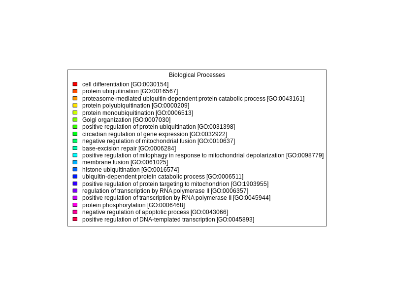

```{r setup, include=FALSE}
library(knitr)
library(tidyverse)
library(kableExtra)
library(DT)
library(Biostrings)
library(tm)
knitr::opts_chunk$set(
  echo = TRUE,         # Display code chunks
  eval = FALSE,         # Evaluate code chunks
  warning = FALSE,     # Hide warnings
  message = FALSE,     # Hide messages
  fig.width = 6,       # Set plot width in inches
  fig.height = 4,      # Set plot height in inches
  fig.align = "center" # Align plots to the center
)
```


# Getting the query fasta file

```{r download-query, engine='bash'}
curl https://owl.fish.washington.edu/halfshell/genomic-databank/GCF_031168955.1_ASM3116895v1_genomic.fna\
-k \
> ../data/GCF_031168955.1_ASM3116895v1_genomic.fna
```

Exploring what fasta file

```{r view-query, engine='bash', eval=TRUE}
head -3 ../data/GCF_031168955.1_ASM3116895v1_genomic.fna
```

```{r view2-query, engine='bash', eval=TRUE}
echo "How many sequences are there?"
grep -c ">" ../data/GCF_031168955.1_ASM3116895v1_genomic.fna
```
We want sequences for every gene. Thus, we need to use the genome fasta and gff to extract fastas for every entry in the gtf.
```{r get-reference-fastas, engine='bash'}
/home/shared/bedtools2/bin/bedtools getfasta -fi ../data/GCF_031168955.1_ASM3116895v1_genomic.fna -bed ../data/GCF_031168955.1_ASM3116895v1.gff -fo ../data/Gmac_genes_fasta.fasta
```

# Database Creation

## Obtain Fasta (UniProt/Swiss-Prot)

This is from here picur reviewe sequences I named based on the identify of the database given


```{r download-data, engine='bash'}
cd ../data
curl -O https://ftp.uniprot.org/pub/databases/uniprot/current_release/knowledgebase/complete/uniprot_sprot.fasta.gz
mv uniprot_sprot.fasta.gz uniprot_sprot_r2023_04.fasta.gz
gunzip -k uniprot_sprot_r2023_04.fasta.gz

curl -O https://gannet.fish.washington.edu/seashell/snaps/uniprot_table_r2023_01.tab
```

## Making the database

```{r make-blastdb, engine='bash'}
mkdir ../blastdb
/home/shared/ncbi-blast-2.11.0+/bin/makeblastdb \
-in ../data/uniprot_sprot_r2023_04.fasta \
-dbtype prot \
-out ../blastdb/uniprot_sprot_r2023_04
```


# Running Blastx

```{r blastx, engine='bash'}
/home/shared/ncbi-blast-2.11.0+/bin/blastx \
-query ../data/Gmac_genes_fasta.fasta \
-db ../blastdb/uniprot_sprot_r2023_04 \
-out ../output/03.2-genome-annotation/Gmac.genesfasta-uniprot_blastx.tab \
-evalue 1E-20 \
-num_threads 20 \
-max_target_seqs 1 \
-outfmt 6 \
&> ../output/03.2-genome-annotation/Gmac.genesfasta-uniprot_blastx.log
```

```{r blast-look, engine='bash', eval=TRUE}
head -2 ../output/03.2-genome-annotation/Gmac.genesfasta-uniprot_blastx.tab
```

```{r blast-look2, engine='bash', eval=TRUE}
echo "Number of lines in output"
wc -l ../output/03.2-genome-annotation/Gmac.genesfasta-uniprot_blastx.tab
```


# Joining Blast table with annoations.

## Prepping Blast table for easy join

```{r separate, engine='bash', eval=TRUE}
tr '|' '\t' < ../output/03.2-genome-annotation/Gmac.genesfasta-uniprot_blastx.tab \
> ../output/03.2-genome-annotation/Gmac.genesfasta-uniprot_blastx_sep.tab

head -1 ../output/03.2-genome-annotation/Gmac.genesfasta-uniprot_blastx_sep.tab

```

## Could do some cool stuff in R here reading in table

```{r read-data, eval=TRUE, cache=TRUE}
bltabl <- read.csv("../output/03.2-genome-annotation/Gmac.genesfasta-uniprot_blastx_sep.tab", sep = '\t', header = FALSE)

spgo <- read.csv("../data/uniprot_table_r2023_01.tab", sep = '\t', header = TRUE)
```

```{r, eval=TRUE}
datatable(head(bltabl), options = list(scrollX = TRUE, scrollY = "400px", scrollCollapse = TRUE, paging = FALSE))
```

```{r spgo-table, eval=TRUE}
datatable(head(spgo), options = list(scrollX = TRUE, scrollY = "400px", scrollCollapse = TRUE, paging = FALSE))
```

```{r see, eval=TRUE}
datatable(
  left_join(bltabl, spgo,  by = c("V3" = "Entry")) %>%
  select(V1, V3, V13, Protein.names, Organism, Gene.Ontology..biological.process., Gene.Ontology.IDs) 
 # %>% mutate(V1 = str_replace_all(V1,pattern = "solid0078_20110412_FRAG_BC_WHITE_WHITE_F3_QV_SE_trimmed", replacement = "Ab"))
)
```

```{r join, eval=TRUE}
annot_tab <-
  left_join(bltabl, spgo,  by = c("V3" = "Entry")) %>%
  select(V1, V3, V13, Protein.names, Organism, Gene.Ontology..biological.process., Gene.Ontology.IDs)

write.table(annot_tab, file = "../output/03.2-genome-annotation/G_macrocephalus_genes_IDmapping_2024_04_17.tab", sep = "\t",
            row.names = TRUE, col.names = NA)
```

```{bash}
head -n 3 ../output/03.2-genome-annotation/G_macrocephalus_genes_IDmapping_2024_04_17.tab
```

```{r, eval=TRUE}
# Read dataset
#dataset <- read.csv("../output/blast_annot_go.tab", sep = '\t')  # Replace with the path to your dataset

# Select the column of interest
column_name <- "Organism"  # Replace with the name of the column of interest
column_data <- annot_tab[[column_name]]

# Count the occurrences of the strings in the column
string_counts <- table(column_data)

# Convert to a data frame, sort by count, and select the top 10
string_counts_df <- as.data.frame(string_counts)
colnames(string_counts_df) <- c("String", "Count")
string_counts_df <- string_counts_df[order(string_counts_df$Count, decreasing = TRUE), ]
top_10_strings <- head(string_counts_df, n = 10)

# Plot the top 10 most common strings using ggplot2
ggplot(top_10_strings, aes(x = reorder(String, -Count), y = Count, fill = String)) +
  geom_bar(stat = "identity", position = "dodge", color = "black") +
  labs(title = "Top 10 Species hits",
       x = column_name,
       y = "Count") +
  theme_minimal() +
  theme(legend.position = "none") +
  coord_flip()


```

```{r go, eval=TRUE}


#data <- read.csv("../output/blast_annot_go.tab", sep = '\t')

# Rename the `Gene.Ontology..biological.process.` column to `Biological_Process`
colnames(annot_tab)[colnames(annot_tab) == "Gene.Ontology..biological.process."] <- "Biological_Process"

# Separate the `Biological_Process` column into individual biological processes
data_separated <- unlist(strsplit(annot_tab$Biological_Process, split = ";"))

# Trim whitespace from the biological processes
data_separated <- gsub("^\\s+|\\s+$", "", data_separated)

# Count the occurrences of each biological process
process_counts <- table(data_separated)
process_counts <- data.frame(Biological_Process = names(process_counts), Count = as.integer(process_counts))
process_counts <- process_counts[order(-process_counts$Count), ]

# Select the 20 most predominant biological processes
top_20_processes <- process_counts[1:20, ]

# Create a color palette for the bars
bar_colors <- rainbow(nrow(top_20_processes))

# Create a staggered vertical bar plot with different colors for each bar
barplot(top_20_processes$Count, names.arg = rep("", nrow(top_20_processes)), col = bar_colors,
        ylim = c(0, max(top_20_processes$Count) * 1.25),
        main = "Occurrences of the 20 Most Predominant Biological Processes", xlab = "Biological Process", ylab = "Count")


# Create a separate plot for the legend
png("../output/GOlegend.png", width = 800, height = 600)
par(mar = c(0, 0, 0, 0))
plot.new()
legend("center", legend = top_20_processes$Biological_Process, fill = bar_colors, cex = 1, title = "Biological Processes")
dev.off()
```

```{r legend, eval=TRUE, fig.width = 100 ,fig.height = 100}

```


