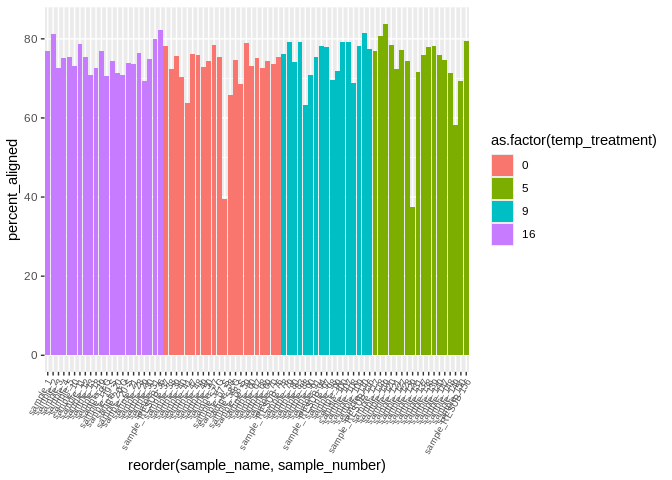
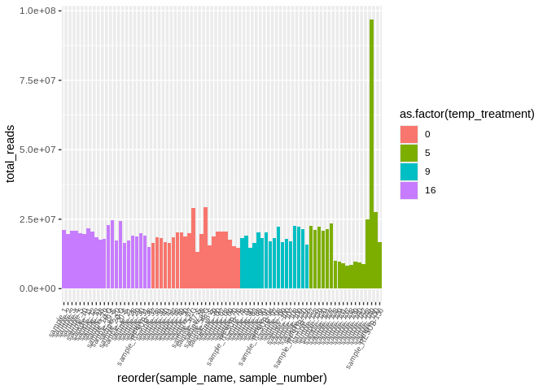
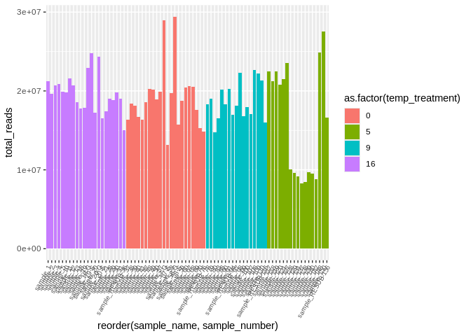
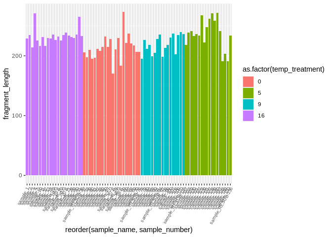

06-cod-RNAseq-alignment
================
Kathleen Durkin
2024-03-19

- <a href="#1-create-a-bash-variables-file"
  id="toc-1-create-a-bash-variables-file">1 Create a Bash variables
  file</a>
- <a href="#2-align-to-reference-transcriptome-kallisto-pseudoalignment"
  id="toc-2-align-to-reference-transcriptome-kallisto-pseudoalignment">2
  Align to reference transcriptome (Kallisto pseudoalignment)</a>
  - <a href="#21-retrieving-the-reference-transcriptome"
    id="toc-21-retrieving-the-reference-transcriptome">2.1 Retrieving the
    reference transcriptome</a>
  - <a href="#22-verify-transcriptome-fasta-md5-checksum"
    id="toc-22-verify-transcriptome-fasta-md5-checksum">2.2 Verify
    transcriptome FastA MD5 checksum</a>
  - <a href="#23-building-index" id="toc-23-building-index">2.3 Building
    Index</a>
  - <a href="#24-sample-quantification"
    id="toc-24-sample-quantification">2.4 Sample Quantification</a>
  - <a href="#25-multiqc-on-kallisto-output-logs"
    id="toc-25-multiqc-on-kallisto-output-logs">2.5 MultiQC on Kallisto
    output logs</a>
  - <a href="#26-trinity-matrix-with-kallisto-output"
    id="toc-26-trinity-matrix-with-kallisto-output">2.6 Trinity Matrix with
    Kallisto Output</a>

``` r
library(tidyverse)
library(dplyr)
library(magrittr)
library(knitr)
library(ggplot2)
library(plotly)
```

Code for aligning RNAseq data to reference transcriptome/genome, to be
used on [Pacific cod RNAseq
data](https://shedurkin.github.io/Roberts-LabNotebook/posts/projects/pacific_cod/2023_12_13_pacific_cod.html).

- Raw reads found
  [here](https://owl.fish.washington.edu/nightingales/G_macrocephalus/30-943133806/)
- Transcriptome downloaded from
  [NCBI](https://www.ncbi.nlm.nih.gov/datasets/genome/GCF_031168955.1/),
  stored
  [here](https://owl.fish.washington.edu/halfshell/genomic-databank/GCF_031168955.1_ASM3116895v1_rna.fna)
  as a part of lab [genomic
  resources](https://robertslab.github.io/resources/Genomic-Resources/#gadus-macrocephalus-pacific-cod)

Note: Kallisto pseudoalignment doesn’t necessarily require input reads
to be trimmed, provided they are of sufficient quality.

# 1 Create a Bash variables file

This allows usage of Bash variables (e.g. paths to common directories)
across R Markdown chunks.

``` bash
{
echo "#### Assign Variables ####"
echo ""

echo "# Data directories"
echo 'export cod_dir=/home/shared/8TB_HDD_02/shedurkin/project-cod-temperature'
echo 'export output_dir_top=${cod_dir}/output/06-cod-RNAseq-alignment'
echo 'export raw_fastqc_dir=${cod_dir}/output/05-cod-RNAseq-trimming/raw-fastqc'
echo 'export raw_reads_dir=${cod_dir}/data/05-cod-RNAseq-trimming/raw-reads'
echo 'export trimmed_fastqc_dir=${cod_dir}/output/05-cod-RNAseq-trimming/trimmed-fastqc'
echo 'export trimmed_reads_dir=${cod_dir}/output/05-cod-RNAseq-trimming/trimmed-reads'
echo 'export kallisto_output_dir=${output_dir_top}/kallisto'
echo ""


echo "# Input/Output files"
echo 'export transcriptome_fasta_dir=${cod_dir}/data'
echo 'export transcriptome_fasta_name="GCF_031168955.1_ASM3116895v1_rna"'
echo 'export transcriptome_fasta="${transcriptome_fasta_dir}/${transcriptome_fasta_name}"'
echo 'export kallisto_index_name="G_macrocephalus_kallisto_index.idx"'


echo "# External data URLs and checksums"
echo 'export transcriptome_fasta_url="https://owl.fish.washington.edu/halfshell/genomic-databank/GCF_031168955.1_ASM3116895v1_rna.fna"'
echo 'export transcriptome_checksum="2a6c7c98982727e688f033a9b236725b"'
echo ""


echo "# Paths to programs"
echo 'export kallisto=/home/shared/kallisto/kallisto'
echo 'export multiqc=/home/sam/programs/mambaforge/bin/multiqc'
echo 'export trinity_abund_to_matrix=/home/shared/trinityrnaseq-v2.12.0/util/abundance_estimates_to_matrix.pl'
echo ""


echo "# Set number of CPUs to use"
echo 'export threads=20'
echo ""


echo "# Programs associative array"
echo "declare -A programs_array"
echo "programs_array=("
echo '[kallisto]="${kallisto}" \'
echo '[multiqc]="${multiqc}" \'
echo '[trinity_abund_to_matrix]="${trinity_abund_to_matrix}" \'
echo ")"
} > .bashvars

cat .bashvars
```

    #### Assign Variables ####

    # Data directories
    export cod_dir=/home/shared/8TB_HDD_02/shedurkin/project-cod-temperature
    export output_dir_top=${cod_dir}/output/06-cod-RNAseq-alignment
    export raw_fastqc_dir=${cod_dir}/output/05-cod-RNAseq-trimming/raw-fastqc
    export raw_reads_dir=${cod_dir}/data/05-cod-RNAseq-trimming/raw-reads
    export trimmed_fastqc_dir=${cod_dir}/output/05-cod-RNAseq-trimming/trimmed-fastqc
    export trimmed_reads_dir=${cod_dir}/output/05-cod-RNAseq-trimming/trimmed-reads
    export kallisto_output_dir=${output_dir_top}/kallisto

    # Input/Output files
    export transcriptome_fasta_dir=${cod_dir}/data
    export transcriptome_fasta_name="GCF_031168955.1_ASM3116895v1_rna"
    export transcriptome_fasta="${transcriptome_fasta_dir}/${transcriptome_fasta_name}"
    export kallisto_index_name="G_macrocephalus_kallisto_index.idx"
    # External data URLs and checksums
    export transcriptome_fasta_url="https://owl.fish.washington.edu/halfshell/genomic-databank/GCF_031168955.1_ASM3116895v1_rna.fna"
    export transcriptome_checksum="2a6c7c98982727e688f033a9b236725b"

    # Paths to programs
    export kallisto=/home/shared/kallisto/kallisto
    export multiqc=/home/sam/programs/mambaforge/bin/multiqc
    export trinity_abund_to_matrix=/home/shared/trinityrnaseq-v2.12.0/util/abundance_estimates_to_matrix.pl

    # Set number of CPUs to use
    export threads=20

    # Programs associative array
    declare -A programs_array
    programs_array=(
    [kallisto]="${kallisto}" \
    [multiqc]="${multiqc}" \
    [trinity_abund_to_matrix]="${trinity_abund_to_matrix}" \
    )

There didn’t seem to be a significant difference in sequence quality
following trimming, so for now I’m proceeding with the raw reads (though
I’ll likely eventually rerun the kallisto with trimmed)

# 2 Align to reference transcriptome (Kallisto pseudoalignment)

## 2.1 Retrieving the reference transcriptome

``` bash
# Load bash variables into memory
source .bashvars

wget \
--directory-prefix ${transcriptome_fasta_dir} \
--recursive \
--no-check-certificate \
--continue \
--no-host-directories \
--no-directories \
--no-parent \
--quiet \
--execute robots=off \
--accept "${transcriptome_fasta_name}.fna" ${transcriptome_fasta_url}
```

``` bash
# Load bash variables into memory
source .bashvars

ls -lh "${transcriptome_fasta_dir}"
```

    total 1.9G
    drwxr-xr-x 3 shedurkin labmembers 4.0K Mar  4 11:05 05-cod-RNAseq-trimming
    -rw-r--r-- 1 shedurkin labmembers  13K Dec 27 15:45 Cod_RNAseq_NGS_Template_File.xlsx
    -rw-r--r-- 1 shedurkin labmembers 2.1K Mar 20 20:55 DESeq2_Sample_Information.csv
    -rw-r--r-- 1 shedurkin labmembers  38M Oct 25  2023 Gadus_macrocephalus.coding.gene.V1.cds
    -rw-r--r-- 1 shedurkin labmembers 537M Oct 16  2023 GCF_031168955.1_ASM3116895v1_genomic.fna
    -rw-r--r-- 1 shedurkin labmembers 351M Oct 16  2023 GCF_031168955.1_ASM3116895v1.gff
    -rw-r--r-- 1 shedurkin labmembers 169M Oct 16  2023 GCF_031168955.1_ASM3116895v1_rna.fna
    -rw-r--r-- 1 shedurkin labmembers 404M Apr 23 14:29 genomic.gtf
    -rw-r--r-- 1 shedurkin labmembers  47K Oct 25  2023 Pcod Temp Growth experiment 2022-23 DATA.xlsx
    -rw-r--r-- 1 shedurkin labmembers 231K Mar  4 17:41 Sample.QC.report.of_30-943133806_240118025106.pdf
    -rw-r--r-- 1 shedurkin labmembers  12K Mar  4 17:41 Sample.QC.report.of_30-943133806_240118025106.xlsx
    -rw-r--r-- 1 shedurkin labmembers  12K Oct 25  2023 temp-experiment.csv
    -rw-r--r-- 1 shedurkin labmembers 271M Oct 25  2023 uniprot_sprot_r2023_04.fasta
    -rw-r--r-- 1 shedurkin labmembers  88M Apr 17 11:54 uniprot_sprot_r2023_04.fasta.gz

## 2.2 Verify transcriptome FastA MD5 checksum

``` bash
# Load bash variables into memory
source .bashvars

cd "${transcriptome_fasta_dir}"

# Checksums file contains other files, so this just looks for the sRNAseq files.
md5sum --check <<< "${transcriptome_checksum}  ${transcriptome_fasta_name}.fna"
```

    GCF_031168955.1_ASM3116895v1_rna.fna: OK

## 2.3 Building Index

``` bash
# Load bash variables into memory
source .bashvars

cd "${kallisto_output_dir}"

${programs_array[kallisto]} index \
--threads=${threads} \
--index="${kallisto_index_name}" \
"${transcriptome_fasta}.fna"
```

``` bash
# Load bash variables into memory
source .bashvars

ls -lh ${kallisto_output_dir}
```

    total 1.5G
    -rw-r--r-- 1 shedurkin labmembers 1.5G Mar 18 16:08 G_macrocephalus_kallisto_index.idx
    -rw-r--r-- 1 shedurkin labmembers  20M Apr 29 23:25 kallisto.isoform.counts.matrix
    -rw-r--r-- 1 shedurkin labmembers    0 Apr 29 23:25 kallisto.isoform.TMM.EXPR.matrix
    -rw-r--r-- 1 shedurkin labmembers  24M Apr 29 23:25 kallisto.isoform.TPM.not_cross_norm
    -rw-r--r-- 1 shedurkin labmembers  532 Apr 29 23:25 kallisto.isoform.TPM.not_cross_norm.runTMM.R
    drwxr-xr-x 2 shedurkin labmembers 4.0K Apr 29 17:46 kallisto_quant_1
    drwxr-xr-x 2 shedurkin labmembers 4.0K Apr 29 15:11 kallisto_quant_10
    drwxr-xr-x 2 shedurkin labmembers 4.0K Apr 29 15:03 kallisto_quant_100
    -rw-r--r-- 1 shedurkin labmembers 5.2K Apr 29 15:04 kallisto_quant_100.log
    drwxr-xr-x 2 shedurkin labmembers 4.0K Apr 29 15:05 kallisto_quant_107
    -rw-r--r-- 1 shedurkin labmembers 5.2K Apr 29 15:05 kallisto_quant_107.log
    drwxr-xr-x 2 shedurkin labmembers 4.0K Apr 29 15:07 kallisto_quant_108
    -rw-r--r-- 1 shedurkin labmembers 5.2K Apr 29 15:08 kallisto_quant_108.log
    drwxr-xr-x 2 shedurkin labmembers 4.0K Apr 29 15:09 kallisto_quant_109
    -rw-r--r-- 1 shedurkin labmembers 5.2K Apr 29 15:10 kallisto_quant_109.log
    -rw-r--r-- 1 shedurkin labmembers 5.2K Apr 29 15:12 kallisto_quant_10.log
    drwxr-xr-x 2 shedurkin labmembers 4.0K Apr 29 15:22 kallisto_quant_11
    drwxr-xr-x 2 shedurkin labmembers 4.0K Apr 29 15:13 kallisto_quant_110
    -rw-r--r-- 1 shedurkin labmembers 5.2K Apr 29 15:14 kallisto_quant_110.log
    drwxr-xr-x 2 shedurkin labmembers 4.0K Apr 29 15:15 kallisto_quant_117
    -rw-r--r-- 1 shedurkin labmembers 5.2K Apr 29 15:16 kallisto_quant_117.log
    drwxr-xr-x 2 shedurkin labmembers 4.0K Apr 29 15:18 kallisto_quant_118
    -rw-r--r-- 1 shedurkin labmembers 5.2K Apr 29 15:18 kallisto_quant_118.log
    drwxr-xr-x 2 shedurkin labmembers 4.0K Apr 29 15:20 kallisto_quant_119
    -rw-r--r-- 1 shedurkin labmembers 5.2K Apr 29 15:20 kallisto_quant_119.log
    -rw-r--r-- 1 shedurkin labmembers 5.2K Apr 29 15:22 kallisto_quant_11.log
    drwxr-xr-x 2 shedurkin labmembers 4.0K Apr 29 15:33 kallisto_quant_12
    drwxr-xr-x 2 shedurkin labmembers 4.0K Apr 29 15:24 kallisto_quant_120
    -rw-r--r-- 1 shedurkin labmembers 5.2K Apr 29 15:24 kallisto_quant_120.log
    drwxr-xr-x 2 shedurkin labmembers 4.0K Apr 29 15:26 kallisto_quant_121
    -rw-r--r-- 1 shedurkin labmembers 5.2K Apr 29 15:27 kallisto_quant_121.log
    drwxr-xr-x 2 shedurkin labmembers 4.0K Apr 29 15:28 kallisto_quant_127
    -rw-r--r-- 1 shedurkin labmembers 5.2K Apr 29 15:29 kallisto_quant_127.log
    drwxr-xr-x 2 shedurkin labmembers 4.0K Apr 29 15:30 kallisto_quant_128
    -rw-r--r-- 1 shedurkin labmembers 5.2K Apr 29 15:30 kallisto_quant_128.log
    drwxr-xr-x 2 shedurkin labmembers 4.0K Apr 29 15:31 kallisto_quant_129
    -rw-r--r-- 1 shedurkin labmembers 5.2K Apr 29 15:31 kallisto_quant_129.log
    -rw-r--r-- 1 shedurkin labmembers 5.2K Apr 29 15:33 kallisto_quant_12.log
    drwxr-xr-x 2 shedurkin labmembers 4.0K Apr 29 15:39 kallisto_quant_13
    drwxr-xr-x 2 shedurkin labmembers 4.0K Apr 29 15:34 kallisto_quant_131
    -rw-r--r-- 1 shedurkin labmembers 5.2K Apr 29 15:34 kallisto_quant_131.log
    drwxr-xr-x 2 shedurkin labmembers 4.0K Apr 29 15:35 kallisto_quant_137
    -rw-r--r-- 1 shedurkin labmembers 5.2K Apr 29 15:35 kallisto_quant_137.log
    drwxr-xr-x 2 shedurkin labmembers 4.0K Apr 29 15:36 kallisto_quant_138
    -rw-r--r-- 1 shedurkin labmembers 5.2K Apr 29 15:36 kallisto_quant_138.log
    drwxr-xr-x 2 shedurkin labmembers 4.0K Apr 29 15:37 kallisto_quant_139
    -rw-r--r-- 1 shedurkin labmembers 5.2K Apr 29 15:37 kallisto_quant_139.log
    -rw-r--r-- 1 shedurkin labmembers 5.2K Apr 29 15:39 kallisto_quant_13.log
    drwxr-xr-x 2 shedurkin labmembers 4.0K Apr 29 15:40 kallisto_quant_140
    -rw-r--r-- 1 shedurkin labmembers 5.2K Apr 29 15:40 kallisto_quant_140.log
    drwxr-xr-x 2 shedurkin labmembers 4.0K Apr 29 15:41 kallisto_quant_147
    -rw-r--r-- 1 shedurkin labmembers 5.2K Apr 29 15:41 kallisto_quant_147.log
    drwxr-xr-x 2 shedurkin labmembers 4.0K Apr 29 15:43 kallisto_quant_148
    -rw-r--r-- 1 shedurkin labmembers 5.2K Apr 29 15:44 kallisto_quant_148.log
    drwxr-xr-x 2 shedurkin labmembers 4.0K Apr 29 15:51 kallisto_quant_149
    -rw-r--r-- 1 shedurkin labmembers 5.2K Apr 29 15:52 kallisto_quant_149.log
    drwxr-xr-x 2 shedurkin labmembers 4.0K Apr 29 22:52 kallisto_quant_150
    -rw-r--r-- 1 shedurkin labmembers 5.2K Apr 29 22:53 kallisto_quant_150.log
    drwxr-xr-x 2 shedurkin labmembers 4.0K Apr 29 17:37 kallisto_quant_18
    -rw-r--r-- 1 shedurkin labmembers 5.2K Apr 29 17:37 kallisto_quant_18.log
    drwxr-xr-x 2 shedurkin labmembers 4.0K Apr 29 17:41 kallisto_quant_19
    drwxr-xr-x 2 shedurkin labmembers 4.0K Apr 29 17:39 kallisto_quant_19-G
    -rw-r--r-- 1 shedurkin labmembers 5.2K Apr 29 17:40 kallisto_quant_19-G.log
    -rw-r--r-- 1 shedurkin labmembers 5.2K Apr 29 17:41 kallisto_quant_19.log
    drwxr-xr-x 2 shedurkin labmembers 4.0K Apr 29 17:43 kallisto_quant_19-S
    -rw-r--r-- 1 shedurkin labmembers 5.2K Apr 29 17:44 kallisto_quant_19-S.log
    -rw-r--r-- 1 shedurkin labmembers 5.2K Apr 29 17:46 kallisto_quant_1.log
    drwxr-xr-x 2 shedurkin labmembers 4.0K Apr 29 17:59 kallisto_quant_2
    drwxr-xr-x 2 shedurkin labmembers 4.0K Apr 29 17:50 kallisto_quant_20
    drwxr-xr-x 2 shedurkin labmembers 4.0K Apr 29 17:48 kallisto_quant_20-G
    -rw-r--r-- 1 shedurkin labmembers 5.2K Apr 29 17:49 kallisto_quant_20-G.log
    -rw-r--r-- 1 shedurkin labmembers 5.2K Apr 29 17:50 kallisto_quant_20.log
    drwxr-xr-x 2 shedurkin labmembers 4.0K Apr 29 17:52 kallisto_quant_20-S
    -rw-r--r-- 1 shedurkin labmembers 5.2K Apr 29 17:52 kallisto_quant_20-S.log
    drwxr-xr-x 2 shedurkin labmembers 4.0K Apr 29 17:54 kallisto_quant_21
    -rw-r--r-- 1 shedurkin labmembers 5.2K Apr 29 17:54 kallisto_quant_21.log
    drwxr-xr-x 2 shedurkin labmembers 4.0K Apr 29 17:56 kallisto_quant_28
    -rw-r--r-- 1 shedurkin labmembers 5.2K Apr 29 17:56 kallisto_quant_28.log
    drwxr-xr-x 2 shedurkin labmembers 4.0K Apr 29 17:57 kallisto_quant_29
    -rw-r--r-- 1 shedurkin labmembers 5.2K Apr 29 17:58 kallisto_quant_29.log
    -rw-r--r-- 1 shedurkin labmembers 5.2K Apr 29 18:00 kallisto_quant_2.log
    drwxr-xr-x 2 shedurkin labmembers 4.0K Apr 29 20:53 kallisto_quant_3
    drwxr-xr-x 2 shedurkin labmembers 4.0K Apr 29 18:01 kallisto_quant_30
    -rw-r--r-- 1 shedurkin labmembers 5.2K Apr 29 18:02 kallisto_quant_30.log
    drwxr-xr-x 2 shedurkin labmembers 4.0K Apr 29 18:03 kallisto_quant_31
    -rw-r--r-- 1 shedurkin labmembers 5.2K Apr 29 18:04 kallisto_quant_31.log
    drwxr-xr-x 2 shedurkin labmembers 4.0K Apr 29 20:47 kallisto_quant_37
    -rw-r--r-- 1 shedurkin labmembers 5.2K Apr 29 20:48 kallisto_quant_37.log
    drwxr-xr-x 2 shedurkin labmembers 4.0K Apr 29 20:49 kallisto_quant_38
    -rw-r--r-- 1 shedurkin labmembers 5.2K Apr 29 20:49 kallisto_quant_38.log
    drwxr-xr-x 2 shedurkin labmembers 4.0K Apr 29 20:51 kallisto_quant_39
    -rw-r--r-- 1 shedurkin labmembers 5.2K Apr 29 20:51 kallisto_quant_39.log
    -rw-r--r-- 1 shedurkin labmembers 5.2K Apr 29 20:53 kallisto_quant_3.log
    drwxr-xr-x 2 shedurkin labmembers 4.0K Apr 29 21:04 kallisto_quant_4
    drwxr-xr-x 2 shedurkin labmembers 4.0K Apr 29 20:54 kallisto_quant_40
    -rw-r--r-- 1 shedurkin labmembers 5.2K Apr 29 20:55 kallisto_quant_40.log
    drwxr-xr-x 2 shedurkin labmembers 4.0K Apr 29 20:56 kallisto_quant_41
    -rw-r--r-- 1 shedurkin labmembers 5.2K Apr 29 20:56 kallisto_quant_41.log
    drwxr-xr-x 2 shedurkin labmembers 4.0K Apr 29 20:58 kallisto_quant_47
    -rw-r--r-- 1 shedurkin labmembers 5.2K Apr 29 20:58 kallisto_quant_47.log
    drwxr-xr-x 2 shedurkin labmembers 4.0K Apr 29 21:00 kallisto_quant_48
    -rw-r--r-- 1 shedurkin labmembers 5.2K Apr 29 21:00 kallisto_quant_48.log
    drwxr-xr-x 2 shedurkin labmembers 4.0K Apr 29 21:02 kallisto_quant_49
    -rw-r--r-- 1 shedurkin labmembers 5.2K Apr 29 21:02 kallisto_quant_49.log
    -rw-r--r-- 1 shedurkin labmembers 5.2K Apr 29 21:04 kallisto_quant_4.log
    drwxr-xr-x 2 shedurkin labmembers 4.0K Apr 29 21:26 kallisto_quant_5
    drwxr-xr-x 2 shedurkin labmembers 4.0K Apr 29 21:06 kallisto_quant_50
    -rw-r--r-- 1 shedurkin labmembers 5.2K Apr 29 21:06 kallisto_quant_50.log
    drwxr-xr-x 2 shedurkin labmembers 4.0K Apr 29 21:14 kallisto_quant_57
    drwxr-xr-x 2 shedurkin labmembers 4.0K Apr 29 21:10 kallisto_quant_57-G
    -rw-r--r-- 1 shedurkin labmembers 5.2K Apr 29 21:11 kallisto_quant_57-G.log
    -rw-r--r-- 1 shedurkin labmembers 5.2K Apr 29 21:14 kallisto_quant_57.log
    drwxr-xr-x 2 shedurkin labmembers 4.0K Apr 29 21:15 kallisto_quant_57-S
    -rw-r--r-- 1 shedurkin labmembers 5.2K Apr 29 21:15 kallisto_quant_57-S.log
    drwxr-xr-x 2 shedurkin labmembers 4.0K Apr 29 21:20 kallisto_quant_58
    drwxr-xr-x 2 shedurkin labmembers 4.0K Apr 29 21:18 kallisto_quant_58-G
    -rw-r--r-- 1 shedurkin labmembers 5.2K Apr 29 21:18 kallisto_quant_58-G.log
    -rw-r--r-- 1 shedurkin labmembers 5.2K Apr 29 21:20 kallisto_quant_58.log
    drwxr-xr-x 2 shedurkin labmembers 4.0K Apr 29 21:22 kallisto_quant_58-S
    -rw-r--r-- 1 shedurkin labmembers 5.2K Apr 29 21:22 kallisto_quant_58-S.log
    drwxr-xr-x 2 shedurkin labmembers 4.0K Apr 29 21:24 kallisto_quant_59
    -rw-r--r-- 1 shedurkin labmembers 5.2K Apr 29 21:24 kallisto_quant_59.log
    -rw-r--r-- 1 shedurkin labmembers 5.2K Apr 29 21:26 kallisto_quant_5.log
    drwxr-xr-x 2 shedurkin labmembers 4.0K Apr 29 21:28 kallisto_quant_60
    -rw-r--r-- 1 shedurkin labmembers 5.2K Apr 29 21:28 kallisto_quant_60.log
    drwxr-xr-x 2 shedurkin labmembers 4.0K Apr 29 21:30 kallisto_quant_67
    -rw-r--r-- 1 shedurkin labmembers 5.2K Apr 29 21:30 kallisto_quant_67.log
    drwxr-xr-x 2 shedurkin labmembers 4.0K Apr 29 21:32 kallisto_quant_68
    -rw-r--r-- 1 shedurkin labmembers 5.2K Apr 29 21:32 kallisto_quant_68.log
    drwxr-xr-x 2 shedurkin labmembers 4.0K Apr 29 21:34 kallisto_quant_69
    -rw-r--r-- 1 shedurkin labmembers 5.2K Apr 29 21:34 kallisto_quant_69.log
    drwxr-xr-x 2 shedurkin labmembers 4.0K Apr 29 21:35 kallisto_quant_70
    -rw-r--r-- 1 shedurkin labmembers 5.2K Apr 29 21:36 kallisto_quant_70.log
    drwxr-xr-x 2 shedurkin labmembers 4.0K Apr 29 21:37 kallisto_quant_78
    -rw-r--r-- 1 shedurkin labmembers 5.2K Apr 29 21:37 kallisto_quant_78.log
    drwxr-xr-x 2 shedurkin labmembers 4.0K Apr 29 21:39 kallisto_quant_79
    -rw-r--r-- 1 shedurkin labmembers 5.2K Apr 29 21:39 kallisto_quant_79.log
    drwxr-xr-x 2 shedurkin labmembers 4.0K Apr 29 21:40 kallisto_quant_80
    -rw-r--r-- 1 shedurkin labmembers 5.2K Apr 29 21:41 kallisto_quant_80.log
    drwxr-xr-x 2 shedurkin labmembers 4.0K Apr 29 21:42 kallisto_quant_83
    -rw-r--r-- 1 shedurkin labmembers 5.2K Apr 29 21:43 kallisto_quant_83.log
    drwxr-xr-x 2 shedurkin labmembers 4.0K Apr 29 21:44 kallisto_quant_88
    -rw-r--r-- 1 shedurkin labmembers 5.2K Apr 29 21:44 kallisto_quant_88.log
    drwxr-xr-x 2 shedurkin labmembers 4.0K Apr 29 21:46 kallisto_quant_90
    -rw-r--r-- 1 shedurkin labmembers 5.2K Apr 29 21:46 kallisto_quant_90.log
    drwxr-xr-x 2 shedurkin labmembers 4.0K Apr 29 21:48 kallisto_quant_91
    -rw-r--r-- 1 shedurkin labmembers 5.2K Apr 29 21:48 kallisto_quant_91.log
    drwxr-xr-x 2 shedurkin labmembers 4.0K Apr 29 21:50 kallisto_quant_97
    -rw-r--r-- 1 shedurkin labmembers 5.2K Apr 29 21:50 kallisto_quant_97.log
    drwxr-xr-x 2 shedurkin labmembers 4.0K Apr 29 21:52 kallisto_quant_98
    -rw-r--r-- 1 shedurkin labmembers 5.2K Apr 29 21:52 kallisto_quant_98.log
    drwxr-xr-x 2 shedurkin labmembers 4.0K Apr 29 21:53 kallisto_quant_99
    -rw-r--r-- 1 shedurkin labmembers 5.2K Apr 29 21:54 kallisto_quant_99.log
    drwxr-xr-x 2 shedurkin labmembers 4.0K Apr 29 21:55 kallisto_quant_RESUB-116
    -rw-r--r-- 1 shedurkin labmembers 5.3K Apr 29 21:55 kallisto_quant_RESUB-116.log
    drwxr-xr-x 2 shedurkin labmembers 4.0K Apr 29 21:57 kallisto_quant_RESUB-156
    -rw-r--r-- 1 shedurkin labmembers 5.3K Apr 29 21:57 kallisto_quant_RESUB-156.log
    drwxr-xr-x 2 shedurkin labmembers 4.0K Apr 29 21:58 kallisto_quant_RESUB-36
    -rw-r--r-- 1 shedurkin labmembers 5.3K Apr 29 21:59 kallisto_quant_RESUB-36.log
    drwxr-xr-x 2 shedurkin labmembers 4.0K Apr 29 22:54 kallisto_quant_RESUB-76
    -rw-r--r-- 1 shedurkin labmembers 5.3K Apr 29 22:54 kallisto_quant_RESUB-76.log
    drwxr-xr-x 2 shedurkin labmembers 4.0K Apr 29 22:13 kallisto_quant_RESUB-94
    -rw-r--r-- 1 shedurkin labmembers 5.3K Apr 29 22:14 kallisto_quant_RESUB-94.log

## 2.4 Sample Quantification

Kallisto can run quantification on either single- or paired-end reads.
The default option is paired-end, which requires the input of an even
number of paired fastq files (e.g., pairA_R1.fastq, pairA_R2.fastq). To
use single-end mode, include the –single flag, as well as -l
(–fragment-length=DOUBLE, estimated avg. fragment length) and -s
(–sd=DOUBLE, estimates stand. dev. of fragment length), and a number of
fastq files. Again, gzipped files are acceptable.

Kallisto quant is rather finicky about how you input sets of paired
reads, and you can only input a single pair at a time. To circumvent,
I’ll create a quantification function and apply it iteratively to each
pair of reads using a loop.

``` bash
# Load bash variables into memory
source .bashvars

# Function to run kallisto quant. Takes two (paired) reads as input, outputs to sample-associated directory
run_kallisto_quant() {
    source .bashvars  # Source .bashvars inside the function to make its variables accessible
    local R1_fastq=${1}
    local R2_fastq=${2}
    
    cd ${kallisto_output_dir}
    sample_num=$(basename "${R1_fastq}" "_R1_001.fastq.gz")
    mkdir kallisto_quant_${sample_num}

    ${programs_array[kallisto]} quant \
        --threads=${threads} \
        --index="${kallisto_output_dir}/${kallisto_index_name}" \
        --output-dir="${kallisto_output_dir}/kallisto_quant_${sample_num}" \
        --bootstrap-samples=100 \
        ${raw_reads_dir}/${R1_fastq} ${raw_reads_dir}/${R2_fastq} \
        &> "${kallisto_output_dir}/kallisto_quant_${sample_num}.log"
}


# Iteratively apply run_kallisto_quant on each pair of input reads
for file_r1 in "${raw_reads_dir}"/*_R1_001.fastq.gz; do
    # Extract the sample name from the file name
    sample_name=$(basename "${file_r1}" "_R1_001.fastq.gz")

    # Form the file names (function takes input file names, not paths)
    file_r1_name="${sample_name}_R1_001.fastq.gz"
    file_r2_name="${sample_name}_R2_001.fastq.gz"

    # Check that the sample hasn't already been quantified
    if [ ! -d "${kallisto_output_dir}/kallisto_quant_${sample_name}" ]; then
    
        # Check if the corresponding R2 file exists
        if [ -e "${raw_reads_dir}/${file_r2}" ]; then
            # Run kallisto quant on the file pair
            run_kallisto_quant "${file_r1_name}" "${file_r2_name}" 

            echo "Processed sample: ${sample_name}"
        fi
    else
        echo "Sample already processed: ${sample_name}"
    fi
done
```

Check that we have the appropriate number of output folders. We should
have one log file for each pair of reads

``` bash
# Load bash variables into memory
source .bashvars

# Count number of raw read files
cd ${raw_reads_dir}
echo "Number of raw reads:"
ls -1 | wc -l

# Count number of kallisto output 
cd ${kallisto_output_dir}
echo "Number of output log files"
find . -type f -name "*.log" | wc -l
```

    Number of raw reads:
    158
    Number of output log files
    79

## 2.5 MultiQC on Kallisto output logs

``` bash
# Load bash variables into memory
source .bashvars

############ RUN MULTIQC ############
echo "Beginning MultiQC on raw FastQC..."
echo ""

${programs_array[multiqc]} ${kallisto_output_dir}/*.log -o ${output_dir_top}

echo ""
echo "MultiQC on raw FastQs complete."
echo ""

############ END MULTIQC ############

echo "Removing FastQC zip files."
echo ""
rm ${output_dir_top}/*.zip
echo "FastQC zip files removed."
echo ""

# View directory contents
ls -lh ${output_dir_top}
```

I also want to include the treatment/tank info when plotting alignment
rates across samples

``` r
# Load multiqc stats
kallisto_multiqc <- read.csv("../output/06-cod-RNAseq-alignment/multiqc_data/multiqc_kallisto.txt", sep = '\t')
# Adjust sample name formatting (to prep for join)
kallisto_multiqc$Sample <- gsub("_R1_001", "", kallisto_multiqc$Sample) 
kallisto_multiqc$Sample <- paste("sample_", kallisto_multiqc$Sample, sep = "")
# Load experimental data
cod_sample_info_OG <- read.csv("../data/DESeq2_Sample_Information.csv")

kallisto_multiqc_plustreatment <- left_join(cod_sample_info_OG, kallisto_multiqc, by = c("sample_name" = "Sample")) %>% 
  na.omit()
kallisto_multiqc_plustreatment <- kallisto_multiqc_plustreatment[order(kallisto_multiqc_plustreatment$sample_number),]

ggplot(kallisto_multiqc_plustreatment,
       aes(x=reorder(sample_name, sample_number), y=percent_aligned, fill=as.factor(temp_treatment))) +
  geom_bar(stat="identity") +
  theme(axis.text.x = element_text(angle = 60, vjust = 1, hjust=1, size=7))
```

<!-- -->

``` r
ggplot(kallisto_multiqc_plustreatment,
       aes(x=reorder(sample_name, sample_number), y=total_reads, fill=as.factor(temp_treatment))) +
  geom_bar(stat="identity") +
  theme(axis.text.x = element_text(angle = 60, vjust = 1, hjust=1, size=7))
```

<!-- -->

``` r
# sample149 is kind of throwing off the visualization, so lets remove and redo
ggplot(kallisto_multiqc_plustreatment[kallisto_multiqc_plustreatment$sample_name != "sample_149", ],
       aes(x=reorder(sample_name, sample_number), y=total_reads, fill=as.factor(temp_treatment))) +
  geom_bar(stat="identity") +
  theme(axis.text.x = element_text(angle = 60, vjust = 1, hjust=1, size=7))
```

<!-- -->

``` r
ggplot(kallisto_multiqc_plustreatment,
       aes(x=reorder(sample_name, sample_number), y=fragment_length, fill=as.factor(temp_treatment))) +
  geom_bar(stat="identity") +
  theme(axis.text.x = element_text(angle = 60, vjust = 1, hjust=1, size=7))
```

<!-- -->

## 2.6 Trinity Matrix with Kallisto Output

``` bash
# Load bash variables into memory
source .bashvars

cd ${kallisto_output_dir}

${programs_array[trinity_abund_to_matrix]} \
--est_method 'kallisto' \
--gene_trans_map 'none' \
--out_prefix 'kallisto' \
--name_sample_by_basedir ${kallisto_output_dir}/kallisto_quant_*/abundance.tsv

ls -lh ${kallisto_output_dir}
```

    -reading file: /home/shared/8TB_HDD_02/shedurkin/project-cod-temperature/output/06-cod-RNAseq-alignment/kallisto/kallisto_quant_100/abundance.tsv
    -reading file: /home/shared/8TB_HDD_02/shedurkin/project-cod-temperature/output/06-cod-RNAseq-alignment/kallisto/kallisto_quant_107/abundance.tsv
    -reading file: /home/shared/8TB_HDD_02/shedurkin/project-cod-temperature/output/06-cod-RNAseq-alignment/kallisto/kallisto_quant_108/abundance.tsv
    -reading file: /home/shared/8TB_HDD_02/shedurkin/project-cod-temperature/output/06-cod-RNAseq-alignment/kallisto/kallisto_quant_109/abundance.tsv
    -reading file: /home/shared/8TB_HDD_02/shedurkin/project-cod-temperature/output/06-cod-RNAseq-alignment/kallisto/kallisto_quant_10/abundance.tsv
    -reading file: /home/shared/8TB_HDD_02/shedurkin/project-cod-temperature/output/06-cod-RNAseq-alignment/kallisto/kallisto_quant_110/abundance.tsv
    -reading file: /home/shared/8TB_HDD_02/shedurkin/project-cod-temperature/output/06-cod-RNAseq-alignment/kallisto/kallisto_quant_117/abundance.tsv
    -reading file: /home/shared/8TB_HDD_02/shedurkin/project-cod-temperature/output/06-cod-RNAseq-alignment/kallisto/kallisto_quant_118/abundance.tsv
    -reading file: /home/shared/8TB_HDD_02/shedurkin/project-cod-temperature/output/06-cod-RNAseq-alignment/kallisto/kallisto_quant_119/abundance.tsv
    -reading file: /home/shared/8TB_HDD_02/shedurkin/project-cod-temperature/output/06-cod-RNAseq-alignment/kallisto/kallisto_quant_11/abundance.tsv
    -reading file: /home/shared/8TB_HDD_02/shedurkin/project-cod-temperature/output/06-cod-RNAseq-alignment/kallisto/kallisto_quant_120/abundance.tsv
    -reading file: /home/shared/8TB_HDD_02/shedurkin/project-cod-temperature/output/06-cod-RNAseq-alignment/kallisto/kallisto_quant_121/abundance.tsv
    -reading file: /home/shared/8TB_HDD_02/shedurkin/project-cod-temperature/output/06-cod-RNAseq-alignment/kallisto/kallisto_quant_127/abundance.tsv
    -reading file: /home/shared/8TB_HDD_02/shedurkin/project-cod-temperature/output/06-cod-RNAseq-alignment/kallisto/kallisto_quant_128/abundance.tsv
    -reading file: /home/shared/8TB_HDD_02/shedurkin/project-cod-temperature/output/06-cod-RNAseq-alignment/kallisto/kallisto_quant_129/abundance.tsv
    -reading file: /home/shared/8TB_HDD_02/shedurkin/project-cod-temperature/output/06-cod-RNAseq-alignment/kallisto/kallisto_quant_12/abundance.tsv
    -reading file: /home/shared/8TB_HDD_02/shedurkin/project-cod-temperature/output/06-cod-RNAseq-alignment/kallisto/kallisto_quant_131/abundance.tsv
    -reading file: /home/shared/8TB_HDD_02/shedurkin/project-cod-temperature/output/06-cod-RNAseq-alignment/kallisto/kallisto_quant_137/abundance.tsv
    -reading file: /home/shared/8TB_HDD_02/shedurkin/project-cod-temperature/output/06-cod-RNAseq-alignment/kallisto/kallisto_quant_138/abundance.tsv
    -reading file: /home/shared/8TB_HDD_02/shedurkin/project-cod-temperature/output/06-cod-RNAseq-alignment/kallisto/kallisto_quant_139/abundance.tsv
    -reading file: /home/shared/8TB_HDD_02/shedurkin/project-cod-temperature/output/06-cod-RNAseq-alignment/kallisto/kallisto_quant_13/abundance.tsv
    -reading file: /home/shared/8TB_HDD_02/shedurkin/project-cod-temperature/output/06-cod-RNAseq-alignment/kallisto/kallisto_quant_140/abundance.tsv
    -reading file: /home/shared/8TB_HDD_02/shedurkin/project-cod-temperature/output/06-cod-RNAseq-alignment/kallisto/kallisto_quant_147/abundance.tsv
    -reading file: /home/shared/8TB_HDD_02/shedurkin/project-cod-temperature/output/06-cod-RNAseq-alignment/kallisto/kallisto_quant_148/abundance.tsv
    -reading file: /home/shared/8TB_HDD_02/shedurkin/project-cod-temperature/output/06-cod-RNAseq-alignment/kallisto/kallisto_quant_149/abundance.tsv
    -reading file: /home/shared/8TB_HDD_02/shedurkin/project-cod-temperature/output/06-cod-RNAseq-alignment/kallisto/kallisto_quant_150/abundance.tsv
    -reading file: /home/shared/8TB_HDD_02/shedurkin/project-cod-temperature/output/06-cod-RNAseq-alignment/kallisto/kallisto_quant_18/abundance.tsv
    -reading file: /home/shared/8TB_HDD_02/shedurkin/project-cod-temperature/output/06-cod-RNAseq-alignment/kallisto/kallisto_quant_19/abundance.tsv
    -reading file: /home/shared/8TB_HDD_02/shedurkin/project-cod-temperature/output/06-cod-RNAseq-alignment/kallisto/kallisto_quant_19-G/abundance.tsv
    -reading file: /home/shared/8TB_HDD_02/shedurkin/project-cod-temperature/output/06-cod-RNAseq-alignment/kallisto/kallisto_quant_19-S/abundance.tsv
    -reading file: /home/shared/8TB_HDD_02/shedurkin/project-cod-temperature/output/06-cod-RNAseq-alignment/kallisto/kallisto_quant_1/abundance.tsv
    -reading file: /home/shared/8TB_HDD_02/shedurkin/project-cod-temperature/output/06-cod-RNAseq-alignment/kallisto/kallisto_quant_20/abundance.tsv
    -reading file: /home/shared/8TB_HDD_02/shedurkin/project-cod-temperature/output/06-cod-RNAseq-alignment/kallisto/kallisto_quant_20-G/abundance.tsv
    -reading file: /home/shared/8TB_HDD_02/shedurkin/project-cod-temperature/output/06-cod-RNAseq-alignment/kallisto/kallisto_quant_20-S/abundance.tsv
    -reading file: /home/shared/8TB_HDD_02/shedurkin/project-cod-temperature/output/06-cod-RNAseq-alignment/kallisto/kallisto_quant_21/abundance.tsv
    -reading file: /home/shared/8TB_HDD_02/shedurkin/project-cod-temperature/output/06-cod-RNAseq-alignment/kallisto/kallisto_quant_28/abundance.tsv
    -reading file: /home/shared/8TB_HDD_02/shedurkin/project-cod-temperature/output/06-cod-RNAseq-alignment/kallisto/kallisto_quant_29/abundance.tsv
    -reading file: /home/shared/8TB_HDD_02/shedurkin/project-cod-temperature/output/06-cod-RNAseq-alignment/kallisto/kallisto_quant_2/abundance.tsv
    -reading file: /home/shared/8TB_HDD_02/shedurkin/project-cod-temperature/output/06-cod-RNAseq-alignment/kallisto/kallisto_quant_30/abundance.tsv
    -reading file: /home/shared/8TB_HDD_02/shedurkin/project-cod-temperature/output/06-cod-RNAseq-alignment/kallisto/kallisto_quant_31/abundance.tsv
    -reading file: /home/shared/8TB_HDD_02/shedurkin/project-cod-temperature/output/06-cod-RNAseq-alignment/kallisto/kallisto_quant_37/abundance.tsv
    -reading file: /home/shared/8TB_HDD_02/shedurkin/project-cod-temperature/output/06-cod-RNAseq-alignment/kallisto/kallisto_quant_38/abundance.tsv
    -reading file: /home/shared/8TB_HDD_02/shedurkin/project-cod-temperature/output/06-cod-RNAseq-alignment/kallisto/kallisto_quant_39/abundance.tsv
    -reading file: /home/shared/8TB_HDD_02/shedurkin/project-cod-temperature/output/06-cod-RNAseq-alignment/kallisto/kallisto_quant_3/abundance.tsv
    -reading file: /home/shared/8TB_HDD_02/shedurkin/project-cod-temperature/output/06-cod-RNAseq-alignment/kallisto/kallisto_quant_40/abundance.tsv
    -reading file: /home/shared/8TB_HDD_02/shedurkin/project-cod-temperature/output/06-cod-RNAseq-alignment/kallisto/kallisto_quant_41/abundance.tsv
    -reading file: /home/shared/8TB_HDD_02/shedurkin/project-cod-temperature/output/06-cod-RNAseq-alignment/kallisto/kallisto_quant_47/abundance.tsv
    -reading file: /home/shared/8TB_HDD_02/shedurkin/project-cod-temperature/output/06-cod-RNAseq-alignment/kallisto/kallisto_quant_48/abundance.tsv
    -reading file: /home/shared/8TB_HDD_02/shedurkin/project-cod-temperature/output/06-cod-RNAseq-alignment/kallisto/kallisto_quant_49/abundance.tsv
    -reading file: /home/shared/8TB_HDD_02/shedurkin/project-cod-temperature/output/06-cod-RNAseq-alignment/kallisto/kallisto_quant_4/abundance.tsv
    -reading file: /home/shared/8TB_HDD_02/shedurkin/project-cod-temperature/output/06-cod-RNAseq-alignment/kallisto/kallisto_quant_50/abundance.tsv
    -reading file: /home/shared/8TB_HDD_02/shedurkin/project-cod-temperature/output/06-cod-RNAseq-alignment/kallisto/kallisto_quant_57/abundance.tsv
    -reading file: /home/shared/8TB_HDD_02/shedurkin/project-cod-temperature/output/06-cod-RNAseq-alignment/kallisto/kallisto_quant_57-G/abundance.tsv
    -reading file: /home/shared/8TB_HDD_02/shedurkin/project-cod-temperature/output/06-cod-RNAseq-alignment/kallisto/kallisto_quant_57-S/abundance.tsv
    -reading file: /home/shared/8TB_HDD_02/shedurkin/project-cod-temperature/output/06-cod-RNAseq-alignment/kallisto/kallisto_quant_58/abundance.tsv
    -reading file: /home/shared/8TB_HDD_02/shedurkin/project-cod-temperature/output/06-cod-RNAseq-alignment/kallisto/kallisto_quant_58-G/abundance.tsv
    -reading file: /home/shared/8TB_HDD_02/shedurkin/project-cod-temperature/output/06-cod-RNAseq-alignment/kallisto/kallisto_quant_58-S/abundance.tsv
    -reading file: /home/shared/8TB_HDD_02/shedurkin/project-cod-temperature/output/06-cod-RNAseq-alignment/kallisto/kallisto_quant_59/abundance.tsv
    -reading file: /home/shared/8TB_HDD_02/shedurkin/project-cod-temperature/output/06-cod-RNAseq-alignment/kallisto/kallisto_quant_5/abundance.tsv
    -reading file: /home/shared/8TB_HDD_02/shedurkin/project-cod-temperature/output/06-cod-RNAseq-alignment/kallisto/kallisto_quant_60/abundance.tsv
    -reading file: /home/shared/8TB_HDD_02/shedurkin/project-cod-temperature/output/06-cod-RNAseq-alignment/kallisto/kallisto_quant_67/abundance.tsv
    -reading file: /home/shared/8TB_HDD_02/shedurkin/project-cod-temperature/output/06-cod-RNAseq-alignment/kallisto/kallisto_quant_68/abundance.tsv
    -reading file: /home/shared/8TB_HDD_02/shedurkin/project-cod-temperature/output/06-cod-RNAseq-alignment/kallisto/kallisto_quant_69/abundance.tsv
    -reading file: /home/shared/8TB_HDD_02/shedurkin/project-cod-temperature/output/06-cod-RNAseq-alignment/kallisto/kallisto_quant_70/abundance.tsv
    -reading file: /home/shared/8TB_HDD_02/shedurkin/project-cod-temperature/output/06-cod-RNAseq-alignment/kallisto/kallisto_quant_78/abundance.tsv
    -reading file: /home/shared/8TB_HDD_02/shedurkin/project-cod-temperature/output/06-cod-RNAseq-alignment/kallisto/kallisto_quant_79/abundance.tsv
    -reading file: /home/shared/8TB_HDD_02/shedurkin/project-cod-temperature/output/06-cod-RNAseq-alignment/kallisto/kallisto_quant_80/abundance.tsv
    -reading file: /home/shared/8TB_HDD_02/shedurkin/project-cod-temperature/output/06-cod-RNAseq-alignment/kallisto/kallisto_quant_83/abundance.tsv
    -reading file: /home/shared/8TB_HDD_02/shedurkin/project-cod-temperature/output/06-cod-RNAseq-alignment/kallisto/kallisto_quant_88/abundance.tsv
    -reading file: /home/shared/8TB_HDD_02/shedurkin/project-cod-temperature/output/06-cod-RNAseq-alignment/kallisto/kallisto_quant_90/abundance.tsv
    -reading file: /home/shared/8TB_HDD_02/shedurkin/project-cod-temperature/output/06-cod-RNAseq-alignment/kallisto/kallisto_quant_91/abundance.tsv
    -reading file: /home/shared/8TB_HDD_02/shedurkin/project-cod-temperature/output/06-cod-RNAseq-alignment/kallisto/kallisto_quant_97/abundance.tsv
    -reading file: /home/shared/8TB_HDD_02/shedurkin/project-cod-temperature/output/06-cod-RNAseq-alignment/kallisto/kallisto_quant_98/abundance.tsv
    -reading file: /home/shared/8TB_HDD_02/shedurkin/project-cod-temperature/output/06-cod-RNAseq-alignment/kallisto/kallisto_quant_99/abundance.tsv
    -reading file: /home/shared/8TB_HDD_02/shedurkin/project-cod-temperature/output/06-cod-RNAseq-alignment/kallisto/kallisto_quant_RESUB-116/abundance.tsv
    -reading file: /home/shared/8TB_HDD_02/shedurkin/project-cod-temperature/output/06-cod-RNAseq-alignment/kallisto/kallisto_quant_RESUB-156/abundance.tsv
    -reading file: /home/shared/8TB_HDD_02/shedurkin/project-cod-temperature/output/06-cod-RNAseq-alignment/kallisto/kallisto_quant_RESUB-36/abundance.tsv
    -reading file: /home/shared/8TB_HDD_02/shedurkin/project-cod-temperature/output/06-cod-RNAseq-alignment/kallisto/kallisto_quant_RESUB-76/abundance.tsv
    -reading file: /home/shared/8TB_HDD_02/shedurkin/project-cod-temperature/output/06-cod-RNAseq-alignment/kallisto/kallisto_quant_RESUB-94/abundance.tsv


    * Outputting combined matrix.

    /home/shared/trinityrnaseq-v2.12.0/util/support_scripts/run_TMM_scale_matrix.pl --matrix kallisto.isoform.TPM.not_cross_norm > kallisto.isoform.TMM.EXPR.matrixCMD: R --no-save --no-restore --no-site-file --no-init-file -q < kallisto.isoform.TPM.not_cross_norm.runTMM.R 1>&2 
    sh: 1: R: not found
    Error, cmd: R --no-save --no-restore --no-site-file --no-init-file -q < kallisto.isoform.TPM.not_cross_norm.runTMM.R 1>&2  died with ret (32512)  at /home/shared/trinityrnaseq-v2.12.0/util/support_scripts/run_TMM_scale_matrix.pl line 105.
    Error, CMD: /home/shared/trinityrnaseq-v2.12.0/util/support_scripts/run_TMM_scale_matrix.pl --matrix kallisto.isoform.TPM.not_cross_norm > kallisto.isoform.TMM.EXPR.matrix died with ret 6400 at /home/shared/trinityrnaseq-v2.12.0/util/abundance_estimates_to_matrix.pl line 385.
    total 1.5G
    -rw-r--r-- 1 shedurkin labmembers 1.5G Mar 18 16:08 G_macrocephalus_kallisto_index.idx
    -rw-r--r-- 1 shedurkin labmembers  20M May  3 15:01 kallisto.isoform.counts.matrix
    -rw-r--r-- 1 shedurkin labmembers    0 May  3 15:01 kallisto.isoform.TMM.EXPR.matrix
    -rw-r--r-- 1 shedurkin labmembers  24M May  3 15:01 kallisto.isoform.TPM.not_cross_norm
    -rw-r--r-- 1 shedurkin labmembers  532 May  3 15:01 kallisto.isoform.TPM.not_cross_norm.runTMM.R
    drwxr-xr-x 2 shedurkin labmembers 4.0K Apr 29 17:46 kallisto_quant_1
    drwxr-xr-x 2 shedurkin labmembers 4.0K Apr 29 15:11 kallisto_quant_10
    drwxr-xr-x 2 shedurkin labmembers 4.0K Apr 29 15:03 kallisto_quant_100
    -rw-r--r-- 1 shedurkin labmembers 5.2K Apr 29 15:04 kallisto_quant_100.log
    drwxr-xr-x 2 shedurkin labmembers 4.0K Apr 29 15:05 kallisto_quant_107
    -rw-r--r-- 1 shedurkin labmembers 5.2K Apr 29 15:05 kallisto_quant_107.log
    drwxr-xr-x 2 shedurkin labmembers 4.0K Apr 29 15:07 kallisto_quant_108
    -rw-r--r-- 1 shedurkin labmembers 5.2K Apr 29 15:08 kallisto_quant_108.log
    drwxr-xr-x 2 shedurkin labmembers 4.0K Apr 29 15:09 kallisto_quant_109
    -rw-r--r-- 1 shedurkin labmembers 5.2K Apr 29 15:10 kallisto_quant_109.log
    -rw-r--r-- 1 shedurkin labmembers 5.2K Apr 29 15:12 kallisto_quant_10.log
    drwxr-xr-x 2 shedurkin labmembers 4.0K Apr 29 15:22 kallisto_quant_11
    drwxr-xr-x 2 shedurkin labmembers 4.0K Apr 29 15:13 kallisto_quant_110
    -rw-r--r-- 1 shedurkin labmembers 5.2K Apr 29 15:14 kallisto_quant_110.log
    drwxr-xr-x 2 shedurkin labmembers 4.0K Apr 29 15:15 kallisto_quant_117
    -rw-r--r-- 1 shedurkin labmembers 5.2K Apr 29 15:16 kallisto_quant_117.log
    drwxr-xr-x 2 shedurkin labmembers 4.0K Apr 29 15:18 kallisto_quant_118
    -rw-r--r-- 1 shedurkin labmembers 5.2K Apr 29 15:18 kallisto_quant_118.log
    drwxr-xr-x 2 shedurkin labmembers 4.0K Apr 29 15:20 kallisto_quant_119
    -rw-r--r-- 1 shedurkin labmembers 5.2K Apr 29 15:20 kallisto_quant_119.log
    -rw-r--r-- 1 shedurkin labmembers 5.2K Apr 29 15:22 kallisto_quant_11.log
    drwxr-xr-x 2 shedurkin labmembers 4.0K Apr 29 15:33 kallisto_quant_12
    drwxr-xr-x 2 shedurkin labmembers 4.0K Apr 29 15:24 kallisto_quant_120
    -rw-r--r-- 1 shedurkin labmembers 5.2K Apr 29 15:24 kallisto_quant_120.log
    drwxr-xr-x 2 shedurkin labmembers 4.0K Apr 29 15:26 kallisto_quant_121
    -rw-r--r-- 1 shedurkin labmembers 5.2K Apr 29 15:27 kallisto_quant_121.log
    drwxr-xr-x 2 shedurkin labmembers 4.0K Apr 29 15:28 kallisto_quant_127
    -rw-r--r-- 1 shedurkin labmembers 5.2K Apr 29 15:29 kallisto_quant_127.log
    drwxr-xr-x 2 shedurkin labmembers 4.0K Apr 29 15:30 kallisto_quant_128
    -rw-r--r-- 1 shedurkin labmembers 5.2K Apr 29 15:30 kallisto_quant_128.log
    drwxr-xr-x 2 shedurkin labmembers 4.0K Apr 29 15:31 kallisto_quant_129
    -rw-r--r-- 1 shedurkin labmembers 5.2K Apr 29 15:31 kallisto_quant_129.log
    -rw-r--r-- 1 shedurkin labmembers 5.2K Apr 29 15:33 kallisto_quant_12.log
    drwxr-xr-x 2 shedurkin labmembers 4.0K Apr 29 15:39 kallisto_quant_13
    drwxr-xr-x 2 shedurkin labmembers 4.0K Apr 29 15:34 kallisto_quant_131
    -rw-r--r-- 1 shedurkin labmembers 5.2K Apr 29 15:34 kallisto_quant_131.log
    drwxr-xr-x 2 shedurkin labmembers 4.0K Apr 29 15:35 kallisto_quant_137
    -rw-r--r-- 1 shedurkin labmembers 5.2K Apr 29 15:35 kallisto_quant_137.log
    drwxr-xr-x 2 shedurkin labmembers 4.0K Apr 29 15:36 kallisto_quant_138
    -rw-r--r-- 1 shedurkin labmembers 5.2K Apr 29 15:36 kallisto_quant_138.log
    drwxr-xr-x 2 shedurkin labmembers 4.0K Apr 29 15:37 kallisto_quant_139
    -rw-r--r-- 1 shedurkin labmembers 5.2K Apr 29 15:37 kallisto_quant_139.log
    -rw-r--r-- 1 shedurkin labmembers 5.2K Apr 29 15:39 kallisto_quant_13.log
    drwxr-xr-x 2 shedurkin labmembers 4.0K Apr 29 15:40 kallisto_quant_140
    -rw-r--r-- 1 shedurkin labmembers 5.2K Apr 29 15:40 kallisto_quant_140.log
    drwxr-xr-x 2 shedurkin labmembers 4.0K Apr 29 15:41 kallisto_quant_147
    -rw-r--r-- 1 shedurkin labmembers 5.2K Apr 29 15:41 kallisto_quant_147.log
    drwxr-xr-x 2 shedurkin labmembers 4.0K Apr 29 15:43 kallisto_quant_148
    -rw-r--r-- 1 shedurkin labmembers 5.2K Apr 29 15:44 kallisto_quant_148.log
    drwxr-xr-x 2 shedurkin labmembers 4.0K Apr 29 15:51 kallisto_quant_149
    -rw-r--r-- 1 shedurkin labmembers 5.2K Apr 29 15:52 kallisto_quant_149.log
    drwxr-xr-x 2 shedurkin labmembers 4.0K Apr 29 22:52 kallisto_quant_150
    -rw-r--r-- 1 shedurkin labmembers 5.2K Apr 29 22:53 kallisto_quant_150.log
    drwxr-xr-x 2 shedurkin labmembers 4.0K Apr 29 17:37 kallisto_quant_18
    -rw-r--r-- 1 shedurkin labmembers 5.2K Apr 29 17:37 kallisto_quant_18.log
    drwxr-xr-x 2 shedurkin labmembers 4.0K Apr 29 17:41 kallisto_quant_19
    drwxr-xr-x 2 shedurkin labmembers 4.0K Apr 29 17:39 kallisto_quant_19-G
    -rw-r--r-- 1 shedurkin labmembers 5.2K Apr 29 17:40 kallisto_quant_19-G.log
    -rw-r--r-- 1 shedurkin labmembers 5.2K Apr 29 17:41 kallisto_quant_19.log
    drwxr-xr-x 2 shedurkin labmembers 4.0K Apr 29 17:43 kallisto_quant_19-S
    -rw-r--r-- 1 shedurkin labmembers 5.2K Apr 29 17:44 kallisto_quant_19-S.log
    -rw-r--r-- 1 shedurkin labmembers 5.2K Apr 29 17:46 kallisto_quant_1.log
    drwxr-xr-x 2 shedurkin labmembers 4.0K Apr 29 17:59 kallisto_quant_2
    drwxr-xr-x 2 shedurkin labmembers 4.0K Apr 29 17:50 kallisto_quant_20
    drwxr-xr-x 2 shedurkin labmembers 4.0K Apr 29 17:48 kallisto_quant_20-G
    -rw-r--r-- 1 shedurkin labmembers 5.2K Apr 29 17:49 kallisto_quant_20-G.log
    -rw-r--r-- 1 shedurkin labmembers 5.2K Apr 29 17:50 kallisto_quant_20.log
    drwxr-xr-x 2 shedurkin labmembers 4.0K Apr 29 17:52 kallisto_quant_20-S
    -rw-r--r-- 1 shedurkin labmembers 5.2K Apr 29 17:52 kallisto_quant_20-S.log
    drwxr-xr-x 2 shedurkin labmembers 4.0K Apr 29 17:54 kallisto_quant_21
    -rw-r--r-- 1 shedurkin labmembers 5.2K Apr 29 17:54 kallisto_quant_21.log
    drwxr-xr-x 2 shedurkin labmembers 4.0K Apr 29 17:56 kallisto_quant_28
    -rw-r--r-- 1 shedurkin labmembers 5.2K Apr 29 17:56 kallisto_quant_28.log
    drwxr-xr-x 2 shedurkin labmembers 4.0K Apr 29 17:57 kallisto_quant_29
    -rw-r--r-- 1 shedurkin labmembers 5.2K Apr 29 17:58 kallisto_quant_29.log
    -rw-r--r-- 1 shedurkin labmembers 5.2K Apr 29 18:00 kallisto_quant_2.log
    drwxr-xr-x 2 shedurkin labmembers 4.0K Apr 29 20:53 kallisto_quant_3
    drwxr-xr-x 2 shedurkin labmembers 4.0K Apr 29 18:01 kallisto_quant_30
    -rw-r--r-- 1 shedurkin labmembers 5.2K Apr 29 18:02 kallisto_quant_30.log
    drwxr-xr-x 2 shedurkin labmembers 4.0K Apr 29 18:03 kallisto_quant_31
    -rw-r--r-- 1 shedurkin labmembers 5.2K Apr 29 18:04 kallisto_quant_31.log
    drwxr-xr-x 2 shedurkin labmembers 4.0K Apr 29 20:47 kallisto_quant_37
    -rw-r--r-- 1 shedurkin labmembers 5.2K Apr 29 20:48 kallisto_quant_37.log
    drwxr-xr-x 2 shedurkin labmembers 4.0K Apr 29 20:49 kallisto_quant_38
    -rw-r--r-- 1 shedurkin labmembers 5.2K Apr 29 20:49 kallisto_quant_38.log
    drwxr-xr-x 2 shedurkin labmembers 4.0K Apr 29 20:51 kallisto_quant_39
    -rw-r--r-- 1 shedurkin labmembers 5.2K Apr 29 20:51 kallisto_quant_39.log
    -rw-r--r-- 1 shedurkin labmembers 5.2K Apr 29 20:53 kallisto_quant_3.log
    drwxr-xr-x 2 shedurkin labmembers 4.0K Apr 29 21:04 kallisto_quant_4
    drwxr-xr-x 2 shedurkin labmembers 4.0K Apr 29 20:54 kallisto_quant_40
    -rw-r--r-- 1 shedurkin labmembers 5.2K Apr 29 20:55 kallisto_quant_40.log
    drwxr-xr-x 2 shedurkin labmembers 4.0K Apr 29 20:56 kallisto_quant_41
    -rw-r--r-- 1 shedurkin labmembers 5.2K Apr 29 20:56 kallisto_quant_41.log
    drwxr-xr-x 2 shedurkin labmembers 4.0K Apr 29 20:58 kallisto_quant_47
    -rw-r--r-- 1 shedurkin labmembers 5.2K Apr 29 20:58 kallisto_quant_47.log
    drwxr-xr-x 2 shedurkin labmembers 4.0K Apr 29 21:00 kallisto_quant_48
    -rw-r--r-- 1 shedurkin labmembers 5.2K Apr 29 21:00 kallisto_quant_48.log
    drwxr-xr-x 2 shedurkin labmembers 4.0K Apr 29 21:02 kallisto_quant_49
    -rw-r--r-- 1 shedurkin labmembers 5.2K Apr 29 21:02 kallisto_quant_49.log
    -rw-r--r-- 1 shedurkin labmembers 5.2K Apr 29 21:04 kallisto_quant_4.log
    drwxr-xr-x 2 shedurkin labmembers 4.0K Apr 29 21:26 kallisto_quant_5
    drwxr-xr-x 2 shedurkin labmembers 4.0K Apr 29 21:06 kallisto_quant_50
    -rw-r--r-- 1 shedurkin labmembers 5.2K Apr 29 21:06 kallisto_quant_50.log
    drwxr-xr-x 2 shedurkin labmembers 4.0K Apr 29 21:14 kallisto_quant_57
    drwxr-xr-x 2 shedurkin labmembers 4.0K Apr 29 21:10 kallisto_quant_57-G
    -rw-r--r-- 1 shedurkin labmembers 5.2K Apr 29 21:11 kallisto_quant_57-G.log
    -rw-r--r-- 1 shedurkin labmembers 5.2K Apr 29 21:14 kallisto_quant_57.log
    drwxr-xr-x 2 shedurkin labmembers 4.0K Apr 29 21:15 kallisto_quant_57-S
    -rw-r--r-- 1 shedurkin labmembers 5.2K Apr 29 21:15 kallisto_quant_57-S.log
    drwxr-xr-x 2 shedurkin labmembers 4.0K Apr 29 21:20 kallisto_quant_58
    drwxr-xr-x 2 shedurkin labmembers 4.0K Apr 29 21:18 kallisto_quant_58-G
    -rw-r--r-- 1 shedurkin labmembers 5.2K Apr 29 21:18 kallisto_quant_58-G.log
    -rw-r--r-- 1 shedurkin labmembers 5.2K Apr 29 21:20 kallisto_quant_58.log
    drwxr-xr-x 2 shedurkin labmembers 4.0K Apr 29 21:22 kallisto_quant_58-S
    -rw-r--r-- 1 shedurkin labmembers 5.2K Apr 29 21:22 kallisto_quant_58-S.log
    drwxr-xr-x 2 shedurkin labmembers 4.0K Apr 29 21:24 kallisto_quant_59
    -rw-r--r-- 1 shedurkin labmembers 5.2K Apr 29 21:24 kallisto_quant_59.log
    -rw-r--r-- 1 shedurkin labmembers 5.2K Apr 29 21:26 kallisto_quant_5.log
    drwxr-xr-x 2 shedurkin labmembers 4.0K Apr 29 21:28 kallisto_quant_60
    -rw-r--r-- 1 shedurkin labmembers 5.2K Apr 29 21:28 kallisto_quant_60.log
    drwxr-xr-x 2 shedurkin labmembers 4.0K Apr 29 21:30 kallisto_quant_67
    -rw-r--r-- 1 shedurkin labmembers 5.2K Apr 29 21:30 kallisto_quant_67.log
    drwxr-xr-x 2 shedurkin labmembers 4.0K Apr 29 21:32 kallisto_quant_68
    -rw-r--r-- 1 shedurkin labmembers 5.2K Apr 29 21:32 kallisto_quant_68.log
    drwxr-xr-x 2 shedurkin labmembers 4.0K Apr 29 21:34 kallisto_quant_69
    -rw-r--r-- 1 shedurkin labmembers 5.2K Apr 29 21:34 kallisto_quant_69.log
    drwxr-xr-x 2 shedurkin labmembers 4.0K Apr 29 21:35 kallisto_quant_70
    -rw-r--r-- 1 shedurkin labmembers 5.2K Apr 29 21:36 kallisto_quant_70.log
    drwxr-xr-x 2 shedurkin labmembers 4.0K Apr 29 21:37 kallisto_quant_78
    -rw-r--r-- 1 shedurkin labmembers 5.2K Apr 29 21:37 kallisto_quant_78.log
    drwxr-xr-x 2 shedurkin labmembers 4.0K Apr 29 21:39 kallisto_quant_79
    -rw-r--r-- 1 shedurkin labmembers 5.2K Apr 29 21:39 kallisto_quant_79.log
    drwxr-xr-x 2 shedurkin labmembers 4.0K Apr 29 21:40 kallisto_quant_80
    -rw-r--r-- 1 shedurkin labmembers 5.2K Apr 29 21:41 kallisto_quant_80.log
    drwxr-xr-x 2 shedurkin labmembers 4.0K Apr 29 21:42 kallisto_quant_83
    -rw-r--r-- 1 shedurkin labmembers 5.2K Apr 29 21:43 kallisto_quant_83.log
    drwxr-xr-x 2 shedurkin labmembers 4.0K Apr 29 21:44 kallisto_quant_88
    -rw-r--r-- 1 shedurkin labmembers 5.2K Apr 29 21:44 kallisto_quant_88.log
    drwxr-xr-x 2 shedurkin labmembers 4.0K Apr 29 21:46 kallisto_quant_90
    -rw-r--r-- 1 shedurkin labmembers 5.2K Apr 29 21:46 kallisto_quant_90.log
    drwxr-xr-x 2 shedurkin labmembers 4.0K Apr 29 21:48 kallisto_quant_91
    -rw-r--r-- 1 shedurkin labmembers 5.2K Apr 29 21:48 kallisto_quant_91.log
    drwxr-xr-x 2 shedurkin labmembers 4.0K Apr 29 21:50 kallisto_quant_97
    -rw-r--r-- 1 shedurkin labmembers 5.2K Apr 29 21:50 kallisto_quant_97.log
    drwxr-xr-x 2 shedurkin labmembers 4.0K Apr 29 21:52 kallisto_quant_98
    -rw-r--r-- 1 shedurkin labmembers 5.2K Apr 29 21:52 kallisto_quant_98.log
    drwxr-xr-x 2 shedurkin labmembers 4.0K Apr 29 21:53 kallisto_quant_99
    -rw-r--r-- 1 shedurkin labmembers 5.2K Apr 29 21:54 kallisto_quant_99.log
    drwxr-xr-x 2 shedurkin labmembers 4.0K Apr 29 21:55 kallisto_quant_RESUB-116
    -rw-r--r-- 1 shedurkin labmembers 5.3K Apr 29 21:55 kallisto_quant_RESUB-116.log
    drwxr-xr-x 2 shedurkin labmembers 4.0K Apr 29 21:57 kallisto_quant_RESUB-156
    -rw-r--r-- 1 shedurkin labmembers 5.3K Apr 29 21:57 kallisto_quant_RESUB-156.log
    drwxr-xr-x 2 shedurkin labmembers 4.0K Apr 29 21:58 kallisto_quant_RESUB-36
    -rw-r--r-- 1 shedurkin labmembers 5.3K Apr 29 21:59 kallisto_quant_RESUB-36.log
    drwxr-xr-x 2 shedurkin labmembers 4.0K Apr 29 22:54 kallisto_quant_RESUB-76
    -rw-r--r-- 1 shedurkin labmembers 5.3K Apr 29 22:54 kallisto_quant_RESUB-76.log
    drwxr-xr-x 2 shedurkin labmembers 4.0K Apr 29 22:13 kallisto_quant_RESUB-94
    -rw-r--r-- 1 shedurkin labmembers 5.3K Apr 29 22:14 kallisto_quant_RESUB-94.log
