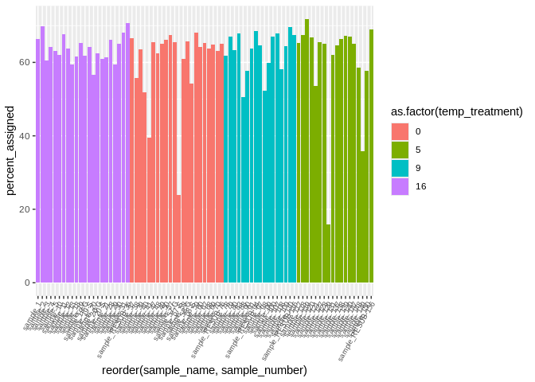
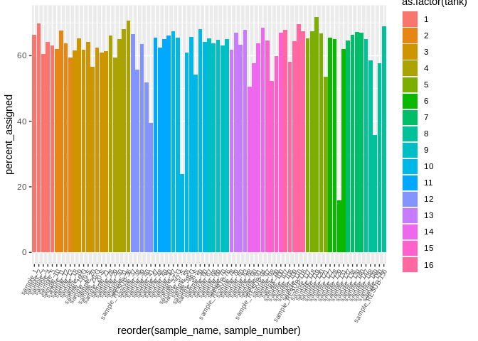

06.2-cod-RNAseq-alignment-genome
================
Kathleen Durkin
2024-04-16

- <a href="#1-create-a-bash-variables-file"
  id="toc-1-create-a-bash-variables-file">1 Create a Bash variables
  file</a>
- <a href="#2-align-to-reference-genome-hisat2"
  id="toc-2-align-to-reference-genome-hisat2">2 Align to reference genome
  (Hisat2)</a>
  - <a href="#21-retrieving-the-reference-genome-and-gff"
    id="toc-21-retrieving-the-reference-genome-and-gff">2.1 Retrieving the
    reference genome and gff</a>
  - <a href="#22-verify-genome-fasta-md5-checksum"
    id="toc-22-verify-genome-fasta-md5-checksum">2.2 Verify genome FastA MD5
    checksum</a>
  - <a href="#23-building-index" id="toc-23-building-index">2.3 Building
    Index</a>
  - <a href="#24-alignment" id="toc-24-alignment">2.4 Alignment</a>
- <a href="#3-read-summarization" id="toc-3-read-summarization">3 Read
  Summarization</a>
  - <a href="#31-exons" id="toc-31-exons">3.1 Exons</a>
  - <a href="#32-genes" id="toc-32-genes">3.2 Genes</a>

``` r
library(tidyverse)
library(dplyr)
library(magrittr)
library(knitr)
library(ggplot2)
library(plotly)
```

Code for aligning RNAseq data to reference genome, to be used on
[Pacific cod RNAseq
data](https://shedurkin.github.io/Roberts-LabNotebook/posts/projects/pacific_cod/2023_12_13_pacific_cod.html).

- Raw reads found
  [here](https://owl.fish.washington.edu/nightingales/G_macrocephalus/30-943133806/)
- Trimmed reads:
- Genome downloaded from
  [NCBI](https://www.ncbi.nlm.nih.gov/datasets/genome/GCF_031168955.1/),
  stored
  [here](https://owl.fish.washington.edu/halfshell/genomic-databank/GCF_031168955.1_ASM3116895v1_rna.fna)
  as a part of lab [genomic
  resources](https://robertslab.github.io/resources/Genomic-Resources/#gadus-macrocephalus-pacific-cod)
- Genome GTF downloaded from
  [NCBI](https://www.ncbi.nlm.nih.gov/datasets/genome/GCF_031168955.1/)

# 1 Create a Bash variables file

This allows usage of Bash variables (e.g. paths to common directories)
across R Markdown chunks.

``` bash
{
echo "#### Assign Variables ####"
echo ""

echo "# Data directories"
echo 'export cod_dir=/home/shared/8TB_HDD_02/shedurkin/project-cod-temperature'
echo 'export output_dir_top=${cod_dir}/output/06.2-cod-RNAseq-alignment-genome'
echo 'export genome_fasta_dir=${cod_dir}/data'
echo 'export trimmed_reads_dir=${cod_dir}/output/05-cod-RNAseq-trimming/trimmed-reads'
echo ""


echo "# Input/Output files"
echo 'export genome_fasta_name="GCF_031168955.1_ASM3116895v1_genomic"'
echo 'export genome_fasta="${genome_fasta_dir}/${genome_fasta_name}"'
echo 'export genome_gtf_name="genomic"'
echo 'export genome_gtf="${genome_fasta_dir}/${genome_gtf_name}"'
echo 'export hisat2_exon_name="G_macrocephalus_exon"'
echo 'export hisat2_exon="${hisat2_output_dir}/${hisat_exon_name}"'
echo 'export hisat2_splice_sites_name="G_macrocephalus_splice_sites"'
echo 'export hisat2_splice_sites="${hisat2_output_dir}/${hisat2_splice_sites_name}"'
echo 'export hisat2_index_name="G_macrocephalus_Hisat2_index"'
echo 'export hisat2_index="${hisat2_output_dir}/${hisat2_index}"'


echo "# External data URLs and checksums"
echo 'export genome_fasta_url="https://owl.fish.washington.edu/halfshell/genomic-databank/GCF_031168955.1_ASM3116895v1_genomic.fna"'
echo 'export genome_fasta_checksum="5144890d4eceb0b258d92db3f35c681e"'
echo 'export genome_gtf_url="https://api.ncbi.nlm.nih.gov/datasets/v2alpha/genome/accession/GCF_031168955.1/download?include_annotation_type=GENOME_GTF"'
#echo 'export genome_gtf_checksum="173fb3c159e474391c5c4aa1f7230024"'


echo "# Paths to programs"
echo 'export hisat2_exons=/home/shared/hisat2-2.2.1/hisat2_extract_exons.py'
echo 'export hisat2_splice_sites=/home/shared/hisat2-2.2.1/hisat2_extract_splice_sites.py'
echo 'export hisat2_build=/home/shared/hisat2-2.2.1/hisat2-build'
echo ""


echo "# Set number of CPUs to use"
echo 'export threads=20'
echo ""


echo "# Programs associative array"
echo "declare -A programs_array"
echo "programs_array=("
echo '[hisat2_exons]="${hisat2_exons}" \'
echo '[hisat2_splice_sites]="${hisat2_splice_sites}" \'
echo '[hisat2_build]="${hisat2_build}" \'
echo '[trinity_abund_to_matrix]="${trinity_abund_to_matrix}" \'
echo ")"
} > .bashvars

cat .bashvars
```

    #### Assign Variables ####

    # Data directories
    export cod_dir=/home/shared/8TB_HDD_02/shedurkin/project-cod-temperature
    export output_dir_top=${cod_dir}/output/06.2-cod-RNAseq-alignment-genome
    export genome_fasta_dir=${cod_dir}/data
    export trimmed_reads_dir=${cod_dir}/output/05-cod-RNAseq-trimming/trimmed-reads

    # Input/Output files
    export genome_fasta_name="GCF_031168955.1_ASM3116895v1_genomic"
    export genome_fasta="${genome_fasta_dir}/${genome_fasta_name}"
    export genome_gtf_name="genomic"
    export genome_gtf="${genome_fasta_dir}/${genome_gtf_name}"
    export hisat2_exon_name="G_macrocephalus_exon"
    export hisat2_exon="${hisat2_output_dir}/${hisat_exon_name}"
    export hisat2_splice_sites_name="G_macrocephalus_splice_sites"
    export hisat2_splice_sites="${hisat2_output_dir}/${hisat2_splice_sites_name}"
    export hisat2_index_name="G_macrocephalus_Hisat2_index"
    export hisat2_index="${hisat2_output_dir}/${hisat2_index}"
    # External data URLs and checksums
    export genome_fasta_url="https://owl.fish.washington.edu/halfshell/genomic-databank/GCF_031168955.1_ASM3116895v1_genomic.fna"
    export genome_fasta_checksum="5144890d4eceb0b258d92db3f35c681e"
    export genome_gtf_url="https://api.ncbi.nlm.nih.gov/datasets/v2alpha/genome/accession/GCF_031168955.1/download?include_annotation_type=GENOME_GTF"
    # Paths to programs
    export hisat2_exons=/home/shared/hisat2-2.2.1/hisat2_extract_exons.py
    export hisat2_splice_sites=/home/shared/hisat2-2.2.1/hisat2_extract_splice_sites.py
    export hisat2_build=/home/shared/hisat2-2.2.1/hisat2-build

    # Set number of CPUs to use
    export threads=20

    # Programs associative array
    declare -A programs_array
    programs_array=(
    [hisat2_exons]="${hisat2_exons}" \
    [hisat2_splice_sites]="${hisat2_splice_sites}" \
    [hisat2_build]="${hisat2_build}" \
    [trinity_abund_to_matrix]="${trinity_abund_to_matrix}" \
    )

# 2 Align to reference genome (Hisat2)

## 2.1 Retrieving the reference genome and gff

``` bash
# Load bash variables into memory
source .bashvars

wget \
--directory-prefix ${genome_fasta_dir} \
--recursive \
--no-check-certificate \
--continue \
--no-host-directories \
--no-directories \
--no-parent \
--quiet \
--execute robots=off \
--accept "${genome_fasta_name}.fna" ${genome_fasta_url}
```

v NOT CURRENTLY WORKING v, had to download locally and then upload to
server for use

``` bash
# Load bash variables into memory
source .bashvars

cd ../data

curl -O "https://api.ncbi.nlm.nih.gov/datasets/v2alpha/genome/accession/GCF_031168955.1/download?include_annotation_type=GENOME_GTF"

#curl -O "${genome_gtf_url}"
```

``` bash
# Load bash variables into memory
source .bashvars

ls -lh "${genome_fasta_dir}"
```

    total 1.9G
    drwxr-xr-x 3 shedurkin labmembers 4.0K Mar  4 11:05 05-cod-RNAseq-trimming
    -rw-r--r-- 1 shedurkin labmembers  13K Dec 27 15:45 Cod_RNAseq_NGS_Template_File.xlsx
    -rw-r--r-- 1 shedurkin labmembers 2.1K Mar 20 20:55 DESeq2_Sample_Information.csv
    -rw-r--r-- 1 shedurkin labmembers  38M Oct 25  2023 Gadus_macrocephalus.coding.gene.V1.cds
    -rw-r--r-- 1 shedurkin labmembers 537M Oct 16  2023 GCF_031168955.1_ASM3116895v1_genomic.fna
    -rw-r--r-- 1 shedurkin labmembers 351M Oct 16  2023 GCF_031168955.1_ASM3116895v1.gff
    -rw-r--r-- 1 shedurkin labmembers 169M Oct 16  2023 GCF_031168955.1_ASM3116895v1_rna.fna
    -rw-r--r-- 1 shedurkin labmembers 404M Apr 23 14:29 genomic.gtf
    -rw-r--r-- 1 shedurkin labmembers  47K Oct 25  2023 Pcod Temp Growth experiment 2022-23 DATA.xlsx
    -rw-r--r-- 1 shedurkin labmembers 231K Mar  4 17:41 Sample.QC.report.of_30-943133806_240118025106.pdf
    -rw-r--r-- 1 shedurkin labmembers  12K Mar  4 17:41 Sample.QC.report.of_30-943133806_240118025106.xlsx
    -rw-r--r-- 1 shedurkin labmembers  12K Oct 25  2023 temp-experiment.csv
    -rw-r--r-- 1 shedurkin labmembers 271M Oct 25  2023 uniprot_sprot_r2023_04.fasta
    -rw-r--r-- 1 shedurkin labmembers  88M Apr 17 11:54 uniprot_sprot_r2023_04.fasta.gz

## 2.2 Verify genome FastA MD5 checksum

``` bash
# Load bash variables into memory
source .bashvars

cd "${genome_fasta_dir}"

# Checksums file contains other files, so this just looks for the sRNAseq files.
md5sum --check <<< "${genome_fasta_checksum}  ${genome_fasta_name}.fna"
```

``` bash
# Load bash variables into memory
source .bashvars

cd "${genome_fasta_dir}"

# Checksums file contains other files, so this just looks for the sRNAseq files.
md5sum --check <<< "${genome_gtf_checksum}  ${genome_gtf_name}.gtf"
```

## 2.3 Building Index

``` bash
# Load bash variables into memory
source .bashvars

# Create Hisat2 exons tab file
/home/shared/hisat2-2.2.1/hisat2_extract_exons.py \
../data/genomic.gtf \
> ../output/06.2-cod-RNAseq-alignment-genome/hisat2/G_macrocephalus_exon.tab

# Create Hisat2 exons tab file
#"${programs_array[hisat2_exons]}" \
#"${genome_gtf}.gtf" \
#> "${hisat2_exon}.tab"
```

``` bash
# Create Hisat2 splice sites tab file
/home/shared/hisat2-2.2.1/hisat2_extract_splice_sites.py \
../data/genomic.gtf \
> ../output/06.2-cod-RNAseq-alignment-genome/hisat2/G_macrocephalus_splice_sites.tab

#"${programs_array[hisat2_splice_sites]}" \
#"${genome_gtf}.gtf" \
#> "${hisat2_splice_sites}.tab"
```

``` bash
# Build Hisat2 reference index using splice sites and exons
/home/shared/hisat2-2.2.1/hisat2-build \
../data/GCF_031168955.1_ASM3116895v1_genomic.fna \
../output/06.2-cod-RNAseq-alignment-genome/hisat2/G_macrocephalus_index.idx \
--exon ../output/06.2-cod-RNAseq-alignment-genome/hisat2/G_macrocephalus_exon.tab \
--ss ../output/06.2-cod-RNAseq-alignment-genome/hisat2/G_macrocephalus_splice_sites.tab \
-p 20 \
2> ../output/06.2-cod-RNAseq-alignment-genome/hisat2/hisat2-build_stats.txt

#"${programs_array[hisat2_build]}" \
#"${genome_fasta}.fna" \
#"${hisat2_index}.idx" \
#--exon "${hisat2_exon}.tab" \
#--ss "${hisat2_splice_sites}.tab" \
#-p "${threads}" \
#2> "${output_dir_top}/hisat2-build_stats.txt"
```

``` bash
# Load bash variables into memory
source .bashvars

ls -lh "${output_dir_top}"
```

    total 16K
    drwxr-xr-x 3 shedurkin labmembers 4.0K Apr 30 14:21 featureCounts-exon
    drwxr-xr-x 2 shedurkin labmembers  12K Apr 30 14:23 hisat2

## 2.4 Alignment

``` bash
# Load bash variables into memory
source .bashvars

## Sample Quantification

# Hisat2 alignments
find ../output/05-cod-RNAseq-trimming/trimmed-reads/*.gz \
| xargs basename -s .flexbar_trim.R_1.fastq.gz | xargs -I{} \
/home/shared/hisat2-2.2.1/hisat2 \
-x ../output/06.2-cod-RNAseq-alignment-genome/hisat2/G_macrocephalus_index.idx \
-p 20 \
-1 ../output/05-cod-RNAseq-trimming/trimmed-reads/{}.flexbar_trim.R_1.fastq.gz \
-2 ../output/05-cod-RNAseq-trimming/trimmed-reads/{}.flexbar_trim.R_2.fastq.gz \
-S ../output/06.2-cod-RNAseq-alignment-genome/hisat2/{}.sam
&> ../output/06.2-cod-RNAseq-alignment-genome/hisat2/{}_hisat2.log


# # Hisat2 alignments
# find ${trimmed_reads_dir}/*.gz \
# | xargs basename -s .flexbar_trim.R_1.fastq.gz | xargs -I{} \
# "${programs_array[hisat2]}" \
# -x "${hisat2_index}.idx" \
# -p 20 \
# -1 ${trimmed_reads_dir}/{}.flexbar_trim.R_1.fastq.gz \
# -2 ${trimmed_reads_dir}/{}.flexbar_trim.R_2.fastq.gz \
# -S ${output_dir_top}/{}.sam
# 
```

``` bash
# Sort SAM files, convert to BAM, and index

for samfile in ../output/06.2-cod-RNAseq-alignment-genome/hisat2/*.sam; do
  bamfile="${samfile%.sam}.bam"
  sorted_bamfile="${samfile%.sam}.sorted.bam"
  
  # Check if the output file already exists
  if [[ ! -e "$sorted_bamfile" ]]; then
    # Convert SAM to BAM
    /home/shared/samtools-1.12/samtools view -bS -@ 10 "$samfile" > "$bamfile"
  
    # Sort BAM
    /home/shared/samtools-1.12/samtools sort -@ 10 "$bamfile" -o "$sorted_bamfile"
  
    # Index sorted BAM
    /home/shared/samtools-1.12/samtools index -@ 10 "$sorted_bamfile"
  fi
done
```

``` bash
# Count the number of samples for which we have sorted bam files -- I should have 79 (one for each input sample)
find ../output/06.2-cod-RNAseq-alignment-genome/hisat2/ -type f -name "*.sorted.bam" | wc -l
```

    79

``` bash
# Delete unneccessary index files
rm ../output/06.2-cod-RNAseq-alignment-genome/hisat2/*.ht2

# Delete unneeded SAM files
rm ../output/06.2-cod-RNAseq-alignment-genome/hisat2/*.sam


# # Sort SAM files, convert to BAM, and index
# ${programs_array[samtools_view]} \
# -@ "${threads}" \
# -Su "${sample_name}".sam \
# | ${programs_array[samtools_sort]} - \
# -@ "${threads}" \
# -o "${sample_name}".sorted.bam
# ${programs_array[samtools_index]} "${sample_name}".sorted.bam
# 
# 
# # Delete unneccessary index files
# rm "${genome_index_name}"*.ht2
# 
# # Delete unneeded SAM files
# rm ./*.sam
```

``` bash
# View the output files
ls -lh ../output/06.2-cod-RNAseq-alignment-genome/hisat2/
```

    total 364G
    -rw-r--r-- 1 shedurkin labmembers  2.7G Apr 24 12:27 100.bam
    -rw-r--r-- 1 shedurkin labmembers  1.6G Apr 24 12:28 100.sorted.bam
    -rw-r--r-- 1 shedurkin labmembers  1.1M Apr 24 12:28 100.sorted.bam.bai
    -rw-r--r-- 1 shedurkin labmembers  2.6G Apr 24 12:29 107.bam
    -rw-r--r-- 1 shedurkin labmembers  1.5G Apr 24 12:30 107.sorted.bam
    -rw-r--r-- 1 shedurkin labmembers  852K Apr 24 12:30 107.sorted.bam.bai
    -rw-r--r-- 1 shedurkin labmembers  3.3G Apr 24 12:32 108.bam
    -rw-r--r-- 1 shedurkin labmembers  2.1G Apr 24 12:35 108.sorted.bam
    -rw-r--r-- 1 shedurkin labmembers  1.3M Apr 24 12:35 108.sorted.bam.bai
    -rw-r--r-- 1 shedurkin labmembers  3.4G Apr 24 12:39 109.bam
    -rw-r--r-- 1 shedurkin labmembers  2.0G Apr 24 12:41 109.sorted.bam
    -rw-r--r-- 1 shedurkin labmembers  1.2M Apr 24 12:41 109.sorted.bam.bai
    -rw-r--r-- 1 shedurkin labmembers  2.9G Apr 24 12:48 10.bam
    -rw-r--r-- 1 shedurkin labmembers  1.8G Apr 24 12:49 10.sorted.bam
    -rw-r--r-- 1 shedurkin labmembers  1.2M Apr 24 12:49 10.sorted.bam.bai
    -rw-r--r-- 1 shedurkin labmembers  3.2G Apr 24 12:58 110.bam
    -rw-r--r-- 1 shedurkin labmembers  1.9G Apr 24 13:00 110.sorted.bam
    -rw-r--r-- 1 shedurkin labmembers  1.1M Apr 24 13:01 110.sorted.bam.bai
    -rw-r--r-- 1 shedurkin labmembers  3.3G Apr 24 13:09 117.bam
    -rw-r--r-- 1 shedurkin labmembers  2.0G Apr 24 13:12 117.sorted.bam
    -rw-r--r-- 1 shedurkin labmembers  1.3M Apr 24 13:12 117.sorted.bam.bai
    -rw-r--r-- 1 shedurkin labmembers  3.3G Apr 24 13:21 118.bam
    -rw-r--r-- 1 shedurkin labmembers  2.0G Apr 24 13:24 118.sorted.bam
    -rw-r--r-- 1 shedurkin labmembers  1.3M Apr 24 13:24 118.sorted.bam.bai
    -rw-r--r-- 1 shedurkin labmembers  3.4G Apr 24 13:27 119.bam
    -rw-r--r-- 1 shedurkin labmembers  2.0G Apr 24 13:30 119.sorted.bam
    -rw-r--r-- 1 shedurkin labmembers  1.1M Apr 24 13:30 119.sorted.bam.bai
    -rw-r--r-- 1 shedurkin labmembers  3.3G Apr 24 13:33 11.bam
    -rw-r--r-- 1 shedurkin labmembers  2.0G Apr 24 13:35 11.sorted.bam
    -rw-r--r-- 1 shedurkin labmembers  1.2M Apr 24 13:35 11.sorted.bam.bai
    -rw-r--r-- 1 shedurkin labmembers  3.1G Apr 24 13:38 120.bam
    -rw-r--r-- 1 shedurkin labmembers  1.9G Apr 24 13:40 120.sorted.bam
    -rw-r--r-- 1 shedurkin labmembers  1.2M Apr 24 13:40 120.sorted.bam.bai
    -rw-r--r-- 1 shedurkin labmembers  3.2G Apr 24 13:43 121.bam
    -rw-r--r-- 1 shedurkin labmembers  2.0G Apr 24 13:45 121.sorted.bam
    -rw-r--r-- 1 shedurkin labmembers  816K Apr 24 13:45 121.sorted.bam.bai
    -rw-r--r-- 1 shedurkin labmembers  3.6G Apr 24 13:53 127.bam
    -rw-r--r-- 1 shedurkin labmembers  2.2G Apr 24 13:55 127.sorted.bam
    -rw-r--r-- 1 shedurkin labmembers  1.2M Apr 24 13:55 127.sorted.bam.bai
    -rw-r--r-- 1 shedurkin labmembers  1.6G Apr 24 13:57 128.bam
    -rw-r--r-- 1 shedurkin labmembers  940M Apr 24 13:58 128.sorted.bam
    -rw-r--r-- 1 shedurkin labmembers  713K Apr 24 13:58 128.sorted.bam.bai
    -rw-r--r-- 1 shedurkin labmembers  1.4G Apr 24 14:01 129.bam
    -rw-r--r-- 1 shedurkin labmembers  1.1G Apr 24 14:02 129.sorted.bam
    -rw-r--r-- 1 shedurkin labmembers  1.9M Apr 24 14:02 129.sorted.bam.bai
    -rw-r--r-- 1 shedurkin labmembers  3.1G Apr 24 14:07 12.bam
    -rw-r--r-- 1 shedurkin labmembers  1.9G Apr 24 14:09 12.sorted.bam
    -rw-r--r-- 1 shedurkin labmembers  1.2M Apr 24 14:09 12.sorted.bam.bai
    -rw-r--r-- 1 shedurkin labmembers  1.4G Apr 24 14:12 131.bam
    -rw-r--r-- 1 shedurkin labmembers  883M Apr 24 14:12 131.sorted.bam
    -rw-r--r-- 1 shedurkin labmembers  736K Apr 24 14:12 131.sorted.bam.bai
    -rw-r--r-- 1 shedurkin labmembers  1.3G Apr 24 14:15 137.bam
    -rw-r--r-- 1 shedurkin labmembers  780M Apr 24 14:15 137.sorted.bam
    -rw-r--r-- 1 shedurkin labmembers  659K Apr 24 14:15 137.sorted.bam.bai
    -rw-r--r-- 1 shedurkin labmembers  1.3G Apr 24 14:16 138.bam
    -rw-r--r-- 1 shedurkin labmembers  773M Apr 24 14:17 138.sorted.bam
    -rw-r--r-- 1 shedurkin labmembers  656K Apr 24 14:17 138.sorted.bam.bai
    -rw-r--r-- 1 shedurkin labmembers  1.5G Apr 24 14:18 139.bam
    -rw-r--r-- 1 shedurkin labmembers  906M Apr 24 14:18 139.sorted.bam
    -rw-r--r-- 1 shedurkin labmembers  786K Apr 24 14:19 139.sorted.bam.bai
    -rw-r--r-- 1 shedurkin labmembers  2.8G Apr 24 14:20 13.bam
    -rw-r--r-- 1 shedurkin labmembers  1.7G Apr 24 14:22 13.sorted.bam
    -rw-r--r-- 1 shedurkin labmembers  1.2M Apr 24 14:22 13.sorted.bam.bai
    -rw-r--r-- 1 shedurkin labmembers  1.5G Apr 24 14:23 140.bam
    -rw-r--r-- 1 shedurkin labmembers  904M Apr 24 14:23 140.sorted.bam
    -rw-r--r-- 1 shedurkin labmembers  749K Apr 24 14:23 140.sorted.bam.bai
    -rw-r--r-- 1 shedurkin labmembers  1.3G Apr 24 14:24 147.bam
    -rw-r--r-- 1 shedurkin labmembers  812M Apr 24 14:25 147.sorted.bam
    -rw-r--r-- 1 shedurkin labmembers  692K Apr 24 14:25 147.sorted.bam.bai
    -rw-r--r-- 1 shedurkin labmembers  3.6G Apr 24 14:27 148.bam
    -rw-r--r-- 1 shedurkin labmembers  2.2G Apr 24 14:30 148.sorted.bam
    -rw-r--r-- 1 shedurkin labmembers  1.1M Apr 24 14:30 148.sorted.bam.bai
    -rw-r--r-- 1 shedurkin labmembers   15G Apr 24 14:43 149.bam
    -rw-r--r-- 1 shedurkin labmembers  8.9G Apr 24 14:54 149.sorted.bam
    -rw-r--r-- 1 shedurkin labmembers  7.1M Apr 24 14:55 149.sorted.bam.bai
    -rw-r--r-- 1 shedurkin labmembers  3.8G Apr 24 14:58 150.bam
    -rw-r--r-- 1 shedurkin labmembers  2.4G Apr 24 15:00 150.sorted.bam
    -rw-r--r-- 1 shedurkin labmembers  1.3M Apr 24 15:00 150.sorted.bam.bai
    -rw-r--r-- 1 shedurkin labmembers  2.7G Apr 24 15:03 18.bam
    -rw-r--r-- 1 shedurkin labmembers  1.6G Apr 24 15:05 18.sorted.bam
    -rw-r--r-- 1 shedurkin labmembers  1.2M Apr 24 15:05 18.sorted.bam.bai
    -rw-r--r-- 1 shedurkin labmembers  2.7G Apr 24 15:16 19.bam
    -rw-r--r-- 1 shedurkin labmembers  3.5G Apr 24 15:09 19-G.bam
    -rw-r--r-- 1 shedurkin labmembers  2.3G Apr 24 15:12 19-G.sorted.bam
    -rw-r--r-- 1 shedurkin labmembers  1.1M Apr 24 15:12 19-G.sorted.bam.bai
    -rw-r--r-- 1 shedurkin labmembers  3.7G Apr 24 15:21 19-S.bam
    -rw-r--r-- 1 shedurkin labmembers  1.6G Apr 24 15:17 19.sorted.bam
    -rw-r--r-- 1 shedurkin labmembers 1023K Apr 24 15:17 19.sorted.bam.bai
    -rw-r--r-- 1 shedurkin labmembers  2.4G Apr 24 15:24 19-S.sorted.bam
    -rw-r--r-- 1 shedurkin labmembers  1.2M Apr 24 15:25 19-S.sorted.bam.bai
    -rw-r--r-- 1 shedurkin labmembers  3.2G Apr 24 15:27 1.bam
    -rw-r--r-- 1 shedurkin labmembers  1.9G Apr 24 15:29 1.sorted.bam
    -rw-r--r-- 1 shedurkin labmembers  1.1M Apr 24 15:29 1.sorted.bam.bai
    -rw-r--r-- 1 shedurkin labmembers  2.6G Apr 24 15:37 20.bam
    -rw-r--r-- 1 shedurkin labmembers  3.6G Apr 24 15:32 20-G.bam
    -rw-r--r-- 1 shedurkin labmembers  2.4G Apr 24 15:34 20-G.sorted.bam
    -rw-r--r-- 1 shedurkin labmembers  1.1M Apr 24 15:35 20-G.sorted.bam.bai
    -rw-r--r-- 1 shedurkin labmembers  2.5G Apr 24 15:40 20-S.bam
    -rw-r--r-- 1 shedurkin labmembers  1.6G Apr 24 15:38 20.sorted.bam
    -rw-r--r-- 1 shedurkin labmembers  1.1M Apr 24 15:38 20.sorted.bam.bai
    -rw-r--r-- 1 shedurkin labmembers  1.7G Apr 24 15:41 20-S.sorted.bam
    -rw-r--r-- 1 shedurkin labmembers  935K Apr 24 15:41 20-S.sorted.bam.bai
    -rw-r--r-- 1 shedurkin labmembers  2.7G Apr 24 15:43 21.bam
    -rw-r--r-- 1 shedurkin labmembers  1.6G Apr 24 15:44 21.sorted.bam
    -rw-r--r-- 1 shedurkin labmembers  1.2M Apr 24 15:44 21.sorted.bam.bai
    -rw-r--r-- 1 shedurkin labmembers  2.8G Apr 24 15:46 28.bam
    -rw-r--r-- 1 shedurkin labmembers  1.7G Apr 24 15:47 28.sorted.bam
    -rw-r--r-- 1 shedurkin labmembers  1.1M Apr 24 15:47 28.sorted.bam.bai
    -rw-r--r-- 1 shedurkin labmembers  2.8G Apr 24 15:49 29.bam
    -rw-r--r-- 1 shedurkin labmembers  1.8G Apr 24 15:51 29.sorted.bam
    -rw-r--r-- 1 shedurkin labmembers  1.2M Apr 24 15:51 29.sorted.bam.bai
    -rw-r--r-- 1 shedurkin labmembers  3.0G Apr 24 15:53 2.bam
    -rw-r--r-- 1 shedurkin labmembers  1.8G Apr 24 15:54 2.sorted.bam
    -rw-r--r-- 1 shedurkin labmembers  990K Apr 24 15:54 2.sorted.bam.bai
    -rw-r--r-- 1 shedurkin labmembers  3.0G Apr 24 15:56 30.bam
    -rw-r--r-- 1 shedurkin labmembers  1.8G Apr 24 15:58 30.sorted.bam
    -rw-r--r-- 1 shedurkin labmembers  1.1M Apr 24 15:58 30.sorted.bam.bai
    -rw-r--r-- 1 shedurkin labmembers  3.0G Apr 24 16:00 31.bam
    -rw-r--r-- 1 shedurkin labmembers  1.7G Apr 24 16:01 31.sorted.bam
    -rw-r--r-- 1 shedurkin labmembers  839K Apr 24 16:01 31.sorted.bam.bai
    -rw-r--r-- 1 shedurkin labmembers  2.4G Apr 24 16:03 37.bam
    -rw-r--r-- 1 shedurkin labmembers  1.4G Apr 24 16:04 37.sorted.bam
    -rw-r--r-- 1 shedurkin labmembers  847K Apr 24 16:04 37.sorted.bam.bai
    -rw-r--r-- 1 shedurkin labmembers  2.7G Apr 24 16:06 38.bam
    -rw-r--r-- 1 shedurkin labmembers  1.7G Apr 24 16:08 38.sorted.bam
    -rw-r--r-- 1 shedurkin labmembers  1.3M Apr 24 16:08 38.sorted.bam.bai
    -rw-r--r-- 1 shedurkin labmembers  2.7G Apr 24 16:10 39.bam
    -rw-r--r-- 1 shedurkin labmembers  1.6G Apr 24 16:11 39.sorted.bam
    -rw-r--r-- 1 shedurkin labmembers  936K Apr 24 16:11 39.sorted.bam.bai
    -rw-r--r-- 1 shedurkin labmembers  3.0G Apr 24 16:13 3.bam
    -rw-r--r-- 1 shedurkin labmembers  1.9G Apr 24 16:15 3.sorted.bam
    -rw-r--r-- 1 shedurkin labmembers  1.3M Apr 24 16:15 3.sorted.bam.bai
    -rw-r--r-- 1 shedurkin labmembers  2.4G Apr 24 16:17 40.bam
    -rw-r--r-- 1 shedurkin labmembers  1.5G Apr 24 16:18 40.sorted.bam
    -rw-r--r-- 1 shedurkin labmembers  1.1M Apr 24 16:18 40.sorted.bam.bai
    -rw-r--r-- 1 shedurkin labmembers  2.4G Apr 24 16:20 41.bam
    -rw-r--r-- 1 shedurkin labmembers  1.6G Apr 24 16:22 41.sorted.bam
    -rw-r--r-- 1 shedurkin labmembers  1.3M Apr 24 16:22 41.sorted.bam.bai
    -rw-r--r-- 1 shedurkin labmembers  2.7G Apr 26 16:47 47.bam
    -rw-r--r-- 1 shedurkin labmembers  1.7G Apr 26 16:49 47.sorted.bam
    -rw-r--r-- 1 shedurkin labmembers  989K Apr 26 16:49 47.sorted.bam.bai
    -rw-r--r-- 1 shedurkin labmembers  2.9G Apr 26 16:51 48.bam
    -rw-r--r-- 1 shedurkin labmembers  1.7G Apr 26 16:53 48.sorted.bam
    -rw-r--r-- 1 shedurkin labmembers  927K Apr 26 16:53 48.sorted.bam.bai
    -rw-r--r-- 1 shedurkin labmembers  3.0G Apr 26 16:55 49.bam
    -rw-r--r-- 1 shedurkin labmembers  1.8G Apr 26 16:57 49.sorted.bam
    -rw-r--r-- 1 shedurkin labmembers  1.1M Apr 26 16:57 49.sorted.bam.bai
    -rw-r--r-- 1 shedurkin labmembers  3.3G Apr 26 16:59 4.bam
    -rw-r--r-- 1 shedurkin labmembers  1.9G Apr 26 17:02 4.sorted.bam
    -rw-r--r-- 1 shedurkin labmembers  1.1M Apr 26 17:02 4.sorted.bam.bai
    -rw-r--r-- 1 shedurkin labmembers  2.9G Apr 26 17:04 50.bam
    -rw-r--r-- 1 shedurkin labmembers  1.7G Apr 26 17:05 50.sorted.bam
    -rw-r--r-- 1 shedurkin labmembers  1.1M Apr 26 17:05 50.sorted.bam.bai
    -rw-r--r-- 1 shedurkin labmembers  2.9G Apr 26 17:14 57.bam
    -rw-r--r-- 1 shedurkin labmembers  4.3G Apr 26 17:09 57-G.bam
    -rw-r--r-- 1 shedurkin labmembers  2.8G Apr 26 17:11 57-G.sorted.bam
    -rw-r--r-- 1 shedurkin labmembers  1.2M Apr 26 17:11 57-G.sorted.bam.bai
    -rw-r--r-- 1 shedurkin labmembers  1.8G Apr 26 17:17 57-S.bam
    -rw-r--r-- 1 shedurkin labmembers  1.8G Apr 26 17:15 57.sorted.bam
    -rw-r--r-- 1 shedurkin labmembers  1.1M Apr 26 17:15 57.sorted.bam.bai
    -rw-r--r-- 1 shedurkin labmembers  1.4G Apr 26 17:18 57-S.sorted.bam
    -rw-r--r-- 1 shedurkin labmembers 1001K Apr 26 17:18 57-S.sorted.bam.bai
    -rw-r--r-- 1 shedurkin labmembers  2.9G Apr 26 17:27 58.bam
    -rw-r--r-- 1 shedurkin labmembers  4.4G Apr 26 17:22 58-G.bam
    -rw-r--r-- 1 shedurkin labmembers  2.8G Apr 26 17:24 58-G.sorted.bam
    -rw-r--r-- 1 shedurkin labmembers  1.3M Apr 26 17:25 58-G.sorted.bam.bai
    -rw-r--r-- 1 shedurkin labmembers  2.2G Apr 26 17:30 58-S.bam
    -rw-r--r-- 1 shedurkin labmembers  1.8G Apr 26 17:28 58.sorted.bam
    -rw-r--r-- 1 shedurkin labmembers  1.1M Apr 26 17:29 58.sorted.bam.bai
    -rw-r--r-- 1 shedurkin labmembers  1.4G Apr 26 17:32 58-S.sorted.bam
    -rw-r--r-- 1 shedurkin labmembers  745K Apr 26 17:32 58-S.sorted.bam.bai
    -rw-r--r-- 1 shedurkin labmembers  2.9G Apr 26 17:34 59.bam
    -rw-r--r-- 1 shedurkin labmembers  1.7G Apr 26 17:36 59.sorted.bam
    -rw-r--r-- 1 shedurkin labmembers  899K Apr 26 17:36 59.sorted.bam.bai
    -rw-r--r-- 1 shedurkin labmembers  3.0G Apr 26 17:38 5.bam
    -rw-r--r-- 1 shedurkin labmembers  1.8G Apr 26 17:40 5.sorted.bam
    -rw-r--r-- 1 shedurkin labmembers  1.3M Apr 26 17:40 5.sorted.bam.bai
    -rw-r--r-- 1 shedurkin labmembers  3.1G Apr 26 17:43 60.bam
    -rw-r--r-- 1 shedurkin labmembers  1.9G Apr 26 17:45 60.sorted.bam
    -rw-r--r-- 1 shedurkin labmembers  1.2M Apr 26 17:45 60.sorted.bam.bai
    -rw-r--r-- 1 shedurkin labmembers  3.2G Apr 26 17:47 67.bam
    -rw-r--r-- 1 shedurkin labmembers  1.9G Apr 26 17:49 67.sorted.bam
    -rw-r--r-- 1 shedurkin labmembers  1.2M Apr 26 17:49 67.sorted.bam.bai
    -rw-r--r-- 1 shedurkin labmembers  3.1G Apr 26 17:52 68.bam
    -rw-r--r-- 1 shedurkin labmembers  1.9G Apr 26 17:54 68.sorted.bam
    -rw-r--r-- 1 shedurkin labmembers  1.2M Apr 26 17:54 68.sorted.bam.bai
    -rw-r--r-- 1 shedurkin labmembers  2.6G Apr 26 17:56 69.bam
    -rw-r--r-- 1 shedurkin labmembers  1.6G Apr 26 17:58 69.sorted.bam
    -rw-r--r-- 1 shedurkin labmembers  944K Apr 26 17:58 69.sorted.bam.bai
    -rw-r--r-- 1 shedurkin labmembers  2.2G Apr 26 17:59 70.bam
    -rw-r--r-- 1 shedurkin labmembers  1.4G Apr 26 18:01 70.sorted.bam
    -rw-r--r-- 1 shedurkin labmembers  914K Apr 26 18:01 70.sorted.bam.bai
    -rw-r--r-- 1 shedurkin labmembers  2.6G Apr 26 18:03 78.bam
    -rw-r--r-- 1 shedurkin labmembers  1.6G Apr 26 18:04 78.sorted.bam
    -rw-r--r-- 1 shedurkin labmembers  1.2M Apr 26 18:05 78.sorted.bam.bai
    -rw-r--r-- 1 shedurkin labmembers  2.8G Apr 26 18:07 79.bam
    -rw-r--r-- 1 shedurkin labmembers  1.7G Apr 26 18:08 79.sorted.bam
    -rw-r--r-- 1 shedurkin labmembers  1.1M Apr 26 18:09 79.sorted.bam.bai
    -rw-r--r-- 1 shedurkin labmembers  2.2G Apr 26 18:10 80.bam
    -rw-r--r-- 1 shedurkin labmembers  1.4G Apr 26 18:12 80.sorted.bam
    -rw-r--r-- 1 shedurkin labmembers  1.1M Apr 26 18:12 80.sorted.bam.bai
    -rw-r--r-- 1 shedurkin labmembers  2.4G Apr 26 18:14 83.bam
    -rw-r--r-- 1 shedurkin labmembers  1.4G Apr 26 18:15 83.sorted.bam
    -rw-r--r-- 1 shedurkin labmembers  967K Apr 26 18:15 83.sorted.bam.bai
    -rw-r--r-- 1 shedurkin labmembers  2.8G Apr 26 18:17 88.bam
    -rw-r--r-- 1 shedurkin labmembers  1.8G Apr 26 18:19 88.sorted.bam
    -rw-r--r-- 1 shedurkin labmembers  1.2M Apr 26 18:19 88.sorted.bam.bai
    -rw-r--r-- 1 shedurkin labmembers  2.6G Apr 26 18:21 90.bam
    -rw-r--r-- 1 shedurkin labmembers  1.6G Apr 26 18:23 90.sorted.bam
    -rw-r--r-- 1 shedurkin labmembers  1.2M Apr 26 18:23 90.sorted.bam.bai
    -rw-r--r-- 1 shedurkin labmembers  3.0G Apr 26 18:25 91.bam
    -rw-r--r-- 1 shedurkin labmembers  1.9G Apr 26 18:27 91.sorted.bam
    -rw-r--r-- 1 shedurkin labmembers  1.2M Apr 26 18:27 91.sorted.bam.bai
    -rw-r--r-- 1 shedurkin labmembers  2.5G Apr 26 18:29 97.bam
    -rw-r--r-- 1 shedurkin labmembers  1.5G Apr 26 18:31 97.sorted.bam
    -rw-r--r-- 1 shedurkin labmembers  943K Apr 26 18:31 97.sorted.bam.bai
    -rw-r--r-- 1 shedurkin labmembers  3.3G Apr 26 18:34 98.bam
    -rw-r--r-- 1 shedurkin labmembers  2.0G Apr 26 18:36 98.sorted.bam
    -rw-r--r-- 1 shedurkin labmembers  1.5M Apr 26 18:36 98.sorted.bam.bai
    -rw-r--r-- 1 shedurkin labmembers  2.5G Apr 26 18:38 99.bam
    -rw-r--r-- 1 shedurkin labmembers  1.6G Apr 26 18:40 99.sorted.bam
    -rw-r--r-- 1 shedurkin labmembers  1.2M Apr 26 18:40 99.sorted.bam.bai
    -rw-r--r-- 1 shedurkin labmembers  7.4M Apr 23 14:34 G_macrocephalus_exon.tab
    -rw-r--r-- 1 shedurkin labmembers  7.1M Apr 23 14:40 G_macrocephalus_splice_sites.tab
    -rw-r--r-- 1 shedurkin labmembers   12K Apr 23 14:54 hisat2-build_stats.txt
    -rw-r--r-- 1 shedurkin labmembers  2.4G Apr 26 18:42 RESUB-116.bam
    -rw-r--r-- 1 shedurkin labmembers  1.5G Apr 26 18:43 RESUB-116.sorted.bam
    -rw-r--r-- 1 shedurkin labmembers  1.1M Apr 26 18:43 RESUB-116.sorted.bam.bai
    -rw-r--r-- 1 shedurkin labmembers  2.5G Apr 26 18:45 RESUB-156.bam
    -rw-r--r-- 1 shedurkin labmembers  1.5G Apr 26 18:47 RESUB-156.sorted.bam
    -rw-r--r-- 1 shedurkin labmembers  974K Apr 26 18:47 RESUB-156.sorted.bam.bai
    -rw-r--r-- 1 shedurkin labmembers  2.3G Apr 26 18:48 RESUB-36.bam
    -rw-r--r-- 1 shedurkin labmembers  1.4G Apr 26 18:50 RESUB-36.sorted.bam
    -rw-r--r-- 1 shedurkin labmembers  852K Apr 26 18:50 RESUB-36.sorted.bam.bai
    -rw-r--r-- 1 shedurkin labmembers  2.2G Apr 26 18:52 RESUB-76.bam
    -rw-r--r-- 1 shedurkin labmembers  1.3G Apr 26 18:53 RESUB-76.sorted.bam
    -rw-r--r-- 1 shedurkin labmembers  895K Apr 26 18:53 RESUB-76.sorted.bam.bai
    -rw-r--r-- 1 shedurkin labmembers  2.6G Apr 26 18:55 RESUB-94.bam
    -rw-r--r-- 1 shedurkin labmembers  1.6G Apr 26 18:57 RESUB-94.sorted.bam
    -rw-r--r-- 1 shedurkin labmembers 1014K Apr 26 18:57 RESUB-94.sorted.bam.bai

# 3 Read Summarization

Will be summarizing reads using
[featureCounts](https://www.rdocumentation.org/packages/Rsubread/versions/1.22.2/topics/featureCounts)
in the
[Rsubread](https://bioconductor.org/packages/release/bioc/vignettes/Rsubread/inst/doc/SubreadUsersGuide.pdf)
Bioconductor package

## 3.1 Exons

``` bash

/home/shared/subread-2.0.5-Linux-x86_64/bin/featureCounts \
-p --countReadPairs \
-T 5 \
-t exon \
-g gene_id \
-a ../data/genomic.gtf \
-o ../output/06.2-cod-RNAseq-alignment-genome/featureCounts-exon/featureCounts_exon_matrix.txt \
../output/06.2-cod-RNAseq-alignment-genome/hisat2/*.sorted.bam \
&> ../output/06.2-cod-RNAseq-alignment-genome/featureCounts-exon/featureCounts_exon.log
```

``` bash

/home/sam/programs/mambaforge/bin/multiqc \
../output/06.2-cod-RNAseq-alignment-genome/featureCounts-exon/featureCounts_exon_matrix.txt.summary \
-o ../output/06.2-cod-RNAseq-alignment-genome/featureCounts-exon

# View directory contents
ls -lh ../output/06.2-cod-RNAseq-alignment-genome/featureCounts-exon
```

I also want to include the treatment/tank info when plotting alignment
rates across samples

``` r
# Load multiqc stats
featureCounts_exon_multiqc <- read.csv("../output/06.2-cod-RNAseq-alignment-genome/featureCounts-exon/multiqc_data/multiqc_featureCounts.txt", sep = '\t')
# Adjust sample name formatting (to prep for join)
featureCounts_exon_multiqc$Sample <- paste("sample_", featureCounts_exon_multiqc$Sample, sep = "")
# Load experimental data
cod_sample_info_OG <- read.csv("../data/DESeq2_Sample_Information.csv")

featureCounts_exon_multiqc_plustreatment <- left_join(cod_sample_info_OG, featureCounts_exon_multiqc, by = c("sample_name" = "Sample")) %>% 
  na.omit()
featureCounts_exon_multiqc_plustreatment <- featureCounts_exon_multiqc_plustreatment[order(featureCounts_exon_multiqc_plustreatment$sample_number),]

a <- ggplot(featureCounts_exon_multiqc_plustreatment,
       aes(x=reorder(sample_name, sample_number), y=percent_assigned, fill=as.factor(temp_treatment))) +
  geom_bar(stat="identity") +
  theme(axis.text.x = element_text(angle = 60, vjust = 1, hjust=1, size=7))
a
```

<!-- -->

``` r
#ggplotly(a)

b <- ggplot(featureCounts_exon_multiqc_plustreatment,
       aes(x=reorder(sample_name, sample_number), y=percent_assigned, fill=as.factor(tank))) +
  geom_bar(stat="identity") +
  theme(axis.text.x = element_text(angle = 60, vjust = 1, hjust=1, size=7))
b
```

<!-- -->

``` r
#ggplotly(b)
```

## 3.2 Genes

``` bash

/home/shared/subread-2.0.5-Linux-x86_64/bin/featureCounts \
-p --countReadPairs \
-T 5 \
-t exon \
-g gene_id \
-a ../data/genomic.gtf \
-o ../output/06.2-cod-RNAseq-alignment-genome/featureCounts-gene/featureCounts_gene_matrix.txt \
../output/06.2-cod-RNAseq-alignment-genome/hisat2/*.sorted.bam \
&> ../output/06.2-cod-RNAseq-alignment-genome/featureCounts-gene/featureCounts_gene.log
```
