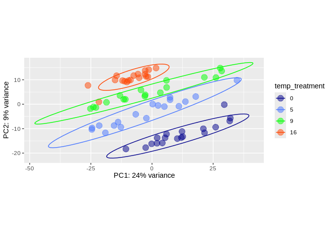
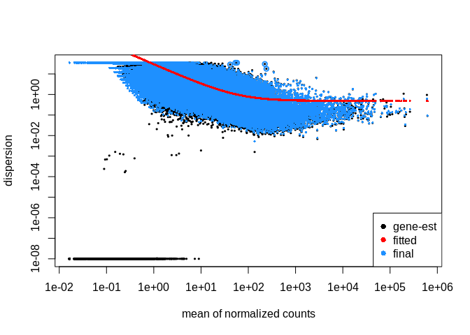
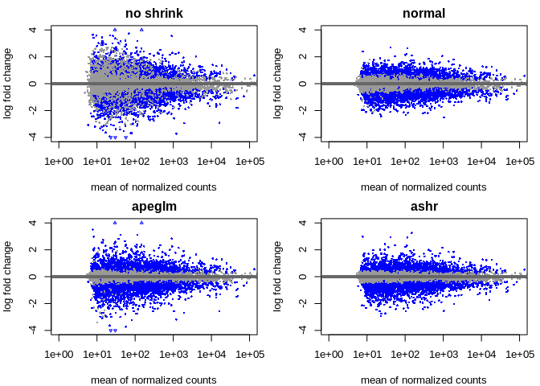
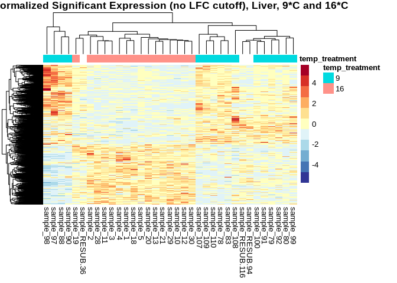

07-cod-RNAseq-DESeq2
================
Kathleen Durkin
2024-03-19

- <a href="#001-install-and-load-packages"
  id="toc-001-install-and-load-packages">0.0.1 Install and load
  packages</a>
- <a href="#1-load-data" id="toc-1-load-data">1 Load data</a>
  - <a href="#11-load-count-data" id="toc-11-load-count-data">1.1 Load count
    data</a>
  - <a href="#12-count-data-munging" id="toc-12-count-data-munging">1.2
    Count data munging</a>
  - <a href="#13-import-sample-metadata-sheet"
    id="toc-13-import-sample-metadata-sheet">1.3 Import sample metadata
    sheet</a>
  - <a href="#14-sample-metadata-munging"
    id="toc-14-sample-metadata-munging">1.4 Sample metadata munging</a>
    - <a href="#141-final-data-reformatting"
      id="toc-141-final-data-reformatting">1.4.1 Final data reformatting</a>
- <a href="#2-preliminary-pca-visualization-liver-tissue"
  id="toc-2-preliminary-pca-visualization-liver-tissue">2 Preliminary PCA
  visualization (liver tissue)</a>
  - <a href="#21-deseq-object" id="toc-21-deseq-object">2.1 DESeq object</a>
  - <a href="#22-pca-visualization" id="toc-22-pca-visualization">2.2 PCA
    visualization</a>
- <a href="#3-treatment-comparisons-liver-tissue"
  id="toc-3-treatment-comparisons-liver-tissue">3 Treatment comparisons
  (liver tissue)</a>
  - <a href="#31-9c-v-16c" id="toc-31-9c-v-16c">3.1 9<em>C v. 16</em>C</a>
  - <a href="#32-extracting-significantly-expressed-genes"
    id="toc-32-extracting-significantly-expressed-genes">3.2 Extracting
    significantly expressed genes</a>
  - <a href="#33-visualization" id="toc-33-visualization">3.3
    Visualization</a>
    - <a href="#331-heatmap" id="toc-331-heatmap">3.3.1 Heatmap</a>
    - <a href="#332-volcano-plot" id="toc-332-volcano-plot">3.3.2 Volcano
      plot</a>

Differential gene expression analysis for [Pacific cod RNAseq
data](https://shedurkin.github.io/Roberts-LabNotebook/posts/projects/pacific_cod/2023_12_13_pacific_cod.html).

- Raw reads found
  [here](https://owl.fish.washington.edu/nightingales/G_macrocephalus/30-943133806/)
- Reads aligned to transcriptome downloaded from
  [NCBI](https://www.ncbi.nlm.nih.gov/datasets/genome/GCF_031168955.1/),
  stored
  [here](https://owl.fish.washington.edu/halfshell/genomic-databank/GCF_031168955.1_ASM3116895v1_rna.fna)
  as a part of lab [genomic
  resources](https://robertslab.github.io/resources/Genomic-Resources/#gadus-macrocephalus-pacific-cod).

### 0.0.1 Install and load packages

``` r
## clear
rm(list=ls())

## Install Rtools directly from (https://cran.r-project.org/bin/windows/Rtools/), then install these on first run:
# install.packages("BiocManager")
# BiocManager::install("DESeq2")
# BiocManager::install("vsn")
# BiocManager::install("tidybulk")
# BiocManager::install("goseq")
# BiocManager::install("affycoretools")
# BiocManager::install("EnhancedVolcano")
# BiocManager::install("pcaExplorer")
# BiocManager::install("apeglm")
# BiocManager::install("PCAtools")


# List of packages we want to install (run every time)
load.lib<-c("DESeq2","edgeR","goseq","dplyr","GenomicFeatures","data.table","calibrate","affycoretools","data.table","vsn","tidybulk","ggplot2","cowplot","pheatmap","gplots","RColorBrewer","EnhancedVolcano","pcaExplorer","readxl","apeglm","ashr","tibble","plotly","sqldf","PCAtools","ggpubr","beepr","genefilter","ComplexHeatmap","circlize","scales", "tidyverse")

# Select only the packages that aren't currently installed (run every time)
# install.lib <- load.lib[!load.lib %in% installed.packages()]

# And finally we install the missing packages, including their dependency.
# for(lib in install.lib) install.packages(lib,dependencies=TRUE)
# After the installation process completes, we load all packages.
sapply(load.lib,require,character=TRUE)
```

             DESeq2           edgeR           goseq           dplyr GenomicFeatures 
               TRUE            TRUE            TRUE            TRUE            TRUE 
         data.table       calibrate   affycoretools      data.table             vsn 
               TRUE            TRUE            TRUE            TRUE            TRUE 
           tidybulk         ggplot2         cowplot        pheatmap          gplots 
               TRUE            TRUE            TRUE            TRUE            TRUE 
       RColorBrewer EnhancedVolcano     pcaExplorer          readxl          apeglm 
               TRUE            TRUE            TRUE            TRUE            TRUE 
               ashr          tibble          plotly           sqldf        PCAtools 
               TRUE            TRUE            TRUE            TRUE            TRUE 
             ggpubr           beepr      genefilter  ComplexHeatmap        circlize 
               TRUE            TRUE            TRUE           FALSE            TRUE 
             scales       tidyverse 
               TRUE            TRUE 

I found the [DESeq2
vignette](https://www.bioconductor.org/packages/release/bioc/vignettes/DESeq2/inst/doc/DESeq2.html)
and the [HBC DGE training
workshop](https://github.com/hbctraining/DGE_workshop) super helpful in
figuring out how to use the DESeq2 package!

# 1 Load data

## 1.1 Load count data

Load in the count matrix we generated after kallisto pseudoalignment
using the Trinity abundance_estimates_to_matrix.pl script. We also need
to slightly reformat the count matrix to make all of the estimated
counts integers, as required for DESeq2.

``` r
# Read in counts data. This is a gene-level counts matrix generated from kallisto transcript abundances using Trinity
cod_counts_data_OG <- read_delim("../output/06-cod-RNAseq-alignment/kallisto/kallisto.isoform.counts.matrix") 
head(cod_counts_data_OG)
```

    # A tibble: 6 × 80
      ...1           kallisto_quant_100 kallisto_quant_107 kallisto_quant_108
      <chr>                       <dbl>              <dbl>              <dbl>
    1 XM_060056358.1              243                  411              191  
    2 XR_009529804.1                0                    0                0  
    3 XM_060046625.1              164                  114              407  
    4 XM_060044219.1                0                    0                0  
    5 XM_060048099.1               20.3                  0               25.4
    6 XM_060047738.1                0                    0                0  
    # ℹ 76 more variables: kallisto_quant_109 <dbl>, kallisto_quant_10 <dbl>,
    #   kallisto_quant_110 <dbl>, kallisto_quant_117 <dbl>,
    #   kallisto_quant_118 <dbl>, kallisto_quant_119 <dbl>,
    #   kallisto_quant_11 <dbl>, kallisto_quant_120 <dbl>,
    #   kallisto_quant_121 <dbl>, kallisto_quant_127 <dbl>,
    #   kallisto_quant_128 <dbl>, kallisto_quant_129 <dbl>,
    #   kallisto_quant_12 <dbl>, kallisto_quant_131 <dbl>, …

## 1.2 Count data munging

``` r
# # We need to modify this data frame so that the row names are actually row names, instead of comprising the first column
cod_counts_data <- cod_counts_data_OG %>% 
  column_to_rownames(var = "...1")

# Additional formatting
# Round all estimated counts to integers
cod_counts_data <- round(cod_counts_data, digits = 0)

# Remove the "kallisto_quant_" portion of the column names, to leave just the sample names
colnames(cod_counts_data) <- sub("kallisto_quant_", "sample_", colnames(cod_counts_data))

# Reorder the coumns into alphabetical order (to make it easier to create an associated metadata spreadsheet)
cod_counts_data <- cod_counts_data[, order(colnames(cod_counts_data))]

head(cod_counts_data)
```

                   sample_1 sample_10 sample_100 sample_107 sample_108 sample_109
    XM_060056358.1      197       155        243        411        191        834
    XR_009529804.1        0         0          0          0          0          0
    XM_060046625.1      262       326        164        114        407        148
    XM_060044219.1        0         0          0          0          0         28
    XM_060048099.1       19        44         20          0         25          0
    XM_060047738.1        0         0          0          0          0          0
                   sample_11 sample_110 sample_117 sample_118 sample_119 sample_12
    XM_060056358.1       241        502        468        417        986       149
    XR_009529804.1         0          0          0          0          0         0
    XM_060046625.1       175        245        319        189        142       204
    XM_060044219.1         9          0          0          0         25         0
    XM_060048099.1        10          8         41         37         19        25
    XM_060047738.1         0          0          0         20          0         0
                   sample_120 sample_121 sample_127 sample_128 sample_129 sample_13
    XM_060056358.1        389        676        422        252         52       166
    XR_009529804.1          0          0          0          0          0         0
    XM_060046625.1        244         80        332         80         17       178
    XM_060044219.1          0         19          0          0          0         0
    XM_060048099.1         33          8         24          8          0        10
    XM_060047738.1          0          0          0          0          0         0
                   sample_131 sample_137 sample_138 sample_139 sample_140
    XM_060056358.1        102        386        345        255        340
    XR_009529804.1          0          0          0          0          0
    XM_060046625.1        146         43         20         61         92
    XM_060044219.1          0          0          0          9          0
    XM_060048099.1         13          0          0          4          6
    XM_060047738.1          0          0          0          0          0
                   sample_147 sample_148 sample_149 sample_150 sample_18 sample_19
    XM_060056358.1        187        376       2013        608       149       264
    XR_009529804.1          0          0          0          0         0         0
    XM_060046625.1         49        234        374        254       156       117
    XM_060044219.1          0          0          0          0         0        12
    XM_060048099.1          6         26         17          7        10         5
    XM_060047738.1          0          0          0          0         0         0
                   sample_19-G sample_19-S sample_2 sample_20 sample_20-G
    XM_060056358.1         573         782      291       131         693
    XR_009529804.1           0           0        0         0           0
    XM_060046625.1         868        1316      100       133         747
    XM_060044219.1         196          12        0         0         175
    XM_060048099.1          50          77       15         9          55
    XM_060047738.1           0           0        0         0           0
                   sample_20-S sample_21 sample_28 sample_29 sample_3 sample_30
    XM_060056358.1         311       205       259       174      218       302
    XR_009529804.1           0         1         0         0        0         0
    XM_060046625.1        1394       155       168       187      210       240
    XM_060044219.1           0         0         0         0       10         0
    XM_060048099.1          85        30        15        12       18        21
    XM_060047738.1           0        33         0         0        0        19
                   sample_31 sample_37 sample_38 sample_39 sample_4 sample_40
    XM_060056358.1       387       933       714       561      227       432
    XR_009529804.1         0         0         0         0        0         0
    XM_060046625.1       104       142       136       131      163       146
    XM_060044219.1         0         0         0         0        0         0
    XM_060048099.1        17         3        16        10       38         0
    XM_060047738.1         0         0        63         0        0         0
                   sample_41 sample_47 sample_48 sample_49 sample_5 sample_50
    XM_060056358.1       369       415      1346       413      293       410
    XR_009529804.1         0         0         0         0        0         0
    XM_060046625.1        73       131       129       278      288       106
    XM_060044219.1         0        10         0        10        0         0
    XM_060048099.1         2        11         7        55       29        15
    XM_060047738.1         0         0         0       151        0         0
                   sample_57 sample_57-G sample_57-S sample_58 sample_58-G
    XM_060056358.1       440        1466          31       348        1650
    XR_009529804.1         0           0           0         0           0
    XM_060046625.1       140         800         277       200         870
    XM_060044219.1         0         203           0         0         190
    XM_060048099.1        21          27           0        15          77
    XM_060047738.1         0         101           0         0          60
                   sample_58-S sample_59 sample_60 sample_67 sample_68 sample_69
    XM_060056358.1         442       936       381       397       419       423
    XR_009529804.1           0         0         0         0         0         0
    XM_060046625.1        1041        75       172       212       253       209
    XM_060044219.1          13         0         0         9         0         0
    XM_060048099.1           5         6        28        40        27        13
    XM_060047738.1           0         0         0         0       208         0
                   sample_70 sample_78 sample_79 sample_80 sample_83 sample_88
    XM_060056358.1       362       357       239       151       321       238
    XR_009529804.1         0         0         0         0         0         0
    XM_060046625.1       120       161       200       151       160        55
    XM_060044219.1         0         0        12         0         0         0
    XM_060048099.1         6         5        25        10         6         4
    XM_060047738.1         0         0         0         0         0         0
                   sample_90 sample_91 sample_97 sample_98 sample_99
    XM_060056358.1       740       279       489       626       152
    XR_009529804.1         0         0         0         0         0
    XM_060046625.1        91       283        83        80       305
    XM_060044219.1         0         0         0        13         0
    XM_060048099.1         8        19         0         2         5
    XM_060047738.1         0         0         0         0         0
                   sample_RESUB-116 sample_RESUB-156 sample_RESUB-36
    XM_060056358.1              202              262             281
    XR_009529804.1                0                0               0
    XM_060046625.1              190              143              88
    XM_060044219.1                0                0               0
    XM_060048099.1               19               22               5
    XM_060047738.1                0                0               0
                   sample_RESUB-76 sample_RESUB-94
    XM_060056358.1             304             173
    XR_009529804.1               0               0
    XM_060046625.1             116             253
    XM_060044219.1               0               0
    XM_060048099.1              16              20
    XM_060047738.1               0               0

## 1.3 Import sample metadata sheet

``` r
# Read in the csv as a data frame
cod_sample_info_OG <- read.csv("~/project-cod-temperature/data/DESeq2_Sample_Information.csv")
head(cod_sample_info_OG)
```

      sample_name sample_number tank temp_treatment tissue_type
    1    sample_1             1    1             16       Liver
    2   sample_10            10    2             16       Liver
    3  sample_100           100   15              9       Liver
    4  sample_107           107   16              9       Liver
    5  sample_108           108   16              9       Liver
    6  sample_109           109   16              9       Liver

## 1.4 Sample metadata munging

``` r
# Again, we need to reformat so that the data in the first column becomes the row names
cod_sample_info <- cod_sample_info_OG %>% 
  column_to_rownames(var = "sample_name")
head(cod_sample_info)
```

               sample_number tank temp_treatment tissue_type
    sample_1               1    1             16       Liver
    sample_10             10    2             16       Liver
    sample_100           100   15              9       Liver
    sample_107           107   16              9       Liver
    sample_108           108   16              9       Liver
    sample_109           109   16              9       Liver

``` r
# Factor variables
cod_sample_info$temp_treatment <- factor(cod_sample_info$temp_treatment)
cod_sample_info$tank <- factor(cod_sample_info$tank)
cod_sample_info$tissue_type <- factor(cod_sample_info$tissue_type)

# Remove sample 92 (for now, sample data is missing)
cod_sample_info <- cod_sample_info[rownames(cod_sample_info) != "sample_92", ]
head(cod_sample_info)
```

               sample_number tank temp_treatment tissue_type
    sample_1               1    1             16       Liver
    sample_10             10    2             16       Liver
    sample_100           100   15              9       Liver
    sample_107           107   16              9       Liver
    sample_108           108   16              9       Liver
    sample_109           109   16              9       Liver

``` r
# Check that the column names of our count data match the row names of our sample info sheet
ncol(cod_counts_data)
```

    [1] 79

``` r
nrow(cod_sample_info)
```

    [1] 79

``` r
all(colnames(cod_counts_data) %in% rownames(cod_sample_info))
```

    [1] TRUE

``` r
all(colnames(cod_counts_data) == rownames(cod_sample_info))
```

    [1] TRUE

### 1.4.1 Final data reformatting

``` r
# # Remove bad samples
# # MuliQC report: D54, N56, X44
# # Pheatmap outliers: R53?
# # BIPLOT outliers: R53, M43, N54, X42, T62
# coldata <- coldata[!(row.names(coldata) %in% c('D54','N56', 'X44', 'R53', 'M43', 'N54', 'X42','T62')),]
# cts <- as.matrix(subset(cts, select=-c(D54, N56, X44, R53, M43, N54, X42, T62)))
# coldata %>% dplyr::count(group)
# all(colnames(cts) %in% rownames(coldata))
# 
# # Reorder data by group for easy visualization in pcaexplorer
# coldata <- coldata %>% arrange(group)
# col.order <- rownames(coldata)
# cts <- cts[,col.order]
```

# 2 Preliminary PCA visualization (liver tissue)

## 2.1 DESeq object

``` r
# Filter data
infosub_L <- cod_sample_info %>% filter(tissue_type == "Liver")
countsub_L <- subset(cod_counts_data, select=row.names(infosub_L))

# Calculate DESeq object
dds_L <- DESeqDataSetFromMatrix(countData = countsub_L,
                              colData = infosub_L,
                              design = ~ temp_treatment) 

# Run differential expression analysis 
# (Note that this DESeq() function runs all necessary steps, including data normalization, 
# estimating size factors, estimating dispersions, gene-wise dispersion estimates, mean-dispersion 
# relationship, final dispersion estimates, fitting model, and testing)
dds_L <- DESeq(dds_L)
resultsNames(dds_L) # lists the coefficients
```

    [1] "Intercept"              "temp_treatment_5_vs_0"  "temp_treatment_9_vs_0" 
    [4] "temp_treatment_16_vs_0"

``` r
plotDispEsts(dds_L)
```

<!-- -->

## 2.2 PCA visualization

``` r
pca_L <- plotPCA(vst(dds_L), intgroup = c("temp_treatment"), returnData=TRUE)

percentVar_L <- round(100*attr(pca_L, "percentVar")) #plot PCA of samples with all data

# Assign specific colors to each temperature treatment level
temp_colors <- c(
  "0" = "darkblue",
  "5" = "royalblue1",
  "9" = "green",
  "16" = "orangered") 

p.L <- ggplot(pca_L, aes(PC1, PC2, color=temp_treatment)) + 
  geom_point(size=4, alpha = 5/10) +
  xlab(paste0("PC1: ",percentVar_L[1],"% variance")) +
  ylab(paste0("PC2: ",percentVar_L[2],"% variance")) + 
  coord_fixed() +
  scale_color_manual(values=temp_colors)+
  stat_ellipse()

p.L
```

<!-- -->

``` r
ggexport(filename = "../output/07-cod-RNAseq-DESeq2/PCA_L.png",
         plot   = p.L,
         res    = 600,
         width  = 6000,
         height = 4000)
```

# 3 Treatment comparisons (liver tissue)

## 3.1 9*C v. 16*C

The 9\*C temperature treatment is effectively our “control,” as it
represents the ambient temperature that wild juvenile Pacific cod would
experience.

``` r
# liver tissue, temperatures 9 vs. 16 

# Filter data
infosub_L.9.16 <- cod_sample_info %>% filter(tissue_type == "Liver" & (temp_treatment == "9" | temp_treatment == "16"))
countsub_L.9.16 <- subset(cod_counts_data, select=row.names(infosub_L.9.16))

# Calculate DESeq object
dds_L.9.16 <- DESeqDataSetFromMatrix(countData = countsub_L.9.16,
                              colData = infosub_L.9.16,
                              design = ~ temp_treatment)

dds_L.9.16 <- DESeq(dds_L.9.16)
resultsNames(dds_L.9.16) # lists the coefficients
```

    [1] "Intercept"              "temp_treatment_16_vs_9"

``` r
plotDispEsts(dds_L.9.16)
```

<!-- -->

``` r
# Filtering: keep genes that have at least 10 counts across 1/3 of the samples - https://support.bioconductor.org/p/110307/
keep <- rowSums(DESeq2::counts(dds_L.9.16) >= 10) >= ncol(countsub_L.9.16)/3
dds_L.9.16<- dds_L.9.16[keep,]

# Generate Contrasts
contrast_list_9_16        <- c("temp_treatment", "16", "9") # order is important: factor, treatment group, control
res_table_L.9.16_noshrink <- results(dds_L.9.16, contrast=contrast_list_9_16, alpha = 0.05)

res_table_L.9.16_norm     <- lfcShrink(dds_L.9.16,
                                       coef=2,
                                       type="normal") # lfcThreshold = 0.585)  # a lfc threshold of 1 = 2-fold change, 0.585 = 1.5-fold change
res_table_L.9.16_apeglm   <- lfcShrink(dds_L.9.16,
                                       coef=2, 
                                       type="apeglm") # lfcThreshold = 0.585)  # a lfc threshold of 1 = 2-fold change, 0.585 = 1.5-fold change
res_table_L.9.16_ashr     <- lfcShrink(dds_L.9.16,
                                       coef=2, 
                                       type="ashr")
```

``` r
# Generate MA plots
par(mfrow=c(2,2), mar=c(4,4,2,1))
xlim <- c(1,1e5); ylim <- c(-4,4)
DESeq2::plotMA(res_table_L.9.16_noshrink, xlim=xlim, ylim=ylim, main="no shrink")
DESeq2::plotMA(res_table_L.9.16_norm, xlim=xlim, ylim=ylim, main="normal")
DESeq2::plotMA(res_table_L.9.16_apeglm, xlim=xlim, ylim=ylim, main="apeglm")
DESeq2::plotMA(res_table_L.9.16_ashr, xlim=xlim, ylim=ylim, main="ashr")
```

<!-- -->

``` r
# Examine results formatting
res_table_L.9.16_norm %>% data.frame() %>% head()
```

                    baseMean log2FoldChange     lfcSE       stat       pvalue
    XM_060056358.1 302.93280     -0.7660039 0.2223251 -3.4453328 0.0005703567
    XM_060046625.1 169.75682     -0.1163796 0.1476242 -0.7882910 0.4305265258
    XM_060048099.1  13.15597      0.5943264 0.2819019  2.1031111 0.0354560577
    XM_060054370.1 192.44217     -0.2071543 0.1414231 -1.4646650 0.1430123490
    XM_060067766.1  48.75192      0.1505899 0.3433056  0.4391773 0.6605330853
    XR_009525207.1  31.42947     -0.4859107 0.2438583 -1.9922493 0.0463437156
                         padj
    XM_060056358.1 0.00601259
    XM_060046625.1 0.66939079
    XM_060048099.1 0.12966668
    XM_060054370.1 0.34034286
    XM_060067766.1 0.83257554
    XR_009525207.1 0.15546029

Note that the metric we want to use to identify significantly expressed
genes is the `padj` values, **NOT** the `pvalue`. `padj` are p-values
corrected for multiple testing (default method is the Benjamini and
Hochberg method).

``` r
summary(res_table_L.9.16_noshrink)
```

    out of 21811 with nonzero total read count
    adjusted p-value < 0.05
    LFC > 0 (up)       : 1850, 8.5%
    LFC < 0 (down)     : 2296, 11%
    outliers [1]       : 0, 0%
    low counts [2]     : 0, 0%
    (mean count < 5)
    [1] see 'cooksCutoff' argument of ?results
    [2] see 'independentFiltering' argument of ?results

``` r
summary(res_table_L.9.16_norm)
```

    out of 21811 with nonzero total read count
    adjusted p-value < 0.1
    LFC > 0 (up)       : 2481, 11%
    LFC < 0 (down)     : 2896, 13%
    outliers [1]       : 0, 0%
    low counts [2]     : 0, 0%
    (mean count < 5)
    [1] see 'cooksCutoff' argument of ?results
    [2] see 'independentFiltering' argument of ?results

``` r
summary(res_table_L.9.16_apeglm)
```

    out of 21811 with nonzero total read count
    adjusted p-value < 0.1
    LFC > 0 (up)       : 2481, 11%
    LFC < 0 (down)     : 2896, 13%
    outliers [1]       : 0, 0%
    low counts [2]     : 0, 0%
    (mean count < 5)
    [1] see 'cooksCutoff' argument of ?results
    [2] see 'independentFiltering' argument of ?results

``` r
summary(res_table_L.9.16_ashr)
```

    out of 21811 with nonzero total read count
    adjusted p-value < 0.1
    LFC > 0 (up)       : 2443, 11%
    LFC < 0 (down)     : 2934, 13%
    outliers [1]       : 0, 0%
    low counts [2]     : 0, 0%
    (mean count < 5)
    [1] see 'cooksCutoff' argument of ?results
    [2] see 'independentFiltering' argument of ?results

## 3.2 Extracting significantly expressed genes

``` r
padj.cutoff <- 0.05
lfc.cutoff <- 0.58

# Convert results table into tibble
res_table_L.9.16_norm_tb <- res_table_L.9.16_norm %>%
  data.frame() %>%
  rownames_to_column(var="gene") %>%
  as_tibble()

# subset that table to only keep the significant genes using our pre-defined thresholds:
sig_L.9.16_norm <- res_table_L.9.16_norm_tb %>%
        filter(padj < padj.cutoff & abs(log2FoldChange) > lfc.cutoff)

head(sig_L.9.16_norm)
```

    # A tibble: 6 × 7
      gene           baseMean log2FoldChange lfcSE  stat   pvalue         padj
      <chr>             <dbl>          <dbl> <dbl> <dbl>    <dbl>        <dbl>
    1 XM_060056358.1    303.          -0.766 0.222 -3.45 5.70e- 4 0.00601     
    2 XM_060045078.1     78.7          0.632 0.188  3.35 8.09e- 4 0.00782     
    3 XM_060068449.1    107.           0.621 0.129  4.80 1.58e- 6 0.0000544   
    4 XM_060076782.1     20.1          0.588 0.200  2.94 3.25e- 3 0.0225      
    5 XR_009527854.1    197.          -1.73  0.275 -6.27 3.63e-10 0.0000000473
    6 XM_060075995.1     34.3         -0.667 0.223 -2.99 2.75e- 3 0.0198      

## 3.3 Visualization

### 3.3.1 Heatmap

``` r
# Retrieve normalized counts matrix
dds_L.9.16_norm_counts <- counts(dds_L.9.16, normalized=TRUE)

# Extract normalized expression for significant genes
norm_sig_L.9.16 <- dds_L.9.16_norm_counts %>% 
  data.frame() %>%
  filter(row.names(dds_L.9.16_norm_counts) %in% sig_L.9.16_norm$gene)

head(norm_sig_L.9.16)
```

                    sample_1 sample_10 sample_100 sample_107 sample_108 sample_109
    XM_060056358.1 158.31427 113.62887  242.19366  587.04846  109.84166 785.157004
    XM_060045078.1 105.27497  71.10968   73.75445   41.42191   71.31081  53.661810
    XM_060068449.1 132.59825 131.22301   88.70467   57.13367   99.49009  75.314821
    XM_060076782.1  15.26889  17.59415   16.94359   11.42673   17.82770   4.707176
    XR_009527854.1  84.38070  60.84643  116.61176  418.50413  266.84047 232.534508
    XM_060075995.1  12.05439  25.65813   23.92036   31.42352   35.65541  51.778939
                   sample_11 sample_110 sample_12 sample_13 sample_18 sample_19
    XM_060056358.1 213.71520  459.72163 127.56214 136.38243 147.84281 277.56740
    XM_060045078.1 101.09350   64.10461  90.74890  98.58971 115.09910  63.08350
    XM_060068449.1 133.01776  125.46188 135.26723 155.27879 139.90494  74.64881
    XM_060076782.1  23.94320   10.07358  28.25202  10.68055  44.65051  28.38758
    XR_009527854.1  31.92426   79.67287  41.94997  91.19548 115.09910 106.19056
    XM_060075995.1  16.84892   31.13653  40.23772  23.82585  22.82137  54.67237
                    sample_2 sample_20 sample_21 sample_28 sample_29  sample_3
    XM_060056358.1 306.67118 143.33685 191.69643 239.57650 166.70507 194.83691
    XM_060045078.1 105.38529  49.23785 126.23911  95.27560 108.26249  77.75601
    XM_060068449.1 141.21628 112.69997 133.71995 141.52589  84.31061 138.53083
    XM_060076782.1  13.70009  19.69514  28.05314  47.17530  22.99380  23.23743
    XR_009527854.1  31.61559 176.16208 104.73171  63.82540  54.61028  35.74989
    XM_060075995.1  16.86165  32.82523  19.63720  24.05015  22.03573  20.55619
                   sample_30 sample_31  sample_4  sample_5 sample_78 sample_79
    XM_060056358.1 226.35340 378.18813 213.31778 252.90998 378.66054 245.57334
    XM_060045078.1 128.91650 127.03994  99.61095 110.48627  71.06514  56.51269
    XM_060068449.1 118.42330 220.85405 155.99450 113.93897  76.36851  69.87024
    XM_060076782.1  14.99029  33.22583  15.03561  20.71618  18.03145  17.46756
    XR_009527854.1  61.46019  37.13475  91.15341  75.95931 373.35717  83.22778
    XM_060075995.1  36.72621  18.56738   4.69863  43.15870  37.12358  57.54020
                    sample_80 sample_83 sample_88  sample_90 sample_91  sample_97
    XM_060056358.1 161.638445 411.19216 288.43295 850.095523 220.57051  717.17889
    XM_060045078.1  63.156743  80.70126  35.14519  55.141331  58.50257   14.66623
    XM_060068449.1 116.679407  81.98224  53.32374  79.265664 115.42399   48.39858
    XM_060076782.1   5.352266  17.93361  20.60235   5.743889  15.81151   21.99935
    XR_009527854.1 310.431450 274.12811 936.80114 423.898984 105.93709 1146.89957
    XM_060075995.1  38.536318  51.23890  63.01896  81.563219  22.13611   64.53143
                    sample_98 sample_99 sample_RESUB.116 sample_RESUB.36
    XM_060056358.1 746.814619 160.49693        188.72486       401.88001
    XM_060045078.1   3.578984  92.91928         86.88818        65.78819
    XM_060068449.1  52.491762  76.02486        102.77097        78.65979
    XM_060076782.1  15.508930  11.61491         29.89701        31.46392
    XR_009527854.1 400.846185 307.26715         55.12261        52.91658
    XM_060075995.1  94.246573  10.55901         20.55419        25.74320
                   sample_RESUB.94
    XM_060056358.1       158.82128
    XM_060045078.1        93.64029
    XM_060068449.1        89.05008
    XM_060076782.1        22.03301
    XR_009527854.1        32.13147
    XM_060075995.1        23.86909

``` r
# Annotate heatmap
annotation <- infosub_L.9.16 %>% 
    select(temp_treatment)

# Set a color palette
heat_colors <- brewer.pal(6, "YlOrRd")

# Run pheatmap
h.L.9.16 <- pheatmap(norm_sig_L.9.16, 
                     color = heat_colors, 
                     cluster_rows = T, 
                     show_rownames = F,
                     annotation = annotation, 
                     border_color = NA, 
                     fontsize = 10,
                     scale = "row", 
                     fontsize_row = 10, 
                     height = 30,
                     main = "Normalized Significant Expression, Liver, 9*C and 16*C")
```

<!-- -->

``` r
# Save plot
ggexport(filename = "../output/07-cod-RNAseq-DESeq2/heatmap_L.9.16_norm_sig.png",
         plot   = h.L.9.16,
         res    = 600,
         width  = 5000,
         height = 5000)
```

Note the argument `scale="row"` was included, so the values plotted in
the heat map are *Z-scores*, rather thn the normalized count value. This
vastly improves the color visualization.

### 3.3.2 Volcano plot

``` r
# Generate plot
v.L.9.16 <- 
  ggplot(res_table_L.9.16_norm_tb) +
  # Plot all
  geom_point(aes(x=log2FoldChange, y=-log10(padj),color="unchanged"),
             size=.5) +
  # Overlay all significantly upregulated in red
  geom_point(data = sig_L.9.16_norm[sig_L.9.16_norm$log2FoldChange > 0, ], 
             aes(x=log2FoldChange, y=-log10(padj), color="upregulated"), 
             size=.5) +
  # Overlay all significantly downregulated in blue
  geom_point(data = sig_L.9.16_norm[sig_L.9.16_norm$log2FoldChange < 0, ], 
             aes(x=log2FoldChange, y=-log10(padj), color="downregulated"), 
             size=.5) +
  ggtitle("Liver, 9*C and 16*C") +
  xlab("log2 fold change") + 
  ylab("-log10 adjusted p-value") +
  scale_x_continuous(limits = c(-4,4)) +
  scale_y_continuous(limits = c(0,30)) +
  scale_color_manual(values = c("unchanged" = "darkgrey", "upregulated" = "red", "downregulated" = "blue"),
                     labels = c("unchanged" = "Unchanged", "upregulated" = "Upregulated", "downregulated" = "Downregulated"),
                     name = NULL) +
  theme(legend.position = "top",
        plot.title = element_text(size = rel(1.5), hjust = 0.5),
        axis.title = element_text(size = rel(1.25)))

v.L.9.16
```

<!-- -->

``` r
# Save plot
ggexport(filename = "../output/07-cod-RNAseq-DESeq2/volcano_L.9.16.png",
         plot   = v.L.9.16,
         res    = 600,
         width  = 6000,
         height = 4000)
```
