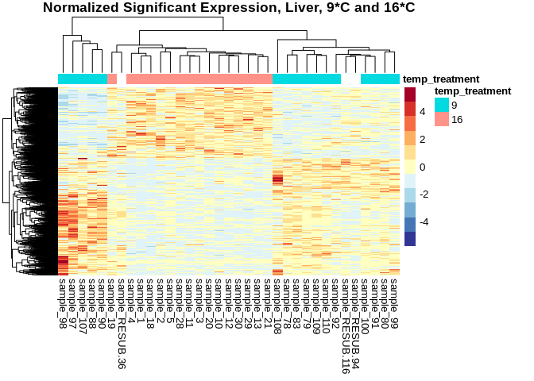
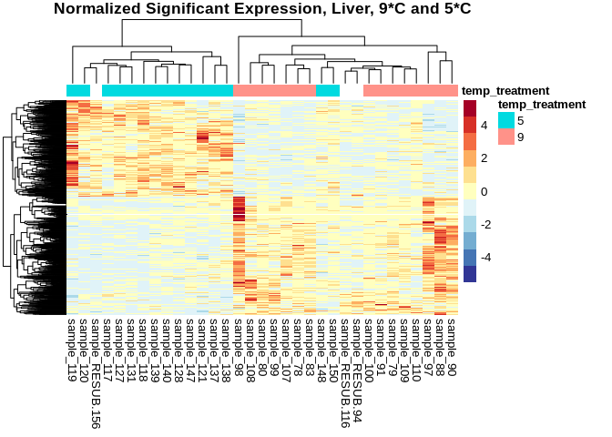

07-cod-RNAseq-DESeq2
================
Kathleen Durkin
2024-03-19

- <a href="#001-install-and-load-packages"
  id="toc-001-install-and-load-packages">0.0.1 Install and load
  packages</a>
- <a href="#1-load-data" id="toc-1-load-data">1 Load data</a>
  - <a href="#11-load-count-data" id="toc-11-load-count-data">1.1 Load count
    data</a>
  - <a href="#12-count-data-munging" id="toc-12-count-data-munging">1.2
    Count data munging</a>
  - <a href="#13-import-sample-metadata-sheet"
    id="toc-13-import-sample-metadata-sheet">1.3 Import sample metadata
    sheet</a>
  - <a href="#14-sample-metadata-munging"
    id="toc-14-sample-metadata-munging">1.4 Sample metadata munging</a>
- <a href="#2-preliminary-pca-visualization-liver-tissue"
  id="toc-2-preliminary-pca-visualization-liver-tissue">2 Preliminary PCA
  visualization (liver tissue)</a>
  - <a href="#21-deseq-object" id="toc-21-deseq-object">2.1 DESeq object</a>
  - <a href="#22-pca-visualization" id="toc-22-pca-visualization">2.2 PCA
    visualization</a>
- <a href="#3-liver-tissue-9c-v-16c" id="toc-3-liver-tissue-9c-v-16c">3
  Liver tissue, 9<em>C v. 16</em>C</a>
- <a href="#4-extracting-significantly-expressed-genes"
  id="toc-4-extracting-significantly-expressed-genes">4 Extracting
  significantly expressed genes</a>
  - <a href="#41-heatmap" id="toc-41-heatmap">4.1 Heatmap</a>
  - <a href="#42-volcano-plot" id="toc-42-volcano-plot">4.2 Volcano plot</a>
- <a href="#5-liver-tissue-9c-v-0c" id="toc-5-liver-tissue-9c-v-0c">5
  Liver tissue, 9<em>C v. 0</em>C</a>
- <a href="#6-extracting-significantly-expressed-genes"
  id="toc-6-extracting-significantly-expressed-genes">6 Extracting
  significantly expressed genes</a>
  - <a href="#61-heatmap" id="toc-61-heatmap">6.1 Heatmap</a>
  - <a href="#62-volcano-plot" id="toc-62-volcano-plot">6.2 Volcano plot</a>
- <a href="#7-liver-tissue-9c-v-5c" id="toc-7-liver-tissue-9c-v-5c">7
  Liver tissue, 9<em>C v. 5</em>C</a>
- <a href="#8-extracting-significantly-expressed-genes"
  id="toc-8-extracting-significantly-expressed-genes">8 Extracting
  significantly expressed genes</a>
  - <a href="#81-heatmap" id="toc-81-heatmap">8.1 Heatmap</a>
  - <a href="#82-volcano-plot" id="toc-82-volcano-plot">8.2 Volcano plot</a>

Differential gene expression analysis for [Pacific cod RNAseq
data](https://shedurkin.github.io/Roberts-LabNotebook/posts/projects/pacific_cod/2023_12_13_pacific_cod.html).

- Raw reads found
  [here](https://owl.fish.washington.edu/nightingales/G_macrocephalus/30-943133806/)
- Reads aligned to transcriptome downloaded from
  [NCBI](https://www.ncbi.nlm.nih.gov/datasets/genome/GCF_031168955.1/),
  stored
  [here](https://owl.fish.washington.edu/halfshell/genomic-databank/GCF_031168955.1_ASM3116895v1_rna.fna)
  as a part of lab [genomic
  resources](https://robertslab.github.io/resources/Genomic-Resources/#gadus-macrocephalus-pacific-cod).

### 0.0.1 Install and load packages

``` r
## clear
rm(list=ls())

## Install Rtools directly from (https://cran.r-project.org/bin/windows/Rtools/), then install these on first run:
# install.packages("BiocManager")
# BiocManager::install("DESeq2")
# BiocManager::install("vsn")
# BiocManager::install("tidybulk")
# BiocManager::install("goseq")
# BiocManager::install("affycoretools")
# BiocManager::install("EnhancedVolcano")
# BiocManager::install("pcaExplorer")
# BiocManager::install("apeglm")
# BiocManager::install("PCAtools")


# List of packages we want to install (run every time)
load.lib<-c("DESeq2","edgeR","goseq","dplyr","GenomicFeatures","data.table","calibrate","affycoretools","data.table","vsn","tidybulk","ggplot2","cowplot","pheatmap","gplots","RColorBrewer","EnhancedVolcano","pcaExplorer","readxl","apeglm","ashr","tibble","plotly","sqldf","PCAtools","ggpubr","beepr","genefilter","ComplexHeatmap","circlize","scales", "tidyverse", "gridextra'")

# Select only the packages that aren't currently installed (run every time)
# install.lib <- load.lib[!load.lib %in% installed.packages()]

# And finally we install the missing packages, including their dependency.
# for(lib in install.lib) install.packages(lib,dependencies=TRUE)
# After the installation process completes, we load all packages.
sapply(load.lib,require,character=TRUE)
```

             DESeq2           edgeR           goseq           dplyr GenomicFeatures 
               TRUE            TRUE            TRUE            TRUE            TRUE 
         data.table       calibrate   affycoretools      data.table             vsn 
               TRUE            TRUE            TRUE            TRUE            TRUE 
           tidybulk         ggplot2         cowplot        pheatmap          gplots 
               TRUE            TRUE            TRUE            TRUE            TRUE 
       RColorBrewer EnhancedVolcano     pcaExplorer          readxl          apeglm 
               TRUE            TRUE            TRUE            TRUE            TRUE 
               ashr          tibble          plotly           sqldf        PCAtools 
               TRUE            TRUE            TRUE            TRUE            TRUE 
             ggpubr           beepr      genefilter  ComplexHeatmap        circlize 
               TRUE            TRUE            TRUE           FALSE            TRUE 
             scales       tidyverse      gridextra' 
               TRUE            TRUE           FALSE 

I found the [DESeq2
vignette](https://www.bioconductor.org/packages/release/bioc/vignettes/DESeq2/inst/doc/DESeq2.html)
and the [HBC DGE training
workshop](https://github.com/hbctraining/DGE_workshop) super helpful in
figuring out how to use the DESeq2 package!

# 1 Load data

## 1.1 Load count data

Load in the count matrix we generated after kallisto pseudoalignment
using the Trinity abundance_estimates_to_matrix.pl script. We also need
to slightly reformat the count matrix to make all of the estimated
counts integers, as required for DESeq2.

``` r
# Read in counts data. This is a gene-level counts matrix generated from kallisto transcript abundances using Trinity
cod_counts_data_OG <- read_delim("../output/06-cod-RNAseq-alignment/kallisto/kallisto.isoform.counts.matrix") 
head(cod_counts_data_OG)
```

    # A tibble: 6 × 80
      ...1           kallisto_quant_100 kallisto_quant_107 kallisto_quant_108
      <chr>                       <dbl>              <dbl>              <dbl>
    1 XM_060056358.1              243                  411              191  
    2 XR_009529804.1                0                    0                0  
    3 XM_060046625.1              164                  114              407  
    4 XM_060044219.1                0                    0                0  
    5 XM_060048099.1               20.3                  0               25.4
    6 XM_060047738.1                0                    0                0  
    # ℹ 76 more variables: kallisto_quant_109 <dbl>, kallisto_quant_10 <dbl>,
    #   kallisto_quant_110 <dbl>, kallisto_quant_117 <dbl>,
    #   kallisto_quant_118 <dbl>, kallisto_quant_119 <dbl>,
    #   kallisto_quant_11 <dbl>, kallisto_quant_120 <dbl>,
    #   kallisto_quant_121 <dbl>, kallisto_quant_127 <dbl>,
    #   kallisto_quant_128 <dbl>, kallisto_quant_129 <dbl>,
    #   kallisto_quant_12 <dbl>, kallisto_quant_131 <dbl>, …

## 1.2 Count data munging

``` r
# # We need to modify this data frame so that the row names are actually row names, instead of comprising the first column
cod_counts_data <- cod_counts_data_OG %>% 
  column_to_rownames(var = "...1")

# Additional formatting
# Round all estimated counts to integers
cod_counts_data <- round(cod_counts_data, digits = 0)

# Remove the "kallisto_quant_" portion of the column names, to leave just the sample names
colnames(cod_counts_data) <- sub("kallisto_quant_", "sample_", colnames(cod_counts_data))

# Reorder the coumns into alphabetical order (to make it easier to create an associated metadata spreadsheet)
cod_counts_data <- cod_counts_data[, order(colnames(cod_counts_data))]

head(cod_counts_data)
```

                   sample_1 sample_10 sample_100 sample_107 sample_108 sample_109
    XM_060056358.1      197       155        243        411        191        834
    XR_009529804.1        0         0          0          0          0          0
    XM_060046625.1      262       326        164        114        407        148
    XM_060044219.1        0         0          0          0          0         28
    XM_060048099.1       19        44         20          0         25          0
    XM_060047738.1        0         0          0          0          0          0
                   sample_11 sample_110 sample_117 sample_118 sample_119 sample_12
    XM_060056358.1       241        502        468        417        986       149
    XR_009529804.1         0          0          0          0          0         0
    XM_060046625.1       175        245        319        189        142       204
    XM_060044219.1         9          0          0          0         25         0
    XM_060048099.1        10          8         41         37         19        25
    XM_060047738.1         0          0          0         20          0         0
                   sample_120 sample_121 sample_127 sample_128 sample_129 sample_13
    XM_060056358.1        389        676        422        252         52       166
    XR_009529804.1          0          0          0          0          0         0
    XM_060046625.1        244         80        332         80         17       178
    XM_060044219.1          0         19          0          0          0         0
    XM_060048099.1         33          8         24          8          0        10
    XM_060047738.1          0          0          0          0          0         0
                   sample_131 sample_137 sample_138 sample_139 sample_140
    XM_060056358.1        102        386        345        255        340
    XR_009529804.1          0          0          0          0          0
    XM_060046625.1        146         43         20         61         92
    XM_060044219.1          0          0          0          9          0
    XM_060048099.1         13          0          0          4          6
    XM_060047738.1          0          0          0          0          0
                   sample_147 sample_148 sample_149 sample_150 sample_18 sample_19
    XM_060056358.1        187        376       2013        608       149       264
    XR_009529804.1          0          0          0          0         0         0
    XM_060046625.1         49        234        374        254       156       117
    XM_060044219.1          0          0          0          0         0        12
    XM_060048099.1          6         26         17          7        10         5
    XM_060047738.1          0          0          0          0         0         0
                   sample_19-G sample_19-S sample_2 sample_20 sample_20-G
    XM_060056358.1         573         782      291       131         693
    XR_009529804.1           0           0        0         0           0
    XM_060046625.1         868        1316      100       133         747
    XM_060044219.1         196          12        0         0         175
    XM_060048099.1          50          77       15         9          55
    XM_060047738.1           0           0        0         0           0
                   sample_20-S sample_21 sample_28 sample_29 sample_3 sample_30
    XM_060056358.1         311       205       259       174      218       302
    XR_009529804.1           0         1         0         0        0         0
    XM_060046625.1        1394       155       168       187      210       240
    XM_060044219.1           0         0         0         0       10         0
    XM_060048099.1          85        30        15        12       18        21
    XM_060047738.1           0        33         0         0        0        19
                   sample_31 sample_37 sample_38 sample_39 sample_4 sample_40
    XM_060056358.1       387       933       714       561      227       432
    XR_009529804.1         0         0         0         0        0         0
    XM_060046625.1       104       142       136       131      163       146
    XM_060044219.1         0         0         0         0        0         0
    XM_060048099.1        17         3        16        10       38         0
    XM_060047738.1         0         0        63         0        0         0
                   sample_41 sample_47 sample_48 sample_49 sample_5 sample_50
    XM_060056358.1       369       415      1346       413      293       410
    XR_009529804.1         0         0         0         0        0         0
    XM_060046625.1        73       131       129       278      288       106
    XM_060044219.1         0        10         0        10        0         0
    XM_060048099.1         2        11         7        55       29        15
    XM_060047738.1         0         0         0       151        0         0
                   sample_57 sample_57-G sample_57-S sample_58 sample_58-G
    XM_060056358.1       440        1466          31       348        1650
    XR_009529804.1         0           0           0         0           0
    XM_060046625.1       140         800         277       200         870
    XM_060044219.1         0         203           0         0         190
    XM_060048099.1        21          27           0        15          77
    XM_060047738.1         0         101           0         0          60
                   sample_58-S sample_59 sample_60 sample_67 sample_68 sample_69
    XM_060056358.1         442       936       381       397       419       423
    XR_009529804.1           0         0         0         0         0         0
    XM_060046625.1        1041        75       172       212       253       209
    XM_060044219.1          13         0         0         9         0         0
    XM_060048099.1           5         6        28        40        27        13
    XM_060047738.1           0         0         0         0       208         0
                   sample_70 sample_78 sample_79 sample_80 sample_83 sample_88
    XM_060056358.1       362       357       239       151       321       238
    XR_009529804.1         0         0         0         0         0         0
    XM_060046625.1       120       161       200       151       160        55
    XM_060044219.1         0         0        12         0         0         0
    XM_060048099.1         6         5        25        10         6         4
    XM_060047738.1         0         0         0         0         0         0
                   sample_90 sample_91 sample_97 sample_98 sample_99
    XM_060056358.1       740       279       489       626       152
    XR_009529804.1         0         0         0         0         0
    XM_060046625.1        91       283        83        80       305
    XM_060044219.1         0         0         0        13         0
    XM_060048099.1         8        19         0         2         5
    XM_060047738.1         0         0         0         0         0
                   sample_RESUB-116 sample_RESUB-156 sample_RESUB-36
    XM_060056358.1              202              262             281
    XR_009529804.1                0                0               0
    XM_060046625.1              190              143              88
    XM_060044219.1                0                0               0
    XM_060048099.1               19               22               5
    XM_060047738.1                0                0               0
                   sample_RESUB-76 sample_RESUB-94
    XM_060056358.1             304             173
    XR_009529804.1               0               0
    XM_060046625.1             116             253
    XM_060044219.1               0               0
    XM_060048099.1              16              20
    XM_060047738.1               0               0

## 1.3 Import sample metadata sheet

``` r
# Read in the csv as a data frame
cod_sample_info_OG <- read.csv("~/project-cod-temperature/data/DESeq2_Sample_Information.csv")
head(cod_sample_info_OG)
```

      sample_name sample_number tank temp_treatment tissue_type
    1    sample_1             1    1             16       Liver
    2   sample_10            10    2             16       Liver
    3  sample_100           100   15              9       Liver
    4  sample_107           107   16              9       Liver
    5  sample_108           108   16              9       Liver
    6  sample_109           109   16              9       Liver

## 1.4 Sample metadata munging

``` r
# Again, we need to reformat so that the data in the first column becomes the row names
cod_sample_info <- cod_sample_info_OG %>% 
  column_to_rownames(var = "sample_name")
head(cod_sample_info)
```

               sample_number tank temp_treatment tissue_type
    sample_1               1    1             16       Liver
    sample_10             10    2             16       Liver
    sample_100           100   15              9       Liver
    sample_107           107   16              9       Liver
    sample_108           108   16              9       Liver
    sample_109           109   16              9       Liver

``` r
# Factor variables
cod_sample_info$temp_treatment <- factor(cod_sample_info$temp_treatment)
cod_sample_info$tank <- factor(cod_sample_info$tank)
cod_sample_info$tissue_type <- factor(cod_sample_info$tissue_type)

# Remove bad/missing samples
# Missing data: 92
# MuliQC report: 149, 129
# Pheatmap outliers:
# BIPLOT outliers:
cod_sample_info <- cod_sample_info[!(row.names(cod_sample_info) %in% c("sample_92", "sample_149", "sample_129")),]
cod_counts_data <- as.matrix(subset(cod_counts_data, select=-c(sample_149, sample_129)))
# coldata %>% dplyr::count(group)
# all(colnames(cts) %in% rownames(coldata))
# 
# # Remove sample 92 (for now, sample data is missing)
# cod_sample_info <- cod_sample_info[rownames(cod_sample_info) != "sample_92", ]
head(cod_sample_info)
```

               sample_number tank temp_treatment tissue_type
    sample_1               1    1             16       Liver
    sample_10             10    2             16       Liver
    sample_100           100   15              9       Liver
    sample_107           107   16              9       Liver
    sample_108           108   16              9       Liver
    sample_109           109   16              9       Liver

``` r
# Check that the column names of our count data match the row names of our sample info sheet
ncol(cod_counts_data)
```

    [1] 77

``` r
nrow(cod_sample_info)
```

    [1] 77

``` r
all(colnames(cod_counts_data) %in% rownames(cod_sample_info))
```

    [1] TRUE

``` r
all(colnames(cod_counts_data) == rownames(cod_sample_info))
```

    [1] TRUE

# 2 Preliminary PCA visualization (liver tissue)

## 2.1 DESeq object

``` r
# Filter data
infosub_L <- cod_sample_info %>% filter(tissue_type == "Liver")
countsub_L <- subset(cod_counts_data, select=row.names(infosub_L))

# Calculate DESeq object
dds_L <- DESeqDataSetFromMatrix(countData = countsub_L,
                              colData = infosub_L,
                              design = ~ temp_treatment) 

# Run differential expression analysis 
# (Note that this DESeq() function runs all necessary steps, including data normalization, 
# estimating size factors, estimating dispersions, gene-wise dispersion estimates, mean-dispersion 
# relationship, final dispersion estimates, fitting model, and testing)
dds_L <- DESeq(dds_L)
resultsNames(dds_L) # lists the coefficients
```

    [1] "Intercept"              "temp_treatment_5_vs_0"  "temp_treatment_9_vs_0" 
    [4] "temp_treatment_16_vs_0"

``` r
plotDispEsts(dds_L)
```

<!-- -->

## 2.2 PCA visualization

``` r
# Generate PCAs
# top 500 most variable genes
pca_L_500<- plotPCA(vst(dds_L), intgroup = c("temp_treatment"), returnData=TRUE)
percentVar_L_500 <- round(100*attr(pca_L_500, "percentVar"))

# top 1000 most variable genes
pca_L_1000 <- plotPCA(vst(dds_L), intgroup = c("temp_treatment"), returnData=TRUE, ntop=1000)
percentVar_L_1000 <- round(100*attr(pca_L_1000, "percentVar"))

# all genes
pca_L_all <- plotPCA(vst(dds_L), intgroup = c("temp_treatment"), returnData=TRUE, ntop=nrow(assay(vst(dds_L))))
percentVar_L_all <- round(100*attr(pca_L_all, "percentVar"))

# Assign specific colors to each temperature treatment level
temp_colors <- c(
  "0" = "darkblue",
  "5" = "royalblue1",
  "9" = "green",
  "16" = "orangered") 

# Plot PCAs
p.L.500 <- ggplot(pca_L_500, aes(PC1, PC2, color=temp_treatment)) + 
  geom_point(size=4, alpha = 5/10) +
  ggtitle("Liver, top 500 most variable genes") +
  xlab(paste0("PC1: ",percentVar_L_500[1],"% variance")) +
  ylab(paste0("PC2: ",percentVar_L_500[2],"% variance")) + 
  coord_fixed() +
  scale_color_manual(values=temp_colors)+
  stat_ellipse()

p.L.1000 <- ggplot(pca_L_1000, aes(PC1, PC2, color=temp_treatment)) + 
  geom_point(size=4, alpha = 5/10) +
  ggtitle("Liver, top 1000 most variable genes") +
  xlab(paste0("PC1: ",percentVar_L_1000[1],"% variance")) +
  ylab(paste0("PC2: ",percentVar_L_1000[2],"% variance")) + 
  coord_fixed() +
  scale_color_manual(values=temp_colors)+
  stat_ellipse()

p.L.all <- ggplot(pca_L_all, aes(PC1, PC2, color=temp_treatment)) + 
  geom_point(size=4, alpha = 5/10) +
  ggtitle("Liver, all genes") +
  xlab(paste0("PC1: ",percentVar_L_all[1],"% variance")) +
  ylab(paste0("PC2: ",percentVar_L_all[2],"% variance")) + 
  coord_fixed() +
  scale_color_manual(values=temp_colors)+
  stat_ellipse()

# View PCAs
p.L.500
```

<!-- -->

``` r
p.L.1000
```

<!-- -->

``` r
p.L.all
```

<!-- -->

``` r
# Export PCAs as pngs
ggexport(filename = "../output/07-cod-RNAseq-DESeq2/PCA_L_500.png",
         plot   = p.L.500,
         res    = 600,
         width  = 6000,
         height = 4000)

ggexport(filename = "../output/07-cod-RNAseq-DESeq2/PCA_L_1000.png",
         plot   = p.L.1000,
         res    = 600,
         width  = 6000,
         height = 4000)

ggexport(filename = "../output/07-cod-RNAseq-DESeq2/PCA_L_all.png",
         plot   = p.L.all,
         res    = 600,
         width  = 6000,
         height = 4000)
```

# 3 Liver tissue, 9*C v. 16*C

The 9\*C temperature treatment is effectively our “control,” as it
represents the ambient temperature that wild juvenile Pacific cod would
experience.

``` r
# liver tissue, temperatures 9 vs. 16 

# Filter data
infosub_L.9.16 <- cod_sample_info %>% filter(tissue_type == "Liver" & (temp_treatment == "9" | temp_treatment == "16"))
countsub_L.9.16 <- subset(cod_counts_data, select=row.names(infosub_L.9.16))

# Calculate DESeq object
dds_L.9.16 <- DESeqDataSetFromMatrix(countData = countsub_L.9.16,
                              colData = infosub_L.9.16,
                              design = ~ temp_treatment)

dds_L.9.16 <- DESeq(dds_L.9.16)
resultsNames(dds_L.9.16) # lists the coefficients
```

    [1] "Intercept"              "temp_treatment_16_vs_9"

``` r
plotDispEsts(dds_L.9.16)
```

<!-- -->

``` r
# Filtering: keep genes that have at least 10 counts across 1/3 of the samples - https://support.bioconductor.org/p/110307/
keep <- rowSums(DESeq2::counts(dds_L.9.16) >= 10) >= ncol(countsub_L.9.16)/3
dds_L.9.16<- dds_L.9.16[keep,]

# Generate Contrasts
contrast_list_L.9.16        <- c("temp_treatment", "16", "9") # order is important: factor, treatment group, control
res_table_L.9.16_noshrink <- results(dds_L.9.16, contrast=contrast_list_L.9.16, alpha = 0.05)

res_table_L.9.16_norm     <- lfcShrink(dds_L.9.16,
                                       coef=2,
                                       type="normal") # lfcThreshold = 0.585)  # a lfc threshold of 1 = 2-fold change, 0.585 = 1.5-fold change
res_table_L.9.16_apeglm   <- lfcShrink(dds_L.9.16,
                                       coef=2, 
                                       type="apeglm") # lfcThreshold = 0.585)  # a lfc threshold of 1 = 2-fold change, 0.585 = 1.5-fold change
res_table_L.9.16_ashr     <- lfcShrink(dds_L.9.16,
                                       coef=2, 
                                       type="ashr")
```

``` r
# Generate MA plots
par(mfrow=c(2,2), mar=c(4,4,2,1))
xlim <- c(1,1e5); ylim <- c(-4,4)
DESeq2::plotMA(res_table_L.9.16_noshrink, xlim=xlim, ylim=ylim, main="no shrink")
DESeq2::plotMA(res_table_L.9.16_norm, xlim=xlim, ylim=ylim, main="normal")
DESeq2::plotMA(res_table_L.9.16_apeglm, xlim=xlim, ylim=ylim, main="apeglm")
DESeq2::plotMA(res_table_L.9.16_ashr, xlim=xlim, ylim=ylim, main="ashr")
```

<!-- -->

``` r
# Examine results formatting
res_table_L.9.16_norm %>% data.frame() %>% head()
```

                    baseMean log2FoldChange     lfcSE       stat       pvalue
    XM_060056358.1 302.93280     -0.7660039 0.2223251 -3.4453328 0.0005703567
    XM_060046625.1 169.75682     -0.1163796 0.1476242 -0.7882910 0.4305265258
    XM_060048099.1  13.15597      0.5943264 0.2819019  2.1031111 0.0354560577
    XM_060054370.1 192.44217     -0.2071543 0.1414231 -1.4646650 0.1430123490
    XM_060067766.1  48.75192      0.1505899 0.3433056  0.4391773 0.6605330853
    XR_009525207.1  31.42947     -0.4859107 0.2438583 -1.9922493 0.0463437156
                         padj
    XM_060056358.1 0.00601259
    XM_060046625.1 0.66939079
    XM_060048099.1 0.12966668
    XM_060054370.1 0.34034286
    XM_060067766.1 0.83257554
    XR_009525207.1 0.15546029

Note that the metric we want to use to identify significantly expressed
genes is the `padj` values, **NOT** the `pvalue`. `padj` are p-values
corrected for multiple testing (default method is the Benjamini and
Hochberg method).

``` r
summary(res_table_L.9.16_noshrink)
```

    out of 21811 with nonzero total read count
    adjusted p-value < 0.05
    LFC > 0 (up)       : 1850, 8.5%
    LFC < 0 (down)     : 2296, 11%
    outliers [1]       : 0, 0%
    low counts [2]     : 0, 0%
    (mean count < 5)
    [1] see 'cooksCutoff' argument of ?results
    [2] see 'independentFiltering' argument of ?results

``` r
summary(res_table_L.9.16_norm)
```

    out of 21811 with nonzero total read count
    adjusted p-value < 0.1
    LFC > 0 (up)       : 2481, 11%
    LFC < 0 (down)     : 2896, 13%
    outliers [1]       : 0, 0%
    low counts [2]     : 0, 0%
    (mean count < 5)
    [1] see 'cooksCutoff' argument of ?results
    [2] see 'independentFiltering' argument of ?results

``` r
summary(res_table_L.9.16_apeglm)
```

    out of 21811 with nonzero total read count
    adjusted p-value < 0.1
    LFC > 0 (up)       : 2481, 11%
    LFC < 0 (down)     : 2896, 13%
    outliers [1]       : 0, 0%
    low counts [2]     : 0, 0%
    (mean count < 5)
    [1] see 'cooksCutoff' argument of ?results
    [2] see 'independentFiltering' argument of ?results

``` r
summary(res_table_L.9.16_ashr)
```

    out of 21811 with nonzero total read count
    adjusted p-value < 0.1
    LFC > 0 (up)       : 2443, 11%
    LFC < 0 (down)     : 2934, 13%
    outliers [1]       : 0, 0%
    low counts [2]     : 0, 0%
    (mean count < 5)
    [1] see 'cooksCutoff' argument of ?results
    [2] see 'independentFiltering' argument of ?results

# 4 Extracting significantly expressed genes

``` r
padj.cutoff <- 0.05
lfc.cutoff <- 0.58

# Convert results table into tibble
res_table_L.9.16_norm_tb <- res_table_L.9.16_norm %>%
  data.frame() %>%
  rownames_to_column(var="gene") %>%
  as_tibble()

# subset that table to only keep the significant genes using our pre-defined thresholds:
sig_L.9.16_norm <- res_table_L.9.16_norm_tb %>%
        filter(padj < padj.cutoff & abs(log2FoldChange) > lfc.cutoff)

head(sig_L.9.16_norm)
```

    # A tibble: 6 × 7
      gene           baseMean log2FoldChange lfcSE  stat   pvalue         padj
      <chr>             <dbl>          <dbl> <dbl> <dbl>    <dbl>        <dbl>
    1 XM_060056358.1    303.          -0.766 0.222 -3.45 5.70e- 4 0.00601     
    2 XM_060045078.1     78.7          0.632 0.188  3.35 8.09e- 4 0.00782     
    3 XM_060068449.1    107.           0.621 0.129  4.80 1.58e- 6 0.0000544   
    4 XM_060076782.1     20.1          0.588 0.200  2.94 3.25e- 3 0.0225      
    5 XR_009527854.1    197.          -1.73  0.275 -6.27 3.63e-10 0.0000000473
    6 XM_060075995.1     34.3         -0.667 0.223 -2.99 2.75e- 3 0.0198      

## 4.1 Heatmap

``` r
# Retrieve normalized counts matrix
dds_L.9.16_norm_counts <- counts(dds_L.9.16, normalized=TRUE)

# Extract normalized expression for significant genes
norm_sig_L.9.16 <- dds_L.9.16_norm_counts %>% 
  data.frame() %>%
  filter(row.names(dds_L.9.16_norm_counts) %in% sig_L.9.16_norm$gene)

head(norm_sig_L.9.16)
```

                    sample_1 sample_10 sample_100 sample_107 sample_108 sample_109
    XM_060056358.1 158.31427 113.62887  242.19366  587.04846  109.84166 785.157004
    XM_060045078.1 105.27497  71.10968   73.75445   41.42191   71.31081  53.661810
    XM_060068449.1 132.59825 131.22301   88.70467   57.13367   99.49009  75.314821
    XM_060076782.1  15.26889  17.59415   16.94359   11.42673   17.82770   4.707176
    XR_009527854.1  84.38070  60.84643  116.61176  418.50413  266.84047 232.534508
    XM_060075995.1  12.05439  25.65813   23.92036   31.42352   35.65541  51.778939
                   sample_11 sample_110 sample_12 sample_13 sample_18 sample_19
    XM_060056358.1 213.71520  459.72163 127.56214 136.38243 147.84281 277.56740
    XM_060045078.1 101.09350   64.10461  90.74890  98.58971 115.09910  63.08350
    XM_060068449.1 133.01776  125.46188 135.26723 155.27879 139.90494  74.64881
    XM_060076782.1  23.94320   10.07358  28.25202  10.68055  44.65051  28.38758
    XR_009527854.1  31.92426   79.67287  41.94997  91.19548 115.09910 106.19056
    XM_060075995.1  16.84892   31.13653  40.23772  23.82585  22.82137  54.67237
                    sample_2 sample_20 sample_21 sample_28 sample_29  sample_3
    XM_060056358.1 306.67118 143.33685 191.69643 239.57650 166.70507 194.83691
    XM_060045078.1 105.38529  49.23785 126.23911  95.27560 108.26249  77.75601
    XM_060068449.1 141.21628 112.69997 133.71995 141.52589  84.31061 138.53083
    XM_060076782.1  13.70009  19.69514  28.05314  47.17530  22.99380  23.23743
    XR_009527854.1  31.61559 176.16208 104.73171  63.82540  54.61028  35.74989
    XM_060075995.1  16.86165  32.82523  19.63720  24.05015  22.03573  20.55619
                   sample_30 sample_31  sample_4  sample_5 sample_78 sample_79
    XM_060056358.1 226.35340 378.18813 213.31778 252.90998 378.66054 245.57334
    XM_060045078.1 128.91650 127.03994  99.61095 110.48627  71.06514  56.51269
    XM_060068449.1 118.42330 220.85405 155.99450 113.93897  76.36851  69.87024
    XM_060076782.1  14.99029  33.22583  15.03561  20.71618  18.03145  17.46756
    XR_009527854.1  61.46019  37.13475  91.15341  75.95931 373.35717  83.22778
    XM_060075995.1  36.72621  18.56738   4.69863  43.15870  37.12358  57.54020
                    sample_80 sample_83 sample_88  sample_90 sample_91  sample_97
    XM_060056358.1 161.638445 411.19216 288.43295 850.095523 220.57051  717.17889
    XM_060045078.1  63.156743  80.70126  35.14519  55.141331  58.50257   14.66623
    XM_060068449.1 116.679407  81.98224  53.32374  79.265664 115.42399   48.39858
    XM_060076782.1   5.352266  17.93361  20.60235   5.743889  15.81151   21.99935
    XR_009527854.1 310.431450 274.12811 936.80114 423.898984 105.93709 1146.89957
    XM_060075995.1  38.536318  51.23890  63.01896  81.563219  22.13611   64.53143
                    sample_98 sample_99 sample_RESUB.116 sample_RESUB.36
    XM_060056358.1 746.814619 160.49693        188.72486       401.88001
    XM_060045078.1   3.578984  92.91928         86.88818        65.78819
    XM_060068449.1  52.491762  76.02486        102.77097        78.65979
    XM_060076782.1  15.508930  11.61491         29.89701        31.46392
    XR_009527854.1 400.846185 307.26715         55.12261        52.91658
    XM_060075995.1  94.246573  10.55901         20.55419        25.74320
                   sample_RESUB.94
    XM_060056358.1       158.82128
    XM_060045078.1        93.64029
    XM_060068449.1        89.05008
    XM_060076782.1        22.03301
    XR_009527854.1        32.13147
    XM_060075995.1        23.86909

``` r
# Annotate heatmap
annotation <- infosub_L.9.16 %>% 
    select(temp_treatment)

# Set a color palette
heat_colors <- rev(brewer.pal(12, "RdYlBu"))

# Run pheatmap
h.L.9.16 <- pheatmap(norm_sig_L.9.16, 
                     color = heat_colors, 
                     cluster_rows = T, 
                     show_rownames = F,
                     annotation = annotation, 
                     border_color = NA, 
                     fontsize = 10,
                     scale = "row", 
                     fontsize_row = 10, 
                     height = 30,
                     main = "Normalized Significant Expression, Liver, 9*C and 16*C")
```

<!-- -->

``` r
# Save plot
ggexport(filename = "../output/07-cod-RNAseq-DESeq2/heatmap_L.9.16_norm_sig.png",
         plot   = h.L.9.16,
         res    = 600,
         width  = 5000,
         height = 5000)
```

Note the argument `scale="row"` was included, so the values plotted in
the heat map are *Z-scores*, rather thn the normalized count value. This
vastly improves the color visualization.

## 4.2 Volcano plot

``` r
# Generate plot
v.L.9.16 <- 
  ggplot(res_table_L.9.16_norm_tb) +
  # Plot all
  geom_point(aes(x=log2FoldChange, y=-log10(padj),color="unchanged"),
             size=.5) +
  # Overlay all significantly upregulated in red
  geom_point(data = sig_L.9.16_norm[sig_L.9.16_norm$log2FoldChange > 0, ], 
             aes(x=log2FoldChange, y=-log10(padj), color="upregulated"), 
             size=.5) +
  # Overlay all significantly downregulated in blue
  geom_point(data = sig_L.9.16_norm[sig_L.9.16_norm$log2FoldChange < 0, ], 
             aes(x=log2FoldChange, y=-log10(padj), color="downregulated"), 
             size=.5) +
  ggtitle("Liver, 9*C and 16*C") +
  xlab("log2 fold change") + 
  ylab("-log10 adjusted p-value") +
  scale_x_continuous(limits = c(-4,4)) +
  scale_y_continuous(limits = c(0,30)) +
  scale_color_manual(values = c("unchanged" = "darkgrey", "upregulated" = "red", "downregulated" = "blue"),
                     labels = c("unchanged" = "Unchanged", "upregulated" = "Upregulated", "downregulated" = "Downregulated"),
                     name = NULL) +
  theme(legend.position = "top",
        plot.title = element_text(size = rel(1.5), hjust = 0.5),
        axis.title = element_text(size = rel(1.25)))

v.L.9.16
```

<!-- -->

``` r
# Save plot
ggexport(filename = "../output/07-cod-RNAseq-DESeq2/volcano_L.9.16.png",
         plot   = v.L.9.16,
         res    = 600,
         width  = 6000,
         height = 4000)
```

# 5 Liver tissue, 9*C v. 0*C

The 9\*C temperature treatment is effectively our “control,” as it
represents the ambient temperature that wild juvenile Pacific cod would
experience.

``` r
# liver tissue, temperatures 9 vs. 0 

# Filter data
infosub_L.9.0 <- cod_sample_info %>% filter(tissue_type == "Liver" & (temp_treatment == "9" | temp_treatment == "0"))
countsub_L.9.0 <- subset(cod_counts_data, select=row.names(infosub_L.9.0))

# Calculate DESeq object
dds_L.9.0 <- DESeqDataSetFromMatrix(countData = countsub_L.9.0,
                              colData = infosub_L.9.0,
                              design = ~ temp_treatment)

dds_L.9.0 <- DESeq(dds_L.9.0)
resultsNames(dds_L.9.0) # lists the coefficients
```

    [1] "Intercept"             "temp_treatment_9_vs_0"

``` r
plotDispEsts(dds_L.9.0)
```

<!-- -->

``` r
# Filtering: keep genes that have at least 10 counts across 1/3 of the samples - https://support.bioconductor.org/p/110307/
keep <- rowSums(DESeq2::counts(dds_L.9.0) >= 10) >= ncol(countsub_L.9.0)/3
dds_L.9.0<- dds_L.9.0[keep,]

# Generate Contrasts
contrast_list_L.9.0        <- c("temp_treatment", "0", "9") # order is important: factor, treatment group, control
res_table_L.9.0_noshrink <- results(dds_L.9.0, contrast=contrast_list_L.9.0, alpha = 0.05)

res_table_L.9.0_norm     <- lfcShrink(dds_L.9.0,
                                       coef=2,
                                       type="normal") # lfcThreshold = 0.585)  # a lfc threshold of 1 = 2-fold change, 0.585 = 1.5-fold change
res_table_L.9.0_apeglm   <- lfcShrink(dds_L.9.0,
                                       coef=2, 
                                       type="apeglm") # lfcThreshold = 0.585)  # a lfc threshold of 1 = 2-fold change, 0.585 = 1.5-fold change
res_table_L.9.0_ashr     <- lfcShrink(dds_L.9.0,
                                       coef=2, 
                                       type="ashr")
```

``` r
# Generate MA plots
par(mfrow=c(2,2), mar=c(4,4,2,1))
xlim <- c(1,1e5); ylim <- c(-4,4)
DESeq2::plotMA(res_table_L.9.0_noshrink, xlim=xlim, ylim=ylim, main="no shrink")
DESeq2::plotMA(res_table_L.9.0_norm, xlim=xlim, ylim=ylim, main="normal")
DESeq2::plotMA(res_table_L.9.0_apeglm, xlim=xlim, ylim=ylim, main="apeglm")
DESeq2::plotMA(res_table_L.9.0_ashr, xlim=xlim, ylim=ylim, main="ashr")
```

<!-- -->

``` r
# Examine results formatting
res_table_L.9.0_norm %>% data.frame() %>% head()
```

                    baseMean log2FoldChange     lfcSE       stat      pvalue
    XM_060056358.1 459.61426     -0.2346777 0.2593891 -0.9047980 0.365572396
    XM_060046625.1 158.42879      0.5030781 0.1513942  3.3228062 0.000891168
    XM_060048099.1  11.44087     -0.2274619 0.3410279 -0.6657177 0.505591568
    XM_060054370.1 250.64972     -0.3355560 0.1789746 -1.8747243 0.060830666
    XM_060067766.1  69.11384     -0.4311391 0.4183747 -1.0407972 0.297969694
    XR_009525207.1  42.48299     -0.1658664 0.2277196 -0.7283082 0.466424970
                          padj
    XM_060056358.1 0.597157452
    XM_060046625.1 0.005397345
    XM_060048099.1 0.720159061
    XM_060054370.1 0.170305411
    XM_060067766.1 0.523800606
    XR_009525207.1 0.687651498

Note that the metric we want to use to identify significantly expressed
genes is the `padj` values, **NOT** the `pvalue`. `padj` are p-values
corrected for multiple testing (default method is the Benjamini and
Hochberg method).

``` r
summary(res_table_L.9.0_noshrink)
```

    out of 22088 with nonzero total read count
    adjusted p-value < 0.05
    LFC > 0 (up)       : 2875, 13%
    LFC < 0 (down)     : 2720, 12%
    outliers [1]       : 0, 0%
    low counts [2]     : 0, 0%
    (mean count < 5)
    [1] see 'cooksCutoff' argument of ?results
    [2] see 'independentFiltering' argument of ?results

``` r
summary(res_table_L.9.0_norm)
```

    out of 22088 with nonzero total read count
    adjusted p-value < 0.1
    LFC > 0 (up)       : 3305, 15%
    LFC < 0 (down)     : 3368, 15%
    outliers [1]       : 0, 0%
    low counts [2]     : 0, 0%
    (mean count < 5)
    [1] see 'cooksCutoff' argument of ?results
    [2] see 'independentFiltering' argument of ?results

``` r
summary(res_table_L.9.0_apeglm)
```

    out of 22088 with nonzero total read count
    adjusted p-value < 0.1
    LFC > 0 (up)       : 3305, 15%
    LFC < 0 (down)     : 3368, 15%
    outliers [1]       : 0, 0%
    low counts [2]     : 0, 0%
    (mean count < 5)
    [1] see 'cooksCutoff' argument of ?results
    [2] see 'independentFiltering' argument of ?results

``` r
summary(res_table_L.9.0_ashr)
```

    out of 22088 with nonzero total read count
    adjusted p-value < 0.1
    LFC > 0 (up)       : 3317, 15%
    LFC < 0 (down)     : 3356, 15%
    outliers [1]       : 0, 0%
    low counts [2]     : 0, 0%
    (mean count < 5)
    [1] see 'cooksCutoff' argument of ?results
    [2] see 'independentFiltering' argument of ?results

# 6 Extracting significantly expressed genes

``` r
padj.cutoff <- 0.05
lfc.cutoff <- 0.58

# Convert results table into tibble
res_table_L.9.0_norm_tb <- res_table_L.9.0_norm %>%
  data.frame() %>%
  rownames_to_column(var="gene") %>%
  as_tibble()

# subset that table to only keep the significant genes using our pre-defined thresholds:
sig_L.9.0_norm <- res_table_L.9.0_norm_tb %>%
        filter(padj < padj.cutoff & abs(log2FoldChange) > lfc.cutoff)

head(sig_L.9.0_norm)
```

    # A tibble: 6 × 7
      gene           baseMean log2FoldChange lfcSE  stat       pvalue        padj
      <chr>             <dbl>          <dbl> <dbl> <dbl>        <dbl>       <dbl>
    1 XM_060064090.1     18.3          0.671 0.233  2.87 0.00407      0.0195     
    2 XM_060054692.1    143.          -0.974 0.364 -2.68 0.00735      0.0319     
    3 XM_060064443.1     18.0         -1.01  0.224 -4.48 0.00000740   0.0000835  
    4 XM_060058452.1    140.           0.990 0.173  5.72 0.0000000106 0.000000217
    5 XM_060058803.1     63.8         -0.716 0.245 -2.93 0.00344      0.0170     
    6 XM_060049697.1    300.          -0.658 0.187 -3.52 0.000427     0.00287    

## 6.1 Heatmap

``` r
# Retrieve normalized counts matrix
dds_L.9.0_norm_counts <- counts(dds_L.9.0, normalized=TRUE)

# Extract normalized expression for significant genes
norm_sig_L.9.0 <- dds_L.9.0_norm_counts %>% 
  data.frame() %>%
  filter(row.names(dds_L.9.0_norm_counts) %in% sig_L.9.0_norm$gene)

head(norm_sig_L.9.0)
```

                   sample_100 sample_107 sample_108 sample_109 sample_110 sample_37
    XM_060064090.1  20.487635   29.96930   36.54226   18.96422   11.96730  16.17293
    XM_060054692.1 153.118112   47.95088  130.84487  186.64783    0.00000 215.30209
    XM_060064443.1   9.704669    8.99079   12.37722   11.97740   17.95096  28.30262
    XM_060058452.1 131.552181  220.27436  374.85287  107.79661  103.71663  92.99433
    XM_060058803.1  76.559056   47.95088   73.08452   78.85122   58.83924 100.06999
    XM_060049697.1 265.260955  265.22831  139.09635  240.54614  408.88286 267.86410
                   sample_38  sample_39  sample_40  sample_41  sample_47  sample_48
    XM_060064090.1  21.42868   4.995579   2.272397   7.272364   6.254474  19.878462
    XM_060054692.1 250.28702 205.817834 149.978234 334.528726 145.639896 178.906161
    XM_060064443.1  25.71442  20.981430  19.315379   7.272364  33.952859   4.677285
    XM_060058452.1  97.71479  61.945173  67.035726  93.328666  81.308163 180.075482
    XM_060058803.1  91.71476  46.958438  53.401341  58.178909  93.817111  14.031856
    XM_060049697.1 320.57310 281.750627 344.268219 155.143757 334.167615 230.356298
                   sample_49 sample_50 sample_57 sample_58  sample_59 sample_60
    XM_060064090.1  17.12118  23.41961  11.62928  26.03136   7.302958  18.49375
    XM_060054692.1 223.23382 142.02863 204.67532 223.23862 195.093310 190.22148
    XM_060064443.1  18.43819  58.17130  35.66312  25.24253  14.605916  31.70358
    XM_060058452.1  76.38680 100.47770  62.02282  82.03822  44.861029  73.31453
    XM_060058803.1  47.41249  98.96676 132.57379 115.16904  68.856462 106.99958
    XM_060049697.1 453.71122 394.35609 476.02518 376.27145 421.485012 373.17755
                   sample_67 sample_68 sample_69  sample_70 sample_78  sample_79
    XM_060064090.1  15.68863  12.61119  22.11226   7.113667  16.75499  19.841256
    XM_060054692.1 106.55192 258.19749 193.48231 183.939091  65.90296 115.740660
    XM_060064443.1  20.26448  23.89488  19.74309  12.194857  10.05299   9.920628
    XM_060058452.1  97.40022  80.97710 138.99137 104.672521 156.37990 112.433784
    XM_060058803.1 160.80842  42.47979 116.08939  56.909332  39.09498  39.682512
    XM_060049697.1 471.31249 372.36193 435.13777 361.780754 155.26291 331.789893
                   sample_80  sample_83  sample_88 sample_90 sample_91 sample_97
    XM_060064090.1  21.44447   8.150624  15.276898  20.56566  20.37296   7.59710
    XM_060054692.1 148.98267  48.903741  62.380668   0.00000 110.35354 142.82548
    XM_060064443.1  18.05850  13.584373   2.546150  10.88770  18.67521  12.15536
    XM_060058452.1 109.47969 171.163094 323.361014 240.73920 148.55284 212.71879
    XM_060058803.1  46.27492  10.867498   3.819225  58.06775  51.78128  16.71362
    XM_060049697.1 180.58505 296.139321 104.392138 106.45754 343.79373 101.80114
                    sample_98 sample_99 sample_RESUB.116 sample_RESUB.76
    XM_060064090.1  43.357789  28.32365        38.054860        8.857764
    XM_060054692.1   0.000000 160.13755         0.000000      224.765754
    XM_060064443.1   4.955176   9.80434         9.012993       37.645496
    XM_060058452.1 266.340707 167.76315       224.323382      137.295337
    XM_060058803.1  50.790553  50.11107        36.051972       40.967157
    XM_060049697.1  74.327639 185.19308       340.490848      560.253554
                   sample_RESUB.94
    XM_060064090.1        34.96565
    XM_060054692.1        17.98233
    XM_060064443.1        12.98724
    XM_060058452.1       162.84001
    XM_060058803.1        49.95092
    XM_060049697.1       330.67512

``` r
# Annotate heatmap
annotation <- infosub_L.9.0 %>% 
    select(temp_treatment)

# Set a color palette
heat_colors <- rev(brewer.pal(12, "RdYlBu"))

# Run pheatmap
h.L.9.0 <- pheatmap(norm_sig_L.9.0, 
                     color = heat_colors, 
                     cluster_rows = T, 
                     show_rownames = F,
                     annotation = annotation, 
                     border_color = NA, 
                     fontsize = 10,
                     scale = "row", 
                     fontsize_row = 10, 
                     height = 30,
                     main = "Normalized Significant Expression, Liver, 9*C and 0*C")
```

<!-- -->

``` r
# Save plot
ggexport(filename = "../output/07-cod-RNAseq-DESeq2/heatmap_L.9.0_norm_sig.png",
         plot   = h.L.9.0,
         res    = 600,
         width  = 5000,
         height = 5000)
```

Note the argument `scale="row"` was included, so the values plotted in
the heat map are *Z-scores*, rather thn the normalized count value. This
vastly improves the color visualization.

## 6.2 Volcano plot

``` r
# Generate plot
v.L.9.0 <- 
  ggplot(res_table_L.9.0_norm_tb) +
  # Plot all
  geom_point(aes(x=log2FoldChange, y=-log10(padj),color="unchanged"),
             size=.5) +
  # Overlay all significantly upregulated in red
  geom_point(data = sig_L.9.0_norm[sig_L.9.0_norm$log2FoldChange > 0, ], 
             aes(x=log2FoldChange, y=-log10(padj), color="upregulated"), 
             size=.5) +
  # Overlay all significantly downregulated in blue
  geom_point(data = sig_L.9.0_norm[sig_L.9.0_norm$log2FoldChange < 0, ], 
             aes(x=log2FoldChange, y=-log10(padj), color="downregulated"), 
             size=.5) +
  ggtitle("Liver, 9*C and 0*C") +
  xlab("log2 fold change") + 
  ylab("-log10 adjusted p-value") +
  scale_x_continuous(limits = c(-4,4)) +
  scale_y_continuous(limits = c(0,30)) +
  scale_color_manual(values = c("unchanged" = "darkgrey", "upregulated" = "red", "downregulated" = "blue"),
                     labels = c("unchanged" = "Unchanged", "upregulated" = "Upregulated", "downregulated" = "Downregulated"),
                     name = NULL) +
  theme(legend.position = "top",
        plot.title = element_text(size = rel(1.5), hjust = 0.5),
        axis.title = element_text(size = rel(1.25)))

v.L.9.0
```

<!-- -->

``` r
# Save plot
ggexport(filename = "../output/07-cod-RNAseq-DESeq2/volcano_L.9.0.png",
         plot   = v.L.9.0,
         res    = 600,
         width  = 6000,
         height = 4000)
```

# 7 Liver tissue, 9*C v. 5*C

The 9\*C temperature treatment is effectively our “control,” as it
represents the ambient temperature that wild juvenile Pacific cod would
experience.

``` r
# liver tissue, temperatures 9 vs. 5 

# Filter data
infosub_L.9.5 <- cod_sample_info %>% filter(tissue_type == "Liver" & (temp_treatment == "9" | temp_treatment == "5"))
countsub_L.9.5 <- subset(cod_counts_data, select=row.names(infosub_L.9.5))

# Calculate DESeq object
dds_L.9.5 <- DESeqDataSetFromMatrix(countData = countsub_L.9.5,
                              colData = infosub_L.9.5,
                              design = ~ temp_treatment)

dds_L.9.5 <- DESeq(dds_L.9.5)
resultsNames(dds_L.9.5) # lists the coefficients
```

    [1] "Intercept"             "temp_treatment_9_vs_5"

``` r
plotDispEsts(dds_L.9.5)
```

<!-- -->

``` r
# Filtering: keep genes that have at least 10 counts across 1/3 of the samples - https://support.bioconductor.org/p/110307/
keep <- rowSums(DESeq2::counts(dds_L.9.5) >= 10) >= ncol(countsub_L.9.5)/3
dds_L.9.5<- dds_L.9.5[keep,]

# Generate Contrasts
contrast_list_L.9.5        <- c("temp_treatment", "5", "9") # order is important: factor, treatment group, control
res_table_L.9.5_noshrink <- results(dds_L.9.5, contrast=contrast_list_L.9.5, alpha = 0.05)

res_table_L.9.5_norm     <- lfcShrink(dds_L.9.5,
                                       coef=2,
                                       type="normal") # lfcThreshold = 0.585)  # a lfc threshold of 1 = 2-fold change, 0.585 = 1.5-fold change
res_table_L.9.5_apeglm   <- lfcShrink(dds_L.9.5,
                                       coef=2, 
                                       type="apeglm") # lfcThreshold = 0.585)  # a lfc threshold of 1 = 2-fold change, 0.585 = 1.5-fold change
res_table_L.9.5_ashr     <- lfcShrink(dds_L.9.5,
                                       coef=2, 
                                       type="ashr")
```

``` r
# Generate MA plots
par(mfrow=c(2,2), mar=c(4,4,2,1))
xlim <- c(1,1e5); ylim <- c(-4,4)
DESeq2::plotMA(res_table_L.9.5_noshrink, xlim=xlim, ylim=ylim, main="no shrink")
DESeq2::plotMA(res_table_L.9.5_norm, xlim=xlim, ylim=ylim, main="normal")
DESeq2::plotMA(res_table_L.9.5_apeglm, xlim=xlim, ylim=ylim, main="apeglm")
DESeq2::plotMA(res_table_L.9.5_ashr, xlim=xlim, ylim=ylim, main="ashr")
```

<!-- -->

``` r
# Examine results formatting
res_table_L.9.5_norm %>% data.frame() %>% head()
```

                    baseMean log2FoldChange     lfcSE       stat    pvalue
    XM_060056358.1 392.34547     -0.1829443 0.2366647 -0.7731208 0.4394509
    XM_060046625.1 144.47824      0.3258005 0.1627711  2.0008236 0.0454114
    XM_060048099.1  10.54619     -0.3194739 0.2773243 -1.1452560 0.2521031
    XM_060054370.1 202.47002     -0.1720018 0.1722277 -0.9984104 0.3180804
    XM_060067766.1  49.00323     -0.1674018 0.2619637 -0.6399723 0.5221906
    XR_009525207.1  31.54552      0.2075414 0.2532834  0.8189104 0.4128375
                        padj
    XM_060056358.1 0.7927288
    XM_060046625.1 0.2524482
    XM_060048099.1 0.6310484
    XM_060054370.1 0.6984451
    XM_060067766.1 0.8452025
    XR_009525207.1 0.7739639

Note that the metric we want to use to identify significantly expressed
genes is the `padj` values, **NOT** the `pvalue`. `padj` are p-values
corrected for multiple testing (default method is the Benjamini and
Hochberg method).

``` r
summary(res_table_L.9.5_noshrink)
```

    out of 21853 with nonzero total read count
    adjusted p-value < 0.05
    LFC > 0 (up)       : 769, 3.5%
    LFC < 0 (down)     : 771, 3.5%
    outliers [1]       : 0, 0%
    low counts [2]     : 0, 0%
    (mean count < 4)
    [1] see 'cooksCutoff' argument of ?results
    [2] see 'independentFiltering' argument of ?results

``` r
summary(res_table_L.9.5_norm)
```

    out of 21853 with nonzero total read count
    adjusted p-value < 0.1
    LFC > 0 (up)       : 1127, 5.2%
    LFC < 0 (down)     : 1045, 4.8%
    outliers [1]       : 0, 0%
    low counts [2]     : 848, 3.9%
    (mean count < 9)
    [1] see 'cooksCutoff' argument of ?results
    [2] see 'independentFiltering' argument of ?results

``` r
summary(res_table_L.9.5_apeglm)
```

    out of 21853 with nonzero total read count
    adjusted p-value < 0.1
    LFC > 0 (up)       : 1127, 5.2%
    LFC < 0 (down)     : 1045, 4.8%
    outliers [1]       : 0, 0%
    low counts [2]     : 848, 3.9%
    (mean count < 9)
    [1] see 'cooksCutoff' argument of ?results
    [2] see 'independentFiltering' argument of ?results

``` r
summary(res_table_L.9.5_ashr)
```

    out of 21853 with nonzero total read count
    adjusted p-value < 0.1
    LFC > 0 (up)       : 1129, 5.2%
    LFC < 0 (down)     : 1043, 4.8%
    outliers [1]       : 0, 0%
    low counts [2]     : 848, 3.9%
    (mean count < 9)
    [1] see 'cooksCutoff' argument of ?results
    [2] see 'independentFiltering' argument of ?results

# 8 Extracting significantly expressed genes

``` r
padj.cutoff <- 0.05
lfc.cutoff <- 0.58

# Convert results table into tibble
res_table_L.9.5_norm_tb <- res_table_L.9.5_norm %>%
  data.frame() %>%
  rownames_to_column(var="gene") %>%
  as_tibble()

# subset that table to only keep the significant genes using our pre-defined thresholds:
sig_L.9.5_norm <- res_table_L.9.5_norm_tb %>%
        filter(padj < padj.cutoff & abs(log2FoldChange) > lfc.cutoff)

head(sig_L.9.5_norm)
```

    # A tibble: 6 × 7
      gene           baseMean log2FoldChange lfcSE  stat        pvalue       padj
      <chr>             <dbl>          <dbl> <dbl> <dbl>         <dbl>      <dbl>
    1 XM_060064443.1     13.6         -0.748 0.186 -4.02 0.0000577     0.00251   
    2 XM_060049697.1    262.          -0.685 0.178 -3.86 0.000113      0.00410   
    3 XM_060061635.1    263.          -0.902 0.155 -5.81 0.00000000614 0.00000201
    4 XM_060047037.1     15.4         -1.01  0.211 -4.80 0.00000162    0.000162  
    5 XM_060062002.1     53.0         -0.640 0.209 -3.06 0.00218       0.0349    
    6 XM_060065125.1     51.0         -0.969 0.286 -3.41 0.000655      0.0151    

## 8.1 Heatmap

``` r
# Retrieve normalized counts matrix
dds_L.9.5_norm_counts <- counts(dds_L.9.5, normalized=TRUE)

# Extract normalized expression for significant genes
norm_sig_L.9.5 <- dds_L.9.5_norm_counts %>% 
  data.frame() %>%
  filter(row.names(dds_L.9.5_norm_counts) %in% sig_L.9.5_norm$gene)

head(norm_sig_L.9.5)
```

                   sample_100 sample_107 sample_108 sample_109 sample_110
    XM_060064443.1   8.249286   7.721225   11.09134   10.19661  14.950188
    XM_060049697.1 225.480495 227.776125  124.64549  204.78195 340.532070
    XM_060061635.1 193.399937 203.325581  142.60289  198.83393 185.216223
    XM_060047037.1   5.499524   7.721225   14.78845   10.19661   6.644528
    XM_060062002.1  54.078655  63.056667   20.07004   27.19096  49.833961
    XM_060065125.1  19.248335  11.581837   39.61191    0.00000  10.797358
                   sample_117 sample_118 sample_119 sample_120 sample_121
    XM_060064443.1  15.490478   21.21026   32.65003   12.93020   17.17762
    XM_060049697.1 403.372058  310.37676  441.96990  488.26915  231.44585
    XM_060061635.1 444.886540  464.50462  433.21013  408.84075  254.95207
    XM_060047037.1   6.196191   38.88547   38.22442   13.54593   18.98579
    XM_060062002.1 136.316210   55.14667  120.24767   43.10068   65.99823
    XM_060065125.1  88.605537  142.81573  125.02572  125.60770   34.35524
                   sample_127 sample_128 sample_131 sample_137 sample_138
    XM_060064443.1   25.33473   12.18661   23.28795   15.30839   8.292138
    XM_060049697.1  293.23605  292.47875  276.86780  247.12121 304.045060
    XM_060061635.1  702.90405  257.44223  411.42038  297.42021 207.303450
    XM_060047037.1   25.33473   16.75659   21.99417   19.68222  13.820230
    XM_060062002.1   72.23094   73.11969   37.51947   80.91579  77.393288
    XM_060065125.1  138.53247  134.05276   41.40079   17.49531  30.404506
                   sample_139 sample_140 sample_147 sample_148 sample_150
    XM_060064443.1   25.01899   7.826255   12.15291   13.05888   13.11172
    XM_060049697.1  423.53580 417.922024  281.25303  222.46743  227.81621
    XM_060061635.1  319.88569 247.309662  177.08524  258.84575  267.69771
    XM_060047037.1   26.80606  28.174518   13.88904   18.18916   18.02862
    XM_060062002.1   60.76041  53.218535   38.19486   59.69776   44.25207
    XM_060065125.1    0.00000  59.479539   81.59810   28.91610  120.19081
                    sample_78  sample_79  sample_80  sample_83  sample_88
    XM_060064443.1   8.698523   8.461142  15.706005  11.595515   2.234536
    XM_060049697.1 134.343859 282.978209 157.060045 252.782231  91.615962
    XM_060061635.1 193.300517 167.342595 197.306682 206.400170 140.775747
    XM_060047037.1  13.531036   8.461142   8.834628   4.638206  11.172678
    XM_060062002.1   2.899508  44.185966  49.081264  20.871927  23.462625
    XM_060065125.1  23.196062  37.605078  50.062889   0.000000  14.524482
                    sample_90 sample_91 sample_97 sample_98  sample_99
    XM_060064443.1   9.558107  15.97295 10.748104  4.457378   8.719963
    XM_060049697.1  93.457051 294.04746 90.015368 66.860677 164.710412
    XM_060061635.1 130.627469 206.92229 94.045907 85.804535 214.123536
    XM_060047037.1  23.364263  10.16460 14.778643  5.571723   4.844424
    XM_060062002.1  31.860358  57.35741 20.152694 30.087304  57.164202
    XM_060065125.1  21.240239  53.00115  1.343513 46.802474  33.910967
                   sample_RESUB.116 sample_RESUB.156 sample_RESUB.94
    XM_060064443.1         7.648954         25.51541       11.015730
    XM_060049697.1       288.960483        460.97844      280.477439
    XM_060061635.1       272.812692        480.54026      210.146238
    XM_060047037.1         2.549651         29.76798        8.473639
    XM_060062002.1        62.041516         56.98442       61.857562
    XM_060065125.1         0.000000        119.07192       33.894555

``` r
# Annotate heatmap
annotation <- infosub_L.9.5 %>% 
    select(temp_treatment)

# Set a color palette
heat_colors <- rev(brewer.pal(12, "RdYlBu"))

# Run pheatmap
h.L.9.5 <- pheatmap(norm_sig_L.9.5, 
                     color = heat_colors, 
                     cluster_rows = T, 
                     show_rownames = F,
                     annotation = annotation, 
                     border_color = NA, 
                     fontsize = 10,
                     scale = "row", 
                     fontsize_row = 10, 
                     height = 30,
                     main = "Normalized Significant Expression, Liver, 9*C and 5*C")
```

<!-- -->

``` r
# Save plot
ggexport(filename = "../output/07-cod-RNAseq-DESeq2/heatmap_L.9.5_norm_sig.png",
         plot   = h.L.9.5,
         res    = 600,
         width  = 5000,
         height = 5000)
```

Note the argument `scale="row"` was included, so the values plotted in
the heat map are *Z-scores*, rather thn the normalized count value. This
vastly improves the color visualization.

## 8.2 Volcano plot

``` r
# Generate plot
v.L.9.5 <- 
  ggplot(res_table_L.9.5_norm_tb) +
  # Plot all
  geom_point(aes(x=log2FoldChange, y=-log10(padj),color="unchanged"),
             size=.5) +
  # Overlay all significantly upregulated in red
  geom_point(data = sig_L.9.5_norm[sig_L.9.5_norm$log2FoldChange > 0, ], 
             aes(x=log2FoldChange, y=-log10(padj), color="upregulated"), 
             size=.5) +
  # Overlay all significantly downregulated in blue
  geom_point(data = sig_L.9.5_norm[sig_L.9.5_norm$log2FoldChange < 0, ], 
             aes(x=log2FoldChange, y=-log10(padj), color="downregulated"), 
             size=.5) +
  ggtitle("Liver, 9*C and 0*C") +
  xlab("log2 fold change") + 
  ylab("-log10 adjusted p-value") +
  scale_x_continuous(limits = c(-4,4)) +
  scale_y_continuous(limits = c(0,30)) +
  scale_color_manual(values = c("unchanged" = "darkgrey", "upregulated" = "red", "downregulated" = "blue"),
                     labels = c("unchanged" = "Unchanged", "upregulated" = "Upregulated", "downregulated" = "Downregulated"),
                     name = NULL) +
  theme(legend.position = "top",
        plot.title = element_text(size = rel(1.5), hjust = 0.5),
        axis.title = element_text(size = rel(1.25)))

v.L.9.5
```

<!-- -->

``` r
# Save plot
ggexport(filename = "../output/07-cod-RNAseq-DESeq2/volcano_L.9.5.png",
         plot   = v.L.9.0,
         res    = 600,
         width  = 6000,
         height = 4000)
```
