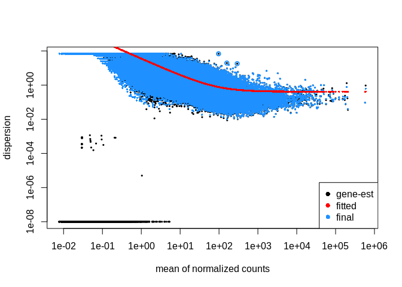
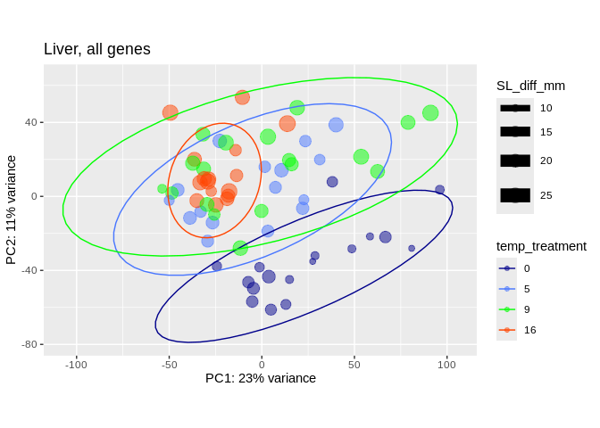
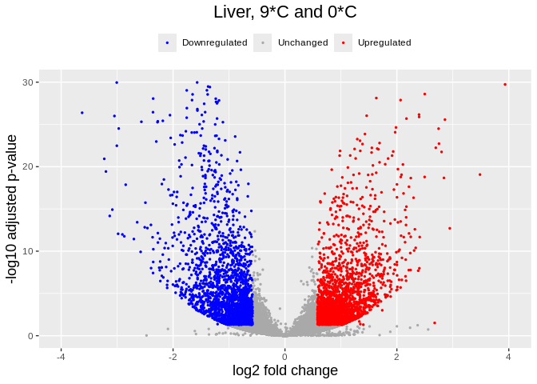

07-cod-RNAseq-DESeq2
================
Kathleen Durkin
2024-03-19

- <a href="#001-install-and-load-packages"
  id="toc-001-install-and-load-packages">0.0.1 Install and load
  packages</a>
- <a href="#1-load-data" id="toc-1-load-data">1 Load data</a>
  - <a href="#11-load-count-data" id="toc-11-load-count-data">1.1 Load count
    data</a>
  - <a href="#12-count-data-munging" id="toc-12-count-data-munging">1.2
    Count data munging</a>
  - <a href="#13-import-sample-metadata-sheets"
    id="toc-13-import-sample-metadata-sheets">1.3 Import sample metadata
    sheets</a>
  - <a href="#14-sample-metadata-munging"
    id="toc-14-sample-metadata-munging">1.4 Sample metadata munging</a>
- <a href="#2-preliminary-pca-visualization-liver-tissue"
  id="toc-2-preliminary-pca-visualization-liver-tissue">2 Preliminary PCA
  visualization (liver tissue)</a>
  - <a href="#21-deseq-object" id="toc-21-deseq-object">2.1 DESeq object</a>
  - <a href="#22-pca-visualization" id="toc-22-pca-visualization">2.2 PCA
    visualization</a>
- <a href="#3-liver-tissue-9c-v-16c" id="toc-3-liver-tissue-9c-v-16c">3
  Liver tissue, 9<em>C v. 16</em>C</a>
- <a href="#4-extracting-significantly-expressed-genes"
  id="toc-4-extracting-significantly-expressed-genes">4 Extracting
  significantly expressed genes</a>
  - <a href="#41-heatmap" id="toc-41-heatmap">4.1 Heatmap</a>
  - <a href="#42-volcano-plot" id="toc-42-volcano-plot">4.2 Volcano plot</a>
- <a href="#5-liver-tissue-9c-v-0c" id="toc-5-liver-tissue-9c-v-0c">5
  Liver tissue, 9<em>C v. 0</em>C</a>
- <a href="#6-extracting-significantly-expressed-genes"
  id="toc-6-extracting-significantly-expressed-genes">6 Extracting
  significantly expressed genes</a>
  - <a href="#61-heatmap" id="toc-61-heatmap">6.1 Heatmap</a>
  - <a href="#62-volcano-plot" id="toc-62-volcano-plot">6.2 Volcano plot</a>
- <a href="#7-liver-tissue-9c-v-5c" id="toc-7-liver-tissue-9c-v-5c">7
  Liver tissue, 9<em>C v. 5</em>C</a>
- <a href="#8-extracting-significantly-expressed-genes"
  id="toc-8-extracting-significantly-expressed-genes">8 Extracting
  significantly expressed genes</a>
  - <a href="#81-heatmap" id="toc-81-heatmap">8.1 Heatmap</a>
  - <a href="#82-volcano-plot" id="toc-82-volcano-plot">8.2 Volcano plot</a>

Differential gene expression analysis for [Pacific cod RNAseq
data](https://shedurkin.github.io/Roberts-LabNotebook/posts/projects/pacific_cod/2023_12_13_pacific_cod.html).

- trimmed reads generated in `05-cod-RNAseq-trimming`

- Reads aligned to transcriptome downloaded from
  [NCBI](https://www.ncbi.nlm.nih.gov/datasets/genome/GCF_031168955.1/),
  stored
  [here](https://owl.fish.washington.edu/halfshell/genomic-databank/GCF_031168955.1_ASM3116895v1_rna.fna)
  as a part of lab [genomic
  resources](https://robertslab.github.io/resources/Genomic-Resources/#gadus-macrocephalus-pacific-cod).

### 0.0.1 Install and load packages

``` r
## clear
rm(list=ls())

## Install Rtools directly from (https://cran.r-project.org/bin/windows/Rtools/), then install these on first run:
# install.packages("BiocManager")
# BiocManager::install("DESeq2")
# BiocManager::install("vsn")
# BiocManager::install("tidybulk")
# BiocManager::install("goseq")
# BiocManager::install("affycoretools")
# BiocManager::install("EnhancedVolcano")
# BiocManager::install("pcaExplorer")
# BiocManager::install("apeglm")
# BiocManager::install("PCAtools")


# List of packages we want to install (run every time)
load.lib<-c("DESeq2","edgeR","goseq","dplyr","GenomicFeatures","data.table","calibrate","affycoretools","data.table","vsn","tidybulk","ggplot2","cowplot","pheatmap","gplots","RColorBrewer","EnhancedVolcano","pcaExplorer","readxl","apeglm","ashr","tibble","plotly","sqldf","PCAtools","ggpubr","beepr","genefilter","ComplexHeatmap","circlize","scales", "tidyverse", "gridextra'")

# Select only the packages that aren't currently installed (run every time)
# install.lib <- load.lib[!load.lib %in% installed.packages()]

# And finally we install the missing packages, including their dependency.
# for(lib in install.lib) install.packages(lib,dependencies=TRUE)
# After the installation process completes, we load all packages.
sapply(load.lib,require,character=TRUE)
```

             DESeq2           edgeR           goseq           dplyr GenomicFeatures 
               TRUE            TRUE            TRUE            TRUE            TRUE 
         data.table       calibrate   affycoretools      data.table             vsn 
               TRUE            TRUE            TRUE            TRUE            TRUE 
           tidybulk         ggplot2         cowplot        pheatmap          gplots 
               TRUE            TRUE            TRUE            TRUE            TRUE 
       RColorBrewer EnhancedVolcano     pcaExplorer          readxl          apeglm 
               TRUE            TRUE            TRUE            TRUE            TRUE 
               ashr          tibble          plotly           sqldf        PCAtools 
               TRUE            TRUE            TRUE            TRUE            TRUE 
             ggpubr           beepr      genefilter  ComplexHeatmap        circlize 
               TRUE            TRUE            TRUE           FALSE            TRUE 
             scales       tidyverse      gridextra' 
               TRUE            TRUE           FALSE 

I found the [DESeq2
vignette](https://www.bioconductor.org/packages/release/bioc/vignettes/DESeq2/inst/doc/DESeq2.html)
and the [HBC DGE training
workshop](https://github.com/hbctraining/DGE_workshop) super helpful in
figuring out how to use the DESeq2 package!

# 1 Load data

## 1.1 Load count data

Load in the count matrix we generated after kallisto pseudoalignment
using the Trinity abundance_estimates_to_matrix.pl script. We also need
to slightly reformat the count matrix to make all of the estimated
counts integers, as required for DESeq2.

``` r
# Read in counts data. This is a gene-level counts matrix generated from kallisto transcript abundances using Trinity
cod_counts_data_OG <- read_delim("../output/06-cod-RNAseq-alignment/kallisto/kallisto.isoform.counts.matrix") 
head(cod_counts_data_OG)
```

    # A tibble: 6 × 81
      ...1           kallisto_quant_100 kallisto_quant_107 kallisto_quant_108
      <chr>                       <dbl>              <dbl>              <dbl>
    1 XR_009522893.1               6                    1               15.7 
    2 XM_060040253.1            2959                 1479             3329   
    3 XM_060042128.1             242                  372              272   
    4 XM_060040193.1               0                    0                0   
    5 XR_009528221.1               2.40                 0                3.62
    6 XM_060066729.1            1310.                 307.            1094.  
    # ℹ 77 more variables: kallisto_quant_109 <dbl>, kallisto_quant_10 <dbl>,
    #   kallisto_quant_110 <dbl>, kallisto_quant_117 <dbl>,
    #   kallisto_quant_118 <dbl>, kallisto_quant_119 <dbl>,
    #   kallisto_quant_11 <dbl>, kallisto_quant_120 <dbl>,
    #   kallisto_quant_121 <dbl>, kallisto_quant_127 <dbl>,
    #   kallisto_quant_128 <dbl>, kallisto_quant_129 <dbl>,
    #   kallisto_quant_12 <dbl>, kallisto_quant_131 <dbl>, …

## 1.2 Count data munging

``` r
# # We need to modify this data frame so that the row names are actually row names, instead of comprising the first column
cod_counts_data <- cod_counts_data_OG %>% 
  column_to_rownames(var = "...1")

# Additional formatting
# Round all estimated counts to integers
cod_counts_data <- round(cod_counts_data, digits = 0)

# Remove the "kallisto_quant_" portion of the column names, to leave just the sample names
colnames(cod_counts_data) <- sub("kallisto_quant_", "sample_", colnames(cod_counts_data))

# Reorder the coumns into alphabetical order (to make it easier to create an associated metadata spreadsheet)
cod_counts_data <- cod_counts_data[, order(colnames(cod_counts_data))]

cod_sample_names <- names(cod_counts_data)

head(cod_counts_data)
```

                   sample_1 sample_10 sample_100 sample_107 sample_108 sample_109
    XR_009522893.1        5        67          6          1         16          0
    XM_060040253.1     1848      4159       2959       1479       3329       2901
    XM_060042128.1      260       216        242        372        272        339
    XM_060040193.1        0         0          0          0          0          0
    XR_009528221.1        1         3          2          0          4          1
    XM_060066729.1     4870      1382       1310        307       1094        961
                   sample_11 sample_110 sample_117 sample_118 sample_119 sample_12
    XR_009522893.1         4          2          7          3         10        12
    XM_060040253.1      3118       2775       5439       2523       3603      2938
    XM_060042128.1       228        295        247        215        337       210
    XM_060040193.1         0          1          0          0          0         0
    XR_009528221.1         0          0          0          2          2         6
    XM_060066729.1       663        829        734       2147        271       691
                   sample_120 sample_121 sample_127 sample_128 sample_129 sample_13
    XR_009522893.1          9          1          2          0          6        26
    XM_060040253.1       5525       2720       4464       1931        244      2544
    XM_060042128.1        210        255        283        219         51       213
    XM_060040193.1          0          0          0          0          0         0
    XR_009528221.1          1          0          5          7         16         0
    XM_060066729.1        390        302       1266        566         81       914
                   sample_131 sample_137 sample_138 sample_139 sample_140
    XR_009522893.1         22          2          6          0          5
    XM_060040253.1       1966       1482        555       1666       3106
    XM_060042128.1        116        149        131        128        131
    XM_060040193.1          0          0          0          0          0
    XR_009528221.1          0          0          0          1          2
    XM_060066729.1        506        156        133        425        300
                   sample_147 sample_148 sample_149 sample_150 sample_18 sample_19
    XR_009522893.1          4          1        101         40        29         5
    XM_060040253.1       1260       3560       8866       3845      2018      2227
    XM_060042128.1        147        407       1075        404       183       259
    XM_060040193.1          0          0          2          1         0         0
    XR_009528221.1          0          0         29          2         6         3
    XM_060066729.1        670       1848       2158       1251      1961       310
                   sample_19-G sample_19-S sample_2 sample_20 sample_20-G
    XR_009522893.1          17           6       10        14          91
    XM_060040253.1         759         520     2352      3003         785
    XM_060042128.1         672         392      211       171         673
    XM_060040193.1          37           5        0         1          54
    XR_009528221.1           0           3        0         0           9
    XM_060066729.1         169          72      915      1616         233
                   sample_20-S sample_21 sample_28 sample_29 sample_3 sample_30
    XR_009522893.1          27         1         6         1        3         9
    XM_060040253.1         376      1852      2449      4368     2739      4588
    XM_060042128.1         334       184       203       170      204       248
    XM_060040193.1           0         0         0         0        0         0
    XR_009528221.1           1         3         1         4        1         2
    XM_060066729.1          99      1029       500       967      621       860
                   sample_31 sample_37 sample_38 sample_39 sample_4 sample_40
    XR_009522893.1         1         1        11         1        2         1
    XM_060040253.1      2309      2899      4284      3392     2915      3570
    XM_060042128.1       200       355       425       397      190       425
    XM_060040193.1         0         0         0         0        0         0
    XR_009528221.1        34         0         0         0        2         1
    XM_060066729.1     17829       365       329       348     4537       279
                   sample_41 sample_47 sample_48 sample_49 sample_5 sample_50
    XR_009522893.1        11         1         1        30       74         2
    XM_060040253.1      2806      5470      1262      4381     1772      5604
    XM_060042128.1       191       304       439       251      227       226
    XM_060040193.1         0         0         0         0        0         0
    XR_009528221.1         4         0         0         4        0         0
    XM_060066729.1      1242       468       315      1067     3191       408
                   sample_57 sample_57-G sample_57-S sample_58 sample_58-G
    XR_009522893.1         3          43           3         7          11
    XM_060040253.1      4808         939         132      4099         934
    XM_060042128.1       260         945          57       229         972
    XM_060040193.1         0           8           0         0           8
    XR_009528221.1         0           0          33         6           8
    XM_060066729.1       578         140          78       650         161
                   sample_58-S sample_59 sample_60 sample_67 sample_68 sample_69
    XR_009522893.1           0         2        35        26         3         3
    XM_060040253.1         245      3161      6914      7081      8208      5075
    XM_060042128.1         377       413       203       307       287       252
    XM_060040193.1           0         0         0         0         0         0
    XR_009528221.1           0         1         8         1        13         2
    XM_060066729.1          65       471       659       530       798       434
                   sample_70 sample_78 sample_79 sample_80 sample_83 sample_88
    XR_009522893.1         2         0         7        29         5         1
    XM_060040253.1      3281      1860      2683      2548      1171      1734
    XM_060042128.1       247       221       211       219       236       257
    XM_060040193.1         0         0         0         0         0         0
    XR_009528221.1         4         0         1         1         0         1
    XM_060066729.1       686       495       910       751       389       340
                   sample_90 sample_91 sample_92 sample_97 sample_98 sample_99
    XR_009522893.1         4         5         1         4        17         2
    XM_060040253.1      2380      2404      2205       422       684      1176
    XM_060042128.1       350       219       150       386       367       135
    XM_060040193.1         0         0         0         0         0         0
    XR_009528221.1         0        11         1         1        13         2
    XM_060066729.1       152      1469       617       508       236      2265
                   sample_RESUB-116 sample_RESUB-156 sample_RESUB-36
    XR_009522893.1                3                6               7
    XM_060040253.1             3164             2599            1391
    XM_060042128.1              124              172             172
    XM_060040193.1                0                0               1
    XR_009528221.1                6                4               7
    XM_060066729.1             1943             2065             222
                   sample_RESUB-76 sample_RESUB-94
    XR_009522893.1               2              25
    XM_060040253.1            6760            3726
    XM_060042128.1             195             161
    XM_060040193.1               1               0
    XR_009528221.1               2               0
    XM_060066729.1             586            1696

``` r
cod_sample_names
```

     [1] "sample_1"         "sample_10"        "sample_100"       "sample_107"      
     [5] "sample_108"       "sample_109"       "sample_11"        "sample_110"      
     [9] "sample_117"       "sample_118"       "sample_119"       "sample_12"       
    [13] "sample_120"       "sample_121"       "sample_127"       "sample_128"      
    [17] "sample_129"       "sample_13"        "sample_131"       "sample_137"      
    [21] "sample_138"       "sample_139"       "sample_140"       "sample_147"      
    [25] "sample_148"       "sample_149"       "sample_150"       "sample_18"       
    [29] "sample_19"        "sample_19-G"      "sample_19-S"      "sample_2"        
    [33] "sample_20"        "sample_20-G"      "sample_20-S"      "sample_21"       
    [37] "sample_28"        "sample_29"        "sample_3"         "sample_30"       
    [41] "sample_31"        "sample_37"        "sample_38"        "sample_39"       
    [45] "sample_4"         "sample_40"        "sample_41"        "sample_47"       
    [49] "sample_48"        "sample_49"        "sample_5"         "sample_50"       
    [53] "sample_57"        "sample_57-G"      "sample_57-S"      "sample_58"       
    [57] "sample_58-G"      "sample_58-S"      "sample_59"        "sample_60"       
    [61] "sample_67"        "sample_68"        "sample_69"        "sample_70"       
    [65] "sample_78"        "sample_79"        "sample_80"        "sample_83"       
    [69] "sample_88"        "sample_90"        "sample_91"        "sample_92"       
    [73] "sample_97"        "sample_98"        "sample_99"        "sample_RESUB-116"
    [77] "sample_RESUB-156" "sample_RESUB-36"  "sample_RESUB-76"  "sample_RESUB-94" 

## 1.3 Import sample metadata sheets

``` r
# Read in the csv file as a data frame
cod_sample_info_OG <- read.csv("~/project-cod-temperature/data/DESeq2_Sample_Information.csv")
cod_experiment_alldata_OG <- read.csv("~/project-cod-temperature/data/temp-experiment.csv")
head(cod_sample_info_OG)
```

      sample_name sample_number tank temp_treatment tissue_type
    1    sample_1             1    1             16       Liver
    2   sample_10            10    2             16       Liver
    3  sample_100           100   15              9       Liver
    4  sample_107           107   16              9       Liver
    5  sample_108           108   16              9       Liver
    6  sample_109           109   16              9       Liver

``` r
head(cod_experiment_alldata_OG)
```

      Microchip.ID SL_11212022 WWT_11212022 Tank Temperature SL_12272022
    1          620          93         8.53    1          16         101
    2         1164          88         7.06    1          16          96
    3         1476         102        10.70    1          16         108
    4         9387          87         7.83    1          16          95
    5         9407         100        11.51    1          16         117
    6         9415          92         8.68    1          16         100
      WWT_12272022 MortDate DissectionDate SL_mm WholeBodyWW_g TOTAL_Liver_WW_mg
    1        11.12                  2/8/23   119         16.15            0.4945
    2         8.64                  2/8/23   105         10.89            0.1997
    3        12.25                  2/8/23   110         12.97            0.1715
    4        10.16                  2/8/23   116         15.40            0.3625
    5        14.98                  2/8/23   127         17.98            0.3482
    6        10.96                  2/8/23   114         14.02            0.2343
      LiverforLipids_WW_mg MuscleWWforLipids_mg GeneticSamplingCount
    1               0.1546               0.3495                    8
    2               0.1091               0.3328                    5
    3               0.1107               0.3834                    4
    4               0.1681               0.3262                    6
    5               0.1210               0.3434                    2
    6               0.1342               0.2776                    9
      DissectionComments
    1                   
    2                   
    3                   
    4                   
    5                   
    6                   

``` r
# Rename the "GeneticSamplingCount" column of the experimental data to "sample_number"
cod_experiment_alldata <- cod_experiment_alldata_OG
names(cod_experiment_alldata)[names(cod_experiment_alldata) == "GeneticSamplingCount"] <- "sample_number"

# Calculate length difference and weight difference (end-beginning)
cod_experiment_alldata$SL_diff_mm <- cod_experiment_alldata$SL_mm - cod_experiment_alldata$SL_11212022
cod_experiment_alldata$WWT_diff_g <- cod_experiment_alldata$WholeBodyWW_g - cod_experiment_alldata$WWT_11212022

# Merge the two data frames to get experimental data for all of our RNAseq'd samples.
# This should include all rows from cod_sample_info_OG and matching rows from cod_experiment_alldata based on the shared sample_number column. Sample number duplicates (e.g. from different tissue types) should be retained.
cod_sample_info <- merge(cod_sample_info_OG, cod_experiment_alldata, by = "sample_number", all.x = TRUE)

# Reorder the data frame into alphabetical order by the sample names, so that the rows are in the same order as our count matrix columns
cod_sample_info <- cod_sample_info[order(cod_sample_info$sample_name), ]

# Again, we need to reformat so that the data in the first column becomes the row names
rownames(cod_sample_info) <- cod_sample_info$sample_name

# Remove duplicate columns (artifact of merging data frames with multiple shared columns and of maing sample_name the rownames instead of a variable)
cod_sample_info <- subset(cod_sample_info, select=-Temperature)
cod_sample_info <- subset(cod_sample_info, select=-Tank)
cod_sample_info <- subset(cod_sample_info, select=-sample_name)


head(cod_sample_info)
```

               sample_number tank temp_treatment tissue_type Microchip.ID
    sample_1               1    1             16       Liver         9443
    sample_10             10    2             16       Liver         9518
    sample_100           100   15              9       Liver         9483
    sample_107           107   16              9       Liver         4236
    sample_108           108   16              9       Liver         9416
    sample_109           109   16              9       Liver         9481
               SL_11212022 WWT_11212022 SL_12272022 WWT_12272022 MortDate
    sample_1            99        10.54         108        12.94         
    sample_10           95         9.45         105        12.67         
    sample_100          70         4.54          78         5.23         
    sample_107          94         9.15         104        11.44         
    sample_108          81         6.26          91         7.87         
    sample_109          89         7.77          95         9.49         
               DissectionDate SL_mm WholeBodyWW_g TOTAL_Liver_WW_mg
    sample_1           2/8/23   114         14.39            0.0896
    sample_10          2/8/23   120         16.22            0.3854
    sample_100         2/9/23    93          8.33            0.2558
    sample_107         2/9/23   119         16.41            0.5612
    sample_108         2/9/23   106         11.67            0.3650
    sample_109         2/9/23   116         11.45            0.3088
               LiverforLipids_WW_mg MuscleWWforLipids_mg DissectionComments
    sample_1                 0.0704               0.3899      lipid inserts
    sample_10                0.1285               0.2967                   
    sample_100               0.1143               0.3483                   
    sample_107               0.1503               0.3322                   
    sample_108               0.1125               0.3612                   
    sample_109               0.1090               0.3062                   
               SL_diff_mm WWT_diff_g
    sample_1           15       3.85
    sample_10          25       6.77
    sample_100         23       3.79
    sample_107         25       7.26
    sample_108         25       5.41
    sample_109         27       3.68

## 1.4 Sample metadata munging

``` r
# Factor variables
cod_sample_info$temp_treatment <- factor(cod_sample_info$temp_treatment)
cod_sample_info$tank <- factor(cod_sample_info$tank)
cod_sample_info$tissue_type <- factor(cod_sample_info$tissue_type)

# Remove bad samples
# MuliQC report: 149, 129
# PCA outliers: 31, 41 (per Laura)
cod_sample_info <- cod_sample_info[!(row.names(cod_sample_info) %in% c("sample_149", "sample_129", "sample_31", "sample_41")),]
cod_counts_data <- as.matrix(subset(cod_counts_data, select=-c(sample_149, sample_129, sample_31, sample_41)))

# Check that the column names of our count data match the row names of our sample info sheet
ncol(cod_counts_data)
```

    [1] 76

``` r
nrow(cod_sample_info)
```

    [1] 76

``` r
all(colnames(cod_counts_data) %in% rownames(cod_sample_info))
```

    [1] TRUE

``` r
all(colnames(cod_counts_data) == rownames(cod_sample_info))
```

    [1] TRUE

# 2 Preliminary PCA visualization (liver tissue)

## 2.1 DESeq object

``` r
# Filter data
infosub_L <- cod_sample_info %>% filter(tissue_type == "Liver")
countsub_L <- subset(cod_counts_data, select=row.names(infosub_L))

# Calculate DESeq object
dds_L <- DESeqDataSetFromMatrix(countData = countsub_L,
                              colData = infosub_L,
                              design = ~ temp_treatment) 

# Run differential expression analysis 
# (Note that this DESeq() function runs all necessary steps, including data normalization, 
# estimating size factors, estimating dispersions, gene-wise dispersion estimates, mean-dispersion 
# relationship, final dispersion estimates, fitting model, and testing)
dds_L <- DESeq(dds_L)
resultsNames(dds_L) # lists the coefficients
```

    [1] "Intercept"              "temp_treatment_5_vs_0"  "temp_treatment_9_vs_0" 
    [4] "temp_treatment_16_vs_0"

``` r
plotDispEsts(dds_L)
```

<!-- -->

## 2.2 PCA visualization

``` r
# Generate PCAs
# top 500 most variable genes
pca_L_500<- plotPCA(vst(dds_L), intgroup = c("temp_treatment"), returnData=TRUE)
percentVar_L_500 <- round(100*attr(pca_L_500, "percentVar"))
# merge with metadata sheet so we can plot using other features
pca_L_500 <- subset(pca_L_500, select=-temp_treatment) #remove the temp_treatment column, which will be a duplicate post-merge
pca_L_500 <- merge(pca_L_500, cod_sample_info, by.x = "name", by.y = "row.names")

# top 1000 most variable genes
pca_L_1000 <- plotPCA(vst(dds_L), intgroup = c("temp_treatment"), returnData=TRUE, ntop=1000)
percentVar_L_1000 <- round(100*attr(pca_L_1000, "percentVar"))
# merge with metadata sheet so we can plot using other features
pca_L_1000 <- subset(pca_L_1000, select=-temp_treatment) #remove the temp_treatment column, which will be a duplicate post-merge
pca_L_1000 <- merge(pca_L_1000, cod_sample_info, by.x = "name", by.y = "row.names")

# all genes
pca_L_all <- plotPCA(vst(dds_L), intgroup = c("temp_treatment"), returnData=TRUE, ntop=nrow(assay(vst(dds_L))))
percentVar_L_all <- round(100*attr(pca_L_all, "percentVar"))
# merge with metadata sheet so we can plot using other features
pca_L_all <- subset(pca_L_all, select=-temp_treatment) #remove the temp_treatment column, which will be a duplicate post-merge
pca_L_all <- merge(pca_L_all, cod_sample_info, by.x = "name", by.y = "row.names")

# Assign specific colors to each temperature treatment level
temp_colors <- c(
  "0" = "darkblue",
  "5" = "royalblue1",
  "9" = "green",
  "16" = "orangered") 

# Plot PCAs
p.L.500 <- ggplot(pca_L_500, aes(PC1, PC2, color=temp_treatment)) + 
  geom_point(size=4, alpha = 5/10) +
  ggtitle("Liver, top 500 most variable genes") +
  xlab(paste0("PC1: ",percentVar_L_500[1],"% variance")) +
  ylab(paste0("PC2: ",percentVar_L_500[2],"% variance")) + 
  coord_fixed() +
  scale_color_manual(values=temp_colors)+
  stat_ellipse()

p.L.500.SLdiff <- ggplot(pca_L_500, aes(PC1, PC2, color=temp_treatment, size=SL_diff_mm)) + 
  geom_point(alpha = 0.5) +
  ggtitle("Liver, top 500 most variable genes") +
  xlab(paste0("PC1: ", percentVar_L_500[1], "% variance")) +
  ylab(paste0("PC2: ", percentVar_L_500[2], "% variance")) + 
  coord_fixed() +
  scale_color_manual(values = temp_colors) +
  scale_size_continuous() +  # Add this line to control the size of points
  stat_ellipse()

p.L.500.WWTdiff <- ggplot(pca_L_500, aes(PC1, PC2, color=temp_treatment, size=WWT_diff_g)) + 
  geom_point(alpha = 0.5) +
  ggtitle("Liver, top 500 most variable genes") +
  xlab(paste0("PC1: ", percentVar_L_500[1], "% variance")) +
  ylab(paste0("PC2: ", percentVar_L_500[2], "% variance")) + 
  coord_fixed() +
  scale_color_manual(values = temp_colors) +
  scale_size_continuous() +  # Add this line to control the size of points
  stat_ellipse()

p.L.1000 <- ggplot(pca_L_1000, aes(PC1, PC2, color=temp_treatment)) + 
  geom_point(size=4, alpha = 5/10) +
  ggtitle("Liver, top 1000 most variable genes") +
  xlab(paste0("PC1: ",percentVar_L_1000[1],"% variance")) +
  ylab(paste0("PC2: ",percentVar_L_1000[2],"% variance")) + 
  coord_fixed() +
  scale_color_manual(values=temp_colors)+
  stat_ellipse()

p.L.1000.SLdiff <- ggplot(pca_L_1000, aes(PC1, PC2, color=temp_treatment, size=SL_diff_mm)) + 
  geom_point(alpha = 0.5) +
  ggtitle("Liver, top 1000 most variable genes") +
  xlab(paste0("PC1: ", percentVar_L_500[1], "% variance")) +
  ylab(paste0("PC2: ", percentVar_L_500[2], "% variance")) + 
  coord_fixed() +
  scale_color_manual(values = temp_colors) +
  scale_size_continuous() +  # Add this line to control the size of points
  stat_ellipse()

p.L.1000.WWTdiff <- ggplot(pca_L_1000, aes(PC1, PC2, color=temp_treatment, size=WWT_diff_g)) + 
  geom_point(alpha = 0.5) +
  ggtitle("Liver, top 1000 most variable genes") +
  xlab(paste0("PC1: ", percentVar_L_500[1], "% variance")) +
  ylab(paste0("PC2: ", percentVar_L_500[2], "% variance")) + 
  coord_fixed() +
  scale_color_manual(values = temp_colors) +
  scale_size_continuous() +  # Add this line to control the size of points
  stat_ellipse()

p.L.all <- ggplot(pca_L_all, aes(PC1, PC2, color=temp_treatment)) + 
  geom_point(size=4, alpha = 5/10) +
  ggtitle("Liver, all genes") +
  xlab(paste0("PC1: ",percentVar_L_all[1],"% variance")) +
  ylab(paste0("PC2: ",percentVar_L_all[2],"% variance")) + 
  coord_fixed() +
  scale_color_manual(values=temp_colors)+
  stat_ellipse()

p.L.all.SLdiff <- ggplot(pca_L_all, aes(PC1, PC2, color=temp_treatment, size=SL_diff_mm)) + 
  geom_point(alpha = 0.5) +
  ggtitle("Liver, all genes") +
  xlab(paste0("PC1: ", percentVar_L_500[1], "% variance")) +
  ylab(paste0("PC2: ", percentVar_L_500[2], "% variance")) + 
  coord_fixed() +
  scale_color_manual(values = temp_colors) +
  scale_size_continuous() +  # Add this line to control the size of points
  stat_ellipse()

p.L.all.WWTdiff <- ggplot(pca_L_all, aes(PC1, PC2, color=temp_treatment, size=WWT_diff_g)) + 
  geom_point(alpha = 0.5) +
  ggtitle("Liver, all genes") +
  xlab(paste0("PC1: ", percentVar_L_500[1], "% variance")) +
  ylab(paste0("PC2: ", percentVar_L_500[2], "% variance")) + 
  coord_fixed() +
  scale_color_manual(values = temp_colors) +
  scale_size_continuous() +  # Add this line to control the size of points
  stat_ellipse()

# View PCAs
p.L.500
```

<!-- -->

``` r
p.L.500.SLdiff
```

<!-- -->

``` r
p.L.500.WWTdiff
```

<!-- -->

``` r
p.L.1000
```

<!-- -->

``` r
p.L.1000.SLdiff
```

<!-- -->

``` r
p.L.1000.WWTdiff
```

<!-- -->

``` r
p.L.all
```

<!-- -->

``` r
p.L.all.SLdiff
```

<!-- -->

``` r
p.L.all.WWTdiff
```

<!-- -->

``` r
# Export PCAs as pngs
ggexport(filename = "../output/07-cod-RNAseq-DESeq2/PCA_L_500.png",
         plot   = p.L.500,
         res    = 600,
         width  = 6000,
         height = 4000)

ggexport(filename = "../output/07-cod-RNAseq-DESeq2/PCA_L_1000.png",
         plot   = p.L.1000,
         res    = 600,
         width  = 6000,
         height = 4000)

ggexport(filename = "../output/07-cod-RNAseq-DESeq2/PCA_L_all.png",
         plot   = p.L.all,
         res    = 600,
         width  = 6000,
         height = 4000)
```

# 3 Liver tissue, 9*C v. 16*C

The 9\*C temperature treatment is effectively our “control,” as it
represents the ambient temperature that wild juvenile Pacific cod would
experience.

``` r
# liver tissue, temperatures 9 vs. 16 

# Filter data
infosub_L.9.16 <- cod_sample_info %>% filter(tissue_type == "Liver" & (temp_treatment == "9" | temp_treatment == "16"))
countsub_L.9.16 <- subset(cod_counts_data, select=row.names(infosub_L.9.16))

# Calculate DESeq object
dds_L.9.16 <- DESeqDataSetFromMatrix(countData = countsub_L.9.16,
                              colData = infosub_L.9.16,
                              design = ~ temp_treatment)

dds_L.9.16 <- DESeq(dds_L.9.16)
resultsNames(dds_L.9.16) # lists the coefficients
```

    [1] "Intercept"              "temp_treatment_16_vs_9"

``` r
plotDispEsts(dds_L.9.16)
```

<!-- -->

``` r
# Filtering: keep genes that have at least 10 counts across 1/3 of the samples - https://support.bioconductor.org/p/110307/
keep <- rowSums(DESeq2::counts(dds_L.9.16) >= 10) >= ncol(countsub_L.9.16)/3
dds_L.9.16<- dds_L.9.16[keep,]

# Generate Contrasts
contrast_list_L.9.16        <- c("temp_treatment", "16", "9") # order is important: factor, treatment group, control
res_table_L.9.16_noshrink <- results(dds_L.9.16, contrast=contrast_list_L.9.16, alpha = 0.05)

res_table_L.9.16_norm     <- lfcShrink(dds_L.9.16,
                                       coef=2,
                                       type="normal") # lfcThreshold = 0.585)  # a lfc threshold of 1 = 2-fold change, 0.585 = 1.5-fold change
res_table_L.9.16_apeglm   <- lfcShrink(dds_L.9.16,
                                       coef=2, 
                                       type="apeglm") # lfcThreshold = 0.585)  # a lfc threshold of 1 = 2-fold change, 0.585 = 1.5-fold change
res_table_L.9.16_ashr     <- lfcShrink(dds_L.9.16,
                                       coef=2, 
                                       type="ashr")
```

``` r
# Generate MA plots
par(mfrow=c(2,2), mar=c(4,4,2,1))
xlim <- c(1,1e5); ylim <- c(-4,4)
DESeq2::plotMA(res_table_L.9.16_noshrink, xlim=xlim, ylim=ylim, main="no shrink")
DESeq2::plotMA(res_table_L.9.16_norm, xlim=xlim, ylim=ylim, main="normal")
DESeq2::plotMA(res_table_L.9.16_apeglm, xlim=xlim, ylim=ylim, main="apeglm")
DESeq2::plotMA(res_table_L.9.16_ashr, xlim=xlim, ylim=ylim, main="ashr")
```

<!-- -->

``` r
# Examine results formatting
res_table_L.9.16_norm %>% data.frame() %>% head()
```

                    baseMean log2FoldChange     lfcSE        stat      pvalue
    XM_060040253.1 2327.5126    0.165359455 0.1639051  1.00886280 0.313040436
    XM_060042128.1  235.2778   -0.480849032 0.1613357 -2.98063209 0.002876542
    XM_060066729.1 1102.9999    0.463245207 0.2728022  1.69785341 0.089535433
    XM_060048268.1   87.8240   -0.006211092 0.2620379 -0.02370511 0.981087830
    XM_060056224.1   14.5507    0.020946723 0.3001896  0.06977496 0.944372781
    XM_060067663.1  249.9426    0.005196508 0.1283411  0.04048782 0.967704216
                         padj
    XM_060040253.1 0.56255857
    XM_060042128.1 0.02019223
    XM_060066729.1 0.24954575
    XM_060048268.1 0.99295424
    XM_060056224.1 0.97937829
    XM_060067663.1 0.98886396

Note that the metric we want to use to identify significantly expressed
genes is the `padj` values, **NOT** the `pvalue`. `padj` are p-values
corrected for multiple testing (default method is the Benjamini and
Hochberg method).

``` r
summary(res_table_L.9.16_noshrink)
```

    out of 21414 with nonzero total read count
    adjusted p-value < 0.05
    LFC > 0 (up)       : 1785, 8.3%
    LFC < 0 (down)     : 2320, 11%
    outliers [1]       : 0, 0%
    low counts [2]     : 0, 0%
    (mean count < 5)
    [1] see 'cooksCutoff' argument of ?results
    [2] see 'independentFiltering' argument of ?results

``` r
summary(res_table_L.9.16_norm)
```

    out of 21414 with nonzero total read count
    adjusted p-value < 0.1
    LFC > 0 (up)       : 2315, 11%
    LFC < 0 (down)     : 2929, 14%
    outliers [1]       : 0, 0%
    low counts [2]     : 0, 0%
    (mean count < 5)
    [1] see 'cooksCutoff' argument of ?results
    [2] see 'independentFiltering' argument of ?results

``` r
summary(res_table_L.9.16_apeglm)
```

    out of 21414 with nonzero total read count
    adjusted p-value < 0.1
    LFC > 0 (up)       : 2315, 11%
    LFC < 0 (down)     : 2929, 14%
    outliers [1]       : 0, 0%
    low counts [2]     : 0, 0%
    (mean count < 5)
    [1] see 'cooksCutoff' argument of ?results
    [2] see 'independentFiltering' argument of ?results

``` r
summary(res_table_L.9.16_ashr)
```

    out of 21414 with nonzero total read count
    adjusted p-value < 0.1
    LFC > 0 (up)       : 2316, 11%
    LFC < 0 (down)     : 2928, 14%
    outliers [1]       : 0, 0%
    low counts [2]     : 0, 0%
    (mean count < 5)
    [1] see 'cooksCutoff' argument of ?results
    [2] see 'independentFiltering' argument of ?results

# 4 Extracting significantly expressed genes

``` r
padj.cutoff <- 0.05
lfc.cutoff <- 0.58

# Convert results table into tibble
res_table_L.9.16_norm_tb <- res_table_L.9.16_norm %>%
  data.frame() %>%
  rownames_to_column(var="gene") %>%
  as_tibble()

# subset that table to only keep the significant genes using our pre-defined thresholds:
sig_L.9.16_norm_noLFCcutoff <- res_table_L.9.16_norm_tb %>%
  filter(padj < padj.cutoff)

sig_L.9.16_norm <- sig_L.9.16_norm_noLFCcutoff %>% 
  filter(abs(log2FoldChange) > lfc.cutoff)

head(sig_L.9.16_norm_noLFCcutoff)
```

    # A tibble: 6 × 7
      gene           baseMean log2FoldChange lfcSE  stat        pvalue        padj
      <chr>             <dbl>          <dbl> <dbl> <dbl>         <dbl>       <dbl>
    1 XM_060042128.1    235.          -0.481 0.161 -2.98 0.00288       0.0202     
    2 XM_060072015.1    216.           0.765 0.128  5.96 0.00000000245 0.000000192
    3 XM_060048303.1     92.0         -1.00  0.317 -3.19 0.00143       0.0119     
    4 XM_060038104.1    369.           0.634 0.212  2.99 0.00281       0.0199     
    5 XM_060068449.1     95.9          0.580 0.120  4.85 0.00000123    0.0000384  
    6 XM_060038440.1    226.           0.971 0.192  5.07 0.000000408   0.0000152  

``` r
paste("Number of significant DEGs for 9C v 16C:", nrow(sig_L.9.16_norm_noLFCcutoff), "(padj<", padj.cutoff, ")")
```

    [1] "Number of significant DEGs for 9C v 16C: 4105 (padj< 0.05 )"

``` r
head(sig_L.9.16_norm)
```

    # A tibble: 6 × 7
      gene           baseMean log2FoldChange lfcSE  stat        pvalue        padj
      <chr>             <dbl>          <dbl> <dbl> <dbl>         <dbl>       <dbl>
    1 XM_060072015.1    216.           0.765 0.128  5.96 0.00000000245 0.000000192
    2 XM_060048303.1     92.0         -1.00  0.317 -3.19 0.00143       0.0119     
    3 XM_060038104.1    369.           0.634 0.212  2.99 0.00281       0.0199     
    4 XM_060068449.1     95.9          0.580 0.120  4.85 0.00000123    0.0000384  
    5 XM_060038440.1    226.           0.971 0.192  5.07 0.000000408   0.0000152  
    6 XM_060056947.1     38.7         -0.584 0.157 -3.72 0.000202      0.00252    

``` r
paste("Number of significant DEGs for 9C v 16C:", nrow(sig_L.9.16_norm), "(padj<", padj.cutoff, ", log-fold change >", lfc.cutoff, ")")
```

    [1] "Number of significant DEGs for 9C v 16C: 2790 (padj< 0.05 , log-fold change > 0.58 )"

``` r
write.table(sig_L.9.16_norm_noLFCcutoff, file = "../output/07-cod-RNAseq-DESeq2/Gmac_DEGs_sig_L.9.16_norm_noLFCcutoff.tab", sep = "\t",
            row.names = TRUE, col.names = NA)

write.table(sig_L.9.16_norm, file = "../output/07-cod-RNAseq-DESeq2/Gmac_DEGs_sig_L.9.16_norm.tab", sep = "\t",
            row.names = TRUE, col.names = NA)
```

## 4.1 Heatmap

For DEGs based on adjusted p-value *and* log fold-change

``` r
# Retrieve normalized counts matrix
dds_L.9.16_norm_counts <- counts(dds_L.9.16, normalized=TRUE)

# Extract normalized expression for significant genes
norm_sig_L.9.16 <- dds_L.9.16_norm_counts %>% 
  data.frame() %>%
  filter(row.names(dds_L.9.16_norm_counts) %in% sig_L.9.16_norm$gene)

head(norm_sig_L.9.16)
```

                     sample_1 sample_10 sample_100 sample_107 sample_108 sample_109
    XM_060072015.1  380.28252 277.19091  205.48115  114.72825  182.94008  136.36096
    XM_060048303.1   26.41963  16.73331   81.99488  168.55137  128.45949  198.93756
    XM_060038104.1 1320.98138 345.57921  321.06429  175.63336  132.47385  346.50627
    XM_060068449.1  124.09219 122.95345   81.99488   52.40673   94.05070   71.91640
    XM_060038440.1  208.15464 123.68098  193.62646  127.47583   90.03634  239.09867
    XM_060056947.1   23.21725  27.64634   37.53982   42.49194   51.61319   50.43487
                   sample_11 sample_110 sample_12 sample_13 sample_18 sample_19
    XM_060072015.1 264.85604  230.05618 253.69608 250.76618 296.20392 202.79083
    XM_060048303.1  39.59642  215.56445  24.77167  25.32167  23.61759  29.26878
    XM_060038104.1 437.32044  214.65872 289.57229 416.58225 575.67872 277.00809
    XM_060068449.1 124.06878  117.74529 124.71255 146.21220 127.92861  70.03601
    XM_060038440.1 233.17891  211.03578 232.34119 369.20623 295.21986 249.82994
    XM_060056947.1  34.31690   48.00385  35.02202  32.67312  30.50605  30.31409
                    sample_2 sample_20 sample_21 sample_28 sample_29  sample_3
    XM_060072015.1 378.08611 255.72267 258.99186 286.39780 237.48616 224.62210
    XM_060048303.1 103.11439  17.41091  28.77687  78.69077  48.44718  14.20535
    XM_060038104.1 348.92244 375.42264 259.92015 267.18262 318.23145 213.96809
    XM_060068449.1 131.23650 103.37725 122.53378 134.50632  78.84540 133.17516
    XM_060038440.1 218.72750 207.84268 241.35442 570.96559 189.03898 614.38139
    XM_060056947.1  44.78706  28.29272  25.99201  43.00542  13.29922  29.29853
                   sample_30   sample_4  sample_5 sample_78 sample_79 sample_80
    XM_060072015.1 242.03005  295.29212 304.52826 152.17854 160.56004 144.73819
    XM_060048303.1  87.87553   74.05739  77.20435  77.14607 154.42398 114.93915
    XM_060038104.1 257.66892 1343.34477 522.41609 283.22118 294.53051 266.06285
    XM_060068449.1 109.47205  147.17734 105.51261  68.69170  65.45122 107.48939
    XM_060038440.1 192.87933  285.91776 223.03478 136.32661  93.06346 100.03963
    XM_060056947.1  19.36240   37.49741  24.87696  36.98784  38.86166  51.08407
                   sample_83 sample_88 sample_90 sample_91 sample_92 sample_97
    XM_060072015.1 227.38728  84.49904  88.17124 165.19670 202.95145 135.94380
    XM_060048303.1 151.16808   0.00000   0.00000  70.01193 179.07481 172.48784
    XM_060038104.1 308.68777 224.52603 490.09470 368.15264 168.33032 339.12863
    XM_060068449.1  73.67856  48.28517  74.43027 106.98453  74.01759  43.85284
    XM_060038440.1 196.89960  97.77746 182.06789 124.29085 105.05722 238.26710
    XM_060056947.1  67.32696  21.72833  53.81881  40.90585  41.78412  46.77636
                   sample_98 sample_99 sample_RESUB.116 sample_RESUB.36
    XM_060072015.1  59.76367 181.06706         213.3480       293.43784
    XM_060048303.1   0.00000 243.17727         215.2032        91.16515
    XM_060038104.1 106.37933 307.39291         309.8184       280.61774
    XM_060068449.1  50.20148  70.53193          95.5428        74.07169
    XM_060038440.1 154.19026 154.74917         115.9500       787.72391
    XM_060056947.1 111.16042  34.73961          24.1176        35.61139
                   sample_RESUB.94
    XM_060072015.1       179.49963
    XM_060048303.1       242.37006
    XM_060038104.1       413.66921
    XM_060068449.1        78.36025
    XM_060038440.1        93.85006
    XM_060056947.1        39.18012

``` r
# Annotate heatmap
annotation <- infosub_L.9.16 %>% 
    dplyr::select(temp_treatment)

# Set a color palette
heat_colors <- rev(brewer.pal(12, "RdYlBu"))

# Run pheatmap
h.L.9.16 <- pheatmap(norm_sig_L.9.16, 
                     color = heat_colors, 
                     cluster_rows = T, 
                     show_rownames = F,
                     annotation = annotation, 
                     border_color = NA, 
                     fontsize = 10,
                     scale = "row", 
                     fontsize_row = 10, 
                     height = 30,
                     main = "Normalized Significant Expression, Liver, 9*C and 16*C")
```

<!-- -->

``` r
# Save plot
ggexport(filename = "../output/07-cod-RNAseq-DESeq2/heatmap_L.9.16_norm_sig.png",
         plot   = h.L.9.16,
         res    = 600,
         width  = 5000,
         height = 5000)
```

Note the argument `scale="row"` was included, so the values plotted in
the heat map are *Z-scores*, rather thn the normalized count value. This
vastly improves the color visualization.

For DEGs based on adjusted p-value *only*

``` r
# Extract normalized expression for significant genes
norm_sig_L.9.16_noLFCcutoff <- dds_L.9.16_norm_counts %>% 
  data.frame() %>%
  filter(row.names(dds_L.9.16_norm_counts) %in% sig_L.9.16_norm_noLFCcutoff$gene)

head(norm_sig_L.9.16_noLFCcutoff)
```

                     sample_1 sample_10 sample_100 sample_107 sample_108 sample_109
    XM_060042128.1  208.15464 157.14760  239.06941  526.90009  155.98652   316.6189
    XM_060072015.1  380.28252 277.19091  205.48115  114.72825  182.94008   136.3610
    XM_060048303.1   26.41963  16.73331   81.99488  168.55137  128.45949   198.9376
    XM_060038104.1 1320.98138 345.57921  321.06429  175.63336  132.47385   346.5063
    XM_060068449.1  124.09219 122.95345   81.99488   52.40673   94.05070    71.9164
    XM_060038440.1  208.15464 123.68098  193.62646  127.47583   90.03634   239.0987
                   sample_11 sample_110 sample_12 sample_13 sample_18 sample_19
    XM_060042128.1 200.62185   267.1912 179.38107 173.98435 180.08411 270.73621
    XM_060072015.1 264.85604   230.0562 253.69608 250.76618 296.20392 202.79083
    XM_060048303.1  39.59642   215.5644  24.77167  25.32167  23.61759  29.26878
    XM_060038104.1 437.32044   214.6587 289.57229 416.58225 575.67872 277.00809
    XM_060068449.1 124.06878   117.7453 124.71255 146.21220 127.92861  70.03601
    XM_060038440.1 233.17891   211.0358 232.34119 369.20623 295.21986 249.82994
                   sample_2 sample_20 sample_21 sample_28 sample_29  sample_3
    XM_060042128.1 219.7691 186.07905 170.80467 185.74682 161.49059 181.11821
    XM_060072015.1 378.0861 255.72267 258.99186 286.39780 237.48616 224.62210
    XM_060048303.1 103.1144  17.41091  28.77687  78.69077  48.44718  14.20535
    XM_060038104.1 348.9224 375.42264 259.92015 267.18262 318.23145 213.96809
    XM_060068449.1 131.2365 103.37725 122.53378 134.50632  78.84540 133.17516
    XM_060038440.1 218.7275 207.84268 241.35442 570.96559 189.03898 614.38139
                   sample_30   sample_4  sample_5 sample_78 sample_79 sample_80
    XM_060042128.1 184.68755  178.11271 194.72652 233.55179 215.78451  233.0711
    XM_060072015.1 242.03005  295.29212 304.52826 152.17854 160.56004  144.7382
    XM_060048303.1  87.87553   74.05739  77.20435  77.14607 154.42398  114.9392
    XM_060038104.1 257.66892 1343.34477 522.41609 283.22118 294.53051  266.0629
    XM_060068449.1 109.47205  147.17734 105.51261  68.69170  65.45122  107.4894
    XM_060038440.1 192.87933  285.91776 223.03478 136.32661  93.06346  100.0396
                   sample_83 sample_88 sample_90 sample_91 sample_92 sample_97
    XM_060042128.1 299.79553 310.23220 400.77838 172.27656 179.07481 564.23987
    XM_060072015.1 227.38728  84.49904  88.17124 165.19670 202.95145 135.94380
    XM_060048303.1 151.16808   0.00000   0.00000  70.01193 179.07481 172.48784
    XM_060038104.1 308.68777 224.52603 490.09470 368.15264 168.33032 339.12863
    XM_060068449.1  73.67856  48.28517  74.43027 106.98453  74.01759  43.85284
    XM_060038440.1 196.89960  97.77746 182.06789 124.29085 105.05722 238.26710
                   sample_98 sample_99 sample_RESUB.116 sample_RESUB.36
    XM_060042128.1 438.66533 142.11658         115.0224       245.00635
    XM_060072015.1  59.76367 181.06706         213.3480       293.43784
    XM_060048303.1   0.00000 243.17727         215.2032        91.16515
    XM_060038104.1 106.37933 307.39291         309.8184       280.61774
    XM_060068449.1  50.20148  70.53193          95.5428        74.07169
    XM_060038440.1 154.19026 154.74917         115.9500       787.72391
                   sample_RESUB.94
    XM_060042128.1       146.69767
    XM_060072015.1       179.49963
    XM_060048303.1       242.37006
    XM_060038104.1       413.66921
    XM_060068449.1        78.36025
    XM_060038440.1        93.85006

``` r
# Annotate heatmap
annotation <- infosub_L.9.16 %>% 
    dplyr::select(temp_treatment)

# Set a color palette
heat_colors <- rev(brewer.pal(12, "RdYlBu"))

# Run pheatmap
h.L.9.16 <- pheatmap(norm_sig_L.9.16_noLFCcutoff, 
                     color = heat_colors, 
                     cluster_rows = T, 
                     show_rownames = F,
                     annotation = annotation, 
                     border_color = NA, 
                     fontsize = 10,
                     scale = "row", 
                     fontsize_row = 10, 
                     height = 30,
                     main = "Normalized Significant Expression (no LFC cutoff), Liver, 9*C and 16*C")
```

<!-- -->

``` r
# Save plot
ggexport(filename = "../output/07-cod-RNAseq-DESeq2/heatmap_L.9.16_norm_sig_noLFCcutoff.png",
         plot   = h.L.9.16,
         res    = 600,
         width  = 5000,
         height = 5000)
```

Note the argument `scale="row"` was included, so the values plotted in
the heat map are *Z-scores*, rather thn the normalized count value. This
vastly improves the color visualization.

## 4.2 Volcano plot

``` r
# Generate plot
v.L.9.16 <- 
  ggplot(res_table_L.9.16_norm_tb) +
  # Plot all
  geom_point(aes(x=log2FoldChange, y=-log10(padj),color="unchanged"),
             size=.5) +
  # Overlay all significantly upregulated in red
  geom_point(data = sig_L.9.16_norm[sig_L.9.16_norm$log2FoldChange > 0, ], 
             aes(x=log2FoldChange, y=-log10(padj), color="upregulated"), 
             size=.5) +
  # Overlay all significantly downregulated in blue
  geom_point(data = sig_L.9.16_norm[sig_L.9.16_norm$log2FoldChange < 0, ], 
             aes(x=log2FoldChange, y=-log10(padj), color="downregulated"), 
             size=.5) +
  ggtitle("Liver, 9*C and 16*C") +
  xlab("log2 fold change") + 
  ylab("-log10 adjusted p-value") +
  scale_x_continuous(limits = c(-4,4)) +
  scale_y_continuous(limits = c(0,30)) +
  scale_color_manual(values = c("unchanged" = "darkgrey", "upregulated" = "red", "downregulated" = "blue"),
                     labels = c("unchanged" = "Unchanged", "upregulated" = "Upregulated", "downregulated" = "Downregulated"),
                     name = NULL) +
  theme(legend.position = "top",
        plot.title = element_text(size = rel(1.5), hjust = 0.5),
        axis.title = element_text(size = rel(1.25)))

v.L.9.16
```

<!-- -->

``` r
# Save plot
ggexport(filename = "../output/07-cod-RNAseq-DESeq2/volcano_L.9.16.png",
         plot   = v.L.9.16,
         res    = 600,
         width  = 6000,
         height = 4000)
```

# 5 Liver tissue, 9*C v. 0*C

The 9\*C temperature treatment is effectively our “control,” as it
represents the ambient temperature that wild juvenile Pacific cod would
experience.

``` r
# liver tissue, temperatures 9 vs. 0 

# Filter data
infosub_L.9.0 <- cod_sample_info %>% filter(tissue_type == "Liver" & (temp_treatment == "9" | temp_treatment == "0"))
countsub_L.9.0 <- subset(cod_counts_data, select=row.names(infosub_L.9.0))

# Calculate DESeq object
dds_L.9.0 <- DESeqDataSetFromMatrix(countData = countsub_L.9.0,
                              colData = infosub_L.9.0,
                              design = ~ temp_treatment)

dds_L.9.0 <- DESeq(dds_L.9.0)
resultsNames(dds_L.9.0) # lists the coefficients
```

    [1] "Intercept"             "temp_treatment_9_vs_0"

``` r
plotDispEsts(dds_L.9.0)
```

<!-- -->

``` r
# Filtering: keep genes that have at least 10 counts across 1/3 of the samples - https://support.bioconductor.org/p/110307/
keep <- rowSums(DESeq2::counts(dds_L.9.0) >= 10) >= ncol(countsub_L.9.0)/3
dds_L.9.0<- dds_L.9.0[keep,]

# Generate Contrasts
contrast_list_L.9.0        <- c("temp_treatment", "0", "9") # order is important: factor, treatment group, control
res_table_L.9.0_noshrink <- results(dds_L.9.0, contrast=contrast_list_L.9.0, alpha = 0.05)

res_table_L.9.0_norm     <- lfcShrink(dds_L.9.0,
                                       coef=2,
                                       type="normal") # lfcThreshold = 0.585)  # a lfc threshold of 1 = 2-fold change, 0.585 = 1.5-fold change
res_table_L.9.0_apeglm   <- lfcShrink(dds_L.9.0,
                                       coef=2, 
                                       type="apeglm") # lfcThreshold = 0.585)  # a lfc threshold of 1 = 2-fold change, 0.585 = 1.5-fold change
res_table_L.9.0_ashr     <- lfcShrink(dds_L.9.0,
                                       coef=2, 
                                       type="ashr")
```

``` r
# Generate MA plots
par(mfrow=c(2,2), mar=c(4,4,2,1))
xlim <- c(1,1e5); ylim <- c(-4,4)
DESeq2::plotMA(res_table_L.9.0_noshrink, xlim=xlim, ylim=ylim, main="no shrink")
DESeq2::plotMA(res_table_L.9.0_norm, xlim=xlim, ylim=ylim, main="normal")
DESeq2::plotMA(res_table_L.9.0_apeglm, xlim=xlim, ylim=ylim, main="apeglm")
DESeq2::plotMA(res_table_L.9.0_ashr, xlim=xlim, ylim=ylim, main="ashr")
```

<!-- -->

``` r
# Examine results formatting
res_table_L.9.0_norm %>% data.frame() %>% head()
```

                     baseMean log2FoldChange     lfcSE       stat       pvalue
    XM_060040253.1 3122.82259     -0.7256493 0.1776386 -4.0848913 4.409746e-05
    XM_060042128.1  285.77569      0.0649712 0.2031898  0.3197811 7.491343e-01
    XM_060066729.1  702.36692      1.0038553 0.2230834  4.5001294 6.791210e-06
    XM_060048268.1  164.24708     -0.4572041 0.4019688 -1.1534333 2.487326e-01
    XM_060056224.1   13.64937      0.2793657 0.3190532  0.8748907 3.816334e-01
    XM_060067663.1  306.31256     -0.3855980 0.1401494 -2.7512012 5.937717e-03
                           padj
    XM_060040253.1 3.599217e-04
    XM_060042128.1 8.706335e-01
    XM_060066729.1 6.778697e-05
    XM_060048268.1 4.511504e-01
    XM_060056224.1 5.962076e-01
    XM_060067663.1 2.490951e-02

Note that the metric we want to use to identify significantly expressed
genes is the `padj` values, **NOT** the `pvalue`. `padj` are p-values
corrected for multiple testing (default method is the Benjamini and
Hochberg method).

``` r
summary(res_table_L.9.0_noshrink)
```

    out of 21670 with nonzero total read count
    adjusted p-value < 0.05
    LFC > 0 (up)       : 2955, 14%
    LFC < 0 (down)     : 3025, 14%
    outliers [1]       : 0, 0%
    low counts [2]     : 0, 0%
    (mean count < 5)
    [1] see 'cooksCutoff' argument of ?results
    [2] see 'independentFiltering' argument of ?results

``` r
summary(res_table_L.9.0_norm)
```

    out of 21670 with nonzero total read count
    adjusted p-value < 0.1
    LFC > 0 (up)       : 3646, 17%
    LFC < 0 (down)     : 3441, 16%
    outliers [1]       : 0, 0%
    low counts [2]     : 0, 0%
    (mean count < 5)
    [1] see 'cooksCutoff' argument of ?results
    [2] see 'independentFiltering' argument of ?results

``` r
summary(res_table_L.9.0_apeglm)
```

    out of 21670 with nonzero total read count
    adjusted p-value < 0.1
    LFC > 0 (up)       : 3646, 17%
    LFC < 0 (down)     : 3441, 16%
    outliers [1]       : 0, 0%
    low counts [2]     : 0, 0%
    (mean count < 5)
    [1] see 'cooksCutoff' argument of ?results
    [2] see 'independentFiltering' argument of ?results

``` r
summary(res_table_L.9.0_ashr)
```

    out of 21670 with nonzero total read count
    adjusted p-value < 0.1
    LFC > 0 (up)       : 3645, 17%
    LFC < 0 (down)     : 3442, 16%
    outliers [1]       : 0, 0%
    low counts [2]     : 0, 0%
    (mean count < 5)
    [1] see 'cooksCutoff' argument of ?results
    [2] see 'independentFiltering' argument of ?results

# 6 Extracting significantly expressed genes

``` r
padj.cutoff <- 0.05
lfc.cutoff <- 0.58

# Convert results table into tibble
res_table_L.9.0_norm_tb <- res_table_L.9.0_norm %>%
  data.frame() %>%
  rownames_to_column(var="gene") %>%
  as_tibble()

# subset that table to only keep the significant genes using our pre-defined thresholds:
sig_L.9.0_norm_noLFCcutoff <- res_table_L.9.0_norm_tb %>%
  filter(padj < padj.cutoff)

sig_L.9.0_norm <- sig_L.9.0_norm_noLFCcutoff %>% 
  filter(abs(log2FoldChange) > lfc.cutoff)

head(sig_L.9.0_norm_noLFCcutoff)
```

    # A tibble: 6 × 7
      gene           baseMean log2FoldChange lfcSE   stat   pvalue     padj
      <chr>             <dbl>          <dbl> <dbl>  <dbl>    <dbl>    <dbl>
    1 XM_060040253.1   3123.          -0.726 0.178  -4.08 4.41e- 5 3.60e- 4
    2 XM_060066729.1    702.           1.00  0.223   4.50 6.79e- 6 6.78e- 5
    3 XM_060067663.1    306.          -0.386 0.140  -2.75 5.94e- 3 2.49e- 2
    4 XM_060068449.1    174.          -1.70  0.123 -13.8  2.94e-43 1.68e-40
    5 XM_060038440.1    289.          -1.42  0.136 -10.4  3.03e-25 3.98e-23
    6 XM_060041661.1     23.6         -1.14  0.419  -2.84 4.55e- 3 2.00e- 2

``` r
paste("Number of significant DEGs for 9C v 0C:", nrow(sig_L.9.0_norm_noLFCcutoff), "(padj<", padj.cutoff, ")")
```

    [1] "Number of significant DEGs for 9C v 0C: 5980 (padj< 0.05 )"

``` r
head(sig_L.9.0_norm)
```

    # A tibble: 6 × 7
      gene           baseMean log2FoldChange lfcSE   stat   pvalue     padj
      <chr>             <dbl>          <dbl> <dbl>  <dbl>    <dbl>    <dbl>
    1 XM_060040253.1   3123.          -0.726 0.178  -4.08 4.41e- 5 3.60e- 4
    2 XM_060066729.1    702.           1.00  0.223   4.50 6.79e- 6 6.78e- 5
    3 XM_060068449.1    174.          -1.70  0.123 -13.8  2.94e-43 1.68e-40
    4 XM_060038440.1    289.          -1.42  0.136 -10.4  3.03e-25 3.98e-23
    5 XM_060041661.1     23.6         -1.14  0.419  -2.84 4.55e- 3 2.00e- 2
    6 XM_060071337.1    770.           1.06  0.365   2.90 3.70e- 3 1.69e- 2

``` r
paste("Number of significant DEGs for 9C v 0C:", nrow(sig_L.9.0_norm), "(padj<", padj.cutoff, ", log-fold change >", lfc.cutoff, ")")
```

    [1] "Number of significant DEGs for 9C v 0C: 4703 (padj< 0.05 , log-fold change > 0.58 )"

``` r
write.table(sig_L.9.0_norm_noLFCcutoff, file = "../output/07-cod-RNAseq-DESeq2/Gmac_DEGs_sig_L.9.0_norm_noLFCcutoff.tab", sep = "\t",
            row.names = TRUE, col.names = NA)

write.table(sig_L.9.0_norm, file = "../output/07-cod-RNAseq-DESeq2/Gmac_DEGs_sig_L.9.0_norm.tab", sep = "\t",
            row.names = TRUE, col.names = NA)
```

## 6.1 Heatmap

For DEGs based on adjusted p-value *and* LFC cutoff

``` r
# Retrieve normalized counts matrix
dds_L.9.0_norm_counts <- counts(dds_L.9.0, normalized=TRUE)

# Extract normalized expression for significant genes
norm_sig_L.9.0 <- dds_L.9.0_norm_counts %>% 
  data.frame() %>%
  filter(row.names(dds_L.9.0_norm_counts) %in% sig_L.9.0_norm$gene)

head(norm_sig_L.9.0)
```

                   sample_100 sample_107 sample_108 sample_109 sample_110
    XM_060040253.1 3154.38405 2218.39508 1975.71558 2884.64070  2727.0654
    XM_060066729.1 1396.49987  460.47822  649.27391  955.58074   814.6801
    XM_060068449.1   88.48053   55.49738   97.33174   76.56578   127.7544
    XM_060038440.1  208.94196  134.99362   93.17733  254.55637   228.9752
    XM_060041661.1    0.00000    0.00000   36.20266   24.85902     0.0000
    XM_060071337.1 1300.55713  580.47255  794.67803 1603.90398  1375.8168
                     sample_37  sample_38  sample_39 sample_40  sample_47 sample_48
    XM_060040253.1 2925.553844 3678.59851 3415.75582 4110.9561 4871.97351 1484.6904
    XM_060066729.1  368.343275  282.50675  350.43721  321.2764  416.83430  370.5844
    XM_060068449.1  360.269997  204.36658  307.13606  278.6699  255.62274  295.2910
    XM_060038440.1  443.021089  435.35234  537.73986  365.0345  481.85332  530.5827
    XM_060041661.1   40.366386   19.74971   62.43422    0.0000  103.31790    0.0000
    XM_060071337.1    6.054958 1233.92765  118.82641  673.6441   73.92574  119.9987
                    sample_49  sample_50  sample_57  sample_58  sample_59
    XM_060040253.1 2887.89685 4224.67414 3721.09905 3249.34617 3302.17448
    XM_060066729.1  703.35219  307.57799  447.33678  515.26592  492.03549
    XM_060068449.1  363.21186  260.83820  246.88656  250.49851  189.08370
    XM_060038440.1  543.16983  317.37827  340.53319  514.47320  351.00621
    XM_060041661.1   41.52876   39.95498   50.30604   42.01399   48.05442
    XM_060071337.1  107.44743 1076.52296  129.24782   89.57700  688.43182
                    sample_60  sample_67  sample_68  sample_69  sample_70
    XM_060040253.1 4580.17338 4591.08604 5428.83855 3998.64605 3333.77677
    XM_060066729.1  436.55399  343.63446  527.80375  341.95318  697.03470
    XM_060068449.1  269.61680  267.12716  249.35089  261.58630  171.71846
    XM_060038440.1  313.33844  393.55871  472.24546  293.89064  443.01331
    XM_060041661.1   71.54451   35.01181   98.54982   14.18239   46.73994
    XM_060071337.1  490.21237  334.55732  868.42897  647.66247  227.60317
                    sample_78  sample_79 sample_80 sample_83  sample_88  sample_90
    XM_060040253.1 2074.17667 2948.81439 2879.1082 1578.5019 2220.99585 2883.29832
    XM_060066729.1  551.99863 1000.15695  848.5911  524.3700  435.48938  184.14342
    XM_060068449.1   72.48467   70.34071  114.1248   78.1837   51.23405   78.74554
    XM_060038440.1  143.85419  100.01569  106.2151  208.9392  103.74894  192.62371
    XM_060041661.1   16.72723    0.00000    0.0000    0.0000    0.00000    0.00000
    XM_060071337.1 4413.75873  242.89526  446.3296  373.3946  190.84682   38.76704
                    sample_91  sample_92  sample_97 sample_98  sample_99
    XM_060040253.1 2021.36914 2841.31441  647.84286 862.39177 1288.42338
    XM_060066729.1 1235.18772  795.05260  779.86771 297.55038 2481.52972
    XM_060068449.1  114.35366   79.89183   46.05518  52.95388   73.40507
    XM_060038440.1  132.85205  113.39486  250.23314 162.64406  161.05292
    XM_060041661.1   21.02089    0.00000    0.00000   0.00000    0.00000
    XM_060071337.1 2751.21457  403.32490 1097.64844 148.77519 2643.67824
                   sample_RESUB.116 sample_RESUB.76 sample_RESUB.94
    XM_060040253.1       3133.42480       7466.3389      3687.34971
    XM_060066729.1       1924.22389        647.2300      1678.40717
    XM_060068449.1        102.00466        399.8247        85.10791
    XM_060038440.1        123.79207        518.0049       101.93157
    XM_060041661.1         14.85505          0.0000         0.00000
    XM_060071337.1        875.45750        175.6136       613.56866

``` r
# Annotate heatmap
annotation <- infosub_L.9.0 %>% 
    dplyr::select(temp_treatment)

# Set a color palette
heat_colors <- rev(brewer.pal(12, "RdYlBu"))

# Run pheatmap
h.L.9.0 <- pheatmap(norm_sig_L.9.0, 
                     color = heat_colors, 
                     cluster_rows = T, 
                     show_rownames = F,
                     annotation = annotation, 
                     border_color = NA, 
                     fontsize = 10,
                     scale = "row", 
                     fontsize_row = 10, 
                     height = 30,
                     main = "Normalized Significant Expression, Liver, 9*C and 0*C")
```

<!-- -->

``` r
# Save plot
ggexport(filename = "../output/07-cod-RNAseq-DESeq2/heatmap_L.9.0_norm_sig.png",
         plot   = h.L.9.0,
         res    = 600,
         width  = 5000,
         height = 5000)
```

Note the argument `scale="row"` was included, so the values plotted in
the heat map are *Z-scores*, rather thn the normalized count value. This
vastly improves the color visualization.

For DEGs based on adjusted p-value *only*

``` r
# Extract normalized expression for significant genes
norm_sig_L.9.0_noLFCcutoff <- dds_L.9.0_norm_counts %>% 
  data.frame() %>%
  filter(row.names(dds_L.9.0_norm_counts) %in% sig_L.9.0_norm_noLFCcutoff$gene)

head(norm_sig_L.9.0_noLFCcutoff)
```

                   sample_100 sample_107 sample_108 sample_109 sample_110
    XM_060040253.1 3154.38405 2218.39508 1975.71558 2884.64070  2727.0654
    XM_060066729.1 1396.49987  460.47822  649.27391  955.58074   814.6801
    XM_060067663.1  356.05416  113.99461  283.09292  256.54509   294.8179
    XM_060068449.1   88.48053   55.49738   97.33174   76.56578   127.7544
    XM_060038440.1  208.94196  134.99362   93.17733  254.55637   228.9752
    XM_060041661.1    0.00000    0.00000   36.20266   24.85902     0.0000
                    sample_37  sample_38  sample_39 sample_40 sample_47 sample_48
    XM_060040253.1 2925.55384 3678.59851 3415.75582 4110.9561 4871.9735 1484.6904
    XM_060066729.1  368.34327  282.50675  350.43721  321.2764  416.8343  370.5844
    XM_060067663.1  250.27159  249.87679  391.72436  392.6712  401.6929  142.3515
    XM_060068449.1  360.27000  204.36658  307.13606  278.6699  255.6227  295.2910
    XM_060038440.1  443.02109  435.35234  537.73986  365.0345  481.8533  530.5827
    XM_060041661.1   40.36639   19.74971   62.43422    0.0000  103.3179    0.0000
                    sample_49  sample_50  sample_57  sample_58  sample_59
    XM_060040253.1 2887.89685 4224.67414 3721.09905 3249.34617 3302.17448
    XM_060066729.1  703.35219  307.57799  447.33678  515.26592  492.03549
    XM_060067663.1  341.45870  430.45841  321.95865  493.86257  267.43330
    XM_060068449.1  363.21186  260.83820  246.88656  250.49851  189.08370
    XM_060038440.1  543.16983  317.37827  340.53319  514.47320  351.00621
    XM_060041661.1   41.52876   39.95498   50.30604   42.01399   48.05442
                    sample_60  sample_67  sample_68  sample_69  sample_70
    XM_060040253.1 4580.17338 4591.08604 5428.83855 3998.64605 3333.77677
    XM_060066729.1  436.55399  343.63446  527.80375  341.95318  697.03470
    XM_060067663.1  431.91684  359.84363  423.30125  364.01467  338.35650
    XM_060068449.1  269.61680  267.12716  249.35089  261.58630  171.71846
    XM_060038440.1  313.33844  393.55871  472.24546  293.89064  443.01331
    XM_060041661.1   71.54451   35.01181   98.54982   14.18239   46.73994
                    sample_78  sample_79 sample_80 sample_83  sample_88  sample_90
    XM_060040253.1 2074.17667 2948.81439 2879.1082 1578.5019 2220.99585 2883.29832
    XM_060066729.1  551.99863 1000.15695  848.5911  524.3700  435.48938  184.14342
    XM_060067663.1  307.78105  268.17395  270.0576  233.2031  192.12767  212.00723
    XM_060068449.1   72.48467   70.34071  114.1248   78.1837   51.23405   78.74554
    XM_060038440.1  143.85419  100.01569  106.2151  208.9392  103.74894  192.62371
    XM_060041661.1   16.72723    0.00000    0.0000    0.0000    0.00000    0.00000
                    sample_91  sample_92 sample_97 sample_98  sample_99
    XM_060040253.1 2021.36914 2841.31441 647.84286 862.39177 1288.42338
    XM_060066729.1 1235.18772  795.05260 779.86771 297.55038 2481.52972
    XM_060067663.1  369.12689  282.19857 216.45934 127.34148  341.82661
    XM_060068449.1  114.35366   79.89183  46.05518  52.95388   73.40507
    XM_060038440.1  132.85205  113.39486 250.23314 162.64406  161.05292
    XM_060041661.1   21.02089    0.00000   0.00000   0.00000    0.00000
                   sample_RESUB.116 sample_RESUB.76 sample_RESUB.94
    XM_060040253.1       3133.42480       7466.3389      3687.34971
    XM_060066729.1       1924.22389        647.2300      1678.40717
    XM_060067663.1        374.34721        343.4958       277.09552
    XM_060068449.1        102.00466        399.8247        85.10791
    XM_060038440.1        123.79207        518.0049       101.93157
    XM_060041661.1         14.85505          0.0000         0.00000

``` r
# Annotate heatmap
annotation <- infosub_L.9.0 %>% 
    dplyr::select(temp_treatment)

# Set a color palette
heat_colors <- rev(brewer.pal(12, "RdYlBu"))

# Run pheatmap
h.L.9.0 <- pheatmap(norm_sig_L.9.0_noLFCcutoff, 
                     color = heat_colors, 
                     cluster_rows = T, 
                     show_rownames = F,
                     annotation = annotation, 
                     border_color = NA, 
                     fontsize = 10,
                     scale = "row", 
                     fontsize_row = 10, 
                     height = 30,
                     main = "Normalized Significant Expression (no LFC cutoff), Liver, 9*C and 0*C")
```

<!-- -->

``` r
# Save plot
ggexport(filename = "../output/07-cod-RNAseq-DESeq2/heatmap_L.9.0_norm_sig_noLFCcutoff.png",
         plot   = h.L.9.0,
         res    = 600,
         width  = 5000,
         height = 5000)
```

## 6.2 Volcano plot

``` r
# Generate plot
v.L.9.0 <- 
  ggplot(res_table_L.9.0_norm_tb) +
  # Plot all
  geom_point(aes(x=log2FoldChange, y=-log10(padj),color="unchanged"),
             size=.5) +
  # Overlay all significantly upregulated in red
  geom_point(data = sig_L.9.0_norm[sig_L.9.0_norm$log2FoldChange > 0, ], 
             aes(x=log2FoldChange, y=-log10(padj), color="upregulated"), 
             size=.5) +
  # Overlay all significantly downregulated in blue
  geom_point(data = sig_L.9.0_norm[sig_L.9.0_norm$log2FoldChange < 0, ], 
             aes(x=log2FoldChange, y=-log10(padj), color="downregulated"), 
             size=.5) +
  ggtitle("Liver, 9*C and 0*C") +
  xlab("log2 fold change") + 
  ylab("-log10 adjusted p-value") +
  scale_x_continuous(limits = c(-4,4)) +
  scale_y_continuous(limits = c(0,30)) +
  scale_color_manual(values = c("unchanged" = "darkgrey", "upregulated" = "red", "downregulated" = "blue"),
                     labels = c("unchanged" = "Unchanged", "upregulated" = "Upregulated", "downregulated" = "Downregulated"),
                     name = NULL) +
  theme(legend.position = "top",
        plot.title = element_text(size = rel(1.5), hjust = 0.5),
        axis.title = element_text(size = rel(1.25)))

v.L.9.0
```

<!-- -->

``` r
# Save plot
ggexport(filename = "../output/07-cod-RNAseq-DESeq2/volcano_L.9.0.png",
         plot   = v.L.9.0,
         res    = 600,
         width  = 6000,
         height = 4000)
```

# 7 Liver tissue, 9*C v. 5*C

The 9\*C temperature treatment is effectively our “control,” as it
represents the ambient temperature that wild juvenile Pacific cod would
experience.

``` r
# liver tissue, temperatures 9 vs. 5 

# Filter data
infosub_L.9.5 <- cod_sample_info %>% filter(tissue_type == "Liver" & (temp_treatment == "9" | temp_treatment == "5"))
countsub_L.9.5 <- subset(cod_counts_data, select=row.names(infosub_L.9.5))

# Calculate DESeq object
dds_L.9.5 <- DESeqDataSetFromMatrix(countData = countsub_L.9.5,
                              colData = infosub_L.9.5,
                              design = ~ temp_treatment)

dds_L.9.5 <- DESeq(dds_L.9.5)
resultsNames(dds_L.9.5) # lists the coefficients
```

    [1] "Intercept"             "temp_treatment_9_vs_5"

``` r
plotDispEsts(dds_L.9.5)
```

<!-- -->

``` r
# Filtering: keep genes that have at least 10 counts across 1/3 of the samples - https://support.bioconductor.org/p/110307/
keep <- rowSums(DESeq2::counts(dds_L.9.5) >= 10) >= ncol(countsub_L.9.5)/3
dds_L.9.5<- dds_L.9.5[keep,]

# Generate Contrasts
contrast_list_L.9.5        <- c("temp_treatment", "5", "9") # order is important: factor, treatment group, control
res_table_L.9.5_noshrink <- results(dds_L.9.5, contrast=contrast_list_L.9.5, alpha = 0.05)

res_table_L.9.5_norm     <- lfcShrink(dds_L.9.5,
                                       coef=2,
                                       type="normal") # lfcThreshold = 0.585)  # a lfc threshold of 1 = 2-fold change, 0.585 = 1.5-fold change
res_table_L.9.5_apeglm   <- lfcShrink(dds_L.9.5,
                                       coef=2, 
                                       type="apeglm") # lfcThreshold = 0.585)  # a lfc threshold of 1 = 2-fold change, 0.585 = 1.5-fold change
res_table_L.9.5_ashr     <- lfcShrink(dds_L.9.5,
                                       coef=2, 
                                       type="ashr")
```

``` r
# Generate MA plots
par(mfrow=c(2,2), mar=c(4,4,2,1))
xlim <- c(1,1e5); ylim <- c(-4,4)
DESeq2::plotMA(res_table_L.9.5_noshrink, xlim=xlim, ylim=ylim, main="no shrink")
DESeq2::plotMA(res_table_L.9.5_norm, xlim=xlim, ylim=ylim, main="normal")
DESeq2::plotMA(res_table_L.9.5_apeglm, xlim=xlim, ylim=ylim, main="apeglm")
DESeq2::plotMA(res_table_L.9.5_ashr, xlim=xlim, ylim=ylim, main="ashr")
```

<!-- -->

``` r
# Examine results formatting
res_table_L.9.5_norm %>% data.frame() %>% head()
```

                     baseMean log2FoldChange     lfcSE       stat     pvalue
    XM_060040253.1 2306.40103    -0.35416518 0.1643030 -2.1554052 0.03113014
    XM_060042128.1  236.38023     0.19703304 0.1788232  1.1022592 0.27034900
    XM_060066729.1  762.06956     0.16619727 0.2334513  0.7120654 0.47642427
    XM_060048268.1   92.04034    -0.05113841 0.1973887 -0.2584982 0.79602241
    XM_060056224.1   11.59796     0.30174249 0.2626236  1.1522189 0.24923112
    XM_060067663.1  250.22583    -0.24689780 0.1284776 -1.9214078 0.05468032
                        padj
    XM_060040253.1 0.2135309
    XM_060042128.1 0.6701601
    XM_060066729.1 0.8338922
    XM_060048268.1 0.9584280
    XM_060056224.1 0.6468082
    XM_060067663.1 0.2991018

Note that the metric we want to use to identify significantly expressed
genes is the `padj` values, **NOT** the `pvalue`. `padj` are p-values
corrected for multiple testing (default method is the Benjamini and
Hochberg method).

``` r
summary(res_table_L.9.5_noshrink)
```

    out of 21090 with nonzero total read count
    adjusted p-value < 0.05
    LFC > 0 (up)       : 730, 3.5%
    LFC < 0 (down)     : 697, 3.3%
    outliers [1]       : 0, 0%
    low counts [2]     : 409, 1.9%
    (mean count < 8)
    [1] see 'cooksCutoff' argument of ?results
    [2] see 'independentFiltering' argument of ?results

``` r
summary(res_table_L.9.5_norm)
```

    out of 21090 with nonzero total read count
    adjusted p-value < 0.1
    LFC > 0 (up)       : 1015, 4.8%
    LFC < 0 (down)     : 976, 4.6%
    outliers [1]       : 0, 0%
    low counts [2]     : 0, 0%
    (mean count < 4)
    [1] see 'cooksCutoff' argument of ?results
    [2] see 'independentFiltering' argument of ?results

``` r
summary(res_table_L.9.5_apeglm)
```

    out of 21090 with nonzero total read count
    adjusted p-value < 0.1
    LFC > 0 (up)       : 1015, 4.8%
    LFC < 0 (down)     : 976, 4.6%
    outliers [1]       : 0, 0%
    low counts [2]     : 0, 0%
    (mean count < 4)
    [1] see 'cooksCutoff' argument of ?results
    [2] see 'independentFiltering' argument of ?results

``` r
summary(res_table_L.9.5_ashr)
```

    out of 21090 with nonzero total read count
    adjusted p-value < 0.1
    LFC > 0 (up)       : 1017, 4.8%
    LFC < 0 (down)     : 974, 4.6%
    outliers [1]       : 0, 0%
    low counts [2]     : 0, 0%
    (mean count < 4)
    [1] see 'cooksCutoff' argument of ?results
    [2] see 'independentFiltering' argument of ?results

# 8 Extracting significantly expressed genes

``` r
padj.cutoff <- 0.05
lfc.cutoff <- 0.58

# Convert results table into tibble
res_table_L.9.5_norm_tb <- res_table_L.9.5_norm %>%
  data.frame() %>%
  rownames_to_column(var="gene") %>%
  as_tibble()

# subset that table to only keep the significant genes using our pre-defined thresholds:
sig_L.9.5_norm_noLFCcutoff <- res_table_L.9.5_norm_tb %>%
  filter(padj < padj.cutoff)

sig_L.9.5_norm <- sig_L.9.5_norm_noLFCcutoff %>% 
  filter(abs(log2FoldChange) > lfc.cutoff)

head(sig_L.9.5_norm)
```

    # A tibble: 6 × 7
      gene           baseMean log2FoldChange lfcSE  stat   pvalue        padj
      <chr>             <dbl>          <dbl> <dbl> <dbl>    <dbl>       <dbl>
    1 XM_060038104.1    342.          -0.692 0.148 -4.66 3.15e- 6 0.000283   
    2 XM_060064921.1     84.2         -0.804 0.206 -3.91 9.23e- 5 0.00375    
    3 XM_060038440.1    214.          -1.02  0.177 -5.75 8.73e- 9 0.00000242 
    4 XM_060039114.1    115.          -0.939 0.182 -5.17 2.35e- 7 0.0000346  
    5 XM_060057878.1     81.9          0.752 0.234  3.22 1.28e- 3 0.0254     
    6 XM_060051825.1    118.           0.965 0.151  6.37 1.85e-10 0.000000106

``` r
paste("Number of significant DEGs for 9C v 5C:", nrow(sig_L.9.5_norm_noLFCcutoff), "(padj<", padj.cutoff, ")")
```

    [1] "Number of significant DEGs for 9C v 5C: 1422 (padj< 0.05 )"

``` r
head(sig_L.9.5_norm)
```

    # A tibble: 6 × 7
      gene           baseMean log2FoldChange lfcSE  stat   pvalue        padj
      <chr>             <dbl>          <dbl> <dbl> <dbl>    <dbl>       <dbl>
    1 XM_060038104.1    342.          -0.692 0.148 -4.66 3.15e- 6 0.000283   
    2 XM_060064921.1     84.2         -0.804 0.206 -3.91 9.23e- 5 0.00375    
    3 XM_060038440.1    214.          -1.02  0.177 -5.75 8.73e- 9 0.00000242 
    4 XM_060039114.1    115.          -0.939 0.182 -5.17 2.35e- 7 0.0000346  
    5 XM_060057878.1     81.9          0.752 0.234  3.22 1.28e- 3 0.0254     
    6 XM_060051825.1    118.           0.965 0.151  6.37 1.85e-10 0.000000106

``` r
paste("Number of significant DEGs for 9C v 5C:", nrow(sig_L.9.5_norm), "(padj<", padj.cutoff, ", log-fold change >", lfc.cutoff, ")")
```

    [1] "Number of significant DEGs for 9C v 5C: 989 (padj< 0.05 , log-fold change > 0.58 )"

``` r
write.table(sig_L.9.5_norm_noLFCcutoff, file = "../output/07-cod-RNAseq-DESeq2/Gmac_DEGs_sig_L.9.5_norm_noLFCcutoff.tab", sep = "\t",
            row.names = TRUE, col.names = NA)

write.table(sig_L.9.5_norm, file = "../output/07-cod-RNAseq-DESeq2/Gmac_DEGs_sig_L.9.5_norm.tab", sep = "\t",
            row.names = TRUE, col.names = NA)
```

## 8.1 Heatmap

For DEGs based on adjusted p-value *and* LFC cutoff

``` r
# Retrieve normalized counts matrix
dds_L.9.5_norm_counts <- counts(dds_L.9.5, normalized=TRUE)

# Extract normalized expression for significant genes
norm_sig_L.9.5 <- dds_L.9.5_norm_counts %>% 
  data.frame() %>%
  filter(row.names(dds_L.9.5_norm_counts) %in% sig_L.9.5_norm$gene)

head(norm_sig_L.9.5)
```

                   sample_100 sample_107 sample_108 sample_109 sample_110
    XM_060038104.1  295.71554  159.60607  121.97567  313.89296  194.35918
    XM_060064921.1   62.78268   46.33725   41.71462   91.37585  113.17117
    XM_060038440.1  178.33922  115.84312   82.90121  216.59461  191.07886
    XM_060039114.1   76.43109   97.82308   83.95728   63.45545   79.54785
    XM_060057878.1   36.39576  203.36903  110.88697  118.45017   65.60648
    XM_060051825.1  104.63781  126.14028   84.48531  117.60410  127.93263
                   sample_117 sample_118 sample_119 sample_120 sample_121
    XM_060038104.1  536.85118   505.8675  435.66389  473.00778  480.92812
    XM_060064921.1   63.41247   120.1435  239.49696   66.00108  335.92919
    XM_060038440.1  379.24349   411.0174  402.57549  411.28454   86.45899
    XM_060039114.1   96.04218   119.4409  274.16100  199.83662  106.27250
    XM_060057878.1   32.01406    67.4490  106.35556   32.38942   71.14854
    XM_060051825.1   81.88212    79.3931   73.26716   72.72342   37.82581
                   sample_127 sample_128 sample_131 sample_137 sample_138
    XM_060038104.1  278.35595  395.18488  326.85770  409.26949  792.68997
    XM_060064921.1   86.34934   70.89194   60.24436  132.79489   90.51477
    XM_060038440.1  315.89915  461.55180  174.32411  304.77515  521.14565
    XM_060039114.1   80.44970  312.22622  129.46129  124.08703   57.60031
    XM_060057878.1   23.59858   40.72516   44.86282   43.53931  126.17211
    XM_060051825.1   75.08638   66.36693   80.75308   54.42413   90.51477
                   sample_139 sample_140 sample_147 sample_148 sample_150 sample_78
    XM_060038104.1  359.46526  406.55133  377.09249  368.93588  389.59040 258.64896
    XM_060064921.1  173.53495  128.30327   82.65041   42.60554   37.54433  39.56943
    XM_060038440.1  382.48520  148.39896  189.40719  191.49083  237.78073 124.49894
    XM_060039114.1  148.74424  205.59440  167.02270   66.95156  247.03078  97.47591
    XM_060057878.1   37.18606   54.10379   53.37839   77.25180   25.02955  94.58059
    XM_060051825.1  115.09971   75.74530   63.70969   83.80650   77.80926 155.38240
                   sample_79 sample_80 sample_83 sample_88 sample_90 sample_91
    XM_060038104.1 270.38098 245.58561 280.54998 208.73175 453.67964 339.49663
    XM_060064921.1  73.22818  60.90523  47.33559  41.52191  47.69996  60.20987
    XM_060038440.1  85.43288  92.34019 178.95163  90.89931 168.53987 114.61638
    XM_060039114.1  66.65642 105.11064  66.96255  84.16603  65.71995  82.69790
    XM_060057878.1 124.86344 102.16361  58.88086 221.07611  91.15993  62.38613
    XM_060051825.1 138.94578 160.12182 177.79710 359.10840 277.71978 123.32143
                   sample_92 sample_97 sample_98 sample_99 sample_RESUB.116
    XM_060038104.1 154.77261 311.91541 100.45049 283.30844       282.496273
    XM_060064921.1  81.22818  59.15637  32.73106  32.01773        62.588995
    XM_060038440.1  96.59567 219.14746 145.59678 142.62445       105.724653
    XM_060039114.1  98.79103  37.64496  20.31583  73.73781        85.425520
    XM_060057878.1 185.50759  79.32331 215.57353 118.36860         8.457972
    XM_060051825.1 154.77261 141.16861 223.47413 110.60672       118.411612
                   sample_RESUB.156 sample_RESUB.94
    XM_060038104.1        440.38384       382.77616
    XM_060064921.1         87.73931        52.27340
    XM_060038440.1        214.28639        86.84129
    XM_060039114.1        206.69356        75.03762
    XM_060057878.1         30.37130        21.07798
    XM_060051825.1         76.77190       111.29175

``` r
# Annotate heatmap
annotation <- infosub_L.9.5 %>% 
    dplyr::select(temp_treatment)

# Set a color palette
heat_colors <- rev(brewer.pal(12, "RdYlBu"))

# Run pheatmap
h.L.9.5 <- pheatmap(norm_sig_L.9.5, 
                     color = heat_colors, 
                     cluster_rows = T, 
                     show_rownames = F,
                     annotation = annotation, 
                     border_color = NA, 
                     fontsize = 10,
                     scale = "row", 
                     fontsize_row = 10, 
                     height = 30,
                     main = "Normalized Significant Expression, Liver, 9*C and 5*C")
```

<!-- -->

``` r
# Save plot
ggexport(filename = "../output/07-cod-RNAseq-DESeq2/heatmap_L.9.5_norm_sig.png",
         plot   = h.L.9.5,
         res    = 600,
         width  = 5000,
         height = 5000)
```

Note the argument `scale="row"` was included, so the values plotted in
the heat map are *Z-scores*, rather thn the normalized count value. This
vastly improves the color visualization.

For DEGs based on adjusted p-value *only*

``` r
# Extract normalized expression for significant genes
norm_sig_L.9.5_noLFCcutoff <- dds_L.9.5_norm_counts %>% 
  data.frame() %>%
  filter(row.names(dds_L.9.5_norm_counts) %in% sig_L.9.5_norm_noLFCcutoff$gene)

head(norm_sig_L.9.5_noLFCcutoff)
```

                   sample_100 sample_107 sample_108 sample_109 sample_110
    XM_060038104.1  295.71554  159.60607  121.97567  313.89296  194.35918
    XM_060064921.1   62.78268   46.33725   41.71462   91.37585  113.17117
    XM_060068449.1   75.52120   47.62439   86.59744   65.14760  106.61052
    XM_060038440.1  178.33922  115.84312   82.90121  216.59461  191.07886
    XM_060072995.1  223.83392  200.79473  214.90951  197.98101  270.62671
    XM_060039114.1   76.43109   97.82308   83.95728   63.45545   79.54785
                   sample_117 sample_118 sample_119 sample_120 sample_121
    XM_060038104.1  536.85118   505.8675   435.6639  473.00778  480.92812
    XM_060064921.1   63.41247   120.1435   239.4970   66.00108  335.92919
    XM_060068449.1  110.20225   135.6006   215.0746  137.50226  124.28479
    XM_060038440.1  379.24349   411.0174   402.5755  411.28454   86.45899
    XM_060072995.1  226.56105   346.3787   567.2297  526.17532  228.75607
    XM_060039114.1   96.04218   119.4409   274.1610  199.83662  106.27250
                   sample_127 sample_128 sample_131 sample_137 sample_138
    XM_060038104.1  278.35595  395.18488  326.85770  409.26949  792.68997
    XM_060064921.1   86.34934   70.89194   60.24436  132.79489   90.51477
    XM_060068449.1  169.48070  122.17548   88.44385   87.07862   35.65733
    XM_060038440.1  315.89915  461.55180  174.32411  304.77515  521.14565
    XM_060072995.1  264.94767  404.23491  329.42129  283.00550  181.02954
    XM_060039114.1   80.44970  312.22622  129.46129  124.08703   57.60031
                   sample_139 sample_140 sample_147 sample_148 sample_150 sample_78
    XM_060038104.1  359.46526  406.55133  377.09249  368.93588  389.59040 258.64896
    XM_060064921.1  173.53495  128.30327   82.65041   42.60554   37.54433  39.56943
    XM_060068449.1   51.35218   80.38277   63.70969   85.21108   84.33870  62.73202
    XM_060038440.1  382.48520  148.39896  189.40719  191.49083  237.78073 124.49894
    XM_060072995.1  304.57155  471.47588  223.84486  169.48577  347.14899 200.74248
    XM_060039114.1  148.74424  205.59440  167.02270   66.95156  247.03078  97.47591
                   sample_79 sample_80 sample_83 sample_88 sample_90 sample_91
    XM_060038104.1 270.38098 245.58561 280.54998 208.73175 453.67964 339.49663
    XM_060064921.1  73.22818  60.90523  47.33559  41.52191  47.69996  60.20987
    XM_060068449.1  60.08466  99.21659  66.96255  44.88855  68.89995  98.65714
    XM_060038440.1  85.43288  92.34019 178.95163  90.89931 168.53987 114.61638
    XM_060072995.1 225.31748 272.10885 162.78826 234.54267 213.05983 195.13802
    XM_060039114.1  66.65642 105.11064  66.96255  84.16603  65.71995  82.69790
                   sample_92 sample_97 sample_98 sample_99 sample_RESUB.116
    XM_060038104.1 154.77261 311.91541 100.45049 283.30844        282.49627
    XM_060064921.1  81.22818  59.15637  32.73106  32.01773         62.58899
    XM_060068449.1  68.05604  40.33389  47.40360  65.00570         87.11711
    XM_060038440.1  96.59567 219.14746 145.59678 142.62445        105.72465
    XM_060072995.1 295.27540 317.29326 117.38035 186.28500        223.29047
    XM_060039114.1  98.79103  37.64496  20.31583  73.73781         85.42552
                   sample_RESUB.156 sample_RESUB.94
    XM_060038104.1        440.38384       382.77616
    XM_060064921.1         87.73931        52.27340
    XM_060068449.1        128.23437        72.50826
    XM_060038440.1        214.28639        86.84129
    XM_060072995.1        396.51419       225.95597
    XM_060039114.1        206.69356        75.03762

``` r
# Annotate heatmap
annotation <- infosub_L.9.5 %>% 
    dplyr::select(temp_treatment)

# Set a color palette
heat_colors <- rev(brewer.pal(12, "RdYlBu"))

# Run pheatmap
h.L.9.5 <- pheatmap(norm_sig_L.9.5_noLFCcutoff, 
                     color = heat_colors, 
                     cluster_rows = T, 
                     show_rownames = F,
                     annotation = annotation, 
                     border_color = NA, 
                     fontsize = 10,
                     scale = "row", 
                     fontsize_row = 10, 
                     height = 30,
                     main = "Normalized Significant Expression (no LFC cutoff), Liver, 9*C and 5*C")
```

<!-- -->

``` r
# Save plot
ggexport(filename = "../output/07-cod-RNAseq-DESeq2/heatmap_L.9.5_norm_sig_noLFCcutoff.png",
         plot   = h.L.9.5,
         res    = 600,
         width  = 5000,
         height = 5000)
```

## 8.2 Volcano plot

``` r
# Generate plot
v.L.9.5 <- 
  ggplot(res_table_L.9.5_norm_tb) +
  # Plot all
  geom_point(aes(x=log2FoldChange, y=-log10(padj),color="unchanged"),
             size=.5) +
  # Overlay all significantly upregulated in red
  geom_point(data = sig_L.9.5_norm[sig_L.9.5_norm$log2FoldChange > 0, ], 
             aes(x=log2FoldChange, y=-log10(padj), color="upregulated"), 
             size=.5) +
  # Overlay all significantly downregulated in blue
  geom_point(data = sig_L.9.5_norm[sig_L.9.5_norm$log2FoldChange < 0, ], 
             aes(x=log2FoldChange, y=-log10(padj), color="downregulated"), 
             size=.5) +
  ggtitle("Liver, 9*C and 0*C") +
  xlab("log2 fold change") + 
  ylab("-log10 adjusted p-value") +
  scale_x_continuous(limits = c(-4,4)) +
  scale_y_continuous(limits = c(0,30)) +
  scale_color_manual(values = c("unchanged" = "darkgrey", "upregulated" = "red", "downregulated" = "blue"),
                     labels = c("unchanged" = "Unchanged", "upregulated" = "Upregulated", "downregulated" = "Downregulated"),
                     name = NULL) +
  theme(legend.position = "top",
        plot.title = element_text(size = rel(1.5), hjust = 0.5),
        axis.title = element_text(size = rel(1.25)))

v.L.9.5
```

<!-- -->

``` r
# Save plot
ggexport(filename = "../output/07-cod-RNAseq-DESeq2/volcano_L.9.5.png",
         plot   = v.L.9.0,
         res    = 600,
         width  = 6000,
         height = 4000)
```
