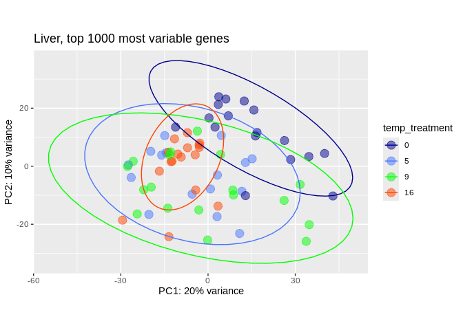
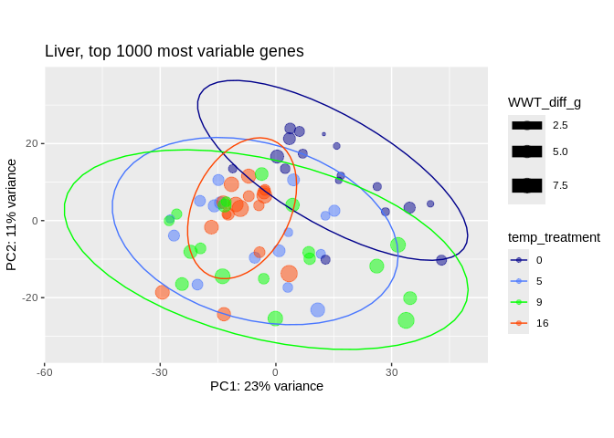
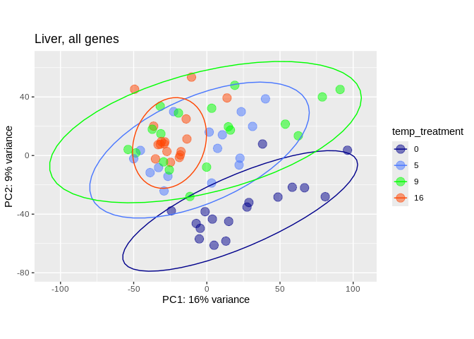
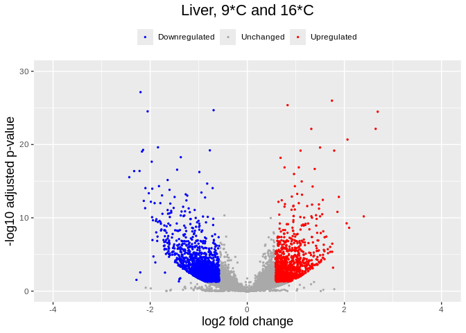
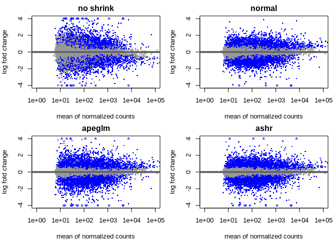

07-cod-RNAseq-DESeq2
================
Kathleen Durkin
2024-03-19

- <a href="#001-install-and-load-packages"
  id="toc-001-install-and-load-packages">0.0.1 Install and load
  packages</a>
- <a href="#1-load-data" id="toc-1-load-data">1 Load data</a>
  - <a href="#11-load-count-data" id="toc-11-load-count-data">1.1 Load count
    data</a>
  - <a href="#12-count-data-munging" id="toc-12-count-data-munging">1.2
    Count data munging</a>
  - <a href="#13-import-sample-metadata-sheets"
    id="toc-13-import-sample-metadata-sheets">1.3 Import sample metadata
    sheets</a>
  - <a href="#14-sample-metadata-munging"
    id="toc-14-sample-metadata-munging">1.4 Sample metadata munging</a>
- <a href="#2-preliminary-pca-visualization-liver-tissue"
  id="toc-2-preliminary-pca-visualization-liver-tissue">2 Preliminary PCA
  visualization (liver tissue)</a>
  - <a href="#21-deseq-object" id="toc-21-deseq-object">2.1 DESeq object</a>
  - <a href="#22-pca-visualization" id="toc-22-pca-visualization">2.2 PCA
    visualization</a>
- <a href="#3-liver-tissue-9c-v-16c" id="toc-3-liver-tissue-9c-v-16c">3
  Liver tissue, 9<em>C v. 16</em>C</a>
- <a href="#4-extracting-significantly-expressed-genes"
  id="toc-4-extracting-significantly-expressed-genes">4 Extracting
  significantly expressed genes</a>
  - <a href="#41-heatmap" id="toc-41-heatmap">4.1 Heatmap</a>
  - <a href="#42-volcano-plot" id="toc-42-volcano-plot">4.2 Volcano plot</a>
- <a href="#5-liver-tissue-9c-v-0c" id="toc-5-liver-tissue-9c-v-0c">5
  Liver tissue, 9<em>C v. 0</em>C</a>
- <a href="#6-extracting-significantly-expressed-genes"
  id="toc-6-extracting-significantly-expressed-genes">6 Extracting
  significantly expressed genes</a>
  - <a href="#61-heatmap" id="toc-61-heatmap">6.1 Heatmap</a>
  - <a href="#62-volcano-plot" id="toc-62-volcano-plot">6.2 Volcano plot</a>
- <a href="#7-liver-tissue-9c-v-5c" id="toc-7-liver-tissue-9c-v-5c">7
  Liver tissue, 9<em>C v. 5</em>C</a>
- <a href="#8-extracting-significantly-expressed-genes"
  id="toc-8-extracting-significantly-expressed-genes">8 Extracting
  significantly expressed genes</a>
  - <a href="#81-heatmap" id="toc-81-heatmap">8.1 Heatmap</a>
  - <a href="#82-volcano-plot" id="toc-82-volcano-plot">8.2 Volcano plot</a>

Differential gene expression analysis for [Pacific cod RNAseq
data](https://shedurkin.github.io/Roberts-LabNotebook/posts/projects/pacific_cod/2023_12_13_pacific_cod.html).

- Raw reads found
  [here](https://owl.fish.washington.edu/nightingales/G_macrocephalus/30-943133806/)
- Reads aligned to transcriptome downloaded from
  [NCBI](https://www.ncbi.nlm.nih.gov/datasets/genome/GCF_031168955.1/),
  stored
  [here](https://owl.fish.washington.edu/halfshell/genomic-databank/GCF_031168955.1_ASM3116895v1_rna.fna)
  as a part of lab [genomic
  resources](https://robertslab.github.io/resources/Genomic-Resources/#gadus-macrocephalus-pacific-cod).

### 0.0.1 Install and load packages

``` r
## clear
rm(list=ls())

## Install Rtools directly from (https://cran.r-project.org/bin/windows/Rtools/), then install these on first run:
# install.packages("BiocManager")
# BiocManager::install("DESeq2")
# BiocManager::install("vsn")
# BiocManager::install("tidybulk")
# BiocManager::install("goseq")
# BiocManager::install("affycoretools")
# BiocManager::install("EnhancedVolcano")
# BiocManager::install("pcaExplorer")
# BiocManager::install("apeglm")
# BiocManager::install("PCAtools")


# List of packages we want to install (run every time)
load.lib<-c("DESeq2","edgeR","goseq","dplyr","GenomicFeatures","data.table","calibrate","affycoretools","data.table","vsn","tidybulk","ggplot2","cowplot","pheatmap","gplots","RColorBrewer","EnhancedVolcano","pcaExplorer","readxl","apeglm","ashr","tibble","plotly","sqldf","PCAtools","ggpubr","beepr","genefilter","ComplexHeatmap","circlize","scales", "tidyverse", "gridextra'")

# Select only the packages that aren't currently installed (run every time)
# install.lib <- load.lib[!load.lib %in% installed.packages()]

# And finally we install the missing packages, including their dependency.
# for(lib in install.lib) install.packages(lib,dependencies=TRUE)
# After the installation process completes, we load all packages.
sapply(load.lib,require,character=TRUE)
```

             DESeq2           edgeR           goseq           dplyr GenomicFeatures 
               TRUE            TRUE            TRUE            TRUE            TRUE 
         data.table       calibrate   affycoretools      data.table             vsn 
               TRUE            TRUE            TRUE            TRUE            TRUE 
           tidybulk         ggplot2         cowplot        pheatmap          gplots 
               TRUE            TRUE            TRUE            TRUE            TRUE 
       RColorBrewer EnhancedVolcano     pcaExplorer          readxl          apeglm 
               TRUE            TRUE            TRUE            TRUE            TRUE 
               ashr          tibble          plotly           sqldf        PCAtools 
               TRUE            TRUE            TRUE            TRUE            TRUE 
             ggpubr           beepr      genefilter  ComplexHeatmap        circlize 
               TRUE            TRUE            TRUE           FALSE            TRUE 
             scales       tidyverse      gridextra' 
               TRUE            TRUE           FALSE 

I found the [DESeq2
vignette](https://www.bioconductor.org/packages/release/bioc/vignettes/DESeq2/inst/doc/DESeq2.html)
and the [HBC DGE training
workshop](https://github.com/hbctraining/DGE_workshop) super helpful in
figuring out how to use the DESeq2 package!

# 1 Load data

## 1.1 Load count data

Load in the count matrix we generated after kallisto pseudoalignment
using the Trinity abundance_estimates_to_matrix.pl script. We also need
to slightly reformat the count matrix to make all of the estimated
counts integers, as required for DESeq2.

``` r
# Read in counts data. This is a gene-level counts matrix generated from kallisto transcript abundances using Trinity
cod_counts_data_OG <- read_delim("../output/06-cod-RNAseq-alignment/kallisto/kallisto.isoform.counts.matrix") 
head(cod_counts_data_OG)
```

    # A tibble: 6 × 80
      ...1           kallisto_quant_100 kallisto_quant_107 kallisto_quant_108
      <chr>                       <dbl>              <dbl>              <dbl>
    1 XR_009524663.1              89.5                69.9            774.   
    2 XR_009524878.1               0                   0                0    
    3 XM_060052481.1             432.                159.              72.4  
    4 XM_060060803.1              12.7                30.9            139.   
    5 XM_060071658.1               2.72                0                0.967
    6 XM_060070373.1              40.2                58.8             60.2  
    # ℹ 76 more variables: kallisto_quant_109 <dbl>, kallisto_quant_10 <dbl>,
    #   kallisto_quant_110 <dbl>, kallisto_quant_117 <dbl>,
    #   kallisto_quant_118 <dbl>, kallisto_quant_119 <dbl>,
    #   kallisto_quant_11 <dbl>, kallisto_quant_120 <dbl>,
    #   kallisto_quant_121 <dbl>, kallisto_quant_127 <dbl>,
    #   kallisto_quant_128 <dbl>, kallisto_quant_129 <dbl>,
    #   kallisto_quant_12 <dbl>, kallisto_quant_131 <dbl>, …

## 1.2 Count data munging

``` r
# # We need to modify this data frame so that the row names are actually row names, instead of comprising the first column
cod_counts_data <- cod_counts_data_OG %>% 
  column_to_rownames(var = "...1")

# Additional formatting
# Round all estimated counts to integers
cod_counts_data <- round(cod_counts_data, digits = 0)

# Remove the "kallisto_quant_" portion of the column names, to leave just the sample names
colnames(cod_counts_data) <- sub("kallisto_quant_", "sample_", colnames(cod_counts_data))

# Reorder the coumns into alphabetical order (to make it easier to create an associated metadata spreadsheet)
cod_counts_data <- cod_counts_data[, order(colnames(cod_counts_data))]

cod_sample_names <- names(cod_counts_data)

head(cod_counts_data)
```

                   sample_1 sample_10 sample_100 sample_107 sample_108 sample_109
    XR_009524663.1      115       188         89         70        774         45
    XR_009524878.1        3         0          0          0          0          0
    XM_060052481.1      218       110        432        159         72        170
    XM_060060803.1        0         0         13         31        139         41
    XM_060071658.1        1         0          3          0          1          5
    XM_060070373.1        0       100         40         59         60         25
                   sample_11 sample_110 sample_117 sample_118 sample_119 sample_12
    XR_009524663.1       132         40        127         65         34       133
    XR_009524878.1         0          0          3          2          0         3
    XM_060052481.1       289        909        279        232        911       285
    XM_060060803.1        21         10         59         29         57         0
    XM_060071658.1         0          0          5          0          0         1
    XM_060070373.1         0          1         67         44          0         0
                   sample_120 sample_121 sample_127 sample_128 sample_129 sample_13
    XR_009524663.1        105        221        132         38        335        81
    XR_009524878.1          2          6          3          0          0         8
    XM_060052481.1        223         31         50          3          7       279
    XM_060060803.1         58         91          0          0          0         0
    XM_060071658.1          0          0          2          1          0         2
    XM_060070373.1         59        119          0         60         29         0
                   sample_131 sample_137 sample_138 sample_139 sample_140
    XR_009524663.1        106         21         23         60         49
    XR_009524878.1          3          0          0          0          0
    XM_060052481.1        101        157         48        105         66
    XM_060060803.1          0          0          0         15         22
    XM_060071658.1          0          1          1          0          0
    XM_060070373.1         90         46         22          0         26
                   sample_147 sample_148 sample_149 sample_150 sample_18 sample_19
    XR_009524663.1         51        412        431        343        93       499
    XR_009524878.1          0          0         55          0         4         2
    XM_060052481.1         48        222        549        196       476        61
    XM_060060803.1          0        221          0          0        37        24
    XM_060071658.1          0          1         17          0         1         0
    XM_060070373.1          0          0        145         40         0        71
                   sample_19-G sample_19-S sample_2 sample_20 sample_20-G
    XR_009524663.1         276         317       37       121         281
    XR_009524878.1           0          16        0         0           0
    XM_060052481.1          81          98      694        72          75
    XM_060060803.1          37          45       56        28          45
    XM_060071658.1           5           7        0         5           6
    XM_060070373.1           0         174       52        80         104
                   sample_20-S sample_21 sample_28 sample_29 sample_3 sample_30
    XR_009524663.1         320        85       103       132      123       164
    XR_009524878.1           0         9         0         8        0         3
    XM_060052481.1          54       348       348        68      528       209
    XM_060060803.1           9        45       142        67       33         0
    XM_060071658.1          15         4         0         0        0         2
    XM_060070373.1         158        13         0        30       50       111
                   sample_31 sample_37 sample_38 sample_39 sample_4 sample_40
    XR_009524663.1        83       121       173        76       70        67
    XR_009524878.1         0         0        16         0        0        24
    XM_060052481.1        16        20        38        76       66         0
    XM_060060803.1        18        27       235         0       42         0
    XM_060071658.1         0         0         0         0        8         4
    XM_060070373.1        31         8       143        65        0        75
                   sample_41 sample_47 sample_48 sample_49 sample_5 sample_50
    XR_009524663.1       690       113       148       258       78       168
    XR_009524878.1         0         0         0        10        3         3
    XM_060052481.1        14       197        62        62      344       134
    XM_060060803.1         7         0       103       162       16        85
    XM_060071658.1         1         1         0         1        7         2
    XM_060070373.1       125        96        86       173       38       108
                   sample_57 sample_57-G sample_57-S sample_58 sample_58-G
    XR_009524663.1        76         320         857       411         248
    XR_009524878.1         0           8          55         0           8
    XM_060052481.1       284         211          19        80          77
    XM_060060803.1         0         131           0        92         209
    XM_060071658.1         0           6           0         5           6
    XM_060070373.1         0         562         271         0         536
                   sample_58-S sample_59 sample_60 sample_67 sample_68 sample_69
    XR_009524663.1         365        54       311       138       200       150
    XR_009524878.1           0         3         0         3         0         0
    XM_060052481.1          23       116        95       173       172        48
    XM_060060803.1          51       101         0        23       138        36
    XM_060071658.1           2         0         1         5         0         6
    XM_060070373.1         384        46       130       145       117         0
                   sample_70 sample_78 sample_79 sample_80 sample_83 sample_88
    XR_009524663.1       280        65        80       143        40       189
    XR_009524878.1         0         0         0         0         0         0
    XM_060052481.1        40       175       460        75       125       126
    XM_060060803.1        83        60        12         0         0         0
    XM_060071658.1         0         0         1         7         3         1
    XM_060070373.1         1        65         0        83        64        84
                   sample_90 sample_91 sample_97 sample_98 sample_99
    XR_009524663.1       101       123       165      1100       369
    XR_009524878.1         0         0         0         0         0
    XM_060052481.1       184        77         0       198        58
    XM_060060803.1         0        48         0        58         0
    XM_060071658.1         2         2         1         0         1
    XM_060070373.1        92       150        61       180        17
                   sample_RESUB-116 sample_RESUB-156 sample_RESUB-36
    XR_009524663.1              131               85             116
    XR_009524878.1                0                0               0
    XM_060052481.1              384              431             156
    XM_060060803.1               31               50               0
    XM_060071658.1                0                6               0
    XM_060070373.1                0               58               0
                   sample_RESUB-76 sample_RESUB-94
    XR_009524663.1              95             138
    XR_009524878.1               4               4
    XM_060052481.1              83              46
    XM_060060803.1              65              30
    XM_060071658.1               0               2
    XM_060070373.1              54              13

``` r
cod_sample_names
```

     [1] "sample_1"         "sample_10"        "sample_100"       "sample_107"      
     [5] "sample_108"       "sample_109"       "sample_11"        "sample_110"      
     [9] "sample_117"       "sample_118"       "sample_119"       "sample_12"       
    [13] "sample_120"       "sample_121"       "sample_127"       "sample_128"      
    [17] "sample_129"       "sample_13"        "sample_131"       "sample_137"      
    [21] "sample_138"       "sample_139"       "sample_140"       "sample_147"      
    [25] "sample_148"       "sample_149"       "sample_150"       "sample_18"       
    [29] "sample_19"        "sample_19-G"      "sample_19-S"      "sample_2"        
    [33] "sample_20"        "sample_20-G"      "sample_20-S"      "sample_21"       
    [37] "sample_28"        "sample_29"        "sample_3"         "sample_30"       
    [41] "sample_31"        "sample_37"        "sample_38"        "sample_39"       
    [45] "sample_4"         "sample_40"        "sample_41"        "sample_47"       
    [49] "sample_48"        "sample_49"        "sample_5"         "sample_50"       
    [53] "sample_57"        "sample_57-G"      "sample_57-S"      "sample_58"       
    [57] "sample_58-G"      "sample_58-S"      "sample_59"        "sample_60"       
    [61] "sample_67"        "sample_68"        "sample_69"        "sample_70"       
    [65] "sample_78"        "sample_79"        "sample_80"        "sample_83"       
    [69] "sample_88"        "sample_90"        "sample_91"        "sample_97"       
    [73] "sample_98"        "sample_99"        "sample_RESUB-116" "sample_RESUB-156"
    [77] "sample_RESUB-36"  "sample_RESUB-76"  "sample_RESUB-94" 

## 1.3 Import sample metadata sheets

``` r
# Read in the csv file as a data frame
cod_sample_info_OG <- read.csv("~/project-cod-temperature/data/DESeq2_Sample_Information.csv")
cod_experiment_alldata_OG <- read.csv("~/project-cod-temperature/data/temp-experiment.csv")
head(cod_sample_info_OG)
```

      sample_name sample_number tank temp_treatment tissue_type
    1    sample_1             1    1             16       Liver
    2   sample_10            10    2             16       Liver
    3  sample_100           100   15              9       Liver
    4  sample_107           107   16              9       Liver
    5  sample_108           108   16              9       Liver
    6  sample_109           109   16              9       Liver

``` r
head(cod_experiment_alldata_OG)
```

      Microchip.ID SL_11212022 WWT_11212022 Tank Temperature SL_12272022
    1          620          93         8.53    1          16         101
    2         1164          88         7.06    1          16          96
    3         1476         102        10.70    1          16         108
    4         9387          87         7.83    1          16          95
    5         9407         100        11.51    1          16         117
    6         9415          92         8.68    1          16         100
      WWT_12272022 MortDate DissectionDate SL_mm WholeBodyWW_g TOTAL_Liver_WW_mg
    1        11.12                  2/8/23   119         16.15            0.4945
    2         8.64                  2/8/23   105         10.89            0.1997
    3        12.25                  2/8/23   110         12.97            0.1715
    4        10.16                  2/8/23   116         15.40            0.3625
    5        14.98                  2/8/23   127         17.98            0.3482
    6        10.96                  2/8/23   114         14.02            0.2343
      LiverforLipids_WW_mg MuscleWWforLipids_mg GeneticSamplingCount
    1               0.1546               0.3495                    8
    2               0.1091               0.3328                    5
    3               0.1107               0.3834                    4
    4               0.1681               0.3262                    6
    5               0.1210               0.3434                    2
    6               0.1342               0.2776                    9
      DissectionComments
    1                   
    2                   
    3                   
    4                   
    5                   
    6                   

``` r
# Rename the "GeneticSamplingCount" column of the experimental data to "sample_number"
cod_experiment_alldata <- cod_experiment_alldata_OG
names(cod_experiment_alldata)[names(cod_experiment_alldata) == "GeneticSamplingCount"] <- "sample_number"

# Calculate length difference and weight difference (end-beginning)
cod_experiment_alldata$SL_diff_mm <- cod_experiment_alldata$SL_mm - cod_experiment_alldata$SL_11212022
cod_experiment_alldata$WWT_diff_g <- cod_experiment_alldata$WholeBodyWW_g - cod_experiment_alldata$WWT_11212022

# Merge the two data frames to get experimental data for all of our RNAseq'd samples.
# This should include all rows from cod_sample_info_OG and matching rows from cod_experiment_alldata based on the shared sample_number column. Sample number duplicates (e.g. from different tissue types) should be retained.
cod_sample_info <- merge(cod_sample_info_OG, cod_experiment_alldata, by = "sample_number", all.x = TRUE)

# Reorder the data frame into alphabetical order by the sample names, so that the rows are in the same order as our count matrix columns
cod_sample_info <- cod_sample_info[order(cod_sample_info$sample_name), ]

# Again, we need to reformat so that the data in the first column becomes the row names
rownames(cod_sample_info) <- cod_sample_info$sample_name

# Remove duplicate columns (artifact of merging data frames with multiple shared columns and of maing sample_name the rownames instead of a variable)
cod_sample_info <- subset(cod_sample_info, select=-Temperature)
cod_sample_info <- subset(cod_sample_info, select=-Tank)
cod_sample_info <- subset(cod_sample_info, select=-sample_name)


head(cod_sample_info)
```

               sample_number tank temp_treatment tissue_type Microchip.ID
    sample_1               1    1             16       Liver         9443
    sample_10             10    2             16       Liver         9518
    sample_100           100   15              9       Liver         9483
    sample_107           107   16              9       Liver         4236
    sample_108           108   16              9       Liver         9416
    sample_109           109   16              9       Liver         9481
               SL_11212022 WWT_11212022 SL_12272022 WWT_12272022 MortDate
    sample_1            99        10.54         108        12.94         
    sample_10           95         9.45         105        12.67         
    sample_100          70         4.54          78         5.23         
    sample_107          94         9.15         104        11.44         
    sample_108          81         6.26          91         7.87         
    sample_109          89         7.77          95         9.49         
               DissectionDate SL_mm WholeBodyWW_g TOTAL_Liver_WW_mg
    sample_1           2/8/23   114         14.39            0.0896
    sample_10          2/8/23   120         16.22            0.3854
    sample_100         2/9/23    93          8.33            0.2558
    sample_107         2/9/23   119         16.41            0.5612
    sample_108         2/9/23   106         11.67            0.3650
    sample_109         2/9/23   116         11.45            0.3088
               LiverforLipids_WW_mg MuscleWWforLipids_mg DissectionComments
    sample_1                 0.0704               0.3899      lipid inserts
    sample_10                0.1285               0.2967                   
    sample_100               0.1143               0.3483                   
    sample_107               0.1503               0.3322                   
    sample_108               0.1125               0.3612                   
    sample_109               0.1090               0.3062                   
               SL_diff_mm WWT_diff_g
    sample_1           15       3.85
    sample_10          25       6.77
    sample_100         23       3.79
    sample_107         25       7.26
    sample_108         25       5.41
    sample_109         27       3.68

## 1.4 Sample metadata munging

``` r
# Factor variables
cod_sample_info$temp_treatment <- factor(cod_sample_info$temp_treatment)
cod_sample_info$tank <- factor(cod_sample_info$tank)
cod_sample_info$tissue_type <- factor(cod_sample_info$tissue_type)

# Remove bad/missing samples
# Missing data: 92
# MuliQC report: 149, 129
# PCA outliers: 31, 41 (per Laura)
cod_sample_info <- cod_sample_info[!(row.names(cod_sample_info) %in% c("sample_92", "sample_149", "sample_129", "sample_31", "sample_41")),]
cod_counts_data <- as.matrix(subset(cod_counts_data, select=-c(sample_149, sample_129, sample_31, sample_41)))

# Check that the column names of our count data match the row names of our sample info sheet
ncol(cod_counts_data)
```

    [1] 75

``` r
nrow(cod_sample_info)
```

    [1] 75

``` r
all(colnames(cod_counts_data) %in% rownames(cod_sample_info))
```

    [1] TRUE

``` r
all(colnames(cod_counts_data) == rownames(cod_sample_info))
```

    [1] TRUE

# 2 Preliminary PCA visualization (liver tissue)

## 2.1 DESeq object

``` r
# Filter data
infosub_L <- cod_sample_info %>% filter(tissue_type == "Liver")
countsub_L <- subset(cod_counts_data, select=row.names(infosub_L))

# Calculate DESeq object
dds_L <- DESeqDataSetFromMatrix(countData = countsub_L,
                              colData = infosub_L,
                              design = ~ temp_treatment) 

# Run differential expression analysis 
# (Note that this DESeq() function runs all necessary steps, including data normalization, 
# estimating size factors, estimating dispersions, gene-wise dispersion estimates, mean-dispersion 
# relationship, final dispersion estimates, fitting model, and testing)
dds_L <- DESeq(dds_L)
resultsNames(dds_L) # lists the coefficients
```

    [1] "Intercept"              "temp_treatment_5_vs_0"  "temp_treatment_9_vs_0" 
    [4] "temp_treatment_16_vs_0"

``` r
plotDispEsts(dds_L)
```

<!-- -->

## 2.2 PCA visualization

``` r
# Generate PCAs
# top 500 most variable genes
pca_L_500<- plotPCA(vst(dds_L), intgroup = c("temp_treatment"), returnData=TRUE)
percentVar_L_500 <- round(100*attr(pca_L_500, "percentVar"))
# merge with metadata sheet so we can plot using other features
pca_L_500 <- subset(pca_L_500, select=-temp_treatment) #remove the temp_treatment column, which will be a duplicate post-merge
pca_L_500 <- merge(pca_L_500, cod_sample_info, by.x = "name", by.y = "row.names")

# top 1000 most variable genes
pca_L_1000 <- plotPCA(vst(dds_L), intgroup = c("temp_treatment"), returnData=TRUE, ntop=1000)
percentVar_L_1000 <- round(100*attr(pca_L_1000, "percentVar"))
# merge with metadata sheet so we can plot using other features
pca_L_1000 <- subset(pca_L_1000, select=-temp_treatment) #remove the temp_treatment column, which will be a duplicate post-merge
pca_L_1000 <- merge(pca_L_1000, cod_sample_info, by.x = "name", by.y = "row.names")

# all genes
pca_L_all <- plotPCA(vst(dds_L), intgroup = c("temp_treatment"), returnData=TRUE, ntop=nrow(assay(vst(dds_L))))
percentVar_L_all <- round(100*attr(pca_L_all, "percentVar"))
# merge with metadata sheet so we can plot using other features
pca_L_all <- subset(pca_L_all, select=-temp_treatment) #remove the temp_treatment column, which will be a duplicate post-merge
pca_L_all <- merge(pca_L_all, cod_sample_info, by.x = "name", by.y = "row.names")

# Assign specific colors to each temperature treatment level
temp_colors <- c(
  "0" = "darkblue",
  "5" = "royalblue1",
  "9" = "green",
  "16" = "orangered") 

# Plot PCAs
p.L.500 <- ggplot(pca_L_500, aes(PC1, PC2, color=temp_treatment)) + 
  geom_point(size=4, alpha = 5/10) +
  ggtitle("Liver, top 500 most variable genes") +
  xlab(paste0("PC1: ",percentVar_L_500[1],"% variance")) +
  ylab(paste0("PC2: ",percentVar_L_500[2],"% variance")) + 
  coord_fixed() +
  scale_color_manual(values=temp_colors)+
  stat_ellipse()

p.L.500.SLdiff <- ggplot(pca_L_500, aes(PC1, PC2, color=temp_treatment, size=SL_diff_mm)) + 
  geom_point(alpha = 0.5) +
  ggtitle("Liver, top 500 most variable genes") +
  xlab(paste0("PC1: ", percentVar_L_500[1], "% variance")) +
  ylab(paste0("PC2: ", percentVar_L_500[2], "% variance")) + 
  coord_fixed() +
  scale_color_manual(values = temp_colors) +
  scale_size_continuous() +  # Add this line to control the size of points
  stat_ellipse()

p.L.500.WWTdiff <- ggplot(pca_L_500, aes(PC1, PC2, color=temp_treatment, size=WWT_diff_g)) + 
  geom_point(alpha = 0.5) +
  ggtitle("Liver, top 500 most variable genes") +
  xlab(paste0("PC1: ", percentVar_L_500[1], "% variance")) +
  ylab(paste0("PC2: ", percentVar_L_500[2], "% variance")) + 
  coord_fixed() +
  scale_color_manual(values = temp_colors) +
  scale_size_continuous() +  # Add this line to control the size of points
  stat_ellipse()

p.L.1000 <- ggplot(pca_L_1000, aes(PC1, PC2, color=temp_treatment)) + 
  geom_point(size=4, alpha = 5/10) +
  ggtitle("Liver, top 1000 most variable genes") +
  xlab(paste0("PC1: ",percentVar_L_1000[1],"% variance")) +
  ylab(paste0("PC2: ",percentVar_L_1000[2],"% variance")) + 
  coord_fixed() +
  scale_color_manual(values=temp_colors)+
  stat_ellipse()

p.L.1000.SLdiff <- ggplot(pca_L_1000, aes(PC1, PC2, color=temp_treatment, size=SL_diff_mm)) + 
  geom_point(alpha = 0.5) +
  ggtitle("Liver, top 1000 most variable genes") +
  xlab(paste0("PC1: ", percentVar_L_500[1], "% variance")) +
  ylab(paste0("PC2: ", percentVar_L_500[2], "% variance")) + 
  coord_fixed() +
  scale_color_manual(values = temp_colors) +
  scale_size_continuous() +  # Add this line to control the size of points
  stat_ellipse()

p.L.1000.WWTdiff <- ggplot(pca_L_1000, aes(PC1, PC2, color=temp_treatment, size=WWT_diff_g)) + 
  geom_point(alpha = 0.5) +
  ggtitle("Liver, top 1000 most variable genes") +
  xlab(paste0("PC1: ", percentVar_L_500[1], "% variance")) +
  ylab(paste0("PC2: ", percentVar_L_500[2], "% variance")) + 
  coord_fixed() +
  scale_color_manual(values = temp_colors) +
  scale_size_continuous() +  # Add this line to control the size of points
  stat_ellipse()

p.L.all <- ggplot(pca_L_all, aes(PC1, PC2, color=temp_treatment)) + 
  geom_point(size=4, alpha = 5/10) +
  ggtitle("Liver, all genes") +
  xlab(paste0("PC1: ",percentVar_L_all[1],"% variance")) +
  ylab(paste0("PC2: ",percentVar_L_all[2],"% variance")) + 
  coord_fixed() +
  scale_color_manual(values=temp_colors)+
  stat_ellipse()

p.L.all.SLdiff <- ggplot(pca_L_all, aes(PC1, PC2, color=temp_treatment, size=SL_diff_mm)) + 
  geom_point(alpha = 0.5) +
  ggtitle("Liver, all genes") +
  xlab(paste0("PC1: ", percentVar_L_500[1], "% variance")) +
  ylab(paste0("PC2: ", percentVar_L_500[2], "% variance")) + 
  coord_fixed() +
  scale_color_manual(values = temp_colors) +
  scale_size_continuous() +  # Add this line to control the size of points
  stat_ellipse()

p.L.all.WWTdiff <- ggplot(pca_L_all, aes(PC1, PC2, color=temp_treatment, size=WWT_diff_g)) + 
  geom_point(alpha = 0.5) +
  ggtitle("Liver, all genes") +
  xlab(paste0("PC1: ", percentVar_L_500[1], "% variance")) +
  ylab(paste0("PC2: ", percentVar_L_500[2], "% variance")) + 
  coord_fixed() +
  scale_color_manual(values = temp_colors) +
  scale_size_continuous() +  # Add this line to control the size of points
  stat_ellipse()

# View PCAs
p.L.500
```

<!-- -->

``` r
p.L.500.SLdiff
```

<!-- -->

``` r
p.L.500.WWTdiff
```

<!-- -->

``` r
p.L.1000
```

<!-- -->

``` r
p.L.1000.SLdiff
```

<!-- -->

``` r
p.L.1000.WWTdiff
```

<!-- -->

``` r
p.L.all
```

<!-- -->

``` r
p.L.all.SLdiff
```

<!-- -->

``` r
p.L.all.WWTdiff
```

<!-- -->

``` r
# Export PCAs as pngs
ggexport(filename = "../output/07-cod-RNAseq-DESeq2/PCA_L_500.png",
         plot   = p.L.500,
         res    = 600,
         width  = 6000,
         height = 4000)

ggexport(filename = "../output/07-cod-RNAseq-DESeq2/PCA_L_1000.png",
         plot   = p.L.1000,
         res    = 600,
         width  = 6000,
         height = 4000)

ggexport(filename = "../output/07-cod-RNAseq-DESeq2/PCA_L_all.png",
         plot   = p.L.all,
         res    = 600,
         width  = 6000,
         height = 4000)
```

# 3 Liver tissue, 9*C v. 16*C

The 9\*C temperature treatment is effectively our “control,” as it
represents the ambient temperature that wild juvenile Pacific cod would
experience.

``` r
# liver tissue, temperatures 9 vs. 16 

# Filter data
infosub_L.9.16 <- cod_sample_info %>% filter(tissue_type == "Liver" & (temp_treatment == "9" | temp_treatment == "16"))
countsub_L.9.16 <- subset(cod_counts_data, select=row.names(infosub_L.9.16))

# Calculate DESeq object
dds_L.9.16 <- DESeqDataSetFromMatrix(countData = countsub_L.9.16,
                              colData = infosub_L.9.16,
                              design = ~ temp_treatment)

dds_L.9.16 <- DESeq(dds_L.9.16)
resultsNames(dds_L.9.16) # lists the coefficients
```

    [1] "Intercept"              "temp_treatment_16_vs_9"

``` r
plotDispEsts(dds_L.9.16)
```

<!-- -->

``` r
# Filtering: keep genes that have at least 10 counts across 1/3 of the samples - https://support.bioconductor.org/p/110307/
keep <- rowSums(DESeq2::counts(dds_L.9.16) >= 10) >= ncol(countsub_L.9.16)/3
dds_L.9.16<- dds_L.9.16[keep,]

# Generate Contrasts
contrast_list_L.9.16        <- c("temp_treatment", "16", "9") # order is important: factor, treatment group, control
res_table_L.9.16_noshrink <- results(dds_L.9.16, contrast=contrast_list_L.9.16, alpha = 0.05)

res_table_L.9.16_norm     <- lfcShrink(dds_L.9.16,
                                       coef=2,
                                       type="normal") # lfcThreshold = 0.585)  # a lfc threshold of 1 = 2-fold change, 0.585 = 1.5-fold change
res_table_L.9.16_apeglm   <- lfcShrink(dds_L.9.16,
                                       coef=2, 
                                       type="apeglm") # lfcThreshold = 0.585)  # a lfc threshold of 1 = 2-fold change, 0.585 = 1.5-fold change
res_table_L.9.16_ashr     <- lfcShrink(dds_L.9.16,
                                       coef=2, 
                                       type="ashr")
```

``` r
# Generate MA plots
par(mfrow=c(2,2), mar=c(4,4,2,1))
xlim <- c(1,1e5); ylim <- c(-4,4)
DESeq2::plotMA(res_table_L.9.16_noshrink, xlim=xlim, ylim=ylim, main="no shrink")
DESeq2::plotMA(res_table_L.9.16_norm, xlim=xlim, ylim=ylim, main="normal")
DESeq2::plotMA(res_table_L.9.16_apeglm, xlim=xlim, ylim=ylim, main="apeglm")
DESeq2::plotMA(res_table_L.9.16_ashr, xlim=xlim, ylim=ylim, main="ashr")
```

<!-- -->

``` r
# Examine results formatting
res_table_L.9.16_norm %>% data.frame() %>% head()
```

                    baseMean log2FoldChange     lfcSE       stat     pvalue
    XR_009524663.1 172.02100    -0.58930033 0.2976828 -1.9804155 0.04765686
    XM_060052481.1 234.42310     0.14067865 0.3120795  0.4507903 0.65214072
    XM_060060803.1  26.91392     0.07544055 0.3308824  0.2280426 0.81961316
    XM_060070373.1  46.30310    -0.43318495 0.3352593 -1.3076029 0.19100802
    XM_060063653.1  71.04920    -0.76554420 0.3284260 -2.4752846 0.01331300
    XM_060065730.1  23.27700    -0.43625018 0.3174980 -1.3755736 0.16895368
                         padj
    XR_009524663.1 0.15709623
    XM_060052481.1 0.82984033
    XM_060060803.1 0.91921578
    XM_060070373.1 0.40722399
    XM_060063653.1 0.06165138
    XM_060065730.1 0.37614627

Note that the metric we want to use to identify significantly expressed
genes is the `padj` values, **NOT** the `pvalue`. `padj` are p-values
corrected for multiple testing (default method is the Benjamini and
Hochberg method).

``` r
summary(res_table_L.9.16_noshrink)
```

    out of 21631 with nonzero total read count
    adjusted p-value < 0.05
    LFC > 0 (up)       : 1888, 8.7%
    LFC < 0 (down)     : 2465, 11%
    outliers [1]       : 0, 0%
    low counts [2]     : 0, 0%
    (mean count < 5)
    [1] see 'cooksCutoff' argument of ?results
    [2] see 'independentFiltering' argument of ?results

``` r
summary(res_table_L.9.16_norm)
```

    out of 21631 with nonzero total read count
    adjusted p-value < 0.1
    LFC > 0 (up)       : 2431, 11%
    LFC < 0 (down)     : 3079, 14%
    outliers [1]       : 0, 0%
    low counts [2]     : 0, 0%
    (mean count < 5)
    [1] see 'cooksCutoff' argument of ?results
    [2] see 'independentFiltering' argument of ?results

``` r
summary(res_table_L.9.16_apeglm)
```

    out of 21631 with nonzero total read count
    adjusted p-value < 0.1
    LFC > 0 (up)       : 2431, 11%
    LFC < 0 (down)     : 3079, 14%
    outliers [1]       : 0, 0%
    low counts [2]     : 0, 0%
    (mean count < 5)
    [1] see 'cooksCutoff' argument of ?results
    [2] see 'independentFiltering' argument of ?results

``` r
summary(res_table_L.9.16_ashr)
```

    out of 21631 with nonzero total read count
    adjusted p-value < 0.1
    LFC > 0 (up)       : 2432, 11%
    LFC < 0 (down)     : 3078, 14%
    outliers [1]       : 0, 0%
    low counts [2]     : 0, 0%
    (mean count < 5)
    [1] see 'cooksCutoff' argument of ?results
    [2] see 'independentFiltering' argument of ?results

# 4 Extracting significantly expressed genes

``` r
padj.cutoff <- 0.05
lfc.cutoff <- 0.58

# Convert results table into tibble
res_table_L.9.16_norm_tb <- res_table_L.9.16_norm %>%
  data.frame() %>%
  rownames_to_column(var="gene") %>%
  as_tibble()

# subset that table to only keep the significant genes using our pre-defined thresholds:
sig_L.9.16_norm <- res_table_L.9.16_norm_tb %>%
        filter(padj < padj.cutoff & abs(log2FoldChange) > lfc.cutoff)

head(sig_L.9.16_norm)
```

    # A tibble: 6 × 7
      gene           baseMean log2FoldChange lfcSE  stat   pvalue     padj
      <chr>             <dbl>          <dbl> <dbl> <dbl>    <dbl>    <dbl>
    1 XR_009525437.1     98.7         -2.20  0.268 -8.21 2.28e-16 1.08e-13
    2 XM_060060327.1     93.8          1.04  0.256  4.05 5.08e- 5 7.78e- 4
    3 XR_009529546.1     76.0         -0.609 0.211 -2.89 3.79e- 3 2.38e- 2
    4 XM_060061699.1    116.          -1.18  0.178 -6.67 2.63e-11 3.49e- 9
    5 XM_060058899.1     22.0         -1.32  0.271 -4.85 1.23e- 6 3.75e- 5
    6 XM_060066319.1     68.4         -1.69  0.270 -6.25 4.15e-10 4.08e- 8

``` r
paste("Number of significant DEGs for 9C v 16C:", nrow(sig_L.9.16_norm), "(padj<", padj.cutoff, ", log-fold change >", lfc.cutoff, ")")
```

    [1] "Number of significant DEGs for 9C v 16C: 3006 (padj< 0.05 , log-fold change > 0.58 )"

``` r
write.table(sig_L.9.16_norm, file = "../output/07-cod-RNAseq-DESeq2/Gmac_DEGs_sig_L.9.16_norm.tab", sep = "\t",
            row.names = TRUE, col.names = NA)
```

## 4.1 Heatmap

``` r
# Retrieve normalized counts matrix
dds_L.9.16_norm_counts <- counts(dds_L.9.16, normalized=TRUE)

# Extract normalized expression for significant genes
norm_sig_L.9.16 <- dds_L.9.16_norm_counts %>% 
  data.frame() %>%
  filter(row.names(dds_L.9.16_norm_counts) %in% sig_L.9.16_norm$gene)

head(norm_sig_L.9.16)
```

                     sample_1 sample_10 sample_100 sample_107 sample_108 sample_109
    XR_009525437.1  13.691735  24.87658   79.79397  326.40029  113.09950   94.06337
    XM_060060327.1 215.040776  69.50808   84.78110   34.20789   44.78051   46.09105
    XR_009529546.1  70.069466  31.46155   59.84548  133.98091   75.78241  107.23224
    XM_060061699.1  36.242827  76.09306  118.69354  106.89966  229.64365  130.74808
    XM_060058899.1   7.248565  51.21648   48.87381   21.37993   60.28146   35.74408
    XM_060066319.1   9.664754  50.48482   40.89441  138.25689   66.02255   81.83513
                    sample_11 sample_110 sample_12  sample_13  sample_18 sample_19
    XR_009525437.1   9.750244   32.03493  76.31215  25.492429  25.778748 28.305643
    XM_060060327.1 117.002926   38.44191  82.31423 152.954576 292.489637 44.031000
    XR_009529546.1  72.683636   88.78251  36.86992  91.279344  62.463889 48.224429
    XM_060061699.1  67.365321  135.46198  47.15920  50.984859  54.531966 62.901429
    XM_060058899.1   8.863858   32.95021  14.57648   4.934019   4.957451  9.435214
    XM_060066319.1  27.477960   43.93361  24.86576  27.959439  21.812786 30.402357
                   sample_2  sample_20 sample_21  sample_28  sample_29  sample_3
    XR_009525437.1 25.37087  27.365803  12.13809  24.062796  28.741588 23.272004
    XM_060060327.1 48.62750 175.141138 168.06588 173.067036 105.385824 40.278469
    XR_009529546.1 49.68462  58.015502  43.88387  30.541242  31.615747 52.809548
    XM_060061699.1 60.25582  77.718880  96.17103 113.835537  45.986541 77.871707
    XM_060058899.1 10.57120   8.757057  10.27069   2.776477   6.706371  9.845848
    XM_060066319.1 25.37087  32.838963  30.81208  22.211812  16.286900 17.901542
                   sample_30    sample_4  sample_5 sample_78  sample_79 sample_80
    XR_009525437.1 47.269823  20.7611952  15.50890 117.70584 122.149108 109.26173
    XM_060060327.1 88.537128 318.0237634 113.73193  29.69156  51.323155  62.12922
    XR_009529546.1 36.765418  76.4389461  98.22303  99.67882  58.508396  64.27160
    XM_060061699.1 68.278633  78.3263275  49.11151 162.24319 168.339947 275.29670
    XM_060058899.1  3.751573   0.9436907  16.37050  42.41652   9.238168  22.49506
    XM_060066319.1 22.509439  16.0427418  53.41954 148.45782  75.958269  46.06132
                   sample_83 sample_88 sample_90 sample_91  sample_97  sample_98
    XR_009525437.1 116.57969 179.41822 616.69232  90.91269 307.749037 357.531059
    XM_060060327.1  70.46025  20.60885  28.71007  97.23706  42.498677   7.150621
    XR_009529546.1 103.76874 134.56367  98.76264  44.27053 183.183951 215.710406
    XM_060061699.1 152.45037 264.27819 110.24667 121.74396 136.288859  52.437889
    XM_060058899.1  37.15177  40.00541  34.45209  21.34472   4.396415  26.218944
    XM_060066319.1  90.95778 257.00448 259.53904  32.41235 323.869225 194.258542
                   sample_99 sample_RESUB.116 sample_RESUB.36 sample_RESUB.94
    XR_009525437.1 143.25894         27.11219        17.20051        77.04507
    XM_060060327.1 121.13808        108.44874        38.70116        58.70101
    XR_009529546.1  56.88223         28.98199       100.33633        37.60533
    XM_060061699.1 117.97795        360.87254        88.86932       137.58048
    XM_060058899.1  40.02823         55.15927        11.46701        34.85372
    XM_060066319.1  40.02823         18.69806        11.46701        25.68169

``` r
# Annotate heatmap
annotation <- infosub_L.9.16 %>% 
    select(temp_treatment)

# Set a color palette
heat_colors <- rev(brewer.pal(12, "RdYlBu"))

# Run pheatmap
h.L.9.16 <- pheatmap(norm_sig_L.9.16, 
                     color = heat_colors, 
                     cluster_rows = T, 
                     show_rownames = F,
                     annotation = annotation, 
                     border_color = NA, 
                     fontsize = 10,
                     scale = "row", 
                     fontsize_row = 10, 
                     height = 30,
                     main = "Normalized Significant Expression, Liver, 9*C and 16*C")
```

<!-- -->

``` r
# Save plot
ggexport(filename = "../output/07-cod-RNAseq-DESeq2/heatmap_L.9.16_norm_sig.png",
         plot   = h.L.9.16,
         res    = 600,
         width  = 5000,
         height = 5000)
```

Note the argument `scale="row"` was included, so the values plotted in
the heat map are *Z-scores*, rather thn the normalized count value. This
vastly improves the color visualization.

## 4.2 Volcano plot

``` r
# Generate plot
v.L.9.16 <- 
  ggplot(res_table_L.9.16_norm_tb) +
  # Plot all
  geom_point(aes(x=log2FoldChange, y=-log10(padj),color="unchanged"),
             size=.5) +
  # Overlay all significantly upregulated in red
  geom_point(data = sig_L.9.16_norm[sig_L.9.16_norm$log2FoldChange > 0, ], 
             aes(x=log2FoldChange, y=-log10(padj), color="upregulated"), 
             size=.5) +
  # Overlay all significantly downregulated in blue
  geom_point(data = sig_L.9.16_norm[sig_L.9.16_norm$log2FoldChange < 0, ], 
             aes(x=log2FoldChange, y=-log10(padj), color="downregulated"), 
             size=.5) +
  ggtitle("Liver, 9*C and 16*C") +
  xlab("log2 fold change") + 
  ylab("-log10 adjusted p-value") +
  scale_x_continuous(limits = c(-4,4)) +
  scale_y_continuous(limits = c(0,30)) +
  scale_color_manual(values = c("unchanged" = "darkgrey", "upregulated" = "red", "downregulated" = "blue"),
                     labels = c("unchanged" = "Unchanged", "upregulated" = "Upregulated", "downregulated" = "Downregulated"),
                     name = NULL) +
  theme(legend.position = "top",
        plot.title = element_text(size = rel(1.5), hjust = 0.5),
        axis.title = element_text(size = rel(1.25)))

v.L.9.16
```

<!-- -->

``` r
# Save plot
ggexport(filename = "../output/07-cod-RNAseq-DESeq2/volcano_L.9.16.png",
         plot   = v.L.9.16,
         res    = 600,
         width  = 6000,
         height = 4000)
```

# 5 Liver tissue, 9*C v. 0*C

The 9\*C temperature treatment is effectively our “control,” as it
represents the ambient temperature that wild juvenile Pacific cod would
experience.

``` r
# liver tissue, temperatures 9 vs. 0 

# Filter data
infosub_L.9.0 <- cod_sample_info %>% filter(tissue_type == "Liver" & (temp_treatment == "9" | temp_treatment == "0"))
countsub_L.9.0 <- subset(cod_counts_data, select=row.names(infosub_L.9.0))

# Calculate DESeq object
dds_L.9.0 <- DESeqDataSetFromMatrix(countData = countsub_L.9.0,
                              colData = infosub_L.9.0,
                              design = ~ temp_treatment)

dds_L.9.0 <- DESeq(dds_L.9.0)
resultsNames(dds_L.9.0) # lists the coefficients
```

    [1] "Intercept"             "temp_treatment_9_vs_0"

``` r
plotDispEsts(dds_L.9.0)
```

<!-- -->

``` r
# Filtering: keep genes that have at least 10 counts across 1/3 of the samples - https://support.bioconductor.org/p/110307/
keep <- rowSums(DESeq2::counts(dds_L.9.0) >= 10) >= ncol(countsub_L.9.0)/3
dds_L.9.0<- dds_L.9.0[keep,]

# Generate Contrasts
contrast_list_L.9.0        <- c("temp_treatment", "0", "9") # order is important: factor, treatment group, control
res_table_L.9.0_noshrink <- results(dds_L.9.0, contrast=contrast_list_L.9.0, alpha = 0.05)

res_table_L.9.0_norm     <- lfcShrink(dds_L.9.0,
                                       coef=2,
                                       type="normal") # lfcThreshold = 0.585)  # a lfc threshold of 1 = 2-fold change, 0.585 = 1.5-fold change
res_table_L.9.0_apeglm   <- lfcShrink(dds_L.9.0,
                                       coef=2, 
                                       type="apeglm") # lfcThreshold = 0.585)  # a lfc threshold of 1 = 2-fold change, 0.585 = 1.5-fold change
res_table_L.9.0_ashr     <- lfcShrink(dds_L.9.0,
                                       coef=2, 
                                       type="ashr")
```

``` r
# Generate MA plots
par(mfrow=c(2,2), mar=c(4,4,2,1))
xlim <- c(1,1e5); ylim <- c(-4,4)
DESeq2::plotMA(res_table_L.9.0_noshrink, xlim=xlim, ylim=ylim, main="no shrink")
DESeq2::plotMA(res_table_L.9.0_norm, xlim=xlim, ylim=ylim, main="normal")
DESeq2::plotMA(res_table_L.9.0_apeglm, xlim=xlim, ylim=ylim, main="apeglm")
DESeq2::plotMA(res_table_L.9.0_ashr, xlim=xlim, ylim=ylim, main="ashr")
```

<!-- -->

``` r
# Examine results formatting
res_table_L.9.0_norm %>% data.frame() %>% head()
```

                    baseMean log2FoldChange     lfcSE       stat      pvalue
    XR_009524663.1 185.25366     0.58935063 0.3143465  1.8749836 0.060794976
    XM_060052481.1 158.28015     1.14320569 0.3594376  3.1842398 0.001451347
    XM_060060803.1  42.57745    -0.53400319 0.4173017 -1.2891419 0.197348754
    XM_060070373.1  64.28824     0.08828602 0.4084669  0.2161718 0.828853804
    XM_060063653.1 102.30124     0.37603724 0.4146658  0.9081482 0.363799908
    XM_060065730.1  26.84459     0.24339271 0.3855410  0.6318955 0.527455171
                         padj
    XR_009524663.1 0.16372657
    XM_060052481.1 0.00778942
    XM_060060803.1 0.38681134
    XM_060070373.1 0.91626691
    XM_060063653.1 0.58110519
    XM_060065730.1 0.72533375

Note that the metric we want to use to identify significantly expressed
genes is the `padj` values, **NOT** the `pvalue`. `padj` are p-values
corrected for multiple testing (default method is the Benjamini and
Hochberg method).

``` r
summary(res_table_L.9.0_noshrink)
```

    out of 21876 with nonzero total read count
    adjusted p-value < 0.05
    LFC > 0 (up)       : 2938, 13%
    LFC < 0 (down)     : 2964, 14%
    outliers [1]       : 0, 0%
    low counts [2]     : 0, 0%
    (mean count < 5)
    [1] see 'cooksCutoff' argument of ?results
    [2] see 'independentFiltering' argument of ?results

``` r
summary(res_table_L.9.0_norm)
```

    out of 21876 with nonzero total read count
    adjusted p-value < 0.1
    LFC > 0 (up)       : 3611, 17%
    LFC < 0 (down)     : 3414, 16%
    outliers [1]       : 0, 0%
    low counts [2]     : 0, 0%
    (mean count < 5)
    [1] see 'cooksCutoff' argument of ?results
    [2] see 'independentFiltering' argument of ?results

``` r
summary(res_table_L.9.0_apeglm)
```

    out of 21876 with nonzero total read count
    adjusted p-value < 0.1
    LFC > 0 (up)       : 3611, 17%
    LFC < 0 (down)     : 3414, 16%
    outliers [1]       : 0, 0%
    low counts [2]     : 0, 0%
    (mean count < 5)
    [1] see 'cooksCutoff' argument of ?results
    [2] see 'independentFiltering' argument of ?results

``` r
summary(res_table_L.9.0_ashr)
```

    out of 21876 with nonzero total read count
    adjusted p-value < 0.1
    LFC > 0 (up)       : 3609, 16%
    LFC < 0 (down)     : 3416, 16%
    outliers [1]       : 0, 0%
    low counts [2]     : 0, 0%
    (mean count < 5)
    [1] see 'cooksCutoff' argument of ?results
    [2] see 'independentFiltering' argument of ?results

# 6 Extracting significantly expressed genes

``` r
padj.cutoff <- 0.05
lfc.cutoff <- 0.58

# Convert results table into tibble
res_table_L.9.0_norm_tb <- res_table_L.9.0_norm %>%
  data.frame() %>%
  rownames_to_column(var="gene") %>%
  as_tibble()

# subset that table to only keep the significant genes using our pre-defined thresholds:
sig_L.9.0_norm <- res_table_L.9.0_norm_tb %>%
        filter(padj < padj.cutoff & abs(log2FoldChange) > lfc.cutoff)

head(sig_L.9.0_norm)
```

    # A tibble: 6 × 7
      gene           baseMean log2FoldChange lfcSE  stat       pvalue        padj
      <chr>             <dbl>          <dbl> <dbl> <dbl>        <dbl>       <dbl>
    1 XM_060052481.1    158.           1.14  0.359  3.18 0.00145      0.00779    
    2 XM_060036766.1     50.5         -0.944 0.273 -3.45 0.000563     0.00343    
    3 XM_060060327.1     76.5         -0.600 0.222 -2.71 0.00674      0.0282     
    4 XM_060071434.1     35.4          0.927 0.213  4.35 0.0000137    0.000130   
    5 XM_060061699.1    243.          -0.799 0.179 -4.47 0.00000774   0.0000782  
    6 XM_060058899.1     23.9          1.40  0.247  5.65 0.0000000160 0.000000281

``` r
paste("Number of significant DEGs for 9C v 0C:", nrow(sig_L.9.0_norm), "(padj<", padj.cutoff, ", log-fold change >", lfc.cutoff, ")")
```

    [1] "Number of significant DEGs for 9C v 0C: 4673 (padj< 0.05 , log-fold change > 0.58 )"

``` r
write.table(sig_L.9.0_norm, file = "../output/07-cod-RNAseq-DESeq2/Gmac_DEGs_sig_L.9.0_norm.tab", sep = "\t",
            row.names = TRUE, col.names = NA)
```

## 6.1 Heatmap

``` r
# Retrieve normalized counts matrix
dds_L.9.0_norm_counts <- counts(dds_L.9.0, normalized=TRUE)

# Extract normalized expression for significant genes
norm_sig_L.9.0 <- dds_L.9.0_norm_counts %>% 
  data.frame() %>%
  filter(row.names(dds_L.9.0_norm_counts) %in% sig_L.9.0_norm$gene)

head(norm_sig_L.9.0)
```

                   sample_100 sample_107 sample_108 sample_109 sample_110 sample_37
    XM_060052481.1  466.95239  239.91880   42.92562  170.61493  908.35452  20.38467
    XM_060036766.1   44.31724   19.61600   52.46465   20.07235   57.95881  38.73087
    XM_060060327.1   91.87721   36.21416   46.50276   49.17725   41.97018 131.48110
    XM_060071434.1   82.14903   37.72308   36.96373   25.09043   36.97373  19.36543
    XM_060061699.1  128.62809  113.16925  238.47568  139.50280  147.89491 281.30840
    XM_060058899.1   52.96451   22.63385   62.59987   38.13746   35.97444  14.26927
                   sample_38  sample_39  sample_40  sample_47 sample_48 sample_49
    XM_060052481.1  32.81323  76.866605   0.000000 176.880035  73.10333  41.10154
    XM_060036766.1  19.86064  44.501719  50.659380  52.974224  11.79086 168.38374
    XM_060060327.1  54.40089  93.049048  79.443119 105.948448 116.72951  75.57380
    XM_060071434.1  20.72415  16.182443  31.086438  17.059496  24.76081  11.26978
    XM_060061699.1 360.94558 426.811938 417.939888 460.606386 124.98311 391.12758
    XM_060058899.1  12.95259   5.057013   4.605398   7.182946  24.76081  17.23613
                   sample_50  sample_57  sample_58 sample_59 sample_60 sample_67
    XM_060052481.1 101.92734 221.998294  63.812977 122.17211  63.17434 113.54817
    XM_060036766.1 103.44864  49.246100 106.089074  43.18152 105.06889  80.73078
    XM_060060327.1  76.06518  58.626310  94.921803  92.68229  49.87448  95.82678
    XM_060071434.1  36.51129  15.633683  33.501813  26.33020  27.92971  36.75548
    XM_060061699.1 280.68050 221.998294 363.733968 252.76989 327.84155 330.79929
    XM_060058899.1  19.77695   3.908421   3.988311  23.17057  11.96987  11.15791
                   sample_68 sample_69 sample_70 sample_78  sample_79 sample_80
    XM_060052481.1 114.74950  38.15700  41.05618 197.12316 509.572586  85.06323
    XM_060036766.1  68.04912  77.90388  70.82191  36.04538  28.801929  55.57464
    XM_060060327.1  78.05635  82.67351 123.16854  31.53971  55.388325  65.78223
    XM_060071434.1  29.35452  13.51394  16.42247  58.57374  69.789289  22.68353
    XM_060061699.1 296.21383 278.22814 257.62753 172.34196 181.673705 291.48333
    XM_060058899.1  15.34441  12.71900  15.39607  45.05672   9.969898  23.81770
                   sample_83 sample_88 sample_90 sample_91  sample_97  sample_98
    XM_060052481.1 170.58097 161.91497 224.38893  65.53461   0.000000 248.945664
    XM_060036766.1  13.64648  19.27559  26.82911  41.70384   4.612232   1.257301
    XM_060060327.1  75.05563  21.84567  30.48763 104.68515  44.584911   7.543808
    XM_060071434.1  98.25464  39.83622  23.17060  55.32142  66.108661   7.543808
    XM_060061699.1 162.39308 280.13860 117.07249 131.06922 142.979197  55.321259
    XM_060058899.1  39.57478  42.40630  36.58515  22.97967   4.612232  27.660629
                   sample_99 sample_RESUB.116 sample_RESUB.76 sample_RESUB.94
    XM_060052481.1  63.77450        385.75443       92.339857        46.02059
    XM_060036766.1  46.18154         51.23301       74.539403        32.01432
    XM_060060327.1 126.44944        116.52998      182.454658        64.02864
    XM_060071434.1  52.77890         38.17362       24.475625        51.02282
    XM_060061699.1 123.15076        387.76357      231.405907       150.06713
    XM_060058899.1  41.78329         59.26956        4.450114        38.01701

``` r
# Annotate heatmap
annotation <- infosub_L.9.0 %>% 
    select(temp_treatment)

# Set a color palette
heat_colors <- rev(brewer.pal(12, "RdYlBu"))

# Run pheatmap
h.L.9.0 <- pheatmap(norm_sig_L.9.0, 
                     color = heat_colors, 
                     cluster_rows = T, 
                     show_rownames = F,
                     annotation = annotation, 
                     border_color = NA, 
                     fontsize = 10,
                     scale = "row", 
                     fontsize_row = 10, 
                     height = 30,
                     main = "Normalized Significant Expression, Liver, 9*C and 0*C")
```

<!-- -->

``` r
# Save plot
ggexport(filename = "../output/07-cod-RNAseq-DESeq2/heatmap_L.9.0_norm_sig.png",
         plot   = h.L.9.0,
         res    = 600,
         width  = 5000,
         height = 5000)
```

Note the argument `scale="row"` was included, so the values plotted in
the heat map are *Z-scores*, rather thn the normalized count value. This
vastly improves the color visualization.

## 6.2 Volcano plot

``` r
# Generate plot
v.L.9.0 <- 
  ggplot(res_table_L.9.0_norm_tb) +
  # Plot all
  geom_point(aes(x=log2FoldChange, y=-log10(padj),color="unchanged"),
             size=.5) +
  # Overlay all significantly upregulated in red
  geom_point(data = sig_L.9.0_norm[sig_L.9.0_norm$log2FoldChange > 0, ], 
             aes(x=log2FoldChange, y=-log10(padj), color="upregulated"), 
             size=.5) +
  # Overlay all significantly downregulated in blue
  geom_point(data = sig_L.9.0_norm[sig_L.9.0_norm$log2FoldChange < 0, ], 
             aes(x=log2FoldChange, y=-log10(padj), color="downregulated"), 
             size=.5) +
  ggtitle("Liver, 9*C and 0*C") +
  xlab("log2 fold change") + 
  ylab("-log10 adjusted p-value") +
  scale_x_continuous(limits = c(-4,4)) +
  scale_y_continuous(limits = c(0,30)) +
  scale_color_manual(values = c("unchanged" = "darkgrey", "upregulated" = "red", "downregulated" = "blue"),
                     labels = c("unchanged" = "Unchanged", "upregulated" = "Upregulated", "downregulated" = "Downregulated"),
                     name = NULL) +
  theme(legend.position = "top",
        plot.title = element_text(size = rel(1.5), hjust = 0.5),
        axis.title = element_text(size = rel(1.25)))

v.L.9.0
```

<!-- -->

``` r
# Save plot
ggexport(filename = "../output/07-cod-RNAseq-DESeq2/volcano_L.9.0.png",
         plot   = v.L.9.0,
         res    = 600,
         width  = 6000,
         height = 4000)
```

# 7 Liver tissue, 9*C v. 5*C

The 9\*C temperature treatment is effectively our “control,” as it
represents the ambient temperature that wild juvenile Pacific cod would
experience.

``` r
# liver tissue, temperatures 9 vs. 5 

# Filter data
infosub_L.9.5 <- cod_sample_info %>% filter(tissue_type == "Liver" & (temp_treatment == "9" | temp_treatment == "5"))
countsub_L.9.5 <- subset(cod_counts_data, select=row.names(infosub_L.9.5))

# Calculate DESeq object
dds_L.9.5 <- DESeqDataSetFromMatrix(countData = countsub_L.9.5,
                              colData = infosub_L.9.5,
                              design = ~ temp_treatment)

dds_L.9.5 <- DESeq(dds_L.9.5)
resultsNames(dds_L.9.5) # lists the coefficients
```

    [1] "Intercept"             "temp_treatment_9_vs_5"

``` r
plotDispEsts(dds_L.9.5)
```

<!-- -->

``` r
# Filtering: keep genes that have at least 10 counts across 1/3 of the samples - https://support.bioconductor.org/p/110307/
keep <- rowSums(DESeq2::counts(dds_L.9.5) >= 10) >= ncol(countsub_L.9.5)/3
dds_L.9.5<- dds_L.9.5[keep,]

# Generate Contrasts
contrast_list_L.9.5        <- c("temp_treatment", "5", "9") # order is important: factor, treatment group, control
res_table_L.9.5_noshrink <- results(dds_L.9.5, contrast=contrast_list_L.9.5, alpha = 0.05)

res_table_L.9.5_norm     <- lfcShrink(dds_L.9.5,
                                       coef=2,
                                       type="normal") # lfcThreshold = 0.585)  # a lfc threshold of 1 = 2-fold change, 0.585 = 1.5-fold change
res_table_L.9.5_apeglm   <- lfcShrink(dds_L.9.5,
                                       coef=2, 
                                       type="apeglm") # lfcThreshold = 0.585)  # a lfc threshold of 1 = 2-fold change, 0.585 = 1.5-fold change
res_table_L.9.5_ashr     <- lfcShrink(dds_L.9.5,
                                       coef=2, 
                                       type="ashr")
```

``` r
# Generate MA plots
par(mfrow=c(2,2), mar=c(4,4,2,1))
xlim <- c(1,1e5); ylim <- c(-4,4)
DESeq2::plotMA(res_table_L.9.5_noshrink, xlim=xlim, ylim=ylim, main="no shrink")
DESeq2::plotMA(res_table_L.9.5_norm, xlim=xlim, ylim=ylim, main="normal")
DESeq2::plotMA(res_table_L.9.5_apeglm, xlim=xlim, ylim=ylim, main="apeglm")
DESeq2::plotMA(res_table_L.9.5_ashr, xlim=xlim, ylim=ylim, main="ashr")
```

<!-- -->

``` r
# Examine results formatting
res_table_L.9.5_norm %>% data.frame() %>% head()
```

                    baseMean log2FoldChange     lfcSE       stat      pvalue
    XR_009524663.1 149.50714     0.72434201 0.2700008  2.6892254 0.007161805
    XM_060052481.1 188.17138     0.10301109 0.2844947  0.3622300 0.717180167
    XM_060060803.1  24.73187    -0.05792871 0.2504703 -0.2307970 0.817472493
    XM_060070373.1  51.30331     0.15532402 0.2767318  0.5637806 0.572903488
    XM_060063653.1  88.75582     0.26037639 0.2794167  0.9385391 0.347967443
    XM_060065730.1  22.46835     0.17581033 0.2806714  0.6292792 0.529166315
                         padj
    XR_009524663.1 0.07800147
    XM_060052481.1 0.93116389
    XM_060060803.1 0.95859008
    XM_060070373.1 0.87318671
    XM_060063653.1 0.72448063
    XM_060065730.1 0.84894573

Note that the metric we want to use to identify significantly expressed
genes is the `padj` values, **NOT** the `pvalue`. `padj` are p-values
corrected for multiple testing (default method is the Benjamini and
Hochberg method).

``` r
summary(res_table_L.9.5_noshrink)
```

    out of 21853 with nonzero total read count
    adjusted p-value < 0.05
    LFC > 0 (up)       : 769, 3.5%
    LFC < 0 (down)     : 772, 3.5%
    outliers [1]       : 0, 0%
    low counts [2]     : 0, 0%
    (mean count < 4)
    [1] see 'cooksCutoff' argument of ?results
    [2] see 'independentFiltering' argument of ?results

``` r
summary(res_table_L.9.5_norm)
```

    out of 21853 with nonzero total read count
    adjusted p-value < 0.1
    LFC > 0 (up)       : 1127, 5.2%
    LFC < 0 (down)     : 1045, 4.8%
    outliers [1]       : 0, 0%
    low counts [2]     : 848, 3.9%
    (mean count < 9)
    [1] see 'cooksCutoff' argument of ?results
    [2] see 'independentFiltering' argument of ?results

``` r
summary(res_table_L.9.5_apeglm)
```

    out of 21853 with nonzero total read count
    adjusted p-value < 0.1
    LFC > 0 (up)       : 1127, 5.2%
    LFC < 0 (down)     : 1045, 4.8%
    outliers [1]       : 0, 0%
    low counts [2]     : 848, 3.9%
    (mean count < 9)
    [1] see 'cooksCutoff' argument of ?results
    [2] see 'independentFiltering' argument of ?results

``` r
summary(res_table_L.9.5_ashr)
```

    out of 21853 with nonzero total read count
    adjusted p-value < 0.1
    LFC > 0 (up)       : 1129, 5.2%
    LFC < 0 (down)     : 1043, 4.8%
    outliers [1]       : 0, 0%
    low counts [2]     : 848, 3.9%
    (mean count < 9)
    [1] see 'cooksCutoff' argument of ?results
    [2] see 'independentFiltering' argument of ?results

# 8 Extracting significantly expressed genes

``` r
padj.cutoff <- 0.05
lfc.cutoff <- 0.58

# Convert results table into tibble
res_table_L.9.5_norm_tb <- res_table_L.9.5_norm %>%
  data.frame() %>%
  rownames_to_column(var="gene") %>%
  as_tibble()

# subset that table to only keep the significant genes using our pre-defined thresholds:
sig_L.9.5_norm <- res_table_L.9.5_norm_tb %>%
        filter(padj < padj.cutoff & abs(log2FoldChange) > lfc.cutoff)

head(sig_L.9.5_norm)
```

    # A tibble: 6 × 7
      gene           baseMean log2FoldChange lfcSE  stat   pvalue    padj
      <chr>             <dbl>          <dbl> <dbl> <dbl>    <dbl>   <dbl>
    1 XM_060071806.1   1361.          -0.647 0.221 -2.92 0.00345  0.0478 
    2 XM_060038630.1    194.           0.600 0.196  3.06 0.00221  0.0352 
    3 XM_060041934.1     17.6         -0.988 0.277 -3.56 0.000372 0.0101 
    4 XR_009526506.1    116.          -0.796 0.216 -3.67 0.000239 0.00716
    5 XR_009524073.1    679.           0.756 0.261  3.34 0.000828 0.0180 
    6 XM_060067879.1    401.           0.717 0.197  3.63 0.000281 0.00812

``` r
paste("Number of significant DEGs for 9C v 5C:", nrow(sig_L.9.5_norm), "(padj<", padj.cutoff, ", log-fold change >", lfc.cutoff, ")")
```

    [1] "Number of significant DEGs for 9C v 5C: 1091 (padj< 0.05 , log-fold change > 0.58 )"

``` r
write.table(sig_L.9.5_norm, file = "../output/07-cod-RNAseq-DESeq2/Gmac_DEGs_sig_L.9.5_norm.tab", sep = "\t",
            row.names = TRUE, col.names = NA)
```

## 8.1 Heatmap

``` r
# Retrieve normalized counts matrix
dds_L.9.5_norm_counts <- counts(dds_L.9.5, normalized=TRUE)

# Extract normalized expression for significant genes
norm_sig_L.9.5 <- dds_L.9.5_norm_counts %>% 
  data.frame() %>%
  filter(row.names(dds_L.9.5_norm_counts) %in% sig_L.9.5_norm$gene)

head(norm_sig_L.9.5)
```

                   sample_100  sample_107 sample_108 sample_109  sample_110
    XM_060071806.1 2276.06625 1253.481300  613.18869 919.302281 1568.066560
    XM_060038630.1  158.58214  216.206220  194.36127 170.776117  120.428841
    XM_060041934.1   18.33320    3.860825   11.61942   9.345957    8.305437
    XR_009526506.1   45.83299   46.329904  190.13603  23.789708   33.221749
    XR_009524073.1    0.00000 1494.139414   11.09127 913.354854   17.441418
    XM_060067879.1  422.58016  553.384968  439.95364 484.290481  794.830348
                   sample_117 sample_118 sample_119 sample_120  sample_121
    XM_060071806.1 1549.63205 2523.28891  800.93631 1873.64032 2407.613714
    XM_060038630.1  134.45428   97.56623   82.00441  111.44558  136.518840
    XM_060041934.1   10.53328   42.42010   55.73115   30.17035    4.520491
    XR_009526506.1  139.41112  123.72529   88.37369  213.03962   92.218024
    XR_009524073.1    6.19605   12.72603    0.00000   37.55901    6.328688
    XM_060067879.1  395.30798  244.62257  373.39874  339.26251  460.186024
                   sample_127 sample_128 sample_131 sample_137 sample_138
    XM_060071806.1 853.838874  699.22576 1896.61067 2735.72101 1553.41006
    XM_060038630.1 104.573700  167.57044  113.84839  170.57253  265.35118
    XM_060041934.1   9.163675   50.27113   23.28717    0.00000    0.00000
    XR_009526506.1 229.091870  169.09381  186.29736   83.09944   96.74262
    XR_009524073.1   3.234238  191.94433   10.34985   52.48386 1000.59509
    XM_060067879.1 254.965775  179.75739  151.36661  430.80499  160.31634
                   sample_139 sample_140 sample_147  sample_148 sample_150
    XM_060071806.1 1004.31735 3606.44024  605.89400 1563.853701 1509.50485
    XM_060038630.1  107.22249  164.35600  157.98382  214.545989  225.08722
    XM_060041934.1   21.44450   54.78533   19.09695    1.865617   41.52094
    XR_009526506.1  117.94474   97.04831  232.63552  220.142841  282.45169
    XR_009524073.1   62.54645   15.65295  345.48110    3.264830  592.21978
    XM_060067879.1  343.11198  353.75673  296.87070  229.470928  121.28486
                     sample_78  sample_79  sample_80 sample_83   sample_88
    XM_060071806.1 1215.843957  792.48856 271.892978 1013.4707 1195.490676
    XM_060038630.1  212.627719  188.01627 197.294182  178.5749  394.400195
    XM_060041934.1    5.798938   12.22106   3.926252    0.0000    8.938248
    XR_009526506.1   45.425013   33.84293 188.460115   46.3831   74.857827
    XR_009524073.1   56.056399  724.80271 516.302189  979.8429 2233.444730
    XM_060067879.1  316.042110 1164.76077 577.159101  599.5015  549.702255
                     sample_90   sample_91   sample_97   sample_98   sample_99
    XM_060071806.1  706.321427 1282.226705  260.654353  394.443786 1734.246765
    XM_060038630.1  322.889795  139.404036  470.252698  669.663038  186.988618
    XM_060041934.1    7.434962    7.986690    9.405054    6.685488    5.813118
    XR_009526506.1   92.405961   99.470588   90.019802   73.540367  139.514824
    XR_009524073.1 3148.175502    9.438815 5242.645799 4682.070030    3.875412
    XM_060067879.1  232.608109  486.462000  155.855180  151.537726  805.116794
                   sample_RESUB.116 sample_RESUB.156 sample_RESUB.94
    XM_060071806.1       843.907663       2628.16534       755.89520
    XM_060038630.1       108.781652        108.86898       123.72276
    XM_060041934.1        16.997133         62.93988        16.94832
    XR_009526506.1        56.090540         94.40982        69.48812
    XR_009524073.1         5.948997         18.71186        11.01641
    XM_060067879.1       420.679046        249.20791       507.60227

``` r
# Annotate heatmap
annotation <- infosub_L.9.5 %>% 
    select(temp_treatment)

# Set a color palette
heat_colors <- rev(brewer.pal(12, "RdYlBu"))

# Run pheatmap
h.L.9.5 <- pheatmap(norm_sig_L.9.5, 
                     color = heat_colors, 
                     cluster_rows = T, 
                     show_rownames = F,
                     annotation = annotation, 
                     border_color = NA, 
                     fontsize = 10,
                     scale = "row", 
                     fontsize_row = 10, 
                     height = 30,
                     main = "Normalized Significant Expression, Liver, 9*C and 5*C")
```

<!-- -->

``` r
# Save plot
ggexport(filename = "../output/07-cod-RNAseq-DESeq2/heatmap_L.9.5_norm_sig.png",
         plot   = h.L.9.5,
         res    = 600,
         width  = 5000,
         height = 5000)
```

Note the argument `scale="row"` was included, so the values plotted in
the heat map are *Z-scores*, rather thn the normalized count value. This
vastly improves the color visualization.

## 8.2 Volcano plot

``` r
# Generate plot
v.L.9.5 <- 
  ggplot(res_table_L.9.5_norm_tb) +
  # Plot all
  geom_point(aes(x=log2FoldChange, y=-log10(padj),color="unchanged"),
             size=.5) +
  # Overlay all significantly upregulated in red
  geom_point(data = sig_L.9.5_norm[sig_L.9.5_norm$log2FoldChange > 0, ], 
             aes(x=log2FoldChange, y=-log10(padj), color="upregulated"), 
             size=.5) +
  # Overlay all significantly downregulated in blue
  geom_point(data = sig_L.9.5_norm[sig_L.9.5_norm$log2FoldChange < 0, ], 
             aes(x=log2FoldChange, y=-log10(padj), color="downregulated"), 
             size=.5) +
  ggtitle("Liver, 9*C and 0*C") +
  xlab("log2 fold change") + 
  ylab("-log10 adjusted p-value") +
  scale_x_continuous(limits = c(-4,4)) +
  scale_y_continuous(limits = c(0,30)) +
  scale_color_manual(values = c("unchanged" = "darkgrey", "upregulated" = "red", "downregulated" = "blue"),
                     labels = c("unchanged" = "Unchanged", "upregulated" = "Upregulated", "downregulated" = "Downregulated"),
                     name = NULL) +
  theme(legend.position = "top",
        plot.title = element_text(size = rel(1.5), hjust = 0.5),
        axis.title = element_text(size = rel(1.25)))

v.L.9.5
```

<!-- -->

``` r
# Save plot
ggexport(filename = "../output/07-cod-RNAseq-DESeq2/volcano_L.9.5.png",
         plot   = v.L.9.0,
         res    = 600,
         width  = 6000,
         height = 4000)
```
