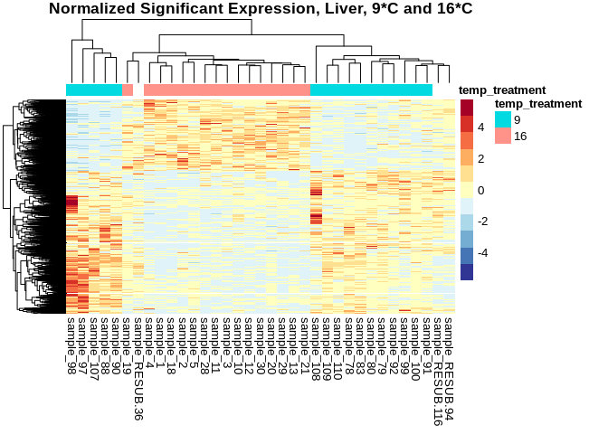
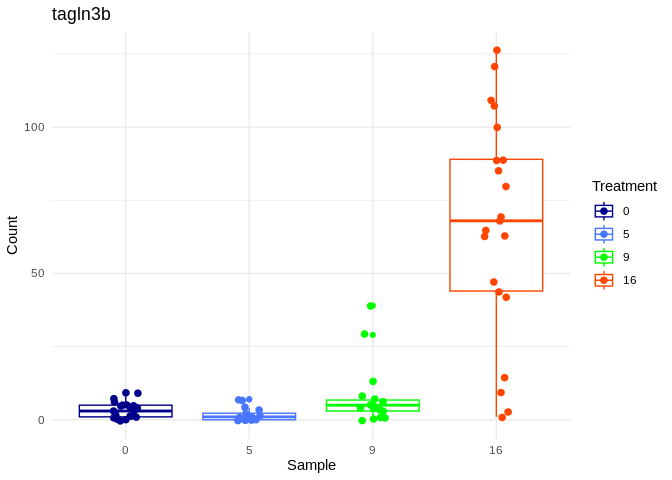
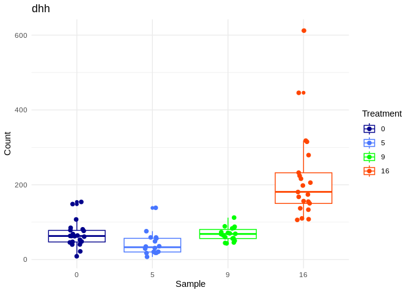
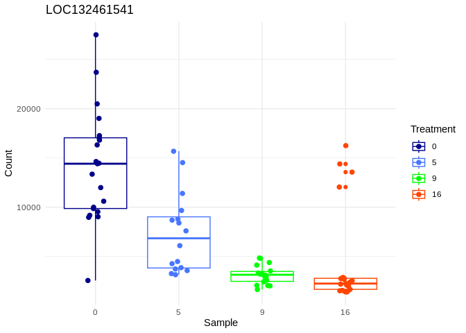

07.2.1-cod-RNAseq-DESeq2genome-exon
================
Kathleen Durkin
2024-04-30

- <a href="#001-install-and-load-packages"
  id="toc-001-install-and-load-packages">0.0.1 Install and load
  packages</a>
- <a href="#1-load-data" id="toc-1-load-data">1 Load data</a>
  - <a href="#11-load-count-data" id="toc-11-load-count-data">1.1 Load count
    data</a>
  - <a href="#12-count-data-munging" id="toc-12-count-data-munging">1.2
    Count data munging</a>
  - <a href="#13-import-sample-metadata-sheets"
    id="toc-13-import-sample-metadata-sheets">1.3 Import sample metadata
    sheets</a>
  - <a href="#14-sample-metadata-munging"
    id="toc-14-sample-metadata-munging">1.4 Sample metadata munging</a>
- <a href="#2-preliminary-pca-visualization-liver-tissue"
  id="toc-2-preliminary-pca-visualization-liver-tissue">2 Preliminary PCA
  visualization (liver tissue)</a>
  - <a href="#21-deseq-object" id="toc-21-deseq-object">2.1 DESeq object</a>
  - <a href="#22-pca-visualization" id="toc-22-pca-visualization">2.2 PCA
    visualization</a>
- <a href="#3-liver-tissue-9c-v-16c" id="toc-3-liver-tissue-9c-v-16c">3
  Liver tissue, 9<em>C v. 16</em>C</a>
- <a href="#4-extracting-significantly-expressed-genes"
  id="toc-4-extracting-significantly-expressed-genes">4 Extracting
  significantly expressed genes</a>
  - <a href="#41-heatmap" id="toc-41-heatmap">4.1 Heatmap</a>
  - <a href="#42-volcano-plot" id="toc-42-volcano-plot">4.2 Volcano plot</a>
  - <a href="#43-plot-expression-of-top-degs-across-treatments"
    id="toc-43-plot-expression-of-top-degs-across-treatments">4.3 Plot
    expression of top DEGs across treatments</a>
- <a href="#5-liver-tissue-9c-v-0c" id="toc-5-liver-tissue-9c-v-0c">5
  Liver tissue, 9<em>C v. 0</em>C</a>
  - <a href="#51-extracting-significantly-expressed-genes"
    id="toc-51-extracting-significantly-expressed-genes">5.1 Extracting
    significantly expressed genes</a>
  - <a href="#52-heatmap" id="toc-52-heatmap">5.2 Heatmap</a>
  - <a href="#53-volcano-plot" id="toc-53-volcano-plot">5.3 Volcano plot</a>
  - <a href="#54-plot-expression-of-top-degs-across-treatments"
    id="toc-54-plot-expression-of-top-degs-across-treatments">5.4 Plot
    expression of top DEGs across treatments</a>
- <a href="#6-liver-tissue-9c-v-5c" id="toc-6-liver-tissue-9c-v-5c">6
  Liver tissue, 9<em>C v. 5</em>C</a>
  - <a href="#61-extracting-significantly-expressed-genes"
    id="toc-61-extracting-significantly-expressed-genes">6.1 Extracting
    significantly expressed genes</a>
  - <a href="#62-heatmap" id="toc-62-heatmap">6.2 Heatmap</a>
  - <a href="#63-volcano-plot" id="toc-63-volcano-plot">6.3 Volcano plot</a>
  - <a href="#64-plot-expression-of-top-degs-across-treatments"
    id="toc-64-plot-expression-of-top-degs-across-treatments">6.4 Plot
    expression of top DEGs across treatments</a>

Differential gene expression analysis for [Pacific cod RNAseq
data](https://shedurkin.github.io/Roberts-LabNotebook/posts/projects/pacific_cod/2023_12_13_pacific_cod.html).

- Raw reads found
  [here](https://owl.fish.washington.edu/nightingales/G_macrocephalus/30-943133806/)
- Reads aligned to genome downloaded from
  [NCBI](https://www.ncbi.nlm.nih.gov/datasets/genome/GCF_031168955.1/)
- NOTE this analysis is for the featureCounts *exons* (see
  `06.2-cod-RNAseq-alignment-genome`)

### 0.0.1 Install and load packages

``` r
## clear
rm(list=ls())

## Install Rtools directly from (https://cran.r-project.org/bin/windows/Rtools/), then install these on first run:
# install.packages("BiocManager")
# BiocManager::install("DESeq2")
# BiocManager::install("vsn")
# BiocManager::install("tidybulk")
# BiocManager::install("goseq")
# BiocManager::install("affycoretools")
# BiocManager::install("EnhancedVolcano")
# BiocManager::install("pcaExplorer")
# BiocManager::install("apeglm")
# BiocManager::install("PCAtools")


# List of packages we want to install (run every time)
load.lib<-c("DESeq2","edgeR","goseq","dplyr","GenomicFeatures","data.table","calibrate","affycoretools","data.table","vsn","tidybulk","ggplot2","cowplot","pheatmap","gplots","RColorBrewer","EnhancedVolcano","pcaExplorer","readxl","apeglm","ashr","tibble","plotly","sqldf","PCAtools","ggpubr","beepr","genefilter","ComplexHeatmap","circlize","scales", "tidyverse", "gridextra'")

# Select only the packages that aren't currently installed (run every time)
# install.lib <- load.lib[!load.lib %in% installed.packages()]

# And finally we install the missing packages, including their dependency.
# for(lib in install.lib) install.packages(lib,dependencies=TRUE)
# After the installation process completes, we load all packages.
sapply(load.lib,require,character=TRUE)
```

             DESeq2           edgeR           goseq           dplyr GenomicFeatures 
               TRUE            TRUE            TRUE            TRUE            TRUE 
         data.table       calibrate   affycoretools      data.table             vsn 
               TRUE            TRUE            TRUE            TRUE            TRUE 
           tidybulk         ggplot2         cowplot        pheatmap          gplots 
               TRUE            TRUE            TRUE            TRUE            TRUE 
       RColorBrewer EnhancedVolcano     pcaExplorer          readxl          apeglm 
               TRUE            TRUE            TRUE            TRUE            TRUE 
               ashr          tibble          plotly           sqldf        PCAtools 
               TRUE            TRUE            TRUE            TRUE            TRUE 
             ggpubr           beepr      genefilter  ComplexHeatmap        circlize 
               TRUE            TRUE            TRUE           FALSE            TRUE 
             scales       tidyverse      gridextra' 
               TRUE            TRUE           FALSE 

I found the [DESeq2
vignette](https://www.bioconductor.org/packages/release/bioc/vignettes/DESeq2/inst/doc/DESeq2.html)
and the [HBC DGE training
workshop](https://github.com/hbctraining/DGE_workshop) super helpful in
figuring out how to use the DESeq2 package!

# 1 Load data

## 1.1 Load count data

Load in the count matrix we generated after alignment using the
featureCounts. We also need to slightly reformat the count matrix to
make all of the estimated counts integers, as required for DESeq2.

``` r
# Read in counts data. This is a gene-level counts matrix generated from hisat2 and summarized using featureCounts
cod_counts_data_OG <- read_delim("../output/06.2-cod-RNAseq-alignment-genome/featureCounts-exon/featureCounts_exon_matrix_noheader.txt", delim="\t") 
head(cod_counts_data_OG)
```

    # A tibble: 6 × 86
      Geneid       Chr              Start End   Strand Length ../output/06.2-cod-R…¹
      <chr>        <chr>            <chr> <chr> <chr>   <dbl>                  <dbl>
    1 LOC132464423 NC_082382.1;NC_… 7826… 8896… +;+      1618                      6
    2 rereb        NC_082382.1;NC_… 4475… 4490… +;+;+…   5887                    236
    3 LOC132464476 NC_082382.1;NC_… 6269… 6305… -;-      1468                      2
    4 LOC132464448 NC_082382.1;NC_… 7316… 7404… -;-;-…   5017                      0
    5 c1h1orf159   NC_082382.1;NC_… 8431… 8452… -;-;-…   1093                      0
    6 LOC132464512 NC_082382.1;NC_… 8922… 8959… +;+;+…   1720                      0
    # ℹ abbreviated name:
    #   ¹​`../output/06.2-cod-RNAseq-alignment-genome/hisat2/100.sorted.bam`
    # ℹ 79 more variables:
    #   `../output/06.2-cod-RNAseq-alignment-genome/hisat2/107.sorted.bam` <dbl>,
    #   `../output/06.2-cod-RNAseq-alignment-genome/hisat2/108.sorted.bam` <dbl>,
    #   `../output/06.2-cod-RNAseq-alignment-genome/hisat2/109.sorted.bam` <dbl>,
    #   `../output/06.2-cod-RNAseq-alignment-genome/hisat2/10.sorted.bam` <dbl>, …

## 1.2 Count data munging

``` r
# # We need to modify this data frame so that the row names are actually row names, instead of comprising the first column
cod_counts_data <- cod_counts_data_OG %>% 
  column_to_rownames(var = "Geneid")

# Additional formatting
# Remove unnecessary columns 
cod_counts_data <- subset(cod_counts_data, select = -c(Chr, Start, End, Strand, Length))

# Remove the directory path and file type portions of the column names, to leave just the sample names
colnames(cod_counts_data) <- sub("../output/06.2-cod-RNAseq-alignment-genome/hisat2/", "sample_", colnames(cod_counts_data))
colnames(cod_counts_data) <- sub(".sorted.bam", "", colnames(cod_counts_data))

# Reorder the coumns into alphabetical order (to make it easier to create an associated metadata spreadsheet)
cod_counts_data <- cod_counts_data[, order(colnames(cod_counts_data))]

cod_sample_names <- names(cod_counts_data)

write.table(cod_counts_data, file = "../output/07.2.1-cod-RNAseq-DESeq2-genome-exon/Gmac_genome_exon_counts_formatted.tab", sep = "\t",
            row.names = TRUE, col.names = NA)

head(cod_counts_data)
```

                 sample_1 sample_10 sample_100 sample_107 sample_108 sample_109
    LOC132464423        1         5          6          3         20          0
    rereb             465       547        236        121        415        168
    LOC132464476        1         1          2          0          5          1
    LOC132464448        6         3          0          0          4          0
    c1h1orf159          1         8          0          3          3          0
    LOC132464512        0         7          0          2          0          1
                 sample_11 sample_110 sample_117 sample_118 sample_119 sample_12
    LOC132464423         0          4          3          0          0         3
    rereb              342        204        335        267        179       395
    LOC132464476         0          0          0          0          0         0
    LOC132464448         2          0          2          0          1         2
    c1h1orf159           2         10          3          9          8         3
    LOC132464512         0          1          0          0          2         0
                 sample_120 sample_121 sample_127 sample_128 sample_129 sample_13
    LOC132464423          1         26          2          2          9         0
    rereb               393        224        317        111         17       445
    LOC132464476          0          0          0          0          0         3
    LOC132464448          2          3          2          0          0         4
    c1h1orf159            8          2          5          1          0         6
    LOC132464512          1          0          1          0          3         2
                 sample_131 sample_137 sample_138 sample_139 sample_140 sample_147
    LOC132464423          7          0          0          0          2          2
    rereb               150         75         45         72         78         94
    LOC132464476          1          0          0          0          0          2
    LOC132464448          3          0          0          1          0          1
    c1h1orf159            1          2          0          2          1          0
    LOC132464512          0          0          1          1          0          0
                 sample_148 sample_149 sample_150 sample_18 sample_19 sample_19-G
    LOC132464423         13         37         21         4        20          25
    rereb               352        778        261       353       210         663
    LOC132464476          2          0          2         2         2           6
    LOC132464448          5         25          2         1         5          30
    c1h1orf159            5         69          4         3         0          29
    LOC132464512          0          1          1         2         2          11
                 sample_19-S sample_2 sample_20 sample_20-G sample_20-S sample_21
    LOC132464423          48        2         1          18          65         2
    rereb                984      305       231         722         820       337
    LOC132464476           6        0         1           3           4         1
    LOC132464448          38        2         2          26          37         3
    c1h1orf159            54        9         1          68          14         2
    LOC132464512          19        1         0           4          22         7
                 sample_28 sample_29 sample_3 sample_30 sample_31 sample_37
    LOC132464423         0         1        2         2         0         3
    rereb              274       353      301       486       241       124
    LOC132464476         1         1        4         0         1         2
    LOC132464448         5         3        8         6         5         2
    c1h1orf159           3         0       10         4         2         0
    LOC132464512         0         1        2         4         0         1
                 sample_38 sample_39 sample_4 sample_40 sample_41 sample_47
    LOC132464423         1         1        1         3        24        11
    rereb              132       117      418        70       192       127
    LOC132464476         0         0        0         4        15         7
    LOC132464448         2         4        2         1         1         0
    c1h1orf159           0         4        0         2         0         3
    LOC132464512         0         0        0         0         2         0
                 sample_48 sample_49 sample_5 sample_50 sample_57 sample_57-G
    LOC132464423         8         6        6         3         1           7
    rereb              115       267      270       241       223         836
    LOC132464476         0         5        0         2         0           3
    LOC132464448         3         1        8         0         1          38
    c1h1orf159           3         4        4         8         5          52
    LOC132464512         0         3        0         0         0           1
                 sample_57-S sample_58 sample_58-G sample_58-S sample_59 sample_60
    LOC132464423          33         6           9          31         6        10
    rereb                 62       213        1065         390       149       289
    LOC132464476          19         5           6          30         4         0
    LOC132464448           0         2          35           4         0         5
    c1h1orf159             0         0          42           0         0         0
    LOC132464512           0         0           2           3         0         0
                 sample_67 sample_68 sample_69 sample_70 sample_78 sample_79
    LOC132464423         0         1         1        10        13         2
    rereb              337       293       210       122       154       156
    LOC132464476         1         1         0         2         0         0
    LOC132464448         3         1         1         2         5         1
    c1h1orf159           7         7         2         0         1         4
    LOC132464512         0         0         3         0         0         0
                 sample_80 sample_83 sample_88 sample_90 sample_91 sample_92
    LOC132464423         1         0        22         3         1         0
    rereb              224       158       174       155       396       215
    LOC132464476         0         1         0         1         0         0
    LOC132464448         1         2         4         0         2         4
    c1h1orf159           0         0         1         1         9         5
    LOC132464512         1         0         0         0         1         1
                 sample_97 sample_98 sample_99 sample_RESUB-116 sample_RESUB-156
    LOC132464423         2        52         5                3                2
    rereb              137        81       193              380              249
    LOC132464476         1        13         3                1                1
    LOC132464448         0         6         0                4                5
    c1h1orf159           0         0         3                5                4
    LOC132464512         2         0         0                1                0
                 sample_RESUB-36 sample_RESUB-76 sample_RESUB-94
    LOC132464423               6               1               0
    rereb                    114             165             463
    LOC132464476               0               1               0
    LOC132464448               2               1               1
    c1h1orf159                 4               0               3
    LOC132464512               1               0               1

``` r
cod_sample_names
```

     [1] "sample_1"         "sample_10"        "sample_100"       "sample_107"      
     [5] "sample_108"       "sample_109"       "sample_11"        "sample_110"      
     [9] "sample_117"       "sample_118"       "sample_119"       "sample_12"       
    [13] "sample_120"       "sample_121"       "sample_127"       "sample_128"      
    [17] "sample_129"       "sample_13"        "sample_131"       "sample_137"      
    [21] "sample_138"       "sample_139"       "sample_140"       "sample_147"      
    [25] "sample_148"       "sample_149"       "sample_150"       "sample_18"       
    [29] "sample_19"        "sample_19-G"      "sample_19-S"      "sample_2"        
    [33] "sample_20"        "sample_20-G"      "sample_20-S"      "sample_21"       
    [37] "sample_28"        "sample_29"        "sample_3"         "sample_30"       
    [41] "sample_31"        "sample_37"        "sample_38"        "sample_39"       
    [45] "sample_4"         "sample_40"        "sample_41"        "sample_47"       
    [49] "sample_48"        "sample_49"        "sample_5"         "sample_50"       
    [53] "sample_57"        "sample_57-G"      "sample_57-S"      "sample_58"       
    [57] "sample_58-G"      "sample_58-S"      "sample_59"        "sample_60"       
    [61] "sample_67"        "sample_68"        "sample_69"        "sample_70"       
    [65] "sample_78"        "sample_79"        "sample_80"        "sample_83"       
    [69] "sample_88"        "sample_90"        "sample_91"        "sample_92"       
    [73] "sample_97"        "sample_98"        "sample_99"        "sample_RESUB-116"
    [77] "sample_RESUB-156" "sample_RESUB-36"  "sample_RESUB-76"  "sample_RESUB-94" 

## 1.3 Import sample metadata sheets

``` r
# Read in the csv file as a data frame
cod_sample_info_OG <- read.csv("~/project-cod-temperature/data/DESeq2_Sample_Information.csv")
cod_experiment_alldata_OG <- read.csv("~/project-cod-temperature/data/temp-experiment.csv")
head(cod_sample_info_OG)
```

      sample_name sample_number tank temp_treatment tissue_type
    1    sample_1             1    1             16       Liver
    2   sample_10            10    2             16       Liver
    3  sample_100           100   15              9       Liver
    4  sample_107           107   16              9       Liver
    5  sample_108           108   16              9       Liver
    6  sample_109           109   16              9       Liver

``` r
head(cod_experiment_alldata_OG)
```

      Microchip.ID SL_11212022 WWT_11212022 Tank Temperature SL_12272022
    1          620          93         8.53    1          16         101
    2         1164          88         7.06    1          16          96
    3         1476         102        10.70    1          16         108
    4         9387          87         7.83    1          16          95
    5         9407         100        11.51    1          16         117
    6         9415          92         8.68    1          16         100
      WWT_12272022 MortDate DissectionDate SL_mm WholeBodyWW_g TOTAL_Liver_WW_mg
    1        11.12                  2/8/23   119         16.15            0.4945
    2         8.64                  2/8/23   105         10.89            0.1997
    3        12.25                  2/8/23   110         12.97            0.1715
    4        10.16                  2/8/23   116         15.40            0.3625
    5        14.98                  2/8/23   127         17.98            0.3482
    6        10.96                  2/8/23   114         14.02            0.2343
      LiverforLipids_WW_mg MuscleWWforLipids_mg GeneticSamplingCount
    1               0.1546               0.3495                    8
    2               0.1091               0.3328                    5
    3               0.1107               0.3834                    4
    4               0.1681               0.3262                    6
    5               0.1210               0.3434                    2
    6               0.1342               0.2776                    9
      DissectionComments
    1                   
    2                   
    3                   
    4                   
    5                   
    6                   

``` r
# Rename the "GeneticSamplingCount" column of the experimental data to "sample_number"
cod_experiment_alldata <- cod_experiment_alldata_OG
names(cod_experiment_alldata)[names(cod_experiment_alldata) == "GeneticSamplingCount"] <- "sample_number"

# Calculate length difference and weight difference (end-beginning)
cod_experiment_alldata$SL_diff_mm <- cod_experiment_alldata$SL_mm - cod_experiment_alldata$SL_11212022
cod_experiment_alldata$WWT_diff_g <- cod_experiment_alldata$WholeBodyWW_g - cod_experiment_alldata$WWT_11212022

# Merge the two data frames to get experimental data for all of our RNAseq'd samples.
# This should include all rows from cod_sample_info_OG and matching rows from cod_experiment_alldata based on the shared sample_number column. Sample number duplicates (e.g. from different tissue types) should be retained.
cod_sample_info <- merge(cod_sample_info_OG, cod_experiment_alldata, by = "sample_number", all.x = TRUE)

# Reorder the data frame into alphabetical order by the sample names, so that the rows are in the same order as our count matrix columns
cod_sample_info <- cod_sample_info[order(cod_sample_info$sample_name), ]

# Again, we need to reformat so that the data in the first column becomes the row names
rownames(cod_sample_info) <- cod_sample_info$sample_name

# Remove duplicate columns (artifact of merging data frames with multiple shared columns and of maing sample_name the rownames instead of a variable)
cod_sample_info <- subset(cod_sample_info, select=-Temperature)
cod_sample_info <- subset(cod_sample_info, select=-Tank)
#cod_sample_info <- subset(cod_sample_info, select=-sample_name)


head(cod_sample_info)
```

               sample_number sample_name tank temp_treatment tissue_type
    sample_1               1    sample_1    1             16       Liver
    sample_10             10   sample_10    2             16       Liver
    sample_100           100  sample_100   15              9       Liver
    sample_107           107  sample_107   16              9       Liver
    sample_108           108  sample_108   16              9       Liver
    sample_109           109  sample_109   16              9       Liver
               Microchip.ID SL_11212022 WWT_11212022 SL_12272022 WWT_12272022
    sample_1           9443          99        10.54         108        12.94
    sample_10          9518          95         9.45         105        12.67
    sample_100         9483          70         4.54          78         5.23
    sample_107         4236          94         9.15         104        11.44
    sample_108         9416          81         6.26          91         7.87
    sample_109         9481          89         7.77          95         9.49
               MortDate DissectionDate SL_mm WholeBodyWW_g TOTAL_Liver_WW_mg
    sample_1                    2/8/23   114         14.39            0.0896
    sample_10                   2/8/23   120         16.22            0.3854
    sample_100                  2/9/23    93          8.33            0.2558
    sample_107                  2/9/23   119         16.41            0.5612
    sample_108                  2/9/23   106         11.67            0.3650
    sample_109                  2/9/23   116         11.45            0.3088
               LiverforLipids_WW_mg MuscleWWforLipids_mg DissectionComments
    sample_1                 0.0704               0.3899      lipid inserts
    sample_10                0.1285               0.2967                   
    sample_100               0.1143               0.3483                   
    sample_107               0.1503               0.3322                   
    sample_108               0.1125               0.3612                   
    sample_109               0.1090               0.3062                   
               SL_diff_mm WWT_diff_g
    sample_1           15       3.85
    sample_10          25       6.77
    sample_100         23       3.79
    sample_107         25       7.26
    sample_108         25       5.41
    sample_109         27       3.68

## 1.4 Sample metadata munging

``` r
# Factor variables
cod_sample_info$temp_treatment <- factor(cod_sample_info$temp_treatment)
cod_sample_info$tank <- factor(cod_sample_info$tank)
cod_sample_info$tissue_type <- factor(cod_sample_info$tissue_type)

# Remove bad/missing samples
# MuliQC report: 149, 129
# PCA outliers: 31, 41 (per Laura)
cod_sample_info <- cod_sample_info[!(row.names(cod_sample_info) %in% c("sample_149", "sample_129", "sample_31", "sample_41")),]
cod_counts_data <- as.matrix(subset(cod_counts_data, select=-c(sample_149, sample_129, sample_31, sample_41)))

# Check that the column names of our count data match the row names of our sample info sheet
ncol(cod_counts_data)
```

    [1] 76

``` r
nrow(cod_sample_info)
```

    [1] 76

``` r
all(colnames(cod_counts_data) %in% rownames(cod_sample_info))
```

    [1] TRUE

``` r
all(colnames(cod_counts_data) == rownames(cod_sample_info))
```

    [1] TRUE

Combine counts data and sample metadata for later analyses

``` r
# Melt cod_counts_data to long format
cod_counts_data_long <- as.data.frame(cod_counts_data)
cod_counts_data_long$gene <- rownames(cod_counts_data_long)
cod_counts_data_long <- cod_counts_data_long %>% 
  pivot_longer(cols = starts_with("sample"), 
               names_to = "sample_name", 
               values_to = "count")

colnames(cod_counts_data_long)
```

    [1] "gene"        "sample_name" "count"      

``` r
colnames(cod_sample_info)
```

     [1] "sample_number"        "sample_name"          "tank"                
     [4] "temp_treatment"       "tissue_type"          "Microchip.ID"        
     [7] "SL_11212022"          "WWT_11212022"         "SL_12272022"         
    [10] "WWT_12272022"         "MortDate"             "DissectionDate"      
    [13] "SL_mm"                "WholeBodyWW_g"        "TOTAL_Liver_WW_mg"   
    [16] "LiverforLipids_WW_mg" "MuscleWWforLipids_mg" "DissectionComments"  
    [19] "SL_diff_mm"           "WWT_diff_g"          

``` r
# Merge cod_counts_data_long with df_C to get treatment info
cod_countsdata_plus_sampleinfo <- left_join(cod_counts_data_long, cod_sample_info, by = "sample_name")
```

# 2 Preliminary PCA visualization (liver tissue)

## 2.1 DESeq object

``` r
# Filter data
infosub_L <- cod_sample_info %>% filter(tissue_type == "Liver")
countsub_L <- subset(cod_counts_data, select=row.names(infosub_L))

# Calculate DESeq object
dds_L <- DESeqDataSetFromMatrix(countData = countsub_L,
                              colData = infosub_L,
                              design = ~ temp_treatment) 

# Run differential expression analysis 
# (Note that this DESeq() function runs all necessary steps, including data normalization, 
# estimating size factors, estimating dispersions, gene-wise dispersion estimates, mean-dispersion 
# relationship, final dispersion estimates, fitting model, and testing)
dds_L <- DESeq(dds_L)
resultsNames(dds_L) # lists the coefficients
```

    [1] "Intercept"              "temp_treatment_5_vs_0"  "temp_treatment_9_vs_0" 
    [4] "temp_treatment_16_vs_0"

``` r
plotDispEsts(dds_L)
```

<!-- -->

## 2.2 PCA visualization

``` r
# Generate PCAs
# top 500 most variable genes
pca_L_500<- plotPCA(vst(dds_L), intgroup = c("temp_treatment"), returnData=TRUE)
percentVar_L_500 <- round(100*attr(pca_L_500, "percentVar"))
# merge with metadata sheet so we can plot using other features
pca_L_500 <- subset(pca_L_500, select=-temp_treatment) #remove the temp_treatment column, which will be a duplicate post-merge
pca_L_500 <- merge(pca_L_500, cod_sample_info, by.x = "name", by.y = "row.names")

# top 1000 most variable genes
pca_L_1000 <- plotPCA(vst(dds_L), intgroup = c("temp_treatment"), returnData=TRUE, ntop=1000)
percentVar_L_1000 <- round(100*attr(pca_L_1000, "percentVar"))
# merge with metadata sheet so we can plot using other features
pca_L_1000 <- subset(pca_L_1000, select=-temp_treatment) #remove the temp_treatment column, which will be a duplicate post-merge
pca_L_1000 <- merge(pca_L_1000, cod_sample_info, by.x = "name", by.y = "row.names")

# all genes
pca_L_all <- plotPCA(vst(dds_L), intgroup = c("temp_treatment"), returnData=TRUE, ntop=nrow(assay(vst(dds_L))))
percentVar_L_all <- round(100*attr(pca_L_all, "percentVar"))
# merge with metadata sheet so we can plot using other features
pca_L_all <- subset(pca_L_all, select=-temp_treatment) #remove the temp_treatment column, which will be a duplicate post-merge
pca_L_all <- merge(pca_L_all, cod_sample_info, by.x = "name", by.y = "row.names")

# Assign specific colors to each temperature treatment level
temp_colors <- c(
  "0" = "darkblue",
  "5" = "royalblue1",
  "9" = "green",
  "16" = "orangered") 

# Plot PCAs
p.L.500 <- ggplot(pca_L_500, aes(PC1, PC2, color=temp_treatment)) + 
  geom_point(size=4, alpha = 5/10) +
  ggtitle("Liver, top 500 most variable genes") +
  xlab(paste0("PC1: ",percentVar_L_500[1],"% variance")) +
  ylab(paste0("PC2: ",percentVar_L_500[2],"% variance")) + 
  coord_fixed() +
  scale_color_manual(values=temp_colors)+
  stat_ellipse()

p.L.500.SLdiff <- ggplot(pca_L_500, aes(PC1, PC2, color=temp_treatment, size=SL_diff_mm)) + 
  geom_point(alpha = 0.5) +
  ggtitle("Liver, top 500 most variable genes") +
  xlab(paste0("PC1: ", percentVar_L_500[1], "% variance")) +
  ylab(paste0("PC2: ", percentVar_L_500[2], "% variance")) + 
  coord_fixed() +
  scale_color_manual(values = temp_colors) +
  scale_size_continuous() +  # Add this line to control the size of points
  stat_ellipse()

p.L.500.WWTdiff <- ggplot(pca_L_500, aes(PC1, PC2, color=temp_treatment, size=WWT_diff_g)) + 
  geom_point(alpha = 0.5) +
  ggtitle("Liver, top 500 most variable genes") +
  xlab(paste0("PC1: ", percentVar_L_500[1], "% variance")) +
  ylab(paste0("PC2: ", percentVar_L_500[2], "% variance")) + 
  coord_fixed() +
  scale_color_manual(values = temp_colors) +
  scale_size_continuous() +  # Add this line to control the size of points
  stat_ellipse()

p.L.1000 <- ggplot(pca_L_1000, aes(PC1, PC2, color=temp_treatment)) + 
  geom_point(size=4, alpha = 5/10) +
  ggtitle("Liver, top 1000 most variable genes") +
  xlab(paste0("PC1: ",percentVar_L_1000[1],"% variance")) +
  ylab(paste0("PC2: ",percentVar_L_1000[2],"% variance")) + 
  coord_fixed() +
  scale_color_manual(values=temp_colors)+
  stat_ellipse()

p.L.1000.SLdiff <- ggplot(pca_L_1000, aes(PC1, PC2, color=temp_treatment, size=SL_diff_mm)) + 
  geom_point(alpha = 0.5) +
  ggtitle("Liver, top 1000 most variable genes") +
  xlab(paste0("PC1: ", percentVar_L_500[1], "% variance")) +
  ylab(paste0("PC2: ", percentVar_L_500[2], "% variance")) + 
  coord_fixed() +
  scale_color_manual(values = temp_colors) +
  scale_size_continuous() +  # Add this line to control the size of points
  stat_ellipse()

p.L.1000.WWTdiff <- ggplot(pca_L_1000, aes(PC1, PC2, color=temp_treatment, size=WWT_diff_g)) + 
  geom_point(alpha = 0.5) +
  ggtitle("Liver, top 1000 most variable genes") +
  xlab(paste0("PC1: ", percentVar_L_500[1], "% variance")) +
  ylab(paste0("PC2: ", percentVar_L_500[2], "% variance")) + 
  coord_fixed() +
  scale_color_manual(values = temp_colors) +
  scale_size_continuous() +  # Add this line to control the size of points
  stat_ellipse()

p.L.all <- ggplot(pca_L_all, aes(PC1, PC2, color=temp_treatment)) + 
  geom_point(size=4, alpha = 5/10) +
  ggtitle("Liver, all genes") +
  xlab(paste0("PC1: ",percentVar_L_all[1],"% variance")) +
  ylab(paste0("PC2: ",percentVar_L_all[2],"% variance")) + 
  coord_fixed() +
  scale_color_manual(values=temp_colors)+
  stat_ellipse()

p.L.all.SLdiff <- ggplot(pca_L_all, aes(PC1, PC2, color=temp_treatment, size=SL_diff_mm)) + 
  geom_point(alpha = 0.5) +
  ggtitle("Liver, all genes") +
  xlab(paste0("PC1: ", percentVar_L_500[1], "% variance")) +
  ylab(paste0("PC2: ", percentVar_L_500[2], "% variance")) + 
  coord_fixed() +
  scale_color_manual(values = temp_colors) +
  scale_size_continuous() +  # Add this line to control the size of points
  stat_ellipse()

p.L.all.WWTdiff <- ggplot(pca_L_all, aes(PC1, PC2, color=temp_treatment, size=WWT_diff_g)) + 
  geom_point(alpha = 0.5) +
  ggtitle("Liver, all genes") +
  xlab(paste0("PC1: ", percentVar_L_500[1], "% variance")) +
  ylab(paste0("PC2: ", percentVar_L_500[2], "% variance")) + 
  coord_fixed() +
  scale_color_manual(values = temp_colors) +
  scale_size_continuous() +  # Add this line to control the size of points
  stat_ellipse()

# View PCAs
p.L.500
```

<!-- -->

``` r
p.L.500.SLdiff
```

<!-- -->

``` r
p.L.500.WWTdiff
```

<!-- -->

``` r
p.L.1000
```

<!-- -->

``` r
p.L.1000.SLdiff
```

<!-- -->

``` r
p.L.1000.WWTdiff
```

<!-- -->

``` r
p.L.all
```

<!-- -->

``` r
p.L.all.SLdiff
```

<!-- -->

``` r
p.L.all.WWTdiff
```

<!-- -->

``` r
# Export PCAs as pngs
ggexport(filename = "../output/07.2.1-cod-RNAseq-DESeq2-genome-exon/exon-PCA_L_500.png", plot = p.L.500, res = 600, width = 6000, height = 4000)

ggexport(filename = "../output/07.2.1-cod-RNAseq-DESeq2-genome-exon/exon-PCA_L_1000.png", plot = p.L.1000, res = 600, width = 6000, height = 4000)

ggexport(filename = "../output/07.2.1-cod-RNAseq-DESeq2-genome-exon/exon-PCA_L_all.png", plot = p.L.all, res = 600, width = 6000, height = 4000)
```

# 3 Liver tissue, 9*C v. 16*C

The 9\*C temperature treatment is effectively our “control,” as it
represents the ambient temperature that wild juvenile Pacific cod would
experience.

``` r
# liver tissue, temperatures 9 vs. 16 

# Filter data
infosub_L.9.16 <- cod_sample_info %>% filter(tissue_type == "Liver" & (temp_treatment == "9" | temp_treatment == "16"))
countsub_L.9.16 <- subset(cod_counts_data, select=row.names(infosub_L.9.16))

# Calculate DESeq object
dds_L.9.16 <- DESeqDataSetFromMatrix(countData = countsub_L.9.16,
                              colData = infosub_L.9.16,
                              design = ~ temp_treatment)

dds_L.9.16 <- DESeq(dds_L.9.16)
resultsNames(dds_L.9.16) # lists the coefficients
```

    [1] "Intercept"              "temp_treatment_16_vs_9"

``` r
plotDispEsts(dds_L.9.16)
```

<!-- -->

``` r
# Filtering: keep genes that have at least 10 counts across 1/3 of the samples - https://support.bioconductor.org/p/110307/
keep <- rowSums(DESeq2::counts(dds_L.9.16) >= 10) >= ncol(countsub_L.9.16)/3
dds_L.9.16<- dds_L.9.16[keep,]

# Generate Contrasts
contrast_list_L.9.16        <- c("temp_treatment", "16", "9") # order is important: factor, treatment group, control
res_table_L.9.16_noshrink <- results(dds_L.9.16, contrast=contrast_list_L.9.16, alpha = 0.05)

res_table_L.9.16_norm     <- lfcShrink(dds_L.9.16,
                                       coef=2,
                                       type="normal") # lfcThreshold = 0.585)  # a lfc threshold of 1 = 2-fold change, 0.585 = 1.5-fold change
res_table_L.9.16_apeglm   <- lfcShrink(dds_L.9.16,
                                       coef=2, 
                                       type="apeglm") # lfcThreshold = 0.585)  # a lfc threshold of 1 = 2-fold change, 0.585 = 1.5-fold change
res_table_L.9.16_ashr     <- lfcShrink(dds_L.9.16,
                                       coef=2, 
                                       type="ashr")
```

``` r
# Generate MA plots
par(mfrow=c(2,2), mar=c(4,4,2,1))
xlim <- c(1,1e5); ylim <- c(-4,4)
DESeq2::plotMA(res_table_L.9.16_noshrink, xlim=xlim, ylim=ylim, main="no shrink")
DESeq2::plotMA(res_table_L.9.16_norm, xlim=xlim, ylim=ylim, main="normal")
DESeq2::plotMA(res_table_L.9.16_apeglm, xlim=xlim, ylim=ylim, main="apeglm")
DESeq2::plotMA(res_table_L.9.16_ashr, xlim=xlim, ylim=ylim, main="ashr")
```

<!-- -->

``` r
# Examine results formatting
res_table_L.9.16_norm %>% data.frame() %>% head()
```

                  baseMean log2FoldChange     lfcSE       stat       pvalue
    rereb        262.72405     0.44093999 0.1274573  3.4590881 0.0005420075
    p4htmb        73.90676     0.61162744 0.2143905  2.8511799 0.0043557321
    LOC132464555 521.80884     0.05089259 0.0933051  0.5454549 0.5854406870
    abhd14a       89.12868     0.12150643 0.1194928  1.0168713 0.3092146703
    LOC132464547  65.32804    -0.48357310 0.1942092 -2.4915335 0.0127192973
    tusc2b       139.10778    -0.37679681 0.1693066 -2.2261841 0.0260018556
                        padj
    rereb        0.003178632
    p4htmb       0.016670447
    LOC132464555 0.699748497
    abhd14a      0.445645789
    LOC132464547 0.039057208
    tusc2b       0.067900354

Note that the metric we want to use to identify significantly expressed
genes is the `padj` values, **NOT** the `pvalue`. `padj` are p-values
corrected for multiple testing (default method is the Benjamini and
Hochberg method).

``` r
summary(res_table_L.9.16_noshrink)
```

    out of 14245 with nonzero total read count
    adjusted p-value < 0.05
    LFC > 0 (up)       : 2174, 15%
    LFC < 0 (down)     : 2841, 20%
    outliers [1]       : 0, 0%
    low counts [2]     : 0, 0%
    (mean count < 6)
    [1] see 'cooksCutoff' argument of ?results
    [2] see 'independentFiltering' argument of ?results

``` r
summary(res_table_L.9.16_norm)
```

    out of 14245 with nonzero total read count
    adjusted p-value < 0.1
    LFC > 0 (up)       : 2701, 19%
    LFC < 0 (down)     : 3425, 24%
    outliers [1]       : 0, 0%
    low counts [2]     : 0, 0%
    (mean count < 6)
    [1] see 'cooksCutoff' argument of ?results
    [2] see 'independentFiltering' argument of ?results

``` r
summary(res_table_L.9.16_apeglm)
```

    out of 14245 with nonzero total read count
    adjusted p-value < 0.1
    LFC > 0 (up)       : 2701, 19%
    LFC < 0 (down)     : 3425, 24%
    outliers [1]       : 0, 0%
    low counts [2]     : 0, 0%
    (mean count < 6)
    [1] see 'cooksCutoff' argument of ?results
    [2] see 'independentFiltering' argument of ?results

``` r
summary(res_table_L.9.16_ashr)
```

    out of 14245 with nonzero total read count
    adjusted p-value < 0.1
    LFC > 0 (up)       : 2701, 19%
    LFC < 0 (down)     : 3425, 24%
    outliers [1]       : 0, 0%
    low counts [2]     : 0, 0%
    (mean count < 6)
    [1] see 'cooksCutoff' argument of ?results
    [2] see 'independentFiltering' argument of ?results

# 4 Extracting significantly expressed genes

``` r
padj.cutoff <- 0.05
lfc.cutoff <- 0.58

# Convert results table into tibble
res_table_L.9.16_norm_tb <- res_table_L.9.16_norm %>%
  data.frame() %>%
  rownames_to_column(var="gene") %>%
  as_tibble()

# subset that table to only keep the significant genes using our pre-defined thresholds:
sig_L.9.16_norm_noLFCcutoff <- res_table_L.9.16_norm_tb %>%
  filter(padj < padj.cutoff)

sig_L.9.16_norm <- sig_L.9.16_norm_noLFCcutoff %>% 
  filter(abs(log2FoldChange) > lfc.cutoff)

head(sig_L.9.16_norm_noLFCcutoff)
```

    # A tibble: 6 × 7
      gene         baseMean log2FoldChange lfcSE  stat    pvalue     padj
      <chr>           <dbl>          <dbl> <dbl> <dbl>     <dbl>    <dbl>
    1 rereb           263.           0.441 0.127  3.46 0.000542  0.00318 
    2 p4htmb           73.9          0.612 0.214  2.85 0.00436   0.0167  
    3 LOC132464547     65.3         -0.484 0.194 -2.49 0.0127    0.0391  
    4 zbtb40           22.4          0.584 0.193  3.03 0.00244   0.0107  
    5 zc3h11a         826.           0.660 0.165  4.01 0.0000608 0.000531
    6 LOC132465594    308.           0.454 0.165  2.75 0.00591   0.0214  

``` r
paste("Number of significant DEGs for 9C v 16C:", nrow(sig_L.9.16_norm_noLFCcutoff), "(padj<", padj.cutoff, ")")
```

    [1] "Number of significant DEGs for 9C v 16C: 5015 (padj< 0.05 )"

``` r
head(sig_L.9.16_norm)
```

    # A tibble: 6 × 7
      gene         baseMean log2FoldChange lfcSE  stat    pvalue     padj
      <chr>           <dbl>          <dbl> <dbl> <dbl>     <dbl>    <dbl>
    1 p4htmb          73.9           0.612 0.214  2.85 0.00436   0.0167  
    2 zbtb40          22.4           0.584 0.193  3.03 0.00244   0.0107  
    3 zc3h11a        826.            0.660 0.165  4.01 0.0000608 0.000531
    4 LOC132465678     9.49          0.943 0.257  3.65 0.000257  0.00175 
    5 LOC132465686   144.            0.676 0.161  4.21 0.0000260 0.000267
    6 ppil1          137.           -0.589 0.157 -3.75 0.000179  0.00129 

``` r
paste("Number of significant DEGs for 9C v 16C:", nrow(sig_L.9.16_norm), "(padj<", padj.cutoff, ", log-fold change >", lfc.cutoff, ")")
```

    [1] "Number of significant DEGs for 9C v 16C: 2616 (padj< 0.05 , log-fold change > 0.58 )"

``` r
write.table(sig_L.9.16_norm_noLFCcutoff, file = "../output/07.2.1-cod-RNAseq-DESeq2-genome-exon/Gmac_DEGs_sig_L.9.16_norm_noLFCcutoff.tab", sep = "\t",
            row.names = TRUE, col.names = NA)

write.table(sig_L.9.16_norm, file = "../output/07.2.1-cod-RNAseq-DESeq2-genome-exon/Gmac_DEGs_sig_L.9.16_norm.tab", sep = "\t",
            row.names = TRUE, col.names = NA)
```

## 4.1 Heatmap

``` r
# Retrieve normalized counts matrix
dds_L.9.16_norm_counts <- counts(dds_L.9.16, normalized=TRUE)

# Extract normalized expression for significant genes
norm_sig_L.9.16 <- dds_L.9.16_norm_counts %>% 
  data.frame() %>%
  filter(row.names(dds_L.9.16_norm_counts) %in% sig_L.9.16_norm$gene)

head(norm_sig_L.9.16)
```

                   sample_1   sample_10 sample_100 sample_107 sample_108 sample_109
    p4htmb         31.52731  150.321085  58.888643  85.951815  54.578301  48.530523
    zbtb40         37.83277   23.621885   3.925910  10.197673  29.563247  17.128420
    zc3h11a      1049.07126 1371.500943 724.330310 413.734161 973.881566 383.486288
    LOC132465678   22.06912    5.726518   7.851819   8.740863   1.137048   2.854737
    LOC132465686  302.66218  178.237857  83.425578 135.483370  50.598634 100.867361
    ppil1         130.05016   89.476836  92.258874 217.064753  98.354647 217.911563
                  sample_11 sample_110   sample_12  sample_13  sample_18 sample_19
    p4htmb         86.63664  53.470058  117.325051   91.98737   66.64435  65.93788
    zbtb40         38.50517  23.170358   36.557806   31.74785   33.32218  17.58343
    zc3h11a      1065.89321 405.481273 1120.539255 1038.72459 1081.01057 668.17049
    LOC132465678   13.12676   2.673503    2.550545   21.16523   10.78070  15.38550
    LOC132465686  181.14934  90.007931  124.126503  144.90045  216.59414 124.18300
    ppil1         108.51458 182.689365   84.167971   91.17332  125.44819 139.56851
                  sample_2  sample_20   sample_21  sample_28  sample_29   sample_3
    p4htmb        94.52159   79.88478  111.555274   79.65069  154.16603   67.30977
    zbtb40        14.38372   16.41468   25.814443   31.67925   20.23429   22.14137
    zc3h11a      734.59715 1228.91245 1087.894404 1057.18193 1276.68745 1048.61542
    LOC132465678  14.38372   19.69762    7.375555   29.86901   26.97906    1.77131
    LOC132465686 200.34468  128.03451  192.686382  113.14019  184.03570  104.50728
    ppil1        120.20681   99.58240  115.243051   94.13264   90.57254  114.24948
                  sample_30    sample_4   sample_5  sample_78  sample_79  sample_80
    p4htmb        144.13336   37.876705  91.085365  33.471387  68.808378  55.243808
    zbtb40         25.60745   41.571994  32.096748  14.036388   8.215926  11.915331
    zc3h11a      1045.51562 1308.132067 883.094297 521.505810 611.059472 912.064437
    LOC132465678   16.09611    8.314399   6.939837   4.318889   6.161944   3.249636
    LOC132465686  127.30561  258.670183 379.088613  89.616941 121.184904 125.652583
    ppil1          59.99460  134.878024  70.265853 227.821379 143.778699 152.732881
                 sample_83 sample_88 sample_90 sample_91 sample_92  sample_97
    p4htmb        24.49252  29.32661  36.21465  64.62824  85.06382   7.628027
    zbtb40        10.31264  26.77647   7.24293  10.12250  12.64462  42.716953
    zc3h11a      537.54634 446.27456 514.24803 967.08770 664.41737 234.943242
    LOC132465678   6.44540   2.55014   2.41431  12.45846  17.24267   3.051211
    LOC132465686  69.61032 160.65884 115.88688  72.41478  88.51235 176.970234
    ppil1        166.29132 234.61291 208.83782 122.24861  68.97066 254.776113
                  sample_98 sample_99 sample_RESUB.116 sample_RESUB.36
    p4htmb         3.939351  87.29378         70.58924       114.45319
    zbtb40        14.444288  16.16551         27.35333        22.01023
    zc3h11a      157.574048 806.12033        922.95431       570.79860
    LOC132465678   3.939351   0.00000         11.47075        11.73879
    LOC132465686 147.069112  71.12826        103.23676       115.92054
    ppil1        286.259521 155.18894         79.41290       136.46342
                 sample_RESUB.94
    p4htmb            133.601103
    zbtb40             27.247593
    zc3h11a          1074.961508
    LOC132465678        1.757909
    LOC132465686      153.817060
    ppil1              78.226962

``` r
# Annotate heatmap
annotation <- infosub_L.9.16 %>% 
    dplyr::select(temp_treatment)

# Set a color palette
heat_colors <- rev(brewer.pal(12, "RdYlBu"))

# Run pheatmap
h.L.9.16 <- pheatmap(norm_sig_L.9.16, 
                     color = heat_colors, 
                     cluster_rows = T, 
                     show_rownames = F,
                     annotation = annotation, 
                     border_color = NA, 
                     fontsize = 10,
                     scale = "row", 
                     fontsize_row = 10, 
                     height = 30,
                     main = "Normalized Significant Expression, Liver, 9*C and 16*C")
```

<!-- -->

``` r
# Save plot
ggexport(filename = "../output/07.2.1-cod-RNAseq-DESeq2-genome-exon/exon-heatmap_L.9.16_norm_sig.png",
         plot   = h.L.9.16,
         res    = 600,
         width  = 5000,
         height = 5000)
```

Note the argument `scale="row"` was included, so the values plotted in
the heat map are *Z-scores*, rather thn the normalized count value. This
vastly improves the color visualization.

For DEGs based on adjusted p-value *only*

``` r
# Extract normalized expression for significant genes
norm_sig_L.9.16_noLFCcutoff <- dds_L.9.16_norm_counts %>% 
  data.frame() %>%
  filter(row.names(dds_L.9.16_norm_counts) %in% sig_L.9.16_norm_noLFCcutoff$gene)

head(norm_sig_L.9.16_noLFCcutoff)
```

                   sample_1  sample_10 sample_100 sample_107 sample_108 sample_109
    rereb         366.50499  391.55063  231.62866  176.27406  235.93745  159.86525
    p4htmb         31.52731  150.32108   58.88864   85.95182   54.57830   48.53052
    LOC132464547   54.38461   36.50655   46.12944  100.51992   42.07077   78.02947
    zbtb40         37.83277   23.62188    3.92591   10.19767   29.56325   17.12842
    zc3h11a      1049.07126 1371.50094  724.33031  413.73416  973.88157  383.48629
    LOC132465594  554.88067  549.74568  227.70275  205.41027  468.46375  206.49262
                  sample_11 sample_110  sample_12  sample_13  sample_18 sample_19
    rereb         299.29021  181.79820  335.82170  362.25113  345.96259 230.78257
    p4htmb         86.63664   53.47006  117.32505   91.98737   66.64435  65.93788
    LOC132464547   39.38029   66.83757   34.85744   44.77261   53.90352  67.03684
    zbtb40         38.50517   23.17036   36.55781   31.74785   33.32218  17.58343
    zc3h11a      1065.89321  405.48127 1120.53925 1038.72459 1081.01057 668.17049
    LOC132465594  500.56725  251.30927  334.97152  380.97422  471.41078 304.41320
                  sample_2  sample_20  sample_21  sample_28  sample_29   sample_3
    rereb        313.35963  252.78609  310.69527  248.00329  340.12881  266.58213
    p4htmb        94.52159   79.88478  111.55527   79.65069  154.16603   67.30977
    LOC132464547  72.94601   65.65872   33.19000   42.54071   40.46858   43.39709
    zbtb40        14.38372   16.41468   25.81444   31.67925   20.23429   22.14137
    zc3h11a      734.59715 1228.91245 1087.89440 1057.18193 1276.68745 1048.61542
    LOC132465594 248.63288  537.30722  405.65554  262.48524  247.62919  204.58629
                  sample_30   sample_4  sample_5 sample_78  sample_79 sample_80
    rereb         355.57774  386.15763 234.21951 166.27721 160.210551 242.63947
    p4htmb        144.13336   37.87671  91.08536  33.47139  68.808378  55.24381
    LOC132464547   43.89849   44.34346  68.53089  82.05889  71.889350  38.99563
    zbtb40         25.60745   41.57199  32.09675  14.03639   8.215926  11.91533
    zc3h11a      1045.51562 1308.13207 883.09430 521.50581 611.059472 912.06444
    LOC132465594  377.52698  316.87097 324.43739 252.65499 182.804346 269.71977
                 sample_83 sample_88 sample_90 sample_91 sample_92  sample_97
    rereb        203.67463 221.86221 187.10903 308.34680 247.14487 209.007949
    p4htmb        24.49252  29.32661  36.21465  64.62824  85.06382   7.628027
    LOC132464547 110.86088 127.50702  91.74378  49.83383  41.38240 201.379921
    zbtb40        10.31264  26.77647   7.24293  10.12250  12.64462  42.716953
    zc3h11a      537.54634 446.27456 514.24803 967.08770 664.41737 234.943242
    LOC132465594 171.44763 131.33223 137.61567 376.86832 209.21101 172.393418
                  sample_98 sample_99 sample_RESUB.116 sample_RESUB.36
    rereb        106.362483 207.99629        335.29889       167.27774
    p4htmb         3.939351  87.29378         70.58924       114.45319
    LOC132464547 148.382229  26.94252         35.29462       105.64910
    zbtb40        14.444288  16.16551         27.35333        22.01023
    zc3h11a      157.574048 806.12033        922.95431       570.79860
    LOC132465594 261.310297 536.69508        336.18126       154.07160
                 sample_RESUB.94
    rereb              406.95599
    p4htmb             133.60110
    LOC132464547        35.15819
    zbtb40              27.24759
    zc3h11a           1074.96151
    LOC132465594       220.61761

``` r
# Annotate heatmap
annotation <- infosub_L.9.16 %>% 
    dplyr::select(temp_treatment)

# Set a color palette
heat_colors <- rev(brewer.pal(12, "RdYlBu"))

# Run pheatmap
h.L.9.16 <- pheatmap(norm_sig_L.9.16_noLFCcutoff, 
                     color = heat_colors, 
                     cluster_rows = T, 
                     show_rownames = F,
                     annotation = annotation, 
                     border_color = NA, 
                     fontsize = 10,
                     scale = "row", 
                     fontsize_row = 10, 
                     height = 30,
                     main = "Normalized Significant Expression (no LFC cutoff), Liver, 9*C and 16*C")
```

<!-- -->

``` r
# Save plot
ggexport(filename = "../output/07.2.1-cod-RNAseq-DESeq2-genome-exon/exon-heatmap_L.9.16_norm_sig.png",
         plot   = h.L.9.16,
         res    = 600,
         width  = 5000,
         height = 5000)
```

## 4.2 Volcano plot

``` r
# Generate plot
v.L.9.16 <- 
  ggplot(res_table_L.9.16_norm_tb) +
  # Plot all
  geom_point(aes(x=log2FoldChange, y=-log10(padj),color="unchanged"),
             size=.5) +
  # Overlay all significantly upregulated in red
  geom_point(data = sig_L.9.16_norm[sig_L.9.16_norm$log2FoldChange > 0, ], 
             aes(x=log2FoldChange, y=-log10(padj), color="upregulated"), 
             size=.5) +
  # Overlay all significantly downregulated in blue
  geom_point(data = sig_L.9.16_norm[sig_L.9.16_norm$log2FoldChange < 0, ], 
             aes(x=log2FoldChange, y=-log10(padj), color="downregulated"), 
             size=.5) +
  ggtitle("Liver, 9*C and 16*C") +
  xlab("log2 fold change") + 
  ylab("-log10 adjusted p-value") +
  scale_x_continuous(limits = c(-4,4)) +
  scale_y_continuous(limits = c(0,30)) +
  scale_color_manual(values = c("unchanged" = "darkgrey", "upregulated" = "red", "downregulated" = "blue"),
                     labels = c("unchanged" = "Unchanged", "upregulated" = "Upregulated", "downregulated" = "Downregulated"),
                     name = NULL) +
  theme(legend.position = "top",
        plot.title = element_text(size = rel(1.5), hjust = 0.5),
        axis.title = element_text(size = rel(1.25)))

v.L.9.16
```

<!-- -->

``` r
# Save plot
ggexport(filename = "../output/07.2.1-cod-RNAseq-DESeq2-genome-exon/exon-volcano_L.9.16.png",
         plot   = v.L.9.16,
         res    = 600,
         width  = 6000,
         height = 4000)
```

## 4.3 Plot expression of top DEGs across treatments

``` r
top15DEGs_L.9.16 <- sig_L.9.16_norm_noLFCcutoff %>%
  arrange(padj) %>%
  slice_head(n=15)

plot_gene_data <- function(geneName) {
  gene_data <- cod_countsdata_plus_sampleinfo %>%
    filter(gene == geneName)
  
  ggplot(data = gene_data, 
         aes(x = temp_treatment, y = count, color = factor(temp_treatment))) +
    geom_boxplot() +
    geom_point(position = position_jitter(width = 0.1), size = 2) +
    labs(title = geneName, x = "Sample", y = "Count", color = "Treatment") +
  scale_color_manual(values = temp_colors) +
    theme_minimal()
}


L.9.16_DEG1 <- plot_gene_data(top15DEGs_L.9.16[1, ]$gene)
L.9.16_DEG1
```

<!-- -->

``` r
ggexport(filename = paste("../output/07.2.1-cod-RNAseq-DESeq2-genome-exon/L.9.16_DEG1.",top15DEGs_L.9.16[1, ]$gene,".png"), plot = L.9.16_DEG1, res = 600, width = 5000, height = 5000)

L.9.16_DEG2 <- plot_gene_data(top15DEGs_L.9.16[2, ]$gene)
L.9.16_DEG2
```

<!-- -->

``` r
ggexport(filename = paste("../output/07.2.1-cod-RNAseq-DESeq2-genome-exon/L.9.16_DEG2.",top15DEGs_L.9.16[2, ]$gene,".png"), plot = L.9.16_DEG2, res = 600, width = 5000, height = 5000)

L.9.16_DEG3 <- plot_gene_data(top15DEGs_L.9.16[3, ]$gene)
L.9.16_DEG3
```

<!-- -->

``` r
ggexport(filename = paste("../output/07.2.1-cod-RNAseq-DESeq2-genome-exon/L.9.16_DEG3.",top15DEGs_L.9.16[3, ]$gene,".png"), plot = L.9.16_DEG3, res = 600, width = 5000, height = 5000)

L.9.16_DEG4 <- plot_gene_data(top15DEGs_L.9.16[4, ]$gene)
L.9.16_DEG4
```

<!-- -->

``` r
ggexport(filename = paste("../output/07.2.1-cod-RNAseq-DESeq2-genome-exon/L.9.16_DEG4.",top15DEGs_L.9.16[4, ]$gene,".png"), plot = L.9.16_DEG4, res = 600, width = 5000, height = 5000)

L.9.16_DEG5 <- plot_gene_data(top15DEGs_L.9.16[5, ]$gene)
L.9.16_DEG5
```

<!-- -->

``` r
ggexport(filename = paste("../output/07.2.1-cod-RNAseq-DESeq2-genome-exon/L.9.16_DEG5.",top15DEGs_L.9.16[5, ]$gene,".png"), plot = L.9.16_DEG5, res = 600, width = 5000, height = 5000)

L.9.16_DEG6 <- plot_gene_data(top15DEGs_L.9.16[6, ]$gene)
L.9.16_DEG6
```

<!-- -->

``` r
ggexport(filename = paste("../output/07.2.1-cod-RNAseq-DESeq2-genome-exon/L.9.16_DEG6.",top15DEGs_L.9.16[6, ]$gene,".png"), plot = L.9.16_DEG6, res = 600, width = 5000, height = 5000)

L.9.16_DEG7 <- plot_gene_data(top15DEGs_L.9.16[7, ]$gene)
L.9.16_DEG7
```

<!-- -->

``` r
ggexport(filename = paste("../output/07.2.1-cod-RNAseq-DESeq2-genome-exon/L.9.16_DEG7.",top15DEGs_L.9.16[7, ]$gene,".png"), plot = L.9.16_DEG7, res = 600, width = 5000, height = 5000)

L.9.16_DEG8 <- plot_gene_data(top15DEGs_L.9.16[8, ]$gene)
L.9.16_DEG8
```

<!-- -->

``` r
ggexport(filename = paste("../output/07.2.1-cod-RNAseq-DESeq2-genome-exon/L.9.16_DEG8.",top15DEGs_L.9.16[8, ]$gene,".png"), plot = L.9.16_DEG8, res = 600, width = 5000, height = 5000)

L.9.16_DEG9 <- plot_gene_data(top15DEGs_L.9.16[9, ]$gene)
L.9.16_DEG9
```

<!-- -->

``` r
ggexport(filename = paste("../output/07.2.1-cod-RNAseq-DESeq2-genome-exon/L.9.16_DEG9.",top15DEGs_L.9.16[9, ]$gene,".png"), plot = L.9.16_DEG9, res = 600, width = 5000, height = 5000)

L.9.16_DEG10 <- plot_gene_data(top15DEGs_L.9.16[10, ]$gene)
L.9.16_DEG10
```

<!-- -->

``` r
ggexport(filename = paste("../output/07.2.1-cod-RNAseq-DESeq2-genome-exon/L.9.16_DEG10.",top15DEGs_L.9.16[10, ]$gene,".png"), plot = L.9.16_DEG10, res = 600, width = 5000, height = 5000)

L.9.16_DEG11 <- plot_gene_data(top15DEGs_L.9.16[11, ]$gene)
L.9.16_DEG11
```

<!-- -->

``` r
ggexport(filename = paste("../output/07.2.1-cod-RNAseq-DESeq2-genome-exon/L.9.16_DEG11.",top15DEGs_L.9.16[11, ]$gene,".png"), plot = L.9.16_DEG11, res = 600, width = 5000, height = 5000)

L.9.16_DEG12 <- plot_gene_data(top15DEGs_L.9.16[12, ]$gene)
L.9.16_DEG12
```

<!-- -->

``` r
ggexport(filename = paste("../output/07.2.1-cod-RNAseq-DESeq2-genome-exon/L.9.16_DEG12.",top15DEGs_L.9.16[12, ]$gene,".png"), plot = L.9.16_DEG12, res = 600, width = 5000, height = 5000)

L.9.16_DEG13 <- plot_gene_data(top15DEGs_L.9.16[13, ]$gene)
L.9.16_DEG13
```

<!-- -->

``` r
ggexport(filename = paste("../output/07.2.1-cod-RNAseq-DESeq2-genome-exon/L.9.16_DEG13.",top15DEGs_L.9.16[13, ]$gene,".png"), plot = L.9.16_DEG13, res = 600, width = 5000, height = 5000)

L.9.16_DEG14 <- plot_gene_data(top15DEGs_L.9.16[14, ]$gene)
L.9.16_DEG14
```

<!-- -->

``` r
ggexport(filename = paste("../output/07.2.1-cod-RNAseq-DESeq2-genome-exon/L.9.16_DEG14.",top15DEGs_L.9.16[14, ]$gene,".png"), plot = L.9.16_DEG14, res = 600, width = 5000, height = 5000)

L.9.16_DEG15 <- plot_gene_data(top15DEGs_L.9.16[15, ]$gene)
L.9.16_DEG15
```

<!-- -->

``` r
ggexport(filename = paste("../output/07.2.1-cod-RNAseq-DESeq2-genome-exon/L.9.16_DEG15.",top15DEGs_L.9.16[15, ]$gene,".png"), plot = L.9.16_DEG15, res = 600, width = 5000, height = 5000)
```

# 5 Liver tissue, 9*C v. 0*C

The 9\*C temperature treatment is effectively our “control,” as it
represents the ambient temperature that wild juvenile Pacific cod would
experience.

``` r
# liver tissue, temperatures 9 vs. 0 

# Filter data
infosub_L.9.0 <- cod_sample_info %>% filter(tissue_type == "Liver" & (temp_treatment == "9" | temp_treatment == "0"))
countsub_L.9.0 <- subset(cod_counts_data, select=row.names(infosub_L.9.0))

# Calculate DESeq object
dds_L.9.0 <- DESeqDataSetFromMatrix(countData = countsub_L.9.0,
                              colData = infosub_L.9.0,
                              design = ~ temp_treatment)

dds_L.9.0 <- DESeq(dds_L.9.0)
resultsNames(dds_L.9.0) # lists the coefficients
```

    [1] "Intercept"             "temp_treatment_9_vs_0"

``` r
plotDispEsts(dds_L.9.0)
```

<!-- -->

``` r
# Filtering: keep genes that have at least 10 counts across 1/3 of the samples - https://support.bioconductor.org/p/110307/
keep <- rowSums(DESeq2::counts(dds_L.9.0) >= 10) >= ncol(countsub_L.9.0)/3
dds_L.9.0<- dds_L.9.0[keep,]

# Generate Contrasts
contrast_list_L.9.0        <- c("temp_treatment", "0", "9") # order is important: factor, treatment group, control
res_table_L.9.0_noshrink <- results(dds_L.9.0, contrast=contrast_list_L.9.0, alpha = 0.05)

res_table_L.9.0_norm     <- lfcShrink(dds_L.9.0,
                                       coef=2,
                                       type="normal") # lfcThreshold = 0.585)  # a lfc threshold of 1 = 2-fold change, 0.585 = 1.5-fold change
res_table_L.9.0_apeglm   <- lfcShrink(dds_L.9.0,
                                       coef=2, 
                                       type="apeglm") # lfcThreshold = 0.585)  # a lfc threshold of 1 = 2-fold change, 0.585 = 1.5-fold change
res_table_L.9.0_ashr     <- lfcShrink(dds_L.9.0,
                                       coef=2, 
                                       type="ashr")
```

``` r
# Generate MA plots
par(mfrow=c(2,2), mar=c(4,4,2,1))
xlim <- c(1,1e5); ylim <- c(-4,4)
DESeq2::plotMA(res_table_L.9.0_noshrink, xlim=xlim, ylim=ylim, main="no shrink")
DESeq2::plotMA(res_table_L.9.0_norm, xlim=xlim, ylim=ylim, main="normal")
DESeq2::plotMA(res_table_L.9.0_apeglm, xlim=xlim, ylim=ylim, main="apeglm")
DESeq2::plotMA(res_table_L.9.0_ashr, xlim=xlim, ylim=ylim, main="ashr")
```

<!-- -->

``` r
# Examine results formatting
res_table_L.9.0_norm %>% data.frame() %>% head()
```

                  baseMean log2FoldChange     lfcSE       stat       pvalue
    rereb        195.72261      0.5997946 0.1356807  4.4202373 9.859257e-06
    p4htmb        40.33790      1.3560309 0.2433347  5.5661856 2.603759e-08
    LOC132464555 568.80555     -0.1183840 0.1147838 -1.0313817 3.023619e-01
    abhd14a       85.91394      0.1683689 0.1344005  1.2528336 2.102663e-01
    LOC132464547  77.66220      0.1626846 0.2298079  0.7082412 4.787955e-01
    tusc2b       160.57348      0.1349880 0.2000022  0.6750591 4.996382e-01
                         padj
    rereb        5.571974e-05
    p4htmb       2.448409e-07
    LOC132464555 4.154587e-01
    abhd14a      3.132713e-01
    LOC132464547 5.909948e-01
    tusc2b       6.092403e-01

Note that the metric we want to use to identify significantly expressed
genes is the `padj` values, **NOT** the `pvalue`. `padj` are p-values
corrected for multiple testing (default method is the Benjamini and
Hochberg method).

``` r
summary(res_table_L.9.0_noshrink)
```

    out of 14547 with nonzero total read count
    adjusted p-value < 0.05
    LFC > 0 (up)       : 3114, 21%
    LFC < 0 (down)     : 3352, 23%
    outliers [1]       : 0, 0%
    low counts [2]     : 0, 0%
    (mean count < 6)
    [1] see 'cooksCutoff' argument of ?results
    [2] see 'independentFiltering' argument of ?results

``` r
summary(res_table_L.9.0_norm)
```

    out of 14547 with nonzero total read count
    adjusted p-value < 0.1
    LFC > 0 (up)       : 3894, 27%
    LFC < 0 (down)     : 3528, 24%
    outliers [1]       : 0, 0%
    low counts [2]     : 0, 0%
    (mean count < 6)
    [1] see 'cooksCutoff' argument of ?results
    [2] see 'independentFiltering' argument of ?results

``` r
summary(res_table_L.9.0_apeglm)
```

    out of 14547 with nonzero total read count
    adjusted p-value < 0.1
    LFC > 0 (up)       : 3894, 27%
    LFC < 0 (down)     : 3528, 24%
    outliers [1]       : 0, 0%
    low counts [2]     : 0, 0%
    (mean count < 6)
    [1] see 'cooksCutoff' argument of ?results
    [2] see 'independentFiltering' argument of ?results

``` r
summary(res_table_L.9.0_ashr)
```

    out of 14547 with nonzero total read count
    adjusted p-value < 0.1
    LFC > 0 (up)       : 3891, 27%
    LFC < 0 (down)     : 3531, 24%
    outliers [1]       : 0, 0%
    low counts [2]     : 0, 0%
    (mean count < 6)
    [1] see 'cooksCutoff' argument of ?results
    [2] see 'independentFiltering' argument of ?results

## 5.1 Extracting significantly expressed genes

``` r
padj.cutoff <- 0.05
lfc.cutoff <- 0.58

# Convert results table into tibble
res_table_L.9.0_norm_tb <- res_table_L.9.0_norm %>%
  data.frame() %>%
  rownames_to_column(var="gene") %>%
  as_tibble()

# subset that table to only keep the significant genes using our pre-defined thresholds:
sig_L.9.0_norm_noLFCcutoff <- res_table_L.9.0_norm_tb %>%
  filter(padj < padj.cutoff)

sig_L.9.0_norm <- sig_L.9.0_norm_noLFCcutoff %>% 
  filter(abs(log2FoldChange) > lfc.cutoff)

head(sig_L.9.0_norm_noLFCcutoff)
```

    # A tibble: 6 × 7
      gene         baseMean log2FoldChange lfcSE  stat        pvalue         padj
      <chr>           <dbl>          <dbl> <dbl> <dbl>         <dbl>        <dbl>
    1 rereb           196.           0.600 0.136  4.42 0.00000986    0.0000557   
    2 p4htmb           40.3          1.36  0.243  5.57 0.0000000260  0.000000245 
    3 LOC132464874     14.3         -1.20  0.291 -4.13 0.0000366     0.000182    
    4 usp48           267.           0.710 0.117  6.07 0.00000000129 0.0000000154
    5 zbtb40           23.9         -0.614 0.230 -2.67 0.00755       0.0199      
    6 atxn7l2a         36.4         -0.948 0.249 -3.80 0.000143      0.000615    

``` r
paste("Number of significant DEGs for 9C v 0C:", nrow(sig_L.9.0_norm_noLFCcutoff), "(padj<", padj.cutoff, ")")
```

    [1] "Number of significant DEGs for 9C v 0C: 6466 (padj< 0.05 )"

``` r
head(sig_L.9.0_norm)
```

    # A tibble: 6 × 7
      gene         baseMean log2FoldChange lfcSE  stat        pvalue         padj
      <chr>           <dbl>          <dbl> <dbl> <dbl>         <dbl>        <dbl>
    1 rereb           196.           0.600 0.136  4.42 0.00000986    0.0000557   
    2 p4htmb           40.3          1.36  0.243  5.57 0.0000000260  0.000000245 
    3 LOC132464874     14.3         -1.20  0.291 -4.13 0.0000366     0.000182    
    4 usp48           267.           0.710 0.117  6.07 0.00000000129 0.0000000154
    5 zbtb40           23.9         -0.614 0.230 -2.67 0.00755       0.0199      
    6 atxn7l2a         36.4         -0.948 0.249 -3.80 0.000143      0.000615    

``` r
paste("Number of significant DEGs for 9C v 0C:", nrow(sig_L.9.0_norm), "(padj<", padj.cutoff, ", log-fold change >", lfc.cutoff, ")")
```

    [1] "Number of significant DEGs for 9C v 0C: 4405 (padj< 0.05 , log-fold change > 0.58 )"

``` r
write.table(sig_L.9.0_norm_noLFCcutoff, file = "../output/07.2.1-cod-RNAseq-DESeq2-genome-exon/Gmac_DEGs_sig_L.9.0_norm_noLFCcutoff.tab", sep = "\t",
            row.names = TRUE, col.names = NA)

write.table(sig_L.9.0_norm, file = "../output/07.2.1-cod-RNAseq-DESeq2-genome-exon/Gmac_DEGs_sig_L.9.0_norm.tab", sep = "\t",
            row.names = TRUE, col.names = NA)
```

## 5.2 Heatmap

``` r
# Retrieve normalized counts matrix
dds_L.9.0_norm_counts <- counts(dds_L.9.0, normalized=TRUE)

# Extract normalized expression for significant genes
norm_sig_L.9.0 <- dds_L.9.0_norm_counts %>% 
  data.frame() %>%
  filter(row.names(dds_L.9.0_norm_counts) %in% sig_L.9.0_norm$gene)

head(norm_sig_L.9.0)
```

                 sample_100 sample_107 sample_108 sample_109 sample_110 sample_37
    rereb        247.999034 185.564799 244.818042 169.749800 195.275681 125.08035
    p4htmb        63.050602  90.482010  56.632607  51.531189  57.434024  11.09584
    LOC132464874   8.406747  13.802340   4.129461  10.104155   3.828935  17.14811
    usp48        270.066745 440.141301 168.128053 315.249628 269.939912 174.50727
    zbtb40         4.203373  10.735154  30.675996  18.187479  24.888077  16.13940
    atxn7l2a      29.423614   6.134374  39.524841   8.083324  22.016376  28.24395
                 sample_38 sample_39 sample_40 sample_47 sample_48 sample_49
    rereb        114.34618 120.39379  83.94794 114.62611 140.38311 177.26531
    p4htmb        13.86014   9.26106  19.18810  10.83081  18.31084  21.90920
    LOC132464874  30.31906  32.92821  41.97397  16.24622  53.71180  26.55660
    usp48        218.29725 230.49750 223.06166 163.36477 207.52286 204.48582
    zbtb40        18.19144  14.40609  17.98884  30.68730  14.64867  47.80188
    atxn7l2a      24.25525  27.78318  21.58661  43.32325  17.09012  80.99763
                  sample_50  sample_57  sample_58 sample_59  sample_60  sample_67
    rereb        175.924054 166.979073 172.660638 157.54476 189.221992 206.775700
    p4htmb        13.139556  17.222057  12.969813  19.03225  33.392116  20.248066
    LOC132464874   7.299753   8.985421   8.916747  48.63798   4.583232   3.681466
    usp48        152.564844 205.915897 179.956158 271.73828 165.651086 219.047255
    zbtb40        35.768791  48.671030  30.803306  10.57347  43.213327  18.407332
    atxn7l2a      69.347656  59.902806  68.091519  17.97491  77.260190  60.130619
                  sample_68  sample_69 sample_70  sample_78  sample_79  sample_80
    rereb        192.508523 162.176007 127.04274 175.828245 171.240293 256.683441
    p4htmb        24.309950  49.425069  28.11602  35.393997  73.545510  58.441319
    LOC132464874   7.227282   7.722667  26.03335   5.708709   6.586165   4.583633
    usp48        199.078780 193.838942 249.92014 375.633069 353.457528 272.726156
    zbtb40        55.190157  33.979735  28.11602  14.842644   8.781553  12.604990
    atxn7l2a      72.929850  64.098136  47.90136  21.693095  19.758495  32.085430
                  sample_83  sample_88  sample_90  sample_91  sample_92  sample_97
    rereb        217.774925 237.916095 198.234831 329.456976 263.355034 221.642448
    p4htmb        26.188124  31.448679  38.368032  69.052851  90.643128   8.089140
    LOC132464874   5.513289  19.142674  12.789344   2.495886   4.899629   6.471312
    usp48        250.854661 393.792158 377.285645 301.170266 327.050205 564.622003
    zbtb40        11.026578  28.714012   7.673606  10.815507  13.473978  45.299186
    atxn7l2a      28.944769   9.571337   8.952541  43.262027  24.498143   1.617828
                  sample_98  sample_99 sample_RESUB.116 sample_RESUB.76
    rereb        113.373933 217.551880        358.02267       178.76269
    p4htmb         4.199035  91.304157         75.37319        23.83503
    LOC132464874  20.995173   3.381635          3.76866        18.41797
    usp48        401.707639 240.096117        279.82299       126.75900
    zbtb40        15.396460  16.908177         29.20711        37.91936
    atxn7l2a       9.797747  28.180295         27.32278        70.42166
                 sample_RESUB.94
    rereb             440.164201
    p4htmb            144.503150
    LOC132464874        1.901357
    usp48             347.948375
    zbtb40             29.471037
    atxn7l2a           60.843432

``` r
# Annotate heatmap
annotation <- infosub_L.9.0 %>% 
    dplyr::select(temp_treatment)

# Set a color palette
heat_colors <- rev(brewer.pal(12, "RdYlBu"))

# Run pheatmap
h.L.9.0 <- pheatmap(norm_sig_L.9.0, 
                     color = heat_colors, 
                     cluster_rows = T, 
                     show_rownames = F,
                     annotation = annotation, 
                     border_color = NA, 
                     fontsize = 10,
                     scale = "row", 
                     fontsize_row = 10, 
                     height = 30,
                     main = "Normalized Significant Expression, Liver, 9*C and 0*C")
```

<!-- -->

``` r
# Save plot
ggexport(filename = "../output/07.2.1-cod-RNAseq-DESeq2-genome-exon/exon-heatmap_L.9.0_norm_sig.png",
         plot   = h.L.9.0,
         res    = 600,
         width  = 5000,
         height = 5000)
```

Note the argument `scale="row"` was included, so the values plotted in
the heat map are *Z-scores*, rather thn the normalized count value. This
vastly improves the color visualization.

For DEGs based on adjusted p-value *only*

``` r
# Extract normalized expression for significant genes
norm_sig_L.9.0_noLFCcutoff <- dds_L.9.0_norm_counts %>% 
  data.frame() %>%
  filter(row.names(dds_L.9.0_norm_counts) %in% sig_L.9.0_norm_noLFCcutoff$gene)

head(norm_sig_L.9.0_noLFCcutoff)
```

                 sample_100 sample_107 sample_108 sample_109 sample_110 sample_37
    rereb        247.999034 185.564799 244.818042 169.749800 195.275681 125.08035
    p4htmb        63.050602  90.482010  56.632607  51.531189  57.434024  11.09584
    LOC132464874   8.406747  13.802340   4.129461  10.104155   3.828935  17.14811
    usp48        270.066745 440.141301 168.128053 315.249628 269.939912 174.50727
    zbtb40         4.203373  10.735154  30.675996  18.187479  24.888077  16.13940
    atxn7l2a      29.423614   6.134374  39.524841   8.083324  22.016376  28.24395
                 sample_38 sample_39 sample_40 sample_47 sample_48 sample_49
    rereb        114.34618 120.39379  83.94794 114.62611 140.38311 177.26531
    p4htmb        13.86014   9.26106  19.18810  10.83081  18.31084  21.90920
    LOC132464874  30.31906  32.92821  41.97397  16.24622  53.71180  26.55660
    usp48        218.29725 230.49750 223.06166 163.36477 207.52286 204.48582
    zbtb40        18.19144  14.40609  17.98884  30.68730  14.64867  47.80188
    atxn7l2a      24.25525  27.78318  21.58661  43.32325  17.09012  80.99763
                  sample_50  sample_57  sample_58 sample_59  sample_60  sample_67
    rereb        175.924054 166.979073 172.660638 157.54476 189.221992 206.775700
    p4htmb        13.139556  17.222057  12.969813  19.03225  33.392116  20.248066
    LOC132464874   7.299753   8.985421   8.916747  48.63798   4.583232   3.681466
    usp48        152.564844 205.915897 179.956158 271.73828 165.651086 219.047255
    zbtb40        35.768791  48.671030  30.803306  10.57347  43.213327  18.407332
    atxn7l2a      69.347656  59.902806  68.091519  17.97491  77.260190  60.130619
                  sample_68  sample_69 sample_70  sample_78  sample_79  sample_80
    rereb        192.508523 162.176007 127.04274 175.828245 171.240293 256.683441
    p4htmb        24.309950  49.425069  28.11602  35.393997  73.545510  58.441319
    LOC132464874   7.227282   7.722667  26.03335   5.708709   6.586165   4.583633
    usp48        199.078780 193.838942 249.92014 375.633069 353.457528 272.726156
    zbtb40        55.190157  33.979735  28.11602  14.842644   8.781553  12.604990
    atxn7l2a      72.929850  64.098136  47.90136  21.693095  19.758495  32.085430
                  sample_83  sample_88  sample_90  sample_91  sample_92  sample_97
    rereb        217.774925 237.916095 198.234831 329.456976 263.355034 221.642448
    p4htmb        26.188124  31.448679  38.368032  69.052851  90.643128   8.089140
    LOC132464874   5.513289  19.142674  12.789344   2.495886   4.899629   6.471312
    usp48        250.854661 393.792158 377.285645 301.170266 327.050205 564.622003
    zbtb40        11.026578  28.714012   7.673606  10.815507  13.473978  45.299186
    atxn7l2a      28.944769   9.571337   8.952541  43.262027  24.498143   1.617828
                  sample_98  sample_99 sample_RESUB.116 sample_RESUB.76
    rereb        113.373933 217.551880        358.02267       178.76269
    p4htmb         4.199035  91.304157         75.37319        23.83503
    LOC132464874  20.995173   3.381635          3.76866        18.41797
    usp48        401.707639 240.096117        279.82299       126.75900
    zbtb40        15.396460  16.908177         29.20711        37.91936
    atxn7l2a       9.797747  28.180295         27.32278        70.42166
                 sample_RESUB.94
    rereb             440.164201
    p4htmb            144.503150
    LOC132464874        1.901357
    usp48             347.948375
    zbtb40             29.471037
    atxn7l2a           60.843432

``` r
# Annotate heatmap
annotation <- infosub_L.9.0 %>% 
    dplyr::select(temp_treatment)

# Set a color palette
heat_colors <- rev(brewer.pal(12, "RdYlBu"))

# Run pheatmap
h.L.9.0 <- pheatmap(norm_sig_L.9.0_noLFCcutoff, 
                     color = heat_colors, 
                     cluster_rows = T, 
                     show_rownames = F,
                     annotation = annotation, 
                     border_color = NA, 
                     fontsize = 10,
                     scale = "row", 
                     fontsize_row = 10, 
                     height = 30,
                     main = "Normalized Significant Expression (no LFC cutoff), Liver, 9*C and 0*C")
```

<!-- -->

``` r
# Save plot
ggexport(filename = "../output/07.2.1-cod-RNAseq-DESeq2-genome-exon/heatmap_L.9.0_norm_sig_noLFCcutoff.png",
         plot   = h.L.9.0,
         res    = 600,
         width  = 5000,
         height = 5000)
```

## 5.3 Volcano plot

``` r
# Generate plot
v.L.9.0 <- 
  ggplot(res_table_L.9.0_norm_tb) +
  # Plot all
  geom_point(aes(x=log2FoldChange, y=-log10(padj),color="unchanged"),
             size=.5) +
  # Overlay all significantly upregulated in red
  geom_point(data = sig_L.9.0_norm[sig_L.9.0_norm$log2FoldChange > 0, ], 
             aes(x=log2FoldChange, y=-log10(padj), color="upregulated"), 
             size=.5) +
  # Overlay all significantly downregulated in blue
  geom_point(data = sig_L.9.0_norm[sig_L.9.0_norm$log2FoldChange < 0, ], 
             aes(x=log2FoldChange, y=-log10(padj), color="downregulated"), 
             size=.5) +
  ggtitle("Liver, 9*C and 0*C") +
  xlab("log2 fold change") + 
  ylab("-log10 adjusted p-value") +
  scale_x_continuous(limits = c(-4,4)) +
  scale_y_continuous(limits = c(0,30)) +
  scale_color_manual(values = c("unchanged" = "darkgrey", "upregulated" = "red", "downregulated" = "blue"),
                     labels = c("unchanged" = "Unchanged", "upregulated" = "Upregulated", "downregulated" = "Downregulated"),
                     name = NULL) +
  theme(legend.position = "top",
        plot.title = element_text(size = rel(1.5), hjust = 0.5),
        axis.title = element_text(size = rel(1.25)))

v.L.9.0
```

<!-- -->

``` r
# Save plot
ggexport(filename = "../output/07.2.1-cod-RNAseq-DESeq2-genome-exon/exon-volcano_L.9.0.png",
         plot   = v.L.9.0,
         res    = 600,
         width  = 6000,
         height = 4000)
```

## 5.4 Plot expression of top DEGs across treatments

``` r
top15DEGs_L.9.0 <- sig_L.9.0_norm_noLFCcutoff %>%
  arrange(padj) %>%
  slice_head(n=15)

L.9.0_DEG1 <- plot_gene_data(top15DEGs_L.9.0[1, ]$gene)
L.9.0_DEG1
```

<!-- -->

``` r
ggexport(filename = paste("../output/07.2.1-cod-RNAseq-DESeq2-genome-exon/L.9.0_DEG1.",top15DEGs_L.9.0[1, ]$gene,".png"), plot = L.9.0_DEG1, res = 600, width = 5000, height = 5000)

L.9.0_DEG2 <- plot_gene_data(top15DEGs_L.9.0[2, ]$gene)
L.9.0_DEG2
```

<!-- -->

``` r
ggexport(filename = paste("../output/07.2.1-cod-RNAseq-DESeq2-genome-exon/L.9.0_DEG2.",top15DEGs_L.9.0[2, ]$gene,".png"), plot = L.9.0_DEG2, res = 600, width = 5000, height = 5000)

L.9.0_DEG3 <- plot_gene_data(top15DEGs_L.9.0[3, ]$gene)
L.9.0_DEG3
```

<!-- -->

``` r
ggexport(filename = paste("../output/07.2.1-cod-RNAseq-DESeq2-genome-exon/L.9.0_DEG3.",top15DEGs_L.9.0[3, ]$gene,".png"), plot = L.9.0_DEG3, res = 600, width = 5000, height = 5000)

L.9.0_DEG4 <- plot_gene_data(top15DEGs_L.9.0[4, ]$gene)
L.9.0_DEG4
```

<!-- -->

``` r
ggexport(filename = paste("../output/07.2.1-cod-RNAseq-DESeq2-genome-exon/L.9.0_DEG4.",top15DEGs_L.9.0[4, ]$gene,".png"), plot = L.9.0_DEG4, res = 600, width = 5000, height = 5000)

L.9.0_DEG5 <- plot_gene_data(top15DEGs_L.9.0[5, ]$gene)
L.9.0_DEG5
```

<!-- -->

``` r
ggexport(filename = paste("../output/07.2.1-cod-RNAseq-DESeq2-genome-exon/L.9.0_DEG5.",top15DEGs_L.9.0[5, ]$gene,".png"), plot = L.9.0_DEG5, res = 600, width = 5000, height = 5000)

L.9.0_DEG6 <- plot_gene_data(top15DEGs_L.9.0[6, ]$gene)
L.9.0_DEG6
```

<!-- -->

``` r
ggexport(filename = paste("../output/07.2.1-cod-RNAseq-DESeq2-genome-exon/L.9.0_DEG6.",top15DEGs_L.9.0[6, ]$gene,".png"), plot = L.9.0_DEG6, res = 600, width = 5000, height = 5000)

L.9.0_DEG7 <- plot_gene_data(top15DEGs_L.9.0[7, ]$gene)
L.9.0_DEG7
```

<!-- -->

``` r
ggexport(filename = paste("../output/07.2.1-cod-RNAseq-DESeq2-genome-exon/L.9.0_DEG7.",top15DEGs_L.9.0[7, ]$gene,".png"), plot = L.9.0_DEG7, res = 600, width = 5000, height = 5000)

L.9.0_DEG8 <- plot_gene_data(top15DEGs_L.9.0[8, ]$gene)
L.9.0_DEG8
```

<!-- -->

``` r
ggexport(filename = paste("../output/07.2.1-cod-RNAseq-DESeq2-genome-exon/L.9.0_DEG8.",top15DEGs_L.9.0[8, ]$gene,".png"), plot = L.9.0_DEG8, res = 600, width = 5000, height = 5000)

L.9.0_DEG9 <- plot_gene_data(top15DEGs_L.9.0[9, ]$gene)
L.9.0_DEG9
```

<!-- -->

``` r
ggexport(filename = paste("../output/07.2.1-cod-RNAseq-DESeq2-genome-exon/L.9.0_DEG9.",top15DEGs_L.9.0[9, ]$gene,".png"), plot = L.9.0_DEG9, res = 600, width = 5000, height = 5000)

L.9.0_DEG10 <- plot_gene_data(top15DEGs_L.9.0[10, ]$gene)
L.9.0_DEG10
```

<!-- -->

``` r
ggexport(filename = paste("../output/07.2.1-cod-RNAseq-DESeq2-genome-exon/L.9.0_DEG10.",top15DEGs_L.9.0[10, ]$gene,".png"), plot = L.9.0_DEG10, res = 600, width = 5000, height = 5000)

L.9.0_DEG11 <- plot_gene_data(top15DEGs_L.9.0[11, ]$gene)
L.9.0_DEG11
```

<!-- -->

``` r
ggexport(filename = paste("../output/07.2.1-cod-RNAseq-DESeq2-genome-exon/L.9.0_DEG11.",top15DEGs_L.9.0[11, ]$gene,".png"), plot = L.9.0_DEG11, res = 600, width = 5000, height = 5000)

L.9.0_DEG12 <- plot_gene_data(top15DEGs_L.9.0[12, ]$gene)
L.9.0_DEG12
```

<!-- -->

``` r
ggexport(filename = paste("../output/07.2.1-cod-RNAseq-DESeq2-genome-exon/L.9.0_DEG12.",top15DEGs_L.9.0[12, ]$gene,".png"), plot = L.9.0_DEG12, res = 600, width = 5000, height = 5000)

L.9.0_DEG13 <- plot_gene_data(top15DEGs_L.9.0[13, ]$gene)
L.9.0_DEG13
```

<!-- -->

``` r
ggexport(filename = paste("../output/07.2.1-cod-RNAseq-DESeq2-genome-exon/L.9.0_DEG13.",top15DEGs_L.9.0[13, ]$gene,".png"), plot = L.9.0_DEG13, res = 600, width = 5000, height = 5000)

L.9.0_DEG14 <- plot_gene_data(top15DEGs_L.9.0[14, ]$gene)
L.9.0_DEG14
```

<!-- -->

``` r
ggexport(filename = paste("../output/07.2.1-cod-RNAseq-DESeq2-genome-exon/L.9.0_DEG14.",top15DEGs_L.9.0[14, ]$gene,".png"), plot = L.9.0_DEG14, res = 600, width = 5000, height = 5000)

L.9.0_DEG15 <- plot_gene_data(top15DEGs_L.9.0[15, ]$gene)
L.9.0_DEG15
```

<!-- -->

``` r
ggexport(filename = paste("../output/07.2.1-cod-RNAseq-DESeq2-genome-exon/L.9.0_DEG15.",top15DEGs_L.9.0[15, ]$gene,".png"), plot = L.9.0_DEG15, res = 600, width = 5000, height = 5000)
```

# 6 Liver tissue, 9*C v. 5*C

The 9\*C temperature treatment is effectively our “control,” as it
represents the ambient temperature that wild juvenile Pacific cod would
experience.

``` r
# liver tissue, temperatures 9 vs. 5 

# Filter data
infosub_L.9.5 <- cod_sample_info %>% filter(tissue_type == "Liver" & (temp_treatment == "9" | temp_treatment == "5"))
countsub_L.9.5 <- subset(cod_counts_data, select=row.names(infosub_L.9.5))

# Calculate DESeq object
dds_L.9.5 <- DESeqDataSetFromMatrix(countData = countsub_L.9.5,
                              colData = infosub_L.9.5,
                              design = ~ temp_treatment)

dds_L.9.5 <- DESeq(dds_L.9.5)
resultsNames(dds_L.9.5) # lists the coefficients
```

    [1] "Intercept"             "temp_treatment_9_vs_5"

``` r
plotDispEsts(dds_L.9.5)
```

<!-- -->

``` r
# Filtering: keep genes that have at least 10 counts across 1/3 of the samples - https://support.bioconductor.org/p/110307/
keep <- rowSums(DESeq2::counts(dds_L.9.5) >= 10) >= ncol(countsub_L.9.5)/3
dds_L.9.5<- dds_L.9.5[keep,]

# Generate Contrasts
contrast_list_L.9.5        <- c("temp_treatment", "5", "9") # order is important: factor, treatment group, control
res_table_L.9.5_noshrink <- results(dds_L.9.5, contrast=contrast_list_L.9.5, alpha = 0.05)

res_table_L.9.5_norm     <- lfcShrink(dds_L.9.5,
                                       coef=2,
                                       type="normal") # lfcThreshold = 0.585)  # a lfc threshold of 1 = 2-fold change, 0.585 = 1.5-fold change
res_table_L.9.5_apeglm   <- lfcShrink(dds_L.9.5,
                                       coef=2, 
                                       type="apeglm") # lfcThreshold = 0.585)  # a lfc threshold of 1 = 2-fold change, 0.585 = 1.5-fold change
res_table_L.9.5_ashr     <- lfcShrink(dds_L.9.5,
                                       coef=2, 
                                       type="ashr")
```

``` r
# Generate MA plots
par(mfrow=c(2,2), mar=c(4,4,2,1))
xlim <- c(1,1e5); ylim <- c(-4,4)
DESeq2::plotMA(res_table_L.9.5_noshrink, xlim=xlim, ylim=ylim, main="no shrink")
DESeq2::plotMA(res_table_L.9.5_norm, xlim=xlim, ylim=ylim, main="normal")
DESeq2::plotMA(res_table_L.9.5_apeglm, xlim=xlim, ylim=ylim, main="apeglm")
DESeq2::plotMA(res_table_L.9.5_ashr, xlim=xlim, ylim=ylim, main="ashr")
```

<!-- -->

``` r
# Examine results formatting
res_table_L.9.5_norm %>% data.frame() %>% head()
```

                  baseMean log2FoldChange     lfcSE       stat      pvalue
    rereb        187.79714      0.2045636 0.1285921  1.5904247 0.111739109
    p4htmb        39.63125      0.5986769 0.2003332  2.9873841 0.002813759
    LOC132464555 491.53128     -0.1406288 0.1029234 -1.3664738 0.171790296
    abhd14a       82.85574     -0.1635148 0.1236476 -1.3229814 0.185841567
    LOC132464547  61.72158      0.3457015 0.1867980  1.8553627 0.063544453
    tusc2b       155.64889     -0.1649801 0.1783700 -0.9258003 0.354549763
                       padj
    rereb        0.32066032
    p4htmb       0.02992357
    LOC132464555 0.41125645
    abhd14a      0.42787081
    LOC132464547 0.23023829
    tusc2b       0.61074721

Note that the metric we want to use to identify significantly expressed
genes is the `padj` values, **NOT** the `pvalue`. `padj` are p-values
corrected for multiple testing (default method is the Benjamini and
Hochberg method).

``` r
summary(res_table_L.9.5_noshrink)
```

    out of 14208 with nonzero total read count
    adjusted p-value < 0.05
    LFC > 0 (up)       : 876, 6.2%
    LFC < 0 (down)     : 824, 5.8%
    outliers [1]       : 0, 0%
    low counts [2]     : 0, 0%
    (mean count < 5)
    [1] see 'cooksCutoff' argument of ?results
    [2] see 'independentFiltering' argument of ?results

``` r
summary(res_table_L.9.5_norm)
```

    out of 14208 with nonzero total read count
    adjusted p-value < 0.1
    LFC > 0 (up)       : 1220, 8.6%
    LFC < 0 (down)     : 1172, 8.2%
    outliers [1]       : 0, 0%
    low counts [2]     : 0, 0%
    (mean count < 5)
    [1] see 'cooksCutoff' argument of ?results
    [2] see 'independentFiltering' argument of ?results

``` r
summary(res_table_L.9.5_apeglm)
```

    out of 14208 with nonzero total read count
    adjusted p-value < 0.1
    LFC > 0 (up)       : 1220, 8.6%
    LFC < 0 (down)     : 1172, 8.2%
    outliers [1]       : 0, 0%
    low counts [2]     : 0, 0%
    (mean count < 5)
    [1] see 'cooksCutoff' argument of ?results
    [2] see 'independentFiltering' argument of ?results

``` r
summary(res_table_L.9.5_ashr)
```

    out of 14208 with nonzero total read count
    adjusted p-value < 0.1
    LFC > 0 (up)       : 1223, 8.6%
    LFC < 0 (down)     : 1169, 8.2%
    outliers [1]       : 0, 0%
    low counts [2]     : 0, 0%
    (mean count < 5)
    [1] see 'cooksCutoff' argument of ?results
    [2] see 'independentFiltering' argument of ?results

## 6.1 Extracting significantly expressed genes

``` r
padj.cutoff <- 0.05
lfc.cutoff <- 0.58

# Convert results table into tibble
res_table_L.9.5_norm_tb <- res_table_L.9.5_norm %>%
  data.frame() %>%
  rownames_to_column(var="gene") %>%
  as_tibble()

# subset that table to only keep the significant genes using our pre-defined thresholds:
sig_L.9.5_norm_noLFCcutoff <- res_table_L.9.5_norm_tb %>%
  filter(padj < padj.cutoff)

sig_L.9.5_norm <- sig_L.9.5_norm_noLFCcutoff %>% 
  filter(abs(log2FoldChange) > lfc.cutoff)

head(sig_L.9.5_norm)
```

    # A tibble: 6 × 7
      gene         baseMean log2FoldChange lfcSE  stat      pvalue      padj
      <chr>           <dbl>          <dbl> <dbl> <dbl>       <dbl>     <dbl>
    1 p4htmb           39.6          0.599 0.200  2.99 0.00281     0.0299   
    2 fkbp5           401.          -0.916 0.191 -4.80 0.00000156  0.000102 
    3 fbxo2            12.2         -0.680 0.214 -3.17 0.00152     0.0193   
    4 LOC132466537    354.           0.682 0.146  4.66 0.00000322  0.000184 
    5 LOC132466614    136.           0.723 0.141  5.12 0.000000304 0.0000261
    6 ccdc3b           41.2          0.838 0.196  4.29 0.0000181   0.000736 

``` r
paste("Number of significant DEGs for 9C v 5C:", nrow(sig_L.9.5_norm_noLFCcutoff), "(padj<", padj.cutoff, ")")
```

    [1] "Number of significant DEGs for 9C v 5C: 1700 (padj< 0.05 )"

``` r
head(sig_L.9.5_norm)
```

    # A tibble: 6 × 7
      gene         baseMean log2FoldChange lfcSE  stat      pvalue      padj
      <chr>           <dbl>          <dbl> <dbl> <dbl>       <dbl>     <dbl>
    1 p4htmb           39.6          0.599 0.200  2.99 0.00281     0.0299   
    2 fkbp5           401.          -0.916 0.191 -4.80 0.00000156  0.000102 
    3 fbxo2            12.2         -0.680 0.214 -3.17 0.00152     0.0193   
    4 LOC132466537    354.           0.682 0.146  4.66 0.00000322  0.000184 
    5 LOC132466614    136.           0.723 0.141  5.12 0.000000304 0.0000261
    6 ccdc3b           41.2          0.838 0.196  4.29 0.0000181   0.000736 

``` r
paste("Number of significant DEGs for 9C v 5C:", nrow(sig_L.9.5_norm), "(padj<", padj.cutoff, ", log-fold change >", lfc.cutoff, ")")
```

    [1] "Number of significant DEGs for 9C v 5C: 840 (padj< 0.05 , log-fold change > 0.58 )"

``` r
write.table(sig_L.9.5_norm_noLFCcutoff, file = "../output/07.2.1-cod-RNAseq-DESeq2-genome-exon/Gmac_DEGs_sig_L.9.5_norm_noLFCcutoff.tab", sep = "\t",
            row.names = TRUE, col.names = NA)

write.table(sig_L.9.5_norm, file = "../output/07.2.1-cod-RNAseq-DESeq2-genome-exon/Gmac_DEGs_sig_L.9.5_norm.tab", sep = "\t",
            row.names = TRUE, col.names = NA)
```

## 6.2 Heatmap

``` r
# Retrieve normalized counts matrix
dds_L.9.5_norm_counts <- counts(dds_L.9.5, normalized=TRUE)

# Extract normalized expression for significant genes
norm_sig_L.9.5 <- dds_L.9.5_norm_counts %>% 
  data.frame() %>%
  filter(row.names(dds_L.9.5_norm_counts) %in% sig_L.9.5_norm$gene)

head(norm_sig_L.9.5)
```

                 sample_100 sample_107 sample_108 sample_109 sample_110 sample_117
    p4htmb        53.727408   78.23193   49.33584  44.069179   48.34665  86.072979
    fkbp5        188.941383  163.09369  145.95187 258.366361  182.10573 360.209521
    fbxo2          3.581827    2.65193   10.27830   5.184609   12.89244   9.432655
    LOC132466537 368.928199  425.63475  419.86858 406.127724  290.07993 226.973266
    LOC132466614 214.909630  145.85614  112.54739 273.056087  124.89553  93.147470
    ccdc3b        35.818272  114.03298   76.05942  60.487108   27.39644  15.917606
                 sample_118 sample_119 sample_120 sample_121 sample_127 sample_128
    p4htmb         15.12887   16.06242   42.41875   13.12144   15.02789  30.123885
    fkbp5         759.73235  331.19189 1065.11742  814.84117  674.70047 466.920222
    fbxo2          11.83998   10.70828   15.68913  101.03506   11.91867   4.518583
    LOC132466537  176.94199  165.21351  216.16131  253.24371  210.90867 331.362738
    LOC132466614   87.48433  117.02623   91.22937   61.67075  137.84203 140.076066
    ccdc3b         13.15554   22.94632   23.24315   30.17930   19.17352  24.099108
                 sample_131 sample_137 sample_138 sample_139 sample_140 sample_147
    p4htmb         29.18508  17.799905   25.14052   21.71330  25.066986   19.23673
    fkbp5        1096.87252 453.897575 1064.28185  313.03347 198.969202  251.82632
    fbxo2           7.29627   8.899952   13.96695   28.95107   7.833433   17.48794
    LOC132466537  196.99928 195.798954  332.41349  258.75021 206.802635  416.21294
    LOC132466614   87.55523  86.774536   41.90086   57.90215 111.234751   89.18849
    ccdc3b         21.88881  31.149834   25.14052   12.66609  31.333733   26.23191
                 sample_148 sample_150  sample_78 sample_79  sample_80  sample_83
    p4htmb         28.61782  20.728754  30.208488  62.79026  50.095212  22.174947
    fkbp5         504.21869 505.127001 416.097565 118.08318 166.001782 772.621851
    fbxo2           8.63077   8.727896   1.948935  14.05752   5.893554   1.167102
    LOC132466537  317.52150 404.756193 500.876226 359.87254 513.721492 461.005485
    LOC132466614  123.55629 116.735614 194.893473 131.20353 186.629223 215.913961
    ccdc3b         44.06235  43.093988  36.055293  30.92655  50.095212  44.349895
                  sample_88  sample_90 sample_91 sample_92  sample_97  sample_98
    p4htmb        26.914531  32.999136  59.06621  76.93003   6.986541   3.654154
    fkbp5        218.826835 406.989341 272.55853 122.67221 262.693928  77.955289
    fbxo2          9.361576   4.399885  10.67462   0.00000   9.781157   0.000000
    LOC132466537 571.056126 831.578222 426.27300 265.09674 807.644097 460.423426
    LOC132466614 156.806395 158.395852 180.04519 169.45399 183.047365  52.376210
    ccdc3b        79.573395  65.998272  19.92595  33.26704  96.414261 168.091092
                 sample_99 sample_RESUB.116 sample_RESUB.156 sample_RESUB.94
    p4htmb        79.39684         64.16723        30.733755       122.18868
    fkbp5        158.79368        120.31356       390.082280       315.11817
    fbxo2         11.76250         13.63554        18.913080        12.05809
    LOC132466537 379.34047        193.30379       184.402532       267.68967
    LOC132466614 267.59676        171.64735        94.565401       154.34359
    ccdc3b        28.42603         24.06271         5.516315        19.29295

``` r
# Annotate heatmap
annotation <- infosub_L.9.5 %>% 
    dplyr::select(temp_treatment)

# Set a color palette
heat_colors <- rev(brewer.pal(12, "RdYlBu"))

# Run pheatmap
h.L.9.5 <- pheatmap(norm_sig_L.9.5, 
                     color = heat_colors, 
                     cluster_rows = T, 
                     show_rownames = F,
                     annotation = annotation, 
                     border_color = NA, 
                     fontsize = 10,
                     scale = "row", 
                     fontsize_row = 10, 
                     height = 30,
                     main = "Normalized Significant Expression, Liver, 9*C and 5*C")
```

<!-- -->

``` r
# Save plot
ggexport(filename = "../output/07.2.1-cod-RNAseq-DESeq2-genome-exon/exon-heatmap_L.9.5_norm_sig.png",
         plot   = h.L.9.5,
         res    = 600,
         width  = 5000,
         height = 5000)
```

Note the argument `scale="row"` was included, so the values plotted in
the heat map are *Z-scores*, rather thn the normalized count value. This
vastly improves the color visualization.

For DEGs based on adjusted p-value *only*

``` r
# Extract normalized expression for significant genes
norm_sig_L.9.5_noLFCcutoff <- dds_L.9.5_norm_counts %>% 
  data.frame() %>%
  filter(row.names(dds_L.9.5_norm_counts) %in% sig_L.9.5_norm_noLFCcutoff$gene)

head(norm_sig_L.9.5_noLFCcutoff)
```

                      sample_100 sample_107 sample_108 sample_109 sample_110
    p4htmb             53.727408   78.23193   49.33584  44.069179   48.34665
    patz1              55.518321   70.27614  108.43607  50.981991   38.67732
    fkbp5             188.941383  163.09369  145.95187 258.366361  182.10573
    si:ch211-117k10.3  44.772840   37.12702   34.94622  24.194843   40.28888
    snrpe             468.323903  533.03791  362.82401 632.522328  614.80830
    fbxo2               3.581827    2.65193   10.27830   5.184609   12.89244
                      sample_117 sample_118 sample_119 sample_120 sample_121
    p4htmb             86.072979   15.12887   16.06242   42.41875   13.12144
    patz1              69.565832   43.41328   21.41657   48.22954   59.04646
    fkbp5             360.209521  759.73235  331.19189 1065.11742  814.84117
    si:ch211-117k10.3  74.282160   73.01324   48.95215   67.98622   44.61288
    snrpe             500.520267  569.63482  987.45666  471.83598  947.36767
    fbxo2               9.432655   11.83998   10.70828   15.68913  101.03506
                      sample_127 sample_128 sample_131  sample_137 sample_138
    p4htmb              15.02789  30.123885   29.18508   17.799905   25.14052
    patz1               66.84820  84.346879   59.58620   60.074679   50.28103
    fkbp5              674.70047 466.920222 1096.87252  453.897575 1064.28185
    si:ch211-117k10.3   71.51203  55.729188   82.69105   60.074679   61.45459
    snrpe              561.73219 652.182116  417.10341 1063.544318 1173.22409
    fbxo2               11.91867   4.518583    7.29627    8.899952   13.96695
                      sample_139 sample_140 sample_147 sample_148 sample_150
    p4htmb              21.71330  25.066986   19.23673   28.61782  20.728754
    patz1               54.28326  57.967405   34.97588   60.86964  52.912872
    fkbp5              313.03347 198.969202  251.82632  504.21869 505.127001
    si:ch211-117k10.3   85.04378  65.800838  103.17884   51.78462  40.912014
    snrpe              741.87123 777.076568  734.49343  463.33610 505.127001
    fbxo2               28.95107   7.833433   17.48794    8.63077   8.727896
                       sample_78 sample_79  sample_80  sample_83  sample_88
    p4htmb             30.208488  62.79026  50.095212  22.174947  26.914531
    patz1              71.136118  42.17256 125.729160  51.352510 107.658122
    fkbp5             416.097565 118.08318 166.001782 772.621851 218.826835
    si:ch211-117k10.3  24.361684  44.04690  58.935544  44.349895  25.744334
    snrpe             540.829388 428.28581 511.756973 548.538172 492.652929
    fbxo2               1.948935  14.05752   5.893554   1.167102   9.361576
                       sample_90 sample_91 sample_92  sample_97  sample_98
    p4htmb             32.999136  59.06621  76.93003   6.986541   3.654154
    patz1             218.894267  43.41011  44.70259  88.030412 227.775610
    fkbp5             406.989341 272.55853 122.67221 262.693928  77.955289
    si:ch211-117k10.3  13.199654  49.10323  28.06907  22.356930  36.541542
    snrpe             444.388362 411.32854 339.94758 496.044385 356.889058
    fbxo2               4.399885  10.67462   0.00000   9.781157   0.000000
                      sample_99 sample_RESUB.116 sample_RESUB.156 sample_RESUB.94
    p4htmb             79.39684         64.16723         30.73376       122.18868
    patz1              82.33747         70.58396         62.25556       138.26613
    fkbp5             158.79368        120.31356        390.08228       315.11817
    si:ch211-117k10.3  84.29788        108.28221         57.52729        57.87885
    snrpe             331.31028        297.57555        446.82152       295.82522
    fbxo2              11.76250         13.63554         18.91308        12.05809

``` r
# Annotate heatmap
annotation <- infosub_L.9.5 %>% 
    dplyr::select(temp_treatment)

# Set a color palette
heat_colors <- rev(brewer.pal(12, "RdYlBu"))

# Run pheatmap
h.L.9.5 <- pheatmap(norm_sig_L.9.5_noLFCcutoff, 
                     color = heat_colors, 
                     cluster_rows = T, 
                     show_rownames = F,
                     annotation = annotation, 
                     border_color = NA, 
                     fontsize = 10,
                     scale = "row", 
                     fontsize_row = 10, 
                     height = 30,
                     main = "Normalized Significant Expression (no LFC cutoff), Liver, 9*C and 5*C")
```

<!-- -->

``` r
# Save plot
ggexport(filename = "../output/07.2.1-cod-RNAseq-DESeq2-genome-exon/heatmap_L.9.5_norm_sig_noLFCcutoff.png",
         plot   = h.L.9.5,
         res    = 600,
         width  = 5000,
         height = 5000)
```

## 6.3 Volcano plot

``` r
# Generate plot
v.L.9.5 <- 
  ggplot(res_table_L.9.5_norm_tb) +
  # Plot all
  geom_point(aes(x=log2FoldChange, y=-log10(padj),color="unchanged"),
             size=.5) +
  # Overlay all significantly upregulated in red
  geom_point(data = sig_L.9.5_norm[sig_L.9.5_norm$log2FoldChange > 0, ], 
             aes(x=log2FoldChange, y=-log10(padj), color="upregulated"), 
             size=.5) +
  # Overlay all significantly downregulated in blue
  geom_point(data = sig_L.9.5_norm[sig_L.9.5_norm$log2FoldChange < 0, ], 
             aes(x=log2FoldChange, y=-log10(padj), color="downregulated"), 
             size=.5) +
  ggtitle("Liver, 9*C and 0*C") +
  xlab("log2 fold change") + 
  ylab("-log10 adjusted p-value") +
  scale_x_continuous(limits = c(-4,4)) +
  scale_y_continuous(limits = c(0,30)) +
  scale_color_manual(values = c("unchanged" = "darkgrey", "upregulated" = "red", "downregulated" = "blue"),
                     labels = c("unchanged" = "Unchanged", "upregulated" = "Upregulated", "downregulated" = "Downregulated"),
                     name = NULL) +
  theme(legend.position = "top",
        plot.title = element_text(size = rel(1.5), hjust = 0.5),
        axis.title = element_text(size = rel(1.25)))

v.L.9.5
```

<!-- -->

``` r
# Save plot
ggexport(filename = "../output/07.2.1-cod-RNAseq-DESeq2-genome-exon/exon-volcano_L.9.5.png",
         plot   = v.L.9.0,
         res    = 600,
         width  = 6000,
         height = 4000)
```

## 6.4 Plot expression of top DEGs across treatments

``` r
top15DEGs_L.9.5 <- sig_L.9.5_norm_noLFCcutoff %>%
  arrange(padj) %>%
  slice_head(n=15)

L.9.5_DEG1 <- plot_gene_data(top15DEGs_L.9.5[1, ]$gene)
L.9.5_DEG1
```

<!-- -->

``` r
ggexport(filename = paste("../output/07.2.1-cod-RNAseq-DESeq2-genome-exon/L.9.5_DEG1.",top15DEGs_L.9.5[1, ]$gene,".png"), plot = L.9.5_DEG1, res = 600, width = 5000, height = 5000)

L.9.5_DEG2 <- plot_gene_data(top15DEGs_L.9.5[2, ]$gene)
L.9.5_DEG2
```

<!-- -->

``` r
ggexport(filename = paste("../output/07.2.1-cod-RNAseq-DESeq2-genome-exon/L.9.5_DEG2.",top15DEGs_L.9.5[2, ]$gene,".png"), plot = L.9.5_DEG2, res = 600, width = 5000, height = 5000)

L.9.5_DEG3 <- plot_gene_data(top15DEGs_L.9.5[3, ]$gene)
L.9.5_DEG3
```

<!-- -->

``` r
ggexport(filename = paste("../output/07.2.1-cod-RNAseq-DESeq2-genome-exon/L.9.5_DEG3.",top15DEGs_L.9.5[3, ]$gene,".png"), plot = L.9.5_DEG3, res = 600, width = 5000, height = 5000)

L.9.5_DEG4 <- plot_gene_data(top15DEGs_L.9.5[4, ]$gene)
L.9.5_DEG4
```

<!-- -->

``` r
ggexport(filename = paste("../output/07.2.1-cod-RNAseq-DESeq2-genome-exon/L.9.5_DEG4.",top15DEGs_L.9.5[4, ]$gene,".png"), plot = L.9.5_DEG4, res = 600, width = 5000, height = 5000)

L.9.5_DEG5 <- plot_gene_data(top15DEGs_L.9.5[5, ]$gene)
L.9.5_DEG5
```

<!-- -->

``` r
ggexport(filename = paste("../output/07.2.1-cod-RNAseq-DESeq2-genome-exon/L.9.5_DEG5.",top15DEGs_L.9.5[5, ]$gene,".png"), plot = L.9.5_DEG5, res = 600, width = 5000, height = 5000)

L.9.5_DEG6 <- plot_gene_data(top15DEGs_L.9.5[6, ]$gene)
L.9.5_DEG6
```

<!-- -->

``` r
ggexport(filename = paste("../output/07.2.1-cod-RNAseq-DESeq2-genome-exon/L.9.5_DEG6.",top15DEGs_L.9.5[6, ]$gene,".png"), plot = L.9.5_DEG6, res = 600, width = 5000, height = 5000)

L.9.5_DEG7 <- plot_gene_data(top15DEGs_L.9.5[7, ]$gene)
L.9.5_DEG7
```

<!-- -->

``` r
ggexport(filename = paste("../output/07.2.1-cod-RNAseq-DESeq2-genome-exon/L.9.5_DEG7.",top15DEGs_L.9.5[7, ]$gene,".png"), plot = L.9.5_DEG7, res = 600, width = 5000, height = 5000)

L.9.5_DEG8 <- plot_gene_data(top15DEGs_L.9.5[8, ]$gene)
L.9.5_DEG8
```

<!-- -->

``` r
ggexport(filename = paste("../output/07.2.1-cod-RNAseq-DESeq2-genome-exon/L.9.5_DEG8.",top15DEGs_L.9.5[8, ]$gene,".png"), plot = L.9.5_DEG8, res = 600, width = 5000, height = 5000)

L.9.5_DEG9 <- plot_gene_data(top15DEGs_L.9.5[9, ]$gene)
L.9.5_DEG9
```

<!-- -->

``` r
ggexport(filename = paste("../output/07.2.1-cod-RNAseq-DESeq2-genome-exon/L.9.5_DEG9.",top15DEGs_L.9.5[9, ]$gene,".png"), plot = L.9.5_DEG9, res = 600, width = 5000, height = 5000)

L.9.5_DEG10 <- plot_gene_data(top15DEGs_L.9.5[10, ]$gene)
L.9.5_DEG10
```

<!-- -->

``` r
ggexport(filename = paste("../output/07.2.1-cod-RNAseq-DESeq2-genome-exon/L.9.5_DEG10.",top15DEGs_L.9.5[10, ]$gene,".png"), plot = L.9.5_DEG10, res = 600, width = 5000, height = 5000)

L.9.5_DEG11 <- plot_gene_data(top15DEGs_L.9.5[11, ]$gene)
L.9.5_DEG11
```

<!-- -->

``` r
ggexport(filename = paste("../output/07.2.1-cod-RNAseq-DESeq2-genome-exon/L.9.5_DEG11.",top15DEGs_L.9.5[11, ]$gene,".png"), plot = L.9.5_DEG11, res = 600, width = 5000, height = 5000)

L.9.5_DEG12 <- plot_gene_data(top15DEGs_L.9.5[12, ]$gene)
L.9.5_DEG12
```

<!-- -->

``` r
ggexport(filename = paste("../output/07.2.1-cod-RNAseq-DESeq2-genome-exon/L.9.5_DEG12.",top15DEGs_L.9.5[12, ]$gene,".png"), plot = L.9.5_DEG12, res = 600, width = 5000, height = 5000)

L.9.5_DEG13 <- plot_gene_data(top15DEGs_L.9.5[13, ]$gene)
L.9.5_DEG13
```

<!-- -->

``` r
ggexport(filename = paste("../output/07.2.1-cod-RNAseq-DESeq2-genome-exon/L.9.5_DEG13.",top15DEGs_L.9.5[13, ]$gene,".png"), plot = L.9.5_DEG13, res = 600, width = 5000, height = 5000)

L.9.5_DEG14 <- plot_gene_data(top15DEGs_L.9.5[14, ]$gene)
L.9.5_DEG14
```

<!-- -->

``` r
ggexport(filename = paste("../output/07.2.1-cod-RNAseq-DESeq2-genome-exon/L.9.5_DEG14.",top15DEGs_L.9.5[14, ]$gene,".png"), plot = L.9.5_DEG14, res = 600, width = 5000, height = 5000)

L.9.5_DEG15 <- plot_gene_data(top15DEGs_L.9.5[15, ]$gene)
L.9.5_DEG15
```

<!-- -->

``` r
ggexport(filename = paste("../output/07.2.1-cod-RNAseq-DESeq2-genome-exon/L.9.5_DEG15.",top15DEGs_L.9.5[15, ]$gene,".png"), plot = L.9.5_DEG15, res = 600, width = 5000, height = 5000)
```
