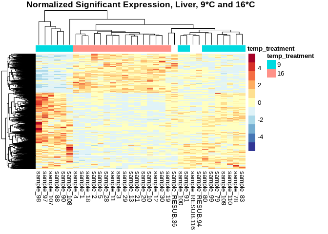
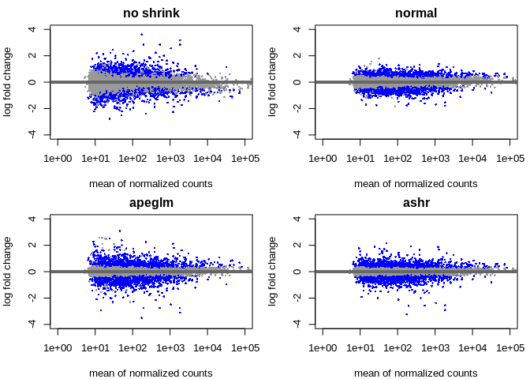

07.2.1-cod-RNAseq-DESeq2genome-exon
================
Kathleen Durkin
2024-04-30

- <a href="#001-install-and-load-packages"
  id="toc-001-install-and-load-packages">0.0.1 Install and load
  packages</a>
- <a href="#1-load-data" id="toc-1-load-data">1 Load data</a>
  - <a href="#11-load-count-data" id="toc-11-load-count-data">1.1 Load count
    data</a>
  - <a href="#12-count-data-munging" id="toc-12-count-data-munging">1.2
    Count data munging</a>
  - <a href="#13-import-sample-metadata-sheets"
    id="toc-13-import-sample-metadata-sheets">1.3 Import sample metadata
    sheets</a>
  - <a href="#14-sample-metadata-munging"
    id="toc-14-sample-metadata-munging">1.4 Sample metadata munging</a>
- <a href="#2-preliminary-pca-visualization-liver-tissue"
  id="toc-2-preliminary-pca-visualization-liver-tissue">2 Preliminary PCA
  visualization (liver tissue)</a>
  - <a href="#21-deseq-object" id="toc-21-deseq-object">2.1 DESeq object</a>
  - <a href="#22-pca-visualization" id="toc-22-pca-visualization">2.2 PCA
    visualization</a>
- <a href="#3-liver-tissue-9c-v-16c" id="toc-3-liver-tissue-9c-v-16c">3
  Liver tissue, 9<em>C v. 16</em>C</a>
- <a href="#4-extracting-significantly-expressed-genes"
  id="toc-4-extracting-significantly-expressed-genes">4 Extracting
  significantly expressed genes</a>
  - <a href="#41-heatmap" id="toc-41-heatmap">4.1 Heatmap</a>
  - <a href="#42-volcano-plot" id="toc-42-volcano-plot">4.2 Volcano plot</a>
- <a href="#5-liver-tissue-9c-v-0c" id="toc-5-liver-tissue-9c-v-0c">5
  Liver tissue, 9<em>C v. 0</em>C</a>
- <a href="#6-extracting-significantly-expressed-genes"
  id="toc-6-extracting-significantly-expressed-genes">6 Extracting
  significantly expressed genes</a>
  - <a href="#61-heatmap" id="toc-61-heatmap">6.1 Heatmap</a>
  - <a href="#62-volcano-plot" id="toc-62-volcano-plot">6.2 Volcano plot</a>
- <a href="#7-liver-tissue-9c-v-5c" id="toc-7-liver-tissue-9c-v-5c">7
  Liver tissue, 9<em>C v. 5</em>C</a>
- <a href="#8-extracting-significantly-expressed-genes"
  id="toc-8-extracting-significantly-expressed-genes">8 Extracting
  significantly expressed genes</a>
  - <a href="#81-heatmap" id="toc-81-heatmap">8.1 Heatmap</a>
  - <a href="#82-volcano-plot" id="toc-82-volcano-plot">8.2 Volcano plot</a>

Differential gene expression analysis for [Pacific cod RNAseq
data](https://shedurkin.github.io/Roberts-LabNotebook/posts/projects/pacific_cod/2023_12_13_pacific_cod.html).

- Raw reads found
  [here](https://owl.fish.washington.edu/nightingales/G_macrocephalus/30-943133806/)
- Reads aligned to genome downloaded from
  [NCBI](https://www.ncbi.nlm.nih.gov/datasets/genome/GCF_031168955.1/)
- NOTE this analysis is for the featureCounts *exons* (see
  `06.2-cod-RNAseq-alignment-genome`)

### 0.0.1 Install and load packages

``` r
## clear
rm(list=ls())

## Install Rtools directly from (https://cran.r-project.org/bin/windows/Rtools/), then install these on first run:
# install.packages("BiocManager")
# BiocManager::install("DESeq2")
# BiocManager::install("vsn")
# BiocManager::install("tidybulk")
# BiocManager::install("goseq")
# BiocManager::install("affycoretools")
# BiocManager::install("EnhancedVolcano")
# BiocManager::install("pcaExplorer")
# BiocManager::install("apeglm")
# BiocManager::install("PCAtools")


# List of packages we want to install (run every time)
load.lib<-c("DESeq2","edgeR","goseq","dplyr","GenomicFeatures","data.table","calibrate","affycoretools","data.table","vsn","tidybulk","ggplot2","cowplot","pheatmap","gplots","RColorBrewer","EnhancedVolcano","pcaExplorer","readxl","apeglm","ashr","tibble","plotly","sqldf","PCAtools","ggpubr","beepr","genefilter","ComplexHeatmap","circlize","scales", "tidyverse", "gridextra'")

# Select only the packages that aren't currently installed (run every time)
# install.lib <- load.lib[!load.lib %in% installed.packages()]

# And finally we install the missing packages, including their dependency.
# for(lib in install.lib) install.packages(lib,dependencies=TRUE)
# After the installation process completes, we load all packages.
sapply(load.lib,require,character=TRUE)
```

             DESeq2           edgeR           goseq           dplyr GenomicFeatures 
               TRUE            TRUE            TRUE            TRUE            TRUE 
         data.table       calibrate   affycoretools      data.table             vsn 
               TRUE            TRUE            TRUE            TRUE            TRUE 
           tidybulk         ggplot2         cowplot        pheatmap          gplots 
               TRUE            TRUE            TRUE            TRUE            TRUE 
       RColorBrewer EnhancedVolcano     pcaExplorer          readxl          apeglm 
               TRUE            TRUE            TRUE            TRUE            TRUE 
               ashr          tibble          plotly           sqldf        PCAtools 
               TRUE            TRUE            TRUE            TRUE            TRUE 
             ggpubr           beepr      genefilter  ComplexHeatmap        circlize 
               TRUE            TRUE            TRUE           FALSE            TRUE 
             scales       tidyverse      gridextra' 
               TRUE            TRUE           FALSE 

I found the [DESeq2
vignette](https://www.bioconductor.org/packages/release/bioc/vignettes/DESeq2/inst/doc/DESeq2.html)
and the [HBC DGE training
workshop](https://github.com/hbctraining/DGE_workshop) super helpful in
figuring out how to use the DESeq2 package!

# 1 Load data

## 1.1 Load count data

Load in the count matrix we generated after alignment using the
featureCounts. We also need to slightly reformat the count matrix to
make all of the estimated counts integers, as required for DESeq2.

``` r
# Read in counts data. This is a gene-level counts matrix generated from hisat2 and summarized using featureCounts
cod_counts_data_OG <- read_delim("../output/06.2-cod-RNAseq-alignment-genome/featureCounts-exon/featureCounts_exon_matrix_noheader.txt", delim="\t") 
head(cod_counts_data_OG)
```

    # A tibble: 6 × 85
      Geneid       Chr              Start End   Strand Length ../output/06.2-cod-R…¹
      <chr>        <chr>            <chr> <chr> <chr>   <dbl>                  <dbl>
    1 LOC132464423 NC_082382.1;NC_… 7826… 8896… +;+      1618                      8
    2 rereb        NC_082382.1;NC_… 4475… 4490… +;+;+…   5887                    244
    3 LOC132464476 NC_082382.1;NC_… 6269… 6305… -;-      1468                      2
    4 LOC132464448 NC_082382.1;NC_… 7316… 7404… -;-;-…   5017                      0
    5 c1h1orf159   NC_082382.1;NC_… 8431… 8452… -;-;-…   1093                      1
    6 LOC132464512 NC_082382.1;NC_… 8922… 8959… +;+;+…   1720                      0
    # ℹ abbreviated name:
    #   ¹​`../output/06.2-cod-RNAseq-alignment-genome/100.sorted.bam`
    # ℹ 78 more variables:
    #   `../output/06.2-cod-RNAseq-alignment-genome/107.sorted.bam` <dbl>,
    #   `../output/06.2-cod-RNAseq-alignment-genome/108.sorted.bam` <dbl>,
    #   `../output/06.2-cod-RNAseq-alignment-genome/109.sorted.bam` <dbl>,
    #   `../output/06.2-cod-RNAseq-alignment-genome/10.sorted.bam` <dbl>, …

## 1.2 Count data munging

``` r
# # We need to modify this data frame so that the row names are actually row names, instead of comprising the first column
cod_counts_data <- cod_counts_data_OG %>% 
  column_to_rownames(var = "Geneid")

# Additional formatting
# Remove unnecessary columns 
cod_counts_data <- subset(cod_counts_data, select = -c(Chr, Start, End, Strand, Length))

# Remove the directory path and file type portions of the column names, to leave just the sample names
colnames(cod_counts_data) <- sub("../output/06.2-cod-RNAseq-alignment-genome/", "sample_", colnames(cod_counts_data))
colnames(cod_counts_data) <- sub(".sorted.bam", "", colnames(cod_counts_data))

# Reorder the coumns into alphabetical order (to make it easier to create an associated metadata spreadsheet)
cod_counts_data <- cod_counts_data[, order(colnames(cod_counts_data))]

cod_sample_names <- names(cod_counts_data)

write.table(cod_counts_data, file = "../output/07.2.1-cod-RNAseq-DESeq2-genome-exon/Gmac_genome_exon_counts_formatted.tab", sep = "\t",
            row.names = TRUE, col.names = NA)

head(cod_counts_data)
```

                 sample_1 sample_10 sample_100 sample_107 sample_108 sample_109
    LOC132464423        7         8          8          5         29          0
    rereb             505       584        244        136        454        178
    LOC132464476        1         1          2          0          5          1
    LOC132464448        6         3          0          0          4          0
    c1h1orf159          2        11          1          3          3          0
    LOC132464512        0         7          0          2          0          1
                 sample_11 sample_110 sample_117 sample_118 sample_119 sample_12
    LOC132464423         3          5          3          0          0         6
    rereb              386        223        359        301        197       427
    LOC132464476         0          0          0          0          0         0
    LOC132464448         2          0          2          0          3         2
    c1h1orf159           2         11          4          9          8         3
    LOC132464512         0          1          0          0          2         0
                 sample_120 sample_121 sample_127 sample_128 sample_129 sample_13
    LOC132464423          1         36          2          2          9         1
    rereb               439        287        342        128         18       489
    LOC132464476          0          0          0          0          0         3
    LOC132464448          2          3          2          0          0         4
    c1h1orf159            8          2          6          2          0         6
    LOC132464512          1          0          1          0          3         2
                 sample_131 sample_137 sample_138 sample_139 sample_140 sample_147
    LOC132464423          8          0          0          1          2          6
    rereb               183         82         47         83         91        102
    LOC132464476          1          0          0          0          0          2
    LOC132464448          3          0          0          1          0          1
    c1h1orf159            1          2          1          2          1          0
    LOC132464512          0          0          1          1          0          0
                 sample_148 sample_149 sample_150 sample_18 sample_19 sample_19-G
    LOC132464423         16         40         26         4        22          43
    rereb               378        834        275       390       229         735
    LOC132464476          2          1          2         2         2           6
    LOC132464448          6         25          3         1         5          33
    c1h1orf159            5         77          4         3         2          41
    LOC132464512          0          1          1         2         2          12
                 sample_19-S sample_2 sample_20 sample_20-G sample_20-S sample_21
    LOC132464423          71        2         2          29          79         4
    rereb               1147      333       252         798         947       371
    LOC132464476           6        0         1           3           6         1
    LOC132464448          41        2         2          27          39         3
    c1h1orf159            60       10         1          78          15         2
    LOC132464512          19        1         1           4          22         7
                 sample_28 sample_29 sample_3 sample_30 sample_31 sample_37
    LOC132464423         2         4        3         2         0         7
    rereb              306       379      328       533       281       131
    LOC132464476         1         1        4         0         1         2
    LOC132464448         5         3        9         7         5         2
    c1h1orf159           5         1       10         5         3         1
    LOC132464512         0         1        2         4         0         1
                 sample_38 sample_39 sample_4 sample_40 sample_41 sample_47
    LOC132464423         1         1        4         4        29        15
    rereb              141       133      466        73       196       138
    LOC132464476         0         0        0         4        15         7
    LOC132464448         2         4        2         1         1         0
    c1h1orf159           0         4        0         2         0         4
    LOC132464512         0         0        0         0         4         0
                 sample_48 sample_49 sample_5 sample_50 sample_57 sample_57-G
    LOC132464423         8        10        6         6         1          11
    rereb              118       286      284       268       250         930
    LOC132464476         0         5        0         2         0           3
    LOC132464448         4         1        8         0         1          40
    c1h1orf159           4         4        4         9         6          60
    LOC132464512         0         3        0         0         0           1
                 sample_57-S sample_58 sample_58-G sample_58-S sample_59 sample_60
    LOC132464423          40         9          13          48         8        13
    rereb                 63       231        1189         408       166       309
    LOC132464476          21         5           6          30         4         0
    LOC132464448           0         2          37           4         0         5
    c1h1orf159             0         1          52           0         0         0
    LOC132464512           0         0           2           3         0         0
                 sample_67 sample_68 sample_69 sample_70 sample_78 sample_79
    LOC132464423         0         1         3        17        16         5
    rereb              368       324       226       135       164       174
    LOC132464476         1         1         0         2         0         0
    LOC132464448         3         1         1         2         5         1
    c1h1orf159          10         8         3         1         1         4
    LOC132464512         0         0         3         0         0         0
                 sample_80 sample_83 sample_88 sample_90 sample_91 sample_97
    LOC132464423         1         0        33         9         2         2
    rereb              239       167       176       166       424       143
    LOC132464476         0         1         0         1         0         1
    LOC132464448         1         2         4         0         2         0
    c1h1orf159           0         0         1         1         9         0
    LOC132464512         1         0         0         0         1         2
                 sample_98 sample_99 sample_RESUB-116 sample_RESUB-156
    LOC132464423        57         5                4                4
    rereb               92       207              432              285
    LOC132464476        13         3                1                1
    LOC132464448         6         0                4                5
    c1h1orf159           0         4                5                8
    LOC132464512         0         0                1                0
                 sample_RESUB-36 sample_RESUB-76 sample_RESUB-94
    LOC132464423               7               2               2
    rereb                    120             170             513
    LOC132464476               0               1               0
    LOC132464448               2               1               1
    c1h1orf159                 5               0               5
    LOC132464512               1               0               2

``` r
cod_sample_names
```

     [1] "sample_1"         "sample_10"        "sample_100"       "sample_107"      
     [5] "sample_108"       "sample_109"       "sample_11"        "sample_110"      
     [9] "sample_117"       "sample_118"       "sample_119"       "sample_12"       
    [13] "sample_120"       "sample_121"       "sample_127"       "sample_128"      
    [17] "sample_129"       "sample_13"        "sample_131"       "sample_137"      
    [21] "sample_138"       "sample_139"       "sample_140"       "sample_147"      
    [25] "sample_148"       "sample_149"       "sample_150"       "sample_18"       
    [29] "sample_19"        "sample_19-G"      "sample_19-S"      "sample_2"        
    [33] "sample_20"        "sample_20-G"      "sample_20-S"      "sample_21"       
    [37] "sample_28"        "sample_29"        "sample_3"         "sample_30"       
    [41] "sample_31"        "sample_37"        "sample_38"        "sample_39"       
    [45] "sample_4"         "sample_40"        "sample_41"        "sample_47"       
    [49] "sample_48"        "sample_49"        "sample_5"         "sample_50"       
    [53] "sample_57"        "sample_57-G"      "sample_57-S"      "sample_58"       
    [57] "sample_58-G"      "sample_58-S"      "sample_59"        "sample_60"       
    [61] "sample_67"        "sample_68"        "sample_69"        "sample_70"       
    [65] "sample_78"        "sample_79"        "sample_80"        "sample_83"       
    [69] "sample_88"        "sample_90"        "sample_91"        "sample_97"       
    [73] "sample_98"        "sample_99"        "sample_RESUB-116" "sample_RESUB-156"
    [77] "sample_RESUB-36"  "sample_RESUB-76"  "sample_RESUB-94" 

## 1.3 Import sample metadata sheets

``` r
# Read in the csv file as a data frame
cod_sample_info_OG <- read.csv("~/project-cod-temperature/data/DESeq2_Sample_Information.csv")
cod_experiment_alldata_OG <- read.csv("~/project-cod-temperature/data/temp-experiment.csv")
head(cod_sample_info_OG)
```

      sample_name sample_number tank temp_treatment tissue_type
    1    sample_1             1    1             16       Liver
    2   sample_10            10    2             16       Liver
    3  sample_100           100   15              9       Liver
    4  sample_107           107   16              9       Liver
    5  sample_108           108   16              9       Liver
    6  sample_109           109   16              9       Liver

``` r
head(cod_experiment_alldata_OG)
```

      Microchip.ID SL_11212022 WWT_11212022 Tank Temperature SL_12272022
    1          620          93         8.53    1          16         101
    2         1164          88         7.06    1          16          96
    3         1476         102        10.70    1          16         108
    4         9387          87         7.83    1          16          95
    5         9407         100        11.51    1          16         117
    6         9415          92         8.68    1          16         100
      WWT_12272022 MortDate DissectionDate SL_mm WholeBodyWW_g TOTAL_Liver_WW_mg
    1        11.12                  2/8/23   119         16.15            0.4945
    2         8.64                  2/8/23   105         10.89            0.1997
    3        12.25                  2/8/23   110         12.97            0.1715
    4        10.16                  2/8/23   116         15.40            0.3625
    5        14.98                  2/8/23   127         17.98            0.3482
    6        10.96                  2/8/23   114         14.02            0.2343
      LiverforLipids_WW_mg MuscleWWforLipids_mg GeneticSamplingCount
    1               0.1546               0.3495                    8
    2               0.1091               0.3328                    5
    3               0.1107               0.3834                    4
    4               0.1681               0.3262                    6
    5               0.1210               0.3434                    2
    6               0.1342               0.2776                    9
      DissectionComments
    1                   
    2                   
    3                   
    4                   
    5                   
    6                   

``` r
# Rename the "GeneticSamplingCount" column of the experimental data to "sample_number"
cod_experiment_alldata <- cod_experiment_alldata_OG
names(cod_experiment_alldata)[names(cod_experiment_alldata) == "GeneticSamplingCount"] <- "sample_number"

# Calculate length difference and weight difference (end-beginning)
cod_experiment_alldata$SL_diff_mm <- cod_experiment_alldata$SL_mm - cod_experiment_alldata$SL_11212022
cod_experiment_alldata$WWT_diff_g <- cod_experiment_alldata$WholeBodyWW_g - cod_experiment_alldata$WWT_11212022

# Merge the two data frames to get experimental data for all of our RNAseq'd samples.
# This should include all rows from cod_sample_info_OG and matching rows from cod_experiment_alldata based on the shared sample_number column. Sample number duplicates (e.g. from different tissue types) should be retained.
cod_sample_info <- merge(cod_sample_info_OG, cod_experiment_alldata, by = "sample_number", all.x = TRUE)

# Reorder the data frame into alphabetical order by the sample names, so that the rows are in the same order as our count matrix columns
cod_sample_info <- cod_sample_info[order(cod_sample_info$sample_name), ]

# Again, we need to reformat so that the data in the first column becomes the row names
rownames(cod_sample_info) <- cod_sample_info$sample_name

# Remove duplicate columns (artifact of merging data frames with multiple shared columns and of maing sample_name the rownames instead of a variable)
cod_sample_info <- subset(cod_sample_info, select=-Temperature)
cod_sample_info <- subset(cod_sample_info, select=-Tank)
cod_sample_info <- subset(cod_sample_info, select=-sample_name)


head(cod_sample_info)
```

               sample_number tank temp_treatment tissue_type Microchip.ID
    sample_1               1    1             16       Liver         9443
    sample_10             10    2             16       Liver         9518
    sample_100           100   15              9       Liver         9483
    sample_107           107   16              9       Liver         4236
    sample_108           108   16              9       Liver         9416
    sample_109           109   16              9       Liver         9481
               SL_11212022 WWT_11212022 SL_12272022 WWT_12272022 MortDate
    sample_1            99        10.54         108        12.94         
    sample_10           95         9.45         105        12.67         
    sample_100          70         4.54          78         5.23         
    sample_107          94         9.15         104        11.44         
    sample_108          81         6.26          91         7.87         
    sample_109          89         7.77          95         9.49         
               DissectionDate SL_mm WholeBodyWW_g TOTAL_Liver_WW_mg
    sample_1           2/8/23   114         14.39            0.0896
    sample_10          2/8/23   120         16.22            0.3854
    sample_100         2/9/23    93          8.33            0.2558
    sample_107         2/9/23   119         16.41            0.5612
    sample_108         2/9/23   106         11.67            0.3650
    sample_109         2/9/23   116         11.45            0.3088
               LiverforLipids_WW_mg MuscleWWforLipids_mg DissectionComments
    sample_1                 0.0704               0.3899      lipid inserts
    sample_10                0.1285               0.2967                   
    sample_100               0.1143               0.3483                   
    sample_107               0.1503               0.3322                   
    sample_108               0.1125               0.3612                   
    sample_109               0.1090               0.3062                   
               SL_diff_mm WWT_diff_g
    sample_1           15       3.85
    sample_10          25       6.77
    sample_100         23       3.79
    sample_107         25       7.26
    sample_108         25       5.41
    sample_109         27       3.68

## 1.4 Sample metadata munging

``` r
# Factor variables
cod_sample_info$temp_treatment <- factor(cod_sample_info$temp_treatment)
cod_sample_info$tank <- factor(cod_sample_info$tank)
cod_sample_info$tissue_type <- factor(cod_sample_info$tissue_type)

# Remove bad/missing samples
# Missing data: 92
# MuliQC report: 149, 129
# PCA outliers: 31, 41 (per Laura)
cod_sample_info <- cod_sample_info[!(row.names(cod_sample_info) %in% c("sample_92", "sample_149", "sample_129", "sample_31", "sample_41")),]
cod_counts_data <- as.matrix(subset(cod_counts_data, select=-c(sample_149, sample_129, sample_31, sample_41)))

# Check that the column names of our count data match the row names of our sample info sheet
ncol(cod_counts_data)
```

    [1] 75

``` r
nrow(cod_sample_info)
```

    [1] 75

``` r
all(colnames(cod_counts_data) %in% rownames(cod_sample_info))
```

    [1] TRUE

``` r
all(colnames(cod_counts_data) == rownames(cod_sample_info))
```

    [1] TRUE

# 2 Preliminary PCA visualization (liver tissue)

## 2.1 DESeq object

``` r
# Filter data
infosub_L <- cod_sample_info %>% filter(tissue_type == "Liver")
countsub_L <- subset(cod_counts_data, select=row.names(infosub_L))

# Calculate DESeq object
dds_L <- DESeqDataSetFromMatrix(countData = countsub_L,
                              colData = infosub_L,
                              design = ~ temp_treatment) 

# Run differential expression analysis 
# (Note that this DESeq() function runs all necessary steps, including data normalization, 
# estimating size factors, estimating dispersions, gene-wise dispersion estimates, mean-dispersion 
# relationship, final dispersion estimates, fitting model, and testing)
dds_L <- DESeq(dds_L)
resultsNames(dds_L) # lists the coefficients
```

    [1] "Intercept"              "temp_treatment_5_vs_0"  "temp_treatment_9_vs_0" 
    [4] "temp_treatment_16_vs_0"

``` r
plotDispEsts(dds_L)
```

<!-- -->

## 2.2 PCA visualization

``` r
# Generate PCAs
# top 500 most variable genes
pca_L_500<- plotPCA(vst(dds_L), intgroup = c("temp_treatment"), returnData=TRUE)
percentVar_L_500 <- round(100*attr(pca_L_500, "percentVar"))
# merge with metadata sheet so we can plot using other features
pca_L_500 <- subset(pca_L_500, select=-temp_treatment) #remove the temp_treatment column, which will be a duplicate post-merge
pca_L_500 <- merge(pca_L_500, cod_sample_info, by.x = "name", by.y = "row.names")

# top 1000 most variable genes
pca_L_1000 <- plotPCA(vst(dds_L), intgroup = c("temp_treatment"), returnData=TRUE, ntop=1000)
percentVar_L_1000 <- round(100*attr(pca_L_1000, "percentVar"))
# merge with metadata sheet so we can plot using other features
pca_L_1000 <- subset(pca_L_1000, select=-temp_treatment) #remove the temp_treatment column, which will be a duplicate post-merge
pca_L_1000 <- merge(pca_L_1000, cod_sample_info, by.x = "name", by.y = "row.names")

# all genes
pca_L_all <- plotPCA(vst(dds_L), intgroup = c("temp_treatment"), returnData=TRUE, ntop=nrow(assay(vst(dds_L))))
percentVar_L_all <- round(100*attr(pca_L_all, "percentVar"))
# merge with metadata sheet so we can plot using other features
pca_L_all <- subset(pca_L_all, select=-temp_treatment) #remove the temp_treatment column, which will be a duplicate post-merge
pca_L_all <- merge(pca_L_all, cod_sample_info, by.x = "name", by.y = "row.names")

# Assign specific colors to each temperature treatment level
temp_colors <- c(
  "0" = "darkblue",
  "5" = "royalblue1",
  "9" = "green",
  "16" = "orangered") 

# Plot PCAs
p.L.500 <- ggplot(pca_L_500, aes(PC1, PC2, color=temp_treatment)) + 
  geom_point(size=4, alpha = 5/10) +
  ggtitle("Liver, top 500 most variable genes") +
  xlab(paste0("PC1: ",percentVar_L_500[1],"% variance")) +
  ylab(paste0("PC2: ",percentVar_L_500[2],"% variance")) + 
  coord_fixed() +
  scale_color_manual(values=temp_colors)+
  stat_ellipse()

p.L.500.SLdiff <- ggplot(pca_L_500, aes(PC1, PC2, color=temp_treatment, size=SL_diff_mm)) + 
  geom_point(alpha = 0.5) +
  ggtitle("Liver, top 500 most variable genes") +
  xlab(paste0("PC1: ", percentVar_L_500[1], "% variance")) +
  ylab(paste0("PC2: ", percentVar_L_500[2], "% variance")) + 
  coord_fixed() +
  scale_color_manual(values = temp_colors) +
  scale_size_continuous() +  # Add this line to control the size of points
  stat_ellipse()

p.L.500.WWTdiff <- ggplot(pca_L_500, aes(PC1, PC2, color=temp_treatment, size=WWT_diff_g)) + 
  geom_point(alpha = 0.5) +
  ggtitle("Liver, top 500 most variable genes") +
  xlab(paste0("PC1: ", percentVar_L_500[1], "% variance")) +
  ylab(paste0("PC2: ", percentVar_L_500[2], "% variance")) + 
  coord_fixed() +
  scale_color_manual(values = temp_colors) +
  scale_size_continuous() +  # Add this line to control the size of points
  stat_ellipse()

p.L.1000 <- ggplot(pca_L_1000, aes(PC1, PC2, color=temp_treatment)) + 
  geom_point(size=4, alpha = 5/10) +
  ggtitle("Liver, top 1000 most variable genes") +
  xlab(paste0("PC1: ",percentVar_L_1000[1],"% variance")) +
  ylab(paste0("PC2: ",percentVar_L_1000[2],"% variance")) + 
  coord_fixed() +
  scale_color_manual(values=temp_colors)+
  stat_ellipse()

p.L.1000.SLdiff <- ggplot(pca_L_1000, aes(PC1, PC2, color=temp_treatment, size=SL_diff_mm)) + 
  geom_point(alpha = 0.5) +
  ggtitle("Liver, top 1000 most variable genes") +
  xlab(paste0("PC1: ", percentVar_L_500[1], "% variance")) +
  ylab(paste0("PC2: ", percentVar_L_500[2], "% variance")) + 
  coord_fixed() +
  scale_color_manual(values = temp_colors) +
  scale_size_continuous() +  # Add this line to control the size of points
  stat_ellipse()

p.L.1000.WWTdiff <- ggplot(pca_L_1000, aes(PC1, PC2, color=temp_treatment, size=WWT_diff_g)) + 
  geom_point(alpha = 0.5) +
  ggtitle("Liver, top 1000 most variable genes") +
  xlab(paste0("PC1: ", percentVar_L_500[1], "% variance")) +
  ylab(paste0("PC2: ", percentVar_L_500[2], "% variance")) + 
  coord_fixed() +
  scale_color_manual(values = temp_colors) +
  scale_size_continuous() +  # Add this line to control the size of points
  stat_ellipse()

p.L.all <- ggplot(pca_L_all, aes(PC1, PC2, color=temp_treatment)) + 
  geom_point(size=4, alpha = 5/10) +
  ggtitle("Liver, all genes") +
  xlab(paste0("PC1: ",percentVar_L_all[1],"% variance")) +
  ylab(paste0("PC2: ",percentVar_L_all[2],"% variance")) + 
  coord_fixed() +
  scale_color_manual(values=temp_colors)+
  stat_ellipse()

p.L.all.SLdiff <- ggplot(pca_L_all, aes(PC1, PC2, color=temp_treatment, size=SL_diff_mm)) + 
  geom_point(alpha = 0.5) +
  ggtitle("Liver, all genes") +
  xlab(paste0("PC1: ", percentVar_L_500[1], "% variance")) +
  ylab(paste0("PC2: ", percentVar_L_500[2], "% variance")) + 
  coord_fixed() +
  scale_color_manual(values = temp_colors) +
  scale_size_continuous() +  # Add this line to control the size of points
  stat_ellipse()

p.L.all.WWTdiff <- ggplot(pca_L_all, aes(PC1, PC2, color=temp_treatment, size=WWT_diff_g)) + 
  geom_point(alpha = 0.5) +
  ggtitle("Liver, all genes") +
  xlab(paste0("PC1: ", percentVar_L_500[1], "% variance")) +
  ylab(paste0("PC2: ", percentVar_L_500[2], "% variance")) + 
  coord_fixed() +
  scale_color_manual(values = temp_colors) +
  scale_size_continuous() +  # Add this line to control the size of points
  stat_ellipse()

# View PCAs
p.L.500
```

<!-- -->

``` r
p.L.500.SLdiff
```

<!-- -->

``` r
p.L.500.WWTdiff
```

<!-- -->

``` r
p.L.1000
```

<!-- -->

``` r
p.L.1000.SLdiff
```

<!-- -->

``` r
p.L.1000.WWTdiff
```

<!-- -->

``` r
p.L.all
```

<!-- -->

``` r
p.L.all.SLdiff
```

<!-- -->

``` r
p.L.all.WWTdiff
```

<!-- -->

``` r
# Export PCAs as pngs
ggexport(filename = "../output/07.2.1-cod-RNAseq-DESeq2-genome-exon/exon-PCA_L_500.png",
         plot   = p.L.500,
         res    = 600,
         width  = 6000,
         height = 4000)

ggexport(filename = "../output/07.2.1-cod-RNAseq-DESeq2-genome-exon/exon-PCA_L_1000.png",
         plot   = p.L.1000,
         res    = 600,
         width  = 6000,
         height = 4000)

ggexport(filename = "../output/07.2.1-cod-RNAseq-DESeq2-genome-exon/exon-PCA_L_all.png",
         plot   = p.L.all,
         res    = 600,
         width  = 6000,
         height = 4000)
```

# 3 Liver tissue, 9*C v. 16*C

The 9\*C temperature treatment is effectively our “control,” as it
represents the ambient temperature that wild juvenile Pacific cod would
experience.

``` r
# liver tissue, temperatures 9 vs. 16 

# Filter data
infosub_L.9.16 <- cod_sample_info %>% filter(tissue_type == "Liver" & (temp_treatment == "9" | temp_treatment == "16"))
countsub_L.9.16 <- subset(cod_counts_data, select=row.names(infosub_L.9.16))

# Calculate DESeq object
dds_L.9.16 <- DESeqDataSetFromMatrix(countData = countsub_L.9.16,
                              colData = infosub_L.9.16,
                              design = ~ temp_treatment)

dds_L.9.16 <- DESeq(dds_L.9.16)
resultsNames(dds_L.9.16) # lists the coefficients
```

    [1] "Intercept"              "temp_treatment_16_vs_9"

``` r
plotDispEsts(dds_L.9.16)
```

<!-- -->

``` r
# Filtering: keep genes that have at least 10 counts across 1/3 of the samples - https://support.bioconductor.org/p/110307/
keep <- rowSums(DESeq2::counts(dds_L.9.16) >= 10) >= ncol(countsub_L.9.16)/3
dds_L.9.16<- dds_L.9.16[keep,]

# Generate Contrasts
contrast_list_L.9.16        <- c("temp_treatment", "16", "9") # order is important: factor, treatment group, control
res_table_L.9.16_noshrink <- results(dds_L.9.16, contrast=contrast_list_L.9.16, alpha = 0.05)

res_table_L.9.16_norm     <- lfcShrink(dds_L.9.16,
                                       coef=2,
                                       type="normal") # lfcThreshold = 0.585)  # a lfc threshold of 1 = 2-fold change, 0.585 = 1.5-fold change
res_table_L.9.16_apeglm   <- lfcShrink(dds_L.9.16,
                                       coef=2, 
                                       type="apeglm") # lfcThreshold = 0.585)  # a lfc threshold of 1 = 2-fold change, 0.585 = 1.5-fold change
res_table_L.9.16_ashr     <- lfcShrink(dds_L.9.16,
                                       coef=2, 
                                       type="ashr")
```

``` r
# Generate MA plots
par(mfrow=c(2,2), mar=c(4,4,2,1))
xlim <- c(1,1e5); ylim <- c(-4,4)
DESeq2::plotMA(res_table_L.9.16_noshrink, xlim=xlim, ylim=ylim, main="no shrink")
DESeq2::plotMA(res_table_L.9.16_norm, xlim=xlim, ylim=ylim, main="normal")
DESeq2::plotMA(res_table_L.9.16_apeglm, xlim=xlim, ylim=ylim, main="apeglm")
DESeq2::plotMA(res_table_L.9.16_ashr, xlim=xlim, ylim=ylim, main="ashr")
```

<!-- -->

``` r
# Examine results formatting
res_table_L.9.16_norm %>% data.frame() %>% head()
```

                  baseMean log2FoldChange      lfcSE       stat       pvalue
    rereb        286.96913     0.46192735 0.13147711  3.5129472 0.0004431656
    p4htmb        76.99891     0.64481194 0.21827238  2.9526621 0.0031504660
    LOC132464555 625.75393     0.06788431 0.09650024  0.7034711 0.4817622379
    abhd14a       91.54243     0.12856544 0.12138207  1.0591953 0.2895108636
    LOC132464547  68.53815    -0.50343235 0.19552343 -2.5763103 0.0099860980
    tusc2b       148.77036    -0.39780185 0.17571460 -2.2645085 0.0235428584
                        padj
    rereb        0.002586384
    p4htmb       0.012472887
    LOC132464555 0.606583024
    abhd14a      0.419000757
    LOC132464547 0.031080481
    tusc2b       0.061213964

Note that the metric we want to use to identify significantly expressed
genes is the `padj` values, **NOT** the `pvalue`. `padj` are p-values
corrected for multiple testing (default method is the Benjamini and
Hochberg method).

``` r
summary(res_table_L.9.16_noshrink)
```

    out of 14506 with nonzero total read count
    adjusted p-value < 0.05
    LFC > 0 (up)       : 2286, 16%
    LFC < 0 (down)     : 2969, 20%
    outliers [1]       : 0, 0%
    low counts [2]     : 0, 0%
    (mean count < 6)
    [1] see 'cooksCutoff' argument of ?results
    [2] see 'independentFiltering' argument of ?results

``` r
summary(res_table_L.9.16_norm)
```

    out of 14506 with nonzero total read count
    adjusted p-value < 0.1
    LFC > 0 (up)       : 2850, 20%
    LFC < 0 (down)     : 3571, 25%
    outliers [1]       : 0, 0%
    low counts [2]     : 0, 0%
    (mean count < 6)
    [1] see 'cooksCutoff' argument of ?results
    [2] see 'independentFiltering' argument of ?results

``` r
summary(res_table_L.9.16_apeglm)
```

    out of 14506 with nonzero total read count
    adjusted p-value < 0.1
    LFC > 0 (up)       : 2850, 20%
    LFC < 0 (down)     : 3571, 25%
    outliers [1]       : 0, 0%
    low counts [2]     : 0, 0%
    (mean count < 6)
    [1] see 'cooksCutoff' argument of ?results
    [2] see 'independentFiltering' argument of ?results

``` r
summary(res_table_L.9.16_ashr)
```

    out of 14506 with nonzero total read count
    adjusted p-value < 0.1
    LFC > 0 (up)       : 2851, 20%
    LFC < 0 (down)     : 3570, 25%
    outliers [1]       : 0, 0%
    low counts [2]     : 0, 0%
    (mean count < 6)
    [1] see 'cooksCutoff' argument of ?results
    [2] see 'independentFiltering' argument of ?results

# 4 Extracting significantly expressed genes

``` r
padj.cutoff <- 0.05
lfc.cutoff <- 0.58

# Convert results table into tibble
res_table_L.9.16_norm_tb <- res_table_L.9.16_norm %>%
  data.frame() %>%
  rownames_to_column(var="gene") %>%
  as_tibble()

# subset that table to only keep the significant genes using our pre-defined thresholds:
sig_L.9.16_norm <- res_table_L.9.16_norm_tb %>%
        filter(padj < padj.cutoff & abs(log2FoldChange) > lfc.cutoff)

head(sig_L.9.16_norm)
```

    # A tibble: 6 × 7
      gene         baseMean log2FoldChange lfcSE  stat       pvalue       padj
      <chr>           <dbl>          <dbl> <dbl> <dbl>        <dbl>      <dbl>
    1 p4htmb           77.0          0.645 0.218  2.95 0.00315      0.0125    
    2 zc3h11a         877.           0.677 0.168  4.04 0.0000538    0.000471  
    3 LOC132465678     11.8          1.18  0.259  4.52 0.00000629   0.0000788 
    4 LOC132465686    153.           0.638 0.163  3.92 0.0000879    0.000697  
    5 ppil1           145.          -0.638 0.155 -4.13 0.0000366    0.000343  
    6 sfi1             39.5          0.938 0.172  5.45 0.0000000506 0.00000138

``` r
write.table(sig_L.9.16_norm, file = "../output/07.2.1-cod-RNAseq-DESeq2-genome-exon/exon-Gmac_DEGs_sig_L.9.16_norm.tab", sep = "\t",
            row.names = TRUE, col.names = NA)
```

## 4.1 Heatmap

``` r
# Retrieve normalized counts matrix
dds_L.9.16_norm_counts <- counts(dds_L.9.16, normalized=TRUE)

# Extract normalized expression for significant genes
norm_sig_L.9.16 <- dds_L.9.16_norm_counts %>% 
  data.frame() %>%
  filter(row.names(dds_L.9.16_norm_counts) %in% sig_L.9.16_norm$gene)

head(norm_sig_L.9.16)
```

                   sample_1   sample_10 sample_100 sample_107  sample_108
    p4htmb         35.72115  153.869325  61.919622   86.59471   59.588812
    zc3h11a      1108.94313 1439.214943 760.726786  427.10271 1010.739749
    LOC132465678   26.19551    8.588055   7.862809   14.67707    1.702537
    LOC132465686  315.13989  186.074533  85.508050  145.30298   53.913687
    ppil1         134.94655   93.752938  95.336561  223.09145  102.719761
    sfi1           49.21580   70.851457  32.434088   17.61248   35.753287
                 sample_109  sample_11 sample_110   sample_12  sample_13  sample_18
    p4htmb        51.676705   90.45412  56.440264  120.992558   94.73553   67.96219
    zc3h11a      404.800853 1145.16670 434.500443 1192.032313 1091.09198 1125.80844
    LOC132465678   2.870928   18.44210   2.687632    2.556181   29.40068   11.81951
    LOC132465686 102.396433  198.47214 106.609387  126.104919  151.08684  223.58575
    ppil1        225.846339  111.53081 191.717721   86.058087   97.18559  140.84917
    sfi1           9.569760   76.40299  32.251579   74.129243   52.26788   51.21788
                 sample_19  sample_2  sample_20  sample_21  sample_28  sample_29
    p4htmb        71.96343 102.66583   83.96932  115.61138   81.98027  157.62038
    zc3h11a      710.77729 793.32684 1310.36326 1139.46575 1104.91193 1339.77322
    LOC132465678  17.71408  16.59246   25.41177   13.87337   31.88122   35.56070
    LOC132465686 131.74844 211.55382  140.31715  200.70135  121.14863  192.21997
    ppil1        142.81974 129.62857  103.85678  120.23583   96.55455   93.22669
    sfi1          36.53528  50.81440   59.66241   47.16944   49.18816   67.27699
                   sample_3  sample_30   sample_4   sample_5 sample_78  sample_79
    p4htmb         70.36015  150.80053   40.18434  96.612221  36.35504  73.238709
    zc3h11a      1111.51225 1110.97012 1387.27289 953.066501 545.32564 646.770010
    LOC132465678    1.78127   18.21262   12.78593   9.574184   5.50834   6.189187
    LOC132465686  109.54808  132.58791  262.11147 390.800785  92.54011 132.035983
    ppil1         119.34507   62.65143  141.55846  70.500810 236.85861 148.540481
    sfi1           47.20365   51.72385   49.31714  47.000540  24.23669  26.819809
                  sample_80  sample_83  sample_88  sample_90  sample_91  sample_97
    p4htmb        56.533375  27.480102  31.071335  36.600585   65.93820   7.811865
    zc3h11a      949.108391 566.613530 469.953941 544.128693 1016.22401 254.666789
    LOC132465678   3.261541   6.542881   2.589278   2.440039   19.39359   3.124746
    LOC132465686 131.548815  78.514577 165.713786 124.441988   73.69563 190.609498
    ppil1        155.466781 174.040646 242.097485 217.163470  128.77342 270.290518
    sfi1          38.051310  18.320068   9.062473   7.320117   39.56292  12.498983
                  sample_98  sample_99 sample_RESUB.116 sample_RESUB.36
    p4htmb         3.931014  90.487897         76.39820       119.09905
    zc3h11a      169.033620 837.013043        967.71052       610.19886
    LOC132465678   3.931014   1.077237         11.41582        22.05538
    LOC132465686 158.550915  78.638291        110.64567       124.98049
    ppil1        306.619124 163.740003         81.66704       138.21372
    sfi1          22.275748  29.085395         34.24747        26.46646
                 sample_RESUB.94
    p4htmb            141.294591
    zc3h11a          1136.462046
    LOC132465678        2.616566
    LOC132465686      163.099311
    ppil1              80.241372
    sfi1               46.226008

``` r
# Annotate heatmap
annotation <- infosub_L.9.16 %>% 
    dplyr::select(temp_treatment)

# Set a color palette
heat_colors <- rev(brewer.pal(12, "RdYlBu"))

# Run pheatmap
h.L.9.16 <- pheatmap(norm_sig_L.9.16, 
                     color = heat_colors, 
                     cluster_rows = T, 
                     show_rownames = F,
                     annotation = annotation, 
                     border_color = NA, 
                     fontsize = 10,
                     scale = "row", 
                     fontsize_row = 10, 
                     height = 30,
                     main = "Normalized Significant Expression, Liver, 9*C and 16*C")
```

<!-- -->

``` r
# Save plot
ggexport(filename = "../output/07.2.1-cod-RNAseq-DESeq2-genome-exon/exon-heatmap_L.9.16_norm_sig.png",
         plot   = h.L.9.16,
         res    = 600,
         width  = 5000,
         height = 5000)
```

Note the argument `scale="row"` was included, so the values plotted in
the heat map are *Z-scores*, rather thn the normalized count value. This
vastly improves the color visualization.

## 4.2 Volcano plot

``` r
# Generate plot
v.L.9.16 <- 
  ggplot(res_table_L.9.16_norm_tb) +
  # Plot all
  geom_point(aes(x=log2FoldChange, y=-log10(padj),color="unchanged"),
             size=.5) +
  # Overlay all significantly upregulated in red
  geom_point(data = sig_L.9.16_norm[sig_L.9.16_norm$log2FoldChange > 0, ], 
             aes(x=log2FoldChange, y=-log10(padj), color="upregulated"), 
             size=.5) +
  # Overlay all significantly downregulated in blue
  geom_point(data = sig_L.9.16_norm[sig_L.9.16_norm$log2FoldChange < 0, ], 
             aes(x=log2FoldChange, y=-log10(padj), color="downregulated"), 
             size=.5) +
  ggtitle("Liver, 9*C and 16*C") +
  xlab("log2 fold change") + 
  ylab("-log10 adjusted p-value") +
  scale_x_continuous(limits = c(-4,4)) +
  scale_y_continuous(limits = c(0,30)) +
  scale_color_manual(values = c("unchanged" = "darkgrey", "upregulated" = "red", "downregulated" = "blue"),
                     labels = c("unchanged" = "Unchanged", "upregulated" = "Upregulated", "downregulated" = "Downregulated"),
                     name = NULL) +
  theme(legend.position = "top",
        plot.title = element_text(size = rel(1.5), hjust = 0.5),
        axis.title = element_text(size = rel(1.25)))

v.L.9.16
```

<!-- -->

``` r
# Save plot
ggexport(filename = "../output/07.2.1-cod-RNAseq-DESeq2-genome-exon/exon-volcano_L.9.16.png",
         plot   = v.L.9.16,
         res    = 600,
         width  = 6000,
         height = 4000)
```

# 5 Liver tissue, 9*C v. 0*C

The 9\*C temperature treatment is effectively our “control,” as it
represents the ambient temperature that wild juvenile Pacific cod would
experience.

``` r
# liver tissue, temperatures 9 vs. 0 

# Filter data
infosub_L.9.0 <- cod_sample_info %>% filter(tissue_type == "Liver" & (temp_treatment == "9" | temp_treatment == "0"))
countsub_L.9.0 <- subset(cod_counts_data, select=row.names(infosub_L.9.0))

# Calculate DESeq object
dds_L.9.0 <- DESeqDataSetFromMatrix(countData = countsub_L.9.0,
                              colData = infosub_L.9.0,
                              design = ~ temp_treatment)

dds_L.9.0 <- DESeq(dds_L.9.0)
resultsNames(dds_L.9.0) # lists the coefficients
```

    [1] "Intercept"             "temp_treatment_9_vs_0"

``` r
plotDispEsts(dds_L.9.0)
```

<!-- -->

``` r
# Filtering: keep genes that have at least 10 counts across 1/3 of the samples - https://support.bioconductor.org/p/110307/
keep <- rowSums(DESeq2::counts(dds_L.9.0) >= 10) >= ncol(countsub_L.9.0)/3
dds_L.9.0<- dds_L.9.0[keep,]

# Generate Contrasts
contrast_list_L.9.0        <- c("temp_treatment", "0", "9") # order is important: factor, treatment group, control
res_table_L.9.0_noshrink <- results(dds_L.9.0, contrast=contrast_list_L.9.0, alpha = 0.05)

res_table_L.9.0_norm     <- lfcShrink(dds_L.9.0,
                                       coef=2,
                                       type="normal") # lfcThreshold = 0.585)  # a lfc threshold of 1 = 2-fold change, 0.585 = 1.5-fold change
res_table_L.9.0_apeglm   <- lfcShrink(dds_L.9.0,
                                       coef=2, 
                                       type="apeglm") # lfcThreshold = 0.585)  # a lfc threshold of 1 = 2-fold change, 0.585 = 1.5-fold change
res_table_L.9.0_ashr     <- lfcShrink(dds_L.9.0,
                                       coef=2, 
                                       type="ashr")
```

``` r
# Generate MA plots
par(mfrow=c(2,2), mar=c(4,4,2,1))
xlim <- c(1,1e5); ylim <- c(-4,4)
DESeq2::plotMA(res_table_L.9.0_noshrink, xlim=xlim, ylim=ylim, main="no shrink")
DESeq2::plotMA(res_table_L.9.0_norm, xlim=xlim, ylim=ylim, main="normal")
DESeq2::plotMA(res_table_L.9.0_apeglm, xlim=xlim, ylim=ylim, main="apeglm")
DESeq2::plotMA(res_table_L.9.0_ashr, xlim=xlim, ylim=ylim, main="ashr")
```

<!-- -->

``` r
# Examine results formatting
res_table_L.9.0_norm %>% data.frame() %>% head()
```

                  baseMean log2FoldChange     lfcSE       stat       pvalue
    rereb        210.58881      0.5907252 0.1384811  4.2653755 1.995662e-05
    p4htmb        40.91556      1.3139680 0.2445653  5.3662242 8.040200e-08
    LOC132464555 681.54081     -0.1232043 0.1136451 -1.0841293 2.783075e-01
    abhd14a       88.94547      0.1360565 0.1369476  0.9935785 3.204281e-01
    LOC132464547  82.12880      0.1713295 0.2284733  0.7502431 4.531083e-01
    tusc2b       172.52804      0.1554715 0.2076251  0.7489526 4.538858e-01
                         padj
    rereb        1.090731e-04
    p4htmb       7.313176e-07
    LOC132464555 3.927690e-01
    abhd14a      4.370198e-01
    LOC132464547 5.689099e-01
    tusc2b       5.697412e-01

Note that the metric we want to use to identify significantly expressed
genes is the `padj` values, **NOT** the `pvalue`. `padj` are p-values
corrected for multiple testing (default method is the Benjamini and
Hochberg method).

``` r
summary(res_table_L.9.0_noshrink)
```

    out of 14817 with nonzero total read count
    adjusted p-value < 0.05
    LFC > 0 (up)       : 3089, 21%
    LFC < 0 (down)     : 3344, 23%
    outliers [1]       : 0, 0%
    low counts [2]     : 0, 0%
    (mean count < 6)
    [1] see 'cooksCutoff' argument of ?results
    [2] see 'independentFiltering' argument of ?results

``` r
summary(res_table_L.9.0_norm)
```

    out of 14817 with nonzero total read count
    adjusted p-value < 0.1
    LFC > 0 (up)       : 3930, 27%
    LFC < 0 (down)     : 3512, 24%
    outliers [1]       : 0, 0%
    low counts [2]     : 0, 0%
    (mean count < 6)
    [1] see 'cooksCutoff' argument of ?results
    [2] see 'independentFiltering' argument of ?results

``` r
summary(res_table_L.9.0_apeglm)
```

    out of 14817 with nonzero total read count
    adjusted p-value < 0.1
    LFC > 0 (up)       : 3930, 27%
    LFC < 0 (down)     : 3512, 24%
    outliers [1]       : 0, 0%
    low counts [2]     : 0, 0%
    (mean count < 6)
    [1] see 'cooksCutoff' argument of ?results
    [2] see 'independentFiltering' argument of ?results

``` r
summary(res_table_L.9.0_ashr)
```

    out of 14817 with nonzero total read count
    adjusted p-value < 0.1
    LFC > 0 (up)       : 3926, 26%
    LFC < 0 (down)     : 3516, 24%
    outliers [1]       : 0, 0%
    low counts [2]     : 0, 0%
    (mean count < 6)
    [1] see 'cooksCutoff' argument of ?results
    [2] see 'independentFiltering' argument of ?results

# 6 Extracting significantly expressed genes

``` r
padj.cutoff <- 0.05
lfc.cutoff <- 0.58

# Convert results table into tibble
res_table_L.9.0_norm_tb <- res_table_L.9.0_norm %>%
  data.frame() %>%
  rownames_to_column(var="gene") %>%
  as_tibble()

# subset that table to only keep the significant genes using our pre-defined thresholds:
sig_L.9.0_norm <- res_table_L.9.0_norm_tb %>%
        filter(padj < padj.cutoff & abs(log2FoldChange) > lfc.cutoff)

head(sig_L.9.0_norm)
```

    # A tibble: 6 × 7
      gene         baseMean log2FoldChange lfcSE  stat        pvalue         padj
      <chr>           <dbl>          <dbl> <dbl> <dbl>         <dbl>        <dbl>
    1 rereb           211.           0.591 0.138  4.27 0.0000200     0.000109    
    2 p4htmb           40.9          1.31  0.245  5.37 0.0000000804  0.000000731 
    3 LOC132464874     16.7         -1.21  0.297 -4.07 0.0000465     0.000233    
    4 usp48           278.           0.711 0.120  5.91 0.00000000344 0.0000000395
    5 atxn7l2a         46.9         -0.930 0.250 -3.71 0.000207      0.000881    
    6 arfrp1           88.7          0.662 0.175  3.78 0.000159      0.000694    

``` r
write.table(sig_L.9.0_norm, file = "../output/07.2.1-cod-RNAseq-DESeq2-genome-exon/exon-Gmac_DEGs_sig_L.9.0_norm.tab", sep = "\t",
            row.names = TRUE, col.names = NA)
```

## 6.1 Heatmap

``` r
# Retrieve normalized counts matrix
dds_L.9.0_norm_counts <- counts(dds_L.9.0, normalized=TRUE)

# Extract normalized expression for significant genes
norm_sig_L.9.0 <- dds_L.9.0_norm_counts %>% 
  data.frame() %>%
  filter(row.names(dds_L.9.0_norm_counts) %in% sig_L.9.0_norm$gene)

head(norm_sig_L.9.0)
```

                 sample_100 sample_107 sample_108 sample_109 sample_110 sample_37
    rereb        257.966343  209.99624 267.070951 181.897558 215.782427 134.23027
    p4htmb        66.606064   91.10131  61.767511  55.182405  60.960955  11.27124
    LOC132464874   8.457913   15.44090   4.117834  10.218964   3.870537  19.46851
    usp48        286.511799  457.05063 175.302078 332.116327 291.257895 179.31525
    atxn7l2a      32.774412    9.26454  51.767057   9.197068  28.061392  33.81373
    arfrp1       138.498324   75.66041  71.767965 135.912220 155.789107  42.01100
                 sample_38 sample_39 sample_40 sample_47 sample_48 sample_49
    rereb        123.97040 138.82181  88.97215 125.61821 146.07576 188.61100
    p4htmb        14.06756  11.48150  19.50075  11.83360  19.80688  24.40072
    LOC132464874  34.28968  37.57583  46.31427  16.38498  74.27581  31.65499
    usp48        227.71867 246.33044 235.22775 172.95261 217.87571 211.03329
    atxn7l2a      35.16891  30.26942  29.25112  51.88578  24.75860 103.53821
    arfrp1        59.78714  53.23242  47.53307  71.00160  35.89998  42.86614
                  sample_50 sample_57  sample_58 sample_59 sample_60  sample_67
    rereb        194.241984 188.40266 186.076093 174.26024 201.63024 224.399581
    p4htmb        13.046103  20.34749  12.888387  20.99521  33.93130  21.952133
    LOC132464874   7.247835  10.55055   8.860766  53.53778   5.22020   3.658689
    usp48        156.553241 219.30070 185.270569 285.53485 172.26661 227.448489
    atxn7l2a      86.974023  74.60745  89.413188  22.04497 105.70906  79.271591
    arfrp1        66.680084  66.31774  80.552421  81.88132  84.17573  93.906347
                  sample_68  sample_69 sample_70  sample_78  sample_79  sample_80
    rereb        211.377421 175.053326 142.18455 190.963441 192.359594 275.952582
    p4htmb        25.443578  50.347196  28.43691  38.425570  78.491559  60.039892
    LOC132464874   8.481193   7.745722  35.80944   6.986467   6.633089   4.618453
    usp48        204.853426 205.261643 266.46438 393.570995 370.347495 282.880262
    atxn7l2a      88.726325  77.457224  55.82060  27.945869  25.426843  43.875306
    arfrp1        71.111540  80.555513  68.45923 145.551403 122.712155 124.698238
                  sample_83 sample_88 sample_90  sample_91  sample_97  sample_98
    rereb        234.089433 245.01797 216.08265 352.053021 237.007445 129.330235
    p4htmb        29.436396  33.41154  39.05108  70.576667   8.286974   4.217290
    LOC132464874   5.606933  23.66651  13.01703   5.812196   8.286974  21.086451
    usp48        262.124096 412.07567 395.71763 317.179844 593.347311 416.105974
    atxn7l2a      35.043328  23.66651  15.62043  60.612902   1.657395   9.840344
    arfrp1       178.020108  54.29375  79.40387 118.734863  67.953184  22.492215
                  sample_99 sample_RESUB.116 sample_RESUB.76 sample_RESUB.94
    rereb        233.917136       405.003095       186.44012      485.163661
    p4htmb        94.922896        81.563123        24.12754      153.209577
    LOC132464874   4.520138         3.750029        18.64401        1.891476
    usp48        258.777894       289.689713       133.79820      365.054918
    atxn7l2a      32.771000        34.687765        93.22006       69.984622
    arfrp1       155.944757       106.875817       100.89701      113.488576

``` r
# Annotate heatmap
annotation <- infosub_L.9.0 %>% 
    dplyr::select(temp_treatment)

# Set a color palette
heat_colors <- rev(brewer.pal(12, "RdYlBu"))

# Run pheatmap
h.L.9.0 <- pheatmap(norm_sig_L.9.0, 
                     color = heat_colors, 
                     cluster_rows = T, 
                     show_rownames = F,
                     annotation = annotation, 
                     border_color = NA, 
                     fontsize = 10,
                     scale = "row", 
                     fontsize_row = 10, 
                     height = 30,
                     main = "Normalized Significant Expression, Liver, 9*C and 0*C")
```

<!-- -->

``` r
# Save plot
ggexport(filename = "../output/07.2.1-cod-RNAseq-DESeq2-genome-exon/exon-heatmap_L.9.0_norm_sig.png",
         plot   = h.L.9.0,
         res    = 600,
         width  = 5000,
         height = 5000)
```

Note the argument `scale="row"` was included, so the values plotted in
the heat map are *Z-scores*, rather thn the normalized count value. This
vastly improves the color visualization.

## 6.2 Volcano plot

``` r
# Generate plot
v.L.9.0 <- 
  ggplot(res_table_L.9.0_norm_tb) +
  # Plot all
  geom_point(aes(x=log2FoldChange, y=-log10(padj),color="unchanged"),
             size=.5) +
  # Overlay all significantly upregulated in red
  geom_point(data = sig_L.9.0_norm[sig_L.9.0_norm$log2FoldChange > 0, ], 
             aes(x=log2FoldChange, y=-log10(padj), color="upregulated"), 
             size=.5) +
  # Overlay all significantly downregulated in blue
  geom_point(data = sig_L.9.0_norm[sig_L.9.0_norm$log2FoldChange < 0, ], 
             aes(x=log2FoldChange, y=-log10(padj), color="downregulated"), 
             size=.5) +
  ggtitle("Liver, 9*C and 0*C") +
  xlab("log2 fold change") + 
  ylab("-log10 adjusted p-value") +
  scale_x_continuous(limits = c(-4,4)) +
  scale_y_continuous(limits = c(0,30)) +
  scale_color_manual(values = c("unchanged" = "darkgrey", "upregulated" = "red", "downregulated" = "blue"),
                     labels = c("unchanged" = "Unchanged", "upregulated" = "Upregulated", "downregulated" = "Downregulated"),
                     name = NULL) +
  theme(legend.position = "top",
        plot.title = element_text(size = rel(1.5), hjust = 0.5),
        axis.title = element_text(size = rel(1.25)))

v.L.9.0
```

<!-- -->

``` r
# Save plot
ggexport(filename = "../output/07.2.1-cod-RNAseq-DESeq2-genome-exon/exon-volcano_L.9.0.png",
         plot   = v.L.9.0,
         res    = 600,
         width  = 6000,
         height = 4000)
```

# 7 Liver tissue, 9*C v. 5*C

The 9\*C temperature treatment is effectively our “control,” as it
represents the ambient temperature that wild juvenile Pacific cod would
experience.

``` r
# liver tissue, temperatures 9 vs. 5 

# Filter data
infosub_L.9.5 <- cod_sample_info %>% filter(tissue_type == "Liver" & (temp_treatment == "9" | temp_treatment == "5"))
countsub_L.9.5 <- subset(cod_counts_data, select=row.names(infosub_L.9.5))

# Calculate DESeq object
dds_L.9.5 <- DESeqDataSetFromMatrix(countData = countsub_L.9.5,
                              colData = infosub_L.9.5,
                              design = ~ temp_treatment)

dds_L.9.5 <- DESeq(dds_L.9.5)
resultsNames(dds_L.9.5) # lists the coefficients
```

    [1] "Intercept"             "temp_treatment_9_vs_5"

``` r
plotDispEsts(dds_L.9.5)
```

<!-- -->

``` r
# Filtering: keep genes that have at least 10 counts across 1/3 of the samples - https://support.bioconductor.org/p/110307/
keep <- rowSums(DESeq2::counts(dds_L.9.5) >= 10) >= ncol(countsub_L.9.5)/3
dds_L.9.5<- dds_L.9.5[keep,]

# Generate Contrasts
contrast_list_L.9.5        <- c("temp_treatment", "5", "9") # order is important: factor, treatment group, control
res_table_L.9.5_noshrink <- results(dds_L.9.5, contrast=contrast_list_L.9.5, alpha = 0.05)

res_table_L.9.5_norm     <- lfcShrink(dds_L.9.5,
                                       coef=2,
                                       type="normal") # lfcThreshold = 0.585)  # a lfc threshold of 1 = 2-fold change, 0.585 = 1.5-fold change
res_table_L.9.5_apeglm   <- lfcShrink(dds_L.9.5,
                                       coef=2, 
                                       type="apeglm") # lfcThreshold = 0.585)  # a lfc threshold of 1 = 2-fold change, 0.585 = 1.5-fold change
res_table_L.9.5_ashr     <- lfcShrink(dds_L.9.5,
                                       coef=2, 
                                       type="ashr")
```

``` r
# Generate MA plots
par(mfrow=c(2,2), mar=c(4,4,2,1))
xlim <- c(1,1e5); ylim <- c(-4,4)
DESeq2::plotMA(res_table_L.9.5_noshrink, xlim=xlim, ylim=ylim, main="no shrink")
DESeq2::plotMA(res_table_L.9.5_norm, xlim=xlim, ylim=ylim, main="normal")
DESeq2::plotMA(res_table_L.9.5_apeglm, xlim=xlim, ylim=ylim, main="apeglm")
DESeq2::plotMA(res_table_L.9.5_ashr, xlim=xlim, ylim=ylim, main="ashr")
```

<!-- -->

``` r
# Examine results formatting
res_table_L.9.5_norm %>% data.frame() %>% head()
```

                  baseMean log2FoldChange     lfcSE       stat      pvalue
    rereb        205.53349      0.1737322 0.1311078  1.3247781 0.185244767
    p4htmb        40.56146      0.5879916 0.2049666  2.8658806 0.004158511
    LOC132464555 591.73750     -0.1443922 0.1095550 -1.3180888 0.187473913
    abhd14a       85.62802     -0.1689274 0.1236961 -1.3660687 0.171917411
    LOC132464547  64.83757      0.3825523 0.1879078  2.0398338 0.041366881
    tusc2b       168.20330     -0.1430378 0.1854422 -0.7720167 0.440104535
                       padj
    rereb        0.41899624
    p4htmb       0.03847881
    LOC132464555 0.42151393
    abhd14a      0.40223068
    LOC132464547 0.17250343
    tusc2b       0.67607097

Note that the metric we want to use to identify significantly expressed
genes is the `padj` values, **NOT** the `pvalue`. `padj` are p-values
corrected for multiple testing (default method is the Benjamini and
Hochberg method).

``` r
summary(res_table_L.9.5_noshrink)
```

    out of 14637 with nonzero total read count
    adjusted p-value < 0.05
    LFC > 0 (up)       : 905, 6.2%
    LFC < 0 (down)     : 920, 6.3%
    outliers [1]       : 0, 0%
    low counts [2]     : 0, 0%
    (mean count < 5)
    [1] see 'cooksCutoff' argument of ?results
    [2] see 'independentFiltering' argument of ?results

``` r
summary(res_table_L.9.5_norm)
```

    out of 14637 with nonzero total read count
    adjusted p-value < 0.1
    LFC > 0 (up)       : 1340, 9.2%
    LFC < 0 (down)     : 1227, 8.4%
    outliers [1]       : 0, 0%
    low counts [2]     : 0, 0%
    (mean count < 5)
    [1] see 'cooksCutoff' argument of ?results
    [2] see 'independentFiltering' argument of ?results

``` r
summary(res_table_L.9.5_apeglm)
```

    out of 14637 with nonzero total read count
    adjusted p-value < 0.1
    LFC > 0 (up)       : 1340, 9.2%
    LFC < 0 (down)     : 1227, 8.4%
    outliers [1]       : 0, 0%
    low counts [2]     : 0, 0%
    (mean count < 5)
    [1] see 'cooksCutoff' argument of ?results
    [2] see 'independentFiltering' argument of ?results

``` r
summary(res_table_L.9.5_ashr)
```

    out of 14637 with nonzero total read count
    adjusted p-value < 0.1
    LFC > 0 (up)       : 1346, 9.2%
    LFC < 0 (down)     : 1221, 8.3%
    outliers [1]       : 0, 0%
    low counts [2]     : 0, 0%
    (mean count < 5)
    [1] see 'cooksCutoff' argument of ?results
    [2] see 'independentFiltering' argument of ?results

# 8 Extracting significantly expressed genes

``` r
padj.cutoff <- 0.05
lfc.cutoff <- 0.58

# Convert results table into tibble
res_table_L.9.5_norm_tb <- res_table_L.9.5_norm %>%
  data.frame() %>%
  rownames_to_column(var="gene") %>%
  as_tibble()

# subset that table to only keep the significant genes using our pre-defined thresholds:
sig_L.9.5_norm <- res_table_L.9.5_norm_tb %>%
        filter(padj < padj.cutoff & abs(log2FoldChange) > lfc.cutoff)

head(sig_L.9.5_norm)
```

    # A tibble: 6 × 7
      gene         baseMean log2FoldChange lfcSE  stat      pvalue      padj
      <chr>           <dbl>          <dbl> <dbl> <dbl>       <dbl>     <dbl>
    1 p4htmb          40.6           0.588 0.205  2.87 0.00416     0.0385   
    2 LOC132465678     9.66         -0.832 0.217 -3.82 0.000133    0.00322  
    3 patz1           82.1           0.598 0.181  3.30 0.000965    0.0140   
    4 fkbp5          427.           -0.872 0.194 -4.49 0.00000705  0.000348 
    5 fbxo2           13.2          -0.676 0.219 -3.08 0.00207     0.0234   
    6 LOC132466537   372.            0.721 0.147  4.91 0.000000928 0.0000669

``` r
write.table(sig_L.9.5_norm, file = "../output/07.2.1-cod-RNAseq-DESeq2-genome-exon/exon-Gmac_DEGs_sig_L.9.5_norm.tab", sep = "\t",
            row.names = TRUE, col.names = NA)
```

## 8.1 Heatmap

``` r
# Retrieve normalized counts matrix
dds_L.9.5_norm_counts <- counts(dds_L.9.5, normalized=TRUE)

# Extract normalized expression for significant genes
norm_sig_L.9.5 <- dds_L.9.5_norm_counts %>% 
  data.frame() %>%
  filter(row.names(dds_L.9.5_norm_counts) %in% sig_L.9.5_norm$gene)

head(norm_sig_L.9.5)
```

                 sample_100 sample_107 sample_108 sample_109 sample_110 sample_117
    p4htmb        57.047630  79.122361  54.084946  47.386681  51.566402   87.85568
    LOC132465678   7.244144  13.410570   1.545284   2.632593   2.455543   16.73441
    patz1         57.953148  73.758133 122.077450  61.427180  40.925716   70.52360
    fkbp5        201.024984 168.973177 149.892565 276.422308 188.258295  377.71964
    fbxo2          3.622072   2.682114  10.301894   6.142718  13.096229   10.16018
    LOC132466537 382.128572 439.866683 433.709758 423.847539 305.305843  239.06306
                 sample_118 sample_119 sample_120 sample_121 sample_127 sample_128
    p4htmb        17.234353  16.327989   43.26079   13.92956   16.10246  31.374012
    LOC132465678   3.977158   5.442663   25.72263   13.92956   17.66077   4.482002
    patz1         47.725901  23.325698   49.69145   60.00425   75.31798  94.122035
    fkbp5        798.083120 352.995565 1106.07316  774.69776  699.15860 482.562178
    fbxo2         11.931475  10.885326   15.78434  110.36496   11.94699   4.482002
    LOC132466537 184.275006 171.832643  220.98079  303.23578  216.08468 337.644125
                  sample_131 sample_137  sample_138 sample_139 sample_140
    p4htmb         31.362115  17.767401   25.342087   23.46821  26.407962
    LOC132465678    8.443646  17.767401    8.447362   18.05247  21.747734
    patz1          69.961642  62.185904   56.315748   63.18365  63.689791
    fkbp5        1145.923440 473.057052 1109.420240  319.52876 209.710288
    fbxo2           8.443646   8.883701   14.078937   30.68920   7.767048
    LOC132466537  201.441278 197.662336  340.710277  263.56609 215.923926
                 sample_147 sample_148 sample_150  sample_78  sample_79  sample_80
    p4htmb         19.21412  32.069009  21.200208  32.999674  67.196373  51.803146
    LOC132465678   24.45434   2.788609  10.042204   4.999951   5.678567   2.988643
    patz1          34.93477  69.715237  56.347922  77.999230  48.267817 135.485152
    fkbp5         263.75751 540.525470 535.026309 448.995567 130.607035 173.341297
    fbxo2          17.46738   9.295365   8.926403   1.999980  15.142845   5.977286
    LOC132466537  426.20419 331.379759 422.330465 526.994797 370.999693 532.974678
                  sample_83  sample_88  sample_90 sample_91  sample_97  sample_98
    p4htmb        25.050319  28.674012  33.672982  60.51819   7.190352   3.676843
    LOC132465678   5.964362   2.389501   2.244865  17.79947   2.876141   3.676843
    patz1         54.872126 114.696049 241.323040  45.56663 102.102999 257.379002
    fkbp5        829.046256 230.586849 429.891742 282.65553 280.423729  84.567386
    fbxo2          1.192872   9.558004   5.612164  11.39166  10.066493   0.000000
    LOC132466537 481.920414 600.959509 868.762945 435.01896 865.718384 473.087117
                   sample_99 sample_RESUB.116 sample_RESUB.156 sample_RESUB.94
    p4htmb        82.9219780         69.59728         32.61887      130.484130
    LOC132465678   0.9871664         10.39959         29.43654        2.416373
    patz1         90.8193093         72.79716         69.21565      145.787824
    fkbp5        166.8311225        128.79497        407.33810      327.821239
    fbxo2         11.8459969         13.59947         19.09397       12.887321
    LOC132466537 387.9563972        226.39116        189.34857      273.050123

``` r
# Annotate heatmap
annotation <- infosub_L.9.5 %>% 
    dplyr::select(temp_treatment)

# Set a color palette
heat_colors <- rev(brewer.pal(12, "RdYlBu"))

# Run pheatmap
h.L.9.5 <- pheatmap(norm_sig_L.9.5, 
                     color = heat_colors, 
                     cluster_rows = T, 
                     show_rownames = F,
                     annotation = annotation, 
                     border_color = NA, 
                     fontsize = 10,
                     scale = "row", 
                     fontsize_row = 10, 
                     height = 30,
                     main = "Normalized Significant Expression, Liver, 9*C and 5*C")
```

<!-- -->

``` r
# Save plot
ggexport(filename = "../output/07.2.1-cod-RNAseq-DESeq2-genome-exon/exon-heatmap_L.9.5_norm_sig.png",
         plot   = h.L.9.5,
         res    = 600,
         width  = 5000,
         height = 5000)
```

Note the argument `scale="row"` was included, so the values plotted in
the heat map are *Z-scores*, rather thn the normalized count value. This
vastly improves the color visualization.

## 8.2 Volcano plot

``` r
# Generate plot
v.L.9.5 <- 
  ggplot(res_table_L.9.5_norm_tb) +
  # Plot all
  geom_point(aes(x=log2FoldChange, y=-log10(padj),color="unchanged"),
             size=.5) +
  # Overlay all significantly upregulated in red
  geom_point(data = sig_L.9.5_norm[sig_L.9.5_norm$log2FoldChange > 0, ], 
             aes(x=log2FoldChange, y=-log10(padj), color="upregulated"), 
             size=.5) +
  # Overlay all significantly downregulated in blue
  geom_point(data = sig_L.9.5_norm[sig_L.9.5_norm$log2FoldChange < 0, ], 
             aes(x=log2FoldChange, y=-log10(padj), color="downregulated"), 
             size=.5) +
  ggtitle("Liver, 9*C and 0*C") +
  xlab("log2 fold change") + 
  ylab("-log10 adjusted p-value") +
  scale_x_continuous(limits = c(-4,4)) +
  scale_y_continuous(limits = c(0,30)) +
  scale_color_manual(values = c("unchanged" = "darkgrey", "upregulated" = "red", "downregulated" = "blue"),
                     labels = c("unchanged" = "Unchanged", "upregulated" = "Upregulated", "downregulated" = "Downregulated"),
                     name = NULL) +
  theme(legend.position = "top",
        plot.title = element_text(size = rel(1.5), hjust = 0.5),
        axis.title = element_text(size = rel(1.25)))

v.L.9.5
```

<!-- -->

``` r
# Save plot
ggexport(filename = "../output/07.2.1-cod-RNAseq-DESeq2-genome-exon/exon-volcano_L.9.5.png",
         plot   = v.L.9.0,
         res    = 600,
         width  = 6000,
         height = 4000)
```
