07.2.2-cod-RNAseq-DESeq2-genome-gene
================
Kathleen Durkin
2024-04-30

- <a href="#001-install-and-load-packages"
  id="toc-001-install-and-load-packages">0.0.1 Install and load
  packages</a>
- <a href="#1-load-data" id="toc-1-load-data">1 Load data</a>
  - <a href="#11-load-count-data" id="toc-11-load-count-data">1.1 Load count
    data</a>
  - <a href="#12-count-data-munging" id="toc-12-count-data-munging">1.2
    Count data munging</a>
  - <a href="#13-import-sample-metadata-sheets"
    id="toc-13-import-sample-metadata-sheets">1.3 Import sample metadata
    sheets</a>
  - <a href="#14-sample-metadata-munging"
    id="toc-14-sample-metadata-munging">1.4 Sample metadata munging</a>
- <a href="#2-preliminary-pca-visualization-liver-tissue"
  id="toc-2-preliminary-pca-visualization-liver-tissue">2 Preliminary PCA
  visualization (liver tissue)</a>
  - <a href="#21-deseq-object" id="toc-21-deseq-object">2.1 DESeq object</a>
  - <a href="#22-pca-visualization" id="toc-22-pca-visualization">2.2 PCA
    visualization</a>
- <a href="#3-liver-tissue-9c-v-16c" id="toc-3-liver-tissue-9c-v-16c">3
  Liver tissue, 9<em>C v. 16</em>C</a>
- <a href="#4-extracting-significantly-expressed-genes"
  id="toc-4-extracting-significantly-expressed-genes">4 Extracting
  significantly expressed genes</a>
  - <a href="#41-heatmap" id="toc-41-heatmap">4.1 Heatmap</a>
  - <a href="#42-volcano-plot" id="toc-42-volcano-plot">4.2 Volcano plot</a>
- <a href="#5-liver-tissue-9c-v-0c" id="toc-5-liver-tissue-9c-v-0c">5
  Liver tissue, 9<em>C v. 0</em>C</a>
- <a href="#6-extracting-significantly-expressed-genes"
  id="toc-6-extracting-significantly-expressed-genes">6 Extracting
  significantly expressed genes</a>
  - <a href="#61-heatmap" id="toc-61-heatmap">6.1 Heatmap</a>
  - <a href="#62-volcano-plot" id="toc-62-volcano-plot">6.2 Volcano plot</a>
- <a href="#7-liver-tissue-9c-v-5c" id="toc-7-liver-tissue-9c-v-5c">7
  Liver tissue, 9<em>C v. 5</em>C</a>
- <a href="#8-extracting-significantly-expressed-genes"
  id="toc-8-extracting-significantly-expressed-genes">8 Extracting
  significantly expressed genes</a>
  - <a href="#81-heatmap" id="toc-81-heatmap">8.1 Heatmap</a>
  - <a href="#82-volcano-plot" id="toc-82-volcano-plot">8.2 Volcano plot</a>

Differential gene expression analysis for [Pacific cod RNAseq
data](https://shedurkin.github.io/Roberts-LabNotebook/posts/projects/pacific_cod/2023_12_13_pacific_cod.html).

- Raw reads found
  [here](https://owl.fish.washington.edu/nightingales/G_macrocephalus/30-943133806/)
- Reads aligned to genome downloaded from
  [NCBI](https://www.ncbi.nlm.nih.gov/datasets/genome/GCF_031168955.1/)
- NOTE this analysis is for the featureCounts *genes* (see
  `06.2-cod-RNAseq-alignment-genome`)

### 0.0.1 Install and load packages

``` r
## clear
rm(list=ls())

## Install Rtools directly from (https://cran.r-project.org/bin/windows/Rtools/), then install these on first run:
# install.packages("BiocManager")
# BiocManager::install("DESeq2")
# BiocManager::install("vsn")
# BiocManager::install("tidybulk")
# BiocManager::install("goseq")
# BiocManager::install("affycoretools")
# BiocManager::install("EnhancedVolcano")
# BiocManager::install("pcaExplorer")
# BiocManager::install("apeglm")
# BiocManager::install("PCAtools")


# List of packages we want to install (run every time)
load.lib<-c("DESeq2","edgeR","goseq","dplyr","GenomicFeatures","data.table","calibrate","affycoretools","data.table","vsn","tidybulk","ggplot2","cowplot","pheatmap","gplots","RColorBrewer","EnhancedVolcano","pcaExplorer","readxl","apeglm","ashr","tibble","plotly","sqldf","PCAtools","ggpubr","beepr","genefilter","ComplexHeatmap","circlize","scales", "tidyverse", "gridextra'")

# Select only the packages that aren't currently installed (run every time)
# install.lib <- load.lib[!load.lib %in% installed.packages()]

# And finally we install the missing packages, including their dependency.
# for(lib in install.lib) install.packages(lib,dependencies=TRUE)
# After the installation process completes, we load all packages.
sapply(load.lib,require,character=TRUE)
```

             DESeq2           edgeR           goseq           dplyr GenomicFeatures 
               TRUE            TRUE            TRUE            TRUE            TRUE 
         data.table       calibrate   affycoretools      data.table             vsn 
               TRUE            TRUE            TRUE            TRUE            TRUE 
           tidybulk         ggplot2         cowplot        pheatmap          gplots 
               TRUE            TRUE            TRUE            TRUE            TRUE 
       RColorBrewer EnhancedVolcano     pcaExplorer          readxl          apeglm 
               TRUE            TRUE            TRUE            TRUE            TRUE 
               ashr          tibble          plotly           sqldf        PCAtools 
               TRUE            TRUE            TRUE            TRUE            TRUE 
             ggpubr           beepr      genefilter  ComplexHeatmap        circlize 
               TRUE            TRUE            TRUE           FALSE            TRUE 
             scales       tidyverse      gridextra' 
               TRUE            TRUE           FALSE 

I found the [DESeq2
vignette](https://www.bioconductor.org/packages/release/bioc/vignettes/DESeq2/inst/doc/DESeq2.html)
and the [HBC DGE training
workshop](https://github.com/hbctraining/DGE_workshop) super helpful in
figuring out how to use the DESeq2 package!

# 1 Load data

## 1.1 Load count data

Load in the count matrix we generated after kallisto pseudoalignment
using the Trinity abundance_estimates_to_matrix.pl script. We also need
to slightly reformat the count matrix to make all of the estimated
counts integers, as required for DESeq2.

``` r
# Read in counts data. This is a gene-level counts matrix generated from kallisto transcript abundances using Trinity
cod_counts_data_OG <- read_delim("../output/06.2-cod-RNAseq-alignment-genome/featureCounts-gene/featureCounts_gene_matrix_noheader.txt", delim="\t") 
head(cod_counts_data_OG)
```

    # A tibble: 6 × 85
      Geneid       Chr         Start   End Strand Length ../output/06.2-cod-RNAseq…¹
      <chr>        <chr>       <dbl> <dbl> <chr>   <dbl>                       <dbl>
    1 LOC132464423 NC_082382.1  7826 12944 +        5119                           9
    2 rereb        NC_082382.1 44750 76860 +       32111                          47
    3 LOC132464476 NC_082382.1 62695 64363 -        1669                           0
    4 LOC132464448 NC_082382.1 73161 81996 -        8836                           0
    5 c1h1orf159   NC_082382.1 84312 88253 -        3942                           4
    6 LOC132464512 NC_082382.1 89228 91940 +        2713                           0
    # ℹ abbreviated name:
    #   ¹​`../output/06.2-cod-RNAseq-alignment-genome/hisat2/100.sorted.bam`
    # ℹ 78 more variables:
    #   `../output/06.2-cod-RNAseq-alignment-genome/hisat2/107.sorted.bam` <dbl>,
    #   `../output/06.2-cod-RNAseq-alignment-genome/hisat2/108.sorted.bam` <dbl>,
    #   `../output/06.2-cod-RNAseq-alignment-genome/hisat2/109.sorted.bam` <dbl>,
    #   `../output/06.2-cod-RNAseq-alignment-genome/hisat2/10.sorted.bam` <dbl>, …

## 1.2 Count data munging

``` r
# # We need to modify this data frame so that the row names are actually row names, instead of comprising the first column
cod_counts_data <- cod_counts_data_OG %>% 
  column_to_rownames(var = "Geneid")

# Additional formatting
# Remove unnecessary columns 
cod_counts_data <- subset(cod_counts_data, select = -c(Chr, Start, End, Strand, Length))

# Remove the directory path and file type portions of the column names, to leave just the sample names
colnames(cod_counts_data) <- sub("../output/06.2-cod-RNAseq-alignment-genome/hisat2/", "sample_", colnames(cod_counts_data))
colnames(cod_counts_data) <- sub(".sorted.bam", "", colnames(cod_counts_data))

# Reorder the coumns into alphabetical order (to make it easier to create an associated metadata spreadsheet)
cod_counts_data <- cod_counts_data[, order(colnames(cod_counts_data))]

cod_sample_names <- names(cod_counts_data)

write.table(cod_counts_data, file = "../output/07.2.2-cod-RNAseq-DESeq2-genome-gene/Gmac_genome_gene_counts_formatted.tab", sep = "\t",
            row.names = TRUE, col.names = NA)

head(cod_counts_data)
```

                 sample_1 sample_10 sample_100 sample_107 sample_108 sample_109
    LOC132464423        7         8          9          5         36          0
    rereb             107       103         47         53         88         33
    LOC132464476        0         0          0          0          0          0
    LOC132464448        5         3          0          0          4          0
    c1h1orf159          2        13          4          3          4          1
    LOC132464512        0         7          0          5          0          1
                 sample_11 sample_110 sample_117 sample_118 sample_119 sample_12
    LOC132464423         3          5          3          1          0         6
    rereb               64         58         95         93         41        82
    LOC132464476         0          0          0          0          0         0
    LOC132464448         1          1          0          0          2         0
    c1h1orf159           2         14          7         12         11         3
    LOC132464512         0          1          1          0          2         0
                 sample_120 sample_121 sample_127 sample_128 sample_129 sample_13
    LOC132464423          1         35          3          2         16         1
    rereb                80         21         58         14          6        93
    LOC132464476          0          0          0          0          0         0
    LOC132464448          2          2          1          0          0         5
    c1h1orf159           14          2          7          2          0         6
    LOC132464512          1          0          1          0          3         2
                 sample_131 sample_137 sample_138 sample_139 sample_140 sample_147
    LOC132464423          8          0          1          1          3          7
    rereb                41         21          8         15         13         16
    LOC132464476          0          0          0          0          0          0
    LOC132464448          1          0          0          0          0          1
    c1h1orf159            2          2          2          3          3          0
    LOC132464512          0          0          1          1          0          0
                 sample_148 sample_149 sample_150 sample_18 sample_19 sample_19-G
    LOC132464423         19         52         30         7        28          54
    rereb                97        191        102        80        33         223
    LOC132464476          0          0          0         0         0           0
    LOC132464448          2         25          3         1         3          17
    c1h1orf159            5         82          4         4         2          59
    LOC132464512          0          1          1         2         2          12
                 sample_19-S sample_2 sample_20 sample_20-G sample_20-S sample_21
    LOC132464423         125        2         2          43         120         4
    rereb                646      110        42         335         427        63
    LOC132464476           0        0         0           0           0         0
    LOC132464448          18        2         2          15          21         1
    c1h1orf159            77       10         1         103          20         6
    LOC132464512          22        1         1           4          23         7
                 sample_28 sample_29 sample_3 sample_30 sample_31 sample_37
    LOC132464423         4         6        3         4         0         8
    rereb               59        98       68       118        99        56
    LOC132464476         0         0        0         0         0         0
    LOC132464448         4         0        8         6         0         2
    c1h1orf159           5         4       14         7         4         3
    LOC132464512         0         1        2         4         0         1
                 sample_38 sample_39 sample_4 sample_40 sample_41 sample_47
    LOC132464423         1         1        5         1        38        15
    rereb               43        54       90        64        62        35
    LOC132464476         0         0        0         0         0         0
    LOC132464448         2         1        0         0         1         0
    c1h1orf159           2         4        1         5         0         5
    LOC132464512         0         0        0         0         4         0
                 sample_48 sample_49 sample_5 sample_50 sample_57 sample_57-G
    LOC132464423         8        13        7         9         1          13
    rereb               24        77       63        63        67         289
    LOC132464476         0         0        0         0         0           0
    LOC132464448         4         0        6         0         0          25
    c1h1orf159          14         6        9        12         7          78
    LOC132464512         0         3        0         0         0           1
                 sample_57-S sample_58 sample_58-G sample_58-S sample_59 sample_60
    LOC132464423          42        13          17          50        10        16
    rereb                154       122         381         209        25        86
    LOC132464476           0         0           0           0         0         0
    LOC132464448           0         0          33           4         0         1
    c1h1orf159             1         1          64           0         0         2
    LOC132464512           0         0           2           4         0         0
                 sample_67 sample_68 sample_69 sample_70 sample_78 sample_79
    LOC132464423         0         1         4        17        16         5
    rereb               83        76        48        23        23        63
    LOC132464476         0         0         0         0         0         0
    LOC132464448         0         0         0         1         1         0
    c1h1orf159          12         9         8         1         1         4
    LOC132464512         0         0         3         0         0         0
                 sample_80 sample_83 sample_88 sample_90 sample_91 sample_97
    LOC132464423         0         0        33         9         3         2
    rereb               67        30        30        43        91        45
    LOC132464476         0         0         0         0         0         0
    LOC132464448         1         2         4         0         0         0
    c1h1orf159           1         1         1         1        12         0
    LOC132464512         1         0         0         0         1         2
                 sample_98 sample_99 sample_RESUB-116 sample_RESUB-156
    LOC132464423        83         9                4                6
    rereb               48        77               75               74
    LOC132464476         0         0                0                0
    LOC132464448         6         0                0                0
    c1h1orf159           0         4                6               10
    LOC132464512         0         0                1                0
                 sample_RESUB-36 sample_RESUB-76 sample_RESUB-94
    LOC132464423              12               2               2
    rereb                     18              23             106
    LOC132464476               0               0               0
    LOC132464448               1               0               1
    c1h1orf159                 7               0               7
    LOC132464512               1               0               2

``` r
cod_sample_names
```

     [1] "sample_1"         "sample_10"        "sample_100"       "sample_107"      
     [5] "sample_108"       "sample_109"       "sample_11"        "sample_110"      
     [9] "sample_117"       "sample_118"       "sample_119"       "sample_12"       
    [13] "sample_120"       "sample_121"       "sample_127"       "sample_128"      
    [17] "sample_129"       "sample_13"        "sample_131"       "sample_137"      
    [21] "sample_138"       "sample_139"       "sample_140"       "sample_147"      
    [25] "sample_148"       "sample_149"       "sample_150"       "sample_18"       
    [29] "sample_19"        "sample_19-G"      "sample_19-S"      "sample_2"        
    [33] "sample_20"        "sample_20-G"      "sample_20-S"      "sample_21"       
    [37] "sample_28"        "sample_29"        "sample_3"         "sample_30"       
    [41] "sample_31"        "sample_37"        "sample_38"        "sample_39"       
    [45] "sample_4"         "sample_40"        "sample_41"        "sample_47"       
    [49] "sample_48"        "sample_49"        "sample_5"         "sample_50"       
    [53] "sample_57"        "sample_57-G"      "sample_57-S"      "sample_58"       
    [57] "sample_58-G"      "sample_58-S"      "sample_59"        "sample_60"       
    [61] "sample_67"        "sample_68"        "sample_69"        "sample_70"       
    [65] "sample_78"        "sample_79"        "sample_80"        "sample_83"       
    [69] "sample_88"        "sample_90"        "sample_91"        "sample_97"       
    [73] "sample_98"        "sample_99"        "sample_RESUB-116" "sample_RESUB-156"
    [77] "sample_RESUB-36"  "sample_RESUB-76"  "sample_RESUB-94" 

## 1.3 Import sample metadata sheets

``` r
# Read in the csv file as a data frame
cod_sample_info_OG <- read.csv("~/project-cod-temperature/data/DESeq2_Sample_Information.csv")
cod_experiment_alldata_OG <- read.csv("~/project-cod-temperature/data/temp-experiment.csv")
head(cod_sample_info_OG)
```

      sample_name sample_number tank temp_treatment tissue_type
    1    sample_1             1    1             16       Liver
    2   sample_10            10    2             16       Liver
    3  sample_100           100   15              9       Liver
    4  sample_107           107   16              9       Liver
    5  sample_108           108   16              9       Liver
    6  sample_109           109   16              9       Liver

``` r
head(cod_experiment_alldata_OG)
```

      Microchip.ID SL_11212022 WWT_11212022 Tank Temperature SL_12272022
    1          620          93         8.53    1          16         101
    2         1164          88         7.06    1          16          96
    3         1476         102        10.70    1          16         108
    4         9387          87         7.83    1          16          95
    5         9407         100        11.51    1          16         117
    6         9415          92         8.68    1          16         100
      WWT_12272022 MortDate DissectionDate SL_mm WholeBodyWW_g TOTAL_Liver_WW_mg
    1        11.12                  2/8/23   119         16.15            0.4945
    2         8.64                  2/8/23   105         10.89            0.1997
    3        12.25                  2/8/23   110         12.97            0.1715
    4        10.16                  2/8/23   116         15.40            0.3625
    5        14.98                  2/8/23   127         17.98            0.3482
    6        10.96                  2/8/23   114         14.02            0.2343
      LiverforLipids_WW_mg MuscleWWforLipids_mg GeneticSamplingCount
    1               0.1546               0.3495                    8
    2               0.1091               0.3328                    5
    3               0.1107               0.3834                    4
    4               0.1681               0.3262                    6
    5               0.1210               0.3434                    2
    6               0.1342               0.2776                    9
      DissectionComments
    1                   
    2                   
    3                   
    4                   
    5                   
    6                   

``` r
# Rename the "GeneticSamplingCount" column of the experimental data to "sample_number"
cod_experiment_alldata <- cod_experiment_alldata_OG
names(cod_experiment_alldata)[names(cod_experiment_alldata) == "GeneticSamplingCount"] <- "sample_number"

# Calculate length difference and weight difference (end-beginning)
cod_experiment_alldata$SL_diff_mm <- cod_experiment_alldata$SL_mm - cod_experiment_alldata$SL_11212022
cod_experiment_alldata$WWT_diff_g <- cod_experiment_alldata$WholeBodyWW_g - cod_experiment_alldata$WWT_11212022

# Merge the two data frames to get experimental data for all of our RNAseq'd samples.
# This should include all rows from cod_sample_info_OG and matching rows from cod_experiment_alldata based on the shared sample_number column. Sample number duplicates (e.g. from different tissue types) should be retained.
cod_sample_info <- merge(cod_sample_info_OG, cod_experiment_alldata, by = "sample_number", all.x = TRUE)

# Reorder the data frame into alphabetical order by the sample names, so that the rows are in the same order as our count matrix columns
cod_sample_info <- cod_sample_info[order(cod_sample_info$sample_name), ]

# Again, we need to reformat so that the data in the first column becomes the row names
rownames(cod_sample_info) <- cod_sample_info$sample_name

# Remove duplicate columns (artifact of merging data frames with multiple shared columns and of maing sample_name the rownames instead of a variable)
cod_sample_info <- subset(cod_sample_info, select=-Temperature)
cod_sample_info <- subset(cod_sample_info, select=-Tank)
cod_sample_info <- subset(cod_sample_info, select=-sample_name)


head(cod_sample_info)
```

               sample_number tank temp_treatment tissue_type Microchip.ID
    sample_1               1    1             16       Liver         9443
    sample_10             10    2             16       Liver         9518
    sample_100           100   15              9       Liver         9483
    sample_107           107   16              9       Liver         4236
    sample_108           108   16              9       Liver         9416
    sample_109           109   16              9       Liver         9481
               SL_11212022 WWT_11212022 SL_12272022 WWT_12272022 MortDate
    sample_1            99        10.54         108        12.94         
    sample_10           95         9.45         105        12.67         
    sample_100          70         4.54          78         5.23         
    sample_107          94         9.15         104        11.44         
    sample_108          81         6.26          91         7.87         
    sample_109          89         7.77          95         9.49         
               DissectionDate SL_mm WholeBodyWW_g TOTAL_Liver_WW_mg
    sample_1           2/8/23   114         14.39            0.0896
    sample_10          2/8/23   120         16.22            0.3854
    sample_100         2/9/23    93          8.33            0.2558
    sample_107         2/9/23   119         16.41            0.5612
    sample_108         2/9/23   106         11.67            0.3650
    sample_109         2/9/23   116         11.45            0.3088
               LiverforLipids_WW_mg MuscleWWforLipids_mg DissectionComments
    sample_1                 0.0704               0.3899      lipid inserts
    sample_10                0.1285               0.2967                   
    sample_100               0.1143               0.3483                   
    sample_107               0.1503               0.3322                   
    sample_108               0.1125               0.3612                   
    sample_109               0.1090               0.3062                   
               SL_diff_mm WWT_diff_g
    sample_1           15       3.85
    sample_10          25       6.77
    sample_100         23       3.79
    sample_107         25       7.26
    sample_108         25       5.41
    sample_109         27       3.68

## 1.4 Sample metadata munging

``` r
# Factor variables
cod_sample_info$temp_treatment <- factor(cod_sample_info$temp_treatment)
cod_sample_info$tank <- factor(cod_sample_info$tank)
cod_sample_info$tissue_type <- factor(cod_sample_info$tissue_type)

# Remove bad/missing samples
# Missing data: 92
# MuliQC report: 149, 129
# PCA outliers: 31, 41 (per Laura)
cod_sample_info <- cod_sample_info[!(row.names(cod_sample_info) %in% c("sample_92", "sample_149", "sample_129", "sample_31", "sample_41")),]
cod_counts_data <- as.matrix(subset(cod_counts_data, select=-c(sample_149, sample_129, sample_31, sample_41)))

# Check that the column names of our count data match the row names of our sample info sheet
ncol(cod_counts_data)
```

    [1] 75

``` r
nrow(cod_sample_info)
```

    [1] 75

``` r
all(colnames(cod_counts_data) %in% rownames(cod_sample_info))
```

    [1] TRUE

``` r
all(colnames(cod_counts_data) == rownames(cod_sample_info))
```

    [1] TRUE

# 2 Preliminary PCA visualization (liver tissue)

## 2.1 DESeq object

``` r
# Filter data
infosub_L <- cod_sample_info %>% filter(tissue_type == "Liver")
countsub_L <- subset(cod_counts_data, select=row.names(infosub_L))

# Calculate DESeq object
dds_L <- DESeqDataSetFromMatrix(countData = countsub_L,
                              colData = infosub_L,
                              design = ~ temp_treatment) 

# Run differential expression analysis 
# (Note that this DESeq() function runs all necessary steps, including data normalization, 
# estimating size factors, estimating dispersions, gene-wise dispersion estimates, mean-dispersion 
# relationship, final dispersion estimates, fitting model, and testing)
dds_L <- DESeq(dds_L)
resultsNames(dds_L) # lists the coefficients
```

    [1] "Intercept"              "temp_treatment_5_vs_0"  "temp_treatment_9_vs_0" 
    [4] "temp_treatment_16_vs_0"

``` r
plotDispEsts(dds_L)
```

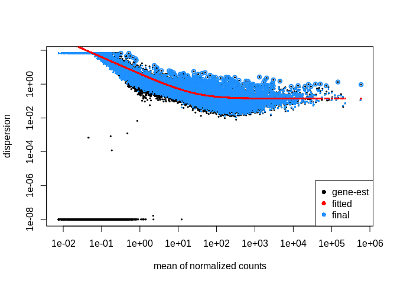<!-- -->

## 2.2 PCA visualization

``` r
# Generate PCAs
# top 500 most variable genes
pca_L_500<- plotPCA(vst(dds_L), intgroup = c("temp_treatment"), returnData=TRUE)
percentVar_L_500 <- round(100*attr(pca_L_500, "percentVar"))
# merge with metadata sheet so we can plot using other features
pca_L_500 <- subset(pca_L_500, select=-temp_treatment) #remove the temp_treatment column, which will be a duplicate post-merge
pca_L_500 <- merge(pca_L_500, cod_sample_info, by.x = "name", by.y = "row.names")

# top 1000 most variable genes
pca_L_1000 <- plotPCA(vst(dds_L), intgroup = c("temp_treatment"), returnData=TRUE, ntop=1000)
percentVar_L_1000 <- round(100*attr(pca_L_1000, "percentVar"))
# merge with metadata sheet so we can plot using other features
pca_L_1000 <- subset(pca_L_1000, select=-temp_treatment) #remove the temp_treatment column, which will be a duplicate post-merge
pca_L_1000 <- merge(pca_L_1000, cod_sample_info, by.x = "name", by.y = "row.names")

# all genes
pca_L_all <- plotPCA(vst(dds_L), intgroup = c("temp_treatment"), returnData=TRUE, ntop=nrow(assay(vst(dds_L))))
percentVar_L_all <- round(100*attr(pca_L_all, "percentVar"))
# merge with metadata sheet so we can plot using other features
pca_L_all <- subset(pca_L_all, select=-temp_treatment) #remove the temp_treatment column, which will be a duplicate post-merge
pca_L_all <- merge(pca_L_all, cod_sample_info, by.x = "name", by.y = "row.names")

# Assign specific colors to each temperature treatment level
temp_colors <- c(
  "0" = "darkblue",
  "5" = "royalblue1",
  "9" = "green",
  "16" = "orangered") 

# Plot PCAs
p.L.500 <- ggplot(pca_L_500, aes(PC1, PC2, color=temp_treatment)) + 
  geom_point(size=4, alpha = 5/10) +
  ggtitle("Liver, top 500 most variable genes") +
  xlab(paste0("PC1: ",percentVar_L_500[1],"% variance")) +
  ylab(paste0("PC2: ",percentVar_L_500[2],"% variance")) + 
  coord_fixed() +
  scale_color_manual(values=temp_colors)+
  stat_ellipse()

p.L.500.SLdiff <- ggplot(pca_L_500, aes(PC1, PC2, color=temp_treatment, size=SL_diff_mm)) + 
  geom_point(alpha = 0.5) +
  ggtitle("Liver, top 500 most variable genes") +
  xlab(paste0("PC1: ", percentVar_L_500[1], "% variance")) +
  ylab(paste0("PC2: ", percentVar_L_500[2], "% variance")) + 
  coord_fixed() +
  scale_color_manual(values = temp_colors) +
  scale_size_continuous() +  # Add this line to control the size of points
  stat_ellipse()

p.L.500.WWTdiff <- ggplot(pca_L_500, aes(PC1, PC2, color=temp_treatment, size=WWT_diff_g)) + 
  geom_point(alpha = 0.5) +
  ggtitle("Liver, top 500 most variable genes") +
  xlab(paste0("PC1: ", percentVar_L_500[1], "% variance")) +
  ylab(paste0("PC2: ", percentVar_L_500[2], "% variance")) + 
  coord_fixed() +
  scale_color_manual(values = temp_colors) +
  scale_size_continuous() +  # Add this line to control the size of points
  stat_ellipse()

p.L.1000 <- ggplot(pca_L_1000, aes(PC1, PC2, color=temp_treatment)) + 
  geom_point(size=4, alpha = 5/10) +
  ggtitle("Liver, top 1000 most variable genes") +
  xlab(paste0("PC1: ",percentVar_L_1000[1],"% variance")) +
  ylab(paste0("PC2: ",percentVar_L_1000[2],"% variance")) + 
  coord_fixed() +
  scale_color_manual(values=temp_colors)+
  stat_ellipse()

p.L.1000.SLdiff <- ggplot(pca_L_1000, aes(PC1, PC2, color=temp_treatment, size=SL_diff_mm)) + 
  geom_point(alpha = 0.5) +
  ggtitle("Liver, top 1000 most variable genes") +
  xlab(paste0("PC1: ", percentVar_L_500[1], "% variance")) +
  ylab(paste0("PC2: ", percentVar_L_500[2], "% variance")) + 
  coord_fixed() +
  scale_color_manual(values = temp_colors) +
  scale_size_continuous() +  # Add this line to control the size of points
  stat_ellipse()

p.L.1000.WWTdiff <- ggplot(pca_L_1000, aes(PC1, PC2, color=temp_treatment, size=WWT_diff_g)) + 
  geom_point(alpha = 0.5) +
  ggtitle("Liver, top 1000 most variable genes") +
  xlab(paste0("PC1: ", percentVar_L_500[1], "% variance")) +
  ylab(paste0("PC2: ", percentVar_L_500[2], "% variance")) + 
  coord_fixed() +
  scale_color_manual(values = temp_colors) +
  scale_size_continuous() +  # Add this line to control the size of points
  stat_ellipse()

p.L.all <- ggplot(pca_L_all, aes(PC1, PC2, color=temp_treatment)) + 
  geom_point(size=4, alpha = 5/10) +
  ggtitle("Liver, all genes") +
  xlab(paste0("PC1: ",percentVar_L_all[1],"% variance")) +
  ylab(paste0("PC2: ",percentVar_L_all[2],"% variance")) + 
  coord_fixed() +
  scale_color_manual(values=temp_colors)+
  stat_ellipse()

p.L.all.SLdiff <- ggplot(pca_L_all, aes(PC1, PC2, color=temp_treatment, size=SL_diff_mm)) + 
  geom_point(alpha = 0.5) +
  ggtitle("Liver, all genes") +
  xlab(paste0("PC1: ", percentVar_L_500[1], "% variance")) +
  ylab(paste0("PC2: ", percentVar_L_500[2], "% variance")) + 
  coord_fixed() +
  scale_color_manual(values = temp_colors) +
  scale_size_continuous() +  # Add this line to control the size of points
  stat_ellipse()

p.L.all.WWTdiff <- ggplot(pca_L_all, aes(PC1, PC2, color=temp_treatment, size=WWT_diff_g)) + 
  geom_point(alpha = 0.5) +
  ggtitle("Liver, all genes") +
  xlab(paste0("PC1: ", percentVar_L_500[1], "% variance")) +
  ylab(paste0("PC2: ", percentVar_L_500[2], "% variance")) + 
  coord_fixed() +
  scale_color_manual(values = temp_colors) +
  scale_size_continuous() +  # Add this line to control the size of points
  stat_ellipse()

# View PCAs
p.L.500
```

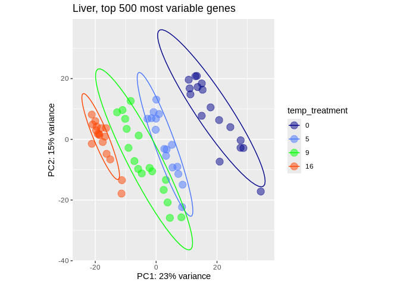<!-- -->

``` r
p.L.500.SLdiff
```

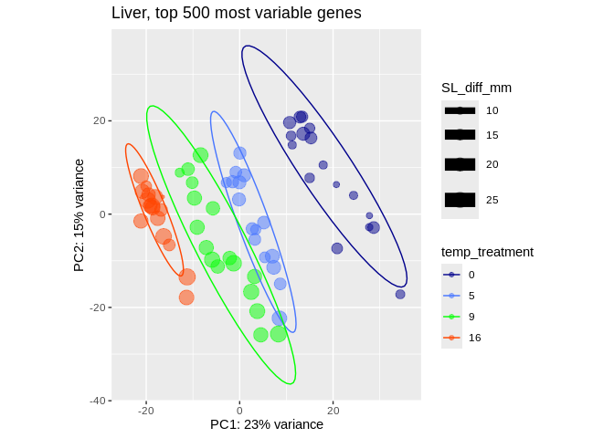<!-- -->

``` r
p.L.500.WWTdiff
```

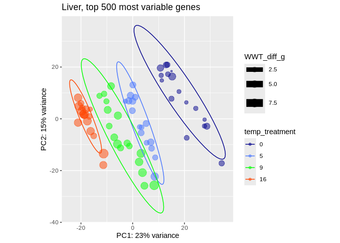<!-- -->

``` r
p.L.1000
```

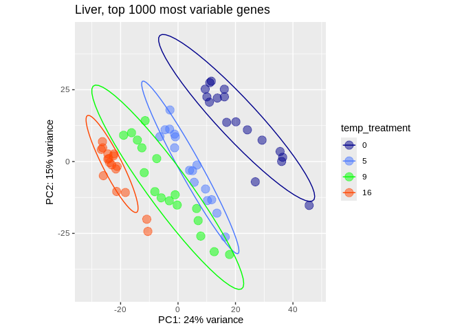<!-- -->

``` r
p.L.1000.SLdiff
```

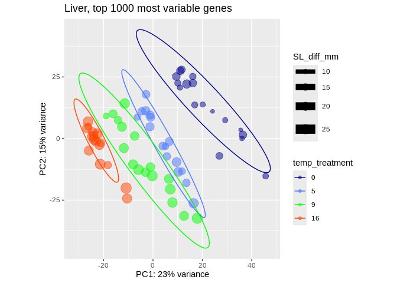<!-- -->

``` r
p.L.1000.WWTdiff
```

<!-- -->

``` r
p.L.all
```

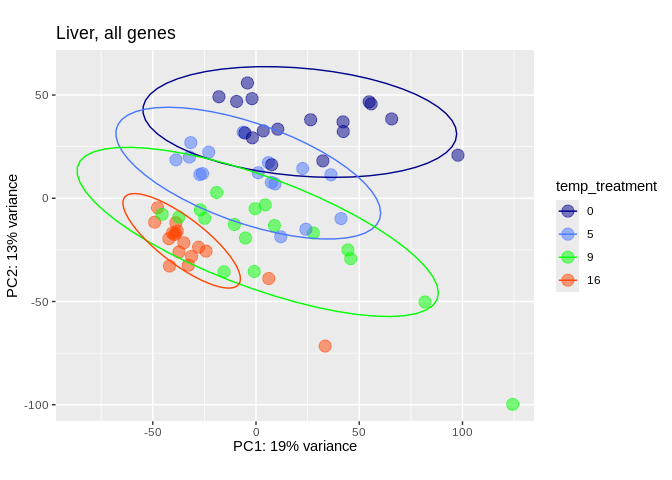<!-- -->

``` r
p.L.all.SLdiff
```

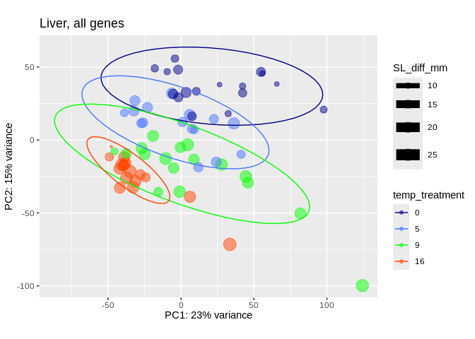<!-- -->

``` r
p.L.all.WWTdiff
```

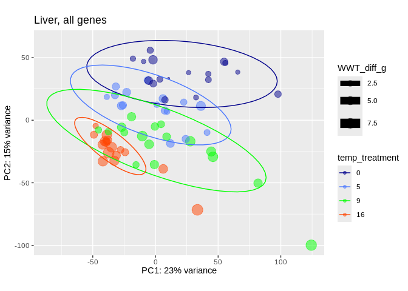<!-- -->

``` r
# Export PCAs as pngs
ggexport(filename = "../output/07.2.2-cod-RNAseq-DESeq2-genome-gene/gene-PCA_L_500.png",
         plot   = p.L.500,
         res    = 600,
         width  = 6000,
         height = 4000)

ggexport(filename = "../output/07.2.2-cod-RNAseq-DESeq2-genome-gene/gene-PCA_L_1000.png",
         plot   = p.L.1000,
         res    = 600,
         width  = 6000,
         height = 4000)

ggexport(filename = "../output/07.2.2-cod-RNAseq-DESeq2-genome-gene/gene-PCA_L_all.png",
         plot   = p.L.all,
         res    = 600,
         width  = 6000,
         height = 4000)
```

# 3 Liver tissue, 9*C v. 16*C

The 9\*C temperature treatment is effectively our “control,” as it
represents the ambient temperature that wild juvenile Pacific cod would
experience.

``` r
# liver tissue, temperatures 9 vs. 16 

# Filter data
infosub_L.9.16 <- cod_sample_info %>% filter(tissue_type == "Liver" & (temp_treatment == "9" | temp_treatment == "16"))
countsub_L.9.16 <- subset(cod_counts_data, select=row.names(infosub_L.9.16))

# Calculate DESeq object
dds_L.9.16 <- DESeqDataSetFromMatrix(countData = countsub_L.9.16,
                              colData = infosub_L.9.16,
                              design = ~ temp_treatment)

dds_L.9.16 <- DESeq(dds_L.9.16)
resultsNames(dds_L.9.16) # lists the coefficients
```

    [1] "Intercept"              "temp_treatment_16_vs_9"

``` r
plotDispEsts(dds_L.9.16)
```

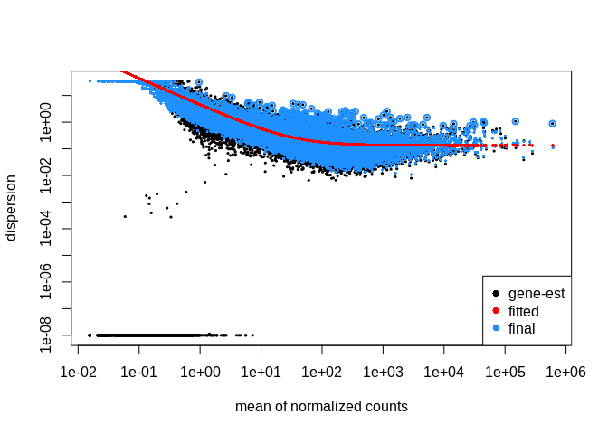<!-- -->

``` r
# Filtering: keep genes that have at least 10 counts across 1/3 of the samples - https://support.bioconductor.org/p/110307/
keep <- rowSums(DESeq2::counts(dds_L.9.16) >= 10) >= ncol(countsub_L.9.16)/3
dds_L.9.16<- dds_L.9.16[keep,]

# Generate Contrasts
contrast_list_L.9.16        <- c("temp_treatment", "16", "9") # order is important: factor, treatment group, control
res_table_L.9.16_noshrink <- results(dds_L.9.16, contrast=contrast_list_L.9.16, alpha = 0.05)

res_table_L.9.16_norm     <- lfcShrink(dds_L.9.16,
                                       coef=2,
                                       type="normal") # lfcThreshold = 0.585)  # a lfc threshold of 1 = 2-fold change, 0.585 = 1.5-fold change
res_table_L.9.16_apeglm   <- lfcShrink(dds_L.9.16,
                                       coef=2, 
                                       type="apeglm") # lfcThreshold = 0.585)  # a lfc threshold of 1 = 2-fold change, 0.585 = 1.5-fold change
res_table_L.9.16_ashr     <- lfcShrink(dds_L.9.16,
                                       coef=2, 
                                       type="ashr")
```

``` r
# Generate MA plots
par(mfrow=c(2,2), mar=c(4,4,2,1))
xlim <- c(1,1e5); ylim <- c(-4,4)
DESeq2::plotMA(res_table_L.9.16_noshrink, xlim=xlim, ylim=ylim, main="no shrink")
DESeq2::plotMA(res_table_L.9.16_norm, xlim=xlim, ylim=ylim, main="normal")
DESeq2::plotMA(res_table_L.9.16_apeglm, xlim=xlim, ylim=ylim, main="apeglm")
DESeq2::plotMA(res_table_L.9.16_ashr, xlim=xlim, ylim=ylim, main="ashr")
```

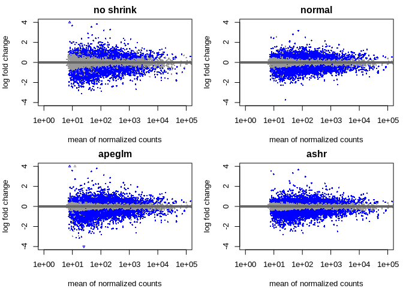<!-- -->

``` r
# Examine results formatting
res_table_L.9.16_norm %>% data.frame() %>% head()
```

                  baseMean log2FoldChange      lfcSE      stat     pvalue
    rereb         63.40591      0.2387645 0.15813181  1.509648 0.13113325
    p4htmb       102.24279      0.6816242 0.22321166  3.052913 0.00226632
    LOC132464555 638.33284      0.1100047 0.09790043  1.123649 0.26116182
    abhd14a       93.16380      0.1528629 0.13153921  1.162165 0.24516855
    LOC132464547  67.75027     -0.4632141 0.19052548 -2.432463 0.01499651
    tusc2b       147.84788     -0.3673078 0.17179230 -2.138588 0.03246905
                       padj
    rereb        0.23013350
    p4htmb       0.01022995
    LOC132464555 0.38631522
    abhd14a      0.36793107
    LOC132464547 0.04449376
    tusc2b       0.07930110

Note that the metric we want to use to identify significantly expressed
genes is the `padj` values, **NOT** the `pvalue`. `padj` are p-values
corrected for multiple testing (default method is the Benjamini and
Hochberg method).

``` r
summary(res_table_L.9.16_noshrink)
```

    out of 14449 with nonzero total read count
    adjusted p-value < 0.05
    LFC > 0 (up)       : 2194, 15%
    LFC < 0 (down)     : 2887, 20%
    outliers [1]       : 0, 0%
    low counts [2]     : 0, 0%
    (mean count < 6)
    [1] see 'cooksCutoff' argument of ?results
    [2] see 'independentFiltering' argument of ?results

``` r
summary(res_table_L.9.16_norm)
```

    out of 14449 with nonzero total read count
    adjusted p-value < 0.1
    LFC > 0 (up)       : 2801, 19%
    LFC < 0 (down)     : 3590, 25%
    outliers [1]       : 0, 0%
    low counts [2]     : 0, 0%
    (mean count < 6)
    [1] see 'cooksCutoff' argument of ?results
    [2] see 'independentFiltering' argument of ?results

``` r
summary(res_table_L.9.16_apeglm)
```

    out of 14449 with nonzero total read count
    adjusted p-value < 0.1
    LFC > 0 (up)       : 2801, 19%
    LFC < 0 (down)     : 3590, 25%
    outliers [1]       : 0, 0%
    low counts [2]     : 0, 0%
    (mean count < 6)
    [1] see 'cooksCutoff' argument of ?results
    [2] see 'independentFiltering' argument of ?results

``` r
summary(res_table_L.9.16_ashr)
```

    out of 14449 with nonzero total read count
    adjusted p-value < 0.1
    LFC > 0 (up)       : 2797, 19%
    LFC < 0 (down)     : 3594, 25%
    outliers [1]       : 0, 0%
    low counts [2]     : 0, 0%
    (mean count < 6)
    [1] see 'cooksCutoff' argument of ?results
    [2] see 'independentFiltering' argument of ?results

# 4 Extracting significantly expressed genes

``` r
padj.cutoff <- 0.05
lfc.cutoff <- 0.58

# Convert results table into tibble
res_table_L.9.16_norm_tb <- res_table_L.9.16_norm %>%
  data.frame() %>%
  rownames_to_column(var="gene") %>%
  as_tibble()

# subset that table to only keep the significant genes using our pre-defined thresholds:
sig_L.9.16_norm <- res_table_L.9.16_norm_tb %>%
        filter(padj < padj.cutoff & abs(log2FoldChange) > lfc.cutoff)

head(sig_L.9.16_norm)
```

    # A tibble: 6 × 7
      gene              baseMean log2FoldChange lfcSE  stat        pvalue       padj
      <chr>                <dbl>          <dbl> <dbl> <dbl>         <dbl>      <dbl>
    1 p4htmb               102.           0.682 0.223  3.05 0.00227          1.02e-2
    2 zc3h11a              888.           0.698 0.173  4.04 0.0000543        5.12e-4
    3 sfi1                  40.8          0.970 0.176  5.50 0.0000000383     1.16e-6
    4 si:ch211-117k10.3     79.0          0.862 0.214  4.03 0.0000552        5.19e-4
    5 LOC132466400         182.           1.04  0.176  5.93 0.00000000307    1.32e-7
    6 LOC132466515          30.3         -0.769 0.274 -2.81 0.00496          1.88e-2

``` r
write.table(sig_L.9.16_norm, file = "../output/07.2.2-cod-RNAseq-DESeq2-genome-gene/gene-Gmac_DEGs_sig_L.9.16_norm.tab", sep = "\t",
            row.names = TRUE, col.names = NA)
```

## 4.1 Heatmap

``` r
# Retrieve normalized counts matrix
dds_L.9.16_norm_counts <- counts(dds_L.9.16, normalized=TRUE)

# Extract normalized expression for significant genes
norm_sig_L.9.16 <- dds_L.9.16_norm_counts %>% 
  data.frame() %>%
  filter(row.names(dds_L.9.16_norm_counts) %in% sig_L.9.16_norm$gene)

head(norm_sig_L.9.16)
```

                        sample_1  sample_10 sample_100 sample_107 sample_108
    p4htmb              49.68830  201.83233   81.71187  109.36832   67.02592
    zc3h11a           1158.56552 1442.17073  781.81109  442.03028  942.05717
    sfi1                53.82899   70.85603   33.29002   18.22805   34.83237
    si:ch211-117k10.3  305.58304   85.17038   53.46579   48.60814   42.74881
    LOC132466400       195.44065  299.88563  164.43253   98.73529  109.24697
    LOC132466515        17.39090   27.19726   19.16698   27.34208   73.35907
                      sample_109  sample_11 sample_110  sample_12  sample_13
    p4htmb              72.16396  123.76574   79.43136  167.21398  134.38818
    zc3h11a            425.96780 1192.15529  461.45835 1211.00850 1121.01447
    sfi1                11.02505   81.90380   34.04201   76.71157   53.42139
    si:ch211-117k10.3   29.06604   68.25317   51.06301   77.57350   78.46267
    LOC132466400        75.17079  240.25114  162.64516  256.85447  270.44578
    LOC132466515        14.03188   19.11089   15.12978   13.79084   10.01651
                       sample_18 sample_19   sample_2  sample_20   sample_21
    p4htmb              88.35133 100.05667 159.166962  122.97060  136.400793
    zc3h11a           1164.81581 661.19925 817.199503 1340.26670 1177.052998
    sfi1                52.80769  36.10292  55.548202   63.17755   50.554140
    si:ch211-117k10.3  138.11242  63.95375  55.548202   94.76633  124.000721
    LOC132466400       185.84245 243.43685 307.651578  273.01729  235.601370
    LOC132466515        12.18639  96.96214   5.341173   18.05073    6.676962
                        sample_28  sample_29   sample_3  sample_30     sample_4
    p4htmb             121.975117  202.15364  100.06039  194.81659   52.7819123
    zc3h11a           1143.751291 1318.22981 1137.95954 1117.82403 1461.5791339
    sfi1                50.666587   69.57846   48.21092   53.26446   51.8222411
    si:ch211-117k10.3   85.382582   81.80171   71.86155   72.96501  253.3531788
    LOC132466400       215.802130  285.83585  256.51846  272.88916  203.4502800
    LOC132466515         5.629621   35.72948   12.73496   10.21510    0.9596711
                        sample_5 sample_78 sample_79 sample_80 sample_83  sample_88
    p4htmb            125.029830  44.61392 105.92024  68.75753  39.51273  32.466477
    zc3h11a           981.484163 553.21255 659.64192 936.82130 592.69091 458.276806
    sfi1               49.118862  24.53765  28.31531  38.67611  19.07511   8.740974
    si:ch211-117k10.3 105.382285  35.69113  51.38705  70.90620  54.50031  27.471634
    LOC132466400      308.109223  90.34318 163.59959 102.06195  91.28803  38.710030
    LOC132466515        6.251491  17.84557  16.77944  39.75045  13.62508  43.704872
                       sample_90  sample_91 sample_97 sample_98 sample_99
    p4htmb             38.356896   81.05883  13.11067   4.15129 101.50462
    zc3h11a           535.797885 1030.94243 237.44879 132.84128 788.69089
    sfi1                7.191918   40.92291  11.65393  17.64298  27.40625
    si:ch211-117k10.3  15.582489   55.87551  23.30786  31.13468  92.36920
    LOC132466400       32.363631  146.37809  40.78875  47.73984 122.82059
    LOC132466515       40.754202   20.46145  39.33201 210.67797  86.27893
                      sample_RESUB.116 sample_RESUB.36 sample_RESUB.94
    p4htmb                    98.63334       146.17694       211.63757
    zc3h11a                  989.02337       603.52262      1161.33896
    sfi1                      34.97000        27.49863        50.68631
    si:ch211-117k10.3        130.01667        40.52430        69.36021
    LOC132466400             165.88334       219.98906       251.65308
    LOC132466515              20.62333        21.70945        11.56004

``` r
# Annotate heatmap
annotation <- infosub_L.9.16 %>% 
    dplyr::select(temp_treatment)

# Set a color palette
heat_colors <- rev(brewer.pal(12, "RdYlBu"))

# Run pheatmap
h.L.9.16 <- pheatmap(norm_sig_L.9.16, 
                     color = heat_colors, 
                     cluster_rows = T, 
                     show_rownames = F,
                     annotation = annotation, 
                     border_color = NA, 
                     fontsize = 10,
                     scale = "row", 
                     fontsize_row = 10, 
                     height = 30,
                     main = "Normalized Significant Expression, Liver, 9*C and 16*C")
```

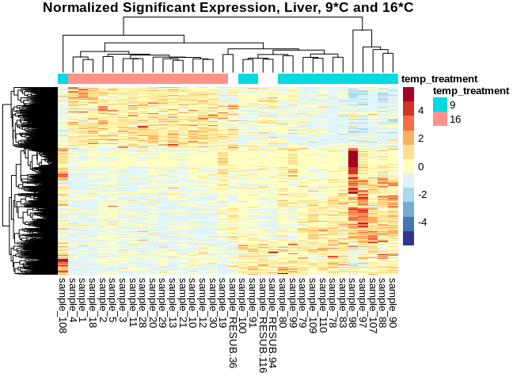<!-- -->

``` r
# Save plot
ggexport(filename = "../output/07.2.2-cod-RNAseq-DESeq2-genome-gene/gene-heatmap_L.9.16_norm_sig.png",
         plot   = h.L.9.16,
         res    = 600,
         width  = 5000,
         height = 5000)
```

Note the argument `scale="row"` was included, so the values plotted in
the heat map are *Z-scores*, rather thn the normalized count value. This
vastly improves the color visualization.

## 4.2 Volcano plot

``` r
# Generate plot
v.L.9.16 <- 
  ggplot(res_table_L.9.16_norm_tb) +
  # Plot all
  geom_point(aes(x=log2FoldChange, y=-log10(padj),color="unchanged"),
             size=.5) +
  # Overlay all significantly upregulated in red
  geom_point(data = sig_L.9.16_norm[sig_L.9.16_norm$log2FoldChange > 0, ], 
             aes(x=log2FoldChange, y=-log10(padj), color="upregulated"), 
             size=.5) +
  # Overlay all significantly downregulated in blue
  geom_point(data = sig_L.9.16_norm[sig_L.9.16_norm$log2FoldChange < 0, ], 
             aes(x=log2FoldChange, y=-log10(padj), color="downregulated"), 
             size=.5) +
  ggtitle("Liver, 9*C and 16*C") +
  xlab("log2 fold change") + 
  ylab("-log10 adjusted p-value") +
  scale_x_continuous(limits = c(-4,4)) +
  scale_y_continuous(limits = c(0,30)) +
  scale_color_manual(values = c("unchanged" = "darkgrey", "upregulated" = "red", "downregulated" = "blue"),
                     labels = c("unchanged" = "Unchanged", "upregulated" = "Upregulated", "downregulated" = "Downregulated"),
                     name = NULL) +
  theme(legend.position = "top",
        plot.title = element_text(size = rel(1.5), hjust = 0.5),
        axis.title = element_text(size = rel(1.25)))

v.L.9.16
```

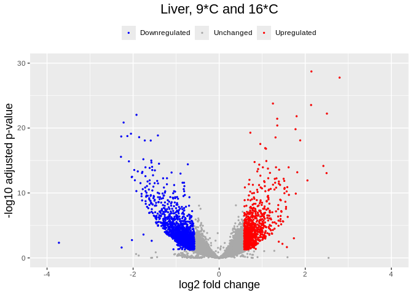<!-- -->

``` r
# Save plot
ggexport(filename = "../output/07.2.2-cod-RNAseq-DESeq2-genome-gene/gene-volcano_L.9.16.png",
         plot   = v.L.9.16,
         res    = 600,
         width  = 6000,
         height = 4000)
```

# 5 Liver tissue, 9*C v. 0*C

The 9\*C temperature treatment is effectively our “control,” as it
represents the ambient temperature that wild juvenile Pacific cod would
experience.

``` r
# liver tissue, temperatures 9 vs. 0 

# Filter data
infosub_L.9.0 <- cod_sample_info %>% filter(tissue_type == "Liver" & (temp_treatment == "9" | temp_treatment == "0"))
countsub_L.9.0 <- subset(cod_counts_data, select=row.names(infosub_L.9.0))

# Calculate DESeq object
dds_L.9.0 <- DESeqDataSetFromMatrix(countData = countsub_L.9.0,
                              colData = infosub_L.9.0,
                              design = ~ temp_treatment)

dds_L.9.0 <- DESeq(dds_L.9.0)
resultsNames(dds_L.9.0) # lists the coefficients
```

    [1] "Intercept"             "temp_treatment_9_vs_0"

``` r
plotDispEsts(dds_L.9.0)
```

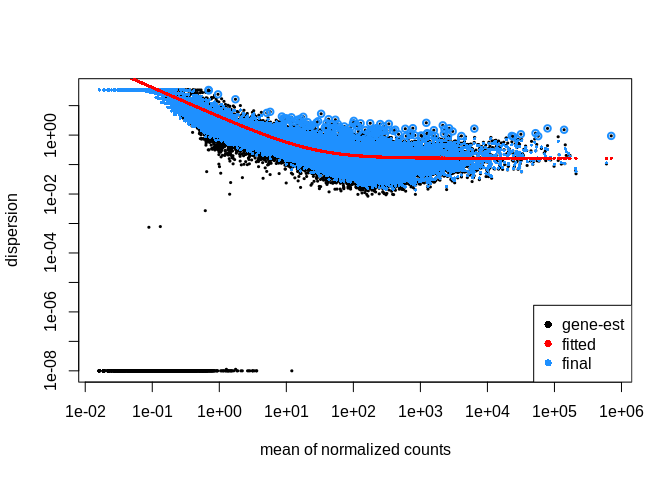<!-- -->

``` r
# Filtering: keep genes that have at least 10 counts across 1/3 of the samples - https://support.bioconductor.org/p/110307/
keep <- rowSums(DESeq2::counts(dds_L.9.0) >= 10) >= ncol(countsub_L.9.0)/3
dds_L.9.0<- dds_L.9.0[keep,]

# Generate Contrasts
contrast_list_L.9.0        <- c("temp_treatment", "0", "9") # order is important: factor, treatment group, control
res_table_L.9.0_noshrink <- results(dds_L.9.0, contrast=contrast_list_L.9.0, alpha = 0.05)

res_table_L.9.0_norm     <- lfcShrink(dds_L.9.0,
                                       coef=2,
                                       type="normal") # lfcThreshold = 0.585)  # a lfc threshold of 1 = 2-fold change, 0.585 = 1.5-fold change
res_table_L.9.0_apeglm   <- lfcShrink(dds_L.9.0,
                                       coef=2, 
                                       type="apeglm") # lfcThreshold = 0.585)  # a lfc threshold of 1 = 2-fold change, 0.585 = 1.5-fold change
res_table_L.9.0_ashr     <- lfcShrink(dds_L.9.0,
                                       coef=2, 
                                       type="ashr")
```

``` r
# Generate MA plots
par(mfrow=c(2,2), mar=c(4,4,2,1))
xlim <- c(1,1e5); ylim <- c(-4,4)
DESeq2::plotMA(res_table_L.9.0_noshrink, xlim=xlim, ylim=ylim, main="no shrink")
DESeq2::plotMA(res_table_L.9.0_norm, xlim=xlim, ylim=ylim, main="normal")
DESeq2::plotMA(res_table_L.9.0_apeglm, xlim=xlim, ylim=ylim, main="apeglm")
DESeq2::plotMA(res_table_L.9.0_ashr, xlim=xlim, ylim=ylim, main="ashr")
```

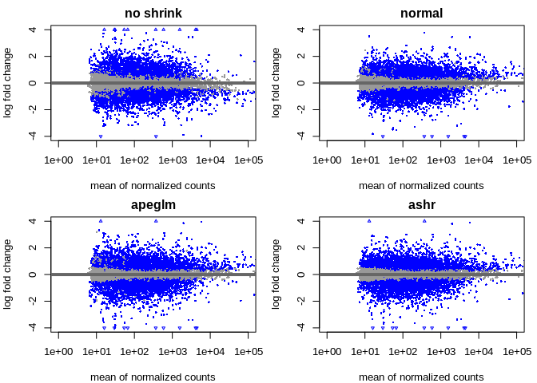<!-- -->

``` r
# Examine results formatting
res_table_L.9.0_norm %>% data.frame() %>% head()
```

                  baseMean log2FoldChange     lfcSE       stat       pvalue
    rereb         54.72382      0.3479645 0.1711700  2.0326919 4.208366e-02
    p4htmb        52.13266      1.3934619 0.2511994  5.5418590 2.992773e-08
    LOC132464555 691.70310     -0.1431701 0.1151402 -1.2434580 2.136991e-01
    abhd14a       90.38795      0.1216196 0.1477920  0.8230147 4.104996e-01
    LOC132464547  81.65020      0.1264691 0.2244280  0.5637724 5.729090e-01
    tusc2b       172.51617      0.1178494 0.2074297  0.5682534 5.698629e-01
                         padj
    rereb        8.802871e-02
    p4htmb       3.206913e-07
    LOC132464555 3.216540e-01
    abhd14a      5.284720e-01
    LOC132464547 6.746979e-01
    tusc2b       6.723744e-01

Note that the metric we want to use to identify significantly expressed
genes is the `padj` values, **NOT** the `pvalue`. `padj` are p-values
corrected for multiple testing (default method is the Benjamini and
Hochberg method).

``` r
summary(res_table_L.9.0_noshrink)
```

    out of 14841 with nonzero total read count
    adjusted p-value < 0.05
    LFC > 0 (up)       : 2996, 20%
    LFC < 0 (down)     : 3238, 22%
    outliers [1]       : 0, 0%
    low counts [2]     : 0, 0%
    (mean count < 6)
    [1] see 'cooksCutoff' argument of ?results
    [2] see 'independentFiltering' argument of ?results

``` r
summary(res_table_L.9.0_norm)
```

    out of 14841 with nonzero total read count
    adjusted p-value < 0.1
    LFC > 0 (up)       : 3926, 26%
    LFC < 0 (down)     : 3381, 23%
    outliers [1]       : 0, 0%
    low counts [2]     : 0, 0%
    (mean count < 6)
    [1] see 'cooksCutoff' argument of ?results
    [2] see 'independentFiltering' argument of ?results

``` r
summary(res_table_L.9.0_apeglm)
```

    out of 14841 with nonzero total read count
    adjusted p-value < 0.1
    LFC > 0 (up)       : 3926, 26%
    LFC < 0 (down)     : 3381, 23%
    outliers [1]       : 0, 0%
    low counts [2]     : 0, 0%
    (mean count < 6)
    [1] see 'cooksCutoff' argument of ?results
    [2] see 'independentFiltering' argument of ?results

``` r
summary(res_table_L.9.0_ashr)
```

    out of 14841 with nonzero total read count
    adjusted p-value < 0.1
    LFC > 0 (up)       : 3923, 26%
    LFC < 0 (down)     : 3384, 23%
    outliers [1]       : 0, 0%
    low counts [2]     : 0, 0%
    (mean count < 6)
    [1] see 'cooksCutoff' argument of ?results
    [2] see 'independentFiltering' argument of ?results

# 6 Extracting significantly expressed genes

``` r
padj.cutoff <- 0.05
lfc.cutoff <- 0.58

# Convert results table into tibble
res_table_L.9.0_norm_tb <- res_table_L.9.0_norm %>%
  data.frame() %>%
  rownames_to_column(var="gene") %>%
  as_tibble()

# subset that table to only keep the significant genes using our pre-defined thresholds:
sig_L.9.0_norm <- res_table_L.9.0_norm_tb %>%
        filter(padj < padj.cutoff & abs(log2FoldChange) > lfc.cutoff)

head(sig_L.9.0_norm)
```

    # A tibble: 6 × 7
      gene            baseMean log2FoldChange lfcSE  stat       pvalue        padj
      <chr>              <dbl>          <dbl> <dbl> <dbl>        <dbl>       <dbl>
    1 p4htmb              52.1          1.39  0.251  5.54 0.0000000299 0.000000321
    2 LOC132464874        16.7         -1.25  0.293 -4.25 0.0000218    0.000128   
    3 usp48              297.           0.677 0.119  5.69 0.0000000128 0.000000149
    4 atxn7l2a            50.5         -0.872 0.248 -3.51 0.000445     0.00185    
    5 arfrp1              29.3          1.05  0.229  4.59 0.00000438   0.0000308  
    6 si:dkey-78k11.9     14.7          0.826 0.204  4.05 0.0000512    0.000274   

``` r
write.table(sig_L.9.0_norm, file = "../output/07.2.2-cod-RNAseq-DESeq2-genome-gene/gene-Gmac_DEGs_sig_L.9.0_norm.tab", sep = "\t",
            row.names = TRUE, col.names = NA)
```

## 6.1 Heatmap

``` r
# Retrieve normalized counts matrix
dds_L.9.0_norm_counts <- counts(dds_L.9.0, normalized=TRUE)

# Extract normalized expression for significant genes
norm_sig_L.9.0 <- dds_L.9.0_norm_counts %>% 
  data.frame() %>%
  filter(row.names(dds_L.9.0_norm_counts) %in% sig_L.9.0_norm$gene)

head(norm_sig_L.9.0)
```

                    sample_100 sample_107 sample_108 sample_109 sample_110
    p4htmb           88.398046  115.74676  69.773838   77.17714  85.748161
    LOC132464874      8.730671   16.07594   3.845802   10.71905   4.083246
    usp48           311.030162  506.39207 185.147901  386.95759 342.992646
    atxn7l2a         44.744690   11.25316  51.094228   10.71905  32.665966
    arfrp1           51.292693   40.18985   8.241004   81.46476  78.602481
    si:dkey-78k11.9  12.004673   32.15188  27.470015   20.36619  15.312172
                     sample_37  sample_38  sample_39  sample_40  sample_47
    p4htmb           13.657530  20.693475  11.980062  19.753113  12.903214
    LOC132464874     19.961006  35.088936  39.207476  46.913645  16.589847
    usp48           205.913532 260.018012 261.383171 256.790475 191.704899
    atxn7l2a         44.124328  36.888369  34.851089  33.333379  52.534516
    arfrp1           16.809268  16.194893   5.445483  20.987683  18.433163
    si:dkey-78k11.9   6.303475   6.298014  19.603738   6.172848   5.529949
                     sample_48  sample_49  sample_50  sample_57  sample_58
    p4htmb           24.573835  27.684654  17.781783  24.279098  12.915430
    LOC132464874     73.721504  30.903800   7.409076  10.964754   8.357043
    usp48           238.366196 218.901917 171.890565 238.091804 191.452253
    atxn7l2a         24.573835 104.944154  96.317989  83.802049  85.089890
    arfrp1            7.372150  13.520413  19.263598  14.097541   9.116774
    si:dkey-78k11.9   9.829534   7.082121  11.113614   7.048771   6.837580
                     sample_59  sample_60  sample_67  sample_68  sample_69
    p4htmb           23.293344  41.338153  28.506261  31.211456  56.311982
    LOC132464874     56.569550   5.087773   3.800835   8.453103   7.821109
    usp48           321.669988 182.523843 247.054265 215.879240 215.080486
    atxn7l2a         25.511758 106.843225  84.251839  94.934846  81.339529
    arfrp1           33.276206  20.351090  32.307096  22.108115  17.206439
    si:dkey-78k11.9   8.873655   9.539574  10.769032  11.054057  19.552771
                    sample_70  sample_78  sample_79  sample_80  sample_83 sample_88
    p4htmb           34.91230  47.569591 114.259135  72.990541  42.492857  35.01373
    LOC132464874     34.91230   7.135439   6.787671   4.561909   5.861084  22.89360
    usp48           278.27155 425.747838 424.229462 294.243117 287.193100 408.04468
    atxn7l2a         57.50261  32.109474  26.019407  46.759565  43.958128  26.93364
    arfrp1           22.59031  48.758831  33.938357  33.073839  74.728817  13.46682
    si:dkey-78k11.9  11.29516  19.027836  29.413243  19.388112  14.652709  30.97369
                    sample_90  sample_91  sample_97  sample_98  sample_99
    p4htmb           41.14697  86.861103  14.007136   4.422662 105.951608
    LOC132464874     12.85843   5.903182   7.781742  16.584981   4.238064
    usp48           405.04049 333.951427 610.088588 351.601593 250.045795
    atxn7l2a         18.00180  65.778311   1.556348   7.739658  32.844999
    arfrp1           29.57438  24.456039  18.676181  19.901977  43.440159
    si:dkey-78k11.9   9.00090  18.552857  14.007136   6.633992  14.833225
                    sample_RESUB.116 sample_RESUB.76 sample_RESUB.94
    p4htmb                105.440757        33.48721      230.227369
    LOC132464874            3.834209        19.63043        1.934684
    usp48                 316.322270       152.42454      403.381567
    atxn7l2a               41.217750       101.61636       75.452667
    arfrp1                 36.424989        13.85678       56.105830
    si:dkey-78k11.9        25.880913        18.47570       16.444812

``` r
# Annotate heatmap
annotation <- infosub_L.9.0 %>% 
    dplyr::select(temp_treatment)

# Set a color palette
heat_colors <- rev(brewer.pal(12, "RdYlBu"))

# Run pheatmap
h.L.9.0 <- pheatmap(norm_sig_L.9.0, 
                     color = heat_colors, 
                     cluster_rows = T, 
                     show_rownames = F,
                     annotation = annotation, 
                     border_color = NA, 
                     fontsize = 10,
                     scale = "row", 
                     fontsize_row = 10, 
                     height = 30,
                     main = "Normalized Significant Expression, Liver, 9*C and 0*C")
```

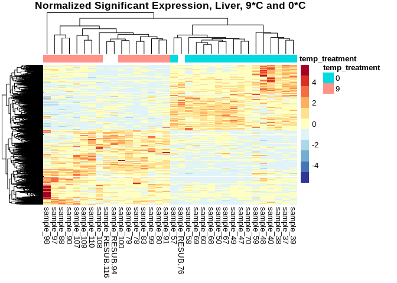<!-- -->

``` r
# Save plot
ggexport(filename = "../output/07.2.2-cod-RNAseq-DESeq2-genome-gene/gene-heatmap_L.9.0_norm_sig.png",
         plot   = h.L.9.0,
         res    = 600,
         width  = 5000,
         height = 5000)
```

Note the argument `scale="row"` was included, so the values plotted in
the heat map are *Z-scores*, rather thn the normalized count value. This
vastly improves the color visualization.

## 6.2 Volcano plot

``` r
# Generate plot
v.L.9.0 <- 
  ggplot(res_table_L.9.0_norm_tb) +
  # Plot all
  geom_point(aes(x=log2FoldChange, y=-log10(padj),color="unchanged"),
             size=.5) +
  # Overlay all significantly upregulated in red
  geom_point(data = sig_L.9.0_norm[sig_L.9.0_norm$log2FoldChange > 0, ], 
             aes(x=log2FoldChange, y=-log10(padj), color="upregulated"), 
             size=.5) +
  # Overlay all significantly downregulated in blue
  geom_point(data = sig_L.9.0_norm[sig_L.9.0_norm$log2FoldChange < 0, ], 
             aes(x=log2FoldChange, y=-log10(padj), color="downregulated"), 
             size=.5) +
  ggtitle("Liver, 9*C and 0*C") +
  xlab("log2 fold change") + 
  ylab("-log10 adjusted p-value") +
  scale_x_continuous(limits = c(-4,4)) +
  scale_y_continuous(limits = c(0,30)) +
  scale_color_manual(values = c("unchanged" = "darkgrey", "upregulated" = "red", "downregulated" = "blue"),
                     labels = c("unchanged" = "Unchanged", "upregulated" = "Upregulated", "downregulated" = "Downregulated"),
                     name = NULL) +
  theme(legend.position = "top",
        plot.title = element_text(size = rel(1.5), hjust = 0.5),
        axis.title = element_text(size = rel(1.25)))

v.L.9.0
```

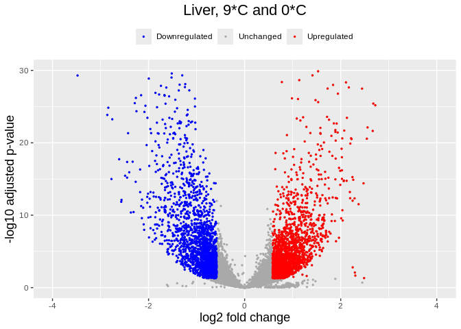<!-- -->

``` r
# Save plot
ggexport(filename = "../output/07.2.2-cod-RNAseq-DESeq2-genome-gene/gene-volcano_L.9.0.png",
         plot   = v.L.9.0,
         res    = 600,
         width  = 6000,
         height = 4000)
```

# 7 Liver tissue, 9*C v. 5*C

The 9\*C temperature treatment is effectively our “control,” as it
represents the ambient temperature that wild juvenile Pacific cod would
experience.

``` r
# liver tissue, temperatures 9 vs. 5 

# Filter data
infosub_L.9.5 <- cod_sample_info %>% filter(tissue_type == "Liver" & (temp_treatment == "9" | temp_treatment == "5"))
countsub_L.9.5 <- subset(cod_counts_data, select=row.names(infosub_L.9.5))

# Calculate DESeq object
dds_L.9.5 <- DESeqDataSetFromMatrix(countData = countsub_L.9.5,
                              colData = infosub_L.9.5,
                              design = ~ temp_treatment)

dds_L.9.5 <- DESeq(dds_L.9.5)
resultsNames(dds_L.9.5) # lists the coefficients
```

    [1] "Intercept"             "temp_treatment_9_vs_5"

``` r
plotDispEsts(dds_L.9.5)
```

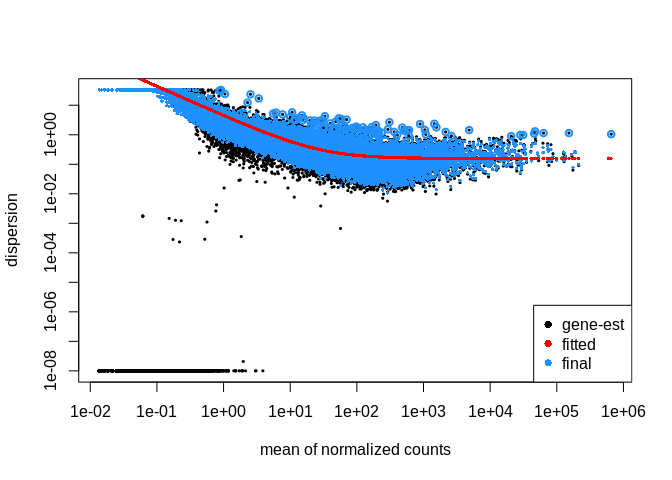<!-- -->

``` r
# Filtering: keep genes that have at least 10 counts across 1/3 of the samples - https://support.bioconductor.org/p/110307/
keep <- rowSums(DESeq2::counts(dds_L.9.5) >= 10) >= ncol(countsub_L.9.5)/3
dds_L.9.5<- dds_L.9.5[keep,]

# Generate Contrasts
contrast_list_L.9.5        <- c("temp_treatment", "5", "9") # order is important: factor, treatment group, control
res_table_L.9.5_noshrink <- results(dds_L.9.5, contrast=contrast_list_L.9.5, alpha = 0.05)

res_table_L.9.5_norm     <- lfcShrink(dds_L.9.5,
                                       coef=2,
                                       type="normal") # lfcThreshold = 0.585)  # a lfc threshold of 1 = 2-fold change, 0.585 = 1.5-fold change
res_table_L.9.5_apeglm   <- lfcShrink(dds_L.9.5,
                                       coef=2, 
                                       type="apeglm") # lfcThreshold = 0.585)  # a lfc threshold of 1 = 2-fold change, 0.585 = 1.5-fold change
res_table_L.9.5_ashr     <- lfcShrink(dds_L.9.5,
                                       coef=2, 
                                       type="ashr")
```

``` r
# Generate MA plots
par(mfrow=c(2,2), mar=c(4,4,2,1))
xlim <- c(1,1e5); ylim <- c(-4,4)
DESeq2::plotMA(res_table_L.9.5_noshrink, xlim=xlim, ylim=ylim, main="no shrink")
DESeq2::plotMA(res_table_L.9.5_norm, xlim=xlim, ylim=ylim, main="normal")
DESeq2::plotMA(res_table_L.9.5_apeglm, xlim=xlim, ylim=ylim, main="apeglm")
DESeq2::plotMA(res_table_L.9.5_ashr, xlim=xlim, ylim=ylim, main="ashr")
```

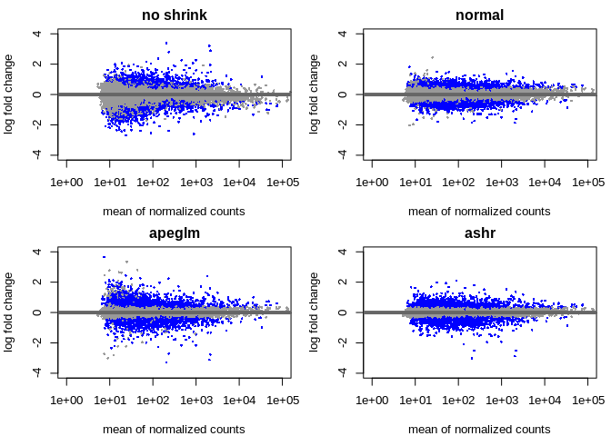<!-- -->

``` r
# Examine results formatting
res_table_L.9.5_norm %>% data.frame() %>% head()
```

                  baseMean log2FoldChange     lfcSE      stat      pvalue
    rereb         46.52475      0.3264272 0.1622881  2.008540 0.044585927
    p4htmb        52.71510      0.5809268 0.2146158  2.705661 0.006816852
    LOC132464555 602.44845     -0.1908063 0.1101725 -1.732001 0.083273380
    abhd14a       87.11583     -0.2020213 0.1340960 -1.507053 0.131797063
    LOC132464547  64.21830      0.3471462 0.1903718  1.826474 0.067778866
    tusc2b       168.24958     -0.1915887 0.1898178 -1.010135 0.312430453
                       padj
    rereb        0.17160329
    p4htmb       0.05176551
    LOC132464555 0.25335813
    abhd14a      0.33215491
    LOC132464547 0.22185276
    tusc2b       0.55165814

Note that the metric we want to use to identify significantly expressed
genes is the `padj` values, **NOT** the `pvalue`. `padj` are p-values
corrected for multiple testing (default method is the Benjamini and
Hochberg method).

``` r
summary(res_table_L.9.5_noshrink)
```

    out of 14537 with nonzero total read count
    adjusted p-value < 0.05
    LFC > 0 (up)       : 905, 6.2%
    LFC < 0 (down)     : 985, 6.8%
    outliers [1]       : 0, 0%
    low counts [2]     : 0, 0%
    (mean count < 5)
    [1] see 'cooksCutoff' argument of ?results
    [2] see 'independentFiltering' argument of ?results

``` r
summary(res_table_L.9.5_norm)
```

    out of 14537 with nonzero total read count
    adjusted p-value < 0.1
    LFC > 0 (up)       : 1484, 10%
    LFC < 0 (down)     : 1246, 8.6%
    outliers [1]       : 0, 0%
    low counts [2]     : 0, 0%
    (mean count < 5)
    [1] see 'cooksCutoff' argument of ?results
    [2] see 'independentFiltering' argument of ?results

``` r
summary(res_table_L.9.5_apeglm)
```

    out of 14537 with nonzero total read count
    adjusted p-value < 0.1
    LFC > 0 (up)       : 1484, 10%
    LFC < 0 (down)     : 1246, 8.6%
    outliers [1]       : 0, 0%
    low counts [2]     : 0, 0%
    (mean count < 5)
    [1] see 'cooksCutoff' argument of ?results
    [2] see 'independentFiltering' argument of ?results

``` r
summary(res_table_L.9.5_ashr)
```

    out of 14537 with nonzero total read count
    adjusted p-value < 0.1
    LFC > 0 (up)       : 1489, 10%
    LFC < 0 (down)     : 1241, 8.5%
    outliers [1]       : 0, 0%
    low counts [2]     : 0, 0%
    (mean count < 5)
    [1] see 'cooksCutoff' argument of ?results
    [2] see 'independentFiltering' argument of ?results

# 8 Extracting significantly expressed genes

``` r
padj.cutoff <- 0.05
lfc.cutoff <- 0.58

# Convert results table into tibble
res_table_L.9.5_norm_tb <- res_table_L.9.5_norm %>%
  data.frame() %>%
  rownames_to_column(var="gene") %>%
  as_tibble()

# subset that table to only keep the significant genes using our pre-defined thresholds:
sig_L.9.5_norm <- res_table_L.9.5_norm_tb %>%
        filter(padj < padj.cutoff & abs(log2FoldChange) > lfc.cutoff)

head(sig_L.9.5_norm)
```

    # A tibble: 6 × 7
      gene         baseMean log2FoldChange lfcSE  stat     pvalue     padj
      <chr>           <dbl>          <dbl> <dbl> <dbl>      <dbl>    <dbl>
    1 LOC132465793     65.1          0.698 0.232  3.03 0.00248    0.0270  
    2 LOC132465761     54.1          0.713 0.234  3.08 0.00205    0.0239  
    3 fkbp5           481.          -0.786 0.193 -4.07 0.0000467  0.00157 
    4 LOC132466214     17.5          0.741 0.234  3.19 0.00142    0.0186  
    5 fbxo2            13.3         -0.730 0.231 -3.15 0.00161    0.0203  
    6 LOC132466537    370.           0.694 0.145  4.78 0.00000176 0.000130

``` r
write.table(sig_L.9.5_norm, file = "../output/07.2.2-cod-RNAseq-DESeq2-genome-gene/gene-Gmac_DEGs_sig_L.9.5_norm.tab", sep = "\t",
            row.names = TRUE, col.names = NA)
```

## 8.1 Heatmap

``` r
# Retrieve normalized counts matrix
dds_L.9.5_norm_counts <- counts(dds_L.9.5, normalized=TRUE)

# Extract normalized expression for significant genes
norm_sig_L.9.5 <- dds_L.9.5_norm_counts %>% 
  data.frame() %>%
  filter(row.names(dds_L.9.5_norm_counts) %in% sig_L.9.5_norm$gene)

head(norm_sig_L.9.5)
```

                 sample_100 sample_107 sample_108 sample_109 sample_110 sample_117
    LOC132465793  26.776370  50.931711  95.660289  33.491885  35.892858   26.90168
    LOC132465761  15.696493 306.966797  93.727758  42.543746  13.673470  131.45140
    fkbp5        222.520868 207.856441 341.091738 318.625501 217.066332  414.53047
    LOC132466214   8.309908   9.635729  40.100020   8.146675   1.709184    9.78243
    fbxo2          3.693292   2.753065   9.662655   6.336303  13.673470    9.78243
    LOC132466537 389.642350 451.502732 406.314663 437.204878 318.762763  243.94934
                 sample_118 sample_119 sample_120 sample_121 sample_127 sample_128
    LOC132465793  17.287708   11.67068   20.43102   99.47657   21.23300  30.581280
    LOC132465761   2.766033   15.83878   10.21551   29.94993   17.51723  10.703448
    fkbp5        852.629782  399.30401 1192.20994  898.49803  754.83324 510.707372
    LOC132466214   1.383017    5.83534   12.61916   11.76605   10.08568   6.116256
    fbxo2         12.447150   11.67068   16.22463  110.17297   12.20898   4.587192
    LOC132466537 192.239318  184.23003  227.14484  302.70827  220.82323 345.568461
                  sample_131 sample_137 sample_138 sample_139 sample_140 sample_147
    LOC132465793   36.259134  34.387300   37.65736   42.03065  49.497911  33.562975
    LOC132465761    9.669102  18.339893   46.34752   14.61936  23.950602  14.131779
    fkbp5        1209.846447 511.224530 1178.96498  349.03718 231.522487 317.965031
    LOC132466214    8.460465   4.584973   11.58688   18.27420   4.790120   5.299417
    fbxo2           8.460465   9.169947   14.48360   31.06614   7.983534  17.664724
    LOC132466537  201.842514 204.031315  350.50310  266.80329 221.942246 431.019264
                 sample_148 sample_150  sample_78  sample_79  sample_80  sample_83
    LOC132465793  71.882969  65.188302  23.265129  41.181549  38.304395  17.262043
    LOC132465761  56.158570  28.485645  12.138328  50.758654  57.947674   9.864025
    fkbp5        562.484236 552.731065 605.904870 146.529698 199.379286 880.364200
    LOC132466214  16.173668  23.555437  17.195965   3.830842  19.643279  11.097028
    fbxo2          8.985371   8.764814   2.023055  15.323367   5.892984   1.233003
    LOC132466537 320.328483 414.685249 533.074902 375.422495 525.457724 498.133245
                  sample_88  sample_90 sample_91 sample_97 sample_98 sample_99
    LOC132465793 111.996571  72.931173  30.84713 166.54709  655.4071  96.89737
    LOC132465761  28.865096  55.250888  16.49963 277.57848  143.9173 185.40939
    fkbp5        255.167446 472.947604 349.36167 329.03206  141.0000 311.18963
    LOC132466214  20.782869  12.155195  15.78225  48.74549  148.7794  40.06334
    fbxo2          9.236831   5.525089  11.47800   9.47829    0.0000  11.18047
    LOC132466537 580.765725 854.178734 438.31618 815.13291  375.3518 366.16025
                 sample_RESUB.116 sample_RESUB.156 sample_RESUB.94
    LOC132465793        20.304095        11.486778       21.942322
    LOC132465761         8.933802        22.973555       12.190179
    fkbp5              150.250302       434.856586      350.264468
    LOC132466214        12.182457         2.461452        8.126786
    fbxo2               13.806784        21.332587       13.002857
    LOC132466537       229.842353       195.275221      275.498039

``` r
# Annotate heatmap
annotation <- infosub_L.9.5 %>% 
    dplyr::select(temp_treatment)

# Set a color palette
heat_colors <- rev(brewer.pal(12, "RdYlBu"))

# Run pheatmap
h.L.9.5 <- pheatmap(norm_sig_L.9.5, 
                     color = heat_colors, 
                     cluster_rows = T, 
                     show_rownames = F,
                     annotation = annotation, 
                     border_color = NA, 
                     fontsize = 10,
                     scale = "row", 
                     fontsize_row = 10, 
                     height = 30,
                     main = "Normalized Significant Expression, Liver, 9*C and 5*C")
```

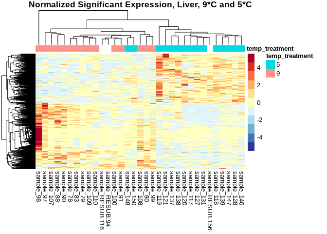<!-- -->

``` r
# Save plot
ggexport(filename = "../output/07.2.2-cod-RNAseq-DESeq2-genome-gene/gene-heatmap_L.9.5_norm_sig.png",
         plot   = h.L.9.5,
         res    = 600,
         width  = 5000,
         height = 5000)
```

Note the argument `scale="row"` was included, so the values plotted in
the heat map are *Z-scores*, rather thn the normalized count value. This
vastly improves the color visualization.

## 8.2 Volcano plot

``` r
# Generate plot
v.L.9.5 <- 
  ggplot(res_table_L.9.5_norm_tb) +
  # Plot all
  geom_point(aes(x=log2FoldChange, y=-log10(padj),color="unchanged"),
             size=.5) +
  # Overlay all significantly upregulated in red
  geom_point(data = sig_L.9.5_norm[sig_L.9.5_norm$log2FoldChange > 0, ], 
             aes(x=log2FoldChange, y=-log10(padj), color="upregulated"), 
             size=.5) +
  # Overlay all significantly downregulated in blue
  geom_point(data = sig_L.9.5_norm[sig_L.9.5_norm$log2FoldChange < 0, ], 
             aes(x=log2FoldChange, y=-log10(padj), color="downregulated"), 
             size=.5) +
  ggtitle("Liver, 9*C and 0*C") +
  xlab("log2 fold change") + 
  ylab("-log10 adjusted p-value") +
  scale_x_continuous(limits = c(-4,4)) +
  scale_y_continuous(limits = c(0,30)) +
  scale_color_manual(values = c("unchanged" = "darkgrey", "upregulated" = "red", "downregulated" = "blue"),
                     labels = c("unchanged" = "Unchanged", "upregulated" = "Upregulated", "downregulated" = "Downregulated"),
                     name = NULL) +
  theme(legend.position = "top",
        plot.title = element_text(size = rel(1.5), hjust = 0.5),
        axis.title = element_text(size = rel(1.25)))

v.L.9.5
```

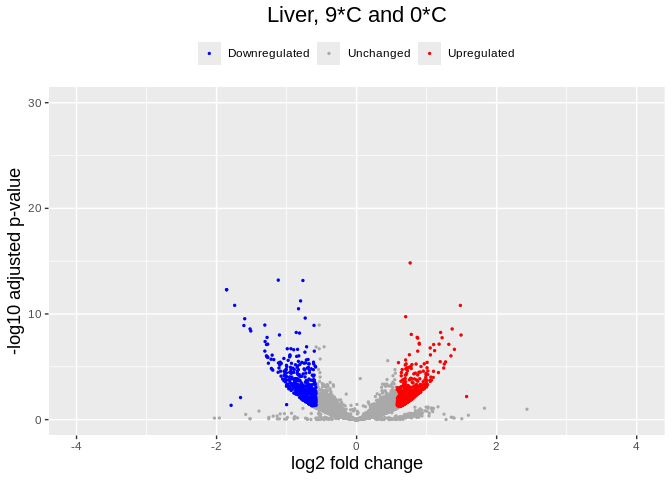<!-- -->

``` r
# Save plot
ggexport(filename = "../output/07.2.2-cod-RNAseq-DESeq2-genome-gene/gene-volcano_L.9.5.png",
         plot   = v.L.9.0,
         res    = 600,
         width  = 6000,
         height = 4000)
```
