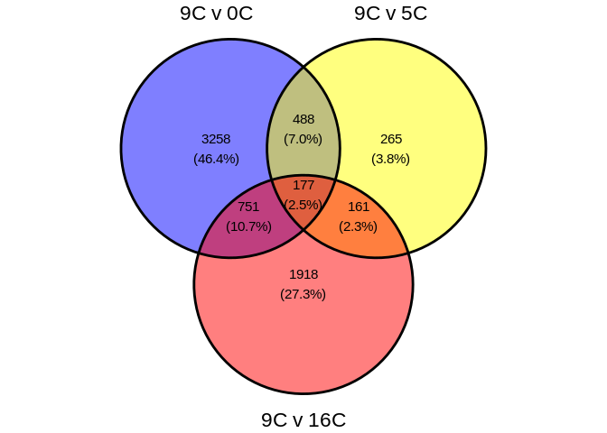
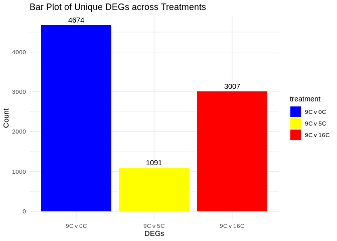

08-cod-RNAseq-GO-annotation
================
Kathleen Durkin
2024-04-15

- <a href="#1-annotate-degs-using-go-terms"
  id="toc-1-annotate-degs-using-go-terms">1 Annotate DEGs using GO
  terms</a>
  - <a href="#11-venn-diagram-of-deg-counts-accross-treatments"
    id="toc-11-venn-diagram-of-deg-counts-accross-treatments">1.1 Venn
    diagram of DEG counts accross treatments</a>
  - <a href="#12-deg-bar-plots" id="toc-12-deg-bar-plots">1.2 DEG bar
    plots</a>
  - <a href="#13-go-enrichment-analysis"
    id="toc-13-go-enrichment-analysis">1.3 GO Enrichment Analysis</a>

This code depends on the database
(`G_macrocephalus_IDmapping_2024_04_17.tab`) of *G.macrocephalus*
transcript IDs and associated GO terms generated in
03-transcriptome-annotation.Rmd, AND on lists of differentially
expressed genes (DEGs) generated in 07-cod-RNAseq-DESeq2.Rmd.

This code identifies overrepresented gene ontology (GO) terms in
*G.macrocephalus* RNA sequencing data

Inputs: - transcript ID/GO term database
(`G_macrocephalus_IDmapping_2024_04_17.tab`) - DEGs

In 03-transcriptome-annotation.Rmd we used BLAST and Uniprot/SwissProt
to obtain UniProt Accession numbers for each transcript in the *G.
macrocephalus* transcriptome. We then used those Accession numbers to
obtain GO terms for each transcript, functionally creating a database
which matches *G.macrocephalus* transcripts with associated GO terms.

In 07-cod-RNAseq-DESeq2.Rmd we identified sets of significantly
differentially expressed genes (DEGs) between pairs of treatments (e.g.,
Liver tissue for 9C vs. 16C).

Now we want to use the database to identify GO terms associated with our
lists of DEGs, and to evaluate which GO terms are overrepresented.

<a
href="https://wikis.utexas.edu/display/bioiteam/GO+Enrichment+using+goseq#:\"
class="uri">https://wikis.utexas.edu/display/bioiteam/GO+Enrichment+using+goseq#:\</a>\~:text=goseq%20is%20an%20R%20package,in%20our%20differentially%20expressed%20genes.
<https://bioconductor.org/packages/devel/bioc/vignettes/goseq/inst/doc/goseq.pdf>

``` r
# List of packages we want to install (run every time)
library(tidyverse)
library(dplyr)
library(magrittr)
library(knitr)
library(ggvenn)
```

``` r
gmac_idmap <- read.csv("../output/03-transcriptome-annotation/G_macrocephalus_rna_IDmapping_2024_04_17.tab", sep='\t') %>%
  subset(select=-X) # remove superflous column containing rowIDs

DEGs_L.9.0 <- read.csv("../output/07-cod-RNAseq-DESeq2/Gmac_DEGs_sig_L.9.0_norm.tab", sep='\t') %>%
  subset(select=-X) # remove superflous column containing rowIDs
DEGs_L.9.5 <- read.csv("../output/07-cod-RNAseq-DESeq2/Gmac_DEGs_sig_L.9.5_norm.tab", sep='\t') %>%
  subset(select=-X) # remove superflous column containing rowIDs
DEGs_L.9.16 <- read.csv("../output/07-cod-RNAseq-DESeq2/Gmac_DEGs_sig_L.9.16_norm.tab", sep='\t') %>%
  subset(select=-X) # remove superflous column containing rowIDs

kallisto_counts_matrix <- read.csv("../output/06-cod-RNAseq-alignment/kallisto/kallisto.isoform.counts.matrix", sep='\t')
kallisto_counts_matrix[,-1] <- round(kallisto_counts_matrix[,-1], digits = 0) # round counts to integers
```

# 1 Annotate DEGs using GO terms

``` r
# All DEGs
DEGs_GO_L.9.0 <- left_join(DEGs_L.9.0, gmac_idmap, by=c("gene" = "V1"))
DEGs_GO_L.9.5 <- left_join(DEGs_L.9.5, gmac_idmap, by=c("gene" = "V1"))
DEGs_GO_L.9.16 <- left_join(DEGs_L.9.16, gmac_idmap, by=c("gene" = "V1"))

# Unique DEGs
DEGs_GO_L.9.0_unique <- DEGs_GO_L.9.0 %>% distinct(gene, .keep_all = TRUE)
DEGs_GO_L.9.5_unique <- DEGs_GO_L.9.5 %>% distinct(gene, .keep_all = TRUE)
DEGs_GO_L.9.16_unique <- DEGs_GO_L.9.16 %>% distinct(gene, .keep_all = TRUE)

# summarize counts
print(paste("All DEGs:", nrow(DEGs_GO_L.9.0), "(9C v 0C),", nrow(DEGs_GO_L.9.5), "(9C v 5C),", nrow(DEGs_GO_L.9.16), "(9C v 16C)"))
```

    [1] "All DEGs: 5415 (9C v 0C), 1212 (9C v 5C), 3612 (9C v 16C)"

``` r
print(paste("Unique DEGs:", nrow(DEGs_GO_L.9.0_unique), "(9C v 0C),", nrow(DEGs_GO_L.9.5_unique), "(9C v 5C),", nrow(DEGs_GO_L.9.16_unique), "(9C v 16C)"))
```

    [1] "Unique DEGs: 4674 (9C v 0C), 1091 (9C v 5C), 3007 (9C v 16C)"

I also want a matrix associating GO terms with all of our count data,
which includes gene-level transcript counts for each sample

``` r
counts_GO <- left_join(kallisto_counts_matrix, gmac_idmap, by=c("X" = "V1"))
counts_GO <- counts_GO[, c("Gene.Ontology..biological.process.", setdiff(names(counts_GO), "Gene.Ontology..biological.process."))]
# Reorder columns to have gene name and GO annotation next to each other
head(counts_GO)
```

                                                                           Gene.Ontology..biological.process.
    1 chaperone-mediated protein complex assembly [GO:0051131]; proteasome core complex assembly [GO:0080129]
    2                                                                                                    <NA>
    3                                                                                                    <NA>
    4                                                                                                        
    5  inositol phosphate dephosphorylation [GO:0046855]; phosphatidylinositol dephosphorylation [GO:0046856]
    6                                                                                                        
                   X kallisto_quant_100 kallisto_quant_107 kallisto_quant_108
    1 XM_060056358.1                243                411                191
    2 XR_009529804.1                  0                  0                  0
    3 XM_060046625.1                164                114                407
    4 XM_060044219.1                  0                  0                  0
    5 XM_060048099.1                 20                  0                 25
    6 XM_060047738.1                  0                  0                  0
      kallisto_quant_109 kallisto_quant_10 kallisto_quant_110 kallisto_quant_117
    1                834               155                502                468
    2                  0                 0                  0                  0
    3                148               326                245                319
    4                 28                 0                  0                  0
    5                  0                44                  8                 41
    6                  0                 0                  0                  0
      kallisto_quant_118 kallisto_quant_119 kallisto_quant_11 kallisto_quant_120
    1                417                986               241                389
    2                  0                  0                 0                  0
    3                189                142               175                244
    4                  0                 25                 9                  0
    5                 37                 19                10                 33
    6                 20                  0                 0                  0
      kallisto_quant_121 kallisto_quant_127 kallisto_quant_128 kallisto_quant_129
    1                676                422                252                 52
    2                  0                  0                  0                  0
    3                 80                332                 80                 17
    4                 19                  0                  0                  0
    5                  8                 24                  8                  0
    6                  0                  0                  0                  0
      kallisto_quant_12 kallisto_quant_131 kallisto_quant_137 kallisto_quant_138
    1               149                102                386                345
    2                 0                  0                  0                  0
    3               204                146                 43                 20
    4                 0                  0                  0                  0
    5                25                 13                  0                  0
    6                 0                  0                  0                  0
      kallisto_quant_139 kallisto_quant_13 kallisto_quant_140 kallisto_quant_147
    1                255               166                340                187
    2                  0                 0                  0                  0
    3                 61               178                 92                 49
    4                  9                 0                  0                  0
    5                  4                10                  6                  6
    6                  0                 0                  0                  0
      kallisto_quant_148 kallisto_quant_149 kallisto_quant_150 kallisto_quant_18
    1                376               2013                608               149
    2                  0                  0                  0                 0
    3                234                374                254               156
    4                  0                  0                  0                 0
    5                 26                 17                  7                10
    6                  0                  0                  0                 0
      kallisto_quant_19 kallisto_quant_19.G kallisto_quant_19.S kallisto_quant_1
    1               264                 573                 782              197
    2                 0                   0                   0                0
    3               117                 868                1316              262
    4                12                 196                  12                0
    5                 5                  50                  77               19
    6                 0                   0                   0                0
      kallisto_quant_20 kallisto_quant_20.G kallisto_quant_20.S kallisto_quant_21
    1               131                 693                 311               205
    2                 0                   0                   0                 1
    3               133                 747                1394               155
    4                 0                 175                   0                 0
    5                 9                  55                  85                30
    6                 0                   0                   0                33
      kallisto_quant_28 kallisto_quant_29 kallisto_quant_2 kallisto_quant_30
    1               259               174              291               302
    2                 0                 0                0                 0
    3               168               187              100               240
    4                 0                 0                0                 0
    5                15                12               15                21
    6                 0                 0                0                19
      kallisto_quant_31 kallisto_quant_37 kallisto_quant_38 kallisto_quant_39
    1               387               933               714               561
    2                 0                 0                 0                 0
    3               104               142               136               131
    4                 0                 0                 0                 0
    5                17                 3                16                10
    6                 0                 0                63                 0
      kallisto_quant_3 kallisto_quant_40 kallisto_quant_41 kallisto_quant_47
    1              218               432               369               415
    2                0                 0                 0                 0
    3              210               146                73               131
    4               10                 0                 0                10
    5               18                 0                 2                11
    6                0                 0                 0                 0
      kallisto_quant_48 kallisto_quant_49 kallisto_quant_4 kallisto_quant_50
    1              1346               413              227               410
    2                 0                 0                0                 0
    3               129               278              163               106
    4                 0                10                0                 0
    5                 7                55               38                15
    6                 0               151                0                 0
      kallisto_quant_57 kallisto_quant_57.G kallisto_quant_57.S kallisto_quant_58
    1               440                1466                  31               348
    2                 0                   0                   0                 0
    3               140                 800                 277               200
    4                 0                 203                   0                 0
    5                21                  27                   0                15
    6                 0                 101                   0                 0
      kallisto_quant_58.G kallisto_quant_58.S kallisto_quant_59 kallisto_quant_5
    1                1650                 442               936              293
    2                   0                   0                 0                0
    3                 870                1041                75              288
    4                 190                  13                 0                0
    5                  77                   5                 6               29
    6                  60                   0                 0                0
      kallisto_quant_60 kallisto_quant_67 kallisto_quant_68 kallisto_quant_69
    1               381               397               419               423
    2                 0                 0                 0                 0
    3               172               212               253               209
    4                 0                 9                 0                 0
    5                28                40                27                13
    6                 0                 0               208                 0
      kallisto_quant_70 kallisto_quant_78 kallisto_quant_79 kallisto_quant_80
    1               362               357               239               151
    2                 0                 0                 0                 0
    3               120               161               200               151
    4                 0                 0                12                 0
    5                 6                 5                25                10
    6                 0                 0                 0                 0
      kallisto_quant_83 kallisto_quant_88 kallisto_quant_90 kallisto_quant_91
    1               321               238               740               279
    2                 0                 0                 0                 0
    3               160                55                91               283
    4                 0                 0                 0                 0
    5                 6                 4                 8                19
    6                 0                 0                 0                 0
      kallisto_quant_97 kallisto_quant_98 kallisto_quant_99
    1               489               626               152
    2                 0                 0                 0
    3                83                80               305
    4                 0                13                 0
    5                 0                 2                 5
    6                 0                 0                 0
      kallisto_quant_RESUB.116 kallisto_quant_RESUB.156 kallisto_quant_RESUB.36
    1                      202                      262                     281
    2                        0                        0                       0
    3                      190                      143                      88
    4                        0                        0                       0
    5                       19                       22                       5
    6                        0                        0                       0
      kallisto_quant_RESUB.76 kallisto_quant_RESUB.94     V3      V13
    1                     304                     173 Q6DG91 2.26e-62
    2                       0                       0   <NA>       NA
    3                     116                     253   <NA>       NA
    4                       0                       0 Q1KL12 0.00e+00
    5                      16                      20 Q9Z2C9 0.00e+00
    6                       0                       0 Q8CGI1 0.00e+00
                                                                                                                                         Protein.names
    1                                                                                                                  Proteasome assembly chaperone 1
    2                                                                                                                                             <NA>
    3                                                                                                                                             <NA>
    4                                                                                                                         Homeobox protein Hox-A3a
    5 Myotubularin-related protein 7 (Inositol 1,3-bisphosphate phosphatase) (EC 3.1.3.-) (Phosphatidylinositol-3-phosphate phosphatase) (EC 3.1.3.64)
    6                                                                                                                                  Protein FAM193A
                                                     Organism
    1             Danio rerio (Zebrafish) (Brachydanio rerio)
    2                                                    <NA>
    3                                                    <NA>
    4 Takifugu rubripes (Japanese pufferfish) (Fugu rubripes)
    5                                    Mus musculus (Mouse)
    6                                    Mus musculus (Mouse)
                                                                                   Gene.Ontology.IDs
    1                                     GO:0005737; GO:0005783; GO:0051131; GO:0070628; GO:0080129
    2                                                                                           <NA>
    3                                                                                           <NA>
    4                                                             GO:0000981; GO:0003677; GO:0005634
    5 GO:0004438; GO:0005737; GO:0005829; GO:0012505; GO:0016020; GO:0016312; GO:0046855; GO:0046856
    6                                                                                               

``` r
top_25_DEGs_L.9.0 <- head(DEGs_GO_L.9.0_unique[order(DEGs_GO_L.9.0_unique$padj), ], 25)
top_25_DEGs_L.9.0$padj <- as.character(top_25_DEGs_L.9.0$padj) # prevents kable from auto-rounding our padj values
kable(top_25_DEGs_L.9.0[, c("gene", "padj", "Gene.Ontology..biological.process.")],
      row.names = FALSE,
      caption = "Top 25 DEGs for 9C v 0C (based on adjusted p-value)")  
```

| gene           | padj                  | Gene.Ontology..biological.process.                                                                                                                                                                                                                                                                                                                                                                                                                                                                                                                                                                                           |
|:---------------|:----------------------|:-----------------------------------------------------------------------------------------------------------------------------------------------------------------------------------------------------------------------------------------------------------------------------------------------------------------------------------------------------------------------------------------------------------------------------------------------------------------------------------------------------------------------------------------------------------------------------------------------------------------------------|
| XM_060037653.1 | 2.65059340718516e-116 | fatty acid biosynthetic process $$GO:0006633$$; lactate metabolic process $$GO:0006089$$; positive regulation of appetite $$GO:0032100$$                                                                                                                                                                                                                                                                                                                                                                                                                                                                                     |
| XM_060049763.1 | 9.12527523202844e-94  | androgen receptor signaling pathway $$GO:0030521$$; ceramide metabolic process $$GO:0006672$$; intracellular steroid hormone receptor signaling pathway $$GO:0030518$$; negative regulation of cell population proliferation $$GO:0008285$$; phospholipid dephosphorylation $$GO:0046839$$; phospholipid metabolic process $$GO:0006644$$; protein kinase C-activating G protein-coupled receptor signaling pathway $$GO:0007205$$; regulation of lipid metabolic process $$GO:0019216$$; signal transduction $$GO:0007165$$; sphingolipid biosynthetic process $$GO:0030148$$; sphingosine metabolic process $$GO:0006670$$ |
| XM_060039305.1 | 4.04346656870645e-89  | microtubule-based process $$GO:0007017$$                                                                                                                                                                                                                                                                                                                                                                                                                                                                                                                                                                                     |
| XM_060060166.1 | 1.42450720228371e-85  | single fertilization $$GO:0007338$$                                                                                                                                                                                                                                                                                                                                                                                                                                                                                                                                                                                          |
| XM_060035971.1 | 8.66449260549534e-84  | mRNA processing $$GO:0006397$$; RNA splicing $$GO:0008380$$                                                                                                                                                                                                                                                                                                                                                                                                                                                                                                                                                                  |
| XM_060057750.1 | 6.38418170589001e-74  |                                                                                                                                                                                                                                                                                                                                                                                                                                                                                                                                                                                                                              |
| XM_060038917.1 | 7.42028388386766e-73  | positive regulation by host of viral genome replication $$GO:0044829$$; positive regulation of protein targeting to membrane $$GO:0090314$$; positive regulation of viral process $$GO:0048524$$; regulation of acid-sensing ion channel activity $$GO:1901585$$; regulation of ion transmembrane transport $$GO:0034765$$                                                                                                                                                                                                                                                                                                   |
| XM_060041837.1 | 1.67320958843222e-71  |                                                                                                                                                                                                                                                                                                                                                                                                                                                                                                                                                                                                                              |
| XM_060049740.1 | 4.86364826911051e-67  | autophagosome assembly $$GO:0000045$$; calcium ion transmembrane transport $$GO:0070588$$; calcium ion transport $$GO:0006816$$; cellular calcium ion homeostasis $$GO:0006874$$; ion transmembrane transport $$GO:0034220$$; response to xenobiotic stimulus $$GO:0009410$$                                                                                                                                                                                                                                                                                                                                                 |
| XM_060049939.1 | 3.45402241606145e-66  | tetrahydrobiopterin biosynthetic process $$GO:0006729$$                                                                                                                                                                                                                                                                                                                                                                                                                                                                                                                                                                      |
| XM_060068071.1 | 4.61565129576928e-65  |                                                                                                                                                                                                                                                                                                                                                                                                                                                                                                                                                                                                                              |
| XM_060060171.1 | 5.85829856535501e-65  | binding of sperm to zona pellucida $$GO:0007339$$; egg coat formation $$GO:0035803$$; positive regulation of acrosome reaction $$GO:2000344$$; response to progesterone $$GO:0032570$$; response to testosterone $$GO:0033574$$                                                                                                                                                                                                                                                                                                                                                                                              |
| XM_060056708.1 | 3.51183573584622e-64  | cell migration $$GO:0016477$$; embryo development ending in birth or egg hatching $$GO:0009792$$; gastrulation $$GO:0007369$$; mRNA stabilization $$GO:0048255$$; negative regulation of nuclear-transcribed mRNA poly(A) tail shortening $$GO:0060212$$; neurogenesis $$GO:0022008$$; positive regulation of translation $$GO:0045727$$; pronephros development $$GO:0048793$$; response to cold $$GO:0009409$$                                                                                                                                                                                                             |
| XM_060045462.1 | 1.0273894884123e-63   | microtubule cytoskeleton organization $$GO:0000226$$; mitotic cell cycle $$GO:0000278$$                                                                                                                                                                                                                                                                                                                                                                                                                                                                                                                                      |
| XM_060036042.1 | 1.82056756959209e-62  | glycine biosynthetic process $$GO:0006545$$; threonine catabolic process $$GO:0006567$$                                                                                                                                                                                                                                                                                                                                                                                                                                                                                                                                      |
| XM_060061635.1 | 3.0894711535196e-59   | glycolytic process $$GO:0006096$$; tricarboxylic acid cycle $$GO:0006099$$                                                                                                                                                                                                                                                                                                                                                                                                                                                                                                                                                   |
| XM_060067933.1 | 4.53686815697762e-58  | mRNA stabilization $$GO:0048255$$; positive regulation of translation $$GO:0045727$$; response to UV $$GO:0009411$$; stress granule assembly $$GO:0034063$$                                                                                                                                                                                                                                                                                                                                                                                                                                                                  |
| XM_060061319.1 | 6.08606636149451e-58  | cuticle development $$GO:0042335$$; cytokine-mediated signaling pathway $$GO:0019221$$; defense response $$GO:0006952$$; hormone biosynthetic process $$GO:0042446$$; hydrogen peroxide catabolic process $$GO:0042744$$; response to cAMP $$GO:0051591$$; response to oxidative stress $$GO:0006979$$; superoxide anion generation $$GO:0042554$$; thyroid hormone generation $$GO:0006590$$                                                                                                                                                                                                                                |
| XM_060038697.1 | 7.49314138927052e-55  | phosphatidylethanolamine biosynthetic process $$GO:0006646$$; phosphorylation $$GO:0016310$$                                                                                                                                                                                                                                                                                                                                                                                                                                                                                                                                 |
| XM_060053140.1 | 6.52794022032347e-54  | mitochondrial electron transport, cytochrome c to oxygen $$GO:0006123$$                                                                                                                                                                                                                                                                                                                                                                                                                                                                                                                                                      |
| XM_060060130.1 | 2.16442886447122e-53  | inositol catabolic process $$GO:0019310$$                                                                                                                                                                                                                                                                                                                                                                                                                                                                                                                                                                                    |
| XM_060056417.1 | 3.17006572189851e-52  | chaperone-mediated protein complex assembly $$GO:0051131$$; protein folding $$GO:0006457$$; protein insertion into mitochondrial outer membrane $$GO:0045040$$; response to unfolded protein $$GO:0006986$$                                                                                                                                                                                                                                                                                                                                                                                                                  |
| XM_060073306.1 | 1.66155359670683e-47  | cell population proliferation $$GO:0008283$$; cerebral cortex development $$GO:0021987$$; microtubule cytoskeleton organization $$GO:0000226$$; mitotic spindle organization $$GO:0007052$$                                                                                                                                                                                                                                                                                                                                                                                                                                  |
| XM_060047018.1 | 9.40093229797643e-47  | cell differentiation $$GO:0030154$$; transcription initiation at RNA polymerase II promoter $$GO:0006367$$                                                                                                                                                                                                                                                                                                                                                                                                                                                                                                                   |
| XR_009527059.1 | 8.79962417234868e-46  | mRNA processing $$GO:0006397$$; regulation of circadian rhythm $$GO:0042752$$; regulation of protein stability $$GO:0031647$$; rhythmic process $$GO:0048511$$; RNA splicing $$GO:0008380$$                                                                                                                                                                                                                                                                                                                                                                                                                                  |

Top 25 DEGs for 9C v 0C (based on adjusted p-value)

``` r
top_25_DEGs_L.9.5 <- head(DEGs_GO_L.9.5_unique[order(DEGs_GO_L.9.5_unique$padj), ], 25)
top_25_DEGs_L.9.5$padj <- as.character(top_25_DEGs_L.9.5$padj) # prevents kable from auto-rounding our padj values
kable(top_25_DEGs_L.9.5[, c("gene", "padj", "Gene.Ontology..biological.process.")],
      row.names = FALSE,
      caption = "Top 25 DEGs for 9C v 5C (based on adjusted p-value)")  
```

| gene           | padj                 | Gene.Ontology..biological.process.                                                                                                                                                                                                                                                                                                                                                                                                                                                                                                                                                                                                                                                                                                                                                                                                                                                                                                                                                                                                                                                                                                                                                                                                                                                                                                                                                                                                                                                                                                                                            |
|:---------------|:---------------------|:------------------------------------------------------------------------------------------------------------------------------------------------------------------------------------------------------------------------------------------------------------------------------------------------------------------------------------------------------------------------------------------------------------------------------------------------------------------------------------------------------------------------------------------------------------------------------------------------------------------------------------------------------------------------------------------------------------------------------------------------------------------------------------------------------------------------------------------------------------------------------------------------------------------------------------------------------------------------------------------------------------------------------------------------------------------------------------------------------------------------------------------------------------------------------------------------------------------------------------------------------------------------------------------------------------------------------------------------------------------------------------------------------------------------------------------------------------------------------------------------------------------------------------------------------------------------------|
| XM_060035971.1 | 7.98182203996108e-25 | mRNA processing $$GO:0006397$$; RNA splicing $$GO:0008380$$                                                                                                                                                                                                                                                                                                                                                                                                                                                                                                                                                                                                                                                                                                                                                                                                                                                                                                                                                                                                                                                                                                                                                                                                                                                                                                                                                                                                                                                                                                                   |
| XM_060056708.1 | 5.51070147655825e-17 | cell migration $$GO:0016477$$; embryo development ending in birth or egg hatching $$GO:0009792$$; gastrulation $$GO:0007369$$; mRNA stabilization $$GO:0048255$$; negative regulation of nuclear-transcribed mRNA poly(A) tail shortening $$GO:0060212$$; neurogenesis $$GO:0022008$$; positive regulation of translation $$GO:0045727$$; pronephros development $$GO:0048793$$; response to cold $$GO:0009409$$                                                                                                                                                                                                                                                                                                                                                                                                                                                                                                                                                                                                                                                                                                                                                                                                                                                                                                                                                                                                                                                                                                                                                              |
| XM_060067933.1 | 6.63135038511177e-17 | mRNA stabilization $$GO:0048255$$; positive regulation of translation $$GO:0045727$$; response to UV $$GO:0009411$$; stress granule assembly $$GO:0034063$$                                                                                                                                                                                                                                                                                                                                                                                                                                                                                                                                                                                                                                                                                                                                                                                                                                                                                                                                                                                                                                                                                                                                                                                                                                                                                                                                                                                                                   |
| XM_060039305.1 | 1.06238642369342e-12 | microtubule-based process $$GO:0007017$$                                                                                                                                                                                                                                                                                                                                                                                                                                                                                                                                                                                                                                                                                                                                                                                                                                                                                                                                                                                                                                                                                                                                                                                                                                                                                                                                                                                                                                                                                                                                      |
| XM_060065470.1 | 9.82213841970945e-12 | NA                                                                                                                                                                                                                                                                                                                                                                                                                                                                                                                                                                                                                                                                                                                                                                                                                                                                                                                                                                                                                                                                                                                                                                                                                                                                                                                                                                                                                                                                                                                                                                            |
| XM_060048079.1 | 2.86886992285965e-11 | cytoplasmic translation $$GO:0002181$$; translation $$GO:0006412$$; translation at postsynapse $$GO:0140242$$; translation at presynapse $$GO:0140236$$                                                                                                                                                                                                                                                                                                                                                                                                                                                                                                                                                                                                                                                                                                                                                                                                                                                                                                                                                                                                                                                                                                                                                                                                                                                                                                                                                                                                                       |
| XM_060046801.1 | 4.88332021457905e-11 | defense response to Gram-negative bacterium $$GO:0050829$$; defense response to Gram-positive bacterium $$GO:0050830$$; DNA geometric change $$GO:0032392$$; DNA recombination $$GO:0006310$$; inflammatory response to antigenic stimulus $$GO:0002437$$; innate immune response $$GO:0045087$$; regulation of transcription by RNA polymerase II $$GO:0006357$$; response to lipopolysaccharide $$GO:0032496$$                                                                                                                                                                                                                                                                                                                                                                                                                                                                                                                                                                                                                                                                                                                                                                                                                                                                                                                                                                                                                                                                                                                                                              |
| XM_060059453.1 | 5.85108708439188e-11 | cell migration $$GO:0016477$$; embryo development ending in birth or egg hatching $$GO:0009792$$; gastrulation $$GO:0007369$$; mRNA stabilization $$GO:0048255$$; negative regulation of nuclear-transcribed mRNA poly(A) tail shortening $$GO:0060212$$; neurogenesis $$GO:0022008$$; positive regulation of translation $$GO:0045727$$; pronephros development $$GO:0048793$$; response to cold $$GO:0009409$$                                                                                                                                                                                                                                                                                                                                                                                                                                                                                                                                                                                                                                                                                                                                                                                                                                                                                                                                                                                                                                                                                                                                                              |
| XM_060038917.1 | 9.71444383807465e-11 | positive regulation by host of viral genome replication $$GO:0044829$$; positive regulation of protein targeting to membrane $$GO:0090314$$; positive regulation of viral process $$GO:0048524$$; regulation of acid-sensing ion channel activity $$GO:1901585$$; regulation of ion transmembrane transport $$GO:0034765$$                                                                                                                                                                                                                                                                                                                                                                                                                                                                                                                                                                                                                                                                                                                                                                                                                                                                                                                                                                                                                                                                                                                                                                                                                                                    |
| XM_060060535.1 | 3.51689056861396e-10 | NA                                                                                                                                                                                                                                                                                                                                                                                                                                                                                                                                                                                                                                                                                                                                                                                                                                                                                                                                                                                                                                                                                                                                                                                                                                                                                                                                                                                                                                                                                                                                                                            |
| XM_060072201.1 | 1.16398952181429e-09 | antiviral innate immune response $$GO:0140374$$; cytosolic pattern recognition receptor signaling pathway $$GO:0002753$$; negative regulation of innate immune response $$GO:0045824$$; negative regulation of MDA-5 signaling pathway $$GO:0039534$$; negative regulation of RIG-I signaling pathway $$GO:0039536$$; negative regulation of type I interferon production $$GO:0032480$$; positive regulation of MDA-5 signaling pathway $$GO:1900245$$; positive regulation of RIG-I signaling pathway $$GO:1900246$$; positive regulation of type I interferon production $$GO:0032481$$; regulation of innate immune response $$GO:0045088$$; response to bacterium $$GO:0009617$$; response to virus $$GO:0009615$$                                                                                                                                                                                                                                                                                                                                                                                                                                                                                                                                                                                                                                                                                                                                                                                                                                                       |
| XM_060069281.1 | 2.71579719203814e-09 | activation of innate immune response $$GO:0002218$$; defense response to bacterium $$GO:0042742$$; defense response to virus $$GO:0051607$$; innate immune response $$GO:0045087$$; negative regulation of viral genome replication $$GO:0045071$$; RNA-mediated heterochromatin formation $$GO:0031048$$                                                                                                                                                                                                                                                                                                                                                                                                                                                                                                                                                                                                                                                                                                                                                                                                                                                                                                                                                                                                                                                                                                                                                                                                                                                                     |
| XM_060069936.1 | 5.2895760703378e-09  | cellular response to DNA damage stimulus $$GO:0006974$$; protein modification by small protein conjugation $$GO:0032446$$; protein ubiquitination $$GO:0016567$$; ubiquitin-dependent protein catabolic process $$GO:0006511$$                                                                                                                                                                                                                                                                                                                                                                                                                                                                                                                                                                                                                                                                                                                                                                                                                                                                                                                                                                                                                                                                                                                                                                                                                                                                                                                                                |
| XM_060076970.1 | 5.66334191078665e-09 | NA                                                                                                                                                                                                                                                                                                                                                                                                                                                                                                                                                                                                                                                                                                                                                                                                                                                                                                                                                                                                                                                                                                                                                                                                                                                                                                                                                                                                                                                                                                                                                                            |
| XM_060061009.1 | 7.70316776348483e-09 | NA                                                                                                                                                                                                                                                                                                                                                                                                                                                                                                                                                                                                                                                                                                                                                                                                                                                                                                                                                                                                                                                                                                                                                                                                                                                                                                                                                                                                                                                                                                                                                                            |
| XM_060038661.1 | 1.03080201969747e-08 |                                                                                                                                                                                                                                                                                                                                                                                                                                                                                                                                                                                                                                                                                                                                                                                                                                                                                                                                                                                                                                                                                                                                                                                                                                                                                                                                                                                                                                                                                                                                                                               |
| XM_060051342.1 | 1.03080201969747e-08 | NA                                                                                                                                                                                                                                                                                                                                                                                                                                                                                                                                                                                                                                                                                                                                                                                                                                                                                                                                                                                                                                                                                                                                                                                                                                                                                                                                                                                                                                                                                                                                                                            |
| XM_060053374.1 | 1.47130354758428e-08 |                                                                                                                                                                                                                                                                                                                                                                                                                                                                                                                                                                                                                                                                                                                                                                                                                                                                                                                                                                                                                                                                                                                                                                                                                                                                                                                                                                                                                                                                                                                                                                               |
| XM_060076665.1 | 1.55169394761084e-08 | astral microtubule organization $$GO:0030953$$; cell division $$GO:0051301$$; cell migration $$GO:0016477$$; establishment of cell polarity $$GO:0030010$$; establishment of mitotic spindle localization $$GO:0040001$$; establishment of spindle orientation $$GO:0051294$$; exit from mitosis $$GO:0010458$$; Golgi organization $$GO:0007030$$; microtubule anchoring $$GO:0034453$$; microtubule bundle formation $$GO:0001578$$; microtubule cytoskeleton organization $$GO:0000226$$; microtubule nucleation $$GO:0007020$$; microtubule organizing center organization $$GO:0031023$$; mitotic spindle assembly $$GO:0090307$$; mitotic spindle organization $$GO:0007052$$; negative regulation of microtubule depolymerization $$GO:0007026$$; negative regulation of microtubule polymerization or depolymerization $$GO:0031111$$; negative regulation of stress fiber assembly $$GO:0051497$$; negative regulation of wound healing, spreading of epidermal cells $$GO:1903690$$; positive regulation of basement membrane assembly involved in embryonic body morphogenesis $$GO:1904261$$; positive regulation of epithelial cell migration $$GO:0010634$$; positive regulation of exocytosis $$GO:0045921$$; positive regulation of extracellular matrix disassembly $$GO:0090091$$; regulation of epithelial to mesenchymal transition $$GO:0010717$$; regulation of focal adhesion assembly $$GO:0051893$$; regulation of gastrulation $$GO:0010470$$; regulation of microtubule cytoskeleton organization $$GO:0070507$$; vesicle targeting $$GO:0006903$$ |
| XM_060067319.1 | 2.87494723884798e-08 | NA                                                                                                                                                                                                                                                                                                                                                                                                                                                                                                                                                                                                                                                                                                                                                                                                                                                                                                                                                                                                                                                                                                                                                                                                                                                                                                                                                                                                                                                                                                                                                                            |
| XM_060052845.1 | 2.87494723884798e-08 | NA                                                                                                                                                                                                                                                                                                                                                                                                                                                                                                                                                                                                                                                                                                                                                                                                                                                                                                                                                                                                                                                                                                                                                                                                                                                                                                                                                                                                                                                                                                                                                                            |
| XM_060052059.1 | 2.87494723884798e-08 | blood coagulation $$GO:0007596$$; myeloid cell development $$GO:0061515$$; regulation of mRNA stability $$GO:0043488$$; RNA catabolic process $$GO:0006401$$; RNA processing $$GO:0006396$$; translation $$GO:0006412$$                                                                                                                                                                                                                                                                                                                                                                                                                                                                                                                                                                                                                                                                                                                                                                                                                                                                                                                                                                                                                                                                                                                                                                                                                                                                                                                                                       |
| XM_060069277.1 | 2.87494723884798e-08 | activation of innate immune response $$GO:0002218$$; defense response to bacterium $$GO:0042742$$; defense response to virus $$GO:0051607$$; innate immune response $$GO:0045087$$; negative regulation of viral genome replication $$GO:0045071$$; RNA-mediated heterochromatin formation $$GO:0031048$$                                                                                                                                                                                                                                                                                                                                                                                                                                                                                                                                                                                                                                                                                                                                                                                                                                                                                                                                                                                                                                                                                                                                                                                                                                                                     |
| XM_060068061.1 | 3.44303976784469e-08 | hematopoietic progenitor cell differentiation $$GO:0002244$$; protein ubiquitination $$GO:0016567$$; response to bacterium $$GO:0009617$$; ubiquitin-dependent protein catabolic process $$GO:0006511$$                                                                                                                                                                                                                                                                                                                                                                                                                                                                                                                                                                                                                                                                                                                                                                                                                                                                                                                                                                                                                                                                                                                                                                                                                                                                                                                                                                       |
| XM_060050173.1 | 4.13791667888411e-08 | negative regulation of cell cycle G1/S phase transition $$GO:1902807$$; negative regulation of cell division $$GO:0051782$$                                                                                                                                                                                                                                                                                                                                                                                                                                                                                                                                                                                                                                                                                                                                                                                                                                                                                                                                                                                                                                                                                                                                                                                                                                                                                                                                                                                                                                                   |

Top 25 DEGs for 9C v 5C (based on adjusted p-value)

``` r
top_25_DEGs_L.9.16 <- head(DEGs_GO_L.9.16_unique[order(DEGs_GO_L.9.16_unique$padj), ], 25)
top_25_DEGs_L.9.16$padj <- as.character(top_25_DEGs_L.9.16$padj) # prevents kable from auto-rounding our padj values
kable(top_25_DEGs_L.9.16[, c("gene", "padj", "Gene.Ontology..biological.process.")],
      row.names = FALSE,
      caption = "Top 25 DEGs for 9C v 16C (based on adjusted p-value)")  
```

| gene           | padj                  | Gene.Ontology..biological.process.                                                                                                                                                                                                                                                                                                                                                                                                                                                                                                                                                                                                                                                                                                                                                                                                                                                                                                                                                                                                                                                                                                                                                                                                                                                                                                                                                                                                                                                                                                                                                                                                                                                                                                                                        |
|:---------------|:----------------------|:--------------------------------------------------------------------------------------------------------------------------------------------------------------------------------------------------------------------------------------------------------------------------------------------------------------------------------------------------------------------------------------------------------------------------------------------------------------------------------------------------------------------------------------------------------------------------------------------------------------------------------------------------------------------------------------------------------------------------------------------------------------------------------------------------------------------------------------------------------------------------------------------------------------------------------------------------------------------------------------------------------------------------------------------------------------------------------------------------------------------------------------------------------------------------------------------------------------------------------------------------------------------------------------------------------------------------------------------------------------------------------------------------------------------------------------------------------------------------------------------------------------------------------------------------------------------------------------------------------------------------------------------------------------------------------------------------------------------------------------------------------------------------|
| XM_060067933.1 | 3.34339884448267e-131 | mRNA stabilization $$GO:0048255$$; positive regulation of translation $$GO:0045727$$; response to UV $$GO:0009411$$; stress granule assembly $$GO:0034063$$                                                                                                                                                                                                                                                                                                                                                                                                                                                                                                                                                                                                                                                                                                                                                                                                                                                                                                                                                                                                                                                                                                                                                                                                                                                                                                                                                                                                                                                                                                                                                                                                               |
| XM_060035618.1 | 4.56825944864665e-39  | cellular response to external biotic stimulus $$GO:0071217$$; CMP catabolic process $$GO:0006248$$; cytidine deamination $$GO:0009972$$; dCMP catabolic process $$GO:0006249$$; negative regulation of cell growth $$GO:0030308$$; negative regulation of nucleotide metabolic process $$GO:0045980$$; response to cycloheximide $$GO:0046898$$; UMP salvage $$GO:0044206$$                                                                                                                                                                                                                                                                                                                                                                                                                                                                                                                                                                                                                                                                                                                                                                                                                                                                                                                                                                                                                                                                                                                                                                                                                                                                                                                                                                                               |
| XM_060038070.1 | 9.4474915720096e-34   | Golgi organization $$GO:0007030$$; ion transmembrane transport $$GO:0034220$$; phospholipid translocation $$GO:0045332$$                                                                                                                                                                                                                                                                                                                                                                                                                                                                                                                                                                                                                                                                                                                                                                                                                                                                                                                                                                                                                                                                                                                                                                                                                                                                                                                                                                                                                                                                                                                                                                                                                                                  |
| XM_060055200.1 | 2.24810444952908e-33  | axon guidance $$GO:0007411$$; axon regeneration $$GO:0031103$$; brain development $$GO:0007420$$; cartilage morphogenesis $$GO:0060536$$; cell-cell adhesion $$GO:0098609$$; nervous system development $$GO:0007399$$; positive regulation of axon extension $$GO:0045773$$; positive regulation of gene expression $$GO:0010628$$                                                                                                                                                                                                                                                                                                                                                                                                                                                                                                                                                                                                                                                                                                                                                                                                                                                                                                                                                                                                                                                                                                                                                                                                                                                                                                                                                                                                                                       |
| XM_060074499.1 | 3.37674667521652e-33  |                                                                                                                                                                                                                                                                                                                                                                                                                                                                                                                                                                                                                                                                                                                                                                                                                                                                                                                                                                                                                                                                                                                                                                                                                                                                                                                                                                                                                                                                                                                                                                                                                                                                                                                                                                           |
| XM_060044415.1 | 2.23973084206205e-28  | negative regulation of transcription by RNA polymerase II $$GO:0000122$$                                                                                                                                                                                                                                                                                                                                                                                                                                                                                                                                                                                                                                                                                                                                                                                                                                                                                                                                                                                                                                                                                                                                                                                                                                                                                                                                                                                                                                                                                                                                                                                                                                                                                                  |
| XM_060059917.1 | 2.36351348255791e-27  | cell cycle $$GO:0007049$$; cellular response to lipopolysaccharide $$GO:0071222$$; endodermal cell fate commitment $$GO:0001711$$; histone H2B ubiquitination $$GO:0033523$$; histone monoubiquitination $$GO:0010390$$; mRNA polyadenylation $$GO:0006378$$; negative regulation of apoptotic process $$GO:0043066$$; negative regulation of cell population proliferation $$GO:0008285$$; negative regulation of epithelial cell proliferation $$GO:0050680$$; negative regulation of fibroblast proliferation $$GO:0048147$$; negative regulation of G1/S transition of mitotic cell cycle $$GO:2000134$$; negative regulation of myeloid cell differentiation $$GO:0045638$$; negative regulation of transcription by RNA polymerase II $$GO:0000122$$; positive regulation of cell cycle G1/S phase transition $$GO:1902808$$; positive regulation of mRNA 3’-end processing $$GO:0031442$$; positive regulation of transcription elongation by RNA polymerase II $$GO:0032968$$; positive regulation of Wnt signaling pathway $$GO:0030177$$; protein destabilization $$GO:0031648$$; recruitment of 3’-end processing factors to RNA polymerase II holoenzyme complex $$GO:0034402$$; regulation of cell growth $$GO:0001558$$; regulation of transcription by RNA polymerase II $$GO:0006357$$; stem cell population maintenance $$GO:0019827$$; transcription elongation by RNA polymerase II promoter $$GO:0006368$$; Wnt signaling pathway $$GO:0016055$$                                                                                                                                                                                                                                                                                                      |
| XM_060060074.1 | 1.1224590459614e-25   | NA                                                                                                                                                                                                                                                                                                                                                                                                                                                                                                                                                                                                                                                                                                                                                                                                                                                                                                                                                                                                                                                                                                                                                                                                                                                                                                                                                                                                                                                                                                                                                                                                                                                                                                                                                                        |
| XM_060060459.1 | 5.7025219583369e-24   | B cell differentiation $$GO:0030183$$; negative regulation of IRE1-mediated unfolded protein response $$GO:1903895$$; positive regulation of immunoglobulin production $$GO:0002639$$; response to endoplasmic reticulum stress $$GO:0034976$$; response to unfolded protein $$GO:0006986$$; ubiquitin-dependent ERAD pathway $$GO:0030433$$                                                                                                                                                                                                                                                                                                                                                                                                                                                                                                                                                                                                                                                                                                                                                                                                                                                                                                                                                                                                                                                                                                                                                                                                                                                                                                                                                                                                                              |
| XM_060060651.1 | 1.17049469107897e-23  | NA                                                                                                                                                                                                                                                                                                                                                                                                                                                                                                                                                                                                                                                                                                                                                                                                                                                                                                                                                                                                                                                                                                                                                                                                                                                                                                                                                                                                                                                                                                                                                                                                                                                                                                                                                                        |
| XM_060035971.1 | 4.07619559044959e-23  | mRNA processing $$GO:0006397$$; RNA splicing $$GO:0008380$$                                                                                                                                                                                                                                                                                                                                                                                                                                                                                                                                                                                                                                                                                                                                                                                                                                                                                                                                                                                                                                                                                                                                                                                                                                                                                                                                                                                                                                                                                                                                                                                                                                                                                                               |
| XM_060069449.1 | 5.6638831038487e-23   |                                                                                                                                                                                                                                                                                                                                                                                                                                                                                                                                                                                                                                                                                                                                                                                                                                                                                                                                                                                                                                                                                                                                                                                                                                                                                                                                                                                                                                                                                                                                                                                                                                                                                                                                                                           |
| XM_060071156.1 | 1.09590320360766e-22  | fatty acid metabolic process $$GO:0006631$$                                                                                                                                                                                                                                                                                                                                                                                                                                                                                                                                                                                                                                                                                                                                                                                                                                                                                                                                                                                                                                                                                                                                                                                                                                                                                                                                                                                                                                                                                                                                                                                                                                                                                                                               |
| XM_060062807.1 | 1.12188038617635e-21  | cellular response to interleukin-7 $$GO:0098761$$; mRNA processing $$GO:0006397$$; regulation of RNA splicing $$GO:0043484$$; RNA splicing $$GO:0008380$$                                                                                                                                                                                                                                                                                                                                                                                                                                                                                                                                                                                                                                                                                                                                                                                                                                                                                                                                                                                                                                                                                                                                                                                                                                                                                                                                                                                                                                                                                                                                                                                                                 |
| XM_060076847.1 | 2.19962301278613e-21  | fatty acid elongation $$GO:0030497$$; sphingolipid biosynthetic process $$GO:0030148$$; very long-chain fatty acid biosynthetic process $$GO:0042761$$                                                                                                                                                                                                                                                                                                                                                                                                                                                                                                                                                                                                                                                                                                                                                                                                                                                                                                                                                                                                                                                                                                                                                                                                                                                                                                                                                                                                                                                                                                                                                                                                                    |
| XM_060046540.1 | 1.57081807452208e-20  | telomere capping $$GO:0016233$$; telomere maintenance $$GO:0000723$$; telomere maintenance via telomere lengthening $$GO:0010833$$; vasculature development $$GO:0001944$$                                                                                                                                                                                                                                                                                                                                                                                                                                                                                                                                                                                                                                                                                                                                                                                                                                                                                                                                                                                                                                                                                                                                                                                                                                                                                                                                                                                                                                                                                                                                                                                                |
| XM_060059923.1 | 1.95439785807764e-20  | NA                                                                                                                                                                                                                                                                                                                                                                                                                                                                                                                                                                                                                                                                                                                                                                                                                                                                                                                                                                                                                                                                                                                                                                                                                                                                                                                                                                                                                                                                                                                                                                                                                                                                                                                                                                        |
| XM_060069363.1 | 2.22712416434098e-20  | eukaryotic translation initiation factor 4F complex assembly $$GO:0097010$$; formation of translation preinitiation complex $$GO:0001731$$; regulation of translational initiation $$GO:0006446$$                                                                                                                                                                                                                                                                                                                                                                                                                                                                                                                                                                                                                                                                                                                                                                                                                                                                                                                                                                                                                                                                                                                                                                                                                                                                                                                                                                                                                                                                                                                                                                         |
| XM_060058017.1 | 2.55845315056141e-20  |                                                                                                                                                                                                                                                                                                                                                                                                                                                                                                                                                                                                                                                                                                                                                                                                                                                                                                                                                                                                                                                                                                                                                                                                                                                                                                                                                                                                                                                                                                                                                                                                                                                                                                                                                                           |
| XM_060059787.1 | 5.41557921560011e-20  | bile acid and bile salt transport $$GO:0015721$$; bile acid biosynthetic process $$GO:0006699$$; bile acid signaling pathway $$GO:0038183$$; cellular response to cholesterol $$GO:0071397$$; cellular response to glucose stimulus $$GO:0071333$$; cholesterol catabolic process $$GO:0006707$$; cholesterol homeostasis $$GO:0042632$$; negative regulation of collagen biosynthetic process $$GO:0032966$$; negative regulation of fatty acid biosynthetic process $$GO:0045717$$; positive regulation of cholesterol biosynthetic process $$GO:0045542$$; regulation of bile acid biosynthetic process $$GO:0070857$$; regulation of gene expression $$GO:0010468$$; response to ethanol $$GO:0045471$$; sterol metabolic process $$GO:0016125$$                                                                                                                                                                                                                                                                                                                                                                                                                                                                                                                                                                                                                                                                                                                                                                                                                                                                                                                                                                                                                      |
| XM_060060095.1 | 1.5961486946803e-19   | cell chemotaxis $$GO:0060326$$; cell morphogenesis $$GO:0000902$$; cellular response to hepatocyte growth factor stimulus $$GO:0035729$$; epithelial cell proliferation $$GO:0050673$$; hepatocyte growth factor receptor signaling pathway $$GO:0048012$$; liver development $$GO:0001889$$; myoblast proliferation $$GO:0051450$$; negative regulation of apoptotic process $$GO:0043066$$; negative regulation of cysteine-type endopeptidase activity involved in apoptotic process $$GO:0043154$$; negative regulation of extrinsic apoptotic signaling pathway via death domain receptors $$GO:1902042$$; negative regulation of hydrogen peroxide-mediated programmed cell death $$GO:1901299$$; negative regulation of inflammatory response $$GO:0050728$$; negative regulation of interleukin-6 production $$GO:0032715$$; negative regulation of peptidyl-serine phosphorylation $$GO:0033137$$; negative regulation of release of cytochrome c from mitochondria $$GO:0090201$$; positive regulation of cell migration $$GO:0030335$$; positive regulation of DNA biosynthetic process $$GO:2000573$$; positive regulation of interleukin-10 production $$GO:0032733$$; positive regulation of MAPK cascade $$GO:0043410$$; positive regulation of peptidyl-tyrosine phosphorylation $$GO:0050731$$; positive regulation of phosphatidylinositol 3-kinase signaling $$GO:0014068$$; positive regulation of protein phosphorylation $$GO:0001934$$; proteolysis $$GO:0006508$$; regulation of branching involved in salivary gland morphogenesis by mesenchymal-epithelial signaling $$GO:0060665$$; regulation of p38MAPK cascade $$GO:1900744$$; regulation of tau-protein kinase activity $$GO:1902947$$; skeletal muscle cell proliferation $$GO:0014856$$ |
| XM_060043501.1 | 2.73868167705382e-19  | angiogenesis $$GO:0001525$$; body fluid secretion $$GO:0007589$$; collagen fibril organization $$GO:0030199$$; fibrinolysis $$GO:0042730$$; membrane raft assembly $$GO:0001765$$; mRNA transcription by RNA polymerase II $$GO:0042789$$; negative regulation of low-density lipoprotein particle receptor catabolic process $$GO:0032804$$; negative regulation of receptor internalization $$GO:0002091$$; osteoclast development $$GO:0036035$$; positive regulation of binding $$GO:0051099$$; positive regulation of exocytosis $$GO:0045921$$; positive regulation of fibroblast proliferation $$GO:0048146$$; positive regulation of low-density lipoprotein particle clearance $$GO:1905581$$; positive regulation of low-density lipoprotein particle receptor binding $$GO:1905597$$; positive regulation of low-density lipoprotein receptor activity $$GO:1905599$$; positive regulation of plasma membrane repair $$GO:1905686$$; positive regulation of plasminogen activation $$GO:0010756$$; positive regulation of protein phosphorylation $$GO:0001934$$; positive regulation of receptor recycling $$GO:0001921$$; positive regulation of receptor-mediated endocytosis involved in cholesterol transport $$GO:1905602$$; positive regulation of transcription by RNA polymerase II $$GO:0045944$$; positive regulation of vacuole organization $$GO:0044090$$; positive regulation of vesicle fusion $$GO:0031340$$; protein localization to plasma membrane $$GO:0072659$$; regulation of neurogenesis $$GO:0050767$$; vesicle budding from membrane $$GO:0006900$$                                                                                                                                                                                 |
| XM_060064095.1 | 1.25760400894235e-18  | microtubule cytoskeleton organization $$GO:0000226$$; mitotic cell cycle $$GO:0000278$$                                                                                                                                                                                                                                                                                                                                                                                                                                                                                                                                                                                                                                                                                                                                                                                                                                                                                                                                                                                                                                                                                                                                                                                                                                                                                                                                                                                                                                                                                                                                                                                                                                                                                   |
| XM_060057264.1 | 1.4514117835037e-18   | NA                                                                                                                                                                                                                                                                                                                                                                                                                                                                                                                                                                                                                                                                                                                                                                                                                                                                                                                                                                                                                                                                                                                                                                                                                                                                                                                                                                                                                                                                                                                                                                                                                                                                                                                                                                        |
| XM_060036420.1 | 6.41686755963648e-18  | cell division $$GO:0051301$$; chromosome segregation $$GO:0007059$$; negative regulation of apoptotic process $$GO:0043066$$; negative regulation of DNA-templated transcription $$GO:0045892$$; protein phosphorylation $$GO:0006468$$; vasculature development $$GO:0001944$$                                                                                                                                                                                                                                                                                                                                                                                                                                                                                                                                                                                                                                                                                                                                                                                                                                                                                                                                                                                                                                                                                                                                                                                                                                                                                                                                                                                                                                                                                           |

Top 25 DEGs for 9C v 16C (based on adjusted p-value)

## 1.1 Venn diagram of DEG counts accross treatments

``` r
# Make list
deg_counts_unique <- list(
  "9C v 0C" = unique(DEGs_GO_L.9.0$gene),
  "9C v 5C" = unique(DEGs_GO_L.9.5$gene),
  "9C v 16C" = unique(DEGs_GO_L.9.16$gene)
)

# Make venn diagrams
ggvenn(deg_counts_unique,
       fill_color = c("blue", "yellow", "red"))
```

<!-- -->

## 1.2 DEG bar plots

``` r
# Create a data frame with extracted columns
combined_unique_DEG_counts <- data.frame(
  DEGs_count = c(length(unique(DEGs_GO_L.9.0$gene)), 
                 length(unique(DEGs_GO_L.9.5$gene)), 
                 length(unique(DEGs_GO_L.9.16$gene))),
  treatment = factor(c("9C v 0C", "9C v 5C", "9C v 16C"), 
                     levels=c("9C v 0C", "9C v 5C", "9C v 16C")))

# Assign colors
custom_colors <- c("9C v 0C"="blue", "9C v 5C"="yellow", "9C v 16C"="red")

# Create a bar plot
ggplot(combined_unique_DEG_counts, aes(x = treatment, y = DEGs_count, fill = treatment)) +
  geom_col() +
  labs(title = "Bar Plot of Unique DEGs across Treatments",
       x = "DEGs",
       y = "Count") +
  scale_fill_manual(values = custom_colors) +
  geom_text(aes(label = DEGs_count), vjust = -0.5) +
  theme_minimal()
```

<!-- -->

## 1.3 GO Enrichment Analysis

v SAMPLE CODE, NONFUNCTIONAL WITH MY DATA/VARIABLES v

``` r
diploid_SS_unique <- read.table("gene_tables/filtered/HISAT2_multiqc_biplot/diploid_SS_unique.txt", 
                               header = TRUE, quote = "", sep = "\t") 
nrow(diploid_SS_unique) # 119615
diploid_SS_unique <- na.omit(diploid_SS_unique)
nrow(diploid_SS_unique) # 119615


diploid_SS_unique_bg <- read.delim("https://gannet.fish.washington.edu/panopea/NOPP-gigas-ploidy-temp/20221025-gene-backgrounds/diploid_desiccation_bg.txt", 
                               header = TRUE, sep = "\t") 
nrow(diploid_SS_unique_bg) # 580,794

diploid_SS_unique_bg$length <- diploid_SS_unique_bg$end - diploid_SS_unique_bg$start

# ID.dataframe <- read.delim("blast/_blast-GO-unfolded.tab", header = FALSE, sep = "\t")
# ID.dataframe <- ID.dataframe[,c(2, 3)]
# colnames(ID.dataframe) <- c("product.accession","GO.ID")

# GeneID to GOID
ID.dataframe <- diploid_SS_unique_bg[,c("GeneID","GOID")]
GOslim.dataframe <- diploid_SS_unique_bg[,c("GOID","GOSlim")]

# Get DEG and all gene list
DEG           <- unique(diploid_SS_unique$GeneID)
ALL           <- unique(diploid_SS_unique_bg$GeneID)

# create gene length vector for all genes in background
find_all <- as.data.frame(ALL)
colnames(find_all) <- "GeneID"
LENGTH.vector <- find_all %>% left_join(dplyr::distinct(diploid_SS_unique_bg, GeneID, .keep_all = T))
LENGTH.vector <- LENGTH.vector$length

# Convert the DEG and ALL data objects to vectors
DEG.vector <- c(t(DEG))
ALL.vector <- c(t(ALL))

# Construct a new vector: 0 next to every gene that is not in our DEG list and a 1 next to every gene that is in our DEG list.
gene.vector=as.integer(ALL.vector%in%DEG.vector)
names(gene.vector)=ALL.vector

# Weigh the gene vector by gene length
DEG.pwf<-nullp(gene.vector, ID.dataframe, bias.data=LENGTH.vector) #weight vector by length of gene

# Find enriched GO terSS
GO.wall<-goseq(DEG.pwf, ID.dataframe, gene2cat=ID.dataframe, test.cats=c("GO:CC", "GO:BP", "GO:MF"), method="Wallenius", use_genes_without_cat=TRUE)
GO <- GO.wall[order(GO.wall$over_represented_pvalue),]
colnames(GO)[1] <- "GOID"

# Attach GO slim terSS
GO.slim <- left_join(GO, GOslim.dataframe, by = "GOID")
GO.slim <- GO.slim[!duplicated(GO.slim$GOID), ] #not sure I need this step

# Filtering for p < 0.05
filtered.GO <- GO.slim %>%
  dplyr::filter(over_represented_pvalue<0.05) %>%
  arrange(., ontology, term, over_represented_pvalue)

# Make plot object
filtered.GO_plot <- filtered.GO %>%
  filter(over_represented_pvalue != "NA") %>%
  filter(numInCat >5) %>%
  filter(ontology == "BP") %>%
  arrange(., ontology, over_represented_pvalue)

# Factor terSS so they are display in the correct order in the plot
filtered.GO_plot$term <- factor(filtered.GO_plot$term, levels=rev(filtered.GO_plot$term))
filtered.GO_plot$GOSlim <- factor(filtered.GO_plot$GOSlim, levels = c('cell adhesion', 'cell cycle and proliferation', 'cell organization and biogenesis', 'cell-cell signaling','transport', 'signal transduction', 'developmental processes', 'other metabolic processes', 'protein metabolism', 'RNA metabolism', 'stress response', 'death','other biological processes'), ordered = TRUE)

# Assign color palettes for each GOslim category
cell       <- brewer.pal(9, "Blues")
develop    <- brewer.pal(9, "Purples")
metabolism <- brewer.pal(9, "Greens")
stress     <- brewer.pal(9, "YlOrRd")
other      <- brewer.pal(9, "YlOrRd")

# Assign colors for the plot (remove ones that aren't represented)
plot_colors <- c(rev(cell[(9-4):9]),develop[7],rev(metabolism[(8-2):8]),stress[5:6],'gray30')

# plot significantly enriched GO terSS by pvalue
p2 <- ggplot(filtered.GO_plot, aes(x=term, y=-log10(over_represented_pvalue), fill = GOSlim)) +
             stat_summary(geom = "bar", fun = mean, position = "dodge", color="black", size = 0.3) +
             xlab("Biological process") +
             ylab("Enrichment") +
             scale_fill_manual(values = plot_colors) +
             # scale_y_continuous(breaks = seq(0, 8, by = 2), limits = c(0,9)) +
             # guides(colour=guide_legend(override.aes=list(size=2.5))) +
             coord_flip()

p2

# plot significantly enriched GO terSS by Slim Category
pie2  <- ggplot(filtered.GO_plot, aes(x=factor(1),y=GOSlim, fill=GOSlim)) +
              geom_bar(width = 1, stat = "identity", show.legend = TRUE) +
              scale_fill_manual(values = plot_colors) + labs(NULL) +
              coord_polar("y", start=0) + my_theme
pie2

ggsave("GOterm_annotation/diploid_SS_unique/GOseq_diploid_SS_bar_BP.png",
       plot   = p2,
       dpi    = 600,
       device = "png",
       width  = 7,
       height = 5,
       units  = "in")

ggsave("GOterm_annotation/diploid_SS_unique/GOseq_diploid_SS_pie_BP.png",
       plot   = pie2,
       dpi    = 1600,
       device = "png",
       width  = 10,
       height = 5,
       units  = "in")

write.csv(filtered.GO_plot , file = "GOterm_annotation/diploid_SS_unique/GOseq_significant_diploid_SS_BP.csv")
```
