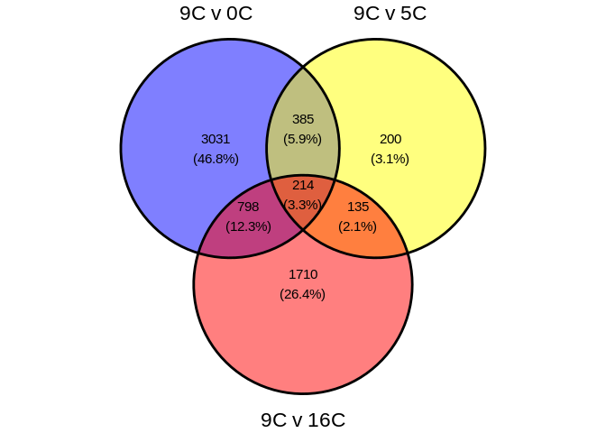
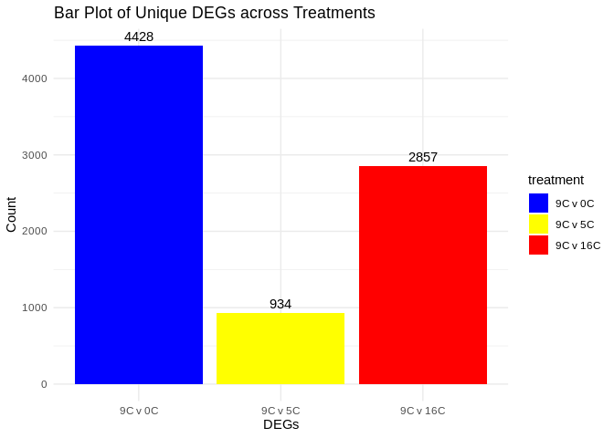

08.2.1-cod-RNAseq-GO-annotation-genome-exon
================
Kathleen Durkin
2024-05-8

- <a href="#1-annotate-degs-using-go-terms"
  id="toc-1-annotate-degs-using-go-terms">1 Annotate DEGs using GO
  terms</a>
  - <a href="#11-venn-diagram-of-deg-counts-accross-treatments"
    id="toc-11-venn-diagram-of-deg-counts-accross-treatments">1.1 Venn
    diagram of DEG counts accross treatments</a>
  - <a href="#12-deg-bar-plots" id="toc-12-deg-bar-plots">1.2 DEG bar
    plots</a>
  - <a href="#13-go-enrichment" id="toc-13-go-enrichment">1.3 GO
    Enrichment</a>
    - <a href="#131-view-top-degs-and-annotations"
      id="toc-131-view-top-degs-and-annotations">1.3.1 View top DEGs and
      annotations</a>
    - <a href="#132-view-over-represented-enriched-processes"
      id="toc-132-view-over-represented-enriched-processes">1.3.2 View
      over-represented (enriched) processes</a>

This code depends on the database
(`G_macrocephalus_genes_IDmapping_2024_05_22.tab`) of *G.macrocephalus*
gene IDs and associated GO terms generated in
03.2-genome-annotation.Rmd, AND on lists of differentially expressed
genes (DEGs) generated in 07.2.1-cod-RNAseq-DESeq2-genome-exon.Rmd.

This code identifies overrepresented gene ontology (GO) terms in
*G.macrocephalus* RNA sequencing data

Inputs: - transcript ID/GO term database
(`G_macrocephalus_genes_IDmapping_2024_05_22.tab`) - DEGs

In 03-transcriptome-annotation.Rmd we used BLAST and Uniprot/SwissProt
to obtain UniProt Accession numbers for each transcript in the *G.
macrocephalus* transcriptome. We then used those Accession numbers to
obtain GO terms for each transcript, functionally creating a database
which matches *G.macrocephalus* transcripts with associated GO terms.
Finally, in 03.2-genome-annotation, we matched transcript IDs with gene
IDs to make a database associating gene IDs with the Uniprot Accession
numbers and GO terms.

In 07.2.1-cod-RNAseq-DESeq2-genome-exon.Rmd we identified sets of
significantly differentially expressed genes (DEGs) between pairs of
treatments (e.g., Liver tissue for 9C vs. 16C).

Now we want to use the database to identify GO terms associated with our
lists of DEGs, and to evaluate which GO terms are overrepresented.

``` r
# List of packages we want to install (run every time)
library(tidyverse)
library(dplyr)
library(magrittr)
library(knitr)
library(ggvenn)
```

``` r
gmac_idmap <- read.csv("../output/03.2-genome-annotation/G_macrocephalus_genes_IDmapping_2024_05_22.tab", sep='\t') %>%
  select(-X) # remove superflous column containing rowIDs

DEGs_L.9.0 <- read.csv("../output/07.2.1-cod-RNAseq-DESeq2-genome-exon/Gmac_DEGs_sig_L.9.0_norm.tab", sep='\t') %>%
  subset(select=-X) # remove superflous column containing rowIDs
DEGs_L.9.5 <- read.csv("../output/07.2.1-cod-RNAseq-DESeq2-genome-exon/Gmac_DEGs_sig_L.9.5_norm.tab", sep='\t') %>%
  subset(select=-X) # remove superflous column containing rowIDs
DEGs_L.9.16 <- read.csv("../output/07.2.1-cod-RNAseq-DESeq2-genome-exon/Gmac_DEGs_sig_L.9.16_norm.tab", sep='\t') %>%
  subset(select=-X) # remove superflous column containing rowIDs

hisat2_exon_counts_matrix <- read.csv("../output/07.2.1-cod-RNAseq-DESeq2-genome-exon/Gmac_genome_exon_counts_formatted.tab", sep='\t')
hisat2_exon_counts_matrix[,-1] <- round(hisat2_exon_counts_matrix[,-1], digits = 0) # round counts to integers
```

# 1 Annotate DEGs using GO terms

``` r
# All DEGs
DEGs_GO_L.9.0 <- left_join(DEGs_L.9.0, gmac_idmap, by=c("gene" = "gene_ID"))
DEGs_GO_L.9.5 <- left_join(DEGs_L.9.5, gmac_idmap, by=c("gene" = "gene_ID"))
DEGs_GO_L.9.16 <- left_join(DEGs_L.9.16, gmac_idmap, by=c("gene" = "gene_ID"))

# Ensure we have unique DEGs
DEGs_GO_L.9.0_unique <- DEGs_GO_L.9.0 %>% distinct(gene, .keep_all = TRUE)
DEGs_GO_L.9.5_unique <- DEGs_GO_L.9.5 %>% distinct(gene, .keep_all = TRUE)
DEGs_GO_L.9.16_unique <- DEGs_GO_L.9.16 %>% distinct(gene, .keep_all = TRUE)

# summarize counts
print(paste("All DEGs:", nrow(DEGs_GO_L.9.0), "(9C v 0C),", nrow(DEGs_GO_L.9.5), "(9C v 5C),", nrow(DEGs_GO_L.9.16), "(9C v 16C)"))
```

    [1] "All DEGs: 4428 (9C v 0C), 934 (9C v 5C), 2857 (9C v 16C)"

``` r
print(paste("Unique DEGs:", nrow(DEGs_GO_L.9.0_unique), "(9C v 0C),", nrow(DEGs_GO_L.9.5_unique), "(9C v 5C),", nrow(DEGs_GO_L.9.16_unique), "(9C v 16C)"))
```

    [1] "Unique DEGs: 4428 (9C v 0C), 934 (9C v 5C), 2857 (9C v 16C)"

``` r
# Save
write.table(DEGs_GO_L.9.0_unique, "../output/08.2.1-cod-RNAseq-GO-annotation-genome-exon/Gmac_DEGs_GO_L.9.0_unique.tab", sep = "\t", row.names = TRUE, col.names = NA)
write.table(DEGs_GO_L.9.5_unique, "../output/08.2.1-cod-RNAseq-GO-annotation-genome-exon/Gmac_DEGs_GO_L.9.5_unique.tab", sep = "\t", row.names = TRUE, col.names = NA)
write.table(DEGs_GO_L.9.16_unique, "../output/08.2.1-cod-RNAseq-GO-annotation-genome-exon/Gmac_DEGs_GO_L.9.16_unique.tab", sep = "\t", row.names = TRUE, col.names = NA)
```

## 1.1 Venn diagram of DEG counts accross treatments

``` r
# Make list
deg_counts_unique <- list(
  "9C v 0C" = unique(DEGs_GO_L.9.0$gene),
  "9C v 5C" = unique(DEGs_GO_L.9.5$gene),
  "9C v 16C" = unique(DEGs_GO_L.9.16$gene)
)

# Make venn diagrams
ggvenn(deg_counts_unique,
       fill_color = c("blue", "yellow", "red"))
```

<!-- -->

## 1.2 DEG bar plots

``` r
# Create a data frame with extracted columns
combined_unique_DEG_counts <- data.frame(
  DEGs_count = c(length(unique(DEGs_GO_L.9.0$gene)), 
                 length(unique(DEGs_GO_L.9.5$gene)), 
                 length(unique(DEGs_GO_L.9.16$gene))),
  treatment = factor(c("9C v 0C", "9C v 5C", "9C v 16C"), 
                     levels=c("9C v 0C", "9C v 5C", "9C v 16C")))

# Assign colors
custom_colors <- c("9C v 0C"="blue", "9C v 5C"="yellow", "9C v 16C"="red")

# Create a bar plot
ggplot(combined_unique_DEG_counts, aes(x = treatment, y = DEGs_count, fill = treatment)) +
  geom_col() +
  labs(title = "Bar Plot of Unique DEGs across Treatments",
       x = "DEGs",
       y = "Count") +
  scale_fill_manual(values = custom_colors) +
  geom_text(aes(label = DEGs_count), vjust = -0.5) +
  theme_minimal()
```

<!-- -->

## 1.3 GO Enrichment

First, isolate lists of Uniprot Accession numbers from each set off
significant DEGs.

``` r
uniprotAccessions_DEGs_L.9.0 <- na.omit(DEGs_GO_L.9.0_unique$V3)
write.table(uniprotAccessions_DEGs_L.9.0, "../output/08.2.1-cod-RNAseq-GO-annotation-genome-exon/Gmac_uniprotAccessions_DEGs_L.9.0.txt")
uniprotAccessions_DEGs_L.9.5 <- na.omit(DEGs_GO_L.9.5_unique$V3)
write.table(uniprotAccessions_DEGs_L.9.5, "../output/08.2.1-cod-RNAseq-GO-annotation-genome-exon/Gmac_uniprotAccessions_DEGs_L.9.5.txt")
uniprotAccessions_DEGs_L.9.16 <- na.omit(DEGs_GO_L.9.16_unique$V3)
write.table(uniprotAccessions_DEGs_L.9.16, "../output/08.2.1-cod-RNAseq-GO-annotation-genome-exon/Gmac_uniprotAccessions_DEGs_L.9.16.txt")
```

``` bash
head -5 ../output/08.2.1-cod-RNAseq-GO-annotation-genome-exon/Gmac_uniprotAccessions_DEGs_L.9.0.txt
```

    "x"
    "1" "Q80TZ9"
    "2" "Q9NXG6"
    "3" "A0A0R4IB93"
    "4" "Q5T6C5"

And reformat to get rid of superfluous characters

``` bash
# We need to 1) remove the first line, 2) get rid of the row numbers, and 3) remove extra " characters
sed '1d' ../output/08.2.1-cod-RNAseq-GO-annotation-genome-exon/Gmac_uniprotAccessions_DEGs_L.9.0.txt | \
  awk '{print $2}' | \
  tr -d '"' \
  > ../output/08.2.1-cod-RNAseq-GO-annotation-genome-exon/Gmac_uniprotAccessions_DEGs_L.9.0_formatted.txt
  
sed '1d' ../output/08.2.1-cod-RNAseq-GO-annotation-genome-exon/Gmac_uniprotAccessions_DEGs_L.9.5.txt | \
  awk '{print $2}' | \
  tr -d '"' \
  > ../output/08.2.1-cod-RNAseq-GO-annotation-genome-exon/Gmac_uniprotAccessions_DEGs_L.9.5_formatted.txt
  
sed '1d' ../output/08.2.1-cod-RNAseq-GO-annotation-genome-exon/Gmac_uniprotAccessions_DEGs_L.9.16.txt | \
  awk '{print $2}' | \
  tr -d '"' \
  > ../output/08.2.1-cod-RNAseq-GO-annotation-genome-exon/Gmac_uniprotAccessions_DEGs_L.9.16_formatted.txt

# Check formatting
head -5 ../output/08.2.1-cod-RNAseq-GO-annotation-genome-exon/Gmac_uniprotAccessions_DEGs_L.9.0_formatted.txt
```

    Q80TZ9
    Q9NXG6
    A0A0R4IB93
    Q5T6C5
    Q32LJ2

We also want to get a list of Uniprot Accession numbers for our
“background”. This is a reference of all transcripts we would expect to
find in our samples. We could just use IDs from our full reference
transcriptome, but this may include transcripts we would not actually
expect to find in our samples (e.g. the transcriptome may contain
gonad-specific transcripts that would not appear in our liver tissue
samples). To filter for only transcripts found in our samples, we can 1)
filter our count matrix to retain only transcripts present in at least
one sample, and then 2) join this filtered count matrix with our
transcript/Uniprot ID database.

``` r
# Remove any gene IDs that do not appear in any sample
hisat2_exon_counts_filtered <- hisat2_exon_counts_matrix[rowSums(hisat2_exon_counts_matrix[, -1] != 0) > 0, ]
og_num <- nrow (hisat2_exon_counts_matrix)
filtered_num <- nrow(hisat2_exon_counts_filtered)

paste("Filtered counts matrix from ", og_num, "transcripts to ", filtered_num, "transcripts")
```

    [1] "Filtered counts matrix from  30325 transcripts to  27070 transcripts"

``` r
# Join the filtered counts matrix and the gene ID/Uniprot database
counts_GO <- left_join(hisat2_exon_counts_filtered, gmac_idmap, by=c("X" = "gene_ID"))

# Reorder columns to have gene name, GO annotation, and Uniprot ID next to each other
counts_GO <- counts_GO[, c("Gene.Ontology..biological.process.", setdiff(names(counts_GO), "Gene.Ontology..biological.process."))]
counts_GO <- counts_GO[, c("V3", setdiff(names(counts_GO), "V3"))]

counts_GO %>% select(X, V3) %>% head()
```

                 X     V3
    1 LOC132464423   <NA>
    2        rereb Q80TZ9
    3 LOC132464476   <NA>
    4 LOC132464448   <NA>
    5   c1h1orf159   <NA>
    6 LOC132464512 Q8IYA8

``` r
uniprotAccessions_genome_exon <- na.omit(counts_GO$V3)
write.table(uniprotAccessions_genome_exon, "../output/08.2.1-cod-RNAseq-GO-annotation-genome-exon/Gmac_uniprotAccessions_genome_exon.txt")
```

``` bash
# We need to 1) remove the first line, 2) get rid of the row numbers, and 3) remove extra " characters
sed '1d' ../output/08.2.1-cod-RNAseq-GO-annotation-genome-exon/Gmac_uniprotAccessions_genome_exon.txt | \
  awk '{print $2}' | \
  tr -d '"' \
  > ../output/08.2.1-cod-RNAseq-GO-annotation-genome-exon/Gmac_uniprotAccessions_genome_exon_formatted.txt
  
head -5 ../output/08.2.1-cod-RNAseq-GO-annotation-genome-exon/Gmac_uniprotAccessions_genome_exon_formatted.txt
```

    Q80TZ9
    Q8IYA8
    Q3ZB90
    Q8CIW6
    Q9NXG6

Now we can download these formatted lists of accession numbers and run
them through DAVID to obtain lists of associated Uniprot keywords.
Unfortunately I don’t think this can be done from command line though,
so I’ll be using the online tool: <https://david.ncifcrf.gov/tools.jsp>

I upload my three DEG lists
(`Gmac_uniprotAccessions_DEGs_L.9.0_formatted.txt`,
`Gmac_uniprotAccessions_DEGs_L.9.5_formatted.txt`,
`Gmac_uniprotAccessions_DEGs_L.9.16_formatted.txt`) as “Gene Lists” and
upload the filtered transcripts list
(`Gmac_uniprotAccessions_genome_exon_formatted.txt`) as the
“Background”, selecting “UNIPROT_ACCESSION” as the identifier for each.
I analyzed each DEG list using the “Functional Annotation” tool, and
downloaded the Functional Annotation Table and Functional Annotation
Chart for each (below)

``` bash
curl https://david.ncifcrf.gov/data/download/tr_022E2DF489311716412195130.txt > ../output/08.2.1-cod-RNAseq-GO-annotation-genome-exon/Gmac_DAVID_FAtable_L.9.0.tab
curl https://david.ncifcrf.gov/data/download/chart_022E2DF489311716412324938.txt > ../output/08.2.1-cod-RNAseq-GO-annotation-genome-exon/Gmac_DAVID_FAchart_L.9.0.tab

curl https://david.ncifcrf.gov/data/download/tr_022E2DF489311716412370632.txt > ../output/08.2.1-cod-RNAseq-GO-annotation-genome-exon/Gmac_DAVID_FAtable_L.9.5.tab
curl https://david.ncifcrf.gov/data/download/chart_022E2DF489311716412396081.txt > ../output/08.2.1-cod-RNAseq-GO-annotation-genome-exon/Gmac_DAVID_FAchart_L.9.5.tab

curl https://david.ncifcrf.gov/data/download/tr_022E2DF489311716412439373.txt > ../output/08.2.1-cod-RNAseq-GO-annotation-genome-exon/Gmac_DAVID_FAtable_L.9.16.tab
curl https://david.ncifcrf.gov/data/download/chart_022E2DF489311716412499995.txt > ../output/08.2.1-cod-RNAseq-GO-annotation-genome-exon/Gmac_DAVID_FAchart_L.9.16.tab
```

      % Total    % Received % Xferd  Average Speed   Time    Time     Time  Current
                                     Dload  Upload   Total   Spent    Left  Speed
      0     0    0     0    0     0      0      0 --:--:-- --:--:-- --:--:--     0100 4593k    0 4593k    0     0  5670k      0 --:--:-- --:--:-- --:--:-- 5670k
      % Total    % Received % Xferd  Average Speed   Time    Time     Time  Current
                                     Dload  Upload   Total   Spent    Left  Speed
      0     0    0     0    0     0      0      0 --:--:-- --:--:-- --:--:--     0  0     0    0     0    0     0      0      0 --:--:-- --:--:-- --:--:--     0100  309k    0  309k    0     0   587k      0 --:--:-- --:--:-- --:--:--  587k
      % Total    % Received % Xferd  Average Speed   Time    Time     Time  Current
                                     Dload  Upload   Total   Spent    Left  Speed
      0     0    0     0    0     0      0      0 --:--:-- --:--:-- --:--:--     0100  210k    0  210k    0     0   398k      0 --:--:-- --:--:-- --:--:--  397k100  996k    0  996k    0     0  1485k      0 --:--:-- --:--:-- --:--:-- 1483k
      % Total    % Received % Xferd  Average Speed   Time    Time     Time  Current
                                     Dload  Upload   Total   Spent    Left  Speed
      0     0    0     0    0     0      0      0 --:--:-- --:--:-- --:--:--     0100  112k    0  112k    0     0   249k      0 --:--:-- --:--:-- --:--:--  249k
      % Total    % Received % Xferd  Average Speed   Time    Time     Time  Current
                                     Dload  Upload   Total   Spent    Left  Speed
      0     0    0     0    0     0      0      0 --:--:-- --:--:-- --:--:--     0100 39635    0 39635    0     0   102k      0 --:--:-- --:--:-- --:--:--  102k100 3090k    0 3090k    0     0  4170k      0 --:--:-- --:--:-- --:--:-- 4165k
      % Total    % Received % Xferd  Average Speed   Time    Time     Time  Current
                                     Dload  Upload   Total   Spent    Left  Speed
      0     0    0     0    0     0      0      0 --:--:-- --:--:-- --:--:--     0100  271k    0  271k    0     0   518k      0 --:--:-- --:--:-- --:--:--  518k

``` r
DEGs_DAVID_FAtable_L.9.0 <- read.delim("../output/08.2.1-cod-RNAseq-GO-annotation-genome-exon/Gmac_DAVID_FAtable_L.9.0.tab", sep="\t")
DEGs_DAVID_FAtable_L.9.5 <- read.delim("../output/08.2.1-cod-RNAseq-GO-annotation-genome-exon/Gmac_DAVID_FAtable_L.9.5.tab", sep="\t")
DEGs_DAVID_FAtable_L.9.16 <- read.delim("../output/08.2.1-cod-RNAseq-GO-annotation-genome-exon/Gmac_DAVID_FAtable_L.9.16.tab", sep="\t")

DEGs_DAVID_FAchart_L.9.0 <- read.delim("../output/08.2.1-cod-RNAseq-GO-annotation-genome-exon/Gmac_DAVID_FAchart_L.9.0.tab", sep="\t")
DEGs_DAVID_FAchart_L.9.5 <- read.delim("../output/08.2.1-cod-RNAseq-GO-annotation-genome-exon/Gmac_DAVID_FAchart_L.9.5.tab", sep="\t")
DEGs_DAVID_FAchart_L.9.16 <- read.delim("../output/08.2.1-cod-RNAseq-GO-annotation-genome-exon/Gmac_DAVID_FAchart_L.9.16.tab", sep="\t")
```

Now we can also make datasets that include differential expression stats
(e.g., `padj`) AND high-level Uniprot keywords.

``` r
DEGs_DAVID_FAtable_GO_L.9.0 <- left_join(DEGs_GO_L.9.0_unique, DEGs_DAVID_FAtable_L.9.0, by=c("V3" = "ID"))
DEGs_DAVID_FAtable_GO_L.9.5 <- left_join(DEGs_GO_L.9.5_unique, DEGs_DAVID_FAtable_L.9.5, by=c("V3" = "ID"))
DEGs_DAVID_FAtable_GO_L.9.16 <- left_join(DEGs_GO_L.9.16_unique, DEGs_DAVID_FAtable_L.9.16, by=c("V3" = "ID"))
```

### 1.3.1 View top DEGs and annotations

First we can look at the biological processes associated with our most
significantly differentially expressed genes

``` r
top_25_DEGs_L.9.0 <- head(na.omit(DEGs_DAVID_FAtable_GO_L.9.0[order(DEGs_DAVID_FAtable_GO_L.9.0$padj), ]), 25)
top_25_DEGs_L.9.0$padj <- as.character(top_25_DEGs_L.9.0$padj) # prevents kable from auto-rounding our padj values
kable(top_25_DEGs_L.9.0[, c("gene", "padj", "Gene.Ontology..biological.process.")],
      row.names = FALSE,
      caption = "Top 25 DEGs for 9C v 0C (based on adjusted p-value)")  
```

| gene         | padj                  | Gene.Ontology..biological.process.                                                                                                                                                                                                                                                                                                                                                                                                                                                                                                                                                                                                                                                                                                                       |
|:-------------|:----------------------|:---------------------------------------------------------------------------------------------------------------------------------------------------------------------------------------------------------------------------------------------------------------------------------------------------------------------------------------------------------------------------------------------------------------------------------------------------------------------------------------------------------------------------------------------------------------------------------------------------------------------------------------------------------------------------------------------------------------------------------------------------------|
| fasn         | 1.62240535809598e-110 | fatty acid biosynthetic process $$GO:0006633$$; lactate metabolic process $$GO:0006089$$; positive regulation of appetite $$GO:0032100$$                                                                                                                                                                                                                                                                                                                                                                                                                                                                                                                                                                                                                 |
| plpp1a       | 1.48813017500927e-89  | androgen receptor signaling pathway $$GO:0030521$$; ceramide metabolic process $$GO:0006672$$; intracellular steroid hormone receptor signaling pathway $$GO:0030518$$; negative regulation of cell population proliferation $$GO:0008285$$; phospholipid dephosphorylation $$GO:0046839$$; phospholipid metabolic process $$GO:0006644$$; protein kinase C-activating G protein-coupled receptor signaling pathway $$GO:0007205$$; regulation of lipid metabolic process $$GO:0019216$$; signal transduction $$GO:0007165$$; sphingolipid biosynthetic process $$GO:0030148$$; sphingosine metabolic process $$GO:0006670$$                                                                                                                             |
| esr1         | 5.62951299900283e-84  |                                                                                                                                                                                                                                                                                                                                                                                                                                                                                                                                                                                                                                                                                                                                                          |
| tardbpa      | 4.57125658164952e-83  | mRNA processing $$GO:0006397$$; regulation of circadian rhythm $$GO:0042752$$; regulation of protein stability $$GO:0031647$$; rhythmic process $$GO:0048511$$; RNA splicing $$GO:0008380$$                                                                                                                                                                                                                                                                                                                                                                                                                                                                                                                                                              |
| LOC132464012 | 2.05739191556396e-78  | single fertilization $$GO:0007338$$                                                                                                                                                                                                                                                                                                                                                                                                                                                                                                                                                                                                                                                                                                                      |
| znf207b      | 2.5227780279732e-71   | attachment of spindle microtubules to kinetochore $$GO:0008608$$; cell division $$GO:0051301$$; microtubule bundle formation $$GO:0001578$$; microtubule polymerization $$GO:0046785$$; mitotic sister chromatid segregation $$GO:0000070$$; mitotic spindle assembly $$GO:0090307$$; mitotic spindle assembly checkpoint signaling $$GO:0007094$$; protein stabilization $$GO:0050821$$; regulation of chromosome segregation $$GO:0051983$$                                                                                                                                                                                                                                                                                                            |
| dhtkd1       | 3.59626373672234e-68  | glycolytic process $$GO:0006096$$; tricarboxylic acid cycle $$GO:0006099$$                                                                                                                                                                                                                                                                                                                                                                                                                                                                                                                                                                                                                                                                               |
| ammecr1      | 4.87577937767736e-68  |                                                                                                                                                                                                                                                                                                                                                                                                                                                                                                                                                                                                                                                                                                                                                          |
| LOC132464016 | 1.63803815733882e-63  | binding of sperm to zona pellucida $$GO:0007339$$; egg coat formation $$GO:0035803$$; positive regulation of acrosome reaction $$GO:2000344$$; response to progesterone $$GO:0032570$$; response to testosterone $$GO:0033574$$                                                                                                                                                                                                                                                                                                                                                                                                                                                                                                                          |
| tubb6        | 4.61721398341228e-62  | microtubule cytoskeleton organization $$GO:0000226$$; mitotic cell cycle $$GO:0000278$$                                                                                                                                                                                                                                                                                                                                                                                                                                                                                                                                                                                                                                                                  |
| khdrbs1a     | 1.52781654215813e-61  | cell surface receptor signaling pathway $$GO:0007166$$; G2/M transition of mitotic cell cycle $$GO:0000086$$; mRNA processing $$GO:0006397$$; negative regulation of DNA-templated transcription $$GO:0045892$$; negative regulation of transcription by RNA polymerase II $$GO:0000122$$; positive regulation of RNA export from nucleus $$GO:0046833$$; positive regulation of translational initiation $$GO:0045948$$; regulation of alternative mRNA splicing, via spliceosome $$GO:0000381$$; regulation of mRNA splicing, via spliceosome $$GO:0048024$$; regulation of RNA export from nucleus $$GO:0046831$$; regulation of signal transduction $$GO:0009966$$; spermatogenesis $$GO:0007283$$; T cell receptor signaling pathway $$GO:0050852$$ |
| LOC132470418 | 1.52781654215813e-61  | actin filament depolymerization $$GO:0030042$$; barbed-end actin filament capping $$GO:0051016$$; positive regulation of neuron projection development $$GO:0010976$$; regulation of lamellipodium assembly $$GO:0010591$$; sequestering of actin monomers $$GO:0042989$$                                                                                                                                                                                                                                                                                                                                                                                                                                                                                |
| LOC132456227 | 6.94807639844039e-60  | apoptotic process $$GO:0006915$$; mRNA processing $$GO:0006397$$; negative regulation of cytokine production $$GO:0001818$$; negative regulation of translation $$GO:0017148$$; protein localization to cytoplasmic stress granule $$GO:1903608$$; regulation of alternative mRNA splicing, via spliceosome $$GO:0000381$$; regulation of mRNA splicing, via spliceosome $$GO:0048024$$; RNA splicing $$GO:0008380$$; stress granule assembly $$GO:0034063$$                                                                                                                                                                                                                                                                                             |
| tha1         | 1.40180793417679e-59  | glycine biosynthetic process $$GO:0006545$$; threonine catabolic process $$GO:0006567$$                                                                                                                                                                                                                                                                                                                                                                                                                                                                                                                                                                                                                                                                  |
| LOC132461541 | 8.42155657494078e-59  | cell migration $$GO:0016477$$; embryo development ending in birth or egg hatching $$GO:0009792$$; gastrulation $$GO:0007369$$; mRNA stabilization $$GO:0048255$$; negative regulation of nuclear-transcribed mRNA poly(A) tail shortening $$GO:0060212$$; neurogenesis $$GO:0022008$$; positive regulation of translation $$GO:0045727$$; pronephros development $$GO:0048793$$; response to cold $$GO:0009409$$                                                                                                                                                                                                                                                                                                                                         |
| duox         | 4.08692913251849e-57  | cuticle development $$GO:0042335$$; cytokine-mediated signaling pathway $$GO:0019221$$; defense response $$GO:0006952$$; hormone biosynthetic process $$GO:0042446$$; hydrogen peroxide catabolic process $$GO:0042744$$; response to cAMP $$GO:0051591$$; response to oxidative stress $$GO:0006979$$; superoxide anion generation $$GO:0042554$$; thyroid hormone generation $$GO:0006590$$                                                                                                                                                                                                                                                                                                                                                            |
| stom         | 3.50203191172271e-55  | positive regulation by host of viral genome replication $$GO:0044829$$; positive regulation of protein targeting to membrane $$GO:0090314$$; positive regulation of viral process $$GO:0048524$$; regulation of acid-sensing ion channel activity $$GO:1901585$$; regulation of ion transmembrane transport $$GO:0034765$$                                                                                                                                                                                                                                                                                                                                                                                                                               |
| dedd1        | 1.20230682124465e-54  | apoptotic nuclear changes $$GO:0030262$$; cellular homeostasis $$GO:0019725$$; extrinsic apoptotic signaling pathway via death domain receptors $$GO:0008625$$; intracellular signal transduction $$GO:0035556$$; negative regulation of DNA-templated transcription $$GO:0045892$$; positive regulation of extrinsic apoptotic signaling pathway $$GO:2001238$$; RNA processing $$GO:0006396$$; rRNA catabolic process $$GO:0016075$$                                                                                                                                                                                                                                                                                                                   |
| atp2a2b      | 1.65567970626883e-54  | autophagosome assembly $$GO:0000045$$; calcium ion transmembrane transport $$GO:0070588$$; calcium ion transport $$GO:0006816$$; cellular calcium ion homeostasis $$GO:0006874$$; ion transmembrane transport $$GO:0034220$$; response to xenobiotic stimulus $$GO:0009410$$                                                                                                                                                                                                                                                                                                                                                                                                                                                                             |
| hp1bp3       | 3.27211938557107e-52  | heterochromatin organization $$GO:0070828$$; nucleosome assembly $$GO:0006334$$                                                                                                                                                                                                                                                                                                                                                                                                                                                                                                                                                                                                                                                                          |
| znf706       | 7.40211905298196e-52  | negative regulation of DNA-templated transcription $$GO:0045892$$; negative regulation of stem cell population maintenance $$GO:1902455$$; regulation of translation $$GO:0006417$$                                                                                                                                                                                                                                                                                                                                                                                                                                                                                                                                                                      |
| etnk1        | 7.69100560978074e-52  | phosphatidylethanolamine biosynthetic process $$GO:0006646$$; phosphorylation $$GO:0016310$$                                                                                                                                                                                                                                                                                                                                                                                                                                                                                                                                                                                                                                                             |
| spra         | 1.34032981343557e-51  | tetrahydrobiopterin biosynthetic process $$GO:0006729$$                                                                                                                                                                                                                                                                                                                                                                                                                                                                                                                                                                                                                                                                                                  |
| miox         | 1.79700263678897e-49  | inositol catabolic process $$GO:0019310$$                                                                                                                                                                                                                                                                                                                                                                                                                                                                                                                                                                                                                                                                                                                |
| taf8         | 5.9176210617136e-49   | cell differentiation $$GO:0030154$$; transcription initiation at RNA polymerase II promoter $$GO:0006367$$                                                                                                                                                                                                                                                                                                                                                                                                                                                                                                                                                                                                                                               |

Top 25 DEGs for 9C v 0C (based on adjusted p-value)

``` r
top_25_DEGs_L.9.5 <- head(na.omit(DEGs_DAVID_FAtable_GO_L.9.5[order(DEGs_DAVID_FAtable_GO_L.9.5$padj), ]), 25)
top_25_DEGs_L.9.5$padj <- as.character(top_25_DEGs_L.9.5$padj) # prevents kable from auto-rounding our padj values
kable(top_25_DEGs_L.9.5[, c("gene", "padj", "Gene.Ontology..biological.process.")],
      row.names = FALSE,
      caption = "Top 25 DEGs for 9C v 5C (based on adjusted p-value)")  
```

| gene         | padj                 | Gene.Ontology..biological.process.                                                                                                                                                                                                                                                                                                                                                                                                                                                                                                                                                                                                                                                                                                  |
|:-------------|:---------------------|:------------------------------------------------------------------------------------------------------------------------------------------------------------------------------------------------------------------------------------------------------------------------------------------------------------------------------------------------------------------------------------------------------------------------------------------------------------------------------------------------------------------------------------------------------------------------------------------------------------------------------------------------------------------------------------------------------------------------------------|
| LOC132461541 | 9.4032410124911e-15  | cell migration $$GO:0016477$$; embryo development ending in birth or egg hatching $$GO:0009792$$; gastrulation $$GO:0007369$$; mRNA stabilization $$GO:0048255$$; negative regulation of nuclear-transcribed mRNA poly(A) tail shortening $$GO:0060212$$; neurogenesis $$GO:0022008$$; positive regulation of translation $$GO:0045727$$; pronephros development $$GO:0048793$$; response to cold $$GO:0009409$$                                                                                                                                                                                                                                                                                                                    |
| kdr          | 1.26100603587688e-12 | angiogenesis $$GO:0001525$$; blood vessel development $$GO:0001568$$; cell migration $$GO:0016477$$; cellular response to vascular endothelial growth factor stimulus $$GO:0035924$$; endothelial cell differentiation $$GO:0045446$$; hematopoietic progenitor cell differentiation $$GO:0002244$$; positive regulation of angiogenesis $$GO:0045766$$; positive regulation of cell migration $$GO:0030335$$; positive regulation of kinase activity $$GO:0033674$$; regulation of MAPK cascade $$GO:0043408$$; transmembrane receptor protein tyrosine kinase signaling pathway $$GO:0007169$$; vascular endothelial growth factor receptor signaling pathway $$GO:0048010$$                                                      |
| tardbpa      | 2.97204356806147e-12 | mRNA processing $$GO:0006397$$; regulation of circadian rhythm $$GO:0042752$$; regulation of protein stability $$GO:0031647$$; rhythmic process $$GO:0048511$$; RNA splicing $$GO:0008380$$                                                                                                                                                                                                                                                                                                                                                                                                                                                                                                                                         |
| hp1bp3       | 4.01431447326048e-11 | heterochromatin organization $$GO:0070828$$; nucleosome assembly $$GO:0006334$$                                                                                                                                                                                                                                                                                                                                                                                                                                                                                                                                                                                                                                                     |
| LOC132470565 | 4.01431447326048e-11 | activation of innate immune response $$GO:0002218$$; defense response to bacterium $$GO:0042742$$; defense response to virus $$GO:0051607$$; innate immune response $$GO:0045087$$; negative regulation of viral genome replication $$GO:0045071$$; RNA-mediated heterochromatin formation $$GO:0031048$$                                                                                                                                                                                                                                                                                                                                                                                                                           |
| dhx58        | 6.833456053356e-11   | antiviral innate immune response $$GO:0140374$$; cytosolic pattern recognition receptor signaling pathway $$GO:0002753$$; negative regulation of innate immune response $$GO:0045824$$; negative regulation of MDA-5 signaling pathway $$GO:0039534$$; negative regulation of RIG-I signaling pathway $$GO:0039536$$; negative regulation of type I interferon production $$GO:0032480$$; positive regulation of MDA-5 signaling pathway $$GO:1900245$$; positive regulation of RIG-I signaling pathway $$GO:1900246$$; positive regulation of type I interferon production $$GO:0032481$$; regulation of innate immune response $$GO:0045088$$; response to bacterium $$GO:0009617$$; response to virus $$GO:0009615$$             |
| znf207b      | 1.73079113006198e-10 | attachment of spindle microtubules to kinetochore $$GO:0008608$$; cell division $$GO:0051301$$; microtubule bundle formation $$GO:0001578$$; microtubule polymerization $$GO:0046785$$; mitotic sister chromatid segregation $$GO:0000070$$; mitotic spindle assembly $$GO:0090307$$; mitotic spindle assembly checkpoint signaling $$GO:0007094$$; protein stabilization $$GO:0050821$$; regulation of chromosome segregation $$GO:0051983$$                                                                                                                                                                                                                                                                                       |
| ifi44g       | 5.73167306950653e-10 | immune response $$GO:0006955$$; response to bacterium $$GO:0009617$$; response to virus $$GO:0009615$$                                                                                                                                                                                                                                                                                                                                                                                                                                                                                                                                                                                                                              |
| LOC132470561 | 8.15745298974277e-10 | activation of innate immune response $$GO:0002218$$; defense response to bacterium $$GO:0042742$$; defense response to virus $$GO:0051607$$; innate immune response $$GO:0045087$$; negative regulation of viral genome replication $$GO:0045071$$; RNA-mediated heterochromatin formation $$GO:0031048$$                                                                                                                                                                                                                                                                                                                                                                                                                           |
| calua        | 1.23277285171311e-09 |                                                                                                                                                                                                                                                                                                                                                                                                                                                                                                                                                                                                                                                                                                                                     |
| LOC132458971 | 1.31644307198665e-09 |                                                                                                                                                                                                                                                                                                                                                                                                                                                                                                                                                                                                                                                                                                                                     |
| hmgb2a       | 1.60947600360477e-09 | defense response to Gram-negative bacterium $$GO:0050829$$; defense response to Gram-positive bacterium $$GO:0050830$$; DNA geometric change $$GO:0032392$$; DNA recombination $$GO:0006310$$; inflammatory response to antigenic stimulus $$GO:0002437$$; innate immune response $$GO:0045087$$; regulation of transcription by RNA polymerase II $$GO:0006357$$; response to lipopolysaccharide $$GO:0032496$$                                                                                                                                                                                                                                                                                                                    |
| pacs2        | 1.6650062068606e-09  | apoptotic process $$GO:0006915$$; autophagosome assembly $$GO:0000045$$; endoplasmic reticulum calcium ion homeostasis $$GO:0032469$$; mitochondrion-endoplasmic reticulum membrane tethering $$GO:1990456$$; protein localization to phagophore assembly site $$GO:0034497$$; protein localization to plasma membrane $$GO:0072659$$                                                                                                                                                                                                                                                                                                                                                                                               |
| LOC132473888 | 1.75540475594967e-09 | cell-cell adhesion $$GO:0098609$$; glomerulus morphogenesis $$GO:0072102$$; hemopoiesis $$GO:0030097$$; hippocampus development $$GO:0021766$$; homophilic cell adhesion via plasma membrane adhesion molecules $$GO:0007156$$; inter-male aggressive behavior $$GO:0002121$$; neuron migration $$GO:0001764$$; neuron projection morphogenesis $$GO:0048812$$; principal sensory nucleus of trigeminal nerve development $$GO:0021740$$; synapse assembly $$GO:0007416$$                                                                                                                                                                                                                                                           |
| rrbp1a       | 2.65729485068428e-09 | osteoblast differentiation $$GO:0001649$$; protein transport $$GO:0015031$$; translation $$GO:0006412$$                                                                                                                                                                                                                                                                                                                                                                                                                                                                                                                                                                                                                             |
| stom         | 2.65729485068428e-09 | positive regulation by host of viral genome replication $$GO:0044829$$; positive regulation of protein targeting to membrane $$GO:0090314$$; positive regulation of viral process $$GO:0048524$$; regulation of acid-sensing ion channel activity $$GO:1901585$$; regulation of ion transmembrane transport $$GO:0034765$$                                                                                                                                                                                                                                                                                                                                                                                                          |
| pabpc4       | 3.59669253264827e-09 | blood coagulation $$GO:0007596$$; myeloid cell development $$GO:0061515$$; regulation of mRNA stability $$GO:0043488$$; RNA catabolic process $$GO:0006401$$; RNA processing $$GO:0006396$$; translation $$GO:0006412$$                                                                                                                                                                                                                                                                                                                                                                                                                                                                                                             |
| shc3         | 5.15683301790062e-09 | central nervous system development $$GO:0007417$$; epidermal growth factor receptor signaling pathway $$GO:0007173$$; intracellular signal transduction $$GO:0035556$$; transmembrane receptor protein tyrosine kinase signaling pathway $$GO:0007169$$                                                                                                                                                                                                                                                                                                                                                                                                                                                                             |
| pus10        | 8.31108070026046e-09 | primary miRNA processing $$GO:0031053$$; tRNA pseudouridine synthesis $$GO:0031119$$                                                                                                                                                                                                                                                                                                                                                                                                                                                                                                                                                                                                                                                |
| uba7         | 9.23153001639628e-09 | cellular response to DNA damage stimulus $$GO:0006974$$; protein modification by small protein conjugation $$GO:0032446$$; protein ubiquitination $$GO:0016567$$; ubiquitin-dependent protein catabolic process $$GO:0006511$$                                                                                                                                                                                                                                                                                                                                                                                                                                                                                                      |
| LOC132447594 | 9.23153001639628e-09 | acyl-CoA metabolic process $$GO:0006637$$; fatty acid metabolic process $$GO:0006631$$; long-chain fatty acid metabolic process $$GO:0001676$$; saturated monocarboxylic acid metabolic process $$GO:0032788$$; unsaturated monocarboxylic acid metabolic process $$GO:0032789$$; very long-chain fatty acid metabolic process $$GO:0000038$$                                                                                                                                                                                                                                                                                                                                                                                       |
| nr5a5        | 1.05808058892757e-08 | hormone-mediated signaling pathway $$GO:0009755$$; positive regulation of DNA-templated transcription $$GO:0045893$$; regulation of transcription by RNA polymerase II $$GO:0006357$$; tissue development $$GO:0009888$$                                                                                                                                                                                                                                                                                                                                                                                                                                                                                                            |
| LOC132450431 | 1.39593263682237e-08 | 10-formyltetrahydrofolate biosynthetic process $$GO:0009257$$; heart development $$GO:0007507$$; histidine biosynthetic process $$GO:0000105$$; methionine biosynthetic process $$GO:0009086$$; methionine metabolic process $$GO:0006555$$; neural tube closure $$GO:0001843$$; neutrophil homeostasis $$GO:0001780$$; one-carbon metabolic process $$GO:0006730$$; purine nucleotide biosynthetic process $$GO:0006164$$; purine ribonucleotide biosynthetic process $$GO:0009152$$; serine family amino acid biosynthetic process $$GO:0009070$$; serine family amino acid metabolic process $$GO:0009069$$; somite development $$GO:0061053$$; tetrahydrofolate interconversion $$GO:0035999$$; transsulfuration $$GO:0019346$$ |
| LOC132470418 | 1.66236301510384e-08 | actin filament depolymerization $$GO:0030042$$; barbed-end actin filament capping $$GO:0051016$$; positive regulation of neuron projection development $$GO:0010976$$; regulation of lamellipodium assembly $$GO:0010591$$; sequestering of actin monomers $$GO:0042989$$                                                                                                                                                                                                                                                                                                                                                                                                                                                           |
| LOC132462029 | 2.15341996453433e-08 | chemotaxis $$GO:0006935$$                                                                                                                                                                                                                                                                                                                                                                                                                                                                                                                                                                                                                                                                                                           |

Top 25 DEGs for 9C v 5C (based on adjusted p-value)

``` r
top_25_DEGs_L.9.16 <- head(na.omit(DEGs_DAVID_FAtable_GO_L.9.16[order(DEGs_DAVID_FAtable_GO_L.9.16$padj), ]), 25)
top_25_DEGs_L.9.16$padj <- as.character(top_25_DEGs_L.9.16$padj) # prevents kable from auto-rounding our padj values
kable(top_25_DEGs_L.9.16[, c("gene", "padj", "Gene.Ontology..biological.process.")],
      row.names = FALSE,
      caption = "Top 25 DEGs for 9C v 16C (based on adjusted p-value)")  
```

| gene         | padj                 | Gene.Ontology..biological.process.                                                                                                                                                                                                                                                                                                                                                                                                                                                                                                                                                                                                                                                                                                                                                                                                                                                                                                                                                                                                                                                                                                                                                                                                                                                                                                                                                                                                                                                                                                                                                                                                                                                                                                                                                                                                                                                                                                                                                                                                                                                                                                                                                                                                                                                                                                                                                                                                                                                                                                                                                                                                                                                                                                                                                                                                                                                                                                                                                                                                                                                                                                                                                                                |
|:-------------|:---------------------|:------------------------------------------------------------------------------------------------------------------------------------------------------------------------------------------------------------------------------------------------------------------------------------------------------------------------------------------------------------------------------------------------------------------------------------------------------------------------------------------------------------------------------------------------------------------------------------------------------------------------------------------------------------------------------------------------------------------------------------------------------------------------------------------------------------------------------------------------------------------------------------------------------------------------------------------------------------------------------------------------------------------------------------------------------------------------------------------------------------------------------------------------------------------------------------------------------------------------------------------------------------------------------------------------------------------------------------------------------------------------------------------------------------------------------------------------------------------------------------------------------------------------------------------------------------------------------------------------------------------------------------------------------------------------------------------------------------------------------------------------------------------------------------------------------------------------------------------------------------------------------------------------------------------------------------------------------------------------------------------------------------------------------------------------------------------------------------------------------------------------------------------------------------------------------------------------------------------------------------------------------------------------------------------------------------------------------------------------------------------------------------------------------------------------------------------------------------------------------------------------------------------------------------------------------------------------------------------------------------------------------------------------------------------------------------------------------------------------------------------------------------------------------------------------------------------------------------------------------------------------------------------------------------------------------------------------------------------------------------------------------------------------------------------------------------------------------------------------------------------------------------------------------------------------------------------------------------------|
| LOC132469840 | 1.29458474065783e-94 | mRNA stabilization $$GO:0048255$$; positive regulation of translation $$GO:0045727$$; response to UV $$GO:0009411$$; stress granule assembly $$GO:0034063$$                                                                                                                                                                                                                                                                                                                                                                                                                                                                                                                                                                                                                                                                                                                                                                                                                                                                                                                                                                                                                                                                                                                                                                                                                                                                                                                                                                                                                                                                                                                                                                                                                                                                                                                                                                                                                                                                                                                                                                                                                                                                                                                                                                                                                                                                                                                                                                                                                                                                                                                                                                                                                                                                                                                                                                                                                                                                                                                                                                                                                                                       |
| LOC132460145 | 2.95217371153864e-44 | axon guidance $$GO:0007411$$; axon regeneration $$GO:0031103$$; brain development $$GO:0007420$$; cartilage morphogenesis $$GO:0060536$$; cell-cell adhesion $$GO:0098609$$; nervous system development $$GO:0007399$$; positive regulation of axon extension $$GO:0045773$$; positive regulation of gene expression $$GO:0010628$$                                                                                                                                                                                                                                                                                                                                                                                                                                                                                                                                                                                                                                                                                                                                                                                                                                                                                                                                                                                                                                                                                                                                                                                                                                                                                                                                                                                                                                                                                                                                                                                                                                                                                                                                                                                                                                                                                                                                                                                                                                                                                                                                                                                                                                                                                                                                                                                                                                                                                                                                                                                                                                                                                                                                                                                                                                                                               |
| atp8b5b      | 2.29522530884835e-40 | Golgi organization $$GO:0007030$$; ion transmembrane transport $$GO:0034220$$; phospholipid translocation $$GO:0045332$$                                                                                                                                                                                                                                                                                                                                                                                                                                                                                                                                                                                                                                                                                                                                                                                                                                                                                                                                                                                                                                                                                                                                                                                                                                                                                                                                                                                                                                                                                                                                                                                                                                                                                                                                                                                                                                                                                                                                                                                                                                                                                                                                                                                                                                                                                                                                                                                                                                                                                                                                                                                                                                                                                                                                                                                                                                                                                                                                                                                                                                                                                          |
| zgc:103586   | 2.01480470435346e-34 | cellular response to external biotic stimulus $$GO:0071217$$; CMP catabolic process $$GO:0006248$$; cytidine deamination $$GO:0009972$$; dCMP catabolic process $$GO:0006249$$; negative regulation of cell growth $$GO:0030308$$; negative regulation of nucleotide metabolic process $$GO:0045980$$; response to cycloheximide $$GO:0046898$$; UMP salvage $$GO:0044206$$                                                                                                                                                                                                                                                                                                                                                                                                                                                                                                                                                                                                                                                                                                                                                                                                                                                                                                                                                                                                                                                                                                                                                                                                                                                                                                                                                                                                                                                                                                                                                                                                                                                                                                                                                                                                                                                                                                                                                                                                                                                                                                                                                                                                                                                                                                                                                                                                                                                                                                                                                                                                                                                                                                                                                                                                                                       |
| serpinh1b    | 2.44662351007445e-33 | collagen fibril organization $$GO:0030199$$; negative regulation of endopeptidase activity $$GO:0010951$$                                                                                                                                                                                                                                                                                                                                                                                                                                                                                                                                                                                                                                                                                                                                                                                                                                                                                                                                                                                                                                                                                                                                                                                                                                                                                                                                                                                                                                                                                                                                                                                                                                                                                                                                                                                                                                                                                                                                                                                                                                                                                                                                                                                                                                                                                                                                                                                                                                                                                                                                                                                                                                                                                                                                                                                                                                                                                                                                                                                                                                                                                                         |
| znf706       | 1.34608956376909e-32 | negative regulation of DNA-templated transcription $$GO:0045892$$; negative regulation of stem cell population maintenance $$GO:1902455$$; regulation of translation $$GO:0006417$$                                                                                                                                                                                                                                                                                                                                                                                                                                                                                                                                                                                                                                                                                                                                                                                                                                                                                                                                                                                                                                                                                                                                                                                                                                                                                                                                                                                                                                                                                                                                                                                                                                                                                                                                                                                                                                                                                                                                                                                                                                                                                                                                                                                                                                                                                                                                                                                                                                                                                                                                                                                                                                                                                                                                                                                                                                                                                                                                                                                                                               |
| pacs2        | 1.54008976678785e-28 | apoptotic process $$GO:0006915$$; autophagosome assembly $$GO:0000045$$; endoplasmic reticulum calcium ion homeostasis $$GO:0032469$$; mitochondrion-endoplasmic reticulum membrane tethering $$GO:1990456$$; protein localization to phagophore assembly site $$GO:0034497$$; protein localization to plasma membrane $$GO:0072659$$                                                                                                                                                                                                                                                                                                                                                                                                                                                                                                                                                                                                                                                                                                                                                                                                                                                                                                                                                                                                                                                                                                                                                                                                                                                                                                                                                                                                                                                                                                                                                                                                                                                                                                                                                                                                                                                                                                                                                                                                                                                                                                                                                                                                                                                                                                                                                                                                                                                                                                                                                                                                                                                                                                                                                                                                                                                                             |
| tagln3b      | 1.74160817557868e-28 | negative regulation of transcription by RNA polymerase II $$GO:0000122$$                                                                                                                                                                                                                                                                                                                                                                                                                                                                                                                                                                                                                                                                                                                                                                                                                                                                                                                                                                                                                                                                                                                                                                                                                                                                                                                                                                                                                                                                                                                                                                                                                                                                                                                                                                                                                                                                                                                                                                                                                                                                                                                                                                                                                                                                                                                                                                                                                                                                                                                                                                                                                                                                                                                                                                                                                                                                                                                                                                                                                                                                                                                                          |
| LOC132471836 | 1.06740702013606e-23 | fatty acid metabolic process $$GO:0006631$$                                                                                                                                                                                                                                                                                                                                                                                                                                                                                                                                                                                                                                                                                                                                                                                                                                                                                                                                                                                                                                                                                                                                                                                                                                                                                                                                                                                                                                                                                                                                                                                                                                                                                                                                                                                                                                                                                                                                                                                                                                                                                                                                                                                                                                                                                                                                                                                                                                                                                                                                                                                                                                                                                                                                                                                                                                                                                                                                                                                                                                                                                                                                                                       |
| dhh          | 2.1777304833143e-23  | bone resorption $$GO:0045453$$; branching involved in blood vessel morphogenesis $$GO:0001569$$; camera-type eye development $$GO:0043010$$; camera-type eye photoreceptor cell fate commitment $$GO:0060220$$; cartilage development $$GO:0051216$$; cell fate specification $$GO:0001708$$; cell maturation $$GO:0048469$$; cell population proliferation $$GO:0008283$$; cell-cell signaling $$GO:0007267$$; chondrocyte differentiation $$GO:0002062$$; chondrocyte differentiation involved in endochondral bone morphogenesis $$GO:0003413$$; chondrocyte proliferation $$GO:0035988$$; embryonic camera-type eye morphogenesis $$GO:0048596$$; embryonic digestive tract morphogenesis $$GO:0048557$$; embryonic digit morphogenesis $$GO:0042733$$; embryonic pattern specification $$GO:0009880$$; embryonic skeletal joint development $$GO:0072498$$; endochondral bone morphogenesis $$GO:0060350$$; epithelial cell morphogenesis $$GO:0003382$$; epithelial cell-cell adhesion $$GO:0090136$$; head morphogenesis $$GO:0060323$$; heart looping $$GO:0001947$$; in utero embryonic development $$GO:0001701$$; intein-mediated protein splicing $$GO:0016539$$; liver regeneration $$GO:0097421$$; maternal process involved in female pregnancy $$GO:0060135$$; morphogenesis of a branching structure $$GO:0001763$$; multicellular organism growth $$GO:0035264$$; negative regulation of alpha-beta T cell differentiation $$GO:0046639$$; negative regulation of apoptotic process $$GO:0043066$$; negative regulation of chondrocyte differentiation $$GO:0032331$$; negative regulation of eye pigmentation $$GO:0048074$$; negative regulation of immature T cell proliferation in thymus $$GO:0033088$$; negative regulation of T cell differentiation in thymus $$GO:0033085$$; neuron development $$GO:0048666$$; ossification $$GO:0001503$$; osteoblast differentiation $$GO:0001649$$; pancreas development $$GO:0031016$$; pattern specification process $$GO:0007389$$; positive regulation of alpha-beta T cell differentiation $$GO:0046638$$; positive regulation of cell population proliferation $$GO:0008284$$; positive regulation of collagen biosynthetic process $$GO:0032967$$; positive regulation of epithelial cell proliferation $$GO:0050679$$; positive regulation of mesenchymal cell proliferation $$GO:0002053$$; positive regulation of smoothened signaling pathway $$GO:0045880$$; positive regulation of T cell differentiation in thymus $$GO:0033089$$; positive regulation of transcription by RNA polymerase II $$GO:0045944$$; protein autoprocessing $$GO:0016540$$; proteoglycan metabolic process $$GO:0006029$$; regulation of gene expression $$GO:0010468$$; regulation of growth $$GO:0040008$$; response to estradiol $$GO:0032355$$; response to mechanical stimulus $$GO:0009612$$; retinal pigment epithelium development $$GO:0003406$$; self proteolysis $$GO:0097264$$; skeletal system development $$GO:0001501$$; smooth muscle tissue development $$GO:0048745$$; smoothened signaling pathway $$GO:0007224$$; somite development $$GO:0061053$$; vasculature development $$GO:0001944$$; vitelline membrane formation $$GO:0030704$$ |
| hacd4        | 2.84453832861523e-23 | fatty acid elongation $$GO:0030497$$; sphingolipid biosynthetic process $$GO:0030148$$; very long-chain fatty acid biosynthetic process $$GO:0042761$$                                                                                                                                                                                                                                                                                                                                                                                                                                                                                                                                                                                                                                                                                                                                                                                                                                                                                                                                                                                                                                                                                                                                                                                                                                                                                                                                                                                                                                                                                                                                                                                                                                                                                                                                                                                                                                                                                                                                                                                                                                                                                                                                                                                                                                                                                                                                                                                                                                                                                                                                                                                                                                                                                                                                                                                                                                                                                                                                                                                                                                                            |
| ednraa       | 3.10405211331583e-21 | enteric nervous system development $$GO:0048484$$; intracellular signal transduction $$GO:0035556$$; regulation of blood pressure $$GO:0008217$$; vasoconstriction $$GO:0042310$$                                                                                                                                                                                                                                                                                                                                                                                                                                                                                                                                                                                                                                                                                                                                                                                                                                                                                                                                                                                                                                                                                                                                                                                                                                                                                                                                                                                                                                                                                                                                                                                                                                                                                                                                                                                                                                                                                                                                                                                                                                                                                                                                                                                                                                                                                                                                                                                                                                                                                                                                                                                                                                                                                                                                                                                                                                                                                                                                                                                                                                 |
| myadmb       | 3.10405211331583e-21 |                                                                                                                                                                                                                                                                                                                                                                                                                                                                                                                                                                                                                                                                                                                                                                                                                                                                                                                                                                                                                                                                                                                                                                                                                                                                                                                                                                                                                                                                                                                                                                                                                                                                                                                                                                                                                                                                                                                                                                                                                                                                                                                                                                                                                                                                                                                                                                                                                                                                                                                                                                                                                                                                                                                                                                                                                                                                                                                                                                                                                                                                                                                                                                                                                   |
| LOC132474524 | 5.05552724443977e-21 |                                                                                                                                                                                                                                                                                                                                                                                                                                                                                                                                                                                                                                                                                                                                                                                                                                                                                                                                                                                                                                                                                                                                                                                                                                                                                                                                                                                                                                                                                                                                                                                                                                                                                                                                                                                                                                                                                                                                                                                                                                                                                                                                                                                                                                                                                                                                                                                                                                                                                                                                                                                                                                                                                                                                                                                                                                                                                                                                                                                                                                                                                                                                                                                                                   |
| dnajb9a      | 1.17789196369224e-20 | B cell differentiation $$GO:0030183$$; negative regulation of IRE1-mediated unfolded protein response $$GO:1903895$$; positive regulation of immunoglobulin production $$GO:0002639$$; response to endoplasmic reticulum stress $$GO:0034976$$; response to unfolded protein $$GO:0006986$$; ubiquitin-dependent ERAD pathway $$GO:0030433$$                                                                                                                                                                                                                                                                                                                                                                                                                                                                                                                                                                                                                                                                                                                                                                                                                                                                                                                                                                                                                                                                                                                                                                                                                                                                                                                                                                                                                                                                                                                                                                                                                                                                                                                                                                                                                                                                                                                                                                                                                                                                                                                                                                                                                                                                                                                                                                                                                                                                                                                                                                                                                                                                                                                                                                                                                                                                      |
| serpini1     | 3.62226509009036e-20 | negative regulation of endopeptidase activity $$GO:0010951$$                                                                                                                                                                                                                                                                                                                                                                                                                                                                                                                                                                                                                                                                                                                                                                                                                                                                                                                                                                                                                                                                                                                                                                                                                                                                                                                                                                                                                                                                                                                                                                                                                                                                                                                                                                                                                                                                                                                                                                                                                                                                                                                                                                                                                                                                                                                                                                                                                                                                                                                                                                                                                                                                                                                                                                                                                                                                                                                                                                                                                                                                                                                                                      |
| hgfb         | 7.78590096203991e-20 | cell chemotaxis $$GO:0060326$$; cell morphogenesis $$GO:0000902$$; cellular response to hepatocyte growth factor stimulus $$GO:0035729$$; epithelial cell proliferation $$GO:0050673$$; hepatocyte growth factor receptor signaling pathway $$GO:0048012$$; liver development $$GO:0001889$$; myoblast proliferation $$GO:0051450$$; negative regulation of apoptotic process $$GO:0043066$$; negative regulation of cysteine-type endopeptidase activity involved in apoptotic process $$GO:0043154$$; negative regulation of extrinsic apoptotic signaling pathway via death domain receptors $$GO:1902042$$; negative regulation of hydrogen peroxide-mediated programmed cell death $$GO:1901299$$; negative regulation of inflammatory response $$GO:0050728$$; negative regulation of interleukin-6 production $$GO:0032715$$; negative regulation of peptidyl-serine phosphorylation $$GO:0033137$$; negative regulation of release of cytochrome c from mitochondria $$GO:0090201$$; positive regulation of cell migration $$GO:0030335$$; positive regulation of DNA biosynthetic process $$GO:2000573$$; positive regulation of interleukin-10 production $$GO:0032733$$; positive regulation of MAPK cascade $$GO:0043410$$; positive regulation of peptidyl-tyrosine phosphorylation $$GO:0050731$$; positive regulation of phosphatidylinositol 3-kinase signaling $$GO:0014068$$; positive regulation of protein phosphorylation $$GO:0001934$$; proteolysis $$GO:0006508$$; regulation of branching involved in salivary gland morphogenesis by mesenchymal-epithelial signaling $$GO:0060665$$; regulation of p38MAPK cascade $$GO:1900744$$; regulation of tau-protein kinase activity $$GO:1902947$$; skeletal muscle cell proliferation $$GO:0014856$$                                                                                                                                                                                                                                                                                                                                                                                                                                                                                                                                                                                                                                                                                                                                                                                                                                                                                                                                                                                                                                                                                                                                                                                                                                                                                                                                                                                                                                         |
| hgfb         | 7.78590096203991e-20 | cell chemotaxis $$GO:0060326$$; cell morphogenesis $$GO:0000902$$; cellular response to hepatocyte growth factor stimulus $$GO:0035729$$; epithelial cell proliferation $$GO:0050673$$; hepatocyte growth factor receptor signaling pathway $$GO:0048012$$; liver development $$GO:0001889$$; myoblast proliferation $$GO:0051450$$; negative regulation of apoptotic process $$GO:0043066$$; negative regulation of cysteine-type endopeptidase activity involved in apoptotic process $$GO:0043154$$; negative regulation of extrinsic apoptotic signaling pathway via death domain receptors $$GO:1902042$$; negative regulation of hydrogen peroxide-mediated programmed cell death $$GO:1901299$$; negative regulation of inflammatory response $$GO:0050728$$; negative regulation of interleukin-6 production $$GO:0032715$$; negative regulation of peptidyl-serine phosphorylation $$GO:0033137$$; negative regulation of release of cytochrome c from mitochondria $$GO:0090201$$; positive regulation of cell migration $$GO:0030335$$; positive regulation of DNA biosynthetic process $$GO:2000573$$; positive regulation of interleukin-10 production $$GO:0032733$$; positive regulation of MAPK cascade $$GO:0043410$$; positive regulation of peptidyl-tyrosine phosphorylation $$GO:0050731$$; positive regulation of phosphatidylinositol 3-kinase signaling $$GO:0014068$$; positive regulation of protein phosphorylation $$GO:0001934$$; proteolysis $$GO:0006508$$; regulation of branching involved in salivary gland morphogenesis by mesenchymal-epithelial signaling $$GO:0060665$$; regulation of p38MAPK cascade $$GO:1900744$$; regulation of tau-protein kinase activity $$GO:1902947$$; skeletal muscle cell proliferation $$GO:0014856$$                                                                                                                                                                                                                                                                                                                                                                                                                                                                                                                                                                                                                                                                                                                                                                                                                                                                                                                                                                                                                                                                                                                                                                                                                                                                                                                                                                                                                                         |
| LOC132463527 | 1.81088244273364e-19 | bile acid and bile salt transport $$GO:0015721$$; bile acid biosynthetic process $$GO:0006699$$; bile acid signaling pathway $$GO:0038183$$; cellular response to cholesterol $$GO:0071397$$; cellular response to glucose stimulus $$GO:0071333$$; cholesterol catabolic process $$GO:0006707$$; cholesterol homeostasis $$GO:0042632$$; negative regulation of collagen biosynthetic process $$GO:0032966$$; negative regulation of fatty acid biosynthetic process $$GO:0045717$$; positive regulation of cholesterol biosynthetic process $$GO:0045542$$; regulation of bile acid biosynthetic process $$GO:0070857$$; regulation of gene expression $$GO:0010468$$; response to ethanol $$GO:0045471$$; sterol metabolic process $$GO:0016125$$                                                                                                                                                                                                                                                                                                                                                                                                                                                                                                                                                                                                                                                                                                                                                                                                                                                                                                                                                                                                                                                                                                                                                                                                                                                                                                                                                                                                                                                                                                                                                                                                                                                                                                                                                                                                                                                                                                                                                                                                                                                                                                                                                                                                                                                                                                                                                                                                                                                              |
| bcat2        | 2.84006616626148e-19 | amino acid biosynthetic process $$GO:0008652$$; branched-chain amino acid biosynthetic process $$GO:0009082$$; lipid metabolic process $$GO:0006629$$                                                                                                                                                                                                                                                                                                                                                                                                                                                                                                                                                                                                                                                                                                                                                                                                                                                                                                                                                                                                                                                                                                                                                                                                                                                                                                                                                                                                                                                                                                                                                                                                                                                                                                                                                                                                                                                                                                                                                                                                                                                                                                                                                                                                                                                                                                                                                                                                                                                                                                                                                                                                                                                                                                                                                                                                                                                                                                                                                                                                                                                             |
| birc5a       | 6.31248696622447e-19 | cell division $$GO:0051301$$; chromosome segregation $$GO:0007059$$; negative regulation of apoptotic process $$GO:0043066$$; negative regulation of DNA-templated transcription $$GO:0045892$$; protein phosphorylation $$GO:0006468$$; vasculature development $$GO:0001944$$                                                                                                                                                                                                                                                                                                                                                                                                                                                                                                                                                                                                                                                                                                                                                                                                                                                                                                                                                                                                                                                                                                                                                                                                                                                                                                                                                                                                                                                                                                                                                                                                                                                                                                                                                                                                                                                                                                                                                                                                                                                                                                                                                                                                                                                                                                                                                                                                                                                                                                                                                                                                                                                                                                                                                                                                                                                                                                                                   |
| LOC132470647 | 6.42668403053469e-19 |                                                                                                                                                                                                                                                                                                                                                                                                                                                                                                                                                                                                                                                                                                                                                                                                                                                                                                                                                                                                                                                                                                                                                                                                                                                                                                                                                                                                                                                                                                                                                                                                                                                                                                                                                                                                                                                                                                                                                                                                                                                                                                                                                                                                                                                                                                                                                                                                                                                                                                                                                                                                                                                                                                                                                                                                                                                                                                                                                                                                                                                                                                                                                                                                                   |
| herc4        | 1.92819986117092e-18 | cell differentiation $$GO:0030154$$; negative regulation of smoothened signaling pathway $$GO:0045879$$; protein ubiquitination $$GO:0016567$$; spermatogenesis $$GO:0007283$$; ubiquitin-dependent protein catabolic process $$GO:0006511$$                                                                                                                                                                                                                                                                                                                                                                                                                                                                                                                                                                                                                                                                                                                                                                                                                                                                                                                                                                                                                                                                                                                                                                                                                                                                                                                                                                                                                                                                                                                                                                                                                                                                                                                                                                                                                                                                                                                                                                                                                                                                                                                                                                                                                                                                                                                                                                                                                                                                                                                                                                                                                                                                                                                                                                                                                                                                                                                                                                      |
| LOC132462698 | 3.19617693255504e-18 | adherens junction organization $$GO:0034332$$; auditory receptor cell stereocilium organization $$GO:0060088$$; axial mesoderm structural organization $$GO:0048331$$; axon guidance $$GO:0007411$$; axonal fasciculation $$GO:0007413$$; blood vessel morphogenesis $$GO:0048514$$; brain development $$GO:0007420$$; cardioblast differentiation $$GO:0010002$$; cartilage condensation $$GO:0001502$$; cell migration in hindbrain $$GO:0021535$$; cell migration involved in somitogenic axis elongation $$GO:0090248$$; cell morphogenesis $$GO:0000902$$; cell-cell adhesion $$GO:0098609$$; cell-cell adhesion mediated by cadherin $$GO:0044331$$; cell-cell adhesion via plasma-membrane adhesion molecules $$GO:0098742$$; cilium assembly $$GO:0060271$$; commissural neuron axon guidance $$GO:0071679$$; dorsal convergence $$GO:0060030$$; dorsal fin morphogenesis $$GO:0035142$$; ectoderm development $$GO:0007398$$; embryonic eye morphogenesis $$GO:0048048$$; embryonic pectoral fin morphogenesis $$GO:0035118$$; embryonic retina morphogenesis in camera-type eye $$GO:0060059$$; establishment of epithelial cell apical/basal polarity $$GO:0045198$$; generation of neurons $$GO:0048699$$; glial cell differentiation $$GO:0010001$$; hindbrain development $$GO:0030902$$; hindbrain structural organization $$GO:0021577$$; homophilic cell adhesion via plasma membrane adhesion molecules $$GO:0007156$$; mesoderm morphogenesis $$GO:0048332$$; midbrain development $$GO:0030901$$; motor neuron axon guidance $$GO:0008045$$; motor neuron migration $$GO:0097475$$; negative regulation of neural precursor cell proliferation $$GO:2000178$$; neural crest cell migration $$GO:0001755$$; neural tube development $$GO:0021915$$; neuron cell-cell adhesion $$GO:0007158$$; neuron migration $$GO:0001764$$; neuronal stem cell population maintenance $$GO:0097150$$; odontogenesis $$GO:0042476$$; peripheral nervous system development $$GO:0007422$$; pigment cell development $$GO:0070285$$; post-anal tail morphogenesis $$GO:0036342$$; regulation of axonogenesis $$GO:0050770$$; regulation of eye photoreceptor cell development $$GO:0042478$$; regulation of synaptic transmission, glutamatergic $$GO:0051966$$; retina development in camera-type eye $$GO:0060041$$; semicircular canal morphogenesis $$GO:0048752$$; sensory epithelium regeneration $$GO:0070654$$; somitogenesis $$GO:0001756$$; spinal cord patterning $$GO:0021511$$; synapse assembly $$GO:0007416$$; tissue regeneration $$GO:0042246$$; ventricular system development $$GO:0021591$$                                                                                                                                                                                                                                                                                                                                                                                                                                                                                                                                                                                               |
| slc4a2b      | 3.71939237990164e-17 | amelogenesis $$GO:0097186$$; anion transport $$GO:0006820$$; bicarbonate transport $$GO:0015701$$; digestive tract development $$GO:0048565$$; ion homeostasis $$GO:0050801$$; negative regulation of CD8-positive, alpha-beta T cell differentiation $$GO:0043377$$; negative regulation of CD8-positive, alpha-beta T cell proliferation $$GO:2000565$$; osteoclast differentiation $$GO:0030316$$; positive regulation of enamel mineralization $$GO:0070175$$; regulation of actin cytoskeleton organization $$GO:0032956$$; regulation of bone resorption $$GO:0045124$$; regulation of intracellular pH $$GO:0051453$$; spermatogenesis $$GO:0007283$$; transmembrane transport $$GO:0055085$$                                                                                                                                                                                                                                                                                                                                                                                                                                                                                                                                                                                                                                                                                                                                                                                                                                                                                                                                                                                                                                                                                                                                                                                                                                                                                                                                                                                                                                                                                                                                                                                                                                                                                                                                                                                                                                                                                                                                                                                                                                                                                                                                                                                                                                                                                                                                                                                                                                                                                                              |

Top 25 DEGs for 9C v 16C (based on adjusted p-value)

While this is interesting, the GO annotations are a little dense. Let’s
look at the biological processes *keywords* associated with our top 25
differentially expressed genes for each tratment comparison

``` r
kable(top_25_DEGs_L.9.0[, c("gene", "padj", "UP_KW_BIOLOGICAL_PROCESS")],
      row.names = FALSE,
      caption = "Top 25 DEGs for 9C v 0C (based on adjusted p-value)")  
```

| gene         | padj                  | UP_KW_BIOLOGICAL_PROCESS                                                                                                                     |
|:-------------|:----------------------|:---------------------------------------------------------------------------------------------------------------------------------------------|
| fasn         | 1.62240535809598e-110 | KW-0275\~Fatty acid biosynthesis,KW-0276\~Fatty acid metabolism,KW-0443\~Lipid metabolism,KW-0444\~Lipid biosynthesis,                       |
| plpp1a       | 1.48813017500927e-89  | KW-0443\~Lipid metabolism,                                                                                                                   |
| esr1         | 5.62951299900283e-84  | KW-0804<sub>Transcription,KW-0805</sub>Transcription regulation,                                                                             |
| tardbpa      | 4.57125658164952e-83  | KW-0090\~Biological rhythms,KW-0507\~mRNA processing,KW-0508\~mRNA splicing,KW-0804<sub>Transcription,KW-0805</sub>Transcription regulation, |
| LOC132464012 | 2.05739191556396e-78  | KW-0278\~Fertilization,                                                                                                                      |
| znf207b      | 2.5227780279732e-71   | KW-0131\~Cell cycle,KW-0132\~Cell division,KW-0159\~Chromosome partition,KW-0498\~Mitosis,                                                   |
| dhtkd1       | 3.59626373672234e-68  | KW-0324\~Glycolysis,                                                                                                                         |
| ammecr1      | 4.87577937767736e-68  |                                                                                                                                              |
| LOC132464016 | 1.63803815733882e-63  | KW-0278\~Fertilization,                                                                                                                      |
| tubb6        | 4.61721398341228e-62  |                                                                                                                                              |
| khdrbs1a     | 1.52781654215813e-61  | KW-0131\~Cell cycle,KW-0507\~mRNA processing,KW-0804<sub>Transcription,KW-0805</sub>Transcription regulation,                                |
| LOC132470418 | 1.52781654215813e-61  |                                                                                                                                              |
| LOC132456227 | 6.94807639844039e-60  | KW-0053<sub>Apoptosis,KW-0507</sub>mRNA processing,KW-0508\~mRNA splicing,                                                                   |
| tha1         | 1.40180793417679e-59  |                                                                                                                                              |
| LOC132461541 | 8.42155657494078e-59  | KW-0346\~Stress response,                                                                                                                    |
| duox         | 4.08692913251849e-57  | KW-0376\~Hydrogen peroxide,KW-0893\~Thyroid hormones biosynthesis,                                                                           |
| stom         | 3.50203191172271e-55  |                                                                                                                                              |
| dedd1        | 1.20230682124465e-54  | KW-0053<sub>Apoptosis,KW-0804</sub>Transcription,KW-0805\~Transcription regulation,                                                          |
| atp2a2b      | 1.65567970626883e-54  | KW-0109\~Calcium transport,KW-0406\~Ion transport,KW-0813\~Transport,                                                                        |
| hp1bp3       | 3.27211938557107e-52  |                                                                                                                                              |
| znf706       | 7.40211905298196e-52  | KW-0810\~Translation regulation,                                                                                                             |
| etnk1        | 7.69100560978074e-52  | KW-0443\~Lipid metabolism,KW-0444\~Lipid biosynthesis,KW-0594\~Phospholipid biosynthesis,KW-1208\~Phospholipid metabolism,                   |
| spra         | 1.34032981343557e-51  |                                                                                                                                              |
| miox         | 1.79700263678897e-49  |                                                                                                                                              |
| taf8         | 5.9176210617136e-49   | KW-0221<sub>Differentiation,KW-0804</sub>Transcription,KW-0805\~Transcription regulation,                                                    |

Top 25 DEGs for 9C v 0C (based on adjusted p-value)

``` r
kable(top_25_DEGs_L.9.5[, c("gene", "padj", "UP_KW_BIOLOGICAL_PROCESS")],
      row.names = FALSE,
      caption = "Top 25 DEGs for 9C v 5C (based on adjusted p-value)")  
```

| gene         | padj                 | UP_KW_BIOLOGICAL_PROCESS                                                                                                                                                     |
|:-------------|:---------------------|:-----------------------------------------------------------------------------------------------------------------------------------------------------------------------------|
| LOC132461541 | 9.4032410124911e-15  | KW-0346\~Stress response,                                                                                                                                                    |
| kdr          | 1.26100603587688e-12 | KW-0037<sub>Angiogenesis,KW-0221</sub>Differentiation,                                                                                                                       |
| tardbpa      | 2.97204356806147e-12 | KW-0090\~Biological rhythms,KW-0507\~mRNA processing,KW-0508\~mRNA splicing,KW-0804<sub>Transcription,KW-0805</sub>Transcription regulation,                                 |
| hp1bp3       | 4.01431447326048e-11 |                                                                                                                                                                              |
| LOC132470565 | 4.01431447326048e-11 | KW-0051\~Antiviral defense,KW-0391<sub>Immunity,KW-0399</sub>Innate immunity,                                                                                                |
| dhx58        | 6.833456053356e-11   | KW-0051\~Antiviral defense,KW-0391<sub>Immunity,KW-0399</sub>Innate immunity,KW-0945\~Host-virus interaction,                                                                |
| znf207b      | 1.73079113006198e-10 | KW-0131\~Cell cycle,KW-0132\~Cell division,KW-0159\~Chromosome partition,KW-0498\~Mitosis,                                                                                   |
| ifi44g       | 5.73167306950653e-10 |                                                                                                                                                                              |
| LOC132470561 | 8.15745298974277e-10 | KW-0051\~Antiviral defense,KW-0391<sub>Immunity,KW-0399</sub>Innate immunity,                                                                                                |
| calua        | 1.23277285171311e-09 |                                                                                                                                                                              |
| LOC132458971 | 1.31644307198665e-09 |                                                                                                                                                                              |
| hmgb2a       | 1.60947600360477e-09 | KW-0233\~DNA recombination,KW-0391<sub>Immunity,KW-0395</sub>Inflammatory response,KW-0399\~Innate immunity,KW-0804<sub>Transcription,KW-0805</sub>Transcription regulation, |
| pacs2        | 1.6650062068606e-09  | KW-0053<sub>Apoptosis,KW-0945</sub>Host-virus interaction,                                                                                                                   |
| LOC132473888 | 1.75540475594967e-09 |                                                                                                                                                                              |
| rrbp1a       | 2.65729485068428e-09 | KW-0653\~Protein transport,KW-0811<sub>Translocation,KW-0813</sub>Transport,                                                                                                 |
| stom         | 2.65729485068428e-09 |                                                                                                                                                                              |
| pabpc4       | 3.59669253264827e-09 |                                                                                                                                                                              |
| shc3         | 5.15683301790062e-09 |                                                                                                                                                                              |
| pus10        | 8.31108070026046e-09 | KW-0819\~tRNA processing,                                                                                                                                                    |
| uba7         | 9.23153001639628e-09 | KW-0833\~Ubl conjugation pathway,                                                                                                                                            |
| LOC132447594 | 9.23153001639628e-09 | KW-0276\~Fatty acid metabolism,KW-0443\~Lipid metabolism,                                                                                                                    |
| nr5a5        | 1.05808058892757e-08 | KW-0804<sub>Transcription,KW-0805</sub>Transcription regulation,                                                                                                             |
| LOC132450431 | 1.39593263682237e-08 | KW-0028\~Amino-acid biosynthesis,KW-0368\~Histidine biosynthesis,KW-0486\~Methionine biosynthesis,KW-0554\~One-carbon metabolism,KW-0658\~Purine biosynthesis,               |
| LOC132470418 | 1.66236301510384e-08 |                                                                                                                                                                              |
| LOC132462029 | 2.15341996453433e-08 | KW-0145\~Chemotaxis,                                                                                                                                                         |

Top 25 DEGs for 9C v 5C (based on adjusted p-value)

``` r
kable(top_25_DEGs_L.9.16[, c("gene", "padj", "UP_KW_BIOLOGICAL_PROCESS")],
      row.names = FALSE,
      caption = "Top 25 DEGs for 9C v 16C (based on adjusted p-value)")  
```

| gene         | padj                 | UP_KW_BIOLOGICAL_PROCESS                                                                                               |
|:-------------|:---------------------|:-----------------------------------------------------------------------------------------------------------------------|
| LOC132469840 | 1.29458474065783e-94 | KW-0346\~Stress response,                                                                                              |
| LOC132460145 | 2.95217371153864e-44 | KW-0130\~Cell adhesion,KW-0221<sub>Differentiation,KW-0524</sub>Neurogenesis,                                          |
| atp8b5b      | 2.29522530884835e-40 | KW-0445\~Lipid transport,KW-0813\~Transport,                                                                           |
| zgc:103586   | 2.01480470435346e-34 |                                                                                                                        |
| serpinh1b    | 2.44662351007445e-33 | KW-0346\~Stress response,                                                                                              |
| znf706       | 1.34608956376909e-32 | KW-0810\~Translation regulation,                                                                                       |
| pacs2        | 1.54008976678785e-28 | KW-0053<sub>Apoptosis,KW-0945</sub>Host-virus interaction,                                                             |
| tagln3b      | 1.74160817557868e-28 |                                                                                                                        |
| LOC132471836 | 1.06740702013606e-23 | KW-0276\~Fatty acid metabolism,KW-0443\~Lipid metabolism,                                                              |
| dhh          | 2.1777304833143e-23  |                                                                                                                        |
| hacd4        | 2.84453832861523e-23 | KW-0275\~Fatty acid biosynthesis,KW-0276\~Fatty acid metabolism,KW-0443\~Lipid metabolism,KW-0444\~Lipid biosynthesis, |
| ednraa       | 3.10405211331583e-21 |                                                                                                                        |
| myadmb       | 3.10405211331583e-21 |                                                                                                                        |
| LOC132474524 | 5.05552724443977e-21 |                                                                                                                        |
| dnajb9a      | 1.17789196369224e-20 | KW-0834\~Unfolded protein response,                                                                                    |
| serpini1     | 3.62226509009036e-20 |                                                                                                                        |
| hgfb         | 7.78590096203991e-20 |                                                                                                                        |
| hgfb         | 7.78590096203991e-20 |                                                                                                                        |
| LOC132463527 | 1.81088244273364e-19 | KW-0153\~Cholesterol metabolism,KW-0443\~Lipid metabolism,KW-0753\~Steroid metabolism,KW-1207\~Sterol metabolism,      |
| bcat2        | 2.84006616626148e-19 | KW-0028\~Amino-acid biosynthesis,KW-0100\~Branched-chain amino acid biosynthesis,KW-0443\~Lipid metabolism,            |
| birc5a       | 6.31248696622447e-19 | KW-0131\~Cell cycle,KW-0132\~Cell division,KW-0159\~Chromosome partition,KW-0498\~Mitosis,                             |
| LOC132470647 | 6.42668403053469e-19 | KW-0406\~Ion transport,KW-0633\~Potassium transport,KW-0813\~Transport,                                                |
| herc4        | 1.92819986117092e-18 | KW-0221<sub>Differentiation,KW-0744</sub>Spermatogenesis,KW-0833\~Ubl conjugation pathway,                             |
| LOC132462698 | 3.19617693255504e-18 | KW-0130\~Cell adhesion,KW-0221<sub>Differentiation,KW-0524</sub>Neurogenesis,                                          |
| slc4a2b      | 3.71939237990164e-17 | KW-0039\~Anion exchange,KW-0050<sub>Antiport,KW-0406</sub>Ion transport,KW-0813\~Transport,                            |

Top 25 DEGs for 9C v 16C (based on adjusted p-value)

### 1.3.2 View over-represented (enriched) processes

First, let’s grab just the Uniprot keywords for biological processes,
and sort and filter by the Bonferroni-adjusted p-value

``` r
DEGs_DAVID_FAchart_L.9.0_enrichedKWBP <- DEGs_DAVID_FAchart_L.9.0 %>% 
  filter(Category == "UP_KW_BIOLOGICAL_PROCESS") %>%
  filter(Bonferroni < 0.05) %>%
  arrange(Bonferroni)
DEGs_DAVID_FAchart_L.9.5_enrichedKWBP <- DEGs_DAVID_FAchart_L.9.5 %>% 
  filter(Category == "UP_KW_BIOLOGICAL_PROCESS") %>%
  filter(Bonferroni < 0.05) %>%
  arrange(Bonferroni)
DEGs_DAVID_FAchart_L.9.16_enrichedKWBP <- DEGs_DAVID_FAchart_L.9.16 %>% 
  filter(Category == "UP_KW_BIOLOGICAL_PROCESS") %>%
  filter(Bonferroni < 0.05) %>%
  arrange(Bonferroni)
```

``` r
DEGs_DAVID_FAchart_L.9.0_enrichedKWBP$Bonferroni <- as.character(DEGs_DAVID_FAchart_L.9.0_enrichedKWBP$Bonferroni) # prevents kable from auto-rounding our padj values
kable(DEGs_DAVID_FAchart_L.9.0_enrichedKWBP[, c("Term", "Bonferroni")],
      row.names = FALSE,
      caption = "Enriched Biological Processes for 9C v 0C (based on adjusted p-value)")
```

| Term                           | Bonferroni           |
|:-------------------------------|:---------------------|
| KW-0507\~mRNA processing       | 3.42755022875174e-05 |
| KW-0508\~mRNA splicing         | 0.000313900009777712 |
| KW-0443\~Lipid metabolism      | 0.00039957081289721  |
| KW-0235\~DNA replication       | 0.000454418444190918 |
| KW-0276\~Fatty acid metabolism | 0.000900695124755657 |
| KW-0819\~tRNA processing       | 0.0205880358627059   |
| KW-0753\~Steroid metabolism    | 0.0286111809839448   |

Enriched Biological Processes for 9C v 0C (based on adjusted p-value)

``` r
DEGs_DAVID_FAchart_L.9.5_enrichedKWBP$Bonferroni <- as.character(DEGs_DAVID_FAchart_L.9.5_enrichedKWBP$Bonferroni) # prevents kable from auto-rounding our padj values
kable(DEGs_DAVID_FAchart_L.9.5_enrichedKWBP[, c("Term", "Bonferroni")],
      row.names = FALSE,
      caption = "Enriched Biological Processes for 9C v 5C (based on adjusted p-value)")
```

| Term                     | Bonferroni           |
|:-------------------------|:---------------------|
| KW-0498\~Mitosis         | 2.40717807538468e-16 |
| KW-0132\~Cell division   | 4.71672878993814e-15 |
| KW-0131\~Cell cycle      | 4.97046848124683e-13 |
| KW-0235\~DNA replication | 7.58497387842727e-06 |

Enriched Biological Processes for 9C v 5C (based on adjusted p-value)

``` r
DEGs_DAVID_FAchart_L.9.16_enrichedKWBP$Bonferroni <- as.character(DEGs_DAVID_FAchart_L.9.16_enrichedKWBP$Bonferroni) # prevents kable from auto-rounding our padj values
kable(DEGs_DAVID_FAchart_L.9.16_enrichedKWBP[, c("Term", "Bonferroni")],
      row.names = FALSE,
      caption = "Enriched Biological Processes for 9C v 16C (based on adjusted p-value)") 
```

| Term                             | Bonferroni           |
|:---------------------------------|:---------------------|
| KW-0131\~Cell cycle              | 9.26405618884019e-11 |
| KW-0498\~Mitosis                 | 7.94705989903832e-09 |
| KW-0132\~Cell division           | 1.61178917990057e-08 |
| KW-0275\~Fatty acid biosynthesis | 0.00196856193064521  |
| KW-0276\~Fatty acid metabolism   | 0.0178738407510816   |

Enriched Biological Processes for 9C v 16C (based on adjusted p-value)
