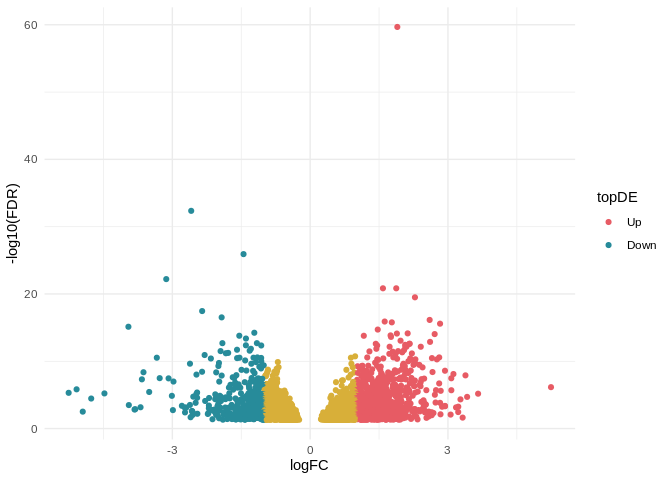

13.0.0-RNAseq-edgeR
================
Sam White
2024-05-29

- <a href="#1-edger-grouping-vector" id="toc-1-edger-grouping-vector">1
  edgeR GROUPING VECTOR</a>
  - <a href="#11-check-sample-info" id="toc-11-check-sample-info">1.1 Check
    sample info</a>
  - <a href="#12-create-edger-grouping-vector"
    id="toc-12-create-edger-grouping-vector">1.2 Create edgeR grouping
    vector</a>
- <a href="#2-degs" id="toc-2-degs">2 DEGs</a>
  - <a href="#21-load-count-matrix" id="toc-21-load-count-matrix">2.1 Load
    count matrix</a>
    - <a href="#211-reformat-header" id="toc-211-reformat-header">2.1.1
      Reformat header</a>
    - <a href="#212-convert-to-matrix" id="toc-212-convert-to-matrix">2.1.2
      Convert to matrix</a>
    - <a href="#213-load-matrix-into-edger"
      id="toc-213-load-matrix-into-edger">2.1.3 Load matrix into edgeR</a>
    - <a href="#214-filter-low-counts" id="toc-214-filter-low-counts">2.1.4
      Filter low counts</a>
    - <a href="#215-normalization" id="toc-215-normalization">2.1.5
      Normalization</a>
    - <a href="#216-model-fitting-and-estimating-dispersions"
      id="toc-216-model-fitting-and-estimating-dispersions">2.1.6 Model
      fitting and estimating dispersions</a>
    - <a href="#217-exact-test-gene-expression"
      id="toc-217-exact-test-gene-expression">2.1.7 Exact test (Gene
      expression)</a>
    - <a href="#218-differential-gene-expression-summary"
      id="toc-218-differential-gene-expression-summary">2.1.8 Differential
      gene expression summary</a>
    - <a href="#219-peek-at-degs" id="toc-219-peek-at-degs">2.1.9 Peek at
      DEGs</a>
    - <a href="#2110-volcano-plot" id="toc-2110-volcano-plot">2.1.10 Volcano
      plot</a>
- <a href="#3-citations" id="toc-3-citations">3 CITATIONS</a>

Differential gene expression of 9<sup>o</sup>C vs 16<sup>o</sup>C liver
RNA-seq using
[edgeR](https://bioconductor.org/packages/release/bioc/vignettes/edgeR/inst/doc/edgeRUsersGuide.pdf)
([Chen et al. 2024](#ref-chen2024); [McCarthy, Chen, and Smyth
2012](#ref-mccarthy2012); [Chen, Lun, and Smyth 2016](#ref-chen2016);
[Robinson, McCarthy, and Smyth 2009](#ref-robinson2009))

# 1 edgeR GROUPING VECTOR

## 1.1 Check sample info

Only looking at 9<sup>o</sup>C and 16<sup>o</sup>C

``` bash
echo "Header for ../data/DESeq2_Sample_Information.csv:"
echo ""

head -n 1 ../data/DESeq2_Sample_Information.csv

echo ""
echo "---------------------------------------------"
echo ""
awk -F"," '$4 == 16 || $4 == 9 {print $2, $4}' ../data/DESeq2_Sample_Information.csv | sort -n -k1,1
```

    Header for ../data/DESeq2_Sample_Information.csv:

    sample_name,sample_number,tank,temp_treatment,tissue_type

    ---------------------------------------------

    1 16
    2 16
    3 16
    4 16
    5 16
    10 16
    11 16
    12 16
    13 16
    18 16
    19 16
    19 16
    19 16
    20 16
    20 16
    20 16
    21 16
    28 16
    29 16
    30 16
    31 16
    36 16
    78 9
    79 9
    80 9
    83 9
    88 9
    90 9
    91 9
    92 9
    94 9
    97 9
    98 9
    99 9
    100 9
    107 9
    108 9
    109 9
    110 9
    116 9

## 1.2 Create edgeR grouping vector

Since all sample IDs `<=` to `36` are part of the 16<sup>o</sup>C
treatment, we can use this to create vector which matches sample
ordering in `../output/10.1-hisat-deseq2/gene_count_matrix.csv`

``` r
# Read the first line of the CSV file
header <- readLines("../output/10.1-hisat-deseq2/gene_count_matrix.csv", n = 1)

# Split the header to extract the values
values <- as.numeric(unlist(strsplit(header, ","))[-1]) # Remove the first element which is "gene_id"

# Apply the conditional logic to generate the temperatures vector
temperatures <- ifelse(values <= 36, "16C", "9C")

# Print the resulting vector
print(temperatures)
```

     [1] "16C" "16C" "9C"  "9C"  "9C"  "9C"  "16C" "9C"  "9C"  "16C" "16C" "16C"
    [13] "16C" "16C" "16C" "16C" "16C" "16C" "16C" "16C" "16C" "16C" "16C" "16C"
    [25] "9C"  "9C"  "9C"  "9C"  "9C"  "9C"  "9C"  "9C"  "9C"  "9C"  "9C"  "9C" 

# 2 DEGs

## 2.1 Load count matrix

### 2.1.1 Reformat header

``` r
# Read the entire CSV file
csv_file <- readLines("../output/10.1-hisat-deseq2/gene_count_matrix.csv")

# Extract the header line
header <- csv_file[1]

# Split the header to extract the values
header_values <- unlist(strsplit(header, ","))

# Prepend 'sample_' to each value (excluding 'gene_id')
header_values[-1] <- paste0("sample_", header_values[-1])

# Combine the modified header back into a single string
modified_header <- paste(header_values, collapse = ",")

# Replace the old header with the new modified header in the CSV content
csv_file[1] <- modified_header

# Convert the modified CSV content to a data frame
csv_content <- read.csv(textConnection(csv_file), row.names = 1)
```

### 2.1.2 Convert to matrix

``` r
# Convert the data frame to a matrix
gene_count_matrix <- as.matrix(csv_content)

# Print the matrix
print(head(gene_count_matrix))
```

                                       sample_1 sample_10 sample_100 sample_107
    gene-LOC132462341|LOC132462341          360       464        391        346
    gene-abce1|abce1                        694       325        276         77
    gene-si:dkey-6i22.5|si:dkey-6i22.5        0        10         13         11
    gene-ube2v1|ube2v1                       10        22         15         19
    gene-cldn15la|cldn15la                    0         9          0          0
    gene-muc15|muc15                          0        40         40         29
                                       sample_108 sample_109 sample_11 sample_110
    gene-LOC132462341|LOC132462341            691        408       436        509
    gene-abce1|abce1                          409        196       281        284
    gene-si:dkey-6i22.5|si:dkey-6i22.5         49         42        14         36
    gene-ube2v1|ube2v1                         74         28        63         35
    gene-cldn15la|cldn15la                     18          0         0          0
    gene-muc15|muc15                            8          0        38          0
                                       sample_116 sample_12 sample_13 sample_18
    gene-LOC132462341|LOC132462341            366       373       432       385
    gene-abce1|abce1                          327       310       393       386
    gene-si:dkey-6i22.5|si:dkey-6i22.5          0        14         9         0
    gene-ube2v1|ube2v1                         30        31        25        42
    gene-cldn15la|cldn15la                      0        27         0         0
    gene-muc15|muc15                           16        15         0         0
                                       sample_19 sample_2 sample_20 sample_21
    gene-LOC132462341|LOC132462341           330      288       307       346
    gene-abce1|abce1                         106      290       252       326
    gene-si:dkey-6i22.5|si:dkey-6i22.5         0       14         3        21
    gene-ube2v1|ube2v1                        17       14        21        60
    gene-cldn15la|cldn15la                     0        0         0         0
    gene-muc15|muc15                           0        0        22        22
                                       sample_28 sample_29 sample_3 sample_30
    gene-LOC132462341|LOC132462341           293       347      452       452
    gene-abce1|abce1                         345       254      363       353
    gene-si:dkey-6i22.5|si:dkey-6i22.5        26         9       39        20
    gene-ube2v1|ube2v1                        61        14       29        37
    gene-cldn15la|cldn15la                     0         0        4        35
    gene-muc15|muc15                          69        22        0        15
                                       sample_31 sample_36 sample_4 sample_5
    gene-LOC132462341|LOC132462341           984       230      469      400
    gene-abce1|abce1                         922       160      588      285
    gene-si:dkey-6i22.5|si:dkey-6i22.5        10         0        0       10
    gene-ube2v1|ube2v1                        68        37        0       30
    gene-cldn15la|cldn15la                     0         0        0        4
    gene-muc15|muc15                           0        34       55       51
                                       sample_78 sample_79 sample_80 sample_83
    gene-LOC132462341|LOC132462341           472       311       368       312
    gene-abce1|abce1                         178       119       197       134
    gene-si:dkey-6i22.5|si:dkey-6i22.5        48        41        60        39
    gene-ube2v1|ube2v1                        10        13        56        32
    gene-cldn15la|cldn15la                     0         0         0         0
    gene-muc15|muc15                           0        30        19        31
                                       sample_88 sample_90 sample_91 sample_92
    gene-LOC132462341|LOC132462341           551       631       605       366
    gene-abce1|abce1                         128       103       315       204
    gene-si:dkey-6i22.5|si:dkey-6i22.5        49        54        20        27
    gene-ube2v1|ube2v1                        45        55        27        38
    gene-cldn15la|cldn15la                     8        32         0         0
    gene-muc15|muc15                           0         0        42        34
                                       sample_94 sample_97 sample_98 sample_99
    gene-LOC132462341|LOC132462341           339       517       577       235
    gene-abce1|abce1                         301        56        49       260
    gene-si:dkey-6i22.5|si:dkey-6i22.5         7        22        63        12
    gene-ube2v1|ube2v1                        60        25        18        50
    gene-cldn15la|cldn15la                    14         0         0         0
    gene-muc15|muc15                           0         0        26        56

### 2.1.3 Load matrix into edgeR

``` r
dge <- DGEList(counts = gene_count_matrix, group = factor(temperatures))

dge
```

    An object of class "DGEList"
    $counts
                                       sample_1 sample_10 sample_100 sample_107
    gene-LOC132462341|LOC132462341          360       464        391        346
    gene-abce1|abce1                        694       325        276         77
    gene-si:dkey-6i22.5|si:dkey-6i22.5        0        10         13         11
    gene-ube2v1|ube2v1                       10        22         15         19
    gene-cldn15la|cldn15la                    0         9          0          0
                                       sample_108 sample_109 sample_11 sample_110
    gene-LOC132462341|LOC132462341            691        408       436        509
    gene-abce1|abce1                          409        196       281        284
    gene-si:dkey-6i22.5|si:dkey-6i22.5         49         42        14         36
    gene-ube2v1|ube2v1                         74         28        63         35
    gene-cldn15la|cldn15la                     18          0         0          0
                                       sample_116 sample_12 sample_13 sample_18
    gene-LOC132462341|LOC132462341            366       373       432       385
    gene-abce1|abce1                          327       310       393       386
    gene-si:dkey-6i22.5|si:dkey-6i22.5          0        14         9         0
    gene-ube2v1|ube2v1                         30        31        25        42
    gene-cldn15la|cldn15la                      0        27         0         0
                                       sample_19 sample_2 sample_20 sample_21
    gene-LOC132462341|LOC132462341           330      288       307       346
    gene-abce1|abce1                         106      290       252       326
    gene-si:dkey-6i22.5|si:dkey-6i22.5         0       14         3        21
    gene-ube2v1|ube2v1                        17       14        21        60
    gene-cldn15la|cldn15la                     0        0         0         0
                                       sample_28 sample_29 sample_3 sample_30
    gene-LOC132462341|LOC132462341           293       347      452       452
    gene-abce1|abce1                         345       254      363       353
    gene-si:dkey-6i22.5|si:dkey-6i22.5        26         9       39        20
    gene-ube2v1|ube2v1                        61        14       29        37
    gene-cldn15la|cldn15la                     0         0        4        35
                                       sample_31 sample_36 sample_4 sample_5
    gene-LOC132462341|LOC132462341           984       230      469      400
    gene-abce1|abce1                         922       160      588      285
    gene-si:dkey-6i22.5|si:dkey-6i22.5        10         0        0       10
    gene-ube2v1|ube2v1                        68        37        0       30
    gene-cldn15la|cldn15la                     0         0        0        4
                                       sample_78 sample_79 sample_80 sample_83
    gene-LOC132462341|LOC132462341           472       311       368       312
    gene-abce1|abce1                         178       119       197       134
    gene-si:dkey-6i22.5|si:dkey-6i22.5        48        41        60        39
    gene-ube2v1|ube2v1                        10        13        56        32
    gene-cldn15la|cldn15la                     0         0         0         0
                                       sample_88 sample_90 sample_91 sample_92
    gene-LOC132462341|LOC132462341           551       631       605       366
    gene-abce1|abce1                         128       103       315       204
    gene-si:dkey-6i22.5|si:dkey-6i22.5        49        54        20        27
    gene-ube2v1|ube2v1                        45        55        27        38
    gene-cldn15la|cldn15la                     8        32         0         0
                                       sample_94 sample_97 sample_98 sample_99
    gene-LOC132462341|LOC132462341           339       517       577       235
    gene-abce1|abce1                         301        56        49       260
    gene-si:dkey-6i22.5|si:dkey-6i22.5         7        22        63        12
    gene-ube2v1|ube2v1                        60        25        18        50
    gene-cldn15la|cldn15la                    14         0         0         0
    30570 more rows ...

    $samples
               group lib.size norm.factors
    sample_1     16C 49994893            1
    sample_10    16C 43506227            1
    sample_100    9C 44600544            1
    sample_107    9C 41991971            1
    sample_108    9C 47412580            1
    31 more rows ...

### 2.1.4 Filter low counts

Filters for genes with at \>= `10` reads across at least 3 samples.

``` r
keep <- filterByExpr(dge)

dge <- dge[keep, , keep.lib.sizes=FALSE]

dge
```

    An object of class "DGEList"
    $counts
                                       sample_1 sample_10 sample_100 sample_107
    gene-LOC132462341|LOC132462341          360       464        391        346
    gene-abce1|abce1                        694       325        276         77
    gene-si:dkey-6i22.5|si:dkey-6i22.5        0        10         13         11
    gene-ube2v1|ube2v1                       10        22         15         19
    gene-muc15|muc15                          0        40         40         29
                                       sample_108 sample_109 sample_11 sample_110
    gene-LOC132462341|LOC132462341            691        408       436        509
    gene-abce1|abce1                          409        196       281        284
    gene-si:dkey-6i22.5|si:dkey-6i22.5         49         42        14         36
    gene-ube2v1|ube2v1                         74         28        63         35
    gene-muc15|muc15                            8          0        38          0
                                       sample_116 sample_12 sample_13 sample_18
    gene-LOC132462341|LOC132462341            366       373       432       385
    gene-abce1|abce1                          327       310       393       386
    gene-si:dkey-6i22.5|si:dkey-6i22.5          0        14         9         0
    gene-ube2v1|ube2v1                         30        31        25        42
    gene-muc15|muc15                           16        15         0         0
                                       sample_19 sample_2 sample_20 sample_21
    gene-LOC132462341|LOC132462341           330      288       307       346
    gene-abce1|abce1                         106      290       252       326
    gene-si:dkey-6i22.5|si:dkey-6i22.5         0       14         3        21
    gene-ube2v1|ube2v1                        17       14        21        60
    gene-muc15|muc15                           0        0        22        22
                                       sample_28 sample_29 sample_3 sample_30
    gene-LOC132462341|LOC132462341           293       347      452       452
    gene-abce1|abce1                         345       254      363       353
    gene-si:dkey-6i22.5|si:dkey-6i22.5        26         9       39        20
    gene-ube2v1|ube2v1                        61        14       29        37
    gene-muc15|muc15                          69        22        0        15
                                       sample_31 sample_36 sample_4 sample_5
    gene-LOC132462341|LOC132462341           984       230      469      400
    gene-abce1|abce1                         922       160      588      285
    gene-si:dkey-6i22.5|si:dkey-6i22.5        10         0        0       10
    gene-ube2v1|ube2v1                        68        37        0       30
    gene-muc15|muc15                           0        34       55       51
                                       sample_78 sample_79 sample_80 sample_83
    gene-LOC132462341|LOC132462341           472       311       368       312
    gene-abce1|abce1                         178       119       197       134
    gene-si:dkey-6i22.5|si:dkey-6i22.5        48        41        60        39
    gene-ube2v1|ube2v1                        10        13        56        32
    gene-muc15|muc15                           0        30        19        31
                                       sample_88 sample_90 sample_91 sample_92
    gene-LOC132462341|LOC132462341           551       631       605       366
    gene-abce1|abce1                         128       103       315       204
    gene-si:dkey-6i22.5|si:dkey-6i22.5        49        54        20        27
    gene-ube2v1|ube2v1                        45        55        27        38
    gene-muc15|muc15                           0         0        42        34
                                       sample_94 sample_97 sample_98 sample_99
    gene-LOC132462341|LOC132462341           339       517       577       235
    gene-abce1|abce1                         301        56        49       260
    gene-si:dkey-6i22.5|si:dkey-6i22.5         7        22        63        12
    gene-ube2v1|ube2v1                        60        25        18        50
    gene-muc15|muc15                           0         0        26        56
    16688 more rows ...

    $samples
               group lib.size norm.factors
    sample_1     16C 49973355            1
    sample_10    16C 43459343            1
    sample_100    9C 44577844            1
    sample_107    9C 41972179            1
    sample_108    9C 47313070            1
    31 more rows ...

### 2.1.5 Normalization

``` r
dge <- calcNormFactors(object = dge)

dge
```

    An object of class "DGEList"
    $counts
                                       sample_1 sample_10 sample_100 sample_107
    gene-LOC132462341|LOC132462341          360       464        391        346
    gene-abce1|abce1                        694       325        276         77
    gene-si:dkey-6i22.5|si:dkey-6i22.5        0        10         13         11
    gene-ube2v1|ube2v1                       10        22         15         19
    gene-muc15|muc15                          0        40         40         29
                                       sample_108 sample_109 sample_11 sample_110
    gene-LOC132462341|LOC132462341            691        408       436        509
    gene-abce1|abce1                          409        196       281        284
    gene-si:dkey-6i22.5|si:dkey-6i22.5         49         42        14         36
    gene-ube2v1|ube2v1                         74         28        63         35
    gene-muc15|muc15                            8          0        38          0
                                       sample_116 sample_12 sample_13 sample_18
    gene-LOC132462341|LOC132462341            366       373       432       385
    gene-abce1|abce1                          327       310       393       386
    gene-si:dkey-6i22.5|si:dkey-6i22.5          0        14         9         0
    gene-ube2v1|ube2v1                         30        31        25        42
    gene-muc15|muc15                           16        15         0         0
                                       sample_19 sample_2 sample_20 sample_21
    gene-LOC132462341|LOC132462341           330      288       307       346
    gene-abce1|abce1                         106      290       252       326
    gene-si:dkey-6i22.5|si:dkey-6i22.5         0       14         3        21
    gene-ube2v1|ube2v1                        17       14        21        60
    gene-muc15|muc15                           0        0        22        22
                                       sample_28 sample_29 sample_3 sample_30
    gene-LOC132462341|LOC132462341           293       347      452       452
    gene-abce1|abce1                         345       254      363       353
    gene-si:dkey-6i22.5|si:dkey-6i22.5        26         9       39        20
    gene-ube2v1|ube2v1                        61        14       29        37
    gene-muc15|muc15                          69        22        0        15
                                       sample_31 sample_36 sample_4 sample_5
    gene-LOC132462341|LOC132462341           984       230      469      400
    gene-abce1|abce1                         922       160      588      285
    gene-si:dkey-6i22.5|si:dkey-6i22.5        10         0        0       10
    gene-ube2v1|ube2v1                        68        37        0       30
    gene-muc15|muc15                           0        34       55       51
                                       sample_78 sample_79 sample_80 sample_83
    gene-LOC132462341|LOC132462341           472       311       368       312
    gene-abce1|abce1                         178       119       197       134
    gene-si:dkey-6i22.5|si:dkey-6i22.5        48        41        60        39
    gene-ube2v1|ube2v1                        10        13        56        32
    gene-muc15|muc15                           0        30        19        31
                                       sample_88 sample_90 sample_91 sample_92
    gene-LOC132462341|LOC132462341           551       631       605       366
    gene-abce1|abce1                         128       103       315       204
    gene-si:dkey-6i22.5|si:dkey-6i22.5        49        54        20        27
    gene-ube2v1|ube2v1                        45        55        27        38
    gene-muc15|muc15                           0         0        42        34
                                       sample_94 sample_97 sample_98 sample_99
    gene-LOC132462341|LOC132462341           339       517       577       235
    gene-abce1|abce1                         301        56        49       260
    gene-si:dkey-6i22.5|si:dkey-6i22.5         7        22        63        12
    gene-ube2v1|ube2v1                        60        25        18        50
    gene-muc15|muc15                           0         0        26        56
    16688 more rows ...

    $samples
               group lib.size norm.factors
    sample_1     16C 49973355    1.0828322
    sample_10    16C 43459343    1.3481915
    sample_100    9C 44577844    0.9792758
    sample_107    9C 41972179    0.7062689
    sample_108    9C 47313070    1.5247621
    31 more rows ...

### 2.1.6 Model fitting and estimating dispersions

``` r
dge <- estimateDisp(dge)

dge
```

    An object of class "DGEList"
    $counts
                                       sample_1 sample_10 sample_100 sample_107
    gene-LOC132462341|LOC132462341          360       464        391        346
    gene-abce1|abce1                        694       325        276         77
    gene-si:dkey-6i22.5|si:dkey-6i22.5        0        10         13         11
    gene-ube2v1|ube2v1                       10        22         15         19
    gene-muc15|muc15                          0        40         40         29
                                       sample_108 sample_109 sample_11 sample_110
    gene-LOC132462341|LOC132462341            691        408       436        509
    gene-abce1|abce1                          409        196       281        284
    gene-si:dkey-6i22.5|si:dkey-6i22.5         49         42        14         36
    gene-ube2v1|ube2v1                         74         28        63         35
    gene-muc15|muc15                            8          0        38          0
                                       sample_116 sample_12 sample_13 sample_18
    gene-LOC132462341|LOC132462341            366       373       432       385
    gene-abce1|abce1                          327       310       393       386
    gene-si:dkey-6i22.5|si:dkey-6i22.5          0        14         9         0
    gene-ube2v1|ube2v1                         30        31        25        42
    gene-muc15|muc15                           16        15         0         0
                                       sample_19 sample_2 sample_20 sample_21
    gene-LOC132462341|LOC132462341           330      288       307       346
    gene-abce1|abce1                         106      290       252       326
    gene-si:dkey-6i22.5|si:dkey-6i22.5         0       14         3        21
    gene-ube2v1|ube2v1                        17       14        21        60
    gene-muc15|muc15                           0        0        22        22
                                       sample_28 sample_29 sample_3 sample_30
    gene-LOC132462341|LOC132462341           293       347      452       452
    gene-abce1|abce1                         345       254      363       353
    gene-si:dkey-6i22.5|si:dkey-6i22.5        26         9       39        20
    gene-ube2v1|ube2v1                        61        14       29        37
    gene-muc15|muc15                          69        22        0        15
                                       sample_31 sample_36 sample_4 sample_5
    gene-LOC132462341|LOC132462341           984       230      469      400
    gene-abce1|abce1                         922       160      588      285
    gene-si:dkey-6i22.5|si:dkey-6i22.5        10         0        0       10
    gene-ube2v1|ube2v1                        68        37        0       30
    gene-muc15|muc15                           0        34       55       51
                                       sample_78 sample_79 sample_80 sample_83
    gene-LOC132462341|LOC132462341           472       311       368       312
    gene-abce1|abce1                         178       119       197       134
    gene-si:dkey-6i22.5|si:dkey-6i22.5        48        41        60        39
    gene-ube2v1|ube2v1                        10        13        56        32
    gene-muc15|muc15                           0        30        19        31
                                       sample_88 sample_90 sample_91 sample_92
    gene-LOC132462341|LOC132462341           551       631       605       366
    gene-abce1|abce1                         128       103       315       204
    gene-si:dkey-6i22.5|si:dkey-6i22.5        49        54        20        27
    gene-ube2v1|ube2v1                        45        55        27        38
    gene-muc15|muc15                           0         0        42        34
                                       sample_94 sample_97 sample_98 sample_99
    gene-LOC132462341|LOC132462341           339       517       577       235
    gene-abce1|abce1                         301        56        49       260
    gene-si:dkey-6i22.5|si:dkey-6i22.5         7        22        63        12
    gene-ube2v1|ube2v1                        60        25        18        50
    gene-muc15|muc15                           0         0        26        56
    16688 more rows ...

    $samples
               group lib.size norm.factors
    sample_1     16C 49973355    1.0828322
    sample_10    16C 43459343    1.3481915
    sample_100    9C 44577844    0.9792758
    sample_107    9C 41972179    0.7062689
    sample_108    9C 47313070    1.5247621
    31 more rows ...

    $common.dispersion
    [1] 0.3258355

    $trended.dispersion
    [1] 0.1792662 0.2158552 0.8880326 0.7699354 0.9217978
    16688 more elements ...

    $tagwise.dispersion
    [1] 0.1017614 0.1666824 0.9805648 0.3988847 2.8340881
    16688 more elements ...

    $AveLogCPM
    [1]  3.3189831  2.6344211 -0.7839951 -0.2807668 -0.9718511
    16688 more elements ...

    $trend.method
    [1] "locfit"

    $prior.df
    [1] 4.732584

    $prior.n
    [1] 0.1391936

    $span
    [1] 0.2910468

### 2.1.7 Exact test (Gene expression)

``` r
exact_test_genes <- exactTest(dge)

exact_test_genes
```

    An object of class "DGEExact"
    $table
                                            logFC     logCPM       PValue
    gene-LOC132462341|LOC132462341      0.3690768  3.3189831 0.0174459833
    gene-abce1|abce1                   -0.7406649  2.6344211 0.0002052135
    gene-si:dkey-6i22.5|si:dkey-6i22.5  1.8787265 -0.7839951 0.0001945058
    gene-ube2v1|ube2v1                  0.2838600 -0.2807668 0.3721151448
    gene-muc15|muc15                    0.0123765 -0.9718511 0.9923746564
    16688 more rows ...

    $comparison
    [1] "16C" "9C" 

    $genes
    NULL

### 2.1.8 Differential gene expression summary

``` r
summary(decideTests(object = exact_test_genes, p.value = 0.05))
```

           9C-16C
    Down     2071
    NotSig  11980
    Up       2642

### 2.1.9 Peek at DEGs

``` r
top_degs_table <-  topTags(object = exact_test_genes, n = "Inf", adjust.method = "fdr", p.value = 0.05)$table

str(top_degs_table)
```

    'data.frame':   16693 obs. of  4 variables:
     $ logFC : num  1.9 -2.59 -1.45 -3.13 1.87 ...
     $ logCPM: num  6.59 4.06 4.93 3.18 5.57 ...
     $ PValue: num  1.26e-64 5.31e-37 2.15e-30 1.48e-26 4.65e-25 ...
     $ FDR   : num  2.10e-60 4.43e-33 1.19e-26 6.18e-23 1.43e-21 ...

### 2.1.10 Volcano plot

``` r
ghibli_colors <- ghibli_palette("PonyoMedium", type = "discrete")

ghibli_subset <- c(ghibli_colors[3], ghibli_colors[6], ghibli_colors[4])

# Create new column and fill with `NA`
top_degs_table$topDE <- "NA"

# Set value of "Up" for genes with FC > 1 and FDR < 0.05
top_degs_table$topDE[top_degs_table$logFC > 1 & top_degs_table$FDR < 0.05] <- "Up"

# Set value of "Down" for genes with FC < -1 and FDR < 0.05
top_degs_table$topDE[top_degs_table$logFC < -1 & top_degs_table$FDR < 0.05] <- "Down"

ggplot(data=top_degs_table, aes(x=logFC, y=-log10(FDR), color = topDE)) + 
  geom_point() +
  theme_minimal() +
  scale_colour_discrete(type = ghibli_subset, breaks = c("Up", "Down"))
```

<!-- -->

# 3 CITATIONS

<div id="refs" class="references csl-bib-body hanging-indent">

<div id="ref-chen2024" class="csl-entry">

Chen, Yunshun, Lizhong Chen, Aaron T. L. Lun, Pedro L. Baldoni, and
Gordon K. Smyth. 2024. “edgeR 4.0: Powerful Differential Analysis of
Sequencing Data with Expanded Functionality and Improved Support for
Small Counts and Larger Datasets.”
<http://dx.doi.org/10.1101/2024.01.21.576131>.

</div>

<div id="ref-chen2016" class="csl-entry">

Chen, Yunshun, Aaron T. L. Lun, and Gordon K. Smyth. 2016. “From Reads
to Genes to Pathways: Differential Expression Analysis of RNA-Seq
Experiments Using Rsubread and the edgeR Quasi-Likelihood Pipeline.”
*F1000Research* 5 (August): 1438.
<https://doi.org/10.12688/f1000research.8987.2>.

</div>

<div id="ref-mccarthy2012" class="csl-entry">

McCarthy, Davis J., Yunshun Chen, and Gordon K. Smyth. 2012.
“Differential Expression Analysis of Multifactor RNA-Seq Experiments
with Respect to Biological Variation.” *Nucleic Acids Research* 40 (10):
4288–97. <https://doi.org/10.1093/nar/gks042>.

</div>

<div id="ref-robinson2009" class="csl-entry">

Robinson, Mark D., Davis J. McCarthy, and Gordon K. Smyth. 2009. “edgeR:
A Bioconductor Package for Differential Expression Analysis of Digital
Gene Expression Data.” *Bioinformatics* 26 (1): 139–40.
<https://doi.org/10.1093/bioinformatics/btp616>.

</div>

</div>
