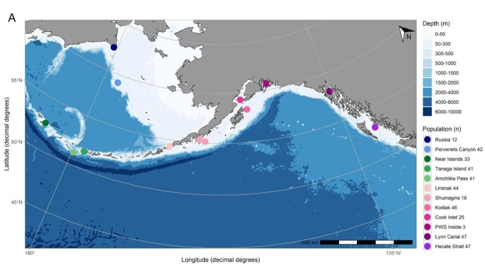

```{r setup, include=FALSE}
# Set global options to suppress warnings and messages
knitr::opts_chunk$set(
  warning = FALSE,  # Suppress warnings
  message = FALSE   # Suppress messages
)
```

In this notebook I assign our experimental fish that were collected off Kodiak Island, AK to known spawning populations. Fin clips were collected from all experimental fish (n=160, including the 4 morts) and sequenced using lcWGS. From a previous experiment (Sara Schaal and Ingrid Spies) there is lcWGS data from 100's of fish from many different spawning locations in the northeast Pacific Ocean. I will attempt to assign my fish to these spawning locations at the finest possible resolution.  

#

I use a combination of the [AFSC lcWGS pipeline](https://github.com/AFSC-Genetics/lcWGS-pipeline) developed by Laura Timm and Sara Schaal, and the pipeline outlined in the [amre-adaptation github](https://github.com/mgdesaix/amre-adaptation/tree/main) by Matt DeSaix, which includes his program WGSassign. This is based on suggestions from Sara Schaal. Here's what she had to say:  

_I would still try with all the loci and use the low-coverage assignment method that Eric Anderson's group put out (paper here). If it is anything like GTseq which I assume it will be, what you would have to do is build a sites file from the baseline dataset (all my samples) and only use those sites with your dataset. Otherwise there will be a ton of sites in one dataset, but not the other which will drive the PCA (hence big batch effect). Then once you only get data from those sites you would filter based on missing data. That would probably need to be played with a bit to see what levels of missing data you can get away with. I had to go fairly high with GTseq to get rid of obvious missing data driving results. A PCA is good for determine how bad the missing data influences results before you do any assignments._ 

_I think this is your best option for assignment. Low-coverage data is hard to get accurate genotype calls from so I'd be worried about biases in your called genotype data from low-coverage. I really think that WGSassign is what you need._ 

_I'd be more than happy to try and help you implement this method. Its something I've wanted to do with the baseline for awhile, but just haven't had time. I do have sites for GT-seq and I can share that, but I would still be worried about your results given called genotypes from low-coverage data. I have markers in ZP3 that I purposely designed the panel to include. Let me know what you think and maybe we could buddy up trying to get WGSassign to work for your data. I think it'll be useful for a lot of folks and for me too so I'd be happy to carve out time to work on this with you._

#### Load libraries and source scripts 

```{r, message=FALSE, warning=FALSE, results=FALSE}
# Add all required libraries that are installed with install.packages() here
list.of.packages <- c("tidyverse", "readxl", "janitor", "purrr", "ggpubr", "googlesheets4", "plotly", "ggrepel", "clipr", "knitr", "scales", "colorspace")

# Load all required libraries
all.packages <- c(list.of.packages)
lapply(all.packages, FUN = function(X) {
  do.call("require", list(X))
})

`%!in%` = Negate(`%in%`)
source("../references/biostats.R")
```

### Read in lcWGS metadata 

```{r, message=F, warning=F}
# treatment info for experimental fish 
sample.info.lcwgs <- read_excel("../../data/Pcod Temp Growth experiment 2022-23 DATA.xlsx", sheet = "AllData") %>% clean_names() %>%
  mutate_at(c("tank", "temperature"), factor) %>%
  dplyr::select(temperature, genetic_sampling_count) %>% 
  dplyr::rename(sample=genetic_sampling_count, treatment=temperature) %>% mutate(marine_region=NA) %>%
  
   # add reference fish metadata
   rbind(
    read_excel("../references/20230414_pcod_named.xlsx") %>% clean_names() %>%
      dplyr::select(ablg, location1, marine_region) %>% dplyr::rename(sample=ablg, treatment=location1)) %>%
  
  # add Ingrid's marine region 2
  left_join(
    read_delim("../analysis-20240606/wgsassign/allcod_filtered_bamslist_meta_rmasia.csv") %>% clean_names() %>%
      dplyr::select(ablg, marine_region2) %>% dplyr::rename(sample=ablg, marine_region_ingrid=marine_region2), by="sample") %>%
      mutate(marine_region=as.factor(marine_region), marine_region_ingrid=as.factor(marine_region_ingrid)) %>%
  
  #fill in marine_region2 with marine_region where empty 
  mutate(marine_region2=case_when(
    !is.na(marine_region_ingrid) ~ marine_region_ingrid,
    TRUE ~ marine_region))
```

## Identify putative population-specific markers in reference fish 

Here I prep inputs for the AFSC lcWGS pipeline developed by Laura Timm. This pipeline will get me through the alignment step.  

- Create a new analysis directory with two sub-directories, **analysis20240606/reference/** for all lcWGS data from fish of known origin (filtered to remove some fish that can cause issues, as per Sara/Ingrid), and **analysis20240606/experimental/** with lcWGS from our experimental fish of unknown origin.  
- I will use the NCBI version of the Pacific cod genome for alignment etc., since that's what I'm using for RNASeq and Ingrid is also using that.  
- Create a chromosomes_pcod-ncbi.txt file using `grep ">" /home/lspencer/references/pcod-ncbi/GCF_031168955.1_ASM3116895v1_genomic.fa | tr -d '>' >> chromosomes_pcod-ncbi.txt`  
- Generate input files: adapters.txt (got this from Laura Timm), blacklist.txt (empty for now), and lcWGS_config.txt (copied from the lcWGS repository)  
- Modify the lcWGS_config.txt file with appropriate paths.  
- rsync the experimental fish data (all .fq beginning with "GM") to the experimental/ subdirectory (used `rsync` instead of `mv` to ensure data integrity)   
- Transfer all the reference fish lcWGS data from SednaGold using rsync: 

```
cd /home/lspencer/pcod-lcWGS/analysis20240606/reference/

rsync --archive --progress --verbose laura.spencer@161.55.97.203:/sednagold/Gadus_macrocephalus/novaseq/*.fq.gz .
rsync --archive --progress --verbose laura.spencer@161.55.97.203:/sednagold/Gadus_macrocephalus/novaseq/20220713_secondSeqRun/*.fq.gz .
rsync --archive --progress --verbose laura.spencer@161.55.97.203:/sednagold/Gadus_macrocephalus/novaseq/20221215_seqR3/*.fastq.gz .
```

For each of the reference and experimental data sets, created file that lists the data: 
- references: pcod-reference-fastqs-filtered.txt  
- pcod-experimental-fastqs.txt  


### Run most AFSC pipeline steps on _reference_ fish to get alignments 

Initiate interactiv node on Sedna
`srun --pty /bin/bash`

Activate virtual environment to access MultiQC: 
```
source /home/lspencer/venv/bin/activate
```

Define path variables:
```
scripts=/home/lspencer/lcWGS-pipeline/
inputs=/home/lspencer/pcod-lcwgs-2023/analysis-20240606/reference/
```

Run first four python scripts, which generate slurm scripts needed for fastqc, trimming, and alignment: 
```
${scripts}lcWGSpipeline_step0-configure.py -c ${inputs}lcWGS_config.txt
${scripts}lcWGSpipeline_step1-qc.py -p pcod-refs.ckpt
${scripts}lcWGSpipeline_step2-trim.py -p pcod-refs.ckpt
/home/lspencer/lcWGS-pipeline/lcWGSpipeline_step3-align.py -p pcod-refs.ckpt
```

As per instructions, edited the MultiQC scripts (for raw and trimmed data) using nano to use the correct path to activate my virtual environment (/home/lspencer/venv/bin/activate)

Then initiated these SLURM scripts (they ran at the same time):
```
sbatch scripts/GCF_031168955.1_ASM3116895v1_genomic_bwa-indexSLURM.sh
sbatch scripts/GCF_031168955.1_ASM3116895v1_genomic_faiSLURM.sh
```

**_Issue encountered due to >1k sample files_**    

These jobs are run as job arrays (1 per .fq file), which have a max arrage size of 1000. I have 1,310 .fq files to process so cannot simply run the slurm array scripts. With help from Giles, I broke the fastqARRAY.sh into two separate jobs: 

Here is Script #1 (scripts/pcod-refs-raw_fastqcARRAY-1.sh), which runs through files 1-1000: 

```
#!/bin/bash

#SBATCH --job-name=fqc_array_pcod-refs
#SBATCH --cpus-per-task=1
#SBATCH --output=/home/lspencer/pcod-lcwgs-2023/analysis-20240606/reference/job_outfiles/pcod-refs-raw_fastqc_%A-%a.out
#SBATCH --mail-type=FAIL
#SBATCH --mail-user=laura.spencer@noaa.gov
#SBATCH --time=0-03:00:00
#SBATCH --array=1-1000%24

module unload bio/fastqc/0.11.9
module load bio/fastqc/0.11.9

JOBS_FILE=/home/lspencer/pcod-lcwgs-2023/analysis-20240606/reference/scripts/pcod-refs-raw_fqcARRAY_input.txt
IDS=$(cat ${JOBS_FILE})

for sample_line in ${IDS}
do
        job_index=$(echo ${sample_line} | awk -F ":" '{print $1}')
        fq=$(echo ${sample_line} | awk -F ":" '{print $2}')
        if [[ ${SLURM_ARRAY_TASK_ID} == ${job_index} ]]; then
                break
        fi
done

fastqc ${fq} -o /home/lspencer/pcod-lcwgs-2023/analysis-20240606/reference/fastqc/raw/
```

Here is Script #2 (scripts/pcod-refs-raw_fastqcARRAY-2.sh), which runs through files 1001+

```
#!/bin/bash

#SBATCH --job-name=fqc_array_pcod-refs
#SBATCH --cpus-per-task=1
#SBATCH --output=/home/lspencer/pcod-lcwgs-2023/analysis-20240606/reference/job_outfiles/pcod-refs-raw_fastqc_%A-%a.out
#SBATCH --mail-type=FAIL
#SBATCH --mail-user=laura.spencer@noaa.gov
#SBATCH --time=0-03:00:00
#SBATCH --array=1-310%24

module unload bio/fastqc/0.11.9
module load bio/fastqc/0.11.9

JOBS_FILE=/home/lspencer/pcod-lcwgs-2023/analysis-20240606/reference/scripts/pcod-refs-raw_fqcARRAY_input.txt
IDS=$(cat ${JOBS_FILE})

POSMOD=1000
NEW_TASK_ID=$((${SLURM_ARRAY_TASK_ID} + ${POSMOD}))

for sample_line in ${IDS}
do
        job_index=$(echo ${sample_line} | awk -F ":" '{print $1}')
        fq=$(echo ${sample_line} | awk -F ":" '{print $2}')
        if [[ ${NEW_TASK_ID} == ${job_index} ]]; then
                break
        fi
done

fastqc ${fq} -o /home/lspencer/pcod-lcwgs-2023/analysis-20240606/reference/fastqc/raw/
```

When the fastqc SLURM jobs were done, edited the multiqc script to remove the cpus option (deleted `#SBATCH --cpus-per-task=1`) and replaced that to specify using a himem node (`#SBATCH -p himem`). I then ran the script `sbatch scripts/pcod-refs-raw_multiqcSLURM.sh`, after it finished I renamed it to "_raw" and transferred the multiqc files to my local computer to view: "pcod-juveniles-2023\lcWGS\analysis-20240606/references/multiqc_report_raw.html". 

I then edited the trim script to increase the time (it was just 12hr before) and ran it:
```
sbatch scripts/pcod-refs_trimARRAY.sh
```

I then split the pcod-refs-trim_fastqcArray.sh script into two as I did before with the raw data, since the array number exceeded 1,000, ran those, then when they were finished I ran the multiQC script. 

```
sbatch scripts/pcod-refs-trim_fastqcARRAY-1.sh  
sbatch scripts/pcod-refs-trim_fastqcARRAY-2.sh  
sbatch scripts/pcod-refs-trim_multiqcSLURM.sh  
```

Transferred the multiqc html file to my local computer, renamed to "_trimmed". A handful of samples have low counts, but the adapter trimming looks good!

Ran the alignment scripts one after the other:  
`sbatch pcod-refs_alignARRAY.sh`  
`sbatch scripts/pcod-refs_depthsARRAY.sh` - I had to modify this script to include the full path for the python script  `/home/lspencer/lcWGS-pipeline/mean_cov_ind.py`.  

### Examine number of reads and alignment depths to identify fish for "blacklist"

Here I create a barplot with the # of unique reads for each sample.

```{r}
#ggplotly(
read.delim("../analysis-20240606/reference/multiqc_data_trimmed/mqc_fastqc_sequence_counts_plot_1.txt") %>% clean_names() %>%
    mutate(sample=gsub("_trimmed_clipped|_paired", "", sample)) %>%
  arrange(unique_reads) %>% mutate(sample=factor(sample, ordered=TRUE)) %>%
  ggplot() + geom_bar(aes(x=fct_reorder(sample, as.numeric(unique_reads)), y=unique_reads), stat = "identity") + ggtitle("Unique reads by sample") +
  theme(axis.text.x = element_text(angle=90), axis.ticks.x = element_blank())#) 
```

Potential blacklist members, <1M unique reads: (although from the AFSC pipeline it looks like I should determine that after alignment): ABLG1972, ABLG10851, ABLG2136, ABLG2223, ABLG2927, ABLG2571, ABLG2210, ABLG2357, ABLG2509, ABLG2506, ABLG1948  

Now look at depths data after alignment. The lcWGS pipeline states that samples with mean depth much <1 should be blacklisted. 22 samples have depth <0.75, which I added to the blacklist file, "blacklist.txt". 

```{r}
#ggplotly(
  read.delim("../analysis-20240606/reference/pcod-refs_depths.csv", header = F, col.names = c("sample", "depth")) %>%
  arrange(depth) %>% mutate(sample=factor(sample, ordered=TRUE)) %>%
  ggplot() + geom_bar(aes(x=fct_reorder(sample, as.numeric(depth)), y=depth), stat = "identity") + ggtitle("Mean depth, reference fish") +
  scale_y_continuous(limits=c(0, 8), breaks = c(0,1,2,3,4,5,6,7,8)) + ylab("Mean depth") + xlab("Sample") +
  theme(axis.text.x = element_blank(), axis.ticks.x = element_blank())#) 

read.delim("../analysis-20240606/reference/pcod-refs_depths.csv", header = F, col.names = c("sample", "depth")) %>%
  arrange(depth) %>%
  filter(depth < 0.75) %>%
  dplyr::select(sample) %>%
  write_delim("../analysis-20240606/reference/pcod-refs_blacklist.txt", col_names = F, delim = "\t")
```

#### Here are how many blacklisted reference samples I have from each population (mean depth <0.75)

```{r}
read.delim("../analysis-20240606/reference/pcod-refs_depths.csv", header = F, col.names = c("sample", "depth")) %>%
  arrange(depth) %>%
  filter(depth < 0.75) %>% mutate(sample=as.numeric(gsub("ABLG", "", sample))) %>% 
  left_join(sample.info.lcwgs) %>% 
  dplyr::rename("population"="treatment") %>%
  group_by(population) %>% summarize(n=n()) %>% arrange(desc(n)) %>% 
  kable()
```


```{r}
paste("Mean depth across all fish after removing blacklisted ones: ",
  round((read.delim("../analysis-20240606/reference/pcod-refs_depths.csv", header = F, col.names = c("sample", "depth")) %>%
  arrange(depth) %>% filter(depth > 0.75) %>% summarize(mean=mean(depth)))$mean, digits = 2), "%", sep="")
```

#### Here is a tally of reference fish per spawning location & marine region

Marine_region2 is combination of marine_region and marine_region_ingrid

```{r, message=F, warning=F}
ref.bams <- read_delim("../analysis-20240606/reference/pcod-refs_filtered_bamslist.txt", delim = "\t", col_names = "file") %>%
  mutate(sample=as.numeric(gsub("/home/lspencer/pcod-lcwgs-2023/analysis-20240606/reference/bamtools/pcod-refs_ABLG|_sorted_dedup_clipped.bam", "", file))) %>%
  left_join(sample.info.lcwgs)

ref.bams %>% group_by(treatment,marine_region2) %>% tally() %>% arrange(treatment) %>% kable()

ref.bams %>% group_by(marine_region2) %>% tally() %>% kable()
```

### Generate genotype likelihoods for reference fish 

Here I use ANGSD following amre-adaptation/WGSAssign settings to generate genotype likelihoods for my reference fish. To do so, I ran `/home/lspencer/lcWGS-pipeline/lcWGSpipeline_step4-data.py -p pcod-refs.ckpt -b blacklist.txt`, which generated two SLURM scripts that run ANGSD to generate genotype likelihood data (.beagle files). I edited and renamed one of the scripts (`scripts/pcod-refs_polymorphicARRAY.sh`) to use ANGSD filtering thresholds as per the WGSAssign [paper](https://github.com/mgdesaix/amre-adaptation/tree/main/02_PopulationGenetics)/[pipeline](https://github.com/mgdesaix/WGSassign). I ran that script via  **sbatch scripts/pcod-refs_wgassign-polymorphicARRAY.sh**, then concatenated gls from each separate chromosome into one whole-genome beagle file with the script `scripts/pcod-refs_concatenate_beagles_corrected.sh`. NOTE: I had to manually correct that script to not include extraneous chromosome header information. 

#### _The resulting beagle file containing whole-genome genotype likelihoods was: reference/gls_wgassign/pcod-refs_wholegenome_wgassign.beagle_

### Check reference SNPs for linkage disequilibrium 

I then completely abandoned the lcWGS pipeline, and followed the protocol outlined here [mgdesaix/amre-adaptation](https://github.com/mgdesaix/amre-adaptation/tree/main/02_PopulationGenetics#subset-beagle-files) to check my list of SNPs in reference fish for linkage disequilibrium using the program `ngsLD`. Linked sites are typically pruned (removed) since their presence can bias results. As per the protocol, I referenced [this tutorial](https://github.com/nt246/lcwgs-guide-tutorial/blob/main/tutorial3_ld_popstructure/markdowns/ld.md#prepare-the-input-files) to prepare my input files for `ngsLD` (note: ngsLD is already on Sedna, which is handy).  

#### Prep files for ngsLD program 

Prep `-geno` file: remove the first three columns (i.e. positions, major allele, minor allele) and header row from whole genome beagle file 
```
zcat gls_wgassign/pcod-refs_wholegenome_wgassign.beagle.gz | cut -f 4- | tail -n +2 | gzip > gls_wgassign/ngsLD/pcod-refs_wholegenome_wgassign_4ngsLD.beagle.gz
```

Prep `-pos` file: input file with site coordinates (one per line), where the 1st column stands for the chromosome/contig and the 2nd for the position (bp). One convenient way to generate this is by selecting the first two columns of the mafs file outputted by ANGSD, with the header removed.
```
zcat gls_wgassign/pcod-refs_wholegenome_wgassign.mafs.gz | cut -f 1,2 | sed 's/:/_/g'| gzip > gls_wgassign/ngsLD/pcod-refs_wholegenome_wgassign_4ngsLD.sites.gz
```

With the slurm script "pcod-refs_ngsLD.sh" I ran the ngsLD program. `ngsLD` outputs a TSV file with LD results for all pairs of sites for which LD was calculated, where the first two columns are positions of the SNPs, the third column is the distance (in bp) between the SNPs, and the following 4 columns are the various measures of LD calculated. The amre-adaptation protocol prunes/removes correlated pairs (r > 0.5 in 7th column of ngsLD output file) with the program [`prune_graph`](https://github.com/fgvieira/prune_graph), which Giles installed as a module on Sedna for me! I pruned linked SNPs using the script `referencde/scripts/pcod-refs_get-LDpruned.sh`.

```
(base) [lspencer@sedna ngsLD]$ cat ../../job_outfiles/LD-prune.txt
[2024-07-22 12:10:22] INFO: Creating graph...
[2024-07-22 12:10:22] INFO: Reading from input file...
[2024-07-22 12:10:57] INFO: Input file has 431683 nodes with 20544101 edges (334507 edges with column_7 >= 0.5)
[2024-07-22 12:10:57] INFO: Pruning heaviest position...
[2024-07-22 12:12:06] INFO: Pruned 683 nodes in 68s (9.91 nodes/s); 431000 nodes remaining with 310916 edges.
...
[2024-07-22 14:42:15] INFO: Pruned 1000 nodes in 45s (22.22 nodes/s); 317000 nodes remaining with 339 edges.
[2024-07-22 14:42:29] INFO: Pruning complete! Final graph has 316661 nodes with 0 edges
[2024-07-22 14:42:29] INFO: Saving remaining nodes...
[2024-07-22 14:42:30] INFO: Total runtime: 152.13 mins

zcat pcod-refs_wholegenome_wgassign_4ngsLD.sites.gz | wc -l
431691

cat pcod-refs_wholegenome_unlinked | wc -l
316661

# Create sites file and index
awk -F":" '{print $1, $2}' pcod-refs_wholegenome_unlinked > pcod-refs_wholegenome_unlinked.sites
angsd sites index pcod-refs_wholegenome_unlinked.sites
```

#### Linkage disequilibrium pruning reduced the number of polymorphic sites in my reference fish from 431,691 to _316,661_ sites. Cool! 


We will use this set of reference fish SNPs (reference/gls_wgassign/ngsLD/pcod-refs_wholegenome_unlinked.sites) later when we run ANGSD on our experimental fish, so that we only analyze/retain the same SNP set! 

Finally, I create a filtered beagle file with genotype likelihoods for the final 316,661 polymorphic, unlinked sites. First, generated a file with one column containing "chromosome_location" for all unlinked sites (using `sed` to replace the space between chrom and loc in the .sites file with a "_" and saving to a temp file), then I used the beagle filtering code: 

```
cat ../reference/gls_wgassign/ngsLD/pcod-refs_wholegenome_unlinked.sites | sed 's/ /_/g' > ../reference/gls_wgassign/ngsLD/pcod-refs_wholegenome_unlinked.sites.temp
ld_snps=../reference/gls_wgassign/ngsLD/pcod-refs_wholegenome_unlinked.sites.temp
input=../reference/gls_wgassign/pcod-refs_wholegenome_wgassign
output=../reference/gls_wgassign/pcod-refs_wholegenome_wgassign_unlinked
zcat ${input}.beagle.gz | head -1 > ${output}.beagle
awk 'NR==FNR{c[$1]++;next};c[$1]' ${ld_snps} <(zcat ${input}.beagle.gz) >> ${output}.beagle
gzip ${output}.beagle
rm ../reference/gls_wgassign/ngsLD/pcod-refs_wholegenome_unlinked.sites.temp
```

I checked how many loci are in the reference fish filtered SNP set and the experimental fish SNP set: 

```
gzip -cd ../reference/gls_wgassign/pcod-refs_wholegenome_wgassign_unlinked.beagle.gz | wc -l  #= 316,661
cat ../reference/gls_wgassign/ngsLD/pcod-refs_wholegenome_unlinked.sites | wc -l #= 316,661
```

Same number! To double checked that I have the same loci: 

```
diff <(zcat ../reference/gls_wgassign/pcod-refs_wholegenome_wgassign_unlinked.beagle.gz | cut -f1 | sort) <(cat ../reference/gls_wgassign/ngsLD/pcod-refs_wholegenome_unlinked.sites.temp | cut -f1 | sort)
```

#### Final file with genotype likelihoods for polymorphic, unlinked sites in reference populations: ../reference/gls_wgassign/pcod-refs_wholegenome_wgassign_unlinked.beagle.gz. 
_This could be used for any project needing to assign Pacific cod to a spawning population using the amre-adaptation/WGSassign pipeline._ NEATO! 

## Explore population structure in reference fish 

I used `pcangsd` to generate covariance matrix from genome-wide genotype likelihoods with script reference/scripts/pcod-refs_wholegenome_pcangsd.sh. 

Before using WGSassign to identify population-of-origin for my experimental fish, I want to explore my reference fish population structure. I will do this using PCA. 

```{r, echo=FALSE, message=FALSE, warning=FALSE, results='asis'}
# Load metadata object
#load(file = "../analysis-20240606/sample.info.lcwgs") #sample.info.lcwgs
# Read in bam file list, which has the sample ID order  
sample.order.refs <- (read_delim(
  file="../analysis-20240606/reference/pcod-refs_filtered_bamslist.txt", delim = "/t", col_names = "sample") %>%
    mutate(sample=gsub("/home/lspencer/pcod-lcwgs-2023/analysis-20240606/reference/bamtools/pcod-refs_|_sorted_dedup_clipped.bam",
                       "", sample)))$sample

# Read in covariance matrix and add sample IDs based on order listed in .bam file list
genome.cov.refs <- read_delim(file="../analysis-20240606/reference/pca/pcod-refs_wholegenome-wgassign.cov", col_names = sample.order.refs) %>% 
  #    dplyr::select(-outlier) %>% 
  as.matrix() %>%
  `rownames<-`(sample.order.refs)

# Annotate sample IDs with spawn location and region 
pops.refs <- (sample.info.lcwgs %>%
                filter(sample %in% gsub("ABLG", "", sample.order.refs)) %>% # I'm always adding/removing the "ABLG" prefix! Should streamline 
                mutate(sample=paste("ABLG", sample, sep="")) %>% 
#                  filter(sample.id != outlier) %>% #remove outlier sample(s)
        filter(treatment %!in% c("Japan", "Korea", "0", "5", "9", "16")))$sample #Remove Japan, Korea, experimental fish from sample list 

# Run PCA
pca.refs <- prcomp(genome.cov.refs[,pops.refs], scale=F) #scale=F for variance-covariance matrix
#pca.eigenval(pca.princomp) #The Proporation of Variance = %variance 
pc.percent <- pca.eigenval(pca.refs)[2,1:6]*100 #PC % for axes 1-6
screeplot(pca.refs, bstick=FALSE)  #inspect scree plot, which axes influential? 
pc.percent[1:2] %>% sum() # total percent explained by PCs 1 & 2

#### Generate dataframe with prcomp results 
pc.scores.refs <- data.frame(sample.id = colnames(genome.cov.refs[,pops.refs]),
  PC1 = pca.refs$rotation[,1],    # the first eigenvector
  PC2 = pca.refs$rotation[,2],    # the second eigenvector
  PC3 = pca.refs$rotation[,3],    # the third eigenvector
  PC4 = pca.refs$rotation[,4],    # the fourth eigenvector
  PC5 = pca.refs$rotation[,5],    # the fourth eigenvector
  PC6 = pca.refs$rotation[,6],    # the fourth eigenvector
  stringsAsFactors = FALSE)
#shapiro.test(pca.princomp$x) #Shapiro test 
#hist(pca.princomp$x) #Distribution normal? 

# Add metadata
pc.scores.refs <- left_join(pc.scores.refs %>% mutate(sample.id=as.numeric(sub("GM|ABLG", "", sample.id))), 
                          sample.info.lcwgs[c("treatment", "sample")], by=c("sample.id"="sample")) %>% droplevels() 

# Create dataframe to loop through for PC biplots 
# axes <- data.frame("pc.x"=c(1,1,1,1,1,2,2,2,2,3,3,3,4,4,5), 
#                    "pc.y"=c(2,3,4,5,6,3,4,5,6,4,5,6,5,6,6)) %>%
axes <- data.frame("pc.x"=c(1,1,2), 
                   "pc.y"=c(2,3,3)) %>%
  mutate(pc.x=paste("PC", pc.x, sep=""), pc.y=paste("PC", pc.y, sep=""))

# Variance explained by each PC axis
variance <- pc.percent %>% as.data.frame() %>% set_names("variance") %>% rownames_to_column("axis") %>% 
  filter(axis %in% c("PC1", "PC2", "PC3")) #%>%
#  mutate(axis=as.numeric(gsub("PC", "", axis))) 


# # Plot PC biplots for axes 1-3
# pcas.genome<-list(1:nrow(axes))
# for (i in 1:nrow(axes)){
#   pcas.genome[[i]] <- ggscatter(pc.scores.refs,
#             group=c("treatment"), col="treatment", text="sample.id",
#             x=axes[i,"pc.x"], y=axes[i,"pc.y"], size=1.5, alpha=0.85, 
#             ellipse = FALSE, star.plot = F) +
#     theme_minimal() + ggtitle("Global gene expression PC1xPC2") + 
#     ylab(paste(axes[i, "pc.y"], " (", round(variance[variance$axis==axes[i, "pc.y"], "variance"], digits = 2), "%)", sep="")) + 
#     xlab(paste(axes[i, "pc.x"], " (", round(variance[variance$axis==axes[i, "pc.x"], "variance"], digits = 2), "%)", sep="")) + 
#     theme(legend.position = "right", legend.text=element_text(size=8), legend.title=element_text(size=9)) + 
#       ggtitle(paste(axes[i, "pc.y"], "x", axes[i, "pc.x"], sep=" "))
# }
# for (plot in pcas.genome) {
#   print(plotly::ggplotly(plot), hoverinfo = list("treatment", "sample.id"), tooltip = list("treatment", "sample.id"))
# }

# Plot PC biplots for axes 1-3
ggplotly(ggscatter(pc.scores.refs,
            group=c("treatment"), col="treatment", text="sample.id",
            x=axes[1,"pc.x"], y=axes[1,"pc.y"], size=1.5, alpha=0.85, 
            ellipse = FALSE, star.plot = F) +
    theme_minimal() + ggtitle("Global gene expression PC1xPC2") + 
    ylab(paste(axes[1, "pc.y"], " (", round(variance[variance$axis==axes[1, "pc.y"], "variance"], digits = 2), "%)", sep="")) + 
    xlab(paste(axes[1, "pc.x"], " (", round(variance[variance$axis==axes[1, "pc.x"], "variance"], digits = 2), "%)", sep="")) + 
    theme(legend.position = "right", legend.text=element_text(size=8), legend.title=element_text(size=9)) + 
      ggtitle(paste(axes[1, "pc.y"], "x", axes[1, "pc.x"], sep=" ")), 
    hoverinfo = list("treatment", "sample.id"), tooltip = list("treatment", "sample.id"))

ggplotly(ggscatter(pc.scores.refs,
            group=c("treatment"), col="treatment", text="sample.id",
            x=axes[2,"pc.x"], y=axes[2,"pc.y"], size=1.5, alpha=0.85, 
            ellipse = FALSE, star.plot = F) +
    theme_minimal() + ggtitle("Global gene expression PC1xPC3") + 
    ylab(paste(axes[2, "pc.y"], " (", round(variance[variance$axis==axes[2, "pc.y"], "variance"], digits = 2), "%)", sep="")) + 
    xlab(paste(axes[2, "pc.x"], " (", round(variance[variance$axis==axes[2, "pc.x"], "variance"], digits = 2), "%)", sep="")) + 
    theme(legend.position = "right", legend.text=element_text(size=8), legend.title=element_text(size=9)) + 
      ggtitle(paste(axes[2, "pc.y"], "x", axes[2, "pc.x"], sep=" ")), 
    hoverinfo = list("treatment", "sample.id"), tooltip = list("treatment", "sample.id"))

ggplotly(ggscatter(pc.scores.refs,
            group=c("treatment"), col="treatment", text="sample.id",
            x=axes[3,"pc.x"], y=axes[3,"pc.y"], size=1.5, alpha=0.85, 
            ellipse = FALSE, star.plot = F) +
    theme_minimal() + ggtitle("Global gene expression PC2xPC3") + 
    ylab(paste(axes[3, "pc.y"], " (", round(variance[variance$axis==axes[3, "pc.y"], "variance"], digits = 2), "%)", sep="")) + 
    xlab(paste(axes[3, "pc.x"], " (", round(variance[variance$axis==axes[3, "pc.x"], "variance"], digits = 2), "%)", sep="")) + 
    theme(legend.position = "right", legend.text=element_text(size=8), legend.title=element_text(size=9)) + 
      ggtitle(paste(axes[3, "pc.y"], "x", axes[3, "pc.x"], sep=" ")), 
    hoverinfo = list("treatment", "sample.id"), tooltip = list("treatment", "sample.id"))

```

Create filtered set of reference fish that do not include Japan or Korea 

```{r}
pops.refs.filt <- paste("ABLG", (pc.scores.refs %>% filter(sample.id!=121, treatment %!in% c("Japan", "Korea")))$sample.id, sep="")
```

<!-- ```{r} -->
<!-- # PCA using the final list of samples to use in WGSassign pipeline    -->
<!-- pca.refs.filt <- prcomp(genome.cov.refs[,pops.refs.filt], scale=F) #scale=F for variance-covariance matrix -->
<!-- #pca.eigenval(pca.princomp) #The Proporation of Variance = %variance  -->
<!-- pc.percent.filt <- pca.eigenval(pca.refs.filt)[2,1:6]*100 -->
<!-- screeplot(pca.refs.filt, bstick=FALSE)  -->
<!-- pc.percent.filt[1:2] %>% sum() -->

<!-- #### Generate dataframe with prcomp results  -->
<!-- pc.scores.refs.filt <- data.frame(sample.id = colnames(genome.cov.refs[,pops.refs.filt]), -->
<!--   PC1 = pca.refs.filt$rotation[,1],    # the first eigenvector -->
<!--   PC2 = pca.refs.filt$rotation[,2],    # the second eigenvector -->
<!--   PC3 = pca.refs.filt$rotation[,3],    # the third eigenvector -->
<!--   PC4 = pca.refs.filt$rotation[,4],    # the fourth eigenvector -->
<!--   PC5 = pca.refs.filt$rotation[,5],    # the fourth eigenvector -->
<!--   PC6 = pca.refs.filt$rotation[,6],    # the fourth eigenvector -->
<!--   stringsAsFactors = FALSE) -->
<!-- #shapiro.test(pca.princomp$x) #sample size too large for shapiro test which is weird  -->
<!-- #hist(pca.princomp$x) #normal? hard to say, maybe -->
<!-- pc.scores.refs.filt <- left_join(pc.scores.refs.filt %>% mutate(sample.id=as.numeric(sub("GM|ABLG", "", sample.id))),  -->
<!--                           sample.info.lcwgs[c("treatment", "sample")], by=c("sample.id"="sample")) %>% droplevels() #%>% -->
<!-- variance.filt <- pc.percent.filt %>% as.data.frame() %>% set_names("variance") %>% rownames_to_column("axis") %>%  -->
<!--   mutate(axis=as.numeric(gsub("PC", "", axis)))  -->

<!-- pcas.genome.filt<-list(1:nrow(axes)) -->
<!-- for (i in 1:nrow(axes)){ -->
<!--   pcas.genome.filt[[i]] <-  -->
<!--     ggplotly( -->
<!--       ggscatter(pc.scores.refs.filt, -->
<!--             group=c("treatment"), col="treatment", -->
<!--             x=axes[i,"pc.x"], y=axes[i,"pc.y"], size=2, alpha=0.85,  -->
<!--             ellipse = FALSE, star.plot = F) + -->
<!--     theme_minimal() + ggtitle("Global gene expression PC1xPC2") +  -->
<!--     ylab(paste(axes[i, "pc.y"], " (", round(variance.filt[variance.filt$axis==axes[i, "pc.y"] %>% gsub("PC", "", .), "variance"], digits = 2), "%)", sep="")) +  -->
<!--     xlab(paste(axes[i, "pc.x"], " (", round(variance.filt[variance.filt$axis==axes[i, "pc.x"] %>% gsub("PC", "", .), "variance"], digits = 2), "%)", sep="")) +  -->
<!--     theme(legend.position = "right", legend.text=element_text(size=8), legend.title=element_text(size=9)) +  -->
<!--     # scale_color_manual(name="Temperature/Population",  -->
<!--     #                    values=c("0"="gray75", "5"="gray50", "9"="gray25", "16"="black", -->
<!--     #                             "Russia"="navyblue", "Pervenets"="cornflowerblue", -->
<!--     #                             "TanagaIsland"="#31a354", "AmchitkaPass"="#74c476",  -->
<!--     #                             "Unimak"="antiquewhite", "Shumagins"="mistyrose",  -->
<!--     #                             "Kodiak"="palevioletred2", "HecateStrait"="purple")) + -->
<!--       ggtitle(paste(axes[i, "pc.y"], "x", axes[i, "pc.x"], sep=" "))) -->
<!-- } -->

<!-- #pdf('../analysis-20230922/pca/pcas-genomewide.pdf', width = 8.5, height = 7) -->
<!-- pcas.genome.filt -->
<!-- #dev.off() -->
<!-- ``` -->

## Get genotype likelihoods for experimental fish 

Now I need to re-run the AFSC lcWGS pipeline and ANGSD on my experimental fish to get genotype likelihoods, and filter them to only include unlinked sites found in the reference fish. 

### Run lcWGS pipeline on Experimental fish

Initiate interactiv node on Sedna
`srun --pty /bin/bash`

Activate virtual environment to access MultiQC: 
```
source /home/lspencer/venv/bin/activate
```

Define path variables:
```
scripts=/home/lspencer/lcWGS-pipeline/
inputs=/home/lspencer/pcod-lcwgs-2023/analysis-20240606/experimental/
```

Run first four python scripts, which generate slurm scripts needed for fastqc, trimming, and alignment: 
```
${scripts}lcWGSpipeline_step0-configure.py -c ${inputs}lcWGS_config.txt
${scripts}lcWGSpipeline_step1-qc.py -p pcod-exp.ckpt
${scripts}lcWGSpipeline_step2-trim.py -p pcod-exp.ckpt
/home/lspencer/lcWGS-pipeline/lcWGSpipeline_step3-align.py -p pcod-exp.ckpt
```

As per instructions, edited the MultiQC scripts (for raw and trimmed data) using nano to use the correct path to activate my virtual environment (/home/lspencer/venv/bin/activate)

Then initiated these SLURM scripts (they ran at the same time):
```
sbatch scripts/GCF_031168955.1_ASM3116895v1_genomic_bwa-indexSLURM.sh
sbatch scripts/GCF_031168955.1_ASM3116895v1_genomic_faiSLURM.sh
sbatch scripts/pcod-lcWGS-raw_fastqcARRAY.sh
```

When the SLURM jobs were done, ran the multiqc script - sbatch scripts/pcod-exp-raw_multiqcSLURM.sh - After it finished I added "_raw" to file/director names, then transferred the multiqc files to my local computer to view.

I then ran these scripts, **one after the other**, to trim and then look at the trimmed data:

sbatch scripts/pcod-exp_trimARRAY.sh  
sbatch scripts/pcod-exp-trim_fastqcARRAY.sh  
sbatch scripts/pcod-exp-trim_multiqcSLURM.sh  

I added "_trimmed" to file/director names, then transferred the multiqc html file to my local computer. Looks good!

Ran the alignment scripts **one after the other**:

sbatch pcod-exp_alignARRAY.sh
sbatch scripts/pcod-exp_depthsARRAY.sh - I had to modify this script to include the full path for the python script /home/lspencer/lcWGS-pipeline/mean_cov_ind.py.

Experimental fish - alignment depths, any bad samples to add to the "blacklist" 

I rsynced the pcod-exp_depths.csv file from sedna to local, read it into RStudio, and plotted depths by treatment. Mean depth across all samples is ~3x, which is great. No samples fall below the 1x depth threshold. There is a weird treatment difference, particularly in the 5C treatment. I asked Sam to contact the sequencing facility to see why that might be. 

```{r}
depths.exp <- 
  read_delim(file = "../analysis-20240606/experimental/pcod-exp_depths.csv", # analysis with just experimental fish 
#  read_delim(file = "../analysis-20230922/pcod-lcWGS_depths.csv",  # analysis also with reference fish of known origin
             delim = "\t",  col_names = c("sample", "ave_depth")) %>%
  mutate(sample=gsub("GM", "", sample)) %>%
  mutate(sample=as.numeric(sample))

depths.exp %>%
  left_join(sample.info.lcwgs) %>%
  ggplot(aes(x=reorder(sample, ave_depth), y=ave_depth, fill=treatment)) + 
  geom_bar(stat="identity") + 
  theme_minimal() +
  theme(axis.text.x = element_text(angle=90, vjust=0.5, size=8.5)) +
  ggtitle("lcWGS average read depth") +
  scale_fill_manual(values=c(`0`="royalblue1",`5`="darkgreen", `9`="yellow3",`16`="firebrick4")) #comment out when including reference fish

depths.exp %>%
  left_join(sample.info.lcwgs) %>%
  ggplot(aes(x=treatment, y=ave_depth, fill=treatment)) + 
  geom_boxplot() + 
  theme_minimal() +
  theme(axis.text.x = element_text(angle=90, vjust=0.5, size=8.5)) +
  ggtitle("lcWGS average read depth") +
  scale_fill_manual(values=c(`0`="royalblue1",`5`="darkgreen", `9`="yellow3",`16`="firebrick4")) #comment out when including reference fish
```

```{r}
paste("Mean depth, experimental fish lcWGS data ", round(mean(depths.exp$ave_depth), digits=2), "x", sep="") #mean depth = 3x
paste("Number of experimental samples", nrow(depths.exp), sep=" ") #number samples = 157
```
### Run ANGSD on experimental fish to get polymorphic GLs 

Now, I am departing from the AFSC lcWGS pipeline. 

I customized the ANGSD script to call and filter variants (polymorphic SNPs) only for sites identified as polymorphic/unlinked in the reference fish (using [`-sites <file>` angsd option](https://www.popgen.dk/angsd/index.php/Sites)) and which remained after linkage disequilibrium pruning. These are listed in the file /reference/gls_wgassign/ngsLD/pcod-refs_wholegenome_unlinked.sites, which has the format:  `chr pos`. NOTE: this sites file does NOT contain major and minor alleles (i.e. it is not an "augmented" sites file with 4 columns), but that's okay since we use the option `doMajorMinor 1` which infers major/minor alleles from genotype likelihoods. My custom ANGSD script is /experimental/scripts/pcod-exp_wgassign-polymorphicARRAY.s. 

After the custom angsd script ran, I concatenated the beagle.gz and mafs.gz files for separate chromosomes into wholegenome files (as per the AFSC lcWGS pipeline) using the scripts scripts/pcod-exp_concatenate_beagles.sh and scripts/pcod-exp_concatenate_mafs.s. 

**Resulting genotype likelihoods file for experimental fish: experimental/gls_wgassign/pcod-exp_wholegenome_wgassign.beagle.gz**

How many sites do I have for experimental fish? 

```
cat gls_wgassign/pcod-exp_wholegenome_wgassign.sites | wc -l
232,629
``` 

### Explore possible population structure in experimental fish  

Use `pcangsd` to generate covariance matrix from genome-wide genotype likelihoods with script experimental/scripts/pcod-exp_wholegenome_pcangsd.sh. 

```{r, message=F, warning=F}
sample.order.exp <- (read_delim(
  file="../analysis-20240606/experimental/pcod-exp_filtered_bamslist.txt", delim = "/t", col_names = "sample") %>%
    mutate(sample=gsub("/home/lspencer/pcod-lcwgs-2023/analysis-20240606/experimental/bamtools/pcod-exp_|_sorted_dedup_clipped.bam",
                       "", sample)))$sample
genome.cov.exp <- read_delim(file="../analysis-20240606/experimental/pcod-exp_wholegenome-wgassign.cov", col_names = sample.order.exp) %>% 
  #    dplyr::select(-outlier) %>% 
  as.matrix() %>%
  `rownames<-`(sample.order.exp)

# Get sample IDs for populations we'd like to include in PCAs
pops.exp <- (sample.info.lcwgs %>%
                filter(sample %in% gsub("GM", "", sample.order.exp)) %>%
                mutate(sample=paste("GM", sample, sep="")) %>% 
                  filter(sample %!in% c("GM121", "GM1", "GM2")) %>% #remove outlier sample(s)
        filter(treatment %in% c("0", "5", "9", "16")))$sample

pca.exp <- prcomp(genome.cov.exp[,pops.exp], scale=F) #scale=F for variance-covariance matrix
#pca.eigenval(pca.princomp) #The Proporation of Variance = %variance 
pc.percent.exp <- pca.eigenval(pca.exp)[2,1:6]*100
screeplot(pca.exp, bstick=FALSE) 
pc.percent.exp[1:2] %>% sum()

#### Generate dataframe with prcomp results 
pc.scores.exp <- data.frame(sample.id = colnames(genome.cov.exp[,pops.exp]),
  PC1 = pca.exp$rotation[,1],    # the first eigenvector
  PC2 = pca.exp$rotation[,2],    # the second eigenvector
  PC3 = pca.exp$rotation[,3],    # the third eigenvector
  PC4 = pca.exp$rotation[,4],    # the fourth eigenvector
  PC5 = pca.exp$rotation[,5],    # the fourth eigenvector
  PC6 = pca.exp$rotation[,6],    # the fourth eigenvector
  stringsAsFactors = FALSE)
#shapiro.test(pca.princomp$x) #sample size too large for shapiro test which is weird 
#hist(pca.princomp$x) #normal? hard to say, maybe
pc.scores.exp <- left_join(pc.scores.exp %>% mutate(sample.id=as.numeric(sub("GM|ABLG", "", sample.id))), 
                          sample.info.lcwgs[c("treatment", "sample")], by=c("sample.id"="sample")) %>% droplevels() 
# axes <- data.frame("pc.x"=c(1,1,1,1,1,2,2,2,2,3,3,3,4,4,5), 
#                    "pc.y"=c(2,3,4,5,6,3,4,5,6,4,5,6,5,6,6)) %>%
axes <- data.frame("pc.x"=c(1,1,2), 
                   "pc.y"=c(2,3,3)) %>%
  mutate(pc.x=paste("PC", pc.x, sep=""), pc.y=paste("PC", pc.y, sep=""))

variance.exp <- pc.percent.exp %>% as.data.frame() %>% set_names("variance") %>% rownames_to_column("axis") #%>% 
  #mutate(axis=as.numeric(gsub("PC", "", axis))) 

# pcas.genome.exp <-list(1:nrow(axes))
# for (i in 1:nrow(axes)){
#   pcas.genome.exp[[i]] <- 
#     ggplot(pc.scores.exp, aes(col=treatment, text=sample.id)) +
#                geom_point(aes_string(x=axes[i,"pc.x"], y=axes[i,"pc.y"]), size=3, alpha=0.85) +
#     theme_minimal() + ggtitle("Global gene expression PC1xPC2") + 
#     ylab(paste(axes[i, "pc.y"], " (", round(variance.exp[variance.exp$axis==axes[i, "pc.y"], "variance"], digits = 2), "%)", sep="")) + 
#     xlab(paste(axes[i, "pc.x"], " (", round(variance.exp[variance.exp$axis==axes[i, "pc.x"], "variance"], digits = 2), "%)", sep="")) + 
#     theme(legend.position = "right", legend.text=element_text(size=8), legend.title=element_text(size=9)) + 
#       ggtitle(paste(axes[i, "pc.y"], "x", axes[i, "pc.x"], sep=" "))
# }
# for (plot in pcas.genome.exp) {
#   print(ggplotly(plot, tooltip = "sample.id"))
# }

ggplotly(ggplot(pc.scores.exp, aes(col=treatment, text=sample.id)) +
               geom_point(aes_string(x=axes[1,"pc.x"], y=axes[1,"pc.y"]), size=3, alpha=0.85) +
    theme_minimal() + ggtitle("Global gene expression PC1xPC2") + 
    ylab(paste(axes[1, "pc.y"], " (", round(variance.exp[variance.exp$axis==axes[1, "pc.y"], "variance"], digits = 2), "%)", sep="")) + 
    xlab(paste(axes[1, "pc.x"], " (", round(variance.exp[variance.exp$axis==axes[1, "pc.x"], "variance"], digits = 2), "%)", sep="")) + 
    theme(legend.position = "right", legend.text=element_text(size=8), legend.title=element_text(size=9)) + 
      ggtitle(paste(axes[1, "pc.y"], "x", axes[1, "pc.x"], sep=" ")), tooltip = "sample.id")

ggplotly(ggplot(pc.scores.exp, aes(col=treatment, text=sample.id)) +
               geom_point(aes_string(x=axes[2,"pc.x"], y=axes[2,"pc.y"]), size=3, alpha=0.85) +
    theme_minimal() + ggtitle("Global gene expression PC1xPC3") + 
    ylab(paste(axes[2, "pc.y"], " (", round(variance.exp[variance.exp$axis==axes[2, "pc.y"], "variance"], digits = 2), "%)", sep="")) + 
    xlab(paste(axes[2, "pc.x"], " (", round(variance.exp[variance.exp$axis==axes[2, "pc.x"], "variance"], digits = 2), "%)", sep="")) + 
    theme(legend.position = "right", legend.text=element_text(size=8), legend.title=element_text(size=9)) + 
      ggtitle(paste(axes[2, "pc.y"], "x", axes[2, "pc.x"], sep=" ")), tooltip = "sample.id")

ggplotly(ggplot(pc.scores.exp, aes(col=treatment, text=sample.id)) +
               geom_point(aes_string(x=axes[3,"pc.x"], y=axes[3,"pc.y"]), size=3, alpha=0.85) +
    theme_minimal() + ggtitle("Global gene expression PC2xPC3") + 
    ylab(paste(axes[3, "pc.y"], " (", round(variance.exp[variance.exp$axis==axes[3, "pc.y"], "variance"], digits = 2), "%)", sep="")) + 
    xlab(paste(axes[3, "pc.x"], " (", round(variance.exp[variance.exp$axis==axes[3, "pc.x"], "variance"], digits = 2), "%)", sep="")) + 
    theme(legend.position = "right", legend.text=element_text(size=8), legend.title=element_text(size=9)) + 
      ggtitle(paste(axes[3, "pc.y"], "x", axes[3, "pc.x"], sep=" ")), tooltip = "sample.id")

```


## Explore genetic overlap among experimental and reference fish 

I want to use PCA to look for overlaps among our reference fish and experimental fish. So, I need to merge the two beagle files. 

### Merge separate reference and experimental beagle files into one 
This is easier said than done! I originally developed R code to do this (located in the #Boneyard section of this notebook), but it took a long time, and Ingrid had trouble using it on her beagle filess which had many more sites. SO, I created a bash slurm script to do so! 

The script is called [join-beagles.sh](../analysis-20240606/join-beagles.sh), and inputs are: 
- 2 beagles that you want to merge, e.g. beagle1 from reference fish, and beagle2 from experimental fish. 
- 2 bamslist.txt files that were used to create those beagles   
- Sample prefixes found in each file listed in the bamslist.txt files (e.g. "ABLG")  

The script first renames beagle columns with sample IDs (based on bamslist.txt files) and the suffixes "_AA" (homozygous for major allele), "_AB" (heterozygous), and "_BB" (homozygous for minor allele). Below shows data at 4 sites from 2 samples. 

```
marker              allele1 allele2     ABLG10408_AA    ABLG10408_AB    ABLG10408_BB    ABLG10409_AA    ABLG10409_AB    ABLG10409_BB
NC_082382.1_2119        2       0       0.333333        0.333333        0.333333        0.333333        0.333333        0.333333
NC_082382.1_8587        2       0       0.000000        0.999468        0.000532        0.666622        0.333333        0.000044
NC_082382.1_9999        0       2       0.666622        0.333333        0.000044        0.666622        0.333333        0.000044
NC_082382.1_10949       1       0       0.333333        0.333333        0.333333        0.666622        0.333333        0.000044
```
Then, the script filters both beagles for common markers, sorts by marker name, and left-joins them only for sites that have identical marker names and major/minor alleles.
Some major/minor markers don't match -- most are usually swapped, a few are just different. So, for those markers with swapped alleles the GL columns are "corrected" in the second beagle (e.g. beagle2) by swapping the column order for AA and BB (scary! But I'm _fairly_ confident it worked correctly.).
It then adds data for the markers that were corrected/swapped to the other left-join file. 

I used this to merge my reference and experimental beagle files into one: 
- Experimental beagle file: experimental/gls_wgassign/pcod-exp_wholegenome_wgassign.beagle.gz  
- Reference beagle file: reference/gls_wgsassign/pcod-refs_wholegenome_wgassign_unlinked.beagle.gz  
- Resulting merged beagle file: **wgsassign/refs-exp-merged.beagle.gz**  

**Number of sites in merged beagle file: 232,583**

I used PCAngsd to generate covariance matrix from the merged beagle file using the script wgsassign/angsd/pcod-refs-and-exp_wholegenome_pcangsd.sh

### PCA with combined reference and experimental fish

Here I perform PCA from covariance matrix generated using PCAngsd with both reference and experimental fish at overlapping markers (~230k)

```{r}
#genome.cov.all <- read_delim(file="../analysis-20240606/pcod-refs-and-exp_wholegenome-pca.cov") %>%  #? 

# merged beagle 
genome.cov.all.order <- (read_delim("../analysis-20240606/wgsassign/refs-exp-merged_samples-order.txt", delim = "\t", col_names = "sample"))$sample #sample order in covariance matrix 
genome.cov.all <- read_delim(file="../analysis-20240606/wgsassign/refs-exp-merged_pca.cov", 
                             col_names = genome.cov.all.order) %>%  
  #    dplyr::select(-outlier) %>% 
  as.matrix() %>%
  `rownames<-`(genome.cov.all.order)

# Get sample IDs for populations we'd like to include in PCAs
pops.all <- (sample.info.lcwgs %>%
                filter(sample %in% gsub("GM|ABLG", "", c(sample.order.exp, sample.order.refs))) %>%
               mutate(sample=case_when(
                 (treatment=="0" | treatment=="5" | treatment=="9" | treatment=="16") ~ paste("GM", sample, sep=""),
                 TRUE ~ paste("ABLG", sample, sep=""))) %>%
               #remove outlier reference fish
               filter(treatment %!in% c("Japan", "Korea")) %>%  #"AK_Knight-tagged","Vesteraalen-tagged", 
               filter(sample %!in% c("GM1", "GM2", "GM121")))$sample

pca.all <- prcomp(genome.cov.all[,pops.all], scale=F) #scale=F for variance-covariance matrix
#pca.eigenval(pca.princomp) #The Proporation of Variance = %variance 
pc.percent.all <- pca.eigenval(pca.all)[2,1:6]*100
screeplot(pca.all, bstick=FALSE) 
pc.percent.all[1:2] %>% sum()

#### Generate dataframe with prcomp results 
pc.scores.all <- data.frame(sample.id = colnames(genome.cov.all[,pops.all]),
  PC1 = pca.all$rotation[,1],    # the first eigenvector
  PC2 = pca.all$rotation[,2],    # the second eigenvector
  PC3 = pca.all$rotation[,3],    # the third eigenvector
  PC4 = pca.all$rotation[,4],    # the fourth eigenvector
  PC5 = pca.all$rotation[,5],    # the fourth eigenvector
  PC6 = pca.all$rotation[,6],    # the fourth eigenvector
  stringsAsFactors = FALSE)
#shapiro.test(pca.princomp$x) #sample size too large for shapiro test which is weird 
#hist(pca.princomp$x) #normal? hard to say, maybe
pc.scores.all <- left_join(pc.scores.all %>% mutate(sample.id=as.numeric(sub("GM|ABLG", "", sample.id))), 
                          sample.info.lcwgs[c("treatment", "sample")], by=c("sample.id"="sample")) %>% droplevels() %>%
  mutate(mort=case_when(sample.id %in% c(157, 158, 159, 160) ~ "mort", TRUE~"survived")) %>% 
  mutate(sample.id=as.character(sample.id)) #%>%
#  left_join(haplos.allzp3[c("sample", "haplo.lcwgs", "haplo.exons.lcwgs")], by = c("sample.id"="sample"))

# axes <- data.frame("pc.x"=c(1,1,1,1,1,2,2,2,2,3,3,3,4,4,5), 
#                    "pc.y"=c(2,3,4,5,6,3,4,5,6,4,5,6,5,6,6)) %>%
axes <- data.frame("pc.x"=c(1,1,2), 
                   "pc.y"=c(2,3,3)) %>%
  mutate(pc.x=paste("PC", pc.x, sep=""), pc.y=paste("PC", pc.y, sep=""))

variance.all <- pc.percent.all %>% as.data.frame() %>% set_names("variance") %>% rownames_to_column("axis") #%>% 
#  mutate(axis=as.numeric(gsub("PC", "", axis))) 

# PLOTS
# pcas.genome.all <- list(1:nrow(axes))
# for (i in 1:nrow(axes)){
#   pcas.genome.all[[i]] <- 
#       ggplot(pc.scores.all,
#              aes(col=treatment, #shape=haplo.exons.lcwgs,
# #             aes(col=marine_region2, # Alternative line for the grouping variable  
#                     text=sample.id)) +  #text=, 
#         geom_point(aes_string(x=axes[i,"pc.x"], y=axes[i,"pc.y"]), size=1.5, alpha=0.85) +  
#         theme_minimal() + ggtitle("Global gene expression PC1xPC2") + 
#         ylab(paste(axes[i, "pc.y"], " (", round(variance.all[variance.all$axis==axes[i, "pc.y"], "variance"], digits = 1), "%)", sep="")) + 
#         xlab(paste(axes[i, "pc.x"], " (", round(variance.all[variance.all$axis==axes[i, "pc.x"], "variance"], digits = 1), "%)", sep="")) + 
#         theme(legend.position = "right", legend.text=element_text(size=8), legend.title=element_text(size=9)) + 
#         ggtitle(paste(axes[i, "pc.y"], "x", axes[i, "pc.x"], sep=" "))
# }
# for (plot in pcas.genome.all) {
#   print(ggplotly(plot, tooltip = c("treatment", "sample.id", "haplo.exons.lcwgs")))
# }

ggplotly(ggplot(pc.scores.all,
             aes(col=treatment, #shape=haplo.exons.lcwgs,
#             aes(col=marine_region2, # Alternative line for the grouping variable  
                    text=sample.id)) +  #text=, 
        geom_point(aes_string(x=axes[1,"pc.x"], y=axes[1,"pc.y"]), size=1.5, alpha=0.85) +  
        theme_minimal() + 
        ylab(paste(axes[1, "pc.y"], " (", round(variance.all[variance.all$axis==axes[1, "pc.y"], "variance"], digits = 1), "%)", sep="")) + 
        xlab(paste(axes[1, "pc.x"], " (", round(variance.all[variance.all$axis==axes[1, "pc.x"], "variance"], digits = 1), "%)", sep="")) + 
        theme(legend.position = "right", legend.text=element_text(size=8), legend.title=element_text(size=9)) + 
        ggtitle(paste(axes[1, "pc.y"], "x", axes[1, "pc.x"], sep=" ")),  tooltip = c("treatment", "sample.id"))

ggplotly(ggplot(pc.scores.all,
             aes(col=treatment, #shape=haplo.exons.lcwgs,
#             aes(col=marine_region2, # Alternative line for the grouping variable  
                    text=sample.id)) +  #text=, 
        geom_point(aes_string(x=axes[2,"pc.x"], y=axes[2,"pc.y"]), size=1.5, alpha=0.85) +  
        theme_minimal() + 
        ylab(paste(axes[2, "pc.y"], " (", round(variance.all[variance.all$axis==axes[2, "pc.y"], "variance"], digits = 1), "%)", sep="")) + 
        xlab(paste(axes[2, "pc.x"], " (", round(variance.all[variance.all$axis==axes[2, "pc.x"], "variance"], digits = 1), "%)", sep="")) + 
        theme(legend.position = "right", legend.text=element_text(size=8), legend.title=element_text(size=9)) + 
        ggtitle(paste(axes[2, "pc.y"], "x", axes[2, "pc.x"], sep=" ")),  tooltip = c("treatment", "sample.id"))

ggplotly(ggplot(pc.scores.all,
             aes(col=treatment, #shape=haplo.exons.lcwgs,
#             aes(col=marine_region2, # Alternative line for the grouping variable  
                    text=sample.id)) +  #text=, 
        geom_point(aes_string(x=axes[3,"pc.x"], y=axes[3,"pc.y"]), size=1.5, alpha=0.85) +  
        theme_minimal() + 
        ylab(paste(axes[3, "pc.y"], " (", round(variance.all[variance.all$axis==axes[3, "pc.y"], "variance"], digits = 1), "%)", sep="")) + 
        xlab(paste(axes[3, "pc.x"], " (", round(variance.all[variance.all$axis==axes[3, "pc.x"], "variance"], digits = 1), "%)", sep="")) + 
        theme(legend.position = "right", legend.text=element_text(size=8), legend.title=element_text(size=9)) + 
        ggtitle(paste(axes[3, "pc.y"], "x", axes[3, "pc.x"], sep=" ")),  tooltip = c("treatment", "sample.id"))

```

Great to see my experimental fish overlap well with the reference fish on PC1 x PC2! This gives me confidence that the steps I took to reduce the set of markers to just ~230k have alleviated some batch effects. 

Here are _possible_ location Groupings based only on PC1xPC2 biplot: 
A. Pervenets
B. NearIslands, AmchitkaPass, TanagaIsland, Adak  
C. Pribilof 
D. Unimak, Zhemchug 
E. CookInlet, Kodiak, West Kodiak
F. PWS  
G. LynnCanal  
H. HecateStrait  

## Identify SNP sets for spawning population assignments 

As per the [amre-adapation](https://github.com/mgdesaix/amre-adaptation/tree/main) tutorial I'm following, I now need to reduce my SNP set even more to those that predict population assignment well (high Fst sites). For each population I will split the reference fish in half to make two groups -- training set, testing set -- using the training set I will identify top N markers that predict population. Using my testing set I will evaluate accuracy of assignments. This will help me identify a) which & how many sites to use for experimental purposes, and b) how confident I am in those assignments. 

### Generate training and testing groups from reference populations  

I created a new directory, /home/lspencer/pcod-lcwgs-2023/analysis-20240606/wgsassign/, which is where I'll perform the remaining steps to assign my experimental fish! 

First, subset samples/bams for training and test purposes: With our filtered list of reference samples, half will be used for WGSassign training purposes (to select the SNPs needed for making assignments), and half for testing to make sure those SNPs work. 

#### IMPORTANT NOTE: Here I remove Shumagins spawning location (Area 610) as per Ingrid, since it's not clear where those fish are actually from   

```{r}
# Randomly sample half of each spawning population for training purposes 
refs.training <- sample.info.lcwgs %>% filter(sample %in% gsub("ABLG", "", pops.refs.filt)) %>%
  filter(treatment!="Shumagins") %>% 
  mutate(sample.id=paste("ABLG", sample, sep = "")) %>%
   group_by(marine_region_ingrid, treatment) %>% slice_sample(prop=0.50)

# The rest are for testing purposes
refs.test <-  sample.info.lcwgs %>% filter(sample %in% gsub("ABLG", "", pops.refs.filt)) %>%
  filter(treatment!="Shumagins") %>% 
  mutate(sample.id=paste("ABLG", sample, sep = "")) %>% 
  filter(sample %!in% refs.training$sample)

# Double check that the number of training and testing samples are equal 
refs.training %>% group_by(marine_region_ingrid, treatment) %>% tally() %>% adorn_totals() %>% as.data.frame() %>%
  dplyr::rename("n.training"="n") %>% left_join(
    refs.test %>% group_by(marine_region_ingrid, treatment) %>% tally() %>% adorn_totals() %>% as.data.frame() %>%
  dplyr::rename("n.test"="n")) %>% dplyr::rename("population"="treatment")

# IMPORTANT 
# I forgot to use sed.seed() above, so each time I run this chunk it will come up with new random sets of training/test fish. So, here's the actual list I used! 
refs.training.final <- read_delim(file = "../analysis-20240606/wgsassign/snp-training/all-locations/training_bams-list-pops.txt",
            delim = "\t", col_names = c("path", "bam", "ablg", "id", "location", "MR", "MR2", "MRIS"))
refs.training.final %>% group_by(location) %>% tally()
```

Check out PC1 x PC2 using just training set 

```{r}
ggplotly( #this enables interactive plots; remove to plot to PDF figure 
      ggplot(pc.scores.all %>% filter(sample.id %in% refs.training$sample),
             aes(col=treatment, #shape=haplo.exons.lcwgs,
#             aes(col=marine_region2, # Alternative line for the grouping variable  
                    text=sample.id)) +  #text=, 
        geom_point(aes_string(x=axes[1,"pc.x"], y=axes[1,"pc.y"]), size=1.5, alpha=0.85) +  
        theme_minimal() + ggtitle("Training fish") + 
        ylab(paste(axes[1, "pc.y"], " (", round(variance.all[variance.all$axis==axes[1, "pc.y"], "variance"], digits = 1), "%)", sep="")) + 
        xlab(paste(axes[1, "pc.x"], " (", round(variance.all[variance.all$axis==axes[1, "pc.x"], "variance"], digits = 1), "%)", sep="")) + 
        theme(legend.position = "right", legend.text=element_text(size=8), legend.title=element_text(size=9)) + 
        ggtitle(paste("Training fish", axes[1, "pc.y"], "x", axes[1, "pc.x"], sep=" ")), tooltip = c("treatment", "sample.id"))
```

Check out PC1 x PC2 using just test set 

```{r}
ggplotly( #this enables interactive plots; remove to plot to PDF figure 
      ggplot(pc.scores.all %>% filter(sample.id %in% refs.test$sample),
             aes(col=treatment, #shape=haplo.exons.lcwgs,
#             aes(col=marine_region2, # Alternative line for the grouping variable  
                    text=sample.id)) +  #text=, 
        geom_point(aes_string(x=axes[1,"pc.x"], y=axes[1,"pc.y"]), size=1.5, alpha=0.85) +  
        theme_minimal() + 
        ylab(paste(axes[1, "pc.y"], " (", round(variance.all[variance.all$axis==axes[1, "pc.y"], "variance"], digits = 1), "%)", sep="")) + 
        xlab(paste(axes[1, "pc.x"], " (", round(variance.all[variance.all$axis==axes[1, "pc.x"], "variance"], digits = 1), "%)", sep="")) + 
        theme(legend.position = "right", legend.text=element_text(size=8), legend.title=element_text(size=9)) + 
        ggtitle(paste("Test fish", axes[1, "pc.y"], "x", axes[1, "pc.x"], sep=" ")), tooltip = c("treatment", "sample.id")) 
```

### Save training fish bam list 

```{r, warning=F, message=F}
refs.training.bams <-
read_delim(file="../analysis-20240606/reference/pcod-refs_filtered_bamslist.txt", delim = "/t", col_names = "fullpath") %>%
  mutate(file=gsub("/home/lspencer/pcod-lcwgs-2023/analysis-20240606/reference/bamtools/pcod-refs_", "", fullpath)) %>%
    mutate(sample.id=gsub("/home/lspencer/pcod-lcwgs-2023/analysis-20240606/reference/bamtools/pcod-refs_|_sorted_dedup_clipped.bam","", fullpath)) %>% 
  mutate(sample.no=as.numeric(gsub("ABLG", "", sample.id))) %>%
  filter(sample.id %in% refs.training$sample.id) %>%
  left_join(sample.info.lcwgs, by=c("sample.no"="sample"))

head(refs.training.bams)

write_delim(refs.training.bams,
            file = "../analysis-20240606/reference/training_bams-list-pops.txt",
            delim = "\t", col_names = F)
```

### Save test fish bam list 

```{r, warning=F, message=F}
refs.test.bams <-
read_delim(file="../analysis-20240606/reference/pcod-refs_filtered_bamslist.txt", delim = "/t", col_names = "fullpath") %>%
rowid_to_column("order") %>% 
  mutate(file=gsub("/home/lspencer/pcod-lcwgs-2023/analysis-20240606/reference/bamtools/pcod-refs_", "", fullpath)) %>%
    mutate(sample.id=gsub("/home/lspencer/pcod-lcwgs-2023/analysis-20240606/reference/bamtools/pcod-refs_|_sorted_dedup_clipped.bam","", fullpath)) %>% 
  mutate(sample.no=as.numeric(gsub("ABLG", "", sample.id))) %>%
  filter(sample.id %in% refs.test$sample.id) %>%
  left_join(sample.info.lcwgs, by=c("sample.no"="sample"))

head(refs.test.bams)

write_delim(refs.test.bams,
            file = "../analysis-20240606/reference/test_bams-list-pops.txt",
            delim = "\t", col_names = F)
```

I rsynced those bam-list.txt files to the /wgsassign/ directory:
- /home/lspencer/pcod-lcwgs-2023/analysis-20240606/wgsassign2/snp-training/all-locations/training_bams-list-pops.txt  
- /home/lspencer/pcod-lcwgs-2023/analysis-20240606/wgsassign2/snp-testing/all-locations/test_bams-list-pops.txt  

### Get Site Allele Frequencies for each population

As per step 1 of the "SNP screening" stage in [the AMRE Adaptation tutorial](https://github.com/mgdesaix/amre-adaptation/tree/main/03_PopulationAssignment#snp-screening) I now need to get allele frequencies by reference population. First, I created a sites file with polymorphic & unlinked sites (4 columns: chr, pos, major, minor) into my wgsassign/ directory and indexed it: 

```
cp reference/gls_wgassign/ngsLS/pcod-refs_wholegenome_unlinked.sites wgsassignd/pcod-refs_wholegenome_unlinked.sites
angsd sites index wgsassign/pcod-exp_wholegenome_wgassign.sites
```

Then, I created a slurm script using angsd to pull allele frequencies for each population, wgsassign/snp-training/pcod-training-SAFs.sh, which produced separate site allele frequency files in wgsassign/snp-training/pop-safs/ (eg wgsassign_refs-training.Adak.saf.gz) for each population. 

### Get the 2d site frequency spectrum and FST for each pairwise comparison of populations. 

As per steps 2 & 3 of the "SNP screening" stage in [the AMRE Adaptation tutorial](https://github.com/mgdesaix/amre-adaptation/tree/main/03_PopulationAssignment#snp-screening) I now need to generate 2d site frequency spectrums AND calculate FST among each pairwise combination of populations. This step takes a while since there are SO many populations and thus SO many combinations of populations (didn't write it as an array, need to!!!). Script is wgsassign/snp-training/pcod-training-2dsfs-fst.sh. The final step of the script filters sites that have Fst values > 0 (done so for each pairwise comparison) and sort them from sites with  highest to lowest Fst.

### Creat subsets of SNPs for each pairwise comparison for testing purposes 
I used the script wgsassign/snp-training/pcod-training-pull-top-snps.sh to pull the top n differentiated SNPs from each of the pairwise list of sites (one for each population combination) based on FST, where n = the top 10, 50, 100, 500, 1000, 5000, 10000, 15000, 20000, 25000, 35000, and 45000 SNPs from each of the list. Since there was overlap of SNPs, filtering to the unique number of SNPs resulted in the below total # SNPS: 

```
  # Sites
  316,661 training.all_sites
  300,846 training.top_45000_sites
  290,738 training.top_35000_sites
  271,401 training.top_25000_sites
  255,218 training.top_20000_sites
  230,919 training.top_15000_sites
  193,590 training.top_10000_sites
  132,136 training.top_5000_sites
   41,591 training.top_1000_sites
   23,408 training.top_500_sites
    5,438 training.top_100_sites
    2,779 training.top_50_sites
     565 training.top_10_sites
```
     
#### [Examine assignment accuracy](https://github.com/mgdesaix/amre-adaptation/tree/main/03_PopulationAssignment#assignment-accuracy-with-leave-one-out-cross-validation) with leave-one-out cross validation (using WGSassign) 

I generated 12 different sets of SNPs that have high Fst among each pairwise population contrast. To determine the _best_ set that represent the population structure in reference fish, I needed to test each set on the set of reference that were NOT used in producing them (testing set). This was done in WGSassign. Two input files were needed: 

**NOTE: This is where different experiments COULD enter the pipeline. Because different lcWGS datasets can have better/worse data at each site, all the following steps should only examine sites that are ALSO found in experimental fish.**  

##### WGSassign LOO input 1: Beagle file of the testing set of reference fish 

I needed 12 separate beagle files with GLs for my testing set of reference fish only, one for each of the top n SNPs identified in the last step, and filtered to ONLY include sites for which I also have good data in experimental fish. First, I needed to prepare a master beagle file that contained all sites for only my test individuals. This is easier said than done! I created this file by selecting columns for test individuals from the refs_exp-merged.beagle.gz file containing gls for all reference and experimental fish. Here are steps I took:  

Previously, I wrote a script (/home/lspencer/pcod-lcwgs-2023/analysis-20240606/wgsassign/**join-beagles.sh**) that joined my reference.beagle and experimental.beagle files at overlapping sites, which included renaming columns to sample IDs based on the order specified in the bamlist.txt file used by angsd (which is the program that produced the beagle file). So, I selected columns from my merged beagle (wgsassign/refs-exp-merged.beagle.gz) using the script (/home/lspencer/pcod-lcwgs-2023/analysis-20240606/wgsassign/snp-testing/**subset-beagle.sh**) to select columns based on a list of sample IDs (in wgsassign/snp-testing/**test-IDs.txt**), which I _also_ created in the subset-beagle.sh script by pulling just sample ID and population from /wgsassign/snp-testing/**test_bams-list.txt**. The resulting beagle file containing only GLs from test individuals is /wgsassign/snp-testing/**testing.beagle.gz**. 

Finally, I used /wgsassign/snp-testing/all-locations/**top-n-beagles.sh** script to filter the testing.beagle.gz file 12 times (creating 12 new beagle files) for the n sites identified in the previous step. 

```
232584    ../testing.beagle.gz
221507    testing-top-45000.beagle.gz  
214138    testing-top-35000.beagle.gz  
199910    testing-top-25000.beagle.gz  
188035    testing-top-20000.beagle.gz  
170092    testing-top-15000.beagle.gz  
142425   testing-top-10000.beagle.gz
29410   testing-top-1000.beagle.gz 
96608   testing-top-5000.beagle.gz  
16465   testing-top-500.beagle.gz  
3811    testing-top-100.beagle.gz  
1982    testing-top-50.beagle.gz
422   testing-top-10.beagle.gz
```
  
##### WGSassign LOO input 2. A tab-delimited ID file with 2 columns, the first being sample ID and the second being the known reference population: As mentioned above, this is the wgsassign/snp-testing/**test-IDs.txt** file created as part of the  subset-beagle.sh script from /wgsassign/snp-testing/**test_bams-list.txt** (which was created in a previous code chunk in R). 

I ran the leave-one-out testing (to see how well each SNP set does at predicting our reference test fish) using the script wgsassign/snp-testing/**get-loo-WGSassign.sh**. In addition to the 12 SNP subsets, I also ran it using all ~230k SNPs that we have data for in both reference and experimental fish. 

### Assign test individuals to spawning locations to get accuracy rates 

```{r, message=F}
pops <- (read_delim("../analysis-20240606/wgsassign/snp-testing/all-locations/top-10.pop_names.txt", delim = "\t", col_names = "population"))$population 
testing.samples.pop <- read_delim("../analysis-20240606/wgsassign/snp-testing/all-locations/test-IDs.txt", col_names = c("sample", "population")) 

like_loo_files <- list.files(path="../analysis-20240606/wgsassign/snp-testing/all-locations/", pattern = "_LOO\\.txt$", full.names = TRUE)
like_loo_AssAcc <- c()

n.top <- vector()
for (i in 1:length(like_loo_files)) {
  n.top[i] <- as.numeric(gsub("../analysis-20240606/wgsassign/snp-testing/all-locations/top-|.pop_like_LOO.txt", "", like_loo_files[i]))
}

like_loo_AssAcc_pops <- vector("list", length(like_loo_files))
names(like_loo_AssAcc_pops) <- n.top

for(i in 1:length(like_loo_files)){
  infile <- like_loo_files[i]
  like_loo <- read_table(infile, col_names = pops) 
  testing.samples.assigned <- cbind(testing.samples.pop, like_loo)
  testing.summary <- testing.samples.assigned %>%
  pivot_longer(cols = Adak:Zhemchug,
               names_to = "AssignedPop",
               values_to = "AssignedLike") %>%
  group_by(sample) %>%
  filter(AssignedLike == max(AssignedLike)) %>%
  ungroup() %>%
  mutate(Correct = if_else(population == AssignedPop, 1, 0))

    like_loo_AssAcc_pops[[i]] <- 
      testing.summary %>% group_by(population) %>% summarise(n.correct=sum(Correct), n.total=n()) %>%
      adorn_totals() %>% mutate(accuracy=signif(100*n.correct/n.total,digits = 2)) %>% 
      mutate(n.top=n.top[i])
}

like_loo_summary <- bind_rows(like_loo_AssAcc_pops, .id = "n.top")  %>% as.data.frame() %>% mutate(n.top=factor(n.top, ordered=T, levels=c(10,50,100,500,1000,5000,10000,15000,20000,25000,35000,45000))) %>%
# add actual number of markers used 
  mutate(n.sites=case_when(
    n.top==10 ~ 422,
    n.top==50 ~ 1982,
    n.top==100 ~ 3811,
    n.top==500 ~ 16465,
    n.top==1000 ~ 29410,
    n.top==5000 ~ 96608,
    n.top==10000 ~ 142425,
    n.top==15000 ~ 170092,
    n.top==20000 ~ 188035,
    n.top==25000 ~ 199910,
    n.top==35000 ~ 214138,
    n.top==45000 ~ 221507))
```

What's the overall assignment accuracy for each number of snps pulled? 

```{r}
like_loo_summary %>%  filter(population =="Total") %>% arrange(desc(accuracy)) %>% select(population, n.top, accuracy) %>% kable()
```


```{r, message=F, warning=FALSE}
cluster_colors <-  c(Adak="#a6cee3", AmchitkaPass="#1f78b4", CookInlet="#b2df8a", 
                     HecateStrait="#33a02c", Kodiak="#fb9a99", LynnCanal="#e31a1c", 
                     NearIlsands="#fdbf6f", Pervenets="#ff7f00", Pribilof="#cab2d6", 
                     PWS="#6a3d9a", Shumagins="#ffff99", TanagaIsland="#b15928", 
                     Total="black", Unimak="gray70", WestKodiak="darkgreen", 
                     Zhemchug="magenta")

like_loo_summary %>% filter(population =="Total") %>% ggplot() +
#  geom_point(aes(x = log10(snps), y = accuracy,  text=topn), size=2.5) + 
  geom_label_repel(aes(x = log10(n.sites), y = accuracy,  label=n.top), size=4) + 
  theme_minimal() 

like_loo_summary %>% filter(population!="Total") %>%
  ggplot() +
#  geom_point(aes(x = log10(snps), y = accuracy,  text=topn), size=2.5) + 
  geom_bar(aes(x = n.top, y = n.correct,  fill=population), position="stack", stat="identity", color="black") + 
  theme_minimal() + ggtitle("Number correct population assignments by number SNPs, test fish") + 
  xlab("Number top SNPs used per population (as per Fst)") + ylab("Number accurate assignments (280 fish total)") +
  scale_fill_manual(values=cluster_colors)

ggplotly(like_loo_summary %>% #filter(population!="Total") %>%
  ggplot() +
  geom_line(aes(x = n.sites, y = accuracy,  color=population, text="n.top"), cex=.75) + 
  theme_minimal() + ggtitle("Accuracy per population by number SNPs, test fish") + 
  xlab("Number SNPs") + ylab("Percent accurate assignments (279 fish total)") +
  scale_color_manual(values=cluster_colors))

# Zoom in 
ggplotly(like_loo_summary %>% filter(n.sites < 30000) %>%
  ggplot() +
  geom_line(aes(x = n.sites, y = accuracy,  color=population), cex=.75) + 
  theme_minimal() + ggtitle("Accuracy per population by number SNPs, test fish") + 
  xlab("Number SNPs") + ylab("Percent accurate assignments (279 fish total)") +
  scale_color_manual(values=cluster_colors))

```

The two best options is to use the top 50 and 5,000 SNPs from each pairwise population to generate our list of population-predicting markers (1,982 and 96,608, respectively). I'll do both! 

```{r}
like_loo_summary %>%  filter(n.top %in% c(50, 5000)) %>% 
  select(population, n.top, accuracy) %>% pivot_wider(names_from = n.top, values_from = accuracy) %>%
#  write_clip()
  kable()
```


## Assign experimental fish to a spawning location 

Finally, we come to the step where we can assign our experimental fish! This is done in WGSassign using "the numpy binary file of the allele frequencies from the testing individuals as the reference file for assignment", and "a beagle file of just [experimental] individuals as input. I need to create that beagle file from our list of 126k sites (generated from the top 5k differentiating sites as per each pairwise Fst calcs). Using the script /wgsassign/assignment/**population-assignment.sh** I create a new beagle.gz file that contains genotype likelihoods for my experimental fish for the sites identified using top 5,000, then use WGSassign to identify their populations of origin! 


### Experimental fish assignment results, using **top 50 sites for all spawning locations**: 

```{r, message=F, warning=F}
like_loo_exp.50 <- read_table("../analysis-20240606/wgsassign/assignment/pcod-experimental-assign_top-50-snps.pop_like.txt", col_names = pops) %>%   mutate(across(Adak:Zhemchug, as.numeric)) 
like_loo_exp.50[like_loo_exp.50 == "-Inf"] <- NA
like_loo_exp.50[like_loo_exp.50 == "NaN"] <- NA

exp.assigned.50 <- cbind(
  read_delim("../analysis-20240606/wgsassign/assignment/pcod-exp_filtered_bamslist.txt", delim = "\t", col_names = "sample.full") %>%
  mutate(sample=as.numeric(gsub("/home/lspencer/pcod-lcwgs-2023/analysis-20240606/experimental/bamtools/pcod-exp_GM|_sorted_dedup_clipped.bam", "", sample.full))) %>%
#  mutate(sample=as.numeric(gsub("GM", "", sample.full))) %>% 
  left_join(sample.info.lcwgs), 
  like_loo_exp.50)

# how many samples have NA likelihoods? Those will be removed 
exp.assigned.50 %>%  filter(if_any(Adak:Zhemchug, is.na)) %>%  group_by(treatment) %>% tally() %>% kable()
na.50 <- (exp.assigned.50 %>%  filter(if_any(Adak:Zhemchug, is.na)) %>%  group_by(treatment))$sample

exp.assign.summary.50 <- exp.assigned.50 %>%
  mutate(across(Adak:Zhemchug, as.numeric)) %>% 
  pivot_longer(cols = Adak:Zhemchug,
               names_to = "AssignedPop",
               values_to = "AssignedLike") %>%
  group_by(sample) %>%
  filter(sample %!in% na.50) %>%
  mutate(AssignedProb = round(exp(AssignedLike - max(AssignedLike)) / sum(exp(AssignedLike - max(AssignedLike))),2 )) %>%
  filter(AssignedLike == max(AssignedLike)) %>%
  ungroup() 
# write_csv(x = nonbreeding.summary,
#           file = "./output/amre.nonbreeding.ind148.ds_2x.sites-filter.top_50_each.assignment_summary.csv")

# Check number of accurate assignments

exp.assign.summary.50 %>% group_by(AssignedPop) %>% 
  summarize(min.prob=min(AssignedProb),
            max.prob=max(AssignedProb),
            mean.prob=mean(AssignedProb)) %>%
  kable()

exp.assign.summary.50 %>%
  group_by(AssignedPop) %>%
  summarize(N = n()) %>%
  ungroup() %>%
  ggplot(aes(x="", y=N, fill = AssignedPop)) +
  geom_bar(stat = "identity", width = 1) +
  coord_polar("y", start = 0) +
  scale_fill_manual(values = cluster_colors) +
  theme_void() +
  ggtitle("Experimental Fish Assignments\nusing top 50 Fst markers (1,982 total)")
```
#### But how accurate are these assignments are for each population, and for erroneous ones, which population are they assigned to by accident?

```{r, message=F, warning=F}
like_loo_pop_50 <- read_table("../analysis-20240606/wgsassign/snp-testing/all-locations/top-50.pop_like_LOO.txt", col_names = pops) 
testing.summary.50 <- cbind(testing.samples.pop, like_loo_pop_50) %>%  
  pivot_longer(cols = Adak:Zhemchug,
               names_to = "AssignedPop",
               values_to = "AssignedLike") %>%
  group_by(sample) %>%
  filter(AssignedLike == max(AssignedLike)) %>%
  ungroup() %>%
  mutate(Correct = if_else(population == AssignedPop, 1, 0))

assign.acc.pop.50 <- like_loo_summary %>% filter(n.top == "50") %>% 
  arrange(desc(accuracy)) %>% select(population, accuracy) %>%
  filter(population!="Total") %>% 
  left_join(testing.summary.50 %>% 
  group_by(population) %>% tally())

testing.summary.50 %>% 
  group_by(population, AssignedPop) %>% tally() %>%
  ggplot() +
  geom_bar(aes(x=population, y=n, fill=AssignedPop), 
           position="stack", stat="identity", color="black") +
      geom_text(data=assign.acc.pop.50, aes(x = as.factor(population), y = n + 1, label = paste0(accuracy, "%")), 
            size = 3, vjust = 0) + 
    theme_minimal() + ggtitle("What % of each population was assigned correctly?\n(Using top 50 SNPs per pairwise, 1,982 markers total") +
   theme(axis.text.x = element_text(angle = 90, vjust = 0.5, hjust=1)) + 
  scale_fill_manual(values=cluster_colors, name="Assigned Population") + 
  xlab("Actual Population of Origin")

# # Replot with relevant populations
# testing.summary.50 %>% 
#   filter(population %in% c("AmchitkaPass", "Kodiak", "Pervenets", "PWS", "TanagaIsland", "Unimak", "Zhemchug")) %>% 
#   group_by(population, AssignedPop) %>% tally() %>%
#   ggplot() +
#   geom_bar(aes(x=population, y=n, fill=AssignedPop), 
#            position="stack", stat="identity", color="black") +
#     theme_minimal() + ggtitle("How test fish were assigned\n(Using top 50 SNPs per pairwise, 1,982 markers total\n(Relevant populations)") +
#    theme(axis.text.x = element_text(angle = 90, vjust = 0.5, hjust=1)) + 
#   scale_fill_manual(values=cluster_colors)

```
#### How many assignments do I believe are accurate? 

The below figure shows the % of assignments that were accurate. Here are the Type I error rate / false positives rates

```{r}
testing.summary.50.type1 <- testing.summary.50 %>% 
  group_by(population, AssignedPop) %>% tally()  %>% 
  mutate(correct=as.factor(case_when(
    AssignedPop == population ~ "correct", TRUE ~ "incorrect"))) %>% 
  group_by(AssignedPop, correct) %>% summarize(n=sum(n)) %>%
  pivot_wider(names_from = correct, values_from = n) %>%
  replace(is.na(.), 0) %>% 
  mutate(total=correct+incorrect) %>% 
  mutate(accuracy = percent(correct/(total)))

testing.summary.50 %>% 
  group_by(population, AssignedPop) %>% tally() %>% 
  ggplot() +
  geom_bar(aes(x=AssignedPop, y=n, fill=population), 
           position="stack", stat="identity", color="black") +

     geom_text(data=testing.summary.50.type1, aes(x=AssignedPop, y = total + 2, label = paste0(accuracy, "%")),
            size = 3, vjust = 0) +
  
    theme_minimal() + 
  ggtitle("Percent of population assignments that are likely accurate") +
   theme(axis.text.x = element_text(angle = 90, vjust = 0.5, hjust=1)) + 
  scale_fill_manual(values=cluster_colors, name="Actual population\nof Origin") + 
  ylab("Number of fish assigned") + xlab("Assigned Population") +
  theme(title = element_text(size=10))
```


#### Summary of how many experimental fish were assigend to each population using top 50 snps, and assignment accuracy for those popuations based LOO testing

```{r}
exp.assign.summary.50 %>%
  group_by(AssignedPop) %>% tally() %>%
  left_join(like_loo_summary %>% filter(n.top==50) %>% dplyr::select(population, accuracy),
            by=c("AssignedPop"="population")) %>% arrange(desc(accuracy)) %>%
  rename("Number assigned"="n") %>% kable()
```

### Experimental fish assignment results, **using top 5,000 sites for all spawning locations:** 

```{r, message=F}
like_loo_exp.5k <- read_table("../analysis-20240606/wgsassign/assignment/pcod-experimental-assign_top-5000-snps.pop_like.txt", col_names = pops) %>%   mutate(across(Adak:Zhemchug, as.numeric)) 
like_loo_exp.5k[like_loo_exp.5k == "-Inf"] <- NA
like_loo_exp.5k[like_loo_exp.5k == "NaN"] <- NA

exp.assigned.5k <- cbind(
  read_delim("../analysis-20240606/wgsassign/assignment/pcod-exp_filtered_bamslist.txt", delim = "\t", col_names = "sample.full") %>%
  mutate(sample=as.numeric(gsub("/home/lspencer/pcod-lcwgs-2023/analysis-20240606/experimental/bamtools/pcod-exp_GM|_sorted_dedup_clipped.bam", "", sample.full))) %>%
#  mutate(sample=as.numeric(gsub("GM", "", sample.full))) %>% 
  left_join(sample.info.lcwgs), 
  like_loo_exp.5k)

# Fourteen samples had -INF likelihood values, so we cannot assign them. I need to figure out why. Perhaps missing data? That would make sense, since there are more from the 5C treatment and we have less data from those samples for some reason. 
exp.assigned.5k %>%  filter(if_any(Adak:Zhemchug, is.na)) %>%  group_by(treatment) %>% tally()
na.5k <- (exp.assigned.5k %>%  filter(if_any(Adak:Zhemchug, is.na)) %>%  group_by(treatment))$sample

exp.assign.summary.5k <- exp.assigned.5k %>%
  mutate(across(Adak:Zhemchug, as.numeric)) %>% 
  pivot_longer(cols = Adak:Zhemchug,
               names_to = "AssignedPop",
               values_to = "AssignedLike") %>%
  group_by(sample) %>%
  filter(sample %!in% na.5k) %>%
  mutate(AssignedProb = round(exp(AssignedLike - max(AssignedLike)) / sum(exp(AssignedLike - max(AssignedLike))),2 )) %>%
  filter(AssignedLike == max(AssignedLike)) %>%
  ungroup() 
# write_csv(x = nonbreeding.summary,
#           file = "./output/amre.nonbreeding.ind148.ds_2x.sites-filter.top_50_each.assignment_summary.csv")

# Check number of accurate assignments

exp.assign.summary.5k %>% group_by(AssignedPop) %>% 
  summarize(min.prob=min(AssignedProb),
            max.prob=max(AssignedProb),
            mean.prob=mean(AssignedProb))

exp.assign.summary.5k %>%
 # filter(AssignedProb > 0.8) %>%
#  nrow() %>%
  group_by(AssignedPop) %>% tally()# %>% write_clip()


exp.assign.summary.5k %>%
  group_by(AssignedPop) %>%
  summarize(N = n()) %>%
  ungroup() %>%
  ggplot(aes(x="", y=N, fill = AssignedPop)) +
  geom_bar(stat = "identity", width = 1) +
  coord_polar("y", start = 0) +
  scale_fill_manual(values = cluster_colors) +
  theme_void() + 
  ggtitle("Experimental Fish Assignments\nusing top 5,000 Fst markers (96,608 total)")

```

#### But how accurate are these assignments are for each population, and for erroneous ones, which population are they assigned to by accident?

```{r}
like_loo_pop_5k <- read_table("../analysis-20240606/wgsassign/snp-testing/all-locations/top-5000.pop_like_LOO.txt", col_names = pops) 
testing.summary.5k <- cbind(testing.samples.pop, like_loo_pop_5k) %>%  
  pivot_longer(cols = Adak:Zhemchug,
               names_to = "AssignedPop",
               values_to = "AssignedLike") %>%
  group_by(sample) %>%
  filter(AssignedLike == max(AssignedLike)) %>%
  ungroup() %>%
  mutate(Correct = if_else(population == AssignedPop, 1, 0))

testing.summary.5k %>% 
  group_by(population, AssignedPop) %>% tally() %>%
  ggplot() +
  geom_bar(aes(x=population, y=n, fill=AssignedPop), 
           position="stack", stat="identity", color="black") +
    theme_minimal() + ggtitle("How test fish were assigned\n(Using top 5k SNPs per pairwise, 96,608 markers total") +
   theme(axis.text.x = element_text(angle = 90, vjust = 0.5, hjust=1)) + 
  scale_fill_manual(values=cluster_colors)
```

#### Summary of how many experimental fish were assigend to each population using top 5,000 snps, and assignment accuracy for those popuations based LOO testing

```{r}
exp.assign.summary.5k %>%
  group_by(AssignedPop) %>% tally() %>%
  left_join(like_loo_summary %>% filter(n.top==50) %>% dplyr::select(population, accuracy),
            by=c("AssignedPop"="population")) %>% arrange(desc(accuracy)) %>%
  rename("Number assigned"="n") %>% kable()
```

Looking above at the combined PCA - do I see a high degree of overlap among just Unimak and experimental fish in my combined PCA? 

Not necessarily. It's possible that there are indeed some fish from Kodiak, Amchitka Pass, PWS, Zhemchug, Tanaga, and Pervenets, as per the top 50 snp analysis 

## Assign experimental fish to Marine Regions

Here I re-run the pipeline after grouping the spawning locations into broader marine regions, and use those it identify SNPs and assign our experimental fish. 

Files are saved in the pcod-lcwgs-2023/analysis-20240606/wgsassign/snp-<training/testing>/**by-marine-region/** directories

Summary of to do: 
- Identify reference fish - decision, DO include Japan & Korea 
- Group them into our MarineRegion2, make sure grouping is correct! 
- Create training & test sets of bam lists for each marine region  
- Downsample regions with very high number of reference fish (as that can sway assignments - more likely to assign fish to those regions)  
- get SAF, and for each pairwise marine region combination calculate 2dSFS & Fst 
- Subset top n snps based on Fst 
- Assign test individuals, assess accuracy to identify how many top n SNPs to use  
- Assign experimental fish to marine regions 


### Filter SNPs for those that predict population structure (high Fst)

#### Subset samples/bams for training and test purposes

```{r}
set.seed(seed = 100) # So I get the same (random) IDs when I knit this, etc; remove if new sets of training & testing individuals is needed 

# ## Use ALL reference samples (don't downsample)
# # Randomly sample half of each spawning population for training purposes
# refs.training_MR <- sample.info.lcwgs %>% filter(sample %in% gsub("ABLG", "", pops.refs)) %>% #use all reference samples except japan/korea
#   mutate(sample.id=paste("ABLG", sample, sep = "")) %>%
#    group_by(marine_region2) %>% slice_sample(prop=0.51)
# 
# # The rest are for testing purposes
# refs.test_MR <-  sample.info.lcwgs %>% filter(sample %in% gsub("ABLG", "", pops.refs)) %>% #use all reference samples except japan/korea
#   mutate(sample.id=paste("ABLG", sample, sep = "")) %>%
#   filter(sample %!in% refs.training_MR$sample)
# 
# # Double check that the number of training and testing samples are equal
# refs.training_MR %>% group_by(marine_region2) %>% tally() %>% adorn_totals() %>% as.data.frame() %>%
#   dplyr::rename("n.training"="n") %>% left_join(
#     refs.test_MR %>% group_by(marine_region2) %>% tally() %>% adorn_totals() %>% as.data.frame() %>%
#   dplyr::rename("n.test"="n"))

## Use ~equivalent number of samples per Marine Region (downsample)

refs.training_MR <- 
  # #Randomly sample up to 55 fish per marine region for all but NBS 
  sample.info.lcwgs %>% filter(sample %in% gsub("ABLG", "", pops.refs)) %>% #use all reference samples except japan/korea
  mutate(sample.id=paste("ABLG", sample, sep = "")) %>%
  filter(marine_region2 != "NBS") %>%
   group_by(marine_region2) %>% slice_sample(n = 55) %>% ungroup() %>%

  # Add NBS - here randomly sample 51% of fish 
    add_row(sample.info.lcwgs %>% filter(sample %in% gsub("ABLG", "", pops.refs)) %>% #use all reference samples except japan/korea
  mutate(sample.id=paste("ABLG", sample, sep = "")) %>%
  filter(marine_region2 == "NBS") %>%
   group_by(marine_region2) %>% slice_sample(prop = 0.51)) %>% ungroup()


# The rest are for testing purposes
refs.test_MR <-  sample.info.lcwgs %>% filter(sample %in% gsub("ABLG", "", pops.refs)) %>% #use all reference samples except japan/korea
  mutate(sample.id=paste("ABLG", sample, sep = "")) %>% 
  filter(sample %!in% refs.training_MR$sample)

# Double check that the number of training and testing samples are equal 
refs.training_MR %>% group_by(marine_region2) %>% tally() %>% adorn_totals() %>% as.data.frame() %>%
  dplyr::rename("n.training"="n") %>% left_join(
    refs.test_MR %>% group_by(marine_region2) %>% tally() %>% adorn_totals() %>% as.data.frame() %>%
  dplyr::rename("n.test"="n"))


```

#### Save training bam list 

```{r}
(refs.training.bams_MR <-
read_delim(file="../analysis-20240606/reference/pcod-refs_filtered_bamslist.txt", delim = "/t", col_names = "fullpath") %>%
  mutate(file=gsub("/home/lspencer/pcod-lcwgs-2023/analysis-20240606/reference/bamtools/pcod-refs_", "", fullpath)) %>%
    mutate(sample.id=gsub("/home/lspencer/pcod-lcwgs-2023/analysis-20240606/reference/bamtools/pcod-refs_|_sorted_dedup_clipped.bam","", fullpath)) %>% 
  mutate(sample.no=as.numeric(gsub("ABLG", "", sample.id))) %>%
  filter(sample.id %in% refs.training_MR$sample.id) %>%
  left_join(sample.info.lcwgs, by=c("sample.no"="sample")) %>%
  dplyr::select(fullpath,sample.id,marine_region2))

write_delim(refs.training.bams_MR,
            file = "../analysis-20240606/wgsassign/snp-training/regions/training_bams-list_MR.txt",
            delim = "\t", col_names = F)
```

#### Save test bam list 

```{r}
(refs.test.bams_MR <-
read_delim(file="../analysis-20240606/reference/pcod-refs_filtered_bamslist.txt", delim = "/t", col_names = "fullpath") %>%
rowid_to_column("order") %>% 
  mutate(file=gsub("/home/lspencer/pcod-lcwgs-2023/analysis-20240606/reference/bamtools/pcod-refs_", "", fullpath)) %>%
    mutate(sample.id=gsub("/home/lspencer/pcod-lcwgs-2023/analysis-20240606/reference/bamtools/pcod-refs_|_sorted_dedup_clipped.bam","", fullpath)) %>% 
  mutate(sample.no=as.numeric(gsub("ABLG", "", sample.id))) %>%
  filter(sample.id %in% refs.test_MR$sample.id) %>%
  left_join(sample.info.lcwgs, by=c("sample.no"="sample")) %>%
  dplyr::select(fullpath,sample.id,marine_region2))

write_delim(refs.test.bams_MR,
            file = "../analysis-20240606/wgsassign/snp-testing/regions/test_bams-list_MR.txt",
            delim = "\t", col_names = F)
```

I rsynced the files test_bams-list_MR.txt, training_bams-list_MR.txt to the /wgsassign/<snp-training/testing>/regions/ directories. 

### Screen SNPs for those that predict each region 
1. Get Site Allele Frequencies for each region: Edited and ran wgsassign/snp-training/regions/pcod-training-SAFs.sh  
2. Get the 2d site frequency spectrum and FST for each pairwise comparison of regions: Edited and ran wgsassign/snp-training/regions/pcod-training-2dsfs-fst.sh.   
3. Create subsets of SNPs for each pairwise comparison for testing purposes: wgsassign/snp-training/regions/pcod-training-pull-top-snps.sh, which produced these sites: 

```
  N sites   File
  187536    training.top_50000_sites
  150156    training.top_35000_sites
  100624    training.top_20000_sites
   57378    training.top_10000_sites
   31067    training.top_5000_sites
    8406    training.top_1250_sites
    6733    training.top_1000_sites
    3369    training.top_500_sites
    1657    training.top_250_sites
     652    training.top_100_sites
     481    training.top_75_sites
     308    training.top_50_sites
      65    training.top_10_sites
```

### [Assess regional assignment accuracy](https://github.com/mgdesaix/amre-adaptation/tree/main/03_PopulationAssignment#assignment-accuracy-with-leave-one-out-cross-validation) with leave-one-out cross validation (using WGSassign) 

1. Pull GLs/columns for JUST test fish using the script `wgsassign/snp-training/all-locations/subset-columns-beagle.sh`, producing testing.beagle.gz  
2. Generate separate beagle files containing top N sites for test individuals using `wgsassign/snp-training/all-locations/top-n-sites.sh`. Here are the resulting beagle files, confirming the number of markers in each: 

```
for file in *.gz; do
    echo "$file: $(zcat "$file" | wc -l)"
done

testing.beagle.gz: 232584
testing-top-10000.beagle.gz: 42157
testing-top-1000.beagle.gz: 4890
testing-top-100.beagle.gz: 481
testing-top-10.beagle.gz: 58
testing-top-1250.beagle.gz: 6101
testing-top-20000.beagle.gz: 74123
testing-top-250.beagle.gz: 1214
testing-top-35000.beagle.gz: 110702
testing-top-50000.beagle.gz: 138291
testing-top-5000.beagle.gz: 22752
testing-top-500.beagle.gz: 2451
testing-top-50.beagle.gz: 239
testing-top-75.beagle.gz: 362
```
3. Run leave-one-out testing (to see how well each of the 13 SNP set does at predicting our reference test fish) using the script wgsassign/snp-testing/regions/**get-loo-WGSassign.sh**. 
4. Transfer log-likelihood results to local computer to explore results in  R, using `rsync --progress --verbose --archive -r lspencer@sedna.nwfsc2.noaa.gov:/home/lspencer/pcod-lcwgs-2023/analysis-20240606/wgsassign2/snp-testing/regions/testing-LOOs/*_LOO.txt .`
5. Assess accuracy of WGSassign region assignments using our test fish of _known_ regional origin 

```{r, message=F}
regions <- (read_delim("../analysis-20240606/wgsassign/snp-testing/regions/top-10.pop_names.txt", delim = "\t", col_names = "region"))$region
testing.samples.reg <- read_delim("../analysis-20240606/wgsassign/snp-testing/regions/test-IDs.txt", col_names = c("sample", "region"))
like_loo_files.reg <- list.files(path="../analysis-20240606/wgsassign/snp-testing/regions/", pattern = "_LOO\\.txt$", full.names = TRUE)
like_loo_AssAcc.reg <- c()

n.top.reg <- vector()
for (i in 1:length(like_loo_files.reg)) {
  n.top.reg[i] <- as.numeric(gsub("../analysis-20240606/wgsassign/snp-testing/regions/top-|.pop_like_LOO.txt", "", like_loo_files.reg[i]))
}

like_loo_AssAcc.reg <- vector("list", length(like_loo_files.reg))
names(like_loo_AssAcc.reg) <- n.top.reg

for(i in 1:length(like_loo_files.reg)){
  infile <- like_loo_files.reg[i]
  like_loo <- read_table(infile, col_names = regions) 
  testing.samples.assigned <- cbind(testing.samples.reg, like_loo)
  testing.summary <- testing.samples.assigned %>%
  pivot_longer(cols = Aleutians:wGOA,
               names_to = "AssignedPop",
               values_to = "AssignedLike") %>%
  group_by(sample) %>%
  filter(AssignedLike == max(AssignedLike)) %>%
  ungroup() %>%
  mutate(Correct = if_else(region == AssignedPop, 1, 0))

    like_loo_AssAcc.reg[[i]] <- 
      testing.summary %>% group_by(region) %>% summarise(n.correct=sum(Correct), n.total=n()) %>%
      adorn_totals() %>% mutate(accuracy=signif(100*n.correct/n.total,digits = 2)) %>% 
      mutate(n.top=n.top[i])
}

like_loo_summary.reg <- bind_rows(like_loo_AssAcc.reg, .id = "n.top")  %>% as.data.frame() %>% mutate(n.top=factor(n.top, ordered=T, levels=c(10,50,75,100,250,500,1000,1250,5000,10000,20000,35000,50000))) %>%
# add actual number of markers used 
  mutate(n.sites=case_when(
    n.top==10 ~ 58,
    n.top==50 ~ 239,
    n.top==75 ~ 362,
    n.top==100 ~ 481,
    n.top==250 ~ 1214,
    n.top==500 ~ 2451,
    n.top==1000 ~ 4890,
    n.top==1250 ~ 6101,
    n.top==5000 ~ 22752,
    n.top==10000 ~ 42157,
    n.top==20000 ~ 74123,
    n.top==35000 ~ 110702,
    n.top==50000 ~ 138291))
```

#### Here is how each marker set performed 

```{r}
cluster_colors.reg <- c(Aleutians="#1f78b4",
                     NBS="#33a02c",
                     eGOA="#e31a1c",
                     wGOA="orange",
                     EBS="#6a3d9a")

#require(ggrepel)
like_loo_summary.reg %>% filter(region =="Total") %>% ggplot() +
#  geom_point(aes(x = log10(snps), y = accuracy,  text=topn), size=2.5) +
  geom_label_repel(aes(x = log10(n.sites), y = accuracy,  label=n.top), size=4) +
  theme_minimal()
# 10,000 SNPs greatest accuracy, 78% accurate

like_loo_summary.reg %>% filter(region!="Total") %>%
  ggplot() +
#  geom_point(aes(x = log10(snps), y = accuracy,  text=topn), size=2.5) +
  geom_bar(aes(x = n.top, y = n.correct,  fill=region), position="stack", stat="identity", color="black") +
  theme_minimal() + ggtitle("Number correct region assignments by number SNPs, test fish") +
  scale_fill_manual(values=cluster_colors.reg) + 
  xlab("Number top SNPs used per region (as per Fs)") + ylab("Number accurate assignments (361 fish total)")
# 5,000 SNPs greatest accuracy, BUT still very bad!


ggplotly(
  like_loo_summary.reg %>% #filter(n.top!="all") %>% mutate(n.top=as.numeric(as.character(n.top))) %>%
#  mutate(n.top = as.numeric(as.character(n.top))) %>%
  ggplot(aes(x = n.sites, y = accuracy,  color=region)) +
  geom_line(cex=.75) +
  
  theme_minimal() + ggtitle("Accuracy per region by number SNPs, test fish") +
  ylab("Percent accurate assignments (361 fish total)") +
  scale_color_manual(values=cluster_colors.reg) + 
    
  scale_x_continuous(
    name = "Number of top Fst markers used", breaks=unique(like_loo_summary.reg$n.sites) %>% sort(), labels=unique(like_loo_summary.reg$n.top) %>% sort())
  )
```

The highest total accuracy is achieved using the top 1,250 Fst sites per region-region combo, for a total of 6,101 unique sites. Second and third highest accuracy is achieved using 1,000 and 5,000 markers, respectively. 

```{r}
like_loo_summary.reg %>% filter(region =="Total") %>% arrange(desc(accuracy)) %>% kable()
```

Here is the accuracy breakdown by Marine Region those top three sets of markers. It looks like using the top 1,250 marker set is indeed best.

```{r}
like_loo_summary.reg %>% filter(n.top %in% c("1250", "1000", "5000")) %>% arrange(desc(accuracy)) %>% select(region, n.top, accuracy) %>%
  pivot_wider(names_from = n.top, values_from = accuracy) %>% 
  kable()
```

#### Here is a breakdown of how each fish of known Marine Region was assigned, and for erroneous ones, which Marine Region were they assigned?

```{r, message=F, warning=F}
like_loo_reg.1250 <- read_table("../analysis-20240606/wgsassign/snp-testing/regions/top-1250.pop_like_LOO.txt", col_names = regions) 
testing.summary.1250 <- cbind(testing.samples.reg, like_loo_reg.1250) %>%  
  pivot_longer(cols = Aleutians:wGOA,
               names_to = "AssignedPop",
               values_to = "AssignedLike") %>%
  group_by(sample) %>%
  filter(AssignedLike == max(AssignedLike)) %>%
  ungroup() %>%
  mutate(Correct = if_else(regions == AssignedPop, 1, 0))

testing.summary.1250.plot <- testing.summary.1250 %>% 
  group_by(region, AssignedPop) %>% tally()
```

#### How many assignments are accurate? 

The below figure shows the % of assignments that were accurate. Here are the Type I error rate / false positives rates
-- Aleutians 6% false positives  
-- EBS: 0%  
-- NBS: 0%
-- wGOA: 28% (most of that 28% is EBS fish)
-- eGOA: 7% 

```{r}
testing.summary.1250.type1 <- testing.summary.1250.plot %>% 
  mutate(correct=as.factor(case_when(
    AssignedPop == region ~ "correct", TRUE ~ "incorrect"))) %>% 
  group_by(AssignedPop, correct) %>% summarize(n=sum(n)) %>%
  pivot_wider(names_from = correct, values_from = n) %>%
  replace(is.na(.), 0) %>% 
  mutate(total=correct+incorrect) %>% 
  mutate(accuracy = percent(correct/(total)))


testing.summary.1250.plot %>% 
  ggplot() +
  geom_bar(aes(x=AssignedPop, y=n, fill=region), 
           position="stack", stat="identity", color="black") +

     geom_text(data=testing.summary.1250.type1, aes(x=AssignedPop, y = total + 7, label = paste0(accuracy, "%")),
            size = 3, vjust = 0) +
  
    theme_minimal() + 
  ggtitle("Percent of regional assignments that are likely accurate") +
   theme(axis.text.x = element_text(angle = 90, vjust = 0.5, hjust=1)) + 
  scale_fill_manual(values=cluster_colors.reg, name="Actual Region\nof Origin") + 
  ylab("Number of fish assigned") + xlab("Assigned Region") +
  theme(title = element_text(size=10))

testing.summary.1250.plot %>% select(AssignedPop, region, n) %>% arrange(AssignedPop) %>%
  rename("Assignment"="AssignedPop", "Origin"="region", "Number"="n") %>% kable() 
```

#### How many fish from each region were correctly assigned?

The below figure shows the % fish that were assigned correctly. Here are the Type II error rate / false negative rates
-- Aleutians 8%  
-- EBS: 100% (most were assigned to wGOA)  
-- eGOA: 0% 
-- NBS: 6%
-- wGOA: 3% 

```{r}
assign.acc.1250 <-like_loo_summary.reg %>% filter(n.top == "1250") %>% 
  arrange(desc(accuracy)) %>% select(region, accuracy) %>%
  filter(region!="Total") %>% 
  left_join(testing.summary.1250.plot %>% group_by(region) %>%
              summarize(n=sum(n)))

testing.summary.1250.plot %>% 
  ggplot() +
  geom_bar(aes(x=as.factor(region), y=n, fill=AssignedPop), 
           position="stack", stat="identity", color="black") +
    
     geom_text(data=assign.acc.1250, aes(x = as.factor(region), y = n + 7, label = paste0(accuracy, "%")), 
            size = 3, vjust = 0) + 
  
    theme_minimal() + 
  ggtitle("Percent of fish from each region that were correctly assigned\nThis uses 1,250 top Fst SNPs from each combo, 6,101 markers total") +
   theme(axis.text.x = element_text(angle = 90, vjust = 0.5, hjust=1)) + 
  scale_fill_manual(values=cluster_colors.reg, name="Assigned Region\nof Origin") + 
  ylab("Number of fish assigned") + xlab("Actual Region of Origin") +
  theme(title = element_text(size=10))
```


Conclusion: The set of 6,101 markers assigns fish to Aleutian, NBS, wGOA, and eGOA with high accuracy, but is NOT capable of assigning EBS fish correctly. Most of those fish were assigned to wGOA. 

## Assign experimental fish to Marine Region

I realize now that I should NOT use the experimental.beagle.gz file to run the analysis, as some of the GLs are likely swapped for major/minor alleles (which probably will mess up assignments). So, before running WGSassign I want to create an experimental beagle file from my merged file. 

```
# get experimental sample IDs to subset 
cat refs-exp-merged_samples-order.txt | grep "GM" > exp_IDs.txt
```

```{r, message=F}
like_loo_exp.reg <- read_table("../analysis-20240606/wgsassign/assignment/pcod-experimental-assign_top-1250-snps.pop_like.txt", col_names = regions) %>%  mutate(across(Aleutians:wGOA, as.numeric)) 
like_loo_exp.reg[like_loo_exp.reg == "-Inf"] <- NA
like_loo_exp.reg[like_loo_exp.reg == "NaN"] <- NA

exp.assigned.reg <- cbind(
  read_delim("../analysis-20240606/wgsassign/assignment/exp_IDs.txt", delim = "\t", col_names = "sample.full") %>%
  mutate(sample=as.numeric(gsub("GM", "", sample.full))) %>% 
  left_join(sample.info.lcwgs), 
  like_loo_exp.reg)

# How many samples have NA values? 
exp.assigned.reg %>%  filter(if_any(Aleutians:wGOA, is.na)) %>%  group_by(treatment) %>% tally()

na.reg <- (exp.assigned.reg %>%  filter(if_any(Aleutians:wGOA, is.na)) %>%  group_by(treatment))$sample

exp.assign.summary.reg <- exp.assigned.reg %>%
  mutate(across(Aleutians:wGOA, as.numeric)) %>% 
  pivot_longer(cols = Aleutians:wGOA,
               names_to = "AssignedPop",
               values_to = "AssignedLike") %>%
  group_by(sample) %>%
  filter(sample %!in% na.reg) %>%
  mutate(AssignedProb = round(exp(AssignedLike - max(AssignedLike)) / sum(exp(AssignedLike - max(AssignedLike))),2 )) %>%
  filter(AssignedLike == max(AssignedLike)) %>%
  ungroup() 
# write_csv(x = nonbreeding.summary,
#           file = "./output/amre.nonbreeding.ind148.ds_2x.sites-filter.top_50_each.assignment_summary.csv")

# Check number of accurate assignments

exp.assign.summary.reg %>% group_by(AssignedPop) %>% 
  summarize(min.prob=min(AssignedProb),
            max.prob=max(AssignedProb),
            mean.prob=mean(AssignedProb))

exp.assign.summary.reg %>%
 # filter(AssignedProb > 0.8) %>%
#  nrow() %>%
  group_by(AssignedPop) %>% tally()# %>% write_clip()


exp.assign.summary.reg %>%
  group_by(AssignedPop) %>%
  summarize(N = n()) %>%
  ungroup() %>%
  ggplot(aes(x="", y=N, fill = AssignedPop)) +
  geom_bar(stat = "identity", width = 1) +
  coord_polar("y", start = 0) +
  scale_fill_manual(values = cluster_colors.reg, name="Assigned Marine Region") +
  xlab(NULL) + ylab(NULL) + #theme_void() +
  ggtitle("Experimental Fish Assignments\nusing top 1,250 Fst markers (6,101 total)")

  
```

### Deriving micro-haplotypes from lcWGS-derived genotype likelihoods

#### ZP3 

I'm interested in the genetic differences among our juvenile Pacific cod specifically on the ZP3 gene. So, here I pull haplotypes (bp consensus sequences) for each fish for only the ZP3 gene region using `angsd -dohaplocall`. 

Here I load samtools, create a variable with sample IDs, then extract alignment data for the ZP3 gene, then sort and index the zp3.bam files. Then I load the angsd program, generate a text file listing the zp3.bam files. Then, run angsd -dohaplocall with the option -dohaplocall 1 to generate sample single base calls, -doCounts 1 to “count the number A,C,G,T. All sites, All samples,” -r NC_082390.1 to look only on NC_082390.1 (Chromosome 9) (I could have specified the ZP3 gene region directly with angsd and didn’t have to extract bams, BUT having the alignment files are nice for viewing in IGV), and -minMinor 1  to set the minimum observed minor alleles. 

```
base=/home/lspencer/pcod-lcwgs-2023/analysis-20240606
ref_list=${base}/reference/pcod-refs_filtered_bamslist.txt
exp_list=${base}/experimental/pcod-exp_filtered_bamslist.txt

module load bio/angsd
angsd -bam ${ref_list} -dohaplocall 1 -doCounts 1 -r NC_082390.1:1867790-1875256 -minMinor 1 -out ${base}/reference/refs-zp3-haps
angsd -bam ${exp_list} -dohaplocall 1 -doCounts 1 -r NC_082390.1:1867790-1875256 -minMinor 1 -out ${base}/experimental/exps-zp3-haps
```

I rsynced the resulting files, experimental/exps-zp3-haps.haplo.gz and reference/refs-zp3-haps.haplo.gz and gunzipped, and also rsynced the bamslists (for sample order) locally. 

```{r}
refs.order <- read_delim("../analysis-20240606/microhaps/pcod-refs_filtered_bamslist.txt", delim = "\t", col_names = "bam") %>% 
  mutate(sample=gsub("/home/lspencer/pcod-lcwgs-2023/analysis-20240606/reference/bamtools/pcod-refs_|_sorted_dedup_clipped.bam", "", bam))

exp.order <- read_delim("../analysis-20240606/microhaps/pcod-exp_filtered_bamslist.txt", delim = "\t", col_names = "bam") %>% 
  mutate(sample=gsub("/home/lspencer/pcod-lcwgs-2023/analysis-20240606/experimental/bamtools/pcod-exp_|_sorted_dedup_clipped.bam", "", bam))
  
zp3.haplos <- read_delim("../analysis-20240606/microhaps/refs-zp3-haps.haplo", delim = "\t", skip = 1, col_names = c("chr", "pos", "major", refs.order$sample)) %>% #read in reference haplos 
  left_join(read_delim("../analysis-20240606/microhaps/exps-zp3-haps.haplo", delim = "\t", skip = 1, col_names = c("chr", "pos", "major", exp.order$sample)), by=c("chr", "pos", "major"))
```

But where exactly are the polymorphic sites? I searched Ingrid's large list of ~2M SNPs in reference fish using her .beage GLs file: 

```
cat /share/afsc/temporary/AAcod_wholegenome_polymorphic_filtered2.beagle | cut -f1 | sed 's/_/\t/g' | grep "082390.1" | awk -F'\t' '$3 >= 1867790 && $3 <= 1875256'
NC      082390.1        1870572
NC      082390.1        1870654
NC      082390.1        1871844
NC      082390.1        1872046
NC      082390.1        1872249
NC      082390.1        1872275
NC      082390.1        1872571
NC      082390.1        1872663
NC      082390.1        1872670
NC      082390.1        1872800
NC      082390.1        1872816
NC      082390.1        1872915
NC      082390.1        1872935
NC      082390.1        1872938
NC      082390.1        1873061
NC      082390.1        1873661
```

I don't know if these markers correspond to Ingrid's 9 SNPs, and if so which ones. Figure that out! 

```{r}
zp3.haplos.summ <- zp3.haplos %>%  filter(pos %in% c("1870572", "1870654", "1871844", "1872046", "1872249","1872275","1872571","1872663","1872670","1872800","1872816","1872915","1872935","1872938","1873061","1873661")) %>%
  tidyr::unite(chr, pos, col="marker", sep = "_", remove = T) %>% column_to_rownames("marker") %>% t() %>% as.data.frame() %>% rownames_to_column("sample") %>% 

  pivot_longer(cols = -sample, names_to = "locus", values_to = "allele") %>%
  #mutate(locus=gsub("-", "loc.", locus)) %>%
  mutate_at("allele", function(x) {
    case_when(
    x == "A" ~ "T",
    x == "T" ~ "A",
    x == "C" ~ "G",
    x == "G" ~ "C",
    x == "N" ~ "N")}) %>%
  pivot_wider(names_from = "locus", values_from = "allele") %>% 
  unite("haplo.lcwgs", 2:ncol(.), sep="", remove = F) %>% 
  mutate(haplo.lcwgs=as.factor(haplo.lcwgs)) %>% mutate(sample.simple=as.numeric(gsub("ABLG|GM", "", sample))) %>%
  left_join(sample.info.lcwgs %>% select(sample, treatment, marine_region2), by=c("sample.simple"="sample")) %>%
  mutate(group=case_when(
    treatment %in% c(0,5,9,16) ~ "experimental",
    sample=="major" ~ "major_haplo",
    TRUE ~ marine_region2)) %>% 
  mutate(group=factor(group, ordered=T, levels=c("Aleutians", "NBS", "EBS", "wGOA", "eGOA", "experimental", "major_haplo")))
  
zp3.haplos.summ %>% 
  group_by(group, haplo.lcwgs) %>% tally() %>% 
  filter(n>2) %>% 
  ggplot() +
  geom_bar(aes(x=as.factor(group), y=n, fill=haplo.lcwgs), 
           position="stack", stat="identity", color="black") +
    
  theme_minimal() + 
  ggtitle("ZP3 polymorphic microhaps by region/experimental fish\n(microhaps with 3+ fish)") +
   theme(axis.text.x = element_text(angle = 90, vjust = 0.5, hjust=1)) + 
  scale_fill_manual(values=c("#1f78b4", "#33a02c", "#e31a1c", "#ff7f00",
                     "#6a3d9a", "#b15928","black", "gray70", "darkgreen",
                     "magenta", "yellow"), name="Microhap,\npolymorphic sites in ref fish") +
  ylab("Number of fish") + xlab("Region of Origin") +
  theme(title = element_text(size=10)) +
  annotate("text", label=paste("Major microhap: ", "\n", as.character((zp3.haplos.summ %>% filter(sample=="major"))$haplo.lcwgs), sep=""), x=2, y=50, col=darken("#ff7f00", amount = .2))
```

<!-- ### R Code to merge two beagle files together (defunct, now I have slurm script!)  -->

<!-- ```{r} -->
<!-- library(R.utils) -->
<!-- gunzip("../analysis-20240606/experimental/pcod-exp_wholegenome_wgassign.beagle.gz") -->
<!-- gunzip("../analysis-20240606/reference/pcod-refs_wholegenome_wgassign_filtered.beagle.gz") -->

<!-- sample.order.exp.beagle <- paste(rep(sample.order.exp, each=3), rep(1:3, times=length(sample.order.exp)), sep="_") -->
<!-- sample.order.refs.beagle <- paste(rep(sample.order.refs, each=3), rep(1:3, times=length(sample.order.refs)), sep="_") -->

<!-- gls.exp <- read_delim("../analysis-20240606/experimental/pcod-exp_wholegenome_wgassign.beagle", skip = 1, col_names = c("marker", "allele1", "allele2", sample.order.exp.beagle)) -->
<!-- gls.exp[1:10, 1:10] -->

<!-- gls.ref <- read_delim("../analysis-20240606/reference/pcod-refs_wholegenome_wgassign_filtered.beagle", skip = 1, col_names = c("marker", "allele1", "allele2", sample.order.refs.beagle)) -->
<!-- gls.ref[1:10, 1:10]  -->

<!-- # Are the markers in thes same order and do they exactly match?  -->
<!-- all(gls.exp$marker == gls.ref$marker) -->

<!-- # Join the two beagle dataframes  -->
<!-- gls.all <- left_join(gls.ref, gls.exp, by=c("marker", "allele1", "allele2"))  -->

<!-- # Correct number of sample columns?  -->
<!-- gls.all[-c(1:3)] %>% ncol() == length(sample.order.refs)*3 + length(sample.order.exp)*3 -->

<!-- # BUT ISSUE - there are 4,157 SNPs where Allele 1 and Allele 2 are swapped in our reference fish and experimental fish, so they aren't joining correctly  -->
<!-- gls.nas <- gls.all %>% filter(if_any(everything(), is.na)) -->

<!-- # Create dataframe with subset of sites were alleles are "corrected", i.e. reference/alternative alleles are swapped in the experimental fish  -->
<!-- gls.allele.swap <- gls.nas[c("marker", "allele1", "allele2")] %>% left_join(gls.ref) %>% -->
<!--   left_join( -->
<!--     gls.exp %>% filter(marker %in% c(gls.nas$marker)) %>% -->
<!--     dplyr::select(marker, paste(rep(sample.order.exp, each=3), rep(3:1, times=length(sample.order.exp)), sep="_")),  # For these markers, swap reference / alternate genotypes in experimental fish -->
<!--     by="marker") -->

<!-- gls.all.corrected <- rbind(gls.all %>% filter(marker %!in% gls.nas$marker),  -->
<!--   gls.allele.swap %>%  `colnames<-`(c("marker", "allele1", "allele2", sample.order.refs.beagle, sample.order.exp.beagle))) %>% -->
<!--   arrange(match(marker, gls.all$marker)) # reorder markers by chrom_site  -->

<!-- #  separate(marker, into = c("chrom", "site"), sep = "(?<=[0-9])_", remove = F) %>% mutate(site=as.numeric(site)) %>% arrange(chrom, site) %>% dplyr::select(-chrom, -site) #re-order markers by chrom:site -->

<!-- # Manually review GLs for reference homozygous alleles ("GM###_1") and alternate homozygous alleles ("GM###_3") -->

<!-- # Original experimental allele frequencies  -->
<!-- (gls.exp %>% filter(marker %in% c(gls.nas$marker))) %>% head(n=20) %>% -->
<!--     dplyr::select(marker, last_col(offset = 12 - 1):last_col()) #look at last columns -->

<!-- # Corrected / swapped experimental allele frequencies -->
<!-- gls.all.corrected %>% filter(marker %in% gls.nas$marker) %>% head(n=20) %>% -->
<!--   dplyr::select(marker, last_col(offset = 12 - 1):last_col()) #look at last columns to see  -->

<!-- gls.all.corrected %>% filter(if_any(everything(), is.na)) %>% nrow() # no more NAs? -->

<!-- write_delim(gls.all.corrected, file = "../analysis-20240606/refs-and-exp.beagle", delim = "\t") -->
<!-- gzip("../analysis-20240606/refs-and-exp.beagle") -->
<!-- ``` -->

<!-- ## Make dummy data to figure out how to do the above in bash  -->

<!-- ```{r} -->
<!-- swapped.markers <- (gls.all %>% filter(if_any(everything(), is.na)))[1] %>% head(n=5) -->

<!-- beagle1 <- rbind((gls.ref %>% filter(marker %in% swapped.markers$marker))[1:18],  gls.ref[1:20, 1:18]) %>%  -->
<!--   `colnames<-`(c("marker", "allele1", "allele2", c(paste(rep("Ref"), rep(c("A", "B", "C", "D", "E"), each=3), "_", rep(1:3, times=4), sep="")))) -->
<!-- beagle2 <- rbind((gls.exp %>% filter(marker %in% swapped.markers$marker))[1:15],  gls.exp[5:25, 1:15]) %>%  -->
<!--   `colnames<-`(c("marker", "allele1", "allele2", c(paste(rep("Exp"), rep(c("A", "B", "C", "D"), each=3), "_", rep(1:3, times=5), sep="")))) -->

<!-- write_delim(beagle1, file = "../analysis-20240606/beagle1", delim = "\t") -->
<!-- write_delim(beagle2, file = "../analysis-20240606/beagle2", delim = "\t") -->

<!-- require(R.utils) -->
<!-- gzip("../analysis-20240606/beagle1") -->
<!-- gzip("../analysis-20240606/beagle2") -->
<!-- ``` -->


<!-- #### Create beagle files containing the same SNP sites for both reference and experimental fish.  -->

<!-- I now have beagle files for both my reference and experimental fish. All sites in my experimental file are also in my reference fish dataset (since I restricted my experimental angsd analysis to only those sites). BUT, I still have additional sites in my _reference_ dataset. I want exactly the same sites for both. So ...   -->

<!-- I subseted my _reference_ beagle file to only contain SNPs I identified in my experimental fish. This is so that I have 2 beagle files with the same sites. To do so I used code from the [mgdesaix/amre-adaptation github](https://github.com/mgdesaix/amre-adaptation/tree/main/02_PopulationGenetics#subset-beagle-files) (maker of WGSassign).  -->

<!-- First, generated a file with one column containing "chromosome_location" for all SNPs in the experimental fish:  -->
<!-- ``` -->
<!-- gzip -cd gls_wgassign/pcod-exp_wholegenome_wgassign.beagle.gz | cut -f 1 > gls_wgassign/pcod-exp_wholegenome_wgassign.sites.simple -->
<!-- ``` -->

<!-- Then, I used the beagle filtering code:  -->

<!-- ``` -->
<!-- ld_snps=gls_wgassign/pcod-exp_wholegenome_wgassign.sites.simple -->
<!-- input=../reference/gls_wgassign/pcod-refs_wholegenome_wgassign -->
<!-- output=../reference/gls_wgassign/pcod-refs_wholegenome_wgassign_filtered -->
<!-- awk 'NR==FNR{c[$1]++;next};c[$1]' ${ld_snps} <(zcat ${input}.beagle.gz) | gzip > ${output}.beagle.gz -->
<!-- ``` -->

<!-- I checked how many loci are in the reference fish filtered SNP set and the experimental fish SNP set:  -->
<!-- ``` -->
<!-- gzip -cd ../reference/gls_wgassign/pcod-refs_wholegenome_wgassign_filtered.beagle.gz | wc -l  #= 232,630 -->
<!-- gzip -cd gls_wgassign/pcod-exp_wholegenome_wgassign.beagle.gz | wc -l #= 232,630 -->
<!-- ``` -->

<!-- Same number! To double check that I have the same loci, I compare the first columns of both files (thanks chat gpt): -->
<!-- ``` -->
<!-- diff <(zcat experimental/gls_wgassign/pcod-exp_wholegenome_wgassign.beagle.gz | awk '{print $1}') <(zcat reference/gls_wgassign/pcod-refs_wholegenome_wgassign_filtered.beagle.gz | awk '{print $1}') -->
<!-- ``` -->

<!-- #### Here are the final 2 beagle files that contain genotype likelihoods for the same sites.   -->
<!-- _Reference fish_:  /reference/gls_wgassign/pcod-refs_wholegenome_wgassign_filtered.beagle.gz   -->
<!-- _Experimental fish_: /experimental/gls_wgassign/pcod-exp_wholegenome_wgassign.beagle.gz   -->


## Assign experimental fish to Location Groups 

Here I re-run the pipeline after grouping the spawning locations slightly (more refined than Marine Region)

Here are _possible_ location Groupings based only on PC1xPC2 biplot: 
A. Pervenets
B. NearIslands, AmchitkaPass, TanagaIsland, Adak  
C. Pribilof 
D. Unimak, Zhemchug 
E. CookInlet, Kodiak, West Kodiak
F. PWS  
G. LynnCanal  
H. HecateStrait  

Files are saved in the pcod-lcwgs-2023/analysis-20240606/wgsassign/snp-<training/testing>/**groups/** directories

Summary of to do: 
- Create training & test sets of bam lists for each group
- Downsample groups with very high number of reference fish (as that can sway assignments - more likely to assign fish to those groups)  
- get SAF, and for each pairwise groups combination calculate 2dSFS & Fst 
- Subset top n snps based on Fst 
- Assign test individuals, assess accuracy to identify how many top n SNPs to use  
- Assign experimental fish to groups

### Filter SNPs for those that predict population structure (high Fst)

#### Subset samples/bams for training and test purposes

```{r}
set.seed(seed = 100) # So I get the same (random) IDs when I knit this, etc; remove if new sets of training & testing individuals is needed 
## Use ~equivalent number of samples per group (downsample)
sample.info.lcwgs %>% 
  mutate(group=case_when(
    
  ))


refs.training_group <- 
  # #Randomly sample up to 55 fish per marine region for all but NBS 
  sample.info.lcwgs %>% filter(sample %in% gsub("ABLG", "", pops.refs)) %>% #use all reference samples except japan/korea
  mutate(sample.id=paste("ABLG", sample, sep = "")) %>%
  filter(marine_region2 != "NBS") %>%
   group_by(marine_region2) %>% slice_sample(n = 55) %>% ungroup() %>%

  # Add NBS - here randomly sample 51% of fish 
    add_row(sample.info.lcwgs %>% filter(sample %in% gsub("ABLG", "", pops.refs)) %>% #use all reference samples except japan/korea
  mutate(sample.id=paste("ABLG", sample, sep = "")) %>%
  filter(marine_region2 == "NBS") %>%
   group_by(marine_region2) %>% slice_sample(prop = 0.51)) %>% ungroup()


# The rest are for testing purposes
refs.test_MR <-  sample.info.lcwgs %>% filter(sample %in% gsub("ABLG", "", pops.refs)) %>% #use all reference samples except japan/korea
  mutate(sample.id=paste("ABLG", sample, sep = "")) %>% 
  filter(sample %!in% refs.training_MR$sample)

# Double check that the number of training and testing samples are equal 
refs.training_MR %>% group_by(marine_region2) %>% tally() %>% adorn_totals() %>% as.data.frame() %>%
  dplyr::rename("n.training"="n") %>% left_join(
    refs.test_MR %>% group_by(marine_region2) %>% tally() %>% adorn_totals() %>% as.data.frame() %>%
  dplyr::rename("n.test"="n"))


```

#### Save training bam list 

```{r}
(refs.training.bams_MR <-
read_delim(file="../analysis-20240606/reference/pcod-refs_filtered_bamslist.txt", delim = "/t", col_names = "fullpath") %>%
  mutate(file=gsub("/home/lspencer/pcod-lcwgs-2023/analysis-20240606/reference/bamtools/pcod-refs_", "", fullpath)) %>%
    mutate(sample.id=gsub("/home/lspencer/pcod-lcwgs-2023/analysis-20240606/reference/bamtools/pcod-refs_|_sorted_dedup_clipped.bam","", fullpath)) %>% 
  mutate(sample.no=as.numeric(gsub("ABLG", "", sample.id))) %>%
  filter(sample.id %in% refs.training_MR$sample.id) %>%
  left_join(sample.info.lcwgs, by=c("sample.no"="sample")) %>%
  dplyr::select(fullpath,sample.id,marine_region2))

write_delim(refs.training.bams_MR,
            file = "../analysis-20240606/wgsassign/snp-training/regions/training_bams-list_MR.txt",
            delim = "\t", col_names = F)
```

#### Save test bam list 

```{r}
(refs.test.bams_MR <-
read_delim(file="../analysis-20240606/reference/pcod-refs_filtered_bamslist.txt", delim = "/t", col_names = "fullpath") %>%
rowid_to_column("order") %>% 
  mutate(file=gsub("/home/lspencer/pcod-lcwgs-2023/analysis-20240606/reference/bamtools/pcod-refs_", "", fullpath)) %>%
    mutate(sample.id=gsub("/home/lspencer/pcod-lcwgs-2023/analysis-20240606/reference/bamtools/pcod-refs_|_sorted_dedup_clipped.bam","", fullpath)) %>% 
  mutate(sample.no=as.numeric(gsub("ABLG", "", sample.id))) %>%
  filter(sample.id %in% refs.test_MR$sample.id) %>%
  left_join(sample.info.lcwgs, by=c("sample.no"="sample")) %>%
  dplyr::select(fullpath,sample.id,marine_region2))

write_delim(refs.test.bams_MR,
            file = "../analysis-20240606/wgsassign/snp-testing/regions/test_bams-list_MR.txt",
            delim = "\t", col_names = F)
```

I rsynced the files test_bams-list_MR.txt, training_bams-list_MR.txt to the /wgsassign/<snp-training/testing>/regions/ directories. 

### Screen SNPs for those that predict each region 
1. Get Site Allele Frequencies for each region: Edited and ran wgsassign/snp-training/regions/pcod-training-SAFs.sh  
2. Get the 2d site frequency spectrum and FST for each pairwise comparison of regions: Edited and ran wgsassign/snp-training/regions/pcod-training-2dsfs-fst.sh.   
3. Create subsets of SNPs for each pairwise comparison for testing purposes: wgsassign/snp-training/regions/pcod-training-pull-top-snps.sh, which produced these sites: 

```
  N sites   File
  187536    training.top_50000_sites
  150156    training.top_35000_sites
  100624    training.top_20000_sites
   57378    training.top_10000_sites
   31067    training.top_5000_sites
    8406    training.top_1250_sites
    6733    training.top_1000_sites
    3369    training.top_500_sites
    1657    training.top_250_sites
     652    training.top_100_sites
     481    training.top_75_sites
     308    training.top_50_sites
      65    training.top_10_sites
```

### [Assess regional assignment accuracy](https://github.com/mgdesaix/amre-adaptation/tree/main/03_PopulationAssignment#assignment-accuracy-with-leave-one-out-cross-validation) with leave-one-out cross validation (using WGSassign) 

1. Pull GLs/columns for JUST test fish using the script `wgsassign/snp-training/all-locations/subset-columns-beagle.sh`, producing testing.beagle.gz  
2. Generate separate beagle files containing top N sites for test individuals using `wgsassign/snp-training/all-locations/top-n-sites.sh`. Here are the resulting beagle files, confirming the number of markers in each: 

```
for file in *.gz; do
    echo "$file: $(zcat "$file" | wc -l)"
done

testing.beagle.gz: 232584
testing-top-10000.beagle.gz: 42157
testing-top-1000.beagle.gz: 4890
testing-top-100.beagle.gz: 481
testing-top-10.beagle.gz: 58
testing-top-1250.beagle.gz: 6101
testing-top-20000.beagle.gz: 74123
testing-top-250.beagle.gz: 1214
testing-top-35000.beagle.gz: 110702
testing-top-50000.beagle.gz: 138291
testing-top-5000.beagle.gz: 22752
testing-top-500.beagle.gz: 2451
testing-top-50.beagle.gz: 239
testing-top-75.beagle.gz: 362
```
3. Run leave-one-out testing (to see how well each of the 13 SNP set does at predicting our reference test fish) using the script wgsassign/snp-testing/regions/**get-loo-WGSassign.sh**. 
4. Transfer log-likelihood results to local computer to explore results in  R, using `rsync --progress --verbose --archive -r lspencer@sedna.nwfsc2.noaa.gov:/home/lspencer/pcod-lcwgs-2023/analysis-20240606/wgsassign2/snp-testing/regions/testing-LOOs/*_LOO.txt .`
5. Assess accuracy of WGSassign region assignments using our test fish of _known_ regional origin 

```{r, message=F}
regions <- (read_delim("../analysis-20240606/wgsassign/snp-testing/regions/top-10.pop_names.txt", delim = "\t", col_names = "region"))$region
testing.samples.reg <- read_delim("../analysis-20240606/wgsassign/snp-testing/regions/test-IDs.txt", col_names = c("sample", "region"))
like_loo_files.reg <- list.files(path="../analysis-20240606/wgsassign/snp-testing/regions/", pattern = "_LOO\\.txt$", full.names = TRUE)
like_loo_AssAcc.reg <- c()

n.top.reg <- vector()
for (i in 1:length(like_loo_files.reg)) {
  n.top.reg[i] <- as.numeric(gsub("../analysis-20240606/wgsassign/snp-testing/regions/top-|.pop_like_LOO.txt", "", like_loo_files.reg[i]))
}

like_loo_AssAcc.reg <- vector("list", length(like_loo_files.reg))
names(like_loo_AssAcc.reg) <- n.top.reg

for(i in 1:length(like_loo_files.reg)){
  infile <- like_loo_files.reg[i]
  like_loo <- read_table(infile, col_names = regions) 
  testing.samples.assigned <- cbind(testing.samples.reg, like_loo)
  testing.summary <- testing.samples.assigned %>%
  pivot_longer(cols = Aleutians:wGOA,
               names_to = "AssignedPop",
               values_to = "AssignedLike") %>%
  group_by(sample) %>%
  filter(AssignedLike == max(AssignedLike)) %>%
  ungroup() %>%
  mutate(Correct = if_else(region == AssignedPop, 1, 0))

    like_loo_AssAcc.reg[[i]] <- 
      testing.summary %>% group_by(region) %>% summarise(n.correct=sum(Correct), n.total=n()) %>%
      adorn_totals() %>% mutate(accuracy=signif(100*n.correct/n.total,digits = 2)) %>% 
      mutate(n.top=n.top[i])
}

like_loo_summary.reg <- bind_rows(like_loo_AssAcc.reg, .id = "n.top")  %>% as.data.frame() %>% mutate(n.top=factor(n.top, ordered=T, levels=c(10,50,75,100,250,500,1000,1250,5000,10000,20000,35000,50000))) %>%
# add actual number of markers used 
  mutate(n.sites=case_when(
    n.top==10 ~ 58,
    n.top==50 ~ 239,
    n.top==75 ~ 362,
    n.top==100 ~ 481,
    n.top==250 ~ 1214,
    n.top==500 ~ 2451,
    n.top==1000 ~ 4890,
    n.top==1250 ~ 6101,
    n.top==5000 ~ 22752,
    n.top==10000 ~ 42157,
    n.top==20000 ~ 74123,
    n.top==35000 ~ 110702,
    n.top==50000 ~ 138291))
```

#### Here is how each marker set performed 

```{r}
cluster_colors.reg <- c(Aleutians="#1f78b4",
                     NBS="#33a02c",
                     eGOA="#e31a1c",
                     wGOA="orange",
                     EBS="#6a3d9a")

#require(ggrepel)
like_loo_summary.reg %>% filter(region =="Total") %>% ggplot() +
#  geom_point(aes(x = log10(snps), y = accuracy,  text=topn), size=2.5) +
  geom_label_repel(aes(x = log10(n.sites), y = accuracy,  label=n.top), size=4) +
  theme_minimal()
# 10,000 SNPs greatest accuracy, 78% accurate

like_loo_summary.reg %>% filter(region!="Total") %>%
  ggplot() +
#  geom_point(aes(x = log10(snps), y = accuracy,  text=topn), size=2.5) +
  geom_bar(aes(x = n.top, y = n.correct,  fill=region), position="stack", stat="identity", color="black") +
  theme_minimal() + ggtitle("Number correct region assignments by number SNPs, test fish") +
  scale_fill_manual(values=cluster_colors.reg) + 
  xlab("Number top SNPs used per region (as per Fs)") + ylab("Number accurate assignments (361 fish total)")
# 5,000 SNPs greatest accuracy, BUT still very bad!


ggplotly(
  like_loo_summary.reg %>% #filter(n.top!="all") %>% mutate(n.top=as.numeric(as.character(n.top))) %>%
#  mutate(n.top = as.numeric(as.character(n.top))) %>%
  ggplot(aes(x = n.sites, y = accuracy,  color=region)) +
  geom_line(cex=.75) +
  
  theme_minimal() + ggtitle("Accuracy per region by number SNPs, test fish") +
  ylab("Percent accurate assignments (361 fish total)") +
  scale_color_manual(values=cluster_colors.reg) + 
    
  scale_x_continuous(
    name = "Number of top Fst markers used", breaks=unique(like_loo_summary.reg$n.sites) %>% sort(), labels=unique(like_loo_summary.reg$n.top) %>% sort())
  )
```

The highest total accuracy is achieved using the top 1,250 Fst sites per region-region combo, for a total of 6,101 unique sites. Second and third highest accuracy is achieved using 1,000 and 5,000 markers, respectively. 

```{r}
like_loo_summary.reg %>% filter(region =="Total") %>% arrange(desc(accuracy)) %>% kable()
```

Here is the accuracy breakdown by Marine Region those top three sets of markers. It looks like using the top 1,250 marker set is indeed best.

```{r}
like_loo_summary.reg %>% filter(n.top %in% c("1250", "1000", "5000")) %>% arrange(desc(accuracy)) %>% select(region, n.top, accuracy) %>%
  pivot_wider(names_from = n.top, values_from = accuracy) %>% 
  kable()
```

#### Here is a breakdown of how each fish of known Marine Region was assigned, and for erroneous ones, which Marine Region were they assigned?

```{r, message=F, warning=F}
like_loo_reg.1250 <- read_table("../analysis-20240606/wgsassign/snp-testing/regions/top-1250.pop_like_LOO.txt", col_names = regions) 
testing.summary.1250 <- cbind(testing.samples.reg, like_loo_reg.1250) %>%  
  pivot_longer(cols = Aleutians:wGOA,
               names_to = "AssignedPop",
               values_to = "AssignedLike") %>%
  group_by(sample) %>%
  filter(AssignedLike == max(AssignedLike)) %>%
  ungroup() %>%
  mutate(Correct = if_else(regions == AssignedPop, 1, 0))

testing.summary.1250.plot <- testing.summary.1250 %>% 
  group_by(region, AssignedPop) %>% tally()
```

#### How many assignments are accurate? 

The below figure shows the % of assignments that were accurate. Here are the Type I error rate / false positives rates
-- Aleutians 6% false positives  
-- EBS: 0%  
-- NBS: 0%
-- wGOA: 28% (most of that 28% is EBS fish)
-- eGOA: 7% 

```{r}
testing.summary.1250.type1 <- testing.summary.1250.plot %>% 
  mutate(correct=as.factor(case_when(
    AssignedPop == region ~ "correct", TRUE ~ "incorrect"))) %>% 
  group_by(AssignedPop, correct) %>% summarize(n=sum(n)) %>%
  pivot_wider(names_from = correct, values_from = n) %>%
  replace(is.na(.), 0) %>% 
  mutate(total=correct+incorrect) %>% 
  mutate(accuracy = percent(correct/(total)))


testing.summary.1250.plot %>% 
  ggplot() +
  geom_bar(aes(x=AssignedPop, y=n, fill=region), 
           position="stack", stat="identity", color="black") +

     geom_text(data=testing.summary.1250.type1, aes(x=AssignedPop, y = total + 7, label = paste0(accuracy, "%")),
            size = 3, vjust = 0) +
  
    theme_minimal() + 
  ggtitle("Percent of regional assignments that are likely accurate") +
   theme(axis.text.x = element_text(angle = 90, vjust = 0.5, hjust=1)) + 
  scale_fill_manual(values=cluster_colors.reg, name="Actual Region\nof Origin") + 
  ylab("Number of fish assigned") + xlab("Assigned Region") +
  theme(title = element_text(size=10))

testing.summary.1250.plot %>% select(AssignedPop, region, n) %>% arrange(AssignedPop) %>%
  rename("Assignment"="AssignedPop", "Origin"="region", "Number"="n") %>% kable() 
```

#### How many fish from each region were correctly assigned?

The below figure shows the % fish that were assigned correctly. Here are the Type II error rate / false negative rates
-- Aleutians 8%  
-- EBS: 100% (most were assigned to wGOA)  
-- eGOA: 0% 
-- NBS: 6%
-- wGOA: 3% 

```{r}
assign.acc.1250 <-like_loo_summary.reg %>% filter(n.top == "1250") %>% 
  arrange(desc(accuracy)) %>% select(region, accuracy) %>%
  filter(region!="Total") %>% 
  left_join(testing.summary.1250.plot %>% group_by(region) %>%
              summarize(n=sum(n)))

testing.summary.1250.plot %>% 
  ggplot() +
  geom_bar(aes(x=as.factor(region), y=n, fill=AssignedPop), 
           position="stack", stat="identity", color="black") +
    
     geom_text(data=assign.acc.1250, aes(x = as.factor(region), y = n + 7, label = paste0(accuracy, "%")), 
            size = 3, vjust = 0) + 
  
    theme_minimal() + 
  ggtitle("Percent of fish from each region that were correctly assigned\nThis uses 1,250 top Fst SNPs from each combo, 6,101 markers total") +
   theme(axis.text.x = element_text(angle = 90, vjust = 0.5, hjust=1)) + 
  scale_fill_manual(values=cluster_colors.reg, name="Assigned Region\nof Origin") + 
  ylab("Number of fish assigned") + xlab("Actual Region of Origin") +
  theme(title = element_text(size=10))
```


Conclusion: The set of 6,101 markers assigns fish to Aleutian, NBS, wGOA, and eGOA with high accuracy, but is NOT capable of assigning EBS fish correctly. Most of those fish were assigned to wGOA. 

## Assign experimental fish to Marine Region

I realize now that I should NOT use the experimental.beagle.gz file to run the analysis, as some of the GLs are likely swapped for major/minor alleles (which probably will mess up assignments). So, before running WGSassign I want to create an experimental beagle file from my merged file. 

```
# get experimental sample IDs to subset 
cat refs-exp-merged_samples-order.txt | grep "GM" > exp_IDs.txt
```

```{r, message=F}
like_loo_exp.reg <- read_table("../analysis-20240606/wgsassign/assignment/pcod-experimental-assign_top-1250-snps.pop_like.txt", col_names = regions) %>%  mutate(across(Aleutians:wGOA, as.numeric)) 
like_loo_exp.reg[like_loo_exp.reg == "-Inf"] <- NA
like_loo_exp.reg[like_loo_exp.reg == "NaN"] <- NA

exp.assigned.reg <- cbind(
  read_delim("../analysis-20240606/wgsassign/assignment/exp_IDs.txt", delim = "\t", col_names = "sample.full") %>%
  mutate(sample=as.numeric(gsub("GM", "", sample.full))) %>% 
  left_join(sample.info.lcwgs), 
  like_loo_exp.reg)

# How many samples have NA values? 
exp.assigned.reg %>%  filter(if_any(Aleutians:wGOA, is.na)) %>%  group_by(treatment) %>% tally()

na.reg <- (exp.assigned.reg %>%  filter(if_any(Aleutians:wGOA, is.na)) %>%  group_by(treatment))$sample

exp.assign.summary.reg <- exp.assigned.reg %>%
  mutate(across(Aleutians:wGOA, as.numeric)) %>% 
  pivot_longer(cols = Aleutians:wGOA,
               names_to = "AssignedPop",
               values_to = "AssignedLike") %>%
  group_by(sample) %>%
  filter(sample %!in% na.reg) %>%
  mutate(AssignedProb = round(exp(AssignedLike - max(AssignedLike)) / sum(exp(AssignedLike - max(AssignedLike))),2 )) %>%
  filter(AssignedLike == max(AssignedLike)) %>%
  ungroup() 
# write_csv(x = nonbreeding.summary,
#           file = "./output/amre.nonbreeding.ind148.ds_2x.sites-filter.top_50_each.assignment_summary.csv")

# Check number of accurate assignments

exp.assign.summary.reg %>% group_by(AssignedPop) %>% 
  summarize(min.prob=min(AssignedProb),
            max.prob=max(AssignedProb),
            mean.prob=mean(AssignedProb))

exp.assign.summary.reg %>%
 # filter(AssignedProb > 0.8) %>%
#  nrow() %>%
  group_by(AssignedPop) %>% tally()# %>% write_clip()


exp.assign.summary.reg %>%
  group_by(AssignedPop) %>%
  summarize(N = n()) %>%
  ungroup() %>%
  ggplot(aes(x="", y=N, fill = AssignedPop)) +
  geom_bar(stat = "identity", width = 1) +
  coord_polar("y", start = 0) +
  scale_fill_manual(values = cluster_colors.reg, name="Assigned Marine Region") +
  xlab(NULL) + ylab(NULL) + #theme_void() +
  ggtitle("Experimental Fish Assignments\nusing top 1,250 Fst markers (6,101 total)")

  
```

